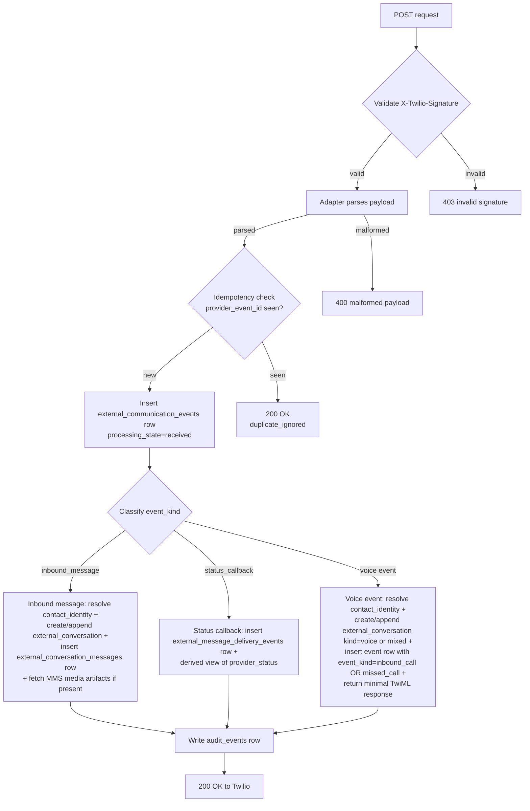
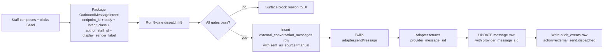

# PREFLIGHT — External-line first-touch (e1): Twilio adapter + substrate migration + 8-gate orchestration + settings precedence runtime + contact-identity sync + display projection + ops triage inbox UI MINIMUM + AI Response Assist stub

**Status:** PROPOSED — 2026-05-12 (Phase 4H, external-line arc, commit e1)
**Type:** Execution preflight — operational + code-focused. NO migrations land in this preflight; NO code lands in this preflight. The preflight is the BLUEPRINT for the execution commits (e1.1 through e1.N) that follow R-arc pressure-testing + approval.
**Inherits from:** e0 preflight ([PREFLIGHT_2026-05-12_phase_4h_external_line_e0_substrate_routing_design.md](PREFLIGHT_2026-05-12_phase_4h_external_line_e0_substrate_routing_design.md)) — 23 sections of design, 9 substrate sketches, 10 framing questions, 38 guardrails, 55-scenario matrix.
**Doctrine inheritance:** DL-10 (identity/relationship + handle-vs-person extension), DL-11 (three messaging surfaces; external-line is the third), DL-12 (lifecycle/fax/AI/template/search/visibility/notification/attachment/queue/coexistence/AI-Response-Assist + invariant 31 5-disposition extension), **DL-13** (rail-agnostic substrate spine + OMNI canonical source-of-truth + settings precedence + deterministic outbound 8-gate + display-projection-not-substrate), Radar zones 1-78 (zones 69-78 are DL-13-binding watch zones for e1 implementation regression).
**Doctrine introduced:** NONE — e1 inherits and EXECUTES; it does not introduce doctrine. (Same posture as e0.)
**Doctrinal alignment:** every section maps to a canonical home in MAIN / foundational / ADR / topology / radar / narrative per §5 below. e1 PREFLIGHT does not duplicate doctrine; it points at the binding home.
**Companion docs:** [PREFLIGHT_2026-05-12_phase_4h_external_line_e0_substrate_routing_design.md](PREFLIGHT_2026-05-12_phase_4h_external_line_e0_substrate_routing_design.md) (e0 design), [THOUGHT_EXPERIMENT_2026-05-12_dl13_second_rail_stripe_adapter_sketch.md](THOUGHT_EXPERIMENT_2026-05-12_dl13_second_rail_stripe_adapter_sketch.md) (DL-13 portability validation), [HANDOFF_2026-05-12_phase_4h_external_line_e0_doctrine_complete.md](HANDOFF_2026-05-12_phase_4h_external_line_e0_doctrine_complete.md) (DL-13 closing handoff).
**Scope guardrail (binding from user 2026-05-12):** do NOT re-describe phone-system requirements. e0 specified them across 23 sections (operator parity, contact identity, phone-system parity, settings taxonomy, multi-brand, display identity). e1 EXECUTES the subset defined by §3 below. R-arc pressure-test challenges scope partition, not phone-system requirements.

**R-arc state (updated 2026-05-12 evening — amendment commit):** R1 (substrate sanity) + R6 (ops inbox parity) completed; preflight amended in this revision. R3 (gates) is the next round. Other rounds (R2 adapter contract, R4 identity, R5 display projection, R7 Response Assist — now scope-removed, R8 sequencing, R9 verification gates) ordered after R3.

---

## §0 Twilio-as-rail boundary statement (binding)

This section exists so future-us doesn't drift into "let's just use Twilio for that" without remembering why we didn't. Tested in R1.

### §0.1 Twilio products we ARE using as transport (e1)

- **Programmable Messaging — SMS / MMS.** Inbound + outbound; webhooks + status callbacks; the rail for SMS/MMS traffic.
- **Programmable Voice — webhook only (e1).** Inbound voice webhook handler for missed-call event ingestion (per §6.17 + §8). Voice recording / transcription / playback deferred to e2.
- **Twilio webhook signature verification** (`X-Twilio-Signature`). Validated inside adapter (`lib/external-rails/twilio/webhook-validation.ts`).
- **Twilio MMS media URL fetch.** Adapter retrieves media bytes synchronously during webhook handling and stores in OMNI-controlled storage.

That's it for e1. Roughly 5-8% of Twilio's total surface area.

### §0.2 Twilio products we are explicitly NOT using and why

Each of these violates DL-13 invariants 1 or 2, or duplicates OMNI substrate that is healthcare-specific. Documented here so future-us doesn't try to adopt them.

- **Twilio Conversations** — a generic Conversation + Participant + Message substrate. **NOT USED** because Twilio would be the canonical conversation store (violates DL-13 invariant 2 / OMNI canonical); flat Conversation+Participant model can't represent DL-12 invariant 36 (internal-membership-vs-patient-visible-roster); vendor lock-in for substrate; future migration off Twilio becomes rewrite; HIPAA-eligibility status differs from Programmable Messaging. **OMNI's `external_conversations` + `external_conversation_messages` + `external_conversation_participants` substrate is canonical.**
- **Twilio Conversation Orchestrator** — auto-captures inbound channels into Twilio Conversations with grouping/timeout rules. **NOT USED** because the auto-capture is Twilio-Conversations-shaped; we want substrate ingest under our own control for 8-gate enforcement + audit + DL-10 identity resolution.
- **Twilio Conversation Memory** — per-customer context store for AI agents. **NOT USED** because customer context lives in OMNI's `patient_relationships` + clinical substrate; we don't duplicate a vendor-controlled context layer.
- **Twilio Conversation Intelligence** — sentiment / language operators / agent assist. **NOT USED** because clinical interpretation belongs in OMNI's clinical decision substrate; future sentiment / classification can fold in later via primitive #11 (AI runtime) as OMNI-internal, not Twilio-internal.
- **Twilio Flex** — hosted contact-center UI / agent workspace. **NOT USED** because Flex is its own surface; agents would work in TWO surfaces (Flex for calls/SMS + OMNI for clinical context); Flex can't embed `patient_relationship` awareness; OMNI's inbox is canonical.
- **Twilio TaskRouter** — Workers / Task Queues / Workflows / Reservations / skills-based routing. **NOT USED** because OMNI has `provider_tasking/` sibling reserved for queue routing; cross-substrate sync with TaskRouter would create dual-write requirements; healthcare-specific queue model (queue-routed work state machine per DL-12 invariant 30).
- **Twilio Enterprise Knowledge** — centralized AI knowledge base. **NOT USED** because OMNI's authoritative content lives in `repo/templates/`, `repo/rules/`, and clinical decision substrate; Enterprise Knowledge would create a separate canonical surface.

### §0.3 Twilio products we may OPTIONALLY adopt later (e2+; adapter-level SDK calls; substrate-discipline-preserving)

- **Twilio Lookup v2.** Phone intelligence (SIM swap detection, line type, caller name, identity match, SMS pumping risk). **e2 candidate** for ambiguity-status enrichment (reassigned number detection via SIM swap; line-type-aware deliverability; fraud risk). Adapter-level SDK call; doesn't violate substrate (no substrate changes; per-event enrichment writes to `contact_identities.ambiguity_status` / `external_communication_events.raw_provider_payload`).
- **Twilio Messaging Services.** Production sender pools (sticky sender, geo-match, link shortening, SMS pumping protection, compliance toolkit). **e2 candidate** alongside multi-endpoint UX. Adapter-level configuration; `org_communication_endpoints.provider_metadata` admits Messaging Service SID.
- **Twilio Voice Insights.** Call quality metrics. **e2+ candidate** when voice ships.

These optional adoptions stay adapter-level. Substrate stays rail-agnostic.

### §0.4 The boundary statement (binding)

OMNI is NOT building a phone company. OMNI is building an operational coordination platform that uses communication rails. Twilio is the SMS / MMS / voice rail. The substrate work above the rail is justified by DL-10 (relationship-aware identity that Twilio doesn't have), DL-12 (lifecycle / search / visibility / attachment / queue disciplines that Twilio doesn't have), DL-13 (rail-agnostic substrate + OMNI canonical + 8-gate + settings precedence + display-projection), and HIPAA-eligibility constraints. Code reviews flag any attempt to import Twilio Conversations / Orchestrator / Memory / Intelligence / Flex / TaskRouter / Enterprise Knowledge.

---

## §0.5 Compliance preconditions (precede architecture)

These BLOCK actual Twilio traffic — verify status BEFORE e1.1 ships any traffic, regardless of architecture progress.

### §0.5.A BAA with Twilio (HIPAA prerequisite)

External-line carries PHI (patient health information) when communicating with patients about clinical / billing / scheduling matters. SMS / MMS / Voice are Twilio's HIPAA-eligible product surface ONLY WITH a Business Associate Agreement (BAA) in place. Status today: **VERIFY before e1.1**. If absent, no PHI may transit Twilio until BAA executed.

### §0.5.B A2P 10DLC registration (US SMS deliverability)

Application-to-person (A2P) SMS in the US requires brand + campaign registration with The Campaign Registry (TCR) via Twilio. Without registration:

- Carriers may filter / throttle outbound SMS to US recipients.
- Deliverability degrades; some messages silently drop.
- Trust scores affect throughput.

Status today: **VERIFY before e1.1**. Every Twilio number used for outbound SMS to US recipients must be in a registered A2P 10DLC campaign. Long-code numbers especially. Toll-free numbers use a different verification flow (per §0.5.C).

### §0.5.C Toll-free verification (if applicable)

If any `org_communication_endpoints` row uses a toll-free Twilio number, separate toll-free SMS verification with Twilio + carriers is required. **VERIFY before e1.1** if any toll-free endpoints exist.

### §0.5.D HIPAA-eligible products only

Stick to Twilio's published HIPAA-eligible product list when carrying PHI. e1 uses Programmable Messaging (SMS/MMS) and Programmable Voice (webhook only for missed-call ingestion). Confirm both are on the eligible list at e1.1 time (eligibility status can change with new Twilio releases).

### §0.5.E Failure-mode handling

If any of §0.5.A–D is unverified or absent at e1.1 start, abort e1.1 and resolve first. Architecture is irrelevant if traffic can't legally / compliantly flow.

---

## §1 Substrate-reality audit

Re-verify the green-field state as of e1 preflight time (re-audit at e1.1 start required per §23 verification gates):

- `messages.patient_id NOT NULL` constraint — UNCHANGED. e1 NEVER nullifies this. c2 stays patient-scoped.
- `message_threads.patient_id NOT NULL`, `message_threads.care_program_id NOT NULL UNIQUE` — UNCHANGED.
- No `contact_identities` table — green-field; e1 creates.
- No `org_communication_endpoints` table — green-field; e1 creates.
- No `external_conversations` / `external_conversation_messages` / `external_conversation_artifacts` / `external_message_delivery_events` / `external_conversation_drafts` — green-field; e1 creates.
- No `patient_projection_links` table — green-field; e1 creates.
- No `lib/external-rails/` directory — green-field; e1 creates `lib/external-rails/twilio/`.
- `lib/notifications/smsTwilio.ts` — existing placeholder stub, env-gated, NOT INTEGRATED. e1 SUPERSEDES this with the proper adapter under `lib/external-rails/twilio/`. The stub file is either deleted at e1 cutover (if no callers) or marked DEPRECATED-AFTER-PARITY (if any callers exist; replicate behavior under new adapter first; then delete). Re-audit at e1.1 confirms callers.
- `patient_consents` substrate exists (per §1K.11); e1 EXTENDS for intent-class scoping (deferred to specific e1 commit; not a new table).
- `audit_events` substrate exists; e1 EXTENDS taxonomy with external-line action codes (added to `lib/events/audit-actions.ts`).
- `outbound_jobs` substrate exists; external-line outbound goes through `outbound_jobs` per primitive #10 + DL-13 8-gate orchestration above.
- DL-13 is in MAIN as of commit `d57c297` (2026-05-12); foundational §7.13.13 + ADR §7.16 + topology §11/§12 + radar zones 69-78 + evolution narrative Act XIV are bound.

**Failure mode if audit drifts before e1.1 starts:** a migration that lands between PROPOSED and e1.1 (e.g., a `chat_status` column on conversations, or a `twilio_message_sid` column on messages) would foreclose e1's design — abort e1.1, fix the foreclosing migration first, re-audit. Per §23 verification gates.

---

## §2 Doctrine inheritance (binding)

Every line of e1 implementation inherits from the following doctrine. e1 does not re-litigate; e1 executes.

- **DL-10** — `patient_relationships` is the operational-scope layer; brand is one of N scoping dimensions; identity-namespace = OMNI deployment per PHI boundary. `contact_identities` is Layer 1 above `patients`; handle-vs-person extension admits phone-as-handle (family / spouse / shared / typo / fraud-substituted).
- **DL-11** — External-line is the THIRD messaging surface (alongside c2 patient-facing chat and `internal_collaboration/`). External-line has its OWN substrate; NEVER merges into `messages`.
- **DL-12** — Thread + participant lifecycle is cross-substrate; 28 binding clarifications apply. Specific subsections e1 consumes:
  - Invariant 1 — staff deactivation lifecycle (ownership reassignment before deactivation).
  - Invariant 8 — retention parameterized by thread class.
  - Invariant 14-16 — AI participation bounds + authorship attribution + anti-noise (extended by DL-13 invariant 4 for external).
  - Invariant 21 — patient notification preferences + criticality override.
  - Invariant 23 — message edit / correction / retraction preserves history.
  - Invariant 26 — anti-panopticon discipline on search/visibility.
  - Invariant 30 — queue-routed work state machine (delivered_to_queue / unread_by_queue / seen_by_queue_member / claimed_by_staff / completed/escalated_or_overdue).
  - Invariant 31 — three-state attachment lifecycle (chat-attachment → reviewed/classified → filed-to-chart) + DL-13 5-disposition extension (link / attach / chart_file / safety_task / reject_spam) on external-line projection.
  - Invariant 39 — AI Response Assist replaces screenshot-into-external-AI workflow.
- **DL-13** — five invariants binding e1 implementation:
  1. **Rail-agnostic substrate + vendor-confined adapter.** Generic `provider_*` columns; Twilio code confined to `lib/external-rails/twilio/`.
  2. **OMNI canonical source-of-truth + vendor-adopt-not-write.** `patients.id` + `patient_relationships.id` + `contact_identities.id` canonical; Twilio Conversation SID / Contact SID / Message SID are convenience identifiers stored on `provider_*` columns.
  3. **Settings precedence (six-level top-down).** Law/consent > safety > endpoint > queue > user > device.
  4. **Deterministic outbound 8-gate.** Endpoint-intent + consent + STOP/HELP + template/disclosure + quiet-hours + idempotency + rate-limit + prohibited-claims. AI confirmation NOT a gate.
  5. **Display-projection-not-substrate.** Display identity + status chips computed at query; NO `chat_status` / `lead_stage` / `display_state` mutable columns on conversations / messages / contact identities.
- **Radar zones 69-78** — DL-13-binding watch zones; e1 implementation regression detection. Zone 69 (rail-bypass drift) + zone 70 (vendor-as-contact-source drift) + zone 71 (chat_status-independent-field drift) + zone 72 (multi-brand cross-leakage drift) + zone 73 (STOP-cascading-across-intents drift) + zone 74 (display projection drift from substrate) + zone 75 (settings-precedence inversion drift) + zone 76 (endpoint-policy-via-jsonb drift) + zone 77 (voicemail-auto-files-to-chart drift) + zone 78 (AI-as-participant drift on external conversations).

---

## §3 Scope — MUST vs DEFERRED partition (binding)

This section is THE binding scope statement for e1. Every implementation commit asks: "is this in §3 MUST?" If not, defer.

### §3.A MUST land in e1 (operational + code; no exceptions without explicit user re-approval)

**Amended 2026-05-12 evening per R1+R6 findings.** AI Response Assist + body full-text search + bulk actions + multiple inbox sub-views CUT (moved to §3.B). Voice event ingestion + missed-call rows + internal notes + tags + per-staff unread + ambiguity UI + callback reminders + mobile responsive + apparent-identity columns + Mark-as-reassigned + SPLIT UI + concurrent-claim partial unique index + gate-6 dedupe extension + off-duty cascade + gate-override UI ADDED.

| Capability | Substrate / Code | Notes |
|---|---|---|
| Twilio adapter (SMS inbound + outbound; voice webhook lightweight) | `lib/external-rails/twilio/` | Adapter contract per §7. Replaces `lib/notifications/smsTwilio.ts` placeholder. Voice webhook handler for missed-call ingestion only (no recording/transcription/playback). |
| Webhook ingest (signature validation + idempotency; inbound message + status callback + voice event) | `lib/external-rails/twilio/webhooks/` + API routes | Per §8. |
| `communication_rails` substrate (rail type registry; SMS + MMS + voice + voicemail + fax slot reserved) | Migration | Per §6.1. |
| `org_communication_endpoints` substrate (single-brand minimum; admits multi-brand schema-wise) | Migration | Per §6.2. |
| `contact_identities` substrate (phone_e164 normalized + indexed; ambiguity_status flags; **e2 child handles RESERVED — code MUST NOT harden 1-handle-per-identity assumptions**) | Migration | Per §6.3 + §6.3.A future-shape reservation. |
| `external_communication_events` substrate (immutable rail event ledger; `provider_event_id` idempotency key; retention class explicit) | Migration | Per §6.4. |
| `external_conversations` substrate (endpoint-scoped + contact-identity-linked) | Migration | Per §6.5. |
| `external_conversation_messages` substrate (generic `provider_*` columns; intent_class; author + sent_as_source attribution; **`apparent_identity_id` + `apparent_patient_relationship_id` columns for per-message ambiguity disambiguation**) | Migration | Per §6.6. |
| `external_message_delivery_events` substrate (provider status callback append-only stream) | Migration | Per §6.7. |
| `external_conversation_drafts` substrate (**personal drafts only in e1 UI**; AI proposal column admitted but no UI; shared-queue drafts deferred to e2) | Migration | Per §6.8. |
| `external_conversation_artifacts` substrate (**MMS inbound + outbound MUST**; voicemail artifact rows admitted but not populated in e1; soft delete only) | Migration | Per §6.9. |
| `external_conversation_participants` substrate (staff who claimed / assigned; **`last_read_at` per-staff unread tracking**; **partial unique index on claimed_owner**) | Migration | Per §6.10. |
| `external_conversation_queue_state` substrate (queue-routed work state machine per DL-12 invariant 30) | Migration | Per §6.11. |
| `patient_projection_links` substrate (5-disposition admission per DL-12 invariant 31 extension; **system user UUID pattern for automation actor**) | Migration | Per §6.12. |
| **`external_conversation_notes` substrate (internal notes)** | Migration | Per §6.14. New. |
| **`external_conversation_tags` substrate (free-form tags in e1; controlled vocabulary deferred to e2)** | Migration | Per §6.15. New. |
| **Callback reminders via `patient_action_items` polymorphic target** | Existing substrate extension | Per §6.16. New composition. |
| **Voice event ingestion (`inbound_call` / `missed_call` event_kind admission)** | Adapter + webhook + substrate | Per §6.17 + §8. New. |
| 8-gate orchestration layer (gates 1, 2, 3, 6, 8 ENFORCED; gates 4, 5, 7 FAIL-OPEN GRACEFULLY with logging) | `lib/external-line/dispatch/` | Per §9 (amended for fail-open posture + gate-6 dedupe extension + gate-override UI flow). |
| Settings precedence runtime | `lib/external-line/settings-precedence/` | Per §10. Six-level evaluation. |
| Contact-identity sync orchestrator (manual scheduling creation → handle publish; retroactive projection; **Mark-as-reassigned action + basic SPLIT UI**) | `lib/external-line/identity-sync/` | Per §11 (amended). |
| Display projection layer (status chips + display identity computed at query) | `lib/external-line/projection/` | Per §12. No mutable substrate columns. |
| Outbound endpoint selection UI ("Replying as / Sending from") | `app/(staff)/inbox/external-line/` components | Per §13. |
| Draft semantics implementation (**personal drafts + stale-warning ONLY**; AI proposal drafts removed from UI scope) | substrate + UI | Per §14 (amended). |
| MMS inbound + **MMS outbound** (UI media display inline; outbound compose accepts `media_urls[]`; scan stub gates access until clear) | adapter + substrate + UI | Per §16 (amended). |
| Ops triage inbox UI MINIMUM (list + detail + claim + reply + archive + spam + restrict + **search by phone/name only** + filter by endpoint/queue/status/date + capability/endpoint/relationship-scoped visibility + **internal notes panel** + **tags chips** + **per-staff unread badge** + **ambiguity-status indicator** + **callback reminder action** + **missed-call rows + click-to-callback (`tel:`)** + **gate-override UI flow** + **Mark-as-reassigned + SPLIT entry** + **reply-time identity/relationship picker for ambiguous handles**) | `app/(staff)/inbox/external-line/` | Per §17 (amended). |
| **Mobile responsive inbox UI MUST (375px-wide viewport baseline)** | UI design | Per §17.6. |
| **Off-duty claim cascade worker** (claimed_owner released when staff goes off-duty; conversation returns to queue with audit) | Worker + substrate | Per §17.5 + §1D.3 staff notification preferences. |
| `audit_events.action` taxonomy extension for external-line (**including `gate_override.applied`, `contact_identity.marked_reassigned`, `contact_identity.split`, `external_conversation.note_added`, `external_conversation.tag_added`, `external_conversation.callback_reminder_scheduled`, `external_conversation.claim_transferred`, `external_conversation.claim_released_off_duty`**) | `lib/events/audit-actions.ts` | Per §19.A (amended). |
| `patient_timeline_events.event_type` taxonomy extension for external-line projection events | `lib/events/timeline-event-types.ts` | Per §19.A. |
| RLS for external-line tables (org_id + capability-scoped + relationship-scoped per §1J.13(e)) | Migration | Per §6.13. |
| Tests + observability (**including override-rate metric, concurrent-send dedupe tests, concurrent-claim race tests, off-duty cascade tests, ambiguity-UI tests**) | Per §19 (amended) | |

### §3.B DEFERRED to e2 (named explicitly so they cannot creep into e1)

**Updated 2026-05-12 evening: AI Response Assist moved here from §3.A; body FTS moved here; bulk actions and sub-views moved here.** AI Response Assist is its own separate post-e1 arc.

| Capability | Why deferred |
|---|---|
| **AI Response Assist (all capabilities — polish, summarize, classify-urgency, propose-action-items, clinically-cautious, warmer-shorter-safer)** | **CUT from e1 per R1+R6 amendment.** Separate post-e1 arc with own preflight + R-arc. Substrate columns `ai_proposal_id` + `ai_provenance` on `external_conversation_messages` REMAIN admitted (no DDL change needed when arc lands). Until that arc ships, the screenshot-into-ChatGPT anti-pattern (zone 67) remains a known operational gap. |
| **Body full-text search** | **CUT from e1 per R1+R6 amendment.** e1 supports phone + name search only. Body FTS index admissible later without DDL contortion (Postgres `tsvector` on `body` column). |
| **Bulk inbox actions** (claim 10 / archive 5 / spam multiple) | **CUT from e1 per R1+R6 amendment.** Per-conversation actions in e1; bulk in e2. |
| **Multiple inbox sub-views** (per-endpoint, per-queue, my-claimed) | **CUT from e1 per R1+R6 amendment.** Unified view with filters in e1; sub-views in e2. |
| **`contact_identity_handles` child table** | **e2 candidate; future-shape RESERVED in e1.** e1 models one handle per `contact_identities` row. **e1 code MUST NOT harden 1-phone-per-identity / 1-email-per-identity / 1-handle-per-identity assumptions** — substrate access uses lookup-by-handle-value (e.g., `contact_identities WHERE phone_e164 = ?`), NOT lookup-by-id-with-implicit-uniqueness. e2 may introduce `contact_identity_handles` child table while preserving canonical identity semantics; e1 code must absorb that change without rewrite. |
| Voicemail audio + transcript artifacts + state machine | Larger surface; needs transcription pipeline + queue UI. Substrate columns admit (per §6.9) but full pipeline is e2. Missed-call EVENT visibility is in e1 (per §6.17 + §8); voicemail content is e2. |
| Voice (full inbound/outbound call handling; click-to-call from inbox using OMNI-initiated Twilio voice; not just `tel:` link) | Larger surface; admit via `communication_rails` + `org_communication_endpoints` rail_kind enum but no full call-handling UI in e1. |
| Multi-endpoint per location (front-desk + on-call + manager + billing + aftercare + brand-specific) | Single endpoint per brand in e1; substrate admits multi but UI doesn't materialize multi-endpoint experience until e2. |
| Multi-brand operating modes (4 brand × 3 backend mode-agnosticism) | Single-brand baseline in e1; substrate admits multi-brand columns; UI + onboarding flow is e2/e3. |
| Shared-queue drafts | Personal drafts in e1 UI; shared-queue draft semantics + UI in e2. |
| Media classification + annotation editor | MMS accept (inbound + outbound) in e1; classification + annotation deferred to e2. |
| 5-disposition UI for artifact projection | Substrate admits (per §6.12); UI for link / attach / chart_file / safety_task / reject_spam is e2. |
| Search audit + reason-coded compliance/break-glass search | Ordinary endpoint-scope search + capability filter in e1; reason-coded audit for restricted/projected-clinical conversations is e2. |
| STOP/HELP cascade implementation (8-gate gate 3 logic for cross-channel) | Single-channel STOP in e1 (per intent class per endpoint); cross-channel + cross-intent reciprocal logic in e2. |
| Pinned conversations | Defer to e2. Not operationally critical for first ship. |
| Tags controlled vocabulary (admin-curated tag registry; type-ahead from registry) | e2. Free-form tags in e1. |
| Twilio Lookup v2 integration (SIM swap detection / line type / caller name / identity match / SMS pumping risk) | e2 candidate; adapter-level SDK call; enriches `contact_identities.ambiguity_status`. Doesn't violate substrate. |
| Twilio Messaging Services (production sender pools, sticky sender, geo-match) | e2 candidate alongside multi-endpoint UX. |
| Reminder fatigue smart prioritization (sort / mute / snooze logic for callback reminders) | Simple "due now" surfacing in e1; smart prioritization in e2. |
| Auto-detection of reassigned numbers (vs manual "Mark as reassigned" in e1) | e1 has manual action; auto-detection via Lookup v2 SIM swap signal in e2. |
| Multi-queue routing (endpoint routes to multiple queues based on classification) | Single default queue per endpoint in e1; multi-queue routing alongside `provider_tasking/` sibling activation (e2+). |
| Provider-reassignment cascade to external-line visibility | Until care-team/coverage substrate activates, e1 doesn't auto-propagate provider reassignment to external-line participant membership. Known gap documented in §17. |

### §3.C DEFERRED to e3 (named explicitly; further out)

| Capability | Why deferred |
|---|---|
| Fax-inbound full pipeline | Per DL-12 + topology §13 — fax composes from primitives; full activation is e3 or later. |
| RCS / WhatsApp / iMessage adapters | New adapters at `lib/external-rails/<provider>/`; not e1. |
| Outbound marketing campaigns through external-line | §1Q + DL-13 8-gate inheritance; campaign-class sends are e3+. |
| Multi-brand UX (brand toggle UI + per-brand inbox views) | e3 brand-onboarding flow. |
| In-clinic Stripe Terminal / POS integration | Per multi-consumer adapter placement question; e3+ scheduling-deposit or POS work. |
| Patient-proxy / caregiver / parent-on-behalf-of-minor actor type | Future preflight named in DL-12 closing handoff. |
| Voice notes (patient-facing voice messages distinct from voicemail) | Future preflight named in DL-12 closing handoff. |
| AI translation | Future preflight named in DL-12 closing handoff. |
| Video sessions | Future preflight named in DL-12 closing handoff. |
| Emergency bypass | Future preflight named in DL-12 closing handoff. |

---

## §4 Explicit out-of-scope (binding)

**Amended 2026-05-12 evening.** AI Response Assist + body FTS + bulk actions + sub-views + provider-reassignment cascade moved to explicit out-of-scope. Missed-call event ingestion + MMS outbound + notes + tags + per-staff unread + ambiguity UI + callback reminders + Mark-as-reassigned + SPLIT + mobile responsive REMOVED from out-of-scope (now in §3.A MUST per amendment).

e1 does NOT:

- Build voicemail audio recording / transcription pipeline / playback UI (missed-call EVENT visibility IS in e1; voicemail CONTENT pipeline is e2).
- Build full voice call handling UI (e1 voice limited to missed-call webhook ingest + `tel:` click-to-callback link; full call handling — OMNI-initiated outbound calls / live call UI / call recording — is e2).
- Build AI Response Assist of any capability (CUT entirely per R1+R6 amendment; separate post-e1 arc).
- Build multi-brand onboarding flow or per-brand inbox toggle (e2/e3).
- Build annotation editor or photo markup tools (e2).
- Build outbound campaign system (e3+).
- Build bulk inbox actions (e2).
- Build per-endpoint / per-queue / my-claimed sub-views (e1 unified view + filters; sub-views in e2).
- Build body full-text search (e1 phone+name search; body FTS in e1+).
- Build pinned conversations (e2).
- Build admin-controlled tag vocabulary (free-form tags in e1; vocabulary in e2).
- Build automatic provider-reassignment cascade to external-line visibility (known gap until care-team/coverage substrate; manual retag in e1).
- Integrate Twilio Lookup v2 (e2 candidate, adapter-level).
- Integrate Twilio Messaging Services (e2 candidate, adapter-level).
- Build automatic reassigned-number detection (e1 has manual "Mark as reassigned"; auto-detection in e2 via Lookup v2).
- Touch `messages` / `message_threads` / `patient_inbox_messages` substrate.
- Add a `chat_status` / `lead_stage` / `display_state` mutable column to any substrate (radar zone 71).
- Add `twilio_*`-named columns to any substrate (radar zone 69).
- Read from Twilio's Conversations / Customer / address-book stores to resolve OMNI identity (radar zone 70).
- Use Twilio Conversations / Conversation Orchestrator / Conversation Memory / Conversation Intelligence / Flex / TaskRouter / Enterprise Knowledge as substrate or operational platform (per §0.2).
- Activate `communications_lifecycle/` sibling folder beyond its existing partial state.
- Activate `internal_collaboration/` sibling (DL-11 sibling #19 — separate future activation).
- Migrate the placeholder `lib/notifications/smsTwilio.ts` callers without replacement (DEPRECATE-AFTER-PARITY; replicate behavior under `lib/external-rails/twilio/` first).
- Introduce doctrine (DL-13 is the doctrine; e1 executes).
- Make schema decisions that contradict §6 substrate sketches.

If a sub-task feels like one of these, escalate before proceeding.

---

## §5 Doctrinal alignment table

| Doctrine | Where it lives | What e1 inherits |
|---|---|---|
| **DL-10 Identity / Relationship + handle-vs-person extension** | MAIN system map DL-10 + §1J.13 + foundational §7.13 + §7.13.13 + topology §11 | Contact identity is Layer 1; phone is a handle, not always one person; `contact_identities` + future `contact_identity_handles`. e1 normalizes phone_e164 + admits ambiguous-handle / shared-handle / typo / reassigned states (substrate columns; UI for split/merge deferred to e2). |
| **DL-11 Three Messaging Surfaces** | MAIN DL-11 + topology §12 | External-line is the third sibling. e1 lands the substrate spine + ops triage UI. |
| **DL-12 (28 binding clarifications)** | MAIN DL-12 + per-section binding subsections + foundational §4.A / §5.3 / §7.13.12 / §7.14.9-10-18 / §8.1 + ADR §7.15 + topology §12 cross-references + radar zones 43-67 | e1 consumes invariants 1, 8, 14-16, 21, 23, 26, 30, 31, 39 (per §2 above). |
| **DL-13 Rail-agnostic substrate spine + OMNI canonical + settings precedence + 8-gate + display-projection** | MAIN DL-13 + §1D.4 + §1G.12 + §1J.13 + §1N.9 + §1P.15 + §1Q.14.2 + §1V.11 + foundational §4.B + §5 sibling #20 + §5.3(c) + §7.13.13 + §8.1 clauses 29-33 + ADR §7.16 + topology §11 substrate spine + §12 DL-13 cross-references + radar zones 69-78 + evolution narrative Act XIV | Five invariants binding e1 implementation. |
| **e0 first-touch preflight** | [PREFLIGHT_2026-05-12_phase_4h_external_line_e0_substrate_routing_design.md](PREFLIGHT_2026-05-12_phase_4h_external_line_e0_substrate_routing_design.md) | 23 sections of design that e1 EXECUTES. |
| **Stripe portability sketch** | [THOUGHT_EXPERIMENT_2026-05-12_dl13_second_rail_stripe_adapter_sketch.md](THOUGHT_EXPERIMENT_2026-05-12_dl13_second_rail_stripe_adapter_sketch.md) | Multi-consumer adapter placement: NOT relevant to e1 (Twilio is single-consumer); recommendation deferred to first multi-consumer activation (foundational §7.13.13.6 + DL-13 handoff). |
| **Radar zones (all + 69-78 most relevant)** | [v1_pressure_test_radar.md](../../docs/architecture/v1_pressure_test_radar.md) | Zone 28 (metadata-jsonb anti-pattern), zones 47-48 (substrate concerns), zone 51 (AI thread spam), zone 53 (anti-panopticon search), zone 54 (notification suppression bypass), zone 56 (queue-handled-by-read-receipt), zone 59 (attachment auto-files), zone 66 (membership hardcoded), zone 67 (screenshot-into-external-AI), zones 69-78 (DL-13 binding) all apply to e1 implementation regression. |
| **c2 non-foreclosure** | [PREFLIGHT_2026-05-11_phase_4h_in_app_inbox_c2_rich_chat_rendering.md](PREFLIGHT_2026-05-11_phase_4h_in_app_inbox_c2_rich_chat_rendering.md) | `messages.patient_id NOT NULL` stays binding; external-line NEVER merges into `messages`. |

---

## §6 Substrate migration sketches (DDL shape — NOT actual migrations)

This section sketches column shape for each table. Actual migration files land in e1.1 commit (substrate migration commit). DDL syntax is illustrative; final migration uses the project's idempotent + audited migration framework.

### §6.1 `communication_rails`

Rail type registry (abstract; vendor-agnostic).

```
communication_rails
  id (uuid, PK)
  rail_kind (text, NOT NULL, CHECK in ('sms','mms','voice','voicemail','fax','email','whatsapp','rcs','imessage'))
  display_name (text, NOT NULL)
  capability_descriptor (jsonb, NOT NULL)  -- RailCapability (delivery receipts, MMS support, etc.) per §7.5
  is_active (boolean, NOT NULL, DEFAULT true)
  created_at / updated_at / audit columns
  unique(rail_kind)
```

e1 seeds rows: `sms`, `mms` (admits voice/voicemail/fax slot reservation but rails inactive until e2/e3).

### §6.2 `org_communication_endpoints`

Concrete endpoints owned by org/brand/location.

```
org_communication_endpoints
  id (uuid, PK)
  org_id (uuid, NOT NULL, FK orgs.id)
  brand_id (uuid, NULL, FK brands.id)
  practice_entity_id (uuid, NULL, FK practice_entities.id)
  location_id (uuid, NULL, FK locations.id)
  rail_id (uuid, NOT NULL, FK communication_rails.id)
  label (text, NOT NULL)                       -- "Cultured Main Line" / "Somerset Front Desk"
  intent_class (text, NOT NULL, CHECK in ('marketing','clinical','billing','support','aftercare','appointment','mixed','transactional'))
  default_queue_id (uuid, NULL, FK provider_tasking_queues.id)  -- nullable for e1 since provider_tasking sibling not active
  access_scope (jsonb, NOT NULL)               -- structured: which roles/teams/queues may see this endpoint's conversations
  business_hours (jsonb, NOT NULL)             -- structured per-day windows
  after_hours_behavior (jsonb, NOT NULL)       -- structured: voicemail / auto-reply / forward-to-queue
  voicemail_config (jsonb, NULL)               -- e2 fills this in
  forwarding_policy (jsonb, NULL)              -- e2 fills this in
  blocked_numbers (text[], NULL)               -- E.164 list
  trusted_numbers (text[], NULL)               -- E.164 list
  auto_reply_template_id (uuid, NULL)          -- FK templates.id (e1 admits; rule-fired)
  default_outbound_label (text, NULL)          -- patient-side rendering ("Cultured Front Desk")
  provider_kind (text, NOT NULL)               -- 'twilio' for e1
  provider_endpoint_id (text, NOT NULL)        -- Twilio Phone Number SID
  provider_metadata (jsonb, NULL)              -- vendor-only extras (e.g., Twilio Messaging Service SID if used)
  is_active (boolean, NOT NULL, DEFAULT true)
  created_at / updated_at / audit columns
  unique(org_id, provider_kind, provider_endpoint_id)
  index(org_id, intent_class, is_active)
```

**Endpoint policy goes into structured columns**, not `metadata` jsonb (zone 76). Vendor-specific extras (Twilio-only fields) in `provider_metadata jsonb`.

### §6.3 `contact_identities`

Master identity for external parties (per DL-10 handle-vs-person extension; DL-13 invariant 2).

```
contact_identities
  id (uuid, PK)
  org_id (uuid, NOT NULL, FK orgs.id)
  phone_e164 (text, NULL)                       -- normalized; indexed
  email (citext, NULL)
  display_name (text, NULL)                     -- staff-entered or extracted
  handle_kind (text, NOT NULL, CHECK in ('phone','email','whatsapp','external'))
  ambiguity_status (text, NOT NULL, DEFAULT 'unknown',
    CHECK in ('unknown','confident','ambiguous','shared','typo_suspected','reassigned_suspected'))
  source (text, NOT NULL, CHECK in ('inbound_observed','scheduling_manual','intake_form','partner','staff_lookup','merge_split'))
  source_actor_id (uuid, NULL, FK staff_profiles.id)  -- for scheduling_manual / staff_lookup / merge_split
  is_blocked (boolean, NOT NULL, DEFAULT false)
  is_spam (boolean, NOT NULL, DEFAULT false)
  notes (text, NULL)
  created_at / updated_at / audit columns
  unique(org_id, phone_e164) WHERE phone_e164 IS NOT NULL
  unique(org_id, email) WHERE email IS NOT NULL
  index(org_id, phone_e164)                     -- substring + prefix search index in e1
  index(org_id, email)
```

**Future `contact_identity_handles` child table is admitted but not built in e1.** When second handle type per contact identity becomes operational (e.g., a contact identity links phone + email + WhatsApp), `contact_identity_handles` becomes the canonical multi-handle store. Until then, one row per (org_id, handle_value, handle_kind) tuple is acceptable.

### §6.3.A Future-shape reservation (binding — added 2026-05-12 amendment)

**Per R1+R6 ChatGPT caveat.** e1 models one handle per `contact_identities` row (phone OR email OR WhatsApp OR external — one canonical column per row, with `handle_kind` discriminator). The substrate admits this shape via the structure above. The migration cost to e2's `contact_identity_handles` child table is significant if e1 code hardens the 1-handle assumption. **e1 code MUST therefore observe the following discipline:**

- **Substrate access uses lookup-by-handle-value**, NOT lookup-by-contact-identity-direct-column. Example: webhook handler resolves identity via `SELECT * FROM contact_identities WHERE phone_e164 = $1`, not `SELECT phone_e164 FROM contact_identities WHERE id = $1`. The first pattern survives the migration; the second pattern hardens 1-handle-per-identity.
- **Application code MUST NOT assume** "this `contact_identities` row represents the patient's only phone" or "this email is THE email." It represents ONE handle observation. Future child table will be the canonical multi-handle store; e1 code must absorb that change.
- **Display layer (per §12) must render `display_name` + handle-discriminator-aware fallback** ("Sarah Miller" + "+1 248 555..." vs "+1 248..." alone). Not "this is Sarah's number."
- **Identity-altering operations** (link, unlink, merge, split) operate on `contact_identities.id` only — they do NOT assume one handle equals one identity.

**Future e2 may introduce `contact_identity_handles` child table while preserving canonical identity semantics.** The child table will admit one row per (contact_identity_id, handle_kind, handle_value); existing `contact_identities` table either drops the handle columns (migrate to child) OR retains primary handle for performance + adds child for additional handles. Either path requires e1 code to NOT have hardened 1-handle assumptions.

**Migration-pain trap watch:** any code review where the change "would break if a single contact_identity had two phones" flags as zone 70 sibling (vendor-as-contact-source drift's structural cousin: single-handle-as-identity drift). Reject the code; refactor to lookup-by-handle-value.

### §6.4 `external_communication_events`

Immutable rail event ledger.

```
external_communication_events
  id (uuid, PK)
  org_id (uuid, NOT NULL, FK orgs.id)
  endpoint_id (uuid, NOT NULL, FK org_communication_endpoints.id)
  rail_id (uuid, NOT NULL, FK communication_rails.id)
  provider_kind (text, NOT NULL)                -- 'twilio'
  provider_event_id (text, NOT NULL)            -- Twilio Message SID for SMS/MMS; Call SID for voice; etc.
  event_kind (text, NOT NULL)                   -- 'inbound_message' / 'outbound_message' / 'status_callback' / 'call_event' / etc.
  occurred_at (timestamptz, NOT NULL)           -- vendor-reported timestamp
  received_at (timestamptz, NOT NULL, DEFAULT now())  -- OMNI-side receive timestamp
  raw_provider_payload (jsonb, NOT NULL)        -- preserved verbatim for audit/replay
  contact_identity_id (uuid, NULL, FK contact_identities.id)  -- resolved at ingest (may be NULL until resolved)
  external_conversation_id (uuid, NULL, FK external_conversations.id)  -- resolved at ingest
  external_conversation_message_id (uuid, NULL, FK external_conversation_messages.id)
  processing_state (text, NOT NULL, CHECK in ('received','processed','failed','duplicate_ignored'), DEFAULT 'received')
  processing_error (text, NULL)
  retention_class (text, NOT NULL, DEFAULT 'external_communication')  -- per amendment; 7-year default; configurable per org
  audit columns (no update path; APPEND-ONLY)
  unique(org_id, provider_kind, provider_event_id)  -- idempotency
  index(org_id, endpoint_id, occurred_at)
```

`provider_event_id` is the **idempotency key** per DL-13. Webhook replays + duplicate vendor webhooks dedupe here.

### §6.5 `external_conversations`

Conversation thread (endpoint-scoped + contact-identity-linked).

```
external_conversations
  id (uuid, PK)
  org_id (uuid, NOT NULL, FK orgs.id)
  endpoint_id (uuid, NOT NULL, FK org_communication_endpoints.id)
  contact_identity_id (uuid, NOT NULL, FK contact_identities.id)
  conversation_kind (text, NOT NULL, CHECK in ('sms','mms','voice','voicemail','mixed'))
  first_event_at (timestamptz, NOT NULL)
  last_event_at (timestamptz, NOT NULL)
  closed_at (timestamptz, NULL)
  archived_at (timestamptz, NULL)
  spam_at (timestamptz, NULL)                   -- marked spam
  restricted_at (timestamptz, NULL)             -- capability-gated narrower visibility
  entered_in_error_at (timestamptz, NULL)       -- compliance-only via break-glass
  entered_in_error_reason (text, NULL)
  entered_in_error_actor_id (uuid, NULL, FK staff_profiles.id)
  created_at / updated_at / audit columns
  index(org_id, endpoint_id, last_event_at DESC)
  index(org_id, contact_identity_id, last_event_at DESC)
```

**NO `chat_status` / `display_status_chip` / `current_label` mutable columns** (zone 71). Display state is computed at query time per §12.

### §6.6 `external_conversation_messages`

Inbound + outbound messages.

```
external_conversation_messages
  id (uuid, PK)
  org_id (uuid, NOT NULL, FK orgs.id)
  external_conversation_id (uuid, NOT NULL, FK external_conversations.id)
  endpoint_id (uuid, NOT NULL, FK org_communication_endpoints.id)
  direction (text, NOT NULL, CHECK in ('inbound','outbound'))
  intent_class (text, NULL)                     -- 'marketing'/'clinical'/'billing'/'support'/'aftercare'/'appointment'/'transactional' (per DL-13 invariant 4 gate 1); NULL for inbound until classified
  body (text, NOT NULL)                         -- final body actually sent / received
  media_artifact_ids (uuid[], NOT NULL, DEFAULT '{}')  -- references external_conversation_artifacts (MMS attachments)
  author_staff_id (uuid, NULL, FK staff_profiles.id)  -- NULL for inbound; NULL for system/automation outbound; set for staff/staff_with_ai_assist outbound
  author_actor_type (text, NOT NULL,
    CHECK in ('patient','staff','staff_with_ai_assist','system','automation'))  -- 'ai_assisted' NOT admitted (DL-13 invariant 4)
  sent_as_source (text, NULL, CHECK in ('manual','template','rule','campaign','scheduled','ai_assisted_human_approved'))  -- outbound only; 'ai_assisted_human_approved' admitted but no UI in e1 (AI Response Assist deferred)
  outbound_endpoint_id (uuid, NULL, FK org_communication_endpoints.id)  -- for outbound
  display_sender_label (text, NULL)             -- patient-side rendering label ("Cultured Front Desk"); denormalized per amendment R1 finding (endpoint label can change but message remembers what it was sent under)
  template_id (uuid, NULL, FK templates.id)     -- if sent_as_source = template / rule / campaign / scheduled
  rule_id (uuid, NULL)                          -- if rule-fired
  trigger_event_id (text, NULL)                 -- for idempotency on rule-fired sends
  ai_proposal_id (uuid, NULL)                   -- if staff_with_ai_assist (no UI in e1; column admitted for AI Response Assist post-e1 arc)
  ai_provenance (jsonb, NULL)                   -- ai_model + ai_confidence + edit-distance from proposal (no UI in e1)
  apparent_identity_id (uuid, NULL, FK contact_identities.id)  -- per-message identity disambiguation when conversation handle is shared/ambiguous (per amendment R6 finding; reply UI picker sets this for shared-handle conversations)
  apparent_patient_relationship_id (uuid, NULL, FK patient_relationships.id)  -- per-message relationship disambiguation when contact_identity is linked to multiple patient_relationships (per amendment R6 finding; reply UI picker sets this for duplicate-patient conversations)
  provider_kind (text, NOT NULL)                -- 'twilio'
  provider_message_sid (text, NULL)             -- set after rail dispatches; NULL during gate-blocked / queued
  provider_status (text, NULL)                  -- canonical mapped status from rail (queued/sent/delivered/failed/undelivered/blocked/opted_out/carrier_filtered/invalid_number/media_failed)
  provider_metadata (jsonb, NULL)
  occurred_at (timestamptz, NOT NULL)           -- inbound: vendor timestamp; outbound: send-attempt timestamp
  original_body (text, NULL)                    -- for edit-history preservation per DL-12 invariant 23 (e1 admits; UI for edit deferred)
  edited_at (timestamptz, NULL)
  editor_staff_id (uuid, NULL, FK staff_profiles.id)
  edit_reason_code (text, NULL)
  retracted_at (timestamptz, NULL)
  retracted_reason_code (text, NULL)
  retracted_actor_id (uuid, NULL, FK staff_profiles.id)
  entered_in_error_at (timestamptz, NULL)
  audit columns (immutable for sent/received body; correction creates new message + edit-history row)
  index(org_id, external_conversation_id, occurred_at)
  index(org_id, endpoint_id, occurred_at)
  -- full-text body index DEFERRED to e1+/e2 per amendment (e1 search is phone+name only); column admits future FTS without DDL change
  unique(provider_kind, provider_message_sid) WHERE provider_message_sid IS NOT NULL
```

**No `stripe_*` / `twilio_*`-named columns** (zone 69). Generic `provider_*` only.

**Per-message ambiguity disambiguation (amended R6).** `apparent_identity_id` + `apparent_patient_relationship_id` admit per-message disambiguation when the conversation-level contact_identity is shared (e.g., family phone) OR linked to multiple patient_relationships (e.g., same human across HRT + Aesthetics brands). Reply UI requires picker when:

- `external_conversations.contact_identity_id` resolves to a contact_identities row with `ambiguity_status = 'shared'`, AND/OR
- Multiple `patient_projection_links` exist for the conversation's contact_identity.

Per-message column nullable (most messages don't need disambiguation). Audit trail captures who picked which identity/relationship per message.

### §6.7 `external_message_delivery_events`

Provider status callback append-only stream.

```
external_message_delivery_events
  id (uuid, PK)
  org_id (uuid, NOT NULL, FK orgs.id)
  external_conversation_message_id (uuid, NOT NULL, FK external_conversation_messages.id)
  provider_kind (text, NOT NULL)
  provider_status (text, NOT NULL)              -- canonical mapped: queued/sent/delivered/failed/undelivered/blocked/opted_out/carrier_filtered/invalid_number/media_failed
  raw_provider_status (text, NOT NULL)          -- vendor-specific status (preserved for audit)
  provider_error_code (text, NULL)
  provider_error_message (text, NULL)
  occurred_at (timestamptz, NOT NULL)
  received_at (timestamptz, NOT NULL, DEFAULT now())
  raw_provider_payload (jsonb, NOT NULL)
  audit columns (APPEND-ONLY)
  index(org_id, external_conversation_message_id, occurred_at)
  unique(org_id, provider_kind, raw_provider_event_id) WHERE raw_provider_event_id IS NOT NULL  -- idempotency on duplicate callbacks
```

Display layer reads the latest event per message to render current delivery state (per §12). NEVER updates `external_conversation_messages.provider_status` directly except as a view.

### §6.8 `external_conversation_drafts`

Personal drafts + AI proposal drafts. Shared-queue drafts DEFERRED to e2.

```
external_conversation_drafts
  id (uuid, PK)
  org_id (uuid, NOT NULL, FK orgs.id)
  external_conversation_id (uuid, NOT NULL, FK external_conversations.id)
  draft_kind (text, NOT NULL, CHECK in ('personal','ai_proposal'))  -- 'shared_queue' admitted by schema but UI deferred to e2
  author_staff_id (uuid, NULL, FK staff_profiles.id)  -- NULL for ai_proposal
  body (text, NOT NULL)
  intent_class (text, NULL)
  outbound_endpoint_id (uuid, NULL, FK org_communication_endpoints.id)
  ai_proposal_provenance (jsonb, NULL)
  stale_after_message_id (uuid, NULL, FK external_conversation_messages.id)  -- set when concurrent send occurs; UI warns
  created_at / updated_at / audit columns
  index(org_id, external_conversation_id, author_staff_id, draft_kind)
```

### §6.9 `external_conversation_artifacts`

Voicemail audio + transcript (substrate admits; e1 stores ONLY MMS media) + MMS media (inbound AND outbound per amendment) + annotated images + PDFs.

```
external_conversation_artifacts
  id (uuid, PK)
  org_id (uuid, NOT NULL, FK orgs.id)
  external_conversation_id (uuid, NOT NULL, FK external_conversations.id)
  artifact_kind (text, NOT NULL, CHECK in (
    'mms_image','mms_video','mms_pdf','mms_audio','mms_other',
    'voicemail_audio','voicemail_transcript',
    'annotated_image','derived_flatten'))
  direction (text, NOT NULL, CHECK in ('inbound','outbound'))  -- per amendment; outbound MMS supported in e1
  storage_provider (text, NOT NULL)              -- 'twilio_media' / 'omni_storage' / etc.
  storage_uri (text, NOT NULL)
  mime_type (text, NOT NULL)
  size_bytes (bigint, NULL)
  scan_status (text, NOT NULL, DEFAULT 'pending',
    CHECK in ('pending','clean','malware_detected','scan_failed','quarantined'))
  classification (text, NULL)                    -- e2 fills in
  uploader_staff_id (uuid, NULL, FK staff_profiles.id)  -- for outbound; NULL for inbound
  source_provider_id (text, NULL)                -- Twilio MediaUrl / RecordingSid
  derived_from_artifact_id (uuid, NULL, FK external_conversation_artifacts.id)  -- for annotated_image / derived_flatten
  deleted_at (timestamptz, NULL)                 -- soft delete only per amendment; lineage preserved; row never hard-deleted
  retention_class (text, NOT NULL, DEFAULT 'external_communication')
  created_at / updated_at / audit columns
  index(org_id, external_conversation_id, artifact_kind)
```

**Deletion semantics (binding per amendment).** Artifacts are SOFT DELETE only. `deleted_at` sets a non-null timestamp; row preserved for lineage + audit. Hard delete never permitted in e1; even compliance / break-glass operations preserve row + mark `deleted_at` + record reason in audit. `derived_from_artifact_id` lineage chain (annotation → flattened → derived) preserves integrity even if upstream artifact is soft-deleted (downstream rows survive; reads return marked-deleted indicator).

**Circular reference protection.** `derived_from_artifact_id` is a DAG, not a cycle. Insert-time check prevents cycles: new row may reference older artifact (lower `id` ordering by created_at) but not vice versa; explicit verification at insert.

**Voicemail rows admitted but NOT populated by e1** (per §3 — voicemail full pipeline is e2). Substrate column shape admits voicemail without future schema change.

**MMS rows populated by e1 (inbound + outbound).** Per amendment scope: inbound MMS images / videos / PDFs / audio fetched by adapter; outbound MMS sent via `sendMessage(intent.media_urls[])` adapter path.

### §6.10 `external_conversation_participants`

Staff who claimed or are assigned to a conversation. **Amended: per-staff unread tracking via `last_read_at`; partial unique index on claimed_owner.**

```
external_conversation_participants
  id (uuid, PK)
  org_id (uuid, NOT NULL, FK orgs.id)
  external_conversation_id (uuid, NOT NULL, FK external_conversations.id)
  staff_id (uuid, NOT NULL, FK staff_profiles.id)
  participant_role (text, NOT NULL, CHECK in ('claimed_owner','assigned','observer','escalation_reviewer'))
  joined_at (timestamptz, NOT NULL, DEFAULT now())
  left_at (timestamptz, NULL)
  left_reason_code (text, NULL, CHECK in ('manual_release','reassignment','off_duty','admin_intervention','break_glass','staff_deactivation','transfer'))
  joined_by_path (text, NOT NULL, CHECK in ('manual_claim','manual_assignment','queue_routing','escalation','admin_intervention','break_glass'))
  last_read_at (timestamptz, NULL)               -- per-staff unread tracking per R6 amendment; updated when staff opens conversation
  created_at / updated_at / audit columns
  unique(org_id, external_conversation_id, staff_id, participant_role) WHERE left_at IS NULL
  -- Partial unique index per R6 concurrent-claim amendment:
  -- CREATE UNIQUE INDEX external_conv_claimed_owner_uniq
  --   ON external_conversation_participants (org_id, external_conversation_id)
  --   WHERE participant_role = 'claimed_owner' AND left_at IS NULL
  -- Prevents concurrent-claim race; second claim either fails (insert violates) OR proceeds via transfer-with-confirmation UI flow per §17.4.
  index(org_id, staff_id, participant_role, left_at)
  index(org_id, staff_id, last_read_at)          -- supports per-staff "you have N unread" query
```

**Per-staff unread tracking (R6 amendment).** `last_read_at` updated when staff opens the conversation detail view. "You have N unread" badge computed as count of active participants with NULL or stale `last_read_at` relative to conversation's `last_event_at`.

**Concurrent-claim race resolution (R6 amendment).** Partial unique index on `(conversation_id, role='claimed_owner', left_at IS NULL)` prevents two staff from holding active claimed_owner. Second claim attempt either:

- **Hard reject** (default): API returns 409 Conflict; UI shows "Hannah currently owns this conversation; refresh to see latest state."
- **Transfer-with-confirmation** (preferred per R6): UI offers "Hannah currently owns this — request transfer?"; on confirm, releases Hannah's claim with `left_reason_code = 'transfer'` and inserts new claim atomically. Audit row captures the transfer.

Off-duty cascade: when claimed_owner goes off-duty (per staff_profiles work state), worker job sets the existing claimed_owner participant `left_at = now()` with `left_reason_code = 'off_duty'`; conversation queue state transitions back to `claimed_by_staff` → `seen_by_queue_member` (or earlier state per policy); UI surfaces "Hannah's claim released — back in queue."

### §6.11 `external_conversation_queue_state`

Per DL-12 invariant 30 queue-routed work state machine.

```
external_conversation_queue_state
  id (uuid, PK)
  org_id (uuid, NOT NULL, FK orgs.id)
  external_conversation_id (uuid, NOT NULL, FK external_conversations.id)
  queue_id (uuid, NULL)                         -- FK provider_tasking_queues.id when sibling activates; nullable for e1
  state (text, NOT NULL, CHECK in (
    'delivered_to_queue','unread_by_queue','seen_by_queue_member',
    'claimed_by_staff','completed','escalated','overdue'))
  state_actor_id (uuid, NULL, FK staff_profiles.id)  -- who triggered the transition
  state_changed_at (timestamptz, NOT NULL, DEFAULT now())
  sla_breach_at (timestamptz, NULL)
  notes (text, NULL)
  created_at / updated_at / audit columns
  index(org_id, external_conversation_id, state_changed_at DESC)
```

### §6.12 `patient_projection_links`

5-disposition pattern per DL-12 invariant 31 extension. **Amended: automation actor uses canonical system user UUID rather than NULL — keeps audit consistent and `linked_by_staff_id` NOT NULL.**

```
patient_projection_links
  id (uuid, PK)
  org_id (uuid, NOT NULL, FK orgs.id)
  contact_identity_id (uuid, NOT NULL, FK contact_identities.id)
  patient_relationship_id (uuid, NOT NULL, FK patient_relationships.id)
  external_conversation_id (uuid, NULL, FK external_conversations.id)  -- nullable: contact-level link without specific conversation
  artifact_id (uuid, NULL, FK external_conversation_artifacts.id)       -- nullable: conversation-level link without specific artifact
  disposition (text, NOT NULL, CHECK in ('link','attach','chart_file','safety_task','reject_spam'))
  linked_at (timestamptz, NOT NULL, DEFAULT now())
  linked_by_staff_id (uuid, NOT NULL, FK staff_profiles.id)             -- per amendment: NOT NULL; automation uses canonical system user UUID (see below)
  link_reason_code (text, NOT NULL)
  link_confidence (numeric, NULL)               -- 0..1; staff-set or automation-suggested
  link_method (text, NOT NULL, CHECK in ('manual_staff_link','intake_form_match','phone_match_auto','scheduling_creation_publish','retroactive_match'))
  audit columns
  unique(org_id, contact_identity_id, patient_relationship_id, external_conversation_id, artifact_id)
  index(org_id, patient_relationship_id, linked_at DESC)
```

**System user UUID pattern (R1 amendment).** Automation-created links (`link_method ∈ ('phone_match_auto', 'retroactive_match')`) use a canonical `system_user_id` UUID for `linked_by_staff_id`. The system user is a single dedicated `staff_profiles` row (per org) with role indicating automation actor; `audit_events.actor_user_id` consistently references either a real staff or the system user. This keeps `linked_by_staff_id NOT NULL` while supporting automation as a first-class actor.

Bootstrap: e1.1 migration inserts the canonical system user row per org as part of substrate setup.

**No auto-chart-filing on projection** (zone 77). Disposition is the explicit operator choice; even automation-suggested disposition lands as `link` (lowest-impact disposition) until staff capability-gated promotion.

### §6.13 RLS sketch

All external-line tables enforce three-layer RLS:

1. **`org_id`** — `current_org_id() = row.org_id`. Standard org isolation.
2. **Capability-scoped** — depends on table:
   - Endpoint admin tables (`org_communication_endpoints` writes) — capability-gated to org admin / brand admin / location admin / communications admin / compliance admin.
   - Conversation read/write — capability + relationship + queue membership.
   - Identity-altering operations on `contact_identities` (split / merge / mark-spam / unlink) — capability-gated.
3. **Endpoint access scope** — `org_communication_endpoints.access_scope` jsonb determines which roles/teams/queues may see this endpoint's conversations. Encoded as a function `caller_can_access_endpoint(caller_user_id, endpoint_id)`.
4. **Relationship scope** — when conversation is patient-linked via `patient_projection_links`, viewer must have access to the `patient_relationship` per DL-10.

**Default rule: no global "all staff see all external conversations" policy** (zone 70 sibling). Broad front-desk visibility on a main client line is permitted by endpoint access_scope; clinical / sensitive / restricted / patient-projected conversations require narrower scope.

### §6.14 `external_conversation_notes` (NEW per R6 amendment)

Internal notes attached to a conversation. Staff-side context for ops collaboration ("called back, no answer, left voicemail"; "spouse John picked up, will pass message"; "asked to be contacted via email, not phone"). NOT patient-visible. NOT clinical chart state.

```
external_conversation_notes
  id (uuid, PK)
  org_id (uuid, NOT NULL, FK orgs.id)
  external_conversation_id (uuid, NOT NULL, FK external_conversations.id)
  author_staff_id (uuid, NOT NULL, FK staff_profiles.id)
  body (text, NOT NULL)
  visibility (text, NOT NULL, DEFAULT 'internal_default',
    CHECK in ('internal_default','restricted','compliance_only'))  -- internal_default = visible to all staff with conversation access; restricted = narrower
  edited_at (timestamptz, NULL)                  -- edit-history preserved per DL-12 invariant 23
  editor_staff_id (uuid, NULL, FK staff_profiles.id)
  original_body (text, NULL)                     -- pre-edit body preserved
  created_at / updated_at / audit columns
  index(org_id, external_conversation_id, created_at DESC)
```

**RLS:** inherits conversation visibility per §6.13; `visibility = 'restricted'` narrows to capability-gated staff only; `visibility = 'compliance_only'` admits compliance / break-glass viewing only.

**Edit semantics:** edits preserved with original_body + editor + reason; soft-delete via mark-as-entered-in-error pattern (not implemented in e1 — admit later if needed).

### §6.15 `external_conversation_tags` (NEW per R6 amendment)

Free-form tags attached to conversations. Free-form for e1; controlled vocabulary (admin-curated tag registry) deferred to e2.

```
external_conversation_tags
  id (uuid, PK)
  org_id (uuid, NOT NULL, FK orgs.id)
  external_conversation_id (uuid, NOT NULL, FK external_conversations.id)
  tag_text (text, NOT NULL)                      -- free-form in e1; controlled vocabulary in e2
  created_by_staff_id (uuid, NOT NULL, FK staff_profiles.id)
  created_at (timestamptz, NOT NULL, DEFAULT now())
  removed_at (timestamptz, NULL)                 -- soft delete; preserves history
  removed_by_staff_id (uuid, NULL, FK staff_profiles.id)
  removed_reason_code (text, NULL)
  audit columns
  unique(org_id, external_conversation_id, tag_text) WHERE removed_at IS NULL
  index(org_id, external_conversation_id, removed_at)
  index(org_id, tag_text, removed_at)            -- supports "all conversations tagged X" query
```

**Free-form vs controlled vocabulary.** e1 admits any non-empty `tag_text` per ops flexibility; staff can create new tags ad-hoc. e2 introduces admin-controlled vocabulary (per-org tag registry with type-ahead from registry; deprecation paths; tag merging). e1 code MUST NOT harden controlled-vocabulary assumptions — substrate access is by tag_text, NOT by tag_id-with-vocabulary-FK.

**Audit:** tag add/remove emits `external_conversation.tag_added` / `external_conversation.tag_removed` audit events; staff who added/removed + timestamp preserved.

### §6.16 Callback reminders (composition via `patient_action_items`; NEW per R6 amendment)

Callback reminders are NOT a new table. They compose with the existing `patient_action_items` substrate by admitting `external_conversation` as a polymorphic target.

**Existing `patient_action_items` extension required** (e1.1 schema touch):

```
patient_action_items
  ... existing columns ...
  target_object_type (text, NOT NULL, CHECK in (...,'external_conversation'))  -- add external_conversation as admissible target
  target_object_id (uuid, NOT NULL)                                              -- when target_object_type='external_conversation', references external_conversations.id
```

**Usage:**

- Staff on conversation detail clicks "Remind me in N hours" / "Remind me on [date]".
- UI creates `patient_action_items` row with `target_object_type = 'external_conversation'`, `target_object_id = conversation.id`, `assigned_to_staff_id = current staff`, `due_at = now() + N hours`.
- Existing action-items inbox surfaces the reminder at `due_at`.
- Reminder fires per existing notification routing + settings precedence (per §1D.3 staff notification preferences).
- Click reminder → opens conversation detail.

**Off-duty interaction:** if reminder is assigned to staff who has gone off-duty, settings precedence layer 2 (safety/criticality) governs notification delivery; for non-urgent reminders, layer 5 (user preferences) applies; for urgent/safety reminders, override list per §10.3 applies.

**Smart prioritization (sort / mute / snooze logic for reminders) deferred to e2.** e1 surfaces reminders flatly in the action-items inbox at `due_at`.

### §6.17 Voice event ingestion — lightweight (NEW per R6 amendment)

e1 admits voice events at substrate level WITHOUT full voicemail pipeline. Sufficient for missed-call visibility in inbox.

**`external_communication_events.event_kind`** extended (already a text column; CHECK constraint admits):

```
event_kind admissible values (e1):
  'inbound_message'        -- SMS/MMS inbound
  'outbound_message'       -- SMS/MMS outbound (recorded on dispatch)
  'status_callback'        -- delivery status callback (recorded into external_message_delivery_events too)
  'inbound_call'           -- voice call inbound (e1)
  'missed_call'            -- voice call rang and not answered (e1)
  'voicemail_received'     -- voicemail recorded (DEFERRED to e2; substrate admits but adapter not wired)
  'voicemail_transcribed'  -- voicemail transcript ready (DEFERRED to e2)
  'call_completed'         -- call ended (DEFERRED to e2 — full voice handling)
```

**`external_conversations.conversation_kind`** admits `'voice'` (substrate already has — confirm e1.1 migration creates conversation rows for voice events too).

**Voice webhook handler (e1):** lightweight Twilio voice webhook handler at `lib/external-rails/twilio/webhooks/voice.ts`:

- Receives `POST /api/external-rails/twilio/voice` from Twilio.
- Validates X-Twilio-Signature.
- Parses Twilio voice event (RingIn / Completed-NoAnswer / etc.).
- Inserts `external_communication_events` row with `event_kind ∈ ('inbound_call', 'missed_call')`.
- Resolves contact_identity (same flow as inbound message per §11).
- Creates or appends to `external_conversations` row (conversation_kind = 'voice' OR upgrades existing SMS conversation to 'mixed').
- Returns minimal TwiML (e.g., `<Hangup/>` for missed calls; future: voicemail prompt deferred to e2).

**Inbox rendering:** ops triage inbox displays voice events as rows: "Missed Call from +1 248 555-1234 · 9:32am · Sarah Miller (Established Patient)". Click row → conversation detail. "Call back" button → `tel:+12485551234` link (initially triggers staff's phone app dialer; full OMNI-initiated outbound call via Twilio voice deferred to e2).

**Voicemail audio + transcript content remains DEFERRED to e2** per §15. e1 captures only the missed-call EVENT.

### §6.18 Canonical system user (NEW per R1 amendment)

A canonical system user per org admits automation as an explicit actor (rather than NULL `linked_by_staff_id` / `actor_user_id` on automated events).

**Implementation:** e1.1 migration inserts one `staff_profiles` row per org with:

- `role = 'system_automation'` (CHECK constraint extended to admit this role).
- `display_name = 'OMNI Automation'`.
- `is_active = true`.
- Other fields default.

Application code that performs automation-led writes (`patient_projection_links` from automation, `external_conversation_participants` queue routing from automation, etc.) references this system user UUID for actor fields. Audit trail is consistent — every write has a real-looking actor.

---

## §7 Twilio adapter contract + directory structure

### §7.1 Directory layout

```
lib/external-rails/
  twilio/
    client.ts                       -- @twilio/sdk wrapper; API version pinned; env-gated config
    webhook-validation.ts           -- X-Twilio-Signature verification + timestamp tolerance
    event-translator.ts             -- vendor wire (TwiML / webhook payload) -> substrate-canonical event row
    status-mapper.ts                -- vendor status enums -> substrate provider_status enum
    api-shim.ts                     -- substrate intent (send message / fetch media) -> Twilio API call
    rate-limit.ts                   -- 429 handling + retry classification
    capability-descriptor.ts        -- RailCapability (SMS supported / MMS supported / max body length / supported media types / delivery callback availability / voice missed-call event support / etc.)
    voice-event-translator.ts       -- voice webhook payload -> substrate-canonical event (e1 amendment; lightweight)
    types.ts                        -- vendor wire types (NOT exposed beyond adapter)
    errors.ts                       -- adapter-specific error classes
    index.ts                        -- public adapter surface (typed export contract)
    __tests__/                      -- unit tests against mock vendor wire
```

**Adapter-level Twilio SDK call surface for e1:** Programmable Messaging (SMS / MMS outbound, status callbacks); Programmable Voice (inbound voice webhook only for missed-call ingestion — no recording / TwiML voice dialogs / outbound voice calls). Per §0 Twilio-as-rail boundary.

**Reserved adapter extension points (e2 candidates; documented for future-us):**

- **Twilio Lookup v2 integration** — `lookup-v2.ts` would expose `lookupNumber(phoneE164)` returning SIM-swap detection / line type / caller name / identity match / SMS pumping risk. Adapter-level SDK call; enriches `contact_identities.ambiguity_status` from orchestration layer. **Not in e1.**
- **Twilio Messaging Services integration** — `messaging-service.ts` would manage sender pool memberships. Adapter-level config; `org_communication_endpoints.provider_metadata` admits Messaging Service SID. **Not in e1.**

These extension points stay reserved; the adapter directory carries placeholder comments naming them so e2 work is mechanical, not architectural.

### §7.2 Public adapter surface

The adapter exports a typed interface that the orchestration layer (§9) consumes. Sketch:

```typescript
// lib/external-rails/twilio/index.ts
export interface ExternalRailAdapter {
  readonly providerKind: 'twilio';
  readonly capability: RailCapability;

  // INBOUND
  validateWebhookSignature(req: Request, signingSecret: string): { valid: boolean; reason?: string };
  translateInboundMessageWebhook(payload: unknown): TranslatedInboundEvent;
  translateStatusCallback(payload: unknown): TranslatedStatusEvent;

  // OUTBOUND
  sendMessage(intent: OutboundMessageIntent): Promise<OutboundDispatchResult>;
  fetchMedia(mediaUrl: string): Promise<MediaArtifact>;

  // STATUS
  fetchMessageStatus(providerMessageSid: string): Promise<ProviderStatus>;
}
```

`TranslatedInboundEvent` + `TranslatedStatusEvent` + `OutboundDispatchResult` are substrate-canonical types defined in `lib/external-line/types.ts` (NOT in the adapter). The adapter only produces them.

### §7.3 What lives INSIDE the adapter

- Twilio SDK client setup (versioned, env-gated, test/live mode).
- `X-Twilio-Signature` validation logic.
- Webhook payload parsing (TwiML or JSON body) into substrate-canonical events.
- Status code translation (Twilio's `queued`/`sent`/`delivered`/`undelivered`/`failed`/`receiving`/`received`/`accepted` -> substrate-canonical `queued`/`sent`/`delivered`/`undelivered`/`failed`/`blocked`/`opted_out`/`carrier_filtered`/`invalid_number`/`media_failed`).
- Error classification (4xx vs 5xx; idempotency-error vs rate-limit vs network).
- Idempotency-key passthrough (substrate provides; adapter sets `Idempotency-Key` header).
- Rate-limit / backoff handling (429 with retry-after; idempotent retry only).
- `RailCapability` descriptor (what Twilio supports today; e2 may extend).

### §7.4 What NEVER lives inside the adapter

- **Business logic.** "Should we send this?" — orchestration. "How to send it via Twilio" — adapter.
- **Consent / opt-in state.** `patient_consents` read in orchestration; adapter receives a resolved intent.
- **8-gate logic.** Gates evaluated in orchestration (§9); adapter receives gate-cleared intent.
- **Identity resolution.** `contact_identities` resolved in orchestration (§11); adapter receives a substrate-side identity.
- **Display projection.** Status chip computation is query layer; adapter doesn't touch.
- **Settings precedence resolution.** Six-level evaluation in orchestration (§10); adapter receives resolved policy.
- **Multi-tenant routing.** `org_id` resolution above adapter.
- **Audit row writes.** Orchestration writes `audit_events`; adapter returns dispatch result.

### §7.5 `RailCapability` descriptor (for e1; vendor-specific)

```typescript
interface RailCapability {
  providerKind: 'twilio';
  rails: ('sms' | 'mms' | 'voice' | 'voicemail' | 'fax')[];   // e1 supports sms + mms + voice (missed-call ingest only); voicemail content + fax are e2/e3 descriptor entries
  sms: {
    maxBodyLength: 1600;                                         // GSM-7 / UCS-2 caveats abstracted as a single max
    supportsConcatenation: true;
    supportsDeliveryReceipts: true;
    supportsReadReceipts: false;
  };
  mms: {
    maxMediaSizeBytes: 5_242_880;                                // 5 MB Twilio default
    supportedMimeTypes: ['image/jpeg', 'image/png', 'image/gif', 'video/mp4', 'application/pdf'];
    supportsConcatenation: false;
    supportsInbound: true;                                        // e1
    supportsOutbound: true;                                       // e1 amendment - MMS outbound supported
  };
  voice: {
    supportsMissedCallEvents: true;                               // e1 amendment - missed-call webhook ingest
    supportsRecording: false;                                     // e2
    supportsTranscription: false;                                 // e2
    supportsOutboundCalls: false;                                 // e2 (full click-to-call)
    supportsLiveCallHandling: false;                              // e2 (TwiML voice dialogs / IVR)
  };
  webhook: {
    signatureScheme: 'twilio_x_twilio_signature';
    timestampTolerance: 300;                                     // seconds
  };
  rateLimits: {
    perPhoneNumberPerSecond: 1;                                  // Twilio default; can be increased per number
    bulk: 'messaging_service';                                    // require messaging service for high throughput; e2 candidate per §0.3
  };
}
```

`RailCapability` is consumed by orchestration to know what's safe to ask the adapter to do (e.g., reject MMS > 5 MB at gate 4 before reaching adapter; refuse OMNI-initiated outbound call requests in e1 since `voice.supportsOutboundCalls = false`).

---

## §8 Webhook ingest implementation

### §8.1 Webhook routes (Next.js / API)

e1 ships **three** webhook endpoints under the Twilio adapter (amended R6):

- **`POST /api/external-rails/twilio/inbound-message`** — receives Twilio inbound SMS/MMS webhook (TwiML form-encoded body).
- **`POST /api/external-rails/twilio/status-callback`** — receives Twilio outbound message delivery status callback (form-encoded body).
- **`POST /api/external-rails/twilio/voice`** (NEW per R6 amendment) — receives Twilio voice webhook for inbound-call and missed-call events. Returns minimal TwiML response (e.g., `<Hangup/>` for missed calls; future TwiML voicemail prompt deferred to e2).

Full voice call handling (live call TwiML dialogs / IVR / OMNI-initiated outbound calls / voicemail recording + transcription) DEFERRED to e2.

### §8.2 Webhook handler flow (binding)

For all three endpoints (amended R6 to include voice):



**Voice event handling (R6 amendment).** The voice webhook handler is intentionally lightweight. For `inbound_call` and `missed_call` event_kinds:

- Validate signature; idempotency on `provider_event_id` (Twilio Call SID + event subkind for uniqueness).
- Resolve contact_identity by caller phone (same flow as inbound message per §8.3).
- Create or append to `external_conversations` row with `conversation_kind = 'voice'` (or upgrade existing SMS conversation to `'mixed'` if same contact identity has active SMS conversation).
- Insert `external_communication_events` row with `event_kind = 'inbound_call'` or `'missed_call'`.
- Return minimal TwiML response (e.g., `<Response><Hangup/></Response>` for missed-call paths; future voicemail prompt is e2).
- Surface in ops inbox as "Missed Call from +1..." row.

**MMS media fetch (R6 amendment).** Inbound message webhook handler now ALSO fetches media URLs from Twilio synchronously during webhook handling (within the 5-second budget), stores artifact bytes in OMNI-controlled storage, inserts `external_conversation_artifacts` row(s), and links via `external_conversation_messages.media_artifact_ids`. If media fetch exceeds time budget, fetch asynchronously via background job and patch artifact row + message row after.

### §8.3 Identity resolution at ingest (per §11 contact-identity sync)

For inbound messages: resolve `contact_identity_id` by normalized `phone_e164`. Three cases:

1. **Match exists** — link inbound to existing `contact_identities` row.
2. **No match, fresh handle** — create new `contact_identities` row with `source = 'inbound_observed'`, `ambiguity_status = 'unknown'`.
3. **Ambiguous match** (handle currently marked `shared` or `typo_suspected` or `reassigned_suspected`) — link with `link_method = 'phone_match_auto'`, but flag for staff review via queue routing.

OMNI NEVER reads from Twilio's Conversations / Contact store to resolve identity (zone 70). The `phone_e164` is the canonical handle; Twilio's `From` field is normalized + indexed locally.

### §8.4 Conversation resolution at ingest

For inbound messages: find or create `external_conversations` row by `(org_id, endpoint_id, contact_identity_id)`. Reopen previously-closed conversation if recency window applies (e1 default: reopen if last_event_at within 7 days; configurable per endpoint in e2).

### §8.5 Failure modes

- **Signature validation fails** — 403; log to `audit_events` with reason; no substrate write.
- **Payload parse fails** — 400; log to `audit_events`; no substrate write.
- **Idempotency duplicate** — 200 OK; log `external_communication_events.processing_state = 'duplicate_ignored'`; no state machine update.
- **Identity resolution fails** (rare) — fallback to "Unknown Contact" placeholder identity per org_id; flag conversation for staff review; do NOT auto-create patient.
- **Processing exception after event row written** — `processing_state = 'failed'`, `processing_error` populated; retry via background job.

### §8.6 Performance + observability

- Webhook handler MUST return < 5 seconds (Twilio retry policy).
- Heavy processing (conversation reopen logic, identity resolution beyond simple lookup, queue routing assignment, status-chip cache invalidation, AI classification of intent_class) deferred to background job triggered after event row insert.
- Structured logging on every webhook receive: `request_id` + `provider_event_id` + `org_id` + `endpoint_id` + processing latency + outcome.
- Metrics: webhook receive rate + signature-failure rate + idempotency-collision rate + identity-resolution-failure rate + downstream processing latency.

---

## §9 8-gate dispatch layer (deterministic outbound discipline)

### §9.1 Directory layout

```
lib/external-line/
  dispatch/
    gates/
      gate-1-intent.ts               -- endpoint-intent classification
      gate-2-consent.ts              -- consent / opt-in
      gate-3-stop-help.ts            -- STOP / HELP suppression
      gate-4-template-disclosure.ts  -- template approval + disclosure presence
      gate-5-quiet-hours.ts          -- recipient timezone + endpoint hours + jurisdiction
      gate-6-idempotency.ts          -- dedupe key check
      gate-7-rate-limit.ts           -- per-recipient + per-endpoint + per-template
      gate-8-prohibited-claims.ts    -- prohibited claims + safety classification
    dispatcher.ts                    -- orchestrates gate execution; gate-failure handling
    types.ts                         -- gate result types
    __tests__/                       -- gate compliance tests
```

### §9.2 Gate execution order (binding per §1Q.14.2(a))

Gates execute in order 1-8. Earlier-gate failure short-circuits (don't waste compute on later gates). Each gate produces:

```typescript
type GateResult =
  | { decision: 'pass' }
  | { decision: 'block'; gate: GateId; reason: string; auditMetadata: jsonb };
```

### §9.3 Gate logic sketches

Detailed logic per gate is implementation work. Sketches:

- **Gate 1 (endpoint-intent) — ENFORCED in e1**: read `org_communication_endpoints.intent_class` for the outbound endpoint; if send intent (declared by caller) is not allowed by endpoint policy, block with `'intent_class_mismatch'`. For `intent_class = 'mixed'` endpoint, the send's declared intent must match a permitted intent on that endpoint's policy.
- **Gate 2 (consent) — ENFORCED in e1**: read `patient_consents` for `(patient_id, intent_class, endpoint_id_OR_brand_id_OR_org_wide)` tuple — most-specific match wins; if not opted in, block with `'consent_missing'`. e1 admits intent-class + brand/endpoint scope tuple on `patient_consents` schema; specific column extension defined in e1.1 commit. Per-brand consent collisions (e.g., Sarah opted into marketing on Brand A, opted out on Brand B) handled by tuple-scope match.
- **Gate 3 (STOP/HELP suppression) — ENFORCED in e1, single-channel default**: read consent/suppression state for `(recipient, intent_class, endpoint_id)`; if STOPped, block with `'stop_suppression_active'`. STOP is intent-class-scoped + channel-scoped + endpoint-scoped BY DEFAULT in e1 — a "STOP" reply to a marketing send opts out of marketing on that endpoint, NOT silently of clinical. Cross-channel / cross-intent STOP cascade DEFERRED to e2 (zone 73).
- **Gate 4 (template/disclosure) — FAILS-OPEN GRACEFULLY in e1**: read `templates` row for the rendered send; check `disclosure_policy` met; check required disclosures present in rendered body. **e1 fail-open posture (R3 candidate refinement):** if `sent_as_source = 'manual'` (human inbox reply, no template provided), gate 4 PASSES (template-not-required for human free-text reply per §9.5). If `sent_as_source ∈ ('template','rule','campaign','scheduled')`, template_id REQUIRED and gate enforced; block with `'template_missing'` or `'disclosure_missing'`. Every gate-4 evaluation logged with degradation-flag if fail-open applied.
- **Gate 5 (quiet-hours) — FAILS-OPEN GRACEFULLY in e1**: attempt to read recipient timezone (best-effort from contact identity / patient relationship state). **e1 fail-open posture:** if recipient timezone unresolvable, default to ENDPOINT timezone; for human sends, WARN-BUT-ALLOW with explicit override-reason flow per §9.4(b); for system/automation sends (rule-fired / template / campaign), BLOCK for marketing-intent, ALLOW for clinical/safety/transactional. Critical/safety messages skip gate 5 entirely per settings precedence layer 2 override. Every gate-5 evaluation logged with degradation-flag if endpoint-timezone fallback applied.
- **Gate 6 (idempotency) — ENFORCED in e1**: read substrate dedupe key; if a successful dispatch already exists for the same key, block with `'duplicate_send_idempotency'`.
  - **System/automation send dedupe key:** `(recipient_id, template_id, trigger_event_id, scheduled_at?)`.
  - **Human send dedupe key (R6 amendment):** `(author_staff_id, external_conversation_id, body_hash, 5s_timestamp_bucket)` — catches accidental double-click AND concurrent identical replies from two staff hitting Send within milliseconds.
  - Returns same idempotency_key downstream to adapter for vendor-side dedupe.
- **Gate 7 (rate-limit) — FAILS-OPEN GRACEFULLY in e1**: read per-recipient + per-endpoint + per-template rate state from a rate-limit substrate (existing or simple Redis-style counter). **e1 fail-open posture:** if rate-limit counter substrate not yet wired, PASS with logging. e1.5 or later wires actual counters. ENFORCED for human sends only when outlier threshold detected (anti-spam staff-account safeguard).
- **Gate 8 (prohibited-claims) — ENFORCED in e1**: run `prohibited_claims_check` on rendered body; block with `'prohibited_claim_detected'` + matched claim pattern.

**Fail-open audit trail (binding, R1+R6 amendment).** Every gate decision logs `gate_id` + `decision ∈ ('pass','pass_degraded','block')` + `reason_code` + degradation context (e.g., `pass_degraded`+ `reason_code = 'recipient_timezone_unresolvable'` + `fallback = 'endpoint_tz'`). Substrate retains; observability dashboards surface degradation rates per gate so future-us can detect drift toward "always degraded" state.

### §9.4 Gate-failure handling

Failed gate produces:

- `external_conversation_messages` row written with no `provider_message_sid` (NOT dispatched); `sent_as_source` recorded.
- `audit_events` row with `action = 'external_send.gate_blocked'` + gate ID + reason_code + body snapshot.
- Surface to operator queue if `gate ∈ {1, 8}` (intent mismatch or prohibited-claim warrants human review).
- NO silent retry. Re-attempt requires underlying gate condition to resolve (e.g., consent re-grant; STOP-state reversal; quiet-hours expiry).

**(a) Pass-degraded handling.** Gates that pass via fail-open (gates 4, 5, 7 in e1) emit `audit_events` row with `action = 'external_send.gate_passed_degraded'` + gate ID + reason. Suppressed-degradation count per gate per day surfaces in observability per §19.C.

**(b) Override flow (gates 5, 7 specifically) — staff-initiated bypass for urgent reasons (R6 amendment).** A staff member sending in violation of gate 5 (quiet hours) or gate 7 (rate limit) for clinically urgent reasons triggers an explicit override flow:

- UI prompts for `reason_code` (dropdown: `clinical_urgent`, `safety_followup`, `rx_critical`, `appointment_critical`, `billing_critical`, `other`) + `reason_text` (free-text).
- `audit_events` row written with `action = 'gate_override.applied'` + gate_id + reason_code + reason_text + actor_staff_id + body_snapshot.
- Per-staff `gate_override.applied` count metric tracked per §19.C for anomaly detection (e.g., Hannah overrides 50x/day → flag for review).
- Send proceeds.
- Cross-link: settings precedence layer 2 override list (§10.3) defines which message classifications are entitled to bypass without operator review; gates 5/7 override flow handles cases not in that list.

### §9.5 Human-authored sends and the 8-gate

Per §1Q.14.2(g) + R6 amendment:

- Gates 1, 2, 3, 8 (intent classification, consent, STOP-suppression, prohibited-claims) **always run** on human-authored sends. The rail/substrate enforces them.
- Gates 4, 5, 6, 7 are **policy-configurable for human sends**:
  - **Gate 4** — template-not-required by default for human inbox replies (human writes free-text; staff capability + audit enforces). If `sent_as_source = 'manual'`, gate 4 passes.
  - **Gate 5** — quiet-hours-warning-but-not-block by default (human override permitted with audit + reason per §9.4(b)).
  - **Gate 6** — idempotency on human sends uses `(author_staff_id, external_conversation_id, body_hash, 5s_timestamp_bucket)` dedupe key to catch accidental double-click AND concurrent identical replies from two staff hitting Send simultaneously.
  - **Gate 7** — rate-limit on human sends checks for outlier (anti-spam staff-account safeguard); fail-open if counter substrate not yet wired (e1.5+).
- Substrate logs every send (gate-passed, gate-passed-degraded, gate-blocked) with full attribution.

### §9.6 AI confirmation is NOT a gate

Per DL-13 invariant 4 + §1N.9. **AI Response Assist is CUT from e1 per R1+R6 amendment** (separate post-e1 arc). For e1, the rule stands: AI judgment never substitutes for any gate. When the AI Response Assist arc activates, AI drafts replies; final send is either:

- Human approves + clicks send (records as `staff_with_ai_assist`; gates run as for human sends per §9.5).
- Deterministic rule/template fires (records as `system` / `automation`; all 8 gates run as enforced/fail-open per posture above).

AI judgment never substitutes for any gate.

---

## §10 Settings precedence runtime

### §10.1 Directory layout

```
lib/external-line/
  settings-precedence/
    layer-1-law-compliance.ts        -- consent / STOP / retention / blocked / jurisdiction
    layer-2-safety-criticality.ts    -- escalation override list
    layer-3-endpoint-policy.ts       -- per-endpoint config resolution
    layer-4-queue-policy.ts          -- per-queue config resolution
    layer-5-user-preferences.ts      -- per-staff preferences (mute / DND / etc.)
    layer-6-device-preferences.ts    -- per-device (e1 stub; minimal)
    evaluator.ts                     -- six-layer top-down resolution
    overrides.ts                     -- override list (on-call escalation, safety, CMO escalation, etc.)
    types.ts
    __tests__/
```

### §10.2 Evaluator contract

```typescript
interface PrecedenceContext {
  org_id: uuid;
  endpoint_id: uuid;
  recipient_contact_identity_id?: uuid;
  recipient_patient_id?: uuid;
  staff_user_id?: uuid;
  device_id?: string;
  intent_class: string;
  message_classification?: 'safety' | 'clinical_required' | 'urgent' | 'normal' | 'marketing';
}

interface ResolvedPolicy {
  send_allowed: boolean;
  send_block_reason?: string;
  notification_routing: 'normal' | 'urgent_override' | 'suppress';
  display_constraints: { lock_screen_preview_allowed: boolean; full_body_in_preview: boolean };
  business_hours_state: 'business_hours' | 'after_hours' | 'holiday_closure';
}

function resolvePolicy(context: PrecedenceContext): ResolvedPolicy;
```

### §10.3 Override list (binding per §1D.3(c))

Higher-precedence override list that bypasses lower-precedence layers:

- On-call escalation
- Safety / adverse-event
- CMO escalation
- Assigned-owner-active-state
- Compliance/admin recovery
- Unresolved-clinical-blocker

Implementation: each lower-precedence policy decision is wrapped in an override check — `if (overrides.appliesTo(context)) { return { send_allowed: true, notification_routing: 'urgent_override' } }`.

### §10.4 Conflict resolution test

Tests in §19 must validate at least:

- Patient marketing-STOP (layer 1) overrides endpoint marketing-allowed (layer 3) — `send_allowed: false`.
- Safety escalation (layer 2 override) bypasses user mute (layer 5) — `notification_routing: 'urgent_override'`.
- Endpoint business-hours (layer 3) overrides queue normal-claim (layer 4) outside business hours — voicemail routing.
- User mute (layer 5) overrides device ringtone (layer 6) — `notification_routing: 'suppress'`.
- Patient PHI privacy tier (layer 1) overrides notification preview preference (layer 5) — `display_constraints.full_body_in_preview: false`.

---

## §11 Contact-identity sync orchestrator

### §11.1 Triggers

Sync fires on:

- **Manual patient/account creation in scheduling** (with phone number) → publish contact handle into OMNI.
- **Inbound webhook with unrecognized phone** → create `contact_identities` row with `source = 'inbound_observed'`.
- **Intake form completion** (with phone number, distinct from existing account) → publish.
- **Staff lookup / manual contact creation** in inbox → admit.
- **Merge / split / link / unlink** capability-gated action → audited mutation + retroactive re-projection.

### §11.2 Manual scheduling creation flow

```mermaid
flowchart TD
  staffCreate[Staff creates patient in scheduling<br/>name + phone]
  normalize[Normalize phone to E.164]
  dedupeCheck{Existing contact_identities<br/>row for this phone?}
  newIdentity[Insert contact_identities row<br/>source=scheduling_manual]
  existingIdentity{Identity already linked<br/>to a patient_relationship?}
  linkIdentity[Insert patient_projection_links row<br/>disposition=link<br/>link_method=scheduling_creation_publish]
  flagDup[Flag for staff review:<br/>"This phone is already used by patient X"]
  retroCheck{Unlinked external_conversations<br/>exist for this phone?}
  retroLink[Insert patient_projection_links rows<br/>for prior conversations<br/>disposition=link]
  audit[Write audit_events rows<br/>for every link]
  done[Done]

  staffCreate --> normalize
  normalize --> dedupeCheck
  dedupeCheck -->|no| newIdentity
  dedupeCheck -->|yes| existingIdentity
  newIdentity --> linkIdentity
  existingIdentity -->|no| linkIdentity
  existingIdentity -->|yes| flagDup
  linkIdentity --> retroCheck
  retroCheck -->|yes| retroLink
  retroCheck -->|no| audit
  retroLink --> audit
  flagDup --> audit
  audit --> done
```

### §11.3 Vendor-as-contact-source FORBIDDEN

Per zone 70. The sync orchestrator NEVER reads from Twilio's Conversations / Customer / Contact store to resolve OMNI identity. Phone numbers come from OMNI's authoritative sources (scheduling intake / portal signup / inbound webhook `From` field — and `From` is just a string the adapter parses into E.164; Twilio's contact records are not consulted).

### §11.4 Identity-altering operations

**Amended R6: Mark-as-reassigned + basic SPLIT UI moved up from e2 to e1 because reassigned numbers are operationally hot.**

- **Mark spam** — `contact_identities.is_spam = true`; future inbound from same handle auto-routes to spam queue; existing conversation hidden from default views (preserved for audit). Audit: `action = 'contact_identity.marked_spam'`.
- **Mark blocked** — `contact_identities.is_blocked = true`; future inbound rejected at adapter; existing conversations preserved. Audit: `action = 'contact_identity.marked_blocked'`.
- **Mark shared** — `ambiguity_status = 'shared'`; UI surfaces "Shared family phone" indicator on inbox row + conversation detail per §17. Audit: `action = 'contact_identity.marked_shared'`.
- **Mark reassigned (NEW per R6 amendment)** — `ambiguity_status = 'reassigned_suspected'`; capability-gated staff action on conversation detail ("This isn't Mrs. Smith anymore" button). Triggers `external_conversations.entered_in_error_at` is NOT set (conversation history preserved); instead the conversation enters "ambiguous-handle" state until staff explicitly SPLITs (per next bullet). Audit: `action = 'contact_identity.marked_reassigned'`.
- **Split (NEW basic UI per R6 amendment)** — capability-gated. Two split paths:
  - **(a) Forward split** — declares "from this point forward, this handle represents a NEW identity." Creates new `contact_identities` row (`source = 'merge_split'`, `source_actor_id = current staff`); future inbound on this phone routes to new identity; prior `external_conversations` stay linked to original identity. Audit: `action = 'contact_identity.split'` + new_identity_id + split_method = 'forward'.
  - **(b) Retroactive split** — declares "messages after timestamp T belong to a different identity." Operator picks the boundary message via UI; new identity row created; affected messages link via `apparent_identity_id` (per §6.6 amendment) to new identity; substrate `apparent_identity_id` clarifies per-message ownership. Audit: `action = 'contact_identity.split'` + new_identity_id + split_method = 'retroactive' + boundary_message_id.
- **Merge** — capability-gated; consolidates two `contact_identities` rows; preserves both as history; one becomes superseded. Audit: `action = 'contact_identity.merged'`. UI **deferred to e2** (e1 admits substrate operations + audit columns).
- **Link / unlink** — capability-gated; adjusts `patient_projection_links` rows. Audit per existing taxonomy.

**Reassignment auto-detection deferred to e2** (Twilio Lookup v2 SIM swap signal); e1 has manual Mark-as-reassigned action only.

---

## §12 Display projection layer (status chips + display identity)

### §12.1 Directory layout

```
lib/external-line/
  projection/
    status-chip-resolver.ts          -- compute current chip from substrate
    display-identity-resolver.ts     -- compute name / avatar / endpoint label / fallback
    queries.ts                        -- substrate query helpers for projection
    cache.ts                          -- OPTIONAL projection cache (per DL-8 admission)
    types.ts
    __tests__/
```

### §12.2 Status chip taxonomy (computed projections)

Chips for e1 inbox row display (per §1V.11(b)):

| Chip | Computed from |
|---|---|
| `Unknown` | `contact_identities` exists, no linked `patient_relationship` |
| `New Lead` | `contact_identities` linked, no completed intake / appointment |
| `Lead` | Same as New Lead but with declared intent (intake started) |
| `Booked` | Future appointment in scheduling substrate |
| `Consult Scheduled` | Specific consult-type appointment in scheduling |
| `Established Patient` | Completed appointment history + relationship-active |
| `Active Program` | Active `care_programs` row |
| `Lapsed` | Formerly active, no recent activity > 90 days |
| `VIP` | `patient_relationships.tags` carries VIP flag |
| `Needs Follow-up` | Open `patient_action_items` row |
| `Payment Issue` | Billing failure state per §1I |
| `Clinical Review` | Open safety / clinical flag per §1G.2 |
| `Do Not Contact / Opted Out` | `patient_consents` STOP state |

### §12.3 Chip computation contract

```typescript
interface StatusChipContext {
  org_id: uuid;
  contact_identity_id: uuid;
  external_conversation_id?: uuid;
  viewer_staff_user_id: uuid;
}

interface StatusChipResult {
  primary_chip: ChipKind;
  secondary_chips: ChipKind[];                  // up to 2 additional chips for richer context
  computed_at: timestamptz;                     // for cache freshness
}

function resolveStatusChip(context: StatusChipContext): StatusChipResult;
```

### §12.4 Display identity contract

```typescript
interface DisplayIdentityResult {
  primary_label: string;                        // name | phone | "Unknown Contact"
  secondary_label?: string;                     // phone | endpoint label | empty
  avatar_uri?: string;
  initials?: string;
}

function resolveDisplayIdentity(contact_identity_id: uuid): DisplayIdentityResult;
```

### §12.5 No mutable substrate columns

Zone 71 binding. `external_conversations.chat_status` does NOT exist; `contact_identities.display_state` does NOT exist; `external_conversation_messages.lead_stage` does NOT exist. Display state derives from substrate at query time.

### §12.6 Optional projection cache

If query performance requires caching (e1.6 or later, only if benchmarks justify), introduce `external_conversation_display_cache` with:

- Cache row references conversation_id.
- Cache row carries computed primary_chip + display_identity + computed_at.
- Invalidation contract: event-driven via substrate change triggers (new appointment booked → invalidate; new action item → invalidate; consent change → invalidate). Nightly refresh as belt-and-suspenders.
- Cache row is derived state, NEVER source of truth.
- Audit trail confirms cache <= substrate query consistency.

e1 starts without cache (queries direct). Cache admitted IF benchmarks reveal need.

---

## §13 Outbound endpoint selection UI

### §13.1 UI contract

When staff initiates outbound from an external conversation:

```
Conversation: Sarah Miller (+1 248-555-1234)

> Reply box

Replying as:    [Cultured Front Desk ▾]  <- dropdown (only if staff has capability for multiple endpoints)
Sending from:   +1 248-555-2000           <- derived from selected endpoint
[Compose reply...]
[Save draft]  [Send]
```

### §13.2 Default selection

Default = current conversation endpoint (the endpoint the conversation arrived on). Staff may toggle if `caller_can_access_endpoint(staff_user_id, alternative_endpoint_id)` returns true.

### §13.3 Explicit display

Both `display_sender_label` (patient-side rendering, e.g., "Cultured Front Desk") AND `Sending from: +1...` (operational, for staff awareness) shown explicitly. NEVER ambiguous "Hannah is texting you" unless display policy explicitly permits staff-personal-name as sender label.

### §13.4 Outbound flow



---

## §14 Draft semantics implementation

**Amended R1+R6: AI proposal drafts CUT from e1 UI scope (AI Response Assist deferred to separate post-e1 arc). Substrate column `draft_kind = 'ai_proposal'` REMAINS admitted for that future arc — no DDL change required when the arc activates.**

### §14.1 Personal drafts (e1 MUST)

When staff types in the reply box and navigates away (or explicitly saves):

- Insert `external_conversation_drafts` row with `draft_kind = 'personal'`, `author_staff_id = current staff`, `body = partial body`, `outbound_endpoint_id = selected endpoint`.
- UI surfaces "You have a draft on this conversation" indicator when staff returns.
- Three ops users can have three concurrent personal drafts on one conversation. Each sees only their own.

### §14.2 AI proposal drafts — DEFERRED to AI Response Assist post-e1 arc

**CUT from e1 per R1+R6 amendment.** Substrate admits `draft_kind = 'ai_proposal'` enum value for future use; no UI in e1. When the post-e1 AI Response Assist arc activates, AI-drafted replies will land as `'ai_proposal'` drafts; staff reviews + accepts (becomes a personal draft they can edit) or rejects.

Until that arc ships, staff use the screenshot-into-ChatGPT workaround (zone 67 anti-pattern) as a known operational gap.

### §14.3 Stale-warning on concurrent send (e1 MUST)

When a staff user is composing a reply AND another staff sends a reply on the same conversation:

- Background event triggers `external_conversation_drafts.stale_after_message_id = <new message id>`.
- UI displays warning: "Hannah sent a reply 20 seconds ago — review before sending your draft" with link to the new message.
- Sending stale draft requires explicit acknowledgment.

Combines with gate-6 dedupe key (§9.3 amendment) to handle concurrent-send race: if two staff hit Send within 5 seconds with identical body to same recipient, gate 6 idempotency check blocks the second send with `'duplicate_send_idempotency'`; UI surfaces "Identical reply just sent by Bob 2 seconds ago."

### §14.4 Shared-queue drafts DEFERRED

Schema admits `draft_kind = 'shared_queue'` and the column accepts the value, but UI for shared-queue drafts is e2.

---

## §15 Voicemail + missed-call state machine — partial e1, full pipeline DEFERRED to e2

**Amended R6.** Missed-call EVENT visibility lands in e1 per §6.17 + §8 (lightweight voice webhook handler creates `external_communication_events` rows + inbox-row rendering + click-to-callback `tel:` link). Voicemail CONTENT pipeline (recording + transcription + playback) stays DEFERRED to e2.

**e1 DOES implement (R6 amendment):**

- Lightweight Twilio voice webhook handler (`POST /api/external-rails/twilio/voice`).
- `external_communication_events.event_kind ∈ ('inbound_call', 'missed_call')` row creation.
- `external_conversations.conversation_kind = 'voice'` or `'mixed'` (when voice arrives on existing SMS conversation).
- Inbox row rendering for missed calls: "Missed Call from +1 248 555-1234 · 9:32am · [contact display identity]".
- Click-to-callback action: `tel:+1...` link triggers staff's phone app dialer.
- Audit row on missed-call ingestion.

**e1 does NOT implement (DEFERRED to e2):**

- Voicemail recording + transcription pipeline.
- Voicemail audio + transcript artifact creation (substrate columns admit per §6.9; no adapter wiring).
- Voicemail UI (listen + playback).
- Full missed-call state machine (delivered_to_queue → unread → listened → claimed → callback_completed → escalated). e1 uses simple "missed-call EVENT visible" surfacing.
- Voicemail-to-text auto-reply ("we received your voicemail and will get back to you ASAP" deterministic rule/template).
- Live call handling (TwiML voice dialogs / IVR).
- OMNI-initiated outbound voice calls (full click-to-call from inbox UI; e1 uses `tel:` link only).

e1 DOES preserve substrate column admission so e2 lands full voicemail pipeline without DDL contortions.

---

## §16 MMS inbound + outbound (R6 amendment — confirmed e1 MUST)

**Amended R6.** Both inbound AND outbound MMS in e1; user confirmed MMS is operationally core (insurance cards, before-after photos, intake docs, screenshots, PDFs). Without MMS the inbox is a credibility downgrade from SMS-class to text-only.

### §16.1 Accepted MMS (inbound)

- Inbound MMS image (JPEG / PNG / GIF) → stored as `external_conversation_artifacts` row with `artifact_kind = 'mms_image'`, `direction = 'inbound'`.
- Inbound MMS video (MP4) → `mms_video` with size + duration check.
- Inbound MMS PDF (application/pdf) → `mms_pdf`.
- Inbound MMS audio → `mms_audio` (voice notes; not voicemail — distinct).
- Inbound MMS other → `mms_other` with mime_type preserved.

### §16.2 Outbound MMS (R6 amendment — NEW)

Staff compose UI supports media attachment:

- Local file upload (multipart) → adapter `sendMessage(intent.media_urls[])` accepts artifact references.
- Pre-send preview: image thumbnail, PDF first-page preview, video poster.
- Outbound artifact row inserted with `direction = 'outbound'`, `uploader_staff_id`, `source_provider_id = NULL` (OMNI-originated).
- Adapter dispatches MMS via Twilio with media URL(s); status callback updates `provider_status`.
- Capability descriptor (§7.5) enforces max size (5 MB) + supported mime types BEFORE adapter call; reject at gate 4 if exceeded.

### §16.3 Storage

Media URL from Twilio inbound webhook is FETCHED by adapter and STORED in OMNI-controlled storage (not relying on Twilio's media URL persistence — Twilio media URLs expire). Adapter `fetchMedia` returns `MediaArtifact` to substrate layer for insertion. For outbound: OMNI uploads media to OMNI-controlled storage, then references storage URI when calling Twilio `sendMessage`.

### §16.4 Scan + classification

- `scan_status = 'pending'` on insert.
- Background job runs malware scan via existing scan pipeline (or e1.5 stub if pipeline not ready).
- While `scan_status = 'pending'`, media is GATED to staff-only access (no patient-side projection until scan clears or admin override with audit).
- Classification (insurance card / before-after photo / medication bottle / wound photo / ID document / etc.) DEFERRED to e2.

### §16.5 No auto-chart-filing

Per zone 77. MMS media on `external_conversation_artifacts` is external-line state. Chart filing happens via `patient_projection_links` with `disposition = 'chart_file'` only on explicit capability-gated operator action (UI for 5-disposition flow deferred to e2; e1 admits substrate).

### §16.6 Inline media display in conversation detail (R6 amendment)

Per §17.3:

- Inline image thumbnails (click to expand modal).
- PDF first-page preview + open-in-new-tab link.
- Video poster + click-to-play (HTML5 video element).
- Audio waveform or play button (HTML5 audio element).
- For inbound media still pending scan: placeholder "Scanning..." indicator; clickable only after `scan_status = 'clean'`.

### §16.7 Annotation editor DEFERRED

Substrate admits `artifact_kind = 'annotated_image'` + `artifact_kind = 'derived_flatten'` with `derived_from_artifact_id` link. The annotation editor is e2 work.

---

## §17 Ops triage inbox UI MINIMUM

**Amended R6.** Substantial additions: missed-call rows, internal notes panel, tags chips, per-staff unread badge, ambiguity-status indicator, callback reminder action, Mark-as-reassigned + SPLIT entry, reply-time identity/relationship picker for ambiguous handles, gate-override UI flow, mobile responsive baseline.

### §17.1 Surfaces

Single route: `/inbox/external-line` (staff-only). Unified inbox list + per-conversation drill-in. **Multiple sub-views (per-endpoint, per-queue, my-claimed) DEFERRED to e2.**

### §17.2 Inbox list

Each conversation row displays:

- Display identity (resolved via §12.4) — name (if linked) or phone (E.164) or "Unknown Contact" fallback.
- **Ambiguity-status indicator (R6 amendment)** — small badge next to identity if `contact_identities.ambiguity_status ∈ ('shared','typo_suspected','reassigned_suspected','ambiguous')`. Examples: orange "Shared family phone" badge; red "Reassigned suspected" badge; gray "Typo suspected" badge. Click for context.
- Endpoint label (e.g., "Cultured Front Desk").
- Last message snippet (capability-gated; PHI privacy tier per settings precedence layer 1).
- Status chip (primary + up to 2 secondary, computed at query per §12.3).
- Queue state badge (delivered / unread by queue / claimed by X / completed / escalated).
- **Missed-call row variant (R6 amendment)** — for `event_kind ∈ ('inbound_call','missed_call')` conversations, row renders as "Missed Call from [identity] · timestamp" with "Call back" action button next to row.
- **Tags chips (R6 amendment)** — up to 3 tags shown inline; "+N more" indicator if conversation has more tags.
- Last_event_at relative timestamp.

**Per-staff unread badge (R6 amendment).** Inbox header displays "You have N unread conversations" computed from `external_conversation_participants.last_read_at` for current staff per §6.10.

Sort: `last_event_at DESC` by default; admits sort by status chip + endpoint + queue + ambiguity_status.

Filters (e1 MINIMUM):

- By endpoint
- By queue state
- By status chip
- By date range
- By direction (inbound-only / outbound-only / both)
- By ambiguity status (R6 amendment — "show me all conversations with shared/reassigned/typo-suspected handles")
- By tag (R6 amendment — "show me all conversations tagged X")
- By missed-call (R6 amendment — "show me missed-call rows only")

Search (e1 amended):

- Phone number (partial + full E.164)
- Contact name
- **Body full-text search DEFERRED to e1+** (cut from e1 per R1+R6 amendment; substrate admits FTS index without DDL change when added later)

Search results filtered by `caller_can_access_endpoint` + `caller_can_access_relationship` per §1J.13.

### §17.3 Conversation detail

Single conversation view (substantially expanded per R6 amendment):

- **Message list** — chronological, both directions, delivery state badges per message, inline MMS media preview (image thumb / PDF preview / video poster / audio play), edit-history indicator if message has been corrected (per DL-12 invariant 23).
- **Reply box** — with outbound endpoint selection per §13 ("Replying as / Sending from"), media attachment for outbound MMS (per §16.2), gate-override UI inline if gate 5/7 violation detected.
- **Reply-time identity/relationship picker (R6 amendment)** — surfaces when:
  - `contact_identities.ambiguity_status = 'shared'` → "Who are you replying to?" dropdown with linked patient_relationships + "Unknown / new identity" option. Selection sets `apparent_identity_id` on the message.
  - Conversation's contact_identity has multiple `patient_projection_links` (duplicate patient) → "Which patient relationship?" dropdown. Selection sets `apparent_patient_relationship_id` on the message.
- **Action buttons** — Claim / Assign / Archive / Mark Spam / Restrict / Enter in Error (capability-gated per §17.4).
- **NEW Mark-as-reassigned button (R6 amendment)** — capability-gated; triggers SPLIT UI flow per §11.4 (forward split or retroactive split picker).
- **Internal notes panel (R6 amendment, NEW)** — Slack-style sidebar or drawer. Displays existing `external_conversation_notes` rows chronologically. "Add note" composer for staff to leave context. NOT patient-visible; NOT clinical chart state.
- **Tags panel (R6 amendment, NEW)** — chip display + "+ Add tag" inline. Free-form text input (controlled vocabulary deferred to e2). Click chip × to remove tag.
- **Callback reminder action (R6 amendment, NEW)** — "Remind me" button → small picker for time (in N hours, tomorrow morning, specific date/time). Creates `patient_action_items` row with `target_object_type = 'external_conversation'` (per §6.16). Appears in staff action-items inbox at `due_at`.
- **Missed-call surfaces (R6 amendment)** — for voice conversations, message list shows missed-call rows with timestamp + "Call back" action (triggers `tel:+1...` link).
- **Identity card sidebar** — contact identity + linked patient_relationship (if any) + status chips + lifetime summary + ambiguity_status indicator.
- **AI Response Assist drawer DEFERRED** — per amendment (AI Response Assist CUT from e1).

### §17.4 Actions

- **Claim** — insert `external_conversation_participants` row with `claimed_owner` role; update `external_conversation_queue_state` to `claimed_by_staff`. **Concurrent-claim race (R6 amendment)** — partial unique index per §6.10 ensures only one active claimed_owner; concurrent claim attempt either fails (409 Conflict; UI shows "Hannah currently owns this; refresh") OR triggers transfer-with-confirmation UI: "Hannah currently owns this — request transfer?" → on confirm, atomic release + new claim with audit.
- **Assign to staff** — capability-gated; insert participant row with `assigned` role.
- **Archive** — update `external_conversations.archived_at = now()`; hide from default list view. Reversible (un-archive admits as new state transition; last-write-wins with audit per R6 race finding).
- **Mark Spam** — update `external_conversations.spam_at = now()`; set `contact_identities.is_spam = true` (with confirmation prompt for "all future inbound from this number to spam queue").
- **Restrict** — capability-gated narrower visibility (compliance/CMO only); update `external_conversations.restricted_at`.
- **Enter in Error** — compliance + break-glass only; reason-coded.
- **Mark as reassigned (R6 amendment)** — capability-gated; sets `ambiguity_status = 'reassigned_suspected'`; triggers SPLIT UI flow per §11.4.
- **Add tag / remove tag (R6 amendment)** — capability-gated; inserts/soft-deletes `external_conversation_tags` row; audit per §19.A.
- **Add note (R6 amendment)** — inserts `external_conversation_notes` row; audit.
- **Set callback reminder (R6 amendment)** — creates `patient_action_items` row per §6.16.
- **Gate-override (R6 amendment)** — when staff send violates gate 5 or 7, UI presents override flow: reason_code dropdown + reason_text textarea; on submit, audit row `gate_override.applied` + send proceeds; per-staff override-count metric tracked per §19.C.

### §17.5 Capability-gated visibility + off-duty cascade

Every list query + detail query applies (unchanged):

```sql
WHERE org_id = current_org_id()
  AND caller_can_access_endpoint(current_user_id(), endpoint_id)
  AND (
    NOT EXISTS (SELECT 1 FROM patient_projection_links pl
                 WHERE pl.external_conversation_id = external_conversations.id)
    OR caller_can_access_any_linked_relationship(current_user_id(), external_conversations.id)
  )
```

**Off-duty claim cascade (R6 amendment).** Background worker runs every N minutes (configurable; default 5 min) and:

1. Finds active `claimed_owner` participants where staff has gone off-duty (per `staff_profiles.work_state` or equivalent).
2. Sets `left_at = now()` + `left_reason_code = 'off_duty'` on the participant row.
3. Updates `external_conversation_queue_state` back to `claimed_by_staff` → `seen_by_queue_member` (or earlier state per policy).
4. Audit row `action = 'external_conversation.claim_released_off_duty'`.
5. UI surfaces "Hannah's claim was released — conversation returned to queue" on next refresh.
6. If associated callback reminder exists (per §6.16), reminder reassigns to queue OR cascades to covering staff per care-team/coverage rules (DL-12 invariant 38) — for e1 (no care-team/coverage substrate), reminder stays assigned to Hannah but notification routing respects off-duty per §1D.3 staff notification preferences (suppressed for Hannah; visible in admin view that she has reminders pending).

**Provider reassignment known gap.** Per amendment §3.B: provider reassignment doesn't auto-propagate to external-line participant membership in e1. Staff manually retag conversations if needed. Full reassignment cascade lands when care-team/coverage substrate activates (post-e1).

### §17.6 UI tech stack + mobile responsive (R6 amendment MUST)

- Next.js App Router pages under `app/(staff)/inbox/external-line/`.
- Server components for list + detail; client component for reply box + tags input + notes input.
- Server actions for claim / assign / archive / mark spam / restrict / send / save draft / add note / add tag / set callback / mark-as-reassigned / split.
- Optimistic UI for claim (revert on server error showing transfer-confirm UI).
- **Mobile responsive MUST (R6 amendment)** — Tailwind responsive primitives. Acceptance: at 375px viewport, list view + detail view + reply box + claim/archive/spam actions + notes panel + tags panel + ambiguity indicator + missed-call rows + callback reminder action all functional. Stack rather than side-by-side at narrow widths. Sticky reply box on detail view. Touch-friendly button sizing.
- **Real-time updates** — server-sent events OR polling (per existing project pattern) for new messages, claim transfers, off-duty cascades, status callbacks, reminder fires.

---

## §18 AI Response Assist — CUT from e1 (R1+R6 amendment)

**CUT per R1+R6 amendment.** AI Response Assist for external-line is its own separate post-e1 arc. The original §18 content (stub + first capability "polish this draft" + PHI safety + audit trail + directory layout) lives in commit history; when the AI Response Assist post-e1 arc activates, it will draft its own preflight with its own R-arc pressure-test pattern.

**What stays in e1 substrate (admitted but not used):** columns `ai_proposal_id` + `ai_provenance` on `external_conversation_messages` (per §6.6); `draft_kind = 'ai_proposal'` enum value on `external_conversation_drafts` (per §6.8); `sent_as_source = 'ai_assisted_human_approved'` enum value on `external_conversation_messages.sent_as_source` (per §6.6); actor_type `staff_with_ai_assist` on primitive #1. These substrate admissions REMAIN so the post-e1 arc lands without DDL change.

**What stays as a known operational gap until that arc ships:**

- Staff continue the screenshot-into-ChatGPT workaround (zone 67 anti-pattern) for polished reply drafting.
- The compliance posture is degraded relative to a built-out Response Assist (PHI exfiltration risk via external AI tools).
- Design rule "compliant workflow must be easier than the workaround" is unfulfilled for external-line until that arc lands.

**Why cut from e1:** scope. AI Response Assist is a separate cognitive lift (PHI scope review / prompt engineering / audit trail design / model selection / cost-latency analysis). Bundling with substrate + adapter + inbox + voice + MMS + identity sync + projection + drafts + notes + tags + reminders + ambiguity + override flow + mobile responsive made e1 too big to ship in one phase per R1+R6 finding. Cutting AI Response Assist drops the cognitive lift to a separate focused arc.

**Recommended placement in arc sequence:** post-e1 (after e1 ships and staff are using the inbox). At that point, the operational pain of screenshot-into-ChatGPT is felt directly, and the AI Response Assist arc has clearest signal on which capabilities ("polish" vs "summarize" vs "classify urgency" vs "propose action items" vs "warmer/shorter/safer") matter most.

**Cross-references for the future arc:**

- DL-12 invariant 39 (AI Response Assist replaces screenshot-into-external-AI) — design rule.
- DL-13 invariant 4 (AI confirmation NOT a gate; AI never autosends; `staff_with_ai_assist` or `system`/`automation` actor only).
- MAIN §1N.8 (AI participation bounds on threads) + §1N.9 (AI-not-as-participant on external).
- Primitive #11 (AI orchestration runtime) — substrate primitive remains reserved.
- Radar zone 67 (screenshot-into-external-AI) + zone 78 (AI-as-participant on external).

---

## §19 Tests + observability

### §19.A Audit + timeline event taxonomies

Extend (amended R6):

- `lib/events/audit-actions.ts` — add `external_send.dispatched` / `external_send.gate_blocked` / `external_send.gate_passed_degraded` / `gate_override.applied` / `external_inbound.received` / `external_inbound.dedupe_ignored` / `external_inbound.voice_received` / `external_conversation.claimed` / `external_conversation.claim_transferred` / `external_conversation.claim_released_off_duty` / `external_conversation.assigned` / `external_conversation.archived` / `external_conversation.spam_marked` / `external_conversation.restricted` / `external_conversation.entered_in_error` / `external_conversation.note_added` / `external_conversation.note_edited` / `external_conversation.tag_added` / `external_conversation.tag_removed` / `external_conversation.callback_reminder_scheduled` / `external_conversation.callback_reminder_fired` / `contact_identity.created` / `contact_identity.merged` / `contact_identity.split` / `contact_identity.marked_reassigned` / `contact_identity.marked_shared` / `contact_identity.linked_to_patient` / `contact_identity.unlinked_from_patient` / `contact_identity.marked_spam` / `contact_identity.marked_blocked` / `endpoint.created` / `endpoint.updated` / `endpoint.deactivated`.
- `lib/events/timeline-event-types.ts` — add `external_conversation.linked_to_patient` (for `patient_timeline_events` projection when contact identity links to patient_relationship).
- **AI-related audit actions REMOVED** from e1 taxonomy per amendment (AI Response Assist CUT). Substrate columns admit the future-arc actions without DDL change.

### §19.B Test categories

Amended R6 — added concurrent-claim race / concurrent-send dedupe / off-duty cascade / ambiguity-UI / mobile-responsive test categories:

- **Adapter unit tests** — mock vendor wire; verify translation correctness (Twilio status enum → substrate provider_status; Twilio webhook payload → TranslatedInboundEvent; voice webhook → missed-call event).
- **Orchestration integration tests** — mock adapter; verify gate execution + state machine transitions; verify fail-open posture for gates 4/5/7 fires audit row with degradation flag.
- **End-to-end webhook tests** — real Twilio webhook payloads (recorded fixtures) → full ingest flow including substrate writes + audit (inbound SMS, inbound MMS, status callback, missed-call voice).
- **8-gate compliance tests** — every gate has positive (passes when expected) + negative (blocks when expected) test pairs; gates 4/5/7 fail-open path tested.
- **Settings precedence tests** — conflict resolution scenarios per §10.4.
- **Identity sync tests** — manual scheduling creation → handle publish → retroactive projection.
- **Display projection tests** — chip computation for every chip in §12.2 taxonomy + invalidation when underlying substrate changes.
- **RLS tests** — capability + endpoint-scope + relationship-scope enforcement.
- **Concurrent-claim race tests (R6 amendment)** — two staff click claim within 100ms → exactly one wins via partial unique index; second gets transfer-confirm UI.
- **Concurrent-send dedupe tests (R6 amendment)** — two staff hit Send with identical body to same conversation within 5s → first succeeds, second blocked by gate 6 with `'duplicate_send_idempotency'`.
- **Off-duty cascade tests (R6 amendment)** — claimed staff transitions to off-duty → background worker releases claim within N minutes; queue state updates; audit row written; UI surfaces release.
- **Ambiguity-UI tests (R6 amendment)** — for each `ambiguity_status` value, inbox row + conversation detail + reply-time picker behave correctly; per-message `apparent_identity_id` / `apparent_patient_relationship_id` set correctly on send.
- **Notes + tags + callback reminders tests (R6 amendment)** — CRUD + audit + visibility filtering for each.
- **Mobile responsive tests (R6 amendment)** — automated tests against 375px viewport; all surfaces functional.
- **Anti-pattern tests** — verify forbidden patterns (zone 69-78) do not exist post-implementation: no `chat_status` column on external_conversations; no `twilio_*`-named columns; no business logic in adapter files; no `metadata` jsonb carrying endpoint policy; no AI as participant on external_conversation_messages.

### §19.C Observability

Amended R6 — added override-rate, concurrent-claim, off-duty cascade, fail-open degradation, missed-call, MMS scan metrics:

- Structured logging on every webhook receive (per §8.6) + every gate decision (including degradation flag) + every adapter API call + every override / claim-transfer / off-duty-cascade event.
- **Metrics (amended)**:
  - Webhook receive rate; signature-failure rate; idempotency-collision rate (per provider_event_id).
  - Gate-block rate per gate; gate-pass-degraded rate per gate (R6 amendment — detect drift toward "always degraded").
  - Per-staff `gate_override.applied` count per day (R6 amendment — anomaly detection if Hannah overrides 50x/day).
  - Concurrent-claim race resolution count (R6 amendment).
  - Off-duty cascade transitions per day (R6 amendment).
  - Voice missed-call rate per endpoint (R6 amendment).
  - MMS scan latency / scan failure rate (R6 amendment).
  - Per-staff unread-conversation count distribution (R6 amendment — operational health signal).
  - Adapter API latency / failure rate / outbound success rate.
  - Inbound message volume by endpoint + intent_class.
  - Chip-resolution latency at inbox-list query (R6 amendment).
- Tracing across adapter ↔ orchestration ↔ substrate (request_id propagation).
- **Dashboards**: external-line health (volume + delivery rate + error rate); ops queue health (claimed / unclaimed / escalated); settings precedence usage (which layer fires most often); gate degradation (which gates are fail-open most often — signal for prioritizing dependency wiring); override anomalies (per-staff trends).

---

## §20 Migration sequencing

Each step backwards-compatible; each step ships independently with smoke test.

### §20.1 Sequence

**Amended R6: AI Response Assist commit removed; voice ingest folded into webhook step; notes / tags / unread / ambiguity / reminders / split land alongside inbox UI; off-duty cascade worker added; MMS expanded to inbound + outbound.**

1. **e1.1 — substrate migration** (most invasive; first). DDL for §6.1 through §6.18, including new tables `external_conversation_notes`, `external_conversation_tags`, all amended column additions (`last_read_at`, `apparent_identity_id`, `apparent_patient_relationship_id`, `direction` on artifacts, `deleted_at` on artifacts, etc.), partial unique index on `claimed_owner`, `patient_action_items.target_object_type` extension, canonical system user bootstrap per org.
2. **e1.2 — Twilio adapter scaffold** (`lib/external-rails/twilio/` skeleton including voice-event-translator; types + RailCapability descriptor with voice missed-call admission; unit tests on mock wire).
3. **e1.3 — webhook ingest implementation** (inbound message + MMS media fetch + status callback + voice webhook routes; signature validation; idempotency via `provider_event_id`).
4. **e1.4 — 8-gate orchestration scaffold** (dispatcher + gate skeletons; fail-open posture wired for gates 4/5/7; gate-6 dedupe key spec for human sends; deterministic test coverage; not yet wired to outbound flow).
5. **e1.5 — settings precedence runtime** (six-layer evaluator + override list + conflict tests).
6. **e1.6 — contact-identity sync orchestrator** (manual scheduling creation flow + retroactive projection; Mark-as-reassigned action + basic SPLIT UI flow).
7. **e1.7 — display projection layer** (chip resolver + display identity resolver + ambiguity-status surfacing; queries direct from substrate).
8. **e1.8 — outbound dispatch wiring** (8-gate plumbed into outbound flow; adapter.sendMessage called after gates pass; gate-override UI flow for gates 5/7).
9. **e1.9 — drafts substrate + UI** (personal drafts + stale-warning; AI proposal drafts column admitted, no UI per amendment).
10. **e1.10 — ops triage inbox UI MINIMUM (substantial)** (list + detail + claim + reply + archive + spam + restrict + search-by-phone-name + filters + notes panel + tags chips + per-staff unread badge + ambiguity-status indicators + missed-call rows + click-to-callback + callback reminder action + Mark-as-reassigned + SPLIT entry + reply-time identity/relationship picker + mobile responsive baseline).
11. **e1.11 — outbound endpoint selection UI** ("Replying as / Sending from").
12. **e1.12 — MMS inbound + outbound integration** (artifact storage + scan stub + inline media display in detail + outbound MMS compose UI).
13. **e1.13 — off-duty cascade worker** (claimed_owner release on staff off-duty; audit; UI updates).
14. **e1.14 — observability + dashboards + alerting** (metrics per §19.C amended).
15. **e1.15 — placeholder stub deprecation** (`lib/notifications/smsTwilio.ts` callers migrated; stub deleted after parity confirmed).
16. **e1.16 — final cutover verification + verification gates per §23**.

(AI Response Assist commit removed; deferred to separate post-e1 arc per amendment.)

### §20.2 Each commit asks

- Is this in §3.A MUST? If not, defer.
- Does it preserve substrate-reality non-drift? If not, abort + fix.
- Does it touch a doctrine line? If yes, escalate (e1 doesn't introduce doctrine).
- Does it foreclose a future capability named in §3.B / §3.C? If yes, redesign.

---

## §21 Watch zones — inherited + e1-specific

### §21.A Inherited (all DL-13 zones apply; most relevant called out)

- **Zone 69 (external-line rail-bypass drift)** — every code review checks: no business logic in `lib/external-rails/twilio/`; no `twilio_*`-named columns on substrate; no vendor SDK import outside the adapter directory.
- **Zone 70 (vendor-as-contact-source drift)** — every identity-resolution path verified: reads only from OMNI's `contact_identities` / `patient_relationships`; never from Twilio's Conversation / Contact store.
- **Zone 71 (chat_status-independent-field drift)** — every migration reviewed for `chat_status` / `lead_stage` / `display_state` columns being added; CI lint catches.
- **Zone 73 (STOP-cascading-across-intents drift)** — gate 3 enforcement verified to be intent-class-scoped.
- **Zone 74 (display projection drift)** — projection-cache (if introduced) audited for invalidation contract.
- **Zone 75 (settings-precedence inversion drift)** — precedence evaluator tests verify lower layers never override higher.
- **Zone 76 (endpoint-policy-via-jsonb drift)** — `org_communication_endpoints.metadata` jsonb usage audited; structured columns enforced.
- **Zone 77 (voicemail-auto-files-to-chart drift)** — projection codepath verified; chart filing requires explicit `disposition = 'chart_file'` capability-gated action.
- **Zone 78 (AI-as-participant drift)** — Response Assist verified to never autosend; AI never recorded as `author_actor_type` on external send.

### §21.B e1-specific (potential new zones surfaced by e1 implementation; amended R6)

- **Webhook handler timeout drift** — Twilio retries on > 5s response; if handler creeps over budget, retries amplify load. Watch: webhook handler p99 latency.
- **Idempotency-key drift** — if `provider_event_id` uniqueness constraint silently dropped, duplicates leak through. Watch: idempotency-collision-rate metric.
- **Adapter capability descriptor staleness** — if Twilio adds new MMS size limit / new media type / new voice event subkind and `RailCapability` not updated, gates pass operations the adapter rejects. Watch: adapter-rejection-rate metric.
- **Status-callback ordering drift** — Twilio callbacks may arrive out of order (delivered before sent in rare cases). Watch: status state-machine "impossible transition" alerts.
- **Display projection latency drift** — if chip computation becomes slow, inbox list query degrades. Watch: chip-resolution-latency.
- **Fail-open degradation drift (R6 amendment)** — gates 4/5/7 fail-open with logging is acceptable temporarily, but "always degraded" state is a regression. Watch: gate-pass-degraded rate per gate; if any gate is degraded > 50% of evaluations after 30 days, prioritize wiring the dependency.
- **Override anomaly drift (R6 amendment)** — staff over-using gate 5/7 override flow indicates either (a) over-restrictive defaults or (b) staff routing around discipline. Watch: per-staff `gate_override.applied` count distribution; flag staff > 3× org median.
- **Concurrent-claim transfer-confirm fatigue (R6 amendment)** — if transfer-confirm UI fires frequently, queue claim pattern is broken (multiple staff racing for same conversations). Watch: concurrent-claim race resolution count per day.
- **Off-duty cascade lag (R6 amendment)** — claimed conversations stranded on off-duty staff for > N minutes is operational failure. Watch: off-duty cascade transition latency.
- **Single-handle assumption hardening (R6 amendment per ChatGPT caveat)** — code that breaks when a single `contact_identities` row has two phones/emails has hardened the 1-handle assumption that e1 must NOT lock in. Watch: code review flag pattern; quarterly grep for "contact_identities" lookups by ID (with implicit uniqueness) vs by handle-value.
- **Body FTS sneak-in drift** — full-text body search was CUT from e1 per amendment but may sneak back in via a "convenience" PR. Watch: code review flag for any FTS index on `external_conversation_messages.body`.
- **AI sneak-in drift** — AI Response Assist was CUT from e1 per amendment. Watch: code review flag for any AI-call paths on external-line outbound dispatch.
- **Provider reassignment cascade misuse** — known gap in e1 (provider reassignment doesn't auto-propagate to external-line participant membership until care-team/coverage substrate). Watch: staff complaints about "I don't see Dr. Y's conversations even though he took over" — likely indicates misuse of substrate without manual retag; expected behavior, not a bug.

---

## §22 Out-of-scope (deferred to e2 / e3 — explicit)

Re-listing per §3.B + §3.C so future-us doesn't try to land them in e1:

### §22.A Deferred to e2 (amended R6)

- **AI Response Assist (all capabilities — CUT entirely from e1 per amendment).** Separate post-e1 arc with own preflight + R-arc.
- Voicemail audio + transcript artifacts + state machine + playback UI (missed-call EVENT visibility lands in e1 per §15; voicemail CONTENT is e2).
- Voice — full inbound/outbound call handling (OMNI-initiated outbound calls; live call TwiML; IVR; full click-to-call beyond `tel:` link).
- Multi-endpoint per location (front-desk + on-call + manager + billing + aftercare).
- Multi-brand operating modes (4 brand × 3 backend).
- Shared-queue drafts.
- Media classification + annotation editor.
- 5-disposition UI for artifact projection (link / attach / chart_file / safety_task / reject_spam).
- Search audit + reason-coded compliance/break-glass search.
- STOP/HELP cascade implementation (cross-channel / cross-intent reciprocal logic).
- Contact identity merge UI (split UI moved to e1 MUST per amendment §11.4).
- **Body full-text search** (CUT from e1 per amendment; substrate admits FTS index later without DDL change).
- **Bulk inbox actions** (claim 10 / archive 5 / spam multiple).
- **Multiple inbox sub-views** (per-endpoint / per-queue / my-claimed).
- **Pinned conversations.**
- **Tags controlled vocabulary** (free-form in e1; admin-curated vocabulary in e2).
- **Twilio Lookup v2 integration** (SIM swap detection / line type / caller name / identity match / SMS pumping risk — adapter-level SDK call; enriches `contact_identities.ambiguity_status`).
- **Twilio Messaging Services integration** (production sender pools, sticky sender, geo-match — adapter-level config alongside multi-endpoint UX).
- **Auto-detection of reassigned numbers** (e1 has manual Mark-as-reassigned; auto-detection via Lookup v2 SIM swap signal in e2).
- **Reminder fatigue smart prioritization** (sort / mute / snooze logic for callback reminders).
- **Multi-queue routing** (endpoint routes to multiple queues based on classification).
- **Rate-limit substrate wiring** (gate 7 fails open in e1; counter substrate in e2 or e1.5).
- **`contact_identity_handles` child table** (multi-handle-per-identity; substrate reservation in e1 per §6.3.A; child table lands in e2 with no DDL contortion if e1 code stays handle-lookup-discipline-compliant).

### §22.B Deferred to e3

- Fax-inbound full pipeline.
- RCS / WhatsApp / iMessage adapters.
- Outbound marketing campaigns through external-line.
- Multi-brand UX (brand toggle + per-brand inbox views).
- In-clinic Stripe Terminal / POS integration (subject to multi-consumer adapter placement convention land per DL-13 §7.13.13.6 deferred item).
- Patient-proxy / caregiver / parent-on-behalf-of-minor.
- Voice notes (patient-facing).
- AI translation.
- Video sessions.
- Emergency bypass.
- Provider-reassignment cascade to external-line visibility (depends on care-team/coverage substrate; landing path TBD).

---

## §23 Verification gates

Before e1.1 substrate migration commit lands:

- **G1 — Substrate-reality re-audit.** Re-verify §1 green-field state. Abort if any foreclosing migration has landed.
- **G2 — Doctrine inheritance audit.** Verify DL-10 / 11 / 12 / 13 + radar zones 69-78 are still binding (no later commit has weakened them).
- **G3 — Scope partition lock.** Reviewer signs off on §3.A MUST partition; no §3.B / §3.C items snuck in.

Before each e1.N commit lands:

- **G4 — §3 partition check.** Every change in the commit maps to §3.A MUST.
- **G5 — Doctrine non-drift.** No doctrine doc edited; no foundational doc edited; no ADR edited; no radar zone added/removed; no MAIN section edited.
- **G6 — Anti-pattern lint.** Automated CI check: no `twilio_*`-named columns; no `chat_status`/`lead_stage`/`display_state` columns; no Twilio SDK import outside `lib/external-rails/twilio/`; no business logic in adapter files (heuristic — adapter files MUST NOT import from `lib/external-line/dispatch/`).

Before e1 ships:

- **G7 — DL-13 invariant verification.** Audit implementation against each of the 5 invariants:
  - Invariant 1 — generic `provider_*` columns confirmed; adapter boundary respected.
  - Invariant 2 — OMNI canonical confirmed; no vendor-as-contact-source reads.
  - Invariant 3 — settings precedence runtime tested against §10.4 scenarios.
  - Invariant 4 — 8-gate dispatch tested per §9.2; AI not a gate.
  - Invariant 5 — no mutable display-state columns; projection at query time confirmed.
- **G8 — End-to-end smoke.** Real Twilio test account → inbound SMS arrives → routed to ops inbox → staff replies → outbound delivered → status callback received → audit trail complete.
- **G9 — Pressure-test (R-arc) per §24.** All R-arc dimensions reviewed; outcomes documented.

---

## §24 R-arc pressure-test plan (for the e1 preflight ITSELF, before e1.1)

**Amended 2026-05-12 evening.** R1 + R6 completed; this preflight reflects their findings. R3 is the next round (gates are the hottest operational surface; fail-open semantics + override audit + duplicate-send + human-vs-automation asymmetry need scrutiny).

Like e0's R1-R9 arc, e1 preflight is pressure-tested before implementation commits begin.

### §24.A Round status

| Round | Status | Findings location |
|---|---|---|
| **R1 — Substrate sketches** | **COMPLETED 2026-05-12 evening** | Folded into §6.3.A (single-handle assumption reservation), §6.4 (retention class explicit), §6.6 (apparent_identity + apparent_patient_relationship + denormalized display_sender_label note), §6.9 (deletion semantics + circular-ref protection), §6.10 (last_read_at + partial unique index), §6.12 (system user UUID pattern), §6.14 / §6.15 / §6.16 / §6.17 / §6.18 (new substrate). |
| R2 — Adapter contract | Pending | Vendor-confinement audit; types leakage check; capability descriptor completeness. |
| **R3 — 8-gate** | **NEXT** | Fail-open semantics for gates 4/5/7; override auditing; quiet-hours / consent collisions / duplicate-send protection; human vs automation asymmetry; urgent override workflows; queue escalation behavior. **The gate system is one of the hottest operational surfaces in the architecture; this round is high priority.** |
| R4 — Identity sync | Pending | Manual scheduling creation flow corner cases; spouse/family-shared phone; reassigned phone; duplicate detection threshold; off-duty cascade interaction with identity changes. |
| R5 — Display projection | Pending | Chip taxonomy completeness; chip-tie resolution (Active Program + Payment Issue — which wins as primary?); display identity fallback chain; PHI privacy on lock-screen previews. |
| **R6 — Ops triage inbox UI minimum** | **COMPLETED 2026-05-12 evening** | Folded into §17 amendment (notes panel; tags chips; per-staff unread badge; ambiguity-status indicators; missed-call rows; click-to-callback; callback reminder action; Mark-as-reassigned + SPLIT entry; reply-time identity/relationship picker; gate-override UI flow; mobile responsive baseline). Substantial expansion from original §17. |
| R7 — Response Assist stub | **CANCELLED** | AI Response Assist CUT from e1 per R1+R6 amendment. Separate post-e1 arc; R-arc for that arc pending its own preflight. |
| R8 — Migration sequencing | Pending | Each step in §20.1 backwards-compatible? Any sequencing that requires double-deploy or feature flag? Any step that blocks rollback? |
| R9 — Verification gates | Pending | G1-G9 in §23 sufficient? Anything missing for ship readiness? |

### §24.B Next round: R3 (8-gate pressure-test)

R3 dimensions to attack:

- **Fail-open semantics for gates 4/5/7** — when gate fails open with degradation logging, what's the audit trail tell us? Will we actually notice the degradation, or will it become invisible normalcy? Should some gates BLOCK rather than degrade when dependencies are absent?
- **Override auditing** — is reason_code + reason_text + per-staff override-rate metric enough? What's the anomaly detection threshold (e.g., > 3× org median per day)? Who reviews flagged overrides?
- **Quiet hours** — endpoint-timezone default when recipient timezone unresolvable: defensible or risky? What about cross-jurisdiction (recipient is in a state with tighter quiet-hours than endpoint policy assumes)?
- **Consent collisions** — per-brand vs per-endpoint vs per-relationship: which is canonical when they disagree? Patient opted into marketing on Brand A, opted out on Brand B — send via Brand A endpoint that references Brand B in body: which consent wins?
- **Duplicate-send protection** — gate-6 dedupe keys for human + system are correct on paper; what about adversarial cases (staff edits body slightly to bypass dedupe; rule fires twice with millisecond difference)? Time-bucket size correct?
- **Human-vs-automation asymmetry** — gates 4/5/6/7 partially applied to humans, fully to system: is the partition right? Is gate 8 (prohibited-claims) really enforced for human free-text replies (probably should be — flag for R3)?
- **Urgent override workflows** — what's the threshold for "this is urgent enough to bypass quiet hours"? Who decides — the sender or the system (via message classification)? What about staff bypassing for non-urgent reasons (e.g., "I'm leaving for the day, want to send this now")?
- **Queue escalation behavior** — claimed-owner-off-duty cascade returns to queue: what if queue is also off-duty? Cascade further? To CMO? To on-call rotation? For e1 without care-team/coverage substrate, what's the fallback?

### §24.C Subsequent rounds (after R3)

R4 (identity), R8 (sequencing), R2 (adapter contract), R5 (display projection), R9 (verification gates), in that priority order. Each round produces explicit "passes" / "needs change" decisions; preflight updates between rounds.

R-arc rounds may surface additional dimensions; the table above is the operating plan, not a closed list.

---

## §25 Cross-references

- **MAIN system map**: [system_map_three_layers_60706286.plan.md](system_map_three_layers_60706286.plan.md) — DL-10, DL-11, DL-12, DL-13 binding locks + §1D.3 + §1D.4 + §1G.1 + §1G.3 + §1G.6.2 + §1G.11 + §1G.12 + §1J.9 + §1J.12 + §1J.13 + §1N.8 + §1N.9 + §1P + §1P.14 + §1P.15 + §1Q.0 + §1Q.14 + §1Q.14.1 + §1Q.14.2 + §1Q.21 + §1V.10 + §1V.11.
- **Foundational doc**: [FOUNDATIONAL_ARCHITECTURE_2026-05-10_all_dimensions.md](FOUNDATIONAL_ARCHITECTURE_2026-05-10_all_dimensions.md) — §4.A + §4.B primitive description updates + §5 sibling #20 + §5.3 sibling-boundary guards + §7.13 + §7.13.12 + §7.13.13 long-form sub-doctrine + §7.14 + §7.14.9-10-18 + §8.1 (28 sub-clauses + DL-13 clauses 29-33) + §11.0 crosswalk.
- **ADR**: [phase_4h_target_first_decision_record.md](../../docs/architecture/phase_4h_target_first_decision_record.md) — §7.10, §7.13, §7.14, §7.15, §7.16.
- **Topology**: [communications_topology.md](../../docs/architecture/communications_topology.md) — §11 external-line substrate spine + concrete e0 preflight citation; §12 internal collaboration + DL-12 cross-references + DL-13 cross-references; §13 fax canonical placement.
- **Radar**: [v1_pressure_test_radar.md](../../docs/architecture/v1_pressure_test_radar.md) — zones 1, 17-28, 30, 35, 47-48, 53-54, 56, 58-59, 61, 63-68, 69-78 (DL-13 binding).
- **Evolution narrative**: [evolution_narrative.md](../../docs/architecture/evolution_narrative.md) — Act X (doctrine reconciliation), Act XIII (DL-12 arc), Act XIV (DL-13 R1-R9 arc).
- **e0 first-touch preflight**: [PREFLIGHT_2026-05-12_phase_4h_external_line_e0_substrate_routing_design.md](PREFLIGHT_2026-05-12_phase_4h_external_line_e0_substrate_routing_design.md) — 23-section design + R1-R9 arc + 55-scenario matrix.
- **DL-13 closing handoff**: [HANDOFF_2026-05-12_phase_4h_external_line_e0_doctrine_complete.md](HANDOFF_2026-05-12_phase_4h_external_line_e0_doctrine_complete.md) — R1-R9 round-by-round synthesis + cross-arc impact map.
- **Stripe portability sketch**: [THOUGHT_EXPERIMENT_2026-05-12_dl13_second_rail_stripe_adapter_sketch.md](THOUGHT_EXPERIMENT_2026-05-12_dl13_second_rail_stripe_adapter_sketch.md) — DL-13 portability validation + multi-consumer adapter placement recommendation.
- **c2 non-foreclosure twin**: [PREFLIGHT_2026-05-11_phase_4h_in_app_inbox_c2_rich_chat_rendering.md](PREFLIGHT_2026-05-11_phase_4h_in_app_inbox_c2_rich_chat_rendering.md).

### Status note

This preflight is PROPOSED as of 2026-05-12 (amended same evening per R1+R6 pressure-test). Activation to e1.1 substrate migration requires:

1. Remaining R-arc rounds (R3 next; then R4 / R8 / R2 / R5 / R9 per §24.C priority order); preflight updates between rounds.
2. Verification gate G1 (substrate-reality re-audit) at e1.1 start.
3. Reviewer sign-off on §3 MUST partition + §4 out-of-scope discipline.
4. Compliance preconditions per §0.5 verified (BAA / A2P 10DLC / toll-free verification / HIPAA-eligible products).

DL-13 doctrine is bound. e0 design is settled. e1 is the execution sequence. R-arc challenges scope partition, sequencing, gate sufficiency, ambiguity handling — NOT the phone-system requirements themselves (those are settled by e0).

**Amendment summary (2026-05-12 evening; this revision):**

- §0 Twilio-as-rail boundary statement added — documents the 5-8% Twilio surface we use vs the operational-platform products we explicitly don't.
- §0.5 Compliance preconditions added — BAA / A2P 10DLC / toll-free / HIPAA-eligible-only.
- §3 scope partition amended — AI Response Assist + body FTS + bulk + sub-views CUT; voice + notes + tags + unread + ambiguity + callback reminders + Mark-as-reassigned + SPLIT + mobile responsive + apparent-identity columns + partial unique index + gate-6 dedupe extension + off-duty cascade + gate-override UI ADDED.
- §6 substrate amended — §6.3.A single-handle reservation; retention class on events; apparent_identity_id + apparent_patient_relationship_id columns; soft-delete + circular-ref protection on artifacts; last_read_at + partial unique index on participants; system user UUID pattern; §6.14 notes / §6.15 tags / §6.16 callback reminders / §6.17 voice events / §6.18 canonical system user (5 new subsections).
- §7-§8 amended — voice webhook handler; RailCapability voice missed-call admission; MMS outbound; Lookup v2 + Messaging Services reserved as e2 adapter extension points.
- §9 amended — gates 1/2/3/6/8 ENFORCED; gates 4/5/7 FAIL-OPEN GRACEFULLY with logging; gate-6 dedupe key extended for human concurrent sends; gate-override UI flow for 5/7 with reason + per-staff metric.
- §11 amended — Mark-as-reassigned + basic SPLIT UI flow (forward + retroactive); moved up from e2.
- §14 amended — AI proposal drafts CUT from UI scope (substrate column admitted).
- §15-§17 amended — missed-call inbox visibility (e1); MMS outbound + inline media display (e1); ops inbox substantially expanded with notes panel + tags chips + per-staff unread + ambiguity indicators + callback reminders + Mark-as-reassigned entry + reply-time picker + gate-override flow + mobile responsive baseline.
- §18 REMOVED — AI Response Assist CUT from e1 entirely; substrate admissions remain for future arc.
- §19-§24 amended — audit taxonomy expanded; new test categories; new metrics; sequence re-ordered; watch zones expanded; out-of-scope refreshed; R-arc status reflects R1+R6 done + R3 next.

**Next:** R3 (8-gate) pressure-test of this amended preflight; subsequent rounds per §24.C; then e1.1 substrate migration commit.

**End of preflight.**
