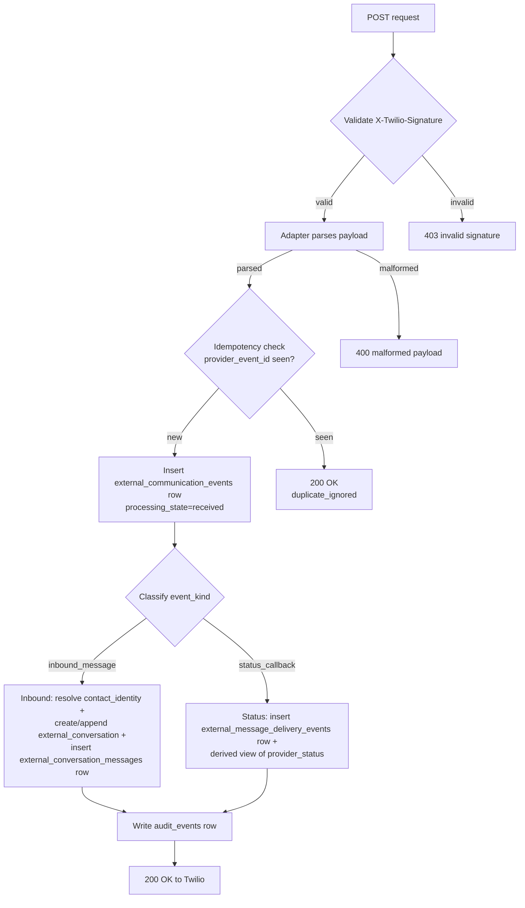
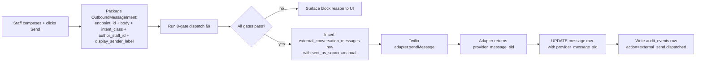

# PREFLIGHT — External-line first-touch (e1): Twilio adapter + substrate migration + 8-gate orchestration + settings precedence runtime + contact-identity sync + display projection + ops triage inbox UI MINIMUM + AI Response Assist stub

**Status:** PROPOSED — 2026-05-12 (Phase 4H, external-line arc, commit e1)
**Type:** Execution preflight — operational + code-focused. NO migrations land in this preflight; NO code lands in this preflight. The preflight is the BLUEPRINT for the execution commits (e1.1 through e1.N) that follow R-arc pressure-testing + approval.
**Inherits from:** e0 preflight ([PREFLIGHT_2026-05-12_phase_4h_external_line_e0_substrate_routing_design.md](PREFLIGHT_2026-05-12_phase_4h_external_line_e0_substrate_routing_design.md)) — 23 sections of design, 9 substrate sketches, 10 framing questions, 38 guardrails, 55-scenario matrix.
**Doctrine inheritance:** DL-10 (identity/relationship + handle-vs-person extension), DL-11 (three messaging surfaces; external-line is the third), DL-12 (lifecycle/fax/AI/template/search/visibility/notification/attachment/queue/coexistence/AI-Response-Assist + invariant 31 5-disposition extension), **DL-13** (rail-agnostic substrate spine + OMNI canonical source-of-truth + settings precedence + deterministic outbound 8-gate + display-projection-not-substrate), Radar zones 1-78 (zones 69-78 are DL-13-binding watch zones for e1 implementation regression).
**Doctrine introduced:** NONE — e1 inherits and EXECUTES; it does not introduce doctrine. (Same posture as e0.)
**Doctrinal alignment:** every section maps to a canonical home in MAIN / foundational / ADR / topology / radar / narrative per §5 below. e1 PREFLIGHT does not duplicate doctrine; it points at the binding home.
**Companion docs:** [PREFLIGHT_2026-05-12_phase_4h_external_line_e0_substrate_routing_design.md](PREFLIGHT_2026-05-12_phase_4h_external_line_e0_substrate_routing_design.md) (e0 design), [THOUGHT_EXPERIMENT_2026-05-12_dl13_second_rail_stripe_adapter_sketch.md](THOUGHT_EXPERIMENT_2026-05-12_dl13_second_rail_stripe_adapter_sketch.md) (DL-13 portability validation), [HANDOFF_2026-05-12_phase_4h_external_line_e0_doctrine_complete.md](HANDOFF_2026-05-12_phase_4h_external_line_e0_doctrine_complete.md) (DL-13 closing handoff).
**Scope guardrail (binding from user 2026-05-12):** do NOT re-describe phone-system requirements. e0 specified them across 23 sections (operator parity, contact identity, phone-system parity, settings taxonomy, multi-brand, display identity). e1 EXECUTES the subset defined by §3 below. R-arc pressure-test challenges scope partition, not phone-system requirements.

---

## §1 Substrate-reality audit

Re-verify the green-field state as of e1 preflight time (re-audit at e1.1 start required per §23 verification gates):

- `messages.patient_id NOT NULL` constraint — UNCHANGED. e1 NEVER nullifies this. c2 stays patient-scoped.
- `message_threads.patient_id NOT NULL`, `message_threads.care_program_id NOT NULL UNIQUE` — UNCHANGED.
- No `contact_identities` table — green-field; e1 creates.
- No `org_communication_endpoints` table — green-field; e1 creates.
- No `external_conversations` / `external_conversation_messages` / `external_conversation_artifacts` / `external_message_delivery_events` / `external_conversation_drafts` — green-field; e1 creates.
- No `patient_projection_links` table — green-field; e1 creates.
- No `lib/external-rails/` directory — green-field; e1 creates `lib/external-rails/twilio/`.
- `lib/notifications/smsTwilio.ts` — existing placeholder stub, env-gated, NOT INTEGRATED. e1 SUPERSEDES this with the proper adapter under `lib/external-rails/twilio/`. The stub file is either deleted at e1 cutover (if no callers) or marked DEPRECATED-AFTER-PARITY (if any callers exist; replicate behavior under new adapter first; then delete). Re-audit at e1.1 confirms callers.
- `patient_consents` substrate exists (per §1K.11); e1 EXTENDS for intent-class scoping (deferred to specific e1 commit; not a new table).
- `audit_events` substrate exists; e1 EXTENDS taxonomy with external-line action codes (added to `lib/events/audit-actions.ts`).
- `outbound_jobs` substrate exists; external-line outbound goes through `outbound_jobs` per primitive #10 + DL-13 8-gate orchestration above.
- DL-13 is in MAIN as of commit `d57c297` (2026-05-12); foundational §7.13.13 + ADR §7.16 + topology §11/§12 + radar zones 69-78 + evolution narrative Act XIV are bound.

**Failure mode if audit drifts before e1.1 starts:** a migration that lands between PROPOSED and e1.1 (e.g., a `chat_status` column on conversations, or a `twilio_message_sid` column on messages) would foreclose e1's design — abort e1.1, fix the foreclosing migration first, re-audit. Per §23 verification gates.

---

## §2 Doctrine inheritance (binding)

Every line of e1 implementation inherits from the following doctrine. e1 does not re-litigate; e1 executes.

- **DL-10** — `patient_relationships` is the operational-scope layer; brand is one of N scoping dimensions; identity-namespace = OMNI deployment per PHI boundary. `contact_identities` is Layer 1 above `patients`; handle-vs-person extension admits phone-as-handle (family / spouse / shared / typo / fraud-substituted).
- **DL-11** — External-line is the THIRD messaging surface (alongside c2 patient-facing chat and `internal_collaboration/`). External-line has its OWN substrate; NEVER merges into `messages`.
- **DL-12** — Thread + participant lifecycle is cross-substrate; 28 binding clarifications apply. Specific subsections e1 consumes:
  - Invariant 1 — staff deactivation lifecycle (ownership reassignment before deactivation).
  - Invariant 8 — retention parameterized by thread class.
  - Invariant 14-16 — AI participation bounds + authorship attribution + anti-noise (extended by DL-13 invariant 4 for external).
  - Invariant 21 — patient notification preferences + criticality override.
  - Invariant 23 — message edit / correction / retraction preserves history.
  - Invariant 26 — anti-panopticon discipline on search/visibility.
  - Invariant 30 — queue-routed work state machine (delivered_to_queue / unread_by_queue / seen_by_queue_member / claimed_by_staff / completed/escalated_or_overdue).
  - Invariant 31 — three-state attachment lifecycle (chat-attachment → reviewed/classified → filed-to-chart) + DL-13 5-disposition extension (link / attach / chart_file / safety_task / reject_spam) on external-line projection.
  - Invariant 39 — AI Response Assist replaces screenshot-into-external-AI workflow.
- **DL-13** — five invariants binding e1 implementation:
  1. **Rail-agnostic substrate + vendor-confined adapter.** Generic `provider_*` columns; Twilio code confined to `lib/external-rails/twilio/`.
  2. **OMNI canonical source-of-truth + vendor-adopt-not-write.** `patients.id` + `patient_relationships.id` + `contact_identities.id` canonical; Twilio Conversation SID / Contact SID / Message SID are convenience identifiers stored on `provider_*` columns.
  3. **Settings precedence (six-level top-down).** Law/consent > safety > endpoint > queue > user > device.
  4. **Deterministic outbound 8-gate.** Endpoint-intent + consent + STOP/HELP + template/disclosure + quiet-hours + idempotency + rate-limit + prohibited-claims. AI confirmation NOT a gate.
  5. **Display-projection-not-substrate.** Display identity + status chips computed at query; NO `chat_status` / `lead_stage` / `display_state` mutable columns on conversations / messages / contact identities.
- **Radar zones 69-78** — DL-13-binding watch zones; e1 implementation regression detection. Zone 69 (rail-bypass drift) + zone 70 (vendor-as-contact-source drift) + zone 71 (chat_status-independent-field drift) + zone 72 (multi-brand cross-leakage drift) + zone 73 (STOP-cascading-across-intents drift) + zone 74 (display projection drift from substrate) + zone 75 (settings-precedence inversion drift) + zone 76 (endpoint-policy-via-jsonb drift) + zone 77 (voicemail-auto-files-to-chart drift) + zone 78 (AI-as-participant drift on external conversations).

---

## §3 Scope — MUST vs DEFERRED partition (binding)

This section is THE binding scope statement for e1. Every implementation commit asks: "is this in §3 MUST?" If not, defer.

### §3.A MUST land in e1 (operational + code; no exceptions without explicit user re-approval)

| Capability | Substrate / Code | Notes |
|---|---|---|
| Twilio adapter (SMS inbound + outbound) | `lib/external-rails/twilio/` | Adapter contract per §7. Replaces `lib/notifications/smsTwilio.ts` placeholder. |
| Webhook ingest (signature validation + idempotency) | `lib/external-rails/twilio/webhooks/` + API route | Per §8. |
| `communication_rails` substrate (rail type registry; SMS + MMS + voice + voicemail + fax slot reserved) | Migration | Per §6.1. |
| `org_communication_endpoints` substrate (single-brand minimum; admits multi-brand schema-wise) | Migration | Per §6.2. Per-endpoint label / intent_class / brand_id / practice_entity_id / location_id / business hours / voicemail config / forwarding policy / access scope / provider_endpoint_id columns. |
| `contact_identities` substrate (phone_e164 normalized + indexed; admits handle-vs-person via future `contact_identity_handles` child) | Migration | Per §6.3. |
| `external_communication_events` substrate (immutable rail event ledger; `provider_event_id` idempotency key) | Migration | Per §6.4. |
| `external_conversations` substrate (endpoint-scoped + contact-identity-linked; admits future `patient_projection_links`) | Migration | Per §6.5. |
| `external_conversation_messages` substrate (`provider_message_sid` / `provider_status` / `direction` / `body` / `intent_class` / `author_staff_id?` / `outbound_endpoint_id` / `display_sender_label` / `sent_as_source` columns) | Migration | Per §6.6. |
| `external_message_delivery_events` substrate (provider status callback append-only stream) | Migration | Per §6.7. |
| `external_conversation_drafts` substrate (personal drafts; AI proposal drafts; stale-warning column; shared-queue drafts deferred to e2) | Migration | Per §6.8. |
| `external_conversation_artifacts` substrate (MMS media MINIMUM — voicemail artifact admission deferred to e2) | Migration | Per §6.9. |
| `external_conversation_participants` substrate (staff who claimed / assigned) | Migration | Per §6.10. |
| `external_conversation_queue_state` substrate (queue-routed work state machine per DL-12 invariant 30) | Migration | Per §6.11. |
| `patient_projection_links` substrate (5-disposition admission per DL-12 invariant 31 extension) | Migration | Per §6.12. |
| 8-gate orchestration layer | `lib/external-line/dispatch/` | Per §9. Above adapter. |
| Settings precedence runtime | `lib/external-line/settings-precedence/` | Per §10. Six-level evaluation. |
| Contact-identity sync orchestrator (manual scheduling creation → handle publish; retroactive projection) | `lib/external-line/identity-sync/` | Per §11. |
| Display projection layer (status chips + display identity computed at query) | `lib/external-line/projection/` | Per §12. No mutable substrate columns. |
| Outbound endpoint selection UI ("Replying as / Sending from") | `app/(staff)/inbox/external-line/` components | Per §13. |
| Draft semantics implementation (personal + AI proposal + stale-warning) | substrate + UI | Per §14. |
| MMS inbound MINIMUM (accept media; basic type detection; NO classification; NO chart-filing) | adapter + substrate | Per §16. |
| Ops triage inbox UI MINIMUM (read + claim + reply + archive + spam + restrict + search by phone/name/body + filter by endpoint/queue/status/date + capability + endpoint-scope filtering) | `app/(staff)/inbox/external-line/` | Per §17. |
| AI Response Assist STUB + first capability ("polish this draft") | `lib/ai/response-assist/` + UI hook | Per §18. PHI-safe; `staff_with_ai_assist` actor on send; never autonomously dispatch. |
| `audit_events.action` taxonomy extension for external-line | `lib/events/audit-actions.ts` | Per §19.A. |
| `patient_timeline_events.event_type` taxonomy extension for external-line projection events | `lib/events/timeline-event-types.ts` | Per §19.A. |
| RLS for external-line tables (org_id + capability-scoped + relationship-scoped per §1J.13(e)) | Migration | Per §6.13. |
| Tests + observability | Per §19 | |

### §3.B DEFERRED to e2 (named explicitly so they cannot creep into e1)

| Capability | Why deferred |
|---|---|
| Voicemail audio + transcript artifacts + state machine | Larger surface; needs transcription pipeline + queue UI. Substrate columns admit (per §6.9) but full pipeline is e2. |
| Voice (inbound/outbound call) | Larger surface; admit via `communication_rails` + `org_communication_endpoints` rail_kind enum but no call-handling UI in e1. |
| Multi-endpoint per location (front-desk + on-call + manager + billing + aftercare + brand-specific) | Single endpoint per brand in e1; substrate admits multi but UI doesn't materialize multi-endpoint experience until e2. |
| Multi-brand operating modes (4 brand × 3 backend mode-agnosticism) | Single-brand baseline in e1; substrate admits multi-brand columns; UI + onboarding flow is e2/e3. |
| Shared-queue drafts | Personal + AI-proposal drafts in e1; shared-queue draft semantics + UI in e2. |
| Full AI Response Assist capabilities (summarize / classify-urgency / propose-action-items / clinically-cautious / warmer-shorter-safer) | First capability ("polish this draft") in e1; full suite in e2. |
| Media classification + annotation editor | MMS accept in e1; classification + annotation deferred to e2. |
| 5-disposition UI for artifact projection | Substrate admits (per §6.12); UI for link / attach / chart_file / safety_task / reject_spam is e2. |
| Search audit + reason-coded compliance/break-glass search | Ordinary endpoint-scope search + capability filter in e1; reason-coded audit for restricted/projected-clinical conversations is e2. |
| STOP/HELP cascade implementation (8-gate gate 3 logic for cross-channel) | Single-channel STOP in e1 (per intent class per endpoint); cross-channel + cross-intent reciprocal logic in e2. |

### §3.C DEFERRED to e3 (named explicitly; further out)

| Capability | Why deferred |
|---|---|
| Fax-inbound full pipeline | Per DL-12 + topology §13 — fax composes from primitives; full activation is e3 or later. |
| RCS / WhatsApp / iMessage adapters | New adapters at `lib/external-rails/<provider>/`; not e1. |
| Outbound marketing campaigns through external-line | §1Q + DL-13 8-gate inheritance; campaign-class sends are e3+. |
| Multi-brand UX (brand toggle UI + per-brand inbox views) | e3 brand-onboarding flow. |
| In-clinic Stripe Terminal / POS integration | Per multi-consumer adapter placement question; e3+ scheduling-deposit or POS work. |
| Patient-proxy / caregiver / parent-on-behalf-of-minor actor type | Future preflight named in DL-12 closing handoff. |
| Voice notes (patient-facing voice messages distinct from voicemail) | Future preflight named in DL-12 closing handoff. |
| AI translation | Future preflight named in DL-12 closing handoff. |
| Video sessions | Future preflight named in DL-12 closing handoff. |
| Emergency bypass | Future preflight named in DL-12 closing handoff. |

---

## §4 Explicit out-of-scope (binding)

e1 does NOT:

- Build voice / voicemail UI or transcription pipeline.
- Build multi-brand onboarding flow or per-brand inbox toggle.
- Build annotation editor or photo markup tools.
- Build full AI Response Assist capability suite (only the "polish this draft" stub).
- Build outbound campaign system.
- Touch `messages` / `message_threads` / `patient_inbox_messages` substrate.
- Add a `chat_status` / `lead_stage` / `display_state` mutable column to any substrate.
- Add `twilio_*`-named columns to any substrate.
- Read from Twilio's Conversations / Customer / address-book stores to resolve OMNI identity.
- Activate `communications_lifecycle/` sibling folder beyond its existing partial state.
- Activate `internal_collaboration/` sibling (DL-11 sibling #19 — separate future activation).
- Migrate the placeholder `lib/notifications/smsTwilio.ts` callers without replacement (DEPRECATE-AFTER-PARITY; replicate behavior under `lib/external-rails/twilio/` first).
- Introduce doctrine (DL-13 is the doctrine; e1 executes).
- Make schema decisions that contradict §6 substrate sketches.

If a sub-task feels like one of these, escalate before proceeding.

---

## §5 Doctrinal alignment table

| Doctrine | Where it lives | What e1 inherits |
|---|---|---|
| **DL-10 Identity / Relationship + handle-vs-person extension** | MAIN system map DL-10 + §1J.13 + foundational §7.13 + §7.13.13 + topology §11 | Contact identity is Layer 1; phone is a handle, not always one person; `contact_identities` + future `contact_identity_handles`. e1 normalizes phone_e164 + admits ambiguous-handle / shared-handle / typo / reassigned states (substrate columns; UI for split/merge deferred to e2). |
| **DL-11 Three Messaging Surfaces** | MAIN DL-11 + topology §12 | External-line is the third sibling. e1 lands the substrate spine + ops triage UI. |
| **DL-12 (28 binding clarifications)** | MAIN DL-12 + per-section binding subsections + foundational §4.A / §5.3 / §7.13.12 / §7.14.9-10-18 / §8.1 + ADR §7.15 + topology §12 cross-references + radar zones 43-67 | e1 consumes invariants 1, 8, 14-16, 21, 23, 26, 30, 31, 39 (per §2 above). |
| **DL-13 Rail-agnostic substrate spine + OMNI canonical + settings precedence + 8-gate + display-projection** | MAIN DL-13 + §1D.4 + §1G.12 + §1J.13 + §1N.9 + §1P.15 + §1Q.14.2 + §1V.11 + foundational §4.B + §5 sibling #20 + §5.3(c) + §7.13.13 + §8.1 clauses 29-33 + ADR §7.16 + topology §11 substrate spine + §12 DL-13 cross-references + radar zones 69-78 + evolution narrative Act XIV | Five invariants binding e1 implementation. |
| **e0 first-touch preflight** | [PREFLIGHT_2026-05-12_phase_4h_external_line_e0_substrate_routing_design.md](PREFLIGHT_2026-05-12_phase_4h_external_line_e0_substrate_routing_design.md) | 23 sections of design that e1 EXECUTES. |
| **Stripe portability sketch** | [THOUGHT_EXPERIMENT_2026-05-12_dl13_second_rail_stripe_adapter_sketch.md](THOUGHT_EXPERIMENT_2026-05-12_dl13_second_rail_stripe_adapter_sketch.md) | Multi-consumer adapter placement: NOT relevant to e1 (Twilio is single-consumer); recommendation deferred to first multi-consumer activation (foundational §7.13.13.6 + DL-13 handoff). |
| **Radar zones (all + 69-78 most relevant)** | [v1_pressure_test_radar.md](../../docs/architecture/v1_pressure_test_radar.md) | Zone 28 (metadata-jsonb anti-pattern), zones 47-48 (substrate concerns), zone 51 (AI thread spam), zone 53 (anti-panopticon search), zone 54 (notification suppression bypass), zone 56 (queue-handled-by-read-receipt), zone 59 (attachment auto-files), zone 66 (membership hardcoded), zone 67 (screenshot-into-external-AI), zones 69-78 (DL-13 binding) all apply to e1 implementation regression. |
| **c2 non-foreclosure** | [PREFLIGHT_2026-05-11_phase_4h_in_app_inbox_c2_rich_chat_rendering.md](PREFLIGHT_2026-05-11_phase_4h_in_app_inbox_c2_rich_chat_rendering.md) | `messages.patient_id NOT NULL` stays binding; external-line NEVER merges into `messages`. |

---

## §6 Substrate migration sketches (DDL shape — NOT actual migrations)

This section sketches column shape for each table. Actual migration files land in e1.1 commit (substrate migration commit). DDL syntax is illustrative; final migration uses the project's idempotent + audited migration framework.

### §6.1 `communication_rails`

Rail type registry (abstract; vendor-agnostic).

```
communication_rails
  id (uuid, PK)
  rail_kind (text, NOT NULL, CHECK in ('sms','mms','voice','voicemail','fax','email','whatsapp','rcs','imessage'))
  display_name (text, NOT NULL)
  capability_descriptor (jsonb, NOT NULL)  -- RailCapability (delivery receipts, MMS support, etc.) per §7.5
  is_active (boolean, NOT NULL, DEFAULT true)
  created_at / updated_at / audit columns
  unique(rail_kind)
```

e1 seeds rows: `sms`, `mms` (admits voice/voicemail/fax slot reservation but rails inactive until e2/e3).

### §6.2 `org_communication_endpoints`

Concrete endpoints owned by org/brand/location.

```
org_communication_endpoints
  id (uuid, PK)
  org_id (uuid, NOT NULL, FK orgs.id)
  brand_id (uuid, NULL, FK brands.id)
  practice_entity_id (uuid, NULL, FK practice_entities.id)
  location_id (uuid, NULL, FK locations.id)
  rail_id (uuid, NOT NULL, FK communication_rails.id)
  label (text, NOT NULL)                       -- "Cultured Main Line" / "Somerset Front Desk"
  intent_class (text, NOT NULL, CHECK in ('marketing','clinical','billing','support','aftercare','appointment','mixed','transactional'))
  default_queue_id (uuid, NULL, FK provider_tasking_queues.id)  -- nullable for e1 since provider_tasking sibling not active
  access_scope (jsonb, NOT NULL)               -- structured: which roles/teams/queues may see this endpoint's conversations
  business_hours (jsonb, NOT NULL)             -- structured per-day windows
  after_hours_behavior (jsonb, NOT NULL)       -- structured: voicemail / auto-reply / forward-to-queue
  voicemail_config (jsonb, NULL)               -- e2 fills this in
  forwarding_policy (jsonb, NULL)              -- e2 fills this in
  blocked_numbers (text[], NULL)               -- E.164 list
  trusted_numbers (text[], NULL)               -- E.164 list
  auto_reply_template_id (uuid, NULL)          -- FK templates.id (e1 admits; rule-fired)
  default_outbound_label (text, NULL)          -- patient-side rendering ("Cultured Front Desk")
  provider_kind (text, NOT NULL)               -- 'twilio' for e1
  provider_endpoint_id (text, NOT NULL)        -- Twilio Phone Number SID
  provider_metadata (jsonb, NULL)              -- vendor-only extras (e.g., Twilio Messaging Service SID if used)
  is_active (boolean, NOT NULL, DEFAULT true)
  created_at / updated_at / audit columns
  unique(org_id, provider_kind, provider_endpoint_id)
  index(org_id, intent_class, is_active)
```

**Endpoint policy goes into structured columns**, not `metadata` jsonb (zone 76). Vendor-specific extras (Twilio-only fields) in `provider_metadata jsonb`.

### §6.3 `contact_identities`

Master identity for external parties (per DL-10 handle-vs-person extension; DL-13 invariant 2).

```
contact_identities
  id (uuid, PK)
  org_id (uuid, NOT NULL, FK orgs.id)
  phone_e164 (text, NULL)                       -- normalized; indexed
  email (citext, NULL)
  display_name (text, NULL)                     -- staff-entered or extracted
  handle_kind (text, NOT NULL, CHECK in ('phone','email','whatsapp','external'))
  ambiguity_status (text, NOT NULL, DEFAULT 'unknown',
    CHECK in ('unknown','confident','ambiguous','shared','typo_suspected','reassigned_suspected'))
  source (text, NOT NULL, CHECK in ('inbound_observed','scheduling_manual','intake_form','partner','staff_lookup','merge_split'))
  source_actor_id (uuid, NULL, FK staff_profiles.id)  -- for scheduling_manual / staff_lookup / merge_split
  is_blocked (boolean, NOT NULL, DEFAULT false)
  is_spam (boolean, NOT NULL, DEFAULT false)
  notes (text, NULL)
  created_at / updated_at / audit columns
  unique(org_id, phone_e164) WHERE phone_e164 IS NOT NULL
  unique(org_id, email) WHERE email IS NOT NULL
  index(org_id, phone_e164)                     -- substring + prefix search index in e1
  index(org_id, email)
```

**Future `contact_identity_handles` child table is admitted but not built in e1.** When second handle type per contact identity becomes operational (e.g., a contact identity links phone + email + WhatsApp), `contact_identity_handles` becomes the canonical multi-handle store. Until then, one row per (org_id, handle_value, handle_kind) tuple is acceptable.

### §6.4 `external_communication_events`

Immutable rail event ledger.

```
external_communication_events
  id (uuid, PK)
  org_id (uuid, NOT NULL, FK orgs.id)
  endpoint_id (uuid, NOT NULL, FK org_communication_endpoints.id)
  rail_id (uuid, NOT NULL, FK communication_rails.id)
  provider_kind (text, NOT NULL)                -- 'twilio'
  provider_event_id (text, NOT NULL)            -- Twilio Message SID for SMS/MMS; Call SID for voice; etc.
  event_kind (text, NOT NULL)                   -- 'inbound_message' / 'outbound_message' / 'status_callback' / 'call_event' / etc.
  occurred_at (timestamptz, NOT NULL)           -- vendor-reported timestamp
  received_at (timestamptz, NOT NULL, DEFAULT now())  -- OMNI-side receive timestamp
  raw_provider_payload (jsonb, NOT NULL)        -- preserved verbatim for audit/replay
  contact_identity_id (uuid, NULL, FK contact_identities.id)  -- resolved at ingest (may be NULL until resolved)
  external_conversation_id (uuid, NULL, FK external_conversations.id)  -- resolved at ingest
  external_conversation_message_id (uuid, NULL, FK external_conversation_messages.id)
  processing_state (text, NOT NULL, CHECK in ('received','processed','failed','duplicate_ignored'), DEFAULT 'received')
  processing_error (text, NULL)
  audit columns (no update path; APPEND-ONLY)
  unique(org_id, provider_kind, provider_event_id)  -- idempotency
  index(org_id, endpoint_id, occurred_at)
```

`provider_event_id` is the **idempotency key** per DL-13. Webhook replays + duplicate vendor webhooks dedupe here.

### §6.5 `external_conversations`

Conversation thread (endpoint-scoped + contact-identity-linked).

```
external_conversations
  id (uuid, PK)
  org_id (uuid, NOT NULL, FK orgs.id)
  endpoint_id (uuid, NOT NULL, FK org_communication_endpoints.id)
  contact_identity_id (uuid, NOT NULL, FK contact_identities.id)
  conversation_kind (text, NOT NULL, CHECK in ('sms','mms','voice','voicemail','mixed'))
  first_event_at (timestamptz, NOT NULL)
  last_event_at (timestamptz, NOT NULL)
  closed_at (timestamptz, NULL)
  archived_at (timestamptz, NULL)
  spam_at (timestamptz, NULL)                   -- marked spam
  restricted_at (timestamptz, NULL)             -- capability-gated narrower visibility
  entered_in_error_at (timestamptz, NULL)       -- compliance-only via break-glass
  entered_in_error_reason (text, NULL)
  entered_in_error_actor_id (uuid, NULL, FK staff_profiles.id)
  created_at / updated_at / audit columns
  index(org_id, endpoint_id, last_event_at DESC)
  index(org_id, contact_identity_id, last_event_at DESC)
```

**NO `chat_status` / `display_status_chip` / `current_label` mutable columns** (zone 71). Display state is computed at query time per §12.

### §6.6 `external_conversation_messages`

Inbound + outbound messages.

```
external_conversation_messages
  id (uuid, PK)
  org_id (uuid, NOT NULL, FK orgs.id)
  external_conversation_id (uuid, NOT NULL, FK external_conversations.id)
  endpoint_id (uuid, NOT NULL, FK org_communication_endpoints.id)
  direction (text, NOT NULL, CHECK in ('inbound','outbound'))
  intent_class (text, NULL)                     -- 'marketing'/'clinical'/'billing'/'support'/'aftercare'/'appointment'/'transactional' (per DL-13 invariant 4 gate 1); NULL for inbound until classified
  body (text, NOT NULL)                         -- final body actually sent / received
  media_artifact_ids (uuid[], NOT NULL, DEFAULT '{}')  -- references external_conversation_artifacts (MMS attachments)
  author_staff_id (uuid, NULL, FK staff_profiles.id)  -- NULL for inbound; NULL for system/automation outbound; set for staff/staff_with_ai_assist outbound
  author_actor_type (text, NOT NULL,
    CHECK in ('patient','staff','staff_with_ai_assist','system','automation'))  -- 'ai_assisted' NOT admitted (DL-13 invariant 4)
  sent_as_source (text, NULL, CHECK in ('manual','template','rule','campaign','scheduled','ai_assisted_human_approved'))  -- outbound only
  outbound_endpoint_id (uuid, NULL, FK org_communication_endpoints.id)  -- for outbound
  display_sender_label (text, NULL)             -- patient-side rendering label ("Cultured Front Desk")
  template_id (uuid, NULL, FK templates.id)     -- if sent_as_source = template / rule / campaign / scheduled
  rule_id (uuid, NULL)                          -- if rule-fired
  trigger_event_id (text, NULL)                 -- for idempotency on rule-fired sends
  ai_proposal_id (uuid, NULL)                   -- if staff_with_ai_assist
  ai_provenance (jsonb, NULL)                   -- ai_model + ai_confidence + edit-distance from proposal
  provider_kind (text, NOT NULL)                -- 'twilio'
  provider_message_sid (text, NULL)             -- set after rail dispatches; NULL during gate-blocked / queued
  provider_status (text, NULL)                  -- canonical mapped status from rail (queued/sent/delivered/failed/undelivered/blocked/opted_out/carrier_filtered/invalid_number/media_failed)
  provider_metadata (jsonb, NULL)
  occurred_at (timestamptz, NOT NULL)           -- inbound: vendor timestamp; outbound: send-attempt timestamp
  original_body (text, NULL)                    -- for edit-history preservation per DL-12 invariant 23 (e1 admits; UI for edit deferred)
  edited_at (timestamptz, NULL)
  editor_staff_id (uuid, NULL, FK staff_profiles.id)
  edit_reason_code (text, NULL)
  retracted_at (timestamptz, NULL)
  retracted_reason_code (text, NULL)
  retracted_actor_id (uuid, NULL, FK staff_profiles.id)
  entered_in_error_at (timestamptz, NULL)
  audit columns (immutable for sent/received body; correction creates new message + edit-history row)
  index(org_id, external_conversation_id, occurred_at)
  index(org_id, endpoint_id, occurred_at)
  index full-text on body  -- e1 search support
  unique(provider_kind, provider_message_sid) WHERE provider_message_sid IS NOT NULL
```

**No `stripe_*` / `twilio_*`-named columns** (zone 69). Generic `provider_*` only.

### §6.7 `external_message_delivery_events`

Provider status callback append-only stream.

```
external_message_delivery_events
  id (uuid, PK)
  org_id (uuid, NOT NULL, FK orgs.id)
  external_conversation_message_id (uuid, NOT NULL, FK external_conversation_messages.id)
  provider_kind (text, NOT NULL)
  provider_status (text, NOT NULL)              -- canonical mapped: queued/sent/delivered/failed/undelivered/blocked/opted_out/carrier_filtered/invalid_number/media_failed
  raw_provider_status (text, NOT NULL)          -- vendor-specific status (preserved for audit)
  provider_error_code (text, NULL)
  provider_error_message (text, NULL)
  occurred_at (timestamptz, NOT NULL)
  received_at (timestamptz, NOT NULL, DEFAULT now())
  raw_provider_payload (jsonb, NOT NULL)
  audit columns (APPEND-ONLY)
  index(org_id, external_conversation_message_id, occurred_at)
  unique(org_id, provider_kind, raw_provider_event_id) WHERE raw_provider_event_id IS NOT NULL  -- idempotency on duplicate callbacks
```

Display layer reads the latest event per message to render current delivery state (per §12). NEVER updates `external_conversation_messages.provider_status` directly except as a view.

### §6.8 `external_conversation_drafts`

Personal drafts + AI proposal drafts. Shared-queue drafts DEFERRED to e2.

```
external_conversation_drafts
  id (uuid, PK)
  org_id (uuid, NOT NULL, FK orgs.id)
  external_conversation_id (uuid, NOT NULL, FK external_conversations.id)
  draft_kind (text, NOT NULL, CHECK in ('personal','ai_proposal'))  -- 'shared_queue' admitted by schema but UI deferred to e2
  author_staff_id (uuid, NULL, FK staff_profiles.id)  -- NULL for ai_proposal
  body (text, NOT NULL)
  intent_class (text, NULL)
  outbound_endpoint_id (uuid, NULL, FK org_communication_endpoints.id)
  ai_proposal_provenance (jsonb, NULL)
  stale_after_message_id (uuid, NULL, FK external_conversation_messages.id)  -- set when concurrent send occurs; UI warns
  created_at / updated_at / audit columns
  index(org_id, external_conversation_id, author_staff_id, draft_kind)
```

### §6.9 `external_conversation_artifacts`

Voicemail audio + transcript (substrate admits; e1 stores ONLY MMS media) + MMS media + annotated images + PDFs.

```
external_conversation_artifacts
  id (uuid, PK)
  org_id (uuid, NOT NULL, FK orgs.id)
  external_conversation_id (uuid, NOT NULL, FK external_conversations.id)
  artifact_kind (text, NOT NULL, CHECK in (
    'mms_image','mms_video','mms_pdf','mms_audio','mms_other',
    'voicemail_audio','voicemail_transcript',
    'annotated_image','derived_flatten'))
  storage_provider (text, NOT NULL)              -- 'twilio_media' / 'omni_storage' / etc.
  storage_uri (text, NOT NULL)
  mime_type (text, NOT NULL)
  size_bytes (bigint, NULL)
  scan_status (text, NOT NULL, DEFAULT 'pending',
    CHECK in ('pending','clean','malware_detected','scan_failed','quarantined'))
  classification (text, NULL)                    -- e2 fills in
  uploader_staff_id (uuid, NULL, FK staff_profiles.id)  -- for outbound; NULL for inbound
  source_provider_id (text, NULL)                -- Twilio MediaUrl / RecordingSid
  derived_from_artifact_id (uuid, NULL, FK external_conversation_artifacts.id)  -- for annotated_image / derived_flatten
  retention_class (text, NOT NULL, DEFAULT 'external_communication')
  created_at / updated_at / audit columns
  index(org_id, external_conversation_id, artifact_kind)
```

**Voicemail rows admitted but NOT populated by e1** (per §3 — voicemail full pipeline is e2). Substrate column shape admits voicemail without future schema change.

### §6.10 `external_conversation_participants`

Staff who claimed or are assigned to a conversation.

```
external_conversation_participants
  id (uuid, PK)
  org_id (uuid, NOT NULL, FK orgs.id)
  external_conversation_id (uuid, NOT NULL, FK external_conversations.id)
  staff_id (uuid, NOT NULL, FK staff_profiles.id)
  participant_role (text, NOT NULL, CHECK in ('claimed_owner','assigned','observer','escalation_reviewer'))
  joined_at (timestamptz, NOT NULL, DEFAULT now())
  left_at (timestamptz, NULL)
  left_reason_code (text, NULL)
  joined_by_path (text, NOT NULL, CHECK in ('manual_claim','manual_assignment','queue_routing','escalation','admin_intervention','break_glass'))
  created_at / updated_at / audit columns
  unique(org_id, external_conversation_id, staff_id, participant_role) WHERE left_at IS NULL
  index(org_id, staff_id, participant_role, left_at)
```

### §6.11 `external_conversation_queue_state`

Per DL-12 invariant 30 queue-routed work state machine.

```
external_conversation_queue_state
  id (uuid, PK)
  org_id (uuid, NOT NULL, FK orgs.id)
  external_conversation_id (uuid, NOT NULL, FK external_conversations.id)
  queue_id (uuid, NULL)                         -- FK provider_tasking_queues.id when sibling activates; nullable for e1
  state (text, NOT NULL, CHECK in (
    'delivered_to_queue','unread_by_queue','seen_by_queue_member',
    'claimed_by_staff','completed','escalated','overdue'))
  state_actor_id (uuid, NULL, FK staff_profiles.id)  -- who triggered the transition
  state_changed_at (timestamptz, NOT NULL, DEFAULT now())
  sla_breach_at (timestamptz, NULL)
  notes (text, NULL)
  created_at / updated_at / audit columns
  index(org_id, external_conversation_id, state_changed_at DESC)
```

### §6.12 `patient_projection_links`

5-disposition pattern per DL-12 invariant 31 extension.

```
patient_projection_links
  id (uuid, PK)
  org_id (uuid, NOT NULL, FK orgs.id)
  contact_identity_id (uuid, NOT NULL, FK contact_identities.id)
  patient_relationship_id (uuid, NOT NULL, FK patient_relationships.id)
  external_conversation_id (uuid, NULL, FK external_conversations.id)  -- nullable: contact-level link without specific conversation
  artifact_id (uuid, NULL, FK external_conversation_artifacts.id)       -- nullable: conversation-level link without specific artifact
  disposition (text, NOT NULL, CHECK in ('link','attach','chart_file','safety_task','reject_spam'))
  linked_at (timestamptz, NOT NULL, DEFAULT now())
  linked_by_staff_id (uuid, NOT NULL, FK staff_profiles.id)
  link_reason_code (text, NOT NULL)
  link_confidence (numeric, NULL)               -- 0..1; staff-set or automation-suggested
  link_method (text, NOT NULL, CHECK in ('manual_staff_link','intake_form_match','phone_match_auto','scheduling_creation_publish','retroactive_match'))
  audit columns
  unique(org_id, contact_identity_id, patient_relationship_id, external_conversation_id, artifact_id)
  index(org_id, patient_relationship_id, linked_at DESC)
```

**No auto-chart-filing on projection** (zone 77). Disposition is the explicit operator choice.

### §6.13 RLS sketch

All external-line tables enforce three-layer RLS:

1. **`org_id`** — `current_org_id() = row.org_id`. Standard org isolation.
2. **Capability-scoped** — depends on table:
   - Endpoint admin tables (`org_communication_endpoints` writes) — capability-gated to org admin / brand admin / location admin / communications admin / compliance admin.
   - Conversation read/write — capability + relationship + queue membership.
   - Identity-altering operations on `contact_identities` (split / merge / mark-spam / unlink) — capability-gated.
3. **Endpoint access scope** — `org_communication_endpoints.access_scope` jsonb determines which roles/teams/queues may see this endpoint's conversations. Encoded as a function `caller_can_access_endpoint(caller_user_id, endpoint_id)`.
4. **Relationship scope** — when conversation is patient-linked via `patient_projection_links`, viewer must have access to the `patient_relationship` per DL-10.

**Default rule: no global "all staff see all external conversations" policy** (zone 70 sibling). Broad front-desk visibility on a main client line is permitted by endpoint access_scope; clinical / sensitive / restricted / patient-projected conversations require narrower scope.

---

## §7 Twilio adapter contract + directory structure

### §7.1 Directory layout

```
lib/external-rails/
  twilio/
    client.ts                       -- @twilio/sdk wrapper; API version pinned; env-gated config
    webhook-validation.ts           -- X-Twilio-Signature verification + timestamp tolerance
    event-translator.ts             -- vendor wire (TwiML / webhook payload) -> substrate-canonical event row
    status-mapper.ts                -- vendor status enums -> substrate provider_status enum
    api-shim.ts                     -- substrate intent (send message / fetch media) -> Twilio API call
    rate-limit.ts                   -- 429 handling + retry classification
    capability-descriptor.ts        -- RailCapability (SMS supported / MMS supported / max body length / supported media types / delivery callback availability / etc.)
    types.ts                        -- vendor wire types (NOT exposed beyond adapter)
    errors.ts                       -- adapter-specific error classes
    index.ts                        -- public adapter surface (typed export contract)
    __tests__/                      -- unit tests against mock vendor wire
```

### §7.2 Public adapter surface

The adapter exports a typed interface that the orchestration layer (§9) consumes. Sketch:

```typescript
// lib/external-rails/twilio/index.ts
export interface ExternalRailAdapter {
  readonly providerKind: 'twilio';
  readonly capability: RailCapability;

  // INBOUND
  validateWebhookSignature(req: Request, signingSecret: string): { valid: boolean; reason?: string };
  translateInboundMessageWebhook(payload: unknown): TranslatedInboundEvent;
  translateStatusCallback(payload: unknown): TranslatedStatusEvent;

  // OUTBOUND
  sendMessage(intent: OutboundMessageIntent): Promise<OutboundDispatchResult>;
  fetchMedia(mediaUrl: string): Promise<MediaArtifact>;

  // STATUS
  fetchMessageStatus(providerMessageSid: string): Promise<ProviderStatus>;
}
```

`TranslatedInboundEvent` + `TranslatedStatusEvent` + `OutboundDispatchResult` are substrate-canonical types defined in `lib/external-line/types.ts` (NOT in the adapter). The adapter only produces them.

### §7.3 What lives INSIDE the adapter

- Twilio SDK client setup (versioned, env-gated, test/live mode).
- `X-Twilio-Signature` validation logic.
- Webhook payload parsing (TwiML or JSON body) into substrate-canonical events.
- Status code translation (Twilio's `queued`/`sent`/`delivered`/`undelivered`/`failed`/`receiving`/`received`/`accepted` -> substrate-canonical `queued`/`sent`/`delivered`/`undelivered`/`failed`/`blocked`/`opted_out`/`carrier_filtered`/`invalid_number`/`media_failed`).
- Error classification (4xx vs 5xx; idempotency-error vs rate-limit vs network).
- Idempotency-key passthrough (substrate provides; adapter sets `Idempotency-Key` header).
- Rate-limit / backoff handling (429 with retry-after; idempotent retry only).
- `RailCapability` descriptor (what Twilio supports today; e2 may extend).

### §7.4 What NEVER lives inside the adapter

- **Business logic.** "Should we send this?" — orchestration. "How to send it via Twilio" — adapter.
- **Consent / opt-in state.** `patient_consents` read in orchestration; adapter receives a resolved intent.
- **8-gate logic.** Gates evaluated in orchestration (§9); adapter receives gate-cleared intent.
- **Identity resolution.** `contact_identities` resolved in orchestration (§11); adapter receives a substrate-side identity.
- **Display projection.** Status chip computation is query layer; adapter doesn't touch.
- **Settings precedence resolution.** Six-level evaluation in orchestration (§10); adapter receives resolved policy.
- **Multi-tenant routing.** `org_id` resolution above adapter.
- **Audit row writes.** Orchestration writes `audit_events`; adapter returns dispatch result.

### §7.5 `RailCapability` descriptor (for e1; vendor-specific)

```typescript
interface RailCapability {
  providerKind: 'twilio';
  rails: ('sms' | 'mms' | 'voice' | 'voicemail' | 'fax')[];   // e1 supports sms + mms; voice / voicemail / fax are descriptor entries for e2
  sms: {
    maxBodyLength: 1600;                                         // GSM-7 / UCS-2 caveats abstracted as a single max
    supportsConcatenation: true;
    supportsDeliveryReceipts: true;
    supportsReadReceipts: false;
  };
  mms: {
    maxMediaSizeBytes: 5_242_880;                                // 5 MB Twilio default
    supportedMimeTypes: ['image/jpeg', 'image/png', 'image/gif', 'video/mp4', 'application/pdf'];
    supportsConcatenation: false;
  };
  webhook: {
    signatureScheme: 'twilio_x_twilio_signature';
    timestampTolerance: 300;                                     // seconds
  };
  rateLimits: {
    perPhoneNumberPerSecond: 1;                                  // Twilio default; can be increased per number
    bulk: 'messaging_service';                                    // require messaging service for high throughput
  };
}
```

`RailCapability` is consumed by orchestration to know what's safe to ask the adapter to do (e.g., reject MMS > 5 MB at gate 4 before reaching adapter).

---

## §8 Webhook ingest implementation

### §8.1 Webhook routes (Next.js / API)

e1 ships two webhook endpoints under the Twilio adapter:

- **`POST /api/external-rails/twilio/inbound-message`** — receives Twilio inbound SMS/MMS webhook (TwiML form-encoded body).
- **`POST /api/external-rails/twilio/status-callback`** — receives Twilio outbound message delivery status callback (form-encoded body).

Voice / voicemail callback routes are DEFERRED to e2.

### §8.2 Webhook handler flow (binding)

For both endpoints:



### §8.3 Identity resolution at ingest (per §11 contact-identity sync)

For inbound messages: resolve `contact_identity_id` by normalized `phone_e164`. Three cases:

1. **Match exists** — link inbound to existing `contact_identities` row.
2. **No match, fresh handle** — create new `contact_identities` row with `source = 'inbound_observed'`, `ambiguity_status = 'unknown'`.
3. **Ambiguous match** (handle currently marked `shared` or `typo_suspected` or `reassigned_suspected`) — link with `link_method = 'phone_match_auto'`, but flag for staff review via queue routing.

OMNI NEVER reads from Twilio's Conversations / Contact store to resolve identity (zone 70). The `phone_e164` is the canonical handle; Twilio's `From` field is normalized + indexed locally.

### §8.4 Conversation resolution at ingest

For inbound messages: find or create `external_conversations` row by `(org_id, endpoint_id, contact_identity_id)`. Reopen previously-closed conversation if recency window applies (e1 default: reopen if last_event_at within 7 days; configurable per endpoint in e2).

### §8.5 Failure modes

- **Signature validation fails** — 403; log to `audit_events` with reason; no substrate write.
- **Payload parse fails** — 400; log to `audit_events`; no substrate write.
- **Idempotency duplicate** — 200 OK; log `external_communication_events.processing_state = 'duplicate_ignored'`; no state machine update.
- **Identity resolution fails** (rare) — fallback to "Unknown Contact" placeholder identity per org_id; flag conversation for staff review; do NOT auto-create patient.
- **Processing exception after event row written** — `processing_state = 'failed'`, `processing_error` populated; retry via background job.

### §8.6 Performance + observability

- Webhook handler MUST return < 5 seconds (Twilio retry policy).
- Heavy processing (conversation reopen logic, identity resolution beyond simple lookup, queue routing assignment, status-chip cache invalidation, AI classification of intent_class) deferred to background job triggered after event row insert.
- Structured logging on every webhook receive: `request_id` + `provider_event_id` + `org_id` + `endpoint_id` + processing latency + outcome.
- Metrics: webhook receive rate + signature-failure rate + idempotency-collision rate + identity-resolution-failure rate + downstream processing latency.

---

## §9 8-gate dispatch layer (deterministic outbound discipline)

### §9.1 Directory layout

```
lib/external-line/
  dispatch/
    gates/
      gate-1-intent.ts               -- endpoint-intent classification
      gate-2-consent.ts              -- consent / opt-in
      gate-3-stop-help.ts            -- STOP / HELP suppression
      gate-4-template-disclosure.ts  -- template approval + disclosure presence
      gate-5-quiet-hours.ts          -- recipient timezone + endpoint hours + jurisdiction
      gate-6-idempotency.ts          -- dedupe key check
      gate-7-rate-limit.ts           -- per-recipient + per-endpoint + per-template
      gate-8-prohibited-claims.ts    -- prohibited claims + safety classification
    dispatcher.ts                    -- orchestrates gate execution; gate-failure handling
    types.ts                         -- gate result types
    __tests__/                       -- gate compliance tests
```

### §9.2 Gate execution order (binding per §1Q.14.2(a))

Gates execute in order 1-8. Earlier-gate failure short-circuits (don't waste compute on later gates). Each gate produces:

```typescript
type GateResult =
  | { decision: 'pass' }
  | { decision: 'block'; gate: GateId; reason: string; auditMetadata: jsonb };
```

### §9.3 Gate logic sketches

Detailed logic per gate is implementation work. Sketches:

- **Gate 1 (endpoint-intent)**: read `org_communication_endpoints.intent_class` for the outbound endpoint; if send intent (declared by caller) is not allowed by endpoint policy, block with `'intent_class_mismatch'`. For `intent_class = 'mixed'` endpoint, the send's declared intent must match a permitted intent on that endpoint's policy.
- **Gate 2 (consent)**: read `patient_consents` for `(patient_id, intent_class, endpoint_id)` tuple; if not opted in, block with `'consent_missing'`. (e1 admits intent-class-scoped consent on `patient_consents` schema; specific column extension defined in e1.1 commit.)
- **Gate 3 (STOP/HELP suppression)**: read consent/suppression state for `(recipient, intent_class, endpoint_id)`; if STOPped, block with `'stop_suppression_active'`. Cross-channel STOP cascade logic DEFERRED to e2 (zone 73).
- **Gate 4 (template/disclosure)**: read `templates` row for the rendered send; check `disclosure_policy` met; check required disclosures present in rendered body; block with `'template_missing'` or `'disclosure_missing'`.
- **Gate 5 (quiet-hours)**: read recipient timezone (best-effort from contact identity / patient relationship state); read endpoint business_hours; read jurisdiction quiet-hours (TCPA 8am-9pm local for marketing; tighter for some states); block with `'quiet_hours_violation'`. Critical/safety messages skip (per settings precedence layer 2 override; gate is aware of message classification).
- **Gate 6 (idempotency)**: read substrate dedupe key `(recipient_id, template_id?, trigger_event_id, scheduled_at?)`; if a successful dispatch already exists for the same key, block with `'duplicate_send_idempotency'`. Returns same idempotency_key downstream to adapter for vendor-side dedupe.
- **Gate 7 (rate-limit)**: read per-recipient + per-endpoint + per-template rate state from a rate-limit substrate (existing or simple Redis-style counter); block with `'rate_limit_exceeded'`.
- **Gate 8 (prohibited-claims)**: run `prohibited_claims_check` on rendered body; block with `'prohibited_claim_detected'` + matched claim pattern.

### §9.4 Gate-failure handling

Failed gate produces:

- `external_conversation_messages` row written with no `provider_message_sid` (NOT dispatched).
- `audit_events` row with `action = 'external_send.gate_blocked'` + gate ID + reason + body snapshot.
- Optional: surface to operator queue if `gate ∈ {1, 8}` (intent mismatch or prohibited-claim warrants human review).
- NO silent retry. Re-attempt requires underlying gate condition to resolve (e.g., consent re-grant; STOP-state reversal; quiet-hours expiry).

### §9.5 Human-authored sends and the 8-gate

Per §1Q.14.2(g):

- Gates 1, 2, 3, 8 (intent classification, consent, STOP-suppression, prohibited-claims) **always run** on human-authored sends. The rail/substrate enforces them.
- Gates 4 (template), 5 (quiet hours), 6 (idempotency), 7 (rate-limit) are **policy-configurable for human sends**:
  - Gate 4 — template-not-required by default for human inbox replies (human writes free-text; staff capability + audit enforces).
  - Gate 5 — quiet-hours-warning-but-not-block by default (human override permitted with audit + reason).
  - Gate 6 — idempotency on human sends checks for accidental double-click within N seconds (UI debounce).
  - Gate 7 — rate-limit on human sends checks for outlier (anti-spam staff-account safeguard).
- Substrate logs every send (gate-passed or blocked) with full attribution.

### §9.6 AI confirmation is NOT a gate

Per DL-13 invariant 4 + §1N.9. AI Response Assist (§18) drafts replies; final send is either:

- Human approves + clicks send (records as `staff_with_ai_assist`; gates run as for human sends).
- Deterministic rule/template fires (records as `system` / `automation`; all 8 gates run).

AI judgment never substitutes for any gate.

---

## §10 Settings precedence runtime

### §10.1 Directory layout

```
lib/external-line/
  settings-precedence/
    layer-1-law-compliance.ts        -- consent / STOP / retention / blocked / jurisdiction
    layer-2-safety-criticality.ts    -- escalation override list
    layer-3-endpoint-policy.ts       -- per-endpoint config resolution
    layer-4-queue-policy.ts          -- per-queue config resolution
    layer-5-user-preferences.ts      -- per-staff preferences (mute / DND / etc.)
    layer-6-device-preferences.ts    -- per-device (e1 stub; minimal)
    evaluator.ts                     -- six-layer top-down resolution
    overrides.ts                     -- override list (on-call escalation, safety, CMO escalation, etc.)
    types.ts
    __tests__/
```

### §10.2 Evaluator contract

```typescript
interface PrecedenceContext {
  org_id: uuid;
  endpoint_id: uuid;
  recipient_contact_identity_id?: uuid;
  recipient_patient_id?: uuid;
  staff_user_id?: uuid;
  device_id?: string;
  intent_class: string;
  message_classification?: 'safety' | 'clinical_required' | 'urgent' | 'normal' | 'marketing';
}

interface ResolvedPolicy {
  send_allowed: boolean;
  send_block_reason?: string;
  notification_routing: 'normal' | 'urgent_override' | 'suppress';
  display_constraints: { lock_screen_preview_allowed: boolean; full_body_in_preview: boolean };
  business_hours_state: 'business_hours' | 'after_hours' | 'holiday_closure';
}

function resolvePolicy(context: PrecedenceContext): ResolvedPolicy;
```

### §10.3 Override list (binding per §1D.3(c))

Higher-precedence override list that bypasses lower-precedence layers:

- On-call escalation
- Safety / adverse-event
- CMO escalation
- Assigned-owner-active-state
- Compliance/admin recovery
- Unresolved-clinical-blocker

Implementation: each lower-precedence policy decision is wrapped in an override check — `if (overrides.appliesTo(context)) { return { send_allowed: true, notification_routing: 'urgent_override' } }`.

### §10.4 Conflict resolution test

Tests in §19 must validate at least:

- Patient marketing-STOP (layer 1) overrides endpoint marketing-allowed (layer 3) — `send_allowed: false`.
- Safety escalation (layer 2 override) bypasses user mute (layer 5) — `notification_routing: 'urgent_override'`.
- Endpoint business-hours (layer 3) overrides queue normal-claim (layer 4) outside business hours — voicemail routing.
- User mute (layer 5) overrides device ringtone (layer 6) — `notification_routing: 'suppress'`.
- Patient PHI privacy tier (layer 1) overrides notification preview preference (layer 5) — `display_constraints.full_body_in_preview: false`.

---

## §11 Contact-identity sync orchestrator

### §11.1 Triggers

Sync fires on:

- **Manual patient/account creation in scheduling** (with phone number) → publish contact handle into OMNI.
- **Inbound webhook with unrecognized phone** → create `contact_identities` row with `source = 'inbound_observed'`.
- **Intake form completion** (with phone number, distinct from existing account) → publish.
- **Staff lookup / manual contact creation** in inbox → admit.
- **Merge / split / link / unlink** capability-gated action → audited mutation + retroactive re-projection.

### §11.2 Manual scheduling creation flow

```mermaid
flowchart TD
  staffCreate[Staff creates patient in scheduling<br/>name + phone]
  normalize[Normalize phone to E.164]
  dedupeCheck{Existing contact_identities<br/>row for this phone?}
  newIdentity[Insert contact_identities row<br/>source=scheduling_manual]
  existingIdentity{Identity already linked<br/>to a patient_relationship?}
  linkIdentity[Insert patient_projection_links row<br/>disposition=link<br/>link_method=scheduling_creation_publish]
  flagDup[Flag for staff review:<br/>"This phone is already used by patient X"]
  retroCheck{Unlinked external_conversations<br/>exist for this phone?}
  retroLink[Insert patient_projection_links rows<br/>for prior conversations<br/>disposition=link]
  audit[Write audit_events rows<br/>for every link]
  done[Done]

  staffCreate --> normalize
  normalize --> dedupeCheck
  dedupeCheck -->|no| newIdentity
  dedupeCheck -->|yes| existingIdentity
  newIdentity --> linkIdentity
  existingIdentity -->|no| linkIdentity
  existingIdentity -->|yes| flagDup
  linkIdentity --> retroCheck
  retroCheck -->|yes| retroLink
  retroCheck -->|no| audit
  retroLink --> audit
  flagDup --> audit
  audit --> done
```

### §11.3 Vendor-as-contact-source FORBIDDEN

Per zone 70. The sync orchestrator NEVER reads from Twilio's Conversations / Customer / Contact store to resolve OMNI identity. Phone numbers come from OMNI's authoritative sources (scheduling intake / portal signup / inbound webhook `From` field — and `From` is just a string the adapter parses into E.164; Twilio's contact records are not consulted).

### §11.4 Identity-altering operations

- **Mark spam** — `contact_identities.is_spam = true`; future inbound from same handle auto-routes to spam queue; existing conversation hidden from default views (preserved for audit).
- **Mark blocked** — `contact_identities.is_blocked = true`; future inbound rejected at adapter; existing conversations preserved.
- **Mark shared** — `ambiguity_status = 'shared'`; UI surfaces a "this number is shared between multiple people" indicator.
- **Merge** — capability-gated; consolidates two `contact_identities` rows; preserves both as history; one becomes superseded.
- **Split** — capability-gated; un-merges a previously-merged identity; reverses prior merge with audit.
- **Link / unlink** — capability-gated; adjusts `patient_projection_links` rows.

UI for split/merge admitted in substrate (audit columns + history) but DEFERRED to e2.

---

## §12 Display projection layer (status chips + display identity)

### §12.1 Directory layout

```
lib/external-line/
  projection/
    status-chip-resolver.ts          -- compute current chip from substrate
    display-identity-resolver.ts     -- compute name / avatar / endpoint label / fallback
    queries.ts                        -- substrate query helpers for projection
    cache.ts                          -- OPTIONAL projection cache (per DL-8 admission)
    types.ts
    __tests__/
```

### §12.2 Status chip taxonomy (computed projections)

Chips for e1 inbox row display (per §1V.11(b)):

| Chip | Computed from |
|---|---|
| `Unknown` | `contact_identities` exists, no linked `patient_relationship` |
| `New Lead` | `contact_identities` linked, no completed intake / appointment |
| `Lead` | Same as New Lead but with declared intent (intake started) |
| `Booked` | Future appointment in scheduling substrate |
| `Consult Scheduled` | Specific consult-type appointment in scheduling |
| `Established Patient` | Completed appointment history + relationship-active |
| `Active Program` | Active `care_programs` row |
| `Lapsed` | Formerly active, no recent activity > 90 days |
| `VIP` | `patient_relationships.tags` carries VIP flag |
| `Needs Follow-up` | Open `patient_action_items` row |
| `Payment Issue` | Billing failure state per §1I |
| `Clinical Review` | Open safety / clinical flag per §1G.2 |
| `Do Not Contact / Opted Out` | `patient_consents` STOP state |

### §12.3 Chip computation contract

```typescript
interface StatusChipContext {
  org_id: uuid;
  contact_identity_id: uuid;
  external_conversation_id?: uuid;
  viewer_staff_user_id: uuid;
}

interface StatusChipResult {
  primary_chip: ChipKind;
  secondary_chips: ChipKind[];                  // up to 2 additional chips for richer context
  computed_at: timestamptz;                     // for cache freshness
}

function resolveStatusChip(context: StatusChipContext): StatusChipResult;
```

### §12.4 Display identity contract

```typescript
interface DisplayIdentityResult {
  primary_label: string;                        // name | phone | "Unknown Contact"
  secondary_label?: string;                     // phone | endpoint label | empty
  avatar_uri?: string;
  initials?: string;
}

function resolveDisplayIdentity(contact_identity_id: uuid): DisplayIdentityResult;
```

### §12.5 No mutable substrate columns

Zone 71 binding. `external_conversations.chat_status` does NOT exist; `contact_identities.display_state` does NOT exist; `external_conversation_messages.lead_stage` does NOT exist. Display state derives from substrate at query time.

### §12.6 Optional projection cache

If query performance requires caching (e1.6 or later, only if benchmarks justify), introduce `external_conversation_display_cache` with:

- Cache row references conversation_id.
- Cache row carries computed primary_chip + display_identity + computed_at.
- Invalidation contract: event-driven via substrate change triggers (new appointment booked → invalidate; new action item → invalidate; consent change → invalidate). Nightly refresh as belt-and-suspenders.
- Cache row is derived state, NEVER source of truth.
- Audit trail confirms cache <= substrate query consistency.

e1 starts without cache (queries direct). Cache admitted IF benchmarks reveal need.

---

## §13 Outbound endpoint selection UI

### §13.1 UI contract

When staff initiates outbound from an external conversation:

```
Conversation: Sarah Miller (+1 248-555-1234)

> Reply box

Replying as:    [Cultured Front Desk ▾]  <- dropdown (only if staff has capability for multiple endpoints)
Sending from:   +1 248-555-2000           <- derived from selected endpoint
[Compose reply...]
[Save draft]  [Send]
```

### §13.2 Default selection

Default = current conversation endpoint (the endpoint the conversation arrived on). Staff may toggle if `caller_can_access_endpoint(staff_user_id, alternative_endpoint_id)` returns true.

### §13.3 Explicit display

Both `display_sender_label` (patient-side rendering, e.g., "Cultured Front Desk") AND `Sending from: +1...` (operational, for staff awareness) shown explicitly. NEVER ambiguous "Hannah is texting you" unless display policy explicitly permits staff-personal-name as sender label.

### §13.4 Outbound flow



---

## §14 Draft semantics implementation

### §14.1 Personal drafts

When staff types in the reply box and navigates away (or explicitly saves):

- Insert `external_conversation_drafts` row with `draft_kind = 'personal'`, `author_staff_id = current staff`, `body = partial body`, `outbound_endpoint_id = selected endpoint`.
- UI surfaces "You have a draft on this conversation" indicator when staff returns.
- Three ops users can have three concurrent personal drafts on one conversation. Each sees only their own.

### §14.2 AI proposal drafts

When AI Response Assist (§18) generates a polished draft:

- Insert `external_conversation_drafts` row with `draft_kind = 'ai_proposal'`, `author_staff_id = NULL`, `ai_proposal_provenance = { ai_model, ai_confidence }`.
- UI surfaces "AI suggested a reply" indicator.
- Staff reviews + accepts (becomes a personal draft they can edit) or rejects.

### §14.3 Stale-warning on concurrent send

When a staff user is composing a reply AND another staff sends a reply on the same conversation:

- Background event triggers `external_conversation_drafts.stale_after_message_id = <new message id>`.
- UI displays warning: "Hannah sent a reply 20 seconds ago — review before sending your draft" with link to the new message.
- Sending stale draft requires explicit acknowledgment.

### §14.4 Shared-queue drafts DEFERRED

Schema admits `draft_kind = 'shared_queue'` and the column accepts the value, but UI for shared-queue drafts is e2.

---

## §15 Voicemail + missed-call state machine — DEFERRED to e2

Named here so the substrate column shape (§6.9 voicemail artifact admission; §6.5 conversation_kind admits 'voicemail'; §6.11 queue state machine admits voicemail-derived state) is preserved for e2 without future schema change.

e1 does NOT implement:

- Inbound voice call webhook handling.
- Voicemail recording + transcription pipeline.
- Voicemail audio + transcript artifact creation.
- Voicemail UI (listen + claim + callback).
- Missed-call state machine (delivered_to_queue → unread → listened → claimed → callback_completed).
- Voicemail-to-text auto-reply ("we received your voicemail and will get back to you ASAP" deterministic rule/template).

e1 DOES preserve substrate column admission so e2 lands voicemail without DDL contortions.

---

## §16 MMS inbound MINIMUM

### §16.1 Accepted MMS

- Inbound MMS image (JPEG / PNG / GIF) → stored as `external_conversation_artifacts` row with `artifact_kind = 'mms_image'`.
- Inbound MMS video (MP4) → stored as `mms_video` with size + duration check.
- Inbound MMS PDF (application/pdf) → stored as `mms_pdf`.
- Inbound MMS other (anything else Twilio supports) → stored as `mms_other` with mime_type preserved.

### §16.2 Storage

Media URL from Twilio webhook is FETCHED by adapter and STORED in OMNI-controlled storage (not relying on Twilio's media URL persistence). Adapter `fetchMedia` returns `MediaArtifact` to substrate layer for insertion.

### §16.3 Scan + classification

- `scan_status = 'pending'` on insert.
- Background job runs malware scan via existing scan pipeline (or e1.5 stub if pipeline not ready).
- Classification (insurance card / before-after photo / medication bottle / wound photo / ID document / etc.) DEFERRED to e2.

### §16.4 No auto-chart-filing

Per zone 77. MMS media on `external_conversation_artifacts` is external-line state. Chart filing happens via `patient_projection_links` with `disposition = 'chart_file'` only on explicit capability-gated operator action (UI deferred to e2).

### §16.5 Annotation editor DEFERRED

Substrate admits `artifact_kind = 'annotated_image'` + `artifact_kind = 'derived_flatten'` with `derived_from_artifact_id` link. The annotation editor is e2 work.

---

## §17 Ops triage inbox UI MINIMUM

### §17.1 Surfaces

Single route: `/inbox/external-line` (staff-only). Lists conversations + supports per-conversation drill-in.

### §17.2 Inbox list

Each conversation row displays:

- Display identity (resolved via §12.4)
- Endpoint label
- Last message snippet (capability-gated; PHI privacy tier respected per layer 1 of settings precedence)
- Status chip (primary + up to 2 secondary, resolved via §12.3)
- Queue state badge (delivered / unread / claimed by X / completed / escalated)
- Last_event_at relative timestamp

Sort: `last_event_at DESC` by default; admits sort by status chip + endpoint + queue.

Filters (e1 MINIMUM):

- By endpoint
- By queue state
- By status chip
- By date range
- By direction (inbound-only / outbound-only / both)

Search:

- Phone number (partial + full E.164)
- Contact name
- Body full-text

Search results filtered by `caller_can_access_endpoint` + `caller_can_access_relationship` per §1J.13.

### §17.3 Conversation detail

Single conversation view:

- Message list (chronological; both directions; with delivery state badges per message).
- Reply box (with outbound endpoint selection per §13).
- Action buttons: Claim / Assign / Archive / Mark Spam / Restrict / Enter in Error (capability-gated).
- AI Response Assist drawer (§18).
- Identity card sidebar: contact identity + linked patient_relationship (if any) + status chips + lifetime summary.

### §17.4 Actions

- **Claim** — insert `external_conversation_participants` row with `claimed_owner` role; update `external_conversation_queue_state` to `claimed_by_staff`.
- **Assign to staff** — capability-gated; insert participant row with `assigned` role.
- **Archive** — update `external_conversations.archived_at = now()`; hide from default list view.
- **Mark Spam** — update `external_conversations.spam_at = now()`; set `contact_identities.is_spam = true` (with confirmation prompt for "all future inbound from this number to spam queue").
- **Restrict** — capability-gated narrower visibility (compliance/CMO only); update `external_conversations.restricted_at`.
- **Enter in Error** — compliance + break-glass only; reason-coded.

### §17.5 Capability-gated visibility

Every list query + detail query applies:

```sql
WHERE org_id = current_org_id()
  AND caller_can_access_endpoint(current_user_id(), endpoint_id)
  AND (
    -- if conversation is patient-linked, additional relationship-scoped check
    NOT EXISTS (SELECT 1 FROM patient_projection_links pl
                 WHERE pl.external_conversation_id = external_conversations.id)
    OR caller_can_access_any_linked_relationship(current_user_id(), external_conversations.id)
  )
```

### §17.6 UI tech stack

- Next.js App Router pages under `app/(staff)/inbox/external-line/`.
- Server components for list + detail; client component for reply box + AI Response Assist drawer.
- Server actions for claim / assign / archive / mark spam / restrict / send / save draft.
- Optimistic UI for claim (revert on server error).

---

## §18 AI Response Assist STUB + first capability

### §18.1 Scope MINIMUM

One capability in e1: **"polish this draft"**.

- Staff types a rough draft in the reply box.
- Staff clicks "Polish with AI" button.
- AI returns polished version.
- Staff reviews + accepts (becomes personal draft for further editing) OR rejects.
- On send: actor_type = `staff_with_ai_assist`; `ai_proposal_id` + `ai_provenance` recorded.

### §18.2 Out of scope for e1

Per §3.B: summarize / classify-urgency / propose-action-items / propose-next-action / convert-to-clinically-cautious / make-warmer-shorter-safer / draft-from-thread-context — all DEFERRED to e2.

### §18.3 PHI safety

- AI call runs within OMNI infrastructure (per primitive #11). Patient context passed to model with `org_id`-scoped authorization + relationship-scope check + capability check.
- No screenshot-into-external-ChatGPT workaround (zone 67 design rule "compliant workflow must be easier than the workaround").
- Audit trail: original draft body + AI polished body + edit distance + human edits + final sent body + ai_model + ai_confidence + human_send_actor_id.

### §18.4 Never autonomous

Per DL-13 invariant 4 + §1N.9. AI never sends. Final send is human click (records as `staff_with_ai_assist`) or deterministic rule/template (records as `system` / `automation`).

### §18.5 Directory layout

```
lib/ai/
  response-assist/
    polish-draft.ts                  -- the e1 capability
    prompts/                          -- versioned prompt templates
    types.ts
    __tests__/
```

UI integration via reply-box component hook.

---

## §19 Tests + observability

### §19.A Audit + timeline event taxonomies

Extend:

- `lib/events/audit-actions.ts` — add `external_send.dispatched` / `external_send.gate_blocked` / `external_inbound.received` / `external_inbound.dedupe_ignored` / `external_conversation.claimed` / `external_conversation.assigned` / `external_conversation.archived` / `external_conversation.spam_marked` / `external_conversation.restricted` / `external_conversation.entered_in_error` / `contact_identity.created` / `contact_identity.merged` / `contact_identity.split` / `contact_identity.linked_to_patient` / `contact_identity.unlinked_from_patient` / `contact_identity.marked_spam` / `contact_identity.marked_blocked` / `endpoint.created` / `endpoint.updated` / `endpoint.deactivated`.
- `lib/events/timeline-event-types.ts` — add `external_conversation.linked_to_patient` (for `patient_timeline_events` projection when contact identity links to patient_relationship).

### §19.B Test categories

- **Adapter unit tests** — mock vendor wire; verify translation correctness (Twilio status enum → substrate provider_status; Twilio webhook payload → TranslatedInboundEvent).
- **Orchestration integration tests** — mock adapter; verify gate execution + state machine transitions.
- **End-to-end webhook tests** — real Twilio webhook payloads (recorded fixtures) → full ingest flow including substrate writes + audit.
- **8-gate compliance tests** — every gate has positive (passes when expected) + negative (blocks when expected) test pairs.
- **Settings precedence tests** — conflict resolution scenarios per §10.4.
- **Identity sync tests** — manual scheduling creation → handle publish → retroactive projection.
- **Display projection tests** — chip computation for every chip in §12.2 taxonomy + invalidation when underlying substrate changes.
- **RLS tests** — capability + endpoint-scope + relationship-scope enforcement.
- **Anti-pattern tests** — verify forbidden patterns (zone 69-78) do not exist post-implementation: no `chat_status` column on external_conversations; no `twilio_*`-named columns; no business logic in adapter files; no `metadata` jsonb carrying endpoint policy.

### §19.C Observability

- Structured logging on every webhook receive (per §8.6) + every gate decision + every adapter API call.
- Metrics: webhook receive rate, signature-failure rate, idempotency-collision rate, gate-block rate per gate, adapter API latency, adapter API failure rate, outbound success rate, inbound message volume by endpoint + intent_class.
- Tracing across adapter ↔ orchestration ↔ substrate (request_id propagation).
- Dashboards: external-line health (volume + delivery rate + error rate); ops queue health (claimed / unclaimed / escalated); settings precedence usage (which layer fires most often).

---

## §20 Migration sequencing

Each step backwards-compatible; each step ships independently with smoke test.

### §20.1 Sequence

1. **e1.1 — substrate migration** (most invasive; first). DDL for §6.1 through §6.13.
2. **e1.2 — Twilio adapter scaffold** (`lib/external-rails/twilio/` skeleton + types + capability descriptor + unit tests on mock wire).
3. **e1.3 — webhook ingest implementation** (inbound + status callback routes; signature validation; idempotency).
4. **e1.4 — 8-gate orchestration scaffold** (dispatcher + gate skeletons; deterministic test coverage; not yet wired to outbound flow).
5. **e1.5 — settings precedence runtime** (six-layer evaluator + override list + conflict tests).
6. **e1.6 — contact-identity sync orchestrator** (manual creation flow + retroactive projection).
7. **e1.7 — display projection layer** (chip resolver + display identity resolver; queries direct from substrate).
8. **e1.8 — outbound dispatch wiring** (8-gate plumbed into outbound flow; adapter.sendMessage called after gates pass).
9. **e1.9 — drafts substrate + UI** (personal drafts; AI proposal drafts; stale-warning).
10. **e1.10 — ops triage inbox UI MINIMUM** (list + detail + actions + search + filters).
11. **e1.11 — outbound endpoint selection UI** (Replying as / Sending from).
12. **e1.12 — MMS inbound minimum** (artifact storage + scan stub).
13. **e1.13 — AI Response Assist stub** ("polish this draft" capability + UI hook).
14. **e1.14 — observability + dashboards + alerting**.
15. **e1.15 — placeholder stub deprecation** (`lib/notifications/smsTwilio.ts` callers migrated; stub deleted after parity confirmed).
16. **e1.16 — final cutover verification + verification gates per §23**.

### §20.2 Each commit asks

- Is this in §3.A MUST? If not, defer.
- Does it preserve substrate-reality non-drift? If not, abort + fix.
- Does it touch a doctrine line? If yes, escalate (e1 doesn't introduce doctrine).
- Does it foreclose a future capability named in §3.B / §3.C? If yes, redesign.

---

## §21 Watch zones — inherited + e1-specific

### §21.A Inherited (all DL-13 zones apply; most relevant called out)

- **Zone 69 (external-line rail-bypass drift)** — every code review checks: no business logic in `lib/external-rails/twilio/`; no `twilio_*`-named columns on substrate; no vendor SDK import outside the adapter directory.
- **Zone 70 (vendor-as-contact-source drift)** — every identity-resolution path verified: reads only from OMNI's `contact_identities` / `patient_relationships`; never from Twilio's Conversation / Contact store.
- **Zone 71 (chat_status-independent-field drift)** — every migration reviewed for `chat_status` / `lead_stage` / `display_state` columns being added; CI lint catches.
- **Zone 73 (STOP-cascading-across-intents drift)** — gate 3 enforcement verified to be intent-class-scoped.
- **Zone 74 (display projection drift)** — projection-cache (if introduced) audited for invalidation contract.
- **Zone 75 (settings-precedence inversion drift)** — precedence evaluator tests verify lower layers never override higher.
- **Zone 76 (endpoint-policy-via-jsonb drift)** — `org_communication_endpoints.metadata` jsonb usage audited; structured columns enforced.
- **Zone 77 (voicemail-auto-files-to-chart drift)** — projection codepath verified; chart filing requires explicit `disposition = 'chart_file'` capability-gated action.
- **Zone 78 (AI-as-participant drift)** — Response Assist verified to never autosend; AI never recorded as `author_actor_type` on external send.

### §21.B e1-specific (potential new zones surfaced by e1 implementation)

- **Webhook handler timeout drift** — Twilio retries on > 5s response; if handler creeps over budget, retries amplify load. Watch: webhook handler p99 latency.
- **Idempotency-key drift** — if `provider_event_id` uniqueness constraint silently dropped, duplicates leak through. Watch: idempotency-collision-rate metric.
- **Adapter capability descriptor staleness** — if Twilio adds new MMS size limit / new media type and `RailCapability` not updated, gates pass operations the adapter rejects. Watch: adapter-rejection-rate metric.
- **Status-callback ordering drift** — Twilio callbacks may arrive out of order (delivered before sent in rare cases). Watch: status state-machine "impossible transition" alerts.
- **Display projection latency drift** — if chip computation becomes slow, inbox list query degrades. Watch: chip-resolution-latency.

---

## §22 Out-of-scope (deferred to e2 / e3 — explicit)

Re-listing per §3.B + §3.C so future-us doesn't try to land them in e1:

### §22.A Deferred to e2

- Voicemail audio + transcript artifacts + state machine.
- Voice (inbound/outbound call).
- Multi-endpoint per location (front-desk + on-call + manager + billing + aftercare).
- Multi-brand operating modes (4 brand × 3 backend).
- Shared-queue drafts.
- Full AI Response Assist capabilities (everything beyond "polish this draft").
- Media classification + annotation editor.
- 5-disposition UI for artifact projection.
- Search audit + reason-coded compliance/break-glass search.
- STOP/HELP cascade implementation (cross-channel / cross-intent reciprocal logic).
- Contact identity split / merge UI.

### §22.B Deferred to e3

- Fax-inbound full pipeline.
- RCS / WhatsApp / iMessage adapters.
- Outbound marketing campaigns through external-line.
- Multi-brand UX (brand toggle + per-brand inbox views).
- In-clinic Stripe Terminal / POS integration (subject to multi-consumer adapter placement convention land).
- Patient-proxy / caregiver / parent-on-behalf-of-minor.
- Voice notes (patient-facing).
- AI translation.
- Video sessions.
- Emergency bypass.

---

## §23 Verification gates

Before e1.1 substrate migration commit lands:

- **G1 — Substrate-reality re-audit.** Re-verify §1 green-field state. Abort if any foreclosing migration has landed.
- **G2 — Doctrine inheritance audit.** Verify DL-10 / 11 / 12 / 13 + radar zones 69-78 are still binding (no later commit has weakened them).
- **G3 — Scope partition lock.** Reviewer signs off on §3.A MUST partition; no §3.B / §3.C items snuck in.

Before each e1.N commit lands:

- **G4 — §3 partition check.** Every change in the commit maps to §3.A MUST.
- **G5 — Doctrine non-drift.** No doctrine doc edited; no foundational doc edited; no ADR edited; no radar zone added/removed; no MAIN section edited.
- **G6 — Anti-pattern lint.** Automated CI check: no `twilio_*`-named columns; no `chat_status`/`lead_stage`/`display_state` columns; no Twilio SDK import outside `lib/external-rails/twilio/`; no business logic in adapter files (heuristic — adapter files MUST NOT import from `lib/external-line/dispatch/`).

Before e1 ships:

- **G7 — DL-13 invariant verification.** Audit implementation against each of the 5 invariants:
  - Invariant 1 — generic `provider_*` columns confirmed; adapter boundary respected.
  - Invariant 2 — OMNI canonical confirmed; no vendor-as-contact-source reads.
  - Invariant 3 — settings precedence runtime tested against §10.4 scenarios.
  - Invariant 4 — 8-gate dispatch tested per §9.2; AI not a gate.
  - Invariant 5 — no mutable display-state columns; projection at query time confirmed.
- **G8 — End-to-end smoke.** Real Twilio test account → inbound SMS arrives → routed to ops inbox → staff replies → outbound delivered → status callback received → audit trail complete.
- **G9 — Pressure-test (R-arc) per §24.** All R-arc dimensions reviewed; outcomes documented.

---

## §24 R-arc pressure-test plan (for the e1 preflight ITSELF, before e1.1)

Like e0's R1-R9 arc, e1 preflight is pressure-tested before implementation commits begin. Sketch of dimensions to test:

- **R1 — Substrate sketches (schema-shape sanity).** Are the 13 substrate tables in §6 the right tables? Any missing? Any redundant? Column-by-column review.
- **R2 — Adapter contract.** Vendor-confinement audit. Adapter directory boundary clear? Are types in `lib/external-rails/twilio/types.ts` truly vendor-only (no leakage)? Public surface (`index.ts`) covers all orchestration needs? `RailCapability` descriptor complete for Twilio's SMS + MMS surface?
- **R3 — 8-gate.** Each gate's input + output sketched correctly? Gate-failure handling per §9.4 sufficient? Human-authored sends per §9.5 correctly partition gates? Edge cases: clinical urgent message + recipient quiet-hours; marketing message + brand-side STOP; rule-fired send + safety-class override.
- **R4 — Identity sync.** Manual scheduling creation flow per §11.2 — does the retroactive projection capture all the corner cases? Spouse/family-shared phone — handled? Reassigned phone (carrier reuse) — handled? Duplicate detection threshold — set correctly?
- **R5 — Display projection.** Chip taxonomy complete? Edge cases (patient has Active Program + Payment Issue simultaneously — which chip wins as primary)? Display identity fallback chain correct? PHI privacy on lock-screen previews (per layer 1 of settings precedence) honored?
- **R6 — Ops triage inbox UI minimum.** Does it match operator-parity requirements from e0? Search + filter + claim + reply + spam + restrict — sufficient first-touch surface? Anything missing from RingCentral parity baseline?
- **R7 — Response Assist stub.** "Polish this draft" capability — first cut sufficient for staff to escape the screenshot-to-ChatGPT workaround? Audit trail captures everything needed for compliance review?
- **R8 — Migration sequencing.** Each step in §20.1 backwards-compatible? Any sequencing that requires double-deploy or feature flag? Any step that blocks rollback?
- **R9 — Verification gates.** G1-G9 in §23 sufficient? Anything missing for ship readiness?

R-arc rounds may surface additional dimensions; this list is starting set. Each round produces explicit "passes" / "needs change" decisions; preflight updates between rounds.

---

## §25 Cross-references

- **MAIN system map**: [system_map_three_layers_60706286.plan.md](system_map_three_layers_60706286.plan.md) — DL-10, DL-11, DL-12, DL-13 binding locks + §1D.3 + §1D.4 + §1G.1 + §1G.3 + §1G.6.2 + §1G.11 + §1G.12 + §1J.9 + §1J.12 + §1J.13 + §1N.8 + §1N.9 + §1P + §1P.14 + §1P.15 + §1Q.0 + §1Q.14 + §1Q.14.1 + §1Q.14.2 + §1Q.21 + §1V.10 + §1V.11.
- **Foundational doc**: [FOUNDATIONAL_ARCHITECTURE_2026-05-10_all_dimensions.md](FOUNDATIONAL_ARCHITECTURE_2026-05-10_all_dimensions.md) — §4.A + §4.B primitive description updates + §5 sibling #20 + §5.3 sibling-boundary guards + §7.13 + §7.13.12 + §7.13.13 long-form sub-doctrine + §7.14 + §7.14.9-10-18 + §8.1 (28 sub-clauses + DL-13 clauses 29-33) + §11.0 crosswalk.
- **ADR**: [phase_4h_target_first_decision_record.md](../../docs/architecture/phase_4h_target_first_decision_record.md) — §7.10, §7.13, §7.14, §7.15, §7.16.
- **Topology**: [communications_topology.md](../../docs/architecture/communications_topology.md) — §11 external-line substrate spine + concrete e0 preflight citation; §12 internal collaboration + DL-12 cross-references + DL-13 cross-references; §13 fax canonical placement.
- **Radar**: [v1_pressure_test_radar.md](../../docs/architecture/v1_pressure_test_radar.md) — zones 1, 17-28, 30, 35, 47-48, 53-54, 56, 58-59, 61, 63-68, 69-78 (DL-13 binding).
- **Evolution narrative**: [evolution_narrative.md](../../docs/architecture/evolution_narrative.md) — Act X (doctrine reconciliation), Act XIII (DL-12 arc), Act XIV (DL-13 R1-R9 arc).
- **e0 first-touch preflight**: [PREFLIGHT_2026-05-12_phase_4h_external_line_e0_substrate_routing_design.md](PREFLIGHT_2026-05-12_phase_4h_external_line_e0_substrate_routing_design.md) — 23-section design + R1-R9 arc + 55-scenario matrix.
- **DL-13 closing handoff**: [HANDOFF_2026-05-12_phase_4h_external_line_e0_doctrine_complete.md](HANDOFF_2026-05-12_phase_4h_external_line_e0_doctrine_complete.md) — R1-R9 round-by-round synthesis + cross-arc impact map.
- **Stripe portability sketch**: [THOUGHT_EXPERIMENT_2026-05-12_dl13_second_rail_stripe_adapter_sketch.md](THOUGHT_EXPERIMENT_2026-05-12_dl13_second_rail_stripe_adapter_sketch.md) — DL-13 portability validation + multi-consumer adapter placement recommendation.
- **c2 non-foreclosure twin**: [PREFLIGHT_2026-05-11_phase_4h_in_app_inbox_c2_rich_chat_rendering.md](PREFLIGHT_2026-05-11_phase_4h_in_app_inbox_c2_rich_chat_rendering.md).

### Status note

This preflight is PROPOSED as of 2026-05-12. Activation to e1.1 substrate migration requires:

1. R-arc pressure-test pass (§24 dimensions); preflight updates between rounds.
2. Verification gate G1 (substrate-reality re-audit) at e1.1 start.
3. Reviewer sign-off on §3 MUST partition + §4 out-of-scope discipline.

DL-13 doctrine is bound. e0 design is settled. e1 is the execution sequence. R-arc challenges scope partition, sequencing, and gate sufficiency — NOT the phone-system requirements themselves (those are settled by e0).

**Next:** R-arc pressure-test of this preflight; then e1.1 substrate migration commit.

**End of preflight.**
