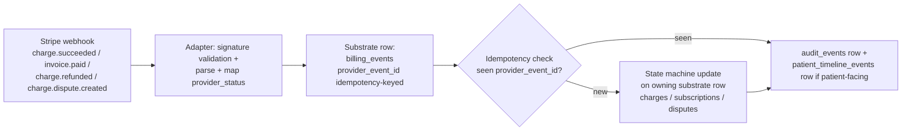

# THOUGHT EXPERIMENT — DL-13 second-rail portability sketch: Stripe payments adapter

**Status:** SKETCH ONLY — 2026-05-12 (Phase 4H, DL-13 portability validation, "B before A")
**Type:** Thought-experiment document. NOT a preflight. NOT a design. NOT a migration. NOT code. NOT a PSP project. NOT a billing build. NOT a scheduling design. NOT a POS design.
**Goal:** prove DL-13's adapter / substrate / event / projection rules are portable BEYOND telephony, BEFORE e1 commits the first concrete substrate migration around Twilio.
**Non-goals:** build billing, design charges, design checkout, design scheduling, design POS, write schema, write code, ship anything.
**Doctrine inheritance:** DL-13 (rail-agnostic substrate spine + OMNI canonical source-of-truth + settings precedence + deterministic outbound 8-gate + display-projection-not-substrate); DL-10 (handle-vs-person; relationship-aware identity); DL-8 (sibling admission criteria); DL-7 (canonical-state-in-substrate).
**Companion docs:** [PREFLIGHT_2026-05-12_phase_4h_external_line_e0_substrate_routing_design.md](PREFLIGHT_2026-05-12_phase_4h_external_line_e0_substrate_routing_design.md) (e0 first-rail preflight — Twilio), [HANDOFF_2026-05-12_phase_4h_external_line_e0_doctrine_complete.md](HANDOFF_2026-05-12_phase_4h_external_line_e0_doctrine_complete.md) (DL-13 closing handoff), MAIN DL-13 lock, foundational doc §7.13.13, ADR §7.16, radar zones 69-78, evolution narrative Act XIV.

---

## §1 Premise — what DL-13 claims about the broader pattern

DL-13 landed 2026-05-12 from the e0 external-line preflight's R1-R9 arc. The lock binds five invariants + three cross-cutting extensions + four rejected anti-patterns. The five invariants:

1. **Rail-agnostic substrate + vendor-confined adapter pattern** — generic `provider_*` columns on substrate; vendor code confined behind an adapter boundary INSIDE the relevant sibling directory. External-line rail adapters live under `lib/external-rails/<provider>/`. **The broader pattern applies to other domains (labs / payments / EHR-export / pharmacy / future) through their own adapter boundaries inside their respective sibling directories — NOT all under `lib/external-rails/`.**
2. **OMNI canonical source-of-truth + vendor-adopt-not-write** — OMNI's identity / contact / endpoint / queue / settings / consent substrate is master; vendor stores are local convenience for vendor-internal use, NEVER authoritative.
3. **Settings precedence hierarchy (six-level, top-down)** — Law / compliance / consent > safety / clinical criticality > endpoint policy > queue policy > user preferences > device preferences.
4. **Deterministic outbound 8-gate** — every automated rail-bound outbound passes endpoint-intent + consent + STOP/HELP + template/disclosure + quiet-hours + idempotency + rate-limit + prohibited-claims. AI confirmation is NOT a gate.
5. **Display-projection-not-substrate discipline** — display identity + status chips are computed projections at query time; NEVER independent mutable substrate columns.

**What e0 + Twilio proves.** All five invariants are validated for the telephony domain by the e0 preflight design. The Twilio adapter at `lib/external-rails/twilio/` is the first concrete instance.

**What's unproven.** Invariant 1's second clause — "the broader pattern applies to other domains" — has not been pressure-tested against a non-telephony rail. The risk: the pattern is shaped by telephony's specific characteristics (delivery-state callbacks, intent classification, opt-out semantics, quiet hours, AI participation bounds, conversation threading) and may not survive the move to a domain that lacks some of those characteristics or carries different ones (PCI scope, currency, jurisdiction, dispute lifecycle, SCA, idempotency-key-as-life-or-death).

**What this sketch tests.** Whether DL-13's adapter / substrate / event / projection rules are portable to Stripe. The choice of Stripe was deliberate (per [user direction 2026-05-12 13:42]): lightest validation that mirrors Twilio's webhook + identity surface without opening a clinical domain.

---

## §2 Why Stripe specifically

Four reasons Stripe is the right second-rail candidate:

1. **Domain distance from telephony, without clinical depth.** Stripe is genuinely a different domain — money movement, not communication — but doesn't pull in HL7 / FHIR / specimen workflows the way Quest labs would. The "oof spiral" risk is contained.
2. **Webhook callbacks mirror Twilio delivery events.** Stripe's webhook event model (`charge.succeeded`, `invoice.paid`, `customer.subscription.updated`, `charge.refunded`, `charge.dispute.created`, etc.) is structurally analogous to Twilio status callbacks (`queued`, `sent`, `delivered`, `failed`, `undelivered`). If DL-13's `external_message_delivery_events` shape generalizes, it should generalize here.
3. **OMNI-canonical-vs-vendor-customer-id is the classic anti-pattern test.** Stripe Customer ID vs OMNI `patients.id` is the cleanest possible test of DL-13 invariant 2. If anyone is tempted to model Stripe Customer ID as a foreign key driving OMNI identity, the test catches it.
4. **Multi-consumer vendor in a way Twilio is not.** Stripe is naturally consumed by multiple OMNI siblings (subscription billing, future scheduling deposits, future POS). Twilio in e0 has only one consumer (`external_communications/`). This makes Stripe the first concrete multi-consumer adapter case — the genuine new test DL-13 hasn't faced.

**What Stripe is NOT a strong test for.** PCI / regulatory-compliance posture for payments is well-developed industry-wide; DL-13's settings precedence layer 1 ("Law / compliance / consent") will fire heavily but in ways that don't stress the abstraction. SCA (Strong Customer Authentication) has no telephony analog and forces a wrinkle, but it's a single-gate-shape extension, not a structural challenge. Stripe is a domain-distance test, not a depth test.

---

## §3 Explicit out-of-scope (binding)

This sketch does NOT:

- Design a billing substrate (no `charges`, `subscriptions`, `invoices`, `payment_methods`, `disputes` table designs).
- Design a checkout flow.
- Design subscription lifecycle / proration / dunning.
- Design refund / chargeback workflows.
- Design PCI compliance program / SAQ scoping.
- Activate `billing_subscription/` beyond what's already active in `repo/rules/` + `repo/templates/`.
- Activate `scheduling_lifecycle/` or `retail_lifecycle/`.
- Specify Stripe SDK version, API version, idempotency-key scheme, retry policy, or rate-limit handling.
- Specify webhook endpoint URL routing, signature verification implementation, or replay-attack defense.
- Specify migration sequencing for any payment-related table.
- Specify RLS policies, audit_event shapes, or `patient_timeline_events` rows for payment events.
- Provide code samples in any language.
- Recommend a specific Stripe product (Connect, Issuing, Terminal, Billing, Payments, Climate, etc.).

**If a section starts to look like design instead of validation, the section is cut.**

The sole question this document answers: **does the pattern DL-13 describes for Twilio survive intact when mapped onto a Stripe-shaped vendor?**

---

## §4 Substrate primitives applied — generic provider_* column mapping

DL-13 invariant 1 binds generic `provider_*` substrate columns; vendor specifics go in `provider_metadata jsonb`. The Stripe → substrate mapping for a hypothetical future billing-event substrate (NOT a substrate this document designs — just a column-shape sanity check):

| Concept | Generic substrate column | Stripe binding (adapter translates) | Notes |
|---|---|---|---|
| Vendor identifier for a charge | `provider_charge_id text` | Stripe Charge ID (`ch_...`) or PaymentIntent ID (`pi_...`) | One column; adapter picks correct Stripe object per call shape. |
| Vendor identifier for a customer (LOCAL CONVENIENCE ONLY) | `provider_customer_id text` | Stripe Customer ID (`cus_...`) | NOT a foreign key driving OMNI identity. OMNI's `patients.id` is canonical. See §6. |
| Vendor identifier for a subscription | `provider_subscription_id text` | Stripe Subscription ID (`sub_...`) | Adapter creates Stripe sub on OMNI subscription activation; OMNI ID is canonical. |
| Vendor identifier for an invoice | `provider_invoice_id text` | Stripe Invoice ID (`in_...`) | OMNI may render its own invoice substrate; Stripe invoice is a vendor artifact. |
| Vendor identifier for a payment method | `provider_payment_method_id text` | Stripe PaymentMethod ID (`pm_...`) or Source ID (legacy) | Tokenized vendor reference; OMNI never stores raw card data. |
| Vendor identifier for a setup intent (collect-card-without-charge) | `provider_setup_intent_id text` | Stripe SetupIntent ID (`seti_...`) | Used for save-card-for-future. |
| Vendor identifier for a dispute | `provider_dispute_id text` | Stripe Dispute ID (`dp_...`) | Mirrors `provider_dispute_id`-shaped column on hypothetical disputes substrate. |
| Vendor identifier for a webhook event | `provider_event_id text` | Stripe Event ID (`evt_...`) | Idempotency key for event-replay protection. Mirrors `provider_event_id` on `external_communication_events` in e0. |
| Canonical status enum | `provider_status text` (mapped to substrate-canonical enum) | Stripe status enums (`succeeded`, `pending`, `failed`, `requires_action`, `requires_capture`, `canceled`, etc.) translated by adapter into substrate-canonical enum (e.g., `charge_status ∈ {pending, succeeded, failed, refunded, disputed}`). | Substrate enum is generic; adapter maps vendor enum → substrate enum. |
| Raw vendor payload | `raw_provider_payload jsonb` | Full Stripe webhook event body | Preserved verbatim for audit / replay / debugging. Mirrors `raw_provider_payload` on `external_communication_events` in e0. |
| Vendor-specific extension fields | `provider_metadata jsonb` | Stripe `metadata` field passthrough + any vendor-only fields not worth canonical columns | This is where Stripe-specific extras live. NEVER smuggled into substrate primary columns. |

**Substrate schema NEVER carries `stripe_*`-named columns.** Same rule as `twilio_*`-named columns being forbidden on `external_conversation_messages`. The substrate is rail-agnostic. The adapter does the translation.

**Finding so far:** the column-shape pattern from e0 generalizes 1:1 to Stripe. Every Twilio `provider_*` column has a Stripe equivalent without contortion. The pattern survives.

---

## §5 Adapter directory sketch — what's inside the adapter vs what's above it

Borrowing the e0 adapter contract pattern: the adapter is **translation only**. Business logic lives in the substrate orchestration layer above it.

### What lives inside the Stripe adapter (regardless of placement decision — see §11)

- **Stripe SDK client wrapper.** Versioned `stripe-node` (or equivalent) client; API version pinned; configurable per environment (test / live).
- **Webhook signature validation.** `Stripe-Signature` header verification using the webhook signing secret. Replay-attack defense via timestamp tolerance.
- **Vendor wire format → substrate row translation.** Inbound: parse Stripe webhook event into substrate event row + canonical status + provider IDs. Outbound: assemble Stripe API call from substrate intent (e.g., "charge this subscription").
- **Vendor error / status code translation.** Stripe-specific error types (`card_error`, `validation_error`, `api_error`, `idempotency_error`, `rate_limit_error`) mapped into substrate-canonical error/status taxonomy.
- **Idempotency-key passthrough.** Substrate orchestration layer provides the idempotency key; adapter passes it through to Stripe's `Idempotency-Key` header. Adapter does NOT generate idempotency keys.
- **Rate-limit handling + retry classification.** Stripe-specific 429 handling, exponential backoff parameters, retry-classification (idempotent vs non-idempotent operations).
- **RailCapability descriptor analog — PspCapability.** Static descriptor exposing what Stripe supports: dispute lifecycle? subscription proration? saved card via SetupIntent? Strong Customer Authentication? recurring at custom intervals? international currencies? metered billing? Connect? Issuing? The substrate orchestration layer reads this to know what's safe to ask the adapter to do.

### What NEVER lives inside the adapter

- **Business logic.** "Should we charge this patient?" — that's substrate orchestration. "How to charge them via Stripe" — that's adapter.
- **Consent / authorization state.** Whether a patient has consented to recurring billing is OMNI substrate (per primitive #21 + §1K.11); the adapter doesn't read consent state.
- **The 8-gate-analog (see §8).** Pre-charge gates live in substrate orchestration above the adapter, not inside it.
- **Multi-tenant orchestration.** Which `org_id` / brand_id the charge belongs to is substrate concern.
- **Patient identity resolution.** Adapter never reads Stripe Customer store to resolve OMNI patient identity (per §6).
- **Display projection logic.** Status chip computation is substrate query layer, not adapter.
- **Settings precedence resolution.** The six-level precedence (§7) is evaluated in substrate orchestration; adapter receives a resolved policy and acts.

This is the same boundary the Twilio adapter has in e0 §8. The shape generalizes cleanly.

**Finding:** the adapter / orchestration boundary is portable. Stripe doesn't pull anything new into the adapter that wasn't in Twilio's shape.

---

## §6 OMNI canonical vs vendor canonical — the classic identity test

This is DL-13 invariant 2 in its purest test form.

### The naive (rejected) shape

```
patients
  id (uuid, PK)
  stripe_customer_id (text, FK to Stripe)   -- WRONG (radar zone 70)
```

In this shape, Stripe Customer ID becomes a structural element of OMNI identity. When OMNI receives a Stripe webhook with a Customer ID, it resolves to OMNI patient. When OMNI creates a patient, it must round-trip to Stripe to get a Customer ID before the row is "complete." This shape:

- Couples OMNI to Stripe at the identity layer.
- Cannot represent OMNI's DL-10 multi-relationship-per-person model (a single OMNI patient may have many `patient_relationships`; Stripe Customer is a flat entity).
- Forecloses multi-PSP futures (if OMNI ever adds Adyen / Square / regional PSP, what's the column?).
- Lets vendor down-state (Stripe outage) block OMNI patient creation.

**Forbidden per DL-13 invariant 2 + radar zone 70 (vendor-as-contact-source drift).**

### The DL-13-compliant shape

```
patients
  id (uuid, PK)                              -- OMNI canonical
  ... (no provider_*_id columns)

patient_payment_provider_links               -- new substrate hypothetically
  id (uuid, PK)
  patient_id (uuid, FK patients.id)          -- OMNI canonical
  provider_kind (text)                        -- 'stripe' / future
  provider_customer_id (text)                 -- Stripe Customer ID (local convenience)
  status (text)                               -- active / detached / suspended
  ... audit columns

  unique(patient_id, provider_kind)           -- one customer record per patient per PSP
```

**OMNI publishes patient → Stripe via adapter on first billing activity.** OMNI never reads from Stripe's Customer store to resolve OMNI patient identity. If a Stripe webhook arrives with a Customer ID OMNI doesn't recognize (somehow), the webhook is logged + flagged + held for ops triage; it does NOT auto-create an OMNI patient.

### Comparison to e0 / Twilio

This shape is structurally identical to `contact_identities` in e0:

| Concept | e0 (Twilio) | This sketch (Stripe) |
|---|---|---|
| OMNI canonical identity | `patients.id` (via `patient_relationships` for operational scope) | `patients.id` (same) |
| Vendor-side identifier (local convenience) | `contact_identities.phone_e164` + future `provider_contact_id` per rail | `patient_payment_provider_links.provider_customer_id` |
| Vendor sends event with vendor ID | Twilio webhook with phone number / Conversation SID | Stripe webhook with Customer ID |
| Resolution direction | Vendor ID → `contact_identities` → optional projection to `patient_relationship` | Vendor ID → `patient_payment_provider_links` → `patients.id` |
| OMNI publishes to vendor on manual creation | Scheduling-side patient creation publishes phone handle into OMNI; Twilio adopts | First-billing activation publishes patient into Stripe; Stripe adopts (vendor Customer record created) |
| Reading from vendor to resolve OMNI identity | FORBIDDEN (zone 70) | FORBIDDEN (zone 70) |

**Finding:** identity discipline is fully portable. The `handle-vs-person` extension from DL-10 (a phone is a handle, not always one person) has a payment analog: a card on file is a payment instrument, not always one person (shared family card, employer card, fraudulent card, expired-and-replaced card all admit "card-as-handle"). The substrate is structurally the same; the wrinkle is naming (`patient_payment_provider_links` instead of `contact_identities`) and the specific handle attribute (card last-4 + expiry + brand instead of phone E.164).

---

## §7 Settings precedence test — does the six-level hierarchy apply to payments?

DL-13 invariant 3 binds six-level precedence: (1) Law / compliance / consent > (2) Safety / clinical criticality > (3) Endpoint policy > (4) Queue policy > (5) User preferences > (6) Device preferences.

Mapping each layer onto payments:

| Layer | Telephony (e0) | Payments (Stripe) | Fires? |
|---|---|---|---|
| 1 — Law / compliance / consent | TCPA / STOP-state / consent / opt-out / quiet-hours / retention | PCI scope + retention + jurisdiction (state-specific refund regulation, sales tax, dunning rules) + consent for recurring billing + Reg E (debit) / Reg Z (credit) requirements + SCA (PSD2 jurisdiction) | YES, heavily |
| 2 — Safety / clinical criticality | Urgent escalation / safety / adverse event / on-call override | Rx-prescription-billing-tied-to-clinical-decision (if billing failure blocks medication shipment); medication-refill-payment-failure routes to clinical follow-up queue | YES, narrowly (only at clinical/billing intersection) |
| 3 — Endpoint policy | Per-endpoint intent class / business hours / voicemail / forwarding | Per-brand payment policy (require payment method on file? allow check / ACH only? cash-pay-only brand? deposit-required-for-appointment brand?); per-jurisdiction allowed payment types | YES, meaningfully (per-brand variation real) |
| 4 — Queue policy | Per-queue ownership / SLA / escalation | Finance team queue for failed payments / chargebacks / disputes; SLA on dispute response (Stripe gives ~7 days to respond to disputes) | YES, narrowly |
| 5 — User preferences | Staff mute / DND / badges | Finance staff UI preferences (default sort on disputes view; default filter on failed-payments queue) | YES, shallowly |
| 6 — Device | Ringtones / text tones / app UI | Minimal — terminal/device preferences for in-clinic POS (future scope) | NO meaningful application currently |

**Override semantics test (binding from DL-13).** Higher layers override lower; lower NEVER override higher. Test case: a patient's consent state (layer 1) forbids charging an expired card without re-authorization; this overrides a brand's "auto-retry failed payments" endpoint policy (layer 3). Test case: PCI scope (layer 1) forbids storing raw card data; this overrides any user preference (layer 5) or convenience UI flow (layer 6) that might want to log the PAN. The pattern survives — payments has its own layer-1 stack (PCI / Reg E / Reg Z / SCA) that's different content but same precedence shape.

**Finding:** settings precedence framework generalizes. The CONCEPT is portable; the content of each layer differs by domain. Layer 1 in payments is regulatory + compliance (PCI / Reg E / Reg Z / SCA / jurisdiction-specific dunning / Strong Customer Auth); layer 2 is the narrow clinical-billing intersection; layer 3 is per-brand payment policy; layers 4–6 are present but shallow. The pattern doesn't need amendment.

**Subtle finding:** the six layers were originally derived from telephony / RingCentral-class settings taxonomy. They generalize to payments without modification because the underlying hierarchy (compliance > safety > sibling-scope-policy > queue > user > device) is operationally universal, not telephony-specific. Confirms DL-13 invariant 3 is genuinely cross-cutting.

---

## §8 8-gate analog test — does deterministic-outbound-discipline generalize?

DL-13 invariant 4 binds an 8-gate for external-line automated outbound: (i) endpoint-intent + (ii) consent / opt-in + (iii) STOP/HELP suppression + (iv) template/disclosure + (v) quiet-hours + (vi) idempotency + (vii) rate-limit + (viii) prohibited-claims. AI confirmation is NOT a gate.

### Pre-charge gates for payments — what would the analog be?

Sketch (NOT a design — pattern test only):

1. **Charge-intent classification** (analog of endpoint-intent) — is this a subscription renewal, one-time charge, deposit, refund, dispute response, top-up, retry? Charge-intent must match the patient's consent shape (recurring vs single-event vs deposit-only).
2. **Consent / authorization on file** (analog of consent / opt-in) — patient has explicitly consented to this charge-intent class on this brand on this `patient_relationship`. SCA may require additional fresh authorization. Consent class is scoped (recurring-subscription consent ≠ one-time appointment-deposit consent).
3. **Suppression check** (analog of STOP / HELP suppression) — patient is not in "do not charge" / dispute-pending-investigation / refund-pending / billing-hold / financial-hardship-flag / collections-on-hold state.
4. **Amount + currency validation** (analog of template / disclosure check) — amount is non-zero, currency matches brand currency, jurisdictional limits respected (e.g., some states cap deposits), required disclosures present (e.g., "your card will be charged $X today and $Y monthly").
5. **PCI scope check** (no clean telephony analog) — operation does not exceed merchant's PCI scope (no raw PAN transmission, tokenized only); 3DS / SCA required if jurisdiction demands.
6. **Idempotency** (binding match to gate 6 in telephony) — `Idempotency-Key` provided; substrate dedupe key prevents duplicate charges. For Stripe specifically this is mission-critical — duplicate charge events from webhook retries vs duplicate charge API calls from retry storms are existential.
7. **Rate-limit + retry classification** (analog of gate 7) — per-patient charge rate limits (no more than N retries per failed payment per day); per-merchant-account Stripe rate limit respected.
8. **Prohibited-operation / safety classification** (analog of gate 8) — operation is not on Stripe's prohibited businesses list; charge does not exceed brand-configured max amount without supervisor approval; charge isn't on a frozen account.

**Gates differ in content; pattern is preserved.** No AI confirmation is a gate. All eight are deterministic — computed from substrate state + policy config + adapter capability descriptor. Failed gate produces audit row + suppressed-charge metadata; does NOT silently retry on gate failure.

### Test: does any gate REQUIRE concepts DL-13 doesn't have?

- **SCA (Strong Customer Authentication)** is genuinely new — telephony has no analog. But SCA is a single-gate-shape extension (gate 5 incorporates jurisdiction-dependent SCA), not a structural challenge. The 8-gate framework absorbs it without amendment.
- **Currency / jurisdiction** is new for payments but maps cleanly to gate 4 (amount + currency validation).
- **PCI scope** is new for payments but maps cleanly to gate 1 (settings precedence layer 1) + gate 5 (operation safety).

**Finding:** the 8-gate concept generalizes. The specific gates are domain-specific (payments has SCA / PCI scope / currency that telephony doesn't have; telephony has STOP/HELP / quiet-hours / template/disclosure that payments doesn't have in the same form), but the **pattern is preserved**: deterministic gates before vendor dispatch; AI is never a gate; gate failure audits + does not silently retry. DL-13 invariant 4 is genuinely cross-cutting at the abstraction layer; specific gate content is per-domain.

**Important boundary clarification this sketch surfaces.** DL-13 invariant 4 currently reads as "deterministic OUTBOUND 8-gate" with eight specific gates named (endpoint-intent + consent + STOP/HELP + template/disclosure + quiet-hours + idempotency + rate-limit + prohibited-claims). For payments, four of those specific gates have direct analogs (endpoint-intent → charge-intent, consent → auth-on-file, idempotency → idempotency, rate-limit → rate-limit), three are inapplicable (STOP/HELP / quiet-hours / template-disclosure are telephony-specific), and one (prohibited-claims) generalizes to prohibited-operation. The **framework** (deterministic + 8-gate-shape + no-AI-confirmation) is portable; the **specific gate list** is telephony-shaped.

**Recommendation noted for §13:** when documenting DL-13 in foundational §7.13.13.4, either (a) abstract the gate list to "intent + consent + suppression + content-validation + jurisdiction-or-criticality-check + idempotency + rate-limit + prohibited-classification" (semi-generic), or (b) explicitly state that the 8 specific gates are telephony-shaped and other domains substitute domain-equivalent gates while preserving the framework. Option (b) is honest. Option (a) hides the domain-specificity. **Option (b) recommended.**

---

## §9 Display-projection-not-substrate test

DL-13 invariant 5 binds display-projection-not-substrate: status chips + display identity are computed at query time from substrate; NEVER independent mutable substrate columns.

### Test: OMNI billing-view status chips

What chips would an OMNI billing inbox show on a payment / subscription / customer row?

- **Paid** — derived from charge state (succeeded + not-refunded + not-disputed).
- **Pending** — derived from charge state (requires_action / requires_capture / processing).
- **Failed** — derived from charge state (failed + retry-eligible) + retry-count.
- **Refunded** — derived from refund existence on charge.
- **Partially refunded** — derived from refund total < charge amount.
- **Disputed** — derived from open dispute on charge.
- **Chargeback (lost)** — derived from dispute outcome (lost).
- **Past due** — derived from invoice / subscription state.
- **Subscription active** — derived from subscription state.
- **Subscription canceled** — derived from subscription cancel-at + cancel-at-period-end.
- **In dunning** — derived from invoice state + retry count + brand dunning policy.

### What this sketch is testing

The temptation: cache a `current_billing_status` text column on `patient_payment_provider_links` or on a hypothetical `customer_billing_view` row, updated on every webhook. This would be radar zone 71 (chat_status-independent-field drift) for payments.

The DL-13-compliant shape: derive chips at query time from substrate (charges + refunds + disputes + invoices + subscriptions). Projection-cache table admissible per DL-8 IF justified by performance + clear invalidation contract.

**Finding:** pattern holds cleanly. Webhooks update substrate; chips re-derive at query. Same discipline as e0's external-conversation status chips. Even the temptation shape is the same: "let me cache this so the billing dashboard is fast" — and the DL-13 answer is the same: cache as projection layer with invalidation contract, never as substrate state.

---

## §10 Webhook callback analog — does the event-flow shape survive?

DL-13 + e0 establish a webhook flow: rail → adapter (signature validation + parse) → substrate event row (`external_communication_events` or `external_message_delivery_events`) → idempotency check via `provider_event_id` → state machine update on owning substrate (e.g., `external_conversation_messages.status`).

### The analogous Stripe flow



This is structurally identical to e0's webhook flow for Twilio. The only differences:

1. **Event type taxonomy differs.** Stripe webhook types are `charge.*` / `invoice.*` / `customer.subscription.*` / etc.; Twilio is delivery-state / inbound-message / status-callback. But both map into substrate-canonical event-type enums via adapter.
2. **State machine target differs.** Stripe events update `charges` / `subscriptions` / `disputes`; Twilio events update `external_conversation_messages` / `external_message_delivery_events`. But both flow through the same substrate-event-row → idempotency-check → state-machine pattern.
3. **Idempotency criticality is higher for payments.** Duplicate-charge events from webhook retries are catastrophic in a way duplicate-delivery-receipts for SMS are not. But the IDEMPOTENCY MECHANISM is identical — `provider_event_id` as substrate dedupe key.
4. **Dispute lifecycle is longer.** Stripe disputes can span days/weeks (evidence submission, payer review); Twilio delivery state is sub-minute. But the substrate doesn't care — both are append-only event streams updating an owning substrate row.

**Finding:** webhook-callback shape is fully portable. Pattern holds without amendment. `provider_event_id` as idempotency key is the right primitive name regardless of domain.

---

## §11 Multi-consumer adapter placement (centerpiece — the genuine new test)

This is the section that justifies the entire sketch.

### The problem

Twilio in e0 is consumed by exactly **one** sibling: `external_communications/`. The DL-13 rule "adapter lives inside the relevant sibling directory" (at `lib/external-rails/<provider>/`) is unambiguous for that case.

Stripe is naturally consumed by **three** siblings:

- **`billing_subscription/`** (active; subscription billing, checkout, refunds, dunning).
- **Future `scheduling_lifecycle/`** (reserved; appointment deposits, no-show fees, cancellation fees, deposit-to-final-charge transitions).
- **Future `retail_lifecycle/`** (reserved; in-clinic POS for supplements / OTC / device / aesthetic-product sales, possibly via Stripe Terminal hardware).

(Plus potentially: future `revenue_cycle/` for charge-capture-from-clinical-events; future `pharmacy_lifecycle/` if patient-paid Rx fulfillment routes through PSP; future `inventory_lifecycle/` if supply replenishment payments to vendors route through PSP. Five-plus consumers is a real possibility.)

The DL-13 rule "adapter inside the relevant sibling" — **which sibling is "the relevant" sibling when there are multiple?** This is what the sketch is here to answer.

### Three placement options

#### Option (a) — Primary-home pattern

```
billing_subscription/
  lib/
    psp-adapters/
      stripe/                          <- adapter PRIMARY home
        client.ts                      <- raw SDK client
        webhook-validation.ts          <- signature verification
        event-translator.ts            <- vendor → substrate canonical
        api-shim.ts                    <- substrate intent → Stripe call
        capability-descriptor.ts       <- PspCapability
        index.ts                       <- public adapter surface

scheduling_lifecycle/
  lib/
    deposit-flow.ts                    <- IMPORTS adapter from billing_subscription/lib/psp-adapters/stripe/
                                          consumes the shared adapter for deposit charges

retail_lifecycle/
  lib/
    pos-flow.ts                        <- IMPORTS adapter from billing_subscription/lib/psp-adapters/stripe/
                                          consumes the shared adapter for in-clinic POS charges
```

**Pros:** keeps adapter code in one place (DRY); no duplication; one PspCapability descriptor for all consumers; one upgrade path when Stripe API version changes.

**Cons:** **violates DL-13 invariant 1's "vendor-confined adapter inside the relevant sibling" rule** because scheduling and retail are reaching into billing_subscription's directory for vendor code. The vendor confinement is technically inside billing_subscription, but the SIBLING-BOUNDARY discipline (foundational doc §5.3) is bent — scheduling and retail now have a hidden dependency on billing_subscription beyond the documented sibling-boundary cross-references.

**Verdict:** technically functional, but architecturally muddled. The rule "adapter inside the relevant sibling" loses its meaning if everyone imports from one sibling's adapter directory.

#### Option (b) — Primitive-level shared adapter

```
lib/
  psp/
    stripe/                            <- adapter at PRIMITIVE level
      client.ts
      webhook-validation.ts
      event-translator.ts
      api-shim.ts
      capability-descriptor.ts
      index.ts

billing_subscription/
  lib/
    subscription-flow.ts               <- imports from lib/psp/stripe/
scheduling_lifecycle/
  lib/
    deposit-flow.ts                    <- imports from lib/psp/stripe/
retail_lifecycle/
  lib/
    pos-flow.ts                        <- imports from lib/psp/stripe/
```

**Pros:** clean DRY architecture; vendor code is acknowledged primitive-level utility (like authentication, RLS, or audit); every consumer treats it symmetrically.

**Cons:** **requires a small DL-13 amendment.** Current language says "vendor code confined behind an adapter boundary inside the relevant sibling directory" with "external-line rail adapters live under `lib/external-rails/<provider>/`." Moving Stripe to `lib/psp/<provider>/` is consistent with the "external-line lives at `lib/external-rails/<provider>/`" pattern (both are primitive-level by domain category), but DL-13's broader-pattern clause explicitly says "the broader DL-13 vendor-confined-adapter pattern applies to other domains through their own adapter boundaries inside their respective sibling directories — NOT all under `lib/external-rails/`." This option contradicts that clause. Either DL-13 needs amendment, or option (b) is rejected.

**Verdict:** clean but requires doctrine change. Possibly correct doctrine change, but a change nonetheless.

#### Option (c) — Per-sibling adapters with thin shared core

```
lib/
  psp/
    stripe-core/                       <- THIN shared utility
      client.ts                        <- raw SDK client wrapper
      webhook-validation.ts            <- signature verification
      capability-descriptor.ts         <- PspCapability (vendor-level capability descriptor)
      types.ts                         <- vendor wire types

billing_subscription/
  lib/
    psp-adapters/
      stripe/                          <- BUSINESS MAPPING for billing
        subscription-translator.ts     <- subscription events → billing substrate
        invoice-translator.ts          <- invoice events → billing substrate
        charge-translator.ts           <- charge events → billing substrate
        api-shim.ts                    <- billing intents → Stripe API
        index.ts

scheduling_lifecycle/
  lib/
    psp-adapters/
      stripe/                          <- BUSINESS MAPPING for scheduling
        deposit-translator.ts          <- deposit-charge events → scheduling substrate
        no-show-fee-translator.ts      <- no-show fee events → scheduling substrate
        api-shim.ts                    <- scheduling intents → Stripe API
        index.ts

retail_lifecycle/
  lib/
    psp-adapters/
      stripe/                          <- BUSINESS MAPPING for retail
        terminal-translator.ts         <- Stripe Terminal events → retail substrate
        sale-translator.ts             <- sale events → retail substrate
        api-shim.ts                    <- retail intents → Stripe API
        index.ts
```

**Pros:**

- Each sibling owns its OWN adapter directory (DL-13 "adapter inside the relevant sibling" rule preserved).
- Shared concern is genuinely thin: raw SDK client wrapper + webhook signature validation + capability descriptor + vendor wire types. None of those are business mapping; all of them are vendor-level utility (basically: how to talk to Stripe at all).
- Business mapping is per-sibling: what a `charge.succeeded` event MEANS for billing (mark subscription paid; close invoice) vs scheduling (release appointment hold; reduce deposit balance) vs retail (close POS sale; update inventory consumption) is different across siblings, and the sibling owns its interpretation.
- DL-13 rule survives intact with a 1-paragraph clarification: "where a vendor is consumed by multiple siblings, the adapter business mapping lives inside each consuming sibling at `<sibling>/lib/psp-adapters/<vendor>/`; raw vendor SDK + webhook signature validation may live at primitive-level `lib/psp/<vendor>-core/` as a thin shared utility because the SDK client + signature scheme is vendor-level not sibling-level. Sibling-level business mapping is canonical."

**Cons:**

- More files; some code that COULD be shared lives in three places (e.g., common stripe event-fetching logic).
- Risk of three siblings' adapters drifting in how they translate the same event (e.g., billing maps `charge.succeeded` to `paid` while retail maps it to `complete` — fine as long as both are documented).

**Verdict:** **recommended.** Preserves DL-13 sibling-boundary discipline; admits the genuine reality that a vendor SDK client is acceptably primitive-level utility (the way an HTTP client or database driver is); keeps business mapping at the sibling level where it belongs.

### Concrete recommendation

**Option (c) recommended.**

The 1-paragraph DL-13 clarification (proposed wording, deferred until first multi-consumer vendor activation — possibly never needed if (c) is adopted as convention without doctrine amendment):

> "Where a vendor is consumed by multiple siblings (e.g., a payment processor consumed by `billing_subscription/` for subscriptions + future `scheduling_lifecycle/` for deposits + future `retail_lifecycle/` for POS), the **business-mapping adapter** lives inside each consuming sibling at `<sibling>/lib/psp-adapters/<vendor>/` (or `<sibling>/lib/<domain>-rails/<vendor>/` for other domain shapes). The **raw vendor SDK client + webhook signature validation + capability descriptor + vendor wire types** may live at primitive-level `lib/<domain>/<vendor>-core/` as a thin shared utility — these are vendor-level not sibling-level concerns, comparable to HTTP clients or database drivers. Per-sibling adapters import from the shared core. **Sibling-level business mapping is canonical**; no sibling's adapter substitutes for another's interpretation of the same vendor event."

### Whether to land this clarification now

Two options:

- **Land now** (small follow-up commit immediately after this sketch) — clarifies DL-13 before e1 commits; documents the pattern for future readers; cost: small amendment to foundational §7.13.13.1 + §5.3(c) + cross-reference in MAIN DL-13 lock.
- **Defer until first multi-consumer activation** — keep DL-13 unchanged for now; let the convention emerge organically when scheduling or POS sibling activates; cost: pattern unfounded until first multi-consumer build; risk: builder might do option (a) or (b) without realizing the choice exists.

**Recommendation:** **defer**, with this sketch + handoff serving as the documented record of the question + the recommended answer. Reason: e1 (Twilio) is single-consumer; the clarification doesn't affect e1; landing doctrine amendments without a concrete activation tends to over-fit. The sketch is preserved in `.cursor/plans/` and referenced from the DL-13 handoff cross-arc impact map; when scheduling or POS sibling activates with a PSP adapter, the builder picks up the sketch + applies option (c) + lands the clarification at that time. The doctrine arc cadence ("doctrine follows concrete activation") is preserved.

**This is the most important finding of the sketch.**

---

## §12 Scheduling + POS as future consumers (explicit boundary)

This section exists to enforce the user's hard scope guards.

- **Scheduling is NOT designed here.** `scheduling_lifecycle/` is reserved per foundational §5; its primitives (appointment / room / provider availability / multi-resource booking) and lifecycle are not specified by this sketch.
- **POS is NOT designed here.** `retail_lifecycle/` is reserved per foundational §5; its primitives (lot tracking / point-of-sale dispense / in-clinic injectable-implant-device-supplement consumption) are not specified by this sketch.
- **Both are NAMED only as future consumers of a Stripe adapter.** They appear in §11 to generate the multi-consumer adapter-placement test. Their own design is deferred to whenever those siblings activate.
- **No deposit flow, no no-show fee policy, no POS UI, no Terminal hardware integration, no Connect onboarding for in-clinic providers, no marketplace-shape billing.** Out of scope.
- **No table designs for `appointment_deposits` / `pos_sales` / `terminal_payments`.** Out of scope.

The thought experiment uses scheduling + POS as a CONSTRAINT (multi-consumer reality) to test DL-13. It does not design them.

---

## §13 Pattern portability findings — what survives, what needs clarification, what's new

### Survives unchanged

- **Rail-agnostic substrate column shape.** Every Twilio `provider_*` column has a clean Stripe analog (§4). Substrate schema has no vendor-named columns; vendor extras live in `provider_metadata jsonb`.
- **Adapter vs substrate orchestration boundary.** The "translation only inside the adapter; business logic above" rule from e0 §8 generalizes 1:1 (§5). No new categories of code want to live inside the adapter.
- **OMNI canonical + vendor-adopt-not-write.** `patients.id` (OMNI) vs `provider_customer_id` (Stripe Customer; local convenience only) is structurally identical to `contact_identities` discipline in e0 (§6). The handle-vs-person extension from DL-10 has a natural payment analog (card-as-handle).
- **Webhook event flow + idempotency via `provider_event_id`.** Structurally identical to e0's `external_communication_events` flow (§10). `provider_event_id` as idempotency key is rail-agnostic.
- **Display-projection-not-substrate.** Billing-view status chips computed at query time from substrate (charges + refunds + disputes + invoices + subscriptions); never independent mutable columns (§9). Projection-cache admissible per DL-8 if justified.
- **Settings precedence CONCEPT (six-level top-down).** Compliance > safety > sibling-scope-policy > queue > user > device hierarchy is operationally universal, not telephony-specific (§7). Layer content differs per domain; precedence framework is portable.
- **Deterministic-gates-before-vendor-dispatch CONCEPT.** Specific gates differ across domains (telephony has STOP/HELP and quiet-hours; payments has SCA and PCI scope), but the framework — deterministic + multi-gate + no-AI-confirmation + gate-failure-audits-without-silent-retry — generalizes (§8).

### Needs clarification (1 paragraph each, recommended at first multi-consumer activation)

- **Multi-consumer adapter placement.** Current DL-13 language is unambiguous for single-consumer vendors (Twilio → `external_communications/`); silent for multi-consumer vendors (Stripe → billing + future scheduling + future retail). Recommendation: option (c) per-sibling business-mapping adapters + thin primitive-level shared core. Clarification text in §11. **Land at first multi-consumer activation, not now.**
- **8-gate specificity vs framework.** Current DL-13 invariant 4 enumerates eight specific gates that are telephony-shaped. For non-telephony domains, the framework (deterministic + multi-gate + no-AI) holds but specific gates substitute. Recommendation: when documenting cross-domain, prefer "8-gate framework" + "telephony-specific gates" + "per-domain gate substitution" language over implying every domain has those exact eight gates. **Optional documentation tightening; not blocking.**

### Genuinely new (not covered by current DL-13; not blocking)

- **SCA (Strong Customer Authentication)** has no telephony analog. It's a single-gate-shape extension in the 8-gate framework (gate 1 / 5 incorporate jurisdiction-dependent SCA), not a structural challenge. The framework absorbs it cleanly.
- **PCI scope** as a settings-precedence layer-1 concept has no direct telephony analog (telephony has TCPA / consent / opt-out / retention, but not the credit-card-scope concept). Maps cleanly to layer 1 without amendment.
- **Dispute lifecycle (Stripe disputes span days/weeks)** is a longer-cycle event stream than Twilio delivery state (sub-minute), but the substrate doesn't care — both are append-only event streams updating an owning substrate row. No amendment needed.
- **Multi-currency / multi-jurisdiction** is a real wrinkle for payments that telephony has in milder form (international SMS routing). Maps cleanly to gate 4 (amount + currency validation) and settings precedence layer 1 (jurisdiction). No amendment needed.

### Rejected anti-patterns the test surfaced

- **Stripe Customer ID as `patients` foreign key** — radar zone 70 (vendor-as-contact-source drift). Same forbidden shape as Twilio Contact SID as `patients` FK. Sketch §6.
- **`stripe_*`-named columns on substrate** — radar zone 69 (rail-bypass drift). Same forbidden shape as `twilio_*`-named columns. Sketch §4.
- **Cached `current_billing_status` mutable column** — radar zone 71 (chat_status-independent-field drift). Same forbidden shape as cached `chat_status`. Sketch §9.
- **Per-sibling Stripe SDK clients with duplicated webhook validation** — would be a NEW radar zone if option (a) or (b) was chosen without thought. Option (c) avoids this.

---

## §14 Recommendations

### For e1 (next preflight after this sketch)

**Proceed unchanged.** The Twilio adapter is single-consumer (only `external_communications/`); the multi-consumer adapter placement question from §11 does not apply. e1 lands as planned under DL-13 discipline:

- `lib/external-rails/twilio/` adapter directory (per DL-13 invariant 1).
- Generic `provider_*` columns on `external_conversation_messages` + `external_message_delivery_events` etc.
- 8-gate orchestration layer above adapter.
- OMNI canonical contact-identity flow (per §1J.13).
- Settings precedence runtime (per §1D.4).
- Display-projection-not-substrate for inbox row chips (per §1V.11).

No DL-13 amendments are required for e1 to proceed.

### For DL-13 doctrine

**No immediate amendment required.** The five invariants survive the Stripe portability test intact. Two findings warrant future clarification (multi-consumer adapter placement; 8-gate framework vs gate-list distinction), but both are best landed at concrete activation:

- **Multi-consumer adapter placement** — land alongside the first multi-consumer vendor activation (likely first scheduling or POS sibling activation with a PSP adapter; possibly first lab vendor activation with Quest + a future second lab vendor; possibly first cross-sibling AI runtime adapter). The clarification text in §11 is preserved here as the documented recommendation; the activation that hits it picks it up.
- **8-gate framework vs gate-list** — minor documentation tightening; can land as a small foundational §7.13.13.4 clarification at next doctrine touch-up. Not blocking.

### For future cross-domain adapter work

This sketch's option (c) pattern is the recommended convention for any future multi-consumer vendor:

```
lib/<domain>/<vendor>-core/        <- thin shared utility (SDK + webhook validation + capability + types)
<sibling>/lib/<domain>-adapters/<vendor>/   <- per-sibling business mapping
```

Examples:

- **PSP**: `lib/psp/stripe-core/` + `billing_subscription/lib/psp-adapters/stripe/` + `scheduling_lifecycle/lib/psp-adapters/stripe/` + `retail_lifecycle/lib/psp-adapters/stripe/`.
- **Lab rail (future)**: `lib/lab-rail/quest-core/` + `labs_lifecycle/lib/lab-rail-adapters/quest/` + possibly `procedure_lifecycle/lib/lab-rail-adapters/quest/` if surgical pathology shares vendor.
- **Telephony (current single-consumer)**: stays at `lib/external-rails/twilio/` without a `core` split until a second consumer emerges.

### For the project arc

**B (this sketch) is complete. A (e1 preflight) is next.** The sketch confirms DL-13 is portable; e1 can proceed without doctrine amendment. The thought experiment cost ~half a day; surfaced one real architectural question (multi-consumer placement) cheaply; produced a documented recommendation for whenever that question becomes real.

The sketch validates the original premise of B-before-A: stress-testing DL-13 cheaply before committing the first substrate migration is worth the time, even when the test passes. **It passed.**

---

## §15 Cross-references

- **MAIN system map**: [system_map_three_layers_60706286.plan.md](system_map_three_layers_60706286.plan.md) — DL-13 lock + §1D.4 + §1G.12 + §1J.13 + §1N.9 + §1P.15 + §1Q.14.2 + §1V.11.
- **Foundational doc**: [FOUNDATIONAL_ARCHITECTURE_2026-05-10_all_dimensions.md](FOUNDATIONAL_ARCHITECTURE_2026-05-10_all_dimensions.md) — §4.B primitive description updates (#1, #5, #10, #11, #16) + §5 sibling #20 + §5.3(c) external-communications-as-sibling guard + §7.13.13 DL-13 long-form sub-doctrine + §8.1 clauses 29-33 + §11.0 crosswalk.
- **ADR**: [phase_4h_target_first_decision_record.md](../../docs/architecture/phase_4h_target_first_decision_record.md) §7.16 — DL-13 + 15 explicit REJECTED alternatives.
- **Topology**: [communications_topology.md](../../docs/architecture/communications_topology.md) — §11 external-line substrate spine + §12 DL-13 cross-references.
- **Radar**: [v1_pressure_test_radar.md](../../docs/architecture/v1_pressure_test_radar.md) — zones 69-78 (DL-13 binding watch zones).
- **Evolution narrative**: [evolution_narrative.md](../../docs/architecture/evolution_narrative.md) — Act XIV (DL-13 R1-R9 arc).
- **e0 preflight** (first concrete rail): [PREFLIGHT_2026-05-12_phase_4h_external_line_e0_substrate_routing_design.md](PREFLIGHT_2026-05-12_phase_4h_external_line_e0_substrate_routing_design.md) — 23-section external-line first-touch design + R1-R9 arc.
- **DL-13 closing handoff**: [HANDOFF_2026-05-12_phase_4h_external_line_e0_doctrine_complete.md](HANDOFF_2026-05-12_phase_4h_external_line_e0_doctrine_complete.md) — R1-R9 trail + cross-arc impact map (names future PSP / lab / EHR-export / pharmacy / telephony adapter inheritance).

### Status note

This sketch is a **thought experiment**. It is not binding doctrine, not a preflight, not a design. It validates DL-13's broader pattern claim against Stripe and produces a recommendation for the multi-consumer adapter placement question that DL-13 has not yet been asked. The recommendation is preserved here for whenever that question becomes operationally real (first multi-consumer vendor activation).

**Outcome:** DL-13 is portable. e1 (Twilio execution preflight) can proceed without doctrine amendment.

**Next:** A — e1 execution preflight (Twilio adapter + substrate migration + ops triage inbox UI minimum) under DL-13 discipline.

**End of sketch.**
