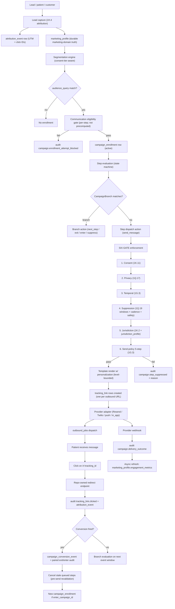

# Marketing Lifecycle + Growth Orchestration Suite — comprehensive design

**Date:** 2026-05-01
**Clinical CODEOWNER:** founder (board-certified MD)
**Ops CODEOWNER + Compliance CODEOWNER:** sign off jointly with clinical for marketing carve-out + delivery architecture + tracking_link CI lint + jurisdictional gates
**Scope:** Full marketing brain + delivery architecture + attribution + link tracking + state-machine campaign engine + conversion-driven transitions. NOT a separate spam engine — governed lifecycle layer integrated into the locked clinical/operational/privacy spine via `Section 1Q` rules + templates engine, `Section 1Q.13` Module 15 marketing carve-out, `Section 1Q.17` privacy governance, `Section 1Q.19` dynamic behavior gates, `Section 1Q.20` runtime green-light.
**Verdict:** Architecture HOLDS. 13 foundational primitives. 25 hard invariants. 20 audit event types. State-machine campaign engine. Conversion-driven transitions. Privacy-governed link tracking. Ad-platform integration without third-party brain dependency. **Ready for code-as-config implementation** of `repo/campaigns/`, `repo/templates/marketing/`, `repo/offers/`, `repo/product-adjacency/` after this checkpoint lands.

---

# Part 1 — Marketing suite verdict

**Design verdict:** the suite supports a 5K → 50K → 500K-lead growth engine without spamming patients, leaking PHI, or missing revenue opportunities — while remaining integrated with clinical authority + safety + privacy + audit infrastructure.

**Core claim:** marketing is NOT a separate spam engine. It rides the same `Section 1Q` rules + templates infrastructure as clinical comms, with hard carve-out per `Section 1Q.13` Module 15. Same audit, same privacy gate, same temporal orchestration, same versioning. The marketing "brain" is the system; external platforms (Resend / Twilio / Klaviyo / Customer.io / Braze / Iterable / Google Ads / Meta / TikTok) are pipes + observers, never sources of truth.

**Pattern reference:**
- **Amazon** — relevant lifecycle + reorder + adjacent product logic + abandoned cart + post-purchase
- **Apple** — high-trust, minimal, polished communication; never spammy; respects user attention
- **Tesla** — event/launch/drop energy + direct conversion paths
- **Hims/Ro** — pathway-specific funnels + subscription reactivation + cross-sell with respect for sensitivity
- **What we explicitly avoid** — spammy supplement-store frequency + over-personalization + HIPAA leakage + financial-institution-style portal-only friction

**Integration claims (binding):**
1. Marketing rides `Section 1Q` rules + templates engine — no parallel rule engine.
2. Marketing rides `outbound_jobs` + `Section 1G.3` send-policy — no direct provider sends.
3. Marketing respects `Section 1Q.17` triple-axis privacy — pathway_sensitivity caps outside-secure ceiling.
4. Marketing respects `Section 1Q.19` dynamic behavior gates — exclusion windows, cadence caps, pre-send revalidation.
5. Marketing runs through `Section 1Q.13` Module 15 hard carve-out — separate repo dir, distinct CODEOWNER, distinct send budget.
6. Marketing analytics + attribution are first-class — system is source of truth, not Klaviyo / Customer.io / Google Ads / Meta / TikTok.

---

# Part 2 — Architecture overview + diagram



**Key architectural distinctions:**
- **Brain (system) vs pipe (provider):** internal system owns campaign enrollment, audience eligibility, consent checks, privacy checks, suppression, temporal orchestration, template selection, personalization permissions, audit trail, patient timeline, analytics attribution. Resend / Twilio / Klaviyo / Customer.io are downstream execution tools.
- **State machines, not linear blasts:** every campaign_step may declare branches; branches evaluated against system-observed events (PRIMARY); provider-observed events (email opens) are SECONDARY signals.
- **Conversion-driven transitions:** when patient converts (intake_started, purchase_completed, etc.), source campaign exits + new campaign enters; stale queued steps cancelled; lifecycle_stage + next_best_action recompute.
- **System-owned attribution:** `attribution_event` table is canonical. External platforms receive signals (UTMs, click IDs, server-side conversion API) but do NOT control campaign logic.

---

# Part 3 — Lead state model

20 lead states with allowed campaigns, disallowed campaigns, channel strategy, privacy ceiling, consent requirements, exit conditions, suppression conditions, message_intent classification.

| # | State | Allowed campaigns | Disallowed | Channels | Privacy ceiling | Consent | Exit | Suppression | Message intent |
|---|---|---|---|---|---|---|---|---|---|
| 1 | **Anonymous landing visitor** | brand content, top-of-funnel | personalized clinical | none (web only; no outbound) | tier_0 | none | email/SMS captured | n/a | n/a |
| 2 | **Email captured only** | lead nurture (low intent) | clinical-detail | email | tier_1-2 | marketing_email opt-in | account creation, opt-out | safety/clinical never apply | marketing |
| 3 | **SMS captured only** | lead nurture (low intent) | clinical-detail, frequent SMS | SMS | tier_1-2 | marketing_sms opt-in (TCPA) | account creation, opt-out | rate-limited | marketing |
| 4 | **Email + SMS captured** | lead nurture | clinical-detail | email + SMS | tier_1-2 | marketing_email + marketing_sms | account creation, opt-out | rate-limited | marketing |
| 5 | **Account created** | welcome onboarding, lead nurture | aggressive promo | email + in_app + SMS w/consent | tier_1 default; tier_2 with consent | account creation T&C | intake started, purchase | active safety window | marketing/account |
| 6 | **Intake started** | abandoned-intake nurture, completion reminders | unrelated promo | email + SMS w/consent + in_app + push | tier_2; tier_3 with `pathway_named_outside_secure_comm` for low/moderate sensitivity | telehealth_consent (when started) | intake completed, abandoned-cap | safety windows + clarification retry caps per `Section 1Q.19` | clinical-adjacent lifecycle (NOT pure marketing) |
| 7 | **Intake abandoned** | abandoned-intake T1→T2→T3 (per `Section 1Q.13` Module 15 cadence per Patch 5 of dynamic behavior) | aggressive cross-sell | email + SMS w/consent | tier_2; tier_3 with consent | telehealth + marketing | resume, 30d cap | safety windows + cadence cap (3 contacts) | clinical-adjacent lifecycle |
| 8 | **Intake completed** | provider-review-pending lifecycle (educational) | conversion promo | email + in_app | tier_2; tier_4 in-secure | telehealth | provider decision | marketing suppressed during open clinical concern (per Patch 4 of dynamic behavior) | clinical |
| 9 | **Provider review pending** | reassuring-status updates only | promo | email + in_app + push | tier_2 outside / tier_4 secure | telehealth | provider decision | marketing exclusion 7d | clinical |
| 10 | **Approved not purchased** | conversion campaign (transactional/commercial; no clinical claims) | aggressive cross-sell | email + SMS w/consent | tier_2; tier_3 with consent for low/moderate | telehealth + Rx acceptance | purchase, opt-out, 90d cap | sensitive pathway tier_3 BLOCK | transactional/commercial |
| 11 | **Purchased (one-time)** | onboarding lifecycle, refill reminders | win-back yet | email + in_app + SMS for transactional | tier_2; tier_4 in-secure | implicit | reorder, churn | active safety window | clinical/operational |
| 12 | **Active subscriber** | onboarding, education, supplements (with provider review for cross-sells) | promo during clinical concern | email + in_app + SMS w/consent | tier_2; tier_4 in-secure | implicit + active subscription | pause, cancel | exclusion windows | clinical/operational |
| 13 | **Paused subscriber** | resume reminder (1 attempt), education | aggressive winback | email + in_app | tier_2 | implicit | resume, cancel | 30d after pause | operational |
| 14 | **Canceled subscriber** | feedback request (T1 7d), winback (T2 30d), annual check (T3 365d) | aggressive promo | email + in_app + SMS w/consent | tier_2; tier_3 if Toggle 6 ON for low/moderate | feedback consent | resubscribe, opt-out | hard 3-contact cap | marketing (winback) |
| 15 | **Denied / ineligible** | pathway-specific re-evaluation (90d if eligibility_below_threshold; NEVER if contraindication) | any promo for 30d | email | tier_2 | implicit | re-evaluation, opt-out | 30d post-denial exclusion (per Patch 4 dynamic behavior); contraindication NO automated marketing | clinical-adjacent (NOT marketing during exclusion) |
| 16 | **Deferred / needs labs** | lab kit reminder (clinical), educational lab info | promo | email + in_app + SMS w/consent | tier_2 outside / tier_4 secure | telehealth | lab returned, opt-out | 7d post-deferral marketing exclusion | clinical |
| 17 | **Safety hold** | safety-clinical only | ALL marketing | SMS-vague + push-header + provider-phone | tier_2 outside / tier_5 secure | n/a | safety resolved | full safety window suppression (24h+) | safety |
| 18 | **Churned** | annual check-in (T3) only | frequent winback | email | tier_2 | implicit | reactivation, opt-out | 365d cadence | marketing (sparse) |
| 19 | **Dormant** | re-engagement (3-month, 6-month, annual) | aggressive promo | email | tier_2 | implicit | engagement, opt-out | 3-month minimum | marketing |
| 20 | **Reactivated** | onboarding lifecycle (treat as new) | n/a | email + in_app | tier_2 | implicit | enters lifecycle 11+ | active safety window | clinical/operational |

**State transitions emit `lifecycle_event` rows in `patient_timeline_events` (per primitive #10) which trigger `marketing_lifecycle` rule firings (per `Section 1Q.13` Module 15) and conversion-driven campaign transitions (per Part 16).**

**Sensitive pathway carve-out:** for `pathway_sensitivity ∈ {high, extreme}` (TRT, ED, female HRT, peptides, mental health when scoped) — explicit pathway naming forbidden outside-secure regardless of consent (per `Section 1Q.17` invariant 5). Use neutral language: "your wellness plan", "your provider has an update", "your account needs attention".

---

# Part 4 — Marketing profile schema

`marketing_profile` is durable marketing-domain truth ONLY (NOT a junk drawer per Invariant 16). Stores fields that don't exist elsewhere; derived state (lifecycle_stage, suppression_flags, next_best_action, consent_snapshot) lives in derived views.

```typescript
// repo/db/schema/marketing_profile.ts
interface MarketingProfile {
  id: uuid;
  patient_id: uuid;                                    // FK to patients
  
  // First-touch attribution snapshot (immutable; first row creation)
  first_touch_recorded_at: timestamptz;
  first_touch_utm_source?: string;
  first_touch_utm_medium?: string;
  first_touch_utm_campaign?: string;
  first_touch_utm_content?: string;
  first_touch_referrer_url?: string;
  first_touch_landing_page_url?: string;
  first_touch_attribution_event_id?: uuid;             // FK to attribution_event
  first_touch_pathway_interest?: PathwayCode;
  
  // Last-touch attribution snapshot (rolling; updated on each new attribution_event)
  last_touch_recorded_at: timestamptz;
  last_touch_utm_source?: string;
  last_touch_utm_medium?: string;
  last_touch_utm_campaign?: string;
  last_touch_utm_content?: string;
  last_touch_referrer_url?: string;
  last_touch_landing_page_url?: string;
  last_touch_attribution_event_id?: uuid;
  
  // Engagement metrics — denormalized read-model from audit_events.campaign.delivery_outcome
  // Refreshed via async job; NEVER directly written by application code.
  open_count_30d: integer;
  open_count_90d: integer;
  click_count_30d: integer;
  click_count_90d: integer;
  bounce_count_lifetime: integer;
  complaint_count_lifetime: integer;
  unsubscribe_count_lifetime: integer;                 // marketing_sms STOP + marketing_email unsubscribe
  last_engaged_at?: timestamptz;
  last_email_dispatched_at?: timestamptz;
  last_sms_dispatched_at?: timestamptz;
  last_push_dispatched_at?: timestamptz;
  engagement_metrics_refreshed_at: timestamptz;
  
  // Marketing-domain pathway interest signals (NOT clinical truth)
  // Distinct from clinical assertions per `1K.5.A`
  pathway_interest_signals: PathwayInterestSignal[];   // [{pathway_code, signal_kind, signal_at, source}]
  
  // External platform mirrors (when external marketing platform used per V2+)
  external_marketing_platform_id?: string;             // e.g., Klaviyo profile ID
  external_marketing_platform_synced_at?: timestamptz;
  
  // Audit
  created_at: timestamptz;
  updated_at: timestamptz;
}
```

**What `marketing_profile` is NOT (per Invariant 16):**
- NOT `lifecycle_stage` — derived view from `marketing_profile_lifecycle_stage(patient_id)` computed from purchase + subscription + abandonment + intake state
- NOT `suppression_flags` — derived from active safety windows + active marketing exclusion windows + consent state
- NOT `next_best_action` — derived view per primitive #12
- NOT `consent_snapshot` — `1K.11` `patient_consents` is source of truth; read directly, never denormalize

**CI lint enforcement:**
- Adding fields to `marketing_profile` requires rationale + clinical/ops/compliance CODEOWNER co-review at PR time
- Each field justification must demonstrate: (a) durability (not transient state), (b) non-derivability from other sources, (c) marketing-domain (not clinical truth)

---

# Part 5 — Campaign taxonomy (18 types)

| # | Campaign type | Allowed intents | Default channels | Cadence | Max length | Stop conditions | Privacy | Consent | auto_exit_on_higher_lifecycle_state | incompatible_campaign_types[] |
|---|---|---|---|---|---|---|---|---|---|---|
| 1 | **lead_nurture** | marketing | email + SMS w/consent | T1 24h, T2 3d, T3 7d | 3 contacts | account_created, intake_started, opt_out | tier_1; tier_3 w/ marketing_personalization_with_phi for low/moderate | marketing_email or marketing_sms | YES | abandoned_intake, abandoned_checkout |
| 2 | **abandoned_intake** | clinical-adjacent lifecycle | email + SMS w/consent + in_app | T1 48h, T2 7d, T3 30d | 3 contacts | intake_completed, opt_out, 30d cap | tier_2; tier_3 w/consent for low/moderate | telehealth + marketing | YES | lead_nurture (replaces) |
| 3 | **abandoned_checkout** | transactional/commercial | email + SMS w/consent | T1 24h, T2 72h | 2 contacts | purchase_completed, opt_out, 7d cap | tier_2 | telehealth | YES | abandoned_intake |
| 4 | **lab_completion_reminder** | clinical | email + SMS w/consent + in_app + push | every 3-7d after kit ship until returned | up to 4 (then provider escalation) | lab_returned, provider_escalation | tier_2 outside / tier_4 secure | telehealth | NO (continues until lab returned) | n/a |
| 5 | **approved_not_purchased** | transactional/commercial | email + SMS w/consent + in_app | T1 24h, T2 7d, T3 30d | 3 contacts | purchase_completed, opt_out, 90d cap | tier_2; tier_3 w/consent for low/moderate; BLOCKED for extreme | telehealth + Rx acceptance | YES | abandoned_checkout |
| 6 | **first_purchase_onboarding** | clinical/education + operational | email + SMS w/consent + in_app + push | day 0, day 1, day 3, day 7, day 14, day 30 | 6 messages over 30d | safety_event, opt_out | tier_2 outside / tier_4 secure | implicit | NO (runs in parallel with care) | n/a |
| 7 | **refill_reorder_reminder** | clinical/operational | email + SMS w/consent + in_app + push | per pathway refill cadence | 3 attempts then provider escalation | refill_completed, opt_out | tier_2 | implicit | NO | n/a |
| 8 | **subscription_retention** | marketing/education | email + in_app | monthly | ongoing while active | cancel, opt_out | tier_2 | implicit | NO | n/a |
| 9 | **winback** | marketing | email + SMS w/consent | T1 7d post-cancel, T2 30d, T3 365d | 3 contacts | resubscribe, opt_out | tier_2; tier_3 w/consent for low/moderate | marketing_email/sms | YES | n/a |
| 10 | **post_cancel_feedback** | support/marketing | email | once at 7d post-cancel | 1 contact | response, opt_out | tier_2 | feedback consent (implicit) | YES | n/a |
| 11 | **post_denial_re_evaluation** | clinical-adjacent | email | 90d post-denial (eligibility_below_threshold ONLY); NEVER for contraindication | 1 contact | re-evaluation_started, opt_out | tier_2 | telehealth | YES | n/a |
| 12 | **birthday / anniversary / holiday** | marketing | email + in_app | annual / per occasion | 1 per occasion | n/a | tier_1 default; tier_3 w/consent for low/moderate | marketing_seasonal_holidays (informational opt-out) | NO (continues annually) | n/a |
| 13 | **seasonal_promotion** | marketing | email + SMS w/consent | per campaign | 1-3 per season | conversion, opt_out, end_date | tier_1; tier_3 w/consent | marketing_email/sms | YES | n/a |
| 14 | **pathway_education** | education | email + in_app | weekly during onboarding; quarterly thereafter | ongoing | opt_out | tier_2-3; tier_4 in-secure | implicit (clinical adjacency) | NO | n/a |
| 15 | **supplement_standalone** | marketing | email + SMS w/consent + in_app | abandoned cart / reorder | per template | purchase, opt_out | tier_1-2 | marketing_email/sms | YES per cadence | n/a |
| 16 | **supplement_adjunct** | marketing/education | email + in_app | post-Rx onboarding + reorder cadence | per template | opt_out | tier_2-3 with consent | marketing_supplement_adjacent (informational; tied to active subscription) | NO | n/a |
| 17 | **cross_sell** | marketing/clinical-adjacent | email + in_app | per cross-sell rule + pathway eligibility | 1-2 contacts | conversion, opt_out | tier_2-3 with consent | marketing_personalization_with_phi for tier_3 | YES | n/a |
| 18 | **referral_loyalty** | marketing | email + in_app | per referral event | per template | n/a | tier_1 | marketing_email | NO | n/a |

**Each campaign declares (binding):**
- `campaign_type` — typed enum (above)
- `auto_exit_on_higher_lifecycle_state: boolean` — default true for lead-stage; false for retention/education
- `incompatible_campaign_types[]` — campaigns the patient must EXIT when this enrolls
- `transition_targets[]` — next campaigns the patient may enter on conversion
- `pathway_scope[]` + `pathway_sensitivity_compatibility[]` — which pathways this campaign serves
- `priority_tier` — per 11-tier hierarchy in Part 7

---

# Part 6 — Drip campaign schema (state-machine model)

**Campaigns are governed state machines, NOT linear blasts.** Every `campaign_step` may declare `branches: CampaignBranch[]` evaluated against system-observed events. Provider-observed events (email opens) are SECONDARY signals — confirmed by system tracking via `/r/:tracking_id` before driving CRITICAL transitions.

## `campaign_definition` (code-as-config in `repo/campaigns/`)

```typescript
// repo/campaigns/glp1/abandoned_intake_v3.ts
interface CampaignDefinition {
  campaign_id: string;                           // stable; e.g., "campaign.glp1.abandoned_intake_v3"
  campaign_version: string;                      // semver
  campaign_type: CampaignType;                   // 18-value enum per Part 5
  pathway_scope: PathwayCode[];                  // which pathways this campaign serves
  pathway_sensitivity_compatibility: PathwaySensitivity[];
  jurisdiction_eligibility: JurisdictionEligibilityPolicy;
  
  audience_query: AudienceQuery;                 // declarative; deterministic; e.g., {state: 'intake_abandoned', pathway: 'glp1', last_active_within_days: 30}
  trigger_event: TriggerEventSpec;               // {kind: 'lifecycle_event_emitted', event_type: 'lifecycle.intake_abandoned_stage_1'}
  start_delay: Duration;                         // default 0 (immediate after trigger)
  
  steps: CampaignStep[];                         // ordered nested array (NOT a runtime table)
  
  exit_conditions: ExitCondition[];              // when campaign self-terminates
  suppression_windows: Duration[];               // post-step cooldowns
  cooldown_rules: CooldownRule[];                // post-event cooldowns
  conversion_goal: ConversionGoalSpec;           // named conversion event signaling success
  
  auto_exit_on_higher_lifecycle_state: boolean;  // default true for lead-stage
  incompatible_campaign_types: CampaignType[];   // exit-on-enroll list
  transition_targets: CampaignTargetSpec[];      // next campaigns on conversion
  
  priority_tier: 1 | 2 | 3 | 4 | 5 | 6 | 7 | 8 | 9 | 10 | 11;  // per 11-tier hierarchy
  consent_required: ConsentType[];               // gating consents
  max_contacts_per_window: { window: Duration, max: int };
  
  ab_test_arms?: AbTestArm[];                    // V1.5+; multiple step sequences with random assignment + audit
  
  status: 'draft' | 'active' | 'deprecated' | 'retired';
  effective_at: timestamptz;
  retired_at?: timestamptz;
  rationale_note: string;                        // required
}
```

## `campaign_step` (nested-field shape; NOT runtime table)

```typescript
interface CampaignStep {
  step_id: string;                               // positional + unique within campaign
  step_kind: 'send_message' | 'check_condition' | 'wait' | 'branch' | 'exit';
  delay_from_previous?: Duration;
  
  // For send_message:
  channel?: 'email' | 'sms' | 'in_app' | 'push';
  template_key?: string;
  message_intent: MessageIntent;                 // 10-value enum per Section 1Q.5
  privacy_exposure_level: 0 | 1 | 2 | 3 | 4 | 5; // per Section 1Q.17
  
  // For branching:
  expected_event_window?: Duration;              // window for branch evaluation; default 72h for clicks, 7d for purchases
  branches?: CampaignBranch[];                   // ordered; first matching condition wins
  
  // For wait:
  wait_until?: WaitUntilSpec;                    // e.g., {event: 'safety_window_closed'}
  
  // For exit:
  exit_reason_code?: string;
}
```

## `CampaignBranch` schema (18 typed conditions)

```typescript
interface CampaignBranch {
  branch_id: string;
  
  condition: 
    // Engagement events
    | 'opened'                          // email/in_app open (provider-observed; secondary unless system-confirmed)
    | 'not_opened'                      // no open within expected_event_window
    | 'clicked'                         // tracking_link.clicked (system-observed; PRIMARY)
    | 'not_clicked'                     // no click within window
    
    // Commerce events (system-observed; PRIMARY)
    | 'cart_started'                    // commerce_orders state transition
    | 'cart_abandoned'                  // commerce_orders cart with no checkout in window
    | 'checkout_started'
    | 'checkout_abandoned'
    | 'purchase_completed'
    | 'subscription_started'
    | 'reorder_completed'
    
    // Clinical events (system-observed; PRIMARY)
    | 'intake_started'
    | 'intake_abandoned'
    | 'intake_completed'
    | 'account_created'
    | 'clinical_workflow_started'
    | 'safety_window_opened'
    
    // Lifecycle events
    | 'no_response'                     // no engagement of any kind in window
    | 'opted_out'
    | 'cadence_cap_reached';
  
  within?: Duration;                    // override step's expected_event_window
  
  // Branch action — exactly one of:
  next_step_id?: string;                // transition to step within campaign
  exit_campaign?: boolean;              // exit campaign with reason
  enter_campaign_id?: string;           // transition to different campaign (conversion-driven)
  suppress_until?: Duration;            // suppress this campaign for window
  
  audit_reason_code: string;            // typed reason code for audit + analytics
}
```

## Branch evaluation rules (binding)

1. **System-observed events are PRIMARY** — `tracking_link.clicked`, `intake_response` writes, `treatment_orders` state changes, `commerce_orders` state changes, `subscription` state, audit_events.
2. **Provider-observed events are SECONDARY** — email open via Resend pixel; provider-tracked click via Resend native. Used for low-risk branching only (e.g., `'opened'` may fire on either system or provider signal). MUST NOT drive critical transitions (cart_abandoned / purchase_completed / intake_completed) without system confirmation.
3. **All branch decisions emit paired audit events** — `campaign.branch_evaluated` (with all candidate branches + matched + reason) + `campaign.branch_taken` (with chosen action).
4. **Every branch action MUST pass the SIX gates** (Invariant 18): consent / privacy / temporal / suppression / jurisdiction / send-policy.
5. **First matching condition wins** — branches evaluated in declared order; default-fallthrough to next sequential step if no match.

## Conversion-driven transitions (cross-link to Part 16)

When a branch with `exit_campaign: true` AND `enter_campaign_id` set is taken:
1. Update source `campaign_enrollment.status` to `exited_converted` with typed `exit_reason_code`
2. Cancel queued steps via `audit_events.campaign.step_cancelled_due_to_conversion` AND pre-send revalidation (Patch 2 of dynamic behavior)
3. Create new `campaign_enrollment` row for `enter_campaign_id`
4. Emit paired audit `campaign.exit_due_to_conversion` + `campaign.entered_due_to_conversion` (correlated by `campaign_conversion_event_id`)
5. `marketing_profile.lifecycle_stage` derived view recomputes
6. `next_best_action` derived view recomputes
7. `patient_timeline_events` row of `event_type = 'lifecycle.<conversion_type>'` written

## Worked example — soft GLP-1 lead → intake completion

```
T0:    Patient receives email "Welcome to your weight loss journey" (template tier_3 with consent for moderate sensitivity)
       campaign.step_dispatched (lead_nurture step 1)
       tracking_link.created (one row per outbound URL)

T0+2h: Patient clicks email link → /r/abc123
       audit tracking_link.clicked + attribution_event{kind: click_through}
       patient_timeline_events.event_type='campaign.link_clicked'

T0+2h: Patient lands on intake page; starts intake
       intake_response row written → lifecycle_event{type: lifecycle.intake_started}
       Step 1's branch [condition='intake_started', within=24h, exit_campaign=true, enter_campaign_id='abandoned_intake_lifecycle_v2'] fires
       audit campaign.branch_evaluated + campaign.branch_taken
       audit campaign.exit_due_to_conversion (lead_nurture) + campaign.entered_due_to_conversion (intake_started_lifecycle)
       campaign_enrollment of lead_nurture → status='exited_converted', exit_reason='intake_started'
       campaign_enrollment of intake_started_lifecycle created → status='active'
       marketing_profile.lifecycle_stage recomputes (now 'intake_started')

T0+3h: Patient completes intake
       intake_completed event → lifecycle_event{type: lifecycle.intake_completed}
       intake_started_lifecycle exits → enters provider_review_pending_lifecycle
       Stale queued lead_nurture step 2 cancelled (had it not exited; pre-send revalidation catches if any race)
       marketing exclusion 7d window opens during open clinical concern (Patch 4 dynamic behavior)
```

---

# Part 7 — Campaign priority + collision rules (11-tier hierarchy)

When multiple campaigns want to message the same patient within a window, priority hierarchy determines outcome:

| Tier | Domain | Examples | Collision Action |
|---|---|---|---|
| **1** | Safety / urgent clinical | safety_window, urgent_provider_alert, contraindication_review | always send; bypass marketing/billing during 24h window |
| **2** | Required clinical next step | pending_clarification, lab_kit_required, provider_review_response | send; suppresses lower tiers in conflict window |
| **3** | Billing / account critical | payment_failed, subscription_renewal_3day_warning (transactional_critical) | send; bypasses safety-window suppression |
| **4** | Fulfillment / order issue | shipment_delay, cold_chain_replacement | send; provider sees clinical context banner if applicable |
| **5** | Active treatment lifecycle | refill_reminder, dose_change_v1, week_4_check_in | send; respect cadence caps |
| **6** | Retention / reorder | subscription_retention, supplement_reorder | digest if 3+ in 4h; respect cooldowns |
| **7** | Approved-not-purchased | conversion campaign | digest if 3+ in 4h; suppress during exclusion windows |
| **8** | Abandoned intake | T1/T2/T3 cadence (3-cap) | digest if 3+ in 4h; suppress during exclusion windows |
| **9** | Cross-sell | pathway-adjacent offers | digest; rare frequency; respect consents |
| **10** | General promo | seasonal | digest; rare frequency; respect consents |
| **11** | Holiday / birthday / content | birthday, anniversary | digest; rare frequency; respect Toggle 5/6 |

## Collision resolution actions

- **suppress** — lower-tier message dropped; audit `campaign.step_suppressed`
- **delay** — lower-tier message rescheduled past window; audit `campaign.step_rescheduled`
- **bundle** — multiple ≥3 messages in 4h aggregated into a digest message via `account_lifecycle` template domain
- **replace** — incoming higher-tier replaces queued lower-tier
- **allow** — both fire (rare; e.g., transactional_critical bypasses suppression)
- **digest** — automatic per `Section 1G.3` digest rule

## Incompatible campaigns MUST EXIT (binding)

- When a patient enters a campaign that lists prior campaigns as `incompatible_campaign_types[]`, those prior campaigns auto-exit with reason `incompatible_campaign_entered`
- Audit `campaign.exit_due_to_conversion` (or `campaign.exit` with appropriate reason)
- No duplicate enrollment: CI lint enforces UNIQUE `(patient_id, campaign_id, status='active')`
- All collision decisions audited per Patch 5 audit shapes

## Patient-history-aware priority adjustment

Priority hierarchy is base-cased; adjustment factors:
- **Recent unsubscribe events** → tighten cadence + escalate suppression
- **Recent complaints** → immediate marketing suspension
- **Active subscriber + good engagement** → may receive cross-sell tier with normal frequency
- **Dormant / churned** → marketing rare; cadence caps tighter

---

# Part 8 — Cadence rules + burnout prevention

## Hard caps (binding defaults; pathway-configurable)

- **Daily max:** 3 messages total across all channels (any intent)
- **Weekly max:** 7 messages total
- **Monthly max:** 20 messages total
- **Yearly max:** none (covered by monthly + weekly + daily caps)
- **Max active campaigns at once:** 5 per patient (excluding clinical/safety/operational)
- **Max marketing SMS per week:** 2
- **Max marketing email per week:** 3
- **Max push per day:** 2
- **In-app notifications:** unlimited (badge-only); 3 banners per day max

## Cooldowns (matrix)

| Event | Marketing cooldown | Notes |
|---|---|---|
| Purchase | 14 days | onboarding lifecycle education allowed; no winback |
| Denial (any reason) | 30 days | per Patch 4 marketing exclusion windows; contraindication = NEVER automated marketing |
| Deferral | 7 days | per Patch 4 |
| Safety event | 24+ hours | full safety window per `Section 1G.3` step 5 |
| Cancellation | 7 days | before any winback |
| Refund | 7 days | |
| No-response (3+ ignored) | 30 days marketing cooldown + reduce future cadence | |
| Open clinical concern (open inbound_narrative_review of clinical kind) | 7 days | per Patch 4 |

## Resend logic (binding)

- Maximum **ONE resend per `campaign_step`** (e.g., re-attempt of `not_opened` after `expected_event_window`)
- Subject line MUST differ from original (deterministic variant declared on template; AI may suggest variants per `ai_refinement_constraints`)
- Same core body content (visual variant OK; substantive content stable)
- Allowed ONLY for `marketing` / `education` (low-risk) intents
- FORBIDDEN for `clinical` / `safety` / `billing` / `operational` intents
- Respects all cadence caps + suppression windows
- Audit: `campaign.resend_scheduled` (when scheduled) + `campaign.resend_suppressed` (when blocked)

## Burnout prevention signals (binding)

| Signal | Threshold | Action |
|---|---|---|
| Consecutive no-opens | 5+ over 30d | fatigue suppression for 30d (marketing only) |
| Consecutive no-clicks | 10+ over 60d | fatigue suppression for 30d (marketing only) |
| Single complaint | 1 | immediate marketing suspension pending compliance review |
| 2+ "stop" replies | 2 | SMS marketing suspension for that patient |
| Frequency exceeds cap | per cap matrix | defer remaining campaigns to next quota window |

## Discipline (binding)

- Burnout suppression NEVER suppresses safety-critical / transactional_critical / clinical_required messages — only `marketing` / `education` / non-essential operational intents
- Anti-pattern: do NOT increase frequency to chase conversion (counter-intuitive but correct: chasing engagement increases unsubscribes + complaints)
- Aggregate stats per `(pathway_code, message_intent, campaign_type, suppression_reason)` feed `rule_correction_patterns_rollup` for ongoing tuning
- Audit: `campaign.fatigue_suppressed` per Patch 5 with full provenance

---

# Part 9 — Segmentation model

## Segmentation dimensions

| Dimension | Allowed without account | With marketing consent only | With patient account | With PHI-personalization consent | After purchase | After provider decision |
|---|---|---|---|---|---|---|
| **pathway_interest** (marketing-domain signal) | NO | YES (low-resolution) | YES | YES (high-resolution) | YES | YES |
| **gender / sex** | YES (if explicit form field) | YES | YES (if captured at intake) | YES | YES | YES |
| **age_band** | YES (if explicit form field) | YES | YES | YES | YES | YES |
| **purchase_history** | n/a | n/a | YES | YES | YES | YES |
| **subscription_status** | n/a | n/a | YES | YES | YES | YES |
| **supplement_usage** | n/a | n/a | YES | YES | YES | YES |
| **abandoned_funnel_stage** | YES (anonymous lead) | YES | YES | YES | n/a | n/a |
| **engagement_level** | n/a | YES | YES | YES | YES | YES |
| **consent_level** | n/a | YES | YES | YES | YES | YES |
| **pathway_sensitivity** | NO | NO | YES (system-known) | YES | YES | YES |
| **geography (state)** | YES (capture only) | YES | YES | YES | YES | YES |
| **seasonality** | YES | YES | YES | YES | YES | YES |
| **prior_denial_reason** | n/a | n/a | YES | YES | n/a | YES |
| **prior_deferral_reason** | n/a | n/a | YES | YES | n/a | YES |
| **external_medication_use** (clinical fact) | NO | NO | NO | YES | NO | YES |
| **adjacent_pathway_eligibility_signals** | n/a | n/a | YES | YES | YES | YES |

## Discipline (binding)

- Segmenting by clinical facts (medication name, condition, lab values, diagnosis) requires `marketing_personalization_with_phi` consent + strict privacy constraints per `Section 1Q.17`
- Without `marketing_personalization_with_phi`: segmentation uses non-PHI marketing-domain signals only (pathway interest from landing page, UTM source, engagement level, lifecycle stage from purchase/subscription state)
- Sensitive pathway (`pathway_sensitivity ∈ {high, extreme}`) segmentation outputs cannot include the pathway name in outbound message body — covered by Invariant 21 privacy-safe URL/UTM/external-platform discipline

## Segments are derived (NOT stored)

Segments are computed at query time from `marketing_profile` + audit_events + commerce/subscription state + clinical assertions (PHI-gated). NOT stored as truth. NOT a "tag" system. Per Invariant 17.

---

# Part 10 — Cross-sell + adjacent pathway model

## Pathway-specific cross-sell rules

| Source pathway | Allowed cross-sells | Prohibited cross-sells | Clinical-adjacent claim restrictions | Timing | Channel | Privacy | Provider review |
|---|---|---|---|---|---|---|---|
| **GLP-1** | protein supplement (whey/plant), nausea support (ginger, B6), constipation support (fiber, magnesium), red light/body composition service, metabolic labs (lipids, A1c), maintenance program, weight-loss-adjacent education | aggressive AAS / peptide cross-sell | "supports your routine" allowed; NEVER "improves GLP-1 results" without FDA-substantiated claim | post-week-4 onboarding (after first dose tolerance proven) | email + in_app | tier_2-3 with consent | NO for supplements; YES for new clinical pathway |
| **TRT** | fertility counseling (HCG/clomiphene if appropriate), ED pathway (after symptom screening), hair/skin adjuncts (compliance-reviewed), general wellness supplements (D3, B12) | other Schedule III/II offerings without clinical review; aggressive peptide push | "supports overall wellness" allowed; NEVER "boosts testosterone" claims for supplements | quarterly check-in window; not during active dose escalation | email + in_app | tier_2 outside / tier_4 secure | YES for ED/fertility; NO for general supplements |
| **ED** | testosterone evaluation (after age + symptom screening), cardiovascular wellness education, supplements only if compliance-reviewed | aggressive Rx cross-sell without intake | "for men's wellness" allowed; NEVER "improves ED outcomes" without substantiated claim | post-purchase + onboarding window | email + in_app | tier_2 outside / tier_4 secure | YES for clinical pathways; NO for general |
| **Female HRT** | sleep support (melatonin), skincare (collagen, hyaluronic acid), menopause-adjacent supplements, labs (DEXA, hormone panel re-check), follow-up consults | aggressive supplement that implies HRT replacement | "for menopause routine" allowed; NEVER "replaces HRT" | post-onset (4+ weeks); not during active titration | email + in_app | tier_2 outside / tier_4 secure | YES for clinical adjuncts; NO for general |
| **Anxiety / beta blockers** (future) | sleep support, mindfulness apps, magnesium | aggressive psych medication cross-sell | "for stress routine" allowed; NEVER "treats anxiety" | post-onset window | email + in_app | tier_2 outside / tier_5 secure (mental health is sensitive) | YES for clinical; NO for supplements |
| **Sleep / depression** (future) | sleep hygiene education, light therapy, magnesium | aggressive medication cross-sell; supplements claiming to treat depression | "for sleep routine" allowed; NEVER "treats depression" | post-onset window | email + in_app | tier_2 outside / tier_5 secure + crisis carveout | YES for clinical; NO for supplements |
| **Peptides** (compliance-blocked) | n/a (waitlist + education only) | all peptide-related Rx until compliance-cleared | n/a | n/a | n/a | n/a | n/a |
| **Supplement buyer** (no Rx) | related supplement reorder, pathway quiz (lead gen for clinical), education content | aggressive Rx pathway upsell | category-appropriate supplement claims only | reorder cadence + abandoned cart + winback | email + SMS w/consent | tier_1-2 | NO |
| **General wellness** | brand content, pathway quiz, supplement standalone | n/a | n/a | low-frequency lifecycle | email | tier_0-1 | NO |

## Cross-sell discipline (binding)

- Cross-sells must respect `pathway_sensitivity` of the source AND target pathway — extreme-sensitivity targets cannot be cross-sold via tier_3 outside-secure even with consent
- Clinical-adjacent claims must respect `prohibited_claims` floor per Module 15 (`must_not_imply_clinical_outcome`, `must_not_diagnose`, `must_not_promote_off_label`, `must_not_quote_efficacy_without_FDA_approval`)
- Cross-sell to a CLINICAL pathway from a non-clinical state (supplement buyer → GLP-1 pathway): explicit cross-sell campaign per `repo/campaigns/cross_sell/`; provider-reviewed allowed-cross-sell rules per `product_adjacency` (primitive #9)
- Cross-sell to a SUPPLEMENT from a clinical pathway (GLP-1 patient → protein supplement): `marketing_supplement_adjacent` consent (informational; tied to active subscription) gates the offer

---

# Part 11 — Supplement model (standalone + adjacent)

## Standalone commerce lifecycle (NOT clinical pathway)

```
visitor → email/SMS captured → cart_started → checkout_started → purchase_completed → reorder_completed → subscription_started → cancellation
```

Lifecycle events:
- `lifecycle.supplement_first_purchase`
- `lifecycle.supplement_reorder_<N>`
- `lifecycle.supplement_subscription_started`
- `lifecycle.supplement_subscription_cancelled`

## Adjacent / adjunct lifecycle (within clinical pathway)

```
clinical Rx active → adjacent supplement offered → cart_started → purchase_completed → ongoing alongside Rx
```

Lifecycle events:
- `lifecycle.supplement_adjunct_first_purchase`
- `lifecycle.supplement_adjunct_reorder`

## Distinct lifecycle separation discipline (binding; per Invariant 25)

- Supplement commerce lifecycle and clinical pathway lifecycle MUST NOT collapse
- Distinct `campaign_definition` trees in `repo/campaigns/supplement_*` vs `repo/campaigns/<pathway>_*`
- Distinct `lifecycle_event` types (`lifecycle.supplement_*` vs `lifecycle.<pathway>_*`)
- Distinct conversion event types (`purchase_completed` for supplement commerce ≠ `Rx_purchased` for clinical post-approval)
- CI lint forbids: (a) supplement abandoned-cart campaign auto-transitioning to clinical-pathway intake; (b) clinical purchase event triggering supplement reorder campaign exit; (c) `campaign_conversion_event` payloads conflating commerce + clinical purchase types

## Product catalog metadata

```typescript
interface SupplementCatalogEntry {
  product_sku: string;
  product_name: string;
  product_category: 'protein' | 'electrolytes' | 'vitamin' | 'mineral' | 'herb' | 'sleep_support' | 'energy' | 'nausea_support' | 'constipation_support' | 'skincare' | 'other';
  
  // Claim restrictions (declarative; CI lint enforces in marketing copy)
  allowed_claims: AllowedClaim[];                // e.g., 'supports_hydration', 'supports_protein_intake'
  prohibited_claims: ProhibitedClaim[];          // 'must_not_imply_clinical_outcome', etc.
  
  // Pathway adjacency tags
  pathway_adjacency: PathwayAdjacencyTag[];      // [{pathway: 'glp1', tag: 'gi_support', appropriateness: 'recommended'}, ...]
  
  // Contraindication warnings
  contraindication_warnings: ContraindicationWarning[];  // e.g., 'caution_with_blood_thinners'
  
  // Subscription / reorder cadence
  default_reorder_cadence_days: int;             // e.g., 30 for monthly
  
  // Subscription discount
  subscription_discount_percent?: int;
  
  // Compliance flags
  fda_supplement_disclaimer_required: boolean;   // typically true
  compliance_review_required: boolean;           // for supplements with clinical-adjacent positioning
  
  active: boolean;
}
```

## Templates for supplement lifecycle

- `tmpl.supplement.welcome_v1` — lead capture confirmation
- `tmpl.supplement.abandoned_cart_v1` — cart_abandoned trigger
- `tmpl.supplement.first_purchase_thank_you_v1`
- `tmpl.supplement.reorder_reminder_v1` — per default_reorder_cadence_days
- `tmpl.supplement.subscription_renewal_3day_warning_v1` (transactional_critical)
- `tmpl.supplement.cross_sell_pathway_quiz_v1` — invite to clinical pathway intake (with provider review for cross-sell)
- `tmpl.supplement.review_request_v1` — 14d post-first-purchase
- `tmpl.supplement.winback_post_cancel_v1`

---

# Part 12 — Promo + offer engine

## Offer definition (code-as-config in `repo/offers/`)

```typescript
interface OfferDefinition {
  offer_id: string;
  offer_version: string;
  offer_kind: 'percent_discount' | 'dollar_discount' | 'free_shipping' | 'bundle_discount' | 
              'first_month_discount' | 'subscription_discount' | 'limited_time_offer' | 
              'holiday_offer' | 'birthday_offer' | 'anniversary_offer' | 'referral_credit' | 
              'loyalty_credit' | 'reactivation_offer' | 'abandoned_checkout_offer';
  
  eligibility_predicate: EligibilityPredicate;   // declarative; e.g., {state: 'approved_not_purchased', within_days: 14}
  pathway_restrictions: PathwayCode[];           // pathways this offer applies to
  pathway_sensitivity_compatibility: PathwaySensitivity[];
  
  amount: OfferAmount;                           // {kind: 'percent', value: 20} or {kind: 'dollar', value: 25}
  
  stacking_rules: StackingRule[];                // {can_stack_with: OfferId[], max_combined_discount_percent: 30}
  expiration_policy: ExpirationPolicy;           // {kind: 'fixed_window', days: 30} or {kind: 'use_or_lose'}
  
  margin_guardrails: MarginGuardrail[];          // {min_margin_after_offer_percent: 15}
  
  abuse_prevention_rules: AbuseRule[];           // {max_uses_per_patient: 1, max_uses_per_household: 2, requires_unique_payment_method: true}
  
  patient_visible_copy_template_key: TemplateKey;
  prohibited_claims_floor: ProhibitedClaim[];
  
  effective_at: timestamptz;
  retired_at?: timestamptz;
  rationale_note: string;                        // required
}
```

## Offer types + eligibility examples

| Offer kind | Typical eligibility | Example | Compliance |
|---|---|---|---|
| **percent_discount** | new patient, abandoned_checkout, winback | 20% off first month | FDA SUPPLEMENT? on supplement offers |
| **dollar_discount** | reactivation | $25 off next purchase | |
| **free_shipping** | cart-threshold met | free shipping on $50+ | |
| **bundle_discount** | multi-product cart | 15% off when 2+ products | |
| **first_month_discount** | new subscription | 50% off first month | clear renewal terms required (TCPA) |
| **subscription_discount** | annual subscription | 10% off when annual vs monthly | |
| **limited_time_offer** | seasonal | flash sale 48h | clear expiration; no fake urgency |
| **birthday_offer** | birthday lifecycle event + Toggle 5 ON | 15% off on birthday week | birthday consent (informational) |
| **anniversary_offer** | signup anniversary | 10% off on year anniversary | |
| **referral_credit** | referral campaign | $20 credit per successful referral | T&C disclosed; abuse prevention |
| **loyalty_credit** | tier-based | $10 credit per 12 months active | tier-based |
| **reactivation_offer** | churned 90+ days | 30% off first month back | per re-engagement cadence rules |
| **abandoned_checkout_offer** | abandoned_checkout state | 10% off if you complete in 24h | per cadence cap |

## Discipline (binding)

- Offers respect `pathway_sensitivity` — `extreme` pathways may not advertise pathway-named offers in outside-secure; offers reference "your prescription" not "your testosterone"
- Margin guardrails enforced at PR time (compliance + finance review)
- Abuse prevention: max_uses_per_patient + payment method uniqueness check (V1.5+)
- Audit: every offer redemption emits `audit_events.campaign.offer_redeemed` with `offer_id` + `offer_version` pinned

---

# Part 13 — Lifecycle moments

| Moment | Type | Marketing? | Care lifecycle? | Operational? | Consent required | Suppress during clinical issue |
|---|---|---|---|---|---|---|
| Birthday | marketing | YES | NO | NO | Toggle 5 ON | YES (during safety window) |
| Signup anniversary | marketing | YES | NO | NO | Toggle 5 ON | YES |
| First purchase anniversary | marketing | YES | NO | NO | Toggle 5 ON | YES |
| Treatment milestone (4 weeks, 3 months, 6 months) | care lifecycle (consent-gated) | NO (clinical) | YES | NO | implicit (clinical adjacency) | NO (this IS the clinical lifecycle) |
| Weight-loss milestone | care lifecycle (consent-gated) | NO (clinical) | YES | NO | explicit `weight_loss_milestone_messaging_consent` | NO |
| Lab anniversary | clinical lifecycle | NO | YES | NO | implicit | NO |
| Refill anniversary | operational | NO | NO | YES | implicit | NO |
| Holiday campaigns (Christmas, Mother's Day, etc.) | marketing | YES | NO | NO | Toggle 5 ON | YES |
| Seasonal (summer body composition, back-to-routine) | marketing | YES | NO | NO | Toggle 5 ON | YES |
| New year | marketing | YES | NO | NO | Toggle 5 ON | YES |
| Black Friday / Cyber Monday | marketing | YES | NO | NO | Toggle 5 ON | YES |
| New service launch | marketing/announcement | YES | NO | NO | Toggle 5 ON | YES |
| Local event / medspa tie-ins | marketing | YES | NO | NO | Toggle 5 ON | YES |

**Discipline:** lifecycle_event rows in `patient_timeline_events` per primitive #10. Consent-gated lifecycle events (treatment milestones, weight-loss milestones) only fire when corresponding consent is present per `1K.11`. CI lint forbids creation of `lifecycle_*` separate tables (per Invariant 4 sub-rule).

---

# Part 14 — Privacy + consent rules (incl. URL/UTM/external-platform discipline)

## Marketing copy guidelines

### Good copy patterns

- **Useful:** "Your weight-loss kit ships tomorrow"
- **Human:** "We thought you'd find this helpful"
- **Specific enough to drive action:** "One quick step to continue your care"
- **Privacy-safe:** "Your provider has an update — review when you can"
- **Not creepy:** "Welcome back to MAIN"

### Bad copy patterns

- **Diagnosis-based:** "Is your hypogonadism getting worse?"
- **Fear-based:** "Don't let your low T ruin your relationship"
- **Shame-based:** "Most men with ED don't get help"
- **Outcome guarantees:** "Lose 30 pounds with semaglutide"
- **Exposing treatment:** "Your testosterone refill is ready"
- **Implying clinical claims:** "This supplement boosts your TRT results"
- **Overly vague:** "You have a notification" (no actionability)
- **Fake urgency:** "Last chance — only 24 hours left!"

### Examples by pathway

#### GLP-1 (`pathway_sensitivity: moderate`)

- **Bad:** "Reminder: complete your GLP-1 weight-loss intake to get semaglutide" (names medication outside-secure)
- **Acceptable outside-secure:** "Pick up where you left off — your consultation is ready"
- **With Toggle 4 + 6 ON (tier_3):** "Pick up where you left off — your weight-loss consultation is ready"

#### TRT (`pathway_sensitivity: extreme`)

- **Bad:** "Restart your testosterone plan today" (names medication outside-secure for extreme pathway)
- **Acceptable outside-secure (always tier_2; tier_3 BLOCKED for extreme):** "We'd love to have you back. Sign in to see what's new."

#### ED (`pathway_sensitivity: extreme`)

- **Bad:** "Your sildenafil 50mg prescription is approved"
- **Acceptable outside-secure:** "Your prescription has been approved. Track shipment in MAIN"

#### Female HRT (`pathway_sensitivity: high`)

- **Bad:** "Time to refill your hormone replacement therapy"
- **Acceptable outside-secure:** "Your refill request needs a quick review"

#### Supplements

- **Bad:** "This protein boosts your GLP-1 results" (clinical claim without substantiation)
- **Acceptable:** "Protein support for your routine"

#### General wellness

- **Bad:** "Heal your sleep with our magnesium" (treats/cures claim)
- **Acceptable:** "Magnesium support for your nightly routine"

## Privacy-safe URL / UTM / campaign-naming discipline (per Invariant 21)

### Allowed UTM patterns

- `utm_campaign=wellness_followup`
- `utm_campaign=metabolic_program`
- `utm_campaign=mens_health_education`
- `utm_campaign=summer_routine`
- `utm_campaign=welcome_back`
- `utm_source=email`, `utm_medium=marketing`, `utm_content=v3_subject_a`

### FORBIDDEN UTM patterns

- `utm_campaign=erectile_dysfunction_treatment`
- `utm_campaign=trt_refill_blocked`
- `utm_campaign=hrt_clotting_concern`
- `?condition=ed`
- `?medication=tadalafil`
- `?diagnosis=hypogonadism`

### Tracking ID discipline (binding)

- `tracking_id` is opaque (URL-safe random; e.g., `r/abc123XYZ`)
- Never encodes patient_id / pathway / condition / medication
- Never decodable by external tools without lookup

### CI lint enforcement

- Validates UTM campaign values against `pathway_sensitivity_compatibility` declared on the underlying campaign_definition
- Flags UTM names containing: `_treatment`, `_rx`, `_pathway_<sensitive>`, condition names, medication names
- Validates `tracking_link.destination_url` does not carry PHI in path/query
- Reviewed by compliance CODEOWNER for `extreme` sensitivity campaigns

## Consent enforcement (binding)

All campaign sends pass through SIX-gate enforcement (per Invariant 18):
1. **Consent (`1K.11`):** marketing_email / marketing_sms / marketing_personalization_with_phi / pathway_named_outside_secure_comm / etc.
2. **Privacy (`1Q.17`):** triple-axis (privacy_exposure_level + pathway_sensitivity + message_intent)
3. **Temporal (`1G.3`):** orchestration + collision + digest
4. **Suppression (`1Q.19`):** exclusion windows + cadence caps + safety windows
5. **Jurisdiction (`1K.2` + `jurisdiction_profile`):** regional pathway availability + regulatory flags
6. **Send-policy 5-step (`1G.3`):** action-template alignment + per-channel max compute + decision + emergency orchestration + audit

---

# Part 15 — Template library (~80 declared)

22+ template families × 4 primary pathways (GLP-1 + TRT + ED + Female HRT) + supplement standalone + general wellness. All declare `template_key` + `template_version` + `message_intent` + `campaign_type` + `privacy_exposure_level` + `allowed_channels` + `required_consents` + `prohibited_claims` + `pathway_sensitivity_compatibility` + `allowed_personalization_level` + `ai_refinement_allowed` + safety_critical_override + provider_template_registration_id (for external platform mirror) per `Section 1Q.5` + `1Q.17` + `1Q.19`.

## Template families

### A. Lead capture confirmation

- `tmpl.marketing.lead_capture_email_confirmation_v1` (tier_1; account intent)
- `tmpl.marketing.lead_capture_sms_confirmation_v1` (tier_1; account intent)

### B. Welcome / nurture (per pathway)

- `tmpl.marketing.welcome_glp1_v1` (tier_2 outside / tier_3 with Toggle 4+6; marketing intent; pathway_sensitivity: moderate)
  - Example email subject: "Welcome — your weight-loss journey starts here" (with consent) OR "Welcome to MAIN" (without)
  - Example SMS: "Welcome to MAIN! Tap [link] to start your consultation."
- `tmpl.marketing.welcome_trt_v1` (tier_2 always; pathway_sensitivity: extreme — no tier_3)
  - Example: "Welcome to MAIN. Sign in to start your consultation."
- `tmpl.marketing.welcome_ed_v1` (tier_2 always; extreme)
  - Example: "Welcome — your consultation is ready. Sign in to begin."
- `tmpl.marketing.welcome_female_hrt_v1` (tier_2 outside / tier_3 with select consent; pathway_sensitivity: high)
- `tmpl.marketing.welcome_supplement_v1` (tier_1; supplement_standalone)

### C. Abandoned intake T1/T2/T3

- `tmpl.marketing.abandoned_intake_glp1_t1_v1` (24h; tier_2; "complete one quick step")
- `tmpl.marketing.abandoned_intake_glp1_t2_v1` (3d; tier_2; "we noticed you started — here's why patients finish")
- `tmpl.marketing.abandoned_intake_glp1_t3_v1` (7d; tier_2; "last reminder")
- (Same pattern for TRT, ED, HRT, supplements)

### D. Abandoned checkout T1/T2

- `tmpl.marketing.abandoned_checkout_t1_v1` (24h; tier_2; "your order is waiting")
- `tmpl.marketing.abandoned_checkout_t2_v1` (72h; tier_2 + offer; "10% off if you complete in 24h")

### E. Approved-not-purchased

- `tmpl.marketing.approved_not_purchased_t1_v1` (24h; tier_2; "your prescription is ready")
- `tmpl.marketing.approved_not_purchased_t2_v1` (7d; tier_2; "ship today?")
- `tmpl.marketing.approved_not_purchased_t3_v1` (30d; tier_2 + offer; "let us know if anything changed")

### F. First-purchase onboarding (clinical/operational; per pathway)

- `tmpl.onboarding.glp1.day_0_thank_you_v1` (tier_2; clinical/operational intent; not marketing)
- `tmpl.onboarding.glp1.day_3_what_to_expect_v1` (tier_2 outside / tier_4 secure; education intent)
- `tmpl.onboarding.glp1.week_2_titration_check_v1` (tier_2 outside / tier_4 secure; clinical intent)
- `tmpl.onboarding.glp1.week_4_review_v1` (tier_2 outside / tier_4 secure; clinical intent)
- (Same pattern per pathway)

### G. Refill / reorder reminder

- `tmpl.refill.glp1.t1_reminder_v1` (clinical/operational; tier_2 outside / tier_4 secure)
- `tmpl.refill.trt.t1_reminder_v1` (clinical/operational; tier_2; never names "testosterone" outside-secure)
- `tmpl.reorder.supplement.t1_reminder_v1` (marketing; tier_1)

### H. Subscription renewal / paused / cancellation save

- `tmpl.subscription.renewal_3day_warning_v1` (billing intent; tier_2; **transactional_critical: true** — bypasses safety window suppression)
- `tmpl.subscription.paused_resume_reminder_v1` (operational; tier_2; one attempt)
- `tmpl.subscription.cancellation_save_v1` (marketing; tier_2; offer-bearing)

### I. Winback (T1/T2/T3 hard cap)

- `tmpl.winback.cancellation_t1_feedback_v1` (7d; support intent; tier_2)
- `tmpl.winback.cancellation_t2_offer_v1` (30d; marketing; tier_2 + offer)
- `tmpl.winback.cancellation_t3_annual_check_v1` (365d; marketing; tier_1)

### J. Cross-sell / upsell

- `tmpl.crosssell.glp1_to_supplement_protein_v1` (marketing; tier_2; with Toggle 6)
- `tmpl.crosssell.trt_to_ed_evaluation_v1` (clinical-adjacent; tier_2 outside / tier_4 secure; provider review required)
- `tmpl.upsell.subscription_annual_v1` (marketing; tier_1)

### K. Referral

- `tmpl.referral.invite_v1` (marketing; tier_1)
- `tmpl.referral.credit_earned_v1` (account; tier_1)

### L. Birthday / anniversary / holiday

- `tmpl.lifecycle.birthday_v1` (marketing; tier_1; Toggle 5 ON)
- `tmpl.lifecycle.signup_anniversary_v1` (marketing; tier_1)
- `tmpl.holiday.bfcm_v1` (marketing; tier_0-1)

### M. Launch / drop

- `tmpl.launch.new_pathway_v1` (marketing; tier_1)
- `tmpl.launch.new_supplement_v1` (marketing; tier_1)

### N. Educational content

- `tmpl.education.glp1.injection_technique_v1` (education; tier_2 outside / tier_4 secure)
- `tmpl.education.trt.injection_technique_v1` (education; tier_2 outside / tier_4 secure)
- `tmpl.education.female_hrt.dosing_schedule_v1` (education; tier_2 outside / tier_4 secure)

### O. Review request + post-purchase check-in + survey

- `tmpl.feedback.review_request_v1` (support; tier_1; 14d post-first-purchase)
- `tmpl.feedback.post_purchase_checkin_v1` (operational; tier_2)
- `tmpl.feedback.nps_survey_v1` (support; tier_1; quarterly for active subscribers)

### P. Lab kit ship + return + result released

- `tmpl.lab.kit_shipped_v1` (clinical; tier_2)
- `tmpl.lab.return_reminder_v1` (clinical; tier_2; cadence per Part 5 row 4)
- `tmpl.lab.results_released_v1` (clinical; tier_2 outside / tier_4 secure)

**Note:** Full per-template wording with example SMS, email subject, email body outline, suppression rules, AI refinement constraints lives in `repo/templates/marketing/<pathway>/<template_key>.tsx` at runtime authoring. This audit declares the template families + metadata; runtime authors fill in copy.

**External platform template mirror (per Invariant 19):** when external platform (Klaviyo / Customer.io) used, each template's `provider_template_registration_id` is declared; CI lint validates external_id matches internal `template_version`. External platform NEVER source of truth.

---

# Part 16 — Analytics + attribution + conversion-driven transitions

## Attribution model (system source of truth per Invariant 19)

`attribution_event` table (extended schema per Marketing Attribution + Link Tracking Architecture):

```typescript
interface AttributionEvent {
  id: uuid;
  patient_id?: uuid;                              // null if pre-account
  session_cookie_id?: string;
  
  attribution_kind: 'first_touch' | 'last_touch' | 'interaction' | 'click_through' | 'view_through';
  
  // UTM params
  utm_source?: string;
  utm_medium?: string;
  utm_campaign?: string;                          // privacy-safe per Invariant 21
  utm_content?: string;
  utm_term?: string;
  
  // External platform click IDs
  gclid?: string;                                 // Google Ads click ID
  fbclid?: string;                                // Meta/Facebook click ID
  ttclid?: string;                                // TikTok click ID
  external_click_id_normalized?: string;          // opaque hash for cross-platform attribution joining
  
  // Source
  referrer_url?: string;
  landing_page_url: string;
  entry_pathway_interest?: PathwayCode;
  
  // Lead source
  staff_entered: boolean;
  staff_user_id?: uuid;
  
  // Linkage
  linked_intake_response_id?: uuid;
  linked_campaign_enrollment_id?: uuid;
  linked_tracking_link_id?: uuid;                 // when click came through redirect-wrapped marketing link
  
  // Multi-touch chain (populated at conversion time; immutable after)
  attribution_chain?: uuid[];                     // ordered array of prior attribution_event ids forming the multi-touch journey
  
  recorded_at: timestamptz;
  created_at: timestamptz;
}
```

**Discipline:**
- Append-only — multiple rows per patient possible (one per attribution moment)
- First-touch = `min(recorded_at) WHERE patient_id = ?`
- Last-touch = `max(recorded_at) WHERE patient_id = ?`
- Multi-touch chain stored explicitly on conversion via `attribution_chain[]`
- Click IDs (gclid/fbclid/ttclid) are opaque tokens — CAPTURE allowed; PAIRING with PHI when forwarded to external platforms FORBIDDEN

## INBOUND ad-platform integration (V1)

Capture UTMs + click IDs from ads landing on our domain → store in `attribution_event` row at landing-page-load time.

```
Patient clicks Google Ad → lands on https://main.health/glp1?utm_source=google&utm_medium=cpc&utm_campaign=metabolic_program&gclid=abc123 →
  Frontend extracts UTMs + gclid + fbclid + ttclid from URL params
  Backend writes attribution_event row at session start
```

## OUTBOUND ad-platform integration

### V1 (pixel-based, consent-mode-only)

- Standard pixel containers (Google Ads, Meta, TikTok)
- Fired client-side only when patient has explicit consent (cookie consent + marketing_personalization_with_phi for any clinical context)
- Privacy-safe payloads — only opaque cohort IDs + click ID echoed; never PHI

### V2+ (server-side conversion API)

- Google Ads Enhanced Conversions API
- Meta Conversions API (server-side)
- TikTok Events API (server-side)
- Each implementation:
  - Sends conversion event with `gclid`/`fbclid`/`ttclid` from `attribution_event`
  - NEVER sends PHI; only `event_type` (e.g., 'purchase', 'lead'), `value`, `currency`
  - Privacy-safe campaign name from `attribution_event.utm_campaign`
  - Audit row `audit_events.campaign.external_conversion_api_dispatched` with full provenance

## Conversion-driven campaign transitions (binding per Invariant 23)

`campaign_conversion_event` payload (when conversion fires):

```typescript
interface CampaignConversionEvent {
  conversion_event_id: uuid;
  conversion_type: 
    | 'email_clicked' | 'account_created' | 'intake_started' | 'intake_completed'
    | 'checkout_started' | 'purchase_completed' | 'subscription_started' 
    | 'reorder_completed' | 'cross_sell_accepted' | 'referral_completed';
  campaign_id: string;
  campaign_step_id: string;
  enrollment_id: uuid;
  attribution_chain: uuid[];                      // computed at this moment from attribution_event chain
  revenue_amount?: decimal;
  revenue_currency?: string;
  evidence_refs: EvidenceRef[];
  timestamp: timestamptz;
}
```

### Transition action (NOT a primitive — a transient action recorded as paired audit events)

When a conversion fires that triggers a transition:
1. Update source `campaign_enrollment.status` → `exited_converted` with typed `exit_reason_code`
2. Cancel any queued steps via:
   - Pre-send revalidation (per Patch 2 of dynamic behavior — stale steps detected at dispatch time)
   - PROACTIVE cancellation via `audit_events.campaign.step_cancelled_due_to_conversion` for fresh visibility
3. Create new `campaign_enrollment` row for `enter_campaign_id`:
   - `started_at = now`
   - `enrolled_via_transition_from_enrollment_id = <prior enrollment>`
   - `enrollment_evidence_refs[]` includes the conversion event
4. Emit paired audit:
   - `campaign.exit_due_to_conversion` (on prior enrollment)
   - `campaign.entered_due_to_conversion` (on new enrollment)
   - Both reference same `conversion_event_id` for correlation
5. `marketing_profile.lifecycle_stage` derived view recomputes (per Invariant 16)
6. `next_best_action` derived view recomputes
7. `patient_timeline_events` row of `event_type = 'lifecycle.<conversion_type>'` for full-history reconstruction

### Required system behaviors on every conversion (binding)

- Lead-nurture campaigns MUST auto-exit on higher lifecycle state:
  - `intake_started` → exits all `lead_nurture_*` campaigns
  - `purchase_completed` → exits all `abandoned_intake_*` + `abandoned_checkout_*` + `approved_not_purchased_*`
- Stale queued steps cancelled (no race condition between conversion fire and queued step dispatch — pre-send revalidation per Invariant 1 catches the rest)
- Timeline shows full sequence: step sent → conversion → campaign exit → campaign entry

## Worked example (binding to support)

Soft GLP-1 lead receives email at T0:
- T0 (campaign step 1 dispatched): email "Welcome — your weight-loss journey starts here" (with Toggle 6 ON)
  - `campaign.step_dispatched` audit
  - `tracking_link.created` audit (one per outbound URL in email)
- T0+2h (patient clicks email link via `/r/abc123`):
  - `tracking_link.clicked` audit + `attribution_event{kind: 'click_through', linked_tracking_link_id: ..., utm_campaign: 'wellness_followup'}` written
  - `patient_timeline_events.event_type = 'campaign.link_clicked'` written
- T0+2h (patient lands on intake page; starts intake):
  - `intake_response` row written for first question
  - `lifecycle_event{type: 'lifecycle.intake_started'}` written
  - `campaign.branch_evaluated` audit fires on lead-nurture step 1's `'intake_started' → exit_campaign + enter_campaign_id='abandoned_intake_lifecycle_v2'` branch
  - `campaign.branch_taken` audit
  - `campaign.exit_due_to_conversion` (lead nurture) audit
  - `campaign.entered_due_to_conversion` (intake_started_lifecycle) audit
- T0+3h (patient completes intake):
  - `lifecycle_event{type: 'lifecycle.intake_completed'}` written
  - intake_started_lifecycle exits (via auto_exit_on_higher_lifecycle_state) → enters provider_review_pending_lifecycle
  - Stale queued lead-nurture step 2 (which had been queued during T0-T0+2h) cancelled via `campaign.step_cancelled_due_to_conversion` audit
  - Pre-send revalidation per Invariant 1 catches any race
  - Marketing exclusion 7d window opens during open clinical concern (Patch 4 dynamic behavior)

## Analytics layer queries

### Campaign performance

```sql
-- Campaign send + delivered + opened + clicked + conversion rate
SELECT 
  campaign_id,
  campaign_version,
  COUNT(*) FILTER (WHERE event_type = 'campaign.step_dispatched') AS sends,
  COUNT(*) FILTER (WHERE event_type = 'campaign.delivery_outcome' AND payload->>'provider_event_kind' = 'delivered') AS delivered,
  COUNT(*) FILTER (WHERE event_type = 'campaign.delivery_outcome' AND payload->>'provider_event_kind' = 'opened') AS opened,
  COUNT(*) FILTER (WHERE event_type = 'tracking_link.clicked') AS clicked,
  COUNT(*) FILTER (WHERE event_type = 'campaign.conversion') AS conversions,
  ...
FROM audit_events
WHERE campaign_id IS NOT NULL
GROUP BY campaign_id, campaign_version;
```

### Attribution

```sql
-- LTV by first-touch source
SELECT 
  ae.utm_source,
  ae.utm_medium,
  AVG(p.lifetime_revenue) AS avg_ltv
FROM attribution_event ae
JOIN patients_lifetime_revenue p ON p.patient_id = ae.patient_id
WHERE ae.attribution_kind = 'first_touch'
GROUP BY ae.utm_source, ae.utm_medium;
```

### Funnel metrics

```sql
-- Step-level conversion rate
SELECT 
  campaign_id,
  step_id,
  COUNT(*) FILTER (WHERE event_type = 'campaign.step_dispatched') AS dispatched,
  COUNT(*) FILTER (WHERE event_type = 'tracking_link.clicked') AS clicked,
  COUNT(*) FILTER (WHERE event_type = 'campaign.conversion') AS converted
FROM audit_events
GROUP BY campaign_id, step_id;
```

### Geography

```sql
-- Conversion by state
SELECT state, COUNT(*) AS conversions
FROM patient_timeline_events
JOIN patients ON patients.id = patient_timeline_events.patient_id
WHERE event_type LIKE 'lifecycle.%'
GROUP BY state;
```

---

# Part 17 — AI marketing governance

## AI may

- Suggest subject line variants (within `ai_refinement_constraints` of template)
- Personalize tone within template constraints (e.g., warm vs factual within `tone_constraints` of template)
- Summarize campaign performance for ops reports
- Suggest segments (with human review before activation; segment definitions remain code-as-config)
- Propose timing optimization (e.g., send time per patient based on engagement patterns)
- Draft non-clinical lifestyle copy for review (always reviewed by ops + compliance CODEOWNER before PR)

## AI may NOT

- Create clinical claims (per `prohibited_claims` floor)
- Infer diagnosis for marketing personalization (clinical assertions are NOT marketing inputs without `marketing_personalization_with_phi` consent)
- Use sensitive clinical facts without explicit consent
- Increase privacy_exposure_level (templates declare maximum; AI cannot escalate)
- Override suppression rules (AI cannot bypass cadence caps, exclusion windows, safety windows)
- Decide eligibility (campaign enrollment is rule-based, not AI-decided)
- Target vulnerable patients with fear-based copy (compliance review at PR time; AI cannot generate fear-based copy without flagging for human review)
- Market during active safety windows (per Invariant 18 + safety window suppression)

## CI lint enforcement

- Marketing templates with `ai_refinement_allowed: true` must declare `ai_refinement_constraints` whitelist
- AI subject-line suggestion outputs must pass `prohibited_claims` filter at PR time
- AI segment suggestions cannot reference clinical assertions without `marketing_personalization_with_phi` consent in segment definition

---

# Part 18 — Personalization system

## `personalization_profile` schema (extends `marketing_profile`)

```typescript
interface PersonalizationProfile {
  patient_id: uuid;                               // FK
  
  // Core identity
  first_name?: string;
  preferred_name?: string;                        // nickname; chosen by patient at intake or settings
  full_name?: string;
  greeting_preference?: 'casual' | 'formal' | 'first_name_only';
  
  // Tone
  tone_preference?: 'warm_direct' | 'clinical_formal' | 'minimal';
  
  // Region (for time-zone + jurisdictional copy)
  region?: string;                                // e.g., 'US-CA'
  
  // Lifecycle stage (DERIVED via view; NOT stored — per Invariant 16)
  // lifecycle_stage_view: see derived view definition
  
  updated_at: timestamptz;
}
```

## 5-level personalization taxonomy

| Level | Description | Allowed fields | Use cases |
|---|---|---|---|
| **none** | No personalization; static template | n/a | brand emails, BFCM, holiday |
| **basic** | Name only | first_name OR preferred_name | welcome, birthday |
| **contextual** | Lifecycle-aware | first_name + lifecycle_stage (derived) | abandoned intake (knows which pathway started), reorder reminder |
| **behavioral** | Engagement-based | first_name + lifecycle_stage + engagement_signal_summary | A/B subject line variants based on past engagement patterns |
| **sensitive (RESTRICTED)** | Clinical-context personalization | first_name + lifecycle_stage + pathway_context + clinical-adjacent context | weight-loss milestone (consent-gated); refill personalization with dose context (in-secure only) |

## Rules (binding)

- Personalization MUST NOT increase `privacy_exposure_level` of a template
- No clinical or sensitive data in personalization unless explicitly allowed by privacy + consent (per `Section 1Q.17` triple-axis + `marketing_personalization_with_phi`)
- Personalization MUST degrade gracefully — if `preferred_name` is null, fall back to `first_name`; if both null, fall back to no greeting (NOT to "Hi {first_name}!")
- Templates declare `allowed_personalization_level` per `Section 1Q.5`
- AI cannot escalate personalization beyond template constraints

## Examples

### Good

- "Hi Sarah," (basic; first_name only)
- "Hi Sarah — welcome back to your wellness routine" (contextual; lifecycle_stage = active_subscriber)
- "Hi Marcus — your weight-loss program ships tomorrow" (sensitive; lifecycle_stage + pathway_context with Toggle 4+6 ON for moderate sensitivity)

### Bad

- "Hi Sarah — your testosterone refill is ready" (extreme pathway names medication outside-secure; FORBIDDEN per Invariant 21)
- "Hi {first_name}!" (degrade-gracefully failure — bracket-template visible)
- "Sarah, your A1c was 7.2" (lab value in marketing intent; FORBIDDEN per Module 15 floor)

## Constraints for sensitive pathways

- `pathway_sensitivity ∈ {high, extreme}` — `allowed_personalization_level` capped at `contextual`; `sensitive` level FORBIDDEN
- TRT / ED / HRT / peptides / future mental-health: explicit pathway naming forbidden in personalized copy outside-secure regardless of consent

---

# Part 19 — Communication eligibility engine

## `communication_eligibility_state` (derived view; computed at every step)

```typescript
interface CommunicationEligibilityState {
  patient_id: uuid;
  
  // Channel permissions
  sms_marketing_allowed: boolean;
  sms_transactional_allowed: boolean;
  email_marketing_allowed: boolean;
  email_transactional_allowed: boolean;
  push_allowed: boolean;
  in_app_allowed: boolean;
  
  // Consent levels
  has_marketing_email_consent: boolean;
  has_marketing_sms_consent: boolean;
  has_marketing_personalization_with_phi_consent: boolean;
  has_pathway_named_outside_secure_comm_consent: boolean;
  has_clinical_detail_in_email_comm_consent: boolean;
  has_phone_call_clinical_outreach_consent: boolean;
  has_marketing_seasonal_holidays_consent: boolean;
  has_marketing_supplement_adjacent_consent: boolean;
  
  // Suppression flags (DERIVED)
  is_in_active_safety_window: boolean;
  is_in_active_marketing_exclusion_window: boolean;
  is_in_open_clinical_concern: boolean;
  active_marketing_exclusion_reason?: 'denial_30d' | 'deferral_7d' | 'open_clinical_concern_7d' | 'safety_window' | 'fatigue';
  
  // Pathway sensitivity (per patient's enrolled pathways)
  highest_pathway_sensitivity_active: PathwaySensitivity;
  
  // Burnout flags
  consecutive_no_opens_30d: int;
  consecutive_no_clicks_60d: int;
  recent_complaint: boolean;
  recent_unsubscribe: boolean;
  
  // Cap tracking
  marketing_messages_this_week: int;
  marketing_messages_this_month: int;
  
  computed_at: timestamptz;
}
```

## Rules (binding)

- Eligibility evaluated at EVERY campaign step (NOT precomputed)
- Marketing cannot bypass eligibility
- `transactional_critical` messages may override safety window AND marketing exclusion suppression for billing/account/safety intents only (per Patch 4 of dynamic behavior + `Section 1Q.5` field)
- Safety windows override marketing
- Denial / deferral / open-clinical-concern suppression windows enforced
- Patient channel preference TIGHTENS only — never loosens (per `Section 1Q.17` invariant 6)

## Allowed vs blocked matrix (6 × 6)

| Scenario | sms_marketing | sms_transactional | email_marketing | email_transactional | push | in_app |
|---|---|---|---|---|---|---|
| **Active safety window** | BLOCKED | BLOCKED (unless transactional_critical) | BLOCKED | BLOCKED (unless transactional_critical) | header-only | ALLOWED |
| **Active marketing exclusion (denial 30d)** | BLOCKED | ALLOWED | BLOCKED | ALLOWED | ALLOWED | ALLOWED |
| **Open clinical concern (7d)** | BLOCKED | ALLOWED | BLOCKED | ALLOWED | ALLOWED | ALLOWED |
| **Patient opted out of SMS marketing** | BLOCKED | ALLOWED (TCPA emergency exception) | n/a | n/a | n/a | n/a |
| **Patient opted out of email marketing** | n/a | n/a | BLOCKED | ALLOWED | n/a | n/a |
| **Cadence cap reached (3 marketing/week)** | BLOCKED | ALLOWED | BLOCKED | ALLOWED | ALLOWED | ALLOWED |
| **Burnout signal (5+ no-opens 30d)** | DELAYED | ALLOWED | DELAYED | ALLOWED | DELAYED | ALLOWED |

## Funnel step status examples

- **Allowed:** patient consented + no exclusion windows + cadence available → step dispatches
- **Delayed:** patient in cadence cap → step rescheduled past cap window; audit `campaign.step_rescheduled`
- **Suppressed:** patient in active safety window with marketing intent → step suppressed; audit `campaign.step_suppressed`

## Interaction with temporal orchestration

`Section 1G.3` send-policy 5-step enforcement chain runs AFTER eligibility check; eligibility is part of the SIX-gate enforcement (per Invariant 18) but evaluated UPSTREAM of dispatch.

---

# Part 20 — Ownership, staff usability, analytics

## Ownership model

| Domain | Owner |
|---|---|
| Campaign definition + content | Growth/Marketing team + ops CODEOWNER |
| Compliance + claim restrictions | Compliance CODEOWNER |
| Pathway-sensitive constraints | Clinical CODEOWNER |
| Privacy invariants | Compliance CODEOWNER + Engineering |
| Enforcement + system integrity | Engineering |

## Required staff capabilities (system data structures support; UI lives in ops/growth UI layer, NOT system map)

- **Campaign builder UI:** lets growth team define `campaign_definition` + `campaign_step` + branches via wizard or YAML editor; outputs to `repo/campaigns/`; CODEOWNER PR review required
- **Segment builder UI:** lets growth team define audience queries; outputs to declarative segments code-as-config; CI lint + compliance review
- **Preview message rendering:** renders template with personalization + privacy gate applied; shows BLOCKED state if patient ineligible
- **Suppression visibility:** shows ops team why a message did NOT send (audit_events query: `campaign.step_suppressed` with reason_code)
- **Campaign performance view:** queries audit_events for sends/delivered/clicked/converted/unsubscribed/suppressed/delayed
- **Patient-level lifecycle view:** patient_timeline_events filtered to lifecycle.* + campaign.* events; full reconstruction of lifecycle journey
- **Active campaigns per patient view:** `campaign_enrollment` with `status='active'`
- **Conflicts and priority resolution view:** shows queued steps + suppression decisions for the patient

## Analytics — 3-layer architecture

### Layer 1: Campaign metrics

- send (audit `campaign.step_dispatched` count)
- delivered (audit `campaign.delivery_outcome` `kind='delivered'` count)
- open (audit `campaign.delivery_outcome` `kind='opened'` count; secondary signal)
- click (audit `tracking_link.clicked` count; PRIMARY signal)
- conversion (audit `campaign.conversion` count)
- unsubscribe (`patient_consents` revocation events)
- suppression rate (audit `campaign.step_suppressed` / total)
- delay rate (audit `campaign.step_rescheduled` / total)

### Layer 2: System health

- % suppressed by safety (suppression_reason='safety_window')
- % suppressed by consent (suppression_reason='consent_missing' or 'consent_revoked')
- stale message prevented rate (audit `notification.cancelled_pre_send_stale_evidence` count)
- average messages per patient per week (cadence health)
- fatigue suppression rate (audit `campaign.fatigue_suppressed` / total marketing dispatches)

### Layer 3: Business metrics

- CAC (sum of paid acquisition cost / new acquired patients)
- LTV (sum of patient lifetime revenue / patient count; cohort-based)
- pathway conversion (intake_completed / lead count)
- cross-sell rate (cross_sell_accepted / cross_sell_attempted)
- supplement attach rate (supplement purchase by clinical-pathway patient / clinical-pathway patient count)
- churn (cancellation count / active subscriber count; per cohort)
- reactivation (reactivated count / churned count)

---

# Part 21 — Observability, timeline, cohorts, jurisdictional

## `patient_timeline_event` extensions for marketing

```typescript
// Existing patient_timeline_events table extended with marketing-relevant event_type values
{
  event_type: string,                              // 'campaign.link_clicked' | 'lifecycle.intake_started' | 'lifecycle.purchase_completed' | 'lifecycle.subscription_cancelled' | 'lifecycle.birthday' | etc.
  source: 'campaign' | 'rule' | 'provider' | 'system',
  message_intent?: MessageIntent,
  channel?: Channel,
  template_key?: TemplateKey,
  campaign_id?: string,
  pathway_context?: PathwayCode,
  suppression_reason?: SuppressionReasonCode,
  delivery_status?: DeliveryStatus,
  related_rule_id?: string,
  evidence_refs: EvidenceRef[],
  ...
}
```

## Lifecycle flags (DERIVED; per Invariant 17)

```typescript
interface LifecycleFlags {
  patient_id: uuid;
  
  // Lead state flags (derived from lifecycle_event chain)
  lead_glp1: boolean;
  lead_trt: boolean;
  lead_ed: boolean;
  lead_female_hrt: boolean;
  
  // Funnel-stage flags
  abandoned_intake_stage_1: boolean;
  abandoned_intake_stage_2: boolean;
  abandoned_checkout: boolean;
  approved_not_purchased: boolean;
  
  // Purchase flags
  purchased_glp1: boolean;
  purchased_trt: boolean;
  purchased_ed: boolean;
  purchased_female_hrt: boolean;
  supplement_only: boolean;
  
  // Subscription flags
  active_subscriber: boolean;
  paused_subscriber: boolean;
  cancelled_subscriber: boolean;
  
  // Engagement flags
  high_engagement: boolean;                       // open_count_30d > threshold + click_count_30d > threshold
  low_engagement: boolean;
  churned: boolean;                               // no engagement 90d
  dormant: boolean;                               // no engagement 180d
  
  computed_at: timestamptz;
}
```

**Discipline (binding per Invariant 17):**
- Flags are DERIVED from system state — `campaign_enrollment` + `commerce_orders` + `treatment_orders` + `audit_events` + `patient_timeline_events` + `marketing_profile.engagement_metrics`
- MANUAL flag assignment FORBIDDEN
- CI lint forbids any mutation path that writes flags directly without traversal of declared derivation rules
- Flags drive segmentation but never override clinical truth

## Multi-funnel handling (binding)

- Patients may be in multiple campaigns simultaneously (e.g., GLP-1 onboarding + supplement adjunct + birthday)
- System resolves conflicts via 11-tier priority hierarchy + collision actions (suppress / delay / bundle / replace / allow / digest)
- No uncontrolled overlapping messaging — cadence caps + collision rules enforce hard upper bound on patient experience
- All overlapping campaign decisions audited via `campaign.branch_evaluated` + `campaign.step_suppressed` + `campaign.step_rescheduled`

## Jurisdictional + compliance gating

`jurisdiction_profile` schema:

```typescript
interface JurisdictionProfile {
  state: string;                                  // 'US-CA', 'US-NY', etc.
  country: string;                                // 'US', 'CA', etc.
  
  // Regulatory flags
  has_telehealth_license_active: boolean;
  controlled_substance_class: 'standard' | 'restricted' | 'prohibited';  // per state DEA + scheduling rules
  pathway_availability: { [pathway_code: string]: 'available' | 'restricted' | 'blocked' };
  medication_restrictions: MedicationRestriction[];
  
  // Privacy regulations
  applicable_privacy_laws: ('HIPAA' | 'TCPA' | 'CASL' | 'GDPR' | 'CCPA' | 'state_medical_privacy')[];
  marketing_opt_in_required: boolean;             // CASL = always required; CAN-SPAM = opt-out only OK
  
  computed_at: timestamptz;
}
```

## Rules (binding)

- Campaigns must respect jurisdiction constraints (per `Section 1K.2` `jurisdiction_eligibility` + `jurisdiction_profile`)
- Pathway marketing must be DISABLED if pathway not available in patient's region
- Supplements may have separate rules (some states restrict specific supplements)
- Peptides may be blocked entirely (per compliance review)

## Examples

- ED allowed in California → ED campaigns active for CA patients
- TRT restricted in some states → TRT campaigns suppressed for those state's patients
- Peptides blocked everywhere until compliance clearance → peptide campaigns BLOCKED entirely

## Geographic analytics

- Conversion by state (cohort analysis)
- Campaign performance by region (East Coast vs West Coast funnel patterns)
- Suppression by compliance reason (states with stricter privacy laws)
- Pathway availability impact (revenue loss by state from pathway restrictions)

---

# Part 22 — Marketing delivery architecture

## System-owned campaign brain (the "brain")

The internal system owns:
- campaign enrollment
- audience eligibility
- consent checks
- privacy checks
- suppression
- temporal orchestration
- template selection
- personalization permissions
- audit trail
- patient timeline
- analytics attribution

External tools are NEVER the brain.

## Template ownership models

### A. Repo-owned templates (V1; primary)

Used for:
- clinical
- transactional
- safety
- regulated lifecycle
- early MVP marketing (V1 — all marketing repo-owned for safety)

Format options:
- plain text (SMS body)
- HTML email (React Email or MJML for branded layouts; product cards; buttons; images)
- branded layouts (header + footer + brand colors)
- product cards (for cross-sell, supplements)

Every template MUST declare metadata per `Section 1Q.5`:
- `template_key` + `template_version`
- `message_intent`
- `campaign_type` (when marketing)
- `privacy_exposure_level`
- `allowed_channels`
- `required_consents`
- `pathway_sensitivity_compatibility`
- `allowed_personalization_level`
- `prohibited_claims`
- `ai_refinement_allowed`
- CODEOWNER approval requirements

### B. External marketing platform templates (V2+; conditional)

Examples: Customer.io, Klaviyo, Braze, Iterable

ALLOWED ONLY WHEN:
- Internal system remains source of truth
- External platform CANNOT decide eligibility independently
- External platform CANNOT bypass suppression
- External templates are REGISTERED in our system (`provider_template_registration_id` field on internal template per `Section 1Q.5`)
- Template metadata mirrored internally
- Only privacy-safe fields synced
- PHI NEVER sent unless explicitly allowed and governed (via `marketing_personalization_with_phi` consent per `1K.11`)
- All sends/webhooks write back into patient timeline + audit

## Provider adapter layer

```typescript
interface ProviderAdapter {
  provider_id: string;                            // 'resend', 'twilio', 'postmark', 'sendgrid', 'expo_push', etc.
  channel: 'email' | 'sms' | 'push' | 'in_app';
  
  send(outbound_job: OutboundJob): Promise<SendResult>;
  handleWebhook(webhook_payload: ProviderWebhookPayload): Promise<void>;  // delivered/bounce/complaint/unsubscribe/open/click events
  handleProviderFailure(error: ProviderError): Promise<void>;
}
```

Provider adapters handle:
- send
- delivery status
- bounce
- unsubscribe
- complaint
- open/click events (if enabled; SECONDARY signal — system tracking via `/r/:tracking_id` is PRIMARY)
- provider-specific failures

Provider adapters MUST NOT:
- Choose campaign eligibility
- Change privacy exposure
- Modify message content outside approved rendering
- Send directly without `outbound_job` approval

## Recommended MVP stack (V1)

- **Repo-owned templates** in `repo/templates/marketing/` (separated from `repo/templates/clinical/` per Module 15 carve-out)
- **React Email or MJML** for HTML email rendering
- **Resend** for email (primary; Postmark backup)
- **Twilio** for SMS
- **Repo-owned `/r/:tracking_id` redirect endpoint** for link tracking (NOT third-party)
- **Internal campaign engine** creates `outbound_jobs`
- All outbound_jobs pass consent / privacy / orchestration / suppression / jurisdiction / send-policy SIX-gate enforcement
- **Provider webhook events** update campaign analytics + patient timeline via async handler

## Message flow (binding)

```
campaign_trigger (lifecycle_event fired)
  → audience_query evaluation
  → eligibility check (consent + privacy + temporal + suppression + jurisdiction + send-policy)
  → campaign_enrollment created
  → step evaluation (state machine)
  → branch evaluation (if applicable)
  → outbound_action created
  → SIX-gate enforcement (action-template alignment + per-channel max compute + decision + emergency orchestration + audit)
  → template selection
  → template rendering (personalization-level-bounded; tracking_link rows created for each outbound URL)
  → provider adapter send
  → outbound_jobs row dispatch
  → provider webhook (delivered / bounced / opened / clicked / etc.)
  → audit campaign.delivery_outcome
  → patient_timeline_events row written
  → campaign analytics updated
  → marketing_profile.engagement_metrics async refresh
```

## Safety rules (binding)

- No provider may send without an approved `outbound_job` (Invariant 18)
- No external marketing platform may hold ungated PHI (Invariant 19)
- No marketing platform may be source of truth for consent (`1K.11` is canonical)
- Unsubscribes and opt-outs MUST sync back immediately (provider webhook → `patient_consents` revocation row → eligibility recompute)
- Bounce/complaint events update eligibility (eligibility recompute on next campaign step)
- Clinical / safety messages use repo-owned templates ONLY (FORBIDDEN to delegate to generic marketing automation tools)
- Safety-critical messages CANNOT be sent from generic marketing automation tools — they fire through the rules engine + repo-owned templates
- External templates MUST be versioned/registered before use (`provider_template_registration_id` on internal template; CI lint enforces match)
- Rendering MUST be auditable (audit row captures `template_version` + `personalization_inputs_hash` for reproducibility)

---

# Part 23 — 13 primitive schemas declared

Full schemas referenced in Section 1Q.21 system map patch. Summary here:

1. **`marketing_profile`** (table) — durable marketing-domain truth ONLY (per Invariant 16 not-junk-drawer); first/last touch attribution snapshots + engagement metrics denormalized read-model + marketing-platform external IDs + pathway interest signals
2. **`campaign_definition`** (code-as-config in `repo/campaigns/`) — declarative campaign spec; `campaign_step` array nested
3. **`campaign_enrollment`** (runtime table) — patient × campaign instance state; `current_step_index` for runtime "where is the patient"
4. **`campaign_step`** (NESTED-FIELD shape inside `campaign_definition.steps[]`) — NOT a runtime table; carries `step_kind` + `branches[]`
5. **`campaign_suppression_event`** (audit_events row) — per-step suppression with reason code
6. **`campaign_conversion_event`** (audit_events row + attribution chain) — conversion type + linkage to attribution chain
7. **`offer_definition`** (code-as-config in `repo/offers/`) — declarative discount/promo spec
8. **`promo_code`** (table) — per-code runtime state; uses, expiry, applicable offer
9. **`product_adjacency`** (code-as-config in `repo/product-adjacency/`) — pathway-adjacent products metadata; cross-sell drives
10. **`lifecycle_event`** (`patient_timeline_events.event_type` subset; NOT separate table per Invariant 4 sub-rule) — typed event_type values lifecycle.*
11. **`attribution_event`** (table; extended with click IDs gclid/fbclid/ttclid/external_click_id_normalized + attribution_chain[]) — durable attribution truth
12. **`next_best_action`** (DERIVED VIEW; never stored truth per Invariant 16) — recomputed on every read
13. **`tracking_link`** (table) — outbound link metadata for redirect-wrapped marketing links; opaque tracking_id; per-link audit; pre-rendered before send

Full schema definitions live in `Section 1Q.21` system map patch.

---

# Part 24 — System map patch list (this checkpoint)

| Patch | Section | Approximate lines |
|---|---|---|
| 1 | NEW audit file (this document) | ~3000 |
| 2 | NEW `Section 1Q.21` Marketing Lifecycle + Growth Orchestration Suite | ~300-320 |
| 3 | `Section 1Q.13` Module 15 row extension (cross-link to 1Q.21) | ~10 |
| 4 | `Section 1Q.5` template object shape extension (4 new fields) | ~15 |
| 5 | `Section 1Q.7` audit trail (20 marketing event types) | ~70 |
| 6 | `Section 1K.11` marketing consent extensions | ~15 |
| 7 | `Section 1G.3` send-policy 11-tier collision priority hierarchy | ~25 |

**Total system map net:** ~440 lines.

---

# Part 25 — MVP vs later phases

## V1 (foundational; this checkpoint enables)

- All 13 primitives schema declared
- Section 1Q.21 binding architecture
- Campaign priority hierarchy (11 tiers)
- Personalization 5-level taxonomy
- Marketing delivery architecture (provider adapter discipline)
- Repo-owned templates only
- Resend (email) + Twilio (SMS) MVP stack
- Code-as-config campaign + offer definitions
- Redirect-based link tracking via `/r/:tracking_id`
- UTM propagation on all marketing outbound
- `attribution_event` storage with click ID capture (gclid/fbclid/ttclid)
- `tracking_link` primitive
- `campaign_conversion_event` linkage to attribution chain
- GA4 / PostHog / equivalent analytics-tool compatibility
- Google Ads / Meta / TikTok pixel compatibility (consent-mode-only; privacy-safe payloads; no PHI)
- State-machine campaign engine with branching (18 typed conditions)
- Conversion-driven transitions
- Burnout prevention (5+ no-opens / 10+ no-clicks / complaint suppression)
- Resend logic (max ONE per step; subject must differ; never for clinical/safety/billing)
- 11-tier collision priority

## V1.5 (MVP-phase; post-V1 ship)

- A/B testing hooks (multiple step sequences with random assignment + audit)
- Lifecycle automation cadence orchestration UI
- Multi-funnel campaign overlap with priority resolution UI
- Cohort analytics dashboards
- Promo code abuse prevention (payment method uniqueness check)
- Server-side conversion API integration (Google Ads Enhanced Conversions, Meta Conversions API, TikTok Events API)
- Multi-touch attribution model UI
- Ad cohort analytics
- Geographic / state-level analytics dashboards
- Self-correction emitter logic for `patient_self_correction` authority assignment

## V2+ (later-phase)

- External marketing platform integration (Customer.io / Klaviyo / Braze / Iterable) with strict registration
- ML-driven `next_best_action` (currently rule-based)
- Multi-touch attribution modeling (predictive)
- Advanced segmentation (predictive churn, propensity scoring)
- Real-time personalization with engagement-pattern learning
- Cross-platform attribution dedup
- Advanced funnel analytics (conversion path analysis)
- Lookalike audience building (privacy-safe)

## Scale targets (V1)

- 100K emails / week throughput
- 50K SMS / week throughput
- Every click tracked via `/r/:tracking_id`
- Full attribution chain queryable
- System NEVER requires migration to a third-party marketing tool to preserve attribution

---

# Part 26 — Risks + anti-patterns

## Foundational risks (closed by this checkpoint via invariants)

1. **Ungoverned tag systems** — Invariant 17 requires lifecycle_flags DERIVED, manual tagging FORBIDDEN
2. **Personalization leakage** — Invariant 21 + `personalization_level` per template constraints
3. **Marketing bypass of safety/privacy/temporal** — Invariant 18 SIX-gate enforcement
4. **Jurisdiction violations** — `jurisdiction_profile` + `Section 1K.2` `jurisdiction_eligibility` per pathway
5. **Unbounded campaign overlap** — 11-tier priority + collision resolution + cadence caps + 3-contact hard cap on re-engagement (per Patch 5 of dynamic behavior)
6. **Third-party attribution dependency** — Invariant 19 system is source of truth
7. **Untracked outbound marketing links** — Invariant 20 all marketing links MUST be `/r/:tracking_id`-wrapped
8. **PHI in URLs / UTMs / external platforms** — Invariant 21 privacy-safe URL/UTM discipline + opaque tracking IDs

## Operational anti-patterns (forbidden)

9. **External tools as the brain** — Klaviyo / Customer.io / Braze / Iterable controlling eligibility / branching / suppression independently — FORBIDDEN per Invariant 19
10. **Collapsing supplement commerce vs clinical pathway lifecycles** — distinct trees enforced per Invariant 25
11. **Resending clinical / safety / billing intent messages** — only marketing / education permitted per Invariant 24
12. **Chasing engagement by increasing frequency when burnout signals appear** — counter-intuitive but correct: reduce cadence (per Part 8)
13. **Duplicate enrollment in the same campaign** — CI lint enforces UNIQUE `(patient_id, campaign_id, status='active')` per Invariant 23 sub-rule
14. **Branches that bypass the SIX gates** — FORBIDDEN per Invariant 22
15. **Provider-observed events (email opens) driving CRITICAL transitions without system confirmation** — FORBIDDEN per Invariant 22
16. **Marketing during open clinical concern (provider review pending, deferral, denial)** — FORBIDDEN per Patch 4 dynamic behavior + 7d/30d exclusion windows
17. **AI generating clinical claims for marketing** — FORBIDDEN per AI governance Part 17 + `prohibited_claims` floor
18. **Vague-portal-only outside-secure copy** — "You have a notification" without action context FORBIDDEN per Privacy useful-outside-secure pattern
19. **Personalization escalating privacy_exposure_level** — FORBIDDEN per Invariant 21
20. **Server-side conversion API forwarding PHI to external ad platforms** — FORBIDDEN; only opaque cohort IDs + click ID echoed

---

# Part 27 — Implementation sequencing

After this checkpoint lands:

1. **Scaffold marketing implementation directories**:
   - `repo/campaigns/` (organized by pathway: `glp1/`, `trt/`, `ed/`, `female_hrt/`, `cross_sell/`, `supplement/`, `lifecycle/`)
   - `repo/templates/marketing/` (separated from `repo/templates/clinical/` per Module 15 hard carve-out; `marketing/sms/`, `marketing/email/`, `marketing/in_app/`, `marketing/push/`)
   - `repo/offers/`
   - `repo/product-adjacency/` (per pathway)
2. **Author MVP campaigns for GLP-1 first** (mirrors `Section 1Q.15` discipline):
   - `lead_nurture_v1` (T1/T2/T3 cadence)
   - `abandoned_intake_glp1_v1`
   - `abandoned_checkout_v1`
   - `approved_not_purchased_v1`
   - `first_purchase_onboarding_glp1_v1`
   - `refill_reorder_glp1_v1`
   - `winback_glp1_v1`
3. **Author MVP marketing templates for GLP-1**:
   - 8-12 templates per family per pathway as TypeScript code-as-config (React Email / MJML)
   - Clinical CODEOWNER reviews each at PR time per `.github/CODEOWNERS`
4. **Build sandbox test harness** for marketing campaigns:
   - Test fixtures for each campaign (audience match → enrollment → step dispatch → branch evaluation → conversion)
   - Test fixtures for SIX-gate enforcement (consent revoked → suppress; safety window → suppress; etc.)
5. **Build provider adapter layer**:
   - `repo/marketing/adapters/resend_adapter.ts`
   - `repo/marketing/adapters/twilio_adapter.ts`
   - `repo/marketing/adapters/redirect_endpoint.ts` (for `/r/:tracking_id`)
6. **Build attribution + tracking layer**:
   - `tracking_link` rendering helper at template render time
   - `/r/:tracking_id` endpoint handler
   - UTM propagation utility
   - Server-side conversion API stubs (V1 placeholders; V1.5 implementation)
7. **Build analytics layer**:
   - audit_events query views for campaign metrics
   - GA4 / PostHog event emission
   - Google Ads / Meta / TikTok pixel containers (consent-mode-only)
8. **Integration tests**:
   - Soft GLP-1 lead → click → intake_started → intake_completed → provider_review_pending lifecycle (worked example from Part 16)
   - Multi-funnel collision: GLP-1 onboarding + supplement adjunct + birthday → digest message
   - Burnout suppression: 5+ no-opens triggers fatigue suppression
   - Resend logic: not_opened branch fires resend with subject variant after expected_event_window
   - Conversion-driven transition: purchase_completed exits abandoned_checkout + enters first_purchase_onboarding
   - Pre-send revalidation: stale step cancelled when patient converts before queued step dispatches
9. **Parallel pathway authoring** for TRT, ED, Female HRT (subset of growth team after GLP-1 ships)
10. **Peptide pathway** remains compliance-blocked per `Section 1Q.16`

---

# Part 28 — Marketing Attribution + Link Tracking Architecture (foundational anchor; ~50 lines)

**Anchor section** — declares foundational status (NOT analytics-later) + cross-references where the substantive detail lives.

## Core principle

System is the source of truth for attribution. External platforms (Google Ads / Meta / TikTok / Klaviyo / Customer.io / Braze / Iterable) are observers AND downstream execution tools — never sources of truth.

## Foundational status

Attribution + link tracking are V1 non-negotiables, NOT analytics-later.

## 3 binding invariants inlined here for visibility (also in Section 1Q.21 hard invariants 19/20/21)

- **INV 19:** System is the source of truth for attribution.
- **INV 20:** All marketing outbound links MUST be tracking-wrapped via `/r/:tracking_id`.
- **INV 21:** Privacy-safe URL/UTM/external-platform discipline.

## `tracking_link` primitive #13 declared

Full schema lives in Part 23 primitive schemas.

## Cross-references (where substantive detail lives)

| Topic | Lives in |
|---|---|
| Privacy-safe URL/UTM/campaign-naming discipline | **Part 14** (Privacy + consent rules) |
| Full attribution model + click IDs (gclid/fbclid/ttclid) + multi-touch chain + Google Ads/Meta/TikTok integration + analytics queries | **Part 16** (Analytics + attribution + conversion-driven transitions) |
| Click-event timeline + funnel drop-off observability + attribution observability queries | **Part 21** (Observability, timeline, cohorts, jurisdictional) |
| Redirect-wrapped link strategy + `/r/:tracking_id` endpoint behavior + provider adapter integration + MVP delivery stack | **Part 22** (Marketing delivery architecture) |
| `tracking_link` schema + `attribution_event` extended schema + `campaign_conversion_event` schema | **Part 23** (13 primitive schemas declared) |
| V1 non-negotiables (link tracking + UTM propagation + ad-platform pixel compatibility) + scale targets (100K emails/week) | **Part 25** (MVP vs later phases) |
| Anti-patterns (third-party attribution dependency / untracked links / PHI in tracking / requiring third-party migration) | **Part 26** (Risks + anti-patterns) |

## Anchor purpose

Discoverability — engineers searching for "attribution" or "link tracking" find this section first; it points at the substantive detail without duplicating it. Updates to attribution detail happen in the natural-home Parts; this anchor cites cross-references.

---

# Disposition

User (clinical CODEOWNER, board-certified MD) approved on 2026-05-01. Single multi-file checkpoint applied: this comprehensive audit + NEW Section 1Q.21 + 6 in-place patches to existing sections (Section 1Q.13 / Section 1Q.5 / Section 1Q.7 / Section 1K.11 / Section 1G.3).

**Marketing Lifecycle + Growth Orchestration Suite is ready for runtime authoring.** Code-as-config implementation of `repo/campaigns/`, `repo/templates/marketing/`, `repo/offers/`, `repo/product-adjacency/`, provider adapter layer, attribution layer, analytics layer can proceed in parallel with clinical pathway runtime authoring per `Section 1Q.20` runtime green-light.
