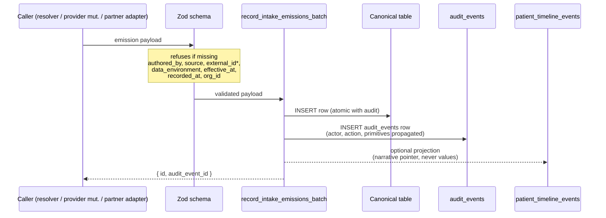

# Data layers reconciliation — v1 (Phase 4B-arch)

**Status:** routed companion context (non-binding). Cites the map for every claim; introduces no new policy.
**Source of truth:** [`.cursor/plans/system_map_three_layers_60706286.plan.md`](system_map_three_layers_60706286.plan.md). When this doc and the map disagree, the map wins. New invariants land in the map first; this doc reflects them.
**Phase:** 4B-arch (architectural reconciliation; markdown only). Ships in front of 4C-pre (primitives + tenancy migration) and 4C-runtime (resolver implementation).

---

## 1. Why this doc exists

The system map is deep. Hardening landed in 1K.0.5 (data routing + claim ledger), 1J (identity), 1G (messaging + worklist), 1L (labs), 1M (state observations), 1O (document routing), 1N (AI engine), 1P (narrative atomization), 1Q (rules + templates), 1H (analytics + traceability) — each authoritative for its domain.

Pre-map exploratory migrations (Apr 18 – Apr 30, 2026) shipped real tables before the map was hardened. Some align with canonical Section shapes; some are island-style and need consolidation under canonical owners. Phase 4A closed the intake-write runtime on top of canonical Phase 3 schema.

This doc:

1. Maps each of the 11 foundational data layers (the eight ChatGPT raised + tenancy + governance + cross-cutting primitives) to the canonical Section that owns it.
2. Audits each pre-map migration against canonical shapes (KEEP / RECONCILE / LEGACY-REPLACE).
3. Names the Phase 4C+ implementation order so subsequent phases land into a clean foundation.
4. Surfaces the CI lint catalog implied by the new map invariants.
5. Lists open pressure tests where the map is still genuinely ambiguous after 4B-arch.

Read this when you need a single integrated view. Read the map when you need binding policy on a specific concern.

---

## 2. The classification view

Section 1K.0.5.2 (the "classification model for canonical data homes") names 10 categories — identity/contact, clinical claim ledger, reconciled clinical entities, trackable observations, diagnostic artifacts, consents, commerce, administrative entities, process state, derived decisions, telemetry. The map intentionally calls these "categories," not "tiers" — to avoid implying rigid layering.

Above those 10 categories, this doc adds 5 super-layers that describe how data flows through the system:

| Super-layer | What lives here | Owner Section |
|---|---|---|
| Capture surfaces | `intake_responses`, `messages`, `patient_document_routing`, webhook event tables | 1K, 1G, 1O, 1H.3 |
| Atomization + routing | `recordIntakeResponse`, `inbound_narrative_reviews`, `routePatientDocument` | 1K.0.5, 1P, 1O |
| Canonical homes | the 10 categories from 1K.0.5.2 | 1K.0.5.3 |
| Event spine | `audit_events`, `patient_timeline_events`, `domain_events` | 1H.5, 1H, 1H.6 |
| Side effects | `outbound_jobs`, workers, external SaaS adapters | 1G.3, 1L.23.3, 1H.2, 1H.3 |
| Reads | derived views, search adapter, AI engine, dashboard | 1H, 1R (new), 1N |

The "Reads" super-layer is intentionally last. Section 1H's discipline is binding: reads are pure-function projections of canonical state. Reads MUST NOT carry business logic, rule firings, or AI inference. Those concerns live in 1Q (rules engine) and 1N (AI engine).

---

## 3. Per-layer reconciliation table

| # | Layer | Owner Section(s) | Already built (Phase 3 + 4A + early migrations) | Named-but-not-built | Posture |
|---|---|---|---|---|---|
| 1 | Relational tables | 1K.0.5.3, 1J, 1L, 1M, 1O, 1G, 1I | 19-table Phase 3 foundation; care_programs / treatment_items / treatment_orders / clinical_visits / lab_orders / patient_lab_observations / messages / message_threads / patients / staff_profiles | — | Harden-now (mostly done; 4A closed runtime) |
| 2 | Object storage / artifacts | 1O | `intake_uploads_storage`, `rx_artifacts_storage`, `clinical_visit_pdf_artifacts` (legacy island tables) | `patient_document_routing` canonical manifest; `external_clinical_documents`; `patient_identity_verifications` (have minimal subset) | Design-now via 1O; build in 4D |
| 3 | Event / audit model | 1H.5, 1H, 1H.6, 1Q.7 | `audit_events`, `patient_timeline_events` | `domain_events` aggregate summaries (optional); typed event_type registry as code-as-config | Harden-now (catalog completion + CI lint) |
| 4 | Outbox / jobs | 1G.3, 1L.23.3, 1H.2, 1H.3, 1Q.7 | `outbound_jobs`, `patient_notification_deliveries` (parallel; consolidation candidate), `stripe_webhook_events` | Job-kind enum finalization; `queued_by_kind`; send-policy gate | Harden-now (consolidation + shape audit) |
| 5 | Derived state / views | 1H, 1G.6.3, 1L.13 | `lib/intake/views/` (problem-list, allergy-list, med-list, facesheet, care-plan, reconciliation-queue stubs) | Composed-not-materialized; promote case-by-case when read perf demands | Defer materialization; revisit per metric |
| 6 | Search | NEW 1R | `site_search_entries` (early; reconcile or deprecate) | `searchEntities()` adapter; pg_trgm + GIN indexes; capability-gated reads | Design-now via 1R; build in 4G |
| 7 | Event-stream readiness | NEW 1S | `audit_events` + `patient_timeline_events` already append-only | Schema-versioned `event_type` discipline; partition keys; idempotency keys; future `eventStreamPublisher` adapter | Design-now (cheap; defer runtime) |
| 8 | Vector / ML readiness | NEW 1T | — | `*_embeddings` tables joined by stable entity ids (`concept_id`, `patient_document_routing.id`, `inbound_narrative_reviews.id`, `messages.id`, `patient_clinical_assertions.id`); pgvector default | Design-now via 1T; defer runtime |
| 9 | Multi-org / tenancy | NEW 1U | — | `org_id` on every patient-scoped row (default `'main'`); RLS forbids cross-org reads; capability `org_scope`; future host-org/tenant-org one paragraph | Design-now via 1U; mechanical add in 4C-pre |
| 10 | Data governance / retention / RTBF | NEW 1V | — | Per-data-class retention schedule; soft/hard delete rules; SAR + RTBF as future rules-engine outputs; uniform `active → inactive → archived → retention-expired → deleted` lifecycle | Design-now via 1V; runtime in 4H |
| 11 | Cross-cutting primitives | top-of-map addendum | `authored_by` already canonical for `patient_clinical_assertions`; `source_intake_response_id` orchestrator back-pointer; `stripe_webhook_events` external_id pattern | The 7 invariants codified system-wide; orchestrator + Zod refusal of incomplete payloads; CI lint catalog | Harden-now (4C-pre migration + Zod/orchestrator extensions) |

---

## 4. Early migration audit

Pre-map exploratory migrations (`20260418` → `20260430`) classified against canonical Section ownership. KEEP = aligned with canonical; RECONCILE = needs alignment work in named phase; LEGACY-REPLACE = superseded, plan deprecation.

| Migration | Verdict | Owner Section | Phase to reconcile |
|---|---|---|---|
| `20260418120000_main_forms_and_states` (forms / form_submissions) | LEGACY-REPLACE | 1K | superseded by 4A `intake_responses`; deprecate after no-traffic confirmation |
| `20260418120000` patients table | KEEP | 1J | canonical |
| `20260419120000_patients_name_and_address` | KEEP | 1J | canonical |
| `20260419130000_patients_drop_full_name` | KEEP | 1J | pruning |
| `20260419210000_staff_audit_rls` (audit_events + staff_profiles) | KEEP | 1H.5, 1D | canonical; primitives addendum extends `actor_kind` enum |
| `20260420120000_patient_timeline_events` | RECONCILE | 1H | event_type catalog audit (4F) |
| `20260420170000_stripe_timeline_system_actor` | KEEP | 1H, 1I | canonical pattern for system-actor writes |
| `20260421120000_patient_notification_deliveries` | RECONCILE | 1G.3 | consolidate under `outbound_jobs` (4E); receipts may stay as sub-pattern referencing `outbound_jobs.id` |
| `20260422010000_care_programs_treatment_items_v1` | KEEP | 1G, 1I | canonical |
| `20260422020000_refill_requests` | KEEP | 1G | canonical |
| `20260422100000_treatment_item_stop_any_status` | KEEP | 1G | pruning |
| `20260422110000_rx_artifacts_storage` | RECONCILE | 1O | consolidate under `patient_document_routing` manifest (4D); blobs stay in storage |
| `20260422120000_supplement_checkout_routing` | KEEP | 1E, 1I | canonical commerce flow |
| `20260423120000_intake_uploads_storage` | RECONCILE | 1O | consolidate under `patient_document_routing` manifest (4D); blobs stay in storage |
| `20260423150000_lab_orders_and_storage` | KEEP (audit) | 1L | confirm 1L.4 status state machine + 1L.14 adapter contract alignment in 4F |
| `20260423170000_clinical_visits_and_rx_reviews` | KEEP | 1G | canonical |
| `20260423173000_clinical_visit_pdf_artifacts` | RECONCILE | 1O | consolidate under `patient_document_routing` manifest (4D); blobs stay in storage |
| `20260423174000_clinical_visit_lock_and_addenda` | KEEP | 1G | canonical |
| `20260423180000_site_search_entries` | KEEP (Phase 4G decision) | — (CMS nav search) | NOT a Section 1R domain entity; powers public `/search` + `/internal/search` admin UI. Phase 4G `searchEntities()` operates on canonical entities directly via pg_trgm + GIN; this table is unaffected. |
| `20260423190000_provider_profiles_and_staff_admin` | KEEP | 1D, 1G.4 | canonical |
| `20260423191000_staff_profile_contact_fields` | KEEP | 1D | canonical |
| `20260424120000_drop_patient_states_glp1_status` | KEEP | — | pruning |
| `20260425100000_enforce_status_transition_triggers` | KEEP | 1G | canonical pattern |
| `20260425120000_patient_ops_support_checkins` | KEEP | 1F | canonical |
| `20260425140000_outbound_jobs` | RECONCILE | 1G.3 | shape audit + extend with `queued_by_kind` + `data_environment` (4E) |
| `20260426100000_chart_ai_reviews_and_lab_observations` | KEEP (audit) | 1L, 1N | confirm alignment with 1L.6 normalization + 1N AI discipline (4F) |
| `20260427120000_patient_dashboard_alert_dismissals` | KEEP | 1H | canonical |
| `20260427140000_org_rx_presets` | KEEP | 1G | canonical |
| `20260428100000_orders_lifecycle_v1` | KEEP | 1G, 1I | canonical |
| `20260429100000_stripe_customer_and_treatment_payment_fields` | KEEP | 1I | canonical |
| `20260430120000_system_map_v1_messaging_labs_jurisdiction` | KEEP | 1G, 1L | direct from map |
| `20260504120000_intake_foundation_v1` | KEEP | 1K, 1J, 1L, 1M, 1O, 1G, 1I | Phase 3 canonical |
| `20260505120000_intake_emission_orchestrator_v1` | KEEP | 1K, 1Q.7 | Phase 4A canonical |

**Net**: 4 migrations need RECONCILE (4 documents → 1O; 1 notifications → 1G.3 / outbound_jobs; 1 timeline + 1 outbound_jobs need shape audits not redesigns). 1 migration is LEGACY-REPLACE (forms/form_submissions). The site_search_entries row was reclassified KEEP after Phase 4G confirmed it serves the CMS nav search concern (separate from Section 1R domain entity search). The rest KEEP.

### Implicit engine v0 (TS code; not a migration; tracked here for parity-audit completeness)

Phase 4H-pre identified an undisciplined notification + workflow code path that pre-dates Section 1Q. Files: [`lib/workflows/onPatientWorkflowEvent.ts`](../../lib/workflows/onPatientWorkflowEvent.ts) + [`lib/workflows/notificationRules.ts`](../../lib/workflows/notificationRules.ts) + [`lib/workflows/types.ts`](../../lib/workflows/types.ts) + [`lib/notifications/patientMessages.ts`](../../lib/notifications/patientMessages.ts). Verdict: **DELETE-AFTER-PARITY** per-flow. Each of the 11 `NotificationTemplateKey` cases migrates one-per-PR to a typed Rule + Template per `1Q.4` + `1Q.5`; the legacy case deletes in the same PR. When the last case is migrated, the four files delete entirely. Forbidden: extending v0 during the cutover (violates `1Q.0` invariant 12 consolidation discipline). Anchor: [system_map_three_layers_60706286.plan.md](system_map_three_layers_60706286.plan.md) Section 1Q.12 (the binding inventory + directive).

---

## 5. Integrated runtime view

```mermaid
flowchart LR
  subgraph inputs [Inputs]
    Patient
    Provider
    Staff
    Partner
    Lab
    Payment
  end

  subgraph capture [Capture surfaces]
    intakeR[intake_responses 1K]
    msgs[messages 1G]
    docR[patient_document_routing 1O]
    webhooks[webhook_events 1I/1H.3]
  end

  subgraph atom [Atomization + routing]
    emit[recordIntakeResponse 4A]
    narr[inbound_narrative_reviews 1P]
    docRoute[routePatientDocument 1O]
    resolver[resolver 4C-runtime write-path]
  end

  subgraph canonical [Canonical homes]
    asserts[patient_clinical_assertions]
    obs[patient_state_observations]
    meds[patient_medications]
    consents[patient_consents]
    labs[patient_diagnostic_reports]
    decisions[eligibility_decisions]
    orders[treatment_orders]
    visits[clinical_visits]
    subs[subscriptions]
    chart[external_clinical_documents]
  end

  subgraph spine [Event spine]
    audit[audit_events]
    timeline[patient_timeline_events]
    domain[domain_events]
  end

  subgraph effects [Side effects]
    outbox[outbound_jobs]
    workers[workers + retries]
    external[Stripe Twilio Resend Pharmacy Lab]
  end

  subgraph reads [Reads]
    views[derived views read-path]
    search[searchEntities 1R]
    ai[AI engine 1N]
    dash[1H.6 dashboard]
  end

  inputs --> capture --> atom --> canonical --> spine
  spine --> effects --> external
  canonical --> reads
  spine --> reads
  effects -.-> spine
```

Every write through the orchestrator boundary populates the seven primitives:

\* `external_id` only required for rows created from external systems (Stripe, Twilio, lab vendor, etc.).

---

## 6. Phase 4C+ implementation roadmap

Ordering is binding. Every phase depends on the previous; primitives + tenancy go FIRST so all subsequent reconciliations land into a clean shape.

| Phase | What lands | Why this slot |
|---|---|---|
| **4B-arch** | This doc + map amendments (5 new Sections + primitives addendum + reconciliation pointers + repo anchors update) | architectural alignment before any new code; markdown only |
| **4C-pre** | Migration: `org_id` + `data_environment` on patients + FK propagation; reconcile `authored_by` columns sibling-table-wide; introduce `source_kind/source_id` on non-clinical domain rows; add `effective_at/recorded_at` rule per primitives addendum; extend Zod schemas + `record_intake_emissions_batch` to refuse incomplete payloads | every later phase writes columns/RLS that assume these primitives exist; doing this last means backfilling 100k rows |
| **4C-runtime** | WRITE-path resolver: translates `Question.emissions` templates + `raw_value` into fully-resolved `Emission[]` for `recordIntakeResponse` | resolver runs ON the primitive-locked runtime, so emissions it produces already satisfy invariants |
| **4D** | Section 1O artifact pipeline: `routePatientDocument` API + `patient_document_routing` consolidation; legacy `intake_uploads_storage` / `rx_artifacts_storage` / `clinical_visit_pdf_artifacts` capture-side migration to canonical manifest | unlocks all upload flows in intake + messaging + ops |
| **4E** | Outbound jobs reconciliation (1G.3): `patient_notification_deliveries` consolidation; finalize job-kind enum; wire send-policy gate; `data_environment` suppression locked in | unblocks rules engine (4H) which produces jobs; unblocks search (4G) via consistent job state |
| **4F** | Event_type catalog completion (1H + 1Q.7): typed registry mirroring `lib/intake/events.ts`; CI lint refuses inline event_type strings; lab_orders + chart_ai_reviews shape audit against 1L | needed before search indexes events (4G) and before rules engine fires events (4H) |
| **4G** | Section 1R search adapter + first staff-search surface (patient lookup); `data_environment` + `org_id` filter baked in from day one; `site_search_entries` reconcile or deprecate | rules engine (4H) needs search to render context |
| **4H** | Section 1Q rules + templates engine runtime + Section 1V governance/retention runtime (RTBF + SAR workflows as rules-engine outputs) | governance is rules-engine output; co-locating keeps coherent |
| **defer** | Section 1S streaming runtime; Section 1T embedding tables; materialized views | promote when read-perf or scale signals arrive; until then, append-only spine + composed views suffice |

---

## 7. CI lint catalog (binding from this pass forward)

These lints are introduced by 4B-arch's map amendments and enforced starting in 4C-pre.

| Lint | What it enforces | Source primitive / Section |
|---|---|---|
| `no_inline_event_type` | Every `audit_events.action` and `patient_timeline_events.event_type` value must exist in the typed catalog (`lib/intake/events.ts` pattern). No string literals at write sites. | R2-4 enum-as-config; 1H + 1Q.7 |
| `no_direct_clinical_table_read` | App code reading `patient_clinical_assertions` / `patient_medications` / `patient_allergies` / etc. must go through `lib/intake/views/*` or 1H read models. Direct queries flagged; carve-out for views file itself. | R2-6 named-read-function; R3-3 read-path purity |
| `no_business_logic_in_reads` | Functions in `lib/intake/views/*` are pure projections of canonical state. No rule firings, no AI inference, no decisions. | R3-3 read-path purity; 1Q + 1N boundary |
| `no_files_in_non_domain_rows` | `intake_responses`, `messages`, `patient_timeline_events` may reference `patient_document_routing.id` but never base64 / file content / extracted text. | 1O.7 |
| `actor_declaration` | Every new domain table reviewed in PR justifies its `authored_by` column choice or absence in PR description. | R1-1 / primitives addendum |
| `source_provenance` | Every emission target's payload declares `evidence_refs[]` (clinical) OR `source_kind + source_id` (non-clinical). | R1-1 / primitives addendum |
| `external_rail_keys` | Every adapter to Stripe / Twilio / Resend / pharmacy / lab / ID-verification declares its three keys per 1L.14 / 1L.23.3 contract shape. | R1-1 / primitives addendum |
| `data_environment_gate` | Any code path calling Stripe / Twilio / Resend / pharmacy / lab outbound MUST gate on `patient.data_environment === 'production'` or carry an explicit override. | R1-1 / primitives addendum |
| `cross_org_reads_blocked` | RLS predicates on every patient-scoped table enforce `org_id = current_user_org_id()`; app code reviewed in PR for cross-org leakage. | 1U |
| `temporal_truth_pair` | Every clinical / observation / decision row declares both effective time (`onset_at`, `observed_at`, `decided_at`) and recorded time (row `created_at`). | R2-2 / primitives addendum |
| `enum_as_code_as_config` | All enums centrally defined in TS; never invented inline in DB CHECK constraints. | R2-4 / primitives addendum |
| `replayability_preserved` | Reconciled entities must always be derivable from claim ledger. New reconciled-entity tables must include `source_assertion_id` back-pointer. | R2-9 / 1K.0.5.6 |
| `orchestrator_only_writes` | Service-role / SECURITY-DEFINER functions are the only path to canonical-table writes. Direct `INSERT` from app code blocked by RLS. | R3-1 / primitives addendum |
| `migration_idempotent` | Backfill scripts re-runnable safely. New migrations include version stamp + dry-run mode. | R2-5 / backfill addendum |

---

## 8. Open questions / next pressure tests

These are places where the map is still genuinely ambiguous after 4B-arch — flagged for future sections, not blocking:

1. **Video / audio / transcript pattern.** 1O input-type vocabulary covers PDF / JPG / PNG / HEIC. Map flags video / audio for future (1O.1 mentions "future media-with-transcript pattern"). Open: when does video upload + AI transcription land as a first-class capture surface? Near-term concern when telehealth visit recordings begin.
2. **Amazon-style click / view / search analytics-event sink.** Section 1H names "no separate analytics product." But product analytics (page views, button clicks, funnel positions) doesn't fit `audit_events` (which is staff-action / system-action) and doesn't fit `patient_timeline_events` (which is patient memory, projection-only). Open: separate `product_analytics_events` table or external SaaS (Amplitude / PostHog)? Defer until growth team has traction.
3. **Cross-org patient-data export contract.** 1U future host-org / tenant-org model is named directionally. Open: when a patient has interactions across multiple tenant orgs (e.g., refers from Org A to Org B), how is consent + data movement handled? Defer until second org onboards.
4. **Long-tail SLO ownership (deferred Section 1W).** 1H.1 + 1H.2 directional. Open: when do we lock SLO catalog (page latency, outbound_jobs queue depth, webhook ingest lag, RPO / RTO)? Defer until SRE hire or first production incident pattern.
5. **Subprocessor data-sharing contracts at scale.** 1V touches subprocessor RTBF propagation directionally. Open: when do we formalize subprocessor inventory + data-sharing contract registry? Defer until 5+ subprocessors active.

---

## 9. Misread citations (push-backs from external critique)

External critiques during 4B-arch planning surfaced concerns that turned out to already be locked in the map. Documented here so the same questions don't return:

- **"Identity resolution / dedup / merge strategy missing"** → see Section 1J (lines ~2705-3034 in the system map). 1J.1 precedence trust rank, 1J.4 identity confidence levels, 1J.6 duplicate detection, 1J.7 merge policy, 1J.8 shared contact, 1J.10 safety preflight. Comprehensive.
- **"Partial failure / transaction strategy not explicitly defined"** → see Phase 4A `record_intake_emissions_batch` (one Postgres transaction; clinical writes atomic) + outbox pattern via `outbound_jobs` (queue row in same transaction; workers retry per Section 1H.3 + 1I.6 idempotency). The decision is locked.
- **"Security boundary / actor capability model missing"** → see Section 1D (capabilities; `requireCapability` is the binding gate per AGENTS.md) + Section 1J.10 safety preflight + Section 1Q.7 override audit + Section 1N "AI assistive only, never authoritative." Comprehensive.

---

## 10. Cross-references

- [System map](system_map_three_layers_60706286.plan.md) — binding source of truth for every claim in this doc.
- [4B-arch plan file](data_layer_reconciliation_e525e9c9.plan.md) — execution plan with R1+R2+R3 critique evaluation log.
- [AGENTS.md](../../AGENTS.md) — short-form architecture + auth pointers.
- Phase 3 migration: `supabase/migrations/20260504120000_intake_foundation_v1.sql`.
- Phase 4A migration: `supabase/migrations/20260505120000_intake_emission_orchestrator_v1.sql`.
- Phase 4A runtime: `lib/intake/runtime/record-intake-response.ts`, `lib/intake/write/orchestrator.ts`.
