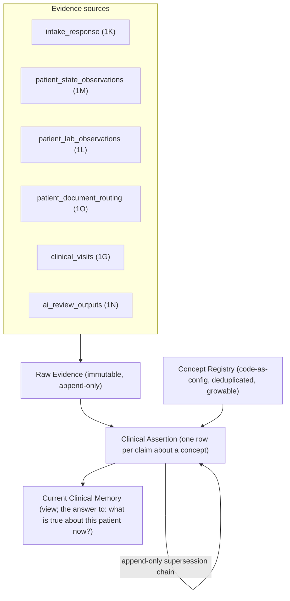

# Clinical Assertion Layer Design — AI-Native Clinical Memory

**Date:** 2026-04-27
**Status:** Design proposal (not yet patched into system map)
**Scope:** Concept registry + assertion model + context envelope + provenance + provider authority — the layer between raw evidence (intake / labs / docs / visits / AI) and clinical memory consumed by safety preflight, provider workspace, packet rendering, AI summary
**Sits on top of:** `1K.4` question bank, `1K.5` source-of-truth (just hardened), `1K.6` progressive intake, `1J.10` safety preflight, `Section 1L`, `Section 1M`, `Section 1O`, `Section 1G` clinical_visits, `Section 1N` AI

---

# Verdict first, then the design

This is **foundational and must be solved before the question-bank seed**, but the right size of solution is a fraction of an EMR. The intake routing layer we just hardened (`intake_response` authoritative + `patient_clinical_assertion_current` view + `patients.*` trigger projection) is correct for **raw evidence**. It is **not** correct for **clinical memory** — and the system map quietly conflates the two by naming the read view `patient_clinical_assertion_current` while having it read directly from `intake_response`. That conflation breaks the moment a provider, lab, document, or AI source claims the same concept the patient claimed.

Pushback on the framing before I propose anything:

- **"AI-native EMR"** is the wrong frame. We are not building an EMR. We are building a longitudinal-care system that needs a thin **clinical assertion layer** so AI, provider UI, decision-support, and analytics share one normalized view of "what is true about this patient." An EMR is encounter-centric, billing-centric, regulatory-centric, and 30 years of feature creep. We need ~10% of that.
- **Don't pre-load concepts.** Seed only what GLP-1 + TRT + ED + female hormones actually need. ~50 starter concepts. Grow from real questions.
- **Don't reify everything Epic reifies.** No laterality, no body-site, no severity grading per ICD, no encounter-scoped assertions in v1. The concept + assertion + context + provenance + status quintuplet is enough to carry every example you listed.
- **Don't build a separate problem-list table.** The "active problem list" is a filter on the assertion table. Two tables = two sync paths = workflow burden on providers.
- **Two viable models exist** (assertion-only vs assertion + curated problem list) — I recommend the first; comparison in Section L.

Below is the build-ready proposal. I have NOT saved it; NOT patched the map. After your review I'll save as a design file, audit it (same loop as last round), then patch.

---

# A. Executive verdict

**A1. Is the current intake/question-bank design missing a required clinical concept/assertion layer?**

Yes. The current design has:
- Raw evidence: `intake_response` (authoritative for the patient's literal answer).
- A read view: `patient_clinical_assertion_current` (returns the latest in-freshness answer per `(patient_id, field_name)`).
- A trigger projection: `patients.*` chart columns (denormalized from the view).

What it lacks:
- A normalized **concept** that can be referenced by multiple questions, multiple sources, multiple pathways without duplicate facts.
- A first-class **assertion** that carries authority + status + confidence + context + provenance separate from the raw evidence row.
- A way for **non-intake sources** (provider, lab, document, AI) to claim the same concept the patient claimed without overloading `intake_response` (which is, semantically, an intake answer log).

Without this layer, the next four things break:
1. Provider follow-ups that confirm/reject patient claims have no clean place to write the confirmation.
2. Labs that suggest a condition (low T, anemia) have nowhere to express "lab-derived, unconfirmed" against the same concept the patient might assert.
3. Document ingestion (outside records) can't merge "the outside record says CHF" with "the patient said no CHF" without a concept join.
4. AI cannot consume labeled data because every question lives in its own row with no normalization.

**A2. Is this foundational or can it be deferred?**

**Foundational.** Defer it and every question seeded into the bank ships with no concept mapping; every provider follow-up writes into a provisional shape that needs migration; every lab interpretation lives in a parallel store; AI consumes a flattened blob. Retrofitting concepts onto an established question bank + populated `intake_response` is more expensive than building the layer first.

**Build it now, build it minimal.**

---

# B. Conceptual model



Five layers, named distinctly:

1. **Evidence** — raw, immutable rows in their domain home (`intake_response`, `patient_state_observations`, `patient_lab_observations`, `patient_document_routing`, `clinical_visits`, AI review outputs). Already exists.
2. **Concept** — normalized clinical concept (e.g., `condition.heart_failure`, `symptom.nausea`, `medication.tirzepatide`, `allergy.penicillin`, `lab.testosterone_total`). Code-as-config registry. New.
3. **Assertion** — a structured claim about a concept by an authored party, with provenance, context, status, confidence. Append-only table. New.
4. **Context** — a structured envelope on the assertion that carries clinical/program/treatment scope (so the same `concept_id` can have multiple coexisting active assertions in different contexts — your nausea example).
5. **Current clinical memory** — a read view over assertions that returns the latest non-superseded, non-rejected, non-resolved assertion per `(patient_id, concept_id, context_key)`. The renamed/replaced `patient_clinical_assertion_current` view.

**Provider assessment** is not a separate layer. A provider's confirmation/rejection/refinement is just **another assertion** with `authored_by = provider` and the appropriate status — same model, highest authority, supersedes lower-authority assertions.

---

# C. Proposed schema / tables (minimal)

## C1. `clinical_concepts` registry — code-as-config (NOT a database table)

Lives in `repo/clinical-concepts/` per `1K.0` code-as-config discipline. One file per concept domain (e.g., `cardio.ts`, `endocrine.ts`, `medications.ts`).

```ts
type ConceptId =
  | `condition.${string}`
  | `symptom.${string}`
  | `medication.${string}`
  | `allergy.${string}`
  | `lab.${string}`
  | `procedure.${string}`
  | `family_history.${string}`
  | `social_history.${string}`
  | `vital.${string}`;

interface ClinicalConcept {
  concept_id: ConceptId;
  concept_version: Semver;
  display_name: string;
  aliases: string[];                                 // human-readable; CI rejects collision with another concept's display_name or aliases
  description: string;                               // short clinical definition for provider tooltip + AI grounding
  external_codes?: {                                 // future-friendly; empty in v1
    snomed?: string;
    icd10?: string;
    rxnorm?: string;
    loinc?: string;
  };
  default_authority_floor?: AuthorityLevel;          // e.g., medication.tirzepatide may require provider_confirmed; symptom.nausea allows patient_reported
  reconciliation_policy: 'auto_dedupe' | 'context_distinct' | 'requires_provider_review_on_conflict';
  retired?: { retired_at: string; replaced_by?: ConceptId };
}
```

**Seed size for v1:** ~50 concepts covering the GLP-1 + TRT + ED + female-hormones contraindications, common allergies, common medications in those classes, common labs (testosterone, A1c, lipid panel, CBC, CMP), common symptoms (nausea, headache, mood, libido, ED severity, weight). Grow from PRs as new questions need them.

## C2. `patient_clinical_assertions` — new database table (append-only)

```sql
CREATE TABLE patient_clinical_assertions (
  id                       uuid PRIMARY KEY,
  patient_id               uuid NOT NULL REFERENCES patients(id),
  concept_id               text NOT NULL,            -- references clinical_concepts registry; CI-checked
  concept_version          text NOT NULL,            -- pinned at write
  assertion_type           text NOT NULL,            -- enum below
  status                   text NOT NULL,            -- enum below
  authored_by              text NOT NULL,            -- enum below
  authored_by_user_id      uuid,                     -- staff/provider user_id; NULL for system/ai/lab/document
  confidence               text NOT NULL,            -- enum: 'low' | 'moderate' | 'high' | 'definitive'
  evidence_refs            jsonb NOT NULL,           -- array of typed pointers; see C3
  context                  jsonb NOT NULL,           -- typed shape; see C4 — includes context_key derivation
  context_key              text NOT NULL GENERATED ALWAYS AS (md5(canonical_serialize(context))) STORED,
  onset_at                 timestamptz,
  onset_estimated          boolean DEFAULT false,
  resolved_at              timestamptz,
  resolution_reason        text,
  severity                 text,                     -- enum: 'mild' | 'moderate' | 'severe' | 'very_severe' | NULL
  notes_clinical_id        uuid,                     -- pointer to clinical_visits.id when authored in a visit
  supersedes_assertion_id  uuid REFERENCES patient_clinical_assertions(id),
  retracted_at             timestamptz,
  retracted_reason         text,
  asserted_at              timestamptz NOT NULL DEFAULT now(),
  ingested_at              timestamptz NOT NULL DEFAULT now(),
  branch_path_token        text,                     -- when sourced from intake; null otherwise
  metadata                 jsonb
);

CREATE INDEX ON patient_clinical_assertions (patient_id, concept_id, context_key);
CREATE INDEX ON patient_clinical_assertions (patient_id, status, asserted_at);
```

**Append-only, never UPDATE in place.** Status changes (provider confirms a patient claim) write a NEW row with `supersedes_assertion_id` pointing at the prior row. Same discipline as `1K.5` `intake_response` supersession and `1M.4` observation supersession.

**Enums (small for v1):**

- `assertion_type`: `present | absent | history_of | suspected | ruled_out | active_problem | resolved | family_history | risk_factor | exposure | use | allergy_reaction`
- `status`: `unconfirmed | provider_confirmed | provider_rejected | provider_resolved | provider_refined | retracted | superseded`
- `authored_by`: `patient_reported | patient_self_correction | provider_assessed | provider_confirmed | document_extracted | lab_derived | ai_suggested | system_derived`
- `confidence`: `low | moderate | high | definitive`

**Authority precedence (for the read view tie-break when multiple authors assert the same concept + context):**
`provider_confirmed > provider_assessed > lab_derived > document_extracted > patient_self_correction > patient_reported > ai_suggested > system_derived`

## C3. `evidence_refs` shape (jsonb on assertion)

```ts
type EvidenceRef =
  | { kind: 'intake_response'; id: string; question_id: string; question_version: string }
  | { kind: 'patient_state_observation'; id: string; field_name: string }
  | { kind: 'patient_lab_observation'; id: string; loinc_code?: string }
  | { kind: 'patient_document_routing'; id: string; document_kind: string; page?: number }
  | { kind: 'clinical_visit'; id: string; section: 'assessment' | 'history' | 'plan' | 'review_of_systems' }
  | { kind: 'ai_review_output'; id: string; model_version: string; prompt_id: string };
```

Evidence is **referenced, never copied**. The raw row stays in its domain home (`intake_response` / `patient_state_observations` / etc.). The assertion holds pointers + the structured claim derived from them. Replay = follow the pointers.

## C4. `context` shape (jsonb on assertion)

```ts
type AssertionContext = {
  // Program scope
  care_program_id?: string;
  pathway_code?: string;
  treatment_item_id?: string;
  dose_context?: string;                   // 'dose_escalation' | 'maintenance' | 'titration' | etc.

  // Episode scope (for symptom flares, side-effect courses)
  episode_id?: string;
  episode_kind?: 'side_effect_course' | 'pregnancy' | 'acute_event' | 'flare' | 'screening' | 'general_history';

  // Encounter scope (rarely populated in v1; future-friendly)
  encounter_id?: string;

  // Semantic scope — drives the context_key hash; this is the "why was this asked" envelope
  semantic_context?: 'general_history' | 'side_effect' | 'pregnancy_screen' | 'pre_treatment_baseline' | 'post_treatment_followup' | 'safety_recheck' | 'patient_initiated_concern';
};
```

`context_key` (generated, indexed, hash of canonical-serialized context) is the column the read view groups by. **Same concept_id with different context_key = two coexisting active assertions** (your nausea example). Same concept_id + same context_key = candidate for dedupe / supersession.

## C5. `patient_clinical_assertion_current` (renamed/replaced view)

```sql
CREATE VIEW patient_clinical_assertion_current AS
SELECT DISTINCT ON (patient_id, concept_id, context_key) *
FROM patient_clinical_assertions
WHERE status NOT IN ('provider_rejected', 'retracted', 'superseded')
  AND retracted_at IS NULL
  AND (resolved_at IS NULL OR status = 'provider_resolved')   -- resolved entries surface for "history of" queries; unresolved for "active"
ORDER BY patient_id, concept_id, context_key, authority_rank DESC, asserted_at DESC;
```

The view is **what `loadPatientCaseSafetySnapshot` reads** for clinical-fact gates. Every consumer (provider UI, AI summary, decision-support, packet rendering) reads through this view. `patients.*` chart columns become trigger projections of the **assertion view**, not of `intake_response` directly.

## C6. `patients.*` chart-column trigger pipeline (revised)

Today (per the hardening we just did): `intake_response INSERT → trigger → patients.*`.

After this layer: `intake_response INSERT → assertion-emitter → patient_clinical_assertions INSERT → trigger → patients.*`.

The chart-column column set narrows to a **flattened convenience projection** (e.g., `patients.allergies` = list of `display_name` for active `concept_type = 'allergy'` assertions per the view). Provider UI that needs richer context reads the view, not the column.

---

# D. How `intake_response` feeds the model

`intake_response` remains authoritative for the **patient's literal answer**. The new piece: `recordIntakeResponse` (the existing API) also calls an **assertion emitter** in the same transaction.

The emitter reads the question's `concept_mapping` (new optional field on the question bank entry — see Section M) and:

- If the question has no `concept_mapping`: write `intake_response` only (e.g., score-input questions like IIEF-5 individual items, narrative free-text). No assertion.
- If the question has a `concept_mapping`: write `intake_response` + emit `patient_clinical_assertions` row with:
  - `concept_id` from the mapping
  - `assertion_type` from the question's `assertion_template` (e.g., the answer "yes" maps to `present`; "no" maps to `absent`; "had it before but resolved" maps to `history_of`)
  - `authored_by = patient_reported` (or `patient_self_correction` for Mode J)
  - `confidence = moderate` (patient self-report default; configurable per question)
  - `status = unconfirmed` (the only patient-reported entry status)
  - `evidence_refs = [{ kind: 'intake_response', id, question_id, question_version }]`
  - `context = { care_program_id, pathway_code, semantic_context: <from question's context_template> }`
  - `branch_path_token` carried forward
  - `supersedes_assertion_id` if the patient previously asserted the same `(concept_id, context_key)` and this is an update

**Both writes happen in the same DB transaction** with the same trigger discipline as the patients.* projection.

---

# E. How Mode J patient updates feed the model

Same path as D, but:

- `entry_moment = patient_self_correction`
- `authored_by = patient_self_correction` (slightly higher trust than first-time `patient_reported` because it's an explicit "I want to correct this")
- `correction_reason` carried on `intake_response`
- `supersedes_assertion_id` MUST be populated when the new claim is on the same `(concept_id, context_key)` as a prior assertion — Mode J is by definition an update on a prior fact

Mode J **does not auto-confirm** the new assertion. It supersedes the prior **patient-authored** assertion at the patient's authority level. A provider can still confirm/reject in a later step.

---

# F. How provider follow-ups feed the model

A provider follow-up that asks a structured question is **just a Mode E intake response** semantically. The emitter behaves the same as D, with:

- `entry_moment = follow_up`
- `authored_by = patient_reported` (the patient is still the author of the answer; the question was provider-prompted, but the answer is patient-reported)
- `clinical_required_id` carried on `intake_response.metadata`

A **provider's own assertion** (the doctor types "Active problems: T2DM, HTN, on GLP-1 trial" in their note, or clicks "Confirm CHF" in the provider workspace) writes a `patient_clinical_assertions` row directly with:

- `authored_by = provider_confirmed` or `provider_assessed` or `provider_rejected`
- `authored_by_user_id = <doctor_user_id>`
- `confidence = high` or `definitive`
- `evidence_refs = [{ kind: 'clinical_visit', id, section: 'assessment' }]`
- `notes_clinical_id` populated
- `supersedes_assertion_id` if confirming/rejecting/refining a prior patient or AI assertion

**Provider write API is `recordClinicalAssertion(...)` with `requireCapability(can_record_clinical_assertion)`.** Audited per `1J.10`.

---

# G. How labs / diagnostics feed the model

`patient_lab_observations` (per Section 1L) remains the raw lab value. A separate **lab-derived assertion emitter** (a job that fires when a new lab observation lands and the lab interpretation rules per `1L.20` mark it abnormal) writes:

- `concept_id = condition.<derived>` (e.g., `condition.hypogonadism` from low total T)
- `assertion_type = suspected`
- `status = unconfirmed` (NEVER auto-`provider_confirmed`)
- `authored_by = lab_derived`
- `confidence = moderate` (lab values can be wrong; clinical interpretation is provider's)
- `evidence_refs = [{ kind: 'patient_lab_observation', id, loinc_code }]`
- `context = { semantic_context: 'pre_treatment_baseline' or 'safety_recheck' depending on order context }`

The provider workspace surfaces lab-derived suspected assertions as a "lab suggests..." prompt in the case packet. Provider acts via `recordClinicalAssertion` (confirm / reject / refine).

**Hard rule:** lab-derived assertions never satisfy a `loadPatientCaseSafetySnapshot` gate that requires provider confirmation. They only satisfy gates that explicitly accept `lab_derived` authority (rare; mostly screening flags, not Rx authorization).

---

# H. How document ingestion feeds the model

`patient_document_routing` (per Section 1O) remains the raw document manifest. A **document-extracted assertion emitter** (the AI extraction job that runs against an outside-records PDF or transferred chart) writes:

- `authored_by = document_extracted`
- `confidence = moderate` (extraction can hallucinate; provider verifies)
- `status = unconfirmed`
- `evidence_refs = [{ kind: 'patient_document_routing', id, document_kind, page }]`
- `context = { semantic_context: 'general_history' or 'pre_treatment_baseline' }`

Same provider-confirmation flow as labs. Same hard rule: never satisfies an Rx authorization gate without provider confirmation.

---

# I. How AI suggestions feed the model

AI per Section 1N is **assistive**. AI writes assertions only with:

- `authored_by = ai_suggested`
- `confidence = low | moderate` (never `high` or `definitive` from AI alone)
- `status = unconfirmed` (always)
- `evidence_refs = [{ kind: 'ai_review_output', id, model_version, prompt_id }, ...optional supporting evidence]`
- `metadata.ai_rationale` (short text; renders to provider when surfacing the suggestion)

AI **never** writes `provider_*` statuses. AI **never** satisfies a high-risk gate. AI **can** be the trigger for a provider review queue item that, when actioned, results in a `provider_confirmed` assertion.

The provider workspace surface shows AI suggestions in a clearly differentiated section ("AI noticed...") so provider judgment isn't biased into rubber-stamping.

---

# J. Duplicate / conflict / reconciliation rules

**Three cases, each behaves differently:**

| Case | Same concept? | Same context_key? | Same authority? | Same value? | Behavior |
|---|---|---|---|---|---|
| **Confirmation** | yes | yes | different (provider on patient) | yes | Provider write supersedes patient write; both rows preserved; current view returns provider's |
| **Conflict** | yes | yes | different | different (e.g., patient says "no CHF", document says "CHF") | Both rows live; current view returns the higher-authority row UNLESS `clinical_concepts.reconciliation_policy = 'requires_provider_review_on_conflict'` for that concept, in which case both surface as `unresolved_conflict` and high-risk safety gates fail closed until reconciled |
| **Different context** | yes | NO | any | any | Both rows are active; current view returns BOTH (one per context_key); not a conflict; this is your nausea-in-multiple-contexts case |
| **Duplicate dedupe** | yes | yes | same | same | The emitter is idempotent on `(patient_id, concept_id, context_key, authored_by, evidence_refs hash)`; second write is a no-op |
| **Refinement** | concept_id changes (e.g., `condition.heart_failure` → `condition.heart_failure_systolic`) | n/a | provider | n/a | Provider write with `supersedes_assertion_id` + new `concept_id`; status `provider_refined` |

**Reconciliation UI** (provider workspace): for any `(concept_id, context_key)` with multiple unresolved-conflict assertions, the workspace shows them side-by-side and offers `confirm | reject | refine | merge | mark_resolved` actions. Each action writes a new assertion row. No silent dedup that erases prior history.

---

# K. Contextual assertion rules (with the GLP-1 nausea example fully worked)

Same `concept_id = symptom.nausea`, four coexisting assertions:

| # | Context | Authored by | Status | Notes |
|---|---|---|---|---|
| 1 | `{ semantic_context: 'general_history', episode_kind: 'general_history' }` | `patient_reported` (intake) | `unconfirmed` | Patient's onboarding answer to "do you have nausea generally?" |
| 2 | `{ semantic_context: 'side_effect', care_program_id: 'glp1-xxx', treatment_item_id: 'tirzepatide-5mg', dose_context: 'maintenance', episode_id: 'glp1-side-effect-course-yyy', episode_kind: 'side_effect_course' }` | `patient_reported` (Mode F week-4 check-in) | `unconfirmed` | Patient reported nausea during the GLP-1 4-week side-effect check-in |
| 3 | `{ semantic_context: 'side_effect', care_program_id: 'glp1-xxx', treatment_item_id: 'tirzepatide-7.5mg', dose_context: 'dose_escalation', episode_id: 'glp1-side-effect-course-zzz', episode_kind: 'side_effect_course' }` | `provider_assessed` | `provider_confirmed` | Provider noted post-escalation nausea in the visit assessment |
| 4 | `{ semantic_context: 'pregnancy_screen', episode_id: 'pregnancy-www', episode_kind: 'pregnancy' }` + `severity = severe` | `provider_confirmed` (e.g., hyperemesis dx) | `provider_confirmed` | The pregnancy + hyperemesis case |

Each has a distinct `context_key`. The view returns all four. The provider packet groups by `concept_id` with sub-grouping by `context_key`. AI summary text reads context labels, not just the concept name. **This is what prevents the "patient has nausea" flat fact that loses meaning.**

---

# L. Relationship to existing clinical memory tables

**Stays as authoritative for raw evidence (no change):**
- `intake_response` (raw answers; the assertion layer references these via `evidence_refs`)
- `patient_state_observations` (longitudinal trackables — weight, BP, symptom scores; complementary, NOT subsumed)
- `patient_lab_observations` (raw lab values)
- `patient_document_routing` (raw document manifest)
- `clinical_visits` (encounter records; provider assertions reference them)

**Changes:**
- **`patient_clinical_assertion_current`** — was a view over `intake_response` filtered by latest `field_name`. Becomes a view over `patient_clinical_assertions` filtered by latest non-superseded per `(concept_id, context_key)`. Same name, same role, broader source.
- **`patients.*` chart columns** — TRIGGER pipeline changes from `intake_response → patients.*` to `patient_clinical_assertions → patients.*`. Same `1J.10` REVOKE GRANT, same prohibition on direct writes; the trigger source changes.

**Becomes a view (not a table; do NOT build separately):**
- "Active problem list" = view filter `concept_type = 'condition' AND status = 'provider_confirmed' AND resolved_at IS NULL`
- "Allergy list" = view filter `concept_type = 'allergy' AND status NOT IN ('provider_rejected', 'retracted')`
- "Current medication list" = view filter `concept_type = 'medication' AND status = 'present' AND resolved_at IS NULL`

**Tables explicitly NOT introduced (overbuild risk):**
- `patient_problem_list` (it's a view)
- `patient_allergies` as a separate table (it's a view)
- `patient_medical_history`, `patient_surgical_history`, `patient_family_history`, `patient_social_history`, `patient_substance_use` as separate tables. Each is a `concept_type` filter on the assertion table. The system map has been mentioning these as section names but they should map to `concept_type` values, not separate tables.
- `patient_diagnoses` (provider-confirmed condition assertions ARE diagnoses)
- `clinical_assessments` separate from assertions (a clinical assessment is a multi-assertion provider write in a clinical visit; the assertion model holds it)

**Must NOT become a duplicate source of truth:**
- `patients.allergies` (already enforced via 1J.10 REVOKE)
- Any "provider notes" structured field that duplicates assertions
- Any AI-extracted "smart summary" that is treated as fact (must always reference assertions)

---

# M. Question-bank implications

**New optional field on the question bank entry** (extends Patch 1 from the prior patch round):

```ts
interface QuestionBase {
  // ...existing fields
  concept_mapping?: ConceptMapping;
}

type ConceptMapping = {
  concept_id: ConceptId;
  // Per-answer-value template that produces the assertion's structured claim
  assertion_template: {
    [answer_value: string]: {
      assertion_type: AssertionType;     // e.g., 'yes' → 'present', 'no' → 'absent', 'had it before' → 'history_of'
      severity?: SeverityLevel;
      onset_estimated?: boolean;
      // Optional refinement: a child concept_id when the answer narrows the parent
      refines_to_concept_id?: ConceptId;
    };
  };
  context_template: {
    semantic_context: SemanticContext;   // 'general_history' | 'side_effect' | 'pregnancy_screen' | etc.
    episode_kind?: EpisodeKind;
    inherits_care_program: boolean;      // true: pull care_program_id from session; false: omit
    inherits_treatment_item: boolean;    // true: pull from session's active treatment context
  };
  authority: 'patient_reported';         // intake-emitted assertions are always patient-reported
  default_confidence: 'low' | 'moderate' | 'high';
  default_status: 'unconfirmed';         // intake never auto-confirms
  requires_provider_acknowledgment: boolean;   // already exists; reused — true here means provider must act on the unconfirmed assertion before high-risk Rx
};
```

**Questions that DON'T need concept_mapping (and shouldn't be forced to have one):**
- IIEF-5 individual items, PHQ-9 individual items, ADAM/AMS items — these feed `intake_derived_score` per 1K.9. The SCORE may map to a concept (e.g., `score.iief5` with thresholds → `assertion: erectile_dysfunction_moderate`); the individual items don't.
- Free-text narrative ("anything else you want us to know")
- Demographic or shipping fields (name, address)
- Display-only narrative steps (already handled by `audit_events`-only path per Patch 1)
- Pure preference questions ("how often do you want check-ins?")

**CI rules (lint at PR time):**
1. A `concept_mapping.concept_id` MUST exist in the `clinical_concepts` registry.
2. Two questions referencing the same `concept_id` with the same `context_template.semantic_context` MUST produce equivalent `assertion_template`s — CI emits a warning if they diverge (could indicate a real branching difference, but should be reviewed).
3. New `concept_id` introduction requires a clinical CODEOWNER on the PR.
4. A new alias on a concept may not match an existing concept's `display_name` or `aliases[]`.
5. `concept_mapping` is optional; absence is allowed for score / narrative / preference questions.
6. Questions with `pre_account_safe: true` MUST NOT have a `concept_mapping` (no PHI assertions pre-account; per Stage 0/0.5 PHI boundary).
7. A concept marked `retired` cannot be referenced by a non-retired question.

---

# N. Provider packet / AI summary behavior

**Provider packet rendering (`1K.12`) reads from the assertion view, grouped:**

```
Cardiovascular
  Heart failure (condition.heart_failure)
    [provider_confirmed, 2026-01-15] active, NYHA II — Dr. Patel visit notes
    [patient_reported, 2025-09-02] context: general_history — superseded by provider on 2026-01-15
    [document_extracted, 2025-08-20] context: general_history, source: outside cardiology consult — confirmed-by 2026-01-15

Symptoms
  Nausea (symptom.nausea)
    [provider_confirmed, 2026-04-10] context: side_effect, GLP-1 tirzepatide 7.5mg, dose_escalation — moderate
    [patient_reported, 2026-03-12] context: side_effect, GLP-1 tirzepatide 5mg, maintenance — unconfirmed
    [patient_reported, 2025-12-01] context: general_history — unconfirmed
```

**Each line shows: status badge, authority badge, context label, evidence pointer.** No flattening.

**Conflicts surface as a banner above the relevant concept:** "Unresolved conflict: 2 assertions disagree (patient: absent, document: present). Action required before Rx authorization."

**AI summary behavior:**
- AI consumes the assertion view + evidence pointers.
- AI MUST reference assertion IDs when summarizing (so claims are traceable).
- AI MUST NOT collapse different `context_key`s into one statement.
- AI MUST surface status badges in any rendered summary ("Patient-reported (unconfirmed): nausea...", not just "patient has nausea").
- AI MAY suggest reconciliation candidates but MUST write through `recordClinicalAssertion` with `authored_by = ai_suggested`.

---

# O. Minimal viable build order

1. **Concept registry skeleton** (`repo/clinical-concepts/`) — types + 50 starter concepts for GLP-1 + TRT + ED + female hormones. CI lint for uniqueness, aliases, retirement.
2. **`patient_clinical_assertions` table migration** — schema in C2, append-only constraints, indexes, RLS policy (patient sees own; provider sees per care assignment per `1J.10` discipline).
3. **`recordClinicalAssertion` server function** — single write API; `requireCapability(can_record_clinical_assertion)` for provider/ops authors; system/lab/document/AI emitters call internal variant with same audit trail.
4. **Assertion emitter inside `recordIntakeResponse`** — same-transaction emit when question has `concept_mapping`. Idempotent per `(intake_response_id, concept_id, context_key)`.
5. **View migration** — `patient_clinical_assertion_current` v2 reads from `patient_clinical_assertions` with authority-precedence DISTINCT ON.
6. **Trigger pipeline rewire** — `patient_clinical_assertions AFTER INSERT` trigger writes the `patients.*` chart-column projection (replaces the `intake_response` trigger). Reconciliation queries (`1H.3`) check both old and new path during cutover.
7. **Provider workspace assertion-list panel** — read-only first; click-to-confirm/reject as a thin call to `recordClinicalAssertion`.
8. **Question-bank `concept_mapping` field** + lint rule — extend Patch 1 from the prior round; questions that have a clinical assertion intent declare it.
9. **Lab-derived assertion emitter** (Section G) — fires on `patient_lab_observations` interpretation per `1L.20`.
10. **Document-extracted assertion emitter** (Section H) — fires on AI extraction job completion against `patient_document_routing`.
11. **AI suggestion path** (Section I) — `recordClinicalAssertion` with `authored_by = ai_suggested`; provider workspace surfaces.
12. **Mode J supersession integration** — already lands per the `recordIntakeResponse` change; no new code.
13. **Provider packet renderer** (Section N) — read assertions + evidence pointers; group by concept_id + context_key.
14. **Reconciliation UI** — for `requires_provider_review_on_conflict` concepts.

**What blocks first Rx pathway ship:** items 1–6 + 8 + 13. Items 7, 9, 10, 11, 14 can ship before second pathway but after first Rx pathway.

---

# P. Risks / things NOT to overbuild

**DON'T:**
- Pre-load 1000+ concepts. ~50 starter; grow from PRs.
- Adopt SNOMED/ICD/RxNorm/LOINC on day one. The `external_codes?` slot is enough.
- Build a separate problem-list, allergy-list, medication-list table. Filters on the assertion view do this.
- Build an "encounter" abstraction. `clinical_visits` already exists; assertions reference it via `notes_clinical_id`.
- Reify FHIR Condition's full schema (laterality, body-site, severity-grade per ICD, evidence-status enum, certainty-modifier). Severity as a 4-value enum is enough.
- Build a CMS-style admin UI for concepts. PR + CODEOWNERS.
- Auto-confirm assertions from any source other than provider explicit action.
- Let AI satisfy a safety gate. AI can flag, prompt, suggest. Provider acts.
- Build a "diagnosis" table separate from `provider_confirmed` condition assertions. They are the same thing.
- Build per-pathway concept silos. The whole point is one normalized layer across pathways.

**Watch for:**
- Question-bank authors creating `concept_id`s that already exist under another name. CI must enforce.
- Providers using free-text "Active problems: X, Y, Z" instead of structured assertion writes. Workspace UI must default to structured writes.
- Document extraction creating noisy low-confidence assertions that bury the signal. Confidence floor + provider-review queueing.
- AI training on assertion data without consuming the status/authority/confidence fields. AI prompt templates must always include those.

---

# Q. Wording patches — design IS ready, but I do NOT recommend patching the system map yet

**Why hold the patch round:** this introduces a new section (concept + assertion model). The system map currently structures clinical memory implicitly across `1K.5` (static facts), `1J.10` (preflight), `1M` (trackables), `1O` (documents). A new layer this size deserves its own subsection — likely `1K.5.A: Clinical concept + assertion layer (foundational)` — rather than being smeared across patches inside existing paragraphs. Multi-paragraph in-place edits would mangle the existing prose.

**Recommended next steps (in order, your call on each):**

1. **Save this as a design file** at `.cursor/plans/designs/2026-04-27_clinical_assertion_layer_design.md` (verbatim).
2. **Audit it the same way we just did intake construction** (find blocking mismatches, non-blocking improvements, safety verdict).
3. **Decide patch shape** — either (a) add a new subsection `1K.5.A` with the full layer, plus surgical extensions to `1J.10` + `1K.4` + `1K.6` + `1M` cross-links, OR (b) propose a reorganization of `1K.5` to absorb the assertion layer in-place.
4. **Apply the patch round** after audit + sign-off.

**If you want a preview of patch surface area:**
- New subsection (~80 lines): `1K.5.A` with the conceptual model + `clinical_concepts` registry + `patient_clinical_assertions` schema + view + trigger pipeline + authority precedence + reconciliation rules.
- 1K.4 question-bank entry: add `concept_mapping?` field declaration to the line-3000 entry shape paragraph.
- 1K.5 line 3046 view definition: rewrite the `patient_clinical_assertion_current` derivation to read from `patient_clinical_assertions` instead of `intake_response`.
- 1K.5 line 3048 trigger pipeline: the trigger pipeline points at `patient_clinical_assertions`, not `intake_response`.
- 1J.10 preflight contract: add "reads `patient_clinical_assertion_current` v2 with authority precedence; lab-derived / document-extracted / ai-suggested assertions never satisfy provider-confirmation gates."
- 1K.14 schema row: add `patient_clinical_assertions` row to the dedicated-tables table.
- Section 1G provider workspace cross-link: provider assertion writes through `recordClinicalAssertion`.
- Section 1L lab interpretation: lab-derived assertion emitter wired per `1L.20`.
- Section 1O document extraction: document-extracted assertion emitter wired per AI extraction job.
- Section 1N AI: AI assertion path with confidence/status floors.

---

## My honest recommendation

**This is the most important design decision in the system to date.** It's foundational, it's solvable now with a small footprint, and it unblocks every downstream consumer (AI, provider workspace, decision-support, longitudinal queries, second-pathway reuse). If you defer it past first Rx pathway ship, you accumulate technical debt that becomes painful around pathway #3 and crippling around pathway #5.

**Build Model A (assertion-only). Don't build Model B (assertion + curated problem list).** Two tables = two sync paths = workflow burden. Filter views off one table.

**Don't pause the question-bank seed entirely** — pause it for **one week** while we save + audit + patch this layer, then resume question-bank seeding with `concept_mapping` available. Resuming without this layer means every question seeded now needs a follow-up PR to add `concept_mapping`, and some questions will have been authored against assumptions this layer changes.

Want me to:
- (A) Save the design verbatim as `.cursor/plans/designs/2026-04-27_clinical_assertion_layer_design.md` and proceed to the audit pass next?
- (B) First adjust anything in this proposal before saving (e.g., refine the `assertion_type` enum, refine the context shape, change Model A vs B preference, add an EHR-pattern not yet covered)?
- (C) Skip straight to drafting the patch round even without an audit (faster but riskier)?
