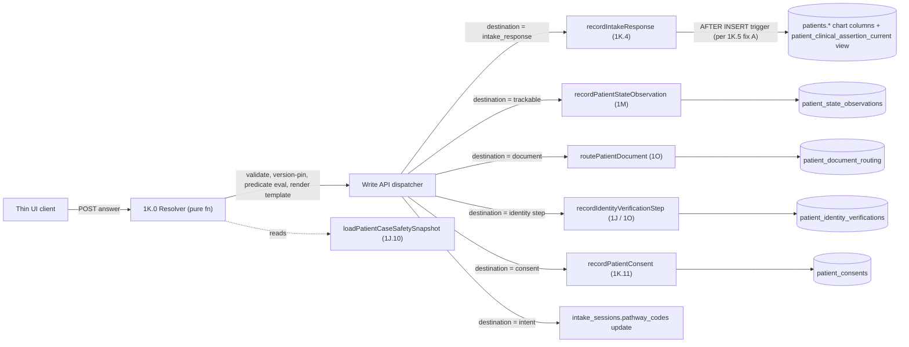

# Intake Construction Design — Build-Ready Question / Module / Pathway Architecture

**Date:** 2026-04-27
**Status:** Design proposal (not yet patched into system map)
**Scope:** Question/module/pathway/personalization architecture sitting on top of the now-hardened intake routing layer
**Sits on top of:** `1K.0` resolver, `1K.4` question bank, `1K.5` source-of-truth, `1K.6` progressive intake, `1K.13` staging, `1K.14` schema, `1J.10` safety preflight, `Section 1M`, `Section 1O`

---

I've researched the existing constraints. The system map already locks the architecture pattern: **code-as-config for clinical content, server-side resolver, write API delegates to domain functions, mandatory version capture per response**. Existing entries cover question_bank fields, module concept, branching rules, and the data-model schema row at 1K.14. The design below extends those constraints into a build-ready TypeScript schema with concrete files and types, and proposes wording patches that integrate cleanly without inventing new sections.

# A. Question bank schema (code-as-config, TypeScript)

Lives in `repo/intake/question-bank/`. One file per question (or grouped by domain — e.g., `allergies.ts`, `glp1-symptoms.ts`). Versioned via git; PR + CODEOWNERS gate per `1K.0`. Discriminated union by `answer_type` so the resolver can statically narrow.

```ts
type QuestionId = `qb.${string}.${string}`; // e.g. "qb.allergies.list_v3"
type Semver = `${number}.${number}.${number}`;

interface QuestionBase {
  question_id: QuestionId;
  question_version: Semver;
  scale_name?: string;       // e.g. "iief5", "phq9_like"; required for severity_ordinal

  // Code-level slot (no patient-facing copy in the slot key)
  internal_label: string;
  patient_label: string;     // patient-facing prompt copy
  patient_help?: string;     // optional helper / tooltip / disclaimer copy
  patient_label_template_refs?: TemplateRef[];   // see Section G — e.g. {{patient.first_name}}

  // Routing & semantics
  destination: AnswerDestination;            // see Section D
  reuse_policy: 'global' | 'program_scoped' | 'context_sensitive';
  freshness_profile: 'time_sensitive_30d' | 'quarterly_180d' | 'annual_365d' | 'static_no_refresh';
  is_trackable: boolean;                     // if true, field_name routes to patient_state_observations
  field_name?: string;                       // canonical 1K.5 field_name; required when reuse_policy = global OR is_trackable
  requires_provider_acknowledgment: boolean; // computed default per 1K.4; can be explicitly overridden only with a justification comment
  pickable_in_provider_followup: boolean;    // exposed in 1K.6 provider question picker

  // Stage scoping (per 1K.13)
  allowed_stages: Array<0 | 0.5 | 1 | 2 | 3>;
  pre_account_safe: boolean;                 // if true, may render at Stage 0 / 0.5 (no PHI captured pre-account)

  // Governance
  jurisdiction_scope?: string[];             // ISO state codes; null = all
  pathway_scope?: PathwayCode[];             // null = all pathways that include the module containing this question
  retired?: { retired_at: string; replaced_by?: QuestionId };
}

type Question =
  | (QuestionBase & { answer_type: 'single_select'; choices: ChoiceSet })
  | (QuestionBase & { answer_type: 'multi_select'; choices: ChoiceSet; min?: number; max?: number })
  | (QuestionBase & { answer_type: 'free_text_bounded'; max_length: number; phi_redaction_required: boolean })
  | (QuestionBase & { answer_type: 'numeric'; unit: string; min?: number; max?: number; precision: number })
  | (QuestionBase & { answer_type: 'date'; min?: 'epoch' | string; max?: 'today' | string })
  | (QuestionBase & { answer_type: 'severity_ordinal'; scale: { 0: string; 1: string; 2: string; 3: string; 4: string } })  // labels per 1K.4
  | (QuestionBase & { answer_type: 'binary'; positive_label: string; negative_label: string })
  | (QuestionBase & { answer_type: 'document_upload'; document_kind: DocumentKind; required_for: 'eligibility' | 'identity' | 'insurance' });

type ChoiceSet = ReadonlyArray<{ code: string; label: string; meta?: Record<string, unknown> }>;
```

Two CI-enforced invariants (per `1K.0` resolver test harness):
- A `field_name` declared once with a given `reuse_policy` may not be re-declared with a conflicting `reuse_policy` anywhere else (already named at line 3049 — this enforces it).
- `is_trackable: true` requires a `field_name` that exists in `Section 1M`'s field_name registry.
- `requires_provider_acknowledgment` default-vs-explicit: if explicit value diverges from the 1K.4 derivation rule, the file MUST carry a comment block explaining why (CI lint enforces).

# B. Intake module schema

Lives in `repo/intake/modules/`. One file per module. Module = ordered composition over `question_id`s (or sub-module references) plus declarative branching rules.

```ts
type ModuleId = `mod.${string}`;

interface IntakeModule {
  module_id: ModuleId;
  module_version: Semver;
  kind: 'clinical' | 'non_clinical';
  required_for: Array<'eligibility' | 'safety' | 'lab' | 'fulfillment' | 'identity' | 'payment' | 'submission'>;
  layer: 1 | 2 | 3 | 4 | 5 | 6 | 7 | 8 | 9 | 10 | 11;   // per 1K.3 ordering
  pathway_scope: PathwayCode[];                          // pathways this module serves
  steps: ReadonlyArray<ModuleStep>;
  retired?: { retired_at: string; replaced_by?: ModuleId };
}

type ModuleStep =
  | { kind: 'question'; question_id: QuestionId; required: boolean | Predicate; render_when?: Predicate }
  | { kind: 'submodule'; module_id: ModuleId; render_when?: Predicate }
  | { kind: 'derived_display'; derived_value_id: DerivedValueId; render_when?: Predicate; computation: 'sync' | 'async' };
```

A module step's `render_when` and `required` predicates are the **branching rules** (see Section F). Modules can compose other modules to keep the topology shallow (e.g., `mod.contraindication.glp1` includes `mod.contraindication.medullary_thyroid`).

# C. Pathway / funnel → module mapping

Lives in `repo/intake/pathways/<pathway>.ts`. One file per pathway. A pathway = ordered list of modules + per-pathway override rules. The resolver does NOT contain pathway-specific code — it consumes pathway data.

```ts
type PathwayCode = 'glp1' | 'ed' | 'trt' | 'female_hormones' | 'peptides' | 'menopause' | 'labs_only' | 'supplements_only' | 'wellness';

interface Pathway {
  pathway_code: PathwayCode;
  pathway_version: Semver;
  modules: ReadonlyArray<{
    module_id: ModuleId;
    module_version: Semver;       // pinned per pathway version (NOT "latest") — bumping a module bumps the pathway version
    layer_position: number;       // override to default 1K.3 layer order
    required: boolean | Predicate;
  }>;
  l_gate: 'L0' | 'L1' | 'L2' | 'L3' | 'L4';   // identity floor per 1J.4
  jurisdiction_eligibility: JurisdictionPolicy;
  payment_model: 'today_only' | 'today_plus_if_prescribed' | 'if_prescribed_only';   // per 1K.11
  intent_codes: string[];                      // patient entry intents that map here
}
```

Two patterns that fall out of this:
- **Module reuse:** `mod.allergies.list`, `mod.medications.list`, `mod.shipping_address`, `mod.legal_consents.telehealth_bundle` are referenced by GLP-1, TRT, HRT, ED pathways. They appear once in the bank, are pinned per pathway version.
- **Module override:** GLP-1 pathway can declare a `required: false` override on a module that is `required: true` by default — but the override is data, not new code.

# D. Answer destination mapping (the routing model)

Each question's `destination` field declares which **domain write API** the resolver calls. The resolver is purely declarative; the write API is named and audited per `1K.0(c)`.

```ts
type AnswerDestination =
  | { api: 'recordIntakeResponse'; field_name: string }              // static clinical fact → intake_response (chart memory; trigger-projects to patients.*)
  | { api: 'recordPatientStateObservation'; field_name: string }     // trackable measurement → patient_state_observations
  | { api: 'routePatientDocument'; document_kind: DocumentKind }     // file upload → patient_document_routing manifest
  | { api: 'recordIdentityVerificationStep'; step_kind: IdentityStepKind }   // ID/SSN/selfie → patient_identity_verifications via Section 1O
  | { api: 'recordPatientConsent'; consent_type: ConsentType; legal_text_snapshot_id: string }   // gating consent → patient_consents
  | { api: 'recordIntakePathwaySelection'; intent_code: string }     // intent / pathway selection → intake_sessions.pathway_codes
  | { api: 'displayOnly'; rationale: string };                       // narrative / education question; no domain write but still version-captured
```

Every mutating destination resolves to a function call we already named. **No question writes directly to `patients.*` chart columns** — already enforced by the `1K.5` Postgres trigger + the `1J.10` REVOKE GRANT we just landed. **`displayOnly` writes nothing to a domain table but DOES write an `intake_response` row** with destination metadata so the audit trail is complete.

# E. Versioning / pinning rules

The locked rule from `1K.4` Mandatory version capture is preserved verbatim. The build adds:

| Field | Source | Pinned where |
|---|---|---|
| `question_id`, `question_version` | from question bank file | `intake_response.question_id` + `question_version` |
| `module_id`, `module_version` | from pathway pin (NOT "latest") | `intake_response.module_id` + `module_version` |
| `pathway_id`, `pathway_version` | from `intake_sessions.pathway_codes[]` + pinned pathway version row | `intake_response.pathway_context` |
| `engine_version` | semver of resolver build | `intake_response.engine_version` |
| `branch_path_token` | deterministic SHA-256 over `[(question_id, question_version, predicate_truth_table_eval)...]` from session start to this answer | `intake_response.branch_path_token` |
| `predicate_ruleset_version` | semver of the branching-rule library version | `intake_response.metadata.predicate_ruleset_version` |
| `question_bank_version` | semver of the bank build (monotonic; bumped on any retire/add) | `intake_response.metadata.question_bank_version` |
| `rendered_template_snapshot` | exact rendered patient-facing string (after template ref resolution; see Section G) | `intake_response.metadata.rendered_template_snapshot` |

**Reconstructability rule:** given an `intake_response` row alone (no joins to live config), a replayer can fetch the historic question bank + pathway file at the pinned versions from git, re-evaluate predicates against prior responses, and produce the exact prompt the patient saw + the exact branch they were on. The `branch_path_token` lets two patients be compared without serializing trees.

**Bumping discipline (additive to existing 1K.4 versioning):**
- Wording-only fix → bump patch (1.0.0 → 1.0.1). Reuses `question_id`.
- Choice-set add (additive only) → bump minor.
- Choice-set remove or semantic change → new `question_id`. Old id retired with `replaced_by` pointer.
- Module reorder / step add → bump `module_version`.
- Pathway adds/removes a module OR bumps a module version → bump `pathway_version`. Pathway version is what an `intake_session` pins on creation.

# F. Branching / conditional logic

Predicates are pure functions over **session state** (prior answers, identity state, jurisdiction, payment, care-program context). Lives in `repo/intake/predicates/`. Composable, named, testable per `1K.0`.

```ts
type SessionContext = {
  patient_id?: string;                        // null pre-Stage-1
  responses: Map<QuestionId, IntakeResponse>;
  derived_values: Map<DerivedValueId, DerivedValue>;
  jurisdiction: { state: string; country: 'US' };
  identity_state: { l_level: 'L0'|'L1'|'L2'|'L3'|'L4'; l_stale: boolean };
  payment_state: { method_on_file: boolean; auth_for_future_charge: boolean };
  pathway: { code: PathwayCode; version: Semver };
  stage: 0 | 0.5 | 1 | 2 | 3;
  care_programs: Array<{ id: string; pathway: PathwayCode; status: string }>;
};

type Predicate = (ctx: SessionContext) => boolean;

// Composable primitives:
const and  = (...ps: Predicate[]): Predicate => ctx => ps.every(p => p(ctx));
const or   = (...ps: Predicate[]): Predicate => ctx => ps.some(p => p(ctx));
const not  = (p: Predicate): Predicate       => ctx => !p(ctx);
const answer = (id: QuestionId, op: '==' | '!=' | '>' | '<' | 'in' | 'includes', value: unknown): Predicate => ...;
const isJurisdictionEligibleForPathway: Predicate = ctx => ...;
const hasFreshAllergyAnswer: Predicate = ctx => ...;
```

Branching rules are stored AS the predicate composition on the module step — not as a separate "branching JSON" — so the type system enforces correctness and the diff in PR is readable.

**`branch_path_token` derivation (deterministic, hashable):** the resolver records `(question_id, question_version, [predicate_id, predicate_version, eval_result])` for every step taken. SHA-256 of the canonical-serialized list = `branch_path_token`. Same path = same token, regardless of timing.

# G. Reuse rules across pathways + personalization

**Reuse rules (existing 1K.5 + tightened):**
- `global` field_name: written once per patient regardless of pathway; reads via `patient_clinical_assertion_current` view; `recordIntakeResponse` writes route through the global session per `1K.6` global-fact attachment rule.
- `program_scoped`: written per `(patient_id, care_program_id)`; lives on the per-care-program `progressive_intake_long_running` session for Mode J, on the active pathway session at onboarding.
- `context_sensitive`: re-asked when clinically relevant (e.g., fresh BP for an Rx that requires it); the predicate that decides "ask again" is the same predicate library as branching.

**Personalization templating ("Jeremy, here's your BMI"):**

```ts
type TemplateRef =
  | { kind: 'patient_field'; field: 'first_name' | 'preferred_pronouns' | 'state' }
  | { kind: 'prior_answer'; question_id: QuestionId; render: 'value' | 'choice_label' }
  | { kind: 'derived_value'; derived_value_id: DerivedValueId; format?: string };
```

In the question bank entry, `patient_label` carries placeholders: `"{{patient.first_name}}, here's your BMI: {{derived.bmi}}"`. The `patient_label_template_refs` array declares which placeholders the resolver must resolve. The resolver:

1. Resolves each ref against `SessionContext`.
2. Renders the final string.
3. Stores `rendered_template_snapshot` on `intake_response.metadata` — so the audit trail captures **exactly what the patient saw**, not just the template.
4. Refs to `derived_value` MUST be persisted derived rows per `1K.9` (no ephemeral UI-only computation).

**Hard rule (additive to 1K.9):** any template ref that resolves to a clinical value (BMI, derived score, biomarker) requires the underlying value to be a persisted derived row per `1K.9`. Refs to non-clinical values (first name, pronouns) read directly from `patients.*` static columns or the global session.

# H. Connection to existing tables and write APIs



**Mode J / Mode E / Mode F reuse:** all three modes call the same resolver with `entry_moment ∈ {provider_request, check_in, patient_self_correction}`. The same question bank file, the same module, the same `recordIntakeResponse` API. The only difference:
- `entry_moment` field on `intake_response`.
- `correction_reason` on Mode J writes (`patient_self_correction`) and Mode E provider clarifications (`provider_clarification`).
- Session attachment per `1K.6` `progressive_intake_long_running` rule (per care_program for pathway-scoped, global for global-scoped).
- Mode E carries `clinical_required_id` on `intake_response.metadata`; Mode F carries the cron `job_id`; Mode J carries the affordance source.

**Provider follow-up picker (1K.6):** the picker UI queries the question bank for `pickable_in_provider_followup: true` entries scoped to the care_program's `pathway`. No freeform questions; the provider selects `question_id`s and the resolver builds the prompt for the patient.

**System check-ins (1K.6):** cron jobs declared per pathway emit `intake.checkin.requested` events that contain `module_id` + `module_version` references. The resolver renders the module on patient open; same write API.

# I. Minimum viable build order

1. **Establish the type module** (`repo/intake/types.ts`) — the discriminated unions in Section A + the `Predicate` shape in Section F. **Blocks everything.**
2. **Predicate library v1** (`repo/intake/predicates/`) — the named primitives (`answer`, `and`, `or`, `not`, jurisdiction/identity/freshness predicates). Standalone unit tests. **Blocks branching.**
3. **Question bank seed** (`repo/intake/question-bank/`) — start with the global modules (`mod.demographics`, `mod.allergies.list`, `mod.medications.list`, `mod.surgical_history`, `mod.shipping_address`, `mod.legal_consents.telehealth_bundle`). Seed the canonical `field_name`s used across all pathways.
4. **Module catalog seed** (`repo/intake/modules/`) — global modules above + the GLP-1 pathway-specific modules (since GLP-1 is the first Rx pathway target). Pin every step to a question_id + question_version.
5. **Pathway file: GLP-1** (`repo/intake/pathways/glp1.ts`) — declarative module list with versions pinned, `l_gate: 'L3'`, `payment_model: 'today_plus_if_prescribed'`, jurisdiction policy from `1G.4.1`.
6. **Resolver service** (pure function, in repo) — implements the 1K.0 resolver contract: takes `SessionContext` + pathway pin, returns `{next_required_input | done | blocked}` + render-ready prompt + `branch_path_token`.
7. **Write API dispatcher** — single function that reads `Question.destination` and calls the named domain function. Each domain function (`recordIntakeResponse` etc.) already exists or is committed in `1K.14` Promotion column.
8. **Resolver test harness (CI)** — for every pathway + module, a "given inputs → expected next step" test. Per `1K.0` requirement.
9. **Replayer tool (CLI)** — given a `branch_path_token` + `intake_response` row, fetches historic versions from git and renders the exact prompt the patient saw. Required for provider-packet reconstruction at scale per `1K.12`.
10. **Provider follow-up picker UI** — reads question bank with `pickable_in_provider_followup` filter; routes selections through the same resolver + write API.
11. **Mode J UI affordance** — patient-portal "update my answer" surface that opens the same modules in `progressive_intake_long_running` session attachment per `1K.6`.
12. **Second pathway (TRT or ED)** — proves the reuse model: should add ONLY pathway-specific modules + a new `pathways/trt.ts` file. Zero changes to global modules. If global modules need changes, the design is wrong.

# J. Wording patches to existing sections only

Three surgical patches integrate this into the system map. All in-place, no new subsections.

**Patch 1 — extend the question_bank entry shape declaration at line 3000 (1K.4):**

After "...the default is computed from the field's other declarations, not free-set per question)." in the same paragraph, append:

> The question bank entry's full required shape (TypeScript discriminated union over `answer_type`, lives in `repo/intake/question-bank/` per `1K.0` code-as-config) declares: `question_id`, `question_version`, `internal_label`, `patient_label` (with optional `{{template_ref}}` placeholders resolved by the resolver from `SessionContext`), `patient_label_template_refs` (typed list of `patient_field | prior_answer | derived_value` refs — derived-value refs require a persisted `1K.9` row, never ephemeral UI computation), `answer_type` + per-type fields (choices for select; min/max/precision for numeric; scale labels for `severity_ordinal`), `destination` (one of `recordIntakeResponse | recordPatientStateObservation | routePatientDocument | recordIdentityVerificationStep | recordPatientConsent | recordIntakePathwaySelection | displayOnly` — the resolver's write-API dispatcher reads this field per `1K.0(c)`), `reuse_policy`, `freshness_profile`, `is_trackable`, `field_name` (required when `reuse_policy = global` OR `is_trackable = true`), `requires_provider_acknowledgment`, `pickable_in_provider_followup` (controls visibility in the `1K.6` provider picker), `allowed_stages[]` and `pre_account_safe` (per `1K.13` staging — pre-account questions never capture PHI), `jurisdiction_scope[]?`, `pathway_scope[]?`, and `retired { retired_at, replaced_by? }?`. CI-enforced invariants per `1K.0` resolver test harness: a `field_name` may not carry conflicting `reuse_policy` across declarations; `is_trackable: true` requires a `field_name` that exists in the `Section 1M` field_name registry; explicit override of the `requires_provider_acknowledgment` derivation requires a justification comment.

**Patch 2 — extend the module declaration at line 2984 (1K.3):**

After "Each module must declare: `module_id`, `module_version`, `kind` (clinical | non-clinical), `pathways` it serves, `required_for` (eligibility, safety, lab, fulfillment, identity, payment, submission), and ordering hints (server policy controls actual order)." append:

> Module steps are typed as `{kind: 'question', question_id, required: boolean | Predicate, render_when?: Predicate}` or `{kind: 'submodule', module_id, render_when?: Predicate}` or `{kind: 'derived_display', derived_value_id, computation: 'sync' | 'async', render_when?: Predicate}` per the `1K.0` resolver schema. Predicates are pure functions over `SessionContext` (prior answers + identity + jurisdiction + payment + care-program context) drawn from the named predicate library in `repo/intake/predicates/`; copy-paste of branching across modules is rejected in code review per `1K.0` predicate-extraction rule. Modules compose other modules to keep topology shallow (e.g., `mod.contraindication.glp1` includes `mod.contraindication.medullary_thyroid`).

**Patch 3 — extend the pathway record description at line 2958 (1K.2):**

After "...with `selected_intent`, `selected_at`, `entry_source` (per `1H.4` acquisition fields when present), and `pathway_codes` (one or more, e.g., `ed`, `trt`, `glp1`, `peptides`, `labs_only`, `supplements_only`, `wellness`)." append:

> Each pathway is a declarative file (`repo/intake/pathways/<pathway>.ts`) that pins, per `pathway_version`, the exact `(module_id, module_version)` pairs it includes, the `layer_position` overrides per module, the `l_gate` per `1J.4`, the `jurisdiction_eligibility` policy per `1G.4.1`, the `payment_model` per `1K.11`, and the `intent_codes[]` that map to it. **Bumping any module_version pinned by a pathway bumps the pathway_version**, and `intake_sessions.pathway_codes[]` rows pin the pathway version at session creation per `1K.4` mandatory version capture so reconstruction is deterministic.

**Patch 4 — extend mandatory version capture at line 3016 (1K.4):**

After "...`pathway_id` (which care_program/treatment composition this is feeding), `submitted_at`, `actor_user_id`." append:

> Additionally: `predicate_ruleset_version` (semver of the branching predicate library), `question_bank_version` (semver of the bank build, bumped on any retire/add), and `rendered_template_snapshot` (the exact patient-facing string after `patient_label_template_refs` resolution per `1K.4` question-bank entry shape) are stored on `intake_response.metadata`. Replayer tool: given a single `intake_response` row, the historic question bank + pathway file at the pinned versions can be fetched from git and the predicates re-evaluated to reproduce the exact prompt the patient saw — without joining live config.

---

# Broad problems left out of the user's list (concerns to flag)

These are not in the request scope but materially affect the build and would be patch-worthy in a follow-up audit:

1. **Question rendering metadata (UI hints).** Should radio-vs-dropdown-vs-slider live in the question bank or in a thin presentation layer? Recommendation: **on the question bank entry** (`render_hint?: 'radio' | 'dropdown' | 'slider' | 'segmented'`) so the rendering is reconstructable, but UI is allowed to override for accessibility / device class.

2. **A/B test wording.** If we ever A/B test patient-facing copy on the same `question_id`, we MUST capture the variant on the response (`question_variant_id`) so reconstruction is exact. Today the schema has no slot for this.

3. **Question-bank deprecation flow.** `retired { retired_at, replaced_by }` is in the schema, but the runtime behavior when an in-flight session pins a now-retired version is not defined. Recommendation: retired questions remain readable + replayable; new sessions cannot pin retired versions; resolver fails closed if a pathway file references a retired question.

4. **Question-bank discovery / dev tooling.** With hundreds of questions across pathways, devs need a searchable index. Recommendation: a generated `repo/intake/question-bank/INDEX.md` + a TypeScript registry CI builds; not a runtime concern.

5. **Stage 0 / 0.5 vs PHI question segregation.** `pre_account_safe: boolean` is in Patch 1 above. CI must enforce that any question with `pre_account_safe: true` writes to a non-PHI destination (acquisition / cookie session, not `intake_response`). The map references this rule (1K.13 / 1H.4) but there's no codified enforcement.

6. **Cross-language / i18n.** `patient_label` is a string today; if we ship Spanish later, it becomes a `Record<Locale, string>`. Schema slot can be left as `string | LocalizedString` to be forward-compatible without a migration.

7. **Decision tables for `jurisdiction × pathway × medication-class × dose`.** Mentioned in 1K.0 line 2906 but the file format and CI loader are not defined. This is a deferred-but-real piece for high-fanout safety logic.

8. **Hotfix replay tooling.** `1K.4` describes the hotfix migration discipline (PR + backfill check-in) but the actual tooling that identifies "all in-flight patients on the affected pathway whose `module_version` is below the new threshold" needs to be built. Recommendation: a CLI that joins `intake_sessions` × pathway pin × question bank diff and emits a Mode F batch.

9. **Patient-facing template snapshot storage cost.** Storing `rendered_template_snapshot` on every `intake_response` row is the right correctness move, but for high-volume trackable check-ins (weight, BP) the snapshots are repetitive. Recommendation: snapshot table with `template_snapshot_id` deduplication, similar to `legal_text_snapshot_id` in `1K.11` consents.

10. **Provider-packet rendering when a question is retired but a prior response references it.** Per `1K.4` retired questions remain readable, but the packet renderer (per `1K.12`) must explicitly handle "retired since shown" with a banner so the provider knows the question wording / branching has moved on.

---

# Disposition

Plan mode is active and I have not made any edits. The four wording patches in Section J are proposed text only. If you approve, I'll:
- Save this design as `.cursor/plans/audits/2026-04-27_intake_construction_design.md` (matches the audit-folder pattern).
- Apply the four wording patches to lines 2958, 2984, 3000, 3016 of the system map.
- Commit + push as a single checkpoint.

Want me to proceed, or do you want to adjust the design first (e.g., approach to personalization templating, decision-table format, A/B variant capture, broader concerns above)?
