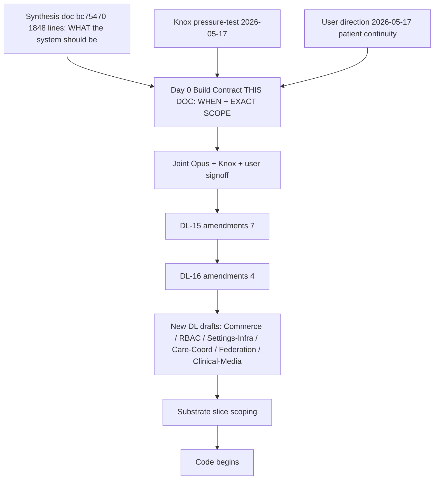

# OMNI Scheduling — Day 0 Build Contract

**Date:** 2026-05-17
**Status:** BUILD CONTRACT GATE — synthesis architecture → Day 0 build contract → DL amendments → new DL drafts → substrate slice → code. This doc converts "what the system should be" into "exactly what ships." Joint Opus + Knox + user signoff required BEFORE Phase 1 hardening or any code lands.
**Author:** Opus
**Inputs:** synthesis doc commit `bc75470` (1848 lines) + Knox pressure-test 2026-05-17 (8 gaps named) + user direction 2026-05-17 (patient continuity primary) + audit + pressure-test + Layer 2 + Sessions 1+2 + Q1-Q24 + system map.

---

## §0 Discipline locks

### 0.1 Knox pressure-test verdict (2026-05-17, verbatim)

> *"No bullshit: Opus now has a real plan. It is adequate as a convergence architecture. It is not yet adequate as a build contract. Adequate to move into Phase 1 hardening? Yes. Adequate to start coding the scheduling surface tomorrow? No. Before code, we need one final translation: architecture → Day 0 build contract → substrate slice → UI/RPC/event implementation. The current doc says what the system should be. The next artifact must say exactly what ships, what is only admitted in substrate, what is deferred, and what is intentionally rejected."*

### 0.2 User direction (2026-05-17, verbatim)

> *"like, we've already talked ALOT about patient profiles, state jurisdictions, routing, provider queues in the system map. we need to allow for ALL those previous intended connections and parts of OMNI to integrate with scheduling, not be hardwired improperly by scheduling. like we will need to slice, for example, patient find us on paid landing page, does hims type glp1 intake, gets rx sent, then decides want botox at the clinic, then continues on weight loss pathway etc etc etc. that's all THE SAME PATIENT!!! the patient DOES NOT CARE ABOUT ARCHITECTURE. they want rx shipment when they want it, in whatever state, at whatever time, with whatever care group, or whatever we have mapped out for that HIMS side of thing. then they want their botox and red light etc when they want it. all needs to be seamless."*

### 0.3 Binding constraints on this doc

1. **NOT doctrine amendment.** DL-14 / DL-15 / DL-16 invariants untouched.
2. **NOT code.** Build contract is the spec, not the implementation.
3. **NOT migrations.** Substrate slice scoping (DDL/RPCs) is post-contract.
4. **NOT new DL drafts.** Build contract lists where DL drafts are needed; doesn't draft them.
5. **DO make concrete build decisions.** Every feature gets exactly one verdict: SHIP D0 / SUB D0 / M1-2 / M6 / Y1 / REJECTED. No "TBD." No hedging.
6. **DO integrate with existing OMNI work.** Scheduling INTEGRATES with existing primitives (1J identity / 1D capabilities / 1N AI envelopes / 1Q intent_class routing / DL-10 / DL-11 / DL-13 / DL-14). Scheduling does NOT hardwire its own version of these.
7. **DO respect patient continuity premise.** Single patient_id across all modalities. No fragmentation. Walk-through at §5 is load-bearing test.
8. **REVIEW INPUT.** Joint Opus + Knox + user signoff required for each section A/B/C marks before any phase 1-5 commit.

---

## §1 The pivot: synthesis → build contract

The synthesis doc (commit `bc75470`, 1848 lines) is the architecture. It says: encounter container substrate, Care Episode parent, 3-lane source-of-truth, 4-tier attestation, 11-axis venue, federation Day 0, multi-initiator video Day 0, etc.

This document is different. It says: of all those architectural pieces, here is exactly which feature ships on Day 0, which is substrate-only Day 0 (admitted but not surfaced), which ships Month 1-2, which Month 6, which Year 1, which is intentionally REJECTED.

The synthesis is the WHAT. This is the WHEN + the EXACT-SCOPE.

After joint signoff on this contract: Phase 1 hardening begins. DL-15 amendments → DL-16 amendments → minimum new DL drafts → substrate slice scoping → code. No phase starts until joint signoff on this contract.

---

## §2 The patient-continuity premise (binding per user direction)

This is the test scenario the substrate must admit. If the build cannot handle this end-to-end seamlessly, the build is wrong.

**Patient: Sarah.** One patient across Hims-async-GLP-1 + medspa in-clinic + cross-state snowbird + multi-modality continued care. Sarah does NOT see "modules." Sarah sees ONE app, ONE timeline, ONE provider relationship — even though OMNI is coordinating 3 care_episodes across 2 venues across N encounters over 180 days.

### 2.1 High-level walk (detailed walk-through at §5)

- **T-0:** Sarah sees paid landing page for GLP-1 weight loss
- **T+0d:** Sarah submits GLP-1 intake (Hims-async path; `service.mode = async_first`)
- **T+0d:** CNS routes intake → provider review queue (per system map 1N AI envelopes + 1Q intent_class routing) → provider reviews → Rx written → subscription billing created → Rx ships
- **T+30d:** CNS monthly check-in cadence fires; SMS to Sarah; Sarah replies; renewal proceeds
- **T+45d:** Sarah opens portal: "I want Botox at the clinic too." Books in-clinic appointment via portal (multi-initiator booking Day 0).
- **T+47d:** Sarah at Bloom Birmingham; provider performs Botox 24 units; cart settles; follow-up sequence fires. Same `patient_id`. NEW encounter. ADDED `care_episode` (Aesthetic_Maintenance). GLP-1 episode untouched and continues.
- **T+60d:** During Botox visit, Sarah mentions interest in red light. Provider books red light series (per smart-drawer suggest). 6-session package purchased + first session redeemed.
- **T+120d:** Sarah flies to Florida for snowbird season (Dec 1 - April 1). Continues GLP-1 monthly. Bloom_FL is same brand but different legal_entity. Federation/permeability policy resolves cross-state continuity per Q12 11-axis venue + DL-10 patient_relationship. Sarah's MI providers' notes visible read-only to FL providers; Rx ships to FL pharmacy.
- **T+180d:** Sarah back in Michigan. Continues all 3 episodes (GLP-1 + Aesthetic + Red Light series). Patient app shows ONE timeline: GLP-1 ships / 14d-tox-check / Red-Light-session-3-of-6 / etc.

### 2.2 Existing OMNI integration points (cited, not hardwired)

Scheduling MUST integrate with these. Build cannot reimplement these:

| OMNI primitive | Canonical home | Scheduling integration |
|---|---|---|
| Patient identity | system map 1J + 1J.4 confidence + 1J.7 merge + 1J.10 safety preflight | All encounters / care_episodes / appointments FK to single `patient_id`. Merge/unmask preserved. |
| Patient relationship (multi-venue) | DL-10 + 1J.12 | Care_episode + encounter cross-venue scoping enforced. |
| Identity confidence | 1J.4 | First-visit + Rx-write gates check confidence ≥ L-threshold per 1J.10. |
| Staff capability layer | 1D + 1D.1 + 1D.2 + `lib/auth/capabilities.ts` | 4-tier attestation extends; doesn't replace. Per-staff capability flags + permission groups stay. |
| Settings precedence | 1D.4 (DL-13 binding) | Scheduling reads settings_subpage per precedence; doesn't fork settings. |
| Staff deactivation lifecycle | 1D.3 (DL-12 binding) | Provider deactivation cascades to availability_window + open encounter ownership. |
| AI envelope dispatch | 1N + 1N.10-1N.26 (DL-14 inv 7-22) | CNS reads scheduling events via Operations envelope; Clinical envelope for Rx review; Safety/Triage envelope for inbound classification. |
| AI Compose Assist | 1N.23 + DL-14 inv 18 | Provider chairside drawer + provider note + patient SMS replies route through Compose Assist. |
| Rules + Templates engine | 1Q (18 rule categories + 16 template categories) | Cancellation policy / reminder cadence / clinical clearance gate live in 1Q rule substrate. |
| Intent classification | 1Q.21 marketing-vs-clinical separation + DL-14 inv 8 + 11 | Inbound SMS "C" reply classifies via 1Q intent_class → appointment confirmation. |
| Outbound deterministic 8-gate | 1Q.14.2 (DL-13 binding) | All outbound reminders/confirmations/aftercare pass 8-gate before rail send. |
| Messaging substrate (3 surfaces) | DL-11 | Patient chat / external-line / internal collaboration stay separate. Scheduling does NOT cram messages into encounter substrate. |
| Multi-tenant scoping | DL-10 + 1U | All scheduling reads/writes scoped per `tenant_id` + `brand_id` + `legal_entity_id`. |
| Rail adapters | DL-13 | Twilio / SendGrid / Zoom Video SDK are adapters; scheduling owns video_session state, NOT the rail. |
| CNS center of gravity | DL-14 22 invariants | Scheduling is L7 action substrate executor; CNS is L5-L6 policy + planner. No scheduling brain. |
| Universal event envelope | DL-16 39 invariants | Every scheduling event/action carries the 25-field envelope. |
| orchestration_actions primitive | #10 (Phase A.2 rename committed) | Scheduling reminders / confirmations / aftercare / video starts / follow-ups all emit as orchestration_action rows. |
| cns_decision substrate | DL-16 inv 30 | Every scheduling auto-decision (clinical clearance / availability / no-show response / etc.) writes cns_decision row. |
| audit_event substrate | DL-14 + DL-16 inv 38 | Every state transition emits actor-stamped audit_event. |

**Rule:** if a scheduling feature appears to need its own version of any primitive above, STOP. Use the existing primitive. Cite the section. Integrate, do not duplicate.

---

## §3 The Feature Ledger (the build contract)

Every feature gets exactly one verdict. Citations to synthesis doc § where applicable.

**Legend:**
- **D0** = SHIP DAY 0 (functional, UI, RPC, tests)
- **SUB** = SUBSTRATE ONLY DAY 0 (table/column admitted; no UI/RPC yet)
- **M1-2** = ship Month 1-2
- **M6** = ship Month 6
- **Y1** = ship Year 1
- **REJ** = REJECTED (intentionally not built)

### 3.1 Booking + scheduling (15 features)

| # | Feature | Verdict | Synthesis ref |
|---|---|---|---|
| 1 | 4-axis booking composer (Capacity × Staff × Room × Resource) — atomic | **D0** | §6.17 + §5.5 |
| 2 | Slot offer → hold → book lifecycle with TTL | **D0** | §3 State 1 + DL-15 inv 3-4 |
| 3 | 13-state appointment lifecycle enum | **D0** | DL-15 inv 5 |
| 4 | Multi-flag status_flags BITMASK (Confirmed AND Arrived composable) | **D0** | §5.3 + Q22 |
| 5 | 3-component appointment block (Prep + Booking + Finish per staff per service) | **D0** | Layer 2 D.6 |
| 6 | Multi-initiator booking (patient / provider / staff / CNS-suggested) | **D0** | §6.10 Q4 |
| 7 | Online self-booking (patient portal) | **D0** | §5.5 + patient affordance Day 0 |
| 8 | Cancellation policy enforcement (per service / per clinic) | **D0** | DL-15 inv 7 |
| 9 | No-show policy + fee | **D0** | DL-15 inv 7 |
| 10 | Reminders + confirmation cadence (per 1Q.14.2 8-gate) | **D0** | §3 State 2 |
| 11 | Inbound SMS reply classification ("C" → confirm) per 1Q intent_class | **D0** | §13.8 + §11 events |
| 12 | Closed days + holiday calendar (admin) | **D0** | §8.1 settings |
| 13 | Blocked time / time-off / sick day (per staff) | **D0** | §8.1 |
| 14 | Bulk-reschedule on provider sick day | **D0** | §5.11 |
| 15 | Waitlist substrate + automatic promotion on cancellation | **SUB** + waitlist UI **M6** | §5.12 + DL-15 inv 8 |

### 3.2 Encounter + Care Episode (12 features)

| # | Feature | Verdict | Synthesis ref |
|---|---|---|---|
| 16 | `encounter_container` substrate (single + profile_enum + policy_table per Q1) | **D0** | §6.1 Q1 |
| 17 | 5 encounter_profile enums Day 0 (office_visit / video_visit / async_review / aesthetic_treatment_visit / resource_only_session) | **D0** | §8.1 |
| 18 | encounter_profile_policy table (declarative; CNS reads) | **D0** | §6.18 Q22 |
| 19 | Encounter profiles 6-13 (office_with_minor_procedure / phone_visit / message_based_review / lab_draw_visit / procedure_encounter / surgical_case / post_procedure_follow_up / internal_event) | **SUB** + UI **M6** | §6.18 + §8.2 |
| 20 | `care_episode` substrate (1st-class primitive per Q6) | **D0** | §6.2 Q6 |
| 21 | `episode_catalog` clinic-configured template table | **D0** | §6.7 Q19 |
| 22 | Auto-instantiation of care_episode on first qualifying event | **D0** | §6.7 Q19 hybrid |
| 23 | Multi-episode-per-encounter (line.care_episode_id) | **D0** | §6.4 Q16 + §5.3 |
| 24 | Encounter with nullable `appointment_id` (async_review profile) | **D0** | §6.8 Q20 |
| 25 | `encounter_evidence_link` substrate (messages/intake link to encounter without becoming encounter) | **D0** | §6.11 Q7 |
| 26 | Care Episode lifecycle state machine (open/active/paused/closed/completed/lost_to_follow_up) | **D0** | §6.2 |
| 27 | Care Episode admin UI (catalog management) | **M1-2** | §8.2 |

### 3.3 Planned vs Performed truth separation (8 features)

| # | Feature | Verdict | Synthesis ref |
|---|---|---|---|
| 28 | Separate `encounter_line` rows for planned_intent vs performed_intervention | **D0** | §6.12 Q8 + §10.5 |
| 29 | planned_intent status enum (open / completed_as_planned / not_performed / superseded / scheduled_in_error / patient_declined / insufficient_time) | **D0** | §6.12 |
| 30 | Substrate constraint: planned_intent_line.service_id IMMUTABLE post-creation (status only mutable) | **D0** | §6.12 critical rule |
| 31 | added_same_day=true flag for new planned lines | **D0** | §5.3 |
| 32 | Smart contextual provider chairside drawer (3 templates Day 0; 12 templates M1-2) | **D0** with 3 templates | §5.1 + §6.14 |
| 33 | Tier-2 staff_drafted authorship_state ACCEPTABLE Day 0 (not exception) | **D0** | §6.14 Q10 |
| 34 | attestation_state enum (provider_entered + attested / staff_drafted + pending / admin_override + pending) | **D0** | §6.14 |
| 35 | End-of-day / chart-close timer triggers reconciliation task if attestation_state=pending | **D0** | §6.14 + Q11 |

### 3.4 Commerce minimum Day 0 (Knox 8-item list; 15 features)

| # | Feature | Verdict | Synthesis ref |
|---|---|---|---|
| 36 | `commerce_order` + `commerce_order_line` with line_kind discriminator | **D0** | §8.1 + Q9 |
| 37 | line_kind enum (service / product / pricing_option / package_credit_redemption / discount / loyalty_reward / promo / membership_discount / gift_card / tip / cancellation_fee / no_show_fee) | **D0** | §8.1 |
| 38 | quantity / unit / price_basis columns | **D0** | Knox 8-item |
| 39 | `derived_from_performed_line_id` FK (charge ↔ clinical lane linkage per Q9) | **D0** | §6.5 Q17 |
| 40 | `commerce_order_line.entitlement_redemption_ref` (package_credit_link) | **D0** | Knox 8-item |
| 41 | Cart settle RPC + payment_attempt substrate | **D0** | §3 State 6 |
| 42 | Receipt projection (computed view; never stored as authority) | **D0** | §4.3 + Q9 |
| 43 | commerce_override audit_event (every front-desk-modify or admin-override emits) | **D0** | §6.14 Q10 |
| 44 | Real packages Day 0 (NOT placeholder — purchase + redemption + N-of-M tracking) | **D0** | §5.18 + Knox |
| 45 | Real memberships Day 0 (NOT placeholder — signup at checkout / monthly billing / discount tier) | **D0** | §5.19 + Knox |
| 46 | Real treatment deposits Day 0 (booking gate per DL-15 inv 9) | **D0** | DL-15 inv 9 |
| 47 | Pricing Option 4-type taxonomy substrate (single_session / multi_session / unlimited / autopay_contract) | **D0** | §6.9 Q3 |
| 48 | Discount Programs (rotating-tier patterns like GOLD MEMBERS 10% / VIP 40-30-10) | **SUB** + UI **M6** | §8.3 |
| 49 | Promo Codes (13+ column substrate) | **SUB** + UI **M6** | §8.3 |
| 50 | Gift Cards | **SUB** + UI **M6** | §8.3 |

### 3.5 Provider task queue + Hims async workflow (10 features) — KNOX GAP 1

| # | Feature | Verdict | Source |
|---|---|---|---|
| 51 | `provider_review_queue` substrate (one queue row per pending review task) | **D0** | Knox gap 1 + 1N AI envelopes |
| 52 | Queue SLA per intent_class (configurable; warn/escalate thresholds) | **D0** | Knox |
| 53 | Queue priority enum (urgent / standard / low) | **D0** | Knox |
| 54 | Queue reassignment RPC (transfer review to different provider) | **D0** | Knox |
| 55 | "Stuck review" detection (SLA breach + provider unavailable → auto-escalate) | **D0** | Knox |
| 56 | Async_review encounter promotion ON ACCOUNTABLE CLINICAL ACTION (not on inbound message) | **D0** | Q7 strict boundary |
| 57 | Provider attestation + chart signoff workflow for async_review | **D0** | §5.4 Hims flow |
| 58 | Queue analytics + per-provider productivity report | **M1-2** | Knox + §8.2 |
| 59 | Queue UI surface for provider (filter / sort / claim / reassign / complete) | **D0** | Knox |
| 60 | "On-call" coverage rotation (per provider availability) | **M6** | system map 1J.13 |

### 3.6 Rx + Lab state machine (8 features) — KNOX GAP 2

| # | Feature | Verdict | Source |
|---|---|---|---|
| 61 | `rx_order` substrate with state enum (ordered / pending / received / abnormal / provider_reviewed / patient_notified / rx_written / rx_blocked / refill_due) | **D0** | Knox gap 2 |
| 62 | `lab_order` substrate with state enum (ordered / specimen_collected / processing / result_released / abnormal / reviewed / patient_notified) | **D0** | Knox gap 2 |
| 63 | Manual Rx state transitions Day 0 (substrate + UI; e-Rx integration deferred Y1) | **D0** | Knox |
| 64 | Manual lab state transitions Day 0 (substrate + UI; HL7/FHIR integration deferred Y1) | **D0** | Knox |
| 65 | Rx-to-pharmacy adapter placeholder | **SUB** Day 0 + integration **Y1** | §8.4 |
| 66 | Lab adapter placeholder (HL7 v2 / FHIR DiagnosticReport) | **SUB** Day 0 + integration **Y1** | §8.4 |
| 67 | Lab result triggers CNS clinical-clearance-review orchestration_action | **D0** | §5.14 |
| 68 | Rx renewal with lab gating (lab review required before refill if clinic policy) | **D0** | §5.15 |

### 3.7 Jurisdiction + Licensure hard-gating (6 features) — KNOX GAP 3

| # | Feature | Verdict | Source |
|---|---|---|---|
| 69 | `provider_license` substrate (per provider, per state, with expiration + status) | **D0** | Knox gap 3 |
| 70 | `patient_state_jurisdiction` per Q12 11-axis venue | **D0** | §6.17 Q12 |
| 71 | Booking RPC gates: appointment_propose REJECTED if provider not licensed in patient's state | **D0** | Knox gap 3 — executable policy |
| 72 | Rx RPC gates: rx_write REJECTED if provider not authorized to prescribe in patient's state for substance class | **D0** | Knox |
| 73 | `federation_permeability_policy` per-dimension matrix (brand × legal_entity × patient_state × dimension) | **D0** | §6.17 |
| 74 | Cross-state patient transition (Maria snowbird) — CNS evaluates per federation policy | **D0** | §5.8 + §5.25 |

### 3.8 Async encounter strict boundary (4 features) — KNOX GAP 4

| # | Feature | Verdict | Source |
|---|---|---|---|
| 75 | Inbound messages stay in DL-11 messaging substrate (NOT in encounter) | **D0** | §6.11 Q7 |
| 76 | CNS decision required to promote interaction → async_review encounter | **D0** | Knox gap 4 |
| 77 | `encounter_evidence_link` substrate (encounter references messages/intake as evidence) | **D0** | §6.11 |
| 78 | No auto-promotion of message threads to encounters (substrate constraint) | **D0** | Knox |

### 3.9 Video Day 0 multi-initiator (8 features) — KNOX GAP 5 (already corrected)

| # | Feature | Verdict | Source |
|---|---|---|---|
| 79 | `video_session` substrate with vendor_adapter column | **D0** | §5.5 |
| 80 | Zoom Video SDK adapter | **D0** | §5.5 |
| 81 | Scheduled video visit (provider calendar) | **D0** | §6.10 Q4 |
| 82 | Patient-portal "Schedule video call now" affordance | **D0** | §5.5 |
| 83 | Provider-initiated quick-book video from patient profile | **D0** | §5.5 |
| 84 | CNS-suggested video slot (proactive per care_episode cadence) | **D0** | §5.5 |
| 85 | Ad-hoc video from message thread (provider clicks "Start video now") | **SUB** Day 0 + UI **M6** | §5.5 |
| 86 | Video recording + transcript + multi-vendor adapter (Daily / Twilio / Foundry) | **Y1** | §8.4 |

### 3.10 Patient identity + cross-modality continuity (8 features) — USER DIRECTION 2026-05-17

| # | Feature | Verdict | Source |
|---|---|---|---|
| 87 | Single `patient_id` across all modalities (no fragmentation) | **D0** | user direction |
| 88 | `patient_relationship_id` per DL-10 (multi-venue scoping) | **D0** | DL-10 + Q12 |
| 89 | care_episode spans venues (Maria GLP-1 Bham → Somerset → FL) | **D0** | §5.8 + §5.25 |
| 90 | CNS reads federation policy at action emission time | **D0** | §6.17 |
| 91 | Patient timeline UI projects all 3+ episodes synthesized | **D0** | §4 + §5.16 |
| 92 | Patient portal ONE-app view (no module exposure) | **D0** | user direction |
| 93 | 1J merge / unmask preserved + 1J.10 safety preflight gated before first Rx | **D0** | system map 1J + 1J.10 |
| 94 | Intake substrate from existing OMNI integrated (NOT rewritten); intake_evidence_link substrate | **D0** | §2.2 + Q14 |

### 3.11 Federation Day 0 (5 features)

| # | Feature | Verdict | Source |
|---|---|---|---|
| 95 | 11-axis `venue` substrate (physical_location / virtual_flag / brand / legal_entity / deployment / patient_relationship / provider_schedule_location / patient_state_jurisdiction / billing_rendering_location / resource_location / federation_location_of_record) | **D0** | §6.17 Q12 |
| 96 | `federation_permeability_policy` substrate (per-dimension matrix per A1 future arc) | **D0** | §6.17 |
| 97 | Cross-location patient flow (Maria scenario §5.8) | **D0** | §5.8 |
| 98 | Multi-site schedule view (cross-venue calendar per permeability) | **D0** | §8.1 UI |
| 99 | Self-serve federation permeability policy admin UI | **M1-2** | §8.2 |

### 3.12 Clinical media + intake + consent (8 features)

| # | Feature | Verdict | Source |
|---|---|---|---|
| 100 | `clinical_media` substrate (photos/videos/scans + metadata + body_region + consent + series_grouping + before_after_pair) | **D0** | §6.20 Q14 |
| 101 | `intake_session` substrate (longitudinal, not appointment-attached) | **D0** | Q14 |
| 102 | `intake_evidence_link` substrate (intake → encounter / order / Rx linkage) | **D0** | §2.2 |
| 103 | `consent` substrate (versioned + signed + scope) | **D0** | Q14 |
| 104 | `patient_document` substrate (lab PDFs / pathology / referrals / legal) | **D0** | §4 + Q14 |
| 105 | Day 0 minimum UI: upload + link + view on encounter / patient profile | **D0** | §8.1 UI |
| 106 | Photo annotation tools + before-after-pair UI | **M6** | §8.3 |
| 107 | Series grouping UI (Botox month-over-month photo series) | **M6** | §8.3 |

### 3.13 Reports + metrics Day 0 (8 features) — KNOX GAP 5

| # | Feature | Verdict | Source |
|---|---|---|---|
| 108 | Provider production report (units sold / encounters performed / commission Day 0 substrate) | **D0** substrate; **M1-2** UI | Knox gap 5 |
| 109 | Units sold report (Botox units / filler syringes per period) | **D0** | Knox |
| 110 | Package redemptions report (which packages used / when) | **D0** | Knox |
| 111 | No-show + cancellation rate report | **D0** | Knox |
| 112 | Open charts report (encounters with pending attestation / pending note) | **D0** | Knox |
| 113 | Unpaid carts report (commerce_orders past due) | **D0** | Knox |
| 114 | Follow-up due report (orchestration_actions overdue) | **D0** | Knox |
| 115 | Commission attribution report (per-line per-staff) | **M1-2** | §8.2 |

### 3.14 Settings required to operate Day 0 (12 features) — KNOX GAP 6 (refined, SMALLER than 30-50)

Knox direction: not 30-50 sub-pages; "settings required to operate" list. Below is the minimum.

| # | Feature | Verdict | Source |
|---|---|---|---|
| 116 | service + service_category catalog admin | **D0** | §8.1 |
| 117 | staff + staff_capability admin (8+ flags per staff) | **D0** | 1D |
| 118 | room + resource catalog admin | **D0** | §8.1 |
| 119 | availability rules (per provider; recurring + one-time-override) | **D0** | DL-15 |
| 120 | cancellation policy config (per service / per clinic) | **D0** | DL-15 inv 7 |
| 121 | no-show fee policy config | **D0** | §5.10 |
| 122 | reminder cadence config (X days / Y hours pre-appointment) | **D0** | §3 State 1 |
| 123 | required-fields config (per encounter_profile; new-patient + returning) | **D0** | §5.16 |
| 124 | consent template config (per-service consent variants) | **D0** | §6.20 Q14 |
| 125 | encounter_profile_policy config | **D0** | §6.18 Q22 |
| 126 | venue admin (federation cross-location + permeability) | **D0** | §6.17 |
| 127 | payment_method_capability per-clinic (which of 25+ methods enabled) | **D0** | §8.1 |

**Deferred settings (NOT Day 0):**

- vocabulary_override (Words and Phrases) — basics only Day 0; full library M6
- 4-tier client metadata (Required Fields / Indexes / Index Values / Form Custom Fields) — basic M6
- 21-event Client Alert vocab — partial Day 0 + full Y1
- Tax rates (2-tier) — D0 (single-tier); full 2-tier M6
- Revenue categories — basic D0; full M6
- Accounting Basis Accrual/Cash — D0
- Suspension types — M6
- Prospect stages / referral types / client types — M6

### 3.15 Permissions / RBAC / attestation (8 features)

| # | Feature | Verdict | Source |
|---|---|---|---|
| 128 | 5 permission_groups Day 0 (External / Front Desk / Manager / Service Provider / Social Media Manager) | **D0** | Q5 + Mindbody evidence |
| 129 | permission_atom + permission_group_atom_grant substrate | **D0** | Q5 |
| 130 | Per-staff 8+ capability flags (Desk staff / Provider appointments / Provider group lessons / Sales Rep / Followups / Commissions / Tips / Google Calendar) | **D0** | 1D + Mindbody |
| 131 | 2-layer capability composition (brand × staff) | **D0** | §6.16 Q5 |
| 132 | 4-tier authorship + attestation per Q10 | **D0** | §6.14 Q10 |
| 133 | Fast staff switching (PIN / badge / Face ID) per workstation | **D0** | §6.14 + Knox |
| 134 | Shared workstation NOT shared identity; every action audit-stamped per DL-14 | **D0** | DL-14 inv 8 + 10 |
| 135 | Capability resolution at orchestration_action emission per DL-14 inv 11 7-layer policy | **D0** | DL-14 |

### 3.16 CNS events Day 0 (~24 enumerated; §11.1 of synthesis)

| Domain events | Verdict |
|---|---|
| appointment_requested / _booked / _rescheduled / _cancelled / _no_show | **D0** |
| patient_checked_in / video_session_started / video_session_completed | **D0** |
| encounter_started / _completed | **D0** |
| planned_service_not_performed | **D0** |
| performed_intervention_recorded / _attested | **D0** |
| consent_signed / photo_captured / intake_submitted | **D0** |
| cart_settled / payment_succeeded / payment_failed / commerce_override_applied | **D0** |
| follow_up_scheduled / follow_up_due | **D0** |
| federation_permeability_resolution_made / venue_changed | **D0** |
| settings_subpage_updated | **D0** |
| rx_state_changed (per state machine §3.6) | **D0** |
| lab_state_changed (per state machine §3.6) | **D0** |
| clinical_clearance_granted / clinical_concern_raised | **D0** |

### 3.17 CNS orchestration_actions Day 0 (~18 enumerated)

| Action | Verdict |
|---|---|
| send_appointment_confirmation / _reminder | **D0** |
| request_form / request_deposit / request_consent | **D0** |
| create_provider_task / _front_desk_task / _MA_task | **D0** |
| send_aftercare_message | **D0** |
| schedule_follow_up_text_2d / offer_2wk_tox_check / suggest_rebook | **D0** |
| start_video_session / send_video_visit_link | **D0** |
| process_inbound_confirmation_reply / classify_clinical_cue_intent | **D0** |
| escalate_clinical_concern / suppress_marketing | **D0** |
| federation_route_decision (cross-venue patient flow) | **D0** |
| rx_state_transition_action / lab_state_transition_action | **D0** |

### 3.18 Integration with existing OMNI (10 features)

Reminder: scheduling INTEGRATES; it does NOT reimplement.

| # | Existing OMNI primitive | Day 0 integration |
|---|---|---|
| 136 | system map 1J patient identity + 1J.4 confidence + 1J.7 merge + 1J.10 safety preflight | All encounters/episodes FK to patient_id; first-Rx confidence gate |
| 137 | system map 1D + lib/auth/capabilities.ts capability layer | Scheduling RPCs check requireCapability; 4-tier attestation extends |
| 138 | system map 1D.4 settings precedence + 1D.3 staff deactivation | Scheduling reads settings per precedence; provider deactivation cascades |
| 139 | system map 1N AI envelopes + 1N.10-1N.26 + DL-14 inv 7-22 | Operations envelope reads scheduling events; Clinical envelope for Rx review; Safety/Triage envelope for inbound classification |
| 140 | system map 1Q rules + 1Q.13 module taxonomy + 1Q.14.2 8-gate | Cancellation/reminder/clinical-clearance rules live in 1Q; outbound passes 8-gate |
| 141 | system map 1Q.21 marketing-vs-clinical separation + intent_class routing | Inbound SMS classifies via 1Q intent_class; scheduling-intent routes to confirmation path |
| 142 | DL-11 messaging substrate (3 surfaces protected) | Patient chat / external-line / internal collaboration stay separate from encounter |
| 143 | DL-13 rail-agnostic substrate + 4-mode external-line | Twilio/SendGrid/Zoom are adapters; scheduling owns video_session state |
| 144 | DL-14 22 invariants CNS center of gravity | Scheduling is L7 action substrate; CNS is L5-L6 planner; no scheduling brain |
| 145 | DL-16 39 invariants universal envelope + 7-category partition | Every scheduling event carries 25-field envelope + registry-governed event_kind |

**Total features in ledger:** 145 (across 13 categories + CNS events + actions + integration). Day 0 ships ~110; M1-2 ships ~15; M6 ships ~12; Y1 ships ~6; SUB-only Day 0 ~10; REJECTED ~14 (per §4).

---

## §4 REJECTED Mindbody features (per Knox: "do not let Opus copy Mindbody blindly")

Explicit "NOT Day 0 / NOT needed" features so build team doesn't smuggle them in:

| # | REJECTED feature | Reason |
|---|---|---|
| R1 | Class / course engine | Unless OMNI truly supports group classes; medspa doesn't need; Y2+ if specialty needs |
| R2 | Mindbody app listings + amenities + business ownership badges | Mindbody-specific marketplace UI; no OMNI parallel |
| R3 | Giant Words-and-Phrases hotword override library | Basics Day 0 sufficient; full library Y1+ if needed |
| R4 | Supplier + Purchase Order + deep inventory procurement | ERP-adjacent; Y2+ if ever |
| R5 | Full cash-drawer closeout (Mindbody Close Out) | Digital-first; cash-drawer Y1+ if physical cash actually happens |
| R6 | Payroll + time-clock depth | HR adjacency; Y2+ |
| R7 | Class waitlist automation separate from appointment waitlist | Appointment waitlist (§3.1) covers Day 0 |
| R8 | Aquatics / facility-specific settings | Gym/spa lineage; not medical |
| R9 | Full ICD-10 / CPT billing library | Substrate placeholder D0; full library Y1+ insurance phase |
| R10 | Deep marketing automation reports | CNS handles; marketing reports Y1+ |
| R11 | Old merged-client unmask workflows (Mindbody Unmask Merged sub-page) | Audit + data migration only; not feature; 1J.7 merge stays |
| R12 | Mindbody "Inactive Pricing Options" vocab trap | Use explicit lifecycle enum (active / disabled / soft_deleted + redemption enum) |
| R13 | Memberships as service-catalog row | Memberships are Commerce DL primitive, NOT service row |
| R14 | Generic 400-item catalog search in chairside drawer | Smart-contextual preloaded drawer required; generic search REJECTED |

**Discipline:** if Mindbody has a feature OMNI doesn't (per the 190 screenshots ingested), that's because Mindbody is operationally older + has gym-spa lineage OMNI doesn't share. Don't reflexively port. Audit each Mindbody feature against "does Bloom need this Day 0 to operate?" If no, REJECT explicitly.

---

## §5 Sarah patient-continuity walk-through (detailed; the load-bearing test)

If the substrate doesn't admit this scenario end-to-end with no rewrite, the build is wrong.

### 5.1 Stage 1 — T-0: Sarah finds OMNI via paid landing page

- **Sarah's view:** Lands on Bloom marketing page about GLP-1 weight loss. Sees "Get started — 5-minute intake."
- **Substrate Day 0:** No OMNI substrate row yet. Marketing pixel + UTM tracking only.
- **Existing OMNI integration:** 1Q.21 marketing-vs-clinical separation (this is marketing context; no clinical PHI yet).
- **CNS:** No action yet (no patient_state_event).

### 5.2 Stage 2 — T+0d (10 min): Sarah submits GLP-1 intake

- **Sarah's view:** Fills out intake form: name + email + state + height/weight/BMI + medical history + photo (optional) + agrees to consent + adds card.
- **Substrate Day 0:**
  - `patient` row created (`status='prospect'`; first_visit_pending=true)
  - `patient_relationship` row created (per DL-10; venue=Hims_brand virtual)
  - `intake_session` row created with all responses (longitudinal)
  - `intake_evidence_link` (intake → care_episode candidate)
  - `consent` row created (signed; versioned)
  - `care_episode` AUTO-INSTANTIATED per Q19 hybrid: catalog template "GLP-1_Weight_Loss" exists → system creates `care_episode(patient_id=Sarah, episode_template_id=GLP1_WL, lifecycle_state='open')`
- **DL-16 events emitted:** `patient_state_event(intake_submitted)` + `consent_signed` + `care_episode_opened`
- **Existing OMNI integration:**
  - 1J.4 identity confidence: initial L=patient_self_reported (low)
  - 1J.10 safety preflight: NOT YET BLOCKED; Rx-write will require L≥L-threshold + safety preflight join
  - 1Q.21 intent_class: clinical (GLP-1 intake = clinical pathway, not marketing)
- **CNS:** `cns_decision(promote_to_async_review_encounter_pending)` → emits `create_provider_task` orchestration_action → routes to provider_review_queue with priority=standard

### 5.3 Stage 3 — T+2h: Provider Dr. C picks up review from queue

- **Sarah's view:** No direct interaction yet (she's at lunch).
- **Substrate Day 0:**
  - Provider Dr. C picks up `provider_review_queue` row (claim_action by provider_id=C)
  - Dr. C opens patient context: intake + history + safety flags
  - **Q3 jurisdiction check:** `provider_license(provider_id=C, state=Sarah.patient_state_jurisdiction)` exists + active? YES (Dr. C licensed in Sarah's state per §3.7 hard-gate).
  - **1J.10 safety preflight join:** Run before Rx-write — confirms no allergy/contraindication conflict.
  - Dr. C decides: Eligible. Writes Rx.
  - `encounter_container` row created (profile=async_review, appointment_id=NULL, primary_care_episode_id=GLP-1)
  - `performed_intervention_line(line_kind='rx_written', service=GLP1_semaglutide_dose1, performer=C, authorship_state='provider_entered', attestation_state='attested')` linked via care_episode_id=GLP-1
  - `rx_order` row (state='rx_written'; per §3.6 state machine)
  - `provider_note` row signed + linked
  - `commerce_order` row created (subscription_billing; $X recurring monthly)
  - `payment_attempt` initial charge
- **DL-16 events:** `performed_intervention_recorded` + `note_signed` + `rx_state_changed(rx_written)` + `cart_settled` + `payment_succeeded` + `encounter_completed`
- **Existing OMNI integration:**
  - 1N Clinical envelope used for Dr. C's Compose Assist (Add clinical notes / explain to patient)
  - 1Q rules: Rx prescribing rule check passed
  - DL-14 inv 21 live-state revalidation before Rx fires
- **CNS:**
  - `rx_to_pharmacy` orchestration_action → external pharmacy adapter (placeholder Day 0; full integration Y1)
  - `send_patient_message` orchestration_action → SMS to Sarah: "Your GLP-1 prescription is being processed. You'll get a tracking number tomorrow."
  - `schedule_monthly_check_in` orchestration_run scheduled (per care_episode cadence)

### 5.4 Stage 4 — T+30d: Monthly check-in CNS cadence fires

- **Sarah's view:** SMS: "Hi Sarah, how's your GLP-1 going? Tap to fill in: side effects / weight / questions."
- **Substrate:** 
  - CNS fires `send_check_in_form` per care_episode cadence
  - Sarah submits → new `intake_session` linked to care_episode + previous intake
  - Provider Dr. C reviews → simple cases auto-approve renewal; complex → queue + async_review encounter
- **DL-16 events:** `intake_submitted` (monthly variant) + (conditional) `encounter_started` + `rx_state_changed(refill_due → ordered)`
- **CNS:** `schedule_next_check_in` (recurring cadence)

### 5.5 Stage 5 — T+45d: Sarah wants Botox at the clinic

- **Sarah's view:** Opens Bloom portal: "I also want Botox." Books in-clinic appointment for next Tuesday. Picks Provider Amber.
- **Substrate:**
  - Patient-initiated booking (per §3.1 multi-initiator Day 0)
  - `appointment` row created (profile=aesthetic_treatment_visit, scheduled_provider=Amber, venue=Bloom_Birmingham)
  - `planned_intent_line(service=Botox_consult)` (consult first per clinic policy)
  - **NEW care_episode auto-instantiated:** catalog template "Aesthetic_Maintenance" → `care_episode(patient_id=Sarah_SAME, episode_template_id=Aesthetic_Maintenance, lifecycle_state='open')`. **Critical: patient_id is SAME as GLP-1 episode.**
  - GLP-1 episode UNTOUCHED + lifecycle_state='active'
- **DL-16 events:** `appointment_requested` + `appointment_booked` + `care_episode_opened`
- **Existing OMNI integration:**
  - 1J patient identity preserved (no merge needed; same patient)
  - DL-10 patient_relationship reused (same brand + same legal_entity)
  - Q12 venue: physical_location=Bloom_Birmingham_id; same brand as Hims-virtual
- **CNS:** `send_appointment_confirmation` + reminder cadence scheduled

### 5.6 Stage 6 — T+47d: Botox visit at Bloom Birmingham

- **Sarah's view:** Arrives at Bloom Birmingham. Front desk checks her in. Provider Amber reviews chart — sees GLP-1 episode active + intake history. Discusses Botox plan. Sarah signs Botox consent. Amber performs Botox 24 units. Checkout: pays $336 via card. Receives aftercare SMS.
- **Substrate:**
  - `patient_checked_in` (front desk action)
  - `consent` row signed (Botox-specific; versioned + linked)
  - **Smart chairside drawer (per §3.3 Day 0):** Provider Amber's drawer preloads with: today's appointment + Botox template + Provider Amber's favorite presets + room context. Amber enters glabella 10u / R crow's feet 6u / L crow's feet 4u / lip flip 4u = 24 units.
  - `performed_intervention_line(service=Botox, units=24, areas=[...], performer=Amber, authorship_state='provider_entered', attestation_state='attested', care_episode_id=Aesthetic_Maintenance, derived_charge_line_id=<NEW>)`
  - `commerce_order_line(line_kind='service', service=Botox, quantity=24, unit_price=$14, total=$336, derived_from_performed_line_id=<above>)`
  - `cart_settle` RPC → `payment_attempt` (Visa $336) → `payment_succeeded`
  - `provider_note(signed, renders from performed_intervention_line + attestation)`
  - `clinical_media(photos before+after)` linked to encounter
- **DL-16 events:** `patient_checked_in` + `consent_signed` + `performed_intervention_recorded` + `performed_intervention_attested` + `cart_settled` + `payment_succeeded` + `note_signed` + `encounter_completed`
- **Existing OMNI integration:**
  - 1J identity: Sarah's prior intake + GLP-1 episode visible to Amber via patient profile cockpit
  - 1D capability: Amber has provider_for_appointments + earns_commissions capability
  - DL-14 inv 8 + 10: Amber attestation stamped on performed_line
  - DL-13: payment_attempt via card-reader rail adapter
- **CNS:**
  - `send_aftercare_message` → SMS Sarah Botox aftercare
  - `schedule_follow_up_text_2d` → 2-day-out text
  - `offer_2wk_tox_check` → 14-day follow-up appointment offer
  - `recommend_retail_product` (vitamin C cream; if clinic policy)
  - GLP-1 monthly cadence UNTOUCHED

### 5.7 Stage 7 — T+60d: During Botox follow-up, Sarah wants red light series

- **Sarah's view:** Comes in for 2-week tox check. Mentions interest in red light therapy. Provider Amber says yes good fit; offers 6-session package. Sarah buys + uses session 1.
- **Substrate:**
  - encounter (existing 2wk tox-check appointment) gets ADDED planned_intent_line for red light (per §5.3 multi-line-per-encounter)
  - **PACKAGE PURCHASE + FIRST REDEMPTION SAME VISIT** (per §3.4 #44 + §5.18):
    - `commerce_order_line(line_kind='package_purchase', package=red_light_6_session, amount=$X)`
    - `commerce_order_line(line_kind='package_credit_redemption', package_ref=<NEW>, session_number=1)`
    - `performed_intervention_line(service=red_light, session_number=1, performer=MA, authorship_state='staff_drafted', attestation_state='pending', care_episode_id=NEW Red_Light_Series_episode)`
  - **NEW care_episode auto-instantiated:** "Red_Light_Series" (3rd active episode for Sarah)
  - Cart settles with package purchase + session 1 redemption in one transaction
  - Provider Amber attests later in chart-close timer (per §3.3 #33 tier-2 acceptable Day 0)
- **DL-16 events:** `performed_intervention_recorded` + `commerce_order_line_inserted` (package_purchase) + `commerce_order_line_inserted` (package_credit_redemption) + `care_episode_opened` (red_light_series)
- **CNS:** schedule next 5 sessions per package cadence

### 5.8 Stage 8 — T+120d through T+180d: Snowbird to Florida + return

- **Sarah's view:** Flies to FL Dec 1. Continues GLP-1 monthly (shipped to FL pharmacy). Books red light session 4 of 6 at Bloom_FL on Dec 15. April 1: returns to MI. Books red light session 5 of 6 in MI. Patient app shows ONE unified timeline.
- **Substrate:**
  - venue.federation_permeability_policy resolves cross-state:
    - brand=Bloom: share
    - legal_entity=Bloom_MI → Bloom_FL: cross-state read-only (Sarah's MI notes visible to FL provider)
    - patient_state_jurisdiction: changes from MI → FL → MI
    - billing_rendering_location: changes per encounter venue
  - Care_episodes (GLP-1 + Aesthetic_Maintenance + Red_Light_Series) ALL preserved + active
  - `performed_intervention_line` rows tagged with venue per encounter
  - Q3 jurisdiction hard-gate: GLP-1 Rx renewal at T+120d (Sarah in FL) requires Dr. C to be licensed in FL OR routes to a FL-licensed provider via federation_route_decision orchestration_action
  - Red light session 4 at Bloom_FL: Provider in FL legal_entity performs; session 4-of-6 redeemed from MI-purchased package (per federation policy: package_credit cross-state share)
- **DL-16 events:** `federation_permeability_resolution_made` (per cross-venue action) + `rx_state_changed` (Rx routed to FL) + `performed_intervention_recorded` (red light at FL) + `venue_changed` (patient state)
- **Existing OMNI integration:**
  - DL-10 patient_relationship resolves cross-legal-entity visibility
  - Q12 11-axis venue carries all routing context
  - CNS reads federation_permeability_policy at every cross-venue action emission
- **What Sarah sees:** ONE patient app, ONE timeline showing all episodes regardless of venue. No re-onboarding. No re-entering history. No "transferring records."

### 5.9 The proof

Across 180 days + 3 care_episodes + 2 venues + 2 states + ~15 encounters:

- ONE `patient_id` (per 1J identity)
- ZERO duplicate patient profiles
- ZERO module-aware UI for Sarah
- ZERO substrate rewrites needed for any of: Hims-async + medspa in-clinic + cross-state + multi-modality

The substrate primitives required for this scenario are EXACTLY what §3 enumerates ship-Day-0. No additional substrate is needed for cross-modality continuity. The continuity is emergent from: `patient_id` FK + `care_episode` parent + `encounter_line.care_episode_id` + `venue.federation_permeability_policy` + `DL-10 patient_relationship` + `DL-14 CNS orchestration` + `1J identity preservation`.

**If any of the §3 Day 0 features is dropped, this scenario breaks.** That's why §3 is the contract.

---

## §6 Pre-flight checks before code starts (Knox 5-step sequence)

After joint signoff on THIS contract:

### 6.1 Step 1 — This Build Contract (current step)

Joint Opus + Knox + user signoff per §10. Sign each section A/B/C. Reconcile differences in joint working session.

### 6.2 Step 2 — DL-15 scheduling amendments (7 commits)

Per Layer 2 G.1:

1. Multi-flag lifecycle stack composability (Confirmed AND Arrived per Q22)
2. 4-axis booking composer invariants (Capacity × Staff × Room × Resource)
3. 3-component appointment block (Prep + Booking + Finish per staff per service)
4. Service Type enum expansion (Appointments / Arrivals / Classes / Courses / Memberships)
5. 5 Scheduling Restrictions on Pricing Options
6. Staff Availability Window 4-axis primitive
7. Recurring + one-time-override availability composition

Each = one commit. Joint review at end.

### 6.3 Step 3 — DL-16 event vocabulary amendments (4 commits)

Per Layer 2 G.3:

1. 21+ Client Alert event types enumerated
2. Alert 2-level severity enum (Red / Yellow)
3. 30+ Outbound communication trigger types
4. Multi-actor envelope (staff / clinic / system / 3rd-party-integration like `_ClassPass API_`)

### 6.4 Step 4 — Minimum new DL drafts (6 DLs)

Per Layer 2 G.2 + Session 2 additions:

1. **Commerce DL** (Phase C kickoff) — 19+ commerce primitives
2. **RBAC DL** — permission group + atom + 2-layer composition + 4-tier authorship+attestation
3. **Settings-Infrastructure DL** — 10-section settings-as-OS + 4-tier client metadata + dual-mode required fields
4. **Care-Coordination DL** — Care Episode primitive + episode_catalog + lifecycle
5. **Federation-Topology DL extension** — 11-axis venue + permeability policy + A1 fulfillment
6. **Clinical-Media DL** — clinical_media + intake_session + consent + patient_document substrates

Each = one drafting effort. NOT every future specialty DL (per Knox: "not every future GI/cardio/plastics idea is doctrine-perfect"). Specialty DLs deferred per §8.4-§8.5 phasing.

### 6.5 Step 5 — Substrate slice scoping

Convert §3 feature ledger into:
- Tables (DDL)
- RPCs (TypeScript signatures)
- Events + actions (DL-16 registry entries)
- UI surfaces (component-level scope)
- Test plan

This is the IMPLEMENTATION SPEC, not yet implementation. Joint review before code.

### 6.6 Step 6 — Code begins

Phase 2 e1 reframe + Phase 3 e1 implementation per omni_brain_hardening.

---

## §7 What "Mindbody parity Day 0" actually means (per Knox)

Knox direction: NOT every Mindbody feature. The core medspa operating parity:

| Mindbody capability | Day 0 OMNI |
|---|---|
| Booking calendar | ✓ §3.1 |
| Provider / room / resource availability | ✓ §3.1 #1 |
| Client profile | ✓ §3.10 |
| Packages (purchase + redemption) | ✓ §3.4 #44 |
| Memberships (signup + monthly) | ✓ §3.4 #45 |
| Deposits (booking gate) | ✓ §3.4 #46 |
| Checkout cart + receipt | ✓ §3.4 #41-42 |
| No-show / cancel + fees | ✓ §3.1 #8-9 |
| Reminders + confirmation | ✓ §3.1 #10-11 |
| Forms + consents | ✓ §3.12 |
| Staff permissions | ✓ §3.15 |
| Closed days + holiday calendar | ✓ §3.1 #12 |
| Reports hooks (basic) | ✓ §3.13 |

That's the operating parity Bloom needs Day 0 to launch.

Mindbody features OMNI does NOT match Day 0 (per §4 REJECTED list): class engine, app listings, payroll, supplier procurement, cash drawer closeout, deep ICD/CPT, marketing automation reports.

---

## §8 What "Hims-level workflow Day 0" actually means (per Knox)

Knox direction: "Hims does not primarily need scheduling. It needs async clinical operating structure."

| Hims capability | Day 0 OMNI |
|---|---|
| Async intake → provider review queue | ✓ §3.5 |
| Provider reviews + writes Rx | ✓ §3.6 #61 + §5.4 + §5.3 (Sarah stage 3) |
| Rx state machine | ✓ §3.6 #61 |
| Rx ships to pharmacy | ✓ Day 0 placeholder + Y1 full pharmacy integration |
| Subscription billing | ✓ §3.4 |
| Monthly check-in cadence | ✓ §3.18 CNS actions + §3.5 #51 |
| Lab/Rx state hooks | ✓ §3.6 |
| Provider queue + SLA + reassignment | ✓ §3.5 #51-55 |
| Jurisdiction-aware Rx prescribing | ✓ §3.7 #72 hard-gate |
| Patient portal one-app view | ✓ §3.10 #92 |
| Optional video escalation | ✓ §3.9 |

Hims operating parity. NOT a Hims clone (Hims has years of optimization; OMNI ships the structural primitives Day 0; UX polish iterates).

---

## §9 Top 5 risks + escalation triggers

### Risk 1 — Patient identity continuity broken

**Failure mode:** Sarah's GLP-1 patient_id ≠ Sarah's medspa patient_id. Duplicate profiles. Episode fragmentation.
**Test:** §5 walk-through end-to-end against substrate.
**Mitigation:** §3.10 #87-94. 1J identity primitives reused. NO new patient table per modality.
**Escalation trigger:** if substrate slice (step 5) introduces per-modality patient ID columns, STOP.

### Risk 2 — Provider task queue inadequate for Hims

**Failure mode:** Hims customer cannot operate. Provider review queue has no SLA / no reassignment / no escalation.
**Test:** §5.3 Sarah's Hims-async stage; multi-provider on-call rotation.
**Mitigation:** §3.5 #51-60. Knox gap 1 addressed.
**Escalation trigger:** if substrate slice doesn't enumerate provider_review_queue + SLA primitives, STOP.

### Risk 3 — Jurisdiction/licensure soft (Rx to wrong state = legal exposure)

**Failure mode:** Provider C writes Rx for patient in state where C not licensed. Federal/state regulatory violation.
**Test:** §5.8 Sarah snowbird scenario. Cross-state Rx.
**Mitigation:** §3.7 #69-74. Executable booking + Rx RPCs gate per provider_license check.
**Escalation trigger:** if substrate slice doesn't enumerate provider_license + executable RPC gates, STOP.

### Risk 4 — Smart drawer Day 0 too generic (Bloom provider rejects; tier-1 adoption fails)

**Failure mode:** Provider opens drawer, sees 400-item search bar, doesn't use it. Tier-1 path collapses. Bloom never migrates from tier-2.
**Test:** §5.6 Sarah Botox; Amber drawer preload.
**Mitigation:** §3.3 #32 smart-contextual drawer with 3 Day 0 templates + smart preload. Generic catalog REJECTED per §4 R14.
**Escalation trigger:** if substrate slice ships generic catalog search without contextual preload, STOP.

### Risk 5 — Federation policy resolution incomplete

**Failure mode:** 3 Day-1 spa customers cannot deploy because cross-location patient flow / cross-state provider routing / multi-brand permeability not enforceable.
**Test:** §5.8 Sarah snowbird + 3-spa Day 1 deployment scenario.
**Mitigation:** §3.11 #95-98 federation Day 0. Federation-Topology DL drafted Phase B.5+.
**Escalation trigger:** if substrate slice doesn't enumerate venue 11-axis + federation_permeability_policy + CNS-level resolution, STOP.

---

## §10 Signoff path

Joint Opus + Knox + user signoff required BEFORE:

- DL-15 amendments commit (Step 2)
- DL-16 amendments commit (Step 3)
- New DL drafts commit (Step 4)
- Substrate slice scoping commit (Step 5)
- Code commit (Step 6)

**Signoff format per section of THIS contract:**

| § | Status | Comments |
|---|---|---|
| §0 Discipline locks | A / B / C | |
| §1 Pivot framing | A / B / C | |
| §2 Continuity premise | A / B / C | |
| §3.1 Booking | A / B / C | |
| §3.2 Encounter + Care Episode | A / B / C | |
| §3.3 Planned vs Performed | A / B / C | |
| §3.4 Commerce minimum | A / B / C | |
| §3.5 Provider queue | A / B / C | |
| §3.6 Rx + Lab state machine | A / B / C | |
| §3.7 Jurisdiction hard-gate | A / B / C | |
| §3.8 Async encounter boundary | A / B / C | |
| §3.9 Video multi-initiator | A / B / C | |
| §3.10 Patient continuity | A / B / C | |
| §3.11 Federation | A / B / C | |
| §3.12 Clinical media | A / B / C | |
| §3.13 Reports | A / B / C | |
| §3.14 Settings | A / B / C | |
| §3.15 RBAC / attestation | A / B / C | |
| §3.16 CNS events | A / B / C | |
| §3.17 CNS actions | A / B / C | |
| §3.18 Existing OMNI integration | A / B / C | |
| §4 REJECTED list | A / B / C | |
| §5 Sarah walk-through | A / B / C | |
| §6 Pre-flight sequence | A / B / C | |
| §7 Mindbody parity clarification | A / B / C | |
| §8 Hims parity clarification | A / B / C | |
| §9 Risks | A / B / C | |

**Legend:**
- **A** = Approve as written
- **B** = Approve with comments (minor amendments specified)
- **C** = Reject (major rework needed)

Differences reconciled in joint synchronous working session. Final lock after all sections marked A or B + amendments applied.

---

## §11 Discipline reaffirmed

This document is:

- **A BUILD CONTRACT.** Translates synthesis architecture into Day-0-exact scope.
- **NOT doctrine amendment.** DL-14 / DL-15 / DL-16 invariants untouched.
- **NOT code.** Step 6 is code; this is Step 1.
- **NOT migrations.** Step 5 substrate slice is the SQL/DDL gate.
- **NOT new DL drafts.** Step 4 is DL drafts; this contract names them.
- **REVIEW INPUT.** Joint signoff per §10 required.

After signoff: Phase 1 hardening proceeds per §6.

**End of OMNI Scheduling Day 0 Build Contract (2026-05-17). Ready for joint Knox + user signoff.**
