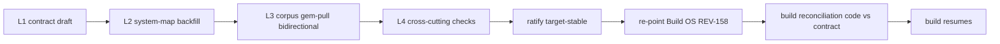

# Foundation vNext Reconciliation Plan

Document type: `plan` (operative roadmap for the Foundation vNext reconciliation program)
Authority: `governance_binding` execution plan — the single source for *what we are doing, in what order, by what method, and what the status is*. Does not own schemas (those live in the artifacts it routes to).
Status: `active` (created 2026-05-30; **living document — status tracker updated at each domain checkpoint**)
Domain(s): `architecture_governance`, `build_os`
Lifecycle role: operative roadmap for the domain-by-domain reconciliation into clean canonical vNext artifacts
Source-of-truth relationship: the operative roadmap. **Supersedes-in-approach** the pre-pivot Phase G sequencing in `omni_doctrine_reconciliation_map_v1_2026-05-25.md` (§20 Phase G G.1–G.6 "patch the DLs") and the off-repo `omni_doctrine_refresh_23fb24b1.plan.md` — their audit findings + decisions remain valid **evidence**, but the execution approach is now this plan. Method/boundaries per `00_architecture_artifact_index.md`.
Supersedes: pre-pivot Phase G execution sequencing (approach only; findings retained as evidence)
Superseded by: none
Manifest action: `add_tier1` (workstream-mandatory: read FIRST for Foundation vNext reconciliation work — NOT universal Tier 0 for every OMNI task)
Review gate: `user_knox_required`

---

## 0. Why this exists — and why we abandoned the old map

The Foundation vNext pivot (2026-05-30, handoff `HANDOFF_2026-05-30_foundation_vnext_pivot.md`) changed the approach from "patch stale DLs in place (Phase G)" to "produce clean canonical vNext artifacts, domain-by-domain, old docs → evidence."

**Why the old map was abandoned (preserve this rationale):** the legacy `system_map_three_layers_60706286.plan.md` had become a ~5k-line dumping ground (map + history + features + open-debt + UX), violating OMNI's own single-source-of-truth discipline. Worse, reconciling *in place* (a controlling `§0` header bolted over a still-stale body — the DL-20 Frankenstein) produced artifacts future agents misread as binding. The fix is **clean vNext artifacts + the reconciliation discipline in §1.5 + old docs demoted to evidence** — explicitly NOT a rewrite-from-scratch and NOT abandoning prior work. This was a hard-won course (≈2-hour pivot arc on 2026-05-30); §1.5 is the discipline that course produced.

This plan is the **guide document** so the rationale + ordered sequence + method + discipline + status do **not** live in chat memory. **Read this (and §1.5) first before any domain pass.**

## 1. The approach (one paragraph)

Foundation-first. For each domain: inventory its evidence → distill a clean **Domain Contract** → define its **seam contracts** → record a **disposition table** for every old primitive → route decisions/open-seams to their canonical homes → checkpoint, then stop. The System Map stays a *map*; detail lives in contracts; old docs (DLs, designs, audits, reconciliation map) are **evidence/starting-corpus**, never the build-facing artifact. Thesis v2 = pinned governing lens (meaning); freshest substrate = mechanics; conflicts stop for Nick + Knox. Full artifact taxonomy + the 3 binding rules: `00_architecture_artifact_index.md`.

## 1.5 Reconciliation hierarchy + preservation rule (the hard-won discipline — DO NOT SKIP)

**This is the point of the whole pivot. A domain pass that ignores this section reproduces the exact drift the pivot was meant to stop.** "Make clean new docs" is NOT a license to rewrite from vibes or to silently drop prior work. This discipline is enforced at boot by guardrails `D0THES-GRD-022` (freshest-authority check), `D0THES-GRD-023` (three-layer reconciliation), `D0THES-GRD-024` (no Frankenstein-in-place), and the Artifact Index disposition-on-demotion rule — **this section is their plan-level statement, and every domain pass applies it.**

**The three layers every domain pass reconciles (none is automatically supreme):**
1. **Thesis v2 = governing lens / meaning / constitutional direction** (pinned; cite canonical homes for binding claims per v2 §16). Governs *what the system must mean*; does NOT by itself dictate low-level mechanics or rename hard-won substrate vocabulary.
2. **Freshest deep substrate work = mechanical evidence** (rule-matrix rounds, design docs, build state, ADRs) — usually the controlling authority for object/lifecycle/field detail. Run the freshest-authority check (GRD-022) against the **freshest** layer, never a presumed-hard-won-but-stale one (that was the DL-20 trap).
3. **Legacy doctrine / system map / DLs / designs / audits = evidence / starting corpus (candidate container)** — dispositioned, never blindly copied OR ignored.

**Preservation rule (disposition-or-it-doesn't-move):** a clean vNext contract supersedes an old artifact only after **every material prior primitive/function** is `preserve | rename | split | move | demote-to-projection | reject | queue` in the contract's disposition table — each with new-home + why + what-breaks-if-omitted. No primitive disappears silently. (This is the rule whose absence caused the `encounter_profile_registry` scare.)

**Conflict rule (stop-and-surface):** if Thesis v2 and the freshest substrate conflict, do NOT choose by elegance or freshness alone. **Stop and surface to Nick + Knox**, unless the supersession test passes — the newer framing (a) preserves the cases the old model solved, (b) explains additional cases, (c) improves enforceability (fields/invariants/rejection rules), and (d) does not collapse hard-won distinctions (planned/actual · clinical/commerce · doc/authority · source/adoption · projection/truth). Classify **per-claim, not per-primitive**.

**How we know future-us sticks to this:** it lives in three reinforcing places — (i) this read-first plan (§1.5), (ii) the Tier 0.5 boot-visible guardrails `D0THES-GRD-022/023/024` (every agent sees them at boot), and (iii) the per-domain method below (step 0.5). A pass cannot legitimately proceed without it.

## 2. Per-domain method (the repeatable pass)

**Step 0.5 (every pass, not optional): apply §1.5** — reconcile the three layers; disposition every prior primitive; stop-and-surface on thesis↔substrate conflict.

**Step 0.6 (every pass, MANDATORY before any contract draft): Thesis Doctrine Pressure Check** (guardrail `D0THES-GRD-025`). §1.5 is *local* reconciliation and is structurally blind to *cross-domain* thesis doctrine — so before drafting, every FAC MUST include a 4-row check with **PASS / GAP / PATCHED / N/A (+why)** for:
1. **Federation / operator boundary** — can this object move across brands / practices / core-capabilities / specialty-lines / partners / future-cross-org without losing origin · operator/practice context · custody · visibility · authority · audit lineage?
2. **Layered accountability** — is the chain `artifact → observation → data-fidelity verification → assertion → clinical adoption → care/action` preserved with NO layer collapsed (incl. artifact-integrity ≠ extraction-fidelity ≠ clinical-adoption)?
3. **CNS usefulness** — would an intelligent CNS have enough **authority-labeled** context to act safely (origin · reliability · who-can-see · who-can-act · adoption state · who owns the next step) — not just "data exists"?
4. **Domain-truth boundary (anti-silo)** — is this domain quietly becoming a junk drawer (Messaging≠care-logic · CM≠raw-evidence · D7≠observations · Observation≠clinical-truth · CNS≠domain-truth · D6≠D5-work)?
**Watch-list — late/deferred cross-cutting owners** most likely to be shed (account for them explicitly): federation (#11) · `care_commitment` (deferred `REV-141`) · boundary-policy enforcement (RBAC #9 / Federation #11) · Network Governance Plane. Gaps patch **in-place** (contract/System Map); only genuinely-unresolved → `08`. **No contract draft proceeds without this check.**

Per the Artifact Index "Domain pass output contract" + "domain-pass mandatory pull":

1. **Inventory + pull evidence** (mandatory, cite in contract §Evidence): relevant DL(s); **grep the legacy system map (`system_map_three_layers_60706286.plan.md`) for the domain's scattered sections — a DL usually does NOT contain all of a domain's doctrine** (e.g., commerce lives in §1E + §1I + §1J.9 + §1K.11 + §12-labs *alongside* DL-17; the DL even punts the money-movement layer to §1I). Skipping this is how scattered doctrine gets dropped; `designs/` + `audits/` pressure-test/scenario corpora by domain tag; `omni_field_cases.md` `FIELD-*` by domain tag; open-review rows (`08`) by domain tag.
2. **(If on a multi-round superseding arc)** produce a Freshest-Authority Check first (per `D0THES-GRD-022/023`) — e.g., DL-20 needed it; most domains won't.
3. **Draft the clean Domain Contract** (`contracts/<domain>_contract.md`): objects · lifecycle · events · invariants/rejection-rules · vocabulary lock · **disposition table** · projections · open seams · evidence sources.
4. **Seam contracts** (`contracts/seams/<seam_id>_*.md`) for the domain's outward edges.
5. **Route**: decisions → `03`; open seams → `08` (owner+trigger+blocks+can-proceed); supersession → `05`; new field cases → `omni_field_cases.md`.
6. **System Map vNext**: fill the domain's entry (map-level only) + register its seams.
7. **Conformance**: catalog row (`01`) + read-graph route (`04`).
8. **Checkpoint + stop** (commit at work-package boundaries; no auto-continue).

## 2.5 The four reconciliation layers (every domain passes all four before ratify)

A domain is not ratification-ready until it clears four layers. This is the formal statement of the macro flow ("thesis/doctrine→contract, then old system map, then misc-doc gems, bidirectionally"):

- **L1 — Contract draft:** thesis v2 + doctrine + freshest-substrate synthesis (the FAC + draft per §2). *(Accepted as working.)*
- **L2 — System-map backfill:** legacy `system_map_three_layers_60706286.plan.md` scatter reconciled in (6-way disposition; §3 tracker).
- **L3 — Corpus gem-pull:** the ~60 gem-rich misc docs (`audits/`, `designs/`, DL-drafts, LI, future-arcs, specs) mined **bidirectionally** (§3.5).
- **L4 — Cross-cutting checks:** operating-model, federation/privacy/boundary, layered-accountability + the cross-cutting REV placements (`REV-169` privacy spine, `REV-157` federation, etc.).

**Drafted domains** (L1 done) get L2/L3/L4 as retro passes. **Untouched domains** (no L1 yet) draft **native single-pass** — L2+L3+L4 baked into the first draft, NOT retrofitted (§3 + §4 untouched-domain note).

## 3. Ordered domain sequence + status

Rationale for order: foundation dependencies first (who/what is acted on → how it's planned/actualized → coordination → channels → inputs → outputs → cross-cutting). D5 went first as the **process-proof / pain-tax** domain (the DL-20 mess was already exposed there); from here the dependency order applies.

**Scope count (Knox precision):** **10 drafted domains** + **4 pending core contracts** (RBAC #9, Settings #10, Federation #11, AI #12) + **2 gated future/pending substrate families** (OFC — gated on `REV-163`; BIZOPS — gated on `REV-164`). Not a flat "15."

### Layer-status grid (domain × L1–L4)

| Domain | L1 draft | L2 map-backfill | L3 corpus-pull | L4 cross-cutting |
|---|---|---|---|---|
| D5 Service Occurrence | ✅ | ◑ partial | ✗ | partial |
| Identity | ✅ | ✅ | ✗ | ✅ (fed check) |
| D3 Scheduling | ✅ | ✅ | ✗ | partial |
| CNS | ✅ | ◑ partial | ✗ | partial |
| Messaging | ✅ | ✅ | ✗ | partial |
| Intake | ✅ | ✅ | ✗ | partial |
| Clinical Memory | ✅ | ✅ | ✗ | ✅ |
| D7 Documents | ✅ | ✅ | ✗ | ✅ |
| Observation | ✅ | ✅ | ✗ | ✅ |
| D6 Commerce | ✅ | ✅ | ✗ | ✅ |
| RBAC #9 (pending core) | ✗ | native | native | native |
| Settings #10 (pending core) | ✗ | native | native | native |
| Federation #11 (pending core) | ✗ | native | native | native |
| AI/Model-Lineage #12 (pending core) | ✗ | native | native | native |
| OFC (gated `REV-163`) | ✗ | — | — | — |
| BIZOPS (gated `REV-164`) | ✗ | — | — | — |

**L3 corpus-pull is not started for ANY domain** — that is the main remaining body of work (§3.5). The detailed per-domain notes follow.

| # | Domain | Contract | Status | Notes / prereqs |
|---|---|---|---|---|
| — | **Foundation scaffolding** | Artifact Index · System Map vNext · Thesis v2 pinned | ✅ done | `00_architecture_artifact_index.md`, `OMNI_System_Map_vNext.md` |
| 1 | **D5 Service Occurrence / Care Coordination** | `contracts/D5_service_occurrence_care_coordination_contract.md` | ◑ **proof contract drafted; NOT done-done** — ratification pending + open seams remain | process-proof / pain-tax domain; seam `SC-D3-D5-001` done; DL-20 → evidence. **Open:** D5→D6 (`REV-139`), D5→D7 (`REV-140`), full `care_commitment` (`REV-141`), Alec loop (`REV-142`). Ratify + close these before D5 is "complete." |
| 2 | **Identity / Patient / Contact / Actor** | `contracts/identity_contract.md` | ◑ **contract drafted (ratify-pending)** | DL-10 four-layer model cleaned-in; seam `SC-ID-PT-001`; ladder-v0 spine; **open:** cross-org federation (`REV-143`), patient_relationship substrate migration (`REV-144`), §1J.10 Rx blocker (`REV-145`) |
| 3 | **D3 Scheduling / Appointment** | `contracts/D3_scheduling_appointment_contract.md` | ◑ **contract drafted; ratify-pending** | = booking composer + appointment lifecycle + confirmation (rule-matrix D2/D3/D4); DL-15 1-35 + DL-20 appt substrate; off-main code classified (port shape, supersede enum, no merge); **open:** rule-matrix closure (`REV-146`), D1→Settings seam (`REV-147`), branch disposition manifest (`REV-148`), D3→D6 fees seam (`REV-139`) |
| 4 | **CNS / Orchestration** | `contracts/CNS_orchestration_contract.md` | ◑ **contract drafted; ratify-pending** | thesis §7.6 3-scope model (Operator/Coherence/Meta; 4 operator types) over DL-14/16/ADR spine; LI doctrine = Patient-CNS coherence (recovered evidence/limited-use, re-verify); anti-collapse + over-domain-contracts; §A recovered; **open:** §B trace-lineage build-task (`REV-148`), rules/templates scope (`REV-149`), LI re-verification |
| 5 | **Messaging / Communications** | `contracts/messaging_contract.md` | ◑ **contract drafted; ratify-pending** | DL-11/12/13 + c2 shipped + §7.7.2 projections; 3 surfaces + outbound 8-gate + display-projection; transports/executes/projects, never originates care or resolves identity; cautions baked (internal-collab≠clinical-truth §8.8; outbound=execution-not-origination §8.9); **open:** internal-collab scope (`REV-150`), §B trace-lineage build, external-line e1, §1Q intersect (`REV-149`) |
| 6 | **Intake / Patient-Source** | `contracts/intake_contract.md` | ◑ **contract drafted; ratify-pending** | construction + capture + routing only (clinical-memory split OUT, Option A); intake_construction_design + 1K.* + shipped `lib/intake/*` + orchestrator; §7.5.3 emits patient-source/provisional; seam `SC-INTK-CM-001`; **open:** build-state truth (`REV-152`), §B trace-lineage (`REV-148`) |
| 6a | **Clinical Memory / Assertion** | `contracts/clinical_memory_assertion_contract.md` | ◑ **contract drafted; ratify-pending** | **new domain (Option A — Nick + Knox 2026-05-31)**; the cross-cutting clinical-truth substrate (fed by intake/labs/docs/provider/AI; read by safety-preflight/workspace/AI/packet). clinical_assertion_layer_design + 1K.5.A + shipped assertion-types/orchestrator; **rare strong alignment** — thesis §7.5.3 `source_authority`/`clinical_adoption_state` ≈ `authored_by`/`status`; provider-only adoption; AI-never-confirms; **open:** vocab unification (`REV-151`), build-state (`REV-152`) |
| 7 | **D7 Documents / Evidence / Consent / Media / Materialized Records** | `contracts/D7_documents_consent_media_contract.md` | ◑ **contract drafted; ratify-pending** | DL-22 spine (open `document_kind` — NOT a labs bucket); two-gate (data-verification ≠ clinical-adoption); one-canonical-artifact-many-scoped-grants (custody ≠ visibility; dedupe by fingerprint); consent artifact here / gate at Boundary-Policy; materialization seam `SC-D5-D7-001` (drafted); federation-ready; **open:** dedupe build (`REV-155`), intake-overlap demotion (`REV-156`), DL-22 Q-gates |
| 7a | **Observation / Measurement / Signal** | `contracts/observation_measurement_contract.md` | ◑ **contract drafted; ratify-pending** | **new domain (Nick + Knox 2026-05-31 — the `+` in "D7 + observation" was a real domain)**; §8 flow `media_artifact→observation→extracted_assertion`; §12.1 `observation` + 1L labs + 1M trackables + wearable/CGM/device telemetry; owns the **ingestion-verification (data-fidelity) gate** (NOT clinical adoption); NOT a labs bucket; federation-ready; **open:** verification-state machine (`REV-153`), CNS layered-context-packet policy (`REV-154`) |
| 8 | **D6 Commerce / Entitlement / Payment** | `contracts/D6_commerce_contract.md` | ◑ **contract drafted; ratify-pending** | **consolidated** DL-17 + §1E/§1I/§1J.9/§1K.11/§12 → one build-facing home (NOT a pointer maze; legacy sources = evidence). 3 sub-layers (spine + money-movement + rail separation); pressure-check PASS; invariants payment≠care / commerce≠care_commitment / no-charge-until-eligibility / external-rail-owns-money / no-undifferentiated-blob; Settings(DL-19)↔D6 catalog/price split; seam `SC-D5-D6-001` drafted; **deferred:** insurance/Medicare/HSA-FSA (`REV-159`), Q-gates (`REV-160`) |
| 11 | **Federation / Operator / Tenant** | `contracts/federation_contract.md` | ▶ **FIRST untouched to draft (NEXT pointer moved here from RBAC, 2026-06-01)** | DL-21 LOCKED. **Must canonically OWN the cross-operator grant/visibility primitives** (`shared_context_grant`/`visibility_grant`/`care_relationship`/operator-boundary/break-glass) that Identity/D7/Observation/CNS/D5 currently consume-before-owned (`REV-157`); reconciles the ladder-v0 (patient_relationship scope + RBAC) vs cross-org-deferred (`REV-143`) split. **Reorder rationale (Knox):** RBAC/privacy enforcement cannot fully close until the grant layer has an owner — so Federation precedes RBAC. Native single-pass (L1+L2+L3+L4) |
| 9 | **RBAC / Authority / Attestation** | `contracts/rbac_authority_contract.md` | ⏳ **pending core — was NEXT; reordered AFTER Federation** | DL-18 LOCKED (likely clean-into-contract) + grep legacy §1J authority sections; absorbs the `REV-169` consent/authority-enforcement slice. Native single-pass |
| 10 | **Settings / Catalog / Registry** | `contracts/settings_catalog_contract.md` | ⏳ pending core | DL-19 LOCKED. Native single-pass |
| 12 | **AI / Model Lineage / Clinical Adoption** | `contracts/ai_model_lineage_contract.md` | ⏳ | §9.1 model_version_of_record + §12.8; **producer/consumer of Clinical Memory (6a), NOT its owner** |

**Cross-cutting solve-obligations** that must be satisfied across multiple of the above: `D0THES-REV-142` (Alec-Harris longitudinal-signal loop → CNS/Intake/Messaging/LI/care_commitment/AI/Labs); full `care_commitment` substrate (`D0THES-REV-141`).

**Cross-cutting coverage checks (run between domain passes, no new artifact — patch-in-place + open-review only):**
- **OMNI operating-model concept pass — DONE 2026-05-31 (foundational, integrated in-place; plan `dual-loop_architecture_efe4eeaa.plan.md`).** Surfaced when the labs/§1L scatter exposed the under-named Act/Fulfillment loop + the recurring "payload-noun = domain" collapse. Locked: (1) **two interlocking governed loops** (Sense + Act) + authority gates — thesis §8 restructured in-place, §8.6 NEW names the Act loop; (2) **payload-noun ≠ domain** (decompose-before-naming) — guardrail `D0THES-GRD-026` + thesis §3.5 + System Map orientation; (3) **rationale preserved** (Lens A product-scope: Hims/Epic/Shopify/Mindbody/RingCentral/ActiveCampaign/Oracle collapse; Lens B architecture: Amazon/Tesla/Houston/airport) — thesis §1/§3.5 + ledger `DEC-030`/`DEC-031`; (4) un-parked `future_care_obligations_design` as act-loop evidence; (5) `REV-163` reframed to the Ordered-Fulfillment/Care-Obligations primitive family (own-thin-domain-vs-decompose). Ordered-Fulfillment **contract** = a later sequenced domain pass after REV-163 ratification.
- **Legacy-Scatter Backfill Check — run 2026-05-31ff (triggered by the commerce/§1I scatter discovery; before treating any contract as target-stable).** For each already-drafted contract: grep the legacy system map (full section index built 2026-05-31) + plans corpus for the domain's scatter → 6-way disposition per material item (captured / missing→patch-contract / map-or-seam / `08` / future-feature→future-work-registry / rejected-superseded) → patch real gaps + add the D6-style consolidation banner. NOT a restart, NOT a new ledger; the prior breadth-audit's section index is the coverage checklist. Risk order + status: **Messaging ✅ (banner + §1G scope-out + `classification` primitive)** · **D5 ◑ (§1G care-coordination DECOMPOSED in: `care_episode` subsumes `care_program`+continuation+CoR §4, `care_commitment` owner tuple §10, `care_state_view` projection §11; banner) — own full legacy-scatter check still pending** · **CNS ◑ (§1G orchestration DECOMPOSED in: `clinical_required` permit-gate §10.1, provider_task/queue + patient_action_item + exception §9; banner) — own full check pending** · **Intake ✅ (absorbed §1K scatter the first draft missed: 1K.5 freshness, 1K.7 safety pre-screen + gate-staging + re-entry-recheck + version-pin, 1K.8 labs-routing seam, 1K.9 scoring/derived-values layer [trackables→Observation], 1K.10 treatment_plan_candidate, 1K.12 provider-packet assembly, 1K.18 out-of-scope; banner; `REV-162` = 1K.19 home open)** · **Observation ✅ (§1L confirmed scatter bomb: Observation keeps the result-VALUE + normalization layer [1L.6] + structured-first/dual-model [1L.3/1L.16a]; the lab-ORDER lifecycle (state machine 1L.4 / ownership 1L.7 / expiration 1L.8 / retest 1L.9 / triage-review-release 1L.20) is a diagnostic-order WORKFLOW needing a home — scope decision `REV-163`: own Diagnostics domain vs decompose D5/CNS/CM/D7/D6/Federation/Messaging; report-PDF→D7, vendor→Federation, comms→Messaging, fee→D6 routed; banner)** · D3 ⏳ · Identity ⏳ · CM ⏳ · D7 ⏳ · D6 ✅. **All decomposed surgically per-section (not appended); `REV-161` decomposed-and-placed; `REV-163` = lab-order-lifecycle home (trifecta decision, like Observation-vs-D7).** **Key finding:** §1G and §1L are the big scatter risks (a section's title under-describes its true breadth).
- **Federation / Privacy / Boundary-Policy coverage check — run 2026-05-31 (between #7 and #8).** Audited all 10 fresh artifacts against 7 dimensions (origin · operator/practice ctx · custody≠visibility · scoped grants · authority/commit · audit lineage · no global-chart). Newer contracts (D7/Observation/CNS/CM) strong; found: **G1** D7/Observation rely on grant primitives Identity defers (reconciled in-place: v0 = `patient_relationship` scope + RBAC, cross-org deferred); **G2** D5 missing `operator_of_record` dimension (patched §4/§7 inv 9); **G3** federation enforcement layer consumed-before-owned → Federation pass #11 must own it (`REV-157`). No rewrites; ledger explicitly rejected (deltas surface at Build Entry Gate; open items live in `08`).

- **Corpus gem-pull (L3) — see §3.5** (promoted to its own section: it is the main remaining body of work, not a between-passes check).

## 3.5 Corpus gem-pull (L3) — bidirectional, document-by-document

**Veracity finding (dispositive, 2026-06-01):** the 3-day corpus audit (`01_master_corpus_catalog.md`, 100 docs) was a rigorous **classify + preserve + pointer** pass, NOT extraction-into-canon. Ledger entries (`03`) are one-line pointers with `canonical_destination = the source doc`. Proof: `D0W10-DEC-010` = one line; its source `audits/2026-04-30_privacy_communication_governance.md` = ~490 lines of founder-MD-approved governance, in NO contract (`REV-169`). **A ledger-ID→contract bridge would LOSE gems — that shortcut is killed.**

**Bidirectional method (one read, both axes of proof):** catalog/ledger = **NAVIGATION ONLY** (which docs are gem-rich, by domain). Then: **read each gem-rich source doc once (document-centric) → route every gem to a coverage row → verify per-domain by reading DOWN each domain's rows (domain-centric).** Cross-cutting docs (e.g. the privacy spine) are read once and routed to all their homes — which a pure domain-by-domain read would miss.

**Integration bar (binding — NOT bolt-on; the whole point of the pull):** a gem is "incorporated" only when it is **worked into the contract's RIGHT section** so the contract reads as if it were authored knowing the gem all along. This means: **rework/restructure existing contract text** to absorb the gem natively; **remove or supersede stale contract material the gem conflicts with** (with a disposition note saying what/why); **never** append an orphan "addendum" line, a trailing "extracted from X" bullet, or a dumping section. Coherent and logical for future readers is the bar. (This is `D0THES-GRD-024` anti-Frankenstein applied at gem-pull granularity — a contract with bolted-on gem-lines is the same failure as a system-map with supersession banners over a stale body.) Cross-cutting gems split across their true owners; if an owning domain is not yet drafted (RBAC/Settings/Federation/AI), the slice is **staged in `08` against that domain's native draft**, not jammed into a drafted neighbor.

**Coverage table = disposition only, NOT a mini-ledger or extraction dump (Knox):** each row is `source doc · domains-fed · disposition (incorporated/routed/stale/deferred) · landed home · open-review-if-deferred`. The actual doctrine lands in **contracts / seams / `08` / canonical homes** — never in the matrix. Table lives in this plan (no new drawer). Reading across a row proves the doc was fully mined; reading down a domain proves the contract is complete.

**Gem-rich inventory (~60 docs, by cluster + primary domain tag):**
- **`audits/` (33):** CM/clinical-assertion (clinical_assertion_layer/analytics/followup, concept_naming, static_clinical_facts, glp1_concept_registry, authority_vs_longitudinal_confidence, lab_authored_by_mapping, acute_states_promotion_threshold); Intake (intake_construction, intake_coherence, free_text_intake, mode_j_spot); Messaging/comms (privacy_communication_governance, inbound_narrative_atomization, rules_templates_framework); Commerce/marketing (marketing_lifecycle_growth_orchestration, marketing_system_pressure_test, dynamic_behavior_*); Observation/labs (care_management_source_field, retrievability, lab_authored_by_mapping); pathway slices (glp1/trt/female_hrt_first_slice — multi-domain); system-level (system_pressure_test, adversarial_slice_pre_runtime, system_map_alignment, future_blocks_long_term, build_pattern_assessment, module_taxonomy, hybrid_care_delivery_stress_test).
- **`designs/` (~12 substantive):** clinical_assertion_layer_design (CM), intake_construction_design (Intake), day_0_scheduling_rule_matrix/* (D3/D5/CNS), scheduling operating_model + architecture_pressure_test + day_0_build_contract (D3/D5), mindbody_architecture_understanding (cross-cutting).
- **DL-drafts (6):** DL-17 (D6), DL-18 (RBAC), DL-19 (Settings), DL-20 (D5), DL-21 (Federation), DL-22 (D7) — also feed the untouched-domain native drafts.
- **LI (5):** longitudinal_intelligence pressure_test bank/protocol/result/corpus + cns_patient_operating_context (CNS / Patient-CNS).
- **FUTURE_ARC (3, flagged deferred/un-mined in catalog):** phi_surface_governance, prioritization_attention_economics, federation_permeability_topology.
- **`specs/` (5):** glp1_pathway / domain / universal / clinical_core / conversion_funnel modules (cross-domain feature lists).

**Doc-processing order:** (1) `audits/2026-04-30_privacy_communication_governance.md` — the 490-line `REV-169` bomb, **first, as the worked example** (it proved the ledger shortcut unsafe); (2) cross-cutting bombs (LI corpus, rules_templates_framework, authority/confidence audits, system_map_alignment); (3) CM/Intake cluster; (4) scheduling/D5 designs; (5) commerce/marketing; (6) pathway slices + system-level; (7) DL-drafts feed their untouched-domain drafts (§4 native pass).

**Acceptance bar (hard — Knox):** no domain is ratification-ready until every domain-tagged gem-rich source doc is **incorporated / routed / stale / deferred-with-reason**. "Read" ≠ enough. "Cataloged" ≠ enough. "Mentioned in a ledger" ≠ enough.

**Domain risk order for the verify axis (Knox):** CNS → Messaging → D6 → CM → D7 → Observation → Intake → D5 → D3 → Identity (CNS/Messaging/D6 hide the most cross-cutting audit decisions).

### Corpus-pull coverage log (disposition-only)

| source doc | domains fed | disposition | landed home | open-review |
|---|---|---|---|---|
| `audits/2026-04-30_privacy_communication_governance.md` (490-line privacy/comms governance) | Messaging · CNS · D7 · (RBAC) · (Settings) · (rules-engine) | **partially-placed** (3 drafted owners incorporated; 3 not-yet-drafted owners staged). **Governing rules/objects/invariants incorporated into contracts; source examples/library + patch list retained in the audit doc as evidence — NOT transcribed, NOT lost.** | Messaging §6.1/§8 inv10-12/§9 (send-policy) · CNS §10.2 (6-step safety orchestration) · D7 §5 (typed consents + 6-toggle) | `REV-169` (RBAC consent-gate enforcement + Settings `pathway_sensitivity` staged; `REV-149` rules-engine declaration) |
| `audits/2026-04-30_rules_templates_framework.md` (rules+templates engine §1Q) | CNS · Messaging · (AI #12) | **partially-placed** (principle + disciplines incorporated; full-engine ownership decision open). Governing principle/execution-order/disciplines incorporated; full Rule/Template schemas + 12 invariants retained in source as evidence pending the ownership decision. | CNS §9.2 (four-layer principle + 7-stage execution, provisional substrate) · Messaging §6.2 (template/send discipline) | `REV-149` (own Rules/Templates domain vs CNS sub-area — controlling spec now identified; AI-refinement staged for AI #12) |

## 4. Checkpoint / commit discipline

- One domain per pass; **stop after each** (no auto-continue) for Nick + Knox review.
- Commit at each work-package boundary (per Agent Work Protocol §8; default-up tier).
- Update this plan's §3 status tracker + the System Map entry at each checkpoint.

## 5. This plan's own maintenance contract

- **Update trigger:** at every domain checkpoint — flip the domain's status, link its contract, advance the ▶ NEXT pointer.
- **What belongs:** approach, ordered sequence, per-domain method, status. **Not** domain detail (→ contracts), decisions (→ `03`), evidence (→ designs/audits/field-cases).
- **Authority:** governance_binding for *sequencing/method*; schemas live elsewhere.

## 6. Pointers

Artifact taxonomy + rules: `00_architecture_artifact_index.md` · Map: `OMNI_System_Map_vNext.md` · Current checkpoint: `HANDOFF_2026-05-30_foundation_vnext_pivot.md` · Pre-pivot audit evidence: `omni_doctrine_reconciliation_map_v1_2026-05-25.md` · Guardrails: `06_guardrail_antipattern_digest.md` (esp. `D0THES-GRD-022/023/024`) · Thesis: `omni_thesis_v2_2026-05-26.md` (pinned lens).

## 6.5 Master sequence to build-ready (what remains before build resumes)

- **Phase 1 — Corpus gem-pull (L3), bidirectional, document-by-document (§3.5)** across the 10 drafted domains; finish L2 (system-map backfill) for D5 + CNS as their docs surface. **Starts with `audits/2026-04-30_privacy_communication_governance.md` (`REV-169`) as the worked example.**
- **Phase 2 — Draft the 4 pending core contracts, native single-pass** (L1+L2+L3+L4 baked in): **Federation #11 → RBAC #9 → Settings #10 → AI #12.** (Federation first per the `REV-157` reorder.)
- **Phase 3 — Resolve the cross-cutting bundles** (reviewed through the trifecta loop = Nick sets intent / Knox pressure-tests / Opus executes):
  - **Boundary/Privacy bundle (now):** `REV-169` privacy/comms spine placement + `REV-157` Federation grant-layer ownership + RBAC consent/authority enforcement. These interlock — close together.
  - **Substrate-scope trio (next):** `REV-163` OFC (own-domain-vs-decompose) + `REV-167` tracked-clinical-objects home + `REV-141` full `care_commitment` substrate.
  - **BIZOPS (`REV-164`):** named/future — scope only if intentionally pulled forward; otherwise stays gated.
- **Phase 4-6 — Ratification → re-point Build OS → build reconciliation → build (§7).**

## 7. Transition to Build OS — "when does the existing substrate/code actually get fixed against the thesis?"

This answers the recurring, legitimate anxiety: *the foundation contracts define the TARGET; when do Messaging/Intake/CNS/scheduling code etc. get forced to conform?* **Answer: through the existing Build OS (`09`/`10`/`11`), re-anchored to the vNext foundation — NOT a new parallel phase, NOT a new ledger.** Two currently-missing links make this explicit:

**Sequence (binding):**
1. **Complete §6.5 Phases 1-3** (corpus gem-pull L3 across drafted domains + draft the 4 pending core contracts native + resolve the cross-cutting bundles). Only then is the contract set whole.
2. **Ratification gate (Nick + Knox):** flip the relevant contracts `draft_for_ratification → target-stable`. Build Reconciliation cannot run against a moving target. (Currently EVERY contract is ratify-pending.)
3. **Re-point the Build OS at vNext (`REV-158`):** the Build Entry Gate (`11`) governing read path + slice-binding anchors currently point at the **demoted legacy `system_map_three_layers_60706286.plan.md`**, and `WP-EXEC-001` (trace-plumbing) + `WP-EXEC-002` (`lib/scheduling/*` skeleton) already shipped against that stale target. At the ratification gate these MUST be re-pointed to `OMNI_System_Map_vNext.md` + the domain/seam contracts, and the already-shipped WP-EXEC code re-checked against vNext. **Until re-pointed: do not resume build lanes against the legacy map** (freeze banner on `11`).
4. **Build Reconciliation / Substrate Alignment (per domain, via the Build Entry Gate):** for each domain with pre-vNext shipped substrate, the FIRST build-entry obligation is a delta of existing code/schema/migrations vs its contract + seams → `keep / patch / migrate / supersede / port-from-parked-branch / new-seam / new-migration / tests`, produced as **Build OS work packages** (not a tracking drawer). **High-priority (real shipped substrate predating the target):** Messaging (`lib/messages/*` + `lib/outbound/*`, c2), Intake (`lib/intake/*` + `record_intake_emissions_batch`), CNS trace-lineage (§B / `d753a64`), scheduling (`lib/scheduling/*`), clinical-assertion code.
5. **Product build** — only after a domain's reconciliation delta is resolved; no slice starts from pre-vNext assumptions.

**Dependency ordering (Knox):** Messaging reconciliation needs Identity + CNS + Federation/RBAC stable; Intake needs CM + Observation + D7 + CNS + Identity; CM needs AI/model-lineage + adoption authority; D7/Observation need Federation/RBAC. So substrate alignment for the early-shipped domains realistically starts **after the remaining drafts (D6, RBAC, Settings, Federation, AI) + ratification.**

**Anti-ceremonial mechanism already working:** build deltas are NOT being lost — they accumulate honestly in `08` as build-state open-reviews with triggers (`REV-148` trace-lineage, `REV-152` intake/CM build-state, `REV-153` verification-state, etc.). Those ARE the first reconciliation deltas, surfaced during drafting. They execute as Build OS work packages at step 4.

## 8. Owed

Tier-3 narrative volume for the Foundation vNext pivot arc (per handoff §6).
