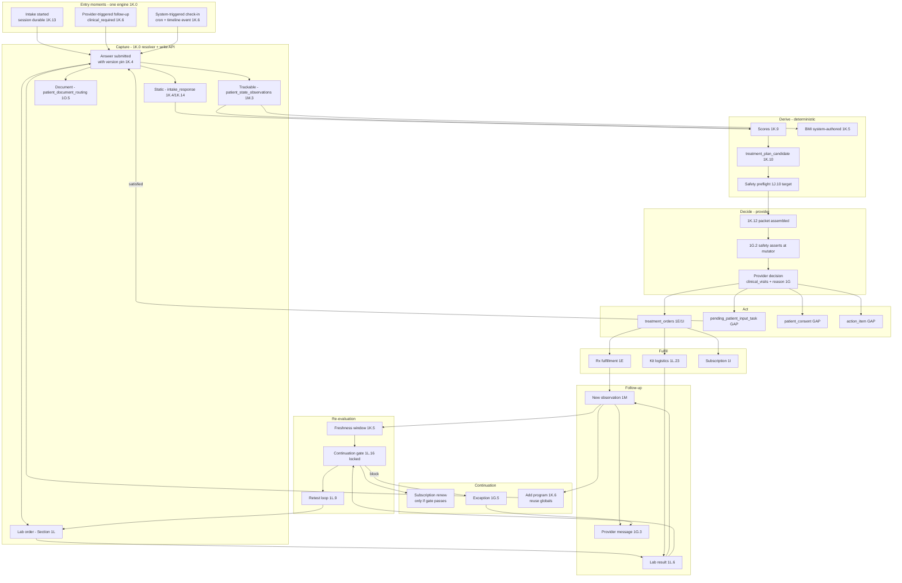

# Pressure-Test: MAIN Backend Architecture vs. Hims/Hers Intake Patterns

**Status:** Analysis artifact. Not a build plan. Not a UI spec. Not an intake pathway.
**Output of:** Comparing MAIN's three-layer system map against five verbatim Hims/Hers funnel captures (weight loss, TRT, labs, menopause, anxiety/propranolol).
**Purpose:** Decide, before any intake line is built, whether MAIN's backend model is fundamentally sound, what must be clarified, and where MAIN can outperform Hims rather than merely imitating it.

---

## 0. Executive summary + verdict

**Verdict: MAIN's backend model is fundamentally sound for a Hims-class intake and care progression system, and in several places is architecturally superior to what Hims visibly ships.** The risk is not the model on paper. The risk is the gap between what the map *names* and what is *enforced* today (`1J.10` says explicitly that its shared safety preflight is "target" and "not a claim about current `impl.ts`"), combined with four object-level ambiguities that must be resolved before any therapeutic intake line ships.

The five Hims/Hers funnels confirm a pattern that reinforces MAIN's longitudinal thesis: Hims captures excellent data with excellent UX, but its backend is clearly transactional and per-funnel. Every therapeutic funnel we ingested re-asks overlapping medical history in a *different schema* (compare TRT Steps 39–41 vs Weight Loss Steps 20–24 vs Menopause Step 51 vs Anxiety Steps 18–20). Only TRT shows KYC (Step 68). Menopause terminates in a "go get a BP reading and come back" dead-end (Steps 58–59) with no visible backend task object. "Action Items" in the account (WL Step 01, TRT Step 76) is a cohesive surface but ends at "Complete Visit" — nothing suggests longitudinal decision memory. This is exactly the ground MAIN is positioned to own.

Five strengths where MAIN should outperform Hims by construction:

1. Cross-program memory via `patient_state_observations` (1M) — named primitive, append-only, entity-scoped, superseding, multi-program. Hims has no visible equivalent.
2. Answer reuse scopes — global / program-scoped / context-sensitive (1K.5) with `reused_from_response_id`. Patient never keys DOB twice. Hims pre-fills DOB but still steps through it (WL Step 09, TRT Step 10).
3. Decision evidence as an assembled, version-pinned packet (1K.12), plus active safety asserts in the same mutator as therapy change (1G.2). Hims provides no equivalent public discipline.
4. Continuation gated on lab + trackable freshness (1L.16, locked). Not calendar-driven like TRT Step 69's 300-day billing.
5. One AI layer, read-only, with closed-loop measurement (1N). Not an opaque "Analyzing your responses…" screen (WL Steps 37–39; TRT Steps 56–57).

Eight clarifications are required before any therapeutic intake line is built. Each is already partially implied by the map; none are inventions. They are listed in Section F. The most urgent three:

- Close the 1J.10 preflight gap (move from "target" to "enforced") before any Rx line ships.
- Decide where *non-trackable* contraindication answers live durably so the visit-2 safety preflight can read them. (Family sudden death, MEN-2, thrombophilia, BRCA aren't trackables in the vital-sign sense.)
- Name `action_item` as a first-class object, not metadata. Hims' Action Items pattern is a product surface and MAIN needs the equivalent.

**Conversion vs care tension:** The user is explicit that MAIN is not a funnel optimizer, but must still capture leads efficiently. The map's single-engine-across-entry-moments architecture (1K.0, 1K.1: "intake is the entry point into a continuous care system, not a session, form, checkout step, or one-time interaction") is the correct answer to this tension. Conversion-level speed comes from the 1K.0 mini-batch planning pattern ("P95 question-to-question UX latency ≤ 250ms perceived"). Longitudinal value comes from the fact that every write lands in a durable, queryable shape the first time. MAIN does not have to choose between them — but it does have to stop treating `intake_session` as "can-be-metadata in v1" (1K.14) before it ships program #2.

---

## 1. Method + inputs

**MAIN source:** `.cursor/plans/system_map_three_layers_60706286.plan.md` — sections 1D (capabilities), 1F (scheduling), 1G (messaging / continuation / routing), 1H (analytics / funnel), 1I (financial lifecycle), 1J (identity), 1K (intake architecture 1K.0–1K.18), 1L (diagnostics / labs, including locked 1L.16 continuation gating), 1M (Patient State Observations), 1N (unified AI interpretation layer), 1O (patient document + attachment routing), Lab Appendix §11–§31.

**Hims/Hers source:** Five verbatim funnel captures, steps ordered exactly as presented on-site:

- `hims_weight_loss.md` — 44 steps, GLP-1, existing client, entered via Action Items modal.
- `hims_trt.md` — 76 steps, testosterone / enclomiphene (Rx+), existing client.
- `hims_labs.md` — 32 steps, Labs subscription, no prior-client note.
- `hers_menopause.md` — 72 steps, perimenopause / menopause, terminates in ineligible dead-end.
- `hims_anxiety.md` — 34 steps, propranolol for performance anxiety, flagged by user as older/less-optimized flow, new patient path (account creation mid-flow, no SSN captured).

**What this analysis does NOT do:** no UI design, no new intake pathway content, no treatment pathway generation, no schema DDL, no code changes, no startup advice. Hims is treated as a pressure test, not a template.

**Evaluation verdict vocabulary:** for each pattern, MAIN is judged as one of {supported cleanly, supported carefully, gap, dangerous ambiguity, overbuilt, inferior to Hims, could outperform Hims}.

**Nuance caveat:** the Hims captures are user-sourced screenshots transcribed to verbatim text, with step order preserved. Some UI layering may not be fully legible from transcription (e.g., whether a pre-filled DOB actually submitted or was re-confirmed). Citations below use step numbers; any inference from "this appears to be" is marked explicitly.

---

## 2. Dimension A — Information capture inventory (Hims evidence → backend implications)

The user's A-list (demographics, jurisdiction, goals, symptoms, severity, contraindications, medical history, family history, medications, allergies, substance use, vitals, labs/biomarkers, preferences, provider questions, consent, account state / unfinished visits) is covered across the five funnels with specific step evidence. What matters for backend is not *what* is captured but *in what shape*, *in what sequence*, and *under what conditional logic*.

### 2.1 Demographic capture

**What Hims captures:**

- State of residence: all five funnels. Weight loss Step 08, TRT Step 09, Menopause Steps 22–23, Anxiety Step 03, Labs Step 12. Always with a Terms+Telehealth+Privacy checkbox bundle.
- DOB: all five. Pre-filled in WL Step 09, TRT Step 10, Labs Step 12, Anxiety Step 04 (existing client signal). Typed fresh in Menopause Step 24.
- Sex assigned at birth: Labs Step 13, TRT Step 53, Anxiety Step 10. Notably not present in the WL or Menopause captures (Menopause assumes female from `forhers.com`).
- Gender identity (distinct from sex at birth): Anxiety Step 09 — 6 options including trans and non-conforming. Not present in any other funnel captured.
- Height + weight: WL Steps 13–15, TRT Step 50, Menopause Step 67, Labs Steps 13–14 (marked optional).
- Legal name / shipping address / phone: captured at checkout in all five. WL Step 42, TRT Step 67, Labs Step 16, Anxiety Steps 32–33. Menopause flow ends ineligible before shipping.
- SSN (last 4): TRT Step 68 only. Anxiety user note confirms no SSN captured. Not present in WL, Labs, Menopause captures.
- Email + password (account creation): Anxiety Steps 05–06 (new patient flow). Existing clients skip this.

**Backend implication:** these are classic "chart profile" facts. MAIN's 1J precedence (gov-ID > biometric > payment > channel proof > intake self-report) is the right spine. `1K.5` correctly classes them as *global* reuse answers with freshness windows. 1J.3 locks legal name/DOB after L1 verification. Hims clearly has some equivalent (pre-fill is the evidence) but still walks the patient through each step; MAIN's explicit "silent reuse with a confirm/update affordance" in 1K.5 is stronger.

**The re-asking pattern that matters:** WL and TRT both capture state *and* DOB even for existing clients (WL Steps 08–09, TRT Steps 09–10). This is either re-verification policy or profile drift insurance. MAIN's answer (per 1K.5 freshness + 1J verification confidence) is cleaner: don't re-ask, but do a confirm affordance when a high-risk action is about to fire.

### 2.2 Jurisdiction / eligibility

**What Hims captures:** state select + checkbox bundle at the start of every therapeutic intake (WL 08, TRT 09, Menopause 22–23, Anxiety 03), labs checks via "Not available in Hawaii" copy (Labs Step 01) and a later DOB+State on the checkout wizard (Labs Step 12). The anxiety flow echoes "We're all good in Michigan!" on Step 04, suggesting state was validated before DOB.

**Backend implication:** MAIN's 1G.4.1 multi-state / jurisdiction runtime complexity section directly names this. The resolver's eligibility predicates (1K.0) include `isJurisdictionEligibleForPathway` by design. Where MAIN is stronger: the jurisdiction check is a *predicate* composable into the resolver, not a static "select state" screen; when the patient moves mid-care, eligibility re-runs without re-asking. Hims shows no evidence of this.

### 2.3 Goals + non-clinical narrative

**What Hims captures:** WL Step 03 weight goal band; WL Step 10 multi-select of what reaching goal weight would mean; TRT Step 05 "how often do changes get in the way" ordinal; Menopause Step 06 which life stage; Menopause Steps 12–13 which life areas are impacted. Plus a large volume of marketing/education interstitials.

**Backend implication:** the 1K.3 layered module model distinguishes *clinical intake module* from *non-clinical funnel module*. This is exactly the right line. 1K.13 (anonymous / pre-account entry) specifies that pre-account personalization data is *not* clinical record unless promoted on conversion. Hims mixes narrative and clinical capture fluidly; MAIN's separation is architecturally cleaner and prevents marketing flags from accidentally driving clinical decisions.

### 2.4 Symptoms + severity

**What Hims captures:** This is where the funnels diverge most sharply.

- **Menopause** uses a consistent 5-level ordinal (Not at all / Mildly / Moderately / Severely / Very severely) across 11 symptom domains: hot flashes, heart discomfort, sleep, mood, irritability, anxiety, exhaustion, sexual, bladder, vaginal, joint (Steps 28–39). This is structurally an MRS-style (Menopause Rating Scale) instrument.
- **TRT** uses mostly Yes/No per symptom across Steps 23–31 (low drive, ED, strength, naps, energy, brain fog, motivation, depressed mood), then switches to ordinal for the self-harm item (Step 32 — Not at all / Several days / More than half the days / Nearly every day — this is a PHQ-9 item 9 pattern).
- **Weight loss** is almost entirely Yes/No or multi-select (Steps 18–24).
- **Anxiety** multi-selects situational fears (Step 11) and physical symptoms (Steps 16–17), then a Yes/No mood/MH question (Step 24).

**Backend implication:** MAIN's 1K.9 Symptom scoring and recommendation readiness names deterministic, versioned, declarative scoring per pathway. Good. But the *input shape* isn't standardized. Menopause's 5-level ordinal is a canonical severity signal; TRT's Y/N is a much weaker signal. If MAIN wants cross-program severity trend queries (e.g., "patient reports moderate mood severity on menopause *and* on a future GLP-1 mental health screen — cross-flag") then a canonical `severity_scale_response` ordinal shape should be the default for any "how much does X bother you" item, with Y/N reserved for binary clinical facts.

**Where MAIN is potentially stronger:** 1M's trackables are append-only and entity-scoped; a severity score captured at intake can be appended to with a follow-up at week 4, week 8, etc., producing a queryable trend from day one. Hims' TRT "Symptom playback" (Step 55) is a point-in-time aggregation shown to the patient; MAIN's model is the same aggregation but longitudinally queryable. This should be exposed as both a provider workspace view (1G.8) and a patient-facing trajectory.

### 2.5 Contraindications

**What Hims captures across funnels:**

- TRT: family sudden death <40 (implied in the reading not captured, but cardiac + CV history is Steps 36–40), anabolic steroid use (Step 48), recreational drugs (Step 49), tadalafil (Steps 42–44), finasteride (Step 46).
- Weight loss: MEN-2, medullary thyroid carcinoma, pancreatitis, gastroparesis, Long QT (Step 23), family sudden death <40 (Step 24), bariatric surgery history (Steps 26–27), current/prior GLP-1 (Step 30), HR band (Step 34), ≥2 elevated BP readings in 12 months (Step 35).
- Menopause: thrombophilia / Factor V Leiden, SLE, hereditary angioedema, porphyria, partial vision loss, hypocalcemia, hypoparathyroidism (Step 64), BRCA personal result (Step 62), abnormal mammogram in 24 months (Step 63), family cancers (Step 66), thyroid condition control (Steps 60–61).
- Anxiety (propranolol): cardiac / pulmonary / circulation / liver / kidney (Steps 18–20), BP knowledge requirement (Step 21) + numeric systolic/diastolic (Step 22), pulse band (Step 23 — <60 / 60–100 / >100 is a beta-blocker gate).

**Rule shapes:** hard gate (blocks), soft flag (surfaces to provider), branch trigger (drills into specifics). Hims mixes these without distinction from the patient's view — the backend presumably has them typed.

**Backend implication:** MAIN's 1K.7 declares `intake_eligibility_blocker` and `intake_safety_flag` with stable reason codes, and the locked rule: *"safety screening at intake does not replace 1G.2 active safety enforcement at decision time — it is a deterministic pre-screen."* This is the correct discipline. The patient never gets to Rx approval with a silent contraindication; 1G.2 asserts run inside the therapy-change mutator. Hims likely does some of this but it's not visible from captures; MAIN's discipline is explicit.

**The open question:** contraindication answers must survive visit 1 to protect visit 2. These are boolean clinical facts, not trackables. Where do they live? 1K.5 routes trackables to 1M but says static answers stay in `intake_response` — which is fine for exact-replay, but does the visit-2 safety preflight (1J.10) read `intake_response` by `(patient_id, question_id)` across all sessions to know whether the patient has *ever* reported MEN-2? That read pattern needs to be explicit. See Section F for the resolution shape.

### 2.6 Medical history (non-contraindication)

**What Hims captures:** chronic conditions, surgeries, prior treatments. Weight loss Steps 20–24 splits GI conditions, chronic disease, family history, surgery (with 255-char free text if yes — Steps 28–29). TRT Steps 39–41 uses two multi-select screens plus a catch-all Yes/No. Menopause Step 51 uses one long list with selected borders. Anxiety Steps 18–20 scrolls through ~20 conditions with "None of these."

**Backend implication:** every funnel asks this *differently*. The canonical structure in MAIN should be a single `patient_clinical_condition_assertion` vocabulary keyed off ICD-adjacent categories (not full ICD — that's too heavy for intake) tied through the 1K.4 question bank's `field_name` mapping. This is the single clearest place MAIN can avoid the Hims per-funnel re-capture failure mode. Currently, 1K.5 says static history stays in `intake_response`; that's fine if and only if there is a canonical read path by `(patient_id, condition_field_name)` that normalizes across sessions.

### 2.7 Family history

**What Hims captures:** family sudden death <40 (TRT implied, WL Step 24), MEN-2 / medullary thyroid CA family/self (WL Step 23), family cancers (Menopause Step 66 with explicit first-degree + grandparent scope).

**Backend implication:** family history is a special case because the subject is not the patient. This is not a trackable. It is a durable clinical fact per relative-relationship. MAIN's map does not name a family-history object. Hims' capture is coarse ("has a close family member under 40 passed away unexpectedly Y/N"). The pragmatic answer is to treat family-history questions as standard intake questions with structured answers (Y/N + optional relation + optional condition code) and ensure the 1J.10 preflight reads them by `question_id` across the chart. This is sufficient for current clinical decisions (GLP-1 family medullary thyroid CA check; menopause BRCA first-degree) without inventing a family-member graph.

### 2.8 Medications + allergies

**What Hims captures:** Weight loss Steps 31–33 (Y/N then structured multi-select of CV medications: Atenolol, Atorvastatin, Carvedilol, Chlorthalidone, HCTZ, Lisinopril, Losartan, Metoprolol, Propranolol, Rosuvastatin, Simvastatin, None). TRT Steps 42–47 (daily tadalafil, PRN PDE5, finasteride/dutasteride, other medications, substance use). Menopause Steps 52–57 (if HTN from Step 51 → drill into BP med list). Anxiety Step 15 (free text on prior treatments). Allergies: TRT Step 51 (Y/N), Menopause Step 68 (Y/N).

**Backend implication:** med reconciliation is an active clinical object in MAIN's 1G.2 (duplicate therapy, allergy, dosing asserts). The funnels show Hims reconciling selectively by *therapeutic context* — BP meds for menopause because HRT has CV interactions; tadalafil for TRT because of 2-in-1 composition. MAIN's answer is to put the drug list in 1K.4's controlled vocabulary per pathway (for selective drilldowns) *and* to have a global chart-level medications list that every therapeutic pathway's safety preflight reads. Allergies are simpler — 1K.5 calls them global with freshness, and "no allergies" cannot silence targeted contraindication questions.

### 2.9 Substance use

**What Hims captures:** anabolic steroids 6-month (TRT Step 48). Recreational drugs 6-month (TRT Step 49 — poppers/rush, cocaine, methamphetamine, other, none). Substance use is not captured in WL, Labs, Menopause, or Anxiety from these transcriptions.

**Backend implication:** these are pathway-scoped contraindication questions per 1K.5 (program-scoped reuse). Should not be re-asked between TRT and WL within the same freshness window. Standard 1K.7 soft-flag / hard-gate pattern.

### 2.10 Vitals + measurements

**What Hims captures:**

- Height + weight: WL Steps 13–15, TRT Step 50, Menopause Step 67.
- BMI (derived, real-time): WL Steps 16–17 show current BMI 24, goal BMI 22, "medication zone" visualization.
- Blood pressure (structured):
  - WL Step 35 — "≥2 BP readings in last 12 months at ≥130/80 Y/N" (a *history* gate, not a live measurement).
  - Menopause Step 58 — "BP reading in last 6 months Y/N" → Step 59 dead-end "go get it and come back" if No.
  - Anxiety Step 21 — "do you know your BP" gate, then Step 22 numeric entry (Systolic 90–180, Diastolic 60–120).
- Resting heart rate / pulse:
  - WL Step 34 — band (<70 / 70–79 / 80–99 / 100+ / don't know).
  - Anxiety Step 23 — band (<60 / 60–100 / >100), described with how-to-measure-your-radial-pulse copy.

**Backend implication:** vitals are pure trackables and belong in `patient_state_observations` per 1K.3 (static-vs-trackable split) and 1M.3. BMI is a **derived system write** per 1K.5's data ownership matrix: patient writes height and weight; system computes BMI with `authored_by = system`. The 5 funnels treat vitals differently:

- WL asks BP as history (did you have ≥2 readings ≥130/80), which is a *condition assertion* not a measurement.
- Menopause demands a measurement in last 6 months and has a dead-end path.
- Anxiety demands a live numeric measurement for beta-blocker safety.

MAIN should support all three shapes: measurement (numeric → 1M), history-of-measurement (structured answer → `intake_response`), self-reported band (structured answer → `intake_response` + potentially `patient_state_observations` with appropriate source tag). The map's current vocabulary handles this, but it must be explicit that a self-reported band and a numeric measurement are *different* `field_name`s in 1M.

### 2.11 Labs / biomarkers

**What Hims captures:** the Labs funnel (Steps 01–11) catalogs 130+ biomarkers across heart, metabolism, hormones, inflammation, thyroid, kidney, liver, immune defense, nutrients, blood. Marketing UI shows biological age (Step 24), Action Plan by focus area (Steps 25–27), re-test 2x/year (Step 32), mid-year 45+ biomarker recheck (Step 30). TRT has an at-home lab kit flow (Step 17) with $69 kit credit (Step 69) on return within 30 days.

**Backend implication:** MAIN's 1L is a full foundation section with locked continuation gating (1L.16), a canonical object model (1L.2), observation normalization (1L.6), retest loop mechanics (1L.9), kit logistics (1L.23), and an operational review surface (1L.20). This is materially stronger than what Hims visibly ships. The "Biological Age" concept in Hims Step 24 is either a marketing visualization or a computed longevity score; MAIN's 1M + 1K.9 derived scoring is the mechanism that can produce real versions of this.

**The tension in the doc header:** lines 3–5 describe the lab appendix as "deferred." Section 1L (line 3049+) calls labs "foundation; not optional." This is a dangerous ambiguity (Section D.11 failure mode below). Given 1L.16 continuation gating is locked, labs cannot be deferred for any Rx line that requires baseline labs.

### 2.12 Preferences

**What Hims captures:** medication preference (WL Step 05: "No, I'd like a provider recommendation" / "Yes, I already have something in mind"; WL Step 06: pills vs injections vs provider recommendation). Anxiety Step 28–29: uses-per-month band; Step 30: ship-every-1/3/6-months. TRT Step 69: 10/5/3-month plan options. WL Step 43: $149/mo membership.

**Backend implication:** preferences are treatment-plan candidate inputs (1K.10) and commerce-catalog driven (1K.11). MAIN's model of a versioned `treatment_plan_candidate` with `pending_provider_review` status is correct and stronger than Hims' implicit linkage.

### 2.13 Provider-directed free text

**What Hims captures:** "anything else your provider should know?" + optional "nothing else" checkbox pattern in every therapeutic funnel. WL Step 36, TRT Step 54, Anxiety Steps 25–26.

**Backend implication:** 1K.4 bounds free-text; 1K.12 packet includes patient free-text in the provider review surface. Stored as an `intake_response` row with bounded length. Correct discipline.

### 2.14 Consent / legal acknowledgments

**What Hims captures (this is a failure mode in disguise — see Section D / F):**

- Terms + Telehealth + Privacy bundle checkbox: WL Step 08, TRT Step 09, Menopause Steps 22–23, Anxiety Step 03.
- Account-creation T&C + Privacy (no Telehealth): Anxiety Steps 05–06.
- Off-label acknowledgment as a gating checkbox: Anxiety Step 08 ("I understand and wish to move forward" — required to proceed).
- SMS marketing opt-in with explicit TCPA short-code language: Anxiety Steps 33–34.
- Submission-time subscription legalese (auto-renew, cancel terms): WL Step 44, TRT Step 69, Labs Step 17.
- Patient-facing Submit-to-provider agreement: TRT Step 69 dense block covering subscription terms, 2-day cancel, medication plan tie-in, renewal dates, support contacts.

**Backend implication:** This is where Hims looks complete on the surface and MAIN has a map gap. A search of the 1K section for "consent_records" returns nothing. Consent lives in `intake_response` implicitly per 1K.11 storage note ("Patient acknowledgment of plan terms is captured as a typed answer in the checkout module, versioned per 1K.4. Stored on audit_events, intake_response, and patient_timeline_events pointer"). That is *technically sufficient* for replay — you can reconstruct that patient A accepted consent version X at time Y. But for legal audit, especially off-label pharmacy risk (Anxiety Step 08) and TCPA compliance (Anxiety Steps 33–34), a typed `patient_consent` object with `(type, version_hash, accepted_at, source_surface, legal_text_snapshot_id)` is the safer shape. See Section F.

### 2.15 Account state / unfinished visits / action items

**What Hims shows:** the Action Items modal on `hims.com/account/orders` (WL Step 01) simultaneously surfaces:

- Complete Your Testosterone Visit (incomplete `intake_session`)
- Complete Your Labs Visit (incomplete `intake_session` in a different pathway)
- New Message (provider communication requiring response)

TRT Step 76 shows the same modal with the incomplete TRT visit. This is a first-class, cohesive, top-of-account product surface.

**Backend implication:** this is the cleanest single place Hims demonstrates what MAIN's loop architecture promises. The concepts MAIN needs:

- A durable incomplete-visit object that deep-links back to the resolver's current required step. The map currently relies on `intake_session` state, which 1K.14 marks as "Partial / can-be-metadata in v1." This is wrong for a scale build.
- A cross-program action-items surface that can list (incomplete visit, provider message, lab result ready, continuation due, BP reading requested) as *one* ordered list. MAIN has all the individual objects (`outbound_jobs`, `patient_document_routing.action_item_id` per 1O.5, `clinical_required` per 1G.3, continuation `next_*_at` fields, lab review). What it does not have is a named first-class `action_item` object with `(status, deep_link, program_id, origin_event_id, priority)`. See Section F.

---

## 3. Dimension B — Backend objects required per captured item

The user listed candidate object categories. Below, each captured item is mapped to where MAIN already stores it vs where a new or clarified object is required.

| Captured item (Hims → MAIN) | MAIN object today | Section ID | Gap? |
|---|---|---|---|
| Raw intake answer | `intake_response` row | 1K.4, 1K.14 | Supported cleanly; ensure version fields mandatory at write-time |
| Longitudinal trackable (weight, BP numeric, symptom severity score) | `patient_state_observations` | 1M.3 | Supported cleanly |
| Static clinical history (conditions, surgeries, family hx) | `intake_response` with normalized read path | 1K.5 | Dangerous ambiguity — named read path for cross-session queries is not explicit |
| BMI (derived) | `patient_state_observations` with `authored_by = system`, or `intake_derived_score` | 1K.5, 1K.9 | Supported cleanly; patient-visible display contract needs clarification |
| Symptom scoring (PHQ-like, MRS-like) | `intake_derived_score` + per-domain scores | 1K.9 | Supported cleanly |
| Patient timeline event pointer | `patient_timeline_events` (narrative pointer only) | 1K.1, 1M.6 | Supported; discipline is "pointer only, never authoritative values" |
| Decision evidence (why approved / denied) | 1K.12 packet + `audit_events` | 1K.12, 1G.9.13 | Partial — reason codes exist for CoR transfer; decision outcome needs equivalent `decision_outcome_reason` |
| Care program state | `care_programs` table, concurrent per patient | 1G (concurrent programs) | Supported cleanly |
| Order / commerce state | `treatment_orders` + `commerce_orders` split | 1E, 1I | Supported cleanly; discipline to not conflate clinical vs retail |
| Fulfillment state | `treatment_orders` + `outbound_jobs` + (for kits) `lab_orders.metadata.kit_logistics` | 1E, 1L.23 | Supported cleanly |
| Subscription / continuation state | Subscription/plan rows + `next_*_at` continuation fields + 1L.16 gating | 1G.3, 1L.16 | Supported cleanly |
| Messaging / clinical_required | `message_thread`, `messages`, `clinical_required` turn | 1G.3 | Supported cleanly |
| Patient-facing notification / send | `outbound_jobs` with send-gate | 1G.3 | Supported cleanly |
| Action item (incomplete visit, BP requested, result ready) | `patient_document_routing.action_item_id` pointer + partial-intake state + `clinical_required` + continuation fields | 1O.5, 1G.3 | **Gap — not a first-class typed object** |
| Document / upload | `patient_document_routing` manifest + domain row | 1O.5 | Supported cleanly |
| Consent record (Terms, Telehealth, off-label, SMS, subscription) | `intake_response` + `audit_events` + timeline pointer | 1K.11 | **Gap — named `patient_consent` object not defined** |
| Partial-intake / incomplete-visit | `intake_session` (marked "Partial / can-be-metadata in v1") | 1K.14 | **Dangerous ambiguity — must be a real table before program #2** |
| Pending-patient-input task ("go get BP and come back") | Implied by `clinical_required` + 1L.16 gating but no named task object | — | **Gap — `pending_patient_input_task` with return hook is the missing object** |
| Identity verification state | `patient_identity_verification` (implied by 1J.4 L0–L4) | 1J.4 | Supported carefully; L→product gate needs committing per pathway |
| Analytics / feedback signal | `patient_timeline_events` + `audit_events` + analytics layer (no KPI-only tables) | 1H.1, 1H.6 | Supported carefully — correlation vocabulary / dead-letter UX are partial |
| Safety flag (hard blocker, soft flag) | `intake_eligibility_blocker`, `intake_safety_flag` payloads on `patient_timeline_events` | 1K.7 | Supported cleanly |
| Lab observation (raw + normalized) | `patient_lab_observations` with raw retention + normalized display fields | 1L.6 | Supported cleanly |
| Family history fact | `intake_response` by question_id | — | Supported cleanly (no family-member graph needed v1) |
| Substance use | Pathway-scoped `intake_response` with freshness | 1K.5 | Supported cleanly |
| Vitals measurement (numeric BP) | `patient_state_observations` with vital field_name | 1M.3 | Supported cleanly |
| Vitals history assertion ("≥2 readings ≥130/80 in 12mo") | `intake_response` as a condition assertion | — | Supported cleanly; should be clearly distinguished from a measurement |
| Preferences (shipment cadence, med type) | On `treatment_plan_candidate` | 1K.10 | Supported cleanly |
| Provider free-text ("anything else?") | Bounded `intake_response` | 1K.4 | Supported cleanly |
| Off-label acknowledgment | Needs to be a typed consent (see above) | — | **Gap** |
| Auto-renew / subscription agreement | Consent + stored payment + subscription row | 1I, 1K.11 | Supported but consent provenance needs the named object |

**Summary of B-level objects required or needing clarification:**

- **New named objects needed:** `patient_consent`, `action_item`, `pending_patient_input_task`.
- **Upgraded objects (metadata → real table) before program #2:** `intake_session` (currently 1K.14 "can-be-metadata in v1").
- **Named read path needed:** cross-session `intake_response` lookup by `(patient_id, field_name)` for static contraindication answers; this may require a materialized `patient_clinical_assertion` view or equivalent.
- **All other objects:** present or cleanly derivable from present ones.

---

## 4. Dimension C — Pattern-by-pattern verdict (MAIN vs Hims)

For each observable pattern in the Hims funnels, MAIN is judged by the evaluation vocabulary. This is the densest table — skim the verdict column, then read the analysis for patterns marked other than "supported cleanly."

| # | Pattern | MAIN verdict | Notes |
|---|---|---|---|
| 1 | State selection + Terms+Telehealth+Privacy bundle | Supported cleanly | 1K.0 resolver + 1G.4.1 jurisdiction + 1K.11 consent answer storage. MAIN's advantage: jurisdiction is a composable predicate, not a static screen. |
| 2 | DOB pre-fill with still-confirm-to-continue | Supported cleanly | 1K.5 silent reuse with confirm/update affordance. Stronger than Hims, which visibly steps through. |
| 3 | Sex-at-birth capture (present in Labs/TRT/Anxiety but missing from WL/Menopause) | Supported cleanly | 1K.4 per-pathway required-vs-optional. MAIN can decide per pathway; Hims inconsistency is a product choice, not an architecture limit. |
| 4 | Gender identity as separate from sex-at-birth | Supported cleanly | 1K.4 handles; Anxiety's 6-option model can be a pattern choice. |
| 5 | Goal band (weight band, energy band) | Supported cleanly | Standard 1K.4 single-select; feeds into 1K.9 scoring. |
| 6 | Non-clinical narrative interstitial (education, testimonials, before-after) | Supported cleanly | 1K.3 non-clinical funnel module category. |
| 7 | 5-level ordinal severity scale (MRS-style, Menopause 28–39) | Supported carefully | 1K.9 supports versioned scoring, but the canonical ordinal shape should be standardized so it's comparable across programs. |
| 8 | PHQ-style self-harm question (TRT 32–33) | Supported cleanly | Same as above; 1K.7 soft-flag / hard-gate applies for escalation. |
| 9 | Yes/No symptom items (WL, TRT, Anxiety) | Supported cleanly | Fine as-is; less signal than ordinal but simpler. |
| 10 | Contraindication multi-select with "None of these" explicit option | Supported cleanly | 1K.4 controlled vocab + 1K.5 "no allergies cannot silence targeted contraindications" rule. |
| 11 | Branched drill-down (e.g., BP med → specific drug list) | Supported cleanly | 1K.4 declarative branching + branch_path_token per response. |
| 12 | Surgeries Y/N → 255-char free text narrative (WL 28–29) | Supported cleanly | 1K.4 bounded free-text. |
| 13 | Family history with implied relation scope | Supported carefully | Use question_id per specific family-history fact; no family-member graph needed v1. |
| 14 | Anabolic / substance use pathway-scoped | Supported cleanly | 1K.5 program-scoped reuse. |
| 15 | BP knowledge gate ("know your BP Y/N" → numeric entry or dead-end) | **Gap** | MAIN has 1L.16 gating and `clinical_required` but no named `pending_patient_input_task` with return hook. Menopause 58–59 is the clearest failure mode to close. |
| 16 | BP history assertion vs live BP measurement | Supported cleanly | Distinguishable via field_name; document the distinction in 1K.4. |
| 17 | Resting HR band vs numeric | Supported cleanly | 1M.3 supports both with different field_names. |
| 18 | BMI visualization during intake (WL 16–17) | Supported carefully | 1K.5 ownership matrix says system can write derived. Patient-facing contract for live display is not in the map; needs clarification. |
| 19 | Smart-loading "Analyzing your responses…" screen (WL 37–39, TRT 56–57) | Could outperform Hims | MAIN's deterministic resolver + 1K.9 derived scores + 1K.10 treatment_plan_candidate makes this a real provisional decision, not a spinner. MAIN is stronger by design. |
| 20 | "You're eligible" badge + product recommendation carousel | Supported cleanly | 1K.10 `treatment_plan_candidate` with `pending_provider_review` flag exactly. |
| 21 | Symptom playback aggregation (TRT 55) | Supported cleanly | 1K.9 derived scores per domain. |
| 22 | At-home lab kit flow with credit on return | Supported cleanly | 1K.8 kit flow + 1L.23 logistics + 1I refill_adjustment_cents credit path. |
| 23 | Subscription auto-renew with 2-day cancel window | Supported cleanly | 1K.11 + 1I subscription terms. |
| 24 | Multi-program simultaneous (Action Items modal WL 01) | Supported carefully | 1G concurrent programs + 1K.2/1K.6 pathway addition. MAIN has the parts; needs a first-class `action_item` object to surface. |
| 25 | Incomplete visit resumption with deep link | Supported carefully | `intake_session` must be a real table (1K.14 shortcut risk) and deep-link must be a stable URL tied to resolver state, not UI step. |
| 26 | Provider message action item | Supported cleanly | 1G.3 messaging + outbound_jobs + clinical_required. |
| 27 | SMS marketing opt-in TCPA text | Gap | `patient_consent` object needed; 1K.11 stores answer but not consent provenance. |
| 28 | Off-label Rx acknowledgment as a gate | Gap | Same — named `patient_consent` with type=off_label. |
| 29 | Address pre-fill for existing client (WL 42, TRT 67) | Supported cleanly | 1J global profile reuse. |
| 30 | SSN last-4 identity verification (TRT 68 only) | Supported carefully | 1J.4 L→product gate must commit: what identity level does each therapeutic pathway require? |
| 31 | No-SSN new-patient path (Anxiety) | Supported cleanly | 1J.4 L0 sufficient for this Rx? Policy decision, not an architecture gap. |
| 32 | Ineligible dead-end (Menopause 72 "Back to Hers") | Supported carefully | MAIN should preserve the intake session as `closed_ineligible` with a reason code; patient may qualify later. Hims' UX implies nothing is saved. MAIN can do better. |
| 33 | Consent at account creation vs at state selection | Gap | Named consent records; separate surfaces + types. |
| 34 | "Free visit applied" promo banner (Anxiety 03) | Supported cleanly | Marketing attribution per 1H.4; not clinical. |
| 35 | Dense Submit-to-provider legal block (TRT 69, WL 44) | Gap | Consent snapshot must be captured (not just accepted timestamp) — see 1K.11 + new consent object. |
| 36 | Carousel of "how T levels improve" / "how GLP-1 works" (marketing) | Supported cleanly | 1K.3 non-clinical funnel module. |
| 37 | Real-time biomarker carousel / Action Plan mockup (Labs 19–32) | Could outperform Hims | MAIN's 1M + 1L + 1K.9 gives *actual* action plans grounded in real data, not UI mockups. |
| 38 | Re-asking conditions/meds/allergies per funnel in different schemas | Could outperform Hims | MAIN's 1K.5 global reuse + controlled `field_name` eliminates this. The clearest longitudinal win. |
| 39 | Analyzing "every N answers" server roundtrip | Supported cleanly | 1K.0 mini-batch + branch-divergence re-consult is the exact pattern. |
| 40 | Provider review is opaque from the patient's view | Could outperform Hims | 1K.12 packet + 1G.9.13-style decision reason codes + 1N AI assist (no mutation) gives a structured, explainable review surface. |

**Patterns where MAIN is arguably *inferior* to Hims today (UX-backend contract gaps, not backend weakness):**

- No named Patient Action Center read model equivalent to Hims' Action Items modal.
- No authored question bank content. Hims has decades of A/B-tested question sequences; MAIN has the engine but no content. This is a content gap, not an architecture gap, but it will feel like a gap during first-line build.
- No committed "resumable session" contract end-to-end; 1K.13 names it but 1K.14's metadata-fallback for `intake_session` undermines it.

**Patterns where MAIN is *overbuilt* vs current need:** None identified. The continuation gating (1L.16), AI discipline (1N), and identity precedence (1J) are each justified by the clinical reality of what MAIN is trying to do. Hims' simpler approach works because Hims accepts higher provider review burden per case; MAIN's automation thesis requires the heavier backend.

---

## 5. Dimension D — Pressure-test answers to the named questions

The user named 10 questions plus a BMI sub-question. Each is answered with section citations and evidence.

### D.1 Can intake answers be recalled in follow-up?

**Yes, by design.** 1K.1: *"Intake is the entry point into a continuous care system … One intake spine, many entry moments."* 1K.5: `reused_from_response_id` pointer on every reused answer; reuse events are logged in `audit_events`. 1K.6: *"Additional structured inputs are collected after onboarding via two existing mechanisms — no new system, no new 'intake extension' record type."* Hims' failure mode of re-asking meds/conditions/allergies per funnel is explicitly rejected.

The open risk is that this reuse works *only if* the read path by `(patient_id, question_id)` or `(patient_id, field_name)` is materialized efficiently. 1K.14 lists `intake_response` as existing; the read pattern is not benchmarked. At scale this is a hot read. Recommend: a chart-level `patient_clinical_assertion` view or denormalized read column per durable fact.

### D.2 Can prior answers influence future program eligibility?

**Yes.** 1K.2: cross-sell adds modules to the same `intake_session`. 1K.5 global reuse: "allergies, major conditions, medications, surgeries, demographics — reused across pathways subject to freshness." 1K.7 intake screening reads prior answers for deterministic gates. 1G.2 active asserts at decision time read the same chart + observations.

**Caveat:** safety-critical contraindication questions per 1K.5 are *not silenced* by global "no conditions" answers. This is correct — the engine re-asks pathway-specific safety questions (e.g., MEN-2 for GLP-1) even if the patient previously answered "no major conditions" broadly. The burden of precisely *which* questions are pathway-specific vs global is on the 1K.4 question bank.

### D.3 Can a patient start multiple programs without duplicating entire history?

**Yes.** 1K.6: *"Existing patients adding a new concern later: create a new `intake_session` scoped to the new pathway, reuse global answers per 1K.5, and link to a new `care_program`."* 1G concurrent programs: *"concurrent `care_program` rows share one `patients` chart for safety reads; separate ownership / blockers / permits per program."*

This is MAIN's single most visible longitudinal advantage over Hims. Hims' funnels re-capture global history *every time* with *different schemas per funnel* (WL vs TRT vs Menopause vs Anxiety each treat "medical conditions" differently). MAIN's unified question bank + global reuse scope + single chart read path eliminates this duplication entirely.

### D.4 Can labs influence Action Plans and later prescribing?

**Yes.** 1L.16 (locked): continuation mutations require latest required `lab_context` with `patient_diagnostic_reports.reviewed_at` within cadence. 1L.9: cron-driven `lab.retest.recommended` with optional auto-order. Intent lines 15–16: *"therapy from labs requires `clinical_visits` referencing `diagnostic_report_id` and/or `treatment_items` transition valid only with reviewed report."* 1L.6 observation normalization feeds both display and provider review.

Hims' Labs funnel markets an "Action Plan" (Steps 25–27) but shows no visible linkage from labs to future Rx eligibility in other funnels. TRT at-home labs (Step 17, 64–66) produce results that the TRT provider reviews, but there's no evidence in captures that those results gate future GLP-1 or menopause eligibility for the same patient. MAIN's discipline is built for this cross-program lab → eligibility flow.

### D.5 Can contraindications remain visible after the first visit?

**Partial — gap.** 1K.5 correctly routes trackables to 1M (append-only, queryable). 1J.10 (safety preflight target) reads from identity, clinical memory, treatments. 1G.2 asserts at decision time.

**The gap:** a classic contraindication answer like "family member under 40 died unexpectedly, Yes" is not a trackable. It is a durable boolean clinical fact. 1K.5 says static answers stay in `intake_response`. For the 1J.10 preflight to read "has this patient ever asserted MEN-2?" it must scan `intake_response` rows by `(patient_id, question_id)` across all sessions, or normalize these into a `patient_clinical_assertion` table, or join-read through the chart. The map is ambiguous on which approach.

Without resolution, the failure mode you called out ("intake answers trapped in JSON") is real. Recommendation in Section F.

### D.6 Can unconfirmed patient-reported facts be used safely, corrected by provider, and clarified by the system?

**Partial — gap for general clinical facts.** Identity facts: 1J.1 precedence (gov-ID > biometric > payment > channel > intake self-report) handles unconfirmed → confirmed. 1J.3 locks legal name/DOB after L1. 1L.6 handles lab raw retention + normalized display (so if normalization fails, raw is safe). 1M.3–1M.4 handles trackable supersession (provider can append a new row with `supersedes_observation_id` + correction reason; never overwrites).

**The gap:** for a non-identity, non-trackable, non-lab clinical fact — e.g., "patient reported no pancreatitis at intake; provider clarifies at visit that patient had acute pancreatitis 2019" — the map has no named provenance + correction pattern. The clean answer is: such corrections are new `intake_response` rows with `authored_by = provider` + `correction_reason = provider_clarification`, *or* they become `patient_clinical_assertion` rows with provenance. 1K.5 data ownership matrix names the discipline ("Providers must NOT silently overwrite original patient inputs; clarifications append a new row tagged `authored_by = provider` + `correction_reason = provider_clarification` per 1M.3") — but 1M.3 is for observations, not for static condition assertions. The pattern must be explicitly declared for static facts. See Section F.

### D.7 Can provider decisions cite exact evidence?

**Yes, by design.** 1K.12 submission packet: versions, flags, scored answers, plan candidate, lab status, identity, payment auth — server-assembled deterministically, no LLM rewriting of factual fields. *"Each row tagged with `reused_from_response_id` or `newly_asked_in_session_id` so provider sees what's fresh."*

1N.4: *"AI may summarize packet and draft notes; it cannot satisfy 1G.2 safety asserts, set `reviewed_at`, or substitute for the provider's clinical decision."*

Hims shows no equivalent discipline from its funnels. Provider review in Hims is opaque to the patient; MAIN's model is reconstructable end-to-end.

### D.8 Can the patient account surface action items across programs?

**Partial — careful.** The pieces exist:

- `outbound_jobs` for send notifications (1G.3).
- `patient_document_routing.action_item_id` pointer (1O.5).
- `clinical_required` turn (1G.3) for provider-raised follow-ups.
- Continuation `next_*_at` fields.
- Incomplete `intake_session` (1K.13 resume).
- Lab review pending (1L.20).

What's missing: a named, first-class `action_item` object with `(id, patient_id, program_id, type, status, deep_link, origin_event_id, priority, created_at, completed_at)` and a single read query that produces Hims' Action Items modal. Today a patient-action-center read model would have to join across 5+ tables. That works for ops but not for a production patient surface at scale. See Section F.

### D.9 Can subscriptions / refills / check-ins reuse prior intake and memory?

**Yes.** 1L.16 locked gating requires reviewed labs + fresh trackables before continuation mutation. 1K.5 global and program-scoped reuse with freshness. 1K.6 progressive intake: *"System-triggered check-ins: scheduled per pathway/condition policy (e.g., GLP-1 weight check at 4/8/12 weeks; menopause symptom score quarterly; HRT side-effect tolerance at week 2 + week 6). System emits a typed `patient_timeline_events` event … patient answers append to `patient_state_observations`."*

This is materially stronger than Hims' calendar-driven subscription renewal (TRT Step 69 = 300-day billing / 150-day ship). MAIN's subscription renewal is gated on *clinical state*, not on the calendar.

### D.10 Can the system explain why a patient was approved / denied / paused / escalated / asked for more info?

**Partial.** 1G.9.13 has CoR transfer reason codes (required, structured, not free text). 1K.7 has stable eligibility-blocker reason codes (`state_not_supported`, `age_below_minimum`, `absolute_contraindication`, etc.). 1K.13 has `intake_repeat_attempt`, `intake_inconsistency_flag`, threshold-crossing pattern signals.

**Missing:** a first-class `decision_outcome_reason` on the clinical decision itself — analogous to 1G.9.13 for CoR transfers. When a provider approves or denies an Rx, the system should store a structured reason code alongside the free-text note. When the engine auto-pauses (per 1K.7 engine-version-pin rules), the pause reason should be a typed event. When continuation is blocked by 1L.16, the blocker reason code is already implied by the gate but should be explicit on the continuation mutation audit.

1H.1 also marks correlation vocabulary and dead-letter UX as partial. Without them, end-to-end "why did this happen?" traces degrade.

### D.BMI Can the system calculate BMI during intake and feed it back to the patient?

**Supported carefully.** 1K.5 data ownership matrix names system-authored derived values explicitly: *"System writes: timestamp, source, session_id, derived values (e.g., BMI from height + weight, `intake_derived_score` per 1K.9)."* 1K.9 derived scoring is declarative and versioned.

**The clarification needed:** the patient-facing contract for live-computed values is not in the map. Hims' WL Steps 16–17 show BMI live during intake with a "medication zone" bar visualization. For MAIN:

1. Who computes BMI? The resolver (sync) or a post-write job (async)?
2. What `engine_version` / `score_version` does the live BMI carry?
3. Is the live BMI displayed a snapshot (stable within session) or does it update if height/weight change mid-session?
4. Does the BMI appear in the provider's 1K.12 packet as a `patient_state_observation` row or as an `intake_derived_score`?
5. When a follow-up weight is captured via 1K.6 progressive intake, is the new BMI derived and appended to 1M?

Recommendation: the live computation is synchronous (part of the resolver), stored to 1M with `authored_by = system` + `computation_formula_version`. Packet renders from 1M. See Section F.

---

## 6. Dimension E — Backend failure modes specific to MAIN

Each failure mode the user listed is evaluated against MAIN's current map. Some are genuine risks; some are already guarded against.

### E.1 Intake answers trapped in JSON

**Risk: medium.** 1K.14 explicitly lists multiple rows as "Partial / can-be-metadata in v1" including `intake_session` state, `plan_candidate`, and pathway selection. This is the exact failure mode named. For onboarding a first program it's tolerable; for program #2 onward it is not. Recommendation: promote `intake_session` and `treatment_plan_candidate` to real tables before any second program ships. Reason: cross-program queries ("this patient's pending candidates across pathways") become impossible with metadata-trapped state.

### E.2 Duplicate patient facts across programs

**Risk: low, if 1K.5 global reuse is honored.** The architecture is correct. The execution risk is that a new pathway's question bank accidentally creates a program-scoped `field_name` for something that should be global (e.g., two different `field_name`s for "known medication allergies" across programs). Mitigation: question bank governance per 1K.0 internal editing discipline (PR + CODEOWNERS), plus a resolver test that asserts no pathway re-defines a global `field_name`.

### E.3 No durable symptom severity object

**Risk: medium.** 1M.3 supports severity scores as trackables. The map doesn't mandate an ordinal shape. If each pathway invents its own symptom severity structure, cross-program trending is lost. Recommendation: canonical `severity_scale_response` shape (0–4 ordinal matching Menopause's Not-at-all → Very-severely) as the default for any severity item, enforced in the question bank. See Section F.

### E.4 No cross-program memory

**Risk: low.** `patient_state_observations` is explicitly cross-program (1M.3 optional `care_program_id` allows global-scope trackables). 1K.5 explicitly addresses this. The only risk is misclassifying a trackable as program-scoped when it should be global.

### E.5 No evidence graph for decisions

**Risk: medium — terminology, not architecture.** MAIN has no "evidence graph" product, but the 1K.12 packet + joinable IDs across `intake_response`, `patient_state_observations`, `patient_lab_observations`, `patient_timeline_events`, `audit_events`, and `clinical_visits` *is* an evidence graph in all but name. The gap is: (a) correlation vocabulary is marked partial in 1H.1, and (b) there is no canonical "pull decision evidence for Rx approval ID X" query named. Recommendation: 1K.12's packet assembly logic is that query; lift it out of intake-submission-only and make it callable for any provider decision across the lifecycle.

### E.6 No continuation task object

**Risk: medium.** This is the "go get BP and come back" Menopause 58–59 failure mode. MAIN has `clinical_required` (1G.3), `next_*_at` continuation fields, and 1L.16 gating. What it does not have is a named task with:

- patient-visible text of what is required
- a resume deep-link that lands the patient on the right resolver step
- a return hook that, when the data is captured, automatically clears the blocker
- a timeout / escalation rule if the patient doesn't return

Recommendation: `pending_patient_input_task` as a first-class object. See Section F.

### E.7 Action items mixed into notifications only

**Risk: medium.** `outbound_jobs` is for *sending*. `clinical_required` is for *provider asks*. Incomplete `intake_session` is for *resumable flows*. None of these is an action center read model. Hims' Action Items modal is a product surface that a patient returns to repeatedly. MAIN needs `action_item` as a typed, first-class object, described above and in Section F.

### E.8 Provider cannot distinguish patient-reported vs confirmed facts

**Risk: medium.** 1K.5 ownership matrix and 1M.3 supersession + `authored_by` tagging handle this well for trackables and observations. For static condition assertions (the D.5 / D.6 gap), the pattern is not explicit. The 1K.12 packet tags each row with `reused_from_response_id` or `newly_asked_in_session_id` so the provider sees freshness — good. What's missing is `confirmed_by_provider_at` / `provider_clarification_of_response_id` semantics on static facts. Recommendation: explicit in Section F.

### E.9 Follow-up asks the same questions because memory is not queryable

**Risk: low by design, medium in execution.** 1K.5 freshness + `reused_from_response_id` + 1K.6 progressive intake explicitly addresses this. Execution risk is whether the read path for "has this patient answered X within freshness window" is efficient. At small scale, `intake_response` scan works; at larger scale (multi-program, multi-year patients), denormalized read columns or a materialized view is needed.

### E.10 Consent provenance weak for legal audit

**Risk: medium.** 1K.11 stores consent as an `intake_response` + `audit_events` + timeline pointer. For off-label pharmacy (Anxiety Step 08) and TCPA (Anxiety Steps 33–34), a named `patient_consent` object with `legal_text_snapshot_id` gives stronger legal posture. See Section F.

### E.11 Doc header vs Section 1L tension on lab precedence

**Risk: medium.** File header lines 3–5 say "Deferred lab implementation spec: Lab workflow appendix §11–17." Section 1L line 3049+ says labs are "foundation; not optional." These are incompatible. 1L.16 continuation gating is locked; therefore labs are a v1 requirement for any Rx line gated by 1L.16. The header language must be updated. See Section F.

### E.12 v1 metadata fallback for partial-intake state

**Risk: high at scale, low at onboarding.** 1K.14: `intake_session` state as `intake.metadata`. For one pathway in early production, fine. For cross-program concurrent intake sessions (the exact pattern Hims Action Items modal shows), JSON metadata breaks down: you cannot efficiently query "list all patients with a stale incomplete WL intake," "which patients have an abandoned TRT after a completed Labs visit," etc. Promote to a real table before program #2.

### E.13 1J.10 universal preflight is "target"

**Risk: critical if not closed before scale.** The map itself says: *"the universal snapshot is not a claim about current `impl.ts`"* and lists "Non-optional before material scale." This is honest. It is also an existential risk to the safety story. Every Rx line built before this closes is operating on trust that individual mutators enforce safety, without a shared preflight guarantee. Recommendation: treat 1J.10 closure as a gating dependency on the first Rx line (GLP-1 / TRT / propranolol / HRT). See Section F.

### E.14 Identity level → product gate uncommitted

**Risk: medium.** 1J.4 "Exact L→product gate may tighten." MAIN must commit per pathway:

- GLP-1 / TRT (controlled Rx-like): what L?
- Propranolol (off-label Rx): what L?
- HRT (menopause): what L?
- Labs subscription: what L?
- Retail / supplements: what L?

Hims captures suggest: TRT requires SSN last-4 (Step 68); Anxiety does not (user note); WL/Menopause/Labs don't in captures. MAIN needs to decide, not inherit Hims' inconsistency.

### E.15 Ineligible dead-end does not preserve session for future qualification

**Risk: medium.** Menopause Step 72 ("Back to Hers") loses the context. A future visit might qualify (e.g., once the patient obtains a BP reading). MAIN can do better: `intake_session.status = closed_ineligible` + `ineligible_reason_code` + a reopen hook if the blocking condition is remedied. This is in the spirit of 1K.7 eligibility blocker events.

### E.16 No named patient-facing contract for derived / computed values shown during intake

**Risk: low, but should be written.** BMI (WL 16–17), Eligibility banner (WL 37–39, TRT 56–57), Symptom playback (TRT 55) are all cases where the system shows a *computed* value to the patient mid-flow. The map's 1K.9 + 1K.10 handle the computation; the contract for what's shown, when, with what version pin, and how it lands in the provider packet is not explicit.

### E.17 Question bank is the engine's single point of leverage, and content does not exist yet

**Risk: high by content, low by architecture.** MAIN has the resolver but no question bank authored. Every observation in this pressure-test depends on a discipline of question-bank authorship that hasn't happened. The first therapeutic pathway's question bank sets governance patterns for every subsequent one. Getting this wrong early (e.g., pathway-scoping a field that should be global, or inconsistent severity scale shapes) has a multiplier cost. Recommendation: before authoring any therapeutic bank, write a one-page "question bank authoring standard" covering severity shape, global vs program scope, freshness windows, `authored_by` defaults, family-history structure, and derived-value declarations.

---

## 7. Dimension F — Top architecture clarifications needed before building intake lines

Each clarification below has a **citation** (where it lives or should live in the map), a **resolution shape** (the named object or discipline), and a **priority** (block the first Rx line / block program #2 / nice-to-have).

These are in priority order.

### F.1 Close the 1J.10 shared safety preflight from TARGET to ENFORCED

- **Citation:** 1J.10 "Target: `loadPatientCaseSafetySnapshot(patientId, actionContext)`" and "the universal snapshot is not a claim about current `impl.ts`."
- **Resolution shape:** ship the preflight function with named high-risk mutation guards (Rx creation, dose change, refill approval, override of hard gate, identity merge) before any Rx line ships. Every guarded mutation calls preflight + requireCapability + assert + audit. Fail closed on missing preflight.
- **Priority:** block first Rx line (GLP-1 / TRT / propranolol / HRT).

### F.2 Name a first-class `action_item` object

- **Citation:** implied across 1G.3, 1O.5, 1K.13; not consolidated.
- **Resolution shape:** dedicated table `action_items` with `(id, patient_id, program_id?, type ENUM[incomplete_visit, pending_patient_input, provider_message, lab_result_ready, continuation_due, consent_required, payment_required], status ENUM[open, in_progress, completed, dismissed, expired], deep_link, priority, origin_event_id, created_at, expires_at, completed_at)`. Single read query `listActionItemsForPatient(patient_id, status_filter)` drives the Hims-style Action Items surface. No new business logic — just a durable read projection over existing events.
- **Priority:** block first Rx line.

### F.3 Name a first-class `patient_consent` object

- **Citation:** 1K.11 stores acknowledgment as `intake_response` + `audit_events`; gap.
- **Resolution shape:** `patient_consents` table with `(id, patient_id, type ENUM[telehealth, terms, privacy, off_label_rx, sms_marketing, subscription_auto_renew, research_pool, ...], version_hash, legal_text_snapshot_id, accepted_at, source_surface, captured_intake_response_id?, revoked_at?)`. Off-label and TCPA consents require this object; telehealth bundle can continue via `intake_response` for non-critical replay but rolling all consent into one object is cleaner.
- **Priority:** block first Rx line (off-label propranolol specifically), else defer to program #2.

### F.4 Decide where non-trackable contraindication answers live durably

- **Citation:** 1K.5 says static answers stay in `intake_response`; 1J.10 preflight read path not explicit for cross-session static fact lookup.
- **Resolution shape:** option (a) `intake_response` is canonical; add a `patient_clinical_assertion` *read view* materialized over `intake_response` keyed by `(patient_id, field_name)` with latest-answer-wins-within-freshness semantics. Option (b) `patient_clinical_assertion` as a first-class table with provider-correction semantics matching 1M.3's supersession. Option (b) is cleaner but heavier. Option (a) is lighter and preserves 1K.5's existing model. Recommend (a) + name the view explicitly.
- **Priority:** block first Rx line because 1J.10 preflight depends on this read.

### F.5 Name a `pending_patient_input_task` with return hook

- **Citation:** implied in 1L.16 + 1G.3; not named. Menopause 58–59 is the canonical missing example.
- **Resolution shape:** a row per pending patient-provided datum — BP reading, at-home lab result, photo of ID, photo of medication bottle, or a provider-raised clinical_required follow-up. `(id, patient_id, program_id, required_datum ENUM, required_field_name, resumption_deep_link, origin_event_id, blocks_mutation_ids[], created_at, satisfied_at?, timeout_at?, escalated_at?)`. Satisfaction is automatic: when the required datum lands via the appropriate write API (e.g., BP numeric via 1M write, ID photo via 1O routing, lab result via 1L ingestion), the task flips to satisfied and any blocked mutation is either auto-retried or surfaced to ops.
- **Priority:** block first Rx line that has a blocking requirement (any pathway with lab gating or measurement gating).

### F.6 Standardize an ordinal `severity_scale_response` shape in the question bank

- **Citation:** 1K.9; no canonical shape mandated.
- **Resolution shape:** a reserved answer_type in 1K.4 with fixed 0–4 ordinal (None / Mild / Moderate / Severe / Very Severe) and metadata for scale name (MRS, PHQ-9-item-9, custom). Default for any "how much does X bother you" question across programs. Y/N remains reserved for binary clinical facts.
- **Priority:** block first therapeutic pathway with multiple symptom items (menopause, mental health); nice-to-have for TRT and WL which use mostly Y/N today.

### F.7 Promote `intake_session` and `treatment_plan_candidate` from metadata to real tables

- **Citation:** 1K.14 "Partial / can-be-metadata in v1."
- **Resolution shape:** `intake_sessions` table with `(id, patient_id, pathway_codes[], status ENUM[in_progress, submitted, closed_ineligible, abandoned, superseded], started_at, last_activity_at, submitted_at?, closed_reason_code?, engine_version, safety_ruleset_version)`. `treatment_plan_candidates` table with `(id, intake_session_id, pathway_code, treatment_items[], selected_options, pending_provider_review_at, decided_at?, decision_outcome, score_inputs_snapshot_id)`. These enable the cross-program Action Items read, partial-intake resumption queries, and aggregate analytics.
- **Priority:** block program #2.

### F.8 Write the patient-facing contract for derived / computed values displayed during intake

- **Citation:** 1K.5 ownership matrix names system derivation; 1K.9 derived scoring; patient-facing contract not in map.
- **Resolution shape:** a short declaration covering: (a) which derivations are patient-visible in real time (BMI during intake, symptom playback aggregation at intake end); (b) which are async (eligibility smart-loading is derived server-side during submission); (c) the `engine_version` / `score_version` / `computation_formula_version` pin carried on each derived value; (d) the storage destination (1M for trackable derivations like BMI; `intake_derived_score` for scoring; `treatment_plan_candidate` for provisional recommendation); (e) provider packet renders from storage, not from recomputation at review time.
- **Priority:** block first pathway with live derived value display (GLP-1 for BMI; menopause or TRT for symptom playback).

### F.8a (addendum to F.8) Commit a `decision_outcome_reason` pattern

- **Citation:** 1G.9.13 has structured CoR transfer reason codes; provider decision outcomes do not have equivalent.
- **Resolution shape:** on every terminal `clinical_visits` decision (approve, deny, pause-for-more-info, escalate), capture a stable reason code alongside the free-text note. Same governance as 1G.9.13. Makes D.10 answerable end-to-end.
- **Priority:** block first Rx line.

### F.8b (addendum to F.8) Commit identity L→product gates

- **Citation:** 1J.4 "Exact L→product gate may tighten."
- **Resolution shape:** a single committed policy row per pathway mapping `(pathway_code → required_identity_confidence_level)`. GLP-1, TRT, propranolol, HRT, controlled substances, labs, retail. This is a one-page policy table, not an architecture change.
- **Priority:** block first Rx line.

### F.8c (addendum to F.8) Reconcile lab precedence in doc header vs Section 1L

- **Citation:** doc header lines 3–5 vs Section 1L line 3049+.
- **Resolution shape:** update the header to reflect that Section 1L is foundational and the appendix is implementation reference. 1L.16 gating is locked; labs are v1 for any pathway that needs them.
- **Priority:** block first Rx line (documentation only; no code change).

---

## 8. The MAIN loop, annotated

The user's architecture statement is that MAIN is loop-based: *intake → decision → action → fulfillment → follow-up → re-evaluation → continuation → repeat.* Below is the loop with the system-map section that owns each arrow. This is what makes the loop non-rhetorical.

**Reading the diagram:**

- The **Entry** column reflects 1K.1's "intake is never a one-time event" discipline — onboarding, follow-up, check-in all consume the same engine.
- **Capture** routes by destination per 1K.0 hard rule "no direct domain-table writes; engine delegates to domain APIs."
- **Derive** is where BMI (WL 16–17), symptom playback (TRT 55), eligibility smart-loading (WL 37–39) live.
- **Decide** is owned by 1G with packet assembly per 1K.12 and preflight per 1J.10 target.
- **Act** is where the three GAP objects sit (`action_item`, `pending_patient_input_task`, `patient_consent`). These are the most visible patient-facing surfaces and today they are implied rather than named.
- **Fulfill / Follow-up / Re-evaluation / Continuation** are fully supported by existing sections; this is where MAIN's architecture is mature.

---

## 9. Appendix — Funnel step → MAIN section cross-reference

For anyone reading this alongside the ingested funnels, here is the quick cross-reference. Left column = funnel step; right column = where MAIN owns the backend pattern.

### Weight Loss (GLP-1)

| Step | Pattern | MAIN section |
|---|---|---|
| 01 | Action Items modal (cross-program) | 1G.3 + 1O.5 + new action_item (F.2) |
| 03 | Goal band | 1K.4 single-select |
| 05–06 | Preference branching | 1K.4 declarative branching |
| 08 | State + consent bundle | 1G.4.1 + 1K.11 + new patient_consent (F.3) |
| 09 | DOB pre-fill | 1K.5 global reuse + 1J.3 |
| 10 | Multi-select non-clinical goal | 1K.3 non-clinical module |
| 13–15 | Height/weight capture | 1M.3 trackable + 1K.5 ownership |
| 16–17 | BMI live display | 1K.5 system-authored + F.8 contract |
| 18–19 | Mental health / self-harm Y/N | 1K.7 soft-flag |
| 20–24 | Conditions multi-select + drill | 1K.4 + 1K.5 + F.4 (cross-session read) |
| 23–24 | Family hx, MEN-2, sudden death | 1K.4 question_id per fact |
| 25–29 | Surgery Y/N + free text | 1K.4 bounded free-text |
| 30 | GLP-1 history | 1K.5 program-scoped |
| 31–33 | CV medications multi-select | 1K.4 + med reconciliation 1G.2 |
| 34 | Resting HR band | 1M.3 or intake_response |
| 35 | BP history assertion | intake_response (distinct from vital measurement) |
| 36 | Provider free-text | 1K.4 bounded |
| 37–39 | Smart loading eligibility | 1K.9 + 1K.10 + F.8 contract |
| 42 | Address pre-fill | 1J global profile |
| 43 | Membership / pricing | 1K.11 + 1I + F.3 consent |
| 44 | Submit-to-provider legalese | 1K.11 + F.3 consent (subscription snapshot) |

### TRT (Testosterone Rx+)

| Step | Pattern | MAIN section |
|---|---|---|
| 09–10 | State + DOB | same as WL |
| 23–31 | Y/N symptom items | 1K.4; F.6 severity shape applicable |
| 32–33 | PHQ-9 item 9 self-harm ordinal | 1K.9 + 1K.7 soft-flag / escalation |
| 34 | Fertility preference | 1K.4 |
| 36–38 | Functional + cardiovascular gates | 1K.7 |
| 39–41 | Comorbidity lists | 1K.4 + F.4 cross-session |
| 42–44 | Tadalafil branching (2-in-1 pathway composition) | 1K.6 bundled treatment + 1K.4 declarative |
| 45–47 | Other meds drill | 1K.4 + 1G.2 med reconciliation |
| 48–49 | Anabolic / recreational drugs | 1K.5 program-scoped |
| 50 | Height/weight | 1M.3 |
| 53 | Sex assigned at birth | 1K.4 (late in flow — suboptimal UX but fine) |
| 55 | Symptom playback aggregation | 1K.9 per-domain scores + F.8 contract |
| 56–57 | Smart-loading + product fit | same as WL 37–39 |
| 64–66 | At-home lab kit flow | 1K.8 + 1L.23 |
| 67 | Address | 1J |
| 68 | Last-4 SSN or ID | 1J.4 L→product gate + F.8b commit |
| 69 | Subscription legalese (300/150-day) | 1K.11 + 1I + F.3 consent snapshot |
| 76 | Action Items (incomplete visit) | F.2 action_item |

### Labs

| Step | Pattern | MAIN section |
|---|---|---|
| 01–11 | Biomarker catalog + marketing | Section 1L foundation (resolve F.8c doc precedence) |
| 12 | Account → Profile → Checkout DOB+State wizard | 1K.11 payment + 1G.4.1 |
| 13–14 | Sex at birth + optional vitals | 1K.4 + 1M |
| 15–16 | Plan + payment | 1E retail + 1I |
| 17 | Subscription legalese (365-day) | 1K.11 + F.3 |
| 18–32 | Marketing (BiologicalAge, Action Plan, retest cadence) | 1K.3 non-clinical + 1M + 1L.9 retest |

### Menopause (Hers)

| Step | Pattern | MAIN section |
|---|---|---|
| 04 | Age bucket | 1K.4 (coarse; DOB captured later Step 24) |
| 06 | Journey stage | 1K.4 |
| 09–13 | Symptom impact multi-select | 1K.4 + 1K.3 (pre-clinical personalization) |
| 22–24 | State + consent + DOB | 1K.11 + 1G.4.1 + F.3 |
| 25–26 | Birth control method | 1K.4 + 1G.2 contraception reconciliation |
| 28–39 | **MRS-style 5-level severity × 11 domains** | 1K.9 + F.6 canonical severity shape |
| 30 | Conditional sub-gate (heart symptom → exercise tolerance) | 1K.4 declarative branch |
| 40–48 | Current HRT drill (type, route, dose, switch) | 1K.4 + 1K.6 switch-of-care (existing patient of another provider) |
| 49 | Side effects of current estrogen | 1K.4 + 1M.3 if trackable |
| 51 | Medical conditions long list | 1K.4 + F.4 cross-session |
| 52–57 | BP med drill (if HTN from 51) | 1K.4 + 1G.2 |
| **58–59** | **BP in last 6 months → dead-end if No** | **F.5 pending_patient_input_task (canonical example)** |
| 60–61 | Thyroid control + last-seen | 1K.4 |
| 62–66 | Gyn oncology + rare conditions | 1K.4 + F.4 |
| 67–71 | Height/weight, allergies, surgeries, Pap, other meds | 1K.4 + 1M.3 |
| **72** | **Ineligible terminal** | **E.15 preserve session + reopen hook** |

### Anxiety (Propranolol)

| Step | Pattern | MAIN section |
|---|---|---|
| 03 | State + consent | 1G.4.1 + F.3 |
| 04 | DOB + state echo ("We're all good in Michigan!") | 1K.4 |
| 05–06 | Account creation (email+password, Google, Apple) | out of 1K; auth provider layer; 1J identity |
| 08 | **Off-label consent checkbox gate** | **F.3 patient_consent.type=off_label** (block) |
| 09 | Gender identity | 1K.4 |
| 10 | Sex at birth | 1K.4 |
| 11–13 | Situational fears multi-select | 1K.4 |
| 14–15 | Prior treatments Y/N → free text | 1K.4 bounded |
| 16–17 | Physical symptoms multi-select | 1K.4 |
| 18–20 | Contraindication multi-select with "None" | 1K.7 |
| 21 | BP knowledge gate | F.5 pending_patient_input_task applicable if No |
| 22 | **BP numeric Systolic 90–180 / Diastolic 60–120** | **1M.3 vital observation** |
| 23 | **Pulse band <60 / 60–100 / >100** | **1K.7 hard-gate for beta-blocker** |
| 24 | Mood / MH Y/N | 1K.7 |
| 25–26 | Provider free-text | 1K.4 |
| 27 | Single product selection | 1K.10 treatment_plan_candidate |
| 28–29 | Uses-per-month | 1K.10 preference |
| 30 | Shipment cadence | 1K.11 + 1I |
| 31 | Visit summary | 1K.12 packet (patient-facing view) |
| 32–33 | Shipping info + phone | 1J |
| 33–34 | **SMS marketing TCPA opt-in** | **F.3 patient_consent.type=sms_marketing** |

---

## 10. Final verdict

MAIN's backend is architecturally sound and, in every pattern that Hims clearly ships, either supports it cleanly, supports it carefully with a named clarification, or is positioned to outperform Hims longitudinally. No pattern observed in the Hims funnels is beyond MAIN's model. Several patterns are beyond Hims's visible architecture — specifically cross-program memory, continuation gated on clinical state rather than calendar, evidence-backed provider decisions, and active safety asserts at the mutator.

**The eight clarifications in Section F are not inventions.** Five of them (F.1, F.2, F.3, F.5, F.8) name objects or behaviors that are already implied by the map and by the architecture's longitudinal thesis. Three (F.4, F.6, F.7) are disciplines that preserve the map's model when it meets real authoring (question bank content, severity shape, session promotion). The three F.8 addenda (F.8a–F.8c) are one-page policy commits, not architecture changes.

**Before any therapeutic intake line is built,** commit F.1, F.2, F.3, F.4, F.5, F.6 (if symptom-heavy pathway), F.8, F.8a, F.8b, F.8c. F.7 is deferrable to program #2 but the `intake_session` metadata risk should be mitigated with a migration plan from day one.

The conversion-vs-care tension the user named resolves cleanly under 1K.0's single-engine / multi-entry-moment architecture plus the 1K.0 mini-batch performance pattern. MAIN does not have to look like Hims at the funnel to beat it at the loop.

**What MAIN should NOT copy from Hims.** The per-funnel re-capture pattern (E.2). The calendar-driven subscription renewal pattern (TRT 69) — MAIN's 1L.16 gating is strictly safer. The opaque smart-loading screen pattern — MAIN's 1K.9 + 1K.10 + 1K.12 produces a better provisional decision. The consent-as-checkbox-in-a-screen pattern (WL 08, TRT 09, Anxiety 08) — MAIN should have a typed consent object by pathway and by consent type.

**Gamification caveat the user raised.** Hims' progress bars, "you're eligible!", before/after testimonials, and before/after carousels are funnel conversion optimizations. They have legitimate patient-psychology value (completion rates, reduced abandonment) but they also blur clinical review into a marketing flow. MAIN's 1K.3 non-clinical vs clinical module distinction preserves the psychological benefit without contaminating the clinical record. Keep the interstitials, separate them from clinical write paths. Do not let an interstitial carousel ever write to `intake_response`.

**The last word.** The five Hims/Hers funnels are a serious reference for intake *UX* and *question content*. They are an inadequate reference for the longitudinal system the user is building. The right posture for MAIN is to treat Hims' intake sequences as the minimum capture surface (patients will expect this breadth of questions for clinical safety) while treating Hims' backend implications as the floor, not the ceiling. MAIN's map already commits to a ceiling that is measurably higher. The work remaining is to close the eight clarifications named above so that ceiling is reachable, not aspirational.
