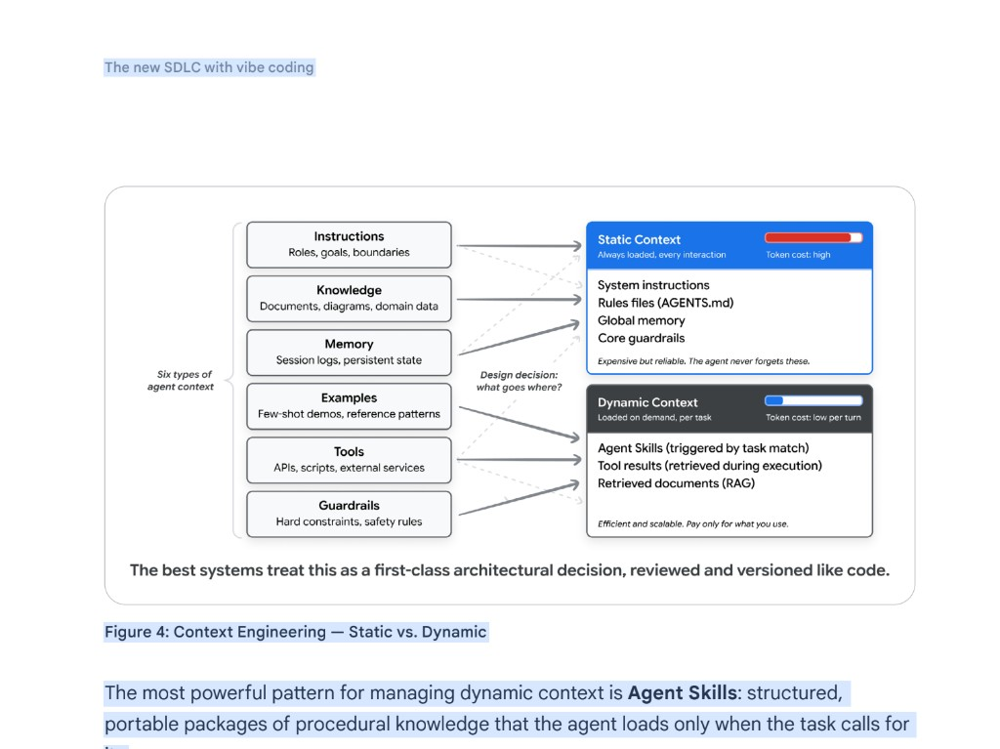
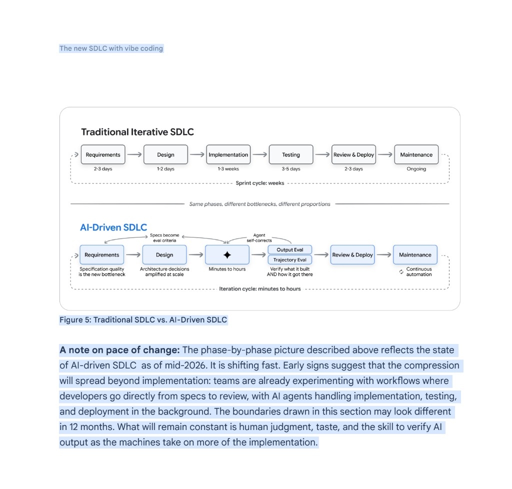
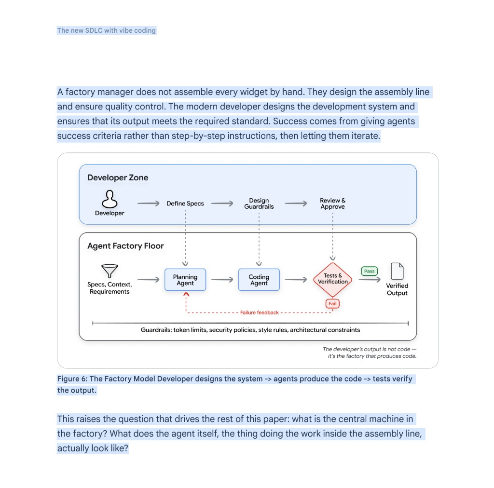
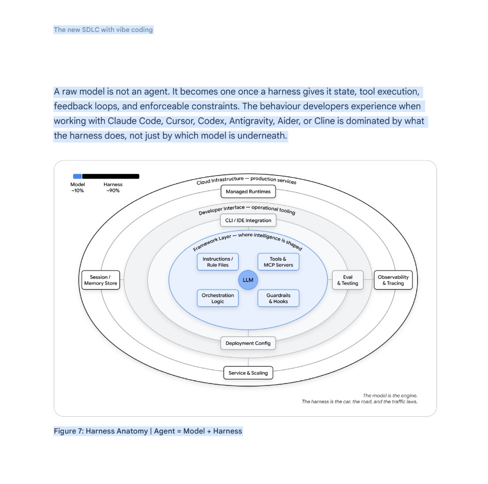
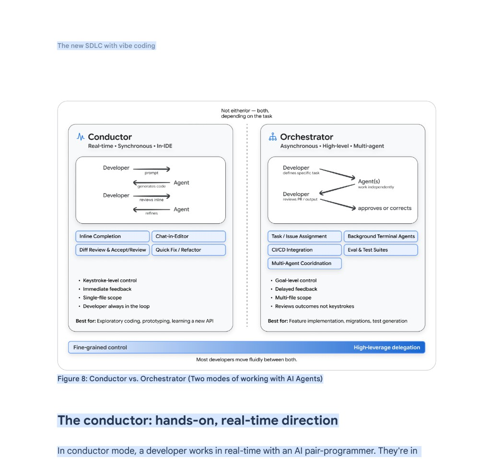
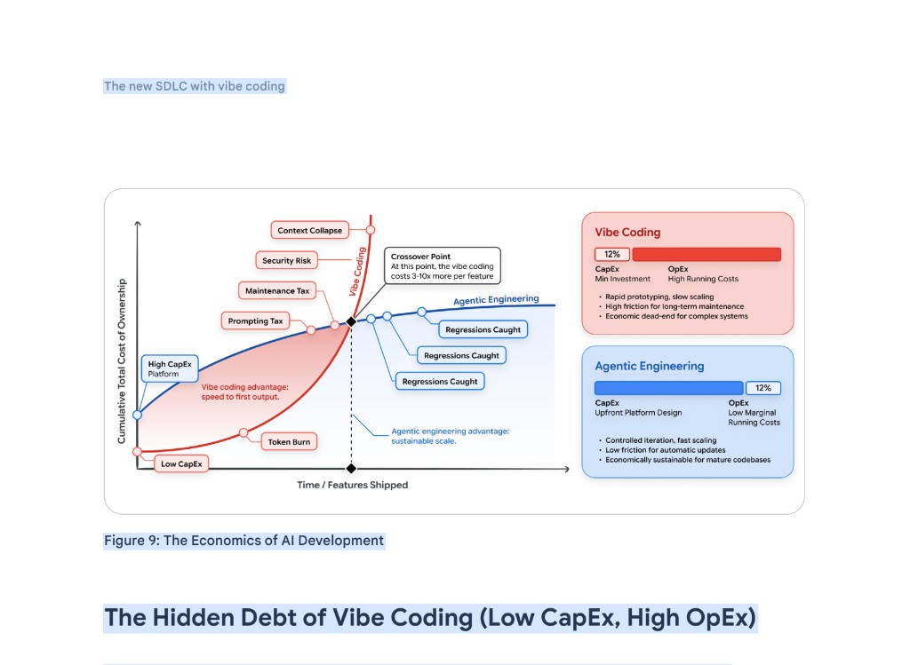

# EVSRC-2026-000237 — Google white paper ("Day 1", v3) — PAPER source

Document type: `source_capture` (**PAPER, not video**) · Lane / reservoir: `outside_learning`
**Status:** `raw_dropped` → `normalized` → `reviewed` → `analyzed` → `promoted | deferred`  ·  **current: `analyzed`**
Authority: `evidence_nonbinding` — captured source + interpretations only; binds nothing until routed + promoted.

> **★ THIS IS A PAPER-SHAPED SOURCE** — the primary Google white paper that the `EVSRC-2026-000236` video (Cole Medin's "Google AI-coding masterclass") is commentary ON. Primary > secondary, so it carries higher authority than 236.
> **Paste the paper's body text into §1** (it plays the role the transcript plays for a video). A Knox strategic read (§3 Review 001) is welcome but not required. Then this processes exactly like every other wave-3 source: Opus writes §3 Review 003 → folds to the `EVRUN-2026-000003` registry.

> **PASTE spots (the only spots Nick touches):** §1 paper text · §3 Review 001 (optional Knox read) · §3 Review 002 (optional gut note). `TK` fields are Opus's to fill at processing — leave them.

## §0 — Source identity / metadata  *(Opus filled at processing 2026-07-08 from paper masthead/text)*
- evsrc_id: `EVSRC-2026-000237`  ·  filename: `EVSRC-2026-000237_TK.md` (**firm slug proposed: `EVSRC-2026-000237_google-day1-new-sdlc-vibe-coding-whitepaper.md`** — NOT renamed per instruction; Opus-main may rename at closeout)
- source_type: `paper / white_paper`  ·  source_platform: `document (PDF)`  ·  source_url: `TK` (not in paper text; endnotes point to addyosmani.com + Google Agents Whitepaper Series)  ·  source_title: `The New SDLC With Vibe Coding` (subtitle: *From ad-hoc prompting to Agentic Engineering*) (file: `Day_1_v3.pdf` — Google white paper, 51 pp)
- channel_or_org: `Google` (Agents Whitepaper Series — "Day 1")  ·  authors: `Addy Osmani, Shubham Saboo, Sokratis Kartakis`  ·  published_at: `May 2026`
- captured_at: `2026-07-07`  ·  captured_by: `Nick`  ·  capture_method: `paper text paste`
- content_type: `primary white paper — AI-driven SDLC / vibe coding → agentic engineering / context engineering / harness engineering / factory model / conductor-orchestrator role shift / production-agent substrate / token economics / org adoption`  ·  source_reliability_context: `vendor-research (Google) — PRIMARY source, high authority; treat product/benchmark claims (Terminal Bench 2.0, Agents CLI/ADK, Jules, Gemini) as vendor-positioned`  ·  topic_tags_light: `[google_whitepaper, ai_agents, agentic_sdlc, harness, context_engineering, factory_model, conductor_orchestrator, primary_source, paper]`

## §0.1 — People / authorship / authority context  *(Opus filled 2026-07-08)*
- author(s):
  - name: `Addy Osmani` · role_in_source: `author` · affiliation_at_publication: `Google` · author_type: `engineering leader / author (Beyond Vibe Coding, O'Reilly)` · authority_context: `primary author; originates much of the cited framing (agentic engineering, factory model, 80% problem, conductor→orchestrator) via own blog/endnotes` · identity_confidence: `high_from_paper_text`
  - name: `Shubham Saboo` · role_in_source: `author` · affiliation_at_publication: `Google` · author_type: `researcher/vendor (Awesome LLM Apps)` · authority_context: `co-author` · identity_confidence: `high_from_paper_text`
  - name: `Sokratis Kartakis` · role_in_source: `author` · affiliation_at_publication: `Google` · author_type: `researcher/vendor (ADK / A2A explainer author)` · authority_context: `co-author` · identity_confidence: `high_from_paper_text`
  - content contributors: `Elia Secchi · Julia Wiesinger · Anant Nawalgaria`  ·  curator/editor: `Anant Nawalgaria`  ·  designer: `Michael Lanning` (per Acknowledgements, p.2)
- publisher / org: `Google` (Agents Whitepaper Series)  ·  DOI / report-id: `n/a — "Day 1" of a multi-day series (Day-3 Context Engineering; Day-5 Spec-Driven Production)`  ·  paper_type: `white paper`
- event_context: `The primary Google white paper (file "Day_1_v3.pdf") that the EVSRC-2026-000236 video (Cole Medin) summarizes/reorders. 236 is commentary; THIS is the source of record — where they differ, the paper wins.`  ·  perspective / conflict notes: `Google-authored → vendor-positioned; the enterprise-dev-tooling framing carries no authority/consent/tenancy/PHI/domain-commit notion — the same OMNI guardrails that bound 236 apply here. identity_confidence: high_from_paper_text.`

> **Authority is descriptive, not worship** (`GRD-039`): record *who* said it (raises relevance); every claim still routes through evidence → interpretation → gated promotion.

## §0.5 — Processing checklist
**Nick drops:** [x] paper text → §1 · [x] (optional) Knox read → §3 Review 001 · [ ] (optional) gut note → §3 Review 002 (left blank)
**Agent (Opus) does:** [x] §0/§0.1 metadata (from paper masthead) · [x] **§3 Review 003 formal deep extraction** · [ ] update `EVRUN-2026-000003` concept registry (cross-source) — *DEFERRED to Opus-main per this run's contract (do NOT edit registry/coverage/anchor from a subagent)* · [ ] update coverage matrix + anchor ledger — *DEFERRED to Opus-main* · [x] fill §4 pointers · [x] firm slug proposed (NOT renamed per instruction) · [x] NO sidecar (`GRD-044`)

## §1 — Verbatim paper text  ·  layer: `raw_source`  ·  IMMUTABLE

⬇️⬇️⬇️  PASTE THE FULL PAPER TEXT BELOW  (do not summarize — this is a PAPER, not a transcript)  ⬇️⬇️⬇️

The New SDLC
With Vibe Coding

Authors: Addy Osmani, Shubham Saboo,
and Sokratis Kartakis
From ad-hoc prompting to
Agentic Engineering

The new SDLC with vibe coding

May 2026 2
Acknowledgements
Content contributors
Elia Secchi
Julia Wiesinger
Anant Nawalgaria

Curators and editors
Anant Nawalgaria

Designer
Michael Lanning

Introduction 6
Why this paper, why now 9
Who this paper is for 9
The shift from syntax to intent 10
AI Agents: A Quick Refresher 10
What is vibe coding? 11
The spectrum: vibe coding to agentic engineering 12
Context engineering: the real skill 15
The new software development life cycle 19
The traditional SDLC under pressure 19
How AI transforms each phase 21
Requirements and planning 21
Design and architecture 21
Implementation 22
Testing and quality assurance 22
Table of contents

Code review and deployment 23
Maintenance and evolution 24
The factory model: building the system that builds software 24
Harness Engineering: What surrounds the model 26
What's in the harness 28
Harness in SDLC 29
1. Requirements, Planning, & Architecture (Configuring the Harness) 29
2. Implementation (Running the Harness) 29
3. Testing & QA (The Feedback Loop) 30
4. Code Review, Deployment, & Maintenance (Observing the Harness) 30
The developer's evolving role: conductors and orchestrators 31
The conductor: hands-on, real-time direction 32
The orchestrator: async, multi-agent delegation 33
The 80% problem 34
Coding agents in practice 35
Table of contents

Table of contents

Where coding agents fit in the developer's day 35
Vibe Coding Production-ready Agents 36
The Economics of AI Development 39
The Hidden Debt of Vibe Coding (Low CapEx, High OpEx) 40
The Investment of Agentic Engineering (High CapEx, Low OpEx) 41
Context Engineering as a Financial Lever 41
Scaling Efficiency via Dynamic Context and Skills 42
Intelligent Model Routing 42
Where to start 43
For individual developers 43
For engineering leaders 44
For organizations 45
Conclusion: Intent as the new Interface 47
Endnotes 49

The new SDLC with vibe coding

May 2026 6
Introduction
For most of computing history, programming has been an act of translation: understand
the problem in human terms, design a solution in abstract terms, then render it in syntax a
machine can execute. Each step introduces friction. That friction is now collapsing. Software
engineering is undergoing its most significant transformation since the introduction of
The most profound shift in
software engineering isn't a new
language, framework, or cloud
service. It's the transition from
writing code to expressing intent,
and trusting intelligent systems to
translate that intent into working
software.

The new SDLC with vibe coding

May 2026 7
high-level programming languages. For decades, the developer's primary interface with
the machine has been syntax: curly braces, semicolons, type annotations, and the precise
grammar of programming languages. That era is ending.
A new paradigm has arrived in which developers express what they want to build rather
than how to build it. The machine handles implementation. The human provides intent,
architecture, and judgment. This isn't a distant future - it's the daily reality for a rapidly
growing number of professional developers. As of early 2026, 85% of professional developers
regularly use AI Coding Agents, 51% use them daily, and an estimated 41% of all new code
is AI-generated.1
This shift didn't happen overnight. It began with autocomplete - simple token prediction in
the editor. Then came inline code suggestions that could complete entire functions. Next,
chat-based interfaces allowed developers to describe features in natural language and
receive working implementations. Now, fully autonomous agents can clone repositories,
plan multi-file changes, execute them in sandboxed environments, run tests, and submit pull
requests - all without a human typing a single line of code.

The new SDLC with vibe coding

May 2026 8
Figure 1: From Autocomplete to Autonomy
The implications for the software development life cycle (SDLC) are profound. Every phase
- from requirements gathering to deployment to maintenance - is being reshaped by AI
capabilities. But this transformation isn't uniform or simple. The spectrum ranges from casual
"vibe coding," where a developer prompts an AI and accepts whatever comes back, to
disciplined "agentic engineering," where AI acts as a powerful implementation engine within
carefully designed systems of constraints, tests, and feedback loops, with humans retaining
oversight over architecture, correctness, and quality.
The distinction matters. Telling a CTO that your team is vibe coding their payment processing
system will, and should, raise alarm bells. Telling that same CTO that your team practices
agentic engineering, with AI handling implementation under human-designed constraints
while test coverage ensures correctness, is a fundamentally different conversation.

The new SDLC with vibe coding

May 2026 9
This paper provides the foundation for that conversation. We trace the spectrum from casual
vibe coding to disciplined agentic engineering, examine how the developer's role is shifting
from writing code to exercising judgment — from conductor to orchestrator — and lay out
what it takes to adopt these tools in ways that produce software you can actually depend on.

Why this paper, why now
New tools, capabilities, and paradigms emerge weekly. Engineering teams need a framework
for making sense of this landscape - not a snapshot that will be outdated in months, but a set
of principles and mental models that will remain useful as the specific tools evolve.

Who this paper is for
This paper is for software engineers, engineering managers, architects, and technical
leaders who want to understand how AI is reshaping the SDLC and adopt these new
capabilities without sacrificing the discipline that production software demands. We assume
familiarity with modern software development practices but not with the specifics of AI or
machine learning.

The new SDLC with vibe coding

May 2026 10
The shift from syntax to intent
Before we go further, we need a shared picture of what an agent is and what vibe coding
actually means. Both terms have accumulated enough meanings that they need to be
unpacked carefully.

AI Agents: A Quick Refresher
An AI agent is a software system that perceives a goal, plans steps to reach it, takes actions
through tools, observes the results, and iterates until the goal is met or it hits a stopping
condition. Where a chatbot produces a response and waits for the next prompt, an agent
runs its own loop. You give it a goal at the top, then it decides what to do next at each step.

Figure 2: The Agent Loop - Perceive, plan, act, observe, iterate.

The new SDLC with vibe coding

May 2026 11
Every agent, however simple or sophisticated, is built from five parts. The November 2025
Introduction to Agents whitepaper covers each in depth.2 For our purposes here, the
short version:

• The model is the reasoning engine. It reads the current context, decides what should
happen next, and produces the next thought, the next tool call, or the next message.
• Tools connect the model to the world. They include APIs the agent can call, code it can
execute, databases it can query, and other agents it can delegate to.

• Memory is the state. It allows the agent to recall past interactions, retrieve project-
specific rules, and retain context across sessions so it never starts from a blank slate.

• Orchestration is the code that runs the loop. It assembles the context for each model
call, dispatches tool calls, captures their results, and decides whether to continue.
• Deployment is what turns the prototype into a service: hosting, identity, observability, and
the production infrastructure the agent runs on.
These four parts work together in a continuous loop: get the mission, scan the scene, think
it through, take action, observe and iterate. The loop is the beating heart of every agent.
Everything else in this paper, and everything in the rest of the course, is a variation on
this loop.

What is vibe coding?
In February 2025, Andrej Karpathy posted a description of a new way of programming that
resonated widely across the software engineering community. He described an approach
where you "fully give in to the vibes, embrace exponentials, and forget that the code even

The new SDLC with vibe coding

May 2026 12
exists." In this mode, a developer describes what they want in natural language, accepts the
AI's output, and when something breaks, copies the error message back into the prompt and
asks the AI to fix it.2

The term went viral because it captured something real: many developers were already
working this way but hadn't had language for it. Within months, "vibe coding" became a
common descriptor for any AI-assisted development workflow, which created confusion. Is a
senior engineer using an AI assistant to implement a well-specified feature "vibe coding"? Is
a team using AI agents to execute a carefully planned architecture? The term was applied so
broadly it began to lose meaning.
By early 2026, Karpathy himself acknowledged that the original framing was too narrow,
introducing the term "agentic engineering" to describe the more disciplined end of
the spectrum.4

The spectrum: vibe coding to agentic engineering
Rather than treating vibe coding and agentic engineering as a binary, we find it more useful
to think of them as endpoints on a spectrum. The key differentiator is not whether you use
AI. It's how much structure, verification, and human judgment surrounds the AI's output.

The new SDLC with vibe coding

May 2026 13
Table 1: The Spectrum from Vibe Coding to Agentic Engineering
Dimension Vibe Coding Structured AI-Assisted

Coding

Agentic
Engineering

Intent specification Casual natural
language prompts

Detailed prompts
with examples
and constraints

Formal specs,
architecture docs,
memory files

Verification "Does it seem
to work?"

Manual
testing, spot-checking

Automated test
suites, CI/CD gates,
LM judges

Codebase
understanding

Minimal; developer
may not read the
generated code

Selective review of
critical paths

Comprehensive
review of architecture;
AI handles
implementation details

Error handling Copy-paste error
messages back to
the AI

Developer diagnoses
root cause, AI
implements fix

Agents self-diagnose
within defined bounds;
humans handle
architectural issues

Appropriate scope Prototypes,
scripts, personal
projects, hackathons

Features within
established codebases

Production systems,
team-scale
development

Risk profile High; acceptable for
disposable code

Moderate; human
judgment at
key checkpoints

Low; systematic
verification at
every stage

The new SDLC with vibe coding

May 2026 14
Figure 3: The Vibe Coding to Agentic Engineering Spectrum

The single biggest differentiator between the two ends is how outputs get verified. In vibe
coding, verification is optional; the developer runs the code and checks if it seems right. In
agentic engineering, two mechanisms work together. Tests verify the deterministic parts of
the system: a function given this input produces that output. Evaluations, or evals, verify the
Applied Tip:
The right position on this spectrum depends on the stakes. A weekend prototype
can be pure vibe coding. A production API handling financial transactions demands
agentic engineering. Most real work falls somewhere in between, and the skill is
knowing where to draw the line for each task.

The new SDLC with vibe coding

May 2026 15
parts that are not deterministic: did the agent take the right trajectory of steps, choose the
right tools, and produce a final response that meets the quality bar. Tests are checked by
code; evals are checked by labelled datasets, scoring rubrics, and LM judges. Without both,
the practice is always vibe coding, regardless of how sophisticated the prompts are.

Context engineering: the real skill
As the field has matured, a key insight has emerged: the quality of AI-generated code
depends less on the cleverness of your prompts and more on the quality of the context
provided. This realization has given rise to the concept of context engineering, the practice
of providing AI agents with rich, structured information about your codebase, architecture,
conventions, and intent.5
Developers must consider six primary types of context:
• Instructions: The agent's core role, goals, and operational boundaries.
• Knowledge: Retrieved documents, architectural diagrams, and domain-specific data.
• Memory: Short-term session logs (what just happened) and long-term persistent state
(what the project is).
• Examples: Few-shot behavioral demonstrations and codebase reference patterns.
• Tools: The precise definitions of the APIs, scripts, and external services the agent
can invoke.
• Guardrails: Hard constraints, formatting rules, and safety validations.

The new SDLC with vibe coding

May 2026 16
In AI code generation, context engineering involves carefully balancing which of these six
elements the agent possesses upfront versus what it can retrieve on demand. This creates a
critical separation between static and dynamic context.
Static context is always loaded: system instructions, rule files (AGENTS.md, CLAUDE.md,
GEMINI.md), global memory, and persona definitions. It defines who the agent is and how
it behaves. Static context is expensive because every token is present in every interaction,
regardless of relevance.
Dynamic context is loaded on demand: skill instructions triggered by task matching, tool
results retrieved during execution, documents fetched from RAG pipelines, and windowed
session history. Dynamic context is efficient because the agent pays the token cost only
when the information is needed.
The design decision of what belongs in static context versus dynamic context is a genuine
engineering trade-off. Too much static context wastes tokens and dilutes signals. Too little
means the agent forgets critical rules. The best systems treat this boundary as a first-class
architectural decision, reviewed and versioned like any other configuration.

The new SDLC with vibe coding

May 2026 17
Figure 4: Context Engineering — Static vs. Dynamic
The most powerful pattern for managing dynamic context is Agent Skills: structured,
portable packages of procedural knowledge that the agent loads only when the task calls for
it.
Rather than embedding every piece of specialized knowledge into the agent's system
prompt, skills allow the agent to remain a lightweight generalist that flexes into specialist
roles on demand through progressive disclosure. The agent sees only lightweight metadata
at startup, loads full instructions when a task matches, and pulls deep reference material
only when explicitly needed. The result is that an agent can carry dozens of specialized
capabilities while paying the token cost for only the one it is actively using.

The new SDLC with vibe coding

May 2026 18
Agent Skills have seen rapid adoption across major coding agents and enterprise platforms
because they solve four problems that have plagued AI agent development:
• Context rot from overloaded prompts
• Absence of procedural memory for LLMs
• Operational overhead of multi-agent architectures
• Need for portability across tools and vendors
This section introduced the core principles of context engineering: the six types of context
every agent needs, the trade-off between static and dynamic context, and Agent Skills as the
key pattern for managing that trade-off at scale.
The companion Day-3 paper in this series on Context Engineering: Sessions, Skills & Memory
takes each of these ideas further, covering how to design and manage sessions, write and
evaluate skills, build persistent memory across interactions, and optimize token economics
for production systems.
The shift from "prompt engineering" to "context engineering" reflects a deeper truth about
working with AI. Models don't need cleverly worded instructions as much as they need the
same context that a skilled human developer would need to do good work. The question
isn't "how do I trick the AI into writing good code?" It's "what would a new team member
need to know to contribute effectively, and how do I encode that knowledge in a form the AI
can use?"

Context engineering is the bridge between vibe coding and agentic engineering. It is also the
bridge between this section and the next one, where we look at the structure that surrounds
every model and makes it useful.

The new SDLC with vibe coding

May 2026 19
By shifting our focus from writing syntax to engineering this context, the bottlenecks in
software creation fundamentally change. We are no longer waiting on human hands to type
boilerplate; we are waiting on human minds to define the boundaries. This necessitates a
complete reimagining of the traditional Software Development Life Cycle (SDLC), as the
systems we use to build software now dictate the speed at which it is delivered."

The new software development life cycle

The traditional SDLC under pressure
The software development life cycle has already been through one major transformation.
Over the past two decades, most enterprises moved from sequential waterfall processes to
iterative models: Agile sprints, continuous integration, DevOps pipelines, and rapid release
cycles. That shift shortened feedback loops, brought testing closer to development, and
made deployment a continuous process rather than a quarterly event.
AI compresses this cycle dramatically, but unevenly: implementation that once took weeks
can now be done in hours, while requirements, architecture, and verification remain
stubbornly human-paced. The result is not a faster version of the old SDLC. It is a different
workflow, where the boundaries between phases blur, iteration cycles shorten from weeks
to minutes, and the developer's role shifts from primary implementor to system designer and
quality arbiter.

The new SDLC with vibe coding

May 2026 20
Figure 5: Traditional SDLC vs. AI-Driven SDLC
A note on pace of change: The phase-by-phase picture described above reflects the state
of AI-driven SDLC as of mid-2026. It is shifting fast. Early signs suggest that the compression
will spread beyond implementation: teams are already experimenting with workflows where
developers go directly from specs to review, with AI agents handling implementation, testing,
and deployment in the background. The boundaries drawn in this section may look different
in 12 months. What will remain constant is human judgment, taste, and the skill to verify AI
output as the machines take on more of the implementation.

The new SDLC with vibe coding

May 2026 21
How AI transforms each phase

Requirements and planning
Requirements is the phase where the gap between intent and implementation has historically
been widest. Translating business needs into technical specifications has been a manual,
error-prone process that creates a persistent gap between what stakeholders want and what
engineers build.
Modern AI tools can participate directly in requirements refinement: generating user stories
from product briefs, identifying edge cases that humans miss, producing API schemas from
natural-language descriptions, and generating interactive prototypes from specification
documents. Agentic development environments allow developers to go from a description to
a working prototype in minutes, collapsing the requirements-to-prototype feedback loop to
near zero.
Requirements stop being a document handed off between teams. They become
a conversation between humans and AI that produces specification and initial
implementation simultaneously.

Design and architecture
Architecture remains the most stubbornly human-centric phase of the SDLC, and for
good reason. Architectural decisions are fundamentally about trade-offs: consistency vs.
availability, complexity vs. flexibility, build vs. buy. These trade-offs depend on business
context, organisational constraints, and long-term strategic considerations that AI cannot
fully grasp.

The new SDLC with vibe coding

May 2026 22
AI excels at implementing architectural decisions once they are made. Given a clear
architecture document, AI agents can scaffold entire applications, generate consistent
patterns across modules, and ensure that new code conforms to established conventions.
The developer's role shifts from writing boilerplate to making and documenting the structural
decisions that boilerplate implements.

Implementation
Modern coding agents can generate entire features from natural-language descriptions,
implement complex algorithms, and produce multi-file changes that work together correctly.
The productivity gains are real: industry surveys report 25 to 39% productivity improvements,
with some tasks seeing larger gains.7
The picture is more nuanced than headline numbers suggest. A study by METR found that
experienced developers using AI assistants actually took 19% longer on certain tasks, largely
because of the time spent verifying, debugging, and correcting AI output.8 AI does not
eliminate implementation work so much as transform it from writing to reviewing, guiding,
and verifying.

Testing and quality assurance
Testing AI-generated code requires evaluating not just what the agent produced, but how
it got there. Output evaluation checks the final artifact: does the code compile, do the tests
pass? Trajectory evaluation checks the full sequence of tool calls and intermediate reasoning.
Both are necessary because a fluent output that skipped its verification steps is a more
dangerous failure than one with a visible error.

The new SDLC with vibe coding

May 2026 23
AI also transforms test generation itself. Agents can produce test cases, including edge
cases and property-based tests, that humans might not think of. More importantly, tests and
evals become the primary mechanism for communicating intent to AI agents: a well-written
eval suite tells the AI what "correct" means and provides an automated way to verify it.
These practices are most effective when wired into a continuous quality flywheel: evaluate
against a benchmark suite, diagnose failures by clustering root causes, optimize the prompts
or tools that caused them, verify fixes against a regression suite, and monitor production
traffic for new failure modes. Each cycle compounds.

Code review and deployment
The review process itself is being augmented, with AI serving as a first-pass reviewer that
can identify potential bugs, style violations, security vulnerabilities, and performance issues

before a human reviewer sees the code. This does not replace human review, since context-
dependent decisions about design, maintainability, and strategic alignment still require

human judgment, but it significantly reduces the cognitive burden on reviewers.
Deployment pipelines are becoming AI-aware as well. AI agents can monitor deployment
health, automatically roll back problematic releases, and predict deployment risks based
on the nature and scope of changes. Modern deployment platforms increasingly integrate
with AI-powered observability to create feedback loops between production behaviour and
development decisions.
Day 5 in this series covers what changes for human reviewers when PR volume scales with
agent output — bundled summaries, conditional LGTM, agent-driven code-review skills.

The new SDLC with vibe coding

May 2026 24
Maintenance and evolution
Perhaps the most underestimated transformation is in maintenance. Legacy codebases
that were once impenetrable to new team members can now be navigated, understood,
and modified with AI assistance. An AI agent can read a codebase, understand its patterns,
identify the relevant files for a change, and implement modifications while respecting the
existing architecture.
This has significant implications for technical debt. Code that was considered "too risky
to touch" because only its original authors understood it can now be safely refactored,
modernized, and extended. AI agents can systematically migrate codebases between
frameworks, update deprecated APIs, and modernize test suites - tasks that were previously
so tedious and risky that they simply never happened.

The factory model: building the system that builds software
The mental model that ties these transformations together is what we call the factory model.
In this model, the developer's primary output is not code - it's the system that produces
code. This system includes:8
• Specifications and context that define what needs to be built
• Agents that translate specifications into implementation
• Tests and quality gates that verify correctness
• Feedback loops that route failures back to agents for correction
• Guardrails that constrain agents to safe, predictable behavior

The new SDLC with vibe coding

May 2026 25
A factory manager does not assemble every widget by hand. They design the assembly line
and ensure quality control. The modern developer designs the development system and
ensures that its output meets the required standard. Success comes from giving agents
success criteria rather than step-by-step instructions, then letting them iterate.

Figure 6: The Factory Model Developer designs the system -> agents produce the code -> tests verify
the output.
This raises the question that drives the rest of this paper: what is the central machine in
the factory? What does the agent itself, the thing doing the work inside the assembly line,
actually look like?

The new SDLC with vibe coding

May 2026 26
If the developer is the factory manager, the AI model is merely the raw engine on the factory
floor. An engine on its own cannot manufacture a car; it needs belts, gears, safety sensors,
and an assembly line. In the context of AI-assisted development, this surrounding machinery
is known as the Harness.

Harness Engineering: What surrounds
the model
There is a temptation, when builders start working with AI agents, to treat the model as the
system. A new model comes out, the agent gets smarter. An older model and the agent gets
worse. The model becomes the explanation for everything good and bad.
That intuition is wrong, and it leads to the wrong investments. The model is one input into a
running agent. Everything else, the prompts, the tools, the context policies, the hooks, the
sandboxes, the sub-agents, the observability, is the harness: the scaffolding wrapped around
the model that lets it actually finish something.11
A useful equation:

The new SDLC with vibe coding

May 2026 27
A raw model is not an agent. It becomes one once a harness gives it state, tool execution,
feedback loops, and enforceable constraints. The behaviour developers experience when
working with Claude Code, Cursor, Codex, Antigravity, Aider, or Cline is dominated by what
the harness does, not just by which model is underneath.

Figure 7: Harness Anatomy | Agent = Model + Harness

The new SDLC with vibe coding

May 2026 28
What's in the harness
Concretely, a harness includes:
• Instructions and Rule Files: The text that defines who the agent is, what it cares about,
and what it is forbidden from doing. This includes AGENTS.md, CLAUDE.md, GEMINI.md,
skill files, and sub-agent prompts.
• Tools: The functions, MCP servers, and APIs the agent can call, plus the prose around
them that tells the model when and how to call them.
• Sandboxes and execution environments: Where the agent's code actually runs, what it
has access to, what it cannot reach.
• Orchestration logic: Sub-agent spawning, model routing, hand-offs between specialists,
and the rules that govern when each one fires.
• Guardrails or Hooks: Deterministic code that runs at specific lifecycle points: before a
tool call, after a file edit, before a commit. Hooks are the place for things the agent should
never forget but often does.
• Observability: Logs, traces, evaluations, cost and latency metering. Without
observability, there is no way to tell whether the agent is doing well or quietly drifting.
If that sounds like a lot of surface area, it is. And it is the team's surface area, not the
model provider's.

The new SDLC with vibe coding

May 2026 29
Harness in SDLC
While the model itself determines how to accomplish a task, the harness is the scaffolding
that provides access to the tools, sandboxes, and orchestration needed to execute it.
Therefore, this harness must be present in every phase where an AI agent operates.
Here is how the harness actively operates across the different phases of the new SDLC:

1. Requirements, Planning, & Architecture (Configuring
the Harness)
This is where the harness is configured and calibrated. Before the AI writes any production
code, the developer must set up the agent's environment.
• Harness Configuration: Providing the Instructions and Rule Files (e.g., creating the
AGENTS.md and defining architectural constraints) that the harness will load and make
available to the model.
• The Action: The developer defines the tools the agent will have access to (like specific
APIs or database schemas) and sets the fundamental rules the agent cannot break.

2. Implementation (Running the Harness)
During active coding, the harness acts as the boundary that keeps the AI model focused,
secure, and productive.
• Harness Components Used: Sandboxes, Execution Environments, and Tools.

The new SDLC with vibe coding

May 2026 30
• The Action: As the model generates code, it executes it within the harness's isolated
sandbox. If the model needs to read a file or search the web, it uses the tools provided
by the harness.

3. Testing & QA (The Feedback Loop)
Testing in an agentic workflow relies heavily on the harness to facilitate
autonomous self-correction.
• Harness Components Used: Orchestration Logic and Guardrails.
• The Action: When the agent writes a function, the harness provides the execution
environment (such as a sandboxed terminal) that allows the automated tests to be
executed. If a test fails, the orchestration logic captures the error output from that
environment and routes it back to the model, asking it to try again. The harness is what
creates this automated 'think -> act -> observe' loop."

4. Code Review, Deployment, & Maintenance (Observing
the Harness)
Even after the code is written, the harness ensures the agent behaves safely in live or
near-live environments.
• Harness Components Used: Hooks and Observability.
• The Action: The harness runs deterministic hooks (e.g., blocking a commit if the agent
tries to push a hard-coded password). Furthermore, the observability layer tracks token
costs, latency, and agent drift, allowing human engineers to audit exactly why an agent
made a specific deployment decision.

The new SDLC with vibe coding

May 2026 31
The transition from 'vibe coding' to 'agentic engineering' is not simply about the tools you
use—a developer can vibe code or apply agentic engineering using the exact same agent.
Instead, it is defined by how deliberately you configure and apply the harness. Vibe coding
relies on minimal or implicit scaffolding aimed purely at rapid implementation. Agentic
engineering relies on clear, extensive harness abstractions that guide the AI from the very
first planning document all the way through to production monitoring.
The impact of this deliberate configuration is highly measurable. Public benchmarks make the
size of the harness effect concrete. On Terminal Bench 2.0, one team moved a coding agent
from outside the Top 30 to the Top 5 by changing only the harness, with no model change at
all. A separate study at LangChain raised a coding agent's score on the same benchmark by
13.7 points by tweaking only the system prompt, tools, and middleware around a fixed model.
The everyday version of this observation is crucial for teams adopting AI across the SDLC:
when an agent does something wrong, the first instinct is to blame the model. More often,
the failure traces back to a missing tool, a vague rule, an absent guardrail, or a context
window stuffed with noise. Most agent failures, examined honestly, are configuration failures.

The developer's evolving role:
conductors and orchestrators
As AI takes over more of the implementation work, the developer's role is transforming in
ways that are both exciting and disorienting. We find it useful to think of two modes that
developers move between fluidly: conductor and orchestrator.12

The new SDLC with vibe coding

May 2026 32
Figure 8: Conductor vs. Orchestrator (Two modes of working with AI Agents)

The conductor: hands-on, real-time direction
In conductor mode, a developer works in real-time with an AI pair-programmer. They're in
the IDE, watching code appear, guiding the AI with prompts and corrections, and maintaining
fine-grained control over what gets written. The AI is a powerful instrument, but the
developer is actively directing every movement.

The new SDLC with vibe coding

May 2026 33
This mode is typical when working on complex logic, debugging tricky issues, or working in
unfamiliar codebases where the developer needs to understand each change as it's made.
Tools like GitHub Copilot, Google's Gemini Code Assist, Cursor, and Windsurf primarily
support this mode through inline completions, chat interfaces, and edit-in-place capabilities.
The conductor mode is natural for developers who come from traditional engineering
backgrounds. It preserves the sense of understanding and control that many engineers value.
The risk is that it can also become a bottleneck - if the developer is personally directing every
keystroke, the throughput improvement from AI is limited.

The orchestrator: async, multi-agent delegation
In orchestrator mode, the developer operates at a higher level of abstraction. They
define goals, assign them to agents, and review results - but they're not watching code
appear line by line. Agents may be working in the background, in parallel, on different
parts of a codebase. The developer checks in periodically, reviews output, and provides
course corrections.
This mode is typical for well-defined tasks like bug fixes, feature implementations against
established patterns, codebase migrations, and test generation. Tools like Google's Jules,
GitHub Copilot's agent mode, Cursor's background agents, and Claude Code support this
mode through async task execution, often working in sandboxed environments with full
access to the repository, build tools, and test suites.13
The orchestrator mode requires a different skill set. Instead of deep expertise in syntax and
language idioms, it demands strong skills in:
• Specification: Defining tasks precisely enough that an agent can execute them
without ambiguity

The new SDLC with vibe coding

May 2026 34
• Decomposition: Breaking large tasks into appropriately sized units for agent execution
• Evaluation: Quickly assessing whether agent output meets quality standards
• System design: Designing the constraints, tests, and feedback loops that keep
agents productive

The 80% problem
A persistent challenge in AI-assisted development is what we call the 80% problem: AI agents
can rapidly generate approximately 80% of the code for a feature, but the remaining 20%
- the edge cases, error handling, integration points, and subtle correctness requirements -
demands deep contextual knowledge that current models often lack.14
The nature of AI errors has evolved from simple syntax mistakes to more insidious conceptual
failures: wrong assumptions about business logic, failure to seek clarification on ambiguous
requirements, missing edge cases, and architectural decisions that create subtle long-term
maintenance burdens. These errors are harder to detect precisely because the code "looks
right" and may even pass basic tests.
The developers who navigate this challenge most effectively adopt a specific posture: they
use AI for what it's good at (rapid implementation of well-specified tasks) while reserving

their own attention for what AI struggles with (ambiguous requirements, architectural trade-
offs, and correctness verification). They don't try to be faster by accepting everything the AI

produces. They try to be faster by focusing their expertise where it matters most.

The new SDLC with vibe coding

May 2026 35
Navigating this 80% problem effectively requires applying the right tool to the right phase
of work. A developer operating as a 'Conductor' needs a different set of tools than one
operating as an 'Orchestrator'. To understand how to map these operational modes to
your daily workflow, we must categorise the current landscape of AI agents based on their
autonomy and integration.

Coding agents in practice
A developer building an agent today does most of the work from a terminal, often in natural
language, often with another coding agent doing the typing. This is new. A year ago the same
task meant frameworks, SDKs, and cloud consoles. The patterns that have replaced them are
worth naming clearly, both for the developer who wants to use coding agents in their day,
and for the developer who wants to build agents of their own.

Where coding agents fit in the
developer's day
Coding agents show up in three places in everyday work. Most developers use all three
at once.
In the editor: Inline completion that suggests the next line as the developer types. Chat
panels that explain or modify code in place. Whole-codebase awareness inside the IDE. This
is where most people first meet AI in coding, and where the work stays in flow. Examples
include GitHub Copilot, Cursor, Windsurf, JetBrains AI Assistant.

The new SDLC with vibe coding

May 2026 36
In the terminal: Coding agents that the developer launches from the command line, hand

a goal to in plain language, and let work across the codebase. Full file system access, multi-
file edits, the ability to run tools and tests and iterate based on results. This is where serious

vibe coding happens today. Examples include Antigravity CLI, Claude Code, Codex CLI, Open
Code, and Cline.
In the background: Agents that take a task and run autonomously in cloud-hosted
sandboxes, often for hours, often producing a pull request as output. The developer
hands off and reviews it later. Examples include Google Jules, GitHub Copilot agent mode,
Cursor's background agents and Google’s specialized AlphaEvolve agent for designing
advanced algorithms.
In practice, an editor agent helps when the developer is in the middle of writing code and
wants suggestions, quick edits, or explanations without leaving flow. A terminal agent fits
multi-file work, exploration of unfamiliar codebases, and tasks where the agent needs
to run code and react to what it observes. A background agent fits well-specified tasks
the developer can describe in a paragraph and walk away from, like fixing a known bug,
generating a test suite, or migrating code from one framework to another. The same
developer often uses all three in a single day.
The right starting point depends on the task, not on which category sits highest on some
autonomy ladder.

Vibe Coding Production-ready Agents
Everything discussed so far has been about using coding agents to build software: writing
features, fixing bugs, generating tests, refactoring code. But what happens when the thing
you need to build is itself an agent?

The new SDLC with vibe coding

May 2026 37

A customer support bot that handles refund requests. A research assistant that cross-
references sources and produces grounded reports. An internal tool that monitors

compliance and flags anomalies. These are not tasks you solve with a coding agent in
your terminal. They are products that need their own tools, their own memory, their own
evaluation, and their own deployment infrastructure.
The same terminal-based workflow that produces prototype scripts now reaches these
production agents. Building, evaluating, and deploying a real agent that runs at scale, with
persistent memory, governance, and observability, has moved from a framework and cloud
console task into something that happens in the same terminal, often by talking to the same
coding agent the developer was already using.
This workflow matters when the builder needs an agent that runs reliably for real users:
persistent memory across sessions, scoped permissions on tools and data, eval coverage
that catches regressions before they ship, observability that traces what the agent actually
did. For one-off scripts or personal automation, a regular coding agent is enough; the agent
is the destination. For agents that serve real users at scale, the agent is the product, and it
needs the substrate underneath.
Google's Agents CLI is built around this idea.14 It is a small command-line tool that bundles
a set of skills for building agents on Google Cloud, and crucially, it works with whichever
coding agent the developer prefers, Claude Code, Codex, or another. After a one-time
install, the coding agent gains seven new skills covering the full ADK lifecycle: scaffolding a
project, writing the agent code, evaluating it, deploying it to Agent Runtime, and wiring up
observability. The developer does not learn a new SDK. They describe what they want, and
the coding agent uses the skills to do the right thing at each step.

The new SDLC with vibe coding

May 2026 38
Concretely, the entire build-evaluate-deploy loop looks like this:

Snippet 1: Agents CLI Setup and Build.
Behind that single instruction, the coding agent scaffolds a project from a template, writes
the ADK code, generates an evalset, runs it against the agent, deploys to Agent Runtime, and
reports back. For developers who prefer to drive directly, the same operations are available
as plain CLI commands (agents-cli create, agents-cli playground, agents-cli
eval, agents-cli deploy).
Production agents used to require a separate stack and a separate workflow from
prototypes. Now the prototype that ran on the developer's laptop yesterday can become the
production agent serving real users today, without a rewrite.
The same workflow scales from one agent to many. ADK provides graph-based workflows,
multi-agent workflows for building collaborative agents and interaction mechanisms like
shared session state, LLM-driven delegation, and explicit invocation, that combine into
whatever multi-agent pattern fits the problem.
Coordination across agents happens through shared session state for simple cases, through
Model Context Protocol (MCP) for tool access, and through the Agent2Agent (A2A) protocol
for cross-agent delegation.15 Anthropic's engineering team published an experiment in early
2026 in which agent teams running on this kind of architecture built a working C compiler in
# One-time setup
uvx google-agents-cli setup
# Then in your coding agent:
> Build a support agent that answers questions from our docs.
> evaluate it on the FAQ dataset
> Deploy it to Agent Engine

The new SDLC with vibe coding

May 2026 39
Rust over two weeks, with humans setting direction and reviewing output but not writing the
implementation.16 The bottleneck moved from writing the code to specifying what it should do
and verifying that the agents did it.
For builders, the practical implication is simple. The same vibe coding workflow that produces
a script today produces a production agent tomorrow. The lifecycle, build, evaluate, deploy,
observe, refine, lives in one place. The path from idea to running agent has collapsed from
weeks to hours, and most of the work now happens in natural language.

The practices that make this workflow production-grade at team scale, from spec-
driven development and structured code review to guardrails, sandboxing, and zero-trust

development, are covered in the Day 5 companion paper: Spec-Driven Production Grade
Development in the Age of Vibe Coding.

The Economics of AI Development
When evaluating the impact of AI on the software development life cycle, the conversation
often begins and ends with developer velocity: how fast can we write code? However, for
engineering leaders, the more critical metric is the Total Cost of Ownership (TCO).
To understand the true cost of AI-assisted development, we must look at how different
workflows shift the financial and operational burdens between Capital Expenditure (CapEx)—
the upfront investment to build something—and Operational Expenditure (OpEx)—the
ongoing cost to run, fix, and maintain it. Crucially, in the AI era, OpEx is heavily dictated by
the token economy.

The new SDLC with vibe coding

May 2026 40
Figure 9: The Economics of AI Development

The Hidden Debt of Vibe Coding (Low CapEx, High OpEx)
At first glance, vibe coding appears incredibly cost-effective. The barrier to entry is
essentially zero: a standard monthly subscription to an AI assistant and a few casual prompts.
The CapEx is negligible because the developer relies entirely on the model's baseline
capabilities rather than investing time in system design.
However, the economics of vibe coding hide a massive, compounding OpEx burden:
• The Token Burn Rate: Every interaction with a Large Language Model (LLM) incurs a
cost based on input and output tokens. In vibe coding, developers often dump massive,
unstructured files into the context window and repeatedly ask the model to fix its own
unverified mistakes. This creates an expensive "prompting loop" that burns through API
tokens with low first-pass success rates.

The new SDLC with vibe coding

May 2026 41
• Maintenance Tax: Code written through ad-hoc prompting often lacks structural
consistency. When a bug arises six months later, human engineers must spend days
reverse-engineering unstructured, AI-generated "spaghetti" code.
• Security Remediation: Without an automated evaluation harness, the rapid generation
of code leads to the rapid generation of vulnerabilities. The cost of fixing a security flaw in
production is exponentially higher than catching it during the design phase.

The Investment of Agentic Engineering (High CapEx,
Low OpEx)
Agentic engineering flips this economic model. It requires a deliberate, upfront investment of
engineering time and resources before a single line of production code is generated.
The CapEx in agentic engineering includes designing API schemas, building deterministic
test suites, and, most importantly, structuring the agent's context. While this upfront cost
is higher, the marginal cost of shipping and maintaining a feature drops dramatically. The AI

operates within a strictly governed "factory," meaning its output is structurally sound, pre-
tested, and aligned with company standards.

Context Engineering as a Financial Lever
In the token economy, context engineering is not just a technical skill—it is a financial
strategy. LLMs charge for every piece of information you send them. Passing an entire
100,000-token repository into every prompt is financially unviable at scale.

The new SDLC with vibe coding

May 2026 42
Effective context engineering ensures the model receives a dense, high-signal payload (such
as a precise AGENTS.md file and architectural guardrails) rather than a sprawling, noisy one.

By providing the right context upfront, developers dramatically increase the agent's first-
pass success rate, avoiding the costly trial-and-error loops that plague vibe coding.

Scaling Efficiency via Dynamic Context and Skills
To truly optimize OpEx, advanced agentic engineering relies on dynamic context through
the use of "skills" or tool calling (such as Model Context Protocol servers) which we cover in
detail in day-3 paper.

Intelligent Model Routing
Furthermore, agentic engineering allows for intelligent model routing. In a vibe coding
workflow, a developer typically relies on a single, massive frontier model for every
interaction—paying premium token prices just to ask the AI to fix a typo or generate a basic
unit test.
A well-designed factory model avoids this waste. It uses large, advanced models for highly
complex tasks (Requirements, Architecture, and initial Implementation) but automatically
routes deterministic, lower-complexity tasks (Test Generation, Code Review, and CI/CD

monitoring) to smaller, faster, and significantly cheaper models. By orchestrating a multi-
model ecosystem, engineering teams can maintain peak output quality while systematically

driving down the operational token cost.

The new SDLC with vibe coding

May 2026 43
Where to start
The shift from syntax to intent is not a future state. It is the work in front of us today. Whether
reading this as an individual builder or as a leader thinking about how a team or organisation
adopts these tools, the same underlying principle holds: AI amplifies the engineering culture
it lands in. The practices below translate that principle into action.

For individual developers
1. Set up an AGENTS.md (or equivalent) for the project. Pick the convention that matches
the coding agent of choice. Start with ten lines: stack, conventions, hard rules, workflow.
Add a rule every time the agent does something it should not do again.
2. Install a set of skills for your coding agents (like Agents CLI) to build, evaluate, deploy
and optimize agents.
3. Pick one repetitive workflow and make it the first agent. A research workflow, a code
review process, a recurring report, a piece of content produced regularly. Use a coding
agent for the prototype, and graduate it to a production agent through Agents CLI when it
earns its keep. Building one agent end to end teaches more than reading about a hundred.
4. Write the tests and evals before generating the code. Together they are the contract
with the AI. A well-written test and eval suite communicates intent more precisely than
any natural-language prompt, and turns AI-assisted development from vibe coding into
agentic engineering.
5. Review every line the agent produces that is going to ship. Be skeptical of anything
that looks clever. Check imports for real packages. Verify that error handling covers
realistic failure modes. Code that the team does not understand becomes debugging cost
the team cannot afford.

The new SDLC with vibe coding

May 2026 44
6. Maintain your developer skills. AI handles the routine so the developer can focus on
the challenging. That arrangement only works if the foundational skills, debugging, system
design, intuition for performance and correctness, stay sharp. Treat AI as a way to apply
expertise at a greater scale, not as a substitute for it. Regular practice with complex
debugging, code review of AI output, and architecture discussions stay essential to
growing as an engineer.

For engineering leaders
1. Make context engineering a first-class engineering practice on the team. Treat
AGENTS.md, system prompts, eval suites, and skill libraries as code: reviewed in pull
requests, versioned with the project, owned by named engineers. Without this discipline,
the harness drifts and agent behaviour becomes irreproducible across the team.
2. Set the bar at the eval, not the demo. A working demo proves an agent can succeed
once. A passing eval suite proves it succeeds reliably. But an eval without a clear rubric
measures nothing. Define what you are scoring: task success, tool use quality, trajectory
compliance, hallucination, and response quality. Require eval coverage with explicit
rubrics as a precondition for any agent shipping into a shared workflow, the same way test
coverage gates a service deployment.
3. Re-shape code review for AI-generated code. AI-generated code requires the
same or greater scrutiny than human-written code, with extra attention to hallucinated
dependencies, inadequate error handling, and subtle correctness gaps that look right
at a glance. Train reviewers on the failure modes of generated code, and tune review
checklists accordingly.

The new SDLC with vibe coding

May 2026 45
4. Distinguish prototyping work from production work in team norms. Vibe coding is the
right speed for exploration. Agentic engineering is the right discipline for production. Make
the boundary explicit: which projects, which branches, which environments warrant which
mode of working. Teams that keep this distinction blurry produce prototypes that ship
by accident.
5. Invest in the harness components as a shared team asset. Reusable system
prompts, skill libraries, MCP server connections, and evaluation harnesses compound
across projects. Treat them as infrastructure: documented, maintained, and improved
deliberately. The teams that compound the most value from AI-assisted development are
the ones that build their harness once and refine it many times.

For organizations
1. Treat AI-assisted development as an engineering investment, not a productivity
feature. The teams seeing the largest gains pair AI tooling with eval coverage,
observability, and clear architectural standards. Rolling out a coding agent without that
scaffolding produces speed without quality, which compounds into technical debt faster
than any team can pay it down.
2. Invest in the production substrate before scale. A vibe-coded prototype on a laptop
is not a production system. What graduates one to the other is the operations discipline
around it: trajectory and final-response evals run in CI, traces of every agent run, scoped
permissions per agent, and security review tuned to the failure modes of generated code.
Build this substrate before the first production agent ships, not after.
3. Adopt open standards for tools and inter-agent communication. Model Context
Protocol (MCP) for tool access and Agent2Agent (A2A) for cross-agent delegation are
converging into the connective tissue of multi-agent systems. Choosing them now keeps
the option to mix vendors and frameworks open, and avoids re-platforming later.

The new SDLC with vibe coding

May 2026 46
4. Plan for hybrid teams of humans and agents, not human-only or agent-only
workflows. The strongest production results in the past year come from architectures
where humans set direction, agents do the implementation, and clear handoff protocols
govern the boundary. Code review processes, on-call rotations, and team structures all
need to evolve to reflect that agents are now participants, not just tools.
5. Reframe hiring and skill development around judgment, not just implementation.
As implementation becomes faster and more automated, the bottleneck shifts to
specification, evaluation, architectural judgment, and review. Hire and develop for those
skills deliberately. The most valuable engineers in the next several years will be the ones
who can direct agents well, not the ones who can write the most code.

The new SDLC with vibe coding

May 2026 47
Conclusion: Intent as the new Interface
The transition from syntax to intent is not a future prediction - it's a present reality.
Developers are already spending more time describing what they want than specifying how
to build it. The SDLC is already being compressed, restructured, and reimagined around AI
capabilities. The question is not whether this transformation will happen, but how effectively
individual developers, teams, and organizations will navigate it.
The framework we've presented in this paper - the spectrum from vibe coding to agentic
engineering, the conductor-to-orchestrator model of developer roles, the taxonomy of
ambient, workflow, and autonomous agents, and the factory model of software production
- provides a set of mental models for making sense of a rapidly evolving landscape. These
models will remain useful even as the specific tools and capabilities evolve.
Three principles stand out as durable:
1. Structure scales, vibes don't. Vibe coding is a valid approach for exploration,
prototyping, and personal projects. But for software that organizations depend on, the
discipline of agentic engineering - specifications, tests, guardrails, and human oversight
of architecture - is not optional. The gap between "it seems to work" and "it works
correctly under all conditions" is where production outages, security vulnerabilities, and
maintenance nightmares live.
2. AI amplifies your engineering culture. Organizations with strong testing practices, clear
architectural standards, and healthy code review processes get dramatically more value
from AI-assisted development than those without. AI is a force multiplier - and it multiplies
both your strengths and your weaknesses.

The new SDLC with vibe coding

May 2026 48
3. The human role is evolving, not diminishing. The builders who understand architecture,
can define precise specifications, evaluate output critically, and design effective systems
of constraints and feedback loops are more valuable than ever. The skills that matter are
shifting from implementation to judgment, from writing code to designing the systems that
produce code.
We're at the beginning of a transformation that will reshape not just how software is built,
but what kind of software is possible to build. Smaller teams will be able to tackle larger
problems. Individual developers will be able to build and maintain systems that previously
required entire departments. The barrier to creating software will continue to fall, opening the
practice of software development to a broader population.
The teams that thrive will be those that embrace AI as a powerful tool while maintaining the
engineering discipline that has always been the foundation of reliable software. They'll be the
ones who understand that the future of software engineering isn't about choosing between
human expertise and AI capability - it's about designing systems where both contribute their
unique strengths.
Generation is solved. Verification, judgment, and direction are the new craft.

The new SDLC with vibe coding

May 2026 49
Endnotes

1. GetPanto, "AI Coding Assistant Statistics 2025-2026," https://www.getpanto.ai/blog/ai-coding-assistant-
statistics; Index.dev, "Developer Productivity Statistics with AI Tools," https://www.index.dev/blog/

developer-productivity-statistics-with-ai-tools
2. Karpathy, A., "Vibe Coding," X/Twitter post, February 2025. https://x.com/karpathy/
status/1886192184808149383; Wikipedia, "Vibe coding," https://en.wikipedia.org/wiki/Vibe_coding
3. Osmani, A., "Agentic Engineering,"
https://addyosmani.com/blog/agentic-engineering/
4. Karpathy, A., "From Vibe Coding to Agentic Engineering," 2026; The New Stack, "Vibe Coding is Passe,"
https://thenewstack.io/vibe-coding-is-passe/
5. Glide Blog, "What is Agentic Engineering?" https://www.glideapps.com/
blog/what-is-agentic-engineering; The New Stack, "Vibe Coding, Agentic
Engineering," https://thenewstack.io/vibe-coding-agentic-engineering/
6. CircleCI, "AI-Native SDLC,"
https://circleci.com/blog/ai-sdlc/

7. GroovyWeb, "SDLC in the AI Era: Software Development 2026," https://www.groovyweb.co/blog/sdlc-ai-
era-software-development-2026; EPAM, "From Traditional Software to a Native AI SDLC,"

https://www.epam.com/about/newsroom/in-the-news/2026/from-traditional-software-
to-a-native-ai-sdlc-how-genai-is-redefining-engineering

8. Osmani, A., "The Factory Model,"
https://addyosmani.com/blog/factory-model/
9. Deloitte, "AI in Software Engineering: Productivity Gains 2025-2026," projecting 30-35% gains across the full
development process.
10. METR, "Uplift Update: Measuring the Impact of AI Coding Tools," February 2026,
https://metr.org/blog/2026-02-24-uplift-update/
11. Google, "Introduction to Agents," Agents Whitepaper Series, November 2025.
12. Osmani, A., "From Conductors to Orchestrators: The Future of Agentic Coding,"
https://addyosmani.com/blog/future-agentic-coding/

The new SDLC with vibe coding

May 2026 50
13. Google, "Jules: AI-Powered Coding Agent,"
https://developers.googleblog.com/en/the-next-chapter-of-the-gemini-era-for-developers/
14. Osmani, A., "The 80% Problem in Agentic Coding,"
https://addyo.substack.com/p/the-80-problem-in-agentic-coding
15. Medium, Dave Patten, "The State of AI Coding Agents 2026: From Pair Programming to Autonomous AI

Teams, https://medium.com/@dave-patten/the-state-of-ai-coding-agents-2026-from-pair-
programming-to-autonomous-ai-teams-b11f2b39232a

16. Lawfare, "When the Vibes Are Off: The Security Risks of AI-Generated Code,"
https://www.lawfaremedia.org/article/when-the-vibe-are-off--the-security-risks-of
-ai-generated-code
17. Google, "Introduction to Agents," Multi-Agent Systems and Design Patterns section, November 2025.
18. Google, "Agent Development Kit (ADK)," https://google.github.io/adk-docs/; Kartakis, S., "From Zero to
Multi-Agents: A Beginner's Guide to Google Agent Development Kit (ADK),"
https://medium.com/@sokratis.kartakis/from-zero-to-multi-agents-a-beginners-guide
-to-google-agent-development-kit-adk-b56e9b5f7861
19. Google, "Agent-to-Agent (A2A) Protocol," https://google.github.io/a2a-protocol/; Kartakis, S. and Hotz, H.,
"Generative AI in the Real World: Understanding A2A," O'Reilly Podcast,

https://www.oreilly.com/radar/podcast/generative-ai-in-the-real-world-understanding-
a2a-with-heiko-hotz-and-sokratis-kartakis/

20. TLDL, "AI Coding Tools 2026," https://www.tldl.io/resources/ai-coding-tools-2026; Kanerika, "GitHub
Copilot vs Claude Code vs Cursor vs Windsurf,"
https://kanerika.com/blogs/github-copilot-vs-claude-code-vs-cursor-vs-windsurf/
21. Google, "Gemini Code Assist,"
https://cloud.google.com/gemini/docs/codeassist/overview
22. Dark Reading, "Coders Adopt AI Agents, but Security Pitfalls Lurk in 2026,"

https://www.darkreading.com/application-security/coders-adopt-ai-agents-security-
pitfalls-lurk-2026

23. Google, "Gemini CLI,"
https://github.com/google-gemini/gemini-cli.
24. Google, "Agent Tools: Interoperability with Model Context Protocol (MCP)," Agents Whitepaper Series,
November 2025

The new SDLC with vibe coding

May 2026 51
25. Google, "Agent Quality" and "Prototype to Production," Agents Whitepaper Series, November 2025
26. Lawfare, "When the Vibes Are Off: The Security Risks of AI-Generated Code,"

https://www.lawfaremedia.org/article/when-the-vibe-are-off--the-security-risks-of-ai-
generated-code

27. DevOps.com, "AI-Generated Code Packages Can Lead to Slopsquatting Threat,"
https://devops.com/ai-generated-code-packages-can-lead-to-slopsquatting-threat/
28. Osmani, A., "Beyond Vibe Coding," O'Reilly Media, 2025-2026,
https://www.oreilly.com/library/view/beyond-vibe-coding/9798341634749/
29. "Awesome LLM Apps,"
https://github.com/Shubhamsaboo/awesome-llm-apps
30. Osmani, A., "My LLM Coding Workflow Going Into 2026,"
https://addyosmani.com/blog/ai-coding-workflow/
31. Questera, "7 AI Coding Trends to Watch in 2026,"
https://www.questera.ai/blogs/7-ai-coding-trends-to-watch-in-2026
32. DEV Community, "Programming in the Age of AI: From Code to Intent,"
https://dev.to/robertobutti/programming-in-the-age-of-ai-from-code-to-intent-46eo

&nbsp;

⬆️⬆️⬆️  END OF PAPER TEXT  ⬆️⬆️⬆️

## §2 — Source file / visible details + PRESERVED FIGURES  ·  layer: `raw_source_metadata`  ·  IMMUTABLE

- **Source file:** `Day_1_v3.pdf` (Google white paper, "The new SDLC with vibe coding"). Body text in §1.
- **★ PRESERVED FIGURES (operator-flagged high-value, 2026-07-07):** the paper's 6 diagrams are captured as durable raw evidence beside this source at `EVSRC-2026-000237_figures/` (git-tracked; not the transient asset cache). **These are reference artifacts for future agents — NOT boot-path** (`GRD-036`: consult-routed, never Tier-0). They are the paper's visual thesis and several map almost 1:1 onto OMNI's own doctrine (noted per figure). Immutable raw source — do not edit; interpretation lives in §3 Review 003.

### Figure 4 — Context Engineering: Static vs. Dynamic

> Six types of agent context (Instructions · Knowledge · Memory · Examples · Tools · Guardrails) sorted into **Static Context** (always loaded every interaction; high token cost — system instructions, rules files [AGENTS.md], global memory, core guardrails; *"expensive but reliable, the agent never forgets these"*) vs **Dynamic Context** (loaded on demand per task; low token cost — Agent Skills [task-match-triggered], tool results, retrieved docs [RAG]; *"efficient and scalable, pay only for what you use"*). *"The best systems treat this as a first-class architectural decision, reviewed and versioned like code."*
> **★ OMNI:** this IS the **Manifest-Read-Graph** — Tier-0 boot-visible (static/always-loaded/reliable-but-expensive) vs consult-triggered lanes (dynamic/efficient/may-not-load). External confirmation of a pattern OMNI already runs; sharpens `context_memory_budget` (204) + `context_packet_policy`.

### Figure 5 — Traditional Iterative SDLC vs. AI-Driven SDLC

> Same phases, different bottlenecks/proportions. Traditional: Requirements→Design→Implementation(1-3 wks)→Testing→Review&Deploy→Maintenance, sprint = weeks. AI-Driven: **specification quality is the new bottleneck**; design decisions amplified at scale; implementation minutes-to-hours; **Output Eval + Trajectory Eval** ("verify what it built AND how it got there"); agent self-corrects; continuous-automation maintenance; iteration = minutes-to-hours. Pace note: *"What will remain constant is human judgment, taste, and the skill to verify AI output as the machines take on more of the implementation."*
> **★ OMNI:** spec-as-contract (208) + verification-is-the-boundary (215/216) + **trajectory eval ↔ `trace_lineage`/candidate≠commit**; human-verify-at-the-gate = Build-OS proof obligations.

### Figure 6 — The Factory Model (Developer designs the system → agents produce code → tests verify)

> **Developer Zone:** Define Specs → Design Guardrails → Review & Approve. **Agent Factory Floor:** Specs/Context/Requirements → Planning Agent → Coding Agent → Tests & Verification (Pass → Verified Output; **Fail → failure-feedback loop**) — all bounded by guardrails (token limits, security policies, style rules, architectural constraints). *"The developer's output is not code — it's the factory that produces code."*
> **★ OMNI:** the governed build loop — candidate (plan/code) → gate (tests/guardrails) → **human review & approve** → commit; agent ≠ owner-of-merge. Directly Build-OS (`REV-158`) + Agent-Work-Protocol + candidate≠commit.

### Figure 7 — Harness Anatomy: Agent = Model + Harness

> **Model ~10% / Harness ~90%.** Framework Layer ("where intelligence is shaped"): Instructions/Rule Files · Tools/MCP Servers · Orchestration Logic · Guardrails/Hooks around the LLM. Developer Interface (CLI/IDE). Cloud Infra (managed runtimes). Plus Session/Memory Store · Eval & Testing · Observability & Tracing · Deployment Config · Service & Scaling. *"The model is the engine. The harness is the car, the road, and the traffic laws."*
> **★ OMNI:** the single strongest external mirror of the whole **§B AI-substrate + Build-OS thesis** — model-pluggable at the substrate, the harness (context/tools/evals/guardrails/authority) is the owned asset. "Model is 10%" = OMNI is the other 90%.

### Figure 8 — Conductor vs. Orchestrator (two modes of working with AI agents)

> **Conductor** (real-time · synchronous · in-IDE): inline completion, chat-in-editor, diff review, quick-fix; keystroke-level control, immediate feedback, single-file, dev-always-in-loop; best for exploratory/prototyping. **Orchestrator** (async · high-level · multi-agent): task/issue assignment, background terminal agents, CI/CD, eval/test suites, multi-agent coordination; goal-level control, delayed feedback, multi-file, reviews-outcomes-not-keystrokes; best for feature implementation/migrations/test-gen. Spectrum: fine-grained control ↔ high-leverage delegation; *"most developers move fluidly between both."*
> **★ OMNI:** the `autonomy_level` spectrum + control-transition/targeted-HITL (210); conductor/orchestrator = two rungs, not a binary.

### Figure 9 — The Economics of AI Development (CapEx vs OpEx)

> **Vibe Coding** (low CapEx / high OpEx): fast to first output, then context-collapse · security-risk · maintenance-tax · prompting-tax · token-burn; **crossover point ≈ 3-10× more per feature**; economic dead-end for complex systems. **Agentic Engineering** (high CapEx upfront platform / low marginal OpEx): controlled iteration, regressions caught, sustainable scale for mature codebases. *"The hidden debt of vibe coding."*
> **★ OMNI:** the ROI argument for the Build-OS/harness investment — `runtime_cost_dominates_law` (204) + `outcome_per_token_metric` (206); harness-as-versioned-asset pays down the vibe-coding maintenance tax. (Care caveat: cost curves are a BUILD metric, never a care-rationing signal — C3.7 firewall.)

*(Optionally drop the paper's title page in chat and Opus fills §0 masthead/authors/date.)*

## §3 — Interpretations & review log  ·  append-only (each reviewer adds a new entry; never overwrite)

### Review 001 — Knox / ChatGPT strategic read  ·  layer: `captured_interpretation_nonbinding`
- reviewer: `Knox / ChatGPT` · type: `AI assistant` · at: `TK` · purpose: `strategic source-local interpretation`

> Optional for a paper. If used, paste **exactly what Knox outputs**, in ONE block — do NOT split into fields. The agent's §3 Review 003 **formalizes** it (does not re-derive it).

⬇️⬇️⬇️  PASTE KNOX'S / CHATGPT'S FULL READ BELOW (as-is)  ⬇️⬇️⬇️

Rough metadata for Opus

source_platform: uploaded PDF
source_file: Day_1_v3.pdf
source_title: The New SDLC With Vibe Coding
subtitle: From ad-hoc prompting to Agentic Engineering
authors: Addy Osmani, Shubham Saboo, and Sokratis Kartakis
publisher_org_context: Google
publication_date: May 2026
captured_at: 2026-07-07
captured_by: Nick
capture_method: uploaded primary PDF
content_type: primary white paper / AI-driven SDLC / vibe coding → agentic engineering / context engineering / harness engineering / factory model / conductor-orchestrator role shift / production agent substrate / token economics / organizational adoption
source_reliability_context: Primary Google-authored white paper. This should supersede the Cole Medin commentary packet as the canonical source for Google’s “New SDLC / vibe coding / agentic engineering” framework. Use Cole’s video only as interpretive commentary or secondary packaging.
priority: 5/5
depth: architecture_spine
recommended_status: route to Build-OS, AI Substrate, Agent Work Protocol, Context Governance, Evaluation Framework, Knowledge Reservoirs, Runtime Economics, Team/Org Design, Production Agent Substrate, and OMNI doctrine comparison.

Topic tags:
[Google, Addy_Osmani, Shubham_Saboo, Sokratis_Kartakis, New_SDLC, vibe_coding, agentic_engineering, AI_driven_SDLC, syntax_to_intent, context_engineering, harness_engineering, factory_model, agent_model_plus_harness, static_context, dynamic_context, Agent_Skills, conductor_orchestrator, 80_percent_problem, evals, tests, CI_CD_gates, LM_judges, production_agent_substrate, Agents_CLI, MCP, A2A, CapEx_OpEx, token_economics, Build_OS, OMNI]

Review 001 — Knox / ChatGPT strategic read

layer: captured_interpretation_nonbinding

Priority: 5/5
Depth: architecture spine
Recommended status: canonical source for the Google AI-driven SDLC doctrine. Use this in the Google white-paper comparison file.

Core takeaway

This paper is one of the cleanest external validations of OMNI’s Build-OS thesis.

Google’s central claim is that software engineering is shifting from syntax to intent: developers increasingly express what they want, while intelligent systems translate intent into implementation. The human role becomes providing intent, architecture, judgment, and quality control rather than manually typing most code.

The OMNI translation:

Generation is no longer the bottleneck. Specification, context, verification, judgment, and governance are the new craft.

The paper basically says that verbatim in its conclusion: “Generation is solved. Verification, judgment, and direction are the new craft.”

Key concepts to preserve
1. Vibe coding and agentic engineering are not the same thing

The paper explicitly separates casual “vibe coding” from disciplined “agentic engineering.” Vibe coding is ad hoc natural-language prompting with weak verification. Agentic engineering uses formal specs, architecture docs, memory files, automated tests, CI/CD gates, LM judges, defined bounds, and human judgment at the right points.

OMNI keeper:

Do not let “we use AI” become a meaningless category.

OMNI needs explicit build modes:

prototype / disposable

structured internal

production-grade agentic engineering

Doctrine candidate:

The difference is not whether AI is used; the difference is how much structure, verification, and judgment surrounds the AI output.

2. Verification is the differentiator

The paper says the “single biggest differentiator” between vibe coding and agentic engineering is how outputs get verified. Tests handle deterministic behavior; evals handle non-deterministic behavior such as trajectory, tool choice, and final response quality. Without both, the work remains vibe coding, even if the prompts are sophisticated.

OMNI translation:

This is central for D7, Clinical Memory, D6, Messaging, and Build-OS.

For OMNI:

deterministic tests verify ledger math, scheduling rules, permissions, and state transitions
evals verify summary quality, document extraction fidelity, clinical wording, tool trajectory, and agent judgment
traces prove what happened
human/domain review decides what becomes authoritative

Doctrine candidate:

Agentic engineering is defined by verification architecture, not by autonomy.

3. Context engineering is the real skill

The paper defines context engineering as providing AI agents with structured information about the codebase, architecture, conventions, and intent. It identifies six primary context types: instructions, knowledge, memory, examples, tools, and guardrails.

OMNI keeper:

This maps almost perfectly onto OMNI:

instructions → role, authority, workflow constraints
knowledge → D7 docs, policies, source material
memory → Clinical Memory / operational memory / session state
examples → eval cases, style examples, gold-standard outputs
tools → domain APIs, actions, read/write surfaces
guardrails → hard rules, policy checks, safety gates

Doctrine candidate:

The agent performs only as well as the context substrate it is given.

4. Static versus dynamic context is a first-class architecture decision

Google distinguishes static context from dynamic context. Static context is always loaded: system instructions, rule files, global memory, personas. It is reliable but token-expensive. Dynamic context is loaded on demand: skills, tool results, RAG documents, and windowed session history. It is efficient but can fail if not retrieved. The paper says the boundary should be reviewed and versioned like other configuration.

OMNI translation:

This is a direct blueprint for context packets.

Static context should contain OMNI invariants:

AI proposes, domains commit
projection is not authority
candidate is not commit
PHI/security hard lines
source citation requirements
escalation boundaries

Dynamic context should contain:

D3 Scheduling rules
D5 Service Occurrence grammar
D6 benefit/commerce policy
D7 document extraction rules
service-line skills
state-specific compliance
provider documentation style

Doctrine candidate:

Static context buys reliability; dynamic context buys scale. The boundary must be designed, versioned, and audited.

5. Skills solve context rot, procedural memory, multi-agent overhead, and portability

The paper names Agent Skills as the most powerful pattern for dynamic context: portable packages of procedural knowledge loaded only when needed. Skills let one lightweight generalist become a specialist through progressive disclosure. Google says skills address context rot, lack of procedural memory, multi-agent overhead, and portability across tools/vendors.

OMNI keeper:

This is extremely important.

OMNI should prefer:

one governed generalist + skill loading

before:

many brittle specialist agents

Doctrine candidate:

Skills are portable procedural memory for agents.

6. Requirements become a conversation, not a handoff document

The paper says requirements historically created a gap between stakeholder intent and engineer output. AI collapses the requirements-to-prototype loop: user stories, edge cases, API schemas, and prototypes can now emerge from interactive refinement. Requirements become a conversation between humans and AI that produces specification and initial implementation together.

OMNI translation:

This is the exact reason Build-OS should exist.

For OMNI, specs should be living artifacts created through dialogue:

GLP-1 workflow spec
SNF documentation spec
D7 extraction rule spec
scheduling policy spec
eligibility/intake spec
messaging safety spec
commerce/benefit spec

Doctrine candidate:

Requirements are no longer static documents; they are living human-AI specification loops.

7. Architecture remains human-centric

Google is clear that architecture remains stubbornly human because it involves tradeoffs like consistency versus availability, complexity versus flexibility, and build versus buy. These depend on business context, organizational constraints, and long-term strategy. AI can implement architectural decisions once made, but humans still own the structural decisions.

OMNI keeper:

This is crucial.

OMNI should delegate implementation, not architectural authority.

Doctrine candidate:

AI can implement architecture; humans still own architectural tradeoffs.

8. Testing must evaluate both output and trajectory

The paper says AI-generated code requires evaluating not just final output but also how the agent got there. Output eval checks the final artifact. Trajectory eval checks tool calls and intermediate reasoning. A fluent output that skipped verification is more dangerous than a visible error.

OMNI translation:

For OMNI agents, final answer is not enough.

Need trajectory proof:

which sources were read
which tools were called
whether citations were preserved
whether permissions were respected
whether validation steps ran
whether refusal/escalation rules fired
whether candidate state was promoted by the right owner

Doctrine candidate:

A correct-looking output without a compliant trajectory is not trustworthy.

9. Evals become the way to communicate intent

The paper says tests and evals are not merely QA. They become the primary mechanism for communicating intent to AI agents. A well-written eval suite tells the AI what “correct” means and verifies it.

OMNI keeper:

This is huge.

For OMNI, evals are not optional safety accessories. They are product language.

Doctrine candidate:

Evals are executable intent.

10. The quality flywheel

Google describes a continuous quality flywheel: evaluate against benchmark suite, diagnose failures by clustering root causes, optimize prompts/tools, verify against regression suite, and monitor production traffic for new failure modes.

OMNI translation:

This aligns with:

trace → cluster → root cause → harness update → regression eval → production monitor

Doctrine candidate:

The harness improves by converting failures into regression-proof system updates.

11. Factory model: the developer designs the system that produces code

The paper’s factory model is central. The developer’s primary output is not code; it is the system that produces code: specs, agents, tests, quality gates, feedback loops, and guardrails.

The paper says a factory manager does not assemble every widget by hand; they design the assembly line and ensure quality control. The modern developer designs the development system and ensures output quality.

OMNI keeper:

This is Build-OS in one paragraph.

Doctrine candidate:

Build-OS is the factory; agents are workers inside the factory; humans design and govern the factory.

12. Harness engineering: agent = model + harness

The paper gives the clearest definition: builders wrongly treat the model as the whole system, but the model is only one input. The harness is prompts, tools, context policies, hooks, sandboxes, subagents, and observability. It wraps the model and lets it finish real work.

It then states that a raw model is not an agent. It becomes an agent when the harness gives it state, tool execution, feedback loops, and enforceable constraints.

OMNI keeper:

Canonical definition:

agent = model + harness

OMNI expanded version:

agent = model_runtime + harness + context + tools + memory + policy + evals + trace + deployment identity

Doctrine candidate:

A raw model is not an agent; a harness makes it an agent.

13. Harness components are the team’s surface area, not the model provider’s

The paper lists harness components: instructions/rule files, tools, sandboxes, orchestration logic, guardrails/hooks, and observability. It says this is the team’s surface area, not the model provider’s.

OMNI translation:

OMNI’s moat is not model access.

It is:

D3/D5/D6/D7 domain rails
Clinical Memory
Evidence Plane
agent skills
workflow harnesses
eval suites
runtime policy
trace/proof layer
operator-specific context

Doctrine candidate:

The durable advantage is the harness you own, not the model you rent.

14. Most agent failures are configuration failures

The paper says teams often blame the model, but failures usually trace to a missing tool, vague rule, absent guardrail, or noisy context window. It cites benchmark examples where harness changes alone dramatically improved agent performance.

OMNI keeper:

This is a core Build-OS operating principle.

When the agent fails, inspect:

missing source
bad context
wrong skill
vague rule
absent tool
no test
weak eval
unsafe permission
poor handoff artifact
context window noise

Doctrine candidate:

Before blaming the model, audit the harness.

15. Developer role: conductor and orchestrator

The paper distinguishes conductor mode from orchestrator mode. In conductor mode, the developer guides the AI in real time inside the IDE. In orchestrator mode, the developer defines goals, delegates tasks to agents, and reviews results asynchronously.

Orchestrator mode requires specification, decomposition, evaluation, and system design.

OMNI keeper:

This role split should be preserved.

For OMNI:

conductor = debugging, early exploration, high-risk ambiguous work
orchestrator = mature specs, known patterns, implementation, migrations, eval generation
governor = release approval / domain authority
auditor = trace and proof review

Doctrine candidate:

As implementation automates, the valuable human skills become specification, decomposition, evaluation, and system design.

16. The 80% problem

Google describes the “80% problem”: agents rapidly generate most of a feature, but the remaining edge cases, integration points, error handling, and subtle correctness issues require deep contextual knowledge. Errors are increasingly conceptual rather than syntactic, making them harder to detect because code looks right and may pass basic tests.

OMNI translation:

This is why OMNI cannot rely on “looks good.”

For clinical/business workflows, the dangerous failures are:

subtly wrong clinical framing
missed contraindication
wrong code status inference
wrong benefit stacking
incorrect eligibility boundary
bad source attribution
false confidence
missing escalation

Doctrine candidate:

The last 20% contains the business logic, edge cases, and safety risk.

17. Coding agents now operate in editor, terminal, and background

The paper categorizes coding-agent use across editor, terminal, and background agents. Editor agents assist in-flow; terminal agents handle multi-file work and tool-running; background agents run in hosted sandboxes and produce PRs later. The right starting point depends on the task, not an autonomy ladder.

OMNI keeper:

This maps to Build-OS surfaces:

inline assist
terminal/deep work
background autonomous lane
dashboard/control plane

Doctrine candidate:

Agent surface choice should follow task shape, not maximum autonomy.

18. Production agents need substrate underneath

The paper distinguishes building scripts from building production agents. Production agents need tools, memory, evaluation, deployment infrastructure, persistent memory, scoped permissions, eval coverage, observability, and traces.

OMNI translation:

This is exactly OMNI’s production-agent substrate thesis.

For OMNI, no production agent without:

identity
RBAC/Federation
memory policy
D7 source grounding
eval coverage
traces
scoped tools
deployment rails
monitoring
human/domain review

Doctrine candidate:

The agent is the product only when the substrate is production-grade.

19. Agents CLI: skills turn coding agents into production-agent builders

The paper uses Google’s Agents CLI as an example of a small command-line tool bundling skills for scaffolding, writing, evaluating, deploying, and wiring observability for agents on Google Cloud. The developer describes intent, and the coding agent uses the skills to do each lifecycle step.

It says the loop can scaffold a project, write ADK code, generate an evalset, run evals, deploy to runtime, and report back.

OMNI keeper:

This is a direct pattern for omni-cli + omni-skills.

Doctrine candidate:

Agent-building platforms should expose lifecycle skills, not just SDKs.

20. The economics: vibe coding is low CapEx, high OpEx

The paper’s economics section is strong. Vibe coding looks cheap because it has near-zero upfront investment, but it accumulates hidden OpEx through token burn, maintenance tax, and security remediation.

Agentic engineering flips the model: higher upfront CapEx for schemas, deterministic tests, and context structure, but lower marginal cost because output is governed, tested, and aligned with standards.

OMNI translation:

This is the business case for Build-OS.

Doctrine candidate:

Harness CapEx lowers agentic OpEx.

21. Context engineering is a financial strategy

The paper explicitly says context engineering is not just technical; it is financial. Sending huge repositories or noisy context into every prompt is financially unviable at scale. High-signal context improves first-pass success and avoids costly trial-and-error.

OMNI keeper:

Context packets are cost controls.

Doctrine candidate:

Context quality controls both performance and token economics.

22. Intelligent model routing

Google says agentic engineering enables model routing: use large models for requirements, architecture, and complex implementation; route simpler tasks like test generation, code review, and CI/CD monitoring to smaller, faster, cheaper models.

OMNI translation:

This is central for OMNI lanes.

high-risk clinical synthesis → frontier model + human review
deterministic validation → code/tests
low-risk classification → cheaper model
bulk extraction → model-router lane
background metrics → cheap/fast model
architecture decisions → high-capability reasoning

Doctrine candidate:

Model spend should follow task risk, complexity, and required judgment.

Google white paper vs Cole video

Cole’s summary was broadly accurate, but the primary paper adds more precise doctrine in several places:

Stronger in the Google paper

Formal definition of agent parts: model, tools, memory, orchestration, deployment.
Stronger distinction between tests and evals.
Better organizational guidance for individuals, engineering leaders, and organizations.
Stronger production-agent substrate language: memory, scoped permissions, evals, observability.
Clearer warning that AI amplifies engineering culture, good or bad.

Cole added useful interpretation

“model is 10%, harness is 90%” as an easy mental shortcut.
Stronger emphasis on skills as “one agent, many specializations.”
More practical framing around CapEx/OpEx and token burn.
More explicit “system evolution mindset,” though the paper implies this through quality flywheels and harness ownership.

Important correction
The paper does not make “one agent only” as strongly as Cole does. It says skills reduce multi-agent overhead, but it also discusses multi-agent workflows, MCP, shared state, and A2A.
So OMNI should preserve the nuanced version:

Prefer skills and dynamic context before multiplying agents, but use multi-agent architectures when task decomposition, isolation, or delegation truly requires it.

OMNI comparison
Direct affirmations of OMNI

Build-OS is validated.
The factory model is essentially Build-OS: humans design the system; agents produce artifacts; tests and evals verify; guardrails constrain; feedback loops improve.

Projection ≠ authority is validated indirectly.
The paper repeatedly preserves human judgment over architecture, correctness, quality, and strategic decisions.

Evidence Plane / Polaris is validated.
Observability, traces, evals, cost, latency, and drift are part of the harness; without observability, teams cannot tell whether the agent is drifting.

Agent Work Protocol is validated.
The paper’s loop, stopping condition, tool execution, feedback, and deployment identity map to OMNI’s source_event → candidate → resolver → domain commit flow.

Context packets are validated.
Static/dynamic context, six context types, and skills map directly to OMNI Knowledge Reservoirs and Context Governance.

Production substrate is validated.
The paper says production agents need memory, permissions, evals, observability, and traces.

Where OMNI should go beyond the paper

Clinical/regulatory authority.
Google’s paper is software-engineering focused. OMNI needs stronger domain authority doctrine: AI proposes; clinician/compliance/domain owner commits.

Canonical domains.
Google discusses harnesses generically. OMNI needs domain-owned truth: Identity, D3, D5, D6, D7, Observation, Clinical Memory, Messaging, RBAC/Federation.

Medical/healthcare evals.
The paper names evals, LM judges, and trajectories. OMNI must add clinical/risk taxonomies, PHI boundaries, patient-safety escalation, and professional review.

Federation and multi-operator trust.
Google discusses MCP/A2A. OMNI must govern cross-operator data permeability, consent, tenant boundaries, and audit.

Commerce/benefit correctness.
The paper does not cover entitlements, payments, benefit stacking, or financial ledger authority. OMNI must.

Likely OMNI landing zones

Build-OS

AI-driven SDLC
factory model
spec-first development
harness-as-code
planning/implementation/review split
feedback loop and regression suite

AI Substrate

agent = model + harness
model routing
harness components
tools/sandboxes/hooks
orchestration logic
background/terminal/editor surfaces

Context Governance / Knowledge Reservoirs

six context types
static/dynamic context boundary
skills as procedural memory
context rot prevention
context as financial lever

Evaluation Framework

tests versus evals
trajectory evals
LM judges
CI/CD gates
benchmark/regression suites
production monitoring

Polaris / Evidence Plane

observability
traces
cost/latency metering
agent drift
deployment decisions
auditability

Agent Work Protocol

conductor/orchestrator modes
HITL review
scoped permissions
production-agent substrate
workflow handoffs
stopping conditions

Runtime Economics

CapEx/OpEx
token burn
maintenance tax
security remediation
model routing
context efficiency

Team/Org Design

hire for judgment
maintain developer skill
AI amplifies engineering culture
human-agent hybrid teams
leader-level eval and review norms
Doctrine candidates
Generation is solved; verification, judgment, and direction are the new craft.
The difference is not whether AI is used; the difference is how much structure, verification, and judgment surrounds the output.
Agentic engineering is defined by verification architecture, not by agent autonomy.
Evals are executable intent.
A correct-looking output without a compliant trajectory is not trustworthy.
The agent performs only as well as the context substrate it is given.
Static context buys reliability; dynamic context buys scale.
Skills are portable procedural memory for agents.
Requirements are living human-AI specification loops, not static handoff documents.
AI can implement architecture; humans still own architectural tradeoffs.
Build-OS is the factory; agents are workers inside it.
A raw model is not an agent; a harness makes it an agent.
The durable advantage is the harness you own, not the model you rent.
Before blaming the model, audit the harness.
As implementation automates, the valuable human skills become specification, decomposition, evaluation, and system design.
The last 20% contains the business logic, edge cases, and safety risk.
Agent surface choice should follow task shape, not maximum autonomy.
The agent is the product only when the substrate is production-grade.
Harness CapEx lowers agentic OpEx.
Context quality controls both performance and token economics.
Model spend should follow task risk, complexity, and required judgment.
Net-new / sharpen / affirm
Net-new candidates

AI_driven_SDLC
Lifecycle where requirements, design, implementation, testing, review, deployment, and maintenance are restructured around AI agents.

verification_architecture
Combination of deterministic tests, evals, trajectory review, CI gates, LM judges, regression suites, and production monitors.

executable_intent
Tests/evals as the highest-fidelity representation of what “correct” means.

harness_owned_advantage
Strategic moat formed by owned context, tools, skills, guardrails, evals, traces, and release policies.

static_dynamic_context_boundary
Versioned architectural decision defining what is always loaded versus retrieved on demand.

production_agent_substrate
Memory, scoped permissions, eval coverage, observability, traces, deployment, and governance required before an agent serves real users.

harness_capex_opex_curve
Upfront harness investment reducing token burn, rework, maintenance tax, and security remediation over time.

Sharpen existing

Build-OS
Now strongly defined as the factory model for OMNI.

Agent Work Protocol
Gets conductor/orchestrator modes, trajectory evaluation, and production substrate expectations.

Knowledge Reservoirs
Receives six context types and static/dynamic boundary language.

Evaluation Framework
Gets tests vs evals as deterministic vs non-deterministic correctness.

Polaris
Receives observability, trace, cost, latency, drift, and deployment-decision proof requirements.

AI Substrate
Receives model routing, harness anatomy, skills, sandboxes, hooks, and tool policy.

Runtime Economics
Receives CapEx/OpEx, token burn, context efficiency, and maintenance-tax framing.

Affirm
OMNI is right to focus on workflow/harness, not just models.
OMNI is right to separate candidate/projection from authority/commit.
OMNI is right to make context packets and Knowledge Reservoirs first-class.
OMNI is right to require evals and traces.
OMNI is right to treat production agents as infrastructure, not prompts.
OMNI is right to value human judgment more as implementation accelerates.
OMNI is right to pursue model/vendor flexibility through harness ownership.
Reject / do not over-import
Do not treat vibe coding as always bad; it is valid for disposable prototypes.
Do not treat “agentic engineering” as license for unattended autonomy.
Do not rely on LM judges alone for clinical/compliance workflows.
Do not overstuff static context.
Do not assume skills always load correctly unless observability proves it.
Do not multiply agents before trying skills and dynamic context.
Do not treat MCP/A2A as sufficient governance; OMNI still needs RBAC, consent, and domain authority.
Do not equate software-production readiness with healthcare-production readiness.
Do not let prototype agents become production agents without substrate.
Hard read

This is a canonical OMNI source.

The paper’s strongest line for OMNI is:

“Generation is solved. Verification, judgment, and direction are the new craft.”

Shortest OMNI version:

The Google paper validates Build-OS: the future is not better prompting, it is harness engineering. OMNI should treat specs, context, skills, tools, guardrails, evals, traces, sandboxes, permissions, and release gates as the real product layer around models. The human moves from implementer to system designer, quality arbiter, and domain authority.

&nbsp;

⬆️⬆️⬆️  END  ⬆️⬆️⬆️

### Review 002 — Nick operator note  ·  layer: `human_context_nonbinding`
- reviewer: `Nick` · type: `human founder/operator` · at: `TK`

⬇️⬇️⬇️  YOUR GUT NOTE BELOW  (optional)  ⬇️⬇️⬇️

&nbsp;

⬆️⬆️⬆️  END  ⬆️⬆️⬆️

### Review 003 — Opus / agent formal deep extraction  ·  layer: `analysis_nonbinding`  ·  (agent-authored, NOT a Nick paste)
- reviewer: `Opus` (or agent) · type: `AI assistant` · at: `TK` · purpose: `formalize Review 001 → structured per-source extraction → feed EVRUN concept registry` · binds nothing (`GRD-036`/`GRD-044`)

> The agent reads §1 paper text (+ §3 Review 001 if present) IN FULL, then writes the formal per-source extraction HERE (not a sidecar). Per concept cluster: **concept · OMNI meaning · why · downstream homes · source anchors (verbatim ≤12 words + page/§) · doctrine (AFFIRM/PARTIAL/ABSENT) · build (present/partial/absent) · conflict · weight_tier · status.** Then: **net-new primitives** (dedup vs registry §2 — don't re-mint) + **reread flags**. Cross-source convergence folds into the EVRUN concept registry.

⬇️⬇️⬇️  AGENT WRITES THE FORMAL EXTRACTION BELOW  ⬇️⬇️⬇️

reviewer: `Opus` · type: `AI assistant` · at: `2026-07-08` · purpose: `formalize Review 001 (Knox) + full paper read → per-source extraction → feed EVRUN-2026-000003 registry` · binds nothing (`GRD-036`/`GRD-044`)

**HEADLINE VERDICT.** This is the **primary, authoritative** source for the Google "New SDLC / vibe coding → agentic engineering" framework that the wave already spined through its commentary (`236` = Cole Medin, 0 net-new, pure convergence) and its neighbors (`208` agentic-SDLC, `233` Agents CLI, `235` loop-vs-harness, `231/232` enterprise capstones, `215/216/230` eval spine, `227` memory, `204/206/228` runtime economics). Read in full, the paper is **one of the cleanest external validations of OMNI's §B AI-substrate + Build-OS thesis that exists** — it says, in its own words, what OMNI encodes as doctrine: *"A raw model is not an agent… everything else — prompts, tools, context policies, hooks, sandboxes, sub-agents, observability — is the harness"* [p.26], *"the developer's primary output is not code — it's the system that produces code"* [p.24], and the closer *"Generation is solved. Verification, judgment, and direction are the new craft."* [p.48]. **Because 236 already spined the whole thing, the paper's NET-NEW-BEYOND-236 yield is ≈ 0 genuine mechanisms** — everything decomposes to an already-registered wave-3 primitive. What the paper *adds over 236* is (a) **higher authority** (primary > commentary; where 236 and the paper differ, this wins), (b) **sharper doctrine articulation** (formal agent-parts definition, tests-vs-evals precision, the six-context-type taxonomy, org-level adoption guidance), and (c) **the 6 preserved figures as durable visual anchors** (§2, immutable) — several of which map ~1:1 onto OMNI doctrine (Fig 4 = Manifest-Read-Graph; Fig 6 = the governed build loop; Fig 7 = the whole §B "model is 10%, harness is 90%" thesis). The one doctrine line worth flagging as a candidate *principle* (not mechanism) not previously named: **"AI amplifies your engineering culture — it multiplies both strengths and weaknesses"** [p.47]. Tier = **full (primary paper)**. Dominant reality-check pattern (unchanged from the wave): **`doctrine=AFFIRM · build=absent`** — the direction is already OMNI doctrine; the gap is BUILD. The care caveats that bound 236 bind here identically: this is a *software-engineering* paper — it carries no notion of PHI, consent, tenancy, clinical authority, or domain-commit; OMNI supplies those.

---

### A. Concept clusters

| # | concept | OMNI meaning | downstream homes | source anchor (≤12w + [p./Fig/§]) | doctrine | build | conflict | weight | status |
|---|---|---|---|---|---|---|---|---|---|
| 1 | Syntax → intent shift ("intent as the interface") | AI proposes/drafts; humans+domains commit — the shift OMNI is built on (§B substrate, care never model-committed) | thesis §1/§8 · §B · Build-OS | *"the transition from writing code to expressing intent"* [p.6] | AFFIRM | absent | none | spine | watch (frame, not mechanism) |
| 2 | Vibe coding ↔ agentic engineering spectrum | build-mode is a spectrum of structure/verification/judgment, not a binary; OMNI needs explicit modes (prototype / structured / production) | Build-OS · Build-Entry-Gate v0 · Agent-Work-Protocol | *"how much structure, verification, human judgment surrounds the AI's output"* [p.12] | AFFIRM | absent | none | spine | watch |
| 3 | Verification is THE differentiator (tests + evals) | tests verify deterministic parts; evals verify non-deterministic (trajectory/tool-choice/quality); without both it's still vibe coding | Build-OS · Agent-Work-Protocol · Polaris/proof · Evaluation | *"tests… deterministic; evals… labelled datasets, rubrics, LM judges"* [p.14] | AFFIRM | partial | none | spine | watch |
| 4 | Context engineering = the real skill (six context types) | agent performs only as well as the context substrate; 6 types = Instructions/Knowledge/Memory/Examples/Tools/Guardrails | Knowledge-Reservoirs · Manifest-Read-Graph · context_packet_policy | *"six primary types of context… Instructions, Knowledge, Memory, Examples, Tools, Guardrails"* [p.15] | AFFIRM | partial | none | spine | watch |
| 5 | Static vs dynamic context boundary | first-class versioned decision: always-loaded/reliable/expensive vs on-demand/efficient — verbatim OMNI Manifest-Read-Graph | Manifest-Read-Graph (Tier-0 vs consult) · context_memory_budget (204) | *"reviewed and versioned like any other configuration"* [p.16] | AFFIRM | present | none | spine | watch |
| 6 | Agent Skills (progressive disclosure / procedural memory) | one governed generalist that flexes into specialists via task-matched skill loading; solves context-rot/procedural-memory/multi-agent-overhead/portability | Build-OS · capability_skill_pairing (233) · Knowledge-Reservoirs | *"lightweight generalist that flexes into specialist roles on demand"* [p.17] | AFFIRM | absent | none | spine | watch |
| 7 | AI-driven SDLC (phase-by-phase transform) | requirements/design/impl/test/review/maintenance all restructured; impl compresses fastest, spec/arch/verify stay human-paced | Build-OS · Agent-Work-Protocol · REV-158 | *"iteration cycles shorten from weeks to minutes"* [p.19] | AFFIRM | absent | none | spine | watch (= 208) |
| 8 | Architecture remains human-centric | OMNI delegates implementation, NOT architectural authority; humans own trade-offs (consistency/availability, build/buy) | thesis §8 authority gates · §A · Build-OS | *"architecture… stubbornly human-centric… trade-offs… AI cannot fully grasp"* [p.21] | AFFIRM | absent | none | spine | watch |
| 9 | The factory model | developer's output is the system that produces code (specs+agents+tests+feedback+guardrails) = Build-OS in one paragraph | Build-OS (REV-158) · Agent-Work-Protocol · candidate≠commit | *"the developer's primary output is not code — it's the system"* [p.24] | AFFIRM | absent | none | spine | watch |
| 10 | Harness engineering: agent = model + harness | model is one input; harness (prompts/tools/context/hooks/sandboxes/subagents/observability) is the owned asset — the §B moat | §B AI-substrate · Build-OS · CNS | *"a raw model is not an agent… harness gives it state, tools, feedback, constraints"* [p.27] | AFFIRM | absent | none | spine | watch |
| 11 | What's in the harness = the TEAM's surface area | 6 harness components (rule-files/tools/sandboxes/orchestration/guardrails-hooks/observability); the moat is the harness you own, not the model you rent | §B · Build-OS · Polaris · §C sandboxes | *"the team's surface area, not the model provider's"* [p.28] | AFFIRM | partial | none | spine | watch |
| 12 | Most agent failures are configuration failures | before blaming the model, audit the harness (missing tool / vague rule / absent guardrail / noisy context); Terminal-Bench top-30→top-5 by harness alone | Build-OS · Agent-Work-Protocol debugging · §B | *"most agent failures… are configuration failures"* [p.30] | AFFIRM | absent | none | spine | watch |
| 13 | Conductor vs orchestrator (two modes) | real-time in-IDE direction ↔ async multi-agent delegation; two rungs of the autonomy spectrum, chosen by task-shape not fashion | Agent-Work-Protocol autonomy_level · control_transition (210) | *"conductor: hands-on real-time… orchestrator: async, multi-agent delegation"* [p.31-33] | AFFIRM | absent | none | spine | watch |
| 14 | The 80% problem / conceptual errors | agents do 80%; the last 20% (edge cases, integration, correctness) needs deep context; errors shift from syntactic to conceptual ("looks right, passes tests") | thesis §8 · T6 risk-tiered verification · Clinical-safety | *"the remaining 20%… demands deep contextual knowledge models lack"* [p.34] | AFFIRM | absent | none | spine | watch (care: subtly-wrong clinical framing) |
| 15 | Coding agents in practice (editor / terminal / background) | surface choice follows task shape, not an autonomy ladder; three surfaces = inline-assist / deep-work / autonomous-lane | Surface-Map P5 · Agent-Work-Protocol · autonomy_level | *"the right starting point depends on the task, not… autonomy ladder"* [p.36] | AFFIRM | absent | none | spine | watch |
| 16 | Production agent substrate (Agents CLI / ADK / MCP / A2A) | the agent is the product ONLY when substrate is production-grade (memory, scoped perms, evals, observability, traces, deploy identity) | §B · Identity/RBAC/Federation · Build-OS · production_agent_substrate | *"the agent is the product, and it needs the substrate underneath"* [p.37] | AFFIRM | partial | tension (+care) | spine | watch |
| 17 | Economics: CapEx/OpEx + the token economy | vibe = low CapEx / high OpEx (token burn + maintenance tax + security remediation); agentic = high CapEx / low OpEx; harness CapEx lowers agentic OpEx | operating-metrics/BIZOPS · runtime_cost_dominates_law (204) · outcome_per_token (206) | *"the hidden debt of vibe coding (low CapEx, high OpEx)"* [p.40] | AFFIRM | absent | tension (+care-firewall) | spine | watch |
| 18 | Context engineering as financial lever + intelligent model routing | high-signal context = cost control + first-pass success; route complex→frontier, deterministic→cheaper models | §B model-registry/routing · virtual_model_endpoint (206) · context_memory_budget (204) | *"context engineering is not just technical — it is a financial strategy"* [p.41] | AFFIRM | absent | tension (care-not-metered) | spine | watch |
| 19 | Org adoption: "AI amplifies your engineering culture" | AI is a force multiplier — multiplies strengths AND weaknesses; hire for judgment; plan hybrid human+agent teams; agents are participants not tools | thesis §1/§2 · Build-OS org-doctrine · enterprise-adoption | *"AI amplifies the engineering culture it lands in"* [p.43,47] | AFFIRM | absent | none | spine | **watch — candidate net-new PRINCIPLE** |
| **F4** | **Fig 4 — Context Engineering: Static vs Dynamic** | the 6 context types sorted into always-loaded (reliable/expensive) vs on-demand (efficient/scalable) = **OMNI's Manifest-Read-Graph verbatim** (Tier-0 boot-visible vs consult-triggered lanes) | Manifest-Read-Graph · context_packet_policy · context_memory_budget (204) | *"static… always loaded… dynamic… loaded on demand"* [Fig 4, p.17] | AFFIRM | present | none | spine | watch |
| **F5** | **Fig 5 — Traditional vs AI-Driven SDLC** | same phases, new bottleneck = spec quality; **Output Eval + Trajectory Eval** ("verify what AND how"); human-verify-at-the-gate | Build-OS proof obligations · trace_lineage · spec_as_agent_contract (208) | *"specification quality is the new bottleneck"* [Fig 5, p.20] | AFFIRM | partial | none | spine | watch |
| **F6** | **Fig 6 — The Factory Model** | Developer Zone (specs→guardrails→review&approve) + Agent Floor (plan→code→test; fail→feedback-loop) bounded by guardrails = the governed build loop, agent≠owner-of-merge | Build-OS (REV-158) · Agent-Work-Protocol · candidate≠commit | *"Fail → failure-feedback loop… Developer: Review & Approve"* [Fig 6, p.25] | AFFIRM | absent | none | spine | watch |
| **F7** | **Fig 7 — Harness Anatomy (Model ~10% / Harness ~90%)** | the single strongest external mirror of the whole §B thesis: model-pluggable at substrate, the harness (context/tools/evals/guardrails/authority) is the owned 90% | §B AI-substrate · Build-OS · model-pluggability | *"the model is the engine… harness is the car, road, traffic laws"* [Fig 7, p.27] | AFFIRM | absent | none | spine | watch |
| **F8** | **Fig 8 — Conductor vs Orchestrator** | real-time/sync/keystroke ↔ async/high-level/multi-agent; the autonomy_level spectrum + control-transition/targeted-HITL (210); two rungs not a binary | Agent-Work-Protocol autonomy_level · control_transition (210) · Surface-Map | *"most developers move fluidly between both"* [Fig 8, p.32] | AFFIRM | absent | none | spine | watch |
| **F9** | **Fig 9 — The Economics of AI Development** | vibe (low CapEx/high OpEx, crossover ≈3-10× per feature) vs agentic (high CapEx/low OpEx, sustainable); the ROI argument for the harness-as-versioned-asset | operating-metrics · runtime_cost_dominates_law (204) · outcome_per_token (206) | *"crossover point ≈ 3-10× more per feature"* [Fig 9, p.40] | AFFIRM | absent | tension (care-firewall) | spine | watch |

**Doctrine roll-up:** 24/24 clusters = **AFFIRM** (this paper contradicts nothing in OMNI; it externally validates §B + Build-OS + Manifest-Read-Graph + Agent-Work-Protocol + candidate≠commit). **Build roll-up:** 2 present (static/dynamic context = OMNI's own AGENTS.md + Manifest-Read-Graph, literally built as doctrine artifacts; F4) · 5 partial (verification/six-context/harness-components/production-substrate/F5 — the care app's `lib/ai/*` governance + chart-review "AI-proposes → human-review" is a real partial echo, and domain deterministic tests `scripts/test-*.ts` echo "verifiers not vibes") · 17 absent (the AI-substrate/harness/factory/economics/model-routing machinery is uncoded — doctrine only, in `docs/architecture/*` narratives). **Conflict roll-up:** all resolve to already-registered law — no NEW `direct_conflict`/`unresolved` (see D).

---

### B. Net-new primitives — DEDUP vs registry §2 (201–236 mints) + what 236 already captured

**DEDUP BASELINE.** Registry §2 already carries ~58 wave-3 net-new primitives. `236` (the video commentary on THIS paper) yielded **0 net-new — "pure convergence"** and was flagged as *"the tightest external mirror yet of OMNI's own Manifest-Read-Graph"* + REV-199. The paper is the *source* of 236's convergence; read in full it decomposes to the **same** registry primitives, at higher authority. **Verdict: the paper adds ≈ 0 genuine net-new MECHANISMS beyond the 201–236 spine.** Every concept in §A maps to an existing mint. The candidates below are surfaced for completeness — all **"dedup-pending, Opus-main verifies"** (this subagent does NOT edit the registry):

- `intent_as_interface` — "generation solved; verification/judgment/direction are the new craft" — **EXISTS-AS: NAME only; = whole §B/Build-OS thesis + 201 harness-owned-advantage + 235 workflow-owns-the-loop.** Do not mint.
- `six_context_type_taxonomy` — Instructions/Knowledge/Memory/Examples/Tools/Guardrails — **EXISTS-AS: taxonomy over Knowledge-Reservoirs + `context_packet` + 227 `agent_memory_type_taxonomy`.** NAME/taxonomy, not mechanism.
- `configuration_failure_diagnosis_order` — "before blaming the model, audit the harness" (missing-tool/vague-rule/absent-guardrail/noisy-context) — **EXISTS-AS: 201 `harness_owned_advantage` + Build-OS debugging discipline + 216 `trace_to_issue_to_fix_eval_loop`.** NAME.
- `conceptual_error_class` (the 80% problem) — errors shift from syntactic → conceptual (wrong business logic, missed edge cases, "looks right / passes tests") — **EXISTS-AS: the T6 unverifiable-outputs family + "last 20% is business logic & safety" (Knox #16).** Useful care-sharpening (subtly-wrong clinical framing / missed contraindication) but NAME, not net-new mechanism.
- `harness_capex_opex_curve` (Knox candidate) — upfront harness investment lowers token-burn/rework/maintenance/security-remediation — **EXISTS-AS: 204 `runtime_cost_dominates_law` + 206 `outcome_per_token_metric` + 228 `adaptive_inference_backpressure`; Fig 9.** NAME.
- `verification_architecture` / `executable_intent` (Knox candidates) — tests+evals+trajectory+CI+judges as the correctness spine / evals-as-intent — **EXISTS-AS: 215 `deterministic_task_verifier` + `agent_eval_bundle`, 230 `llm_as_judge_evaluator` + `owner_authored_risk_definition`, 216 reflexive loop.** NAME.
- `production_agent_substrate` (Knox candidate) — memory+perms+evals+observability+traces+deploy before real users — **EXISTS-AS: the whole §B + Identity/RBAC/Federation + Build-OS story; 201/223/225/231 enterprise-substrate thesis.** NAME.
- ★ **The one genuine candidate that is a PRINCIPLE, not a mechanism:** `ai_amplifies_engineering_culture` — "AI is a force multiplier; it multiplies strengths AND weaknesses; rolling out agents without eval/observability/standards compounds debt faster than any team can pay it down" [p.43,47]. Not previously named as a discrete doctrine line. **EXISTS-AS: partial — it is the *converse* framing of Build-OS "AI amplifies the culture it lands in"; recommend register as an adoption-doctrine PRINCIPLE (weight: vocab/doctrine), not a mechanism.** dedup-pending, Opus-main verifies.

**Net-new-BEYOND-236 tally: 0 mechanisms · 1 candidate principle (`ai_amplifies_engineering_culture`).** The paper's real contribution to the run = **authority elevation + doctrine articulation + the 6 figures as durable anchors**, not new primitives.

---

### C. Reread flags
- **`source_url` = TK** — the paper text contains no canonical URL; endnotes point to `addyosmani.com`, `google.github.io/adk-docs`, `google.github.io/a2a-protocol`, and the Nov-2025 "Introduction to Agents" whitepaper. If Nick supplies the official Google publication URL, refresh §0.
- **Companion papers referenced (future sources):** "Day-3 — Context Engineering: Sessions, Skills & Memory" and "Day-5 — Spec-Driven Production Grade Development in the Age of Vibe Coding." If either is dropped, they are the direct extensions of clusters 4/5/6 (Day-3) and 3/16 (Day-5) — sibling to this source.
- **Benchmark/product claims are vendor-positioned** (Terminal Bench 2.0 top-30→top-5 by harness alone; LangChain +13.7 pts; METR "19% longer"; Anthropic "C compiler in Rust over two weeks"; 85%/51%/41% adoption stats) — record as claims, route through evidence→promotion, do not treat as settled fact (`GRD-039`).
- **236 vs paper reconciliation:** where the video and paper differ, the paper wins. 236's "one agent only" emphasis is **over-stated** relative to the paper — the paper explicitly discusses multi-agent workflows, MCP shared-state, A2A delegation, and ADK graph workflows [p.38]. Keep the nuanced version (Knox correction): **prefer skills + dynamic context before multiplying agents, but use multi-agent when decomposition/isolation/delegation truly requires it** — which is exactly the `231 monolith_first` ⊕ `214 capability_placement_policy` "task-shape decides" resolution already in the register.

---

### D. One-line hard read + strongest OMNI line
- **Hard read:** This is a **canonical, primary OMNI source that validates Build-OS + the §B AI-substrate thesis almost verbatim** — the future is not better prompting, it is *harness engineering*; the moat is the harness you own, not the model you rent — but it yields **≈ 0 net-new mechanisms** because wave-3 (esp. 236/208/233/235/215/216/230/204/206) already spined every idea it contains; its value is **authority + articulation + the 6 figures**, and OMNI must extend it with everything it lacks: PHI/consent/tenancy, clinical/commerce authority, domain-commit, and federation.
- **Strongest OMNI line (verbatim):** *"Generation is solved. Verification, judgment, and direction are the new craft."* [p.48] — with its structural twin *"a raw model is not an agent… everything else is the harness"* [p.27]. Shortest OMNI translation: **the model is ~10%; OMNI is the governed other 90% — and in care, the human/domain owns the commit no matter how good the 90% gets.**

&nbsp;

⬆️⬆️⬆️  END Review 003  ⬆️⬆️⬆️

## §4 — Analysis pointers  *(agent filled at CLOSEOUT 2026-07-08)*
- EVRUN(s): `EVRUN-2026-000003` (ai-corpus wave-3) · concept_registry: `analysis/EVRUN-2026-000003_ai-corpus-wave-3/EVRUN-2026-000003_ai-corpus-wave-3_concept_registry_and_routing_map.md` (fold DEFERRED to Opus-main) · source_anchor_ledger: `analysis/EVRUN-2026-000003_ai-corpus-wave-3/EVRUN-2026-000003_ai-corpus-wave-3_source_anchor_ledger_receipts_only.md` (fold DEFERRED to Opus-main) · coverage_matrix: `…_coverage_matrix.md` (fold DEFERRED) · per-source deep-read: §3 Review 003 (this file) · sibling: `EVSRC-2026-000236` (the video commentary on this paper — PRIMARY > SECONDARY: this wins on any difference) · impact: `authority elevation + doctrine articulation + 6 durable figure-anchors; ≈0 net-new mechanisms beyond the 201–236 spine; 24/24 clusters AFFIRM, build mostly absent (doctrine-vs-build gap)` · promotion: `watch` (route BUILD-gaps to Build-OS/C5; register 1 candidate adoption-PRINCIPLE `ai_amplifies_engineering_culture`; bind nothing — `GRD-036`)

## §5 — Change log
- `2026-07-07` — paper-source packet created for the Google white paper "Day_1_v3.pdf" (primary source; sibling of the `EVSRC-2026-000236` video). Awaiting paper body text in §1 (manual paste).
- `2026-07-08` — **Opus §3 Review 003 formal deep extraction written** (full paper read + §3 Review 001 Knox formalized + 6 figures anchored). §0/§0.1 masthead filled (authors: Osmani/Saboo/Kartakis · org Google · May 2026 · `identity_confidence: high_from_paper_text`). Firm slug proposed (`_google-day1-new-sdlc-vibe-coding-whitepaper`, NOT renamed). 24 concept clusters (incl. Fig 4–9 as own clusters), all AFFIRM; net-new-BEYOND-236 = 0 mechanisms + 1 candidate principle (`ai_amplifies_engineering_culture`, dedup-pending). §4 pointers filled; status flipped `raw_dropped`→`analyzed`. Registry/coverage/anchor fold + rename DEFERRED to Opus-main (subagent contract). No sidecar (`GRD-044`).

> Authority/retrieval labels are defined once in `../../00_evidence_router.md` (operating principle #9 + §8). Sections carry their `layer:` inline; the legend is not restated per file.
