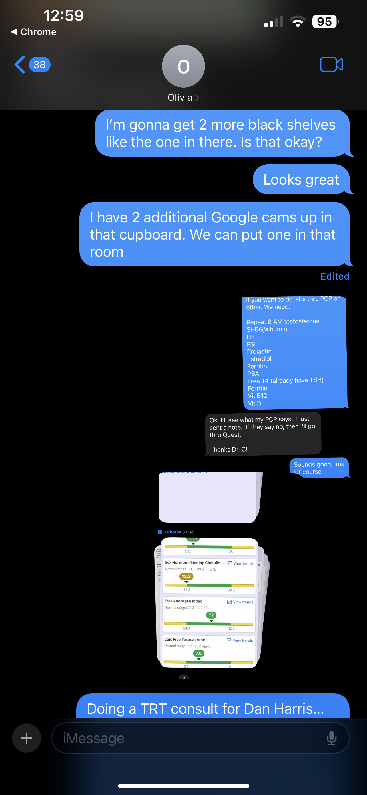
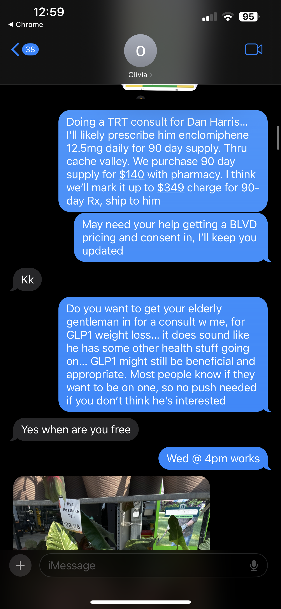
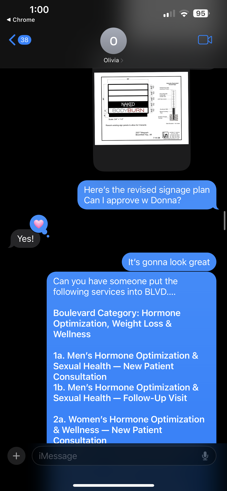
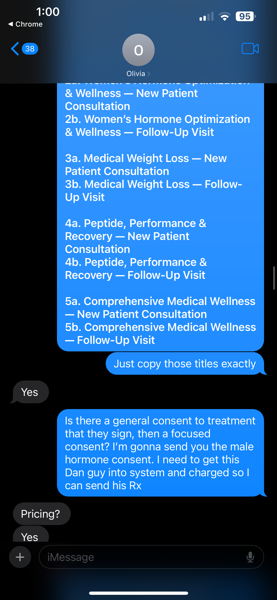
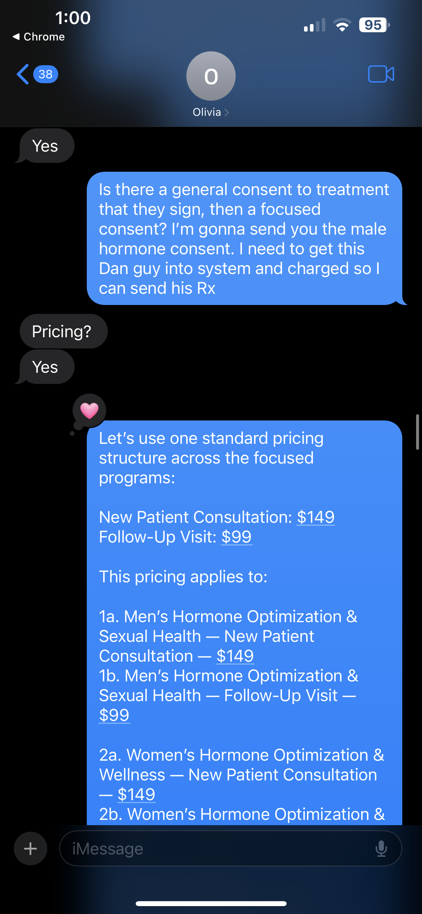
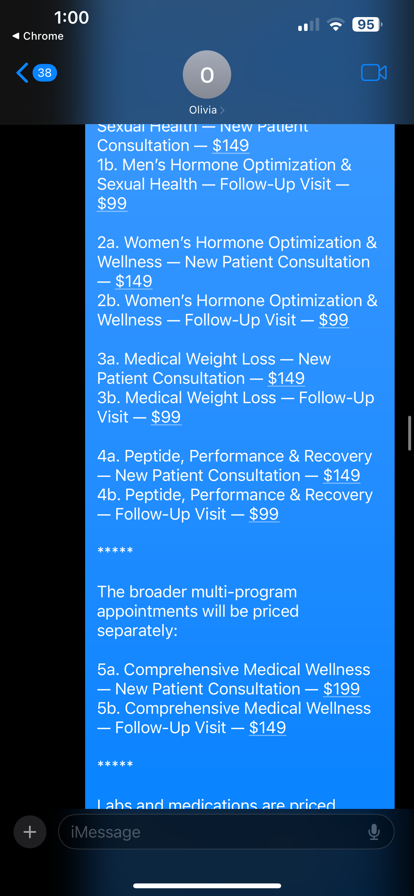
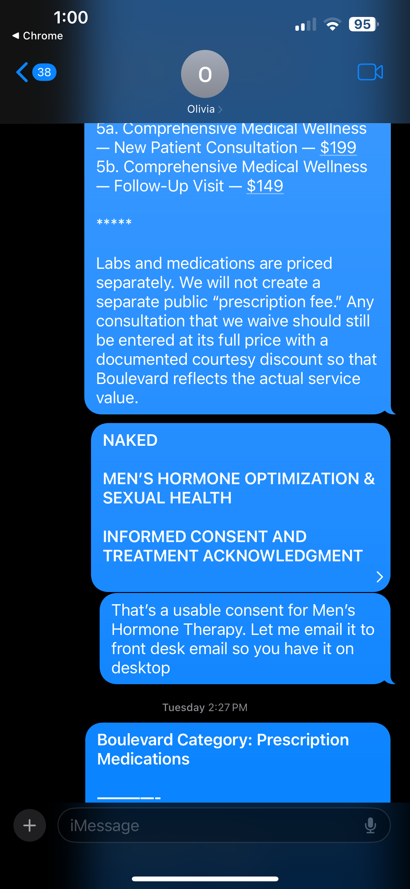
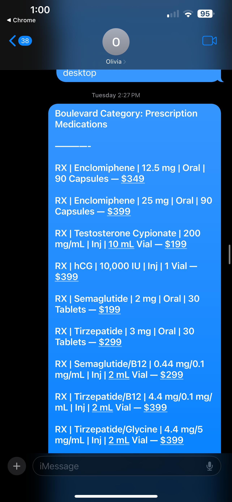
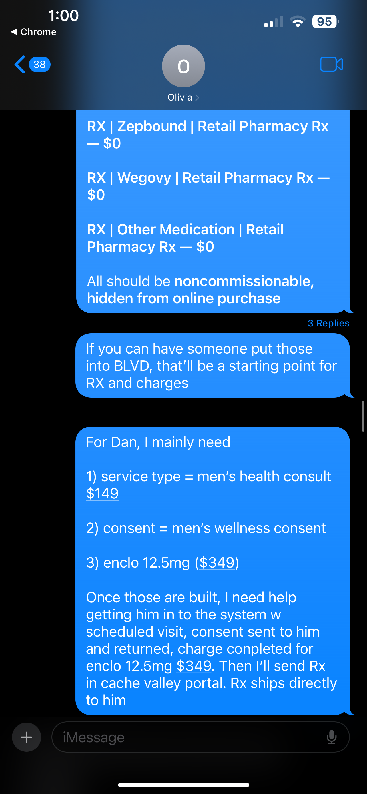

# DROP HERE — provider ↔ Olivia (co-owner) channel (channel A — primary)
        
Drop the raw screenshots of the **thread with Olivia (co-owner)** working out **peptide service pricing** here.
- Keep sequential (e.g. `olivia_a_01.png`…). Suggested: `olivia_a_NN_<short-desc>.png`.
- **Raw, immutable source** (`GRD-040`/`GRD-042`) — do not edit images.
- ⚑ Real named business contact + commercially-sensitive pricing/margin — de-identify in `_source.md` §2A as `[CO]`. Flag every concrete price/service/catalog/margin decision (in-thread-mutation + pricing specimens for §3).
- After dropping, transcribe into `_source.md` §2A + add §1 inventory rows.
