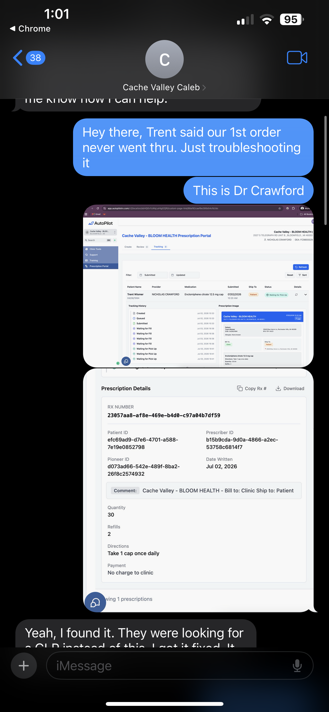
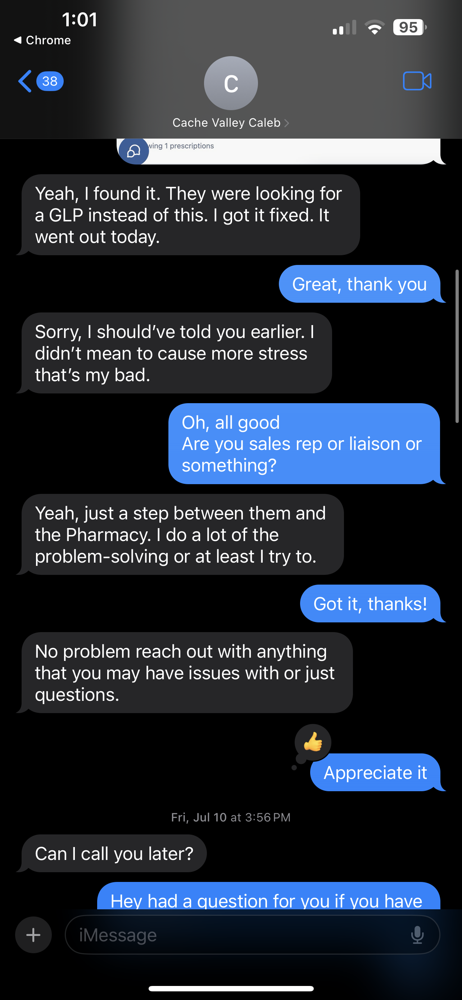
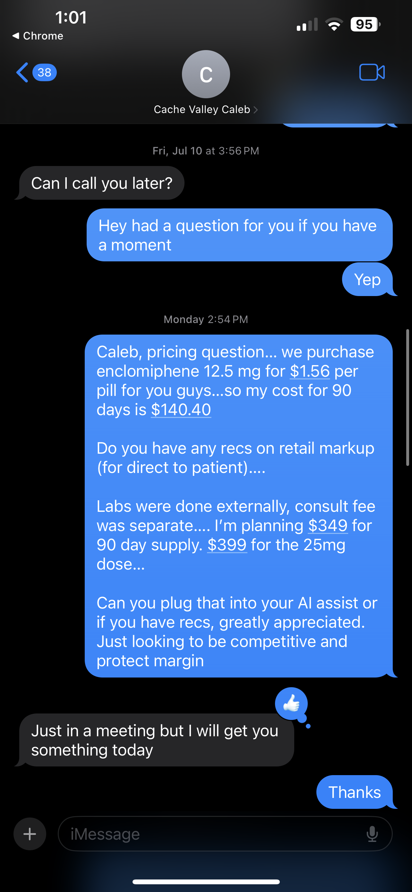
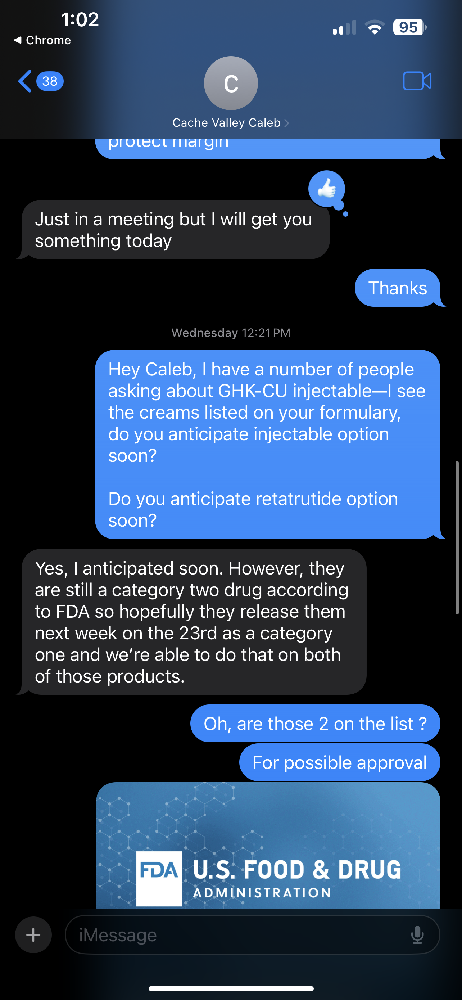
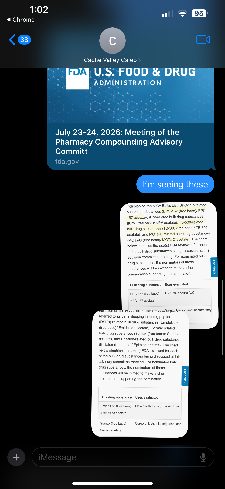
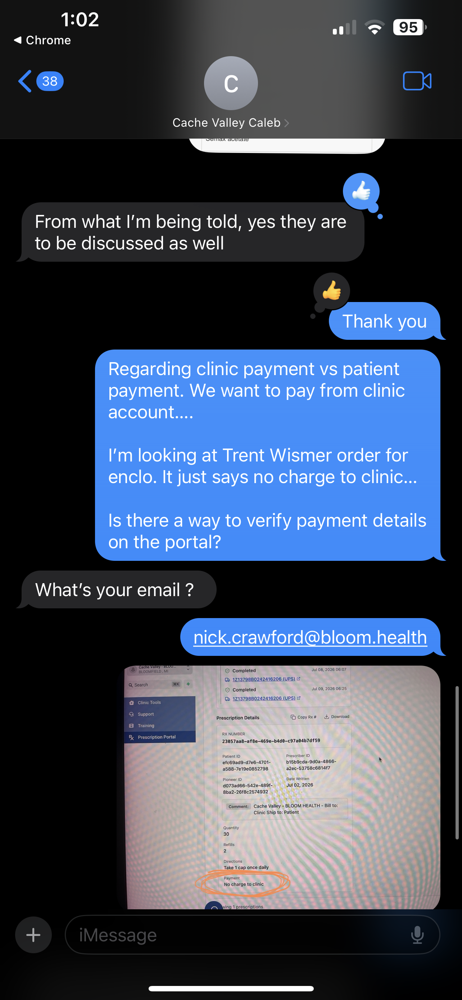
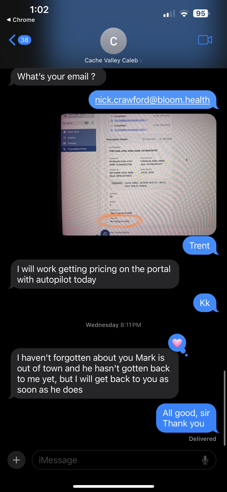

# DROP HERE — provider ↔ Caleb / Cache Valley pharmacy (channel B — text)
      
Drop the raw screenshots of the **text thread with Caleb (Cache Valley Pharmacy rep)** here — peptide sourcing, formulary, pricing.
- Keep sequential (e.g. `rx_b_01.png`…). Suggested: `rx_b_NN_<short-desc>.png`.
- **Raw, immutable source** (`GRD-040`/`GRD-042`) — do not edit images.
- ⚑ Real named vendor contact + commercially-sensitive pricing/formulary — de-identify in `_source.md` §2B as `[RXREP]`; mask pharmacy/vendor identity on promotion.
- The **phone call** with Caleb has no native artifact → reconstruct in `_source.md` §2B-call (folder `phone_call/`), labeled `operator_reconstructed_nonbinding`.
- After dropping, transcribe into `_source.md` §2B + add §1 inventory rows.
