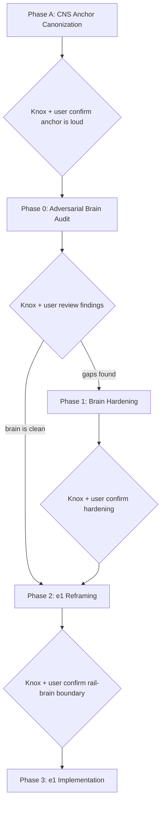

# OMNI Switchboard / Brain Hardening Plan

## Why this exists — this is a correction, not a discovery

This conversation has had the CNS framing **verbatim** at least once already (~3 weeks ago). Multiple discussions since then have drifted back into "Twilio dispatcher" / "outbound messaging" / "marketing automation" / "rules + templates engine" thinking because the CNS center-of-gravity was never made **loud, top-level, and unmissable** at the system map / doctrine / radar / ADR layer.

The architecture remembered the parts:
- `§1Q` rules + templates
- Marketing Lifecycle audit
- Dynamic Behavior gate
- `outbound_jobs` primitive
- AI orchestration runtime
- `§1Q.20` runtime green-light

But the conversation lost the spine. That spine is:

**OMNI CNS IS THE EVENT-DRIVEN CARE COORDINATION BRAIN. RAILS AND SURFACES ARE OUTPUTS.**

Phase A's job is to put that spine in plain sight, in every place future drift could happen, so we do not have this conversation a third time two weeks from now.

No e1 implementation, no Phase 0 audit, no R-arc continuation until Phase A is landed.

## Canonical framing (verbatim — goes into multiple docs unchanged)

**OMNI CNS reads unified events** across atoms, clinical atoms, scheduling, purchases, treatments, intake, calls, voicemails, SMS, email, in-app messages, labs, Rx, memberships, packages, provider/staff activity, patient state, elapsed time, and any other event source the platform ingests.

**It decides the best next action across actor targets:** patient, provider, front desk, care coordinator, manager, compliance/admin, AI planner, queue/team, external vendor/system.

**Possible actions include:** patient messaging (SMS / email / in-app / push), provider notification, staff task creation, passive awareness marker, escalation, suppression or cancellation of planned actions, waiting / throttling, AI suggestion or planning request, lifecycle state update, outcome feedback logging, no-op.

**Rails and surfaces are outputs:** Twilio / SMS, email, in-app, push, phone, voicemail, provider inbox, staff tasking, manager dashboards, vendor adapters, and future rails.

**CNS is NOT:** an SMS rules engine, a marketing automation tool, a Twilio integration, a patient-messaging system, an outbound-job runner, or a basic rules/templates engine. Those are subsystems and outputs under the CNS, not the CNS itself.

This canonical framing must be carried into Phase A edits verbatim and referenced (not paraphrased) by Phase 0 and all downstream work.

## Four phases + five checkpoints



---

## Phase A — CNS Center-of-Gravity Canonization (LANDS FIRST)

**Goal:** make the CNS spine unmissable. Top-level. Doctrine-locked. ADR-recorded. Radar-protected. Cross-linked from every place future drift could start.

**Deliverable:** edits across 6 canonical files + one new doctrine lock (DL-14) + one new ADR section + new radar zones + new narrative act. Single coherent commit (or one per file if cleaner).

### A.1 — System map: top-level anchor

File: [`.cursor/plans/system_map_three_layers_60706286.plan.md`](.cursor/plans/system_map_three_layers_60706286.plan.md)

Edit type: insert near the **top** of the file, before module breakdown (`§1A` and below). Not buried in `§1Q`. Not an appendix. Not a footnote.

Required heading (loud, exact wording):

> **OMNI CNS IS THE EVENT-DRIVEN CARE COORDINATION BRAIN. RAILS AND SURFACES ARE OUTPUTS.**

Required body: the canonical framing paragraph (verbatim, from the section above).

Add cross-link callouts from `§1Q.0` opening line, Marketing Lifecycle audit opening line, primitive #10 description, primitive #11 description — each saying: "This section describes a subsystem under the OMNI CNS. The CNS center-of-gravity is canonized at the top of this file under DL-14."

### A.2 — System map: new doctrine lock DL-14

Same file. Add alongside existing `**DL-10**` / `**DL-11**` / `**DL-12**` / `**DL-13**` blocks.

```
**DL-14 — OMNI CNS center of gravity**

OMNI CNS is event-driven care coordination. Rails and surfaces are outputs.

Invariants:
  1. CNS reads a unified event graph (atoms, clinical atoms, scheduling, purchases,
     treatments, intake, calls, voicemails, SMS, email, in-app, labs, Rx,
     memberships, packages, provider/staff activity, patient state, elapsed time,
     and all future event sources).
  2. CNS decides actions across multiple actor targets: patient, provider, front desk,
     care coordinator, manager, compliance/admin, AI planner, queue/team, external
     vendor/system.
  3. Action types include patient messaging, provider notification, staff task,
     passive awareness marker, escalation, suppression/cancellation, wait, AI plan
     request, lifecycle state update, no-op.
  4. Rails (SMS/MMS, email, in-app, push, voice, voicemail, provider inbox, staff
     task surfaces, dashboards, vendor adapters, future rails) are outputs.
  5. Subsystems (rules/templates engine, marketing lifecycle, the action substrate
     currently named outbound_jobs / primitive #10, AI runtime / primitive #11,
     Twilio adapter, dynamic behavior gates) operate UNDER the CNS, not AS the CNS.
     The current naming and scope of these subsystems is not certified by DL-14;
     adequacy is determined by Phase 0 of the brain hardening audit. DL-14 binds
     subordination, not adequacy.
  6. The CNS includes a learning loop. Outcomes, staff feedback (thumbs-up/down /
     unsafe markers) on system actions, AI suggestion accept/edit/reject events,
     and awareness-marker state transitions are all first-class CNS inputs that
     feed back into future decisions.

Extensions: future doctrine locks may refine CNS subsystem behavior but must not
contradict DL-14's center-of-gravity assertion.

Rejected reframings:
  - CNS as SMS rules engine
  - CNS as marketing automation tool
  - CNS as Twilio integration
  - CNS as patient-messaging system
  - CNS as outbound-job runner
  - CNS as basic rules/templates engine
  - CNS as "the dispatcher with extra steps"
  - CNS as a one-way emitter (no learning loop, no feedback ingestion)
  - CNS as an external-actor-only system (must coordinate INTERNAL actors:
    providers, staff, ops, compliance, AI, queues)
```

### A.3 — Foundational architecture: anchor + primitive subordination (NO adequacy certification)

File: [`.cursor/plans/FOUNDATIONAL_ARCHITECTURE_2026-05-10_all_dimensions.md`](.cursor/plans/FOUNDATIONAL_ARCHITECTURE_2026-05-10_all_dimensions.md)

**Critical principle:** Phase A subordinates primitives #10 and #11 under DL-14. **It does NOT certify their adequacy.** Adequacy (is #10 truly universal? is #11 truly a planner?) is a Phase 0 audit verdict. Pre-asserting it here would contradict Phase 0's own purpose.

- Insert a foundational anchor section near the **top**, before primitives are introduced. Same loud heading + canonical paragraph as A.1.
- Add binding clauses to `§8.1` (next sequential numbers after existing 29-33) for DL-14:
  - CNS center-of-gravity binding
  - Subsystem subordination binding (subsystems are UNDER CNS, not AS CNS)
  - Actor-target taxonomy binding
  - Action-type taxonomy binding
  - Rails-as-outputs binding
- **Extend primitive #10 description to state ONLY:**
  > "This primitive is a subsystem UNDER the OMNI CNS (DL-14). Its current scope is patient-outbound message dispatch. Phase 0 of the brain hardening audit will determine whether this primitive is genuinely the universal action substrate OR whether it must be semantically broadened — and possibly renamed (e.g., `orchestration_actions`) — to host sibling action types (provider task, staff task, ops alert, passive awareness marker, suppression, AI plan request, lifecycle state update, no-op) as projections beneath. Until Phase 0 verdict lands, primitive #10 remains formally scoped to its existing description; this entry only declares its subordination to DL-14, not its adequacy."
- **Extend primitive #11 description to state ONLY:**
  > "This primitive is a subsystem UNDER the OMNI CNS (DL-14). It is subordinate to `§1Q` deterministic gates and never bypasses them. Phase 0 of the brain hardening audit will determine whether the existing AI runtime scope is genuinely a planner/recommender over the unified multi-event patient state OR whether it is currently scoped as marketing copy assist and must be broadened. Until Phase 0 verdict lands, primitive #11 remains formally scoped to its existing description; this entry only declares its subordination to DL-14, not its adequacy."

This wording in Phase A is intentional. It binds the primitives to DL-14 without prejudicing Phase 0.

### A.4 — ADR: explicit doctrine record

File: [`docs/architecture/phase_4h_target_first_decision_record.md`](docs/architecture/phase_4h_target_first_decision_record.md)

Add new section `§7.17` (or next available number) titled "ADR — OMNI CNS center of gravity (DL-14)".

Body includes:
- Decision: CNS is event-driven care coordination; rails/surfaces are outputs.
- Why this ADR exists: this framing existed in fragments across `§1Q` / Marketing Lifecycle / primitives but was not canonized at the top-level, which let multiple downstream discussions (R3 e1 drift, Twilio dispatcher framing, marketing-vs-lifecycle confusion) drift back into reductive framings.
- Explicit REJECTED alternatives (one bullet each with rationale):
  - REJECTED: CNS as SMS rules engine.
  - REJECTED: CNS as marketing automation tool.
  - REJECTED: CNS as Twilio integration.
  - REJECTED: CNS as patient-messaging system.
  - REJECTED: CNS as outbound-job runner / dispatcher.
  - REJECTED: CNS as basic rules/templates engine.
  - REJECTED: framing rails as the CNS (rails are outputs).
  - REJECTED: framing AI runtime as marketing copywriter (AI runtime is a planner over multi-event state).
  - REJECTED: framing outbound_jobs as patient-outbound-only (it is the universal action substrate).
  - REJECTED: discussing "should we add lifecycle automation" — lifecycle automation IS the product; it's not an add-on.

### A.5 — Pressure-test radar: anti-pattern zones

File: [`docs/architecture/v1_pressure_test_radar.md`](docs/architecture/v1_pressure_test_radar.md)

Append new radar zones (continue numbering from existing 78). Each zone has: trigger phrase, why it's dangerous, correction pointer to DL-14.

- Zone 79: "Talking about OMNI as a messaging system."
- Zone 80: "Talking about OMNI as a Twilio integration."
- Zone 81: "Talking about OMNI as a marketing automation tool."
- Zone 82: "Talking about OMNI as a rules/templates engine."
- Zone 83: "Treating outbound_jobs as SMS-only or patient-only."
- Zone 84: "Treating AI runtime as marketing copy assist."
- Zone 85: "Designing rail-side fail-open / gate logic without first establishing what the brain decided."
- Zone 86: "Framing lifecycle automation as 'risky outbound' instead of as the core product."
- Zone 87: "Adding new orchestration logic to a rail (Twilio dispatcher) instead of to the brain."
- Zone 88: "Discussing CNS without naming non-patient actor targets (provider, front desk, ops, manager, compliance, AI, queue, vendor)."

### A.6 — Communications topology: rails-as-outputs clarification

File: [`docs/architecture/communications_topology.md`](docs/architecture/communications_topology.md)

Add a top-level clarifying paragraph (near the start, before topology details): "All communication rails described in this document are outputs of the OMNI CNS (DL-14). This document specifies HOW rails deliver actions; the brain decides WHICH actions to emit, to WHICH actor target, on WHICH channel. The rails do not orchestrate; they project."

Cross-reference DL-14 throughout where rails are discussed.

### A.7 — Evolution narrative: Act XV

File: [`docs/architecture/evolution_narrative.md`](docs/architecture/evolution_narrative.md)

Add `## Act XV — CNS center-of-gravity reckoning (May 13)`.

Frame this **explicitly as a correction, not a discovery**. The chronicle says:

> The CNS framing was present in fragments since the early system-map drafts and Marketing Lifecycle audit. It was never canonized at the top-level. Multiple downstream discussions — R3 e1 drift, Twilio dispatcher framing, fail-open semantics, marketing-vs-lifecycle confusion — repeatedly drifted back into reductive framings (CNS-as-messaging, CNS-as-Twilio, CNS-as-marketing) because the spine was not loud enough. DL-14 corrects this by canonizing the CNS center of gravity in plain sight, with explicit rejected reframings and radar protection. This is the third time this framing has been articulated verbatim in conversation; it is now structurally protected so it does not need to be articulated a fourth time.

### A.8 — Commit

Single commit (or one per file if the diff is large) with message:

```
[cns-anchor] canonize DL-14 OMNI CNS center of gravity across map / doctrine / ADR / radar / foundational / topology / narrative

This is a CORRECTION, not new doctrine. The CNS framing existed in fragments;
it was never made loud, top-level, and unmissable. DL-14 canonizes it.
```

### Checkpoint A (Knox + user confirm)

- Open the system map. Is the CNS anchor the **first thing you see** before module breakdown? Yes / no.
- Open the foundational doc. Same question.
- Open the ADR. Is DL-14 ADR present with explicit rejections? Yes / no.
- Open the radar. Are 10 new zones present with DL-14 correction pointers? Yes / no.
- Open the narrative. Is Act XV framed as a correction, not a discovery? Yes / no.
- **Does Phase A avoid pre-certifying primitive #10 adequacy or naming?** The foundational doc edits to primitive #10 must subordinate it to DL-14 WITHOUT declaring it universal. Phase 0 decides universality + naming. Yes / no.
- **Does Phase A avoid pre-certifying primitive #11 adequacy?** Same principle. Yes / no.
- Could a future Opus / chat / contributor read these docs and accidentally frame OMNI as a messaging system / Twilio integration / marketing tool? **The answer must be no.**
- Could a future Opus / chat / contributor read Phase A and accidentally think primitive #10 / #11 adequacy is already settled? **The answer must be no.**

Only after every checkpoint A question is satisfied do we move to Phase 0.

### Stopping condition for Phase A iteration

After this revision, Phase A iterates only on **new contradictions** between Phase A wording and Phase 0 verdicts, **new structural gaps** (e.g., a canonical doc was missed), or **new explicit rejections** for the DL-14 ADR. Vibe concerns, ergonomic refinements, and broader CNS shape questions get pressure-tested in Phase 0 (which has the stress scenarios + adversarial walks), not in Phase A.

---

## Phase 0 — Adversarial Brain Audit

**Deliverable:** `.cursor/plans/PREFLIGHT_2026-05-13_omni_switchboard_brain_hardening.md`

**Phase 0 is adversarial.** It does not summarize old docs. It tries to break them. It evaluates them against the now-canonized **DL-14** (landed in Phase A) — not against a freshly-invented framing.

The starting assumption is that the old `marketing / outbound_jobs / AI runtime` classification is **stale source material**, not the final OMNI CNS taxonomy, until proven otherwise. The likely problem is that those buckets were organized around `campaign / lead / marketing / outbound message`, when OMNI under DL-14 needs to be organized around `event graph / patient state / intent / policy / actor target / channel / action / outcome / feedback`. The audit must walk concrete adversarial scenarios end-to-end and prove (or disprove) that the existing canonical docs can express them under the DL-14 model.

### Read first (no edits yet)

- `system_map_three_layers_60706286.plan.md` §1Q.0 through §1Q.23 (rules + templates + module taxonomy + privacy gate + dynamic behavior gate + runtime green-light)
- Marketing Lifecycle + Growth Orchestration audit sections
- `FOUNDATIONAL_ARCHITECTURE_2026-05-10_all_dimensions.md` primitive #10 (outbound_jobs) + #11 (AI orchestration runtime)
- rules / templates engine sections
- DL-12 (orchestration locks)

### A. Restate DL-14 at the top of the audit doc

Open the doc by citing the canonical DL-14 anchor (landed in Phase A) and the verbatim canonical framing paragraph from the system map. Do not paraphrase. Do not re-invent. The audit's job is to evaluate the existing brain docs **against DL-14**, not to redefine the model.

If a section of `§1Q` only handles patient messaging, that is a DL-14 violation finding, not an excuse.

### B. Eleven required adversarial stress scenarios

For each scenario, walk it step by step. For every step, name (a) which event(s) the brain ingests, (b) what context/state it must read, (c) what decision must be made, (d) what action(s) it must emit, (e) who the actor target is for each action, (f) what surface/rail delivers it, (g) what outcome/feedback updates state, AND (h) the specific `§1Q.x` / Marketing Lifecycle / primitive section that owns each step — OR an explicit gap flag if no section owns it.

The 11 scenarios:

1. **Skincare purchase, no booking.** Purchase event → no booking in 2 weeks → "ready to book your first visit?" SMS → 3-day silence → "checking in on the lipid serum" → 1 month → marketing email → 2 months → in-app notification about subscription → 2 days → system sees patient called front desk but didn't book / left voicemail → 2 hours → front desk text "let's get you booked, which provider?" → no response → throttle continues.

2. **Peptides started → 3-week check-in.** Rx/order recorded → email education → 3 weeks elapsed → SMS check-in "how are you doing?" → no response → passive provider awareness marker ("OMNI sent 3-week peptide follow-up, no reply") → no provider interruption → escalation only if reply contains concern.

3. **Botox visit → post-treatment check-in with concern reply.** Treatment completed → 48hr post-treatment check-in SMS → patient replies "I have a lump" → CNS must SUPPRESS all queued marketing/lifecycle sends → create provider task → escalate visibility → not just send another templated reply.

4. **Lab due → lab received.** Lab order placed → reminder cadence to patient → lab result arrives → cancel any pending reminder → create provider review task BEFORE patient notification → after provider review, send patient notification at correct severity.

5. **Rx sent → side-effect reply.** Rx fulfilled → email education → SMS check-in 7 days later → patient replies with side-effect language → safety escalation: suppress automation, create provider task at higher priority, possibly create front-desk callback task.

6. **Patient receives SMS automation, then calls front desk before next step.** Lifecycle SMS sent → call event arrives → CNS must cancel or mutate the queued next-step → optionally create a staff awareness note → not just send the next templated message anyway.

7. **Granular consent.** Patient has SMS STOP for marketing but allows transactional SMS + transactional email + in-app. CNS must route around the marketing-SMS suppression without suppressing the other channels/intents.

8. **Cross-rail anti-duplication.** Same patient is active on app, SMS, email, phone, voicemail simultaneously. System emits ONE coordinated touch, not five duplicates from five different rule modules. Throttling/dedup is global, not per-rail.

9. **System-sent passive provider awareness (no interruption).** CNS emits patient peptide follow-up SMS. CONCURRENTLY, a passive awareness marker is created for the responsible provider — no notification, no chart interruption, no task. The marker appears on the provider's "my patients' automation activity" surface. The marker has a state machine: `OMNI sent` → `unseen` → `seen` → `acknowledged`. Patient reply (or non-reply) feeds back to the marker state. The audit must trace each step: which event source emits the marker, which CNS section owns the marker substrate, which surface renders it, how state transitions are recorded, and how the marker links back to the originating action.

10. **Staff feedback on system actions (thumbs-up / down / unsafe).** Staff sees OMNI sent a follow-up on the awareness surface. Staff marks thumbs-up / thumbs-down / unsafe / inappropriate. The feedback must attach to:
    - the specific outbound action (action id)
    - the rule that triggered it (rule id + rule version)
    - the template used (template id + template version)
    - the campaign step if marketing (campaign id + step id)
    - the channel projection / rail dispatch attempt (rail id + attempt id)
    - the patient context snapshot at decision time (snapshot id)
    
    Feedback must feed forward into future rule / template / AI improvement signals (whether by automated suppression, retraining, or operator review queue). The audit must name the canonical section that owns this feedback substrate, OR flag the gap.

11. **AI suggestion feedback (accept / edit / reject).** AI runtime proposes a plan, narrative, draft message, or next-step. Staff or provider accepts, edits, or rejects. The feedback must attach to:
    - the AI proposal id
    - the prompt version
    - the model version
    - the context snapshot fed to the model at decision time
    - the final action actually taken (so edits are diffable against the proposal)
    
    Feedback must feed forward into AI tuning, prompt iteration, model selection, and trust scoring. The audit must name the canonical section that owns AI feedback substrate, OR flag the gap. Importantly: even if `§1Q.20` runtime green-light claims AI runtime is operational, the audit must verify whether the learning-loop substrate exists or is missing.

For each scenario, the audit must produce a verdict of one of:
- **COVERED** (cite specific §1Q.x section that owns each step)
- **STALE / UNDER-SPECIFIED** (section exists but does not cover the step at the needed depth)
- **NEEDS AMENDMENT** (specific section + specific edit required)
- **FUTURE ARC** (defer to A1/A2/A3 with rationale)

### C. Six-axis CNS taxonomy audit

The audit must explicitly evaluate whether the existing docs express each of these axes. If not, name the gap.

1. **Event domain** — purchase, appointment, treatment, intake, call, voicemail, SMS, email, in-app, lab due, lab received, Rx sent, task completed, membership/package event, no response, time elapsed.
2. **Intent / purpose** — transactional, lifecycle follow-up, clinical/safety, lab/Rx, scheduling, product education, retention/reactivation, marketing/promo, billing/account, provider/staff awareness, escalation, QA/feedback.
3. **Action type** — send SMS / email / in-app / push, create staff task, notify provider, suppress or cancel planned send, wait, escalate, ask AI to suggest, create internal note or thread, update lifecycle state, no-op.
4. **Actor target / recipient class** — patient, provider, front desk, care coordinator, manager, compliance/admin, AI planner, queue/team, external vendor/system. **This is the axis the old docs are most likely to be missing or thin on.**
5. **Policy / risk class** — manual human reply, automated lifecycle, marketing/promotional, clinical/safety, PHI-sensitive, jurisdictional, consent-limited, urgent/critical, degraded/override.
6. **Channel / rail** — SMS/MMS, email, in-app, push, phone/call task, voicemail, provider inbox, staff task surface, future rails.
7. **Outcome / feedback** — two layers:
   - **Action-outcome events**: delivered, opened, replied, called, booked, purchased, ignored, suppressed, marker-seen, marker-acknowledged, provider follow-up needed.
   - **Feedback on system decisions**: staff thumbs-up / thumbs-down / unsafe / inappropriate; AI proposal accept / edit / reject (with diff). Feedback **attachment depth** must be audited: each piece of feedback must be linkable to (action id, rule id + version, template id + version, campaign step, channel projection / rail attempt, patient context snapshot at decision time, AI proposal id, prompt version, model version, final action taken).

(Treat #7 as the 7th axis even though we call it 6+1; outcome feedback is what closes the CNS learning loop.)

### D. Primitive #10 — universality + naming audit (SECOND TIME THIS HAS BEEN FLAGGED)

Primitive #10 was originally drafted as an outbound messaging substrate. **This is the second time the naming/scope question has been raised in this thread.** The audit must resolve it now and stop the drift.

The audit must answer three hard questions:

1. **Is the existing primitive #10 truly universal** across patient SMS + patient email + patient in-app + patient push + provider notification + staff task + ops alert + passive awareness marker + suppression action + AI plan request + no-op + lifecycle state update?

2. **If no, is the correct fix to broaden it semantically** into something like `orchestration_actions` (where patient outbound messages become one action type alongside provider task, staff task, suppression, AI request, awareness marker, etc.), with rail-specific projections beneath?

3. **Is the name `outbound_jobs` actively misleading** for an internal coordination substrate? Internal coordination actions (provider notification, staff task, passive awareness marker, suppression, no-op, lifecycle state update) are not "outbound" in the patient-facing sense. The audit must produce a naming verdict: keep `outbound_jobs`, rename to `orchestration_actions`, or some other proposal.

The Phase 0 verdict on these three questions determines what Phase 1 edits to primitive #10's description. Phase A explicitly does **not** pre-decide this — see §A.3 for the deliberately-conservative Phase A wording.

### E. AI orchestration runtime — planner or copywriter?

Primitive #11 was likely scoped to marketing copy / outbound assistance. The audit must verify or correct:

- Does AI runtime plan ACROSS multi-event patient state, or only assist with template selection?
- Does it propose action targets and action types (provider task vs patient SMS vs suppression vs wait), or only message text?
- Does it stay subordinate to `§1Q` gates and rules, or can it bypass them?
- Does it consume the unified event graph or only a marketing-flavored view?

### F. §1Q.20 runtime green-light claim — spot-check 5 of the 75+ scenarios

`§1Q.20` claims the brain was validated against 75+ scenarios. The audit must spot-check 5 — confirm whether those 75 scenarios actually included care coordination across multiple actor targets (provider tasks, staff tasks, passive awareness markers, suppression, cross-rail dedup), or whether they were predominantly patient-outbound flows. This is the single most likely source of false confidence.

### G. Canonical pipeline diagram

Mermaid diagram showing the full CNS pipeline:

`unified events → patient/provider/staff context → §1Q rule eval → §1Q.13 collision check → §1Q.17 privacy gate → §1Q.19 dynamic behavior gate → channel/actor arbitration → orchestration action emission (patient send | provider task | staff task | suppression | AI request | ...) → rail/surface delivery → outcome/feedback ingest → state update`

This diagram becomes the canonical reference for Phase 1 and Phase 2.

### H. Findings table (audit output)

Single table at the end. Columns:

- Area (which scenario or taxonomy axis)
- Verdict (COVERED / STALE / NEEDS AMENDMENT / FUTURE ARC)
- Canonical section cited
- Specific gap (one line)
- Phase 1 amendment required (one line, if any)
- Phase 1 target file + section

**Commit:** one commit, message names what was audited, verdict bucket distribution, and which scenarios passed/failed.

### Checkpoint 0 (Knox + user review)

- If all 11 scenarios are COVERED and all 7 taxonomy axes are present → skip Phase 1, go to Phase 2.
- If any NEEDS AMENDMENT → proceed to Phase 1.
- If any FUTURE ARC → log into existing A1/A2/A3 docs and continue.

---

## Phase 1 — Brain Hardening (conditional)

Only if Phase 0 finds gaps. One commit per amendment. Strict rules:

- Touch existing canonical homes only: `§1Q.x` sections / Marketing Lifecycle audit / DL-12 / foundational doc primitive descriptions / rules + templates engine sections.
- **No new substrate tables.** A semantic broadening of an existing primitive (e.g., `outbound_jobs` → broader orchestration action model with projections beneath) is an amendment to primitive #10's description, not a new substrate.
- No new doctrine arcs (DL-14, DL-15, etc.). If a finding feels arc-worthy, log to A1/A2/A3 instead.
- No new preflights. Hardening lives in canonical doctrine docs, not new planning docs.

### Expected amendment shapes (predicted, not promised)

These are the kinds of edits Phase 1 is likely to need. The actual list comes from Phase 0's findings table.

- Add `actor_target` / recipient class as a first-class taxonomy axis to `§1Q` rule definitions and Marketing Lifecycle policy profiles.
- Broaden primitive #10's description so `outbound_jobs` is the universal action substrate (or rename semantically to `orchestration_actions`), with rail/surface projections beneath (patient SMS, patient email, patient in-app, provider task, staff task, ops alert, passive awareness, suppression, AI request, no-op, state update).
- Broaden primitive #11 (AI runtime) from "marketing copy assist" to "planner over unified multi-event patient state, subordinate to §1Q gates."
- Add or strengthen `§1Q.x` sections that handle: cross-rail anti-duplication (one coordinated touch, not five), granular per-intent / per-channel consent (SMS-marketing-STOP without suppressing transactional email or in-app), suppression-on-inbound (patient calls front desk → cancel queued SMS), provider-first-then-patient ordering (lab result review before patient notification), passive provider awareness markers (no interruption), safety escalation on concerning replies.
- Strengthen `§1Q.13` collision handling to include cross-actor collisions (patient text + staff task on same trigger).
- Strengthen `§1Q.19` dynamic behavior gate to handle suppression-on-inbound and cross-channel cadence caps.

Each commit message format: `[brain-harden] §1Q.X — <one-line summary of amendment>`.

### Checkpoint 1 (Knox + user confirm brain expresses the full care-coordination model)

Re-run all 11 stress scenarios from Phase 0 against the hardened docs. Every scenario must trace cleanly end-to-end through canonical sections with no gap flags.

---

## Phase 2 — e1 / R3 reframing (~100-200 line diff)

**Goal:** make `PREFLIGHT_2026-05-12_phase_4h_external_line_e1_execution_substrate_adapter_inbox.md` explicitly inherit from the hardened brain. No new design — just rewording + cross-references.

**Frame:** e1 is the SMS/MMS rail-side projection for orchestration actions whose `actor_target = patient` and `channel = SMS/MMS`. It is one of many projections beneath the brain. It does not invent policy. It does not classify intent. It does not decide cadence. It dispatches what the brain decided.

**Specific edits to e1 preflight:**

- **Add §9.0** — "Rail-side dispatch is a projection of orchestration actions, not an orchestration engine." One paragraph. References the hardened canonical sections.
- **Replace R3 lane-asymmetric thresholds** (the "standard vs high-risk" two-lane model that drifted us) **with `intent_class` and `policy_class` inheritance from the brain.** The dispatcher reads these from the upstream orchestration action and applies the corresponding rail-side gate posture. No lane logic invented at the rail.
- **Reword `external_dispatch_attempts`** as the rail-attempt projection of the universal action substrate (`outbound_jobs` or whatever Phase 0+1 confirmed it should be called), with the upstream `action_id` / `outbound_job_id` FK present. NOT a parallel SMS-only outbound system.
- **Reword "gate-cleared intent object"** to "orchestration action from upstream brain; rail evaluates rail-applicable gates at dispatch time."
- **Cross-reference** the canonical brain sections that own collision handling, privacy gating, dynamic behavior gating, runtime green-light, suppression-on-inbound, cross-rail dedup, and policy/intent class taxonomy wherever e1's preflight currently invents policy locally.

Diff target: ~100-200 lines net.

**Commit:** one commit, message `[e1-reframe] inherit from hardened brain; rail-side projection only`.

### Checkpoint 2 (Knox + user confirm rail / brain boundary is clean)

---

## Phase 3 — e1 implementation

Proceed with existing e1 preflight `§20` sequence (`e1.1` through `e1.16`). Begins only after Phase 0 + 1 + 2 settle. Not in scope for this plan beyond naming it as the destination.

---

## Hard rules across all phases

- No emojis.
- DL-14 is the **only** new doctrine layer introduced by this plan. It is introduced in Phase A. No further doctrine layers (DL-15+) are added by Phase 0 / 1 / 2. If something else feels doctrine-worthy → log to A1/A2/A3 future arcs.
- No new preflight docs except the Phase 0 audit. Hardening lives in existing canonical homes.
- No new substrate tables in Phase 1. Semantic broadening of existing primitives is allowed (and expected).
- Every commit must cite the canonical section it touched.
- User + Knox checkpoint between each phase — no auto-advance.
- Stop and reset if drift recurs (rail logic creeping into brain territory, or brain framing shrinking back to "patient messaging" — this is now a DL-14 violation, not just a discussion error).
- **Stop and reset if Phase 0 starts reading like a citation summary instead of an adversarial audit.** The 11 stress scenarios are the test. If the audit cannot walk them end-to-end with named canonical sections owning each step, the brain is not DL-14-compliant and Phase 1 begins.
- **Stop and reset if any phase tries to skip Phase A.** Phase A is non-optional and lands first. No exceptions.

## What this plan explicitly does NOT do

- Does not redesign §1Q from scratch. Audits it adversarially under DL-14. Hardens only where the audit finds real gaps.
- Does not relitigate DL-13 or e0.
- Does not expand A1/A2/A3 future arcs. Logs to them only if a finding belongs there.
- Does not start e1 implementation.
- Does not continue R3 / R4 / R5 / R8 pressure tests on e1 until brain is verified under DL-14.
- Does not assume `outbound_jobs` is universal. Proves it or amends it.
- Does not assume AI runtime is a planner. Proves it or amends it.
- Does not assume CNS = patient messaging. **DL-14 canonizes CNS = care coordination at the system map / doctrine / ADR / radar / foundational / topology / narrative layers in Phase A**, so the model is structurally protected and the Phase 0 audit can reference it instead of redefining it.