# OMNI Thesis v0

Document type: `doctrine` (candidate; currently evidence-routed; non-binding)
Authority: `derived_nonbinding` (evidence-routed thesis crystallization; directionally adopted in Phase F.1 2026-05-25 per `D0THES-DEC-001`; binding per-primitive canonical authority remains pending Phase G refresh placement into canonical doctrine homes)
Status: `superseded_by_v1` (v0 was adopted as directional center-of-gravity thesis 2026-05-25 Phase F.1 of OMNI Doctrine Refresh Arc per `D0THES-DEC-001`; v0 superseded 2026-05-25 by `omni_thesis_v1_2026-05-25.md` per `D0THES-DEC-002` to absorb case-centered care + visible-provider deployment + AI capability governance + Q7 §12.1 absorption + strategic pressure-test articulation; v0 preserved as historical reference; cite v1 for current directional thesis claims; cite v0 §X for what-was-claimed-at-F.1-adoption when needed)
Domain(s): `architecture_governance`, `substrate_thesis`, `cross_cutting`
Lifecycle role: `workbench_scaffold` (thesis crystallization; pre-doctrine)
Source-of-truth relationship: crystallized output of the 2026-05-23 → 2026-05-24 OMNI thesis pressure-test arc between Opus (Cursor agent) and Knox (third-party AI reviewer via Nick relay). Directionally adopted in Phase F.1 2026-05-25 per `D0THES-DEC-001`; binding per-primitive canonical authority remains pending Phase G refresh.
Supersedes: ad-hoc thesis discussion in chat. The Knox-Nick conversational transcript is the source evidence; formal `07_evidence_ingestion_ledger.md` row will land when that ledger lands on main (deferred per `HANDOFF_2026-05-23_post_tier0_activation_pre_omni_thesis_refinement.md`).
Superseded by: `omni_thesis_v1_2026-05-25.md` (spawned 2026-05-25 per `D0THES-DEC-002`); ultimately by per-primitive canonical doctrine landed at canonical homes during Phase G refresh.
Manifest action: `add_tier2`
Review gate: `user_knox_required` (Phase F.1 directional adoption complete 2026-05-25 per `D0THES-DEC-001`; Phase F.2 structured audit + F.3 Reconciliation Map review gate + Phase G per-primitive canonical landing remain pending)

agent_read_rule: `consult_if_routed`

Volume: 0
Volume state: `open_for_append` (revisions land as v1, v2, ... per Operating Contract §17)
Spawned: 2026-05-24 (first crystallization from the 2026-05-23 → 2026-05-24 Knox-Nick thesis pressure-test arc)
Next volume: TBD (v1 spawns when this version is materially superseded by next pressure-test round)

---

## §0 Non-Authority Notice

This is **evidence-routed thesis crystallization, not binding doctrine.**

This thesis does NOT replace any current binding doctrine in OMNI. The Tier 0 guardrails T0-01..T0-07, the Coherent OMNI Architecture Pattern, DL-1..DL-22, the CNS ADR, the system map, and the OMNI Build OS layer model / rollout sequence / Build Entry Gate v0 remain authoritative. This thesis identifies how those binding artifacts already align with the thesis and what surgical additive doctrine work would be needed to crystallize it formally.

Phase F.1 has directionally adopted this thesis (2026-05-25 per `D0THES-DEC-001` in [`.cursor/plans/doctrine/03_decision_extraction_ledger.md`](.cursor/plans/doctrine/03_decision_extraction_ledger.md)). Phase G refresh (Tier 4 doctrine reconciliation arc per [`.cursor/plans/doctrine/agent_work_protocol.md`](.cursor/plans/doctrine/agent_work_protocol.md) §8) lands per-primitive canonical doctrine changes into canonical destinations. Until Phase G lands them, this artifact remains directional companion evidence — informs all subsequent doctrine work + product translation + existing-build reconciliation, but is NOT binding canonical doctrine for per-primitive claims.

When this thesis is cited, cite canonical destinations for binding claims — not this file.

---

## §1 What OMNI is

OMNI is a **governed contextual care substrate** that maintains longitudinal coherence — through identity, consent, authority, evidence, observation, assertion, policy, coordination, and execution primitives — across a designed family of care-network topologies that expands by explicit doctrine pass, not by drift.

The substrate is **future-permissive** within the designed family at any moment in time. The product is **brutally narrow and concrete**: a hybrid async-protocolized-care plus in-person-procedural-care platform under owned vertical brands, where the wedge product itself is also the first substrate proof point.

The core invariant is **governed contextual coherence across actors, surfaces, organizations, and authority boundaries.**

The core mantra is:

> **Right context. Right actor. Right patient. Right moment. Right authority.**

---

## §1.5 Consumer promise

At the patient surface, the substrate property manifests as a trust promise:

> **Care that remembers you.**

Operationalized for a patient: *you don't have to keep re-explaining yourself; your care team knows what matters; your context follows you without exposing everything to everyone.*

This is not fluff. The consumer brand center is the human-facing manifestation of the substrate property. The same substrate that lets a peptide provider see your medspa history (with consent + scope) lets you, the patient, feel that **OMNI is the place where your care is remembered.** Operator-facing mantra (§1) and patient-facing promise (§1.5) are the same property at different surfaces.

---

## §2 What OMNI is not

OMNI is **not fundamentally** a telehealth app, intake engine, scheduler, EHR, CRM, provider marketplace, workflow engine, AI chatbot, medspa platform, or independent-provider network.

Those are **surfaces, runtimes, deployment topologies, or wedges** — not the substrate. The product OMNI ships will INCLUDE intake forms, scheduling UIs, charts, inboxes, provider workflows, and medspa-shaped operations. Those are projections of the substrate, not the substrate itself.

**This sentence must not be cited to mean "don't build those." It means "don't conflate the substrate with those."** The product plane builds artifacts. The substrate plane models physics. Both are required.

---

## §3 Substrate plane vs product plane (two planes, two rules)

Non-negotiable discipline:

**Substrate plane**: physics, primitives, invariants. Topology-permissive within the designed family. Optionality is preserved at design cost only, not opportunity cost. Operating physics over artifacts.

**Product plane**: concrete UI, concrete revenue, concrete operational shape. Topology-narrow on one bet per phase. Optionality has design cost AND opportunity cost AND focus cost. Artifacts are produced precisely (charts, schedules, receipts, confirmations, signed notes, audit logs) — the substrate exists to produce them on demand for any surface.

**Two planes, two rules. Don't blend them.** A claim made at the substrate plane is not automatically a claim at the product plane, and vice versa.

This is the single most important discipline line in the thesis. Every claim about OMNI's nature must be qualified by which plane it belongs to.

---

## §4 The designed family of topologies

The substrate supports a designed family of care-network topologies. **The family is mutable through explicit doctrine pass, not by drift.** As of 2026-05-24, the family is:

**In family, product-primary (year 1-2):**
- Owned vertical care brands — async protocolized care + in-person procedural/service care under one patient context. First instance: Hims-style peptide telehealth + medspas + derm. Pattern generalizes (see §5).

**In family, product-emergent (year 2-4):**
- Provider SaaS to small independents, with minimum-network-eligibility contract at sale.
- Within-OMNI-network clinical context sharing (between owned brands per consent).
- Intra-brand patient context layer (the patient sees their care timeline inside the brand).
- Conversational / AI / device input surfaces in narrow wedge form.

**In family, product-later (substrate-cheap to preserve):**
- Cross-brand patient context (the patient sees their care across CULTURED + NAKED + future brands).
- Cross-network coordination (the patient context layer extends to non-OMNI providers under consent).
- Wearable / ambient input surfaces as standalone products.

**Substrate-compatible, product-deferred (don't hostile-design against; don't optimize for):**
- Enterprise / health-system deployment.
- API / platform play (other care apps build on OMNI substrate; AWS-for-care).

**Substrate-cheap, product-distant:**
- Robotic / procedural actors.

**Out of family unless promoted by explicit doctrine pass:**
- Hybrid marketplace / concierge demand-aggregation (would compete with owned brands; conflicts with topology-narrow product discipline).

**The family expansion rule**: a topology enters the family through a deliberate doctrine pass with a documented rationale. Implicit "we kind of support that" is forbidden. Substrate work for a new topology has a named cost and a named decision behind it.

---

## §5 The near-term wedge

**General pattern**: **async protocolized care + in-person procedural/service care under one patient context.**

**First instance**: Hims-style peptide telehealth + 3-4 medspas + derm clinics + 3-4 more peptide deployments.

**Pattern generalizes to** (substrate is identical; tenant catalog + clinical templates differ):
- Dermatology (telederm + in-office procedures)
- Plastics (consult + photo evidence + financing + pre-op + surgery; surgery-coord depth later)
- Aesthetic longevity (peptide + procedure + lab + monitoring)
- Hormones (consult + Rx + in-person follow-up + lab)
- Surgery readiness / peri-procedural / post-op (within owned brands' surgical care)
- GI (with lab interop via Integration Plane)

**Pattern does NOT cleanly fit** (different topology in the family; not v1 wedge):
- Family Practice (patient-centered hub, broader coordination, not async+procedural — adjacent to patient-context layer destination; later timeline)
- Full Ortho (surgery-center depth; year 3-5 product)
- OR / Surgery Center coordination (intra-procedure actor choreography; year 3-5 product)
- Physical Therapy (recurring appointment + program model; margin shape different; later if pursued)

**The wedge is also the first substrate proof point.** When the substrate cleanly supports async + procedural under one patient context, it proves the topology-permissive property on the smallest scale. Repetition at larger N is the path to network coordination. **Every wedge product decision must be cross-checked against "does this break the topology-permissive substrate property?"** If yes, redesign. If no, ship.

**Five concrete properties the wedge product must deliver:**

1. **One patient identity across islands** — the same identity for async telehealth peptide intake and walk-in medspa procedure. Validates substrate cross-slice identity continuity.
2. **Cross-slice clinical awareness as default, not feature** — peptide service provider sees medspa history; medspa provider sees active peptides; CNS catches GLP-1 + procedure conflict; CNS catches Accutane + weight-loss peptide. Not a premium feature. Substrate default. Marketing copy: *"your care team actually sees the rest of your care."*
3. **One commerce wallet across islands** — peptide subscription credit toward medspa visit; medspa package includes peptide consult; promo wallet survives across visits and islands; consolidated billing optional. Validates D6 commerce sibling truth + patient-level wallet pattern.
4. **One patient context with routed conversations and care-slice-aware projections** — substrate principle. UI is open (unified thread, channels, filtered inbox, dashboard timeline, voice timeline, provider-routed conversation objects). Substrate doesn't decide UI; substrate guarantees the underlying coherence.
5. **Conversational intake as wedge feature, not standalone product** — peptide intake includes AI-mediated conversational triage producing structured observations/assertions with confidence + provenance, surfaces uncertainty, gets clinician confirmation, materializes selectively to chart. Medspa intake uses same conversational layer where appropriate. Validates new substrate primitives (conversation_session → observation → extracted_assertion → committed clinical state).

---

## §6 The long-term destination

OMNI may eventually become any combination of:
- Care infrastructure
- Patient-centered context layer (aggregating **ongoing coordinated interaction**, NOT records — this distinguishes OMNI from Google Health / MyChart-everywhere / personal health record efforts that have failed at consumer scale for 20 years; OMNI generates context as a byproduct of being where care happens, not by asking patients to upload)
- Provider operating system (powered-by runtime for vertical brands)
- Cross-organizational coordination layer
- Connected care network

**The patient-context layer becomes meaningful at wedge-brand population scale**, not at population-wide consumer health behavior change scale:
- **Intra-brand patient context**: year 1-2 (the patient sees their care inside one owned brand)
- **Cross-brand patient context**: year 3-5 (the patient sees their care across CULTURED + NAKED + future owned brands)
- **Cross-network patient context**: year 5-10 (the patient context layer extends to non-OMNI providers under consent)

The substrate carries all phases. Product builds one phase at a time. **Don't sell the year-5 product in year 1.**

### §6.1 The dragon egg

The patient-context layer is the strategic primacy bet — possibly bigger than provider SaaS itself in the long run.

Sequence:
- Owned brands **generate** the context (year 1-2 wedge revenue, year 1-2 first substrate proof).
- Provider SaaS layer **expands** the context (year 2-4: more providers contribute to and consume from the same patient context with consent).
- Eventually the patient realizes: ***"my care follows me here."***

That moment is when OMNI becomes a *category*, not a product. Not a near-term build. A long-term identity. Substrate carries the optionality from day 1 (via §11 OMNI-as-MPI + §12.4 patient-graph primitives + §6.5 brand architecture); the surface emerges through population scale, not through population-wide consumer behavior change.

The dragon egg is hatched by accumulating ongoing coordinated interaction inside owned brands first, then network-wide. **Hatch the egg by building the wedge. Don't sell the dragon in year 1.**

---

## §6.5 Brand architecture — substrate brand vs consumer brands

OMNI may be invisible infrastructure first, then trusted identity later. Above the substrate, consumer-facing brands carry the patient relationship.

The pattern:

- **CULTURED powered by OMNI**
- **NAKED powered by OMNI**
- **Future brands powered by OMNI**

Consumer brands feel emotionally distinct (CULTURED = aesthetic-longevity-elegant, NAKED = clinical-clarity, future = whatever the vertical demands). The substrate underneath unifies patient identity, consent, evidence, longitudinal state, and CNS coordination across brands. The patient experiences "my brand" while OMNI quietly carries continuity.

Evolution (likely):

- **Phase 1** — patients don't know OMNI exists; they know their brand.
- **Phase 2** — *"powered by OMNI"* appears in fine print + brand surfaces.
- **Phase 3** — patient sees that their OMNI identity carries across brands ("you have an OMNI account; sign in here").
- **Phase 4** — patient intentionally uses OMNI as the trusted care layer; brands become distribution surfaces.

**Substrate-level brand contract** (mandatory for any "Powered by OMNI" brand — internal owned brand or external third-party):

- Shared patient identity (no brand-bound patient_id silos)
- Shared consent UX (patient experiences consent decisions consistently across brands)
- Mandatory data-flow-back to OMNI substrate (brand cannot dark-pool patient data)
- Default-on cross-brand context per patient consent (within OMNI umbrella; consent-gated across distinct legal entities)
- Default-on safety interrupt routing through CNS (cross-brand coordination_cases surface to relevant providers regardless of brand silo)

**This is not white-labeling.** White-labeling is "we'll skin our product for you." Powered-by-OMNI is "you build a brand experience above the OMNI substrate, governed by the substrate-level contract." Different architectural posture.

The strategic implication: OMNI's brand architecture is hub-and-spoke. The hub (OMNI substrate) is the durable asset. The spokes (consumer brands) are the demand-generating, emotionally-resonant surfaces. The patient relationship migrates from spoke → hub as trust accumulates over time.

---

## §7 The core primitives

The substrate is built around primitives, not surfaces. The primitives below incorporate existing OMNI (most are already in or contracted for in DL-1..DL-22 and the CNS ADR) plus the 5 surgical additions (§12).

**Identity:**
- `patient_identity`
- `identity_assertion`
- `identity_resolution_event` (probabilistic + deterministic match across sources)
- `identity_supersession` (when two IDs merge or split)
- `actor` (with subtypes: `human`, `ai_agent`, `device`, `robot`, `external_system`)
- *(OMNI-as-MPI is a substrate commitment with consequences — see §11 hidden assumption #1)*

**Consent:**
- `consent_grant`, `consent_scope`, `consent_purpose`
- `consent_sensitive_category_overlay` (mental health, substance use under 42 CFR Part 2, HIV, reproductive health under post-Dobbs state law, genetic data under GINA, minors with state-variable consent capacity)
- `consent_revocation`
- `consent_delegated_authority` (POA, healthcare proxy, parent/guardian)
- `consent_emergency_override` (break-glass)
- `consent_state_jurisdiction_overlay`

**Authority:**
- `licensure_record` (state-level, with interstate compact membership: IMLC for MD/DO, eNLC for nurses, PSYPACT for psychologists, ASLP-IC for SLP/AUD, PT-IC, OT-IC, etc.)
- `scope_of_practice_overlay` (role × state × employer × facility × credentialing)
- `prescribing_authority` (DEA + state + employer + collaborative practice agreement for mid-levels)
- `supervisory_relationship`
- `institutional_privilege` (credentialing committee privileges, facility-bound)
- `patient_delegated_authority`
- `break_glass_event` (emergency access with post-hoc review and audit)
- `authority_evaluation` (runtime check: "can this actor do this action for this patient at this moment?")

**Cross-organizational (extending DL-21 federation to patient-graph):**
- `care_relationship` (patient × provider × organization × care_slice × scope × started_at × ended_at)
- `shared_context_grant` (patient × from_org × to_org × resource_type × resource_id × purpose × scope × granted_by × expires_at × access_level)

**Event and observation:**
- `source_event` (with `consent_context`, `identity_confidence`, `purpose_of_use`)
- `media_artifact` (audio, video, transcript, image, device_log, robot_telemetry — retention-policy-governed)
- `observation` (structured, coded, temporal, with provenance) — **first-class primitive (surgical addition §12.1)**
- `extraction_run` (model_version pinned, policy_version pinned, protocol_definition reference)
- `extracted_assertion` (confidence, polarity, uncertainty, temporal_context, contradiction_flag, source_observation_ids, requires_confirmation, requires_clinician_review) — **first-class primitive (surgical addition §12.1)**
- `patient_confirmation`
- `clinician_review`

**Context and coordination:**
- CNS `context_packet` (longitudinal patient state)
- `candidate` (type-specific: prescribe, message, schedule, escalate, order_lab, perform_procedure, block_action, coordination)
- `policy_resolver` (deterministic rules + policy version pinned)
- `coordination_case` (cross-slice consistency surfacing; e.g., the nephro-ACEI + cardio-Lasix example) — **must resolve to explicit ownership**: `coordination_owner` (who owns the case), `monitoring_owner` (who owns lab/observation follow-up), `open_loop_owner` (who owns the next step), or intentional no-owner rationale documented per case. *The medicine question isn't "should they talk?" — it's "who owns the next step?"*

**Authorization and execution:**
- `authorized_action` (actor authority verified, scope checked, audit lineage)
- `execution_envelope`
- `delivery_receipt`

**Actualized work (D5):**
- `service_occurrence`
- `work_item`
- `robot_session` (when applicable — **surgical addition §12.2**)

**Commerce (D6):**
- `commerce_order`, `commerce_order_line`, `commerce_order_payment`
- `patient_promo_claim` (patient-level wallet)
- `entitlement_redemption`

**Documentation and evidence (D7):**
- `patient_document`
- `clinical_object`
- `evidence_record`
- `audit_record`

**Communications:**
- `orchestration_action`
- `inbound_message`, `outbound_message`
- Message thread/channel/projection (substrate ready; UI undecided)

**Conversational intake — surgical addition §12.3:**
- `protocol_definition` (script + branching + AI-mediated follow-up)
- `conversation_session`, `conversation_turn`
- `transcript_artifact`, `audio_artifact` (retention-governed)

**Integration Plane — surgical addition §12.5:**
- `integration_partner`, `external_identity_link`, `external_surface`, `external_capability`
- `inbound_event_contract`, `outbound_action_contract`
- `adapter`, `webhook_subscription`
- `provenance_map`

**These primitives compose into the universal flow described in §8. Surfaces compose them. AI participates in bounded roles only (§9).**

---

## §8 The universal CNS flow

**Every input — regardless of modality — enters the CNS through the same chain. Every output exits through the same chain. The CNS is invariant; modalities are interchangeable at the boundary.**

```mermaid
flowchart TB
    subgraph Input["INPUT MODALITIES (interchangeable)"]
        IM1[Form intake]
        IM2[Lab result]
        IM3[Wearable signal]
        IM4[Voice transcription]
        IM5[Live AI conversation]
        IM6[Device telemetry]
        IM7[External Rx record]
        IM8[Inbound message]
        IM9[Appointment event]
        IM10[Patient self-report]
        IM11[External chart import]
        IM12[Robot session telemetry]
    end

    Input --> SE["source_event<br/>actor + time + system<br/>identity_confidence<br/>purpose_of_use<br/>consent_context"]
    SE --> MA["media_artifact<br/>audio/video/transcript/<br/>image/device_log<br/>retention-governed"]
    MA --> OBS["observation<br/>structured, coded,<br/>temporal, with provenance"]
    OBS --> ER["extraction_run<br/>AI/rule/policy-driven<br/>model_version pinned"]
    ER --> AS["extracted_assertion<br/>confidence, polarity,<br/>uncertainty,<br/>contradiction_flag,<br/>requires_confirmation,<br/>requires_clinician_review"]
    AS --> PC[patient_confirmation]
    AS --> CR[clinician_review]
    PC --> CS[committed assertion]
    CR --> CS
    CS --> CTX["CNS context_packet update<br/>longitudinal state"]
    CTX --> CAND["candidate generation<br/>prescribe / message /<br/>schedule / escalate /<br/>order / block / coordinate"]
    CAND --> RES["policy_resolver<br/>deterministic rules<br/>policy version pinned"]
    RES --> AUTH["authorized_action<br/>actor authority verified<br/>scope checked, audited"]
    AUTH --> EXE[execution]

    subgraph Output["OUTPUT MODALITIES (interchangeable)"]
        OM1[SMS/email/push]
        OM2[Rx to pharmacy]
        OM3[Appointment created]
        OM4[Lab order sent]
        OM5[Robot procedure auth]
        OM6[Chart materialization]
        OM7[Payment processed]
        OM8[Provider notified]
        OM9[Patient app update]
        OM10[External chart export]
    end

    EXE --> Output
    Output --> EVID["evidence_record<br/>audit, delivery_receipt,<br/>outcome lineage"]
    EVID -.feedback.-> SE
```

**Load-bearing claim**: the CNS does not care what modality the input is. It cares about the substrate-level event/observation/assertion/candidate/commit chain. **Modality differences land at the source_event + artifact + extraction layer; everything downstream is uniform.**

- **Adding a new input modality** (new wearable, new conversational AI surface, new device type) is a question of *"what adapter produces source_events?"* — not a rewrite of the CNS.
- **Adding a new output modality** (new pharmacy rail, new robotic surface, new patient app affordance) is a question of *"what executes the authorized_action?"* — not a rewrite of the CNS.

**Per-modality mapping (proof the universal flow holds):**

- **Intake atom (today's form-based pattern)**: `source_event(type=intake_form)` → `observation(direct, structured, high-confidence)` → `assertion(source=patient_self_report)` → context update. No extraction needed; the patient's structured answer IS the observation. Already in OMNI.
- **Lab result (Quest, LabCorp, in-house)**: `source_event(type=lab_result)` → `observation(coded, structured, time-stamped)` → `assertion(certainty=high, lab-attribution)` → context update. CNS evaluates against context (out-of-range? contradicts prior assertion? action implied?) and may generate candidate.
- **Wearable signal (Apple Health, Whoop, Oura, Dexcom)**: `source_event(type=wearable_signal)` → `observation(time-series, structured)` → `assertion(temporal_context=continuous, device-confidence)`. Patient consent via `consent_grant` scoped to wearable. CNS evaluates per longitudinal_intelligence doctrine (signal ladder, sustained vs transient, absence-of-signal handling).
- **Voice transcription (post-hoc, from recorded call)**: `source_event(type=voice_call)` → `media_artifact(audio + transcript)` → `extraction_run` → `observation × N` → `assertion × M` with confidence per assertion. Transcript preserved as evidence (D7 retention-governed). Per "conversation is evidence, not truth": assertions are candidates until clinician/patient confirmation.
- **Live AI conversation (scripted-but-adaptive — the Hims-questionnaire-but-conversational shape)**: `protocol_definition` drives the conversation. Per turn: AI asks → patient answers → `extraction_run` produces observation → AI may ask follow-up (branching). At conversation end: structured observations + extracted assertions + AI summary + raw transcript. Provider reviews per protocol (sync or async).
- **Device telemetry (CGM, BP cuff, sleep tracker)**: same as wearable but device-issued.
- **External Rx record (Surescripts medication history, pharmacy fill notification)**: `source_event(type=external_med_record)` → `observation(medication, dose, frequency, fill_date)` → `assertion(certainty=Surescripts-attribution)`. May trigger CNS conflict detection (duplicate Rx, interaction).
- **Inbound message (patient text "I've been having chest pain")**: CNS may extract observations from substantive messages or treat as operational (yes I can make Tuesday → `confirmation_event` → state transition).
- **Appointment event (booked, confirmed, arrived, no-show, completed)**: per Coherent OMNI Architecture Pattern §1 three-layer substrate (planned commitment → actual delivery → linked evidence/commerce). Already in OMNI.
- **Patient self-report ("I'm feeling worse" in app)**: `source_event(type=patient_self_report)` → `media_artifact(text)` → `extraction_run(AI extracts symptom claims)` → `observation` → `assertion(low certainty, requires clinician review per protocol)`. CNS may suppress, schedule outreach, escalate, or no-op per T0-06 (action usefulness).
- **External chart import (HL7 push, FHIR bulk, PDF upload from outside record)**: `source_event(type=external_chart_import)` → `media_artifact(PDF/HL7/FHIR)` → `extraction_run(structured + AI for unstructured)` → `observation × many` → `assertion × many` (import-attribution, reduced confidence).
- **Robot session telemetry (future, but cheap to architect for)**: `source_event(type=robot_telemetry)` → `observation(time-series, structured)` → `assertion(device-confidence)`. `robot_session` as separate primitive linking authorized_action + supervising_actor + telemetry artifact + safety_interrupts.

**Output modalities** — same universal exit chain through `authorized_action` → `execution` → rail/surface adapter → `delivery_receipt`.

---

## §9 AI as bounded participant

OMNI is **NOT "AI everything."** OMNI is **substrate-with-AI-as-bounded-participant.**

### Three rejected paradigms

1. **"AI everything"** — AI handles intake, interpretation, decisions, actions; patient interacts with AI; AI decides; clinician reduced to rubber-stamper. **Rejected** per T0-04 (AI proposes; authorized actors commit) and per the "conversation is evidence, not truth" rule.
2. **"Forms everything"** — current 2020 healthcare; static forms, static workflows, static encounters; loses operational physics; cannot absorb voice/video/device/wearable/ambient input. **Rejected** by the universal CNS flow treating forms as one input modality among many.
3. **"Event-bus everything"** — Kafka-for-medicine; immutable append-only universal log; ontology solves reality. **Rejected** as operationally brittle, semantically muddy, impossible to govern, impossible to evolve. The substrate is a *governed state machine with evidence-backed memory*, not an event-bus monolith.

### The OMNI paradigm

**Carefully layered contextual operating planes + governed state machine + evidence-backed memory + multimodal input absorbed through uniform substrate flow + AI as bounded participant + deterministic policy as commit gate.**

### AI's bounded roles in OMNI

AI plays bounded roles (never the system itself):

- **AI as observation extractor** (from voice/video/text): produces `extracted_assertion` with confidence + provenance; never commits.
- **AI as candidate proposer**: produces `candidate` with rationale + supporting evidence; never authorizes.
- **AI as classifier** (route this message? suppress this alert? escalate this signal?): produces `cns_decision` with rationale; deterministic policy can override.
- **AI as summarizer** (chart summary, handoff summary, patient summary): summary is projection over committed truth; never replaces committed truth.

### AI is NEVER

- The committer of truth
- The authority over patient state
- The decision-maker on consequential clinical action
- The replacement for clinician judgment

**This is T0-04 doctrine already locked. The thesis preserves it and operationalizes it across all input/output modalities.**

---

## §9.5 The learning loop — network intelligence without data exploitation

OMNI gets smarter over time. §9 names the *safety* doctrine (AI as bounded participant); §9.5 names the *capability* doctrine: how the system improves without becoming surveillance or silent policy drift.

### What OMNI learns (positive)

Aggregated traces across `coordination_case` / `candidate` / `authorized_action` / suppression / outcome inform:

- Which alerts were useful (clinician acted on them) vs suppressed (clinician dismissed) — feeds alert ranking + suppression thresholds
- Which intake answers predicted clinical escalation — feeds extraction confidence + question-importance weighting
- Which care pathways led to good outcomes vs complications — feeds candidate proposal scoring
- Which follow-up cadences prevented dropouts — feeds T0-06 action-usefulness operationalization
- Which signals mattered vs were noise — feeds signal-ladder classification per longitudinal_intelligence doctrine
- Which coordination_cases needed which kind of ownership — feeds ownership-resolution defaults
- Which patient-context states needed which projections — feeds patient-context-layer ranking

Improvements land as:
- `policy_version` increments (deterministic resolver behavior)
- `extraction_run.model_version` increments (AI extraction behavior)
- explicit doctrine pass where behavior crosses the boundary (per T0-04 + T0-07)

### What OMNI does NOT do (negative — preserves trust premise)

- **No selling de-identified data** to pharma / payers / advertisers. Corrupts the trust premise. Forbidden.
- **No silent policy drift.** Per T0-04: AI proposes; deterministic policy + authorized actor commits. Learning improves proposal quality; learning does NOT silently mutate commit behavior.
- **No patient-engagement-KPI override of action-usefulness.** Per T0-06: cadence-first outreach without action usefulness is forbidden even if "learning" shows it improves engagement metrics.
- **No cross-patient pattern learning outside documented governance.** Aggregated de-identified pattern learning happens only with explicit data-use-policy + audit-trail + patient-consent-scope discipline.

### The North Star sentence

> **OMNI makes money by coordinating care, not by exploiting care data.**

(See §13.5 business engine for the full money stack.) Every learning-loop feature must cross-check against this premise; if it corrupts trust, redesign or kill.

### The capability shape

The learning loop is *governed*, *bounded*, and *traceable*. It is not autonomous, unbounded, or opaque. It composes with the universal CNS flow (§8) at the evidence/outcome feedback edge of the diagram. AI participants get smarter inputs over time; deterministic policy gets smarter defaults; the substrate as a whole becomes more accurate, more relevant, less noisy — without ever becoming the committer.

---

## §10 Coherence, operationalized

**Headline**: Coherence in OMNI means **contradictions, supersessions, uncertainty, authority, and time are explicit rather than hidden.**

### Operational test (7 properties)

Every feature claim of "coherence" must move at least one of these forward. If it doesn't move any, it's not coherence work.

1. **No silent contradictions.** When two observations or assertions disagree, the substrate surfaces the contradiction with explicit `contradiction_flag`, source provenance, and routing to resolution. Silent disagreement is forbidden.
2. **No silent supersession.** When new evidence supersedes old, the supersession is recorded with `superseded_by`, `superseded_at`, `reason`. The old assertion remains queryable in historical view. No retroactive rewrites.
3. **Versioned reinterpretation.** When model/policy/extraction version changes, prior interpretations remain attached to the version that made them. New version may produce different interpretation; old interpretation does not silently disappear.
4. **Reversibility (or explicit non-reversibility with rationale).** Every consequential interpretation must be reversible, or explicitly tagged as non-reversible with rationale.
5. **Cross-slice consistency surfacing.** When two care slices have facts that affect each other (peptide + procedure, ACEI + Lasix, etc.), CNS surfaces this and forces resolution *before* downstream action — not after.
6. **Time-honest queries.** *"What did OMNI believe about this patient at time T?"* must be answerable. Requires versioned snapshots of context.
7. **Authority lineage.** Every committed truth carries its authority lineage (who proposed, who reviewed, who committed, under what policy version, with what evidence). Truth without lineage is not coherent state.
8. **Ownership resolution.** Every `coordination_case` resolves to explicit ownership (`coordination_owner` / `monitoring_owner` / `open_loop_owner`) or to an intentional no-owner rationale documented per case. Open loops without owners are forbidden. The medicine question is "who owns the next step?" — the substrate makes the answer explicit, queryable, and auditable.

### Discipline against drift

Every claim about "operating physics" must produce a **named primitive within one design pass.** If it cannot, it's drift, not physics.

---

## §11 Identity / consent / authority — four-tier ladder

These three primitives are load-bearing. Substrate work is real but scoped per tier. **Don't scare ourselves into v3 design at v0 launch. Don't pretend v0 is sufficient when we're at v2 territory.** Each transition is a doctrine pass with real substrate work; not "just turn on the next setting."

- **v0 — Owned-single-brand.** OMNI is custodian. Patient identity issued by OMNI. Consent via ToS + treatment authorization + per-encounter signed forms. Authority is provider-license × scope tracked at tenant level. Supervisory relationships modeled by direct linkage. Multi-state may or may not be live at v0 — explicit decision needed (see unresolved questions §15.d). *Sufficient for wedge launch.* ~3-6 months substrate doctrine + implementation work.
- **v1 — Owned-multi-brand (CULTURED + NAKED + peptide brands + medspa brands sharing one OMNI).** Patient identity portable across our brands. Consent default-on within OMNI umbrella but explicit grants between distinct brands. Authority spans brands. CNS coordination across brand-internal care slices. *Required for hybrid Hims+medspa wedge proof point at any meaningful scale.* ~3-6 additional months on top of v0.
- **v2 — Controlled-network (provider SaaS to independent practices the owned brands trust + interop).** Identity portable across distinct legal entities. Consent grants between distinct organizations with audit. Authority graph spans entities. Cross-org break-glass with post-hoc review. *Required for connected-provider-network product.* ~6-12 additional months.
- **v3 — Industrial-grade national.** Full state × specialty × prescribing × compact-membership × patient-delegated-authority × sensitive-category × emergency-override matrix. *Required for industry-network at scale.* Multi-year, partly regulatory not just engineering.

The wedge needs v0 → v1. v2 emerges as provider SaaS launches. v3 is later.

### Hidden assumptions to own explicitly

1. **OMNI-as-MPI (Master Patient Index)** is a substrate commitment, not an incidental property. If patients are portable across OMNI brands and providers, OMNI is the index authority. That's a real business with failure modes (identity collision, identity-theft, deceased patients, name-change, minor-becomes-adult transitions, cross-state reconciliation).
2. **Consent is computable but heavy.** Sensitive-category overlays (mental health, substance use under 42 CFR Part 2, HIV, reproductive health post-Dobbs, genetic data, minors) require state-variable doctrine. Probably 4-6 months on its own. Load-bearing for every cross-org topology.
3. **Authority is a multi-dimensional graph** (licensure × scope-of-practice × prescribing × supervisory × institutional × patient-delegated × emergency-override). Probably 4-6 months on its own. Load-bearing for "right authority" in the core mantra.
4. **Evidence and audit are not cheap.** Storage, latency, query, retention, deletion-on-request (HIPAA right-of-access), e-discovery hold. Real ongoing cost. Not a reason not to architect for it; a reason to be honest about the cost.

---

## §12 The 5 surgical substrate additions

These are the additive doctrine commitments the thesis implies. **Existing OMNI doctrine survives**; these are surgical additions, not a rebuild.

### §12.1 `observation` + `extracted_assertion` as first-class primitives

Today these are buried inside `intake_response` or domain-specific tables. Surfacing them as a named substrate layer adds explicit support for confidence / uncertainty / polarity / temporal_context / contradiction_flag / source_observation_ids / extraction_run_id / requires_confirmation / requires_clinician_review.

**This is the layer that makes "conversation is evidence, not truth" mechanically enforceable.**

Composes with existing source_event → candidate → resolver → envelope chain (T0-02 + CNS ADR §2). Does NOT replace candidate semantics; inserts a richer interpretation layer upstream of candidate.

**Doctrine destination if adopted**: DL-23 candidate, or extension of CNS ADR §2.

### §12.2 `device` + `robot` + `robot_session` as first-class actor subtypes

Current `actor` 4-tuple per DL-16 amendment 43 covers human + AI. Extending to device + robot + robot_session is cheap at the substrate level and necessary for wearable / ambient / robotic surfaces. Includes calibration_status, regulatory_status, telemetry_artifact_id, safety_interrupts, completion_status, supervising_actor_id.

**Doctrine destination if adopted**: DL-16 amendment extension (DL-16 amendment 44?).

### §12.3 Conversational Intake / AI Interview surface doctrine

No current doctrine. Defines:
- `conversation_session`, `conversation_turn`
- `transcript_artifact`, `audio_artifact` (retention-governed per D7 selective materialization rule)
- `protocol_definition` (script + branching + AI-mediated follow-up logic)
- `extraction_run` (model_version pinned, protocol_definition reference, policy version pinned)
- `patient_confirmation`, `clinician_reviewed_assertion`
- D7 selective-materialization rule: transcripts remain retention-governed evidence; selective promotion to chart per policy.

Composes with existing intake_session / intake_response primitives (which become structured-form variant of the conversational pattern); composes with DL-22 clinical media (transcripts/audio are media artifacts under retention).

**Doctrine destination if adopted**: DL-24 candidate, or DL-22 clinical-media extension.

### §12.4 `care_relationship` + `shared_context_grant` (patient-graph layer)

DL-21 federation handles tenant-boundary federation. This add handles **patient-specific cross-organizational clinical-coordination data flows.** T0-05 is the philosophical hook; these are the operational primitives. Includes purpose-of-use, scope, audit, revocation, break-glass.

`care_relationship` (patient × provider × organization × care_slice × scope × started_at × ended_at): names the operational care relationship.

`shared_context_grant` (patient × from_org × to_org × resource_type × resource_id × purpose × scope × granted_by × expires_at × access_level): names the consent grant that lets context flow between organizations for this patient, for this purpose, within this scope.

**Doctrine destination if adopted**: DL-25 candidate, or DL-21 federation extension to patient-graph level.

### §12.5 Integration Plane as coherent first-class concern

Knox-named primitives: `integration_partner`, `external_identity_link`, `external_surface`, `external_capability`, `inbound_event_contract`, `outbound_action_contract`, `adapter`, `webhook_subscription`, `consent_scope`, `data_use_policy`, `provenance_map`, `delivery_receipt`, retry/dead-letter queue.

Some of these exist in DL-14 (rails-vs-substrate), DL-19 (settings infrastructure), and DL-21 (federation). Treating them as a coherent Integration Plane is the additive framing.

**Discipline**: external surfaces become governed input/output rails, not canonical truth owners. *Externally composable, internally sovereign.*

**Doctrine destination if adopted**: DL-26 candidate, or consolidation/extension of DL-14 + DL-19 + DL-21.

---

## §13 What to build now (year 1-2)

- **Wedge product**: hybrid Hims-style async peptide telehealth + 3-4 owned medspas + derm clinics + 3-4 more peptide deployments — under one patient context.
- **The five wedge product properties** in §5 (one identity / cross-slice awareness / one commerce wallet / one patient context with routed conversations / conversational intake as wedge feature).
- **v0 → v1 of identity/consent/authority ladder** sized to wedge needs.
- **Substrate gap-fill** for the 5 surgical additions to the extent the wedge requires them:
  - `observation` + `extracted_assertion` — required for conversational intake
  - `device` actor subtype — required if wearable/CGM integration is part of v1 peptide care
  - Conversational intake doctrine — required for v1 wedge feature
  - `care_relationship` + `shared_context_grant` — required at v1 (owned-multi-brand) for cross-brand context sharing
  - Integration Plane — required at v0 for lab interop, pharmacy interop, payments
- **Specialty configuration**: tenant-configurable catalog + planned_detail_schema + clinical_object types for each wedge specialty (peptide, medspa, derm).

---

## §13.5 The business engine — how OMNI makes money

This thesis is architectural, not strategic. The money stack is captured here so it survives pressure-test and is preserved through to investor / founder-facing framing.

### The money stack (sequenced by phase)

**Near-term (year 1-2):**
- Owned vertical brand revenue: peptide subscriptions + medspa service revenue + product upsell + package economics + commerce margins
- Within owned brands: standard recurring + per-procedure + product revenue + financing (where applicable for plastics / longevity)

**Mid-term (year 2-4):**
- Provider SaaS subscription fees (per-practice or per-seat monthly, with usage adders for intake / messaging / AI extraction / coordination)
- Per-transaction fees on intake events / AI review / messaging / commerce events / lab interop / Rx execution
- Network participation fees (providers pay to be eligible to receive / refer / coordinate inside the OMNI network)

**Long-term (year 5+):**
- Consumer OMNI membership (concierge routing, care continuity, faster access, records/context management) — this is the patient-context-layer monetization
- Vertical brand revenue scales as portfolio grows
- Marketplace / referral economics where legal/appropriate
- Enterprise / employer / payer contracts (give your employees/members coherent care navigation across providers in the OMNI network)

### Explicitly NOT in the money stack

- **Selling de-identified patient data** to pharma / payers / advertisers — corrupts the trust premise (§9.5).
- **Patient-engagement-KPI-driven outreach** that violates T0-06 action usefulness, even if "monetizable."
- **Vendor-funded clinical decision influence** (no payments from drug/device makers to surface their products in CNS candidates).

### The North Star revenue sentence

> **OMNI makes money by coordinating care, not by exploiting care data.**

### Doctrine implication

Every revenue model must be cross-checked against the trust premise: *does this corrupt the substrate property that "your care follows you without exposing everything to everyone" (§1.5)?* If yes, redesign. If no, ship.

The substrate makes the network valuable. The network makes the substrate monetizable. The trust premise makes both possible.

---

## §14 What NOT to build yet

- **Patient-first OMNI entry surface** (substrate-now; product 5+ years)
- **Connected provider network coordination UX** (substrate-now at v2; product 3-5 years)
- **AI conversational intake as standalone product** (substrate-now; embedded in wedge year 1-3; standalone 1-3+ years)
- **Voice / video intake as standalone product** (substrate-now; product 2-5 years)
- **Wearable / ambient signal standalone product** (substrate-now; product 3-7 years)
- **Robotic / procedural actor integration** (substrate-cheap; product 10+ years)
- **Enterprise / health-system deployment product** (substrate-compatible; product 5+ years — or never, if it drags into Epic-replacement hell)
- **API / platform play product** (substrate-compatible; product 3-5+ years)
- **Hybrid marketplace / concierge demand-aggregation** (out of family unless promoted)
- **Family Practice product surface** (different topology; not v1 wedge; emerges from patient-context layer destination, not from wedge)
- **Full OR / Surgery Center coordination product** (substrate-compatible at high cost; product 3-5+ years if owned brands' surgical care requires)

**Each "do not build" is a substrate-permissive but product-deferred decision.** The substrate carries the optionality cheaply; the product team does not optimize for these surfaces in year 1-2.

---

## §14.5 Substrate hooks for deferred surfaces

For each "do not build yet" in §14, the substrate carries the optionality through a specific substrate hook. **The hook IS the substrate work. The hook must be present at v0; the product surface waits.**

- **Patient-first OMNI entry** (deferred 5+ years) → **substrate hook: design patient identity as portable from day 1.** OMNI-as-MPI is a v0 substrate commitment (§11 hidden assumption #1). Patient identity is not tenant-bound or brand-bound. The patient-first product surface is deferred; the identity primitive is not.
- **Connected provider network** (deferred 3-5 years) → **substrate hook: design `care_relationship` + `shared_context_grant` correctly now.** §12.4 surgical addition. The product surface (cross-org coordination UX) is deferred; the primitives are part of v0 design.
- **Voice / video / conversational intake as standalone product** (deferred 2-5 years; embedded in wedge year 1-3) → **substrate hook: design `observation` + `extracted_assertion` correctly now.** §12.1 surgical addition — the layer that makes "conversation is evidence, not truth" mechanically enforceable. The standalone product is deferred; the primitive is part of v0 design.
- **Wearable / ambient / device surfaces** (deferred 3-7 years) → **substrate hook: design `device` actor subtype + temporal-observation primitive correctly now.** §12.2 surgical addition. The device product is deferred; the actor subtype is part of v0 design.
- **Robotic / procedural actors** (deferred 10+ years) → **substrate hook: do NOT make the actor model human-only.** §12.2 surgical addition covers this — the actor type enum must accept non-human actors from day 1. The robotic product is distant; the actor model is part of v0 design.
- **API / platform play** (deferred 3-5+ years) → **substrate hook: design Integration Plane correctly now.** §12.5 surgical addition. The API product is deferred; the substrate is designed to be externally composable but internally sovereign from day 1.
- **Enterprise / health-system deployment** (deferred 5+ years or never) → **substrate hook: design authority graph for institutional privileges + cross-org grants now.** §11 v2 ladder + §12.4 patient-graph primitives. The enterprise product is deferred; the authority primitives are part of v0 design.
- **Family Practice as topology** (different topology; year 4-7 product if pursued) → **substrate hook: keep CNS / observation / candidate / context-packet semantics broad enough to support "patient-centered hub" without async+procedural framing.** No new surgical addition needed; existing primitives are general.
- **Full OR / Surgery Center coordination** (year 3-5+ product if owned brands need it) → **substrate hook: keep `work_item` + `service_occurrence` + actor 4-tuple extensible.** No new surgical addition needed at v0; intra-procedure choreography depth lands when surgical product enters the wedge.

### The discipline

**Deferred surfaces are NOT abandoned. They are substrate-prepared, product-deferred.** Every deferred surface in §14 has a named substrate hook here. If a deferred surface has no hook, it's not substrate-prepared — it's substrate-incomplete, and the question becomes whether to add a hook (substrate-cheap optionality) or accept that the surface is out of the designed family (per §4 family expansion rule).

This section is the **operational counterpart to §4's designed family classification.** §4 says "what topologies the substrate supports." §14.5 says "what substrate hooks each deferred topology depends on, present at v0."

---

## §15 Unresolved questions (open for next pressure-test round)

These items emerged across the pressure-test arc but are not yet resolved enough to lock into v0. They are the agenda for v1 if/when produced.

- **§15.a Protocol definition primitive scope.** A live AI conversation runs against a `protocol_definition` (script + branching + AI-mediated follow-up). Is `protocol_definition` a new substrate primitive, or does it land inside existing intake/scheduling doctrine? Affects conversational intake doctrine shape (§12.3).
- **§15.b Cross-slice consistency surfacing UX (alert-economy discipline).** When CNS surfaces a contradiction or coordination_case (peptide + procedure conflict, ACEI + Lasix coordination), to whom, when, how? Substrate has the data; product needs alert-economy discipline that doesn't fall into Epic-alert-fatigue failure mode. May be T0-06 extension or new T0-08 candidate.
- **§15.c Patient-controlled consent UX.** Substrate has `consent_grant`; what does the patient-facing surface look like? "Who can see what" view? Inline grant prompts at care-relationship initiation? Affects perceived trust and the patient-context layer product timeline.
- **§15.d Multi-state operations at v0.** Multi-state is paramount per Nick. Does our first owned brand operate across multiple states from day one? If yes, the v0 license × scope × prescribing-authority matrix is heavier than v0 implies. If no, v1 is when multi-state goes live. Decision affects 3-month roadmap.
- **§15.e Coordination interrupt primitive.** Is `coordination_case` (Knox-named in the transcript) a separate primitive, or a CNS `candidate` of type=coordination, or both? Affects how clinical-coordination shows up in product.
- **§15.f Sensitive category overlay at v0.** Mental health, substance use, reproductive health, genetic, HIV, minors — how does it intersect with consent grants and with cross-slice context sharing? State-variable laws make this non-trivial. v0 may use coarse opt-in flagging; v1+ needs structured overlays. Need decision on coarse-flag vs structured-overlay boundary at v0.
- **§15.g Surgery readiness as wedge candidate.** Plastics / derm in-office procedures fit v1 wedge. True surgery center coordination (OR choreography, anesthesia, multi-actor procedure execution) is year 3-5. Name the boundary explicitly between "wedge-applicable surgical care" and "full surgery center coordination."
- **§15.h Family Practice as separate topology, not absent.** FP doesn't fit the async+procedural wedge pattern but is a real long-term destination — the purest expression of patient-centered context layer in a single provider relationship. Worth naming as a separate topology in the family with its own timeline (probably year 4-7).
- **§15.i Mindbody-style federation depth.** OMNI's prior build designed for federation per DL-21. Mindbody achieves customer-account-portability across tenants but NOT cross-tenant clinical coordination. What slice of "Mindbody-level federation" does OMNI need at v0 wedge? Specifically: customer-account-portability across owned brands seems required at v1; cross-brand clinical coordination is the patient-graph add.
- **§15.j Substrate timeline for `observation` + `extracted_assertion`.** Is this v0-required (because conversational intake is a v1 wedge feature)? Or can v0 ship with the today's intake_response semantics and add observation/assertion at v1? Decision affects v0 implementation scope.
- **§15.k Ownership primitive scope.** Are `coordination_owner` / `monitoring_owner` / `open_loop_owner` attributes on `coordination_case`, or first-class primitives extending the actor 4-tuple? Affects how ownership shows up in product alerts, in audit lineage, and in cross-org context grants. Recommendation: attributes on `coordination_case` for v0; promote to first-class primitives if cross-cutting need emerges.
- **§15.l Brand contract minimums for "Powered by OMNI."** §6.5 names mandatory contract elements (shared identity, shared consent UX, mandatory data-flow-back, default-on cross-brand context, default-on safety-interrupt routing). What else is mandatory? What is optional? What's the contract for external third-party "Powered by OMNI" brands (later phases) vs internal owned brands (year 1-2)? Affects strategic flexibility for brand expansion.
- **§15.m Learning loop governance.** §9.5 names what OMNI learns vs doesn't. The unresolved question: cross-patient aggregated pattern learning — who owns it, who governs it, how does it improve substrate behavior without becoming silent policy drift? What documented governance is required for de-identified aggregate learning? Affects T0-04 / T0-07 boundary and the data-not-for-sale doctrine in concrete operational terms.

---

## §16 Where this thesis sits relative to existing OMNI doctrine

### Survives cleanly (no changes if adopted)

- All seven Tier 0 guardrails (T0-01 CNS center of gravity, T0-02 candidate-vs-commit, T0-03 D5/D6/D7 sibling ownership, T0-04 AI authority boundary, T0-05 permission/identity/visibility before influence, T0-06 action usefulness, T0-07 traceability minimum)
- Coherent OMNI Architecture Pattern §1 three-layer substrate (planned commitment → actual delivery → linked evidence/commerce)
- Cross-cutting disciplines (no vendor names in enums, no specialty names in enums, AI never silently mutates, patient-level wallets, pricing on pricing_option not service, free text bounded + structured fields schema-driven, tenant configures the menu)
- DL-1 through DL-16 (locked)
- DL-17 D6 commerce (extended only)
- DL-18 RBAC (extended for cross-org authority graph)
- DL-19 settings infrastructure (extended for integration plane settings)
- DL-20 D5 service occurrence (Knox's `service_occurrence` IS our DL-20 `service_occurrence` — rename only if explicit delta surfaces)
- DL-21 federation/topology (extended for patient-graph layer)
- DL-22 clinical media (extended for conversational artifact + transcript)
- OMNI Build OS (layer model + rollout sequence + Build Entry Gate v0)
- Control Plane + governance memory (in fact, validated by this work)

### Extends (additive doctrine work if adopted)

The 5 surgical additions in §12. Each lands as a new DL candidate or extension of an existing DL.

### Becomes stale if adopted

- Any doctrine that treats `actor` as exclusively human + AI (DL-16 amendment extension needed; not replacement)
- Any doctrine that treats federation as tenant-only and not patient-graph (DL-21 extension; not replacement)
- Any doctrine that treats `candidate` as the first interpreted layer (it's not — observation + assertion are upstream)
- Future doctrine that would treat intake forms as the final intake surface (not currently locked anywhere — clean)
- Parking branch `lib/scheduling/authority.ts` + `trace.ts` + `types.ts` primitive *names* may need renaming for substrate-plane consistency; most underlying logic survives.

---

## §17 Operating Contract for the omni_thesis_vN stream

Per Control Plane Enforcement Rule 7 (Governed Stream Artifact Operating Contract Rule), this thesis-version stream requires an Operating Contract at creation. This §17 IS that contract. It applies to v0 and inherits to v1, v2, ... unless explicitly amended.

### Purpose / Scope

The thesis stream crystallizes the OMNI thesis at successive milestones during the pressure-test arc. Each version is the current best statement of the organism. **v0 directionally adopted in Phase F.1 2026-05-25 per `D0THES-DEC-001`; binding per-primitive canonical authority remains pending Phase G refresh landing into canonical doctrine homes.** The stream exists to:

- Preserve full-fidelity thesis statements with their pressure-test history
- Surface architectural decisions and open questions for round-by-round refinement
- Identify primitive changes and doctrine deltas that would land if adopted
- Provide a stable artifact for Nick to relay to Knox between pressure-test rounds
- Provide a clean handoff target for Phase F decision and (if adopted) Phase G doctrine reconciliation

### What belongs

- Crystallized thesis statement (what OMNI is / is not / etc.)
- Substrate-plane and product-plane discipline statements
- Topology family definition with classification (in family / out of family / etc.)
- Primitive set + per-primitive provenance (already in OMNI / new addition / extension)
- Universal CNS flow + per-modality mapping
- Coherence operational definition + 7-property test
- Identity/consent/authority ladder
- Surgical additions (5 of them as of v0; may grow or shrink)
- Build now / don't build yet decisions
- Unresolved questions for next round
- Relationship to existing doctrine (survives / extends / becomes stale)
- Operating Contract (this §17, inheritable)

### What does NOT belong

- Binding doctrine claims (those route to canonical destinations — DLs, Tier 0 guardrails, system map, Charter, Protocol, Control Plane)
- Implementation specs (those route to Build Entry Gate v0 work packages)
- Decision records (route to `03_decision_extraction_ledger.md` when ledger active)
- Evidence detail (route to `07_evidence_ingestion_ledger.md` when ledger active)
- Conflict / supersession records about non-thesis topics (route to `05_supersession_conflict_ledger.md`)
- Operational continuity content (route to `HANDOFF_*.md` artifacts)
- Future work payloads (route to `future_work_registry.md`)
- Narrative / rationale bodies about thesis evolution (route to `docs/architecture/evolution_narrative_volume_*.md` when produced)

### Entry / Update Format

Each thesis version is a separate file at `.cursor/plans/omni_thesis_vN_YYYY-MM-DD.md`. The file uses the document passport at the top + the section structure of v0 as a template. Sections may be added, refined, or removed across versions provided the change is documented in `Supersedes:` field.

### Lifecycle States

- `active`: this version is the current best statement; open for further pressure-test; not yet adopted
- `active_adopted_directional`: Phase F.1 has directionally adopted this version; v0 informs all subsequent doctrine work + product translation + existing-build reconciliation, but is NOT yet binding canonical doctrine for per-primitive claims (per-primitive binding lands at Phase G canonical placement)
- `superseded`: a later vN+1 has materially refined this version; this file preserved as historical
- `canonicalized_per_primitive`: Phase G refresh has landed per-primitive canonical doctrine at canonical homes (T0-* guardrails, Coherent OMNI Architecture Pattern, DL-1..DL-22, CNS ADR, system map, Build OS per v0 §16); v0 becomes historical-reference for the directional thesis; binding authority moves to canonical homes
- `rejected`: Phase F operator/Knox rejected this version; archived
- `archived`: no longer authoritative; preserved for history

### Append / Update / Close Rules

- Each vN is **immutable once superseded.** Refinements land as vN+1, not in-place edits to vN.
- Minor corrections to vN (typos, formatting, broken links) may be made in-place while vN is `active` or `active_adopted_directional`.
- **Active-status substantive completion passes from same-arc pressure-test feedback may be added in-place to vN while vN is `active` or `active_adopted_directional`.** A completion pass is an additive extension that fills omissions identified by reviewers (Knox / Nick) within the same crystallization arc as vN's initial production OR lifecycle-consistency cleanups that align stale pre-adoption language with current adoption status. Completion passes must be documented in the Amendment Log (§22). Substantive structural changes (replacing or contradicting prior sections rather than extending them) require a vN+1.
- Substantive structural changes after vN leaves active status (i.e., once status reaches `superseded` / `canonicalized_per_primitive` / `rejected` / `archived`) require a vN+1.
- Status field updates (`active` → `active_adopted_directional` → `canonicalized_per_primitive` / `superseded` / `rejected` / `archived`) are appended via `Supersession Note:` block at the bottom of the file.

### Authority Boundary

This artifact is `evidence_nonbinding`. It cannot be cited as binding authority for any doctrine, system map, DL, Tier 0 guardrail, Charter, Protocol, Control Plane, or Build OS claim. Citations must route to canonical destinations.

The thesis is **operator-and-Knox** review-gated for adoption. Directional adoption happens at Phase F.1 (already executed for v0 on 2026-05-25 per `D0THES-DEC-001`). Binding per-primitive canonical adoption happens at Phase G refresh per-primitive landing into canonical doctrine homes; Phase F.3 review gate (Nick + Knox approves Reconciliation Map produced by F.2 structured audit) precedes Phase G execution.

### Catalog / Read-Graph Impact

Each thesis vN must register a row in `01_master_corpus_catalog.md` (NACR per Protocol §5). Each vN must have a read-graph route in `04_manifest_read_graph.md` — initial route is `consult_if_routed` Tier 2; route may upgrade if/when content stabilizes.

### Stop-Report Proof Requirement

Per Protocol §9, when this artifact is created, updated, or superseded, the stop report must include:

- `governed_stream_artifact_touched: omni_thesis_vN`
- `operating_contract_applied: §17 of v0 (inheriting)`
- `version_state: active | superseded | adopted_subset | rejected | archived`
- `supersession_link: omni_thesis_v(N-1) → omni_thesis_vN` if applicable
- `catalog_row: registered | updated`
- `read_graph_route: registered | updated`

---

## §18 Source evidence

This thesis is derived from the 2026-05-23 → 2026-05-24 conversational arc between:
- **Nick** (operator / project owner)
- **Knox** (third-party ChatGPT review instance; not a human teammate)
- **Opus** (Cursor IDE agent; this thesis author)

The full conversational transcript is the source evidence. It is preserved in chat history at the time of writing. When `07_evidence_ingestion_ledger.md` lands on main (currently parked per `HANDOFF_2026-05-23_post_tier0_activation_pre_omni_thesis_refinement.md`), a formal evidence ledger row will be added referencing this thesis and the conversational arc as source.

Per Control Plane Enforcement Rule 5 and guardrails `D0-GRD-011` / `D0W3D-GRD-003`: the conversational transcript is **non-binding until promoted through routing**. This thesis v0 is itself the first crystallization toward routing; v1+ refinements are the path to Phase F adoption.

---

## §19 What this thesis explicitly preserves from prior OMNI work

For the trifecta relay context: this thesis does not erase or replace existing OMNI work. The following prior work is **preserved and integrated**:

- The entire scheduling-foundation arc (locked DLs, scheduling rule matrix, CNS ADR) survives intact
- The Tier 0 governance stack (Charter / Control Plane / Protocol / Read Graph / Doctrine Manifest / Build OS) is validated by this work, not challenged
- The Coherent OMNI Architecture Pattern three-layer substrate becomes the explicit basis for specialty versatility (§5 generalization rule)
- The longitudinal intelligence corpus (parking branch) informs the patient-context layer thinking but is not promoted to binding by this thesis
- The communications topology + CNS ADR remain the binding source for messaging/CNS behavior; this thesis extends understanding but does not replace
- The federation work in DL-21 is extended to patient-graph level via the §12.4 surgical addition, not replaced
- The parking-branch scheduling-authority runtime (`lib/scheduling/*`) is preserved as raw material; reconciliation to surviving naming/taxonomy happens at Phase G if adopted

---

## §20 Final position

This thesis is the **first stable formal statement of OMNI's center of gravity** after 8 weeks of substrate work + 2 days of pressure-test convergence.

It is:
- **Structurally**: ~60% sharper articulation of doctrine OMNI already has, ~25% surgical new primitives, ~15% discipline lines to neutralize drift risk.
- **Strategically**: 100% center-of-gravity reorientation. OMNI is no longer "telehealth SaaS with AI"; it is a governed contextual care substrate with care SaaS + AI wedges as the first products. Same physics, fundamentally different identity.

The thesis survives contact with hard pressure: legal / topology / authority / product / identity / audit / primitive / operational. It does not collapse into AI-healthcare-vague-dreams. It does not collapse into telehealth-SaaS-with-integrations. It becomes sharper.

**Recommendation**: Phase F.1 directional adoption completed 2026-05-25 per `D0THES-DEC-001`. Proceed to Phase F.2 Structured Audit Pass (multi-day audit producing Reconciliation Map with Executive Audit Verdict + per-artifact rows with Knox-category analysis + Thesis Content Gap Table + aggregate metrics + conflict ledger seeds + Phase G sequencing recommendation). Phase F.3 review gate (Nick + Knox approves Reconciliation Map) before Phase G refresh executes. Phase G is the separate Tier 4 work arc that lands per-primitive canonical doctrine at canonical homes (T0-* guardrails, Coherent OMNI Architecture Pattern, DL-1..DL-22, CNS ADR, system map, Build OS per v0 §16).

Standing by.

---

## §21 Companion artifacts

- **`.cursor/plans/omni_thesis_v0_founder_version_2026-05-24.md`** — derived compression of v0 for at-a-glance reference. Same content; different voice (prose, no governance scaffolding, ~150-200 lines). Founder version is companion, NOT replacement. v0 remains canonical; founder version is for decision-moment reference and external sharing (investor / hire / partner conversations). If v0 and founder version disagree on substance, v0 wins (founder version updates to match). Founder version is `derived_nonbinding`, `consult_if_routed`, Tier 2.

---

## §22 Amendment Log (v0 active-status completion pass)

v0 was initially crystallized 2026-05-24 ~01:00 ET as the Tier 3 checkpoint output of the 2026-05-23 → 2026-05-24 thesis pressure-test arc with Knox (via Nick relay). After first-pass review, Knox surfaced 5 omissions + 3 substrate-hook concerns + 1 dragon-egg pushback; Nick endorsed each. Per §17 Operating Contract Append/Update/Close Rules (as amended in the same pass): **active-status substantive completion passes from same-arc pressure-test feedback may be added in-place while vN is `active`.** This is that completion pass.

Additions in this completion pass (2026-05-24 ~01:50 ET):

- **§1.5 Consumer promise** — captures "care that remembers you" / "your care follows you" / "you don't have to keep re-explaining yourself" framing; names the substrate property as a patient-facing trust promise distinct from the operator mantra.
- **§6.1 The dragon egg** — names the strategic primacy of the patient-context layer; owned brands generate context, SaaS expands context, patient eventually realizes "my care follows me here" → OMNI becomes a category, not a product.
- **§6.5 Brand architecture** — names the substrate-brand-vs-consumer-brands split; CULTURED / NAKED / future "Powered by OMNI" pattern; 4-phase evolution; substrate-level brand contract requirements.
- **§7 `coordination_case` extension** — adds explicit ownership attribution (`coordination_owner` / `monitoring_owner` / `open_loop_owner`) or intentional no-owner rationale per case.
- **§9.5 Learning loop** — names the capability doctrine (positive version of "how OMNI gets smarter") + anti-data-sale boundary + North Star revenue sentence; composes with §9 safety doctrine.
- **§10 8th coherence property** — adds "Ownership resolution": open loops without owners are forbidden.
- **§13.5 Business engine** — names the money stack across phases + explicit not-in-stack list + North Star revenue sentence + doctrine implication.
- **§14.5 Substrate hooks for deferred surfaces** — names the substrate hook for each "do not build yet" surface; operational counterpart to §4 designed family classification.
- **§15.k / §15.l / §15.m** — three new unresolved questions on ownership primitive scope, brand contract minimums, learning loop governance.
- **§17 Operating Contract amendment** — allows active-status substantive completion passes from same-arc pressure-test feedback; codifies the discipline used in this pass.
- **§21 Companion artifacts** — references founder version.
- **§22 Amendment Log** — this section.

**What this completion pass does NOT do**:

- Does NOT contradict or replace any prior v0 section.
- Does NOT supersede v0 (v0 status remains `active`).
- Does NOT change v0's structural posture (still ~60% reframe + ~25% surgical additions + ~15% discipline lines structurally; still 100% strategic center-of-gravity reorientation).
- Does NOT require v1.
- Does NOT touch any Tier 0 doctrine, system map, DL, Charter, Protocol, Control Plane, CNS ADR, or Coherent OMNI Architecture Pattern.

**Tier classification per Protocol §8**: Tier 2 (work-package completion, additive to existing Tier 3 artifact). The completion pass itself does not constitute a new Tier 3 checkpoint; no new narrative volume owed; no new guardrail extractions surfaced (existing D0THES-GRD-001/002/003 cover this arc's lessons).

**Stop report fields**: handoff updated to reflect the completion pass; catalog row for v0 updated to reflect §22 amendment; founder-version artifact registered separately in catalog + read-graph.

If further substantive structural changes are needed after this completion pass, they land as v1.

---

### Phase F.1 Adoption Note (2026-05-25)

Per `D0THES-DEC-001` in `.cursor/plans/doctrine/03_decision_extraction_ledger.md`, v0 has been **adopted as the directional center-of-gravity thesis** for OMNI in Phase F.1 of the OMNI Doctrine Refresh Arc (plan at `~/.cursor/plans/omni_doctrine_refresh_23fb24b1.plan.md`).

**Status transition**: `active` → `active_adopted_directional` (passport updated 2026-05-25).

**Adoption scope** (what is adopted — all as directional, NOT as binding canonical doctrine; status is `active_adopted_directional`; binding per-primitive authority remains pending Phase G refresh):
- v0 as the directional thesis for OMNI's center of gravity
- Substrate-vs-product plane discipline (§3) as directional methodology for the refresh arc
- Designed family of topologies (§4) as the directional topology bet, mutable by explicit doctrine pass
- Async-protocolized + in-person-procedural wedge framing (§5) as directional wedge pattern
- The 5 surgical substrate additions (§12) as the directional additive doctrine commitments to be evaluated and landed at canonical homes in Phase G.2
- The 8-property coherence operational test (§10) as the directional feature-coherence rubric
- The 4-tier identity/consent/authority ladder (§11) as the directional sizing framework for v0 → v1 → v2 → v3
- The universal CNS flow (§8) as the directional flow physics
- AI as bounded participant doctrine (§9) + three rejected paradigms — directional
- The learning loop capability doctrine (§9.5) + anti-data-sale boundary — directional
- Consumer promise (§1.5) + brand architecture (§6.5) + dragon egg (§6.1) + business engine (§13.5) + substrate hooks for deferred surfaces (§14.5) — directional

**Important boundary**: "directional" means *adopted as guiding direction for the refresh arc and all subsequent doctrine work + product translation + existing-build reconciliation*. It does NOT mean binding canonical doctrine. Each item above must survive Phase G refresh (per-primitive thesis-alignment audit + landing at canonical home) before becoming binding for that primitive. Preserve-by-default for memory; authority-by-proof.

**Adoption boundary** (what is NOT yet binding canonical doctrine):
- Per-primitive canonical homes — Phase G refresh proves per-primitive thesis-alignment + lands new/refreshed DLs/Tier 0 candidates at canonical homes (T0-* guardrails, Coherent OMNI Architecture Pattern, DL-1..DL-22, CNS ADR, system map, Build OS)
- The 13 unresolved questions §15.a-m — each landed as an open review queue row (`D0THES-REV-001..013`) with explicit closure conditions per Queue Governance Lock
- Detailed implementation scope per primitive — Phase G sub-arcs decide v0-vs-v1 timing per primitive

**Adoption operates under**: *preserve-by-default for memory; authority-by-proof.* Memory is preserved (this file persists; founder version persists; pressure-test arc preserved in chat history + commit `9576a67`). Authority is provisional pending Phase G per-primitive proof.

**Next phase**: F.2 Structured Audit Pass produces the Reconciliation Map (Executive Verdict + per-artifact rows + Thesis Content Gap Table + aggregate metrics + conflict ledger seeds + Phase G sequencing recommendation). F.3 review gate (Nick + Knox) approves Reconciliation Map before Phase G begins.

**Companion artifacts updated in same pass**:
- `.cursor/plans/doctrine/03_decision_extraction_ledger.md` (D0THES-DEC-001 row added)
- `.cursor/plans/doctrine/08_open_review_queue.md` (13 D0THES-REV-001..013 rows added with hardened lifecycle fields per Queue Governance Lock)
- `.cursor/plans/doctrine/00_omni_coordination_charter.md` Current Open Debt section (Phase F.1 adoption recorded)
- `.cursor/plans/omni_thesis_v0_founder_version_2026-05-24.md` (status tracking note added)
- `.cursor/plans/HANDOFF_2026-05-23_post_tier0_activation_pre_omni_thesis_refinement.md` Closure Addendum Extension #7 added

**Tier classification**: Tier 2 per Protocol §8 (work-package completion; F.1 is the first phase of the multi-phase doctrine refresh arc; checkpoint preservation per §8 satisfied).

---

### v0 → v1 Supersession Note (2026-05-25)

v0 superseded 2026-05-25 by `omni_thesis_v1_2026-05-25.md` per `D0THES-DEC-002`.

**Supersession cause**: Phase F.2.0 calibration (commit `f2812e8`) surfaced bidirectional thesis feedback (Q7 finding: v0 §12.1 understates existing `1K.5.A patient_clinical_assertions` substrate). Then 2026-05-25 case-centered care + AI capability governance + strategic pressure-test pressure-test round between Nick + Knox + Opus surfaced 4 material substrate gaps in v0:
- Case-centered care + ownership-role granularity (Nick's brother's cancer comment; Knox case-deliberation analysis)
- Visible-provider deployment posture (counter-Hims doctrine: *"OMNI does not hide providers to create safety. OMNI creates safety so providers can be visible."*)
- AI capability + model registry substrate with substrate-vs-care boundary (Knox refinement: *"Model-pluggable substrate, not model-choice medicine."* + *"AI models are replaceable substrate participants..."*)
- Strategic pressure-test articulation (Henry Ford / Hims / RealSelf / Cursor comparisons; long-term paradigm bet defensibly in writing)

v1 absorbs all 4 + the Q7 §12.1 framing refinement under BROAD-with-paradigm-discipline scope rule.

**Status transition**: `active_adopted_directional` → `superseded_by_v1` (passport + Status field updated).

**Scope of supersession**: v1 inherits ~90% of v0 content; refines 11 sections; adds 9 new sections (§3.5, §6.6, §7.1, §7.2, §8.5, §12.6, §12.7, §12.8, §13.6); preserves all 6 doctrine lines (4 case-centered care + 2 AI substrate-vs-care boundary) verbatim. v0 content NOT erased — file preserved as historical reference.

**Cite v1 for current directional thesis claims.** Cite v0 §X for what-was-claimed-at-F.1-adoption when needed.

**Tier classification**: Tier 2 per Protocol §8 (work-package completion; v1 spawn is a sub-arc of Phase F.2 of the OMNI Doctrine Refresh Arc; v1 spawn is the inter-batch correction between F.2.1 calibration approval and F.2.2.A first staged batch).

**Companion artifacts updated in v1 spawn pass**:
- `.cursor/plans/omni_thesis_v1_2026-05-25.md` (CREATED; ~1300+ lines; v1 canonical)
- `.cursor/plans/omni_thesis_v1_founder_version_2026-05-25.md` (CREATED; v1 founder version)
- `.cursor/plans/doctrine/01_master_corpus_catalog.md` (v0 + v0 founder rows updated to superseded_by_v1; v1 + v1 founder rows added)
- `.cursor/plans/doctrine/04_manifest_read_graph.md` (v0 + v0 founder Tier 2 Cross-Cutting entries updated; v1 + v1 founder Tier 2 entries added)
- `.cursor/plans/doctrine/05_supersession_conflict_ledger.md` (v0 → v1 supersession row added)
- `.cursor/plans/doctrine/03_decision_extraction_ledger.md` (D0THES-DEC-002 v1 spawn decision row added)
- `.cursor/plans/doctrine/08_open_review_queue.md` (D0THES-REV-014..020 added; 7 new v1-surfaced unresolveds)
- `.cursor/plans/doctrine/00_omni_coordination_charter.md` Current Open Debt section (v0 → v1 transition recorded)
- `.cursor/plans/omni_thesis_v0_founder_version_2026-05-24.md` (status header updated to superseded_by_v1)
- `.cursor/plans/omni_doctrine_reconciliation_map_v1_2026-05-25.md` §0 status posture (v1 lens swap noted)
- `.cursor/plans/HANDOFF_2026-05-23_post_tier0_activation_pre_omni_thesis_refinement.md` Closure Addendum Extension #10 added

If further substantive structural changes are needed after v1, they land as v2.
