# OMNI Thesis v1

Document type: `doctrine` (candidate; currently evidence-routed; non-binding)
Authority: `derived_nonbinding` (evidence-routed thesis crystallization; directionally adopted in Phase F.1 2026-05-25 per `D0THES-DEC-001`; v1 spawned 2026-05-25 per `D0THES-DEC-002` per Operating Contract §17 v1-spawn lifecycle trigger; binding per-primitive canonical authority remains pending Phase G refresh placement into canonical doctrine homes)
Status: `active_adopted_directional_v1` (v1 spawned + directionally adopted 2026-05-25 to absorb case-centered care + visible-provider deployment + AI capability governance + Q7 §12.1 absorption from F.2.0 calibration + strategic pressure-test articulation; canonical doctrine remains pending Phase G refresh; v1 informs all subsequent doctrine work, product translation, existing-build reconciliation, F.2.2 audit lens; detailed per-primitive binding authority remains at canonical doctrine homes per v1 §16)
Domain(s): `architecture_governance`, `substrate_thesis`, `cross_cutting`
Lifecycle role: `workbench_scaffold` (thesis crystallization; pre-doctrine)
Source-of-truth relationship: crystallized output of the 2026-05-23 → 2026-05-25 OMNI thesis pressure-test arc between Opus (Cursor agent) and Knox (third-party AI reviewer via Nick relay). v0 directionally adopted in Phase F.1 2026-05-25 per `D0THES-DEC-001`; v1 spawned 2026-05-25 per `D0THES-DEC-002` to absorb case-centered care + visible-provider deployment + AI capability governance + Q7 §12.1 absorption + strategic pressure-test; binding per-primitive canonical authority remains pending Phase G refresh.
Supersedes: `omni_thesis_v0_2026-05-24.md` (v0 transitions to `superseded_by_v1`; preserved as historical reference; v1 inherits ~90% of v0 content; v0 sections refined or extended in v1 are tracked in v1 §22 Amendment Log).
Superseded by: `omni_thesis_v2` when produced; ultimately by per-primitive canonical doctrine landed at canonical homes during Phase G refresh.
Manifest action: `add_tier2`
Review gate: `user_knox_required` (Phase F.1 directional adoption complete for v0 per `D0THES-DEC-001` 2026-05-25; v1 directional adoption per `D0THES-DEC-002` 2026-05-25; Phase F.2.2 structured audit re-baselined against v1 lens + F.3 Reconciliation Map review gate + Phase G per-primitive canonical landing remain pending)

agent_read_rule: `consult_if_routed`

Volume: 1
Volume state: `open_for_append` (revisions land as v2, v3, ... per Operating Contract §17)
Spawned: 2026-05-25 (v1 spawn from 2026-05-25 case-centered care + AI governance pressure-test round; v0 → v1 transition per Operating Contract §17 v1-spawn lifecycle trigger)
Next volume: TBD (v2 spawns when v1 is materially superseded by next pressure-test round)

---

## §0 Non-Authority Notice

This is **evidence-routed thesis crystallization, not binding doctrine.**

This thesis does NOT replace any current binding doctrine in OMNI. The Tier 0 guardrails T0-01..T0-07, the Coherent OMNI Architecture Pattern, DL-1..DL-22, the CNS ADR, the system map, and the OMNI Build OS layer model / rollout sequence / Build Entry Gate v0 remain authoritative. This thesis identifies how those binding artifacts already align with the thesis and what surgical additive doctrine work would be needed to crystallize it formally.

Phase F.1 has directionally adopted v0 (2026-05-25 per `D0THES-DEC-001` in [`.cursor/plans/doctrine/03_decision_extraction_ledger.md`](.cursor/plans/doctrine/03_decision_extraction_ledger.md)). v1 spawned 2026-05-25 per `D0THES-DEC-002` to absorb case-centered care + visible-provider deployment + AI capability governance + Q7 §12.1 absorption + strategic pressure-test articulation per Operating Contract §17. Phase G refresh (Tier 4 doctrine reconciliation arc per [`.cursor/plans/doctrine/agent_work_protocol.md`](.cursor/plans/doctrine/agent_work_protocol.md) §8) lands per-primitive canonical doctrine changes into canonical destinations. Until Phase G lands them, this artifact remains directional companion evidence — informs all subsequent doctrine work + product translation + existing-build reconciliation, but is NOT binding canonical doctrine for per-primitive claims.

When this thesis is cited, cite canonical destinations for binding claims — not this file.

---

## §1 What OMNI is

OMNI is a **governed contextual care substrate** that maintains longitudinal coherence — through identity, consent, authority, evidence, observation, assertion, policy, coordination, and execution primitives — across a designed family of care-network topologies that expands by explicit doctrine pass, not by drift.

The substrate is **future-permissive** within the designed family at any moment in time. The product is **brutally narrow and concrete**: a hybrid async-protocolized-care plus in-person-procedural-care platform under owned vertical brands, where the wedge product itself is also the first substrate proof point.

The core invariant is **governed contextual coherence across actors, surfaces, organizations, and authority boundaries.**

The core mantra is:

> **Right context. Right actor. Right patient. Right moment. Right authority.**

---

## §1.5 Consumer promise

At the patient surface, the substrate property manifests as a trust promise:

> **Care that remembers you.**

Operationalized for a patient: *you don't have to keep re-explaining yourself; your care team knows what matters; your context follows you without exposing everything to everyone.*

This is not fluff. The consumer brand center is the human-facing manifestation of the substrate property. The same substrate that lets a peptide provider see your medspa history (with consent + scope) lets you, the patient, feel that **OMNI is the place where your care is remembered.** Operator-facing mantra (§1) and patient-facing promise (§1.5) are the same property at different surfaces.

---

## §2 What OMNI is not

OMNI is **not fundamentally** a telehealth app, intake engine, scheduler, EHR, CRM, provider marketplace, workflow engine, AI chatbot, medspa platform, or independent-provider network.

Those are **surfaces, runtimes, deployment topologies, or wedges** — not the substrate. The product OMNI ships will INCLUDE intake forms, scheduling UIs, charts, inboxes, provider workflows, and medspa-shaped operations. Those are projections of the substrate, not the substrate itself.

**This sentence must not be cited to mean "don't build those." It means "don't conflate the substrate with those."** The product plane builds artifacts. The substrate plane models physics. Both are required.

---

## §3 Substrate plane vs product plane (two planes, two rules)

Non-negotiable discipline:

**Substrate plane**: physics, primitives, invariants. Topology-permissive within the designed family. Optionality is preserved at design cost only, not opportunity cost. Operating physics over artifacts.

**Product plane**: concrete UI, concrete revenue, concrete operational shape. Topology-narrow on one bet per phase. Optionality has design cost AND opportunity cost AND focus cost. Artifacts are produced precisely (charts, schedules, receipts, confirmations, signed notes, audit logs) — the substrate exists to produce them on demand for any surface.

**Two planes, two rules. Don't blend them.** A claim made at the substrate plane is not automatically a claim at the product plane, and vice versa.

This is the single most important discipline line in the thesis. Every claim about OMNI's nature must be qualified by which plane it belongs to.

---

## §3.5 Strategic pressure-test — how OMNI differs from Henry Ford, Hims, RealSelf, Cursor

**NEW in v1** per 2026-05-25 case-centered care discussion. This section articulates OMNI's long-term paradigm bet by direct comparison to four reference shapes — Henry Ford (institutional), Hims (vertical async), RealSelf (opinion marketplace), Cursor (model-pluggable agent). The bet is: OMNI is none of these, by design, and the substrate makes that possible.

### The paradigm bet (1-sentence form)

**OMNI's 10-year paradigm is visible accountable care teams around shared evidence, with bounded roles, explicit ownership, and governed AI participation — a networked clinical operating layer that no individual institution controls.**

Not Henry Ford (institutional gravity). Not Hims (vertical async opacity). Not RealSelf (opinion-marketplace). Not Cursor for clinicians (model-as-agent). Different shape; the shape that doesn't exist yet because no one has built the substrate.

### Q1: Why is OMNI not Henry Ford without hospitals?

**Henry Ford = institutional clinical operating layer.** Owns physical infrastructure. Employs/affiliates physicians (institutional gravity binds them). Controls institutional chart (you leave Henry Ford → your records get harder to pull). Has referral gravity (your gyn refers to "their" oncologist). Has institutional politics (internal hierarchies determine who gets the case). Brand IS the trust mechanism — trust Henry Ford = trust the docs they employ.

**OMNI = networked clinical operating layer.** Owns NO physical infrastructure. Hosts providers/brands rather than employing them. Governs the clinical OS substrate — identity, consent, evidence, authority, ownership, coordination, action. NO referral gravity — any patient → any participating provider/brand if consent + scope permit. NO institutional politics — governance is rule-based not social. Brand layer is SEPARATE — Powered-by-OMNI brands (CULTURED, NAKED, future verticals) carry emotional trust; OMNI carries safety + coordination underneath.

Henry Ford gets its scale advantage from owning physical + employment + referral gravity. OMNI gets its scale advantage from owning the clinical OS layer that no individual institution controls. Different shape of the same network value — but the OMNI shape is the one that *cannot exist today* because no one has built the substrate.

Henry Ford CAN'T become OMNI without giving up institutional gravity. That's the bet — Henry Ford won't, so OMNI can.

### Q2: Why is OMNI not Hims with visible doctors?

**Hims = vertical async, one brand, protocolized, doctors hidden, brand-as-trust-mechanism.** Hims hides the doctor because the brand + protocol + convenience is the trust mechanism. Provider visibility would expose that the same doc handles 200 patients a day via canned protocols. Hims business model depends on this opacity.

**OMNI = networked horizontal, multi-brand, multi-modality, doctors visible, substrate-as-trust-mechanism.** The whole point of §6.5 brand architecture + the new §6.6 visible-provider deployment is that OMNI doesn't need to hide providers because the CNS (safety substrate + coherence checks + ownership clarity + audit) is doing the trust work. The provider can be visible because they don't have to carry the safety burden alone.

Hims is one vertical lane. OMNI is the substrate that multiple verticals + procedural care + multi-specialty care all run on top of. Different shape.

### Q3: Why is OMNI not RealSelf for medicine?

**RealSelf = product surface with doctor profiles + reviews + opinion-bidding monetization.** Loud doctors win attention. Quiet doctors lose. Patients pay for opinions individually. Authority is flattened to popularity. Doctors compete for clout.

**OMNI's §13.6 anti-realself / anti-doctor-popularity-contest rule** explicitly rejects this as a product surface. The substrate ENABLES multi-actor deliberation (case_question + evidence_bundle + consult_opinion + dissent_state + recommendation_packet); the product surface SHIPS specific bounded workflows (treating_owner + consulting_provider with bounded scope + duplicate-therapy guardrail per §12.7). No opinion auction. No doctor reviews. No popularity flexing.

This is the key discipline: substrate capability is permissive, product surface is brutally narrow. §3 substrate-vs-product plane distinction already protects this; §3.5 just makes it explicit for this case.

### Q3a: Why is OMNI not Cursor for clinicians?

**Cursor = model-pluggable; user is the operator/agent; model can BE the agent because the user owns the consequences.** The user picks Claude or GPT or Gemini at the IDE level. The model executes the user's intent. The output is code; the user reviews, accepts, or rejects.

**OMNI = model-pluggable on substrate; provider is the clinician/agent; model can NEVER be the clinician because the patient + provider own the consequences and the system refuses to forge clinical authorship.** Per Knox-refined substrate-vs-care boundary (§12.8):

> *"Cursor lets the model be the agent. OMNI lets the model be the substrate; the agent is always the clinician."*

If five providers used five different AI models to interpret the same labs, symptoms, MRI summary, or medication conflict, you could accidentally create: *"Model A says continue. Model B says stop. Model C missed the contraindication. Model D summarized the outside note wrong. Model E became the invisible doctor."* That is the exact failure mode v0 T0-04 and v1 §12.8 are designed to prevent.

OMNI's substrate is model-pluggable through `ai_model_registry` + `capability_envelope` (§12.8). Care authorship is NOT model-pluggable — care roles stay human per §7.2; AI generates candidates and provenance-bearing artifacts only.

### Q4: Why would serious providers participate?

**What providers get from OMNI:**
- Visible identity (not anonymous Hims back-room — patients see real doc + care team via §6.6)
- Bounded liability (clear treating_owner / consulting_provider boundaries via §7.2; you only commit when you commit)
- Safety substrate underneath (CNS handles drug interactions, missed follow-ups, duplicate-therapy guardrails per §12.7, escalation triggers — burden off the individual provider)
- Better patient outcomes (coordinated care reduces error/redundancy/latency that providers know plagues them today)
- New patient access via Powered-by-OMNI brand layer (§6.5)
- Predictable AI behavior (governed model registry + capability envelope per §12.8; provider knows what AI assist will and won't do)

**What providers DON'T get:**
- Authority flattened (treating_owner commits the plan; consulting_provider provides bounded opinion only; no equal-authority free-for-all)
- Plans overridden silently (duplicate-therapy attempts surface as coordination_case requiring explicit resolution per §12.7; not silent override)
- Reputation reduced to popularity (no reviews, no leaderboards, no "best doc for X" surfacing per §13.6)
- Ungoverned AI authorship of clinical truth (substrate-vs-care boundary per §12.8 prevents this structurally, not just by policy)

**The provider pitch**: *"OMNI makes you visible AND safer AND it doesn't subject you to RealSelf chaos AND it doesn't trap you in institutional gravity AND it gives you predictable AI assist. The substrate handles what you don't want to handle alone."*

Pressure test: are providers willing to accept the explicit authority model? Read: providers HATE the messy social authority of today even more than they fear OMNI's explicit model. Today they manage authority through phone tag + chart wars + politely-worded passive aggression. OMNI's explicit model is cleaner. Some providers will refuse. Most will eventually prefer it.

### Q5: Who owns the final plan when multiple qualified clinicians disagree?

**Default**: the `treating_owner` (per §7.2) — the actor with active care relationship for the lane/case. They commit.

**Consulting_providers contribute bounded opinions** — they don't override treating_owner.

**If consult_opinion fundamentally disagrees** with treating_owner's committed plan, `dissent_state` is preserved (not smoothed away). Patient + treating_owner choose whether to incorporate the dissent. If patient decides the dissent is more credible, explicit `transfer_of_care` workflow shifts treating_owner. Or shared-care agreement splits scope.

**Patient is the ultimate authority** over WHO treats them (they can choose / re-choose / dismiss via active care relationship + decision_owner choice per §7.2). System makes current ownership state explicit so the patient is informed, not socially manipulated.

This is the key distinction from "loud docs win." Loud docs can still consult — but they don't commit unless they're the treating_owner. Treating_owner status is patient-chosen or system-assigned-by-active-care-relationship, not loudness-driven.

**AI never owns the final plan.** Per §12.8 substrate-vs-care boundary — AI generates candidates; humans commit. The decision_owner is always human.

### Q6: Day-one substrate vs year-five product?

**Day 1 substrate** (ships in full primitive set): care_lane + case + ownership_role primitives (§7-§7.2) + evidence_bundle + visible-provider deployment (§6.6) + duplicate-therapy guardrail (§12.7) + AI capability + model registry with capability envelope (§12.8) + case-deliberation primitives (§12.6).

**Day 1 product** (narrow per §5 wedge): hybrid Hims-style peptide telehealth + 3-4 medspas + derm + 3-4 more peptide deployments **under one patient context AND one care team**. CULTURED / NAKED visible care team UI. Coordinated HRT/GLP-1 prescribing within OMNI provider pool. Limited cross-org (no Mayo collaborations day 1; ready for it via substrate). Single approved AI model per capability (registry seed); capability envelope discipline enforced.

**Year 5 product variants** (enabled by substrate; ship as wedge expands): Dr Oncology powered by OMNI with multi-specialist case coordination. Cross-org consult flows (with hospital partnerships). Patient-driven case-owner choice UX. Specialty multi-consult for cardiology / nephrology / endocrinology. Multi-model AI assist with disagreement detection at scale.

**Year 10 product**: networked clinical operating layer at meaningful scale. THIS is the 1BN paradigm. Not by becoming Henry Ford; by becoming the substrate that institutions and independents both run on top of.

### The strategic bet summarized

Henry Ford CAN'T become OMNI without giving up institutional gravity. Hims CAN'T become OMNI without revealing the back room. RealSelf CAN'T become OMNI without rejecting opinion-marketplace UX. Cursor CAN'T become OMNI because the agent has to be a clinician, not a model. **That's the bet — they won't, so OMNI can.**

§3.5 articulates this in writing so future agents, hires, partners, investors can read v1 and see the bet defensibly.

---

## §4 The designed family of topologies

The substrate supports a designed family of care-network topologies. **The family is mutable through explicit doctrine pass, not by drift.** As of 2026-05-25 (v1), the family is:

**In family, product-primary (year 1-2):**
- Owned vertical care brands — async protocolized care + in-person procedural/service care under one patient context AND one care team (per §5 v1 wedge refinement). First instance: Hims-style peptide telehealth + medspas + derm. Pattern generalizes (see §5).

**In family, product-emergent (year 2-4):**
- Provider SaaS to small independents, with minimum-network-eligibility contract at sale.
- Within-OMNI-network clinical context sharing (between owned brands per consent).
- Intra-brand patient context layer (the patient sees their care timeline inside the brand).
- Conversational / AI / device input surfaces in narrow wedge form.
- Case-centered care expansion within owned brands (multi-actor deliberation per §8.5 at intra-OMNI scope).

**In family, product-later (substrate-cheap to preserve):**
- Cross-brand patient context (the patient sees their care across CULTURED + NAKED + future brands).
- Cross-network coordination (the patient context layer extends to non-OMNI providers under consent).
- Wearable / ambient input surfaces as standalone products.
- Cross-organization case-centered care (multi-actor deliberation per §8.5 at v2 controlled-network tier).

**Substrate-compatible, product-deferred (don't hostile-design against; don't optimize for):**
- Enterprise / health-system deployment.
- API / platform play (other care apps build on OMNI substrate; AWS-for-care).
- Specialty multi-consult product variants (cardiology / nephrology / endocrinology multi-actor case deliberation).

**Substrate-cheap, product-distant:**
- Robotic / procedural actors.
- Oncology case coordination as named product surface.

**Out of family unless promoted by explicit doctrine pass:**
- Hybrid marketplace / concierge demand-aggregation (would compete with owned brands; conflicts with topology-narrow product discipline).
- Second-opinion marketplace / RealSelf-for-medicine (explicitly rejected per §13.6).

**The family expansion rule**: a topology enters the family through a deliberate doctrine pass with a documented rationale. Implicit "we kind of support that" is forbidden. Substrate work for a new topology has a named cost and a named decision behind it.

---

## §5 The near-term wedge

**General pattern**: **async protocolized care + in-person procedural/service care under one patient context AND one care team.**

**v1 refinement note**: "AND one care team" added per 2026-05-25 visible-provider deployment doctrine (§6.6). The wedge isn't just one patient identity across islands; it's also visible care team identity across islands. The patient sees real providers — not anonymous back-room teams — coordinated by OMNI underneath.

**First instance**: Hims-style peptide telehealth + 3-4 medspas + derm clinics + 3-4 more peptide deployments.

**Pattern generalizes to** (substrate is identical; tenant catalog + clinical templates differ):
- Dermatology (telederm + in-office procedures)
- Plastics (consult + photo evidence + financing + pre-op + surgery; surgery-coord depth later)
- Aesthetic longevity (peptide + procedure + lab + monitoring)
- Hormones (consult + Rx + in-person follow-up + lab)
- Surgery readiness / peri-procedural / post-op (within owned brands' surgical care)
- GI (with lab interop via Integration Plane)

**Pattern does NOT cleanly fit** (different topology in the family; not v1 wedge):
- Family Practice (patient-centered hub, broader coordination, not async+procedural — adjacent to patient-context layer destination; later timeline)
- Full Ortho (surgery-center depth; year 3-5 product)
- OR / Surgery Center coordination (intra-procedure actor choreography; year 3-5 product)
- Physical Therapy (recurring appointment + program model; margin shape different; later if pursued)
- Oncology (case-centered deliberation depth; substrate-ready via §12.6; product year 5+)

**The wedge is also the first substrate proof point.** When the substrate cleanly supports async + procedural under one patient context AND one care team, it proves the topology-permissive property on the smallest scale. Repetition at larger N is the path to network coordination. **Every wedge product decision must be cross-checked against "does this break the topology-permissive substrate property?"** If yes, redesign. If no, ship.

**Six concrete properties the wedge product must deliver (v1 adds visible care team to the v0 five):**

1. **One patient identity across islands** — the same identity for async telehealth peptide intake and walk-in medspa procedure. Validates substrate cross-slice identity continuity.
2. **One visible care team across islands** — patient sees real treating_owner + in-person provider + care coordinator across CULTURED / NAKED / future brands; not anonymous back-room. Validates §6.6 visible-provider deployment posture.
3. **Cross-slice clinical awareness as default, not feature** — peptide service provider sees medspa history; medspa provider sees active peptides; CNS catches GLP-1 + procedure conflict; CNS catches Accutane + weight-loss peptide; duplicate HRT prescriptions across providers surface as coordination_case per §12.7. Not a premium feature. Substrate default. Marketing copy: *"your care team actually sees the rest of your care."*
4. **One commerce wallet across islands** — peptide subscription credit toward medspa visit; medspa package includes peptide consult; promo wallet survives across visits and islands; consolidated billing optional. Validates D6 commerce sibling truth + patient-level wallet pattern.
5. **One patient context with routed conversations and care-slice-aware projections** — substrate principle. UI is open (unified thread, channels, filtered inbox, dashboard timeline, voice timeline, provider-routed conversation objects). Substrate doesn't decide UI; substrate guarantees the underlying coherence.
6. **Conversational intake as wedge feature, not standalone product** — peptide intake includes AI-mediated conversational triage producing structured observations/assertions with confidence + provenance, surfaces uncertainty, gets clinician confirmation, materializes selectively to chart. Medspa intake uses same conversational layer where appropriate. Validates new substrate primitives (conversation_session → observation → extracted_assertion → committed clinical state) AND validates §12.8 governed-AI participation discipline.

---

## §6 The long-term destination

OMNI may eventually become any combination of:
- Care infrastructure
- Patient-centered context layer (aggregating **ongoing coordinated interaction**, NOT records — this distinguishes OMNI from Google Health / MyChart-everywhere / personal health record efforts that have failed at consumer scale for 20 years; OMNI generates context as a byproduct of being where care happens, not by asking patients to upload)
- Provider operating system (powered-by runtime for vertical brands)
- Cross-organizational coordination layer
- Connected care network
- Multi-actor case-centered care coordination layer (case-deliberation primitives per §12.6 enable this without becoming RealSelf)

**The patient-context layer becomes meaningful at wedge-brand population scale**, not at population-wide consumer health behavior change scale:
- **Intra-brand patient context**: year 1-2 (the patient sees their care inside one owned brand)
- **Cross-brand patient context**: year 3-5 (the patient sees their care across CULTURED + NAKED + future owned brands)
- **Cross-network patient context**: year 5-10 (the patient context layer extends to non-OMNI providers under consent; case-centered care at cross-org scale becomes operational)

The substrate carries all phases. Product builds one phase at a time. **Don't sell the year-5 product in year 1.**

### §6.1 The dragon egg

The patient-context layer is the strategic primacy bet — possibly bigger than provider SaaS itself in the long run.

Sequence:
- Owned brands **generate** the context (year 1-2 wedge revenue, year 1-2 first substrate proof).
- Provider SaaS layer **expands** the context (year 2-4: more providers contribute to and consume from the same patient context with consent).
- Eventually the patient realizes: ***"my care follows me here."***

That moment is when OMNI becomes a *category*, not a product. Not a near-term build. A long-term identity. Substrate carries the optionality from day 1 (via §11 OMNI-as-MPI + §12.4 patient-graph primitives + §6.5 brand architecture); the surface emerges through population scale, not through population-wide consumer behavior change.

The dragon egg is hatched by accumulating ongoing coordinated interaction inside owned brands first, then network-wide. **Hatch the egg by building the wedge. Don't sell the dragon in year 1.**

---

## §6.5 Brand architecture — substrate brand vs consumer brands

**v1 refinement**: §6.5 inherits v0's substrate-brand-vs-consumer-brands framing AND extends with visible-provider deployment posture per §6.6. Brand identity coexists with visible providers; anti-anonymous-back-room is default.

OMNI may be invisible infrastructure first, then trusted identity later. Above the substrate, consumer-facing brands carry the patient relationship.

The pattern:

- **CULTURED powered by OMNI**
- **NAKED powered by OMNI**
- **Future brands powered by OMNI**

Consumer brands feel emotionally distinct (CULTURED = aesthetic-longevity-elegant, NAKED = clinical-clarity, future = whatever the vertical demands). The substrate underneath unifies patient identity, consent, evidence, longitudinal state, and CNS coordination across brands. The patient experiences "my brand" while OMNI quietly carries continuity.

**Within each Powered-by-OMNI brand, the providers are visible — not anonymous back-room teams per §6.6.** Brand identity is the emotional layer; provider identity is the trust layer; CNS substrate is the safety layer. All three coexist; none replaces the others.

Evolution (likely):

- **Phase 1** — patients don't know OMNI exists; they know their brand AND their providers (visible care team in brand UI).
- **Phase 2** — *"powered by OMNI"* appears in fine print + brand surfaces; providers stay visible.
- **Phase 3** — patient sees that their OMNI identity carries across brands ("you have an OMNI account; sign in here"); visible care team identity persists per brand.
- **Phase 4** — patient intentionally uses OMNI as the trusted care layer; brands become distribution surfaces; visible care team remains the in-brand trust anchor.

**Substrate-level brand contract** (mandatory for any "Powered by OMNI" brand — internal owned brand or external third-party):

- Shared patient identity (no brand-bound patient_id silos)
- Shared consent UX (patient experiences consent decisions consistently across brands)
- Mandatory data-flow-back to OMNI substrate (brand cannot dark-pool patient data)
- Default-on cross-brand context per patient consent (within OMNI umbrella; consent-gated across distinct legal entities)
- Default-on safety interrupt routing through CNS (cross-brand coordination_cases surface to relevant providers regardless of brand silo)
- **Visible-provider deployment per §6.6** — anti-anonymous-back-room default; brand carries visible care team identity; not Hims-style brand-as-trust-mechanism alone

**This is not white-labeling.** White-labeling is "we'll skin our product for you." Powered-by-OMNI is "you build a brand experience above the OMNI substrate, governed by the substrate-level contract." Different architectural posture.

The strategic implication: OMNI's brand architecture is hub-and-spoke. The hub (OMNI substrate) is the durable asset. The spokes (consumer brands) are the demand-generating, emotionally-resonant surfaces. The patient relationship migrates from spoke → hub as trust accumulates over time. The visible care team identity is the spoke's trust anchor; the substrate's invisible coordination is the hub's value.

---

## §6.6 Visible provider / care team deployment posture (NEW)

**NEW in v1** per 2026-05-25 counter-Hims doctrine. This section names the visible-provider deployment posture and its operational implications.

### The doctrine line

> **OMNI does not hide providers to create safety. OMNI creates safety so providers can be visible.**

(Potential T0-08 Tier 0 guardrail candidate; not promoted in this thesis spawn; separate Tier 0 Change Control gate required for promotion per Nick + Knox approval.)

### Why visible

Hims hides the provider/team behind the brand to create scale, standardization, efficiency, and liability control. Provider visibility would expose that the same doc handles 200 patients a day via canned protocols. Hims business model depends on this opacity.

OMNI's bet is different. The CNS + governed AI + ownership clarity + evidence + audit + coordination substrate is doing the trust work — so the provider can be visible. The provider doesn't have to carry the safety burden alone.

### Day-one deployment shape (per brand)

For CULTURED powered by OMNI, NAKED powered by OMNI, or future Powered-by-OMNI brand, the patient should NOT experience: *"A faceless team somewhere will handle you."*

They should experience:

```
Your care team:
  Treating provider — Dr. Sarah Smith, owns your peptide plan
  In-person provider — Megan Jones, NP, owns your procedure visit
  Care coordinator — Bloom Team, handles scheduling / labs / follow-up
  CNS safety layer — OMNI reviews conflicts, missing follow-ups, care gaps, duplicate therapy, and escalation triggers (mostly invisible to patient; fully auditable internally)
```

This is the operational shape of the doctrine. Not a UX mockup; a deployment posture.

### What visible-provider deployment is

- **Brand identity is visible** (CULTURED / NAKED / future vertical brand surface) — the emotional layer
- **Provider identity is visible** (real treating_owner + in-person provider + care coordinator per §7.2) — the trust layer
- **CNS substrate is invisible to patient but auditable internally** (safety + coordination + evidence + ownership + audit lineage) — the safety layer

### What visible-provider deployment is NOT

- NOT a doctor profile page with reviews + reputation scores (rejected per §13.6 anti-realself rule)
- NOT a "find a specialist" marketplace surface (rejected per §13.6)
- NOT exposing provider productivity metrics to patients (private operational data)
- NOT requiring providers to be salaried OMNI employees (they remain independent contractors; brand affiliation; OMNI substrate participation)
- NOT replacing brand-level marketing (brand carries emotional relationship; provider visibility is one layer within brand experience)

### Trust posture comparison

| Layer | Hims | OMNI |
|---|---|---|
| Brand | Visible | Visible |
| Provider | Hidden / anonymous back-room team | **Visible** (treating_owner + care team) |
| Protocol | Hidden | Visible to provider; substrate-enforced |
| AI/CNS | N/A or hidden | Mostly invisible to patient; fully auditable internally per §12.8 |
| Trust mechanism | Brand + convenience | Brand + visible care team + substrate safety |

### Operational implication

Powered-by-OMNI brand operators MUST surface visible care team identity in patient-facing UX. Brands operating Hims-style anonymous back-room teams do NOT qualify as Powered-by-OMNI brands per §6.5 brand contract. This is enforced at brand contract admission, not retroactively.

The substrate primitives that make this safe (CNS + §12.8 governed AI + §7.2 ownership hierarchy + §12.7 duplicate-therapy guardrail + §12.6 case-deliberation primitives) MUST be operational before visible-provider deployment is required at scale. v0 ships with substrate; v1+ scales visible-provider deployment as trust mechanisms mature.

### The doctrine in one line (preserve verbatim)

> **OMNI creates safety so providers can be visible.**

That's the rocket aim. The substrate is the safety mechanism that lets providers be visible without being exposed to Hims-style anonymity OR RealSelf-style popularity contests.

---

## §7 The core primitives

The substrate is built around primitives, not surfaces. The primitives below incorporate existing OMNI (most are already in or contracted for in DL-1..DL-22 and the CNS ADR) plus the 8 surgical additions (§12). **v1 adds §7.1 case/problem ownership layer + §7.2 ownership role hierarchy as refinements of v0 §7 coordination_case ownership extension.**

**Identity:**
- `patient_identity`
- `identity_assertion`
- `identity_resolution_event` (probabilistic + deterministic match across sources)
- `identity_supersession` (when two IDs merge or split)
- `actor` (with subtypes: `human`, `ai_agent`, `device`, `robot`, `external_system`)
- *(OMNI-as-MPI is a substrate commitment with consequences — see §11 hidden assumption #1)*

**Consent:**
- `consent_grant`, `consent_scope`, `consent_purpose`
- `consent_sensitive_category_overlay` (mental health, substance use under 42 CFR Part 2, HIV, reproductive health under post-Dobbs state law, genetic data under GINA, minors with state-variable consent capacity)
- `consent_revocation`
- `consent_delegated_authority` (POA, healthcare proxy, parent/guardian)
- `consent_emergency_override` (break-glass)
- `consent_state_jurisdiction_overlay`

**Authority:**
- `licensure_record` (state-level, with interstate compact membership: IMLC for MD/DO, eNLC for nurses, PSYPACT for psychologists, ASLP-IC for SLP/AUD, PT-IC, OT-IC, etc.)
- `scope_of_practice_overlay` (role × state × employer × facility × credentialing)
- `prescribing_authority` (DEA + state + employer + collaborative practice agreement for mid-levels)
- `supervisory_relationship`
- `institutional_privilege` (credentialing committee privileges, facility-bound)
- `patient_delegated_authority`
- `break_glass_event` (emergency access with post-hoc review and audit)
- `authority_evaluation` (runtime check: "can this actor do this action for this patient at this moment?")

**Ownership (v1 refinement; details in §7.1 + §7.2):**
- `care_lane_owner` (the actor responsible for an entire care lane — HRT lane, GLP-1 lane, oncology case, etc.)
- `case_owner` (the actor responsible for a specific case/problem within a care lane)
- 6 named ownership roles per §7.2 — all HUMAN-only per §12.8 substrate-vs-care boundary

**Cross-organizational (extending DL-21 federation to patient-graph):**
- `care_relationship` (patient × provider × organization × care_slice × scope × started_at × ended_at)
- `shared_context_grant` (patient × from_org × to_org × resource_type × resource_id × purpose × scope × granted_by × expires_at × access_level)

**Event and observation:**
- `source_event` (with `consent_context`, `identity_confidence`, `purpose_of_use`)
- `media_artifact` (audio, video, transcript, image, device_log, robot_telemetry — retention-policy-governed)
- `observation` (structured, coded, temporal, with provenance) — **first-class primitive (surgical addition §12.1; v1 reframed as doctrine-level naming reconciliation per Q7 absorption)**
- `extraction_run` (model_version pinned, policy_version pinned, protocol_definition reference)
- `extracted_assertion` (confidence, polarity, uncertainty, temporal_context, contradiction_flag, source_observation_ids, requires_confirmation, requires_clinician_review) — **first-class primitive (surgical addition §12.1)**
- `patient_confirmation`
- `clinician_review`

**Context and coordination:**
- CNS `context_packet` (longitudinal patient state)
- `candidate` (type-specific: prescribe, message, schedule, escalate, order_lab, perform_procedure, block_action, coordination)
- `policy_resolver` (deterministic rules + policy version pinned)
- `coordination_case` (cross-slice consistency surfacing; e.g., the nephro-ACEI + cardio-Lasix example) — **must resolve to explicit ownership per §7.2**: `treating_owner`, `consulting_provider`, `ordering_provider`, `supervising_provider`, `monitoring_owner`, `open_loop_owner`, or intentional no-owner rationale documented per case. *The medicine question isn't "should they talk?" — it's "who owns the next step?"*

**Case-deliberation primitives (surgical addition §12.6):**
- `case_question` (the specific clinical question under deliberation)
- `evidence_bundle` (shared artifact set referenced by case_question)
- `consult_opinion` (HUMAN-authored bounded opinion; consulting_provider only — NOT AI-authored per §12.8 substrate-vs-care boundary)
- `dissent_state` (explicit disagreement preservation; HUMAN-vs-HUMAN; AI's `disagreement_signal` per §12.8 is different)
- `consensus_state` (when consensus exists, named; when not, dissent preserved)
- `recommendation_packet` (final convergent recommendation OR explicit "no consensus" with options)
- `decision_owner` (HUMAN-only; commits the plan)

**Duplicate / overlapping therapy guardrail (surgical addition §12.7):**
- `therapy_lane_active_owner_lookup` (per (patient, therapy_lane) returns active treating_owner)
- `therapy_overlap_attempt` (detection at prescribe/order time)
- `coordination_case` spawn on overlap (per §7 + §7.1)
- `resolution_path` (cancel / transfer / co-management / consult-only)

**Authorization and execution:**
- `authorized_action` (actor authority verified, scope checked, audit lineage)
- `execution_envelope`
- `delivery_receipt`

**Actualized work (D5):**
- `service_occurrence`
- `work_item`
- `robot_session` (when applicable — **surgical addition §12.2**)

**Commerce (D6):**
- `commerce_order`, `commerce_order_line`, `commerce_order_payment`
- `patient_promo_claim` (patient-level wallet)
- `entitlement_redemption`

**Documentation and evidence (D7):**
- `patient_document`
- `clinical_object`
- `evidence_record`
- `audit_record`

**Communications:**
- `orchestration_action`
- `inbound_message`, `outbound_message`
- Message thread/channel/projection (substrate ready; UI undecided)

**Conversational intake — surgical addition §12.3:**
- `protocol_definition` (script + branching + AI-mediated follow-up)
- `conversation_session`, `conversation_turn`
- `transcript_artifact`, `audio_artifact` (retention-governed)

**Integration Plane — surgical addition §12.5 (SHARPENED in v1):**
- `integration_partner`, `external_identity_link`, `external_surface`, `external_capability`
- `inbound_event_contract`, `outbound_action_contract`
- `adapter`, `webhook_subscription`
- `provenance_map`
- **Cross-org case-deliberation extensions per v1 §12.5**: `cross_org_evidence_bundle`, `cross_org_consult_opinion_grant`, `cross_org_ai_model_partner`

**AI capability + model registry — surgical addition §12.8 (NEW in v1):**
- `ai_capability`, `ai_model_registry`, `ai_model_version`, `capability_envelope`
- `model_policy_version`, `ai_run`, `model_output_artifact`
- `evaluation_profile`, `approved_use_case`
- `risk_classification`, `summary`, `draft_message`, `disagreement_signal`
- All on substrate side; care-side primitives stay human-authored per §12.8 substrate-vs-care boundary

**These primitives compose into the universal flow described in §8. Surfaces compose them. AI participates in bounded roles only (§9 + §12.8).**

---

## §7.1 Case / problem ownership layer (NEW)

**NEW in v1** per 2026-05-25 case-centered care discussion. This section refines v0 §7 coordination_case from lane-only ownership to also case-scope ownership.

### Why case/problem layer matters

v0 §7 coordination_case named ownership extension primitives (`coordination_owner` / `monitoring_owner` / `open_loop_owner`) at the lane level. But real medicine often operates at a finer granularity:

- One care lane contains multiple distinct cases (HRT lane → adjustment case + side-effect case + lab-recheck case)
- Cross-lane cases also exist (oncology case spans cardio + nephro + onc lanes)
- Each case is the natural unit for multi-actor deliberation

The case/problem layer is the operational unit between care lane and individual action. It's where multi-actor coordination happens in practice — clinicians convene around a SPECIFIC question for a SPECIFIC patient at a SPECIFIC moment, not around the abstract concept of "the HRT lane."

### The case primitive

A `case` (also called `problem` in some clinical traditions) is:
- Patient-bound (one patient per case; cases don't span patients)
- Question-bound (one primary `case_question` per case; sub-questions may exist)
- Evidence-bound (one `evidence_bundle` per case)
- Time-bound (cases open, evolve, resolve, archive)
- Ownership-bound (per §7.2 ownership role hierarchy)

A case may span one care lane or multiple care lanes. Cross-lane cases are explicit and operationally common (e.g., a patient with cardiorenal syndrome has a case that spans cardiology + nephrology; an oncology patient with cardiotoxic chemo has a case that spans oncology + cardio).

### Case vs care lane

| Dimension | Care lane | Case |
|---|---|---|
| Scope | A category of therapy or service (HRT, GLP-1, oncology, medspa) | A specific clinical question or problem within a patient's care |
| Duration | Long-running (often years) | Bounded (days to years; can re-open) |
| Ownership | care_lane_owner (often = treating_owner of the dominant case) | per §7.2 role hierarchy per case |
| Deliberation | Doesn't usually involve multi-actor deliberation as primary unit | Natural unit of multi-actor deliberation per §8.5 |

### Case lifecycle states

- `open` — case active; deliberation may be ongoing; ownership defined
- `in_deliberation` — case has multiple consult_opinions under review; recommendation_packet pending
- `committed` — recommendation_packet committed by decision_owner; treating_owner executing plan
- `monitoring` — execution ongoing; monitoring_owner tracking; open_loop_owner tracking next step
- `resolved` — case closed; dissent_state and consensus_state preserved historically
- `re_opened` — previously resolved case re-opened by new evidence or new patient concern

### Cross-link

Case-deliberation primitives in §12.6 ARE the case-layer operational primitives. §7.1 names the case layer as an ownership-and-coordination unit; §12.6 names the deliberation-specific primitives that compose into it.

---

## §7.2 Ownership role hierarchy (NEW)

**NEW in v1** per 2026-05-25 case-centered care discussion. This section names the role granularity for care-lane and case ownership. **All 6 roles are HUMAN-only per §12.8 substrate-vs-care boundary — AI cannot occupy any of them, ever.**

### The 6 named roles

| Role | Authority | Example |
|---|---|---|
| `treating_owner` | Commits the plan | Dr. Sarah Smith is patient's HRT treating_owner; she commits the HRT regimen |
| `consulting_provider` | Bounded opinion only; does NOT commit | Dr. Jones (endo) consults on Dr. Smith's HRT plan; provides recommendation; Dr. Smith decides whether to incorporate |
| `ordering_provider` | Places specific orders if authorized | May = treating_owner OR delegated; e.g., NP places lab orders under MD supervision |
| `supervising_provider` | Reviews / approves | MD supervises NP; reviewer for sensitive prescriptions; institutional oversight role |
| `monitoring_owner` | Owns follow-up loop | Tracks lab recheck cadence; tracks symptom monitoring; tracks open lab orders; may differ from treating_owner |
| `open_loop_owner` | Owns next unresolved step | The actor responsible for the case's next forward motion; rotates as the case evolves |

### Role assignment rules

- Each care lane has exactly ONE `treating_owner` at any moment (the actor who commits the plan)
- Each case may have one or more `consulting_providers` (bounded opinion contributors)
- Each order has exactly ONE `ordering_provider` (the actor placing the order)
- Supervisory relationships may apply per institutional / state / licensing rules
- `monitoring_owner` and `open_loop_owner` may rotate as the case evolves; transitions are explicit and audited

### Default decision-owner heuristic (Phase G operational decision per D0THES-REV-014)

The default `treating_owner` for a given (patient, care_lane) is determined by:
1. **Patient-chosen via active care relationship** — the provider with whom the patient has the most recent active care_relationship in that lane (default)
2. **System-assigned via wedge product business logic** — for hybrid Hims-style + medspa wedge, the prescribing provider at intake is treating_owner unless patient explicitly designates otherwise
3. **Explicit selection UX** — patient may explicitly designate treating_owner in patient app (Phase G+ product surface)

If ambiguous (multiple active care_relationships in same lane), system surfaces conflict as coordination_case requiring explicit resolution.

### Who can occupy each role (HUMAN-only per §12.8)

All 6 roles are restricted to HUMAN actors with appropriate authority. Specifically:

- AI CANNOT occupy any of the 6 roles
- `device` and `robot` actor subtypes (per §12.2) CANNOT occupy any of the 6 roles
- `external_system` actor subtype (per §12.2) CANNOT occupy any of the 6 roles (external system integrations are substrate, not care-role)
- Only `human` actors with appropriate licensure_record + scope_of_practice_overlay + institutional_privilege can occupy roles

This is enforced structurally at the substrate level (RLS + capability checks + type system + audit lineage) per §10 #9 ownership-role-boundary coherence property and §12.8 substrate-vs-care boundary.

### Cross-link to coordination_case

When CNS surfaces a coordination_case (e.g., duplicate HRT prescription per §12.7), the case automatically inherits the 6 ownership role slots. Resolution requires filling at minimum the `treating_owner` slot (who owns the plan going forward). Other roles may be filled or explicitly left empty with rationale.

### Transfer of care

Care transitions are explicit and audited:
- `treating_owner` transfer: old treating_owner releases ownership; new treating_owner accepts; transfer event recorded with timestamp + reason + patient awareness state
- Shared-care agreement: explicit split of treating_owner authority by domain (e.g., GP handles routine HRT monitoring; endo handles dose adjustments); each domain has its own treating_owner
- Patient-initiated transfer: patient designates new treating_owner via patient app; old treating_owner notified; transition takes effect immediately

### Patient ultimate authority

The patient is the ultimate authority over WHO treats them. They can:
- Choose treating_owner (passively via active care relationship, or actively via patient app)
- Re-choose treating_owner (transfer of care)
- Dismiss treating_owner (terminate care_relationship)

The system makes current ownership state explicit and visible to the patient. The patient is informed, not socially manipulated.

---

## §7.3 Provider choice / assignment / care_commitment / scoped ownership (NEW; completion pass 2026-05-25)

**NEW in v1 completion pass** per 2026-05-25 Knox + Nick continued pressure-test on provider-choice-vs-ownership distinction. This section names the 4-level framework that prevents §7.2 ownership roles from over-extending into aesthetic service routing + retail commerce + wearable signals + lab kit requests where they don't fit.

### The 4-level framework (universal across all of OMNI)

1. **Preference** — who the patient wants / allows / excludes
2. **Assignment** — who is actually scheduled / booked / performs
3. **Care commitment** — what was committed, performed, prescribed, ordered, recommended, or promised
4. **Scoped ownership** — who owns the commitment, follow-up, monitoring, complication, or next step

### The threshold rule

> *"Not every event is a care commitment."*
> *"A care commitment begins when accountability attaches."*

This maps directly to v0 §8 universal CNS flow: the `authorized_action` step IS the accountability threshold. Everything to the LEFT (source_event / media_artifact / observation / extracted_assertion / candidate) is pre-accountable substrate. Everything to the RIGHT (authorized_action / execution / evidence_record) is accountable — scoped owner attaches.

§7.3 is the substrate-naming of that threshold. Not a new layer; the SAME layer with scoped-ownership semantics articulated.

### How non-clinician input flows map (per Nick's broader concern)

| Input | Substrate state until accountability attaches | What triggers accountability (= care_commitment) |
|---|---|---|
| Wearable signal | `observation` (per §1Z + 1K.5.A) | Provider/protocol commits to acting on it (monitoring obligation; follow-up rule) |
| Retail skincare purchase | `commerce_order` (per DL-17) | Tied to a care plan (e.g., post-laser protocol) — only then creates care_commitment |
| Patient lab kit request | `source_event` (patient self-report) | Provider/protocol commits to ordering + interpreting + monitoring; the auth event creates care_commitment |
| Device telemetry | `observation` | Threshold-triggered alert creates monitoring obligation |
| In-person walk-in Botox | Intake → assignment → performance → care_commitment (episode scope) | The performed service IS the commitment |

**Rule**: observations, signals, events, purchases are CONTEXT until OMNI creates an accountable obligation. At that moment, care_commitment instantiates with scoped owner.

### `care_commitment` primitive (NEW)

Definition: any committed service / procedure / prescription / order / plan / recommendation / monitoring loop / consult opinion / follow-up obligation that creates accountability for an actor within a scope.

Schema:
- `id` (UUID)
- `patient_id` (per §11 patient_identity)
- `commitment_kind` (procedure / Rx / plan / recommendation / order / documentation_event / consult_opinion / monitoring_obligation / follow-up_obligation)
- `scope` (one of: episode / series-or-plan / therapy-lane / case / deliberation per §7.3 ownership scopes below)
- `performing_actor` (HUMAN per §12.8 substrate-vs-care boundary; for clinical ownership)
- `operational_actor` (brand/team/queue; for operational accountability per 2-track distinction)
- `accountability_attached_at` (timestamp when commitment crossed the threshold)
- `consent_state` (per §12.4 consent + shared_context_grant)
- `contraindication_check` (per CNS at emission)
- `documentation_state` (notes / photos / dose / site / lot / consent record)
- `scoped_ownership[]` (the §7.2 roles per appropriate scope — populated via care_commitment_event lifecycle)
- `lifecycle_state` (per care_commitment_event below)
- `referenced_source_artifacts[]` (per §7.5 source_artifact references; e.g., MRI that informed the commitment)
- `referenced_observations[]` (per 1K.5.A patient_clinical_assertions; e.g., labs that informed the commitment)
- `audit_lineage` (per §10 #7 authority lineage)

### `care_commitment_event` lifecycle (event types on the commitment, NOT separate primitives)

Per Knox refinement — avoid primitive sprawl. Events on care_commitment:
- `assigned` — provider assigned but hasn't accepted yet
- `accepted` — provider accepted the ownership; not yet active
- `activated` — commitment becomes active; accountability live
- `revised` — commitment terms updated (dose / scope / participants) without changing scope-level
- `scope_changed` — commitment moves between scopes (e.g., episode → series-or-plan when Sculptra extends from 1 session to 3-pack; episode → therapy-lane on chronic complication)
- `transferred` — ownership moves to another actor with explicit transfer event
- `shared` — multi-owner state per shared-care agreement
- `completed` — scope closed with explicit discharge + documentation
- `cancelled` — commitment terminated before completion (patient declines / clinical contraindication / etc.)
- `expired` — time-bound ownership ended without active closure (escalation may trigger)
- `reopened` — previously completed/expired commitment re-engages (delayed complication; new evidence)

### 5 ownership scopes (per Knox refinement)

| Scope | Duration | Example | §7.2 roles populated |
|---|---|---|---|
| **Episode** | Single service event | Botox session 2026-05-15 | treating_owner = performing_provider for THIS session; monitoring_owner = post-procedure check; open_loop_owner = touch-up or complication response |
| **Series-or-plan** | Bounded structured multi-session plan | Sculptra 5-session series; 12-week weight-loss protocol; laser package; acne treatment course | treating_owner commits regimen; monitoring_owner owns cadence; per-session episode commitments compose with the parent series commitment |
| **Therapy-lane** | Sustained therapeutic regimen (potentially indefinite) | HRT; GLP-1; anticoagulation; chronic disease management | treating_owner commits regimen; monitoring_owner owns labs + symptom monitoring; supervisor / consultant per substrate |
| **Case** | Specific clinical problem | Oncology case; cardiorenal case; complex complication workup | decision_owner commits plan; treating_owner executes; consulting_providers contribute |
| **Deliberation** | Per case_question (per §12.6) | "Best treatment for stage 2 HER2+ with prior MI" | decision_owner per question; consulting_providers per opinion |

### Scopes COMPOSE on the same patient simultaneously

A patient may have all of these live at once without conflict:
- Sarah as lip-filler episode owner (session 2026-05-15)
- Sarah as aesthetic series plan owner for lips (running plan)
- Megan as Sculptra series-or-plan owner
- Dr. Smith as HRT therapy-lane owner
- Dr. Jones as oncology case owner
- Multiple consulting_providers at deliberation scope across the cases

**Substrate carries all simultaneously because each ownership instance is SCOPED.**

### Two parallel accountability tracks (refinement of Knox's owner-type taxonomy)

A care_commitment may have either, both, or (rarely) neither of:

1. **Clinical ownership** (§7.2 6 roles applied at appropriate scope; HUMAN-only per §12.8 substrate-vs-care boundary)
2. **Operational accountability** (organizational queues / brand teams / fulfillment workflows; for shipping / scheduling logistics / brand-level responsibility; NOT clinical authority)

Examples:
- HRT prescription: clinical ownership only (Dr. Smith treating_owner; no operational layer needed)
- Pure retail skincare: operational accountability only (brand fulfillment queue; no clinical ownership)
- Post-laser care protocol with skincare: BOTH (Sarah clinical treating_owner + brand fulfillment queue for product shipment + scheduling team for follow-ups)

### Ambiguity-as-commitment (per Knox addition)

When OMNI detects ambiguity (no clear clinical owner / conflicting commitments / missing follow-up), the substrate creates an **ambiguity-resolution care_commitment** with:
- `owner_unknown: true`
- `resolution_required: true`
- `coordination_owner` = operational queue (per 2-track accountability) assigned to find / confirm clinical owner
- NO clinical plan committed until proper human owner commits
- Lifecycle: `pending_resolution` → `resolved` (when clinical owner identified + confirms) OR `escalated` (when ambiguity persists past time-bound)

This preserves "every care commitment has an owner" because the AMBIGUITY ITSELF has an owner — the coordination/operational owner whose job is resolution. Even ambiguity has scoped accountability.

**Real-world cases covered**:
- 2 ortho providers steroid injection on same knee → both episode commitments; if anatomy/therapy/risk window overlaps → coordination_case spawns → ambiguity-resolution commitment surfaces
- Knee revision with unclear follow-up → ambiguity-resolution commitment; coordination_owner = care team queue → finds/assigns clinical follow-up owner
- Multiple dentists across scopes (cleanings A / crown B / endo consult C) → each scope explicit; no ambiguity if scopes don't silently overlap; if they do → ambiguity-resolution commitment spawns
- Two providers silently commit overlapping plans → §12.7 duplicate-therapy guardrail + ambiguity-resolution commitment

### Doctrine lines (preserve verbatim)

> *"Choice routes care. Assignment records care. Commitment creates accountability. Ownership closes care."*

> *"Every care commitment has an owner. Not every preference creates a longitudinal owner."*

> *"Not every event is a care commitment."*

> *"Ownership is scoped, temporal, transferable, and auditable."*

> *"Multiple providers are acceptable when scopes are explicit; chaos appears when scopes overlap silently."*

### T0-10 candidate (NAMED, NOT promoted; PAIR)

- Line A: *"Every care commitment has an owner."*
- Line B: *"Ownership is scoped, temporal, transferable, and auditable."*

Both go to Tier 0 promotion gate together. Line A is meaningless without Line B (without scoped+temporal+transferable+auditable, "every commitment has an owner" gets misread as "every commitment has a permanent owner"). The pair IS the substrate guarantee.

Separate Tier 0 Change Control gate required for promotion per Nick + Knox approval. NOT promoted in v1 completion pass.

### Light outcome-tracking clause (per Nick)

> *OMNI does not rank providers; outcome data exists only with explicit patient consent for that purpose; competitive dynamics happen at the brand layer + market, not in the substrate.*

Composes with §13.6 anti-realself rule + §9.5 learning loop anti-data-sale boundary.

### Cross-references

- §7.2 ownership role hierarchy (6 roles applied at appropriate scope per §7.3)
- §12.6 case-deliberation primitives (case + deliberation scopes)
- §12.7 duplicate-therapy guardrail (therapy-lane scope; episode scope doesn't trigger; series-or-plan scope triggers on overlap)
- §12.8 AI capability + model registry (substrate-vs-care boundary — clinical ownership HUMAN-only across all scopes; AI generates candidate care_commitments requiring human commit)
- §1Z + 1K.5.A (observation layer is pre-accountable; care_commitment is the threshold)
- §8 universal flow (authorized_action step IS the threshold; care_commitment is substrate-named version)
- DL-17 (commerce_order remains operational; care_commitment composes when care-plan-linked)
- §13.6 anti-realself (provider choice is patient-driven; not marketplace-bidding)

### Open review queue rows surfaced

- **D0THES-REV-021**: ambiguity-resolution commitment as full primitive vs attribute on care_commitment? Phase G decides operational shape.

---

## §7.4 Boundary modes — runtime policy envelopes (NEW; completion pass 2026-05-25)

**NEW in v1 completion pass** per 2026-05-25 Knox addition. This section names the runtime policy envelopes that operate around care_commitments + ownership semantics + visibility decisions per boundary context. Same substrate primitives; different boundary policy envelope.

### The doctrine framework

> *"OMNI is scope-native and boundary-aware."*

> *"Do not hardcode brand = tenant = legal entity = provider group = care team."*

### 7 orthogonal concepts (per Knox refinement)

These are SEPARATE substrate concepts that may align in early deployments but diverge at scale:

| Concept | Definition | Example |
|---|---|---|
| **Brand** | Patient-facing identity | CULTURED, NAKED, future Powered-by-OMNI brands |
| **Location** | Where care happens | Birmingham, Troy, virtual, mobile, hospital suite |
| **Provider group / practice** | Operating organization | The LLC running a specific medspa |
| **Legal entity** | Regulatory / liability container | PLLC, professional corp, holding company |
| **Tenant / deployment** | Software boundary | One OMNI substrate instance |
| **Provider** | Human actor with affiliations | Dr. Sarah Smith (with affiliations to brand X + location Y) |
| **Care team** | Patient-specific + scope-specific graph | THIS patient's HRT care team is Dr. A + Dr. B; aesthetic team is Dr. C isolated |

**Substrate must NOT hardcode any as equivalent**. May align in v0 deployment; will diverge at scale.

### `care_team_graph` primitive (NEW)

> *"Care team is not an org chart. Care team is a patient-scoped, purpose-scoped, consent-scoped graph."*

Per (patient × scope) graph of providers + visibility + sharing state. NOT the brand roster (which is an org-chart-ish concept for discovery/marketing).

Schema:
- `id` (per patient × scope)
- `patient_id`
- `scope_ref` (which care_commitment scope this team applies to)
- `members[]` (provider_id + role per §7.2 + visibility_state + sharing_state)
- `partition_policy` (whether providers can share within team or are isolated per patient choice)
- `degraded_safety_state` (derived projection; computed when partition_policy restricts cross-provider visibility within the team)

**Patient defines the graph per scope.** Examples:
- HRT care_team_graph: Dr. A + Dr. B (linked; can share)
- Aesthetic care_team_graph: Dr. C (isolated; doesn't share with HRT team)
- Lab observation visibility: A + B (gets lab data) + NOT C (excluded from this scope)

Same patient, same OMNI account, multiple per-scope care_team graphs. Patient toggles sharing on/off per (provider, scope) — substrate honors it.

### 7 named boundary modes (per Knox)

These are common combinations of orthogonal dimensions. Substrate evaluates per-dimension; no hardcoded conflations:

1. **`within_brand`** — both actors within same brand; visibility defaults broader per brand contract
2. **`within_owned_group`** — within same operating group/practice; visibility per group-internal policy
3. **`cross_brand_same_omni`** — across Powered-by-OMNI brands within one OMNI deployment; default-on cross-brand context per consent
4. **`cross_legal_entity_same_omni`** — across distinct legal entities within one OMNI deployment; consent grants between distinct legal entities required
5. **`external_partner_network`** — partner organization in OMNI network (e.g., contracted hospital with shared_context_grant active); governed cross-org access
6. **`external_nonpartner_evidence_only`** — non-partner external source (e.g., Henry Ford uploaded chart); evidence-only ingestion; NOT committed truth until interpreted/accepted/committed through OMNI substrate
7. **`emergency_break_glass`** — temporary boundary relaxation under emergency override (per v0 §7 consent_emergency_override); logged + reviewed post-hoc

**Orthogonal dimensions** (per "do not hardcode" line): these 7 modes combine orthogonal dimensions (brand / group / legal entity / OMNI deployment / partner relationship / emergency state). Substrate evaluates per-dimension and resolves to appropriate policy envelope.

### Patient partitioning discipline

> *"Patient partitioning is allowed. Hidden partitioning is not. Restricted sharing creates degraded safety state that must be surfaced, not hidden."*

Patient can partition care_team_graph per scope. OMNI substrate honors. BUT:
- `degraded_safety_state` projection is computed and surfaced
- Patient sees "Some safety checks are limited because Provider C does not have access to your HRT context"
- Provider may decline care if required context is partitioned away (per below)

### Provider safety clause

> *"A provider may decline or limit care if required context is unavailable."*

Provider authority to require minimum context before committing care. Extends v0 §7 `authority_evaluation` primitive — runtime check "can this actor do this action for this patient at this moment GIVEN current context state?" If patient has partitioned away necessary context, authority_evaluation returns "denied" or "conditionally accepted" with reason.

This is not anti-patient. It is responsible care. Patient agency over partitioning + provider agency over minimum-context-requirement coexist.

### Same substrate, different policy envelope

The SAME care_commitment + scoped ownership + clinical_adoption + 1K.5.A patient_clinical_assertions + §1Z universal envelope semantics operate in ALL 7 boundary modes. What varies is:
- Visibility scope (who can see what)
- Consent requirements (default-on vs explicit-grant)
- Authority evaluation (which providers may commit)
- Audit lineage detail (cross-boundary = heavier audit)
- Break-glass eligibility (within-brand may not need break-glass; cross-org may require it)

This is the **substrate primitive is invariant; the boundary policy envelope varies** discipline.

### Worked examples

- 1 brand with 10 locations: substrate handles cleanly (brand has many locations; OMNI doesn't conflate)
- 1 provider working 3 locations: substrate handles (provider has multiple location affiliations)
- 1 provider at 2 brands: substrate-permissive; product Day-1 enforces 2 separate provider accounts per operational simplicity (per D0THES-REV-023)
- Patient with HRT-shared (A+B linked) + aesthetic-isolated (C) care_team_graphs: same patient; per-scope sharing
- Patient toggles sharing on/off per provider per scope: substrate honors; degraded_safety_state computed when restrictions apply
- Mental health partitioned from aesthetic-shared: per §11 sensitive_category_overlay + care_team_graph partition_policy
- Provider declines care because partitioned context: authority_evaluation returns denied with reason; patient informed
- Provider conditionally accepts (limits scope): commitment ships with scope-restriction noted
- Patient with full cross-provider visibility (no partitioning): full coherence guarantees active

### Doctrine lines (preserve verbatim; section-level; NOT T0 candidates)

> *"OMNI is scope-native and boundary-aware."*

> *"Do not hardcode brand = tenant = legal entity = provider group = care team."*

> *"Care team is not an org chart. Care team is a patient-scoped, purpose-scoped, consent-scoped graph."*

> *"Patient partitioning is allowed. Hidden partitioning is not. Restricted sharing creates degraded safety state that must be surfaced, not hidden."*

> *"A provider may decline or limit care if required context is unavailable."*

### Open review queue rows surfaced

- **D0THES-REV-022**: Which boundary modes operationally live per v0 / v1 / v2 / v3 tier? Phase G decides per-tier admission.
- **D0THES-REV-023**: One-provider-multi-brand operational policy. Substrate-permissive. Product Day-1 enforces 1:1. Future relaxation per market signal.
- **D0THES-REV-024**: `care_team_graph` Day-1 product UX (patient toggling sharing per scope). Substrate-ready; product decides surface shape.

### Cross-references

- §11 identity/consent/authority ladder (tiers = deployment maturity; boundary modes = runtime context; orthogonal)
- §12.4 care_relationship + shared_context_grant (shared_context_grant admits cross_brand_same_omni / cross_legal_entity_same_omni / external_partner_network modes)
- §6.5 brand architecture (within_brand default policy envelope)
- §6.6 visible-provider deployment (visibility within care_team_graph per partition policy)
- §12.5 Integration Plane (external_partner_network + external_nonpartner_evidence_only modes operate through Integration Plane substrate)
- §7.3 scoped ownership (SAME primitive; different policy envelope per mode)
- §9.5 learning loop (boundary-aware aggregation; cross-boundary learning respects governance)
- §13.6 anti-realself (preference + care_team_graph is NOT marketplace; substrate primitive for service routing)
- §10 #2 no-silent-supersession (degraded_safety_state must be surfaced, not silently degraded)

---

## §7.5 Artifact custody / context portability / clinical adoption (NEW; completion pass 2026-05-25)

**NEW in v1 completion pass** per 2026-05-25 Knox + Nick continued pressure-test on artifact ownership + portability + adoption distinction. This section names the substrate-level differences between source artifact / custody / visibility / interpretation / authority / adoption that must NOT collapse into one bucket.

### The substrate distinction

> *"Patient-directed portability, source-bound custody, provenance-preserved adoption."*

> *"The patient may carry context; providers retain authored clinical judgment; OMNI preserves provenance and governs adoption."*

> *"Sharing an artifact is not the same as adopting an interpretation."*

> *"Patient-portable does not mean authority-portable."*

These 4 doctrine lines name the substrate principle. Without it, OMNI either becomes a data-grab platform (claims all uploads as substrate property) or a useless silo (provider interpretations don't carry forward).

### 8 object types (most reference existing primitives; only `clinical_adoption` is NEW)

| §7.5 object type | Where it lives in substrate |
|---|---|
| `source_artifact` | v0 §7 `media_artifact` + `intake_response` + lab observation primitives (existing; cross-ref) |
| `source_custody / provenance` | v0 §7 `actor` 4-tuple + `audit_record` (property/lineage, not separate primitive) |
| `visibility_grant` | v0 §12.4 `shared_context_grant` + `consent_scope` (existing; cross-ref) |
| **`clinical_adoption`** | **NEW PRIMITIVE in §7.5** |
| `derived_assertion` | v0 §12.1 `extracted_assertion` + 1K.5.A patient_clinical_assertions (existing; cross-ref) |
| `provider_note / consult_opinion` | §1K.5 clinical_visits notes + v1 §12.6 case-deliberation `consult_opinion` (existing; cross-ref) |
| `longitudinal_context_projection` | v0 §7 CNS `context_packet` + projection primitives per §1Z.8 (existing; cross-ref) |
| `operational/commerce record` | DL-17 `commerce_order` + scheduling primitives + delivery_receipt + execution_envelope (existing; cross-ref) |

**ONE truly new primitive: `clinical_adoption`.** Everything else is existing-primitive composition.

### `clinical_adoption` primitive (NEW)

Definition: explicit act by a provider accepting / interpreting a source_artifact into THEIR care plan.

Schema:
- `id` (UUID)
- `patient_id`
- `provider_id` (the adopting provider)
- `source_artifact_ref` (which artifact is being adopted/considered)
- `adoption_kind` enum:
  - `accept_prior_interpretation` (adopt source provider's interpretation as authoritative)
  - `reject_prior_interpretation` (explicitly refuse the source provider's interpretation; reinterpret independently)
  - `reinterpret_independently` (new derived_assertion authored by adopting provider; doesn't reference prior interpretation)
  - `view_only_no_adoption` (visibility only; not part of care plan)
- `adoption_state` lifecycle: `pending_review` → `adopted` / `rejected` / `superseded_by_new_adoption` / `revoked`
- `adoption_timestamp`
- `scope_ref` (which care_commitment scope this adoption applies to)
- `derived_assertion_refs[]` (new assertions authored upon adoption; via 1K.5.A)
- `audit_lineage` (per §10 #7; includes who-adopted-when-and-why)

### Category-level sharing table (per Knox refinement)

OMNI substrate supports category-level cross-network sharing decisions. Specific category enumeration deferred to Phase G + product/legal/commercial decisions:

| Object category | Default cross-network | Sharing requires |
|---|---|---|
| Active meds / allergies | Shareable per grant | shared_context_grant + scope |
| Key labs (with provenance) | Shareable per grant | shared_context_grant + scope |
| Upcoming visits / procedures | Shareable per grant | shared_context_grant + scope |
| Active care_commitments | Shareable per grant | shared_context_grant + scope |
| Adopted clinical_assertions | Shareable per grant | grant + source-provider permission |
| Source artifacts (MRI / labs / images) | Shareable per grant | shared_context_grant + scope |
| Care_team ownership state | Shareable per grant | per §7.2 + scope + role visibility |
| Provider notes / consult_opinions | NOT auto-shared | explicit provider grant + purpose |
| Brand-specific consents | NOT auto-shared | explicit grant + purpose |
| Receipts / pricing / commerce records | NOT auto-shared | explicit grant (rare; mostly stays within brand) |
| Internal operational notes | NOT auto-shared | explicit grant (rare) |
| Private messages out of scope | NOT auto-shared | explicit grant + scope |
| Brand-internal pricing | NOT auto-shared | explicit grant (very rare) |

Specific category contents (what counts as "patient-portable core" vs "brand/practice authored" vs "operational/commerce") are PHASE G + product/legal/commercial decisions. Substrate names the DISTINCTION; product locks specifics.

### Brand-contract implication (light; deferred to Phase G)

Powered-by-OMNI brand contract acknowledges artifact custody categories:
- Brands do NOT buy "all uploaded data forever" — patient-portable core context remains patient-directed
- OMNI does NOT claim unilateral right to expose brand/practice-authored clinical judgment outside agreed grants
- Specific category enumeration deferred to Phase G + product/legal (per D0THES-REV-025)

### Worked examples

- **MRI uploaded to Oncology 1, then Oncology 2 also reviews**: source_artifact travels via shared_context_grant. Oncology 1's consult_opinion does NOT auto-transfer. Oncology 2 independently makes `clinical_adoption` decision (accept / reject / reinterpret / view-only). Oncology 1's prior interpretation persists as historical; Oncology 2's interpretation is the operative one for their care plan.

- **Wearable data for Cardio A, then Nephro sees patient**: raw wearable data + Cardio A's interpretation are DISTINCT objects. Nephro gets one, both, or neither per shared_context_grant. If patient blocks Cardio A's interpretation but allows the raw data → Nephro sees raw, can reinterpret independently. If patient blocks both → degraded_safety_state per §7.4; Nephro may decline or limit care.

- **HRT labs uploaded for telehealth**: labs are patient-portable core context (under patient consent). Provider note remains practice-authored documentation (not auto-portable without provider grant). Patient may later port the labs to a new HRT provider; the prior provider's interpretation does NOT auto-port.

- **Intake answers**: patient-reported responses are portable source context. Committed assertions (per 1K.5.A authority precedence) and provider notes (per §1K.5 clinical_visits) require provenance + adoption — they don't auto-port.

- **External chart bulk import** (Henry Ford pushes 200-page chart): each artifact within the bulk import is a separate source_artifact. Receiving provider makes `clinical_adoption` decision per artifact (or per category for efficiency). Henry Ford's interpretations + notes are evidence-only until OMNI provider adopts.

### Cross-references

- §7.3 scoped ownership (clinical_adoption is per scope; same artifact adopted at episode scope vs case scope = different commitments)
- §7.4 boundary modes (adoption decisions vary by boundary; cross-org adoption requires shared_context_grant)
- §6.5 brand architecture (brand contract must acknowledge custody categories)
- §9.5 learning loop (anti-data-sale boundary; adoption ≠ surrender of source)
- §12.4 care_relationship + shared_context_grant (visibility grant is precondition for clinical_adoption)
- §12.6 case-deliberation primitives (consult_opinion = provider's adopted interpretation)
- §12.5 Integration Plane (external artifact ingestion → adoption decision pathway)
- §1Z.12 retention discipline (per-custody-category retention rules)

### Open review queue rows surfaced

- **D0THES-REV-025**: artifact custody / portability / brand-contract category enumeration. Phase G + product/legal decides operational categories + retention rules + contract terms.

---

## §7.6 OMNI Network Governance Plane / Platform Oversight (NEW; completion pass 2026-05-25)

**NEW in v1 completion pass** per 2026-05-25 Nick + Knox continued pressure-test on the META question of network-wide governance. This section names the OMNI-wide governance plane that exists above tenants/brands but does NOT have superuser chart access.

### The three-level meta-framework (per Nick framing)

At 10-year scale, OMNI substrate operates at three levels:

1. **Patient care substrate** — care_commitments, scoped ownership, care teams, clinical adoption (§7.3, §7.5)
2. **Boundary policy envelope** — visibility, sharing, partitioning across brands/orgs/networks (§7.4)
3. **Network governance plane** — aggregate metrics, model registry, rules + templates, safety surveillance, audit, support access (THIS section)

**Each level operates with different access posture.** The substrate primitives are unified; the governance is layered.

### What the plane governs (does NOT directly access patient data by default)

- **AI model registry** (per §12.8) — approved models per capability per deployment
- **Clinical templates / protocols** — versioned content governance
- **Rules engines + policy versions** — deterministic policy resolver versioning
- **Risk classifiers + safety surveillance** — aggregate safety signals; cross-network pattern detection
- **Quality metrics** — provider performance, outcome aggregates (consent-bounded), care-team coordination metrics
- **Audit trails** — cross-network audit aggregation; abuse/fraud detection
- **Support access workflows** — patient or provider initiated support tickets; scoped to ticket
- **Incident review** — safety incident investigation pathway
- **Abuse / fraud monitoring** — substrate-level pattern detection (not chart inspection)
- **Network-wide performance metrics** — aggregate operational health
- **Brand / account configuration** — Powered-by-OMNI brand contract administration
- **Permission policy** — global permission policy + boundary mode policy administration
- **Boundary mode policy envelopes** (per §7.4) — global definition of policy envelopes per mode

### What the plane does NOT do (REJECTED behaviors)

- **Blanket chart access** — REJECTED (OMNI is not Henry Ford; cannot casually inspect any patient chart)
- **Casually inspect patient charts** — REJECTED (would corrupt trust premise)
- **Read private messages or consent details outside named purpose** — REJECTED (minimum-necessary rule)
- **Henry-Ford-style superuser platform model** — REJECTED (network governance ≠ institutional gravity)
- **Override patient consent without break-glass + audit** — REJECTED (consent boundaries are binding)
- **Read brand-specific operational data without contractual grant** — REJECTED (brand boundary respected)

### Access discipline

Aggregate-by-default. Patient-identifiable access ONLY by named purposes. All access:
- Minimum-necessary (scoped to the purpose; no excess access)
- Policy-scoped (governed by global permission policy)
- Logged (audit trail per access event)
- Reviewable (governance role can review their own + peers' access)

### Named access purposes (when patient-identifiable access IS allowed)

- **Support request** (patient or provider initiated; scoped to ticket; time-bound)
- **Safety incident** (substrate-detected; scoped + time-bound; reviewed post-hoc)
- **Compliance audit** (regulator request; scoped + time-bound; logged)
- **Break-glass** (per v0 §7 consent_emergency_override; logged + reviewed post-hoc)
- **Explicit grant** (patient-directed; e.g., research consent; scope-bound)
- **Contractual oversight** (per brand-contract; specific access categories per agreement)

No access path outside these named purposes. Any new access purpose requires governance plane policy update + audit.

### Differentiator from Henry Ford (light)

Henry Ford = institutional clinical operating layer (owns/employs/controls; brand IS trust mechanism).
OMNI = networked clinical operating layer (governs without owning every clinical judgment; substrate IS trust mechanism).

OMNI's governance plane can operate without becoming Henry Ford by being:
- Aggregate-by-default
- Patient-identifiable only by named purpose
- Logged + reviewable
- Boundary-mode-aware (different modes admit different governance access)
- Anti-data-grab (per §9.5 anti-data-sale boundary)
- Anti-superuser (per this section)

### Doctrine lines (preserve verbatim; section-level; NOT T0 candidates)

> *"OMNI may govern the network without owning every clinical judgment inside the network. Network oversight is not blanket chart access."*

> *"Aggregate by default; patient-identifiable access only by purpose, contract, consent, support need, safety incident, audit, break-glass, or explicit grant — minimum-necessary, policy-scoped, logged, and reviewable."*

### Open review queue rows surfaced

- **D0THES-REV-026**: OMNI Network Governance Plane operational specification. Phase G + product/legal decides:
  - Access category enumeration + contractual terms
  - Enforcement mechanisms (RLS + capability checks + audit triggers)
  - Auditor roles + governance role definitions
  - Break-glass workflow specifications
  - Patient transparency surface (what does patient see about governance access?)

### Cross-references

- §7.4 boundary modes (governance plane evaluates per boundary mode)
- §7.5 artifact custody (governance plane respects custody categories; doesn't bypass)
- §11 identity/consent/authority ladder (governance plane operates at all tiers; v3 industrial-grade tier deepens governance)
- §12.8 AI capability + model registry (model registry IS a governance-plane substrate)
- §9.5 learning loop (anti-data-sale boundary preserved through governance plane)
- §1Z.12 GDPR/CCPA erasure-by-pseudonymization (governance plane respects erasure rights)
- §6.5 brand architecture (governance plane operates above brand layer; brands have contractual boundaries)
- §13.6 anti-realself (governance plane does NOT enable doctor-popularity-contest surveillance)
- §13.5 business engine (governance plane is part of OMNI's value-capture; not the trust-breaking part)

---

## §8 The universal CNS flow

**Every input — regardless of modality — enters the CNS through the same chain. Every output exits through the same chain. The CNS is invariant; modalities are interchangeable at the boundary.**

```mermaid
flowchart TB
    subgraph Input["INPUT MODALITIES (interchangeable)"]
        IM1[Form intake]
        IM2[Lab result]
        IM3[Wearable signal]
        IM4[Voice transcription]
        IM5[Live AI conversation]
        IM6[Device telemetry]
        IM7[External Rx record]
        IM8[Inbound message]
        IM9[Appointment event]
        IM10[Patient self-report]
        IM11[External chart import]
        IM12[Robot session telemetry]
    end

    Input --> SE["source_event<br/>actor + time + system<br/>identity_confidence<br/>purpose_of_use<br/>consent_context"]
    SE --> MA["media_artifact<br/>audio/video/transcript/<br/>image/device_log<br/>retention-governed"]
    MA --> OBS["observation<br/>structured, coded,<br/>temporal, with provenance"]
    OBS --> ER["extraction_run<br/>AI/rule/policy-driven<br/>model_version + capability_envelope pinned<br/>per 12.8"]
    ER --> AS["extracted_assertion<br/>confidence, polarity,<br/>uncertainty,<br/>contradiction_flag,<br/>requires_confirmation,<br/>requires_clinician_review<br/>(AI CANDIDATE; not committed truth)"]
    AS --> PC[patient_confirmation]
    AS --> CR[clinician_review]
    PC --> CS[committed assertion]
    CR --> CS
    CS --> CTX["CNS context_packet update<br/>longitudinal state"]
    CTX --> CAND["candidate generation<br/>prescribe / message /<br/>schedule / escalate /<br/>order / block / coordinate"]
    CAND --> RES["policy_resolver<br/>deterministic rules<br/>policy version pinned"]
    RES --> AUTH["authorized_action<br/>actor authority verified<br/>scope checked, audited<br/>HUMAN-committed per 12.8"]
    AUTH --> EXE[execution]

    subgraph Output["OUTPUT MODALITIES (interchangeable)"]
        OM1[SMS/email/push]
        OM2[Rx to pharmacy]
        OM3[Appointment created]
        OM4[Lab order sent]
        OM5[Robot procedure auth]
        OM6[Chart materialization]
        OM7[Payment processed]
        OM8[Provider notified]
        OM9[Patient app update]
        OM10[External chart export]
    end

    EXE --> Output
    Output --> EVID["evidence_record<br/>audit, delivery_receipt,<br/>outcome lineage"]
    EVID -.feedback.-> SE
```



**Load-bearing claim**: the CNS does not care what modality the input is. It cares about the substrate-level event/observation/assertion/candidate/commit chain. **Modality differences land at the source_event + artifact + extraction layer; everything downstream is uniform.**

**v1 sharpening (per §12.8 substrate-vs-care boundary)**: AI participates at the extraction_run + extracted_assertion (candidate) layer; the commit layer (committed assertion + authorized_action) is HUMAN-authored. The flow diagram shows this boundary explicitly — AI generates candidates; humans commit.

- **Adding a new input modality** (new wearable, new conversational AI surface, new device type) is a question of *"what adapter produces source_events?"* — not a rewrite of the CNS.
- **Adding a new output modality** (new pharmacy rail, new robotic surface, new patient app affordance) is a question of *"what executes the authorized_action?"* — not a rewrite of the CNS.

**Per-modality mapping (proof the universal flow holds):**

- **Intake atom (today's form-based pattern)**: `source_event(type=intake_form)` → `observation(direct, structured, high-confidence)` → `assertion(source=patient_self_report)` → context update. No extraction needed; the patient's structured answer IS the observation. Already in OMNI.
- **Lab result (Quest, LabCorp, in-house)**: `source_event(type=lab_result)` → `observation(coded, structured, time-stamped)` → `assertion(certainty=high, lab-attribution)` → context update. CNS evaluates against context (out-of-range? contradicts prior assertion? action implied?) and may generate candidate.
- **Wearable signal (Apple Health, Whoop, Oura, Dexcom)**: `source_event(type=wearable_signal)` → `observation(time-series, structured)` → `assertion(temporal_context=continuous, device-confidence)`. Patient consent via `consent_grant` scoped to wearable. CNS evaluates per longitudinal_intelligence doctrine (signal ladder, sustained vs transient, absence-of-signal handling).
- **Voice transcription (post-hoc, from recorded call)**: `source_event(type=voice_call)` → `media_artifact(audio + transcript)` → `extraction_run` (model_version + capability_envelope pinned per §12.8) → `observation × N` → `extracted_assertion × M` (CANDIDATES) → human review → committed assertion. Transcript preserved as evidence (D7 retention-governed).
- **Live AI conversation (scripted-but-adaptive — the Hims-questionnaire-but-conversational shape)**: `protocol_definition` drives the conversation. Per turn: AI asks → patient answers → `extraction_run` produces observation → AI may ask follow-up (branching). At conversation end: structured observations + extracted assertions (candidates) + AI summary + raw transcript. Provider reviews per protocol (sync or async). AI's role is bounded per §12.8.
- **Device telemetry (CGM, BP cuff, sleep tracker)**: same as wearable but device-issued.
- **External Rx record (Surescripts medication history, pharmacy fill notification)**: `source_event(type=external_med_record)` → `observation(medication, dose, frequency, fill_date)` → `assertion(certainty=Surescripts-attribution)`. May trigger CNS conflict detection (duplicate Rx per §12.7, interaction).
- **Inbound message (patient text "I've been having chest pain")**: CNS may extract observations from substantive messages or treat as operational (yes I can make Tuesday → `confirmation_event` → state transition).
- **Appointment event (booked, confirmed, arrived, no-show, completed)**: per Coherent OMNI Architecture Pattern §1 three-layer substrate (planned commitment → actual delivery → linked evidence/commerce). Already in OMNI.
- **Patient self-report ("I'm feeling worse" in app)**: `source_event(type=patient_self_report)` → `media_artifact(text)` → `extraction_run(AI extracts symptom claims; model_version pinned)` → `observation` → `extracted_assertion(low certainty, requires clinician review per protocol)`. CNS may suppress, schedule outreach, escalate, or no-op per T0-06.
- **External chart import (HL7 push, FHIR bulk, PDF upload from outside record)**: `source_event(type=external_chart_import)` → `media_artifact(PDF/HL7/FHIR)` → `extraction_run(structured + AI for unstructured)` → `observation × many` → `extracted_assertion × many` (import-attribution, reduced confidence).
- **Robot session telemetry (future, but cheap to architect for)**: `source_event(type=robot_telemetry)` → `observation(time-series, structured)` → `assertion(device-confidence)`. `robot_session` as separate primitive linking authorized_action + supervising_actor + telemetry artifact + safety_interrupts.

**Output modalities** — same universal exit chain through `authorized_action` → `execution` → rail/surface adapter → `delivery_receipt`. All commits are HUMAN-authored per §12.8.

---

## §8.5 Multi-actor deliberation as a care mode (NEW)

**NEW in v1** per 2026-05-25 case-centered care discussion. This section names multi-actor deliberation as an explicit substrate capability — NOT a product surface — that the substrate must support so future product variants don't require re-architecting.

### The care mode (substrate capability, not product surface)

Medicine often involves multiple actors converging around a case:
- A patient's oncology case may involve oncologist + cardiologist + nephrologist + GP + nutritionist
- A patient's HRT case may involve GP + gyn + endocrinologist
- A patient's GLP-1 case may involve obesity medicine specialist + GP + cardiology consult

Today, this happens through messy social processes (phone tag, chart wars, fax referrals, lost handoffs). OMNI's substrate names this care mode explicitly so the primitives + governance + audit are present from day 1.

**Day 1 product does NOT ship case-centered care as a primary surface.** Day 1 product is the hybrid Hims-style + medspa wedge per §5. Multi-actor deliberation operational at v1+ wedge expansion AND at year-5+ product variants (oncology / cardiology / cross-org specialist consult).

### Three levels of multi-actor deliberation

1. **Intra-OMNI multi-actor** (operational at v0-v1 owned-multi-brand) — multiple OMNI providers within owned brands collaborate around a case; uses `care_relationship` per §12.4 patient-graph + §7.1 case-layer + §7.2 role hierarchy
2. **Cross-organization deliberation** (operational at v2 controlled-network tier) — OMNI specialist + external Mayo/Henry-Ford/etc. specialist collaborate around a case; requires `shared_context_grant` per §12.4 + Integration Plane per §12.5 + governed cross-org AI per §12.8
3. **Case-centered deliberation as named care mode** (operational at v3 industrial-grade) — formal multi-actor case deliberation with explicit roles, evidence, dissent, consensus, recommendation; uses full §12.6 case-deliberation primitive set

### "Multi-actor" means multi-HUMAN-actor (per §12.8)

The multi-actor in case-centered deliberation is **multi-HUMAN-actor**. AI is a substrate participant contributing candidates (extracted_assertion, summary, disagreement_signal per §12.8), NOT one of the deliberating actors.

The deliberation happens between human clinicians. AI surfaces evidence + extracts + classifies + summarizes for them. The substrate-vs-care boundary per §12.8 is preserved here too — care roles per §7.2 are HUMAN-only.

### What multi-actor deliberation is NOT

- NOT a marketplace where doctors bid for opinions (rejected per §13.6 anti-realself)
- NOT equal-authority free-for-all (treating_owner commits; consulting_provider gives bounded opinion only per §7.2)
- NOT silent disagreement smoothing (dissent_state preserved per §12.6)
- NOT AI-mediated consensus synthesis (AI generates disagreement_signal as substrate alert; humans deliberate)
- NOT a patient-facing surface for "find me 5 opinions" (rejected per §13.6)
- NOT a doctor reputation surface (rejected per §13.6)

### What multi-actor deliberation IS

- Substrate capability for visible care teams (per §6.6) to coordinate around shared evidence (per §12.6 evidence_bundle)
- Operational unit for cross-specialty coordination (oncology + cardio + nephro around a case)
- Operational unit for shared-care agreements (GP + endo splitting HRT scope)
- Operational unit for cross-org consults (when v2+ ready)
- Day-1 application within OMNI: duplicate-therapy guardrail per §12.7 (multi-provider attempt at overlapping HRT → coordination_case → resolution)

### The discipline

Substrate is permissive (multi-actor deliberation can compose across organizations, specialties, modalities). Product surface is brutally narrow (day 1 = wedge, NOT case-centered marketplace). §3 substrate-vs-product plane discipline is binding here.

### The substrate readiness check

For each new product variant entering the family per §4, the question is: "Does the substrate already support the multi-actor deliberation shape this variant needs?" If yes, ship product surface only. If no, doctrine pass + substrate addition first.

v1 substrate primitives (§12.6 case-deliberation + §12.7 duplicate-therapy guardrail + §12.8 AI capability + §7.2 ownership hierarchy + §6.6 visible provider) collectively make most multi-actor deliberation product variants substrate-ready at day 1. Year-5+ product surface expansion doesn't require re-architecting.

---

## §9 AI as bounded participant

**v1 refinement**: §9 inherits v0's bounded-AI framing AND sharpens with Knox-refined substrate-vs-care boundary list per §12.8 AND extends with model-plurality clause AND adds anti-realself clause extended to AI.

OMNI is **NOT "AI everything."** OMNI is **substrate-with-AI-as-bounded-participant.**

### Three rejected paradigms

1. **"AI everything"** — AI handles intake, interpretation, decisions, actions; patient interacts with AI; AI decides; clinician reduced to rubber-stamper. **Rejected** per T0-04 (AI proposes; authorized actors commit) and per the "conversation is evidence, not truth" rule.
2. **"Forms everything"** — current 2020 healthcare; static forms, static workflows, static encounters; loses operational physics; cannot absorb voice/video/device/wearable/ambient input. **Rejected** by the universal CNS flow treating forms as one input modality among many.
3. **"Event-bus everything"** — Kafka-for-medicine; immutable append-only universal log; ontology solves reality. **Rejected** as operationally brittle, semantically muddy, impossible to govern, impossible to evolve. The substrate is a *governed state machine with evidence-backed memory*, not an event-bus monolith.

### Three rejected AI paradigms (v1 additions)

4. **"Model-choice medicine"** — providers freely pick AI models at point of care; ungoverned model selection becomes silent medical authority. **Rejected** per §12.8 substrate-vs-care boundary. AI models are pluggable at substrate via governed registry, NOT pluggable at care level.
5. **"AI as clinician"** — AI authors consult_opinion, owns cases, sits in §7.2 ownership hierarchy, commits plans. **Rejected** per §12.8 substrate-vs-care boundary. AI generates provenance-bearing artifacts and candidates only; care roles are HUMAN-only.
6. **"AI-opinion marketplace"** — AI models compete for clinical authority via patient/provider preference; loudest/most-confident model wins. **Rejected** per §13.6 anti-realself rule extended to AI.

### The OMNI paradigm

**Carefully layered contextual operating planes + governed state machine + evidence-backed memory + multimodal input absorbed through uniform substrate flow + AI as bounded participant + deterministic policy as commit gate + governed model registry with capability envelopes + structural substrate-vs-care boundary preventing AI-as-clinician.**

### AI's bounded roles in OMNI (v1 sharpened per Knox refinement)

**Substrate side (AI participates here)** — these are provenance-bearing artifacts and candidates, never committed truth:

- **AI as observation extractor** (from voice/video/text/external chart): produces `extracted_assertion` with confidence + provenance; never commits.
- **AI as candidate proposer**: produces `candidate` with rationale + supporting evidence; never authorizes.
- **AI as classifier** (route this message? suppress this alert? escalate this signal?): produces `cns_decision` with rationale; deterministic policy can override.
- **AI as summarizer** (chart summary, handoff summary, patient summary): summary is projection over committed truth; never replaces committed truth.
- **AI as drafter** (message drafts, note drafts): produces `draft_message` requiring human review + send.
- **AI as risk classifier**: produces `risk_classification` as queue priority hint per 1G.7.6; not safety floor authority.
- **AI as disagreement detector**: produces `disagreement_signal` when 2+ models extract divergently from same source; substrate-level alert, not resolution.

**Care side (AI NEVER authors here per Knox-refined substrate-vs-care boundary)** — these are HUMAN-only:

- `consult_opinion` (HUMAN consulting_provider only per §7.2)
- `committed_plan` (HUMAN treating_owner only)
- `authorized_action` (HUMAN with capability)
- `order` (HUMAN ordering_provider only)
- `prescription` (HUMAN prescribing authority only)
- `final_recommendation` (HUMAN decision_owner only)

### AI is NEVER

- The committer of truth
- The authority over patient state
- The decision-maker on consequential clinical action
- The replacement for clinician judgment
- An occupant of any §7.2 ownership role (HUMAN-only)
- The author of consult_opinion or commit-side artifacts (per §12.8 substrate-vs-care boundary)
- Pluggable at the care level (model-pluggable substrate, not model-choice medicine)
- Synthesizer of multi-opinion-marketplace consensus (anti-realself extension)

### Model-plurality clause (v1 NEW per §12.8)

AI participates through `capability_envelope` from approved `ai_model_registry`. No model-of-choice at point of care. Output non-authoritative until validated by CNS policy + committed by authorized actor. Providers don't pick models at point of care; OMNI routes by capability + policy. Future enterprise tier (v1+) MAY allow approved provider/enterprise model preferences from registry only.

### Anti-realself clause for AI (v1 NEW)

AI never synthesizes opinion-marketplace consensus across competing models. AI's `disagreement_signal` surfaces divergence as substrate alert; human deliberation resolves. AI doesn't author dueling opinions for human review of "which AI is right" — AI's role is bounded extraction + classification + summary + draft, never opinion-marketplace participant.

### The doctrine line (preserve verbatim)

> *"AI models are replaceable substrate participants. AI outputs are provenance-bearing artifacts/candidates. AI does not hold care relationships, own cases, issue consult opinions as clinicians, or commit plans."*

**This is T0-04 doctrine sharpened. The thesis preserves it and operationalizes it across all input/output modalities AND across model plurality.**

---

## §9.5 The learning loop — network intelligence without data exploitation

**v1 refinement**: §9.5 inherits v0's learning-loop framing AND extends with model output as training data governance per §12.8 AND case-deliberation artifact training-feedback implications.

OMNI gets smarter over time. §9 names the *safety* doctrine (AI as bounded participant); §9.5 names the *capability* doctrine: how the system improves without becoming surveillance or silent policy drift.

### What OMNI learns (positive)

Aggregated traces across `coordination_case` / `candidate` / `authorized_action` / suppression / outcome inform:

- Which alerts were useful (clinician acted on them) vs suppressed (clinician dismissed) — feeds alert ranking + suppression thresholds
- Which intake answers predicted clinical escalation — feeds extraction confidence + question-importance weighting
- Which care pathways led to good outcomes vs complications — feeds candidate proposal scoring
- Which follow-up cadences prevented dropouts — feeds T0-06 action-usefulness operationalization
- Which signals mattered vs were noise — feeds signal-ladder classification per longitudinal_intelligence doctrine
- Which coordination_cases needed which kind of ownership — feeds ownership-resolution defaults per §7.2
- Which patient-context states needed which projections — feeds patient-context-layer ranking
- **Which case-deliberation patterns produced consensus vs sustained dissent** — feeds case-deliberation primitive evaluation (per §12.6); reveals systemic disagreement patterns worth surfacing earlier
- **Which AI model + capability combinations produced reliable outputs vs hallucinations** — feeds model registry curation (per §12.8); reveals capability_envelope refinements

Improvements land as:
- `policy_version` increments (deterministic resolver behavior)
- `extraction_run.model_version` increments (AI extraction behavior; per §12.8 model registry)
- `capability_envelope` refinements (per §12.8)
- explicit doctrine pass where behavior crosses the boundary (per T0-04 + T0-07)

### Model output as training data (v1 NEW per §12.8)

- `model_version` lineage required on every training-feedback record
- Immutable `model_output_artifact` — learning loop cannot retroactively re-author AI outputs
- Cross-model evaluation when applicable (different model versions evaluated on same source; comparison feeds capability_envelope refinement)
- Case-deliberation artifacts (`dissent_state`, `consensus_state`) have specific training-feedback governance: dissent patterns are signal, not noise; sustained dissent across cases indicates either substrate gap OR clinical judgment heterogeneity (both worth surfacing)

### What OMNI does NOT do (negative — preserves trust premise)

- **No selling de-identified data** to pharma / payers / advertisers. Corrupts the trust premise. Forbidden.
- **No silent policy drift.** Per T0-04: AI proposes; deterministic policy + authorized actor commits. Learning improves proposal quality; learning does NOT silently mutate commit behavior.
- **No patient-engagement-KPI override of action-usefulness.** Per T0-06: cadence-first outreach without action usefulness is forbidden even if "learning" shows it improves engagement metrics.
- **No cross-patient pattern learning outside documented governance.** Aggregated de-identified pattern learning happens only with explicit data-use-policy + audit-trail + patient-consent-scope discipline.
- **No retroactive model output rewriting.** Per §12.8: `model_output_artifact` is immutable. Learning feeds future model versions, never past outputs.

### The North Star sentence

> **OMNI makes money by coordinating care, not by exploiting care data.**

(See §13.5 business engine for the full money stack.) Every learning-loop feature must cross-check against this premise; if it corrupts trust, redesign or kill.

### The capability shape

The learning loop is *governed*, *bounded*, and *traceable*. It is not autonomous, unbounded, or opaque. It composes with the universal CNS flow (§8) at the evidence/outcome feedback edge of the diagram. AI participants get smarter inputs over time; deterministic policy gets smarter defaults; the substrate as a whole becomes more accurate, more relevant, less noisy — without ever becoming the committer.

---

## §10 Coherence, operationalized

**v1 refinement**: §10 inherits v0's 8-property test AND refines #8 ownership resolution with role-level granularity AND adds NEW #9 substrate-vs-care boundary coherence property per §12.8.

**Headline**: Coherence in OMNI means **contradictions, supersessions, uncertainty, authority, ownership, and substrate-vs-care boundaries are explicit rather than hidden.**

### Operational test (9 properties)

Every feature claim of "coherence" must move at least one of these forward. If it doesn't move any, it's not coherence work.

1. **No silent contradictions.** When two observations or assertions disagree, the substrate surfaces the contradiction with explicit `contradiction_flag`, source provenance, and routing to resolution. Silent disagreement is forbidden.
2. **No silent supersession.** When new evidence supersedes old, the supersession is recorded with `superseded_by`, `superseded_at`, `reason`. The old assertion remains queryable in historical view. No retroactive rewrites.
3. **Versioned reinterpretation.** When model/policy/extraction version changes, prior interpretations remain attached to the version that made them. New version may produce different interpretation; old interpretation does not silently disappear.
4. **Reversibility (or explicit non-reversibility with rationale).** Every consequential interpretation must be reversible, or explicitly tagged as non-reversible with rationale.
5. **Cross-slice consistency surfacing.** When two care slices have facts that affect each other (peptide + procedure, ACEI + Lasix, etc.), CNS surfaces this and forces resolution *before* downstream action — not after.
6. **Time-honest queries.** *"What did OMNI believe about this patient at time T?"* must be answerable. Requires versioned snapshots of context.
7. **Authority lineage.** Every committed truth carries its authority lineage (who proposed, who reviewed, who committed, under what policy version, with what evidence, **with which AI model + capability_envelope + model_version if AI participated per §12.8**). Truth without lineage is not coherent state.
8. **Ownership resolution (v1 refined with role-level granularity per §7.2).** Every `coordination_case` resolves to explicit ownership filling the 6 named role slots (`treating_owner` / `consulting_provider` / `ordering_provider` / `supervising_provider` / `monitoring_owner` / `open_loop_owner`) — or to an intentional no-owner rationale documented per case. Open loops without owners are forbidden. The medicine question is "who owns the next step?" — the substrate makes the answer explicit, queryable, and auditable at role-level granularity, not just lane-level.
9. **Substrate-vs-care boundary (v1 NEW per §12.8 Knox refinement).** Coherent OMNI never lets AI authorship leak into care-side artifacts; the substrate enforces structurally (RLS + capability checks + type system + audit lineage), not just by policy. AI can author substrate-side artifacts (model_output_artifact, extracted_assertion candidate, risk_classification, summary, draft_message, disagreement_signal); AI cannot author care-side artifacts (consult_opinion, committed_plan, authorized_action, order, prescription, final_recommendation). The boundary is structurally impossible to cross, not just policy-prohibited. **Operational test**: at any moment, for any committed care-side artifact, the system can prove the author is a human actor with appropriate ownership role per §7.2; for any AI participation in the artifact's lineage, the system can reconstruct which capability ran, which model+version, which prompt+policy, which source artifacts, which confidence, which human validator, which action it influenced.

### Discipline against drift

Every claim about "operating physics" must produce a **named primitive within one design pass.** If it cannot, it's drift, not physics.

---

## §11 Identity / consent / authority — four-tier ladder

**v1 refinement**: §11 inherits v0's four-tier ladder AND adds case-deliberation interaction at each tier per 2026-05-25 case-centered care discussion.

These three primitives are load-bearing. Substrate work is real but scoped per tier. **Don't scare ourselves into v3 design at v0 launch. Don't pretend v0 is sufficient when we're at v2 territory.** Each transition is a doctrine pass with real substrate work; not "just turn on the next setting."

- **v0 — Owned-single-brand.** OMNI is custodian. Patient identity issued by OMNI. Consent via ToS + treatment authorization + per-encounter signed forms. Authority is provider-license × scope tracked at tenant level. Supervisory relationships modeled by direct linkage. Multi-state may or may not be live at v0 — explicit decision needed (see unresolved questions §15.d). *Sufficient for wedge launch.* ~3-6 months substrate doctrine + implementation work. **Case-deliberation at v0**: implicit ownership within single brand; case-layer primitives present (per §7.1) but day-1 product surfaces minimal multi-actor deliberation (just duplicate-therapy guardrail per §12.7).

- **v1 — Owned-multi-brand (CULTURED + NAKED + peptide brands + medspa brands sharing one OMNI).** Patient identity portable across our brands. Consent default-on within OMNI umbrella but explicit grants between distinct brands. Authority spans brands. CNS coordination across brand-internal care slices. *Required for hybrid Hims+medspa wedge proof point at any meaningful scale.* ~3-6 additional months on top of v0. **Case-deliberation at v1**: intra-OMNI multi-actor deliberation operational (peptide provider + medspa provider + derm provider around a case per §8.5 level 1); case_question / evidence_bundle / consult_opinion / dissent_state primitives in active use.

- **v2 — Controlled-network (provider SaaS to independent practices the owned brands trust + interop).** Identity portable across distinct legal entities. Consent grants between distinct organizations with audit. Authority graph spans entities. Cross-org break-glass with post-hoc review. *Required for connected-provider-network product.* ~6-12 additional months. **Case-deliberation at v2**: cross-organization deliberation operational (OMNI specialist + external Mayo/Henry-Ford specialist around a case per §8.5 level 2); requires `shared_context_grant` per §12.4 + Integration Plane per §12.5 governance + governed cross-org AI per §12.8.

- **v3 — Industrial-grade national.** Full state × specialty × prescribing × compact-membership × patient-delegated-authority × sensitive-category × emergency-override matrix. *Required for industry-network at scale.* Multi-year, partly regulatory not just engineering. **Case-deliberation at v3**: case-centered deliberation as named care mode operational (per §8.5 level 3); full §12.6 case-deliberation primitive set in active use across organizations; multi-actor medical judgment coherence at scale.

The wedge needs v0 → v1. v2 emerges as provider SaaS launches. v3 is later.

### Hidden assumptions to own explicitly

1. **OMNI-as-MPI (Master Patient Index)** is a substrate commitment, not an incidental property. If patients are portable across OMNI brands and providers, OMNI is the index authority. That's a real business with failure modes (identity collision, identity-theft, deceased patients, name-change, minor-becomes-adult transitions, cross-state reconciliation).
2. **Consent is computable but heavy.** Sensitive-category overlays (mental health, substance use under 42 CFR Part 2, HIV, reproductive health post-Dobbs, genetic data, minors) require state-variable doctrine. Probably 4-6 months on its own. Load-bearing for every cross-org topology.
3. **Authority is a multi-dimensional graph** (licensure × scope-of-practice × prescribing × supervisory × institutional × patient-delegated × emergency-override × **ownership role per §7.2**). Probably 4-6 months on its own. Load-bearing for "right authority" in the core mantra.
4. **Evidence and audit are not cheap.** Storage, latency, query, retention, deletion-on-request (HIPAA right-of-access), e-discovery hold. Real ongoing cost. Not a reason not to architect for it; a reason to be honest about the cost.
5. **Case-deliberation and ownership role hierarchy are substrate commitments at each tier.** v1+ wedge depends on §7.2 role granularity being structurally enforced; v2+ cross-org depends on case-deliberation primitives composing with shared_context_grant cleanly; v3+ industrial-grade depends on substrate-vs-care boundary holding across organizations and AI models. Each tier adds substrate weight; the discipline rule (§3) keeps it bounded.

---

## §12 The 8 surgical substrate additions

**v1 expansion**: was 5 surgical additions in v0; now 8 in v1. The 5 v0 additions inherited; 3 v1 additions are §12.6 case-deliberation primitives + §12.7 duplicate-therapy guardrail + §12.8 AI capability + model registry substrate (with Knox-refined substrate-vs-care boundary).

### §12.1 `observation` + `extracted_assertion` as first-class primitives

**v1 refinement per F.2.0 Q7 absorption**: §12.1 is **doctrine-level naming reconciliation**, not surgical primitive addition (downgraded classification from v0). The substrate-level implementation already exists in `1K.5.A patient_clinical_assertions` per system map. Thesis names the conceptual layer at doctrine-direction level; substrate names the operational schema with full detail (confidence enum + confidence_score numeric for AI authors + 12-value assertion_type + 9-value authored_by enum with computed authority_rank generated column + evidence_refs typed union + metadata.conflict_state for §10 #1 no-silent-contradictions + append-only supersession chain + concept_version pinning + longitudinal_pattern rollup view + 3 reconciliation policies + pregnancy reconciliation worked example).

**Both coexist**: thesis-level naming (`observation` + `extracted_assertion`) and substrate-level naming (`patient_clinical_assertions` with rich schema). They reference the same primitive layer at different abstraction levels. Phase G refresh decides whether to rename substrate to match thesis OR to leave both naming schemes coexisting with explicit cross-reference (strong recommendation per F.2.0 calibration: preserve `patient_clinical_assertions` substrate naming; thesis v1 cross-references it; rename cost is XL with ~95 concept registry entries; not worth it).

**Cross-link to §12.8**: AI-generated `extracted_assertion` is a CANDIDATE; it feeds 1K.5.A authority-precedence validation (9-value authored_by enum) before becoming committed assertion. Per §12.8 substrate-vs-care boundary, AI's role at this layer is candidate generation; human commit is required.

**Doctrine destination if adopted**: 1K.5.A substrate (already implemented); thesis v1 cross-reference; possibly new DL-23 doctrine-level wrapper at Phase G (F.3 decision per D0THES-REV-010 directionally resolved by v1 §12.1).

### §12.2 `device` + `robot` + `external_system` as first-class actor subtypes

Current `actor` 4-tuple per DL-16 amendment 43 covers human + AI. Extending to device + robot + external_system is cheap at the substrate level and necessary for wearable / ambient / robotic surfaces. Includes calibration_status, regulatory_status, telemetry_artifact_id, safety_interrupts, completion_status, supervising_actor_id.

**v1 clarification per §12.8**: AI actor subtype is governed by §12.8 capability envelope discipline. device + robot + external_system actor subtypes are substrate-side participants (similar to AI's substrate side); they CANNOT occupy §7.2 ownership roles (HUMAN-only).

**Doctrine destination if adopted**: DL-16 amendment extension (DL-16 amendment 44?).

### §12.3 Conversational Intake / AI Interview surface doctrine

No current doctrine in v0; substrate-level implementation already exists in `1K.5.A` narrative free-text intake with three deterministic fan-outs (per F.2.0 calibration). Defines:
- `conversation_session`, `conversation_turn`
- `transcript_artifact`, `audio_artifact` (retention-governed per D7 selective materialization rule)
- `protocol_definition` (script + branching + AI-mediated follow-up logic)
- `extraction_run` (model_version pinned per §12.8, protocol_definition reference, policy version pinned)
- `patient_confirmation`, `clinician_reviewed_assertion`
- D7 selective-materialization rule: transcripts remain retention-governed evidence; selective promotion to chart per policy.

Composes with existing intake_session / intake_response primitives (which become structured-form variant of the conversational pattern); composes with DL-22 clinical media (transcripts/audio are media artifacts under retention); composes with `1K.5.A` narrative free-text intake fan-outs (safety scan + AI extraction emitter + discrepancy detection).

**v1 cross-link to §12.8**: conversational intake AI extraction runs through §12.8 capability envelope; producer authorization + model registry + audit lineage all apply.

**Doctrine destination if adopted**: DL-24 candidate, or DL-22 clinical-media extension; partial substrate-already-exists per F.2.0 calibration.

### §12.4 `care_relationship` + `shared_context_grant` (patient-graph layer)

DL-21 federation handles tenant-boundary federation. This add handles **patient-specific cross-organizational clinical-coordination data flows.** T0-05 is the philosophical hook; these are the operational primitives. Includes purpose-of-use, scope, audit, revocation, break-glass.

`care_relationship` (patient × provider × organization × care_slice × scope × started_at × ended_at): names the operational care relationship.

`shared_context_grant` (patient × from_org × to_org × resource_type × resource_id × purpose × scope × granted_by × expires_at × access_level): names the consent grant that lets context flow between organizations for this patient, for this purpose, within this scope.

**v1 refinement per case-deliberation interaction**: `care_relationship` + `shared_context_grant` compose with §12.6 case-deliberation primitives. Cross-org case deliberation REQUIRES `shared_context_grant` active between participating organizations. `case_question` + `evidence_bundle` scope is governed by `care_relationship` + `shared_context_grant`. Cross-org `consult_opinion` flows only when `shared_context_grant` admits the consulting provider's scope.

**Doctrine destination if adopted**: DL-25 candidate (strong recommendation per F.2.0 calibration; DL-21 stays as tenant-boundary substrate), or DL-21 federation extension to patient-graph level. F.3 decision per D0THES-REV-009.

### §12.5 Integration Plane as coherent first-class concern (SHARPENED in v1)

**v1 sharpening per case-centered care + AI governance entanglement**: §12.5 is the second-biggest substantive lift in v1 (after §12.8). Integration Plane sharpens to support cross-org case deliberation + cross-org AI model integration.

Knox-named primitives: `integration_partner`, `external_identity_link`, `external_surface`, `external_capability`, `inbound_event_contract`, `outbound_action_contract`, `adapter`, `webhook_subscription`, `consent_scope`, `data_use_policy`, `provenance_map`, `delivery_receipt`, retry/dead-letter queue.

**v1 NEW primitives for case-deliberation integration**:
- `cross_org_evidence_bundle` (evidence_bundle that spans organizations; bound by shared_context_grant per §12.4)
- `cross_org_consult_opinion_grant` (consulting provider scope when participating in cross-org case deliberation; bounded by §7.2 consulting_provider role)
- `cross_org_ai_model_partner` (external AI service provider — cloud LLM, specialized clinical model, transcription service — admitted via §12.8 capability envelope discipline)

Some of these exist in DL-14 (rails-vs-substrate), DL-19 (settings infrastructure), and DL-21 (federation). Treating them as a coherent Integration Plane is the additive framing.

**Discipline**: external surfaces become governed input/output rails, not canonical truth owners. *Externally composable, internally sovereign.*

External AI model integration follows the same discipline:
- External LLM (OpenAI, Anthropic, Google, etc.) is `cross_org_ai_model_partner` admitted to `ai_model_registry` per §12.8
- Same `capability_envelope` discipline applies (what model may do per capability)
- Same `model_output_artifact` lineage required
- Substrate-vs-care boundary holds across organizations (external AI cannot author care-side artifacts either)
- Same anti-realself rule extends to external AI (no opinion-marketplace across cloud LLMs)

**Doctrine destination if adopted**: DL-26 candidate (Integration Plane standalone DL), or consolidation/extension of DL-14 + DL-19 + DL-21.

### §12.6 Case-deliberation primitives (NEW)

**NEW in v1** per 2026-05-25 case-centered care discussion. 6th surgical addition.

The case-deliberation primitives are the substrate-level operational unit for multi-actor deliberation around shared evidence. They compose into the case layer per §7.1 and the ownership role hierarchy per §7.2.

### Primitives

- **`case_question`** — the specific clinical question under deliberation. Bound to a patient + a care_lane (or cross-lane) + a time window. Examples: "best treatment for stage 2 HER2+ breast cancer with prior MI"; "GP-vs-endo-vs-gyn for HRT management"; "Accutane + GLP-1 combination safety in this patient"; "imaging-guided vs surgical biopsy for this nodule."
- **`evidence_bundle`** — the shared artifact set referenced by `case_question`. References existing observation / extracted_assertion (via 1K.5.A patient_clinical_assertions) + lab + imaging + patient narrative + prior consults + medication list + family history + relevant labs. NOT a copy of data; a typed reference set. Bounded by patient consent + shared_context_grant if cross-org.
- **`consult_opinion`** — bounded clinical opinion from a HUMAN `consulting_provider` (per §7.2). NEVER AI-authored per §12.8 substrate-vs-care boundary. Includes: opinion text + reasoning + supporting evidence references from evidence_bundle + author + timestamp + confidence enum + bounded scope (does this opinion authorize ordering? prescribing? plan-commit? typically NO — consulting opinion is advisory only).
- **`dissent_state`** — explicit disagreement preservation; records human-vs-human disagreement (NOT AI-vs-AI or human-vs-AI). When consult_opinions disagree with treating_owner's committed plan OR with each other, dissent is preserved per case + per disagreement_axis. Not smoothed away.
- **`consensus_state`** — when consensus exists, named explicitly; when not, dissent is preserved. Consensus_state may be partial (consensus on diagnosis; dissent on treatment approach) — partial consensus is named.
- **`recommendation_packet`** — final convergent recommendation OR explicit "no consensus" with options. Author = `decision_owner` (HUMAN-only per §7.2 + §12.8). Includes: recommended plan + supporting reasoning + acknowledgment of dissent (if present) + alternatives considered + patient-facing explanation + reviewable scope.
- **`decision_owner`** — HUMAN-only (per §7.2 + §12.8). Commits the recommendation_packet → committed_plan transition. Typically = treating_owner OR explicitly delegated.

### Composition with existing primitives

- `case_question` is the natural unit per §7.1 case-layer ownership
- `evidence_bundle` composes with 1K.5.A patient_clinical_assertions (authority precedence lookup) and §12.4 care_relationship + shared_context_grant (cross-org scope)
- `consult_opinion` is HUMAN-authored per §7.2 consulting_provider role; never AI per §12.8
- `dissent_state` and `consensus_state` are case-level rollup views over consult_opinions; preserved per Operating Contract immutability discipline (no retroactive consensus smoothing)
- `recommendation_packet` → `committed_plan` is the per-case commit transition (analogous to §8 universal CNS flow at the case layer); HUMAN-committed per §12.8
- AI's `disagreement_signal` per §12.8 is DIFFERENT from `dissent_state` — disagreement_signal is substrate-level alert (multi-model extraction divergence); dissent_state is human-vs-human disagreement; both may coexist

### What case-deliberation primitives ARE NOT

- NOT a marketplace surface (rejected per §13.6)
- NOT a doctor-flexing UX (rejected per §13.6)
- NOT a "second opinion network" product surface (rejected per §13.6)
- NOT AI-mediated opinion synthesis (rejected per §12.8 substrate-vs-care boundary)

### Day-1 substrate readiness

The primitives ship substrate-side at day 1 (alongside §12.7 duplicate-therapy guardrail). Day-1 product surfaces minimal use (just duplicate-therapy coordination_case visibility). v1+ product variants surface more (cross-specialty consult; cross-brand multi-actor coordination). Year-5+ product variants use the full primitive set (oncology case deliberation; cross-org consult flows).

### Doctrine destination if adopted

DL-23 candidate (case-deliberation DL), or extension of DL-20 D5 care-coordination + DL-7 clinical encoding. Phase G refresh decides; v1 names the substrate need.

### §12.7 Duplicate / overlapping therapy guardrail substrate (NEW)

**NEW in v1** per 2026-05-25 case-centered care discussion + Nick's HRT-GP-vs-gyn-vs-endo concern. 7th surgical addition.

The duplicate-therapy guardrail is the substrate-level safety mechanism preventing silent overlapping therapy plans across providers in the same therapy lane.

### The substrate primitive

For each defined therapy lane (HRT, GLP-1, anticoagulant, anti-arrhythmic, anti-depressant, immunosuppressant, opioid, controlled substance class, hormone replacement, weight-loss therapy, etc.), the substrate tracks:

- `therapy_lane_definition` (named therapy lane; e.g., "HRT", "GLP-1_class")
- `therapy_lane_active_owner_lookup` — per (patient, therapy_lane) returns active `treating_owner`; null if no active treating_owner in lane
- `therapy_overlap_attempt` — detection at prescribe/order/plan-commit time; runs when any new prescription/order would create overlapping therapy within the same lane for the same patient
- `coordination_case` spawn on overlap (per §7 + §7.1)
- `resolution_path` — 4 options: cancel new attempt / transfer treating_owner / co-management agreement (split scope explicitly) / consult-only (new actor advises but doesn't commit)

### The operational rule

When a provider attempts to prescribe/order/commit in a therapy lane that already has an active `treating_owner` for the same patient:

1. Substrate detects the overlap (NOT silent)
2. Substrate spawns `coordination_case` (per §7.1) with the overlap context
3. New attempt is held pending resolution (NOT auto-canceled; NOT auto-allowed)
4. System surfaces the conflict to the attempting provider with 4 resolution paths
5. Provider must choose resolution path before the new attempt proceeds
6. Resolution is audited (who chose what, when, why)

### Cross-org consideration

When `shared_context_grant` is active between organizations:
- Same therapy lane overlap detection runs across organizational boundaries
- Resolution requires both organizations' treating_owners to agree (or patient explicitly designates new treating_owner)
- Cross-org transfer of care follows §7.2 transfer workflow

When `shared_context_grant` is NOT active (different organizations don't share patient context):
- OMNI cannot detect cross-org overlap (substrate doesn't know)
- This is acceptable at v0-v1; addressed at v2+ controlled-network tier when shared_context_grant becomes operational

### Cross-link

§12.7 is the substrate operationalization of v0 §6.5 brand contract "Default-on safety interrupt routing through CNS (cross-brand coordination_cases surface to relevant providers regardless of brand silo)". The brand contract names the policy; §12.7 names the substrate mechanism.

### Doctrine destination if adopted

Extension of DL-7 clinical encoding + DL-17 commerce (prescribing/ordering substrate); possibly new DL-27 or DL-28 if Phase G decides standalone DL home.

### §12.8 AI capability + model registry substrate (NEW)

**NEW in v1** per 2026-05-25 Knox AI capability + model governance discussion. 8th surgical addition. **Biggest substantive new section in v1** (~150-200 lines).

The AI capability + model registry substrate names the governance discipline for AI participation in OMNI. AI is model-pluggable at the substrate level; AI is never model-pluggable at the care level. The substrate-vs-care boundary is structurally enforced, not just policy-prohibited.

### The doctrine lines (preserve verbatim)

> *"Model-pluggable substrate, not model-choice medicine."*

> *"AI models are replaceable substrate participants. AI outputs are provenance-bearing artifacts/candidates. AI does not hold care relationships, own cases, issue consult opinions as clinicians, or commit plans."*

(Both potential T0-09 Tier 0 guardrail candidates; not promoted in this thesis spawn; separate Tier 0 Change Control gate required for promotion per Nick + Knox approval.)

### The substrate side (AI participates here)

These are non-authoritative artifacts with provenance:

- **`ai_capability`** — named capability: `extract` / `summarize` / `classify` / `draft` / `compare` / `coding` / `routing` / `risk-classify` / `transcribe` / `image_describe` / `synthesize_context_packet`. Each capability is a bounded task category.
- **`ai_model_registry`** — catalog of approved models per OMNI deployment per capability. Day 1: 1 model per capability seeded; v1+ may have multiple approved per capability with routing rules.
- **`ai_model_version`** — semver; pinned at run; immutable.
- **`capability_envelope`** — bounded scope per model per capability. E.g., "Model GPT-4 may summarize patient narratives; may NOT prescribe; may NOT commit clinical truth; may produce risk_classification as queue priority hint but NOT as safety floor authority."
- **`model_policy_version`** — pinned policy + prompt at run; immutable; reconstructable.
- **`ai_run`** — execution record with timestamp + actor (system or user-triggered) + source artifacts + output artifacts + capability + model_version + policy_version + capability_envelope reference.
- **`model_output_artifact`** — versioned, lineage-bearing, immutable. The AI's output is the artifact; consumers reference the artifact.
- **`extracted_assertion`** — CANDIDATE per §12.1; needs 1K.5.A authority-precedence validation (9-value authored_by enum) before becoming committed assertion. AI's authored_by value is `ai_suggested`; authority_rank 20 (low); requires human validator to commit.
- **`risk_classification`** — signal; queue priority hint per 1G.7.6; NOT safety floor authority. AI may suggest risk_priority=urgent_clinical; human treating_owner decides whether to act on it.
- **`summary`** — provenance-bearing reading of source artifacts; never overrides source-of-truth. Summary may be wrong; source remains authoritative.
- **`draft_message`** — draft only; not sent; requires human review + send. AI may draft a patient message; treating_owner reviews + sends + becomes the author of record.
- **`disagreement_signal`** — alert when 2+ models extract divergently from same source. Substrate-level signal, not resolution. Surfaces to human reviewer.
- **`evaluation_profile`** — model quality + safety profile; required before registry admission. Includes evaluation against approved use cases + safety bounds + failure mode catalog.
- **`approved_use_case`** — governed allow-list per capability. New use cases require explicit doctrine pass to enter the allow-list.

### The care side (AI NEVER authors here per Knox refinement)

These are HUMAN-only:

- **`consult_opinion`** — HUMAN consulting_provider only per §7.2 + §12.6
- **`committed_plan`** — HUMAN treating_owner only per §7.2
- **`authorized_action`** — HUMAN with capability per §8 universal CNS flow commit layer
- **`order`** — HUMAN ordering_provider only per §7.2
- **`prescription`** — HUMAN prescribing authority only per §7.2 + state licensure
- **`final_recommendation`** — HUMAN decision_owner only per §7.2 + §12.6

### Operational rules

**Day 1**:
- OMNI routes AI by capability + policy (not by provider choice)
- Provider UX = "use AI assist / summarize / extract / draft / compare" (capability surface, not model surface)
- 1 approved model per capability (registry seeded with safe defaults)
- Multi-model run only for high-risk capabilities with explicit `disagreement_signal` consumer
- Fallback/resilience via registry-approved alternates (per capability)

**v1+ future enterprise tier**:
- MAY allow approved provider/enterprise model preferences from registry only
- Never allow ad-hoc model choice outside registry
- Always enforce capability_envelope discipline regardless of model

**Substrate-vs-care boundary enforcement**:
- RLS policies prevent AI actor from inserting into care-side artifact tables (consult_opinion, committed_plan, prescription, order)
- Capability checks at API layer prevent AI actor from invoking care-side commit operations
- Type system prevents AI-authored objects from satisfying care-side type signatures
- Audit lineage records every AI participation; every committed care-side artifact has provable human author

### Model output lineage requirement

At any moment, for any committed clinical action, the system can reconstruct:
- Which AI capability ran (if AI participated)
- Which model + version
- Which prompt + policy version
- Which source artifacts
- Which confidence
- Which human validator (the actor who committed the human-authored artifact informed by AI)
- Which action it influenced
- Which capability_envelope bounded the run

This extends v0 §10 #7 authority lineage to AI-authored artifacts at substrate-side; combined with §10 #9 (NEW in v1) substrate-vs-care boundary coherence property, the complete lineage is structurally enforced.

### Multi-model disagreement detection (substrate use case)

For high-risk capabilities (e.g., extraction of contraindications from outside chart; risk classification of patient complaint as urgent_clinical), substrate MAY run 2+ models with `disagreement_signal` when extractions diverge. Use cases:

- Outside chart extraction: 2 models extract diagnoses; if they diverge → disagreement_signal → human reviewer sees both extractions + divergence; treating_owner makes call
- Risk classification: 2 models classify a patient message as urgent vs non-urgent; if they diverge → escalate to human for review
- Medication reconciliation: 2 models reconcile outside med list with internal; if they diverge → coordination_case for treating_owner

`disagreement_signal` is decision SUPPORT, not decision AUTHORITY. Human reviewer/treating_owner always makes the call.

### Why providers shouldn't pick models

Knox's argument: if providers freely pick models, you get *"Model A says continue. Model B says stop. Model C missed the contraindication. Model D summarized the outside note wrong. Model E became the invisible doctor."* That's RealSelf-for-AI-models — rejected per §13.6 anti-realself extended to AI.

Provider-facing UX: "use AI assist / summarize / extract / draft / compare" — capability surface. NOT "pick Claude / GPT / Gemini." Model selection is OMNI's responsibility (governed by registry + capability envelope + evaluation profile + operational metrics).

### Multiple models are useful in specific cases

- **Model disagreement detection** (above)
- **High-risk secondary model review** (run a second model on high-risk extractions; flag if disagreement)
- **Specialized tasks** (one model better at transcription; another at structured extraction; another at patient-friendly explanation)
- **Enterprise/provider preference later** (v1+ tier; from approved registry only; never ad-hoc)
- **Fallback/resilience** (if primary model unavailable; route to approved alternate)

### Cross-org AI integration (composes with §12.5)

External AI services (cloud LLMs, specialized clinical models, transcription providers) are admitted to `ai_model_registry` per §12.8 capability envelope discipline. Same boundaries:
- Substrate-vs-care boundary holds (external AI cannot author care-side artifacts)
- Capability envelope bounds external model use
- Model output lineage required
- Anti-realself rule extends across cloud LLMs

### Doctrine destination if adopted

DL-27 candidate (AI capability + model registry standalone DL); possibly extension of CNS ADR §2.15 Context Module Layer + §2.17 Provider Clinical Context Packet doctrine; Phase G refresh decides. v1 names the substrate need.

### Cross-link

§12.8 sharpens v0 §9 AI as bounded participant; provides the substrate primitives that make T0-04 (AI proposes; authorized actors commit) structurally enforceable not just policy-prohibited. Composes with §10 #9 (NEW in v1) substrate-vs-care boundary coherence property.

---

## §13 What to build now (year 1-2)

- **Wedge product**: hybrid Hims-style async peptide telehealth + 3-4 owned medspas + derm clinics + 3-4 more peptide deployments — under one patient context AND one care team (per §5 v1 refinement).
- **The six wedge product properties** in §5 (one identity / one visible care team / cross-slice awareness / one commerce wallet / one patient context / conversational intake as wedge feature).
- **v0 → v1 of identity/consent/authority ladder** sized to wedge needs.
- **Substrate gap-fill** for the 8 surgical additions to the extent the wedge requires them:
  - `observation` + `extracted_assertion` (doctrine-level; substrate already exists in 1K.5.A)
  - `device` actor subtype — required if wearable/CGM integration is part of v1 peptide care
  - Conversational intake doctrine — required for v1 wedge feature
  - `care_relationship` + `shared_context_grant` — required at v1 (owned-multi-brand) for cross-brand context sharing
  - Integration Plane — required at v0 for lab interop, pharmacy interop, payments
  - Case-deliberation primitives (§12.6) — minimal day-1 product use; substrate ships ready
  - Duplicate-therapy guardrail (§12.7) — required at v0 for safety across multi-provider OMNI
  - AI capability + model registry (§12.8) — required at v0 for conversational intake + extraction + summarization; substrate-vs-care boundary enforced at v0
- **Visible care team UI in CULTURED / NAKED brand surfaces** — per §6.6 visible-provider deployment posture; ships at v1 wedge launch
- **Specialty configuration**: tenant-configurable catalog + planned_detail_schema + clinical_object types for each wedge specialty (peptide, medspa, derm).

---

## §13.5 The business engine — how OMNI makes money

**v1 refinement**: §13.5 inherits v0's money stack AND adds visible-provider deployment interlock + anti-realself implication per 2026-05-25 doctrine.

This thesis is architectural, not strategic. The money stack is captured here so it survives pressure-test and is preserved through to investor / founder-facing framing.

### The money stack (sequenced by phase)

**Near-term (year 1-2):**
- Owned vertical brand revenue: peptide subscriptions + medspa service revenue + product upsell + package economics + commerce margins
- Within owned brands: standard recurring + per-procedure + product revenue + financing (where applicable for plastics / longevity)

**Mid-term (year 2-4):**
- Provider SaaS subscription fees (per-practice or per-seat monthly, with usage adders for intake / messaging / AI extraction / coordination)
- Per-transaction fees on intake events / AI review / messaging / commerce events / lab interop / Rx execution
- Network participation fees (providers pay to be eligible to receive / refer / coordinate inside the OMNI network)

**Long-term (year 5+):**
- Consumer OMNI membership (concierge routing, care continuity, faster access, records/context management) — this is the patient-context-layer monetization
- Vertical brand revenue scales as portfolio grows
- Marketplace / referral economics where legal/appropriate (NOT opinion-marketplace per §13.6)
- Enterprise / employer / payer contracts (give your employees/members coherent care navigation across providers in the OMNI network)

### Explicitly NOT in the money stack

- **Selling de-identified patient data** to pharma / payers / advertisers — corrupts the trust premise (§9.5).
- **Patient-engagement-KPI-driven outreach** that violates T0-06 action usefulness, even if "monetizable."
- **Vendor-funded clinical decision influence** (no payments from drug/device makers to surface their products in CNS candidates).
- **Pay-per-opinion / opinion-bidding** — rejected per §13.6 anti-realself rule.
- **AI-model-bidding** (providers/enterprises paying for "premium" AI models at care surface) — rejected per §12.8 substrate-vs-care boundary; model registry is governed, not marketplace.

### Visible-provider deployment interlock (v1 NEW)

Powered-by-OMNI brands monetize through visible care team trust + substrate coordination value, NOT through anonymous-back-room cost optimization. Hims-style margin model (hide the doc to scale cheap protocols) is NOT OMNI's model. OMNI brand operators pay for substrate value (CNS + coordination + safety + audit + governed AI); patients pay brands for visible care team experience.

### The North Star revenue sentence

> **OMNI makes money by coordinating care, not by exploiting care data.**

### Doctrine implication

Every revenue model must be cross-checked against the trust premise: *does this corrupt the substrate property that "your care follows you without exposing everything to everyone" (§1.5)?* If yes, redesign. If no, ship.

The substrate makes the network valuable. The network makes the substrate monetizable. The trust premise makes both possible.

---

## §13.6 Anti-realself / anti-doctor-popularity-contest rule (NEW)

**NEW in v1** per 2026-05-25 case-centered care discussion. This section names the explicit rejection of opinion-marketplace product surfaces and doctor-popularity-contest UX.

### What's rejected

- **Opinion-marketplace product surface** — "upload your records, get 5 doctors to weigh in for $X each"
- **Doctor popularity / reviews / ratings** — "best doctor for X" leaderboards; star ratings
- **Pay-per-opinion monetization** — "$50 for an opinion from Dr. Y"
- **Doctor-flexing UX** — surfaces that reward loudness or marketing investment over clinical judgment
- **Loud-doctor-wins dynamics** — system designs where attention or marketing drives opinion authority
- **AI-opinion-marketplace** — extension of anti-realself to AI: no "premium AI model" marketplace; no AI-models-bidding-for-clinical-authority surface (per §12.8)

### Why rejected

- Corrupts substrate property of "explicit ownership and bounded roles" (§7.2)
- Flattens medical authority into popularity contest (rejects "OMNI makes authority explicit" doctrine)
- Creates RealSelf-style chaos that doctors fear and patients suffer through
- Monetizes opinion volume instead of opinion quality
- Disconnects opinion from clinical accountability (no consequence for being wrong if you're loud)

### What IS supported (substrate capability ≠ marketplace product)

The substrate ENABLES multi-actor case deliberation (per §12.6 case-deliberation primitives + §7.2 ownership role hierarchy + §8.5 multi-actor deliberation as care mode). This is NOT opinion-marketplace. The substrate provides:

- Bounded roles (treating vs consulting vs ordering vs supervising vs monitoring vs open-loop)
- Explicit ownership (treating_owner commits; consulting_provider gives bounded opinion only)
- Shared evidence bundle (one source of truth; not 5 different chart fragments)
- Dissent preservation (disagreement is named, not smoothed)
- Authority lineage (every committed action has provable author + reasoning)
- Anti-marketplace UX discipline (NO patient-facing "pick your panel of doctors" surface; NO doctor-rating surface)

### The doctrine line (preserve verbatim)

> *"Not second opinions. Shared evidence, bounded roles, explicit ownership."*

### The good version vs bad version

**Bad version (rejected)**: "Upload your MRI and get 12 doctors fighting for attention." RealSelf medicine. Gross.

**OMNI version (supported)**: "A patient-authorized, purpose-scoped, artifact-backed deliberation case where credentialed clinicians can review the same evidence, contribute opinions, surface disagreements, and produce traceable recommendations under explicit authority boundaries."

That is not gimmicky. That is the gap that case-centered care (per §8.5) addresses.

### Operational implication

Product roadmap MUST cross-check every proposed surface against the anti-realself rule. Surfaces that satisfy the rule (visible care team per §6.6; case-deliberation per §12.6; duplicate-therapy guardrail per §12.7) ship. Surfaces that violate the rule (opinion marketplace; doctor leaderboards; pay-per-opinion) are rejected as out-of-family per §4.

---

## §14 What NOT to build yet

- **Patient-first OMNI entry surface** (substrate-now; product 5+ years)
- **Connected provider network coordination UX** (substrate-now at v2; product 3-5 years)
- **AI conversational intake as standalone product** (substrate-now; embedded in wedge year 1-3; standalone 1-3+ years)
- **Voice / video intake as standalone product** (substrate-now; product 2-5 years)
- **Wearable / ambient signal standalone product** (substrate-now; product 3-7 years)
- **Robotic / procedural actor integration** (substrate-cheap; product 10+ years)
- **Enterprise / health-system deployment product** (substrate-compatible; product 5+ years — or never, if it drags into Epic-replacement hell)
- **API / platform play product** (substrate-compatible; product 3-5+ years)
- **Hybrid marketplace / concierge demand-aggregation** (out of family unless promoted)
- **Family Practice product surface** (different topology; not v1 wedge; emerges from patient-context layer destination, not from wedge)
- **Full OR / Surgery Center coordination product** (substrate-compatible at high cost; product 3-5+ years if owned brands' surgical care requires)
- **Oncology case coordination as named product surface** (substrate-ready via §12.6; product year 5-10)
- **Cross-specialty multi-actor consult product variant** (substrate-ready via §12.6 + §8.5; product year 3-5)
- **Second-opinion marketplace / RealSelf-for-medicine** (out of family; explicitly rejected per §13.6)

**Each "do not build" is a substrate-permissive but product-deferred decision.** The substrate carries the optionality cheaply; the product team does not optimize for these surfaces in year 1-2.

---

## §14.5 Substrate hooks for deferred surfaces

For each "do not build yet" in §14, the substrate carries the optionality through a specific substrate hook. **The hook IS the substrate work. The hook must be present at v0; the product surface waits.**

- **Patient-first OMNI entry** (deferred 5+ years) → **substrate hook: design patient identity as portable from day 1.** OMNI-as-MPI is a v0 substrate commitment (§11 hidden assumption #1).
- **Connected provider network** (deferred 3-5 years) → **substrate hook: design `care_relationship` + `shared_context_grant` correctly now.** §12.4 surgical addition.
- **Voice / video / conversational intake as standalone product** (deferred 2-5 years; embedded in wedge year 1-3) → **substrate hook: design `observation` + `extracted_assertion` correctly now.** §12.1 surgical addition.
- **Wearable / ambient / device surfaces** (deferred 3-7 years) → **substrate hook: design `device` actor subtype + temporal-observation primitive correctly now.** §12.2 surgical addition.
- **Robotic / procedural actors** (deferred 10+ years) → **substrate hook: do NOT make the actor model human-only.** §12.2 surgical addition.
- **API / platform play** (deferred 3-5+ years) → **substrate hook: design Integration Plane correctly now.** §12.5 surgical addition.
- **Enterprise / health-system deployment** (deferred 5+ years or never) → **substrate hook: design authority graph for institutional privileges + cross-org grants now.** §11 v2 ladder + §12.4 patient-graph primitives.
- **Family Practice as topology** (different topology; year 4-7 product if pursued) → **substrate hook: keep CNS / observation / candidate / context-packet semantics broad enough to support "patient-centered hub" without async+procedural framing.**
- **Full OR / Surgery Center coordination** (year 3-5+ product if owned brands need it) → **substrate hook: keep `work_item` + `service_occurrence` + actor 4-tuple extensible.**
- **Oncology case coordination as named product surface** (year 5-10 product) → **substrate hook: ship case-deliberation primitives (§12.6) at v0; oncology product variant doesn't require re-architecting.**
- **Cross-specialty multi-actor consult product variant** (year 3-5 product) → **substrate hook: ship §12.6 case-deliberation + §8.5 multi-actor deliberation primitives at v0; product variant ships when wedge expansion warrants.**

### The discipline

**Deferred surfaces are NOT abandoned. They are substrate-prepared, product-deferred.** Every deferred surface in §14 has a named substrate hook here. If a deferred surface has no hook, it's not substrate-prepared — it's substrate-incomplete, and the question becomes whether to add a hook (substrate-cheap optionality) or accept that the surface is out of the designed family (per §4 family expansion rule).

This section is the **operational counterpart to §4's designed family classification.** §4 says "what topologies the substrate supports." §14.5 says "what substrate hooks each deferred topology depends on, present at v0."

---

## §15 Unresolved questions (open for next pressure-test round)

**v1 inheritance**: §15.a-§15.m from v0 preserved (each landed as D0THES-REV-001..013 in `08_open_review_queue.md`); some may resolve via v1 substantive articulation. Specifically D0THES-REV-010 (observation/assertion naming reconciliation) is directionally resolved by v1 §12.1 (preserve 1K.5.A naming; thesis cross-references).

**v1 NEW unresolveds** (§15.n-§15.t; land as D0THES-REV-014..020):

- **§15.n Default decision-owner heuristic.** Patient-chosen-via-active-care-relationship vs system-assigned vs explicit selection UX. Affects how treating_owner default is determined at first encounter, at multi-relationship cases, at cross-org transitions. Land as D0THES-REV-014.
- **§15.o Conflict-resolution UX flow when two providers attempt overlapping orders.** Per §12.7 duplicate-therapy guardrail spawning coordination_case — what does the UX look like? 4 options surface (cancel / transfer / co-management / consult-only) but how, when, to whom? Affects day-1 product polish. Land as D0THES-REV-015.
- **§15.p Day-1 MVP scope for case-centered features.** Which substrate primitives ship operationally day 1 vs which defer to v1+ product tier? §12.6 case-deliberation primitives are substrate-ready; product surfaces use them minimally day 1. Specifically: does day-1 product show "your care team" UX per §6.6? Show cross-provider visibility in patient app? Show coordination_case to patient? Decisions affect day-1 implementation scope. Land as D0THES-REV-016.
- **§15.q Consulting-without-prescribing scope.** Bounded opinion authority for consulting_provider per §7.2 — what can consulting_provider do? Read evidence_bundle? Author consult_opinion? Recommend (but not order)? Audit chain visibility? Day-1 scope vs v1+ tier. Land as D0THES-REV-017.
- **§15.r Cross-org case-deliberation governance.** When does `shared_context_grant` + case-deliberation primitives compose at v2 controlled-network tier? Integration Plane operational shape for Mayo/Henry-Ford-class partners? Cross-org consulting_provider scope + audit lineage + cross-org dissent_state preservation. Land as D0THES-REV-018.
- **§15.s Visible-provider deployment Day 1 surface.** Concrete CULTURED / NAKED care-team UI shape per §6.6 — provider visibility level (full bio? credentials? schedule visibility?), what's still appropriately backend (productivity metrics, internal notes), patient permissions surface. Land as D0THES-REV-019.
- **§15.t AI model registry governance.** Per §12.8 — who curates the OMNI-deployment model registry; multi-model disagreement resolution UX; approved-use-case admission process; enterprise/provider model preference policy at v1+ tier; runtime enforcement of substrate-vs-care boundary (RLS + capability checks + type system + audit lineage; how do we machine-check that AI literally cannot author into care-side artifacts). Land as D0THES-REV-020.

**v0 §15.a-§15.m unresolveds preserved**: see v0 §15 + D0THES-REV-001..013 in open review queue.

---

## §16 Where this thesis sits relative to existing OMNI doctrine

### Survives cleanly (no changes if adopted)

- All seven Tier 0 guardrails (T0-01 CNS center of gravity, T0-02 candidate-vs-commit, T0-03 D5/D6/D7 sibling ownership, T0-04 AI authority boundary, T0-05 permission/identity/visibility before influence, T0-06 action usefulness, T0-07 traceability minimum)
- Coherent OMNI Architecture Pattern §1 three-layer substrate (planned commitment → actual delivery → linked evidence/commerce)
- Cross-cutting disciplines (no vendor names in enums, no specialty names in enums, AI never silently mutates, patient-level wallets, pricing on pricing_option not service, free text bounded + structured fields schema-driven, tenant configures the menu)
- DL-1 through DL-16 (locked)
- DL-17 D6 commerce (extended only)
- DL-18 RBAC (extended for cross-org authority graph + ownership role hierarchy per §7.2)
- DL-19 settings infrastructure (extended for integration plane settings + ai_model_registry per §12.8)
- DL-20 D5 service occurrence (Knox's `service_occurrence` IS our DL-20 `service_occurrence` — rename only if explicit delta surfaces)
- DL-21 federation/topology (extended for patient-graph layer per §12.4)
- DL-22 clinical media (extended for conversational artifact + transcript)
- OMNI Build OS (layer model + rollout sequence + Build Entry Gate v0)
- Control Plane + governance memory (in fact, validated by this work)
- `1K.5.A patient_clinical_assertions` (substrate-level implementation of §12.1 observation/extracted_assertion layer; v1 cross-references per Q7 absorption)

### Extends (additive doctrine work if adopted)

The 8 surgical additions in §12. Each lands as a new DL candidate or extension of an existing DL.

### Becomes stale if adopted

- Any doctrine that treats `actor` as exclusively human + AI (DL-16 amendment extension needed; not replacement)
- Any doctrine that treats federation as tenant-only and not patient-graph (DL-21 extension; not replacement)
- Any doctrine that treats `candidate` as the first interpreted layer (it's not — observation + assertion are upstream)
- Any doctrine that allows AI to author care-side artifacts (per §12.8 substrate-vs-care boundary; v1 makes this structurally enforceable)
- Any doctrine that allows ungoverned AI model choice at point of care (per §12.8 model-pluggable-substrate-not-model-choice-medicine)
- Future doctrine that would treat intake forms as the final intake surface (not currently locked anywhere — clean)
- Parking branch `lib/scheduling/authority.ts` + `trace.ts` + `types.ts` primitive *names* may need renaming for substrate-plane consistency; most underlying logic survives.

### Potential Tier 0 promotion candidates (NAMED in v1; NOT promoted in this spawn or completion pass)

- **T0-08 candidate**: counter-Hims doctrine per §6.6 — "OMNI does not hide providers to create safety. OMNI creates safety so providers can be visible."
- **T0-09 candidate** (PAIR): substrate-vs-care boundary per §12.8 — "Model-pluggable substrate, not model-choice medicine." AND "AI models are replaceable substrate participants. AI outputs are provenance-bearing artifacts/candidates. AI does not hold care relationships, own cases, issue consult opinions as clinicians, or commit plans."
- **T0-10 candidate** (PAIR; added in v1 completion pass per §7.3): scoped ownership invariant per §7.3 — "Every care commitment has an owner." AND "Ownership is scoped, temporal, transferable, and auditable." Both go to Tier 0 promotion gate together — Line A is meaningless without Line B (without scoped+temporal+transferable+auditable, "every commitment has an owner" gets misread as "every commitment has a permanent owner"). The pair IS the substrate guarantee.

All three Tier 0 promotion candidates require separate Tier 0 Change Control gate (Nick + Knox approval) per Tier 0 Change Control discipline. NOT promoted in v1 spawn or completion pass. v1 NAMES the candidates so future Tier 0 review can evaluate.

**Tier-0-fatigue check**: §7.4 / §7.5 / §7.6 completion-pass doctrine lines stay at section-level (not NAMED as T0 candidates) to avoid Tier-0-fatigue. Phase G refresh can elevate later if those section-level lines prove load-bearing in operational practice.

---

## §17 Operating Contract for the omni_thesis_vN stream

(Inherits from v0 §17 unchanged. v1 spawn = lifecycle state transition per v0 §17 v1-spawn rule. Listed below for completeness.)

Per Control Plane Enforcement Rule 7 (Governed Stream Artifact Operating Contract Rule), this thesis-version stream requires an Operating Contract at creation. This §17 IS that contract. It applies to v1 (this version) and inherits from v0 unless explicitly amended.

### Purpose / Scope

The thesis stream crystallizes the OMNI thesis at successive milestones during the pressure-test arc. Each version is the current best statement of the organism. **v0 directionally adopted in Phase F.1 2026-05-25 per `D0THES-DEC-001`; v1 spawned and directionally adopted 2026-05-25 per `D0THES-DEC-002` to absorb case-centered care + visible-provider deployment + AI capability governance + Q7 §12.1 absorption + strategic pressure-test articulation; binding per-primitive canonical authority remains pending Phase G refresh landing into canonical doctrine homes.**

### What belongs

- Crystallized thesis statement (what OMNI is / is not / etc.)
- Substrate-plane and product-plane discipline statements
- Topology family definition with classification (in family / out of family / etc.)
- Primitive set + per-primitive provenance (already in OMNI / new addition / extension)
- Universal CNS flow + per-modality mapping
- Coherence operational definition + 9-property test (v1; was 8 in v0; #9 added per §12.8)
- Identity/consent/authority ladder
- Surgical additions (8 of them as of v1; was 5 in v0; may grow or shrink)
- Strategic pressure-test (v1 NEW §3.5; articulates the long-term paradigm bet)
- Build now / don't build yet decisions
- Unresolved questions for next round
- Relationship to existing doctrine (survives / extends / becomes stale)
- Operating Contract (this §17, inheritable)

### What does NOT belong

- Binding doctrine claims (those route to canonical destinations — DLs, Tier 0 guardrails, system map, Charter, Protocol, Control Plane)
- Implementation specs (those route to Build Entry Gate v0 work packages)
- Decision records (route to `03_decision_extraction_ledger.md` when ledger active)
- Evidence detail (route to `07_evidence_ingestion_ledger.md` when ledger active)
- Conflict / supersession records about non-thesis topics (route to `05_supersession_conflict_ledger.md`)
- Operational continuity content (route to `HANDOFF_*.md` artifacts)
- Future work payloads (route to `future_work_registry.md`)
- Narrative / rationale bodies about thesis evolution (route to `docs/architecture/evolution_narrative_volume_*.md` when produced)

### Entry / Update Format

Each thesis version is a separate file at `.cursor/plans/omni_thesis_vN_YYYY-MM-DD.md`. The file uses the document passport at the top + the section structure of v0 (or its evolution per vN) as a template. Sections may be added, refined, or removed across versions provided the change is documented in `Supersedes:` field + §22 Amendment Log.

### Lifecycle States

- `active`: this version is the current best statement; open for further pressure-test; not yet adopted
- `active_adopted_directional`: Phase F.1 has directionally adopted v0; informs all subsequent work but NOT binding canonical doctrine for per-primitive claims
- `active_adopted_directional_v1` (v1 state at spawn): v1 spawned 2026-05-25 to absorb case-centered care + visible-provider deployment + AI capability governance + Q7 §12.1 absorption + strategic pressure-test; inherits v0 directional adoption posture; binding canonical authority still awaits Phase G
- `superseded_by_vN+1`: a later vN+1 has materially refined this version; this file preserved as historical (v0 transitions to this state on v1 spawn)
- `canonicalized_per_primitive`: Phase G refresh has landed per-primitive canonical doctrine at canonical homes (T0-* guardrails, Coherent OMNI Architecture Pattern, DL-1..DL-22, CNS ADR, system map, Build OS per v0 §16 + v1 §16); v1 becomes historical-reference for the directional thesis; binding authority moves to canonical homes
- `rejected`: Phase F operator/Knox rejected this version; archived
- `archived`: no longer authoritative; preserved for history

### Append / Update / Close Rules

- Each vN is **immutable once superseded.** Refinements land as vN+1, not in-place edits to vN.
- Minor corrections to vN (typos, formatting, broken links) may be made in-place while vN is `active` or `active_adopted_directional` or `active_adopted_directional_v1`.
- **Active-status substantive completion passes from same-arc pressure-test feedback may be added in-place to vN while vN is `active` or `active_adopted_directional` or `active_adopted_directional_v1`.** A completion pass is an additive extension that fills omissions identified by reviewers (Knox / Nick) within the same crystallization arc as vN's initial production OR lifecycle-consistency cleanups that align stale pre-adoption language with current adoption status. Completion passes must be documented in the Amendment Log (§22). Substantive structural changes (replacing or contradicting prior sections rather than extending them) require a vN+1.
- Substantive structural changes after vN leaves active status (i.e., once status reaches `superseded` / `canonicalized_per_primitive` / `rejected` / `archived`) require a vN+1.
- Status field updates are appended via `Supersession Note:` block at the bottom of the file.

### Authority Boundary

This artifact is `evidence_nonbinding`. It cannot be cited as binding authority for any doctrine, system map, DL, Tier 0 guardrail, Charter, Protocol, Control Plane, or Build OS claim. Citations must route to canonical destinations.

The thesis is **operator-and-Knox** review-gated for adoption. Directional adoption happens at Phase F.1 (already executed for v0 on 2026-05-25 per `D0THES-DEC-001`); v1 directional adoption per `D0THES-DEC-002` 2026-05-25. Binding per-primitive canonical adoption happens at Phase G refresh per-primitive landing into canonical doctrine homes; Phase F.3 review gate (Nick + Knox approves Reconciliation Map produced by F.2.2 structured audit) precedes Phase G execution.

### Catalog / Read-Graph Impact

Each thesis vN must register a row in `01_master_corpus_catalog.md` (NACR per Protocol §5). Each vN must have a read-graph route in `04_manifest_read_graph.md` — initial route is `consult_if_routed` Tier 2; route may upgrade if/when content stabilizes. v0 supersession transitions catalog row to `superseded_by_v1` status while preserving the file.

### Stop-Report Proof Requirement

Per Protocol §9, when this artifact is created, updated, or superseded, the stop report must include:

- `governed_stream_artifact_touched: omni_thesis_vN`
- `operating_contract_applied: §17 of v0 (inheriting; v1 inherits unchanged)`
- `version_state: active | active_adopted_directional | active_adopted_directional_v1 | superseded_by_vN+1 | canonicalized_per_primitive | rejected | archived`
- `supersession_link: omni_thesis_v(N-1) → omni_thesis_vN` if applicable
- `catalog_row: registered | updated`
- `read_graph_route: registered | updated`

---

## §18 Source evidence

v0 derived from the 2026-05-23 → 2026-05-24 conversational arc between:
- **Nick** (operator / project owner)
- **Knox** (third-party ChatGPT review instance; not a human teammate)
- **Opus** (Cursor IDE agent; thesis author)

v1 derived from the 2026-05-25 case-centered care + AI capability governance + strategic pressure-test discussion between same trifecta, building on F.2.0 calibration Q7 bidirectional thesis feedback. v1 spawn decision per `D0THES-DEC-002`.

The full conversational transcripts are the source evidence. They are preserved in chat history at the time of writing. When `07_evidence_ingestion_ledger.md` lands on main (currently parked per `HANDOFF_2026-05-23_post_tier0_activation_pre_omni_thesis_refinement.md`), formal evidence ledger rows will be added referencing this thesis and the conversational arcs as source.

Per Control Plane Enforcement Rule 5 and guardrails `D0-GRD-011` / `D0W3D-GRD-003`: the conversational transcripts are **non-binding until promoted through routing**. v0 was the first crystallization toward routing; v1 absorbs additional pressure-test rounds. Refinements may land as v2+ if subsequent pressure-test surfaces material substrate gaps.

---

## §19 What this thesis explicitly preserves from prior OMNI work

For the trifecta relay context: this thesis does not erase or replace existing OMNI work. The following prior work is **preserved and integrated**:

- The entire scheduling-foundation arc (locked DLs, scheduling rule matrix, CNS ADR) survives intact
- The Tier 0 governance stack (Charter / Control Plane / Protocol / Read Graph / Doctrine Manifest / Build OS) is validated by this work, not challenged
- The Coherent OMNI Architecture Pattern three-layer substrate becomes the explicit basis for specialty versatility (§5 generalization rule)
- The longitudinal intelligence corpus (parking branch) informs the patient-context layer thinking but is not promoted to binding by this thesis
- The communications topology + CNS ADR remain the binding source for messaging/CNS behavior; this thesis extends understanding but does not replace
- The federation work in DL-21 is extended to patient-graph level via the §12.4 surgical addition, not replaced
- `1K.5.A patient_clinical_assertions` substrate is preserved per Q7 absorption (substrate naming preserved; thesis v1 §12.1 cross-references; rename rejected as XL cost; F.2.0 calibration finding directly informed v1 §12.1 refinement)
- The parking-branch scheduling-authority runtime (`lib/scheduling/*`) is preserved as raw material; reconciliation to surviving naming/taxonomy happens at Phase G if adopted
- v0 thesis is preserved as historical (file persists; v0 transitions to `superseded_by_v1`; v0 content cited where applicable for what-was-claimed-at-F.1-adoption)

---

## §20 Final position

v1 is the **second stable formal statement of OMNI's center of gravity** after 8 weeks of substrate work + 2 days of pressure-test convergence + F.2.0 calibration + 2026-05-25 case-centered care + AI capability governance + strategic pressure-test absorption.

v1 is:
- **Structurally**: inherits ~90% of v0; adds 3 new surgical primitive sections (§12.6 case-deliberation + §12.7 duplicate-therapy guardrail + §12.8 AI capability + model registry) + 1 new doctrine section (§6.6 visible-provider deployment) + 2 new operational sections (§7.1 case ownership + §7.2 ownership role hierarchy + §8.5 multi-actor deliberation as care mode) + 1 new strategic section (§3.5 pressure-test) + 1 new anti-pattern section (§13.6 anti-realself); refines 8 inherited sections (§5 + §6.5 + §9 + §9.5 + §10 + §11 + §12.1 + §12.4 + §12.5 + §13.5 + §16) for paradigm consistency. ~1300-1500 total lines (v0 was ~905).
- **Strategically**: 100% paradigm sharpening. OMNI's 10-year paradigm is articulated explicitly: **visible accountable care teams around shared evidence, with bounded roles, explicit ownership, and governed AI participation — a networked clinical operating layer that no individual institution controls.** Not Henry Ford (institutional gravity). Not Hims (vertical async opacity). Not RealSelf (opinion-marketplace). Not Cursor for clinicians (model-as-agent). Different shape; the shape that doesn't exist yet because no one has built the substrate.

v1 survives contact with hard pressure: legal / topology / authority / product / identity / audit / primitive / operational / AI governance / strategic. It does not collapse into AI-healthcare-vague-dreams. It does not collapse into telehealth-SaaS-with-integrations. It does not collapse into RealSelf-marketplace. It becomes sharper.

**Recommendation**: v1 directional adoption per `D0THES-DEC-002` 2026-05-25. Proceed to Phase F.2.2 staged batch audit (re-baselined against v1 lens; A-F batches per F.2.1 refinement; cruft-likely sections sampled per batch). Phase F.3 review gate (Nick + Knox approves Reconciliation Map) before Phase G refresh executes. Phase G is the separate Tier 4 work arc that lands per-primitive canonical doctrine at canonical homes (T0-* guardrails, Coherent OMNI Architecture Pattern, DL-1..DL-22, CNS ADR, system map, Build OS per v1 §16).

Standing by.

---

## §21 Companion artifacts

- **`.cursor/plans/omni_thesis_v1_founder_version_2026-05-25.md`** — derived compression of v1 for at-a-glance reference. Same content; different voice (prose, no governance scaffolding, ~220-280 lines). Founder version is companion, NOT replacement. v1 remains canonical; founder version is for decision-moment reference and external sharing (investor / hire / partner conversations). If v1 and founder version disagree on substance, v1 wins (founder version updates to match). Founder version is `derived_nonbinding`, `consult_if_routed`, Tier 2.
- **`.cursor/plans/omni_thesis_v0_2026-05-24.md`** — historical reference; v0 is preserved as `superseded_by_v1`; cite v0 §X for what-was-claimed-at-F.1-adoption when needed.
- **`.cursor/plans/omni_thesis_v0_founder_version_2026-05-24.md`** — historical reference; v0 founder version preserved alongside v0.

---

## §22 Amendment Log

### v0 → v1 transition (2026-05-25)

v1 spawned 2026-05-25 per `D0THES-DEC-002` to absorb:

- **Case-centered care + ownership-role granularity** (Nick's brother's cancer comment 2026-05-25 + Knox case-deliberation analysis): NEW §6.6 visible-provider deployment + §7.1 case-layer + §7.2 ownership role hierarchy + §8.5 multi-actor deliberation as care mode + §12.6 case-deliberation primitives + §12.7 duplicate-therapy guardrail + §13.6 anti-realself rule
- **AI capability + model governance** (Knox 2026-05-25 model-pluggable-substrate-not-model-choice-medicine analysis with substrate-vs-care boundary refinement): NEW §12.8 AI capability + model registry substrate + refined §9 AI as bounded participant with Knox substrate-vs-care boundary list + refined §10 #9 substrate-vs-care boundary coherence property
- **Strategic pressure-test articulation** (Nick's "is this paradigm actually paradigm?" + Knox's Henry Ford/Hims/RealSelf/Cursor comparison ask): NEW §3.5 strategic pressure-test articulating long-term paradigm bet explicitly
- **F.2.0 Q7 §12.1 absorption** (F.2.0 calibration finding: thesis v0 §12.1 understates `1K.5.A patient_clinical_assertions` substrate): refined §12.1 as doctrine-level naming reconciliation per Q7 absorption; preserved patient_clinical_assertions substrate naming per F.2.0 calibration recommendation; D0THES-REV-010 directionally resolved by v1

### v1 scope (BROAD with paradigm-discipline rule)

v1 spawned under BROAD-with-paradigm-discipline scope rule (binding for v1 authoring): every section touched must directly serve the case-centered care + visible-provider deployment + ownership granularity + AI substrate-vs-care boundary paradigm. Unrelated rework explicitly rejected during authoring and queued for v2 (or stays at v0 wording). Sections OUT of v1 scope: §1.5 consumer promise (unchanged), §6.1 dragon egg (unchanged), broad §13 business engine rewrite (only §13.5 + §13.6 interlock), §14.5 substrate hooks (extended only for §12.6 + §12.8 hooks; otherwise unchanged), §17 Operating Contract substantive changes (lifecycle states updated mechanically only), §20 final position (refresh mechanically with v1 status).

### v1 sections inherited from v0 unchanged or minor passport-update only

§1 (what OMNI is), §1.5 (consumer promise), §2 (what OMNI is not), §3 (substrate vs product plane), §4 (designed family — minor v1 update), §6 (long-term destination — minor v1 update), §6.1 (dragon egg), §8 (universal CNS flow — minor v1 boundary clarification), §11 (identity/consent/authority ladder — minor v1 case-deliberation interaction), §14 (what NOT to build yet — minor v1 update), §14.5 (substrate hooks — minor v1 update), §17 (Operating Contract — lifecycle states updated; substantive content inherits), §18 (source evidence — updated with v1 spawn), §19 (preserved from prior OMNI — minor v1 update with 1K.5.A note), §21 (companion artifacts — updated with v1 founder version)

### v1 sections refined or extended from v0

§5 (wedge framing + "one care team"), §6.5 (brand architecture + visible-provider extension), §7 (primitives list updated with §7.1/§7.2 + §12.6-§12.8 primitives), §9 (AI as bounded participant + substrate-vs-care boundary list + anti-realself extension), §9.5 (learning loop + model output training data governance), §10 (coherence + #8 ownership role granularity + #9 substrate-vs-care boundary), §12.1 (Q7 absorption — doctrine-level naming reconciliation), §12.2 (clarification: device/robot/external_system cannot occupy §7.2 roles), §12.3 (cross-link to §12.8 capability envelope), §12.4 (case-deliberation interaction), §12.5 (cross-org case-deliberation + cross-org AI model integration sharpening), §13 (build now — substrate gap-fill list updated), §13.5 (visible-provider interlock + anti-realself implication), §16 (what survives cleanly — refreshed with v1 status + T0-08/T0-09/T0-10 candidates named per v1 spawn + completion pass)

### v1 NEW sections

§3.5 (strategic pressure-test: Henry Ford / Hims / RealSelf / Cursor), §6.6 (visible provider / care team deployment posture), §7.1 (case / problem ownership layer), §7.2 (ownership role hierarchy), §8.5 (multi-actor deliberation as care mode), §12.6 (case-deliberation primitives), §12.7 (duplicate/overlapping therapy guardrail substrate), §12.8 (AI capability + model registry substrate), §13.6 (anti-realself / anti-doctor-popularity-contest rule), §22 (this Amendment Log; v1 entry)

### Doctrine lines preserved verbatim in v1 (6 total)

Case-centered care doctrine (4 lines):
- *"OMNI does not hide providers to create safety. OMNI creates safety so providers can be visible."* (§6.6; T0-08 candidate)
- *"Not second opinions. Shared evidence, bounded roles, explicit ownership."* (§13.6)
- *"OMNI should not flatten medical authority. OMNI should make authority explicit."* (§9 + §7.2 + §13.6)
- *"OMNI makes multi-actor medical judgment coherent."* (§8.5 + §12.6)

AI substrate-vs-care boundary doctrine (2 lines per Knox refinement):
- *"Model-pluggable substrate, not model-choice medicine."* (§12.8; T0-09 candidate)
- *"AI models are replaceable substrate participants. AI outputs are provenance-bearing artifacts/candidates. AI does not hold care relationships, own cases, issue consult opinions as clinicians, or commit plans."* (§9 + §12.8; T0-09 candidate)

### What this v1 spawn does NOT do

- Does NOT promote any doctrine line to Tier 0 (T0-08 + T0-09 PAIR candidates NAMED in v1 spawn; T0-10 PAIR candidate NAMED in v1 completion pass §7.3; none promoted; separate Tier 0 Change Control gate required for any promotion)
- Does NOT change v0 content (v0 preserved as `superseded_by_v1`; minor passport-only updates to v0)
- Does NOT touch any Tier 0 doctrine, system map, DL, Charter, Protocol, Control Plane, CNS ADR, or Coherent OMNI Architecture Pattern (Phase G refresh is the separate arc that lands per-primitive canonical doctrine)
- Does NOT reopen F.2.0 calibration findings (calibration preserved as v0-lens audit; F.2.2 batches operate against v1 lens; both audits coexist in Reconciliation Map v1)
- Does NOT change F.2.0 calibration commit (`f2812e8`) — durable; v1 spawn is separate cycle
- Does NOT reopen any of v0's 13 D0THES-REV-001..013 open review queue rows (preserved; D0THES-REV-010 directionally resolved by v1 §12.1 but row preserved for Phase G ratification)

### Tier classification per Protocol §8

Tier 2 (work-package completion; v1 spawn is a sub-arc of the OMNI Doctrine Refresh Arc; Phase F.2 staged execution; v1 spawn is the inter-batch correction between F.2.1 (calibration approved) and F.2.2.A (first staged batch). The v1 spawn itself does not constitute a new Tier 3 checkpoint; no new narrative volume owed; candidate new guardrail D0THES-GRD-004..006 evaluated for promotion at F.2.2 closure, not at v1 spawn.

### Stop report fields

- `tier`: 2 (work-package; v1 spawn within OMNI Doctrine Refresh Arc Phase F.2)
- `objective_markers`: NEW canonical file `omni_thesis_v1_2026-05-25.md` (~1300-1500 lines; passport + 22 sections); NEW companion founder version `omni_thesis_v1_founder_version_2026-05-25.md`; v0 status marker update; full NACR (catalog + read-graph + supersession ledger + decision ledger + open review queue); Reconciliation Map v1 §0 status update; handoff Closure Addendum Extension #10
- `governed_stream_artifact_touched`: omni_thesis stream (v0 → v1 transition per §17 lifecycle rule)
- `version_state`: v1 `active_adopted_directional_v1`; v0 transitions to `superseded_by_v1`
- `operating_contract_applied`: §17 of v0 (inheriting; v1 inherits unchanged)
- `supersession_link`: omni_thesis_v0_2026-05-24 → omni_thesis_v1_2026-05-25
- `catalog_row`: v0 updated (lifecycle = superseded_by_v1); v1 + v1 founder added
- `read_graph_route`: v0 updated to point to v1 as canonical; v1 + v1 founder added as Tier 2 Cross-Cutting Consult Artifacts #4 + #5

If further substantive structural changes are needed after v1, they land as v2.

---

### v1 completion pass (2026-05-25 same-day; per Operating Contract §17 active-status completion-pass rule)

Same-day continued pressure-test between Nick + Knox + Opus 2026-05-25 surfaced 4 additional substrate gaps that v1 spawn didn't cover. Per Operating Contract §17 "active-status substantive completion passes from same-arc pressure-test feedback may be added in-place to vN while vN is `active_adopted_directional_v1`," these additions land in-place as v1 completion pass (not v2 spawn). Per `D0THES-DEC-003`.

**Completion pass scope (4 new sections in §7 family + governance scaffolding)**:

1. **§7.3 NEW Provider choice / assignment / care_commitment / scoped ownership** — 4-level framework (preference / assignment / care_commitment / scoped_ownership) + threshold rule + `care_commitment` primitive + `care_commitment_event` lifecycle (11 event types) + 5 ownership scopes (episode / series-or-plan / therapy-lane / case / deliberation) + 8 lifecycle states + 2-track accountability (clinical HUMAN-only vs operational queue) + ambiguity-as-commitment + 5 doctrine lines + T0-10 candidate PAIR.

2. **§7.4 NEW Boundary modes — runtime policy envelopes** — 7 orthogonal concepts (brand / location / group / legal entity / tenant / provider / care team) + 7 named boundary modes + `care_team_graph` primitive + patient partitioning discipline + degraded_safety_state (derived projection) + provider safety clause + 5 doctrine lines (section-level).

3. **§7.5 NEW Artifact custody / context portability / clinical adoption** — 8 object-type distinctions (cross-reference existing primitives; only 1 new) + `clinical_adoption` primitive + category-level sharing table + brand-contract implication (deferred to Phase G) + 4 worked examples (MRI / wearable / HRT / intake) + 4 doctrine lines (section-level).

4. **§7.6 NEW OMNI Network Governance Plane / Platform Oversight** — three-level meta-framework (patient care substrate / boundary policy / network governance) + 12 governance domains (model registry / templates / rules / safety / quality / audit / support / incident / fraud / metrics / configuration / permissions) + REJECTED behaviors (blanket chart access; superuser model; Henry-Ford-style platform) + 6 named access purposes + 2 composite doctrine lines (section-level).

**3 truly new substrate primitives** added in completion pass:
- `care_commitment` (§7.3) + `care_commitment_event` lifecycle — accountability threshold + event log
- `care_team_graph` (§7.4) — per-patient + per-scope care team graph
- `clinical_adoption` (§7.5) — provider's explicit acceptance/interpretation of source artifact

**No new T0 candidates NAMED** in completion pass (Tier 0 fatigue check). v1 keeps 3 NAMED candidates (T0-08 + T0-09 PAIR + T0-10 PAIR). §7.4 / §7.5 / §7.6 doctrine lines stay section-level.

**6 new open review queue rows** (D0THES-REV-021..026):
- D0THES-REV-021: ambiguity-resolution commitment primitive vs attribute
- D0THES-REV-022: boundary modes per tier admission
- D0THES-REV-023: one-provider-multi-brand product policy
- D0THES-REV-024: care_team_graph Day-1 product UX
- D0THES-REV-025: artifact custody category enumeration
- D0THES-REV-026: OMNI Network Governance Plane operational spec

**Doctrine lines added (verbatim preservation; ~16 lines across §7.3-§7.6)**:

§7.3:
- *"Choice routes care. Assignment records care. Commitment creates accountability. Ownership closes care."*
- *"Every care commitment has an owner. Not every preference creates a longitudinal owner."*
- *"Not every event is a care commitment."*
- *"Ownership is scoped, temporal, transferable, and auditable."*
- *"Multiple providers are acceptable when scopes are explicit; chaos appears when scopes overlap silently."*

§7.4:
- *"OMNI is scope-native and boundary-aware."*
- *"Do not hardcode brand = tenant = legal entity = provider group = care team."*
- *"Care team is not an org chart. Care team is a patient-scoped, purpose-scoped, consent-scoped graph."*
- *"Patient partitioning is allowed. Hidden partitioning is not. Restricted sharing creates degraded safety state that must be surfaced, not hidden."*
- *"A provider may decline or limit care if required context is unavailable."*

§7.5:
- *"Patient-directed portability, source-bound custody, provenance-preserved adoption."*
- *"The patient may carry context; providers retain authored clinical judgment; OMNI preserves provenance and governs adoption."*
- *"Sharing an artifact is not the same as adopting an interpretation."*
- *"Patient-portable does not mean authority-portable."*

§7.6:
- *"OMNI may govern the network without owning every clinical judgment inside the network. Network oversight is not blanket chart access."*
- *"Aggregate by default; patient-identifiable access only by purpose, contract, consent, support need, safety incident, audit, break-glass, or explicit grant — minimum-necessary, policy-scoped, logged, and reviewable."*

**Cause**: 2026-05-25 same-day continued pressure-test between Nick + Knox + Opus:
- Knox + Opus refinement of original §7.3 framing (aesthetic medicine has scoped episode ownership, not no-ownership)
- Nick's pressure-test on Sculptra series transitions + retail purchases + wearables + lab kits + ortho-revision ambiguity (threshold rule + ambiguity-as-commitment surfaced)
- Knox's care_commitment + care_commitment_event lifecycle (avoid primitive sprawl; same primitive + event log)
- Knox's boundary mode + 7-concepts orthogonal framework (§7.4 spawned)
- Nick's portability + brand-contract concerns (§7.5 spawned)
- Nick's mega-meta question on OMNI-wide governance layer (§7.6 spawned)

**Discipline**: BROAD-with-paradigm-discipline rule held throughout completion pass. Each new section serves the case-centered care + visible-provider deployment + ownership granularity + AI substrate-vs-care boundary paradigm. No unrelated rework. No primitive sprawl beyond the 3 truly new primitives.

**v1 substrate is now expressive enough to handle 5-10-year scaling scenarios per Nick's 1BN-company test**:
- Multi-modal care (aesthetic + clinical + retail + wearable + lab + device + AI extraction)
- Multi-actor care (case-centered deliberation across providers + organizations)
- Multi-brand care (one patient context across Powered-by-OMNI brands)
- Cross-org care (v2 controlled-network tier via shared_context_grant)
- Patient agency (preference policies + per-scope partitioning + per-scope sharing)
- Provider agency (decline care; require minimum context; bounded opinion scope)
- AI participation (governed model registry; substrate-vs-care boundary structurally enforced)
- Ambiguity absorption (ambiguity-as-commitment; coordination_owner queue)
- Degraded safety surfacing (explicit projection when partitioning)
- 7 boundary modes (within-brand to emergency-break-glass)
- 7 orthogonal concepts (brand / location / group / legal entity / tenant / provider / care team)
- Artifact custody + portability + clinical adoption distinction
- OMNI network governance plane (aggregate-by-default; not superuser)
- Same substrate at all scales (3 medspas at v0 → oncology case coordination at year 10 → networked clinical OS at year 10+)

**Tier classification per Protocol §8**: Tier 2 work-package completion (v1 spawn cycle is Tier 2; completion pass is sub-arc within same Tier 2; no new narrative volume owed; candidate guardrails D0THES-GRD-007 ownership-is-scoped-temporal-transferable + D0THES-GRD-008 care-team-is-patient-scoped-graph + D0THES-GRD-009 not-every-event-is-care-commitment + D0THES-GRD-010 network-oversight-is-not-blanket-chart-access evaluated for promotion at F.2.2 closure, not at completion pass).

**Status**: v1 lifecycle state unchanged (`active_adopted_directional_v1`); completion pass is additive within active status. Founder version updated correspondingly.

If further substantive structural changes are needed after this completion pass, they land as v2 spawn. The §7 family is now densely populated (§7.1 through §7.6); further substantive §7 additions would justify v2.

### Phase F.2.2.A re-baseline note

F.2.2.A audit picks unchanged (Charter + Protocol + Control Plane + AGENTS + system map §1F + §1G); audit lens swapped from v0 to v1. F.2.2.A begins after v1 spawn commits.

### Lifecycle note

Per v0 §17 Operating Contract Append/Update/Close Rules: substantive structural changes (replacing or contradicting prior sections rather than extending them) require a vN+1. v1 includes substantive structural changes (NEW §3.5 + §6.6 + §7.1 + §7.2 + §8.5 + §12.6 + §12.7 + §12.8 + §13.6 = 9 new sections; major refinement of §9 + §10 + §12.1 substrate-vs-care boundary). These warrant a vN+1 per the rule. Hence v1 spawn (not v0 amendment-in-place).
