# OMNI Thesis v2

Document type: `doctrine` (candidate; currently evidence-routed; non-binding)
Authority: `derived_nonbinding` (evidence-routed thesis crystallization; v2 spawned 2026-05-26 per `D0THES-DEC-005` per Operating Contract §17 v2-spawn lifecycle trigger to absorb vertical-layering structural dimension + 5-tier vocabulary + per-event ownership orthogonality + universal projection doctrine + master CNS scoped-responsibility framing + four coexistent operator-level abilities + three fail-at-scale guardrails; v2 inherits v0 + v1 directional adoption posture; binding per-primitive canonical authority remains pending Phase G refresh placement into canonical doctrine homes)
Status: `active_adopted_directional_v2` (v2 spawned + directionally adopted 2026-05-26 per Nick + Knox + Opus continued pressure-test arc; canonical doctrine remains pending Phase G refresh; v2 informs all subsequent doctrine work, product translation, existing-build reconciliation, F.2.2 audit lens; detailed per-primitive binding authority remains at canonical doctrine homes per v2 §16)
Domain(s): `architecture_governance`, `substrate_thesis`, `cross_cutting`
Lifecycle role: `workbench_scaffold` (thesis crystallization; pre-doctrine)
Source-of-truth relationship: crystallized output of the 2026-05-23 → 2026-05-26 OMNI thesis pressure-test arc between Opus (Cursor agent) and Knox (third-party AI reviewer via Nick relay). v0 directionally adopted in Phase F.1 2026-05-25 per `D0THES-DEC-001`; v1 spawned 2026-05-25 per `D0THES-DEC-002`; v1 completion pass per `D0THES-DEC-003`; F.2.0.v1 calibration refresh per `D0THES-DEC-004`; v2 spawned 2026-05-26 per `D0THES-DEC-005` to absorb vertical-layering structural dimension that v1 horizontal articulation under-named.
Supersedes: `omni_thesis_v1_2026-05-25.md` (v1 transitions to `superseded_by_v2`; preserved as historical reference; v2 inherits ~95% of v1 content; v1 sections refined or extended in v2 are tracked in v2 §22 Amendment Log).
Superseded by: `omni_thesis_v3` when produced; ultimately by per-primitive canonical doctrine landed at canonical homes during Phase G refresh.
Manifest action: `add_tier2`
Review gate: `user_knox_required` (v0 + v1 directional adoption complete; v2 directional adoption per `D0THES-DEC-005` 2026-05-26; Phase F.2.2 structured audit re-baselined against v2 lens + F.3 Reconciliation Map review gate + Phase G per-primitive canonical landing remain pending)

agent_read_rule: `consult_if_routed`

Volume: 1
Volume state: `open_for_append` (revisions land as v3, v4, ... per Operating Contract §17)
Spawned: 2026-05-26 (v2 spawn from 2026-05-26 vertical-layering + 5-tier vocabulary + operator postures pressure-test round; v1 → v2 transition per Operating Contract §17 v2-spawn lifecycle trigger)
Next volume: TBD (v3 spawns when v2 is materially superseded by next pressure-test round)

---

## §0 Non-Authority Notice

This is **evidence-routed thesis crystallization, not binding doctrine.**

This thesis does NOT replace any current binding doctrine in OMNI. The Tier 0 guardrails T0-01..T0-07, the Coherent OMNI Architecture Pattern, DL-1..DL-22, the CNS ADR, the system map, and the OMNI Build OS layer model / rollout sequence / Build Entry Gate v0 remain authoritative. This thesis identifies how those binding artifacts already align with the thesis and what surgical additive doctrine work would be needed to crystallize it formally.

Phase F.1 directionally adopted v0 (2026-05-25 per `D0THES-DEC-001`). v1 spawned 2026-05-25 per `D0THES-DEC-002`; in-place completion pass per `D0THES-DEC-003`; F.2.0.v1 calibration refresh per `D0THES-DEC-004`. **v2 spawned 2026-05-26 per `D0THES-DEC-005`** (in [`.cursor/plans/doctrine/03_decision_extraction_ledger.md`](.cursor/plans/doctrine/03_decision_extraction_ledger.md)) to absorb the **vertical-layering structural dimension** that v1's horizontal articulation under-named: the four coexistent OMNI abilities (Power brands / Connect brands / Govern the network / Operate care domains); the 4-layer care OS architecture (Surface / Coordination CNS / Boundary Policy / Substrate Physics); the 5-tier vocabulary (OMNI Direct / OMNI Core Capability / OMNI Specialty Line / Powered-by-OMNI Brand / Partner Operator); per-event ownership orthogonality across 7 dimensions; the universal projection doctrine (one substrate object, many surface projections); cross-operator coordination doctrine (passive coherence + elective active coordination); patient-source as substrate concept (not operator posture); three additional fail-at-scale guardrails (brand-trust transparency / consent specificity / model_version_of_record); per Operating Contract §17 v2-spawn lifecycle trigger.

Phase G refresh (Tier 4 doctrine reconciliation arc per [`.cursor/plans/doctrine/agent_work_protocol.md`](.cursor/plans/doctrine/agent_work_protocol.md) §8) lands per-primitive canonical doctrine changes into canonical destinations. Until Phase G lands them, this artifact remains directional companion evidence — informs all subsequent doctrine work + product translation + existing-build reconciliation, but is NOT binding canonical doctrine for per-primitive claims.

When this thesis is cited, cite canonical destinations for binding claims — not this file.

---

## §1 What OMNI is

OMNI is a **governed contextual care substrate** that maintains longitudinal coherence — through identity, consent, authority, evidence, observation, assertion, policy, coordination, and execution primitives — across a designed family of care-network topologies that expands by explicit doctrine pass, not by drift.

The substrate is **future-permissive** within the designed family at any moment in time. The product is **brutally narrow and concrete**: a hybrid async-protocolized-care plus in-person-procedural-care platform under owned vertical brands, where the wedge product itself is also the first substrate proof point.

**In product-scope terms (what OMNI collapses):** OMNI is, in one governed substrate, what a clinic/network today stitches from a dozen siloed SaaS products — Hims/Ro (telehealth+Rx), Hims-Labs/Quest (labs), Epic/Cerner (EMR), Shopify (commerce), WordPress (site/content), Mindbody (scheduling/memberships), RingCentral (comms), ActiveCampaign (marketing), Oracle/Workday/QuickBooks (back-office), Stripe (payments) — plus the ChatGPT-screenshot-then-confirm workaround it displaces. The win is **one coherent substrate with shared identity/consent/authority/evidence**, not feature parity. **The canonical stack table (Lens A) and the substrate-concept borrows (Lens B) are §3.5 — recorded once, do not re-derive.** *How* it operates structurally (two governed loops + authority gates): §8.

**OMNI is also a business-operations OS, not only care delivery.** Beyond the clinical loops, OMNI spans **business operations** (workforce scheduling, time-clock, payroll, compensation, commissions, incentives, provider productivity — the Workday/ADP/Gusto + QuickBooks layer) and **operating intelligence** (metrics, analytics, management reporting). Discipline: **business-operations is its own substrate truth** (a future Business-Ops / Workforce domain family, consuming D3/D5/D6/RBAC events, never corrupting clinical/care truth); **operating intelligence is a projection** over domain truth (analytics never owns the underlying revenue/booking/work truth — §7.7). Admin/provider *access* is **authority** (RBAC / Boundary-Policy: §7.2 ownership roles + §11 authority ladder + §12.8 capability envelope), not a dashboard. Status: named as a future substrate family, not yet a contract — `D0THES-REV-164`.

The core invariant is **governed contextual coherence across actors, surfaces, organizations, and authority boundaries.**

The core mantra is:

> **Right context. Right actor. Right patient. Right moment. Right authority.**

---

## §1.5 Consumer promise

At the patient surface, the substrate property manifests as a trust promise:

> **Care that remembers you.**

Operationalized for a patient: *you don't have to keep re-explaining yourself; your care team knows what matters; your context follows you without exposing everything to everyone.*

This is not fluff. The consumer brand center is the human-facing manifestation of the substrate property. The same substrate that lets a peptide provider see your medspa history (with consent + scope) lets you, the patient, feel that **OMNI is the place where your care is remembered.** Operator-facing mantra (§1) and patient-facing promise (§1.5) are the same property at different surfaces.

---

## §2 What OMNI is not

OMNI is **not fundamentally** a telehealth app, intake engine, scheduler, EHR, CRM, provider marketplace, workflow engine, AI chatbot, medspa platform, or independent-provider network.

Those are **surfaces, runtimes, deployment topologies, or wedges** — not the substrate. The product OMNI ships will INCLUDE intake forms, scheduling UIs, charts, inboxes, provider workflows, and medspa-shaped operations. Those are projections of the substrate, not the substrate itself.

**This sentence must not be cited to mean "don't build those." It means "don't conflate the substrate with those."** The product plane builds artifacts. The substrate plane models physics. Both are required.

---

## §3 Substrate plane vs product plane (two planes, two rules)

Non-negotiable discipline:

**Substrate plane**: physics, primitives, invariants. Topology-permissive within the designed family. Optionality is preserved at design cost only, not opportunity cost. Operating physics over artifacts.

**Product plane**: concrete UI, concrete revenue, concrete operational shape. Topology-narrow on one bet per phase. Optionality has design cost AND opportunity cost AND focus cost. Artifacts are produced precisely (charts, schedules, receipts, confirmations, signed notes, audit logs) — the substrate exists to produce them on demand for any surface.

**Two planes, two rules. Don't blend them.** A claim made at the substrate plane is not automatically a claim at the product plane, and vice versa.

This is the single most important discipline line in the thesis. Every claim about OMNI's nature must be qualified by which plane it belongs to.

**v2 NEW doctrine line (preserve verbatim)**:

> *"OMNI is a vertically layered care OS. Product surfaces specialize. Substrate functions unify."*

This line names the v2 corollary to the §3 substrate-vs-product distinction. Product surfaces (CULTURED, NAKED, OMNI Direct, brand apps, provider portals, partner integrations) specialize for their distinct experiences. Substrate functions (identity, consent, authority, care_commitment, custody, messaging substrate, catalog substrate, AI capability registry, audit, projection mechanics) unify across all surfaces. The anti-pattern this line rejects is **Meta-style sludge**: when product surfaces start carrying substrate-equivalent functions that should be unified underneath, the system collapses into per-surface re-implementation, per-surface inconsistency, and per-surface trust corrosion. OMNI's discipline is: substrate carries shared functions; product surfaces carry distinct experiences. See §3.5 for OMNI's differentiation from Meta-style product-surface anti-patterns.

---

## §3.5 Strategic pressure-test — how OMNI differs from Henry Ford, Hims, RealSelf, Cursor, Apple, Amazon, Tesla, Air travel, Restaurant SaaS, Meta, Whole Foods

**NEW in v1** per 2026-05-25 case-centered care discussion. This section articulates OMNI's long-term paradigm bet by direct comparison to four reference shapes — Henry Ford (institutional), Hims (vertical async), RealSelf (opinion marketplace), Cursor (model-pluggable agent). The bet is: OMNI is none of these, by design, and the substrate makes that possible.

### The paradigm bet (1-sentence form)

**OMNI's 10-year paradigm is visible accountable care teams around shared evidence, with bounded roles, explicit ownership, and governed AI participation — a networked clinical operating layer that no individual institution controls.**

Not Henry Ford (institutional gravity). Not Hims (vertical async opacity). Not RealSelf (opinion-marketplace). Not Cursor for clinicians (model-as-agent). Different shape; the shape that doesn't exist yet because no one has built the substrate.

### Q1: Why is OMNI not Henry Ford without hospitals?

**Henry Ford = institutional clinical operating layer.** Owns physical infrastructure. Employs/affiliates physicians (institutional gravity binds them). Controls institutional chart (you leave Henry Ford → your records get harder to pull). Has referral gravity (your gyn refers to "their" oncologist). Has institutional politics (internal hierarchies determine who gets the case). Brand IS the trust mechanism — trust Henry Ford = trust the docs they employ.

**OMNI = networked clinical operating layer.** OMNI does not rely on institutional physical infrastructure, employment lock-in, or referral gravity as its coherence mechanism. The substrate (identity, consent, evidence, authority, ownership, coordination, action) is the coherence mechanism. OMNI may own physical/logistics operations inside OMNI Core Capabilities (Labs, Fulfillment, Vaccines, Diagnostics, Store, Support, etc. per §6.7) and may employ or contract clinicians inside OMNI Specialty Lines + Core Capabilities (per §6.7-§6.8 v2 operator-pluralism), but provider visibility, provider portability, cross-operator coexistence, anti-institutional-gravity discipline, and substrate discipline remain intact whether providers are employed, contracted, brand-affiliated, or partner-network independent. The Henry Ford contrast is about **institutional gravity** (physical + employment + referral binding patients/providers/charts into one operator), not about software-only abstinence from infrastructure or staff. NO referral gravity — any patient → any participating provider/operator if consent + scope permit per §7.4 boundary modes + §7.5 artifact custody. NO institutional politics — governance is rule-based via Network Governance Plane (§7.6), not social. Brand layer is SEPARATE — Powered-by-OMNI brands (CULTURED, NAKED, future verticals) carry emotional trust; OMNI substrate carries safety + coordination underneath.

Henry Ford gets its scale advantage from binding employment + referral gravity + chart control + institutional politics. OMNI gets its scale advantage from owning the clinical OS layer that no individual institution controls — substrate that operates whether or not OMNI also operates care domains. Different shape of the same network value — but the OMNI shape is the one that *cannot exist today* because no one has built the substrate. Per v2 §6.8 anti-institutional-gravity discipline: even when OMNI elects to operate care domains, OMNI binds itself to the same substrate discipline (provider independence + portable artifacts + visible providers + cross-operator coexistence) that OMNI imposes on the rest of the network.

Henry Ford CAN'T become OMNI without giving up institutional gravity. That's the bet — Henry Ford won't, so OMNI can.

### Q2: Why is OMNI not Hims with visible doctors?

**Hims = vertical async, one brand, protocolized, doctors hidden, brand-as-trust-mechanism.** Hims hides the doctor because the brand + protocol + convenience is the trust mechanism. Provider visibility would expose that the same doc handles 200 patients a day via canned protocols. Hims business model depends on this opacity.

**OMNI = networked horizontal, multi-brand, multi-modality, doctors visible, substrate-as-trust-mechanism.** The whole point of §6.5 brand architecture + the new §6.6 visible-provider deployment is that OMNI doesn't need to hide providers because the CNS (safety substrate + coherence checks + ownership clarity + audit) is doing the trust work. The provider can be visible because they don't have to carry the safety burden alone.

Hims is one vertical lane. OMNI is the substrate that multiple verticals + procedural care + multi-specialty care all run on top of. Different shape.

### Q3: Why is OMNI not RealSelf for medicine?

**RealSelf = product surface with doctor profiles + reviews + opinion-bidding monetization.** Loud doctors win attention. Quiet doctors lose. Patients pay for opinions individually. Authority is flattened to popularity. Doctors compete for clout.

**OMNI's §13.6 anti-realself / anti-doctor-popularity-contest rule** explicitly rejects this as a product surface. The substrate ENABLES multi-actor deliberation (case_question + evidence_bundle + consult_opinion + dissent_state + recommendation_packet); the product surface SHIPS specific bounded workflows (treating_owner + consulting_provider with bounded scope + duplicate-therapy guardrail per §12.7). No opinion auction. No doctor reviews. No popularity flexing.

This is the key discipline: substrate capability is permissive, product surface is brutally narrow. §3 substrate-vs-product plane distinction already protects this; §3.5 just makes it explicit for this case.

### Q3a: Why is OMNI not Cursor for clinicians?

**Cursor = model-pluggable; user is the operator/agent; model can BE the agent because the user owns the consequences.** The user picks Claude or GPT or Gemini at the IDE level. The model executes the user's intent. The output is code; the user reviews, accepts, or rejects.

**OMNI = model-pluggable on substrate; provider is the clinician/agent; model can NEVER be the clinician because the patient + provider own the consequences and the system refuses to forge clinical authorship.** Per Knox-refined substrate-vs-care boundary (§12.8):

> *"Cursor lets the model be the agent. OMNI lets the model be the substrate; the agent is always the clinician."*

If five providers used five different AI models to interpret the same labs, symptoms, MRI summary, or medication conflict, you could accidentally create: *"Model A says continue. Model B says stop. Model C missed the contraindication. Model D summarized the outside note wrong. Model E became the invisible doctor."* That is the exact failure mode v0 T0-04 and v1 §12.8 are designed to prevent.

OMNI's substrate is model-pluggable through `ai_model_registry` + `capability_envelope` (§12.8). Care authorship is NOT model-pluggable — care roles stay human per §7.2; AI generates candidates and provenance-bearing artifacts only.

### Q4: Why would serious providers participate?

**What providers get from OMNI:**
- Visible identity (not anonymous Hims back-room — patients see real doc + care team via §6.6)
- Bounded liability (clear treating_owner / consulting_provider boundaries via §7.2; you only commit when you commit)
- Safety substrate underneath (CNS handles drug interactions, missed follow-ups, duplicate-therapy guardrails per §12.7, escalation triggers — burden off the individual provider)
- Better patient outcomes (coordinated care reduces error/redundancy/latency that providers know plagues them today)
- New patient access via Powered-by-OMNI brand layer (§6.5)
- Predictable AI behavior (governed model registry + capability envelope per §12.8; provider knows what AI assist will and won't do)

**What providers DON'T get:**
- Authority flattened (treating_owner commits the plan; consulting_provider provides bounded opinion only; no equal-authority free-for-all)
- Plans overridden silently (duplicate-therapy attempts surface as coordination_case requiring explicit resolution per §12.7; not silent override)
- Reputation reduced to popularity (no reviews, no leaderboards, no "best doc for X" surfacing per §13.6)
- Ungoverned AI authorship of clinical truth (substrate-vs-care boundary per §12.8 prevents this structurally, not just by policy)

**The provider pitch**: *"OMNI makes you visible AND safer AND it doesn't subject you to RealSelf chaos AND it doesn't trap you in institutional gravity AND it gives you predictable AI assist. The substrate handles what you don't want to handle alone."*

Pressure test: are providers willing to accept the explicit authority model? Read: providers HATE the messy social authority of today even more than they fear OMNI's explicit model. Today they manage authority through phone tag + chart wars + politely-worded passive aggression. OMNI's explicit model is cleaner. Some providers will refuse. Most will eventually prefer it.

### Q5: Who owns the final plan when multiple qualified clinicians disagree?

**Default**: the `treating_owner` (per §7.2) — the actor with active care relationship for the lane/case. They commit.

**Consulting_providers contribute bounded opinions** — they don't override treating_owner.

**If consult_opinion fundamentally disagrees** with treating_owner's committed plan, `dissent_state` is preserved (not smoothed away). Patient + treating_owner choose whether to incorporate the dissent. If patient decides the dissent is more credible, explicit `transfer_of_care` workflow shifts treating_owner. Or shared-care agreement splits scope.

**Patient is the ultimate authority** over WHO treats them (they can choose / re-choose / dismiss via active care relationship + decision_owner choice per §7.2). System makes current ownership state explicit so the patient is informed, not socially manipulated.

This is the key distinction from "loud docs win." Loud docs can still consult — but they don't commit unless they're the treating_owner. Treating_owner status is patient-chosen or system-assigned-by-active-care-relationship, not loudness-driven.

**AI never owns the final plan.** Per §12.8 substrate-vs-care boundary — AI generates candidates; humans commit. The decision_owner is always human.

### Q6: Day-one substrate vs year-five product?

**Day 1 substrate** (ships in full primitive set): care_lane + case + ownership_role primitives (§7-§7.2) + evidence_bundle + visible-provider deployment (§6.6) + duplicate-therapy guardrail (§12.7) + AI capability + model registry with capability envelope (§12.8) + case-deliberation primitives (§12.6).

**Day 1 product** (narrow per §5 wedge): hybrid Hims-style peptide telehealth + 3-4 medspas + derm + 3-4 more peptide deployments **under one patient context AND one care team**. CULTURED / NAKED visible care team UI. Coordinated HRT/GLP-1 prescribing within OMNI provider pool. Limited cross-org (no Mayo collaborations day 1; ready for it via substrate). Single approved AI model per capability (registry seed); capability envelope discipline enforced.

**Year 5 product variants** (enabled by substrate; ship as wedge expands): Dr Oncology powered by OMNI with multi-specialist case coordination. Cross-org consult flows (with hospital partnerships). Patient-driven case-owner choice UX. Specialty multi-consult for cardiology / nephrology / endocrinology. Multi-model AI assist with disagreement detection at scale.

**Year 10 product**: networked clinical operating layer at meaningful scale. THIS is the 1BN paradigm. Not by becoming Henry Ford; by becoming the substrate that institutions and independents both run on top of.

### The strategic bet summarized

Henry Ford CAN'T become OMNI without giving up institutional gravity. Hims CAN'T become OMNI without revealing the back room. RealSelf CAN'T become OMNI without rejecting opinion-marketplace UX. Cursor CAN'T become OMNI because the agent has to be a clinician, not a model. **That's the bet — they won't, so OMNI can.**

§3.5 articulates this in writing so future agents, hires, partners, investors can read v2 and see the bet defensibly.

### v2 NEW comparator extensions (Apple / Amazon / Tesla / Air travel / Restaurant SaaS / Meta / Whole Foods)

**v2 NEW** per 2026-05-26 continued pressure-test. The Henry Ford / Hims / RealSelf / Cursor comparators above name what OMNI is NOT. The comparators below name what OMNI's vertical-layering + operator-pluralism + projection architecture is structurally analogous to (with differences).

### Q7: Why is OMNI not Apple?

**Apple = vertically integrated hardware + OS + app store + payments + retail experience + brand layer.** Apple owns the device, the OS, the app distribution, the payment rails, the retail surface, the developer relationship — and binds them tightly. Apple's value comes from the integration. Third parties operate within Apple's substrate (App Store) under Apple's rules.

**OMNI = vertically layered care OS where operator-pluralism is substrate-native.** OMNI's substrate layer is analogous to Apple's "OS + substrate" layer (identity, consent, authority, custody, messaging rails, catalog substrate, AI capability registry, audit). OMNI's product layer is analogous to Apple's "app store + retail" — Powered-by-OMNI Brands + OMNI Specialty Lines + OMNI Core Capabilities + Partner Operators all coexist on the substrate. **The difference**: OMNI does NOT own the clinician (Apple owns the device-to-app integration; OMNI doesn't own the human relationship between provider and patient). Substrate enables; clinicians provide. Patient-portable artifacts cross operator boundaries (Apple's app data does not cross app boundaries without explicit user export). OMNI's substrate is more porous by design — that's the differentiator from Apple-style lock-in.

OMNI takes Apple's substrate-discipline lesson (substrate functions unify; product surfaces specialize) without taking Apple's lock-in posture.

### Q8: Why is OMNI not Amazon?

**Amazon = retail surface + fulfillment + cloud substrate (AWS) + advertising + private-label products + third-party marketplace.** Amazon's house brand (Amazon Basics) sits alongside third-party brands in the same retail surface (Amazon.com). The substrate (AWS) hosts both Amazon's own services and competitors' services.

**OMNI = care OS where OMNI Specialty Lines + OMNI Core Capabilities can coexist alongside Powered-by-OMNI Brands + Partner Operators in the same patient experience.** OMNI's substrate (substrate primitives + CNS scopes + boundary modes + projection mechanics) hosts both OMNI-operated and external-operated care without conflating them. Per-event ownership orthogonality (per §7.5.1) preserves the operator distinction even when the patient sees one unified shelf (per §7.7).

**The Whole Foods + Amazon Basics + Third-party brands analogy holds**: OMNI Core Capabilities (OMNI Labs, OMNI Store, OMNI Diagnostics) = Amazon Basics narrow product categories. OMNI Specialty Lines (OMNI HRT, OMNI Nephrology) = Amazon's category-specific operations. Powered-by-OMNI Brands (CULTURED, NAKED) = third-party brand operators in the network. Partner Operators (Henry Ford, Mayo, Quest) = external partners.

OMNI takes Amazon's operator-pluralism lesson without taking Amazon's marketplace-tyranny posture. Per §6.10 brand-trust transparency, OMNI binds itself to substrate-level transparency about competitive posture — Brand operators can audit what OMNI operates that overlaps with their care domain.

### Q9: Why is OMNI not Tesla?

**Tesla = vertically integrated battery + drivetrain + vehicle + charging network + software + over-the-air updates + autonomy stack.** Tesla owns the vertical stack tightly. Customers buy the integration. Tesla's autonomy stack proposes; Tesla's software commits actions on the road (with driver supervision, but increasingly autonomous).

**OMNI = vertically layered care OS where clinical autonomy is NEVER the substrate's authority.** Tesla's autonomy model lets the model be the agent (with driver oversight). OMNI's substrate-vs-care boundary (§12.8) refuses this for care: AI generates candidates; humans commit. The substrate is model-pluggable; the agent is the clinician. **The difference**: Tesla's customer accepts that the software has commit authority (FSD beta). OMNI's patient + clinician retain commit authority forever. Per the v1 Knox refinement: *"Cursor lets the model be the agent. OMNI lets the model be the substrate; the agent is always the clinician."*

OMNI takes Tesla's vertical-integration lesson (substrate carries shared functions) without taking Tesla's autonomy-commit posture.

### Q10: Why is OMNI not Air travel infrastructure?

**Air travel infrastructure = airlines + airports + air traffic control + customs + reservation systems + payment rails + safety regulations.** Multiple operators (airlines, airports, ATC, customs) coordinate around a shared passenger experience. No single operator owns the experience; the substrate (flight booking + safety + routing + payments) unifies. Patients (passengers) carry portable artifacts (boarding passes, customs records, frequent flyer status) across operators.

**OMNI = care OS with similar shared-substrate + multi-operator coordination structure.** OMNI's Network Governance Plane (per §7.6) is analogous to air traffic control + safety regulation. OMNI's identity + consent + custody primitives are analogous to passenger identity + boarding pass + customs. OMNI Patient CNS (per §7.6) is analogous to passenger experience continuity across operators. **The difference**: air travel has standardized regulatory infrastructure (FAA, IATA); healthcare has fragmented state-by-state regulation. OMNI's substrate must encode multi-jurisdictional regulatory variation (per §7.4 boundary modes; per §11 identity/consent/authority ladder). Air travel substrate is more standardized; OMNI substrate must absorb more regulatory heterogeneity.

OMNI takes air travel's multi-operator coordination lesson without taking air travel's regulatory-standardization assumption.

### Q11: Why is OMNI not Restaurant SaaS (Toast / Square / OpenTable / Resy)?

**Restaurant SaaS = POS + ordering + reservations + payments + back-office + delivery integration.** Toast/Square serve restaurants as substrate providers. Restaurants pay SaaS fees + transaction fees. SaaS captures the operational layer; restaurants retain the brand + chef + service experience. No SaaS provider operates restaurants themselves at scale (mostly).

**OMNI's Powered-by-OMNI Brand posture is analogous** — OMNI is substrate provider; Brand operators (CULTURED, NAKED, partner medspas) operate care under their brand. **The difference**: OMNI also operates its own Specialty Lines + Core Capabilities (per §6.7-§6.8) when strategically correct. The Restaurant SaaS analogy breaks at the operator-pluralism boundary: Restaurant SaaS is mostly NOT a restaurant operator; OMNI IS sometimes an operator (OMNI Labs, OMNI HRT, OMNI Diagnostics).

**Brand-trust transparency (per §6.10)** prevents OMNI from becoming the SaaS-provider-who-secretly-competes-with-customers anti-pattern. Restaurant SaaS doesn't compete with restaurants; OMNI must explicitly bind itself to transparency about what it operates that overlaps with Brand operators. Substrate-level visibility, not business courtesy.

OMNI takes Restaurant SaaS's substrate-provider posture without restricting itself to substrate-only operator role.

### Q12: Why is OMNI not Meta (Facebook / Instagram / WhatsApp / Threads / Messenger)?

**Meta = multiple product surfaces (Facebook, Instagram, WhatsApp, Messenger, Threads) with overlapping but inconsistent substrate functions (identity, messaging, content, ads, payments).** Each Meta surface re-implements identity, messaging, content distribution, ads, payment integration in slightly different ways. Cross-surface functions (cross-posting Instagram to Facebook; WhatsApp business messaging) have grown messy. Meta's substrate has not been unified — product surfaces specialize without substrate functions unifying. This produces what users experience as **Meta-style sludge**: same kind of action behaves differently per surface; user data lives in multiple inconsistent stores; trust erodes per surface.

**OMNI rejects Meta-style sludge structurally.** Per §3 v2 doctrine: *"OMNI is a vertically layered care OS. Product surfaces specialize. Substrate functions unify."* Identity is ONE substrate primitive shared across CULTURED, NAKED, OMNI Direct, provider portal, partner integrations. Messaging is ONE substrate rail with many scoped conversation projections per §7.7.2. Catalog is ONE substrate model with many soft projections per §7.7.1. **Surfaces specialize. Substrate unifies.** No surface re-implements identity, consent, custody, audit, messaging, or catalog.

OMNI takes Meta's lesson by inversion: do the opposite of Meta's substrate fragmentation. Unify substrate functions; specialize product surfaces.

### Q13: Why is OMNI not Whole Foods (with Amazon Basics)?

**Whole Foods + Amazon Basics = third-party brands + house brand operating in the same retail experience.** Whole Foods stocks third-party brands AND Amazon's 365 house brand on the same shelves. Customer sees one shelf; brand provenance is visible per product. House brand exists alongside third-party brands without erasing them; competition is at the product level (price, quality, preference); platform binds itself to display fairness.

**OMNI's operator-pluralism is structurally analogous to Whole Foods + Amazon Basics + third-party brands.** OMNI Direct (the OMNI app) is the retail surface. OMNI Specialty Lines (OMNI HRT, OMNI Nephrology) + OMNI Core Capabilities (OMNI Labs, OMNI Store) = OMNI's "house brand" — analogous to Amazon Basics. Powered-by-OMNI Brands (CULTURED, NAKED) = third-party brand operators. Partner Operators (Henry Ford, Mayo) = external operators. **The patient sees one shelf**; the substrate knows who owns each item on the shelf (per §7.7 universal projection doctrine).

**The Whole Foods analogy is the foundational reference for v2's operator-pluralism doctrine** — operator-pluralism is substrate-allowed, not substrate-limited; market + quality + economics + non-competition discipline decide breadth (per §6.8 + §13.7). Anti-institutional-gravity discipline (per §6.8) prevents OMNI from accidentally becoming Henry Ford 2.0 by binding OMNI-operated care domains to the same substrate rules as Powered-by-OMNI Brands.

OMNI takes Whole Foods + Amazon Basics + third-party brand coexistence as the structural reference for operator-pluralism. **One shelf, many operators, substrate truth underneath.**

### The full strategic comparator summary

| Comparator | What OMNI takes | What OMNI rejects |
|---|---|---|
| Henry Ford | Network-coordination value | Institutional gravity, employed-provider lock-in |
| Hims | Async-vertical scale lesson | Anonymous back-room, brand-as-trust-mechanism |
| RealSelf | (Nothing positive) | Opinion-marketplace, doctor-popularity-contest |
| Cursor | Model-pluggable substrate lesson | Model-as-agent at care commit layer |
| Apple | Substrate-unification discipline | Lock-in posture, data isolation |
| Amazon | Operator-pluralism + house-brand coexistence | Marketplace-tyranny, hidden-competition posture |
| Tesla | Vertical-integration discipline | Autonomy-commit at care layer |
| Air travel | Multi-operator shared-substrate coordination | Regulatory standardization assumption |
| Restaurant SaaS | Substrate-provider + brand-operator pattern | Substrate-only operator restriction |
| Meta | (Inverted lesson) | Substrate fragmentation, per-surface re-implementation |
| Whole Foods | Operator-pluralism + house-brand-alongside-third-party | (Nothing rejected; structural reference) |

OMNI is none of these by design. It takes structural lessons from each (where positive) and inverts each (where negative). The shape is the one that doesn't exist yet because no single comparator has built it.

### Two distinct lenses (do not conflate — this conflation is a recurring failure)

The comparators above answer two DIFFERENT questions. Keeping them separate is load-bearing:

### Lens A — the PRODUCT STACK OMNI replaces / matches / beats (the silos we collapse)

OMNI's product is, in one governed substrate, what a real clinic/network today stitches together from a dozen siloed SaaS products that do NOT share truth. **This is the competitive stack — the products we are siloing-and-surpassing:**

| Today's siloed product | What it does | OMNI collapses it into |
|---|---|---|
| **Hims / Ro** | DTC telehealth + async Rx + subscription | intake → care → fulfillment slice across the loops |
| **Hims Labs / Quest / LabCorp** | lab ordering + result delivery | Ordered Fulfillment (act) → Observation (value) + D7 (report) |
| **Epic / Cerner / Athena / MyChart** | EMR / records / charting / orders | record-projection over Clinical Memory + Observation + D5 + D7 |
| **Shopify** | commerce / catalog / checkout / fulfillment | D6 + Settings/catalog + Ordered Fulfillment |
| **WordPress** | site / content / CMS / brand surfaces | the Surface layer (brand sites + patient-facing content over substrate) |
| **Mindbody / Boulevard** | scheduling + packages / memberships / medspa booking | D3 + entitlements (D6) |
| **RingCentral / Klara / Twilio** | comms / telephony / messaging rail | Messaging |
| **ActiveCampaign / Klaviyo** | marketing automation / campaigns / CRM | outbound/marketing + CNS (external platforms are observers, never source-of-truth) |
| **Oracle / Workday / ADP / QuickBooks** | enterprise back-office: tenancy + workforce/payroll + accounting | Federation + future Business-Ops/Workforce (`REV-164`) |
| **Stripe / payment processors** | payments / billing | D6 money truth (Stripe = the rail/adapter, not the truth) |
| **ChatGPT (the workaround we displace)** | staff screenshot PHI into ChatGPT, then confirm with the doctor | governed substrate + AI Response Assist (§9) — bounded, audited, no PHI exfiltration; AI drafts, human commits |

The differentiator is **not** feature parity with any one — it is that OMNI runs them all on **one coherent substrate with shared identity / consent / authority / evidence**, instead of a dozen integrations that don't share truth. (Mindbody/Boulevard also double as the anti-pattern source — payload-noun tables, fee-as-$0-pricing-option, lost-on-reschedule, staff-must-dig — i.e. what NOT to do.)

### Lens B — the SUBSTRATE / BUILD CONCEPTS OMNI borrows (how great systems work)

This is a DIFFERENT question from Lens A. Lens A = "which products do we replace." Lens B = **"how does OMNI behave at the substrate/data-flow level, and how do we build it" — concepts taken from how proven systems are engineered.** OMNI composes these into **two interlocking governed loops + authority gates** (the operating model; full mechanics §8):

| Borrowed from | The concept OMNI takes | Where it lands in OMNI |
|---|---|---|
| **Amazon** | ordered things → fulfillment → delivery → exceptions; generalized order, payloads specialize | the **Act / Fulfillment loop** |
| **Tesla (self-driving)** | sensor signals → state estimation → safety monitor → feedback; one CNS spine, no mini-brains | the **Sense loop** |
| **NASA / Houston (mission control)** | telemetry-vs-command, authority gates, go/no-go, escalation, audit | the **authority gates** between the loops (human commits) |
| **Airport / ATC** | scheduling, routing, queues, handoffs, capacity; multi-operator coordination | the **Planning axis** (D3) + Network Governance Plane |
| **Airplane (as object)** | redundancy, preflight checklists, fail-safe defaults, black-box recorder | defense-in-depth + audit/evidence; no single point of failure |
| **Stripe** | idempotency, immutable audit, reconciliation, payment-state separated from order/clinical meaning | commerce/money-movement discipline (D6 §5) |
| **FHIR / HL7 / DICOM / LOINC** | structured ingestion standards; planned→actual→evidence; coded observations | Observation + D7 + the universal flow |
| **Anthropic (engineering / build OS)** | how a disciplined eng org builds: doctrine-first, guardrails, decision records, review gates, no silent drift ("how would Anthropic build this?") | the OMNI Build OS + doctrine/guardrail/ledger discipline (NOT substrate — this is our **build-process** analogy) |
| **Apple HealthKit** | "contributions to a record" — atomized proposals in a review queue, not auto-chart-write; high-trust minimal notifications | Clinical Memory adoption gate + intake/observation candidate discipline |
| **Salesforce / Zendesk** | one interaction → many intents → case→tasks; shared engine, segregated governance | CNS orchestration + atomization |
| **Mirth / Rhapsody (integration engines)** | route-then-store, source-of-truth discipline, reconciliation | the ingestion pipeline (Section 1O / D7 → Observation → CM) |

**Why OMNI is none of them and all of them:** it needs everything in Lens A and Lens B **at once**, plus the healthcare-specific **authority gates** (clinical adoption, consent, eligibility, provider authority, liability) between sense and act that none of the comparators carry. No single metaphor IS OMNI; it takes the right product-territory from Lens A and the right operating concept from Lens B and **governs the seams**. (The complete ~75-80-item classified index is the registry below; these two tables are the canonical, always-true core — they do not need re-deriving.)

### Payload-noun ≠ domain (the discipline this framing enforces)

A consequence of both lenses: **"labs / Rx / commerce / messaging / intake / wearables / forms" are payloads (use-cases), NOT domains.** Each threads both loops + several ownership domains + projections + authority gates. A lab is an *act* (ordered fulfillment) producing *sense* (value→Observation, report→D7, finding→Clinical Memory), paid via D6, vendored via Federation, communicated via Messaging. Before creating or naming a domain, **decompose the payload into its concerns and place each primitive with its owner.** (Enforced as a boot-visible guardrail; this is the rule that stops the recurring "labs domain / messaging-owns-the-clinical-loop / commerce-owns-everything" collapse.)

**Complete comparator/analogy index:** §3.5 holds the narrative comparison; the *complete* classified inventory of every real-world comparator, architecture analogy, and feature-idea reference ever used to explain OMNI (~75-80, swept from the full corpus 2026-06-01) lives in **`.cursor/plans/doctrine/comparator_analogy_registry.md`** — so the comparison is recorded once and never re-derived. New comparators get appended there, not re-scattered.

---

## §3.7 OMNI as a vertically layered care OS (v2 NEW)

**v2 NEW** per 2026-05-26 vertical-layering pressure-test. This section names the structural dimension that v1's horizontal articulation (case-centered care + visible-provider + AI capability governance + boundary modes + artifact custody + governance plane) under-named: **OMNI is a vertically layered care OS with 4 explicit layers.**

### The 4-layer care OS framework

```
LAYER 4 — SURFACE
  Surfaces are entry points / UIs / channels. NOT operators. NOT CNS.
  Surfaces ROUTE patient flows to operator containers (Layer 3).
  - Brand apps (CULTURED app, NAKED app, future Powered-by-OMNI brand apps)
  - Provider portal (provider-facing surface; cross-brand)
  - OMNI Direct app (patient-facing shell; routes to operators; future product 5+ years per §14)
  - External integrations (partner-facing surfaces for Partner Operators)
  Per-event substrate attributes (per §7.5.1):
    surface_of_record + channel_of_record

LAYER 3 — COORDINATION (multiple CNS scopes operate concurrently)
  OPERATOR-LEVEL CNS (one per operator instance; four posture types as PEERS):
    - Brand CNS                    (per Powered-by-OMNI Brand instance)
    - OMNI Core Capability CNS      (per OMNI Core Capability instance)
    - OMNI Specialty Line CNS       (per OMNI Specialty Line instance)
    - Partner Operator CNS          (per Partner Operator instance; integration_depth metadata)
  COHERENCE-LEVEL CNS (always-on; observes + signals; does NOT operate care):
    - OMNI Patient CNS              (cross-context patient coherence)
  META-LEVEL CNS (always-on; observes + enforces policy; does NOT deliver care):
    - Network Governance Plane      (rules / safety / audit / model registry / brand-trust transparency / consent specificity / model_version_of_record)
  Per-event substrate attributes (per §7.5.1):
    operator_of_record + clinical_owner + commerce_owner + care_coordination_owner

LAYER 2 — BOUNDARY POLICY
  7 boundary modes (per §7.4): within_brand / within_owned_group / cross_brand_same_omni /
    cross_legal_entity_same_omni / external_partner_network /
    external_nonpartner_evidence_only / emergency_break_glass
  care_team_graph (per §7.4): patient-scoped, purpose-scoped, consent-scoped graph of providers
  Partition policy + degraded_safety_state (per §7.4)

LAYER 1 — SUBSTRATE PHYSICS (inherent rails; always-on; no operator entity required)
  identity / consent / authority (per §7 + §11 ladder)
  care_commitment / care_team_graph / clinical_adoption (per §7.3 + §7.5)
  observation / extracted_assertion / derived_assertion (per §12.1 + 1K.5.A)
  ai_capability + model_registry + capability_envelope (per §12.8)
  artifact_custody (per §7.5)
  messaging substrate (rails: conversation_scope, visibility, participants, audit, routing, projection rules)
  catalog substrate model (per §7.5.2: catalog_item, category tags, projections, ownership fields)
  source_authority + clinical_adoption_state (per §7.5.3 patient-source substrate concept)
  Per-event substrate attributes:
    artifact_custodian + source_authority + clinical_adoption_state + model_version_of_record

LAYER 0 — PHYSICAL REALITY
  patients / providers / locations / devices / artifacts (the world)
```

**Orthogonal dimensions** that operate ACROSS the 4 layers (not within a single layer):

- **Topologies** (per §4 designed family) — each topology has implications at all 4 layers
- **Identity/consent/authority ladder** (per §11) — v0 → v3 scaling tier
- **Boundary modes** (per §7.4) — 7 modes evaluated against 7 orthogonal concepts
- **Operator postures** (per §6.7) — 4 operator-posture types operate at Layer 3

### Why vertical layering matters

v1 articulated horizontal breadth: case-centered care + visible-provider deployment + AI capability governance + boundary modes + artifact custody + Network Governance Plane. v1 named §11 4-tier scaling ladder (v0 → v3 deployment maturity) + §6.5 3-layer brand architecture (brand identity / provider identity / CNS substrate) + §7.6 3-level meta-framework (patient care substrate / boundary policy envelope / network governance plane).

But v1 did NOT name the **OMNI-wide 4-layer care OS architecture as a coherent structural dimension**. The fragments existed; the orienting framework did not.

v2 names it explicitly. Reasons:

1. **F.2.2 audit lens needs the framework.** Audit artifacts (system map §1F scheduling UI, §1G messaging UI, communications topology, AI Governance Policy, scheduling rule matrix, etc.) operate at different layers. Without the 4-layer framework, audit findings risk being attributed to the wrong layer (treating a Surface-layer UX concern as a Substrate-Physics concern, or vice versa).

2. **Operator-pluralism requires layer clarity.** When OMNI operates an OMNI Specialty Line (Layer 3 operator) sitting alongside a Powered-by-OMNI Brand (Layer 3 operator), the patient experiences both through the same OMNI Direct surface (Layer 4) with substrate primitives carrying the operator distinction (Layer 1). Without layer clarity, operator-pluralism reads as conflict; with layer clarity, operator-pluralism reads as substrate-native composition.

3. **Cross-operator coordination has explicit layer destination.** Per §7.8 cross-operator coordination doctrine: default passive coherence lives at Coherence-Level CNS (Layer 3); active coordination is held by an explicit care_coordination_owner (Layer 3 operator-level CNS or Layer 1 substrate field). Layer clarity makes the doctrine specific.

4. **Anti-institutional-gravity discipline lives at Layer 3.** OMNI-operated care domain growth (Layer 3) does NOT erode Layer 1 substrate guarantees (provider independence + portable artifacts + visible providers + cross-operator coexistence). Layer clarity makes the discipline enforceable.

5. **Future readers need the orienting framework.** v0 was the first crystallization. v1 added horizontal breadth. v2 names the vertical structural dimension explicitly so future agents / hires / partners / investors can see OMNI's architecture from the orienting framework downward.

### What the 4-layer framework is NOT

- NOT a software-architecture diagram (it's a doctrine-level structural framework; software architecture is a translation per Phase H product translation cycle)
- NOT a deployment topology (deployment topology lives in §4 designed family)
- NOT a per-version scaling tier (scaling tier lives in §11 identity/consent/authority ladder)
- NOT a per-deployment instance count (OMNI may have one OMNI Patient CNS instance per deployment; many operator-level CNS instances per deployment; multiple Network Governance Plane instances across deployments)

### What the 4-layer framework IS

- The orienting structural framework for v2 doctrine: Surface / Coordination CNS / Boundary Policy / Substrate Physics / Physical Reality
- The dimension orthogonal to topologies (§4), scaling ladder (§11), boundary modes (§7.4), and operator postures (§6.7)
- The framework that makes operator-pluralism, cross-operator coordination, and anti-institutional-gravity discipline coherent
- A doctrine-level commitment that future product translation (Phase H) and existing-build reconciliation (Phase G.5) must respect

### The doctrine lines (preserve verbatim)

> *"OMNI is a vertically layered care OS. Product surfaces specialize. Substrate functions unify."* (also in §3 + §13.7)

> *"Workstreams have operators. Patients have coherence. Networks have governance."* (master CNS scoped-responsibility line; also in §7.6)

These are the v2 NEW T0-11 candidate (4-layer care OS structural integrity) — NAMED in v2 but NOT promoted. Separate Tier 0 Change Control gate required per Tier 0 promotion discipline. See §16 for T0 candidate list.

---

## §3.8 OMNI's four coexistent operator-level abilities (v2 NEW)

**v2 NEW** per 2026-05-26 vertical-layering pressure-test. This section names OMNI's four operator-level abilities that coexist as a coherent framework. This is the vertical layer's strategic summary.

### The four coexistent abilities (locked doctrine)

> **OMNI can power brands, connect brands, govern the network, and operate its own care domains. These four abilities coexist.**

| Ability | Layer | Implementation | Examples |
|---|---|---|---|
| **POWER brands** | Layer 3 (operator-level CNS) | Brand CNS architecture; Powered-by-OMNI tenancy; brand-contract terms per §6.5; visible-provider deployment per §6.6 | CULTURED, NAKED, future Powered-by-OMNI brands, partner medspas, partner peptide clinics |
| **CONNECT brands** | Layer 3 (coherence-level CNS) + Layer 1 (substrate physics) | OMNI Patient CNS; portable artifacts per §7.5; cross-context coherence per §8 universal CNS flow; care_team_graph per §7.4; case-deliberation primitives per §12.6 | Patient sees coherent care across CULTURED + NAKED + future brands; longitudinal coherence preserved |
| **GOVERN the network** | Layer 3 (meta-level CNS) | Network Governance Plane per §7.6; rules / safety / audit / model registry / brand-trust transparency / consent specificity / model_version_of_record / break-glass workflows | Aggregate-by-default surveillance; AI model registry curation; abuse/fraud monitoring; boundary mode policy administration |
| **OPERATE care domains** | Layer 3 (operator-level CNS) | OMNI Core Capability CNS + OMNI Specialty Line CNS per §6.7; substrate-allowed not substrate-limited per §6.8 | OMNI Labs, OMNI Store, OMNI Diagnostics, OMNI Fulfillment, OMNI Navigation, OMNI Vaccines, OMNI Support, OMNI Imaging Routing (Core Capabilities); OMNI Weight, OMNI HRT, OMNI Nephrology, OMNI Rheumatology, OMNI Dermatology, OMNI Cancer Screening, OMNI Men's Health, OMNI Women's Health (Specialty Lines) |

### The four abilities are coexistent, not exclusive

OMNI does not have to choose between these abilities. The substrate supports all four simultaneously. The market + quality + economics + non-competition discipline (per §6.8 + §13.7) decide breadth of each ability per deployment.

**Day 1 (v0 wedge)**: POWER brands (CULTURED + NAKED + partner peptide brands + partner medspas) is the primary product-plane ability. CONNECT brands operates at substrate-permissive level (cross-brand within owned OMNI deployment). GOVERN the network operates at Network Governance Plane substrate level. OPERATE care domains may include OMNI Labs + OMNI Store + OMNI Navigation as Day-1 Core Capabilities supporting the wedge.

**v1+ scaling (owned-multi-brand → controlled-network)**: All four abilities scale in lockstep. Substrate carries the optionality; product translation decides phasing per ability.

**v3 industrial-grade**: All four abilities operational at full network scale. OMNI may operate substantial Specialty Lines + Core Capabilities alongside many Powered-by-OMNI Brands + Partner Operators.

### The four-ability summary line (preserve verbatim)

> **OMNI can power brands, connect brands, govern the network, and operate its own care domains. These four abilities coexist.**

This is the v2 NEW T0-12 candidate (OMNI's four coexistent operator-level abilities) — NAMED in v2 but NOT promoted. Separate Tier 0 Change Control gate required per Tier 0 promotion discipline. See §16 for T0 candidate list.

### The 1:1 calibration line for the four abilities (v2 LOCKED)

> *"The mature network exists to strengthen the 1:1 care relationship, not replace it. Every future topology must preserve the daily unit of care: patient, accountable owner, context, next step, and follow-up loop."*

All four abilities exist to protect the daily 1:1 unit of care at network scale — not to replace it. POWER brands strengthens 1:1 by giving the brand operator substrate to operate 1:1 well. CONNECT brands strengthens 1:1 by preserving cross-context patient coherence so the daily care relationship doesn't break when patient interacts with multiple brands. GOVERN the network strengthens 1:1 by ensuring rules + safety + audit protect every patient's daily care relationship at scale. OPERATE care domains strengthens 1:1 by filling network gaps where independent providers + Powered-by-OMNI Brand operators can't or won't, while binding OMNI to the same substrate discipline that protects every 1:1 relationship per §6.8 anti-institutional-gravity + §6.10 brand-trust transparency. If any of the four abilities would break the daily 1:1 unit of care (patient, accountable owner, context, next step, follow-up loop), the substrate refuses + the discipline binds + the doctrine surfaces the violation explicitly.

### Cross-link

- §4 designed family of topologies — each topology may exercise different combinations of the four abilities
- §6.5 brand architecture — POWER brands ability operates via Powered-by-OMNI brand contract
- §6.7 OMNI Direct shell + 5-tier vocabulary — surfaces (Layer 4) + operator postures (Layer 3) for all four abilities
- §6.8 OMNI Specialty Line + OMNI Core Capability doctrine — OPERATE care domains ability bounded by substrate-allowed + market-decided + non-competition discipline
- §6.10 brand-trust transparency — POWER brands ability protected from OPERATE care domains ability via substrate-level transparency
- §7.6 CNS scope architecture — all four abilities operate at distinct CNS scopes per layer
- §7.8 cross-operator coordination — CONNECT brands ability operates at coherence-level CNS by default; active coordination is elective per care_coordination_owner
- §13.7 operator-pluralism + non-competition signaling — OPERATE care domains ability bounded by brand-trust transparency + market discipline

---

## §4 The designed family of topologies

The substrate supports a designed family of care-network topologies. **The family is mutable through explicit doctrine pass, not by drift.** As of 2026-05-25 (v1), the family is:

**In family, product-primary (year 1-2):**
- Owned vertical care brands — async protocolized care + in-person procedural/service care under one patient context AND one care team (per §5 v1 wedge refinement). First instance: Hims-style peptide telehealth + medspas + derm. Pattern generalizes (see §5).

**In family, product-emergent (year 2-4):**
- Provider SaaS to small independents, with minimum-network-eligibility contract at sale.
- Within-OMNI-network clinical context sharing (between owned brands per consent).
- Intra-brand patient context layer (the patient sees their care timeline inside the brand).
- Conversational / AI / device input surfaces in narrow wedge form.
- Case-centered care expansion within owned brands (multi-actor deliberation per §8.5 at intra-OMNI scope).

**In family, product-later (substrate-cheap to preserve):**
- Cross-brand patient context (the patient sees their care across CULTURED + NAKED + future brands).
- Cross-network coordination (the patient context layer extends to non-OMNI providers under consent).
- Wearable / ambient input surfaces as standalone products.
- Cross-organization case-centered care (multi-actor deliberation per §8.5 at v2 controlled-network tier).

**Substrate-compatible, product-deferred (don't hostile-design against; don't optimize for):**
- Enterprise / health-system deployment.
- API / platform play (other care apps build on OMNI substrate; AWS-for-care).
- Specialty multi-consult product variants (cardiology / nephrology / endocrinology multi-actor case deliberation).

**Substrate-cheap, product-distant:**
- Robotic / procedural actors.
- Oncology case coordination as named product surface.
- **(v2 NEW) OMNI Direct patient-facing shell + OMNI-operated care domain topologies** — OMNI Direct as the patient-facing entry surface (substrate-now; product 5+ years per §14); OMNI Core Capabilities (OMNI Labs, OMNI Store, OMNI Diagnostics, OMNI Fulfillment, OMNI Navigation, OMNI Vaccines, OMNI Support, OMNI Imaging Routing) as named operator topology family within OMNI; OMNI Specialty Lines (OMNI Weight, OMNI HRT, OMNI Nephrology, OMNI Rheumatology, OMNI Dermatology, OMNI Cancer Screening, OMNI Men's Health, OMNI Women's Health) as named operator topology family within OMNI; substrate-allowed not substrate-limited per §6.8; market + quality + economics + non-competition discipline decides breadth per §13.7.

**Out of family unless promoted by explicit doctrine pass:**
- Hybrid marketplace / concierge demand-aggregation (would compete with owned brands; conflicts with topology-narrow product discipline).
- Second-opinion marketplace / RealSelf-for-medicine (explicitly rejected per §13.6).
- **(v2 NEW) Institutional-gravity-OMNI (Henry Ford 2.0)** — explicitly rejected per §6.8 anti-institutional-gravity discipline. OMNI Specialty Line growth does NOT erode OMNI's substrate guarantees of provider independence, portable artifacts, visible providers, or cross-operator coexistence per §13.7. Operator-pluralism is substrate-allowed; institutional-gravity is substrate-forbidden.

**The family expansion rule**: a topology enters the family through a deliberate doctrine pass with a documented rationale. Implicit "we kind of support that" is forbidden. Substrate work for a new topology has a named cost and a named decision behind it.

---

## §5 The near-term wedge

**General pattern**: **async protocolized care + in-person procedural/service care under one patient context AND one care team.**

**v1 refinement note**: "AND one care team" added per 2026-05-25 visible-provider deployment doctrine (§6.6). The wedge isn't just one patient identity across islands; it's also visible care team identity across islands. The patient sees real providers — not anonymous back-room teams — coordinated by OMNI underneath.

**First instance**: Hims-style peptide telehealth + 3-4 medspas + derm clinics + 3-4 more peptide deployments.

**Pattern generalizes to** (substrate is identical; tenant catalog + clinical templates differ):
- Dermatology (telederm + in-office procedures)
- Plastics (consult + photo evidence + financing + pre-op + surgery; surgery-coord depth later)
- Aesthetic longevity (peptide + procedure + lab + monitoring)
- Hormones (consult + Rx + in-person follow-up + lab)
- Surgery readiness / peri-procedural / post-op (within owned brands' surgical care)
- GI (with lab interop via Integration Plane)

**Pattern does NOT cleanly fit** (different topology in the family; not v1 wedge):
- Family Practice (patient-centered hub, broader coordination, not async+procedural — adjacent to patient-context layer destination; later timeline)
- Full Ortho (surgery-center depth; year 3-5 product)
- OR / Surgery Center coordination (intra-procedure actor choreography; year 3-5 product)
- Physical Therapy (recurring appointment + program model; margin shape different; later if pursued)
- Oncology (case-centered deliberation depth; substrate-ready via §12.6; product year 5+)

**The wedge is also the first substrate proof point.** When the substrate cleanly supports async + procedural under one patient context AND one care team, it proves the topology-permissive property on the smallest scale. Repetition at larger N is the path to network coordination. **Every wedge product decision must be cross-checked against "does this break the topology-permissive substrate property?"** If yes, redesign. If no, ship.

### v2 NEW — "Win islands, keep ocean navigable" entry strategy

> *"Win islands, keep ocean navigable. Density first, network second."*

The wedge strategy is **density-first, network-second**. OMNI does NOT enter the market trying to be a horizontal network from day 1. OMNI enters as 3-4 owned vertical brands (the islands: CULTURED + NAKED + partner peptide brands + partner medspas) AND wins density within each island AND keeps the substrate ocean navigable (substrate primitives + Network Governance Plane + portable artifacts + visible-provider deployment + per-event ownership orthogonality + cross-operator coordination) for when the islands connect later.

This rejects two failure modes:

1. **"Build the network first" failure mode**: trying to build a horizontal care network without owning any vertical wedge first. Result: substrate without proof points; no revenue; no proof; no network gravity. Failed across every patient-context-layer attempt for 20 years.

2. **"Win islands but burn the ocean" failure mode**: building owned brands without preserving substrate portability + network discipline. Result: vertical silos that look like Hims at scale; no path to network value; ocean unnavigable. Hims-style endgame.

OMNI's discipline is the third path: **own the islands hard (3-4 vertical brands at scale); preserve the ocean (substrate + network discipline) from day 1.** When the islands connect later (year 3-5 cross-brand patient context; year 5-10 cross-network patient context), the ocean is navigable because it was preserved from day 1.

**Provider independence is part of the ocean**: per §13.5 business engine + §6.6 visible-provider deployment, OMNI is the operating layer that lets excellent providers leave institutional gravity without leaving coordinated medicine behind. The ocean preserves provider independence (Powered-by-OMNI brand contracts honor independent provider relationships; substrate honors per-provider portability; no Hims-style institutional gravity capture). This is core to OMNI's long-term value capture (per §13.5 money stack year 2-4 provider SaaS + network participation fees).

The doctrine line is preserved verbatim and operates throughout v2:

> *"Win islands, keep ocean navigable. Density first, network second."*

> *"OMNI is the operating layer that lets excellent providers leave institutional gravity without leaving coordinated medicine behind."*

### v2 LOCKED — Mature network protects the 1:1 care relationship

> *"The mature network exists to strengthen the 1:1 care relationship, not replace it. Every future topology must preserve the daily unit of care: patient, accountable owner, context, next step, and follow-up loop."*

**This is the calibration line for all v2 vertical-layering, operator-pluralism, projection, and four-coexistent-abilities doctrine.** OMNI Direct + OMNI-operated care domains + cross-operator coordination + projection mechanics + governance plane + future-network topologies are infrastructure that protects the daily unit of care from breaking at scale. They are not the thesis. The thesis is still:

> **governed contextual coherence around real care, organized 1:1 around the patient, provider, context, follow-up, ownership, and next action.**

The wedge product (§5 above) is where this happens at day 0. The vertical-layering architecture (§3.7 + §3.8 + §6.7-§6.10 + §7.5.1-§7.5.4 + §7.6-§7.8 + §9.1 + §13.7) is the substrate scaffolding that keeps the wedge intact at day 10-years. If any future topology, OMNI-operated care domain, OMNI Direct surface, or cross-operator coordination flow would break the daily 1:1 unit of care (patient, accountable owner, context, next step, follow-up loop), it is out of family per §4 family expansion rule.

**The day-zero/daily truth is still: organize care 1:1 around the patient, provider, context, follow-up, ownership, and next action. That is the slice. That is where money, trust, care quality, and product proof happen. Everything else exists to keep the slice intact at network scale.**

**Six concrete properties the wedge product must deliver (v1 adds visible care team to the v0 five):**

1. **One patient identity across islands** — the same identity for async telehealth peptide intake and walk-in medspa procedure. Validates substrate cross-slice identity continuity.
2. **One visible care team across islands** — patient sees real treating_owner + in-person provider + care coordinator across CULTURED / NAKED / future brands; not anonymous back-room. Validates §6.6 visible-provider deployment posture.
3. **Cross-slice clinical awareness as default, not feature** — peptide service provider sees medspa history; medspa provider sees active peptides; CNS catches GLP-1 + procedure conflict; CNS catches Accutane + weight-loss peptide; duplicate HRT prescriptions across providers surface as coordination_case per §12.7. Not a premium feature. Substrate default. Marketing copy: *"your care team actually sees the rest of your care."*
4. **One commerce wallet across islands** — peptide subscription credit toward medspa visit; medspa package includes peptide consult; promo wallet survives across visits and islands; consolidated billing optional. Validates D6 commerce sibling truth + patient-level wallet pattern.
5. **One patient context with routed conversations and care-slice-aware projections** — substrate principle. UI is open (unified thread, channels, filtered inbox, dashboard timeline, voice timeline, provider-routed conversation objects). Substrate doesn't decide UI; substrate guarantees the underlying coherence.
6. **Conversational intake as wedge feature, not standalone product** — peptide intake includes AI-mediated conversational triage producing structured observations/assertions with confidence + provenance, surfaces uncertainty, gets clinician confirmation, materializes selectively to chart. Medspa intake uses same conversational layer where appropriate. Validates new substrate primitives (conversation_session → observation → extracted_assertion → committed clinical state) AND validates §12.8 governed-AI participation discipline.

---

## §6 The long-term destination

OMNI may eventually become any combination of:
- Care infrastructure
- Patient-centered context layer (aggregating **ongoing coordinated interaction**, NOT records — this distinguishes OMNI from Google Health / MyChart-everywhere / personal health record efforts that have failed at consumer scale for 20 years; OMNI generates context as a byproduct of being where care happens, not by asking patients to upload)
- Provider operating system (powered-by runtime for vertical brands)
- Cross-organizational coordination layer
- Connected care network
- Multi-actor case-centered care coordination layer (case-deliberation primitives per §12.6 enable this without becoming RealSelf)

**The patient-context layer becomes meaningful at wedge-brand population scale**, not at population-wide consumer health behavior change scale:
- **Intra-brand patient context**: year 1-2 (the patient sees their care inside one owned brand)
- **Cross-brand patient context**: year 3-5 (the patient sees their care across CULTURED + NAKED + future owned brands)
- **Cross-network patient context**: year 5-10 (the patient context layer extends to non-OMNI providers under consent; case-centered care at cross-org scale becomes operational)

The substrate carries all phases. Product builds one phase at a time. **Don't sell the year-5 product in year 1.**

### §6.1 The dragon egg

The patient-context layer is the strategic primacy bet — possibly bigger than provider SaaS itself in the long run.

Sequence:
- Owned brands **generate** the context (year 1-2 wedge revenue, year 1-2 first substrate proof).
- Provider SaaS layer **expands** the context (year 2-4: more providers contribute to and consume from the same patient context with consent).
- Eventually the patient realizes: ***"my care follows me here."***

That moment is when OMNI becomes a *category*, not a product. Not a near-term build. A long-term identity. Substrate carries the optionality from day 1 (via §11 OMNI-as-MPI + §12.4 patient-graph primitives + §6.5 brand architecture); the surface emerges through population scale, not through population-wide consumer behavior change.

The dragon egg is hatched by accumulating ongoing coordinated interaction inside owned brands first, then network-wide. **Hatch the egg by building the wedge. Don't sell the dragon in year 1.**

---

## §6.5 Brand architecture — substrate brand vs consumer brands

**v1 refinement**: §6.5 inherits v0's substrate-brand-vs-consumer-brands framing AND extends with visible-provider deployment posture per §6.6. Brand identity coexists with visible providers; anti-anonymous-back-room is default.

OMNI may be invisible infrastructure first, then trusted identity later. Above the substrate, consumer-facing brands carry the patient relationship.

The pattern:

- **CULTURED powered by OMNI**
- **NAKED powered by OMNI**
- **Future brands powered by OMNI**

Consumer brands feel emotionally distinct (CULTURED = aesthetic-longevity-elegant, NAKED = clinical-clarity, future = whatever the vertical demands). The substrate underneath unifies patient identity, consent, evidence, longitudinal state, and CNS coordination across brands. The patient experiences "my brand" while OMNI quietly carries continuity.

**Within each Powered-by-OMNI brand, the providers are visible — not anonymous back-room teams per §6.6.** Brand identity is the emotional layer; provider identity is the trust layer; CNS substrate is the safety layer. All three coexist; none replaces the others.

Evolution (likely):

- **Phase 1** — patients don't know OMNI exists; they know their brand AND their providers (visible care team in brand UI).
- **Phase 2** — *"powered by OMNI"* appears in fine print + brand surfaces; providers stay visible.
- **Phase 3** — patient sees that their OMNI identity carries across brands ("you have an OMNI account; sign in here"); visible care team identity persists per brand.
- **Phase 4** — patient intentionally uses OMNI as the trusted care layer; brands become distribution surfaces; visible care team remains the in-brand trust anchor.

**Substrate-level brand contract** (mandatory for any "Powered by OMNI" brand — internal owned brand or external third-party):

- Shared patient identity (no brand-bound patient_id silos)
- Shared consent UX (patient experiences consent decisions consistently across brands)
- Mandatory data-flow-back to OMNI substrate (brand cannot dark-pool patient data)
- Default-on cross-brand context per patient consent (within OMNI umbrella; consent-gated across distinct legal entities)
- Default-on safety interrupt routing through CNS (cross-brand coordination_cases surface to relevant providers regardless of brand silo)
- **Visible-provider deployment per §6.6** — anti-anonymous-back-room default; brand carries visible care team identity; not Hims-style brand-as-trust-mechanism alone

**This is not white-labeling.** White-labeling is "we'll skin our product for you." Powered-by-OMNI is "you build a brand experience above the OMNI substrate, governed by the substrate-level contract." Different architectural posture.

The strategic implication: OMNI's brand architecture is hub-and-spoke. The hub (OMNI substrate) is the durable asset. The spokes (consumer brands) are the demand-generating, emotionally-resonant surfaces. The patient relationship migrates from spoke → hub as trust accumulates over time. The visible care team identity is the spoke's trust anchor; the substrate's invisible coordination is the hub's value.

### v2 extension — Powered-by-OMNI Brand operators coexist with OMNI-operated care domains

**v2 extension**: per §6.7-§6.8 + §13.7, OMNI may elect to operate its own care domains (OMNI Core Capabilities + OMNI Specialty Lines) alongside Powered-by-OMNI Brand operators in the same patient experience. The hub-and-spoke architecture extends to operator-pluralism:

- **Hub** (OMNI substrate) is the durable asset for ALL operator postures (Powered-by-OMNI Brands + OMNI-operated care domains + Partner Operators)
- **Spokes**: multiple operator types may exist as spokes — Powered-by-OMNI Brand spokes (CULTURED, NAKED, partner medspas) coexist with OMNI-operated care domain spokes (OMNI Labs, OMNI HRT, OMNI Diagnostics, etc.) and Partner Operator spokes (Henry Ford artifacts, Mayo consults, Quest labs, etc.)
- **Patient relationship**: migrates from spoke → hub as trust accumulates; substrate preserves per-event operator attribution per §7.5.1 so the patient always knows WHO operates each item on their care shelf

**Anti-institutional-gravity discipline** (per §6.8): OMNI Specialty Line + OMNI Core Capability growth does NOT erode OMNI's substrate guarantees of provider independence, portable artifacts, visible providers, or cross-operator coexistence. If OMNI elects to operate at scale, the substrate must still encode those guarantees toward OMNI-operated care domains as it does toward Powered-by-OMNI Brands. This is the safeguard against accidentally becoming Henry Ford 2.0.

**Brand-trust transparency** (per §6.10): Powered-by-OMNI Brands have substrate-level visibility — contract-scoped + policy-scoped — into what OMNI operates that overlaps with their own care domain. The substrate supports auditable disclosure of OMNI-operated overlap and routing posture to entitled Brand operators, without exposing other Brands' confidential data or turning the network into a competitor-intelligence surface. This binds OMNI to the same transparency it offers to the network, while respecting per-Brand contractual entitlements.

---

## §6.6 Visible provider / care team deployment posture (NEW)

**NEW in v1** per 2026-05-25 counter-Hims doctrine. This section names the visible-provider deployment posture and its operational implications.

### The doctrine line

> **OMNI does not hide providers to create safety. OMNI creates safety so providers can be visible.**

(Potential T0-08 Tier 0 guardrail candidate; not promoted in this thesis spawn; separate Tier 0 Change Control gate required for promotion per Nick + Knox approval.)

### Why visible

Hims hides the provider/team behind the brand to create scale, standardization, efficiency, and liability control. Provider visibility would expose that the same doc handles 200 patients a day via canned protocols. Hims business model depends on this opacity.

OMNI's bet is different. The CNS + governed AI + ownership clarity + evidence + audit + coordination substrate is doing the trust work — so the provider can be visible. The provider doesn't have to carry the safety burden alone.

### Day-one deployment shape (per brand)

For CULTURED powered by OMNI, NAKED powered by OMNI, or future Powered-by-OMNI brand, the patient should NOT experience: *"A faceless team somewhere will handle you."*

They should experience:

```
Your care team:
  Treating provider — Dr. Sarah Smith, owns your peptide plan
  In-person provider — Megan Jones, NP, owns your procedure visit
  Care coordinator — Bloom Team, handles scheduling / labs / follow-up
  CNS safety layer — OMNI reviews conflicts, missing follow-ups, care gaps, duplicate therapy, and escalation triggers (mostly invisible to patient; fully auditable internally)
```

This is the operational shape of the doctrine. Not a UX mockup; a deployment posture.

### What visible-provider deployment is

- **Brand identity is visible** (CULTURED / NAKED / future vertical brand surface) — the emotional layer
- **Provider identity is visible** (real treating_owner + in-person provider + care coordinator per §7.2) — the trust layer
- **CNS substrate is invisible to patient but auditable internally** (safety + coordination + evidence + ownership + audit lineage) — the safety layer

### What visible-provider deployment is NOT

- NOT a doctor profile page with reviews + reputation scores (rejected per §13.6 anti-realself rule)
- NOT a "find a specialist" marketplace surface (rejected per §13.6)
- NOT exposing provider productivity metrics to patients (private operational data)
- NOT requiring providers to be salaried OMNI employees (they remain independent contractors; brand affiliation; OMNI substrate participation)
- NOT replacing brand-level marketing (brand carries emotional relationship; provider visibility is one layer within brand experience)

### Trust posture comparison

| Layer | Hims | OMNI |
|---|---|---|
| Brand | Visible | Visible |
| Provider | Hidden / anonymous back-room team | **Visible** (treating_owner + care team) |
| Protocol | Hidden | Visible to provider; substrate-enforced |
| AI/CNS | N/A or hidden | Mostly invisible to patient; fully auditable internally per §12.8 |
| Trust mechanism | Brand + convenience | Brand + visible care team + substrate safety |

### Operational implication

Powered-by-OMNI brand operators MUST surface visible care team identity in patient-facing UX. Brands operating Hims-style anonymous back-room teams do NOT qualify as Powered-by-OMNI brands per §6.5 brand contract. This is enforced at brand contract admission, not retroactively.

The substrate primitives that make this safe (CNS + §12.8 governed AI + §7.2 ownership hierarchy + §12.7 duplicate-therapy guardrail + §12.6 case-deliberation primitives) MUST be operational before visible-provider deployment is required at scale. v0 ships with substrate; v1+ scales visible-provider deployment as trust mechanisms mature.

### The doctrine in one line (preserve verbatim)

> **OMNI creates safety so providers can be visible.**

That's the rocket aim. The substrate is the safety mechanism that lets providers be visible without being exposed to Hims-style anonymity OR RealSelf-style popularity contests.

---

## §6.7 OMNI Direct shell + 5-tier vocabulary (v2 NEW)

**v2 NEW** per 2026-05-26 vertical-layering pressure-test. This section locks the 5-tier vocabulary that distinguishes the patient-facing surface from the operator-level CNS scopes from the substrate physics layer.

### The 5-tier vocabulary (locked)

```
SURFACE (Layer 4 — not operators; surfaces route to operator containers)
  OMNI Direct                  patient-facing shell / app / surface
  Brand apps                   per-Powered-by-OMNI-Brand patient-facing surfaces (CULTURED app, NAKED app)
  Provider portal              provider-facing surface (cross-brand)
  External integrations        partner-facing surfaces (Partner Operator entry points)

OPERATOR POSTURES (Layer 3 — operator-level CNS, four types, EQUAL substrate standing)
  OMNI Core Capability         reusable OMNI-operated capability operator
                                Definition: an OMNI-operated capability container — labs, retail, diagnostics,
                                 fulfillment, navigation, vaccines, support, imaging routing.
                                 NOT itself a clinical specialty; reusable substrate-business capability that
                                 can serve OMNI Direct, OMNI Specialty Lines, Powered-by-OMNI Brands, and (in
                                 some cases) Partner Operators.
                                Examples:
                                  OMNI Labs            (operates lab ordering / fulfillment / result intake;
                                                         physical and digital infrastructure)
                                  OMNI Store           (operates retail commerce — supplements, products,
                                                         devices, wearables; catalog curation; fulfillment;
                                                         billing)
                                  OMNI Diagnostics      (operates diagnostic services that compose with Labs +
                                                         Imaging Routing + clinical interpretation)
                                  OMNI Fulfillment      (operates physical fulfillment + logistics + shipping
                                                         for Labs + Store + Vaccines)
                                  OMNI Navigation       (operates active cross-operator care navigation
                                                         service; may be care_coordination_owner per §7.8)
                                  OMNI Vaccines         (operates vaccine ordering / fulfillment / scheduling /
                                                         administration; substrate-distributed service)
                                  OMNI Support          (operates customer support + member services)
                                  OMNI Imaging Routing  (operates imaging order routing to partner imaging
                                                         centers; not OMNI-owned imaging facilities yet)

  OMNI Specialty Line          OMNI-operated clinical vertical operator
                                Definition: an OMNI-operated clinical specialty container — adds clinical layer
                                 (protocols, providers, malpractice, licensing, follow-up) on top of substrate
                                 + OMNI Core Capabilities.
                                 Substrate-allowed; not substrate-limited (per §6.8). Market + quality +
                                 economics + non-competition discipline decide breadth per §13.7.
                                Examples:
                                  OMNI Weight              (weight loss / metabolic care)
                                  OMNI HRT                  (hormone replacement therapy)
                                  OMNI Nephrology           (kidney specialty care)
                                  OMNI Rheumatology         (rheumatology specialty care)
                                  OMNI Dermatology          (dermatology specialty care)
                                  OMNI Cancer Screening     (cancer screening + positive-result clinical
                                                              follow-up)
                                  OMNI Men's Health         (men's health specialty)
                                  OMNI Women's Health       (women's health specialty)
                                Compositional structure: each OMNI Specialty Line USES multiple OMNI Core
                                 Capabilities (Labs + Diagnostics + Imaging Routing + Store + Fulfillment +
                                 Navigation + Support) + ADDS clinical layer (specialty providers + protocols +
                                 follow-up + state regulatory compliance + malpractice).

  Powered-by-OMNI Brand        independent brand operator
                                Definition: independent operating brand (third-party or owned) running on OMNI
                                 substrate per brand-contract terms per §6.5.
                                Examples:
                                  CULTURED                (aesthetic-longevity owned brand)
                                  NAKED                   (clinical-clarity owned brand)
                                  partner medspa          (third-party medspa using OMNI substrate)
                                  partner peptide clinic  (third-party peptide clinic using OMNI substrate)
                                  partner derm clinic     (third-party derm clinic using OMNI substrate)

  Partner Operator             external operator (with integration_depth spectrum)
                                Definition: external operator NOT under Powered-by-OMNI brand-contract; relates
                                 to OMNI via Integration Plane per §12.5 + shared_context_grant per §12.4.
                                integration_depth metadata spectrum:
                                  artifact_only       (one-off artifact return; e.g., Henry Ford MRI returned
                                                       as artifact only; no ongoing substrate participation)
                                  substrate_consumer  (uses OMNI messaging + identity selectively but no
                                                       operator integration; e.g., independent specialist
                                                       using OMNI patient portal for messaging only)
                                  network_partner     (selective substrate usage; ongoing relationship;
                                                       may use OMNI Labs / Fulfillment / Navigation;
                                                       e.g., independent nephrologist joined OMNI network)
                                  full_partner        (deep integration approaching Powered-by-OMNI Brand
                                                       but not branded as such; e.g., partner specialty practice
                                                       with full OMNI substrate integration)
                                Examples:
                                  Henry Ford MRI artifact return
                                  Mayo consult relationship
                                  Quest Labs / Labcorp partner lab vendor
                                  partner pharmacy (Surescripts integration)
                                  independent specialist (selective network participation)
                                  imaging center (partner imaging facility)

SUBSTRATE CONCEPT (Layer 1 — NOT operator posture)
  Patient-source               source_authority = patient
                                 patient_initiated = true
                                 clinical_adoption_state = not_adopted | adopted | rejected | superseded
                                Definition: patient generates source data into the substrate (wearable signal,
                                 manual symptom log, photo upload, home BP entry, lab kit request). Patient is
                                 the source — NEVER the operator_of_record. care_commitment does NOT attach
                                 until a clinical operator explicitly clinically-adopts the data per §7.5.3.
                                 Substrate protects against patient-source data masquerading as care.
```

### Patient-source is NOT an operator posture (v2 locked doctrine)

> *"Patient-source is a substrate concept, not an operator posture. Patient-source data enters substrate with `source_authority = patient`; care_commitment does NOT attach until a clinical operator explicitly clinically-adopts the data."*

This is locked per Knox + Nick + Opus consensus 2026-05-26. Patient-source posture would dangerously blur the line between (a) patient says / uploads / records something and (b) an accountable care or commerce operator fulfills, interprets, adopts, monitors, or acts on it.

A patient buying creatine is patient-initiated commerce (operator = OMNI Store / Thorne fulfillment / brand commerce — NOT patient). A patient choosing to take creatine is self-use/self-care behavior — still NOT `operator_of_record`. A patient uploading a BP reading is patient-source data — `source_authority = patient`, `patient_initiated = true`, `clinical_adoption_state = not_adopted` until a clinical operator clinically-adopts.

The substrate concept is detailed in §7.5.3.

### Substrate primitives are NOT operators (v2 locked doctrine)

> *"Substrate primitives are inherent rails (data models, routing logic, custody, audit). OMNI Core Capabilities are operator entities OMNI runs on top of substrate primitives. Same concept (e.g., messaging, catalog) can have BOTH a substrate-primitive layer (always-on) and an OMNI Core Capability operator layer (elective)."*

This is locked per Knox refinement 2026-05-26. Distinguish:

- **Substrate primitives** (Layer 1; inherent; always-on; no operator entity required):
  - Messaging substrate (conversation_scope, visibility, participants, audit, routing, projection rules per §7.7.2)
  - Catalog substrate model (catalog_item, category tags, projections, ownership fields per §7.5.2)
  - Identity / consent / authority (per §7 + §11)
  - Custody / visibility / clinical_adoption (per §7.5)
  - AI capability + model registry (per §12.8)

- **OMNI Core Capabilities** (Layer 3; operator entities; elective; OMNI elects to run staff/operations on top of substrate primitives when strategically correct):
  - OMNI Messaging Operations (support inbox staff, response SLA, escalation; operates on top of messaging substrate)
  - OMNI Store (catalog curation staff, vendor contracts, fulfillment, billing; operates on top of catalog substrate)
  - OMNI Diagnostics (lab ordering staff, result QC, regulatory ops; operates on top of substrate diagnostics primitives)
  - OMNI Navigation (active cross-operator coordination staff; operates as care_coordination_owner per §7.8)

The test: **does the capability have staff, fulfillment, billing, accountability?** If yes, it's an operator (OMNI Core Capability). If no (it's a data model / rail / primitive), it's substrate (Layer 1). This preserves the §3 substrate-vs-product plane discipline.

### Compositional structure (locked)

```
OMNI Specialty Line  =  USES multiple OMNI Core Capabilities
                          + ADDS clinical layer (protocols, providers, malpractice, licensing, follow-up)

  Example: OMNI Cancer Screening
    uses OMNI Diagnostics      (Core Capability — diagnostic test routing)
    uses OMNI Labs              (Core Capability — lab order ingestion + result custody)
    uses OMNI Imaging Routing   (Core Capability — imaging order routing to partner facilities)
    uses OMNI Fulfillment       (Core Capability — physical specimen / kit fulfillment)
    uses OMNI Support           (Core Capability — patient support during screening + post-result navigation)
    adds clinical layer:
      specialty providers (OMNI-employed or contracted oncology / preventive medicine specialists)
      screening protocols (per cancer type + risk stratification + state regulatory requirements)
      positive-result clinical follow-up workflow
      state regulatory compliance per screening type
      malpractice coverage per state per specialty

Powered-by-OMNI Brand    =  MAY USE OMNI Core Capabilities (selectively)
                            OR uses its own ops + OMNI substrate-rails only

  Example: NAKED orders labs through OMNI Labs
    Powered-by-OMNI Brand: NAKED (operator)
    OMNI Core Capability: OMNI Labs (operator, used by NAKED for fulfillment)
    Per-event ownership (per §7.5.1):
      operator_of_record (clinical) = NAKED (for the lab order itself; NAKED Dr. X is clinical_owner)
      operator_of_record (fulfillment) = OMNI Labs (for lab processing + result handling)
      commerce_owner = NAKED or OMNI Labs (depending on contract)
      artifact_custodian = OMNI Labs + patient + NAKED Dr. X (under shared_context_grant)

OMNI Direct (surface)    =  ROUTES patient flows to ANY operator
                            (OMNI Specialty Line, OMNI Core Capability, Powered-by-OMNI Brand, Partner Operator)

  OMNI Direct does NOT operate care directly. OMNI Direct is a surface that routes.
  When patient initiates a flow via OMNI Direct, the substrate captures:
    surface_of_record = OMNI Direct
    operator_of_record = (whichever operator the patient routes to)
    etc. per §7.5.1
```

### Worked example (locked substrate behavior) — creatine purchase

```
Patient buys OMNI Creatine via OMNI Direct app:
  surface_of_record   = OMNI Direct app (Layer 4)
  channel_of_record   = in-app commerce checkout
  operator_of_record  = OMNI Store (OMNI Core Capability operator; Layer 3)
  commerce_owner      = OMNI Commerce
  clinical_owner      = none (unless tied to a care plan via clinical_adoption)
  artifact_custodian  = OMNI commerce record + patient (Layer 1)
  care_coordination_owner = OMNI Patient CNS (always-on observer; Layer 3 coherence-level)
  care_commitment     = none (commerce-only, unless accountability attaches)

Patient buys Thorne Creatine dispensed via OMNI:
  surface_of_record   = OMNI Direct app (Layer 4)
  channel_of_record   = in-app commerce checkout
  operator_of_record  = OMNI Store OR Thorne fulfillment partner (depending on contract)
  commerce_owner      = OMNI or Thorne (depending on contract)
  clinical_owner      = none (unless provider recommended/monitored)
  artifact_custodian  = OMNI commerce record + partner fulfillment record
  care_coordination_owner = OMNI Patient CNS
  care_commitment     = none (commerce-only, unless accountability attaches)
```

Same UI ("Add to cart"). Different substrate truth. The patient sees one shelf; the substrate knows who owns each item on the shelf (per §7.7 master projection doctrine).

### Worked example (locked substrate behavior) — GLP-1 start

```
Patient clicks "Start weight loss care" in OMNI Direct app:
  surface_of_record   = OMNI Direct app (Layer 4)
  channel_of_record   = in-app care flow initiation
  operator_of_record  = (routes to one of):
                          OMNI Weight (OMNI Specialty Line; Layer 3) — if OMNI operates the patient's flow
                          CULTURED peptide clinic (Powered-by-OMNI Brand; Layer 3) — if patient elects brand
                          Partner endocrinologist (Partner Operator; Layer 3) — if patient elects partner
                          NAKED metabolic provider (Powered-by-OMNI Brand; Layer 3) — if patient elects brand
  clinical_owner      = assigned licensed provider for the chosen operator
  commerce_owner      = operator (OMNI Weight / CULTURED / NAKED / Partner) per contract
  artifact_custodian  = labs / intake / notes by category per operator's clinical record + patient (per §7.5)
  care_coordination_owner = OMNI Patient CNS (default passive coherence; observe + signal)
                            OR explicit operator's care coordinator (if active coordination elected)
                            OR OMNI Navigation (if OMNI Core Capability elected for active cross-operator nav)
  care_commitment     = begins when provider/protocol accepts accountability (per §7.3 threshold)
```

Same patient surface. Different operator_of_record varies per care_commitment. Same substrate primitives. Different policy envelope per boundary mode (per §7.4).

### Worked example (locked substrate behavior) — labs + commerce + specialty appointment

```
Patient enters OMNI Direct, performs 5 actions:

ACTION              OPERATOR CNS               OWNERSHIP
Stool lab           OMNI Labs CNS              op=OMNI Labs, custody=OMNI Labs+patient,
                                                clinical=none (until adopted)
T panel             OMNI Labs CNS              op=OMNI Labs, custody=OMNI Labs+patient,
                                                clinical=none (until adopted)
BMP                 OMNI Labs CNS              op=OMNI Labs, custody=OMNI Labs+patient,
                                                clinical=none (until adopted)
Creatine order      OMNI Store CNS             op=OMNI Store, commerce=OMNI,
                                                clinical=none (commerce-only)
Endo appt           OMNI HRT CNS               op=OMNI HRT Specialty Line,
                                                clinical=assigned Endo provider on accept

Cross-scope:
OMNI Patient CNS    observes all 5 actions; signals:
                     - "Labs available before Endo visit"
                     - "Creatine not part of Endo care plan — share?"
                     - "Pending lab results: 3"
                    Does NOT operate any of them.

Network Governance Plane  enforces:
                     - lab order auth (state regulatory)
                     - controlled-substance rules (N/A here)
                     - visibility scoping (who can see what)
                     - AI model registry (which model interpreted what)
                     - audit logging (all 5 actions logged with ownership)
                     - brand-trust transparency (NAKED can audit OMNI Endo overlap per §6.10)
                     - consent specificity (visibility_grants scoped/purpose/duration/recipient per §7.5.4)
                     - model_version_of_record (AI-extracted lab assertions carry model lineage per §9.1)
                    Does NOT operate any of them.

Patient sees ONE coherent shelf via OMNI Direct:
  "Your OMNI plan:
   - 3 labs ordered, results pending
   - Creatine order placed (ships Tuesday)
   - Endo visit scheduled Aug 14
   Your Endo team will be able to review your labs before your visit.
   Share creatine purchase with your Endo team? [Yes / No]"
```

Not 4 CNSs fighting. 3 operator workstreams + 1 patient coherence layer + 1 governance layer. Manageable. Per §7.6 master CNS doctrine: *"Workstreams have operators. Patients have coherence. Networks have governance."*

### The 1:1 calibration line for the 5-tier vocabulary (v2 LOCKED)

> *"OMNI Direct is not the thesis. OMNI Direct is one future surface of the thesis. The mature network exists to strengthen the 1:1 care relationship, not replace it."*

The 5-tier vocabulary (OMNI Direct surface + 4 operator postures + Patient-source substrate concept) and the 4-layer care OS architecture exist to **strengthen** the daily 1:1 unit of care at scale. Every future topology — OMNI Direct shell, OMNI Core Capabilities, OMNI Specialty Lines, expanded Powered-by-OMNI Brand network, Partner Operator integration depth scaling, cross-operator coordination — must preserve:

- ONE patient
- ONE accountable owner (per care_commitment scope; per §7.2 ownership roles)
- ONE context (per OMNI Patient CNS cross-context coherence)
- ONE next step (per coordination_case + open_loop_owner)
- ONE follow-up loop (per monitoring_owner + care_commitment lifecycle)

If a future topology would break this daily 1:1 unit, it is out of family per §4 family expansion rule. The thesis is still **governed contextual coherence around real care, organized 1:1 around the patient, provider, context, follow-up, ownership, and next action**. The 5-tier vocabulary + 4-layer architecture is substrate scaffolding that keeps this 1:1 unit intact at day 0 (wedge) through day 10-years (industrial-grade network).

### Open review queue rows surfaced

- **D0THES-REV-032**: OMNI Direct + 5-tier vocabulary Day 1 product implementation scope. Substrate-ready at v0; product surface deferred 5+ years per §14. Specific Day-1 product surface implementation deferred to Phase H product translation. Substrate primitives ship at v0 per §13. Open review queue row for Phase H scope decision.

- **D0THES-REV-033**: OMNI Core Capability vs OMNI Specialty Line operational boundary. Both are operator postures with equal substrate standing. Compositional structure (Specialty Line USES Core Capabilities) defined in §6.7. Operational boundary specifications (which entity employs which providers; which entity holds malpractice; etc.) deferred to Phase G + product/legal Phase H cycle.

### Cross-references

- §3.7 4-layer care OS framework (5-tier vocabulary operates at Layers 3 + 4)
- §3.8 four coexistent abilities (5 tiers = surfaces + 4 operator postures + 1 substrate concept)
- §6.5 brand architecture (Powered-by-OMNI Brand contract terms apply)
- §6.6 visible provider deployment (applies to ALL operator postures, including OMNI-operated)
- §6.8 OMNI Specialty Line + OMNI Core Capability doctrine
- §6.9 OMNI Direct branding preservation
- §6.10 brand-trust transparency
- §7.5.1 per-event ownership dimensions (7 primitives)
- §7.5.2 catalog substrate model (universal across all operator postures)
- §7.5.3 patient-source substrate concept (NOT operator posture)
- §7.6 CNS scope architecture (4 operator-posture CNS types as peers)
- §7.7 master projection doctrine (one substrate object, many surface projections)
- §7.8 cross-operator coordination doctrine
- §13.7 operator-pluralism + non-competition signaling + brand-trust transparency

---

## §6.8 OMNI Specialty Line + OMNI Core Capability doctrine (v2 NEW)

**v2 NEW** per 2026-05-26 operator-pluralism pressure-test. This section locks the doctrine for OMNI-operated care domains — substrate-allowed not substrate-limited; commerce-to-full-clinical spectrum; anti-institutional-gravity guardrail; non-competition discipline.

### Locked doctrine line

> *"OMNI Specialty Lines and OMNI Core Capabilities are permitted operator postures governed by the same quality, licensing, ownership, documentation, consent, commerce, and audit rules as Powered-by-OMNI Brands. Their breadth is a strategic/business decision, not a substrate limitation."*

This replaces an earlier framing ("OMNI specialty pods are minority strategy") that was too timid. The substrate should NOT prejudge whether OMNI-operated care becomes small, medium, or dominant. The market, quality bar, economics, recruiting, and network strategy decide.

### What OMNI-operated care domains span (commerce-to-full-clinical spectrum)

| Domain category | Examples | Substrate-level character |
|---|---|---|
| **Commerce-only domains** | OMNI Store, OMNI Supplements | commerce_owner = OMNI; no clinical accountability; clinical_owner = none |
| **Commerce + diagnostic domains** | OMNI Labs, OMNI Diagnostics, OMNI Cancer Screening (diagnostic phase) | operator + commerce + custody; clinical_owner attaches when accountability does (per §7.3 threshold) |
| **Diagnostic + clinical domains** | OMNI Cancer Screening (positive-result follow-up phase), OMNI Vaccines | operator + commerce + custody + clinical_owner attached upon clinical adoption / follow-up |
| **Full clinical specialty domains** | OMNI HRT, OMNI Nephrology, OMNI Rheumatology, OMNI Weight, OMNI Dermatology, OMNI Men's Health, OMNI Women's Health | all 7 ownership dimensions per §7.5.1 active; full licensing/malpractice/protocols/state rules; clinical specialty providers |
| **Coordination + navigation domains** | OMNI Navigation | care_coordination_owner per §7.8; active cross-operator coordination service |

### Locked doctrine — commerce vs care_commitment threshold

> *"OMNI Direct can initiate commerce, diagnostic, and service flows that are not immediately care commitments. They become care_commitments when accountability attaches."*

Commerce purchases (supplements, products, devices) do NOT automatically create care_commitments. Diagnostic orders (labs, screenings, imaging) do NOT automatically create care_commitments. care_commitment per §7.3 attaches when a clinical operator commits to ordering / interpreting / monitoring / acting on the result. This preserves the §7.3 threshold rule across all OMNI-operated care domains.

### Anti-institutional-gravity discipline (v2 locked guardrail)

> *"OMNI Specialty Line and OMNI Core Capability growth does NOT erode OMNI's substrate guarantees of provider independence, portable artifacts, visible providers, or cross-operator coexistence. If OMNI elects to operate at scale, the substrate must still encode those guarantees toward OMNI-operated care domains as it does toward Powered-by-OMNI Brands."*

The substrate-level safeguard against accidentally becoming Henry Ford 2.0. Not "limit OMNI's scope" — "subject OMNI to the same substrate discipline as everyone else, even when OMNI operates." Otherwise OMNI-operated care domains could erode the substrate guarantees over time.

Specifically:

- **Provider independence**: providers employed/contracted by OMNI Specialty Lines retain the same independence guarantees as providers in Powered-by-OMNI Brands. They may leave OMNI; they may carry portable provider artifacts with them; they retain professional autonomy. OMNI does NOT bind providers via institutional gravity (long-term contracts that prevent departure, employer-owned chart, employer-owned referral gravity, employer-owned reputation). Per §6.6 visible-provider deployment.
- **Portable artifacts**: patient artifacts generated within an OMNI Specialty Line are patient-portable per §7.5 artifact custody. Patient can carry MRI / labs / clinical assertions / care commitments OUT of OMNI Specialty Line to other operators per shared_context_grant. OMNI does NOT lock artifacts to OMNI-operated care.
- **Visible providers**: providers in OMNI Specialty Lines are visible to patients per §6.6 counter-Hims doctrine. NOT anonymous back-room. NOT Hims-style brand-as-trust-mechanism.
- **Cross-operator coexistence**: OMNI Specialty Lines coexist with Powered-by-OMNI Brands + Partner Operators in the same patient's care graph. Cross-operator coordination operates per §7.8. OMNI does NOT exclude other operators from the patient's care.

These guardrails are substrate-level. They bind OMNI to the same discipline OMNI imposes on the network.

### Non-competition discipline (v2 locked)

OMNI's election to operate care domains is bounded by quality consistency and non-competition discipline. Per §13.7:

> *"OMNI's election to operate is constrained by quality consistency and non-competition discipline."*

OMNI does not arbitrarily compete with Powered-by-OMNI Brand operators it powers. OMNI elects to operate care domains where:

1. **Quality consistency**: OMNI can guarantee quality at or above the standard of Powered-by-OMNI Brand operators in the same domain
2. **Non-competition signaling**: OMNI's election is publicly visible to Brand operators per §6.10 brand-trust transparency; Brand operators can audit OMNI's competitive posture against them
3. **Market necessity**: OMNI elects when there's clear market necessity (gap in network coverage; specialty unavailable; quality inconsistent across partners)
4. **Substrate guarantees preserved**: OMNI Specialty Line growth does NOT erode anti-institutional-gravity substrate discipline

### What this is NOT (rejected anti-patterns)

- NOT "OMNI Specialty pods are minority strategy" (too timid; rejected)
- NOT "OMNI hides competitive posture from Brand operators" (rejected per §6.10 brand-trust transparency)
- NOT "OMNI builds 20-specialty multi-specialty primary care under one roof" (rejected per anti-institutional-gravity; OMNI does not become Henry Ford 2.0)
- NOT "OMNI Specialty Line providers are employees-only with institutional gravity" (rejected per provider independence guarantee)
- NOT "OMNI Specialty Line artifacts are OMNI-property locked" (rejected per portable artifact guarantee)

### What this IS (locked operator posture)

- OMNI-operated care domains are permitted operator postures with EQUAL substrate standing to Powered-by-OMNI Brands and Partner Operators
- Substrate-allowed (substrate carries the optionality); market-decided (market + quality + economics decide breadth)
- Bounded by anti-institutional-gravity discipline + non-competition signaling + brand-trust transparency + provider independence + portable artifacts + visible providers + cross-operator coexistence
- Spans commerce-only to full clinical specialty domains
- Subject to the same quality, licensing, ownership, documentation, consent, commerce, and audit rules as Powered-by-OMNI Brand operators

### Doctrine lines (preserve verbatim)

> *"OMNI Specialty Lines and OMNI Core Capabilities are permitted operator postures governed by the same quality, licensing, ownership, documentation, consent, commerce, and audit rules as Powered-by-OMNI Brands. Their breadth is a strategic/business decision, not a substrate limitation."*

> *"OMNI Direct can initiate commerce, diagnostic, and service flows that are not immediately care commitments. They become care_commitments when accountability attaches."*

> *"OMNI Specialty Line and OMNI Core Capability growth does NOT erode OMNI's substrate guarantees of provider independence, portable artifacts, visible providers, or cross-operator coexistence."*

These are the v2 NEW T0-14 candidate (anti-institutional-gravity substrate discipline) — NAMED in v2 but NOT promoted. Separate Tier 0 Change Control gate required per Tier 0 promotion discipline. See §16 for T0 candidate list.

### Terminology discipline (v2 locked clarification)

The phrase **"OMNI-operated care domains"** is the UMBRELLA term covering both **OMNI Core Capabilities** (reusable OMNI-operated capability operators: Labs, Store, Diagnostics, Fulfillment, Navigation, Vaccines, Support, Imaging Routing) AND **OMNI Specialty Lines** (OMNI-operated clinical vertical operators: HRT, Nephrology, Rheumatology, Dermatology, Weight, Cancer Screening, Men's/Women's Health). Use it as a high-level grouping when the doctrine applies to both.

The phrase **"operate its own care domains"** as the high-level fourth ability (per §3.8 four coexistent abilities) is the broad framing — appropriate at executive summary / strategic-pressure-test level.

**Where substrate doctrine requires precision** (compositional structure per §6.7; operational boundaries per §6.8; per-event ownership per §7.5.1; CNS depth variation per §7.6; non-competition discipline per §13.7), use precise terms: **OMNI Core Capabilities** vs **OMNI Specialty Lines** as separate operator subtypes with distinct substrate behavior. Commerce-only Core Capability (OMNI Store) has different CNS depth + different commerce model than clinical Specialty Line (OMNI HRT) — substrate doctrine must use the precise term.

**Do not use** "OMNI Domain" (singular) or "OMNI Domains" (plural) as the operator-posture term — that compressed naming was rejected per v2 spawn 2026-05-26 because it collapsed two distinct substrate concepts (reusable capabilities vs clinical specialty operators). The 5-tier vocabulary uses precise terms (OMNI Direct + OMNI Core Capability + OMNI Specialty Line + Powered-by-OMNI Brand + Partner Operator) — see §22 Amendment Log for the naming-decision history.

### Open review queue rows surfaced

- **D0THES-REV-034**: OMNI Specialty Line + OMNI Core Capability Day-1 election scope. Which OMNI-operated care domains are operational at v0 wedge launch? OMNI Labs + OMNI Store + OMNI Navigation are candidates. Specialty Lines are likely deferred to v1+ wedge expansion. Phase H product translation decides.
- **D0THES-REV-035**: Anti-institutional-gravity discipline enforcement mechanism. Substrate-level enforcement via RLS + capability checks + type system + audit lineage analogous to §12.8 substrate-vs-care boundary enforcement. Phase G refresh decides.

### Cross-references

- §3.7 4-layer care OS framework (OMNI Specialty Lines + OMNI Core Capabilities operate at Layer 3 operator-level CNS)
- §3.8 four coexistent abilities (OPERATE care domains ability is one of four; coexists with POWER + CONNECT + GOVERN)
- §6.5 brand architecture (Powered-by-OMNI Brand contract terms operate alongside)
- §6.6 visible provider deployment (applies to OMNI Specialty Lines AND Core Capabilities AND Brand operators)
- §6.7 OMNI Direct shell + 5-tier vocabulary
- §6.9 OMNI Direct branding preservation
- §6.10 brand-trust transparency
- §7.5.1 per-event ownership dimensions
- §7.6 CNS scope architecture
- §13.5 business engine (OMNI-operated care domain revenue model)
- §13.6 anti-realself (operator-pluralism is NOT marketplace)
- §13.7 operator-pluralism + non-competition signaling + brand-trust transparency

---

## §6.9 OMNI Direct branding preservation doctrine (v2 NEW)

**v2 NEW** per 2026-05-26 operator-pluralism pressure-test. This section locks the doctrine that prevents OMNI Direct shell from accidentally becoming a brand-laundering surface (Hims-style anti-pattern).

### Locked doctrine

> *"OMNI Direct shell does not erase operator-attribution. Operators remain visibly branded at the surface even when patient enters via OMNI Direct."*

When patient is in OMNI Direct app and routes to OMNI Specialty Line / OMNI Core Capability / Powered-by-OMNI Brand / Partner Operator, the brand the patient SEES varies by operator:

| Patient action via OMNI Direct | Operator | Branding patient sees |
|---|---|---|
| Buys OMNI Creatine | OMNI Store (Core Capability) | "OMNI" branding (OMNI parent brand) |
| Starts OMNI Weight Loss | OMNI Weight (Specialty Line) | "OMNI Weight" / "OMNI" branding |
| Books Botox at NAKED | NAKED (Powered-by-OMNI Brand) | "NAKED" branding within OMNI Direct shell |
| Routed to Mayo consult | Mayo (Partner Operator) | Mayo attribution + OMNI Patient CNS coordination |
| Ordered lab via NAKED Dr. X at OMNI Labs | NAKED (clinical owner) + OMNI Labs (fulfillment owner) | Both NAKED + OMNI Labs attribution preserved per-action |

### Why preservation matters (anti-Hims)

Hims hides the provider behind the brand-as-trust-mechanism. OMNI's counter-Hims doctrine per §6.6 requires visible providers across operator postures. If OMNI Direct shell erased operator-attribution (e.g., presenting everything as "OMNI" regardless of operator), OMNI Direct accidentally becomes the brand-laundering surface that hides operator differences from patients.

**This is structurally rejected.** Operator-attribution is preserved at the surface per substrate primitives (per §7.5.1 operator_of_record + clinical_owner + commerce_owner are queryable substrate fields). Patient UX surfaces these attributions explicitly.

### Operational implication

OMNI Direct app UX MUST surface operator-attribution per-action. When patient initiates an action via OMNI Direct, the operator container is visible:

- "Ordered through OMNI Labs"
- "Booked with NAKED Dr. X"
- "Routed to Mayo for second opinion"
- "Purchased OMNI Creatine"
- "Lab order placed by NAKED Dr. X; processed at OMNI Labs"

NOT: "Your OMNI action" (which would erase operator attribution).

This applies to ALL operator postures. OMNI Specialty Lines + OMNI Core Capabilities + Powered-by-OMNI Brands + Partner Operators all carry visible attribution in OMNI Direct UX.

### What this IS NOT

- NOT a marketing requirement (substrate-level discipline; not optional)
- NOT a UI mockup commitment (specific UX deferred to Phase H product translation; doctrine names the requirement)
- NOT brand promotion (brand-attribution is operational truth; not brand-marketing)

### What this IS

- Substrate-level discipline preventing brand-laundering
- Operational shape of the counter-Hims doctrine (§6.6) extended to operator-pluralism
- Per-action operator-attribution preservation per §7.5.1 ownership dimensions

### Doctrine line (preserve verbatim)

> *"OMNI Direct shell does not erase operator-attribution. Operators remain visibly branded at the surface even when patient enters via OMNI Direct."*

### Cross-references

- §6.6 visible-provider deployment (visible providers + visible operators both required)
- §6.7 OMNI Direct shell + 5-tier vocabulary
- §6.8 OMNI Specialty Line + OMNI Core Capability doctrine
- §6.10 brand-trust transparency
- §7.5.1 per-event ownership dimensions (operator_of_record + clinical_owner are queryable substrate fields)
- §7.7 master projection doctrine (patient sees one shelf; substrate knows who owns each item)

---

## §6.10 Brand-trust transparency doctrine — v2 NEW guardrail A

**v2 NEW** per 2026-05-26 fail-at-scale pressure-test. This section locks one of three fail-at-scale guardrails: brand-trust transparency.

### The fail-at-scale risk

If OMNI Specialty Lines + OMNI Core Capabilities compete too aggressively with Powered-by-OMNI Brand operators, Brand operators perceive OMNI as competitor not partner. They leave the network. Network effects collapse. OMNI becomes a substrate-provider with declining adoption.

This risk is greater than naive "Henry Ford 2.0" anti-institutional-gravity risk because it operates at substrate-trust level not regulatory-license level. If Brands can't trust OMNI to operate with transparency about competitive posture, the substrate's network value collapses.

### Locked doctrine (preserve verbatim)

> *"Brand-trust transparency is a substrate requirement, not a business courtesy — contract-scoped and policy-scoped. The substrate must support auditable disclosure of OMNI-operated overlap and routing posture to entitled Brand operators, without exposing other Brands' confidential data or turning the network into a competitor-intelligence surface."*

### Substrate requirement (operational; contract-scoped + policy-scoped)

Brand-trust transparency is **contract-scoped and policy-scoped**, not unbounded substrate query access. Specifically:

- **Entitled queries only**: Each Powered-by-OMNI Brand operator has substrate-level visibility into OMNI-operated overlap with THAT Brand's own care domain + geography per brand-contract terms. Substrate enforces per-Brand entitlement scoping at query time.
- **No competitor cross-disclosure**: Substrate does NOT expose other Brand operators' confidential data (e.g., NAKED operator does NOT see CULTURED's commerce data or patient counts via brand-trust transparency queries). Brand-A queries see OMNI-operated overlap with Brand-A's domain + geography only.
- **No competitor-intelligence surface**: Substrate does NOT turn into an inter-brand intelligence surface. The mechanism exists to keep OMNI honest about OMNI's own competitive posture toward each Brand, not to let Brands surveil each other through OMNI.
- **Per-contract specificity**: What counts as "overlap" + "routing posture disclosure" is per Powered-by-OMNI Brand contract terms per §6.5; substrate enforces contractual entitlements at query time.
- **Audit lineage**: Every brand-trust transparency query is logged. Network Governance Plane (§7.6) audits both OMNI's operating posture AND the use of brand-trust transparency queries themselves (to prevent abuse).

Entitled Brand operators can query (within their contractual scope):

- "What OMNI Specialty Lines exist that overlap with MY care domain in MY geography?"
- "What OMNI Core Capabilities does MY brand use? What does OMNI directly sell through OMNI Direct that overlaps with MY products?"
- "What OMNI Direct routing rules affect patients routed FROM MY brand TO OMNI-operated alternatives? Show the routing logic that applies to my brand."
- "When OMNI elects to operate a new Specialty Line in a domain I operate, am I notified? When? Per my contract terms."
- "Aggregate-only: OMNI's operating posture in MY care domain over time" (no other-brand cross-disclosure)

The substrate provides honest answers within entitled scope. Substrate-level queries; not marketing-team-mediated. This binds OMNI to the same transparency OMNI offers to others (per the anti-Hims posture) without turning the network into a competitor-intelligence surface.

### The anti-Hims, anti-marketplace-tyranny doctrine applied internally

This is OMNI binding itself to the same transparency discipline it imposes on the network. Per the counter-Hims doctrine (§6.6): OMNI does not hide providers from patients. Per the v2 brand-trust transparency doctrine: OMNI does not hide competitive posture from Brand operators.

Symmetrically:

- Patients see operators (per §6.9 OMNI Direct branding preservation)
- Brands see OMNI's competitive posture (per §6.10 this section)
- Providers see their own attribution (per §6.6 visible provider deployment)
- Network sees substrate behavior (per §7.6 Network Governance Plane aggregate-by-default surveillance)

Substrate-level visibility for all participants. No hidden competitive posture. No brand-laundering. No back-room.

### Enforcement mechanisms

- Brand-trust transparency operates via Network Governance Plane (per §7.6) substrate queries scoped to Brand operator authorization
- Brand operators have substrate-level read access to:
  - OMNI Specialty Line + OMNI Core Capability inventory + geographic coverage
  - OMNI Direct routing rules affecting Brand operator domains
  - OMNI-operated care domain market share in Brand operator's care domain + geography
  - Notification stream when OMNI elects new Specialty Lines in Brand operator's domain
- Audit trails for OMNI election decisions (when OMNI elects to operate; what discipline checks applied)

### What this is NOT

- NOT a marketing-mediated transparency report (substrate-level queries, not business-team-curated communications)
- NOT a contractual obligation alone (substrate-enforced, not just contract-enforced)
- NOT a competitor-leaks-data anti-pattern (Brand operators see what OMNI operates; not Brand operators' competitive data)

### What this IS

- Substrate-level discipline binding OMNI to transparency about competitive posture
- Symmetric to the substrate's other anti-hiding doctrines (anti-Hims, anti-marketplace-tyranny)
- The safeguard against OMNI accidentally becoming the marketplace-platform-that-competes-with-its-customers anti-pattern
- A fail-at-scale guardrail that operates at substrate level so trust survives network growth

### Doctrine line (preserve verbatim)

> *"Brand-trust transparency is a substrate requirement, not a business courtesy — contract-scoped and policy-scoped. The substrate must support auditable disclosure of OMNI-operated overlap and routing posture to entitled Brand operators, without exposing other Brands' confidential data or turning the network into a competitor-intelligence surface."*

This is part of the v2 NEW T0-16 candidate (anti-collapse trinity: brand-trust transparency + consent specificity + model_version_of_record) — NAMED in v2 but NOT promoted. Separate Tier 0 Change Control gate required per Tier 0 promotion discipline. See §16 for T0 candidate list.

### Open review queue rows surfaced

- **D0THES-REV-036**: Brand-trust transparency enforcement mechanism specification — contract-scoped + policy-scoped substrate query API + entitlement scoping per Brand contract + no cross-Brand confidential disclosure + audit logging of transparency queries themselves. Phase G refresh decides operational specification.

### Cross-references

- §6.5 brand architecture
- §6.6 visible-provider deployment (symmetric transparency at provider layer)
- §6.7 OMNI Direct shell + 5-tier vocabulary
- §6.8 OMNI Specialty Line + OMNI Core Capability doctrine (operator-pluralism enables substrate-allowed operation; brand-trust transparency disciplines it)
- §7.6 Network Governance Plane (substrate-level surveillance mechanism)
- §13.7 operator-pluralism + non-competition signaling

---

## §7 The core primitives

The substrate is built around primitives, not surfaces. The primitives below incorporate existing OMNI (most are already in or contracted for in DL-1..DL-22 and the CNS ADR) plus the 8 surgical additions (§12). **v1 adds §7.1 case/problem ownership layer + §7.2 ownership role hierarchy as refinements of v0 §7 coordination_case ownership extension.**

**Identity:**
- `patient_identity`
- `identity_assertion`
- `identity_resolution_event` (probabilistic + deterministic match across sources)
- `identity_supersession` (when two IDs merge or split)
- `actor` (with subtypes: `human`, `ai_agent`, `device`, `robot`, `external_system`)
- *(OMNI-as-MPI is a substrate commitment with consequences — see §11 hidden assumption #1)*

**Consent:**
- `consent_grant`, `consent_scope`, `consent_purpose`
- `consent_sensitive_category_overlay` (mental health, substance use under 42 CFR Part 2, HIV, reproductive health under post-Dobbs state law, genetic data under GINA, minors with state-variable consent capacity)
- `consent_revocation`
- `consent_delegated_authority` (POA, healthcare proxy, parent/guardian)
- `consent_emergency_override` (break-glass)
- `consent_state_jurisdiction_overlay`

**Authority:**
- `licensure_record` (state-level, with interstate compact membership: IMLC for MD/DO, eNLC for nurses, PSYPACT for psychologists, ASLP-IC for SLP/AUD, PT-IC, OT-IC, etc.)
- `scope_of_practice_overlay` (role × state × employer × facility × credentialing)
- `prescribing_authority` (DEA + state + employer + collaborative practice agreement for mid-levels)
- `supervisory_relationship`
- `institutional_privilege` (credentialing committee privileges, facility-bound)
- `patient_delegated_authority`
- `break_glass_event` (emergency access with post-hoc review and audit)
- `authority_evaluation` (runtime check: "can this actor do this action for this patient at this moment?")

**Ownership (v1 refinement; details in §7.1 + §7.2):**
- `care_lane_owner` (the actor responsible for an entire care lane — HRT lane, GLP-1 lane, oncology case, etc.)
- `case_owner` (the actor responsible for a specific case/problem within a care lane)
- 6 named ownership roles per §7.2 — all HUMAN-only per §12.8 substrate-vs-care boundary

**Cross-organizational (extending DL-21 federation to patient-graph):**
- `care_relationship` (patient × provider × organization × care_slice × scope × started_at × ended_at)
- `shared_context_grant` (patient × from_org × to_org × resource_type × resource_id × purpose × scope × granted_by × expires_at × access_level)

**Event and observation:**
- `source_event` (with `consent_context`, `identity_confidence`, `purpose_of_use`)
- `media_artifact` (audio, video, transcript, image, device_log, robot_telemetry — retention-policy-governed)
- `observation` (structured, coded, temporal, with provenance) — **first-class primitive (surgical addition §12.1; v1 reframed as doctrine-level naming reconciliation per Q7 absorption)**
- `extraction_run` (model_version pinned, policy_version pinned, protocol_definition reference)
- `extracted_assertion` (confidence, polarity, uncertainty, temporal_context, contradiction_flag, source_observation_ids, requires_confirmation, requires_clinician_review) — **first-class primitive (surgical addition §12.1)**
- `patient_confirmation`
- `clinician_review`

**Context and coordination:**
- CNS `context_packet` (longitudinal patient state)
- `candidate` (type-specific: prescribe, message, schedule, escalate, order_lab, perform_procedure, block_action, coordination)
- `policy_resolver` (deterministic rules + policy version pinned)
- `coordination_case` (cross-slice consistency surfacing; e.g., the nephro-ACEI + cardio-Lasix example) — **must resolve to explicit ownership per §7.2**: `treating_owner`, `consulting_provider`, `ordering_provider`, `supervising_provider`, `monitoring_owner`, `open_loop_owner`, or intentional no-owner rationale documented per case. *The medicine question isn't "should they talk?" — it's "who owns the next step?"*

**Case-deliberation primitives (surgical addition §12.6):**
- `case_question` (the specific clinical question under deliberation)
- `evidence_bundle` (shared artifact set referenced by case_question)
- `consult_opinion` (HUMAN-authored bounded opinion; consulting_provider only — NOT AI-authored per §12.8 substrate-vs-care boundary)
- `dissent_state` (explicit disagreement preservation; HUMAN-vs-HUMAN; AI's `disagreement_signal` per §12.8 is different)
- `consensus_state` (when consensus exists, named; when not, dissent preserved)
- `recommendation_packet` (final convergent recommendation OR explicit "no consensus" with options)
- `decision_owner` (HUMAN-only; commits the plan)

**Duplicate / overlapping therapy guardrail (surgical addition §12.7):**
- `therapy_lane_active_owner_lookup` (per (patient, therapy_lane) returns active treating_owner)
- `therapy_overlap_attempt` (detection at prescribe/order time)
- `coordination_case` spawn on overlap (per §7 + §7.1)
- `resolution_path` (cancel / transfer / co-management / consult-only)

**Authorization and execution:**
- `authorized_action` (actor authority verified, scope checked, audit lineage)
- `execution_envelope`
- `delivery_receipt`

**Actualized work (D5):**
- `service_occurrence`
- `work_item`
- `robot_session` (when applicable — **surgical addition §12.2**)

**Commerce (D6):**
- `commerce_order`, `commerce_order_line`, `commerce_order_payment`
- `patient_promo_claim` (patient-level wallet)
- `entitlement_redemption`

**Documentation and evidence (D7):**
- `patient_document`
- `clinical_object`
- `evidence_record`
- `audit_record`

**Communications:**
- `orchestration_action`
- `inbound_message`, `outbound_message`
- Message thread/channel/projection (substrate ready; UI undecided)

**Conversational intake — surgical addition §12.3:**
- `protocol_definition` (script + branching + AI-mediated follow-up)
- `conversation_session`, `conversation_turn`
- `transcript_artifact`, `audio_artifact` (retention-governed)

**Integration Plane — surgical addition §12.5 (SHARPENED in v1):**
- `integration_partner`, `external_identity_link`, `external_surface`, `external_capability`
- `inbound_event_contract`, `outbound_action_contract`
- `adapter`, `webhook_subscription`
- `provenance_map`
- **Cross-org case-deliberation extensions per v1 §12.5**: `cross_org_evidence_bundle`, `cross_org_consult_opinion_grant`, `cross_org_ai_model_partner`

**AI capability + model registry — surgical addition §12.8 (NEW in v1):**
- `ai_capability`, `ai_model_registry`, `ai_model_version`, `capability_envelope`
- `model_policy_version`, `ai_run`, `model_output_artifact`
- `evaluation_profile`, `approved_use_case`
- `risk_classification`, `summary`, `draft_message`, `disagreement_signal`
- `model_version_of_record` per clinical_adoption (v2 NEW per §9.1 guardrail C)
- All on substrate side; care-side primitives stay human-authored per §12.8 substrate-vs-care boundary

**Per-event ownership primitives — v2 NEW per §7.5.1:**
- `surface_of_record` — which UI/app initiated the action
- `channel_of_record` — which medium (voice / SMS / app / phone / in-person / async portal)
- `operator_of_record` — who operates/fulfills the service
- `clinical_owner` — who owns clinical accountability (HUMAN-only per §7.2)
- `commerce_owner` — who owns payment/economics
- `artifact_custodian` — who holds the artifact + visibility scope (per §7.5)
- `care_coordination_owner` — who owns cross-context coordination (per §7.8)
- Carried on `care_commitment` + `clinical_adoption` + `commerce_order` + artifact records + messaging events
- 7 dimensions; each orthogonal; primitive sprawl criterion applies (per §7.5.1)

**Catalog substrate model — v2 NEW per §7.5.2:**
- `catalog_item` — universal across products / lab tests / procedures / services / vaccines / screenings / programs / devices
- `category_tag` — taxonomy / discovery label (many-to-many with catalog_item)
- `domain_association` — link from catalog_item to operator container (OMNI Specialty Line / Powered-by-OMNI Brand / Partner Operator)
- `protocol_association` — link from catalog_item to clinical protocol
- `provider_recommendation` — link from catalog_item to clinical_adoption event
- `contraindication_check` — safety check at order time
- `regulatory_class` — Rx / OTC / dietary supplement / medical device / etc.
- `projection_rules` — where catalog_item appears (per §7.7 soft projections)

**Patient-source substrate concept — v2 NEW per §7.5.3:**
- `source_authority` — granular values: patient | provider | powered_by_omni_brand | omni_core_capability | omni_specialty_line | partner_operator
- `patient_initiated` — boolean
- `clinical_adoption_state` — not_adopted | adopted | rejected | superseded
- NOT an operator posture (substrate concept; protects against patient-source data masquerading as care)

**Projection primitives — v2 NEW per §7.7:**
- `hard_projection` — derived substrate object with its own identity, lifecycle, queryability (e.g., `longitudinal_projection` per §7.5)
- `soft_projection` — presentation-layer view via category_tag + domain_association + protocol_association + provider_recommendation (same underlying substrate object surfaced in multiple discovery contexts)
- `scoped_conversation_projection` — messaging substrate projection per scope (per §7.7.2)
- `care_flow_projection` — care flow appearing in multiple discovery contexts (per §7.7.3)

**These primitives compose into the universal flow described in §8. Surfaces compose them. AI participates in bounded roles only (§9 + §12.8). v2 NEW primitives compose with existing v1 primitives — additive, not replacing.**

---

## §7.1 Case / problem ownership layer (NEW)

**NEW in v1** per 2026-05-25 case-centered care discussion. This section refines v0 §7 coordination_case from lane-only ownership to also case-scope ownership.

### Why case/problem layer matters

v0 §7 coordination_case named ownership extension primitives (`coordination_owner` / `monitoring_owner` / `open_loop_owner`) at the lane level. But real medicine often operates at a finer granularity:

- One care lane contains multiple distinct cases (HRT lane → adjustment case + side-effect case + lab-recheck case)
- Cross-lane cases also exist (oncology case spans cardio + nephro + onc lanes)
- Each case is the natural unit for multi-actor deliberation

The case/problem layer is the operational unit between care lane and individual action. It's where multi-actor coordination happens in practice — clinicians convene around a SPECIFIC question for a SPECIFIC patient at a SPECIFIC moment, not around the abstract concept of "the HRT lane."

### The case primitive

A `case` (also called `problem` in some clinical traditions) is:
- Patient-bound (one patient per case; cases don't span patients)
- Question-bound (one primary `case_question` per case; sub-questions may exist)
- Evidence-bound (one `evidence_bundle` per case)
- Time-bound (cases open, evolve, resolve, archive)
- Ownership-bound (per §7.2 ownership role hierarchy)

A case may span one care lane or multiple care lanes. Cross-lane cases are explicit and operationally common (e.g., a patient with cardiorenal syndrome has a case that spans cardiology + nephrology; an oncology patient with cardiotoxic chemo has a case that spans oncology + cardio).

### Case vs care lane

| Dimension | Care lane | Case |
|---|---|---|
| Scope | A category of therapy or service (HRT, GLP-1, oncology, medspa) | A specific clinical question or problem within a patient's care |
| Duration | Long-running (often years) | Bounded (days to years; can re-open) |
| Ownership | care_lane_owner (often = treating_owner of the dominant case) | per §7.2 role hierarchy per case |
| Deliberation | Doesn't usually involve multi-actor deliberation as primary unit | Natural unit of multi-actor deliberation per §8.5 |

### Case lifecycle states

- `open` — case active; deliberation may be ongoing; ownership defined
- `in_deliberation` — case has multiple consult_opinions under review; recommendation_packet pending
- `committed` — recommendation_packet committed by decision_owner; treating_owner executing plan
- `monitoring` — execution ongoing; monitoring_owner tracking; open_loop_owner tracking next step
- `resolved` — case closed; dissent_state and consensus_state preserved historically
- `re_opened` — previously resolved case re-opened by new evidence or new patient concern

### Cross-link

Case-deliberation primitives in §12.6 ARE the case-layer operational primitives. §7.1 names the case layer as an ownership-and-coordination unit; §12.6 names the deliberation-specific primitives that compose into it.

---

## §7.2 Ownership role hierarchy (NEW)

**NEW in v1** per 2026-05-25 case-centered care discussion. This section names the role granularity for care-lane and case ownership. **All 6 roles are HUMAN-only per §12.8 substrate-vs-care boundary — AI cannot occupy any of them, ever.**

### The 6 named roles

| Role | Authority | Example |
|---|---|---|
| `treating_owner` | Commits the plan | Dr. Sarah Smith is patient's HRT treating_owner; she commits the HRT regimen |
| `consulting_provider` | Bounded opinion only; does NOT commit | Dr. Jones (endo) consults on Dr. Smith's HRT plan; provides recommendation; Dr. Smith decides whether to incorporate |
| `ordering_provider` | Places specific orders if authorized | May = treating_owner OR delegated; e.g., NP places lab orders under MD supervision |
| `supervising_provider` | Reviews / approves | MD supervises NP; reviewer for sensitive prescriptions; institutional oversight role |
| `monitoring_owner` | Owns follow-up loop | Tracks lab recheck cadence; tracks symptom monitoring; tracks open lab orders; may differ from treating_owner |
| `open_loop_owner` | Owns next unresolved step | The actor responsible for the case's next forward motion; rotates as the case evolves |

### Role assignment rules

- Each care lane has exactly ONE `treating_owner` at any moment (the actor who commits the plan)
- Each case may have one or more `consulting_providers` (bounded opinion contributors)
- Each order has exactly ONE `ordering_provider` (the actor placing the order)
- Supervisory relationships may apply per institutional / state / licensing rules
- `monitoring_owner` and `open_loop_owner` may rotate as the case evolves; transitions are explicit and audited

### Default decision-owner heuristic (Phase G operational decision per D0THES-REV-014)

The default `treating_owner` for a given (patient, care_lane) is determined by:
1. **Patient-chosen via active care relationship** — the provider with whom the patient has the most recent active care_relationship in that lane (default)
2. **System-assigned via wedge product business logic** — for hybrid Hims-style + medspa wedge, the prescribing provider at intake is treating_owner unless patient explicitly designates otherwise
3. **Explicit selection UX** — patient may explicitly designate treating_owner in patient app (Phase G+ product surface)

If ambiguous (multiple active care_relationships in same lane), system surfaces conflict as coordination_case requiring explicit resolution.

### Who can occupy each role (HUMAN-only per §12.8)

All 6 roles are restricted to HUMAN actors with appropriate authority. Specifically:

- AI CANNOT occupy any of the 6 roles
- `device` and `robot` actor subtypes (per §12.2) CANNOT occupy any of the 6 roles
- `external_system` actor subtype (per §12.2) CANNOT occupy any of the 6 roles (external system integrations are substrate, not care-role)
- Only `human` actors with appropriate licensure_record + scope_of_practice_overlay + institutional_privilege can occupy roles

This is enforced structurally at the substrate level (RLS + capability checks + type system + audit lineage) per §10 #9 ownership-role-boundary coherence property and §12.8 substrate-vs-care boundary.

### Cross-link to coordination_case

When CNS surfaces a coordination_case (e.g., duplicate HRT prescription per §12.7), the case automatically inherits the 6 ownership role slots. Resolution requires filling at minimum the `treating_owner` slot (who owns the plan going forward). Other roles may be filled or explicitly left empty with rationale.

### Transfer of care

Care transitions are explicit and audited:
- `treating_owner` transfer: old treating_owner releases ownership; new treating_owner accepts; transfer event recorded with timestamp + reason + patient awareness state
- Shared-care agreement: explicit split of treating_owner authority by domain (e.g., GP handles routine HRT monitoring; endo handles dose adjustments); each domain has its own treating_owner
- Patient-initiated transfer: patient designates new treating_owner via patient app; old treating_owner notified; transition takes effect immediately

### Patient ultimate authority

The patient is the ultimate authority over WHO treats them. They can:
- Choose treating_owner (passively via active care relationship, or actively via patient app)
- Re-choose treating_owner (transfer of care)
- Dismiss treating_owner (terminate care_relationship)

The system makes current ownership state explicit and visible to the patient. The patient is informed, not socially manipulated.

---

## §7.3 Provider choice / assignment / care_commitment / scoped ownership (NEW; completion pass 2026-05-25)

**NEW in v1 completion pass** per 2026-05-25 Knox + Nick continued pressure-test on provider-choice-vs-ownership distinction. This section names the 4-level framework that prevents §7.2 ownership roles from over-extending into aesthetic service routing + retail commerce + wearable signals + lab kit requests where they don't fit.

### The 4-level framework (universal across all of OMNI)

1. **Preference** — who the patient wants / allows / excludes
2. **Assignment** — who is actually scheduled / booked / performs
3. **Care commitment** — what was committed, performed, prescribed, ordered, recommended, or promised
4. **Scoped ownership** — who owns the commitment, follow-up, monitoring, complication, or next step

### The threshold rule

> *"Not every event is a care commitment."*
> *"A care commitment begins when accountability attaches."*

This maps directly to v0 §8 universal CNS flow: the `authorized_action` step IS the accountability threshold. Everything to the LEFT (source_event / media_artifact / observation / extracted_assertion / candidate) is pre-accountable substrate. Everything to the RIGHT (authorized_action / execution / evidence_record) is accountable — scoped owner attaches.

§7.3 is the substrate-naming of that threshold. Not a new layer; the SAME layer with scoped-ownership semantics articulated.

### How non-clinician input flows map (per Nick's broader concern)

| Input | Substrate state until accountability attaches | What triggers accountability (= care_commitment) |
|---|---|---|
| Wearable signal | `observation` (per §1Z + 1K.5.A) | Provider/protocol commits to acting on it (monitoring obligation; follow-up rule) |
| Retail skincare purchase | `commerce_order` (per DL-17) | Tied to a care plan (e.g., post-laser protocol) — only then creates care_commitment |
| Patient lab kit request | `source_event` (patient self-report) | Provider/protocol commits to ordering + interpreting + monitoring; the auth event creates care_commitment |
| Device telemetry | `observation` | Threshold-triggered alert creates monitoring obligation |
| In-person walk-in Botox | Intake → assignment → performance → care_commitment (episode scope) | The performed service IS the commitment |

**Rule**: observations, signals, events, purchases are CONTEXT until OMNI creates an accountable obligation. At that moment, care_commitment instantiates with scoped owner.

### Lived example — the founding longitudinal-signal case (Alec Harris, 2026-05)

A patient may surface the most important care signal through **ordinary life rather than a formal visit**: a message about sleep, energy, recovery, symptoms, dosing uncertainty, or refill timing — while wearable, lab, and behavioral trends accumulate in the background. A real peptide patient reported dramatically improved sleep (tracked on a wearable — "scores off the chart"), muscle gain, morning energy, and a resolved tennis elbow — *while asking whether his dose was right* — all inside a text thread the provider had to manually notice and act on.

OMNI's job is to turn that **longitudinal operating context into a governed care opportunity**: not by letting raw signal become clinical truth, but by helping the provider recognize when a dose change, lab, follow-up, refill, or `care_commitment` should be considered — at the right time, under the right authority (per the universal flow §8 + patient-source §7.5.3 + substrate-vs-care boundary §12.8).

> **The future is not expecting every provider to manually catch every pattern, every time. The future is OMNI helping providers help patients — surfacing the right signal, at the right moment, under the right authority.**

This is a founding motivating case for OMNI's longitudinal intelligence, analogous to the cancer/case-centered-care example for §7.1. (Provenance + recurring case class: `evidence/omni_field_cases.md` FIELD-001; end-to-end solve-obligation across CNS/Intake/Messaging/LI/care_commitment/AI/Labs: open-review `D0THES-REV-142`.)

### `care_commitment` primitive (NEW)

Definition: any committed service / procedure / prescription / order / plan / recommendation / monitoring loop / consult opinion / follow-up obligation that creates accountability for an actor within a scope.

Schema:
- `id` (UUID)
- `patient_id` (per §11 patient_identity)
- `commitment_kind` (procedure / Rx / plan / recommendation / order / documentation_event / consult_opinion / monitoring_obligation / follow-up_obligation)
- `scope` (one of: episode / series-or-plan / therapy-lane / case / deliberation per §7.3 ownership scopes below)
- `performing_actor` (HUMAN per §12.8 substrate-vs-care boundary; for clinical ownership)
- `operational_actor` (brand/team/queue; for operational accountability per 2-track distinction)
- `accountability_attached_at` (timestamp when commitment crossed the threshold)
- `consent_state` (per §12.4 consent + shared_context_grant)
- `contraindication_check` (per CNS at emission)
- `documentation_state` (notes / photos / dose / site / lot / consent record)
- `scoped_ownership[]` (the §7.2 roles per appropriate scope — populated via care_commitment_event lifecycle)
- `lifecycle_state` (per care_commitment_event below)
- `referenced_source_artifacts[]` (per §7.5 source_artifact references; e.g., MRI that informed the commitment)
- `referenced_observations[]` (per 1K.5.A patient_clinical_assertions; e.g., labs that informed the commitment)
- `audit_lineage` (per §10 #7 authority lineage)

### `care_commitment_event` lifecycle (event types on the commitment, NOT separate primitives)

Per Knox refinement — avoid primitive sprawl. Events on care_commitment:
- `assigned` — provider assigned but hasn't accepted yet
- `accepted` — provider accepted the ownership; not yet active
- `activated` — commitment becomes active; accountability live
- `revised` — commitment terms updated (dose / scope / participants) without changing scope-level
- `scope_changed` — commitment moves between scopes (e.g., episode → series-or-plan when Sculptra extends from 1 session to 3-pack; episode → therapy-lane on chronic complication)
- `transferred` — ownership moves to another actor with explicit transfer event
- `shared` — multi-owner state per shared-care agreement
- `completed` — scope closed with explicit discharge + documentation
- `cancelled` — commitment terminated before completion (patient declines / clinical contraindication / etc.)
- `expired` — time-bound ownership ended without active closure (escalation may trigger)
- `reopened` — previously completed/expired commitment re-engages (delayed complication; new evidence)

### 5 ownership scopes (per Knox refinement)

| Scope | Duration | Example | §7.2 roles populated |
|---|---|---|---|
| **Episode** | Single service event | Botox session 2026-05-15 | treating_owner = performing_provider for THIS session; monitoring_owner = post-procedure check; open_loop_owner = touch-up or complication response |
| **Series-or-plan** | Bounded structured multi-session plan | Sculptra 5-session series; 12-week weight-loss protocol; laser package; acne treatment course | treating_owner commits regimen; monitoring_owner owns cadence; per-session episode commitments compose with the parent series commitment |
| **Therapy-lane** | Sustained therapeutic regimen (potentially indefinite) | HRT; GLP-1; anticoagulation; chronic disease management | treating_owner commits regimen; monitoring_owner owns labs + symptom monitoring; supervisor / consultant per substrate |
| **Case** | Specific clinical problem | Oncology case; cardiorenal case; complex complication workup | decision_owner commits plan; treating_owner executes; consulting_providers contribute |
| **Deliberation** | Per case_question (per §12.6) | "Best treatment for stage 2 HER2+ with prior MI" | decision_owner per question; consulting_providers per opinion |

### Scopes COMPOSE on the same patient simultaneously

A patient may have all of these live at once without conflict:
- Sarah as lip-filler episode owner (session 2026-05-15)
- Sarah as aesthetic series plan owner for lips (running plan)
- Megan as Sculptra series-or-plan owner
- Dr. Smith as HRT therapy-lane owner
- Dr. Jones as oncology case owner
- Multiple consulting_providers at deliberation scope across the cases

**Substrate carries all simultaneously because each ownership instance is SCOPED.**

### Two parallel accountability tracks (refinement of Knox's owner-type taxonomy)

A care_commitment may have either, both, or (rarely) neither of:

1. **Clinical ownership** (§7.2 6 roles applied at appropriate scope; HUMAN-only per §12.8 substrate-vs-care boundary)
2. **Operational accountability** (organizational queues / brand teams / fulfillment workflows; for shipping / scheduling logistics / brand-level responsibility; NOT clinical authority)

Examples:
- HRT prescription: clinical ownership only (Dr. Smith treating_owner; no operational layer needed)
- Pure retail skincare: operational accountability only (brand fulfillment queue; no clinical ownership)
- Post-laser care protocol with skincare: BOTH (Sarah clinical treating_owner + brand fulfillment queue for product shipment + scheduling team for follow-ups)

### Ambiguity-as-commitment (per Knox addition)

When OMNI detects ambiguity (no clear clinical owner / conflicting commitments / missing follow-up), the substrate creates an **ambiguity-resolution care_commitment** with:
- `owner_unknown: true`
- `resolution_required: true`
- `coordination_owner` = operational queue (per 2-track accountability) assigned to find / confirm clinical owner
- NO clinical plan committed until proper human owner commits
- Lifecycle: `pending_resolution` → `resolved` (when clinical owner identified + confirms) OR `escalated` (when ambiguity persists past time-bound)

This preserves "every care commitment has an owner" because the AMBIGUITY ITSELF has an owner — the coordination/operational owner whose job is resolution. Even ambiguity has scoped accountability.

**Real-world cases covered**:
- 2 ortho providers steroid injection on same knee → both episode commitments; if anatomy/therapy/risk window overlaps → coordination_case spawns → ambiguity-resolution commitment surfaces
- Knee revision with unclear follow-up → ambiguity-resolution commitment; coordination_owner = care team queue → finds/assigns clinical follow-up owner
- Multiple dentists across scopes (cleanings A / crown B / endo consult C) → each scope explicit; no ambiguity if scopes don't silently overlap; if they do → ambiguity-resolution commitment spawns
- Two providers silently commit overlapping plans → §12.7 duplicate-therapy guardrail + ambiguity-resolution commitment

### Doctrine lines (preserve verbatim)

> *"Choice routes care. Assignment records care. Commitment creates accountability. Ownership closes care."*

> *"Every care commitment has an owner. Not every preference creates a longitudinal owner."*

> *"Not every event is a care commitment."*

> *"Ownership is scoped, temporal, transferable, and auditable."*

> *"Multiple providers are acceptable when scopes are explicit; chaos appears when scopes overlap silently."*

### T0-10 candidate (NAMED, NOT promoted; PAIR)

- Line A: *"Every care commitment has an owner."*
- Line B: *"Ownership is scoped, temporal, transferable, and auditable."*

Both go to Tier 0 promotion gate together. Line A is meaningless without Line B (without scoped+temporal+transferable+auditable, "every commitment has an owner" gets misread as "every commitment has a permanent owner"). The pair IS the substrate guarantee.

Separate Tier 0 Change Control gate required for promotion per Nick + Knox approval. NOT promoted in v1 completion pass.

### Light outcome-tracking clause (per Nick)

> *OMNI does not rank providers; outcome data exists only with explicit patient consent for that purpose; competitive dynamics happen at the brand layer + market, not in the substrate.*

Composes with §13.6 anti-realself rule + §9.5 learning loop anti-data-sale boundary.

### Cross-references

- §7.2 ownership role hierarchy (6 roles applied at appropriate scope per §7.3)
- §12.6 case-deliberation primitives (case + deliberation scopes)
- §12.7 duplicate-therapy guardrail (therapy-lane scope; episode scope doesn't trigger; series-or-plan scope triggers on overlap)
- §12.8 AI capability + model registry (substrate-vs-care boundary — clinical ownership HUMAN-only across all scopes; AI generates candidate care_commitments requiring human commit)
- §1Z + 1K.5.A (observation layer is pre-accountable; care_commitment is the threshold)
- §8 universal flow (authorized_action step IS the threshold; care_commitment is substrate-named version)
- DL-17 (commerce_order remains operational; care_commitment composes when care-plan-linked)
- §13.6 anti-realself (provider choice is patient-driven; not marketplace-bidding)

### Open review queue rows surfaced

- **D0THES-REV-021**: ambiguity-resolution commitment as full primitive vs attribute on care_commitment? Phase G decides operational shape.

---

## §7.4 Boundary modes — runtime policy envelopes (NEW; completion pass 2026-05-25)

**NEW in v1 completion pass** per 2026-05-25 Knox addition. This section names the runtime policy envelopes that operate around care_commitments + ownership semantics + visibility decisions per boundary context. Same substrate primitives; different boundary policy envelope.

### The doctrine framework

> *"OMNI is scope-native and boundary-aware."*

> *"Do not hardcode brand = tenant = legal entity = provider group = care team."*

### 7 orthogonal concepts (per Knox refinement)

These are SEPARATE substrate concepts that may align in early deployments but diverge at scale:

| Concept | Definition | Example |
|---|---|---|
| **Brand** | Patient-facing identity | CULTURED, NAKED, future Powered-by-OMNI brands |
| **Location** | Where care happens | Birmingham, Troy, virtual, mobile, hospital suite |
| **Provider group / practice** | Operating organization | The LLC running a specific medspa |
| **Legal entity** | Regulatory / liability container | PLLC, professional corp, holding company |
| **Tenant / deployment** | Software boundary | One OMNI substrate instance |
| **Provider** | Human actor with affiliations | Dr. Sarah Smith (with affiliations to brand X + location Y) |
| **Care team** | Patient-specific + scope-specific graph | THIS patient's HRT care team is Dr. A + Dr. B; aesthetic team is Dr. C isolated |

**Substrate must NOT hardcode any as equivalent**. May align in v0 deployment; will diverge at scale.

### `care_team_graph` primitive (NEW)

> *"Care team is not an org chart. Care team is a patient-scoped, purpose-scoped, consent-scoped graph."*

Per (patient × scope) graph of providers + visibility + sharing state. NOT the brand roster (which is an org-chart-ish concept for discovery/marketing).

Schema:
- `id` (per patient × scope)
- `patient_id`
- `scope_ref` (which care_commitment scope this team applies to)
- `members[]` (provider_id + role per §7.2 + visibility_state + sharing_state)
- `partition_policy` (whether providers can share within team or are isolated per patient choice)
- `degraded_safety_state` (derived projection; computed when partition_policy restricts cross-provider visibility within the team)

**Patient defines the graph per scope.** Examples:
- HRT care_team_graph: Dr. A + Dr. B (linked; can share)
- Aesthetic care_team_graph: Dr. C (isolated; doesn't share with HRT team)
- Lab observation visibility: A + B (gets lab data) + NOT C (excluded from this scope)

Same patient, same OMNI account, multiple per-scope care_team graphs. Patient toggles sharing on/off per (provider, scope) — substrate honors it.

### 7 named boundary modes (per Knox)

These are common combinations of orthogonal dimensions. Substrate evaluates per-dimension; no hardcoded conflations:

1. **`within_brand`** — both actors within same brand; visibility defaults broader per brand contract
2. **`within_owned_group`** — within same operating group/practice; visibility per group-internal policy
3. **`cross_brand_same_omni`** — across Powered-by-OMNI brands within one OMNI deployment; default-on cross-brand context per consent
4. **`cross_legal_entity_same_omni`** — across distinct legal entities within one OMNI deployment; consent grants between distinct legal entities required
5. **`external_partner_network`** — partner organization in OMNI network (e.g., contracted hospital with shared_context_grant active); governed cross-org access
6. **`external_nonpartner_evidence_only`** — non-partner external source (e.g., Henry Ford uploaded chart); evidence-only ingestion; NOT committed truth until interpreted/accepted/committed through OMNI substrate
7. **`emergency_break_glass`** — temporary boundary relaxation under emergency override (per v0 §7 consent_emergency_override); logged + reviewed post-hoc

**Orthogonal dimensions** (per "do not hardcode" line): these 7 modes combine orthogonal dimensions (brand / group / legal entity / OMNI deployment / partner relationship / emergency state). Substrate evaluates per-dimension and resolves to appropriate policy envelope.

### Patient partitioning discipline

> *"Patient partitioning is allowed. Hidden partitioning is not. Restricted sharing creates degraded safety state that must be surfaced, not hidden."*

Patient can partition care_team_graph per scope. OMNI substrate honors. BUT:
- `degraded_safety_state` projection is computed and surfaced
- Patient sees "Some safety checks are limited because Provider C does not have access to your HRT context"
- Provider may decline care if required context is partitioned away (per below)

### Provider safety clause

> *"A provider may decline or limit care if required context is unavailable."*

Provider authority to require minimum context before committing care. Extends v0 §7 `authority_evaluation` primitive — runtime check "can this actor do this action for this patient at this moment GIVEN current context state?" If patient has partitioned away necessary context, authority_evaluation returns "denied" or "conditionally accepted" with reason.

This is not anti-patient. It is responsible care. Patient agency over partitioning + provider agency over minimum-context-requirement coexist.

### Same substrate, different policy envelope

The SAME care_commitment + scoped ownership + clinical_adoption + 1K.5.A patient_clinical_assertions + §1Z universal envelope semantics operate in ALL 7 boundary modes. What varies is:
- Visibility scope (who can see what)
- Consent requirements (default-on vs explicit-grant)
- Authority evaluation (which providers may commit)
- Audit lineage detail (cross-boundary = heavier audit)
- Break-glass eligibility (within-brand may not need break-glass; cross-org may require it)

This is the **substrate primitive is invariant; the boundary policy envelope varies** discipline.

### Worked examples

- 1 brand with 10 locations: substrate handles cleanly (brand has many locations; OMNI doesn't conflate)
- 1 provider working 3 locations: substrate handles (provider has multiple location affiliations)
- 1 provider at 2 brands: substrate-permissive; product Day-1 enforces 2 separate provider accounts per operational simplicity (per D0THES-REV-023)
- Patient with HRT-shared (A+B linked) + aesthetic-isolated (C) care_team_graphs: same patient; per-scope sharing
- Patient toggles sharing on/off per provider per scope: substrate honors; degraded_safety_state computed when restrictions apply
- Mental health partitioned from aesthetic-shared: per §11 sensitive_category_overlay + care_team_graph partition_policy
- Provider declines care because partitioned context: authority_evaluation returns denied with reason; patient informed
- Provider conditionally accepts (limits scope): commitment ships with scope-restriction noted
- Patient with full cross-provider visibility (no partitioning): full coherence guarantees active

### Doctrine lines (preserve verbatim; section-level; NOT T0 candidates)

> *"OMNI is scope-native and boundary-aware."*

> *"Do not hardcode brand = tenant = legal entity = provider group = care team."*

> *"Care team is not an org chart. Care team is a patient-scoped, purpose-scoped, consent-scoped graph."*

> *"Patient partitioning is allowed. Hidden partitioning is not. Restricted sharing creates degraded safety state that must be surfaced, not hidden."*

> *"A provider may decline or limit care if required context is unavailable."*

### Open review queue rows surfaced

- **D0THES-REV-022**: Which boundary modes operationally live per v0 / v1 / v2 / v3 tier? Phase G decides per-tier admission.
- **D0THES-REV-023**: One-provider-multi-brand operational policy. Substrate-permissive. Product Day-1 enforces 1:1. Future relaxation per market signal.
- **D0THES-REV-024**: `care_team_graph` Day-1 product UX (patient toggling sharing per scope). Substrate-ready; product decides surface shape.

### Cross-references

- §11 identity/consent/authority ladder (tiers = deployment maturity; boundary modes = runtime context; orthogonal)
- §12.4 care_relationship + shared_context_grant (shared_context_grant admits cross_brand_same_omni / cross_legal_entity_same_omni / external_partner_network modes)
- §6.5 brand architecture (within_brand default policy envelope)
- §6.6 visible-provider deployment (visibility within care_team_graph per partition policy)
- §12.5 Integration Plane (external_partner_network + external_nonpartner_evidence_only modes operate through Integration Plane substrate)
- §7.3 scoped ownership (SAME primitive; different policy envelope per mode)
- §9.5 learning loop (boundary-aware aggregation; cross-boundary learning respects governance)
- §13.6 anti-realself (preference + care_team_graph is NOT marketplace; substrate primitive for service routing)
- §10 #2 no-silent-supersession (degraded_safety_state must be surfaced, not silently degraded)

---

## §7.5 Artifact custody / context portability / clinical adoption (NEW; completion pass 2026-05-25)

**NEW in v1 completion pass** per 2026-05-25 Knox + Nick continued pressure-test on artifact ownership + portability + adoption distinction. This section names the substrate-level differences between source artifact / custody / visibility / interpretation / authority / adoption that must NOT collapse into one bucket.

### The substrate distinction

> *"Patient-directed portability, source-bound custody, provenance-preserved adoption."*

> *"The patient may carry context; providers retain authored clinical judgment; OMNI preserves provenance and governs adoption."*

> *"Sharing an artifact is not the same as adopting an interpretation."*

> *"Patient-portable does not mean authority-portable."*

These 4 doctrine lines name the substrate principle. Without it, OMNI either becomes a data-grab platform (claims all uploads as substrate property) or a useless silo (provider interpretations don't carry forward).

### 8 object types (most reference existing primitives; only `clinical_adoption` is NEW)

| §7.5 object type | Where it lives in substrate |
|---|---|
| `source_artifact` | v0 §7 `media_artifact` + `intake_response` + lab observation primitives (existing; cross-ref) |
| `source_custody / provenance` | v0 §7 `actor` 4-tuple + `audit_record` (property/lineage, not separate primitive) |
| `visibility_grant` | v0 §12.4 `shared_context_grant` + `consent_scope` (existing; cross-ref) |
| **`clinical_adoption`** | **NEW PRIMITIVE in §7.5** |
| `derived_assertion` | v0 §12.1 `extracted_assertion` + 1K.5.A patient_clinical_assertions (existing; cross-ref) |
| `provider_note / consult_opinion` | §1K.5 clinical_visits notes + v1 §12.6 case-deliberation `consult_opinion` (existing; cross-ref) |
| `longitudinal_context_projection` | v0 §7 CNS `context_packet` + projection primitives per §1Z.8 (existing; cross-ref) |
| `operational/commerce record` | DL-17 `commerce_order` + scheduling primitives + delivery_receipt + execution_envelope (existing; cross-ref) |

**ONE truly new primitive: `clinical_adoption`.** Everything else is existing-primitive composition.

### `clinical_adoption` primitive (NEW)

Definition: explicit act by a provider accepting / interpreting a source_artifact into THEIR care plan.

Schema:
- `id` (UUID)
- `patient_id`
- `provider_id` (the adopting provider)
- `source_artifact_ref` (which artifact is being adopted/considered)
- `adoption_kind` enum:
  - `accept_prior_interpretation` (adopt source provider's interpretation as authoritative)
  - `reject_prior_interpretation` (explicitly refuse the source provider's interpretation; reinterpret independently)
  - `reinterpret_independently` (new derived_assertion authored by adopting provider; doesn't reference prior interpretation)
  - `view_only_no_adoption` (visibility only; not part of care plan)
- `adoption_state` lifecycle: `pending_review` → `adopted` / `rejected` / `superseded_by_new_adoption` / `revoked`
- `adoption_timestamp`
- `scope_ref` (which care_commitment scope this adoption applies to)
- `derived_assertion_refs[]` (new assertions authored upon adoption; via 1K.5.A)
- `audit_lineage` (per §10 #7; includes who-adopted-when-and-why)

### Category-level sharing table (per Knox refinement)

OMNI substrate supports category-level cross-network sharing decisions. Specific category enumeration deferred to Phase G + product/legal/commercial decisions:

| Object category | Default cross-network | Sharing requires |
|---|---|---|
| Active meds / allergies | Shareable per grant | shared_context_grant + scope |
| Key labs (with provenance) | Shareable per grant | shared_context_grant + scope |
| Upcoming visits / procedures | Shareable per grant | shared_context_grant + scope |
| Active care_commitments | Shareable per grant | shared_context_grant + scope |
| Adopted clinical_assertions | Shareable per grant | grant + source-provider permission |
| Source artifacts (MRI / labs / images) | Shareable per grant | shared_context_grant + scope |
| Care_team ownership state | Shareable per grant | per §7.2 + scope + role visibility |
| Provider notes / consult_opinions | NOT auto-shared | explicit provider grant + purpose |
| Brand-specific consents | NOT auto-shared | explicit grant + purpose |
| Receipts / pricing / commerce records | NOT auto-shared | explicit grant (rare; mostly stays within brand) |
| Internal operational notes | NOT auto-shared | explicit grant (rare) |
| Private messages out of scope | NOT auto-shared | explicit grant + scope |
| Brand-internal pricing | NOT auto-shared | explicit grant (very rare) |

Specific category contents (what counts as "patient-portable core" vs "brand/practice authored" vs "operational/commerce") are PHASE G + product/legal/commercial decisions. Substrate names the DISTINCTION; product locks specifics.

### Brand-contract implication (light; deferred to Phase G)

Powered-by-OMNI brand contract acknowledges artifact custody categories:
- Brands do NOT buy "all uploaded data forever" — patient-portable core context remains patient-directed
- OMNI does NOT claim unilateral right to expose brand/practice-authored clinical judgment outside agreed grants
- Specific category enumeration deferred to Phase G + product/legal (per D0THES-REV-025)

### Worked examples

- **MRI uploaded to Oncology 1, then Oncology 2 also reviews**: source_artifact travels via shared_context_grant. Oncology 1's consult_opinion does NOT auto-transfer. Oncology 2 independently makes `clinical_adoption` decision (accept / reject / reinterpret / view-only). Oncology 1's prior interpretation persists as historical; Oncology 2's interpretation is the operative one for their care plan.

- **Wearable data for Cardio A, then Nephro sees patient**: raw wearable data + Cardio A's interpretation are DISTINCT objects. Nephro gets one, both, or neither per shared_context_grant. If patient blocks Cardio A's interpretation but allows the raw data → Nephro sees raw, can reinterpret independently. If patient blocks both → degraded_safety_state per §7.4; Nephro may decline or limit care.

- **HRT labs uploaded for telehealth**: labs are patient-portable core context (under patient consent). Provider note remains practice-authored documentation (not auto-portable without provider grant). Patient may later port the labs to a new HRT provider; the prior provider's interpretation does NOT auto-port.

- **Intake answers**: patient-reported responses are portable source context. Committed assertions (per 1K.5.A authority precedence) and provider notes (per §1K.5 clinical_visits) require provenance + adoption — they don't auto-port.

- **External chart bulk import** (Henry Ford pushes 200-page chart): each artifact within the bulk import is a separate source_artifact. Receiving provider makes `clinical_adoption` decision per artifact (or per category for efficiency). Henry Ford's interpretations + notes are evidence-only until OMNI provider adopts.

### Cross-references

- §7.3 scoped ownership (clinical_adoption is per scope; same artifact adopted at episode scope vs case scope = different commitments)
- §7.4 boundary modes (adoption decisions vary by boundary; cross-org adoption requires shared_context_grant)
- §6.5 brand architecture (brand contract must acknowledge custody categories)
- §9.5 learning loop (anti-data-sale boundary; adoption ≠ surrender of source)
- §12.4 care_relationship + shared_context_grant (visibility grant is precondition for clinical_adoption)
- §12.6 case-deliberation primitives (consult_opinion = provider's adopted interpretation)
- §12.5 Integration Plane (external artifact ingestion → adoption decision pathway)
- §1Z.12 retention discipline (per-custody-category retention rules)

### Open review queue rows surfaced

- **D0THES-REV-025**: artifact custody / portability / brand-contract category enumeration. Phase G + product/legal decides operational categories + retention rules + contract terms.

---

## §7.5.1 Per-event ownership dimensions (v2 NEW)

**v2 NEW** per 2026-05-26 vertical-layering + operator-pluralism pressure-test. This section names the 7 orthogonal ownership dimensions carried on every event-bearing substrate object (care_commitment + clinical_adoption + commerce_order + artifact records + messaging events). These are the substrate's anti-collapse system.

### The 7 ownership dimensions (locked)

| Dimension | Definition | Example |
|---|---|---|
| `surface_of_record` | Which UI / app / channel initiated the action | OMNI Direct app, CULTURED brand app, NAKED brand app, provider portal, external integration |
| `channel_of_record` | Which medium carried the interaction | in-app message, SMS, voice call, video, in-person, async portal, email, phone |
| `operator_of_record` | Who operates / fulfills the service | OMNI Labs (Core Capability), OMNI HRT (Specialty Line), NAKED (Brand), Henry Ford (Partner) |
| `clinical_owner` | Who owns clinical accountability (HUMAN-only per §7.2) | Dr. Sarah Smith (treating_owner per §7.2); rotates per care_commitment lifecycle |
| `commerce_owner` | Who owns payment / economics | OMNI Commerce, NAKED billing entity, Partner (per contract) |
| `artifact_custodian` | Who holds the artifact + visibility scope (per §7.5) | OMNI Labs, patient, NAKED Dr. X under shared_context_grant |
| `care_coordination_owner` | Who owns cross-context coordination (per §7.8) | OMNI Patient CNS (default passive), OMNI Navigation (active), brand care coordinator, patient-self |

### The orthogonality principle (locked)

> *"Surface, channel, operator, clinical, commerce, custody, coordination — seven independent ownership dimensions. None collapses into another."*

These 7 dimensions can be DIFFERENT actors on the SAME event-bearing substrate object. Collapsing any pair into a single primitive would erase the regulatory / strategic / data-ownership / accountability / audit distinction.

### Worked example (locked substrate behavior)

> Patient orders labs via OMNI Direct app (surface=OMNI Direct) → secure messaging confirms (channel=in-app message) → at OMNI Labs (operator=OMNI Labs) → ordered by NAKED dermatologist (clinical_owner=NAKED Dr. X) → billed against NAKED insurance contract (commerce_owner=NAKED) → result custody at {patient, OMNI Labs, NAKED Dr. X under shared_context_grant} (artifact_custodians=multiple-with-scope) → coordinated longitudinally by OMNI Patient CNS (care_coordination_owner=OMNI Patient CNS)

Seven different actors on one care_commitment.

### The primitive sprawl criterion (locked discipline)

> *"Any dimension whose conflation with another would create regulatory, strategic, data-ownership, accountability, or audit ambiguity is a separate primitive. Otherwise, collapse it. The current 7 (surface / channel / operator / clinical / commerce / custody / coordination) pass the test. Future additions are presumed unnecessary unless they meet the criterion."*

The 7 dimensions pass the test because:

- `surface_of_record` vs `operator_of_record`: collapsing erases the difference between "OMNI Direct app launched the flow" vs "OMNI Labs operated the fulfillment". Anti-Hims doctrine requires preserving this distinction.
- `operator_of_record` vs `clinical_owner`: collapsing erases the difference between "OMNI Labs operated the lab processing" vs "NAKED Dr. X owns clinical accountability for interpreting the result". Provider-independence + visible-provider doctrine requires preserving this distinction.
- `clinical_owner` vs `commerce_owner`: collapsing erases the difference between "Dr. X owns clinical accountability" vs "NAKED billing entity owns commerce/economics". Different liability regimes apply.
- `commerce_owner` vs `artifact_custodian`: collapsing erases the difference between "who gets paid" vs "who holds the data". Different regulatory regimes apply.
- `artifact_custodian` vs `care_coordination_owner`: collapsing erases the difference between "who holds the artifact" vs "who closes loops across operators". Different operational responsibilities.

All 7 are necessary; none collapses.

### Future-additions discipline

The criterion: "any dimension whose conflation creates regulatory, strategic, data-ownership, accountability, or audit ambiguity is a separate primitive." Future thesis revisions may propose 8th, 9th primitives. They must meet the criterion. Default: collapse into existing 7. Add only when conflation creates real ambiguity that the existing 7 don't capture.

### The anti-collapse system (locked summary)

Per the 7-dimension orthogonality plus substrate concepts:

```
surface_of_record           ←  prevents "OMNI Direct owns everything"
channel_of_record           ←  preserves comm modality distinction
operator_of_record          ←  prevents "OMNI Specialty Line = Henry Ford 2.0"
clinical_owner              ←  prevents "commerce owner = clinical owner"
commerce_owner              ←  prevents "operator owns clinical decisions automatically"
artifact_custodian          ←  prevents "custodian = clinical adopter"
care_coordination_owner     ←  prevents "Patient CNS = blanket chart access"

PLUS (substrate concepts):
source_authority            ←  prevents "patient-source = clinical truth"
clinical_adoption_state     ←  enforces explicit clinical adoption gate
model_version_of_record     ←  prevents silent AI model drift across operators
```

This is the anti-collapse system. v2 binds the substrate to these dimensions; product surfaces can be simple BECAUSE substrate is rigorous.

### Doctrine lines (preserve verbatim)

> *"Surface, channel, operator, clinical, commerce, custody, coordination — seven independent ownership dimensions. None collapses into another."*

> *"Any dimension whose conflation with another would create regulatory, strategic, data-ownership, accountability, or audit ambiguity is a separate primitive. Otherwise, collapse it."*

These are part of the v2 NEW T0-13 candidate (per-event ownership orthogonality + primitive sprawl criterion) — NAMED in v2 but NOT promoted. Separate Tier 0 Change Control gate required per Tier 0 promotion discipline. See §16 for T0 candidate list.

### Cross-references

- §6.7 OMNI Direct shell + 5-tier vocabulary (the 7 dimensions carry the operator distinction at each event)
- §6.9 OMNI Direct branding preservation (operator-attribution preserved via these dimensions)
- §6.10 brand-trust transparency (Brand operators query OMNI's competitive posture via these dimensions)
- §7.3 care_commitment primitive (the 7 dimensions are fields on care_commitment)
- §7.4 boundary modes (the 7 dimensions are evaluated against boundary mode at runtime)
- §7.5 artifact custody (artifact_custodian is one of the 7)
- §7.5.2 catalog substrate model (commerce_owner + operator_of_record are fields on catalog_item + commerce_order)
- §7.5.3 patient-source substrate concept (source_authority is a substrate concept, NOT one of the 7 operator dimensions)
- §7.6 CNS scope architecture (operator_of_record + care_coordination_owner map to CNS scopes)
- §7.7 master projection doctrine (projections preserve operator-attribution via these dimensions)
- §9.1 model_version_of_record (parallel dimension for AI lineage)
- §12.8 AI capability + model registry (capability_envelope discipline operates orthogonally to the 7 ownership dimensions)

---

## §7.5.2 Catalog substrate model (v2 NEW)

**v2 NEW** per 2026-05-26 universal-catalog pressure-test. This section names the universal catalog substrate model that spans products / lab tests / procedures / services / vaccines / screenings / programs / devices.

### Universal catalog (locked principle)

The catalog substrate model applies UNIVERSALLY to all "things you can order, schedule, recommend, dispense, or fulfill":

```
Products       (creatine, supplements, devices, wearables)
Lab tests      (testosterone panel, CBC, lipid panel, biomarkers)
Procedures     (Botox, dermal fillers, peptide injections)
Services       (consultations, follow-ups, navigation sessions)
Vaccines       (flu shot, HPV, COVID, travel vaccines)
Screenings     (cancer screening, mental health screening)
Programs       (12-week peptide program, weight loss program)
Devices        (CGM, BP cuff, wearable)
```

ALL share the same substrate structure.

### The `catalog_item` substrate primitive (locked schema)

```
catalog_item
  ├─ id (UUID; canonical identity = the substrate truth)
  ├─ canonical_name (e.g., "Creatine Monohydrate 5g")
  ├─ category_tags[] (many-to-many: longevity, weight loss, men's health, performance, etc.)
  ├─ domain_associations[] (links to OMNI Specialty Line / Powered-by-OMNI Brand / Partner Operator that offer it)
  ├─ protocol_associations[] (links to clinical protocols where this catalog_item is part of the protocol)
  ├─ provider_recommendation_refs[] (links to clinical_adoption events where a provider recommended this)
  ├─ contraindication_check_refs[] (links to safety checks at order time)
  ├─ commerce_model:
  │    price
  │    commerce_owner (per §7.5.1)
  │    billing_model (subscription / per-order / package / per-service)
  ├─ fulfillment_model:
  │    operator_of_record (per §7.5.1)
  │    fulfillment_owner (who physically ships / administers / performs)
  │    delivery_method (mail, in-person, virtual)
  ├─ regulatory_class (Rx / OTC / dietary supplement / medical device / vaccine / lab test / procedure / etc.)
  ├─ projection_rules (where catalog_item appears in surface contexts; per §7.7.1 soft projections)
  └─ audit_lineage (per §10 #7 authority lineage)
```

### Locked doctrine

> *"The catalog substrate model is universal — spans products, labs, procedures, services, vaccines, screenings, programs, devices. One catalog substrate model. Multiple projection rules per catalog_item."*

### Why universal (locked rationale)

Same substrate structure handles:

- Creatine (commerce product; OMNI Store operator; no clinical_owner unless provider recommends)
- T panel (lab test; OMNI Labs operator; clinical_owner attaches per order_provider)
- Botox session (procedure; NAKED operator; episode-scope clinical_owner per §7.3)
- Peptide injection (procedure; CULTURED operator; series-or-plan scope clinical_owner)
- Flu shot (vaccine; OMNI Vaccines operator; episode-scope clinical_owner)
- Cancer screening (screening; OMNI Cancer Screening operator; clinical_owner attaches per result)
- 12-week peptide program (program; CULTURED operator; series-or-plan scope; clinical_owner = treating_owner per §7.2)
- CGM (device; OMNI Diagnostics operator; observation source per §12.1; clinical_owner attaches per monitoring obligation)

ONE substrate model. Different per-event ownership (per §7.5.1). Different projections (per §7.7.1).

### Soft projection mechanics

Per §7.7 master projection doctrine, catalog_item supports SOFT projections (presentation-layer views without separate substrate object). Same catalog_item appears in multiple discovery contexts via:

- `category_tags`: creatine appears under "longevity", "performance", "weight loss support", "muscle", "recovery", "men's health"
- `domain_associations`: creatine appears in OMNI Store catalog, in OMNI Weight care plan catalog, in CULTURED storefront, in NAKED storefront, in provider recommendation list
- `protocol_associations`: creatine appears in CULTURED peptide protocol post-injection recovery, in NAKED post-procedure recovery, in OMNI Weight metabolic protocol
- `provider_recommendation_refs`: when Dr. X clinically-adopts creatine into care plan, that adoption surfaces in patient's "your care team's recommendations" projection

Same catalog_item. Many surface projections. Patient sees one shelf; substrate knows who owns each item.

### Worked example — creatine across multiple projections

```
catalog_item: OMNI Creatine Monohydrate 5g (substrate truth)

Appears in (soft projections):
  OMNI Store catalog          (via domain_association)
  Longevity category          (via category_tag)
  Performance category        (via category_tag)
  Weight loss support category (via category_tag)
  Men's Health category       (via category_tag)
  Bodybuilding category       (via category_tag)
  Recovery category           (via category_tag)
  CULTURED peptide protocol recovery (via protocol_association)
  NAKED post-procedure recovery (via protocol_association)
  OMNI Weight metabolic plan recommendation (via protocol_association)
  Provider Dr. Sarah Smith's recommendation list (via provider_recommendation_ref)
  Post-lab recommendation if patient's metabolic panel suggests it (via clinical_adoption-triggered projection)

Patient sees: creatine appears wherever they're browsing (shop, weight loss section, longevity section, men's health, recovery section, post-procedure recovery, provider recommendation).
Substrate sees: ONE catalog_item; many projection paths; ownership preserved per-event when patient orders.
```

### Lab + commerce flow example

```
Patient orders T panel via OMNI Direct (per worked example in §6.7):
  catalog_item: T panel (substrate truth)
  Order event:
    surface_of_record = OMNI Direct
    operator_of_record = OMNI Labs
    commerce_owner = OMNI (or NAKED if ordered through NAKED provider workflow)
    clinical_owner = none (until ordering provider adopts; per §7.3 threshold)
    artifact_custodian = OMNI Labs + patient (after result; under shared_context_grant if shared)

After provider clinical_adoption:
  catalog_item: T panel result (substrate truth; same artifact)
  clinical_adoption event:
    provider_id = NAKED Dr. X
    adoption_kind = accept_prior_interpretation (or reinterpret, etc.)
    source_artifact_ref = T panel result
    clinical_owner = NAKED Dr. X (now owns clinical interpretation for HRT care plan)
    derived_assertion_refs = [Dr. X's interpretation per 1K.5.A patient_clinical_assertions]
```

### Doctrine lines (preserve verbatim)

> *"The catalog substrate model is universal — spans products, labs, procedures, services, vaccines, screenings, programs, devices."*

> *"One catalog substrate model. Multiple projection rules per catalog_item."*

### Open review queue rows surfaced

- **D0THES-REV-037**: Catalog substrate model operational schema details. Phase G refresh decides schema specifics + retention rules + projection rule mechanics.

### Cross-references

- §6.7 OMNI Direct shell (catalog_items appear via projections; operator routing per per-event ownership)
- §7.5.1 per-event ownership dimensions (commerce_owner + operator_of_record + clinical_owner are catalog_item attributes)
- §7.5.3 patient-source substrate concept (catalog items can be patient-initiated commerce; care_commitment attaches when accountability does)
- §7.7 master projection doctrine (catalog_item has many soft projections + can compose into hard projections per longitudinal patient catalog projection)
- §12.1 observation + extracted_assertion (catalog_items that generate results become observations per universal CNS flow)
- §13.5 business engine (catalog substrate enables OMNI Store + OMNI Supplements revenue model)
- §13.6 anti-realself (catalog substrate is NOT marketplace-bidding; bounded operator + commerce + clinical structure)

---

## §7.5.3 Patient-source substrate concept (v2 NEW)

**v2 NEW** per 2026-05-26 patient-source pressure-test. This section locks the substrate concept that protects against patient-uploaded / patient-logged / patient-initiated data masquerading as clinical truth.

### Locked doctrine (preserve verbatim)

> *"Patient-source is a substrate concept, not an operator posture. Patient-source data enters substrate with `source_authority = patient`; care_commitment does NOT attach until a clinical operator explicitly clinically-adopts the data."*

### Why patient-source is NOT an operator posture

The patient can initiate, upload, attest, log, purchase, request, consent, and perform self-care. But the patient should NOT be `operator_of_record` in the OMNI substrate sense. "Operator" means an accountable fulfillment / care / business container.

If patient were called an operator, the substrate would blur the line between:

1. **Patient says / uploads / records something** (patient-source data — pre-accountable)
2. **An accountable care or commerce operator fulfills, interprets, adopts, monitors, or acts on it** (operator-owned commitment — accountable)

That blur is structurally dangerous. Patient-uploaded BP reading could be misread as clinical truth. Patient-attested medication list could be misread as adopted clinical assertion. Patient-uploaded photo could be misread as committed clinical observation.

The substrate protects against this by treating patient-source as a substrate concept WITH AN EXPLICIT CLINICAL ADOPTION GATE.

### Substrate fields (locked)

```
source_authority — granular enum values:
  patient                          (patient-source; subject to clinical_adoption gate)
  provider                         (clinician-authored; per care_team_graph)
  powered_by_omni_brand            (brand-operator source; e.g., NAKED-authored)
  omni_core_capability             (OMNI Core Capability source; e.g., OMNI Labs result)
  omni_specialty_line              (OMNI Specialty Line source; e.g., OMNI HRT plan)
  partner_operator                 (external operator source; e.g., Henry Ford MRI)

patient_initiated — boolean
  true: patient action triggered the substrate event
  false: another actor (provider, brand, OMNI, partner) triggered the substrate event

clinical_adoption_state — enum:
  not_adopted                      (substrate-recorded but not yet adopted into any care plan)
  adopted                          (a clinical operator explicitly clinically-adopted via §7.5 clinical_adoption)
  rejected                         (a clinical operator explicitly rejected the patient-source data)
  superseded                       (newer patient-source or clinically-authored data supersedes)
```

### Patient-source data lifecycle (locked)

```
1. Patient uploads / logs / records:
   substrate creates source_event + media_artifact (per §8 universal CNS flow)
   source_authority = patient
   patient_initiated = true
   clinical_adoption_state = not_adopted (default)
   care_commitment: NOT attached (no accountable operator yet)

2. Substrate processes the patient-source data:
   may create observation per §12.1
   may produce extracted_assertion (AI candidate per §12.8; subject to substrate-vs-care boundary)
   may surface as patient_self_report assertion in 1K.5.A patient_clinical_assertions with low authority_rank

3. Clinical operator reviews:
   reviewing provider sees patient-source data with source_authority = patient marker
   provider decides whether to clinically_adopt per §7.5

4. Clinical adoption (if accepted):
   provider authors clinical_adoption event per §7.5
   source_authority remains "patient" (preserves provenance)
   clinical_adoption_state = adopted
   adopting provider becomes clinical_owner per §7.5.1
   care_commitment may attach if monitoring/follow-up obligation created per §7.3 threshold

5. Clinical adoption (if rejected):
   provider authors clinical_adoption event with adoption_kind = reject_prior_interpretation
   source_authority remains "patient"
   clinical_adoption_state = rejected
   patient-source data preserved as historical evidence (NOT erased; not clinical truth)
```

### What this is NOT

- NOT "the patient is an operator" (rejected; patient is a substrate-source actor)
- NOT "patient data is automatically clinical truth" (rejected; clinical_adoption gate required)
- NOT "patient data is invalid" (preserved as substrate evidence; just not auto-promoted to clinical truth)

### What this IS

- Substrate-level distinction between patient-source data (source_authority = patient) and operator-authored care
- Explicit clinical_adoption gate before patient-source data becomes clinical truth
- Provenance preservation across the gate (source_authority remains "patient" even after adoption)
- Protection against patient-self-recorded data masquerading as care without clinical accountability

### Patient as substrate-source actor (locked framing)

A patient buying creatine is patient-initiated commerce (operator = OMNI Store / Thorne fulfillment / brand commerce — NOT patient).

A patient choosing to take creatine is self-use / self-care behavior — still NOT `operator_of_record` in the OMNI substrate sense.

A patient uploading a BP reading is patient-source data — `source_authority = patient`, `patient_initiated = true`, `clinical_adoption_state = not_adopted` until a clinical operator clinically-adopts.

A patient logging a symptom is patient-source data — same as above.

A patient attesting a medication list is patient-source data — same as above; provider may clinically-adopt some items + reject others per §7.5 adoption_kind.

A patient consenting to share data with a new provider is identity / consent / authority event per §11 — NOT operator action.

A patient choosing treating_owner per §7.2 is decision_owner action — NOT operator role.

### Doctrine line (preserve verbatim)

> *"Patient-source is a substrate concept, not an operator posture. Patient-source data enters substrate with `source_authority = patient`; care_commitment does NOT attach until a clinical operator explicitly clinically-adopts the data."*

### Cross-references

- §6.7 OMNI Direct shell + 5-tier vocabulary (patient-source distinguished from operator postures)
- §7.3 care_commitment threshold (patient-source data is pre-accountable until adopted)
- §7.5 artifact custody (clinical_adoption is the explicit gate)
- §7.5.1 per-event ownership dimensions (source_authority is parallel dimension to the 7 operator dimensions)
- §8 universal CNS flow (source_event → media_artifact → observation → extracted_assertion → patient_confirmation / clinician_review pipeline)
- §12.1 observation + extracted_assertion (patient-source data flows through extraction pipeline; AI may produce extracted_assertion candidates per §12.8 substrate-vs-care boundary)
- §1K.5.A patient_clinical_assertions (substrate-level 9-value authored_by enum includes patient_self_report; computed authority_rank preserves provenance)

---

## §7.5.4 Consent specificity doctrine — v2 NEW guardrail B

**v2 NEW** per 2026-05-26 fail-at-scale pressure-test. This section locks the second of three fail-at-scale guardrails: consent specificity.

### The fail-at-scale risk

If cross-operator visibility_grants get auto-renewed / coarse-grained / sloppy, patient consent erodes. "OMNI Direct has my data" becomes "everyone OMNI works with has my data." Patient trust collapses. Brand-trust collapses. Substrate trust collapses.

### Locked doctrine (preserve verbatim)

> *"Consent does not aggregate. Each `visibility_grant` carries explicit scope (which substrate objects), purpose (why), duration (how long), and recipient (which operator). Cross-operator consent grants must be specific. The substrate does not allow blanket 'share with all OMNI operators' grants."*

### Substrate-level discipline

`visibility_grant` per §7.5 + §12.4 carries 4 explicit attributes:

- **scope**: which substrate objects are visible (per category-level sharing table in §7.5; e.g., active meds only, not provider notes)
- **purpose**: why the grant exists (per §7.6 named access purposes; e.g., support request, safety incident, care coordination, explicit consent)
- **duration**: how long the grant is active (time-bound; not perpetual unless explicitly chosen per scope)
- **recipient**: which operator (specific operator_of_record per §7.5.1; NOT "all OMNI operators" blanket grant)

### What this rejects (locked anti-patterns)

- NOT "patient consents once and all OMNI operators see everything" (rejected)
- NOT "consent auto-renews on operator change" (rejected; new operator = new grant; explicit)
- NOT "consent is coarse-grained per OMNI deployment" (rejected; consent per operator + per scope + per purpose + per duration)
- NOT "OMNI substrate aggregates consent across operators" (rejected; consent does NOT aggregate)

### What this requires (locked operational shape)

- Patient sees per-operator visibility grants (not just per-OMNI grants)
- Patient sees per-scope visibility (active meds shared with Operator A; provider notes NOT shared with Operator A)
- Patient sees per-purpose visibility (care coordination grant; not blanket clinical research grant)
- Patient sees per-duration visibility (grant expires; explicit renewal required)
- Cross-operator grants require explicit per-operator decisions; default = no grant
- New operator joining patient's care = explicit new visibility_grant required per scope + purpose + duration

### Substrate enforcement

- Substrate refuses to fulfill cross-operator queries when no matching `visibility_grant` exists with active scope + purpose + duration + recipient
- Auto-renewal of grants is forbidden at substrate level; renewal requires explicit patient action
- Audit logs every cross-operator visibility grant + every query against it

### Coexistence with §7.4 boundary modes

`visibility_grant` operates per boundary mode. `cross_brand_same_omni` mode has default-on cross-brand context per consent (per §7.4); `cross_legal_entity_same_omni` requires explicit grants. Per §7.5.4 doctrine: even within `cross_brand_same_omni` default-on mode, the grant must specify scope + purpose + duration + recipient. "Default-on" does NOT mean "blanket" — it means consent is presumed for the listed scopes but still per-scope explicit.

### Doctrine line (preserve verbatim)

> *"Consent does not aggregate. Each `visibility_grant` carries explicit scope (which substrate objects), purpose (why), duration (how long), and recipient (which operator). Cross-operator consent grants must be specific. The substrate does not allow blanket 'share with all OMNI operators' grants."*

This is part of the v2 NEW T0-16 candidate (anti-collapse trinity: brand-trust transparency + consent specificity + model_version_of_record) — NAMED in v2 but NOT promoted. Separate Tier 0 Change Control gate required per Tier 0 promotion discipline. See §16 for T0 candidate list.

### Open review queue rows surfaced

- **D0THES-REV-038**: Consent specificity enforcement mechanism specification. Substrate-level query rejection logic + audit trail + patient-facing UX for per-operator + per-scope + per-purpose + per-duration consent management. Phase G refresh decides operational specification.

### Cross-references

- §6.10 brand-trust transparency (symmetric transparency at Brand layer)
- §7.4 boundary modes (visibility_grant operates per boundary mode)
- §7.5 artifact custody (visibility_grant is one of the 8 object types per §7.5; this section sharpens specificity discipline)
- §7.5.1 per-event ownership dimensions (artifact_custodian field carries visibility_grant resolution)
- §7.6 Network Governance Plane (substrate-level surveillance enforces consent specificity)
- §9.1 model_version_of_record (third guardrail in anti-collapse trinity)
- §11 identity/consent/authority ladder (consent semantics per tier)
- §12.4 care_relationship + shared_context_grant

---

## §7.6 CNS scope architecture (v2 REWRITE)

**v2 REWRITE** per 2026-05-26 master CNS scoped-responsibility pressure-test. This section was previously titled "OMNI Network Governance Plane / Platform Oversight" in v1 completion pass. v2 rewrites the section to name the full CNS scope architecture across all 4 layers, with Network Governance Plane as one of three CNS scope types. v1 §7.6 content preserved as historical layer + extended.

### The master CNS scoped-responsibility doctrine (v2 NEW)

> *"Workstreams have operators. Patients have coherence. Networks have governance."*

**CNS is SCOPED to responsibility, not omniscient.** There is no single "mega-brain" governing the patient. There are multiple CNS scopes, each with bounded responsibility, operating concurrently.

| CNS scope category | Responsibility | Examples |
|---|---|---|
| **Operator-level CNS** | EXECUTES within scope (one per operator instance) | Brand CNS (per Powered-by-OMNI Brand), OMNI Core Capability CNS (per Core Capability), OMNI Specialty Line CNS (per Specialty Line), Partner Operator CNS (per Partner Operator) |
| **Coherence-level CNS** | COORDINATES across scopes (always-on observer; observes + signals; does NOT operate) | OMNI Patient CNS (cross-context patient coherence) |
| **Meta-level CNS** | CONSTRAINS all scopes (always-on enforcer; observes + enforces; does NOT deliver care) | Network Governance Plane (rules / safety / audit / model registry / brand-trust transparency / consent specificity / model_version_of_record) |

### The three-CNS-action discipline (locked)

- **Operator CNS**: executes care within scope (delivers care; commits actions; owns workstream)
- **OMNI Patient CNS**: observes + signals (never operates care; surfaces cross-context insights; alerts operator CNS to gaps/conflicts/missing follow-ups)
- **Network Governance Plane**: observes + enforces policy (never operates care; surfaces audit events; enforces boundary modes; suspends operator access when policy violated)

> *"OMNI Patient CNS observes + signals; it does not deliver care. Network Governance Plane observes + enforces; it does not deliver care. Care delivery is always operator-level."*

### The 4 operator-level CNS types (peers; equal substrate standing)

1. **Brand CNS** — per Powered-by-OMNI Brand instance (CULTURED CNS, NAKED CNS, partner medspa CNS, partner peptide clinic CNS). Executes brand-specific care operations. Composes with brand-contract terms per §6.5; visible-provider deployment per §6.6.

2. **OMNI Core Capability CNS** — per OMNI Core Capability instance (OMNI Labs CNS, OMNI Store CNS, OMNI Diagnostics CNS, OMNI Fulfillment CNS, OMNI Navigation CNS, OMNI Vaccines CNS, OMNI Support CNS, OMNI Imaging Routing CNS). Executes capability-specific operations. Used by OMNI Specialty Lines + Powered-by-OMNI Brands + (selectively) Partner Operators.

3. **OMNI Specialty Line CNS** — per OMNI Specialty Line instance (OMNI Weight CNS, OMNI HRT CNS, OMNI Nephrology CNS, OMNI Rheumatology CNS, OMNI Dermatology CNS, OMNI Cancer Screening CNS, OMNI Men's Health CNS, OMNI Women's Health CNS). Executes specialty-specific clinical care operations. Composes with multiple OMNI Core Capability CNS instances + adds clinical layer per §7.3 + §12.6.

4. **Partner Operator CNS** — per Partner Operator instance (Henry Ford MRI handler, Mayo consult workflow, Quest Labs vendor integration, partner pharmacy Surescripts). Executes partner-specific operations bounded by integration_depth metadata. Composes with §12.5 Integration Plane + boundary modes per §7.4.

### Operator CNS depth varies by operator type (v2 locked clarification)

> *"Operator CNS depth varies by operator type. A commerce-only operator may have a lightweight operational runtime (catalog + fulfillment + commerce_order lifecycle + audit). A diagnostic operator carries additional substrate weight (lab order lifecycle + result custody + interpretation routing). A clinical Specialty Line CNS carries full clinical depth (care_commitments + providers + protocols + clinical_adoption + monitoring + follow-up + duplicate-therapy guardrail per §12.7 + case-deliberation per §12.6). The word CNS names scoped coordination responsibility — not equal clinical depth across operator types."*

CNS depth by operator subtype:

| Operator subtype | CNS depth (operational runtime weight) | Clinical commitments? |
|---|---|---|
| Commerce-only Core Capability (OMNI Store / OMNI Supplements) | Lightweight: catalog + commerce_order + fulfillment + audit | None (commerce-only) unless catalog item generates a care_commitment via clinical_adoption per §7.3 |
| Diagnostic Core Capability (OMNI Labs / OMNI Diagnostics / OMNI Imaging Routing) | Medium: source artifact custody + lab order lifecycle + result routing + clinical_adoption gate | Conditional — clinical_owner attaches when accountability does per §7.3 |
| Service Core Capability (OMNI Navigation / OMNI Support / OMNI Vaccines) | Medium-to-deep depending on care implications | Conditional — care_coordination_owner (Navigation) or care_commitment scope (Vaccines) per §7.3 + §7.8 |
| Clinical Specialty Line (OMNI HRT / OMNI Nephrology / OMNI Cancer Screening / OMNI Weight / etc.) | Full clinical depth: care_commitments + treating_owner + protocols + duplicate-therapy guardrail + clinical_adoption + monitoring + follow-up + case-deliberation | Yes (full clinical CNS); HUMAN clinical_owner per §7.2 + §12.8 |
| Powered-by-OMNI Brand CNS (CULTURED / NAKED / partner brands) | Brand-internal full clinical depth + brand-specific operational depth | Yes per brand-contract terms |
| Partner Operator CNS | Varies by integration_depth metadata per §6.7 (artifact_only = minimal; substrate_consumer = light; network_partner = medium; full_partner = approaches Brand depth) | Conditional per integration_depth |

This clarification prevents future readers from misreading "OMNI Store CNS" or "Core Capability CNS" as carrying the same clinical-CNS burden as OMNI HRT CNS or NAKED Brand CNS. **CNS = scoped coordination responsibility; depth varies by operator clinical scope.**

The §3.7 4-layer architecture is unchanged — all operator CNS instances sit at Layer 3 operator-level CNS. Depth varies; layer placement does not.

### The 2 always-on CNS scopes

5. **OMNI Patient CNS** — coherence-level (always-on; one logical instance per patient). Observes ALL patient-related substrate events across ALL operator CNS scopes. Signals cross-context insights (gaps, conflicts, missing follow-ups, duplicate-therapy attempts per §12.7). Does NOT operate care delivery.

6. **Network Governance Plane** — meta-level (always-on; one logical instance per OMNI deployment + network-wide governance plane spanning deployments). Observes aggregate substrate behavior + enforces rules / safety / audit / model registry curation / brand-trust transparency (per §6.10) / consent specificity (per §7.5.4) / model_version_of_record (per §9.1) / boundary mode policy / break-glass workflows. Does NOT operate care delivery.

### Substrate-primitive vs operator-capability LAYERING

> *"Substrate primitives are inherent rails (data models, routing logic, custody, audit). OMNI Core Capabilities are operator entities OMNI runs on top of substrate primitives. Same concept (e.g., messaging, catalog) can have BOTH a substrate-primitive layer (always-on) and an OMNI Core Capability operator layer (elective)."*

Per Knox refinement: do NOT conflate substrate-primitive (Layer 1; always-on rail) with operator-capability (Layer 3; elective operator entity running staff/operations on top of substrate primitive).

**Messaging:**
- Substrate primitive: conversation_scope, visibility, participants, audit, routing, projection rules (per §7.7.2) — inherent rail; always-on
- OMNI Core Capability: OMNI Messaging Operations (support inbox staff, response SLA, escalation) — elective operator; when OMNI runs staff/ops on top of messaging substrate

**Catalog:**
- Substrate primitive: catalog_item, category_tags, projections, ownership fields (per §7.5.2) — inherent rail; always-on
- OMNI Core Capability: OMNI Store (catalog curation staff, vendor contracts, fulfillment, billing) — elective operator; when OMNI runs commerce ops on top of catalog substrate

**Test**: does the capability have staff, fulfillment, billing, accountability? If yes, it's an operator (OMNI Core Capability). If no (it's a data model / rail / primitive), it's substrate (Layer 1).

### Worked example — labs + commerce + specialty appointment (v2 locked; reference §6.7)

Refer to the §6.7 worked example (Stool + T + BMP + creatine + Endo appt). Same substrate behavior; demonstrates 3 operator workstreams + 1 patient coherence + 1 governance layer = not 5 CNSs fighting; manageable architecture.

### v1 historical content (preserved + extended) — the three-level meta-framework

The v1 completion pass §7.6 named the three-level meta-framework (patient care substrate / boundary policy envelope / network governance plane). v2 rewrite preserves this framing as the META-LEVEL CNS (Network Governance Plane) detail. The framing extends from 3 levels to 4 CNS scope types + 2 always-on CNS scopes per v2 architecture above.

**v1 §7.6 origin note (preserved)**: NEW in v1 completion pass per 2026-05-25 Nick + Knox continued pressure-test on the META question of network-wide governance. This section names the OMNI-wide governance plane that exists above tenants/brands but does NOT have superuser chart access.

### The three-level meta-framework (per Nick framing) — preserved from v1

At 10-year scale, OMNI substrate operates at three levels:

1. **Patient care substrate** — care_commitments, scoped ownership, care teams, clinical adoption (§7.3, §7.5)
2. **Boundary policy envelope** — visibility, sharing, partitioning across brands/orgs/networks (§7.4)
3. **Network governance plane** — aggregate metrics, model registry, rules + templates, safety surveillance, audit, support access (THIS section)

**Each level operates with different access posture.** The substrate primitives are unified; the governance is layered.

### What the plane governs (does NOT directly access patient data by default)

- **AI model registry** (per §12.8) — approved models per capability per deployment
- **Clinical templates / protocols** — versioned content governance
- **Rules engines + policy versions** — deterministic policy resolver versioning
- **Risk classifiers + safety surveillance** — aggregate safety signals; cross-network pattern detection
- **Quality metrics** — provider performance, outcome aggregates (consent-bounded), care-team coordination metrics
- **Audit trails** — cross-network audit aggregation; abuse/fraud detection
- **Support access workflows** — patient or provider initiated support tickets; scoped to ticket
- **Incident review** — safety incident investigation pathway
- **Abuse / fraud monitoring** — substrate-level pattern detection (not chart inspection)
- **Network-wide performance metrics** — aggregate operational health
- **Brand / account configuration** — Powered-by-OMNI brand contract administration
- **Permission policy** — global permission policy + boundary mode policy administration
- **Boundary mode policy envelopes** (per §7.4) — global definition of policy envelopes per mode

### What the plane does NOT do (REJECTED behaviors)

- **Blanket chart access** — REJECTED (OMNI is not Henry Ford; cannot casually inspect any patient chart)
- **Casually inspect patient charts** — REJECTED (would corrupt trust premise)
- **Read private messages or consent details outside named purpose** — REJECTED (minimum-necessary rule)
- **Henry-Ford-style superuser platform model** — REJECTED (network governance ≠ institutional gravity)
- **Override patient consent without break-glass + audit** — REJECTED (consent boundaries are binding)
- **Read brand-specific operational data without contractual grant** — REJECTED (brand boundary respected)

### Access discipline

Aggregate-by-default. Patient-identifiable access ONLY by named purposes. All access:
- Minimum-necessary (scoped to the purpose; no excess access)
- Policy-scoped (governed by global permission policy)
- Logged (audit trail per access event)
- Reviewable (governance role can review their own + peers' access)

### Named access purposes (when patient-identifiable access IS allowed)

- **Support request** (patient or provider initiated; scoped to ticket; time-bound)
- **Safety incident** (substrate-detected; scoped + time-bound; reviewed post-hoc)
- **Compliance audit** (regulator request; scoped + time-bound; logged)
- **Break-glass** (per v0 §7 consent_emergency_override; logged + reviewed post-hoc)
- **Explicit grant** (patient-directed; e.g., research consent; scope-bound)
- **Contractual oversight** (per brand-contract; specific access categories per agreement)

No access path outside these named purposes. Any new access purpose requires governance plane policy update + audit.

### Differentiator from Henry Ford (light)

Henry Ford = institutional clinical operating layer (owns/employs/controls; brand IS trust mechanism).
OMNI = networked clinical operating layer (governs without owning every clinical judgment; substrate IS trust mechanism).

OMNI's governance plane can operate without becoming Henry Ford by being:
- Aggregate-by-default
- Patient-identifiable only by named purpose
- Logged + reviewable
- Boundary-mode-aware (different modes admit different governance access)
- Anti-data-grab (per §9.5 anti-data-sale boundary)
- Anti-superuser (per this section)

### Doctrine lines (preserve verbatim; section-level; NOT T0 candidates)

> *"OMNI may govern the network without owning every clinical judgment inside the network. Network oversight is not blanket chart access."*

> *"Aggregate by default; patient-identifiable access only by purpose, contract, consent, support need, safety incident, audit, break-glass, or explicit grant — minimum-necessary, policy-scoped, logged, and reviewable."*

### Open review queue rows surfaced

- **D0THES-REV-026**: OMNI Network Governance Plane operational specification. Phase G + product/legal decides:
  - Access category enumeration + contractual terms
  - Enforcement mechanisms (RLS + capability checks + audit triggers)
  - Auditor roles + governance role definitions
  - Break-glass workflow specifications
  - Patient transparency surface (what does patient see about governance access?)

### Cross-references

- §7.4 boundary modes (governance plane evaluates per boundary mode)
- §7.5 artifact custody (governance plane respects custody categories; doesn't bypass)
- §11 identity/consent/authority ladder (governance plane operates at all tiers; v3 industrial-grade tier deepens governance)
- §12.8 AI capability + model registry (model registry IS a governance-plane substrate)
- §9.5 learning loop (anti-data-sale boundary preserved through governance plane)
- §1Z.12 GDPR/CCPA erasure-by-pseudonymization (governance plane respects erasure rights)
- §6.5 brand architecture (governance plane operates above brand layer; brands have contractual boundaries)
- §13.6 anti-realself (governance plane does NOT enable doctor-popularity-contest surveillance)
- §13.5 business engine (governance plane is part of OMNI's value-capture; not the trust-breaking part)

### v2 cross-references (added)

- §3.7 4-layer care OS framework (Network Governance Plane is meta-level CNS at Layer 3)
- §6.10 brand-trust transparency (Network Governance Plane enforces brand-trust transparency substrate-level queries)
- §7.5.1 per-event ownership dimensions (governance plane audits per-event ownership across all operators)
- §7.5.4 consent specificity (governance plane enforces consent specificity discipline)
- §9.1 model_version_of_record (governance plane enforces model registry + version_of_record requirements)
- §13.7 operator-pluralism + non-competition signaling (governance plane enforces non-competition signaling discipline)

---

## §7.7 Master projection doctrine (v2 NEW)

**v2 NEW** per 2026-05-26 universal-projection pressure-test. This section names the master projection doctrine that unifies catalog projections, messaging projections, care flow projections, and longitudinal projections as instances of one substrate principle.

### Locked doctrine (preserve verbatim)

> *"One substrate object, many surface projections. Hard projections are derived substrate objects (e.g., longitudinal_projection). Soft projections are presentation-layer views via category tags, domain associations, or scoped conversation projections."*

> *"The patient sees one shelf. The substrate knows who owns each item on the shelf."*

### Why master projection doctrine

v1 §7.5 already had `longitudinal_projection` as one of 8 substrate object types — a derived substrate object (hard projection) with its own identity and lifecycle. v1 §7.7 (proposed) was going to address messaging projections separately. v2 generalizes the pattern: **every substrate object may have multiple surface projections.**

This is the unifying principle that resolves the apparent complexity of operator-pluralism + 7-dimension ownership orthogonality + multi-CNS coordination. The complexity is REAL at substrate level; the PATIENT experience is UNIFIED via projection. Patient sees one OMNI shelf; substrate records the ownership truth; projections bridge between them.

### Hard vs Soft projections (locked distinction)

- **Hard projection** (substrate object): a derived substrate object that exists in its own right. It has its own identity, lifecycle, and can be queried independently. Example: `longitudinal_projection` = patient-scoped time-ordered view derived from underlying artifacts; it has its own identity, lifecycle, and can be queried independently.

- **Soft projection** (presentation/discovery): the same underlying substrate object surfaced in multiple discovery contexts via category tags / domain associations / protocol associations / projection rules. Example: OMNI Creatine catalog item appearing under OMNI Store + Longevity + Performance + Weight Loss + Men's Health + provider recommendation. Same catalog item, different surface contexts; no derived substrate object exists.

The distinction prevents future readers from confusing hard projections (real substrate objects with lifecycle) with soft projections (presentation views without substrate-object existence).

### §7.7.1 Catalog projections (soft)

Catalog projections are SOFT — same `catalog_item` (per §7.5.2) appears across many surface contexts via category_tags + domain_associations + protocol_associations + projection_rules. No derived substrate object; the catalog_item itself is the substrate truth; projections are presentation paths.

Worked example (OMNI Creatine):

```
catalog_item: OMNI Creatine Monohydrate 5g (substrate truth)

Soft projections (presentation-layer paths):
  OMNI Store catalog             (domain_association)
  Longevity category             (category_tag)
  Performance category           (category_tag)
  Weight loss support category   (category_tag)
  Men's Health category          (category_tag)
  Bodybuilding category          (category_tag)
  Recovery category              (category_tag)
  CULTURED peptide protocol recovery (protocol_association)
  NAKED post-procedure recovery   (protocol_association)
  OMNI Weight metabolic plan recommendation (protocol_association)
  Provider Dr. Sarah Smith's recommendation list (provider_recommendation_ref)
  Post-lab recommendation if metabolic panel suggests it (clinical_adoption-triggered projection)
```

Same catalog_item; many surface projections. Patient browses any of these paths and sees the same creatine.

### §7.7.2 Messaging projections (soft + scoped)

Messaging substrate (per Layer 1 substrate primitives) has ONE underlying substrate model: conversation_scope, visibility, participants, audit, routing, projection rules. SOFT projections expose this messaging substrate as scoped conversation views across surfaces.

Locked doctrine line:

> *"One messaging substrate, many scoped conversation projections — not one global chat, not brand-only silos."*

Examples:

- Same patient's HRT-care conversation with Dr. Smith (clinical_owner) + Dr. Smith's care coordinator (Bloom Team) appears as:
  - Single scoped conversation in CULTURED brand app for the patient
  - Same scoped conversation in CULTURED provider portal for Dr. Smith
  - Same scoped conversation in CULTURED care-coordinator portal for Bloom Team
  - Read-only projection in OMNI Patient CNS observer view (coherence-level)
  - Audit-only projection in Network Governance Plane (meta-level surveillance)

- Patient's cross-operator coordination conversation appears differently:
  - Patient sees consolidated cross-operator coordination thread via OMNI Direct app
  - Each operator (CULTURED + NAKED + OMNI Navigation) sees scoped projection per their authorized visibility
  - OMNI Patient CNS sees full cross-operator coherence view
  - Network Governance Plane sees audit-only view

ONE messaging substrate. MANY scoped conversation projections. Per-recipient visibility + per-scope content + per-purpose access (per §7.5.4 consent specificity).

### §7.7.3 Care flow projections (soft)

Care flow projections are SOFT — same care_commitment appears across many discovery contexts.

Example (GLP-1 weight loss care flow):

```
Care flow: Patient's GLP-1 weight loss care plan
  treating_owner: NAKED Dr. X
  care_commitment: ongoing therapy-lane scope per §7.3
  
Soft projections (presentation-layer paths):
  Patient's "Active care plans" view in OMNI Direct
  Patient's "NAKED care relationship" view in NAKED brand app
  Patient's "Weight loss programs" view in OMNI Weight discovery surface
  Provider Dr. X's "Active treating patients" view in NAKED provider portal
  Patient's "Longitudinal care timeline" view (composed with longitudinal_projection hard projection)
  Patient's "Pending follow-ups" view via OMNI Patient CNS signals
  Audit view in Network Governance Plane
```

Same care_commitment; many surface projections. Each projection scoped to the viewer's authorized visibility per §7.5.4 consent specificity.

### §7.7.4 Longitudinal / derived projections (hard)

Longitudinal projections are HARD — derived substrate objects with their own lifecycle (per v1 §7.5).

Examples:

- `longitudinal_projection` (patient-scoped time-ordered view; substrate object; derived from underlying artifacts + observations + clinical_adoptions + care_commitments)
- `case_evidence_bundle` (per §12.6 — typed reference set; substrate object; derived from underlying observations + clinical_adoptions per case)
- `aggregate_pattern_projection` (per §9.5 learning loop — substrate object; derived from cross-patient aggregated patterns; subject to anti-data-sale boundary)
- `risk_projection` (per §12.8 risk_classification — substrate object; derived from AI-extracted risk signals; subject to substrate-vs-care boundary)

Hard projections have:
- Own substrate identity
- Own lifecycle (per Operating Contract immutability discipline)
- Own audit lineage (per §10 #7)
- Own retention rules (per §1Z.12)
- Queryability independent of underlying source artifacts

### §7.7.5 AI-generated / generative projections (Ageless-style surfaces) — v2 emphasis patch 2026-05-30

AI-generated visualizations, simulations, risk renderings, and future-state projections (e.g., predictive aging or treatment-outcome renderings) are **product surfaces over governed substrate — not care authority.** They are produced by a registered `ai_capability` with a pinned `model_version_of_record` (§9.1), bound by `capability_envelope` (§12.8), and consent-scoped (§7.5.4). OMNI **may render such surfaces** when useful — to educate, motivate, or support shared decision-making — but they remain provenance-bearing projections: they never author clinical truth, commit a care plan, mutate a `care_commitment`, or become substrate authority.

This is how OMNI absorbs "Ageless AI"-style surfaces as **governed projections**, not as substrate: the gimmick becomes a cheap, grounded, consent-scoped projection of real longitudinal substrate, rather than a fear-sales engine bolted onto an EMR. Persuasion-as-business-engine remains rejected per §13.6; the surface is permitted, the substrate-authority role is not.

### The unifying principle (locked)

> *"One substrate object, many surface projections."*

Applies to:
- Catalog items (§7.7.1; soft)
- Messaging substrate (§7.7.2; soft + scoped)
- Care flows (§7.7.3; soft)
- Longitudinal / derived projections (§7.7.4; hard)
- (Future) any substrate object whose pattern matches "one underlying truth; many discovery / presentation paths"

The principle preserves substrate complexity (per-event ownership orthogonality + multi-CNS coordination + boundary mode policy) while enabling product simplicity (patient sees one coherent shelf; substrate knows truth underneath).

### Doctrine lines (preserve verbatim)

> *"One substrate object, many surface projections. Hard projections are derived substrate objects. Soft projections are presentation-layer views."*

> *"The patient sees one shelf. The substrate knows who owns each item on the shelf."*

These are the v2 NEW T0-15 candidate (universal projection doctrine) — NAMED in v2 but NOT promoted. Separate Tier 0 Change Control gate required per Tier 0 promotion discipline. See §16 for T0 candidate list.

### Open review queue rows surfaced

- **D0THES-REV-039**: Soft projection mechanics + projection_rules schema. Substrate-level data model for category_tag + domain_association + protocol_association + provider_recommendation_ref + projection_rules. Phase G refresh decides schema specifics.
- **D0THES-REV-040**: Hard projection lifecycle + retention rules. Substrate-level data model for longitudinal_projection + case_evidence_bundle + aggregate_pattern_projection + risk_projection. Phase G refresh decides lifecycle specifics.

### Cross-references

- §3.7 4-layer care OS framework (projections operate at Layer 4 surface; substrate truth at Layer 1)
- §6.7 OMNI Direct shell (patient sees projections; surface routes to operators per substrate truth)
- §6.9 OMNI Direct branding preservation (projections preserve operator-attribution)
- §7.5 artifact custody (longitudinal_projection is a hard projection per v1 §7.5)
- §7.5.1 per-event ownership dimensions (projections preserve operator-attribution via these dimensions)
- §7.5.2 catalog substrate model (catalog soft projections per §7.7.1)
- §7.5.4 consent specificity (projections scoped per consent specificity)
- §7.6 CNS scope architecture (each CNS scope has its own projection view of substrate events)
- §12.6 case-deliberation primitives (evidence_bundle is a hard projection per §7.7.4)

---

## §7.8 Cross-operator coordination doctrine (v2 NEW)

**v2 NEW** per 2026-05-26 cross-operator coordination pressure-test. This section names the doctrine for how coordination operates across operator postures (Powered-by-OMNI Brand + OMNI Specialty Line + OMNI Core Capability + Partner Operator).

### Locked doctrine (preserve verbatim)

> *"Cross-operator coordination defaults to passive coherence (Patient CNS observe + signal). Active coordination (loop closure, conflict reconciliation, cross-domain follow-ups) requires an explicit `care_coordination_owner`."*

### The two coordination modes (locked)

**Default mode — Passive coherence (always-on):**
- `care_coordination_owner = OMNI Patient CNS` (coherence-level; always-on)
- OMNI Patient CNS observes ALL patient-related substrate events across operators
- Signals cross-operator insights (gaps, conflicts, missing follow-ups, duplicate-therapy attempts per §12.7)
- Does NOT close loops actively; alerts operator-level CNS to act
- Default for cross-operator scenarios where no explicit active coordinator is elected

**Elective mode — Active coordination:**
- `care_coordination_owner = <explicit operator>` (operator-level; elective per care_commitment)
- Active coordinator owns: closing loops, reconciling conflicts, scheduling cross-domain follow-ups
- Possible active coordinators:
  - **OMNI Navigation** (OMNI Core Capability; active cross-operator coordination service)
  - **Brand care coordinator** (per Powered-by-OMNI Brand; e.g., CULTURED care coordinator owns coordination across operators for CULTURED patients)
  - **Partner coordinator** (per Partner Operator with sufficient integration_depth)
  - **Patient-self** (rare; patient elects to self-coordinate; care_coordination_owner = patient identity)

### Worked example — cross-operator coordination defaults vs elective

```
Patient with care across multiple operators:
  - OMNI HRT (Specialty Line; treating_owner Dr. Smith for HRT)
  - NAKED (Powered-by-OMNI Brand; treating_owner Dr. Jones for derm episode)
  - Henry Ford (Partner Operator; artifact_only integration_depth; MRI artifact returned)
  - OMNI Labs (Core Capability; lab order fulfillment for both HRT + derm needs)

Default coordination posture (no active coordinator elected):
  care_coordination_owner = OMNI Patient CNS (passive coherence)
  OMNI Patient CNS observes events across all 4 operators
  Signals when:
    - OMNI HRT prescription conflicts with NAKED derm prescription
    - Labs ordered by Dr. Smith and Dr. Jones overlap
    - Henry Ford MRI relevant to NAKED derm episode (provider can clinical_adopt)
    - Missing follow-up after Henry Ford MRI artifact return

Elective coordination posture (active coordinator elected):
  Option A — patient enrolls in OMNI Navigation:
    care_coordination_owner = OMNI Navigation (Core Capability operator)
    OMNI Navigation actively closes loops, reconciles cross-operator conflicts,
    schedules follow-ups, acts as patient's care concierge across operators
  Option B — CULTURED brand offers active care coordination:
    care_coordination_owner = CULTURED care coordinator (brand-internal coordinator)
    CULTURED's care coordinator actively coordinates patient's care across all operators
    (where authorized per visibility_grant)
  Option C — Patient self-coordinates:
    care_coordination_owner = patient identity
    Patient actively manages their own cross-operator coordination via OMNI Direct app
    OMNI Patient CNS still observes + signals as backup
```

### Why default = passive coherence (locked rationale)

If default were active coordination, the substrate would assume OMNI is always actively managing patient care across operators. That's substrate-overreach. The patient might not want OMNI actively coordinating; the brand might not want OMNI taking over coordination; the partner might not want OMNI managing them.

Default = passive coherence respects operator autonomy. OMNI Patient CNS observes + signals to operator-level CNS; operator-level CNS decides whether to act. Active coordination requires explicit election.

### Why active coordination requires explicit owner (locked rationale)

If active coordination operated without an explicit owner, multiple operators might attempt to coordinate same patient simultaneously — chaos. Explicit ownership prevents this: at any moment, ONE actor owns active coordination per care_commitment scope. care_coordination_owner is a per-care_commitment field per §7.5.1; can rotate as care evolves per care_commitment_event lifecycle.

### Cross-operator coordination at scale (substrate guarantees)

When patient has care across operators, the substrate guarantees:

1. **Visibility per consent specificity** (per §7.5.4): each operator sees only what they're authorized to see via visibility_grant per scope + purpose + duration + recipient
2. **Per-event ownership preserved** (per §7.5.1): every event carries full 7-dimension ownership; cross-operator scenarios preserve operator distinction
3. **Conflict detection** (per §12.7 duplicate-therapy guardrail + OMNI Patient CNS signaling): cross-operator conflicts surface explicitly; not silent
4. **Audit lineage** (per §10 #7): cross-operator events have full lineage with operator attribution
5. **Anti-institutional-gravity discipline** (per §6.8): OMNI Specialty Line + OMNI Core Capability growth does NOT prevent cross-operator coexistence
6. **Brand-trust transparency** (per §6.10): Brand operators can audit cross-operator coordination posture from OMNI Specialty Lines

### What this is NOT

- NOT "OMNI Patient CNS actively coordinates by default" (rejected; default = passive coherence)
- NOT "OMNI Navigation is the only active coordinator" (rejected; multiple active coordinators allowed per §6.7 5-tier vocabulary)
- NOT "patient must self-coordinate" (rejected; active coordination is elective; passive coherence is always-on backup)
- NOT "operators coordinate among themselves without OMNI" (rejected; OMNI Patient CNS always observes; Network Governance Plane always audits)

### What this IS

- Default substrate behavior: passive coherence (OMNI Patient CNS observe + signal) for cross-operator scenarios
- Elective layer: active coordination owned by explicit care_coordination_owner per care_commitment
- Multiple active coordinator postures supported (OMNI Navigation + brand care coordinator + partner coordinator + patient-self)
- Preserves operator autonomy; respects patient choice; prevents coordination chaos

### Doctrine line (preserve verbatim)

> *"Cross-operator coordination defaults to passive coherence (Patient CNS observe + signal). Active coordination (loop closure, conflict reconciliation, cross-domain follow-ups) requires an explicit `care_coordination_owner`."*

### Open review queue rows surfaced

- **D0THES-REV-041**: Active care_coordination_owner election UX + per-operator handoff workflow. Patient app + provider portal + brand app UX for electing active coordinator. Phase H product translation decides.
- **D0THES-REV-042**: Multiple-active-coordinator conflict resolution. What if patient elects OMNI Navigation AND CULTURED brand coordinator simultaneously? Phase G + product UX decides authority precedence.

### Cross-references

- §3.7 4-layer care OS framework (cross-operator coordination operates at Layer 3 coordination level)
- §3.8 four coexistent abilities (CONNECT brands ability operates via this doctrine)
- §6.7 OMNI Direct shell (OMNI Navigation is a Core Capability that can be active coordinator)
- §7.4 boundary modes (cross-operator coordination respects boundary modes; shared_context_grant required cross-brand)
- §7.5.1 per-event ownership dimensions (care_coordination_owner is one of the 7 per-event dimensions)
- §7.5.4 consent specificity (cross-operator visibility requires explicit consent specificity)
- §7.6 CNS scope architecture (passive coherence = OMNI Patient CNS at coherence-level; active coordination = operator-level CNS)
- §7.7 master projection doctrine (cross-operator coordination produces care flow projections per §7.7.3)
- §12.5 Integration Plane (cross-operator coordination composes with Integration Plane for partner operators)
- §12.6 case-deliberation primitives (cross-operator case deliberation operates within active coordination if elected)
- §12.7 duplicate-therapy guardrail (cross-operator conflicts surface via OMNI Patient CNS signaling)

---

## §8 The universal CNS flow — two interlocking governed loops

**OMNI runs two interlocking governed loops, bridged by authority gates — not one linear chain.** (The chain below is the unrolled view of the loops.)

- **Sense loop (information):** `source_event → media_artifact → observation → extraction → extracted_assertion → patient/clinician review → committed assertion → context_packet`. Answers *what is true about this patient now, by whom, at what authority.* Owned across Intake/Messaging (capture), D7 (artifact), Observation (measured value), Clinical Memory (assertion/adoption), CNS (context).
- **Act loop (fulfillment):** `intent/request → authorize/eligibility → order/commit → fulfill → output/result → review/release → follow-up/retest/refill/exception`. Answers *what was requested, and did it get done.* The act loop has its own lifecycle primitives — **`fulfillment_order`** (the requested thing moving through its state machine — lab/Rx/commerce/kit/device specialize it) and **`care_obligation`** (the due/recall/follow-up half) — co-equal to the sense loop's `observation`/`extracted_assertion` (§12.1), and currently under-named (see §8.6). These own lifecycle state only and delegate truth to the owning domains (D6 money / D5 actualized work / D7 artifact / Observation value / Clinical Memory meaning / Federation vendor / Messaging comms).
- **Authority gates between the loops** (the healthcare-specific element Amazon/Tesla/airports lack — §3.5): verification (Observation/D7), clinical adoption (Clinical Memory §7.5/§7.5.3), eligibility/consent (intake pre-screen + Boundary-Policy), payment authorization (D6). A sense result does not become an act, and an act output does not become truth, without passing the relevant gate.
- **Interlock:** an act's output (lab result, Rx dispense) re-enters the sense loop as a new `source_event` (the `feedback` edge below); a sense result or a due `care_obligation` triggers an act (`candidate → order`). The two loops form a continuous, governed cycle that CNS coordinates (it owns neither loop's truth).

**Payload nouns are not domains.** "Labs / Rx / commerce / message / appointment / wearable" are use-cases that thread BOTH loops + several domains + projections + gates — never a single domain (§3.5 payload-noun discipline). A lab is an *act* (ordered fulfillment) producing *sense* (value→Observation, report→D7, finding→Clinical Memory). **Every input — regardless of modality — enters the sense loop through the same chain; every act exits through the same fulfillment chain. The CNS is invariant; modalities are interchangeable at the boundary.**

```mermaid
flowchart TB
    subgraph Input["INPUT MODALITIES (interchangeable)"]
        IM1[Form intake]
        IM2[Lab result]
        IM3[Wearable signal]
        IM4[Voice transcription]
        IM5[Live AI conversation]
        IM6[Device telemetry]
        IM7[External Rx record]
        IM8[Inbound message]
        IM9[Appointment event]
        IM10[Patient self-report]
        IM11[External chart import]
        IM12[Robot session telemetry]
    end

    Input --> SE["source_event<br/>actor + time + system<br/>identity_confidence<br/>purpose_of_use<br/>consent_context"]
    SE --> MA["media_artifact<br/>audio/video/transcript/<br/>image/device_log<br/>retention-governed"]
    MA --> OBS["observation<br/>structured, coded,<br/>temporal, with provenance"]
    OBS --> ER["extraction_run<br/>AI/rule/policy-driven<br/>model_version + capability_envelope pinned<br/>per 12.8"]
    ER --> AS["extracted_assertion<br/>confidence, polarity,<br/>uncertainty,<br/>contradiction_flag,<br/>requires_confirmation,<br/>requires_clinician_review<br/>(AI CANDIDATE; not committed truth)"]
    AS --> PC[patient_confirmation]
    AS --> CR[clinician_review]
    PC --> CS[committed assertion]
    CR --> CS
    CS --> CTX["CNS context_packet update<br/>longitudinal state"]
    CTX --> CAND["candidate generation<br/>prescribe / message /<br/>schedule / escalate /<br/>order / block / coordinate"]
    CAND --> RES["policy_resolver<br/>deterministic rules<br/>policy version pinned"]
    RES --> AUTH["authorized_action<br/>actor authority verified<br/>scope checked, audited<br/>HUMAN-committed per 12.8"]
    AUTH --> EXE[execution]

    subgraph Output["OUTPUT MODALITIES (interchangeable)"]
        OM1[SMS/email/push]
        OM2[Rx to pharmacy]
        OM3[Appointment created]
        OM4[Lab order sent]
        OM5[Robot procedure auth]
        OM6[Chart materialization]
        OM7[Payment processed]
        OM8[Provider notified]
        OM9[Patient app update]
        OM10[External chart export]
    end

    EXE --> Output
    Output --> EVID["evidence_record<br/>audit, delivery_receipt,<br/>outcome lineage"]
    EVID -.feedback.-> SE
```



**Load-bearing claim**: the CNS does not care what modality the input is. It cares about the substrate-level event/observation/assertion/candidate/commit chain. **Modality differences land at the source_event + artifact + extraction layer; everything downstream is uniform.**

**v1 sharpening (per §12.8 substrate-vs-care boundary)**: AI participates at the extraction_run + extracted_assertion (candidate) layer; the commit layer (committed assertion + authorized_action) is HUMAN-authored. The flow diagram shows this boundary explicitly — AI generates candidates; humans commit.

- **Adding a new input modality** (new wearable, new conversational AI surface, new device type) is a question of *"what adapter produces source_events?"* — not a rewrite of the CNS.
- **Adding a new output modality** (new pharmacy rail, new robotic surface, new patient app affordance) is a question of *"what executes the authorized_action?"* — not a rewrite of the CNS.

**Per-modality mapping (proof the universal flow holds):**

- **Intake atom (today's form-based pattern)**: `source_event(type=intake_form)` → `observation(direct, structured, high-confidence)` → `assertion(source=patient_self_report)` → context update. No extraction needed; the patient's structured answer IS the observation. Already in OMNI.
- **Lab result (Quest, LabCorp, in-house)**: `source_event(type=lab_result)` → `observation(coded, structured, time-stamped)` → `assertion(certainty=high, lab-attribution)` → context update. CNS evaluates against context (out-of-range? contradicts prior assertion? action implied?) and may generate candidate.
- **Wearable signal (Apple Health, Whoop, Oura, Dexcom)**: `source_event(type=wearable_signal)` → `observation(time-series, structured)` → `assertion(temporal_context=continuous, device-confidence)`. Patient consent via `consent_grant` scoped to wearable. CNS evaluates per longitudinal_intelligence doctrine (signal ladder, sustained vs transient, absence-of-signal handling).
- **Voice transcription (post-hoc, from recorded call)**: `source_event(type=voice_call)` → `media_artifact(audio + transcript)` → `extraction_run` (model_version + capability_envelope pinned per §12.8) → `observation × N` → `extracted_assertion × M` (CANDIDATES) → human review → committed assertion. Transcript preserved as evidence (D7 retention-governed).
- **Live AI conversation (scripted-but-adaptive — the Hims-questionnaire-but-conversational shape)**: `protocol_definition` drives the conversation. Per turn: AI asks → patient answers → `extraction_run` produces observation → AI may ask follow-up (branching). At conversation end: structured observations + extracted assertions (candidates) + AI summary + raw transcript. Provider reviews per protocol (sync or async). AI's role is bounded per §12.8.
- **Device telemetry (CGM, BP cuff, sleep tracker)**: same as wearable but device-issued.
- **External Rx record (Surescripts medication history, pharmacy fill notification)**: `source_event(type=external_med_record)` → `observation(medication, dose, frequency, fill_date)` → `assertion(certainty=Surescripts-attribution)`. May trigger CNS conflict detection (duplicate Rx per §12.7, interaction).
- **Inbound message (patient text "I've been having chest pain")**: CNS may extract observations from substantive messages or treat as operational (yes I can make Tuesday → `confirmation_event` → state transition).
- **Appointment event (booked, confirmed, arrived, no-show, completed)**: per Coherent OMNI Architecture Pattern §1 three-layer substrate (planned commitment → actual delivery → linked evidence/commerce). Already in OMNI.
- **Patient self-report ("I'm feeling worse" in app)**: `source_event(type=patient_self_report)` → `media_artifact(text)` → `extraction_run(AI extracts symptom claims; model_version pinned)` → `observation` → `extracted_assertion(low certainty, requires clinician review per protocol)`. CNS may suppress, schedule outreach, escalate, or no-op per T0-06.
- **External chart import (HL7 push, FHIR bulk, PDF upload from outside record)**: `source_event(type=external_chart_import)` → `media_artifact(PDF/HL7/FHIR)` → `extraction_run(structured + AI for unstructured)` → `observation × many` → `extracted_assertion × many` (import-attribution, reduced confidence).
- **Robot session telemetry (future, but cheap to architect for)**: `source_event(type=robot_telemetry)` → `observation(time-series, structured)` → `assertion(device-confidence)`. `robot_session` as separate primitive linking authorized_action + supervising_actor + telemetry artifact + safety_interrupts.

**Output modalities** — same universal exit chain through `authorized_action` → `execution` → rail/surface adapter → `delivery_receipt`. All commits are HUMAN-authored per §12.8.

### Workforce-as-subject — the organism observes its operators, not only its patients (NEW; founder-grade, weight-calibrated)

Everything above takes the *patient* as the subject of the machinery. A consequence of the substrate's generality — and a deliberate claim — is that **the same Sense / observe / contextualize / coach machinery also applies to the workforce: providers, front desk, ops, marketers, management.** They are not merely "users with logins"; they are **actors-with-context** inside the organism — with state (employment, competency, training completion, attestation, comp tier), authority (what they may perform / sell / prescribe / earn), performance evidence (treatments, sales, utilization, Rx/retail patterns), and coaching context (what guidance they need next).

This is **proof-of-organism, not a new pillar.** Core OMNI remains patient care + scheduling + occurrence + commerce + messaging + evidence + consent + follow-up; the workforce layer is a **supporting** organism layer that helps the humans operate the system safely and effectively (the 50-question laser-competency gate is real, but it is downstream of getting the appointment, consent, charge, and follow-up right). It earns thesis ink because the *capability* — running the same governed machinery over the operators — is exactly what a 2035-grade care OS does and a 2015-grade EMR cannot.

**The mechanism is shared; the constraints are not.** The workforce context surface uses the **same machinery** as the patient `context_packet` but is **NOT equivalent to it** — staff context carries **different authority, privacy, and purpose-of-use constraints** (staff context ≠ patient context; never conflate the two). The workforce's truths stay distributed across their owners (employment/competency state → BIZOPS; definitions → Settings; signed artifacts → D7; authority gates → RBAC; performance evidence → D3/D5/D6; coaching → CNS/AI, which *proposes, never commits* per §12.8) and compose into one unified surface (`workforce_operating_context`) that **references, never owns** — the Tesla/Amazon pattern (distributed truth, unified surface), not a back-office silo.

**Market gap (operator truth):** the inability to organize a team and observe its work — training, competency-gating, policy attestation, comp-tier coaching, productivity context — is the vastly under-served glue of real small/medium businesses, ignored across the Mindbody / Epic / Hims realm. OMNI can do it because it sees care, commerce, scheduling, and workforce on one substrate. (Recognized capability: **Workforce Intelligence**; `D0THES-REV-173`. Weight discipline: present enough that agents don't forget it, never prominent enough to distract from the patient/service/commerce engine.)

---

## §8.5 Multi-actor deliberation as a care mode (NEW)

**NEW in v1** per 2026-05-25 case-centered care discussion. This section names multi-actor deliberation as an explicit substrate capability — NOT a product surface — that the substrate must support so future product variants don't require re-architecting.

### The care mode (substrate capability, not product surface)

Medicine often involves multiple actors converging around a case:
- A patient's oncology case may involve oncologist + cardiologist + nephrologist + GP + nutritionist
- A patient's HRT case may involve GP + gyn + endocrinologist
- A patient's GLP-1 case may involve obesity medicine specialist + GP + cardiology consult

Today, this happens through messy social processes (phone tag, chart wars, fax referrals, lost handoffs). OMNI's substrate names this care mode explicitly so the primitives + governance + audit are present from day 1.

**Day 1 product does NOT ship case-centered care as a primary surface.** Day 1 product is the hybrid Hims-style + medspa wedge per §5. Multi-actor deliberation operational at v1+ wedge expansion AND at year-5+ product variants (oncology / cardiology / cross-org specialist consult).

### Three levels of multi-actor deliberation

1. **Intra-OMNI multi-actor** (operational at v0-v1 owned-multi-brand) — multiple OMNI providers within owned brands collaborate around a case; uses `care_relationship` per §12.4 patient-graph + §7.1 case-layer + §7.2 role hierarchy
2. **Cross-organization deliberation** (operational at v2 controlled-network tier) — OMNI specialist + external Mayo/Henry-Ford/etc. specialist collaborate around a case; requires `shared_context_grant` per §12.4 + Integration Plane per §12.5 + governed cross-org AI per §12.8
3. **Case-centered deliberation as named care mode** (operational at v3 industrial-grade) — formal multi-actor case deliberation with explicit roles, evidence, dissent, consensus, recommendation; uses full §12.6 case-deliberation primitive set

### "Multi-actor" means multi-HUMAN-actor (per §12.8)

The multi-actor in case-centered deliberation is **multi-HUMAN-actor**. AI is a substrate participant contributing candidates (extracted_assertion, summary, disagreement_signal per §12.8), NOT one of the deliberating actors.

The deliberation happens between human clinicians. AI surfaces evidence + extracts + classifies + summarizes for them. The substrate-vs-care boundary per §12.8 is preserved here too — care roles per §7.2 are HUMAN-only.

### What multi-actor deliberation is NOT

- NOT a marketplace where doctors bid for opinions (rejected per §13.6 anti-realself)
- NOT equal-authority free-for-all (treating_owner commits; consulting_provider gives bounded opinion only per §7.2)
- NOT silent disagreement smoothing (dissent_state preserved per §12.6)
- NOT AI-mediated consensus synthesis (AI generates disagreement_signal as substrate alert; humans deliberate)
- NOT a patient-facing surface for "find me 5 opinions" (rejected per §13.6)
- NOT a doctor reputation surface (rejected per §13.6)

### What multi-actor deliberation IS

- Substrate capability for visible care teams (per §6.6) to coordinate around shared evidence (per §12.6 evidence_bundle)
- Operational unit for cross-specialty coordination (oncology + cardio + nephro around a case)
- Operational unit for shared-care agreements (GP + endo splitting HRT scope)
- Operational unit for cross-org consults (when v2+ ready)
- Day-1 application within OMNI: duplicate-therapy guardrail per §12.7 (multi-provider attempt at overlapping HRT → coordination_case → resolution)

### The discipline

Substrate is permissive (multi-actor deliberation can compose across organizations, specialties, modalities). Product surface is brutally narrow (day 1 = wedge, NOT case-centered marketplace). §3 substrate-vs-product plane discipline is binding here.

### The substrate readiness check

For each new product variant entering the family per §4, the question is: "Does the substrate already support the multi-actor deliberation shape this variant needs?" If yes, ship product surface only. If no, doctrine pass + substrate addition first.

v1 substrate primitives (§12.6 case-deliberation + §12.7 duplicate-therapy guardrail + §12.8 AI capability + §7.2 ownership hierarchy + §6.6 visible provider) collectively make most multi-actor deliberation product variants substrate-ready at day 1. Year-5+ product surface expansion doesn't require re-architecting.

---

## §8.6 The Act / Fulfillment loop, named (v2 NEW — co-equal to the Sense loop)

**v2 NEW** per 2026-05-31 operating-model pressure-test. The thesis historically named the **Sense loop** richly (§8 left side + §12.1 elevating `observation`/`extracted_assertion`) but collapsed the **Act loop** to a single `execution` step. The act side is a co-equal governed lifecycle with its own primitives. This section names it.

### The act-loop lifecycle
`intent/request → authorize/eligibility → order/commit → fulfill (vendor/OMNI/device) → output/result → review/release → follow-up/retest/refill/exception`. Modalities specialize the same skeleton: a lab order, an Rx order, a commerce order, an at-home kit, a device-study, a procedure-order. (This is the Amazon-fulfillment analogy of §3.5 Q8 — generalized order, payloads specialize.)

### Two SEPARABLE primitives (a family, not one object)
- **`fulfillment_order`** — the requested thing moving through its state machine (lab/Rx/commerce/kit/device subtypes). Owns lifecycle STATE only; delegates truth (D6 money, D5 actualized work, D7 artifact, Observation value, Clinical Memory meaning, Federation vendor, Messaging comms, Identity who).
- **`care_obligation`** — the due/recall/retest/refill/monitoring/exception half (the parked `care_episode_task`: ~55 task_kinds; converts to appointment when scheduled, to actualized work when realized, to an outbound action when dispatched).

They are **separable, proven by pressure test**: a **commerce order has fulfillment but no care_obligation**; a **monitoring/recall obligation can exist with no external order**. Therefore a **primitive family**, not one object.

### What is NOT the act loop (anti-collapse)
- **Appointment = Planning (D3)** — a planned time/resource commitment, distinct from fulfillment and from D5 actualized work. It is the *conversion target* of a `care_obligation` and the *trigger* of D5 work; not an order. (Airport-ops analogy, §3.5 Q10.)
- **EMR / chart = projection** (§7.7) over D5/D7/Clinical-Memory/Observation/CNS — not a domain, not the act loop.
- **Messaging = rail** that feeds the sense loop and transports the act loop; owns neither's truth.

### Recovery + status
Evidence this existed and was dropped: the parked `.cursor/plans/doctrine/future_care_obligations_design_2026-05-17.md` (full `care_episode_task` design + Amazon/Tesla/FHIR table + 15 stress tests) and the shipped-but-triplicated state machines in `lib/orders/` (treatment/lab/supplement, identical shape). **Verdict (pressure-tested):** a **thin "Fulfillment & Obligations" domain / primitive family** owning the two lifecycle-state primitives and delegating all truth — NOT per-noun ("labs domain"), NOT a mega-domain. Final ratification + own-domain-vs-decompose lands at `D0THES-REV-163` and a dedicated contract pass; substrate detail stays in the recovered design (now active evidence) + the eventual contract.

## §9 AI as bounded participant

**v1 refinement**: §9 inherits v0's bounded-AI framing AND sharpens with Knox-refined substrate-vs-care boundary list per §12.8 AND extends with model-plurality clause AND adds anti-realself clause extended to AI.

OMNI is **NOT "AI everything."** OMNI is **substrate-with-AI-as-bounded-participant.**

### Three rejected paradigms

1. **"AI everything"** — AI handles intake, interpretation, decisions, actions; patient interacts with AI; AI decides; clinician reduced to rubber-stamper. **Rejected** per T0-04 (AI proposes; authorized actors commit) and per the "conversation is evidence, not truth" rule.
2. **"Forms everything"** — current 2020 healthcare; static forms, static workflows, static encounters; loses operational physics; cannot absorb voice/video/device/wearable/ambient input. **Rejected** by the universal CNS flow treating forms as one input modality among many.
3. **"Event-bus everything"** — Kafka-for-medicine; immutable append-only universal log; ontology solves reality. **Rejected** as operationally brittle, semantically muddy, impossible to govern, impossible to evolve. The substrate is a *governed state machine with evidence-backed memory*, not an event-bus monolith.

### Three rejected AI paradigms (v1 additions)

4. **"Model-choice medicine"** — providers freely pick AI models at point of care; ungoverned model selection becomes silent medical authority. **Rejected** per §12.8 substrate-vs-care boundary. AI models are pluggable at substrate via governed registry, NOT pluggable at care level.
5. **"AI as clinician"** — AI authors consult_opinion, owns cases, sits in §7.2 ownership hierarchy, commits plans. **Rejected** per §12.8 substrate-vs-care boundary. AI generates provenance-bearing artifacts and candidates only; care roles are HUMAN-only.
6. **"AI-opinion marketplace"** — AI models compete for clinical authority via patient/provider preference; loudest/most-confident model wins. **Rejected** per §13.6 anti-realself rule extended to AI.

### The OMNI paradigm

**Carefully layered contextual operating planes + governed state machine + evidence-backed memory + multimodal input absorbed through uniform substrate flow + AI as bounded participant + deterministic policy as commit gate + governed model registry with capability envelopes + structural substrate-vs-care boundary preventing AI-as-clinician.**

### AI's bounded roles in OMNI (v1 sharpened per Knox refinement)

**Substrate side (AI participates here)** — these are provenance-bearing artifacts and candidates, never committed truth:

- **AI as observation extractor** (from voice/video/text/external chart): produces `extracted_assertion` with confidence + provenance; never commits.
- **AI as candidate proposer**: produces `candidate` with rationale + supporting evidence; never authorizes.
- **AI as classifier** (route this message? suppress this alert? escalate this signal?): produces `cns_decision` with rationale; deterministic policy can override.
- **AI as summarizer** (chart summary, handoff summary, patient summary): summary is projection over committed truth; never replaces committed truth.
- **AI as drafter** (message drafts, note drafts): produces `draft_message` requiring human review + send.
- **AI as risk classifier**: produces `risk_classification` as queue priority hint per 1G.7.6; not safety floor authority.
- **AI as disagreement detector**: produces `disagreement_signal` when 2+ models extract divergently from same source; substrate-level alert, not resolution.

**Care side (AI NEVER authors here per Knox-refined substrate-vs-care boundary)** — these are HUMAN-only:

- `consult_opinion` (HUMAN consulting_provider only per §7.2)
- `committed_plan` (HUMAN treating_owner only)
- `authorized_action` (HUMAN with capability)
- `order` (HUMAN ordering_provider only)
- `prescription` (HUMAN prescribing authority only)
- `final_recommendation` (HUMAN decision_owner only)

### AI is NEVER

- The committer of truth
- The authority over patient state
- The decision-maker on consequential clinical action
- The replacement for clinician judgment
- An occupant of any §7.2 ownership role (HUMAN-only)
- The author of consult_opinion or commit-side artifacts (per §12.8 substrate-vs-care boundary)
- Pluggable at the care level (model-pluggable substrate, not model-choice medicine)
- Synthesizer of multi-opinion-marketplace consensus (anti-realself extension)

### Model-plurality clause (v1 NEW per §12.8)

AI participates through `capability_envelope` from approved `ai_model_registry`. No model-of-choice at point of care. Output non-authoritative until validated by CNS policy + committed by authorized actor. Providers don't pick models at point of care; OMNI routes by capability + policy. Future enterprise tier (v1+) MAY allow approved provider/enterprise model preferences from registry only.

### Anti-realself clause for AI (v1 NEW)

AI never synthesizes opinion-marketplace consensus across competing models. AI's `disagreement_signal` surfaces divergence as substrate alert; human deliberation resolves. AI doesn't author dueling opinions for human review of "which AI is right" — AI's role is bounded extraction + classification + summary + draft, never opinion-marketplace participant.

### The doctrine line (preserve verbatim)

> *"AI models are replaceable substrate participants. AI outputs are provenance-bearing artifacts/candidates. AI does not hold care relationships, own cases, issue consult opinions as clinicians, or commit plans."*

**This is T0-04 doctrine sharpened. The thesis preserves it and operationalizes it across all input/output modalities AND across model plurality.**

---

## §9.1 model_version_of_record clinical adoption requirement — v2 NEW guardrail C

**v2 NEW** per 2026-05-26 fail-at-scale pressure-test. This section locks the third of three fail-at-scale guardrails: model_version_of_record.

### The fail-at-scale risk

AI Capability + Model Registry (per §12.8) is substrate. As models version forward (model v3 → v4 → v5), clinical decisions across operators may diverge silently. OMNI Endo uses Model v3 for AI summary; NAKED's clinical staff uses Model v5 for AI summary; same patient gets different summaries; same lab gets different AI-extracted interpretations; same medication conflict gets different AI-classification.

If model_version isn't tracked on every AI-influenced clinical_adoption, retrospective review becomes impossible. "What did Model v3 say about this patient's labs in June?" — unanswerable if model_version isn't recorded. Clinical accountability collapses.

### Locked doctrine (preserve verbatim)

> *"Every `clinical_adoption` of AI-generated content carries `model_version_of_record`. The substrate records WHICH exact model + version produced any AI-generated candidate that a human committed to. Model registry is not just for deployment; it's for clinical accountability and retrospective audit."*

### Substrate requirement (operational)

Every `clinical_adoption` event (per §7.5) MUST carry `model_version_of_record` when AI participated in producing the source artifact or extracted_assertion being adopted. Substrate fields:

```
model_version_of_record (NEW per-event field on clinical_adoption):
  - ai_capability (per §12.8; e.g., "extract" / "summarize" / "classify")
  - ai_model_id (per §12.8 ai_model_registry)
  - ai_model_version (per §12.8 semver; pinned at run; immutable)
  - capability_envelope_id (per §12.8; what model was authorized to do)
  - model_policy_version (per §12.8; pinned policy + prompt at run)
  - ai_run_id (per §12.8; references the specific execution record)
  - model_output_artifact_id (per §12.8; references the specific AI output that was adopted)

Plus existing clinical_adoption fields (per §7.5):
  - patient_id
  - provider_id (the adopting provider; HUMAN-only per §12.8)
  - source_artifact_ref
  - adoption_kind (accept / reject / reinterpret / view_only)
  - adoption_state (pending_review → adopted / rejected / superseded / revoked)
  - adoption_timestamp
  - scope_ref (which care_commitment scope)
  - derived_assertion_refs[]
  - audit_lineage
```

When clinical_adoption involves AI participation, `model_version_of_record` fields ARE REQUIRED. Substrate refuses adoption events that lack `model_version_of_record` when AI participated in the source artifact lineage.

### What this guarantees

At any moment, for any committed clinical adoption involving AI, the system can reconstruct:

- Which AI capability ran (extract / summarize / classify / draft / etc.)
- Which model + version (e.g., GPT-4 v2025-01-15)
- Which prompt + policy version
- Which source artifacts the model consumed
- Which confidence the model produced
- Which capability_envelope bounded the run
- Which human validator (adopting provider) committed
- Which clinical action it influenced
- Which downstream derived_assertions were authored

This extends v1 §10 #7 authority lineage to AI-authored artifacts at substrate-side; combined with §10 #9 (NEW in v1) substrate-vs-care boundary coherence property, the complete lineage is structurally enforced.

### Cross-operator implications

When clinical_adoption spans operators (e.g., patient's Henry Ford MRI is clinically-adopted by OMNI HRT Specialty Line via shared_context_grant), `model_version_of_record` must be carried across the operator boundary:

- Henry Ford may have used different AI model for MRI interpretation (if they used AI at all)
- OMNI HRT specialist clinically-adopts Henry Ford's interpretation
- `model_version_of_record` records: which AI ran at Henry Ford (if known); which AI ran at OMNI HRT (if any); both lineages preserved
- Retrospective review can answer: which AI participated in this clinical decision at any operator?

For Partner Operators with `integration_depth = artifact_only`, the source operator's AI model_version may not be fully transmittable; substrate records "model_version_of_record = unknown_external_operator" with audit note. OMNI's downstream AI model_version is fully recorded.

### Anti-collapse role

`model_version_of_record` is part of the v2 NEW anti-collapse system (per §7.5.1):

```
PLUS (substrate concepts):
source_authority            ←  prevents "patient-source = clinical truth"
clinical_adoption_state     ←  enforces explicit clinical adoption gate
model_version_of_record     ←  prevents silent AI model drift across operators
```

Together with §7.5.4 consent specificity (guardrail B) and §6.10 brand-trust transparency (guardrail A), these three guardrails form the **anti-collapse trinity** preventing fail-at-scale failures.

### What this is NOT

- NOT "AI version-locking" (rejected; AI models are pluggable per §12.8 model-pluggable substrate)
- NOT "no model upgrades" (rejected; substrate supports model versioning + capability_envelope refinement)
- NOT "model_version_of_record replaces clinical accountability" (rejected; clinical_owner per §7.2 remains accountable; model_version_of_record records AI lineage for retrospective audit)

### What this IS

- Substrate-level field on clinical_adoption that records AI lineage when AI participated
- Enables retrospective audit: "what AI ran on this patient's care decision at this moment?"
- Enables cross-operator AI lineage tracking via shared_context_grant
- Prevents silent AI model drift becoming clinical accountability failure

### Doctrine line (preserve verbatim)

> *"Every `clinical_adoption` of AI-generated content carries `model_version_of_record`. Model registry is not just for deployment; it's for clinical accountability and retrospective audit."*

This is part of the v2 NEW T0-16 candidate (anti-collapse trinity: brand-trust transparency + consent specificity + model_version_of_record) — NAMED in v2 but NOT promoted. Separate Tier 0 Change Control gate required per Tier 0 promotion discipline. See §16 for T0 candidate list.

### Open review queue rows surfaced

- **D0THES-REV-043**: model_version_of_record substrate schema specification. Phase G refresh decides operational schema + retention rules + audit query patterns.
- **D0THES-REV-044**: Cross-operator model_version_of_record transmittal across Partner Operators with varying integration_depth. Phase G refresh decides operational specifications.

### Cross-references

- §6.10 brand-trust transparency (Guardrail A; symmetric anti-hiding doctrine)
- §7.5.4 consent specificity (Guardrail B; symmetric specificity discipline)
- §7.5 artifact custody (clinical_adoption is the gate; model_version_of_record extends the gate)
- §7.5.1 per-event ownership dimensions (model_version_of_record is parallel to operator dimensions)
- §9 AI as bounded participant (model_version_of_record operationalizes substrate-vs-care boundary at adoption gate)
- §9.5 learning loop (model output as training data + immutability per §12.8 reinforced)
- §10 #9 substrate-vs-care boundary coherence property + #10 NEW substrate-rail vs operator-capability layering coherence property + #11 NEW universal projection coherence property
- §12.5 Integration Plane (cross-org AI integration carries model_version_of_record)
- §12.8 AI capability + model registry (model registry IS the source of model_version_of_record)

---

## §9.5 The learning loop — network intelligence without data exploitation

**v1 refinement**: §9.5 inherits v0's learning-loop framing AND extends with model output as training data governance per §12.8 AND case-deliberation artifact training-feedback implications.

OMNI gets smarter over time. §9 names the *safety* doctrine (AI as bounded participant); §9.5 names the *capability* doctrine: how the system improves without becoming surveillance or silent policy drift.

### What OMNI learns (positive)

Aggregated traces across `coordination_case` / `candidate` / `authorized_action` / suppression / outcome inform:

- Which alerts were useful (clinician acted on them) vs suppressed (clinician dismissed) — feeds alert ranking + suppression thresholds
- Which intake answers predicted clinical escalation — feeds extraction confidence + question-importance weighting
- Which care pathways led to good outcomes vs complications — feeds candidate proposal scoring
- Which follow-up cadences prevented dropouts — feeds T0-06 action-usefulness operationalization
- Which signals mattered vs were noise — feeds signal-ladder classification per longitudinal_intelligence doctrine
- Which coordination_cases needed which kind of ownership — feeds ownership-resolution defaults per §7.2
- Which patient-context states needed which projections — feeds patient-context-layer ranking
- **Which case-deliberation patterns produced consensus vs sustained dissent** — feeds case-deliberation primitive evaluation (per §12.6); reveals systemic disagreement patterns worth surfacing earlier
- **Which AI model + capability combinations produced reliable outputs vs hallucinations** — feeds model registry curation (per §12.8); reveals capability_envelope refinements

Improvements land as:
- `policy_version` increments (deterministic resolver behavior)
- `extraction_run.model_version` increments (AI extraction behavior; per §12.8 model registry)
- `capability_envelope` refinements (per §12.8)
- explicit doctrine pass where behavior crosses the boundary (per T0-04 + T0-07)

### Model output as training data (v1 NEW per §12.8)

- `model_version` lineage required on every training-feedback record
- Immutable `model_output_artifact` — learning loop cannot retroactively re-author AI outputs
- Cross-model evaluation when applicable (different model versions evaluated on same source; comparison feeds capability_envelope refinement)
- Case-deliberation artifacts (`dissent_state`, `consensus_state`) have specific training-feedback governance: dissent patterns are signal, not noise; sustained dissent across cases indicates either substrate gap OR clinical judgment heterogeneity (both worth surfacing)

### What OMNI does NOT do (negative — preserves trust premise)

- **No selling de-identified data** to pharma / payers / advertisers. Corrupts the trust premise. Forbidden.
- **No silent policy drift.** Per T0-04: AI proposes; deterministic policy + authorized actor commits. Learning improves proposal quality; learning does NOT silently mutate commit behavior.
- **No patient-engagement-KPI override of action-usefulness.** Per T0-06: cadence-first outreach without action usefulness is forbidden even if "learning" shows it improves engagement metrics.
- **No cross-patient pattern learning outside documented governance.** Aggregated de-identified pattern learning happens only with explicit data-use-policy + audit-trail + patient-consent-scope discipline.
- **No retroactive model output rewriting.** Per §12.8: `model_output_artifact` is immutable. Learning feeds future model versions, never past outputs.

### The North Star sentence

> **OMNI makes money by coordinating care, not by exploiting care data.**

(See §13.5 business engine for the full money stack.) Every learning-loop feature must cross-check against this premise; if it corrupts trust, redesign or kill.

### The capability shape

The learning loop is *governed*, *bounded*, and *traceable*. It is not autonomous, unbounded, or opaque. It composes with the universal CNS flow (§8) at the evidence/outcome feedback edge of the diagram. AI participants get smarter inputs over time; deterministic policy gets smarter defaults; the substrate as a whole becomes more accurate, more relevant, less noisy — without ever becoming the committer.

---

## §10 Coherence, operationalized

**v1 refinement**: §10 inherits v0's 8-property test AND refines #8 ownership resolution with role-level granularity AND adds NEW #9 substrate-vs-care boundary coherence property per §12.8.

**Headline**: Coherence in OMNI means **contradictions, supersessions, uncertainty, authority, ownership, substrate-vs-care boundaries, substrate-rail vs operator-capability layering, and universal projection mechanics are explicit rather than hidden.**

### Operational test (11 properties — v2 expanded from 9 in v1)

Every feature claim of "coherence" must move at least one of these forward. If it doesn't move any, it's not coherence work.

1. **No silent contradictions.** When two observations or assertions disagree, the substrate surfaces the contradiction with explicit `contradiction_flag`, source provenance, and routing to resolution. Silent disagreement is forbidden.
2. **No silent supersession.** When new evidence supersedes old, the supersession is recorded with `superseded_by`, `superseded_at`, `reason`. The old assertion remains queryable in historical view. No retroactive rewrites.
3. **Versioned reinterpretation.** When model/policy/extraction version changes, prior interpretations remain attached to the version that made them. New version may produce different interpretation; old interpretation does not silently disappear.
4. **Reversibility (or explicit non-reversibility with rationale).** Every consequential interpretation must be reversible, or explicitly tagged as non-reversible with rationale.
5. **Cross-slice consistency surfacing.** When two care slices have facts that affect each other (peptide + procedure, ACEI + Lasix, etc.), CNS surfaces this and forces resolution *before* downstream action — not after.
6. **Time-honest queries.** *"What did OMNI believe about this patient at time T?"* must be answerable. Requires versioned snapshots of context.
7. **Authority lineage.** Every committed truth carries its authority lineage (who proposed, who reviewed, who committed, under what policy version, with what evidence, **with which AI model + capability_envelope + model_version if AI participated per §12.8**). Truth without lineage is not coherent state.
8. **Ownership resolution (v1 refined with role-level granularity per §7.2).** Every `coordination_case` resolves to explicit ownership filling the 6 named role slots (`treating_owner` / `consulting_provider` / `ordering_provider` / `supervising_provider` / `monitoring_owner` / `open_loop_owner`) — or to an intentional no-owner rationale documented per case. Open loops without owners are forbidden. The medicine question is "who owns the next step?" — the substrate makes the answer explicit, queryable, and auditable at role-level granularity, not just lane-level.
9. **Substrate-vs-care boundary (v1 NEW per §12.8 Knox refinement).** Coherent OMNI never lets AI authorship leak into care-side artifacts; the substrate enforces structurally (RLS + capability checks + type system + audit lineage), not just by policy. AI can author substrate-side artifacts (model_output_artifact, extracted_assertion candidate, risk_classification, summary, draft_message, disagreement_signal); AI cannot author care-side artifacts (consult_opinion, committed_plan, authorized_action, order, prescription, final_recommendation). The boundary is structurally impossible to cross, not just policy-prohibited. **Operational test**: at any moment, for any committed care-side artifact, the system can prove the author is a human actor with appropriate ownership role per §7.2; for any AI participation in the artifact's lineage, the system can reconstruct which capability ran, which model+version, which prompt+policy, which source artifacts, which confidence, which human validator, which action it influenced.

10. **Substrate-rail vs operator-capability layering (v2 NEW per §3.7 + §7.6).** Coherent OMNI never conflates substrate-primitive (Layer 1; always-on rail) with operator-capability (Layer 3; elective operator running staff/ops on top of substrate). The test: does the capability have staff, fulfillment, billing, accountability? If yes, it's an operator (OMNI Core Capability). If no (data model / rail / primitive), it's substrate (Layer 1). Substrate primitives are always-on; operator capabilities are elective. Per §3 v2 doctrine: *"Product surfaces specialize. Substrate functions unify."* **Operational test**: at any moment, for any substrate concept (messaging, catalog, identity, consent, custody, audit, AI capability registry), the system can prove which functions are substrate-primitive (always-on, no operator entity required) vs which functions are operator-capability (elective, OMNI runs staff/ops on top). Conflating the two layers produces Meta-style sludge (rejected per §3.5 Q12).

11. **Universal projection coherence (v2 NEW per §7.7).** Coherent OMNI never lets product surfaces re-implement substrate-equivalent functions per-surface; instead substrate provides one truth + many projection paths. The test: every substrate object that appears across multiple discovery contexts MUST appear via projection rules (soft projection) or derived substrate object (hard projection) — NOT via per-surface re-implementation. Catalog projections (per §7.7.1; soft), messaging projections (per §7.7.2; soft + scoped), care flow projections (per §7.7.3; soft), longitudinal projections (per §7.7.4; hard) are all instances of one substrate principle. **Operational test**: at any moment, for any substrate object visible in multiple surface contexts, the system can prove the projection mechanics — which projection_rules applied (soft) OR which derived substrate object was generated (hard). Per-surface re-implementation of substrate concepts is structurally rejected (Meta anti-pattern per §3.5 Q12).

### Discipline against drift

Every claim about "operating physics" must produce a **named primitive within one design pass.** If it cannot, it's drift, not physics.

---

## §11 Identity / consent / authority — four-tier ladder

**v1 refinement**: §11 inherits v0's four-tier ladder AND adds case-deliberation interaction at each tier per 2026-05-25 case-centered care discussion.

These three primitives are load-bearing. Substrate work is real but scoped per tier. **Don't scare ourselves into v3 design at v0 launch. Don't pretend v0 is sufficient when we're at v2 territory.** Each transition is a doctrine pass with real substrate work; not "just turn on the next setting."

- **v0 — Owned-single-brand.** OMNI is custodian. Patient identity issued by OMNI. Consent via ToS + treatment authorization + per-encounter signed forms. Authority is provider-license × scope tracked at tenant level. Supervisory relationships modeled by direct linkage. Multi-state may or may not be live at v0 — explicit decision needed (see unresolved questions §15.d). *Sufficient for wedge launch.* ~3-6 months substrate doctrine + implementation work. **Case-deliberation at v0**: implicit ownership within single brand; case-layer primitives present (per §7.1) but day-1 product surfaces minimal multi-actor deliberation (just duplicate-therapy guardrail per §12.7).

- **v1 — Owned-multi-brand (CULTURED + NAKED + peptide brands + medspa brands sharing one OMNI).** Patient identity portable across our brands. Consent default-on within OMNI umbrella but explicit grants between distinct brands. Authority spans brands. CNS coordination across brand-internal care slices. *Required for hybrid Hims+medspa wedge proof point at any meaningful scale.* ~3-6 additional months on top of v0. **Case-deliberation at v1**: intra-OMNI multi-actor deliberation operational (peptide provider + medspa provider + derm provider around a case per §8.5 level 1); case_question / evidence_bundle / consult_opinion / dissent_state primitives in active use.

- **v2 — Controlled-network (provider SaaS to independent practices the owned brands trust + interop).** Identity portable across distinct legal entities. Consent grants between distinct organizations with audit. Authority graph spans entities. Cross-org break-glass with post-hoc review. *Required for connected-provider-network product.* ~6-12 additional months. **Case-deliberation at v2**: cross-organization deliberation operational (OMNI specialist + external Mayo/Henry-Ford specialist around a case per §8.5 level 2); requires `shared_context_grant` per §12.4 + Integration Plane per §12.5 governance + governed cross-org AI per §12.8.

- **v3 — Industrial-grade national.** Full state × specialty × prescribing × compact-membership × patient-delegated-authority × sensitive-category × emergency-override matrix. *Required for industry-network at scale.* Multi-year, partly regulatory not just engineering. **Case-deliberation at v3**: case-centered deliberation as named care mode operational (per §8.5 level 3); full §12.6 case-deliberation primitive set in active use across organizations; multi-actor medical judgment coherence at scale.

The wedge needs v0 → v1. v2 emerges as provider SaaS launches. v3 is later.

### Hidden assumptions to own explicitly

1. **OMNI-as-MPI (Master Patient Index)** is a substrate commitment, not an incidental property. If patients are portable across OMNI brands and providers, OMNI is the index authority. That's a real business with failure modes (identity collision, identity-theft, deceased patients, name-change, minor-becomes-adult transitions, cross-state reconciliation).
2. **Consent is computable but heavy.** Sensitive-category overlays (mental health, substance use under 42 CFR Part 2, HIV, reproductive health post-Dobbs, genetic data, minors) require state-variable doctrine. Probably 4-6 months on its own. Load-bearing for every cross-org topology.
3. **Authority is a multi-dimensional graph** (licensure × scope-of-practice × prescribing × supervisory × institutional × patient-delegated × emergency-override × **ownership role per §7.2**). Probably 4-6 months on its own. Load-bearing for "right authority" in the core mantra.
4. **Evidence and audit are not cheap.** Storage, latency, query, retention, deletion-on-request (HIPAA right-of-access), e-discovery hold. Real ongoing cost. Not a reason not to architect for it; a reason to be honest about the cost.
5. **Case-deliberation and ownership role hierarchy are substrate commitments at each tier.** v1+ wedge depends on §7.2 role granularity being structurally enforced; v2+ cross-org depends on case-deliberation primitives composing with shared_context_grant cleanly; v3+ industrial-grade depends on substrate-vs-care boundary holding across organizations and AI models. Each tier adds substrate weight; the discipline rule (§3) keeps it bounded.

6. **Operator-pluralism is substrate commitment at each tier (v2 NEW per §6.7-§6.8).** At v0/v1: Powered-by-OMNI Brand operators are primary; OMNI Core Capabilities (Labs, Store, Navigation) may operate alongside; OMNI Specialty Lines may be elective per market. At v2: cross-org operator-pluralism operational across legal entities + Partner Operators; brand-trust transparency required per §6.10. At v3: full multi-operator coexistence at scale; anti-institutional-gravity discipline binding per §6.8; per-event ownership orthogonality per §7.5.1 + consent specificity per §7.5.4 + model_version_of_record per §9.1 carry the substrate-level discipline through industrial-grade scale. Each tier may elect new operator postures (additional OMNI Specialty Lines + OMNI Core Capabilities + integrating new Partner Operators); substrate carries the operator-pluralism cheaply per §6.7 5-tier vocabulary.

### Multi-operator patient interactions (v2 NEW clarification)

When patient interacts with multiple operators simultaneously, each operator declares its operator_of_record per §7.5.1 per event. Identity/consent/authority operate across operators per the ladder tier:

- **v0** owned-single-brand: typically single operator (one Powered-by-OMNI Brand) — multi-operator handling tested but minimal product surface
- **v1** owned-multi-brand: multiple Powered-by-OMNI Brands (CULTURED + NAKED) plus possibly OMNI Core Capabilities (OMNI Labs + OMNI Store). Cross-operator coordination operates per §7.8 default passive coherence; active coordination elective. Per-event ownership orthogonality preserved per §7.5.1; consent specificity required per §7.5.4.
- **v2** controlled-network: distinct legal entities + Partner Operators. Cross-operator coordination + cross-org case deliberation per §8.5 + §12.6. shared_context_grant required per §12.4. Brand-trust transparency operational per §6.10. Model_version_of_record carries across operators per §9.1.
- **v3** industrial-grade: full multi-operator scale. OMNI Specialty Lines + Core Capabilities operational at scale; coexists with Powered-by-OMNI Brand expansion + Partner Operator network. Anti-institutional-gravity discipline + brand-trust transparency + consent specificity + model_version_of_record all enforced at substrate level.

---

## §12 The 8 surgical substrate additions

**v1 expansion**: was 5 surgical additions in v0; now 8 in v1. The 5 v0 additions inherited; 3 v1 additions are §12.6 case-deliberation primitives + §12.7 duplicate-therapy guardrail + §12.8 AI capability + model registry substrate (with Knox-refined substrate-vs-care boundary).

### §12.1 `observation` + `extracted_assertion` as first-class primitives

**v1 refinement per F.2.0 Q7 absorption**: §12.1 is **doctrine-level naming reconciliation**, not surgical primitive addition (downgraded classification from v0). The substrate-level implementation already exists in `1K.5.A patient_clinical_assertions` per system map. Thesis names the conceptual layer at doctrine-direction level; substrate names the operational schema with full detail (confidence enum + confidence_score numeric for AI authors + 12-value assertion_type + 9-value authored_by enum with computed authority_rank generated column + evidence_refs typed union + metadata.conflict_state for §10 #1 no-silent-contradictions + append-only supersession chain + concept_version pinning + longitudinal_pattern rollup view + 3 reconciliation policies + pregnancy reconciliation worked example).

**Both coexist**: thesis-level naming (`observation` + `extracted_assertion`) and substrate-level naming (`patient_clinical_assertions` with rich schema). They reference the same primitive layer at different abstraction levels. Phase G refresh decides whether to rename substrate to match thesis OR to leave both naming schemes coexisting with explicit cross-reference (strong recommendation per F.2.0 calibration: preserve `patient_clinical_assertions` substrate naming; thesis v1 cross-references it; rename cost is XL with ~95 concept registry entries; not worth it).

**Cross-link to §12.8**: AI-generated `extracted_assertion` is a CANDIDATE; it feeds 1K.5.A authority-precedence validation (9-value authored_by enum) before becoming committed assertion. Per §12.8 substrate-vs-care boundary, AI's role at this layer is candidate generation; human commit is required.

**Doctrine destination if adopted**: 1K.5.A substrate (already implemented); thesis v1 cross-reference; possibly new DL-23 doctrine-level wrapper at Phase G (F.3 decision per D0THES-REV-010 directionally resolved by v1 §12.1).

### §12.2 `device` + `robot` + `external_system` as first-class actor subtypes

Current `actor` 4-tuple per DL-16 amendment 43 covers human + AI. Extending to device + robot + external_system is cheap at the substrate level and necessary for wearable / ambient / robotic surfaces. Includes calibration_status, regulatory_status, telemetry_artifact_id, safety_interrupts, completion_status, supervising_actor_id.

**v1 clarification per §12.8**: AI actor subtype is governed by §12.8 capability envelope discipline. device + robot + external_system actor subtypes are substrate-side participants (similar to AI's substrate side); they CANNOT occupy §7.2 ownership roles (HUMAN-only).

**Doctrine destination if adopted**: DL-16 amendment extension (DL-16 amendment 44?).

### §12.3 Conversational Intake / AI Interview surface doctrine

No current doctrine in v0; substrate-level implementation already exists in `1K.5.A` narrative free-text intake with three deterministic fan-outs (per F.2.0 calibration). Defines:
- `conversation_session`, `conversation_turn`
- `transcript_artifact`, `audio_artifact` (retention-governed per D7 selective materialization rule)
- `protocol_definition` (script + branching + AI-mediated follow-up logic)
- `extraction_run` (model_version pinned per §12.8, protocol_definition reference, policy version pinned)
- `patient_confirmation`, `clinician_reviewed_assertion`
- D7 selective-materialization rule: transcripts remain retention-governed evidence; selective promotion to chart per policy.

Composes with existing intake_session / intake_response primitives (which become structured-form variant of the conversational pattern); composes with DL-22 clinical media (transcripts/audio are media artifacts under retention); composes with `1K.5.A` narrative free-text intake fan-outs (safety scan + AI extraction emitter + discrepancy detection).

**v1 cross-link to §12.8**: conversational intake AI extraction runs through §12.8 capability envelope; producer authorization + model registry + audit lineage all apply.

**Doctrine destination if adopted**: DL-24 candidate, or DL-22 clinical-media extension; partial substrate-already-exists per F.2.0 calibration.

### §12.4 `care_relationship` + `shared_context_grant` (patient-graph layer)

DL-21 federation handles tenant-boundary federation. This add handles **patient-specific cross-organizational clinical-coordination data flows.** T0-05 is the philosophical hook; these are the operational primitives. Includes purpose-of-use, scope, audit, revocation, break-glass.

`care_relationship` (patient × provider × organization × care_slice × scope × started_at × ended_at): names the operational care relationship.

`shared_context_grant` (patient × from_org × to_org × resource_type × resource_id × purpose × scope × granted_by × expires_at × access_level): names the consent grant that lets context flow between organizations for this patient, for this purpose, within this scope.

**v1 refinement per case-deliberation interaction**: `care_relationship` + `shared_context_grant` compose with §12.6 case-deliberation primitives. Cross-org case deliberation REQUIRES `shared_context_grant` active between participating organizations. `case_question` + `evidence_bundle` scope is governed by `care_relationship` + `shared_context_grant`. Cross-org `consult_opinion` flows only when `shared_context_grant` admits the consulting provider's scope.

**Doctrine destination if adopted**: DL-25 candidate (strong recommendation per F.2.0 calibration; DL-21 stays as tenant-boundary substrate), or DL-21 federation extension to patient-graph level. F.3 decision per D0THES-REV-009.

### §12.5 Integration Plane as coherent first-class concern (SHARPENED in v1)

**v1 sharpening per case-centered care + AI governance entanglement**: §12.5 is the second-biggest substantive lift in v1 (after §12.8). Integration Plane sharpens to support cross-org case deliberation + cross-org AI model integration.

Knox-named primitives: `integration_partner`, `external_identity_link`, `external_surface`, `external_capability`, `inbound_event_contract`, `outbound_action_contract`, `adapter`, `webhook_subscription`, `consent_scope`, `data_use_policy`, `provenance_map`, `delivery_receipt`, retry/dead-letter queue.

**v1 NEW primitives for case-deliberation integration**:
- `cross_org_evidence_bundle` (evidence_bundle that spans organizations; bound by shared_context_grant per §12.4)
- `cross_org_consult_opinion_grant` (consulting provider scope when participating in cross-org case deliberation; bounded by §7.2 consulting_provider role)
- `cross_org_ai_model_partner` (external AI service provider — cloud LLM, specialized clinical model, transcription service — admitted via §12.8 capability envelope discipline)

Some of these exist in DL-14 (rails-vs-substrate), DL-19 (settings infrastructure), and DL-21 (federation). Treating them as a coherent Integration Plane is the additive framing.

**Discipline**: external surfaces become governed input/output rails, not canonical truth owners. *Externally composable, internally sovereign.*

External AI model integration follows the same discipline:
- External LLM (OpenAI, Anthropic, Google, etc.) is `cross_org_ai_model_partner` admitted to `ai_model_registry` per §12.8
- Same `capability_envelope` discipline applies (what model may do per capability)
- Same `model_output_artifact` lineage required
- Substrate-vs-care boundary holds across organizations (external AI cannot author care-side artifacts either)
- Same anti-realself rule extends to external AI (no opinion-marketplace across cloud LLMs)

**Doctrine destination if adopted**: DL-26 candidate (Integration Plane standalone DL), or consolidation/extension of DL-14 + DL-19 + DL-21.

### §12.6 Case-deliberation primitives (NEW)

**NEW in v1** per 2026-05-25 case-centered care discussion. 6th surgical addition.

The case-deliberation primitives are the substrate-level operational unit for multi-actor deliberation around shared evidence. They compose into the case layer per §7.1 and the ownership role hierarchy per §7.2.

### Primitives

- **`case_question`** — the specific clinical question under deliberation. Bound to a patient + a care_lane (or cross-lane) + a time window. Examples: "best treatment for stage 2 HER2+ breast cancer with prior MI"; "GP-vs-endo-vs-gyn for HRT management"; "Accutane + GLP-1 combination safety in this patient"; "imaging-guided vs surgical biopsy for this nodule."
- **`evidence_bundle`** — the shared artifact set referenced by `case_question`. References existing observation / extracted_assertion (via 1K.5.A patient_clinical_assertions) + lab + imaging + patient narrative + prior consults + medication list + family history + relevant labs. NOT a copy of data; a typed reference set. Bounded by patient consent + shared_context_grant if cross-org.
- **`consult_opinion`** — bounded clinical opinion from a HUMAN `consulting_provider` (per §7.2). NEVER AI-authored per §12.8 substrate-vs-care boundary. Includes: opinion text + reasoning + supporting evidence references from evidence_bundle + author + timestamp + confidence enum + bounded scope (does this opinion authorize ordering? prescribing? plan-commit? typically NO — consulting opinion is advisory only).
- **`dissent_state`** — explicit disagreement preservation; records human-vs-human disagreement (NOT AI-vs-AI or human-vs-AI). When consult_opinions disagree with treating_owner's committed plan OR with each other, dissent is preserved per case + per disagreement_axis. Not smoothed away.
- **`consensus_state`** — when consensus exists, named explicitly; when not, dissent is preserved. Consensus_state may be partial (consensus on diagnosis; dissent on treatment approach) — partial consensus is named.
- **`recommendation_packet`** — final convergent recommendation OR explicit "no consensus" with options. Author = `decision_owner` (HUMAN-only per §7.2 + §12.8). Includes: recommended plan + supporting reasoning + acknowledgment of dissent (if present) + alternatives considered + patient-facing explanation + reviewable scope.
- **`decision_owner`** — HUMAN-only (per §7.2 + §12.8). Commits the recommendation_packet → committed_plan transition. Typically = treating_owner OR explicitly delegated.

### Composition with existing primitives

- `case_question` is the natural unit per §7.1 case-layer ownership
- `evidence_bundle` composes with 1K.5.A patient_clinical_assertions (authority precedence lookup) and §12.4 care_relationship + shared_context_grant (cross-org scope)
- `consult_opinion` is HUMAN-authored per §7.2 consulting_provider role; never AI per §12.8
- `dissent_state` and `consensus_state` are case-level rollup views over consult_opinions; preserved per Operating Contract immutability discipline (no retroactive consensus smoothing)
- `recommendation_packet` → `committed_plan` is the per-case commit transition (analogous to §8 universal CNS flow at the case layer); HUMAN-committed per §12.8
- AI's `disagreement_signal` per §12.8 is DIFFERENT from `dissent_state` — disagreement_signal is substrate-level alert (multi-model extraction divergence); dissent_state is human-vs-human disagreement; both may coexist

### What case-deliberation primitives ARE NOT

- NOT a marketplace surface (rejected per §13.6)
- NOT a doctor-flexing UX (rejected per §13.6)
- NOT a "second opinion network" product surface (rejected per §13.6)
- NOT AI-mediated opinion synthesis (rejected per §12.8 substrate-vs-care boundary)

### Day-1 substrate readiness

The primitives ship substrate-side at day 1 (alongside §12.7 duplicate-therapy guardrail). Day-1 product surfaces minimal use (just duplicate-therapy coordination_case visibility). v1+ product variants surface more (cross-specialty consult; cross-brand multi-actor coordination). Year-5+ product variants use the full primitive set (oncology case deliberation; cross-org consult flows).

### Doctrine destination if adopted

DL-23 candidate (case-deliberation DL), or extension of DL-20 D5 care-coordination + DL-7 clinical encoding. Phase G refresh decides; v1 names the substrate need.

### §12.7 Duplicate / overlapping therapy guardrail substrate (NEW)

**NEW in v1** per 2026-05-25 case-centered care discussion + Nick's HRT-GP-vs-gyn-vs-endo concern. 7th surgical addition.

The duplicate-therapy guardrail is the substrate-level safety mechanism preventing silent overlapping therapy plans across providers in the same therapy lane.

### The substrate primitive

For each defined therapy lane (HRT, GLP-1, anticoagulant, anti-arrhythmic, anti-depressant, immunosuppressant, opioid, controlled substance class, hormone replacement, weight-loss therapy, etc.), the substrate tracks:

- `therapy_lane_definition` (named therapy lane; e.g., "HRT", "GLP-1_class")
- `therapy_lane_active_owner_lookup` — per (patient, therapy_lane) returns active `treating_owner`; null if no active treating_owner in lane
- `therapy_overlap_attempt` — detection at prescribe/order/plan-commit time; runs when any new prescription/order would create overlapping therapy within the same lane for the same patient
- `coordination_case` spawn on overlap (per §7 + §7.1)
- `resolution_path` — 4 options: cancel new attempt / transfer treating_owner / co-management agreement (split scope explicitly) / consult-only (new actor advises but doesn't commit)

### The operational rule

When a provider attempts to prescribe/order/commit in a therapy lane that already has an active `treating_owner` for the same patient:

1. Substrate detects the overlap (NOT silent)
2. Substrate spawns `coordination_case` (per §7.1) with the overlap context
3. New attempt is held pending resolution (NOT auto-canceled; NOT auto-allowed)
4. System surfaces the conflict to the attempting provider with 4 resolution paths
5. Provider must choose resolution path before the new attempt proceeds
6. Resolution is audited (who chose what, when, why)

### Cross-org consideration

When `shared_context_grant` is active between organizations:
- Same therapy lane overlap detection runs across organizational boundaries
- Resolution requires both organizations' treating_owners to agree (or patient explicitly designates new treating_owner)
- Cross-org transfer of care follows §7.2 transfer workflow

When `shared_context_grant` is NOT active (different organizations don't share patient context):
- OMNI cannot detect cross-org overlap (substrate doesn't know)
- This is acceptable at v0-v1; addressed at v2+ controlled-network tier when shared_context_grant becomes operational

### Cross-link

§12.7 is the substrate operationalization of v0 §6.5 brand contract "Default-on safety interrupt routing through CNS (cross-brand coordination_cases surface to relevant providers regardless of brand silo)". The brand contract names the policy; §12.7 names the substrate mechanism.

### Doctrine destination if adopted

Extension of DL-7 clinical encoding + DL-17 commerce (prescribing/ordering substrate); possibly new DL-27 or DL-28 if Phase G decides standalone DL home.

### §12.8 AI capability + model registry substrate (NEW)

**NEW in v1** per 2026-05-25 Knox AI capability + model governance discussion. 8th surgical addition. **Biggest substantive new section in v1** (~150-200 lines).

The AI capability + model registry substrate names the governance discipline for AI participation in OMNI. AI is model-pluggable at the substrate level; AI is never model-pluggable at the care level. The substrate-vs-care boundary is structurally enforced, not just policy-prohibited.

### The doctrine lines (preserve verbatim)

> *"Model-pluggable substrate, not model-choice medicine."*

> *"AI models are replaceable substrate participants. AI outputs are provenance-bearing artifacts/candidates. AI does not hold care relationships, own cases, issue consult opinions as clinicians, or commit plans."*

(Both potential T0-09 Tier 0 guardrail candidates; not promoted in this thesis spawn; separate Tier 0 Change Control gate required for promotion per Nick + Knox approval.)

### The substrate side (AI participates here)

These are non-authoritative artifacts with provenance:

- **`ai_capability`** — named capability: `extract` / `summarize` / `classify` / `draft` / `compare` / `coding` / `routing` / `risk-classify` / `transcribe` / `image_describe` / `synthesize_context_packet`. Each capability is a bounded task category.
- **`ai_model_registry`** — catalog of approved models per OMNI deployment per capability. Day 1: 1 model per capability seeded; v1+ may have multiple approved per capability with routing rules.
- **`ai_model_version`** — semver; pinned at run; immutable.
- **`capability_envelope`** — bounded scope per model per capability. E.g., "Model GPT-4 may summarize patient narratives; may NOT prescribe; may NOT commit clinical truth; may produce risk_classification as queue priority hint but NOT as safety floor authority."
- **`model_policy_version`** — pinned policy + prompt at run; immutable; reconstructable.
- **`ai_run`** — execution record with timestamp + actor (system or user-triggered) + source artifacts + output artifacts + capability + model_version + policy_version + capability_envelope reference.
- **`model_output_artifact`** — versioned, lineage-bearing, immutable. The AI's output is the artifact; consumers reference the artifact.
- **`extracted_assertion`** — CANDIDATE per §12.1; needs 1K.5.A authority-precedence validation (9-value authored_by enum) before becoming committed assertion. AI's authored_by value is `ai_suggested`; authority_rank 20 (low); requires human validator to commit.
- **`risk_classification`** — signal; queue priority hint per 1G.7.6; NOT safety floor authority. AI may suggest risk_priority=urgent_clinical; human treating_owner decides whether to act on it.
- **`summary`** — provenance-bearing reading of source artifacts; never overrides source-of-truth. Summary may be wrong; source remains authoritative.
- **`draft_message`** — draft only; not sent; requires human review + send. AI may draft a patient message; treating_owner reviews + sends + becomes the author of record.
- **`disagreement_signal`** — alert when 2+ models extract divergently from same source. Substrate-level signal, not resolution. Surfaces to human reviewer.
- **`evaluation_profile`** — model quality + safety profile; required before registry admission. Includes evaluation against approved use cases + safety bounds + failure mode catalog.
- **`approved_use_case`** — governed allow-list per capability. New use cases require explicit doctrine pass to enter the allow-list.

### The care side (AI NEVER authors here per Knox refinement)

These are HUMAN-only:

- **`consult_opinion`** — HUMAN consulting_provider only per §7.2 + §12.6
- **`committed_plan`** — HUMAN treating_owner only per §7.2
- **`authorized_action`** — HUMAN with capability per §8 universal CNS flow commit layer
- **`order`** — HUMAN ordering_provider only per §7.2
- **`prescription`** — HUMAN prescribing authority only per §7.2 + state licensure
- **`final_recommendation`** — HUMAN decision_owner only per §7.2 + §12.6

### Operational rules

**Day 1**:
- OMNI routes AI by capability + policy (not by provider choice)
- Provider UX = "use AI assist / summarize / extract / draft / compare" (capability surface, not model surface)
- 1 approved model per capability (registry seeded with safe defaults)
- Multi-model run only for high-risk capabilities with explicit `disagreement_signal` consumer
- Fallback/resilience via registry-approved alternates (per capability)

**v1+ future enterprise tier**:
- MAY allow approved provider/enterprise model preferences from registry only
- Never allow ad-hoc model choice outside registry
- Always enforce capability_envelope discipline regardless of model

**Substrate-vs-care boundary enforcement**:
- RLS policies prevent AI actor from inserting into care-side artifact tables (consult_opinion, committed_plan, prescription, order)
- Capability checks at API layer prevent AI actor from invoking care-side commit operations
- Type system prevents AI-authored objects from satisfying care-side type signatures
- Audit lineage records every AI participation; every committed care-side artifact has provable human author

### Model output lineage requirement

At any moment, for any committed clinical action, the system can reconstruct:
- Which AI capability ran (if AI participated)
- Which model + version
- Which prompt + policy version
- Which source artifacts
- Which confidence
- Which human validator (the actor who committed the human-authored artifact informed by AI)
- Which action it influenced
- Which capability_envelope bounded the run

This extends v0 §10 #7 authority lineage to AI-authored artifacts at substrate-side; combined with §10 #9 (NEW in v1) substrate-vs-care boundary coherence property, the complete lineage is structurally enforced.

### Multi-model disagreement detection (substrate use case)

For high-risk capabilities (e.g., extraction of contraindications from outside chart; risk classification of patient complaint as urgent_clinical), substrate MAY run 2+ models with `disagreement_signal` when extractions diverge. Use cases:

- Outside chart extraction: 2 models extract diagnoses; if they diverge → disagreement_signal → human reviewer sees both extractions + divergence; treating_owner makes call
- Risk classification: 2 models classify a patient message as urgent vs non-urgent; if they diverge → escalate to human for review
- Medication reconciliation: 2 models reconcile outside med list with internal; if they diverge → coordination_case for treating_owner

`disagreement_signal` is decision SUPPORT, not decision AUTHORITY. Human reviewer/treating_owner always makes the call.

### Why providers shouldn't pick models

Knox's argument: if providers freely pick models, you get *"Model A says continue. Model B says stop. Model C missed the contraindication. Model D summarized the outside note wrong. Model E became the invisible doctor."* That's RealSelf-for-AI-models — rejected per §13.6 anti-realself extended to AI.

Provider-facing UX: "use AI assist / summarize / extract / draft / compare" — capability surface. NOT "pick Claude / GPT / Gemini." Model selection is OMNI's responsibility (governed by registry + capability envelope + evaluation profile + operational metrics).

### Multiple models are useful in specific cases

- **Model disagreement detection** (above)
- **High-risk secondary model review** (run a second model on high-risk extractions; flag if disagreement)
- **Specialized tasks** (one model better at transcription; another at structured extraction; another at patient-friendly explanation)
- **Enterprise/provider preference later** (v1+ tier; from approved registry only; never ad-hoc)
- **Fallback/resilience** (if primary model unavailable; route to approved alternate)

### Cross-org AI integration (composes with §12.5)

External AI services (cloud LLMs, specialized clinical models, transcription providers) are admitted to `ai_model_registry` per §12.8 capability envelope discipline. Same boundaries:
- Substrate-vs-care boundary holds (external AI cannot author care-side artifacts)
- Capability envelope bounds external model use
- Model output lineage required
- Anti-realself rule extends across cloud LLMs

### Doctrine destination if adopted

DL-27 candidate (AI capability + model registry standalone DL); possibly extension of CNS ADR §2.15 Context Module Layer + §2.17 Provider Clinical Context Packet doctrine; Phase G refresh decides. v1 names the substrate need.

### Cross-link

§12.8 sharpens v0 §9 AI as bounded participant; provides the substrate primitives that make T0-04 (AI proposes; authorized actors commit) structurally enforceable not just policy-prohibited. Composes with §10 #9 (NEW in v1) substrate-vs-care boundary coherence property.

---

## §13 What to build now (year 1-2)

- **Wedge product**: hybrid Hims-style async peptide telehealth + 3-4 owned medspas + derm clinics + 3-4 more peptide deployments — under one patient context AND one care team (per §5 v1 refinement).
- **The six wedge product properties** in §5 (one identity / one visible care team / cross-slice awareness / one commerce wallet / one patient context / conversational intake as wedge feature).
- **v0 → v1 of identity/consent/authority ladder** sized to wedge needs.
- **Substrate gap-fill** for the 8 surgical additions to the extent the wedge requires them:
  - `observation` + `extracted_assertion` (doctrine-level; substrate already exists in 1K.5.A)
  - `device` actor subtype — required if wearable/CGM integration is part of v1 peptide care
  - Conversational intake doctrine — required for v1 wedge feature
  - `care_relationship` + `shared_context_grant` — required at v1 (owned-multi-brand) for cross-brand context sharing
  - Integration Plane — required at v0 for lab interop, pharmacy interop, payments
  - Case-deliberation primitives (§12.6) — minimal day-1 product use; substrate ships ready
  - Duplicate-therapy guardrail (§12.7) — required at v0 for safety across multi-provider OMNI
  - AI capability + model registry (§12.8) — required at v0 for conversational intake + extraction + summarization; substrate-vs-care boundary enforced at v0
- **Visible care team UI in CULTURED / NAKED brand surfaces** — per §6.6 visible-provider deployment posture; ships at v1 wedge launch
- **Specialty configuration**: tenant-configurable catalog + planned_detail_schema + clinical_object types for each wedge specialty (peptide, medspa, derm).

---

## §13.5 The business engine — how OMNI makes money

**v1 refinement**: §13.5 inherits v0's money stack AND adds visible-provider deployment interlock + anti-realself implication per 2026-05-25 doctrine.

This thesis is architectural, not strategic. The money stack is captured here so it survives pressure-test and is preserved through to investor / founder-facing framing.

### The money stack (sequenced by phase)

**Near-term (year 1-2):**
- Owned vertical brand revenue: peptide subscriptions + medspa service revenue + product upsell + package economics + commerce margins
- Within owned brands: standard recurring + per-procedure + product revenue + financing (where applicable for plastics / longevity)

**Mid-term (year 2-4):**
- Provider SaaS subscription fees (per-practice or per-seat monthly, with usage adders for intake / messaging / AI extraction / coordination)
- Per-transaction fees on intake events / AI review / messaging / commerce events / lab interop / Rx execution
- Network participation fees (providers pay to be eligible to receive / refer / coordinate inside the OMNI network)

**Long-term (year 5+):**
- Consumer OMNI membership (concierge routing, care continuity, faster access, records/context management) — this is the patient-context-layer monetization
- Vertical brand revenue scales as portfolio grows
- Marketplace / referral economics where legal/appropriate (NOT opinion-marketplace per §13.6)
- Enterprise / employer / payer contracts (give your employees/members coherent care navigation across providers in the OMNI network)

### Explicitly NOT in the money stack

- **Selling de-identified patient data** to pharma / payers / advertisers — corrupts the trust premise (§9.5).
- **Patient-engagement-KPI-driven outreach** that violates T0-06 action usefulness, even if "monetizable."
- **Vendor-funded clinical decision influence** (no payments from drug/device makers to surface their products in CNS candidates).
- **Pay-per-opinion / opinion-bidding** — rejected per §13.6 anti-realself rule.
- **AI-model-bidding** (providers/enterprises paying for "premium" AI models at care surface) — rejected per §12.8 substrate-vs-care boundary; model registry is governed, not marketplace.

### Visible-provider deployment interlock (v1 NEW)

Powered-by-OMNI brands monetize through visible care team trust + substrate coordination value, NOT through anonymous-back-room cost optimization. Hims-style margin model (hide the doc to scale cheap protocols) is NOT OMNI's model. OMNI brand operators pay for substrate value (CNS + coordination + safety + audit + governed AI); patients pay brands for visible care team experience.

### The North Star revenue sentence

> **OMNI makes money by coordinating care, not by exploiting care data.**

### Provider independence business thesis (v2 NEW)

> *"OMNI is the operating layer that lets excellent providers leave institutional gravity without leaving coordinated medicine behind."*

This is a v2-explicit articulation of OMNI's provider-side value proposition. Per §6.6 visible-provider deployment + §6.8 anti-institutional-gravity discipline + §13.5 mid-term revenue model (provider SaaS subscriptions + network participation fees), OMNI's long-term value capture depends on attracting independent providers who:

- Leave institutional gravity (Henry Ford / Mayo / Kaiser employed positions) but
- Want coordinated medicine (cross-context patient coherence + AI assist + governed safety + visible care team trust)
- Don't want Hims-style anonymous back-room (per §6.6)
- Don't want RealSelf-style popularity contest (per §13.6)
- Want substrate that makes them visible safely + bounded + AI-assisted + cross-context coordinated

The provider SaaS revenue model (year 2-4) + network participation fees scale with provider count + per-provider engagement. Long-term: OMNI as the operating layer for the provider-independence market — distinct from existing EHR / scheduling / billing SaaS providers (which embed institutional gravity assumptions).

This is also the supply-side complement to the consumer-side dragon egg (§6.1 patient-context layer). The full network value emerges when both sides scale: patients accumulate ongoing coordinated interaction inside owned brands (consumer dragon); providers accumulate operational value outside institutional gravity (provider dragon). Both feed each other at network scale.

### Doctrine implication

Every revenue model must be cross-checked against the trust premise: *does this corrupt the substrate property that "your care follows you without exposing everything to everyone" (§1.5)?* If yes, redesign. If no, ship.

Every revenue model must also be cross-checked against the provider-independence premise (v2 NEW): *does this corrupt the substrate property that providers can leave institutional gravity without leaving coordinated medicine behind?* If yes, redesign. If no, ship.

The substrate makes the network valuable. The network makes the substrate monetizable. The trust premise makes both possible. The provider-independence premise extends the trust premise to the supply side.

---

## §13.6 Anti-realself / anti-doctor-popularity-contest rule (NEW)

**NEW in v1** per 2026-05-25 case-centered care discussion. This section names the explicit rejection of opinion-marketplace product surfaces and doctor-popularity-contest UX.

### What's rejected

- **Opinion-marketplace product surface** — "upload your records, get 5 doctors to weigh in for $X each"
- **Doctor popularity / reviews / ratings** — "best doctor for X" leaderboards; star ratings
- **Pay-per-opinion monetization** — "$50 for an opinion from Dr. Y"
- **Doctor-flexing UX** — surfaces that reward loudness or marketing investment over clinical judgment
- **Loud-doctor-wins dynamics** — system designs where attention or marketing drives opinion authority
- **AI-opinion-marketplace** — extension of anti-realself to AI: no "premium AI model" marketplace; no AI-models-bidding-for-clinical-authority surface (per §12.8)

### Why rejected

- Corrupts substrate property of "explicit ownership and bounded roles" (§7.2)
- Flattens medical authority into popularity contest (rejects "OMNI makes authority explicit" doctrine)
- Creates RealSelf-style chaos that doctors fear and patients suffer through
- Monetizes opinion volume instead of opinion quality
- Disconnects opinion from clinical accountability (no consequence for being wrong if you're loud)

### What IS supported (substrate capability ≠ marketplace product)

The substrate ENABLES multi-actor case deliberation (per §12.6 case-deliberation primitives + §7.2 ownership role hierarchy + §8.5 multi-actor deliberation as care mode). This is NOT opinion-marketplace. The substrate provides:

- Bounded roles (treating vs consulting vs ordering vs supervising vs monitoring vs open-loop)
- Explicit ownership (treating_owner commits; consulting_provider gives bounded opinion only)
- Shared evidence bundle (one source of truth; not 5 different chart fragments)
- Dissent preservation (disagreement is named, not smoothed)
- Authority lineage (every committed action has provable author + reasoning)
- Anti-marketplace UX discipline (NO patient-facing "pick your panel of doctors" surface; NO doctor-rating surface)

### The doctrine line (preserve verbatim)

> *"Not second opinions. Shared evidence, bounded roles, explicit ownership."*

### The good version vs bad version

**Bad version (rejected)**: "Upload your MRI and get 12 doctors fighting for attention." RealSelf medicine. Gross.

**OMNI version (supported)**: "A patient-authorized, purpose-scoped, artifact-backed deliberation case where credentialed clinicians can review the same evidence, contribute opinions, surface disagreements, and produce traceable recommendations under explicit authority boundaries."

That is not gimmicky. That is the gap that case-centered care (per §8.5) addresses.

### Operational implication

Product roadmap MUST cross-check every proposed surface against the anti-realself rule. Surfaces that satisfy the rule (visible care team per §6.6; case-deliberation per §12.6; duplicate-therapy guardrail per §12.7) ship. Surfaces that violate the rule (opinion marketplace; doctor leaderboards; pay-per-opinion) are rejected as out-of-family per §4.

---

## §13.7 Operator-pluralism + non-competition signaling + brand-trust transparency (v2 NEW)

**v2 NEW** per 2026-05-26 operator-pluralism + brand-trust pressure-test. This section names the doctrine that binds OMNI's operator-pluralism (per §6.8) to non-competition signaling discipline + brand-trust transparency (per §6.10).

### Locked doctrine (preserve verbatim)

> *"OMNI-operated care is an allowed operator posture, not a default assumption and not a forbidden exception. Their breadth is a strategic/business decision, not a substrate limitation."*

> *"OMNI's election to operate is constrained by quality consistency and non-competition discipline."*

> *"Brand-trust transparency is a substrate requirement, not a business courtesy."*

### Operator-pluralism breadth (market-decided)

OMNI's election to operate care domains (OMNI Core Capabilities + OMNI Specialty Lines per §6.7-§6.8) is:

- **Substrate-allowed**: substrate carries the optionality cheaply per §6.7 5-tier vocabulary
- **Market-decided**: market + quality + economics + recruiting + network strategy decide breadth per §6.8
- **NOT minority strategy**: OMNI-operated care domains may become small, medium, or dominant depending on strategic conditions
- **NOT forbidden exception**: OMNI-operated care domains are permitted operator postures with equal substrate standing
- **NOT default**: OMNI does NOT default to operating; OMNI elects when strategically correct

### Non-competition signaling discipline (v2 locked)

OMNI's election to operate is bounded by **non-competition signaling discipline**:

1. **Quality consistency**: OMNI can guarantee quality at or above the standard of Powered-by-OMNI Brand operators in the same domain
2. **Public visibility of election**: OMNI's election is publicly visible to Brand operators per §6.10 brand-trust transparency; substrate-level queries reveal OMNI's operational footprint
3. **Market necessity**: OMNI elects when there's clear market necessity (gap in network coverage; specialty unavailable; quality inconsistent across partners; patient demand for OMNI-direct experience)
4. **Substrate guarantees preserved**: OMNI-operated care domain growth does NOT erode anti-institutional-gravity substrate discipline (per §6.8)
5. **Anti-marketplace-tyranny**: OMNI does NOT use OMNI Direct routing to systematically suppress Brand operators in favor of OMNI-operated care domains

### Brand-trust transparency (v2 locked binding) — contract-scoped + policy-scoped

Per §6.10: Brand operators have substrate-level visibility into OMNI's competitive posture — **contract-scoped and policy-scoped** per brand-contract terms per §6.5. The substrate does NOT let OMNI hide competitive election from entitled Brand operators, AND the substrate does NOT expose other Brands' confidential data or turn into a competitor-intelligence surface.

Operational substrate queries entitled Brand operators can run (within their contract scope):

```
- "What OMNI Specialty Lines + OMNI Core Capabilities exist in MY care domain + geography?"
- "What OMNI Direct routing rules affect patient flow INTO MY Brand?"
- "When does OMNI elect to operate vs route to MY Brand?"
- "What is OMNI's operating posture in MY care domain via OMNI-operated care domains?" (aggregate-only; no other-Brand cross-disclosure)
- "Notification: OMNI is electing to launch new Specialty Line in [MY domain] [MY geography] effective [date]." (per contract terms)
```

Substrate-level. Not marketing-mediated. Contract-scoped (per Brand contract terms decides query entitlement). Policy-scoped (Network Governance Plane enforces audit + abuse prevention). Substrate-enforced (substrate refuses queries outside contractual entitlement scope; substrate logs every brand-trust transparency query for audit).

### The combined doctrine

> *"OMNI may operate care directly where it can meet or exceed the quality, accountability, and coordination standard of the network."*

> *"OMNI-operated care domains are permitted operator postures governed by the same quality, licensing, ownership, documentation, consent, commerce, and audit rules as Powered-by-OMNI Brands. Their breadth is a strategic/business decision, not a substrate limitation."*

> *"OMNI-operated care domain growth does NOT erode OMNI's substrate guarantees of provider independence, portable artifacts, visible providers, or cross-operator coexistence."*

> *"Brand-trust transparency is a substrate requirement, not a business courtesy. Powered-by-OMNI Brands have substrate-level visibility into what OMNI operates that overlaps with their care domain."*

### What this is NOT

- NOT "OMNI cannot operate care domains" (rejected; substrate-allowed)
- NOT "OMNI Specialty Lines are minority strategy" (rejected; market-decided breadth)
- NOT "OMNI can hide competitive posture" (rejected; brand-trust transparency required)
- NOT "OMNI competes silently with Brand operators" (rejected; non-competition signaling required)
- NOT "OMNI Direct routing systematically favors OMNI-operated" (rejected; brand-trust transparency surveils routing rules)
- NOT "OMNI binds providers to OMNI-employed-only" (rejected; provider independence per §13.5 + anti-institutional-gravity per §6.8)
- NOT "OMNI locks patient artifacts to OMNI-operated care" (rejected; portable artifacts per §7.5)

### What this IS

- OMNI's operator-pluralism doctrine: substrate-allowed, market-decided, quality-bounded
- Non-competition signaling discipline: substrate-level transparency about OMNI's competitive posture
- Brand-trust transparency: substrate-level queries for Brand operators to audit OMNI's footprint
- Anti-institutional-gravity discipline: OMNI binds OMNI to the same substrate discipline OMNI imposes on the network
- Provider independence preservation: OMNI Specialty Line providers retain provider independence per §6.6 + §13.5

### Doctrine lines (preserve verbatim)

> *"OMNI may operate care directly where it can meet or exceed the quality, accountability, and coordination standard of the network."*

> *"OMNI's election to operate is constrained by quality consistency and non-competition discipline."*

> *"Brand-trust transparency is a substrate requirement, not a business courtesy."*

> *"Same substrate, multiple operators, coexisting for the same patient."*

### Cross-references

- §3.8 four coexistent abilities (OPERATE care domains is one of four abilities; non-competition discipline binds it)
- §6.5 brand architecture (Powered-by-OMNI Brand contract terms preserve operator-pluralism)
- §6.7 OMNI Direct shell + 5-tier vocabulary
- §6.8 OMNI Specialty Line + OMNI Core Capability doctrine (substrate-allowed, market-decided)
- §6.10 brand-trust transparency (Guardrail A)
- §7.5.1 per-event ownership dimensions (preserve operator distinction at each event)
- §7.5.4 consent specificity (Guardrail B)
- §9.1 model_version_of_record (Guardrail C)
- §13.5 business engine (provider independence business thesis)
- §13.6 anti-realself (operator-pluralism is NOT marketplace; bounded operator + commerce + clinical structure)

---

## §14 What NOT to build yet

- **Patient-first OMNI entry surface** (substrate-now; product 5+ years)
- **Connected provider network coordination UX** (substrate-now at v2; product 3-5 years)
- **AI conversational intake as standalone product** (substrate-now; embedded in wedge year 1-3; standalone 1-3+ years)
- **Voice / video intake as standalone product** (substrate-now; product 2-5 years)
- **Wearable / ambient signal standalone product** (substrate-now; product 3-7 years)
- **Robotic / procedural actor integration** (substrate-cheap; product 10+ years)
- **Enterprise / health-system deployment product** (substrate-compatible; product 5+ years — or never, if it drags into Epic-replacement hell)
- **API / platform play product** (substrate-compatible; product 3-5+ years)
- **Hybrid marketplace / concierge demand-aggregation** (out of family unless promoted)
- **Family Practice product surface** (different topology; not v1 wedge; emerges from patient-context layer destination, not from wedge)
- **Full OR / Surgery Center coordination product** (substrate-compatible at high cost; product 3-5+ years if owned brands' surgical care requires)
- **Oncology case coordination as named product surface** (substrate-ready via §12.6; product year 5-10)
- **Cross-specialty multi-actor consult product variant** (substrate-ready via §12.6 + §8.5; product year 3-5)
- **Second-opinion marketplace / RealSelf-for-medicine** (out of family; explicitly rejected per §13.6)
- **(v2 NEW) OMNI Direct as named product surface** (substrate-now per §6.7; product 5+ years per §14 deferred surfaces; per-event ownership orthogonality + 5-tier vocabulary + projection mechanics + cross-operator coordination doctrine all ship substrate-side at v0; product surface deferred to Phase H product translation when wedge expansion warrants)
- **(v2 NEW) OMNI Specialty Lines as scaled product** (substrate-allowed per §6.7 + §6.8; specific OMNI Specialty Lines may be operational at v0/v1 wedge expansion when strategically correct per market/quality/non-competition discipline; full scaled portfolio deferred to v3+ industrial-grade tier; substrate carries optionality cheaply)
- **(v2 NEW) Institutional-gravity-OMNI / Henry Ford 2.0** (rejected per anti-institutional-gravity discipline per §6.8 + §13.7; explicitly out of family unless promoted by explicit doctrine pass)

**Each "do not build" is a substrate-permissive but product-deferred decision.** The substrate carries the optionality cheaply; the product team does not optimize for these surfaces in year 1-2.

---

## §14.5 Substrate hooks for deferred surfaces

For each "do not build yet" in §14, the substrate carries the optionality through a specific substrate hook. **The hook IS the substrate work. The hook must be present at v0; the product surface waits.**

- **Patient-first OMNI entry** (deferred 5+ years) → **substrate hook: design patient identity as portable from day 1.** OMNI-as-MPI is a v0 substrate commitment (§11 hidden assumption #1).
- **Connected provider network** (deferred 3-5 years) → **substrate hook: design `care_relationship` + `shared_context_grant` correctly now.** §12.4 surgical addition.
- **Voice / video / conversational intake as standalone product** (deferred 2-5 years; embedded in wedge year 1-3) → **substrate hook: design `observation` + `extracted_assertion` correctly now.** §12.1 surgical addition.
- **Wearable / ambient / device surfaces** (deferred 3-7 years) → **substrate hook: design `device` actor subtype + temporal-observation primitive correctly now.** §12.2 surgical addition.
- **Robotic / procedural actors** (deferred 10+ years) → **substrate hook: do NOT make the actor model human-only.** §12.2 surgical addition.
- **API / platform play** (deferred 3-5+ years) → **substrate hook: design Integration Plane correctly now.** §12.5 surgical addition.
- **Enterprise / health-system deployment** (deferred 5+ years or never) → **substrate hook: design authority graph for institutional privileges + cross-org grants now.** §11 v2 ladder + §12.4 patient-graph primitives.
- **Family Practice as topology** (different topology; year 4-7 product if pursued) → **substrate hook: keep CNS / observation / candidate / context-packet semantics broad enough to support "patient-centered hub" without async+procedural framing.**
- **Full OR / Surgery Center coordination** (year 3-5+ product if owned brands need it) → **substrate hook: keep `work_item` + `service_occurrence` + actor 4-tuple extensible.**
- **Oncology case coordination as named product surface** (year 5-10 product) → **substrate hook: ship case-deliberation primitives (§12.6) at v0; oncology product variant doesn't require re-architecting.**
- **Cross-specialty multi-actor consult product variant** (year 3-5 product) → **substrate hook: ship §12.6 case-deliberation + §8.5 multi-actor deliberation primitives at v0; product variant ships when wedge expansion warrants.**
- **(v2 NEW) OMNI Direct patient-facing shell as product** (year 5+) → **substrate hook: ship §3.7 4-layer architecture + §6.7 5-tier vocabulary + §7.5.1 per-event ownership + §7.5.2 catalog substrate + §7.5.3 patient-source substrate + §7.7 master projection doctrine + §7.8 cross-operator coordination doctrine + §9.1 model_version_of_record at v0**; OMNI Direct product surface deferred but substrate fully prepared; year 5+ product ships when wedge accumulates patient-context-layer value per §6.1 dragon egg + §13.5 business engine.
- **(v2 NEW) OMNI-operated care domains scaled portfolio** (v3+ industrial-grade) → **substrate hook: ship §6.7-§6.8 operator-pluralism doctrine + §6.10 brand-trust transparency + §13.7 non-competition signaling discipline + §7.5.1 per-event ownership orthogonality at v0**; OMNI Specialty Lines + OMNI Core Capabilities may elect to operate at any tier (substrate-allowed); scaled portfolio (10+ Specialty Lines; 10+ Core Capabilities) deferred to v3+ when market warrants.
- **(v2 NEW) Universal catalog substrate** → **substrate hook: ship §7.5.2 catalog substrate model + §7.7.1 catalog soft projections at v0**; universal catalog applies across products / labs / procedures / services / vaccines / screenings / programs / devices; product surfaces (OMNI Store + OMNI Diagnostics + OMNI Vaccines + OMNI Specialty Line catalogs) compose with substrate.
- **(v2 NEW) Cross-operator coordination at scale** → **substrate hook: ship §7.8 cross-operator coordination doctrine + §7.5.1 care_coordination_owner per-event dimension + §7.6 OMNI Patient CNS coherence-level CNS at v0**; default passive coherence operational at v0; OMNI Navigation as active coordination operator elective per Phase H.

### The discipline

**Deferred surfaces are NOT abandoned. They are substrate-prepared, product-deferred.** Every deferred surface in §14 has a named substrate hook here. If a deferred surface has no hook, it's not substrate-prepared — it's substrate-incomplete, and the question becomes whether to add a hook (substrate-cheap optionality) or accept that the surface is out of the designed family (per §4 family expansion rule).

This section is the **operational counterpart to §4's designed family classification.** §4 says "what topologies the substrate supports." §14.5 says "what substrate hooks each deferred topology depends on, present at v0."

---

## §15 Unresolved questions (open for next pressure-test round)

**v1 inheritance**: §15.a-§15.m from v0 preserved (each landed as D0THES-REV-001..013 in `08_open_review_queue.md`); some may resolve via v1 substantive articulation. Specifically D0THES-REV-010 (observation/assertion naming reconciliation) is directionally resolved by v1 §12.1 (preserve 1K.5.A naming; thesis cross-references).

**v1 NEW unresolveds** (§15.n-§15.t; land as D0THES-REV-014..020):

- **§15.n Default decision-owner heuristic.** Patient-chosen-via-active-care-relationship vs system-assigned vs explicit selection UX. Affects how treating_owner default is determined at first encounter, at multi-relationship cases, at cross-org transitions. Land as D0THES-REV-014.
- **§15.o Conflict-resolution UX flow when two providers attempt overlapping orders.** Per §12.7 duplicate-therapy guardrail spawning coordination_case — what does the UX look like? 4 options surface (cancel / transfer / co-management / consult-only) but how, when, to whom? Affects day-1 product polish. Land as D0THES-REV-015.
- **§15.p Day-1 MVP scope for case-centered features.** Which substrate primitives ship operationally day 1 vs which defer to v1+ product tier? §12.6 case-deliberation primitives are substrate-ready; product surfaces use them minimally day 1. Specifically: does day-1 product show "your care team" UX per §6.6? Show cross-provider visibility in patient app? Show coordination_case to patient? Decisions affect day-1 implementation scope. Land as D0THES-REV-016.
- **§15.q Consulting-without-prescribing scope.** Bounded opinion authority for consulting_provider per §7.2 — what can consulting_provider do? Read evidence_bundle? Author consult_opinion? Recommend (but not order)? Audit chain visibility? Day-1 scope vs v1+ tier. Land as D0THES-REV-017.
- **§15.r Cross-org case-deliberation governance.** When does `shared_context_grant` + case-deliberation primitives compose at v2 controlled-network tier? Integration Plane operational shape for Mayo/Henry-Ford-class partners? Cross-org consulting_provider scope + audit lineage + cross-org dissent_state preservation. Land as D0THES-REV-018.
- **§15.s Visible-provider deployment Day 1 surface.** Concrete CULTURED / NAKED care-team UI shape per §6.6 — provider visibility level (full bio? credentials? schedule visibility?), what's still appropriately backend (productivity metrics, internal notes), patient permissions surface. Land as D0THES-REV-019.
- **§15.t AI model registry governance.** Per §12.8 — who curates the OMNI-deployment model registry; multi-model disagreement resolution UX; approved-use-case admission process; enterprise/provider model preference policy at v1+ tier; runtime enforcement of substrate-vs-care boundary (RLS + capability checks + type system + audit lineage; how do we machine-check that AI literally cannot author into care-side artifacts). Land as D0THES-REV-020.

**v0 §15.a-§15.m unresolveds preserved**: see v0 §15 + D0THES-REV-001..013 in open review queue.

### v2 NEW unresolveds (§15.u-§15.zz; land as D0THES-REV-032..044)

**v2 NEW unresolveds** (per v2 spawn 2026-05-26):

- **§15.u OMNI Direct + 5-tier vocabulary Day-1 product implementation scope** — Land as D0THES-REV-032. Substrate-ready at v0; product surface deferred 5+ years per §14. Specific Day-1 product surface scope deferred to Phase H product translation.

- **§15.v OMNI Core Capability vs OMNI Specialty Line operational boundary** — Land as D0THES-REV-033. Both are operator postures with equal substrate standing. Compositional structure (Specialty Line USES Core Capabilities) defined in §6.7. Operational boundary specifications (which entity employs which providers; which entity holds malpractice; etc.) deferred to Phase G + product/legal Phase H cycle.

- **§15.w OMNI Specialty Line + OMNI Core Capability Day-1 election scope** — Land as D0THES-REV-034. Which OMNI-operated care domains are operational at v0 wedge launch? OMNI Labs + OMNI Store + OMNI Navigation are candidates. Specialty Lines likely deferred to v1+ wedge expansion. Phase H product translation decides.

- **§15.x Anti-institutional-gravity discipline enforcement mechanism** — Land as D0THES-REV-035. Substrate-level enforcement via RLS + capability checks + type system + audit lineage analogous to §12.8 substrate-vs-care boundary enforcement. Phase G refresh decides operational specification.

- **§15.y Brand-trust transparency enforcement mechanism** — Land as D0THES-REV-036. Substrate-level query API + Brand operator role definition + notification stream design + audit trail specification. Phase G refresh decides operational specification.

- **§15.z Catalog substrate model operational schema** — Land as D0THES-REV-037. Substrate-level schema for catalog_item + category_tags + domain_associations + protocol_associations + projection rules. Phase G refresh decides operational specification.

- **§15.aa Consent specificity enforcement mechanism** — Land as D0THES-REV-038. Substrate-level query rejection logic + audit trail + patient-facing UX for per-operator + per-scope + per-purpose + per-duration consent management. Phase G refresh decides.

- **§15.bb Soft projection mechanics + projection_rules schema** — Land as D0THES-REV-039. Substrate-level data model for category_tag + domain_association + protocol_association + provider_recommendation_ref + projection_rules. Phase G refresh decides.

- **§15.cc Hard projection lifecycle + retention rules** — Land as D0THES-REV-040. Substrate-level data model for longitudinal_projection + case_evidence_bundle + aggregate_pattern_projection + risk_projection. Phase G refresh decides.

- **§15.dd Active care_coordination_owner election UX + per-operator handoff workflow** — Land as D0THES-REV-041. Patient app + provider portal + brand app UX for electing active coordinator. Phase H product translation decides.

- **§15.ee Multiple-active-coordinator conflict resolution** — Land as D0THES-REV-042. What if patient elects OMNI Navigation AND CULTURED brand coordinator simultaneously? Phase G + product UX decides authority precedence.

- **§15.ff model_version_of_record substrate schema** — Land as D0THES-REV-043. Substrate schema specification + retention rules + audit query patterns. Phase G refresh decides operational schema.

- **§15.gg Cross-operator model_version_of_record transmittal** — Land as D0THES-REV-044. How does model_version_of_record carry across Partner Operators with varying integration_depth? Phase G refresh decides operational specifications.

---

## §16 Where this thesis sits relative to existing OMNI doctrine

### Survives cleanly (no changes if adopted)

- All seven Tier 0 guardrails (T0-01 CNS center of gravity, T0-02 candidate-vs-commit, T0-03 D5/D6/D7 sibling ownership, T0-04 AI authority boundary, T0-05 permission/identity/visibility before influence, T0-06 action usefulness, T0-07 traceability minimum)
- Coherent OMNI Architecture Pattern §1 three-layer substrate (planned commitment → actual delivery → linked evidence/commerce)
- Cross-cutting disciplines (no vendor names in enums, no specialty names in enums, AI never silently mutates, patient-level wallets, pricing on pricing_option not service, free text bounded + structured fields schema-driven, tenant configures the menu)
- DL-1 through DL-16 (locked)
- DL-17 D6 commerce (extended only)
- DL-18 RBAC (extended for cross-org authority graph + ownership role hierarchy per §7.2)
- DL-19 settings infrastructure (extended for integration plane settings + ai_model_registry per §12.8)
- DL-20 D5 service occurrence (Knox's `service_occurrence` IS our DL-20 `service_occurrence` — rename only if explicit delta surfaces)
- DL-21 federation/topology (extended for patient-graph layer per §12.4)
- DL-22 clinical media (extended for conversational artifact + transcript)
- OMNI Build OS (layer model + rollout sequence + Build Entry Gate v0)
- Control Plane + governance memory (in fact, validated by this work)
- `1K.5.A patient_clinical_assertions` (substrate-level implementation of §12.1 observation/extracted_assertion layer; v1 cross-references per Q7 absorption)

### Extends (additive doctrine work if adopted)

The 8 surgical additions in §12. Each lands as a new DL candidate or extension of an existing DL.

### Becomes stale if adopted

- Any doctrine that treats `actor` as exclusively human + AI (DL-16 amendment extension needed; not replacement)
- Any doctrine that treats federation as tenant-only and not patient-graph (DL-21 extension; not replacement)
- Any doctrine that treats `candidate` as the first interpreted layer (it's not — observation + assertion are upstream)
- Any doctrine that allows AI to author care-side artifacts (per §12.8 substrate-vs-care boundary; v1 makes this structurally enforceable)
- Any doctrine that allows ungoverned AI model choice at point of care (per §12.8 model-pluggable-substrate-not-model-choice-medicine)
- Future doctrine that would treat intake forms as the final intake surface (not currently locked anywhere — clean)
- Parking branch `lib/scheduling/authority.ts` + `trace.ts` + `types.ts` primitive *names* may need renaming for substrate-plane consistency; most underlying logic survives.

### Potential Tier 0 promotion candidates (NAMED in v1; NOT promoted in this spawn or completion pass)

- **T0-08 candidate**: counter-Hims doctrine per §6.6 — "OMNI does not hide providers to create safety. OMNI creates safety so providers can be visible."
- **T0-09 candidate** (PAIR): substrate-vs-care boundary per §12.8 — "Model-pluggable substrate, not model-choice medicine." AND "AI models are replaceable substrate participants. AI outputs are provenance-bearing artifacts/candidates. AI does not hold care relationships, own cases, issue consult opinions as clinicians, or commit plans."
- **T0-10 candidate** (PAIR; added in v1 completion pass per §7.3): scoped ownership invariant per §7.3 — "Every care commitment has an owner." AND "Ownership is scoped, temporal, transferable, and auditable." Both go to Tier 0 promotion gate together — Line A is meaningless without Line B (without scoped+temporal+transferable+auditable, "every commitment has an owner" gets misread as "every commitment has a permanent owner"). The pair IS the substrate guarantee.

**v2 NEW candidates (NAMED in v2 but NOT promoted):**

- **T0-11 candidate**: 4-layer care OS structural integrity per §3.7 + §3 — *"OMNI is a vertically layered care OS. Product surfaces specialize. Substrate functions unify."*
- **T0-12 candidate**: OMNI's four coexistent operator-level abilities per §3.8 — *"OMNI can power brands, connect brands, govern the network, and operate its own care domains. These four abilities coexist."*
- **T0-13 candidate** (PAIR): per-event ownership orthogonality + primitive sprawl criterion per §7.5.1 — *"Surface, channel, operator, clinical, commerce, custody, coordination — seven independent ownership dimensions. None collapses into another."* AND *"Any dimension whose conflation with another would create regulatory, strategic, data-ownership, accountability, or audit ambiguity is a separate primitive. Otherwise, collapse it."*
- **T0-14 candidate**: anti-institutional-gravity substrate discipline per §6.8 — *"OMNI Specialty Line and OMNI Core Capability growth does NOT erode OMNI's substrate guarantees of provider independence, portable artifacts, visible providers, or cross-operator coexistence."*
- **T0-15 candidate** (PAIR): universal projection doctrine per §7.7 — *"One substrate object, many surface projections."* AND *"The patient sees one shelf. The substrate knows who owns each item on the shelf."*
- **T0-16 candidate** (TRINITY): anti-collapse fail-at-scale guardrails per §6.10 + §7.5.4 + §9.1:
  - Brand-trust transparency: *"Brand-trust transparency is a substrate requirement, not a business courtesy. Powered-by-OMNI Brands have substrate-level visibility into what OMNI operates that overlaps with their care domain."*
  - Consent specificity: *"Consent does not aggregate. Each `visibility_grant` carries explicit scope, purpose, duration, and recipient. Cross-operator consent grants must be specific."*
  - model_version_of_record: *"Every `clinical_adoption` of AI-generated content carries `model_version_of_record`. Model registry is not just for deployment; it's for clinical accountability and retrospective audit."*

All 9 Tier 0 promotion candidates (T0-08..T0-16) require separate Tier 0 Change Control gate (Nick + Knox approval) per Tier 0 Change Control discipline. NOT promoted in v1 spawn / completion pass / v2 spawn. v1 + v2 NAME the candidates so future Tier 0 review can evaluate.

**Tier-0-fatigue check** (v2 maintained): §7.4 / §7.5 / §7.6 v1 completion-pass doctrine lines stay at section-level (not NAMED as T0 candidates) to avoid Tier-0-fatigue. v2 §7.7 subsections + §7.8 + §6.7-§6.10 section-level doctrine lines stay section-level unless escalated to NAMED T0 candidates above. Phase G refresh can elevate later if those section-level lines prove load-bearing in operational practice.

---

## §17 Operating Contract for the omni_thesis_vN stream

(Inherits from v0 §17 unchanged. v1 spawn = lifecycle state transition per v0 §17 v1-spawn rule. Listed below for completeness.)

Per Control Plane Enforcement Rule 7 (Governed Stream Artifact Operating Contract Rule), this thesis-version stream requires an Operating Contract at creation. This §17 IS that contract. It applies to v1 (this version) and inherits from v0 unless explicitly amended.

### Purpose / Scope

The thesis stream crystallizes the OMNI thesis at successive milestones during the pressure-test arc. Each version is the current best statement of the organism. **v0 directionally adopted in Phase F.1 2026-05-25 per `D0THES-DEC-001`; v1 spawned and directionally adopted 2026-05-25 per `D0THES-DEC-002` to absorb case-centered care + visible-provider deployment + AI capability governance + Q7 §12.1 absorption + strategic pressure-test articulation; binding per-primitive canonical authority remains pending Phase G refresh landing into canonical doctrine homes.**

### What belongs

- Crystallized thesis statement (what OMNI is / is not / etc.)
- Substrate-plane and product-plane discipline statements
- Topology family definition with classification (in family / out of family / etc.)
- Primitive set + per-primitive provenance (already in OMNI / new addition / extension)
- Universal CNS flow + per-modality mapping
- Coherence operational definition + 9-property test (v1; was 8 in v0; #9 added per §12.8)
- Identity/consent/authority ladder
- Surgical additions (8 of them as of v1; was 5 in v0; may grow or shrink)
- Strategic pressure-test (v1 NEW §3.5; articulates the long-term paradigm bet)
- Build now / don't build yet decisions
- Unresolved questions for next round
- Relationship to existing doctrine (survives / extends / becomes stale)
- Operating Contract (this §17, inheritable)

### What does NOT belong

- Binding doctrine claims (those route to canonical destinations — DLs, Tier 0 guardrails, system map, Charter, Protocol, Control Plane)
- Implementation specs (those route to Build Entry Gate v0 work packages)
- Decision records (route to `03_decision_extraction_ledger.md` when ledger active)
- Evidence detail (route to `07_evidence_ingestion_ledger.md` when ledger active)
- Conflict / supersession records about non-thesis topics (route to `05_supersession_conflict_ledger.md`)
- Operational continuity content (route to `HANDOFF_*.md` artifacts)
- Future work payloads (route to `future_work_registry.md`)
- Narrative / rationale bodies about thesis evolution (route to `docs/architecture/evolution_narrative_volume_*.md` when produced)

### Entry / Update Format

Each thesis version is a separate file at `.cursor/plans/omni_thesis_vN_YYYY-MM-DD.md`. The file uses the document passport at the top + the section structure of v0 (or its evolution per vN) as a template. Sections may be added, refined, or removed across versions provided the change is documented in `Supersedes:` field + §22 Amendment Log.

### Lifecycle States

- `active`: this version is the current best statement; open for further pressure-test; not yet adopted
- `active_adopted_directional`: Phase F.1 has directionally adopted v0; informs all subsequent work but NOT binding canonical doctrine for per-primitive claims
- `active_adopted_directional_v1` (v1 state at spawn): v1 spawned 2026-05-25 to absorb case-centered care + visible-provider deployment + AI capability governance + Q7 §12.1 absorption + strategic pressure-test; inherits v0 directional adoption posture; binding canonical authority still awaits Phase G
- `active_adopted_directional_v2` (v2 state at spawn): v2 spawned 2026-05-26 to absorb vertical-layering structural dimension + 5-tier vocabulary + per-event ownership orthogonality + universal projection doctrine + master CNS scoped-responsibility framing + four coexistent operator-level abilities + three fail-at-scale guardrails (brand-trust transparency + consent specificity + model_version_of_record); inherits v0 + v1 directional adoption posture; binding canonical authority still awaits Phase G
- `superseded_by_vN+1`: a later vN+1 has materially refined this version; this file preserved as historical (v0 transitions on v1 spawn; v1 transitions on v2 spawn)
- `canonicalized_per_primitive`: Phase G refresh has landed per-primitive canonical doctrine at canonical homes (T0-* guardrails, Coherent OMNI Architecture Pattern, DL-1..DL-22, CNS ADR, system map, Build OS per v0 §16 + v1 §16 + v2 §16); vN becomes historical-reference for the directional thesis; binding authority moves to canonical homes
- `rejected`: Phase F operator/Knox rejected this version; archived
- `archived`: no longer authoritative; preserved for history

### Append / Update / Close Rules

- Each vN is **immutable once superseded.** Refinements land as vN+1, not in-place edits to vN.
- Minor corrections to vN (typos, formatting, broken links) may be made in-place while vN is `active` or `active_adopted_directional` or `active_adopted_directional_v1` or `active_adopted_directional_v2`.
- **Active-status substantive completion passes from same-arc pressure-test feedback may be added in-place to vN while vN is `active` or `active_adopted_directional` or `active_adopted_directional_v1` or `active_adopted_directional_v2`.** A completion pass is an additive extension that fills omissions identified by reviewers (Knox / Nick) within the same crystallization arc as vN's initial production OR lifecycle-consistency cleanups that align stale pre-adoption language with current adoption status. Completion passes must be documented in the Amendment Log (§22). Substantive structural changes (replacing or contradicting prior sections rather than extending them) require a vN+1.
- Substantive structural changes after vN leaves active status (i.e., once status reaches `superseded` / `canonicalized_per_primitive` / `rejected` / `archived`) require a vN+1.
- Status field updates are appended via `Supersession Note:` block at the bottom of the file.

### Authority Boundary

This artifact is `evidence_nonbinding`. It cannot be cited as binding authority for any doctrine, system map, DL, Tier 0 guardrail, Charter, Protocol, Control Plane, or Build OS claim. Citations must route to canonical destinations.

The thesis is **operator-and-Knox** review-gated for adoption. Directional adoption happens at Phase F.1 (already executed for v0 on 2026-05-25 per `D0THES-DEC-001`); v1 directional adoption per `D0THES-DEC-002` 2026-05-25. Binding per-primitive canonical adoption happens at Phase G refresh per-primitive landing into canonical doctrine homes; Phase F.3 review gate (Nick + Knox approves Reconciliation Map produced by F.2.2 structured audit) precedes Phase G execution.

### Catalog / Read-Graph Impact

Each thesis vN must register a row in `01_master_corpus_catalog.md` (NACR per Protocol §5). Each vN must have a read-graph route in `04_manifest_read_graph.md` — initial route is `consult_if_routed` Tier 2; route may upgrade if/when content stabilizes. v0 supersession transitions catalog row to `superseded_by_v1` status while preserving the file.

### Stop-Report Proof Requirement

Per Protocol §9, when this artifact is created, updated, or superseded, the stop report must include:

- `governed_stream_artifact_touched: omni_thesis_vN`
- `operating_contract_applied: §17 of v0 (inheriting; v1 + v2 inherit unchanged)`
- `version_state: active | active_adopted_directional | active_adopted_directional_v1 | active_adopted_directional_v2 | superseded_by_vN+1 | canonicalized_per_primitive | rejected | archived`
- `supersession_link: omni_thesis_v(N-1) → omni_thesis_vN` if applicable
- `catalog_row: registered | updated`
- `read_graph_route: registered | updated`

---

## §18 Source evidence

v0 derived from the 2026-05-23 → 2026-05-24 conversational arc between:
- **Nick** (operator / project owner)
- **Knox** (third-party ChatGPT review instance; not a human teammate)
- **Opus** (Cursor IDE agent; thesis author)

v1 derived from the 2026-05-25 case-centered care + AI capability governance + strategic pressure-test discussion between same trifecta, building on F.2.0 calibration Q7 bidirectional thesis feedback. v1 spawn decision per `D0THES-DEC-002`. v1 in-place completion pass per `D0THES-DEC-003` (same-day pressure-test added §7.3-§7.6). F.2.0.v1 calibration refresh per `D0THES-DEC-004` (same-day post-spawn refresh against v1 lens).

**v2 derived from the 2026-05-26 vertical-layering + 5-tier vocabulary + operator-pluralism + brand-trust transparency + per-event ownership orthogonality + universal projection doctrine + master CNS scoped-responsibility + four coexistent abilities + three fail-at-scale guardrails (brand-trust transparency + consent specificity + model_version_of_record) pressure-test discussion between same trifecta**, building on v1 horizontal articulation. v2 spawn decision per `D0THES-DEC-005`. Specific 2026-05-26 pressure-test rounds that produced v2 substrate additions:

- Nick's "rocket can miss the target" framing + Knox's "v1 may under-name OMNI as vertically layered care OS" diagnosis surfaced vertical-layering structural dimension
- Knox's "OMNI Direct is surface by default; operator by election" + Nick's nephrology subspecialty interjection produced operator-pluralism + OMNI-operated care domain doctrine
- Knox's "OMNI Domain naming was too compressed; collapsed substrate capabilities with clinical specialty lines" produced 5-tier vocabulary (OMNI Direct / OMNI Core Capability / OMNI Specialty Line / Powered-by-OMNI Brand / Partner Operator)
- Knox's "messaging is substrate + operator-capability layering" produced substrate-primitive vs operator-capability distinction
- Knox's "one substrate object, many surface projections" diagnosis produced universal projection doctrine (hard + soft)
- Knox's "workstreams have operators; patients have coherence; networks have governance" produced master CNS scoped-responsibility doctrine
- Nick's "what about retail / supplements / labs that OMNI Direct wants to own" produced catalog substrate model universality
- Knox's "patient-source is not an operator posture" produced patient-source substrate concept
- Opus's "brand-trust transparency + consent specificity + model_version_of_record" 3 pushbacks produced anti-collapse trinity guardrails (Guardrails A + B + C)
- Knox's "Workstreams have operators. Patients have coherence. Networks have governance." closing diagnosis produced master CNS doctrine line

The full conversational transcripts are the source evidence. They are preserved in chat history at the time of writing. When `07_evidence_ingestion_ledger.md` lands on main (currently parked per `HANDOFF_2026-05-23_post_tier0_activation_pre_omni_thesis_refinement.md`), formal evidence ledger rows will be added referencing this thesis and the conversational arcs as source.

Per Control Plane Enforcement Rule 5 and guardrails `D0-GRD-011` / `D0W3D-GRD-003`: the conversational transcripts are **non-binding until promoted through routing**. v0 was the first crystallization toward routing; v1 absorbs additional pressure-test rounds; v2 absorbs vertical-layering structural dimension. Refinements may land as v3+ if subsequent pressure-test surfaces material substrate gaps.

---

## §19 What this thesis explicitly preserves from prior OMNI work

For the trifecta relay context: this thesis does not erase or replace existing OMNI work. The following prior work is **preserved and integrated**:

- The entire scheduling-foundation arc (locked DLs, scheduling rule matrix, CNS ADR) survives intact
- The Tier 0 governance stack (Charter / Control Plane / Protocol / Read Graph / Doctrine Manifest / Build OS) is validated by this work, not challenged
- The Coherent OMNI Architecture Pattern three-layer substrate becomes the explicit basis for specialty versatility (§5 generalization rule)
- The longitudinal intelligence corpus (parking branch) informs the patient-context layer thinking but is not promoted to binding by this thesis
- The communications topology + CNS ADR remain the binding source for messaging/CNS behavior; this thesis extends understanding but does not replace
- The federation work in DL-21 is extended to patient-graph level via the §12.4 surgical addition, not replaced
- `1K.5.A patient_clinical_assertions` substrate is preserved per Q7 absorption (substrate naming preserved; thesis v1 §12.1 cross-references; rename rejected as XL cost; F.2.0 calibration finding directly informed v1 §12.1 refinement)
- The parking-branch scheduling-authority runtime (`lib/scheduling/*`) is preserved as raw material; reconciliation to surviving naming/taxonomy happens at Phase G if adopted
- v0 thesis is preserved as historical (file persists; v0 transitions to `superseded_by_v1`; v0 content cited where applicable for what-was-claimed-at-F.1-adoption)
- **v1 thesis is preserved as historical** (file persists; v1 transitions to `superseded_by_v2`; v1 content cited where applicable for what-was-claimed-at-v1-spawn-and-completion-pass-and-F.2.0.v1-refresh)
- **F.2.0.v1 calibration refresh findings (5 Tier 2 substantive bidirectional findings; D0THES-REV-027..031) preserved in Reconciliation Map v1 §8 layered analysis**; routed to Phase G cross-link work per Knox three-tier policy; not patched by v2 (substrate-already-exists pattern remains operational)
- **All v0 + v1 doctrine lines preserved verbatim in v2** (4 case-centered care + 2 AI substrate-vs-care boundary + 16 v1 completion-pass + new v2 doctrine lines)

---

## §20 Final position

v2 is the **third stable formal statement of OMNI's center of gravity** after 8+ weeks of substrate work + 3 days of pressure-test convergence + F.2.0 calibration + F.2.0.v1 calibration refresh + 2026-05-25 case-centered care + AI capability governance + strategic pressure-test absorption (v1) + 2026-05-26 vertical-layering + operator-pluralism + 5-tier vocabulary + per-event ownership orthogonality + universal projection + master CNS scoped-responsibility + four coexistent abilities + three fail-at-scale guardrails absorption (v2).

v2 is:
- **Structurally**: inherits ~95% of v1; adds 10 new substrate sections (§3.7 4-layer care OS + §3.8 four coexistent abilities + §6.7 OMNI Direct shell + 5-tier vocabulary + §6.8 OMNI Specialty Line + Core Capability doctrine + §6.9 OMNI Direct branding preservation + §6.10 brand-trust transparency + §7.5.1 per-event ownership dimensions + §7.5.2 catalog substrate model + §7.5.3 patient-source substrate concept + §7.5.4 consent specificity); REWRITES §7.6 CNS scope architecture from v1 three-level meta-framework to v2 4-CNS-scope architecture + always-on layers; adds §7.7 master projection doctrine with 4 subsections (catalog / messaging / care flow / longitudinal) + §7.8 cross-operator coordination doctrine + §9.1 model_version_of_record + §13.7 operator-pluralism + non-competition signaling; refines 11 inherited sections (§3 + §3.5 + §4 + §5 + §6.5 + §7 primitives + §10 + §11 + §13.5 + §14 + §14.5) for vertical-layering + operator-pluralism + projection coherence. ~3500-3700 total lines (v1 was 2247).
- **Strategically**: 100% vertical-layering articulation. OMNI's vertical structural dimension is articulated explicitly: **OMNI is a vertically layered care OS with 4 layers (Surface / Coordination CNS / Boundary Policy / Substrate Physics) and four coexistent operator-level abilities (Power brands / Connect brands / Govern the network / Operate care domains).** Operator-pluralism is substrate-allowed not substrate-limited; market + quality + non-competition discipline decide breadth. Substrate functions unify; product surfaces specialize. The patient sees one shelf; the substrate knows who owns each item on the shelf. Workstreams have operators. Patients have coherence. Networks have governance.

v2 survives contact with hard pressure: legal / topology / authority / product / identity / audit / primitive / operational / AI governance / strategic / vertical-layering / operator-pluralism / projection mechanics / fail-at-scale guardrails. It does not collapse into AI-healthcare-vague-dreams. It does not collapse into telehealth-SaaS-with-integrations. It does not collapse into RealSelf-marketplace. It does not collapse into Henry Ford 2.0. It does not collapse into Meta-style substrate sludge. It becomes sharper.

**Recommendation**: v2 directional adoption per `D0THES-DEC-005` 2026-05-26. Proceed to Phase F.2.2 staged batch audit (re-baselined against v2 lens; A-F batches per F.2.1 refinement; cruft-likely sections sampled per batch). Phase F.3 review gate (Nick + Knox approves Reconciliation Map) before Phase G refresh executes. Phase G is the separate Tier 4 work arc that lands per-primitive canonical doctrine at canonical homes (T0-* guardrails, Coherent OMNI Architecture Pattern, DL-1..DL-22 + new DL-23..DL-28 candidates, CNS ADR, system map, Build OS per v2 §16).

Standing by.

---

## §21 Companion artifacts

- **`.cursor/plans/omni_thesis_v2_founder_version_2026-05-26.md`** — derived compression of v2 for at-a-glance reference. Same content; different voice (prose, no governance scaffolding, ~600-800 lines). Founder version is companion, NOT replacement. v2 remains canonical; founder version is for decision-moment reference and external sharing (investor / hire / partner conversations). If v2 and founder version disagree on substance, v2 wins (founder version updates to match). Founder version is `derived_nonbinding`, `consult_if_routed`, Tier 2.
- **`.cursor/plans/omni_thesis_v1_2026-05-25.md`** — historical reference; v1 is preserved as `superseded_by_v2`; cite v1 §X for what-was-claimed-at-v1-spawn-and-completion-pass-and-F.2.0.v1-refresh when needed.
- **`.cursor/plans/omni_thesis_v1_founder_version_2026-05-25.md`** — historical reference; v1 founder version preserved alongside v1.
- **`.cursor/plans/omni_thesis_v0_2026-05-24.md`** — historical reference; v0 is preserved as `superseded_by_v1`; cite v0 §X for what-was-claimed-at-F.1-adoption when needed.
- **`.cursor/plans/omni_thesis_v0_founder_version_2026-05-24.md`** — historical reference; v0 founder version preserved alongside v0.

---

## §22 Amendment Log

### v2 in-place restructure (2026-05-31) — operating model: two governed loops + Act/Fulfillment loop named + product-scope lens + payload≠domain

Provenance pointer only (substance lives in the restructured body, not here). Per Operating Contract §17 (additive same-arc on `active_adopted_directional_v2`; restructures-in-place, supersedes the §8 single-linear-flow framing with disposition, does NOT contradict prior doctrine → no v3). Trigger: Nick + Knox 2026-05-31 operating-model pressure-test (the recurring "labs/Rx/commerce/Amazon/Tesla/Houston/airport" framing + the parked `future_care_obligations_design` + triplicated `lib/orders` recovery). Changes: **§1** (Lens A product-scope: OMNI collapses Hims+Epic+Shopify+Mindbody+RingCentral+ActiveCampaign+Oracle into one substrate); **§3.5** (two-lens split A/B + the Amazon-Tesla-Houston-airport → two-loops+gates synthesis + payload≠domain discipline); **§8** (restructured to two interlocking governed loops + authority gates, superseding "one chain"); **§8.6 NEW** (Act/Fulfillment loop named co-equal to Sense; `fulfillment_order` + `care_obligation` separable primitive family; thin Fulfillment-&-Obligations domain verdict → `REV-163`). Decision rationale: `03_decision_extraction_ledger.md`.

### v2 in-place emphasis patch (2026-05-30) — AI-generated / generative projection surfaces

Per Operating Contract §17 (additive same-arc emphasis on `active_adopted_directional_v2`, logged here; NOT a structural change → no v3). Trigger: Nick + Knox 2026-05-30 pressure-test on the wearable / lab / patient-reported longitudinal-signal future + the "Ageless AI" future-state-rendering ad.

- **Added §7.7.5** (generative/AI projection surfaces): AI-generated visualizations / simulations / risk-renderings / future-state projections are governed **product surfaces over substrate, not care authority** — `model_version_of_record` + `capability_envelope` + consent-scoped; may educate/motivate/support shared decision-making; never author clinical truth or commit care; persuasion-as-business-engine still rejected per §13.6. This is how OMNI absorbs Ageless-style surfaces as governed projections.
- **Added §7.3 lived example** (Alec Harris founding longitudinal-signal case): the *doctrine* was already covered (§7.3 threshold + §8 universal flow `wearable` + §7.5.3 patient-source), but the *motivating example* was missing — added a short boxed lived-example (analogous to the cancer/case-centered example for §7.1) because this case crystallizes WHY the longitudinal-intelligence doctrine matters ("OMNI helps providers help patients; not providers catching every pattern every time"). Provenance preserved separately in `evidence/omni_field_cases.md` (FIELD-001); solve-obligation tracked in open-review `D0THES-REV-142`. Primary home = thesis (meaning); field-cases corpus = provenance; open-review = solve-guarantee.

### v0 → v1 transition (2026-05-25)

v1 spawned 2026-05-25 per `D0THES-DEC-002` to absorb:

- **Case-centered care + ownership-role granularity** (Nick's brother's cancer comment 2026-05-25 + Knox case-deliberation analysis): NEW §6.6 visible-provider deployment + §7.1 case-layer + §7.2 ownership role hierarchy + §8.5 multi-actor deliberation as care mode + §12.6 case-deliberation primitives + §12.7 duplicate-therapy guardrail + §13.6 anti-realself rule
- **AI capability + model governance** (Knox 2026-05-25 model-pluggable-substrate-not-model-choice-medicine analysis with substrate-vs-care boundary refinement): NEW §12.8 AI capability + model registry substrate + refined §9 AI as bounded participant with Knox substrate-vs-care boundary list + refined §10 #9 substrate-vs-care boundary coherence property
- **Strategic pressure-test articulation** (Nick's "is this paradigm actually paradigm?" + Knox's Henry Ford/Hims/RealSelf/Cursor comparison ask): NEW §3.5 strategic pressure-test articulating long-term paradigm bet explicitly
- **F.2.0 Q7 §12.1 absorption** (F.2.0 calibration finding: thesis v0 §12.1 understates `1K.5.A patient_clinical_assertions` substrate): refined §12.1 as doctrine-level naming reconciliation per Q7 absorption; preserved patient_clinical_assertions substrate naming per F.2.0 calibration recommendation; D0THES-REV-010 directionally resolved by v1

### v1 scope (BROAD with paradigm-discipline rule)

v1 spawned under BROAD-with-paradigm-discipline scope rule (binding for v1 authoring): every section touched must directly serve the case-centered care + visible-provider deployment + ownership granularity + AI substrate-vs-care boundary paradigm. Unrelated rework explicitly rejected during authoring and queued for v2 (or stays at v0 wording). Sections OUT of v1 scope: §1.5 consumer promise (unchanged), §6.1 dragon egg (unchanged), broad §13 business engine rewrite (only §13.5 + §13.6 interlock), §14.5 substrate hooks (extended only for §12.6 + §12.8 hooks; otherwise unchanged), §17 Operating Contract substantive changes (lifecycle states updated mechanically only), §20 final position (refresh mechanically with v1 status).

### v1 sections inherited from v0 unchanged or minor passport-update only

§1 (what OMNI is), §1.5 (consumer promise), §2 (what OMNI is not), §3 (substrate vs product plane), §4 (designed family — minor v1 update), §6 (long-term destination — minor v1 update), §6.1 (dragon egg), §8 (universal CNS flow — minor v1 boundary clarification), §11 (identity/consent/authority ladder — minor v1 case-deliberation interaction), §14 (what NOT to build yet — minor v1 update), §14.5 (substrate hooks — minor v1 update), §17 (Operating Contract — lifecycle states updated; substantive content inherits), §18 (source evidence — updated with v1 spawn), §19 (preserved from prior OMNI — minor v1 update with 1K.5.A note), §21 (companion artifacts — updated with v1 founder version)

### v1 sections refined or extended from v0

§5 (wedge framing + "one care team"), §6.5 (brand architecture + visible-provider extension), §7 (primitives list updated with §7.1/§7.2 + §12.6-§12.8 primitives), §9 (AI as bounded participant + substrate-vs-care boundary list + anti-realself extension), §9.5 (learning loop + model output training data governance), §10 (coherence + #8 ownership role granularity + #9 substrate-vs-care boundary), §12.1 (Q7 absorption — doctrine-level naming reconciliation), §12.2 (clarification: device/robot/external_system cannot occupy §7.2 roles), §12.3 (cross-link to §12.8 capability envelope), §12.4 (case-deliberation interaction), §12.5 (cross-org case-deliberation + cross-org AI model integration sharpening), §13 (build now — substrate gap-fill list updated), §13.5 (visible-provider interlock + anti-realself implication), §16 (what survives cleanly — refreshed with v1 status + T0-08/T0-09/T0-10 candidates named per v1 spawn + completion pass)

### v1 NEW sections

§3.5 (strategic pressure-test: Henry Ford / Hims / RealSelf / Cursor), §6.6 (visible provider / care team deployment posture), §7.1 (case / problem ownership layer), §7.2 (ownership role hierarchy), §8.5 (multi-actor deliberation as care mode), §12.6 (case-deliberation primitives), §12.7 (duplicate/overlapping therapy guardrail substrate), §12.8 (AI capability + model registry substrate), §13.6 (anti-realself / anti-doctor-popularity-contest rule), §22 (this Amendment Log; v1 entry)

### Doctrine lines preserved verbatim in v1 (6 total)

Case-centered care doctrine (4 lines):
- *"OMNI does not hide providers to create safety. OMNI creates safety so providers can be visible."* (§6.6; T0-08 candidate)
- *"Not second opinions. Shared evidence, bounded roles, explicit ownership."* (§13.6)
- *"OMNI should not flatten medical authority. OMNI should make authority explicit."* (§9 + §7.2 + §13.6)
- *"OMNI makes multi-actor medical judgment coherent."* (§8.5 + §12.6)

AI substrate-vs-care boundary doctrine (2 lines per Knox refinement):
- *"Model-pluggable substrate, not model-choice medicine."* (§12.8; T0-09 candidate)
- *"AI models are replaceable substrate participants. AI outputs are provenance-bearing artifacts/candidates. AI does not hold care relationships, own cases, issue consult opinions as clinicians, or commit plans."* (§9 + §12.8; T0-09 candidate)

### What this v1 spawn does NOT do

- Does NOT promote any doctrine line to Tier 0 (T0-08 + T0-09 PAIR candidates NAMED in v1 spawn; T0-10 PAIR candidate NAMED in v1 completion pass §7.3; none promoted; separate Tier 0 Change Control gate required for any promotion)
- Does NOT change v0 content (v0 preserved as `superseded_by_v1`; minor passport-only updates to v0)
- Does NOT touch any Tier 0 doctrine, system map, DL, Charter, Protocol, Control Plane, CNS ADR, or Coherent OMNI Architecture Pattern (Phase G refresh is the separate arc that lands per-primitive canonical doctrine)
- Does NOT reopen F.2.0 calibration findings (calibration preserved as v0-lens audit; F.2.2 batches operate against v1 lens; both audits coexist in Reconciliation Map v1)
- Does NOT change F.2.0 calibration commit (`f2812e8`) — durable; v1 spawn is separate cycle
- Does NOT reopen any of v0's 13 D0THES-REV-001..013 open review queue rows (preserved; D0THES-REV-010 directionally resolved by v1 §12.1 but row preserved for Phase G ratification)

### Tier classification per Protocol §8

Tier 2 (work-package completion; v1 spawn is a sub-arc of the OMNI Doctrine Refresh Arc; Phase F.2 staged execution; v1 spawn is the inter-batch correction between F.2.1 (calibration approved) and F.2.2.A (first staged batch). The v1 spawn itself does not constitute a new Tier 3 checkpoint; no new narrative volume owed; candidate new guardrail D0THES-GRD-004..006 evaluated for promotion at F.2.2 closure, not at v1 spawn.

### Stop report fields

- `tier`: 2 (work-package; v1 spawn within OMNI Doctrine Refresh Arc Phase F.2)
- `objective_markers`: NEW canonical file `omni_thesis_v1_2026-05-25.md` (~1300-1500 lines; passport + 22 sections); NEW companion founder version `omni_thesis_v1_founder_version_2026-05-25.md`; v0 status marker update; full NACR (catalog + read-graph + supersession ledger + decision ledger + open review queue); Reconciliation Map v1 §0 status update; handoff Closure Addendum Extension #10
- `governed_stream_artifact_touched`: omni_thesis stream (v0 → v1 transition per §17 lifecycle rule)
- `version_state`: v1 `active_adopted_directional_v1`; v0 transitions to `superseded_by_v1`
- `operating_contract_applied`: §17 of v0 (inheriting; v1 inherits unchanged)
- `supersession_link`: omni_thesis_v0_2026-05-24 → omni_thesis_v1_2026-05-25
- `catalog_row`: v0 updated (lifecycle = superseded_by_v1); v1 + v1 founder added
- `read_graph_route`: v0 updated to point to v1 as canonical; v1 + v1 founder added as Tier 2 Cross-Cutting Consult Artifacts #4 + #5

If further substantive structural changes are needed after v1, they land as v2.

---

### v1 completion pass (2026-05-25 same-day; per Operating Contract §17 active-status completion-pass rule)

Same-day continued pressure-test between Nick + Knox + Opus 2026-05-25 surfaced 4 additional substrate gaps that v1 spawn didn't cover. Per Operating Contract §17 "active-status substantive completion passes from same-arc pressure-test feedback may be added in-place to vN while vN is `active_adopted_directional_v1`," these additions land in-place as v1 completion pass (not v2 spawn). Per `D0THES-DEC-003`.

**Completion pass scope (4 new sections in §7 family + governance scaffolding)**:

1. **§7.3 NEW Provider choice / assignment / care_commitment / scoped ownership** — 4-level framework (preference / assignment / care_commitment / scoped_ownership) + threshold rule + `care_commitment` primitive + `care_commitment_event` lifecycle (11 event types) + 5 ownership scopes (episode / series-or-plan / therapy-lane / case / deliberation) + 8 lifecycle states + 2-track accountability (clinical HUMAN-only vs operational queue) + ambiguity-as-commitment + 5 doctrine lines + T0-10 candidate PAIR.

2. **§7.4 NEW Boundary modes — runtime policy envelopes** — 7 orthogonal concepts (brand / location / group / legal entity / tenant / provider / care team) + 7 named boundary modes + `care_team_graph` primitive + patient partitioning discipline + degraded_safety_state (derived projection) + provider safety clause + 5 doctrine lines (section-level).

3. **§7.5 NEW Artifact custody / context portability / clinical adoption** — 8 object-type distinctions (cross-reference existing primitives; only 1 new) + `clinical_adoption` primitive + category-level sharing table + brand-contract implication (deferred to Phase G) + 4 worked examples (MRI / wearable / HRT / intake) + 4 doctrine lines (section-level).

4. **§7.6 NEW OMNI Network Governance Plane / Platform Oversight** — three-level meta-framework (patient care substrate / boundary policy / network governance) + 12 governance domains (model registry / templates / rules / safety / quality / audit / support / incident / fraud / metrics / configuration / permissions) + REJECTED behaviors (blanket chart access; superuser model; Henry-Ford-style platform) + 6 named access purposes + 2 composite doctrine lines (section-level).

**3 truly new substrate primitives** added in completion pass:
- `care_commitment` (§7.3) + `care_commitment_event` lifecycle — accountability threshold + event log
- `care_team_graph` (§7.4) — per-patient + per-scope care team graph
- `clinical_adoption` (§7.5) — provider's explicit acceptance/interpretation of source artifact

**No new T0 candidates NAMED** in completion pass (Tier 0 fatigue check). v1 keeps 3 NAMED candidates (T0-08 + T0-09 PAIR + T0-10 PAIR). §7.4 / §7.5 / §7.6 doctrine lines stay section-level.

**6 new open review queue rows** (D0THES-REV-021..026):
- D0THES-REV-021: ambiguity-resolution commitment primitive vs attribute
- D0THES-REV-022: boundary modes per tier admission
- D0THES-REV-023: one-provider-multi-brand product policy
- D0THES-REV-024: care_team_graph Day-1 product UX
- D0THES-REV-025: artifact custody category enumeration
- D0THES-REV-026: OMNI Network Governance Plane operational spec

**Doctrine lines added (verbatim preservation; ~16 lines across §7.3-§7.6)**:

§7.3:
- *"Choice routes care. Assignment records care. Commitment creates accountability. Ownership closes care."*
- *"Every care commitment has an owner. Not every preference creates a longitudinal owner."*
- *"Not every event is a care commitment."*
- *"Ownership is scoped, temporal, transferable, and auditable."*
- *"Multiple providers are acceptable when scopes are explicit; chaos appears when scopes overlap silently."*

§7.4:
- *"OMNI is scope-native and boundary-aware."*
- *"Do not hardcode brand = tenant = legal entity = provider group = care team."*
- *"Care team is not an org chart. Care team is a patient-scoped, purpose-scoped, consent-scoped graph."*
- *"Patient partitioning is allowed. Hidden partitioning is not. Restricted sharing creates degraded safety state that must be surfaced, not hidden."*
- *"A provider may decline or limit care if required context is unavailable."*

§7.5:
- *"Patient-directed portability, source-bound custody, provenance-preserved adoption."*
- *"The patient may carry context; providers retain authored clinical judgment; OMNI preserves provenance and governs adoption."*
- *"Sharing an artifact is not the same as adopting an interpretation."*
- *"Patient-portable does not mean authority-portable."*

§7.6:
- *"OMNI may govern the network without owning every clinical judgment inside the network. Network oversight is not blanket chart access."*
- *"Aggregate by default; patient-identifiable access only by purpose, contract, consent, support need, safety incident, audit, break-glass, or explicit grant — minimum-necessary, policy-scoped, logged, and reviewable."*

**Cause**: 2026-05-25 same-day continued pressure-test between Nick + Knox + Opus:
- Knox + Opus refinement of original §7.3 framing (aesthetic medicine has scoped episode ownership, not no-ownership)
- Nick's pressure-test on Sculptra series transitions + retail purchases + wearables + lab kits + ortho-revision ambiguity (threshold rule + ambiguity-as-commitment surfaced)
- Knox's care_commitment + care_commitment_event lifecycle (avoid primitive sprawl; same primitive + event log)
- Knox's boundary mode + 7-concepts orthogonal framework (§7.4 spawned)
- Nick's portability + brand-contract concerns (§7.5 spawned)
- Nick's mega-meta question on OMNI-wide governance layer (§7.6 spawned)

**Discipline**: BROAD-with-paradigm-discipline rule held throughout completion pass. Each new section serves the case-centered care + visible-provider deployment + ownership granularity + AI substrate-vs-care boundary paradigm. No unrelated rework. No primitive sprawl beyond the 3 truly new primitives.

**v1 substrate is now expressive enough to handle 5-10-year scaling scenarios per Nick's 1BN-company test**:
- Multi-modal care (aesthetic + clinical + retail + wearable + lab + device + AI extraction)
- Multi-actor care (case-centered deliberation across providers + organizations)
- Multi-brand care (one patient context across Powered-by-OMNI brands)
- Cross-org care (v2 controlled-network tier via shared_context_grant)
- Patient agency (preference policies + per-scope partitioning + per-scope sharing)
- Provider agency (decline care; require minimum context; bounded opinion scope)
- AI participation (governed model registry; substrate-vs-care boundary structurally enforced)
- Ambiguity absorption (ambiguity-as-commitment; coordination_owner queue)
- Degraded safety surfacing (explicit projection when partitioning)
- 7 boundary modes (within-brand to emergency-break-glass)
- 7 orthogonal concepts (brand / location / group / legal entity / tenant / provider / care team)
- Artifact custody + portability + clinical adoption distinction
- OMNI network governance plane (aggregate-by-default; not superuser)
- Same substrate at all scales (3 medspas at v0 → oncology case coordination at year 10 → networked clinical OS at year 10+)

**Tier classification per Protocol §8**: Tier 2 work-package completion (v1 spawn cycle is Tier 2; completion pass is sub-arc within same Tier 2; no new narrative volume owed; candidate guardrails D0THES-GRD-007 ownership-is-scoped-temporal-transferable + D0THES-GRD-008 care-team-is-patient-scoped-graph + D0THES-GRD-009 not-every-event-is-care-commitment + D0THES-GRD-010 network-oversight-is-not-blanket-chart-access evaluated for promotion at F.2.2 closure, not at completion pass).

**Status**: v1 lifecycle state unchanged (`active_adopted_directional_v1`); completion pass is additive within active status. Founder version updated correspondingly.

If further substantive structural changes are needed after this completion pass, they land as v2 spawn. The §7 family is now densely populated (§7.1 through §7.6); further substantive §7 additions would justify v2.

### Phase F.2.2.A re-baseline note

F.2.2.A audit picks unchanged (Charter + Protocol + Control Plane + AGENTS + system map §1F + §1G); audit lens swapped from v0 to v1. F.2.2.A begins after v1 spawn commits.

### Lifecycle note (v1 historical)

Per v0 §17 Operating Contract Append/Update/Close Rules: substantive structural changes (replacing or contradicting prior sections rather than extending them) require a vN+1. v1 includes substantive structural changes (NEW §3.5 + §6.6 + §7.1 + §7.2 + §8.5 + §12.6 + §12.7 + §12.8 + §13.6 = 9 new sections; major refinement of §9 + §10 + §12.1 substrate-vs-care boundary). These warrant a vN+1 per the rule. Hence v1 spawn (not v0 amendment-in-place).

---

### v1 → v2 transition (2026-05-26)

v2 spawned 2026-05-26 per `D0THES-DEC-005` per Operating Contract §17 v2-spawn lifecycle trigger to absorb the **vertical-layering structural dimension** that v1's horizontal articulation (case-centered care + visible-provider deployment + AI capability governance + boundary modes + artifact custody + Network Governance Plane) under-named. Per Nick + Knox + Opus continued pressure-test arc 2026-05-26.

**v2 scope (BROAD with vertical-layering paradigm discipline)**:

v2 spawned under BROAD-with-vertical-layering-paradigm-discipline scope rule (binding for v2 authoring): every section touched must directly serve the 4-layer care OS framework + 5-tier vocabulary + per-event ownership orthogonality + universal projection doctrine + master CNS scoped-responsibility + four coexistent operator-level abilities + three fail-at-scale guardrails paradigm. Unrelated rework explicitly rejected during authoring and queued for v3 (or stays at v1 wording).

**v1 → v2 absorption summary**:

- **Vertical-layering structural dimension**: NEW §3.7 4-layer care OS framework + §3.8 four coexistent abilities
- **OMNI Direct shell + 5-tier vocabulary**: NEW §6.7 OMNI Direct + 5-tier vocabulary (OMNI Direct / OMNI Core Capability / OMNI Specialty Line / Powered-by-OMNI Brand / Partner Operator + Patient-source as substrate concept)
- **OMNI-operated care domain doctrine**: NEW §6.8 substrate-allowed not substrate-limited; commerce-to-full-clinical spectrum; anti-institutional-gravity guardrail; non-competition discipline
- **OMNI Direct branding preservation**: NEW §6.9 operator-attribution preserved at surface (anti-Hims doctrine extended to operator-pluralism)
- **Brand-trust transparency**: NEW §6.10 Guardrail A (substrate-level transparency about OMNI's competitive posture toward Brand operators)
- **Per-event ownership dimensions**: NEW §7.5.1 7 orthogonal dimensions (surface / channel / operator / clinical / commerce / custody / coordination) + primitive sprawl criterion
- **Catalog substrate model**: NEW §7.5.2 universal catalog substrate model spanning products / labs / procedures / services / vaccines / screenings / programs / devices
- **Patient-source substrate concept**: NEW §7.5.3 source_authority + clinical_adoption gate (NOT operator posture)
- **Consent specificity**: NEW §7.5.4 Guardrail B (no blanket consent grants; per-scope + per-purpose + per-duration + per-recipient specificity)
- **CNS scope architecture rewrite**: §7.6 REWRITE — master CNS scoped-responsibility doctrine (Workstreams have operators. Patients have coherence. Networks have governance.) + 4 operator-level CNS types (Brand CNS + OMNI Core Capability CNS + OMNI Specialty Line CNS + Partner Operator CNS) + 2 always-on CNS scopes (OMNI Patient CNS + Network Governance Plane) + substrate-primitive vs operator-capability layering distinction. v1 §7.6 historical content preserved + extended.
- **Master projection doctrine**: NEW §7.7 hard vs soft projection + 4 subsections (catalog soft + messaging soft + care flow soft + longitudinal hard)
- **Cross-operator coordination**: NEW §7.8 default passive coherence + elective active coordination (per care_coordination_owner per §7.5.1)
- **model_version_of_record**: NEW §9.1 Guardrail C (every clinical_adoption of AI-generated content carries model lineage)
- **Operator-pluralism + non-competition signaling**: NEW §13.7 substrate-allowed, market-decided, quality-bounded operator-pluralism + non-competition discipline + brand-trust transparency
- **§10 coherence test expanded from 9 to 11 properties**: #10 substrate-rail vs operator-capability layering coherence + #11 universal projection coherence
- **§11 identity/consent/authority ladder extended**: operator-pluralism dimensions per tier
- **§3 substrate-vs-product plane discipline extended**: anti-Meta doctrine line ("Product surfaces specialize. Substrate functions unify.")
- **§3.5 strategic pressure-test extended**: Apple + Amazon + Tesla + Air travel + Restaurant SaaS + Meta + Whole Foods comparators
- **§4 designed family extended**: OMNI Direct + OMNI-operated care domain topologies; institutional-gravity-OMNI out of family
- **§5 wedge extended**: "Win islands, keep ocean navigable" entry strategy + provider independence
- **§6.5 brand architecture extended**: operator-pluralism (Powered-by-OMNI Brands coexist with OMNI-operated care domains)
- **§13.5 business engine extended**: provider independence business thesis
- **§14 + §14.5 NOT-build-yet + substrate hooks extended**: v2 deferred surfaces (OMNI Direct shell + OMNI-operated care domains scaled portfolio + universal catalog substrate + cross-operator coordination at scale) + matching substrate hooks at v0

**v2 NEW substrate primitives**:

- `catalog_item` + supporting fields (category_tag + domain_association + protocol_association + projection_rules + commerce_owner + fulfillment_owner + regulatory_class)
- `surface_of_record` + `channel_of_record` + `operator_of_record` + `clinical_owner` + `commerce_owner` + `artifact_custodian` + `care_coordination_owner` (7 per-event ownership dimensions)
- `source_authority` (granular enum values per §7.5.3) + `patient_initiated` (boolean) + `clinical_adoption_state` (enum)
- `model_version_of_record` (per clinical_adoption when AI participated)
- Hard projection types: `longitudinal_projection` (existing v1) + `case_evidence_bundle` (composition) + `aggregate_pattern_projection` (composition) + `risk_projection` (composition)
- Soft projection mechanics: `projection_rules` schema + `category_tag` + `domain_association` + `protocol_association` + `provider_recommendation_ref` (composition)

**v2 NEW T0 promotion candidates NAMED but NOT promoted (6)**:

- T0-11: 4-layer care OS structural integrity
- T0-12: Four coexistent operator-level abilities
- T0-13 PAIR: Per-event ownership orthogonality + primitive sprawl criterion
- T0-14: Anti-institutional-gravity substrate discipline
- T0-15 PAIR: Universal projection doctrine (one substrate object, many projections + patient sees one shelf)
- T0-16 TRINITY: Anti-collapse fail-at-scale guardrails (brand-trust transparency + consent specificity + model_version_of_record)

**v2 NEW doctrine lines preserved verbatim (~18 lines)**:

- "OMNI is a vertically layered care OS. Product surfaces specialize. Substrate functions unify."
- "OMNI can power brands, connect brands, govern the network, and operate its own care domains. These four abilities coexist."
- "Workstreams have operators. Patients have coherence. Networks have governance."
- "OMNI Direct is the patient-facing shell. OMNI Specialty Lines are the clinical operator containers. OMNI Core Capabilities are reusable OMNI-operated capabilities. Substrate primitives are inherent rails — not operators."
- "OMNI-operated care is an allowed operator posture, not a default assumption and not a forbidden exception."
- "OMNI Specialty Lines and OMNI Core Capabilities are permitted operator postures governed by the same quality, licensing, ownership, documentation, consent, commerce, and audit rules as Powered-by-OMNI Brands. Their breadth is a strategic/business decision, not a substrate limitation."
- "OMNI may operate care directly where it can meet or exceed the quality, accountability, and coordination standard of the network."
- "OMNI's election to operate is constrained by quality consistency and non-competition discipline."
- "OMNI Specialty Line and OMNI Core Capability growth does NOT erode OMNI's substrate guarantees of provider independence, portable artifacts, visible providers, or cross-operator coexistence."
- "Four operator postures: OMNI Core Capability, OMNI Specialty Line, Powered-by-OMNI Brand, Partner Operator. Patient-source is a substrate concept, not an operator posture."
- "OMNI Direct shell does not erase operator-attribution. Operators remain visibly branded at the surface even when patient enters via OMNI Direct."
- "Brand-trust transparency is a substrate requirement, not a business courtesy. Powered-by-OMNI Brands have substrate-level visibility into what OMNI operates that overlaps with their care domain."
- "OMNI Patient CNS observes + signals; it does not deliver care. Network Governance Plane observes + enforces; it does not deliver care. Care delivery is always operator-level."
- "Surface, channel, operator, clinical, commerce, custody, coordination — seven independent ownership dimensions. None collapses into another."
- "Any dimension whose conflation with another would create regulatory, strategic, data-ownership, accountability, or audit ambiguity is a separate primitive."
- "Patient-source is a substrate concept, not an operator posture. Patient-source data enters substrate with source_authority = patient; care_commitment does NOT attach until a clinical operator explicitly clinically-adopts the data."
- "Consent does not aggregate. Each visibility_grant carries explicit scope, purpose, duration, and recipient. Cross-operator consent grants must be specific."
- "One substrate object, many surface projections. Hard projections are derived substrate objects. Soft projections are presentation-layer views."
- "The patient sees one shelf. The substrate knows who owns each item on the shelf."
- "Cross-operator coordination defaults to passive coherence. Active coordination requires an explicit care_coordination_owner."
- "Every clinical_adoption of AI-generated content carries model_version_of_record. Model registry is not just for deployment; it's for clinical accountability and retrospective audit."
- "Win islands, keep ocean navigable. Density first, network second."
- "OMNI is the operating layer that lets excellent providers leave institutional gravity without leaving coordinated medicine behind."

**v2 NEW open review queue rows (~13 rows; D0THES-REV-032..044)**:

D0THES-REV-032 OMNI Direct + 5-tier vocabulary Day-1 product implementation scope
D0THES-REV-033 OMNI Core Capability vs OMNI Specialty Line operational boundary
D0THES-REV-034 OMNI Specialty Line + Core Capability Day-1 election scope
D0THES-REV-035 Anti-institutional-gravity discipline enforcement mechanism
D0THES-REV-036 Brand-trust transparency enforcement mechanism
D0THES-REV-037 Catalog substrate model operational schema
D0THES-REV-038 Consent specificity enforcement mechanism
D0THES-REV-039 Soft projection mechanics + projection_rules schema
D0THES-REV-040 Hard projection lifecycle + retention rules
D0THES-REV-041 Active care_coordination_owner election UX
D0THES-REV-042 Multiple-active-coordinator conflict resolution
D0THES-REV-043 model_version_of_record substrate schema
D0THES-REV-044 Cross-operator model_version_of_record transmittal

### What this v2 spawn does NOT do

- Does NOT promote any doctrine line to Tier 0 (T0-11..T0-16 candidates NAMED in v2 spawn; none promoted; separate Tier 0 Change Control gate required for any promotion)
- Does NOT change v1 content (v1 preserved as `superseded_by_v2`; minor passport-only updates to v1)
- Does NOT change v0 content (v0 preserved as `superseded_by_v1`)
- Does NOT touch any Tier 0 doctrine, system map, DL, Charter, Protocol, Control Plane, CNS ADR, or Coherent OMNI Architecture Pattern (Phase G refresh is the separate arc that lands per-primitive canonical doctrine)
- Does NOT reopen F.2.0 calibration findings (calibration preserved as v0-lens audit; F.2.2 batches operate against v2 lens; v0-lens + v1-lens + v2-lens layered analyses coexist in Reconciliation Map v1)
- Does NOT reopen F.2.0.v1 refresh findings (5 Tier 2 bidirectional findings preserved as D0THES-REV-027..031; routed to Phase G; not patched in v2)
- Does NOT change F.2.0 calibration commit (`f2812e8`) or F.2.0.v1 refresh commit (`ca047ac`) — durable; v2 spawn is separate cycle
- Does NOT reopen any of v0's 13 D0THES-REV-001..013 open review queue rows (preserved)
- Does NOT reopen any of v1's 13 D0THES-REV-014..026 open review queue rows (preserved)
- Does NOT reopen any of F.2.0.v1 refresh's 5 D0THES-REV-027..031 open review queue rows (preserved)

### Tier classification per Protocol §8

Tier 2 (work-package completion; v2 spawn is a sub-arc of the OMNI Doctrine Refresh Arc; Phase F.2 staged execution; v2 spawn is the inter-batch correction between F.2.1 (calibration approved) + F.2.0.v1 (refresh complete) and F.2.2.A (first staged batch). The v2 spawn itself does not constitute a new Tier 3 checkpoint; no new narrative volume owed; candidate new guardrails D0THES-GRD-013..018 evaluated for promotion at F.2.2 closure, not at v2 spawn.

### Stop report fields

- `tier`: 2 (work-package; v2 spawn within OMNI Doctrine Refresh Arc Phase F.2)
- `objective_markers`: NEW canonical file `omni_thesis_v2_2026-05-26.md` (~3500-3700 lines; passport + 22 sections); NEW companion founder version `omni_thesis_v2_founder_version_2026-05-26.md`; v1 status marker update; full NACR (catalog + read-graph + supersession ledger + decision ledger + open review queue); Reconciliation Map v1 §0 status update; handoff Closure Addendum Extension #12
- `governed_stream_artifact_touched`: omni_thesis stream (v1 → v2 transition per §17 lifecycle rule)
- `version_state`: v2 `active_adopted_directional_v2`; v1 transitions to `superseded_by_v2`
- `operating_contract_applied`: §17 of v0 (inheriting; v1 + v2 inherit unchanged)
- `supersession_link`: omni_thesis_v1_2026-05-25 → omni_thesis_v2_2026-05-26
- `catalog_row`: v1 updated (lifecycle = superseded_by_v2); v2 + v2 founder added
- `read_graph_route`: v1 updated to point to v2 as canonical; v2 + v2 founder added as Tier 2 Cross-Cutting Consult Artifacts

If further substantive structural changes are needed after v2, they land as v3.

### Phase F.2.2.A re-baseline note (v2)

F.2.2.A audit picks unchanged (Charter + Protocol + Control Plane + AGENTS + system map §1F + §1G); audit lens swapped from v1 to v2. F.2.2.A begins after v2 spawn commits. Per the F.2.0.v1 refresh precedent (Knox three-tier policy): substrate-already-exists Q7 patterns identified by F.2.2 should be routed to Phase G cross-link work, NOT v2 patching.

### Lifecycle note (v2 historical)

Per v0 §17 Operating Contract Append/Update/Close Rules: substantive structural changes (replacing or contradicting prior sections rather than extending them) require a vN+1. v2 includes substantive structural changes (NEW §3.7 + §3.8 + §6.7 + §6.8 + §6.9 + §6.10 + §7.5.1 + §7.5.2 + §7.5.3 + §7.5.4 + §7.7 + §7.8 + §9.1 + §13.7 = 14 new sections; §7.6 REWRITE; major refinement of §3 + §3.5 + §4 + §5 + §6.5 + §7 + §10 + §11 + §13.5 + §14 + §14.5 + §16 + §17 + §18 + §19 + §20 + §21). These warrant a vN+1 per the rule. Hence v2 spawn (not v1 amendment-in-place).

### v2 pre-commit canonical review refinements (2026-05-26 same-day; per Operating Contract §17 active-status completion-pass rule for canonical review feedback)

Same-day post-authoring Nick + Knox canonical review of v2 surfaced 6 surgical refinements before commit/push. Per Operating Contract §17 active-status completion-pass rule for canonical review feedback, these were absorbed in-place via pre-commit refinement (NOT v3 spawn — same crystallization arc + additive/clarifying, not contradicting).

**6 pre-commit refinements applied**:

1. **§3.5 Q1 Henry Ford comparison softened + tightened per Knox's follow-up**: "OMNI owns no physical infrastructure" → "OMNI does not rely on institutional physical infrastructure, employment lock-in, or referral gravity as its coherence mechanism." Reason: v2 allows OMNI Core Capabilities (Labs, Fulfillment, Vaccines, Diagnostics, Store, Support, etc.) that may own physical/logistics operations + OMNI Specialty Lines that may employ/contract clinicians. The absolute "owns no physical infrastructure" claim would box OMNI out of physical capabilities later while contradicting the substrate-allowed operator-pluralism per §6.7-§6.8. Knox's follow-up review (2026-05-26 same-day) tightened the formulation to make the Henry Ford contrast explicit: it's about institutional gravity (physical + employment + referral binding patients/providers/charts into one operator), not software-only abstinence from infrastructure or staff. The "employment lock-in" element is named in the doctrine line itself for symmetry with physical + referral.

2. **§3.5 Q1 Henry Ford provider-employment + physical-operations elaboration**: "hosts providers/brands rather than employing them" → "OMNI may own physical/logistics operations inside OMNI Core Capabilities and may employ or contract clinicians inside OMNI Specialty Lines + Core Capabilities, but provider visibility, provider portability, cross-operator coexistence, anti-institutional-gravity discipline, and substrate discipline remain intact whether providers are employed, contracted, brand-affiliated, or partner-network independent." Reason: v2 §6.7-§6.8 explicitly allows OMNI Specialty Lines + Core Capabilities that may employ/contract clinicians + may own physical/logistics operations. The absolute "hosts not employs" claim was inconsistent with operator-pluralism. The substrate discipline (provider independence + portability + visibility + cross-operator coexistence + anti-institutional-gravity) is what matters, not employment status or physical-operations status. Knox's follow-up review absorbed into the same §3.5 Q1 rewrite — items #1 + #2 land together.

3. **§6.10 + §13.7 brand-trust transparency refined to contract-scoped + policy-scoped**: doctrine line updated from "Powered-by-OMNI Brands have substrate-level visibility into what OMNI operates that overlaps with their care domain" → "contract-scoped and policy-scoped... auditable disclosure of OMNI-operated overlap and routing posture to entitled Brand operators, without exposing other Brands' confidential data or turning the network into a competitor-intelligence surface." Substrate enforcement: per-Brand entitlement scoping at query time; no cross-Brand confidential data exposure; no competitor-intelligence surface; per-Brand contract terms govern query entitlement; Network Governance Plane audits transparency queries themselves to prevent abuse. Reason: original v2 §6.10 wording was too aggressive as written; could become commercially dangerous + expose other Brands' competitive data. Doctrine intent preserved; implementation safety added.

4. **§7.6 CNS depth varies by operator type clarification added**: new section "Operator CNS depth varies by operator type" with depth-by-subtype table. Commerce-only Core Capability (OMNI Store) = lightweight operational runtime; clinical Specialty Line (OMNI HRT) = full clinical depth (care_commitments + providers + protocols + clinical_adoption + monitoring + follow-up + duplicate-therapy guardrail + case-deliberation). Reason: prevents future readers from misreading "OMNI Store CNS" as carrying same clinical-CNS burden as OMNI HRT CNS or NAKED Brand CNS. CNS = scoped coordination responsibility; depth varies by operator clinical scope.

5. **§6.8 terminology discipline locked**: new section "Terminology discipline (v2 locked clarification)" — "OMNI-operated care domains" = UMBRELLA term covering OMNI Core Capabilities + OMNI Specialty Lines; "operate its own care domains" = high-level fourth-ability framing per §3.8; where substrate doctrine requires precision, use **OMNI Core Capabilities** vs **OMNI Specialty Lines** as separate operator subtypes; "OMNI Domain" / "OMNI Domains" rejected per v2 spawn naming decision (5-tier vocabulary uses precise terms). Reason: keep "care domains" terminology disciplined; precision matters where substrate behavior differs (Core Capability vs Specialty Line have different CNS depth + commerce model + clinical accountability).

6. **§5 + §3.8 + §6.7 1:1 care relationship protection line added**: new doctrine line preserved verbatim:
   > *"The mature network exists to strengthen the 1:1 care relationship, not replace it. Every future topology must preserve the daily unit of care: patient, accountable owner, context, next step, and follow-up loop."*
   
   Plus extended doctrine framings:
   > *"OMNI Direct is not the thesis. OMNI Direct is one future surface of the thesis."*
   
   > *"The day-zero/daily truth is still: organize care 1:1 around the patient, provider, context, follow-up, ownership, and next action. That is the slice. That is where money, trust, care quality, and product proof happen. Everything else exists to keep the slice intact at network scale."*
   
   Reason: v2 vertical-layering + operator-pluralism + projection + four-coexistent-abilities architecture is substrate scaffolding that **protects** the daily 1:1 unit of care at scale — NOT a replacement for the wedge. Per Nick + Knox canonical review: if someone reads v2 and thinks the point is "build OMNI Direct mega-network," they missed it. The point is better organized care at the smallest unit, with architecture that can scale without breaking. v2 explicitly calibrates this line to prevent reader misinterpretation.

**Doctrine lines added in pre-commit refinement** (~5 new lines preserved verbatim):
- "The mature network exists to strengthen the 1:1 care relationship, not replace it. Every future topology must preserve the daily unit of care: patient, accountable owner, context, next step, and follow-up loop." (§5 + §3.8 + §6.7)
- "OMNI Direct is not the thesis. OMNI Direct is one future surface of the thesis." (§6.7)
- "Operator CNS depth varies by operator type. ... CNS names scoped coordination responsibility — not equal clinical depth across operator types." (§7.6)
- "Brand-trust transparency is a substrate requirement, not a business courtesy — contract-scoped and policy-scoped. ... without exposing other Brands' confidential data or turning the network into a competitor-intelligence surface." (§6.10 + §13.7; replaces v2 spawn-initial wording)
- "The day-zero/daily truth is still: organize care 1:1 around the patient, provider, context, follow-up, ownership, and next action." (§5)

**Lifecycle**: v2 lifecycle state unchanged (`active_adopted_directional_v2`). Pre-commit refinement is additive within active status per Operating Contract §17 active-status completion-pass rule. v2 founder version updated correspondingly with same refinement landing points.

**No new T0 promotion candidates** in pre-commit refinement (Tier-0-fatigue check; v2 keeps 6 NAMED candidates: T0-11..T0-16). 1:1 protection line stays section-level (not NAMED as T0 candidate; Phase G can elevate later if operational practice proves load-bearing).

**No new D0THES-REV rows** in pre-commit refinement (refinements clarify existing v2 doctrine without surfacing new unresolved questions). Existing D0THES-REV-036 (Brand-trust transparency enforcement mechanism) absorbs the contract-scoped + policy-scoped specification within its Phase G closure scope.

**Cause**: 2026-05-26 same-day post-v2-authoring Nick + Knox canonical review feedback per Knox execution model (author end-to-end → STOP before commit/push for canonical review → apply refinements → commit/push).

**Discipline upheld**: BROAD-with-vertical-layering-paradigm-discipline scope rule held; refinements clarify existing v2 doctrine without introducing new structural dimensions; pre-commit refinement is within the same crystallization arc as v2 spawn (2026-05-26).

### Knox follow-up review note (2026-05-26 same-day; absorbed into pre-commit refinement #1 + #2)

Knox's follow-up canonical review of the pre-commit-refined v2 surfaced 7 items, of which items 1-6 were already covered by the pre-commit refinements applied during the first canonical review pass. Item 7 (founder version sacred — operator-compass discipline, not mini-thesis drift) is meta-discipline acknowledged but requires no v2 doctrine edit; founder version length (656 lines vs v0 239 + v1 431) grew with v2's vertical-layering additions but remains operator-compass shaped (compressed prose, no full primitive schemas, no full XML, no full doctrine line repetition). Founder-version-sacred discipline lands as ongoing operational rule for v3+ spawns.

Knox's tightening of items 1 + 2 (add "employment lock-in" as explicit third element of the Henry Ford contrast alongside physical infrastructure + referral gravity; explicit acknowledgment that OMNI may own physical/logistics operations inside Core Capabilities) absorbed into refinement #1 + #2 above. No new D0THES-REV rows. No v2 lifecycle state change.
