# OMNI Thesis v3 — Integrated Edition (2026-06-05)

Document type: `doctrine` (the standalone, read-straight-through directional thesis; the constitution future agents boot from)
Authority: `derived_nonbinding` directional thesis — **current canonical directional thesis** once complete (supersedes v2 + the 2026-06-03 re-grounding delta). Per-primitive binding authority remains at the contracts/maps/ledgers.
Status: `draft_authoring` 2026-06-05 — **authored in parts** (Part I complete; Parts II–VIII to follow). NOT yet the ratified replacement until all parts land + Nick/Knox sign-off. The 150-line `omni_thesis_v3_2026-06-03.md` is reclassified as the **v3 Re-grounding Decision Record** (decision provenance) when this integrated edition completes.
Domain(s): architecture_governance, ai_substrate, federation, cns_orchestration, cross_domain
Builds on: spine `omni_thesis_v3_integrated_spine.md` (accepted 2026-06-05); posture `omni_enterprise_posture_2026-06-03.md` (`D0THES-DEC-035` + `D0THES-DEC-036`); AI frame `D0THES-DEC-034`; concept inventory `ai_substrate_routing_spine_REV-176.md` + `ingestion/ai_substrate_2026/inventory/`.
Supersedes: `omni_thesis_v2_2026-05-26.md` (on completion; `D0THES-SUP-003`).
Review gate: user_knox_required.

> **This is a standalone document.** No "read v2 then v3." The durable care doctrine is carried *inline* (verbatim for locked lines); the agentic/trust/AI/permeability material is woven *through*, not appended. **Care is the center of gravity** — the axes come after the care substrate is established. Anti-compression rule (binding): source/routing anchors stay alive in the prose for load-bearing ideas.

---

## §0 How to read this document

OMNI's doctrine is organized **care-first**: what OMNI is → the care substrate → ownership, commit, and clinical adoption → the operating loops → then the two cross-cutting axes (Trust/Authority/Permeability and AI) that keep care coherent and safe, and the governed capability exchange through which OMNI safely acts on the world. Read it as canonical doctrine. (Version provenance and the section-by-section change record live in the passport and the §DIFF appendix; they are not needed to understand the doctrine itself.)

---

## §1 What OMNI is

OMNI is a **governed contextual care + business operating substrate** that maintains longitudinal coherence — through identity, consent, authority, evidence, observation, assertion, policy, coordination, and execution primitives — across a designed family of care-network topologies that expands by explicit doctrine pass, not by drift. Care is the center of gravity; the back-office substrate (workforce, payroll, commerce, operating intelligence) is named in the first line because it is substrate truth, not a dashboard bolted to the side.

The substrate is **future-permissive** within the designed family at any moment in time. The product is **brutally narrow and concrete**: a hybrid async-protocolized-care plus in-person-procedural-care platform under owned vertical brands, where the wedge product itself is also the first substrate proof point.

**In product-scope terms (what OMNI collapses):** OMNI is, in one governed substrate, what a clinic/network today stitches from a dozen siloed SaaS products — Hims/Ro, Quest, Epic/Cerner, Shopify, WordPress, Mindbody, RingCentral, ActiveCampaign, Oracle/Workday/QuickBooks, Stripe — plus the ChatGPT-screenshot-then-confirm workaround it displaces. The win is **one coherent substrate with shared identity/consent/authority/evidence**, not feature parity. This silo-stack is the concrete problem OMNI exists to collapse — OMNI is the governed substrate *underneath*, not a SaaS suite stapled together. (Canonical stack table = Lens A; substrate-concept borrows = Lens B: §3.5. *How* it operates structurally — two governed loops + authority gates: §8.)

**OMNI is also a business-operations OS, not only care delivery.** Beyond the clinical loops, OMNI spans business operations (workforce scheduling, time-clock, payroll, compensation, commissions, provider productivity — the Workday/ADP/Gusto + QuickBooks layer) and operating intelligence (metrics, analytics, management reporting). Discipline: business-operations is its own substrate truth (the Business-Ops / Workforce domain family, consuming D3/D5/D6/RBAC events, never corrupting care truth); operating intelligence is a projection (§7.7); admin/provider *access* is authority (RBAC / Boundary-Policy), not a dashboard.

### The defining property

The core invariant is **governed contextual coherence across actors, surfaces, organizations, and authority boundaries**:

> **OMNI preserves identity, authority, consent, context, proof, and commit — coherently, across every actor (patient, provider, operator, and non-human / agent) and every rail (app, API, MCP, A2A, voice, external assistant, partner system) — without flattening ownership.**

Its operational mechanism is **Governed Capability Exchange** (§C): the single governed spine by which OMNI safely *emits to* and *ingests from* anything — internal domain or external lab, Rx, insurance, payroll, supplier, portal, or agent — without losing who acted, under what authority, with what consent, in what context, and with what proof. Care remains the business and the moat; the trust axis (§A) and AI axis (§B) are how that care stays coherent and safe.

The core mantra (preserve verbatim):

> **Right context. Right actor. Right patient. Right moment. Right authority.**

---

## §1.5 Consumer promise

At the patient surface, the substrate property manifests as a trust promise (preserve verbatim):

> **Care that remembers you.**

Operationalized for a patient: *you don't have to keep re-explaining yourself; your care team knows what matters; your context follows you without exposing everything to everyone.* The same substrate that lets a peptide provider see your medspa history (with consent + scope) lets you feel that **OMNI is the place where your care is remembered.** Operator-facing mantra (§1) and patient-facing promise (§1.5) are the same property at different surfaces — and that property holds whatever surface or agent reaches you (§C).

---

## §2 What OMNI is not

OMNI is **not fundamentally** a telehealth app, intake engine, scheduler, EHR, CRM, provider marketplace, workflow engine, AI chatbot, medspa platform, or independent-provider network. Those are **surfaces, runtimes, deployment topologies, or wedges** — not the substrate. The product OMNI ships will INCLUDE intake forms, scheduling UIs, charts, inboxes, provider workflows, and medspa-shaped operations. Those are projections of the substrate, not the substrate itself. *(This must not be cited to mean "don't build those." It means "don't conflate the substrate with those.")*

OMNI is also **not**:
- **Not a fortress with bolted-on APIs** (the Mindbody trap: a silo the agent layer routes around and demotes to a dumb backend).
- **Not an AI / agent platform.** AI is an axis, not the target; the agentic-runtime / MCP / A2A / model-routing layer is commodity infrastructure OMNI *consumes* behind its boundary.
- **Not a trust network that happens to do care.** A contentless trust/clearing network is a low-margin utility — "Plaid for healthcare" where care = seed, network = business. That is a different, weaker company. Trust is a decomposed axis (§A), not the identity.
- **Not OMNI-Direct-the-destination.** OMNI Direct is architecturally one rail among many (economically NOT demoted — §6.7).
- **Not measured by number of integrations.** OMNI is measured by whether every exchange preserves identity, authority, consent, context, ownership, commit, and proof — not by how many systems it connects to.
- **Not a data company.** Data exists to support care, authority, context, proof, coordination, and accountable action. OMNI's moat is **not possession of data; it is governed care/business coherence.** OMNI uses data and technology to produce a desired clinical and operational relationship — it is not a data, analytics, or interoperability play.

---

## §3 Substrate plane vs product plane — and the two cross-cutting axes

Non-negotiable discipline (preserve):

**Substrate plane**: physics, primitives, invariants. Topology-permissive within the designed family. Operating physics over artifacts. **Product plane**: concrete UI, revenue, operational shape. Topology-narrow on one bet per phase. Artifacts produced precisely (charts, schedules, receipts, signed notes, audit logs) — the substrate exists to produce them on demand for any surface. **Two planes, two rules. Don't blend them.** Every claim about OMNI's nature must be qualified by which plane it belongs to.

**v2 doctrine line (preserve verbatim):**
> *"OMNI is a vertically layered care OS. Product surfaces specialize. Substrate functions unify."*

The anti-pattern this rejects is Meta-style sludge: product surfaces carrying substrate-equivalent functions that should be unified underneath, collapsing into per-surface re-implementation and trust corrosion. Substrate carries shared functions; product surfaces carry distinct experiences.

### The architecture planes

P0 Doctrine/Thesis · P1 Truth (domain contracts + System Map) · P2 Seam · P3 Capability · P4 Projection (read-models; own no truth) · P5 Surface (persona screens/workflows) · P6 Build · Evidence-archive.

### The two cross-cutting axes (previewed here; developed in §A/§B/§C)

Two properties run *through* every plane and are owned by no single domain. They are previewed here so the reader knows they exist; they are developed **after** the care substrate is established, because care is the center of gravity and the axes exist to keep care coherent — not the reverse. **Cross-cutting axes are composed across their domain owners; no single domain absorbs an axis** (developed as doctrine in §A).

- **The Trust / Authority / Permeability axis (§A).** Who is acting, for whom, across what boundary, with what consent, authority, and proof — for human *and* non-human (agent) actors. It is **already decomposed** across the substrate: a consequential action is admissible only when Federation admits the cross-boundary possibility, RBAC grants the capability, the owning domain commits the truth, and the Network Governance Plane enforces — none replaces the others. **No single domain "is" the trust axis; Federation owns only its topology layer.**
- **The AI substrate axis (§B).** AI is a bounded, governed, cross-cutting participant — within the product (runtime), on the product (agentic build), and in ongoing architecture work — model-pluggable at the substrate, never at the care level.

Their shared **operational mechanism** is **Governed Permeability Through Governed Capability Exchange (§C)** — how OMNI breathes across the outside world.

*(Conscious folds, not planes: Actions/Commands = RBAC atoms + domain write-APIs; Evals = Build-OS proof.)*

---

## §3.5 Strategic pressure-test — how OMNI differs from Henry Ford, Hims, RealSelf, Cursor, Apple, Amazon, Tesla, Air travel, Restaurant SaaS, Meta, Whole Foods

This section articulates OMNI's long-term paradigm bet by direct comparison to reference shapes. The bet is: OMNI is none of these, by design, and the substrate makes that possible.

### The paradigm bet (1-sentence form)
**OMNI's 10-year paradigm is visible accountable care teams around shared evidence, with bounded roles, explicit ownership, and governed AI participation — a networked clinical operating layer that no individual institution controls.** Not Henry Ford (institutional gravity). Not Hims (vertical async opacity). Not RealSelf (opinion-marketplace). Not Cursor for clinicians (model-as-agent). Different shape; the shape that doesn't exist yet because no one has built the substrate.

### Q1: Why is OMNI not Henry Ford without hospitals?
**Henry Ford = institutional clinical operating layer** — owns physical infrastructure, employs/affiliates physicians (institutional gravity binds them), controls the institutional chart, has referral gravity and institutional politics; brand IS the trust mechanism. **OMNI = networked clinical operating layer** whose coherence mechanism is the substrate (identity, consent, evidence, authority, ownership, coordination, action), not institutional gravity. OMNI may own logistics inside Core Capabilities and may employ/contract clinicians inside Specialty Lines (§6.7–6.8), but provider visibility, portability, cross-operator coexistence, and anti-institutional-gravity discipline (§6.8) remain intact whether providers are employed, contracted, brand-affiliated, or partner-independent. NO referral gravity; NO institutional politics (governance is rule-based via the Network Governance Plane §7.6); the brand layer is SEPARATE (Powered-by-OMNI brands carry emotional trust; OMNI substrate carries safety + coordination). **Henry Ford CAN'T become OMNI without giving up institutional gravity — that's the bet.**

### Q2: Why is OMNI not Hims with visible doctors?
**Hims = vertical async, one brand, protocolized, doctors hidden, brand-as-trust.** The opacity is the business model. **OMNI = networked horizontal, multi-brand, multi-modality, doctors visible, substrate-as-trust** (§6.5 brand architecture + §6.6 visible-provider): OMNI doesn't hide providers because the CNS (safety substrate + coherence + ownership clarity + audit) does the trust work — the provider can be visible because they don't carry the safety burden alone. Hims is one lane; OMNI is the substrate many verticals + procedural + multi-specialty care run on.

### Q3: Why is OMNI not RealSelf for medicine?
**RealSelf = product surface with doctor profiles + reviews + opinion-bidding; authority flattened to popularity.** OMNI's §13.6 anti-realself rule rejects this as a product surface. The substrate ENABLES multi-actor deliberation (case_question + evidence_bundle + consult_opinion + dissent_state + recommendation_packet); the product surface SHIPS bounded workflows (treating_owner + bounded consulting_provider + duplicate-therapy guardrail §12.7). No opinion auction, no reviews, no popularity flexing. Substrate permissive, product surface brutally narrow.

### Q3a: Why is OMNI not Cursor for clinicians?
**Cursor = model-pluggable; the user IS the operator/agent; the model can BE the agent because the user owns the consequences.** **OMNI = model-pluggable on substrate; the provider is the clinician/agent; the model can NEVER be the clinician because patient + provider own the consequences and the system refuses to forge clinical authorship** (§12.8 → §B). Preserve verbatim:
> *"Cursor lets the model be the agent. OMNI lets the model be the substrate; the agent is always the clinician."*

If five providers used five different models to interpret the same labs, you could get *"Model A says continue. Model B says stop. Model C missed the contraindication…"* — the exact failure T0-04 and §B are designed to prevent. Substrate is model-pluggable via `ai_model_registry` + `capability_envelope`; care authorship is NOT model-pluggable (care roles stay human per §7.2).

### Q4: Why would serious providers participate?
Providers get: visible identity (§6.6), bounded liability (clear treating_owner/consulting_provider via §7.2), a safety substrate underneath (CNS handles interactions/missed-follow-ups/duplicate-therapy §12.7/escalation), better outcomes, new patient access via the brand layer (§6.5), predictable AI behavior (governed registry + envelope §B). They do NOT get authority flattened, plans overridden silently, reputation reduced to popularity, or ungoverned AI authorship. **Pitch:** *"OMNI makes you visible AND safer AND free of RealSelf chaos AND free of institutional gravity AND gives you predictable AI assist. The substrate handles what you don't want to handle alone."* Providers hate today's messy social authority (phone tag, chart wars) more than they fear an explicit model; most will eventually prefer it.

### Q5: Who owns the final plan when qualified clinicians disagree?
**Default = the `treating_owner`** (§7.2; active care relationship) commits. Consulting_providers give bounded opinions, don't override. Fundamental disagreement preserves `dissent_state` (not smoothed); patient + treating_owner decide; explicit `transfer_of_care` or shared-care split if needed. **Patient is the ultimate authority over WHO treats them.** Loud docs can consult but don't commit unless they're the treating_owner. **AI never owns the final plan** (§B; AI proposes, humans commit; decision_owner is always human).

### Q6: Day-one substrate vs year-five product?
**Day 1 substrate** (full primitive set): care_lane + case + ownership roles (§7–7.2) + evidence_bundle + visible-provider (§6.6) + duplicate-therapy guardrail (§12.7) + AI capability/model registry + capability envelope (§B) + case-deliberation primitives (§12.6). **Day 1 product** (narrow §5 wedge): hybrid Hims-style peptide telehealth + 3-4 medspas + derm under one patient context AND one care team; CULTURED/NAKED visible care team; single approved model per capability. **Year 5**: multi-specialist case coordination, cross-org consult flows, patient-driven owner choice, multi-model disagreement detection. **Year 10**: networked clinical operating layer at scale — the 1BN paradigm, not by becoming Henry Ford but by becoming the substrate institutions and independents both run on.

### The strategic bet summarized
Henry Ford CAN'T become OMNI without giving up institutional gravity. Hims CAN'T without revealing the back room. RealSelf CAN'T without rejecting opinion-marketplace UX. Cursor CAN'T because the agent must be a clinician, not a model. **That's the bet — they won't, so OMNI can.**

### Comparator extensions (Apple / Amazon / Tesla / Air travel / Restaurant SaaS / Meta / Whole Foods)

These name what OMNI's vertical-layering + operator-pluralism + projection architecture is structurally analogous to (with the difference).

**Q7: Why is OMNI not Apple?** Apple is vertically integrated hardware + OS + app store + payments + retail + brand, bound tightly; its value comes from the integration, and third parties operate within Apple's substrate under Apple's rules. OMNI is a vertically layered care OS where operator-pluralism is substrate-native: OMNI's substrate layer is analogous to Apple's OS + substrate (identity, consent, authority, custody, messaging rails, catalog substrate, AI capability registry, audit), and OMNI's product layer is analogous to Apple's app store + retail (Powered-by-OMNI Brands + OMNI Specialty Lines + OMNI Core Capabilities + Partner Operators coexisting). The difference: OMNI does NOT own the clinician (Apple owns the device-to-app integration; OMNI doesn't own the human relationship between provider and patient), and patient-portable artifacts cross operator boundaries (Apple's app data does not without explicit export). OMNI takes Apple's substrate-discipline lesson (substrate functions unify; product surfaces specialize) without Apple's lock-in posture.

**Q8: Why is OMNI not Amazon?** Amazon = retail surface + fulfillment + cloud substrate (AWS) + advertising + private-label + third-party marketplace; the house brand sits alongside third-party brands in the same surface, and the substrate hosts both Amazon's and competitors' services. OMNI is a care OS where OMNI Specialty Lines + OMNI Core Capabilities coexist alongside Powered-by-OMNI Brands + Partner Operators in the same patient experience; per-event ownership orthogonality (§7.5.1) preserves the operator distinction even when the patient sees one unified shelf (§7.7). The Whole Foods + Amazon Basics + third-party-brands analogy holds: Core Capabilities (OMNI Labs, Store, Diagnostics) ≈ Amazon Basics; Specialty Lines (OMNI HRT, Nephrology) ≈ Amazon's category operations; Powered-by-OMNI Brands (CULTURED, NAKED) ≈ third-party brand operators; Partner Operators (Henry Ford, Mayo, Quest) ≈ external partners. OMNI takes Amazon's operator-pluralism without its marketplace-tyranny; per §6.10 brand-trust transparency, OMNI binds itself to substrate-level transparency about competitive posture.

**Q9: Why is OMNI not Tesla?** Tesla = vertically integrated battery + drivetrain + vehicle + charging + software + OTA + autonomy stack; the autonomy stack proposes and Tesla's software commits actions on the road (increasingly autonomous). OMNI is a vertically layered care OS where clinical autonomy is NEVER the substrate's authority: the substrate-vs-care boundary (§B) refuses this for care — AI generates candidates; humans commit; the substrate is model-pluggable, the agent is the clinician. The difference: Tesla's customer accepts that the software has commit authority; OMNI's patient + clinician retain commit authority forever. OMNI takes Tesla's vertical-integration lesson (substrate carries shared functions) without its autonomy-commit posture.

**Q10: Why is OMNI not Air travel infrastructure?** Air travel = airlines + airports + air traffic control + customs + reservation systems + payment rails + safety regulations; multiple operators coordinate around a shared passenger experience, no single operator owns it, the substrate unifies, and passengers carry portable artifacts (boarding passes, customs records, status) across operators. OMNI has a similar shared-substrate + multi-operator coordination structure: the Network Governance Plane (§7.6) ≈ ATC + safety regulation; identity + consent + custody ≈ passenger identity + boarding pass + customs; OMNI Patient CNS ≈ passenger-experience continuity across operators. The difference: air travel has standardized regulatory infrastructure (FAA, IATA); healthcare is fragmented state-by-state, so OMNI's substrate must encode multi-jurisdictional variation (§7.4 boundary modes; §11 ladder). OMNI takes air travel's multi-operator coordination lesson without its regulatory-standardization assumption.

**Q11: Why is OMNI not Restaurant SaaS (Toast / Square / OpenTable / Resy)?** Restaurant SaaS = POS + ordering + reservations + payments + back-office + delivery integration; these serve restaurants as substrate providers while restaurants retain brand + chef + service, and the SaaS provider mostly does not operate restaurants itself. OMNI's Powered-by-OMNI Brand posture is analogous — OMNI is substrate provider; Brand operators operate care under their brand. The difference: OMNI also operates its own Specialty Lines + Core Capabilities (§6.7–6.8) when strategically correct; the analogy breaks at the operator-pluralism boundary. Brand-trust transparency (§6.10) prevents OMNI from becoming the SaaS-provider-who-secretly-competes-with-customers anti-pattern — substrate-level visibility, not business courtesy.

**Q12: Why is OMNI not Meta (Facebook / Instagram / WhatsApp / Threads / Messenger)?** Meta = multiple product surfaces with overlapping but inconsistent substrate functions (identity, messaging, content, ads, payments) re-implemented per surface; cross-surface functions have grown messy and the substrate was never unified — what users experience as Meta-style sludge: the same action behaves differently per surface, data lives in inconsistent stores, trust erodes per surface. OMNI rejects this structurally: identity is ONE substrate primitive shared across CULTURED, NAKED, OMNI Direct, provider portal, and partner integrations; messaging is ONE substrate rail with scoped conversation projections (§7.7.2); catalog is ONE substrate model with soft projections (§7.7.1). Surfaces specialize; substrate unifies. OMNI takes Meta's lesson by inversion.

**Q13: Why is OMNI not Whole Foods (with Amazon Basics)?** Whole Foods stocks third-party brands AND Amazon's house brand on the same shelves; the customer sees one shelf, brand provenance is visible per product, the house brand coexists without erasing third-party brands, competition is at the product level, and the platform binds itself to display fairness. OMNI's operator-pluralism is structurally analogous: OMNI Direct is the retail surface; OMNI Specialty Lines + Core Capabilities are OMNI's house brand (≈ Amazon Basics); Powered-by-OMNI Brands are third-party brand operators; Partner Operators are external operators. The patient sees one shelf; the substrate knows who owns each item (§7.7 universal projection doctrine). This is the foundational reference for operator-pluralism — **one shelf, many operators, substrate truth underneath** — with anti-institutional-gravity discipline (§6.8) preventing OMNI from becoming Henry Ford 2.0.

### The full strategic comparator summary

| Comparator | What OMNI takes | What OMNI rejects |
|---|---|---|
| Henry Ford | Network-coordination value | Institutional gravity, employed-provider lock-in |
| Hims | Async-vertical scale lesson | Anonymous back-room, brand-as-trust-mechanism |
| RealSelf | (Nothing positive) | Opinion-marketplace, doctor-popularity-contest |
| Cursor | Model-pluggable substrate lesson | Model-as-agent at care commit layer |
| Apple | Substrate-unification discipline | Lock-in posture, data isolation |
| Amazon | Operator-pluralism + house-brand coexistence | Marketplace-tyranny, hidden-competition posture |
| Tesla | Vertical-integration discipline | Autonomy-commit at care layer |
| Air travel | Multi-operator shared-substrate coordination | Regulatory standardization assumption |
| Restaurant SaaS | Substrate-provider + brand-operator pattern | Substrate-only operator restriction |
| Meta | (Inverted lesson) | Substrate fragmentation, per-surface re-implementation |
| Whole Foods | Operator-pluralism + house-brand-alongside-third-party | (Nothing rejected; structural reference) |

OMNI is none of these by design. It takes structural lessons from each (where positive) and inverts each (where negative). The shape is the one that doesn't exist yet because no single comparator has built it. (The complete ~75-80-item classified comparator/analogy index lives in `.cursor/plans/doctrine/comparator_analogy_registry.md` — recorded once, never re-derived.)

### Two distinct lenses (do not conflate — recurring failure)

**Lens A — the PRODUCT STACK OMNI replaces/matches/beats (the silos we collapse):**

| Today's siloed product | What it does | OMNI collapses it into |
|---|---|---|
| **Hims / Ro** | DTC telehealth + async Rx + subscription | intake → care → fulfillment across the loops |
| **Hims Labs / Quest / LabCorp** | lab ordering + result delivery | Ordered Fulfillment (act) → Observation (value) + D7 (report) |
| **Epic / Cerner / Athena / MyChart** | EMR / records / charting / orders | record-projection over Clinical Memory + Observation + D5 + D7 |
| **Shopify** | commerce / catalog / checkout / fulfillment | D6 + Settings/catalog + Ordered Fulfillment |
| **WordPress** | site / content / CMS / brand surfaces | the Surface layer over substrate |
| **Mindbody / Boulevard** | scheduling + memberships / medspa booking | D3 + entitlements (D6) |
| **RingCentral / Klara / Twilio** | comms / telephony / messaging rail | Messaging |
| **ActiveCampaign / Klaviyo** | marketing automation / campaigns / CRM | outbound/marketing + CNS (external platforms = observers, never source-of-truth) |
| **Oracle / Workday / ADP / QuickBooks** | enterprise back-office: tenancy + workforce/payroll + accounting | Federation + Business-Ops/Workforce (`REV-164`) |
| **Stripe / payment processors** | payments / billing | D6 money truth (Stripe = rail/adapter, not truth) |
| **ChatGPT (the workaround we displace)** | staff screenshot PHI into ChatGPT, then confirm with the doctor | governed substrate + AI Response Assist (§B) — bounded, audited, no PHI exfiltration; AI drafts, human commits |

The differentiator is **not** feature parity — it is that OMNI runs them all on **one coherent substrate with shared identity/consent/authority/evidence**, instead of a dozen integrations that don't share truth.

**Lens B — the SUBSTRATE / BUILD CONCEPTS OMNI borrows (how great systems work).** Composed into two interlocking governed loops + authority gates (§8):

| Borrowed from | The concept OMNI takes | Where it lands |
|---|---|---|
| **Amazon** | ordered things → fulfillment → delivery → exceptions; generalized order, payloads specialize | the Act / Fulfillment loop |
| **Tesla (self-driving)** | sensor signals → state estimation → safety monitor → feedback; one CNS spine, no mini-brains | the Sense loop |
| **NASA / Houston** | telemetry-vs-command, authority gates, go/no-go, escalation, audit | the authority gates (human commits) |
| **Airport / ATC** | scheduling, routing, queues, handoffs, capacity; multi-operator coordination | the Planning axis (D3) + Network Governance Plane |
| **Airplane (as object)** | redundancy, preflight checklists, fail-safe defaults, black-box recorder | defense-in-depth + audit/evidence |
| **Stripe** | idempotency, immutable audit, reconciliation, payment-state separated from order/clinical meaning | commerce/money discipline (D6) |
| **FHIR / HL7 / DICOM / LOINC** | structured ingestion; planned→actual→evidence; coded observations | Observation + D7 + the universal flow |
| **Anthropic (engineering / build OS)** | doctrine-first, guardrails, decision records, review gates, no silent drift | the OMNI Build OS + doctrine/guardrail/ledger discipline |
| **Apple HealthKit** | "contributions to a record" — atomized proposals in a review queue, not auto-chart-write | Clinical Memory adoption gate + candidate discipline |
| **Salesforce / Zendesk** | one interaction → many intents → case→tasks; shared engine, segregated governance | CNS orchestration + atomization |
| **Mirth / Rhapsody (integration engines)** | route-then-store, source-of-truth discipline, reconciliation | the ingestion pipeline (D7 → Observation → CM) |
| **Ports-and-Adapters / Hexagonal Architecture** | stable core, replaceable adapters; transport is not authority | rail-agnostic Governed Capability Exchange (§C); rails (MCP/A2A/API/FHIR/portal/future) are adapters |
| **Anti-Corruption Layer (DDD)** | never let an external system's model become your truth | external systems are rails/processors/counterparties; owning domains keep truth (§C; e.g. a payroll processor executes payroll, BIZOPS owns labor truth) |
| **Stable-semantics-vs-unstable-mechanisms** | separate meaning from format/transport/vendor (cassette→CD→MP3→stream; the music is the durable thing) | OMNI owns capability contract + authority + context + commit + proof; protocols, models, and vendors are replaceable |

These three patterns matter because they separate **stable semantics from unstable mechanisms** — the discipline that lets great systems stay alive as the underlying medium changes (cassette → CD → MP3 → stream; the music is the durable thing). OMNI adopts that discipline and applies it to care: consent, authority, clinical adoption, commit boundaries, provenance, and accountable action remain stable even as protocols, vendors, models, agents, formats, and surfaces change. That care-governance core — not the commodity plumbing — is the moat. *(Source anchors: REV-176 §2/§3; corpus v06/v07/v08/v28/v39/v45/v47, thread_01.)*

### Payload-noun ≠ domain (the discipline this framing enforces)
**"labs / Rx / commerce / messaging / intake / wearables / forms / payroll / inventory" are payloads (use-cases), NOT domains.** Each threads both loops + several ownership domains + projections + authority gates. A lab is an *act* (ordered fulfillment) producing *sense* (value→Observation, report→D7, finding→Clinical Memory), paid via D6, vendored via Federation, communicated via Messaging — and now, when external, realized through Governed Capability Exchange (§C). **Decompose the payload into its concerns and place each primitive with its owner before naming a domain.** (Boot-visible guardrail `D0THES-GRD-026`; stops the "labs domain / messaging-owns-the-clinical-loop / commerce-owns-everything" collapse.)

---

## §3.7 OMNI as a vertically layered care OS

OMNI is a **vertically layered care OS with 4 explicit layers.** Horizontal articulation — case-centered care, visible-provider deployment, AI capability governance, boundary modes, artifact custody, and the governance plane — names OMNI's breadth; the 4-layer framework names the structural dimension underneath it.

### The 4-layer care OS framework

```
LAYER 4 — SURFACE
  Surfaces are entry points / UIs / channels. NOT operators. NOT CNS.
  Surfaces ROUTE patient flows to operator containers (Layer 3).
  - Brand apps (CULTURED app, NAKED app, future Powered-by-OMNI brand apps)
  - Provider portal (provider-facing surface; cross-brand)
  - OMNI Direct app (patient-facing shell; routes to operators; future product 5+ years per §14)
  - External integration surfaces (partner-facing P5 portals / human-facing entry points;
      API/MCP/A2A/voice/agent rails are P3/P2 capability/seam mechanisms, NOT surfaces)
  Per-event substrate attributes (per §7.5.1):
    surface_of_record + channel_of_record

LAYER 3 — COORDINATION (multiple CNS scopes operate concurrently)
  OPERATOR-LEVEL CNS (one per operator instance; four posture types as PEERS):
    - Brand CNS                    (per Powered-by-OMNI Brand instance)
    - OMNI Core Capability CNS      (per OMNI Core Capability instance)
    - OMNI Specialty Line CNS       (per OMNI Specialty Line instance)
    - Partner Operator CNS          (per Partner Operator instance; integration_depth metadata)
  COHERENCE-LEVEL CNS (always-on; observes + signals; does NOT operate care):
    - OMNI Patient CNS              (cross-context patient coherence)
  META-LEVEL CNS (always-on; observes + enforces policy; does NOT deliver care):
    - Network Governance Plane      (rules / safety / audit / model registry / brand-trust transparency / consent specificity / model_version_of_record)
  Per-event substrate attributes (per §7.5.1):
    operator_of_record + clinical_owner + commerce_owner + care_coordination_owner

LAYER 2 — BOUNDARY POLICY
  7 boundary modes (per §7.4): within_brand / within_owned_group / cross_brand_same_omni /
    cross_legal_entity_same_omni / external_partner_network /
    external_nonpartner_evidence_only / emergency_break_glass
  care_team_graph (per §7.4): patient-scoped, purpose-scoped, consent-scoped graph of providers
  Partition policy + degraded_safety_state (per §7.4)

LAYER 1 — SUBSTRATE PHYSICS (inherent rails; always-on; no operator entity required)
  identity / consent / authority (per §7 + §11 ladder)
  care_commitment / care_team_graph / clinical_adoption (per §7.3 + §7.5)
  observation / extracted_assertion / derived_assertion (per §12.1 + 1K.5.A)
  ai_capability + model_registry + capability_envelope (per §12.8)
  artifact_custody (per §7.5)
  messaging substrate (rails: conversation_scope, visibility, participants, audit, routing, projection rules)
  catalog substrate model (per §7.5.2: catalog_item, category tags, projections, ownership fields)
  source_authority + clinical_adoption_state (per §7.5.3 patient-source substrate concept)
  Per-event substrate attributes:
    artifact_custodian + source_authority + clinical_adoption_state + model_version_of_record

LAYER 0 — PHYSICAL REALITY
  patients / providers / locations / devices / artifacts (the world)
```

**Orthogonal dimensions** that operate ACROSS the 4 layers (not within a single layer):

- **Topologies** (per §4 designed family) — each topology has implications at all 4 layers
- **Identity/consent/authority ladder** (per §11) — v0 → v3 scaling tier
- **Boundary modes** (per §7.4) — 7 modes evaluated against 7 orthogonal concepts
- **Operator postures** (per §6.7) — 4 operator-posture types operate at Layer 3

### Why vertical layering matters

1. **The audit lens needs the framework.** Audit artifacts (scheduling UI, messaging UI, communications topology, AI Governance Policy, scheduling rule matrix) operate at different layers. Without the 4-layer framework, findings risk being attributed to the wrong layer — treating a Surface-layer UX concern as a Substrate-Physics concern, or vice versa.

2. **Operator-pluralism requires layer clarity.** When OMNI operates an OMNI Specialty Line (Layer 3 operator) alongside a Powered-by-OMNI Brand (Layer 3 operator), the patient experiences both through the same OMNI Direct surface (Layer 4) with substrate primitives carrying the operator distinction (Layer 1). Without layer clarity, operator-pluralism reads as conflict; with it, operator-pluralism reads as substrate-native composition.

3. **Cross-operator coordination has an explicit layer destination.** Per §7.8: default passive coherence lives at Coherence-Level CNS (Layer 3); active coordination is held by an explicit `care_coordination_owner` (Layer 3 operator-level CNS or Layer 1 substrate field). Layer clarity makes the doctrine specific.

4. **Anti-institutional-gravity discipline lives at Layer 3.** OMNI-operated care-domain growth (Layer 3) does NOT erode Layer 1 substrate guarantees — provider independence, portable artifacts, visible providers, cross-operator coexistence. Layer clarity makes the discipline enforceable.

5. **The orienting framework must be explicit.** Future agents, hires, partners, and investors should be able to read OMNI's architecture from the orienting framework downward: Surface → Coordination → Boundary → Substrate → Physical reality.

### What the 4-layer framework is NOT

- NOT a software-architecture diagram (it's a doctrine-level structural framework; software architecture is a translation per the product-translation cycle)
- NOT a deployment topology (deployment topology lives in §4 designed family)
- NOT a per-version scaling tier (scaling tier lives in §11 identity/consent/authority ladder)
- NOT a per-deployment instance count (OMNI may have one OMNI Patient CNS instance per deployment; many operator-level CNS instances per deployment; multiple Network Governance Plane instances across deployments)

### What the 4-layer framework IS

- The orienting structural framework for the doctrine: Surface / Coordination CNS / Boundary Policy / Substrate Physics / Physical Reality
- The dimension orthogonal to topologies (§4), scaling ladder (§11), boundary modes (§7.4), and operator postures (§6.7)
- The framework that makes operator-pluralism, cross-operator coordination, and anti-institutional-gravity discipline coherent
- A doctrine-level commitment that future product translation and existing-build reconciliation must respect

### The doctrine lines (locked)

> *"OMNI is a vertically layered care OS. Product surfaces specialize. Substrate functions unify."* (also in §3 + §13.7)

> *"Workstreams have operators. Patients have coherence. Networks have governance."* (master CNS scoped-responsibility line; also in §7.6)

---

## §3.8 OMNI's four coexistent operator-level abilities

OMNI has four operator-level abilities that coexist as a coherent framework — the vertical layer's strategic summary.

### The four coexistent abilities (locked doctrine)

> **OMNI can power brands, connect brands, govern the network, and operate its own care domains. These four abilities coexist.**

| Ability | Layer | Implementation | Examples |
|---|---|---|---|
| **POWER brands** | Layer 3 (operator-level CNS) | Brand CNS architecture; Powered-by-OMNI tenancy; brand-contract terms per §6.5; visible-provider deployment per §6.6 | CULTURED, NAKED, future Powered-by-OMNI brands, partner medspas, partner peptide clinics |
| **CONNECT brands** | Layer 3 (coherence-level CNS) + Layer 1 (substrate physics) | OMNI Patient CNS; portable artifacts per §7.5; cross-context coherence per §8 universal CNS flow; care_team_graph per §7.4; case-deliberation primitives per §12.6 | Patient sees coherent care across CULTURED + NAKED + future brands; longitudinal coherence preserved |
| **GOVERN the network** | Layer 3 (meta-level CNS) | Network Governance Plane per §7.6; rules / safety / audit / model registry / brand-trust transparency / consent specificity / model_version_of_record / break-glass workflows | Aggregate-by-default surveillance; AI model registry curation; abuse/fraud monitoring; boundary mode policy administration |
| **OPERATE care domains** | Layer 3 (operator-level CNS) | OMNI Core Capability CNS + OMNI Specialty Line CNS per §6.7; substrate-allowed not substrate-limited per §6.8 | OMNI Labs, OMNI Store, OMNI Diagnostics, OMNI Fulfillment, OMNI Navigation, OMNI Vaccines, OMNI Support, OMNI Imaging Routing (Core Capabilities); OMNI Weight, OMNI HRT, OMNI Nephrology, OMNI Rheumatology, OMNI Dermatology, OMNI Cancer Screening, OMNI Men's Health, OMNI Women's Health (Specialty Lines) |

### The four abilities are coexistent, not exclusive

OMNI does not have to choose between these abilities. The substrate supports all four simultaneously. The market + quality + economics + non-competition discipline (per §6.8 + §13.7) decide breadth of each ability per deployment.

**Day 1 (v0 wedge)**: POWER brands (CULTURED + NAKED + partner peptide brands + partner medspas) is the primary product-plane ability. CONNECT brands operates at substrate-permissive level (cross-brand within owned OMNI deployment). GOVERN the network operates at Network Governance Plane substrate level. OPERATE care domains may include OMNI Labs + OMNI Store + OMNI Navigation as Day-1 Core Capabilities supporting the wedge.

**v1+ scaling (owned-multi-brand → controlled-network)**: All four abilities scale in lockstep. Substrate carries the optionality; product translation decides phasing per ability.

**v3 industrial-grade**: All four abilities operational at full network scale. OMNI may operate substantial Specialty Lines + Core Capabilities alongside many Powered-by-OMNI Brands + Partner Operators.

### The four-ability summary line (locked)

> **OMNI can power brands, connect brands, govern the network, and operate its own care domains. These four abilities coexist.**

### The 1:1 calibration line (locked)

> *"The mature network exists to strengthen the 1:1 care relationship, not replace it. Every future topology must preserve the daily unit of care: patient, accountable owner, context, next step, and follow-up loop."*

All four abilities exist to protect the daily 1:1 unit of care at network scale — not to replace it. POWER brands strengthens 1:1 by giving the brand operator substrate to operate 1:1 well. CONNECT brands strengthens 1:1 by preserving cross-context patient coherence so the daily care relationship doesn't break when a patient interacts with multiple brands. GOVERN the network strengthens 1:1 by ensuring rules + safety + audit protect every patient's daily care relationship at scale. OPERATE care domains strengthens 1:1 by filling network gaps where independent providers + Powered-by-OMNI Brand operators can't or won't, while binding OMNI to the same substrate discipline that protects every 1:1 relationship per §6.8 anti-institutional-gravity + §6.10 brand-trust transparency. If any of the four abilities would break the daily 1:1 unit of care (patient, accountable owner, context, next step, follow-up loop), the substrate refuses + the discipline binds + the doctrine surfaces the violation explicitly.

### Cross-link

- §4 designed family of topologies — each topology may exercise different combinations of the four abilities
- §6.5 brand architecture — POWER brands ability operates via Powered-by-OMNI brand contract
- §6.7 OMNI Direct shell + 5-tier vocabulary — surfaces (Layer 4) + operator postures (Layer 3) for all four abilities
- §6.8 OMNI Specialty Line + OMNI Core Capability doctrine — OPERATE care domains ability bounded by substrate-allowed + market-decided + non-competition discipline
- §6.10 brand-trust transparency — POWER brands ability protected from OPERATE care domains ability via substrate-level transparency
- §7.6 CNS scope architecture — all four abilities operate at distinct CNS scopes per layer
- §7.8 cross-operator coordination — CONNECT brands ability operates at coherence-level CNS by default; active coordination is elective per care_coordination_owner
- §13.7 operator-pluralism + non-competition signaling — OPERATE care domains ability bounded by brand-trust transparency + market discipline

---

## §4 The designed family of topologies

The substrate supports a designed family of care-network topologies. **The family is mutable through explicit doctrine pass, not by drift.** The family is:

**In family, product-primary (year 1-2):**
- Owned vertical care brands — async protocolized care + in-person procedural/service care under one patient context AND one care team (per §5 v1 wedge refinement). First instance: Hims-style peptide telehealth + medspas + derm. Pattern generalizes (see §5).

**In family, product-emergent (year 2-4):**
- Provider SaaS to small independents, with minimum-network-eligibility contract at sale.
- Within-OMNI-network clinical context sharing (between owned brands per consent).
- Intra-brand patient context layer (the patient sees their care timeline inside the brand).
- Conversational / AI / device input surfaces in narrow wedge form.
- Case-centered care expansion within owned brands (multi-actor deliberation per §8.5 at intra-OMNI scope).

**In family, product-later (substrate-cheap to preserve):**
- Cross-brand patient context (the patient sees their care across CULTURED + NAKED + future brands).
- Cross-network coordination (the patient context layer extends to non-OMNI providers under consent).
- Wearable / ambient input surfaces as standalone products.
- Cross-organization case-centered care (multi-actor deliberation per §8.5 at v2 controlled-network tier).

**Substrate-compatible, product-deferred (don't hostile-design against; don't optimize for):**
- Enterprise / health-system deployment.
- API / platform play (other care apps build on OMNI substrate; AWS-for-care).
- Specialty multi-consult product variants (cardiology / nephrology / endocrinology multi-actor case deliberation).

**Substrate-cheap, product-distant:**
- Robotic / procedural actors.
- Oncology case coordination as named product surface.
- OMNI Direct patient-facing shell + OMNI-operated care domain topologies — OMNI Direct as the patient-facing entry surface (substrate-now; product 5+ years per §14); OMNI Core Capabilities (OMNI Labs, OMNI Store, OMNI Diagnostics, OMNI Fulfillment, OMNI Navigation, OMNI Vaccines, OMNI Support, OMNI Imaging Routing) as named operator topology family within OMNI; OMNI Specialty Lines (OMNI Weight, OMNI HRT, OMNI Nephrology, OMNI Rheumatology, OMNI Dermatology, OMNI Cancer Screening, OMNI Men's Health, OMNI Women's Health) as named operator topology family within OMNI; substrate-allowed not substrate-limited per §6.8; market + quality + economics + non-competition discipline decides breadth per §13.7.

**Out of family unless promoted by explicit doctrine pass:**
- Hybrid marketplace / concierge demand-aggregation (would compete with owned brands; conflicts with topology-narrow product discipline).
- Second-opinion marketplace / RealSelf-for-medicine (explicitly rejected per §13.6).
- Institutional-gravity-OMNI (Henry Ford 2.0) — explicitly rejected per §6.8 anti-institutional-gravity discipline. OMNI Specialty Line growth does NOT erode OMNI's substrate guarantees of provider independence, portable artifacts, visible providers, or cross-operator coexistence per §13.7. Operator-pluralism is substrate-allowed; institutional-gravity is substrate-forbidden.

**The family expansion rule**: a topology enters the family through a deliberate doctrine pass with a documented rationale. Implicit "we kind of support that" is forbidden. Substrate work for a new topology has a named cost and a named decision behind it.

**The same discipline governs the capability-exchange surface.** Which external systems, rails, and counterparties OMNI emits to or ingests from (§C) is itself a bounded, designed family — each entry admitted by explicit doctrine pass with a named cost and rationale, never by "we kind of connect to that." Governed Capability Exchange is architected as substrate now and exposed per demonstrated demand; it is bounded by design, never connect-everything. OMNI is not measured by how many systems it connects to, but by whether every exchange preserves identity, authority, consent, context, ownership, commit, and proof.

---

## §5 The near-term wedge

**General pattern**: **async protocolized care + in-person procedural/service care under one patient context AND one care team.**

The wedge isn't just one patient identity across islands; it's also visible care team identity across islands. The patient sees real providers — not anonymous back-room teams (§6.6) — coordinated by OMNI underneath.

**First instance**: Hims-style peptide telehealth + 3-4 medspas + derm clinics + 3-4 more peptide deployments.

**Pattern generalizes to** (substrate is identical; tenant catalog + clinical templates differ):
- Dermatology (telederm + in-office procedures)
- Plastics (consult + photo evidence + financing + pre-op + surgery; surgery-coord depth later)
- Aesthetic longevity (peptide + procedure + lab + monitoring)
- Hormones (consult + Rx + in-person follow-up + lab)
- Surgery readiness / peri-procedural / post-op (within owned brands' surgical care)
- GI (with lab interop via Integration Plane)

**Pattern does NOT cleanly fit** (different topology in the family; not v1 wedge):
- Family Practice (patient-centered hub, broader coordination, not async+procedural — adjacent to patient-context layer destination; later timeline)
- Full Ortho (surgery-center depth; year 3-5 product)
- OR / Surgery Center coordination (intra-procedure actor choreography; year 3-5 product)
- Physical Therapy (recurring appointment + program model; margin shape different; later if pursued)
- Oncology (case-centered deliberation depth; substrate-ready via §12.6; product year 5+)

**The wedge is also the first substrate proof point.** When the substrate cleanly supports async + procedural under one patient context AND one care team, it proves the topology-permissive property on the smallest scale. Repetition at larger N is the path to network coordination. **Every wedge product decision must be cross-checked against "does this break the topology-permissive substrate property?"** If yes, redesign. If no, ship.

### "Win islands, keep ocean navigable" entry strategy

> *"Win islands, keep ocean navigable. Density first, network second."*

The wedge strategy is **density-first, network-second**. OMNI does NOT enter the market trying to be a horizontal network from day 1. OMNI enters as 3-4 owned vertical brands (the islands: CULTURED + NAKED + partner peptide brands + partner medspas) AND wins density within each island AND keeps the substrate ocean navigable (substrate primitives + Network Governance Plane + portable artifacts + visible-provider deployment + per-event ownership orthogonality + cross-operator coordination) for when the islands connect later.

This rejects two failure modes:

1. **"Build the network first" failure mode**: trying to build a horizontal care network without owning any vertical wedge first. Result: substrate without proof points; no revenue; no proof; no network gravity. Failed across every patient-context-layer attempt for 20 years.

2. **"Win islands but burn the ocean" failure mode**: building owned brands without preserving substrate portability + network discipline. Result: vertical silos that look like Hims at scale; no path to network value; ocean unnavigable. Hims-style endgame.

OMNI's discipline is the third path: **own the islands hard (3-4 vertical brands at scale); preserve the ocean (substrate + network discipline) from day 1.** When the islands connect later (year 3-5 cross-brand patient context; year 5-10 cross-network patient context), the ocean is navigable because it was preserved from day 1.

**Provider independence is part of the ocean**: per §13.5 business engine + §6.6 visible-provider deployment, OMNI is the operating layer that lets excellent providers leave institutional gravity without leaving coordinated medicine behind. The ocean preserves provider independence (Powered-by-OMNI brand contracts honor independent provider relationships; substrate honors per-provider portability; no Hims-style institutional gravity capture). This is core to OMNI's long-term value capture (per §13.5 money stack year 2-4 provider SaaS + network participation fees).

> *"OMNI is the operating layer that lets excellent providers leave institutional gravity without leaving coordinated medicine behind."*

### The mature network protects the 1:1 care relationship (locked)

> *"The mature network exists to strengthen the 1:1 care relationship, not replace it. Every future topology must preserve the daily unit of care: patient, accountable owner, context, next step, and follow-up loop."*

**This is the calibration line for all vertical-layering, operator-pluralism, projection, and four-coexistent-abilities doctrine.** OMNI Direct + OMNI-operated care domains + cross-operator coordination + projection mechanics + governance plane + future-network topologies are infrastructure that protects the daily unit of care from breaking at scale. They are not the thesis. The thesis is still:

> **governed contextual coherence around real care, organized 1:1 around the patient, provider, context, follow-up, ownership, and next action.**

The wedge product (above) is where this happens at day 0. The vertical-layering architecture (§3.7 + §3.8 + §6.7-§6.10 + §7.5.1-§7.5.4 + §7.6-§7.8 + §9.1 + §13.7) is the substrate scaffolding that keeps the wedge intact at day 10-years. If any future topology, OMNI-operated care domain, OMNI Direct surface, or cross-operator coordination flow would break the daily 1:1 unit of care, it is out of family per §4 family expansion rule.

**The day-zero/daily truth is still: organize care 1:1 around the patient, provider, context, follow-up, ownership, and next action. That is the slice. That is where money, trust, care quality, and product proof happen. Everything else exists to keep the slice intact at network scale.**

**Six concrete properties the wedge product must deliver:**

1. **One patient identity across islands** — the same identity for async telehealth peptide intake and walk-in medspa procedure. Validates substrate cross-slice identity continuity.
2. **One visible care team across islands** — patient sees real treating_owner + in-person provider + care coordinator across CULTURED / NAKED / future brands; not anonymous back-room. Validates §6.6 visible-provider deployment posture.
3. **Cross-slice clinical awareness as default, not feature** — peptide service provider sees medspa history; medspa provider sees active peptides; CNS catches GLP-1 + procedure conflict; CNS catches Accutane + weight-loss peptide; duplicate HRT prescriptions across providers surface as coordination_case per §12.7. Not a premium feature. Substrate default. Marketing copy: *"your care team actually sees the rest of your care."*
4. **One commerce wallet across islands** — peptide subscription credit toward medspa visit; medspa package includes peptide consult; promo wallet survives across visits and islands; consolidated billing optional. Validates D6 commerce sibling truth + patient-level wallet pattern.
5. **One patient context with routed conversations and care-slice-aware projections** — substrate principle. UI is open (unified thread, channels, filtered inbox, dashboard timeline, voice timeline, provider-routed conversation objects). Substrate doesn't decide UI; substrate guarantees the underlying coherence.
6. **Conversational intake as wedge feature, not standalone product** — peptide intake includes AI-mediated conversational triage producing structured observations/assertions with confidence + provenance, surfaces uncertainty, gets clinician confirmation, materializes selectively to chart. Medspa intake uses same conversational layer where appropriate. Validates new substrate primitives (conversation_session → observation → extracted_assertion → committed clinical state) AND validates §12.8 governed-AI participation discipline.

---

## §6 The long-term destination

OMNI may eventually become any combination of:
- Care infrastructure
- Patient-centered context layer (aggregating **ongoing coordinated interaction**, NOT records — this distinguishes OMNI from Google Health / MyChart-everywhere / personal health record efforts that have failed at consumer scale for 20 years; OMNI generates context as a byproduct of being where care happens, not by asking patients to upload)
- Provider operating system (powered-by runtime for vertical brands)
- Cross-organizational coordination layer
- Connected care network
- Multi-actor case-centered care coordination layer (case-deliberation primitives per §12.6 enable this without becoming RealSelf)

**The patient-context layer becomes meaningful at wedge-brand population scale**, not at population-wide consumer health behavior change scale:
- **Intra-brand patient context**: year 1-2 (the patient sees their care inside one owned brand)
- **Cross-brand patient context**: year 3-5 (the patient sees their care across CULTURED + NAKED + future owned brands)
- **Cross-network patient context**: year 5-10 (the patient context layer extends to non-OMNI providers under consent; case-centered care at cross-org scale becomes operational)

The substrate carries all phases. Product builds one phase at a time. **Don't sell the year-5 product in year 1.**

### §6.1 The dragon egg

The patient-context layer is the strategic primacy bet — possibly bigger than provider SaaS itself in the long run.

Sequence:
- Owned brands **generate** the context (year 1-2 wedge revenue, year 1-2 first substrate proof).
- Provider SaaS layer **expands** the context (year 2-4: more providers contribute to and consume from the same patient context with consent).
- Eventually the patient realizes: ***"my care follows me here."***

That moment is when OMNI becomes a *category*, not a product. Not a near-term build. A long-term identity. Substrate carries the optionality from day 1 (via §11 OMNI-as-MPI + §12.4 patient-graph primitives + §6.5 brand architecture); the surface emerges through population scale, not through population-wide consumer behavior change.

The dragon egg is hatched by accumulating ongoing coordinated interaction inside owned brands first, then network-wide. **Hatch the egg by building the wedge. Don't sell the dragon in year 1.**

---

## §6.5 Brand architecture — substrate brand vs consumer brands

OMNI may be invisible infrastructure first, then trusted identity later. Above the substrate, consumer-facing brands carry the patient relationship. Brand identity coexists with visible providers; anti-anonymous-back-room is default (§6.6).

The pattern:

- **CULTURED powered by OMNI**
- **NAKED powered by OMNI**
- **Future brands powered by OMNI**

Consumer brands feel emotionally distinct (CULTURED = aesthetic-longevity-elegant, NAKED = clinical-clarity, future = whatever the vertical demands). The substrate underneath unifies patient identity, consent, evidence, longitudinal state, and CNS coordination across brands. The patient experiences "my brand" while OMNI quietly carries continuity.

**Within each Powered-by-OMNI brand, the providers are visible — not anonymous back-room teams per §6.6.** Brand identity is the emotional layer; provider identity is the trust layer; CNS substrate is the safety layer. All three coexist; none replaces the others.

Evolution (likely):

- **Phase 1** — patients don't know OMNI exists; they know their brand AND their providers (visible care team in brand UI).
- **Phase 2** — *"powered by OMNI"* appears in fine print + brand surfaces; providers stay visible.
- **Phase 3** — patient sees that their OMNI identity carries across brands ("you have an OMNI account; sign in here"); visible care team identity persists per brand.
- **Phase 4** — patient intentionally uses OMNI as the trusted care layer; brands become distribution surfaces; visible care team remains the in-brand trust anchor.

**Substrate-level brand contract** (mandatory for any "Powered by OMNI" brand — internal owned brand or external third-party):

- Shared patient identity (no brand-bound patient_id silos)
- Shared consent UX (patient experiences consent decisions consistently across brands)
- Mandatory data-flow-back to OMNI substrate (brand cannot dark-pool patient data)
- Default-on cross-brand context per patient consent (within OMNI umbrella; consent-gated across distinct legal entities)
- Default-on safety interrupt routing through CNS (cross-brand coordination_cases surface to relevant providers regardless of brand silo)
- **Visible-provider deployment per §6.6** — anti-anonymous-back-room default; brand carries visible care team identity; not Hims-style brand-as-trust-mechanism alone

**This is not white-labeling.** White-labeling is "we'll skin our product for you." Powered-by-OMNI is "you build a brand experience above the OMNI substrate, governed by the substrate-level contract." Different architectural posture.

The strategic implication: OMNI's brand architecture is hub-and-spoke. The hub (OMNI substrate) is the durable asset. The spokes (consumer brands) are the demand-generating, emotionally-resonant surfaces. The patient relationship migrates from spoke → hub as trust accumulates over time. The visible care team identity is the spoke's trust anchor; the substrate's invisible coordination is the hub's value.

### Powered-by-OMNI Brand operators coexist with OMNI-operated care domains

Per §6.7-§6.8 + §13.7, OMNI may elect to operate its own care domains (OMNI Core Capabilities + OMNI Specialty Lines) alongside Powered-by-OMNI Brand operators in the same patient experience. The hub-and-spoke architecture extends to operator-pluralism:

- **Hub** (OMNI substrate) is the durable asset for ALL operator postures (Powered-by-OMNI Brands + OMNI-operated care domains + Partner Operators)
- **Spokes**: multiple operator types may exist as spokes — Powered-by-OMNI Brand spokes (CULTURED, NAKED, partner medspas) coexist with OMNI-operated care domain spokes (OMNI Labs, OMNI HRT, OMNI Diagnostics, etc.) and Partner Operator spokes (Henry Ford artifacts, Mayo consults, Quest labs, etc.)
- **Patient relationship**: migrates from spoke → hub as trust accumulates; substrate preserves per-event operator attribution per §7.5.1 so the patient always knows WHO operates each item on their care shelf

**Anti-institutional-gravity discipline** (per §6.8): OMNI Specialty Line + OMNI Core Capability growth does NOT erode OMNI's substrate guarantees of provider independence, portable artifacts, visible providers, or cross-operator coexistence. If OMNI elects to operate at scale, the substrate must still encode those guarantees toward OMNI-operated care domains as it does toward Powered-by-OMNI Brands. This is the safeguard against accidentally becoming Henry Ford 2.0.

**Brand-trust transparency** (per §6.10): Powered-by-OMNI Brands have substrate-level visibility — contract-scoped + policy-scoped — into what OMNI operates that overlaps with their own care domain. The substrate supports auditable disclosure of OMNI-operated overlap and routing posture to entitled Brand operators, without exposing other Brands' confidential data or turning the network into a competitor-intelligence surface. This binds OMNI to the same transparency it offers to the network, while respecting per-Brand contractual entitlements.

---

## §6.6 Visible provider / care team deployment posture

### The doctrine line

> **OMNI does not hide providers to create safety. OMNI creates safety so providers can be visible.**

### Why visible

Hims hides the provider/team behind the brand to create scale, standardization, efficiency, and liability control. Provider visibility would expose that the same doc handles 200 patients a day via canned protocols. Hims business model depends on this opacity.

OMNI's bet is different. The CNS + governed AI + ownership clarity + evidence + audit + coordination substrate is doing the trust work — so the provider can be visible. The provider doesn't have to carry the safety burden alone.

### Day-one deployment shape (per brand)

For CULTURED powered by OMNI, NAKED powered by OMNI, or future Powered-by-OMNI brand, the patient should NOT experience: *"A faceless team somewhere will handle you."*

They should experience:

```
Your care team:
  Treating provider — Dr. Sarah Smith, owns your peptide plan
  In-person provider — Megan Jones, NP, owns your procedure visit
  Care coordinator — Bloom Team, handles scheduling / labs / follow-up
  CNS safety layer — OMNI reviews conflicts, missing follow-ups, care gaps, duplicate therapy, and escalation triggers (mostly invisible to patient; fully auditable internally)
```

This is the operational shape of the doctrine. Not a UX mockup; a deployment posture.

### What visible-provider deployment is

- **Brand identity is visible** (CULTURED / NAKED / future vertical brand surface) — the emotional layer
- **Provider identity is visible** (real treating_owner + in-person provider + care coordinator per §7.2) — the trust layer
- **CNS substrate is invisible to patient but auditable internally** (safety + coordination + evidence + ownership + audit lineage) — the safety layer

### What visible-provider deployment is NOT

- NOT a doctor profile page with reviews + reputation scores (rejected per §13.6 anti-realself rule)
- NOT a "find a specialist" marketplace surface (rejected per §13.6)
- NOT exposing provider productivity metrics to patients (private operational data)
- NOT requiring providers to be salaried OMNI employees (they remain independent contractors; brand affiliation; OMNI substrate participation)
- NOT replacing brand-level marketing (brand carries emotional relationship; provider visibility is one layer within brand experience)

### Trust posture comparison

| Layer | Hims | OMNI |
|---|---|---|
| Brand | Visible | Visible |
| Provider | Hidden / anonymous back-room team | **Visible** (treating_owner + care team) |
| Protocol | Hidden | Visible to provider; substrate-enforced |
| AI/CNS | N/A or hidden | Mostly invisible to patient; fully auditable internally per §12.8 |
| Trust mechanism | Brand + convenience | Brand + visible care team + substrate safety |

### Operational implication

Powered-by-OMNI brand operators MUST surface visible care team identity in patient-facing UX. Brands operating Hims-style anonymous back-room teams do NOT qualify as Powered-by-OMNI brands per §6.5 brand contract. This is enforced at brand contract admission, not retroactively.

The substrate primitives that make this safe (CNS + §12.8 governed AI + §7.2 ownership hierarchy + §12.7 duplicate-therapy guardrail + §12.6 case-deliberation primitives) MUST be operational before visible-provider deployment is required at scale. v0 ships with substrate; v1+ scales visible-provider deployment as trust mechanisms mature.

### The doctrine in one line (locked)

> **OMNI creates safety so providers can be visible.**

That's the rocket aim. The substrate is the safety mechanism that lets providers be visible without being exposed to Hims-style anonymity OR RealSelf-style popularity contests.

---

## §6.7 OMNI Direct + the 5-tier operator vocabulary

This section locks the 5-tier vocabulary that distinguishes the patient-facing surface from the operator-level CNS scopes from the substrate physics layer.

**OMNI Direct is architecturally one rail among many** — UI, brand app, partner portal, provider workspace, external assistant, API, MCP, voice. It is not the inevitable center or destination. And it is **not economically demoted**: owned care surfaces (OMNI Direct + owned brands) remain the primary demand, trust, and revenue origination engine. Architectural position and economic weight are different axes — OMNI Direct is one rail structurally *and* a primary engine economically. The point of the vocabulary is that whatever rail a patient, provider, or agent arrives through, the substrate preserves who operates, who owns, and who is accountable.

### The 5-tier vocabulary (locked)

```
SURFACE (Layer 4 — not operators; surfaces route to operator containers)
  OMNI Direct                  patient-facing shell / app / surface
  Brand apps                   per-Powered-by-OMNI-Brand patient-facing surfaces (CULTURED app, NAKED app)
  Provider portal              provider-facing surface (cross-brand)
  External integration surfaces  partner-facing P5 portals / human-facing entry points
                                  (rails/capabilities — API/MCP/A2A/voice/agent — are NOT this row; see below)

OPERATOR POSTURES (Layer 3 — operator-level CNS, four types, EQUAL substrate standing)
  OMNI Core Capability         reusable OMNI-operated capability operator
                                Definition: an OMNI-operated capability container — labs, retail, diagnostics,
                                 fulfillment, navigation, vaccines, support, imaging routing.
                                 NOT itself a clinical specialty; reusable substrate-business capability that
                                 can serve OMNI Direct, OMNI Specialty Lines, Powered-by-OMNI Brands, and (in
                                 some cases) Partner Operators.
                                Examples:
                                  OMNI Labs            (operates lab ordering / fulfillment / result intake;
                                                         physical and digital infrastructure)
                                  OMNI Store           (operates retail commerce — supplements, products,
                                                         devices, wearables; catalog curation; fulfillment;
                                                         billing)
                                  OMNI Diagnostics      (operates diagnostic services that compose with Labs +
                                                         Imaging Routing + clinical interpretation)
                                  OMNI Fulfillment      (operates physical fulfillment + logistics + shipping
                                                         for Labs + Store + Vaccines)
                                  OMNI Navigation       (operates active cross-operator care navigation
                                                         service; may be care_coordination_owner per §7.8)
                                  OMNI Vaccines         (operates vaccine ordering / fulfillment / scheduling /
                                                         administration; substrate-distributed service)
                                  OMNI Support          (operates customer support + member services)
                                  OMNI Imaging Routing  (operates imaging order routing to partner imaging
                                                         centers; not OMNI-owned imaging facilities yet)

  OMNI Specialty Line          OMNI-operated clinical vertical operator
                                Definition: an OMNI-operated clinical specialty container — adds clinical layer
                                 (protocols, providers, malpractice, licensing, follow-up) on top of substrate
                                 + OMNI Core Capabilities.
                                 Substrate-allowed; not substrate-limited (per §6.8). Market + quality +
                                 economics + non-competition discipline decide breadth per §13.7.
                                Examples:
                                  OMNI Weight              (weight loss / metabolic care)
                                  OMNI HRT                  (hormone replacement therapy)
                                  OMNI Nephrology           (kidney specialty care)
                                  OMNI Rheumatology         (rheumatology specialty care)
                                  OMNI Dermatology          (dermatology specialty care)
                                  OMNI Cancer Screening     (cancer screening + positive-result clinical
                                                              follow-up)
                                  OMNI Men's Health         (men's health specialty)
                                  OMNI Women's Health       (women's health specialty)
                                Compositional structure: each OMNI Specialty Line USES multiple OMNI Core
                                 Capabilities (Labs + Diagnostics + Imaging Routing + Store + Fulfillment +
                                 Navigation + Support) + ADDS clinical layer (specialty providers + protocols +
                                 follow-up + state regulatory compliance + malpractice).

  Powered-by-OMNI Brand        independent brand operator
                                Definition: independent operating brand (third-party or owned) running on OMNI
                                 substrate per brand-contract terms per §6.5.
                                Examples:
                                  CULTURED                (aesthetic-longevity owned brand)
                                  NAKED                   (clinical-clarity owned brand)
                                  partner medspa          (third-party medspa using OMNI substrate)
                                  partner peptide clinic  (third-party peptide clinic using OMNI substrate)
                                  partner derm clinic     (third-party derm clinic using OMNI substrate)

  Partner Operator             external operator (with integration_depth spectrum)
                                Definition: external operator NOT under Powered-by-OMNI brand-contract; relates
                                 to OMNI via Integration Plane per §12.5 + shared_context_grant per §12.4.
                                integration_depth metadata spectrum:
                                  artifact_only       (one-off artifact return; e.g., Henry Ford MRI returned
                                                       as artifact only; no ongoing substrate participation)
                                  substrate_consumer  (uses OMNI messaging + identity selectively but no
                                                       operator integration; e.g., independent specialist
                                                       using OMNI patient portal for messaging only)
                                  network_partner     (selective substrate usage; ongoing relationship;
                                                       may use OMNI Labs / Fulfillment / Navigation;
                                                       e.g., independent nephrologist joined OMNI network)
                                  full_partner        (deep integration approaching Powered-by-OMNI Brand
                                                       but not branded as such; e.g., partner specialty practice
                                                       with full OMNI substrate integration)
                                Examples:
                                  Henry Ford MRI artifact return
                                  Mayo consult relationship
                                  Quest Labs / Labcorp partner lab vendor
                                  partner pharmacy via eRx / Surescripts rail
                                  independent specialist (selective network participation)
                                  imaging center (partner imaging facility)

SUBSTRATE CONCEPT (Layer 1 — NOT operator posture)
  Patient-source               source_authority = patient
                                 patient_initiated = true
                                 clinical_adoption_state = not_adopted | adopted | rejected | superseded
                                Definition: patient generates source data into the substrate (wearable signal,
                                 manual symptom log, photo upload, home BP entry, lab kit request). Patient is
                                 the source — NEVER the operator_of_record. care_commitment does NOT attach
                                 until a clinical operator explicitly clinically-adopts the data per §7.5.3.
                                 Substrate protects against patient-source data masquerading as care.
```

**External integration *surfaces* are only the human-facing case.** A partner portal is a P5 surface; API / MCP / A2A / browser-agent / voice pathways are **not** that surface row — they are P3 capability or P2 seam mechanisms that route into the *same* operator/substrate model. Surface must not absorb capability.

**Non-human actors are governed by the trust axis — not by this vocabulary.** A non-human actor — a patient's external assistant, a provider's agent, a vendor tool, a partner organization's system, or an OMNI-internal agent — enters through a **governed capability boundary**. *Who* it is, *whom* it represents, its *delegation chain*, and its *authority envelope* are Identity / RBAC / Federation concerns (§A); the owning domain still commits the truth (§C). When — and only when — the actor is attached to an **external organization or system**, that counterparty relationship may be represented through the **Partner Operator / `integration_depth`** model. The Partner Operator tier is *one* external-counterparty pathway; it is **not** the universal home for every agent, tool, API, or assistant. Conflating "non-human actor" with "Partner Operator" would recreate the god-domain problem at the vocabulary layer: the actor is a trust-axis identity, the Partner Operator is an organizational relationship, and the two must not be flattened together.

### Patient-source is NOT an operator posture (locked doctrine)

> *"Patient-source is a substrate concept, not an operator posture. Patient-source data enters substrate with `source_authority = patient`; care_commitment does NOT attach until a clinical operator explicitly clinically-adopts the data."*

Patient-source posture would dangerously blur the line between (a) patient says / uploads / records something and (b) an accountable care or commerce operator fulfills, interprets, adopts, monitors, or acts on it.

A patient buying creatine is patient-initiated commerce (operator = OMNI Store / Thorne fulfillment / brand commerce — NOT patient). A patient choosing to take creatine is self-use/self-care behavior — still NOT `operator_of_record`. A patient uploading a BP reading is patient-source data — `source_authority = patient`, `patient_initiated = true`, `clinical_adoption_state = not_adopted` until a clinical operator clinically-adopts. The substrate concept is detailed in §7.5.3.

### Substrate primitives are NOT operators (locked doctrine)

> *"Substrate primitives are inherent rails (data models, routing logic, custody, audit). OMNI Core Capabilities are operator entities OMNI runs on top of substrate primitives. Same concept (e.g., messaging, catalog) can have BOTH a substrate-primitive layer (always-on) and an OMNI Core Capability operator layer (elective)."*

Distinguish:

- **Substrate primitives** (Layer 1; inherent; always-on; no operator entity required):
  - Messaging substrate (conversation_scope, visibility, participants, audit, routing, projection rules per §7.7.2)
  - Catalog substrate model (catalog_item, category tags, projections, ownership fields per §7.5.2)
  - Identity / consent / authority (per §7 + §11)
  - Custody / visibility / clinical_adoption (per §7.5)
  - AI capability + model registry (per §12.8)

- **OMNI Core Capabilities** (Layer 3; operator entities; elective; OMNI elects to run staff/operations on top of substrate primitives when strategically correct):
  - OMNI Messaging Operations (support inbox staff, response SLA, escalation; operates on top of messaging substrate)
  - OMNI Store (catalog curation staff, vendor contracts, fulfillment, billing; operates on top of catalog substrate)
  - OMNI Diagnostics (lab ordering staff, result QC, regulatory ops; operates on top of substrate diagnostics primitives)
  - OMNI Navigation (active cross-operator coordination staff; operates as care_coordination_owner per §7.8)

The test: **does the capability have staff, fulfillment, billing, accountability?** If yes, it's an operator (OMNI Core Capability). If no (it's a data model / rail / primitive), it's substrate (Layer 1). This preserves the §3 substrate-vs-product plane discipline.

### Compositional structure (locked)

```
OMNI Specialty Line  =  USES multiple OMNI Core Capabilities
                          + ADDS clinical layer (protocols, providers, malpractice, licensing, follow-up)

  Example: OMNI Cancer Screening
    uses OMNI Diagnostics      (Core Capability — diagnostic test routing)
    uses OMNI Labs              (Core Capability — lab order ingestion + result custody)
    uses OMNI Imaging Routing   (Core Capability — imaging order routing to partner facilities)
    uses OMNI Fulfillment       (Core Capability — physical specimen / kit fulfillment)
    uses OMNI Support           (Core Capability — patient support during screening + post-result navigation)
    adds clinical layer:
      specialty providers (OMNI-employed or contracted oncology / preventive medicine specialists)
      screening protocols (per cancer type + risk stratification + state regulatory requirements)
      positive-result clinical follow-up workflow
      state regulatory compliance per screening type
      malpractice coverage per state per specialty

Powered-by-OMNI Brand    =  MAY USE OMNI Core Capabilities (selectively)
                            OR uses its own ops + OMNI substrate-rails only

  Example: NAKED orders labs through OMNI Labs
    Powered-by-OMNI Brand: NAKED (operator)
    OMNI Core Capability: OMNI Labs (operator, used by NAKED for fulfillment)
    Per-event ownership (per §7.5.1):
      operator_of_record (clinical) = NAKED (for the lab order itself; NAKED Dr. X is clinical_owner)
      operator_of_record (fulfillment) = OMNI Labs (for lab processing + result handling)
      commerce_owner = NAKED or OMNI Labs (depending on contract)
      artifact_custodian = OMNI Labs + patient + NAKED Dr. X (under shared_context_grant)

OMNI Direct (surface)    =  ROUTES patient flows to ANY operator
                            (OMNI Specialty Line, OMNI Core Capability, Powered-by-OMNI Brand, Partner Operator)

  OMNI Direct does NOT operate care directly. OMNI Direct is a surface that routes.
  When patient initiates a flow via OMNI Direct, the substrate captures:
    surface_of_record = OMNI Direct
    operator_of_record = (whichever operator the patient routes to)
    etc. per §7.5.1
```

### Worked example (locked substrate behavior) — creatine purchase

```
Patient buys OMNI Creatine via OMNI Direct app:
  surface_of_record   = OMNI Direct app (Layer 4)
  channel_of_record   = in-app commerce checkout
  operator_of_record  = OMNI Store (OMNI Core Capability operator; Layer 3)
  commerce_owner      = OMNI Commerce
  clinical_owner      = none (unless tied to a care plan via clinical_adoption)
  artifact_custodian  = OMNI commerce record + patient (Layer 1)
  care_coordination_owner = OMNI Patient CNS (always-on observer; Layer 3 coherence-level)
  care_commitment     = none (commerce-only, unless accountability attaches)

Patient buys Thorne Creatine dispensed via OMNI:
  surface_of_record   = OMNI Direct app (Layer 4)
  channel_of_record   = in-app commerce checkout
  operator_of_record  = OMNI Store OR Thorne fulfillment partner (depending on contract)
  commerce_owner      = OMNI or Thorne (depending on contract)
  clinical_owner      = none (unless provider recommended/monitored)
  artifact_custodian  = OMNI commerce record + partner fulfillment record
  care_coordination_owner = OMNI Patient CNS
  care_commitment     = none (commerce-only, unless accountability attaches)
```

Same UI ("Add to cart"). Different substrate truth. The patient sees one shelf; the substrate knows who owns each item on the shelf (per §7.7 master projection doctrine).

### Worked example (locked substrate behavior) — GLP-1 start

```
Patient clicks "Start weight loss care" in OMNI Direct app:
  surface_of_record   = OMNI Direct app (Layer 4)
  channel_of_record   = in-app care flow initiation
  operator_of_record  = (routes to one of):
                          OMNI Weight (OMNI Specialty Line; Layer 3) — if OMNI operates the patient's flow
                          CULTURED peptide clinic (Powered-by-OMNI Brand; Layer 3) — if patient elects brand
                          Partner endocrinologist (Partner Operator; Layer 3) — if patient elects partner
                          NAKED metabolic provider (Powered-by-OMNI Brand; Layer 3) — if patient elects brand
  clinical_owner      = assigned licensed provider for the chosen operator
  commerce_owner      = operator (OMNI Weight / CULTURED / NAKED / Partner) per contract
  artifact_custodian  = labs / intake / notes by category per operator's clinical record + patient (per §7.5)
  care_coordination_owner = OMNI Patient CNS (default passive coherence; observe + signal)
                            OR explicit operator's care coordinator (if active coordination elected)
                            OR OMNI Navigation (if OMNI Core Capability elected for active cross-operator nav)
  care_commitment     = begins when provider/protocol accepts accountability (per §7.3 threshold)
```

Same patient surface. Different operator_of_record varies per care_commitment. Same substrate primitives. Different policy envelope per boundary mode (per §7.4).

### Worked example (locked substrate behavior) — labs + commerce + specialty appointment

```
Patient enters OMNI Direct, performs 5 actions:

ACTION              OPERATOR CNS               OWNERSHIP
Stool lab           OMNI Labs CNS              op=OMNI Labs, custody=OMNI Labs+patient,
                                                clinical=none (until adopted)
T panel             OMNI Labs CNS              op=OMNI Labs, custody=OMNI Labs+patient,
                                                clinical=none (until adopted)
BMP                 OMNI Labs CNS              op=OMNI Labs, custody=OMNI Labs+patient,
                                                clinical=none (until adopted)
Creatine order      OMNI Store CNS             op=OMNI Store, commerce=OMNI,
                                                clinical=none (commerce-only)
Endo appt           OMNI HRT CNS               op=OMNI HRT Specialty Line,
                                                clinical=assigned Endo provider on accept

Cross-scope:
OMNI Patient CNS    observes all 5 actions; signals:
                     - "Labs available before Endo visit"
                     - "Creatine not part of Endo care plan — share?"
                     - "Pending lab results: 3"
                    Does NOT operate any of them.

Network Governance Plane  enforces:
                     - lab order auth (state regulatory)
                     - controlled-substance rules (N/A here)
                     - visibility scoping (who can see what)
                     - AI model registry (which model interpreted what)
                     - audit logging (all 5 actions logged with ownership)
                     - brand-trust transparency (NAKED can audit OMNI Endo overlap per §6.10)
                     - consent specificity (visibility_grants scoped/purpose/duration/recipient per §7.5.4)
                     - model_version_of_record (AI-extracted lab assertions carry model lineage per §9.1)
                    Does NOT operate any of them.

Patient sees ONE coherent shelf via OMNI Direct:
  "Your OMNI plan:
   - 3 labs ordered, results pending
   - Creatine order placed (ships Tuesday)
   - Endo visit scheduled Aug 14
   Your Endo team will be able to review your labs before your visit.
   Share creatine purchase with your Endo team? [Yes / No]"
```

Not 4 CNSs fighting. 3 operator workstreams + 1 patient coherence layer + 1 governance layer. Manageable. Per §7.6 master CNS doctrine: *"Workstreams have operators. Patients have coherence. Networks have governance."*

### The 1:1 calibration line for the 5-tier vocabulary (locked)

> *"OMNI Direct is not the thesis. OMNI Direct is one future surface of the thesis. The mature network exists to strengthen the 1:1 care relationship, not replace it."*

The 5-tier vocabulary (OMNI Direct surface + 4 operator postures + Patient-source substrate concept) and the 4-layer care OS architecture exist to **strengthen** the daily 1:1 unit of care at scale. Every future topology — OMNI Direct shell, OMNI Core Capabilities, OMNI Specialty Lines, expanded Powered-by-OMNI Brand network, Partner Operator integration depth scaling, cross-operator coordination — must preserve:

- ONE patient
- ONE accountable owner (per care_commitment scope; per §7.2 ownership roles)
- ONE context (per OMNI Patient CNS cross-context coherence)
- ONE next step (per coordination_case + open_loop_owner)
- ONE follow-up loop (per monitoring_owner + care_commitment lifecycle)

If a future topology would break this daily 1:1 unit, it is out of family per §4 family expansion rule. The thesis is still **governed contextual coherence around real care, organized 1:1 around the patient, provider, context, follow-up, ownership, and next action**. The 5-tier vocabulary + 4-layer architecture is substrate scaffolding that keeps this 1:1 unit intact at day 0 (wedge) through day 10-years (industrial-grade network).

---

## §6.8 OMNI Specialty Line + OMNI Core Capability doctrine

This section locks the doctrine for OMNI-operated care domains — substrate-allowed not substrate-limited; commerce-to-full-clinical spectrum; anti-institutional-gravity guardrail; non-competition discipline.

### Locked doctrine line

> *"OMNI Specialty Lines and OMNI Core Capabilities are permitted operator postures governed by the same quality, licensing, ownership, documentation, consent, commerce, and audit rules as Powered-by-OMNI Brands. Their breadth is a strategic/business decision, not a substrate limitation."*

The substrate does NOT prejudge whether OMNI-operated care becomes small, medium, or dominant. The market, quality bar, economics, recruiting, and network strategy decide.

### What OMNI-operated care domains span (commerce-to-full-clinical spectrum)

| Domain category | Examples | Substrate-level character |
|---|---|---|
| **Commerce-only domains** | OMNI Store, OMNI Supplements | commerce_owner = OMNI; no clinical accountability; clinical_owner = none |
| **Commerce + diagnostic domains** | OMNI Labs, OMNI Diagnostics, OMNI Cancer Screening (diagnostic phase) | operator + commerce + custody; clinical_owner attaches when accountability does (per §7.3 threshold) |
| **Diagnostic + clinical domains** | OMNI Cancer Screening (positive-result follow-up phase), OMNI Vaccines | operator + commerce + custody + clinical_owner attached upon clinical adoption / follow-up |
| **Full clinical specialty domains** | OMNI HRT, OMNI Nephrology, OMNI Rheumatology, OMNI Weight, OMNI Dermatology, OMNI Men's Health, OMNI Women's Health | all 7 ownership dimensions per §7.5.1 active; full licensing/malpractice/protocols/state rules; clinical specialty providers |
| **Coordination + navigation domains** | OMNI Navigation | care_coordination_owner per §7.8; active cross-operator coordination service |

### Locked doctrine — commerce vs care_commitment threshold

> *"OMNI Direct can initiate commerce, diagnostic, and service flows that are not immediately care commitments. They become care_commitments when accountability attaches."*

Commerce purchases (supplements, products, devices) do NOT automatically create care_commitments. Diagnostic orders (labs, screenings, imaging) do NOT automatically create care_commitments. care_commitment per §7.3 attaches when a clinical operator commits to ordering / interpreting / monitoring / acting on the result. This preserves the §7.3 threshold rule across all OMNI-operated care domains.

### Anti-institutional-gravity discipline (locked guardrail)

> *"OMNI Specialty Line and OMNI Core Capability growth does NOT erode OMNI's substrate guarantees of provider independence, portable artifacts, visible providers, or cross-operator coexistence. If OMNI elects to operate at scale, the substrate must still encode those guarantees toward OMNI-operated care domains as it does toward Powered-by-OMNI Brands."*

The substrate-level safeguard against accidentally becoming Henry Ford 2.0. Not "limit OMNI's scope" — "subject OMNI to the same substrate discipline as everyone else, even when OMNI operates." Otherwise OMNI-operated care domains could erode the substrate guarantees over time.

Specifically:

- **Provider independence**: providers employed/contracted by OMNI Specialty Lines retain the same independence guarantees as providers in Powered-by-OMNI Brands. They may leave OMNI; they may carry portable provider artifacts with them; they retain professional autonomy. OMNI does NOT bind providers via institutional gravity (long-term contracts that prevent departure, employer-owned chart, employer-owned referral gravity, employer-owned reputation). Per §6.6 visible-provider deployment.
- **Portable artifacts**: patient artifacts generated within an OMNI Specialty Line are patient-portable per §7.5 artifact custody. Patient can carry MRI / labs / clinical assertions / care commitments OUT of OMNI Specialty Line to other operators per shared_context_grant. OMNI does NOT lock artifacts to OMNI-operated care.
- **Visible providers**: providers in OMNI Specialty Lines are visible to patients per §6.6 counter-Hims doctrine. NOT anonymous back-room. NOT Hims-style brand-as-trust-mechanism.
- **Cross-operator coexistence**: OMNI Specialty Lines coexist with Powered-by-OMNI Brands + Partner Operators in the same patient's care graph. Cross-operator coordination operates per §7.8. OMNI does NOT exclude other operators from the patient's care.

These guardrails are substrate-level. They bind OMNI to the same discipline OMNI imposes on the network.

### Non-competition discipline (locked)

OMNI's election to operate care domains is bounded by quality consistency and non-competition discipline. Per §13.7:

> *"OMNI's election to operate is constrained by quality consistency and non-competition discipline."*

OMNI does not arbitrarily compete with Powered-by-OMNI Brand operators it powers. OMNI elects to operate care domains where:

1. **Quality consistency**: OMNI can guarantee quality at or above the standard of Powered-by-OMNI Brand operators in the same domain
2. **Non-competition signaling**: OMNI's election is publicly visible to Brand operators per §6.10 brand-trust transparency; Brand operators can audit OMNI's competitive posture against them
3. **Market necessity**: OMNI elects when there's clear market necessity (gap in network coverage; specialty unavailable; quality inconsistent across partners)
4. **Substrate guarantees preserved**: OMNI Specialty Line growth does NOT erode anti-institutional-gravity substrate discipline

### What this is NOT (rejected anti-patterns)

- NOT "OMNI Specialty pods are minority strategy" (too timid; rejected)
- NOT "OMNI hides competitive posture from Brand operators" (rejected per §6.10 brand-trust transparency)
- NOT "OMNI builds 20-specialty multi-specialty primary care under one roof" (rejected per anti-institutional-gravity; OMNI does not become Henry Ford 2.0)
- NOT "OMNI Specialty Line providers are employees-only with institutional gravity" (rejected per provider independence guarantee)
- NOT "OMNI Specialty Line artifacts are OMNI-property locked" (rejected per portable artifact guarantee)

### What this IS (locked operator posture)

- OMNI-operated care domains are permitted operator postures with EQUAL substrate standing to Powered-by-OMNI Brands and Partner Operators
- Substrate-allowed (substrate carries the optionality); market-decided (market + quality + economics decide breadth)
- Bounded by anti-institutional-gravity discipline + non-competition signaling + brand-trust transparency + provider independence + portable artifacts + visible providers + cross-operator coexistence
- Spans commerce-only to full clinical specialty domains
- Subject to the same quality, licensing, ownership, documentation, consent, commerce, and audit rules as Powered-by-OMNI Brand operators

### Doctrine lines (preserve verbatim)

> *"OMNI Specialty Lines and OMNI Core Capabilities are permitted operator postures governed by the same quality, licensing, ownership, documentation, consent, commerce, and audit rules as Powered-by-OMNI Brands. Their breadth is a strategic/business decision, not a substrate limitation."*

> *"OMNI Direct can initiate commerce, diagnostic, and service flows that are not immediately care commitments. They become care_commitments when accountability attaches."*

> *"OMNI Specialty Line and OMNI Core Capability growth does NOT erode OMNI's substrate guarantees of provider independence, portable artifacts, visible providers, or cross-operator coexistence."*

### Terminology discipline (locked clarification)

The phrase **"OMNI-operated care domains"** is the UMBRELLA term covering both **OMNI Core Capabilities** (reusable OMNI-operated capability operators: Labs, Store, Diagnostics, Fulfillment, Navigation, Vaccines, Support, Imaging Routing) AND **OMNI Specialty Lines** (OMNI-operated clinical vertical operators: HRT, Nephrology, Rheumatology, Dermatology, Weight, Cancer Screening, Men's/Women's Health). Use it as a high-level grouping when the doctrine applies to both.

The phrase **"operate its own care domains"** as the high-level fourth ability (per §3.8 four coexistent abilities) is the broad framing — appropriate at executive summary / strategic-pressure-test level.

**Where substrate doctrine requires precision** (compositional structure per §6.7; operational boundaries per §6.8; per-event ownership per §7.5.1; CNS depth variation per §7.6; non-competition discipline per §13.7), use precise terms: **OMNI Core Capabilities** vs **OMNI Specialty Lines** as separate operator subtypes with distinct substrate behavior. Commerce-only Core Capability (OMNI Store) has different CNS depth + different commerce model than clinical Specialty Line (OMNI HRT) — substrate doctrine must use the precise term.

**Do not use** "OMNI Domain" (singular) or "OMNI Domains" (plural) as the operator-posture term — that compressed naming collapses two distinct substrate concepts (reusable capabilities vs clinical specialty operators). The 5-tier vocabulary uses precise terms (OMNI Direct + OMNI Core Capability + OMNI Specialty Line + Powered-by-OMNI Brand + Partner Operator).

### Cross-references

- §3.7 4-layer care OS framework (OMNI Specialty Lines + OMNI Core Capabilities operate at Layer 3 operator-level CNS)
- §3.8 four coexistent abilities (OPERATE care domains ability is one of four; coexists with POWER + CONNECT + GOVERN)
- §6.5 brand architecture (Powered-by-OMNI Brand contract terms operate alongside)
- §6.6 visible provider deployment (applies to OMNI Specialty Lines AND Core Capabilities AND Brand operators)
- §6.7 OMNI Direct shell + 5-tier vocabulary
- §6.9 OMNI Direct branding preservation
- §6.10 brand-trust transparency
- §7.5.1 per-event ownership dimensions
- §7.6 CNS scope architecture
- §13.5 business engine (OMNI-operated care domain revenue model)
- §13.6 anti-realself (operator-pluralism is NOT marketplace)
- §13.7 operator-pluralism + non-competition signaling + brand-trust transparency

---

## §6.9 OMNI Direct branding preservation doctrine

This section locks the doctrine that prevents the OMNI Direct shell from accidentally becoming a brand-laundering surface (Hims-style anti-pattern).

### Locked doctrine

> *"OMNI Direct shell does not erase operator-attribution. Operators remain visibly branded at the surface even when patient enters via OMNI Direct."*

When patient is in OMNI Direct app and routes to OMNI Specialty Line / OMNI Core Capability / Powered-by-OMNI Brand / Partner Operator, the brand the patient SEES varies by operator:

| Patient action via OMNI Direct | Operator | Branding patient sees |
|---|---|---|
| Buys OMNI Creatine | OMNI Store (Core Capability) | "OMNI" branding (OMNI parent brand) |
| Starts OMNI Weight Loss | OMNI Weight (Specialty Line) | "OMNI Weight" / "OMNI" branding |
| Books Botox at NAKED | NAKED (Powered-by-OMNI Brand) | "NAKED" branding within OMNI Direct shell |
| Routed to Mayo consult | Mayo (Partner Operator) | Mayo attribution + OMNI Patient CNS coordination |
| Ordered lab via NAKED Dr. X at OMNI Labs | NAKED (clinical owner) + OMNI Labs (fulfillment owner) | Both NAKED + OMNI Labs attribution preserved per-action |

### Why preservation matters (anti-Hims)

Hims hides the provider behind the brand-as-trust-mechanism. OMNI's counter-Hims doctrine per §6.6 requires visible providers across operator postures. If OMNI Direct shell erased operator-attribution (e.g., presenting everything as "OMNI" regardless of operator), OMNI Direct accidentally becomes the brand-laundering surface that hides operator differences from patients.

**This is structurally rejected.** Operator-attribution is preserved at the surface per substrate primitives (per §7.5.1 operator_of_record + clinical_owner + commerce_owner are queryable substrate fields). Patient UX surfaces these attributions explicitly.

### Operational implication

OMNI Direct app UX MUST surface operator-attribution per-action. When patient initiates an action via OMNI Direct, the operator container is visible:

- "Ordered through OMNI Labs"
- "Booked with NAKED Dr. X"
- "Routed to Mayo for second opinion"
- "Purchased OMNI Creatine"
- "Lab order placed by NAKED Dr. X; processed at OMNI Labs"

NOT: "Your OMNI action" (which would erase operator attribution).

This applies to ALL operator postures. OMNI Specialty Lines + OMNI Core Capabilities + Powered-by-OMNI Brands + Partner Operators all carry visible attribution in OMNI Direct UX.

### What this is NOT

- NOT a marketing requirement (substrate-level discipline; not optional)
- NOT a UI mockup commitment (specific UX deferred to product translation; doctrine names the requirement)
- NOT brand promotion (brand-attribution is operational truth; not brand-marketing)

### What this IS

- Substrate-level discipline preventing brand-laundering
- Operational shape of the counter-Hims doctrine (§6.6) extended to operator-pluralism
- Per-action operator-attribution preservation per §7.5.1 ownership dimensions

### Doctrine line (preserve verbatim)

> *"OMNI Direct shell does not erase operator-attribution. Operators remain visibly branded at the surface even when patient enters via OMNI Direct."*

### Cross-references

- §6.6 visible-provider deployment (visible providers + visible operators both required)
- §6.7 OMNI Direct shell + 5-tier vocabulary
- §6.8 OMNI Specialty Line + OMNI Core Capability doctrine
- §6.10 brand-trust transparency
- §7.5.1 per-event ownership dimensions (operator_of_record + clinical_owner are queryable substrate fields)
- §7.7 master projection doctrine (patient sees one shelf; substrate knows who owns each item)

---

## §6.10 Brand-trust transparency doctrine

This section locks the brand-trust transparency guardrail — one of OMNI's fail-at-scale protections.

### The fail-at-scale risk

If OMNI Specialty Lines + OMNI Core Capabilities compete too aggressively with Powered-by-OMNI Brand operators, Brand operators perceive OMNI as competitor not partner. They leave the network. Network effects collapse. OMNI becomes a substrate-provider with declining adoption.

This risk is greater than naive "Henry Ford 2.0" anti-institutional-gravity risk because it operates at substrate-trust level not regulatory-license level. If Brands can't trust OMNI to operate with transparency about competitive posture, the substrate's network value collapses.

### Locked doctrine (preserve verbatim)

> *"Brand-trust transparency is a substrate requirement, not a business courtesy — contract-scoped and policy-scoped. The substrate must support auditable disclosure of OMNI-operated overlap and routing posture to entitled Brand operators, without exposing other Brands' confidential data or turning the network into a competitor-intelligence surface."*

### Substrate requirement (operational; contract-scoped + policy-scoped)

Brand-trust transparency is **contract-scoped and policy-scoped**, not unbounded substrate query access. Specifically:

- **Entitled queries only**: Each Powered-by-OMNI Brand operator has substrate-level visibility into OMNI-operated overlap with THAT Brand's own care domain + geography per brand-contract terms. Substrate enforces per-Brand entitlement scoping at query time.
- **No competitor cross-disclosure**: Substrate does NOT expose other Brand operators' confidential data (e.g., NAKED operator does NOT see CULTURED's commerce data or patient counts via brand-trust transparency queries). Brand-A queries see OMNI-operated overlap with Brand-A's domain + geography only.
- **No competitor-intelligence surface**: Substrate does NOT turn into an inter-brand intelligence surface. The mechanism exists to keep OMNI honest about OMNI's own competitive posture toward each Brand, not to let Brands surveil each other through OMNI.
- **Per-contract specificity**: What counts as "overlap" + "routing posture disclosure" is per Powered-by-OMNI Brand contract terms per §6.5; substrate enforces contractual entitlements at query time.
- **Audit lineage**: Every brand-trust transparency query is logged. Network Governance Plane (§7.6) audits both OMNI's operating posture AND the use of brand-trust transparency queries themselves (to prevent abuse).

Entitled Brand operators can query (within their contractual scope):

- "What OMNI Specialty Lines exist that overlap with MY care domain in MY geography?"
- "What OMNI Core Capabilities does MY brand use? What does OMNI directly sell through OMNI Direct that overlaps with MY products?"
- "What OMNI Direct routing rules affect patients routed FROM MY brand TO OMNI-operated alternatives? Show the routing logic that applies to my brand."
- "When OMNI elects to operate a new Specialty Line in a domain I operate, am I notified? When? Per my contract terms."
- "Aggregate-only: OMNI's operating posture in MY care domain over time" (no other-brand cross-disclosure)

The substrate provides honest answers within entitled scope. Substrate-level queries; not marketing-team-mediated. This binds OMNI to the same transparency OMNI offers to others (per the anti-Hims posture) without turning the network into a competitor-intelligence surface.

### The anti-Hims, anti-marketplace-tyranny doctrine applied internally

This is OMNI binding itself to the same transparency discipline it imposes on the network. Per the counter-Hims doctrine (§6.6): OMNI does not hide providers from patients. Per the brand-trust transparency doctrine: OMNI does not hide competitive posture from Brand operators.

Symmetrically:

- Patients see operators (per §6.9 OMNI Direct branding preservation)
- Brands see OMNI's competitive posture (per §6.10 this section)
- Providers see their own attribution (per §6.6 visible provider deployment)
- Network sees substrate behavior (per §7.6 Network Governance Plane aggregate-by-default surveillance)

Substrate-level visibility for all participants. No hidden competitive posture. No brand-laundering. No back-room.

### Enforcement mechanisms

- Brand-trust transparency operates via Network Governance Plane (per §7.6) substrate queries scoped to Brand operator authorization
- Brand operators have substrate-level read access to:
  - OMNI Specialty Line + OMNI Core Capability inventory + geographic coverage
  - OMNI Direct routing rules affecting Brand operator domains
  - OMNI-operated care domain market share in Brand operator's care domain + geography
  - Notification stream when OMNI elects new Specialty Lines in Brand operator's domain
- Audit trails for OMNI election decisions (when OMNI elects to operate; what discipline checks applied)

### What this is NOT

- NOT a marketing-mediated transparency report (substrate-level queries, not business-team-curated communications)
- NOT a contractual obligation alone (substrate-enforced, not just contract-enforced)
- NOT a competitor-leaks-data anti-pattern (Brand operators see what OMNI operates; not Brand operators' competitive data)

### What this IS

- Substrate-level discipline binding OMNI to transparency about competitive posture
- Symmetric to the substrate's other anti-hiding doctrines (anti-Hims, anti-marketplace-tyranny)
- The safeguard against OMNI accidentally becoming the marketplace-platform-that-competes-with-its-customers anti-pattern
- A fail-at-scale guardrail that operates at substrate level so trust survives network growth

### Doctrine line (preserve verbatim)

> *"Brand-trust transparency is a substrate requirement, not a business courtesy — contract-scoped and policy-scoped. The substrate must support auditable disclosure of OMNI-operated overlap and routing posture to entitled Brand operators, without exposing other Brands' confidential data or turning the network into a competitor-intelligence surface."*

### Cross-references

- §6.5 brand architecture
- §6.6 visible-provider deployment (symmetric transparency at provider layer)
- §6.7 OMNI Direct shell + 5-tier vocabulary
- §6.8 OMNI Specialty Line + OMNI Core Capability doctrine (operator-pluralism enables substrate-allowed operation; brand-trust transparency disciplines it)
- §7.6 Network Governance Plane (substrate-level surveillance mechanism)
- §13.7 operator-pluralism + non-competition signaling

---

## §7 The core primitives

The substrate is built around primitives, not surfaces. The primitives below incorporate the existing OMNI domain primitives plus the surgical additions detailed in §12. §7.1 (case/problem ownership) and §7.2 (ownership role hierarchy) refine the `coordination_case` ownership layer.

**Identity:**
- `patient_identity`
- `identity_assertion`
- `identity_resolution_event` (probabilistic + deterministic match across sources)
- `identity_supersession` (when two IDs merge or split)
- `actor` (with subtypes: `human`, `ai_agent`, `device`, `robot`, `external_system`)
- *(OMNI-as-MPI is a substrate commitment with consequences — see §11 hidden assumption #1)*

**Consent:**
- `consent_grant`, `consent_scope`, `consent_purpose`
- `consent_sensitive_category_overlay` (mental health, substance use under 42 CFR Part 2, HIV, reproductive health under post-Dobbs state law, genetic data under GINA, minors with state-variable consent capacity)
- `consent_revocation`
- `consent_delegated_authority` (POA, healthcare proxy, parent/guardian)
- `consent_emergency_override` (break-glass)
- `consent_state_jurisdiction_overlay`

**Authority:**
- `licensure_record` (state-level, with interstate compact membership: IMLC for MD/DO, eNLC for nurses, PSYPACT for psychologists, ASLP-IC for SLP/AUD, PT-IC, OT-IC, etc.)
- `scope_of_practice_overlay` (role × state × employer × facility × credentialing)
- `prescribing_authority` (DEA + state + employer + collaborative practice agreement for mid-levels)
- `supervisory_relationship`
- `institutional_privilege` (credentialing committee privileges, facility-bound)
- `patient_delegated_authority`
- `break_glass_event` (emergency access with post-hoc review and audit)
- `authority_evaluation` (runtime check: "can this actor do this action for this patient at this moment?")

**Ownership (details in §7.1 + §7.2):**
- `care_lane_owner` (the actor responsible for an entire care lane — HRT lane, GLP-1 lane, oncology case, etc.)
- `case_owner` (the actor responsible for a specific case/problem within a care lane)
- 6 named ownership roles per §7.2 — all HUMAN-only per §12.8 substrate-vs-care boundary

**Cross-organizational (extending DL-21 federation to patient-graph):**
- `care_relationship` (patient × provider × organization × care_slice × scope × started_at × ended_at)
- `shared_context_grant` (patient × from_org × to_org × resource_type × resource_id × purpose × scope × granted_by × expires_at × access_level)

**Event and observation:**
- `source_event` (with `consent_context`, `identity_confidence`, `purpose_of_use`)
- `media_artifact` (audio, video, transcript, image, device_log, robot_telemetry — retention-policy-governed)
- `observation` (structured, coded, temporal, with provenance) — **first-class primitive (§12.1)**
- `extraction_run` (model_version pinned, policy_version pinned, protocol_definition reference)
- `extracted_assertion` (confidence, polarity, uncertainty, temporal_context, contradiction_flag, source_observation_ids, requires_confirmation, requires_clinician_review) — **first-class primitive (§12.1)**
- `patient_confirmation`
- `clinician_review`

**Context and coordination:**
- CNS `context_packet` (longitudinal patient state)
- `candidate` (type-specific: prescribe, message, schedule, escalate, order_lab, perform_procedure, block_action, coordination)
- `policy_resolver` (deterministic rules + policy version pinned)
- `coordination_case` (cross-slice consistency surfacing; e.g., the nephro-ACEI + cardio-Lasix example) — **must resolve to explicit ownership per §7.2**: `treating_owner`, `consulting_provider`, `ordering_provider`, `supervising_provider`, `monitoring_owner`, `open_loop_owner`, or intentional no-owner rationale documented per case. *The medicine question isn't "should they talk?" — it's "who owns the next step?"*

**Case-deliberation primitives (§12.6):**
- `case_question` (the specific clinical question under deliberation)
- `evidence_bundle` (shared artifact set referenced by case_question)
- `consult_opinion` (HUMAN-authored bounded opinion; consulting_provider only — NOT AI-authored per §12.8 substrate-vs-care boundary)
- `dissent_state` (explicit disagreement preservation; HUMAN-vs-HUMAN; AI's `disagreement_signal` per §12.8 is different)
- `consensus_state` (when consensus exists, named; when not, dissent preserved)
- `recommendation_packet` (final convergent recommendation OR explicit "no consensus" with options)
- `decision_owner` (HUMAN-only; commits the plan)

**Duplicate / overlapping therapy guardrail (§12.7):**
- `therapy_lane_active_owner_lookup` (per (patient, therapy_lane) returns active treating_owner)
- `therapy_overlap_attempt` (detection at prescribe/order time)
- `coordination_case` spawn on overlap (per §7 + §7.1)
- `resolution_path` (cancel / transfer / co-management / consult-only)

**Authorization and execution:**
- `authorized_action` (actor authority verified, scope checked, audit lineage)
- `execution_envelope`
- `delivery_receipt`

**Actualized work (D5):**
- `service_occurrence`
- `work_item`
- `robot_session` (when applicable — §12.2)

**Commerce (D6):**
- `commerce_order`, `commerce_order_line`, `commerce_order_payment`
- `patient_promo_claim` (patient-level wallet)
- `entitlement_redemption`

**Documentation and evidence (D7):**
- `patient_document`
- `clinical_object`
- `evidence_record`
- `audit_record`

**Communications:**
- `orchestration_action`
- `inbound_message`, `outbound_message`
- Message thread/channel/projection (substrate ready; UI undecided)

**Conversational intake (§12.3):**
- `protocol_definition` (script + branching + AI-mediated follow-up)
- `conversation_session`, `conversation_turn`
- `transcript_artifact`, `audio_artifact` (retention-governed)

**Integration Plane (§12.5):**
- `integration_partner`, `external_identity_link`, `external_surface`, `external_capability`
- `inbound_event_contract`, `outbound_action_contract`
- `adapter`, `webhook_subscription`
- `provenance_map`
- Cross-org case-deliberation extensions (§12.5): `cross_org_evidence_bundle`, `cross_org_consult_opinion_grant`, `cross_org_ai_model_partner`

**AI capability + model registry (§12.8):**
- `ai_capability`, `ai_model_registry`, `ai_model_version`, `capability_envelope`
- `model_policy_version`, `ai_run`, `model_output_artifact`
- `evaluation_profile`, `approved_use_case`
- `risk_classification`, `summary`, `draft_message`, `disagreement_signal`
- `model_version_of_record` per clinical_adoption (§9.1)
- All on substrate side; care-side primitives stay human-authored per §12.8 substrate-vs-care boundary

**Per-event ownership primitives (§7.5.1):**
- `surface_of_record` — which UI/app initiated the action
- `channel_of_record` — which medium (voice / SMS / app / phone / in-person / async portal)
- `operator_of_record` — who operates/fulfills the service
- `clinical_owner` — who owns clinical accountability (HUMAN-only per §7.2)
- `commerce_owner` — who owns payment/economics
- `artifact_custodian` — who holds the artifact + visibility scope (per §7.5)
- `care_coordination_owner` — who owns cross-context coordination (per §7.8)
- Carried on `care_commitment` + `clinical_adoption` + `commerce_order` + artifact records + messaging events
- 7 dimensions; each orthogonal; primitive sprawl criterion applies (per §7.5.1)

**Catalog substrate model (§7.5.2):**
- `catalog_item` — universal across products / lab tests / procedures / services / vaccines / screenings / programs / devices
- `category_tag` — taxonomy / discovery label (many-to-many with catalog_item)
- `domain_association` — link from catalog_item to operator container (OMNI Specialty Line / Powered-by-OMNI Brand / Partner Operator)
- `protocol_association` — link from catalog_item to clinical protocol
- `provider_recommendation` — link from catalog_item to clinical_adoption event
- `contraindication_check` — safety check at order time
- `regulatory_class` — Rx / OTC / dietary supplement / medical device / etc.
- `projection_rules` — where catalog_item appears (per §7.7 soft projections)

**Patient-source substrate concept (§7.5.3):**
- `source_authority` — granular values: patient | provider | powered_by_omni_brand | omni_core_capability | omni_specialty_line | partner_operator
- `patient_initiated` — boolean
- `clinical_adoption_state` — not_adopted | adopted | rejected | superseded
- NOT an operator posture (substrate concept; protects against patient-source data masquerading as care)

**Projection primitives (§7.7):**
- `hard_projection` — derived substrate object with its own identity, lifecycle, queryability (e.g., `longitudinal_projection` per §7.5)
- `soft_projection` — presentation-layer view via category_tag + domain_association + protocol_association + provider_recommendation (same underlying substrate object surfaced in multiple discovery contexts)
- `scoped_conversation_projection` — messaging substrate projection per scope (per §7.7.2)
- `care_flow_projection` — care flow appearing in multiple discovery contexts (per §7.7.3)

These primitives compose into the universal flow described in §8. Surfaces compose them. AI participates in bounded roles only (§9 + §12.8).

---

## §7.1 Case / problem ownership layer

This section refines the `coordination_case` from lane-only ownership to also case-scope ownership.

### Why the case/problem layer matters

Lane-level ownership extension primitives (`coordination_owner` / `monitoring_owner` / `open_loop_owner`) operate at the care-lane level. But real medicine often operates at a finer granularity:

- One care lane contains multiple distinct cases (HRT lane → adjustment case + side-effect case + lab-recheck case)
- Cross-lane cases also exist (oncology case spans cardio + nephro + onc lanes)
- Each case is the natural unit for multi-actor deliberation

The case/problem layer is the operational unit between care lane and individual action. It's where multi-actor coordination happens in practice — clinicians convene around a SPECIFIC question for a SPECIFIC patient at a SPECIFIC moment, not around the abstract concept of "the HRT lane."

### The case primitive

A `case` (also called `problem` in some clinical traditions) is:
- Patient-bound (one patient per case; cases don't span patients)
- Question-bound (one primary `case_question` per case; sub-questions may exist)
- Evidence-bound (one `evidence_bundle` per case)
- Time-bound (cases open, evolve, resolve, archive)
- Ownership-bound (per §7.2 ownership role hierarchy)

A case may span one care lane or multiple care lanes. Cross-lane cases are explicit and operationally common (e.g., a patient with cardiorenal syndrome has a case that spans cardiology + nephrology; an oncology patient with cardiotoxic chemo has a case that spans oncology + cardio).

### Case vs care lane

| Dimension | Care lane | Case |
|---|---|---|
| Scope | A category of therapy or service (HRT, GLP-1, oncology, medspa) | A specific clinical question or problem within a patient's care |
| Duration | Long-running (often years) | Bounded (days to years; can re-open) |
| Ownership | care_lane_owner (often = treating_owner of the dominant case) | per §7.2 role hierarchy per case |
| Deliberation | Doesn't usually involve multi-actor deliberation as primary unit | Natural unit of multi-actor deliberation per §8.5 |

### Case lifecycle states

- `open` — case active; deliberation may be ongoing; ownership defined
- `in_deliberation` — case has multiple consult_opinions under review; recommendation_packet pending
- `committed` — recommendation_packet committed by decision_owner; treating_owner executing plan
- `monitoring` — execution ongoing; monitoring_owner tracking; open_loop_owner tracking next step
- `resolved` — case closed; dissent_state and consensus_state preserved historically
- `re_opened` — previously resolved case re-opened by new evidence or new patient concern

### Cross-link

Case-deliberation primitives in §12.6 ARE the case-layer operational primitives. §7.1 names the case layer as an ownership-and-coordination unit; §12.6 names the deliberation-specific primitives that compose into it.

---

## §7.2 Ownership role hierarchy

This section names the role granularity for care-lane and case ownership. **All 6 roles are HUMAN-only per §12.8 substrate-vs-care boundary — AI cannot occupy any of them, ever.**

### The 6 named roles

| Role | Authority | Example |
|---|---|---|
| `treating_owner` | Commits the plan | Dr. Sarah Smith is patient's HRT treating_owner; she commits the HRT regimen |
| `consulting_provider` | Bounded opinion only; does NOT commit | Dr. Jones (endo) consults on Dr. Smith's HRT plan; provides recommendation; Dr. Smith decides whether to incorporate |
| `ordering_provider` | Places specific orders if authorized | May = treating_owner OR delegated; e.g., NP places lab orders under MD supervision |
| `supervising_provider` | Reviews / approves | MD supervises NP; reviewer for sensitive prescriptions; institutional oversight role |
| `monitoring_owner` | Owns follow-up loop | Tracks lab recheck cadence; tracks symptom monitoring; tracks open lab orders; may differ from treating_owner |
| `open_loop_owner` | Owns next unresolved step | The actor responsible for the case's next forward motion; rotates as the case evolves |

### Role assignment rules

- Each care lane has exactly ONE `treating_owner` at any moment (the actor who commits the plan)
- Each case may have one or more `consulting_providers` (bounded opinion contributors)
- Each order has exactly ONE `ordering_provider` (the actor placing the order)
- Supervisory relationships may apply per institutional / state / licensing rules
- `monitoring_owner` and `open_loop_owner` may rotate as the case evolves; transitions are explicit and audited

### Default treating_owner heuristic

The default `treating_owner` for a given (patient, care_lane) is determined by:
1. **Patient-chosen via active care relationship** — the provider with whom the patient has the most recent active care_relationship in that lane (default)
2. **System-assigned via wedge product business logic** — for the hybrid Hims-style + medspa wedge, the prescribing provider at intake is treating_owner unless patient explicitly designates otherwise
3. **Explicit selection UX** — patient may explicitly designate treating_owner in the patient app

If ambiguous (multiple active care_relationships in same lane), the system surfaces the conflict as a coordination_case requiring explicit resolution.

### Who can occupy each role (HUMAN-only per §12.8)

All 6 roles are restricted to HUMAN actors with appropriate authority. Specifically:

- AI CANNOT occupy any of the 6 roles
- `device` and `robot` actor subtypes (per §12.2) CANNOT occupy any of the 6 roles
- `external_system` actor subtype (per §12.2) CANNOT occupy any of the 6 roles (external system integrations are substrate, not care-role)
- Only `human` actors with appropriate licensure_record + scope_of_practice_overlay + institutional_privilege can occupy roles

This is enforced structurally at the substrate level (RLS + capability checks + type system + audit lineage) per §10 #9 ownership-role-boundary coherence property and §12.8 substrate-vs-care boundary.

### Cross-link to coordination_case

When CNS surfaces a coordination_case (e.g., duplicate HRT prescription per §12.7), the case automatically inherits the 6 ownership role slots. Resolution requires filling at minimum the `treating_owner` slot (who owns the plan going forward). Other roles may be filled or explicitly left empty with rationale.

### Transfer of care

Care transitions are explicit and audited:
- `treating_owner` transfer: old treating_owner releases ownership; new treating_owner accepts; transfer event recorded with timestamp + reason + patient awareness state
- Shared-care agreement: explicit split of treating_owner authority by domain (e.g., GP handles routine HRT monitoring; endo handles dose adjustments); each domain has its own treating_owner
- Patient-initiated transfer: patient designates new treating_owner via patient app; old treating_owner notified; transition takes effect immediately

### Patient ultimate authority

The patient is the ultimate authority over WHO treats them. They can:
- Choose treating_owner (passively via active care relationship, or actively via patient app)
- Re-choose treating_owner (transfer of care)
- Dismiss treating_owner (terminate care_relationship)

The system makes current ownership state explicit and visible to the patient. The patient is informed, not socially manipulated.

---

## §7.3 Provider choice / assignment / care_commitment / scoped ownership

This section names the 4-level framework that prevents §7.2 ownership roles from over-extending into aesthetic service routing, retail commerce, wearable signals, and lab-kit requests where they don't fit.

### The 4-level framework (universal across all of OMNI)

1. **Preference** — who the patient wants / allows / excludes
2. **Assignment** — who is actually scheduled / booked / performs
3. **Care commitment** — what was committed, performed, prescribed, ordered, recommended, or promised
4. **Scoped ownership** — who owns the commitment, follow-up, monitoring, complication, or next step

### The threshold rule

> *"Not every event is a care commitment."*
> *"A care commitment begins when accountability attaches."*

This maps directly to the §8 universal CNS flow: the `authorized_action` step IS the accountability threshold. Everything to the LEFT (source_event / media_artifact / observation / extracted_assertion / candidate) is pre-accountable substrate. Everything to the RIGHT (authorized_action / execution / evidence_record) is accountable — scoped owner attaches.

§7.3 is the substrate-naming of that threshold. Not a new layer; the SAME layer with scoped-ownership semantics articulated.

### How non-clinician input flows map

| Input | Substrate state until accountability attaches | What triggers accountability (= care_commitment) |
|---|---|---|
| Wearable signal | `observation` (per §1Z + 1K.5.A) | Provider/protocol commits to acting on it (monitoring obligation; follow-up rule) |
| Retail skincare purchase | `commerce_order` (per DL-17) | Tied to a care plan (e.g., post-laser protocol) — only then creates care_commitment |
| Patient lab kit request | `source_event` (patient self-report) | Provider/protocol commits to ordering + interpreting + monitoring; the auth event creates care_commitment |
| Device telemetry | `observation` | Threshold-triggered alert creates monitoring obligation |
| In-person walk-in Botox | Intake → assignment → performance → care_commitment (episode scope) | The performed service IS the commitment |

**Rule**: observations, signals, events, purchases are CONTEXT until OMNI creates an accountable obligation. At that moment, care_commitment instantiates with scoped owner.

### Lived example — the founding longitudinal-signal case

A patient may surface the most important care signal through **ordinary life rather than a formal visit**: a message about sleep, energy, recovery, symptoms, dosing uncertainty, or refill timing — while wearable, lab, and behavioral trends accumulate in the background. A real peptide patient reported dramatically improved sleep (tracked on a wearable — "scores off the chart"), muscle gain, morning energy, and a resolved tennis elbow — *while asking whether his dose was right* — all inside a text thread the provider had to manually notice and act on.

OMNI's job is to turn that **longitudinal operating context into a governed care opportunity**: not by letting raw signal become clinical truth, but by helping the provider recognize when a dose change, lab, follow-up, refill, or `care_commitment` should be considered — at the right time, under the right authority (per the universal flow §8 + patient-source §7.5.3 + substrate-vs-care boundary §12.8).

> **The future is not expecting every provider to manually catch every pattern, every time. The future is OMNI helping providers help patients — surfacing the right signal, at the right moment, under the right authority.**

This is a founding motivating case for OMNI's longitudinal intelligence, analogous to the cancer/case-centered-care example for §7.1.

### `care_commitment` primitive

Definition: any committed service / procedure / prescription / order / plan / recommendation / monitoring loop / consult opinion / follow-up obligation that creates accountability for an actor within a scope.

Schema:
- `id` (UUID)
- `patient_id` (per §11 patient_identity)
- `commitment_kind` (procedure / Rx / plan / recommendation / order / documentation_event / consult_opinion / monitoring_obligation / follow-up_obligation)
- `scope` (one of: episode / series-or-plan / therapy-lane / case / deliberation per §7.3 ownership scopes below)
- `performing_actor` (HUMAN per §12.8 substrate-vs-care boundary; for clinical ownership)
- `operational_actor` (brand/team/queue; for operational accountability per 2-track distinction)
- `accountability_attached_at` (timestamp when commitment crossed the threshold)
- `consent_state` (per §12.4 consent + shared_context_grant)
- `contraindication_check` (per CNS at emission)
- `documentation_state` (notes / photos / dose / site / lot / consent record)
- `scoped_ownership[]` (the §7.2 roles per appropriate scope — populated via care_commitment_event lifecycle)
- `lifecycle_state` (per care_commitment_event below)
- `referenced_source_artifacts[]` (per §7.5 source_artifact references; e.g., MRI that informed the commitment)
- `referenced_observations[]` (per 1K.5.A patient_clinical_assertions; e.g., labs that informed the commitment)
- `audit_lineage` (per §10 #7 authority lineage)

### `care_commitment_event` lifecycle (event types on the commitment, NOT separate primitives)

To avoid primitive sprawl, events on care_commitment:
- `assigned` — provider assigned but hasn't accepted yet
- `accepted` — provider accepted the ownership; not yet active
- `activated` — commitment becomes active; accountability live
- `revised` — commitment terms updated (dose / scope / participants) without changing scope-level
- `scope_changed` — commitment moves between scopes (e.g., episode → series-or-plan when Sculptra extends from 1 session to 3-pack; episode → therapy-lane on chronic complication)
- `transferred` — ownership moves to another actor with explicit transfer event
- `shared` — multi-owner state per shared-care agreement
- `completed` — scope closed with explicit discharge + documentation
- `cancelled` — commitment terminated before completion (patient declines / clinical contraindication / etc.)
- `expired` — time-bound ownership ended without active closure (escalation may trigger)
- `reopened` — previously completed/expired commitment re-engages (delayed complication; new evidence)

### 5 ownership scopes

| Scope | Duration | Example | §7.2 roles populated |
|---|---|---|---|
| **Episode** | Single service event | Botox session 2026-05-15 | treating_owner = performing_provider for THIS session; monitoring_owner = post-procedure check; open_loop_owner = touch-up or complication response |
| **Series-or-plan** | Bounded structured multi-session plan | Sculptra 5-session series; 12-week weight-loss protocol; laser package; acne treatment course | treating_owner commits regimen; monitoring_owner owns cadence; per-session episode commitments compose with the parent series commitment |
| **Therapy-lane** | Sustained therapeutic regimen (potentially indefinite) | HRT; GLP-1; anticoagulation; chronic disease management | treating_owner commits regimen; monitoring_owner owns labs + symptom monitoring; supervisor / consultant per substrate |
| **Case** | Specific clinical problem | Oncology case; cardiorenal case; complex complication workup | decision_owner commits plan; treating_owner executes; consulting_providers contribute |
| **Deliberation** | Per case_question (per §12.6) | "Best treatment for stage 2 HER2+ with prior MI" | decision_owner per question; consulting_providers per opinion |

### Scopes COMPOSE on the same patient simultaneously

A patient may have all of these live at once without conflict:
- Sarah as lip-filler episode owner (session 2026-05-15)
- Sarah as aesthetic series plan owner for lips (running plan)
- Megan as Sculptra series-or-plan owner
- Dr. Smith as HRT therapy-lane owner
- Dr. Jones as oncology case owner
- Multiple consulting_providers at deliberation scope across the cases

**Substrate carries all simultaneously because each ownership instance is SCOPED.**

### Two parallel accountability tracks

A care_commitment may have either, both, or (rarely) neither of:

1. **Clinical ownership** (§7.2 6 roles applied at appropriate scope; HUMAN-only per §12.8 substrate-vs-care boundary)
2. **Operational accountability** (organizational queues / brand teams / fulfillment workflows; for shipping / scheduling logistics / brand-level responsibility; NOT clinical authority)

Examples:
- HRT prescription: clinical ownership only (Dr. Smith treating_owner; no operational layer needed)
- Pure retail skincare: operational accountability only (brand fulfillment queue; no clinical ownership)
- Post-laser care protocol with skincare: BOTH (Sarah clinical treating_owner + brand fulfillment queue for product shipment + scheduling team for follow-ups)

### Ambiguity-as-commitment

When OMNI detects ambiguity (no clear clinical owner / conflicting commitments / missing follow-up), the substrate creates an **ambiguity-resolution care_commitment** with:
- `owner_unknown: true`
- `resolution_required: true`
- `coordination_owner` = operational queue (per 2-track accountability) assigned to find / confirm clinical owner
- NO clinical plan committed until proper human owner commits
- Lifecycle: `pending_resolution` → `resolved` (when clinical owner identified + confirms) OR `escalated` (when ambiguity persists past time-bound)

This preserves "every care commitment has an owner" because the AMBIGUITY ITSELF has an owner — the coordination/operational owner whose job is resolution. Even ambiguity has scoped accountability.

**Real-world cases covered**:
- 2 ortho providers steroid injection on same knee → both episode commitments; if anatomy/therapy/risk window overlaps → coordination_case spawns → ambiguity-resolution commitment surfaces
- Knee revision with unclear follow-up → ambiguity-resolution commitment; coordination_owner = care team queue → finds/assigns clinical follow-up owner
- Multiple dentists across scopes (cleanings A / crown B / endo consult C) → each scope explicit; no ambiguity if scopes don't silently overlap; if they do → ambiguity-resolution commitment spawns
- Two providers silently commit overlapping plans → §12.7 duplicate-therapy guardrail + ambiguity-resolution commitment

### Doctrine lines (preserve verbatim)

> *"Choice routes care. Assignment records care. Commitment creates accountability. Ownership closes care."*

> *"Every care commitment has an owner. Not every preference creates a longitudinal owner."*

> *"Not every event is a care commitment."*

> *"Ownership is scoped, temporal, transferable, and auditable."*

> *"Multiple providers are acceptable when scopes are explicit; chaos appears when scopes overlap silently."*

### Light outcome-tracking clause

> *OMNI does not rank providers; outcome data exists only with explicit patient consent for that purpose; competitive dynamics happen at the brand layer + market, not in the substrate.*

Composes with §13.6 anti-realself rule + §9.5 learning loop anti-data-sale boundary.

### Cross-references

- §7.2 ownership role hierarchy (6 roles applied at appropriate scope per §7.3)
- §12.6 case-deliberation primitives (case + deliberation scopes)
- §12.7 duplicate-therapy guardrail (therapy-lane scope; episode scope doesn't trigger; series-or-plan scope triggers on overlap)
- §12.8 AI capability + model registry (substrate-vs-care boundary — clinical ownership HUMAN-only across all scopes; AI generates candidate care_commitments requiring human commit)
- §1Z + 1K.5.A (observation layer is pre-accountable; care_commitment is the threshold)
- §8 universal flow (authorized_action step IS the threshold; care_commitment is substrate-named version)
- DL-17 (commerce_order remains operational; care_commitment composes when care-plan-linked)
- §13.6 anti-realself (provider choice is patient-driven; not marketplace-bidding)

---

## §7.4 Boundary modes — runtime policy envelopes

This section names the runtime policy envelopes that operate around care_commitments + ownership semantics + visibility decisions per boundary context. Same substrate primitives; different boundary policy envelope.

### The doctrine framework

> *"OMNI is scope-native and boundary-aware."*

> *"Do not hardcode brand = tenant = legal entity = provider group = care team."*

### 7 orthogonal concepts

These are SEPARATE substrate concepts that may align in early deployments but diverge at scale:

| Concept | Definition | Example |
|---|---|---|
| **Brand** | Patient-facing identity | CULTURED, NAKED, future Powered-by-OMNI brands |
| **Location** | Where care happens | Birmingham, Troy, virtual, mobile, hospital suite |
| **Provider group / practice** | Operating organization | The LLC running a specific medspa |
| **Legal entity** | Regulatory / liability container | PLLC, professional corp, holding company |
| **Tenant / deployment** | Software boundary | One OMNI substrate instance |
| **Provider** | Human actor with affiliations | Dr. Sarah Smith (with affiliations to brand X + location Y) |
| **Care team** | Patient-specific + scope-specific graph | THIS patient's HRT care team is Dr. A + Dr. B; aesthetic team is Dr. C isolated |

**Substrate must NOT hardcode any as equivalent**. May align in v0 deployment; will diverge at scale.

### `care_team_graph` primitive

> *"Care team is not an org chart. Care team is a patient-scoped, purpose-scoped, consent-scoped graph."*

Per (patient × scope) graph of providers + visibility + sharing state. NOT the brand roster (which is an org-chart-ish concept for discovery/marketing).

Schema:
- `id` (per patient × scope)
- `patient_id`
- `scope_ref` (which care_commitment scope this team applies to)
- `members[]` (provider_id + role per §7.2 + visibility_state + sharing_state)
- `partition_policy` (whether providers can share within team or are isolated per patient choice)
- `degraded_safety_state` (derived projection; computed when partition_policy restricts cross-provider visibility within the team)

**Patient defines the graph per scope.** Examples:
- HRT care_team_graph: Dr. A + Dr. B (linked; can share)
- Aesthetic care_team_graph: Dr. C (isolated; doesn't share with HRT team)
- Lab observation visibility: A + B (gets lab data) + NOT C (excluded from this scope)

Same patient, same OMNI account, multiple per-scope care_team graphs. Patient toggles sharing on/off per (provider, scope) — substrate honors it.

### 7 named boundary modes

These are common combinations of orthogonal dimensions. Substrate evaluates per-dimension; no hardcoded conflations:

1. **`within_brand`** — both actors within same brand; visibility defaults broader per brand contract
2. **`within_owned_group`** — within same operating group/practice; visibility per group-internal policy
3. **`cross_brand_same_omni`** — across Powered-by-OMNI brands within one OMNI deployment; default-on cross-brand context per consent
4. **`cross_legal_entity_same_omni`** — across distinct legal entities within one OMNI deployment; consent grants between distinct legal entities required
5. **`external_partner_network`** — partner organization in OMNI network (e.g., contracted hospital with shared_context_grant active); governed cross-org access
6. **`external_nonpartner_evidence_only`** — non-partner external source (e.g., Henry Ford uploaded chart); evidence-only ingestion; NOT committed truth until interpreted/accepted/committed through OMNI substrate
7. **`emergency_break_glass`** — temporary boundary relaxation under emergency override (per consent_emergency_override); logged + reviewed post-hoc

**Orthogonal dimensions**: these 7 modes combine orthogonal dimensions (brand / group / legal entity / OMNI deployment / partner relationship / emergency state). Substrate evaluates per-dimension and resolves to appropriate policy envelope.

### Patient partitioning discipline

> *"Patient partitioning is allowed. Hidden partitioning is not. Restricted sharing creates degraded safety state that must be surfaced, not hidden."*

Patient can partition care_team_graph per scope. OMNI substrate honors. BUT:
- `degraded_safety_state` projection is computed and surfaced
- Patient sees "Some safety checks are limited because Provider C does not have access to your HRT context"
- Provider may decline care if required context is partitioned away (per below)

### Provider safety clause

> *"A provider may decline or limit care if required context is unavailable."*

Provider authority to require minimum context before committing care. Extends the `authority_evaluation` primitive — runtime check "can this actor do this action for this patient at this moment GIVEN current context state?" If patient has partitioned away necessary context, authority_evaluation returns "denied" or "conditionally accepted" with reason.

This is not anti-patient. It is responsible care. Patient agency over partitioning + provider agency over minimum-context-requirement coexist.

### Same substrate, different policy envelope

The SAME care_commitment + scoped ownership + clinical_adoption + 1K.5.A patient_clinical_assertions + §1Z universal envelope semantics operate in ALL 7 boundary modes. What varies is:
- Visibility scope (who can see what)
- Consent requirements (default-on vs explicit-grant)
- Authority evaluation (which providers may commit)
- Audit lineage detail (cross-boundary = heavier audit)
- Break-glass eligibility (within-brand may not need break-glass; cross-org may require it)

This is the **substrate primitive is invariant; the boundary policy envelope varies** discipline.

### Worked examples

- 1 brand with 10 locations: substrate handles cleanly (brand has many locations; OMNI doesn't conflate)
- 1 provider working 3 locations: substrate handles (provider has multiple location affiliations)
- 1 provider at 2 brands: substrate-permissive; product Day-1 enforces 2 separate provider accounts per operational simplicity
- Patient with HRT-shared (A+B linked) + aesthetic-isolated (C) care_team_graphs: same patient; per-scope sharing
- Patient toggles sharing on/off per provider per scope: substrate honors; degraded_safety_state computed when restrictions apply
- Mental health partitioned from aesthetic-shared: per §11 sensitive_category_overlay + care_team_graph partition_policy
- Provider declines care because partitioned context: authority_evaluation returns denied with reason; patient informed
- Provider conditionally accepts (limits scope): commitment ships with scope-restriction noted
- Patient with full cross-provider visibility (no partitioning): full coherence guarantees active

### Doctrine lines (preserve verbatim)

> *"OMNI is scope-native and boundary-aware."*

> *"Do not hardcode brand = tenant = legal entity = provider group = care team."*

> *"Care team is not an org chart. Care team is a patient-scoped, purpose-scoped, consent-scoped graph."*

> *"Patient partitioning is allowed. Hidden partitioning is not. Restricted sharing creates degraded safety state that must be surfaced, not hidden."*

> *"A provider may decline or limit care if required context is unavailable."*

### Cross-references

- §11 identity/consent/authority ladder (tiers = deployment maturity; boundary modes = runtime context; orthogonal)
- §12.4 care_relationship + shared_context_grant (shared_context_grant admits cross_brand_same_omni / cross_legal_entity_same_omni / external_partner_network modes)
- §6.5 brand architecture (within_brand default policy envelope)
- §6.6 visible-provider deployment (visibility within care_team_graph per partition policy)
- §12.5 Integration Plane (external_partner_network + external_nonpartner_evidence_only modes operate through Integration Plane substrate)
- §7.3 scoped ownership (SAME primitive; different policy envelope per mode)
- §9.5 learning loop (boundary-aware aggregation; cross-boundary learning respects governance)
- §13.6 anti-realself (preference + care_team_graph is NOT marketplace; substrate primitive for service routing)
- §10 #2 no-silent-supersession (degraded_safety_state must be surfaced, not silently degraded)

---

## §7.5 Artifact custody / context portability / clinical adoption

This section names the substrate-level differences between source artifact / custody / visibility / interpretation / authority / adoption that must NOT collapse into one bucket.

### The substrate distinction

> *"Patient-directed portability, source-bound custody, provenance-preserved adoption."*

> *"The patient may carry context; providers retain authored clinical judgment; OMNI preserves provenance and governs adoption."*

> *"Sharing an artifact is not the same as adopting an interpretation."*

> *"Patient-portable does not mean authority-portable."*

These 4 doctrine lines name the substrate principle. Without it, OMNI either becomes a data-grab platform (claims all uploads as substrate property) or a useless silo (provider interpretations don't carry forward).

### 8 object types (most reference existing primitives; only `clinical_adoption` is NEW)

| §7.5 object type | Where it lives in substrate |
|---|---|
| `source_artifact` | §7 `media_artifact` + `intake_response` + lab observation primitives (existing; cross-ref) |
| `source_custody / provenance` | §7 `actor` 4-tuple + `audit_record` (property/lineage, not separate primitive) |
| `visibility_grant` | §12.4 `shared_context_grant` + `consent_scope` (existing; cross-ref) |
| **`clinical_adoption`** | **NEW PRIMITIVE in §7.5** |
| `derived_assertion` | §12.1 `extracted_assertion` + 1K.5.A patient_clinical_assertions (existing; cross-ref) |
| `provider_note / consult_opinion` | §1K.5 clinical_visits notes + §12.6 case-deliberation `consult_opinion` (existing; cross-ref) |
| `longitudinal_context_projection` | §7 CNS `context_packet` + projection primitives per §1Z.8 (existing; cross-ref) |
| `operational/commerce record` | DL-17 `commerce_order` + scheduling primitives + delivery_receipt + execution_envelope (existing; cross-ref) |

**ONE truly new primitive: `clinical_adoption`.** Everything else is existing-primitive composition.

### `clinical_adoption` primitive

Definition: explicit act by a provider accepting / interpreting a source_artifact into THEIR care plan.

Schema:
- `id` (UUID)
- `patient_id`
- `provider_id` (the adopting provider)
- `source_artifact_ref` (which artifact is being adopted/considered)
- `adoption_kind` enum:
  - `accept_prior_interpretation` (adopt source provider's interpretation as authoritative)
  - `reject_prior_interpretation` (explicitly refuse the source provider's interpretation; reinterpret independently)
  - `reinterpret_independently` (new derived_assertion authored by adopting provider; doesn't reference prior interpretation)
  - `view_only_no_adoption` (visibility only; not part of care plan)
- `adoption_state` lifecycle: `pending_review` → `adopted` / `rejected` / `superseded_by_new_adoption` / `revoked`
- `adoption_timestamp`
- `scope_ref` (which care_commitment scope this adoption applies to)
- `derived_assertion_refs[]` (new assertions authored upon adoption; via 1K.5.A)
- `audit_lineage` (per §10 #7; includes who-adopted-when-and-why)

### Category-level sharing table

OMNI substrate supports category-level cross-network sharing decisions. Specific category enumeration is a product/legal/commercial decision:

| Object category | Default cross-network | Sharing requires |
|---|---|---|
| Active meds / allergies | Shareable per grant | shared_context_grant + scope |
| Key labs (with provenance) | Shareable per grant | shared_context_grant + scope |
| Upcoming visits / procedures | Shareable per grant | shared_context_grant + scope |
| Active care_commitments | Shareable per grant | shared_context_grant + scope |
| Adopted clinical_assertions | Shareable per grant | grant + source-provider permission |
| Source artifacts (MRI / labs / images) | Shareable per grant | shared_context_grant + scope |
| Care_team ownership state | Shareable per grant | per §7.2 + scope + role visibility |
| Provider notes / consult_opinions | NOT auto-shared | explicit provider grant + purpose |
| Brand-specific consents | NOT auto-shared | explicit grant + purpose |
| Receipts / pricing / commerce records | NOT auto-shared | explicit grant (rare; mostly stays within brand) |
| Internal operational notes | NOT auto-shared | explicit grant (rare) |
| Private messages out of scope | NOT auto-shared | explicit grant + scope |
| Brand-internal pricing | NOT auto-shared | explicit grant (very rare) |

Specific category contents (what counts as "patient-portable core" vs "brand/practice authored" vs "operational/commerce") are product/legal/commercial decisions. Substrate names the DISTINCTION; product locks specifics.

### Brand-contract implication

Powered-by-OMNI brand contract acknowledges artifact custody categories:
- Brands do NOT buy "all uploaded data forever" — patient-portable core context remains patient-directed
- OMNI does NOT claim unilateral right to expose brand/practice-authored clinical judgment outside agreed grants
- Specific category enumeration is a later product/legal decision

### Worked examples

- **MRI uploaded to Oncology 1, then Oncology 2 also reviews**: source_artifact travels via shared_context_grant. Oncology 1's consult_opinion does NOT auto-transfer. Oncology 2 independently makes `clinical_adoption` decision (accept / reject / reinterpret / view-only). Oncology 1's prior interpretation persists as historical; Oncology 2's interpretation is the operative one for their care plan.

- **Wearable data for Cardio A, then Nephro sees patient**: raw wearable data + Cardio A's interpretation are DISTINCT objects. Nephro gets one, both, or neither per shared_context_grant. If patient blocks Cardio A's interpretation but allows the raw data → Nephro sees raw, can reinterpret independently. If patient blocks both → degraded_safety_state per §7.4; Nephro may decline or limit care.

- **HRT labs uploaded for telehealth**: labs are patient-portable core context (under patient consent). Provider note remains practice-authored documentation (not auto-portable without provider grant). Patient may later port the labs to a new HRT provider; the prior provider's interpretation does NOT auto-port.

- **Intake answers**: patient-reported responses are portable source context. Committed assertions (per 1K.5.A authority precedence) and provider notes (per §1K.5 clinical_visits) require provenance + adoption — they don't auto-port.

- **External chart bulk import** (Henry Ford pushes 200-page chart): each artifact within the bulk import is a separate source_artifact. Receiving provider makes `clinical_adoption` decision per artifact (or per category for efficiency). Henry Ford's interpretations + notes are evidence-only until OMNI provider adopts.

### Cross-references

- §7.3 scoped ownership (clinical_adoption is per scope; same artifact adopted at episode scope vs case scope = different commitments)
- §7.4 boundary modes (adoption decisions vary by boundary; cross-org adoption requires shared_context_grant)
- §6.5 brand architecture (brand contract must acknowledge custody categories)
- §9.5 learning loop (anti-data-sale boundary; adoption ≠ surrender of source)
- §12.4 care_relationship + shared_context_grant (visibility grant is precondition for clinical_adoption)
- §12.6 case-deliberation primitives (consult_opinion = provider's adopted interpretation)
- §12.5 Integration Plane (external artifact ingestion → adoption decision pathway)
- §1Z.12 retention discipline (per-custody-category retention rules)

---

## §7.5.1 Per-event ownership dimensions

This section names the 7 orthogonal ownership dimensions carried on every event-bearing substrate object (care_commitment + clinical_adoption + commerce_order + artifact records + messaging events). These are the substrate's anti-collapse system.

### The 7 ownership dimensions (locked)

| Dimension | Definition | Example |
|---|---|---|
| `surface_of_record` | Which UI / app / channel initiated the action | OMNI Direct app, CULTURED brand app, NAKED brand app, provider portal, external integration |
| `channel_of_record` | Which medium carried the interaction | in-app message, SMS, voice call, video, in-person, async portal, email, phone |
| `operator_of_record` | Who operates / fulfills the service | OMNI Labs (Core Capability), OMNI HRT (Specialty Line), NAKED (Brand), Henry Ford (Partner) |
| `clinical_owner` | Who owns clinical accountability (HUMAN-only per §7.2) | Dr. Sarah Smith (treating_owner per §7.2); rotates per care_commitment lifecycle |
| `commerce_owner` | Who owns payment / economics | OMNI Commerce, NAKED billing entity, Partner (per contract) |
| `artifact_custodian` | Who holds the artifact + visibility scope (per §7.5) | OMNI Labs, patient, NAKED Dr. X under shared_context_grant |
| `care_coordination_owner` | Who owns cross-context coordination (per §7.8) | OMNI Patient CNS (default passive), OMNI Navigation (active), brand care coordinator, patient-self |

### The orthogonality principle (locked)

> *"Surface, channel, operator, clinical, commerce, custody, coordination — seven independent ownership dimensions. None collapses into another."*

These 7 dimensions can be DIFFERENT actors on the SAME event-bearing substrate object. Collapsing any pair into a single primitive would erase the regulatory / strategic / data-ownership / accountability / audit distinction.

### Worked example (locked substrate behavior)

> Patient orders labs via OMNI Direct app (surface=OMNI Direct) → secure messaging confirms (channel=in-app message) → at OMNI Labs (operator=OMNI Labs) → ordered by NAKED dermatologist (clinical_owner=NAKED Dr. X) → billed against NAKED insurance contract (commerce_owner=NAKED) → result custody at {patient, OMNI Labs, NAKED Dr. X under shared_context_grant} (artifact_custodians=multiple-with-scope) → coordinated longitudinally by OMNI Patient CNS (care_coordination_owner=OMNI Patient CNS)

Seven different actors on one care_commitment.

### The primitive sprawl criterion (locked discipline)

> *"Any dimension whose conflation with another would create regulatory, strategic, data-ownership, accountability, or audit ambiguity is a separate primitive. Otherwise, collapse it. The current 7 (surface / channel / operator / clinical / commerce / custody / coordination) pass the test. Future additions are presumed unnecessary unless they meet the criterion."*

The 7 dimensions pass the test because:

- `surface_of_record` vs `operator_of_record`: collapsing erases the difference between "OMNI Direct app launched the flow" vs "OMNI Labs operated the fulfillment". Anti-Hims doctrine requires preserving this distinction.
- `operator_of_record` vs `clinical_owner`: collapsing erases the difference between "OMNI Labs operated the lab processing" vs "NAKED Dr. X owns clinical accountability for interpreting the result". Provider-independence + visible-provider doctrine requires preserving this distinction.
- `clinical_owner` vs `commerce_owner`: collapsing erases the difference between "Dr. X owns clinical accountability" vs "NAKED billing entity owns commerce/economics". Different liability regimes apply.
- `commerce_owner` vs `artifact_custodian`: collapsing erases the difference between "who gets paid" vs "who holds the data". Different regulatory regimes apply.
- `artifact_custodian` vs `care_coordination_owner`: collapsing erases the difference between "who holds the artifact" vs "who closes loops across operators". Different operational responsibilities.

All 7 are necessary; none collapses.

### Future-additions discipline

The criterion: "any dimension whose conflation creates regulatory, strategic, data-ownership, accountability, or audit ambiguity is a separate primitive." Future thesis revisions may propose 8th, 9th primitives. They must meet the criterion. Default: collapse into existing 7. Add only when conflation creates real ambiguity that the existing 7 don't capture.

### The anti-collapse system (locked summary)

Per the 7-dimension orthogonality plus substrate concepts:

```
surface_of_record           ←  prevents "OMNI Direct owns everything"
channel_of_record           ←  preserves comm modality distinction
operator_of_record          ←  prevents "OMNI Specialty Line = Henry Ford 2.0"
clinical_owner              ←  prevents "commerce owner = clinical owner"
commerce_owner              ←  prevents "operator owns clinical decisions automatically"
artifact_custodian          ←  prevents "custodian = clinical adopter"
care_coordination_owner     ←  prevents "Patient CNS = blanket chart access"

PLUS (substrate concepts):
source_authority            ←  prevents "patient-source = clinical truth"
clinical_adoption_state     ←  enforces explicit clinical adoption gate
model_version_of_record     ←  prevents silent AI model drift across operators
```

This is the anti-collapse system. The substrate is bound to these dimensions; product surfaces can be simple BECAUSE substrate is rigorous.

### Doctrine lines (preserve verbatim)

> *"Surface, channel, operator, clinical, commerce, custody, coordination — seven independent ownership dimensions. None collapses into another."*

> *"Any dimension whose conflation with another would create regulatory, strategic, data-ownership, accountability, or audit ambiguity is a separate primitive. Otherwise, collapse it."*

### Cross-references

- §6.7 OMNI Direct shell + 5-tier vocabulary (the 7 dimensions carry the operator distinction at each event)
- §6.9 OMNI Direct branding preservation (operator-attribution preserved via these dimensions)
- §6.10 brand-trust transparency (Brand operators query OMNI's competitive posture via these dimensions)
- §7.3 care_commitment primitive (the 7 dimensions are fields on care_commitment)
- §7.4 boundary modes (the 7 dimensions are evaluated against boundary mode at runtime)
- §7.5 artifact custody (artifact_custodian is one of the 7)
- §7.5.2 catalog substrate model (commerce_owner + operator_of_record are fields on catalog_item + commerce_order)
- §7.5.3 patient-source substrate concept (source_authority is a substrate concept, NOT one of the 7 operator dimensions)
- §7.6 CNS scope architecture (operator_of_record + care_coordination_owner map to CNS scopes)
- §7.7 master projection doctrine (projections preserve operator-attribution via these dimensions)
- §9.1 model_version_of_record (parallel dimension for AI lineage)
- §12.8 AI capability + model registry (capability_envelope discipline operates orthogonally to the 7 ownership dimensions)

---

## §7.5.2 Catalog substrate model

This section names the universal catalog substrate model that spans products / lab tests / procedures / services / vaccines / screenings / programs / devices.

### Universal catalog (locked principle)

The catalog substrate model applies UNIVERSALLY to all "things you can order, schedule, recommend, dispense, or fulfill":

```
Products       (creatine, supplements, devices, wearables)
Lab tests      (testosterone panel, CBC, lipid panel, biomarkers)
Procedures     (Botox, dermal fillers, peptide injections)
Services       (consultations, follow-ups, navigation sessions)
Vaccines       (flu shot, HPV, COVID, travel vaccines)
Screenings     (cancer screening, mental health screening)
Programs       (12-week peptide program, weight loss program)
Devices        (CGM, BP cuff, wearable)
```

ALL share the same substrate structure.

### The `catalog_item` substrate primitive (locked schema)

```
catalog_item
  ├─ id (UUID; canonical identity = the substrate truth)
  ├─ canonical_name (e.g., "Creatine Monohydrate 5g")
  ├─ category_tags[] (many-to-many: longevity, weight loss, men's health, performance, etc.)
  ├─ domain_associations[] (links to OMNI Specialty Line / Powered-by-OMNI Brand / Partner Operator that offer it)
  ├─ protocol_associations[] (links to clinical protocols where this catalog_item is part of the protocol)
  ├─ provider_recommendation_refs[] (links to clinical_adoption events where a provider recommended this)
  ├─ contraindication_check_refs[] (links to safety checks at order time)
  ├─ commerce_model:
  │    price
  │    commerce_owner (per §7.5.1)
  │    billing_model (subscription / per-order / package / per-service)
  ├─ fulfillment_model:
  │    operator_of_record (per §7.5.1)
  │    fulfillment_owner (who physically ships / administers / performs)
  │    delivery_method (mail, in-person, virtual)
  ├─ regulatory_class (Rx / OTC / dietary supplement / medical device / vaccine / lab test / procedure / etc.)
  ├─ projection_rules (where catalog_item appears in surface contexts; per §7.7.1 soft projections)
  └─ audit_lineage (per §10 #7 authority lineage)
```

### Locked doctrine

> *"The catalog substrate model is universal — spans products, labs, procedures, services, vaccines, screenings, programs, devices. One catalog substrate model. Multiple projection rules per catalog_item."*

### Why universal (locked rationale)

Same substrate structure handles:

- Creatine (commerce product; OMNI Store operator; no clinical_owner unless provider recommends)
- T panel (lab test; OMNI Labs operator; clinical_owner attaches per order_provider)
- Botox session (procedure; NAKED operator; episode-scope clinical_owner per §7.3)
- Peptide injection (procedure; CULTURED operator; series-or-plan scope clinical_owner)
- Flu shot (vaccine; OMNI Vaccines operator; episode-scope clinical_owner)
- Cancer screening (screening; OMNI Cancer Screening operator; clinical_owner attaches per result)
- 12-week peptide program (program; CULTURED operator; series-or-plan scope; clinical_owner = treating_owner per §7.2)
- CGM (device; OMNI Diagnostics operator; observation source per §12.1; clinical_owner attaches per monitoring obligation)

ONE substrate model. Different per-event ownership (per §7.5.1). Different projections (per §7.7.1).

### Soft projection mechanics

Per §7.7 master projection doctrine, catalog_item supports SOFT projections (presentation-layer views without separate substrate object). Same catalog_item appears in multiple discovery contexts via:

- `category_tags`: creatine appears under "longevity", "performance", "weight loss support", "muscle", "recovery", "men's health"
- `domain_associations`: creatine appears in OMNI Store catalog, in OMNI Weight care plan catalog, in CULTURED storefront, in NAKED storefront, in provider recommendation list
- `protocol_associations`: creatine appears in CULTURED peptide protocol post-injection recovery, in NAKED post-procedure recovery, in OMNI Weight metabolic protocol
- `provider_recommendation_refs`: when Dr. X clinically-adopts creatine into care plan, that adoption surfaces in patient's "your care team's recommendations" projection

Same catalog_item. Many surface projections. Patient sees one shelf; substrate knows who owns each item.

### Worked example — creatine across multiple projections

```
catalog_item: OMNI Creatine Monohydrate 5g (substrate truth)

Appears in (soft projections):
  OMNI Store catalog          (via domain_association)
  Longevity category          (via category_tag)
  Performance category        (via category_tag)
  Weight loss support category (via category_tag)
  Men's Health category       (via category_tag)
  Bodybuilding category       (via category_tag)
  Recovery category           (via category_tag)
  CULTURED peptide protocol recovery (via protocol_association)
  NAKED post-procedure recovery (via protocol_association)
  OMNI Weight metabolic plan recommendation (via protocol_association)
  Provider Dr. Sarah Smith's recommendation list (via provider_recommendation_ref)
  Post-lab recommendation if patient's metabolic panel suggests it (via clinical_adoption-triggered projection)

Patient sees: creatine appears wherever they're browsing (shop, weight loss section, longevity section, men's health, recovery section, post-procedure recovery, provider recommendation).
Substrate sees: ONE catalog_item; many projection paths; ownership preserved per-event when patient orders.
```

### Lab + commerce flow example

```
Patient orders T panel via OMNI Direct (per worked example in §6.7):
  catalog_item: T panel (substrate truth)
  Order event:
    surface_of_record = OMNI Direct
    operator_of_record = OMNI Labs
    commerce_owner = OMNI (or NAKED if ordered through NAKED provider workflow)
    clinical_owner = none (until ordering provider adopts; per §7.3 threshold)
    artifact_custodian = OMNI Labs + patient (after result; under shared_context_grant if shared)

After provider clinical_adoption:
  catalog_item: T panel result (substrate truth; same artifact)
  clinical_adoption event:
    provider_id = NAKED Dr. X
    adoption_kind = accept_prior_interpretation (or reinterpret, etc.)
    source_artifact_ref = T panel result
    clinical_owner = NAKED Dr. X (now owns clinical interpretation for HRT care plan)
    derived_assertion_refs = [Dr. X's interpretation per 1K.5.A patient_clinical_assertions]
```

### Doctrine lines (preserve verbatim)

> *"The catalog substrate model is universal — spans products, labs, procedures, services, vaccines, screenings, programs, devices."*

> *"One catalog substrate model. Multiple projection rules per catalog_item."*

### Cross-references

- §6.7 OMNI Direct shell (catalog_items appear via projections; operator routing per per-event ownership)
- §7.5.1 per-event ownership dimensions (commerce_owner + operator_of_record + clinical_owner are catalog_item attributes)
- §7.5.3 patient-source substrate concept (catalog items can be patient-initiated commerce; care_commitment attaches when accountability does)
- §7.7 master projection doctrine (catalog_item has many soft projections + can compose into hard projections per longitudinal patient catalog projection)
- §12.1 observation + extracted_assertion (catalog_items that generate results become observations per universal CNS flow)
- §13.5 business engine (catalog substrate enables OMNI Store + OMNI Supplements revenue model)
- §13.6 anti-realself (catalog substrate is NOT marketplace-bidding; bounded operator + commerce + clinical structure)

---

## §7.5.3 Patient-source substrate concept

This section locks the substrate concept that protects against patient-uploaded / patient-logged / patient-initiated data masquerading as clinical truth.

### Locked doctrine (preserve verbatim)

> *"Patient-source is a substrate concept, not an operator posture. Patient-source data enters substrate with `source_authority = patient`; care_commitment does NOT attach until a clinical operator explicitly clinically-adopts the data."*

### Why patient-source is NOT an operator posture

The patient can initiate, upload, attest, log, purchase, request, consent, and perform self-care. But the patient should NOT be `operator_of_record` in the OMNI substrate sense. "Operator" means an accountable fulfillment / care / business container.

If patient were called an operator, the substrate would blur the line between:

1. **Patient says / uploads / records something** (patient-source data — pre-accountable)
2. **An accountable care or commerce operator fulfills, interprets, adopts, monitors, or acts on it** (operator-owned commitment — accountable)

That blur is structurally dangerous. Patient-uploaded BP reading could be misread as clinical truth. Patient-attested medication list could be misread as adopted clinical assertion. Patient-uploaded photo could be misread as committed clinical observation.

The substrate protects against this by treating patient-source as a substrate concept WITH AN EXPLICIT CLINICAL ADOPTION GATE.

### Substrate fields (locked)

```
source_authority — granular enum values:
  patient                          (patient-source; subject to clinical_adoption gate)
  provider                         (clinician-authored; per care_team_graph)
  powered_by_omni_brand            (brand-operator source; e.g., NAKED-authored)
  omni_core_capability             (OMNI Core Capability source; e.g., OMNI Labs result)
  omni_specialty_line              (OMNI Specialty Line source; e.g., OMNI HRT plan)
  partner_operator                 (external operator source; e.g., Henry Ford MRI)

patient_initiated — boolean
  true: patient action triggered the substrate event
  false: another actor (provider, brand, OMNI, partner) triggered the substrate event

clinical_adoption_state — enum:
  not_adopted                      (substrate-recorded but not yet adopted into any care plan)
  adopted                          (a clinical operator explicitly clinically-adopted via §7.5 clinical_adoption)
  rejected                         (a clinical operator explicitly rejected the patient-source data)
  superseded                       (newer patient-source or clinically-authored data supersedes)
```

### Patient-source data lifecycle (locked)

```
1. Patient uploads / logs / records:
   substrate creates source_event + media_artifact (per §8 universal CNS flow)
   source_authority = patient
   patient_initiated = true
   clinical_adoption_state = not_adopted (default)
   care_commitment: NOT attached (no accountable operator yet)

2. Substrate processes the patient-source data:
   may create observation per §12.1
   may produce extracted_assertion (AI candidate per §12.8; subject to substrate-vs-care boundary)
   may surface as patient_self_report assertion in 1K.5.A patient_clinical_assertions with low authority_rank

3. Clinical operator reviews:
   reviewing provider sees patient-source data with source_authority = patient marker
   provider decides whether to clinically_adopt per §7.5

4. Clinical adoption (if accepted):
   provider authors clinical_adoption event per §7.5
   source_authority remains "patient" (preserves provenance)
   clinical_adoption_state = adopted
   adopting provider becomes clinical_owner per §7.5.1
   care_commitment may attach if monitoring/follow-up obligation created per §7.3 threshold

5. Clinical adoption (if rejected):
   provider authors clinical_adoption event with adoption_kind = reject_prior_interpretation
   source_authority remains "patient"
   clinical_adoption_state = rejected
   patient-source data preserved as historical evidence (NOT erased; not clinical truth)
```

### What this is NOT

- NOT "the patient is an operator" (rejected; patient is a substrate-source actor)
- NOT "patient data is automatically clinical truth" (rejected; clinical_adoption gate required)
- NOT "patient data is invalid" (preserved as substrate evidence; just not auto-promoted to clinical truth)

### What this IS

- Substrate-level distinction between patient-source data (source_authority = patient) and operator-authored care
- Explicit clinical_adoption gate before patient-source data becomes clinical truth
- Provenance preservation across the gate (source_authority remains "patient" even after adoption)
- Protection against patient-self-recorded data masquerading as care without clinical accountability

### Patient as substrate-source actor (locked framing)

A patient buying creatine is patient-initiated commerce (operator = OMNI Store / Thorne fulfillment / brand commerce — NOT patient).

A patient choosing to take creatine is self-use / self-care behavior — still NOT `operator_of_record` in the OMNI substrate sense.

A patient uploading a BP reading is patient-source data — `source_authority = patient`, `patient_initiated = true`, `clinical_adoption_state = not_adopted` until a clinical operator clinically-adopts.

A patient logging a symptom is patient-source data — same as above.

A patient attesting a medication list is patient-source data — same as above; provider may clinically-adopt some items + reject others per §7.5 adoption_kind.

A patient consenting to share data with a new provider is identity / consent / authority event per §11 — NOT operator action.

A patient choosing treating_owner per §7.2 is decision_owner action — NOT operator role.

### Doctrine line (preserve verbatim)

> *"Patient-source is a substrate concept, not an operator posture. Patient-source data enters substrate with `source_authority = patient`; care_commitment does NOT attach until a clinical operator explicitly clinically-adopts the data."*

### Cross-references

- §6.7 OMNI Direct shell + 5-tier vocabulary (patient-source distinguished from operator postures)
- §7.3 care_commitment threshold (patient-source data is pre-accountable until adopted)
- §7.5 artifact custody (clinical_adoption is the explicit gate)
- §7.5.1 per-event ownership dimensions (source_authority is parallel dimension to the 7 operator dimensions)
- §8 universal CNS flow (source_event → media_artifact → observation → extracted_assertion → patient_confirmation / clinician_review pipeline)
- §12.1 observation + extracted_assertion (patient-source data flows through extraction pipeline; AI may produce extracted_assertion candidates per §12.8 substrate-vs-care boundary)
- §1K.5.A patient_clinical_assertions (substrate-level 9-value authored_by enum includes patient_self_report; computed authority_rank preserves provenance)

---

## §7.5.4 Consent specificity doctrine

This section locks the consent-specificity guardrail — the second of OMNI's fail-at-scale protections.

### The fail-at-scale risk

If cross-operator visibility_grants get auto-renewed / coarse-grained / sloppy, patient consent erodes. "OMNI Direct has my data" becomes "everyone OMNI works with has my data." Patient trust collapses. Brand-trust collapses. Substrate trust collapses.

### Locked doctrine (preserve verbatim)

> *"Consent does not aggregate. Each `visibility_grant` carries explicit scope (which substrate objects), purpose (why), duration (how long), and recipient (which operator). Cross-operator consent grants must be specific. The substrate does not allow blanket 'share with all OMNI operators' grants."*

### Substrate-level discipline

`visibility_grant` per §7.5 + §12.4 carries 4 explicit attributes:

- **scope**: which substrate objects are visible (per category-level sharing table in §7.5; e.g., active meds only, not provider notes)
- **purpose**: why the grant exists (per §7.6 named access purposes; e.g., support request, safety incident, care coordination, explicit consent)
- **duration**: how long the grant is active (time-bound; not perpetual unless explicitly chosen per scope)
- **recipient**: which operator (specific operator_of_record per §7.5.1; NOT "all OMNI operators" blanket grant)

### What this rejects (locked anti-patterns)

- NOT "patient consents once and all OMNI operators see everything" (rejected)
- NOT "consent auto-renews on operator change" (rejected; new operator = new grant; explicit)
- NOT "consent is coarse-grained per OMNI deployment" (rejected; consent per operator + per scope + per purpose + per duration)
- NOT "OMNI substrate aggregates consent across operators" (rejected; consent does NOT aggregate)

### What this requires (locked operational shape)

- Patient sees per-operator visibility grants (not just per-OMNI grants)
- Patient sees per-scope visibility (active meds shared with Operator A; provider notes NOT shared with Operator A)
- Patient sees per-purpose visibility (care coordination grant; not blanket clinical research grant)
- Patient sees per-duration visibility (grant expires; explicit renewal required)
- Cross-operator grants require explicit per-operator decisions; default = no grant
- New operator joining patient's care = explicit new visibility_grant required per scope + purpose + duration

### Substrate enforcement

- Substrate refuses to fulfill cross-operator queries when no matching `visibility_grant` exists with active scope + purpose + duration + recipient
- Auto-renewal of grants is forbidden at substrate level; renewal requires explicit patient action
- Audit logs every cross-operator visibility grant + every query against it

### Coexistence with §7.4 boundary modes

`visibility_grant` operates per boundary mode. `cross_brand_same_omni` mode has default-on cross-brand context per consent (per §7.4); `cross_legal_entity_same_omni` requires explicit grants. Per §7.5.4 doctrine: even within `cross_brand_same_omni` default-on mode, the grant must specify scope + purpose + duration + recipient. "Default-on" does NOT mean "blanket" — it means consent is presumed for the listed scopes but still per-scope explicit.

### Doctrine line (preserve verbatim)

> *"Consent does not aggregate. Each `visibility_grant` carries explicit scope (which substrate objects), purpose (why), duration (how long), and recipient (which operator). Cross-operator consent grants must be specific. The substrate does not allow blanket 'share with all OMNI operators' grants."*

### Cross-references

- §6.10 brand-trust transparency (symmetric transparency at Brand layer)
- §7.4 boundary modes (visibility_grant operates per boundary mode)
- §7.5 artifact custody (visibility_grant is one of the 8 object types per §7.5; this section sharpens specificity discipline)
- §7.5.1 per-event ownership dimensions (artifact_custodian field carries visibility_grant resolution)
- §7.6 Network Governance Plane (substrate-level surveillance enforces consent specificity)
- §9.1 model_version_of_record (third guardrail in anti-collapse trinity)
- §11 identity/consent/authority ladder (consent semantics per tier)
- §12.4 care_relationship + shared_context_grant

---

## §7.6 CNS scope architecture

This section names the full CNS scope architecture across all 4 layers, with the Network Governance Plane as one of three CNS scope types.

### The master CNS scoped-responsibility doctrine

> *"Workstreams have operators. Patients have coherence. Networks have governance."*

**CNS is SCOPED to responsibility, not omniscient.** There is no single "mega-brain" governing the patient. There are multiple CNS scopes, each with bounded responsibility, operating concurrently.

| CNS scope category | Responsibility | Examples |
|---|---|---|
| **Operator-level CNS** | EXECUTES within scope (one per operator instance) | Brand CNS (per Powered-by-OMNI Brand), OMNI Core Capability CNS (per Core Capability), OMNI Specialty Line CNS (per Specialty Line), Partner Operator CNS (per Partner Operator) |
| **Coherence-level CNS** | COORDINATES across scopes (always-on observer; observes + signals; does NOT operate) | OMNI Patient CNS (cross-context patient coherence) |
| **Meta-level CNS** | CONSTRAINS all scopes (always-on enforcer; observes + enforces; does NOT deliver care) | Network Governance Plane (rules / safety / audit / model registry / brand-trust transparency / consent specificity / model_version_of_record) |

**CNS is OMNI's governed agentic orchestration / control plane** — it coordinates candidates, context, tools, traces, and escalation across these scopes. It is bounded by construction: it is **not a sovereign brain and not a replacement for domain truth**. Owning domains commit truth; Federation and RBAC gate authority; surfaces and projections own no truth. CNS orchestrates and observes; it does not own. (The agentic orchestration model is developed as the AI axis in §B.)

### The three-CNS-action discipline (locked)

- **Operator CNS**: executes care within scope (delivers care; commits actions; owns workstream)
- **OMNI Patient CNS**: observes + signals (never operates care; surfaces cross-context insights; alerts operator CNS to gaps/conflicts/missing follow-ups)
- **Network Governance Plane**: observes + enforces policy (never operates care; surfaces audit events; enforces boundary modes; suspends operator access when policy violated)

> *"OMNI Patient CNS observes + signals; it does not deliver care. Network Governance Plane observes + enforces; it does not deliver care. Care delivery is always operator-level."*

### The 4 operator-level CNS types (peers; equal substrate standing)

1. **Brand CNS** — per Powered-by-OMNI Brand instance (CULTURED CNS, NAKED CNS, partner medspa CNS, partner peptide clinic CNS). Executes brand-specific care operations. Composes with brand-contract terms per §6.5; visible-provider deployment per §6.6.

2. **OMNI Core Capability CNS** — per OMNI Core Capability instance (OMNI Labs CNS, OMNI Store CNS, OMNI Diagnostics CNS, OMNI Fulfillment CNS, OMNI Navigation CNS, OMNI Vaccines CNS, OMNI Support CNS, OMNI Imaging Routing CNS). Executes capability-specific operations. Used by OMNI Specialty Lines + Powered-by-OMNI Brands + (selectively) Partner Operators.

3. **OMNI Specialty Line CNS** — per OMNI Specialty Line instance (OMNI Weight CNS, OMNI HRT CNS, OMNI Nephrology CNS, OMNI Rheumatology CNS, OMNI Dermatology CNS, OMNI Cancer Screening CNS, OMNI Men's Health CNS, OMNI Women's Health CNS). Executes specialty-specific clinical care operations. Composes with multiple OMNI Core Capability CNS instances + adds clinical layer per §7.3 + §12.6.

4. **Partner Operator CNS** — per Partner Operator instance (Henry Ford MRI handler, Mayo consult workflow, Quest Labs vendor integration, partner pharmacy via eRx/Surescripts rail). Executes partner-specific operations bounded by integration_depth metadata. Composes with §12.5 Integration Plane + boundary modes per §7.4.

### Operator CNS depth varies by operator type (locked clarification)

> *"Operator CNS depth varies by operator type. A commerce-only operator may have a lightweight operational runtime (catalog + fulfillment + commerce_order lifecycle + audit). A diagnostic operator carries additional substrate weight (lab order lifecycle + result custody + interpretation routing). A clinical Specialty Line CNS carries full clinical depth (care_commitments + providers + protocols + clinical_adoption + monitoring + follow-up + duplicate-therapy guardrail per §12.7 + case-deliberation per §12.6). The word CNS names scoped coordination responsibility — not equal clinical depth across operator types."*

CNS depth by operator subtype:

| Operator subtype | CNS depth (operational runtime weight) | Clinical commitments? |
|---|---|---|
| Commerce-only Core Capability (OMNI Store / OMNI Supplements) | Lightweight: catalog + commerce_order + fulfillment + audit | None (commerce-only) unless catalog item generates a care_commitment via clinical_adoption per §7.3 |
| Diagnostic Core Capability (OMNI Labs / OMNI Diagnostics / OMNI Imaging Routing) | Medium: source artifact custody + lab order lifecycle + result routing + clinical_adoption gate | Conditional — clinical_owner attaches when accountability does per §7.3 |
| Service Core Capability (OMNI Navigation / OMNI Support / OMNI Vaccines) | Medium-to-deep depending on care implications | Conditional — care_coordination_owner (Navigation) or care_commitment scope (Vaccines) per §7.3 + §7.8 |
| Clinical Specialty Line (OMNI HRT / OMNI Nephrology / OMNI Cancer Screening / OMNI Weight / etc.) | Full clinical depth: care_commitments + treating_owner + protocols + duplicate-therapy guardrail + clinical_adoption + monitoring + follow-up + case-deliberation | Yes (full clinical CNS); HUMAN clinical_owner per §7.2 + §12.8 |
| Powered-by-OMNI Brand CNS (CULTURED / NAKED / partner brands) | Brand-internal full clinical depth + brand-specific operational depth | Yes per brand-contract terms |
| Partner Operator CNS | Varies by integration_depth metadata per §6.7 (artifact_only = minimal; substrate_consumer = light; network_partner = medium; full_partner = approaches Brand depth) | Conditional per integration_depth |

This prevents misreading "OMNI Store CNS" or "Core Capability CNS" as carrying the same clinical-CNS burden as OMNI HRT CNS or NAKED Brand CNS. **CNS = scoped coordination responsibility; depth varies by operator clinical scope.** The §3.7 4-layer architecture is unchanged — all operator CNS instances sit at Layer 3 operator-level CNS. Depth varies; layer placement does not.

### The 2 always-on CNS scopes

5. **OMNI Patient CNS** — coherence-level (always-on; one logical instance per patient). Observes ALL patient-related substrate events across ALL operator CNS scopes. Signals cross-context insights (gaps, conflicts, missing follow-ups, duplicate-therapy attempts per §12.7). Does NOT operate care delivery.

6. **Network Governance Plane** — meta-level (always-on; one logical instance per OMNI deployment + network-wide governance plane spanning deployments). Observes aggregate substrate behavior + enforces rules / safety / audit / model registry curation / brand-trust transparency (per §6.10) / consent specificity (per §7.5.4) / model_version_of_record (per §9.1) / boundary mode policy / break-glass workflows. Does NOT operate care delivery.

### Substrate-primitive vs operator-capability layering

> *"Substrate primitives are inherent rails (data models, routing logic, custody, audit). OMNI Core Capabilities are operator entities OMNI runs on top of substrate primitives. Same concept (e.g., messaging, catalog) can have BOTH a substrate-primitive layer (always-on) and an OMNI Core Capability operator layer (elective)."*

Do NOT conflate substrate-primitive (Layer 1; always-on rail) with operator-capability (Layer 3; elective operator entity running staff/operations on top of substrate primitive).

**Messaging:**
- Substrate primitive: conversation_scope, visibility, participants, audit, routing, projection rules (per §7.7.2) — inherent rail; always-on
- OMNI Core Capability: OMNI Messaging Operations (support inbox staff, response SLA, escalation) — elective operator; when OMNI runs staff/ops on top of messaging substrate

**Catalog:**
- Substrate primitive: catalog_item, category_tags, projections, ownership fields (per §7.5.2) — inherent rail; always-on
- OMNI Core Capability: OMNI Store (catalog curation staff, vendor contracts, fulfillment, billing) — elective operator; when OMNI runs commerce ops on top of catalog substrate

**Test**: does the capability have staff, fulfillment, billing, accountability? If yes, it's an operator (OMNI Core Capability). If no (it's a data model / rail / primitive), it's substrate (Layer 1).

### Worked example — labs + commerce + specialty appointment

Refer to the §6.7 worked example (Stool + T + BMP + creatine + Endo appt). Same substrate behavior; demonstrates 3 operator workstreams + 1 patient coherence + 1 governance layer = not 5 CNSs fighting; manageable architecture.

### The three-level meta-framework

At 10-year scale, OMNI substrate operates at three levels:

1. **Patient care substrate** — care_commitments, scoped ownership, care teams, clinical adoption (§7.3, §7.5)
2. **Boundary policy envelope** — visibility, sharing, partitioning across brands/orgs/networks (§7.4)
3. **Network governance plane** — aggregate metrics, model registry, rules + templates, safety surveillance, audit, support access (this section)

**Each level operates with different access posture.** The substrate primitives are unified; the governance is layered.

### What the plane governs (does NOT directly access patient data by default)

- **AI model registry** (per §12.8) — approved models per capability per deployment
- **Clinical templates / protocols** — versioned content governance
- **Rules engines + policy versions** — deterministic policy resolver versioning
- **Risk classifiers + safety surveillance** — aggregate safety signals; cross-network pattern detection
- **Quality metrics** — provider performance, outcome aggregates (consent-bounded), care-team coordination metrics
- **Audit trails** — cross-network audit aggregation; abuse/fraud detection
- **Support access workflows** — patient or provider initiated support tickets; scoped to ticket
- **Incident review** — safety incident investigation pathway
- **Abuse / fraud monitoring** — substrate-level pattern detection (not chart inspection)
- **Network-wide performance metrics** — aggregate operational health
- **Brand / account configuration** — Powered-by-OMNI brand contract administration
- **Permission policy** — global permission policy + boundary mode policy administration
- **Boundary mode policy envelopes** (per §7.4) — global definition of policy envelopes per mode

### What the plane does NOT do (REJECTED behaviors)

- **Blanket chart access** — REJECTED (OMNI is not Henry Ford; cannot casually inspect any patient chart)
- **Casually inspect patient charts** — REJECTED (would corrupt trust premise)
- **Read private messages or consent details outside named purpose** — REJECTED (minimum-necessary rule)
- **Henry-Ford-style superuser platform model** — REJECTED (network governance ≠ institutional gravity)
- **Override patient consent without break-glass + audit** — REJECTED (consent boundaries are binding)
- **Read brand-specific operational data without contractual grant** — REJECTED (brand boundary respected)

### Access discipline

Aggregate-by-default. Patient-identifiable access ONLY by named purposes. All access:
- Minimum-necessary (scoped to the purpose; no excess access)
- Policy-scoped (governed by global permission policy)
- Logged (audit trail per access event)
- Reviewable (governance role can review their own + peers' access)

### Named access purposes (when patient-identifiable access IS allowed)

- **Support request** (patient or provider initiated; scoped to ticket; time-bound)
- **Safety incident** (substrate-detected; scoped + time-bound; reviewed post-hoc)
- **Compliance audit** (regulator request; scoped + time-bound; logged)
- **Break-glass** (per consent_emergency_override; logged + reviewed post-hoc)
- **Explicit grant** (patient-directed; e.g., research consent; scope-bound)
- **Contractual oversight** (per brand-contract; specific access categories per agreement)

No access path outside these named purposes. Any new access purpose requires governance plane policy update + audit.

### Differentiator from Henry Ford (light)

Henry Ford = institutional clinical operating layer (owns/employs/controls; brand IS trust mechanism). OMNI = networked clinical operating layer (governs without owning every clinical judgment; substrate IS trust mechanism).

OMNI's governance plane can operate without becoming Henry Ford by being: aggregate-by-default; patient-identifiable only by named purpose; logged + reviewable; boundary-mode-aware; anti-data-grab (per §9.5 anti-data-sale boundary); anti-superuser (per this section).

### Doctrine lines (preserve verbatim)

> *"OMNI may govern the network without owning every clinical judgment inside the network. Network oversight is not blanket chart access."*

> *"Aggregate by default; patient-identifiable access only by purpose, contract, consent, support need, safety incident, audit, break-glass, or explicit grant — minimum-necessary, policy-scoped, logged, and reviewable."*

### Cross-references

- §7.4 boundary modes (governance plane evaluates per boundary mode)
- §7.5 artifact custody (governance plane respects custody categories; doesn't bypass)
- §11 identity/consent/authority ladder (governance plane operates at all tiers; v3 industrial-grade tier deepens governance)
- §12.8 AI capability + model registry (model registry IS a governance-plane substrate)
- §9.5 learning loop (anti-data-sale boundary preserved through governance plane)
- §1Z.12 GDPR/CCPA erasure-by-pseudonymization (governance plane respects erasure rights)
- §6.5 brand architecture (governance plane operates above brand layer; brands have contractual boundaries)
- §13.6 anti-realself (governance plane does NOT enable doctor-popularity-contest surveillance)
- §13.5 business engine (governance plane is part of OMNI's value-capture; not the trust-breaking part)
- §3.7 4-layer care OS framework (Network Governance Plane is meta-level CNS at Layer 3)
- §6.10 brand-trust transparency (Network Governance Plane enforces brand-trust transparency substrate-level queries)
- §7.5.1 per-event ownership dimensions (governance plane audits per-event ownership across all operators)
- §7.5.4 consent specificity (governance plane enforces consent specificity discipline)
- §9.1 model_version_of_record (governance plane enforces model registry + version_of_record requirements)
- §13.7 operator-pluralism + non-competition signaling (governance plane enforces non-competition signaling discipline)

---

## §7.7 Master projection doctrine

This section names the master projection doctrine that unifies catalog projections, messaging projections, care flow projections, and longitudinal projections as instances of one substrate principle — and establishes the P4/P5 bridge: how truth is safely composed for viewing and, ultimately, for governed exchange (§C).

### Locked doctrine (preserve verbatim)

> *"One substrate object, many surface projections. Hard projections are derived substrate objects (e.g., longitudinal_projection). Soft projections are presentation-layer views via category tags, domain associations, or scoped conversation projections."*

> *"The patient sees one shelf. The substrate knows who owns each item on the shelf."*

### Why master projection doctrine

`longitudinal_projection` was already one of the substrate object types per §7.5 — a derived substrate object (hard projection) with its own identity and lifecycle. The master doctrine generalizes the pattern: **every substrate object may have multiple surface projections.**

This is the unifying principle that resolves the apparent complexity of operator-pluralism + 7-dimension ownership orthogonality + multi-CNS coordination. The complexity is REAL at substrate level; the PATIENT experience is UNIFIED via projection. Patient sees one OMNI shelf; substrate records the ownership truth; projections bridge between them.

### Projection in the architecture — what it is, and what it is NOT

A projection is a **governed read-model over P1 truth.** It exposes; it does not act. The architecture keeps five things distinct — and conflating any pair is the recurring failure:

- **projection ≠ truth** — a projection stores no canonical fact; if a value here becomes the source of truth, that is the bug — it belongs in its owning domain (`T0-15`).
- **projection ≠ authority** — seeing something does not grant power to act on it.
- **surface ≠ projection** — the surface (P5) is the human/agent operating environment; the projection (P4) is the read-model it consumes.
- **projection ≠ capability** — a projection may be *paired with* permitted actions, but the action routes through a **capability endpoint** and the **owning domain commits**. The projection never writes, authorizes, commits, or acts.
- **external projection ≠ raw substrate** — external actors/agents receive purpose-scoped projections and permitted capabilities, never direct substrate access.

The governed exchange a domain exposes therefore decomposes into distinct elements:

```
canonical truth      → stays in P1 (the owning domain)
projection           → a governed read-model (exposes; does NOT act)
ingestion pathway    → how inbound evidence/candidates enter
capability endpoint  → how permitted actions are invoked
owning domain        → what commits truth
audit / proof        → what records the crossing
```

The one-line discipline:

> **Projections expose. Capabilities act. Domains commit. Audit proves.**

**Division of labor:** §7.7 owns the **projection element** — the read-model and how it is exposed, gated, and degraded. The **full governed exchange surface** (ingestion pathways, capability endpoints, owning-domain commit, trust-transfer, external returns classified before they count) is **§C — Governed Capability Exchange.** §7.7 makes the read-boundary rigorous so §C is governed substrate exchange, not "API exchange." Surfaces own no truth; they operate projections and route actions to owning domains. **Metrics are projections, never source truth** (`T0-15`) — operating intelligence is a read-model, not a domain.

### Hard vs Soft projections (locked distinction)

- **Hard projection** (substrate object): a derived substrate object that exists in its own right. It has its own identity, lifecycle, and can be queried independently. Example: `longitudinal_projection` = patient-scoped time-ordered view derived from underlying artifacts; it has its own identity, lifecycle, and can be queried independently.

- **Soft projection** (presentation/discovery): the same underlying substrate object surfaced in multiple discovery contexts via category tags / domain associations / protocol associations / projection rules. Example: OMNI Creatine catalog item appearing under OMNI Store + Longevity + Performance + Weight Loss + Men's Health + provider recommendation. Same catalog item, different surface contexts; no derived substrate object exists.

The distinction prevents confusing hard projections (real substrate objects with lifecycle) with soft projections (presentation views without substrate-object existence).

### Projection exposure is gated (existence ≠ exposure)

A projection being *generable* does not mean it is *exposed*. Exposure runs a chain:

```
canonical truth exists
  → projection can be generated
    → visibility_grant / shared_context_grant determine WHO MAY SEE the projection (per §7.5 + §7.5.4 consent specificity)
      → RBAC / Federation determine WHO MAY OPERATE a PAIRED CAPABILITY (the capability — never the projection itself)
        → the surface renders the projection
        → IF an action is requested, the capability routes to the owning domain for commit
```

Viewing and acting stay separate: seeing a projection grants no power to change anything. Most projection flows are read-only and end at "rendered" — they do **not** end in a write. A projection is never exposed merely because it exists. Cross-operator projection exposure requires a matching `visibility_grant` with active scope + purpose + duration + recipient (§7.5.4); the substrate refuses otherwise. The patient `context_packet` is itself a projection — authority-labeled, referencing and summarizing underlying truth, **never a chart dump that clones every underlying truth object** (per CNS §9.1).

### Projections degrade-declare (never silently whole)

When consent, freshness, provenance, or authority is incomplete, a projection must **declare its state** rather than silently present partial as whole. A projection carries an explicit completeness/authority **state** (lean) plus a **`restriction_reason`** code (the legal/operational *why*) — keeping the state machine small while preserving the reason:

- **states:** `hidden` · `partial` (scope-restricted) · `stale` (freshness lapsed) · `redacted` · `unverified` (ingestion not yet verified) · `patient_source_not_adopted` (source_authority = patient; not clinically adopted per §7.5.3) · `not_actionable` (read-only; no paired capability)
- **`restriction_reason`** (carried under the state): e.g. `no_active_visibility_grant` or `consent_revoked` (→ `hidden`); `cross_operator_ungranted` (→ `partial`); `sensitive_category_overlay` (→ `redacted`); `freshness_lapsed` (→ `stale`); `ingestion_unverified` (→ `unverified`).

This ties directly to `degraded_safety_state` (§7.4) and patient-source-not-truth (§7.5.3). It matters doubly for **external agents**: an agent may receive a partial projection, but it must *know* it is partial — a silently-whole-looking partial projection is a safety failure.

### §7.7.1 Catalog projections (soft)

Catalog projections are SOFT — same `catalog_item` (per §7.5.2) appears across many surface contexts via category_tags + domain_associations + protocol_associations + projection_rules. No derived substrate object; the catalog_item itself is the substrate truth; projections are presentation paths.

Worked example (OMNI Creatine):

```
catalog_item: OMNI Creatine Monohydrate 5g (substrate truth)

Soft projections (presentation-layer paths):
  OMNI Store catalog             (domain_association)
  Longevity category             (category_tag)
  Performance category           (category_tag)
  Weight loss support category   (category_tag)
  Men's Health category          (category_tag)
  Bodybuilding category          (category_tag)
  Recovery category              (category_tag)
  CULTURED peptide protocol recovery (protocol_association)
  NAKED post-procedure recovery   (protocol_association)
  OMNI Weight metabolic plan recommendation (protocol_association)
  Provider Dr. Sarah Smith's recommendation list (provider_recommendation_ref)
  Post-lab recommendation if metabolic panel suggests it (clinical_adoption-triggered projection)
```

Same catalog_item; many surface projections. Patient browses any of these paths and sees the same creatine.

### §7.7.2 Messaging projections (soft + scoped)

Messaging substrate (per Layer 1 substrate primitives) has ONE underlying substrate model: conversation_scope, visibility, participants, audit, routing, projection rules. SOFT projections expose this messaging substrate as scoped conversation views across surfaces.

Locked doctrine line:

> *"One messaging substrate, many scoped conversation projections — not one global chat, not brand-only silos."*

Examples:

- Same patient's HRT-care conversation with Dr. Smith (clinical_owner) + Dr. Smith's care coordinator (Bloom Team) appears as:
  - Single scoped conversation in CULTURED brand app for the patient
  - Same scoped conversation in CULTURED provider portal for Dr. Smith
  - Same scoped conversation in CULTURED care-coordinator portal for Bloom Team
  - Read-only projection in OMNI Patient CNS observer view (coherence-level)
  - Audit-only projection in Network Governance Plane (meta-level surveillance)

- Patient's cross-operator coordination conversation appears differently:
  - Patient sees consolidated cross-operator coordination thread via OMNI Direct app
  - Each operator (CULTURED + NAKED + OMNI Navigation) sees scoped projection per their authorized visibility
  - OMNI Patient CNS sees full cross-operator coherence view
  - Network Governance Plane sees audit-only view

ONE messaging substrate. MANY scoped conversation projections. Per-recipient visibility + per-scope content + per-purpose access (per §7.5.4 consent specificity).

### §7.7.3 Care flow projections (soft)

Care flow projections are SOFT — same care_commitment appears across many discovery contexts.

Example (GLP-1 weight loss care flow):

```
Care flow: Patient's GLP-1 weight loss care plan
  treating_owner: NAKED Dr. X
  care_commitment: ongoing therapy-lane scope per §7.3

Soft projections (presentation-layer paths):
  Patient's "Active care plans" view in OMNI Direct
  Patient's "NAKED care relationship" view in NAKED brand app
  Patient's "Weight loss programs" view in OMNI Weight discovery surface
  Provider Dr. X's "Active treating patients" view in NAKED provider portal
  Patient's "Longitudinal care timeline" view (composed with longitudinal_projection hard projection)
  Patient's "Pending follow-ups" view via OMNI Patient CNS signals
  Audit view in Network Governance Plane
```

Same care_commitment; many surface projections. Each projection scoped to the viewer's authorized visibility per §7.5.4 consent specificity.

### §7.7.4 Longitudinal / derived projections (hard)

Longitudinal projections are HARD — derived substrate objects with their own lifecycle (per §7.5).

Examples:

- `longitudinal_projection` (patient-scoped time-ordered view; substrate object; derived from underlying artifacts + observations + clinical_adoptions + care_commitments)
- `case_evidence_bundle` (per §12.6 — typed reference set; substrate object; derived from underlying observations + clinical_adoptions per case)
- `aggregate_pattern_projection` (per §9.5 learning loop — substrate object; derived from cross-patient aggregated patterns; subject to anti-data-sale boundary)
- `risk_projection` (per §12.8 risk_classification — substrate object; derived from AI-extracted risk signals; subject to substrate-vs-care boundary)

Hard projections have:
- Own substrate identity
- Own lifecycle (per Operating Contract immutability discipline)
- Own audit lineage (per §10 #7)
- Own retention rules (per §1Z.12)
- Queryability independent of underlying source artifacts

### §7.7.5 AI-generated / generative projections (Ageless-style surfaces)

AI-generated visualizations, simulations, risk renderings, and future-state projections (e.g., predictive aging or treatment-outcome renderings) are **product surfaces over governed substrate — not care authority.** They are produced by a registered `ai_capability` with a pinned `model_version_of_record` (§9.1), bound by `capability_envelope` (§12.8), and consent-scoped (§7.5.4). OMNI **may render such surfaces** when useful — to educate, motivate, or support shared decision-making — but they remain provenance-bearing projections: they never author clinical truth, commit a care plan, mutate a `care_commitment`, or become substrate authority.

This is how OMNI absorbs "Ageless AI"-style surfaces as **governed projections**, not as substrate: the gimmick becomes a cheap, grounded, consent-scoped projection of real longitudinal substrate, rather than a fear-sales engine bolted onto an EMR. Persuasion-as-business-engine remains rejected per §13.6; the surface is permitted, the substrate-authority role is not.

### The unifying principle (locked)

> *"One substrate object, many surface projections."*

Applies to:
- Catalog items (§7.7.1; soft)
- Messaging substrate (§7.7.2; soft + scoped)
- Care flows (§7.7.3; soft)
- Longitudinal / derived projections (§7.7.4; hard)
- AI-generated / generative surfaces (§7.7.5; governed projections, not authority)
- (Future) any substrate object whose pattern matches "one underlying truth; many discovery / presentation paths"

The principle preserves substrate complexity (per-event ownership orthogonality + multi-CNS coordination + boundary mode policy) while enabling product simplicity (patient sees one coherent shelf; substrate knows truth underneath).

### Doctrine lines (preserve verbatim)

> *"One substrate object, many surface projections. Hard projections are derived substrate objects. Soft projections are presentation-layer views."*

> *"The patient sees one shelf. The substrate knows who owns each item on the shelf."*

### Cross-references

- §3.7 4-layer care OS framework (projections operate at Layer 4 surface; substrate truth at Layer 1)
- §6.7 OMNI Direct shell (patient sees projections; surface routes to operators per substrate truth)
- §6.9 OMNI Direct branding preservation (projections preserve operator-attribution)
- §7.5 artifact custody (longitudinal_projection is a hard projection; visibility_grant gates exposure)
- §7.5.1 per-event ownership dimensions (projections preserve operator-attribution via these dimensions)
- §7.5.2 catalog substrate model (catalog soft projections per §7.7.1)
- §7.5.3 patient-source substrate concept (degrade-declare state `patient_source_not_adopted`)
- §7.5.4 consent specificity (projections scoped + exposed per consent specificity)
- §7.6 CNS scope architecture (each CNS scope has its own projection view of substrate events)
- §12.6 case-deliberation primitives (evidence_bundle is a hard projection per §7.7.4)
- §C Governed Capability Exchange (the full exchange surface — ingestion + capability + commit + trust-transfer — that the projection read-boundary feeds)

---

## §7.8 Cross-operator coordination + operator capability exchange

This section names the doctrine for how coordination — and, more broadly, capability — operates across operator postures (Powered-by-OMNI Brand + OMNI Specialty Line + OMNI Core Capability + Partner Operator).

### Locked doctrine (preserve verbatim)

> *"Cross-operator coordination defaults to passive coherence (Patient CNS observe + signal). Active coordination (loop closure, conflict reconciliation, cross-domain follow-ups) requires an explicit `care_coordination_owner`."*

### The two coordination modes (locked)

**Default mode — Passive coherence (always-on):**
- `care_coordination_owner = OMNI Patient CNS` (coherence-level; always-on)
- OMNI Patient CNS observes ALL patient-related substrate events across operators
- Signals cross-operator insights (gaps, conflicts, missing follow-ups, duplicate-therapy attempts per §12.7)
- Does NOT close loops actively; alerts operator-level CNS to act
- Default for cross-operator scenarios where no explicit active coordinator is elected

**Elective mode — Active coordination:**
- `care_coordination_owner = <explicit operator>` (operator-level; elective per care_commitment)
- Active coordinator owns: closing loops, reconciling conflicts, scheduling cross-domain follow-ups
- Possible active coordinators:
  - **OMNI Navigation** (OMNI Core Capability; active cross-operator coordination service)
  - **Brand care coordinator** (per Powered-by-OMNI Brand; e.g., CULTURED care coordinator owns coordination across operators for CULTURED patients)
  - **Partner coordinator** (per Partner Operator with sufficient integration_depth)
  - **Patient-self** (rare; patient elects to self-coordinate; care_coordination_owner = patient identity)

### Worked example — cross-operator coordination defaults vs elective

```
Patient with care across multiple operators:
  - OMNI HRT (Specialty Line; treating_owner Dr. Smith for HRT)
  - NAKED (Powered-by-OMNI Brand; treating_owner Dr. Jones for derm episode)
  - Henry Ford (Partner Operator; artifact_only integration_depth; MRI artifact returned)
  - OMNI Labs (Core Capability; lab order fulfillment for both HRT + derm needs)

Default coordination posture (no active coordinator elected):
  care_coordination_owner = OMNI Patient CNS (passive coherence)
  OMNI Patient CNS observes events across all 4 operators
  Signals when:
    - OMNI HRT prescription conflicts with NAKED derm prescription
    - Labs ordered by Dr. Smith and Dr. Jones overlap
    - Henry Ford MRI relevant to NAKED derm episode (provider can clinical_adopt)
    - Missing follow-up after Henry Ford MRI artifact return

Elective coordination posture (active coordinator elected):
  Option A — patient enrolls in OMNI Navigation:
    care_coordination_owner = OMNI Navigation (Core Capability operator)
    OMNI Navigation actively closes loops, reconciles cross-operator conflicts,
    schedules follow-ups, acts as patient's care concierge across operators
  Option B — CULTURED brand offers active care coordination:
    care_coordination_owner = CULTURED care coordinator (brand-internal coordinator)
    CULTURED's care coordinator actively coordinates patient's care across all operators
    (where authorized per visibility_grant)
  Option C — Patient self-coordinates:
    care_coordination_owner = patient identity
    Patient actively manages their own cross-operator coordination via OMNI Direct app
    OMNI Patient CNS still observes + signals as backup
```

### Why default = passive coherence (locked rationale)

If default were active coordination, the substrate would assume OMNI is always actively managing patient care across operators. That's substrate-overreach. The patient might not want OMNI actively coordinating; the brand might not want OMNI taking over coordination; the partner might not want OMNI managing them.

Default = passive coherence respects operator autonomy. OMNI Patient CNS observes + signals to operator-level CNS; operator-level CNS decides whether to act. Active coordination requires explicit election.

### Why active coordination requires explicit owner (locked rationale)

If active coordination operated without an explicit owner, multiple operators might attempt to coordinate same patient simultaneously — chaos. Explicit ownership prevents this: at any moment, ONE actor owns active coordination per care_commitment scope. care_coordination_owner is a per-care_commitment field per §7.5.1; can rotate as care evolves per care_commitment_event lifecycle.

### Cross-operator coordination at scale (substrate guarantees)

When patient has care across operators, the substrate guarantees:

1. **Visibility per consent specificity** (per §7.5.4): each operator sees only what they're authorized to see via visibility_grant per scope + purpose + duration + recipient
2. **Per-event ownership preserved** (per §7.5.1): every event carries full 7-dimension ownership; cross-operator scenarios preserve operator distinction
3. **Conflict detection** (per §12.7 duplicate-therapy guardrail + OMNI Patient CNS signaling): cross-operator conflicts surface explicitly; not silent
4. **Audit lineage** (per §10 #7): cross-operator events have full lineage with operator attribution
5. **Anti-institutional-gravity discipline** (per §6.8): OMNI Specialty Line + OMNI Core Capability growth does NOT prevent cross-operator coexistence
6. **Brand-trust transparency** (per §6.10): Brand operators can audit cross-operator coordination posture from OMNI Specialty Lines

### Operator capability exchange — coordination is one case of a broader pattern

Cross-operator *care* coordination is the clinical instance of a broader truth: operators must also exchange **operational** capabilities across boundaries — and the same governed pattern applies. The recurring real-world burden is the back office (scheduling out to another operator's slots, credentialing, catalog, payroll/HR, time-clock, inventory/supply). Operator capability exchange is how OMNI absorbs that burden as part of *care = business* (§13.5) without those external systems becoming truth owners.

Subfamilies of operator capability exchange (all governed identically):
- **Schedule-out** — booking a patient into another operator's slots / referral logistics (composes D3 + Federation + visibility_grant)
- **Credentialing** — provider licensure / privilege state exchanged across operator boundaries (composes Identity + Federation + authority)
- **Catalog** — catalog_item availability / pricing / fulfillment exchanged across operators (composes §7.5.2 + D6)
- **Payroll / HR / time-clock** — workforce/labor capabilities (BIZOPS/Workforce as truth owner; external payroll processor executes, never owns — anti-corruption layer)
- **Inventory / supply** — stock / device / supplier capabilities (composes commerce + fulfillment)

The discipline:

> *The agent — human or AI — is the mechanism of exchange, not the owner. The human/operator remains the accountable owner (care_coordination_owner for care; the owning domain for operational truth). A capability moves work across a boundary; it never moves ownership.*

Every operator capability exchange runs the same governed spine — actor/represented-principal → authority → consent/grant → capability endpoint → owning-domain commit → audit/proof — i.e., it is an instance of **Governed Capability Exchange (§C)**, where the full mechanics (capability contracts, trust-transfer, external-return classification, rail-agnosticism) live. §7.8 establishes that the exchange surface spans **care AND operational** capabilities and is governed identically; §C defines how.

### What this is NOT

- NOT "OMNI Patient CNS actively coordinates by default" (rejected; default = passive coherence)
- NOT "OMNI Navigation is the only active coordinator" (rejected; multiple active coordinators allowed per §6.7 5-tier vocabulary)
- NOT "patient must self-coordinate" (rejected; active coordination is elective; passive coherence is always-on backup)
- NOT "operators coordinate among themselves without OMNI" (rejected; OMNI Patient CNS always observes; Network Governance Plane always audits)
- NOT "operator capability exchange moves ownership" (rejected; capability moves work, never truth-ownership; external processors execute, owning domains own)

### What this IS

- Default substrate behavior: passive coherence (OMNI Patient CNS observe + signal) for cross-operator scenarios
- Elective layer: active coordination owned by explicit care_coordination_owner per care_commitment
- Multiple active coordinator postures supported (OMNI Navigation + brand care coordinator + partner coordinator + patient-self)
- A broader operator capability exchange surface (care + operational) governed identically, with mechanics in §C
- Preserves operator autonomy; respects patient choice; prevents coordination chaos

### Doctrine line (preserve verbatim)

> *"Cross-operator coordination defaults to passive coherence (Patient CNS observe + signal). Active coordination (loop closure, conflict reconciliation, cross-domain follow-ups) requires an explicit `care_coordination_owner`."*

### Cross-references

- §3.7 4-layer care OS framework (cross-operator coordination operates at Layer 3 coordination level)
- §3.8 four coexistent abilities (CONNECT brands ability operates via this doctrine)
- §6.7 OMNI Direct shell (OMNI Navigation is a Core Capability that can be active coordinator)
- §7.4 boundary modes (cross-operator coordination respects boundary modes; shared_context_grant required cross-brand)
- §7.5.1 per-event ownership dimensions (care_coordination_owner is one of the 7 per-event dimensions)
- §7.5.4 consent specificity (cross-operator visibility requires explicit consent specificity)
- §7.6 CNS scope architecture (passive coherence = OMNI Patient CNS at coherence-level; active coordination = operator-level CNS)
- §7.7 master projection doctrine (cross-operator coordination produces care flow projections per §7.7.3)
- §12.5 Integration Plane (cross-operator coordination composes with Integration Plane for partner operators)
- §12.6 case-deliberation primitives (cross-operator case deliberation operates within active coordination if elected)
- §12.7 duplicate-therapy guardrail (cross-operator conflicts surface via OMNI Patient CNS signaling)
- §13.5 business engine (operator capability exchange solves the operational backend burden as care = business)
- §C Governed Capability Exchange (the governed spine + mechanics for all operator capability exchange — care AND operational)

---

## §8 The universal CNS flow — two interlocking governed loops

**OMNI runs two interlocking governed loops, bridged by authority gates — not one linear chain.** (The chain below is the unrolled view of the loops.)

- **Sense loop (information):** `source_event → media_artifact → observation → extraction → extracted_assertion → patient/clinician review → committed assertion → context_packet`. Answers *what is true about this patient now, by whom, at what authority.* Owned across Intake/Messaging (capture), D7 (artifact), Observation (measured value), Clinical Memory (assertion/adoption), CNS (context).
- **Act loop (fulfillment):** `intent/request → authorize/eligibility → order/commit → fulfill → output/result → review/release → follow-up/retest/refill/exception`. Answers *what was requested, and did it get done.* The act loop has its own lifecycle primitives — **`fulfillment_order`** (the requested thing moving through its state machine — lab/Rx/commerce/kit/device specialize it) and **`care_obligation`** (the due/recall/follow-up half) — co-equal to the sense loop's `observation`/`extracted_assertion` (§12.1), and named in §8.6. These own lifecycle state only and delegate truth to the owning domains (D6 money / D5 actualized work / D7 artifact / Observation value / Clinical Memory meaning / Federation vendor / Messaging comms).
- **Authority gates between the loops** (the healthcare-specific element Amazon/Tesla/airports lack — §3.5): verification (Observation/D7), clinical adoption (Clinical Memory §7.5/§7.5.3), eligibility/consent (intake pre-screen + Boundary-Policy), payment authorization (D6). A sense result does not become an act, and an act output does not become truth, without passing the relevant gate.
- **Interlock:** an act's output (lab result, Rx dispense) re-enters the sense loop as a new `source_event` (the `feedback` edge below); a sense result or a due `care_obligation` triggers an act (`candidate → order`). The two loops form a continuous, governed cycle that CNS coordinates (it owns neither loop's truth).

**Payload nouns are not domains.** "Labs / Rx / commerce / message / appointment / wearable" are use-cases that thread BOTH loops + several domains + projections + gates — never a single domain (§3.5 payload-noun discipline). A lab is an *act* (ordered fulfillment) producing *sense* (value→Observation, report→D7, finding→Clinical Memory). **Every input — regardless of modality — enters the sense loop through the same chain; every act exits through the same fulfillment chain. The CNS is invariant; modalities are interchangeable at the boundary.**

```mermaid
flowchart TB
    subgraph Input["INPUT MODALITIES (interchangeable)"]
        IM1[Form intake]
        IM2[Lab result]
        IM3[Wearable signal]
        IM4[Voice transcription]
        IM5[Live AI conversation]
        IM6[Device telemetry]
        IM7[External Rx record]
        IM8[Inbound message]
        IM9[Appointment event]
        IM10[Patient self-report]
        IM11[External chart import]
        IM12[Robot session telemetry]
    end

    Input --> SE["source_event<br/>actor + time + system<br/>identity_confidence<br/>purpose_of_use<br/>consent_context"]
    SE --> MA["media_artifact<br/>audio/video/transcript/<br/>image/device_log<br/>retention-governed"]
    MA --> OBS["observation<br/>structured, coded,<br/>temporal, with provenance"]
    OBS --> ER["extraction_run<br/>AI/rule/policy-driven<br/>model_version + capability_envelope pinned<br/>per 12.8"]
    ER --> AS["extracted_assertion<br/>confidence, polarity,<br/>uncertainty,<br/>contradiction_flag,<br/>requires_confirmation,<br/>requires_clinician_review<br/>(AI CANDIDATE; not committed truth)"]
    AS --> PC[patient_confirmation]
    AS --> CR[clinician_review]
    PC --> CS[committed assertion]
    CR --> CS
    CS --> CTX["CNS context_packet update<br/>longitudinal state"]
    CTX --> CAND["candidate generation<br/>prescribe / message /<br/>schedule / escalate /<br/>order / block / coordinate"]
    CAND --> RES["policy_resolver<br/>deterministic rules<br/>policy version pinned"]
    RES --> AUTH["authorized_action<br/>actor authority verified<br/>scope checked, audited<br/>HUMAN-committed per 12.8"]
    AUTH --> EXE[execution]

    subgraph Output["OUTPUT MODALITIES (interchangeable)"]
        OM1[SMS/email/push]
        OM2[Rx to pharmacy]
        OM3[Appointment created]
        OM4[Lab order sent]
        OM5[Robot procedure auth]
        OM6[Chart materialization]
        OM7[Payment processed]
        OM8[Provider notified]
        OM9[Patient app update]
        OM10[External chart export]
    end

    EXE --> Output
    Output --> EVID["evidence_record<br/>audit, delivery_receipt,<br/>outcome lineage"]
    EVID -.feedback.-> SE
```



**Load-bearing claim**: the CNS does not care what modality the input is. It cares about the substrate-level event/observation/assertion/candidate/commit chain. **Modality differences land at the source_event + artifact + extraction layer; everything downstream is uniform.**

AI participates at the extraction_run + extracted_assertion (candidate) layer; the commit layer (committed assertion + authorized_action) is HUMAN-authored (§12.8 substrate-vs-care boundary). The flow shows this boundary explicitly — AI generates candidates; humans commit.

- **Adding a new input modality** (new wearable, new conversational AI surface, new device type) is a question of *"what adapter produces source_events?"* — not a rewrite of the CNS.
- **Adding a new output modality** (new pharmacy rail, new robotic surface, new patient app affordance) is a question of *"what executes the authorized_action?"* — not a rewrite of the CNS.

**Per-modality mapping (proof the universal flow holds):**

- **Intake atom (today's form-based pattern)**: `source_event(type=intake_form)` → `observation(direct, structured, high-confidence)` → `assertion(source=patient_self_report)` → context update. No extraction needed; the patient's structured answer IS the observation.
- **Lab result (Quest, LabCorp, in-house)**: `source_event(type=lab_result)` → `observation(coded, structured, time-stamped)` → `assertion(certainty=high, lab-attribution)` → context update. CNS evaluates against context (out-of-range? contradicts prior assertion? action implied?) and may generate candidate.
- **Wearable signal (Apple Health, Whoop, Oura, Dexcom)**: `source_event(type=wearable_signal)` → `observation(time-series, structured)` → `assertion(temporal_context=continuous, device-confidence)`. Patient consent via `consent_grant` scoped to wearable. CNS evaluates per longitudinal-intelligence doctrine (signal ladder, sustained vs transient, absence-of-signal handling).
- **Voice transcription (post-hoc, from recorded call)**: `source_event(type=voice_call)` → `media_artifact(audio + transcript)` → `extraction_run` (model_version + capability_envelope pinned per §12.8) → `observation × N` → `extracted_assertion × M` (CANDIDATES) → human review → committed assertion. Transcript preserved as evidence (D7 retention-governed).
- **Live AI conversation (scripted-but-adaptive — the Hims-questionnaire-but-conversational shape)**: `protocol_definition` drives the conversation. Per turn: AI asks → patient answers → `extraction_run` produces observation → AI may ask follow-up (branching). At conversation end: structured observations + extracted assertions (candidates) + AI summary + raw transcript. Provider reviews per protocol (sync or async). AI's role is bounded per §12.8.
- **Device telemetry (CGM, BP cuff, sleep tracker)**: same as wearable but device-issued.
- **External Rx record (Surescripts medication history, pharmacy fill notification)**: `source_event(type=external_med_record)` → `observation(medication, dose, frequency, fill_date)` → `assertion(certainty=Surescripts-attribution)`. May trigger CNS conflict detection (duplicate Rx per §12.7, interaction).
- **Inbound message (patient text "I've been having chest pain")**: CNS may extract observations from substantive messages or treat as operational (yes I can make Tuesday → `confirmation_event` → state transition).
- **Appointment event (booked, confirmed, arrived, no-show, completed)**: planned commitment → actual delivery → linked evidence/commerce (D3 planning → D5 actualized work).
- **Patient self-report ("I'm feeling worse" in app)**: `source_event(type=patient_self_report)` → `media_artifact(text)` → `extraction_run(AI extracts symptom claims; model_version pinned)` → `observation` → `extracted_assertion(low certainty, requires clinician review per protocol)`. CNS may suppress, schedule outreach, escalate, or no-op per T0-06.
- **External chart import (HL7 push, FHIR bulk, PDF upload from outside record)**: `source_event(type=external_chart_import)` → `media_artifact(PDF/HL7/FHIR)` → `extraction_run(structured + AI for unstructured)` → `observation × many` → `extracted_assertion × many` (import-attribution, reduced confidence).
- **Robot session telemetry (future, but cheap to architect for)**: `source_event(type=robot_telemetry)` → `observation(time-series, structured)` → `assertion(device-confidence)`. `robot_session` as separate primitive linking authorized_action + supervising_actor + telemetry artifact + safety_interrupts.

**Output modalities** — same universal exit chain through `authorized_action` → `execution` → rail/surface adapter → `delivery_receipt`. All commits are HUMAN-authored per §12.8.

### The loops touch the outside through Governed Capability Exchange

The two loops are OMNI's internal engine; the outside world (labs, Rx, insurance, payroll, suppliers, partner EMRs, external assistants, agents) connects to them through **Governed Capability Exchange (§C)** — never raw:

- **The Sense loop ingests through the ingestion pathway.** An inbound external capability call enters as a `source_event` and is **classified before it counts** — evidence / observation / proposed-meaning / `externally_committed_truth`. The last class means *committed in the source system* (a Quest result, a Surescripts record, a PayChex payroll line, a Henry Ford chart) — **NOT OMNI-committed truth.** External input is *evidence-only* until it passes the relevant authority gate (verification, clinical adoption per §7.5/§7.5.3, eligibility/consent) and the owning domain commits. This is the §7.4 `external_nonpartner_evidence_only` discipline generalized to *all* external inbound: **nothing external becomes OMNI truth merely by arriving** — externally-committed state is attributed and classified, never auto-promoted.
- **The Act loop emits through capability endpoints.** An outbound external action (send Rx, order lab, post payroll, place supply order) is invoked through a **capability contract** with authority + consent + context + audit, and the **owning domain commits** the truth; the external system *executes* but does not own (anti-corruption layer). `fulfillment_order` / `care_obligation` (§8.6) are the lifecycle-state primitives that ride these outbound calls.
- **Context assembly at the sense/assembly gate is a routed strategy**, not a fixed mechanism — which context is retrieved and how is the AI-axis concern developed in §B (the Context Router).

The loops stay invariant; §C is how they breathe across the boundary. The classification-before-counting rule (inbound) and the capability-contract-plus-domain-commit rule (outbound) are what keep external connectivity from corrupting truth.

### Workforce-as-subject — the organism observes its operators, not only its patients

Everything above takes the *patient* as the subject of the machinery. A consequence of the substrate's generality — and a deliberate claim — is that **the same Sense / observe / contextualize / coach machinery also applies to the workforce: providers, front desk, ops, marketers, management.** They are not merely "users with logins"; they are **actors-with-context** inside the organism — with state (employment, competency, training completion, attestation, comp tier), authority (what they may perform / sell / prescribe / earn), performance evidence (treatments, sales, utilization, Rx/retail patterns), and coaching context (what guidance they need next).

This is **proof-of-organism, not a new pillar.** Core OMNI remains patient care + scheduling + occurrence + commerce + messaging + evidence + consent + follow-up; the workforce layer is a **supporting** organism layer that helps the humans operate the system safely and effectively. It earns thesis ink because the *capability* — running the same governed machinery over the operators — is exactly what a 2035-grade care OS does and a 2015-grade EMR cannot.

**The mechanism is shared; the constraints are not.** The workforce context surface uses the **same machinery** as the patient `context_packet` but is **NOT equivalent to it** — staff context carries **different authority, privacy, and purpose-of-use constraints** (staff context ≠ patient context; never conflate the two). The workforce's truths stay distributed across their owners (employment/competency state → BIZOPS; definitions → Settings; signed artifacts → D7; authority gates → RBAC; performance evidence → D3/D5/D6; coaching → CNS/AI, which *proposes, never commits* per §12.8) and compose into one unified surface (`workforce_operating_context`) that **references, never owns** — the Tesla/Amazon pattern (distributed truth, unified surface), not a back-office silo.

**Workforce context is governed operating context — not covert surveillance.** It is purpose-scoped, role-scoped, auditable, and bounded by BIZOPS / RBAC / labor-policy rules. Staff context must never be silently repurposed as patient context, as clinical authority, or as hidden performance scoring; what is observed, why, and by whom is itself governed and auditable. The organism observes its operators to help them operate the system safely and effectively — not to surveil them.

**Market gap (operator truth):** the inability to organize a team and observe its work — training, competency-gating, policy attestation, comp-tier coaching, productivity context — is the vastly under-served glue of real small/medium businesses, ignored across the Mindbody / Epic / Hims realm. OMNI can do it because it sees care, commerce, scheduling, and workforce on one substrate. (Weight discipline: present enough that agents don't forget it, never prominent enough to distract from the patient/service/commerce engine.)

---

## §8.5 Multi-actor deliberation as a care mode

This section names multi-actor deliberation as an explicit substrate capability — NOT a product surface — that the substrate must support so future product variants don't require re-architecting.

### The care mode (substrate capability, not product surface)

Medicine often involves multiple actors converging around a case:
- A patient's oncology case may involve oncologist + cardiologist + nephrologist + GP + nutritionist
- A patient's HRT case may involve GP + gyn + endocrinologist
- A patient's GLP-1 case may involve obesity medicine specialist + GP + cardiology consult

Today, this happens through messy social processes (phone tag, chart wars, fax referrals, lost handoffs). OMNI's substrate names this care mode explicitly so the primitives + governance + audit are present from day 1.

**Day 1 product does NOT ship case-centered care as a primary surface.** Day 1 product is the hybrid Hims-style + medspa wedge per §5. Multi-actor deliberation operational at v1+ wedge expansion AND at year-5+ product variants (oncology / cardiology / cross-org specialist consult).

### Three levels of multi-actor deliberation

1. **Intra-OMNI multi-actor** (operational at v0-v1 owned-multi-brand) — multiple OMNI providers within owned brands collaborate around a case; uses `care_relationship` per §12.4 patient-graph + §7.1 case-layer + §7.2 role hierarchy
2. **Cross-organization deliberation** (operational at v2 controlled-network tier) — OMNI specialist + external Mayo/Henry-Ford/etc. specialist collaborate around a case; requires `shared_context_grant` per §12.4 + Integration Plane per §12.5 + governed cross-org AI per §12.8
3. **Case-centered deliberation as named care mode** (operational at v3 industrial-grade) — formal multi-actor case deliberation with explicit roles, evidence, dissent, consensus, recommendation; uses full §12.6 case-deliberation primitive set

### "Multi-actor" means multi-HUMAN-actor (per §12.8)

The multi-actor in case-centered deliberation is **multi-HUMAN-actor**. AI is a substrate participant contributing candidates (extracted_assertion, summary, disagreement_signal per §12.8), NOT one of the deliberating actors.

The deliberation happens between human clinicians. AI surfaces evidence + extracts + classifies + summarizes for them. The substrate-vs-care boundary per §12.8 is preserved here too — care roles per §7.2 are HUMAN-only.

### What multi-actor deliberation is NOT

- NOT a marketplace where doctors bid for opinions (rejected per §13.6 anti-realself)
- NOT equal-authority free-for-all (treating_owner commits; consulting_provider gives bounded opinion only per §7.2)
- NOT silent disagreement smoothing (dissent_state preserved per §12.6)
- NOT AI-mediated consensus synthesis (AI generates disagreement_signal as substrate alert; humans deliberate)
- NOT a patient-facing surface for "find me 5 opinions" (rejected per §13.6)
- NOT a doctor reputation surface (rejected per §13.6)

### What multi-actor deliberation IS

- Substrate capability for visible care teams (per §6.6) to coordinate around shared evidence (per §12.6 evidence_bundle)
- Operational unit for cross-specialty coordination (oncology + cardio + nephro around a case)
- Operational unit for shared-care agreements (GP + endo splitting HRT scope)
- Operational unit for cross-org consults (when v2+ ready)
- Day-1 application within OMNI: duplicate-therapy guardrail per §12.7 (multi-provider attempt at overlapping HRT → coordination_case → resolution)

### The discipline

Substrate is permissive (multi-actor deliberation can compose across organizations, specialties, modalities). Product surface is brutally narrow (day 1 = wedge, NOT case-centered marketplace). §3 substrate-vs-product plane discipline is binding here.

### The substrate readiness check

For each new product variant entering the family per §4, the question is: "Does the substrate already support the multi-actor deliberation shape this variant needs?" If yes, ship product surface only. If no, doctrine pass + substrate addition first. The §12.6 case-deliberation + §12.7 duplicate-therapy guardrail + §12.8 AI capability + §7.2 ownership hierarchy + §6.6 visible provider primitives collectively make most multi-actor deliberation product variants substrate-ready at day 1.

---

## §8.6 The Act / Fulfillment loop, named (co-equal to the Sense loop)

The thesis names the **Sense loop** richly (§8 left side + §12.1 elevating `observation`/`extracted_assertion`); historically it collapsed the **Act loop** to a single `execution` step. The act side is a co-equal governed lifecycle with its own primitives. This section names it.

### The act-loop lifecycle
`intent/request → authorize/eligibility → order/commit → fulfill (vendor/OMNI/device) → output/result → review/release → follow-up/retest/refill/exception`. Modalities specialize the same skeleton: a lab order, an Rx order, a commerce order, an at-home kit, a device-study, a procedure-order. (This is the Amazon-fulfillment analogy of §3.5 Q8 — generalized order, payloads specialize.)

### Two SEPARABLE primitives (a family, not one object)
- **`fulfillment_order`** — the requested thing moving through its state machine (lab/Rx/commerce/kit/device subtypes). Owns lifecycle STATE only; delegates truth (D6 money, D5 actualized work, D7 artifact, Observation value, Clinical Memory meaning, Federation vendor, Messaging comms, Identity who).
- **`care_obligation`** — the due/recall/retest/refill/monitoring/exception half (~55 task_kinds; converts to appointment when scheduled, to actualized work when realized, to an outbound action when dispatched).

They are **separable, proven by pressure test**: a **commerce order has fulfillment but no care_obligation**; a **monitoring/recall obligation can exist with no external order**. Therefore a **primitive family**, not one object.

### These are the lifecycle carriers of the Act loop's outbound exchange
When an act reaches the outside (send Rx, order lab, place supply order), the `fulfillment_order` rides an outbound capability call through Governed Capability Exchange (§C): capability contract + authority + consent + context + owning-domain commit + audit. The external system fulfills; the owning domain owns the truth. The act output then re-enters the Sense loop as a new `source_event` (the interlock), classified before it counts.

### What is NOT the act loop (anti-collapse)
- **Appointment = Planning (D3)** — a planned time/resource commitment, distinct from fulfillment and from D5 actualized work. It is the *conversion target* of a `care_obligation` and the *trigger* of D5 work; not an order. (Airport-ops analogy, §3.5 Q10.)
- **EMR / chart = projection** (§7.7) over D5/D7/Clinical-Memory/Observation/CNS — not a domain, not the act loop.
- **Messaging = rail** that feeds the sense loop and transports the act loop; owns neither's truth.

### Status
Pressure-tested verdict: a **thin "Fulfillment & Obligations" domain / primitive family** owning the two lifecycle-state primitives and delegating all truth — NOT per-noun ("labs domain"), NOT a mega-domain. Final ratification + own-domain-vs-decompose lands at a dedicated contract pass.

---

## §A — The Trust / Authority / Permeability axis

The first cross-cutting axis answers a single question for every action OMNI takes: **who is acting, for whom, across what boundary, with what consent and authority, and with what proof.** It governs human *and* non-human actors. It is not a domain and not a product; it is a property that runs *through* every plane and keeps care coherent and safe as the world becomes agentic and externally connected.

### The axis is decomposed — owned by no single domain

No single domain *is* the trust axis. It is composed across its owners, and a consequential action is admissible only when all the composers agree:

| Composer | Owns |
|---|---|
| **Identity** | *who* — the actor (human / device / robot / external-system / agent subtypes) and the represented principal; the reusable-identity-vs-scoped-relationship split |
| **Federation** | *across what boundary* — cross-operator topology, permeability, and the grant layer (`shared_context_grant` / `visibility_grant` / `care_relationship`); operator-neutrality; the break-glass *path* |
| **RBAC** | *with what capability* — permission atoms, attestation tiers, the consent-*gate*, the `delegated_authority_envelope`, break-glass *teeth* |
| **D7** | *with what consent* — the consent record (the legal/audit truth) |
| **CNS-Meta (Network Governance Plane)** | *enforced + audited* across the system |
| **the owning domain** | *commits* the truth |

The composition is binding (the RBAC four-way spine): **a consequential action is admissible only when Federation admits the cross-boundary possibility AND RBAC grants the relevant permission/capability atom (under attestation + brand-gate + consent-gate) AND the owning domain commits AND CNS-Meta enforces — none replaces the others, evaluated per ownership dimension** (per-event orthogonality). Federation is necessary, never sufficient; RBAC capability is necessary, never sufficient.

> **No single domain owns a cross-cutting concern.** Trust is not Federation; authority is not RBAC alone; consent is not D7 alone; non-human authority is not AI; capability is not projection; actor identity is not operator relationship. Each cross-cutting concern is composed across its owning domains — never absorbed by one for convenience. *(`D0THES-GRD-035`; the generalization of Federation-not-a-god-domain. The same disease was caught three times — Partner Operator absorbing non-human actor (§6.7), projection absorbing capability (§7.7), AI absorbing non-human authority — so the rule is named constitutionally.)*

### Actors: human and non-human (the "who")

Every action is performed by an `actor`. Actors are human or non-human (`device` / `robot` / `external_system` / agent). **Only human actors occupy care-ownership roles** (§7.2) — non-human actors get scoped grants, never care-ownership. A non-human actor is never free-floating: it acts **for a represented principal, under a delegation chain, within a `delegated_authority_envelope`.** An OMNI internal agent, a patient's external assistant, a partner organization's system, and a payroll processor are all non-human actors — distinguished by *whom they represent* and *what authority was delegated*, not by being "AI."

The two-gate rule (Identity) is load-bearing here: **identity-match confidence gates resolution/linking; consent and authorization — separately — gate use and sharing. A match never authorizes.** Knowing who an actor is does not grant that actor any power; authority is a separate, composed decision.

### Authority: capability is not delegated authority

Two envelopes that must not be conflated:

- **`capability_envelope`** (AI #12 / §B) — what a model / tool / capability is *technically and policy-wise able* to do.
- **`delegated_authority_envelope`** (RBAC / this axis) — what *this actor or agent* is *allowed* to do *for this represented principal*, under scope, purpose, TTL, revocation state, and escalation rule.

A tool may be *capable* of ordering a lab while the actor is not *authorized* to order this lab for this patient at this time. Capability is about the instrument; delegated authority is about the actor-on-behalf-of-a-principal. And **AI never finally authors safety-sensitive actions** (`clinical.*`, refunds, break-glass, unmask): AI proposes; a human with capability commits (§B / §12.8).

### Permeability: Federation owns the topology layer, not the axis

Federation owns the cross-boundary topology and the grant/permeability layer — who the operators are, how they nest, what jurisdiction/licensure applies, and whether a patient's data or care may cross an operator boundary (with consent + attestation + audit). It enforces **operator-neutrality**: OMNI-operated operators are tenants subject to identical permeability/consent/attestation rules — no privileged tier. Federation owns the break-glass *path*; RBAC owns the *teeth*. Crucially, **Federation owns *only* this layer** — it is not the trust axis and not the company (`GRD-031`). Its importance grows (non-human actors, delegated grants, capability contracts, agent boundaries) without its scope swallowing the other composers.

### Consent: the record, the gate, and the three verifications

Consent decomposes too: **D7 owns the consent *record*** (the typed, versioned, revocable legal/audit truth + the patient-facing toggle mapping); **RBAC owns the consent *gate*** (does this action require consent X → reject-if-missing/expired); **consent specificity** (§7.5.4) means every grant carries scope + purpose + duration + recipient and never aggregates. And "verification" is not one word — three independent gates, none implying the next: **artifact-integrity** (D7: stored faithfully) → **extraction-fidelity** (Observation: value parsed faithfully) → **clinical-adoption** (Clinical Memory: a clinician adopted the meaning). Seeing is not verifying; verifying is not adopting.

### Trust is relocated, not eliminated

Every outward rail **relocates** trust to a new concentrator rather than removing it. Encryption protects payload, not metadata: who logs, who can be compelled, who monetizes the interaction exhaust. So every outward rail must **name its trust-transfer** and govern *metadata*, not just payload; the context-packet exchange carries a `trust_transfer_record`; topology (centralized fast-path vs compartmentalized high-risk) is chosen per sensitivity. "Encrypted, therefore safe" is rejected (`GRD-030`).

### Non-human authority is decomposed — it is NOT "AI's"

This is worth stating flatly because it is the easy mistake: **non-human *delegated authority* is a trust-axis problem, not an AI-domain problem.** AI #12 owns the AI/model/capability registry, model lineage, `capability_envelope`, run-trace, evals, and autonomy class — *what a model may do*. It does **not** own *what a non-human actor is authorized to do for a principal*. That authority decomposes across **Identity** (actor + represented principal) + **RBAC** (`delegated_authority_envelope` + capability + attestation) + **Federation** (cross-boundary admission) + **D7** (consent) — for *all* non-human actors. **AI agents are one subtype** of non-human actor, alongside external systems, robots, devices, and processors. (A **rail** is transport/capability pathway — governed in §C — **not an actor**; an external system or processor can be an actor, the rail it rides is not.) Making "AI" the home for non-human authority would recreate the god-domain problem one level over (`GRD-035`).

### What this axis owns vs references

This section states the axis and its invariants; it **re-authors no schema.** The permission atoms and attestation live in the RBAC contract; the topology and grant primitives in Federation; the actor and identity rows in Identity; the consent record in D7; the enforcement substrate in CNS-Meta. §A is the constitutional statement of *how they compose*; the contracts own *how each works*.

### Net-new primitives surfaced (reconciled at the Final Assembly Gate)

`non_human_actor` (+ subtypes) · `represented_principal` · `delegation_chain` · `delegated_authority_envelope` / `agentic_consent` (who/what/scope/TTL/revocation/escalation) · `trust_transfer_record`. Each is dispositioned in the Constitutional Reconciliation Ledger (Lane 1) — folded into the §7 catalog or confirmed contract-local — before ratification; none may silently vanish.

---

## §B — The AI substrate axis

The second cross-cutting axis: AI is a **bounded, governed participant** woven through OMNI — not the target, not the moat, not the committer. AI is **model-pluggable at the substrate level and never at the care level.** The horizontal agentic-runtime / MCP / model-routing layer is commodity infrastructure OMNI *consumes behind its governed boundary*; the moat is the governed care + business substrate (`GRD-028`). AI is an axis, not the company.

### Three planes of AI participation: within / on / ongoing

- **Within the product (runtime):** AI extracts, summarizes, classifies, drafts, routes, transcribes, risk-classifies — always as a bounded participant producing candidates/artifacts, never commits.
- **On the product (agentic build):** AI helps *build* OMNI — agent lanes, evals-in-CI, harness-first construction. This is **posture here, practice in the Build OS** (`REV-158`); the thesis carries that build-time AI is governed, not how.
- **Ongoing (architecture work):** AI participates in the doctrine/architecture process itself (this very work), under the same governance — proposing, never unilaterally committing doctrine.

### AI is a bounded participant, never the committer (the substrate-vs-care boundary)

The structural line, enforced not merely promised:

> *"AI models are replaceable substrate participants. AI outputs are provenance-bearing artifacts/candidates. AI does not hold care relationships, own cases, issue consult opinions as clinicians, or commit plans."*

> *"Model-pluggable substrate, not model-choice medicine."*

- **Substrate side (AI participates):** `extracted_assertion` (candidate), `summary`, `draft_message`, `risk_classification` (queue hint, not safety floor), `disagreement_signal` (alert, not resolution), classification/routing — all non-authoritative, provenance-bearing.
- **Care side (HUMAN-only):** `consult_opinion`, `committed_plan`, `authorized_action`, `order`, `prescription`, `final_recommendation`.
- **AI is NEVER:** the committer of truth · the authority over patient state · the decision-maker on consequential clinical action · an occupant of any §7.2 care-ownership role · the final author of commit-side artifacts · model-pluggable at the care level · a synthesizer of opinion-marketplace consensus.
- **Structurally enforced:** RLS prevents an AI actor from writing care-side tables; capability checks block AI from care-side commit operations; the type system prevents AI-authored objects from satisfying care-side signatures; audit lineage gives every committed care-side artifact a provable human author. The boundary is in the substrate, not just the policy.

Rejected paradigms (preserved): **AI-everything** (AI decides, clinician rubber-stamps), **model-choice medicine** (providers pick models at point of care → silent medical authority), **AI-as-clinician** (AI authors opinions / owns cases / commits), **AI-opinion-marketplace** (models compete for clinical authority; loudest wins). Each rejected; the last per anti-realself extended to AI (§13.6).

### The Capability / Model / Tool plane (AI #12, promoted from deferred)

AI participation runs through a governed registry, not ad-hoc calls:

- `ai_capability` (extract / summarize / classify / draft / compare / code / route / risk-classify / transcribe / synthesize-context-packet — bounded task categories) · `ai_model_registry` (approved models per capability per deployment) · `ai_model_version` (semver; pinned; immutable) · **`capability_envelope`** (what a model may do for a capability — *"may summarize narratives; may NOT prescribe; may NOT commit; may produce a risk hint but NOT a safety floor"*) · `model_policy_version` (pinned policy + prompt) · `ai_run` (execution record) · `model_output_artifact` (immutable, lineage-bearing) · `evaluation_profile` (quality + safety; required before registry admission) · `approved_use_case` (governed allow-list; new uses require a doctrine pass).
- Providers use a **capability surface** ("use AI assist / summarize / extract / draft"), **not a model surface** ("pick Claude/GPT/Gemini"). Model selection is OMNI's responsibility (registry + capability_envelope + evaluation_profile + operational metrics + routing).
- The corpus adds the broader plane vocabulary OMNI consumes behind the boundary: `capability_server` / `_tool` / `_resource` / `_prompt` / `_call` / `_trace` taxonomy; a **model gateway** routing by capability + policy + reasoning-budget; compiled skills; `eval_bundle`s; **LLM-as-judge = evidence, never authority.**

### Context is a routed strategy, not one mechanism (the Context Router)

This is the sense/assembly-gate intelligence deferred from §8. **"Better context is not more context."** Retrieval is a *routed strategy* — RAG vs long-context vs cached (CAG) vs hybrid — selected per task by a **Context Router**, not one fixed mechanism. Context packets are typed, provenance-linked, and authority-labeled (the patient `context_packet` per §7.7 / CNS §9.1). The hardest part of agentic care is not generation; it is **deciding what to look at** — and doing so under consent, scope, and freshness governance.

### CNS is the governed control plane — bounded, not sovereign

CNS is OMNI's **governed agentic orchestration / control plane** for candidates, context, tools, traces, and escalation. It is bounded by construction: **not a sovereign brain, not a replacement for domain truth** (`GRD-029`). Candidate → resolver → owning-domain commit is the binding shape; owning domains commit truth, Federation/RBAC gate authority, surfaces/projections own no truth. Hierarchical, governed orchestration — never one omniscient mega-agent.

### Autonomy is a spectrum with gates (A0–X / HITL)

Agentic autonomy is not binary. It runs a spectrum (`autonomy_level` A0–X) governed by human-in/on/out-of-the-loop (HITL / HOTL / HOOTL) gates per capability + risk tier. The discipline is **least-agency** (grant the minimum autonomy the task needs; excessive agency is a security + safety failure) and **AI-never-final-author** for safety-sensitive actions. Higher autonomy is *earned* per capability through evals + proof, never assumed.

### Lineage + evals are proof, not decoration

Every `clinical_adoption` of AI-generated content carries **`model_version_of_record`** (which exact model/version/prompt/policy/run produced the adopted candidate) — so retrospective audit can answer "what AI ran on this decision, when?" and silent cross-operator model drift cannot become an accountability failure. This is one leg of the anti-collapse trinity (with consent specificity §7.5.4 and brand-trust transparency §6.10). `model_output_artifact` is immutable; multi-model `disagreement_signal` is decision *support*, not authority; evals/runtime-proof gate registry admission and autonomy.

### AI owns capability + lineage — NOT authority (the §A boundary, restated)

AI #12 owns the AI/model/capability registry, model lineage, **`capability_envelope`**, run-trace, evals, and autonomy class — *what a model/tool may do.* It does **not** own *what an actor is authorized to do for a principal* — that is **`delegated_authority_envelope`**, decomposed across the trust axis (§A: Identity/RBAC/Federation/D7). A tool may be *capable* of ordering a lab while the actor is not *authorized* to. `capability_envelope` ≠ `delegated_authority_envelope`; AI is one subtype of non-human actor, not the home of non-human authority (`GRD-035`).

### The learning loop — smarter without exploitation

OMNI gets smarter over time (alert usefulness, extraction confidence, pathway scoring, follow-up cadence, model-registry curation) — improvements land as `policy_version` / `model_version` / `capability_envelope` increments, or an explicit doctrine pass when behavior crosses the boundary. What it does NOT do: **no selling de-identified data**; **no silent policy drift** (learning improves *proposals*, never silently mutates *commit* behavior); no engagement-KPI override of action-usefulness; no retroactive rewriting of immutable outputs. The north star:

> **OMNI makes money by coordinating care, not by exploiting care data.**

### What this axis owns vs references

§B states the axis and its invariants; the **AI #12 contract** (to-be-authored) owns the registry/envelope/run schemas; **Build-OS practice** (agent lanes, evals-in-CI, synthetic monitoring, autonomy-readiness gates) lives in `REV-158`, **not the thesis body** — §B carries posture, the Build OS carries practice.

### Net-new primitives surfaced (reconciled at the Final Assembly Gate)

`capability_server`/`_tool`/`_resource`/`_prompt`/`_call`/`_trace` · `context_mode` / `context_strategy` (+ Context Router) · `autonomy_level` (A0–X) · `eval_bundle` / `llm_judge_rubric` · `compiled_skill` · model gateway / reasoning-budget router. Dispositioned in the Constitutional Reconciliation Ledger (Lane 1) — most are section-local/§B or Build-OS; constitutional ones fold into §7 at the Gate.

---

## §DIFF — v2 → v3 change record (appendix; authoring/governance audit trail, NOT thesis doctrine)

This appendix carries the per-section disposition (preserve / sharpen / add / supersede) so the body can read as clean canonical doctrine while governance retains a full audit trail. Accumulated as sections land.

| § | disposition | detail |
|---|---|---|
| §0 | sharpen | migration narrative removed → clean care-first "how to read"; version provenance → passport. |
| §1 | sharpen | opening → "care + business operating substrate" (care leads); defining-property reach made explicit (across actors + rails) with Governed Capability Exchange named as mechanism (§C); SaaS stack kept inline as the silo-stack OMNI collapses (anti-bundle guard). |
| §1.5 | preserve | "Care that remembers you" verbatim; one clause added: promise holds across any surface/agent. |
| §2 | sharpen | added: not a fortress+APIs, not an AI/agent platform, not a trust-network-that-does-care, not OMNI-Direct-the-destination, not measured-by-integration-count, **not a data company**. |
| §3 | sharpen | two-planes discipline + "vertically layered care OS" line verbatim; planes P0–P6 named; the two cross-cutting axes previewed (developed in §A/§B/§C). |
| §3.5 | preserve + sharpen | Q1–Q13, strategic-bet, full comparator summary table, Lens A stack, payload≠domain, registry pointer — all carried in full. Sharpen: Lens B gains three borrowed durable patterns (ports-and-adapters, anti-corruption-layer, stable-semantics-vs-unstable-mechanisms); payload list extended to payroll/inventory. No supersede. |
| §3.7 | preserve (doctrine) | 4-layer care OS framework, diagram, orthogonal dimensions, why-it-matters (5), IS/IS-NOT, both locked doctrine lines — carried verbatim. **Lifted to here:** inherited v2 version-archaeology ("v2 NEW", "v1 did NOT name / v2 names it", "T0-11 candidate NAMED in v2 but NOT promoted; separate Tier 0 gate, see §16") removed from prose per the cleanliness standard; doctrine unchanged. *T0-11 governance status (4-layer structural integrity = Tier-0 candidate, not yet promoted) is retained here in §DIFF for governance, not in the body.* **Harmonized (Knox 2026-06-05):** Layer-4 "External integrations" row aligned to §6.7's surface-scoped language (P5 portals; rails/capabilities are P3/P2, not surfaces).* |
| §3.8 | preserve (doctrine) | four-abilities table, coexistence + Day1/v1+/v3 phasing, four-ability summary line, 1:1 calibration line, cross-links — carried verbatim. **Lifted to here:** inherited "v2 NEW … T0-12 candidate NAMED but NOT promoted; see §16". *T0-12 governance status (four coexistent abilities = Tier-0 candidate, not yet promoted) retained in §DIFF, not in body.* |
| §4 | sharpen | full topology family (all 6 tiers) + family-expansion rule carried verbatim; inherited "(v2 NEW)" tape on OMNI-Direct/Core-Capabilities/Specialty-Lines and Henry-Ford-2.0 lifted. **Sharpen:** added the capability-exchange surface as a bounded designed family governed by the same expansion-by-doctrine discipline (`GRD-034`; architect-now/expose-on-demand). |
| §5 | preserve | wedge pattern, generalizes/does-not-fit lists, proof-point rule, "Win islands keep ocean navigable" + provider-independence + the two locked lines, the 1:1-calibration locked line + thesis restatement, the 6 concrete properties — all verbatim. **Lifted:** "v1 refinement note / per 2026-05-25 / v2 NEW / v2 LOCKED" tape. Watch-list (Knox): no stale OMNI-Direct-center language — §5 explicitly de-centers it ("they are not the thesis"). No sharpen needed. |
| §6 + §6.1 | preserve | long-term-destination optionality list, patient-context-layer phases, "don't sell year-5 in year-1", dragon-egg sequence — verbatim. Outward/interop destination intentionally NOT added here (carried in §A/§C per spine). No stale language. |
| §6.5 | preserve | substrate-brand-vs-consumer-brands, brand-contract, not-white-labeling, hub-and-spoke, operator-pluralism extension (hub/spokes/anti-gravity/brand-trust-transparency) — verbatim. **Lifted:** "v1 refinement / v2 extension" tape. Brand/operator/surface/CNS/substrate roles checked — not confused; no sharpen needed. |
| §6.6 | preserve | visible-provider doctrine line(s), why-visible, day-one shape, is/is-not, Hims-vs-OMNI trust table, operational implication — verbatim incl. both locked lines. **Lifted:** "NEW in v1 / per 2026-05-25 / T0-08 candidate not promoted" tape. |
| §6.7 | sharpen | **working location:** v2 order (after §6.6); **final v3 destination:** Part II / §7 Brand+operator vocabulary. Carried verbatim: the 5-tier vocabulary (locked), patient-source-not-operator (locked), substrate-primitives-not-operators (locked), compositional structure (locked), all three worked examples, the 5-tier 1:1-calibration locked line. **Sharpen:** OMNI Direct = architecturally one rail among many AND economically not demoted (`GRD-032`). **Non-human actor scoping (Knox correction 2026-06-05):** non-human actors are a trust-axis concept (actor + represented principal + delegation + authority envelope, §A) entering through governed capability boundaries; the Partner Operator / `integration_depth` model is *one* external-counterparty pathway, NOT the universal home for agents — flattening agent-into-Partner-Operator would recreate the god-domain problem at the vocabulary layer. Also: external integrations may be P5 surfaces OR P3/P2 rails/capability endpoints (surface must not absorb capability). Full actor model deferred to §A. **Disclosed sharpen to the locked 5-tier block (Knox 2026-06-05):** "External integrations" row → "External integration *surfaces*" (P5 human-facing only; rails/capabilities are not this row); Partner-Operator example "partner pharmacy (Surescripts integration)" → "partner pharmacy via eRx / Surescripts rail" (operator/counterparty ≠ rail). Doctrine unchanged; block clarified so it no longer needs the body to correct it. **Lifted:** "(v2 NEW) / per 2026-05-26 vertical-layering pressure-test / consensus-2026-05-26 attributions / (v2 LOCKED)" tape; **open-review rows D0THES-REV-032 (OMNI Direct Day-1 product scope, deferred to product translation) + D0THES-REV-033 (Core-Capability vs Specialty-Line operational boundary, deferred to build/legal phase)** lifted here from prose — both remain open, tracked in the review queue, not in the body. |
| §6.8 | preserve | **working location:** v2 order (after §6.7); **final v3 destination:** Part II / §7 Brand+operator vocabulary. Carried verbatim: locked operator-posture line, commerce-to-full-clinical spectrum table, commerce-vs-care_commitment-threshold (locked), **anti-institutional-gravity guardrail (locked) + all four substrate guarantees** (provider independence / portable artifacts / visible providers / cross-operator coexistence), non-competition discipline, is/is-not, all 3 preserve-verbatim doctrine lines, terminology discipline (umbrella vs precise; "do not use OMNI Domain"). Knox checks: Henry-Ford-2.0 = explicitly rejected (no drift); erosion = explicitly guarded (no erosion language); Core-Cap vs Specialty-Line boundary = kept deferred. **Lifted:** "(v2 NEW)/pressure-test-date/(v2 locked …)" tape; "earlier-framing-too-timid" migration note; **T0-14 candidate** status; **REV-034 (Day-1 election scope) + REV-035 (anti-gravity enforcement mechanism)** — open, deferred, not falsely resolved. No compression; no sharpen needed. |
| §6.9 | preserve | OMNI Direct branding-preservation locked doctrine, per-operator branding table, anti-Hims rationale, operational implication ("Ordered through OMNI Labs" not "Your OMNI action"), is/is-not, preserve-verbatim doctrine line — all verbatim. **Lifted:** "(v2 NEW)/pressure-test-date" tape. No compression; no sharpen. |
| §7 / §7.1 / §7.2 | preserve | **working location:** v2 order (after §6.10); **final v3 destination:** Part IV / §11 Care Substrate Doctrine. **Doctrine + locked lines/tables preserved verbatim; version/provenance tape lifted and simplified (NOT pure verbatim — provenance suffixes cleaned).** Preserved: full core-primitive catalog (identity/consent/authority/ownership/cross-org/event-observation/context-coordination/case-deliberation/duplicate-therapy/authz/D5/D6/D7/comms/intake/integration-plane/AI-registry/per-event-ownership/catalog/patient-source/projection primitives); §7.1 case layer (case primitive, case-vs-lane table, lifecycle states); §7.2 6-role hierarchy (HUMAN-only), assignment rules, default treating_owner heuristic, who-can-occupy, transfer-of-care, patient ultimate authority. **Lifted:** "v1 adds / NEW in v1 / v2 NEW per §X / surgical addition / SHARPENED in v1 / per 2026-05-25 / D0THES-REV-014 process tag" tape → catalog provenance suffixes simplified to plain §-cross-refs (e.g., "surgical addition §12.1" → "§12.1"). No compression of doctrine; HUMAN-only ownership boundary intact. No sharpen needed. *(§7.1–§7.5.4 batch in progress: §7/§7.1/§7.2 done; §7.3–§7.5.4 next.)* |
| §7.3 / §7.4 | preserve | **working location:** v2 order; **final v3 destination:** Part IV / Care Substrate Doctrine. **Doctrine + locked lines/tables/schemas verbatim; version/provenance tape lifted.** §7.3: 4-level framework (preference/assignment/commitment/scoped-ownership), threshold rule, non-clinician-input map, founding longitudinal-signal lived example, `care_commitment` schema, lifecycle events, 5 ownership scopes, scopes-compose, 2 accountability tracks, ambiguity-as-commitment, all 5 doctrine lines, light outcome-tracking clause. §7.4: scope-native/boundary-aware, 7 orthogonal concepts, `care_team_graph` schema, 7 boundary modes, partitioning discipline, provider safety clause, same-substrate-different-envelope, all 5 doctrine lines. **Lifted:** "NEW/completion-pass/per-2026-05-25/per-Knox/per-Nick attributions"; **T0-10 candidate PAIR** status (lines themselves preserved in body); **REV-021/022/023/024** rows — open, deferred; founding-case provenance pointer (FIELD-001 / REV-142). **Ledger lanes:** Lane 1 (per-event-ownership primitives, care_team_graph) touched-as-preserved; Lanes 2/3/4 **deferred** to §7.7/§8/§C — no surface/projection/GCE content forced here. No compression; no sharpen. |
| §7.5 / §7.5.1 / §7.5.2 / §7.5.3 / §7.5.4 | preserve | **working location:** v2 order; **final v3 destination:** Part IV / Care Substrate Doctrine. **Doctrine + locked lines/tables/schemas verbatim; version/provenance tape lifted.** §7.5: 4 custody/portability/adoption doctrine lines, 8 object types (incl. `visibility_grant`), `clinical_adoption` schema, category-level sharing table, worked examples. §7.5.1: 7 ownership dimensions, orthogonality principle, primitive-sprawl criterion, **anti-collapse system block (incl. `source_authority` / `clinical_adoption_state` / `model_version_of_record`)**, 2 doctrine lines. §7.5.2: universal catalog principle, `catalog_item` schema **with `projection_rules`**, soft-projection mechanics, worked examples, 2 doctrine lines. §7.5.3: patient-source locked doctrine, `source_authority`/`patient_initiated`/`clinical_adoption_state` fields, lifecycle, patient-as-substrate-source framing. §7.5.4: consent-specificity locked doctrine (scope/purpose/duration/recipient), rejects/requires/enforcement, boundary-mode coexistence. **Lifted:** "v2 NEW / per-2026-05-26 / per-Knox / guardrail-B" tape; **T0-13 + T0-16 candidate** statuses; **REV-025/037/038** rows — open, deferred. Knox watch-items (artifact-custody-vs-visibility, clinical_adoption_state, patient-source≠truth, per-event ownership, catalog projection_rules, consent specificity / shared_context_grant / visibility_grant) all preserved cleanly. **Ledger lanes:** Lane 1 (catalog/patient-source/consent primitives) touched-as-preserved; Lanes 2/3/4 deferred to §7.7/§8/§C. No compression; no sharpen. |
| §7.6 | sharpen | **working location:** v2 order; **final v3 destination:** Part IV / Care Substrate Doctrine. Carried verbatim: master scoped-responsibility line ("workstreams have operators / patients have coherence / networks have governance"), 3-CNS-action discipline + observe-don't-operate line, 4 operator-CNS types, CNS-depth-varies locked clarification + table, 2 always-on scopes, substrate-primitive-vs-operator-capability, three-level meta-framework, what-the-plane-governs / **REJECTED behaviors (anti-Henry-Ford / anti-blanket-chart-access / anti-superuser)**, access discipline, named access purposes, both locked doctrine lines. **Sharpen:** CNS named as OMNI's **governed agentic orchestration/control plane — bounded, NOT a sovereign brain**; owning domains commit truth, Federation/RBAC gate authority, surfaces/projections own no truth (`GRD-029`; full model → §B). Pre-check (Knox): CNS not turned into mega-brain — confirmed, the bounded/observe-don't-operate doctrine is intact and reinforced. **Lifted:** "(v2 REWRITE)/(v2 NEW)/v1-historical-framing/per-2026-05-25/per-Knox" tape; **REV-026** row — open, deferred. **Ledger lanes:** Lane 1 (CNS-as-control-plane bounded) touched; Lane 3 (loops) + full §B model deferred. No compression. |
| §7.7 | sharpen (HIGHEST watch; P4/P5 bridge; Ledger Lane 2 lands) | **working location:** v2 order; **final v3 destination:** Part IV / Care Substrate Doctrine. Carried verbatim: both locked doctrine lines ("one substrate object, many projections" / "patient sees one shelf, substrate knows who owns each item"), hard-vs-soft distinction, §7.7.1 catalog (soft), §7.7.2 messaging (soft+scoped) + its locked line, §7.7.3 care-flow, §7.7.4 longitudinal/derived (hard), §7.7.5 AI-generated/Ageless-as-governed-projection-not-authority, unifying principle. **Sharpen (Knox correction 2026-06-05 — projection must NOT absorb capability):** added the P4/P5 bridge — the "≠" set (projection≠truth/authority/capability; surface≠projection; external-projection≠raw-substrate); the decomposition (truth→P1 / projection→read / ingestion / capability endpoint / domain commits / audit); meta-principle **"Projections expose. Capabilities act. Domains commit. Audit proves."**; **division of labor §7.7 (projection element) vs §C (full exchange surface)**; exposure-gating chain (visibility_grant/shared_context_grant → RBAC/Federation → surface → domain commits); **degrade-declare** states (hidden/partial/stale/redacted/unverified/patient_source_not_adopted/not_actionable — critical for external agents); patient context_packet = projection-not-chart-dump; metrics-are-projections (`T0-15`). **Lifted:** "(v2 NEW)/per-2026-05-26/v2-emphasis-patch/T0-15 candidate" tape; REV-039/040 (open). **Ledger Lane 2: LANDED here.** **Knox patches 2026-06-05:** (1) exposure chain clarified — RBAC/Federation gate the *paired capability*, not the projection; read-only flows end at "rendered," do not end in a write; viewing≠acting. (2) degrade-declare gains a `restriction_reason` code layer (no_active_visibility_grant / consent_revoked → hidden; cross_operator_ungranted → partial; sensitive_category_overlay → redacted) — lean state list preserved. No compression. |
| §7.8 | sharpen | **working location:** v2 order; **final v3 destination:** Part IV / Care Substrate Doctrine. Carried verbatim: cross-operator coordination locked doctrine, 2 coordination modes (passive-default / active-elective), worked example, why-default-passive + why-active-explicit-owner rationales, 6 at-scale substrate guarantees, is/is-not, doctrine line. **Sharpen (operator capability exchange):** cross-operator *care* coordination = one case of a broader pattern — operators also exchange **operational** capabilities (schedule-out / credentialing / catalog / payroll-HR-time-clock / inventory-supply), all via the same governed spine; **agent = mechanism, human/operator = accountable owner — capability moves work, never truth-ownership**; external processors execute (anti-corruption layer); the operational-backend-burden solve as care=business (§13.5); full mechanics → §C. **Lifted:** "(v2 NEW)/per-2026-05-26" tape; REV-041/042 (open). **Ledger lanes:** Lane 3 (operator capability exchange begins; full loops in §8) + §C setup touched. No compression. |
| §8 / §8.5 / §8.6 | sharpen + preserve | **working location:** v2 order; **final v3 destination:** Part IV / Care Substrate Doctrine. Carried verbatim: §8 two-loops doctrine (Sense/Act/authority-gates/interlock), payload-nouns-not-domains, the full mermaid flow diagram, load-bearing claim, AI-candidate-vs-human-commit boundary, full per-modality mapping (12 modalities), workforce-as-subject (staff-context≠patient-context); §8.5 multi-actor deliberation (3 levels, multi-HUMAN-actor, is/is-not) **preserve**; §8.6 act-loop lifecycle + `fulfillment_order`/`care_obligation` separable family + anti-collapse (appointment=D3 planning, chart=projection, messaging=rail) + thin-Fulfillment-domain verdict. **Sharpen (Ledger Lane 3 MAIN LANDING):** "the loops touch the outside through §C" — Sense ingests inbound external calls **classified before they count** (evidence/observation/proposed-meaning/**externally_committed_truth**; §7.4 external-evidence-only generalized); Act emits outbound via **capability contract + owning-domain commit** (external executes, never owns); context-as-routed-strategy at sense/assembly gate deferred to §B; `fulfillment_order`/`care_obligation` named as the outbound-exchange lifecycle carriers. **Lifted:** "(v2 NEW)/(NEW in v1)/per-2026-05-25/per-2026-05-31/founder-grade tag"; recovery-archaeology (parked design doc / lib/orders / REV-163/173) → §DIFF. **Knox patches 2026-06-05:** (1) inbound class renamed `committed-truth` → `externally_committed_truth` (committed in source system, NOT OMNI-committed; nothing external becomes OMNI truth by arriving); (2) workforce-as-subject guard added — governed operating context, not covert surveillance; purpose/role-scoped, audited, BIZOPS/RBAC/labor-policy-bounded; staff-context never repurposed as patient-context/clinical-authority/hidden-scoring. **Ledger Lane 3: LANDED.** No compression. |
| §3 | sharpen (harmonization) | added one line to the axes-preview: "cross-cutting axes are composed across their domain owners; no single domain absorbs an axis" (Knox harmonization 2026-06-05; light, not a rework). |
| §A Trust/Authority/Permeability axis | **add** (new heart) | **working location:** v2 order (after §8.6); **final v3 destination:** Part V / The Cross-Cutting Axes. Full new section. Carries: the axis question; the **decomposition table** (Identity/Federation/RBAC/D7/CNS-Meta/owning-domain) + the **4-way composition spine** (none replaces the others; per-event orthogonality); **`GRD-035` minted as body doctrine** ("no single domain owns a cross-cutting concern" — generalizes GRD-031; the 3 caught instances); actors human+non-human (represented principal + delegation chain; only-humans-hold-care-ownership; two-gate match≠authorization); **capability_envelope ≠ delegated_authority_envelope** (AI-never-final-author); Federation-owns-topology-not-axis (`GRD-031`); consent record(D7)/gate(RBAC)/specificity + three-verification-gates; trust-relocated-not-eliminated (`GRD-030`, trust_transfer_record); **non-human-authority-decomposed-NOT-AI's** (the corrected line); Lane-4 owns-invariant-not-schema; net-new primitives (Lane 1). **Source-grounded:** RBAC §5, Federation §5-6, Identity §4-7, D7 §4-6 (read in full this pass), REV-176 §2/§3, posture `DEC-035/036`. **Guardrail minted:** `D0THES-GRD-035` (digest + §A body). **Posture doc patched:** (c) AI#12-≠-non-human-authority + GCE pipeline `externally_committed_truth`. Ledger Lanes 1 (trust primitives) + 4 (invariant-not-schema) advanced. **Knox patches 2026-06-05:** (1) posture GCE phrase verified `externally_committed_truth` (no stray `committed-truth`); (2) **rail ≠ actor** — removed "rails" from the non-human-actor list, added "a rail is transport, not an actor (§C)"; (3) RBAC grants the **permission/capability atom** (under attestation/brand-gate/consent-gate), not bare "capability" (keeps RBAC authority distinct from `capability_envelope`). |
| §B AI substrate axis | **add**+supersede (new heart; absorbs §9/§9.1/§12.8) | **working location:** v2 order; **final v3 destination:** Part V / The Cross-Cutting Axes. Full new section absorbing v2 §9 (bounded participant) + §9.1 (model_version_of_record) + §9.5 (learning loop) + §12.8 (AI capability/model registry) + promoting AI #12. Carries verbatim: the two locked doctrine lines ("AI models are replaceable substrate participants…" / "model-pluggable substrate, not model-choice medicine"), the substrate-side/care-side split, AI-is-NEVER list, rejected paradigms, the north-star ("OMNI makes money by coordinating care, not by exploiting care data"). **New material woven:** within/on/ongoing (`DEC-034`); the Capability/Model/Tool plane (AI #12 promoted — registry/envelope/run/eval primitives + capability-surface-not-model-surface + model gateway + `capability_server` taxonomy); **Context Router** (context-as-routed-strategy — the §8 sense-gate deferral, landed); CNS-as-bounded-control-plane (`GRD-029`); autonomy A0–X / HITL / least-agency; lineage+evals-as-proof (`model_version_of_record` anti-collapse trinity); **AI owns capability+lineage NOT authority** (`capability_envelope` ≠ `delegated_authority_envelope`; `GRD-035`); moat-vs-commodity (`GRD-028`). **Lifted:** "(NEW in v1)/per-2026-05-25/T0-09 candidate" tape; REV-043/044 (open). **Build-OS practice → `REV-158`** (posture here only). **Lifted §9.5 doctrine** (learning loop) folded in. **Ledger:** Lane 1 (AI primitives) + Lane 4 (AI#12-contract-owns-schema; Build-OS-out-of-body) advanced. |
| §6.10 | preserve | brand-trust-transparency fail-at-scale risk, locked doctrine (verbatim), contract+policy-scoped substrate requirement (entitled-queries-only / no-cross-disclosure / no-intelligence-surface / per-contract / audit), entitled query list, anti-Hims-applied-internally symmetry, enforcement mechanisms, is/is-not — verbatim. Knox check: no Federation/RBAC/visibility conflict (scoped + entitlement-gated + audited; consistent). **Lifted:** "(v2 NEW guardrail A)/pressure-test-date" tape; **T0-16 candidate** status; **REV-036 (enforcement-mechanism spec)** — open, deferred. No compression; no sharpen. |

---

## FINAL ASSEMBLY GATE (non-optional; ratification gate — NOT optional housekeeping)

> **The current physical order of this file is NOT the final reading order.** Authoring proceeds in v2-source order for tooling safety (large block moves corrupt mid-stream). The **ratified reading order is the normalized TOC (Option B) locked in `omni_thesis_v3_integrated_spine.md` → "FINAL v3 TABLE OF CONTENTS"** — comparators (§3.5) land AFTER the structural core, not at their current early position; wedge/destination follow comparators. A future agent must NOT treat this working file's physical order as structurally ratified.

**Before v3 can be ratified (replacing v2), the Final Assembly Pass MUST run — all six steps, none optional:**
1. **Reorder** the body into the ratified TOC (Option B; spine) — relocate §3.5 comparators → Part III; wedge/destination → after comparators; group all Parts I–VII.
2. **Apply clean v3 sequential numbering** to all section headers.
3. **Reconcile every internal cross-reference** to the new numbers (mechanical; do NOT turn cross-ref cleanup into a semantic rewrite — only fix wording if a ref reveals a real stale assumption).
4. **Verify no section was dropped** (count §INH preservation manifest against the assembled body).
5. **Verify §DIFF + the v2→v3 number map** are complete and accurate.
6. **Run the high-risk weave audit** for §6.7, §7.7, §7.8, §8 (loops), §A, §B, §C, §13.5 — confirm each carries its ratified new-material weave (per spine) and none degraded to anchor-less prose.
7. **Constitutional reconciliation (FOUR lanes)** — run the **Constitutional Reconciliation Ledger** (`omni_thesis_v3_integrated_spine.md`). NOT only an AI/GCE check — it covers the whole last-two-weeks layer. **(1) Primitive** — every trust/AI/GCE primitive dispositioned (a) in §7 / (b) section-local / (c) missing→add-to-§7. **(2) Projection/Surface** — surfaces-own-no-truth, exchangeable-projections, governed-projections-not-raw-substrate, metric-lineage all landed in §7.7/§C. **(3) Loop/Flow** — Sense loop, Act loop, authority gates, planning axis, fulfillment_order/care_obligation, inbound-classified-before-counting + outbound-via-capability-contract landed in §8/§8.6/§C/§10. **(4) Contract/Domain-boundary** — invariants (one-owner-per-fact, projection≠authority, payload≠domain, candidate≠commit, AI-proposes/domain-commits) carried as posture while contract schemas + Build-OS practice stayed OUT of the body (→ contracts / Foundation vNext / `REV-158`). Every **(c)** must have landed; every **(b)** must have stayed out. §7 and the body are **NOT final** until all four lanes reconcile after §A/§B/§C.

---

> **RESUME MARKER (internal; section-by-section; physical order is TEMPORARY — ratified order = spine TOC):**
> - Last completed: §6.7 (sharpen — OMNI Direct = one rail / not demoted; non-human actor scoping corrected — Partner Operator is one external-counterparty pathway, NOT the universal agent home; surface ≠ capability). Entire §7.1–§7.5.4 preserve batch DONE (§7 catalog, §7.1 case layer, §7.2 roles, §7.3 care_commitment, §7.4 boundary modes, §7.5 custody/adoption, §7.5.1 per-event ownership, §7.5.2 catalog, §7.5.3 patient-source, §7.5.4 consent specificity). §7.6 (CNS bounded control plane — sharpen) DONE. §7.7 (P4/P5 projection bridge — sharpen; **Ledger Lane 2 LANDED**, projection≠capability decomposition + degrade-declare + exposure-gating) DONE — **AWAITING CHECKPOINT REVIEW.** §7.8 (cross-operator coordination + operator capability exchange — sharpen) DONE — **checkpoint trio §7.6/§7.7/§7.8 COMPLETE, awaiting review.** §8 (two loops — sharpen; **Ledger Lane 3 LANDED**: loops-touch-outside-via-§C, inbound-classified-before-counting, outbound-via-capability-contract) + workforce-as-subject + §8.5 (preserve) + §8.6 (act/fulfillment loop — sharpen) DONE — **AWAITING CHECKPOINT REVIEW (stop before §A/§B/§C per Knox).** §A (Trust axis — patched per Knox: rail≠actor, permission-atom, posture verified) DONE. §B (AI substrate axis — absorbs §9/§9.1/§9.5/§12.8 + AI#12 promoted; Context Router landed; AI-owns-capability-not-authority) DONE — **AWAITING CHECKPOINT REVIEW.** Sources read in full: §9/§9.1/§9.5/§12.8 + REV-176 §2/§3 + posture DEC-034. **NEXT (final heart): §C — Governed Permeability through Governed Capability Exchange** (the capstone — full exchange surface: the GCE pipeline `DEC-036`, two faces internal/external, subfamilies, rail-agnostic `GRD-033`, bounded-not-connect-everything `GRD-034`, external-return classification incl. `externally_committed_truth`, the §C precision nuance, projection-from-§7.7 + capability/ingestion/commit + trust-transfer). Then §10–§15 → §Build-OS pointer → §INH → **Final Assembly Gate (4-lane reconcile)** → §DIFF. These are full `add` sections (not v2-preserve) where Lanes 1–4 fully land + reconcile: §A (actor + represented-principal + delegation + authority-envelope + non-human-actor + trust-transfer; Federation-bounded); §B (Capability/Model/Tool plane, Context Router, CNS-control-plane, autonomy/HITL, evals, model lineage); §C (the full governed exchange surface + the §C precision nuance from spine + subfamilies + rail-agnosticism + external-return classification). Then §10–§15 → §Build-OS pointer → §INH → **Final Assembly Gate** → §DIFF. **Before §A/§B/§C: pull the §A/§B/§C consult packet (REV-176 §2/§3 clusters + posture DEC-036 + the relevant contracts: identity/rbac/federation/CNS/D7) and reconcile the Constitutional Ledger lanes.** **§DIFF minor: §7-row currently sits above §6.10-row — normalize at Final Assembly Gate.**
> - Completed Part II structure sections in working order: §3.7(→§4), §3.8(→§5), §4(→§6), §6.5/§6.6/§6.7/§6.8/§6.9/§6.10(→§7). Comparators §3.5(→§8) + wedge §5(→§9) + destination §6(→§10) authored, await relocation in the Final Assembly Gate.
> - Cadence: checkpoint on sharpen/add/supersede; batch preserve-only with compact receipts; each receipt names **working location + final v3 destination**; clean body, audit in §DIFF + chat; compress = ask first.
> - Method: clean canonical doctrine in body; inherited v2 version-tape lifted to §DIFF; quiet source anchors only.
> - Pending weave points downstream: exchangeable projections (§7.7), operator capability exchange (§7.8), loops-touch-outside (§8/§8.6), full §C, anchors-alive on load-bearing new claims.
> - **§A binding weave (Knox 2026-06-05):** non-human actor = actor + represented principal + delegation chain + authority envelope, owned by Identity/RBAC/Federation — *distinct from* the operator/counterparty tier. Partner Operator / `integration_depth` = one external-counterparty pathway, not the universal agent home. Candidate guardrail for §A/posture: "actor identity ≠ operator/counterparty relationship" (= `GRD-031` Federation-not-god-domain, one layer down) — mint if Nick/Knox approve at §A.
