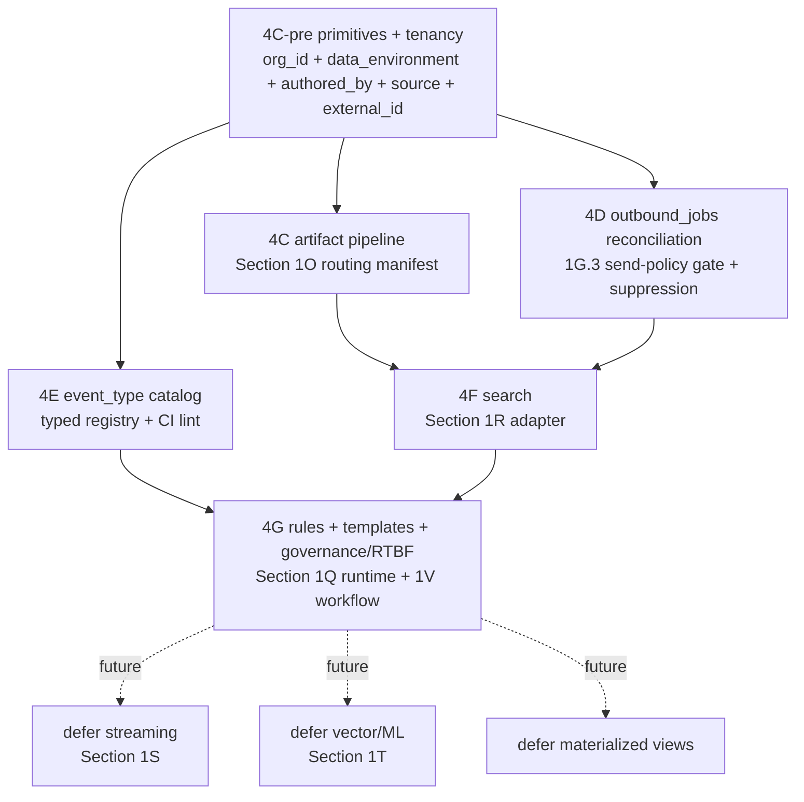

<!--
SNAPSHOT (Phase 4B-arch plan + R1+R2+R3+R4 critique evaluation log).

Source of original (live, possibly drifting): ~/.cursor/plans/data_layer_reconciliation_e525e9c9.plan.md

Snapshot taken: 2026-05-06 (after Phase 4B-arch shipped + Phase 4C-pre + 4C-pre verification scaffolding).

Why this file exists in the workspace:
- Preserves the full raw record of architectural reasoning so the team
  doesn't have to re-litigate nuanced trade-offs (multi-org survivability,
  primitive enforcement tiers, push-backs on external critique misreads,
  resolver phase split, etc.).
- Companion to: data_layers_reconciliation_v1.md (the readable strategy
  doc) + system_map_three_layers_60706286.plan.md (the binding map).

Do NOT treat this as the live plan. The live plan is in the user-level
Cursor projects folder above and may have evolved. Use this snapshot for
historical reasoning + decision rationale; check the live plan or the
git log for current state.
-->

---
name: data layer reconciliation
overview: Reconcile the eight foundational data layers (relational tables, artifacts, events/audit, outbound jobs, derived state, search, event-stream readiness, future ML/vector) PLUS multi-org survivability and data governance, against the system map. Produces a companion strategy doc that names every layer, cites the canonical Section that owns it, audits the early pre-map migrations against canonical shapes, and recommends harden-now vs defer; FIVE new system-map Sections (1R Search, 1S Event-stream readiness, 1T Vector/ML readiness, 1U Multi-org/multi-tenant partition discipline, 1V Data governance/retention/right-to-be-forgotten); a cross-cutting "system primitives" addendum locking authored_by + source/provenance + external_id/idempotency_key + environment/data_classification flag as universal disciplines across every canonical row; and reconciliation pointers in 1G.3 / 1H / 1O / 1L / 1Q.7 where early migrations need alignment. No code, no schema changes — this is the architectural integration pass that turns hardened-but-scattered map sections into one coherent foundation that scales to a multi-brand $500M platform.
todos:
  - id: draft_companion_doc
    content: Draft .cursor/plans/data_layers_reconciliation_v1.md per the doc structure above (10 sections, mermaid + sequence diagrams, per-layer table, early migration audit, Phase 4C+ roadmap)
    status: pending
  - id: draft_section_1r_search
    content: "Draft new Section 1R: Search & lookup in the system map (directional: pg_trgm + GIN now, adapter pattern for Elastic later, named indexed entities, capability-gated reads, reconcile site_search_entries)"
    status: pending
  - id: draft_section_1s_stream
    content: "Draft new Section 1S: Event-stream readiness in the system map (directional: append-only schema-versioned event_type + partition keys + idempotency keys on the four spine tables; future eventStreamPublisher adapter; explicit no-Kafka-now)"
    status: pending
  - id: draft_section_1t_vector
    content: "Draft new Section 1T: Vector / ML / embedding readiness in the system map (directional: future *_embeddings tables joined by stable entity ids on concept_id / patient_document_routing.id / inbound_narrative_reviews.id / messages.id / patient_clinical_assertions.id; pgvector default; PHI/de-identification posture)"
    status: pending
  - id: amend_section_1g3
    content: Add reconciliation pointer in Section 1G.3 naming patient_notification_deliveries as legacy candidate for consolidation under outbound_jobs; canonical job-kind enum
    status: pending
  - id: amend_section_1h_1q7
    content: Add reconciliation pointer in Section 1H + 1Q.7 declaring the event_type controlled-vocabulary catalog as code-as-config typed registry (mirrors lib/intake/events.ts) + CI lint
    status: pending
  - id: amend_section_1o
    content: Add reconciliation pointer in Section 1O consolidating intake_uploads_storage / rx_artifacts_storage / clinical_visit_pdf_artifacts under the canonical patient_document_routing manifest; confirm user's 7 artifact categories map to 1O.3 input types
    status: pending
  - id: amend_section_1l
    content: Add reconciliation pointer in Section 1L confirming lab_orders_and_storage + chart_ai_reviews_and_lab_observations align with 1L.3-1L.18; flag any specific gaps for the Phase 4C+ audit
    status: pending
  - id: draft_section_1u_tenancy
    content: "Draft new Section 1U: Multi-org / multi-tenant partition discipline (directional: org_id on every patient-scoped row, brand_id sub-partition, capability scoping respects org boundary, RLS forbids cross-org reads, host-org/tenant-org future model; cite 1J + 1D + 1S streaming partition key alignment)"
    status: pending
  - id: draft_section_1v_governance
    content: "Draft new Section 1V: Data governance \u2014 retention, deletion, right-to-be-forgotten (directional: per-data-class retention schedules, soft-delete vs hard-delete by class, subject-access-request workflow, RTBF carve-outs preserving HIPAA-required clinical retention, audit_events on every deletion, subprocessor discipline; cite Intent + 1H.4.2 + 1O.11)"
    status: pending
  - id: primitives_addendum_authored_by
    content: "Lock authored_by discipline system-wide \u2014 confirm patient_clinical_assertions 9-value enum is the canonical reference; reconcile audit_events.actor_kind, patient_state_observations.source, patient_consents.captured_by, patient_immunizations.source, messages.author_role, outbound_jobs.queued_by_kind so every meaningful write declares an actor; CI lint anchor names"
    status: pending
  - id: primitives_addendum_source_provenance
    content: "Lock source/provenance discipline system-wide \u2014 every domain row carries either evidence_refs[] (clinical assertions; richer) OR source_kind + source_id (non-clinical; simpler); both reconcile under one map invariant; orchestrator already provides intake_response_id back-pointer per 4A; extend to provider mutations + partner ingest + system jobs"
    status: pending
  - id: primitives_addendum_external_idempotency
    content: "Lock external_id + idempotency_key discipline system-wide \u2014 every external-rail-related write declares (external_system_name, external_system_id, idempotency_key for outbound OR external_inbound_event_id for inbound); already canonical for Stripe via 1I.6 + stripe_webhook_events; extend pattern to Twilio + Resend + partner pharmacy + lab vendor adapters per 1L.14 / 1L.23.3"
    status: pending
  - id: primitives_addendum_environment_flag
    content: "Lock environment / data_classification flag system-wide \u2014 patients row carries data_environment enum (production | staging | internal_qa | synthetic); FK propagation means every child row inherits via patient_id; outbound_jobs + metrics + search + AI training suppress non-production rows by default; CI lint enforces synthetic patients cannot trigger real Stripe / Twilio / pharmacy / lab outbound calls"
    status: pending
  - id: amend_repo_anchors
    content: Add short addendum at top of system map under 'Repo anchors' naming the five new Sections (1R/1S/1T/1U/1V) + the system-primitives addendum + the companion doc as binding references
    status: pending
  - id: phase4c_roadmap_naming
    content: In the companion doc's Section 6, name the Phase 4C-G implementation order (primitives audit -> tenancy partition + RLS -> artifacts -> outbound jobs -> event catalog -> search -> rules engine -> governance/retention; defer streaming + vector + materialized views) so we have an integrated execution sequence ready
    status: pending
isProject: false
---

# Phase 4B foundation reconciliation

The map is already deep. The early migrations are real but predate the deepest hardening. This phase produces the integration layer that ties them together so we stop "jumping island to island" and have one binding spine. No code, no migrations — this is the architectural pass that names what we keep, what we reconcile, what we add as new map Sections, and the order we harden things in Phase 4C+.

## Outputs

1. **New companion doc**: [.cursor/plans/data_layers_reconciliation_v1.md](.cursor/plans/data_layers_reconciliation_v1.md) — the readable strategy view; map citations only, no policy invented.
2. **Five new system-map Sections** (directional depth — design principle + future join keys, no schemas drafted):
   - **Section 1R: Search & lookup** — Postgres trigram + GIN now; adapter pattern for Elastic later; named entities + join keys for future search index.
   - **Section 1S: Event-stream readiness** — design `audit_events` / `patient_timeline_events` / `outbound_jobs` / `domain_events` to be replay-streamable later; opaque schema-versioned `event_type`, partition keys, idempotency keys, retention.
   - **Section 1T: Vector / ML / embedding layer** — no embeddings now; lock the future join keys (`concept_id`, `patient_document_routing.id`, `inbound_narrative_reviews.id`, `messages.id`, `patient_clinical_assertions.id`) so a future embeddings table joins cleanly; retention + de-identification posture.
   - **Section 1U: Multi-org / multi-tenant partition discipline** — every patient-scoped row carries `org_id` (default 'main' today, future second-brand or sister-org survivable); optional `brand_id` sub-partition for soft sub-brands within an org; capability scoping respects org boundary; RLS forbids cross-org reads; partition key consistent with Section 1S streaming.
   - **Section 1V: Data governance — retention, deletion, right-to-be-forgotten** — per-data-class retention schedules; soft-delete vs hard-delete discipline by class (clinical = retained per HIPAA; identity images = hard-delete after retention window; messages = soft-delete with audit); subject-access-request workflow; RTBF workflow with HIPAA-required-retention carve-outs preserved; `audit_events` row on every deletion; subprocessor / partner-side propagation discipline.
3. **Cross-cutting system primitives addendum** (single binding addendum near top of map under "Layer 1 (data architecture discipline...)"; locks four universal invariants every meaningful write must satisfy):
   - **`authored_by`** — the 9-value enum on `patient_clinical_assertions` (per Section 1K.0.5.4) is the canonical reference; sibling enums on `audit_events.actor_kind`, `patient_state_observations.source`, `patient_consents.captured_by`, `patient_immunizations.source`, `messages.author_role`, `outbound_jobs.queued_by_kind` reconcile to compatible vocabularies. CI lint enforces every meaningful write declares an actor.
   - **source / provenance** — every domain row carries either `evidence_refs[]` (clinical claims; richer; per 1K.5.A) OR `source_kind + source_id` back-pointer (non-clinical; simpler). 4A orchestrator already provides `intake_response_id` back-pointer; extend pattern to provider mutations, partner ingest, system-derived rows.
   - **`external_id` + `idempotency_key`** — every external-rail interaction declares `(external_system_name, external_system_id, idempotency_key for outbound, external_inbound_event_id for inbound)`. Already canonical for Stripe via 1I.6 + `stripe_webhook_events`; extend pattern to Twilio / Resend / partner pharmacy / lab vendor / identity-verification provider via 1L.14 + 1L.23.3 adapter contract shape.
   - **`data_environment`** — enum on `patients` (`production | staging | internal_qa | synthetic`); FK propagation means every child row inherits via `patient_id`. `outbound_jobs` + metrics + search + AI training all suppress non-production rows by default. CI lint enforces synthetic patients cannot trigger real Stripe / Twilio / pharmacy / lab calls — the test environment is structurally safe, not policy-only.
4. **Reconciliation pointers** added to existing Sections where early migrations need alignment audit (no rewrites in this phase — just declarations of what aligns and what's flagged for Phase 4C+):
   - 1G.3 / 1H.2 → `outbound_jobs` shape audit + consolidation with `patient_notification_deliveries`.
   - 1H + 1Q.7 → `patient_timeline_events` event_type catalog audit (controlled vocabulary completeness).
   - 1O → consolidate `intake_uploads_storage`, `rx_artifacts_storage`, `clinical_visit_pdf_artifacts` under the canonical `patient_document_routing` manifest.
   - 1L → audit `lab_orders_and_storage` + `chart_ai_reviews_and_lab_observations` against 1L.3-1L.18.

## Map → layer ownership (what's already named)

```mermaid
flowchart LR
  subgraph inputs [Inputs]
    Patient
    Provider
    Staff
    Partner
    Lab
    Payment
  end

  subgraph capture [Capture surfaces]
    intakeResponses[intake_responses 1K]
    messages[messages 1G]
    docRouting[patient_document_routing 1O]
    webhookEvents[*_webhook_events 1I/1H.3]
  end

  subgraph atomization [Atomization + routing]
    emitter[recordIntakeResponse 4A]
    narrativeAtom[inbound_narrative_reviews 1P]
    docRoute[routePatientDocument 1O]
  end

  subgraph canonical [Canonical homes]
    assertions[patient_clinical_assertions 1K.5.A]
    obs[patient_state_observations 1M]
    meds[patient_medications 1K.0.5.4]
    consents[patient_consents 1K.11]
    labs[patient_diagnostic_reports 1L]
    decisions[eligibility_decisions]
    orders[treatment_orders 1G/1I]
    visits[clinical_visits 1G]
    subs[subscriptions 1I]
    chart[external_clinical_documents 1O]
  end

  subgraph spine [Event spine]
    audit[audit_events 1H.5/1Q.7]
    timeline[patient_timeline_events 1H]
    domain[domain_events 1H.6 aggregate]
  end

  subgraph effects [Side effects]
    outbox[outbound_jobs 1G.3/1L.23.3/1Q.7]
    workers[workers + retries 1H.3]
    external[Stripe Twilio Resend Pharmacy Lab]
  end

  subgraph reads [Reads]
    views[derived views 1H read models]
    search[search index 1R new]
    ai[AI engine 1N]
    dashboard[1H.6 daily dashboard]
  end

  inputs --> capture
  capture --> atomization
  atomization --> canonical
  canonical --> spine
  spine --> effects
  effects --> external
  canonical --> reads
  spine --> reads
  effects -.-> spine
```

## Per-layer reconciliation summary (what the doc will contain)

### 1. Relational tables (already named)

- **Owner**: Section 1K.0.5.3 routing matrix; Section 1J chart columns; per-domain Sections (1L / 1M / 1O / 1G / 1I).
- **Built**: Phase 3 + 4A migrations + early pre-map domain migrations (`care_programs`, `treatment_items`, `treatment_orders`, `clinical_visits`, `lab_orders`, `patient_lab_observations`, `messages`, `message_threads`).
- **Discipline**: every relational table is a canonical home for ONE concern; cross-references via FK; no over-loading. Already enforced by 1K.0.5.8 anti-patterns.
- **Posture**: harden-now (mostly done; 4A closed the runtime).

### 2. Object storage (artifacts)

- **Owner**: Section 1O (`patient_document_routing` manifest + per-input-type domain rows + object storage + signed URLs).
- **Built (early)**: `intake_uploads_storage`, `rx_artifacts_storage`, `clinical_visit_pdf_artifacts` are three island-style upload tables predating Section 1O.
- **Reconciliation (Phase 4C scope, declared here)**: Section 1O amendment names these three as legacy capture-side tables that should converge on the canonical `patient_document_routing` manifest. The actual file blobs in storage are kept as-is; only the manifest entry shape and capture-API surface change. The user's 7 categories (identity / clinical / patient photos / consent legal / insurance admin / message attachments / provider docs) map directly to the 1O.3 input-type vocabulary; doc confirms the mapping cell-by-cell.
- **File-type allowlist**: PDF / JPG / PNG / HEIC are already named; DOCX / TXT / CSV defer to org policy; video / audio defer (no canonical Section yet — flag as "future Section 1O.x media-with-transcript pattern" not in scope for 4B).
- **Posture**: design-now-via-1O-amendment; implement during Phase 4C artifact pipeline.

### 3. Event / audit model

- **Owner**: split spine — `audit_events` (1H.5 staff/system traceability + 1Q.7 rule-firing + privacy-gate audits), `patient_timeline_events` (1H patient memory / longitudinal projection), `domain_events` (1H.6 aggregate summaries — optional).
- **Built (early)**: `audit_events`, `patient_timeline_events` exist. `audit_events` event-action vocabulary is partly named in Phase 4A (`INTAKE_EVENT_ACTIONS` / 25+ values) plus heavy 1Q.7 inventory (privacy_exposure_check, rule.firing_overridden, campaign_recall_issued, ~30 named events).
- **Reconciliation**: Section 1H/1Q.7 amendment that declares the canonical event-action catalog as code-as-config (mirrors `lib/intake/events.ts` pattern) — every event_type lives in a typed registry, never invented inline. CI lint enforces.
- **Patient timeline events** are projection-only per 1H — never authoritative; the source-of-truth row lives elsewhere. The early `patient_timeline_events` table aligns; needs catalog audit not redesign.
- **Patient memory ≠ staff audit ≠ aggregate metrics ≠ outbound-job audit** — four distinct concerns, four distinct tables. Doc states this clearly.
- **Amazon-style "user clicked / viewed / searched"**: NOT in scope as `audit_events`. Belongs in a separate analytics-event sink (defer; Section 1H names that no separate analytics product is planned, but does not lock the boundary). Doc flags this as Phase 5+ concern.
- **Posture**: harden-now (catalog completion + CI lint).

### 4. Outbox / jobs (durable side effects)

- **Owner**: `outbound_jobs` per Section 1G.3 (send-policy gate), 1L.23.3 (partner adapter), 1H.2 (platform ownership), 1H.3 (idempotency/recon), 1Q.7 (rule→template→job binding). Map's posture is explicit: **no Kafka, no separate queue product**. Relational queue table + workers + retry/dead-letter visibility.
- **Built (early)**: `20260425140000_outbound_jobs.sql` exists. `patient_notification_deliveries` exists separately and may be redundant.
- **Reconciliation**: Section 1G.3 amendment declares `outbound_jobs` as the single canonical queue; flags `patient_notification_deliveries` as legacy that may consolidate (a delivery-receipt sub-pattern is fine, but should reference `outbound_jobs.id`, not be parallel).
- **Job kinds (canonical)**: email, SMS, push, in-app, Stripe, partner pharmacy, partner lab, AI extraction, document OCR, scheduled reminder, cross-thread escalation. Map names most of these in 1G.3 / 1L.23 / 1N. Doc confirms no missing job kinds.
- **Streaming compatibility**: `outbound_jobs` design (idempotency_key, partition_key on patient_id, append-only audit trail) is explicitly Kafka-shaped enough that future stream replay is mechanical. Section 1S codifies this.
- **Posture**: harden-now (consolidation + shape audit).

### 5. Derived state / views

- **Owner**: Section 1H "read models over append-only events"; Section 1G.6.3 "live vs reporting boundary"; Section 1L.13 lab data flow.
- **Built**: `lib/intake/views/` (Phase 3) has problem-list, allergy-list, med-list, facesheet, care-plan, reconciliation-queue stubs. All composed-not-materialized.
- **Discipline**: default to composed views (TS function reading multiple canonical tables); promote to Postgres view only when read perf demands; promote to materialized view only when stale-acceptable + read-volume demands.
- **Posture**: defer materialization; rely on indexed reads + composed views; revisit when first metric crosses ~200ms read-p95.

### 6. Search

- **Owner**: NEW **Section 1R: Search & lookup** (this plan creates it).
- **Built (early)**: `site_search_entries` table exists, predates the map's hardening; exact shape probably doesn't match canonical search posture.
- **Section 1R contents (directional)**:
  - v1: Postgres trigram (`pg_trgm`) + GIN indexes on patient name / email / phone / DOB / Rx number / order id / message body. No external search engine.
  - Adapter pattern: a thin `searchEntities(query, scope, capability)` API that today reads Postgres; in the future swaps to Elastic without callers changing.
  - Reconcile `site_search_entries` as either (a) the canonical search-index table or (b) deprecated — decided in Phase 4C audit.
  - Indexed entities (named, not built): patient, message, treatment_order, clinical_visit, lab_order, document, subscription, action_item.
  - Capability-gated reads (provider can search patients in their queue; ops can search globally with audit; patient can search their own data only).
- **Posture**: design-now-via-1R; implement during Phase 4C+ when the staff workspace surfaces demand it.

### 7. Event-stream readiness (Kafka-shaped — but not Kafka)

- **Owner**: NEW **Section 1S: Event-stream readiness**.
- **Section 1S contents (directional)**:
  - Map's stance is unchanged: NO Kafka now.
  - But the map currently doesn't say "design events to be replay-streamable later." Section 1S codifies this:
    - Every `audit_events` / `patient_timeline_events` / `outbound_jobs` / `domain_events` row carries: stable event_type (versioned), patient_id (partition key), occurred_at, idempotency_key, schema_version, payload jsonb.
    - Append-only; never updated; supersession via new row.
    - This means tomorrow we can CDC-stream these tables to Kafka / Kinesis / Redpanda without schema rework.
  - Adapter pattern: a future `eventStreamPublisher` that today is no-op + tomorrow is Debezium / Supabase Realtime / Kafka producer.
  - Section 1S explicitly REJECTS: dual-write to a parallel queue, in-process pub/sub that bypasses the spine.
- **Posture**: design-now (almost free if codified now; expensive if retrofitted).

### 8. Future ML / vector layer

- **Owner**: NEW **Section 1T: Vector / ML / embedding readiness**.
- **Section 1T contents (directional)**:
  - No embedding tables, no vector store now.
  - But every entity that will eventually be embedded already has a stable id we can join on:
    - `concept_id` (clinical concepts) — for concept-similarity search.
    - `patient_document_routing.id` — for document-content embeddings (after OCR/extraction).
    - `inbound_narrative_reviews.id` — for narrative-content embeddings.
    - `messages.id` — for message-thread semantic search (capability-gated).
    - `patient_clinical_assertions.id` — for problem-list semantic clustering.
  - Future shape: `*_embeddings (entity_id, model_version, vector, generated_at)` joined by FK; Postgres `pgvector` is the default; alternative provider via adapter.
  - De-identification + retention: any embedding generation that exits org boundary (external LLM call) follows 1H.4.2 + Intent subprocessor discipline; embedding rows themselves are PHI-equivalent and live under same RLS as the source row.
  - AI engine in 1N is the only consumer; consistent with "one AI engine" rule.
- **Posture**: design-now-via-1T; implement when first concrete need lands (likely message semantic search or lab-PDF semantic extraction).

### 9. Multi-org / multi-tenant survivability

- **Owner**: NEW **Section 1U: Multi-org / multi-tenant partition discipline**.
- **Why now**: cheap to design pre-launch; expensive to retrofit once production has 100k single-tenant rows.
- **Section 1U contents (directional)**:
  - Every patient-scoped row carries `org_id` (FK to `orgs.id`); seeded with one row `org_id = 'main'` today. Default in app code; not surfaced to patients.
  - Optional `brand_id` sub-partition (FK to `brands.id`) for soft sub-brands within one org (e.g., MAIN runs both EVO and ONA brands in the same Postgres but with separate patient cohorts and separate marketing).
  - **Boundary discipline**: PHI never crosses `org_id`. Cross-org reads forbidden by RLS at the database layer; a "host org" of the platform can administer multiple "tenant orgs" only via capability-gated SECURITY DEFINER functions that explicitly join via consent + audit per Intent.
  - Capability scoping (per Section 1D) extends to carry `org_scope: 'all_orgs' | 'specific_org' | 'self_org_only'`; default is `self_org_only`.
  - **Partition key alignment with Section 1S**: `org_id` is the natural partition key for any future event-stream sharding (one stream per org, or one stream sharded by `org_id`).
  - **Section 1U explicitly REJECTS**: schema-per-tenant (Postgres operational nightmare at scale), separate database-per-tenant (cost + cross-org reporting nightmare), application-only filtering without RLS (security anti-pattern).
  - **Future host-org / tenant-org model**: Section 1U names this as a future capability — main-app eventually offers the platform to other clinics; each clinic gets its own `org_id`; main acts as host with limited admin capability over tenant orgs (via capability + audit + consent). v1 has only one org; the discipline ensures v2 doesn't require schema migration.
- **Posture**: design-now-via-1U; mechanically add `org_id` + RLS during Phase 4C-pre-tenancy pass (cheap; ~all existing tables get one column + one RLS predicate).

### 10. Data governance — retention, deletion, right-to-be-forgotten

- **Owner**: NEW **Section 1V: Data governance, retention, deletion, right-to-be-forgotten (RTBF)**.
- **Why now**: HIPAA + emerging state privacy laws (CA CPRA, CO CPA, CT CTDPA, etc.) require declared retention + deletion workflows. At $500M scale audits will ask for the policy doc.
- **Section 1V contents (directional)**:
  - **Per-data-class retention schedules** (declared in code-as-config, not invented per request):
    - Clinical (assertions, observations, visits, lab reports, prescriptions): retained per HIPAA-required minimums (typically 6-10 years post-encounter; state-specific overrides per `1G.7.5d` jurisdiction discipline).
    - Identity images (driver's license, passport, selfie): hard-delete after verification + retention window (typically 90 days post-verification unless dispute open); only the verification-status row + hash retained per `1O.4.1`.
    - Insurance card images: similar to identity; hard-delete after coverage period + retention window.
    - Messages: soft-delete with audit; clinical-tagged messages retained per clinical retention.
    - Audit events: retained ~7 years (compliance baseline).
    - Marketing / analytics: shorter retention; aggressive purge.
  - **Soft-delete vs hard-delete discipline**:
    - Soft-delete = `deleted_at + deletion_reason + deleted_by_user_id` columns on the row; row stays queryable by audit but invisible to all other reads.
    - Hard-delete = row physically removed; only an `audit_events` "row deleted" record persists with hashes, not content.
    - Per-data-class default chosen explicitly; never per-request.
  - **Subject-access-request (SAR) workflow**: patient can request export of their data. SAR job assembles canonical-table dump scoped to `patient_id`, signs it, delivers via secure download. Audited per Intent.
  - **Right-to-be-forgotten (RTBF) workflow**: patient can request deletion. RTBF executes per-data-class deletion plan: hard-delete eligible classes (identity images, marketing data); soft-delete with retention carve-out for HIPAA-required clinical data (with patient notice that clinical data must be retained for legal/regulatory reasons); audited per Intent.
  - **`audit_events` on every deletion**: actor, capability used, scope, retention-class affected, hashes of deleted content (for forensic verification without re-storing PHI).
  - **Subprocessor / partner-side propagation**: when patient requests RTBF, the system fans out RTBF requests to subprocessors per data-sharing contract (Stripe, Twilio, Resend, partner pharmacies, lab vendors, OCR/AI providers per `1H.4.2`); tracking via `outbound_jobs` per `1S` event-stream readiness.
  - **Section 1V explicitly REJECTS**: per-table ad-hoc retention; deletion without audit; "we'll add retention later" (it gets harder every quarter).
- **Posture**: design-now-via-1V; runtime workflow implementation deferred to Phase 4G; the schedule itself locks now.

### 11. Cross-cutting system primitives (Amazon/Tesla "cheap-now-expensive-later")

- **Owner**: NEW system-primitives addendum near top of map under "Layer 1 (data architecture discipline...)" — NOT a new Section, intentionally; these are universal invariants applied across every Section.
- **Why a single addendum, not a Section**: these aren't a domain; they're disciplines that travel with every domain. A new Section would be wrong placement; a top-of-map addendum + per-Section pointer is correct.
- **The four primitives**:
  - **`authored_by` (actor declaration)**: every meaningful write declares its actor. Canonical reference: `patient_clinical_assertions.authored_by` 9-value enum (`patient_reported`, `patient_self_correction`, `provider_assessed`, `provider_confirmed`, `document_extracted`, `lab_derived`, `third_party_reported`, `ai_suggested`, `system_derived`) per Section 1K.0.5.4. Sibling tables reconcile to compatible enums:
    - `audit_events.actor_kind` ⊆ `{patient, staff_user, provider_user, system, cron, webhook, partner_adapter, ai_engine}`.
    - `patient_state_observations.source` ⊆ `{patient_self_reported, staff_measured, wearable, lab_derived, document_extracted}` (already locked in Phase 3 schema).
    - `patient_consents.captured_by` ∈ `{patient, staff_witnessed_in_person}` (already locked in Phase 3).
    - `patient_immunizations.source` ∈ `{in_house_administration, external_record_imported, patient_self_reported}` (already locked).
    - `messages.author_role` (already exists in early migration; reconcile to compatible enum during Phase 4D).
    - `outbound_jobs.queued_by_kind` ⊆ `{rule_engine, staff_user, system_cron, ai_assistant_with_human_approval}` (introduce during 1G.3 reconciliation).
    - CI lint: every new domain table reviewed in PR must declare an actor column or justify its absence in the PR description.
  - **source / provenance back-pointer**: every domain row points to where it came from. Two patterns coexist:
    - Clinical assertions: `evidence_refs[]` (jsonb array of `{kind, id, ...}`) per 1K.5.A — richer, supports multi-source evidence.
    - Non-clinical rows: simpler `source_kind + source_id` columns (`source_kind` ∈ `{intake, message, webhook, partner_adapter, document_extraction, provider_decision, system_inference, staff_manual, patient_self, lab_feed}`; `source_id` is the PK of the originating row).
    - 4A orchestrator already provides `source_intake_response_id` back-pointer for intake-derived writes; extend pattern to non-intake writes during Phase 4D-4F.
    - CI lint: every emission target's payload declares either `evidence_refs[]` or `source_kind + source_id`.
  - **`external_id` + `idempotency_key`**: every external-rail interaction declares its keys.
    - **Outbound** (we call them): `(external_system_name, external_system_id, idempotency_key)` — replay safe.
    - **Inbound** (they call us): `(external_system_name, external_inbound_event_id)` — dedupe safe.
    - Already canonical for Stripe via Section 1I.6 + `stripe_webhook_events`. Extend pattern to:
      - Twilio (`twilio_message_sid` outbound; `twilio_inbound_message_sid` inbound).
      - Resend (`resend_email_id` outbound; webhook receipts inbound).
      - Partner pharmacy (vendor order id; inbound delivery webhook id).
      - Lab vendor (sample id; result webhook id) per 1L.14.
      - Identity-verification provider (verification job id; webhook id).
    - CI lint: every adapter declares its three keys per the 1L.14 / 1L.23.3 contract shape.
  - **`data_environment` flag**: every `patients` row declares its environment. Enum: `production | staging | internal_qa | synthetic`. FK propagation: every child row inherits the patient's environment via `patient_id`.
    - **Suppression rules (binding)**:
      - `outbound_jobs` checks the patient's `data_environment` before dispatching; non-`production` patients route to a sandbox or are dropped per env.
      - Metrics + dashboards (1H.6) filter to `production` by default.
      - Search (1R) filters to `production` by default; non-`production` only visible to staff with `can_see_test_data` capability.
      - AI training (1N) excludes non-`production` rows.
    - **Why structural, not policy**: every developer / QA / synthetic pattern goes through ONE column check; you cannot accidentally text a real Twilio number for a synthetic patient.
    - CI lint: any code path that calls Stripe / Twilio / Resend / pharmacy / lab outbound MUST gate on `data_environment === 'production'` or carry an explicit override.
- **Posture**: harden-now (ALL FOUR are cheap to add today, expensive in 6 months).

## Companion doc structure (.cursor/plans/data_layers_reconciliation_v1.md)

Sections in order:

1. **Why this doc exists** — bridge between hardened map sections and the next implementation phases; binding pointer back to the system map for every claim.
2. **The 10-tier classification view** — restate Section 1K.0.5.2 as the spine; add the 5 super-layers above the existing 10 (capture surfaces, atomization+routing, canonical homes, event spine, side effects, reads).
3. **Per-layer table** — for each of the 11 layers (8 original + tenancy + governance + primitives): owner Section, what's built, what's named-but-not-built, what early migration aligns or needs reconciliation, harden-now vs defer recommendation, dependent layers.
4. **Early migration audit** — every pre-map migration from `20260418` → `20260430` classified as KEEP / RECONCILE / LEGACY-REPLACE with the Section that governs it.
5. **The integrated mermaid diagram** (above) plus a runtime sequence diagram for one full intake-to-fulfillment pass showing every layer touched (including which primitive columns each write must populate).
6. **Phase 4C+ implementation roadmap** — named, not executed (ordering matters; primitives + tenancy go FIRST so all subsequent reconciliations land into a clean shape):
   - **4C-pre: Primitives audit + tenancy partition pass** — add `org_id` + `data_environment` to every patient-scoped row; reconcile `authored_by` / `source` / `external_id` columns per the addendum; ~1 migration; cheap; foundational for everything that follows.
   - **4C: Section 1O artifact pipeline** — consolidate three legacy upload tables under the canonical manifest.
   - **4D: outbound_jobs reconciliation** — consolidate `patient_notification_deliveries`; finalize job-kind enum; wire 1G.3 send-policy gate; locked-in `data_environment` suppression.
   - **4E: event_type catalog completion** — typed registry + CI lint.
   - **4F: Section 1R search adapter + first staff-search surface** — `data_environment` and `org_id` filter baked in from day one.
   - **4G: Section 1Q rules + templates engine runtime + Section 1V governance/retention runtime** (positioned together because RTBF + retention require rules-engine wiring; 4F precedes because rules consume search).
   - **Defer**: Section 1S streaming runtime, Section 1T embedding tables, materialized views.
7. **CI lint additions** — surfaced from each Section amendment:
   - event_type registry (every `audit_events.action` and `patient_timeline_events.event_type` value must exist in the typed catalog).
   - search adapter call-site (no direct Postgres LIKE searches across patient names; everything through `searchEntities`).
   - never-write-files-to-non-domain-rows (no base64 in `intake_responses` / `messages` / `patient_timeline_events`).
   - actor declaration (every new domain table justifies its `authored_by` choice in PR).
   - source/provenance (every emission payload declares `evidence_refs[]` or `source_kind + source_id`).
   - external rail keys (every adapter declares its three keys per 1L.14 / 1L.23.3 contract shape).
   - `data_environment` gate (Stripe / Twilio / Resend / pharmacy / lab outbound calls require explicit env check or override).
   - cross-org reads (RLS predicate enforced at DB; app code reviewed in PR).
8. **Open questions / next pressure tests** — the 3-4 places where the map is still genuinely ambiguous after this pass (e.g., video/audio handling boundary; Amazon-style click/view analytics-event sink; cross-org patient-data export contract; long-tail SLO ownership for 1H.1/1H.2 — deferred to a future Section 1W when staff scale demands).

## System map amendments (directional, not schema-level)

- **Section 1R: Search & lookup** — net new; ~150-200 lines.
- **Section 1S: Event-stream readiness** — net new; ~100-150 lines.
- **Section 1T: Vector / ML / embedding readiness** — net new; ~100-150 lines.
- **Section 1U: Multi-org / multi-tenant partition discipline** — net new; ~150 lines. Ordering: placed near 1J (identity) since both concern boundary discipline.
- **Section 1V: Data governance — retention, deletion, RTBF** — net new; ~150-200 lines. Ordering: placed near 1H (analytics) and Intent (privacy boundary) since both concern read/retention rules.
- **System primitives addendum** (top of map under "Layer 1 (data architecture discipline...)") — ~80 lines. Locks the four primitives as universal disciplines + cites where each Section's existing columns already comply or need reconciliation.
- **Section 1G.3 reconciliation pointer** — ~30 lines naming `patient_notification_deliveries` as legacy candidate for consolidation under `outbound_jobs`; introduce `outbound_jobs.queued_by_kind` + `data_environment` gate per primitives.
- **Section 1H reconciliation pointer** — ~30 lines naming the event_type controlled-vocabulary catalog as code-as-config + CI lint; reference `actor_kind` discipline.
- **Section 1O reconciliation pointer** — ~50 lines consolidating `intake_uploads_storage`, `rx_artifacts_storage`, `clinical_visit_pdf_artifacts` under canonical manifest; cite `data_environment` filter on file-list reads.
- **Section 1L reconciliation pointer** — ~30 lines confirming `lab_orders_and_storage` + `chart_ai_reviews_and_lab_observations` align with 1L.3-1L.18 (or flagging specific gaps if found); cite `external_id` + `idempotency_key` per 1L.14 contract shape.
- **Section 1Q.7 reconciliation pointer** — ~20 lines confirming privacy-gate event_type vocabulary is part of the typed registry; tie to actor discipline.
- **Repo anchors header** (top of map) — short addendum naming the five new Sections (1R/1S/1T/1U/1V) + system primitives addendum + companion doc.

## What this plan deliberately does NOT do

- No code; no migrations; no edits to `lib/`. The doc + map amendments are the entire 4B deliverable.
- No Phase 4B execution work — the doc + map amendments name what comes next; we build it as Phase 4C-pre + 4C+ once we agree on the integrated picture.
- No new clinical/operational policy — only architectural reconciliation. Every claim cites a map Section.
- No retroactive audit of every line of every early migration — we name what reconciles vs what's flagged; deep audit happens during the actual reconciliation phase that follows.
- No SLO ownership Section yet (1W deferred per scoping decision). Map's existing 1H.1 / 1H.2 directional language stays; we revisit when staff scale demands.
- No deep schemas for 1U / 1V / primitives — directional only per scoping decision. Phase 4C-pre will draft the actual `org_id` / `data_environment` / `authored_by` migration during execution.

## Why this order matters (binding)

Primitives + tenancy are foundational because every subsequent reconciliation writes columns or RLS that they assume exist. Doing 4C-pre first means every later phase lands into a clean shape; doing it later means every later phase writes incomplete rows that need backfill.

---

# Critique evaluation log (review before execution)

The plan above is the maximalist baseline. Two rounds of external critique (ChatGPT) have come in. This section captures the assistant's evaluation of each critique — what's valid, what to push back on, and what tightenings to apply before execution.

You should read this section, decide what to incorporate, and then we re-pose the execute question.

## Round 1 critique (4 points) — verdicts

### R1-1: "Primitives aren't truly locked — orchestrator must enforce, not just lint"
**Verdict: 80% valid. Strengthen.**

ChatGPT is right that "lock as discipline" written in map prose isn't enforcement. But framing is overstated. The 4A `record_intake_emissions_batch` SECURITY DEFINER + `writeEmissions` + Zod schemas in `lib/intake/targets.ts` ARE the "no write happens without these fields" gate. We just haven't extended it to the four new primitives because the columns don't exist yet.

**Tightening to apply**: replace "lock as system-wide discipline + CI lint" with **four-tier enforcement**:
1. **Zod schemas** refuse incomplete payloads at the runtime boundary.
2. **`record_intake_emissions_batch`** rejects rows missing the columns at the DB transaction boundary.
3. **RLS + capability** discipline blocks non-orchestrator writes per Section 1J.10.
4. **CI lint** catches devs who try to bypass the orchestrator.

4C-pre includes Zod/orchestrator extensions, not just column adds.

### R1-2: "1R/1S/1T are premature; resolver should come before infra"
**Verdict: Partially valid. Wrong about Sections; right about resolver.**

**Sub-claim 2a (don't define 1R/1S/1T as Sections)**: Half right. They were over-budgeted at ~150 lines each. But ChatGPT's "demote them out of the map" framing is wrong — the map is binding source-of-truth; companion docs lose authority. Precedent: 1L.19 (future diagnostic modality onboarding), 1J.5 (cross-program identity future) — map already names directional posture for future capabilities to prevent drift. **Tightening**: keep 1R/1S/1T as Sections, but trim each to ~50-80 lines. Each contains only (a) binding contract, (b) future join keys, (c) explicit-rejects list, (d) pointer to eventual implementation phase.

**Sub-claim 2b (resolver should come before infra)**: Fully valid. I had a gap. "Phase 4B" was named twice — once for runtime resolver implementation (in 4A commit messages: *"that's a Phase 4B resolver concern"*), once for this architectural reconciliation pass. The resolver was implicit but never made it onto the roadmap.

**Tightening**: roadmap renames so resolver gets its own slot:
- **4B-arch** (this plan, markdown): architectural reconciliation
- **4C-pre**: primitives + tenancy migration + orchestrator/Zod enforcement
- **4C-runtime**: resolver implementation (runs ON the primitive-locked runtime)
- **4D**: artifact pipeline (1O)
- **4E**: outbound jobs (1G.3)
- **4F**: event_type catalog (1H + 1Q.7)
- **4G**: search (1R)
- **4H**: rules engine + governance (1Q + 1V)
- **defer**: 1S streaming, 1T vector, materialized views

### R1-3: "1U is the one to keep — but don't over-model host-org hierarchy"
**Verdict: Valid. Tighten.**

Binding content of 1U is short: `org_id` everywhere + RLS + capability scoping + partition-key alignment with future streaming. The host-org/tenant-org future model is one forward-looking paragraph, not a hierarchy.

**Tightening**: 1U at ~80-100 lines (was ~150). Drop implied hierarchy. Replace with: "v1 has one org; v2 may add tenant orgs; the discipline ensures v2 doesn't require schema migration."

### R1-4: "1V governance is 20% overbuilt — trim to principles + hooks"
**Verdict: Valid. Trim.**

Honest take: I was drafting a retention engine, not a hardening Section.

What 1V actually needs (binding):
- Per-data-class retention SCHEDULE in code-as-config (clinical, identity, insurance, messages, audit, marketing — six classes; deadlines named).
- Soft-delete vs hard-delete RULE per class.
- `audit_events` row on every deletion.
- SAR + RTBF as `outbound_jobs` consumers of the rules engine — described directionally, not implemented.

What 1V does NOT need now: subprocessor fan-out workflows, detailed RTBF state machine, state-by-state carve-out matrix.

**Tightening**: 1V at ~80 lines (was ~150-200). Frame as principles + hooks. Drop subprocessor + state-by-state.

## Round 1 — what to push back on

- **"Demote 1R/1S/1T out of the map entirely"** — wrong. Map is binding; companion docs aren't. Directional Sections are exactly what prevents drift months later.
- **"Tesla/Amazon say NO WRITE HAPPENS WITHOUT THESE FIELDS"** theatrics — true principle, but we already have the gate (4A orchestrator). Plan needs to say "extend the gate," not "build a new one."
- **"Guessing infra needs before system proves them"** — for search/stream/vector, partly fair (hence trimming). For tenancy + primitives, completely wrong: those aren't infra, they're column-level invariants that cost zero now and weeks of migration later.

## Round 2 critique (10 points) — verdicts

### R2-1: Identity resolution
**Push back. Misread.** Section 1J (lines ~2705-3034) covers this comprehensively: 1J.1 precedence trust rank, 1J.4 identity confidence levels, 1J.6 duplicate detection, 1J.7 merge policy, 1J.8 shared contact, 1J.10 safety preflight. ChatGPT's exact ask (identity_confidence + merge strategy + external identifiers preserved) is literally what 1J.4 + 1J.7 + 1J.6 already specify. **No action.**

### R2-2: Temporal truth (effective_at vs recorded_at)
**Valid tightening.** We have the columns scattered across `patient_clinical_assertions.onset_at` + `resolved_at`, `patient_state_observations.observed_at`, `eligibility_decisions.decided_at`, `audit_events.created_at`. But there's NO map invariant saying *"every clinical/observation/decision row distinguishes effective time from recorded time."* The metformin example is real: patient says today *"I stopped 3 weeks ago"* — recorded_at = today, effective_at = 3 weeks ago. Need both axes per row.

**Action**: add as **5th primitive** in addendum. CI lint enforces.

### R2-3: Partial failure / transaction strategy
**Push back.** Already locked in 4A. `record_intake_emissions_batch` is one Postgres transaction (clinical writes atomic). Outbox pattern for external side effects (write canonical row + queue `outbound_jobs` row in same transaction; workers retry per 1H.3 + 1I.6 idempotency). ChatGPT's "you need to decide" framing is wrong — we did. Optionally: add a one-line map invariant pointing at 4A as the canonical answer.

### R2-4: Universal enum-as-code-as-config rule
**Valid tightening.** We have ~12 enums locked code-as-config (AUTHORED_BY_VALUES, ASSERTION_TYPE_VALUES, ANSWER_TYPES, CONCEPT_TYPES, ConsentType, EmissionTarget, etc.). But no map-level rule saying *"ALL enums must be code-as-config + versioned + never invented in DB CHECK constraints inline."*

**Action**: add as **6th primitive** in addendum. CI lint.

### R2-5: Backfill / migration strategy
**Genuinely valid gap.** As we move early migrations → canonical Section 1L/1M/1O shapes, we'll need backfill scripts that are idempotent, versioned, re-runnable. Map has nothing.

**Action**: small addendum (~40 lines) under 1V or standalone. Declares: migrations versioned + tracked + reviewable; backfills idempotent (safe re-run); schema-version on each canonical table for safe transforms; "backfills are first-class deliverables."

### R2-6: Access pattern discipline (named read functions)
**Valid tightening.** We have `lib/intake/views/` with named functions. But no map invariant locks that ALL clinical reads go through named functions. Without it, devs write `SELECT * FROM patient_clinical_assertions WHERE...` directly, get inconsistent slicing.

**Action**: add as **7th primitive** in addendum. CI lint catches direct table reads from app code (carve-out for views file).

### R2-7: Rate / scale assumptions
**Soft.** Specific numbers at our stage are arbitrary. Not yet making decisions where 10k-vs-100k matters architecturally. But naming a target anchors design choices.

**Optional action**: ONE paragraph under "Intent" — *"design target: 100k active patients + 10M cumulative events within 24 months; sub-100ms reads on canonical surfaces; sub-second writes; outbound_jobs throughput 100/sec sustained, 1k/sec burst."* Not binding, just an anchor.

### R2-8: Security boundary thinking
**Push back. Misread.** Section 1D (capabilities) is a major section; `requireCapability` is the binding gate per AGENTS.md. ChatGPT's example "patient edits meds? provider overrides? AI writes assertions?" — all three explicitly answered:
- Patient self-edits → `authored_by: patient_self_correction` + supersession per 1K.0.5.4.
- Provider overrides → `rule.firing_overridden` + `can_authorize_clinical_override` per 1Q.7.
- AI writes → `authored_by: ai_suggested` + 1N "assistive only, never authoritative" + 1K.0.5.10 authority rank pinning AI below all human authors.

**No action.**

### R2-9: Replayability as binding invariant
**Valid tightening (small).** Section 1K.0.5.6 (event-sourcing framing) gives replayability as an emergent property. But there's no invariant saying *"no write may break replayability; reconciled entities must always be derivable from the claim ledger."*

**Action**: add as one-line tightening IN 1K.0.5.6 (not in addendum — it's a property of the spine, not a column).

### R2-10: Source-of-truth one-sentence summary
**Valid; cheap.** All four concepts locked across 1K.0.5 sub-sections, but never on one line. ChatGPT's proposed summary is good:
> Claims = raw truth; reconciled entities = current truth; observations = measured truth; decisions = derived truth.

**Action**: one-sentence addition near top of "Layer 1 (data architecture discipline...)" or top of 1K.0.5.

## Net change to plan (combining both rounds)

The primitives addendum grows from **4 invariants to 7**:
1. authored_by (existing)
2. source / provenance (existing)
3. external_id + idempotency_key (existing)
4. data_environment (existing)
5. **temporal truth (effective_at + recorded_at)** — NEW from R2-2
6. **enum-as-code-as-config** — NEW from R2-4
7. **named-read-function discipline** — NEW from R2-6

Plus tightenings:
- **R1-1**: primitives enforced at four tiers (Zod / orchestrator / RLS / CI lint).
- **R1-2**: 1R/1S/1T trimmed to ~50-80 lines each; resolver gets dedicated phase 4C-runtime.
- **R1-3**: 1U trimmed to ~80-100 lines; drop host-org hierarchy detail.
- **R1-4**: 1V trimmed to ~80 lines; principles + hooks framing.
- **R2-9**: replayability invariant as one-line tightening in 1K.0.5.6.
- **R2-10**: source-of-truth one-sentence summary near top of map.

Plus small additions:
- **R2-5**: backfill/migration discipline addendum (~40 lines).
- **R2-7** (optional): scale-assumption paragraph (~15 lines) under Intent.

Plus three companion-doc citations confirming the misreads:
- "Identity resolution: see Section 1J (1J.1-1J.10)."
- "Partial-failure transaction strategy: see Phase 4A `record_intake_emissions_batch` + Section 1H.3 / 1I.6."
- "Security boundary thinking: see Section 1D + Section 1J.10 + Section 1Q.7."

## Decision needed before execution

1. **Apply all R1 tightenings + all 7 R2 valid items?** (recommended — they're all primitive-tier, cheap to add now, expensive to retrofit)
2. **Skip R2-7 scale assumptions?** (judgment call — soft pass; defer if you don't want to commit to numbers yet)
3. **Push back on the 3 misreads?** (R2-1, R2-3, R2-8 — recommended; just confirm map already covers them in companion doc)

Once you've reviewed this section, say "ready" and I'll re-pose the execute question.

---

## Round 3 critique (4 points received) — verdicts

ChatGPT skipped a "#2" in this round; only #1, #3, #4, #5 came through. Not introducing a phantom #2.

### R3-1: "Primitives still not sharp enough — need top-line invariant"
**Verdict: Valid tightening.**

ChatGPT wants two crisper top-line statements:
1. "No row enters the system unless all primitives are satisfied."
2. "All writes MUST go through the orchestrator boundary."

My current four-tier enforcement (Zod / orchestrator / RLS / CI lint) describes HOW. ChatGPT's two lines are WHAT. Both belong in the addendum — top-line invariant first, four-tier enforcement second.

**Action**: add 3-line invariant at top of primitives addendum:
> No row enters any canonical table through a path other than the orchestrator boundary. The orchestrator (4A `record_intake_emissions_batch` + Zod schemas) refuses any row missing the seven primitives. Non-orchestrator writes are forbidden by RLS + capability discipline per Section 1J.10.

### R3-3: "Resolver gap — clarify what resolver IS and IS NOT"
**Verdict: Valid clarification + IMPORTANT terminology disambiguation.**

ChatGPT is conflating two different "resolver" concepts. I need to make this crystal clear:

- **WRITE-path resolver** (my 4C-runtime): translates `Question.emissions` templates + `raw_value` → fully-resolved `Emission[]` for `recordIntakeResponse`. This is what 4A's `recordIntakeResponse` wrapper said *"that's a Phase 4B resolver concern."*
- **READ-path derived views** (already partially built in `lib/intake/views/`): pure functions of canonical state that produce dashboard/UI read shapes. `getProblemList`, `getMedList`, `getFacesheet`, etc.

ChatGPT's R3-3 definition (*"given canonical state → produce deterministic read model"*) is the READ-path concept. ChatGPT's earlier R1-2b ("resolver should come before infra") was likely also about reads, not writes.

**Action**:
1. In 4C-runtime phase description: clarify *"WRITE-path resolver: translates intake templates + raw_value into resolved Emission[]. Distinct from READ-path derived views which are pure-function reads from canonical state."*
2. In named-read-function primitive (#7): add the negative invariant — *"named reads are PURE functions of canonical state. They MUST NOT contain business logic, rule firings, or AI inference. Business logic lives in Section 1Q rules engine; AI inference lives in Section 1N."*

This is important because if the two get conflated, dashboards become non-deterministic and AI behavior leaks into reads.

### R3-4: "Write authority vs read authority distinction"
**Verdict: Partial misread + valid summary opportunity.**

ChatGPT's examples (*patient reports, AI suggests, provider confirms, system derives*) are ALL write-authority distinctions, and they're ALL already locked in the map:

- **1K.0.5.4** has the 9-value AUTHORED_BY enum (patient_reported, patient_self_correction, provider_assessed, provider_confirmed, document_extracted, lab_derived, third_party_reported, ai_suggested, system_derived).
- **1K.0.5.10** has explicit authority_rank per authored_by: provider_confirmed=100, provider_assessed=90, lab_derived=70, document_extracted=60, patient_self_correction=50, patient_reported=40, third_party_reported=30, ai_suggested=20, system_derived=10.
- **1N** says AI is "assistive only, never authoritative."

This is comprehensive. ChatGPT is rediscovering existing discipline.

BUT — like R2-10's source-of-truth summary, a one-line write-authority hierarchy summary is worth adding for clarity. The discipline is locked; the summary line isn't.

**Action**: add one-line summary near source-of-truth summary line:
> **Write authority hierarchy**: providers confirm (rank 100); labs derive (70); documents extract (60); patients self-correct (50) and report (40); third parties report (30); AI suggests (20, never authoritative); system derives (10). Pinned in `patient_clinical_assertions.authority_rank` per Section 1K.0.5.10.

Also note in companion doc that read authority is a separate axis: handled by RLS + capability + Section 1J.10 SensitiveAccessReason — already comprehensive.

### R3-5: "Governance missing data lifecycle transitions"
**Verdict: Valid tightening.**

Fair point. My 1V trimming focused on retention/deletion/RTBF. I didn't surface the broader lifecycle.

Counter: per-domain lifecycle IS locked across the map:
- `patient_clinical_assertions.status`: unconfirmed | provider_confirmed | provider_rejected | provider_resolved | provider_refined | retracted | superseded.
- `patient_medications.status`: proposed | active | discontinued | on_hold.
- `subscriptions.status`: pending | active | paused | cancelled | expired.
- `treatment_orders.status`: pending_clinical_review | approved | denied | cancelled | fulfilled.

What's MISSING: a unified "post-active" lifecycle that connects per-domain states to a common archival/deletion pattern.

**Action**: extend 1V with uniform-lifecycle taxonomy (~12 lines):
> Beyond per-domain status enums, every data class maps onto a uniform post-active lifecycle: `active → inactive → archived → retention-expired → deleted`. Examples: `subscriptions.status='cancelled'` → inactive; `patient_clinical_assertions.status='superseded'` → inactive (claim row stays for audit; reconciled entity recomputes); `patient_diagnostic_reports.status='archived'` → archived (read-only, off active surfaces); retention-expired = retention class deadline reached; deleted = soft or hard per class. Archival transitions write `audit_events` rows; deletion writes both `audit_events` (with content hashes only) and the per-class soft/hard rule.

## Net change after R3 (combining R1 + R2 + R3)

The seven primitives stay (no new primitive needed). Four small additions on top of R1+R2:

1. **R3-1**: top-line invariant statement at start of addendum (3 lines).
2. **R3-3**: write-path-vs-read-path resolver disambiguation in 4C-runtime + extend named-read-function primitive with the negative invariant (~10 lines combined).
3. **R3-4**: one-line write-authority hierarchy summary near source-of-truth summary (~3 lines).
4. **R3-5**: uniform-lifecycle taxonomy in 1V (~12 lines).

Total addition: ~28 lines. All in spirit of "discipline clarity, not new architecture" — exactly what ChatGPT said the system needs.

## Final decision needed

After R1 + R2 + R3, the recommended set is:

- R1-1, R1-2, R1-3, R1-4 tightenings (Round 1).
- R2-2, R2-4, R2-5, R2-6, R2-9, R2-10 tightenings (Round 2; skip R2-7 scale unless you want to commit numbers; push back on R2-1, R2-3, R2-8 misreads).
- R3-1, R3-3, R3-4, R3-5 tightenings (Round 3).

Total prose: primitives addendum ~120 lines (was 80); 1V ~95 lines (was 80); 1U ~80 lines; 1R/1S/1T ~50-80 lines each; companion doc ~300-400 lines; backfill addendum ~40 lines.

When ready to execute, tell me:
1. Apply all R1+R2+R3 tightenings? (recommended)
2. Skip R2-7 scale assumptions or include?
3. Push back on the 3 misreads in companion doc citations?