# Phase A.2 — AI Hybrid Layer + AI Jurisdiction Canonization (Checkpoint A correction)

## Why this exists

Phase A landed (commit `af14a8c`) but left two real gaps that must be closed before Checkpoint A clears.

**Gap 1 — AI hybrid interpretation + action-assist + bounded-autopilot were implicit.** DL-14 named AI as a subsystem and the learning loop is bound, but the document never said loudly that AI:
- classifies **inbound** SMS / in-app / email / voicemail / call-transcript events,
- infers intent (scheduling request, clinical concern, billing question, cancellation, lab question, side-effect signal, ambiguity, out-of-scope),
- recommends next best action across all actor targets,
- drafts responses / tasks / plans,
- executes **bounded low-risk workflows** under CNS policy + confidence threshold + audit, configurable by org / location / channel / intent / service / provider / patient segment / risk class.

The wedge-clinic-critical scheduling-intent flow ("Schedule me Tuesday at 4 for Botox" → AI classifies → CNS assembles context → AI proposes → CNS validates → system offers time / sends deposit link / books / confirms / updates provider awareness / starts lifecycle) is not captured anywhere in canonical docs.

**Gap 2 — AI jurisdiction model was implicit.** OMNI already has substantial AI doctrine at `§1N` — "one engine, four role surfaces" (Provider / Ops / Admin / Marketing), capability-scoped per `§1D`, explicit `§1N.6` rejection of "per-role AI stacks," `§1N.8` (DL-12) AI participation bounds + Response Assist, `§1N.9` (DL-13) AI-not-as-participant on external. There is **also** the `§1K.5.A` AI-as-clinical-assertion-suggestion path (provider authority required), `§1P` inbound narrative atomization + `§1N.6a` AI training labeled features from correction events, and `§1Q.0` invariant 5 (AI cannot bypass templates). The clinical AI / operations AI / content AI / safety-triage classifier are **already implicit** across these sections — but they are not named as separate **capability envelopes**. Without explicit naming, the same drift mode recurs: AI scheduling and clinical AI blur, AI marketing and AI operations blur, AI Response Assist gets reused for clinical decisions, and "AI is a blob" creeps back in.

Knox's clean framing: OMNI must have separate **AI jurisdictions / capability envelopes** (not separate stacks — same underlying engine per `§1N.6`; same audit + capability spine per `§1D`/`§1J`/`§1N`). Each AI invocation declares jurisdiction + autonomy mode + allowed tools + allowed context + allowed outputs + required human review + audit level + escalation rules. Jurisdictions communicate through typed CNS artifacts, not freeform agent-to-agent chatter.

**Reconciliation with existing `§1N` doctrine (binding — Phase A.2 EXTENDS, does not replace).** The existing "one engine, four role surfaces" model is preserved. Phase A.2 adds an **AI capability envelope axis** orthogonal to the existing role-surface axis. Three of the four envelopes Knox proposes already exist in the architecture (clinical envelope ≈ Provider role surface in `§1N.2(P)`; content envelope ≈ Response Assist in `§1N.8(e)`; safety/triage classifier ≈ `§1P` inbound atomization + `§1G.5` exception classification + `§1G.2` safety asserts). The genuinely new envelope is the **Operations / CNS envelope** with **inbound intent classification + scheduling bounded autopilot** capabilities — which fits cleanly under the existing Ops role surface in `§1N.2(O)` but extends it with patient-message-classification and bounded-autonomy scope.

**`§1N.0` patient-facing-AI scope nuance.** Existing `§1N.0` says "patient-facing AI out of scope; if added later, defined separately because of user communication / clinical boundaries / safety review concerns." Phase A.2 admits a NARROW patient-touching capability: AI classifies inbound patient messages and proposes actions through the CNS — but AI does NOT talk to patients autonomously (per `§1N.9` AI-not-as-participant binding remains). Send authority remains either human-approved (`staff_with_ai_assist`) or deterministic-system-actor (per `§1Q.14.2` 8-gate). Bounded-autopilot does not break this — it dispatches via the deterministic system-actor path after CNS policy validates the AI-proposed action. AI never sends as itself.

**Reconciliation with existing `§1N.5` "No control loop inside AI" doctrine.** Existing `§1N.5` rejects AI auto-throttling outbound, auto-pausing campaigns, auto-promoting queues. Phase A.2 bounded-autopilot is admissible because **AI proposes, deterministic CNS policy validates, the system executes** — the control loop is the CNS, not AI. The AI never bypasses any deterministic gate. This is an EXPLICIT addition to `§1N.5`, not a softening: bounded autopilot is allowed ONLY for pre-approved low-risk action types, under explicit autonomy mode configuration, with confidence threshold + audit lineage. Default autonomy mode for any new action class is conservative (recommend or human-approved-execute); bounded autopilot is per-org-policy-opt-in.

**Same correction pattern as Phase A.** Insert at the right foundational locations. No addendums. No amendments-tacked-on-the-end labels. This is part of DL-14 + `§1N`, structurally.

## Four absolute guardrails (binding — carried into every section of the canonization)

These rules are non-negotiable and appear verbatim wherever bounded-autopilot / scheduling / AI is named. Drift on any of them is a DL-14 violation.

### Guardrail 1 — Clinical-risk interrupt is ABSOLUTE

**Binding wording:** When the operations envelope detects a scheduling (or other low-risk) intent AND the safety/triage classifier (or any envelope at any pipeline stage) detects a clinical cue (medication interaction, allergy, contraindication, adverse symptom, pre-existing condition relevant to the requested service, anatomic risk, anything the org's clinical-cue lexicon flags), **operations envelope bounded autopilot MUST stop**. Not "should." Not "may." MUST. The action substrate does NOT execute the ordinary low-risk path. Clinical envelope is invoked. Provider review or clinical clearance is required per `§1J.10` / `§1K.5.A` / org policy. System response options are limited to: (a) offer a consult/hold slot, (b) ask a clarifying question, (c) create a provider task, (d) escalate per `§1G.5` exception classification — chosen by deterministic policy, NOT by AI. **No bypass via AI confidence threshold; no bypass via autonomy mode opt-in; no bypass via org configuration.** A scheduling autopilot that completes "Schedule me Tuesday for Botox, also I'm on blood thinners" as an ordinary booking is a binding anti-pattern (radar zone 95).

Lands at: DL-14 invariant 9 + `§1N.14` MUST language + `§8.1` clause 45 + ADR §7.17 REJECTED + Phase 0 scenario 13.

### Guardrail 2 — Bounded autopilot is CNS-executed, not AI-executed

**Binding wording:** AI proposes or classifies. Deterministic CNS policy validates. The action substrate (primitive #10, currently `outbound_jobs`) executes. **AI itself does NOT book, message, mutate canonical state, dispatch outbound, write to chart, or perform any action outside the CNS action layer.** Bounded autopilot mode 6 (per DL-14 invariant 8) describes the LATENCY profile of the dispatch (no per-action human approval step for pre-approved low-risk action types) — it does NOT describe AI gaining execution authority. The control loop is the CNS, not AI.

Any prose in any canonical doc that says "AI books an appointment" / "AI sends an SMS" / "AI mutates state" / "AI writes to chart" / "AI dispatches" is forbidden. Correct phrasing throughout: "AI proposes a scheduling action; CNS deterministic policy validates resource + provider + deposit + consent; the action substrate creates the appointment and emits the confirmation send through the deterministic dispatch path." `§1N.5` "No control loop inside AI" stays binding. AI is the **planning + recommendation + drafting + classification** layer. CNS is the **decision + validation + execution** layer.

Lands at: DL-14 invariant 8 mode 6 MUST language + DL-14 invariant 9 envelope description + `§1N.5` reconciliation pointer + `§1N.11` autonomy mode 6 description + `§1N.14` bounded-autopilot discipline + ADR §7.17 + radar zone 90.

### Guardrail 3 — AI policy is LAYERED + DEFAULT-CLOSED + INVOCATION-AUDITED

**Binding wording:** AI autonomy is NOT a global on/off switch. AI mode is resolved per invocation through a **layered policy resolution** (most-specific-wins, with safety bias toward the more-conservative mode when layers conflict). Layered axes (in resolution order, most-general → most-specific):

1. **Org-wide default** (`org_id`)
2. **Brand / location / practice_entity** (`brand_id` / `location_id` / `practice_entity_id`)
3. **Channel / surface** (SMS / in-app / email / voice / voicemail / provider inbox / staff task surface / dashboard)
4. **Conversation / thread / pathway / journey / rule-or-campaign step** (`external_conversation_id` / `internal_thread_id` / `care_program_id` / pathway id / `rule_id` / `campaign_step_id`)
5. **Service / treatment / intent class** (`service_id` / `treatment_kind` / `intent_class`)
6. **Provider / patient segment / actor_target / risk class** (`provider_id` / `patient_segment_id` / `actor_target` / `risk_class`)
7. **Confidence threshold + runtime override** (per-action confidence floor; per-invocation runtime override with audited reason)

**Default closed:** no AI mode is implicitly on. Every mode must be explicitly configured at some layer. Absence of configuration at all layers = mode 1 (off) for that path.

**Safety bias resolution rule:** when layers conflict, the more-conservative mode wins. Example: org permits bounded-autopilot for scheduling, but service-level config for "Botox" sets human-approved-execute → human-approved wins (more conservative). Org permits bounded-autopilot, but conversation-thread has staff-takeover lock → staff-takeover wins (most specific + safety bias). The clinical-risk interrupt per Guardrail 1 supersedes ALL layer resolution.

**Invocation audit:** every AI invocation records the `ai_policy_config_id` (the resolved policy config id that authorized the mode for that invocation), the resolved `autonomy_mode`, the resolved `jurisdiction`, and which layer(s) of the policy stack contributed to the resolution (`policy_resolution_trail`).

**Per-thread / per-patient staff override + one-shot autopilot + staff-took-over state** (binding):
- "AI off for this thread" / "AI observe only for this thread" / "AI draft only for this thread" = explicit thread-scope override at Layer 4; written as a `thread_ai_policy_override` audit row with actor + reason + start_at + (optional) end_at.
- "AI handle this response" = **one-shot bounded-autopilot for a single action**; scope = the immediate next outbound for that thread; reverts to the thread's resolved default after action emission; audited as a one-shot grant with `single_action_grant_id`.
- "AI stop touching this patient" = patient-scope override at Layer 6 / patient_segment; suppresses ALL AI invocations for the patient until explicitly lifted.
- "escalate to provider" = explicit invocation of mode 7 + routing to provider; audited as escalation event.
- "Staff took over mid-flow" = **automatic AI pause state** (`staff_authoring_lock`) that fires when a staff member starts authoring in a thread or claims a queue item; any in-flight AI flow for the affected scope pauses; pause auto-lifts per configured rule (e.g., when staff submits the message OR after timeout OR on explicit "AI resume"). Audited with start_at + lift_at + lift_reason.

Lands at: DL-14 invariant 11 + `§1N.15` (policy/toggle matrix + layered resolution) + `§1N.17` (per-thread human takeover + one-shot autopilot + staff-authoring-lock) + `§8.1` clauses 46 + 48 + ADR §7.17 REJECTED + radar zone 96.

### Guardrail 4 — Patient-facing AI is NOT freeform chat — even with bounded autopilot

**Binding wording:** Bounded autopilot does NOT loosen the patient-facing AI boundary. The existing `§1N.0` rule ("patient-facing AI out of scope; defined separately if added later") remains binding. What changes with bounded autopilot mode 6 is the latency profile of dispatch, NOT the authorship attribution.

**The CNS may send a system-authored patient message whose content was AI-assisted only when ALL of the following hold:**
1. The configured pathway permits AI assistance for that intent/channel/service at the resolved policy config (Guardrail 3).
2. Deterministic CNS policy validates the proposed action (consent + STOP/DNC + intent class + cadence + recent-contact throttle + quiet-hours + 8-gate per `§1Q.14.2` for external rails).
3. Template + content + safety checks pass (template registered per `§1Q.0` invariant 9; prohibited-claims check; PHI redaction; safety classifier).
4. The action substrate (primitive #10) executes the dispatch — NOT AI directly.
5. The recorded `actor_type` is either `system` / `automation` (deterministic policy-fired with rule/template lineage) OR `staff_with_ai_assist` (human-approved per `§1N.8(b)`) — NEVER `ai_assisted` alone (per existing `§1N.9` binding for external; same rule extends to in-app patient chat).

**This is NOT freeform autonomous patient-facing AI chat.** AI never "talks to" the patient as itself. AI proposes content; CNS policy validates; action substrate executes; the patient sees a system message (or a staff message, attributed to the staff member). The AI's role is invisible to the patient and traceable in the audit row.

Future explicit patient-facing AI capability (e.g., a chatbot or autonomous AI agent that converses with patients directly) is **still out of scope** per `§1N.0` and would require a separate doctrine arc (DL-15+ candidate) and full pressure-test — NOT admitted by DL-14 / Phase A.2.

Lands at: DL-14 invariant 12 + `§1N.0` reconciliation pointer (existing rule preserved) + `§1N.9` extension (rule applies across patient-facing surfaces, not just external) + `§1Q.0` invariant 9 reinforcement + `§8.1` clause 47 + ADR §7.17 REJECTED + radar zone 98.

## What gets inserted

### DL-14 invariants 7-22 (SIXTEEN new, added inside existing DL-14 block)

- **Invariant 7** — AI hybrid interpretation + action-assist layer (subordinate to deterministic CNS policy).
- **Invariant 8** — 7 AI autonomy modes; default conservative.
- **Invariant 9** — 4 AI capability envelopes; content envelope realizes as AI Compose Assist.
- **Invariant 10** — AI invocation audit lineage (ai_assist_mode + context_packet_id + intent_preserved + material_additions_suggested + tool_failure_reason).
- **Invariant 11** — AI policy/toggle matrix (7 layered axes; default-closed; safety-biased).
- **Invariant 12** — Re-prompt/retry pathway with pre-fire revalidation.
- **Invariant 13** — NO global meta-AI / supervisor-AI.
- **Invariant 14** — CNS 9-layer vertical stack + 10 horizontal domains.
- **Invariant 15** — Control ownership state machine; substrate-vs-UI distinction.
- **Invariant 16** — 6-layer event-sourced + CQRS pattern + 12 lifecycle states + manual-text fast path + orchestration_actions enums.
- **Invariant 17** — orchestration_runs parent state-machine over orchestration_actions.
- **Invariant 18** — **AI Compose Assist global capability + Context Packet Builder + 5 invocation modes**. Polish gets RICH relevant context (NOT minimal); distinction is OUTPUT AUTHORITY. Provider AI-assisted clinical reply discipline. Simple surface, serious substrate.
- **Invariant 19 (NEW PATCH)** — **AI intent preservation in Polish + Draft Refinement**. AI may improve wording/tone/clarity + add context-derived useful info, but MUST NOT silently change clinical or operational intent. Material additions surfaced as flagged suggestions for explicit human accept/reject; never silently inserted.
- **Invariant 20 (NEW PATCH)** — **Prompt injection defense + instruction hierarchy**. Inbound patient/staff/vendor/external text is UNTRUSTED DATA, never AI instructions. Hierarchy (top-down): system/CNS policy > org policy > provider/staff explicit instruction > approved knowledge > inbound content. Lower never overrides higher. AI prompts sandbox inbound text as data wrapper.
- **Invariant 21 (NEW PATCH)** — **Live-state revalidation before action firing + tool failure fallback**. Before any orchestration_action transitions queued/waiting → executing, CNS revalidates current state (reply / call / book / opt-out / clinical cue / staff manual / slot / payment / consent / staff-authoring-lock / freshness / location). Tool failure → human/staff workflow, NEVER hallucinated success.
- **Invariant 22** — Multi-tenant + federation-aware AI scoping. Default is NOT total visibility.

### Typed CNS artifact catalog (binding; embedded in invariant 9)

*General classification + routing:* `intent_classification` / `triage_result` / `clinical_risk_flag` (fires Guardrail 1 absolute interrupt) / `context_snapshot`.

*Action proposal + validation:* `recommended_action` / `draft_response` / `approved_action` / `rejected_suggestion`.

*Scheduling / resource (AI cannot invent availability):* `scheduling_request` / `availability_query` / `availability_result` / `slot_offer` / `booking_hold` / `resource_reservation` / `deposit_requirement` / `deposit_link_request` / `patient_confirmation` / `appointment_booking_action` (CNS emits, NOT AI) / `clinical_clearance_required`.

*Per-thread / per-patient takeover (Guardrail 3):* `staff_takeover` (auto-lock) / `thread_ai_policy_override` / `patient_ai_pause` / `single_action_grant`.

*Re-prompt / retry (invariant 12):* `retry_revalidation` / `retry_dispatched` / `retry_suppressed`.

### 20 new rejected reframings (appended to existing 9 in DL-14)

AI as: copywriter only / marketing assistant only / chatbot detached / autonomous actor / rail-side logic / scheduling bypassing deterministic validation / one undifferentiated blob / operations envelope making clinical decisions / clinical envelope autonomously executing patient workflows / bounded autopilot extended to non-opted-in classes / global on/off flag / inventing scheduling availability / patient-facing freeform chat / re-prompt without revalidation / meta-AI orchestration layer / **chatbot framing (OMNI is operating system with AI-assisted control, not freeform AI chat)** / **domain-specific mini-brain (scheduling brain / marketing brain / clinical decision engine that bypasses 9-layer CNS spine)** / **cross-tenant AI leakage (AI for Org A reading Org B's data)** / **domain-level mini-brain disguised as "smart service"** / **chatbot UI patterns that hide control ownership state from staff**.

### System map `§1N` new subsections (`§1N.10`-`§1N.26` — SEVENTEEN new)

- `§1N.10` — Capability envelopes (jurisdiction axis).
- `§1N.11` — 7 autonomy modes.
- `§1N.12` — Inbound interpretation pipeline.
- `§1N.13` — AI invocation audit lineage + typed-artifact exchange.
- `§1N.14` — Bounded-autopilot scheduling + clinical-cue ABSOLUTE interrupt.
- `§1N.15` — AI policy/toggle matrix + 7-layer policy resolution.
- `§1N.16` — Re-prompt/retry pathway + pre-fire revalidation.
- `§1N.17` — Per-thread / per-patient human takeover + one-shot autopilot + staff-authoring-lock.
- `§1N.18` — CNS 9-layer vertical stack + 10 horizontal domain slices.
- `§1N.19` — Control ownership state machine + substrate-vs-UI distinction.
- `§1N.20` — Multi-tenant + federation-aware AI scoping.
- `§1N.21` — Hybrid AI/human surface SUBSTRATE requirements (NOT UI design).
- `§1N.22` — orchestration_runs parent state-machine substrate.
- `§1N.23` — AI Compose Assist global capability + Context Packet Builder + invocation modes + provider AI-assisted clinical reply + simple-surface-serious-substrate principle.
- `§1N.24` — **AI intent preservation (Polish + Draft Refinement); material additions surfaced as flagged suggestions**.
- `§1N.25` — **Prompt injection defense + instruction hierarchy; inbound text is UNTRUSTED data wrapped + labeled**.
- `§1N.26` — **Live-state revalidation before action firing + tool failure fallback (human workflow, not hallucinated success)**.

Plus light cross-link callouts at `§1N.0` / `§1N.1` / `§1N.5` / `§1N.6` + `§1G.1` / `§1G.5` / `§1P.2` + `§1Q.21` / `§1G.3` + `§1N.8(e)`.

### Foundational doc additions

- `§0` anchor extended with AI hybrid layer + envelope axis + reconciliation paragraph naming `§1N` preservation + CNS 9-layer vertical stack + control ownership state machine + multi-tenant federation scoping.
- **`§4.B` primitive #10 COMMITTED RENAME** — primitive #10 becomes the universal `orchestration_actions` substrate (overrides Phase A "Phase 0 will decide" wording). Action types as projections: patient outbound message, provider notification, staff task, ops alert, passive awareness marker, suppression, AI plan request, lifecycle state update, no-op, booking hold, deposit link request. Phase 0/1 audit HOW the rename lands physically (in-place repurpose vs new table).
- `§4.B` primitive #11 DL-14 subordination block extended (subordination ONLY, no adequacy certification on AI implementation scope — Phase 0 audits adequacy).
- `§8.1` new binding clauses 40-65 (TWENTY-SIX clauses):
  - 40-49 (Phase A.2 first pass) — AI hybrid layer / autonomy modes / inbound intent + scheduling autopilot / jurisdiction / audit lineage / cross-envelope safety routing / AI policy matrix / patient-facing AI boundary / retry pathway / no global meta-AI.
  - 50 — CNS 9-layer vertical stack (Invariant 14)
  - 51 — Control ownership state machine (Invariant 15)
  - 52 — 6-layer CQRS pattern + lifecycle states (Invariant 16)
  - 53 — Multi-tenant + federation-aware AI scoping (Invariant 22)
  - 54 — orchestration_actions naming + enum sets commit
  - 55 — §1Q rules + templates emit orchestration_actions
  - 56 — Manual-text fast path discipline
  - 57 — Every rail/surface execution row references orchestration_action_id
  - 58 — orchestration_runs parent state-machine (Invariant 17)
  - 59 — AI Compose Assist global capability (Invariant 18)
  - 60 — Context Packet Builder + rich-context-restricted-output (Invariant 18)
  - 61 — Provider AI-assisted clinical reply discipline (Invariant 18 + 16)
  - 62 — Simple surface, serious substrate product principle (Invariant 18)
  - 63 — **AI intent preservation in Polish + Draft Refinement (Invariant 19)**
  - 64 — **Prompt injection defense + instruction hierarchy (Invariant 20)**
  - 65 — **Live-state revalidation + tool failure fallback (Invariant 21)**

### ADR §7.17 additions

20 new REJECTED alternatives (one-line rationale each) appended to existing 11 rejections.

### Radar zones 89-108 (20 new)

89 (AI copywriter-only) / 90 (AI autonomous actor) / 91 (AI no per-context-mode config) / 92 (AI scheduling without deterministic validation) / 93 (AI as rail-side logic) / 94 (AI as undifferentiated blob) / 95 (cross-envelope safety-cue routing failure) / 96 (AI global on/off without per-path resolution) / 97 (AI inventing scheduling availability) / 98 (patient-facing AI freeform chat) / 99 (AI re-prompt without revalidation) / 100 (meta-AI infrastructure) / 101 (chatbot drift) / 102 (control-state drift) / 103 (federation / cross-tenant AI leakage) / 104 (domain-specific mini-brain) / 105 (orchestration_actions hosting pathway state) / **106 (AI Compose Assist context leak — role-scoped context boundary violation)** / **107 (AI authorship leakage to patient — patient sees AI attribution instead of provider/clinic)** / **108 (Polish button bypassing provider authority for clinical content)**.

### Topology additions

- `§1.0` extended with one paragraph: inbound rails feed safety/triage classifier → operations envelope intent classification; rails are inputs AND outputs of CNS.
- `§12 DL-14 cross-references` extended with AI envelope + audit-lineage pointer.

### Evolution narrative

Act XV extended in place (not new act). Names AI hybrid + jurisdiction was articulated three weeks prior, was implicit across `§1N` / `§1G` / `§1K.5.A` / `§1P` / `§1Q`, and Phase A.2 closes the gap.

### Brain hardening plan additions

- New Phase 0 stress scenarios (ELEVEN new — 12 through 22):
  - **12** — Scheduling intent end-to-end (operations envelope bounded autopilot path).
  - **13** — Cross-envelope safety-cue routing ABSOLUTE interrupt ("Schedule me + I'm on blood thinners").
  - **14** — AI envelope artifact exchange + audit lineage end-to-end.
  - **15** — AI policy / toggle matrix layered resolution + per-thread / per-patient overrides.
  - **16** — Re-prompt / retry / no-response with pre-fire revalidation (seven variants A-G).
  - **17** — No global meta-AI infrastructure design-doc audit.
  - **18** — Hybrid AI/human control ownership state transitions (Tesla-autopilot pattern) — all 9 substrate states.
  - **19** — Multi-location AI context + federation-aware scoping (Bham/Somerset; cross-tenant negative test; multi-state jurisdiction variant).
  - **20** — CNS 9-layer vertical stack integrity + horizontal domain no-mini-brain check.
  - **21** — **AI Compose Assist mode separation + Context Packet Builder scope enforcement** — synthetic walkthrough through all 5 invocation modes (polish_existing_draft / draft_reply_from_context / suggest_next_action / bounded_autopilot_recommendation / provider_draft_refinement); each gets mode-specific scoped packet; Polish forbidden outputs verified (no new_action / booking / diagnosis); cross-mode integrity check.
  - **22** — **Provider AI-assisted clinical reply end-to-end with full audit lineage** — patient sends concerning message → clinical-risk interrupt → provider opens thread → provider invokes AI clinical assist (`ai_assist_mode = provider_draft_refinement`) → AI generates clinical summary + assessment + draft + follow-up plan + warning signs → provider edits / approves / regenerates → final send recorded as `provider` actor_type + `provider_ai_assisted` origin + full lineage (ai_proposal_id / prompt+model+context_packet_id / accepted-edited-rejected / final action). Variants: regenerate / reject entirely + manual reply. Failure modes: patient sees AI attribution / AI auto-sends without provider approval / AI clinical advice recorded as ai_assisted alone.

- New taxonomy axes 8 (autonomy mode) + 9 (jurisdiction).
- All scenario-count references updated "Eleven" → "Twenty-Two".

## Files touched (8 files; same six as Phase A + brain hardening plan + this plan file)

- [`.cursor/plans/system_map_three_layers_60706286.plan.md`](.cursor/plans/system_map_three_layers_60706286.plan.md) — DL-14 invariants 7-22 (SIXTEEN new) + 30+ new rejected reframings + cross-cutting sub-disciplines + new `§1N.10`-`§1N.26` subsections (SEVENTEEN new) + **§1Q.0 invariant 13 update (rules emit `orchestration_actions`)** + light cross-link callouts + Tesla-autopilot framing + simple-surface-serious-substrate principle + rich-context-restricted-output Polish principle in DL-14 parenthetical.
- [`.cursor/plans/FOUNDATIONAL_ARCHITECTURE_2026-05-10_all_dimensions.md`](.cursor/plans/FOUNDATIONAL_ARCHITECTURE_2026-05-10_all_dimensions.md) — `§0` anchor extension + `§4.B` primitive #11 DL-14 subordination extension + `§8.1` clauses 40-49 + new DL-14 cross-cutting sub-disciplines.
- [`docs/architecture/phase_4h_target_first_decision_record.md`](docs/architecture/phase_4h_target_first_decision_record.md) — ADR §7.17 appended with 15 new REJECTED alternatives.
- [`docs/architecture/v1_pressure_test_radar.md`](docs/architecture/v1_pressure_test_radar.md) — 25 new zones 89-113 (adds 109 silent intent mutation / 110 AI inserts material clinical content without acceptance / 111 prompt injection bypass / 112 action firing without revalidation / 113 tool-failure hallucinated success).
- [`docs/architecture/communications_topology.md`](docs/architecture/communications_topology.md) — `§1.0` extension + `§12 DL-14 cross-references` extension.
- [`docs/architecture/evolution_narrative.md`](docs/architecture/evolution_narrative.md) — Act XV extended in place (not new act).
- [`.cursor/plans/omni_brain_hardening_d1ef429b.plan.md`](.cursor/plans/omni_brain_hardening_d1ef429b.plan.md) — scenarios 12-27 added (SIXTEEN new — 23 Polish with rich context + intent preservation / 24 prompt injection attacks / 25 live-state revalidation race conditions + tool failure / 26 multi-human collision + proxy/shared-phone identity / 27 attachments-MMS-clinical-triage + shadow mode + brand-tone + knowledge grounding + provenance + conversation summary + freshness + patient-attribution + confidence-not-overriding-policy + admin console enterprise audit checklist) + taxonomy axes 8 + 9 + "Eleven" → "Twenty-Seven" renames.
- [`.cursor/plans/phase_a2_ai_hybrid_and_jurisdiction_canonization.plan.md`](.cursor/plans/phase_a2_ai_hybrid_and_jurisdiction_canonization.plan.md) — this plan file (companion).

## Pipeline diagram (binding — to be embedded in foundational §0 + topology §1.0)

```mermaid
flowchart LR
    inbound["Inbound events (SMS / in-app / email / voicemail / call / form / scheduled trigger / outcome)"]
    rails["Rails (Twilio / email / in-app / voice / future)"]
    safety["Safety/Triage classifier envelope: urgency / intent class / cue detection"]
    ops["Operations envelope: intent classification + context assembly + planning"]
    clinical["Clinical envelope: provider-facing reasoning support"]
    content["Content envelope: drafting / polish / summarize"]
    policy["Deterministic CNS policy: eligibility / consent / safety / cadence / autonomy mode / 8-gate"]
    validate["Deterministic action validation: gates + audit lineage"]
    emit["Action emission to action substrate (primitive #10)"]
    project["Rail / surface projection"]
    feedback["Outcome + staff feedback + AI accept/edit/reject + awareness-marker state"]

    inbound --> rails
    rails --> safety
    safety --> ops
    safety --> clinical
    ops --> content
    clinical --> content
    content --> policy
    ops --> policy
    clinical --> policy
    policy --> validate
    validate --> emit
    emit --> project
    project --> feedback
    feedback --> ops
```

## Commit strategy

Two clean options. Default to (1) unless told otherwise.

1. **New commit on top of Phase A** — `doctrine: extend DL-14 with AI hybrid layer + 7 autonomy modes + 4 capability envelopes + 7-layer policy matrix + re-prompt/retry pathway + no meta-AI (Phase A.2)`. Preserves audit trail.

2. **Amend the Phase A commit** — single coherent DL-14 commit. Loses audit trail.

## Hard rules (carried forward from Phase A)

- No emojis.
- DL-14 remains the only new doctrine layer; A.2 extends DL-14, does not create DL-15.
- Insertions go INSIDE the right structural locations (DL-14 invariants 7-22 INSIDE the DL-14 block; clauses 40-65 INSIDE `§8.1` after 39; ADR rejections INSIDE the existing REJECTED list; radar zones 89-113 INSIDE the chronological zone list; Act XV extension INSIDE the existing act; `§1N.10`-`§1N.26` INSIDE `§1N` after `§1N.9`; `§1Q.0` invariant 13 update INSIDE the existing invariant 13 wording).
- Subordination, NOT adequacy. Primitive #11 + #10 adequacy verdicts are Phase 0's job, not Phase A.2's.
- Scenarios 12-27 are **required**, not optional — same rule as scenarios 1-11.
- Phase A is not "complete" until checkpoint A.2 passes.
- Four guardrails are absolute. Drift on any is a DL-14 violation.

## Open question for user before execution

Commit strategy — new commit (preserves history) or amend Phase A (cleaner). Default: new commit.
