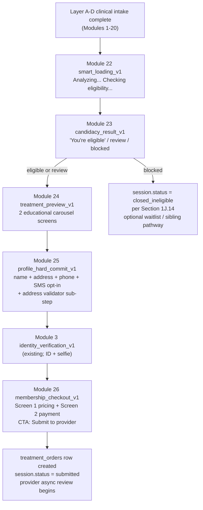
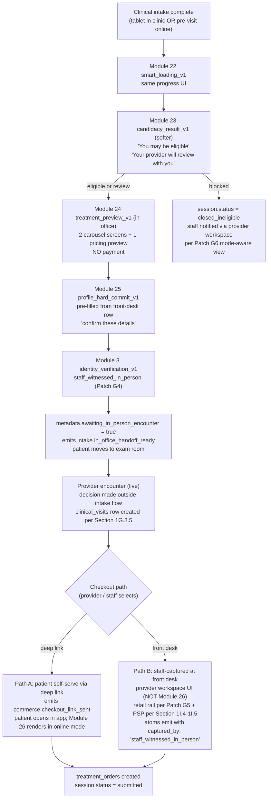

# Conversion funnel modules — post-clinical spec v1

**Date:** 2026-05-04
**Stage:** 2 Phase 2.3 — conversion funnel authoring (5 modules: smart_loading + candidacy_result + treatment_preview + profile_hard_commit + membership_checkout)
**Clinical CODEOWNER:** founder (board-certified MD)
**Legal CODEOWNER:** legalops (pending; see Legal content dependencies)
**Architecture pin:** `Section 1K.3` (4-layer module taxonomy + atomization + educational_screen semantics) + `Section 1K.4` (question bank + versioning) + `Section 1K.11` (consent architecture) + `Section 1K.19.3` (change-control) + `Section 1K.19.9` (non-clinical analytics events) + `Section 1J.4` (safety preflight) + `Section 1J.14` (ineligibility closure) + `Section 1Q.15` (GLP-1 rule outputs consumed here) + `Section 1Q.23` (interaction_context; Patches G4 / G5 / G6) + `Section 1I.4-1I.5` (PSP discipline; dual-rail + retail rail) + `Section 1K.5.A` (assertion shape)
**Reference funnel:** [.cursor/plans/ingestion/competitor_product_evidence/hims/hims_weight_loss_new_patient.md](.cursor/plans/ingestion/competitor_product_evidence/hims/hims_weight_loss_new_patient.md) Steps 68-78; [.cursor/plans/ingestion/competitor_product_evidence/hims/hims_weight_loss.md](.cursor/plans/ingestion/competitor_product_evidence/hims/hims_weight_loss.md) Steps 39-44; corroborated by [hims_trt.md](.cursor/plans/ingestion/competitor_product_evidence/hims/hims_trt.md) Step payment-step (lines 1642-1683), [hims_anxiety.md](.cursor/plans/ingestion/competitor_product_evidence/hims/hims_anxiety.md) plan-selection (lines 955-985), [hims_labs.md](.cursor/plans/ingestion/competitor_product_evidence/hims/hims_labs.md) checkout (lines 407-477), [hers_menopause.md](.cursor/plans/ingestion/competitor_product_evidence/hims/hers_menopause.md) ineligibility (line 1974-1978).

## Scope

The post-clinical conversion funnel — the stack of screens that runs AFTER Layer A-D clinical intake completes and BEFORE the patient has a `treatment_orders` row. This is the "meat" of the Hims-style funnel: the screens that convert a completed intake into a paid, provider-reviewed case.

**5 modules in this file:**

1. `mod.universal.smart_loading_v1` — 0 questions (non-clinical progress UI while safety preflight + pathway rules resolve async)
2. `mod.universal.candidacy_result_v1` — 0 questions (consumes rule outputs; renders eligible / review_required / blocked result screen with mode-aware copy)
3. `mod.pathway.glp1.treatment_preview_v1` — 0 questions (educational carousel; pathway-scoped content; online = 2 screens, in-office = 3 screens incl. indicative pricing preview)
4. `mod.universal.profile_hard_commit_v1` — 8 fields (legal name + shipping address + apt + city + state + zip + phone + SMS opt-in); 1 address validator sub-step
5. `mod.universal.membership_checkout_v1` — 2 screens (pricing review / plan picker + payment commit); 2 in-office variants (deep-link + staff-captured)

Plus the existing `mod.universal.identity_verification_v1` (Module 3 from `universal_modules_v1.md`) renders between Modules 25 and 26 per Hims Steps 77-78 — not re-authored here, composition pointer only.

**Per-patient render counts:**

- Online eligible patient: 22 → 23 → 24 (2 screens) → 25 + validator → 3 (existing) → 26 (2 screens) = ~8 post-clinical screens
- In-office eligible patient: 22 → 23 (softer copy) → 24 (3 screens incl. pricing preview) → 25 (pre-filled confirm) → 3 (staff_witnessed) → handoff to encounter → Path A (26 via deep-link) OR Path B (staff-captured at front desk, no Module 26 render) = ~5-6 pre-encounter screens + post-encounter payment capture
- Blocked patient (any mode): 22 → 23 (blocked variant) → session closed_ineligible per `Section 1J.14`; no downstream modules render
- review_required patient: identical render count to eligible; provider makes final decision async after Module 26 "Submit to provider" or post-encounter

**Key architectural decisions (binding):**

- **Online + in-office both V1.** Every module carries `interaction_context.mode` branches at the copy / behavior layer per `Section 1Q.23`. No duplicate modules per mode.
- **No drug selection at intake.** Module 24 is pure educational; patient never picks a product. Confirmed by Hims carousels (Steps 73-74 new-patient + Steps 39-41 returning) showing products but committing nothing.
- **Single-rail by default.** GLP-1 V1 bundles medication cost into the monthly membership price (corroborated cross-pathway: TRT + Anxiety + Labs all single-rail bundled in Hims). Dual-rail is supported via pricing profile config for future branded-drug or advanced-HRT use cases.
- **Pharmacologic acknowledgments (MEN-2 / off-label / compounded / pregnancy) stay deferred** to a future Rx Confirmation flow, not surfaced at intake checkout. Consistent with Hims intake cadence at Steps 43-44 (subscription T&C only) and confirmed by `glp1_pathway_modules_v1.md` Deferred scope.
- **GLP-1 V1 pricing placeholder = Hims numbers** ($39 first month / $149/mo) flagged `pricing_source: 'hims_placeholder'` for easy swap when product/finance owns final values. No module code change needed when numbers change — pricing profile version bump only.
- **Provider-encounter interstitial (in-office only):** session remains `status: in_progress` with `metadata.awaiting_in_person_encounter: true` + `metadata.in_office_handoff_at: timestamptz` between Module 3 (identity) and Module 26 checkout. Lightweight alternative to an `intake_sessions.status` enum migration; additive per `Section 1K.19.7`.

## MAIN voice principles (binding)

Inherits the `universal_modules_v1.md` voice rules (direct, warm, clinically accurate, 7th-grade reading level, no false urgency). Additional principles specific to conversion funnel:

- **Commercial-confidence copy is honest.** "Full refund if not eligible" and "Medication cost is/isn't included" are stated clearly, not buried.
- **In-office copy defers to the provider.** Never say "You're eligible" in in-office mode — the provider makes the final call live.
- **No "Congratulations!"-style copy.** No transformation hype. No fake scarcity. No countdown timers on pricing.
- **Consent block text is linkable, not hidden.** Every `legal_block_ref` resolves to inline clickable links; full text accessible via modal or external page per UX round.

## Funnel flow — online



## Funnel flow — in-office



---

## Module 22 — `mod.universal.smart_loading_v1`

**`module_id`:** `mod.universal.smart_loading_v1`
**`module_version`:** `1.0.0`
**`kind`:** non-clinical (progress UI)
**`pathways`:** all (universal)
**`required_for`:** none (cosmetic)
**`assertion_group_emit_trigger`:** none (no clinical atoms)

**Hims source:** Steps 68-70 of `hims_weight_loss_new_patient.md` — sequence of loading screens (`/c/mm-wm?sessionId=...`, `/c/mm-wm/smart-loading` with "Analyzing your responses... 20%" and "Checking eligibility... 100%"), including one screen that surfaces the derived "17.4 lbs" weight-loss projection.

**Composition position:** pathway file inserts this module immediately after the last clinical module (Module 20 `gi_safety_extended_v1` for GLP-1) and before Module 23 candidacy_result. Renders while `Section 1J.4` `loadPatientCaseSafetySnapshot` + `Section 1Q.15` GLP-1 rule evaluation resolves async. Minimum-duration contract (2-4 seconds) prevents jarring zero-latency hops.

**MAIN voice:**
- Screen A prompt: "Analyzing your responses..."
- Screen B prompt: "Checking eligibility..."
- Screen B optional derived stat (GLP-1 pathway): "Patients like you lose an average of {atom.pathway.glp1.projected_weight_loss_band} lbs in 6 months" — stat template reads from pathway config; no new atom emitted.

**Schema:**
- `question_id`: `qb.universal.smart_loading.primary_v1` | `tier`: n/a (non-question)
- `answer_type`: `educational_screen` | `requiredness`: `not_applicable`
- `answer_role`: `operational` | `intent_of_answer_set`: `progress_indication`
- `entity_kind`: n/a | `atom_kind`: n/a | `downstream_effect`: `none`
- `render_when`: null (always; immediately after clinical intake)
- `min_duration_ms`: 2000 (binding; prevents instant skip)
- `max_duration_ms`: 8000 (binding; if safety snapshot not ready by then, proceed optimistically and Module 23 renders `review_required` as fallback)

**Atoms emitted:** none (per `Section 1K.3` educational_screen semantics — zero clinical atoms).

**Non-clinical analytics events emitted (per `Section 1K.19.9`):**
- `intake.smart_loading.shown` (metadata: `{session_id, pathway_code, interaction_context, shown_at}`)
- `intake.smart_loading.snapshot_resolved` (metadata: `{session_id, resolution_latency_ms, snapshot_ready: true}`)
- `intake.smart_loading.timeout_fallback` (metadata: `{session_id, resolution_latency_ms, snapshot_ready: false}`) — emitted only when `max_duration_ms` exceeded

**In-office variant:** identical UI. Staff may skip past smart_loading manually via provider-workspace keyboard shortcut during in-person tablet intake; emits `intake.smart_loading.staff_skipped` when skipped.

**Issues found:** None.
**Final decision:** **Modify** (Hims-faithful progress UI with min-duration contract + analytics hooks).

---

## Module 23 — `mod.universal.candidacy_result_v1`

**`module_id`:** `mod.universal.candidacy_result_v1`
**`module_version`:** `1.0.0`
**`kind`:** non-clinical (result display + session gating)
**`pathways`:** all (universal; content varies per pathway)
**`required_for`:** session continuation
**`assertion_group_emit_trigger`:** `module_complete` (single result atom)

**Hims source:** Steps 71-72 of `hims_weight_loss_new_patient.md` — "You're eligible!" + "Lose 32 lbs on average in over 1 year* — A licensed provider will review your health profile to see if a GLP-1 medication is right for you. Continue." Blocked variant source: `hers_menopause.md` line 1974-1978 "Unfortunately, you are not eligible..."

**Composition position:** renders immediately after Module 22 smart_loading. Gates downstream funnel: `blocked` result closes the session and skips Modules 24-26 entirely; `eligible` and `review_required` both continue to Module 24.

**Consumes (does not compute):**
- `Section 1J.4` safety preflight snapshot
- `Section 1Q.15` GLP-1 eligibility rules (24 rules; pancreatitis, MEN-2/MTC, AN, state, BMI, pregnancy, etc.)
- `Section 1J.14` closure reason resolver (for blocked variant)
- `atom.universal.residence_state` (for state-ineligibility routing)

**MAIN voice — 6 copy permutations (3 result variants × 2 modes):**

| Result | Online copy | In-office copy |
|---|---|---|
| `eligible` | Header: "You're eligible" · Body: "A licensed provider will review your health profile to finalize your plan." · CTA: "Continue" | Header: "You may be eligible" · Body: "Your provider will review your responses with you shortly." · CTA: "Continue to treatment preview" |
| `review_required` | Header: "Thanks for your responses" · Body: "Our providers will review your case and follow up within 24 hours." · CTA: "Continue" | Header: "Thanks for your responses" · Body: "Your provider will review with you shortly." · CTA: "Continue" |
| `blocked` | Header: "We can't offer this treatment" · Body (dynamic from `blocked_closure_reason`): state-ineligibility / safety-contraindication / age-ineligibility / BMI-threshold-not-met · CTA: "Explore other options" (links to sibling pathway per `Section 1K.2`) OR "Join the waitlist" (when `blocked_closure_reason = 'state_ineligibility'`) | Header: "Your provider will discuss next steps with you" · Body: staff-facing "not eligible" flag surfaces separately in provider workspace per `Section 1Q.23` Patch G6; patient-facing copy is soft and defers · CTA: "Continue to check-in" (returns patient to waiting-room state) |

**Schema:**
- `question_id`: `qb.universal.candidacy_result.primary_v1` | `tier`: 1
- `answer_type`: `educational_screen` (result variant renders; Continue CTA advances)
- `answer_role`: `operational` | `intent_of_answer_set`: `result_display`
- `entity_kind`: `single_value` | `atom_kind`: `candidacy_result` | `downstream_effect`: `hard_stop` (when blocked) / `personalization` (otherwise)
- `render_when`: null (always; immediately after Module 22)
- `dynamic_copy_template_refs`: `[{ref: 'result', resolves_to_copy_map}, {ref: 'interaction_context.mode', resolves_to_copy_map}, {ref: 'blocked_closure_reason', resolves_to_copy_map}]`

**Atoms emitted:**
- Positive: `atom.universal.candidacy_result` (metadata: `{result: 'eligible' | 'review_required' | 'blocked', reasons: string[], pathway_code, blocked_closure_reason?: string, blocked_reopen_eligibility_criteria?: string, computed_at: timestamptz, snapshot_version}`)
- `result = 'blocked'` additionally triggers: `intake_sessions.status = 'closed_ineligible'` + `closed_reason_code = <blocked_closure_reason>` + `reopen_eligibility_criteria = <per Section 1J.14>` (state-dependent: `'none'` for absolute contraindications; `'state_expansion'` for state-ineligibility; `'bmi_change'` for BMI-below-threshold; etc.)

**Non-clinical analytics (per `Section 1K.19.9`):**
- `intake.candidacy_result.rendered` (metadata: `{session_id, result, interaction_context, rendered_at}`)
- `intake.candidacy_result.continued` (metadata: `{session_id, result, time_on_screen_ms}`) — emitted when patient clicks Continue on eligible/review_required
- `intake.candidacy_result.session_closed` (metadata: `{session_id, blocked_closure_reason, reopen_eligibility_criteria}`) — emitted on blocked

**Branching adjustments:**
- `eligible` + `review_required` → Module 24 treatment_preview
- `blocked` → session closes per `Section 1J.14`; Modules 24-26 do not render; patient routed to waitlist (state-ineligibility) or sibling pathway suggestion (contraindication → alt-care) or terminal screen (absolute)
- In-office `blocked`: session closes but patient stays in-clinic; provider workspace surfaces "this patient is not eligible for GLP-1 — please discuss alternatives" flag per `Section 1Q.23` Patch G6 mode-aware view discipline

**Cross-pathway reuse:** atom + module are fully universal. Every pathway (TRT, ED, Female HRT, GAH, hair loss, labs) uses this exact module; only the pathway-specific rule outputs and copy maps differ. CI lint enforces every pathway file composes `mod.universal.candidacy_result_v1` in the post-clinical position.

**Issues found:** None — Hims pattern is clean and transplants directly.
**Recommended rewrite:** Adopt with in-office softer-copy variant that Hims doesn't have (MAIN extension for in-clinic workflow).
**Final decision:** **Modify** (Hims structural parity + in-office copy extension + dual-mode analytics).

---

## Module 24 — `mod.pathway.glp1.treatment_preview_v1`

**`module_id`:** `mod.pathway.glp1.treatment_preview_v1`
**`module_version`:** `1.0.0`
**`kind`:** non-clinical (educational / trust-building)
**`pathways`:** glp1 (pathway-scoped content; future ED / HRT / TRT pathways author their own `mod.pathway.<x>.treatment_preview_v1` following the same pattern)
**`required_for`:** none (educational)
**`assertion_group_emit_trigger`:** none

**Hims source:** Steps 73-74 of `hims_weight_loss_new_patient.md` + Steps 39-41 of `hims_weight_loss.md` — trustification carousels showing "Here are some GLP-1s a provider may recommend" with product cards (Wegovy Pen, Wegovy Pill, Zepbound KwikPen, Zepbound Vial, Foundayo Pill, Other GLP-1 pens). **Explicitly NOT a selection screen** — patient never commits to a drug; provider picks in review. No atoms emitted; no clinical value captured.

**Composition position:** renders after Module 23 candidacy_result (eligible or review_required branches only) and before Module 25 profile_hard_commit. Skipped entirely on `blocked` result.

**Template pattern:** "pathway treatment preview" is a reusable pattern. Every pathway with a product carousel authors its own `mod.pathway.<x>.treatment_preview_v1` with pathway-appropriate product list + FDA disclaimers. Structure (screen count, atom-free, educational) is identical; content is pathway-scoped.

### Online variant — 2 screens

**Screen A prompt:** "Here are some GLP-1s a provider may recommend"
**Screen A body:** Carousel card list (3 cards):
- Card 1: "Wegovy® Pen — Once weekly injection. FDA approved for weight loss. Lose up to 25% body weight*"
- Card 2: "Wegovy® Pill — Once daily tablet. FDA approved for weight loss. No injection required."
- Card 3: "Zepbound® KwikPen® — Once weekly injection. FDA approved for weight loss. Lose up to 21% body weight²"
**Screen A CTA:** "Next"

**Screen B prompt:** "Here are some GLP-1s a provider may recommend" (continues)
**Screen B body:** Carousel card list (4 cards):
- Card 1: "Zepbound® Vial — Once weekly injection. FDA approved for weight loss. Lose up to 21% body weight²"
- Card 2: "Foundayo™ Pill — Once daily tablet. FDA approved for weight loss. Lose up to 11% body weight³"
- Card 3: "Ozempic® / Mounjaro® — Once weekly injections. Available in a range of doses."
- Card 4 (disclaimer card): "*Results vary. Full FDA disclosures available on request."
**Screen B CTA:** "Continue"

**Screen B inline FDA boilerplate (legal-reviewed per `Section 1K.19.3`):**
> Ozempic® and Mounjaro® are FDA-approved for type 2 diabetes and are available only to patients who meet clinical eligibility, as determined by a licensed healthcare provider. Wegovy®, Zepbound®, and Foundayo™ are FDA-approved for weight loss. Trademarks are property of their respective owners. MAIN is not affiliated with or endorsed by Eli Lilly & Company or Novo Nordisk A/S.

### In-office variant — 3 screens

**Screens A + B:** same carousel content as online, with one addition to Screen B footer:
> **"Your provider may talk with you about these options and recommend what's best for you."**

**Screen C (in-office only) — indicative pricing preview:**
- Prompt: "About the Membership"
- Body: reads `membership_pricing_profile_v1.indicative_pricing_preview.copy_template` and resolves against GLP-1 V1 pricing profile. Renders (for Hims-placeholder numbers):
  > "Plans start at $39 for your first month, then $149/month. Cancel anytime. Full refund if not eligible."
- Body (sub-line, inclusions summary): "Membership includes your provider visit, 24/7 messaging, monthly follow-ups, dosage adjustments, and medication shipped to you."
- **NO payment form. NO "Submit to provider" CTA. NO card capture.**
- CTA: "Continue to check-in"

### Schema

- `question_id`: `qb.pathway.glp1.treatment_preview.screen_a_v1` / `..screen_b_v1` / `..screen_c_v1` (last only in in-office)
- `answer_type`: `educational_screen` (all screens)
- `requiredness`: `not_applicable`
- `answer_role`: `educational_trust` | `intent_of_answer_set`: `trust_building`
- `entity_kind`: n/a | `atom_kind`: n/a | `downstream_effect`: `none`
- `render_when`: `{question_id: 'qb.universal.candidacy_result.primary_v1', metadata.result: in ['eligible', 'review_required']}`
- `in_office_only` flag on screen_c: `true` (skipped when `interaction_context.mode = 'online'`)

**Atoms emitted:** none (zero clinical atoms; pure educational per `Section 1K.19.9`).

**Non-clinical analytics (per `Section 1K.19.9`):**
- `intake.educational_screen.shown` (metadata: `{session_id, screen_id, pathway_code, interaction_context, shown_at}`)
- `intake.educational_screen.continued` (metadata: `{session_id, screen_id, time_on_screen_ms}`)
- `intake.educational_screen.carousel_card_viewed` (metadata: `{session_id, screen_id, card_id, dwell_ms}`) — optional; drives content optimization

**Issues found:**
- Hims's online variant is clean; MAIN adopts it with minor wording parity.
- Hims does NOT show pricing preview pre-provider-review in any captured flow. MAIN's in-office Screen C is an intentional divergence — in-person patients benefit from price context before the provider enters the exam room, since the provider-conversation will otherwise be the first pricing-touchpoint (bad UX). Screen C surfaces pricing as expectation-setting, not commitment.
- FDA disclaimer copy wording requires legalops review before production launch.

**Recommended rewrite:** Adopt Hims online variant verbatim (with trademark corrections for MAIN context). Add MAIN-extension in-office Screen C for pricing preview.

**Final decision:** **Modify** (Hims online parity + MAIN-extension in-office pricing preview + atoms-free educational discipline).

---

## Module 25 — `mod.universal.profile_hard_commit_v1`

**`module_id`:** `mod.universal.profile_hard_commit_v1`
**`module_version`:** `1.0.0`
**`kind`:** non-clinical (operational / fulfillment)
**`pathways`:** all (universal)
**`required_for`:** fulfillment, identity, TCPA compliance
**`assertion_group_emit_trigger`:** `module_complete` (composite hard-commit atom set)

**Hims source:** Step 75 `/shipping-address` "Complete your profile — This information helps us identify a licensed provider in your state to complete your medical assessment." + Step 76 USPS address-validator sub-step + embedded TCPA SMS opt-in checkbox ("I'd also like to receive occasional promotions via text message. Opt out anytime.").

**Composition position:** after Module 24 treatment_preview and before Module 3 identity_verification. This is the Hims "hard-commit" boundary (user's own ingest note at line 1980: "hard-commit boundary observed at the address step begins here") — patient cannot hit browser-back past this point per Hims's UX, and session state begins firming. MAIN adopts the same boundary.

### Fields

**Q25.1 — Legal first name**
- prompt: "Legal first name"
- schema: `question_id: qb.universal.profile.legal_first_name_v1`, `answer_type: text`, `requiredness: required_to_continue`
- atom: contributes to composite `atom.universal.legal_full_name`

**Q25.2 — Legal last name**
- prompt: "Legal last name"
- schema: `qb.universal.profile.legal_last_name_v1`, `text`, `required_to_continue`
- atom: contributes to composite `atom.universal.legal_full_name`

**Q25.3 — Street address**
- prompt: "Street address"
- schema: `qb.universal.profile.street_address_v1`, `text`, `required_to_continue`

**Q25.4 — Apt / suite (optional)**
- prompt: "Apt / Suite"
- helper: "Optional"
- schema: `qb.universal.profile.address_apt_v1`, `text`, `optional`

**Q25.5 — City**
- prompt: "City"
- schema: `qb.universal.profile.address_city_v1`, `text`, `required_to_continue`

**Q25.6 — State**
- prompt: "State"
- helper: "Pre-filled from your earlier answer. Edit if you need to ship to a different state." (when `atom.universal.residence_state` present)
- schema: `qb.universal.profile.address_state_v1`, `single_select`, `required_to_continue`, choices = 50 US states + DC per `universal_modules_v1.md` Q1.4 `state_code` enum
- prefill: from `atom.universal.residence_state` if present; editable
- **Binding:** `address_state` must equal `atom.universal.residence_state` for telehealth compliance. Mismatch triggers Mode F clarification per `Section 1P.4` (not a hard stop) + `state_review_required` case routing per `main_hims-level_build` plan, consistent with `universal_modules_v1.md` Q1.5 treatment.

**Q25.7 — Zip code**
- prompt: "ZIP code"
- schema: `qb.universal.profile.address_zip_v1`, `text` with 5-or-9-digit pattern validation, `required_to_continue`

**Q25.8 — Phone (mobile)**
- prompt: "Mobile phone"
- helper: "We'll text order updates, treatment info, and shipping confirmations. Standard message rates apply."
- schema: `qb.universal.profile.phone_mobile_v1`, `text` with E.164 normalization at capture, `required_to_continue`

**Q25.9 — SMS promotional opt-in (TCPA)**
- prompt: "I'd also like to receive occasional promotions via text message. Opt out anytime."
- schema: `qb.universal.profile.sms_promotional_opt_in_v1`, `acknowledgment_checkbox`, `optional`
- **Not bundled** with service-SMS notice (transactional service SMS is covered under telehealth consent + the helper copy on Q25.8). Promotional opt-in is separately captured per TCPA.

### Address validator sub-step

**Trigger:** after Q25.3-Q25.7 submitted; USPS (or equivalent) validator runs async.
**Render:** if validator suggests a normalized variant, sub-step screen presents:
- "Original address: {entered}"
- "Suggested address: {usps_normalized}"
- Radio: patient picks one
- CTA: "Continue"

If validator returns no suggestion (exact match or no-op), sub-step is skipped silently.

### Atoms emitted (composite via `assertion_group_id: universal.profile_hard_commit_composite`)

- `atom.universal.legal_full_name` (metadata: `{first, last, captured_at}`)
- `atom.universal.shipping_address` (metadata: `{street, apt?, city, state, zip, country: 'US', validated_by: 'usps' | 'unvalidated', validation_resolved_at, entered_vs_suggested?: 'entered' | 'suggested'}`)
- `atom.universal.phone_mobile` (metadata: `{e164: string, captured_at, verification_status: 'unverified' | 'verified_via_rx_sms'}`)
- Conditional (only if Q25.9 checked): `consent.sms_promotional_v1_signed` (metadata: `{consent_version, signed_at, ip_address_hash, phone_number_hash}`) per `Section 1K.11` consent architecture
- State-mismatch side effect (only if `address_state != residence_state`): `atom.universal.state_mismatch_flag` (metadata: `{residence_state, shipping_state, flagged_at}`) → downstream routes to `state_review_required` per existing main_hims-level_build plan

### In-office variant

- **Pre-fill source:** staff front-desk intake creates a `staff_profiles.front_desk_patient_profile` row at check-in with name + address + phone + email. When Module 25 renders in in-person mode, all fields are pre-populated and the primary CTA reads "Confirm these details" instead of "Continue". Patient may edit any field; edits flip that field's `captured_by` metadata from `'staff_captured'` to `'patient_edited'`.
- **TCPA opt-in:** same checkbox pattern; staff may not check the box on patient's behalf (TCPA requires explicit patient action). If patient declines to provide a phone number at all, Q25.8 becomes `required_blank_allowed` with alternate contact method capture per in-office care-coordination protocol (email-only or in-person-only).
- **Validator:** same USPS validator runs; staff may accept suggested address on patient's behalf with patient confirmation (verbal attestation logged per `Section 1Q.23` Patch G5).

### Schema summary

- All questions `answer_role: operational`; `intent_of_answer_set: forced_classification` (except Q25.9 which is `preference_capture`)
- `entity_kind: composite` (module emits composite atom set at `module_complete`)
- `atom_kind: identity` for name/phone, `operational` for address, `consent` for SMS opt-in
- `downstream_effect: personalization` (legal name, address, phone drive fulfillment + comms); `hard_stop` fallback only for state-mismatch blocking post-Mode-F resolution

**Issues found:**
- Hims's single-checkbox-for-promotional-SMS pattern is TCPA-compliant and efficient; MAIN adopts it verbatim.
- Address validator is a Hims-proven UX pattern (Step 76) that catches ~15% of addresses needing normalization. Standard practice.
- State pre-fill from `residence_state` is net-new value vs. Hims Step 75 which re-asks state at checkout. MAIN saves a click.

**Recommended rewrite:** Adopt Hims field set + USPS validator + TCPA checkbox. Add state pre-fill. Add in-office staff-pre-fill variant.

**Final decision:** **Modify** (Hims funnel parity + state-prefill optimization + TCPA composite atom emit + in-office staff pre-fill extension).

---

## Module 26 — `mod.universal.membership_checkout_v1`

**`module_id`:** `mod.universal.membership_checkout_v1`
**`module_version`:** `1.0.0`
**`kind`:** commercial (payment + subscription consent)
**`pathways`:** all (universal scaffolding; pricing + copy pathway-configurable via `membership_pricing_profile_v1`)
**`required_for`:** case submission, payment capture
**`assertion_group_emit_trigger`:** `module_complete` (composite commerce + consent atom set at "Submit to provider")

**Hims source:** Steps 43-44 of `hims_weight_loss.md` `/c/mm-wm/membership-payment` — pricing card + benefits + promo banner (Screen 1) followed by payment method + dense legal block + "Submit to provider" CTA (Screen 2). Cross-pathway corroboration:
- `hims_trt.md` lines 1642-1683 — TRT `/c/tt/payment-step` with "Select your plan" duration picker (10/5/3 month) + lab-kit qualifier + bundled medication + "Submit to provider"
- `hims_anxiety.md` lines 955-985 — plan picker with 6/3/1 month duration options, save-per-year framing
- `hims_labs.md` lines 407-477 — annual subscription variant with "Submit" CTA (no provider review upfront)

**Composition position:** last module in the conversion funnel. Renders after Module 3 identity_verification in online flow; rendered post-encounter (Path A) OR replaced by front-desk staff-captured workflow (Path B) in in-office flow.

### Online variant — 2 screens

**Screen 1 — pricing review / plan picker**

- Reads pathway's active `membership_pricing_profile_v1` (schema below).
- Dynamic render based on `primary_plans.length`:
  - `== 1` → single plan card renders (GLP-1 V1 case: `$149/mo` with `$39` first-month promo banner)
  - `> 1` → plan picker renders with N cards (future: TRT 10/5/3 month; ED 1/3/6 month; etc.); patient picks one; selection captured at submit-to-Screen-2
- Always renders: inclusions list (from `inclusions` config), "Full refund if not eligible" microcopy (from `refund_policy_ref`), promo banner (if `primary_plan.first_month_price_cents < monthly_price_cents`)
- CTA: `"Continue to payment"` → Screen 2

**Screen 2 — payment commit**

- Payment method selector:
  - Saved cards (if patient has prior Stripe Customer rows)
  - "Use a different card" → inline Stripe Elements iframe per `Section 1I.4-1I.5` PSP discipline (card number + exp + CVC captured by Stripe, never touches MAIN servers)
- Legal block: dense paragraph of subscription T&C + auto-renewal + cancellation window + medication-vs-membership scope (from `legal_block_ref`; clickable "Terms", "Privacy Policy", "Membership Terms" links open modal/external)
- Primary CTA: reads `pricing_profile.cta_text` (default `"Submit to provider"`; Labs-style pathways use `"Submit"`)
- Security footer: "Payments are processed securely" + lock icon per Hims UX

**On Submit (online, emits atomically in single DB transaction):**
- `commerce.membership_plan_selected` (metadata: `{session_id, pathway_code, pricing_profile_id, pricing_profile_version, selected_plan_id, rail_model: 'single' | 'dual', monthly_price_cents, total_cents, currency, promo_code?, first_month_price_cents?}`)
- `commerce.payment_method_added` (metadata: `{session_id, psp: 'stripe', psp_customer_id, psp_payment_method_id, card_last_4, exp_month, exp_year, captured_by: 'patient'}`)
- `consent.membership_terms_v1_signed` (metadata: `{consent_version, consent_body_hash, signed_at, ip_address_hash, user_agent_hash, session_id}`) per `Section 1K.11`
- `consent.auto_renewal_authorization_v1_signed` (metadata: `{consent_version, consent_body_hash, signed_at, ip_address_hash, billing_frequency: 'monthly' | 'quarterly' | 'annual', cancellation_window_days, refund_policy_ref, session_id}`) per `Section 1K.11`
- `commerce.submit_to_provider_triggered` (metadata: `{session_id, pathway_code, submitted_at, interaction_context, captured_by: 'patient'}`)
- **Side effects:**
  - `intake_sessions.status` transitions to `submitted`
  - `treatment_orders` row created in `pending_clinical_review` state per `Section 1I.4-1I.5`; PSP capture timing follows pricing profile's `rail_model`:
    - `single`: PSP authorization at submit; capture on provider approval (reversal on denial) — default for GLP-1 V1
    - `dual`: first-month membership PSP captured at submit; medication PSP captured separately after Rx approval
  - Provider-review queue entry created per `Section 1G.8.5` provider workspace

### In-office variant — 2 post-encounter paths

The in-office Module 26 renders DIFFERENTLY than online: in-office, Module 26 does NOT render during intake. Instead, session sits at `metadata.awaiting_in_person_encounter = true` after Module 3 identity_verification completes. Provider encounter happens offline (live in exam room; `clinical_visits` row per `Section 1G.8.5`). At encounter close, provider workspace presents a checkout-path picker to the provider/front-desk staff:

**Path A — Deep link to patient app (patient self-serve)**

- Provider workspace fires `commerce.checkout_link_sent` atom (metadata: `{session_id, encounter_id, link_token, expires_at, patient_id, sent_to: 'sms' | 'email' | 'both', sent_by_staff_user_id}`)
- SMS + email dispatched via `Section 1Q.5` outbound templates; template_id `template.universal.post_encounter_checkout_link_v1`
- Patient opens link on their phone; session `interaction_context.mode` transitions to `'online'` for Module 26 render only (intake_sessions retains `originating_mode: 'in_person'` for audit); Module 26 renders exactly as online variant (Screens 1 + 2); atoms emit with standard `captured_by: 'patient'`
- Link token expires per `Section 1I.4-1I.5` PSP session discipline (default 72h); if expired, staff can regenerate or switch to Path B
- If patient abandons mid-checkout, `intake_sessions.status` remains `in_progress` + `metadata.checkout_link_sent_at` + `metadata.checkout_link_abandoned_at`; retry logic per `Section 1Q.6` outbound retry discipline

**Path B — Staff-captured at front desk (retail rail per `Section 1Q.23` Patch G5 + `Section 1I.4-1I.5`)**

- **Module 26 does NOT render.** Checkout is handled entirely in provider workspace UI (front-desk close-out view, mode-tuned per `Section 1Q.23` Patch G6).
- Terminal/POS card reader captures payment per in-clinic `terminal_psp` adapter (future extension; V1 may fall back to Stripe Elements on a staff iPad if terminal not available)
- Staff reads the subscription T&C + auto-renewal authorization aloud to patient (or patient reads on shared screen); staff checks the attestation checkbox on patient's behalf with patient verbal "yes" recorded per `Section 1Q.23` Patch G5 staff-witnessed attestation discipline
- Atoms emit (identical shape to online / Path A, with additional metadata):
  - `commerce.membership_plan_selected` (metadata: `{..., captured_by: 'staff_witnessed_in_person', verifying_staff_user_id, location_id, patient_verbal_attestation: true}`)
  - `commerce.payment_method_added` (metadata: `{..., captured_by: 'staff_witnessed_in_person', terminal_id?, psp: 'stripe', psp_payment_intent_id, verifying_staff_user_id}`)
  - `consent.membership_terms_v1_signed` (metadata: `{..., captured_by: 'staff_witnessed_in_person', verifying_staff_user_id, staff_attestation_text}`)
  - `consent.auto_renewal_authorization_v1_signed` (metadata: `{..., captured_by: 'staff_witnessed_in_person', verifying_staff_user_id}`)
  - `commerce.submit_to_provider_triggered` (metadata: `{..., captured_by: 'staff_witnessed_in_person', verifying_staff_user_id, encounter_id}`)
- Optional concurrent `commerce_orders` row created for any in-clinic retail ancillary (supplement / OTC / device) sold at same front-desk touchpoint per `Section 1Q.23` Patch G5 dual-settlement pattern — same `interaction_context` metadata shared across both rails

**CI lint (binding, per `Section 1K.19.7`):** `commerce.submit_to_provider_triggered` atoms must be unique per `(session_id, encounter_id?)` tuple. If Path B staff-captured atom fires first, subsequent Path A deep-link-patient-completion MUST return "already paid" error to patient; if Path A fires first, Path B staff-captured attempt MUST return "already paid" error to staff. Prevents double-capture.

### Schema summary

- `question_id`: `qb.universal.checkout.plan_picker_v1` (Screen 1) + `qb.universal.checkout.payment_commit_v1` (Screen 2)
- `answer_type`: `plan_selection` (Screen 1; custom type accepting `DurationPlan` pick) + `payment_commit_with_consent` (Screen 2; custom composite: payment method + multi-consent attestation)
- `requiredness`: `required_to_continue` (both)
- `answer_role`: `commercial_confidence` + `operational`
- `intent_of_answer_set`: `commercial_commit`
- `entity_kind`: `composite`
- `atom_kind`: `commerce` + `consent`
- `downstream_effect`: `hard_stop` if payment fails (patient blocked from Submit; retries allowed); `personalization` + `provider_review` on success
- `render_when`: `{question_id: 'qb.universal.identity_verification.selfie_upload_v1', equals: 'uploaded'}` (online only); in-office variant gated by `{metadata.awaiting_in_person_encounter: false, encounter_resolved: true, checkout_path: 'deep_link'}`

**Issues found:**
- Hims bundles subscription T&C + auto-renewal into one legal block + one click. MAIN splits into two consent atoms (`consent.membership_terms_v1_signed` + `consent.auto_renewal_authorization_v1_signed`) at the atom layer but presents as one checkbox at the UX layer — both atoms emit from one patient action, mirroring the `universal.base_consents_composite` pattern from Module 2.
- Hims's in-office checkout (if it exists) is not captured in ingestion; MAIN's Path A + Path B are MAIN-extension architectural design driven by `Section 1Q.23` hybrid stress test.
- Pricing profile placeholder values are Hims's; flagged `pricing_source: 'hims_placeholder'` for quick swap.
- Stripe Elements iframe integration requires frontend work per `Section 1I.4-1I.5`; this spec doesn't block on that work but calls it out as a Phase 3 integration dependency.

**Recommended rewrite:** Adopt Hims online structure (2 screens, same UX) + MAIN-extension in-office dual-path + split consent atoms at architecture layer while preserving single-checkbox UX + config-driven CTA text + config-driven plan-count (1..N DurationPlans).

**Final decision:** **Modify** (Hims online parity + MAIN-extension in-office Path A + Path B + multi-plan + multi-consent-atom discipline + CI lint for no-double-capture).

---

## Schema — `membership_pricing_profile_v1`

**Location in production code:** `repo/intake/pricing-profiles/<pathway_code>.ts` (keyed by pathway_code; one profile per pathway).
**Location in this spec:** schema defined here; GLP-1 V1 default instance declared in next section.
**Change control:** profile updates are `profile_version` bumps (semver); pricing changes = patch; field additions = minor; breaking field removals = major. Per `Section 1K.19.3` change-control matrix, pricing-field changes require `product_owner` approval; legal field changes require `legalops` + `founder_clinical_codeowner` approval.

**Fields:**

```
MembershipPricingProfileV1 {
  profile_id: string                    // stable identifier, e.g. "pricing.glp1.v1"
  profile_version: string               // semver, e.g. "1.0.0"
  pathway_code: string                  // e.g. "glp1" | "trt" | "ed" | "female_hrt" | "labs"
  rail_model: "single" | "dual"         // "single" = medication bundled into membership; "dual" = separate Medication Plan charge
  primary_plans: DurationPlan[]         // 1..N; patient picks one in Screen 1; length 1 renders as single card
  qualifier_charge: QualifierCharge | null  // TRT-style lab-kit pattern; null when not used (GLP-1 V1 = null)
  inclusions: string[]                  // bullet points rendered on pricing card (e.g. "24/7 messaging")
  indicative_pricing_preview: {
    copy_template: string               // used by Module 24 in-office Screen C
  }
  cta_text: string                      // "Submit to provider" default; "Submit" for no-review pathways
  legal_block_ref: string               // pointer to versioned Membership T&C document (resolved at render)
  refund_policy_ref: string             // pointer to versioned Refund Policy document
  cancellation_window_days: number      // e.g. 2 (matches Hims)
  billing_frequency: "monthly" | "quarterly" | "annual"
  dual_rail_medication_plan: DualRailMedPlan | null  // only when rail_model === "dual"
  pricing_source: "finance_approved" | "hims_placeholder" | "legacy_imported"
  pricing_blocked_on: string[] | null   // e.g. ["product_owner"] while pricing_source === "hims_placeholder"
  created_at: timestamptz
  last_modified_at: timestamptz
  last_modified_by: staff_user_id
}

DurationPlan {
  plan_id: string                       // stable identifier, e.g. "plan.glp1.flat_monthly"
  duration_months: number               // 1 = month-to-month; 3/6/10/12 = commitment durations
  monthly_price_cents: number           // per-month price
  total_cents: number                   // total committed if duration > 1
  first_month_price_cents: number | null  // promo / intro first-month price
  promo_code: string | null
  savings_copy: string | null           // e.g. "Save $216/year"
  display_label: string                 // e.g. "1-month plan" | "3-month plan"
}

QualifierCharge {
  price_cents: number                   // e.g. 6900 for TRT lab kit
  label: string                         // e.g. "At-home lab kit"
  credit_to_rx_on_approval: boolean     // when true, refunded as Rx credit if provider approves
  refund_policy_ref: string
}

DualRailMedPlan {
  psp_product_id: string                // Stripe product id for medication line
  capture_timing: "on_rx_approval" | "on_ship"
  variable_pricing: boolean             // true when drug cost varies by Rx decision (e.g. branded vs compounded)
  pricing_resolution_source: "provider_decision" | "pharmacy_dispense" | "static"
}
```

**Lint rules (enforced by CI per `Section 1K.19.7`):**

- `primary_plans.length >= 1` (at least one plan required)
- `primary_plans.plan_id` unique within profile
- `rail_model === "dual"` REQUIRES `dual_rail_medication_plan !== null`
- `rail_model === "single"` REQUIRES `dual_rail_medication_plan === null`
- `pricing_source === "hims_placeholder"` REQUIRES `pricing_blocked_on` non-empty (makes it impossible to ship to production without approval)
- `cta_text` non-empty; recommended values `"Submit to provider"` | `"Submit"` | `"Complete order"`
- `legal_block_ref` + `refund_policy_ref` both resolve to a real versioned document in legalops content store (or are flagged `pending_legalops_v0` in staging)

---

## GLP-1 V1 default pricing profile instance

**Flagged `pricing_source: 'hims_placeholder'`** — values copied from `hims_weight_loss.md` Steps 43-44 for V1 scaffolding; swap when product/finance own final numbers. No module code change required — profile version bump only.

```
{
  profile_id: "pricing.glp1.v1",
  profile_version: "1.0.0",
  pathway_code: "glp1",
  rail_model: "single",                       // medication bundled into monthly membership per user direction
  primary_plans: [
    {
      plan_id: "plan.glp1.flat_monthly",
      duration_months: 1,
      monthly_price_cents: 14900,            // $149/mo (Hims placeholder)
      total_cents: 14900,
      first_month_price_cents: 3900,         // $39 first month promo (Hims placeholder)
      promo_code: "GLP1_FIRST_MONTH",
      savings_copy: null,
      display_label: "Monthly membership"
    }
  ],
  qualifier_charge: null,                     // no lab-kit qualifier at V1
  inclusions: [
    "Provider review to determine eligibility",
    "Rx prescription with a tailored plan, if eligible",
    "Medication included — shipped to you monthly",
    "Access to 24/7 messaging with providers",
    "Monthly follow-ups with your Care Team",
    "Dosage adjustments as needed"
  ],
  indicative_pricing_preview: {
    copy_template: "Plans start at ${{first_month_price}} for your first month, then ${{monthly_price}}/month. Cancel anytime. Full refund if not eligible."
  },
  cta_text: "Submit to provider",
  legal_block_ref: "legal.membership.glp1.v1",      // pending legalops
  refund_policy_ref: "legal.refund.glp1.v1",        // pending legalops
  cancellation_window_days: 2,
  billing_frequency: "monthly",
  dual_rail_medication_plan: null,
  pricing_source: "hims_placeholder",
  pricing_blocked_on: ["product_owner", "founder_clinical_codeowner"],
  created_at: "2026-05-04T00:00:00Z",
  last_modified_at: "2026-05-04T00:00:00Z",
  last_modified_by: "founder"
}
```

**Note on inclusions copy:** line 3 ("Medication included — shipped to you monthly") is the DIVERGENCE from Hims's weight-loss wording (which says "Medication cost is not included" because Hims runs dual-rail for branded GLP-1s). MAIN's V1 is single-rail bundled per user direction, so inclusions copy reflects that honestly.

---

## Legal content dependencies (legalops handoff)

The following versioned legal documents are referenced by atoms / pricing profile in this spec. Spec lands the ARCHITECTURE (pointers + atom schema); legalops OWNS the actual document body text. Staging/dev can emit atoms with `consent_version: 'pending_legalops_v0'`; production-launch CI gate per `Section 1K.19.3` blocks release until all documents land.

| Ref | Document | Used by | Status |
|---|---|---|---|
| `legal.tcpa.sms_promotional.v1` | SMS Promotional T&C (TCPA) | `consent.sms_promotional_v1_signed` (Module 25 Q25.9) | **Pending legalops** |
| `legal.membership.glp1.v1` | Membership Terms & Conditions (GLP-1) | `consent.membership_terms_v1_signed` (Module 26) + `legal_block_ref` in pricing profile | **Pending legalops** |
| `legal.auto_renewal.v1` | Auto-Renewal Authorization | `consent.auto_renewal_authorization_v1_signed` (Module 26) | **Pending legalops** |
| `legal.refund.glp1.v1` | Refund Policy (GLP-1) | `refund_policy_ref` in pricing profile (Module 24 + 26) | **Pending legalops** |
| `legal.fda_disclaimer.glp1.v1` | GLP-1 FDA boilerplate + trademark disclaimers | Module 24 Screen B inline copy | **Pending legalops review** (draft cited in Module 24; reviewed by legalops before launch) |

Reference pattern for body text of Membership T&C: `hims_weight_loss.md` lines 1191-1196. MAIN drafts will be authored by legalops using Hims language as the structural template but with MAIN-specific entity names, support contact info, and MAIN-policy terms.

Already-landed consent atoms not re-emitted here (referenced only):
- `consent.telehealth_v1_signed`, `consent.terms_v1_signed`, `consent.privacy_v1_acknowledged` — captured by `mod.universal.base_consents_v1` Module 2 at Step 14-equivalent early in the funnel.

---

## Interstitial session state (in-office variant; binding)

**Pattern:** additive `metadata` flag on existing `intake_sessions.status = 'in_progress'` (no enum migration required).

**Transitions:**

| When | Session state |
|---|---|
| After Module 3 identity_verification completes in in-office mode | `status: 'in_progress'`, `metadata.awaiting_in_person_encounter: true`, `metadata.in_office_handoff_at: now()` |
| When provider workspace opens patient in exam-room mode per `Section 1Q.23` Patch G6 | `metadata.encounter_opened_at: now()` (awaiting_in_person_encounter remains true) |
| When provider writes `clinical_visits` row per `Section 1G.8.5` at encounter close | `metadata.encounter_resolved: true`, `metadata.encounter_decision: 'approved' | 'denied' | 'deferred_for_labs'` |
| When provider/staff selects Path A (deep link) | `metadata.checkout_path: 'deep_link'`, `metadata.checkout_link_sent_at: now()`; `commerce.checkout_link_sent` atom emits |
| When provider/staff selects Path B (front-desk capture) | `metadata.checkout_path: 'staff_captured'`; Module 26 atom set emits directly from provider workspace action |
| When terminal atom `commerce.submit_to_provider_triggered` emits (either path) | `status: 'submitted'`, `submitted_at: now()`, `metadata.awaiting_in_person_encounter: false` |

**CI lint:** a session CANNOT emit `commerce.submit_to_provider_triggered` while `metadata.awaiting_in_person_encounter: true`. Prevents accidentally capturing payment before encounter resolution.

**Fallback:** if patient abandons pre-encounter (e.g., walks out of clinic), staff can manually flip `status: 'abandoned'` + `abandoned_reason: 'patient_left_pre_encounter'`; PSP holds released if any authorization staged.

---

## Audit summary

| Module / Question | Tier | answer_role | atom_kind | downstream_effect | Decision |
|---|---|---|---|---|---|
| Module 22 smart_loading (both screens) | n/a | operational | (none) | none | Modify |
| Module 23 candidacy_result (3 result variants × 2 modes) | 1 | operational | candidacy_result | hard_stop (blocked) / personalization | Modify |
| Module 24 treatment_preview Screens A + B (online + in-office) | n/a | educational_trust | (none) | none | Modify |
| Module 24 treatment_preview Screen C (in-office only, pricing preview) | n/a | commercial_confidence | (none) | none | Modify (MAIN-extension) |
| Q25.1 Legal first name | 1 | operational | identity | personalization | Modify |
| Q25.2 Legal last name | 1 | operational | identity | personalization | Modify |
| Q25.3 Street address | 1 | operational | operational | personalization | Modify |
| Q25.4 Apt / suite | 2 | operational | operational | personalization | Modify |
| Q25.5 City | 1 | operational | operational | personalization | Modify |
| Q25.6 State (prefilled) | 1 | operational | operational | hard_stop (on mismatch post-Mode-F) | Modify |
| Q25.7 ZIP | 1 | operational | operational | personalization | Modify |
| Q25.8 Phone mobile | 1 | operational | identity | personalization | Modify |
| Q25.9 SMS promotional opt-in | 2 | preference | consent | personalization | Modify |
| Module 25 address validator sub-step | n/a | operational | (augments shipping_address) | personalization | Modify |
| Module 26 Screen 1 plan picker | 1 | commercial_confidence | commerce | personalization | Modify |
| Module 26 Screen 2 payment commit (+ split consent atoms) | 1 | commercial_confidence + operational | commerce + consent | hard_stop (on payment failure) / provider_review | Modify |
| Module 26 in-office Path A deep-link | 1 | operational | commerce | provider_review | Modify (MAIN-extension) |
| Module 26 in-office Path B staff-captured | 1 | operational | commerce + consent | provider_review | Modify (MAIN-extension) |

**Verdict:** 0 Keep + 18 Modify. Net: spec introduces 5 new modules (22-26) across 4 universal + 1 pathway-scoped with universal pattern. Atom surface introduced by this spec:

- **Commerce atoms (new):** `commerce.membership_plan_selected`, `commerce.payment_method_added`, `commerce.submit_to_provider_triggered`, `commerce.checkout_link_sent`. All live in `repo/clinical-concepts/commerce.ts` (new file; prior commerce atoms were retail-rail only per `Section 1E`; these are DTC treatment-subscription atoms per `Section 1I.4-1I.5`).
- **Consent atoms (new):** `consent.sms_promotional_v1_signed`, `consent.membership_terms_v1_signed`, `consent.auto_renewal_authorization_v1_signed`. Live in `repo/clinical-concepts/consent.ts` per `Section 1K.11` consent architecture alongside existing `consent.telehealth_v1_signed` / `consent.terms_v1_signed` / `consent.privacy_v1_acknowledged`.
- **Universal identity/operational atoms (new):** `atom.universal.legal_full_name`, `atom.universal.shipping_address`, `atom.universal.phone_mobile`, `atom.universal.state_mismatch_flag`, `atom.universal.candidacy_result`. Live in `repo/clinical-concepts/identity.ts` (name, phone), `repo/clinical-concepts/operational.ts` (address, candidacy_result, state_mismatch_flag) per `Section 1K.3` domain registry organization.

**Key structural moves beyond Hims:**

- **Dual-mode architecture at module layer** — online vs in-office are SAME modules with `interaction_context.mode` branches, not forked duplicates per `Section 1Q.23` Invariant 2 (single codepath discipline).
- **Plan-count flexibility (1..N DurationPlans)** — GLP-1 V1 ships with 1 plan; schema ready for future TRT-style duration pickers and HRT variants.
- **Composite consent atom emit pattern** — one checkbox emits 2 consent atoms (membership_terms + auto_renewal) via `assertion_group_id: universal.membership_checkout_composite`, mirroring Module 2 base_consents_composite pattern.
- **In-office Path B front-desk retail rail** — NOT a new Module 26 render; uses provider workspace UI per `Section 1Q.23` Patch G5. Preserves single-module architecture while supporting retail-rail settlement.
- **Interstitial session state via metadata flag** — avoids `intake_sessions.status` enum migration; keeps hybrid in-office handoff additive per `Section 1K.19.7`.
- **CI lint for no-double-capture** — `commerce.submit_to_provider_triggered` atoms unique per `(session_id, encounter_id?)` tuple; prevents accidental double-charge if Path A + Path B race.

---

## Atomization boundary (per system map Section 1K.0.5)

This spec's emissions follow the canonical-homes routing discipline established in `Section 1K.0.5`. Conversion funnel modules span identity/contact updates, consent capture, candidacy decision recording, commerce commit, and audit telemetry — multiple canonical homes per the routing matrix.

| Module | Emission target(s) | Canonical home + notes |
|---|---|---|
| Module 22 smart_loading | `audit_event_only` | `audit_events` (`action: 'intake.smart_loading.shown'` / `'.completed'` / `'.timeout_fallback'`); zero clinical atoms (educational screen) |
| Module 23 candidacy_result | `eligibility_decision` | `eligibility_decisions` (rule_id + rule_version + result + reasons + input_refs + inputs_hash + optional input_snapshot); NOT a clinical assertion |
| Module 24 treatment_preview (all screens) | `audit_event_only` | `audit_events` (`action: 'intake.educational_screen.continued'`); zero clinical atoms (educational carousel) |
| Module 25 Q25.1-25.2 legal name | `patient_column` | `patients.legal_first_name` + `patients.legal_last_name` |
| Module 25 Q25.3-25.7 shipping address fields + validator | `patient_address` | `patient_addresses` row (validated via USPS sub-step) |
| Module 25 Q25.8 phone_mobile | `patient_contact` | `patient_contacts` row (E.164 normalized) |
| Module 25 Q25.9 SMS promotional opt-in (TCPA) | `consent` | `patient_consents` (type='marketing_sms', conditional on checkbox) |
| Module 26 Screen 1 plan picker | `subscription` (in transaction with Screen 2 emissions) | `subscriptions` row staged with selected plan_id, pricing_profile_version |
| Module 26 Screen 2 Submit (composite emission, ONE patient action, MULTIPLE rows) | `subscription` (commit) + `treatment_order` (in pending_clinical_review) + `consent` × 3 (membership_service_agreement + subscription_auto_renew + prescription_order_acceptance) + `audit_event_only` (commerce.submit_to_provider_triggered) | `subscriptions` (status='pending'); `treatment_orders` (status='pending_clinical_review'); `patient_consents` × 3 rows fired in same DB transaction via `assertion_group_id: 'universal.membership_checkout_composite'`; `audit_events` row pairs each write per Section 1Q.7 |
| Module 26 in-office Path A (deep-link) | `audit_event_only` (initially) → patient completes Module 26 in app, same emission set as online | `audit_events` (`action: 'commerce.checkout_link_sent'` initially; full Module 26 emission set when patient completes in app) |
| Module 26 in-office Path B (staff-captured at front desk) | `subscription` + `treatment_order` + `consent` × 3 + `audit_event_only` (same set as online; metadata.captured_by='staff_witnessed_in_person' + verifying_staff_user_id + location_id) | Same canonical homes as online; provider workspace UI handles writes (NOT Module 26 frontend); CI lint enforces uniqueness per `(session_id, encounter_id)` to prevent double-capture |

**Three-row consent emit (binding):** Module 26 Submit click fires THREE distinct `patient_consents` rows in one DB transaction:
1. `type: 'membership_service_agreement'` (the plan acceptance; metadata pins subscription_plan_id + pricing_profile_version + legal_text_snapshot_id)
2. `type: 'subscription_auto_renew'` (auto-renewal authorization; independently revokable per TCPA)
3. `type: 'prescription_order_acceptance'` (Rx-acceptance for the created `treatment_order`)

All three carry `assertion_group_id: 'universal.membership_checkout_composite'`. Failure of any rolls back all. See Section 1K.0.5 + Section 1K.11 for full enum + supersession discipline. The `membership_service_agreement` enum value was added to Section 1K.11 in Phase A as the 13th value.

**Three-screen Module 24 in-office variant** emits exclusively `audit_event_only` per screen — no clinical atoms, no entity rows. Pricing preview (Screen C in-office only) reads from pricing profile registry; does not write any state.

## Cross-pathway reuse projection

- **Module 22 smart_loading_v1** — fully universal; every pathway composes unchanged. Content (derived stat in Screen B) is pathway-config-driven, not module-fork.
- **Module 23 candidacy_result_v1** — fully universal; every pathway composes unchanged. Rule inputs (`Section 1Q.<pathway>` rules) and result-variant copy maps differ per pathway; module structure + atom shape identical.
- **Module 24 treatment_preview_v1 (pathway-scoped)** — structure template is universal (educational carousel + optional in-office pricing-preview screen); content is pathway-owned. Future pathway specs author `mod.pathway.<x>.treatment_preview_v1` following the SAME pattern with pathway-specific product carousels. The in-office Screen C pricing-preview pattern reuses this file's `membership_pricing_profile_v1.indicative_pricing_preview.copy_template` field — fully config-driven.
- **Module 25 profile_hard_commit_v1** — fully universal; every pathway composes unchanged. TCPA / address / state pre-fill logic is treatment-agnostic.
- **Module 26 membership_checkout_v1** — fully universal scaffolding; pricing + legal + CTA text all pathway-config-driven via `membership_pricing_profile_v1`. A pathway configures its profile; zero module-code changes needed to support new pathway.
- **`membership_pricing_profile_v1` schema** — fully reusable; every pathway authors its own instance. TRT profile will use `primary_plans.length = 3` (10/5/3 month durations) + `qualifier_charge` for lab kit; ED profile may use length = 3 (1/3/6 month); Female HRT advanced may use `rail_model: 'dual'`.
- **In-office variant pattern** — the handoff-to-encounter interstitial + Path A / Path B checkout-path picker is GENERIC across every DTC-telehealth-with-clinic pathway. Future pathways inherit this pattern unchanged.
- **Legal content dependencies** — 4 new documents (SMS promotional, Membership T&C, Auto-Renewal, Refund Policy) are pathway-owned (GLP-1 versions authored first; TRT/ED/HRT draft their own versions when launching). Universal `consent.sms_promotional_v1` atom is shared across all pathways.

---

## Architectural patterns applied (binding; per Section 1K.3 + 1Q.23 + 1I.4-1I.5)

1. **Atomization principle:** all commerce + consent atoms live in `repo/clinical-concepts/<domain>.ts` (commerce.ts / consent.ts / identity.ts / operational.ts) per `Section 1K.3`. No pathway-namespaced atoms in this spec (the sole pathway-namespaced atom across all Layer A-D specs remains `atom.pathway.glp1.weight_loss_goal_band` from `glp1_pathway_modules_v1.md` Q13.3).
2. **Educational_screen discipline (per `Section 1K.3` Stage 1.5 + `Section 1K.19.9`):** Modules 22 + 24 emit ZERO clinical atoms; only non-clinical analytics events per `Section 1K.19.9`. Binding: `emits_atoms: []` contract enforced by CI lint.
3. **Composite consent atom emit (per `Section 1K.11` + Module 2 precedent):** Module 26 emits `consent.membership_terms_v1_signed` + `consent.auto_renewal_authorization_v1_signed` as composite via `assertion_group_id: universal.membership_checkout_composite`; single patient action, two atoms, same DB transaction, matches Module 2 base_consents_composite pattern.
4. **Interaction_context discipline (per `Section 1Q.23` Invariant 2):** every module carries `interaction_context.mode` branches in copy/behavior but NOT in codepath. Single module definition; runtime switches on `mode` for rendering. No fork of "online variant module" vs "in-office variant module" — prevents drift.
5. **PSP rail discipline (per `Section 1I.4-1I.5`):** `treatment_orders` rail for DTC membership + medication; optional concurrent `commerce_orders` rail for in-clinic retail ancillaries per `Section 1Q.23` Patch G5. Rail selection determined by `pricing_profile.rail_model`; single codepath in Module 26 branches internally.
6. **Staff-witnessed attestation (per `Section 1Q.23` Patch G5):** Path B atoms carry `captured_by: 'staff_witnessed_in_person'` + `verifying_staff_user_id` + `location_id` + `staff_attestation_text` metadata; audit uniformity preserved across online + in-office per `Section 1Q.7`.
7. **Change-control gate on pricing (per `Section 1K.19.3`):** `pricing_source: 'hims_placeholder'` profiles REQUIRE `pricing_blocked_on` non-empty; production-launch CI blocks release until profile is approved by `product_owner` + `founder_clinical_codeowner`. Prevents accidentally shipping Hims-placeholder pricing to production.
8. **Legalops content handoff (per `Section 1K.11` consent architecture + `Section 1K.19.3`):** spec references versioned `legal.*.v1` document refs; actual body text authored by legalops; staging uses `consent_version: 'pending_legalops_v0'`; production-launch CI gate blocks release until real versions land.
9. **No-double-capture CI lint (per `Section 1K.19.7`):** `commerce.submit_to_provider_triggered` atoms unique per `(session_id, encounter_id?)` tuple; Path A + Path B mutual exclusion enforced; returned error text surfaces to whichever flow fires second.
10. **Directly-answered fields rule (per `Section 1K.3`):** legal name + shipping address + phone are captured directly from patient (Module 25) and never inferred from any other atom. TCPA promotional opt-in is explicitly patient-checked (never defaulted to true; never staff-checked on behalf in in-office).

---

## Counts (after this checkpoint)

- Phase 2.3 complete: 5 new modules (22-26) + 1 schema (`membership_pricing_profile_v1`) + 1 GLP-1 pricing profile instance
- Atoms introduced: 4 commerce + 3 consent + 5 universal identity/operational = 12 new atoms (plus the `candidacy_result` atom which is derived from existing rule outputs)
- Stage 2 grand total (Phase 1 + Phase 2.2.2 + Phase 2.3): 25 modules / 74 questions + 5 conversion-funnel modules with ~9 patient-facing fields (Module 25) + 2 payment screens (Module 26) + 5 educational screens across Modules 22/23/24. Conversion-funnel screens aren't "questions" in the Layer A-D sense; counted separately.
- Per-patient post-clinical render:
  - Online eligible patient: ~8 post-clinical screens (Module 22 × 1-2 + Module 23 × 1 + Module 24 × 2 + Module 25 × 1 + validator × 0-1 + Module 3 × 2 + Module 26 × 2)
  - In-office eligible patient: ~5-6 pre-encounter screens + 1 encounter (live) + 0-2 post-encounter screens (Path A deep link renders Module 26 × 2; Path B renders 0 patient screens, staff handles in workspace)
  - Blocked patient: 3 screens (Module 22 × 1-2 + Module 23 × 1 blocked variant); session closes

---

## Next deliverable

Phase 2.3 COMPLETE in spec form. Next is **Phase 3 — GLP-1 pathway composition file**:

1. `repo/intake/pathways/glp1.ts` — wires all four layers (A universal + B clinical_core + C domain baselines + D pathway-specific Modules 13-20) AND conversion funnel (Modules 22-26 + existing Module 3) into the runtime pathway definition.
2. `repo/intake/pricing-profiles/glp1.ts` — the GLP-1 V1 default pricing profile instance declared in this spec, lifted into production code.
3. `repo/clinical-concepts/commerce.ts` — new file; declares the 4 commerce atoms introduced here (`commerce.membership_plan_selected`, `commerce.payment_method_added`, `commerce.submit_to_provider_triggered`, `commerce.checkout_link_sent`).
4. `repo/clinical-concepts/consent.ts` — extends with 3 new consent atoms (`consent.sms_promotional_v1`, `consent.membership_terms_v1`, `consent.auto_renewal_authorization_v1`).
5. Legalops handoff: the 4 pending legal documents authored and versioned; CI gate flips from `pending_legalops_v0` to real versions before production launch.

**Phase 2.3 closed: 5 conversion funnel modules + pricing profile schema + GLP-1 placeholder instance + online/in-office dual-mode + legal content dependencies complete in this spec.**

Composition ordering (GLP-1 pathway, Layer A + B + C + D + conversion funnel):

```
// Layer A (universal)
mod.universal.demographics_v1
mod.universal.base_consents_v1           // Telehealth + Terms + Privacy at Step-14-equivalent

// Layer B (clinical core)
mod.clinical_core.medication_history_v1
mod.clinical_core.allergy_history_v1
mod.clinical_core.surgery_history_v1

// Layer C (domain baselines)
mod.domain.cardiometabolic.baseline_history_v1
mod.domain.gastrointestinal.baseline_history_v1
mod.domain.reproductive.pregnancy_status_baseline_v1   // female-only conditional
mod.domain.mental_health.baseline_v1
mod.domain.lifestyle.substance_use_v1

// Layer D (GLP-1 pathway-specific)
mod.pathway.glp1.weight_history_v1                     // Module 13
mod.pathway.glp1.weight_loss_attempts_v1               // Module 14
mod.pathway.glp1.prior_glp1_use_v1                     // Module 15
mod.pathway.glp1.motivation_and_goals_v1               // Module 16
mod.pathway.glp1.eating_disorder_screen_v1             // Module 17
mod.pathway.glp1.cv_safety_extended_v1                 // Module 18
mod.pathway.glp1.bariatric_surgery_extended_v1         // Module 19
mod.pathway.glp1.gi_safety_extended_v1                 // Module 20

// Conversion funnel
mod.universal.smart_loading_v1                         // Module 22
mod.universal.candidacy_result_v1                      // Module 23
mod.pathway.glp1.treatment_preview_v1                  // Module 24
mod.universal.profile_hard_commit_v1                   // Module 25
mod.universal.identity_verification_v1                 // Module 3 (existing; re-used here)
mod.universal.membership_checkout_v1                   // Module 26
```


