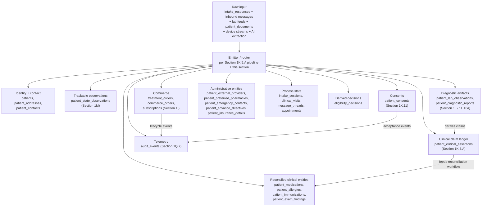
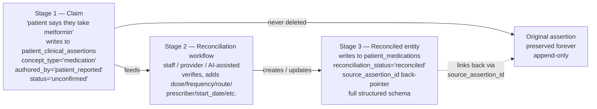
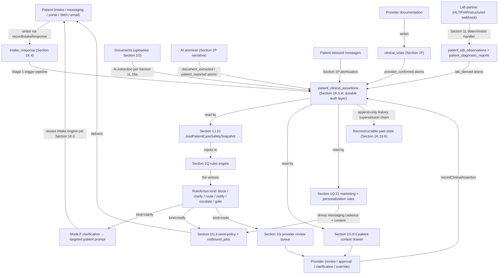

# System map (three layers) — plan stub

**Status:** This file exists so the link in `AGENTS.md` works. A longer narrative (modules 1A–1N, appendices) may live with your team (Notion, Linear, etc.) or can be expanded here over time.

**Labs (precedence — locked):** **Section 1L is the canonical foundation** for diagnostics + lab testing. The **Appendix: Lab workflow** (**§11–17**, extended by **§18–§31**) is the **implementation-detail reference** that Section 1L supersedes where they overlap. Labs are **not deferred**: continuation gating per **1L.16** and Intent's clinical-precedence rule (therapy from labs requires `clinical_visits` referencing `diagnostic_report_id` and/or a `treatment_items` state transition that is valid only with a reviewed report) make Section 1L a **v1 foundation module** for any Rx pathway that requires baseline or ongoing labs. The appendix remains a long-form mechanics reference.

## Platform operational model (binding platform premise — precedes Intent and every section below)

**This platform is intentionally architected as a patient-rooted healthcare operating system.** It is **not** an intake-centric workflow, **not** a notifications runtime, **not** a case-centric monolith, **not** a CRM bolt-on, and **not** a collection of disconnected vertical products.

**Major operational domains are first-class siblings under the patient and shared organizational context.** These include: **clinical record / charting**, **care programs / pathways**, **scheduling / appointments**, **prescriptions / pharmacy lifecycle**, **orders / fulfillment / inventory**, **labs / diagnostics**, **provider tasks / escalation**, **communications / inbox**, **billing / subscriptions / claims**, **retail / commerce**, and **marketing / lifecycle journeys**. Each sibling has its own state machine(s), producer surfaces, typed events, payload discriminants, and audit lineage. **Siblings are peers under Patient.** Siblings are **never** nested under each other. Siblings are **never** modeled as sub-shapes of any single sibling (including "case").

**Foundation modules underneath the siblings** (Layer 1, referenced by every sibling): system primitives addendum (above Section 1A); Section **1D / 1D.1 / 1D.2** capabilities; Section **1J / 1J.10** identity + safety preflight; Section **1L** labs / diagnostics substrate; Section **1M** longitudinal observations; Section **1O** document routing; Section **1Q** rules engine; Section **1R** search; Section **1S** event-stream readiness; Section **1T** vector / embedding readiness; Section **1U** multi-org / multi-tenant; Section **1V** retention + RTBF; **Section 1W tracked clinical objects + procedure / intervention lifecycle (foundation primitive — referenced by scheduling, charting, fulfillment, billing, communications, and AI; not a sibling)**. The Doctrine locks section below imports the binding architectural commitments that govern these foundation modules and every sibling above them.

**These domains integrate through a shared governance and orchestration substrate, not as disconnected bolt-ons.** The shared substrate includes: **audit lineage**, **authority boundaries**, **disclosure-policy**, **consent**, **deterministic evaluation**, **runtime isolation** (pure-evaluator + async-runtime pattern), **pathway sensitivity**, **idempotent orchestration**, **cross-org tenancy**, and **longitudinal operational memory**. Substrate primitives are **infrastructure every sibling depends on**; substrate is **never** modeled as a sibling alongside operational domains. Adding a "domain folder for audit lineage" or "domain folder for disclosure-policy" is a category error.

**The platform explicitly rejects modeling all future work as subordinate to intake, notifications, or a universal "case" primitive. A case is one operational object among many, not the parent ontology of the system.** Reusing a payload discriminant across siblings (e.g., extending `case_kind` to cover orders, appointments, prescriptions, lab kits, or marketing journeys) is the canonical canonization-of-wrong-ontology error this premise prevents. Each sibling owns its own discriminant: `case_kind` for clinical-decision, `order_kind` for fulfillment, `appointment_kind` for scheduling, `pharmacy_event_kind` for pharmacy lifecycle, `lab_event_kind` for labs/diagnostics, and so on.

**This premise binds every section of this map.** Concretely:

- **Domain folder naming** (`repo/rules/<domain>/`, `repo/templates/<domain>/`, `lib/<domain>/`) tracks the sibling-domain layer. Active or pending: `clinical_decision/`, `account_lifecycle/`, `billing_subscription/`, `fulfillment_lifecycle/`. Future siblings activate when their first concrete migration arrives (`scheduling_lifecycle/`, `pharmacy_lifecycle/`, `labs_lifecycle/`, `provider_tasking/`, `communications_lifecycle/`, `retail_lifecycle/`, `marketing_lifecycle/`); they are not pre-created.
- **Payload discriminants** belong to a single sibling and **do not leak across sibling seams**.
- **Producer-site locality** is per-sibling. Legacy cross-sibling producers (e.g., a fulfillment-shaped event currently emitted from `lib/internal/patient-case/impl.ts`) are tagged transitional with explicit comments and tracked in the v1 pressure-test radar; they do not retroactively justify nesting siblings under each other.
- **Substrate-vs-operational distinction** governs every architectural choice.
- **Platform-grade foundations bar:** the substrate must admit each sibling as a first-class surface (Epic-style EMR depth, Mindbody-style scheduling, Shopify-style retail, ActiveCampaign-style marketing journeys, Twilio-style governed communication, full pharmacy lifecycle, labs/diagnostics, provider tasking, in-app messaging, AI orchestration / decision support) **without substrate rewrites**.

Implementation companions such as [`docs/architecture/operational_objects_under_patient.md`](../../docs/architecture/operational_objects_under_patient.md) elaborate conventions for domain folders, payload discriminants, producer locality, and per-sibling sub-shapes. **This section is the binding platform premise; companions elaborate.**

## Intent (short)

- **Layer 1 — Platform / compliance:** auth, RLS, capabilities (`lib/auth/capabilities.ts`, staff RLS, patient portal access), **`requireCapability` on sensitive staff paths**, and **`SensitiveAccessReason` on map-listed high-risk reads** (export, impersonation, cross-patient, bulk)—**stored and queryable** on `audit_events` next to the action, not a second story. **Minimum necessary in practice:** “any `staff_profile` can read the whole `patients` set in SQL” is an **unacceptable** steady state for real PHI; **tighten over time** via **assignment/queue, care relationship, or role-scoped read paths** so ops stay fast (assigned work, not census browsing). **Service-role API routes** are the **larger** bypass than RLS: every handler must **bind** identity + **one patient (or org rule) before** reads/writes. **One production staff identity** path; **no** parallel “admin” login that uses the **service role** for **human** browsing. For **material** **mutations and map-listed** **reads**, **failed** `audit_events` / capability audit = **block** the operation **or** **page**—not **log-only** silence. **Defensibility, not click-tax:** require **reason** on **map-listed** **sensitive** **reads** and **break-glass**; do **not** add **reason** to **every** **routine** chart open.
- **Layer 1 (money + events):** **Payment** **adapters** (per **1I.4–1I.5,** the **capability** **matrix** and **adapter** **layer**) are **idempotent** at the **integration** **boundary**; **verify** **inbound** **signatures** **/ auth** per **active** **PSP**; keep **metadata** to **ids** and **flags**, not **narrative** **PHI**. **`treatment_orders` and 1E retail order types** must support **queryable** lifecycle for **succeeded, failed, cancelled, and refunded** (or equivalent) so money state is not “success-only” in the schema; every **material** money or consent transition that affects the patient should be **recoverable** from `audit_events` and/or **append-only** `patient_timeline_events` (patient **clinical memory** and ops truth share this spine). For the **regulated** / **clinical** **DTC** product path, the default economic model is: **payment capture** for a **`treatment_order`** (or the clinical line on a **compositional** session) **after** **provider** (or org-policy) **approval** of the charge (common async-care pattern: pay only after approval). The design **rejects** “patient paid, clinically blocked for **standard** approval” as the **default** state machine; **exceptions** (refund, void, support override) remain **first-class** **states**, not the main story. **Internal** **financial** **semantics** **+** **payment** **rails** **+** **provider** **mappings** — **Section 1I** (not **a** **single** **vendor**’s **object** **model**).
- **Layer 1 (audit evidence):** `SensitiveAccessReason` on **gated** access must, when the map calls for it, be **storable and queryable** on the **same** `audit_events` the capability layer already writes so **defensibility** is **not** split between “feature worked” and “compliance said why.” **Read-side** (who opened chart / export / impersonation) is **as important** as **mutations** for “who touched PHI”; wire **sparingly** to **high** **signal** only.
- **Layer 1 (data architecture discipline — what lives where; foundational):** **Domain tables** are the **source of truth** for their concern: `patients` and chart fields (identity, allergies, conditions, medications, surgical history) per `1J / 1J.10`; `care_program`, `treatment_items`, `treatment_orders` (clinical case + Rx state); `commerce_orders` and 1I rows (money / subscriptions / refunds / disputes); `clinical_visits` (provider decisions, signoffs, progress notes); `patient_diagnostic_reports` + `patient_lab_observations` (vendor-issued lab data per Section 1L); **`patient_state_observations`** (longitudinal trackables — weight, BP, symptom scores, dose tolerance, sleep, side effects — per **Section 1M**); **`patient_document_routing`** (thin routing manifest for uploaded artifacts — IDs, insurance cards, lab PDFs, medication photos, clinical media, prior medical records — per **Section 1O**; actual artifact data lives on the targeted domain row, not on the manifest); `messages` / `message_thread` (conversation transcript per Section 1G); `outbound_jobs` (notifications, kit shipments, vendor calls). **`patient_timeline_events` is the narrative / event layer ONLY** — typed pointers to meaningful lifecycle events with minimal context (ids + flags); **never** the storage layer for billing, orders, notifications, clinical decisions, lab values, longitudinal trackables, or any domain truth. Payload carries ids and minimal context, **never authoritative values**. **`audit_events` is the accountability layer ONLY** — actor, capability, reason, prior/new state pointers; not a metric store, not a notification log. **Hard rule:** rules, gates, dashboards, AI inputs, and reports read from **domain tables**, not from timeline payload text. Adding a domain concept means a domain table (or named additive metadata on an existing one), not a new `event_type` on the timeline.
- **Layer 1 (clinical content discipline — code-as-config, never DB-driven):** Clinical content — the question bank (`1K.4`), branching rules, mapping rules (e.g., observation `field_name` → category per appendix §24), scoring rules (`1K.9`, `1L.20` `triage_version`), and safety asserts (`1G.2`) — **lives in the repo as code-as-config, versioned via PR, reviewed via CI, audited via git history**. Same governance as `Capability` and `1H.6.1E` classifications. **DB-config tables for clinical content (`intake_questions`, `intake_branches`, `intake_alert_rules`, etc.) are an architectural anti-pattern** in this product because they invite CMS-style ad-hoc edits, defeat replayability, fragment safety logic across rows, and bypass code review. DB content is restricted to genuinely runtime-mutable per-session state (sessions, response rows with version captures, candidate plans, consent acceptances, manifest ids) — never the clinical logic itself. Any future "intake engine" or onboarding mechanism MUST (a) read its question bank + branching from code-as-config, and (b) write through domain APIs (`recordPatientStateObservation` per `1M`, `routePatientDocument` per `1O`, the chart-update path with `1J.10` safety preflight, `recordIntakeResponse` per `1K.4`/`1K.14`, etc.) — never reach into domain tables directly. A "destination" hint on a question is a hint to which API to call, **not** a literal SQL target.
- **Layer 1 (oversight, QA, leadership):** CMO, clinical leadership, QA/compliance, and operational leadership are **governed** by the same `requireCapability` + `audit_events` + `SensitiveAccessReason` (on map-listed broad/sensitive reads) model as other privileged access. They are **not** a `responsible_party` on the case (Section 1G); they **view** / **advise** / **escalate** only through that model — see **Section 1G (Oversight, not owners).**
- **Layer 2 (clinical signoff, lab, and therapy decisions):** **Defensible** “we acted on this lab” and “we changed therapy” may involve **`patient_diagnostic_reports` (§11)**, **`clinical_visits`**, and **`patient_chart_ai_reviews`**; the architecture **rejects** **inconsistent** **ownership** and **rejects** **treatment** **state** changes **by** ad-hoc SQL, one-off scripts, or **routes** that **skip** the **same** **server** **functions** the product uses. **Precedence (guardrail):** For **dosing, continuation, or new Rx** driven by a lab, **at least one** of: (1) a **`clinical_visits`** row (or **addendum**) that **references** the relevant **`diagnostic_report_id`**, with **prescriber** identity, **or** (2) a **treatment** / **`treatment_items`** state transition that is **valid only** when the **same** `patient_diagnostic_report` for that lab context has `reviewed_at` set and **applies to** the **intended** `treatment_item` / program **per product rules**. **1G.2** (clinical safety **enforcement,** not a CDSS) **requires** **active** **asserts** (contra-/dup-therapy/allergy/dosing **as** **the** **product** **defines) **in **the ** **same** **server** **path** **as ** **therapy** **authorization, **complementing **`loadPatientCaseSafetySnapshot` (1J.10) **—** **storing** **safety** **- ** **relevant** **data** **is** **necessary** ** and ** not **sufficient. ** **AI** (`patient_chart_ai_reviews` and related jobs) is **recommendation / draft** only; **it does not replace** (1) or (2) for **authorizing** therapy, **does not** **by** **itself** **clear** **Section 1G** **clinical** **blockers,** and **does not** **bypass** **permit** **asserts** — **see Section 1G** **(AI layer).** **`released_to_patient_at`** (Lab appendix) controls **what the patient can see**; it is **not** a substitute for **(1) or (2)** when the question is **“who medicinally authorized the care step.”**
- **Layer 2 (protocol gates, e.g. baseline lab before status):** **Gating invariants** (e.g. “cannot approve until baseline lab **reviewed**”) must use the **same** **audited** **mutation** surface (`requireCapability`, `audit_events`, patient case **actions**) as other clinical moves—**not** ad-hoc **DB** or **script** `UPDATE` that **bypasses** the gate. The map **allows** optional **DB** constraints **later**; the **architectural** bar is **one** **enforcement** path for **material** **treatment** transitions.
- **Layer 2 (messaging — attachments):** message attachments (patient or provider) route through **Section 1O** (`patient_document_routing`); the `messages` row carries the manifest id, **never** the file blob or extracted contents. Provider sees the document via the appropriate domain surface (lab review drawer, identity drawer, chart) per `1O.10`.
- **Layer 2 (messaging):** **Persistent** `message_thread` (**one** per `care_program` / health **category**), `message` (bidirectional **transcript**), `message_thread_participant` (patient, provider, staff; join/leave, **same** thread). **Source of truth** for the conversation: **`message_thread` + `message`**. **`patient_timeline_events`**: **projection** of chat activity (pointer-style `event_type` + `payload` with `message_id` / `message_thread_id` as needed), **not** a **second** **copy** of the **transcript,** and **not** a **rehydration** path for the thread. **Rejects** body-prefix routing, threads inferred only from `care_program` without a `message_thread` id, and timeline/support-queue-only as the full chat model. **Authorship vs gate:** **Rx, prescribe, and `treatment_items` state** still pass through **`clinical_visits` / `requireCapability` / case actions**; **a chat line does not create a valid Rx**. **`clinical_required`** (§1G) may **withhold the permit** to run those **actions** until a **turn** is **satisfied**—that is a **gating** rule on **the** **decision** **engine**, not **authority in free text**. **Assistive** **AI** (draft, triage) must **not** be treated as satisfying that turn or clearing a **permit** without the same human/audited **paths** in **1G** (see **Section 1G — AI layer**). **`audit_events`:** same `requireCapability` / Layer 1 pattern for staff- and provider-side messaging **actions.** **Detail:** **Section 1G.**
- **Layer 2 (continuation, adherence, re-engagement — no CRM product):** **Stage 6** and **1G** nudges are **not** a substitute for **adherence** and **dropout** signals. **1G.3** **names** proxy **adherence,** time/event **at-risk,** and **re-engagement** via the **same** rows (**`treatment_items.metadata`,** `stale,` **`clinical_required`,** **`outbound_jobs`,** **`patient_timeline_events`**) and **1G** worklist filters, **plus** **1G.3(i)** (**interaction → behavior / eligibility → next action,** not **send-only**); **1I** (subscriptions, cadence) **informs** billing and dunning, **not** “clinical **success = still paying**.”
- **Layer 2 (re-engagement discipline + AI, no second engine):** **Non-negotiable** (clinical / safety) vs **negotiable** (adherence, education, nudges) **is** a **separate** axis from 1G message **classification;** system **rules** in the **`outbound_jobs` / send** path **govern** frequency, suppression, and disengaged **state.** **AI** (same **1G AI layer** philosophy, same single engine in **Section 1N**) is **state interpretation** + **draft** outreach + **prioritization** **candidates**—**not** a standalone sender, **not** a throttle **bypass** (see **1G.3 (a)–(i)** in Section 1G, including **1G.3(i)** post-interaction **closed** **loop**).
- **Layer 2 (one AI layer, four role surfaces — no per-role AI stacks):** **Provider, ops, admin (leadership / QA), and marketing** surfaces all read from the **same** AI interpretation layer over the **same** data spine; **what differs** is the **capability-scoped input set** and the **output discipline at the boundary** (Section 1D / 1D.1 + the per-surface anchors). AI is **assistive and actionable** (suggests next steps that humans take through audited mutations) and **never** authorizes therapy, clears 1G permits, mutates 1I money state, replays integrations, or controls system behavior — see **Section 1N.**
- **Layer 2 (jurisdiction, when multi-state is real):** **Prescriber** license and **patient** jurisdiction must join on a **single** **declared** **“jurisdiction of care”** (or **equivalent** field) on `patients` (or a **verified** address child)—**not** mixing **ship-to** zip, **billing** **address**, and **ad-hoc** IP for **eligibility** depending on the screen. This is a **runtime** constraint across intake, provider assignment, treatment decision, order creation, and fulfillment routing (state-aware gates at each step), not a policy note stored only in docs. **A pharmacy rules engine is** out of scope; explicit runtime guards in existing 1G/1H/1D paths are in scope.
- **Layer 2 — Product domains:** care programs, treatment items, **first-class** `message_thread` + `message` (per `care_program`), orders/fulfillment, **retail catalog & discounts (supplements / non-Rx)**, patient dashboard, **billing** / **payment** **rails** (Section 1I), **abnormal and referral-style handoffs** on the **same** chart + timeline + visit objects (no second “clinical issues” product stack; see Section 1F and Lab appendix for boundaries). **Current responsibility** for “who must advance the case” is **not** a **global** flag on `patients`: it is **scoped to** `care_program` and, when a decision/hold is **treatment–specific,** to `treatment_item`—**exactly one** `responsible_party` at a time per that scope; **see Section 1G (Case ownership, canonical case state).**
- **Layer 2 (chart + uploads):** **Ingested** external artifacts: **de-dupe** via `source_dedupe_key` or **content hash**; **corrections** and **re-reads** = **new** **rows** (or `status=corrected` with **pointers**), not overwrites of stored raw files. **Lab** `patient_diagnostic_reports` may land **with** `lab_order_id` **null**; row stays **valid**; **`metadata.reconciliation`**, `pending_link`, or **quarantine** **until** **link** to **`lab_orders`**. If **`patient_lab_observations`** are **edited** after insert, **append-only** **audit** of the **delta** (`audit_events` + before/after), not **silent** meaning change.
- **Layer 2 (longitudinal “memory” in data):** **`patient_timeline_events`**: **unified** **chronology;** for **messaging,** `message` / `message_thread` = **bodies,** `patient_timeline_events` = **projection** (join, **not** rehydration). **New** `event_type` values follow a **single, documented naming scheme** (e.g. domain **prefixes**). **Substantive** **corrections** to **what** **occurred** (not **trivial** typo repair) are **not** represented by **silent in-place** edits that **erase** prior **meaning**—**norm** = **new** event **or** **supersession** with **pointer**; **implementation** must **enforce** for **clinical** `event_type` **classes**, not only “append-only in spirit.”
- **Layer 1 (patient identity, duplicates, merge, integrity):** One **canonical** `patients` row; **1J.1–1J.9** (precedence, L0–L4, duplicate, merge, shared contact) and **1J.10–1J.11** (gaps, `loadPatientCaseSafetySnapshot` contract, runtime failure modes, abuse, additive — same tables/events/caps). **1J.10** is explicit: the **universal joined safety read** and **shared preflight** are **required foundations enforced before the first Rx pathway ships** (not "target" and not a future aspiration); current repo shape is honestly documented in 1J.10 "Current operational state + enforcement plan," and the enforcement dependency blocks Rx-pathway launch — see **1J.10**. **Same** `requireCapability` + `audit_events` model as 1E / Intent. **Hims-level bar:** no high-risk clinical mutation is **defensible** without the **same** **safety context,** capability check, **reason discipline** where the map requires it, and **durable audit** — *policies in prose* are not sufficient without **one** **joined** read **on the server** for that action.
- **Layer 1 (retention + export, lean):** **Retention** and **portable** **export** of **clinical** **data** = **documented** **policy** and **as-automated-as-possible** **deletes**/holds; **default** to **no** **PHI** in **application** **logs** and **generic** **client** **analytics** on **staff** **tools**—if you can’t **operate** a **retention** job, you still **own** a **runbook** **answer** to “what is stored where.”
- **Layer 2 (analytics, diagnostics, KPIs):** **Performance,** **funnel,** and **revenue** **slices** are **read** **models** over **append-only** **event** and **row** data already in the architecture (**Section 1H**); **no** **separate** “analytics only” product table or **KPI** columns for reporting alone. **Funnels** use **defined** `patient_timeline_events` (plus **joins** to **orders,** `treatment_items`**,** `care_program` **),** not **ad-hoc** **dashboard** **only** **counts.**
- **Layer 2 (acquisition, attribution, external marketing — no growth stack in core):** **Ad** networks and **campaign** tools are **external;** the **application** is **source of truth** for clinical and money state and, when captured, for **longitudinal** joins from inbound **acquisition** context (source, campaign, entry) → **engagement** → **conversion** on **`treatment_orders` / 1E / 1I** → **retention** / **1G.3** / outcome signals — see **1H.4**. Marketing / growth users read **only** through the **named** **internal surface** in **1H.4.1** (route under `app/internal/(protected)/growth/**` + **`can_view_growth_aggregates`** + view contract — **not** raw DB, **not** `super_admin` browsing, **not** PHI exports). **Hard output constraints (1H.4.1 view contract, enforced server-side):** every read, dashboard, export, and **AI** output served to a marketing user is **aggregated, de-identified, non-reversible,** and **small-cell-suppressed (k-anonymity)** — **no** internal/convenience exception, **no** suppression bypass. **Optional** server-side or **edge** **emission** to ad platforms (hashed or platform-approved identifiers, **coarse** event types) must **not** **couple** to **`impl`**, 1G **permit**, or chart reads. **AI** here **analyzes** and **suggests** on **aggregates** (and de-identified slices) only; **AI may read deeper internal data, but its surfaced outputs must conform to the same four constraints** — and it does **not** **execute** campaigns, **call** ad APIs as an autonomous agent, or **export** PHI to vendors — **1H.4 / 1H.4.2.**
- **Layer 1–2 (operational traceability, distinct from “we logged an event”):** **Append-only** `patient_timeline_events`, **staff** `audit_events`, and **row** state on `treatment_orders` / jobs / webhooks are the **ingredients** for a **Hims-style** *seconds-to-answer* question — *e.g. “Why did this patient not get their meds?”* **Logging** the **same** fact in **two** **places** **badly** does **not** create **an** **answer;** you need a **queryable, cross-slice** **link** (correlation, stable ids, **dead-letter** and **reconciliation** **visibility**). **Section 1H** (operational traceability) names what **exists**, what is **partial**, and what is **target / non-optional** **before** **scale** — **without** a new observability **platform.**
- **Layer 1 (IT / platform vs patient-case ops):** **1G.1** names **who** **owns** the **next** **patient**-scoped **unblock;** **1H.1** names **rows** to **trace** a **meds** **story.** Neither **by** **itself** names **platform**-level **ownership** (webhook **infrastructure,** `outbound_jobs` **SLO,** **vendor** **outages,** **migrations,** **secrets** **rotation** — see **1H.2** for **owner → visibility → intervention → audit** at **system** **scope** **(Model C,** no **separate** **IT** **product** **stack**).**
- **Layer 1 (correctness when async work fails or repeats):** **Duplicated** **webhooks,** **retried** `outbound_jobs`, or **manual** **replay** are **normal** at **scale.** **1I.6** and **1H.1** address **idempotency,** **reconciliation,** and **side-effect** **co-location** for **money** and **jobs;** **1H.3** **adds** **drift** **detection,** **periodic** **recon** (queries + runbooks), and **the** **rule** that **authorizing** **mutations** **(prescribe,** **fulfill)** are **not** the **same** **as** **dumb** **inbound** **idempotency** **(use** **1G/1J** **+** **DB** or **idempotency**-**key** **on** the **action).**
- **Layer 2 (ownership, SLA, escalation next to traceability):** **1H.1** (what/when) is not enough for ops maturity without **1G.1** (who, by when, if missed). The 1G **tuple** already covers the **clinical** case line; **integration, payment, and identity** stops that block fulfillment must default to **ops** or **1J.9/1I**-appropriate roles with **at least one** **escalation** step (same Model C — no second workflow product).
- **Layer 1 (capabilities at scale, one login, many domains):** **Roles** in [`lib/auth/capabilities.ts`](../../lib/auth/capabilities.ts) are **coarse** bundles; **`ops_admin`** and **`super_admin`** aggregate **many** **risk** **domains** by design. **Model C** does **not** add a new auth system: **keep** `Capability` + `requireCapability` + `audit_events` + `SensitiveAccessReason` — see **Section 1D.1** and **1D.2** for **multi-capability** **users,** **2–3**-**person** **ops** **vs** **scale,** **time-** **boxed** **elevation** with **reason + audit,** and **what** is **non-optional** before broad **staff** / **multi-** **provider** / **cross-** **domain** **work** is **normal.**
- **Layer 3 — Deferred / later:** full LIMS-level lab coding, EHR **network** parity, class scheduling, waitlist engines, inventory POs to vendors—**named** in this map and **not** required for the core to stay coherent; a future **dedicated** warehouse/ETL is an **optional** **copy** **pipeline** and **must** **not** replace **Section 1H** as the **definition** of what may be counted and from which sources; not all items need to live in this repo.

---

## System primitives (binding invariants — Layer 1 foundation; precedes Section 1A)

*Per `.cursor/plans/data_layer_reconciliation_e525e9c9.plan.md` (Phase 4B-arch). These are the universal disciplines that travel with every Section. Companion doc: [`.cursor/plans/data_layers_reconciliation_v1.md`](data_layers_reconciliation_v1.md). Implementation lands in **Phase 4C-pre** (single migration adds the missing columns + Zod schema extensions + orchestrator gate).*

### Top-line invariant

**No row enters any canonical table through any path other than the orchestrator boundary.** The orchestrator (Phase 4A `record_intake_emissions_batch` SECURITY DEFINER + `writeEmissions` Zod schemas in `lib/intake/targets.ts`) refuses any row missing the seven primitives below. Direct `INSERT` from app code is forbidden by RLS + capability discipline per `1J.10`. CI lint catches developers who try to bypass the orchestrator.

### Source-of-truth hierarchy (one-line summary)

> **Claims** (`patient_clinical_assertions`) = raw truth; **reconciled entities** (`patient_medications`, `patient_allergies`, `patient_immunizations`, `patient_exam_findings`) = current truth; **observations** (`patient_state_observations`) = measured truth; **decisions** (`eligibility_decisions`) = derived truth.

Per `1K.0.5.4` two-stage flow + `1K.0.5.10` authority + `1M` observation discipline + `1Q` rules-engine outputs.

### Write-authority hierarchy (one-line summary)

> Providers **confirm** (rank 100); providers **assess** (90); labs **derive** (70); documents **extract** (60); patients **self-correct** (50); patients **report** (40); third parties **report** (30); AI **suggests** (20, never authoritative); system **derives** (10).

Pinned in `patient_clinical_assertions.authority_rank` per `1K.0.5.10`. AI never authorizes therapy / clears safety gates / mutates state per `1N`. Read authority is a separate axis governed by RLS + capability + `1J.10` `SensitiveAccessReason`.

### The seven primitives

Every meaningful write through the orchestrator declares all seven (with documented carve-outs). CI lint enforces; orchestrator + Zod + RLS reject violations at runtime.

#### 1. `authored_by` (actor declaration)

Every meaningful write declares its actor. Canonical reference: `patient_clinical_assertions.authored_by` 9-value enum per `1K.0.5.4`:

`patient_reported | patient_self_correction | provider_assessed | provider_confirmed | document_extracted | lab_derived | third_party_reported | ai_suggested | system_derived`

Sibling tables reconcile to compatible vocabularies (not always the same set, but always SOME actor declaration):

- `audit_events.actor_kind` ⊆ `{patient, staff_user, provider_user, system, cron, webhook, partner_adapter, ai_engine}`.
- `patient_state_observations.source` ⊆ `{patient_self_reported, staff_measured, wearable, lab_derived, document_extracted}` (already locked in Phase 3 schema).
- `patient_consents.captured_by` ∈ `{patient, staff_witnessed_in_person}` (already locked).
- `patient_immunizations.source` ∈ `{in_house_administration, external_record_imported, patient_self_reported}` (already locked).
- `messages.author_role` (already exists in early migration; reconcile to compatible enum during Phase 4D).
- `outbound_jobs.queued_by_kind` ⊆ `{rule_engine, staff_user, system_cron, ai_assistant_with_human_approval}` (introduce during 1G.3 reconciliation).

CI lint: every new domain table reviewed in PR must declare an actor column or justify its absence in the PR description.

#### 2. source / provenance back-pointer

Every domain row points to where it came from. Two patterns coexist:

- **Clinical claims**: `evidence_refs[]` (jsonb array of `{kind, id, ...}`) per `1K.5.A` — richer; supports multi-source evidence.
- **Non-clinical rows**: simpler `source_kind + source_id` columns. `source_kind` ∈ `{intake, message, webhook, partner_adapter, document_extraction, provider_decision, system_inference, staff_manual, patient_self, lab_feed}`; `source_id` is the PK of the originating row.

Phase 4A orchestrator already provides `source_intake_response_id` back-pointer for intake-derived writes; Phase 4D-4F extends to provider mutations + partner ingest + system-derived rows.

CI lint: every emission target's payload declares either `evidence_refs[]` or `source_kind + source_id`.

#### 3. `external_id` + `idempotency_key`

Every external-rail interaction declares its keys.

- **Outbound** (we call them): `(external_system_name, external_system_id, idempotency_key)` — replay safe.
- **Inbound** (they call us): `(external_system_name, external_inbound_event_id)` — dedupe safe.

Already canonical for Stripe via `1I.6` + `stripe_webhook_events`. Pattern extended via `1L.14` / `1L.23.3` adapter contract shape to:

- Twilio (`twilio_message_sid` outbound; inbound message SID).
- Resend (`resend_email_id` outbound; webhook receipt id inbound).
- Partner pharmacy (vendor order id; delivery webhook id).
- Lab vendor (sample id; result webhook id).
- Identity-verification provider (verification job id; webhook id).

CI lint: every adapter declares its three keys per the `1L.14` / `1L.23.3` contract shape.

#### 4. `data_environment` (test-vs-prod isolation)

Every `patients` row declares its environment. Enum: `production | staging | internal_qa | synthetic`. FK propagation: every child row inherits the patient's environment via `patient_id`.

**Suppression rules (binding)**:

- `outbound_jobs` checks the patient's `data_environment` before dispatching; non-`production` patients route to a sandbox or are dropped per env.
- Metrics + dashboards (`1H.6`) filter to `production` by default.
- Search (`1R`) filters to `production` by default; non-`production` only visible to staff with `can_see_test_data` capability.
- AI training (`1N`) excludes non-`production` rows.

**Why structural, not policy**: every developer / QA / synthetic pattern goes through ONE column check; you cannot accidentally text a real Twilio number for a synthetic patient. The test environment is structurally safe, not policy-only.

CI lint: any code path that calls Stripe / Twilio / Resend / pharmacy / lab outbound MUST gate on `data_environment === 'production'` or carry an explicit override.

**Suppression terminal state + canonical audit event (binding; Phase 4H-pre)**: when the dispatch gate suppresses a non-`production` `outbound_jobs` row, the row transitions to terminal status `'suppressed_data_environment'` (added to the existing 8-value status enum in `outbound_jobs`; not a new column) and the dispatcher emits one `notification.dispatch_blocked_by_privacy_check` audit event with `metadata.suppression_reason = 'data_environment'` per `1Q.7` privacy-gate event vocabulary. The event is already registered in `lib/events/audit-actions.ts` `RULE_AND_NOTIFICATION_AUDIT_ACTIONS` (Phase 4F LANDED). The status terminal + audit event are the canonical observability shape for non-production suppression; CI lint forbids any silent drop. This locks the contract before the gate ships in Phase 4H-pre commit 2.

#### 5. temporal truth (`effective_at` + `recorded_at`)

Every clinical / observation / decision row distinguishes **when it was true** (effective) from **when it was said** (recorded). Real-world example: patient says today *"I stopped metformin 3 weeks ago"* → `recorded_at = today`, `effective_at = 3 weeks ago`. Without this, timelines are wrong and rules engine makes wrong decisions.

Already partly locked:

- `patient_clinical_assertions.onset_at` + `resolved_at` (effective) + row `created_at` (recorded).
- `patient_state_observations.observed_at` (effective) + row `created_at` (recorded).
- `eligibility_decisions.decided_at` (effective) + row `created_at` (recorded).
- `audit_events.created_at` (occurred).

CI lint: every new clinical / observation / decision table declares both axes.

#### 6. enums as code-as-config

All enums are centrally defined in TypeScript (`lib/intake/*.ts` registries) + versioned + reviewed via PR. No ad-hoc string literals invented inline at write sites. Phase 3 + 4A already established the pattern (`AUTHORED_BY_VALUES`, `ASSERTION_TYPE_VALUES`, `ASSERTION_STATUS_VALUES`, `ANSWER_TYPES`, `CONCEPT_TYPES`, `ConsentType`, `EmissionTarget`, `INTAKE_EVENT_ACTIONS`, ~12 enums currently).

CI lint: new enums must live in `lib/` typed registries; DB CHECK constraints reference the registry vocabulary, never invented per-row.

#### 7. named-read-function discipline

App code reading clinical / observation / decision data goes through named functions in `lib/intake/views/*` or `1H` read models. Direct `SELECT * FROM patient_clinical_assertions WHERE...` from app code is forbidden (carve-out for the views file itself). Named reads are **pure functions of canonical state** — they MUST NOT contain business logic, rule firings, or AI inference. Business logic lives in `1Q` rules engine; AI inference lives in `1N`.

This is the WRITE-path resolver vs READ-path views distinction:

- **WRITE-path resolver** (Phase 4C-runtime): translates intake `Question.emissions` templates + `raw_value` into resolved `Emission[]`.
- **READ-path views** (`lib/intake/views/*`): pure projections of canonical state for dashboards / UI / AI input.

CI lint: direct table reads from app code outside `lib/intake/views/*` flagged.

### Four-tier enforcement (binding)

The seven primitives are enforced at four tiers; each tier catches violations the next tier might miss:

1. **Zod schemas** (`lib/intake/targets.ts`) refuse incomplete payloads at the runtime boundary.
2. **`record_intake_emissions_batch`** (Phase 4A SECURITY DEFINER function) rejects rows missing required columns at the DB transaction boundary.
3. **RLS + capability** discipline blocks non-orchestrator writes per `1J.10` mutation discipline + `Section 1D` capability gates.
4. **CI lint** catches developers who try to bypass the orchestrator.

### Cross-link

Companion doc `data_layers_reconciliation_v1.md` Section 7 has the full CI lint catalog (15 lint rules) implied by these primitives. Phase 4C-pre adds the columns + Zod extensions + orchestrator gate. All later phases (4C-runtime resolver, 4D artifacts, 4E outbound jobs, 4F event catalog, 4G search, 4H rules + governance) write rows that already satisfy the primitives.

---

## Repo anchors

| Area | Where to look |
|------|----------------|
| Capability gate (audited mutations) | `lib/auth/capabilities.ts` |
| Staff patient-case mutations (intended choke point) | `app/internal/(protected)/patients/[patientId]/actions.ts` → `lib/internal/patient-case/impl.ts` — **target:** every high-risk path **precedes** `impl` with `loadPatientCaseSafetySnapshot` + `requireCapability`; `impl` **treated as unsafe internals** (see **1J.10**) |
| **Clinical safety preflight (required contract; enforced before first Rx pathway)** | **`loadPatientCaseSafetySnapshot(patientId, actionContext)`** — **1J.10**; gathers **only** fields already **named** in 1G / 1I / 1J; **no** parallel "safety" schema |
| **Clinical safety enforcement (active, not data-only) **| **1G.2** (asserts at prescribe/approve) **+ **1J.10** **+ **1G** **permit; **`clinical_visits` **, ** **`treatment_items` / **`treatment_orders` **, ** **allergies** **, ** **labs** ** in **the **data **spine; ** not **a **separate** **CDSS. **| 
| **Operational anti-drift (mechanical + docs)** | **1J.10** (ESLint import allowlist, `AGENTS.md` bullet, `route` vs `actions` **review** rule, audit-return **gap** in `logAuditEvent`); not a new **system** |
| Internal staff APIs (orders, check-in review) | `app/api/internal/**/route.ts` |
| Product notes | `docs/patient-dashboard-v2.md`, `AGENTS.md` |
| Messaging in the clinical loop / behavioral SoT for “what is blocking, who moves it” | Section **1G** (case ownership, **canonical case state**, permit gating, workload read model) |
| **Assistive AI (chart / lab, not clinical authority)** | **Section 1G** **(AI layer)**, `patient_chart_ai_reviews`, `lib/ai/processChartAiReviewJob.ts` (when wired) |
| **Unified AI interpretation layer (one engine, role-scoped surfaces — provider, ops, admin, marketing)** | **Section 1N** — same data spine; capability-scoped per **1D / 1D.1**; **never** authorizes therapy, mutates state, or controls system behavior; outputs are **actionable** and feed back through audited mutations; (M) inherits **1H.4.2** hard constraints |
| **KPIs, funnels, derived performance** | **Section 1H** — sources: `patient_timeline_events` **+** row state; **no** free-standing metric columns |
| **Layer 3 full daily operator dashboard (~12–18 core metrics across growth, revenue, retention, ops, fulfillment, payments, friction/risk)** | **Section 1H.6** — aggregate queries/views over `patient_timeline_events`, `care_program`, `treatment_orders`, `clinical_visits`, 1I subscription/payment rows, fulfillment states, and `outbound_jobs`; optional aggregated `domain_events` summaries only |
| **Internal reporting layer (flexible filter/group/aggregate on top of metrics; no separate BI tool)** | **Section 1H.7** — reuses `1H.6` canonical metric definitions; safe dimensions only (product, program, provider, geography, new-vs-returning, cohort, subscription, fulfillment source, dropout stage, severity/status/classification, payment rail); capability-gated, server-side suppression, aggregate/PHI-safe outputs (CSV optional) |
| **Adherence, at-risk engagement, re-engagement, send policy / fatigue (not subscription-only; no CRM stack)** | **Section 1G.3** (incl. **(a)–(i)**: non-neg vs negot, `outbound_jobs` gate, **1G.3(i)** post-interaction closed loop) — **1G** Stage 6 + stale/T1–T3, **1H** / `outbound_jobs`, 1F, **1I** cadence vs **clinical** state |
| **“Why no meds?” ops / debugging (trace, not just events)** | **Section 1H** (operational traceability); join **`patient_id`** across `patient_timeline_events`, `treatment_orders`, 1I money signals, `outbound_jobs` payload, `stripe_webhook_events`, 1G/1J state — see **1H.1** |
| **Who must fix it / by when / if SLA missed?** | **Section 1G.1** — extends **1G** **tuple** to **integration** and **dead-letter**-class **failures;** no new **ticketing** product |
| **Provider supply, routing, and throughput (demand vs capacity, no workforce engine)** | **Section 1G.4** — explicit provider eligibility/routing policy, queue/load visibility, SLA/backlog escalation, and intake-capacity coupling via existing 1G/1H/1D fields and trace |
| **Multi-state runtime operations (jurisdiction as live gate, not paper policy)** | **Section 1G.4.1** — state-based provider eligibility enforcement, state-constrained routing, treatment/fulfillment state constraints, intake-state validation, and state-level backlog/capacity visibility via 1H |
| **Major exception handling (what failed, who owns it, what patient was told, how it closed)** | **Section 1G.5** — category taxonomy, first-response ownership, escalation thresholds, patient/internal communication discipline, and auditable corrective actions using existing queues/logs |
| **Provider workspace + admin/clinical leadership overlay (live operational queue, not reports)** | **Section 1G.6** — derived views over existing 1G/1H rows; provider sees own queue, admins see all provider queues with sort/filter, drilldown PHI gated by capability + reason discipline; controlled provider dimension (`1H.7.2`) for shared views |
| **Provider routing, availability, and assignment controls (no separate dispatch system)** | **Section 1G.7** — operational state (offline/signed_in/open_for_queue/paused/at_capacity/unavailable) on `staff_profiles`; eligibility (license/state/capability/Rx authority/program); admin + provider controls; derived routing over existing rows; lifecycle events on `audit_events` + `patient_timeline_events` |
| **Provider workspace v1 (live operational; not analytics)** | **Section 1G.8** — My Queue / My Status / same-day My Performance + patient context drawer, clinical messages inbox, lab review drawer, ops/staff messaging channel, grouped views, notifications via `1G.3`; derived from existing rows; PHI-minimum, capability-gated, all actions audited |
| **Clinician continuity, follow-up ownership, and rerouting (CoR per `care_program`; no work trapping)** | **Section 1G.9** — clinician-of-record vs task owner, continuity policy by item type, lab/refill/message follow-up routing, SLA fallback (continuity never traps), admin transfer + provider obligations; additive metadata on `care_program` and event payloads; controlled provider dimension via `1H.7.2`; reuses `1G.7` eligibility + `1G.7.5b` SLA enforcement |
| **Intake architecture (multi-pathway; deterministic, versioned, composable; no separate form builder)** | **Section 1K** — entry pathways (ED / TRT / GLP-1 / peptides / labs-only / supplements-only / wellness), layered modules, canonical question bank with versioning, answer reuse + freshness, contraindication screening, lab + at-home kit flows, deterministic scoring, provisional `treatment_plan_candidate`, today vs if-prescribed payment, deterministic provider submission packet, abuse/gaming detection; reuses `intake`, `care_program`, `treatment_items`, `treatment_orders`, `patient_diagnostic_reports`, 1I subscription/payment, `audit_events`, `patient_timeline_events`; additive schema only when reuse is insufficient |
| **Patient document & attachment routing (capture → classify → route; first-class)** | **Section 1O** — thin `patient_document_routing` manifest routes uploaded artifacts (lab PDFs, IDs, insurance cards, medication photos, clinical media, prior medical records) to the correct domain table; same routing API for intake / messaging / action items / ops upload / partner integration; staff-only reclassification per `1O.9`; extraction (OCR, lab parsing) is out of scope and lives in assistive jobs per Section 1G AI / Section 1N |
| **Patient state observations (longitudinal trackables — first-class; not timeline-stored)** | **Section 1M** — append-only `patient_state_observations` table for living, time-aware patient signals (weight, BP, symptom scores, dose tolerance, sleep, side effects, etc.); intake / check-in / provider-prompt / message-input write here, never to `patient_timeline_events`; provider corrections append rather than overwrite; reads feed provider workspace, continuation gating, reporting, AI assist; **`patient_timeline_events` carries narrative pointers only — never values** |
| **Diagnostics + lab testing (foundation; not appendix)** | **Section 1L** — labs as core loop substrate (intake → commerce → fulfillment → result → review → release → display → care-program → retest → reporting); structured + semi-structured model (`patient_lab_observations` + `patient_diagnostic_reports.report_payload`); formal `lab_orders.status` state machine + substates; deterministic report→order binding with first-class orphan workflow; observation normalization; explicit ownership (`responsible_provider_id` / `queue_owner`); expiration + no-completion logic; hard retest loop; vendor partner adapter contract; patient-facing tone discipline; continuation gating tie-in; `diagnostic_source_type` extensibility for future imaging / external uploads / device data — Lab Appendix §1–§31 retained as implementation reference |
| **Money: refunds, disputes, subscriptions, reconciliation** | **Section 1I** — internal **financial** **state** + **adapters**; **PSP** **ledger** **for** **settled** **funds**; timeline + audit |
| **Multi-rail financial recon (not Stripe-only; no silent money drift)** | **Section 1I.9** with **1I.0–1I.6,** **1H.3,** `metadata.payment_rail.<provider>,` **1I.1** **vocabulary** (not vendor class names in routing) |
| **Identity: precedence, confidence, duplicate detection, merge, shared contact** | **Section 1J.1–1J.9** — `patients`, `patient_identity_verifications`, capabilities + `audit_events` |
| **Identity** **gaps,** **abuse** **(1J.10–1J.11)** | `loadPatientCaseSafetySnapshot` (required; enforced before first Rx pathway per `1J.10`) + `patient_timeline_events`, `audit_events`, `patients.metadata`, 1G permit + 1I money flags — *no* **new** **architecture**; **tighten** **reads** **+** **events** |
| **Oversight** (CMO, QA, ops / dept leadership) | **Section 1G** (Oversight) **+** `lib/auth/capabilities.ts` + `audit_events` |
| **Coarse roles vs fine-grained risk domains; one login, multi-domain access; elevation** | **Section 1D.1,** **1D.2** — **Model C;** no new **auth** **product;** **early-** **stage** **(lean** **team) ** **vs** **Hims-** **style** **scale;** extends **existing** `Capability` / `SensitiveAccessReason` / **audit** |
| **IT / platform: webhooks, job backlog, vendor outage, prod access, migrations — not the same as 1G “who moves this case”** | **Section 1H.2** — system-level **owner → visibility → intervention → audit**; **reuses** caps + `audit_events` + **1H.1** **tables** |
| **Reconciliation, drift, idempotent retry / replay (no double money / ship / prescribe)** | **Section 1H.3** — extends **1I.6** and **1H.1** with **map-level** **checks** **(queries** + **process);** no **reconciliation** **engine** **product** |
| **Inbound attribution, source→outcome, external ad conversion I/O, marketing read access (no CRM/growth product in core)** | **Section 1H.4** — intake/`patients`·`metadata`, `care_program`·`metadata`, `patient_timeline_events`, `treatment_orders`, 1E sessions, 1I, **1G.3**; **optional** edge/adapter to ad networks; **AI** = **internal** analysis on **aggregates** only (not execution, not PHI export) |
| **Marketing / growth staff surface (the “where do I go?”)** | **Section 1H.4.1** — internal route under `app/internal/(protected)/growth/**` + **`can_view_growth_aggregates`** in `lib/auth/capabilities.ts` + **view contract** (aggregates over 1H, stratified by **1H.4** keys, small-cell suppression); **no** raw DB / `super_admin` shortcut |
| **Third-party verification readiness (LegitScript-style auditability posture)** | **Section 1H.5** — provider-decision attribution, intake-to-decision linkage, active 1G.2 safety-check evidence, Rx→fulfillment traceability, and role-gated audit operations using `audit_events` + `patient_timeline_events` + 1G.1 / 1H.1 (no separate compliance module) |
| **System primitives (binding invariants — top-of-map addendum)** | **System primitives addendum** (above Section 1A) — seven universal invariants (authored_by, source/provenance, external_id+idempotency_key, data_environment, temporal truth, enum-as-config, named-read-function); top-line "no row enters except through orchestrator boundary"; four-tier enforcement (Zod / orchestrator / RLS / CI lint); source-of-truth + write-authority one-line summaries |
| **Search & lookup (pg_trgm + GIN now, adapter for Elastic later)** | **Section 1R** — `searchEntities()` adapter; named indexed entities (patients / orders / messages / documents / labs / subs / actions); capability-gated reads; `data_environment` + `org_id` filter baked in; reconcile or deprecate `site_search_entries` early migration in Phase 4G |
| **Event-stream readiness (Kafka-shaped, but not Kafka)** | **Section 1S** — design-now, defer-runtime; spine tables (`audit_events`, `patient_timeline_events`, `outbound_jobs`, `domain_events`) carry stable versioned `event_type` + partition keys (`patient_id`, `org_id`) + idempotency keys + append-only; future `eventStreamPublisher` adapter; explicit no-Kafka-now |
| **Vector / ML / embedding readiness** | **Section 1T** — design-now, defer-runtime; future `*_embeddings` tables joined by stable entity ids (`concept_id`, `patient_document_routing.id`, `inbound_narrative_reviews.id`, `messages.id`, `patient_clinical_assertions.id`); pgvector default; PHI / de-identification posture; AI engine `1N` is the only consumer |
| **Multi-org / multi-tenant partition discipline (org_id everywhere)** | **Section 1U** — `org_id` on every patient-scoped row (default `'main'` v1); RLS forbids cross-org reads; capability `org_scope`; partition-key alignment with Section 1S; one paragraph future host-org / tenant-org model; mechanical `org_id` add in Phase 4C-pre |
| **Data governance — retention, deletion, RTBF, lifecycle** | **Section 1V** — six retention classes (Clinical / Identity / Insurance / Messages / Audit / Marketing); soft-vs-hard delete per class; uniform `active → inactive → archived → retention-expired → deleted` lifecycle; SAR + RTBF as future rules-engine outputs; backfill / migration discipline addendum (1V.7); `audit_events` on every deletion |
| **Data layers reconciliation (companion strategy doc)** | [`.cursor/plans/data_layers_reconciliation_v1.md`](data_layers_reconciliation_v1.md) — Phase 4B-arch readable strategy: 11 layers + per-layer table + early migration audit + integrated runtime diagram + Phase 4C-H roadmap + 15-rule CI lint catalog + misread citations |
| **Tracked clinical objects + procedure / intervention lifecycle (foundation primitive — not a sibling; referenced by every operational sibling)** | **Section 1W** — `tracked_clinical_objects` + `clinical_object_aliases` + four-layer epistemic model (tracked finding → assertion atom → diagnosis entity → billing artifact) + structured-first authoring + note-as-rendered-output + encounter → intervention → checkout continuity chain + clinical identity reconciliation + body-map / anatomical anchoring + recall / surveillance hooks; **Doctrine locks DL-7 + DL-8** bind this module across the platform; long-form rationale in [`.cursor/plans/FOUNDATIONAL_ARCHITECTURE_2026-05-10_all_dimensions.md`](FOUNDATIONAL_ARCHITECTURE_2026-05-10_all_dimensions.md) §1.6 + §6.5 + §7 + §8 |
| **Foundational architecture v2 (long-form doctrine + pressure tests)** | [`.cursor/plans/FOUNDATIONAL_ARCHITECTURE_2026-05-10_all_dimensions.md`](FOUNDATIONAL_ARCHITECTURE_2026-05-10_all_dimensions.md) — long-form rationale source for Doctrine locks DL-1 through DL-9 + Section 1W; carries the full 21-primitive enumeration, 18-sibling enumeration, 20 ontology traps, dimensional matrix, primitive-extraction pressure-test grid, owned-diagnostic-acquisition sub-doctrine (§5.2) + specialty-coverage non-foreclosure register (§6.6 — 51 rows / 12 specialties), encounter → intervention → checkout chain, four-layer epistemic model, and §13 historical execution plan |

When you add a **new** staff mutation path, default to `requireCapability` and document the capability in `capabilities.ts`. **Subprocessors** (host, DB, email/SMS, payments, storage) that touch PHI or PHI-adjacent payloads: **signed** **vendor** terms and **data-minimization** in **logs** and **integrator** **dashboards** are a **Layer 1** **operational** **requirement**, not **optional** if you want a **defensible** posture.

---

## Doctrine locks (binding — imported from Foundational Architecture v2)

*This section is the canonical home for the binding architectural doctrine of the platform. Long-form rationale, pressure tests, and the full primitive / sibling enumeration live in [`.cursor/plans/FOUNDATIONAL_ARCHITECTURE_2026-05-10_all_dimensions.md`](FOUNDATIONAL_ARCHITECTURE_2026-05-10_all_dimensions.md). MAIN imports the locks; the foundational doc remains the rationale source. Each lock below is binding on every Section in this map.*

**DL-1 — Substrate-vs-operational distinction.** Cross-cutting infrastructure (audit lineage, authority boundaries, disclosure-policy, consent, deterministic evaluation, runtime isolation, idempotent orchestration, cross-org tenancy, longitudinal operational memory) is **substrate**, not a sibling operational domain. Substrate is referenced by every sibling; substrate is **never** modeled as a sibling alongside operational domains. Adding a "domain folder for audit lineage" or "domain folder for disclosure-policy" is a category error. *(Re-lock from Platform operational model. Long-form: foundational doc §2 + §4.)*

**DL-2 — Patient-rooted siblings, no nesting under any single sibling.** Every operational domain is a peer under Patient and shared organizational context. Siblings are never nested under each other. Siblings are never modeled as sub-shapes of any single sibling (including "case"). The current activated and reserved siblings are enumerated in the Platform operational model and in foundational doc §5 (18 siblings total). *(Re-lock. Long-form: foundational doc §5.)*

**DL-3 — Sibling-local discriminants; no cross-sibling discriminant leakage.** Each sibling owns its own payload discriminant: `case_kind` for `clinical_decision/`, `order_kind` for `fulfillment_lifecycle/`, `pharmacy_event_kind` for `pharmacy_lifecycle/`, `appointment_kind` for `scheduling_lifecycle/`, `lab_event_kind` for `labs_lifecycle/`, etc. Reusing a discriminant across siblings (e.g., extending `case_kind` to cover orders or appointments) is the canonization-of-wrong-ontology error this lock prevents. CI lint enforces folder-to-discriminant alignment per the rules + templates scaffold lint. *(Re-lock. Long-form: foundational doc §5 + ADR §7.7–§7.8 anti-overload pattern.)*

**DL-4 — Producer-site transitional locality + radar tracking.** When the type system encodes the correct sibling-domain architecture, runtime wiring may temporarily live on a legacy producer surface (e.g., a fulfillment-shaped event currently emitted from `lib/internal/patient-case/impl.ts`). Such transitional producers are tagged with explicit "PRODUCER-SITE TRANSITIONAL LOCALITY" comments and tracked in [`docs/architecture/v1_pressure_test_radar.md`](../../docs/architecture/v1_pressure_test_radar.md). They do **not** retroactively justify nesting siblings under each other or mutating discriminant scope. *(Re-lock. Long-form: ADR §7.5 + radar zones 27–28.)*

**DL-5 — Day 0 elite-class depth for activated domains; non-foreclosure for reserved domains.** When a sibling domain is activated for a workflow (intake, scheduling, prescribing, fulfillment, communications, charting, labs, retail, marketing journeys), the substrate must admit it at **elite-class depth on Day 0** — Mindbody-class scheduling, Shopify-class commerce, Hims-class intake, ActiveCampaign-class marketing journeys, Klara/RingCentral-class communications, Athena-lab-module-class lab handling, outpatient-EMR-class charting (Epic-grade hospital EMR is **explicitly not the bar** — the bar is outpatient and specialty depth). Activation is incremental: domains become deep when activated for a workflow; the doctrine does not require every domain to be fully implemented on day one. Reserved-but-not-activated domains stay at the substrate-primitive / sibling-folder reservation level until their first concrete migration arrives. **The integration of these activated domains over a single substrate is the moat; "lighter weight than each best-of-breed tool" is rejected as wedge framing.** *(NEW lock from foundational doc §1 v3.)*

**DL-6 — Substrate non-foreclosure across all dimensions.** The substrate must remain admissible across every dimension of the dimensional matrix (foundational doc §3): care-delivery model (DTC / hybrid / brick-and-mortar / multi-site / multi-state); clinical shape (longitudinal pharmacotherapy / episodic procedural / surveillance / aesthetic / specialty); provider topology (single / group / cross-state / multi-specialty); revenue model (cash-pay / subscription / package / future claims); communication ingress (chat / SMS / fax / phone / portal / external-system ingest); scheduling depth (single-resource / multi-resource / equipment-gated / waitlist); patient role (DTC consumer / clinic patient / member / hybrid); data ingress (intake / device / lab vendor / ASC EMR / outside imaging / fax / OCR). Future-market admissibility is not a roadmap commitment; it is an **architectural non-foreclosure commitment** — the substrate must not require a rewrite to admit a new dimension once operational pressure forces activation. *(NEW lock from foundational doc §1 v3 + §3.)*

**DL-7 — Tracked clinical objects + procedure / intervention lifecycle is a foundation primitive.** Clinical reality is longitudinal: providers track durable clinical objects (a glabellar rhytid, a hypothyroid management problem, a lipid-management problem, a screening-cadence object) over time, across encounters, with structured interventions that update the object's evidence and continuity history. Tracked clinical objects are **not** a per-sibling concept — they are foundation infrastructure that scheduling, charting, fulfillment, billing, communications, and AI all reference. The four-layer epistemic model (tracked clinical finding → clinical assertion atom → diagnosis entity → billing artifact) and clinical identity reconciliation (stable `object_id` + anatomical anchoring + aliases + AI-assisted matching) are the substrate that prevents the system from collapsing into narrative-prose-with-ad-hoc-tags. **Structured-first authoring + note-as-rendered-output** is the binding authoring discipline: providers author structured interventions on tracked objects; notes are rendered from that structured state, not vice versa. See **Section 1W** for the full module. *(NEW lock from foundational doc §1.6 + §7 + §8 + Section 1W.)*

**DL-8 — Universal flow grammar + primitive admission criteria.** Every operational workflow on the platform decomposes into the same 13-step grammar: intent → eligibility → scheduling → encounter / procedure → intervention → tracked-object update → evidence → interpretation → documentation → billing → communication → task / recall → repeat. New workflows compose from existing substrate primitives; **new substrate primitives are admitted only when they satisfy the four binding admission criteria** (foundational doc §1.8): (1) the primitive is referenced by ≥3 sibling domains; (2) no existing primitive can model it without violating discriminant or sibling locality; (3) the primitive has a stable identity contract independent of any single workflow; (4) the primitive has a defensible read-authority and write-authority boundary. Specialty-specific primitives are rejected by default — a colonoscopy, a Botox injection, a thyroid panel, and a sleep study all decompose to the same encounter / intervention / tracked-object / evidence / interpretation primitives. *(NEW lock from foundational doc §1.7 + §1.8 + §6.5 primitive-extraction grid.)*

**DL-9 — Owned diagnostic acquisition + structured result authoring.** OMNI is the **authoring system** for in-office diagnostic acquisition and procedural result documentation, not merely an importer of external PDFs. **Owned tests are authored. External tests are ingested, reconciled, and interpreted. Both resolve into the same continuity graph.** This lock binds three producer × entry-mode lanes (plus a hybrid lane) and forbids the regression of "diagnostic lifecycle = PDF storage + interpretation overlay."

The four lanes:

| Producer | Entry mode | Example |
|---|---|---|
| **Clinic performs test; OMNI authors result** | Native structured template (`omni_native_authoring`) | Colonoscopy findings, sleep-study interpretation, PFT interpretation, ECG interpretation, urodynamics report, colposcopy report, EEG read, OCT interpretation, audiogram, joint-aspiration findings, RFA procedure note |
| **Clinic performs test; device exports artifact / data** | Device / file / API feed (`in_office_device_file` / `in_office_device_feed`) | PFT machine PDF / CSV / discrete measurements; ECG waveform; ultrasound DICOM; endoscopy tower image / video capture; in-office POC analyzer values |
| **External partner performs test** | Substrate primitive #16 external-system ingest (`external_partner_result`) | Quest / Labcorp result; outside imaging report; outside pathology PDF; ASC procedure note; outside Holter; outside sleep study |
| **External partner performs test; clinic interprets** | Hybrid (`external_partner_result` + interpretive workflow) | Outside MRI with clinic radiology read; outside Holter with clinic cardiology interpretation; outside sleep study with clinic sleep-medicine interpretation |

The **`diagnostic_acquisition_session` operational object** (substrate-shaped; not a sibling) carries the lifecycle: order / indication → accession / study identifier → scheduled / performed timestamp → acquisition device / source → operator / technician → raw artifact(s) → discrete measurements → structured result template → interpretation / signoff → patient communication → tracked-object update → billing / charge lineage → recall / task. This object lives across `labs_lifecycle/` (acquisition + interpretation arc), `procedure_lifecycle/` (when the acquisition is part of a procedural episode), and `clinical_record/` (when the rendered report is the deliverable). It is **not** a new sibling and does **not** get its own folder; it composes from existing primitives + DL-7 structured-first authoring.

The **output-source taxonomy** (binding enum for every diagnostic / procedural result row): `omni_native_authoring` | `in_office_device_file` | `in_office_device_feed` | `vendor_cloud_import` | `external_partner_result` | `manual_transcription`. The taxonomy is the operational projection of the four lanes; future contributors must **not** lump these into "ingest" or "external."

**Standards alignment (admit, not require):** the substrate must admit DICOM (imaging, endoscopy visible-light, whole-slide pathology), HL7 v2 / FHIR Observation + DiagnosticReport (discrete results from labs / ECG / spirometry feeds), and LOINC (measurement terminology) when activated. Implementation timing per DL-5 activation gate; non-foreclosure per DL-6.

**This lock explicitly forbids:** (a) modeling owned in-office acquisition as a sub-case of substrate primitive #16 external-system ingest (#16 is for **outside** systems only); (b) inventing specialty-specific acquisition tables (`urology_void_flow_table`, `cardiac_holter_table`, `pulm_dlco_table`) — DL-8 admission criteria reject these; (c) reducing diagnostic depth to "PDF upload + narrative interpretation" — DL-7 structured-first authoring forbids it; (d) requiring all diagnostic surfaces to flow through `clinical_record/` for authoring — `labs_lifecycle/` + `procedure_lifecycle/` own their own structured-result templates within their sibling boundaries.

*(NEW lock from foundational doc §1.5 + §5.2 + §6.6 specialty-coverage non-foreclosure register; long-form rationale + the ~50-shape specialty register lives in foundational doc §6.6.)*

**Cross-link to long-form rationale:** [`.cursor/plans/FOUNDATIONAL_ARCHITECTURE_2026-05-10_all_dimensions.md`](FOUNDATIONAL_ARCHITECTURE_2026-05-10_all_dimensions.md) (~860 lines) carries the full pressure-test grid (12 procedural use cases × decomposition), the dimensional-matrix audit, the 20 ontology traps, the 21 substrate-primitive enumeration, the 18-sibling enumeration, the encounter → intervention → checkout continuity chain, the §11.0 foundational-doc-to-MAIN crosswalk, the §2.1 definition table, and the §13 execution plan that lands these locks across MAIN.

**DL-10 — Consumer identity vs operational patient-relationship scoping.** OMNI distinguishes **reusable patient identity** from **operational patient relationships**. A human may have one deployment-local patient identity and multiple clinic / brand / practice relationships. Clinical, messaging, consent, membership, appointment, and care-program state attach to the **relationship context**, not blindly to the global person. Cross-relationship linking is explicit, permissioned, consent-aware, and audited. *(NEW lock 2026-05-11 evening, post-c2 shipping. Long-form: foundational doc §7.13 + primitive #19 formalization.)*

**Identity namespace clause (binding).** `patients` remains canonical **within a defined OMNI identity namespace**, initially a deployment / org PHI boundary. **Cross-namespace matching creates explicit federation / linking records, not automatic shared `patients` rows.** The namespace abstraction is the seam future federation / merger / consumer-marketplace shapes ride on without retroactive substrate churn. **This refines DL-2** (patient-rooted siblings; one row per person) by scoping that single-row commitment to within a namespace, not across namespaces.

**Reusable identity vs scoped operational state (binding split).** The `patients` row owns the **reusable identity-claim layer**: legal name, DOB, phone, email, portal login, identity verification status, duplicate / merge candidates, demographic profile, global notification preferences where legally appropriate. The `patient_relationship` layer (formalization of foundational doc primitive #19) owns **scoped operational state**: consents, intake requirements, memberships / packages, appointments, care programs, messages thread context, clinical chart context, assigned care team, communication endpoint, relationship-specific preferences, and lifecycle status (active / disengaged / lost-to-follow-up / churned / transferred / merged). **Operational state never auto-shares across relationships** simply because identity claims match; sharing is an explicit, permissioned, consent-aware, audited operation.

**Relationship boundary list + admission guardrail.** A `patient_relationship` may be scoped by: brand, clinic, practice_entity, location, specialty line, legal entity, parent org, separate deployment (post-federation), referral partner, care team, and endpoint / business phone line. **However:** a scoping dimension becomes a `patient_relationship` boundary **only when it owns distinct operational state** — consents, care programs, messaging context, memberships, clinical context, staff access, lifecycle state, or legal / compliance boundary. Otherwise the dimension remains an **attribute** of an existing relationship, **not** a separate relationship row. Endpoint, care team, and location are *possible* boundaries; they are *not automatic* boundaries. Promote a dimension to a relationship boundary only when distinct operational state actually exists, never pre-emptively. This guardrail prevents the boundary list from over-generating relationship rows (e.g., one relationship per phone number, one per care team) and keeps the substrate clean.

**The two extremes DL-10 explicitly rejects.** **Extreme 1 — global-auto-share-everywhere:** one global patient account where clinical / operational state auto-shares across brands / clinics / specialties because identity claims match. This is the Epic-enterprise-everywhere interpretation; rejected for non-hospital outpatient because the consent / privacy / brand-separation / legal-entity / clinical-context shapes do not justify auto-share. **Extreme 2 — hard silos with no shared identity:** every brand / clinic mints a separate `patients` row for the same human with no identity-layer reuse. Rejected because it loses duplicate detection, merger support, consumer-marketplace strategy, cross-brand risk / gaming detection, and the Mindbody-style convenience. **The winning middle: shared identity substrate, separate operational relationships.**

**Additional rejected anti-patterns:** auto-share clinical / operational state on phone-number match (clinically dangerous); brand-hardcoded relationship primitive (`patient_brand_relationship` as the only shape — forecloses clinic / practice_entity / specialty-line / endpoint scoping); assuming one global OMNI patient row across separate deployments from day one (forecloses identity-namespace federation); silently collapsing relationships across deployment mergers (must be explicit, audited, consent-captured).

**$500M-state non-foreclosure clause (mirrors DL-6 pattern).** DL-10 is **non-foreclosure**, not roadmap commitment. The substrate must admit the following 8 deployment shapes without replatforming: (1) single-brand single-clinic; (2) multi-brand inside one parent company (e.g., women's HRT + men's HRT + GLP-1 + medspa); (3) multi-location clinic group (same brand, multiple locations, shared chart, location-specific operations); (4) separate specialty clinics on OMNI sharing some patients across clinics; (5) consumer-marketplace / Mindbody-style cross-clinic discovery (single OMNI consumer identity surfaces multiple relationships); (6) post-merger duplicate linking (clinics merge; duplicates link or merge with audit, no silent collapse); (7) cross-brand gaming / risk detection (same human flagged across relationships without auto-share); (8) cross-deployment federation (separate by default; future federation explicit, consent-aware, audited). **Future-shape admissibility is not a roadmap commitment; it is an architectural non-foreclosure commitment.**

**Messaging implication (binding for c3 / c4 / c5+ / external-line preflight).** A message in OMNI is not "patient_id sent a message." It is "this person, under this relationship / endpoint / care context, sent this message." Future fields and references trend toward `patient_id` + `patient_relationship_id` + `org_id` + (`brand_id` when relevant) + (`practice_entity_id` when relevant) + (`care_program_id` when relevant) + (`endpoint_id` for Twilio / main-line) + conversation_type + consent / disclosure context. **c2 stays as shipped** (`patient_id` + `care_program_id`-scoped `messages`) because today each brand is 1:1 with one care program; c4 (`patient_action_items` substrate build) + the external-line preflight inherit relationship-aware obligations and must respect this lock.

*(NEW lock 2026-05-11 evening, post-c2 shipping. Refines DL-2 + DL-6. Long-form rationale + Mindbody analogy + Epic contrast + 8-scenario matrix + worked examples in foundational doc §7.13. Formalizes the previously-reserved Continuity Relationship primitive #19. Watch zones 34-37 in `docs/architecture/v1_pressure_test_radar.md`.)*

**DL-11 — Three architecturally distinct messaging surfaces.** OMNI admits three distinct messaging surfaces: **(1) patient-facing chat** (`messages` substrate; c2 shipped 2026-05-11 PM as commit `8f02bc0`); **(2) external-line / pre-account communications** (contact-identity layer + Twilio inbound webhooks + ops triage; future external-line preflight architecture); **(3) internal team collaboration** (staff-to-staff threaded discussion with first-class object attachment — patient / encounter / lab / order / appointment / document / care_program / billing / adverse_event — AND first-class admission for patient-less threads: persistent-group chats, 1:1 direct messages, and free-floating ops discussion with zero object attachment). The three surfaces share substrate primitives (authority + capability, audit, communication rails, `patient_relationship` per DL-10, consent) but **do not share storage tables, access models, audit shape, or lifecycle semantics**. Cramming any surface into another's substrate is forbidden. *(NEW lock 2026-05-11 late evening. Long-form rationale + Slack/Epic-Secure-Chat/iMessage analogies + worked examples in foundational doc §7.14. Formalizes the previously-reserved internal team collaboration shape as new sibling #19 `internal_collaboration/`. Supersedes §1G.8.8's "reuse `messages` table" framing. Watch zones 38-42 in `docs/architecture/v1_pressure_test_radar.md`.)*

**Internal collaboration thread shapes (binding under DL-11).** Three thread shapes are first-class: **ad-hoc** (created for a specific topic; may or may not attach a patient), **persistent group** (named team channels — billing / front_desk / on_call / safety_committee / compliance / etc. — with role / capability-derived membership and durable history that survives role changes via write-time audit), and **direct message** (1:1 staff-to-staff with no object binding required). Patient-less threads are first-class, not a degenerate case of patient-attached threads. A billing group chat where staff posts "here's how we're doing checkout from now on" is durable institutional memory; the substrate must admit it without forcing a patient binding.

**Object attachment is first-class and multi-object (binding under DL-11).** Every internal_collaboration thread has a `primary_context_type` + `primary_context_id` (NULL for patient-less threads) AND a child link table `internal_thread_object_links` admitting many additional objects per thread. A single thread may link a patient + a lab_order + a treatment_order + a clinical_visit + a patient_document when discussion spans contexts (common). Object polymorphism via typed `(object_type, object_id)` columns; **never** via `messages.metadata` or `internal_thread_messages.metadata` jsonb (radar zone 39). Object-type set admitted today: `patient`, `patient_relationship`, `lab_order`, `lab_result`, `appointment`, `treatment_order`, `clinical_visit`, `care_program`, `patient_document`, `patient_message`, `outbound_job`, `billing_exception`, `adverse_event`. New object types admitted via §1.8 admission criteria (foundational doc).

**Mention notification semantics (binding under DL-11).** Mentions in internal collaboration threads emit internal notifications (`outbound_jobs` of `kind='send_in_app'` to the mentioned staff) + `audit_events` rows. **They do NOT emit `patient_timeline_events` by default.** A `patient_timeline_events` row is written only when the thread produces an explicit patient-record state change (a thread-derived patient-visible message, chart update, clinical assertion, action-item creation). Patient timeline is patient-facing memory, not an internal-team activity log. Radar zone 41 watches for drift.

**Relationship-scoping (binding under DL-10 + DL-11).** Internal collaboration threads attaching a patient are **relationship-scoped per DL-10**: a thread about a patient under Brand A doesn't auto-leak into Brand B's care-team workspace. Cross-relationship internal-thread visibility is explicit, permissioned, consent-aware, audited (per DL-10's binding clause). Radar zone 40 watches.

**Composition with `provider_tasking/` (binding under DL-11).** Internal collaboration threads compose with the reserved `provider_tasking/` sibling but are distinct from tasks. A thread can produce a task (`internal_thread_object_links.link_role = 'produced_task'`) or resolve a task (link to a `provider_tasking/` row marked resolved); the task is queue-of-ownership state, the thread is conversation state. Neither replaces the other.

**Composition with external-line substrate (binding under DL-10 + DL-11).** External-line ops triage remains part of the external-line substrate (Layer 3 in `docs/architecture/communications_topology.md` §11's four-layer model). Internal collaboration threads can be **spawned from or linked to** external-line triage when staff need to discuss an unmatched event (e.g., "this Twilio inbound looks like patient X — confirm before linking"). The external conversation itself is NOT an internal thread; the unmatched-event substrate (contact identity + ops triage queue) is one source of internal threads, not the same substrate.

**Staff directory + presence + on-call coverage dependency (non-foreclosure clause; NOT in DL-11 scope).** Internal collaboration depends on a staff directory + presence/availability + on-call coverage substrate for @mention disambiguation, assignment routing, escalation paths, and "currently available for consult" surfaces. Today's substrate has fragments — `staff_profiles` (Section 1D) + §1G.7 operational-state enum (`offline / signed_in / open_for_queue / paused / at_capacity / unavailable`) + §1G.8 "My Status" surface — but **no first-class staff directory UI surface, no on-call rotation / coverage primitive, and no personal-cell-vs-work-cell visibility policy is bound today**. DL-11 explicitly names this as a separate future doctrine arc (DL-12 candidate, naming TBD; lands when first concrete pressure surfaces). DL-11 commits the substrate to **admit** this future work via non-foreclosure (mirrors DL-6 pattern). **Personal contact visibility is capability/policy-gated, not assumed global.** Radar zone 42 watches for drift (features built on assumed substrate that doesn't yet exist; or personal-cell leakage via UI without capability gates).

**The two extremes DL-11 explicitly rejects.** **Extreme 1 — cram-internal-into-patient-chat:** add a `from_patient: false, staff_internal: true` flag on `messages` or a "thread type" column to merge internal team conversations into the c2 substrate. The exact framing the current §1G.8.8 canonized; DL-11 supersedes it. **Extreme 2 — overload `provider_tasking/` with conversation semantics:** make threaded discussion a `provider_tasking/` feature instead of its own sibling. Conflates queue/task semantics with thread/conversation semantics; both lose. Additional rejected anti-patterns: per-object-type internal-thread tables (one for labs, one for orders — DL-8 admission criteria reject); using `patient_action_items` as a discussion channel; treating "internal threads" as a UI feature without substrate; forcing every internal thread to have a patient binding (patient-less group chats and 1:1 DMs are first-class).

*(NEW lock 2026-05-11 late evening. Binds the third messaging surface and supersedes §1G.8.8's "reuse `messages` table" framing. Lands BEFORE c4 + external-line preflight to prevent canonization of the wrong substrate. c3 inbox UI is unaffected. Long-form rationale + four worked examples + substrate sketch in foundational doc §7.14. Formalizes the new sibling #19 `internal_collaboration/`. Watch zones 38-42 in `docs/architecture/v1_pressure_test_radar.md`.)*

**DL-12 — Thread + participant lifecycle as cross-substrate discipline + fax canonical placement + 28 operational clarifications.** Thread + participant lifecycle semantics — **parameterized by thread class** (casual / clinical / billing / safety / adverse-event / patient-facing) — bind **across every messaging substrate** (c2 patient chat, c1 `patient_inbox_messages`, future `internal_collaboration/` sibling #19, future external-line, future `patient_action_items`, fax rail + artifact + queue). **Thread storage stays per-substrate** (no mega-table); **search/discovery is a future projection over substrates, not a new source of truth** (per DL-8 sibling admission + DL-7 canonical-state-in-substrate). The lock binds the following invariants (each points at a canonical home; this lock does not itself hold the long-form content — see foundational doc §7.15 for rationale):

1. **Staff deactivation lifecycle** — revoke future access + reassign open work + preserve historical authorship + audit. Canonical home: §1D + foundational doc primitive #2.
2. **Participant state machine** (`active` / `left` / `muted` / `observer` / `assigned` / `derived_from_group_membership` / `derived_from_role`). Canonical home: foundational doc §8 cross-cutting row.
3. **Thread status taxonomy** (`open` / `waiting` / `resolved` / `archived` / `entered_in_error`). Canonical home: foundational doc §8 + §1V.
4. **`waiting` semantics** — for clinical / billing / safety / adverse-event / patient-facing threads, `waiting` is invalid unless `waiting_on` / `primary_blocker` names the responsible next actor. Canonical home: §1G.1.
5. **Lifecycle policy profile by thread class** — casual = permissive leave/archive/mute; clinical / Rx / billing / safety / adverse-event / patient-facing = strict ownership / reassignment / closure. Canonical home: DL-12 + §8 + §1V.
6. **Required-accountable-owner discipline with owner cardinality** — owner may be individual staff OR team OR queue OR role OR coverage group; tuple admits each. Canonical home: §1G.1.
7. **Title source taxonomy** (system-derived / user-set / group-derived; source explicit + audited on change). Canonical home: §8.
8. **Retention discipline parameterized by thread class** — no true delete; status transitions to `archived` or `entered_in_error` (admin/compliance only via §1J.9 break-glass). Canonical home: §1V.
9. **Patient-facing thread lifecycle when patient relationship ends** with unresolved-obligations gating — open safety / Rx / lab / billing / adverse-event obligations must be resolved, transferred, or explicitly closed before compose disabled / archive. Canonical home: §1G.3.
10. **Admin / CMO / IT intervention semantics** — capability-gated + reason-coded + audited add/remove/takeover/restrict/recover; never impersonation; CMO visibility relationship-scoped (observer / escalation owner / reviewer; never silent auto-add). Canonical home: §1D + §1J.9 + §1V.
11. **Threads-coordinate-never-canonical-state boundary** (DL-7 cross-link) — internal threads about orders/labs/Rx/billing/adverse-events are coordination state; canonical state lives in the order/lab/Rx/action-item/clinical-visit substrate. Canonical home: foundational §7.14.10.
12. **Template-engine-stays-separate-from-thread-surface with human-vs-automated send distinction** — human-authored patient chat is free-text under capability + audit + PHI/relationship-scope; automated / system / rule-fired / campaign / notification / AI-generated patient-facing sends MUST route through §1Q template + disclosure-policy + privacy-tier + prohibited-claims governance. Canonical home: §1Q + primitive #13.
13. **Internal staff snippets / handoff templates / escalation prompts / task templates are distinct from patient-facing templates** — when internal_collaboration sibling activates, internal snippets land in their own typed/versioned registry inside the sibling, never in `repo/templates/`. Canonical home: §1Q + §7.14.18.
14. **AI participation bounds + authorship attribution** — AI MAY summarize/classify/route/title-suggest/owner-suggest/draft-for-review/propose-action-items/propose-or-create-system-labeled-threads/detect-duplicates/detect-safety-concerns. AI MAY NOT silently send automated patient-facing messages, resolve clinical state, impersonate staff, alter message history, create unowned threads, decide clinical outcomes, silently add/remove staff participants. **Human-accepted AI drafts are attributed to the HUMAN with actor type `staff_with_ai_assist`** (primitive #1 taxonomy); AI does NOT rewrite authorship onto itself. Canonical home: §1N + primitive #11.
15. **Actor type taxonomy as binding audit primitive** — `patient` / `staff` / `staff_with_ai_assist` / `system` / `automation` / `ai_assisted` on every substrate admitting non-staff authorship. `staff_with_ai_assist` distinct from `ai_assisted`. Canonical home: primitive #1.
16. **System/automation/AI-generated thread provenance with anti-noise discipline** — `created_by_actor_type` + trigger source + evidence refs (via `internal_thread_object_links`) + reason code + AI confidence + owner/team at creation + audit_events row + human-review requirement per thread class. **Anti-noise: dedupe key + cooldown window + severity threshold + ownership controls**; high-sensitivity clinical/Rx/safety threads auto-created only under approved deterministic trigger policy OR human triage/proposal state. Canonical home: foundational §7.14.4 + primitive #11.
17. **Per-substrate thread storage** (no mega-table) — patient chat = c2 `messages` + `message_threads`; patient inbox = c1 `patient_inbox_messages`; external-line = future substrate; internal collab = future internal_collaboration sibling; tasks = future `patient_action_items`; fax = rail + artifact + queue. Surface boundaries enforced per DL-8 + DL-7. Canonical home: foundational §5 + §8.
18. **Search/discovery as future projection over substrates, NOT new source of truth** — search aggregates ("show all communications/discussions/tasks involving patient X / relationship Y / order Z / lab W / fax F") but does NOT replace underlying source substrates. Canonical home: foundational §8 + topology §12.
19. **Thread search/discoverability/visibility governance** — capability-gated + scope-aware. **Five visibility classes**: (i) public/internal channels; (ii) private group threads; (iii) 1:1 DMs; (iv) patient/object-linked internal threads; (v) restricted/sensitive (HR/compliance/CMO/legal). **1:1 DMs + private group threads NOT globally searchable by ordinary staff** (anti-panopticon discipline). **Three-level control hierarchy** — org policy + thread-level + user-level — NOT single global toggle. Admin/CMO/IT/compliance discovery audited + reason-coded + distinct from ordinary search. Canonical home: §1J + primitive #2.
20. **Patient/object-linked internal threads = staff-visible projection from patient context** — discoverable by authorized staff with relationship/object access; **NEVER patient-visible by default; NEVER canonical chart/order/Rx/lab state**. Once attached via `internal_thread_object_links`, thread inherits patient-context governance. "If you want a conversation to be private 1:1, don't attach it to a patient/object." Canonical home: §1J + §7.14.10.
21. **Patient notification preferences allowed BUT constrained by message intent + clinical/safety criticality** — patients control channel/quiet-hours/per-thread/per-brand mute, BUT safety / clinical_required / Rx-critical / billing-critical / appointment-critical / legal-compliance CANNOT be silently suppressed as marketing. Canonical home: §1Q + foundational §8.
22. **Staff notification preferences allowed BUT subordinate to capability + role + on-call/coverage + thread class + assignment + escalation** — on-call escalation / safety/adverse-event / CMO escalation / assigned-owner / compliance/admin recovery / unresolved-clinical-blocker bypass ordinary mute. Canonical home: §1D + foundational §8.
23. **Message edit / correction / retraction / entered-in-error preserves history** — edits never rewrite original; substrate retains original content + editor + timestamp + reason code + audit. Patient-facing correction routes through §1Q policy-aware handling. Canonical home: §1V + primitive #1.
24. **Attachments are first-class artifacts NOT thread metadata blobs** — every attachment (photo / PDF / fax / screenshot / lab doc / post-procedure image / OCR'd consent / dictation audio) carries scan status + file type + uploader + object link + sensitivity + retention + audit. Threads attach/render/preview via reference, NEVER embed raw bytes in `message.body`. Canonical home: foundational §5 sibling-boundary guard.
25. **Notification preview / search snippet privacy** — lock-screen + push body + email/SMS companion + search-result snippet respect privacy tier + relationship scope + user/device context. "New message from your care team" may be okay on a lock screen; "Your testosterone lab is abnormal" is NOT okay even with consent. Canonical home: §1Q + §1J.
26. **Legal hold / eDiscovery / compliance export as administrative surface distinct from ordinary search** — capability-gated + reason-coded + audited per §1J.9 break-glass; legal hold prevents archive/recovery; eDiscovery export is one-shot capability, never ongoing search expansion. Canonical home: §1V + §1J + §1J.9.
27. **Urgent / safety / emergency escalation boundary** — messaging surfaces distinguish routine from urgent/safety/emergency; high-risk terms / AI safety classifications / explicit user flags / adverse-event markers MAY trigger escalation, but the system MUST NOT imply async chat is emergency care unless operational pathway supports it. Honest framing: "we monitor messages during business hours" — never "we'll respond immediately to your emergency." Canonical home: §1G.3 + primitive #11.
28. **Thread-to-task and task-to-thread transitions are explicit structured operations** — a "done" message in a thread is NOT task completion unless the task substrate records completion per DL-7 canonical-state-in-substrate. Threads may produce/link/resolve tasks via structured transitions; completion lives in `provider_tasking` / future `patient_action_items`, NOT in thread message text. Canonical home: §1G.1 + §7.14.10 + DL-7 cross-link.
29. **Future thread merge/split/link operations preserve authorship + timestamps + participants + visibility class + audit + access scope** — merging two threads MUST NOT collapse access scopes incorrectly. Forward-pointer for future internal_collab UI. Canonical home: radar zone 47.
30. **Queue-routed work semantics + delivered/seen/claimed/completed/escalated state machine** — internal collaboration MUST admit routing to team/queue/role/coverage group without naming individual. Queue-routed messages requesting operational work MUST produce or link to task / `provider_tasking` item. **Delivered + read state is messaging state; claimed + completed + escalated is task/work state — a queue message is NOT "handled" merely because someone read it**. Read receipt ≠ accountability. Binds the 9pm-provider-to-front-desk-queue scenario as elite-ops doctrine. Canonical home: §1G.1 + §1G.6.2 + DL-7.
31. **Three-state attachment / artifact lifecycle with capability-gated chart-filing disposition** — every attachment moves through (1) chat attachment (thread artifact, NOT in chart), (2) reviewed/classified artifact (has explicit disposition), (3) filed chart / canonical document (formal record). **Transition from state-2 to state-3 requires explicit capability-gated disposition action with audit** — a screenshot/photo/PDF in chat does NOT automatically become chart truth. Filing disposition states UI-visible: Uploaded / Scanned / Internal-thread-only / Linked-to-patient / Pending-classification / Filed-to-chart / Rejected / Restricted / Entered-in-error. Canonical home: foundational §5(b.i).
32. **iOS-flattened-upload vs OMNI-native-markup distinction with annotation as first-class derived artifact** — (a) externally flattened uploads (user marked up screenshot on iOS / mobile / external tool before sending): OMNI receives the flattened marked-up image AS the source artifact for that thread; doctrine does NOT reconstruct the pre-markup camera-roll original. (b) OMNI-native markup: original artifact preserved AND annotation/markup becomes derived artifact / annotation layer with author + timestamp + linked source + thread/object + sensitivity + audit. **Annotation NEVER overwrites the original**; markup stored as derived artifact, NOT in `message.body` metadata blob. **PDFs and chart/document artifacts stricter** — original PDF always preserved; annotated copy is derived; chart filing of annotated PDF requires explicit disposition. Canonical home: foundational §5(b.ii) + §5(b.iii).
33. **Internal collaboration is NOT a consequence-free backchannel** (culture clause) — staff internal thread content (including inappropriate remarks) is NOT silently deletable. Correction / restriction / entered-in-error workflows preserve original + editor + timestamp + reason code + audit per primitive #1 + §1V. Content may be discovered through compliance review / legal hold / eDiscovery / admin audit. Ordinary visibility stays capability-gated per anti-panopticon. **"If it is in OMNI, write it like it may be reviewed by compliance one day"** — healthcare doctrine, not paranoia. Canonical home: §1V + zones 44 + 55.
34. **Patient-facing chat admits rich-media + annotation parity with STRICTER discipline than internal media** — photos / screenshots / annotated images / PDFs / aftercare artifacts / short video / instruction sheets admissible where clinically/operationally needed (binds RingCentral-style daily-care workflows for medspa / aesthetics / aftercare / post-procedure / HRT / GLP-1 / wound-care). Same iOS-flattened-vs-OMNI-native-markup distinction. **Stricter than internal**: scan + audit + PHI/privacy-classify + sender-attribute + relationship-scope + retain + capability-gate by sender role. Human-authored staff/provider sends under capability/audit; automated/system/AI-generated sends through §1Q template/disclosure governance. Video discipline: transcoding + size limits + virus scan + secure-portal-link preferred for SMS rails over direct MMS PHI exposure. Media is patient-visible communication record but does NOT replace canonical document/order/lab/Rx/chart substrate per DL-7. Canonical home: foundational §5(b.v) + §1Q.
35. **Patient-facing thread substrate is parameterized by `thread_kind`, NOT hardcoded to specialty-group** — admissible thread kinds include `care_team` / `provider_1:1` / `front_desk` / `esthetician` / `injector` / `billing` / `support` / `post_procedure` / `location_team` / `role_queue` / `on_call`. Specialty/care-team is ONE routing shape, not the substrate. **"1:1" patient experience may be UI presentation while substrate retains backend coverage + escalation + role-queue + audit** — patient may feel they're messaging "Dr. Smith" directly while backend admits MA coverage + on-call provider fallback + CMO/admin audit + relationship-scoped access + staff-deactivation-preserves-history + urgent escalation. **Prevents the 1:1-orphans-when-staff-off failure mode**. Different relationships per DL-10 may carry different thread-kinds (HRT may use `care_team`; aesthetics may use `provider_1:1` with injector + `front_desk` with reception). Canonical home: §1G.3 + DL-11 cross-link.
36. **Internal access membership is DISTINCT from patient-visible roster/disclosure** — backend internal participants (assigned provider + covering provider + MA + front desk + ops + CMO reviewer + admin + on-call role + specialty queue) are NOT identical to what the patient sees. **Patient-visible roster governed by display policy**: named staff / role-title / team alias / "Care Team" / "Front Desk" / "Peptides Care Team" / "Your Care Team" label depending on thread class + relationship + clinic preference. **Silent internal participants / observers / coverage groups / admins / escalation reviewers are NOT auto-exposed on patient-facing roster.** Staff who author patient-visible messages display per policy. **Staff self-join requires explicit capability + queue/team membership + coverage role + assignment + escalation + admin/CMO/reviewer authority + break-glass** — NEVER "curious browse." Team members discover active patient threads via Peptides queue / assigned team inbox / on-call queue / unclaimed-patient-messages / clinical-safety-escalation surfaces — never broad patient-thread search. Canonical home: §1J + §1G.3 + DL-11 cross-link.
37. **Patient-facing thread membership is DERIVED from a care-team / coverage assignment layer; thread CONSUMES that layer, NEVER hardcodes membership** — default provider / NP / MA / front desk / esthetician / injector / coverage queue participation computed from `patient_relationship` (per DL-10) + `care_program/pathway` + `specialty` + `geography/licensure` (Hims-style state-based) + `location` + assigned team + `on-call/coverage` schedule + staff `active_status` + `capability/credential` rules. **Entry paths**: derived assignment / manual operator add (capability-gated + audited) / claim from queue / escalation / coverage substitution / break-glass. **Exit paths**: relationship/care-program reassignment / staff deactivation / manual removal / queue claim resolved / escalation resolved / thread closure-archive. **Provider quits → coverage rule selects replacement** (next on-call / state-licensed pool / location/specialty coverage group / CMO queue / unassigned-queue-needing-manual-claim) per §1D; thread stays active; historical authorship preserved. **Patient-visible disclosure of coverage change is policy-driven** — three modes admitted: (i) silent backend coverage change, (ii) message-authored disclosure (replacement provider's first reply shows their name), (iii) explicit transition notice for primary-provider/high-touch relationships. Chat thread does NOT own the staffing algorithm — care-team/coverage layer is source of truth; thread is consumer. Full staffing assignment substrate is a future deliverable; consumption contract is bound now. Canonical home: §1G.3 + §1G.1 + DL-10 cross-link.
38. **OMNI internal_collaboration is NOT a replacement for general enterprise collaboration platforms** — DL-11 sibling owns relationship-scoped clinical/ops collaboration + patient/object-linked threads + task-producing coordination + audit + canonical-state boundaries + chart-filing disposition + care-team/coverage-layer-derived membership. **General enterprise collaboration platforms (e.g., Microsoft Teams, Slack, Microsoft 365, Google Workspace, and future enterprise chat / Copilot-class tools that may emerge)** may remain the general enterprise collaboration surface for non-patient-context work — company announcements, meetings, calendar, presence, general staff chat, HR/admin per policy, enterprise search / Copilot-class summaries of company context. **Integration paths admitted** (notifications with deep-link back to OMNI; OMNI may later expose approved data to enterprise Copilot-class tools through governed connectors when compliance permits) **but never source-of-truth swap**. **The external enterprise platform is NEVER the source of truth for OMNI patient-context threads / tasks / orders / labs / Rx state / patient-facing communications / chart documents**; OMNI is NEVER a generic enterprise-chat clone competing with those platforms on general company-chat features. **Specific vendor names above are illustrative only; doctrine binds the pattern, not the brand** — when the chosen platform changes, the doctrine still holds. Canonical home: foundational §7.14.9.
39. **AI Response Assist replaces screenshot-into-external-AI workflow** — named real-world workaround as compliance failure: staff currently screenshot RingCentral / SMS / patient-portal thread context into external ChatGPT to get polished reply drafts; **at scale this is PHI exfiltration + inefficient + a forcing-function failure** if OMNI's in-app workflow is worse. **OMNI must provide in-app, PHI-safe, context-aware AI drafting surface** using authorized thread context directly. **Capabilities**: summarize / polish sloppy staff draft / propose patient-safe reply / suggest next action / convert to clinically cautious language / make warmer/shorter/safer / draft from thread context / propose action items. **Final send remains human-approved** (human clicks send; AI does not autonomously dispatch) **or governed by §1Q rule/template policy**. **Accepted drafts authored by the HUMAN as `staff_with_ai_assist`** per primitive #1 with AI provenance attached (`ai_proposal_id` / `ai_confidence` / `ai_model` / source context evidence refs) + final-body audit. Works across external-line SMS + patient portal chat + internal collaboration threads + fax/email triage + ops drafting. Distinct from §1Q templates (templates = automated standardized outbound; response-assist = contextual human drafting with AI polish). **Design rule binding: "the compliant workflow must be easier than the workaround"** — if in-app AI is worse than copy-paste-into-ChatGPT, staff route around it and compliance posture is performative. Canonical home: §1N + primitive #11.
40. **Substrate honesty: chat is the delivery / conversation surface, NOT the canonical source of every document, instruction, order, lab, or clinical decision** — annotated aftercare derivative sent in patient chat is a communication artifact; the canonical aftercare plan/template stays in the document/template substrate. Filing into the chart / lab / order / Rx / action-item substrate is a deliberate audited capability-gated operation per DL-7. Cross-substrate boundary discipline.

*(NEW lock 2026-05-12 early morning. Binds thread + participant lifecycle across all messaging substrates. Lands BEFORE c4 (action-items integration) + external-line preflight + future internal_collaboration sibling activation + future care-team/coverage substrate + future patient-proxy / video / voice-note preflights. Long-form rationale + 28 foundational clarifications (a-bb) + 25 radar zones (43-67) + 7 pressure-test rounds + REJECTED alternatives in foundational doc §7.15 / ADR §7.15. Supersedes nothing — refines / strengthens DL-7, DL-8, DL-10, DL-11. Watch zones 43-67 in `docs/architecture/v1_pressure_test_radar.md`. Future preflights named (not blocking): patient-proxy/caregiver/parent-on-behalf-of-minor actor type, patient-to-patient peer support, scheduled-send, voice notes, AI translation, external-line first-touch, records export, video sessions, emergency bypass.)*

**DL-13 — Rail-agnostic substrate spine: external-line first-touch + vendor-confined adapters + OMNI canonical source-of-truth + settings precedence + deterministic outbound enforcement + display-projection-not-substrate discipline.** External communications (SMS / voice / fax / WhatsApp / RCS / future channels), inbound atomization, scheduling-to-contact-identity sync, settings configuration, and conversation UI rendering bind to a **rail-agnostic substrate spine**: generic domain models in OMNI; vendor-specific code confined behind adapter boundaries; OMNI canonical for identity / contact / configuration data; settings precedence enforced top-down; deterministic outbound governed by an 8-gate; UI display state computed from substrate, never independent. The lock binds the following invariants:

1. **Rail-agnostic substrate + vendor-confined adapter pattern.** Generic `provider_*` columns on substrate tables (e.g., `provider_message_sid`, `provider_status`, `provider_endpoint_id`); vendor code confined behind an adapter boundary inside the relevant sibling directory. **External-line rail adapters live under `lib/external-rails/<provider>/`** (e.g., `lib/external-rails/twilio/`); the broader DL-13 vendor-confined-adapter pattern applies to other domains (labs / payments / EHR-export / future) through their own adapter boundaries inside their respective sibling directories — NOT all under `lib/external-rails/`. Future rails within external-line compose by adding a new sibling adapter under `lib/external-rails/<provider>/` — never substrate schema change. Canonical home: foundational §4.B + §5 sibling #20 + §7.13.13 + §8.1 clause 29.

2. **OMNI canonical source-of-truth + vendor-adopt-not-write.** OMNI's identity / contact / endpoint / queue / settings / consent substrate is master. Vendor address books / contact stores / message stores are local convenience for vendor-internal use only — **never authoritative**. Manual patient/account creation in scheduling publishes normalized contact handles into `contact_identities`; vendor-side contact records are not consulted for OMNI matching. Phone updates trigger dedupe / match / retroactive-link checks with audit. **Twilio (or any rail) is the rail, not the contact database.** Canonical home: §1J.13 + foundational §7.13.13 + §8.1 clause 30.

3. **Settings precedence hierarchy (six-level, top-down).** When settings conflict across scope layers, precedence is: **(1) Law / compliance / consent** (STOP/HELP, opt-out, prohibited send, retention, blocked number, legal hold) > **(2) Safety / clinical criticality** (urgent escalation, Rx safety, adverse event, on-call override) > **(3) Endpoint policy** (which number, brand, location, hours, auto-reply, voicemail, forwarding, intent class) > **(4) Queue policy** (ownership, availability, SLA, escalation) > **(5) User preferences** (mute, DND, badge, sounds, keyboard, link previews) > **(6) Device / client preferences** (ringtone, text tone, app-specific UI). **Lower-precedence layers may NEVER override higher-precedence layers.** A patient marketing-SMS opt-out cannot be overridden by a user preference; a safety escalation cannot be silently suppressed by a muted queue. Canonical home: §1D.4 + §1G.12 + foundational §7.13.13 + §8.1 clause 31.

4. **Deterministic outbound 8-gate enforcement.** Rule-triggered / template-fired / automated / campaign external-line outbound MUST pass eight deterministic gates before send: **(i) endpoint-intent classification** (marketing vs clinical vs billing vs support vs aftercare matches endpoint policy) + **(ii) consent / opt-in** (per intent class + per endpoint + per relationship; STOP-state suppresses) + **(iii) STOP / HELP suppression** (channel-level + intent-class-level) + **(iv) template / disclosure** (approved template + required disclosures per §1Q) + **(v) quiet-hours / send-window** (per recipient timezone + per endpoint hours) + **(vi) idempotency** (dedupe key prevents duplicate sends) + **(vii) rate-limit** (per recipient + per endpoint + per template) + **(viii) prohibited-claims / safety classification** (no claims violating §1Q `prohibited_claims_check`). **AI confirmation is NOT required for deterministic outbound** — automated rule/template sends are operationally first-class. **Human-authored sends** still pass gates (i)-(viii) but are explicitly attributed to the staff author; AI Response Assist drafts (per §1N.8) require human-approved send. Canonical home: §1Q.14.2 + foundational §7.13.13 + §8.1 clause 32 + DL-12 invariant 12 cross-link.

5. **Display-projection-not-substrate discipline.** Conversation display identity (name / avatar / initials / endpoint label / group title) and conversation status chips (Unknown / Lead / Booked / Established / Active Program / Lapsed / VIP / Opted Out / Needs Action / Payment Issue / Clinical Review) are **computed projections** over backend substrate (`contact_identities` + `patient_relationships` + appointment state + `care_programs` + intake state + `patient_consents` + open action items + billing state + clinical/safety flags). **NEVER independent mutable fields** like `chat_status` / `lead_stage` / `display_state` stored on conversation or message rows. Chat / inbox surfaces compute display state at query time (with caching as projection layer per DL-8 admission criteria); the substrate carries no `display_status` column. Canonical home: §1V.11 + foundational §7.13.13 + §8.1 clause 33.

**Cross-cutting extensions** (refine prior DLs without superseding):

- **DL-10 extension — handle-vs-person identity discipline.** A phone number is a **handle**, not always one person. Family member, assistant, spouse, shared office line, reused mobile number, typo, or fraud-substituted handle all admit phone-as-handle. **`contact_identities.phone_e164` is normalized + indexed; future `contact_identity_handles` admits phone / email / WhatsApp / social handles without JSONB stuffing.** Matching is high-confidence but never blind; ambiguous-handle / shared-handle / typo states are first-class. Cross-link DL-10 § "Messaging implication" + §1J.13.

- **DL-12 invariant 31 extension — 5-disposition pattern for pre-account artifacts.** External-line artifacts (voicemail audio / transcript / MMS photo / video / PDF / annotated image) from unknown contacts remain external-conversation artifacts until linked + dispositioned. **Five admissible dispositions on patient projection**: (1) **link** — keep as external conversation only, link to patient_relationship for reference; (2) **attach** — attach to patient context (e.g., visible in patient communications history); (3) **chart_file** — file to chart / document substrate (capability-gated + audited per DL-12 invariant 31 state-2 → state-3); (4) **safety_task** — create safety / adverse-event task; (5) **reject_spam** — reject as wrong-patient / spam / wrong-number with audit. **No artifact auto-files to chart on projection** — projection links contact identity to patient; chart filing is a separate explicit capability-gated step. Cross-link DL-12 invariant 31 + §1J.13 + §1P.15.

- **Architectural mode-agnosticism (4 brand modes × 3 backend modes).** External-line operating modes are configured per brand / practice_entity / endpoint: **(A) high-touch clinic** (broad SMS/voice access, front desk owns main line, casual patient texting); **(B) portal-first limited-phone** (phone/SMS restricted to support tier, portal-primary); **(C) support-only** (phone/SMS routed only to support queue, structured); **(D) disabled external-line** (no patient-initiated phone/SMS; portal-only). Backend operating modes: **(1) shared backend + shared ops** (Cultured + Evo sit side-by-side, same staff handles both, brand-aware routing/display); **(2) shared backend + separated ops** (same parent, separate brand/entity queues, no cross-brand thread visibility); **(3) separate entities / separate deployments** (no shared access by default; federation only through explicit link/workflow). **Substrate admits all 12 combinations without hardcoding either mode.** Cross-link DL-10 §"$500M-state non-foreclosure clause" + §1G.12.

**The four patterns DL-13 explicitly rejects.** **Extreme 1 — Twilio (or any vendor) as substrate.** Storing Twilio Conversation SIDs, Twilio Contact IDs, or Twilio Phone Number SIDs as primary keys on OMNI substrate tables. Rejected — substrate is rail-agnostic. **Extreme 2 — vendor address book as canonical contact store.** Reading Twilio / RingCentral contact records to resolve OMNI patient identity. Rejected — OMNI is canonical. **Extreme 3 — independent `chat_status` / `display_state` fields.** Storing UI-derived state as independent mutable substrate columns. Rejected — display is computed projection. **Extreme 4 — AI-as-participant on external conversations.** Treating AI as a thread participant or message author on external-line conversations (i.e., AI silently replies to a patient SMS). Rejected — AI Response Assist drafts (per §1N.8) require human-approved send; deterministic rule/template outbound is operationally first-class but explicitly attributed to `system` / `automation` actor type (per primitive #1) with full audit, never AI-as-participant impersonation. **Additional rejected anti-patterns**: marketing + clinical traffic on the same endpoint without intent classification + consent separation + routing policy + audit (zone 68 + zone 69); STOP cascading silently across intent classes (a clinical STOP must not silently opt out marketing without audit, and vice versa); voicemail / MMS / annotated-image auto-filing to chart on patient projection; settings-precedence inversion (user preference suppressing safety escalation); endpoint-policy-via-jsonb (storing endpoint routing / business hours / voicemail policy in `metadata` instead of structured columns).

*(NEW lock 2026-05-12. Binds rail-agnostic external-communications substrate, OMNI canonical source-of-truth discipline, settings precedence hierarchy, deterministic outbound 8-gate, and display-projection-not-substrate visibility. Lands BEFORE e1 (external-line execution) + future fax / lab / payment / EHR-export adapter activations. Long-form rationale + 9 substrate sketches + 10 framing questions + 38 guardrails + 55-scenario matrix + R1-R9 pressure-test trail in `.cursor/plans/PREFLIGHT_2026-05-12_phase_4h_external_line_e0_substrate_routing_design.md`. Doctrine extensions + REJECTED alternatives in foundational doc §7.13.13 / ADR §7.16 / radar zones 69-78 / evolution narrative Act XIV. Refines / strengthens DL-7 (canonical-state-in-substrate) + DL-8 (sibling admission criteria) + DL-10 (relationship-aware identity; handle-vs-person extension) + DL-11 (three messaging surfaces; external-line substrate spine) + DL-12 (invariant 31 5-disposition extension). Watch zones 69-78 in `docs/architecture/v1_pressure_test_radar.md`.)*

---

## Section 1D: Staff capability, workspace, and access control (Layer 1D; `lib/auth/capabilities.ts`)

*This section is the **architected** home for the capability layer **already** **implemented** in the repo. It does **not** replace **1J.9** (high-liability **mutations** and **authority** **boundaries**) or **1E** (commerce **surface** → **capability** **defaults**); it **sits** **next** to them and answers **“can this org scale** **coarse** **roles** **without** **losing** **separation** **or** **audit**?”** **1D.1** = **risk-** **domain** **/ **grants** **(timeless) **. **1D.2** = **early-** **stage** **(2–3** **users) ** **vs** **scaled** **(multi-** **provider,** **multi-** **role,** **multi-** **state) **. **

### 1D.3 (DL-12 binding) Staff deactivation lifecycle, admin/CMO/IT intervention, and staff notification preferences

**Per DL-12 invariants 1, 10, and 22.** This subsection binds the staff-side lifecycle and intervention discipline that the messaging substrates (c1 / c2 / future internal_collaboration / future external-line / future patient_action_items / fax) all consume.

(a) **Staff deactivation lifecycle.** Deactivating a staff member is a `staff_profiles` lifecycle event with downstream capability + audit implications: future access is revoked, mention notifications stop firing, the staff member cannot receive new assignments / mentions, all open ownership tuples (`case_owner`, `responsible_party`, `thread_owner`, `assigned_to`) on active clinical / billing / safety / adverse-event work MUST be reassigned to a valid owner (individual / team / queue / role / coverage group per §1G.1 owner cardinality) before deactivation completes. **Historical authorship is preserved** (`messages.author_staff_id` / `audit_events.actor_user_id` / `internal_thread_messages.author_staff_id` are never rewritten). Cross-link DL-12 + primitive #2.

(b) **Admin / CMO / IT intervention semantics.** Admins, CMOs, IT, and compliance roles may add/remove thread participants, transfer ownership, reopen / archive / restrict thread, recover access, surface for audit — **capability-gated + reason-coded + audited** per §1J.9 break-glass discipline. **Never impersonation** — the intervention is recorded as the admin's action, not as the original author. CMO visibility is capability-gated and relationship-scoped (observer / escalation owner / reviewer); CMO is never silently auto-added to threads. The same discipline applies cross-substrate: c2 patient chat, c1 inbox, future internal_collaboration threads, fax queues, external-line triage. Cross-link DL-12 + §1J.9.

(c) **Staff notification preferences subordinate to capability + on-call + escalation.** Staff may control muted threads / working-vs-off-duty status / on-call availability / mention-level / group-channel / urgent-vs-normal routing / ringtone / device. **Preferences are subordinate to capability + role + on-call/coverage state + thread class + assignment + escalation policy** — they constrain notification routing, never expand access. **Overrides bypass ordinary mute**: on-call escalation, safety / adverse-event, CMO escalation, assigned-owner-active-state, compliance/admin recovery, unresolved-clinical-blocker. Future staff-presence/on-call substrate (named in DL-11, not built in this arc) hooks into this discipline. Cross-link DL-12 + foundational §8 + future staff-presence/on-call deliverable.

### 1D.4 (DL-13 binding) Settings precedence hierarchy + endpoint admin capability + staff preference subordination

**Per DL-13 invariant 3 (settings precedence) + clause "settings precedence inversion forbidden".** This subsection binds the six-level settings precedence that governs external-line endpoints, queues, user preferences, and device preferences, AND the capability-gating that controls who may alter endpoint / queue / brand-level external-communication settings.

(a) **Six-level precedence (top-down, binding).** When two settings layers conflict, the higher precedence layer wins. Lower-precedence layers may NEVER override higher-precedence layers. The six layers, in order:

  1. **Law / compliance / consent** — STOP/HELP state, channel opt-out, prohibited send (per §1Q `prohibited_claims_check`), retention/legal-hold, blocked number, marketing-vs-clinical consent separation, regulatory restrictions (TCPA quiet hours, jurisdiction-specific marketing rules per §1Q.21).
  2. **Safety / clinical criticality** — urgent escalation, Rx-safety, adverse-event, on-call override, CMO escalation. A safety escalation MUST reach the assigned owner / on-call covering staff even when their queue is muted or their personal DND is on (per §1D.3(c) override list).
  3. **Endpoint policy** — per-`org_communication_endpoint` config: brand / location / intent class (marketing / clinical / billing / support / aftercare), business hours, after-hours behavior, voicemail greeting + transcription, forwarding rules, blocked/trusted numbers, auto-reply, default send-from labeling, access scope.
  4. **Queue policy** — per-queue: ownership, availability, SLA, escalation chain, claim/complete rules, missed-call routing, voicemail routing, after-hours fallback.
  5. **User preferences** — per-staff: muted conversations, badge behavior, bold-unread, mention icons, sound choice, link previews, keyboard behavior, working-vs-off-duty.
  6. **Device / client preferences** — per-device: ringtone, text tone, app-specific UI, transfer-complete tone, background-noise reduction, hold-music.

A patient-side marketing-SMS opt-out (layer 1) cannot be overridden by an endpoint policy permitting marketing (layer 3); a safety-escalation thread (layer 2) cannot be silently suppressed by a user mute (layer 5); an endpoint's after-hours voicemail-routing policy (layer 3) overrides a queue's normal claim rules (layer 4) outside business hours.

(b) **Endpoint admin capability gating.** Endpoint settings — labels, caller ID, default send-from, business hours, voicemail greeting + transcription policy, forwarding rules, blocked/trusted numbers, auto-replies, access scope, intent class, brand/practice_entity binding — are **capability-gated admin surfaces** (org admin / brand admin / location admin / communications admin / compliance admin). Operational front desk staff USE the inbox; they do NOT alter endpoint config. Recording-policy changes are compliance-admin only. Every endpoint setting mutation produces an `audit_events` row with actor + reason + before/after. Cross-link DL-13 + §1Q.

(c) **Multi-brand operating-mode configuration.** Per-brand external-line mode is configured at the brand / practice_entity layer: high-touch clinic / portal-first limited-phone / support-only / disabled external-line (per DL-13 four-mode admission). Backend operating mode (shared backend + shared ops / shared backend + separated ops / separate entities) determines whether front-desk staff see one brand or both. Cross-brand thread visibility is governed by endpoint access scope + relationship scope (per §1J.13) — NEVER by hardcoded backend coupling. The "Cultured / Evo" pattern (sibling brands, side-by-side front desk, separate or merged ops) is first-class. Cross-link DL-13 + DL-10 §"$500M-state non-foreclosure clause".

(d) **Settings audit + history.** Every endpoint / queue / brand-level external-communication setting mutation is audited with actor + capability + reason + before/after. Settings history is queryable for compliance review. STOP/HELP state transitions are timestamped + auditable at the (recipient, intent_class, endpoint) tuple level — never silently rewritten.

### 1D.1 Pressure test: scale, risk-domain separation, and controlled flexibility (Model C)

*Problem:* The **code** already defines **roles** (`prescriber` … `super_admin` in `StaffRole`) and a **static** `ROLE_CAPABILITIES` map; **`requireCapability`** is the **enforcement** + **`audit_events`** hook; **`Workspace`** (`provider` \| `staff` \| `admin` \| `system`) **segments** the audit record only — **it** **does** **not** grant capabilities by itself. At **early** stage, **`ops_admin`** / **`super_admin`** give **broad** **access** in **one** **login**, which is **practical** but **risks** **(a)** **implicit** **mixing** of **clinical** vs **payment** vs **identity** **actions** in **stories** and **reviews,** **(b)** **nowhere** to **store** a **time-bound** “acting as” **other** than **narrative** or **a** **second** **account,** **(c)** **reason** **discipline** (`SensitiveAccessReason` — **in** `capabilities.ts` **as** **Phase 0m**) still **not** **uniform** on every **sensitive** **read** / **override** the **map** **cares** **about.**

| # | Question | **Exists today (repo-honest)** | **Partial / risk** | **Target (tighten only; same Model C)** | **Non-optional before “many people / cross-domain is normal”** |
|---|----------|--------------------------------|-------------------|----------------------------------------|-----------------------------------------------------------------|
| 1 | **Are roles too broad?** | Yes **by** **design** for `ops_admin` / `super_admin` **(many** **capabilities** per **one** `staff_profiles.role`). **Narrower** **bundles** for `prescriber`, `pharmacy_ops`, `billing`, `compliance_auditor`. | **Temptation** to put **everyone** **early** in **`super_admin`**; **fuzzy** org language (“admin”) vs **`StaffRole`**. | **Name** in **runbooks** **which** **role** **maps** to **which** **day-to-day** **(no** new **enums** **here**); **add** **capabilities** **(split** `can_…`) when a **surface** **warrants** **finer** **separation** **(see** 1E **refund** vs **catalog**). | **No** “we **don’t** **know** who **can** **refund** / **impersonate** / **override** **identity**” as **default**; **at** **least** **separate** **narrative** for **fraud/identity** **(1J.9** **+** **`compliance_auditor`** or **equivalent** **grants**). |
| 2 | **Clean separation: clinical / payment / identity / fulfillment / compliance?** | **Enforced** at **exercise** time as **separate** **`Capability`** **strings** (`can_prescribe` vs `can_refund` vs `can_advance_fulfillment`); **1J.9** lists **higher** **separation** for **identity/duplicate/fraud** **(must** be **in** `capabilities.ts`). | **Not** all **sensitive** **reads** require **`SensitiveAccessReason`** **yet;** **RLS** still **coarse** (Intent) — **so** **separation** is **stronger** in **app** **gates** than in **row** **reads**. | **Keep** **separation** in **capability** **(and** **future** **grant** **records)**, not **in** **UI** **skins** **alone;** **wire** **reason** on **map-listed** **surfaces** **(0m** **stance** **in** `capabilities.ts`). | **Impersonation,** **export-like** **bulk,** **identity** **override,** **merge** — **reason** + **audited** **capability** on **the** **path** **(1J.9** **already** **says** **it).** |
| 3a | **Can one user hold multiple capability sets?** | **One** `staff_profiles.role` → **one** **row** in `ROLE_CAPABILITIES` (`capabilitiesForRole`). | **Unions** are **not** a **first-class** **DB** **pattern** **today;** only **a** **wider** **role** (e.g. `super_admin`) **or** unmapped **(empty** **set)**. | **Target:** **one** **login,** **effective** `Capability` **set** **=** **role** **defaults** **∪** **org-granted** **add-ons** **(additive** `metadata` **on** `staff_profiles` **or** **a** small **`staff_capability_grants`**-class **table** **only** **if** **needed;** **no** new **IdP**). | **Reality** of **“support** **+** **billing** **+** **ops”** in **one** **person** **must** be **expressible** without **encouraging** `super_admin` for **all**. |
| 3b | **Temporary elevation?** | **Not** a **dedicated** **“session** **elevation**” **product** in **this** **file** **/** **snippet**; **1J.9** **alludes** to **break-glass** with **recorded** **reason**. | **“** **Elevated** **for** **this** **action**” **may** **be** **only** **narrative** in **tickets,** not **in** `audit_events`. | **Target:** **time-bound** **grant** **(expires** **at)** + **`reasonCode`** (reuse `SensitiveAccessReason` **or** **extend** **sparingly**) + **`granted_by`** in **metadata**; **each** `requireCapability` **on** an **elevated** **path** **logs** **capability,** **base** `role`, **elevation** or **grant** id in `audit_events` **metadata**. | **Any** **out-of-primary-domain** **action** on **a** **sensitive** **ladder** **(refund,** **merge,** **R-high** **clear)** **is** **either** **(a)** **covered** by **standing** **capability** **+** **reason,** or **(b)** **caught** in **review** as **a** **gap** — not **a** **silent** **norm**. |
| 3c | **Constrain by reason/audit without separate accounts?** | **Yes** **in** **principle:** `RequireCapabilityOptions.reasonCode` **+** **`audit_events.metadata.reason_code`**. | **Enforcement** “**required** **on** **this** **route**” **=** **partial;** see **0m** in **file** **comment. | **Target:** **Map-listed** **sensitive** **reads** **and** **overrides** **require** **reason;** for **mutations,** **deny** or **log-failed** per **Intent** is **already** the **architectural** **bar** | **Impersonation** and **compliance** **narrated** **paths** are **unacceptable** with **“no** **reason** in **metadata”** at **scale**. |
| 4 | **Risk: early user near-full access; dev/ops cross-domain; wrong-domain action?** | `super_admin` **wraps** most **capabilities;** same **audit** on **exercise;** no **per-row** **RLS** **separation** in **Postgres** **(Intent: coarse RLS).** | **Weakest** **link** = **human** + **broad** **role,** not **the** **gate** **code;** **forensics** need `audit_events` + **timeline** **(Intent).** | **Runbooks:** full **access** = **documented** + **periodic** access **review;** separate **break_glass** **narrative;** **operators** use the **same** `requireCapability` **—** **never** service **role** for **human** **browsing** (Intent). | A **reviewer** can **reconstruct** (from **audit**) **why** this **user** had **refund**/**impersonation**-class **exercise** in **a** **window** — not **from** **Slack** **only**. |

*Binding rule (not a new system):* **Case** “who **moves** the **1G** **line**” **(patient** **outcome)** **stays** **1G**; **1D.1** is **“who** **is** **allowed** **to** **press** **which** **lever**”** — **clinical** **decision** **capabilities** do **not** **substitute** for **1J** **identity** **/** **fraud** **queues** **or** **1I** **money** **without** the **right** `can_…` **(and** **1J.9** **where** **listed).*

*Cross-links (1D.1):* **1E** (commerce **defaults**), **1G.1** (**ops** vs **provider** for **work** **ownership**), **1J.9** (**break-glass** / **override** and **compliance** **authority**), **1D.2** (early **vs** scaled **; **same** **primitives) **, **Intent** (RLS, **one** **staff** **identity**, service-role **bypass** **discipline**).

### 1D.2 Early-stage operation vs scaled operation: pressure test (Model C; no new systems)

*A **small** team **(2–3 **staff **identities) **— **e.g. **founder, **in-house **or **part-time **provider,** **ops **partner** **—** **may** **use **one **login** **and **broad** **`ops_admin` **/ **`super_admin` **to **move **fast** **(provider **decisions,** **1G-** **shaped** **work,** **fraud/identity,** **fulfillment,** **money** **without **multiple **accounts** **) **. **The **map **rejects** **(i) **a **concrete **wiring** **of **“**one **human **is **responsible** **for **all **domains” **(that **is **1G **+ **org **narrative,** **not **a **`founder` **responsible_** **party), **(ii) **ad-hoc **bypasses **(service **role **browsing, **un-audited **DB **patch,** **mutations** **not **through **`requireCapability` / **shared **`impl` / **1J.10) **(Intent), **(iii) **hiding** **in **UIs** **as **a **substitute** **for **separate** **`can_…` **strings. **1D.2** **sits** **on **top **of **1D.1 **(same **primitives** **) **. **

| # | **Theme** | **Exists (2–3 users, today)** | **Partial / risk** | **Target (structurally same at scale)** | **Non-optional before multi-provider, many ops, multi-state** |
|---|-----------|-------------------------------|-------------------|----------------------------------------|---------------------------------------------------|
| **(1) **Early **flexibility **(one **login,** **multi-** **domain) **| **`ops_admin` **/ **`super_admin` **covers **broad** **levers; **1G **+ **1E/1I/1J** **separate** **narrative; **1 **staff **`staff_profiles` **per **person **(Intent) **. **| **Habitual **`super_admin` **for **all **heads; **fuzzy** **naming **(“**admin**”) **vs** **`StaffRole` **. **| **Name **which **levers **a **2–3 **user ****should** use **(runbook) **+ **tighten **grants** **(1D.1 **3a) **as **hires **land **. **| **At **least **narrative: **fraud/identity (1J.9) **+ **compliance-** class **separation; **not **one **mystery **key **. ** |
| **(2) **Multi-** **capability ****users** **| **Wide **role **= **one ****effective** cap **set; **no ****second ****account **. **| **“**I **wore **hats** **in ****Slack,** not **in **`audit_events` **metadata. **| **1D.1 **3a/3b: ****additive ****grants **(optional **`staff_capability_grants` / **metadata) **; **same** **login, ****union ****caps **(no ****new ****IdP) **. **| **A **2–3 ****person ****team’s ****pattern **(support+billing+ops) **is ****expressible ****without ****default **`super_admin` **for **everyone **(1D.1 **3a) **. ** |
| **(3) **Correct **paths **(no **hidden **shortcuts) **| **`requireCapability` **+ **`audit_events` **on **map-** **listed **mutations; **1J.10** **(required; enforced before first Rx pathway) **blocks **`impl` **direct **bypass. **| **Migrations, ****cron, ****internal** ****routes ****w/out ****same ****choke **(Intent **gap **list **in **1J.10) **. **| **All **material ****mutations ****through ****the ****same ****enforcement **(Intent); **1H.2: ****never ****human ****with ****service ****role. **| **`loadPatientCaseSafetySnapshot` **(required contract per **1J.10**) **before ****high-** **risk ****patient** ****actions; **1J.10 **governance **(ESLint, ****review) **. ** |
| **(4) **Separation **at **scale **| ****Separate **`Capability` ****strings; **1G **`responsible_party` / **1G.1; **1H.2** **= ****platform, ****not ****case **(Intent) **. **| **Coarse** **RLS, **broad** ****reads **(Intent) **. **| **Narrower ****roles, ****queue-** **/ **assignment-** ****scoped ****reads **(Intent **tighten **) **+ **1E **splits. **| ****Roles ****+ ****caps ****mapped ****to ******named ****jobs **(prescriber **pool,** **compliance, ****billing) **+ **1G **tuples **on ****every ****stuck** ****case **(not **inferred **as ****“**someone** **in **#ops **”) **. ** |
| **(5) ****Temporary ****elevation, ****cross-****domain **(one ****account) **| **`reasonCode` **+ **audit; **1J.9** ****break-****glass. **| **3b **(narrative ****only). **| **1D.1 **3b/3c: **time-****bound** **, **`granted_by`,** **in **`audit_events` **. **| ****Sensitive ****ladder **(refund,** **merge,** **R-high) **: **(a) ****standing ****cap** **+ ****reason, **(b) **or ****gap** **caught** **(not ****silent) **(1D.1 **3b) **. ** |
| **(6) “Founder-only” / single-fixer** | 1G does not introduce `responsible_party: founder`; 1H.2/1H.3 name platform **scope** and owner pool | **Only** one `super_admin`; 1G tuples **unset,** **SLA** N/A, **tickets = truth** (Intent) | 1G.1 + 1H.1/1H.2: every **stuck** class has a **role** **pool** (staff / on-call) + runbook, **not** one **named** human as **permanent** backstop | Multi-**provider:** assignee + jurisdiction (Intent L2); 1G + 1D cap splits; **access** **review,** not tribal `super_admin` access |
| **(7) **Non-** **optional **(scale ****threshold) **| **Model **C **+ **1G **+ **1J.9/1J.10** **(partial) **. **| **—** | **Same** **+ **1H.1/1H.2/1H.3 ****observable **(Intent) **. **| **(i) ****Distinct ****`can_…` / **roles** ****per ****risk** ****domain **(not ****UI-****only) **(1D.1 **#2) **(ii) **1G **+ **1H ****visibility **(iii) ****reason ****on ****map-****listed ****sensitive ****surface **(iv) **1J.10** **or ****equivalent ****preflight **(v) **jurisdiction/assignee **for ****multi-****state (Intent **L2) (vi) **1H.2/1H.3 ****runbooks **(vii) **1I.9** **recon** **(money) **(viii) **periodic ****access ****review, ****not** **`super_admin` **in ****perpetuity. **

*Pressure-test* **(concise):** **(1)–(2)** 2–3 user teams may use a **broad** role in **one** login; **1G** / **1E** / **1I** / **1J** still define **separate** **narrative** work — **not** a **second** account. **(3) ** “Shortcuts” = **Intent** **anti-** **patterns (service** **role, ad-hoc SQL, routes that skip **`requireCapability`) **, **not** a **blessed** **map** **path. ** **(4) ** At **scale, **tighten **RLS, **queue** **/ **assignee** **scoping, **`can_…` **splits, **jurisdiction **(Intent) **. ** **(5) ** **1D.1** **3b+** with **durable** **reason** **(no** **elevation** **product) **. ** **(6) ** If only **one** person holds **all** **keys, **= **1G.1+1H.2** **governance** **gap, **not** a **durable** **org** **state. **

*Cross-** **links: **1D.1, **1G, **1G.1, **1H.2, **1J.9, **1J.10, **1E, **1I, **Intent **(Layer** **1) **, **1F **(sites) **, **1J** **(jurisdiction) **. *

---

## Section 1F (expanded): Scheduling, locations, and encounter types

*Cross-links: [docs/patient-dashboard-v2.md](../../docs/patient-dashboard-v2.md) (today, `treatment_items.metadata` holds `next_checkin_at` / `next_visit_at` as placeholders until first-class tables exist).*

### Source of truth: calendar time vs `treatment_items.metadata` placeholders

- **Today:** `next_checkin_at`, `next_refill_due_at`, and `next_visit_at` in **`treatment_items.metadata`** are an **intentional bridge** for patient dashboard and “what’s next” without requiring a full scheduling product on day one.
- **When first-class `appointment` (or `scheduled_encounter`) rows exist** for a given intent, those rows—and a **constrained** `status` (e.g. scheduled, completed, cancelled, `no_show`, rescheduled, if you model that explicitly)—are the **authoritative** source of truth for **time-bound** workflow (reminders, capacity, no-show, reschedule **semantics**). **`metadata` dates** may **mirror** or be **backfilled** for read models that have not migrated yet, but the architecture **rejects** two **competing** owners of “what is the actual booked visit / deadline” in the long run: **one** wins per surface after migration.

### Why “allow for it now” in naming and data model (without building Mindbody yet)

- **Worth doing:** Use **stable, boring names** and **optional columns** (or nullable foreign keys) for things you may not use for two years: `location_id`, `modality`, `resource_id` (room or provider as bookable resource). **One** “default” in-person and one “virtual” row is enough to start; a second address later does not require a schema rewrite.
- **Not worth doing now:** The full product surface—multi-staff rosters, waitlists, packages, retail POS, deep calendar UX—that matches legacy clinic SaaS. That is **not** a migration problem; it is product scope. The map **names** the **contrast** between a **narrow** “appointments + locations + bookable services + basic commerce link” **surface** and **full** legacy **clinic-operations** depth, so the **architected** data model is not **mistaken** for a **complete** **Mindbody**-sized product in one go.

**Bottom line:** Yes—**future-friendly schema + thin first release** is reasonable. **Over-building** the UI and every edge case is not.

### Distinction: **scheduled appointment** vs **check-in** (recommended)

| Concept | Role | Calendared? | Typical link |
|--------|------|-------------|--------------|
| **Appointment** | A **time-bound, schedulable** event with a modality and (when relevant) a place, provider, or link. | Yes (start/end, timezone). | `patient_id`, staff/resource, optional `location_id`, `visit_modality` |
| **Check-in** | A **structured touchpoint** (symptoms, adherence, lifestyle, pre-visit questionnaire)—often **not** “a slot on the schedule.” | Usually **no** (async); could **optionally** reference a due date or a soft deadline. | `patient_id`, often `treatment_item_id` / `care_program_id`, workflow state, content payload |

- **Check-ins sit “lower” or at least **parallel** in the product hierarchy: they are **encounters of record** in the care timeline, but do not need a resource calendar. Appointments that **require** a provider at a time **do**.
- The codebase already orients “treatment check-in” as a **reviewable patient-submitted** flow (timeline + staff review). That is one **kind** of check-in; the map should allow other check-in *templates* (monthly, program-based) without conflating them with **booked visits**.

### Visit types and modalities (one controlled vocabulary)

Define a small, extensible set used everywhere (scheduling, display, future EMR export):

- **Modality** (how care is delivered): e.g. `in_person` | `phone` | `video` | `async` (no live session) | (optional later: `group`). In-app async chat = `message_thread` per `care_program`, not a `visit_modality` on `appointment` rows.
- **In-person** rows carry `location_id` and usually an **in-person** provider (or “rendering” provider) when that differs from the ordering/prescribing provider.
- **Phone / video** carry join instructions or telephony metadata (and privacy/consent where required)—not necessarily a physical `location_id`.

**Rule:** *Appointment* = modality + (optional) location + time window. *Check-in* = structured response + program/treatment link; modality may be `async` or omitted.

**Hybrid-first cross-link (binding; per `Section 1Q.23` + `2026-05-02_hybrid_care_delivery_stress_test.md`):** `appointment.modality + location_id` is the canonical scheduled-event source for in-person vs remote distinction at the calendar layer. The broader `interaction_context` typed shape declared in `Section 1Q.23` propagates through ALL state-mutating rows beyond just appointments (intake / messages / orders / labs / audit / timeline) so context-aware execution per Invariant 3 holds across the entire system spine. `appointment` rows declare `interaction_context.mode = appointment.modality` (in_person ↔ in_person; phone/video/async ↔ remote) at orchestration layer; `location_id`, `appointment_id`, `staff_user_id`, `assisted` are projected onto every downstream row's `metadata.interaction_context` for the duration of the encounter window. **Required appointment timestamp fields (binding; per Hybrid Patch MP1):** `appointment` rows MUST carry `checked_in_at?: timestamptz`, `actual_start_at?: timestamptz`, `actual_end_at?: timestamptz` in addition to the existing `start_at` / `end_at` (scheduled). For in-person modality, `actual_end_at` is the source of `face_to_face_interaction_completed_at` consumed by `Section 1G.3` step 5b in-person-recent-interaction suppression window. For phone/video, `actual_end_at` records call-end timestamp via CPaaS webhook; for async, these timestamps may stay null. CI lint enforces presence on completed in-person appointments; runtime asserts at appointment-completion handler.

### Locations (multi-site when you are ready)

- A **`care_site` or `location`** table with address, timezone, and “active” flag supports **naming now** and **one row in prod** until you open a second site.
- Appointments (in-person) reference `location_id`. Virtual-only practices use **no** location or a single “telehealth / HQ” site for legal entity address only—product decision, not a schema blocker.

### Bookable services on appointments (in-person “xyz treatment” at a location)

**Yes — the map is intended to accommodate this:** a **patient-scheduled (or staff-booked) appointment** that **references a defined service** (e.g. a named in-office treatment or block time on a device) **at a `care_site`**, with the **nuance carried in data**, not ad-hoc text.

**Core link pattern (planning, not a single table mandate):**

- **`service` or `bookable_offering`** — what is being sold or delivered: name, default **duration**, **buffer** (turnover), category, **modality** (`in_person` here), whether a **deposit** or full **prepay** is required, default **cancellable until** policy, etc. This can be the same entity as a **catalog “service” line** in Section 1E (sellable) or a **view** of it—so Shopify-style “In-Office Treatments” and the **calendar** share one definition of truth.
- **`appointment`** (or `scheduled_encounter`) — `patient_id`, `start_at` / `end_at` (or start + **duration** from service), `location_id` (**required** for in-person), `service_id`, optional `primary_provider_id` or **bookable resource** (room, device, chair), `status` (scheduled → completed / cancelled / no_show), `source` (patient self-serve vs staff).
- **Nuance** (where it usually lives in serious systems):
  - **Per location:** which services are **offered** at which site, overrides for duration, **blackout** / special hours, **concurrent** capacity.
  - **Per provider (optional):** which services a **rendering** provider can perform, skills/credentials for regulatory display.
  - **Policies:** cancellation cutoffs, **late cancel** fees, **no-show** rules—either on the service, the location, or org defaults (precedence order is a product decision; plan for **override** flags).
  - **Commerce tie-in:** **deposit** or full payment (Section 1E order line) **linked** to the appointment so “paid / not paid / refunded” is auditable before the patient is in the chair.
- **Self-scheduling vs staff-only:** same **appointment** row; `created_by` + `source` distinguish **patient** vs **internal** booking; permissions decide who can book which service at which site.

**Beyond the minimal bookable-appointment data shape (still real product work):** real-time **availability** search, **waitlist**, **group** classes, **multi-resource** (provider + room) **scheduling**—the data model above still holds; those **algorithms and UIs** need not **exist** on day one of **persisted** `appointment` rows.

**Map decision:** In-person **bookable services** are **first-class** in 1F (time + place + service) and **connect** to 1E when money or catalog identity matters; they are **not** the same as **async check-ins** or **Rx treatment_orders**.

**Economic rails (boundary, not contradiction):** **1F** bookable / **1E** in-office and retail lines may use **deposit** or **prepay** before the scheduled time (“paid before the chair” is **auditable** on the **retail / service** rail). The **regulated** DTC **`treatment_order`** default in **Intent** is **PSP capture of funds after clinical approval** (v1 **may** use **a** **card** **PSP** **e.g. Stripe** **—** see **1I.4–1I.5**) — **a** **different** **parent** **order** **and** **state** **machine**. The map **rejects inferring** one from the other: **per-line rail** and **explicit** links to **`commerce_orders` vs `treatment_orders`**, and to **`lab_orders.metadata`** (§12) where applicable, keep both models **separate** without **merging** compliance **shape**.

### “Mindbody-like” effectiveness, EMR, and this codebase

- **In-app experience:** searchability, self-serve reschedules, confirmation/reminders, waitlist, provider availability—these are **product and integration** work. List them as a **module** (Scheduling & engagement) without assuming a **monolithic** ship for every sub-capability.
- **EMR connectivity:** treat as a **Layer 1 / integration boundary**—outbound: appointment created/updated, clinical document references; inbound: (optional) availability or eligibility if you ever sync with a hospital calendar. The **source of truth for the chart** remains your product’s clinical data model; the EMR is a **downstream** or **peer** system with explicit sync rules and idempotency (jobs, not silent dual-write everywhere).

### Architectural closure (when you persist scheduling)

- **Appointment (or `scheduled_encounter`) and check-in are different persisted shapes:** do not store “booked visit” and “async form workflow” in the same **table** in a way that conflates **resource time** and **form state**—**join** them to `patient_id`, `care_program_id`, and `treatment_item_id` as needed, but keep **separate** core entities as described above.
- **State:** appointment-like rows carry **constrained** lifecycle **in the database** (enum/check, not ad hoc free text) for the operational set you support (e.g. scheduled → completed / cancelled / `no_show`); check-in flows carry their own **submitted / reviewed** (or equivalent) **in schema** as those tables exist.

*This section is a living part of the three-layer map: Layer 2 product domain, with integration hooks to Layer 1 (auth, audit, idempotent jobs) and a clear line between “thin v1” and a **Mindbody-like** class-scheduling / waitlist / POS surface (which is **wider** product, not a prerequisite to **correct** appointment rows).*

**Decision (planning, v1 check-in scope):** Check-ins may be **treatment- or program-linked** *and* **patient-only (generic / wellness / visit-prep)** from day one. The data model should allow `care_program_id` and `treatment_item_id` to be **nullable** so a check-in is not forced to sit under a program when the product only needs a patient + template + due policy.

### Appointments, check-ins, and messaging (distinct shapes)

| | What it is for (patient + staff) | Why it is not “the same as an appt” |
|---|----------------------------------|--------------------------------------|
| **Appointments** | A **committed time** (and usually a provider/calendar or join link). Operational: scheduling, reminders, no-shows, capacity. | **Consumes a slot** or a live session. Different SLAs and analytics than a form. |
| **Check-ins** | A **structured response** or workflow (adherence, symptoms, questionnaire)—often with **no** fixed live time. | **Data capture + review** over “being there at 2:15.” Many don’t need a bookable resource. |
| **Messaging** | **`message` + `message_thread`** = SoT; **`patient_timeline_events`**: projection, no transcript duplication, not rehydration; **one** `message_thread` per `care_program`; `message_thread_participant`. | Unbounded, **index** / **search** `message` rows, not the appointment or check-in row. |

A **unified** “what happened” read model = **query / `VIEW` / app join** over `patient_timeline_events` (including **messaging** **projections**), `message` + `message_thread` (source of truth for **transcript**), and **`appointment`** and **check-in** (or `form_submission`) as they exist. A **physical** `care_interaction` table is **optional** and only for integration/reporting that needs one surrogate id. **Map decision (referral / external handoff, without a referral product):** **“Referral out”** and similar handoffs are represented in **`clinical_visits` narrative (and addenda as designed)** and **append-only** `patient_timeline_events` with a **typed** `event_type` and payload. A **dedicated** `referral` **table** is **architecturally optional** and only justified if the product **requires** closed-loop **state** and **status** beyond what visits + timeline carry.

### Telephony: org numbers, in-app control, call logs (not personal phones)

**Intent:** When staff must **call** a patient, the work happens **from the app**, using **clinic- or org-owned** phone numbers (one main line or many—e.g. department, location, or use-case–specific DIDs), **not** provider personal cell or personal caller ID. You want **provability**: when the call happened, duration, outcome, who initiated, and (where allowed) recording—so you can show “it got done” for ops, QA, and compliance (subject to law, consent, and your BAA with the **telephony / CPaaS** vendor).

**How this usually works (architecture, not a product promise):**

- A **CPaaS / voice API** (Twilio, Vonage, Bandwidth, Amazon Connect, etc.) provides **outbound and inbound** voice, **caller ID** selection from **numbers you own and verify**, and **webhooks** for call state: `initiated` / `ringing` / `in-progress` / `completed` / `no-answer` / `failed`, with **start time, end time, duration**, and call SID.
- The **app** is the **control surface**: e.g. “Call patient” opens a **browser** or **softphone** experience **or** places an outbound call via the API, always attributing the leg to a **staff user** and a **patient** in your database. The patient sees the **clinic** number, not a personal number.
- **“Whole system, not one number”:** The vendor supports **number pools** and many DIDs. Your map should model a **`org_phone_number`** (or `voice_identity`) table: E.164, label (main, support, per-site), and rules for which number is used for which workflow. A **first** **cut** can still use a **single** **outbound** number; the schema can allow **many** before **full** per-workflow **routing** exists.
- **Logging:** Store a **`voice_call`** (or `telephony_session`) row: `patient_id`, `initiated_by_staff_user_id`, `direction` (inbound to main vs outbound from app), `provider_call_sid` (or equivalent), `from_number`, `to_number`, `started_at`, `ended_at`, `duration_sec`, `status`, optional `recording_url` and **consent flags**, optional link to a **`message_thread`** or **`care_interaction`**. The vendor’s CDR is **authoritative** for time/duration; your row is the **source of truth for “who, which patient, why, in our product”**.
- **Recordings:** If used, they need **jurisdiction-appropriate** consent (two-party vs one-party), **retention** policy, and **access control** in the app. Treat as PHI in storage (same care as documents).
- **In-app “contained”:** The goal is **no workflow** that **requires** calling from a **personal** device for work that should be in the system. (Emergency break-glass may still be human; policy is yours.)

**Layer placement:** **Layer 1** — telephony delivery, webhooks, secrets, vendor BAA, audit hooks. **Layer 2** — which UI surfaces (patient chart, follow-up queue) can initiate calls and which roles (`requireCapability`); how calls attach to the **engagement** model and **timeline**.

**Repo note (today):** [lib/notifications/smsTwilio.ts](../../lib/notifications/smsTwilio.ts) is a **placeholder** for SMS; voice would be a **parallel** integration in the same family (often same vendor), not something you invent in Postgres alone.

**Deferred in planning until you pick a vendor and calling UX:** browser WebRTC vs PSTN click-to-dial, queueing for a call center, and cross-location routing—the **data model** for numbers + call logs can stay stable even as those product pieces grow.

---

## Section 1E: Commerce, catalog, and “non-dumbed-down” retail (supplements & non-Rx)

**Reference:** MAIN **Shopify Admin** screenshots (orders, products, inventory, collections, discounts, customers, shipping labels, channels, POS, Sesami booking app), April 2026. Keep a copy in-repo under `docs/reference/` or `docs/assets/` if you want permanent links. The goal is **not** to clone Shopify in one release; it is to **name every domain** your screenshots imply so the architecture does not collapse into “a lite catalog with a buy button” by accident.

### Design principle: one patient, two ways to pay (clarity)

- **Clinical / Rx and regulated path** — already represented by **`care_programs` → `treatment_items` → `treatment_orders`**, prescriber workflow, **1I** **payment** **(v1: primary PSP e.g. Stripe)**, fulfillment states. *Keep this as the clinical commerce spine* (and **Intent**: default **DTC** capture **after** approval on this rail, where that product applies).
- **Direct retail / supplements & non-Rx** — a **separate** **parent** order domain: **this map** uses **`commerce_orders`** as the **name** for the **1E** **basket** / **settlement** **root** (exact table name in code may be e.g. `shop_orders`); it is **not** an alias for “any payment.” **Standalone** **`lab_orders`** that are **funded** through **the shop** carry **`metadata.commerce_order_id` → that parent** (see **§12**) for **idempotent** creation. **`treatment_orders`** is **not** the **retail** **parent**; **compositional** checkout still **segregates** **lines** (previous subsection).

*Implementation choice (later):* e.g. `shop_products` + `shop_orders` vs a unified `orders` with `order_kind`—either works if **rules, RLS, and permissions** are explicit. This document only requires: **no silent conflation** of clinical orders and retail orders.

**Compositional checkout (architectural rule):** If a **single** customer-facing “order” or **session** **combines** a **clinical** line (`treatment_orders` or prescribed/regulated work) and a **1E retail** line (supplement, OTC, device), **each line** must carry an **unambiguous** **rail** or `order_kind` / line-type that **segregates** **settlement, fulfillment, RLS, and compliance** (who may see it, how it is taxed, how it is fulfilled). The architecture **rejects** one **undifferentiated** `orders` row (or one basket id) that **requires** business rules to **infer** whether a line is **Rx-like** or **retail**—inference is how prescribing and cash-and-carry **get merged by accident**.

**In-person hybrid checkout discipline (binding; per `2026-05-02_hybrid_care_delivery_stress_test.md` Patch G5 + `Section 1Q.23` Invariant 5 + Hybrid Scenario 5):** the canonical hybrid case where supplements are sold IMMEDIATELY in-clinic (front desk; card-tap) AND a clinical Rx ships LATER via pharmacy fulfillment is treated as TWO settlements on TWO rails sequenced through ONE patient encounter. **Pattern (binding):** (a) retail line (supplement / OTC / device / in-office service) settles immediately on `commerce_orders` rail at front desk with `interaction_context.mode = 'in_person'` + `staff_user_id` + `location_id`; PSP capture at the moment of card-tap; receipt printed; inventory decrement per `Section 1E` per-location inventory; (b) clinical Rx settles on `treatment_orders` rail with PSP capture AFTER clinical approval per existing `Section 1I.4-1I.5` rail discipline; both rails carry `interaction_context.mode = 'in_person'` for analytics + reporting + reconstructability per `Section 1Q.23` Invariant 6. **Clinical legitimacy preservation (Inv 5 + structural property):** the system STRUCTURALLY prevents conflating clinical approval with retail "click button" trivialization — provider's verbal explanation precedes checkout (rule firing for Rx approval has already happened independent of payment; payment is a downstream `Section 1I` event); clinical decision is documented in `clinical_visits` + `audit_events` BEFORE checkout; receipts/email subject lines itemize clinical Rx separately from retail (different rails → different totals → different fulfillment paths). Patient sees clear distinction; staff cannot accidentally merge the two rails (CI lint forbids one undifferentiated `orders` row per the existing compositional checkout rule above). **Failure mode prevented (Hybrid Scenario 5 stress vector):** "click button trivialization" where a clinical Rx is presented as just-another-line-item alongside a supplement and the patient mentally treats the Rx as an upsell add-on rather than a clinical decision → erodes clinical legitimacy → patient autonomy concerns. The existing `Section 1E` compositional invariant + the existing `Section 1I` PSP-after-clinical-approval pattern + provider's verbal explanation in-room + receipt itemization combine to prevent this without requiring any new structural primitives. **Audit:** `commerce_orders.metadata.interaction_context` + `treatment_orders.metadata.interaction_context` declared on every order row; cross-system traceability via `patient_timeline_events` projection (Inv 6 reconstructability test passes per Hybrid Scenario 8 audit verdict).

### Domain checklist (inspired by the Shopify screenshots — plan for the full domain; ship incrementally in product)

| Domain | What “not forgetting” means | Notes |
|--------|----------------------------|--------|
| **Catalog** | Product, **variants** (size, count), **status** (active/draft), **categories**, **tags**, **vendor**, **collections** (manual + rule-based), rich content, **channel/visibility** (who can see it where) | Services (e.g. in-office, deposits) can be **sellable line types**; still schedulable via Section 1F. |
| **Inventory** | Per-**location** (when you have sites): unavailable / **committed** / **available** / on-hand, SKU, oversell policy, **transfers** between sites, (later) **purchase orders** to vendors | Committed = sold-not-shipped; aligns with your **fulfillment** language elsewhere. |
| **Orders** | **Create order** (staff), list/detail, **payment status**, **fulfillment status**, line items, refunds, order timeline / notes | You already have internal order surfaces in motion—extend with **retail** line item types. |
| **Shipping & labels** | Carrier choice, **rates**, **label purchase**, batch print, **tracking** back to the order, performance metrics (even if v1 is “enter tracking by hand”) | “Shipping labels” UI is a *phase*; the **data model** should still store carrier + service + label cost if you need margin math later. |
| **Discounts** | **Code** vs **automatic**, amount off order vs product, **Buy X get Y**, **min purchase**, **usage limits** (global + per customer), **date windows**, **combination** rules, performance (“used N times”) | A **discount engine** (even simple at first) belongs in the plan, not a single hardcoded coupon table. |
| **Customers (CRM)** | Spend, order count, segments, **timeline** of contact (orders, SMS, notes), **tags**—mapped to **`patients` + shop profile** as needed | Single human: **one patient record**; “customer” in commerce is a **view** of that person’s buying history. |
| **Marketing / access** | Opt-in flags (SMS, email), campaign hooks—tie to **consent** and Layer 1 policies | |
| **Sales channels** | In-app, future **POS** at a location, online—**visibility** rules (which collections/SKUs per channel) | Screenshot “excluded from channel” = **policy** you can replicate as metadata. |
| **Finance & reporting** | Revenue, cost, margin (cost per item in Shopify), tax—**separate** from *clinical* billing in reporting | |

### Who controls which surface (RBAC — not “any staff does everything”)

Map features to **capabilities** in [`lib/auth/capabilities.ts`](../../lib/auth/capabilities.ts); extend the enum when you add commerce admin screens. **Default policy (planning stance—tune to your org):**

| Surface | Suggested control | Rationale |
|---------|-------------------|-----------|
| **Catalog: create / edit / archive product** | **Catalog managers:** `ops_admin`, `super_admin`; optional **`can_manage_catalog`** for trusted merchandising staff | Prevents well-meaning edits to pricing/tax that break margin or compliance. |
| **Inventory: adjust on-hand, transfers** | `ops_admin`, `super_admin`, and roles you assign **`can_manage_inventory` or extend `can_advance_fulfillment`** (split if needed) | Pharmacy/ops are often closer to **stock truth**; narrow if risk of theft/errors. |
| **Discounts: create / edit / expire** | **Tighter:** `ops_admin` + `super_admin` *by default*; *not* every `customer_support` | Discounts are **revenue and abuse** risk; your screenshots show many rules—**admin gate** matches how serious shops run it. |
| **Orders: create order (phone sale), cancel, issue refund** | `customer_support` + `ops_admin` + `super_admin` with `can_refund` / `can_create_manual_order` (add if missing) | **Regular staff** may take orders only if you **explicitly** add a role + capability. **Write-off** balance: **`can_write_off_balance`** (or `can_refund` where org maps write-off to same **gate**) — **Section 1I**. |
| **View-only: catalog, orders** | Wider: **clinical** roles for **recommending** (“what we carry”) without edit—**read** catalog, **no** price edit | |

**Map decision:** “Regular staff” vs “admin” is an **org policy** implemented via **roles + capabilities**, not a single boolean. The plan should list **default** ownership; you can **widen** support staff discount creation later with a **capability** flip + audit. **Map ↔ DB:** **capabilities** and **`requireCapability`** are the **product** **enforcement** for who may **act**; **coarse** **RLS** in **Postgres** (all staff see all patients) is **not** a substitute for **“minimum necessary”** for **human** orgs at scale—**tighten** to **role**-aligned **read** or **queue-scoped** **work** when you **graduate** from **MVP** **trust** model.

### Integration with existing architecture (must-haves, not nice-to-haves)

- **Patient 360** — A patient profile joins **`patient_timeline_events` (projection)**, `message` / `message_thread` (chat **transcript,** SoT), and **retail** orders/spend in one **UI** layer.
- **Timeline and commerce signals** — Optionally emit **high-signal** `patient_timeline_events` for: `order_placed`, `fulfillment_shipped`, and similar (not every ecommerce micro-event on the **clinical** timeline by default; **noise** erodes *patient memory* and staff **review** surfaces).
- **Scheduling (1F) + commerce** — A **treatment deposit** or **in-office service** line item should **link** to an **appointment** or to a `care_site` for fulfillment/pickup—**native** in your data model, not a hidden spreadsheet join.
- **Primary-PSP linkage + 1I payment state** — Reuse **`patients`** / billing-profile **linkage** **to** **the** **active** **PSP** **(v1: e.g. Stripe** **customer** **id** **in** `metadata` **or** **equivalent** **)** for **retail** when the buyer is known. **Adapters** **and** **webhook/HTTP** **handlers** are **idempotent** **(1I.6)**; for **each** order type (`treatment_orders` and 1E retail), **non-success** outcomes (failed, cancelled, refunded) must be **first-class, queryable states** in the same tables that record success—**UI** may be minimal **early**; the **data model** must not assume **only** paid+shipped.

**This section is Layer 2 + Layer 1 (RLS, audit, payments).** It **rejects** a future where **catalog** and **line typing** are **rebuilt** under pressure because v1 only stored “happy path” rows, and it **rejects** **silent** merging of **clinical** and **1E** rails in **schema** or in **inferred** checkout behavior. **Financial state machines and invariants (refund vs cancelled, disputes, write-off):** **Section 1I**.

---

## Section 1G: Messaging, escalation, and the clinical loop

**Map vocabulary (Layer 2 only):** **Stage 2 — Decision** = `treatment_items` / `treatment_orders` / **prescribe–approve** moves and **lab**–gated **permits**; **Stage 4/5 — Exceptions** = support, **fulfillment** friction, **partner** failure, **refund/override** paths; **Stage 6 — Continuation** = refill, **monitoring**, next **check-in** / **visit**. **1G.1** = **queue/SLA/escalation;** **1G.2** = ** **clinical** **safety** **(active** **enforcement,** ** not** **CDSS) **. **1G.3** = **continuation,** **adherence,** **re-engagement,** **notification** **discipline** (non-neg vs negot, `outbound_jobs` gate, disengaged stop, state-aware **AI** assist **within** **rules,** **1G.3(i)** **post-interaction** **closed** **loop;** **not** “subscription = retained,” **not** a second **AI** **engine). **1G.4** = provider supply, eligibility, deterministic routing, throughput/SLA, and backlog escalation (**no** separate workforce product). **1G.5** = major exception handling and real-world failure resolution (category ownership, escalation, communication, and auditable closure; **no** ticketing product). **1G.6** = live operational queue surfaces — provider workspace + admin/clinical leadership overlay (derived views over existing rows; not reports). **1G.7** = provider routing, availability, and assignment controls — operational state (offline/signed_in/open_for_queue/paused/at_capacity/unavailable), eligibility rules, admin/provider controls, derived routing, lifecycle events (**no** separate dispatch system). **1G.8** = provider workspace v1 — minimal operational surface (My Queue, My Status, same-day My Performance, patient context drawer, clinical messages inbox, lab review drawer, ops/staff messaging, grouped views, notifications, recent activity); no analytics, no peer comparisons. **1G.9** = clinician continuity, follow-up ownership, and rerouting — clinician-of-record (CoR) per `care_program` with continuity-aware preference for labs/refills/messages; **never** traps work (SLA fallback, urgent override, eligibility hard gate); additive metadata only, **no** mini-practice or per-patient global owner. ** **Messaging** **drives** **permit to advance**; it does **not** **replace** **`clinical_visits`**, **`patient_diagnostic_reports.reviewed_at`**, or **case** **actions** (see Intent, Lab appendix).

### Case ownership (responsibility — not global per patient)

- **Scope:** **Never** a **single** "current owner of the person" on `patients`. **Responsibility** is **per** **active** **case** unit: `care_program` is the default line (incl. one `message_thread` per program). When a hold, permit, or gating question is **treatment-specific**, **scope** `treatment_item` (fields under that row's `metadata`, or a single namespaced key in `care_program.metadata`). **Concurrent** programs per **patient** (e.g. ED + GLP-1 + HRT) = **independent** `responsible_party` per `care_program_id` — not merged in UI or logic.
- **Rule — one current owner per active case:** For each in-scope `care_program` or, when the product scopes it, `treatment_item` **in** an **active** **workflow,** at any time there is **exactly one** current `responsible_party` ∈ { `patient`, `provider`, `staff` (ops) }. **Optional** `responsible_user_id` → `staff_profiles.id` when party is `provider` or `staff`; omit when `patient` is the actor.
- **Storage / derive (no new tables):** Authoritative field(s) in `care_program.metadata` and/or `treatment_items.metadata` (e.g. `case_owner: { party, user_id? }`); `message_threads.metadata` may **mirror** the program. **One** **server** **code** path updates on transitions; UI, queues, and permit **assert** use the same value.
- **Invariants — unfulfilled / conflict:** Stale = SLA breach on a required **turn** → 1G escalation (nudges, **not** a second concurrent "co-owner" on the same scope). The system does **not** allow two **competing** `responsible_party` values for the same `care_program` / `treatment_item` scope; if state splits, **reconcile** in one **transaction** (single writer).

### Canonical case state (per `care_program` — not global, single read model)

- **Answer it must always give (same scope as ownership):** **(1)** which **map Stage (1–6 / product subphase)** the case is in, **(2)** **what** **blocks** the next **permit** or next **operational** step, **(3)** **who** **must** act next (`responsible_party`, optional `responsible_user_id`) — as **one** **consistent** tuple, **recomputed in server** from existing rows (or the **one** **cached** snapshot in `care_program.metadata` / per-`treatment_item` metadata **updated only** in that same mutator, **not** a **second** **story** elsewhere).
- **SoT rule (no competing narratives):** **No** “status string A” in the UI, “status B” in a queue, and `case_owner` = C. **Blocker** + **stage** + **`case_owner`** are **one** function output (or **one** `metadata` blob written by the same function). **If** a cache exists, it is **invalid** **unless** it matches **recompute** of **messages,** **permits,** `treatment_items` **/ orders,** and **lab** (Lab appendix) **for** that scope.
- **Primary blocker (illustrative enum, not a new table):** e.g. `none` | `messaging_awaiting_patient` | `messaging_awaiting_resolution` | `lab_awaiting_patient_action` | `lab_awaiting_provider_review` | `payment_or_fulfillment` (Stage 4/5) | `internal_ops` | `continuation_due` — product names the **set**; **enforcement** stays in **permit** **assert** + **1G** as today.

### Ownership matches state (no contradictions; parallel cases stay independent)

- **Consistency:** **Cannot** be “awaiting patient to unblock a `clinical_required`” while `responsible_party: provider` **for** the **same** `care_program` (or `treatment_item` scope) **except** a **transient** **in-flight** **sub-second** handoff. **Resolve** in **one** **transaction** when the **outbound** message **or** `messaging_hold` is written.
- **Per-patient, multi-program:** Each **`care_program_id`** has its **own** canonical tuple; **ED + GLP-1 + HRT** do **not** share a **single** “case state” row.
- **Multi-`treatment_item` in one program / one compositional “order” (1E):** Each **clinical** line is a **`treatment_item`**; **separate** **treatment_item-scoped** blockers/owners are **default** (three active meds ⇒ three **sub-states**). If the product **chooses** a **single** program-level banner, store **one** **rollup** in `care_program.metadata` **and** a **list** of **per-item** blockers/owners in **`treatment_items` metadata** so **permit** checks on **a** line **do** **not** **merge** by accident.

### Concurrent programs, cross-sell, and mixed lines (e.g. GLP-1 + ED)

- **One “case” vs multiple tracks — locked rule:** The **architectural** unit for **permit,** **blocker,** `case_owner` / `responsible_user_id`, and one **`message_thread` per `care_program`** (Intent) is **`care_program`**, with `treatment_item` when a hold is **line-specific**. There is **no** v1 “super-case” id above that. **Independent** therapeutic **paths** (e.g. GLP-1 vs oral ED) are **not** one **merged** case for **state:** they are **concurrent** `care_program` **rows** on the same `patients` **row,** each with its own `treatment_item`(s) and order lines. **Or** the org may use **one** `care_program` with **two** `treatment_items` in the same checkout; **enforcement** still does **not** **merge** one **shared** `responsible_party` for both lines (see *Multi-`treatment_item`* in **Ownership matches state**).
- **Scenario (1) GLP-1 intake + ED cross-sell, same session / checkout —** **At least two** clinical spines in **one** compositional basket (1E: **separate** line rails, not a single undifferentiated state). **Typical default** for two indications: **two** `care_program` **rows,** *or* **one** `care_program` with **two** `treatment_items` if the product **buckets** that way. In **both** cases, every **permit,** **blocker,** and **1G** turn is evaluated for the **relevant** `treatment_item` and that row’s `care_program_id` / `message_thread`, not as one “awaiting” on the **person**.
- **Scenario (2) GLP-1 in review, then a separate ED order (first still open) —** Add a **new** (or **additional**) `care_program` / `treatment_item` and `treatment_order` line for ED; it runs **in parallel** and does **not** **replace** GLP-1 **ownership** or **blocker** state. **v1: no** routing **engine;** `responsible_user_id` is **independently** set (or null) per **program** (or per `treatment_item` if the product scopes that way). The **map** does **not** require the **same** **clinician** for both; the org may **default** the **assignee** in **app** code (e.g. **last** treating `staff_profiles.id` or **onboarding** **prescriber**), but that is a **suggestion,** not **schema-locked** and **not** a **new** table.
- **What is shared vs what stays separate —** **Shared** (read **across** programs for safety): **one** `patients` row, **chart,** **allergies,** med **history,** and **observable** labs (e.g. `patient_diagnostic_reports` and lab order links per Lab appendix) for **eligibility / contraindication** checks. **Per-program / per-line, not merged:** `case_owner`, `primary_blocker`, `clinical_required` / `messaging_hold`, and **Stage** 2/6 **permit** gating.
- **Cross-program progression (v1):** **No** `care_program` may **block** **another** `care_program`’s **progression** **unless** a **shared** **clinical** **constraint** is **explicitly** **modeled** (dedicated assert + data — **not** “same patient, so wait” by **default**). **There** is **no** such **cross-**`care_program` **withhold** in **v1;** read **the** **shared** **chart** / **labs** for **safety,** but **separate** **permit** **/ owner** / **1G** **turns** **per** program (or per `treatment_item` when scoped) **stay** **independent.**
- **Provider workload —** **N** open `care_program` rows (or **M** `treatment_items` **across** them) implies **N** (or **M**) **separate** worklist lines; the **same** `patient_id` can **repeat**; **default** = **not** a **single** work row for the **patient** as a whole. **“What** **needs** my **attention**” is still a **filter** on the **one** read model, **per** `care_program` (and scoped `treatment_item` when used).
- **Optional future: review** related programs **in one pass (no merge):** e.g. `metadata.review_suggestion: { group_id, peer_care_program_ids[] }` on one or all members, **or** a **saved** filter on `patient_id` + open — **queue/UX** only; **tuples** and **permit** **asserts** **stay** **separate** per `care_program` / `treatment_item` (no **unified** “case” id in **enforcement**).

### Stale, failure, inactive (“dead”)

- **Stale:** A **required** **turn** (1G message turn, **patient** **lab** **milestone,** **provider** **TAT,** **payment/ops** **retry** window) **exceeds** the **org** **SLA** at **T0**; **or** a **time-based** continuation is **overdue** per `metadata` policy. **Effect:** **1G T1–T3** **(nudges,** not **default** **ownership** **flip**); worklists **deprioritize** or **re-tag** for **safety/age** per **workload** below. `stale` is **a** **derived** (or `metadata`) **flag,** not a new workflow engine.
- **“Inactive / dead” (closed care path):** **`care_program`** and/or **`treatment_item`** **status** in **terminal** or **dormant** (org rules: e.g. **closed,** **discontinued,** no **reorder** in N days with **archival** policy) — **not** “stale = dead.” A **stale** case is **still** **active** until **closure**; **T1–T3** and **triage** apply **as** in **1G**.
- **Subtypes (minimal):** **No** patient **reply** on `clinical_required` **→** **stale** on **messaging;** follow **Edge cases**; **Provider** **queue** **age** **on** a **“ready for review”** item **→** **stale** in **worklist;** **Lab** **not** **completed** **(patient** **or** **return)** **by** **policy** time **→** `lab_awaiting_patient_action` **+** **stale;** **Result** in **+** unreviewed **for** TAT **→** `lab_awaiting_provider_review` **+** **stale. Payment** (clinical rail) **/ fulfillment** in **exception** path **→** `payment_or_fulfillment` + **stale** when **exception** **SLA** **misses.**

### Continuation (TRT, GLP-1, etc. — Stage 6, existing structures)

- **Triggers (examples only):** `next_checkin_at` / `next_refill_due_at` / `next_visit_at` and **policy** on **`treatment_items.metadata`**, new **lab** need, **open** `clinical_required` for **refill,** or **intake of** **patient** **check-in** when **due** — all **anchored** on **`care_program` / `treatment_items`** and **1G**; **the** **canonical** read model **just** **names** which **trigger** is **the** **current** `primary_blocker` when **relevant.**
- **On ownership and messaging:** **Unanswered** **due** **check-in** **or** **patient** **owes** **form** **→** **patient** **+** **blocker;** org **owes** **a** **prescriber** **refill/continuation** **decision** **after** **labs** / **eligibility** **met** **→** **provider**; **`clinical_required` on continuation** reuses the **same** 1G **turn** and **T1–T3** **rules;** do **not** add a **parallel** **continuation** **thread** **model** beyond the **one** `message_thread` per program (Intent).

### Provider workload (queues — one derivation from canonical state + age)

- **Roster concepts (all queryable, not a new system):** **(a)** *Ready for review* — `responsible_party: provider`, Stage 2, **and** not blocked by a **gating** **message/lab** that **applies to** the **intended** permit, **or** the **clinician** is **on-deck** **after** resolution; **(b)** *Lab review* — `primary_blocker: lab_awaiting_provider_review` (result **in**, **clinically** **unsigned** or **`reviewed_at` unset** as **product** defines); **(c)** *Message turn* — `clinical_required` + **stale/age** **surfaces** for **T2/T3 nudges**; **(d)** *Ops* — `responsible_party: staff` in Stage 4/5. **Tie-break / priority (minimal, product-tunable):** **(1)** **safety/exceptional** (abnormal lab, hard fail); **(2)** **stale/SLA breach;** **(3)** `clinical_required` **age;** **(4)** new **intake/queue** **depth;** **(5)** **FIFO** within a bucket. **“What** **needs** **me** **now**” = **filter** the **worklist** by **role,** `responsible_user_id` **(when** **set),** **and** the **buckets** above using **one** read model.
- **Parallel programs:** A **single** **provider** **may** have **N** open **treatment** **work** **items;** each **`care_program`** (and **scoped** **`treatment_item`**) is **a** **separate** line **in** the list — **not** one merged **owner** for the **patient** **as** **a** **person.**

### Patient clarity (no UI work — one mapping from canonical state)

- **For each `primary_blocker` + `Stage` the product maps a patient-facing “lane” (conceptual) by answering (A) what the patient is waiting on the org for, (B) what the org is waiting on the patient for, and (C) whether patient action is required.** **Examples (non-exhaustive):** **Message turn** — (B) reply, (C) yes; (A) “our team will message you after you reply” or n/a. **Provider review, patient not blocking** — (A) clinician or pharmacy is next, (B) n/a, (C) no unless a visit/appointment is the next ask. **Lab (patient must act)** — (B) complete / return, (C) yes. **Payment/exception (Stage 4/5)** — (B) update method or work with support, (C) usually yes; (A) copy aligned with 1E / payment rail text.

### Classifications (store on `messages.metadata` and/or `message_thread.metadata` — one enum, same names everywhere)

- **`clinical_required`**: **outbound** question that **must** be **resolved** (patient **reply** or **audited** **staff** **resolution**) before a **map-named** **permit** (Stage 2 or **blocked** **continuation** in Stage 6) may proceed. **Sets** `responsible_party: patient` for the case scope (see **Case ownership**). **Affects** permit (`blocks`), patient copy, and escalation. **Affects** Stage 4/5 only if `blocks` includes exception-style gating (not tracking-only). **Example** patient copy: *“We’re waiting on your response before the next care step.”*
- **`clinical_optional`**: **clinically** **relevant** **chatter**; **does** **not** **withhold** **permit**; **triage** **queue** **at** **lower** **priority** than `clinical_required`; **continuation** **unaffected** **unless** **separately** **gated** by **visits** / **labs** / **forms**.
- **`operational`**: **shipping, billing, scheduling, account**; **default** **no** **treatment** **permit** **block**; **Stage 4/5** **queues** **(support, pharmacy_ops)**; **Stage 2** **unaffected** **unless** **message** is **reclassified** **(audited)** to `clinical_required`.
- **`system_notification`**: **automated**; **no** **reply** **expected**; **in-app** **+** **light** **email** **only**; **no** **escalation** **ladder**.

**Which message is “the” required one:** the **outbound** **`messages`** **row** that set **`metadata.classification: clinical_required`** and **`metadata.awaiting_response: true`** (or **thread-level** **single** **outstanding** **turn** on **one** `message_thread`); **close** the **turn** when **`from_patient: true`** **arrives** **in-thread** or **`awaiting_response`** is **cleared** by **audited** **case** **action**.

**Blocking (enforced in server logic, not UI alone):** One **permit check** (shared assert) on approve / prescribe / continuation (Stage 2 and 6): if a `clinical_required` + `awaiting_response` **turn** exists for this `care_program_id` (and, when scoped, this `treatment_item_id`) and `metadata.blocks` intersects the intended permit, **reject** and return a stable reason code (`messaging_awaiting_patient` or `messaging_awaiting_resolution`). **Stage 4/5 (exceptions):** run the same assert only if `blocks` includes a product-defined **exception** string; **do not** block prescribe for a **tracking-only** operational thread. **State pointer:** **either** embed a small `messaging_hold` object in `care_program.metadata` / `treatment_items.metadata` (thread_id, message_id, blocks, until?) **or** derive from `messages` + `message_threads` only; **not both** as independent sources of truth.

### Transitions, messaging, escalation, SLA (aligned to case ownership)

- **Stage 2 — Decision, ready for provider:** intake or chart state reaches “ready for review” (product) → `responsible_party: provider` (set `responsible_user_id` to prescriber/assignee).
- **Stage 2, outbound** `clinical_required` **(permit held):** → `responsible_party: patient` (same `care_program` or scoped `treatment_item` as the permit).
- **Stage 2/6, patient** `from_patient` **closes the required** **turn** (no new clinical red flag) → `responsible_party: provider` (back to **review** queue) unless **ops-only** **resolution** (then `staff` until handoff).
- **Stage 4/5 — Exceptions** (payment, fulfillment, partner defect, refund path): → `responsible_party: staff` (assign `responsible_user_id`); when **ops** is done and the **next** **medical** **step** is **prescribing/visit,** return → `provider`.
- **Lab (see Lab appendix):** requisition/kit still needs **patient** **to** act (draw, return, portal) → `responsible_party: patient` (until the lab-order milestone the product uses); result **in** and **needing** **clinician** **review** (Stage 2) → `provider` **(review).**
- **Stage 6 — Continuation:** **async** **check-in** **owes** **patient** **answers** → `patient` **;** when the product **owes** a **provider** **refill/continuation** **decision** → `provider` **(same** `treatment_item` **when** **scoped).**
- **1G** **+** **T1**–**T3:** `clinical_required` → `patient` **;** **inbound** **reply** **(unblock)** → **typically** `provider` **(unless** **message** is **ops-only,** `blocks` **=** **ops) **. **T1**–**T3** are **nudges**; **by** **default** they **do** **not** **change** `responsible_party` **. **Optional** org `metadata.escalation_transfers_ownership: true` **(opt-in):** **T3+** may **set** `staff` **+** `responsible_user_id` **(triage** **bump** **or** **return** **to** **provider) **.**
- **When** `clinical_required` **is** **stale:** T1 in-app, T2 email/SMS, T3 paged/queued (staff + provider) as in 1G. **Deduplication:** at most one open `clinical_required` + same `decision_id` (if used) per `care_program`.

### Message → decision integration (`clinical_required`)

- **Unblock (resume Stage 2 or 6):** insert `messages` with `from_patient: true` on the same `message_thread_id` or auditable staff closure (`awaiting_response: false` + reason), then project `patient_timeline_events` (e.g. `messaging_patient_replied`, payload `message_id`, `thread_id` only).
- **AI (assist only):** Does **not** **clear** `clinical_required` **or** **skip** a **permit** assert; the **“AI** **layer”** subsection **below** and **Layer** 2 (clinical) in **Intent** apply. Chart/lab assist is **subordinate** to 1G turns and permit asserts.
- **Provider re-review before prescribing/continuation:** if the unblock changes treatment authorization (Stage 2) or continuation with new clinical info (Stage 6), the same visit / review surfaces the map already requires must run; not chat read alone. Ops reply may satisfy only **ops-class** `blocks` (e.g. shipment), not prescribe, except explicit org policy + audit.

### AI layer (assistant only — `patient_chart_ai_reviews` + existing jobs)

- **What this is (no new "AI system"):** Assistive extraction, triage, and suggestions on **existing** rows (`patient_chart_ai_reviews`, `patient_diagnostic_reports`, `patient_lab_observations` as documented) and idempotent jobs (e.g. `processChartAiReviewJob` or successors). It is not a second clinical authority, not a workflow orchestrator, and not a substitute for `message` + `message_thread` (messaging SoT) or for audited prescribe/approve mutations.
- **When it runs (triggers, non-exhaustive):** On **idempotent** server or queue **events the product wires**: new/updated chart or lab payload, intake/form text reaching a **handler**, reconciliation/retry, or staff re-run. (Exact list = code; the map only forbids **unbounded** AI on arbitrary reads with no event.) A job need not run on every `messages` insert; if the product hooks messaging, **1G** unblock rules below still apply.
- **Inbound narrative atomization emitter (cross-channel; per `Section 1P` + `1K.5.A` narrative-evidence rule for the intake-channel specialization):** runs on every inbound narrative source row across channels (`intake_response` `free-text-bounded` / `free_text_long`; `patient_message` body when AI-classified actionable per `Section 1P.2`; `inbound_patient_email`; `inbound_call_transcript`; `sms_inbound`; `staff_authored_support_note`; `vendor_email`; `pharmacy_partner_message` / `lab_partner_message` / `fulfillment_partner_message` / `insurance_partner_message` / `telehealth_partner_message`; `vendor_partner_webhook_narrative` free-text portions per `Section 1P.1`). Same pattern as the lab-derived emitter per `1L.17` and document-extracted emitter per `1O.14`: produces ai_suggested clinical assertion candidates (or `third_party_reported` for vendor/partner clinical relays per `Section 1P` invariant 9; via `recordClinicalAssertion` per `1K.5.A`, `evidence_refs` back to the raw source row), patient-concern candidates (`patient_chart_ai_reviews`), patient-question candidates (`patient_action_items` of `provider_question_pending`), ops/fulfillment candidates (`patient_action_items` of `ops_triage_request` OR `commerce_exception_requests` per `Section 1P.4` routing matrix), billing/subscription candidates (Section 1I path), support communication candidates (`patient_action_items` of `support_communication_required`), partner data corrections (`partner_data_corrections`). Idempotent per `(source_kind, source_row_id)`. **Structured-first hard constraint per `Section 1P` invariant 10:** AI extraction NEVER runs over typed-schema payload fields where deterministic mapping exists (HL7/FHIR labs ride Section 1L; structured payment events ride 1I.5; structured document extraction rides 1O.14). Never auto-confirms, never satisfies authority floors, never gates `clinical_required` (deterministic safety scan per `Section 1P.2` Step 2 / `1K.5.A` narrative-evidence fan-out (a) is the safety gate; AI is assistive secondary). Vendor operational facts (shipment / dispense / charge / fulfillment / lab kit status / partner errors) bypass this AI emitter entirely per `Section 1P` invariant 8 — they ride deterministic validation + reconciliation + idempotency + conflict-detection. Extracted clinical facts become structured assertions with `evidence_refs` back to the raw response — never a parallel narrative store. **Conversational skip per `Section 1P.10`:** AI classifier emits `conversational_skip` for purely social narrative ("thanks", "got it"); records `inbound_narrative_reviews` row with `status = conversational_skip` (audit + classifier-quality measurement; not silent drop). **AI correction feedback loop per `Section 1P.11`:** every correction event captures `correction_reason` + pins `ai_model_version` + `ai_prompt_id` + `classifier_version` for `Section 1N` AI training labeled features.
- **Allowed:** Summaries, OCR/parse, draft text (including **suggested** reply body not sent as from-provider without the **same** outbound path a human uses), `metadata` provenance on **draft** observations, triage flags, timeline **projection** pointers. Persisting a suggestion is **not** a treatment or gating change.
- **Not allowed (enforced in permit/1G paths): (1)** Imply the model is a care actor (e.g. as `from_patient` or prescriber of record). **(2)** Clear a `clinical_required` + `awaiting_response` turn (the 1G messaging defense) by AI output alone. **(3)** Set `patient_diagnostic_reports.reviewed_at`, approve or prescribe, or mutate `treatment_items` / `treatment_orders` from unreviewed row AI state without the **same** audited mutations a non-AI path uses. **(4)** Use `released_to_patient_at` (or any "patient can see" flag) as a stand-in for Intent-level authorization to change therapy.
- **§1G (messaging):** `message` + `message_thread` are SoT. AI may suggest `classification` / `blocks` / copy; only a **human-authorized** outbound (same path as without AI) or **patient** inbound, or an **audited** staff/ops path that **legitimately** clears `awaiting_response` per 1G, can advance a `clinical_required` turn. "The model says we're clear" is **not** a recognized unblocker.
- **From suggestion to provider decision:** Suggestions live in `patient_chart_ai_reviews` or observation `metadata`. A provider (or `requireCapability` staff) accepts, rejects, or edits; any material dosing, new Rx, or continuation then runs **only** through Intent: `clinical_visits`, lab review (`reviewed_at` where required), `treatment_items` + **permit** and **1G** as required. **No** auto-apply of therapy from AI output alone.
- **Clinical blocker (locked):** The **architecture** does not permit any AI result to **independently** **satisfy** a gating for Stage 2/6, including **clearing** a `clinical_required` barrier; only the mechanisms this map already names (patient, audited staff, provider, visits, gated treatment) may do that.

### Non-blocking (`clinical_optional` / `operational` / default back-and-forth)

- **No** `metadata.blocks` for the permit; assert short-circuits. **Notify:** in-app + digest email; no T3 page to provider by default; **dedupe** optional (same thread, same day) to limit fatigue.

### Edge cases (minimal)

- **No patient reply:** after SLA, mark stale; close hold with auditable abandon, reschedule, hold block + require synchronous visit, or per policy; emit `patient_timeline_events` (timeout, nudge, abandon).
- **Conflicting answers:** new `clinical_required` or clarification; if still inconsistent, force `clinical_visit`, sync touchpoint, or structured form — not unbounded **thread** loops.
- **Reply after timeout:** re-open per org policy; may count as a new `clinical_required` or manual case flag.
- **Multiple “issues”:** one `message_thread` per `care_program`; at most one outstanding `clinical_required` **turn** per thread; otherwise timeline + triage, not a second SoT (Intent).

### Layer 2 enforcement (server, not only UI)

- **Case owner** and **canonical case state** (stage + `primary_blocker` + `responsible_party` **tuple**) read/updated in the **same** **server** **transition** that moves a **permit,** `treatment_items` **state,** or `clinical_required` **turn** (not UI-only). **Permit** **assert** on every path that advances treatment (Stage 2) or continuation (Stage 6). `patient_timeline_events`: **pointers** only. `care_program` / `treatment_items`: optional `messaging_hold` / `case_owner` / small cached snapshot in metadata with **one** **writer**; **or** **recompute** — not **competing** **divergent** SoTs (Intent). `patient_chart_ai_reviews` **(Section 1G, AI** **layer):** **suggestions** **only;** may **not** be **the** **code** path **that** **clears** `clinical_required` **or** **opens** a **permit** (Intent, **1G**).

### Oversight, QA, and leadership (not `responsible_party`)

- **What these roles are** — *Clinical* oversight: CMO / medical director, QA, compliance, medicolegal policy. *Operational* oversight: e.g. pharmacy, fulfillment, member experience, or department leaders. They are **not** a **fourth** `responsible_party` (1G remains patient | provider | staff) and do **not** get `case_owner` by org title alone. Primary clinical responsibility for the `care_program` / `treatment_item` **case line** is unchanged.
- **Access (capabilities + audit)** — Broad and sensitive reads (including “all cases in scope for oversight”) use `requireCapability`, RLS, `SensitiveAccessReason` where the map already requires, and `audit_events` (Intent, Layer 1). They may **read** the chart, `message` + `message_thread`, labs, and order/treatment state the same as other privileged roles—**defensibly,** not a silent census browse.
- **Intervention (explicit, logged)** — Oversight does not replace the prescribing **provider of record** on the permit. Allowed actions, when the product supports them, are the **same** audited **paths** as for other staff: e.g. staff/instruction `messages`, reassign, triage/flag, queue priority bump, override only where existing mutation routes allow—each with `requireCapability` + `audit_events` (+ `patient_timeline_event` pointer when a patient-visible signal is needed). No **shadow** or **ad-hoc** `UPDATE` outside the map’s **server** paths.
- **1G ownership** — **Viewing** an adverse-event list or a leadership dashboard does **not** transfer `responsible_party`. **Changing** `case_owner` or `responsible_user_id` requires the same **audited** handoff the map uses for any **triage**; oversight is **advisory/escalatory,** not an automatic new owner.
- **High risk (e.g. adverse event, major complaint, safety concern)** — Triage uses **existing** 1G patterns: `patient_timeline_events` (typed) + `care_program` / `treatment_item` `metadata` flags the product names (e.g. severity, oversight_required); may surface to named recipients, raise **1G** T1–T3 nudges, and **bump** **worklist/1H** priority. May **re-route** to a provider pool or staff follow-up by **opt-in** org rules—**not** an auto `responsible_party: CMO` without an audited step. **No** new case table or **workflow** **engine.**

### 1G.1 Queue ownership, SLA discipline, and escalation (Model C: same tuple + row truth; no ticketing / workflow product)

*Pressure-test:* The map already names **who should advance the *clinical* case** via the **1G** tuple: `responsible_party`, `primary_blocker`, optional `responsible_user_id`, Stages, `stale`, and **T1–T3** nudges. It is **weaker** on: **(a)** who **owns** the **fix** when the blocker is an **async / integration** leg (webhook, `outbound_jobs`, payment rail, identity hold, pharmacy partner), not only a messaging/visit turn; **(b)** **by when** (concrete time policy); **(c)** what happens on **SLA miss** (escalation vs **silent** stall). **1H.1** answers *what happened* (trace); **1G.1** answers *who must act next*, *under what time expectation*, and *what bends if not*.

**Model C (no new architecture):** same stance as the capability layer in `lib/auth/capabilities.ts` (Layer 1D; **1D.1** for **who** may **act** in **which** **risk** **domain** with **elevation** / **reason**): **no** new `queues` or ticketing product. A **“queue”** = a **filter / saved view** on existing rows: `care_program` / `treatment_item` / `treatment_orders` / 1G fields / 1I / 1J / `outbound_jobs` / webhook idempotency tables. Ownership must be **declared in metadata and capabilities**, not **inferred** from “the team will notice.”

| # | Theme | **Already in map (honest)** | **Partial / implied** | **Target (tighten only)** | **Non-optional before Hims-style scale** |
|---|--------|-----------------------------|------------------------|---------------------------|----------------------------------------|
| 1 | **Ownership of blocked / failed states** | 1G **who acts next** per `care_program` (and `treatment_item` when scoped); 1G Stage 4/5 = **ops**; 1J.6/1J.9 = **compliance** for R-high; 1I staff paths for money | Dead `outbound_jobs`, **webhook handler** errors, **cron** outage often **not** reified as a **1G** tuple; `treatment_orders` in `exception` may lack `responsible_user_id` | If **meds** to patient are **blocked** and the cause is not **patient**-only or **provider**-only clinical work, **default** **`responsible_party: staff`**, extend `primary_blocker` **(same** illustrative enum as 1G) with values such as `integration_inbound` / `outbound_job_dead` **only in** `metadata` **—** *or* reuse `payment_or_fulfillment` where that is honest; + **1H.1** pointers | **No** long-lived **block** on `exception` / R-high / `dead` with **no** **staff**-routable owner (pooled is fine) for anything that is **fraud, payment, integration,** or **pharmacy**-side |
| 2 | **SLA (time)** | Stale = required **turn** > **org** SLA; T1–T2 soft nudge, T3 harder | Numeric hours = **org policy** in `metadata` / runbooks, not one global number in the map; webhook / cron SLOs often **undefined** | Vocabulary: **(soft)** T1–T2; **(hard)** T3+ **or** repeat miss → `staff` triage (incl. optional `escalation_transfers_ownership`); **(system)** runbook line: “triage / replay within N” for `dead` jobs and webhook failures + **1H.1** visibility | At least **one** **soft** and **one** **hard** **expectation** per **major** blocker class the org **ships**; no **indefinite** “open exception / R-high / **dead**” for **patient-visible** delays |
| 3 | **Escalation** | T1–T3, optional T3+ → `staff`; 1I / 1J routes | Silent if nudges not **wired**; `dead` job may sit **unseen** | **≥1** **step** after **miss: (1)** 1G nudges, **(2)** `staff` + typed `patient_timeline_events` + `audit_events`, **(3)** 1J/1I existing queues, **(4)** 1H.1 replay for webhooks, **(5)** infra/PSP **(named** in runbook) | **No** “SLA missed, **no** **owner** bump, **infinite** retry with **no** `dead` + visibility” |
| 4 | **Queue as concept** | 1G **rosters** = **query** over canonical state + **age** | “Everything” is not one **product** name | A **small** set of **saved** internal **views** (ready-for-review, ops exception, identity/compliance, integration/dead) **or** one “needs attention now” that **joins** `stale` + `primary_blocker` + order row | **Ops** can get **“what’s on fire** **now**” **without** **one-off** SQL for **every** incident (target **lens** or **query pack**) |
| 5 | **Cross-legs** (webhook, `outbound_jobs`, payment, pharmacy, subscription) | 1I.6 idempotency; 1G 4/5; 1H.1 table | “Just a **row** in a table” is **not** a **queue** if **no** **owner** | If **1H.1** shows **stuck,** 1G.1 requires **(staff + blocker +** optional timeline **+** or **infrastructure/PSP** in **runbook)** for **product**-owned outcomes | **Every** failure class **visible** in **(5)** is either **(owner + escalation** **path)** in product **or** **explicit** **external** **(on-call, PSP) —** not **invisible** |

*Provider vs ops (already in spirit):* **Provider** is **not** the default **owner** of **webhook** repair, **outbound** **dead** letters, **1I** **disputes**, or **1J** **R-high** **clear** — that is **staff** / **compliance** (1J.9) **+** **capabilities**. Ops should **not** be **blocked** on **provider** without the chart showing **1G/1H.1** **(why)`.

*“Nothing owns this” (forbidden as a **silent** steady state):* **(1)** `outbound_jobs` **status** `dead` with **no** `primary_blocker` or staff route; **(2)** `treatment_orders` in `exception` with **no** **triage**; **(3)** **webhook** ingested in **`stripe_webhook_events` **but** handler **fails** and **order** does **not** **advance;** **(4)** provider **TAT** **> SLA** with **T3** **unwired;** **(5)** 1J R-high **(already** **1J.6**). **Each** needs a **(target)** **triage** path: **1G+timeline+audit,** 1H.1+replay, **1J.9,** 1I staff, or **signed** runbook (infra) — not **invisibility**.

*Cross-links:* **1H.1** = *what* / *when*; **1G.1** = *who* / *by when* / *if not* (patient-scoped); **1H.2** = *system* / *platform* *owner* *→* *visibility* *→* *intervention* *→* *audit* when the **failure** is **not** a **1G** *case* line; **1H.3** = *recon* / *drift* / *idempotent* *retry* when **duplicated** or **missed** **async** threatens **double** **money** or **fulfillment**; 1I and 1J must **roll up** to **`responsible_party`** (usually `staff` + cap) for **ops**-owned **money/identity,** or the org has a **process** **hole,** not only a **data** **hole.** **1G.2** = *clinical* *safety* *enforcement* (active checks at decision time; not a decision engine) **—** *extends* **1G** *permit* *assert* *and* **1J.10** *preflight* **. **1G.3** = *continuation* *,* *adherence* *,* *re-engagement* *,* *send* *policy* */* *fatigue* *(*not* *a* *CRM* *)* *—* *Stage* *6* *,* *stale* *,* *timeline* *,* *`outbound_jobs`* *gate* *,* *1G* *.* *3* *(*a* *–* *h* *)* *.*

#### 1G.1 (DL-12 binding) Ownership tuple extensions for thread lifecycle, owner cardinality, `waiting` semantics, queue-routed work, and thread-to-task transitions

**Per DL-12 invariants 4, 6, 28, and 30.** The §1G.1 case ownership tuple extends to thread ownership across messaging substrates (c2 patient chat, c1 patient_inbox_messages, future internal_collaboration sibling, future external-line, future patient_action_items, fax queues).

(a) **Tuple extends to thread ownership.** Open clinical / billing / safety / adverse-event / patient-facing threads with mutable state require an accountable owner/team before a required participant can exit. Closing a thread without resolving its ownership tuple is forbidden the same way Stage-4/5 case closure without resolving `responsible_party` is forbidden.

(b) **Owner cardinality (binding).** `case_owner` / `thread_owner` admits each of: individual staff, team, queue, role, coverage group. The tuple's `responsible_party` enum (or equivalent metadata) admits each owner-type. **Reassignment from individual to a valid owner-type is required before staff deactivation completes** (per §1D.3) or before a 1:1 thread can survive temporary staff unavailability (vacation / off-duty / on-leave per zone 63). Coverage groups + on-call rotation + role-queues are first-class owner types, not workarounds.

(c) **`waiting` status discipline.** For clinical / billing / safety / adverse-event / patient-facing threads, `waiting` is invalid unless `waiting_on` / `primary_blocker` names the responsible next actor (patient / provider / MA / lab / pharmacy / billing / vendor / external clinic / fax / CMO approval / on-call rotation / etc.). Casual DMs and persistent-group ops chats admit `waiting` without obligation. The same enum already used in §1G.1 `primary_blocker` carries.

(d) **Queue-routed work semantics + thread-to-task transition (binding).** Internal collaboration MUST admit routing to a team / queue / role / coverage group **without naming an individual** (per (b) above — owner cardinality already permits; binding here for queue-routed message scenario). When a queue-routed message requests operational work (book patient / send lab / order repeat lab / call patient / fax records), it MUST produce or link to a task / `provider_tasking` item via explicit `internal_thread_object_links` row + corresponding task substrate insertion. **Completion lives in the task substrate per DL-7 canonical-state-in-substrate; a "done" text message in the thread is NOT task completion**. **Binds the 9pm-provider-to-front-desk-queue scenario**: provider routes "please order repeat lab" to Front Desk queue at 9pm without knowing who is on shift; next morning queue member claims → owns → completes; provider sees claimed + completed state distinct from ordinary read receipts. See §1G.6.2 for the queue-routing state machine. Cross-link DL-12 + DL-7 + §1G.6.2 + future c4 action-item integration.

### 1G.2 Clinical safety enforcement: active checks at decision time (not a CDSS; map-level pressure test)

The **map** already **requires** server **permit** assert on approve/prescribe (**§1G** “**Layer 2** **enforcement**” **),** **`clinical_visits`** and lab **`reviewed_at`** per **Intent,** and the **target** **`loadPatientCaseSafetySnapshot`** (**1J.10) **as **the **joined **read **for **high-risk **mutations. ** What **was **only **implied **as **“**data **in **the **chart**” must **be **explicit **at **scale **: **safety **is **not **met **by **storing **allergies **or **active **meds **alone **. ** The **same **server **mutators **that **change **therapy **run **defined **safety **assert **outcomes **(hard **block **/ **soft **warn **+ **ack **/ **escalation) **against **that **joined **context, ** not **a **separate **clinical **decision **engine **or **CDSS **product. ** **Checks** **read **only **from **this **map’s **tables **(e.g. **patients,** **intake** **/ **chart **allergies **, **`treatment_items`**, **`treatment_orders`**, **`patient_diagnostic_reports`**, **structured** **observations) ** with **stable **payload **/ **row **ids **for **audit. ** *Longitudinal* *clinical* *“memory*”* (*Intent* *+* *append-only* *timeline) *is *the* *read* *spine* *1N* *names* *in* *the* *stub* *line* *—* *not* *a* *parallel* *schema* *product* *in* *this* *file.*

| # | **Theme** | **Exists (typical / repo-honest)** | **Partial** | **Target (same model — no new engine)** | **Non-optional before Hims-style scale** |
|---|-----------|----------------------------------|------------|----------------------------------------|----------------------------------------|
| **(1) Contraindication (condition/drug)** | **Chart** **+ **intake** **; **1G** **concurrent** **program** **shared** **read **(eligibility) **. **| **SOP** **or** **clinician** **in** **the **loop **; **not **all **rules **in **code **. **| **Per-product** **safety** **assert** **in** **the **same **mutator: **`loadPatientCaseSafetySnapshot`** **+ ** **structured** **exclusions** **;** **tiers** **: ** **block** **conflict,** **or** **warn** **+** **documented** **override **(row **(7) **) **. **| **At **least **one ****hard** **no** “class **(per **indication) **+ ** **override** **audit** **if **permitted. ** **|
| **(2) Duplicate / overlapping therapy** | **Many **`treatment_items` **/ **`care_program` **; **1G **tuples** **. **| **Not **a **universal ****cross-time* *dedupe* *norm* *in* *map* **. **| **Query **open **+ **recent **terminal **per **disease/ingredient** **as **the **org **defines **+ ** `patient_timeline_events` **/ **metadata **on **suspect. **| **Stated** **time **window **+ ** **overlap** **— **not ** **current **view **only. ** **|
| **(3) Allergy vs proposed treatment** | **Allergies **as **data **; **1G **shared **chart **. **| **UI **banner **; **inconsistent** **server **enforcement. **| **Match **in **the ** **prescribe** **/ **approve ** **mutator: ** all ** **structured ** **allergen **/ **line **(or ** if **unstructured, ** min **= **ack **+ **`reasonCode` **. **| **Class-A **: ** no ** **silent** ** “**visible** ** in ** a ** **tab. **” **; ** **block** **or **1J.9** **. ** **|
| **(4) Dosing / regimen sanity** | **Dose** **/ ** **duration** **in **visits/orders. **| ** No **universal** ** DDI. **| **Config **(SKU **) **: **strength, ** **duration, ** **frequency; ** OOR **= ** **block** **or ** **warn+reason+audit, ** per ** **Intent** **on ** **gates. **| ** **Bounds ** **in ** **assert** **on ** **high-risk/controlled ** **SKUs. ** **|
| **(5) Enforcement (block / warn / escalate) **| **1G **`clinical_required` **; **1J.10** ** preflight **. **| **Inconsistent** **on ** **therapy ** **routes. **| **Vocabulary: **`block` **, **`require_acknowledgement` **, **`escalate_to_compliance` ** per ** class **+ ** **stable** **return ** **codes. **| **Class-A **: ** not ** “**warn** **in ** **UI** ** only” **. ** **|
| **(6) Decision surface** | **Worklist **+ ** case **+ ** **chart. **| ** **Snapshot** ** not ** on ** **approve. **| **`loadPatientCaseSafetySnapshot` **+ **safety** ** in ** the ** same ** **commit; **1G** **. **| ** **One** ** place ** to ** see ** **blocker ** **+ **safety. ** **|
| **(7) Override + audit** | **1J.9 **+ **1D** **`reasonCode` **+ **`audit_events` **. **| **Gaps** **on ** **therapy. **| **`reasonCode` **+ ** **provider** **+ **`audit_events` ** **metadata **+ **`clinical_visits` **/ **treatment** **. **| ** **No** **durable** ****reason ** **= ** no **defense. ** **|
| **(8) Summary** | **1G+1J.10+Intent. **| **—** | **One** **safety** **outcome** **+ ** **one** **joined** **read** **+ ** one ** **audit. **| **(i) ** **active ** **(ii) **time **(iii) **vocabulary **(iv) ** **override+audit. ** **|

*Pressure* *-* *test* *: * the * **Layer* *2* *enforcement* * *subsection** *above* *governs* *messaging* *and* *permits* *;* *1G.2* *governs* *pharmacologic* */* *allergic* *assert* *outcomes* *tied* *to* *the* *same* *mutations.* *Amend* *1J.10* *field* *list* *in* *lockstep* *with* *safety* *rule* *inputs.* *1D* *caps* *govern* *who* *may* *ack* *a* *soft* *warning* *;* *1G* *tuple* *governs* *who* *moves* *the* *case* *on* *escalation* *to* *ops* */* *compliance.*

*Cross* *- * *links* *: * **1G** **(permit) **, **1J.10, **1D.1, **1J.9, ** **Intent, ** **§1G** ** **AI, ** **Lab** ** **appendix.**

### 1G.3 Continuation, adherence, re-engagement, and notification discipline (not subscription-only; pressure test)

#### 1G.3 (DL-12 binding) Patient-facing thread lifecycle, thread-kind parameterization, urgent/safety escalation boundary, derived-membership, and three modes of coverage disclosure

**Per DL-12 invariants 9, 27, 35, 36, 37.** This subsection's continuation/cadence material remains canonical; the following DL-12 paragraphs add binding rules for thread lifecycle + thread-kind + urgent/safety boundary + care-team/coverage-derived membership + patient-visible roster + rich-media parity.

(a) **Closure-discipline gating on patient relationship end.** Patient-facing threads are **preserved** on relationship termination; patient loses compose ability; staff retain read-only archive; reopened relationship may reactivate or create new thread per policy. **CRITICAL: open safety / Rx / lab / billing / adverse-event obligations must be resolved, transferred, or explicitly closed with reason code + audit BEFORE compose is disabled or thread archived.** Silent archive on unresolved clinical / operational work is forbidden — that's hiding an unresolved issue behind a churned-patient label. Cross-link DL-12 + DL-10 §7.13 (relationship lifecycle).

(b) **Urgent / safety / emergency escalation boundary.** Messaging surfaces distinguish routine communication from urgent/safety/emergency concerns. High-risk terms / AI safety classifications (per primitive #11 `detect-safety-concerns`) / explicit user flags / adverse-event markers MAY trigger escalation, but **the system MUST NOT imply asynchronous chat is emergency care unless the operational pathway supports it.** Patients sending swelling photos / chest pain / SI language / med-reaction notes / adverse-event reports require explicit escalation discipline (operational pathway + 911 disclaimers + provider escalation queue + telephone fallback). Honest framing: "we monitor messages during business hours" — never "we'll respond immediately to your emergency." Cross-link DL-12 + primitive #11.

(c) **Thread-kind parameterization (binding).** Patient-facing thread substrate is parameterized by `thread_kind`, **NOT hardcoded to specialty-group**: admissible thread kinds include `care_team` / `provider_1:1` / `front_desk` / `esthetician` / `injector` / `billing` / `support` / `post_procedure` / `location_team` / `role_queue` / `on_call`. Specialty/care-team is ONE routing shape, **not the substrate**. **"1:1" patient experience may be UI presentation while substrate retains backend coverage + escalation + role-queue + audit** (per §1G.1 owner cardinality + §1G.6.2 queue-routing). Different relationships per DL-10 may carry different `thread_kind` (HRT relationship = `care_team`; aesthetics = `provider_1:1` with injector + `front_desk` with reception). **Prevents the 1:1-orphans-when-staff-off-duty failure mode** (zone 63 — distinct from §1D.3(a) staff deactivation).

(d) **Derived membership from care-team / coverage assignment layer.** Patient-facing thread membership is **DERIVED**, not hardcoded. Default provider / NP / MA / front desk / esthetician / injector / coverage queue participation is computed from `patient_relationship` (DL-10) + `care_program/pathway` + `specialty` + `geography/licensure` (state-based per Hims-style) + `location` + assigned team + `on-call/coverage` schedule + staff `active_status` + `capability/credential` rules.

  - **Entry paths**: (i) derived assignment from care program / relationship / coverage rules; (ii) manual operator add (capability-gated + audited + reason-coded per §1D.3(b)); (iii) claim from queue per §1G.6.2; (iv) escalation (safety/Rx/CMO/provider escalation adds reviewer or owner); (v) coverage substitution (on-call / off-duty / deactivation changes who covers); (vi) break-glass (admin/compliance/IT/CMO with reason + audit per §1J.9).
  - **Exit paths**: (i) relationship/care-program reassignment; (ii) staff deactivation per §1D.3(a); (iii) manual removal (capability-gated + audited); (iv) queue claim resolved; (v) escalation resolved; (vi) thread closure/archive per §1V.

(e) **Provider quits → coverage rule selects replacement.** When the assigned provider deactivates, leaves company, is on leave, or transfers care, the coverage rule selects a replacement: next on-call provider / state-licensed provider pool / location/specialty coverage group / CMO queue / unassigned provider queue needing manual claim. **Thread stays active; historical authorship preserved** (zone 44 + zone 55).

(f) **Three modes of patient-visible coverage-change disclosure (policy-driven; NOT every change requires announcement).**
  - **Mode (i) — Silent backend coverage change.** Patient still sees the same patient-visible roster label ("Peptides Care Team"); no announcement. Default for ordinary on-call rotation, MA off-duty, queue handoff.
  - **Mode (ii) — Message-authored disclosure.** Replacement provider's first reply shows their name + role per §1J patient-visible-roster display policy. Sufficient for many cases.
  - **Mode (iii) — Explicit transition notice.** Patient receives notification: "Dr. Jones is no longer with the care team. Dr. Smith will support your care going forward." Required for primary-provider / high-touch relationships; NOT every internal coverage change.

(g) **Patient-facing rich-media parity per §5(b.v).** Patient-facing chat admits photos / screenshots / annotated images / PDFs / aftercare artifacts / short video / instruction sheets where clinically/operationally needed, with stricter discipline than internal media (scan + audit + PHI-classify + sender-attribute + capability gate). Binds RingCentral-style daily-care workflows. iOS-flattened-upload vs OMNI-native-markup distinction applies (cross-link foundational doc §5(b.ii)). Cross-link DL-12 invariant 34 + foundational §5(b.v).

(h) **Chat thread does NOT own the staffing algorithm.** Care-team/coverage layer is source of truth; thread is consumer. Full staffing assignment substrate is a future deliverable (named here, not built in this arc — see care-team/coverage preflight). The consumption contract (entry/exit paths + disclosure modes + derived-from-not-hardcoded) is bound now.

Cross-link DL-12 + DL-10 + DL-11 + §1G.1 owner cardinality + §1G.6.2 queue-routing + §1D.3 staff deactivation + §1J patient-visible-roster + foundational §7.13 + §7.14 + primitive #11 AI safety detection + foundational §5(b.v) patient-facing media parity.

---

*Assumptions: **1G.2** (clinical safety at decision time) is in place; this subsection is about **engagement and retention mechanics**, not additional clinical decision safety. **No** CRM, growth stack, or parallel engagement product. **Reuse** only: 1G/messaging, 1H notifications, `outbound_jobs`, `patient_timeline_events`, `treatment_items.metadata` (continuation and due policies), check-ins (1F), 1I as **money + cadence**—not as the sole proxy for “doing well.”*

**Reconciliation pointer (Phase 4B-arch; per `.cursor/plans/data_layer_reconciliation_e525e9c9.plan.md`)**: `outbound_jobs` is the SINGLE canonical durable-job queue. The early `patient_notification_deliveries` table (from `20260421120000_patient_notification_deliveries.sql`) is a LEGACY-RECONCILE candidate: a delivery-receipt sub-pattern is fine but should reference `outbound_jobs.id`, not be parallel. Phase 4E consolidates. `outbound_jobs` shape MUST extend to declare `queued_by_kind` (per system primitives addendum #1: `rule_engine | staff_user | system_cron | ai_assistant_with_human_approval`) AND `data_environment` (per primitives addendum #4) gate before dispatch. Synthetic / non-`production` patients are dropped or sandboxed at dispatch — structurally impossible to text a real Twilio number for a synthetic patient. Companion doc: [`data_layers_reconciliation_v1.md`](data_layers_reconciliation_v1.md) Section 6 phase 4E.

*Pressure* *-* *test* *: * the map centers continuation on **Stage 6,** `next_checkin_at` / `next_refill_due_at` / `next_visit_at`, **1G** *stale* *+* *T1* *–* *T3* *,* *and* *`clinical_required` *as* *the* *gating* *messaging* *turn* *—* *strong* *on* *“*what* *next* *clinically* *and* *by* *whom* *”* *and* *weaker* *on* *explicit* **adherence,** *lightweight* **outcome* */* *progress* **(beyond* *billing)**, *and* *a* *unified* **at-risk** *lens* *for* *paid* *but* *static* */* *dropping* *patients* *—* *addressed* *by* *deriving* *signals* *below* *and* *surfacing* *in* *provider* */* *ops* *rosters* *(*1G* *+ *1H) *.*

*Active continuation:* **(a)** time- and event-based miss detection (not only when the patient returns); **(b)** nudges via in-app, `outbound_jobs`, and `patient_timeline_events` (1H dedup); **(c)** saved filters for at-risk / not-progressing on canonical tuples + age—not a separate metrics product; **(d)** a **closed loop** after outbound: track interaction → update behavior slice / eligibility → next action (not send-only)—see **1G.3(i).**

*Cross-link to `Section 1Q` rules + templates engine (binding):* `notification` domain rules per `Section 1Q.1` consume the `1G.3` send-policy gating (rate limits, fatigue, suppression, channel selection) at stage 7 of the `Section 1Q.6` execution order. Every `notification`-domain rule firing references an approved `Template` per `Section 1Q.5`; **automated patient-facing notifications MUST use approved templates** per `Section 1Q.0` invariant 9. Human-authored provider/staff freehand sends (provider via `clinical_visits` addenda or outbound `messages`; staff via approved staff-outbound paths) are NOT `Section 1Q.1` `notification` rules — they ride existing `requireCapability` per `1D.1` + audit per `Section 1P.6` freehand carve-out, with AI drafting assistance allowed only after human approval per `Section 1Q.0` invariant 9.

*Cross-channel deduplication (binding; per `2026-04-30_glp1_first_slice.md` Refinement 5):* when a single `notification`-domain rule fires a patient-facing message that has multiple `channels: Channel[]` declared per `Section 1Q.5` (e.g., SMS + email + in_app for "lab kit shipped"), `1G.3` send-policy reads the patient's `notification_channel_preferences` per `1K.11` (NEW patient_consents fields per Refinement 5; covers `marketing_sms_preferred_channels[]`, `transactional_preferred_channels[]`, `urgent_safety_preferred_channels[]` — per-event-class channel allowlists) and dispatches the notification ONLY on channels in the patient's preference set for that event class. **Defaults (when patient hasn't customized):** SMS for `urgent_clinical` priority + email for `standard` / `low` priority + in_app push for action-item-driven notifications when patient has the app installed. **Override:** safety-critical messages (Module 9; `priority_hint = urgent_clinical`) ALWAYS fire on SMS regardless of patient preference (TCPA-compliant emergency exception); patient can opt out of routine SMS but cannot opt out of safety SMS while enrolled in clinical care. `outbound_jobs` per-channel dispatcher honors patient preference, skips channels not in preference set, and logs each skip in `audit_events` with `event_type = outbound_jobs.channel_skipped_per_preference` for traceability and compliance audit. CI lint forbids `outbound_jobs` send paths that bypass the patient-preference check (except for the safety-critical exception which is explicitly carved out in code-as-config). Patient adjusts preferences in account settings; preference changes write `patient_consents` rows of the appropriate type and supersede prior preferences via `supersedes_consent_id` chain.

*Outgoing cross-domain collision discipline (binding; per `Section 1Q.13` module taxonomy):* when multiple `Section 1Q` rules fire patient-facing notifications targeting the same patient within a configurable window, `1G.3` send-policy applies the **digest + sequencing rule**:

- **Digest rule:** when ≥3 patient-facing notifications target the same patient within the configurable window (default: 4 hours), the system creates a digest message summarizing the events with click-throughs to per-event detail. Digest renders via the `account_lifecycle` template domain (default) or appropriate aggregator domain. **Exceptions:** safety/urgent (`Section 1Q.13` Module 9 `clinical_safety_escalation`) ALWAYS bypass digest and fire immediately; safety templates cannot be digested.
- **Sequencing rule:** when notifications are scheduled within the same window, send order is by `priority` (`urgent_clinical → urgent_ops → standard → low`) regardless of trigger order; ties broken by clinical relevance (clinical > operational > marketing).
- **Marketing always last:** `marketing_lifecycle` notifications always defer to transactional notifications in the same window; never preempt account/clinical/billing comms; `marketing_lifecycle` send budget is separate from `notification` send budget per `Section 1Q.13` marketing carve-out enforcement.

*11-tier campaign priority hierarchy (binding; per `2026-05-01_marketing_lifecycle_growth_orchestration.md` + `Section 1Q.21` Part 7):* when multiple campaigns + notifications target the same patient within a collision window, the dispatch decision uses an explicit 11-tier priority hierarchy. Higher tiers preempt lower tiers; same-tier collisions resolve via the existing `Section 1G.3` digest rule (≥3 in 4h → digest) + cross-channel dedup (per Refinement 5).

| Tier | Domain | Examples | Collision behavior vs lower tiers |
|---|---|---|---|
| 1 | safety / urgent clinical | `safety_window_open`, `urgent_provider_alert`, `contraindication_review` | Always send; suppresses ALL lower tiers within 24h safety window per existing emergency orchestration step 5 |
| 2 | required clinical next step | `pending_clarification`, `lab_kit_required`, `provider_review_response` | Send; suppresses tiers 6-11 within conflict window |
| 3 | billing/account critical | `payment_failed`, `subscription_renewal_3day_warning` (declared `transactional_critical: true` per `Section 1Q.5` extension) | Send; bypasses safety-window suppression per Patch 4 of `2026-04-30_dynamic_behavior_pre_runtime.md` |
| 4 | fulfillment/order issue | `shipment_delay`, `cold_chain_replacement` | Send; provider sees clinical context banner if applicable per `Section 1G.5` cross-owner banner |
| 5 | active treatment lifecycle | `refill_reminder`, `dose_change`, `week_4_check_in` | Send; respect cadence caps per `Section 1Q.21` Part 8 |
| 6 | retention/reorder | `subscription_retention`, `supplement_reorder` | Digest if ≥3 in 4h; respect cooldowns |
| 7 | approved-not-purchased | conversion campaign | Digest; suppress during exclusion windows per Patch 4 of dynamic behavior |
| 8 | abandoned intake | T1/T2/T3 cadence (3-cap per Patch 5 of dynamic behavior) | Digest; suppress during exclusion windows |
| 9 | cross-sell | pathway-adjacent offers per `Section 1Q.21` Part 10 | Digest; rare frequency; respect consents (`marketing_supplement_adjacent` for in-program; `marketing_personalization_with_phi` for tier_3 cross-sell) |
| 10 | general promo | seasonal | Digest; rare frequency |
| 11 | holiday/birthday/content | birthday, anniversary | Digest; respect Toggle 5 (`marketing_seasonal_holidays`) |

**Collision resolution actions (binding):** per `Section 1Q.21` Part 7 — `suppress` (lower-tier dropped + audit `campaign.step_suppressed`); `delay` (lower-tier rescheduled past window + audit `campaign.step_rescheduled`); `bundle` (digest message via `account_lifecycle` template domain when ≥3 in 4h per existing rule); `replace` (incoming higher-tier replaces queued lower-tier); `allow` (both fire; rare; e.g., transactional_critical bypasses suppression); `digest` (automatic per existing digest rule).

**Incompatible campaigns MUST EXIT (binding per `Section 1Q.21` Invariant 23):** when a patient enters a campaign that lists prior campaigns as `incompatible_campaign_types[]` per `Section 1Q.21` Part 5 declaration, those prior campaigns auto-exit with reason `incompatible_campaign_entered` + audit `campaign.exit_due_to_conversion` (or `campaign.exit` with appropriate reason). No duplicate enrollment: CI lint enforces UNIQUE `(patient_id, campaign_id, status='active')`. All collision decisions audited per Section 1Q.7 marketing event types extension.

**Patient-history-aware priority adjustment:** priority hierarchy is base-cased; adjustment factors per `Section 1Q.21` Part 7 — recent unsubscribe events tighten cadence + escalate suppression; recent complaints trigger immediate marketing suspension; active subscriber + good engagement may receive cross-sell tier with normal frequency; dormant / churned receive marketing rare with tighter cadence caps.

*Privacy + communication governance enforcement (binding; per `2026-04-30_privacy_communication_governance.md` + `Section 1Q.17`):* every outbound_jobs dispatch decision passes through a deterministic 5-step privacy gate before send:

1. **Action-template alignment check:** verify `template.privacy_exposure_level <= action.intended_privacy_exposure_level` AND `template.message_intent === action.message_intent` per `Section 1Q.4` action-level enforcement. Mismatch = `notification.action_template_intent_mismatch` audit event + reject (failsafe; CI lint should prevent at PR time).
2. **Per-channel max-allowed-exposure compute:** `channel_max = compute(channel_default_ceiling, pathway_sensitivity, message_intent, patient_consents, patient_channel_preferences)`. Pathway sensitivity (`Section 1K.2` `pathway_sensitivity ∈ {low, moderate, high, extreme}`) is the HARDEST CAP — `extreme` blocks tier_3 outside-secure regardless of consent (no "your testosterone refill" SMS ever, even with `pathway_named_outside_secure_comm` consent). Patient channel preference can only TIGHTEN the computed cap (e.g., `sensitive_pathway_communication_tier_preference: 'minimal_outside_secure'`); never loosens.
3. **Decision:** if `template.privacy_exposure_level <= channel_max` → render + dispatch + audit `notification.privacy_exposure_check { decision: 'pass' }`. If `> channel_max` AND `template.safety_critical_override_allowed` → render `template.safety_vague_companion_template_key` at tier_2 + dispatch + audit `notification.emergency_vague_override_fired`. If `> channel_max` AND consent uplift available (template needs `pathway_named_outside_secure_comm` patient lacks; `marketing_personalization_with_phi` for tier_3 marketing; etc.) → block dispatch + audit `notification.consent_uplift_required` + create `patient_action_items` of type `consent_uplift_offered` so patient can opt-in if they want. Else → BLOCK dispatch + audit `notification.dispatch_blocked_by_privacy_check` + create `patient_action_items` of type `secure_message_waiting` so patient is still routed in-app.
4. **Emergency orchestration (`message_intent: safety`):** 6-step deterministic flow:
   1. SMS fires `safety_vague_companion_template_key` at tier_2 ("URGENT: please call our care team or open MAIN now") regardless of patient SMS preference;
   2. Push notification fires header-only ("Urgent provider message") if app installed (parallel with step 1);
   3. Provider/staff phone outreach SLA starts (default 15-min for tier_5 urgent symptoms; 30-min for tier_4 critical-lab) — audit `safety.phone_outreach_initiated`;
   4. Email vague follow-up fires ONLY if SMS bounced or no patient action in 30 min;
   5. Routine notifications (`message_intent ∈ {marketing, billing, education, operational}`) SUPPRESSED for the patient during active safety window (default 24h) — audit `notification.suppressed_during_safety_window` per suppressed message;
   6. Safety window closes when provider documents resolution OR 24h elapses with no further safety event → audit `safety.window_closed`; routine notifications resume.
5. **Audit:** every dispatch decision (pass / fallback_vague / consent_uplift / block / suppress) emits typed `notification.privacy_exposure_check` audit row per `Section 1Q.7` extended audit shapes — never silent.

**Step 5b: in-person-recent-interaction suppression window (binding; per `2026-05-02_hybrid_care_delivery_stress_test.md` Patch G2 + `Section 1Q.23` Invariant 2 + Failure Condition F4):** AFTER step 5 audit and BEFORE actual SMS/email/push send, the dispatcher checks for redundancy with a recent in-person interaction. Triggered when ALL of the following hold for the target patient: (a) the most recent completed `appointment` row of `modality: 'in_person'` for this `patients.id` has `appointment.actual_end_at` (per `Section 1F` required appointment timestamp fields) within a configurable window (default 60 min); (b) the rendering template declares `interaction_context_redundancy_check: true` per `Section 1Q.5` extension; (c) the template's `message_intent` is NOT `safety`; (d) the template does NOT declare `transactional_critical: true`. When all four hold → SUPPRESS dispatch; emit `outbound_jobs.suppressed_due_to_recent_in_person_interaction` audit row per `Section 1Q.7` extended audit shapes (payload includes: `outbound_job_id`, `template_key`, `template_version`, `appointment_id`, `actual_end_at`, `suppression_window_minutes`, `decision: 'suppressed'`); the suppressed message is NOT silently dropped — it is queryable in audit_events for compliance + ops review. **Bypass conditions (always send regardless of recent in-person interaction):** `transactional_critical: true` (e.g., card-failure notification — patient still needs to know their card was declined even if they just left the building); `message_intent: 'safety'` (e.g., post-visit adverse symptom escalation SMS — patient may have had a bad reaction in the parking lot); explicit override at orchestration layer for time-sensitive urgent communications. **Why this exists:** in-person patient who just had a 15-minute in-room discussion with provider does NOT want 3-5 redundant SMS confirmations within 30 minutes of leaving (system feels broken; "did anything happen?" / "wait, I thought I already got that"); remote patient gets timely SMS confirmations as before. Same template, mode-aware suppression, no template fork (F4 prevented). Templates declare opt-in via `interaction_context_redundancy_check: true` per CI lint enforcement; rule does NOT need to be `interaction_context_aware` (suppression is at the send-policy layer, not at the rule firing layer — Invariant 5 holds: the rule fires identically; only dispatch is suppressed).

**Crisis carveout (future):** when `pathway_crisis_carveout: true` is declared on a pathway file per `Section 1K.2` (sleep/depression/mental health when scoped), the safety orchestration replaces step 1 SMS-vague with crisis-specific routing: phone-first + 988 hotline reference + on-call clinician escalation; bypasses the standard 6-step flow for suicide ideation / self-harm signals. Out-of-scope for V1.

CI lint forbids: (a) outbound dispatch paths that bypass this 5-step privacy gate; (b) `safety_critical_override_allowed = true` without registered `safety_vague_companion_template_key` of `privacy_exposure_level: 2` and `message_intent: safety`; (c) routine notifications dispatched within an active safety window without suppression check; (d) any code path that mutates `pathway_sensitivity` cap based on patient preference (preference TIGHTENS only).

*Pre-send revalidation (binding; per `2026-04-30_dynamic_behavior_pre_runtime.md` Patch 2):* every queued `outbound_jobs` row MUST pass a final revalidation check at dispatch time, AFTER the 5-step privacy gate, BEFORE the actual SMS/email/push send. Revalidation verifies that the underlying rule firing's evidence is still current — preventing race conditions where new evidence arrives between rule firing and dispatch (typical window: rate-limit delay + cross-channel dedup window + digest window = up to ~4h). The revalidation gate verifies, for each pending dispatch:

1. **Evidence freshness:** every `evidence_ref` cited at firing time still resolves to a non-superseded `patient_clinical_assertions` / `patient_lab_observations` / `patient_diagnostic_reports` / `intake_response` row. If ANY cited evidence row has been superseded (e.g., `patient_clinical_assertions.supersedes_assertion_id` chain advanced) → revalidation FAILS.
2. **No contradicting newer assertion:** for each rule precondition that depended on a structured field (e.g., "patient has no prostate cancer history"), check that no newer assertion contradicts the precondition (e.g., new `condition.prostate_cancer_personal_history = true` patient_reported atom landed). If contradicting evidence exists → revalidation FAILS.
3. **Provider decision freshness:** if the firing's evidence_refs cite a `clinical_visits` row or `provider_confirmed` clinical assertion (i.e., the rule fired BECAUSE provider made a decision), verify the provider decision has not been superseded by a newer provider assertion. If superseded → revalidation FAILS.

**On revalidation failure:**
- Cancel send (do not dispatch).
- Audit `notification.cancelled_pre_send_stale_evidence` per `Section 1Q.7` extended audit shapes with full payload: `{rule_id, rule_version, template_key, template_version, evidence_refs_at_firing[], superseded_evidence_refs[], contradicting_evidence_refs[], cancellation_reason: 'evidence_superseded' | 'contradicting_assertion' | 'provider_decision_superseded'}`.
- Create `patient_action_items` row of type `secure_message_waiting` so patient is still routed in-app to see the latest provider/system response.
- Reroute to provider review queue with `stale_decision_flag = true` per `Section 1G.5` stale-pending-review pattern (Patch 3 below) so provider sees the new evidence + their prior decision in one batch context.

**Audit ordering (binding):** the revalidation audit row writes BEFORE the cancellation; if revalidation passes, no audit row fires (silent pass — the existing `notification.privacy_exposure_check { decision: 'pass' }` audit already covers successful dispatch). CI lint enforces: every `outbound_jobs.dispatch()` code path MUST invoke the revalidation gate; bypassing it is a CI lint violation.

**Foundational because** without this, race conditions between rule firing and SMS/email dispatch can cause patients to receive guidance based on stale or contradicted evidence (e.g., approval message sent AFTER patient reported critical safety information; cold-chain "shipped successfully" sent AFTER vendor reported failure). The pattern reuses existing `Section 1Q.7` audit infrastructure + `patient_action_items` re-entry surface; no new primitives.

**Pre-send revalidation EXTENSION — contact info + jurisdiction freshness (binding; per `2026-05-01_marketing_system_pressure_test.md` Gaps A + B):** the revalidation gate at dispatch time MUST also verify, in addition to the 3 evidence/assertion/decision checks above:

4. **Contact info freshness:** verify `patients.email` (for email channel) / `patients.phone` (for SMS channel) / `patients.shipping_address` (for fulfillment-tied marketing references) for the dispatch channel matches the contact target captured on the `outbound_jobs` row at queue time. If contact info changed between queue time and dispatch (e.g., patient updated email Tuesday at 2pm; outbound_job queued Tuesday at 10am for Wednesday dispatch — Tuesday-10am snapshot is now stale) → revalidation FAILS.

5. **Jurisdiction freshness:** verify `patients.state` matches `campaign_definition.jurisdiction_eligibility` policy at dispatch time. If patient moved to a state where the campaign's pathway is no longer available → revalidation FAILS.

**On contact-info-stale failure:**
- Cancel send (do not dispatch to old contact).
- Audit `notification.cancelled_pre_send_contact_info_changed` per `Section 1Q.7` extended audit shapes with full payload: `{outbound_job_id, campaign_id, channel, old_contact_target_hash, new_contact_target_hash, patient_id, contact_change_event_id, action_item_id}`.
- The marketing engine's contact-change handler (see proactive rebind below) should already have re-rendered + re-queued for the new contact; if not (race), reroute via `patient_action_items` of type `secure_message_waiting`.

**On jurisdiction-stale failure:**
- Cancel send (do not dispatch jurisdictionally-restricted marketing).
- Audit `notification.cancelled_pre_send_jurisdiction_changed` per `Section 1Q.7` extended audit shapes with full payload: `{outbound_job_id, campaign_id, patient_id, old_state, new_state, prior_jurisdiction_eligibility, action_item_id}`.
- Create `patient_action_items` row of type `pathway_unavailable_in_new_jurisdiction` so patient is informed in-app about pathway availability change.
- Per `Section 1G.4.1` jurisdiction routing, the patient's clinical pathway state may also need to enter `paused_jurisdiction_unavailable` per pathway file declaration; that's downstream from this revalidation gate.

**Proactive rebind (binding; complementary to reactive revalidation):** when `patients.email` / `patients.phone` / `patients.shipping_address` mutates via account settings or admin update, the system fires a `patient_contact_info_changed` event per `Section 1Q.7` audit shapes that triggers a backlog scan of queued outbound_jobs for that patient. For each queued outbound_job:
- (a) **Re-render + re-route at same step + same campaign:** if the new contact info simply replaces the old target on the same channel (email→email; phone→phone), re-render the template against new contact + re-queue with same scheduled_for time. Preserves cadence semantics.
- (b) **Cancel + audit if rebinding ambiguous:** if re-rendering would change the message in semantically meaningful ways (e.g., shipping-address-dependent template content), cancel the queued send + audit + create action item.
- All decisions logged in the `patient_contact_info_changed` audit row counters: `queued_outbound_jobs_rebound_count` + `queued_outbound_jobs_cancelled_count`.

**CI lint enforcement:**
- Forbids dispatch paths that bypass the contact-info + jurisdiction freshness checks (extends existing CI lint that forbids dispatch paths bypassing privacy gate)
- Forbids `patients.email` / `patients.phone` / `patients.shipping_address` mutation paths that bypass the proactive rebind handler (no silent contact updates)

**Foundational because** without contact-info freshness, queued marketing emails dispatch to OLD email addresses after patient updates — patient confusion + missed engagement + privacy violation if old phone number reassigned. Without jurisdiction freshness, marketing for jurisdictionally-restricted pathways can dispatch to patients who moved to non-permissive states — direct compliance violation. Both reuse existing pre-send revalidation infrastructure + `Section 1Q.7` audit chain; no new primitives.

`1G.3` outbound_jobs orchestrator computes the per-patient pending-notification queue at scheduled-send time, applies digest + sequencing, then dispatches per channel-specific rendering rules per `Section 1Q.13`. CI lint forbids `notification` or `marketing_lifecycle` send paths that bypass `1G.3` outbound_jobs gate.

| # | **Theme** | **Exists (typical / map-honest)** | **Partial** | **Target (same model — no CRM)** | **Non-optional before Hims-style scale** |
|---|-----------|----------------------------------|------------|-----------------------------------|----------------------------------------|
| (1) **Adherence (signal, not only subscription)** | Stage 6; `treatment_items.metadata` due dates; check-ins as structured capture; `clinical_required` when the org *asks* | Medication *taking* is **not** persistently named as its own “adherence” row; often inferred from orders shipped + patient messages + forms | **Proxy signals** in one vocabulary: (i) *due check-in* submitted on time or overdue via metadata policy; (ii) *missed `next_checkin_at`* / *refill* *request* *window*; (iii) *last patient activity* on thread or portal; (iv) optional *patient-reported* *“taking* *as* *directed*”* in *check* *- *in *schema *where *it *exists *; *emit *typed *`*patient_timeline_events`* (e.g. `adherence_checkin_submitted` | `adherence_suspect`) *without* *a* *separate* *adherence* *engine* | *At* *least* *two* *kinds* *of* *proxy* *: * (a) *missed* *or* *late* *check* *- *in *; * (b) *overdue* *metadata* *continuation* *or* *stale* *1G* *turn* *—* *not* *1I* *`*active`* *alone* |
| (2) **Dropout / disengagement detection** | `stale` + subtypes; Edge cases (no patient reply, timeout, abandon); inactivity in messaging implied | **“Inactive”** mix of billing churn vs clinical dropout not always *named*; *abandoned* *funnel* *= * *partial* *1G* *edge* *cases* | *Derive* *: * (i) *`*next_refill_due_at`* *or* *`*next_checkin_at`* *past* *+ * *no* *satisfying* *event* *; * (ii) *no* *`*messages`* *from* *patient* *+ * *open* *`*`clinical_required`* *past* *SLA* *; * (iii) *subscription* *`*active`* *with* *no* *engagement* *N* *days* *—* *flag* *in* *`*`care_program`*.`*`metadata` *or* *`*`treatment_items`*.`*`metadata`* *(*`*engagement_tier`*,* *`*at_risk_since`*)* *+ * *timeline* *; * *not* *a* *separate* *funnel* *DB* | *Time* *- * *or* *event* *- * *based* *at* *- * *risk* *rules* *the* *org* *actually* *ships* *+ * *`*patient_timeline_events`* *on* *transition* *to* *`*at_risk`* *or* *`*`disengaged`* *as* *the* *product* *names* *them* *|
| (3) **Re-engagement (triggers, fatigue, policy gate)** | T1–T3; `outbound_jobs`; 1G stale; **1G.3(a)–(i)** | Re-engagement *shape* *without* *unified* *governance* *on* *throttle* *vs* *bypass* *+ * *disengaged* * *stop* * | (i) *`*at_risk`* *or* *stale* *+* *policy* *; * (ii) *`outbound_jobs`* *enforces* *caps* *+* *suppression* *before* *send* *(*1G.3(b)*)* *; * (iii) *engagement* *class* *—* *throttles* *; * *non* *- * *neg* *—* *bypass* *throttles* *per* *policy* *+* *audit* *(*1G.3(a)*)* *; * (iv) *T1* *–* *T3* *then* *`disengaged`* *(*1G.3(g)*)* *; * (v) *timeline* *+* *dedup* * | *Enforced* *send* *- * *gate* *+ * *disengaged* *+ * *1H* *.* *1* *; * *no* *bypass* *without* *audit* |
| (4) **Outcome / progress (lightweight)** | Visits, labs, check-in text; 1F forms | **“Success” = still paying** is **not** a clinical outcome in the map | *Lightweight* *: * (i) *patient* *- * *reported* *symptom* */* *satisfaction* *in* *check* *- *in *; * (ii) *clinician* *`*`reviewed_at`*,* *treatment* *- * *related* *timeline* *; * (iii) * **no* *KPI* *- * *only* *`patients` * *columns* *(*1H* *); * *optional* *read* *- * *model* *or* *dashboard* *query* | *At* *least* *one* * **non* *- * *billing* * **progress* * *signal* *per* *relevant* *care* *line* *: * *submitted* *check* *- *in*,* *or* *provider* *- * *documented* *milestone* *,* *or* *lab* *trend* *as* *applicable* |
| (5) **Provider + ops visibility (at risk)** | 1G rosters (stale, message turn, etc.); 1H.1 trace | *“At* *- * *risk* *engagement*”* *is* *not* *a* *first* *- * *class* *roster* *row* *yet* *in* *the* *map* *text* | *Add* *saved* *view* *or* *roster* *filter* *: * *`*at_risk`*,* *`*`stale`*+`*`continuation_overdue`*,* *or* *`*`subscription_active_but_no_checkin` *—* *same* *1G* *+ * *metadata* *derivation* *+ * *1G.1* *ownership* *(*who* *nudges* *: * *staff* *for* *ops* *- * *class* *,* *provider* *for* *clinical* *continuation* *)* *| * *Ops* *or* *clinical* *lead* *can* *list* *at* *- * *risk* *without* *ad* *- * *hoc* *joins* *on* *every* *incident* *(*1G.1* *table* *row* *#4* *tension* *)* |
| (6) **Continuation loop integration (not parallel)** | 1G permit + Stage 6; 1F check-ins; visits | Adherence/engagement **signals** *optional* *in* *permit* *narrative*; *1I* *separate* *from* *1G* *tuples* in places | *Explicit* *: * (i) *continuation* *decision* *surfaces* *`*`metadata`*,* *stale* *,* *1G* *tuple* * *and* *1I* *“* *paid* *up* *”* *in* *one* *read* *(*1J.10* *- * *style* * *joined* *context* *where* *relevant* *)* *; * (ii) *at* *- * *risk* *does* *not* *auto* *- * *approve* *or* *- * *deny* *—* *informs* *roster* *+ * *`*`clinical_required`*,* *not* *a* *hidden* *bypass* | *Engagement* *state* *is* * **visible* *in* *provider* */* *continuation* *review* *; * *not* *invisible* *in* *raw* * *`*`messages` * *only* |
| (7) **Minimal “before scale” bundle (incl. discipline + AI + loop)** | Scattered 1G + 1E + 1F + timeline; **1G.3** refines re-engagement and AI | *Not* *all* *fatigue* */* *preference* */* *send* *- * *gate* *rules* *in* *one* *place* *before* *this* *row* * | *Rows* *(1)* *–* *(6);* *plus* *1G* *.* *3* * (a) * *–* (i) *: * *class* *+ * *`*`outbound_jobs`* *policy* *+ * *throttles* *+ * *prefs* *+ * *disengaged* *+ * *post* *- * *interaction* * *loop* *+ * *AI* * *assist* * (within* * *rules) * * | *Rows* *(1)* *–* *(8)* *;* * throttling* * + * *classification* *; * *§* *(h) *at-scale* * *bundle* *;* * *§* *(i) *closed* * *behavior* * *loop* * |
| (8) **Post interaction: message → behavior → next action (closed loop)** | `outbound_jobs` (queued/sent); `treatment_orders` / 1I as **sooner-of-truth** for money | Often **only** *send* *rows*; * *post-click* * *funnel* * *may* * *be* * *implicit* * *or* * *split* * *across* * *vendors* *  . | *`*`patient_timeline_events`* *: * *opens* * / * *clicks* * (* *first-party* * *links* * + * * `outbound_job_id` *or* * * *stable* * * *correlation* * in* * * *payload) *, * * * *checkout* * *stages* *,* * * *`treatment_order`* * * *state* * * *changes* *,* * * *1I* * * *subscription* * * *; * * * *derive* * * * `engagement_intent` *- * * *like* * * * *slice* * *or* * * * `behavior_state` * *in* * * *`*`metadata`* * *+ * * * *policy* *- * * *driven* * * *eligibility* * for* * * *next* * * *negot* * * *job* *; * * * *cancel* * *or* * * * *suppress* * * *superseded* * * *nudges* * * *on* * * * *convert* *  . | *Interaction* * * *events* *; * * * *named* * * *transitions* *; * * * *differentiated* * * *follow* *- * *up* *; * * * *abandonment* * *+ * * * *conversion* * * *stops* *; * * * *no* * * * *orphan* * * *nags* * * *after* * * * *success* * *  . |

*Implementation* *notes* *—* *same* *repositories* *: * (i) *`*`patient_timeline_events`* *: * *nudges* * + * *interaction* * *events* * + * *stale* * *transitions* * + * *at-risk* */* *disengaged* * *+* * *abandon* * / * *convert* *; * (ii) *1H* * *`*`outbound_jobs`*,* *1H* *.* *1* *: * *trace* * *+* * *policy* * *gate* * *+* * *correlation* * *id* * *; * (iii) *1G* *T1* *–* *T3* *vs* *enums* *in* *1G* * . *3* * (a) *; * (iv) *1I* * + * * `treatment_orders` * (and* *1E* * *session* * *as* * *relevant) *: * *cadence* * and* * *conversion* * *truth* *; * (v) *1N* *+* *1G* *AI* *: * *interpret* * *+* * *suggest* * *only* *; * (vi) *1G* * . *3* * (i) *: * *closed* * *behavior* * *loop* *; * *therapy* *: * *visits* *+* *1G* *+* *1G* * . *2* *.*

**#### 1G.3(a) Communication class — non-negotiable vs negotiable (orthogonal to 1G *classification* enum)**

*This* *axis* *answers* *“*may* *the* *patient* *or* *prefs* *turn* *it* *off* *or* *should* *the* *org* *always* *deliver* *?* *”* *;* *it* *is* ***not** *a* *replacement* *for* *`*`messages`*.`*`metadata`*,* *`*`clinical_required`*,* *`*`operational`*,* *etc.*

- **Non-negotiable (clinical / safety / compliance — cannot be “fully off” in product):** *Examples* (product-defined, org policy): *result* *that* *requires* *acknowledgment* *;* *genuine* *`*`clinical_required`* *that* *blocks* *per* *1G* *;* *recall* */* *urgent* *safety* *;* *legally* *- * *required* *notices* *as* *the* *jurisdiction* *demands* *—* *must* *bypass* ***engagement** *- * *only* *throttles* *when* *policy* *says* *so* *(*still* *subject* *to* *`*`outbound_jobs`* *success* *+* *idempotency* *+* *audit* *;* *not* *a* *bypass* *of* *`*`outbound_jobs`* *existence* *or* *audit* *)* *.*
- **Negotiable (adherence, education, routine reminders, marketing* *- * *light* *nudges* *—* *“* *engagement* *”* *class* *)* *:** *Subject* *to* *frequency* *caps* *,* *suppression* *,* *and* *patient* *channel* *+* *tolerance* *prefs* *;* *throttle* *reduces* *volume* *;* *does* *not* *bypass* *1G* *safety* *on* *therapy* *permit* *by* *being* *frequent* *or* *clever* *copy* *.*
- **Map* *invariant* *: * a * *job* *or* *message* *is* * **tagged** * with* * *both* * *1G* *label* *(*where* *relevant* *)* * and* * *engagement* * *policy* * *class* * *(*non-neg* * vs* * *negot* *)* * *so* * *rules* * *apply* * *deterministically* * *;* * *unclassified* * *sends* * *default* * *to* * *negotiable* * *+ * *strict* * *caps* * *unless* * *staff* * *reclassify* * *+ * *audit* * *.*

**#### 1G.3(b) System-level enforcement — primary control (before any send)**

*The* * `outbound_jobs` * *row* * (or* * *equivalent* * *send* * *pipeline* *)* * *must* * *apply* * *policy* * *in* * *code* * *before* * *delivery* *: * *no* * *ad-hoc* * *bypass* * *from* * *a* * *UI* * *or* * *a* * *one-off* * *script* * *that* * *skips* * *the* * *same* * *gate* * *.*

- **Frequency caps (deterministic):** *max* *N* *sends* *per* * patient* *,* * per* * *channel* *,* * and* * *per* * *engagement* * *class* * *in* * *rolling* * *windows* * *(* *org* * *`metadata` * *or* * *admin* * *config* * *)* *;* * *separate* * *tracks* * *for* * *non-neg* * *vs* * *negot* * *.*
- **Suppression* *thresholds* *: * *stop* *or* *defer* *when* * *bounces* *,* * *opt-outs* *,* * *consecutive* * *ignored* * */ * *undeliverable* *,* * *or* * *fatigue* * *counters* * *cross* * *a* * *line* * *—* * *taken* * *from* * *job* * *outcomes* * *+* * *`*`patient_timeline_events`*,* * *e.g* * *opens* * */* *clicks* * *where* * *implemented* * *.*
- **1G* *escalation* *ladder* *for* * *re-engagement* * (align* *T1* * *→* *T2* * *→* *T3* * *with* * * caps* * )* *: * *each* * *tier* * *counts* * *toward* * *the* * *same* * *or* * *a* * *nested* * *budget* * *;* * *T3* * *is* * *not* * *“* *send* * *forever* * *in* * *a* * *new* * *channel* * *without* * *a* * *new* * *eligibility* * * event* * *or* * *a* * *separate* * *human* * *act* * *;* * *the* * *ladder* * * **stops** * *at* * *T3* * *for* * *engagement* * *unless* * *a* * * **non-negotiable** * *or* * *a* * *re-audit* * *d* * *trigger* * *reopens* * *(* *see* * *(g)* * *)* * *.*
- **No* * arbitrary* * bypass* *: * *any* * *exception* * *to* * *a* * * cap* * *or* * *suppression* * *requires* * *a* * *durable* * *reason* * *+ * *`*`audit_events`*,* * *`*`patient_timeline_events`*,* * *or* * *`*`outbound_jobs`*,* * *`*`metadata`* * *on* * * the* * * same* * *row* * *;* * * *AI* * *or* * *a* * * *provider* * * *does* * * not* * * *silently* * * *skip* * * the* * * *gate* * * *.*

**#### 1G.3(c) Behavior-based throttling (not only time-based windows)**

*Signals* *(* *derive* * *from* * *`*`patient_timeline_events`*,* * *`*`messages`*,* * *`*`treatment_items`*,* * *1F* * *check* *- * *ins* *,* * *`*`outbound_jobs`* * * outcomes* * *)* *: *

- **Last* * *meaningful* * *engagement* * *: * *patient* * *reply* *,* * *check* *- * *in* * *submitted* *,* * *order* * *- * *related* * *action* *,* * *portal* * *session* * *as* * *produced* * *—* * *as* * * `event_type` *s* * the* * * org* * * *defines* * *;* * *inactivity* * *extends* * *the* * * *gap* * * *between* * * *allowed* * * *engagement* * *nudges* * *or* * * *suppresses* * * *them* * *faster* * *than* * *a* * *clock* *- * *only* * * cap* * *alone* * *.*
- **Ignored* * / * * *low* *- * *signal* * *: * *reduce* * *or* * * *halt* * * *negotiable* * * * sends* * *;* * * *do* * * not* * * *treat* * * *as* * *a* * * * “* * *they* * *hate* * *us* * *  ”* * * in* * * product* * *;* * * *treat* * * as* * * *a* * * *reason* * * to* * * * *escalate* * * to* * * *human* * * *queue* * * (provider* * */* * * *ops* * * rosters* * *)* * *not* * * to* * * *send* * * *more* * * *in* * * the* * * same* * * channel* * *.*
- **Escalation* * * *when* * * *clinically* * * *necessary* * * is* * * *1G* * * *tuple* * *+ * * *stale* * *+ * * *triage* * *—* * *separate* * * from* * * *“* * *send* * * *another* * * *SMS* * *  ”* * *;* * * *AI* * * may* * * *suggest* * * *triage* * * *priority* * * (* * *(f)* * *)* * * but* * * *does* * * not* * * *widen* * * * the* * * *send* * * *budget* * * by* * * *itself* * *.*

**#### 1G.3(d) Patient preference controls (apply to negotiable; clinical override selective)**

*Store* *in* * *`*`patients`*.`*`metadata`*,* * *`*`org_patient`*,* * *or* * *a* * * *small* * * *dedicated* * * *key* * * *on* * * the* * * *patient* * * *record* * * the* * * *product* * * *already* * * * uses* * *—* * * *no* * * *new* * * *CRM* * *  .*

- **Channel* * *: * *SMS* * * /* * * *email* * * /* * * *in* *- * *app* * *—* * *eligibility* * *per* * *jurisdiction* * *+* * *consent* * *+* * *policy* * *;* * * *negotiable* * * *sends* * * *obey* * * *the* * * *patient* * * * opt* *- * * out* * * (where* * * *law* * * * *allows* * *)* * for* * * that* * * channel* * *.*
- **Frequency* * *tolerance* * * (* *e.g* * * *  “* * * *light* * * *”* * * vs* * * * *“* * * *standard* * *  ”* * *)* *: * *only* * *affects* * * *engagement* * * *class* * *;* * * *does* * * *not* * * *dilute* * * *non* *- * *negotiable* * *safety* * *delivery* * *as* * * the* * * *product* * * *defines* * *.*
- **Invariant* *: * *prefs* * * *never* * * *clear* * *a* * * *`*`clinical_required`*,* * * *reopen* * *a* * * *permit* * *,* * *or* * * *bypass* * * *1G* * * *+ * * *1G* *. * *2* * *—* * * they* * * *shape* * * *volume* * * *and* * * *channel* * * * of* * * *negotiable* * * *touchpoints* * *.*

**#### 1G.3(e) Ownership and control (who may change behavior)**

- **System* * * *rules* * * (* *this* * * *subsection* * *+ * * *1G* * *+ * * *1H* *)* *: * * **primary* * * ** control* * *;* * * *deterministic* * *;* * * *same* * * for* * * all* * * *paths* * * *that* * * *create* * * *`*`outbound_jobs`*,* * *or* * *in-app* * *equivalents* * *if* * *a* * *job* * *row* * *is* * *not* * *the* * * *carrier* * *  .*
- **Admin* * * *(* *org* * *- * *level* *)* *: * * *tune* * * *caps* * *,* * * *windows* * *,* * * *T1* * *–* *T3* * * *mappings* * *,* * * *disengaged* * * *thresholds* * *,* * * *what* * * *counts* * * *as* * * * “* * * *engagement* * *  ”* * *—* * *with* * * *versioned* * * *policy* * * *+ * * * *audit* * * *;* * * *does* * * *not* * * * = * * * “* * * *spam* * * *  ”* * * in* * * the* * * *inbox* * * by* * * *dial* * * *.
- **Provider* * *: * * *triggers* * * that* * * * are* * * * *clinical* * * * (* * e.g* * * *  opening* * *a* * * *`*`clinical_required`*,* * * *or* * *a* * * * *continuation* * * * *review* * * *)* * *—* * * *not* * * *a* * * * *personal* * * * *“* * * *send* * * *n* * * *  ”* * * *knob* * * *bypassing* * * *policy* * *  .*
- **Ops* * *: * * * *visibility* * * (* *1G* * *+ * * *1H* *. * *1* *)* * and* * * * **audited** * * * *manual* * * * *corrections* * * (support* * *, * * *repro* * *)* * *—* * * * not* * * * ad-hoc* * * *blast* * * to* * * *patients* * *  .*

**#### 1G.3(f) AI: meaningful, state-aware assist — not a sender, not a throttle bypass**

*Same* * *philosophy* * * as* * * *§* *1* *G* * * * *AI* * * * *layer* * * (* * *draft* * *,* * *suggest* * *,* * *triage* * * *)* *;* * * *  extended* * * *here* * * *only* * * * for* * * * **engagement* * * ** *  intelligence* * *  . * * **No* * * standalone* * * * *“* * * *AI* * * * *engagement* * * * *engine* * *  ”* * * *product* * *  .*

*AI* * * **may* * * **: * (i) * * *interpret* * * * *aggregated* * * * *state* * * * from* * * * *timeline* * * * + * * * *recent* * * * *events* * * *: * * *e.g* * * *  engaged* * * *,* * * *drifting* * * *,* * * * disengaged* * * * - * * *like* * * *,* * * * *inconsistent* * * *adherence* * * *,* * * *stalled* * * * *progress* * * *; * (ii) * * *suggest* * * * *draft* * * * *copy* * * * or* * * * *tone* * * * (encouragement* * * *vs* * * * *urgency* * * *)* * *with* * * *reference* * * * to* * * * *last* * * * *miss* * * *; * (iii) * * *suggest* * * * *message* * * * *type* * * * (education* * * *,* * * *reminder* * * *,* * * *escalation* * * *- * * * *like* * * *)* * *subject* * * * to* * * *human* * * *or* * * *policy* * * *- * * *gated* * * * *send* * *; * (iv) * * * flag* * * * *meaningful* * * * *deltas* * * *: * * *sudden* * * * *drop* * * * in* * * * *engagement* * * *,* * * *repeated* * * * *non* *- * *response* * * *,* * * *anomaly* * * * vs* * * * *baseline* * *; * (v) * * * *prioritize* * * * *at* *- * *risk* * * *candidates* * * *on* * * *rosters* * *; * (vi) * * *suggest* * * * *next* * * * *best* * * * *action* * * * (human* * * *or* * * * *`*`outbound_jobs`*)* * * for* * * * *staff* * *  .*

*AI* * * **must* * * **not* * * *: * *bypass* * * * throttles* * * or* * * * *`*`outbound_jobs`* * * * *policy* * *; * * * *send* * * *independently* * *; * * * *override* * * * *non* *- * *negotiable* * * vs* * * * *negot* * * * *classification* * *; * * * * *clear* * *a* * * *`*`clinical_required`*,* * * * *open* * *a* * * *permit* * *,* * *or* * * * *mutate* * * * *therapy* * * (* * *§* *1* *G* * * * *AI* * * *)* *  . * * *Goal* * * *: * * * *smarter* * * *and* * * * *more* * * *relevant* * * * *outreach* * * * **within* * * ** the* * * * *same* * * * *or* * * * *lower* * * * * *effective* * * * *frequency* * *  .*

**#### 1G.3(g) Persistent non-response (after T1–T3 with no engagement)**

- **Mark* * * `disengaged` * * (or* * * *product* *- * *named* * * * *equivalent* *)* * in* * * *`*`care_program`*.`*`metadata`*,* * * *`*`treatment_items`*,* * *or* * * *`*`patients`*,* * * *with* * * *a* * * *typed* * * * *`*`patient_timeline_events`*,* * * *e.g* * * *  `re_engagement_exhausted` * *  .*
- **Suppress* * * *further* * * *negot* *- * *class* * * *nudges* * *;* * * * *do* * * * *not* * * * *loop* * * * *T1* * *–* *T3* * * *forever* * *  .*
- **Surface* * to* * provider* * */* * *ops* * * rosters* * (*1G* *+* *1H* *)* * for* * human* * decision* *: * * visit* * *,* * call* * *,* * closure* * *or* * re* *- * *open* * *eligibility* * *—* * *not* * *more* * *automated* * *noise* *.*
- *Non-negotiable* *safety* *touches* *still* *per* *1G* *.* *3* *(*a* *)* *;* *separate* *from* *stopping* *engagement* *nudges* *(* *“* * *we* * *stopped* *nagging* * *”* * *—* * * *clinical* * *safety* * *may* * *still* * * *deliver* * * *per* * * *product* * * *policy* * *.* 

**#### 1G.3(h) Non-optional at scale (bundle) — fatigue + safe AI**

*Before* * *Hims* *- * *style* * * *throughput* * * *: * (i) * * *enforced* * * * throttling* * *+ * * * *suppression* * *+ * * * *caps* * * *in* * * * the* * * * *send* * * * *path* * *  *; * (ii) * * * *clear* * * * * `non_neg` * * * vs* * * * * `negot` * * *on* * * * *every* * * * *relevant* * * * *job* * *  *; * (iii) * * * *`disengaged` * * * *handling* * * *+ * * * *human* * * * * *surface* * *  *; * (iv) * * * * prefs* * * * for* * * * *negot* * * * *only* * *  *; * (v) * * * *AI* * * * *limited* * * * to* * * * * *interpretation* * * *,* * * * *draft* * * *,* * * * *prioritization* * * *suggestions* * * * *within* * * * *rules* * * * *—* * * * * *never* * * * * *the* * * * * *authority* * * * *on* * * * *sends* * * * *or* * * * *bypass* * *  *.*

**#### 1G.3(i) Post-interaction behavior loop (closed loop — not send-only)**

*Outbound* *is* *incomplete* *if* *there* *is* *no* *first-party* *path* *from* *`*`outbound_jobs`* *→* *interaction* *or* *conversion* *evidence* *on* *`*`patient_timeline_events`* *→* *updated* *`*`treatment_items`*/`*`care_program`*/`*`patients`*.`*`metadata`* *slices* *or* *flags* *→* *eligibility* *and* *next* *job* *(*policy, *1G*.*3*(a)*–*(b)*)* *—* *and* *no* *separate* *“growth”* *stack* *;* *same* *rows* *as* *rows* *(1)* *–*(8)* *above* *;* *money* *truth* *from* *`*`treatment_orders`*,* *1I* *,* *1E* *where* *checkout* *or* *compositional* *sessions* *apply* *;* *correlation* *via* *1H*.*1* *+* *stable* *ids* *in* *`*`outbound_jobs`*.`*`metadata`*,* *payload* *pointers* *on* *timeline* *rows* *.*

| # | **Pressure** | **Exists (typical / map-honest)** | **Partial** | **Target (same model — no CRM / attribution platform)** | **Non-optional before Hims-style scale** |
|---|--------------|----------------------------------|------------|-----------------------------------|----------------------------------------|
| (1) **Interaction evidence (not send receipts only)** | `outbound_jobs` *queued/sent*; * *some* *in-app* *nudges* *without* *a* *single* *correlation* *story* * | *Opens* *or* *clicks* *sometimes* *in* *vendor* *UIs* *or* *fragmented* *events* * | *First-party* *links* *+* *`*`patient_timeline_events`* *with* *`*`outbound_job_id`* *or* *product* *correlation* *id* *: * *open* *,* *click* *,* *landing* */* *portal* * *session* * *tied* * *to* * *campaign* */* * *nudge* * *; * *align* * *with* * *1H* *.*1* *| * *Every* * *relevant* * *negot* * *- * * *class* * * *nudge* * * *has* * * *a* * * *trace* * * * *path* * * to* * * * *at* * * * *least* * * * *“* * * *sent* * * * / * * * *delivered* * * * / * * * *opened* * * * / * * * *clicked* * * *  ”* * *or* * * * *explicit* * * * *first-party* * * * *equivalent* * *  . |
| (2) **Behavior state transitions (named, not ad hoc)** | *Stale* *,* *T1* *–* *T3* *,* *1G* * *tuple* * *parts* * *named* * *in* * *map* *  | *“* *Engaged* * *”* * or* * * *“* * *dropped* * *  ”* * * *without* * *a* * * * *single* * * * *product* * * * *enum* * * *or* * * * *timeline* * * * *event* * *  . | * *Derive* * * *`behavior_state`* * * *- * * * *like* * * * *or* * * * *`*`engagement_tier` / `engagement_intent` slice` * *in* * * *`*`metadata`*,* * *or* * *a* * * *small* * * * *set* * * * of* * * * * *typed* * * * *`*`patient_timeline_events`* * *on* * * * *transition* * * *: * * *e.g* * * *  *moved* * * * to* * * * *`*at_risk`*,* * * * *`*disengaged`*,* * * * *or* * * * * *continuation* * * * *- * * * *ready* * *  . | * *Roster* * * and* * * *policy* * * * *can* * * * *agree* * * *on* * * * * *the* * * * * *same* * * * * *labels* * * * *as* * * * *reporting* * * *; * * * *no* * * * *“* * * *only* * * * the* * * * *support* * * * * *agent* * * * * *knows* * * *  ”* * *  . |
| (3) **Differentiated follow-up (same spine, not one blast)** | *1G* * *classification* * *;* * *1G* *.*3* *(*a*)* * *non* *- * *neg* * *vs* * * *negot* * *  | *Copy* * *or* * * *channel* * * * *varies* * * *without* * * * *a* * * * *gated* * * * *“* * * *why* * * * *this* * * * *touch* * *  ”* * *  . | * * *Policy* * * * *picks* * * * *next* * * * *`*`outbound_job`* * * * *type* * * * *or* * * * *in* *- * *app* * * * *equivalent* * * * *from* * * * *last* * * * *interaction* * * * *+* * * * *current* * * * *eligibility* * * *: * * *e.g* * * *  * *clicked* * * *educational* * * * → * * * * *short* * * * *reminder* * * *; * * * *abandoned* * * * *checkout* * * * → * * * * *resume* * * * *nudge* * * * (* * *1E* * * * *+ * * * *1G* * * * *)* * *; * * * *converted* * * * *→ * * * * *continuation* * * * * / * * * * *silence* * * * *negot* * * *  . | * * *Touch* * * * *sequences* * * * * are* * * * *not* * * * *a* * * * * *single* * * * * *template* * * * *for* * * * * *all* * * * * *paths* * * * *; * * * *still* * * * * *`*`outbound_jobs` * * * *- * * * *gated* * *  . |
| (4) **Abandonment (detectable, not a mystery funnel)** | *1G* * *edge* * * *cases* * * *;* * *1E* * * *session* * * * *incomplete* * * * *where* * * * *product* * * * * *has* * * * * *it* * *  * | *“* *Left* * * *cart* * *  ”* * * *or* * * * *funnel* * * * *drop* * * * *in* * * * *a* * * * * *tool* * * * * *outside* * * * *the* * * * * *spine* * *  * | * * *Typed* * * * *timeline* * * * *+ * * * *order* * * * / * * * *1E* * * * * *state* * * *: * * *e.g* * * *  * *checkout* * * * * *abandoned* * * *,* * * * *treatment* * * * * * *order* * * * * *stalled* * *  *; * * * *join* * * * to* * * * * *`*`treatment_item_id`*,* * * * *`*`care_program_id` * *  . | * * *Support* * * * and* * * * *policy* * * * *can* * * * * *answer* * * * * *“* * * * *why* * * * * *no* * * * * *conversion* * * *  ”* * * *without* * * * * *reconstructing* * * * * *from* * * * * * *three* * * * * *systems* * *  * . |
| (5) **Conversion loop (stop redundant; move to Stage 6 / 1G.3 continuation)** | *1I* * * *`*active`*,* * * *`*`treatment_order`* * * * *status* * *  * | * *Nudges* * * * *and* * * * *dunning* * * * *both* * * * * *fire* * * *; * * * *or* * * * * *success* * * * * *touch* * * * * *still* * * * * *scheduled* * *  * | * * *On* * * * *convert* * * * *: * * * *suppress* * * *or* * * * * *cancel* * * * * *superseded* * * * *negot* * * * *jobs* * * *; * * * * *update* * * * * *continuation* * * * * *metadata* * * *; * * * * *emit* * * * * *timeline* * * *; * * * * *route* * * * *to* * * * * *Stage* * * *6* * * * * / * * * * *next* * * * * *check* *- * *in* * * * *per* * * * * *policy* * *  *  . | * * *No* * * * *orphan* * * * *nags* * * * *after* * * * *a* * * * * *satisfying* * * * * *money* * * * *+ * * * * *order* * * * * *outcome* * * *; * * * * * subscription* * * * *is* * * * * *not* * * * * *the* * * * * *only* * * * * *“* * * *win* * *  ”* * * * *signal* * *  * . |
| (6) **AI within rules (interpreter / suggester, not sender)** | *1N* * * *stub* * *;* * *1G* * * * *AI* * * * * *layer* * *  * | * *Draft* * * * *copy* * * * *without* * * * * *tied* * * * * *eligibility* * * * * *state* * *  * | * * *Same* * * * *as* * * * * *§* * * *(*f* *)* * and* * * * * *main* * * * *1G* * * * *AI* * * *: * * * * *interpret* * * *,* * * * *suggest* * * * * *next* * * * * *`*`outbound_job`* * * * * *type* * * * *or* * * * * *cadence* * * *; * * * * * *never* * * * * *bypass* * * * * *`*`outbound_jobs` * *  . | * * *Product* * * * * *does* * * * * *not* * * * * *treat* * * * * * *LLM* * * * * *as* * * * * * *a* * * * * * *channel* * * *; * * * * * *human* * * * *or* * * * * *policy* * * * * *sends* * *  * . |
| (7) **Non-optional loop closure (outbound is one step)** | * *Rows* * *(1)* *–* *(6)* * *in* * *1G* *.*3* *;* * *§* *(*h* *)* * *bundle* *  * | * *Sends* * * * *without* * * * *consistent* * * * * *post* *- * * *send* * * * * *interpretation* * *  * | * * *Same* * * * *as* * * * * *row* * * *(8)* * *in* * * *the* * * * *main* * * * *1G* *.*3* * * *table* * *: * * * *interaction* * * * *+ * * * * * *named* * * * * *transition* * * * + * * * * *suppression* * * * *on* * * * * *convert* * * *; * * * * *1H* *.*1* * * *traceable* * *  * | * * *Continuity* * * * *is* * * * * *not* * * * * *reconstructed* * * * * *only* * * * * * *when* * * * * * *the* * * * * *patient* * * * * * *complains* * *  *  . |

*Cross* *- * *links* *: * *Section* *1G* *(*Stage* *6* *,* *T1* *–* *T3* *,* *classifications* *,* * *§* *1* *G* * * *AI* *)* *,* *1F* *,* *1E* *(* *checkout* * */* * *compositional* * *as* * *relevant) *,* *1H* *.* *1* *,* *`*`outbound_jobs`*,* *1I* *,* *`*`treatment_orders`*,* *`*`treatment_items`*,* *`*`patient_timeline_events`*,* *1N* *stub* *;* *1G* *.* *2* *(*orthogonal* *—* *clinical* *safety* *at* * *decision* * *time* * *)* *;* *1D* *.* *1* *(* *who* * * *may* * * * *override* * * *or* * * * *tune* * * * in* * * * *policy* * * *)* *;* *1G* *.* *3* *(*i* *)* * *closed* * * *behavior* * * *loop* *  .*


### 1G.4 Provider supply, routing, and throughput (no workforce management product)

*Pressure-test:* The map already models **case ownership** (`responsible_party`, optional `responsible_user_id`), provider worklists, stale/SLA, and escalation in **1G/1G.1**, with operational trace in **1H.1** and role gates in **1D**. At scale, this must become explicit **supply-vs-demand discipline**: provider eligibility + deterministic routing + queue visibility + backlog escalation, all from existing rows (`care_program`, `treatment_items`, `treatment_orders`, `patient_timeline_events`, `audit_events`) and existing capability checks.

*No new architecture:* no separate workforce product, no staffing scheduler, no external queue engine. Routing and capacity are **policy + read-model + assignment metadata** in existing objects.

| # | Theme | **Exists (typical / map-honest)** | **Partial** | **Target (same model; no new workforce product)** | **Non-optional before scale** |
|---|------|-----------------------------------|------------|---------------------------------------------------|--------------------------------|
| (1) **Provider capacity by state / eligibility** | Jurisdiction guardrails in Intent; `StaffRole` + `Capability`; `responsible_user_id` exists; provider queues exist | Eligibility often inferred manually; "available capacity by state" not always explicit | Deterministic eligibility filter per case: (a) jurisdiction-of-care compatibility, (b) required capability (`can_prescribe` / treatment-authoring), (c) treatment-line policy tags from `treatment_items.metadata`; capacity signal as simple derived counters per provider/state in 1H read models | "Who can legally/operationally take this case now" is queryable and reproducible from existing fields |
| (2) **Case routing logic (assignment discipline)** | Provider ownership + optional assignee already in 1G | Assignment can be ad hoc/manual | Named routing policy in metadata/runbook (e.g. eligibility -> least-loaded, or round-robin within eligible set, with tie-breakers). Assignment writes `responsible_user_id` + reason/policy tag to timeline/audit | Every assignment is explainable: which policy selected which provider |
| (3) **Queue structure and load balancing** | 1G roster buckets (ready-for-review, lab review, message turn, ops exceptions) | Balance across providers/states not always explicit | Queue views include provider/state load columns (open cases, stale count, oldest age); "unassigned eligible" lane for overflow; rebalance action is audited reassignment (not hidden) | Prevent one-provider overload while peers idle using the same 1G queue surfaces |
| (4) **Provider decision SLA** | 1G stale/T1-T3 and 1G.1 SLA framing; 1H durations (`time_to_first_review`, `time_to_decision`) | Numeric targets and escalation thresholds may be implicit | Per queue/state SLA policy: time-to-review + time-to-decision thresholds; visible in queue rows and 1H dashboard slices; miss -> escalation path (owner bump / ops alert) | SLA visible + measurable + escalated, not inferred from complaints |
| (5) **Backlog and overflow handling** | 1G.1 ownership/escalation and 1H.2 platform ops exist | Backlog growth detection may be reactive | Derived backlog signals in 1H.1/1H views: queue depth trend, oldest age trend, stale-rate by state/provider; overflow playbook in same model: hold intake lane, redistribute to eligible providers, escalate to ops leadership | Demand > supply is detected early and routed through explicit escalation steps |
| (6) **State/provider bottlenecks** | Intent jurisdiction handling; provider queues by case | "State-specific bottleneck" often discovered late | State-sliced queue and SLA views for ops/admin; reroute only when legally eligible; if no eligible provider in-state, case remains queued with explicit blocker (`provider_capacity_state`) and SLA/escalation visibility | Ops/admin can see and act on bottlenecks without ad hoc SQL |
| (7) **Intake <-> capacity coupling** | Intake and program creation exist; ownership tuple exists | Intake may proceed blind to current capacity | Intake pre-check on unsupported/unavailable states: soft gate (ETA/warning) or hard gate per policy; write intake-capacity decision to timeline metadata so downstream review can explain delays | Basic capacity awareness at intake for unsupported/overloaded states |
| (8) **Provider utilization visibility (ops/admin)** | 1H metrics + 1G queues + `responsible_user_id` support attribution | Utilization often inferred manually | Standard utilization slices in 1H: cases per provider/state, p50/p90 review and decision time, backlog by provider/state, stale share, reassignment rate | Admin/ops can see utilization directly in approved internal surfaces |
| (9) **Minimum bundle before scale** | Pieces exist across 1G/1H/1D/Intent | Missing explicit contract across layers | Rows (1)-(8) tied to one routing/assignment policy contract + one queue/metrics contract + one escalation contract | Explicit eligibility+routing, queue visibility, SLA tracking, backlog escalation, and intake-capacity coupling are all in place |

#### 1G.4.1 Multi-state / jurisdiction runtime complexity (no separate jurisdiction engine)

*Pressure-test:* The plan already names jurisdiction in Intent and references state-aware routing in **1G.4**, but multi-state operations require explicit runtime gates at assignment, decision, order, and fulfillment steps. This subsection treats jurisdiction as a **live system constraint** using existing models (`patients` jurisdiction context, intake metadata, `treatment_items` / `treatment_orders`, 1G ownership tuple, 1H traces, 1D capabilities), not a separate compliance product.

| # | Theme | **Exists (map-honest)** | **Partial** | **Target (same layers; no new system)** | **Non-optional before many-state scale** |
|---|------|--------------------------|------------|-----------------------------------------|------------------------------------------|
| (1) **Provider eligibility by state** | Intent names jurisdiction-of-care; 1G.4 names state-aware eligibility | Eligibility checks may be policy/manual rather than enforced in every assignment path | Assignment pre-check requires: jurisdiction match + provider capability + treatment-line eligibility before writing `responsible_user_id`; failed check returns stable `ineligible_jurisdiction` reason | No provider assignment commit if provider is state-ineligible for that case |
| (2) **Routing constrained by jurisdiction** | 1G.4 routing policy and queue structure exist | Routing policy can drift if state rule is not first-class in selector | Routing order is explicit: filter by legal eligibility first, then load-balancing policy (least-load / round-robin / first-available within eligible set); manual reassignment follows same guard | No ad hoc routing path can bypass jurisdiction eligibility |
| (3) **State-specific treatment availability** | Intent permits state-aware prescribe/sign guard; treatment context already in `treatment_items` | State restrictions may be implied, not consistently enforced at all lifecycle points | Same state-treatment policy and same reason-code vocabulary applied at three gates: (a) intake pre-check, (b) decision/prescribe permit assert, (c) `treatment_order` creation. Unsupported state-treatment combination is blocked with explicit blocker/reason code | Treatment availability is state-bound and enforced at intake + decision + order creation with deterministic outcomes |
| (4) **Fulfillment differences by state** | 1G Stage 4/5 and 1H.1 trace already model fulfillment exceptions | State-specific partner/method differences may be known only operationally | Fulfillment path selection is state-aware from existing order metadata/policy; if unavailable, set explicit blocker (e.g. `fulfillment_unavailable_state`) -> `responsible_party: staff`, tracked in 1H.1 and surfaced in 1H.2 ops views | State-specific fulfillment constraints are visible, traceable, and operationally routable |
| (5) **Intake <-> jurisdiction coupling** | Intake and program creation exist; Intent requires single jurisdiction-of-care concept | Invalid demand can enter if intake captures state late or weakly | Intake captures jurisdiction context early and validates against state-treatment/provider availability policy before creating downstream demand; invalid combinations are blocked or held with explicit status | Intake cannot silently create unsupported state/treatment cases |
| (6) **State-level bottleneck visibility** | 1G.4 includes state bottleneck concept; 1H has queue/trace metrics | State slices not always standardized in ops/admin reporting | 1H views include: backlog by state, eligible-provider count by state, oldest-case age by state, SLA breach rate by state; available to ops/admin capabilities | State bottlenecks are visible without bespoke incident SQL |
| (7) **Failure modes and escalation** | 1G.1/1H.2 escalation patterns exist | Jurisdiction-specific failure handling can be inconsistent | Explicit runtime outcomes: (a) no eligible provider -> queue with `provider_capacity_state` blocker + escalation; (b) treatment not allowed -> hard block + alternate path message; (c) fulfillment unavailable -> ops exception lane + timeline/audit | Every jurisdiction failure mode has deterministic block/reroute/escalation behavior |
| (8) **Minimum bundle before scale** | Components exist across Intent + 1G.4 + 1H + 1D | Contract is distributed across sections | Rows (1)-(7) operate as one runtime contract across intake, routing, decision, order, and fulfillment with 1H visibility and 1D-gated interventions; same inputs + same rules + same outcome at each gate | Explicit state-based eligibility, state-constrained routing, state-treatment gates, intake validation, and state-level capacity/backlog observability |

*Operational rules (same model):*
- **One jurisdiction context:** all gating uses the same declared jurisdiction-of-care field, not mixed address heuristics.
- **One enforcement chain:** intake, assignment, permit/prescribe, order creation, and fulfillment routing each apply jurisdiction checks in server paths (not UI-only).
- **Determinism contract:** for the same case inputs (jurisdiction-of-care, treatment line, provider eligibility/capabilities), the system applies the same policy rules and returns the same allow/block outcome across intake, routing, decision, and fulfillment.
- **Fail early, never pass-then-fail-later:** if a state combination is invalid, it should be blocked at intake (or earliest available gate) with a stable reason code; downstream stages must not silently accept that same invalid combination.
- **One trace story:** jurisdiction-related block/reassign/escalation writes `patient_timeline_events` + `audit_events` with stable reason codes.
- **One capability boundary:** only authorized ops/admin roles can override or reroute within allowed jurisdiction constraints; no service-role human shortcut.

*Cross-links:* **Intent** jurisdiction rule, **1G** ownership tuple, **1G.1** SLA/escalation, **1G.4** routing/load policy, **1H.1** traceability, **1H.2** ops intervention, **1D / 1D.1** capability gating, intake + `treatment_items` / `treatment_orders`.

*Operational notes (same layers):*
- **Ownership:** `responsible_party` remains canonical; routing assigns `responsible_user_id` when provider-owned.
- **Trace:** `patient_timeline_events` and `audit_events` record assignment/reassignment, SLA breach, and escalation reason.
- **Capabilities:** only roles with appropriate 1D capabilities can assign/reassign provider ownership; no service-role human shortcut.
- **Jurisdiction:** routing cannot cross state/licensure constraints; when constrained, backlog is explicit, not hidden.

*Cross-links:* **1G** (ownership tuple), **1G.1** (SLA/escalation), **1H.1** (trace), **1H.2** (ops escalation), **1D / 1D.1** (capabilities), **Intent** jurisdiction rule, **1I** (revenue impact via decision latency), `treatment_items` / `treatment_orders` and intake metadata as routing context.

### 1G.5 Major exception handling and real-world failure resolution (no ticketing product)

*Pressure-test:* The map is strong on nominal flow and ownership tuple semantics, but exception handling must be explicit for real-world failures (wrong Rx/order, duplicate charge, fulfillment failure, patient confusion/anger, staff/provider error, system bug with patient impact, compliance-sensitive incidents). This section keeps the same architecture: **1G** ownership and queues, **1G.1** SLA/escalation, **1H.1** trace, **1H.2** platform intervention, **1I** payment rails, **1J** safety/identity controls, and **append-only** `audit_events` + `patient_timeline_events`.

| # | Theme | **Exists (map-honest)** | **Partial** | **Target (same model; no new system)** | **Non-optional before scale** |
|---|------|--------------------------|------------|----------------------------------------|--------------------------------|
| (1) **Exception categories** | Stage 4/5 exceptions, 1I failures, 1J risk pathways, 1H.2 platform incidents already exist as concepts | Category taxonomy is distributed and can be interpreted inconsistently | Canonical category set for ops use: `clinical_safety`, `payment`, `fulfillment`, `support_experience`, `platform_system`, `compliance_sensitive`, **`vendor_state_conflict`** (per `Section 1P` invariant 8 — vendor operational atom failed deterministic reconciliation against canonical internal record), **`safety_classification_miss`** (per `Section 1P` invariant 20 — AI correction event with `correction_reason ∈ {missed_safety_signal, misrouted_safety_to_nonclinical}` fires this exception class on top of the standard correction audit row); each incident tagged on first triage in metadata/timeline. **Inbound narrative atomization fan-out per `Section 1P.4`:** ops/fulfillment atoms extracted from inbound narrative (patient/customer/vendor) route to `commerce_exception_requests` (existing) under the appropriate category; safety atoms route to `clinical_safety` with `priority_hint = urgent_clinical` per `1G.7.6`; vendor narrative producing operational atoms passes deterministic validation/reconciliation/idempotency/conflict-detection per `Section 1P` invariant 8 BEFORE landing on `commerce_exception_requests`. | Every serious exception is classifiable into one of the eight categories with stable reason codes |
| (2) **First-response ownership** | `responsible_party` and 1G.1 owner model exist | First responder can be implicit during incidents | Category -> first owner default: clinical/safety -> provider + staff triage; payment/fulfillment/support -> staff (ops); platform/system -> platform owner via 1H.2 plus staff liaison; compliance-sensitive -> compliance/authorized admin path in 1J/1D | No major exception starts without an explicit owner and SLA clock |
| (3) **Escalation rules** | 1G.1 soft/hard escalation and 1H.2 platform ownership are defined | Trigger thresholds can be ad hoc | Escalation matrix by category and severity: provider, ops lead, admin/leadership, platform owner, compliance review when required (safety harm risk, identity abuse, legal/regulatory risk, repeated severe failure) | Escalation is deterministic and timestamped, not inbox-dependent |
| (4) **Resolution workflow** | 1H.1 trace + 1G.1 ownership provide pieces | Full end-to-end lifecycle not always named in one place | Required lifecycle for major exceptions: **detect -> classify -> contain -> communicate -> correct -> document outcome -> prevent recurrence**, with each step captured in timeline/audit where appropriate | Every serious case has a complete, reconstructable lifecycle in owned data |
| (5) **Communication discipline** | 1G messaging classes and capability/audit model exist | Wording responsibility can blur between ops and provider | Use approved message classes/templates: provider wording required for clinical interpretation/therapy implications; ops wording for logistics, refunds, timelines, and apology/status; patient-visible updates must be logged as timeline pointers | Patient communication path exists for each major category; no silent handling of patient-impact incidents |
| (6) **Audit trail of corrective actions** | `audit_events` + `patient_timeline_events` already central; no silent edits is an Intent principle | Corrective actions can be split across tools without a complete narrative link | Every corrective mutation includes actor, capability context, reason code, and linkage to affected scope ids; patient-visible corrective outcomes emit timeline events; no direct silent DB edits for incident resolution | What happened, who acted, what changed, and what patient was told are queryable |
| (7) **Serious-case closure + recurrence prevention** | 1H.2 runbook mindset and 1H.3 drift/retry exist | Post-resolution review is not always mandatory | Severity-based closure check: verify patient impact addressed, financial/fulfillment state reconciled, communications sent, and root-cause note captured; repeated patterns feed policy/runbook updates in same layers | Serious incidents require post-resolution review before final closure |
| (8) **Minimum bundle before scale** | Components exist across 1G/1H/1I/1J | Governance can remain implicit | Rows (1)-(7) operate as one exception discipline contract with category ownership, escalation, communication, and audit closure | Defined categories, owner per category, escalation rules, patient communication path, auditable fixes, and serious-case review are all mandatory |

*Contain clarification (resolution workflow row 4):* **contain** means preventing further system actions that could worsen the issue **before** correction begins.
- **Prevent duplicate actions:** block repeated charges, shipments, or notifications on the affected scope.
- **Stop downstream execution:** pause/cancel `outbound_jobs` and fulfillment/payment legs tied to the affected `care_program`, `treatment_item`, or `treatment_order` until safe to resume.
- **Use existing controls only:** containment is executed through existing state/ownership/flow controls in **1G**, **1G.1**, **1H.1**, and **1I** (blockers, owner reassignment/escalation, order/payment state, auditable transitions) — not a new mechanism.

*Correct clarification (resolution workflow row 4):* **correct** means resolving both **system state** and **real-world outcome** for the same incident.
- **System state correction:** fix data/status/records so case, order, payment, and blocker state are accurate.
- **Real-world correction:** complete the external remediation needed (e.g., payment correction, fulfillment correction, communication correction), not only internal record updates.
- **Traceable and explicit:** corrective actions must be recorded through existing `audit_events` and `patient_timeline_events`; no silent reversal or adjustment is allowed.

*Operational discipline (same system, no ticketing product):*
- **Category + severity first:** classify quickly and start the owner/SLA clock; do not wait for perfect diagnosis.
- **Contain before optimize:** stop additional harm (pause sends, hold fulfillment leg, block unsafe decision path) before deeper analysis.
- **Patient truthfulness and timing:** patient-impact incidents receive timely status communication through approved classes; no “resolved internally” without patient-facing closure when impact is patient-visible.
- **No silent correction:** corrective edits route through audited mutations; timeline captures patient-facing state transitions.

*Cross-owner clinical context banner (binding; inverse of `Section 1P.5` adversarial Refinement 2; per `2026-04-30_dynamic_behavior_pre_runtime.md` Patch 6):* when ops or billing or support staff handle a task that has clinical context (e.g., refund where the underlying issue was a clinical safety event; cancellation handling where the patient cited adverse symptoms; pharmacy partner exception where the underlying medication is on a contraindication-flagged pathway), the staff workspace MUST render a **clinical context banner** alongside the task — read-only summary of associated clinical events without exposing PHI beyond the staff role's authorization per `Section 1D.1` capabilities. Banner content (binding):

- **Inclusion criteria (when banner renders):** the task originated from an `inbound_narrative_review` row that produced atoms across MULTIPLE domains (clinical + ops/billing/support); OR the task is linked via foreign key to a `treatment_orders` / `treatment_items` row that is in `clinical_pending` / `safety_paused` / `safety_window_active` state; OR the patient has an open `clinical_required` turn per `Section 1G.3` at the time the task lands.
- **Banner content tier (binding):** banner detail tier respects the staff role's `Section 1D.1` capability — staff with `can_view_phi_full` see tier_4 summary (e.g., "Patient has reported nausea + concern about pancreatitis on GLP-1 pathway; provider review pending"); staff with `can_view_phi_minimum_necessary_only` see tier_2 summary (e.g., "Patient has open clinical concern; provider-handled"); staff WITHOUT clinical PHI capability see ONLY a flag ("Clinical context exists; route to provider workspace if needed") with no detail.
- **Click-through:** banner provides a click-through to the relevant `inbound_narrative_review` source narrative AND/OR the clinical timeline event — both subject to capability gate per `Section 1D.1`.
- **Dynamic suppression:** when the underlying clinical context resolves (provider closes the `clinical_required` turn), the banner auto-clears on subsequent task views; existing tasks retain banner provenance via `audit_events` row of type `task.clinical_context_banner_rendered` per `Section 1Q.7` for reconstructability.
- **Forbidden patterns:** the banner MUST NOT bypass `Section 1D.1` capability gating; the banner MUST NOT expose PHI beyond the role's authorization tier; the banner MUST NOT enable ops/billing/support staff to make clinical decisions (it is informational only — clinical decisions remain provider-owned per existing authority discipline).

**Discipline (binding):**
- Pattern is the INVERSE of the existing `Section 1P.5` clinical-relevance-of-ops-events banner (which surfaces ops events to providers when temporally correlated with clinical symptoms); together the two banners ensure bidirectional cross-owner context — clinical staff see relevant ops events; ops/billing/support staff see relevant clinical context (capability-bound).
- CI lint forbids: (a) any task creation path that lands on ops/billing/support staff workspace without checking for cross-owner clinical context applicability; (b) any banner rendering that bypasses `Section 1D.1` capability check.

**Foundational because** without this, ops/billing/support staff handling tasks with clinical origin lack visibility into patient state — leading to (a) inappropriate handling, (b) duplicate provider outreach, (c) tone mismatches in patient communication. Pattern reuses existing `Section 1D.1` capability framework + `Section 1G.5` task ownership + audit infrastructure; no new primitives.

*Stale-pending-review pattern for provider decisions (binding; per `2026-04-30_dynamic_behavior_pre_runtime.md` Patch 3):* when new evidence arrives on a patient AFTER a `provider_confirmed` clinical assertion has been written but BEFORE the decision's downstream actions complete (Rx authorization, lab order dispatch, fulfillment dispatch, refill release), the affected decision is auto-flagged `stale_pending_review`. **Trigger conditions (binding):**
- A newer assertion contradicts a structured field cited in the prior decision's `evidence_refs[]` (e.g., decision was based on `condition.prostate_cancer_personal_history = false`; patient self-corrects to `true` via portal message)
- A safety event opens an active safety window per `Section 1G.3` step 5 within the decision-action window
- A `lab_derived` assertion lands with a value that contradicts the decision's preconditions (e.g., decision approved TRT; subsequent lab shows HCT 56% — outside safe range)
- AI atomization emitter detects a `patient_self_correction` authored_by atom that supersedes a `patient_reported` atom cited in the decision

**On stale-pending-review trigger:**
- Audit `provider_decision.flagged_stale_pending_review` per `Section 1Q.7` extended audit shapes with full payload (provider_assertion_id + decided_at + flagged_at + contradicting_evidence_refs + affected_downstream_actions + provider_user_id + flag_reason + provider_banner_state).
- Pause downstream action execution: queued `outbound_jobs` rows are HELD per `Section 1G.3` pre-send revalidation (Patch 2 above) which independently catches stale evidence at dispatch time; `treatment_orders` waiting for fulfillment hold per `Section 1G.5` contain discipline; lab orders pending dispatch hold per `Section 1L`.
- Surface stale-decision banner on provider's next batch review per `Section 1P.5` cross-batch concept-aware review surfacing — banner reads "Prior decision flagged stale pending review: [decision summary] superseded by [new evidence summary]; please acknowledge and decide."
- Provider acknowledges via batch review affordance: keep prior decision (with new note) / modify decision / reverse decision. Acknowledgment writes a new `provider_confirmed` assertion that supersedes (or confirms) the prior one + emits `provider_decision.stale_pending_review_acknowledged` audit event.

**Discipline (binding):**
- Stale-pending-review is a SEPARATE state from override per `Section 1Q.4` — override is provider-initiated authorization to bypass a block; stale-pending-review is system-initiated flag that NEW evidence may invalidate a prior decision. Both feed quality monitoring per `Section 1Q.10` rule_recall.
- Aggregate stats per `(rule_id, rule_version, flag_reason)` and per `(provider_user_id, flag_reason)` feed `rule_correction_patterns_rollup` per `Section 1P.11` to detect patterns (e.g., rule X consistently flagged stale → rule preconditions need revision; provider Y's decisions consistently flagged stale → workflow review).
- CI lint forbids: (a) any `provider_confirmed` assertion write that does not register the decision in the stale-pending-review eligibility window (window default: until all downstream actions complete OR 7 days, whichever first); (b) any code path that completes a downstream action without checking for stale_pending_review flag.

**Foundational because** without this, providers may make decisions based on now-superseded evidence and downstream actions execute against stale truth. Pattern parallels `Section 1Q.4` scoped clinical override + `Section 1Q.7` audit chain; no new primitives.

*Clarification retry limits + escalation (binding; per `2026-04-30_dynamic_behavior_pre_runtime.md` Patch 7):* when a `pending_patient_input_task` of `task_kind: clarification` (per `Section 1G.11`) has been outstanding without patient response for N consecutive scheduled re-prompts, the next outbound rule firing escalates the channel + ownership instead of repeating the same in-app/email reminder. **Retry limit defaults (binding; pathway-configurable):**

- **Non-safety clarifications** (e.g., "did you mean A or B?"; benign disambiguation; lifestyle reminders): default N=3 consecutive ignored re-prompts → escalate to phone outreach by ops staff per `Section 1G.4`; after 2 phone-outreach attempts unanswered → close the related `treatment_plan_candidate` / `intake_sessions` row with `closed_clarification_unanswered` reason code per `1K.13`; preserve all source evidence; allow patient-initiated reopen.
- **Safety-adjacent clarifications** (e.g., "have you had abdominal pain this week?" pre-refill on GLP-1; "are you currently using nitrates?" pre-Rx on ED): default N=2 consecutive ignored re-prompts → escalate to phone outreach by provider per `Section 1G.4` provider eligibility; after 2 phone-outreach attempts unanswered → pathway close with `closed_safety_clarification_unanswered` reason code; provider documents in `clinical_visits`.
- **Hard-stop safety questions** (e.g., suicidality screening on mental health pathway when scoped): default N=1 → IMMEDIATE phone outreach within SLA per `Section 1G.3` emergency orchestration; pathway pauses pending live human contact; never silent close.

**Discipline (binding):**
- Each retry counts toward the hard-cap; CI lint forbids `marketing_lifecycle` re-engagement cadence per Patch 5 from "rescuing" a clarification retry by piggybacking on a marketing send (clarifications are clinical/operational; marketing is separate).
- Phone outreach attempts emit `notification.clarification_escalated_to_phone` audit row per `Section 1Q.7` extended audit shapes with full provenance (clarification_task_id, attempt_number, outreach_user_id, outreach_outcome ∈ {`reached`, `voicemail_left`, `no_answer`, `wrong_number`, `patient_declined_to_engage`}).
- Pathway close emits `pathway.closed_clarification_unanswered` audit row + creates a `patient_action_items` row of type `pathway_reopen_eligible` per `1G.11` so patient can reopen by initiating new contact (e.g., new portal message or new intake session). Reopen criteria documented per `1K.13` Mode D pattern.
- Aggregate stats per `(pathway_code, clarification_template_key, retry_outcome)` feed quality monitoring per `Section 1Q.10` rule_recall — high abandon-vs-resolve rates on a specific clarification template signal that the question may need rewording or simplification.
- Patient-frustration mitigation: at retry N-1 (one before escalation), the system MAY render a softer fallback template (`tmpl.system.clarification.last_call_v1` at `tier_2` outside / tier_4 in-secure; intent=`clinical`) that explicitly tells the patient "we'll move on if you don't respond — please tap [link] or we'll call you" — reduces surprise when phone outreach lands.

**Foundational because** without retry limits, pathways sit in `pending_clinical_blockers` indefinitely — patient ignores 5+ re-prompts → degrades trust + creates ghost-patient state in operational metrics + leaves real safety questions unanswered. Pattern reuses existing `Section 1G.4` ownership + `1K.13` pathway-close semantics + `Section 1Q.7` audit chain; no new primitives.

*Free-text-reply-to-structured-clarification rule (binding; per `2026-05-01_dynamic_behavior_pressure_test_post_marketing.md` Cat 4.4 polish-now fix):* when an inbound message is classified as a REPLY to an open `pending_patient_input_task` of `task_kind: clarification` AND the message is unstructured free-text (NOT structured form data submission), a new `patient_clarification` rule pattern fires per `Section 1Q.1` rule domain:
- Rule action: dispatch `tmpl.clarification.free_text_reply_redirect_v1` (NEW template family in `Section 1Q.13` Module 2 patient_clarification domain) — soft redirect copy: "Thanks for replying! We need a quick structured answer to keep your care moving — please tap [link] to continue."
- DO NOT auto-resolve the open clarification task (the structured answer is still required)
- DO NOT increment the retry counter — the patient engaged, just in the wrong format; this redirect is a one-time soft prompt
- Audit `audit_events.clarification.free_text_reply_redirect_fired` per `Section 1Q.7` extended audit shapes with payload `{clarification_task_id, inbound_message_id, redirect_template_key, redirect_dispatched_at}`
- AI atomization on the free-text reply still runs per `Section 1P` — if the atom matches the clarification's expected concept_id (e.g., reply contained the structured-answer-equivalent semantically), provider can resolve manually via batch review

**Discipline (binding):**
- Rule fires AT MOST ONCE per `(clarification_task_id, patient_id)` — repeated free-text replies on the same task escalate the retry counter normally (per Patch 7 of dynamic behavior)
- CI lint forbids: `tmpl.clarification.free_text_reply_redirect_v1` with `privacy_exposure_level > 2` (must remain low-context per `Section 1Q.17`); message_intent must be `clinical` (it IS a clinical clarification redirect)
- Failure mode prevented: patient replies "yes" to email needing structured data → without this rule, task remains open indefinitely → patient frustration → eventually pathway closes per clarification retry limits without ever getting the actual structured data

Pattern reuses existing `pending_patient_input_tasks` + `Section 1P` AI atomization + `Section 1Q.1` patient_clarification rule domain; no new primitives.
- **Platform/system incidents:** handled through 1H.2 ownership and runbook actions, with patient-case linkage in 1H.1/1G when impact exists.
- **Patient-state-trend incidents:** abnormal trackable trends from `Section 1M` (sudden weight drop on GLP-1, sustained high BP on home cuff readings, severe side-effect score escalation, dose intolerance pattern) may trigger `1G.5` exceptions in the **clinical_safety** category; severity per `1H.6.1D`; classification per `1H.6.1E` (typically `provider_decision_quality` for trend-driven escalation). Read source: `patient_state_observations` per `1M.8`.

*Cross-links:* **1G** ownership tuple, **1G.1** SLA/escalation, **1H.1** trace reconstruction, **1H.2** platform-owner intervention, **1I** payment correction/reconciliation, **1J** safety/identity/compliance-sensitive controls, **Section 1M** (patient-state observations as a trigger source for trend-driven exceptions), `audit_events`, `patient_timeline_events`, `outbound_jobs`.

### 1G.6 Provider workspace + admin/clinical leadership overlay (live operational queue, not a report)

*Pressure-test:* The map already names provider rosters and 1G.4 capacity/routing, but it does not yet name the **live operational surfaces** providers and clinical leaders use day-to-day. Reports (`1H.7`) are aggregate analysis; the **workspace + overlay** are the live queue surfaces operators work from. This subsection defines them as **derived views** over existing source-of-truth rows — no new queue product, no separate workflow engine, no parallel SoT.

*Reject:*

- A separate "queue product" / ticketing tool / standalone workflow engine.
- Aggregate-only reports (`1H.7`) being treated as the live working surface.
- Direct exposure of raw `staff_user_id` in shared/admin views (use the controlled provider dimension from `1H.7.2`).
- Drilldowns that bypass `requireCapability` or skip reason discipline where the map requires it.

#### 1G.6.1 Provider workspace (own clinical queue)

- **Scope:** the provider's own queue of cases requiring their clinical attention. Identity = the authenticated provider session; the workspace is **personal**.
- **Queue items derive from existing rows/states (no new tables):**
  - intake/decision reviews (`care_program` + `treatment_items` ready-for-review per `1G`)
  - refill requests (`refill_requests` or equivalent + Stage 6 due signals)
  - clinical visit drafts (`clinical_visits` in draft / pending state)
  - chart AI reviews (`patient_chart_ai_reviews` pending provider acceptance per Section 1G AI layer)
  - messages requiring clinical response (`messages` / `message_thread` with `clinical_required` + `awaiting_response` per `1G`)
  - lab results requiring review (`patient_diagnostic_reports` with `reviewed_at` unset where required)
- **Tuple consistency:** every queue item maps to the canonical `1G` tuple (`responsible_party`, optional `responsible_user_id`, `primary_blocker`, stage). The workspace shows the provider's items by `responsible_user_id = self` plus pool items they're eligible to claim per `1G.4`.
- **Live actions, not reports:** taking, deferring, or completing an item runs through the **same audited mutation paths** the rest of the map uses (`requireCapability`, `audit_events`, `patient_timeline_events` pointer when patient-visible). Workspace is a view; mutations are not.
- **PHI within capability:** providers see PHI for items they are clinically responsible for, gated by their existing clinical capability set (per `1J`, `1J.10`, Section 1G AI layer).

#### 1G.6.2 Admin / clinical leadership overlay (cross-provider view)

- **Scope:** a roll-up surface for ops leads, clinical leadership, CMO, and oversight roles per `Section 1G` Oversight model. Lets leadership see all provider queues without becoming a `responsible_party`.
- **Capabilities (additive; no new auth product):**
  - **`can_view_provider_queues`** — view cross-provider queue summaries (counts, age, SLA breach, item-type mix) using the **controlled provider dimension** from `1H.7.2` (`provider_key` / `provider_slug` / `display_name`); raw `staff_user_id` stays server-side.
  - **`can_drill_into_provider_queue`** — open a specific provider's queue list with item-level context.
  - PHI-bearing item drilldown still requires the **viewer's existing clinical/oversight capability** (e.g., chart access via `1J` / `1J.10`, oversight via Section 1G); reason code (`SensitiveAccessReason`) required when broad/sensitive per Intent.
  - No `super_admin` shortcut: viewing provider queues never grants chart/PHI capabilities by itself.
- **Sort + filter affordances (live, not analysis):** sort by queue depth, oldest-item age, SLA breach count, item-type mix (intake/refill/visit/lab/message/AI-review); filter by jurisdiction, program, item type, status. The overlay answers "Provider X is N behind — what is stuck and why?" by drilling into the same `1G` tuple + `1H.1` trace path, not a parallel queue store.

##### 1G.6.2 (DL-12 binding) Queue-routing state machine for queue-routed messaging work

**Per DL-12 invariant 30.** Ops workspace queues extend with a queue-routing state machine for messages routed to a team / queue / role / coverage group. **Five operational states tracked SEPARATELY from ordinary participant read state**:

1. `delivered_to_queue` — message arrived in the queue (messaging-substrate event).
2. `unread_by_queue` — no queue member has opened it yet (messaging-substrate state).
3. `seen_by_queue_member` — at least one queue member has viewed (informational, NOT accountability — messaging-substrate state).
4. `claimed_by_staff` — a specific queue member has taken ownership (transitions to individual accountability — **crosses substrate boundary**, links to task substrate per DL-7).
5. `completed` / `escalated_or_overdue` — task substrate state per DL-7 + future `provider_tasking` + future c4 `patient_action_items` integration.

**Read receipts (delivered + seen) are messaging state; claimed + completed + escalated are task/work state.** A queue message is NOT "handled" merely because someone read it (zone 58 — read receipt ≠ accountability). Configurable queue definitions per org / location / relationship / specialty / shift / coverage group. Cross-link DL-12 + §1G.1(d) queue-routed-work-and-thread-to-task transition + DL-7 canonical-state-in-substrate + future `provider_tasking` substrate + future c4 action-item integration.

**Binds the 9pm-provider-to-front-desk-queue scenario as elite-ops doctrine.** Provider at 9pm routes "please order repeat lab" → Front Desk queue. Next morning, queue member reads (state 3 `seen_by_queue_member` — NOT handled), claims (state 4 `claimed_by_staff` — task substrate row inserted), completes (state 5 `completed` — task substrate state update). Provider sees claimed + completed states distinct from ordinary read receipts. Without this distinction, "read" silently masquerades as "handled" and the patient never gets booked.

#### 1G.6.3 Live vs reporting boundary

- **Workspace + overlay (`1G.6`)** = live, item-level, capability-gated; supports action.
- **Reporting (`1H.7`)** = aggregate, dimension-grouped, suppression-applied; supports analysis.
- A drilldown that needs item-level PHI is `1G.6` (capability-gated PHI access); an aggregate by provider/state/program is `1H.7` (controlled provider dimension, no PHI).
- Cross-link: provider routing/eligibility/capacity behind both surfaces is defined in **`1G.7`** (provider routing, availability, assignment).

*Cross-links:* **1G** ownership, **1G.1** SLA/escalation, **1G.4** capacity/routing, **1G.7** routing/availability/assignment, **1H.1** trace, **1H.7** aggregate reporting, **1D / 1D.1** capabilities, **1J / 1J.10** PHI gating, **Section 1G** Oversight.

### 1G.7 Provider routing, availability, and assignment controls (no separate dispatch system)

*Pressure-test:* `1G.4` defines provider supply/capacity at a high level, and `1G.6` defines the workspace + admin overlay surfaces. Operators also need explicit **runtime control** over which provider receives which clinical work — taking into account multi-state licensing, prescribing authority, sign-on/sign-off, capacity, and admin overrides — without a separate dispatch product. This subsection defines the controls, eligibility rules, and assignment lifecycle using existing models only.

*Reuse only:* `staff_profiles` (and its license/availability/capability metadata, e.g. `service_state_codes`, `state_licenses`, `prescription_licenses`), `Capability` (`1D`), `care_program` / `treatment_items` / `treatment_orders` ownership tuple (`1G`), `patient_timeline_events`, `audit_events`, `outbound_jobs` for internal staff notifications when needed.

*Reject:*

- A standalone dispatch / scheduling / WFM product.
- Routing based on "who is signed in" alone.
- Assignment outside license/state/capability scope, even with admin override.
- Hidden provider availability state from admins/oversight.
- Raw `staff_user_id` exposed in shared/admin views (use the controlled provider dimension from `1H.7.2`).
- Silent reject/skip of assigned work (every transition is auditable).

#### 1G.7.1 Provider availability / queue status (operational states)

Providers carry an explicit **operational state** held in `staff_profiles` (or a small namespaced metadata key on it — no new table required):

| State | Meaning |
|---|---|
| **`offline`** | Not signed in; never receives queue items |
| **`signed_in`** | Authenticated session active, but **not** automatically eligible for queue assignment |
| **`open_for_queue`** | Eligible to receive new assignments per the eligibility rules in `1G.7.2` |
| **`paused`** | May finish existing assigned work; receives **no new** queue items |
| **`at_capacity`** | System-derived state when assigned-queue load reaches the configured cap; routing skips this provider for new items |
| **`unavailable`** | Blocked by schedule, license expiration/suspension, or admin setting; no new assignments |

**Rules:**

- `signed_in` does **not** equal `open_for_queue`. Providers must explicitly opt into `open_for_queue` (or admin sets it) before routing considers them.
- `paused` and `at_capacity` are distinct: `paused` is provider/admin-initiated; `at_capacity` is system-derived from current queue load vs cap.
- `unavailable` overrides all other states for routing eligibility (license/schedule/admin block).
- State transitions write `audit_events` (actor, prior + new state, reason where applicable); patient-impact transitions emit `patient_timeline_events` pointers (e.g., when an in-flight assignment must be reassigned because a provider goes `unavailable`).

#### 1G.7.2 Eligibility rules (deterministic; no exceptions for convenience)

A provider may receive a queue item only if **all** of the following are true at routing time:

1. **Licensed in patient jurisdiction** — `state_licenses` (and, for prescribing items, `prescription_licenses`) cover the patient's jurisdiction-of-care per Intent.
2. **Has required capability** — `Capability` set per `1D` covers the item type (e.g., `can_prescribe`, `can_clinical_treatment_authoring`, lab review capability).
3. **Has required prescribing authority** — for Rx-related items, prescriptive authority valid for the substance class and jurisdiction (`prescription_licenses` + DEA/controlled-substance metadata when applicable).
4. **Operational state is `open_for_queue`** — not `paused`, `at_capacity`, `unavailable`, or `offline`/`signed_in` only.
5. **Below capacity** — current assigned queue burden under the configured cap (per provider, optionally per item type).
6. **Not blocked by schedule/availability** — current time within configured availability window if the org models schedule.
7. **Allowed for the program / care line** — provider is in the eligible pool for that `care_program` / `treatment_item` per org policy / `staff_profiles` metadata.

**Hard rule:** any eligibility miss = **not eligible**. There is no "auto-fallback" to ineligible providers; the case stays in pool/queued with an explicit blocker (e.g., `provider_capacity_state`, `no_eligible_provider`) per `1G.4.1`.

#### 1G.7.3 Admin / clinical leadership controls (capability-gated, audited)

Admins and clinical leadership (per `Section 1G` Oversight) may, with the appropriate capability:

- View all provider operational states and queue depth (per `1G.6.2` overlay; controlled provider dimension).
- Manually **assign** or **reassign** cases (within eligibility — see override rule below).
- **Pause** a provider's new queue intake (set `paused`).
- Set **capacity limits** per provider or per item type.
- **Override** routing with a documented reason code (see "Overrides" below).
- Mark a provider **`unavailable`** (with reason).
- Route specific programs or states to specific providers (provider pool configuration on `staff_profiles` / org policy).

**Suggested capabilities (additive; no new auth product):**

- **`can_manage_provider_availability`** — change provider operational state on behalf of a provider (admin-initiated `paused` / `unavailable`, capacity caps).
- **`can_assign_provider_queue`** — manual assign/reassign of queue items.
- **`can_override_routing`** — manual override that goes outside the default routing policy (still cannot bypass clinical eligibility — see overrides).

**Overrides — strict:**

- Overrides may **never bypass** clinical eligibility (`1G.7.2` rules 1–3 and 7). License, prescribing authority, capability, and program/care-line allowance are hard gates.
- Overrides **may** bypass operational state (e.g., assign to a `paused` provider with consent) or capacity caps with a documented `reasonCode` in `audit_events`.
- Every override writes `audit_events` (actor, capability used, reason code, prior + new assignee) and a `patient_timeline_events` pointer when patient-visible.

#### 1G.7.4 Provider self-controls (capability-gated within the provider role)

Providers may, from the workspace surface (`1G.6.1`):

- Set themselves to `open_for_queue`.
- Pause new queue intake (set `paused`).
- Set a temporary `unavailable` status (with reason; subject to org policy on duration).
- See current capacity, assigned queue, and SLA aging on their own items.
- Finish already assigned items even when `paused` (existing assignments remain owned).

Providers **cannot**:

- Receive patients outside their license/capability scope (eligibility rules in `1G.7.2` are hard gates, not provider preferences).
- Override clinical eligibility rules (admin override path also cannot — see `1G.7.3`).
- Silently reject assigned work — declines/handoffs route through audited reassignment with `audit_events` (actor, reason) and a `patient_timeline_events` pointer when patient-visible.

#### 1G.7.5 Routing logic (derived; no separate queue database)

Routing is a server-side derivation over existing rows; assignment writes `responsible_user_id` (and where scoped, the per-`treatment_item` owner) on the canonical `1G` tuple — no parallel queue table.

**Routing policy (deterministic, per item):**

1. **Filter** the candidate pool by **all** `1G.7.2` eligibility rules (jurisdiction, capability, prescribing authority, `open_for_queue`, capacity, schedule, program allowance).
2. **Rank** the eligible candidates by **adjusted queue burden**: current assigned-queue depth weighted by item-type, age of oldest item, and SLA urgency on the incoming item.
3. **Tie-break** in this order: (a) SLA urgency of the incoming item (highest first), (b) lowest current queue burden, (c) longest time since last assignment, (d) deterministic hash for stability.
4. **Assign** to the top-ranked candidate; if pool is empty, leave item unassigned with `primary_blocker = no_eligible_provider` (or `provider_capacity_state` per `1G.4.1`) and surface to admin overlay.
5. **Re-evaluate** when provider state changes (e.g., `paused` → `open_for_queue`, capacity drops) or when a new item enters the pool.

**Defaults are tunable** via org policy in metadata/runbook; the **default routing policy** is "eligible provider with lowest adjusted queue burden, tie-broken by SLA urgency."

**Specialization (optional):** if `staff_profiles` carries specialization metadata (e.g., conditions, programs), routing may add specialization match as a pre-rank filter or rank weight; same eligibility rules still apply.

##### 1G.7.5a Routing fairness guard (anti-concentration, anti-starvation)

To prevent one eligible provider from absorbing all new items while peers sit idle, the routing rank in `1G.7.5` step (2) is adjusted by a **recent-assignment fairness signal** computed over a rolling window. This is derived from existing rows — no new table, no scheduler.

- **Source signal (no new SoT):** count of `queue.item.assigned` events (per `1G.7.6`) per provider over a configurable rolling window (default **30–60 minutes**). Computed from `audit_events` filtered by event code + actor target; cached in a short-lived read model if needed.
- **Rank adjustment:** add a **fairness penalty** to a provider's rank score proportional to recent-window assignment count, so providers with higher recent intake drop down the candidate list before tie-break.
- **Bounded effect:** the fairness penalty is capped (org-tunable) so it never overrides:
  - eligibility rules (`1G.7.2`) — hard gates remain hard.
  - SLA urgency tie-break (step 3a) — high-urgency items still go to the best-eligible provider quickly.
- **Starvation guard:** providers with **zero recent assignments** in the window get a small **fairness boost** in rank to ensure balanced distribution over time (without leaving high-urgency items waiting).
- **State-aware:** providers in `paused`, `at_capacity`, or `unavailable` are still excluded by eligibility — the fairness guard only re-balances among providers already in the eligible pool.
- **Auditable:** the fairness signal used for an assignment may be recorded in the `queue.item.assigned` event payload (per `1G.7.6`) so admin overlay and `1G.6` can show "why this provider was chosen" without exposing raw `staff_user_id` (use the controlled provider dimension from `1H.7.2`).
- **Tunable, not silent:** rolling-window length, penalty/boost magnitudes, and the SLA-urgency override threshold are org-policy parameters in metadata/runbook; defaults documented; changes audited.
- **No fairness for ineligible providers:** the guard never assigns work to providers outside license/capability/program scope to "balance" load. Eligibility is the hard floor.

*Goal:* keep distribution balanced over time and prevent both starvation and overconcentration on the same provider, while preserving SLA responsiveness for urgent items.

##### 1G.7.5b Assignment SLA enforcement (no silent stalls after assignment)

Once an item is assigned to a provider via `queue.item.assigned`, it must be **started within a defined response SLA** or the system enforces escalation. This closes the gap between assignment and pickup so cases cannot sit silently in a provider's queue.

- **Per-item SLA timer:** every `queue.item.assigned` event starts a **response-SLA timer** for that item, scoped to (item type, jurisdiction, urgency). Defaults are org policy in metadata/runbook (e.g., higher urgency / Rx items have shorter response SLA than routine refills).
- **Started signal:** the timer clears on `queue.item.started` per `1G.7.6`. Reassignment (`queue.item.reassigned`) **resets** the timer for the new owner; pause (`queue.item.paused`) suspends it until resume.
- **On breach (timer expires without `queue.item.started`):**
  - Emit **`queue.item.sla_breached`** per `1G.7.6` (`audit_events` + `patient_timeline_events` pointer when patient-visible).
  - **Surface in admin overlay (`1G.6.2`):** breached items appear with severity per `1H.6.1D` and status per `1H.6.1F`; counts roll up in the overlay's SLA-breach view.
  - **Escalation per `1G.1`:** breach triggers the existing escalation ladder (T1–T3 nudges, owner bump, ops/admin notification) — same SLA discipline used elsewhere; no parallel ladder.
  - **Optional auto-reassign:** when org policy permits, the system may **auto-reassign** the item back to the eligible pool and re-run routing (`1G.7.5` + fairness guard `1G.7.5a`). Auto-reassign writes `queue.item.reassigned` with reason `sla_breach_autorouted`. Auto-reassign is **off by default** for clinical-decision items; on by default for routine items per org policy.
- **Severity tie-in:** persistent assignment SLA breach (e.g., breach + `Critical` severity per `1H.6.1D` for the related operational metric) triggers the `1G.5` exception workflow with category typically `provider_capacity_constraint` or `provider_decision_quality` per `1H.6.1E` classification vocabulary.
- **No silent stalls:** an assigned item that is neither started nor explicitly paused/declined by the provider **cannot** sit past SLA without producing `queue.item.sla_breached`; the admin overlay always shows breached items with current owner and age.
- **Provider visibility:** providers see SLA aging on their own owned items in the workspace (`1G.6.1`) so breach is preventable, not just observable.
- **Auditability:** SLA configuration changes, breach events, escalation triggers, and any auto-reassignments are all written to `audit_events` (with patient pointers when applicable). Reassignment after breach also resets fairness signal per `1G.7.5a`.
- **Hard rule:** assignment SLA enforcement **cannot bypass eligibility** (`1G.7.2`). If no eligible provider remains for auto-reassign, the item stays unassigned with explicit blocker (`no_eligible_provider`) and surfaces to admin overlay per `1G.4.1` + `1G.6.2`.

*Goal:* prevent silent stalls after assignment by ensuring every assigned item is either started within SLA or visibly escalated, owned, and re-routed where allowed.

##### 1G.7.5c Provider performance signal (visibility only; does not alter routing in v1)

To surface performance issues without overcomplicating routing, the admin overlay (`1G.6.2`) shows a small set of per-provider performance signals. **These are read-only signals; v1 routing (`1G.7.5`) and fairness guard (`1G.7.5a`) ignore them.**

- **Signals (derived, no new SoT):**
  - **Average time-to-start** — mean time from `queue.item.assigned` to `queue.item.started` per provider over a rolling window (org policy, e.g., 7d / 28d).
  - **Average time-to-decision** — mean time from `queue.item.started` to `queue.item.completed` per provider over the same window (or to the relevant decision transition where the product names it).
  - **SLA breach rate** — share of recent assignments that produced `queue.item.sla_breached` (per `1G.7.5b`) for that provider in the window.
- **Sources:** all signals are aggregates over `audit_events` + `patient_timeline_events` queue lifecycle codes from `1G.7.6`. No new tables; no parallel "performance" SoT.
- **Display:** rendered in the admin overlay (`1G.6.2`) using the **controlled provider dimension** from `1H.7.2` (`provider_key` / `provider_slug` / `display_name`) — raw `staff_user_id` stays server-side.
- **Capability:** view requires `can_view_provider_queues` (or per `1G.6.2` overlay capability); per-provider drill respects same gating as queue drilldown.
- **Baseline + severity (reuse `1H.6.1D`):** signals may be rendered with the same baseline-comparison and severity convention as the daily dashboard, so admins can read trend (Up/Flat/Down) and severity (Normal/Watch/Action-needed/Critical) at a glance.
- **No routing influence in v1 (hard rule):**
  - `1G.7.5` rank ordering does **not** read these signals.
  - `1G.7.5a` fairness guard does **not** weight them.
  - `1G.7.5b` SLA enforcement still operates per-item, not per-provider history.
  - Future tuning (e.g., performance-aware tie-break) is out of scope until explicitly added in a later revision.
- **Operator use (out of routing path):** Action-needed/Critical performance signals on a provider trigger admin-side review per `Section 1G` Oversight model — coaching, capacity adjustment via `1G.7.3` controls, or `1G.5` exception classification (typically `provider_capacity_constraint` or `provider_decision_quality` per `1H.6.1E`).
- **Reporting tie-in:** the same signals are queryable as aggregate reports via `1H.7` using the provider dimension; same capability discipline applies.
- **No PHI in performance outputs:** signals are aggregates; no patient-level or chart content surfaces in the performance view.

*Goal:* surface provider performance issues to admins without entangling them with v1 routing logic — same data, separate concerns.

##### 1G.7.5d Program-level routing preference (preferred subsets with fallback)

Admins / clinical leadership may define **preferred provider subsets** per program / care line so specialized providers see specialized work first — without ever blocking coverage when preferred providers are unavailable.

- **Configuration (no new tables):** preferred provider subsets per `care_program` / care line are stored in **org policy / `staff_profiles` metadata** (or a small namespaced key on `care_program` config) — same extensibility seam used elsewhere (per `1G.7.3`). No new dispatch product.
- **Capability:** changes to program preference require **`can_manage_provider_availability`** (or a dedicated `can_configure_program_routing` if added later) per `1D / 1D.1`; all changes write `audit_events` (actor, prior + new subset, reason).
- **Routing behavior (extends `1G.7.5`):**
  1. Build the eligible pool per `1G.7.2` (license, capability, prescribing authority, `open_for_queue`, capacity, schedule, program allowance) — eligibility rules are still hard gates.
  2. Within the eligible pool, **partition** into:
     - **Preferred subset** = eligible providers in the program's preferred list.
     - **Fallback subset** = remaining eligible providers (unrestricted).
  3. **Prefer the preferred subset:** rank and assign within the preferred subset first using `1G.7.5` rank + `1G.7.5a` fairness guard.
  4. **Fallback to full eligible pool:** if the preferred subset is empty, all members are `at_capacity` / `paused` / `unavailable`, or no preferred candidate clears the fallback threshold below, route from the **full eligible pool** with the same rank + fairness logic.
- **Fallback thresholds (org-tunable, prevent starvation of urgent items):** fallback may also trigger early when:
  - **SLA-urgency override:** high-urgency item per `1G.7.5b` would breach if held for the preferred subset; route immediately from full eligible pool (logged with reason `program_preference_overridden_for_sla`).
  - **Wait threshold:** time since `queue.item.created` exceeds an org-policy wait window without preferred-subset assignment.
  - **Coverage gap:** preferred subset is empty in the patient's jurisdiction (per `1G.4.1` state eligibility); fallback is automatic.
- **Hard rules:**
  - **Preference is preference, not gating:** preference can never override eligibility (`1G.7.2` rules 1–3, 7) — license, prescribing authority, capability, and program allowance remain hard gates.
  - **Coverage is never broken:** if no eligible provider exists in either subset for the patient's jurisdiction/program, item stays unassigned with explicit blocker (`no_eligible_provider`) per `1G.4.1` and surfaces to admin overlay (`1G.6.2`) — preference never causes silent stalls.
  - **Auditable:** assignment events (`queue.item.assigned`) carry the routing reason in payload (e.g., `routed_via: program_preferred` vs `routed_via: program_fallback` with optional fallback trigger code) per `1G.7.6`; admins can see "why this provider" in the overlay using the controlled provider dimension from `1H.7.2`.
  - **Fairness still applies:** `1G.7.5a` fairness guard runs **within** the active subset (preferred first, then fallback) so preference doesn't starve any provider in either subset.
- **Visibility:** admin overlay (`1G.6.2`) shows program preference configuration, current preferred-subset coverage by jurisdiction, and recent fallback rate per program (helps detect when a "preferred" subset is too narrow to sustain coverage).
- **Reporting:** same signals are queryable via `1H.7` using program × controlled-provider dimensions; aggregate-only.

*Goal:* enable program-level specialization while guaranteeing coverage — preferred providers absorb the specialized work first, but the system never holds an item if the preferred subset cannot serve it.

#### 1G.7.6 Queue item lifecycle (event vocabulary)

Assignment events use stable codes; patient-scoped events go to `patient_timeline_events`, admin/system routing actions go to `audit_events`. No new tables; payload carries `care_program_id` / `treatment_item_id` / `treatment_order_id` per `1H.1` standardized payload contract.

| Event code | Where | Meaning |
|---|---|---|
| `queue.item.created` | `patient_timeline_events` | Item became eligible for provider queue (e.g., intake completed, refill requested, lab ready for review) |
| `queue.item.assigned` | `audit_events` (+ `patient_timeline_events` pointer) | Item assigned to a provider via routing or admin action |
| `queue.item.reassigned` | `audit_events` (+ pointer) | Owner changed (system, admin, or provider handoff) |
| `queue.item.paused` | `audit_events` | Item paused (provider state change, blocker, hold) |
| `queue.item.started` | `patient_timeline_events` | Provider started actively working the item |
| `queue.item.completed` | `patient_timeline_events` | Provider finished the item; downstream state advances |
| `queue.item.escalated` | `audit_events` (+ pointer) | Item escalated per `1G.1` SLA / `1G.5` exception |
| `queue.item.sla_breached` | `audit_events` (+ pointer) | Item passed SLA threshold without resolution |

**Outbound notifications:** when notifying a provider/admin about new assignment, escalation, or SLA breach uses `outbound_jobs` (per `1G.3` send policy / fatigue rules).

**No external side effects** unless `outbound_jobs` is needed for internal notifications.

#### 1G.7.7 Visibility (workspace and overlay)

- **Provider workspace (`1G.6.1`):** my queue, my operational state, my capacity, controls to set `open_for_queue` / `paused` / `unavailable`, see SLA aging on owned items.
- **Admin / clinical leadership overlay (`1G.6.2`):** all provider operational states, queue depth per provider (controlled dimension), `open_for_queue` status, SLA breaches, state/program coverage gaps (e.g., "no eligible provider in state X for program Y"), and manual reassignment controls.
- **Coverage gap surfacing:** when `1G.7.2` eligibility leaves a pool empty for one or more cases, the admin overlay shows the gap (state × program × item type) so leadership can adjust licensure, capacity caps, or pool composition. See **`1G.7.7a`** for the explicit coverage-gap view.

#### 1G.7.7a Coverage-gap view (explicit admin surface; aggregate-first, capability-gated drilldown)

A dedicated coverage-gap surface in the admin overlay (`1G.6.2`) tells leadership where work cannot currently be routed and why. **Aggregate-first** so admins can see the operational picture without exposing PHI; drilldown to item-level only with appropriate capability.

- **Blocker reasons surfaced (stable codes; reuse `1G.4.1` + `1G.7.2` vocabulary):**
  - `no_provider_licensed_in_jurisdiction` — no eligible provider holds a `state_licenses` / `prescription_licenses` row for the patient's jurisdiction.
  - `eligible_providers_unavailable` — eligible providers exist but all are `paused`, `unavailable`, or `offline` per `1G.7.1`.
  - `preferred_subset_saturated` — preferred subset per `1G.7.5d` is at capacity or unavailable; fallback may be in progress or pending policy threshold.
  - `provider_capacity_blocked` — eligible providers are in `at_capacity` state per `1G.7.1` (capacity caps from `1G.7.3`).
  - `required_capability_missing` — no eligible provider in the pool holds the required `Capability` for the item type (per `1G.7.2` rule 2 / 3, e.g., prescribing authority for a controlled substance).
- **Default grouping (aggregate, no PHI):**
  - jurisdiction (state/region per Intent jurisdiction-of-care)
  - program / care line (`care_program` config)
  - blocker reason (codes above)
  - count of waiting items
  - oldest waiting item age (from `queue.item.created` per `1G.7.6`)
- **Source (no new SoT):** derivation over existing rows — `care_program` / `treatment_items` with no current `responsible_user_id`, joined to `staff_profiles` license/capability/availability state and `1G.7.6` queue events. Same SoT as routing itself; no parallel "coverage" table.
- **Capabilities:**
  - **`can_view_provider_queues`** (already in `1G.6.2`) — view the aggregate coverage-gap summary (counts, ages, blocker reasons by jurisdiction × program). No PHI in summary.
  - **`can_drill_into_provider_queue`** — drill from a coverage-gap row into the underlying waiting items list with item-level context. PHI in drilldown is gated by the **viewer's existing clinical/oversight capability** (per `1J`, `1J.10`, Section 1G); reason code (`SensitiveAccessReason`) required when broad/sensitive per Intent.
  - No new "super-coverage" capability; no `super_admin` shortcut.
- **Output discipline (mandatory):**
  - **Aggregate first:** the default view is grouped counts + ages by jurisdiction × program × blocker reason — no `patient_id`, no names, no chart content.
  - **Controlled provider dimension:** when surfacing eligible/ineligible provider context (e.g., "0 eligible in state X" or "3 eligible but all paused"), use `provider_key` / `provider_slug` / `display_name` from `1H.7.2`; raw `staff_user_id` stays server-side.
  - **PHI only on capability-gated drilldown:** item-level context exposed only when the drilldown viewer has the appropriate clinical capability and reason discipline.
  - **Small-cell suppression:** the same `1H.4.1`-style suppression principle applies to the aggregate view to avoid re-identification at small jurisdiction × program intersections.
- **Actionable blockers (each maps to a specific lever):**
  - `no_provider_licensed_in_jurisdiction` → adjust `state_licenses` coverage (recruit / license / route to partner) per `1G.7.3`.
  - `eligible_providers_unavailable` → review provider state (`paused` / `unavailable`) per `1G.7.4` and `1G.7.3`; if persistent, capacity adjustment.
  - `preferred_subset_saturated` → expand preferred subset per `1G.7.5d` or rely on fallback; tune thresholds.
  - `provider_capacity_blocked` → adjust capacity caps per `1G.7.3` or open more providers to `open_for_queue`.
  - `required_capability_missing` → grant capability per `1D / 1D.1` to an eligible staff member (audited) or onboard a provider with the capability.
- **Severity + trend (reuse `1H.6.1D`):** coverage-gap rows may carry severity (Normal/Watch/Action-needed/Critical) and short-term trend (Up/Flat/Down) using the same baseline convention as the daily dashboard. Sustained Action-needed or Critical coverage gaps trigger the `1G.5` exception workflow with classification typically `provider_capacity_constraint` per `1H.6.1E`.
- **Reporting tie-in:** the same coverage-gap signals are queryable as aggregate reports via `1H.7` (group by jurisdiction × program × blocker reason × time window) using the controlled provider dimension; same capability discipline.
- **Hard rule:** the coverage-gap view exposes blockers, not patients. PHI never appears in the summary; drilldown follows existing clinical capability gates.

*Goal:* let admins answer "Do we have a staffing / licensing / capacity problem right now?" with one glance — aggregate-first, blocker-coded, action-routable, PHI-safe.

#### 1G.7.8 Guardrails (mandatory)

- **No separate dispatch platform** — routing/assignment is a server-side derivation over existing rows.
- **No bypass of capability enforcement** — clinical eligibility (`1G.7.2` rules 1–3, 7) cannot be overridden, even by admin.
- **No routing based only on `signed_in`** — `open_for_queue` is required.
- **No assignment outside license/state scope** — eligibility rules are hard gates.
- **No hidden provider state** — admins/oversight can always see operational state and queue depth (controlled dimension).
- **No raw internal IDs in shared views** — admin overlay and reporting use the controlled provider dimension from `1H.7.2`; raw `staff_user_id` stays server-side.
- **No silent rejects** — every state transition, assignment, override, and reassignment is auditable.

#### 1G.7.9 Cross-links

**1G** ownership tuple, **1G.1** SLA/escalation, **1G.4** provider supply/capacity, **1G.4.1** multi-state runtime jurisdiction, **1G.5** exception handling (when assignment fails or stalls), **1G.6** workspace + admin overlay surfaces, **1H.1** trace, **1H.7.2** controlled provider dimension, **1D / 1D.1** capabilities and elevation, **Intent** jurisdiction-of-care, `staff_profiles`, `state_licenses`, `prescription_licenses`, `service_state_codes`, `audit_events`, `patient_timeline_events`, `outbound_jobs`.

### 1G.8 Provider workspace (minimal v1; operational only — not a dashboard)

*Scope:* This subsection refines the provider-facing **live operational surface** introduced in `1G.6.1`. It is a **work surface**, not analytics. The goal is for a provider to process clinical work quickly, safely, and consistently. **No analytics dashboards. No reporting UI. No comparisons across providers.** All surfaces derive from existing rows; routing, availability, and SLA logic come from `1G.7`.

**Hybrid mode-aware view discipline (binding; per `2026-05-02_hybrid_care_delivery_stress_test.md` Patch G6 + `Section 1Q.23` Invariant 2):** the provider workspace is a **CONTEXT-AWARE VIEW** of the SAME underlying queue + clinical data, filtered by `interaction_context.mode` + current provider session's location/mode. Two operational variants share one underlying surface — NOT two separate products:

- **In-room synchronous variant** (provider operating from an exam-room workstation; tablet or desktop): UX tuned for synchronous in-room interaction — in-room patient pinned to top of queue with "currently in room" badge, schedule countdown to next appointment, larger touch targets for tablet, decision_support_payload rendered in expanded form for read-aloud workflow, `clinical_visits` addenda surface for in-room note dictation. Filtered to: `interaction_context.mode = 'in_person' AND (interaction_context.location_id = current_provider_session_location_id OR appointment.primary_provider_id = current_user_id)`.
- **Remote async variant** (provider operating from home/office reviewing batch queue): UX tuned for batch review — patients sorted by priority + age + clinician-of-record continuity per `1G.9`, cross-batch concept-aware surfacing per `Section 1P.5`, async messaging composition surfaces. Filtered to: `interaction_context.mode = 'remote' OR (interaction_context.mode = 'in_person' AND no current location-bound provider session)`.

Both variants render the SAME data, fire the SAME rules per `Section 1Q`, enforce the SAME authority floors per `1J.4` + `1D.1`, produce the SAME `decision_support_payload` for the same patient data per Invariant 5, emit the SAME `audit_events` shape per `Section 1Q.7`. The variants are presentation-layer concerns; the data + rules + authority + audit are unified. **NOT a separate workstation product.** A provider who works in-clinic in the morning and remote in the afternoon uses ONE workspace surface that mode-tunes itself based on `interaction_context` for the patient currently being viewed. Failure mode prevented: forking the workspace into "clinic UI" vs "remote UI" with separate codepaths (F1 hybrid failure condition) → drift in decision logic, drift in audit shape, drift in queue ordering. CI lint enforces single-codepath discipline at the workspace orchestration layer per `Section 1Q.23` CI lint floor.

*Reject:*

- Analytics / KPI dashboards in the provider workspace.
- Cross-provider performance comparisons or leaderboards.
- New tables for queue / inbox / status (all derived from `1G` ownership tuple, `1G.7` operational state, and `1G.7.6` queue events).
- PHI exposure beyond what the task requires.

#### 1G.8.1 Surfaces (v1 set)

The minimal v1 workspace consists of:

1. **My Queue** (primary work surface)
2. **My Status** (availability control)
3. **My Performance** (light, same-day only)
4. **Patient context drawer** (per-item chart/safety snapshot — capability-gated)
5. **Clinical messages inbox** (messages requiring a clinical response)
6. **Lab review drawer** (results requiring my review)
7. **Ops/staff messaging channel** (provider ↔ ops; not patient-facing)
8. **Grouped views / filters** (new vs follow-up, urgent, by item type)
9. **Notifications + preferences** (subject to `1G.3` send policy)
10. **Recent activity / quick undo window** (audited)

All of these are **derived views over existing source-of-truth rows** — no parallel inbox/queue/notification system.

#### 1G.8.2 My Queue (required)

The primary surface where the provider processes work.

- **Header display (at-a-glance):**
  - total assigned items (count)
  - urgency mix (SLA buckets per `1G.7.5b`: e.g., breached / due-soon / on-track)
  - oldest item age
  - per-item SLA timers
  - item type counts (intake/decision review, refill, follow-up, lab review, message turn, chart AI review)
- **Per-item row (PHI-minimum context):**
  - `created_at`, `assigned_at`, SLA due time
  - patient-safe context only (e.g., `patient_key` or display ref, program/care line, item type, current `primary_blocker`); **no full chart content in the row** — chart loads in the patient-context drawer per `1G.8.5`
  - required action (e.g., "Approve / deny treatment", "Review lab result", "Reply to clinical_required message")
- **Actions (audited mutations through existing paths):**
  - Start item → `queue.item.started` per `1G.7.6`
  - Complete item → `queue.item.completed`
  - Reassign / escalate → `queue.item.reassigned` / `queue.item.escalated` (capability-gated per `1G.7.4` and `1G.1`)
  - Pause item → `queue.item.paused` (if allowed by item type / org policy)
- **SLA visibility:** SLA timer is **always visible per item** before breach; breaches per `1G.7.5b` render with severity per `1H.6.1D`.
- **Source of truth:** items derived from `1G` ownership tuple where `responsible_user_id = self`, plus pool items the provider is eligible to claim per `1G.7.2`.
- **Hard rule:** no silent backlog — every item is visible with SLA state; no item can sit on the queue without an SLA frame.

#### 1G.8.3 My Status (required)

Provider availability control surface — the only place a provider self-changes operational state per `1G.7.1`.

- **Provider can set:**
  - `open_for_queue`
  - `paused`
  - `unavailable` (with reason; subject to org duration policy per `1G.7.4`)
- **Display:**
  - current operational state (per `1G.7.1`)
  - current queue size
  - capacity indicator vs cap (when applicable per `1G.7.3`)
  - latest assignment SLA aging summary
- **Rules:**
  - `signed_in` ≠ `open_for_queue` (must explicitly opt in).
  - `paused` allows finishing existing work; receives **no new** queue items.
  - `unavailable` blocks all new assignments and persists until cleared.
  - Status changes write `audit_events` per `1G.7.1`.

#### 1G.8.4 My Performance (light, same-day only)

A small **same-day** performance strip — not analytics. Helps the provider self-correct in the moment.

- **Display (today only):**
  - items completed today (count)
  - avg time-to-start (today)
  - SLA adherence (today)
  - optional: earnings today (if compensation is variable; org-policy)
- **Rules:**
  - No historical analytics; no rolling baselines; no peer comparison.
  - No leaderboard, no scoring system, no ranking.
  - Same-day only — historical/comparative views live in admin overlay (`1G.6.2`) and reporting (`1H.7`), not the provider workspace.

#### 1G.8.5 Patient context drawer (per-item; capability-gated)

When the provider opens an item, a **patient-context drawer** loads the minimum required clinical context — same chart/safety primitives the rest of the map already uses.

- **Content (PHI-minimum for the action):**
  - relevant chart sections (allergies, active meds, conditions) — same context as `loadPatientCaseSafetySnapshot` per `1J.10` for high-risk decisions.
  - relevant intake/decision history (`care_program` + `treatment_items`) for the active item.
  - lab results when the item is a lab review (`patient_diagnostic_reports`).
  - thread context when the item is a message turn (`message_thread` for that `care_program`, latest turns only).
  - safety flags from `1G.2` active enforcement (contra/dup/dose/allergy outcomes for the proposed action).
- **Rules:**
  - Capability-gated per `1J / 1J.10` (clinical chart access); broad/sensitive reads write `SensitiveAccessReason` per Intent.
  - Drawer is **per item** — no cross-patient browsing surface in the workspace.
  - `patient_chart_ai_reviews` (Section 1G AI layer) suggestions surface in the drawer as **suggestions**, never authority — provider accepts/edits/rejects via existing audited paths.
  - **Inbound narrative review batch UI per `Section 1P`:** the drawer surfaces ONE inbox item per `inbound_narrative_reviews` row (not N scattered atoms across N surfaces) when the batch has clinical atoms assigned to provider per `1P.5` parallel role-scoped reviewer model. Inbox item opens a focused batch review screen: raw source narrative on top (rendered verbatim per `1K.12` discipline), atoms grouped by domain below (clinical assertion candidates, concerns, questions, safety atoms), per-atom accept/reject/edit actions calling `recordClinicalAssertion` (clinical) or domain-native APIs (action items, etc.), batch-level accept-all/reject-all/defer actions. Cross-domain atoms (ops, billing, support) are visible as read-only context (capability-gated PHI per `1J.10`); routing to ops/billing/support reviewers happens via their respective role-scoped queues per `1P.5`. Source narrative remains visible for cross-domain context (e.g., wrong-dose narrative shows fulfillment exception alongside clinical safety atom). **Cross-batch concept-aware prior-assertion banner per `Section 1P.5`:** when any clinical atom in the batch matches a `(patient_id, concept_id, context_key)` with a non-superseded prior assertion within the concept's `cross_batch_consolidation_window` (default 30 days), the screen renders the prior-assertion banner above that atom with click-through to the chart panel + `patient_clinical_assertion_history_rollup` consistency banner. Reviewer can accept-as-additional-evidence / reject-as-redundant / commit-as-distinct-context per the routing rules in `1P.5`. Per-atom and batch-level actions write `audit_events` correction events per `1P.11` AI output correction / feedback discipline (carrying `correction_reason` from the enum + pinned `ai_model_version` + `ai_prompt_id` + `classifier_version`).
  - **Clinical assertion panel per `1K.5.A`:** the drawer renders the assertion list grouped by `concept_type` (active problems, allergies, current medications, surgical history, family history, social history, substance use) and within each group sub-grouped by `concept_id` + `context_key` so distinct contextual instances of the same concept (e.g., `symptom.nausea` general history vs GLP-1 side effect vs pregnancy) render as distinct rows with status badge (`unconfirmed | provider_confirmed | provider_rejected | provider_resolved`), authority badge (`patient_reported | lab_derived | document_extracted | third_party_reported | ai_suggested | provider_*`), context label, and evidence pointer per `1K.5.A`. **Pattern banner rendering per `1K.5.A` longitudinal pattern + consistency rollup view + `1K.12` packet renderer rule:** panel reads BOTH `patient_clinical_assertion_current` AND `patient_clinical_assertion_history_rollup` per concept group; renders pattern banners above the active claim when `longitudinal_pattern` is non-`insufficient_history` with the same factual copy + color-coding rules as the packet renderer (factual counts and dates, never editorializing; preserves authority-vs-pattern distinction). Conflict banners (`requires_provider_review_on_conflict`) surface above the affected concept. Click-to-confirm / reject / refine / resolve actions call `recordClinicalAssertion` per `1K.5.A` with the appropriate `authored_by = provider_confirmed | provider_rejected | provider_refined | provider_resolved` status; each action writes a NEW assertion row (append-only; `supersedes_assertion_id` chained); `requireCapability(can_record_clinical_assertion)` per `1D.1`; audited per `1J.10`.
  - PHI is loaded only when the drawer is opened (no preloading in the queue list).

#### 1G.8.6 Clinical messages inbox (required clinical responses)

A focused inbox of **messages requiring a clinical response** — derived from existing `message_thread` / `messages` rows where `clinical_required` + `awaiting_response` is set per `1G`.

- **Content:**
  - threads requiring this provider's clinical response (`responsible_user_id = self`, plus eligible pool per `1G.7.2`).
  - per-thread: latest patient turn, age, SLA state, related `care_program` / `treatment_item`.
- **Actions (audited):**
  - Open thread → loads transcript via `message_thread` SoT (not a copy).
  - Reply → outbound through the same audited messaging path used elsewhere; AI-suggested drafts allowed per Section 1G AI layer (assistive only — never sends).
  - Reclassify message (e.g., to `clinical_optional` / `operational`) per `1G` classification — capability-gated, audited.
- **Rules:**
  - **Not** a separate inbox system; threads remain the SoT, the workspace surfaces them.
  - Replies cannot clear `clinical_required` blockers without satisfying the existing `1G` permit/blocker rules.
  - Operational/non-clinical messages route to ops queues, **not** the provider clinical inbox.

#### 1G.8.7 Lab review drawer (results requiring my review)

A focused list of **lab results awaiting this provider's review**.

- **Content:** `patient_diagnostic_reports` (and structured `patient_lab_observations` where applicable) with `reviewed_at` unset and the provider as the responsible reviewer per `1G` ownership.
- **Actions (audited):** open report, mark `reviewed_at` (with prescriber identity per Intent precedence), document follow-up, escalate to clinical leadership when needed.
- **Rules:** lab review actions go through the **same audited mutation paths** the rest of the map uses (1J.10 preflight where required, `audit_events`, optional `clinical_visits` addendum per Intent precedence). No silent acknowledgements.

#### 1G.8.8 Ops/staff messaging channel (provider ↔ ops; not patient-facing)

**SUPERSEDED 2026-05-11 late evening by Doctrine lock DL-11 + foundational doc §7.14 + new sibling #19 `internal_collaboration/`.** The substrate framing below ("reuses `message_thread` + `message_thread_participant` model with a `staff_internal` thread type, per existing messaging primitives — no new product") was rejected by DL-11, which binds internal team collaboration as the third architecturally distinct messaging surface with its own substrate (parallel to c2 patient-facing chat and the future external-line preflight). The operational use cases this section described — provider ↔ ops coordination on fulfillment exceptions / payment holds / identity questions / system issues / escalations — are subsumed by DL-11's internal collaboration substrate (ad-hoc threads + persistent group chats + 1:1 DMs + first-class multi-object attachment). The historical text below is preserved for archaeology; the binding doctrine lives in DL-11 + foundational doc §7.14 + radar zones 38-42.

*Historical text (preserved for archaeology; do NOT build against this — use DL-11):*

Providers can message ops/support staff for non-clinical operational issues without touching patient threads.

- **Channel:** an **internal** `message_thread`-class surface scoped to staff-to-staff communication (e.g., reuses `message_thread` + `message_thread_participant` model with a `staff_internal` thread type, per existing messaging primitives — no new product). **SUPERSEDED by DL-11** — `messages` is patient-facing chat substrate (c2); internal collaboration gets its own parallel `internal_threads` / `internal_thread_messages` / `internal_thread_participants` / `internal_thread_object_links` substrate per §7.14.
- **Use cases:** ask ops about a fulfillment exception, payment hold, identity question, system issue, or escalation; ops can coordinate without inserting into patient threads.
- **Rules:**
  - **Never** patient-facing; participants are staff only; visibility per `1D / 1D.1` capability.
  - Linkable to the relevant `care_program` / `treatment_order` / `1G.5` exception via payload pointers, but the **patient `message_thread`** remains the SoT for clinical conversation. **Per DL-11:** linking is via the `internal_thread_object_links` typed child table, not via `messages.metadata` payload pointers.
  - Audited via `audit_events`; sensitive content discipline applies (no PHI in title/preview, full message body in the secured thread).
  - Ops responses do not change `1G` ownership unless an explicit handoff is recorded.

#### 1G.8.9 Grouped views and filters (Hims/Epic-style organization)

Within My Queue, the provider can filter and group items into focused work modes — all derived from the same SoT, no new tables.

- **Default groups:**
  - **New reviews** (intake/decision items not yet started)
  - **Follow-ups** (continuation, refill, post-visit) per Stage 6
  - **Lab review** (subset of `1G.8.7`)
  - **Message turns** (subset of `1G.8.6`)
  - **Chart AI reviews** (`patient_chart_ai_reviews` pending acceptance)
- **Quick filters:** by SLA bucket (breached / due-soon / on-track), by program/care line, by jurisdiction (when relevant), by item type, by age.
- **Sorts:** SLA urgency (default), oldest first, item type, age.
- **Saved focus modes (optional):** provider may pin one or two filter combinations as personal defaults; stored on `staff_profiles.metadata` (no new table).
- **Rules:** filters/groups are read-side derivations; they never change ownership, SLA, or eligibility.

#### 1G.8.10 Notifications and preferences

Provider-facing notifications (in-app, email, SMS where org policy allows) for assignment, SLA approaching/breach, escalations.

- **Channel + cadence governed by `1G.3` send policy** (non-neg vs negot, fatigue caps, suppression). Provider preferences may tune **negotiable** notifications only — non-negotiable safety/SLA-breach notifications cannot be silenced.
- **All sends use `outbound_jobs`** with idempotency and audit per `1G.3(b)`.
- **No parallel notification stack.**

#### 1G.8.11 Recent activity / quick-undo window

A short list of the provider's recent actions in the workspace with a bounded **quick-undo window** for reversible actions (e.g., "mark started" → "unstart" within N minutes), strictly within audited mutation paths.

- **Rules:**
  - Undo is **only** for clearly reversible state transitions explicitly allowed by org policy (e.g., `started → unstarted` within a small window). Clinical decisions, prescribe/sign, or `reviewed_at` actions are **not** undoable from this surface — corrections go through the same audited paths the map already requires.
  - Every undo writes `audit_events` (actor, prior + new state, original audit id reference) and a `patient_timeline_events` pointer when patient-visible.
  - No silent reversals; undo is fully transparent.

#### 1G.8.12 Guardrails (mandatory)

- **PHI minimum:** workspace surfaces show only the PHI required for the task; full chart loads via the per-item drawer (`1G.8.5`) and is capability-gated.
- **No exposure of other providers' detailed data** in the provider workspace; cross-provider context lives in admin overlay (`1G.6.2`) under appropriate capability.
- **No reporting / analytics UI** beyond the same-day `My Performance` strip (`1G.8.4`); historical / comparative analysis lives in `1H.6` / `1H.7` (admin/ops surfaces).
- **All actions logged to `audit_events`** with patient pointers via `patient_timeline_events` where patient-visible.
- **No new SoT:** queue, inbox, lab list, status, ops thread, and notifications are all derived from existing rows / messaging primitives / event spines.
- **No silent work or hidden backlog:** every item shows SLA state; nothing sits on the queue without a visible frame.
- **No silent reject of assigned work:** declines/handoffs route through audited reassignment per `1G.7.4`.
- **Capability-gated everywhere:** chart/PHI access, ops messaging, reassignment, undo, and reclassification all require the appropriate `1D / 1D.1` capability and reason discipline where the map requires it.

#### 1G.8.13 Non-optional (v1)

- Provider can see and act on their queue in real time with **SLA visibility always present**.
- Provider can control their availability per `1G.7.1` from the workspace.
- Patient context drawer is capability-gated and PHI-minimum.
- Clinical messages inbox + lab review drawer are first-class workspace surfaces (not separate apps).
- Ops/staff messaging channel is available for non-clinical coordination.
- All actions are audited; no silent work, no hidden backlog.

*Goal:* maximize throughput, minimize delays, maintain safety — give providers exactly what they need to process work quickly and consistently, and nothing more.

#### 1G.8.14 Cross-links

**1G** ownership tuple, **1G.1** SLA/escalation, **1G.2** active safety enforcement, **1G.3** send policy / fatigue, **1G.5** exception handling, **1G.6** workspace + overlay framing, **1G.7** routing/availability/assignment + lifecycle events, **1H.1** trace, **1H.6 / 1H.7** analytics live outside the provider workspace, **1J / 1J.10** clinical safety preflight + chart capability gating, **1D / 1D.1** capabilities, **Section 1G** AI layer (assistive only), `message_thread` / `message_thread_participant`, `patient_diagnostic_reports`, `patient_chart_ai_reviews`, `audit_events`, `patient_timeline_events`, `outbound_jobs`.

### 1G.9 Clinician continuity, follow-up ownership, and rerouting (no mini-practice; no work trapping)

*Pressure-test:* `1G.7` routes work to eligible providers but does not yet name what happens **after** a provider touches a patient. At scale, the system needs a clinician-continuity model that prefers the prescribing/treating provider for **clinically meaningful** follow-ups while guaranteeing that nothing — labs, refills, messages — sits trapped in one provider's queue. The model must reuse existing rows; it must **not** create a parallel mini-practice or per-provider patient-relationship product.

*Reject:*

- A separate "patient panel" / "primary care relationship" / "clinician registry" product.
- Permanent provider ownership of an entire patient regardless of program.
- Clinical work sitting indefinitely in one provider's queue.
- Continuity preference overriding eligibility, license, capability, urgency, or SLA.

#### 1G.9.1 Clinician-of-record vs task owner (two distinct concepts)

Two separate concepts coexist; both reuse the existing `1G` ownership tuple — no new ownership table.

- **Task owner** (per `1G` / `1G.7`): the provider responsible for the **current queue item** (`responsible_user_id` on the active `care_program` / `treatment_item` / `treatment_order` / lab / message turn).
- **Clinician-of-record (CoR)** (per `care_program`): the provider clinically responsible for an **active care episode/program** — typically the prescribing provider after `treatment_order` approval, updated when therapy materially changes hands. CoR is a **continuity preference**, not a hard gate.
- **Fallback eligible pool** (per `1G.7.2`): providers who can safely handle the work if CoR is unavailable, at capacity, or paused.

**Rules:**

- Not every task assignment creates CoR status — picking up a routine refill does not make a provider the CoR.
- Prescribing/signing a `treatment_order` (or making a substantive therapy decision in `clinical_visits`) **may create or update** CoR for that `care_program`.
- Lab interpretation, refill review, adverse-event handling, and follow-up clinical messages **prefer** CoR but **must not block care indefinitely** — fallback per `1G.9.6`.
- CoR is **per `care_program`**, not per patient — one patient with multiple programs has independent CoRs (consistent with Section 1G concurrent-programs rules).

#### 1G.9.2 Continuity policy by item type (routing preference matrix)

| Item type | Default routing preference |
|---|---|
| **Initial intake review** | Eligible pool per `1G.7.5` (no prior CoR yet) |
| **Treatment order approval / prescribing decision** | Eligible pool with `1G.7.5d` program preference; this action **establishes/updates CoR** on success |
| **Refill request (routine)** | Prefer CoR; SLA fallback to eligible pool |
| **Lab result review (routine)** | Prefer CoR or ordering provider; SLA fallback to eligible reviewer pool |
| **Lab result review (abnormal/critical)** | Fastest eligible clinical reviewer (urgency over continuity) |
| **Patient clinical question tied to a `care_program`** | Prefer CoR; SLA fallback to program/specialty pool |
| **Patient clinical question (general / no program)** | Eligible pool (no CoR scope) |
| **Adverse event / urgent concern** | Urgent escalation pool (fastest eligible) |
| **Dose adjustment / substantive therapy change** | Prefer CoR; if CoR unavailable, eligible provider with appropriate capability — and **action updates CoR** |
| **Subscription continuation (clinical decision)** | Prefer CoR; SLA fallback to eligible pool |
| **Nonclinical support issue** | Ops queue (no clinician continuity required) |

#### 1G.9.3 Follow-up routing rules (defaults)

- **Normal follow-ups** prefer CoR when available and eligible.
- **Specialty-sensitive follow-ups** prefer same specialty/program pool per `1G.7.5d` program preference.
- **Urgent / adverse events** route to fastest eligible provider, **not** necessarily CoR.
- **Routine refills** may prefer CoR but **fall back** to eligible pool after SLA threshold per `1G.9.6`.
- **Nonclinical messages** do not require clinician continuity and route to ops/support per `1G` classification.

#### 1G.9.4 Lab follow-up ownership (special rules + lifecycle events)

Labs need explicit handling because results return asynchronously and can stall in a single queue.

- **Routing preference:**
  - Lab result tied to a `treatment_order` or `care_program` first routes to **CoR** (or ordering provider where the org models it).
  - **Abnormal / critical** lab result (per existing severity/flag conventions) routes to fastest eligible clinical reviewer if CoR unavailable; never holds for continuity.
  - **Normal** lab result may fall back to eligible reviewer pool after the lab review SLA window per `1G.9.6`.
  - Lab review **cannot sit indefinitely** in CoR's queue — `1G.7.5b` SLA enforcement + lab-specific events below ensure rerouting.
- **Lab lifecycle events (extend `1G.7.6` queue vocabulary):**

| Event code | Where | Meaning |
|---|---|---|
| `lab.review.assigned` | `audit_events` (+ `patient_timeline_events` pointer) | Lab result assigned to a clinical reviewer (CoR or fallback) |
| `lab.review.started` | `patient_timeline_events` | Reviewer opened the lab result |
| `lab.review.completed` | `patient_timeline_events` | `reviewed_at` set on `patient_diagnostic_reports` per Intent precedence |
| `lab.review.escalated` | `audit_events` (+ pointer) | Escalated due to abnormal/critical flag or SLA pressure |
| `lab.review.reassigned_due_to_sla` | `audit_events` (+ pointer) | SLA fallback fired; ownership transferred to eligible reviewer pool |

- **Linkage:** lab review events carry the same standardized payload contract as `1H.1` row 7 (`treatment_order_id` / `treatment_item_id` / `care_program_id` / `diagnostic_report_id`) so trace and admin overlay can reconstruct the chain.

#### 1G.9.5 Conversation ownership

The map already states there is one `message_thread` per `care_program` (Section 1G); CoR extends that with continuity preference for clinical conversations within a program.

- **Provider does not own the entire patient relationship globally** — there is no per-patient global clinician owner.
- **Provider may own a care-program episode** (CoR) or a clinical decision thread within that program.
- **Patient questions tied to the `care_program`** prefer CoR; if CoR is unavailable past SLA, fall back to the eligible program pool.
- **General questions** (no `care_program` scope) route to the appropriate pool per `1G` classification.
- **Urgent questions** route to the urgent clinical pool (fastest eligible) — continuity does not delay urgency.
- **CoR ends or transfers** when:
  - the `care_program` ends (terminal/dormant per Section 1G),
  - the provider leaves the org or is marked unavailable for continuity work,
  - the patient changes program,
  - admin reassignment occurs (per `1G.9.7`),
  - or a substantive therapy decision is made by another provider (which updates CoR per `1G.9.1`).

#### 1G.9.6 SLA and rerouting (continuity never traps work)

For every continuity-preferred item:

- **First assign to preferred provider only if eligible AND available** per `1G.7.2` and `1G.7.1`.
- **Start SLA timer immediately** on assignment per `1G.7.5b`.
- **If not started within SLA:**
  - emit `queue.item.sla_breached` (and `lab.review.escalated` for labs).
  - escalate per `1G.1` and the existing escalation ladder.
  - **optionally reassign** to fallback eligible pool per org policy (default **on** for routine items, **off by default** for clinical-decision items per `1G.7.5b`).
  - **preserve continuity context** in the handoff payload (prior CoR id via controlled provider dimension, original assignment time, urgency).
- **If preferred provider is `offline` / `paused` / `unavailable` / `at_capacity`** per `1G.7.1`:
  - **urgent items**: route to fallback pool immediately (no grace window).
  - **non-urgent items**: short grace window (org-tunable, e.g., minutes) before fallback to allow brief provider state changes.
- **Hard rule (mandatory):** continuity preference **never overrides** patient safety, SLA, licensing, eligibility, or `1G.7.2` rules. Eligibility is always the hard floor.

#### 1G.9.7 Admin / clinical leadership controls

Admins and clinical leadership (per `Section 1G` Oversight) may, with the appropriate capability:

- **View CoR by `care_program`** in the admin overlay (`1G.6.2`) using the **controlled provider dimension** from `1H.7.2`; raw `staff_user_id` stays server-side.
- **Manually transfer CoR** to another eligible provider (with reason code).
- **Reassign follow-up tasks** within the existing `1G.7.3` admin assignment controls.
- **Force fallback routing** after SLA breach for continuity-preferred items.
- **Mark a provider unavailable for continuity work** (a softer state than `unavailable` — provider remains `open_for_queue` for non-CoR items but is not the preferred CoR for new programs).
- **See unresolved continuity-preferred items by provider** (aggregate, controlled dimension) to spot work trapping.

**Suggested capabilities (additive; no new auth product):**

- **`can_transfer_clinician_of_record`** — change CoR on a `care_program` (override path).
- **`can_force_continuity_fallback`** — manually trigger SLA-fallback rerouting for a continuity-preferred item.
- **`can_view_continuity_state`** — view CoR + continuity-preferred backlog per provider in the admin overlay.

**Mandatory rules (audited):**

- All CoR transfers, forced fallbacks, and "unavailable for continuity" toggles require `requireCapability` + `audit_events` (actor, capability used, reason code, prior + new state) and a `patient_timeline_events` pointer when patient-visible.
- **No bypass of eligibility** (`1G.7.2` rules 1–3, 7) for continuity transfers — admin overrides cannot move CoR to an ineligible provider.

#### 1G.9.8 Provider controls

Providers can, from the workspace (`1G.8`):

- **See items where they are CoR** (filterable group: "My continuity items" within `1G.8.9` grouped views).
- **See follow-up obligations** (CoR-preferred labs, refills, messages awaiting them, with SLA aging).
- **Accept / start / complete** assigned follow-ups via existing `1G.7.6` actions.
- **Request handoff or escalate** (audited handoff event; reason required).

Providers **cannot**:

- **Silently ignore** continuity items — SLA per `1G.9.6` enforces visibility and rerouting.
- **Reject ownership without a handoff event** — declines route through audited reassignment per `1G.7.4`.
- **Transfer CoR** without the allowed workflow (provider-initiated handoff requires reason; admin-initiated transfer requires `can_transfer_clinician_of_record`).

#### 1G.9.9 Data model additions (additive metadata; no separate queue DB)

Prefer additive fields on existing rows over new systems.

- **On `care_program` (additive metadata; namespaced key under `metadata`):**
  - `clinician_of_record_staff_id` — current CoR.
  - `clinician_of_record_assigned_at` — timestamp.
  - `clinician_of_record_reason` — code (e.g., `prescribed_treatment_order`, `dose_adjustment`, `admin_transfer`, `provider_left_org`).
  - `clinician_of_record_status` — `active` / `transferred` / `ended`.
- **On clinical queue items (derived metadata; in payload of `1G.7.6` events):**
  - `preferred_provider_id` (controlled dimension when surfaced in shared views) — who routing preferred.
  - `fallback_pool_reason` — why fallback fired (e.g., `cor_unavailable`, `sla_breach_autorouted`, `urgent_override_continuity`, `cor_at_capacity`).
  - `continuity_policy` — code summarizing which `1G.9.2` row applied.
  - `reassignment_reason` — when reassigned, a stable code (e.g., `admin_transfer`, `sla_breach_autorouted`, `provider_unavailable`).
- **Hard rule:** these are **additive metadata** on existing rows and event payloads — **not a new queue database**. Use existing models unless they cannot represent the data; in v1, they can.
- **Controlled dimension at the boundary:** wherever provider id appears in shared/admin/reporting outputs, use the controlled provider dimension from `1H.7.2` (`provider_key` / `provider_slug` / `display_name`) — raw `staff_user_id` stays server-side.

#### 1G.9.10 Operating principle (continuity vs pooling)

- **Continuity is preferred** where it improves safety, trust, or clinical quality (CoR for refill/lab/message tied to a program).
- **Pooling is preferred** where speed, access, or scale matter more (initial intake, urgent issues, SLA-breached fallback).
- **Urgent issues always prioritize fastest eligible clinician** — continuity never delays urgent care.
- **The system must avoid invisible mini-practices** that trap work with one provider — SLA fallback + admin visibility + continuity-preferred backlog view (per `1G.9.7`) make trapping detectable and reversible.

#### 1G.9.11 Non-optional before scale

- **Clinician-of-record concept** is modeled on active `care_program` rows.
- **Continuity-aware routing** for labs, refills, and clinical questions extends `1G.7.5` with continuity preference.
- **SLA fallback** ensures no continuity-preferred work sits indefinitely in one queue.
- **Admin transfer / reassignment controls** with reason codes and audit are in place.
- **Audit trail for ownership changes** (CoR transfers, fallbacks, reassignments) is fully recorded in `audit_events` with patient pointers via `patient_timeline_events`.
- **Provider visibility** into follow-up obligations and CoR items is present in the workspace (`1G.8.9` filter / "My continuity items").
- **No new queue/dispatch/registry product** — additive metadata on existing rows only.

#### 1G.9.12 Cross-links

**1G** ownership tuple + concurrent programs, **1G.1** SLA/escalation, **1G.2** active safety enforcement (continuity never bypasses safety), **1G.3** send policy (CoR-preferred clinical messages still subject to fatigue/non-neg discipline), **1G.5** exception handling (continuity stalls escalate via `1G.5`), **1G.6** workspace + admin overlay (where CoR backlog surfaces), **1G.7** routing/availability/assignment + `1G.7.5b` SLA enforcement + `1G.7.5a` fairness + `1G.7.5d` program preference, **1G.8** provider workspace surfaces + grouped views, **1H.1** trace, **1H.7.2** controlled provider dimension, **1J / 1J.10** clinical safety preflight, **1D / 1D.1** capabilities, **Intent** jurisdiction-of-care, `care_program`, `treatment_orders`, `treatment_items`, `clinical_visits`, `patient_diagnostic_reports`, `refill_requests` (or equivalent), `message_thread` / `messages`, `staff_profiles`, `audit_events`, `patient_timeline_events`, `outbound_jobs`.

#### 1G.9.13 CoR transfer reason codes (required, structured; not free text)

Every CoR assignment or transfer **must** carry a stable reason code from the allowed enum below. Free-text-only reasons are not permitted; an optional **structured note** may accompany the code but never substitutes for it.

**Allowed values (stable enum; org-extensible only via map/repo review like `Capability`):**

- `prescribed_treatment_order` — CoR established/updated by prescribing or signing a `treatment_order` (default cause when CoR is first set).
- `dose_adjustment` — CoR updated by a substantive therapy/dose change in `clinical_visits` / `treatment_items`.
- `abnormal_lab_followup` — CoR transferred for clinical follow-up driven by an abnormal/critical lab result.
- `provider_unavailable` — CoR transferred because the prior CoR is in `unavailable` / `paused` per `1G.7.1` beyond the continuity grace window.
- `provider_left_org` — CoR ended/transferred because the prior CoR is no longer with the organization.
- `patient_request` — CoR transferred at the patient's request (audited; org-policy may require additional confirmation).
- `admin_transfer_capacity` — admin-initiated transfer due to capacity/load balancing per `1G.7.3`.
- `admin_transfer_quality` — admin-initiated transfer due to quality/oversight concerns per `Section 1G` Oversight model.
- `program_change` — CoR ended/transferred because the patient's `care_program` changed (different program / care line).
- `urgent_override` — continuity overridden for urgent/abnormal handling per `1G.9.6`; new CoR may or may not be assigned depending on policy.
- `sla_fallback_reassignment` — CoR transferred to fallback eligible pool after `1G.9.6` SLA breach (paired with `queue.item.sla_breached` and, for labs, `lab.review.reassigned_due_to_sla` per `1G.9.4`).

**Rules (mandatory):**

- **Required on every CoR assignment or transfer:** writing CoR fields per `1G.9.9` without a valid reason code is rejected at the server mutation path (no UI-only enforcement).
- **No free-text-only reason:** the structured code is mandatory; an optional structured note (short, no PHI) may accompany it but is not a substitute.
- **Storage (no new tables):**
  - On `care_program.metadata`: `clinician_of_record_reason` carries the code; `clinician_of_record_assigned_at` and `clinician_of_record_status` already exist per `1G.9.9`.
  - In `audit_events`: every CoR transition writes a row with actor, capability used, reason code, prior + new CoR (controlled provider dimension when surfaced beyond the trust boundary), and timestamp.
  - In `patient_timeline_events`: a typed pointer event (e.g., `clinician_of_record_changed`) references the audit row and `care_program_id`; payload carries the reason code (no PHI).
- **Capability + audit gates:** all CoR transfers obey existing capability gates (`can_transfer_clinician_of_record` per `1G.9.7`, automated transitions from `1G.9.6` SLA fallback, etc.); reason code is recorded by the same server path that writes the transition.
- **Eligibility hard gate:** reason code never overrides eligibility (`1G.7.2` rules 1–3, 7); transferring CoR to an ineligible provider is rejected regardless of reason.
- **Reporting and pattern analysis:** reason codes are queryable via `1H.7` (group by reason code × program × jurisdiction × time window) and feed `1H.6.1E` root-cause classification when CoR transitions are tied to incidents (e.g., recurring `provider_unavailable` or `admin_transfer_capacity` patterns surface as `provider_capacity_constraint`).
- **Stable vocabulary:** new codes are added through map/repo review (same governance as `Capability` additions and `1H.6.1E` classifications) — never invented per incident.
- **Patient-visible communication:** when a CoR change produces patient-facing communication, the message follows `1G.5` patient-communication discipline; the reason code is internal vocabulary and is not necessarily exposed verbatim to the patient.

*Goal:* keep continuity transitions structured, auditable, and analyzable at scale — no ambiguous free-text reasons, no silent transfers, and a clean signal for spotting recurring patterns (capacity constraints, quality interventions, SLA fallbacks) that should drive systemic fixes.

**Primary + secondary reason discipline:**

- **Exactly one PRIMARY reason code is required** on every CoR assignment or transfer; missing primary is rejected at the server mutation path.
- **Optional secondary reason code** is allowed from the same enum (above) for descriptive context (e.g., primary = `sla_fallback_reassignment`, secondary = `provider_unavailable`).
- **PRIMARY drives reporting and alerts** (group-bys, dashboards, `1H.6.1E` classification feeds, recurrence detection).
- **Secondary is descriptive only** and does **not** drive reporting/alerts; it is captured for context/post-hoc analysis.

**Initiator + trigger fields (alongside reason codes):**

- **`cor_transfer_initiator`** — who actually initiated the transition. Allowed values:
  - `system` — automated transition (e.g., SLA fallback, automated CoR establishment from prescribing event)
  - `admin` — admin or clinical leadership action per `1G.9.7`
  - `provider` — provider-initiated handoff per `1G.9.8`
- **`cor_transfer_trigger`** — what event class drove the transition. Allowed values (extensible only via map/repo review):
  - `sla_breach`
  - `manual_override`
  - `availability_change`
  - `program_change`
  - `urgent_override`
  - `other_enum` (placeholder for future trigger codes added via governance)

Both fields are **required** alongside the primary reason code; stored on `care_program.metadata` and `audit_events`; carried in the `clinician_of_record_changed` `patient_timeline_events` payload (no PHI).

**Server-side validation hints (non-blocking initially; warn → later enforce):**

These are coherence checks the server validates when CoR is set/transferred. In v1 they emit warnings (logged with the audit row) and later become hard rejections per org rollout policy.

- **`abnormal_lab_followup`** requires presence of a `diagnostic_report_id` (per `patient_diagnostic_reports`) **flagged abnormal/critical** at the time of the transition.
- **`sla_fallback_reassignment`** requires a prior **`queue.item.sla_breached`** event (or `lab.review.escalated` / `lab.review.reassigned_due_to_sla` per `1G.9.4`) on the affected scope.
- **`program_change`** requires an actual change in `care_program_id` (or program type) for the patient at the transition time — i.e., transition is on a different `care_program` than the prior CoR scope.
- **`provider_unavailable`** requires a prior `1G.7.1` state transition on the prior CoR (e.g., into `paused` / `unavailable` / `at_capacity`) within the org-defined continuity grace window.

**Validation rules (mandatory):**

- Validation runs at the **server mutation path** (not UI-only); failures in v1 attach a warning to the `audit_events` row (e.g., `metadata.cor_validation_warnings: [...]`) without blocking the transfer.
- Once enforcement is enabled per org policy, failed validations **reject** the transfer at the same server path; emergency overrides require an additional capability + reason and are fully audited (no silent bypass).
- Validation is **never** a substitute for eligibility (`1G.7.2`) — eligibility hard gates always apply regardless of reason/trigger/validation state.
- All validation outcomes (pass/warn/reject) are queryable via `1H.7` and feed `1H.6.1E` pattern analysis to detect drift (e.g., rising warn rate on `program_change` may indicate inconsistent program-id handling and should be addressed before flipping enforcement).

#### 1G.9.14 Patient-facing CoR communication (optional, policy-gated; default off)

*Premium positioning, not chaos.* When a patient's CoR changes, the org may choose to inform the patient. Hims-class competitors largely do not; some organizations may want to be more advanced. This subsection defines the **optional** patient-facing communication so that **if** the org turns it on, it is structured, throttled, and aligned with the rest of the messaging spine — never ad hoc.

- **Default:** **off** (silent CoR transitions, internally audited per `1G.9.13`). Turning it on is an explicit org policy choice with documented rollout.
- **What gets surfaced (org policy via `care_program.metadata` / runbook):**
  - **Always silent (default off and recommended off):** automated micro-transitions whose only impact is internal routing/load (e.g., a single SLA fallback that does not change the patient's experience).
  - **Optional notification (config flag):** transitions tied to **provider-of-record changes the patient may notice** in upcoming clinical communications (e.g., a new clinician name on the next reply, a different signature on a prescription decision, a planned long-term hand-off).
  - **Recommended notification (still policy-gated):** transitions where a **new clinician will materially own the patient's program going forward** (e.g., `provider_left_org`, sustained `admin_transfer_capacity`, `patient_request`, `program_change` that introduces a new CoR for the new program).
- **Channel + cadence:** patient-facing messages go through the **same** `message_thread` per `care_program` (Section 1G) and the same `outbound_jobs` send pipeline; classified as **`operational`** unless org policy elevates a specific case (no `clinical_required` by default).
  - **`1G.3` send policy applies:** non-neg vs negot, frequency caps, suppression, disengaged stop. Patient-facing CoR notifications are **negotiable** by default — patient channel/frequency preferences apply.
  - **No new notification stack;** uses existing primitives.
- **Content discipline (template-driven; no free-text PHI dump):**
  - Pre-approved templates per transition class (e.g., "Your care will be continued by a new clinician for upcoming visits.") with safe substitutions (program label, new clinician display name from the **controlled provider dimension** per `1H.7.2` — never raw `staff_user_id`).
  - **Internal `1G.9.13` reason code is NOT exposed verbatim** to the patient; templates may map a code to friendlier patient-facing language but never include internal jargon (`sla_fallback_reassignment`, `admin_transfer_capacity`, etc.).
  - Provider drafting is allowed for high-touch programs; same audited outbound path as any provider message.
  - **No PHI** beyond what the template defines; no chart content; no internal diagnostic context.
- **Suppression and de-duplication:**
  - Multiple rapid CoR transitions in a short window (e.g., automated SLA fallback followed by admin re-balance) collapse into **at most one** patient-facing notification per program per window (org-tunable; default suppress < 24h since last CoR notification on same program).
  - Notifications suppressed entirely when the transition is silent-by-policy (above) or the patient is in `disengaged` state per `1G.3(g)` (clinical safety touches still per `1G.3(a)`).
- **Audit + visibility:**
  - Every patient-facing CoR notification writes the `outbound_jobs` row + `audit_events` (template id, transition reason code, controlled provider dimension before/after, patient-thread pointer) and a `patient_timeline_events` pointer (no PHI in payload beyond template id and program scope).
  - Admin overlay (`1G.6.2`) shows whether a CoR transition produced a patient notification (yes/no, template id, send status) for ops visibility.
- **Capability:**
  - Org-policy toggling of CoR-notification rules requires `can_manage_provider_availability` (or a future `can_configure_continuity_communications`) per `1D / 1D.1`.
  - Per-transition manual send/draft requires the same provider-message capability used elsewhere; no new auth product.
- **Compliance + jurisdiction:**
  - Any jurisdiction-specific notification requirements (e.g., transfer-of-care notification rules where applicable) override the silent default and route through the same gate; documented in org runbook.
  - Patient-facing wording is reviewed under the same clinical/compliance approval as other patient templates; no ad-hoc bespoke text.
- **Reporting:**
  - Patient-facing CoR notification volume, suppression rate, and send-success rate are queryable via `1H.7` using the same controlled dimensions; aggregate-only.

*Goal:* if the org chooses to inform patients about clinician changes, the experience reads as **premium and considered** — same `message_thread` SoT, template-driven, suppressed appropriately, fully audited — not chaotic or noisy. If the org chooses **not** to inform (Hims-class default), the silent path remains internally auditable and analyzable per `1G.9.13`.

##### 1G.9.14a Patient-facing tone rules (mandatory when `1G.9.14` is enabled)

When patient-facing CoR communications are enabled per `1G.9.14`, all template content must follow these tone rules. The aim is **continuity of care within a clinical team**, not "handoff" or "transfer" language. Tone rules apply uniformly to provider-drafted messages too — providers may not use internal vocabulary in patient-facing copy.

**Frame as continuity of care within a clinical team:**

- Use language that emphasizes the **care team** taking shared responsibility, oversight, and uninterrupted continuity.
- Never imply that the prior provider has "left" the case in a way that suggests instability or gaps.

**Emphasize oversight and shared responsibility:**

- Reference that the clinical team / care team has **reviewed** the patient's case.
- Reference that **a clinician on the care team** will continue the patient's care.
- Reference that the team has **ensured** continuity.

**Approved example phrasings (illustrative; templates approved per `1G.9.14`):**

- "Our clinical team has reviewed your case..."
- "A clinician on your care team will..."
- "We've made sure your care continues without interruption..."
- "Your care team is here for you..."
- "A member of your clinical team will be in touch..."

**Avoid (forbidden in patient-facing copy):**

- Words like **"handoff"**, **"transfer"**, **"reassignment"**, **"reroute"**, **"escalate"** — internal routing terms.
- Exposing internal **routing logic** ("you have been assigned to...", "your provider was reassigned because...").
- Exposing **reason codes** verbatim or paraphrased internal vocabulary (`sla_fallback_reassignment`, `admin_transfer_capacity`, `provider_unavailable`, `provider_left_org`, etc.).
- Implying **instability, gaps, or uncertainty** ("your provider is no longer available", "we couldn't keep your provider", "you're being moved to a different provider").
- Naming **system mechanics** (queue, capacity, SLA, fallback, pool) or **internal organization structure**.
- Framing the change as a **negative event** for the patient (apologetic tone, blame language, references to errors).
- Asking the patient to **explain or justify** the change ("As you may know, your provider..."), or implying the patient should adjust expectations.
- Using **uncertain or non-committal** language about who will provide care next ("someone will get back to you", "we'll try to find a clinician").
- Disclosing **specific clinician departure circumstances** (e.g., reason a provider left the org) or any **performance/quality** rationale.
- Sharing the **internal display name / identifier of the prior provider** in the notification body (refer to the prior care relationship in continuity terms only); the **new clinician** may be named via the controlled provider dimension display name when the org chooses.

**Enforcement (mandatory when `1G.9.14` is enabled):**

- **Template-only by default:** patient-facing CoR notifications must use approved templates from `1G.9.14`. Free-text composition is allowed only via the same audited provider-message path used elsewhere, and is subject to clinical/compliance review per `1G.9.14`.
- **Pre-send lint:** the server send path runs a lightweight content check to flag any forbidden vocabulary above (e.g., the words "handoff", "transfer", "reassignment", a literal `1G.9.13` reason code) before the message is queued via `outbound_jobs`. v1 may warn (logged on the audit row); later flips to **reject** per org rollout (mirrors `1G.9.13` warn-then-enforce pattern).
- **Provider-drafted messages obey the same rules:** providers cannot use internal vocabulary in patient-facing copy; the same lint runs on provider drafts.
- **Tone reviews are auditable:** every patient-facing CoR notification (template-rendered or provider-drafted) writes the `outbound_jobs` row + `audit_events` (template id, lint outcome, sender) and a `patient_timeline_events` pointer (no PHI in payload beyond template id and program scope).
- **No bypass for "edge cases":** if a transition genuinely requires non-standard communication (rare), it routes through clinical/compliance review for an additional approved template — never as ad-hoc copy.

*Goal:* maintain trust and perceived continuity even when providers change. Patients experience a coherent **care team**, not a sequence of handoffs; internal vocabulary stays internal.

### 1G.10 Lab operational surfaces (provider, ops, fulfillment — minimal v1; no new systems)

*Goal:* the minimum role-specific surfaces so labs are operable end-to-end across **providers**, **ops/admin**, and **fulfillment**. Strictly reuses `Section 1L` (diagnostics + lab discipline + guardrails), `Section 1G` (workspace + admin overlay + routing), and `Section 1H` (metrics + reporting). **No new systems, no new tables, no new state tracking, no UI design** — just what each role must see and act on.

#### 1G.10.1 Provider lab review surface (extends `1G.8.7`)

Provider's "Lab Review" queue lives inside the existing provider workspace per `1G.8.7` (lab review drawer) and `1G.8.9` (grouped views). This subsection names the role-specific contract.

**Queue view (my work only — `responsible_user_id = self` plus eligible-pool items per `1G.7.2`):**

- `lab_order_id`
- patient reference (controlled PHI exposure — `patient_key` / display ref; full chart load is per-item drawer per `1G.8.5`)
- `panel_type` (per `1L.2`)
- triage classification (`normal | borderline | abnormal` per `1L.20` Part 2; surfaced via `patient_diagnostic_reports.metadata.triage_class`)
- time since `result_received_at` (per `1L.21` Rule 3)
- ownership (`responsible_provider_id` per `1L.7`; or CoR per `1G.9.4`)
- `patient_clinical_jurisdiction_at_review` (per `1L.22` Rule 2; mismatch flag visible when applicable)

**Row drill-in (drawer-level, not full chart):**

- normalized observations grouped by category (active versioned mapping per appendix §24)
- abnormal flags (`abnormal_flag` per `1L.6`)
- trend vs prior (same `observation_code` per `1L.12` / `1L.13`)
- curated `report_payload` summary (server-rendered per `1L.18` #10) — **never** raw `report_payload` JSON
- unknown/unmapped marker indicator (`metadata.normalization_status ∈ unmapped | pending_mapping` per `1L.6` / `1L.22` Rule 4)

**Provider actions (minimal v1):**

- `mark_reviewed` — sets `patient_diagnostic_reports.reviewed_at` + `reviewed_by_staff_id` per appendix §11; transitions `lab_orders.status: result_received → reviewed` per `1L.4a`.
- `release_to_patient` — sets `released_to_patient_at`; transitions `reviewed → released` per `1L.4a`.
- `trigger_follow_up` — creates `treatment_plan_candidate` per `1K.10` (provisional only) and/or new `lab_orders` for repeat per `1L.9`.
- Optional **provider note** (bounded free-text per `1K.4`) and/or **patient message** via existing `1G` `message_thread` per `1L.15` templates (never raw vendor data).
- Optional **internal handoff to ops** via `1G.8.8` ops/staff messaging channel when a non-clinical issue surfaces (e.g., suspect orphan binding, fulfillment exception); does not change CoR per `1G.9.5`.

**Hard rules (per `1L.18`):**

- Provider cannot modify observations (`1L.18` #3 write gate).
- Provider cannot bypass the state machine or other guardrails (`1L.18` #1, #2, #5, #10).
- All actions emit `audit_events` + `patient_timeline_events` (per `1L.18` #1 and `1L.20` Part 4).

**SLA signals (visible per item):**

- `time_to_review` (per `1L.21` Rule 2; computed `reviewed_at − queued_for_review_at`).
- breach indicator tied to `1H.6.1D` severity per `1L.21` Rule 4 (Action-needed at threshold; Critical when sustained).
- Severity + status + trend rendered together per `1H.6.1D` / `1H.6.1F` discipline.

#### 1G.10.2 Ops / admin lab overlay (extends `1G.6.2` + `1L.11`)

The lab-specific saved views in `1G.6.2` are already defined in `1L.11` (lab queue depth, aged-by-state-by-panel-type, abnormal-without-review, orphan reports, stuck in-person fulfillment, stuck at-home fulfillment, sample invalid/lost recovery, CoR-preferred review backlog, mapping coverage gaps). This subsection adds two **NEW** lab-specific views and confirms the drilldown + action contract.

**NEW saved views (additive to `1L.11`):**

| View | Source tables | Filter logic | Grouping | Owner / action | PHI guardrail |
|---|---|---|---|---|---|
| **Jurisdiction mismatch** | `lab_orders` × `patient_diagnostic_reports` | `metadata.collection_location_state ≠ metadata.patient_clinical_jurisdiction_at_order` **OR** `metadata.patient_clinical_jurisdiction_at_order ≠ metadata.patient_clinical_jurisdiction_at_review` (per `1L.22` Rule 7) | jurisdiction-pair × `panel_type` × time window | ops review (no auto-action; surface mismatch flag for provider awareness per `1L.22` Rule 2) | aggregate; controlled provider dimension only; drilldown requires `can_view_audit_log` + `SensitiveAccessReason` |
| **Inventory / fulfillment blockers (at-home only)** | `lab_orders` (at-home `fulfillment_type`) + product/SKU inventory metadata + `outbound_jobs` | low inventory threshold breached, backorder flag, blocked shipments (per Rule 3 hard constraint below) | partner × `panel_type` × jurisdiction (when shipping rules vary) | fulfillment ops; trigger reorder / hold lane | aggregate only; vendor inventory data already non-PHI |

**View contract (applies to all `1L.11` and the two NEW views above):**

- **Source tables** named per row.
- **Filter logic** named per row.
- **Grouping dimensions** use only safe dimensions per `1H.7.2` and the controlled provider dimension; jurisdiction context per `1L.22`.
- **Owner / action field** named (e.g., responsible_provider_id, queue_owner, ops escalation) — every view links to an actionable surface, not just a number.
- **PHI guardrail:** aggregate-first; small-cell suppression per `1H.4.1` (k ≥ 20 default); drilldown to item-level requires `can_drill_into_provider_queue` per `1G.6.2` plus the viewer's existing clinical/oversight capability per `1J / 1J.10`; broad/sensitive cross-patient access logs `SensitiveAccessReason`.

**Ops actions (capability-gated, audited):**

- **Assign / reassign ownership** per `1G.7.3` (`can_assign_provider_queue`); reassignment writes `queue.item.reassigned` per `1G.7.6` and audit per `1L.18` #1.
- **Trigger resend kit / recovery flow** per `1L.8` (`lab.kit.resend_requested` + `lab.kit.resent` events); creates new `outbound_jobs` chain; may pair with new `lab_orders` carrying `metadata.replaces_lab_order_id` per `1L.8`.
- **Manual report binding (orphan → `lab_order`)** per `1L.5` (`orphan_candidate_match_found → orphan_linked`); requires `can_correct_lab_order_link` (per `1L.18` #5) + `SensitiveAccessReason` + full audit; immutable thereafter except via the same privileged correction path.

#### 1G.10.3 Fulfillment surface (minimal; reuses `lab_orders` + `outbound_jobs`; not a separate product)

Fulfillment visibility lives in the same admin overlay (`1G.6.2`) under fulfillment-specific filters; no new product, no new tables.

**In-person labs:**

- Orders awaiting collection (per `lab_orders.status = awaiting_collection` per `1L.4`).
- Requisition status (`metadata.fulfillment_substatus ∈ requisition_pending | requisition_published`).
- Aging buckets (`<24h`, `1–3d`, `3–7d`, `>7d`) per `1L.11`.

**At-home kits:**

- **Inventory snapshot** (per partner / SKU): `available_quantity`, `reserved_quantity`, `reorder_threshold` — read from existing partner/SKU metadata or the org's inventory source (no new SoT; can live on `treatment_items` / `commerce_orders` catalog metadata as the org models inventory today).
- **Order states:** `kit_queued → kit_shipped → kit_delivered → sample_in_transit → sample_received → sample_processing → result_received` per `1L.4` substates.
- **Exception states:** `sample_lost`, `sample_invalid`, `resend_required` — surfaced per `1L.8` event vocabulary.

**Hard constraints (mandatory; per `1L.18` enforcement discipline):**

- **No shipment if `available_quantity = 0`** for the required SKU. Order remains in `kit_queued` with explicit blocker (`metadata.fulfillment_blocker = inventory_unavailable`); surfaces in the new "Inventory / fulfillment blockers" view per `1G.10.2`. Never a silent `kit_shipped` against zero inventory.
- **Every stuck state has an owner + event trail** per `1L.18` #6 (ownership requirement) and `1L.18` #8 (expiration + recovery enforcement); missing ownership surfaces in `1G.7.7a` coverage-gap view + `1L.11`.

#### 1G.10.4 Metrics + dashboard integration (binds to `1L.21`)

All three surfaces (provider, ops, fulfillment) rely on the `1L.21` metrics + reporting contract. Visibility required per `1L.21` Rule 2:

- lab volume
- fulfillment success rate
- result turnaround time (`created → result_received`)
- review latency
- release latency
- % auto-released vs provider-reviewed
- % abnormal / borderline / normal
- abnormal-without-review count
- orphan report count
- stuck fulfillment counts (in-person vs at-home)
- inventory health (at-home kits only — additive view via `1G.10.2` "Inventory / fulfillment blockers")

**Hard rules:**

- **No duplicate metric definitions** per `1L.21` Rule 6; all three surfaces use the canonical `1H.6` / `1H.7` queries.
- **Same definitions across provider, ops, and reporting** — a "fulfillment success rate" rendered in the provider context returns the same number as in ops overlay and `1H.7` reports for the same filter set.

#### 1G.10.5 Event + state dependency (no new state tracking)

All surfaces derive from existing rows + events:

- `lab_orders.status` + substates per `1L.4`.
- `patient_diagnostic_reports` (incl. `triage_class`, timestamps per `1L.21` Rule 3).
- `patient_lab_observations` (normalized per `1L.6`; raw retained per `1L.18` #4).
- `audit_events` for actor + capability provenance.
- `patient_timeline_events` for canonical events per `1L.21` Rule 7.
- `outbound_jobs` for fulfillment transitions, kit ship, retries, dead-letters.

**No new state tracking** introduced by this section. Surfaces are derived views over the existing spine.

#### 1G.10.6 Daily lab ops review (ties to `1H.6`)

A small, fixed daily review ritual so the lab pipeline never silently degrades. Reviewed by the **ops lead** with **clinical lead** participation for clinical-quality items; uses the existing `1H.6` daily dashboard categories and `1G.5` resolution workflow — **no new ritual product, no parallel review board**.

**Required daily review items (must be checked every day; all sourced from `1L.21` canonical metrics):**

- **Abnormal-without-review** (per `1L.11` + `1L.21` Rule 2) — clinical safety; severity per `1H.6.1D`.
- **Stuck fulfillment** (in-person + at-home, per `1L.11` + `1L.21`) — operational integrity; aged backlog per `1L.4` substates and `1L.8` thresholds.
- **Orphan reports** (per `1L.5` orphan workflow + `1L.11`) — data integrity; reconciliation queue.
- **Review latency breaches** (per `1L.21` Rule 2 + `1G.7.5b` SLA enforcement) — provider throughput / capacity signal; CoR-preferred backlog per `1G.9.4` surfaces in the same view.
- **Release latency breaches** (per `1L.21` Rule 2) — patient-experience signal; auto-release path failures (when active `triage_version` declares NORMAL auto-releasable but it didn't fire) flagged as `system_bug_or_defect` per `1H.6.1E`.

**Ownership and review cadence:**

- **Daily review time:** morning Layer 3 standup per `1H.6.1C` (Operations / Fulfillment / Friction-Risk owners participate).
- **Primary owner per item:**
  - `abnormal-without-review` → clinical lead (with provider ops backup) per `1H.6.1C` Operations.
  - `stuck fulfillment` → fulfillment / pharmacy ops lead per `1H.6.1C` Fulfillment.
  - `orphan reports` → ops lead (data ops) per `1H.6.1C` Operations.
  - `review latency breaches` → provider ops / clinical ops lead per `1H.6.1C` Operations.
  - `release latency breaches` → provider ops lead (with platform if auto-release path failed) per `1H.6.1C` Operations + `1H.2` platform.
- **Severity-driven response cadence (per `1H.6.1C` SLAs):**
  - **Action-needed / Critical** items must be **owned and addressed** the same day — primary owner acknowledges per `1H.6.1D` discipline; `<4h` triage/contain SLA for money/integrity items (stuck fulfillment, abnormal-without-review when patient-impacting); same-day root cause + corrective plan for the rest.
  - Acknowledgment + classification per `1H.6.1E` (typical lab-side classifications: `provider_capacity_constraint`, `provider_decision_quality`, `fulfillment_partner_outage`, `fulfillment_delay_vendor`, `system_bug_or_defect`, `compliance_or_policy_change`).

**Escalation (mandatory):**

- **Unresolved Action-needed / Critical items** escalate via `1G.5` exception workflow (categories: `clinical_safety`, `fulfillment`, `platform_system`, `compliance_sensitive` as applicable per `1G.5.6`).
- **Stale-critical** (Critical past 24h without resolution) auto-escalates per `1H.6.1G` to secondary owner + admin layer; voids cooldown and requires status update or reclassification.
- **Possible-correlation grouping** per `1H.6.1H` applies (e.g., `review latency breaches` + `abnormal-without-review` together → likely provider capacity issue; `stuck fulfillment` + `release latency breaches` together → likely partner outage).
- **Patient-impact incidents** (e.g., delayed abnormal result review) trigger `1G.5` containment + correction first, then patient communication via `1L.15` templates (per `1G.9.14a` tone discipline).

**Audit + reporting tie-ins:**

- Acknowledgments + classifications + status transitions audited per `1H.6.1D` / `1H.6.1F` discipline.
- Weekly + monthly trends queryable in `1H.7` per `1L.21` Rule 5 (safe dimensions only; aggregate-only).
- Recurring patterns (e.g., same `provider_capacity_constraint` classification week-over-week) feed `1L.20` Part 6 metric tie-ins and may drive `1G.7` capacity adjustments or `1G.7.5d` program-preference tuning.

*Goal:* the lab pipeline has a daily heartbeat — every operational risk class is owned, time-bound, escalated when stuck, and recurrence-tracked. No silent drift; no ad-hoc "we'll catch it next week."

#### 1G.10.7 Cross-links

`Section 1L` (foundation), `1L.4` / `1L.4a` (state machine + actor matrix), `1L.5` (binding / orphan), `1L.6` (normalization), `1L.7` (ownership), `1L.8` (expiration + recovery), `1L.9` (retest loop), `1L.11` (admin overlay views), `1L.13` (data flow), `1L.18` (guardrails), `1L.20` (triage + review + release), `1L.21` (metrics contract), `1L.22` (jurisdiction + unknown markers); `1G.5` (exception workflow + classifications), `1G.6 / 1G.6.2` (workspace + admin overlay framing), `1G.7 / 1G.7.5b / 1G.7.5d / 1G.7.6 / 1G.7.7a` (routing + SLA + program preference + queue lifecycle + coverage gaps), `1G.8 / 1G.8.7 / 1G.8.8 / 1G.8.9` (provider workspace + lab review drawer + ops messaging + grouped views), `1G.9.4 / 1G.9.13` (CoR continuity for lab follow-up + transfer reasons); `1H.2` (platform ownership for vendor outages), `1H.6 / 1H.6.1C / 1H.6.1D / 1H.6.1E / 1H.6.1F / 1H.6.1G / 1H.6.1H / 1H.7` (metrics + reporting + severity/status/correlation framework); `1D / 1D.1` (capabilities); `1J / 1J.10` (PHI gating); `1K.4 / 1K.10` (bounded notes + plan candidate); `1I` (commerce/payment when fulfillment cost or refund occurs).

### 1G.11 Patient action items and pending-patient-input tasks (first-class; cross-program surface)

*The patient-facing "Action Center" read model — the cross-program surface that shows incomplete visits, pending provider messages, lab results ready, continuation due, consents required, payments required, and blocking requirements (BP reading needed, ID photo needed, lab result needed to continue Rx). Without this, MAIN's loop architecture is not observable from the patient side, and Hims-style Action Items cannot be matched. The pieces have always been present across `outbound_jobs`, `clinical_required`, `patient_document_routing.action_item_id`, `next_*_at` continuation fields, and incomplete `intake_sessions` — 1G.11 names the foundational objects that tie them into one cohesive surface.*

#### 1G.11.1 Scope and non-goals

- **In scope:** the cross-program read model a patient opens to see "what needs my attention, right now, across all my care programs"; the blocking-requirement task that pauses a pending mutation until the required datum lands.
- **Out of scope:** patient-facing UI/UX design (render is a product concern); provider workspace items (those live in `1G.8`); ops workspace items (`1G.6.2`); notifications per se (those are `outbound_jobs` per `1G.3`; a notification may **emit** an action item, but the notification is the send and the action item is the durable surface).
- **Relationship to `outbound_jobs`:** a send (SMS, email, push) is an **outbound_job**. An action item is the **durable patient-facing surface** the patient returns to regardless of whether any send fired, was rate-limited per `1G.3(b)`, or was suppressed per `patient_consents` (SMS marketing revoked, etc.). Sends are emitters; action items are the surface of record. Revoked SMS does not silently drop an Rx-related action.
- **Re-entry role (named per `1K.13`):** `patient_action_items` is the **universal re-entry surface** for the intake stage model — every cross-stage re-entry mode in `1K.13` except provider-triggered follow-ups (Mode E) and system-triggered check-ins (Mode F, which are stage-agnostic writes through the `1K.0` resolver) is initiated by a `patient_action_items` row with a deep-link resolving to the correct session + stage + resolver step.

#### 1G.11.2 `patient_action_items` object (required first-class table)

Schema (additive-only; no PHI in payload beyond ids; type-gated text is templated per `1L.15` discipline, not free-typed per item):

- `id` — UUID.
- `patient_id` — FK.
- `care_program_id?` — nullable for cross-program items (e.g., global consent, identity verification).
- `type ENUM` (controlled; org-extensible via map/repo review):
  - `incomplete_visit` — resumable intake session per `1K.13`.
  - `provider_message` — unread `clinical_required` turn or provider-authored message per `1G.3`.
  - `lab_result_ready` — released `patient_diagnostic_reports` per `1L.12` / `1L.15`.
  - `continuation_due` — `next_checkin_at` / `next_refill_due_at` / `next_visit_at` reaching threshold per `1G.3` continuation.
  - `consent_required` — gating `patient_consents` type missing or revoked for an attempted action per `1K.11`.
  - `payment_required` — failed authorization / dunning per `1I` + `1K.11`.
  - `identity_verification_required` — L-step-up per `1J.4` / `1J.10`.
  - `pending_patient_input` — blocking requirement for a pending mutation; see `1G.11.3` for the extended contract.
  - `document_upload_required` — `patient_document_routing` routing expects an artifact per `1O.2`.
  - `ineligible_reopen_eligible` — a previously `closed_ineligible` `intake_session` whose `reopen_eligibility_criteria` has been satisfied per `1K.13`.
  - `report_concern` — patient-initiated, unsolicited report of a side effect, symptom change, or other clinical concern (no system prompt, no provider request); when opened, walks the patient through a structured-input module per `1K.6` using the question bank vocabulary per `1K.4` (severity_ordinal where applicable), writes to `patient_state_observations` with `source_type = patient_initiated_report` per `1M.3`, and emits a `clinical_required` turn per `1G.3` to the care team if severity ≥ moderate or trend crosses threshold per `1M.6`. Distinct from `pending_patient_input` (which is *blocking* a pending mutation); `report_concern` is *patient-volunteered* and never blocks a server mutation by itself.
  - **`provider_question_pending`** — extracted from inbound narrative atomization per `Section 1P.4` when patient narrative contains a question for the provider (off-pathway question, follow-up question, clinical clarification request); carries `metadata.inbound_narrative_review_id` back-pointer to the source narrative; provider responds via the existing `message_thread` for the program when engaging. NEW per `Section 1P`.
  - **`ops_triage_request`** — extracted from inbound narrative atomization per `Section 1P.4` when patient/customer/vendor narrative contains a non-clinical operational concern (general inquiry, account issue, scheduling); routes to ops via existing `1G.5` exception-classification taxonomy with `1H.6.1E`-aligned reason codes. NEW per `Section 1P`.
  - **`support_communication_required`** — extracted from inbound narrative atomization per `Section 1P.4` when an operational event requires patient communication (e.g., vendor reports a billing issue and we need to notify the patient about the refund + lab issue); routes to support per `1P.5` parallel role-scoped reviewer model. NEW per `Section 1P`.
  - **`partner_data_correction_pending`** — extracted from vendor/partner inbound narrative atomization per `Section 1P.4` when partner reports a data correction (address update, phone update, etc.); auto-applied with audit when vendor is authoritative per partner contract per `Section 1P` invariant 8 deterministic-handler discipline; otherwise routes to ops review. NEW per `Section 1P`.
  - **`ai_quality_improvement_pending`** — emitted from `Section 1P.11` AI output correction / feedback discipline when repeated correction patterns cross threshold (e.g., "stomach pain misclassified as nausea" appearing in N corrections within X weeks); routes to AI engineering team for classifier / prompt iteration. Safety-relevant prompt / rule changes require clinical CODEOWNER approval per `.github/CODEOWNERS`. NEW per `Section 1P`.
- `status ENUM[open, in_progress, completed, dismissed, expired, superseded]`.
- `priority ENUM[critical_clinical, high, normal, low]` — `critical_clinical` reserved for safety-tied items (e.g., PHQ-positive escalation acknowledgment, released abnormal lab result).
- `deep_link` — stable route descriptor (not a URL) that binds to the resolver's current required step per `1K.0` (for `incomplete_visit`), to the thread per `1G.3` (for `provider_message`), to the lab drawer per `1L.12` (for `lab_result_ready`), etc. Never a raw literal URL couples to engine internals per `1K.0`; surfaces derive URLs from the descriptor.
- `origin_event_id` — pointer to the `patient_timeline_events` row that caused the item to be created (replayable provenance).
- `origin_domain_ref?` — optional pointer to the specific domain row (e.g., `intake_session_id`, `message_id`, `patient_diagnostic_reports.id`, `treatment_plan_candidate_id`, `lab_orders.id`).
- `title_template_id` + `body_template_id` — per `1L.15` template discipline; copy is rendered from the template + item state, not stored verbatim. **Resolves through `Section 1Q` template registry** per the unified rules + templates framework: action item titles/bodies are `internal_task` domain templates per `Section 1Q.2` (and `staff_internal` allowed_use); patient-facing action item copy renders through the appropriate patient-facing template domain (`patient_clarification`, `lab_reminder`, etc.) per `Section 1Q.5` template object shape with strict `prohibited_claims` + tone constraints; CI lint enforces template-key resolution against the `Section 1Q` registry at action-item-creation time.
- `created_at`, `last_surfaced_at`, `completed_at?`, `expires_at?`, `dismissed_reason_code?`.

**Single API:** `recordPatientActionItem(patientId, type, origin_event_id, ...)` and `resolvePatientActionItem(itemId, resolution)` are the only paths; emitters across the system (1K.13 on incomplete-visit resume eligibility, 1G.3 on message receipt, 1L.12/`1L.15` on lab release, 1K.11 on consent or payment gating, 1I on failed charge, 1J.10 on identity L-step-up need) call these APIs. No domain writes action items by direct INSERT.

**Single read:** `listPatientActionItems(patient_id, status_filter?)` returns the full cross-program list ordered by `(priority, created_at)`. This is the query that drives the patient Action Center. No ad-hoc joins in surfaces.

**Lifecycle:**

- Creation: emitters call `recordPatientActionItem` with the type + origin_event_id + domain_ref; idempotency keyed on `(patient_id, type, origin_domain_ref)` where meaningful so the same incomplete visit or lab release does not produce duplicates. **Transactional co-write (required):** the `recordPatientActionItem` insert and the originating `patient_timeline_events` row pointed to by `origin_event_id` MUST commit in the same DB transaction (or a tightly-coupled saga with idempotent retry). On failure, both rollback per `1L.18 #1` enforcement discipline. A dangling `origin_event_id` (timeline write succeeded, action item write failed) or an action item without a referenced timeline row is a defect surfaced by `1H.3` reconciliation queries; never the steady state.
- Progression: `status = open` on creation; the surface may mark `in_progress` on patient interaction; `completed` only when the underlying condition is resolved (visit submitted, message acknowledged, lab viewed, consent captured, payment succeeded, input captured).
- Resolution is **derived from the underlying domain write**, not the surface: completing the incomplete intake flips `incomplete_visit` to `completed`; capturing the required BP reading via `1M` write flips the associated `pending_patient_input` to `completed`. The action item is never "just dismissed" without a matching domain change unless `dismissed_reason_code` explicitly records patient intent (e.g., `patient_declined_low_priority_nudge`).
- Expiration: `expires_at` drives auto-closure to `expired` for time-bound items (e.g., a consent prompt that was superseded by a material change per `1K.11`); surfaces in ops reporting per `1H.7`.
- Supersession: when a newer item of the same type + domain ref is created, the prior item flips to `superseded` with a pointer to the newer id (so history is preserved).

**Patient-facing copy:** rendered from `title_template_id` + `body_template_id` per `1L.15` discipline. Templates are versioned like other patient-facing content per `1K.11` / `1L.15`. No ad-hoc text on an item.

**Audit:** every create / resolve / dismiss / supersede emits `audit_events` and a typed `patient_timeline_events` pointer (`action_item.created`, `.completed`, `.dismissed`, `.expired`, `.superseded`) — ids only, never template text.

#### 1G.11.3 `pending_patient_input_task` (extended contract on `patient_action_items`)

The "go get your BP reading and come back" pattern (Menopause-style blocking requirement), the "your at-home lab kit is pending return" pattern (TRT-style), the "we need a photo of your ID to verify" pattern (identity step-up), and any other case where a specific patient-provided datum must arrive before a specific pending mutation can proceed. Not a separate table by default — a typed subset of `patient_action_items` with additional required fields.

**Extended fields (in addition to the base `patient_action_items` fields, required when `type = pending_patient_input`):**

- `required_datum ENUM` — `bp_measurement | recent_bp_reading_history | hr_measurement | weight | height | id_photo | ssn_last4 | insurance_card_photo | medication_bottle_photo | lab_result_return | lab_order_submission | bp_cuff_purchase_confirmation | custom`.
- `required_field_name` — canonical `field_name` from `1K.4` question-bank vocabulary for structured datums (e.g., `vital.bp.systolic`, `vital.bp.diastolic`, `vital.pulse.resting_bpm`); null for documents (routed via `1O`).
- `required_concept_id` — canonical `concept_id` from the `clinical_concepts` registry per `1K.5.A` (e.g., `condition.heart_failure`, `medication.tirzepatide`, `lab.testosterone_total`); populated when the blocking requirement is an authority-floor / reconciliation block on a clinical assertion (e.g., `paused_needs_provider_confirmation_<concept_id>` per `1J.10`); null when the requirement is a trackable measurement (use `required_field_name` instead) or a document. Parallel to `required_field_name` per the `1K.5.A` field_name ⊕ concept_id complementary-vocabulary rule. Without this column, authority-floor / reconciliation block analytics depend on fragile string parsing of reason codes.
- `required_freshness_window_days` — per-pathway freshness (e.g., 180 for BP reading on HRT per Menopause Step 58; 365 for labs per TRT loop).
- `blocks_mutation_ids[]` — list of pending mutations that are gated on this task completing. Examples: a `clinical_visits` approval that cannot complete without a fresh BP, a `treatment_orders` continuation that is blocked by `1L.16` gating, a prescribe attempt that requires L3 identity. Mutations here are not actually half-written — they are described by `(actionContext, patient_id, care_program_id, intake_session_id?)` so the preflight per `1J.10` knows to re-attempt when the task satisfies.
- `satisfy_on_write_path` — declarative description of which write path automatically satisfies the task. For `bp_measurement`: `patient_state_observations` append for `field_name ∈ {vital.bp.systolic, vital.bp.diastolic}`. For `id_photo`: `patient_document_routing` routing for `input_type = id_document`. For `lab_result_return`: `lab_orders.status → result_received` for the linked `lab_order_id`. For `consent_required`: new accepted `patient_consents` row for the required type.
- `retry_policy` — how the blocked mutation is retried when the task satisfies: `auto_retry` (safety preflight + mutation re-runs server-side on next tick), `surface_to_ops` (no auto-retry; ops picks it up via `1G.6.2`), `requires_patient_click` (patient must explicitly "complete your visit" after satisfying the datum — used when the mutation has side effects the patient should acknowledge).
- `timeout_at?` — soft time limit after which the task escalates per `1G.5` (typical: 7 days for measurement tasks, 30 days for lab kit returns, longer for identity documents).
- `escalated_at?`, `escalation_route ENUM[ops_review, clinical_reroute_cor, provider_direct_message]`.

**Satisfaction (automatic; the core return-hook contract):**

- When the required write arrives via the declared `satisfy_on_write_path`, the writer calls `resolvePendingPatientInputTask(taskId)` as part of the same transaction (or a tightly-coupled follow-on with idempotency).
- The task flips to `completed`; the `patient_action_items` row closes.
- Per `retry_policy`, blocked mutations retry: the retry path re-runs `1J.10` preflight (may fail for other reasons; a fresh BP that now shows hypertensive crisis does not approve the original GLP-1 attempt — it may fire a new safety block).
- Emits `patient_timeline_events`: `pending_input.satisfied` and `pending_input.mutation_retry_attempted` with outcome.

**Hard rules:**

- **No blocked mutation remains silently pending.** A `pending_patient_input_task` that remains `open` past `timeout_at` escalates per `1G.5` exception workflow with classification (typically `patient_input_pending_overdue` or similar per `1H.6.1E`). Ops or clinical leadership decides: continue waiting, close the underlying mutation intent, or intervene directly.
- **Patient is told what they need to do, in copy tied to `required_datum`.** The Menopause "go get BP reading" dead-end is rejected: every `pending_patient_input_task` has a clear template and either an in-app flow to capture (e.g., BP numeric input per Anxiety Step 22) or an explanation of how to bring back the external result.
- **Safety preflight is the source of truth for whether to retry, not the task itself.** When the task satisfies, the pending mutation re-runs through `1J.10`. The task does not itself authorize anything.
- **Severity tie-in:** tasks that block a `critical_clinical`-class mutation (e.g., release of an abnormal lab result pending ID re-verification) inherit `priority = critical_clinical` and surface at the top of the Action Center; their escalation cadence tightens per `1H.6.1D` severity discipline.

#### 1G.11.4 Emitters (who creates items; named surfaces)

| Emitter | Creates item of type | Origin event | Fires when |
|---|---|---|---|
| `1K.13` session continuation | `incomplete_visit` | `intake.session.in_progress_stale` (after idle threshold per pathway policy) | Session open, last_activity_at past threshold |
| `1K.13` ineligible reopen | `ineligible_reopen_eligible` | `intake.session.reopen_eligible` | `reopen_eligibility_criteria` satisfied (e.g., BP reading captured; jurisdiction added) |
| `1G.3` clinical_required | `provider_message` | `message.clinical_required_opened` | Provider raises clinical_required turn requiring patient response |
| `1G.3` continuation | `continuation_due` | `continuation.due` | `next_checkin_at` / `next_refill_due_at` / `next_visit_at` reached |
| `1L.12 / 1L.15` lab release | `lab_result_ready` | `lab.result_released_to_patient` | `released_to_patient_at` set on `patient_diagnostic_reports` |
| `1K.11` consent gating | `consent_required` | `consent.gate_missing` | Action requiring gating consent attempts; consent missing or revoked |
| `1I` payment failure | `payment_required` | `payment.failed` / `payment.dunning_initiated` | `1I` reports capture failure or dunning entry |
| `1J.10` identity step-up | `identity_verification_required` | `identity.step_up_required` | Pathway L-gate requires higher level than current confidence |
| `1O` document routing | `document_upload_required` | `document.routing_awaiting_source` | Routing expects an artifact and it has not landed |
| `1L.16` continuation gate blocker | `pending_patient_input` (required_datum=lab_result_return or similar) | `continuation.blocker_pending_input` | Continuation mutation blocked by freshness or missing input; 1L.16 gate fails |
| `1G.2` active-check pending-data | `pending_patient_input` (typed per failed check) | `safety.assert_pending_patient_input` | 1G.2 assert requires a specific datum to proceed or safely deny |
| Provider manual request | `provider_message` or `pending_patient_input` | `clinical_required` raised by provider workspace per `1K.6` | Provider picks structured question from bank + optional required datum |
| Patient app surface (unsolicited) | `report_concern` | `patient.report_concern.opened` | Patient taps "report a concern / side effect" affordance in the app; resolver renders a structured-input module per `1K.6` writing to `patient_state_observations` per `1M.3` |

**Hard rule:** the list above is the authorized emitter set. A new emitter is a map change (add a row here + name the origin event + confirm the satisfy-on-write path if pending_patient_input), not an ad-hoc INSERT into `patient_action_items`. Same governance as 1K.4 question bank and 1G.9.13 reason codes.

#### 1G.11.5 Non-optional before first Rx pathway

- `patient_action_items` as a dedicated table with the type enum + lifecycle above.
- `pending_patient_input_task` contract fields present on rows of that type, with at least the following `required_datum` values wired end-to-end: `bp_measurement`, `id_photo`, `lab_result_return`, `consent_required`. Other values ship alongside the pathways that need them.
- `satisfy_on_write_path` discipline: every write path declared above actually calls `resolvePendingPatientInputTask` in the same transaction or tightly-coupled follow-on. No "the task will clear itself later" magic; the path must be explicit.
- `listPatientActionItems` single-read query meeting P95 latency bar per `1K.0` performance discipline (the Action Center is a hot read).
- Copy templates for every `type` × `required_datum` combination versioned per `1L.15` / `1K.11`.
- Audit on every mutation per `1L.18` discipline; typed `patient_timeline_events` pointer per event.

#### 1G.11.6 Cross-links

`1K.13` (ineligible preservation + reopen; incomplete-visit surface), `1K.11` (consent gating + `patient_consents` object), `1K.12` (decision_outcome_reason codes drive patient-facing copy and task creation), `1K.7` (eligibility blockers feed pending_patient_input of type consent/jurisdiction/age), `1L.12 / 1L.15 / 1L.16` (lab release + continuation gating emitters), `1L.20` (auto-release triage + provider-review items), `1G.2` (safety assertion can generate pending_patient_input), `1G.3` (clinical_required + continuation + outbound_jobs policy; send is distinct from action item), `1G.5` (timeout / escalation routing), `1G.9.4 / 1G.9.13` (CoR-preferred re-routing when tasks escalate; reason codes on escalations), `1I` (payment_required emitter), `1J.4 / 1J.10` (identity step-up and safety preflight consume action-item state + trigger new tasks when L-gate is unmet), `1O` (document-upload requirement + satisfy-on-route), `1M.3` (trackable writes satisfy pending_patient_input of vital/measurement types), `1H.6 / 1H.7` (action-item aging + completion metrics, aggregate-safe), `1N` (AI may prioritize or summarize outstanding items in staff surfaces; never writes them).

### 1G.12 (DL-13 binding) External-line surface, endpoint substrate, voicemail/missed-call state machine, draft semantics, outbound endpoint selection

**Per DL-13 invariants 1, 2, 4, 5 + DL-11 §"e0 future preflight" + DL-12 invariant 31 5-disposition extension.** This subsection binds external-line (SMS / voice / fax-inbound / WhatsApp / RCS / future channels) as a first-class operational surface that composes from the rail-agnostic substrate spine — NOT a new sibling, NOT a Twilio-shaped table. External-line is the **third messaging surface** referenced in DL-11 (patient-facing c1/c2 + internal_collaboration + external-line). Substrate detail + 23-section design + 55-scenario matrix in `.cursor/plans/PREFLIGHT_2026-05-12_phase_4h_external_line_e0_substrate_routing_design.md`.

(a) **Substrate spine (binding).** External-line substrate composes from generic primitives — NEVER vendor-shaped. Anchor tables: `org_communication_endpoints` (per-endpoint config: brand / location / intent_class / business hours / voicemail / forwarding / access scope / provider_id), `external_conversations` (conversation thread, endpoint-scoped + contact-identity-linked), `external_conversation_messages` (inbound + outbound messages with `provider_message_sid` / `provider_status` / `direction` / `body` / `media_refs[]` / `author_staff_id?` / `outbound_endpoint_id` / `display_sender_label` / `sent_as_source` (manual/template/rule/ai_assisted)), `external_conversation_artifacts` (voicemail audio + transcript + MMS media + annotated images + PDFs — first-class artifacts, NOT message metadata blobs), `contact_identities` (master identity per DL-10 + handle-vs-person extension; phone_e164 normalized + indexed), `external_conversation_drafts` (per-staff personal drafts, optional shared-queue drafts, AI-proposal drafts with stale-warning), `external_message_delivery_events` (provider callback state: queued / sent / delivered / failed / undelivered / blocked / opted_out / carrier_filtered with timestamp + reason), and queue/owner tuples consumed from §1G.1 + §1G.6.2 (queue-routed work state machine).

(b) **Voicemail + missed-call state machine.** Voicemail flow: missed/forwarded call → rail voicemail event → audio artifact + transcript artifact → external_conversation + queue state → optional patient projection. Voicemail state machine: `delivered_to_queue` → `unread_by_queue` → `listened_by_staff` → `claimed_by_staff` → `callback_completed` / `escalated_or_overdue` (distinct from ordinary message read state per §1G.6.2 queue-routed work). Voicemail artifacts attach to `external_conversation_artifacts`; transcript is searchable; **no auto-chart-filing on projection** (per DL-12 invariant 31 5-disposition extension). Deterministic auto-reply ("we received your voicemail and will get back to you ASAP") may fire through rules/templates without AI when 8-gate checks (per §1Q.14.2) pass.

(c) **Multiple endpoints per location/brand + outbound endpoint selection.** Each `org_communication_endpoint` carries label / brand_id / practice_entity_id / location_id / intent_class / default_queue / access scope / business hours / voicemail config / forwarding policy / blocked-trusted lists / provider_id (e.g., Twilio Phone Number SID) / outbound rules / consent policy. Multiple endpoints per location are first-class: front desk / provider on-call / manager / billing / aftercare / fax / brand-specific. **Outbound endpoint selection policy** (when staff sends a message): current conversation endpoint by default; staff may toggle endpoint if capability-permitted; UI MUST display "Replying as: <endpoint label>" + "Sending from: <number>" explicitly. Outbound rules apply: endpoint intent matches send purpose (marketing / clinical / billing), consent state matches, suppression state respected, deliverability-status considered.

(d) **Outbound traceability (binding).** Every outbound external message records: `author_staff_id` (or `system` actor for rule/template, `ai_assisted` for AI-drafted-human-sent per §1N.8), `outbound_endpoint_id`, `display_sender_label` (what the patient sees — typically business / brand name, never staff personal name unless explicit policy), `sent_as_source` (manual / template / rule / ai_assisted / campaign), provider_message_sid, send timestamp, final body, template_id (if applicable). Patient sees only the business number + message; staff side shows full attribution. Cross-link DL-13 + §1N.8.

(e) **Draft semantics (per-staff + optional shared-queue + AI proposal).** Drafts on a given conversation: **personal draft** (visible only to its `author_staff_id`); **shared queue draft** (explicitly saved/shared, visible to queue members per access scope); **AI proposal draft** (per §1N.8 AI Response Assist, with provenance + not-yet-sent status). Three ops users may have three concurrent personal drafts on one conversation — that is normal and expected. UI MUST warn on stale draft when another staff sends ("Hannah sent a reply 20s ago — review before sending"); `stale_after_message_id` is a first-class column. Drafts are never auto-sent; deterministic outbound passes the 8-gate (per §1Q.14.2).

(f) **Delivery state handling.** Inbound rail-callback events update `external_message_delivery_events` with provider state machine (queued / sent / delivered / failed / undelivered / rejected / blocked / opted_out / carrier_filtered / invalid_number / media_failed). Failed sends surface as queue items / staff-action-needed badges; STOP / opted_out / invalid_number transitions update `patient_consents` / `contact_identity` state and suppress future sends per §1Q. Urgent failures may route to escalation queue per §1G.6.2.

(g) **Annotation + media-disposition on external-line.** Staff sending an annotated photo (e.g., circled pricing region on a service photo) sends a **flattened image + an annotation artifact** to the external conversation; the annotation may be preserved as a derived OMNI-native artifact (per DL-12 attachment sub-guard) alongside the flattened MMS-deliverable image. Patient-side rail-capability dictates rendering (most rails see flattened only). On patient projection, all media follows DL-12 invariant 31 5-disposition pattern (link / attach / chart_file / safety_task / reject_spam). **No auto-chart-filing.**

(h) **Search + visibility for external-line.** External-line search supports full-text over `external_conversation_messages.body` + `external_conversation_artifacts.transcript` + contact identity attributes (name / phone / email / handle), filtered by endpoint access scope / queue membership / relationship scope / sensitivity / date range / direction / status. Broad front-desk access for main client-facing lines is allowed by endpoint policy; restricted / clinical / sensitive / patient-projected conversations require narrower scope per §1J.13 + DL-12 invariant 13 anti-panopticon. Search over restricted / projected-clinical conversations is auditable; break-glass / compliance search is reason-coded per §1J.9.

Cross-link DL-13 + DL-11 (e0 preflight) + DL-12 (queue-routed work + 5-disposition + attachment sub-guard + AI Response Assist) + DL-10 (handle-vs-person; relationship-scoped access) + §1G.1 + §1G.6.2 + §1J.13 + §1N.8 + §1P.15 + §1Q.14.2 + §1V.11 + foundational §7.13.13 + §8.1 clauses 29-33.

---

## Section 1H: Analytics, diagnostics, and derived metrics (no new engine)

*Layer 2 operational reporting model: KPIs and funnels are **read models** (queries, scheduled jobs, or a future **copy** to a warehouse). No parallel “metrics product” in core architecture; no KPI-only columns on `patients` for convenience. **§1H.1** (operational traceability) is **separate** from the funnel/metric tables below: it answers “**why** didn’t the patient get meds / money / notif as expected” using **the same** rows, **not** a separate event platform. **§1H.2** (IT / platform) answers **who** owns integration-class incidents and interventions; **§1H.3** covers reconciliation / drift / idempotent retry; **§1H.4** covers acquisition / attribution boundaries and growth visibility constraints; **§1H.5** covers third-party verification readiness and audit response posture; **§1H.6** defines the full daily Layer 3 operator dashboard (~12–18 core metrics) across growth, revenue, retention, operations, fulfillment, payments, and friction/risk; **§1H.7** defines the internal reporting layer that runs flexible filter/group/aggregate queries on top of those same canonical definitions (no separate BI tool, no metric redefinition, no PHI exposure) — all with existing rows, capabilities, and logs (no separate compliance product).*

**Vocabulary (cross-links):** Stages 1–6, `primary_blocker` and `responsible_party` (Section 1G — canonical case state), **1G.3** (adherence, at-risk, re-engagement, **outbound** **send** **policy,** **fatigue,** **non-neg/negot,** **disengaged,** **1G.3(i)** interaction→behavior→next-action **correlation** on timeline + jobs — not subscription-only), **1H.4** (inbound attribution, source→outcome read models, **1H.4.1** **defined** staff **surface** + **`Capability`** for growth aggregates, optional external ad I/O as **edge/adapter,** not campaign logic in core), **1H.5** (verification readiness: provider attribution, intake-to-decision linkage, active safety enforcement proof, Rx→fulfillment chain trace, role-gated audit surfaces), **1H.6** (full daily operator dashboard: ~12–18 core metrics across growth, revenue, retention, ops, fulfillment, payments, friction/risk — all reviewed daily, from existing tables only), **1H.7** (internal reporting layer: filter/group/aggregate on top of the same canonical metric definitions; safe-dimension-only, capability-gated, aggregate/PHI-safe; no separate BI tool), Section 1E commerce, `treatment_orders` vs retail parent (`commerce_orders` or code name), `patients` jurisdiction of care where the map already uses it.

### Analytics source of truth (required)

- **Derivation stack (single meaning per metric): (1)** `patient_timeline_events` — `event_type`, `occurred_at`, `patient_id`, `payload` pointers to `message_id` / `care_program_id` / `treatment_item_id` as implemented; **(2)** `audit_events` (and `requireCapability` / actor) when the metric is about *who* acted; **(3)** recomputed 1G **canonical** tuple (stage + blocker + `case_owner`) from `care_program` / `treatment_items` metadata, if cached — *join/segment key*, not a second narrative; **(4)** row state for time and money: `care_program`, `treatment_items`, `treatment_orders`, order **status** + **1I**-**reconciled** **payment** **outcomes** **(not** a **PSP** **name** as **a** **metric** key), 1E lines, optional subscription tables if they exist, `patients` (e.g. region = jurisdiction in reporting); **(5)** *when present* — **inbound acquisition** **keys** in `patients.metadata` / `care_program.metadata` for **1H.4** cohorts only (not a separate SoT) — see **1H.4.**
- **"Domain events" in reporting** means the **union of (1)–(4)** with stable, documented codes, **plus (5) when present** — acquisition keys for **cohort** stratification ( **1H.4** ), not a second narrative of clinical or money state. If the codebase introduces a `domain_events` / outbox table, it is a *transport or projection pipe* for the same facts, not a second SoT and must not duplicate `patient_timeline_events` text for the same business event. **Forbid** storing a KPI in an extra table *as if* it were an independent fact without traceability to (1)–(4) [and (5) as applicable]. Caching in read models is allowed when recomputable. **This map does not add** KPI-only base tables.

### Canonical lifecycle metrics (all derived, not new columns on core entities for KPIs only)

- **Durations** = time between **documented** start and end using `patient_timeline_events` timestamps, `messages` (for messaging), and/or `created_at` / status on `treatment_orders` and `treatment_items` as defined per product. Document `event_type` (or state pair) for each.
- **Examples (extend as the product standardizes `event_type` names):**
  - **time_to_intake_complete** — intake start → `patient_timeline_event` (or first-class form row) for intake **completed**; scope `patient` / per `care_program` once the program row exists.
  - **time_to_first_review** — intake complete (or first submit) → first *review* signal (e.g. queue open, or timeline event `..._review_...` as the product names it); scope `care_program` / `treatment_item`.
  - **time_to_decision** — review started (same definitions) → approved/denied (from `treatment_items` / `treatment_orders` or `clinical_visits` with stable codes).
  - **time_to_fulfillment** — approval (when fill is not blocked) → order shipped / delivered (existing order/fulfillment enums; Lab appendix and orders lifecycle as in repo).
  - **time_to_first_response (messaging)** — outbound with `awaiting_response` (1G) → first `from_patient` inbound in-thread or auditable closure; per `message_thread` / `care_program`.
  - **time_in_state (per stage)** — enter/leave of map Stage 1–6 (from timeline + row state) per `care_program` (and `treatment_item` when the hold is line-scoped).
  - **drop_off_rate (per step)** — % of a cohort that entered a funnel node but did not reach the next *named* success event within N days; stratify by `primary_blocker` and program; N = org policy. No duplicate cohort table required — it is a query over events + censoring rules.
- All are **query definitions**; the map does not require dedicated KPI columns.

### Funnel model (intake → continuation) and drop-off

- **Default funnel (each hop is a row in reporting definition, not a new table):** (1) intake_started → (2) intake_completed; (2) → (3) checkout / payment (clinical `treatment_orders` + **1I** `payment_rail` / primary PSP, **separate** from 1E retail lines per 1E); (3) → (4) review_started (e.g. first in-queue or first assignee touch); (4) → (5) decision (approved or denied, as recorded); (5) if approved → (6) fulfillment (e.g. shipped then delivered); (6) or a parallel path → (7) first **continuation** signal (refill, check-in due met, Stage 6 — per `treatment_items.metadata` and 1G). **Stratify** the same funnel by **1H.4** acquisition keys (when captured) — **read model** only.
- **Drop-off** at a step: entered that step (event or state) and **no** success transition to the **next** hop within N days, and not in a **terminal** success/exit state the product defines (e.g. closed lost, denied) — censoring rules = org. Denote **attribution** to `primary_blocker` when the case exited without advancing.

### Ownership-based metrics (from Section 1G)

- **Provider** — e.g. age while `responsible_party: provider` in “ready for review” (per workload bucket in 1G) or TAT to decision / `reviewed_at` where defined; filter by `responsible_user_id` if set.
- **Staff (ops)** — e.g. age while `responsible_party: staff` with `primary_blocker` in payment/fulfillment/exception (Stages 4/5); same `responsible_user_id` for attribution.
- **Patient** — e.g. response time on `clinical_required` (outbound to inbound) or time on lab *patient* milestones.
- **Attribution** at time T uses the 1G tuple: credit to `responsible_party` + optional `responsible_user_id` as stored for that `care_program` (or `treatment_item` scope). T1–T3 nudges do not by default change ownership (1G); do not double-count as “resolution.”

### Revenue metrics (derivation only — not financial modeling)

- **Sums and rates** are **aggregates** from existing order / subscription / line rows, **reconciled** **to** **each** **rail**’s **settlement** **source** **(PSP/chain/invoice** **per** **1I.6)**, **sliced** by: `care_program_id`, line product/SKU, Rx vs supplement/retail (line *rail* in 1E + clinical), `treatment_order` / fulfillment state, `patients` jurisdiction. Examples: *revenue per* `care_program` — sum of captured *clinical* (and if included, *retail*) line amounts *linked* to that program; *conversion* intake→paid = funnel (2)–(3); *retention / churn* only where subscription/renewal rows exist — cancel/lapse *events* in timeline or order state, by category. No P&L or tax modeling in this map.

### Failure, stagnation, and inactive (“dead”)

- **Stall mix** — % of active cases in each `primary_blocker` while `stale: true` (1G) or over SLA, per cohort.
- **time_to_resolution** (by blocker) — from blocker start (first `patient_timeline_events` or metadata timestamp for that *class*) to the event that **clears** the blocker (per 1G / permit rules).
- **Dead-case (inactive) rate** — `care_program` or `treatment_item` reaching terminal/dormant per 1G “Inactive / dead” — **not** the same as *stale*; measure **%** in cohort to terminal exit vs continued care.

### Patient behavior metrics

- **Response latency** — distribution of 1G turn times (see *time_to_first_response*), e.g. p50/p90.
- **Engagement** — in-thread volume (inbound `messages` / time), check-in submission rate vs due (from `treatment_items.metadata` and timeline).
- **Adherence proxies** — e.g. refill/reorder on time vs `next_refill_due_at`; check-in completion by due; % of `clinical_required` **replied** under SLA. No new tables — counts from `messages` + `patient_timeline_events` + 1G.

### 1H.1 Operational traceability and debugging: from “events exist” to “we can answer in seconds”

*Hims-style operational bar (this map, not a separate APM/warehouse product):* an ops-capable user can reconstruct *why* a patient is not in the expected medication/fulfillment state (payment, gating, pharmacy, side-effect failures) by **querying and joining** the tables the architecture already names—plus **minimal** internal UI or saved queries. **Having** `patient_timeline_events` is **necessary and insufficient**: capture ≠ **trace** without **correlation,** dead/failure **visibility,** and **asynchronous** leg (webhook, job) **inspection**. No new observability **platform** here; Datadog/OTel remain optional and out of this subsection.

*Pressure-test — is the current map + repo enough?* **Partly.** The **spine** is real: `patient_timeline_events`, `treatment_items`, `treatment_orders` (enum lifecycle per [`supabase/migrations/20260428100000_orders_lifecycle_v1.sql`](../../supabase/migrations/20260428100000_orders_lifecycle_v1.sql)), `audit_events`, `stripe_webhook_events` (idempotency) in `app/api/webhooks/stripe/route.ts`, `outbound_jobs` with `dead` and retries in `lib/jobs/processOutboundJobs.ts` + `app/api/cron/outbound-jobs`, 1G/1J. **Under-specified until 1H.1:** a **defined** end-to-end **correlation** vocabulary, **failure** / dead-letter as **ops**-readable paths, **webhook** replay as **runbook** semantics, explicit tie to **1J.10d** when **timeline** or **audit** **insert** fails, and a **default** “no meds” triage (query recipe + optional **target** one-screen **stack**).

| # | Area | **Already in repo (honest)** | **Partial / gap** | **Target (map; same tables)** | **Non-optional before Hims-style scale** |
|---|------|------------------------------|-------------------|--------------------------------|-------------------------------------------|
| 1 | **Per–treatment order trace (Rx / clinical `treatment_orders`)** | Row SoT: `order_number`, `status`, `exception_reason`, status transition **trigger**; 1I vocabulary on timeline (Intent, 1I.1) | Timeline may not record every state hop; no append-only **per-transition** log table in map (row + timeline suffice if payloads are good) | **Read recipe:** `treatment_orders` joined to `patient_timeline_events` where `payload` references `treatment_order_id` or `order_number`; 1I money/capture events; outbound job payload includes `patient_id` and order pointers where email is order-related | **Standardize** `payload` keys for order linkage on 1I- and fulfillment-related timeline rows; defensible “order state moved” is **visible** on the row or on a queryable **timeline** **payload** |
| 2 | **Per-subscription lifecycle** (when 1I has a rail) | 1I text + `patients` / `metadata` adapter fields | **PSP** subscription object may be **separate** from a single app **view** in early builds | **Target:** any webhook/HTTP that **changes** entitlement, dunning, or pause **writes** 1I-named state + **optional** timeline with stable subscription/contract ids in `payload` | Dunning / lapse that **gates** care must be **queryable in-app**, not only in the PSP UI |
| 3 | **Fulfillment / pharmacy / dispatch** | `preparing` → `rx_sent` → `shipped` / `fulfilled` / `exception`; pharmacy prep in `impl` patterns; 1E supplement path | Partner tracking id scattered in `metadata` | **Target** timeline `payload` links: `treatment_item_id` + `treatment_order_id` + partner ref for dispatch-related events | **Stuck** in `preparing` or `rx_sent` discoverable for ops (row + minimal UI/query), not only ad-hoc SQL |
| 4 | **Failure / stagnation (ops “dashboards”)** | 1H stall/metrics, 1G `primary_blocker` | No **unified** “failure” product; external Grafana TBD | **Read models** (queries): `treatment_orders` with `payment_failed` or `exception`; `outbound_jobs` with `status = 'dead'`; 1G stale; 1J/1I hold flags; same rows as 1H | **At least one** **staff**-routable **view** or **documented** query: stuck funding, stuck fulfillment, **dead** notifications, open exception—by `patient_id` or `order_number` |
| 5 | **Webhook replay / backfill** | `stripe_webhook_events` + dedupe of `event.id` | **No in-app** replay button; handler must stay **idempotent** on re-run / duplicate | **Runbook (target):** re-invoke handler for stored `stripe_event_id` or re-deliver; duplicates rejected by idempotency row = safe | Ingestion and **errors** inspectable in **&lt;1 minute** of support time at scale (table + log path, not only vendor dashboard) |
| 6 | **Outbound job retry / dead letters** | `outbound_jobs`: `attempts`, `last_error`, `dead`, cron; payload types in `lib/jobs/outboundJobTypes.ts` (e.g. `patient_id`, `dedupe_key`) | Query by patient may need JSON filter / index | **Target:** document query pattern + optional `jsonb` path index for `payload->patient_id` by `job_type` | **No** “notification died invisibly”: `dead` rows are **1H**-visible; resend = re-enqueue or break-glass with audit (1E/1J as applicable) |
| 7 | **“Why did this happen?” (introspection)** | 1G permit; 1I; 1J; `payload` hooks; `audit_events` for actor | No global `correlation_id` in map v1; inconsistent `payload` across insert sites is the **main** drift | **Target convention:** for major `event_type` (clinical, 1I, fulfillment), `payload` always includes `patient_id` and **at least one** scope id among `care_program_id`, `treatment_item_id`, `treatment_order_id`, `refill_request_id`; for async legs, add `stripe_event_id` / `outbound_job_dedupe_key` / `provider_message_id` where the integration already has it | New event types or major mutations **include** the id set in the same logical operation as the state change, or the write is **incomplete** (see 10) |
| 8 | **Staff / admin debug surfaces** | **Internal** patient case (`app/internal/.../patients/[patientId]`), timeline, orders surfacing in product | **No** dedicated “E2E meds” incident lens in map v1 | **Target:** one augmented internal flow or saved **stacked** sequence: patient → `treatment_orders` (sort) → 1I slice of timeline → 1G/1J blockers → `outbound_jobs` (last/dead) → **recent** `stripe_webhook_events` | **Same** DB tables; only **read** and **UI** **composition** — no second product line |
| 9 | **Correlation and causality (ids)** | 1I.6 idempotency; outbound `dedupe_key`; Stripe `event_id` in webhook path | Gaps = inconsistent payloads (see 7) | Unify 1H.1 **payload contract** with 1I adapter logging (`provider_message_id` for Resend, etc. where 1I names it) | Same as row 7: ids in the same logical write as the mutation, or the write is **incomplete** |
| 10 | **When timeline / job / audit write fails** | `impl` often `console.error` and continues; `logAuditEvent` swallows insert failure; 1J.10d for audit; no distributed 2PC | **Split brain:** row moved, narrative missing | Per 1J.10d: **fulfillment-** or **money**-relevant class = **no** “success to user” if durable narrative/audit is missing; minimum = **high-signal** **alert** on insert error + **reconciling** runbook | **No** 1I-named **money** or **treatment_outcome** **transition** with **row** **advanced** but **no** matching 1I-vocabulary event where the map **requires** one; periodic **recon** (order status vs timeline) in ops |

*Default “why no meds?” triage (query-level, not a new runbook per patient):* start from the patient’s `treatment_orders` (newest or failing). Then: **pending / clinician review** → 1G/1J; `payment_failed` or uncaptured → 1I + `stripe_webhook_events` (and subscription row if any); `approved_fulfillment_pending` **stale** → 1I/1G block; `preparing` / `rx_sent` **stuck** → partner metadata + `outbound_jobs`; `exception` → `exception_reason`; **refill** path in timeline → 1G/1J/1J.6; **if** all rows “green” but no ship → `outbound_jobs` **dead** + **notification** path. The **map** demands a **reconstructable** E2E path in **owned** data, not a worse **script**.

*Reject:* “**We** emit many timeline **rows**, therefore we have **operational** **observability**.” *Require for maturity:* linkable ids per major leg, no silent **webhook** **drift** (idempotency + **inspectable** table), `dead` / **failed** in a **common** **ops** vocabulary, one **E2E** path **in** the **DB** **you** own. **Ownership and SLA (who / by when / if missed):** see **1G.1** — 1H.1 is trace only. **Platform**-level **ownership (not 1G tuple):** **1H.2**. *Recon, drift, safe retry (no double charge/ship/authorize) when async is duplicated, delayed, or missed:* **1H.3,** invariants in **1I.6.**

---

### 1H.2 IT / platform operations: system-level ownership, health, and intervention (Model C)

*Pressure-test:* **1D.1** governs **who** may **exercise** **which** **product** **capability**; **1G.1** governs **patient**-**scoped** work **queues** and **SLA;** **1H.1** governs **trace** **ingredients** in **owned** **tables**. **Gap:** the **map** can **still** be **silent** on **(a)** **who** **owns** **corrective** **action** when the **failure** is **infrastructure**- or **vendor**-class (not a **`care_program`** line), **(b)** what **“healthy”** **means** for **webhook** error **rates,** `outbound_jobs` **age** **distributions,** or **retry** **storms,** **(c)** **whether** **replay** / **requeue** / **kill-switch** **paths** are **capability**-**gated,** **audited,** and **separate** from **CS** or **fulfillment** **triage.** **1H.2** closes that **without** a **new** **system,** **ticketing** **product,** or **separate** **“platform** **app.”**

**Not in scope here (out of app repo, still mandatory for orgs):** **named** on-call; **PSP** / **CPaaS** / **pharmacy** vendor status pages; **runbooks** in **Notion;** **Terraform** or **Vercel** / **host** consoles; **secret** **rotations** in **1Password** or **KMS** — the **map** only **binds** in-app or **runbook** + **audit** **receipts** where the **product** **touches** it.

| # | Theme | **Exists / honest (map + 1H.1)** | **Partial / implied** | **Target (tighten; no new stack)** | **Non-optional before “integration traffic is normal / scale”** |
|---|--------|----------------------------------|------------------------|-------------------------------------|------------------------------------------------------------------|
| 1 | **System-level ownership (not 1G)** | 1H.1 rows: webhooks, `outbound_jobs`, orders; **Intent** (service-role **bypass** = product risk). | **No** `responsible_party: platform` on `care_program` (by design: wrong **layer**). | **Runbook + org-named** owner (platform / eng / SRE / on-call) for **(i)** **PSP** **webhook** 5xx, **(ii)** `outbound_jobs` p95 age or dead **rate,** **(iii)** `app/api/cron` **misses,** **(iv)** third-party **downtime;** tie to **1G.1** only when a **patient** case is **stuck** as **consequence. | **No** invisible **owner** for spiking `dead` **notification** **jobs;** on-call + **runbook,** not only ad-hoc **Slack** |
| 2 | **System health visibility** | Queryable `stripe_webhook_events`, `outbound_jobs`, 1H.1 **recipes;** optional APM (Intent: out of **map**). | **No** first-class queue-depth **product** in the **map;** **Grafana** / **Datadog** = org. | **Target:** documented **SQL** or **admin** saved view on 1H.1 **tables,** or one read-only “integration health” lens (no new ingestion). | **At** **least** one **numeric SLO-**line per **async** leg in **runbook,** not only per-incident |
| 3 | **Intervention (replay, requeue, unblock)** | Idempotent replay; 1H.1 row 5; `requireCapability` on **mutations;** no 1I/1J **bypass**. | In-app **replay** may be **absent;** **manual** re-enqueue: **who** + how **logged** **undefined** often. | **Target: (a)** `requireCapability` (e.g. `ops_admin` + `can_manage_system_settings` or add `can_replay_webhook` / `can_requeue_dead_job` in `capabilities.ts`), **(b)** `audit_events` (e.g. `webhook.replay`, `outbound_job.requeue`) + **reason** or **incident** id, **(c) 1D.1** if out of **primary** role. | **Never** replay as **service** **role** from a **browser;** **never** without a durable `audit_events` **row** reviewable by **`can_view_audit_log`** |
| 4 | **Break-glass (system degrade)** | 1J.9 (identity); **Intent** on **capability** / **audit.** | Catastrophic toggles (e.g. disable all webhooks) are **not** a **map** product. | **Degrade =** runbook + vendor / **host** flags; **in-app** action = `requireCapability` + **audit**. | **Post-hoc** **review** for 1G/1I/1J **bypass;** **unaudited** = **not** a **supported** path |
| 5 | **Environment / platform control (prod, migrations, creds)** | Supabase, Vercel, **Stripe** keys, **migrations** in **repo. | **Not** in `capabilities.ts` (correct: **out-of-app** process). | **Map stance:** prod access, **migration** appliers, secret rotators = **people** + access control **outside** the app. Migrations = **code**; **not** a license to ad-hoc **prod** SQL. | **Two-person** (or org **equivalent**) **for** prod **secrets;** product **`super_admin` ≠** infra **root** |
| 6 | **Separation: IT vs CS, fulfillment, clinical** | 1G.1 = **case;** 1D.1 = **capability.** | Lumping all **staff** for **integration** UIs. | **Platform** intervention (replay, mass requeue) **≠** `customer_support` or `pharmacy_ops`; **separate** cap / **grant** / on-call. Rows **(1)** + **(6):** no **implied** **mixing.** | **Largest** risk: `super_admin` for **all;** 1D.1 + 1H.2 **(3) **tighten **in-app** levers |

*Cross-links:* **1H.1** (per-patient triage), **1G.1** (SLA), **1D.1** (elevation), **1I** (webhooks, money), **1J.9** (break-glass), **Intent** (service **role**). **1H.2 =** system / platform / integration **ownership** + **intervention** + **audit** — not a second 1G **`responsible_party`.**

### 1H.3 Reconciliation, drift, and idempotent safe retry (Model C)

*Pressure-test:* **1H.1** = trace; **1H.2** = who may replay. **1I.6** already: DB is a **projection** to PSP/chain/invoice, inbound idempotency `(provider, event_id)` or **hash,** `outbound_jobs` `dedupe_key,` same **transaction** for order row + `patient_timeline_events` + `audit_events` when the **stack** allows. **Gaps: (i)** who **catches** divergence (internal `treatment_orders` + 1I **timeline** vs last **PSP** / **fulfillment** **partner** state) before a ticket, **(ii)** **authorizing** side effects (prescribe, ship) are **not** HTTP-idempotent the same way as a **webhook** — use **1G/1J,** `requireCapability,` **uniqueness** or **re-read** terminal state, **(iii)** **missed** **webhook** if **no** **poll. **1H.3** names **recon** as **queries** + **optional** **scheduled** **job** + **runbook** (see **1H.2) **,** not a **saga** **/ **reconciliation** **product.**

| # | Theme | **Exists / partial / missing** | **Target (same tables)** | **Non-optional at async scale** |
|---|--------|-------------------------------|----------------------------|---------------------------------|
| 1 | **Recon: who detects internal vs external divergence?** | 1I.0–1I.6, **1I.8–1I.9,** **1H.1** **row 10,** `stripe_webhook_events` (or any **webhook** / durable-inbound table), **1I.7** | **Documented** (or **cron) **check:** order row + 1I **vocabulary** **vs** **metadata** **reconciliation** **ids** **per** **rail**; optional **subscription** / **1E** line **vs** **inbound**; **1H.1** **stuck** **funding**; **1I.9** table | **At** **least** **one** **periodic** **recon** (or runbook+owner (1H.2)) on a **defined** **mismatch** **class** per **active** **rail,** not only the v1 **PSP.** |
| 2 | **Drift signals** | 1G `primary_blocker,` `exception,` 1H.1, `dead` **jobs** | **Same** as **(1) **+ **stuck** **(status** > **N,** no **expected** 1I / **partner** / **outbound** **correlate) **| **Captured** / **shipped** / **R-high** **divergence** is **queryable in-app,** not only in **vendor** **UIs** **|
| 3 | **Webhooks: idempotency** | 1I.6; `stripe_webhook_events`; 1I.8 | **Every** **PSP: **same** class **of** **(provider,** id **or** hash) **. **| **At-least-once** **delivery,** **at-most-once** **effect** = **durable** **de-dupe** **+** idempotent **handler** (1H.2 **replay) **|
| 4 | **`outbound_jobs`** | `dedupe_key,` **retries,** `dead` | **Wrong** `dedupe_key` → duplicate **sends;** fix + runbook. | **One** logical **send** per key **discipline;** re-enqueue **(1H.2) **without** **fan**-**out** of **unintended** **duplicates** **|
| 5 | **Clinical / fulfill: no double** | `requireCapability,` 1G, 1J, **DB** **uniqueness** **(as** **migrations)** | If **only** “**one** **request** in **mind:” **idempotency**-**key,** or **(order,** type) **uniqueness,** or **re-read** **=** no-op, **+** **audit;** no **new** **saga. **| **No** second **captured** / **shipped** / **“prescribed**” for **one** **intent;** **test** **replay** + **double**-**click** **|
| 6 | **Missed** **/ **reordered** **async** | 1H.1, 1I.8 (poll) | **Poll** or **re-fetch** in **1I** **adapters** (optional **cron) **. **| **“** **Only** **webhooks,** no **periodic** **check**” **= **revenue/entitlement** **at** **risk** **(document) **. **|
| 7 | **Narrative** | 1I.6 + 1H.1 + 1H.2 | **At-least-once in + out,** idempotent **application,** 1J on **high-risk** | **On-call** **runbook** **(primary** **leg) **. **|

*Cross-links:* **1I.0–1I.6,** **1I.8,** **1I.9** **(multi-** **rail** **mismatch,** **not** a **new** **accounting** **product),** **1H.1,** **1H.2,** **1J.10d,** **1G,** **1J** (preflight), **Intent.** **No** reconciliation, Saga, or orchestrator **product.**

### 1H.4 Acquisition, inbound attribution, and external marketing boundaries (no growth stack in core)

*Scope:* The org may optimize **paid and organic** acquisition, but the **map** does **not** add a **marketing OS,** **campaign orchestrator,** or **attribution product** as a second **source of truth** for clinical, billing, or 1G decisions. External ad networks, pixels, and MMPs are **I/O at the boundary;** the **app DB** and **1H** read models are **authoritative** for in-product fact once a `patient_id` exists. This subsection **refines** using **intake** and early **`patients` / `care_program` / session** `metadata`, `patient_timeline_events` (intake and commerce milestones), **`treatment_orders`** and **1E** (compositional checkout), **1I** (subscriptions, cadence), and **`outbound_jobs`** (first-party nudges — *not* ad-campaign state machines).

*Cross-link to intake funnel concept (binding):* the FUNNEL primitive per `Section 1K.19.7` BINDS acquisition source → intake composition → cross-sell behavior. Funnel resolution at intake start (per `Section 1K.13` Stage 0/0.5 + `Section 1K.19.7`) reads the same UTM/referrer/landing-page acquisition fields described in this section and matches them against `repo/intake/funnels/<funnel_slug>.ts` declarations; first matching funnel wins (tie-break by `priority: int`); resolved funnel pinned on `intake_sessions.metadata.funnel_slug` + `funnel_version`. Different funnels can compose different pathways + different end-of-intake cross-sell offers (e.g., paid-meta-weight-loss-only vs paid-google-weight-loss+supplements vs organic-supplements-only), enabling the org to A/B-test acquisition + composition variants without forking the intake engine. `Section 1H.4` attribution remains the SoT for "did this source produce paying/retained care"; `Section 1K.19.7` funnel is the runtime composition primitive that consumes the same acquisition data.

*Reject / forbid (architecture):* (i) first-class **bids, audience graphs,** or ad-network **campaign** objects as **clinical SoT;** (ii) **wiring** **1G** **permit,** **`impl`**, or **1I** **money** transitions to **ad APIs** (including “optimize by spend” in core); (iii) **sending** **PHI,** clinical narrative, or **identifying** outbound payloads to vendors or LLM APIs as the **default** for growth analytics.

*Cross-link to `Section 1Q` rules + templates engine — marketing carve-out (binding; per `Section 1Q.13` Module 15):* outbound marketing communications (drip funnels, retention, win-back, signup-incomplete re-engagement, post-purchase cross-sell, seasonal/promotional) ride **`Section 1Q` rules + templates engine** — same template versioning, same audit infrastructure, same code-as-config Layer 1 discipline as clinical comms — but with **HARD carve-out** from clinical: distinct rule domain `marketing_lifecycle` per `1Q.1`; distinct template domain `marketing_lifecycle` per `1Q.2`; distinct repo directory `repo/templates/marketing/` (physically separated from `repo/templates/clinical/`); ops CODEOWNER + compliance CODEOWNER (clinical CODEOWNER NOT involved by default; pulled in only on clinical-adjacent claims); `prohibited_claims` floor = `[must_not_imply_clinical_outcome, must_not_diagnose, must_not_promote_off_label, must_not_quote_efficacy_without_FDA_approval, must_not_imply_FDA_approval_unless_FDA_approved]`; `tone_constraints = ['marketing_brand_voice']`. **Hard CI lint:** marketing templates CANNOT reference `patient_clinical_assertions` / `patient_lab_observations` / `patient_diagnostic_reports` / any clinical chart row UNLESS patient has valid `1K.11` `marketing_personalization_with_phi` consent AND rule action declares `consent_required = 'marketing_personalization_with_phi'`; default marketing path uses ONLY non-PHI patient attributes (name, signup date, generic engagement state). Send-policy stricter: marketing sends gated by **separate budget** from operational `notification` per `1G.3`; opt-in required (TCPA / CASL / GDPR per `1K.11` `marketing_sms` / `marketing_email` consent types); opt-out instantly honored. Marketing templates can opt in to `ai_refinement_allowed = true` for A/B test variants + personalization within carve-out constraints (one of the few domains explicitly designed for AI refinement). The `1H.4` attribution + cohort framework remains the SoT for "did this source produce paying/retained/on-path care" analysis; marketing-lifecycle communications are a separate concern — `1H.4` measures source quality (read model), `Section 1Q` `marketing_lifecycle` is the outbound communication engine (write path).

| # | Theme | **Exists (typical / map-honest)** | **Partial** | **Target (same models; no new platform)** | **Non-optional before Hims-style scale** |
|---|--------|----------------------------------|------------|------------------------------------------|------------------------------------------|
| 1 | **Inbound attribution (source, campaign, entry at intake)** | Landing / app may see UTM/click ids **ephemerally;** `metadata` on `patients` or `care_program` used **ad hoc.** | Not always **one** **namespaced** key on the patient or first `care_program` at first completed intake. | Durable, versioned `acquisition` / `marketing_attribution` object in **`patients.metadata`** and/or **`care_program.metadata`** (not narrative PHI): e.g. `source, medium, campaign, content, term;` platform ids (gclid, etc.) only where **law and policy** allow; optional `patient_timeline_event` (e.g. `intake_attribution_recorded`) with **non-PHI** payload. | **At least one** internal **cohort key** (source/campaign) on the **patient** or program **so 1H funnels can be stratified** without export-only reconstruction. |
| 2 | **Source → engagement → conversion → retention → outcome** | 1H funnel + 1G tuple + 1I; **1G.3(i)** post-outbound loop. | Stratification by **inbound attribution** often missing in queries. | **Read model:** join attribution keys in **metadata** + `patient_id` + timeline + **`treatment_orders` / 1E** + 1I + 1G.3 / adherence proxies. **No** second funnel **DB.** | “Did this **source** produce **paying,** **retained,** **on-path** care?” answerable from **internal queries**—not only by pasting into a **vendor UI.** |
| 3 | **External conversion output (CAPI / server-to-ad, optional)** | Client pixels on marketing **sites** (often outside repo). | In-app CAPI may be **absent** or **risky** if outbound fields are **not** allowlisted. | **Optional** adapter or edge: **only** **hashed** or **platform-approved** ids, **coarse** event types (lead, purchase, subscribe), value, currency, timestamp, optional **external** order id as ad product expects; **1I-style** idempotency for outbound to vendor. | If you **emit:** **no** PHI, free text, or clinical labels; **documented** allowlist; **audit;** key rotation per **1H.2** discipline. |
| 4 | **Data boundaries (internal vs external)** | 1D, RLS, **Intent.** | “Marketing” **not** always a **named** capability + read surface. | **Clinical** chart: `requireCapability` + **1J.9** where listed. **Growth** read: **only** through **1H.4.1** (defined internal route + `can_view_growth_aggregates`) or a read-only **warehouse** view with the **same** row contract—**not** ad-hoc SQL on `patients`, **not** `messages` / `clinical_visits` / **lab** text. | **1H.4.1** is the **approved** staff read path (or a runbook-**documented** equivalent); two-zone runbook. |
| 5 | **AI (internal; hard output constraints; not execution; not exfil)** | **1G.3(f),** 1N stub, 1H read models. | “Source quality” for growth not always **named;** AI output constraints not always **enforced** at the view layer. | On **aggregates** or **de-identified** slices: (i) relative **quality** of **sources,** (ii) churn / adherence / drop-off by **attribution** key, (iii) **hypotheses** for messaging, funnel, strategy — **all** outputs must satisfy the **four** **1H.4.2** constraints (aggregated, de-identified, non-reversible, k-suppressed) regardless of whether the consumer is internal or external. | **Must not:** run campaigns, call ad APIs as an **autonomous** agent, **export** PHI to external models, **emit** individual-level text to marketing users, or **bypass** small-cell suppression for "internal" review. Same bar as **1G AI.** |
| 6 | **Marketing user visibility (defined surface, not abstract)** | Generic BI / **ad-hoc** exports; growth users sometimes given **`super_admin`** or raw DB to “just look.” | “Leads” in the same tool as clinicals; people **ask for** **direct DB access** because **no** named surface exists. | **One** internal route — see **1H.4.1** — under `app/internal/(protected)/growth/**` (or named equivalent), gated by **`requireCapability('can_view_growth_aggregates', …)`** + **`SensitiveAccessReason`** when the slice is broad; **read-only;** serves **only** the **1H.4.1** view contract (acquisition key × 1H funnel, 1I revenue/churn, 1G.3 proxies). | **Shipped or runbook-documented** as the **only** approved read path; **no** raw DB / **service-role** browsing; **no** **writes** to core state. |
| 7 | **Bundle (non-optional)** | Scattered. | — | (1)–(6) + **Intent** (log minimization). | Attribution **capture,** **lifecycle** join, **named** **surface** + **capability** (1H.4.1), safe CAPI **if** used, **role** separation, **AI + data** policy for growth. |

**1H.4.1 Defined marketing / growth surface (concrete, not abstract)**

*Goal:* eliminate the failure mode of “growth needs numbers → asks for DB / `super_admin` → exports a CSV with PHI.” The map names the **route, capability, and contract** so the answer to “where do I go?” is **one** place.

- **Access point (route):** an **internal** staff page under `app/internal/(protected)/growth/**` (exact slug per product; e.g. `growth/dashboards`, `growth/sources`). Same shell, RLS, and `requireCapability` pattern as other internal pages. **No** patient-facing surface.
- **Capability (added to [`lib/auth/capabilities.ts`](../../lib/auth/capabilities.ts)):** **`can_view_growth_aggregates`** — read-only access to the **1H.4.1** view contract; **does not** grant `can_view_clinical_history`, chart, messages, or PII export; **does not** grant any `can_…` mutation. Bundles into **`marketing`** (or analogous) `StaffRole` and may be granted additively to other staff per **1D.1** (no `super_admin` default).
- **Reason discipline:** broad cohort exports or unusual filters (e.g. < N patients per bucket) require **`SensitiveAccessReason`** on the same `audit_events` row, per **Intent** map-listed pattern.
- **View contract — hard output constraints (apply to *every* read, dashboard, export, or AI output served from this surface; no exception for "internal" or "convenience"):**
  - **Aggregated:** rows must be **counts, sums, rates, percentiles, or distributions** over a **named cohort** (e.g. acquisition key × funnel step). **No** individual-row outputs, **no** `patient_id` / `care_program_id` / `treatment_order_id` columns in the response, **no** "drill to row" affordance.
  - **De-identified:** **no** direct identifiers (name, email, phone, DOB, address, account id, `patient_id`, `staff_user_id`, external `gclid` / `click_id` tied to a person); **no** indirect identifiers known to be re-identifying in the org's jurisdiction (e.g. ZIP + DOB + sex tuples), and **no** free-text fields (`messages`, `clinical_visits`, `patient_diagnostic_reports`, `patient_lab_observations`, notes, addresses).
  - **Non-reversible:** outputs must not enable reconstruction of an individual via **iterated queries, narrow filters, time-window slicing, or join with another exported slice.** The surface enforces this by **server-side cohort definition + suppression *after* aggregation** — the client cannot request a row list, and "compare two cohorts" is itself an aggregate query, not two raw lists.
  - **Small-cell suppression (k-anonymity):** any cell, cohort intersection, or time-bucket with **count `< k`** (org policy; **k ≥ 20** is the recommended floor pre-scale, raised at scale) is **suppressed** (returned as `null` / "<k") **before** render, export, AI prompt, or download. Combined cells that would imply a suppressed value via subtraction are **also** suppressed. **No** "show anyway" flag in product, even for `super_admin`.
  - **Permitted slice scope:** acquisition key × **1H funnel** counts and drop-off rates; **1I** revenue / churn / cadence aggregates by cohort; **1G.3** adherence / re-engagement proxies by cohort; **CAPI / outbound** delivery + conversion counts (if **1H.4** row 3 is wired) — all subject to the four constraints above.
  - **Forbidden in any output here:** rows of `messages`, `clinical_visits`, `patient_diagnostic_reports`, `patient_lab_observations`, free-text notes, contact details, **or** `patient_id`-keyed lists, **even** as "preview" or "sample".
- **Constraint enforcement at the view layer (architectural, not advisory):**
  - The **server** route renders only **whitelisted aggregate queries** with **bound** group-by sets; arbitrary SQL or raw-row endpoints are **not** part of **1H.4.1**.
  - **Suppression is applied server-side** before the response leaves the trust boundary; **no** client-side toggle, **no** undocumented param, **no** debug bypass in production.
  - **AI outputs** served on this surface (1H.4.2) inherit the **same** server-side suppression and the **same** prompt/response contract: the model receives **already-aggregated, suppressed** inputs only, and any text it produces that would name or imply an individual is **rejected** before display.
  - Any **export** (CSV, PDF, scheduled email, warehouse copy) goes through the **same** aggregator + suppressor; there is **no** "export raw" alternate path.
  - **Optional warehouse / replica** must implement the **same** view contract and **same** suppression thresholds before any growth user reads it; otherwise it is **not** an approved 1H.4.1 surface.
- **Anti-patterns (rejected):** giving a growth user `super_admin` or `ops_admin` for "just dashboards"; granting raw `patients` SQL access; building a parallel marketing app that re-queries production with the **service role**; attaching ad-network SDKs to the staff surface; **disabling suppression "just for an internal review"**; **shipping a `patient_id` to the LLM** to "explain a single user's journey"; **piping AI output that names individuals** into a marketing dashboard or export.
- **Optional warehouse path:** if a **read-only warehouse / replica** view is preferred (per Intent “optional copy pipeline”), it must implement the **same view contract and suppression rules**; the **map** still treats **1H.4.1** as the **canonical definition** of what a growth user may see.

**1H.4.2 AI and growth (hard output constraints — not just guidance)**

The product may use the same **1G / 1H / 1N** assistive pattern to **rank,** **summarize,** and **suggest** on **acquisition- and source-stratified** read models — **not** a separate "marketing **AI**" engine, and not a path that **ships** PHI to a third-party model or ad network. **AI may analyze deeper internal data** to produce these outputs; the **outputs themselves**, when shown to or exportable by a marketing / growth user, must satisfy **all four** **1H.4.1** constraints — **with no exception for convenience, internal access, or staff seniority:**

1. **Aggregated** — every AI-surfaced statistic, ranking, or recommendation refers to a **named cohort** (size disclosed and ≥ k); never a single patient, account, or row.
2. **De-identified** — generated text and structured outputs must **not** contain direct identifiers (`patient_id`, name, email, phone, address, DOB, account id, or vendor click id tied to a person) and must not contain indirect identifiers known to enable re-identification in the org's jurisdiction.
3. **Non-reversible** — outputs cannot, alone or combined with prior outputs from this surface, allow reconstruction of an individual; the AI **does not** receive raw `patient_id`-keyed inputs for marketing context, and the surface enforces suppression on the inputs the model sees and on the outputs the user sees.
4. **Small-cell-suppression compliant** — any AI claim, comparison, ranking position, or example tied to a cell that **fails** the **k-threshold** is **withheld** (e.g. "insufficient data to report") rather than rendered, paraphrased, rounded, or "approximately" surfaced.

*Scope clarifications (normative):*
- **Internal-vs-external is not a relaxation:** the four constraints apply **whether** the consumer is an external partner, an internal marketing analyst, an executive, or another staff role visiting the **1H.4.1** route. There is **no** "internal-only" bypass.
- **AI may read deeper, but cannot output deeper:** behind the surface, AI jobs may operate over richer joins (e.g. timeline + 1I + cohort metadata) **only** for the purpose of producing outputs that conform to constraints (1)–(4); the surface is the **enforcement** boundary, not a hint.
- **No PHI to external models for growth purposes:** as in **Intent**, default LLM/vendor calls for marketing analysis must run against **already-aggregated, suppressed** inputs; PHI / chart text is **never** the prompt.
- **Audit:** AI-served growth outputs are subject to the same `audit_events` discipline as the rest of **1H.4.1**; broad/unusual queries log a **`SensitiveAccessReason`**.

**1H.4.3 Cross-links:** **1E** (compositional checkout), **1G.3,** **1I,** **1H.1,** **1D.1** (capability + role + elevation), **1N,** **Intent** (RLS, service-role discipline, audit), **1J** (identity). **1H.4** is the map home for how **external acquisition** meets the **internal** spine; **1H.4.1** is the **only named staff surface** for it; it does **not** add a new **engine.**

### 1H.5 Third-party verification readiness (audit posture; no new compliance product)

**Reconciliation pointer (Phase 4B-arch; per `.cursor/plans/data_layer_reconciliation_e525e9c9.plan.md`)**: the canonical event-action catalog is **code-as-config typed registry** (mirrors `lib/intake/events.ts` Phase 4A pattern). Every `audit_events.action` value AND every `patient_timeline_events.event_type` value MUST exist in the typed registry — never invented inline at write sites (per system primitives addendum #6 enum-as-config). `audit_events` carries `actor_kind` consistent with the AUTHORED_BY enum per primitives addendum #1. Both early-migration tables align canonically; needs catalog audit not redesign. Companion doc: [`data_layers_reconciliation_v1.md`](data_layers_reconciliation_v1.md) Section 6 phase 4F.

**Phase 4F status (LANDED)**: typed catalog at `lib/events/audit-actions.ts` (62 actions across 5 domain groups: intake, patient_case, external_rail, capability, rule_and_notification) + `lib/events/timeline-event-types.ts` (40 event_types across 9 domain groups: staff_annotation, treatment_lifecycle, order_lifecycle, clinical, patient_portal, refill, commerce, notification_dispatch, support). Typed insert helpers `insertAuditEvent` + `insertTimelineEvent` at `lib/events/index.ts` reject unknown values at runtime + at compile time via `AuditAction` / `TimelineEventType` string union. CI lint at `scripts/lint-event-types.ts` runs in default mode (errors on unknown literals) + `--strict` mode (errors on every inline literal at non-helper write site, for future enforcement of typed-helper-only). Parity verified against Phase 4A `INTAKE_EVENT_ACTIONS` by `scripts/test-events-registry.ts`.

*Pressure-test:* External certification bodies (e.g. **LegitScript-** or **HITRUST-**class reviewers, state pharmacy boards, payer audits, partner due-diligence) ask provable, repeatable questions: *"Show every Rx written this week with the prescriber identity, intake basis, safety check, and fulfillment chain. Prove no automated prescribing path. Prove marketing did not influence clinical decisions. Show your audit trail and access logs."* The map's **already-named** spines — **1G** (case ownership, permit, classification), **1G.2** (active safety enforcement at decision time), **1H.1** (operational trace), **1I** (money state + reconciliation), **1J** (identity, merge, gaps) and **1J.10** (safety preflight), **1D** (capabilities + audit) — supply the **ingredients.** **1H.5** names the **verification posture** that makes those ingredients **provable** to an external reviewer **without** a separate compliance app, parallel "audit DB," or duplicated vendor product.

*Reject:* A "compliance module" that re-stores the same facts in its own tables; ad-hoc CSVs assembled per audit; "trust us, we have a policy" as a substitute for a queryable trail.

| # | Verification theme | **Exists / honest** | **Partial / risk** | **Target (same tables; verifiable)** | **Non-optional before certification** |
|---|---------------------|---------------------|---------------------|---------------------------------------|----------------------------------------|
| 1 | **Provider decision legitimacy (no automated Rx)** | `clinical_visits` row + prescriber identity; **`treatment_items`** state transitions gated by `requireCapability('can_prescribe' / 'can_clinical_treatment_authoring')` + `audit_events` (1D, Intent, 1J.10 preflight target). | "Authored-by" sometimes only on a row, not on **every** state transition that changes the Rx; AI suggestions can be misread as decisions. | **Every** Rx / dose / continuation-grant transition has (a) an explicit `staff_user_id` (prescriber, not service role) on the **mutation** path, (b) a referenced `clinical_visits` (or addendum) per **Intent precedence** (1) or (2), (c) `audit_events` row with capability used, and (d) **no** alternate path that bypasses 1G permit (Section 1G AI layer + 1N: AI is **assistive**, never authority). | **Single, queryable answer** to "list every Rx in window W with prescriber, visit/addendum id, capability used, and 1G permit clearance" — no parallel "manual" path that escapes audit. |
| 2 | **Intake validity (meaningful, decision-tied, not bypassable)** | `care_program` + 1F intake/check-in capture; `treatment_items.metadata` policies; **1G** `clinical_required` as gating turn. | Intake completeness sometimes inferred; "submitted" not always **linked** to the specific decision it supports. | Intake completion writes a **typed** `patient_timeline_event` referencing `care_program_id` (and `treatment_item_id` when scoped); the **decision** path **reads that link** and **fails closed** if the intake required for that protocol is missing or stale (per protocol policy). Same `requireCapability`-gated mutation surface — **no** ad-hoc DB skip (Layer 2 protocol-gates bullet, Intent). | **Reviewer can show:** for any approved Rx, the intake/form rows that supported it, with timestamps and prescriber **review** signal — and confirm those gates **block** when missing on a fresh test patient. |
| 3 | **Active safety enforcement (contra / dup / dose / allergy)** | **1G.2** asserts at prescribe/approve in the **same server path** as authorization; **1J.10** `loadPatientCaseSafetySnapshot` *target*; allergy / labs / `treatment_items` in spine. | 1J.10 still target on some routes; storing safety-relevant data ≠ asserting on it (1G.2). | All listed clinical mutations **call** the **active asserts** + **preflight** before commit; failures produce `audit_events` with the failing assert name and the input snapshot id; **no** "save anyway" that escapes 1G.2. AI never clears a 1G blocker (1N + Section 1G AI). | **Prove on demand:** for a sample of approvals, the **assertion log** entries (or absence proven by deterministic re-run of the same input snapshot through 1G.2) — i.e. "this would have blocked if X were present." |
| 4 | **Fulfillment traceability (Rx → fill → dispatch → delivery)** | `treatment_orders` lifecycle migration ([`supabase/migrations/20260428100000_orders_lifecycle_v1.sql`](../../supabase/migrations/20260428100000_orders_lifecycle_v1.sql)) — `status`, `exception_reason`, transition triggers; **1H.1** rows 1–3 (per-order trace, fulfillment hops); pharmacy partner refs in `metadata`. | Partner ids scattered in `metadata`; not always indexed for queryable joins. | Standardized payload keys per **1H.1 row 7** so every fulfillment-related `patient_timeline_event` carries `treatment_order_id` + `treatment_item_id` + (when present) `pharmacy_partner_ref` + `tracking_id`; `audit_events` for any state change driven by staff. | **End-to-end chain** answerable per Rx: provider decision → `treatment_orders` row → 1I capture → pharmacy hand-off → ship/deliver event(s) → patient confirmation if any — joined by `patient_id` + `treatment_order_id` from owned tables. |
| 5 | **Auditability (full patient journey, decisions, access)** | `patient_timeline_events` (clinical / commerce / lifecycle), `audit_events` (mutations), `SensitiveAccessReason` for map-listed reads (Intent, 1D.1), 1H.1 trace recipes, 1J.10d on insert-failure. | Read audits sparse; export pipeline ad-hoc. | **Patient-journey export** = parameterized query joining `patient_timeline_events`, `audit_events`, 1G/1I/1J state, gated by `requireCapability('can_export_patient_journey')` + reason; **no** new SoT, no parallel "audit DB." See **1H.5.1** for the audit-ops surface. | Export of a patient's journey + access log is **reproducible** from owned tables; no audit answer requires Slack history or vendor dashboard alone. |
| 6 | **Marketing separation (no influence on clinical)** | **1H.4** rejects: no wiring of 1G permit, `impl`, or 1I to ad APIs; **1N** rejects per-role AI; growth surface is **1H.4.1** (read-only aggregates with hard constraints **1H.4.2**). | "Optimize by spend" temptation; growth users granted broad roles for "just dashboards." | Architectural rule **already** in 1H.4 + 1N is enforced by capability separation: **`can_view_growth_aggregates`** does **not** grant any clinical, mutation, or `treatment_items` capability; reviewer can verify by inspecting `lib/auth/capabilities.ts` + sample `audit_events` showing growth users only ever read aggregate routes. | **Show on demand:** `ROLE_CAPABILITIES` mapping + an `audit_events` window proving no growth-role actor wrote to clinical/order/money rows. |
| 7 | **Bundle (non-optional before certification)** | Scattered. | — | Rows (1)–(6) **plus** the audit-ops surface in **1H.5.1.** | **Explicit prescriber attribution; enforced prescribing constraints (1G.2 active); exportable patient-journey + access trail; traceable Rx → delivery chain — all from owned tables with role-gated access.** |

#### 1H.5.1 Audit operations (who, what, how — same tables, no new product)

*Goal:* eliminate "we'll figure it out when an auditor asks." Define the **roles, capabilities, surfaces,** and **operating loop** so that an internal compliance / ops user can answer an auditor in **hours,** not weeks, **without** ad-hoc DB or service-role browsing.

- **Who initiates audits (roles, not new accounts):**
  - **Internal:** `compliance_auditor` (already in `StaffRole`), CMO / clinical leadership and ops leadership via the Section 1G **Oversight, not owners** model — they **view** / **request** / **escalate**, they do **not** become a `responsible_party` on a case. External certification or board reviews flow through the same internal role; **no** external login to production for evidence pulls.
- **Capabilities controlling audit access** (added to `lib/auth/capabilities.ts` only when surface ships; no new auth product):
  - **`can_view_audit_log`** (already in the file) — read `audit_events` and `patient_timeline_events` for case- or window-scoped review.
  - **`can_export_patient_journey`** — generate the bounded patient-journey export described in row (5); always requires a `SensitiveAccessReason` and writes its own `audit_events` row.
  - **`can_view_provider_decision_log`** — read prescriber/visit/decision joins for a window or provider; same reason discipline.
  - **`can_view_access_log`** — read `audit_events` reads/mutations to inspect "who touched what" (Intent read-side bullet).
  - **No "audit super-user":** no capability bypasses RLS, **`requireCapability`,** or **1J.10** preflight discipline; broad reads still log `SensitiveAccessReason`.
- **Audit surfaces (same staff shell; no new app):**
  - **Patient-level export** — parameterized `patient_id` (or merged-cluster id from **1J**) → joined `patient_timeline_events` + `audit_events` + 1G state + `treatment_items` / `treatment_orders` + 1I outcomes + identity per **1J.1–1J.9**. Surface: an internal route under `app/internal/(protected)/compliance/**` (slug per product), gated by `can_export_patient_journey`.
  - **Provider decision log** — prescriber identity × window × `clinical_visits` + `treatment_items` transitions + capability used + 1G.2 assert outcome. Gated by `can_view_provider_decision_log`.
  - **Prescription history** — by patient or by drug class, joining the same rows as row (1) above; explicit "automated path test" query that returns **zero** rows where no `staff_user_id` and no `clinical_visits` reference exists.
  - **Access log** — `audit_events` filtered by actor / object / reason, including **failed** capability checks (Intent: failed audit = block-or-page) and broad/sensitive reads with `SensitiveAccessReason`. Gated by `can_view_access_log`.
- **How audits operate (loop, not a product):**
  1. **Issue / request detection** — auditor question, internal incident (1H.1 / 1H.2), or scheduled compliance review.
  2. **Data retrieval** — one of the four surfaces above; **no** raw DB / service-role queries by humans (Intent).
  3. **Review** — compliance role inspects export + cross-references `audit_events` + 1G permit + 1H.1 trace; outcomes documented in the org's existing review channel (Notion / ticket — out-of-app per 1H.2 boundary).
  4. **Outcome** — corrective action runs through the **same** capability-gated mutation paths the product uses (1G case action, 1I refund, 1J merge, 1H.2 replay) — never as a one-off SQL or service-role write.
- **Reuse (explicit):** all of the above is **`audit_events` + `patient_timeline_events` + 1H.1 trace + 1G.1 ownership** — **no** separate audit product, **no** parallel ledger, **no** copy of PHI to a vendor "compliance app."

**1H.5.2 Cross-links:** **Section 1G** (case state, permit, AI layer is assistive only), **1G.1** (ownership / SLA), **1G.2** (active safety enforcement), **1H.1** (operational trace), **1H.2** (platform intervention via the same caps + audit), **1H.4** (marketing separation), **1I** (money lifecycle + recon), **1J / 1J.10** (identity + safety preflight), **1D / 1D.1** (capability + reason discipline + elevation), **1N** (AI is assistive across all four staff surfaces; never authority), **Intent** (RLS, service-role discipline, audit, subprocessors). **1H.5** is the map home for **third-party verification posture;** it does **not** add a new system.

### 1H.6 Layer 3 daily operational metrics (full daily operator dashboard; no new analytics system)

*Pressure-test:* The map has strong traceability and lifecycle primitives, but day-to-day operations require a **complete daily dashboard** covering all core business functions — not a reduced "top N" list. A small, fast-moving company growing to Hims-class scale needs **full daily visibility** into growth, revenue, retention, operations, fulfillment, payments, and friction/risk. This section is additive and uses only existing models: `patient_timeline_events`, optional aggregated `domain_events`, `care_program`, `treatment_items`, `treatment_orders`, `clinical_visits`, 1I subscription/payment rows, fulfillment states, `outbound_jobs`, and `audit_events`.

*No new system:* metrics are aggregate SQL queries or views over existing SoT rows; optional daily aggregate snapshots may be emitted as `domain_events` summaries; no duplicate source-of-truth metric tables.

*Reject:* "We only watch 3 metrics daily" — at Hims-class scale, growth, revenue, retention, ops, fulfillment, payments, and friction must all be visible daily. Some metrics trigger faster action than others, but **none are hidden or downgraded out of daily review.**

#### 1H.6.1 Core daily dashboard (~12–18 metrics, all reviewed daily)

All metrics below are part of the **single daily operator dashboard**. Response speed may differ (some require sub-4h response when triggered, others are reviewed and trended), but every metric here is reviewed every day.

**Growth**

| # | Metric | **Real data source / state** | **Exists / partial / missing** | **Target definition (aggregate only)** |
|---|--------|------------------------------|--------------------------------|----------------------------------------|
| G1 | **New patients (acquired)** | First completed intake / first `care_program.created_at` per patient; `patient_timeline_events` intake-completed | Exists; event naming may vary | Daily count of new patients (first-completed intake) |
| G2 | **Conversion rate (intake -> paid/ordered)** | Funnel hops from `patient_timeline_events` + `treatment_orders` + 1I payment state | Exists; funnel model defined in 1H | Daily intake->order and intake->paid conversion rates |

**Revenue**

| # | Metric | **Real data source / state** | **Exists / partial / missing** | **Target definition (aggregate only)** |
|---|--------|------------------------------|--------------------------------|----------------------------------------|
| R1 | **Daily revenue (captured)** | 1I reconciled outcomes + `treatment_orders` / line rails | Exists | Daily captured/recognized revenue (aggregate, all rails) |
| R2 | **Average order value (AOV)** | Sum of captured order amounts / count of paid orders (clinical + 1E retail per rail) | Exists; rail-aware split partial | Daily AOV across paid orders; optional split by Rx vs retail |

**Retention**

| # | Metric | **Real data source / state** | **Exists / partial / missing** | **Target definition (aggregate only)** |
|---|--------|------------------------------|--------------------------------|----------------------------------------|
| Re1 | **Returning customers (paid today)** | `treatment_orders` / 1E paid orders joined to patient prior-paid history | Exists; "returning" definition needs single rule | Daily count and share of paid orders from patients with prior paid order |
| Re2 | **Active subscriptions** | 1I subscription/entitlement rows in active state | Exists where subscription rail enabled | Daily count of active subscriptions; daily net change (new - cancel/lapse) |
| Re3 | **Refill / reorder rate** | Stage 6 due fields (`next_refill_due_at`, `next_checkin_at`) + refill/order follow-through | Exists as proxy | % due refills/check-ins completed within policy window |

**Operations**

| # | Metric | **Real data source / state** | **Exists / partial / missing** | **Target definition (aggregate only)** |
|---|--------|------------------------------|--------------------------------|----------------------------------------|
| O1 | **Provider throughput** | `clinical_visits` reviewed/signed; `treatment_items` / `treatment_orders` decision states; 1G ownership tuple | Exists | Daily decisions per day + median `time_to_decision` |
| O2 | **Provider backlog / queue** | 1G rosters + `responsible_party: provider` + stale/age | Exists; 1G.4 defines load views | Open provider-queue depth, oldest-case age, stale-share |

**Fulfillment**

| # | Metric | **Real data source / state** | **Exists / partial / missing** | **Target definition (aggregate only)** |
|---|--------|------------------------------|--------------------------------|----------------------------------------|
| F1 | **Fulfillment success rate** | `treatment_orders` fulfillment statuses (`preparing`,`rx_sent`,`shipped`,`fulfilled`,`exception`) + timeline | Exists | Daily fulfilled / (fulfilled + exception + stuck>threshold) |
| F2 | **Fulfillment delays / backlog** | Same statuses + age in state; partner refs in `metadata` | Exists; partner refs partial | Aged backlog count by stage (`preparing`/`rx_sent` over policy threshold) and exception count |

**Payments**

| # | Metric | **Real data source / state** | **Exists / partial / missing** | **Target definition (aggregate only)** |
|---|--------|------------------------------|--------------------------------|----------------------------------------|
| P1 | **Payment success rate** | 1I payment outcomes (`captured`,`payment_failed`) + `treatment_orders` | Exists; rail-specific mapping varies | Daily captured / (captured + payment_failed) |
| P2 | **Failed payments** | 1I `payment_failed` events + downstream retry/dunning state | Exists | Daily failed-payment count + duplicate/adjustment anomalies |

**Friction / Risk**

| # | Metric | **Real data source / state** | **Exists / partial / missing** | **Target definition (aggregate only)** |
|---|--------|------------------------------|--------------------------------|----------------------------------------|
| Fr1 | **Dropout rate by stage** | Funnel/dropout model in 1H + stage/blocker states in 1G (intake incomplete, no consult, no-show, consult-no-treatment, no continuation, subscription cancel, missed refill — see **1H.6.2**) | Exists as proxies | Daily dropout count and rate at each named lifecycle step |
| Fr2 | **Refunds / complaints** | 1I refund/dispute outcomes (`refund_*`,`dispute_*`) + 1G.5 `support_experience` exception category | Exists | Daily refund volume, dispute volume, and complaint exception count |
| Fr3 | **Exception load (operational risk)** | 1G.5 categories + 1G.1 ownership + 1H.1 traces + `outbound_jobs.dead` | Exists | Open exception count, aged exception count, SLA-breached exception count |

*Total core daily metrics:* **16** (G:2 + R:2 + Re:3 + O:2 + F:2 + P:2 + Fr:3) — within the 12–18 target band. **All are reviewed daily.**

#### 1H.6.1A Operator trigger profile (good / bad / action — every dashboard metric)

Every metric above has explicit good/bad/action so daily review drives decisions, not passive awareness.

| Metric | **Good (daily)** | **Bad (trigger)** | **Action when bad moves** |
|---|---|---|---|
| **G1 New patients** | Within expected band; trend stable/up | Sudden drop or sustained decline | Check acquisition channels, intake entry, attribution capture; route platform issues to **1H.2** |
| **G2 Conversion rate** | Intake->order/paid rates stable or improving | Conversion drop not explained by intake mix | Identify failing hop (intake, consult, decision, payment, fulfillment) and assign owner via **1G.1** |
| **R1 Daily revenue** | Within expected band given volume mix | Revenue drops without matching top-of-funnel decrease | Diagnose payment/conversion/fulfillment chain; fix failing stage before acquisition tuning |
| **R2 AOV** | Stable or improving relative to mix | Sudden AOV drop or unexplained shift | Check pricing/discount config, product mix changes, refund spikes |
| **Re1 Returning customers** | Stable or growing share | Drop in returning-paid share | Inspect continuation health (Re3), subscription cancels (Re2), and patient experience (Fr2) |
| **Re2 Active subscriptions** | Net positive (new > cancel/lapse) | Net negative or sudden cancel/lapse spike | Investigate dunning, payment failures (P2), continuation friction (Re3), and 1G.5 support categories |
| **Re3 Refill / reorder rate** | Due refills/check-ins complete within policy | Missed-refill or due-without-action rate rises | Trigger continuation re-engagement (Stage 6, 1G.3), verify reminder delivery, inspect blockers |
| **O1 Provider throughput** | Decision count and median latency within SLA | Rising latency or falling throughput with growing queue | Rebalance routing (**1G.4**), escalate provider coverage (**1G.1**), inspect blocker mix (**1H.1**) |
| **O2 Provider backlog** | Queue depth and oldest age within target | Queue depth grows or stale-share rises | Reassign within eligible providers, escalate per **1G.1**, surface bottlenecks per **1G.4.1** |
| **F1 Fulfillment success** | High fulfilled share; low aged backlog | Exception/stuck backlog grows; success falls | Contain affected lanes, escalate fulfillment ops, run partner/integration checks via **1H.2** |
| **F2 Fulfillment delays / backlog** | Aged backlog low and shrinking | Aged backlog grows or exception count spikes | Triage stuck orders, run partner status checks, clear aged queue with audited reassignment |
| **P1 Payment success rate** | Captured share high and stable | Captured share falls; failure rate rises | Run containment + correction in **1G.5/1I**, replay/reconcile async legs (**1H.2/1H.3**) |
| **P2 Failed payments** | Failed-payment count low; no duplicate anomalies | Failed-payment spike or duplicate-charge signals | Containment first (pause retries on affected scope per **1G.5** contain), then correction + patient comms |
| **Fr1 Dropout by stage** | No single step dominates | Concentrated dropout spike at one step | Execute step-specific fix (intake UX, consult ops, payment, fulfillment, continuation) and track next-day reversal |
| **Fr2 Refunds / complaints** | Low and stable relative to volume | Refund/dispute/complaint surge | Classify per **1G.5** category, escalate per ownership matrix, ensure patient communication via approved classes |
| **Fr3 Exception load** | Open and SLA-breached counts low and shrinking | Aged/SLA-breached exceptions grow | Force owner assignment/escalation per **1G.1**, contain harm first per **1G.5**, replay async via **1H.2** |

#### 1H.6.1B Daily review framing (all visible; response speed differs)

- **All ~16 core metrics are reviewed daily** in the same operator dashboard.
- **Response-speed tiers** describe how fast a triggered metric must be acted on; they do **not** remove any metric from daily review:
  - **Sub-4h response (revenue/safety/integrity):** P1, P2, F1, F2, Fr3 — money integrity, delivery integrity, and unresolved operational breakdowns.
  - **Same-day response (growth + retention engine):** G2, Re2, Re3, Fr1, Fr2 — growth signal, retention/cancel signals, dropout concentration, complaint surges.
  - **Daily reviewed + trended (context + capacity):** G1, R1, R2, Re1, O1, O2 — visible daily; act when trend or threshold breaks.
- **No metric is "secondary," "weekly only," or hidden** if it affects operations or revenue.

#### 1H.6.1C Ownership + response cadence (one primary owner per category)

Every category has a primary owner role responsible for daily review and triggered response. Shared execution is fine; ownership is never ownerless or "team only."

| Category | **Primary owner (role)** | **Daily review time** | **Response SLA when triggered** |
|---|---|---|---|
| **Growth** (G1, G2) | Growth / funnel ops lead | Morning Layer 3 standup | Same-day root-cause assignment; **&lt;24h** corrective experiment or flow fix |
| **Revenue** (R1, R2) | Finance / revenue ops lead | Morning Layer 3 standup | Same-day diagnostic; corrective routing through P1/P2/F1 owners as applicable |
| **Retention** (Re1, Re2, Re3) | Member experience / continuation lead | Morning Layer 3 standup | Same-day re-engagement plan; **&lt;24h** for cancel/lapse spikes |
| **Operations** (O1, O2) | Provider ops / clinical ops lead | Morning Layer 3 standup | Same-day capacity rebalance via **1G.4**; SLA-breach escalation per **1G.1** |
| **Fulfillment** (F1, F2) | Fulfillment / pharmacy ops lead | Morning Layer 3 standup | **&lt;4h** to triage/contain stuck lanes; same-day backlog action |
| **Payments** (P1, P2) | Finance / payment ops lead (or `ops_admin` payment owner) | Morning Layer 3 standup | **&lt;4h** to triage/contain; same-day correction plan |
| **Friction / Risk** (Fr1, Fr2, Fr3) | Ops lead (with clinical/compliance escalation per **1G.5**) | Morning Layer 3 standup | **&lt;4h** for exception SLA breaches; same-day for dropout/refund surges |

- **Rules (mandatory):**
  - Every triggered metric has one clear **primary owner** by category.
  - Shared execution is allowed, but ownership is never ownerless or "team only."
  - Response expectations are time-bound and explicit, not "monitor and revisit later."
  - All ~16 metrics are visible daily regardless of response tier.

#### 1H.6.1D Baseline comparison convention (built-in trigger frame, no extra metrics)

Each dashboard metric is rendered with a default comparison frame so triggers are intrinsic to the value, not a separate report. No new metrics are added; this is a display + threshold convention applied to the same aggregate query.

- **Default frame per metric value:** today vs **trailing 7-day average** and vs **trailing 28-day average** (rolling, calendar-aligned where applicable). Same-day-of-week comparison (e.g., Tue-vs-Tue) for weekday-sensitive metrics (G1, G2, R1, O1, F1).
- **Trigger thresholds (org-tunable, set per metric):** percent or absolute deviation from baseline that flips the metric into "bad" per `1H.6.1A`. Example default scaffolding (orgs adjust):
  - **Money/integrity (P1, P2, F1, F2, Fr3):** trigger at **>= ±20% vs 7-day avg** or any absolute SLA breach (e.g., aged exception count > policy).
  - **Growth/retention (G1, G2, Re1, Re2, Re3, Fr1, Fr2):** trigger at **>= ±15% vs 7-day avg** sustained two consecutive days, or single-day **>= ±25%**.
  - **Capacity/throughput (O1, O2, R1, R2):** trigger at **>= ±15% vs same-day-of-week 28-day avg** or SLA breach.
- **Volume guard:** suppress trigger flip when daily denominator is below a minimum count (org policy) to avoid small-N noise; show the value but not the alarm.
- **Source consistency:** baselines are computed from the **same aggregate query** that produces the daily value — no separate "baseline table." Optional cached snapshots in `domain_events` (per `1H.6.3`) may store rolling aggregates; the SoT remains the underlying rows.
- **Privacy:** baseline frames are also aggregate-only and PHI-safe (`1H.6.4`). Segmentation slices (`1H.6.5`) inherit the same baseline convention when introduced later.

**Severity levels (applied to every dashboard metric):**

| Severity | Condition | Operator meaning |
|---|---|---|
| **Normal** | Within expected range vs baseline; no SLA breach | No action required; routine daily review |
| **Watch** | Approaching trigger (~50–80% of threshold) or early adverse trend | Monitor closely; preempt root-cause work; brief in standup |
| **Action-needed** | Trigger threshold crossed (per `1H.6.1A` + class thresholds above) | Owner must act per response SLA in `1H.6.1C`; same-day at minimum |
| **Critical** | Severe deviation (e.g., **>= 2x trigger threshold**) or SLA breach on a critical system, or sustained multi-day breach where applicable | Immediate triage and containment per `1G.5`; escalate to category owner + ops lead; communicate patient impact if any |

**Severity escalation rules (by metric class):**

- **Money / integrity (P1, P2, F1, F2, Fr3):** escalate to **Critical** quickly — single-day **>= 2x trigger**, any duplicate-charge or stuck-fulfillment SLA breach, or unresolved exception SLA breach moves straight to Critical and triggers `1G.5` containment first.
- **Operations / capacity (O1, O2):** **Action-needed** on threshold breach; **Critical** when SLA breach is sustained or backlog growth blocks downstream metrics (e.g., F1/F2 begins degrading).
- **Growth (G1, G2, R1, R2):** rarely **Critical** on a single day; require **sustained multi-day deviation** (e.g., trigger crossed 2+ consecutive days, or single-day deviation >= 2x trigger) before escalating from Action-needed to Critical.
- **Retention (Re1, Re2, Re3):** **Action-needed** on threshold breach; **Critical** on cancel/lapse spikes or refill-miss spikes that materially affect active base, or sustained multi-day breach.
- **Friction / risk dropout + complaints (Fr1, Fr2):** **Action-needed** on threshold breach; **Critical** on concentrated dropout spike at one stage or complaint surge classed as `clinical_safety` / `compliance_sensitive` per `1G.5`.

**Severity rules (mandatory):**

- Severity is computed from the same aggregate query and baseline used for the value (no new SoT).
- Severity drives **prioritization**, not visibility: all metrics remain on the daily dashboard regardless of severity.
- **Volume guard** still applies — small-N denominators cannot escalate severity above **Watch**.
- Critical severity must trigger the **`1G.5` resolution workflow** (detect -> classify -> contain -> communicate -> correct -> document outcome -> prevent recurrence).
- Severity transitions (Normal -> Watch, Watch -> Action-needed, Action-needed -> Critical) are visible in the dashboard's daily view; transitions to Action-needed or Critical assign the category owner per `1H.6.1C` automatically.

*Goal:* every operator looking at the dashboard sees the metric, its baseline frame, and its severity together — so they prioritize response, not just detect deviation.

**Short-term trend indicator (per metric, directional only):**

| Indicator | Meaning |
|---|---|
| **Up** | Metric value is rising over the last **3–5 days** vs the prior comparable window |
| **Flat** | No meaningful directional change over the last 3–5 days |
| **Down** | Metric value is falling over the last 3–5 days vs the prior comparable window |

- **Directional only:** simple slope/comparison from the same aggregate query — no forecasting, no statistical modeling, no trend tables.
- **Purpose:** distinguish a single-day blip from an emerging issue. Operators read severity + trend together (e.g., "Action-needed + Down 5d" => real degradation; "Action-needed + Flat" => likely transient blip warranting verification before deep escalation).
- **Direction polarity is metric-aware:** "Up" on payment failures (P2), failed-payment rate, dropout (Fr1), refunds/complaints (Fr2), and exception load (Fr3) is **bad**; "Up" on conversion (G2), revenue (R1), retention (Re1–Re3), throughput (O1), and fulfillment success (F1) is **good** — the dashboard renders the trend with the appropriate good/bad coloring per metric.
- **No new SoT:** trend uses the same aggregate query and baseline as `1H.6.1D` value/severity; optional cached snapshots in `domain_events` per `1H.6.3`.

**Acknowledgment + cooldown rule (alert hygiene):**

- **Acknowledgment required:** when a metric enters **Action-needed** or **Critical**, the **primary owner per `1H.6.1C`** must explicitly acknowledge in the dashboard. Acknowledgment is logged in `audit_events` (actor, metric, severity at ack time, timestamp, optional reason).
- **Cooldown after ack:** once acknowledged, repeat alert/notification firing for that metric is **suppressed for a configurable window (default 12–24h, org policy)**. The metric still displays its current severity, baseline frame, and trend on the dashboard — only repeat workflow triggers are suppressed.
- **Escalation overrides cooldown:** if severity **escalates further** (Action-needed -> Critical, or Critical deviation widens beyond a configured re-trigger threshold) the cooldown is voided and a new alert + ack cycle begins immediately.
- **Owner change overrides cooldown:** reassignment to a new primary owner during the cooldown window also voids the cooldown so the new owner re-acknowledges.
- **Cooldown expiry:** when the cooldown window ends, if severity remains Action-needed or Critical, the alert re-fires and a fresh acknowledgment is required.
- **Resolution closes cooldown:** when severity drops to Normal or Watch, the alert state clears; subsequent re-entry to Action-needed/Critical starts a fresh cycle.
- **Visibility never suppressed:** the dashboard always shows current value, baseline frame, severity, and trend regardless of acknowledgment state — cooldown affects **alert/workflow noise**, not visibility.
- **Audit + traceability:** acknowledgments, cooldown windows, escalation overrides, and resolution transitions are all recorded in `audit_events` (and as severity-transition pointers in `patient_timeline_events` only when patient-impact incidents are linked).

*Goal:* prevent alert fatigue, keep operators focused on resolution rather than repeated noise, while never hiding the underlying metric state.

#### 1H.6.1E Root-cause classification (required on Action-needed / Critical events)

Every Action-needed or Critical event must carry a **root-cause classification** before it can be closed. Classifications are stored with the resolution workflow in `1G.5` (using the same `audit_events` + `patient_timeline_events` spine — no new tables). This builds a feedback loop so recurring issues become visible patterns over time.

**Starter classification vocabulary (org-extensible, stable codes):**

- `payment_processor_issue`
- `payment_method_issue` (patient-side: card decline, expired, insufficient funds)
- `provider_capacity_constraint`
- `provider_decision_quality`
- `fulfillment_delay_vendor`
- `fulfillment_partner_outage`
- `inventory_or_supply_issue`
- `pricing_or_offer_issue`
- `intake_or_funnel_friction`
- `patient_behavior_dropout`
- `system_bug_or_defect`
- `integration_or_webhook_failure`
- `compliance_or_policy_change`
- `external_demand_shift` (seasonality, market change)
- `vendor_state_conflict` — vendor operational atom failed deterministic reconciliation against canonical internal record per `Section 1P` invariant 8 (vendor's claim vs internal canonical record mismatch — Stripe ledger / `commerce_orders` / lab order state / subscription state). Routes to ops review per `Section 1P.4`. Repeated `vendor_state_conflict` codes for the same `vendor_id` feed the future `vendor_partner_incidents_rollup` view (deferred to v1.1; v1 captures the data via `vendor_id` on atoms + classification codes here).
- `safety_classification_miss` — AI correction event with `correction_reason ∈ {missed_safety_signal, misrouted_safety_to_nonclinical}` per `Section 1P` invariant 20 + `1P.11` AI output correction / feedback discipline. Fires this exception class on top of the standard correction audit row to ensure safety-misses are NEVER buried in AI quality stats. Routes to clinical CODEOWNER + compliance with independent SLA + escalation; aggregate rollup feeds compliance dashboards + regulatory pharmacovigilance reporting per `1K.5.A` pregnancy worked example precedent.
- `unknown_pending_investigation` (temporary; cannot be the final classification at close)

**Rules (mandatory):**

- **Required at close:** an Action-needed or Critical event cannot be closed without a final root-cause classification (one or more codes; at least one primary).
- **Initial classification at acknowledgment:** owner assigns an initial best-guess classification at ack time per `1H.6.1D`; may be `unknown_pending_investigation` while triaging, but must be replaced with a definitive code before close.
- **Stored with `1G.5` workflow:** classification is recorded on the `1G.5` resolution event chain via `audit_events` (actor, event id, severity, classification, timestamp) and surfaced in the dashboard incident view; for patient-impact incidents, a typed `patient_timeline_events` pointer references the classification too.
- **Contributing factors allowed:** events may carry one **primary** classification plus optional **contributing** classifications; the primary is the one used for pattern analysis by default.
- **Reclassification is auditable:** any change to the classification before close writes a new `audit_events` row with prior + new value and reason; no silent edits.
- **No PHI in classification payload:** codes and short structured reasons only; no patient names, free-text chart content, or message bodies.
- **Vocabulary governance:** new codes are added through the same map/repo review path as `Capability` additions — not invented per incident; ad-hoc free text is not a substitute for a code.

**Pattern feedback (read model only, no new SoT):**

- Aggregate over the `1G.5` resolution corpus to surface: top classifications by frequency over rolling windows, by metric category (Growth / Revenue / Retention / Operations / Fulfillment / Payments / Friction-Risk), by severity mix, and by recurrence on the same metric within a configured window.
- Recurring patterns feed `1G.5` row (7) "serious-case closure + recurrence prevention" and inform `1H.2` runbook updates and `1G.4` routing/policy tuning where applicable.
- Pattern outputs follow the same aggregate + PHI-safe constraints as the rest of `1H.6`.

*Goal:* turn every triggered metric event into a learning signal, so the org sees recurring root causes (e.g., "payment_processor_issue" climbing week over week, or "fulfillment_partner_outage" concentrated on one partner) and acts on patterns — not just on individual incidents.

#### 1H.6.1F Resolution status (displayed alongside severity)

Every Action-needed or Critical event carries a **resolution status** in addition to severity, so operators distinguish active fires from contained / monitored issues.

| Status | Meaning |
|---|---|
| **Open** | Active issue; no owner has acknowledged yet |
| **Acknowledged** | Primary owner (per `1H.6.1C`) has engaged; cooldown applies per `1H.6.1D` |
| **Resolved** | Metric back to Normal/Watch or definitive fix applied; root cause classified per `1H.6.1E` |
| **Monitoring** | Fix applied but watching for recurrence; severity may remain Watch or briefly drop to Normal while monitoring window is active |

**Rules (mandatory):**

- **Status displayed with severity:** the dashboard shows `Severity + Status` together (e.g., `Critical / Acknowledged`, `Action-needed / Monitoring`) for every triggered metric.
- **Status transitions are auditable:** every transition (Open -> Acknowledged -> Resolved or -> Monitoring -> Resolved) writes an `audit_events` row with actor, prior + new status, timestamp, and (when patient impact exists) a `patient_timeline_events` pointer.
- **Resolved requires classification:** moving to Resolved requires the root-cause classification from `1H.6.1E` to be finalized (no `unknown_pending_investigation` at close).
- **Monitoring window is bounded:** Monitoring carries an explicit window (org policy, e.g., 24–72h). At expiry, if no recurrence, status auto-transitions to Resolved with a logged audit row; if recurrence triggers Action-needed/Critical again, a new event cycle starts (fresh acknowledgment, cooldown, classification).
- **Visibility never suppressed:** status changes do not hide the metric — value, baseline frame, severity, trend, and status remain visible together on the daily dashboard.

#### 1H.6.1G Stale-critical escalation (prevent silent persistence)

If a metric remains in **Critical** for **>24h without resolution**, it must escalate further so it cannot silently persist after acknowledgment.

**Rules:**

- **Stale-critical state:** a Critical event still in `Open` or `Acknowledged` status after **>24h (org policy, default 24h)** automatically escalates to **`stale-critical`** severity tier on the dashboard.
- **Notify secondary owner / admin layer:** stale-critical voids cooldown (per `1H.6.1D`) and notifies the secondary owner for the category (org-defined per `1H.6.1C`) and, when configured, the **admin layer / leadership oversight per `Section 1G` Oversight model**.
- **Require status update or reclassification:** the primary or secondary owner must record either (a) a status update (e.g., move to Resolved or Monitoring with evidence), or (b) a root-cause **reclassification** (per `1H.6.1E`) within a configured response window after stale-critical fires (default same-day).
- **Escalation chain:** if the required update or reclassification is not recorded within the response window, escalate to the next tier in the org's oversight chain (e.g., admin / leadership per `Section 1G` Oversight) and log the escalation in `audit_events`.
- **Contains harm first:** stale-critical retains the `1G.5` containment expectation — any newly identified patient impact triggers `1G.5` containment + correction immediately.
- **Auditability:** stale-critical transitions, secondary-owner notifications, response updates, and further escalations are all logged in `audit_events`; patient-impact pointers via `patient_timeline_events`.

*Goal:* prevent acknowledged Critical issues from silently sitting open without active resolution.

#### 1H.6.1H Possible-correlation flag (grouped visual signal, no auto-diagnosis)

When **multiple metrics in the same category or lifecycle stage** enter **Action-needed or Critical** within a configured short window (org policy, e.g., 30–120 minutes), the dashboard surfaces a **`possible_correlation`** visual flag grouping the affected metrics.

**Rules:**

- **Same category trigger:** two or more metrics in the same `1H.6.1` category (Growth, Revenue, Retention, Operations, Fulfillment, Payments, Friction/Risk) entering Action-needed/Critical concurrently.
- **Same lifecycle stage trigger:** two or more metrics tied to the same lifecycle stage (intake, decision, fulfillment, continuation per `1H.6.2`) entering Action-needed/Critical concurrently — e.g., F1 + F2 + Fr3 (fulfillment-side) or P1 + P2 + R1 (payment-side dragging revenue).
- **Visual grouping only:** the flag groups affected metrics in one dashboard panel and links to their per-metric severity/trend/status. **No auto-diagnosis,** **no automated root-cause assignment,** **no automated workflow execution** beyond what the individual metrics already trigger.
- **Operator interpretation:** operators use the grouping as a hint to investigate a likely shared root cause; classification (per `1H.6.1E`) and ownership (per `1H.6.1C`) remain per metric until an operator records a shared root cause.
- **Shared classification (optional, audited):** if an operator confirms a shared root cause, they may record the **same** primary classification on grouped events; this is logged in `audit_events` like any other classification entry.
- **Auto-clear:** the flag clears when fewer than two grouped metrics remain in Action-needed/Critical, or when all grouped metrics are Resolved/Monitoring.
- **No new SoT:** correlation grouping is a read-model derivation over the same severity/status state from `1H.6.1D`–`1H.6.1F`; no separate correlation table.
- **PHI-safe:** grouping uses only metric ids and aggregate signals; no patient-level data.

*Goal:* help operators quickly spot likely shared root causes (e.g., a payments outage dragging payment, revenue, and fulfillment metrics together) without adding modeling complexity or autonomous diagnosis.

#### 1H.6.2 Full lifecycle visibility and measurable dropout points

*Lifecycle chain:* **intake -> decision -> fulfillment -> continuation** must be queryable each day from the same tables above.

| Dropout point to measure | Primary signal source (existing models) | Exists / partial / missing | Target operational metric |
|---|---|---|---|
| **Intake incomplete** | intake started vs intake completed events (`patient_timeline_events`) | Partial (event naming may vary) | % intake started with no completion in N days |
| **No consult booking** | `clinical_visits` (or scheduled encounter fields where used) + intake completion | Partial (depends on product flow) | % completed intake with no consult/synchronous review booking in N days |
| **No-show** | appointment/scheduled encounter status where modeled (e.g. `no_show`) or visit absence proxy | Partial / product-dependent | No-show rate among booked consults |
| **Consult no treatment** | `clinical_visits` completed with no decision/order transition | Partial | % consults with no treatment decision/order within policy window |
| **No continuation** | Stage 6 due signals with no follow-through (`next_checkin_at`, `next_refill_due_at`) | Exists as proxy | % continuation due with no qualifying continuation action |
| **Subscription cancel** | 1I subscription/entitlement states + timeline | Exists where subscription rail is enabled | Daily cancel/lapse rate by active base |
| **Missed refill** | refill due metadata + no refill order/event in window | Exists as proxy | Missed-refill rate within policy window |

#### 1H.6.3 Production model (daily metrics generation)

- **Primary mode:** aggregate SQL queries/views over existing SoT rows (`patient_timeline_events`, lifecycle rows, 1I states, `outbound_jobs`).
- **Optional mode:** one daily aggregated summary event in `domain_events` (e.g. `daily_metrics_snapshot`) with totals only; this is a cache/projection, not SoT.
- **No duplicate SoT tables:** metric summaries must remain derivable from base rows and definitions in this section.
- **Operational cadence:** run daily close + intra-day refresh for “where to act now” metrics (exceptions, fulfillment backlog, payment failures).

#### 1H.6.4 Output discipline (privacy + usability)

- **Aggregated outputs only:** no patient-level rows in Layer 3 daily scoreboards.
- **No PHI exposure:** no names, contact details, free text, or chart content in metric outputs.
- **Actionability first:** each metric has owner, threshold, and defined intervention path through 1G/1G.1/1H.2.

#### 1H.6.5 Future-safe segmentation (not implemented now)

Metrics must remain derivable with additive segmentation later, without changing SoT tables. Supported segmentation axes include (org-defined, additive):

- **Demographics:** gender, age band (where lawful, aggregated only).
- **Product / catalog:** product, SKU, treatment line, Rx vs lab vs direct/retail, compositional checkout slice.
- **Care surface:** program, care line, treatment item.
- **Provider / org:** provider, provider pool, staff role, queue.
- **Geography:** jurisdiction-of-care, state, region.
- **Customer lifecycle:** new vs returning, intake cohort (day/week/month), continuation tier.
- **Acquisition:** source/campaign per **1H.4** (aggregated only, subject to **1H.4.1/1H.4.2** constraints when surfaced to growth users).

Segmentation must respect the same aggregate + PHI-safe constraints as the core dashboard. **Do not implement segmentation now;** keep metric definitions stable so additive group-by can be layered later.

#### 1H.6.6 Non-optional before scale (Layer 3 minimum)

- Full daily operator dashboard with all ~16 core metrics (growth, revenue, retention, operations, fulfillment, payments, friction/risk) reviewed daily.
- Lifecycle dropout points (**1H.6.2**) are explicitly measured and reviewed daily.
- Every metric has a primary owner by category and a defined response SLA when triggered.
- All metric definitions map to concrete tables/states/events named in this file.
- Outputs are aggregated and PHI-safe; no patient-level rows in the dashboard.
- Triggered metrics route through existing ownership/escalation paths (**1G**, **1G.1**, **1G.5**, **1H.2**) — no new analytics or ticketing system.

### 1H.7 Internal reporting layer (flexible queries on top of metrics; no separate BI tool)

*Pressure-test:* Operators need to answer ad-hoc "show me X filtered by Y" questions (e.g., "fulfillment success last 30 days by state" or "conversion by program for new vs returning patients") without spawning a parallel analytics product, duplicating data, or exposing PHI. **`1H.7` defines the internal reporting layer that sits directly on top of the existing `1H.6` metrics and `1H` source-of-truth rows** — same definitions, same tables, no new modeling.

*Reject:*

- A separate BI/analytics product, warehouse-only definitions, or a parallel "reporting DB" with its own metric logic.
- Re-defining a metric in a report differently than in `1H.6` (split SoT for the same name).
- Patient-level row exports, free-text PHI in reports, or service-role / `super_admin` shortcuts to read raw clinical data.
- AI / LLM-driven reporting that bypasses **1H.4.2** output constraints when the consumer is growth/marketing.

#### 1H.7.1 Reporting capabilities (filter + group + aggregate)

Each report is a **bounded** query over the same `1H` aggregate definitions, with three composable axes:

- **Filtering:**
  - **Time:** date range, rolling window (per `1H.6.1D` baseline frames).
  - **Dimension:** any safe dimension from `1H.7.2`.
  - **Severity / status (when querying triggered events):** `1H.6.1D` severity, `1H.6.1F` status, `1H.6.1E` root-cause classification.
- **Grouping (group-by):**
  - One or more safe dimensions from `1H.7.2` (e.g., by provider, by program, by state, by intake cohort).
  - **Small-cell suppression:** any group bucket below an org-policy threshold (default **k ≥ 20**, raised at scale; aligns with **1H.4.1** suppression principles) is suppressed in the output rather than rendered, including combinations that would imply a suppressed value via subtraction.
- **Aggregation (single canonical set):**
  - Counts, distinct counts, rates/percentages, sums (e.g., revenue), averages (e.g., AOV), medians/p50/p90 latencies (per `1H` lifecycle metrics), and rolling baselines (per `1H.6.1D`).
  - **One definition per aggregate:** every aggregate uses the canonical `1H.6.1` / `1H` query definition; reports cannot redefine "conversion," "fulfillment success," "active subscriptions," etc.

#### 1H.7.2 Safe reporting dimensions (additive, all aggregate-safe)

Reports may filter and group by the following dimensions, all derived from existing rows/metadata. These are the **same** dimensions named as additive segmentation in `1H.6.5` — `1H.7` makes them queryable on demand.

| Dimension | Source (existing rows) | Notes |
|---|---|---|
| **Date / window** | `created_at`, `occurred_at`, status timestamps, baseline frames per `1H.6.1D` | Required on most reports |
| **Product / treatment line** | `treatment_items` + product/SKU metadata; 1E lines | Includes Rx vs lab vs direct/retail split |
| **Program / care line** | `care_program` + program metadata | |
| **Provider** | `responsible_user_id` (when set) on `care_program` / `treatment_item` scope; `clinical_visits` prescriber id — surfaced **only** as a controlled provider dimension (e.g., `provider_key`, `provider_slug`, or `display_name`); raw `staff_user_id` never exposed in reporting outputs | Provider-level analysis is **explicitly supported and required**; provider pool/role per **1D / 1D.1**; capability-gated; see clarification block below |
| **Geography** | Patient jurisdiction-of-care field (per Intent), state/region from existing address sources | Same single declared field per Intent — no mixed heuristics |
| **New vs returning** | First paid order vs subsequent on the same `patient_id` (existing order/payment rows) | Single rule applied consistently across reports |
| **Intake cohort** | Patient-level first completed intake date / first `care_program.created_at` | Day / week / month buckets |
| **Subscription status** | 1I subscription/entitlement state | Active / past_due / paused / cancelled per **1I.1** |
| **Fulfillment source / partner** | Partner refs in `treatment_orders.metadata` (per **1H.1** standardized payload keys) | |
| **Dropout stage** | `1H.6.2` lifecycle steps (intake / consult / no-show / consult-no-treatment / no-continuation / cancel / missed-refill) | |
| **Acquisition source / campaign** | `patients.metadata` / `care_program.metadata` per **1H.4**; honors **1H.4.1 / 1H.4.2** output constraints when surfaced to growth users | |
| **Severity / status / root-cause classification** | `1H.6.1D` / `1H.6.1F` / `1H.6.1E` event metadata | Used for incident-trend reports |
| **Payment rail / outcome** | `metadata.payment_rail.<provider>` (per **1I.5**) and **1I.1** outcome codes | Aggregate financial slices only |

**Forbidden as reporting dimensions or fields:**

- `patient_id`, raw `staff_user_id`, account ids, vendor click-ids tied to a person, names, contact details, free-text fields (`messages`, `clinical_visits`, `patient_diagnostic_reports`, `patient_lab_observations`, addresses).
- Any combination known to enable re-identification (per **1H.4.1** non-reversibility rules).
- Any internal identifier surfaced beyond the controlled dimensions defined in this section (e.g., raw FK ids, vendor account ids, infrastructure ids).

**Provider dimension clarification:**

- Provider-level analysis (filter and group-by) is **explicitly supported and required** for operations and quality work (e.g., throughput, decision latency, SLA, denial mix by provider).
- Reports use a **controlled provider dimension** — `provider_key` / `provider_slug` / `display_name` (org-defined; pick one stable form) — derived server-side from `staff_profiles` (or equivalent) at query time.
- The dimension must be **stable** across reports (same provider always renders the same key/slug), **non-sensitive** (no PII beyond display name), and **capability-gated**: only roles with the appropriate `1D / 1D.1` capability (e.g., `can_view_internal_reports` for ops/clinical leadership; oversight per `Section 1G` Oversight model) may filter or group by provider.
- **Raw `staff_user_id` is never exposed in report rows or exports**, even for capability-holders; provider lookups happen server-side and only the controlled dimension leaves the trust boundary.
- Small-cell suppression still applies: any provider bucket below the org-policy threshold is suppressed in the same way as any other dimension.
- Capability scope: provider-dimension access does **not** grant access to clinical chart, messages, or PHI — those remain gated by their existing capabilities (per `1J`, `1J.10`, `1H.5.1`).

#### 1H.7.3 Output model (simple, internal, no separate stack)

- **Internal query layer:** server-rendered routes / saved queries / database **views** under `app/internal/(protected)/reports/**` (slug per product) that wrap the canonical `1H.6` aggregate definitions and accept the **filter / group / aggregate** axes above.
- **Simple tables:** the default output is a tabular result (rows of group keys + aggregate columns); no custom dashboard UI required for `1H.7` to be usable.
- **Optional CSV export:** reports may export aggregate results to CSV; export uses the **same** server-side aggregator + suppressor (no "export raw" alternate path; same principle as **1H.4.1**).
- **Optional warehouse / replica:** if a read-only warehouse view is preferred (per Intent's optional copy pipeline), it must implement the **same** definitions and suppression rules; otherwise it is **not** an approved `1H.7` surface.
- **No new SoT:** every report is a query over `1H.6` definitions and existing rows; optional cached aggregates via `domain_events` snapshots per `1H.6.3` are projections, not SoT.

#### 1H.7.4 Access, privacy, and integrity rules (mandatory)

- **Capability-gated access:** reports are gated by `requireCapability` per **1D / 1D.1**. Suggested capabilities (added when the surface ships; no new auth product):
  - **`can_view_internal_reports`** — read aggregate reports across categories the role is otherwise authorized for.
  - **`can_export_internal_reports`** — produce CSV/aggregate exports; logs `SensitiveAccessReason` when slices are broad.
  - Growth/marketing users keep the **`1H.4.1`** path with **`can_view_growth_aggregates`** and inherit **1H.4.2** AI/output constraints; they do not get `can_view_internal_reports` for clinical / chart slices by default.
  - Compliance/audit-class queries continue to use **`1H.5.1`** capabilities (e.g., `can_view_audit_log`, `can_export_patient_journey`).
- **No PHI exposure:**
  - Aggregate-only outputs (counts, sums, rates, percentiles, distributions). **No** `patient_id`-keyed rows, **no** free-text fields, **no** chart/message content.
  - Small-cell suppression applied **server-side** before the response leaves the trust boundary; no client toggle, no debug bypass.
- **No separate data models:** `1H.7` may not introduce KPI-only base tables, parallel "reporting" rows, or duplicate metric definitions. Caching in `domain_events` snapshots (per `1H.6.3`) is allowed but recomputable.
- **No metric redefinition:** a report's "conversion" / "fulfillment success" / "active subscriptions" / etc. is **the** canonical definition from `1H.6.1`; a report that needs a different cut must do so via filter/group, not by inventing a new metric.
- **Reuse existing system logic:** filter/group/aggregate execution uses the same server query path as `1H.6` (and the same baseline/severity logic from `1H.6.1D` when querying triggered events) — no parallel runtime.
- **Auditability:** report execution and exports write `audit_events` (actor, capability used, filter/group spec, timestamp, optional reason); broad/sensitive slices require `SensitiveAccessReason` per Intent.

#### 1H.7.5 Integrity guarantees (no conflicting definitions across reports)

- **Single source for definitions:** any report that names a `1H.6` metric must point at the canonical definition; the dashboard, exported CSV, and any saved query all return the same number for the same filter set.
- **Same baseline + severity for triggered-event reports:** incident-trend reports reuse `1H.6.1D` baseline frames and `1H.6.1E–H` event metadata (severity, status, classification, correlation flag) — no parallel incident model.
- **No drift via cached snapshots:** if `domain_events` daily snapshots are used, they must be recomputable from base rows; mismatches between snapshot and base aggregate are an integrity bug, not a "report version."
- **Versioning:** when a metric definition changes (rare; through map review), the change applies uniformly to dashboard + reports; no per-report definition forks.

#### 1H.7.6 Non-optional before scale (reporting minimum)

- Reports run only on `1H.6` canonical definitions and existing rows; no parallel SoT.
- Filter / group / aggregate axes restricted to the safe dimension set in `1H.7.2`.
- All outputs aggregate and PHI-safe with server-side small-cell suppression.
- Capability-gated access (`can_view_internal_reports`, `can_export_internal_reports`) with `audit_events` logging on every execution and export.
- One canonical definition per metric across dashboard + reports + optional warehouse view.
- Growth/marketing reports continue to flow through `1H.4.1` and inherit `1H.4.2` AI/output constraints — no separate growth bypass.

#### 1H.7.6a Built-in continuity-health report slice (CoR signals)

A standard report slice over `1G.9` data so admins can monitor whether continuity is breaking. Same canonical query path; no new SoT.

- **Required signals (default report; group-able by program / jurisdiction / time window):**
  - **CoR transfer rate** — count of `clinician_of_record_changed` events per `care_program` per window, normalized by active program count (per-program/jurisdiction).
  - **% SLA-driven transfers** — share of CoR transitions where primary `1G.9.13` reason code is `sla_fallback_reassignment` (or `cor_transfer_trigger = sla_breach`); paired with prior `queue.item.sla_breached` / `lab.review.reassigned_due_to_sla` for cross-check.
  - **Top 3 reason codes by volume** — primary reason code distribution from `1G.9.13`, ranked over the window.
  - **Median time from assign → transfer** — median elapsed time from `clinician_of_record_assigned_at` (or assignment `audit_events`) to next `clinician_of_record_changed` event for transitions in the window.
- **Sources (no new SoT):** `audit_events` (CoR transitions), `patient_timeline_events` (`clinician_of_record_changed`, `queue.item.sla_breached`, lab events), `care_program.metadata` (per `1G.9.9` fields), `1G.7.6` queue lifecycle.
- **Default groupings:** program / care line, jurisdiction, primary reason code, controlled provider dimension (per `1H.7.2`), time window. Same suppression rules as `1H.7.1` apply.
- **Severity + trend (reuse `1H.6.1D`):** the four signals can render with baseline + severity + Up/Flat/Down trend; spikes in CoR transfer rate or % SLA-driven transfers move into Action-needed/Critical and route through `1H.6.1F` status + `1G.5` exception workflow when sustained.
- **Capability:** rendered through `can_view_internal_reports` (and `can_view_continuity_state` per `1G.9.7` for continuity-context drilldown); aggregate-only, no PHI.
- **Pattern feedback:** spikes feed `1H.6.1E` root-cause classification (typically `provider_capacity_constraint` or `provider_decision_quality`) and surface in `1G.6.2` admin overlay with severity per `1H.6.1D`.

*Operator read:* if CoR transfer rate or % SLA-driven transfers spikes — especially with `sla_fallback_reassignment` or `provider_unavailable` dominating the top-3 reason codes — continuity is breaking and the system should escalate per `1G.5` and review provider capacity / availability per `1G.7`.

#### 1H.7.6b Trackable-derived metrics (read from `Section 1M`, not timeline scans)

Aggregate signals derived from longitudinal patient-state trackables — median weight delta by pathway, % of patients reporting side effects per cohort, symptom-score trajectories, dose-tolerance distributions, home-BP out-of-range rates — query `patient_state_observations` per `Section 1M` directly via safe dimensions per `1H.7.2` (aggregate-only, small-cell suppression per `1H.4.1`, capability-gated per `1H.7.4`). **Hard rule:** trackable-derived metrics never scan `patient_timeline_events` payload text for values; the timeline carries narrative pointers only per the Layer 1 data architecture rule. Vendor-issued lab signals continue to query `patient_lab_observations` per `Section 1L`; patient-reported counterparts query `patient_state_observations` and may be displayed alongside via `field_name` join.

#### 1H.7.7 Cross-links

**1H.6** (metrics + dashboard), **1H.6.1B–H** (severity / status / classification / correlation), **1H.4 / 1H.4.1 / 1H.4.2** (growth surface and hard output constraints), **1H.5 / 1H.5.1** (audit-class queries and capabilities), **1D / 1D.1** (capability + reason discipline), **1I / 1I.1** (financial outcomes), **1G / 1G.1 / 1G.4 / 1G.5 / 1G.9** (ownership, SLA, routing, exception classifications, clinician continuity used in reports), **Section 1L** (lab observations source), **Section 1M** (patient-state observations source for trackable-derived metrics), **Intent** (RLS, service-role discipline, audit, optional warehouse path; **Layer 1 data architecture discipline** — domain tables are SoT, timeline is narrative-only).

---

## Section 1I: Financial lifecycle — internal money state, payment rails, and provider mappings

*Layer 1 + 2; architecture only; no UI. Clinical order graph (e.g. `treatment_order_status`) is defined in [migrations](../../supabase/migrations/20260428100000_orders_lifecycle_v1.sql). Roadmap: 1I.0–1I.1 invariants and vocabulary; 1I.2–1I.3 order/clinical truth and missing rail capabilities; 1I.4–1I.6 matrix, adapters, reconciliation; 1I.7 outcomes and staff; 1I.8 Stripe (v1) mapping only; **1I.9** **multi-rail** **recon** **(pressure** **test) **— **rail-agnostic,** not **a** **separate** **accounting** **product.**

### 1I.0 Invariants: authority (payment-rail agnostic)

- **Inbound narrative atomization fan-out per `Section 1P.4`:** patient/customer/vendor narrative producing billing-domain atoms routes through Section 1I existing primitives — refund atoms via `1I.4` refund flow; subscription change requests via a new lightweight `subscription_change_requests` queue (or extension of existing 1I subscription tables when usage demands); vendor charge claims (vendor-initiated "we charged $X") via 1I.X partner-billing flow + deterministic reconciliation against Stripe ledger per `Section 1P` invariant 8. **Vendor authority is domain-scoped** — vendor IS authoritative for "we charged" (subject to deterministic reconciliation against canonical internal record); refund DECISIONS remain ours, not the vendor's, gated by `1I.4` per existing rules. **Structured-first hard constraint per `Section 1P` invariant 10:** typed JSON payment webhooks with declared schema ride `1I.5` deterministic handler; AI atomization NEVER runs over typed-schema payment fields.
- **External payment rail** (PSP API, on-chain, bank, or manual/ops process) is authoritative for movement and settlement of funds on that rail: amount, currency, direction, and finality as that system defines them.
- **This application** (DB + domain) is authoritative for clinical meaning (e.g. approval, visits, protocol); order meaning and lifecycle (`treatment_orders`, 1E / `supplement_fulfillment_orders`, `commerce_orders` as applicable); entitlement to ship, refill, or continue care; Section 1G gating and permit; dispute tiers and org policy stored as internal state — not as a vendor type name in routing or RLS.
- **Reconciliation** bridges the two: internal rows and 1I.1 codes are a first-class projection and must converge via idempotent inbound signals and audited correction (1I.5–1I.6). 1J.1 “payment identity” means billing/instrument metadata from any adapter, not a single vendor only (Intent).

### 1I.1 Contract vocabulary (invariant layer)

*Stable names in `patient_timeline_events` and audit, not raw vendor strings. Version the exact enum in code. Example set: `authorized`, `captured`, `voided`, `payment_failed`, `refund_full`, `refund_partial`, `dispute_open` (only if the rail+adapter exposes a claim/chargeback/dispute class), `dispute_lost`, `write_off`, `invoice_paid`.*

| Term | Rail-agnostic meaning |
|------|------------------------|
| **Authorization / capture** | Card-style two-step: hold then capture. One-step, invoice, or manual rail: “paid” maps to `captured` or `invoice_paid` per org rules. Not clinical entitlement by itself. |
| **Payment failure** | Decline, timeout, off-session rejection, ACH return, insufficient on-chain confirmations, etc. Drives `payment_failed` and order/funding substate. Does not by itself cancel `clinical_visits` or end a `care_program` (1I.2). |
| **Refund / credit / reversal** | Reversal on the rail or internal support credit; maps to `refund_*` or `write_off` with audit. |
| **Dispute or claim (if any)** | Chargeback-class, processor dispute, or on-chain challenge; or absent (1I.2–1I.3). If absent, `dispute_open` is not emitted. |
| **Settlement / finality** | On-chain: confirmations; off-chain: pending vs settled. Gating must not treat pending as captured for fulfillment unless 1E, 1G, and 1I.0 explicitly allow it. |
| **Reconciliation ids** | Opaque ids per charge, invoice, or tx in `metadata.payment_rail.<provider>` or manual receipt; idempotency key `(provider, event_id)` or content hash. |

### 1I.2 Order, clinical meaning, and internal truth

- Orders hold lifecycle and monetary totals on the owning row; entitlement derives from this and 1G, not from a PSP object name.
- *Separation.* `clinical_visits` and approval are not replaced by a payment callback; gating = internal permit + order + 1I.1 codes.
- *Cancellations / refunds.* Pre-fulfillment, full money exit: `treatment_orders` status `cancelled` + refund refs in `metadata`. Post-`fulfilled` full reversal only: status `refunded`. Partial refund: no order enum change + `metadata.refill_adjustment_cents` + staff queue. Do not use `exception` as a refund router.
- *Off-session, post-approval payment failure (async DTC).* If capture is retried after approval and the rail signals `payment_failed`, one deterministic path: internal flags, patient/ops timeline, retry or ops/contract change — no silent treatment or fulfillment unlock without 1G and audit; explicit exception handling if product allows.
- *Recurring / subscription / funding.* Row may be `past_due`, `failed`, or `paused` per 1I.1. *Invariant:* a billing or subscription state change does not, by itself, end or void a `care_program`; program continuity is internal and 1G, not a single funding webhook.
- *Disputes* (when the rail signals): `dispute_count`, tier gating, pause recurring on the funded link; see 1I.3 if the rail has no dispute object.

### 1I.3 When a rail omits a capability

| Missing on rail | Architecture behavior |
|-----------------|------------------------|
| No disputes | No `dispute_open` from adapter; loss or fraud may use `write_off`, ops flags, or another rail; tier gating inert or manual only. |
| No refund (non-reversible) | No `refund_*` from rail; use support credit, manual payout, or `write_off` with audit (same as crypto/invoice in matrix). |
| No recurring billing | No “pause subscription” API; invoice or job-based renewal; 1I.2 `care_program` rule unchanged. |
| No void | Some reversals N/A; use `payment_failed` pre-settlement, or post-settlement internal adjustment — do not assume all rails void the same way. |

### 1I.4 Payment-rail capability matrix

| Rail / modality | Contract when this rail is enabled | Notes |
|-----------------|--------------------------------------|--------|
| **Card (network)** | If two-step: authorize, capture, void; refund full+partial; dispute or chargeback signal if exposed; settlement/status via callback or poll; idempotent inbound | v1 DTC default for many orgs. |
| **ACH** | Initiate; pending → settled/returned; return/recall; refund if regime allows; idempotent inbound | Pending must not imply 1I.1 `captured` for entitlement without internal rules. |
| **Manual / invoice** | Record expected amount; mark paid or written off with actor + reasonCode; no auto-fulfillment without match to internal invoice id | SoT = documented evidence or bank confirmation. |
| **Crypto** | Address/intent, confirmations, finality, refund path or N/A, idempotent inbound | 1I.3 if chain-irreversible. |

*Rule.* Each enabled rail has a full row; a modality may be N/A per org — no half-mapped production adapters.

### 1I.5 Adapters (not the product ontology)

- v1 may use one primary PSP: code, secrets, and `metadata.payment_rail.<provider>`, not 1I.0–1I.1 enums.
- Verify inbound; map vendor events ↔ 1I.1; persist reconciliation ids; document how 1I.3 gaps are covered.
- *Guardrail (Intent).* No route or RLS guard that assumes a Stripe class name is the only check.

### 1I.6 Reconciliation and idempotency (invariant)

- *Ledger of record* per transaction or invoice: external PSP, chain, bank, or signed manual record; the app DB is a projection that converges (scheduled or event-driven). No hand-patching internal amounts to match a dashboard without a 1I.1-level event, documented `write_off`, and audit (Intent).
- Inbound idempotency: `(provider, event_id)` or hash. Stripe-only at-most-once rules (e.g. per `event.id`) live in 1I.8.
- Exactly-once side effects where the stack allows: `outbound_jobs` with dedupe; `patient_timeline_events` and `audit_events` in the same transaction as the state change.

*Map tie-in: **1H.3** (recon **checks,** drift, idempotent **retry) **extends** this **1I.6** **—** no **saga** **/ **reconciliation** **product. **

*Multi-rail mismatch classes, **periodic** comparators, and **finance-** **facing** **slices** (without a separate accounting product): see **1I.9.**

### 1I.7 Refunds, disputes, subscription billing, write-off, staff

- Refund and status rules as 1I.2; provider refs in `metadata`; line splits by internal id; mixed cart by internal line + session manifest, not vendor line types in this map.
- Disputes (when present): tiers, `dispute_count`, gating, pause recurring on the funding link; see 1I.2–1I.3.
- Write-off: capabilities, `reasonCode`, timeline, audit; does not auto-restore refill; no PSP object for internal bad debt on manual rail.
- Off-session / post-approval failure: 1I.2.
- Staff queue: 1G Exception, stages 4–5; finance/compliance; not prescriber by default.

#### 1I.8 Stripe mapping (v1 only)

*Replace by a new primary PSP or parallel adapter, not by rewriting 1I.0 or 1I.1. Stripe- and product-integration–specific; all other 1I subsections are rail-agnostic.*

- *Object → 1I.1.* `PaymentIntent` (status, amount) → authorization, capture, `payment_failed` as emitted; `Charge` / `latest_charge` context → capture context; `Refund` → `refund_full` / `refund_partial`; `Dispute` on the charge path → `dispute_open` / `dispute_lost` and internal `dispute_count` / tier updates; `Invoice` (if used) → `invoice_paid`, same 1I.1 contract as other rails.
- *Event / idempotency.* Inbound `event.id` (and Connect if used) as `(provider, event_id)` for 1I.6; signed webhooks; at most once per `event_id`; replay/ordering between API and webhook = integration detail.
- *v1 SoT for card.* Stripe object graph in dashboard and API, webhooks, and reconciliation jobs; 1I.0 still separates settled funds in Stripe from clinical order meaning in the app.

### 1I.9 Multi-rail financial reconciliation: pressure test (map-level; not a new finance product)

*Stripe is a plausible first build (1I.8), but the **invariants** below must hold for **any** current or future **PSP,** bank rail, or manual-off-line settlement. No separate accounting system: reuse 1I.0–1I.6, `metadata.payment_rail.<provider>` (1I.5), inbound de-dupe `(provider, event_id)` or hash (1I.6), `outbound_jobs`, 1H.1 correlation, **1G.1** (patient-facing money/entitlement), **1H.2** (jobs / replay / vendor), **1H.3** (drift, periodic recon as *process* — not a recon engine). If the codebase does not have a `vendor_partners` table, treat the **adapter + `metadata.payment_rail` + 1I.1** as the extensibility seam (same as 1I.5).*

| **Dimension** | **Exists (typical)** | **Partial** | **Target (architectural)** | **Non-optional at high scale** |
|--------|-------------|------------|----------------------|---------------------------|
| **(1) Recon loops (rail-agnostic)** | Webhooks + projection into app rows; PSP UI for ad hoc checks | Cron/poll/backfill on some paths; 1H.1 stuck-funding style queries; one PSP documented | **Per** active `payment_rail` **:** **periodic** compare of internal (orders, 1I.1, metadata recon ids) **vs** adapter-fetched external truth (API, export) — not webhooks alone | **At least one** scheduled recon *or* 1H.2–owned runbook with the same query set, per **mismatch class,** per **rail,** on a defined cadence (1H.3) |
| **(2) Mismatch detection** | 1I.6 de-dupe reduces double-apply; occasional manual triage | Rules for one primary PSP (e.g. 1I.8) | **Classes (a)–(f)**, all named in **1I.1 / row state,** not vendor object names: (a) external success, no internal projection; (b) internal paid, no durable external proof; (c) duplicate or idempotency gap; (d) amount/currency skew; (e) refund on rail out of step with internal / 1I.1; (f) dispute / chargeback / reversal | (a)–(f) **at least** surfaced (queue/alert/flag) — not silent; automation preferred |
| **(3) Source of truth** | 1I.6 stated: external ledger vs projection | 1E vs 1I.2 per order type | **Settled** funds & capture: **external** (PSP/chain/signed off-line per 1I.6). **In-flight** auth/capture: **rail** state leads until 1I.1 apply. **Clinical/entitlement** after internal projection **converges** (or hold) | Routing never depends on a vendor class name — only 1I.1, metadata, **capabilities** (1D.1) |
| **(4) Correction** | Ad hoc + **audit;** 1G Exception for staff | `outbound_jobs` retry; 1H.2 replay | **1G.1** owns patient-visible; **1H.2** owns infra/queue; **1D.1** gates dangerous fixes. **Paths:** re-fetch on rail **→** idempotent 1I.1 update; or refund/void on rail; or documented write-off (1I.7) — with `patient_timeline_events`, `audit_events`, 1H.1 id links | No **silent** SQL patch; every material correction is auditable |
| **(5) Finance visibility** | PSP dashboard as the easy default | Sums from app by day, rough check vs PSP | **Internal** read: captured, refunded, in flight, sliced by `metadata.payment_rail` and 1I.1; **expected** **vs** **received,** gap = mismatch or in-flight | Same-day and rolling answers: total **captured** (all **rails) **+ **unreconciled** gap (count/amount) from **owned** app data, not only a vendor UI |
| **(6) Drift (subs, orders, refunds)** | Eventual **consistency** via **webhooks** | One-off **queries** | **Time-window: ** subscription/invoice/renewal rows **vs** 1I.1; orders **vs** captures; refunds **vs** rail | Catches **cumulative** **drift** from missed or reordered **async;** not a **single** event **drop** |
| **(7) Guardrails** | 1I.6 + **parts of** 1H.1 / 1H.3 | — | Full 1H.1 trace, 1I.6 idempotency, 1G+1H.2 ownership | **(i) **periodic** rail-agnostic** recon, **(ii) **mismatch** queue, **(iii) **1G.1+1H.2+**runbook,** **(iv) **correction** audit, **(v) **forbid** silent** internal**/** **external** divergence** |

*Pressure-test (concise).*

- **(1) Loops.** Reconciliation is **not** only implied by a single vendor’s dashboard and webhooks. **1H.3** and **1I.9** name **per-rail** **periodic** **compare: ** each **1I.5** **adapter** **fetches** settlement, refunds, and disputes in a **vendor-****neutral** shape, **then** **compares** to **internal. **1I.8** is **one** **adapter; **1I.1** and **1I.4** **are **the **contract. **Webhooks,** **1H.2** **backfill, **and **polls** **are **supplements; **the **periodic** **recon** is **the **safety** **net. **

- **(2) Mismatch.** **Classes (a)–(f) **in **the **table** **, **any **rail **(adapter** **implements** **how** **to **compare) **. **(provider,** **event_id) **(1I.6) **mitigates** duplicate** **inbound; **gaps** **(missed** **webhook) **need** **recon+ **poll. **

- **(3) SoT.** Unchanged from **1I.6 **(external** **ledger;** **app **= **projection) **and** **(3) **in **the **table. **Does** **not** **depend** **on** a **Stripe-** like **product **vs **any **other **. **

- **(4) **Correction.** **1G.1** **(patient) **+ **1H.2** **(jobs,** **replay) **+ **1D.1,** **1I.7, **1H.3; **re-sync** **or **outbound** **on **the **rail **(adapter) **+ **1I.1 **events. **

- **(5) **Finance.** **Build **(5) **in **the **table, **1H/1I **slices, **1H.1, **not **PSP-** **UI-** only. **

- **(6) **Drift.** **(6) **in **the **table; **repeat** **per **`metadata.payment_rail` **scope. **

*Repo* **(illustrative, v1):** [`app/api/webhooks/stripe/route.ts`](../../app/api/webhooks/stripe/route.ts) *+ 1I-related migrations. Another* **PSP** *reuses* `(provider,` *idempotency,* *1I.5* *adapter,* *1I.1* *vocabulary) —* **not** a **separate** **recon** *design. *

## Section 1J: Patient identity, duplicates, merge, shared contact, and authority (high-liability)

*Layer 1 + 2. **No** UI, **no** line-by-line implementation in this map. SoT: `patients`, `patient_identity_verifications`, intake and ingested documents on `patient_id`. 1J.1–1J.9 = policy; 1J.10–1J.11 = gaps, **`loadPatientCaseSafetySnapshot` (required; enforced before first Rx pathway ships)**, runtime failure modes, pressure tests, abuse, minimal tighteners. Capabilities: `requireCapability` + `audit_events` (1E, Intent).*

**Identity-namespace scope (binding amendment per DL-10).** "Single canonical `patients` row per person" scopes to **"within an OMNI identity namespace, initially a deployment / org PHI boundary."** Multiple operational relationships per identity within the namespace are layered on top (via `patient_relationship`; see foundational doc primitive #19 + DL-10), **not** parallel `patients` rows. **Cross-namespace matching creates explicit federation / linking records, not automatic shared `patients` rows.** Cross-deployment federation is reserved per DL-10's non-foreclosure clause; the namespace abstraction is the seam that future federation rides on without retroactive substrate churn. **The discipline below (1J.1–1J.11) applies within a namespace.** Cross-namespace identity-claim matching, merger workflows, and consumer-marketplace identity reuse are explicit operations governed by DL-10 (permissioned, consent-aware, audited), not implicit consequences of `patients` semantics.

### 1J.1 Precedence (trust rank — high → low)

Use **this** order when two sources assert different **core identity** (legal name, DOB, government id match). **Tie-break:** the **higher** row in the list **wins** for **authoritative** fields on `patients` (subject to **locks** in **1J.3**).

1. **Government-ID verification** — `patient_identity_verifications` (or vendor payload) with **pass** on **document** **authenticity** + **extracted** **PII** that **matches** **target** (MRZ, barcode, or vendor-equivalent) **as** **implemented**.
2. **Biometric + selfie liveness** **tied to (1)** — e.g. face **match** **to** **document** **or** **re-enrollment** **in** the **same** **session** **as** a **passing** (1) **or** **renewal** **per** **policy**; **not** standalone selfie without (1) unless org policy **explicitly** **elevates** a **vetted** **vendor** **Tier**.
3. **Payment** **identity** (billing name/address + **card** or **other** **instrument** **fingerprint** **/ risk** **signals** **from** **the** **active** **PSP** **adapter** **or** **manual** **on-file** **record) — **strong** for **fraud** **churn**; **weaker** than (1)–(2) for **legal** **name/DOB**; **use** to **reconcile** **suspected** **dupes** **and** for **1I** **money** **eligibility** **per** product.
4. **Email** and **phone** (OTP, link proof, carrier match if available) — **possession**; **proves** **access** to **channel** **not** **unique** **human** (see **1J.8**).
5. **Intake** self-reported **and** unverified **fields** on **first** **submit** — **lowest**; **seeds** **profile** only until **(3)**+ **or** **(1)**+ **(2)** **lifts** **confidence**.

**External** **documents** (uploaded **ID** **image**, **lab** **requisition** **label**, **referral**): **ingest** as **`patient_document`** or **equivalent** **row**; **OCR/HL7** text is **(a)** **display**+**triage** **or** **(b)** **promotion** to **`patients`** / **`patient_identity_verifications`** only **through** the **precedence** **above** (never **silent** **overwrite** of **locked** **fields** from raw OCR).

### 1J.2 Conflicts (override + history)

- **Override:** When **same** **scope** (one `patients` row) **competes**, **apply** **1J.1**. **Name/DOB** on `patients` = **highest** **verifier** that **has** **passed** **at** that **class**. **Intake** **re-submit** with **weaker** data **loses** to **verified** **reality** — **not** the reverse.
- **History:** **Never** **delete** **the** **prior** **value** in **a** way that **hides** **defensibility** — keep **`patient_timeline_events`** (e.g. `identity.field_superseded`) and/or **`patient_identity_verifications` history** (status transitions) + **audit** **on** **staff** **correction**. **Intake** **snapshots** stay **as** **submitted** (immutable per submission id).

### 1J.3 Immutable vs mutable (defaults)

- **After** `identity_confidence >= verified` (see 1J.4) for **legal** **name** **+** **DOB** from **(1)**: those **core** **fields** are **locked** — **change** only **via** **(a)** new **passing** **(1)** **re-verification** **or** **(b)** **staff**+**`requireCapability`(`can_edit_locked_identity` / compliance)** with **`reasonCode`** + **audit** (see **1J.9**).
- **Mutable** (without breaking lock, unless product **ties** them): **preferred** **name**, **shipping** (when not part of **verified** **jurisdiction** **lock**), **email/phone** (subject to **1J.8** **fraud** **review** on **change** if **shared**), **comm** **prefs**, **intake** **lifestyle** **answers** **not** used as **legal** **ID**. **Jurisdiction of care** — may **strengthen** **lock** when set from **verifier** (Intent **Layer** **2**).
- **Allergies / meds (clinical):** not **identity**; **reconciled** **on** **merge** **only** (§**1J.7**), **separate** from name/DOB.

### 1J.4 Identity confidence (levels) + gating

| Level | Meaning (minimum) | Gating |
|--------|------------------|--------|
| **L0** `unverified` | **Only** **(5)** **+** **maybe** **(4)** **not** **proven** | **Browse** **intake**; **no** **new** `treatment_order` / **no** **checkout** for **Rx** (org may allow **saving** **cart** **only**); **lab** **orders** per **1E** when **not** **clinical** **gated** |
| **L1** `contact_ok` | **(4)** **satisfied** (email+phone or org rule) | **As** L0 for **high-risk** **prescribe**; **low-risk** **otc/retail** per **1E** |
| **L2** `partial` | **(3)**+ **(4)** **+** **doc** **uploaded** but **(1)** **incomplete** | **Escalation** **queue**; **prescribe** **gated** **or** **provider** **override** with **1G** **+** **audit** |
| **L3** `verified` | **(1)** **pass** (gov **ID**); **(2)** if **product** **requires** | **Standard** **DTC** **Rx** **funnel** **(Section** **1G/1I)** **per** **jurisdiction** |
| **L4** `high_confidence` | **(1)+(2)+** no **open** **duplicate** **/** **fraud** **block** (1J.6) | **Controlled** **substances** / **high** **fraud** **product** if **applicable** |

(Above is the architectural minimum floor. The committed per-pathway policy below is operative for the safety preflight in `1J.10`; product may tighten further, but never loosen below the committed row.)

**Committed L→product gating policy (operative; consumed by `loadPatientCaseSafetySnapshot`):**

| Pathway / product class | Minimum L required to proceed to order / approval | Notes |
|---|---|---|
| **Retail / supplements (non-Rx)** | **L1** (`contact_ok`) | Email + phone on record; no gov-ID unless fraud signal. |
| **Labs subscription (no Rx gating) — Section 1L Scenario B** | **L1** | Draw / kit ship does not require L3; results returned in-app only. Uplifts to L3 if lab results drive Rx decisions for a connected pathway. |
| **HRT (menopause, Hers pathway)** | **L3** (`verified`) | Requires gov-ID pass before prescribing; no DEA implication. |
| **GLP-1 (weight loss)** | **L3** | Requires gov-ID pass before prescribing. Further uplift per jurisdiction or insurance rules is additive, not a floor change. |
| **TRT / testosterone Rx (including compounded)** | **L3** | Additional KYC (e.g., SSN last-4 or ID photo per `Section 1O`) is an additive policy on top of L3, not a substitute. |
| **Propranolol / other off-label Rx (anxiety, migraine-prophylaxis-style)** | **L3** | Off-label acknowledgment via `patient_consent` type = `off_label_rx` per `1K.11` is a separate gate, required in addition to L3. |
| **Controlled substances (future)** | **L4** (`high_confidence`) | `1J.4` L4 row; additive DEA / jurisdiction gates per future controlled-substance branch of `1J.10` `actionContext`. |
| **Mental-health Rx (SSRI / SNRI / benzodiazepine-adjacent)** | **L3**; **L4 for benzodiazepine class** | Benzodiazepine / controlled-class items follow the controlled-substances row. |

**L cross-pathway coverage matrix (binding; consumed by `1K.13` Mode A "skip Stage 2 uplift if L already sufficient" rule):**

An L<n> verification on pathway A satisfies pathway B's L<m> requirement if and only if (a) `m ≤ n` and (b) the verification artifacts captured for A include all artifacts required by B's per-pathway policy. Currently:

- **HRT L3 ↔ GLP-1 L3 ↔ TRT L3 ↔ off-label Rx L3 ↔ mental-health Rx L3** are mutually covering (all four require gov-ID + selfie biometric per the standard L3 artifact bundle in `1J.1` rows 1–2). A patient verified to L3 on any one of these pathways skips Stage 2 uplift on the others (subject to L_stale freshness per the next subsection).
- **L1 (retail / supplements / labs subscription)** is covered by any L≥1 verification on any pathway. A patient who later starts retail after an HRT L3 uplift carries the L3 forward (over-satisfies retail's L1 floor).
- **Future L4 (controlled substances; benzodiazepine class)** requires additional artifact (e.g., DEA cross-check, in-person verification per future controlled-substance policy) and is **NOT** covered by any L3 verification. A patient at L3 on GLP-1 still triggers Stage 2 uplift for an L4 controlled-substance pathway.
- **A pathway-tightened policy** (e.g., TRT requires SSN last-4 in addition to the L3 artifact bundle) is honored on the *target* pathway; the source pathway's L3 covers the L-floor but not the additive artifact. The preflight returns `L_artifact_missing` for the additive artifact and opens a `pending_patient_input_task` for that specific artifact (mirrors L_stale mechanics below).

**Hard rules:**

- No pathway launches without its row committed above. Adding a pathway to the map means adding its row here.
- The safety preflight (`1J.10`) reads both the committed minimum from this table **and** any pathway-specific tightening declared in `care_program` / `treatment_items` policy. The stricter of the two applies.
- `1J.6` duplicate risk and `1I` money / fraud holds apply independently on top of L-gating (R-high blocks regardless of L; chargeback / dispute flags block regardless of L). No pathway row above implies those are relaxed.
- Downgrade is not automatic: once a patient is at L3, a later freshness / re-verification policy (per pathway) decides whether an L3-stamped verification remains valid for the next mutation. If verification freshness expires, the preflight reports `L_stale` and the action enters a targeted Stage 2 re-entry per `1K.13` Mode G, not a silent downgrade.

  **L_stale → targeted Stage 2 re-entry mechanics (required; not a full uplift, not a downgrade):**

  - `loadPatientCaseSafetySnapshot` per `1J.10` returns `identity_confidence = L_stale` with `stale_artifact_kinds[]` enumerating exactly which verification artifacts have expired (e.g., `selfie_biometric`, `id_document`, `ssn_hash`). Expiration is per-pathway per `1J.4` freshness policy; the snapshot reports which pathways the current verification is still valid for and which are stale.
  - The resolver opens a `pending_patient_input_task` per `1G.11.3` scoped to the specific stale artifact(s) — not to the full Stage 2 uplift sequence. The task `required_datum` is typed (`id_document_refresh`, `selfie_biometric_refresh`, etc.), and the blocked mutation is the specific Rx / refill / therapy-change action that triggered the preflight.
  - **Session creation rule (binding; resolves Mode G ambiguity per `1K.13`):** L_stale refresh always opens a **NEW `intake_sessions` row** with `status = identity_uplift_stale_refresh`, `pathway_codes[] = [<pathway that triggered the stale check>]`, and a new `refreshes_identity_from_session_id` pointer linking to the most recent `identity_uplift_refreshed` (if any prior refresh exists) or the original Stage 2 session that produced the now-stale verification. The new session is **scoped** — Stage 1 modules are not re-prompted; the resolver renders only the stale-artifact module(s) declared by the preflight. Forward-only applies to the stale-artifact capture only — Stage 1 clinical answers are not unlocked, the prior Stage 2 snapshot is not regenerated, and unrelated still-valid artifacts are not touched. The prior identity-uplift session remains terminal at its prior status; the refresh session is the new active session for L-uplift purposes only.
  - On successful re-capture and vendor verification pass, the session transitions to `status = identity_uplift_refreshed`; the `patient_identity_verifications` row is written with `supersedes_verification_id` pointing at the prior row (mirrors `1M.3` / `1K.5` supersession discipline). The preflight re-runs; `L_stale` clears; the blocked mutation retries through `1J.10` per the `satisfy_on_write_path` contract in `1G.11.3`.
  - On failed re-capture (vendor rejection, biometric low confidence, ID mismatch), the session transitions to `status = identity_uplift_pending_retry`; repeated failures feed `1J.11` fraud signal and may escalate per `1G.5` exception workflow. The mutation remains blocked.
  - **L never silently decays below the pathway's committed `1J.4` minimum.** `L_stale` is an input-to-preflight state, not a new L-level on `patients.metadata.identity_confidence`. A stale L3 remains an L3 row on the chart — it is simply ineligible to gate a high-risk mutation until refreshed. This preserves the "no automatic downgrade" guarantee and prevents a patient from silently losing access to one pathway when only one artifact has aged out.
  - **Stale refresh is the only identity re-capture pattern permitted post-Stage-3.** Patients in active care (Stage 3 on any pathway) cannot be asked to re-submit the full Stage 2 uplift sequence unless a compliance-grade event fires (fraud investigation, identity theft report, ops-initiated re-verification with `can_require_identity_full_reverify` capability and audited reason). Full-re-verification is a separate, rare flow with its own escalation path — not the same mechanic as routine L_stale refresh.

**Staff-witnessed in-person L3 path (binding; per `2026-05-02_hybrid_care_delivery_stress_test.md` Patch G4 + `Section 1Q.23` Invariant 4 + Hybrid Scenario 8):** `patient_identity_verifications.verification_method` enum extended with `staff_witnessed_in_person` value to formalize the in-clinic identity verification path with EQUIVALENT assurance to remote photo+selfie. Required fields when `verification_method = 'staff_witnessed_in_person'`: (a) `verifying_staff_user_id` references `staff_profiles.id`; (b) `location_id` references the `care_site` / `location` row per `Section 1F`; (c) `id_artifact_kind` typed enum (`drivers_license` | `passport` | `state_id` | `permanent_resident_card` | `military_id`); (d) `staff_attestation_text` bounded ~300 chars (staff records the document inspection notes, e.g., "DL number ending 1234, photo matches patient, no signs of tampering"); (e) optional `id_photo_capture` document-routing manifest if org policy requires retention of a photo of the inspected document (per `Section 1O`). Capability `can_witness_in_person_identity` REQUIRED on the staff actor (per `1D.1`); audit row per `Section 1Q.7` records `actor_user_id`, `capability`, `location_id`, `id_artifact_kind`, `staff_attestation_text`, prior + new identity-confidence state. Achieves L3 `verified` status — same L-level as remote photo+selfie path (artifact bundle equivalence). L cross-pathway coverage matrix unchanged: an L3 staff-witnessed verification on pathway A satisfies pathway B's L3 requirement same as any other L3 path. **Inv 4 enforcement (provider authority consistent):** in-person path does NOT bypass safety; it provides EQUIVALENT assurance through staff attestation + audit. Failure mode prevented: in-person path silently weakening identity discipline ("we can see them, no need to verify ID strictly") — CI lint forbids any code path that elevates identity_confidence to L3 without one of the structured `verification_method` enum values (no implicit L3 from physical presence alone). **L_stale freshness policy unchanged:** staff-witnessed L3 verifications follow the same per-pathway freshness policy as remote L3 verifications; expiration triggers `1J.4` L_stale → targeted Stage 2 re-entry per Mode G regardless of which method was used originally.

**ID-document source:** the source for ID/selfie/insurance verification artifacts is the **`Section 1O`** routing layer. ID-verification status surfaces here from the identity-verification table per `1O.4.1`; insurance-eligibility status surfaces from the insurance-eligibility table per `1O.4.2`. `loadPatientCaseSafetySnapshot` per `1J.10` reads ID-verification status from `Section 1O` for high-risk mutations that require verified identity.

### 1J.5 Cross-program identity

- **One** **canonical** **`patients` row** per person; `care_programs` **do** **not** **own** a **separate** **legal** **identity** — at most `care_program` **metadata** for **program-specific** **eligibility** **(weight** class, **cohort)**, not **a** **second** **DOB**.
- **Jurisdiction,** **prescriber,** and **treatment** **line** may **differ** **across** **programs**; **name/DOB** on **`patients`** = **one** **resolved** **tuple** (1J.1).

### 1J.6 Duplicate **detection** (merge **forbidden** in this **subsection**)

**Matching** **tiers** (evaluated **in** order; **stop** at **highest** **fired**):

- **A — Exact** — same **normalized** **email** (case+trim), **or** E.164 **phone**, **or** (where **permitted**) **SSN/ID** **last-4+** **hash** **match** **to** an **existing** `patients` **row**.
- **B — Strong** — (legal **name** + **DOB** **agree**, **or** **fuzzy** **name** with **≤1** **typo** + same **DOB**) **AND** (same **(A)** **channel** **or** **(3)** **fingerprint** on same **org**).
- **C — Weak** — name **similarity** (phonetic+edit distance), same **last-4** **ZIP**, same **IP**+**user-agent**+**24h** **window**, **pre-account fingerprint match** (see pre-account fingerprint discipline below) — **never** **alone** **drives** an **action**; **increments** **risk** only.

**Risk** **(derived** on the **new** or **suspect** **record):** **R-low** = **A** **or** (B **with** **(A)** on **at least** one **link**). **R-med** = **B** **only**. **R-high** = **C** **+** (B) **+** **conflict** in **(1)-level** **data** (different **DOB** in two **B**-match **candidates), **or** **velocity** / **fraud** **heuristic**.

**System** **behavior:** **Never** **auto-merge** **(hard** **invariant**). **Auto-flag** only: set **`patients.metadata.duplicate_review`** = `{ candidate_patient_id, tier: A|B|C, risk: low|med|high, opened_at }` (or **separate** `duplicate_candidates` **rows** when **added**); emit **`patient_timeline_events`**: `identity.duplicate_suspect`, **`audit_events`**, optional **`org.identity.duplicate_suspect`** (no **PHI** in org event — **ids** only).

**Pre-account fingerprint discipline (required; consumed at Stage 0.5 → Stage 1 account creation per `1K.13`):**

Pre-account sessions (Stage 0 / Stage 0.5 per `1K.13` staging) MUST carry a **pre-account fingerprint** composed of `(ip_address, user_agent_hash, device_fingerprint_hash, normalized_state, normalized_dob?)` where `normalized_dob` is present only if captured at Stage 0.5. The fingerprint is stored on the session row / `1H.4` acquisition row (no new table required) and is **hashed-at-rest** with a per-org salt so raw IP / DOB never leak through `audit_events` or downstream reporting.

At the **Stage 0.5 → Stage 1 transition** (account creation), the resolver:

1. Computes the pre-account fingerprint hash.
2. Queries recent session history (configurable window per org; default 7 days for retail/labs pathways, 30 days for Rx pathways, 90 days for controlled-substance pathways) for fingerprint matches against:
   - Other pre-account sessions that closed `closed_eligibility_blocker_code` (state-ineligible, age-ineligible).
   - Pre-account sessions that converted to `patients` rows within the window.
   - Existing `patients` rows that have any Stage 2 identity uplift on file.
3. Annotates the newly-minted `patients.metadata.preaccount_fingerprint_match` with `{ match_kind: none | prior_blocker | prior_conversion | existing_patient_uplift, match_count, earliest_match_at }` and feeds the annotation into the Tier C weak-match evaluation above.
4. **Does not block account creation on pre-account fingerprint alone.** The fingerprint increments risk; account creation proceeds. This preserves conversion while ensuring the signal exists by Stage 2 identity uplift and Stage 3 prescribing.

**Tiered blocking by pathway acuity (binds to committed `1J.4` L→product gate table):**

| Pathway acuity class | Pre-account fingerprint + same DOB + prior blocker | Pre-account fingerprint + prior `patients` conversion in window | Pre-account fingerprint alone (no DOB match) |
|---|---|---|---|
| Retail / supplements (L1 per `1J.4`) | Log + nudge; account proceeds; no block | Soft-flag on new account; no block | Log only |
| Labs subscription (L1 per `1J.4`) | Soft-flag; account proceeds; reporting via `1H.7` | Soft-flag; account proceeds | Log only |
| GLP-1 / HRT / TRT (L3 per `1J.4`) | **Block Stage 2 identity uplift** until compliance/ops review; R-med contribution | Soft-flag + route to ops for review before Stage 2; R-low contribution | Soft-flag + increment Tier C |
| Off-label Rx (L3 per `1J.4`) | **Block Stage 2 identity uplift**; require compliance review; R-med contribution | Soft-flag + route to ops; R-low contribution | Soft-flag + increment Tier C |
| Controlled substances (L4 per `1J.4`; future) | **Block account creation outright** + compliance escalation; R-high contribution | **Block Stage 2**; R-med contribution | Soft-flag + increment Tier C |

This policy follows the stricter of the pathway-acuity rule **and** any existing R-high block per the main blocking table below.

**Blocking** (deterministic, **safety** > **convenience**):
- **R-high** (or `duplicate_review.risk=high` **open**): **block** **new** **intake** **completion** (submit **staged** as **hold**), **block** **prescribing** **+** **checkout** **(Rx+)** for **all** **linked** **candidates** until **compliance/ops** **queue** **clears** (capability **1J.9**).
- **R-med:** allow **intake** to **L1** at most; **no** L3+ **or** **prescribe** until **manual** **review**.
- **R-low:** log + nudge; **permit** **L3+** if **(1)** **succeeds** and **no** **stronger** **conflict** **arises**.

**Rx-restart gaming (cross-account answer-flipping; the "abandon then retry with new email" pattern):**

A determined abuser can create account A on a GLP-1 pathway, answer "yes" to a contraindication (e.g., pancreatitis), get denied, then create account B with a different email and flip the answer to "no." This pattern is explicitly addressed:

1. Pre-account fingerprint at Stage 0.5 on account B links to account A via Tier C when device/IP/state/DOB match (above).
2. Account B's `patients.metadata.preaccount_fingerprint_match.match_kind = prior_conversion` triggers the tiered-block table above. For GLP-1 / TRT / HRT / off-label, Stage 2 identity uplift is blocked until ops review. Compliance/ops sees the linked accounts and the flipped answer side-by-side.
3. When identity uplift eventually occurs at Stage 2 and the SSN/ID match reveals the same legal identity as account A, `1J.6` Tier A fires and `1J.7` merge policy applies — accounts A and B become an `R-high` duplicate cluster, both blocked from Rx until compliance clears.
4. `1K.13` `intake_inconsistency_flag` (same-patient_id flip) plus the merged-cluster view per `1J.7` produces a cross-account inconsistency flag on the merge candidate: the provider's `1K.12` packet shows both answers with their `intake_session_id` + `answered_at` + `authored_by` tags so the flip is visible, not hidden.

**Conversion tolerance note:** the system accepts that a low-acuity pathway patient may create a second account (genuine error, shared device, forgotten password) without causing a block. The pre-account fingerprint discipline is **not** a CAPTCHA at account creation — it is a durable signal that becomes decisive at Stage 2 identity uplift and at Stage 3 Rx authorization. Conversion is preserved; abuse is caught where it matters clinically.

*No* **merge** **here** — only **flags** and **holds** (1J.7 is **separate**).

**Events** — as above; **include** `patient_id` **list** in **private** **timeline**; **redacted** in **any** **customer-facing** view.

### 1J.7 Merge (authoritative policy; no in-app unmerge in v1)

- **Who may initiate:** `requireCapability` = **`can_merge_patient_records`** (default: **compliance** + `ops_admin` + `super_admin`; **not** `customer_support` without an add-on; **not** **provider** by default — they may **recommend** via `identity.request_merge_review` in chart, not execute). Keeps **COI** and **licensure** clear.

- **Preconditions (all true):** (1) **L3** on *target* or both candidates **reconciled** in **audit**; (2) no open **R-high** duplicate hold without a **recorded** fraud/identity **outcome**; (3) second **sign-off** in **audit** by `can_merge_patient_records`; (4) no **jurisdiction** / **DEA**-sensitive **conflict** that would **merge** into an **invalid** **single** **jurisdiction** without **explicit** **resolution** — else **block** merge or **re-verify** post-merge.

- **Direction — source vs target:** **Source** = sacrificial `patients.id`; **Target** = kept canonical. **Target selection:** **older** `created_at` + **higher** L from 1J.4, or **explicit** compliance **choice** in **audit** when **tied** — no algorithmic **flip** on a **single** **weak** signal.

- **Repoint (deterministic):** rebind `patient_id` on: `care_programs`, `treatment_orders`, `clinical_visits`, `patient_lab_observations`, `patient_timeline_events`, lab/chart tables as exist, `commerce_orders` (parent), `commerce_subscriptions`, `message` / `message_thread` (per **1G** — merge threads or repoint; **transcript** not dropped). **Primary-PSP / payment-rail** **metadata** **(1I.5):** one **reconciled** **billing** **link** to **target** `patient_id` (or **explicit** **org** **policy** for **leaving** **a** **legacy** **row** read-only) **+** **audit** **(1I.6).**

- **Conflict reconciliation —** **Allergies / medications:** **union** with **human** review for true conflict; default to **highest** **safety** (block + staff). **Identity fields:** **1J.1** on **target**; fill **missing** from **source** if not **locked**; if both **locked** and **differ**, **block** merge or require **new** (1) on merged narrative. **Contact** (1J.8): one **primary** + **secondary** in `metadata` or contact log; not two **active** **auth** **bindings** on one row without **explicit** **rebind**.

- **Clinical safety:** **Forbid** silent **deletion** of `clinical_visits` or `patient_timeline_events` (append-only; at most `superseded_patient_id` on **events**). **Forbid** collapsing **opposing** `treatment_item` **active** **Rx** without **permit** **reconciliation** (1G).

- **Reversibility:** merge is **irreversible** in-product (v1); reversal = **procedural** (legal/support). **Required:** `audit_events` + `patient_timeline_events` `identity.merge_completed` with `{ source_patient_id, target_patient_id, actor, reasonCode }`.

- **Post-merge:** **Auth** — one `auth`↔`patient` **binding**; **invalidate** sessions for **dropped** user id; **re-auth** to **target** as needed. **Ongoing** care rows stay on **one** `patient_id` (repointed), not **re-created** without **audit**.

### 1J.8 Shared contact (email / phone)

- **Uniqueness:** **Do not** assume **DB-enforced** global **unique** email or E.164 (households, fraud re-use). **Account** **identifier** and `patient_id` are **independent**; use **link** table **auth** ↔ `patients` as needed. **Duplicate** **use** feeds **1J.6**.

- **Allowed sharing (no merge):** (a) same E.164 **household**; (b) shared **family** email. Both require **strong** **step-up** (4) + second factor or **in-app** **only** for **sensitive**; set `metadata.shared_contact: true` + **staff** `identity.shared_contact_noted` on **timeline** when **documented**.

- **Login / session:** distinguish by **`auth.uid()`** ↔ **`patient_id`** **binding**; two `patients` **one** **phone** → **OTP** flow must **disambiguate** (e.g. **last-4** **DOB** or **initials** + **short** id) + **rate** **limit**; if **ambiguity** **remains**, **fail** to **staff** **verification** (break-glass), **not** a **guessable** code.

- **Comms routing:** with `shared_contact`, **no** full **clinical** **detail** in **SMS**; **prefer** in-app; route by **`patient_id`**; never **infer** which **person** from **E.164** **alone** for **PHI** **content**.

- **Duplicate interaction:** (A) + same E.164 → **R-low**; (B) without (A) → **R-med**; (C) + same E.164 → **R-high** (1J.6 **blocking** path).

### 1J.9 Authority boundaries (capability-level; align with **Section 1E** / **Intent**)

*Same Model C as **1D.1** — **which** `StaffRole` / `Capability` may **exercise** these **rows;** **1D.1** is the **map** home for **multi-capability** users, **time-boxed** **grants,** and **reason** on **sensitive** **access** without a **new** **auth** **product.*

| Actor | Edit identity (non-locked) | Edit **locked** name/DOB | Trigger / clear duplicate hold | Initiate **merge** | Override verification | Break-glass identity fix |
|------|----------------------------|----------------------------|----------------------------------|----------------------|------------------------|---------------------------|
| **Patient (self)** | **Preferred** name, comm prefs, **non-legal** intake **fields**; **email/phone** with **OTP** and **1J.6** / **1J.8** **checks** | **No** — **only** new **(1)** **re-verify** or **staff** path | **No** | **No** | **No** | **No** |
| **Customer_support** | **Tier-1** **profile** **fixes** per **role**; **not** **locked** **core** | **No** (escalate) | **Flags**; **clear** **R-med** / **R-low** per **policy** with **audit**; **not** **R-high** without **compliance** | **No** (default) | **No** | **No** |
| **Provider** | **No** **silent** **legal** **edits**; may **request** **correction** | **No** | **Flag** `identity.clinical_concern` + **1G** | **Recommend** only (see 1J.7) | **No**; **block** **prescribe** via **1G** **if** **identity** **fails** **permit** | **No** |
| **Ops_admin** | **Yes** **non-locked** with **audit** | **With** `can_edit_locked_identity` + **reasonCode** | **Yes** with **`can_clear_identity_hold`** (name as needed) | **If** `can_merge_patient_records` | **No** **unless** **`can_override_identity_verification`** (rare) | **With** dual control per org |
| **Compliance_auditor** | **Read** + **export**; **edits** only if **also** **staff** **role** **with** **cap** | **Yes** with **`can_edit_locked_identity` + `reasonCode` + **audit** | **Yes**; **final** on **R-high** **clear** (with **`can_clear_high_risk_identity_hold`**) | **Yes** with **`can_merge_patient_records`** | **Yes** (fraud / BAA **process**) | **Yes** with **`break_glass_identity` + `SensitiveAccessReason` + **reasonCode** |
| **Break-glass** | **Emergency** **only** (safety, **wrong** **chart** **risk**): `requireCapability`(`break_glass_identity`) + **mandatory** `reasonCode` + **`SensitiveAccessReason`** on **read**/**write** as in **Intent**; **post-hoc** **compliance** **review** **queue**; **never** **without** **audit** + **timeline** `identity.break_glass_applied` |

- **Locking / unlock:** **Lock** when **1J.3** **conditions** met; **unlock** only **(a)** new **(1)** **pass** **or** **(b)** **staff** + `can_edit_locked_identity` + **documented** **evidence** in **audit** **or** **(c)** **break-glass** with **compliance** **only** **by** **default**.

### 1J.12 (DL-12 binding) Thread search/discoverability/visibility governance, internal-membership-vs-patient-visible-roster distinction, and staff self-join discipline

**Per DL-12 invariants 19, 20, 26, 36.** §1J extends to PHI/access governance for thread search, visibility classes, patient-visible roster policy, and staff entry into threads.

(a) **Thread search/discoverability/visibility governance.** Search results across messaging substrates (c2 patient chat, c1 patient_inbox_messages, future internal_collaboration, future external-line, future patient_action_items, fax queues) are **filtered by participant membership + thread class + object/relationship access + sensitivity + explicit administrative/eDiscovery authority**.

(b) **Five visibility classes (binding).**
  1. **public/internal channels** (Billing Team / Front Desk / Clinical Ops / etc.) — discoverable by members; may be org-wide depending on sensitivity policy.
  2. **private group threads** — searchable by participants and authorized roles; NOT broadly visible.
  3. **1:1 DMs** — private to participants; admin/compliance access via audited break-glass only.
  4. **patient/object-linked internal threads** — discoverable from patient/object context only by staff with permission to that patient/relationship (per DL-10 relationship scope).
  5. **restricted/sensitive threads** (HR / compliance / CMO review / adverse event / legal) — tighter access; restricted participants + compliance break-glass only.

(c) **Anti-panopticon discipline (binding).** **1:1 DMs and private group threads are NOT globally searchable by ordinary staff.** Admin/CMO/IT/compliance discovery is audited + reason-coded + distinct from ordinary search. eDiscovery role does NOT grant ordinary discoverability. Cultural failure mode caught: if ordinary staff can browse other people's DMs, conversations flee to external tools and OMNI loses the operational system of record (zone 53).

(d) **Patient/object-linked internal threads = staff-visible projection from patient context.** Once attached via `internal_thread_object_links`, thread inherits patient-context governance (access + audit + retention + discoverability per relationship scope). **NEVER patient-visible by default; NEVER canonical chart/order/Rx/lab state.** Conversion to a patient-facing message/task/note/record routes through §1Q template/disclosure governance — the conversion step is the boundary crossing, not the discussion itself. *"If you want a conversation to be private 1:1, don't attach it to a patient/object."*

(e) **Internal access membership is DISTINCT from patient-visible roster (binding).** Backend internal participants (assigned provider + covering provider + MA + front desk + ops + CMO reviewer + admin + on-call role + specialty queue) are NOT identical to what the patient sees on a patient-facing thread. **Patient-visible roster is governed by display policy** — named staff / role-title / team alias / "Care Team" / "Front Desk" / "Peptides Care Team" / "Your Care Team" label depending on thread class + relationship + clinic preference. **Silent internal participants / observers / coverage groups / admins / escalation reviewers are NOT auto-exposed on patient-facing roster** (zone 65). Staff who author patient-visible messages display per policy.

(f) **Staff self-join into patient threads requires explicit authorization (binding — anti-curious-browse).** Staff entry into a patient-facing thread requires one of: explicit capability + queue/team membership + coverage role + assignment + escalation + admin/CMO/reviewer authority + break-glass. **NEVER "curious browse"** (zone 64). Team members discover active patient threads via Peptides queue / assigned team inbox / on-call queue / unclaimed-patient-messages / clinical-safety-escalation surfaces — never via broad patient-thread search.

(g) **Three-level control hierarchy (NOT single global toggle).**
  - **Org-level policy**: allow public channels, allow private staff DMs, enable/disable DMs entirely, retention duration, compliance/eDiscovery roles, manager access to team threads, care-team discoverability of patient-linked, archived threads in search.
  - **Thread-level controls**: visibility class (per (b) above), legal/compliance hold, archive state.
  - **User-level controls**: mute, notification settings, hide archived, favorites/pins, do not disturb — **preference, NEVER access governance**.

Cross-link DL-12 + DL-11 + DL-7 + DL-10 + §1G.1 + §1G.3 + foundational §7.14.10 + foundational §8 + primitive #2.

### 1J.13 (DL-13 binding) Handle-vs-person identity discipline + contact-identity lifecycle + manual-account-creation sync + external-line access scope

**Per DL-13 invariant 2 (OMNI canonical) + DL-10 extension (handle-vs-person) + DL-12 invariant 31 5-disposition extension.** This subsection binds the identity discipline that external-line and any other rail-bound surface consumes — OMNI is master, vendor is convenience, phone is a handle not always a person, and identity-altering operations (create / update / dedupe / merge / split / link / unlink) are audited.

(a) **Phone (and any handle) is a handle, not always a person.** A phone number may belong to: the patient; a family member, spouse, assistant, or proxy texting on their behalf; a shared office or household line; a reused mobile number (carrier reassignment); a typo; or a fraud-substituted handle. **`contact_identities.phone_e164` is the normalized + indexed handle column.** Future `contact_identity_handles` admits phone / email / WhatsApp / social handles without JSONB stuffing — each handle as a first-class row with `handle_type` + `value` + `confidence` + `provenance` + `verified_at?`. Matching is high-confidence but never blind; **ambiguous-handle / shared-handle / typo / reassigned** states are first-class on `contact_identities`.

(b) **Contact-identity lifecycle (binding).** Eight admissible operations: **create** (handle observed inbound, or staff-entered outbound, or scheduling-publish); **update** (handle correction, normalization, additional handle added); **verify** (handle confirmed via callback / patient confirmation / consent capture); **deduplicate** (merge candidate detection per §1J.6); **merge** (per §1J.7 authoritative policy); **split** (handle was confused — unlink wrongly-merged identities; capability-gated + audited); **link** (associate contact identity to patient_relationship per DL-10); **unlink** (dissociate contact identity from patient_relationship; capability-gated + audited; does NOT delete historical messages). Every operation produces an `audit_events` row with actor + capability + reason + before/after.

(c) **Manual account creation in scheduling publishes contact handles into OMNI (binding).** When staff manually creates a patient/account in scheduling with a phone number, the flow is: phone normalized to E.164 → `contact_identities` create-or-update → link to patient + `patient_relationship` → check for existing unlinked `external_conversations` on that handle → suggest retroactive linking → flag duplicates or conflicts → preserve provenance (`source = scheduling_manual` / actor / timestamp). **OMNI publishes handles; vendor adopts; OMNI never reads from vendor address books to resolve identity.** Twilio (or any rail) is NOT the contact database.

(d) **Retroactive projection of unlinked external conversations.** When a handle previously holding unlinked external conversations becomes linked to a patient_relationship (via (c) above, or via inbound matching, or via manual operator link), the prior external_conversations + artifacts may be projected to the patient_relationship via `patient_projection_links`. Projection makes the conversation discoverable from patient context (per §1J.12 visibility class 4: patient-linked internal threads); it does NOT auto-chart-file artifacts (per DL-12 invariant 31 5-disposition pattern). The link is audited with actor + reason + linked-identity-id + linked-relationship-id.

(e) **External-line access scope.** External conversation visibility / discoverability is governed by:
  - **Endpoint access scope** (per `org_communication_endpoint`: which roles / queues / teams may see this endpoint's conversations).
  - **Relationship scope** (per DL-10 + §1J.12 visibility class 4: when conversation is patient-linked, viewer must have access to the patient_relationship).
  - **Sensitivity / intent class** (clinical / billing / restricted conversations require narrower scope than general front-desk).
  - **Queue membership** (queue-routed conversations are visible to queue members per §1G.6.2).

  Broad front-desk staff visibility on a main client-facing line is permitted by endpoint policy; clinical / sensitive / restricted / patient-projected conversations require narrower scope. **NEVER a global "all staff see all external conversations" toggle** — that is zone 70 (vendor-as-contact-source drift's sibling: undifferentiated-access drift).

(f) **Search audit + reason-coding on restricted / projected-clinical conversations.** Ordinary endpoint-scope search is non-audited (per (e) above scope-filtering already constrains who sees what). **Access to restricted / projected-clinical external conversations is auditable**; compliance / break-glass / eDiscovery search across restricted external-conversation surfaces is **reason-coded** per §1J.9 break-glass discipline. Cross-link §1J.9 + §1J.12 + foundational §7.13.13.

(g) **Identity-altering operations on external-line surfaces.** Manual operator actions that change identity (link unknown contact to patient; split a shared handle; mark contact as spam / wrong-number; reject projection; merge two contacts) are capability-gated + audited + reason-coded. Some operations require admin / compliance role (split a previously-merged identity; revert a chart-filed artifact's projection disposition — though the audit trail of past dispositions is preserved per DL-12 immutability discipline).

Cross-link DL-13 + DL-10 (relationship-aware identity; handle-vs-person extension) + DL-12 (5-disposition; queue-routed; anti-panopticon) + §1G.12 + §1J.6 + §1J.7 + §1J.9 + §1J.12 + §1P.15 + §1V.11 + foundational §7.13.13 + primitive #1 (actor_type taxonomy) + primitive #2 (capability/audit).

### 1J.10 Identity integrity: gaps, runtime failure, risk, refinements, and **shared clinical safety preflight (required; enforced before first Rx pathway ships)**

*Not a second identity model. It names what 1J.1–1J.8 do not by themselves guarantee in code or product. **The shared clinical safety preflight (`loadPatientCaseSafetySnapshot`) is a foundational requirement, not an aspiration** — every high-risk mutation on the patient-case spine (prescribe, treatment approve, refill approve, visit sign, lab authorize, identity override, duplicate dismissal / merge, fraud-hold override) must call it before doing work. **Enforcement is not optional for any Rx pathway** (GLP-1, TRT, HRT, propranolol, controlled substances, any other Rx line). The "**Current operational state + enforcement plan**" subsection below records what exists today and the hard gate: **no first Rx pathway ships without preflight + capability + assert + audit on all listed high-risk mutations**.*

*Cross-link to `Section 1Q` rules + templates engine (binding):* the `1J.10` safety preflight (`loadPatientCaseSafetySnapshot`) is **stage 2 of the `Section 1Q.6` seven-stage rule execution order**. Every `clinical_safety` domain rule per `Section 1Q.1` consults the preflight at stage 2; preflight failures emit `block` rule actions per `Section 1Q.4` rule object shape with reason codes (`paused_needs_<field_name>_refresh`, `paused_pending_narrative_safety_review`, `paused_active_disease_state_<concept_id>`, `paused_needs_provider_reconciliation_<concept_id>`, `paused_pending_provider_call_pregnancy_recon`, etc.) per the existing taxonomy below. Every preflight-driven block links back to (rule_id, rule_version, evidence_refs, audit_event_type) per `Section 1Q.0` invariant 8.

#### Current operational state + enforcement plan (what exists today, what must be true before the first Rx pathway ships)

- **Current state (honest):** no universal joined patient-case "safety read" runs before every prescribe / approve / refill **staff** approval / clinical visit **signing** in a **single** **shared** function. Today behavior is fragmented: per-function `select`s in `lib/internal/patient-case/impl.ts` and peer libs, plus **`requirePatientCaseCapability`** in `app/internal/(protected)/patients/[patientId]/actions.ts` — not one **named** **snapshot** of 1J + 1I + 1G context.
- **`actions.ts`** is the **intended** staff **choke point** for capabilities; the module `impl.ts` **even documents** that importing it **elsewhere** **bypasses** the policy layer.
- **Patient-initiated refill** (`submitPatientRefillRequest` + portal session) is a **different** entry path than staff mutations; it does **not** share the same preflight as staff **approval** — and **must not** be conflated with "refill **approval** by staff" for **defensibility** (request vs. authorize).
- **Enforcement dependency (locked; blocks first Rx pathway):** no Rx-capable pathway (GLP-1, TRT, HRT, propranolol, other Rx) ships to production patients until:
  1. `loadPatientCaseSafetySnapshot(patientId, actionContext)` exists as a named server function with the contract below.
  2. Every high-risk mutation listed under **High-risk mutations** below funnels through the preflight + `requireCapability` + assert + durable audit pattern — with no direct route-handler path to `impl` and no production-path `impl` import outside the actions wrapper.
  3. `logAuditEvent` (or an equivalent wrapper) returns failure to callers and **blocks** the mutation on audit-write failure — no "console.error only, mutation proceeds" for high-risk paths.
  4. The ESLint `no-restricted-imports` rule and the `AGENTS.md` bullet named in **Minimum guardrails** below are active on the default branch and enforced in CI.
- **Therefore:** bullet **(1)** under **Additive refinements** below is reframed: the **product** name is **`loadPatientCaseSafetySnapshot`**, not "whatever `impl` happens to query" — and **`impl` must be wrapped**, not treated as a safe public surface.

#### Required contract: `loadPatientCaseSafetySnapshot(patientId, actionContext)`

- **One** **server-side** function (or thin family with the same contract) that **all** high-risk **staff** **mutations** call **after** session/auth and **before** work: **`loadPatientCaseSafetySnapshot(patientId, actionContext)`**.
- **`actionContext`** identifies the **intent** (e.g. `prescribe_catalog`, `treatment_approve`, `refill_approve`, `visit_sign`, `lab_authorize` as **strings** in map only — **bind** to **existing** server actions, **no** new architecture). **Future** when DEA-like rules apply, include **`controlled_substance_context`**; **identity override**, **duplicate dismissal**, **fraud-hold override** are **separate** contexts requiring **higher** capabilities and **reason codes** (1J.9, Intent).
- **Snapshot** includes **only** **existing** or **already planned** in this map — **no** parallel tables:
  - **1J — identity / integrity:** `identity_confidence` / L-level inputs, `metadata.duplicate_review` (R-low / R-med / R-high), open identity **holds** / **unresolved** duplicate state *as materialized in `patients` and related columns you already use*.
  - **1I — payment / abuse rails** relevant to the action: dispute tiers, **money** / subscription **holds**, chargeback or **fraud** flags the product already reads for gating (1I.0) — **same** **fields** the **action** would need to **refund** or **void**, not a second story.
  - **1G — clinical / permit / case state:** `clinical_required` (or current permit **gate**), **unresolved** **1G** **blockers** for the **care_program** / `treatment_item` in scope, **relevant** **message** / **visit** **pointers** *when the map ties signing to 1G*.
  - **Clinical memory / safety (where applicable to the action):** **allergies** / **current** **meds** and **gating** rules the product **already** enforces (1J.3, 1G) — *projection* from **existing** rows, **not** a new “clinical memory” engine.
  - **Prior** **active** or **duplicative** **treatments** for **merge risk** (same `patient_id` scope): **treatment_items** and **refill** **state** as in **1J.7** / workflow — **enough** to **block** **unsafe** **duplicate** **lines** **per** **policy**.
  - **1G.2** *tie-in* **(therapy safety, not a CDSS):** the *snapshot* **supplies** *inputs*; **1G.2** *names* **defensible** *assert* *outcomes* (hard block / soft warn+ack / escalate) *run* *in* *the* *same* *server* *path* *—* *extend* *this* *bullet* *list* *when* *adding* *rules* *so* *preflight* *and* *safety* *read* *the* *same* *source* *rows* *and* *stable* *codes* *in* *payload* */* *audit* *.* 
  - **Audit / reason** **metadata** **placeholders** for the **mutation**: **required** **`reasonCode`** / **`SensitiveAccessReason`** **where** Intent and **1J.9** **already** **require** them — the snapshot **fails** if **mandatory** **audit** **prerequisites** **cannot** be **satisfied** (align with **failed** `audit_events` = **block** in **Intent**).
  - **Jurisdiction (per-mutation re-check; required):** `patients.state_of_residence` compared against `1G.4.1` allowed-states for the action's pathway/program. This is a **per-mutation** read, not a per-re-entry read — a Stage 3 patient who moved states between refills is caught here even though no intake re-entry has fired. Mismatch → block; surface `paused_needs_jurisdiction_review` per `1K.12` reason codes; route to ops per `1G.5` `compliance_or_policy_change`. Jurisdiction freshness is implicit-on-read (always current), not policy-windowed.
  - **Time-sensitive clinical facts:** `patient_clinical_assertion_current` reads for any `field_name` declared as `time_sensitive_30d` per `1K.5` — including `pregnancy_status`, `lactation_status`, `recent_pregnancy_attempt`, `nicotine_use_active`, and any other field carrying that profile — for any pathway with hormonal / GLP-1 / off-label Rx implications (per pathway policy). Stale-relative-to-profile → block with reason code `paused_needs_<field_name>_refresh` per `1K.12`; opens a `pending_patient_input_task` of `required_datum = <field_name>` per `1G.11.3` driving Mode J or Mode F refresh per `1K.13`. **Hard rule:** GLP-1 / TRT / HRT / off-label Rx `refill_approve` `actionContext` MUST read `pregnancy_status` regardless of patient sex-at-birth setting; the question is conditional in patient-facing presentation per `1K.5` reuse policy but unconditional in the safety preflight read. **Authority-floor enforcement per `1K.5.A` (binding):** the preflight reads `patient_clinical_assertion_current` v2 with the authority-precedence ordering (`provider_confirmed > provider_assessed > lab_derived > document_extracted > patient_self_correction > patient_reported > ai_suggested > system_derived` per `1K.5.A`). For any concept declared with a `default_authority_floor` in the `clinical_concepts` registry per `1K.5.A`, the preflight rejects the mutation when the current-view-returned assertion's `authored_by` is below the floor — e.g., a `medication.tirzepatide` concept with floor `provider_confirmed` blocks a refill_approve when the current assertion is `lab_derived` or `patient_reported` only. Reason code: `paused_needs_provider_confirmation_<concept_id>`; opens a `pending_patient_input_task` per `1G.11.3` routed to provider per `1G.7`. Lab-derived / document-extracted / third-party-reported / ai-suggested assertions never satisfy a `provider_confirmed` floor on their own. **Third-party-reported assertions (vendor relays of patient clinical claims, family-relayed claims, prior-clinic-relayed claims per `Section 1P` invariant 9) are explicitly second-hand and never satisfy floors that require `patient_reported` and above for safety-critical decisions** — they require provider explicit confirmation via `recordClinicalAssertion`. **Narrative safety-scan turns (per `1K.5.A` narrative-evidence rule + `Section 1P` invariant 20 cross-source generalization):** preflight ALSO reads any open `clinical_required` turn with `event_type = inbound.narrative_safety_flag` from any source channel (intake / message / email / call_transcript / support_note / vendor_message); blocks `prescribe_catalog` / `refill_approve` with reason code `paused_pending_narrative_safety_review` until provider audits + clears via standard `1G` close path; ruleset version captured for replayability; safety-miss corrections fire `1H.6.1E` exception per `Section 1P` invariant 20. Concept-level `requires_provider_review_on_conflict` policy per `1K.5.A` similarly fails closed with `paused_needs_provider_reconciliation_<concept_id>` when the same `(concept_id, context_key)` carries unresolved conflicting assertions across sources. **Active-acute-state floor enforcement (binding; per `1K.5.A` acute-states promotion-threshold model):** the preflight reads `current.metadata->>'disease_state'` from `patient_clinical_assertion_current` for any concept whose registry entry declares `active_disease_state_blocks_pathways`. If the current pathway is in the listed `pathways` AND the current `disease_state` value is in `blocks_when_disease_state_in`, block with reason code `paused_active_disease_state_<concept_id>` regardless of authority — the active acute state is itself the safety concern, independent of authority floor satisfaction (a provider-confirmed acute pancreatitis episode still blocks GLP-1 prescribe during the acute window; once `disease_state` transitions out of acute via supersession, block clears). Pattern signal (per longitudinal pattern rollup) and authority floor enforcement remain orthogonal — pattern can boost queue priority via `priority_hint = urgent_clinical`, never satisfies block/allow. **Queue priority hint mechanism (binding; per `1K.5.A` longitudinal pattern + consistency rollup view):** when the preflight blocks a high-risk mutation (authority floor unmet, conflict unresolved, or active acute state), the resulting `pending_patient_input_task` per `1G.11.3` carries a `priority_hint` field populated from the assertion's `patient_clinical_assertion_history_rollup` pattern — `consistent_present` on a concept with `default_authority_floor = provider_confirmed` OR `conflicting` pattern OR severe-severity active acute state → `priority_hint = urgent_clinical` (same enum value as pregnancy reconciliation per the `1K.5.A` worked example); `consistent_absent` / `consistent_resolved` / `insufficient_history` → `priority_hint = routine`. Pattern signal affects queue ordering per `1G.7.6 queue.item.created` priority field — the urgent_clinical case surfaces at the top of the provider's queue with the rollup banner — but the block/allow decision is unchanged. **No separate `clinical_episodes` table queried in v1; the `disease_state` metadata field on the current view is the active-state surface.**
  - **Narrative safety-scan turns (per `1K.5.A` narrative-evidence fan-out (a)):** safety preflight reads any open `clinical_required` turn whose payload carries `event_type = intake.narrative_safety_flag` (opened by the deterministic narrative-evidence fan-out (a) keyword/regex scan per `1K.5.A`). Open narrative-safety turns block `prescribe_catalog` / `refill_approve` mutations with reason code `paused_pending_narrative_safety_review` until provider audits the matched narrative answer + scan `rule_id` and clears the turn via the standard `1G` close path. **Hard rule:** the safety scan can route and hold (open `clinical_required`, elevate queue priority, page CoR / on-call), but never confirms clinical truth — provider review is required to confirm any clinical fact derived from narrative; the scan never writes `provider_confirmed` assertions and never satisfies authority floors per the `1K.5.A` authority precedence rule. The deterministic scan ruleset version is captured on the open turn so re-evaluation against an updated ruleset is a separate explicit audit decision, not a silent re-derivation.

**Rule:** the **same** **snapshot** **row** (or struct) is what **both** the **gating** **check** and **an** `audit_events` / timeline **append** can **reference** (e.g. **hash** or **cursor** in **payload**) so **permit** and **audit** **are not** on **divergent** **reads** (1J.10 **runtime** **table** **above**).

#### High-risk mutations (must not run without preflight + capability + audit)

**Must** call the **preflight** **stack** (snapshot → **assert** **gates** → **then** `impl` or direct DB in **one** **enforced** **wrapper**): **prescribing**; **treatment** **approval**; **clinical** **visit** **signing** / **publish** **as** **authorizing**; **refill** **approval** (staff); **future** **controlled-substance** **branches**; **identity** **override**; **duplicate** **dismissal** / **merge** **initiation**; **fraud**-**hold** **override**; **Stage 2 identity uplift** (address commit + SSN/ID verification + biometric selfie per `1K.13` staging) — each **map**-listed **to** **capabilities** **in** **1J.9** **and** **1G** **(not** **a** **new** **enum** **layer** **here**).

#### Stage 2 forward-only commit (required; per `1K.13` staging)

The `1K.13` Stage 1 → Stage 2 transition — when a patient enters the identity-uplift sequence (legal name + shipping address + SSN last-4 / ID photo + selfie biometric; Hims GLP-1 Steps 75–78 in the ingested capture) — is a **transactional, forward-only commit** on the `intake_session`. This discipline closes the identity-swap abuse vector where a patient navigates back in the browser after triggering provider pre-assignment to rewrite earlier clinical answers or present a different legal identity.

**Mechanics:**

- The first mutation in the Stage 2 sequence (typically the address submission, which triggers address normalization per the Hims USPS-style verification step) atomically:
  1. Sets `intake_sessions.status = identity_uplift_in_progress` (per `1K.14` required real table).
  2. Snapshots the current `intake_response` rows and `treatment_plan_candidate` into an immutable `identity_uplift_snapshot` pointer on the session (no new table — reuses existing response versioning per `1K.4` + candidate per `1K.10`).
  3. Locks Stage 1 answers: any subsequent write path that targets a prior `intake_response` row **on this session** is rejected unless it follows the `1K.5` append-only + `supersedes_response_id` path with `correction_reason = provider_clarification` (provider-authored corrections remain legitimate; patient-initiated "change my answer" to a Stage 1 answer **on this same identity-uplift session** is not). **Mode J carve-out (per `1K.13`):** patient-initiated corrections via Mode J write to a separate `progressive_intake_long_running` session (opened only at Stage 2→3 per `1K.13`) and are governed by their own append-only + `supersedes_response_id` discipline with `correction_reason = patient_self_correction`. Mode J is therefore unavailable during Stage 2 (no `progressive_intake_long_running` session exists yet for any pathway in scope of the active uplift); patients pre-Stage-3 globally have no Mode J affordance per `1K.13` Mode J row.
  4. Links the pre-account fingerprint (per `1J.6`) and the Stage 0.5 promoted consents (per `1K.11`) to the identity-uplift snapshot so duplicate / abuse / consent-provenance reads at Stage 3 decision time can join the whole trail.
  5. Triggers provider pre-assignment per `1G.7` based on state + pathway; assignment is provisional and can be reassigned per `1G.9` rerouting if the uplift fails.
- Subsequent Stage 2 steps (SSN, ID, selfie) write to `patient_identity_verifications` rows and `patient_document_routing` manifests per `Section 1O`; each step is audited per `1L.18 #1`. `patients.metadata.identity_confidence` only updates when all required artifacts for the target `1J.4` L-level have passed verification.
- **Backwards navigation is forbidden at the resolver layer**, not only at the UI layer. Session step pointer cannot regress below the step that triggered `identity_uplift_in_progress`. Browser back + form-resubmit hits the resolver which returns `identity_uplift_in_progress; no Stage 1 mutations permitted` and surfaces a `pending_patient_input_task` to complete the uplift or cancel.
- **Cancellation is explicit and audited.** A patient can cancel the uplift via a named action item per `1G.11` (`identity_uplift_cancel`). Cancellation transitions the session to `status = identity_uplift_cancelled` (terminal for this attempt) and emits `audit_events`. The patient starts a new session if they wish to reattempt; the cancelled session preserves all Stage 1 answers per `1K.5` for `patient_clinical_assertion_current` reads but cannot be reopened for Stage 2 on the same attempt.
- **Failure of an identity artifact** (e.g., ID photo rejected by vendor, SSN last-4 mismatch, biometric selfie low confidence) transitions the session to `status = identity_uplift_pending_retry` — **not** back to Stage 1, and **not** to Stage 2 complete. The session remains forward-only on the uplift sequence; a `pending_patient_input_task` per `1G.11.3` drives the artifact retry. Repeated failures feed `1J.11` fraud signal and may trigger R-high block per `1J.6`.

**Enforcement hooks:**

- The `loadPatientCaseSafetySnapshot` contract above (Required contract) includes `intake_session_forward_only_status` in its output. Any staff mutation that would retroactively modify a Stage 1 answer reads this flag and fails closed per the `1J.10` enforcement classes table.
- ESLint / CI guardrails (per Minimum guardrails below) extend to forbid any new route-handler path that writes directly to `intake_response` rows on a session with `status in (identity_uplift_in_progress, identity_uplift_pending_retry, identity_uplift_cancelled)` outside the explicit append-only correction path.
- `audit_events` on every Stage 2 mutation carry `identity_uplift_snapshot_id` + `intake_session_id` so the full uplift trail is reconstructable for compliance review, including the exact intake answers that were frozen at the moment of uplift initiation.

**Rationale:** The observed Hims GLP-1 browser-back-disabled behavior at the address step is not a UI preference — it mirrors a backend state transition that protects against the "abandon at identity step, restart with new email, flip an answer" pattern documented in the pressure test and formalized in `1J.6` Rx-restart gaming. Without this forward-only commit, the identity uplift is not the hard commit it needs to be for the L3/L4 verification to have legal and clinical weight.

#### Enforcement (repo-level, not a second app)

- **`lib/internal/patient-case/impl.ts` is unsafe for direct use** in product code unless the caller is the only wrapper that always runs **`loadPatientCaseSafetySnapshot`**, **`requireCapability`**, and durable audit (Intent). New routes, tests, and internal jobs that import `impl` directly are a known bypass. **Governance** is team choice: forbid in CI, required code review, or break-glass review only — the map names the **architectural** rule, not a new tool stack.

#### Enforcement classes (all required before first Rx pathway ships)

| Class | Meaning |
|-------|--------|
| **Required (design + initial build; non-negotiable as a pathway dependency)** | **`loadPatientCaseSafetySnapshot`**, `actionContext` vocabulary, one wrapper per high-risk family, link snapshot id to audit payloads. **No Rx pathway** (GLP-1, TRT, HRT, propranolol, controlled substances, others) reaches production before this exists for every mutation it performs. Partial shipping of preflight across mutations is not acceptable for a live Rx pathway; a pathway that ships without preflight on any of its high-risk mutations is a **released-in-violation** event requiring rollback or hot-patch. |
| **Required before material scale / Hims-level ops (binding)** | (1) All staff high-risk mutations in this repo on the spine (prescribe, approve, sign, staff refill approval) go through **one** pattern: capability + safety snapshot + assert (block / escalate) + then work + durable audit. (2) No new prod path to `impl` without the same wrapper. (3) Refill: staff approval must use the same join as other approvals; patient request remains a separate simpler path (session + R-high / 1I blocks on checkout or later stages as already in the map) — converge on safety at the authorizing edge. (4) If the preflight fails or cannot load → **block or escalate** — not "continue best effort" (Intent aligns). (5) Identity L→product gates per `1J.4` are the committed policy that the preflight reads; no pathway launches without its L gate committed. |

**Vague in the current map (fix in product, not a new "framework"):**

- 1J.4 L0–L4 is an architectural floor, not a UI spec. The map does *not* require `identity_confidence` + `duplicate_review` + open 1I flags on every prescriber/approval view. If any surface omits them, **1G permit** can be asserted from a *narrower read* than 1J intended — a *real* failure, not a philosophy exercise.
- Intake → visit → first prescribe: a new `patients` row can reach L3 (1) while `duplicate_review` is R-low (1J.6) or cleared before ops is done. A **B-tier** second row can still exist: **two** `patient_id` values, **diverging allergies and meds** until 1J.7 merge. 1J.3 says allergies are not "identity" — that does not fix wrong-chart selection; that is *session and chart discipline*, not 1J alone.
- **Refill / renewal:** 1G and 1E allow continued lines; re-verification (1) on each refill is *not* a schema rule. A *stale auth + long-lived session* + 1J.8 can yield refill on a **captured** binding.
- 1J.6 "never auto-merge" stops merge in SQL; it does *not* block *one human* with *two active accounts* (L1+ + new 4) until flags fire — *multi-account* is 1J.11, not a contradiction of 1J.6.

**Runtime failure (observable in prod):**

| Condition | What actually happens in this stack |
|----------|--------------------------------------|
| `duplicate_review`, `dispute_count` / 1I tiers, or money flags read *in a different path* than 1G permit, or a *stale* list vs decision view | Permit (1G) and downstream orders can run on a `patient_id` that is still R-high or financially blocked; 1J.6 blocking is void if gating is not the *same* read as the action. |
| `audit_events` or `patient_timeline_events` write *fails* (Intent) or is *dropped* (bug) | Row state can move; *defensible chronology* is lost — 1J.6 / 1J.7 *worse* for R-high and merge audit. |
| Two B-match rows before 1J.7 | *No* auto allergy merge; 1J.7 human **union** is the only **architected** safety for opposing lists — *two charts = two med/allergy sets* until then. |
| **Wrong** `patient_id` in context (impersonation, wrong tab, stale patient in support tool) | 1J does not prevent. 1G/1E follow the loaded id. *Break-glass and session discipline* (1G, 1J.9) — not solvable by identity rows alone. |

**Named harms (plain link):**

- **Duplicate** `patients` — split orders, two 1I rails, disjoint labs. 1H counts; it does not **block** fraud.
- *Unsafe* prescribe (allergies / drug interaction) — *two* IDs = two `treatment_items` until merge; 1J.3 reconciliation is at *merge*; until then, provider depends on *opening the correct* chart.
- *Multi-accounting* / offer farming — 1J.6 R-low + (3)+(4) + (1) can mint another row; R-high blocks *if* the heuristic or ops path fires.
- *Payment abuse* — 1I: chargeback, duplicate funding, dispute tiers; if not **joined** to checkout/refill, map intent is not *live* in behavior.
- *Compliance* — failed audit trail or wrong subject in `SensitiveAccessReason` reads: 1J.9 + 1G; 1J.10 does not add a second compliance engine.

**Additive refinements (same tables, events, caps; no new architecture):**

1. **Single server preflight = `loadPatientCaseSafetySnapshot`** (contract above) — *not* "use whatever `impl` queries today." The joined read must be **one** function's output **consumed** by the **actions**-level wrapper before delegating to `impl`. **Required before any Rx pathway ships;** partial implementation is not acceptable for a live Rx line. The pathway launch checklist includes: preflight exists, every high-risk mutation uses it, ESLint import allowlist active, audit-write-failure blocks the mutation.
2. L4 (or stricter) for certain programs: 1J.4 is a *floor*; *L4+* gating is an *org/product* rule, not a second enum layer in the map.
3. Refill step-up: if re-verification is org policy, encode in `treatment_items.metadata` and *timeline* eligibility, not a new "refill enforcement" type class in the map.

#### Pressure-test answers (1J.10 — default: fail closed, escalate, or break-glass with reason + audit; never “silent success”)

*Conservative, map-level; implementation binds to 1J.6 / 1I / Intent as wired.*

| Scenario | Required behavior |
|----------|---------------------|
| **A developer imports `impl.ts` directly (bypasses `actions.ts`)** | **Capability and snapshot** are not guaranteed — **defensibility gap**; RLS/DB may still **block** some harm but **not** a substitute. **Map rule:** not allowed in **prod** paths; **tests** and **one-off** scripts are **excluded** or **flagged** in **review** — not equivalent to a staff action with audit. |
| **Patient refill bypasses the staff `actions` pattern** | **By design** for the **request** leg (portal + service role + session bind). It **must not** be mistaken for **staff** **refill** **approval**; **at scale**, **refill_approve** in staff tools **uses** the **same** `loadPatientCaseSafetySnapshot` as other approvals. **Gaps** in **1I** / **checkout** **gating** on the patient journey are **1I** + **1J.10** table rows, not fixed by conflating paths. |
| **Identity confidence is missing or not loaded** | **Block** the high-risk mutation, **or** **escalate** to an ops/compliance **queue**; **no** “approve in the blind” **in** the **defensible** story. If **break-glass** exists (1J.9), it **must** use **recorded** **reason** and **capability** — not optional narrative. |
| **Duplicate / identity hold is unresolved (e.g. R-high)** | **Block** new Rx/approval (1J.6). If the snapshot fails to return duplicate state, treat as **unknown** → **block** (fail closed) until the row is readable or an escalation path clears the unknown — not “assume cleared.” |
| **Payment / 1I fraud or money hold** | **Block** capture, fulfillment, or clinical approval as 1I.0; **escalate** to 1I/ops. No silent path that authorizes a medication action on a stranded, disputed, or uncollectible rail. |
| **Preflight cannot load (error, timeout, partial row)** | **Block** the mutation; log and **escalate** to infra/ops. **Do not** best-effort approve. Same principle as Intent: failed or missing defensibility = block, not log-only success. |

#### 1J.10 — operational enforcement against drift (pressure-test: plan correct, code will change)

*No new “compliance system.” The question is whether **routine** work makes bypass **conspicuous** and **reversible in review** — not whether drift is **impossible** (it is not) without mechanical guards.*

**Current repo (honest):**

- **Direct `impl.ts` imports** — Grep today: **only** [`app/internal/(protected)/patients/[patientId]/actions.ts`](app/internal/(protected)/patients/[patientId]/actions.ts) imports `lib/internal/patient-case/impl`. So **as of now** bypass is *not* silent proliferation — but **no** `eslint` `no-restricted-imports` (or similar) **yet**, so a **new** `import` is **one line** away. **`prescribeCatalogTreatment`** is **only** used from `impl` today; if a second call site is added, it becomes a **parallel** prescribe path **without** the **actions** wrapper.
- **Server `actions` vs `route.ts`** — Staff mutations are **intended** to be server actions through `actions.ts` + `impl`. **`app/api/**/route.ts`** (Stripe, **patient** portal, internal APIs) use **`createAdminClient`**, service role, and **bypass** user-scoped RLS. That is **necessary** for some flows; it is also where **unreviewed** writes to **`treatment_items` / `refill_requests` / `clinical_visits`** are **highest** drift risk **without** a shared `requireCapability` + (future) snapshot. **Map rule:** a **new** `route` that **authorizes** or **moves** **clinical** **state** for a **patient** the way **staff** would is a **defect** **unless** it funnels to the same **spine** or is explicitly **read-only** / **patient-authorized** only.
- **Audit write failure** — `logAuditEvent` in [`lib/audit/logAuditEvent.ts`](lib/audit/logAuditEvent.ts) **inserts** and, on `error`, **`console.error` only** — it does **not** return failure to callers. That **diverges** from Intent + 1J.10 “failed audit = block” **unless** every high-risk `impl` function **independently** undoes the mutation (they generally **do** **not** on audit). **Target minimum:** for **high-risk** paths, the **wrapper** (or a **`logAuditEvent` variant**) must **return** `{ ok: false }` and the **action** must **roll back** or **not** return `{ ok: true }` to the **UI** — same **one** place as the snapshot, **not** a second architecture.

**Minimum guardrails (priority order, stay inside this repo’s patterns):**

1. **ESLint** — Add **`no-restricted-imports`**: forbid importing `@/lib/internal/patient-case/impl` from **any** file **except** the one server-actions module (and, if the team later adds one, a **dedicated** integration-test path **with** a **documented** exception in the rule, **not** ad-hoc). **Optionally** the same for **`@/lib/care/prescribeCatalogTreatment`** → **only** `impl` (today that **matches** the **tree**; **fails** when someone **correctly** refactors to a new internal layer — then **widen** the allow to that layer **only**). **Mode J extension (per `1K.13`):** patient-portal `POST` routes that write to `intake_response` MUST funnel through `recordIntakeResponse` with `authored_by = patient` + `correction_reason = patient_self_correction`; direct route-handler INSERTs into `intake_response` (or any equivalent table writer module that bypasses the version-pin + supersession discipline per `1K.4` / `1K.5`) are forbidden by the same `no-restricted-imports` allowlist extended to the `intake_response` writer module — only `recordIntakeResponse` may import it. **Chart-field column write prohibition (binding; per `1K.5` projection rule):** Postgres `REVOKE UPDATE (allergies, conditions, medications, surgical_history, family_history, pregnancy_status, lactation_status, … and any future column declared as a `1K.5` TRIGGER-maintained denormalization) ON patients FROM service_role, authenticated`. The only writer to these columns is the `1K.5` `AFTER INSERT` trigger function on `intake_response`, which runs with `SECURITY DEFINER` privilege. ESLint `no-restricted-syntax` additionally forbids any TypeScript code that constructs an `UPDATE patients SET <listed_column>` SQL string and forbids select-list references to time-sensitive `patients.*` columns outside the trigger function and the `1H.3` reconciliation query. Application code that needs to update a chart-field value writes a new `intake_response` row through `recordIntakeResponse`; the trigger handles the column refresh in the same transaction.
2. **CI = lint gate** — Keep **`npm run lint` + `typecheck`** as merge gates (**already** in [`AGENTS.md`](../../AGENTS.md)). No **new** check **system**; **if** a **stricter** `rg`/`ripgrep` one-liner is ever added, it should **only** duplicate the **import** allowlist **as** a **failsafe**, not replace ESLint.
3. **`AGENTS.md` (one short bullet)** — State **explicitly:** high-risk patient-case mutations = **server actions** + **`requireCapability`** + (future) **`loadPatientCaseSafetySnapshot`**; **do not** add new imports of `lib/internal/patient-case/impl` **except** from the existing `app/internal/(protected)/patients/[patientId]/actions.ts` (or a single future wrapper the map names). New **`app/api` routes** that **mutate** chart or treatment state need **architect** / **compliance** review or must delegate to the same **spine**; patient-session-only routes use **map-listed** gating, not **staff** authorization.
4. **Patient portal split** — **Naming + review:** any `POST` under `app/api/patient-portal/*` that **moves** treatment toward **clinician authorization** (as opposed to **request** + **checkout** / **intake**) is a **red flag** — that belongs in **staff** `actions` + `requireCapability` per the map. **`submitPatientRefillRequest`** remains the **intake** pattern; new routes should not blur **request** vs **approve** in path or copy.
5. **Code ownership (optional)** — A root `CODEOWNERS` or GitHub path rule for `lib/internal/patient-case/impl.ts`, `app/internal/(protected)/patients/[patientId]/actions.ts`, and (if audit semantics change) `lib/audit/logAuditEvent.ts` is a **nudge** for review, not a **technical** lock.

**Failure mode — audit write fails (operational, consistent with table above):** **Callers** must not treat the mutation as **defensible** when **`audit_events`** did **not** **persist** — **default** to **user-visible** error + **escalation** to **ops/infra** + **no** “success” **toast** on **half**-written state; where **transactional** **undo** is **infeasible** **in** v1, **at minimum** log **+** **blocking** follow-up (timeline **invariant** in Intent).

### 1J.11 Fraud, abuse, account — within 1G, 1I, 1J (no third-party fraud platform)

*No dedicated "fraud engine" in the map. Below: behavior classes in existing rows; tightening with 1J.6 flags, 1E cancel, 1I refund, 1G Exception, 1J merge queue — only what the architecture already names.*

- **Account / multi-`patients`:** A/B-tier + new (4) + (3) creates another `patients` row. "Velocity" (same card, same ship, N trials) is not a column; 1H can count; **enforcement** is 1J.6, R-high block, 1E cancel, 1I refund. If those paths are not *wired in product*, it *stays a gap*.
- **Payment:** 1I dispute and subscription gating. If `dispute_count` is not in the *same* order/refill read as 1E/1G, 1I.0's split of authority is not *honored* in the route.
- **Clinical (wrong person):** 1G + session + 1J.1. 1J is not EHR-grade impersonation detection; wrong chart is 1G/ops and break-glass.
- **Escalation vs silent success:** 1G Exception, 1E cancel, 1J.6/1J.7, 1I staff are *separate queues* in the map — not one merged inbox. *Cross-slice* index: `patient_id` + `event_type` on `patient_timeline_events` (1H). **Worst** runtime: mutation *succeeds* without a durable `audit_events` row (Intent) = *silent* from defensibility.
- *Trial or velocity cap* = product rule in `care_program` / order `metadata` + timeline/1H alert, **not** a new `fraud_*` table. *Bypass* only: break-glass (1J.9) + 1G + 1I with audit and, where Intent requires, `SensitiveAccessReason` — *no* shadow `patient` routes.
- *Provider when a signal is missing:* the architected *data* mitigation in this file is **`loadPatientCaseSafetySnapshot` (1J.10) — a target, not a guarantee in every build**. Until the snapshot is universal on high-risk paths, omitted signals in a narrow read remain a *real* gap. Omitted in UI alone does not remove server-side duty — *EHR or SOP* cannot substitute for a missing server preflight at scale.

---

## Section 1K: Intake architecture (deterministic, versioned, composable; no separate form builder)

*Pressure-test scope:* Hims-class scale needs an intake system that supports many entry pathways (ED, HRT, GLP-1, peptides, labs-only, supplements-only, anti-aging/wellness) without duplicating intakes per product, drifting per session, or letting AI invent questions. The plan keeps intake **deterministic, versioned, composable, and clinically defensible** — built from existing models with **additive metadata + minimal new schema** only when reuse cannot represent the concept.

*Reject:*

- A freeform / AI-generated intake engine that can drift between sessions or patients.
- Per-product duplicated intake silos (a separate "ED intake app", "GLP-1 intake app", etc.).
- Marketing-funnel content treated as clinical record (or vice versa).
- Recommendation outputs treated as prescribing decisions.
- Payment authorization and prescribing approval being the same step.
- **DB-driven clinical content** (questions/branches/alerts/scoring rules in DB tables) — see Intent Layer 1 clinical-content-discipline rule. Clinical content lives in code-as-config; only per-session runtime state lives in DB.
- **Intake engine writing directly to domain tables** — the engine MUST delegate writes to domain APIs that enforce capability + audit + safety per `1G.2` / `1J.10` / `1L.18` / `1M.4` / `1O.7`. A "destination" hint on a question is a hint to which API to call, never a literal SQL target.
- **Hard-wiring "create care_program" or "trigger provider review" as post-intake hooks** — care_program lifecycle is canonical (`Section 1G`); provider review routing is the responsibility of `Section 1G.7`. Intake submits; routing decides.
- **"Alert rules tied to questions"** — clinical safety logic lives in `1G.2` active enforcement reading from chart + `patient_state_observations` + `patient_lab_observations`, called via `loadPatientCaseSafetySnapshot` (`1J.10`). Intake captures answers; the safety layer asserts at decision-time.

*Reuse first:* `intake` (existing forms/responses), `patient_timeline_events`, `care_program`, `treatment_items`, `treatment_orders`, `clinical_visits`, `patient_diagnostic_reports` (per Lab appendix §11–§16), `patients` / `staff_profiles`, 1I subscription/payment rows, `outbound_jobs`, `audit_events`, `Capability`. Add minimal new objects only where existing ones cannot represent the concept (see `1K.14`).

### 1K.0 Engine architecture (server-side resolver + write API + thin UI clients)

The intake engine is **not** a frontend wizard backed by config. It is a **server-side state-machine resolver + write API**, with UI as a thin client. This separation is mandatory; without it, intake becomes the second place clinical safety logic lives, and it drifts from `1G.2` / `1J.10` / `1L.18` / `1M.4` / `1O.7` enforcement at scale.

**Three layers (clean boundaries):**

- **(a) Question bank + rules — code-as-config (in repo).** Question definitions, branching rules, mapping rules, scoring rules, pathway → module assignments per `1K.4`. Versioned via PR; reviewed via CI; auditable via git history. Same governance as `Capability`, `1H.6.1E` classifications, `1L.6` mappings, `1L.20` `triage_version`, appendix §24 category mappings.
- **(b) Resolver service — server-side, stateless pure function.** Given session state (prior answers + pathway + jurisdiction + identity status + payment status + care-program context), returns `{ next_required_input | done | blocked, reason_codes }`. Pure function; testable; replayable; version-pinnable. Drives both onboarding sessions and progressive intake moments per `1K.6` (provider follow-ups, system check-ins) — same resolver, same write API.
- **(c) Write API — delegates to domain functions.** Each answer routes through the named server function for the appropriate domain: `recordPatientStateObservation` per `Section 1M`, `routePatientDocument` per `Section 1O`, the chart-update path with `1J.10` safety preflight, `recordIntakeResponse` per `1K.4`/`1K.14`, **`recordClinicalAssertion` per `1K.5.A`** (provider-authored clinical assertions and internal lab-derived / document-extracted / AI-suggested emitters; `requireCapability(can_record_clinical_assertion)` for provider/ops authors per `1D.1`), lab order creation per `Section 1L` Scenario A path. The intake engine **never** reaches into domain tables; the "destination" declared on a question identifies which domain API to call. **Note (per `1K.5.A` two-stage trigger pipeline):** `recordIntakeResponse` writes that have a question-bank `concept_mapping` ALSO emit a `patient_clinical_assertions` row in the same DB transaction via the Stage 1 emitter — the engine does not call `recordClinicalAssertion` directly for intake-sourced assertions; the trigger handles it.

**UI clients (thin):** the resolver + write API are consumable by multiple clients — web (Next.js), mobile, ops admin tools, partner kiosks, future voice intake. UI navigation (which step is shown, transitions, animations) is a presentation concern; **engine state** (which step is required next) is a domain concern. Routes like `/intake/[session]` are fine; routes like `/intake/[pathway]/[session]/[step]` couple URL structure to engine internals and break when side-tasks (insurance upload, ID verification) interrupt linear flow or when patients re-enter weeks later for a follow-up. The resolver tells the UI what to render next.

**Hard rules (mandatory):**

- **No clinical content in DB.** Question bank, branching, mapping, scoring, safety asserts live in code-as-config (per Intent Layer 1 clinical-content discipline). DB stores only per-session runtime state.
- **No direct domain-table writes.** Engine delegates to domain APIs; never bypasses safety/audit gates per `1L.18 #1` / `1M.4` / `1O.7`.
- **Resolver is a pure function** of session state — no hidden globals, no side effects, no AI generation at runtime per `1K.4`.
- **Replayability:** any session's exact path through the engine must be reproducible from `(question_bank_version, branching_rule_version, mapping_version, jurisdiction, identity_state, payment_state, prior_responses)` captured per response per `1K.4` versioning.
- **One engine, all entry moments.** Onboarding intake, progressive intake (`1K.6`), provider-triggered follow-ups, system-triggered check-ins all consume the **same** resolver + write API. No "intake v2" engine for follow-ups.

**What the engine does NOT do:**

- Does not decide who reviews the case (that's `Section 1G.7` provider routing reading from intake outputs + payment + identity + lab status + jurisdiction).
- Does not create `care_program` as an automatic side effect (care_program lifecycle is canonical per `Section 1G`; intake contributes to creation/update, never owns it).
- Does not run safety asserts itself (those live in `1G.2` and run at the same server path as therapy authorization, reading from chart + observations + labs).
- Does not extract data from uploaded documents (extraction is assistive per `Section 1G` AI / `Section 1N`; intake captures, `Section 1O` routes, extraction runs as a separate job).
- Does not own patient-facing notification copy (templates per `1L.15` discipline, send policy per `1G.3`).

**Resolver structure (composable; no nested-switch sprawl):**

- **Eligibility predicates** — small, named, pure functions (e.g., `isJurisdictionEligibleForPathway`, `hasFreshAllergyAnswer`, `isIdentityVerifiedAtL3`, `isPaymentMethodOnFile`). Composable; testable; reusable across pathways.
- **Step requirement declarations** — each step in the question bank declares its **prerequisites** (predicates that must be true to ask) and its **postconditions** (predicates that should become true after the answer is captured). Resolver computes "next required" by walking the topological order of unmet prerequisites.
- **Pathway templates** — each pathway is a **declarative composition** of modules + ordering hints + per-pathway override rules. The resolver does not contain pathway-specific code; it contains pathway-specific **data** consumed by a single resolver function.
- **Decision tables for high-fanout safety logic** — for cases like `jurisdiction × pathway × medication-class × dose`, use **declarative decision tables** (CSV-like data files in repo) rather than nested if/else. Same governance, much more readable, easier to audit.
- **Predicate-extraction rule:** any predicate used in 2+ pathways MUST be extracted to a shared module. Copy-paste of similar branching is rejected in code review.
- **Resolver test harness (CI requirement):** every pathway has a suite of "given these inputs → expected next step" tests; CI runs them on every change. Without this, the resolver becomes a pile of "trust me" logic. Tests must include the safety-block, reuse-skip, and concurrent-session edge cases.

**Performance pattern (server-of-truth, optimistic mini-batches on the client):**

- Pure server-side resolver consulted on every "next" click would feel sluggish. The fix: resolver returns a **planned mini-batch** of the next 3–5 candidate steps + the contingency tree, not just one step.
- Client renders the next 3–5 questions optimistically and only re-consults the server on:
  - **branch divergence** (an answer changes the predicted next step),
  - **eligibility events** (state, identity, payment status changes),
  - **every N answers** for a sanity check.
- Server stays the source of truth; UX feels instant.
- Resolver bundle to the client is **only the active pathway's question subset** (lazy-loaded), not the whole question bank. Question bank streams in mini-batches per module.
- **Performance target (hard rule):** P95 question-to-question UX latency ≤ 250ms perceived. If the engine architecture cannot meet this, the architecture is wrong, not the network.

**Failure-mode hardening (idempotency, durability, transaction boundaries):**

- **Answer submission idempotency** keyed on `(session_id, question_id, question_version, client_idempotency_key)`. Network retries and double-submits are no-ops.
- **Durability before "success":** the patient never sees a "success" UI for a clinically-relevant write until the response row is durably persisted **AND** the downstream domain API call has either succeeded or been durably enqueued for retry. Per Intent: "failed audit / capability audit = block, not log-only silence."
- **Cross-domain write failures:** if the response row writes successfully but the downstream domain API call fails durably, the response row is flagged `domain_write_failed` with reason; surfaces in ops triage queue per `1L.18` enforcement-summary discipline; user-visible state reflects the unresolved condition.
- **Analytics event failures are non-blocking:** retry the event; never block clinical flow on analytics.
- **Session state corruption detection:** session row carries a `state_hash` computed from response history; on resume, hash is re-derived and compared; mismatch → session marked `corrupted` and a recovery flow re-derives state from response history (responses are durable; session state is reconstructable).
- **Network-drop mid-answer:** client retries with idempotency key; on resume, resolver returns "you were on question X" with last-saved state; never lose an answered question.

**Internal editing discipline (no production-edit admin UI for clinical content):**

- **No production-edit admin UI for clinical content.** Editing wording, branching, mapping, safety, or scoring is a **PR** — period. Same governance as `Capability` and `1H.6.1E` classifications.
- **Read-only admin UI** for inspection: view active version, browse question bank, view past versions, simulate resolver responses for given inputs. For ops/clinical to **understand** the system, not edit it.
- **Preview environment** for clinical/product to see proposed changes via PR preview deploys. Reviewers approve in PR; no separate approval workflow.
- **Editorial workflow lives in PR review.** Clinical reviewer is a required reviewer (CODEOWNERS) for any change to safety logic, contraindication branches, or scoring per `1J.10d` discipline.
- **Wording-only changes are fast** because they're tiny PRs with auditable diffs; reviewer approves in minutes.
- **Narrow CMS exception (acceptable):** non-clinical interstitial copy (education, trust messages) and patient-facing notification template wording per `1L.15` discipline MAY have a CMS-style admin UI with version capture + audit. **Anything that could change which questions a patient sees or which safety asserts fire goes through PR. No exceptions.**

### 1K.0.5 Data routing + atomization boundary + claim-ledger-vs-reconciled-entity discipline (binding; foundational; precedes all of `1K.1` onward)

This section establishes how every piece of incoming clinical data is routed to its canonical home, what the boundary of "atom" / clinical assertion actually is, and why the platform maintains a two-layer architecture (claim ledger + reconciled entities) rather than collapsing into a single store. **It is the entry principle for Section 1K — read this before any subsection below.** Without this discipline, the system drifts into either over-atomization (everything stuffed into `patient_clinical_assertions`) or under-atomization (no canonical clinical claim ledger, lost provenance, fragmented domain stores). Both failure modes have been seen during spec authoring; this section prevents recurrence.

**Companion sections (cross-links):** `1K.1` (longitudinal-state framing — what intake writes into), `1K.3` (4-layer module taxonomy), `1K.5.A` (clinical assertion canonical table — scope constrained per this section), `1K.11` (consent architecture; `patient_consents` enum), `1L` / `1L.16a` (labs + diagnostic reports), `1M` (trackable observations), `1I` / `1I.4-1I.5` (commerce + PSP), `1Q.7` (audit_events; telemetry layer), `1Q.15` (rules + templates; consumers of intent + treatment_target), `1Q.23` (interaction_context).

#### 1K.0.5.1 Principle

Atomization into `patient_clinical_assertions` is for **clinical claims with authority + provenance + supersession semantics**. It is NOT the universal storage layer for all intake-derived or system-observed data. Other categories of data — identity, contact, consent, commerce, telemetry, observation, derived decision, reconciled clinical entity, administrative entity — have their own canonical homes. Intake (and messaging ingestion, lab feeds, document extraction, AI atomization, device feeds) emit **routed writes** — each write lands at its canonical table per the routing discipline declared below. There is NO universal "thing" table; there IS a canonical clinical claim ledger sitting alongside other typed homes.

#### 1K.0.5.2 Classification of canonical data homes (descriptive, not a rigid tier hierarchy)

This is a **classification model** for where different kinds of information live. It is NOT a dependency graph or a layered architecture where "Tier N can only write to Tier N+1". Any write handler can write to any home per its declared `target:`. The numbering is for reference only; there is no ordering rule, no tier-crossing discipline, no enforcement of "Tier 3 cannot read from Tier 6". Engineers should NOT litigate "is this Tier 7 or Tier 8" — if a given fact has a canonical home declared below, write it there. If it doesn't, the classification is missing a category and should be extended here.



#### 1K.0.5.3 Canonical homes + when each applies

- **Identity + contact:** one authoritative source (the patient). No authority reconciliation. Changes via simple update + audit log. Examples: DOB, legal name, biological sex at birth, gender identity, shipping address, phone. Home: `patients`, `patient_addresses`, `patient_contacts`.
- **Clinical claim ledger:** multi-claimant claims about the patient. Authority-ranked (9 `authored_by` values). Supersedable. Append-only. Home: `patient_clinical_assertions` (Section 1K.5.A). Scope of the claim ledger: conditions, symptoms, family history, social history (use, exposure), intent, ROS denials. Also: the FIRST-CONTACT claim row for medications / allergies / immunizations / procedures (e.g., "patient says they take metformin") which subsequently feeds the reconciled-entity flow per `1K.0.5.4`.
- **Reconciled clinical entities:** rich domain-specific tables for clinical data with structured schema beyond what a claim ledger fits cleanly. Each has its own table, schema, and `reconciliation_status` enum.
  - `patient_medications` — reconciled med list (dose, frequency, route, prescriber, start/end, status, reconciliation_status). Source: claim ledger row + reconciliation workflow (or direct provider authorship in a visit).
  - `patient_allergies` — reconciled allergy list (allergen, reaction_type, severity, onset, last_reaction). Source: claim ledger row + reconciliation workflow.
  - `patient_immunizations` — CVX-coded immunization record (vaccine, lot, site, route, administering_user). Source: claim ledger row OR direct in-house administration (provider authors entity row directly with `source: 'in_house_administration'`).
  - `patient_exam_findings` — provider-observed signs (finding_concept_id, severity, location jsonb anatomic-site, laterality, observed_by_provider_user_id, clinical_visit_id NOT NULL). Provider workflow only; no patient self-report path.
- **Trackable observations:** time-series measurements. Coexist; no supersession. Examples: height, weight, BP, HbA1c self-report, mood scores. Home: `patient_state_observations` (Section 1M). Each row carries `field_name` (controlled vocabulary in `lib/clinical-concepts/vital-field-names.ts`) bridging to clinical concepts when needed.
- **Diagnostic artifacts:** raw lab values, imaging, extracted documents. These DERIVE claim ledger rows (LDL=180 → assertion `condition.hyperlipidemia` with `authored_by: 'lab_derived'`) and may feed reconciled entities (extracted med list from discharge summary → claim ledger + `patient_medications` unreconciled). Home: `patient_lab_observations`, `patient_diagnostic_reports` (Section 1L / 1L.16a).
- **Consents:** legal-audit requirements differ from clinical (legal_text_snapshot, TCPA/HIPAA/CASL specifics, source_surface, revocation chain). Home: `patient_consents` (Section 1K.11). 13-value `type` enum (telehealth_consent, terms_and_conditions, privacy_policy_acknowledgment, off_label_rx_acknowledgment, sms_marketing_opt_in, subscription_auto_renew, identity_verification_biometric, research_or_deidentified_data, prescription_order_acceptance, marketing_sms, marketing_email, marketing_personalization_with_phi, **membership_service_agreement**).
- **Commerce:** orders, subscriptions, payments. Strong relational schema (line items, taxes, fulfillment, PSP integration). Home: `treatment_orders`, `commerce_orders`, `subscriptions` (Section 1I).
- **Administrative entities:** structured records about the patient's care network and operational data — not clinical claims, not commerce, but foundational for clinical workflows (referrals, fulfillment, OR clearance, billing). Each has its own table.
  - `patient_external_providers` — PCP, referring providers, specialty consultants, prior providers (relationship_type enum + name + practice + NPI + contact info + verification status).
  - `patient_preferred_pharmacies` — patient's preferred dispensing pharmacy(ies); multi-row (mail-order + retail + specialty).
  - `patient_emergency_contacts` — emergency contact(s) with HIPAA authorization flag; multi-row.
  - `patient_advance_directives` — DNR/DNI/POLST/healthcare proxy with document_storage_id pointer; is_active flag.
  - `patient_insurance_details` — full insurance records (richer than `patients.has_insurance` boolean); multi-row (primary + secondary + Rx + dental + vision).
- **Process state:** intake sessions, encounters, message threads, appointments. Process records, not claims about the patient. Home: `intake_sessions`, `clinical_visits`, `message_threads`, `appointments`.
- **Derived decisions:** rule outputs. Re-derivable from inputs. Home: `eligibility_decisions` (dedicated table with `input_refs` + `inputs_hash` + optional `input_snapshot` for defensibility-critical results).
- **Telemetry:** append-only event log. Home: `audit_events` (Section 1Q.7; already exists per `20260419210000_staff_audit_rls.sql`).

#### 1K.0.5.4 Two-stage flow: claim → reconciliation → entity (binding for medications, allergies, immunizations, exam findings)

Claim-shaped data (conditions, symptoms, family history, social history, intent, ROS denials) lands in `patient_clinical_assertions` and STAYS there — the assertion chain IS the entity. No domain table for these.

Entity-shaped data (medications, allergies, immunizations, exam findings) follows a TWO-STAGE FLOW:



- **Both rows preserved indefinitely.** The claim records "what was said by whom when." The entity records "the reconciled current truth."
- **Reconciliation_status** on the entity row tracks: `unreconciled` (auto-created from claim, awaiting workflow), `reconciled` (verified by staff/provider), `conflict` (multiple claims disagree; provider review needed), `declined_to_reconcile` (e.g., patient declined to confirm details), `superseded` (replaced by a new entity row via dose change, name correction).
- **Source attribution preserved:** `source_assertion_id` on the entity row points back to the originating claim. Multi-source claims feeding one entity (e.g., patient self-report + document extraction confirmed) preserve all source pointers via metadata array (`metadata.source_assertion_ids: [<id_1>, <id_2>, ...]`).
- **Entity supersession:** dose changes, name corrections, etc. write a NEW entity row with `supersedes_entity_id` pointing at the prior. Append-only — same discipline as claim ledger.
- **AI / document extraction sources:** AI extraction of meds from a discharge summary writes a claim ledger row (authored_by='document_extracted' or 'ai_suggested') AND can auto-propose an entity row (status='unreconciled') for staff to verify. Provenance preserved at both layers.
- **Provider direct authorship in a visit:** for findings + immunizations administered in-house, the provider may write the entity row directly with `source: 'in_house_administration'` + `clinical_visit_id` populated. No claim ledger row required in this case (the act of administration is the source).

#### 1K.0.5.5 Promotion criteria — when does a concept_type leave the claim ledger and get its own entity table?

Most concept_types stay in the claim ledger forever (conditions, symptoms, family history, etc.). A concept_type gets promoted to a dedicated entity table when ALL THREE of the following hold:

1. It has rich domain-specific schema beyond what metadata jsonb conveys clearly (dose/frequency/route, reaction_type/severity, CVX/lot, severity/location/laterality, etc.).
2. It has type-specific operations that are first-class workflows (refill, dose change, allergy reaction logging, vaccine administration recording, exam finding observation events).
3. It supports cross-system integrations that need structured columns (RxNorm/NDC, SNOMED, ICD-10, CVX/MVX, etc.).

**Phase 3 promotes:** medications, allergies, immunizations, exam findings.

**Stays in claim ledger:** conditions (problem list = derived view), symptoms, family history, social history, intent, treatment_target, ROS denials.

**Future promotion candidates (per Section 1K.14 promotion-trigger discipline):** patient_problems (ICD-10 coded problem list with billing integration); patient_genomics; patient_genetic_tests; patient_signs_and_symptoms (if the symptom workflow becomes complex enough to need first-class shape).

#### 1K.0.5.6 Event-sourcing framing — why claim ledger AND reconciled entities, not one or the other (binding; pressure-tested)

**Replayability invariant (binding; per Phase 4B-arch system primitives addendum)**: reconciled entities must always be derivable from the claim ledger. No write may break replayability. Any new reconciled-entity table MUST include a `source_assertion_id` back-pointer to the originating claim row. Any reconciliation logic MUST be deterministic and re-runnable: given the same claim ledger + reconciliation rules, the entity state must be reproducible. CI lint enforces.

The claim-ledger-vs-reconciled-entity architecture is the same shape **Tesla autonomy + Amazon order pipelines** use. Documented here so the question "should we just collapse these?" has a permanent answer.

**Tesla autonomy stack:**

- Raw camera frames + radar returns + IMU + GPS readings: preserved in immutable logs (replay buffer for debugging + re-training).
- Perception layer fuses raw signals into tracked objects with state (vehicle position/velocity/predicted trajectory; pedestrian; lane line; traffic sign).
- World model: typed entities with current state, materialized for performance (planner doesn't re-fuse from raw on every read).
- Planner reads world-model entities, NOT raw sensor data.
- Tesla **explicitly separates** raw sensor logs (immutable) from world-model entities (stateful + updated by perception).
- Replay capability: any historical world-model state can be reconstructed by re-running perception over the raw log.

**Amazon order pipeline (event sourcing):**

- Raw events: `OrderPlaced`, `PaymentAuthorized`, `ItemPicked`, `ItemPacked`, `ShipmentDispatched`, `Delivered`, `Refunded` — append-only event log.
- `Order` entity: stateful aggregate with `status`, `line_items`, `total_charged`, etc. — materialized from events but with denormalized state for query performance.
- Current state queries (`order.status = 'shipped'`) hit the entity, not the event log.
- Replayable: any historical Order state reconstructable by replaying events up to a timestamp.
- Amazon **explicitly separates** event log from entity state.

**Our system (same pattern):**

- **Raw sources** (intake responses, message threads, lab feeds, document extractions, AI outputs, device data): preserved in their domain tables (`intake_responses`, `messages`, `patient_lab_observations`, `patient_diagnostic_reports`, etc.) — immutable.
- **Claim ledger** (`patient_clinical_assertions`): the canonical clinical event log. Append-only. Each row records "X said Y about the patient at time T" with full provenance + supersession chain. This is the immutable trace of clinical claims.
- **Reconciled entities** (`patient_medications`, `patient_allergies`, `patient_immunizations`, `patient_exam_findings`): materialized aggregates with reconciliation-added state (dose, frequency, route, prescriber, severity, location, laterality — fields not present in any single claim). Append-only via supersession chain. These are the queryable current state.
- **Derived views** (problem list, allergy list, med list, facesheet, care-plan): composed reads over claims + entities. No storage of their own.
- **Replay capability:** entity history can be audited against claim history. Reconciliation events are reconstructable. Audit replay is supported by design.

**Why we cannot collapse to one layer:**

- Reconciliation is a **non-deterministic workflow with human judgment**, not a pure projection from claims. The entity carries state added by reconciliation that is NOT present in any single claim (dose, prescriber, structured reaction_type, etc.).
- Claim-shaped data (conditions, symptoms, family history, intent, ROS denials) has NO domain workflow and stays in the claim ledger only — collapsing would force inventing entity tables for these.
- Entity-shaped data (meds, allergies, immunizations, exam findings) has rich domain workflows that benefit from typed schemas + first-class operations — collapsing into the claim ledger would push everything into metadata jsonb and lose the domain semantics.
- Both layers are necessary; they capture different things.

**What this discipline buys us:**

- "What did the patient say?" — read claim ledger.
- "What's the reconciled current truth?" — read entity table.
- "How did we arrive at this med record?" — follow `source_assertion_id` from entity to claim chain.
- "Has there been under- or over-reconciliation?" — audit entity history against claim history (entities lagging behind claims = unreconciled queue).
- "Replay this patient's clinical history as of date X" — read claim ledger up to date X + replay reconciliation events.
- "AI extraction confidence on this fact?" — claim ledger's `authored_by: 'ai_suggested'` + `confidence_score` field.

#### 1K.0.5.7 Per-source clinical-data routing matrix (binding)

Every clinical data source has a defined raw artifact + structured candidates + canonical destination + reconciliation rule + provenance link. New sources follow this same shape.

| Source | Raw artifact preserved | Structured candidates extracted | Canonical destination | Reconciliation needed? | Provenance link |
|---|---|---|---|---|---|
| Intake responses | `intake_responses.raw_value jsonb` | Per-question emissions per Section 1K.4 | claim ledger + entity tables (multi-target dual emission for meds/allergies/immunizations) | Yes for entities; no for claim-only concepts | `source_intake_response_id` on assertion + `source_assertion_id` on entity |
| Patient messages | `messages.body_text` (full preserved) | Atomization pipeline (Section 1P) extracts clinical content | claim ledger (`authored_by: 'patient_reported'` + `source: 'message'`) | Yes if entity-shaped (med mention, new allergy, etc.) | `source_message_id` on assertion |
| Provider notes | `clinical_visits.note` (raw narrative preserved) | Provider-authored assertions during/after visit | claim ledger (`authored_by: 'provider_assessed'`) + entity tables (provider IS reconciler when authoring directly) | No — provider authors entity rows directly with structured fields | `source_clinical_visit_id` on both layers |
| External PDFs / scanned records | `patient_diagnostic_reports` row + storage object | AI extraction yields candidate atoms | claim ledger (`authored_by: 'document_extracted'`) + reconciliation queue for human verification | Yes always — extraction is unverified until human review | `source_diagnostic_report_id` on assertion |
| Lab feeds | `patient_lab_observations` row (raw lab values + reference ranges) | Derived condition assertions (LDL=180 → `condition.hyperlipidemia`) | observations land directly; derived assertions in claim ledger (`authored_by: 'lab_derived'`) | Lab observations: no. Derived assertions: optional provider confirmation | `source_lab_observation_id` on derived assertion |
| Pharmacy / Rx list imports | imported list artifact (PDF or structured feed) preserved as artifact | Med entries | claim ledger (`authored_by: 'document_extracted'` or `'third_party_reported'`) + `patient_medications` (reconciliation_status: 'unreconciled') | Yes — staff/provider reconciles dose/duration/etc. | `source_assertion_id` on med entity |
| Device / wearable data | streaming feed; raw values preserved as observation rows | Each measurement | `patient_state_observations` (with `source: 'wearable'`) | No reconciliation; time-series append-only | `source_device_session_id` |
| Uploaded images | storage object + `patient_documents` (or similar) metadata row | If clinically relevant: AI/provider extraction → candidate atoms | claim ledger (`authored_by` varies by extractor) + reconciliation queue | Yes if extraction occurs | `source_document_id` |
| Staff-entered corrections | direct write via SECURITY DEFINER wrapper | Correction itself is a new row in supersession chain | wherever original lives (claim ledger OR entity OR consent ledger) | The correction IS the reconciliation act | `supersedes_assertion_id` / `supersedes_entity_id` / `supersedes_consent_id` |
| AI extraction outputs | AI run trace + model invocation log preserved | Candidate atoms | claim ledger (`authored_by: 'ai_suggested'`, `confidence_score` populated) + reconciliation queue for human review | Yes always — AI requires human verification before treated as confirmed | `source_ai_run_id` on assertion |

**What should NEVER be atomized (binding):**

- Raw images / PDFs / audio: artifacts go in storage; metadata about them in `patient_documents` / `patient_diagnostic_reports`. Not "atoms."
- Free-text patient messages: preserved as-is in `messages`; clinical content extracted as atoms but the message itself is NOT an atom.
- Provider narrative notes: preserved as text in `clinical_visits.note`; structured data extracted separately as assertions.
- Raw audit_events: append-only log of system activity, not "claims" about the patient.
- Non-clinical operational data (commerce, identity, contact, telemetry): excluded per anti-patterns below.
- Streaming time-series data (wearables, continuous monitoring): observations, not assertions.

#### 1K.0.5.8 Anti-patterns (binding; CI-lintable)

- DO NOT put identity or contact data in `patient_clinical_assertions`. Update `patients` / `patient_addresses` / `patient_contacts` + emit `audit_events` row.
- DO NOT put consent acceptances in `patient_clinical_assertions`. They live in `patient_consents` only.
- DO NOT put commerce events in `patient_clinical_assertions`. They live in `treatment_orders` / `subscriptions` / `commerce_orders`.
- DO NOT put trackable measurements (vitals, scores) in `patient_clinical_assertions`. They live in `patient_state_observations`; `field_name` bridge column links an observation to a concept when needed.
- DO NOT put rule-output decisions in `patient_clinical_assertions`. Decisions are derived, not claimed. They live in `eligibility_decisions`.
- DO NOT put telemetry events in `patient_clinical_assertions`. They live in `audit_events`.
- DO NOT put operational preferences (pronouns, language, scheduling windows, UI theme) in `patient_clinical_assertions`. They live on `patients` columns. DO NOT put marketing / notification / channel preferences in `patient_clinical_assertions`; those live in `patient_consents` per Section 1K.11.
- DO NOT skip the claim ledger when writing to a reconciled entity. Every medication / allergy / immunization / exam finding row MUST carry a `source_assertion_id` (or `source: 'in_house_administration'` for in-clinic immunizations / exam findings authored directly by provider in a visit, with `source_clinical_visit_id` instead). The claim ledger is the provenance layer; the entity is the reconciled state.
- DO NOT use `atom.*` as a concept_id prefix. Canonical prefix is `<domain>.<name>` where `<domain>` ∈ {condition, medication, procedure, family_history, intent, treatment_target, symptom, allergy, finding, vital}. (Consent types use the `patient_consents.type` enum; they are not `concept_id`-keyed.)

#### 1K.0.5.9 Intent vs treatment_target vs operational preference discipline (binding)

Three distinct concept domains, three distinct authorship/authority models. None override each other; rules read all three and reconcile per shared-decision-making logic.

**Intent** (`concept_type = 'intent'`) = patient-stated goals, motivations, or preferences about their own care that **inform clinical decision-making**. Home: `patient_clinical_assertions`. Authority: **patient is the authority on their own intent.** Provider does NOT use `provider_rejected` status on intent rows (nonsensical — provider can't overrule patient on their own values). When provider counsels patient and patient revises, the new row is `authored_by: 'patient_self_correction'` with `metadata.counseled_by_provider_user_id` capturing the influence. Supersession chain preserves the journey.

**Treatment_target** (`concept_type = 'treatment_target'`) = provider-stated clinical targets (weight loss target in clinical terms, BP systolic target, A1c target). Home: `patient_clinical_assertions`. Authority: **provider authored.** Coexists with patient `intent.*` rows on the same patient — both are valid simultaneously; rules read both for shared-decision-making logic. Examples: `treatment_target.weight_loss_target` (provider sets clinical target) lives alongside `intent.glp1_weight_loss_goal_band` (patient's stated goal); rule engines compute the GAP between them and may surface counseling prompts.

**Operational preference** = patient-stated preference that shapes system interaction (UX, comms, identity presentation) but does NOT inform clinical decisions. Home: `patients` columns (single-valued UX prefs like pronouns / language / scheduling windows); `patient_consents` (legal/marketing/notification prefs per Section 1K.11); future `patient_preferences` table if a pathway requires first-class preference rows with versioning.

**"Both" is forbidden.** A concept has ONE canonical home; UX-facing views of intent are filtered reads of `patient_clinical_assertions`, not duplicated rows elsewhere.

**CI-lintable rule (binding):** every `concept_type = 'intent'` OR `concept_type = 'treatment_target'` concept declared in `lib/clinical-concepts/{intent,treatment-target}.ts` MUST be referenced by at least one `rule.*.required_inputs` OR `template.*.variables` declaration per Section 1Q.15. Orphan concepts trigger CI warning; either a consumer is declared or the concept is reclassified. Prevents creep ("captured but not used") and catches misclassification.

#### 1K.0.5.10 Claim ledger vs reconciled entity authority (binding)

The 9 `authored_by` values + `authority_rank` operate on the CLAIM LEDGER (`patient_clinical_assertions`) — they tell a rule "given multiple claimants on the same fact, who's the authority?" Authority_rank does NOT apply to reconciled entity rows; entity rows are the reconciled current state, with their own `reconciliation_status` enum tracking workflow.

Patient's original claim is preserved forever via the assertion chain. If the patient said "I take metformin" and the provider's reconciliation shows "actually it's metformin XR 500mg BID, prescribed by Dr. Smith 2024-03-01," BOTH the original `patient_reported` claim AND the reconciled `patient_medications` entity row coexist. Rules can read either layer — the claim ledger for "what did the patient say in their own words?", the entity for "what's the reconciled current med?".

#### 1K.0.5.11 Routing at the question layer + write handler discipline (binding)

Every intake question's declared emissions carry an explicit `target:` per emission. **Target enum (21 values):**

- `'clinical_assertion'` — claim ledger row in `patient_clinical_assertions`
- `'observation'` — `patient_state_observations` row
- `'medication'` — `patient_medications` reconciled entity (auto-created with `reconciliation_status: 'unreconciled'` from intake claims)
- `'allergy'` — `patient_allergies` reconciled entity (same pattern)
- `'immunization'` — `patient_immunizations` reconciled entity
- `'exam_finding'` — `patient_exam_findings` (provider-only path; not an intake target but listed for full enum)
- `'consent'` — `patient_consents` row
- `'patient_column'` — direct column update on `patients` (with `audit_events` row)
- `'patient_address'` — `patient_addresses` row
- `'patient_contact'` — `patient_contacts` row
- `'external_provider'` — `patient_external_providers` row
- `'preferred_pharmacy'` — `patient_preferred_pharmacies` row
- `'emergency_contact'` — `patient_emergency_contacts` row
- `'advance_directive'` — `patient_advance_directives` row
- `'insurance_details'` — `patient_insurance_details` row
- `'subscription'` — `subscriptions` row
- `'treatment_order'` — `treatment_orders` row
- `'commerce_order'` — `commerce_orders` row
- `'session_metadata'` — `intake_sessions.metadata` field update
- `'eligibility_decision'` — `eligibility_decisions` row
- `'audit_event_only'` — only an `audit_events` row; no other write

Spec-level discipline per Section 1K.4: every emission declares one of these. CI lint enforces per-question target declaration. Multi-target emissions (e.g., medication claim writes BOTH `clinical_assertion` AND `medication` entity in one transaction) are declared as `emissions: Emission[]` with one Emission per target; the runtime executes them sequentially in one DB transaction.

**Router shape (binding; keep declarative and boring):** there is NO universal switch/dispatch function. Instead, runtime provides one **typed write handler per target** in `lib/intake/write/<target>.ts` (e.g., `write/clinical_assertion.ts`, `write/medication.ts`, `write/external_provider.ts`). Each handler takes the typed emission payload for its target only, performs the canonical write, and emits the paired `audit_events` row in the same DB transaction per Section 1Q.7. The target enum above maps 1:1 to a handler file (21 files). No magical multi-target dispatcher; no metaprogramming; no runtime type switching beyond "select the handler whose name matches the target string." Adding a new category means: (a) extend `1K.0.5.3` with a new canonical home, (b) extend the target enum, (c) add one new handler file. That is the full discipline.

**Multi-target emission pattern (claim + entity):** when an intake question emits BOTH a claim ledger row AND a reconciled entity row (e.g., "have you been on semaglutide before?" → claim assertion + unreconciled medication entity), the question's `emissions` array contains two Emission objects, one per target. The runtime executes both in the same DB transaction; failure of either rolls back both. Entity row's `source_assertion_id` is populated from the claim row's id post-insert. Pattern applies to: medication claims, allergy claims, immunization claims (plus procedure claims when they involve immunizations).

#### 1K.0.5.12 AI consumption pattern (non-prescriptive guidance)

AI context assembly typically SHOULD draw from multiple canonical homes rather than a single mega-table. A patient snapshot typically benefits from: demographics (identity), active clinical assertions (non-superseded), reconciled active meds + allergies + immunizations (entity tables), recent observations (last N or trend window), abnormal labs (flagged), active consents (non-revoked), active orders (subs + in-flight Rx), administrative entities (PCP, pharmacy, emergency contact, advance directives, insurance), current session context, recent decisions, and recent telemetry. The specific composition is a product/ML decision and may evolve; this section only asserts that **flattening all information into a single store would destroy the semantic distinctions between homes that prompts exploit**. AI layers are free to select which homes to read, in what order, with what windowing — the system map does not dictate the composition.

### 1K.1 Intent and scope (longitudinal-state framing)

- **Intake is the entry point into a continuous care system**, not a session, form, checkout step, or one-time interaction. It initializes — and continues to write into — a **persistent, time-aware patient state** that messaging, provider workflows, system check-ins, and longitudinal care loops continue to read and append to.
- **One intake spine, many entry moments:** the same module/question/version + audit discipline (`1K.4`) applies whether the input is captured at onboarding, during a provider-triggered follow-up, or during a system-triggered check-in (per `1K.6`). Subsequent entry moments **re-enter at the relevant module layer** (per `1K.3`); they do **not** restart intake.
- **Intake writes into the right domain** (per the Layer 1 data architecture rule in Intent): static clinical memory → existing chart spine (`patients` chart fields, `1J.10` snapshot reads); **trackable measurements** → `patient_state_observations` per **Section 1M** (append-only, controlled vocabulary, source-tagged); labs → `patient_lab_observations` per Section 1L; provider decisions → `clinical_visits`; narrative milestones → `patient_timeline_events` (pointers only, never authoritative values); accountability → `audit_events`; **uploaded supporting documents** (lab PDFs, IDs, insurance cards, medication photos, clinical media, prior medical records) → `patient_document_routing` manifest + the targeted domain row per **Section 1O** (intake never stores files or domain artifacts). Intake never overloads `patient_timeline_events` with longitudinal data.
- **Belongs in intake:** module engine, question bank (`1K.4`), eligibility gates, safety/contraindication modules, lab requirement modules, identity verification gates, intake-time payment authorization, the submission packet to provider review (`1K.12`), the **first writes** to chart memory and `patient_state_observations`.
- **Belongs elsewhere:**
  - Product-plan presentation (recommendation candidate) → `1K.10`, surfaced to patient as provisional only.
  - Provider review and decisioning → `Section 1G` (case ownership, permits, AI assist) and `1K.12` (the submission packet).
  - Subscriptions/payment outcomes → `Section 1I`.
  - Lab order/result flow → `Section 1L` (Lab Appendix §11–§16 for detailed mechanics).
  - Marketing pre-account personalization → `1H.4` (acquisition/attribution; pre-account data is **not** clinical record unless converted per `1K.13`).
  - Longitudinal trackable storage → `Section 1M`; intake writes here, then progressive intake (`1K.6`), provider workflows, and reporting continue to read/append.
- **Hard rule:** intake is deterministic and reconstructable across **all** entry moments (onboarding, provider follow-up, system check-in). Every patient must be able to answer "exactly what was shown and what did I answer" via `audit_events` + `patient_timeline_events` (narrative pointers) + `patient_state_observations` (longitudinal values) + the existing `intake_response` storage per `1K.4` / `1K.14`. **Intake is never a one-time event.**

### 1K.2 Entry pathways and intent mapping (no per-product silos)

Patients may enter through any of: "I have ED", "Low T symptoms", "GLP-1 / weight loss", "peptides", "labs", "supplements", "I'm not sure / anti-aging / wellness". Each entry **maps to one or more intake modules** from a shared module set; modules are reused across pathways.

- **Entry intent → pathway record:** stored as an `intake_pathway_selection` (additive concept; can live in `intake` metadata in v1) with `selected_intent`, `selected_at`, `entry_source` (per `1H.4` acquisition fields when present), and `pathway_codes` (one or more, e.g., `ed`, `trt`, `glp1`, `peptides`, `labs_only`, `supplements_only`, `wellness`). **Pathway file shape (binding):** each pathway is a declarative file (`repo/intake/pathways/<pathway>.ts`) that pins, per `pathway_version`, the exact `(module_id, module_version)` pairs it includes, the `layer_position` overrides per module, the `l_gate` per `1J.4`, the `jurisdiction_eligibility` policy per `1G.4.1`, the `payment_model` per `1K.11`, the `intent_codes[]` that map to it, and the **`pathway_sensitivity` enum** (NEW per `2026-04-30_privacy_communication_governance.md`; per `Section 1Q.17` triple-axis taxonomy; REQUIRED on every pathway file): `'low' | 'moderate' | 'high' | 'extreme'`. **`pathway_sensitivity` is intrinsic to the pathway** — it does NOT mean "every message at tier_5"; it caps the OUTSIDE-SECURE ceiling per the 5-condition rule in `Section 1Q.17`. **Mapping (binding):** wellness / supplements / cold acquisition = `low`; GLP-1 / metabolic / weight loss = `moderate`; Female HRT = `high`; TRT / Testosterone = `extreme`; ED = `extreme`; peptides (muscle / antiaging) = `extreme`; sleep / depression / mental health (future) = `extreme` + `pathway_crisis_carveout: true` (NEW optional flag; routes urgent comms to phone-first + 988 + on-call clinician escalation per `Section 1G.3` emergency orchestration crisis carveout). Send-policy `1G.3` reads `pathway_sensitivity` (NOT a numeric tier) at outbound dispatch and applies the 4-bucket conditional outside-secure rules: `low`/`moderate` may unlock tier_3 outside-secure with `pathway_named_outside_secure_comm` consent; `high` requires per-template explicit opt-in at PR time with clinical CODEOWNER approval; `extreme` BLOCKS tier_3 outside-secure regardless of consent (the hardest cap — patient consent cannot override regulatory/clinical-safety floors). CI lint forbids: (a) pathway files without declared `pathway_sensitivity`; (b) any code path that mutates `pathway_sensitivity` cap based on patient preference (preference TIGHTENS only).

**Sibling pathway pattern (binding; per `2026-04-30_trt_first_slice.md` Patch 3):** some pathways share architectural primitives (lab orchestration per `Section 1L`, medication workflow per `Section 1G` + `Section 1Q.13` Module 6, fulfillment per Module 7, audit per `Section 1Q.7`, privacy gate per `Section 1Q.17`) with a sister pathway BUT have **distinct** clinical CODEOWNER scope, target ranges, jurisdictional eligibility, and template tone_constraints floor. **Pattern requirements:**
- Each sibling pathway is its own `repo/intake/pathways/<pathway>.ts` file with full pathway shape declaration (NOT a sub-context of a parent pathway via flag).
- Pathway file declares `shared_modules_with: PathwayCode | PathwayCode[]` to document module-import sharing relationship.
- Pathway file declares `clinical_codeowner_scope: text` when its CODEOWNER is distinct from sibling (e.g., `gender_affirming_care_specialist` vs general `trt` CODEOWNER scope).
- Pathway file declares `tone_constraints_floor: ToneConstraint[]?` when the pathway requires a tone_constraint floor on ALL its templates (e.g., `['identity_affirming']` for gender-affirming pathways); CI lint enforces declaration on every template registered to that pathway.
- Pathway file declares `consent_protocol: text` when the pathway has alternative consent models (e.g., `informed_consent_only_v1` vs `letter_from_mh_provider_required_v1` for gender-affirming care, declared per org policy + state law).
- Routing to sibling pathways uses a `routing`-domain rule keyed on a clinical assertion captured at intake (e.g., `rule.system.routing.gender_affirming_intent_branching` fires when `intent.gender_affirming_masculinizing = true` and routes to `gender_affirming_masculinizing_hrt` instead of (or in addition to) `trt`).
- Sibling pathways may run CONCURRENTLY on the same `intake_sessions.pathway_codes[]` per `1K.14` schema if patient explicitly chooses both contexts.

**First sibling pathway pair (binding; declared per this slice):**
- `trt` (cis-male hypogonadism) — `pathway_sensitivity: extreme`, DEA Schedule III handling, telehealth-permissive jurisdictions
- `gender_affirming_masculinizing_hrt` — STUB ONLY in this slice; `pathway_sensitivity: extreme`, `pathway_crisis_carveout: false`, `clinical_codeowner_scope: gender_affirming_care_specialist`, `consent_protocol: informed_consent_only_v1` (alternative `letter_from_mh_provider_required_v1` per state law), `tone_constraints_floor: ['identity_affirming']`, `shared_modules_with: 'trt'`, full rules + templates library DEFERRED to a future slice with its own clinical CODEOWNER review

Future ED / Female HRT / GAH-feminizing slices may use the sibling pathway pattern when applicable. **Bumping any module_version pinned by a pathway bumps the pathway_version**; the pin is recorded on `intake_sessions.pathway_version_pins` (jsonb map of `{pathway_code: pathway_version}`, parallel to `pathway_codes[]` per `1K.14` schema row) at session creation per `1K.4` mandatory version capture so reconstruction is deterministic.
- **Mapping policy (deterministic):** a server-side policy file (versioned, reviewed; **not** AI-generated at runtime) maps intent codes to ordered module sets. `wellness` maps to a baseline assessment + recommendation logic that may surface eligibility for additional pathways.
- **Cross-sell:** adding a pathway during a session adds modules to the same `intake_session` (no second intake silo); see `1K.6`.
- **Anonymous vs authenticated entry:** see `1K.13`.
- **Multi-traffic-source acquisition + funnel composition:** the FUNNEL concept per `1K.19.7` binds traffic source / acquisition channel to a specific intake composition + cross-sell behavior. Funnels are NOT pathways; they are entry-point overlays at `repo/intake/funnels/<funnel_slug>.ts` that compose one or more pathways + add traffic-source-specific pre-intake copy + cross-sell offers. Examples: `paid_meta_weight_loss_solo` (GLP-1 only) vs `paid_google_weight_loss_supplements` (GLP-1 + supplement cross-sell at end-of-intake) vs `organic_supplements_only` (supplements-only short intake). Funnel resolution happens at session creation via UTM/referrer/landing-page match per `Section 1H.4`; resolved funnel recorded as `intake_sessions.metadata.funnel_slug` + `funnel_version` per `1K.14`.

### 1K.3 Layered intake module model

Intake is layered modules; the same module can appear in many pathways. Each module is one of two **kinds**:

- **Clinical intake module** — questions/answers that contribute to clinical eligibility, safety, or chart record. Subject to `1K.7` safety rules and `1K.15` audit/PHI discipline.
- **Non-clinical funnel module** — narrative, education, marketing-light copy, pre-account personalization. **Not** clinical record by default; see `1K.13`/`1K.15` for rules on when it converts.

**Module layer order (default; can be product-tuned per pathway):**

1. **Pre-intake narrative / education** (non-clinical) — landing copy, expectation-setting.
2. **Eligibility gates** (clinical) — state/jurisdiction (per `1G.4.1`), age/DOB, sex (where required), program-specific hard gates.
3. **Global profile** (clinical) — name, DOB, contact (per `1J` precedence), shipping address (when relevant).
4. **Reusable health history** (clinical) — allergies, medications, surgeries/procedures, major conditions; reuse policy per `1K.5`.
5. **Program-specific symptom modules** (clinical) — pathway-specific (e.g., IIEF-5 for ED, ADAM/AMS for low T, weight history for GLP-1).
6. **Medication / contraindication modules** (clinical) — pathway-specific contraindication screens (nitrates for ED, anabolic use for TRT, GLP-1-specific contraindications).
7. **Lab requirement modules** (clinical) — required vs optional labs per pathway; at-home kit selection; see `1K.8`.
8. **Fulfillment / shipping modules** (non-clinical) — confirm shipping/contact, partner preferences when applicable.
9. **Identity verification modules** (clinical) — per `1J.4` confidence level required for the intended action; gating for prescribing or controlled substances.
10. **Checkout / payment authorization modules** (commercial) — kit fee today vs medication fee if-prescribed; see `1K.11`.
11. **Provider-submission module** (clinical) — patient confirms accuracy + consent; submission packet assembled for provider review (`1K.12`).

Each module must declare: `module_id`, `module_version`, `kind` (clinical | non-clinical), `pathways` it serves, `required_for` (eligibility, safety, lab, fulfillment, identity, payment, submission), ordering hints (server policy controls actual order), and **`assertion_group_emit_trigger?: { [assertion_group_id]: 'all_required_answered' | 'module_complete' | 'session_submitted' | 'gating_negative' }`** (binding when the module contains questions that share an `assertion_group_id` per `1K.4` / `1K.5.A` Stage 1.5 multi-question assertion-builder — declares when each group's deferred composite emitter fires). A module that includes any question with `assertion_group_id` MUST declare the emit trigger for that group; CI lint rejects modules that omit a trigger for any group their questions reference. **Module steps** are typed (binding) as `{kind: 'question', question_id, required: boolean | Predicate, render_when?: Predicate}` or `{kind: 'submodule', module_id, render_when?: Predicate}` or `{kind: 'derived_display', derived_value_id, computation: 'sync' | 'async', render_when?: Predicate}` per the `1K.0` resolver schema. Predicates are pure functions over `SessionContext` (the named structured shape covering prior answers + identity + jurisdiction + payment + care-program context + stage + derived values, hydrated from `intake_response` filtered by `intake_session_id` plus the global `patient_clinical_assertion_current` view per `1K.5` for cross-session globals; never persisted as a parallel mutable copy) drawn from the named predicate library in `repo/intake/predicates/`; copy-paste of branching across modules is rejected in code review per `1K.0` predicate-extraction rule. Modules compose other modules to keep topology shallow (e.g., `mod.contraindication.glp1` includes `mod.contraindication.medullary_thyroid`).

**Static vs trackable inputs (clinical modules — applies to layers 4 and 5):**

- **Static inputs** (e.g., DOB, sex assigned at birth, surgical history, "have you ever been diagnosed with X") are captured once and refreshed only when freshness expires per `1K.5`. They write to existing chart fields / `intake_response` per `1K.4` / `1K.14`.
- **Trackable inputs** (weight, BP, symptom scores, dose tolerance, sleep, mood, side-effect severity) are captured during intake in a form that supports **future appends** per **`Section 1M`** — same `field_name` is appended to over time, never overwritten. The intake write is the **first row** in the patient-state spine for that field; subsequent intake moments (provider follow-up, system check-in per `1K.6`) append additional rows to the same `field_name`.
- The question bank (`1K.4`) controls which `question_id`s correspond to trackable `field_name`s in `patient_state_observations`; trackable questions carry an explicit `is_trackable: true` declaration and an associated canonical `field_name`.

**Re-entry semantics (intake never restarts):**

- The 11-layer order remains the structural model for an **onboarding** session. Subsequent intake moments (provider follow-up, system check-in, additional pathway addition per `1K.6`) **re-enter at the relevant layer** — typically layer 4 (reusable health history with freshness re-prompt) or layer 5 (program-specific symptom modules) — without restarting from layer 1.
- No silent re-prompting of static inputs unless freshness has expired per `1K.5`.
- Re-entered modules use the **same module/question/version + audit discipline** as the initial onboarding session.

**Atomization principle (binding; per `2026-05-02_intake_repository_control_model_v1` Stage 1 architecture):** atoms (clinical concepts per `Section 1K.5.A`) are the durable truth layer. Modules are COLLECTION SURFACES that produce atoms. Pathways INTERPRET atoms via rules per `Section 1Q`; pathways do NOT own underlying clinical facts. The question is not the truth — the atom is closer to truth. Atoms are pathway-agnostic; the same atom (`condition.hypertension_history`, `procedure.gastric_bypass_history`, `condition.pregnancy_active`) is consumed by every pathway whose safety preflight needs it. Pathway context only determines how the rules engine INTERPRETS the atom; concept_ids never carry pathway prefix.

**Four-layer module taxonomy (binding):** modules are organized into four namespaces based on reuse scope. The pathway file `repo/intake/pathways/<pathway>.ts` COMPOSES modules from all four layers in declared order. Pathway files NEVER clone universal / clinical_core / domain modules under their own namespace.

| Layer | Namespace | Role | Examples (atoms emitted) |
|---|---|---|---|
| **A. Universal** | `mod.universal.*` | Platform identity / logistics / payment facts. Stable everywhere. | `atom.universal.dob`, `atom.universal.residence_state`, `atom.universal.identity_verified`, `consent.telehealth_v1_signed` |
| **B. Clinical core** | `mod.clinical_core.*` | Pan-domain clinical baselines that apply regardless of medical specialty. | `medication.current_use`, `allergy.medication_allergy`, `procedure.has_any_surgery_history` |
| **C. Domain** | `mod.domain.<domain>.*` | Reusable within a broad medical domain. Domains match `repo/clinical-concepts/<domain>.ts` per `Section 1K.5.A`. | `condition.hypertension_history` (`cardiometabolic`), `condition.pregnancy_active` (`reproductive`), `condition.gerd_history` (`gastrointestinal`), `condition.depression_diagnosed` (`mental_health`), `social_history.alcohol_frequency` (`lifestyle`) |
| **D. Pathway** | `mod.pathway.<pathway>.*` (e.g., `mod.pathway.glp1.*`, `mod.pathway.trt.*`) | Pathway-specific contextual collection: extensions to clinical_core / domain modules + pathway-unique facts (e.g., GLP-1 goal weight, MEN-2 family history). Atoms emitted STILL live in domain registry files; the MODULE is pathway-owned because the question context is pathway-specific. | `atom.pathway.glp1.weight_goal_target`, `condition.medullary_thyroid_carcinoma_personal_history` (lives in `endocrine` domain registry; gathered via GLP-1 module) |

**Composition principle (binding):** pathway file COMPOSES modules from all four layers in declared order. Reuse of universal / clinical_core / domain modules is "across future pathways where clinically appropriate" — NOT a claim of universal applicability; each future pathway makes its own composition decision.

**Contextual extension principle (binding):** same underlying fact = same shared question = same atomic concept assertion. Pathway-specific modules add CONTEXTUAL FOLLOW-UPS, not duplicate baseline screens. Example — surgery: `mod.clinical_core.surgery_history_v1` asks "Have you ever had surgery?" once → emits `procedure.has_any_surgery_history` + free-text dates/reasons (atomized via `Section 1P`); `mod.pathway.glp1.bariatric_surgery_extended_v1` extends with bariatric-specific multi-select → emits `procedure.gastric_bypass_history`, etc.; future `mod.pathway.female_hrt.gyn_surgery_extended_v1` → emits `procedure.hysterectomy_history`, `procedure.oophorectomy_history`. All pathway extensions REUSE the same `clinical_core` baseline; none re-asks "have you had surgery."

**Pathway question_override + module_override pattern (binding):** the 4-layer module taxonomy + composition principle establishes the DEFAULT pattern: pathway file composes universal / clinical_core / domain modules unchanged + adds pathway-specific extension modules per the contextual extension principle. When a pathway needs a DIFFERENT QUESTION IMPLEMENTATION for a universal/clinical_core/domain question (not just additional follow-ups; an actual question swap), the pathway file may declare:

**Pattern A — `question_overrides` (per-question swap):**

```typescript
{
  pathway_id: 'mental_health_ssri',
  modules: [..., 'mod.domain.lifestyle.standard_baseline_v1', ...],
  question_overrides: {
    'qb.domain.lifestyle.recreational_drugs_6mo_v1': 'qb.pathway.mental_health_ssri.recreational_drugs_extended_v1'
  }
}
```

The named universal question is suppressed at render time; the pathway-specific question renders in its place inside the composed module. Rest of the module's questions render unchanged.

**Pattern B — `module_overrides` (whole-module swap; rare):**

```typescript
{
  pathway_id: 'gah_feminizing',
  modules: [..., 'mod.domain.reproductive.pregnancy_status_baseline_v1', ...],
  module_overrides: {
    'mod.domain.reproductive.pregnancy_status_baseline_v1': 'mod.pathway.gah_feminizing.reproductive_baseline_v1'
  }
}
```

The named module is replaced wholesale; the pathway-specific module renders in its slot in the composition order. Use only when MOST questions in the baseline differ; otherwise prefer per-question override.

**When to use override vs extension:**

| Need | Pattern | Reason |
|---|---|---|
| ADD follow-up questions when baseline answer triggers them | Contextual extension (existing) | Baseline question stays unchanged; pathway adds depth |
| REPLACE baseline question with pathway-specific variant | `question_overrides` | Different resolution / framing required for clinical context |
| REPLACE entire baseline module | `module_overrides` | Most questions differ; rebuilding baseline is cleaner than per-question overrides |
| Compose unchanged baseline | Default composition | Most pathways for most modules |

**CI lint rule (binding; atom output cannot decrease):** a pathway override MAY emit MORE atoms than the baseline question (richer signal) but MUST NOT emit FEWER atoms or DIFFERENT atoms incompatible with downstream consumers. CI lint validates: every atom emitted by the baseline question (per its `concept_mapping.assertion_template`) MUST also be emittable by the override question. Failure modes blocked: (a) override drops a baseline atom that downstream rules require → BLOCKED; (b) override changes atom concept_id semantically (e.g., baseline emits `social_history.recreational_drug_cocaine_6mo` but override emits `condition.cocaine_use_disorder_history`) without explicit clinical CODEOWNER ack in `rationale_note` → BLOCKED; (c) override silently omits a safety atom → BLOCKED. The override may add MORE atoms (e.g., extended substance list adds atoms for psychedelics) — that is the legitimate use case.

**Worked example — substance use across 3 pathways:**

- **GLP-1 baseline** (universal `mod.domain.lifestyle.standard_baseline_v1` Q12.3): 5-substance Hims-style list (cocaine / methamphetamine / opioids / kratom / cannabis) → emits `social_history.recreational_drug_<kind>_6mo` for selected; "None of these" denies all 5.
- **Mental_health_ssri pathway** (`question_overrides` swaps Q12.3 with `mod.pathway.mental_health_ssri.recreational_drugs_extended_v1`): 12-substance high-resolution list (adds psychedelics, MDMA, ketamine, hallucinogens, GHB, dissociatives, novel synthetics) → emits same baseline 5 atoms PLUS 7 additional substance atoms; rationale: SSRIs interact with serotonergic substances (MDMA, psychedelics) — high-resolution screen is clinically required.
- **Cardiology_beta_blocker pathway** (`question_overrides` swaps Q12.3 with `mod.pathway.cardiology.recreational_drugs_cocaine_focused_v1`): 1-question targeted variant ("Have you used cocaine in the last 30 days?") with shorter recall window → emits ENRICHED `social_history.recreational_drug_cocaine_30d` atom (more recent timeframe; clinically critical for beta-blocker contraindication). CI lint requires explicit clinical CODEOWNER ack because the atom semantic differs from baseline (30d vs 6mo) — recorded in `rationale_note` per pathway file.

**Future patterns this enables:** hormone status (`mod.pathway.<pathway>.current_hormone_use_v1` overrides baseline medication question with hormone-specific variant); pregnancy depth (Female HRT requires deeper pregnancy/fertility capture than GLP-1 baseline pregnancy module); gender-affirming surgery history (pathway-specific surgery module overrides clinical_core surgery baseline for GAH-feminizing / GAH-masculinizing pathways); ED-specific cardiovascular screen overrides (more granular nitrate-use screening than baseline cardiometabolic module).

#### Directly answered sex/gender fields vs inferred clinical facts (binding clinical-discipline rule)

**Use directly answered sex/gender fields for their stated purpose, but do not infer unstated anatomy, hormone use, fertility status, or surgical history from identity alone.**

The rule targets *unsafe inference of unstated facts*, not *use of stated facts*. Three directly answered universal atoms exist; each has a valid scope of use; each has limits.

**`atom.universal.biological_sex_at_birth`** is a directly answered demographic + clinically-relevant fact. It MAY drive:

- Persistence in chart for downstream reference
- Clinical routing (e.g., reproductive module gating)
- **Clinical safety logic where biological sex at birth is a directly relevant input** (e.g., pregnancy-possibility screening trigger when `biological_sex_at_birth = female`; certain dose ranges; certain lab reference ranges; certain cancer screening eligibility)
- Pathway eligibility (e.g., GLP-1 pathway gates `mod.domain.reproductive.pregnancy_status_baseline_v1` for `biological_sex_at_birth ∈ {female, intersex}`)

**`atom.universal.gender_identity`** is a directly answered identity fact. It MAY drive:

- Persistence in chart (identity)
- Respectful language + communication tone
- Patient experience personalization
- Pathway routing where appropriate (e.g., trans woman with HRT intent → GAH-feminizing pathway sibling vs cis-female HRT pathway per `Section 1K.2` sibling pattern)

**`atom.universal.pronouns`** is a directly answered communication preference. It MAY drive:

- Patient-facing language in messages, portal copy, provider-facing UI
- **Pronouns MUST NOT be inferred from biological_sex_at_birth or gender_identity** — they must be explicitly answered (Q1.3c is the explicit pronouns question) or left null (downstream messaging falls back to first-name + neutral phrasing)

**Clinical attributes that MUST be asked separately when clinically relevant** (NEVER inferred from biological_sex_at_birth, gender_identity, OR any combination of identity fields alone):

- uterus status (intact / hysterectomy / partial)
- ovaries status (intact / oophorectomy / partial)
- testes status (intact / surgically removed / atrophied)
- prostate status (intact / partial / surgically removed)
- current hormone use (testosterone / estrogen / progestin / aromatase inhibitor / etc.)
- fertility goals + fertility status
- gender-affirming surgery history (specific procedures)
- `condition.pregnancy_active` (the actual pregnancy state — distinct from `pregnancy_possibility` screening which MAY be triggered for screening based on `biological_sex_at_birth ∈ {female, intersex}`)

**Rationale:** identity is not a reliable proxy for anatomy. A trans woman may have a prostate. A trans man may have ovaries. A non-binary patient may have any combination. A cis woman with a hysterectomy doesn't have a uterus despite `biological_sex_at_birth = female`. A cis man with bilateral orchiectomy doesn't have testes despite `biological_sex_at_birth = male`. Inferring anatomy from EITHER identity OR biological sex at birth creates clinical safety risks (missed contraindications, inappropriate dose calculations, missed cancer screenings, incorrect drug interactions). Capturing the clinical fact directly (when clinically relevant) is the only safe pattern.

**Pathway-specific clinical capture pattern (binding intent; Phase 2+ scope marker):** when a pathway needs anatomy-dependent / hormone-dependent / surgical-history-dependent clinical decisions, the pathway authors its own clinical questions (in `mod.pathway.<pathway>.*` modules) emitting clinical atoms. Examples (Phase 2+ scope; not authored here):

- **TRT pathway:** `mod.pathway.trt.current_hormone_use_v1` (asks current testosterone / anabolic steroid / aromatase inhibitor use); `mod.pathway.trt.testes_status_v1` (asks intact / surgically removed / atrophied for cardiology + dose decisions); emits `clinical.testes_status` + `medication.exogenous_testosterone_use` atoms.
- **Female HRT pathway:** `mod.pathway.female_hrt.uterus_status_v1` (asks intact / hysterectomy / partial); `mod.pathway.female_hrt.ovary_status_v1` (asks intact / oophorectomy / partial); `mod.pathway.female_hrt.fertility_goals_v1`; `mod.pathway.female_hrt.pregnancy_possibility_v1`; emits `clinical.uterus_status`, `clinical.ovary_status`, `intent.fertility_goals`, `condition.pregnancy_possibility` atoms.
- **GAH-feminizing pathway:** `mod.pathway.gah_feminizing.prior_gender_affirming_surgery_history_v1` (asks orchiectomy / vaginoplasty / breast augmentation / facial feminization / etc.); emits `procedure.gender_affirming_surgery_<kind>_history` atoms.
- **GAH-masculinizing pathway:** `mod.pathway.gah_masculinizing.prior_gender_affirming_surgery_history_v1` (asks chest surgery / hysterectomy-oophorectomy / phalloplasty / metoidioplasty / etc.); emits same-namespace surgery atoms.
- **ED pathway:** `mod.pathway.ed.prostate_status_v1` (asks intact / partial / surgically removed); `mod.pathway.ed.testes_status_v1` (when relevant for hormone-related ED).
- **GLP-1 pathway:** `mod.pathway.glp1.pregnancy_possibility_check_v1` (renders for `biological_sex_at_birth ∈ {female, intersex}` AND when `condition.pregnancy_active` is unknown / not_tested AND when patient is in reproductive age range; biological_sex_at_birth as trigger is the ALLOWED pattern — biological_sex_at_birth is a directly answered demographic fact and may drive screening logic; it does NOT infer that the patient IS pregnant, only that screening is relevant).

**CI lint floor (binding; narrowed scope):** the lint targets *unsafe inference of unstated clinical facts from identity alone*. Specifically:

- **`gender_identity` MAY NOT be used ALONE as a proxy for anatomy / hormone use / fertility / surgical status in any clinical-decision rule.** A rule whose `domain` is `clinical_safety | dose_escalation | refill_renewal | adverse_event` AND whose CLINICAL DECISION depends on anatomy/hormone-use/fertility/surgical-status MUST include the corresponding clinical fact atom (e.g., `clinical.uterus_status`, `medication.exogenous_testosterone_use`, `procedure.gender_affirming_surgery_*_history`) in `required_inputs`. Using `gender_identity` alone as the only sex/anatomy-relevant input → BLOCKED.
- **`biological_sex_at_birth` MAY be used in clinical-safety rules as a directly relevant input** when the clinical logic genuinely depends on biological sex at birth (e.g., pregnancy-possibility screening trigger; lab reference ranges; certain dose ranges that vary by birth sex). It is NOT restricted.
- **`pronouns` MAY NOT be inferred from biological_sex_at_birth or gender_identity in any rule.** If a rule needs pronouns and the patient hasn't provided them, the rule renders neutral phrasing or first-name-only language (no inference).

Forbidden patterns (CI blocks PR):

- `domain: 'clinical_safety'` + decision logic dependent on uterus presence + `required_inputs: [gender_identity]` only (no `clinical.uterus_status` atom) → BLOCKED
- `domain: 'dose_escalation'` + decision logic dependent on testes/prostate + `required_inputs: [gender_identity]` only → BLOCKED
- `domain: 'refill_renewal'` + decision logic dependent on hormone use + `required_inputs: [gender_identity]` only → BLOCKED
- Any rule that derives pronouns from `biological_sex_at_birth` or `gender_identity` → BLOCKED (use neutral fallback if `atom.universal.pronouns` is null)

Permitted patterns (explicitly):

- `domain: 'clinical_safety'` + `required_inputs: [biological_sex_at_birth]` for pregnancy-possibility screening trigger → ALLOWED (biological_sex_at_birth is a directly answered demographic fact)
- `domain: 'clinical_safety'` + `required_inputs: [biological_sex_at_birth, clinical.uterus_status]` (full picture) → ALLOWED
- `domain: 'dose_escalation'` + `required_inputs: [biological_sex_at_birth, lab.testosterone_total]` for sex-specific lab reference ranges → ALLOWED
- `domain: 'notification'` + `required_inputs: [gender_identity, pronouns]` (messaging tone + pronoun usage) → ALLOWED
- `domain: 'patient_clarification'` + `required_inputs: [gender_identity]` (sibling-pathway routing intent capture) → ALLOWED
- `domain: 'pathway_routing'` + `required_inputs: [gender_identity, biological_sex_at_birth]` (e.g., trans woman intent disclosed → GAH-feminizing sibling) → ALLOWED

**Goal:** do not re-ask information already directly answered; do not ignore valid declared demographic facts; only prevent unsafe hidden assumptions about unstated anatomy/hormone/fertility/surgical facts.

**Progressive disclosure discipline (binding):** the intake is an intelligent clinical conversation, NOT a static questionnaire. Follow-up questions render ONLY when the prior answer creates meaningful clinical / behavioral / adherence / personalization / provider-decision context. **Default behavior rule (most important):** ask the minimum required to make a safe and informed decision — then stop. Do NOT pursue completeness for its own sake. Optimize for fast, human-feeling intake — not a perfect structured intake engine.

**Branch tier classification (binding; required on every conditional branch):** every branch family declares `tier: 1 | 2 | 3` + `decision_impact: <text>` + `primary_consumer: provider | system | personalization`. Tier 1 = MUST ask (safety, contraindications, prior treatment context); Tier 2 = SHOULD ask (important but controlled); Tier 3 = NICE TO HAVE (optional / A-B testable).

**Branch sizing caps (binding hard limits):** prior-treatment branches max 5-6 follow-ups; weight-loss-attempt-style branches max 4-5; lifestyle (per category) max 2-3; all other branches max 3-6. **Stop-early principle:** when sufficient signal gathered for the safety / provider / personalization outcome, branch terminates EARLY before reaching the cap.

**Multi-instance entity modeling (binding):** distinguish single-value atoms (`condition.pregnancy_active`, `vital.height_cm`) from multi-instance entities (surgeries, medications, prior treatments, allergies, mental-health diagnoses, GI conditions, eating-disorder behaviors). Multi-instance entities use `(concept_id, context_key)` tuple per existing `Section 1K.5.A` `context_key` discipline; instance attributes attach to the SPECIFIC instance via `metadata`. Follow-up questions are SCOPED per-instance (`instance_scope: 'per_instance' | 'aggregate'`), not aggregate.

**`hard_stop` semantics (binding clarification):** `downstream_effect: hard_stop` does **NOT terminate the intake session.** Intake ALWAYS proceeds to completion regardless of any `hard_stop` flags raised mid-flow. The flag is a **case-level blocker** surfaced to provider review at Stage 2 → Stage 3 transition per `Section 1J.10` safety preflight; rule action per `Section 1Q.4` `kind: 'block'` fires WITH `override_capability_required` set; provider can override per `Section 1Q.7` `rule.firing_overridden` audit pattern, clarify via Mode F messaging follow-up per `Section 1P.4`, deny with reason via `closed_ineligible` reopen-criteria per `1K.13` Mode D, or refer to alternative pathway. Self-harm-positive triggers PARALLEL emergency orchestration per `Section 1Q.13` Module 9 (crisis resources banner + urgent_clinical priority) — session does NOT terminate; depth gathered via clarification messaging post-submission to avoid retraumatization.

**Per-question schema (binding):** every question MUST declare `atom_kind: safety | clinical_history | preference_motivation | lifestyle_behavior | operational | consent | identity` + `downstream_effect: hard_stop | provider_review | context_only | personalization` + `entity_kind: single_value | multi_instance` + `instance_scope?: per_instance | aggregate` (REQUIRED on multi-instance follow-ups) + `render_when?: Predicate` (REQUIRED on conditional follow-ups; null on baseline) + `emits_atoms[]` + `required: true | false | Predicate`. Branch-level fields (`tier`, `decision_impact`, `primary_consumer`) inherited from branch declaration unless explicitly overridden.

**Answer mechanics + selection semantics (binding; Stage 1.5 extension to per-question schema):** every question MUST ALSO declare 6 additional fields covering UX/funnel-role discipline distinct from the chart-level atom taxonomy above. Captures the difference between "what kind of clinical fact does this question's atom represent" (`atom_kind`) and "what role does this question play in the intake funnel" (`answer_role`) — an educational screen has no atom but has a clear funnel role; a motivation question emits an `intent.*` atom with role `motivation`; a safety screen emits a clinical atom with role `clinical_safety`.

**Extended `answer_type` enum (binding):** existing values (`single_select` | `multi_select` | `free_text_bounded` | `free_text_long` | `numeric` | `date` | `severity_ordinal` | `photo_upload`) PLUS three NEW values:
- **`acknowledgment`** — consent / acknowledgment checkbox; patient affirms understanding of a clinical / legal / consent fact (e.g., MEN-2 BLACK BOX acknowledgment, off-label disclosure, telehealth consent, photo upload consent); MUST emit a `consent.*` atom per `Section 1K.5.A` + `Section 1K.11`
- **`educational_screen`** — trust-building / motivation priming / pre-clinical education content with NO input field; user clicks Continue; **NO clinical atom emitted by default** (e.g., Hims's "83% of Americans..." stat screen, dose titration education, mammogram importance education); when engagement tracking is needed, emits ONLY a non-clinical analytics audit_events row `intake.educational_screen.continued` per `Section 1K.19.9` event-capture spec — NOT a clinical atom (clearly separate from `acknowledgment` which DOES emit clinical consent atoms)
- **`lab_document_upload`** — distinct from `photo_upload` for routing clarity; uploaded lab report / diagnostic report PDF; routes through `Section 1L.16a` document ingestion + `Section 1P` atomization with provenance `patient_uploaded_remote` or `staff_uploaded_in_person` per `Section 1Q.23` Patch G9

**6 new per-question fields (binding):**

- **`selection_cardinality: 'exactly_one' | 'one_or_more' | 'zero_or_more' | 'optional_blank_allowed' | 'required_blank_not_allowed' | 'none_applicable'`** — explicit cardinality declaration. `exactly_one` pairs with `single_select` required; `one_or_more` with `multi_select` required ≥1; `zero_or_more` with `multi_select` optional; `optional_blank_allowed` with free-text/numeric/date optional; `required_blank_not_allowed` with free-text/numeric/date required; `none_applicable` with `educational_screen` (no answer set).
- **`answer_role: 'clinical_safety' | 'clinical_context' | 'preference' | 'motivation' | 'educational_trust' | 'commercial_confidence' | 'operational' | 'mixed'`** — UX/funnel role classification. `clinical_safety` = safety screen / contraindication input; `clinical_context` = historical clinical context; `preference` = patient preference; `motivation` = motivation priming; `educational_trust` = trust-building screen; `commercial_confidence` = conversion / commercial reassurance (FDA-approved badge, social proof); `operational` = operational fact (shipping, preferred pharmacy); `mixed` = serves multiple roles (rare; rationale_note required).
- **`requiredness: 'required_to_continue' | 'optional' | 'conditionally_required' | 'skippable_with_explicit_none' | 'skippable_blank'`** — UX/spec-discipline annotation that maps to the runtime `required` field. `required_to_continue` ≈ `required: true`; `optional` ≈ `required: false`; `conditionally_required` ≈ `required: <Predicate>`; `skippable_with_explicit_none` for multi_select where "None of these" must be explicitly selected if no other choice picked; `skippable_blank` for free_text where blank submission is acceptable.
- **`intent_of_answer_set?: 'forced_classification' | 'preference_capture' | 'motivation_priming' | 'safety_screening' | 'clinical_history' | 'trust_building' | 'conversion_support' | 'provider_context' | 'education'`** — OPTIONAL; per-question or inherited from branch. Captures the intent behind the SET of possible answers (e.g., `forced_classification` = must pick one categorical bucket like biological sex at birth; `motivation_priming` = build commitment + reveal motivators; `trust_building` = educational micro-screen). Complementary to `answer_role`: `answer_role` describes the question's role; `intent_of_answer_set` describes what the answer set is FOR.
- **`none_logic?: { mode: 'exclusive_with_other_choices' | 'optional_choice' | 'required_if_no_positives'; none_choice_value: string }`** — REQUIRED on `multi_select` when ANY of the choices represents "None of these" / "No, none of these" / "I haven't experienced any of these". `exclusive_with_other_choices` (most common; binding for safety screens) = selecting "None of these" auto-deselects all others; `optional_choice` (rare; not for safety) = "None of these" is just another option that can be combined with others; `required_if_no_positives` = at least one positive choice OR "None of these" must be selected.
- **`free_text_rules?: { allow_blank: boolean; explicit_no_value?: string; safety_scan: boolean; do_not_force_fake_content: boolean }`** — REQUIRED on `free_text_bounded` + `free_text_long` answer_types. `allow_blank: true` → patient can submit empty string; `explicit_no_value`: when present, this is the canonical "no" choice rendered as a checkbox alongside the text area (e.g., "No, I've provided all relevant information and have no questions"); `safety_scan: true` → free-text routed through `Section 1P` deterministic safety scan + AI atomizer pipeline; `do_not_force_fake_content: true` → if patient has nothing to add, allow blank or explicit_no_value selection (UI MUST NOT force keystrokes — Hims gets this right with the explicit "No" checkbox; do not regress).

**CI lint floor (binding):**
- Forbid pathway-specific modules from re-implementing shared baseline screens (CI scans for `mod.pathway.<pathway>.*` modules whose questions duplicate `qb.clinical_core.*` or `qb.domain.<domain>.*` or `qb.universal.*` topics)
- Question IDs MUST use the matching layer namespace (`qb.universal.*` inside `mod.universal.*`; same for clinical_core / domain / pathway)
- Pathway file `repo/intake/pathways/<pathway>.ts` MUST compose at minimum the universal modules `demographics_v1` + `base_consents_v1` + `identity_verification_v1` (CI lint enforces; required floor for any clinical pathway)
- Atoms emitted from any layer MUST be pathway-agnostic concept_ids per `Section 1K.5.A` (atoms live in `repo/clinical-concepts/<domain>.ts`; pathway capture context recorded as `metadata.captured_via_pathway` for analytics only — NOT part of atom identity)
- Every question MUST declare `atom_kind` + `downstream_effect`; CI lint blocks PRs that omit either declaration
- Every conditional branch MUST declare `tier` + `decision_impact` + `primary_consumer`; CI lint blocks PRs that omit any
- Every branch MUST stay within its declared follow-up cap; CI lint counts follow-ups per branch and blocks PRs over cap
- Tier 3 branches that always render (not A/B-testable) are flagged for clinical CODEOWNER review
- Tier 1 branches whose `primary_consumer: system | personalization` are flagged as misclassified
- Conditional follow-up questions MUST declare `render_when`; CI lint flags follow-ups with no `render_when` predicate
- Multi-instance trigger questions MUST declare `entity_kind: 'multi_instance'`; their follow-ups MUST declare `instance_scope`
- `downstream_effect: hard_stop` may only appear on `atom_kind: safety` questions (CI lint enforces; prevents accidental hard-blocks on non-safety atoms)
- `downstream_effect: hard_stop` does NOT terminate intake — runtime resolver continues per `Section 1K.0` "intake never restarts" + this section's hard_stop semantics; CI lint validates orchestration discipline (no early-termination code paths on hard_stop atoms in `repo/intake/resolver/`)

**CI lint floor extension (Stage 1.5; binding):**
- Every question MUST declare `selection_cardinality` + `answer_role` + `requiredness`; CI lint blocks PRs that omit any of the three
- `answer_type` ↔ `selection_cardinality` consistency:
  - `single_select` MUST pair with `exactly_one`
  - `multi_select` MUST pair with `one_or_more` OR `zero_or_more`
  - `free_text_bounded` / `free_text_long` MUST pair with `optional_blank_allowed` OR `required_blank_not_allowed`
  - `numeric` / `date` MUST pair with `optional_blank_allowed` OR `required_blank_not_allowed`
  - `acknowledgment` MUST pair with `exactly_one`
  - `educational_screen` MUST pair with `none_applicable`
  - `photo_upload` / `lab_document_upload` MUST pair with `optional_blank_allowed` OR `required_blank_not_allowed`
- `requiredness` ↔ `required` consistency:
  - `required_to_continue` → `required: true`
  - `optional` → `required: false`
  - `conditionally_required` → `required: <Predicate>` (Predicate provided)
  - `skippable_with_explicit_none` → `required: false` AND `none_logic.mode ∈ {required_if_no_positives, exclusive_with_other_choices}` AND `none_logic.none_choice_value` set
  - `skippable_blank` → `required: false` AND `free_text_rules.allow_blank: true`
- `answer_role` ↔ `atom_kind` compatibility (binding):
  - `answer_role: clinical_safety` REQUIRES `atom_kind: safety`
  - `answer_role: clinical_context` REQUIRES `atom_kind: clinical_history`
  - `answer_role: preference` OR `motivation` REQUIRES `atom_kind: preference_motivation`
  - `answer_role: educational_trust` MUST have `emits_atoms: []` empty (NO clinical atom emission); engagement tracking via non-clinical `intake.educational_screen.continued` audit_events row per `Section 1K.19.9` only
  - `answer_role: commercial_confidence` MUST have `emits_atoms: []` empty (no clinical atom emission from commercial-trust screens)
  - `answer_role: operational` REQUIRES `atom_kind: operational | identity`
  - `answer_role: mixed` REQUIRES `rationale_note` justifying the multi-role purpose; clinical CODEOWNER review at PR
- `multi_select` MUST declare `none_logic` if any choice represents "None of these" / "No, none of these" / "I haven't experienced any of these"; CI lint enforces (scans `choice_values` for none-pattern matches)
- `multi_select` safety screens (`answer_role: clinical_safety`) with a "None of these" choice MUST use `none_logic.mode: 'exclusive_with_other_choices'` (binding; prevents the patient accidentally selecting "I have no contraindications" alongside an actual contraindication)
- `free_text_bounded` + `free_text_long` MUST declare `free_text_rules`; CI lint enforces; `safety_scan` field follows the existing `Section 1K.4` default (`true` unless `narrative_intent: 'demographic_descriptor'`)
- `educational_screen` MUST declare a Continue-button label + `helper_text` framing the educational message; CI lint enforces; `educational_screen` MUST NOT emit clinical atoms (only optional non-clinical engagement event per `Section 1K.19.9`)
- `acknowledgment` MUST declare an explicit consent atom in `emits_atoms[]` (e.g., `consent.glp1_men2_acknowledgment_v1_signed`) per `Section 1K.5.A` + `Section 1K.11`; consent atoms are CLINICAL atoms (distinct from `educational_screen`'s non-clinical engagement events)
- **WARNING (not blocking):** a question marked `answer_role: motivation` with `single_select` is flagged for clinical CODEOWNER review (some motivation questions intentionally force a primary answer for funnel clarity, e.g., Hims Step 5 "Why do you want to lose weight?" forces a primary motivation; CI emits a warning only, NOT a PR block — clinical CODEOWNER acks the rationale in `rationale_note`)

#### 1K.3 Answer mechanics + selection semantics (binding spec-authoring discipline; Stage 1.5)

**When to use single_select vs multi_select (binding):**
- Use `single_select` when answers are MUTUALLY EXCLUSIVE OR product needs a primary choice. Examples: biological sex at birth (mutually exclusive); current/past/never GLP-1 use (mutually exclusive); yes/no safety screen (binary); primary medication preference (forced primary for funnel clarity); biological-sex pre-screen (forced classification).
- Use `multi_select` when MULTIPLE answers can be true at once. Examples: "What would reaching your goal weight mean for you?" (multiple benefits motivate); "Have you been diagnosed with any of these?" (multiple conditions can co-exist); "Which side effects did you experience?" (multiple side effects).
- **Anti-pattern:** do NOT force `single_select` when answers are independent (e.g., medical conditions multi-select; GI conditions multi-select; lifestyle drug-use multi-select). Hims gets this right; do not regress.
- **Nuance:** motivation/preference questions MAY use `single_select` to force a primary answer for funnel-clarity reasons (e.g., Hims Step 5 forces primary "why" before the educational sequence). CI lint flags this as a WARNING (not blocking) for clinical CODEOWNER review; clinical CODEOWNER acks rationale in `rationale_note`.

**Free-text rules (binding; per Hims pattern + user-flagged anti-pattern):**
- Free-text questions like "Anything else your provider should know?" MUST allow blank OR explicit "No" selection. Do NOT force fake content keystrokes.
- Hims pattern (binding reference): a checkbox alongside the text area labeled "No, I've provided all relevant information and have no questions" — patient checks the box OR types content; either is a valid submission. The text area + checkbox combination is canonical.
- Classify as `requiredness: 'optional'` OR `requiredness: 'skippable_blank'` with `free_text_rules.do_not_force_fake_content: true`.
- `free_text_rules.safety_scan: true` when free-text could include clinical risk content (e.g., "anything else?", weight loss attempt narratives, side effect descriptions); routes through `Section 1P` atomization pipeline.
- Bounded length per `answer_type: free_text_bounded` (~255 chars) for short narratives; `free_text_long` (~20KB) for longer narratives that may include extensive history.

**Educational screens vs acknowledgments (binding distinction):**
- `educational_screen` = passive read-and-continue trust-building / motivation-priming / pre-clinical education; user clicks Continue; NO clinical atom emitted. Engagement tracking is OPTIONAL via a non-clinical `intake.educational_screen.continued` audit_events row per `Section 1K.19.9` event-capture spec — analytics-only; never clinical truth. Examples: Hims Step 10-11 "83% of Americans..." stat; Hims Step 18-19 social proof / before-after; pre-clinical FDA-approved badges.
- `acknowledgment` = active affirmation with checkbox; patient explicitly affirms understanding of a clinical / legal / consent fact; emits a `consent.*` atom per `Section 1K.5.A` + `Section 1K.11`. Examples: MEN-2 BLACK BOX acknowledgment ("I understand GLP-1 medications carry a black-box warning for medullary thyroid cancer risk"); off-label disclosure; telehealth consent; photo upload consent.
- **Distinction is binding:** an `educational_screen` that emits a clinical atom is misclassified — it should be an `acknowledgment` if affirming a clinical fact. CI lint enforces.

**Hims cadence review checklist (binding for spec-authoring discipline; clinical CODEOWNER MUST answer for every question in Stage 2 spec):**

1. **Is this question meant to extract clinical data?** → `answer_role: clinical_safety` or `clinical_context`; emits clinical atom; downstream consumed by safety preflight or provider workspace
2. **Is it meant to build trust?** → `answer_role: educational_trust`; `answer_type: educational_screen`; no clinical atom emitted (optional `intake.educational_screen.continued` audit_events row per `Section 1K.19.9`)
3. **Is it meant to prime the patient?** → `answer_role: motivation`; `intent_of_answer_set: motivation_priming`; emits `intent.*` atoms (per `Section 1K.5.A` `intent.*` concept_type)
4. **Is it meant to move the funnel forward / build commercial confidence?** → `answer_role: commercial_confidence`; `intent_of_answer_set: conversion_support`; no clinical atom emission
5. **Is the answer design consistent with that role?** → e.g., motivation question with multiple valid drivers → `multi_select` (preferred) OR `single_select` for forced primary motivation (acceptable with rationale_note); safety screen with independent conditions → `multi_select` with `none_logic.mode: 'exclusive_with_other_choices'`; primary preference → `single_select`

**Anti-patterns flagged by CI lint:**
- A question marked `answer_role: clinical_safety` with `atom_kind: preference_motivation` → misclassified (PR-BLOCKING)
- A free-text question without `free_text_rules` declared → unclear blank handling (PR-BLOCKING)
- An `educational_screen` that emits a clinical atom → misclassified; should be `acknowledgment` if affirming a clinical fact (PR-BLOCKING)
- A `multi_select` safety screen with a "None of these" choice using `none_logic.mode: 'optional_choice'` → patient could accidentally claim contraindication AND deny it; must be `exclusive_with_other_choices` (PR-BLOCKING)
- A question marked `answer_role: motivation` with `single_select` when multiple motivations are valid → likely misclassified (WARNING ONLY; clinical CODEOWNER ack via `rationale_note`)

**Cross-link to Hims funnel reference:** Hims weight-loss-new-patient funnel ([.cursor/plans/ingestion/hims/hims_weight_loss_new_patient.md](.cursor/plans/ingestion/hims/hims_weight_loss_new_patient.md)) demonstrates strong cadence: motivation/preference questions early (Steps 5, 7, 17 — `motivation` / `preference` roles); educational screens interspersed (Steps 10-11, 18-19 — `educational_trust` role); commercial confidence (Step 8 — FDA-approved badge); clinical screening once trust + commitment built (Steps 32+). Spec authors compare each question to the Hims source step + classify with the same role/cadence intent in `hims_source_ref` field per `Section 1K.3` per-question schema.

### 1K.4 Question bank, versioning, and module architecture

- **Question bank (canonical):** every question has a stable `question_id` (e.g., `qb.allergies.list_v3`), an `answer_type` (single-select, multi-select, free-text-bounded, **`free_text_long`** (~20KB cap; same `narrative_intent` + `safety_scan` flags as `free-text-bounded`; routes through `Section 1P` inbound narrative atomization pipeline same as bounded; pastes exceeding ~20KB auto-route to `Section 1O` document pipeline as a virtual document upload), numeric, date, **`severity_ordinal`**, **`acknowledgment`** + **`educational_screen`** + **`lab_document_upload`** per `Section 1K.3` Stage 1.5 extension — extended enum + 6 new per-question fields (`selection_cardinality` / `answer_role` / `requiredness` / `intent_of_answer_set` / `none_logic` / `free_text_rules`) declared in `Section 1K.3` per-question schema + answer mechanics subsection; CI lint compatibility validations enforced at PR time, etc.), a controlled vocabulary for choices where applicable, and a **`requires_provider_acknowledgment: boolean`** flag (defaults to `true` for any field with a `time_sensitive_30d` freshness profile per `1K.5`, for any field tagged as a contraindication input per `1K.7`, and for any field on the chart memory boundary — allergies, medications, conditions, surgical history, family history; defaults to `false` for trackable measurements where check-in cadence is the primary surface; the default is computed from the field's other declarations, not free-set per question). Mode J writes per `1K.13` consult this flag on each correction to decide whether to open a `clinical_required` turn per `1G.3` to the care team. **Free-text fields are bounded** (length cap, no PHI in module ids/labels); long-form is captured as a controlled note tied to a question. **Question bank entry full required shape (binding; TypeScript discriminated union over `answer_type`, lives in `repo/intake/question-bank/` per `1K.0` code-as-config):** declares `question_id`, `question_version`, `internal_label`, `patient_label` (with optional `{{template_ref}}` placeholders resolved by the resolver from `SessionContext` per `1K.0`), `patient_label_template_refs` (typed list of `patient_field | prior_answer | derived_value` refs — `derived_value` refs require a persisted `1K.9` row, never ephemeral UI computation), `answer_type` + per-type fields (choices for select; min/max/precision for numeric; scale labels for `severity_ordinal`), **`destination`** (one of `recordIntakeResponse | recordPatientStateObservation | routePatientDocument | recordPatientConsent | session_state_mutation` — pathway-selection writes go through `session_state_mutation` on `intake_sessions.pathway_codes[]` per `1K.2`; identity-verification steps route through the `Section 1J / 1O` paths via `routePatientDocument` plus the chart-update path with `1J.10` preflight per `1K.0` line 2881; the resolver's write-API dispatcher reads this field per `1K.0(c)`), `render_hint?` (`radio | dropdown | slider | segmented | numeric_input | date_picker`; UI may override for accessibility but the hint is captured for reconstruction), `question_variant_id?` (set when an A/B copy variant ships on the same `question_id`; captured on every response for exact reconstruction), `reuse_policy`, `freshness_profile`, `is_trackable`, `field_name` (required when `reuse_policy = global` OR `is_trackable = true`), `requires_provider_acknowledgment`, `pickable_in_provider_followup` (controls visibility in the `1K.6` provider picker), `allowed_stages[]` and `pre_account_safe` (per `1K.13` staging — pre-account questions never capture PHI), `jurisdiction_scope[]?`, `pathway_scope[]?`, and `retired { retired_at, replaced_by? }?`. **Display-only narrative steps** (education, expectation-setting copy) carry no `destination` write — they emit a typed `audit_events` row `event_type = intake.display_step_rendered` with `(module_id, module_version, question_id, question_version, branch_path_token, rendered_template_snapshot)` so the version pin and reconstruction guarantee per `1K.4` are preserved without polluting `intake_response` per the line-3012 shown-vs-answered separation. **CI-enforced invariants** per `1K.0` resolver test harness: a `field_name` may not carry conflicting `reuse_policy` across declarations; `is_trackable: true` requires a `field_name` that exists in the `Section 1M` field_name registry; explicit override of the `requires_provider_acknowledgment` derivation requires a justification comment; `pre_account_safe: true` requires `destination.api ∈ {session_state_mutation, audit_events_only}` — never `recordIntakeResponse` or any PHI-bearing destination per `1K.13` Stage 0 / 0.5 PHI boundary. **`concept_mapping?` field per `1K.5.A` (optional; binding when present):** questions whose answers represent a clinical concept (conditions, allergies, medications, symptoms, family/social history) declare `concept_mapping: { concept_id, assertion_template: { [answer_value]: { assertion_type, severity?, onset_estimated?, refines_to_concept_id? } }, context_template: { semantic_context, episode_kind?, treatment_phase?, inherits_care_program, inherits_treatment_item, inherits_check_in: boolean, lab_emitter_populates: boolean }, authority: 'patient_reported', default_confidence, default_status: 'unconfirmed', assertion_group_id?: string, contributes_to?: ('assertion_type' | 'status' | 'onset_at' | 'resolved_at' | 'severity' | 'metadata' | 'evidence_only')[], contribution_template?: { [answer_value]: { assertion_type?, onset_at_from_value?: boolean, resolved_at_from_value?: boolean, severity_value?, metadata_set?: Record<string, unknown>, stops_group?: boolean } } }`. **Multi-question assertion-builder fields per `1K.5.A` Stage 1.5:** when `assertion_group_id` is set, this question contributes to a multi-question composite assertion alongside other questions sharing the same `assertion_group_id`; `contributes_to` declares which composite-assertion fields this question populates; `contribution_template` per answer value populates the contribution. **Single-question simple mappings** (no `assertion_group_id`) emit immediately via Stage 1; the `concept_mapping`'s `assertion_template` carries the full mapping. **Multi-question composite mappings** (set `assertion_group_id`) defer to Stage 1.5 emit per the module's `assertion_group_emit_trigger` declaration in `1K.3` per `1K.5.A` `ConceptMapping` shape. The `recordIntakeResponse` Stage 1 assertion emitter (per `1K.5.A` two-stage trigger pipeline) reads this field and emits a `patient_clinical_assertions` row in the same DB transaction. Questions WITHOUT `concept_mapping` (score inputs per `1K.9`, narrative free-text, demographics, preference questions) emit no assertion. CI enforces: `concept_mapping.concept_id` must exist in the `clinical_concepts` registry per `1K.5.A`; `concept_mapping` introduction requires a clinical CODEOWNER on the PR; questions with `pre_account_safe: true` MUST NOT declare `concept_mapping` (no PHI assertions pre-account). **`narrative_intent` field per `1K.5.A` narrative free-text intake evidence rule (REQUIRED on every `answer_type = free-text-bounded` question; CI lint enforces presence on free-text and absence on structured answer_types):** declared as one of `'patient_concern' | 'patient_question' | 'patient_correction_text' | 'open_invitation' | 'demographic_descriptor'`. Drives the `1K.5.A` narrative-evidence fan-out (b): `patient_concern` and `open_invitation` enable BOTH assertion-candidate AND concern-candidate AI extraction; `patient_question` enables ONLY question + ops-segment routing (assertion extraction off — questions are not claims); `patient_correction_text` enables assertion-candidate extraction tagged for provider-led Mode-J-style supersession review; `demographic_descriptor` enables NONE of the clinical fan-outs (e.g., "preferred name", "pronouns" — narrative metadata, never clinical). **`safety_scan?: boolean` field (default `true` on every `answer_type = free-text-bounded` question):** the deterministic safety scan per `1K.5.A` narrative-evidence fan-out (a) runs unconditionally unless explicitly opted out. CI lint rejects `safety_scan: false` outside a documented allowlist limited to `narrative_intent: 'demographic_descriptor'`; any other opt-out requires explicit clinical CODEOWNER approval per the `.github/CODEOWNERS` rule for `clinical-concepts/` and `system_map_three_layers_*`. The safety floor is unconditional for any narrative that may contain clinical content.

- **Canonical `severity_ordinal` answer_type (required shape for severity items):** any question that measures "how much does X bother / affect you" — symptom severity, side-effect severity, quality-of-life impact, functional impairment — MUST use the reserved `severity_ordinal` answer_type with the canonical scale `{0: none, 1: mild, 2: moderate, 3: severe, 4: very_severe}` (labels may be re-worded per module for patient-facing copy; the underlying code and integer position are locked). Y/N remains reserved for strictly binary clinical facts ("Have you ever had medullary thyroid cancer?") — not for severity or impact. Scale metadata (`scale_name`, e.g., `mrs_style`, `phq_like`, `org_custom_v1`) is declared on the question bank entry so downstream scoring per `1K.9` and longitudinal trending per `Section 1M` can reliably compare across pathways and sessions. **Rationale:** cross-program severity trending (a patient on menopause + a future GLP-1 mental-health screen) requires one ordinal shape; a proliferation of per-pathway Y/N or ad-hoc Likert variants defeats the longitudinal thesis and the 1N AI layer's ability to surface trends.
- **Module membership:** each question declares which `module_id`s include it; questions can be reused across modules but always render via the canonical id.
- **Branching rules:** branching is **deterministic and declarative** (not LLM-generated at runtime). Rules are versioned with the module; rule engine is a **simple evaluator** over prior answers + global context (jurisdiction, pathway, identity state).
- **Required vs optional:** declared per question per module per pathway; eligibility gates are always required.
- **Scope:** `jurisdiction`, `pathway`, `program`, `product` scopes are first-class on questions (e.g., a controlled-substance contraindication question is required only for the relevant pathways/jurisdictions).
- **Versioning:**
  - Every change to a question's wording, choice set, branching, or required-status creates a **new `question_version`**. Old versions are retained.
  - Modules are versioned similarly (`module_version`); a session captures the exact `module_version` and `question_version` shown.
  - **No silent edits.** Changing question meaning requires a new id; trivial copy fixes can bump version on the same id (auditable diff).
- **Retirement / deprecation:** questions can be retired; retired questions remain readable for historical reconstruction but cannot be added to new modules.
- **Auditability:** for every session, the system can reconstruct **exactly which question_version was shown, in which module_version, with what branching context, and what the patient answered**. Stored on `audit_events` + `intake_response` (additive concept; see `1K.14`).

**Mandatory version capture on every write (defensive default):**

- Every `intake_response` row written by the resolver MUST carry, at minimum: `question_id`, `question_version`, `module_id`, `module_version`, `engine_version` (semver of the resolver), `branch_path_token` (deterministic hash of the question path that produced this answer, per `1K.4`), `entry_moment` (`onboarding | follow_up | check_in | provider_request | patient_self_correction`, per `1K.6`; **`patient_self_correction`** is the Mode J value per `1K.13`), `pathway_id` (which care_program/treatment composition this is feeding), `submitted_at`, `actor_user_id`. **Additionally** (binding): `branching_rule_version` (semver of the branching predicate library; aligns with `1K.0` line 2890 replayability vocabulary), `question_bank_version` (semver of the bank build, bumped on any retire/add), `mapping_version` (semver of the question-destination mapping registry, bumped when any question's `destination` field changes domain API or `field_name`), and `rendered_template_snapshot` (the exact patient-facing string after `patient_label_template_refs` resolution per `1K.4` question-bank entry shape) are stored on `intake_response.metadata`. **Replayer tool:** given a single `intake_response` row, the historic question bank + pathway file at the pinned versions can be fetched from git and the predicates re-evaluated to reproduce the exact prompt the patient saw — without joining live config.
- **Versions are required at write-time, not derived later.** The resolver fails closed if any of these are missing — the write API rejects the row. This makes "what did the patient see when they answered Q14?" reconstructable from `intake_response` alone, without joining live module config (which may have moved on).
- `branch_path_token` is the canonical way to compare "did patient A see the same path as patient B?" without serializing the entire decision tree per row.

**Hotfix migration discipline (adverse-event response):**

- When clinical operations declares a hotfix (e.g., "we missed pregnancy screening on this pathway"), the workflow is:
  1. PR adds the missing question/branch with a new `question_id` and bumps `module_version` (per `1K.4`).
  2. PR adds a one-shot **backfill check-in** (per `1K.6` progressive intake) that targets all in-flight patients on the affected pathway whose `module_version` is below the new threshold AND whose case is in a state where the answer still matters (e.g., not yet shipped, not yet completed).
  3. The backfill check-in is delivered through normal messaging (`clinical_required` per Section 1G), captures the answer through the same resolver + write API, and writes to `patient_state_observations` / chart fields exactly like onboarding intake would have.
  4. Patients whose case has already moved past the gate where the answer would have changed the decision are routed to provider re-review (a queue item per `1G.7`), with the gap and reason captured in `audit_events`.
- **Never retro-write answers patients didn't give.** A backfill is a re-prompt, not an inferred value. If the patient doesn't respond within SLA, the case enters the standard exception flow (`1G.5`), not a "best-guess fill."

### 1K.5 Answer reuse, freshness, and re-prompting policy

- **Reuse principle:** a global health-history answer (e.g., known drug allergies) can be **silently reused** in subsequent sessions when valid; the patient sees a "confirm / update" affordance for clinical safety.
- **Scoping:**
  - **Global** answers (chart-wide): allergies, major conditions, medications, surgeries, demographics — reused across pathways subject to freshness.
  - **Program-scoped** answers: pathway-specific symptom scores, recent weight/BMI for GLP-1, libido scores for ED — scoped to that `care_program`.
  - **Context-sensitive** answers: re-asked when clinically relevant, stale, or tied to a different program.
- **Hard rule (no silent suppression of safety):** "no medical problems" or "no allergies" cannot suppress targeted contraindication questions for a pathway. Targeted contraindication questions always run for the pathway that requires them, regardless of prior negative global answers.
- **Freshness windows (org policy; defaults documented):** allergies/medications/major conditions have a freshness window (e.g., 90–180 days); after expiry, the system re-prompts or asks for explicit confirmation. Pathway-specific safety questions may have shorter windows.
- **Time-sensitive named freshness profiles (mandatory for clinically-decisive mutable facts):** the question bank declares a `freshness_profile` per `field_name`. Profiles include: `time_sensitive_30d` (default for `pregnancy_status`, `lactation_status`, `recent_pregnancy_attempt`, `nicotine_use_active`, `home_bp_recent`); `quarterly_180d` (allergy refresh, condition refresh, medication-list refresh); `annual_365d` (surgical history refresh, family history refresh); `static_no_refresh` (legal name + DOB once L3-locked per `1J.3`). The safety preflight per `1J.10` reads `patient_clinical_assertion_current` and rejects any mutation whose pathway requires a fact with a stale-relative-to-profile assertion; the patient enters Mode J (per `1K.13`) or a system-initiated check-in per Mode F to refresh. **Hard rule:** GLP-1 / TRT / HRT / off-label Rx pathways MUST declare `pregnancy_status` as a `time_sensitive_30d` field that the safety preflight reads regardless of patient sex-at-birth; the question is conditional in patient-facing presentation but unconditional in the preflight read.
- **Stored on every answer:**
  - `answered_at` (timestamp), `question_version`, `module_version`, `source_module_id`, `intake_session_id`, `pathway_context`, `reuse_policy` (`global` | `program_scoped` | `context_sensitive`), and a `reused_from_response_id` pointer when the answer was carried forward.
  - Reuse events are logged in `audit_events` (and a typed `patient_timeline_events` pointer when a reused answer materially affected eligibility/recommendation).

**Cross-session static-fact read path (required; consumed by safety preflight):**

- Static clinical facts captured via `intake_response` (allergies, medical conditions, surgical history, family history, substance use, prior therapy exposure, contraindication answers) MUST be queryable by `(patient_id, field_name)` across all prior sessions in O(1) / O(log n) latency — not by scanning the full response log at decision time.
- **Canonical read path:** a `patient_clinical_assertion_current` read view (materialized or live-computed per org scale) returns, for each `(patient_id, field_name)`, the **latest in-freshness** response row with: value, `answered_at`, `intake_session_id`, `question_version`, `source_actor` (`patient | patient_self_correction | provider_clarification | system_import`), `freshness_state` (`fresh | stale`), and a pointer to the underlying `intake_response` row for full context. This view is what `loadPatientCaseSafetySnapshot` per `1J.10` reads when a preflight needs to know "has this patient ever asserted MEN-2 / thrombophilia / sudden death under 40 in a first-degree relative?" — it does not walk the raw response log per mutation. The view's `source_actor` enum is derived deterministically from `(intake_response.authored_by, intake_response.correction_reason)` inside the view definition: `provider_clarification` when `authored_by = provider AND correction_reason = provider_clarification`; `patient_self_correction` when `authored_by = patient AND correction_reason = patient_self_correction` (Mode J writes per `1K.13`); `patient` when `authored_by = patient AND correction_reason IS NULL`; `system_import` when `authored_by IN (system, ops)`. The derivation lives in the view DDL, not in application code; any change to the `authored_by` or `correction_reason` vocabulary requires a coordinated view-definition migration. **View dimension extension per `1K.5.A` (binding):** when the clinical assertion layer per `1K.5.A` ships, the view's primary dimension extends from `(patient_id, field_name)` to `(patient_id, concept_id, context_key)`, ordered by `authority_rank DESC, asserted_at DESC` per the `patient_clinical_assertions` table's authority precedence. `field_name` is preserved as a column on the view (NULL for assertions with no associated trackable measurement series; populated for assertions that bridge to `Section 1M` per the `field_name ↔ concept_id` complementary-vocabulary rule in `1K.5.A`). `source_actor` is preserved on the view as a derived column from the new `authored_by` enum per the mapping table in `1K.5.A`; **deprecation calendar:** 90 days after the assertion layer migrates, drop `source_actor` from the view — readers must migrate to `authored_by`.
- **Not a new table by default:** the view reuses `intake_response` as source of truth; a dedicated `patient_clinical_assertion` table is not introduced in v1. If scale demands denormalization, promotion follows the same rule as `1K.14` (promote only when reuse can no longer represent the concept clearly).
- **Relationship to `patients` chart-field doc (Layer 1 architecture rule; resolves dual-claim ambiguity):** Layer 1 names `patients` chart fields ("identity, allergies, conditions, medications, surgical history") as the per-domain home for static clinical memory. The **authoritative storage** for assertion content is `intake_response` per this section; the **`patients` chart fields, where they exist as physical columns**, are denormalizations of the latest non-superseded `intake_response` row per `(patient_id, field_name)` within freshness — refreshed by a **Postgres `AFTER INSERT` trigger on the `intake_response` table** (DB-level, fires regardless of caller — application code, migrations, backfills, direct SQL via `service_role`) that recomputes the latest non-superseded row per `(patient_id, field_name)` and writes the value into the corresponding `patients.*` column in the same transaction as the source INSERT. The trigger function runs with `SECURITY DEFINER` privilege so it can write to columns the caller is not authorized to write directly; application code paths funnel through `recordIntakeResponse` per `1K.4` for version-pin / supersession / audit reasons, and the DB-level trigger guarantees the projection refresh **even when the application path is bypassed**. **No application code may UPDATE `patients.allergies` or equivalent chart fields directly — this rule binds all writers, not only the intake engine.** `Section 1O` document-derived clinical facts (e.g., DOB confirmed from ID, allergy info from a transferred chart, blood pressure from an at-home device upload) write through the same `recordIntakeResponse` API with `authored_by = system` and `source_id = patient_document_routing.id` per `1O`; the `1O` routing layer never writes to `patients.*` chart-field columns directly and never bypasses the trigger by writing to a parallel chart table. The path is `recordIntakeResponse` → DB trigger refresh → `patient_clinical_assertion_current` view + `patients.allergies` denormalization both reflect the new assertion in the same transaction. `loadPatientCaseSafetySnapshot` reads the view (canonical, including `freshness_state`); **the provider workspace MUST read `patient_clinical_assertion_current` (not the denormalized column) for any field declared with `freshness_profile != static_no_refresh` per `1K.5`** — so the workspace surfaces the same `freshness_state` the safety preflight reads. Static-only fields (legal name + DOB once L3-locked per `1J.3`) MAY be read from the denormalized column for performance. Reading the column for a time-sensitive field is a defect surfaced by `1H.3` reconciliation queries; ESLint `no-restricted-syntax` forbids select-list references to time-sensitive `patients.*` columns outside the trigger function and the `1H.3` reconciliation query. Divergence between the view and the denormalized column MUST be impossible by trigger discipline plus column-write prohibition (per `1J.10` minimum guardrails); `1H.3` reconciliation queries run on cron **and on every Stage 2→3 promotion per `1K.13`**, a non-empty divergence result blocks the promotion, opens a `pending_patient_input_task` per `1G.11.3` of type `paused_clinical_pending_ops`, and emits a `system_bug_or_defect` exception per `1G.5` / `1H.6.1E` until the trigger function and the column state are reconciled. Reconciliation is **detection of trigger failure**, not the primary enforcement mechanism. **Two-stage trigger pipeline extension per `1K.5.A` (binding):** when the clinical assertion layer ships, the trigger described above becomes **Stage 1** — `AFTER INSERT on intake_response` calls a `SECURITY DEFINER` server function that, when the source question has a `concept_mapping` per `1K.4` question-bank entry shape, ALSO emits a `patient_clinical_assertions` row in the same DB transaction (idempotent on `(intake_response_id, concept_id, context_key)` so retries / migration replays are no-ops). **Stage 2** is a parallel `AFTER INSERT on patient_clinical_assertions` trigger that recomputes the latest non-superseded row per `(patient_id, concept_id, context_key)` and writes the projection to the corresponding `patients.*` column with the same `SECURITY DEFINER` discipline. **For un-mapped `field_name`s during the migration window**, the original `intake_response → patients.*` direct projection above remains the path; the direct trigger is removed for a `field_name` only after the assertion path is verified by 14 consecutive days of `1H.3` reconciliation matching column value vs view value. Both stages preserve the DB-level + bypass-resistance + same-transaction atomicity properties of the original trigger.
- **Field_name vocabulary discipline:** the same `field_name` MUST be used across all pathways that ask the same underlying clinical question. Question-bank governance per `1K.0` (PR + CODEOWNERS) rejects pathway-scoped re-definitions of global `field_name`s. Resolver tests enforce that no two pathways declare conflicting `reuse_policy` for the same `field_name`.

**Provider clarification on static clinical facts (required; mirrors `1M.3` supersession for trackables):**

- Providers MUST NOT silently overwrite patient-authored `intake_response` rows for static clinical facts (e.g., patient answered "no pancreatitis"; provider clarifies at visit that it was acute pancreatitis 2019). The provider-correction path is an **append**: a new `intake_response` row for the same `(patient_id, question_id)` with:
  - `authored_by = provider` (per `1K.5` data ownership matrix),
  - `correction_reason = provider_clarification`,
  - `supersedes_response_id` pointing to the patient-authored row,
  - `clinical_note_id` linking to the provider's note (per `Section 1G` / `clinical_visits`) explaining the clarification.
- The `patient_clinical_assertion_current` view above returns the latest row by `(patient_id, field_name, answered_at)` within freshness, which means a provider clarification automatically becomes the assertion the safety preflight reads, without erasing the patient-reported history.
- Patient-authored rows are never deleted; they remain queryable via `supersedes_response_id` chains for provider-review context, audit, and reconstruction per `1K.15`.
- Required on every `authored_by = provider` correction: `requireCapability(can_record_provider_clarification)` + `audit_events` entry with actor, `correction_reason`, and snapshot pointer. Aligns with `1J.10` enforcement discipline (failed audit = block).
- **Patient-initiated corrections (Mode J per `1K.13`; required vocabulary addition):** patients at Stage 3+ on at least one care_program (per `1K.13` Mode J row) may correct their own static clinical facts (e.g., "I forgot to mention an allergy", "I'm now pregnant", "I gave the wrong answer earlier") via the same `recordIntakeResponse` API with `authored_by = patient` and `correction_reason = patient_self_correction`. The append + `supersedes_response_id` chain is identical to provider clarification; the `patient_clinical_assertion_current` view returns the latest row by `answered_at`. **Authorization model:** Mode J writes are authorized by patient-session RLS (patient writes their own rows on `progressive_intake_long_running` sessions belonging to them) — **no staff capability required**, no service-role bypass; service-role-backed routes that mutate `intake_response` are forbidden per Intent + `1J.10` minimum guardrails. **Forbidden:** any UI path that UPDATEs the original `intake_response` row, or that bypasses the `correction_reason` field, or that writes via service-role bypassing patient-session RLS. **Hard rule:** patient self-correction NEVER modifies prior decision evidence — `1K.12` packet snapshot pinning and `1K.9` derived-value version pin preserve the row-as-of-decision-time on every prior `clinical_visits` decision.
- **Hard rule:** static-fact corrections follow the same append-only + supersession discipline already mandated for trackables in `Section 1M`. Correction is a new row; it is never an `UPDATE` on the original answer.

**Patient-state spine (longitudinal trackables — defers to `Section 1M`):**

- Trackable measurements (per `1K.3` static-vs-trackable distinction) write to **`patient_state_observations`** per `Section 1M` — the v1 first-class table for living, time-aware patient signals.
- Append-only; never overwrite. Multi-entry per `field_name` is the default. Trends (weight over time, symptom-score trajectories, side-effect severity over a course) are queryable directly from the spine — not from `patient_timeline_events` payload scans.
- The intake write carries `source_type = intake`, `source_id = intake_session_id`, `authored_by = patient` (or `system` for derived values like BMI). Subsequent provider-prompt or check-in writes append additional rows under the same `field_name` (per `1K.6`).
- `patient_timeline_events` may carry a typed pointer (`state.observation.recorded`) **only** when the observation is narrative-meaningful (significant delta, severe side-effect, threshold crossing per `1M.6`); routine intake/check-in writes do not flood the timeline.
- Static answers (allergies, conditions, surgical history) continue to follow existing `intake_response` storage per `1K.4` / `1K.14`; they do **not** write to `patient_state_observations`.

**Data ownership matrix (mandatory; mirrors `1J.9`):**

- **Patient writes:** subjective inputs (symptoms, weight, mood, lifestyle, dose-taken confirmation), confirmations/updates of prior global answers, explicit consent acceptances. Patient writes are **immutable historical records** once written; "updates" are new appended rows on the spine, not overwrites.
- **System writes:** `timestamp`, `source`, `session_id`, derived values (e.g., BMI from height + weight, `intake_derived_score` per `1K.9`). System never authors clinical content.
- **Provider writes:** clinical interpretation (notes, structured follow-up requests via `1G` `clinical_required` per `1K.6`), explicit clarification requests. Providers must **NOT silently overwrite** original patient inputs; clarifications append a new row tagged `authored_by = provider` + `correction_reason = provider_clarification` per `1M.3`. Same authority discipline as `1J.9`.
- **Ops writes:** rare; privileged manual entry per `1M.5` with reason code + audit; requires `can_manual_record_state_observation` capability.
- **Forbidden:** silent overwrites by any actor; ad-hoc SQL; UI-only writes that bypass capability + audit. Same enforcement as `1L.18` #1 and `1M.4` hard rules.

### 1K.5.A Clinical concept + assertion layer (foundational; required before first Rx pathway ships)

**Scope per Section 1K.0.5 (binding):** this table is the canonical **clinical claim ledger** for claim-shaped data only — conditions, symptoms, family history, social history, intent, treatment_target, ROS denials, plus the first-contact claim row for medications / allergies / immunizations / procedures (which then feed reconciled entity tables per `1K.0.5.4`). Identity / contact data lives in `patients` / `patient_addresses` / `patient_contacts`. Consents live in `patient_consents` (Section 1K.11). Commerce events live in `treatment_orders` / `subscriptions` / `commerce_orders`. Trackable measurements live in `patient_state_observations` (Section 1M). Diagnostic artifacts live in `patient_lab_observations` + `patient_diagnostic_reports` (Section 1L / 1L.16a). Reconciled clinical entities (rich domain workflows) live in `patient_medications` / `patient_allergies` / `patient_immunizations` / `patient_exam_findings`. Derived rule outputs live in `eligibility_decisions`. Telemetry lives in `audit_events` (Section 1Q.7). See Section 1K.0.5 for the full canonical-homes classification and routing discipline.

*Layer 1+2 architectural rule. The intake response log per `1K.5` is authoritative for the **patient's literal answer**. This subsection adds the **clinical assertion layer** that sits between raw evidence (intake / labs / docs / visits / AI) and clinical memory consumed by the safety preflight per `1J.10`, the provider workspace per `1G.8.5`, packet rendering per `1K.12`, and AI summary per `Section 1N`. Without this layer, providers, labs, documents, and AI sources have no clean way to claim the same clinical concept the patient claimed; cross-pathway concept normalization breaks; AI consumes flattened data with no labels. **Build minimal: realistic v1 sizing is ~95 concepts for the first Rx pathway (e.g., GLP-1) and ~150-200 across the first 4-5 pathways combined, with ~50 SHARED CORE concepts reused by every Rx funnel (cardiovascular / metabolic / mental health / common allergies / common medications / common labs); no SNOMED/ICD/RxNorm/LOINC on day one; no separate problem-list / allergy-list / medication-list tables (filter views over this layer). The earlier "~50 starter concepts" estimate underestimated clinical breadth — keep registry growth tied to real pathway needs (see `2026-04-27_glp1_concept_registry_analysis.md` for the GLP-1 extraction).**

**Five layers (clean separation):**

1. **Evidence** — raw, immutable rows in their domain home: `intake_response` (per `1K.5`), `patient_state_observations` (per `Section 1M`), `patient_lab_observations` + `patient_diagnostic_reports` (per `Section 1L`), `patient_document_routing` (per `Section 1O`), `clinical_visits` (per `Section 1G`), `patient_chart_ai_reviews` (per `Section 1G` AI layer + `Section 1N`). Already exists; not changed by this section.
2. **Concept** — normalized clinical concept (e.g., `condition.heart_failure`, `symptom.nausea`, `medication.tirzepatide`, `allergy.penicillin`, `lab.testosterone_total`, `score.iief5`). Code-as-config registry per `1K.0` Layer 1. New.
3. **Assertion** — a structured claim about a concept by an authored party, with provenance, context, status, confidence. Append-only table. New.
4. **Context** — typed jsonb envelope on the assertion that carries clinical / program / treatment / episode scope so the same `concept_id` can have multiple coexisting active assertions in different contexts (e.g., `symptom.nausea` in general history vs as a GLP-1 side effect at week 4 vs in pregnancy with hyperemesis).
5. **Current clinical memory** — read view over assertions returning the latest non-superseded, non-rejected, non-resolved assertion per `(patient_id, concept_id, context_key)`. The `patient_clinical_assertion_current` view per `1K.5` is extended in dimension by this section; legacy `field_name` reads are preserved for backward-compat per the deprecation calendar below.

**Vocabulary discipline (resolves the field_name ↔ concept_id boundary; binding):**

- **`concept_id`** is the new normalization for **clinical concepts** — conditions, allergies, medications, symptoms, family/social history, vitals-as-concept (e.g., `vital.bp.elevated` as a clinical concept), scoring instruments (`score.iief5`, `score.phq9`, `score.adam`).
- **`field_name`** per `1K.5` line 3049 + `Section 1M` continues as the primary identifier for **trackable measurements** — weight, BP analyte readings, symptom severity scores over time, dose-tolerance scores. `field_name` is NOT replaced.
- **Complementary, not redundant:** a symptom assertion (`concept_id = symptom.nausea`) MAY reference a trackable measurement series (`field_name = glp1_nausea_severity`) via `evidence_refs` AND carry the same `field_name` value as a denormalized column for backward-compat reads. The concept names the meaning; the field_name names the measurement series.
- **CI parity:** the `1K.5` line 3049 field_name vocabulary discipline (no pathway-scoped redefinition; PR + CODEOWNERS for changes) extends to `concept_id` with parallel CI enforcement per `1K.0` resolver test harness — no two concepts may share a `display_name` or `aliases[]` entry; no question may declare a brand-new `concept_id` without clinical CODEOWNER review.

**`clinical_concepts` registry — code-as-config (NOT a database table):**

Lives in `repo/clinical-concepts/` per `1K.0` Layer 1 code-as-config discipline. One file per concept domain (`cardiovascular.ts`, `endocrine.ts`, `gastrointestinal.ts`, `renal_hepatic.ts`, `mental_health.ts`, `obstetric.ts`, `medications.ts`, `surgeries.ts`, `allergies.ts`, `symptoms.ts`, `labs.ts`, `scores.ts`, etc. — ~10-12 files). PR + clinical CODEOWNERS for additions. **Realistic v1 sizing:** ~95 concepts for the first Rx pathway (GLP-1 extraction documented in `2026-04-27_glp1_concept_registry_analysis.md`); ~150-200 combined across GLP-1 + TRT + ED + female hormones with ~50 SHARED CORE concepts reused by every Rx funnel; grow from real pathway needs, not pre-loaded. **DB-shadow for SQL analytics joins (binding):** a versioned `clinical_concepts_registry_snapshot` table (or materialized view) mirrors the code-as-config registry's `(concept_id, concept_type, display_name, default_authority_floor, reconciliation_policy, retired)` fields, refreshed on PR merge to `main` (CI job + idempotent UPSERT keyed on `concept_id`). Same pattern as `lib/labs/category-mappings/<version>.json` per `1L.13` (versioned files plus a registered active version). Without this shadow, analytics queries that filter by concept properties (contraindications, controlled substances, time-sensitive concepts, authority-floor concepts) require either hardcoded concept_id lists in SQL or code-as-config queries from BI tooling — both fragile. The shadow is the analytics-readable surface; the code-as-config registry remains the source of truth. **Generated INDEX.md (binding):** CI job `npm run docs:concept-index` triggered post-merge to `main` builds `repo/clinical-concepts/INDEX.md` listing every concept with `concept_id`, `concept_type`, `display_name`, `tier`, `default_authority_floor`, `reconciliation_policy`, `retired?`, AND **which pathways reference it** (computed by scanning question-bank `concept_mapping` references). Marked `linguist-generated` in `.gitattributes`. Prevents accidental duplicate concept creation; gives engineering a discoverable surface as the registry grows past 100 concepts. **Question-bank ↔ concept-bank CI integrity check (binding):** `npm run lint:question-bank` (part of the existing `npm run lint` merge gate) validates every `concept_mapping.concept_id` exists as an active (non-retired) concept in `repo/clinical-concepts/` at the question's pinned `mapping_version`; blocks merge on failure. Also validates the inverse: any `concept_id` declared `retired` cannot be referenced by an active (non-retired) question. Catches retirement gaps at PR time, not deploy time.

Each entry declares: `concept_id` (typed `condition.${string} | symptom.${string} | medication.${string} | allergy.${string} | lab.${string} | procedure.${string} | family_history.${string} | social_history.${string} | vital.${string} | score.${string} | intent.${string}`), `concept_version` (semver), `concept_type` (the prefix of the concept_id), `display_name`, `aliases[]` (CI rejects collision with another concept's display_name or aliases), `description` (short clinical definition for provider tooltip + AI grounding), `external_codes?: Array<{ system: 'ICD' | 'SNOMED_CT' | 'LOINC' | 'RXNORM' | 'CPT' | string; version?: string; code: string; display?: string; use?: 'interoperability' | 'billing' | 'reporting' | 'lab_interface' | 'pharmacy_interface'; authoritative?: boolean }>` — versioned, system-agnostic interoperability mappings; **system is open** (use string for non-listed coding systems like ICPC-2, NDC, ATC, HCPCS, MeSH, OMOP) so the concept registry isn't trapped by any specific vocabulary's release cycle. **`version`** identifies the specific edition (e.g., `'ICD-10-CM'`, `'ICD-11'`, `'LOINC 2.78'`, `'SNOMED CT 2024-09 US Edition'`, `'RxNorm 2024-09'`); critical because the same `code` string can mean different things across versions. **`use`** tags which downstream contexts the mapping applies to so a concept can carry both a billing ICD-10 code and an interoperability SNOMED code without ambiguity. **`authoritative: true`** marks at most one code per `(system, use)` tuple as the canonical mapping when multiple codes coexist (e.g., a concept may have two SNOMED codes at different specificity levels — the canonical one is marked authoritative). Empty in v1; future-friendly slot for downstream interoperability per `1L.6` LOINC discipline. **External coding rules (binding):** (1) `concept_id` remains the internal source of truth for clinical meaning; external codes are optional mappings, never definitional. (2) Lack of any external code MUST NOT block concept creation — `external_codes` is optional and may be empty. (3) External codes MUST NOT determine `assertion_type`, `status`, `context`, `authored_by`, `default_authority_floor`, or `reconciliation_policy` — those are internal-model fields driven by clinical semantics, not by the coding-system mapping. (4) Conventional preferences (non-binding; CI may emit warnings, never errors): LOINC preferred for `concept_type = lab`; RxNorm preferred for `concept_type = medication`; CPT preferred for `concept_type = procedure` when used for billing; SNOMED CT preferred for `concept_type = condition` clinical interoperability; ICD preferred for `concept_type = condition` billing. (5) ICD / SNOMED / LOINC / RxNorm mappings may be added or backfilled over time as the registry matures and integrations land — **the system MUST remain fully functional without any external codes present**; safety preflight, assertion emission, view computation, analytics, and provider workspace rendering are all driven by internal-model fields and never read `external_codes`. (6) The `clinical_concepts_registry_snapshot` DB-shadow does NOT include `external_codes` in v1 (the field stays in the code-as-config registry only); a separate `clinical_concepts_external_codes_snapshot` table can be added when a downstream integration needs SQL-joinable external codes (billing system, interoperability gateway, EMR data export). (7) When multiple codes from the same system coexist (different versions, different specificity, billing vs interoperability use), each is its own row in the array; the `authoritative` flag and the `use` tag let consumers pick the right one, `default_authority_floor?` (one of the `authored_by` enum values; `medication.tirzepatide` may require `provider_confirmed` to satisfy a `1J.10` gate; `symptom.nausea` allows `patient_reported`), `reconciliation_policy` (`auto_dedupe | context_distinct | requires_provider_review_on_conflict`), `active_disease_state_blocks_pathways?: { pathways: PathwayCode[]; blocks_when_disease_state_in: DiseaseStateValue[] }` (optional; binding when present per the acute-states promotion-threshold model — the safety preflight per `1J.10` blocks high-risk mutations on the listed `pathways` when `current.metadata->>'disease_state'` is in `blocks_when_disease_state_in`; example for `condition.pancreatitis`: `{pathways: ['glp1', 'tirzepatide', 'semaglutide'], blocks_when_disease_state_in: ['acute_event', 'acute_exacerbation']}` — GLP-1 contraindicated during active pancreatitis even when chronic baseline pancreatitis status is otherwise managed), `retired { retired_at, replaced_by? }?`. **`intent.*` concept_type** captures stated patient intent that affects clinical decisions (e.g., `intent.conception_planning` for "trying to conceive" — relevant to GLP-1 contraindication, HRT, fertility pathways); distinct from `condition.*` (clinical fact) and `social_history.*` (behavior pattern). **Concept lifecycle in v1 is retire-with-replaced_by only**; concept hierarchy (parent/child), refinement-to-child operations, and split/merge are deferred to post-v1 — manual data migration handles rare cases.

**Concept naming rule (binding; per `2026-04-27_concept_naming_and_assertion_builder.md`):** `concept_id` names the underlying **clinical entity** — the disease, the symptom, the drug, the procedure, the body process. **Lifecycle / state about that entity belongs in assertion fields**, not in the `concept_id` string. Lifecycle goes to `assertion_type` (`present` for chronic stable / baseline / no specific acute characterization; `active_problem` for clinically-acute attention required NOW — paired with `metadata.disease_state` among acute values; plus `absent | history_of | suspected | ruled_out | family_history | risk_factor | exposure | use | allergy_reaction`), `status` (unconfirmed | provider_confirmed | etc.), `authored_by` (who claims it), `onset_at` / `resolved_at`, `severity`, **`metadata.disease_state`** (`active | acute_exacerbation | flare | acute_decompensation | acute_event | side_effect_course_active | side_effect_course_resolved | controlled_baseline | controlled_with_treatment | uncontrolled | remission_recent | remission_sustained | resolved | unknown` — extended per `2026-04-30_acute_states_promotion_threshold.md` to include acute states as first-class structured metadata values), entity-specific `metadata.*` (stage, subtype, mechanism), `context.*`, and `evidence_refs[]`. **Exceptions (modifier stays in concept_id only when it creates a clinically distinct entity — different etiology, management, or prognosis):** `condition.diabetes_type_1` vs `condition.diabetes_type_2`; `condition.angina_unstable` vs `condition.angina_stable`; `condition.heart_failure_systolic` vs `condition.heart_failure_diastolic`; `condition.anorexia_nervosa` vs `condition.bulimia_nervosa` vs `condition.binge_eating_disorder`; `condition.coronary_artery_disease` vs `condition.myocardial_infarction`; `condition.medullary_thyroid_cancer` separate from `condition.thyroid_cancer`. **NOT exceptions** (collapse into entity + assertion fields): `_history`, `_active`, `_recent`, `_unconfirmed`, `_event` suffixes — all these encode lifecycle/state and belong in assertion fields. CI lint rejects new `concept_id` entries that contain reserved lifecycle suffixes without a clinical CODEOWNER justification comment.

**Acute / exacerbation / flare states (binding; v1; promotion-threshold model per `2026-04-30_acute_states_promotion_threshold.md`):** acute states (COPD exacerbation, acute decompensated heart failure, pancreatitis episode, severe ADR, GLP-1 side-effect course, flare, acute event, etc.) are represented as **structured assertion context + metadata on the same longitudinal `concept_id`**, NOT as separate concept_ids (which would cause concept explosion: `condition.acute_chf` vs `condition.chronic_chf` vs `condition.chf_exacerbation`) and NOT as a parallel `clinical_episodes` entity (which would create a duplicate clinical fact system requiring its own authority, lifecycle, severity, and write API). The same `concept_id = condition.copd` represents both the chronic baseline and an acute exacerbation; differentiation is via: (1) `assertion_type` — `present` for chronic stable / baseline; `active_problem` for clinically-acute attention required; (2) `metadata.disease_state` — the specific acute state value (`acute_exacerbation | flare | acute_decompensation | acute_event | side_effect_course_active`); (3) `onset_at` / `resolved_at` — for the acute window bounds; (4) `severity` — for severity at write time (sequential supersession captures progression: severe → moderate → mild → resolved as distinct rows on the same `(concept_id, context_key)`); (5) `context.episode_id` — for grouping multi-assertion claims about the same acute event (already in identity namespace); (6) `context.episode_kind` — for episode classification (already in identity namespace). Active-state query: `WHERE current.metadata->>'disease_state' IN (acute_exacerbation, flare, acute_decompensation, acute_event)`. Recurrence count: `COUNT(DISTINCT context.episode_id) FROM patient_clinical_assertions WHERE concept_id = X AND metadata->>'disease_state' IN (acute_*) GROUP BY patient_id`. **No separate `clinical_episodes` table or view required for v1.**

**Promotion threshold to a dedicated `clinical_episodes` entity (binding):** acute states stay in assertion + structured metadata UNLESS **ALL THREE** of the following are true: (a) the workflow has a state machine more complex than current/resolved (e.g., hospitalization: `pending_admit → admitted → in_progress → discharge_planning → discharged → post_discharge_followup`); (b) provider workflow has follow-up cadence requirements distinct from the underlying concept's chronic management (e.g., post-MI 30-day cadence ≠ chronic CAD chronic-disease management); (c) safety or queue-priority logic requires episode-count cohorts not computable from assertion timestamps alone (rare). **None of these are present in v1.** When a future product feature trips ALL THREE thresholds (most likely: a hospitalization integration or post-event follow-up workflow), promote acute states to a dedicated `clinical_episodes` table via the standard `1K.14` promotion-trigger discipline; existing assertions become the audit trail of the episode's claims and the migration is straightforward (SELECT assertions WHERE disease_state in acute set, INSERT into new table; existing assertions remain valid). Compare to Epic (problem list = chronic concept assertions; encounter diagnosis = visit-scoped assertions; episode-of-care = our `context.episode_id` grouping — Epic does not make every exacerbation a separate canonical entity either), Tesla (state vs alert vs first-class entity threshold; not every transient state gets its own table), and Amazon (status/event vs first-class entity; promotion when workflow demands it).

**`patient_clinical_assertions` table (new; append-only):**

```sql
CREATE TABLE patient_clinical_assertions (
  id                       uuid PRIMARY KEY,
  patient_id               uuid NOT NULL REFERENCES patients(id),
  concept_id               text NOT NULL,
  concept_version          text NOT NULL,                       -- pinned at write
  concept_type             text NOT NULL,                       -- generated column from concept_id prefix; indexed for filter views (active problem list, allergy list, current med list)
  field_name               text,                                -- nullable; populated when assertion has an associated trackable measurement series per Section 1M (the bridge between concept and field_name vocabularies)
  assertion_type           text NOT NULL,                       -- enum: present | absent | history_of | suspected | ruled_out | active_problem | resolved | family_history | risk_factor | exposure | use | allergy_reaction
  status                   text NOT NULL,                       -- enum: unconfirmed | provider_confirmed | provider_rejected | provider_resolved | provider_refined | retracted | superseded
  authored_by              text NOT NULL,                       -- enum (9 values per Section 1P invariant 15): patient_reported | patient_self_correction | provider_assessed | provider_confirmed | document_extracted | lab_derived | third_party_reported | ai_suggested | system_derived
  authored_by_user_id      uuid,                                -- staff/provider user_id; NULL for system/ai/lab/document/third-party
  authority_rank           int NOT NULL GENERATED ALWAYS AS (
    CASE authored_by
      WHEN 'provider_confirmed'      THEN 100
      WHEN 'provider_assessed'       THEN 90
      WHEN 'lab_derived'             THEN 70
      WHEN 'document_extracted'      THEN 60
      WHEN 'patient_self_correction' THEN 50
      WHEN 'patient_reported'        THEN 40
      WHEN 'third_party_reported'    THEN 30
      WHEN 'ai_suggested'            THEN 20
      WHEN 'system_derived'          THEN 10
    END
  ) STORED,
  confidence               text NOT NULL,                       -- enum: low | moderate | high | definitive — captures the SOURCE'S self-reported reliability ("the lab said low T at moderate confidence", "the model emitted this at high confidence"); ORTHOGONAL to `status` which captures AGREEMENT ("provider confirmed it"). Both axes are kept because a `status = provider_confirmed` assertion can have varying source `confidence` (the underlying evidence may have been moderate-confidence even though the provider was certain when they confirmed)
  confidence_score         numeric(3,2),                        -- 0.00–1.00 numeric probability; populated only when `authored_by = ai_suggested` and the model emits a probability (per `Section 1N` AI assistive layer); NULL for all non-AI authors; downstream filtering (AI training data selection, dashboards, decision-support) reads this when present, falls back to `confidence` enum otherwise
  evidence_refs            jsonb NOT NULL,                      -- typed pointers; see EvidenceRef union
  context                  jsonb NOT NULL,                      -- typed AssertionContext shape
  context_key              text NOT NULL,                       -- deterministic hash of canonical-form context, computed in app layer via shared canonicalContextKey() library; CI test enforces same input → same output across language clients
  onset_at                 timestamptz,
  onset_estimated          boolean DEFAULT false,
  resolved_at              timestamptz,
  resolution_reason        text,
  severity                 text,                                -- enum aligned with 1K.4 line 3002: none | mild | moderate | severe | very_severe | NULL (NULL = not applicable; none = asked and answered as none)
  notes_clinical_visit_id  uuid,                                -- pointer to clinical_visits.id when authored in a visit
  supersedes_assertion_id  uuid REFERENCES patient_clinical_assertions(id),
  retracted_at             timestamptz,
  retracted_reason         text,
  asserted_at              timestamptz NOT NULL DEFAULT now(),
  ingested_at              timestamptz NOT NULL DEFAULT now(),
  branch_path_token        text,                                -- nullable; populated only when sourced from intake per 1K.4
  metadata                 jsonb
);

CREATE INDEX ON patient_clinical_assertions (patient_id, concept_id, context_key);
CREATE INDEX ON patient_clinical_assertions (patient_id, status, asserted_at);
CREATE INDEX ON patient_clinical_assertions (patient_id, concept_type, status) WHERE retracted_at IS NULL;
CREATE INDEX ON patient_clinical_assertions (supersedes_assertion_id) WHERE supersedes_assertion_id IS NOT NULL;   -- fast supersession-chain self-joins (longitudinal patient→provider confirmation rate, AI-confirmation rate, time-to-reconciliation analytics)
CREATE INDEX ON patient_clinical_assertions (authored_by, asserted_at);                                              -- fast source-distribution aggregates (patient vs provider vs lab vs AI vs document over time windows)
```

**Append-only, never UPDATE in place** per the same discipline as `1K.5` `intake_response` supersession + `1M.4` observation supersession. Status changes (provider confirms / rejects / refines / supersedes a patient claim) write a NEW row with `supersedes_assertion_id` pointing at the prior row. Retraction sets `retracted_at` + `retracted_reason` on a new row that supersedes the prior chain.

**RLS:** patient sees own; staff sees per care assignment per `1G.7`; service_role write only via the `recordClinicalAssertion` SECURITY DEFINER function. Same RLS pattern as `patients` per `1J.10`.

**`AssertionContext` shape (typed jsonb on `context` column):**

```ts
type AssertionContext = {
  // ===== Identity namespace (8 fields, fixed allowlist; in canonicalContextKey hash) =====
  // Adding a 9th field here requires CODEOWNERS review — it reshapes supersession for ALL existing assertions.

  // Program scope
  care_program_id?: string;
  pathway_code?: string;
  treatment_item_id?: string;
  dose_context?: 'dose_escalation' | 'maintenance' | 'titration' | 'taper' | 'discontinuation';
  // Episode scope (clinical episode — symptom flares, side-effect courses, pregnancy, acute events; long-running)
  episode_id?: string;
  episode_kind?: 'side_effect_course' | 'pregnancy' | 'acute_event' | 'flare' | 'screening' | 'general_history';
  // Treatment phase scope (broader than dose_context — overall journey position)
  treatment_phase?: 'onboarding' | 'titration' | 'maintenance' | 'restart' | 'discontinuation';
  // Semantic scope — "why was this asked / claimed"
  semantic_context?: 'general_history' | 'side_effect' | 'pregnancy_screen' | 'pre_treatment_baseline' | 'post_treatment_followup' | 'safety_recheck' | 'patient_initiated_concern';

  // ===== Supplemental envelopes (per-source descriptive metadata; NOT in canonicalContextKey hash) =====
  // Each source emitter populates its own envelope. Optional. Missing = NULL. Adding new optional fields inside an envelope is purely additive (old readers degrade gracefully).

  clinical_visit_id?: string;                                              // single-field supplemental (per-visit, not identity)

  care_management_source?: 'internal_program' | 'outside_provider' | 'patient_self_directed' | 'unmanaged' | 'unknown';   // single-field supplemental (NOT in canonicalContextKey hash; care management is a provenance/responsibility dimension, not an identity dimension — same medication.tirzepatide is the same clinical entity regardless of who prescribes). Values: `internal_program` = managed by our care program (we are clinician of record / prescriber for this concept; typically populated when treatment_item_id is set); `outside_provider` = another licensed provider manages (PCP, specialist, prior clinic); `patient_self_directed` = patient self-manages (OTC medications, supplements, lifestyle conditions, recreational substances, gym-supplied / compounded medications without prescriber); `unmanaged` = patient acknowledges the concept but is not currently under any clinical care for it (e.g., "I have COPD but haven't seen a doctor in years"); `unknown` = not yet captured (default when assertion is written without explicit care management source). NULL is treated as `unknown`. **NOT authoritative for safety:** care_management_source does NOT alter authority floors or contraindication rules — a pancreatitis history with `care_management_source = outside_provider` still blocks GLP-1 prescribe per the concept's `default_authority_floor` if that's the policy. **Pathway context ≠ care ownership:** a patient can be in `context.pathway_code = glp1` (because they're enrolling in our GLP-1 pathway) while having `care_management_source = outside_provider` for an existing GLP-1 they're already on externally. **Provider packet rendering rule (per `1K.12` + `1G.8.5`):** the renderer groups assertions by care_management_source ("Internally managed", "Externally managed", "Self-directed", "Unmanaged", "Source unknown") for clear visual distinction so providers see at a glance which concepts they own clinically vs which are external. **Inferred-value rule (advisory; never auto-populated):** when `context.treatment_item_id` is populated AND `care_management_source` is NULL, the system MAY surface a workspace prompt suggesting `internal_program` for provider confirmation; provider explicitly sets the value via `recordClinicalAssertion`; system never auto-populates without provider action.

  check_in?: {                                                             // populated by Stage 1 emitter when question_bank context_template.inherits_check_in = true (Mode E/F/J/1G.11.2)
    check_in_episode_id: string;                                           // UUID per check-in invocation; reused on every assertion emitted from the same invocation (multi-symptom check-ins group naturally)
    check_in_origin: 'scheduled_cadence' | 'unscheduled_followup' | 'patient_initiated_concern' | 'provider_requested' | 'system_triggered_safety';
    scheduled_cadence_marker?: string;                                     // 'week_4', 'week_8', 'refill_1', 'month_3' — populated ONLY when check_in_origin = 'scheduled_cadence'; preserves the slot identity even if the patient is days late
    occurred_at: string;                                                   // timestamptz when patient answered the check-in (≠ asserted_at if there's any ingest delay)
    trigger_reason?: 'routine_followup' | 'side_effect' | 'missed_checkin' | 'safety_recheck' | 'dose_change' | 'patient_concern' | 'provider_recheck';
    days_since_program_start?: number;                                     // computed at write time from care_program.started_at; frozen on the row per append-only discipline
    days_since_treatment_start?: number;                                   // typically same as program_start; differs in re-treatment / restart scenarios
    days_since_last_dose?: number;                                         // requires treatment_items dose-event tracking
    days_since_dose_change?: number;                                       // when dose escalated/de-escalated
  };

  lab?: {                                                                  // populated by lab-derived assertion emitter per 1L.20 cross-link
    lab_kind: 'home_kit' | 'venipuncture' | 'finger_stick' | 'partner_lab' | 'walk_in_lab' | 'external_reported';
    abnormal_flag?: 'low' | 'normal' | 'high' | 'critical';
    result_age_days?: number;                                              // days between specimen collection and assertion emission
    order_reason?: 'baseline' | 'monitoring' | 'safety_recheck' | 'rule_out';
    diagnostic_report_id?: string;                                         // pointer to patient_diagnostic_reports.id; redundant with evidence_refs but typed for fast cohort queries (Q1 = denormalize)
  };

  provider_assessment?: {                                                  // populated by recordClinicalAssertion when authored_by ∈ {provider_assessed, provider_confirmed, provider_rejected, provider_resolved, provider_refined}
    visit_kind: 'synchronous_video' | 'synchronous_phone' | 'asynchronous_message' | 'provider_review_only';
    assertion_action: 'new_diagnosis' | 'confirmation_of_prior' | 'rejection_of_prior' | 'refinement_of_prior' | 'resolution_of_prior';
    superseded_assertion_authored_by?: 'patient_reported' | 'patient_self_correction' | 'lab_derived' | 'document_extracted' | 'ai_suggested';   // populated when assertion_action != 'new_diagnosis'; denormalized from supersession chain for fast "what type of assertion did the provider act on" queries (Q2 = denormalize)
  };

  // ===== Deferred sub-shapes (typed slots; shape TBD when corresponding emitter ships) =====
  // Adding the eventual shape is purely additive — existing assertion rows have NULL on these slots; existing readers unaffected.

  document?: { /* TBD when document extraction emitter ships per 1K.5.A build-order item 10 */ };
  medication_exposure?: { /* TBD when external medication reconciliation ships */ };
  ai?: { /* TBD when AI emitter ships per 1K.5.A build-order item 11 */ };
  adverse_event?: { /* TBD when MedWatch / FDA pharmacovigilance reporting becomes a requirement */ };
};
```

**Generalized context principle (binding):** `AssertionContext` has TWO categories with different rules. **(1) Identity namespace** — fields above the supplemental envelopes; fixed allowlist; hashed into `context_key`; defines the assertion's clinical identity. **(2) Supplemental envelopes** — per-source descriptive metadata (`check_in`, `lab`, `provider_assessment`, and deferred slots); each emitter populates its own envelope; NOT in the hash. **Three rules:** identity ≠ provenance (clinical state vs how-captured); each source owns its envelope (no cross-source coupling); envelopes are extensible per-source over time without breaking readers. **Why this matters:** without the principle, source-specific data either (a) leaks into unstructured `metadata` jsonb without consistency, (b) accidentally migrates into the identity namespace and fragments `context_key`, or (c) requires parallel domain tables that compete with the assertion as source of truth. The principle prevents all three drifts.

**`canonicalContextKey()` function (the SINGLE source of truth for what's in the hash; binding):**

```ts
function canonicalContextKey(context: AssertionContext): string {
  const keyFields = {
    care_program_id: context.care_program_id ?? null,
    pathway_code: context.pathway_code ?? null,
    treatment_item_id: context.treatment_item_id ?? null,
    dose_context: context.dose_context ?? null,
    episode_id: context.episode_id ?? null,
    episode_kind: context.episode_kind ?? null,
    treatment_phase: context.treatment_phase ?? null,
    semantic_context: context.semantic_context ?? null,
  };
  return sha256(canonicalJSON(keyFields));   // hex-encoded; deterministic field order; CI test enforces same-input → same-output across language clients
}
```

Computed in the application layer (NOT a Postgres function so the canonical-form library is shared with TypeScript clients; CI test enforces parity). All supplemental envelopes (`clinical_visit_id`, `check_in.*`, `lab.*`, `provider_assessment.*`, `document.*`, `medication_exposure.*`, `ai.*`, `adverse_event.*`) are explicitly excluded. **Same `concept_id` with different `context_key` = two coexisting active assertions** (the GLP-1 nausea case across general history vs side-effect-course vs pregnancy is preserved by `episode_kind` + `treatment_phase` differentiating). Same `concept_id` + same `context_key` = candidate for dedupe / supersession per the reconciliation policy.

**Behavioral consequences (correct, not bugs):** two consecutive scheduled check-ins (week 4 + week 8) on the same care_program in the same `treatment_phase` collapse to the same `context_key` — week 8 supersedes week 4 in the current view; both rows preserved in the assertion table for longitudinal queries via `check_in_episode_id`. A scheduled check-in during `titration` and another during `maintenance` get DIFFERENT `context_keys` and coexist as active. A patient on day 28 vs day 35 reporting nausea has the same `context_key` (days_since_* not in hash); analytics joins on `check_in.days_since_*` for elapsed-time cohorts, on `check_in.scheduled_cadence_marker` for scheduled-cadence cohorts, both clean.

**`EvidenceRef` union (typed jsonb on `evidence_refs[]`):**

```ts
type EvidenceRef =
  | { kind: 'intake_response'; id: string; question_id: string; question_version: string }
  | { kind: 'patient_state_observation'; id: string; field_name: string }
  | { kind: 'patient_lab_observation'; id: string; loinc_code?: string }
  | { kind: 'patient_diagnostic_report'; id: string; report_kind?: string }
  | { kind: 'patient_document_routing'; id: string; document_kind: string; page?: number }
  | { kind: 'clinical_visit'; id: string; section: 'assessment' | 'history' | 'plan' | 'review_of_systems' }
  | { kind: 'patient_chart_ai_review'; id: string; model_version: string; prompt_id: string };
```

Evidence is **referenced, never copied**. The raw row stays in its domain home. The assertion holds pointers + the structured claim derived from them. Replay = follow the pointers per `1K.4` mandatory version capture discipline.

**`authored_by` enum mapping from the existing `1K.5` line 3046 `source_actor` view enum (binding; backward-compat):**

| Old `source_actor` | New `authored_by` |
|---|---|
| `patient` | `patient_reported` |
| `patient_self_correction` | `patient_self_correction` (unchanged) |
| `provider_clarification` | `provider_assessed` (default) or `provider_confirmed` (when explicit confirm action via `recordClinicalAssertion`) |
| `system_import` | `document_extracted` (when from a document via `Section 1O`) or `system_derived` (when computed) |

The `1K.5` view continues to expose both `authored_by` (richer, primary) AND a derived `source_actor` (backward-compat for any reader pinned to the old vocabulary). **Deprecation calendar:** 90 days after this section migrates, drop `source_actor` from the view. Readers must migrate to `authored_by` in that window.

**Authority precedence (read view tie-break when multiple authors assert same concept + context_key):**

`provider_confirmed > provider_assessed > lab_derived > document_extracted > patient_self_correction > patient_reported > third_party_reported > ai_suggested > system_derived`. Encoded as the `authority_rank` generated column above. The `patient_clinical_assertion_current` view returns `DISTINCT ON (patient_id, concept_id, context_key)` ordered by `authority_rank DESC, asserted_at DESC` — the highest-authority recent assertion wins for that concept + context. **`third_party_reported` semantics (per `Section 1P` invariants 9 + 16):** used when a non-patient, non-clinician human source (vendor partner pharmacy/lab/fulfillment/insurance, family member, caretaker, prior clinic relayed via narrative not a typed-schema document) RELAYS a patient clinical claim. `evidence_refs[].kind` typically `vendor_message` / `support_note_relay` / `family_message` / `prior_clinic_narrative_relay`. `metadata.relayed_originator: 'patient' | 'family' | 'prior_clinic' | 'caretaker'`. Default `confidence ∈ {low, moderate}`. **Authority ranking is precedence for conflict resolution, not absolute reliability** — a `third_party_reported` from a high-quality structured-data partner with a 10-year track record is not inherently less reliable than a single `patient_reported` intake answer; ranking only breaks conflict ties; reliability is multi-dimensional and remains visible via `evidence_refs[]` + `metadata`. **CI lint enforces (per `Section 1P` invariant 9 narrative-only boundary):** vendor narrative emitter writing `authored_by = patient_reported` (forbidden — not first-person) / `lab_derived` (forbidden — reserved for `Section 1L` deterministic pipeline) / `ai_suggested` for clinical claims (forbidden — the human relay chain is the actual provenance) is rejected; non-vendor / non-third-party sources using `third_party_reported` is rejected (it's reserved for actual third-party narrative relays). **Migration:** the enum extension is a non-breaking schema change; existing rows unaffected; new rows can use new value. Authority floor declarations in `clinical_concepts` registry remain valid — most concepts already require `provider_confirmed` for safety-critical floors, so `third_party_reported` does NOT satisfy any existing safety floor without provider review (the architecture's intent per `Section 1P` invariant 17).

**Longitudinal pattern + consistency rollup view (binding; sibling to `patient_clinical_assertion_current`; per `2026-04-30_authority_vs_longitudinal_confidence.md`):** authority is a **safety contract** (who can claim what); longitudinal pattern is **observability** (how consistent is the signal over time). The two are orthogonal; conflating them would let repeated patient reports silently satisfy authority floors that require provider judgment. A new sibling view `patient_clinical_assertion_history_rollup` keyed on `(patient_id, concept_id, context_key)` aggregates across the entire supersession + history chain, returning per row: temporal markers (`first_reported_at`, `last_reported_at`, `days_since_first`, `days_since_last`), counts (`report_count`, `positive_count`, `negative_count`, `uncertain_count`, `resolved_count`), source mix (`source_mix` jsonb `{authored_by_value: count}`), authority tracking (`strongest_authority_seen`, `strongest_authority_rank_seen`, `current_authority`), and `longitudinal_pattern` (the computed pattern label). **Live-computed in v1** (no materialization); promote to materialized view per `1K.14` promotion-trigger discipline only when measurable read latency on provider packet rendering. Numeric `confidence_weight` is **deferred to v1.1** — pattern label is enough for packet rendering, queue priority, and analytics; numeric weight requires clinical-policy decisions about how to weight 3 patient reports vs 1 lab_derived vs 1 provider_assessed and will need iteration.

- **Pattern enum (6 values; binding):** `consistent_present` (≥2 positive reports — `present` / `active_problem` — zero negatives in same context); `consistent_absent` (≥2 negative reports — `absent` / `ruled_out` — zero positives); `consistent_resolved` (≥1 resolution — `resolved_at` populated OR `assertion_type=history_of` — AND at least one provider authority in chain); `conflicting` (≥1 positive AND ≥1 negative in same context); `uncertain` (majority of reports are `suspected` or `metadata.completion_status=gating_uncertain`); `insufficient_history` (<2 reports total). Computed via SQL CASE expression on the rollup view.

- **Authority vs pattern hard rule (binding; safety-critical):** (1) Pattern-based confidence NEVER promotes `status` from `unconfirmed` to `provider_confirmed`. Status transitions are by explicit provider write only via `recordClinicalAssertion`. (2) Pattern-based confidence NEVER raises an assertion's `authored_by` or `authority_rank`. The source's authority is locked at write time. (3) Pattern signal CAN boost queue priority for provider review (`priority_hint = urgent_clinical` per `1G.7.6`) and CAN influence packet rendering emphasis. It cannot bypass authority floor enforcement or `requires_provider_review_on_conflict` reconciliation. (4) Repeated patient reports → higher `longitudinal_pattern` value (e.g., `consistent_present`) AND optionally higher numeric `confidence_weight` when v1.1 ships, but assertion `authored_by` remains `patient_reported` until provider explicitly acts. (5) The `1J.10` safety preflight reads `current_authority` from `patient_clinical_assertion_current` for floor satisfaction — NEVER from the rollup's `current_authority` column or `confidence_weight`. The rollup is a reporting layer; the current view is the source of truth for floor decisions.

- **Provider packet + workspace banner rendering (per `1K.12` + `1G.8.5`):** packet/panel renderers read BOTH the current view AND the rollup view per concept group. Pattern banners are factual, never editorializing — "Patient has reported X N times across [dates]," never "we believe" or "high confidence." Color coding: `consistent_present` on a concept with `default_authority_floor = provider_confirmed` → yellow/orange (provider should confirm or refute before high-risk Rx); `conflicting` → red (explicit reconciliation needed); `consistent_resolved` → green (closure achieved); other patterns → light-gray informational. `insufficient_history` → no banner (single report renders standard).

- **Analytics + AI training:** `longitudinal_pattern` is a first-class analytics dimension. SQL discipline (binding): when filtering by `current_authority` for safety-relevant analytics, READ FROM `patient_clinical_assertion_current` directly — never from rollup's `current_authority` column. Common cohort queries: patients with `consistent_present` on contraindication concepts; concepts with high `conflicting` rate (data quality / clinical workflow signal); average time from first patient report to provider confirmation (workflow KPI); AI training feature `longitudinal_pattern + report_count + source_mix` per patient/concept.

**Two-stage trigger pipeline (resolves the `1K.5` line 3048 single-trigger declaration; preserves Fix A bypass-resistance through the assertion layer):**

- **Stage 1 (assertion emitter):** Postgres `AFTER INSERT on intake_response` trigger calls a `SECURITY DEFINER` server function that, when the source question has a `concept_mapping` per `1K.4` question-bank entry shape, builds a `patient_clinical_assertions` row with `authored_by = patient_reported` (or `patient_self_correction` for Mode J writes per `1K.13` — `correction_reason = patient_self_correction` per `1K.5`), `evidence_refs = [{kind: 'intake_response', id, question_id, question_version}]`, `context` derived from the session + question's `context_template`, and `branch_path_token` carried forward. **Idempotent** on `(intake_response_id, concept_id, context_key)` so retries / migration replays are no-ops. For questions WITHOUT a `concept_mapping` (score inputs per `1K.9`, narrative free-text, demographics), the Stage 1 emitter is a deliberate no-op (not a failure); the legacy `intake_response → patients.*` direct projection per `1K.5` Fix A remains the path. **Failure semantics (binding; fail-closed; no DLQ):** Stage 1 emitter failures (concept_id not found in `clinical_concepts` registry, malformed context, RLS rejection, capability check failure on internal callers, audit-write failure) abort the source `intake_response` INSERT in the same DB transaction — the patient's answer is rejected, the engine surfaces the error to the resolver per `1K.0` durability rule, and `audit_events` records the failure for `1H.3` reconciliation. There is **no dead-letter queue, no try-catch swallow, no "save the response anyway"** path. This is the same discipline as Intent's "failed audit blocks the mutation" rule and prevents silent assertion-emitter divergence between `intake_response` and `patient_clinical_assertions` that would defeat reconstructability.
- **Stage 2 (chart-column projection):** Postgres `AFTER INSERT on patient_clinical_assertions` trigger recomputes the latest non-superseded row per `(patient_id, concept_id, context_key)` and writes the projection to the corresponding `patients.*` column when one exists (`allergies`, `medications`, `conditions`, `surgical_history`, `family_history`, `pregnancy_status`, `lactation_status`, etc.). Same `SECURITY DEFINER` privilege as Stage 1 + `1K.5` Fix A; same DB-level discipline (fires regardless of caller — application code, migrations, backfills, direct SQL via `service_role`); same atomicity (both stages fire in the same DB transaction as the source INSERT).
- **Migration window discipline:** for any `field_name` that has not yet migrated to a `concept_id` mapping, the original `intake_response → patients.*` direct trigger per `1K.5` Fix A remains active. Migration is per-field_name, gated by adding `concept_mapping` to the corresponding question-bank entry and shipping the parallel concept; the direct trigger is removed for that `field_name` only after the assertion path is verified by `1H.3` reconciliation queries comparing column value vs view value for 14 consecutive days.

**Stage 1.5 multi-question assertion-builder (binding; deferred composite emitter):** For clinical concepts that require multiple intake questions to fully characterize (e.g., colon cancer needs gating yes/no + active vs remission + diagnosis date + stage + treatment end date), the question bank declares an `assertion_group_id` on each contributing question's `concept_mapping` per `1K.4` extension. **Stage 1.5 deferred composite emitter** semantics: when `intake_response` is inserted for a question with `assertion_group_id`, Stage 1 writes nothing yet (immediate emit would be incomplete); the row is marked `metadata.assertion_group_pending = true` + `metadata.assertion_group_id = <id>`; a draft assertion is held keyed on `(intake_session_id, assertion_group_id, concept_id, context_key)` (drafts live on `intake_sessions.metadata.assertion_drafts` jsonb in v1; promote to a dedicated `assertion_group_drafts` table when group volume warrants per `1K.14` promotion-trigger discipline). Each subsequent answer in the group merges its `contribution_template` payload into the draft (`assertion_type`, `onset_at`, `resolved_at`, `severity`, `metadata.*`). When the module's `assertion_group_emit_trigger` fires (`gating_negative | all_required_answered | module_complete | session_submitted` per `1K.3` extension) — OR when the session is closed/submitted with an open draft — the Stage 1.5 emitter walks the draft + all contributing intake_response rows, composes the final assertion, writes to `patient_clinical_assertions` with `evidence_refs = [all contributing intake_response refs]`, and the Stage 2 trigger fires the `patients.*` projection per the existing pipeline. **Mode J double-supersession on a group:** when a patient updates ONE question in a previously-emitted group via Mode J per `1K.13`, the new `intake_response` supersedes the prior single-question response per `1K.5` Mode J discipline AND Stage 1.5 re-runs over the group's current latest answers, emitting a NEW composite assertion with `supersedes_assertion_id` pointing at the prior composite + updated `evidence_refs`; both supersession chains (intake_response + assertion) reference each other for full reconstructability.

**Narrative free-text intake evidence (binding; foundational; per `2026-04-30_free_text_intake_pressure_test.md`; reframed as the intake-channel specialization of the `Section 1P` general inbound narrative atomization pipeline per `2026-04-30_inbound_narrative_atomization_pressure_test.md`):** this rule is the intake-channel implementation of the cross-channel + cross-domain pattern defined in `Section 1P` — same architecture, narrower scope. The three fan-outs below (deterministic safety scan / AI extraction emitter / discrepancy detection) are the intake-channel realization of `Section 1P.2` classification + atomization + `Section 1P.4` atom routing rules; the canonical batch entity is the `inbound_narrative_reviews` row per `Section 1P.3` (intake free-text rides the same primitive as messages, emails, transcripts, vendor narrative). Intake answers with `answer_type = free-text-bounded` per `1K.4` are **immutable raw evidence** stored on `intake_response` exactly like every other answer (same version-pinning, same `branch_path_token`, same append-only + supersession discipline per `1K.5`, same Mode J semantics per `1K.13` — Mode J supersession applies only to the answer row itself, never to AI-extracted derivatives). They are NOT projected into `messages` / `message_thread` (no duplicate transcript — `1G` messaging SoT is reserved for actual bidirectional conversation), and the legacy `1K.5` Fix A direct projection to `patients.*` does NOT apply (narrative does not denormalize to chart columns). The Stage 1 emitter no-op rule above is preserved (narrative never auto-mints assertions). Narrative answers route instead through **three deterministic fan-outs**, each running in the same DB transaction as the source `intake_response` INSERT and fail-closed per the Stage 1 failure semantics rule above:

- **(a) Code-as-config safety scan (deterministic, replayable; runs at write time):** the resolver applies a versioned keyword/regex ruleset per `1G.2` active safety enforcement (suicidal ideation, homicidal ideation, self-harm, chest pain, severe shortness of breath, anaphylaxis, severe abdominal pain, stroke / TIA symptoms, severe bleeding, etc. — exact ruleset is code-as-config per the Layer 1 clinical-content discipline at the file head). Match → opens `clinical_required` turn per `1G.3` with `priority_hint = urgent_clinical` per `1G.7.6`, routes to CoR or on-call per `1G.9`, writes `patient_timeline_events` pointer (`event_type = intake.narrative_safety_flag`, payload includes `intake_response_id`, `rule_id`, `rule_version`), AND emits `patient_clinical_assertions` only when the matched rule maps to a registered `concept_id` (e.g., suicidal ideation → `symptom.suicidal_ideation`; chest pain → `symptom.chest_pain_narrative`) at `authored_by = ai_suggested` + `status = unconfirmed` (the safety scan routes; it does NOT mint `provider_confirmed` clinical truth — provider review is still required to confirm any clinical fact derived from narrative). The deterministic scan is the safety floor for narrative — never optional, never deferred, never replaced by AI alone (per existing `1G.2` + Layer 2 line 372 hard rule that AI is never the gating authority). Per-question opt-out is forbidden except via the documented `safety_scan: false` allowlist on `narrative_intent: 'demographic_descriptor'` questions per `1K.4`.

- **(b) AI extraction emitter (assistive only; per `Section 1G` AI layer + `Section 1N`):** an internal emitter — same pattern as the lab-derived emitter per `1L.17` and document-extracted emitter per `1O.14` — runs against narrative content asynchronously (idempotent per `(intake_response_id)`) and produces FOUR candidate types per segment: (1) **clinical assertion candidates** via `recordClinicalAssertion` with `authored_by = ai_suggested`, `confidence ∈ {low, moderate}` (never `high` per existing rule), `status = unconfirmed`, `evidence_refs = [{kind: 'intake_response', id, question_id, question_version}]`, `context` derived from the session per the existing `AssertionContext` shape — extracted clinical facts become structured assertions with evidence_refs back to the raw response (hard invariant); (2) **patient concern candidates** — `metadata.patient_concern_topic = <concept_id_or_topic>` written to `patient_chart_ai_reviews` (existing surface) — distinguished from claims: "I'm worried about pancreatitis" emits a concern candidate, NOT an assertion that the patient HAS pancreatitis (entity-claim semantics: a concern is not a present-state claim per the `assertion_type` enum above); (3) **patient question candidates** — route to `patient_action_items` of type `provider_question_pending` per `1G.11` for provider follow-up; the existing message_thread for the program is the response surface only when a provider engages (no auto-projection of narrative INTO `messages`, no new thread minted; the action item carries the pointer to the `intake_response` row); (4) **non-clinical segment candidates** (billing, shipping, account, scheduling) — route to `patient_action_items` of type `ops_triage_request` per `1G.5` exception-classification taxonomy (`1H.6.1E`-aligned reason codes). **AI never auto-confirms, never raises authority, never bypasses authority floors per `1J.10`, never satisfies safety floors that require provider judgment** (existing rule above). For mixed-content paragraphs, per-segment classification fans out independently — one `intake_response` row may produce multiple candidates of mixed types (clinical + non-clinical) in the same DB transaction.

- **(c) Discrepancy detection (assistive):** when an AI-extracted candidate's `(concept_id, context_key)` matches an existing `patient_clinical_assertion_current` row with a different `assertion_type` / `severity` / value, the candidate carries `metadata.discrepancy_with_structured = true` + `metadata.discrepancy_with_assertion_id`, packet renders a yellow "Possible discrepancy with prior answer — review" banner per `1K.12`, and the candidate cannot supersede the existing assertion (lower `authored_by = ai_suggested` < `patient_reported` < `provider_confirmed` per the authority precedence above); reconciliation is provider-led via `recordClinicalAssertion`. Mode J narrative content never auto-supersedes structured chart-memory assertions: a patient typing "actually I do have allergies" in a narrative box does NOT trigger Mode J supersession of the structured allergies field (Mode J operates only on questions with `concept_mapping` per `1K.13`); instead, the AI extraction creates an `ai_suggested` candidate, which a provider may accept (writing `provider_confirmed` per `recordClinicalAssertion`) or which may prompt a follow-up Mode F system check-in re-asking the structured question for proper supersession.

**Repeated narrative + longitudinal pattern (binding):** repeated narrative concerns are longitudinally detectable **only via the assertion bridge** — fan-out (b) extraction creates per-instance assertion candidates that accumulate in `patient_clinical_assertion_history_rollup` per the existing rollup view rule above. There is **NO parallel narrative-pattern detector**, **NO direct narrative-rollup view**, **NO independent text-similarity counter**, **NO topic-mention counter** — extraction is the foundational bridge. If the AI emitter does not extract a candidate from a narrative answer (pure free-form text with no clinical claim, no concern, no question), the narrative stays as raw evidence only; the provider workspace assertion panel per `1G.8.5` may surface "recent narrative answers" as a chronological list of pointers to `intake_response` rows (read-only context, no derived state). **Forbidden:** any code path that creates a derived "narrative theme" entity, a "concern frequency" rollup, a topic-mention counter, or any narrative-only aggregate outside the assertion + rollup pipeline; CI lint rejects new tables / views matching `narrative_*` or `*_topic_history` patterns.

**Provider packet (`1K.12`) + workspace panel (`1G.8.5`) rendering for narrative answers (binding):** every narrative `intake_response` answered in the current submission renders **raw text verbatim** (length-capped per `1K.4` bound) AND below it the per-segment AI candidates (assertions, concerns, questions, ops segments) as **separately actionable rows** — provider may accept/reject/edit each candidate independently per `recordClinicalAssertion`, with each action linked back to the same source `intake_response` via `evidence_refs`. Top-of-packet red banner if any safety-scan rule matched; yellow discrepancy banner per (c). Raw text always renders even when zero candidates are extracted (genuine narrative without clinical content is preserved verbatim for provider context). Off-pathway patient questions render in the packet's "Patient questions for provider" sub-section — never silently dropped, never hidden behind extraction. **Hard invariants enforced by this rule:** raw free text is immutable source evidence; AI extraction is not clinical authority; extracted clinical facts must become structured assertions with `evidence_refs` back to the raw response; patient questions create / reuse threads only when they need response workflow; mixed clinical / non-clinical content splits into provider review and support workflows; repeated narrative concerns are detectable longitudinally via the assertion bridge; urgent / safety-critical language can trigger routing but never confirmed clinical truth; no new tables, no new subsystem.

**Partial-data semantics (binding; safety-critical):** every composite assertion MUST set `metadata.completion_status` to one of four values at write time — never NULL (CI lint + DB CHECK constraint enforce):
- `complete` — all declared required questions answered
- `partial` — gating answered (positive/uncertain), patient quit before completing the group; some non-gating fields missing
- `gating_negative` — gating question answered "no"; group short-circuited (`stops_group: true` per the contribution_template); assertion `assertion_type = absent`
- `gating_uncertain` — gating answered "I don't know" / "unsure"; group short-circuited; assertion `assertion_type = suspected` (or per the contribution_template's mapping for the uncertain answer)

Single-question simple assertions (the existing Stage 1 path with no `assertion_group_id`) get `metadata.completion_status = 'complete'` by default. **Missing fields = NULL = UNKNOWN (binding):** Stage 1.5 emitter only writes fields that have explicit contributions from answered questions. Unanswered → column or jsonb key NULL/absent. Never backfilled, never defaulted at write time. NULL means UNKNOWN — never 0, never false, never negative. CI lint rejects any emitter code path that sets a default for a missing contribution.

**Safety preflight semantics for partial / unknown / uncertain assertions (binding; per `1J.10`):** authority-floor enforcement applies regardless of completion_status (a partial patient-reported assertion still cannot satisfy a `provider_confirmed` floor — it blocks the same as a complete patient-reported assertion). Safety checks that require a specific NULL field on a partial assertion **fail closed** with reason code `paused_needs_provider_<field>_clarification_<concept_id>` — unknown values cannot be assumed safe. Entity claims intact even on partial assertions (e.g., `assertion_type = present` for `condition.heart_failure` blocks GLP-1 regardless of severity completeness — the patient explicitly said they have CHF). `gating_uncertain` on a concept whose authority floor or freshness profile requires a definitive answer fails closed with reason `paused_needs_patient_clarification_<concept_id>` and opens a Mode J / Mode E re-prompt. **Net property: partial / unknown / uncertain assertions never grant permission for high-risk mutations; they block and route to provider for resolution.** Same fail-closed discipline as Fix A.

**Provider packet (`1K.12`) + workspace panel (`1G.8.5`) rendering for partial assertions (binding):** distinct visual markers per `metadata.completion_status` — `complete` standard, `gating_negative` light-gray "Patient denied [concept]", `gating_uncertain` yellow "Patient unsure about [concept] — provider review recommended", `partial` yellow/orange "Partial answers — N of M questions answered" with expand link to contributing intake_response rows. Partial and gating_uncertain assertions sort to the TOP of the relevant section (provider sees what needs attention first). NULL fields render as **explicit "Not provided by patient"** — never sentinel defaults like "Date: 1/1/1900" or "Stage: 0".

**Structured clinical context discipline (binding; foundational; per `2026-04-30_retrievability_pressure_test.md`):** all clinical context fields used for **safety preflight (`1J.10`), packet rendering (`1K.12`), workspace panels (`1G.8.5`), queue priority (`1G.7.6`), cohort analytics (`1H.7`), AI training features (`Section 1N`), quality review (`1H.6`), or compliance / audit reporting (`Section 1O` / `audit_events`)** MUST remain first-class queryable dimensions. They may be nullable (NULL = unknown per partial-data semantics), but **MUST NOT be stored only inside unstructured notes, free-text descriptions, or opaque jsonb blobs without a documented shape**. Any field used for these purposes MUST have: (1) **stable enum semantics** (or strict typed shape — UUID, timestamptz, numeric with declared units) declared in the system map; (2) **provenance preservation** via `authored_by`, `evidence_refs`, and `asserted_at`; (3) **clear authority behavior** (does it satisfy floors? does it inform queue priority? does it gate decisions?); (4) **non-duplication** — exactly one source of truth per dimension across the model. **Specifically covered (locked as queryable dimensions):** `assertion_type`, `status`, `authored_by`, `authority_rank`, `confidence`, `confidence_score`, `severity`, `metadata.disease_state`, `metadata.completion_status`, `context.episode_id`, `context.episode_kind`, `context.treatment_phase`, `context.care_management_source`, `context.lab.*`, `context.check_in.*`, `context.provider_assessment.*`, `evidence_refs[]`, `concept_id`, `concept_version`, `branch_path_token`, `longitudinal_pattern` (rollup), `patient_diagnostic_reports.vendor`, `lab_order_id`. **Free-text is restricted to genuinely narrative content** — provider clinical-visit notes, patient free-text concerns / questions, `metadata.text_description` fallback for `*.other_unspecified` concepts, `metadata.value_source = 'patient_self_report'` for patient-memory lab values per `1L.17`. **CI lint (binding) rejects:** new typed fields that use free-text where an enum or structured shape would suffice; new dimensions added to `metadata` jsonb without documented shape; reuse of existing fields for new semantic purposes (which would silently expand enum meanings — instead, add new fields with new enum values). **Future structured fields follow the same discipline:** when a new dimension is added (e.g., a future `metadata.treatment_response` for pathway outcome tracking, or a future `context.encounter_id` for visit-scoped assertions), it MUST declare its enum values + provenance + authority behavior in the system map AND be added to the `clinical_concepts_registry_snapshot` DB-shadow if used for analytics joins, before any consumer (preflight, packet, workspace, analytics, AI) reads from it.

**Analytics SQL discipline rules for partial assertions (binding; applies to all queries against `patient_clinical_assertions` and `patient_clinical_assertion_current`):** (1) NEVER use `field != value` comparisons without explicit `IS NULL` / `IS NOT NULL` handling — treat NULL as a third state in every comparison. (2) NEVER use "patient does not have [concept]" via absence of an assertion row — compute via explicit `assertion_type = 'absent'` query; absence of assertion ≠ denial; it's "no info on file" (a distinct cohort). (3) ALWAYS document the partial-inclusion rule in metric definitions — every dashboard / report writer specifies whether their cohort includes / excludes / segregates partials. Cohort definitions: "patients with [concept]" includes both `complete` and `partial` where `assertion_type = present` (entity claim intact); "patients with documented [specific subtype/stage/severity]" EXCLUDES partials with that field NULL; "patients who denied [concept]" is `assertion_type = absent` only (gating_negative); "patients with no info on [concept]" have no assertion row at all (distinct from partial).

**Reconciliation policies (per `clinical_concepts.reconciliation_policy`):**

- **`auto_dedupe`** — same concept + same context_key + same `assertion_type` + same `severity` (when applicable) → idempotent no-op on second write regardless of source. The emitter computes a hash of `(concept_id, context_key, assertion_type, severity, normalized_value)` and rejects duplicates at write time. Conflicts (different value or assertion_type) escalate to `context_distinct` semantics or `requires_provider_review_on_conflict` per the concept's policy.
- **`context_distinct`** — same concept + DIFFERENT context_key → coexist; not a conflict. The view returns one row per `context_key`. Provider packet groups by `concept_id` and sub-groups by `context_key` per `1K.12`. This is the GLP-1 nausea case (general history vs week-4 side effect vs dose-escalation side effect vs pregnancy-with-hyperemesis are four distinct context_keys, four coexisting assertions).
- **`requires_provider_review_on_conflict`** — same concept + same context_key + different value across sources → both rows live, the view returns the higher-`authority_rank` row by default AND flags the assertion `metadata.conflict_state = 'unresolved'`. High-risk safety gates per `1J.10` fail closed with reason code `paused_needs_provider_reconciliation_<concept_id>` until a provider-authored assertion supersedes one or both prior rows.

**Pregnancy reconciliation worked example (binding for first Rx pathway ship; reference workflow for any concept with `requires_provider_review_on_conflict` + safety implications):** when a lab-derived β-HCG-positive assertion (`condition.pregnancy`, `authored_by = lab_derived`, `assertion_type = present`, `confidence = high`) conflicts with a prior patient-reported assertion (`assertion_type = absent`, `authored_by = patient_reported`), the model handles the data correctly via supersession-by-authority + conflict flag. The **workflow around it (binding)**: (a) **Block scope is per-pathway via the concept's `default_authority_floor` declaration** (NOT a blanket block); each pathway's question-bank `context_template` declares which concepts trigger pregnancy-related authority floors — GLP-1 = hard block on `prescribe_catalog` + `refill_approve`; HRT estrogen = hard block; HRT progesterone-only = provider review; ED PDE5 / TRT (typically male) = not applicable; SSRI = provider review; topical hair/skin = most safe with provider review for systemic agents like finasteride. (b) **Notification urgency:** lab-derived assertion fires the standard `1G.7.6 queue.item.created` flow with `priority = urgent_clinical` (new priority enum value); pages the patient's CoR per `1G.9` within 1 business hour, on-call if no CoR. (c) **Patient communication:** portal shows generic message ("Your provider needs to review your recent lab results — expect a call from your care team within 24 hours; if urgent, message your care team directly"); **NO system-authored disclosure of pregnancy status** (privacy + emotional + medical reasons; provider initiates the conversation by phone or scheduled video). (d) **Provider action options surfaced in the workspace assertion-list panel per `1G.8.5`:** five typed actions, each calling `recordClinicalAssertion` with `provider_assessment.assertion_action` + `notes_clinical_visit_id` — (1) acknowledge lab + plan to call (no immediate Rx state change; opens `pending_patient_input_task` of type `paused_pending_provider_call_pregnancy_recon`); (2) confirm pregnancy after patient call (writes `provider_confirmed`; auto-discontinues GLP-1 with reason `paused_clinical_pregnancy_status_active`; opens OB/maternal-fetal-medicine referral via `1G.9` rerouting); (3) reject lab as false positive (writes `provider_rejected` superseding lab assertion; documents rationale: ovarian source, gestational trophoblastic disease, lab error; orders repeat β-HCG); (4) patient denies, refuses repeat testing (provider judgment to discontinue Rx given inability to rule out); (5) order quantitative serial β-HCG and/or pelvic US (writes lab order via `Section 1L`; preserves block until results). (e) **Documentation requirements (binding):** `clinical_visits` row capturing the patient phone call (who, when, what was discussed, decision, plan of care); `patient_clinical_assertions` supersession chain (lab-derived → provider confirmation/rejection); `treatment_items` state transition with reason code; `audit_events` row carrying `(assertion_id_lab, assertion_id_provider, treatment_item_id, clinical_visit_id, reason_code)`; `patient_action_items` row of type `external_referral` if OB referral made. Sufficient for malpractice defensibility and FDA pharmacovigilance reporting.

**`recordClinicalAssertion` write API (new; named addition to the `1K.0(c)` write API list per cross-link below):**

```ts
recordClinicalAssertion({ patient_id, concept_id, assertion_type, status, authored_by, evidence_refs, context, severity?, onset_at?, confidence_score?, client_idempotency_key?, ... }, { actor }) → assertion_id
```

- **Provider writes** (`authored_by ∈ {provider_assessed, provider_confirmed, provider_rejected, provider_resolved, provider_refined}`): require `requireCapability(can_record_clinical_assertion)`; capability added to `1D.1` capability list; high-risk mutation per `1J.10` line 2741 with new `actionContext = clinical_assertion_write` (provider authoring of safety-relevant assertions like contraindication confirmations triggers preflight + audit + reason discipline).
- **System / lab / document / AI emitters** call an internal variant with the same audit trail; AI emitters MUST set `authored_by = ai_suggested` + `confidence ∈ {low, moderate}` + `status = unconfirmed` (AI never auto-confirms; per `Section 1N` and Layer 2 line 372 existing rule); AI emitters MAY set `confidence_score` to the model's emitted probability (0.00–1.00) per the schema column above.
- **Idempotency (binding):** `recordClinicalAssertion` accepts an optional `client_idempotency_key: string` parameter. When present, the write is idempotent on `(patient_id, concept_id, context_key, authored_by, client_idempotency_key)` — second submit returns the existing `assertion_id` with no new row written. Mirrors the `1K.0` answer-submission idempotency pattern (line 2923). Provider UIs MUST send the same idempotency key for a given user-intent (the "confirm CHF" button click) so double-submit, network retry, or browser back-and-resubmit do not produce duplicate assertion rows. Internal emitters (Stage 1, lab, document, AI) have their own idempotency keys per their source-row dedupe rules.
- **Audited per `1J.10` minimum guardrails:** failed audit blocks the mutation; `audit_events` row carries `assertion_id`, `concept_id`, `context_key`, `authored_by`, and the `evidence_refs` snapshot for `1K.4` reconstructability.
- **Forbidden:** any UI path that UPDATEs an existing `patient_clinical_assertions` row in place; status transitions write a NEW row with `supersedes_assertion_id` per the append-only discipline above.

**Mode J double-supersession (binding):**

A Mode J patient self-correction per `1K.13` writes TWO supersession chains in the same DB transaction:

- **`intake_response.supersedes_response_id`** per `1K.5` line 3061 + Mode J discipline (existing).
- **`patient_clinical_assertions.supersedes_assertion_id`** when the new claim is on the same `(concept_id, context_key)` as a prior assertion (the Stage 1 emitter detects this via the idempotency hash and chains).

The two chains reference each other via `evidence_refs` so the lineage is reconstructable from either side. This preserves both "what answer did the patient give over time" (intake_response chain) AND "what assertion did the patient make about this concept over time" (assertion chain).

**Concept retirement migration (binding):**

When a concept is retired with `replaced_by: <new_concept_id>`, a one-time migration emits supersession assertions: for every active assertion with the retired `concept_id`, write a new row with `concept_id = <new>`, `authored_by = system_derived`, `status = superseded`, `supersedes_assertion_id` pointing at the prior row, `metadata.retirement_migration_id` for auditability. The view returns the new-concept row. The retired-concept row remains queryable for audit + replay. Retired concepts cannot be referenced by non-retired questions per `1K.4` retirement discipline.

**Concept_version evolution rule (binding semver discipline):** the `concept_version` semver field on each registry entry is bumped on every concept change per the policy below; assertions written before a bump preserve their pinned `concept_version` and remain valid (replay still works against the historic version). **Patch bump** (1.0.0 → 1.0.1) for: `display_name` change, alias additions, `description` tightening (no semantic change). **Minor bump** (1.0.0 → 1.1.0) for: new optional fields, `default_authority_floor` LOOSENING (e.g., `provider_confirmed` → `patient_reported`), `reconciliation_policy` LOOSENING (e.g., `requires_provider_review_on_conflict` → `auto_dedupe`), `external_codes` additions. **Major bump** (1.0.0 → 2.0.0) for: `default_authority_floor` TIGHTENING (loosens prior assertions' safety semantics — most impactful), `reconciliation_policy` TIGHTENING, retiring with `replaced_by`, breaking schema changes to entity-specific `metadata` fields. Major bumps require an explicit migration plan in the PR description (which assertions are affected? which pending mutations need re-evaluation? does any historical decision need re-review?). CI lint enforces semver bump correctness based on PR diff against the prior registry state.

**Diagnosis vs assertion (clarification; binding):**

A "diagnosis" in the medical-legal sense is the **provider's narrative recording in `clinical_visits.assessment`** per `Section 1G` Layer 2. A `patient_clinical_assertions` row with `authored_by ∈ {provider_assessed, provider_confirmed}` is the **structured representation** of that diagnosis, joined to the visit via `notes_clinical_visit_id`. Both exist; the assertion is the queryable, normalized form; the visit holds the narrative. **No separate `patient_diagnoses` table; no separate `patient_problem_list` table** — the active problem list is the view filter `concept_type = 'condition' AND status = 'provider_confirmed' AND resolved_at IS NULL`. Allergy list, medication list, surgical-history list, family-history list, social-history list, substance-use list are all `concept_type` filter views over the same assertion table.

**What NOT to build (overbuild risk):**

- No separate `patient_problem_list`, `patient_allergies`, `patient_medication_history`, `patient_medical_history`, `patient_surgical_history`, `patient_family_history`, `patient_social_history`, `patient_substance_use` tables. Each is a `concept_type` filter on the assertion view.
- No SNOMED / ICD / RxNorm / LOINC adoption on day one. The `external_codes?` slot on the concept entry is the future-friendly path per `1L.6` LOINC discipline.
- No CMS-style admin UI for concepts. PR + clinical CODEOWNERS only, per `1K.0` internal editing discipline.
- No `encounter` abstraction. `clinical_visits` is the existing structure; assertions reference it via `notes_clinical_visit_id`.
- No FHIR Condition / Observation / MedicationStatement direct mapping. Stay minimal; SNOMED-bridge later via `external_codes?`.
- No AI-authored `provider_*` statuses. AI flags + suggests; provider acts via `recordClinicalAssertion`.
- No auto-confirmation from any source other than provider explicit action through `recordClinicalAssertion`.
- No allergy-specific or medication-specific columns on `patient_clinical_assertions` in v1. Domain-specific structured data — allergy reaction type (anaphylaxis vs hives vs rash), allergy route (oral vs IV vs topical), allergy confirmed-via (provoked vs reported); medication current dose, frequency, route, start_date, stop_date, indication, prescriber — lives in the assertion's `metadata jsonb` column with a documented shape per `concept_type` until promoted to first-class columns per the `1K.14` line 3454 promotion-trigger discipline ("do not create a new table when an existing one + additive metadata works; promote to a dedicated table only when reuse can no longer represent the concept clearly"). For active prescriptions specifically, `treatment_items` per `Section 1G` is the authoritative store; the assertion captures "this medication is part of patient's history" (history_of / use / present), and **MUST populate `metadata.treatment_item_id`** when `concept_type = 'medication' AND assertion_type IN ('present', 'use') AND the medication is currently prescribed by us** (tightens prior "when relevant" language). Without this linkage, analytics queries like "for all GLP-1 Rx, what's the indication distribution" require fragile heuristic joins; with it, a typed jsonb path lookup suffices.

**Cross-links:**

`1K.5` (raw evidence + view dimension extension + trigger pipeline revision); `1K.4` (`concept_mapping?` field on question-bank entry); `1K.6` (Mode E provider follow-ups + Mode F system check-ins write through the same emitter chain); `1K.13` (Mode J double-supersession); `1J.10` (safety preflight reads with authority precedence + `default_authority_floor` enforcement); `1L.13` / `1L.20` (lab-derived assertion emitter fires on lab interpretation); `Section 1O` (document-extracted assertion emitter fires on AI extraction completion); `Section 1N` (AI assertion path with `authored_by = ai_suggested`, `confidence` floor, `status = unconfirmed`); `1G.8.5` (provider workspace assertion-list panel); `1K.14` (`patient_clinical_assertions` schema row); `1K.0(c)` (`recordClinicalAssertion` write API); `1D.1` (`can_record_clinical_assertion` capability).

### 1K.6 Multi-pathway and bundled treatment composition

- **Pathway addition during a session:** when a patient picks up an additional concern mid-flow (e.g., adds ED while in TRT intake), the engine **adds the additional pathway's modules** to the same `intake_session`. No duplicate session, no separate intake silo.
- **Cross-pathway question reuse:** the engine reuses already-answered questions per `1K.5` and adds only **new pathway-specific** clinical/contraindication modules.
- **Bundled treatment fit:** the post-intake `treatment_plan_candidate` (`1K.10`) may include multi-product bundles (Rx + supplements, Rx + labs, Rx + coaching/instructions); each line maps to an existing `treatment_items` / catalog entry.
- **Existing patients adding a new concern later:** create a **new `intake_session`** scoped to the new pathway, reuse global answers per `1K.5`, and link to a new `care_program` (concurrent programs per Section 1G rules).
- **Existing supplement-only patients converting to Rx:** the engine adds the Rx pathway modules and required labs/identity modules; identity/eligibility gates re-run as needed (do not assume past identity confidence is sufficient if the new action requires higher per `1J.4`).

**Progressive intake (longitudinal — intake never ends):**

Additional structured inputs are collected after onboarding via two existing mechanisms — **no new system, no new "intake extension" record type**:

- **System-triggered check-ins:** scheduled per pathway/condition policy (e.g., GLP-1 weight check at 4/8/12 weeks; menopause symptom score quarterly; HRT side-effect tolerance at week 2 + week 6). System emits a typed `patient_timeline_events` event (e.g., `intake.checkin.requested`) carrying minimal context only; the prompt renders a **structured-input module** drawn from the same question bank (`1K.4`); patient answers append to `patient_state_observations` per `Section 1M` (trackables) and/or `intake_response` (static updates) per `1K.5`.
- **Provider-triggered follow-ups:** provider raises a `clinical_required` turn per `Section 1G` with a structured-input attachment ("Your care team needs a bit more information") referencing one or more `question_id`s from the question bank; patient response writes through the same response model (`1K.5`/`1K.14` for static; `Section 1M` for trackables) and clears the `clinical_required` turn per `1G` rules.
- **Hard rule:** all post-onboarding inputs follow the **same data model**, write to the **same domain tables** (chart, `patient_state_observations`, `intake_response`), and respect the same versioning, reuse, freshness, ownership, and audit rules. **No separate "intake extension" record type or product.** Provider-triggered follow-ups never overwrite patient-authored values; corrections per `1K.5` ownership matrix and `1M.4` append-superseding-row rule.
- **Stage-agnostic writes (re-entry Modes E, F, and J per `1K.13` re-entry modes table):** system-triggered check-ins (F), provider-triggered follow-ups (E), and patient-initiated static-fact updates (J) are explicitly **stage-agnostic** — they do not fire `1K.13` stage transitions and they write through the `1K.0` resolver + write API directly. They are the re-entry modes for which the staged intake flow does not apply: Stage 3 patients in active care respond to these without being re-routed through Stage 1 or Stage 2.
- **`progressive_intake_long_running` session attachment (binding; resolves Mode E/F/J `intake_session_id` write contract per `1K.4`):** stage-agnostic writes attach to a **persistent `intake_sessions` row of type `status = progressive_intake_long_running`**, scoped per `(patient_id, care_program_id, pathway_code)` — one row per care_program per pathway, opened in the same transaction as the Stage 2→3 care_program creation per `1K.13`, and reused for all subsequent Mode E / F / J writes against that care_program. **Global / cross-program facts attachment rule (binding):** for global / cross-program clinical facts (allergies, medications, conditions, surgical history, family history — anything declared `reuse_policy = global` per `1K.5` and applying to the patient regardless of which care_program they're enrolled in), Mode J writes attach to a **single global `progressive_intake_long_running` session per patient** with `(care_program_id = NULL, pathway_code = NULL)`, opened at the **first** Stage 2→3 transition on any pathway and reused thereafter for all global-fact writes. Pathway-specific facts (e.g., GLP-1 dose tolerance, HRT symptom score, ED IIEF-5) attach to the per-care_program session. The resolver determines which session to attach to from the question-bank entry's `reuse_policy` field per `1K.4`/`1K.5`. This satisfies `1K.4` mandatory version capture (`intake_session_id`, `pathway_id` always present — `pathway_id` is `NULL` on global-session writes, which is allowed only for `progressive_intake_long_running` rows with `(care_program_id = NULL, pathway_code = NULL)`) without distorting `1H` funnel metrics (funnel queries filter on `status != progressive_intake_long_running`). The persistent session has no `last_resolver_step_id` (it is not a flow with steps) and no `closed_*` lifecycle (it lives as long as the care_program, or as long as the patient for the global session); it functions as the addressable surface for stage-agnostic writes and nothing more. Provider-triggered follow-ups (E) carry the `clinical_required` turn id in `intake_response.metadata.clinical_required_id`; system check-ins (F) carry the cron job id; patient-initiated updates (J) carry the affordance source.

**Provider-side authoring of follow-up prompts (no ad-hoc forms):**

- When a provider raises a `clinical_required` turn that needs a structured patient response (per `Section 1G`), the provider does **not** type a freeform question into chat. The provider workspace surfaces a **picker over the same question bank** (`1K.4`) plus a small set of approved short-form trackable prompts (e.g., "rate side effect 0–10", "current weight"). The provider selects one or more `question_id`s; the resolver builds the prompt and ships it through messaging.
- The patient's response writes through the same resolver + write API into `intake_response` and/or `patient_state_observations`, with full version capture (per `1K.4` mandatory version capture rule), the same code-as-config branching (no new branches invented at runtime), and the same data ownership matrix (`1K.5`).
- **The only freeform option is plain message text** (clinical conversation, not a structured input). If the provider needs a question that doesn't exist in the bank, that's a content gap → goes through PR (per `1K.0` internal editing discipline), not a hand-typed form.
- **Why:** prevents provider-by-provider question drift, prevents structured patient answers from accumulating in messages instead of the chart, and preserves intake's reconstruct-everything-from-versions guarantee for follow-up data.

### 1K.7 Clinical safety and contraindication screening

Deterministic safety gates exist at intake-time so the patient is screened **before** they reach provider review for an obviously ineligible request.

- **Hard gates (block intake or block payment-for-Rx):**
  - State/licensure availability per `1G.4.1`.
  - Age / DOB per pathway requirements (e.g., over-18, over-21 for some pathways).
  - Sex assigned at birth (where clinically required for the pathway).
  - Pathway-specific absolute contraindications (e.g., nitrate use for ED, history of medullary thyroid carcinoma for GLP-1, anabolic steroid abuse for TRT).
- **Soft flags (do not block; surface to provider):**
  - BMI / weight outside expected band, recent significant weight changes, mild contraindications, history items requiring clarification.
- **Provider-review flags:** flags that must be visible to the reviewing provider in the submission packet (`1K.12`); provider remains final clinical decision-maker.
- **Storage:**
  - Hard-blocker outcomes write `intake_eligibility_blocker` events (additive concept on `patient_timeline_events` payload) with stable reason codes (`state_not_supported`, `age_below_minimum`, `absolute_contraindication`, etc.) and `audit_events`.
  - Soft flags are surfaced as `intake_safety_flag` payloads (severity, source question_version, module_version) for provider review.
- **Lab prerequisites:** when a pathway requires labs (e.g., baseline TRT panel), the intake engine routes the patient into the lab module (`1K.8`) rather than presenting a Rx product candidate that cannot be approved.
- **Hard rule:** safety screening at intake **does not replace** `1G.2` active safety enforcement at decision time — it is a deterministic pre-screen so that obviously ineligible patients are blocked early and provider time is preserved.

**Gate staging (which gates fire at which `1K.13` stage; required):**

Hard gates split across the `1K.13` entry + identity-commit stages. The split is binding, not advisory: the resolver does not ask a PHI-adjacent gate pre-account, and does not defer a jurisdictional gate to post-account.

| Gate class | Fires at `1K.13` stage | Can block without `patients` row? | Storage on block |
|---|---|---|---|
| **Jurisdiction / telehealth-allowed** (per `1G.4.1`) | **Stage 0.5** | Yes | Session row `closed_eligibility_blocker_code = state_not_supported`; `1H.4` acquisition row retains context; no `patients` row minted. Pre-account fingerprint retained per `1J.6` so a future attempt from the same device + state shows as a match. |
| **Age minimum per pathway** (e.g., 18+, 21+) | **Stage 0.5** | Yes | Session row `closed_eligibility_blocker_code = age_below_minimum`; no `patients` row minted. |
| **Sex assigned at birth (pathway-required)** | **Stage 1** | No | Requires `patients` row. If sex-at-birth is captured pre-account for personalization only (not common), a Stage 1 re-ask is still required before it can gate Rx. Session marks `closed_eligibility_blocker_code = sex_not_supported_for_pathway`. |
| **Pathway-specific absolute contraindications** (e.g., MEN-2 for GLP-1, nitrates for ED, anabolic steroid use for TRT, prior pancreatitis for GLP-1) | **Stage 1** | No | `intake_response` rows on `patients`; `intake_eligibility_blocker` event on `patient_timeline_events`; session `closed_reason_code = denied_contraindication_absolute` per `1K.12` reason codes. |
| **Lab prerequisites** (per `1K.8`) | **Stage 1** | No | Pathway routes to lab module; session stays `in_progress` until lab review per `1L.16` gating. |
| **Identity confidence mismatch for pathway** (per `1J.4` L-gate) | **Stage 1 → 2 transition** | No | `pending_patient_input_task` for identity uplift per `1G.11.3`; session transitions to `identity_uplift_in_progress` only when identity artifacts land. |
| **Active `1G.2` safety asserts** (contraindication, duplicate therapy, allergy, dosing) | **Stage 2 → 3 transition (at therapy-change mutation)** | No | Block / warn+ack / escalate per `1G.2`; `decision_outcome_reason` per `1K.12`. |

**Hard rules (binding):**

- **Stage 0.5 gates produce no `patients` row.** A visitor who fails the state or age gate never has PHI written. This is the architectural protection that lets pre-account personalization proceed at Stage 0 without creating clinical records.
- **Stage 1 gates require the account.** Absolute contraindication screens (MEN-2, nitrates, etc.) MUST run at Stage 1, not earlier — they are clinical assertions that need a `patients` row for `patient_clinical_assertion_current` queries per `1K.5` and for the provider review packet per `1K.12`.
- **A pathway may not relocate a gate to a later stage for conversion optimization.** If a jurisdiction gate belongs at 0.5, moving it to 1 to capture more emails is rejected in `1K.0` resolver review. Pre-account PHI orphans are the harm prevented here.
- **A pathway may not ask a pathway-specific clinical gate at 0.5.** If a contraindication screen is Stage 1 by rule, showing it pre-account to "pre-qualify" visitors is rejected — the answer cannot be stored as clinical assertion without a `patients` row, and rephrasing as "personalization" violates `1K.15` audit discipline.
- **"No silencing" rule still applies across stages.** A Stage 0.5 "no allergies" answer (if a pathway ever asked it, which it should not — allergies are Stage 1) does not silence the Stage 1 allergies module. Per `1K.5`: targeted contraindication questions always run for the pathway that requires them.

**Re-entry re-check discipline (required; applies to every re-entry mode per `1K.13`):**

On every **new pathway** (Mode A) or **resumed session** (Modes B, C, D, G), the `1K.0` resolver re-evaluates these four classes at the first server roundtrip of the re-entry, in addition to the engine-version-pin re-evaluation already specified above:

1. **Jurisdiction.** Current `patients.state_of_residence` is compared against the pathway's telehealth-allowed states per `1G.4.1`. A patient who moved states between pathways is re-gated at the new pathway's Stage 0.5-equivalent jurisdiction check — never assume a prior pathway's jurisdiction carries forward. If the new pathway is not allowed in the patient's current state, session closes `denied_jurisdiction_unsupported` per `1K.12` and opens an `ineligible_reopen_eligible` action item per `1K.13` with `reopen_eligibility_criteria = { type: 'jurisdiction_added', state: '<current>' }` so a future policy expansion surfaces the patient.
2. **Age.** DOB-derived against the pathway's age minimum. Typically stable but re-evaluated in case a pathway tightens its age minimum between sessions or a patient crosses a threshold (e.g., under-18 at session 1, 18+ at session 2 reopen).
3. **Consent freshness.** Every gating consent the pathway requires (per `1K.11` `patient_consents` type enum — telehealth, off-label-rx, subscription auto-renew, identity-verification-biometric) is checked for a valid non-revoked row with the **current** `legal_text_snapshot_id`. A superseded snapshot triggers re-consent before the re-entry proceeds; the prior consent row is preserved per `1K.11` supersession.
4. **Identity L-level vs target pathway.** `loadPatientCaseSafetySnapshot` per `1J.10` returns the patient's current confirmed L per `1J.4`; the resolver compares against the target pathway's committed L-gate. Three outcomes:
   - **L already sufficient, not stale:** Stage 2 uplift is skipped for this pathway (per Mode A rule).
   - **L insufficient:** Stage 2 uplift fires when the session reaches the identity-uplift step (per existing 1 → 2 transition rule).
   - **L sufficient but stale per pathway freshness policy:** targeted L_stale re-entry fires per `1J.4` `identity_uplift_stale_refresh` — not a full Stage 2 uplift (per Mode G).

**Hard rules for re-entry re-check:**

- **None of the four checks can be silently skipped** on re-entry for conversion or friction reasons. All four run on every new pathway and on every session resume that crosses a day boundary (intra-session resumption within the same browser session can cache per request). Failure of any check blocks the re-entry until the check passes or a typed exception routes per `1G.5`.
- **Cached prior-session pass does not substitute for current-session pass.** A patient who passed jurisdiction 12 months ago on a different pathway does not bypass today's jurisdiction check.
- **Re-check failure opens an action item, not a dead-end.** Per `1G.11` + `1K.13` ineligible-session preservation: the patient sees a named task explaining what would unblock the re-entry (e.g., "verify identity again," "accept updated terms") and the session persists in the appropriate state for automatic reopen when criteria are met.

**Engine-version pin and re-evaluation policy (no silent re-decisions on upgrade):**

- The resolver tags each in-flight session with the `engine_version` and `safety_ruleset_version` it was started under (per `1K.4` mandatory version capture). When the engine upgrades mid-session:
  - **Hard gates** (state, age, sex, absolute contraindications) are **always re-evaluated** under the **latest** ruleset on every server roundtrip. If a new gate fires that the patient previously passed, the session pauses and routes to provider review (or hard-blocks per code), with `audit_events` capturing both old and new ruleset versions and the reason for the change. **Patient safety wins; pinning never overrides a new hard block.**
  - **Soft flags and scoring** are computed under the **session-pinned** ruleset for the duration of the session, then re-evaluated under the latest ruleset at the next entry moment (per `1K.6` progressive intake) or at provider review (provider sees both: "computed under v1.4.2; current ruleset is v1.5.0; deltas: …"). This avoids spooky changes to scoring mid-flow while still surfacing drift to the provider.
  - **Already-submitted cases** (in provider review queue) are **never** silently re-decided by an engine upgrade. The provider sees the case under the ruleset it was submitted under, plus a banner if the current ruleset would now fire a new hard block — in which case the case is rerouted (per `1G.7` and `1G.5` exception handling), not auto-rejected.
- Same discipline applies to `score_version` and `triage_class_version` (per `1H.6.1E`): pinned at session start for stability, re-evaluated at next entry moment or provider review, never silently re-decided on already-submitted cases.

### 1K.8 Labs and at-home test kit flows

- **Lab-required treatments:** intake routes the patient to the lab module; eligibility for the Rx product candidate is held pending lab completion + provider review per Lab Appendix.
- **Optional labs:** patient is offered the lab option but can proceed to provider review without it where org policy allows.
- **Labs-only purchase:** patient enters via the `labs` pathway; intake captures the minimum needed for legal/clinical lab ordering; no Rx product candidate is generated.
- **At-home kit shipping:** the lab module captures shipping details (reuse global profile when valid per `1K.5`); fulfillment runs through existing `treatment_orders` / 1E rails as the org models lab kits today.
- **Lab result return + provider review:** governed by Lab Appendix §13–§15; intake records that labs were ordered, not the result interpretation.
- **Treatment eligibility after labs:** the post-result review flows into `Section 1G` provider review; eligibility per the org's clinical policy.
- **Credit / payment handling for kit-fee-rolling-into-Rx-plan:**
  - Kit fee charged today via 1I (per `1I.1` `captured`).
  - If patient is approved for an Rx plan that credits the kit fee, credit is applied via `metadata.refill_adjustment_cents` (per `1I.2`) or equivalent line-credit on the Rx plan; **not** by manipulating the kit-fee row.
  - All credit application is logged via `audit_events` and visible in `1I` reporting.
- **Linkage:** intake-issued lab orders carry `intake_session_id` + `pathway_code` in payload, joinable to `patient_diagnostic_reports` and downstream review per `1H.1` standardized payload contract.

### 1K.9 Symptom scoring, derived values, and recommendation readiness

- **Deterministic scoring layer:** each pathway has versioned, **declarative** scoring rules (e.g., IIEF-5 sum, ADAM/AMS thresholds, weight-loss readiness composite) computed server-side from the captured answers — **not** an LLM.
- **Domain scores:** scores are emitted per domain (e.g., sexual, energy, mood, cognitive, physical, hunger/weight, metabolic) as the org defines them per pathway.
- **Outputs are not diagnoses:** `intake_derived_score` records are derived artifacts, not independent clinical truth; provider remains the decision-maker.
- **Use cases:** scores can guide product-plan presentation (`1K.10`) and provider prioritization in queues (`1G.7`); they do not auto-prescribe.
- **Storage:** stored as derived intake artifacts with `score_version`, `pathway_code`, `score_inputs_snapshot_id`, and timestamp; visible to provider in the submission packet (`1K.12`); reportable in aggregate via `1H.7`.
- **Hard rule:** scores **cannot** clear `1G` permits, satisfy contraindications, or set `reviewed_at` on labs. They inform; provider acts.

**Patient-facing derived-value contract (required; reconstructable end-to-end):**

Any derived value that is **shown to the patient during intake** (BMI live display, eligibility banner, "you may qualify" smart-loading, symptom playback, biomarker trend summary in progressive intake) follows a single contract so the patient, provider, and `1H` analytics see the same number computed by the same rules.

- **Sync vs async (declared per derived value):** every derived value declares either:
  - **`sync`** — computed inside the `1K.0` resolver as part of the response write, with the same idempotency + version pin as the underlying response. BMI on height+weight capture is `sync`. Simple per-answer composites are `sync`.
  - **`async`** — computed by a named background job after session submission or after a lab result returns. Eligibility "smart-loading" style evaluations that depend on multiple domains, or scores that must wait for a lab, are `async`. Patient-facing copy for `async` values must reflect "we're reviewing your responses," never "you are eligible" before the job completes.
- **Version pin (mandatory on every derived value):** each stored derived row carries `computation_formula_version` (semver of the formula), `engine_version` (semver of the resolver / job), `score_inputs_snapshot_id` (pointer to the exact set of source rows used), and `computed_at`. No derived value is stored without all four. Replay is guaranteed: given the snapshot id and formula version, the value can be recomputed exactly.
- **Storage destination (by type):**
  - **Trackable derived values** (BMI, symptom severity composite that represents a trackable patient-state signal): stored in `patient_state_observations` per `Section 1M` with `source_type = system`, `authored_by = system`, `source_id = intake_session_id`, and the version-pin fields above in `metadata`. This means BMI trend over time is queryable from 1M without recomputation.
  - **Scoring / recommendation artifacts** (IIEF-5 sum, ADAM/AMS, weight-loss readiness, eligibility outcome): stored as `intake_derived_score` rows (or `intake.metadata.derived_scores[]` in v1 per `1K.14` promotion rule) with the version-pin fields above. Not written to `patient_state_observations`.
  - **Treatment plan candidates** (per `1K.10`): stored as `treatment_plan_candidate` rows; reference the score IDs that drove them (per `1K.10` "Score linkage").
- **Provider packet render from storage, not recomputation (required):** the `1K.12` submission packet renders derived values **from their stored rows** so the provider sees exactly what the patient was shown, tagged with formula version and computed_at. If a formula version is updated between patient submission and provider review, the packet displays a banner ("formula v2.1.0 shown to patient; current v2.2.0 deltas: …") — it does **not** silently recompute. Same principle as `1K.7` session-pin / re-evaluation: safety-critical hard gates re-evaluate under latest rules; patient-visible scores are pinned for the session.
- **Hard rule:** no derived value is shown to the patient on intake screens unless it is persisted first with full version pin. "Ephemeral UI-only" derived values that are not storable are forbidden — they defeat replay, provider-packet reconstruction, and the `1K.15` "reconstruct what the patient saw" guarantee. If the platform cannot persist a value with the contract above, it cannot show it on an intake screen.

### 1K.10 Product-plan presentation (treatment_plan_candidate)

- **Concept (additive, can live as `intake.metadata.treatment_plan_candidate` in v1; promote to dedicated table only if reuse is insufficient):** a **provisional** "you may be a fit" recommendation generated server-side after intake completion, scoped to the session.
- **Composition:** references one or more `treatment_items` / catalog entries (Rx, supplements, labs, coaching/instructions); supports bundles and alternates (e.g., GLP-1 with/without supplement; ED with/without daily tadalafil).
- **Provisional only:** every plan candidate carries an explicit `pending_provider_review` (and `pending_lab_review` where applicable) status; copy to the patient must reflect "subject to clinician review" — **never** imply guaranteed prescribing.
- **Content management + versioning:** product-plan copy/claims are content-managed and **versioned** (claim version stored on the candidate); approved by clinical/compliance like other patient-facing content.
- **Score linkage:** the candidate carries pointers to the `intake_derived_score`(s) and `pathway_code`(s) that drove it, so provider can see "why this was suggested" without AI black box.
- **Patient affordances:** patient may select among presented options (with/without add-on); selection is recorded on the candidate and carried into the submission packet (`1K.12`).
- **Hard rule:** the candidate is not an order. Order creation happens **only** after provider approval (or, where the org models payment-before-approval per `1K.11`, after payment authorization plus provider approval before charge for Rx).

### 1K.11 Checkout / payment authorization (today vs if-prescribed)

Intake captures both today's commerce and the conditional Rx terms; payment events flow through existing `Section 1I` rails.

- **Today vs if-prescribed (explicit, separate events):**
  - **Today charge** (e.g., lab kit fee, supplement-only purchase, evaluation fee where applicable) → standard 1I `captured` per `1I.1`.
  - **If-prescribed charge** (Rx plan) → `authorization_for_future_charge` recorded with explicit terms (amount range, plan duration, renewal terms); **no charge** for the Rx until eligibility/prescribing conditions are satisfied per `1I.2`'s "payment capture after approval" rule.
- **Subscription pre-authorization / stored payment method:** captured once (per `Section 1I` and `1I.4` rail capabilities) and reused for the if-prescribed charge and renewals.
- **Plan duration options:** plan options are catalog-driven (`treatment_items` / 1E lines), not synthesized at intake time.
- **Credit application (kit fee → Rx):** see `1K.8`; credits are applied at the Rx-plan line creation, not by mutating the kit-fee row.
- **No charge for Rx unless eligibility satisfied:** absolute rule. Provider approval (per `1G`) plus any required lab review (per Lab Appendix) must complete before the if-prescribed charge fires.
- **Audit trail of consent + payment terms — first-class `patient_consents` object (required):**
  - **Object:** `patient_consents` is a first-class table with `(id, patient_id, type, version_hash, legal_text_snapshot_id, accepted_at, source_surface, captured_intake_response_id?, captured_session_id?, ip_address?, device_context?, revoked_at?, revoked_reason?, supersedes_consent_id?)`. Not implied as a derivative of `intake_response`; it is the source of truth for "what consent did this patient accept, to what exact legal text, when, on what surface."
  - **Controlled `type` enum:** `telehealth_consent`, `terms_and_conditions`, `privacy_policy_acknowledgment`, `off_label_rx_acknowledgment`, `sms_marketing_opt_in`, `subscription_auto_renew`, `identity_verification_biometric`, `research_or_deidentified_data`, `prescription_order_acceptance`, **`marketing_sms`** (NEW; per `Section 1Q.13` Module 15 marketing carve-out; TCPA-compliant SMS marketing opt-in; supersedes the legacy `sms_marketing_opt_in` on new accounts post-`Section 1Q.13` ship date with a 90-day migration window during which both are accepted), **`marketing_email`** (NEW; CASL/CAN-SPAM-compliant email marketing opt-in), **`marketing_personalization_with_phi`** (NEW; HIPAA marketing authorization for marketing communications that personalize using `patient_clinical_assertions` / `patient_lab_observations` / `patient_diagnostic_reports` / any clinical chart row — required by `Section 1Q.1` `marketing_lifecycle` rule domain CI lint; informational consent without this means marketing comms use ONLY non-PHI patient attributes per `Section 1Q.13` marketing carve-out enforcement). Org-extensible only via map/repo review. Each type declares whether it is **gating** (mutation blocks without it) or **informational** (recorded but non-blocking). All three new marketing consent types are **informational** (their absence does NOT block clinical care; their presence GATES specific marketing communication paths per `Section 1Q.1` `marketing_lifecycle` rules). **Notification channel preferences (NEW per `2026-04-30_glp1_first_slice.md` Refinement 5):** patient_consents type enum extended with three preference rows per patient — `marketing_sms_preferred_channels` (typed Channel[] enum: `sms | email | in_app | push`), `transactional_preferred_channels` (typed Channel[]), `urgent_safety_preferred_channels` (typed Channel[]). These are per-event-class channel allowlists honored by `1G.3` send-policy cross-channel deduplication per Refinement 5. **Defaults (when patient hasn't customized):** SMS for `urgent_clinical` priority + email for `standard` / `low` priority + in_app push for action-item-driven notifications when patient has the app installed. **Override (binding):** safety-critical messages (`priority_hint = urgent_clinical`; Module 9 per `Section 1Q.13`) ALWAYS fire on SMS regardless of patient preference (TCPA-compliant emergency exception); patient can opt out of routine SMS but cannot opt out of safety SMS while enrolled in clinical care. Preference changes write new `patient_consents` rows superseding prior via `supersedes_consent_id` chain; revocation honored at next send-gate per `1G.3(b)`. **Privacy + communication governance consent additions (NEW per `2026-04-30_privacy_communication_governance.md`; per `Section 1Q.17` triple-axis taxonomy):** four additional consent types extend the enum — **`pathway_named_outside_secure_comm`** (informational; uplift required to render tier_3 outside-secure messages on `low`/`moderate` `pathway_sensitivity` pathways per `Section 1K.2`; ignored on `high`/`extreme` pathways which BLOCK tier_3 outside-secure regardless of consent), **`clinical_detail_in_email_comm`** (informational; rare; for patients who explicitly request tier_4 lab values via email; never enables `marketing` intent at tier_4), **`phone_call_clinical_outreach_consent`** (informational; default-ON at L3+ identity per `1J.4`; revocable except for safety-emergency where provider duty-to-warn supersedes), **`mail_paper_clinical_outreach_consent`** (informational; legal/regulatory paper mail with sealed clinical content; rare). Notification channel preferences extended with **`sensitive_pathway_communication_tier_preference`** typed enum (`'minimal_outside_secure' | 'pathway_named_outside_secure' | 'clinical_detail_outside_secure'`; default = `minimal_outside_secure`; patient-controlled TIGHTENING per `Section 1Q.17` invariant 6 — never loosens above template/channel/pathway cap).
  - **Membership service agreement consent type (NEW per Section 1K.0.5 + `intake_atomization_reconciliation_55836f91.plan.md`):** `patient_consents.type` enum extended with **`membership_service_agreement`** — informational; binds the patient's acceptance of a specific subscription plan's full membership terms (inclusions, scope, refund policy, plan-tier-specific provisions). Distinct from `subscription_auto_renew` (auto-renewal authorization, separately revokable per TCPA), `prescription_order_acceptance` (per-Rx acceptance, re-signed each new order), and `terms_and_conditions` (platform-wide T&C). Metadata pins `subscription_plan_id` + `subscription_tier` + `pricing_profile_version` + `legal_text_snapshot_id` so multi-subscription / multi-tier futures (one patient with active GLP-1 + TRT memberships) carry one queryable `membership_service_agreement` row per active subscription. Query "did the patient accept their current membership agreement?" becomes `SELECT ... WHERE type = 'membership_service_agreement' AND patient_id = X AND metadata->>'subscription_id' = Y AND revoked_at IS NULL` — one query, one row, unambiguous. Composite emit pattern: at intake conversion-funnel checkout, Module 26 Submit fires THREE consent rows in one DB transaction via `assertion_group_id: 'universal.membership_checkout_composite'` — `membership_service_agreement` (the plan acceptance) + `subscription_auto_renew` (auto-renewal authorization) + `prescription_order_acceptance` (Rx-acceptance for the created `treatment_order`). Each row independently revokable.
  - **Patient-facing 6-toggle preference UI (binding; per `2026-04-30_privacy_communication_governance.md` Part 9; Apple/Hims-style settings page):** the patient settings UI exposes 6 human-readable toggles mapping to typed `patient_consents` rows + `notification_channel_preferences` fields. **Toggles are UI surface; consents are legal/audit truth (HIPAA / TCPA / CASL).** Toggle-to-consent mapping (binding):
    1. **"Send me useful care updates by text and email"** (default ON) — sets `notification_channel_preferences.transactional_preferred_channels[] = [sms, email, in_app]` and `clinical_low_context_preferred_channels[] = [sms, email, in_app]`; OFF tightens to in-app only.
    2. **"Allow detailed clinical updates by email"** (default OFF) — `clinical_detail_in_email_comm` consent; when ON enables tier_4 in email for `clinical` and `education` intents; never for `marketing`.
    3. **"Allow phone calls from your care team"** (default ON) — `phone_call_clinical_outreach_consent`; when OFF only safety-emergency phone outreach allowed (NOT revocable for emergency).
    4. **"Allow treatment-specific wording outside the app"** (default OFF) — `pathway_named_outside_secure_comm`; when ON enables tier_3 in SMS/email for `low`/`moderate` `pathway_sensitivity` pathways; ignored for `high`/`extreme` pathways (UI hides toggle for patients enrolled only in extreme pathways since toggle is inert).
    5. **"Send me marketing and offers"** (default OFF) — `marketing_sms` + `marketing_email` consents; when ON enables `marketing` intent on SMS/email at tier_1 default.
    6. **"Personalize offers based on my care context"** (default OFF) — `marketing_personalization_with_phi`; when ON enables tier_3 marketing referencing pathway names (still bound by `pathway_sensitivity` per Section 1K.2).
  - **Marketing Lifecycle + Growth Orchestration Suite consent extensions (NEW per `2026-05-01_marketing_lifecycle_growth_orchestration.md` + `Section 1Q.21`):**
    - **`marketing_seasonal_holidays`** (informational; opt-out only — patient is opted-in by default after marketing_email or marketing_sms consent; can revoke independently) — gates `birthday / signup_anniversary / first_purchase_anniversary / holiday / seasonal / launch / drop / BFCM` campaign types per `Section 1Q.21` campaign taxonomy. Distinct from general `marketing_email` / `marketing_sms` so patient who wants transactional + clinical-adjacent marketing but no holiday/birthday content can revoke this without revoking primary marketing.
    - **`marketing_supplement_adjacent`** (informational; tied to active subscription only — auto-revokes on subscription cancellation; auto-grants on subscription start with patient's explicit acknowledgment in onboarding) — gates `supplement_adjunct` campaign types per `Section 1Q.21` for patients with active clinical pathway subscriptions. Allows post-Rx supplement onboarding + reorder cadence; does NOT grant standalone supplement marketing (that uses `marketing_email` / `marketing_sms`).
    - Patient-facing 6-toggle UI per `1K.11` Toggle 5 (general marketing) + Toggle 6 (PHI personalization) covers the core; `marketing_seasonal_holidays` and `marketing_supplement_adjacent` are exposed in advanced settings (Toggle 7+ — sub-section under Toggle 5) per `Section 1Q.21` Part 19 staff usability + patient settings UI design.
    - All marketing consent revocations propagate immediately per Invariant 19 (system is source of truth for consent — external platforms NEVER source). Provider webhook unsubscribe events trigger `patient_consents` revocation row + eligibility recompute on next campaign step per `Section 1Q.21` Part 22 safety rules.
  - **Discipline (binding):** UI toggle changes go through a consent-write API that creates appropriate `patient_consents` rows with audit + revocation semantics; reads compose typed consents into UI state. Patient never sees `marketing_personalization_with_phi` legalese — they see plain language. Settings UI shows only relevant toggles per pathway (sensitivity-aware UI; extreme pathways hide Toggle 4 because it's inert). Patient can revoke any consent at any time (except `phone_call_clinical_outreach_consent` for safety-emergency). CI lint forbids: (a) UI toggle paths that bypass typed `patient_consents` write; (b) any code that reads UI toggle state instead of querying `patient_consents` for consent verification at send-gate; (c) patient preferences that LOOSEN above template/channel/pathway cap (preference TIGHTENS only).
  - **`legal_text_snapshot_id`** pins the exact rendered legal text shown to the patient at acceptance time (stored once, pointed to by all acceptances of that version). Version-pin discipline identical to `1K.4` (no silent legal-text edits; material changes create a new version_hash and a new snapshot). Captures TCPA short-code text, off-label copy, subscription renewal terms, telehealth-consent jurisdiction text exactly as shown.
  - **Provenance on every acceptance:** `accepted_at` timestamp, `source_surface` (`intake_account_creation | intake_state_gate | intake_submit_to_provider | checkout_subscription | account_settings_sms | account_settings_research | provider_message | ops_manual_capture`), IP + device context per Intent, and a back-pointer to the `intake_response` row that captured the checkbox (so the response row and the consent row are joined, but the consent row is the queryable source of truth).
  - **Gating consents block the action:** the safety preflight per `1J.10` reads `patient_consents` for any `actionContext` that requires a gating consent (e.g., `prescribe_catalog` on an off-label pathway requires a valid, non-revoked `off_label_rx_acknowledgment` for that specific pathway/medication class; `subscribe_plan` requires a valid `subscription_auto_renew` pinned to the plan version). Missing or revoked gating consent → block or escalate, not best-effort proceed.
  - **Revocation:** `revoked_at` + `revoked_reason` records explicit withdrawal (SMS STOP, user opt-out, compliance action). Revocation is append-only in spirit: the prior accepted row remains queryable; a new row with the revocation fields closes the chain. Downstream sends (`outbound_jobs` for SMS marketing) respect revocation at send-gate per `1G.3(b)`.
  - **Re-consent on material change:** when a gating consent's `legal_text_snapshot_id` materially changes (per `1K.13` material-change rule), the next session in which the action is attempted requires a new acceptance; the old row is superseded (via `supersedes_consent_id`), not edited.
  - **Audit:** every write to `patient_consents` emits `audit_events` and a typed `patient_timeline_events` pointer (`consent.accepted` / `consent.revoked`); payload is ids-only, never the legal text.
  - **Renewal terms** for subscriptions are stored on the subscription/plan row per `1I.7`, with a pointer to the `patient_consents.id` that captured the auto-renew consent for that plan version.
  - **Stage 0.5 cookie-scoped consent + promotion-to-account rule (required per `1K.13` staging):** the telehealth + Terms + Privacy bundle checkbox can be accepted pre-account (Stage 0.5 per `1K.13`) — it is a telehealth-eligibility gate that legitimately fires before email. Pre-account acceptance captures `{ legal_text_snapshot_id, accepted_at, ip_address_hash, user_agent_hash, device_fingerprint_hash, state, dob_if_captured_at_05, session_cookie_id }` on the session row (no `patients_id` yet). This is **not** a `patient_consents` row; `patient_consents` requires a `patients.id`.
    - **Atomic promotion at Stage 1 (account creation):** when the Stage 0.5 → Stage 1 transition fires (email + password or SSO submitted), the resolver atomically writes a real `patient_consents` row for type `telehealth_consent` (and companion rows for `terms_and_conditions` and `privacy_policy_acknowledgment`) with the original `legal_text_snapshot_id` and `accepted_at` from the cookie-scoped acceptance, plus `source_surface = intake_state_gate_preaccount_promoted` to distinguish it from in-session acceptances. The pre-account fingerprint fields transfer to `patients.metadata.preaccount_fingerprint_match` per `1J.6` in the same transaction.
    - **Account-creation T&C is a separate acceptance.** The email/Google/Apple signup screen presents its own T&C + Privacy bundle (Hims GLP-1 Step 20 confirms this). That acceptance writes a second `patient_consents` row for types `terms_and_conditions` and `privacy_policy_acknowledgment` with `source_surface = intake_account_creation` — distinct from the Stage 0.5 promotion. Both rows are preserved; they are not collapsed into one.
    - **No anonymous PHI consent orphans.** If a patient accepts the Stage 0.5 telehealth bundle and then abandons before account creation, the cookie-scoped acceptance is **not** promoted. It lives only on the session row (with `1H.4` acquisition context) and is purged per org retention policy for anonymous sessions. No `patient_consents` row without a `patients.id`.
    - **Failure at promotion is a block, not a silent drop.** If the atomic promotion fails (e.g., the `legal_text_snapshot_id` has since been superseded by a material change), the Stage 1 transition pauses and the patient is shown the current version to re-accept before the account proceeds. The prior acceptance is preserved as audit evidence but does not satisfy a materially changed consent per the re-consent rule above.
- **Failed payment handling:** uses existing 1I/`outbound_jobs` failure/retry machinery; no parallel retry path. A failed authorization at intake is a soft block (patient can update payment method); failed if-prescribed charge after approval routes through `1G.5` exception (`payment` category).
- **Belongs in 1I, not in intake:** post-charge lifecycle (refunds, disputes, dunning, write-off) is governed by `Section 1I`.

### 1K.12 Provider review submission packet

When intake completes (or reaches submission), the system assembles a **deterministic, reconstructable submission packet** for provider review per `Section 1G`. The provider sees one packet, not a forensic trail.

*Cross-link to `Section 1Q` rules + templates engine (binding):* packet rendering uses `provider_packet` domain templates per `Section 1Q.2`. AI summary in the packet (when present) runs with strict `ai_refinement_constraints` per `Section 1Q.5` template object shape — AI may refine summary phrasing within `ai_refinement_constraints.may_change` fields but cannot change `prohibited_claims` (e.g., `must_not_diagnose`, `must_not_quote_lab_value_without_provider_review`), `required_variables`, or `tone_class`. Packet templates require clinical CODEOWNER approval at PR time per `Section 1Q.0` invariant 6 (template governance — does NOT imply per-message provider approval at runtime; the packet IS the runtime per-message provider review surface). Every packet render emits typed `audit_events` row per `Section 1Q.7` audit trail with full provenance (rule_id, template_key, evidence_refs, ai_refinement_log if applicable).

- **Packet contents (server-assembled; no LLM rewriting of factual fields):**
  - Intake summary: pathway(s), modules completed, `intake_session_id`, `module_version`s, `question_version`s.
  - Risk flags + contraindication flags (per `1K.7`), including soft flags.
  - Medications, allergies, surgeries, history (with reuse markers + freshness per `1K.5`).
  - Symptoms and `intake_derived_score`s with `score_version` and pathway context (per `1K.9`).
  - Selected pathway and `treatment_plan_candidate` (per `1K.10`) with rationale pointers.
  - Lab status (ordered, in-progress, results received, reviewed) per Lab Appendix linkage.
  - Patient free-text / questions (bounded; no PHI in metadata) — rendered per the `1K.5.A` narrative-evidence rule's packet rendering rule: every narrative `intake_response` answer renders **raw text verbatim** AND its per-segment AI candidates (assertions, concerns, questions, ops segments) as **separately actionable rows**, each linked back to the source `intake_response` via `evidence_refs`; provider may accept/reject/edit each candidate independently per `recordClinicalAssertion`. Top-of-packet **red banner** if any narrative-evidence safety-scan rule matched (per `1K.5.A` fan-out (a)); **yellow discrepancy banner** if any candidate carries `metadata.discrepancy_with_structured = true` (per `1K.5.A` fan-out (c)). Raw text always renders even when zero candidates are extracted (genuine narrative without clinical content is preserved verbatim for provider context). Off-pathway patient questions render in a "Patient questions for provider" sub-section — never silently dropped, never hidden behind extraction.
  - Reuse vs newly-asked: each row tagged with `reused_from_response_id` or `newly_asked_in_session_id` so provider sees what's fresh.
  - Identity confidence per `1J.4` and any pending verification.
  - Payment authorization status per `1K.11` (kit fee captured? Rx authorized but not charged?).
  - **Pattern banners per `1K.5.A` longitudinal pattern + consistency rollup view (binding):** for each concept group, the renderer reads BOTH `patient_clinical_assertion_current` (the active claim) AND `patient_clinical_assertion_history_rollup` (the longitudinal pattern). When `longitudinal_pattern ∈ {consistent_present, consistent_absent, consistent_resolved, conflicting, uncertain}` (`insufficient_history` → no banner), the renderer surfaces a pattern banner above the active claim with factual copy ("Patient has reported [concept] N times across [first_reported_at] to [last_reported_at]" — never editorializing with "we believe" or "high confidence"), color-coded: `consistent_present` on a concept with `default_authority_floor = provider_confirmed` → yellow/orange (provider should confirm or refute before high-risk Rx); `conflicting` → red (explicit reconciliation needed); `consistent_resolved` → green (closure achieved); other patterns → light-gray informational. Banner preserves the authority-vs-pattern distinction: never asserts certainty, always cites counts and dates, lets provider judgment remain in the loop.
- **Why this was suggested:** provider sees the score → recommendation linkage (per `1K.9`/`1K.10`); this is **assistive only**.
- **AI assist (per Section 1G AI layer + `1N`):** AI may **summarize** packet contents and **draft** notes; it cannot satisfy `1G.2` safety asserts, set `reviewed_at`, or substitute for the provider's clinical decision.
- **Provider decisioning:** runs through existing `Section 1G` permits, `1G.2` safety enforcement, and (for Rx) `clinical_visits` per Intent precedence — **not** through the intake engine.
- **Submission timeline event:** `intake_submission_for_provider` typed event on `patient_timeline_events` (payload: `intake_session_id`, `pathway_codes`, `treatment_plan_candidate_id`, `submitted_at`).

**Structured `decision_outcome_reason` on every terminal decision (required):**

Every terminal clinical decision on a submission packet — whether made by a provider, by the engine (auto-pause / eligibility-blocker per `1K.7`), or by ops escalation per `1G.5` — carries a stable `decision_outcome_reason` code alongside free-text notes, mirroring the discipline of `1G.9.13` CoR transfer reason codes.

- **Controlled enum (starting vocabulary; extensible by PR + CODEOWNERS per `1K.0`):**
  - Approval family: `approved_standard`, `approved_with_adjustments`, `approved_pending_labs_returned`.
  - Denial family: `denied_contraindication_absolute`, `denied_contraindication_relative`, `denied_out_of_scope_for_platform`, `denied_jurisdiction_unsupported`, `denied_age_or_sex_requirement`, `denied_identity_confidence`, `denied_duplicate_active_therapy`, `denied_clinical_judgment_other`.
  - Pause / more-info family: `paused_needs_bp_reading`, `paused_needs_lab_result`, `paused_needs_id_verification`, `paused_needs_patient_clarification`, `paused_needs_specialist_consult`, `paused_clinical_pending_ops`, `paused_needs_jurisdiction_review` (per `1J.10` per-mutation jurisdiction re-check), `paused_needs_pregnancy_status_refresh` (per `1K.5` `time_sensitive_30d` profile), `paused_needs_lactation_status_refresh` (same), `paused_needs_l_artifact_refresh` (per `1J.4` L_stale targeted refresh).
  - Escalation family: `escalated_to_senior_provider`, `escalated_to_compliance`, `escalated_safety_event_phq_positive`, `escalated_fraud_or_identity_hold`.
  - Engine / auto: `engine_autopaused_ruleset_upgrade`, `engine_autoblocked_eligibility` (both per `1K.7`).
- **Required on the decision write:** `decision_outcome_reason` is recorded on the `clinical_visits` decision row (or the auto-pause / engine event) alongside `patient_id`, `intake_session_id`, `pathway_code`, `treatment_plan_candidate_id?`, `decision_made_at`, `decided_by_user_id?` (null for engine decisions), and a pointer to the evidence snapshot from `1K.12` packet (so the decision is replayable against the exact packet state shown to the decider).
- **Drives downstream surfaces:**
  - **Patient-facing copy** is derived from the reason code (via `1L.15`-style template discipline), not free-typed per decision. Same reason → same copy family. Patient sees "we need your BP reading from the last 6 months" not a provider's paraphrase; the template may be tuned but the reason code stays stable.
  - **`patient_action_items` (per `Section 1G`)** and `pending_patient_input_task` objects key off the reason code to know what to ask the patient next and what mutation to unblock when satisfied.
  - **`1H.6`/`1H.7` reporting** aggregates denials / pauses by reason code for quality review and ops load.
  - **`1N` AI layer** may surface patterns ("pancreatitis denials clustering on GLP-1 this week") from aggregated reason codes; AI never writes the code itself.
- **Hard rule:** a terminal decision without a `decision_outcome_reason` is rejected at the mutation boundary. "Note-only" decisions where the reasoning lives only in free text are not acceptable for reporting, patient comms, or downstream loops.

### 1K.13 Session continuation, reuse, abuse / gaming detection, and entry + identity-commit staging

**Entry + identity-commit staging (foundational; all pathways):**

*Cross-link (binding):* repository + control architecture for intake (file structure, versioning, change control, branch lifecycle, environments, historical integrity, funnel concept, runtime model, analytics, continuous-context integration) is consolidated in `Section 1K.19`. This section (1K.13) is the canonical home for stage transitions + re-entry mode semantics; 1K.19 cross-references the re-entry modes here for funnel binding (any new-session mode — A/B/C/H — resolves a `funnel_slug` at session creation per `1K.19.7` + `Section 1H.4` acquisition match).

Intake entry is modeled as four ordered stages plus one explicit sub-stage. Every pathway MUST declare where each of its capture steps lands. The stages are architectural (what data exists where, when is it committed, what transitions trigger the next stage) — they are not a UI model. The staging pattern is informed by the Hims GLP-1 new-patient flow (see ingested captures at `.cursor/plans/ingestion/hims/hims_weight_loss_new_patient.md`, Steps 01–78), which demonstrates a clean, low-friction sequence: marketing-intent capture → jurisdiction + age pre-screen + telehealth consent → email/account creation → clinical intake + eligibility decision → legal-name/address + identity uplift (hard commit) → Rx decision → payment.

**Stage 0 — anonymous / marketing intent (no PHI, no jurisdiction, no age):**

- **Allowed data:** acquisition context (source, campaign, landing page, device context), pre-clinical personalization answers that do not by themselves imply a clinical condition (goal bands, journey stage, "why are you here", education-selection).
- **Storage:** `1H.4` acquisition fields + session cookie / session row. **Not** `intake_response`. **Not** `patients`. **Not** `patient_state_observations`. No clinical record, no PHI.
- **Objects:** session cookie, acquisition row per `1H.4`, entry-intent metadata.
- **Transition trigger to Stage 0.5:** patient encounters the first eligibility-class question (state, age, telehealth consent). No account yet.
- **Guardrails:** pre-account data never contributes to the `1K.12` provider review packet and cannot satisfy clinical intake questions per `1K.15`. A patient who answered "improve my health" at Stage 0 has not asserted any clinical fact.

**Stage 0.5 — eligibility pre-screen (state + age + telehealth consent, still pre-account):**

- **Allowed data:** state of residence, date of birth (for eligibility only), the telehealth + Terms + Privacy bundle consent checkbox, and any other hard-gate inputs that do not require clinical assertion (pathway-specific age minimums where relevant). The Hims GLP-1 flow places all three at Steps 14–16, **before** email.
- **Storage:** session cookie / session row with a **pre-account fingerprint** (see `1J.6` pre-account fingerprint discipline) that binds the answers to a device + IP + user-agent context. Telehealth/Terms/Privacy acceptance captures `legal_text_snapshot_id` per `1K.11` but as a **cookie-scoped acceptance** with no `patients.id` reference yet.
- **Objects:** session row + `1H.4` acquisition row + pre-account fingerprint row. **Not** `patient_consents` yet (that object requires a `patient_id`; see `1K.11` promotion rule). **Not** `patients` row.
- **Transition trigger to Stage 1:** patient provides email (or Google/Apple SSO) on the account screen. On account creation, the `patients` row is minted at `L0/L1` (per `1J.4`) and the pre-account cookie-scoped data is **atomically attached**: the telehealth bundle acceptance promotes to a real `patient_consents` row with the same `legal_text_snapshot_id` and `accepted_at`; state + DOB write to `patients` chart fields with `source = preaccount_prescreen` + `source_attestation_at`; the pre-account fingerprint is linked to the new `patients.id` for duplicate-detection provenance per `1J.6`.
- **Guardrails (hard rules):**
  - **Hard gates that fire at Stage 0.5 (no account required):** state/telehealth-allowed (per `1G.4.1`), age minimum per pathway (per `1K.7` committed staging table). An ineligible Stage 0.5 result dead-ends the session with a stable `eligibility_blocker_code` emitted to the session row; no `patients` is ever minted; the patient is told why they cannot proceed in template copy per `1L.15`.
  - **PHI-adjacent gates do NOT fire at Stage 0.5.** Pathway-specific absolute contraindications (e.g., MEN-2, thrombophilia) must be asked at Stage 1+ because they require a `patients` row to assert against and a `patient_consents` record for the clinical intake portion of Terms.
  - **No trackable writes.** BMI, symptom severity, etc. are not computed or stored at Stage 0.5. Any pre-account derived value (e.g., a goal band) is presentation-only per `1K.9`.
  - **Session cookie must carry a session_id that survives account creation** so the attachment step is deterministic and audit-replayable. Session corruption or cookie loss closes the Stage 0.5 session as `abandoned_preaccount` — the patient restarts, no orphan chart created.

**Stage 1 — email-bound (account exists; L0/L1; clinical intake captures PHI):**

- **Allowed data:** full clinical intake per the pathway's module layer order (per `1K.3`): global profile, reusable health history, program-specific symptoms, contraindication modules, lab requirement modules. Height/weight, BMI derivation, ethnicity, sex at birth, gender identity, disordered eating screen, mental health, self-harm, GI conditions, medical conditions drills, family history, surgeries, GLP-1 history, meds, allergies, substance use, vitals (per the Hims GLP-1 capture, Steps 22–67).
- **Storage:** `intake_response` rows with full version pin per `1K.4`; `patient_state_observations` for trackables per `1M.3`; typed `patient_timeline_events` for narrative milestones. Account-creation T&C + Privacy acceptance (distinct from the Stage 0.5 telehealth bundle) writes a second `patient_consents` row per `1K.11`.
- **Objects:** `patients` row at `L1` (`contact_ok` per `1J.4`); `intake_sessions` row per `1K.14` (required as real table before program #2); `patient_consents` rows (telehealth bundle from Stage 0.5 + account-creation T&C at Stage 1); optional `treatment_plan_candidate` (provisional) per `1K.10`.
- **Transition trigger to Stage 2:** the pathway requires an identity confidence level higher than L1 per the committed `1J.4` L→product gate table. For a GLP-1 / TRT / HRT / off-label Rx pathway, this fires automatically when the patient reaches the identity-uplift step after a provisional eligibility decision. For a labs-only or retail pathway, the transition may not fire at all (L1 is sufficient).
- **Guardrails:**
  - **All PHI-bearing contraindication questions run here**, including the targeted pathway-specific questions that must always run per `1K.5` (no silencing by prior "no conditions" answers).
  - **The patient-visible eligibility smart-loading screen** (Hims GLP-1 Steps 68–72) lives at the end of Stage 1 as the computed provisional decision; per `1K.9` derived-value contract this is a versioned, persisted artifact referenceable in the `1K.12` packet.
  - **Provisional `treatment_plan_candidate` is not an order.** Still pending provider review per `1K.10`; payment has not been authorized.

**Stage 2 — identity-bound (legal identity committed; L3/L4; forward-only):**

- **Allowed data:** legal first + last name, full shipping address (address-verification flow per USPS-style normalization), phone, SSN last-4 **or** photo ID, selfie biometric. Per Hims GLP-1 Steps 75–78.
- **Storage:** `patient_identity_verifications` rows per `Section 1O` document routing and `1J.4` confidence uplift; updates to `patients` locked-identity fields per `1J.3` (legal name and DOB become locked after L3 verification succeeds); phone on `patients` chart + additional SMS consent captured per `1K.11` `patient_consents` if opted in.
- **Objects:** `patient_identity_verifications`, `patient_document_routing` manifests for photo ID and selfie per `1O`, updated `patients` row at `L3` or `L4` per `1J.4` rows for the target pathway, `patient_consents` additions (SMS marketing opt-in if elected).
- **Transition trigger to Stage 3:** successful identity verification (KYC pass on SSN last-4 or ID match + selfie biometric) plus completed provider review per `1G` + `1G.2` safety asserts + `1J.10` shared preflight + `1K.12` packet with `decision_outcome_reason`.
- **Forward-only commit discipline (required):** once Stage 2 begins (the address-entry step fires), the `intake_session` transitions to `status = identity_uplift_in_progress` and is **forward-only** — the session cannot regress to Stage 1, the patient cannot rewrite their earlier clinical answers by navigating back in the browser, and the resolver rejects mutations that would change Stage 1 answers outside the explicit "amendment" paths per `1K.5` and `1M.3` supersession rules. This mirrors the observed Hims browser-back-disabled behavior and closes the identity-swap abuse vector where a user would revisit an earlier answer after triggering provider pre-assignment. See `1J.10` "Stage 2 forward-only commit" for the enforcement detail.
- **Guardrails:**
  - **Identity-uplift attempts are audited** per `1J.10`: every submission of SSN last-4 / ID photo / selfie writes `audit_events` with actor + outcome (pass / fail / retry). Repeated failures feed `1J.11` fraud signal.
  - **The Stage 1 → Stage 2 transition requires a clean `1J.10` preflight** (no unresolved R-high duplicate hold, no `1I` money block, no active jurisdiction drift). Failures route to `1G.5` exception workflow rather than silently stall.
  - **Identity downgrade is never automatic.** If a verification artifact fails (e.g., ID photo rejected), the session returns to `status = identity_uplift_pending_retry` — not back to Stage 1 — and the `patient_action_items` surface shows a `pending_patient_input_task` for the artifact retry per `1G.11.3`.

**Stage 3 — clinically actionable (provider approved; order-capable):**

- **Allowed data:** Rx-state mutations (create / approve / dispense), continuation loop inputs, fulfillment events.
- **Storage:** `clinical_visits` with `decision_outcome_reason` per `1K.12`, `treatment_orders` per `Section 1E` / `1I`, `patient_action_items` updated to reflect next patient steps, `1L.16` continuation gating active for any labs-required pathway.
- **Objects:** `clinical_visits`, `treatment_orders`, `outbound_jobs` for provider-to-patient communication, `patient_action_items` for patient-facing next steps.
- **Transition maintained by:** `1L.16` continuation gating (refills require fresh reviewed labs + trackables), `1G.3` continuation state machine, `1K.6` progressive intake for provider-triggered follow-ups.
- **Guardrails:** identity confidence does not auto-decay; but freshness discipline per `1J.4` (per-pathway re-verification policy) may require a later L-refresh for specific mutations. All `1G.2` active safety asserts fire at every therapy-change mutation. `1J.10` shared preflight reads the Stage 2 identity artifacts.

**Stage transition summary (tabular; binding):**

| From → To | Trigger | What is committed | What cannot regress |
|---|---|---|---|
| 0 → 0.5 | First eligibility-class question shown | Nothing new; session cookie continues | Marketing context (session cookie persists) |
| 0.5 → 0 (fail) | State / age pre-screen fails | Session row marked `closed_eligibility_blocker_code`; `patients` NOT minted | Patient may restart; pre-account fingerprint retained per `1J.6` |
| 0.5 → 1 | Account creation (email/pw/SSO) | `patients` minted (L1); pre-account data + telehealth consent atomically attached; pre-account fingerprint linked to `patients.id`; **pre-account shopping cart, if present (cookie-scoped on the session row), atomically promotes to a real `commerce_orders` row per `Section 1I` linked to the new `patients.id` — same atomic-promotion discipline as the telehealth consent per `1K.11`; no `commerce_orders` row exists pre-account, mirroring the "no anonymous PHI consent orphans" rule** | Pre-account data becomes PHI; account creation consent captured separately; pre-account cart resumes its standard `1I` lifecycle |
| 1 → 1 (resume) | Session resumed across days | Answers persist in `intake_response`; resolver re-evaluates hard gates at each roundtrip | Stage 0.5 answers reused with confirm affordance per `1K.5` |
| 1 → Stage-1 close | Ineligible at clinical gate | Session `closed_ineligible` with `reopen_eligibility_criteria` per ineligible-session preservation rule below | Answered intake rows remain; `patient_clinical_assertion_current` reads them for future safety preflights |
| 1 → 2 | Pathway reaches identity-uplift step per committed `1J.4` L-gate | Address, legal name commit; intake_session → `identity_uplift_in_progress`; **forward-only** | Stage 1 answers cannot be rewritten by browser back; amendments follow `1K.5` append-only |
| 2 → 3 | KYC pass + provider approval + `1J.10` preflight clean + `1K.12` decision_outcome_reason = approved | `clinical_visits` decision; **`care_program` row minted by the same provider mutation per `Section 1G`, populating `intake_sessions.care_program_id` back-pointer in the same transaction; any existing `patient_state_observations` rows with `(patient_id, pathway_code, source_id = intake_session_id, care_program_id IS NULL)` are repointed to the new `care_program_id` in the same transaction (one-time backfill per care_program creation); a `progressive_intake_long_running` `intake_sessions` row is opened in the same transaction scoped to `(patient_id, care_program_id, pathway_code)` for all subsequent stage-agnostic writes per Modes E/F/J**; identity at L3/L4; Rx-state mutations authorized | Identity artifacts locked per `1J.3`; decision pinned to packet version per `1K.12`; care_program scope established for all subsequent stage-agnostic writes |
| **existing `patients` → new pathway Stage 1 (re-entry Mode A)** | Patient logs in + selects pathway (new concern) | **New** `intake_sessions` row linked to existing `patients.id`; `pathway_codes[]` set for the new pathway; globals reused per `1K.5`; prior `patient_consents` checked for freshness | Stage 0 / 0.5 skipped; Stage 2 uplift skipped if L already sufficient per `1J.4`; global clinical history + prior identity stage carry forward |
| **mid-Stage-2 resume (re-entry Mode C)** | Patient returns to `identity_uplift_in_progress` or `identity_uplift_pending_retry` session via `incomplete_visit` / `pending_patient_input` action item | **No** re-commit of the identity_uplift_snapshot; session continues at the next required artifact; provider pre-assignment per `1G.7` preserved | Stage 1 answers stay locked; forward-only commit continues; snapshot hash is not regenerated |
| **Stage 2 L_stale refresh (re-entry Mode G)** | `loadPatientCaseSafetySnapshot` reports `L_stale` for a pathway mutation per `1J.4` freshness policy | `intake_sessions.status = identity_uplift_stale_refresh`; stale artifact captured freshly; `patient_identity_verifications` row updated via `supersedes_verification_id` chain | Does **not** restart Stage 1; does **not** re-run unrelated identity artifacts; L never decays — prior L is restored on successful refresh |
| **Stage 2 cancelled → new attempt (re-entry Mode I)** | Patient cancels `identity_uplift_in_progress` via `1G.11` action item | Prior session transitions terminal to `identity_uplift_cancelled`; **new** `intake_sessions` row opens with `prior_cancelled_session_id` pointer; clinical history intact via `patient_clinical_assertion_current` | Prior cancelled session is terminal and not reopenable; new session's own forward-only commit fires fresh when it reaches its own Stage 2 |
| **Post-denial retry (re-entry Mode H)** | Patient starts a new session after a `closed_ineligible` terminal or a provider `denied_*` decision | **New** `intake_sessions` row with `prior_closed_session_id` pointer; `intake_repeat_attempt` event per `1K.13` abuse rules; `intake_inconsistency_flag` fires per `1K.5` if a clinical answer flips | Prior denial reason code + evidence remain queryable; provider's `1K.12` packet surfaces prior and current answers side-by-side for any flipped clinical fact |

**Cross-program stage reuse:**

- A patient already at Stage 1 on one pathway is **at Stage 1 on a second pathway by default**, subject to `1K.5` reuse rules. Pre-account fingerprint, state + DOB, account-creation consent, and global clinical history all carry forward.
- A patient at Stage 2 (identity L3/L4) on one pathway is **not automatically at Stage 2 on a second pathway** unless the second pathway's `1J.4` L-gate is already satisfied by the prior uplift. HRT L3 covers a GLP-1 L3 requirement; neither covers a future controlled-substance L4.
- Stage 3 is per-pathway per-program: a patient approved for GLP-1 is Stage 3 for that `care_program`, not globally. Adding a TRT pathway starts at Stage 1 (account already exists) or Stage 2 (if uplift already happened and is within freshness) with intake modules per `1K.6`.

**Multi-pathway sessions (binding; per `1K.6` add-pathway-mid-flow):**

When an `intake_sessions` row carries multiple `pathway_codes[]`, the **session's stage is the maximum stage of any pathway in `pathway_codes[]`**. Pathway-specific outcomes (a contraindication on pathway A, an identity-uplift required for pathway B) are recorded per-pathway in `intake_response` rows tagged with `pathway_id` per `1K.4` mandatory version capture and in pathway-scoped `treatment_plan_candidate` rows per `1K.10`. A `closed_ineligible` outcome on one pathway sets the session's `closed_eligibility_pathway_codes[]` (a subset of `pathway_codes[]`); the session continues `in_progress` if any pathway remains eligible, and only transitions terminal `closed_ineligible` when **all** pathways have closed-eligible reason codes. A Stage 2 forward-only commit triggered by pathway B locks Stage 1 answers **globally for the session** (the snapshot is per-session, not per-pathway, by design — partial locking would be confusing and would break the resolver's reuse policy per `1K.5`); patients who want to revise Stage 1 answers for the unlocked pathway must cancel per Mode I and start a fresh session. The new session may carry the prior pathway selection forward via patient-initiated re-add per `1K.6`.

**Re-entry modes and continuation across stages (foundational; every cross-stage re-entry is named):**

Nine distinct re-entry modes exist across the stage model. Each is named explicitly so implementers have one place to look for "what stage does this land at, what session object do I use, what gets re-checked, what transitions fire or skip." Grounded in the Hims existing-client captures (`.cursor/plans/ingestion/hims/hims_weight_loss.md` Steps 01–02 showing the `hims.com/account/orders` Action Items modal cross-program, and `.cursor/plans/ingestion/hims/hims_trt.md` Step 76 showing incomplete-visit resume pattern for a TRT patient who had previously reached the SSN step).

| # | Mode | Entry stage | Session object | Consent | Jurisdiction re-check | Stage transitions that fire or skip |
|---|---|---|---|---|---|---|
| A | Existing account → new pathway | Stage 1 directly (Stage 2 if committed L already satisfies pathway's `1J.4` gate) | **New** `intake_sessions` row linked to existing `patients.id` | Reuse existing `patient_consents`; re-consent only if material change per `1K.11` | Always re-check per `1K.7` re-entry discipline | 0 / 0.5 skipped; Stage 2 uplift skipped if L already sufficient for the new pathway |
| B | Mid-Stage-1 session resume (incomplete clinical intake) | Resume at `last_resolver_step_id` | **Same** `intake_sessions` row | Reuse existing | Re-evaluate hard gates per `1K.7` engine-version-pin | No new transition fires unless a gate has changed since session start |
| C | Mid-Stage-2 session resume (abandoned identity uplift) | Resume in `status = identity_uplift_in_progress` or `identity_uplift_pending_retry`; forward-only continues | **Same** `intake_sessions` row; Stage 1 snapshot preserved per `1J.10` forward-only commit | Reuse existing | N/A (Stage 1 already gated) | Stage 1 remains locked; no re-commit; uplift sequence resumes at the next required identity artifact |
| D | Ineligible reopen (criteria now met per `reopen_eligibility_criteria`) | Resolver re-evaluates Stage 0.5 + Stage 1 hard gates; resumes at `last_resolver_step_id` | **Same** `intake_sessions` row transitioning from `closed_ineligible` back to `in_progress` | Re-check consent freshness; re-consent if material change | Always re-check | Prior blocking hard gate now passes; session continues forward |
| E | Provider-triggered follow-up (`clinical_required` per `1K.6`) | **Stage-agnostic** write; no stage transition | **No new** `intake_sessions`; single-question write through `1K.0` resolver | N/A | N/A | None; write appends to existing `intake_response` / `patient_state_observations` per `1K.6` |
| F | System-triggered check-in (cron-emitted per `1K.6`) | **Stage-agnostic** write; no stage transition | **No new** `intake_sessions`; single-question write through `1K.0` resolver | N/A | N/A | None; same discipline as E |
| G | Identity L_stale re-verification | **Targeted** Stage 2 re-entry (`status = identity_uplift_stale_refresh` per `1J.4`) | **New** `intake_sessions` row with `refreshes_identity_from_session_id` pointer to the most recent `identity_uplift_refreshed` (or original Stage 2 session) per `1J.4` binding rule; scoped to the stale-artifact module(s) only; Stage 1 modules are not re-prompted; Stage 1 answers stay locked on the prior session | Re-check; SMS/research consents independent | N/A | Only the stale identity artifact re-captured; does **not** restart Stage 1; does **not** re-run full Stage 2 uplift |
| H | Post-denial retry on same pathway | Stage 1 (clinical intake) | **New** `intake_sessions` row with `prior_closed_session_id` pointer | Reuse existing; re-consent if material change | Always re-check | `intake_repeat_attempt` event fires per `1K.13` abuse rules; answer-flipping across sessions surfaced via `intake_inconsistency_flag` per `1K.5` — provider sees both answers side-by-side in the `1K.12` packet |
| I | Stage 2 cancelled → new attempt on same pathway | Stage 1 (clinical history preserved via `patient_clinical_assertion_current`) | **New** `intake_sessions` row with `prior_cancelled_session_id` pointer; prior session terminal at `identity_uplift_cancelled` | Reuse | Always re-check | Forward-only commit fires **fresh** on new session when it reaches its own Stage 2 (old snapshot does not carry) |
| J | Patient-initiated update to a static clinical fact (allergy, medication, condition, pregnancy status, prior wrong answer, etc.) | **Stage-agnostic** write; no stage transition; patient at **Stage 3+ on at least one care_program** (Mode J writes attach to the `progressive_intake_long_running` session opened at Stage 2→3 — global facts to the global session, pathway-specific facts to the per-care_program session per `1K.6` global-fact attachment rule). **Pre-Stage-3 patients (no completed care_program yet)** do not have a Mode J affordance: the Mode J UI affordance is hidden in product surfaces, and the patient routes through Mode B (active intake flow) for unsubmitted clinical answers or the `Section 1G` message thread for any other concern. | **No new** `intake_sessions`; writes attach to the persistent `progressive_intake_long_running` session for the patient's `(care_program_id, pathway_code)` (or the global `(NULL, NULL)` session for cross-program facts per `1K.6`) — same session object Modes E and F use; one row per care_program per pathway, opened at the Stage 2→3 transition | Reuse existing | None per-write (jurisdiction is re-checked per-mutation by `1J.10` independently) | Append to `intake_response` via `recordIntakeResponse` with `authored_by = patient` + `correction_reason = patient_self_correction` per `1K.5`; supersedes prior row via `supersedes_response_id`; `patient_clinical_assertion_current` view picks up latest immediately; if the question-bank entry has `requires_provider_acknowledgment = true`, a `clinical_required` turn per `1G.3` is opened to the care team; **never** modifies prior `clinical_visits` decision evidence (per `1K.12` packet snapshot pinning + `1K.9` derived-value version pin) |

**Action items are the universal re-entry surface.** Every re-entry mode except **E**, **F**, and **J** is initiated by a `patient_action_items` row per `1G.11`, with the deep-link resolving to the correct session + stage + resolver step via `last_resolver_step_id` on `intake_sessions`. Provider-triggered follow-ups (E) and system-triggered check-ins (F) write through the `1K.0` resolver directly when the patient opens the app or responds to a `clinical_required` turn. Patient-initiated static-fact updates (J) write through the `1K.0` resolver when the patient taps an "update my chart" / "I forgot to mention" / "report a concern" affordance in the app (the affordance itself may be surfaced as a `report_concern` action item per `1G.11.2`, but the static-fact write is the response, not the surface). E, F, and J are all **stage-agnostic writes**, not re-entries into a staged intake flow. This separation preserves the "one engine, all entry moments" discipline per `1K.1`.

**Failure modes explicitly blocked by the named re-entry modes above:**

- **Over-friction re-uplift on a fresh pathway when L already sufficient** — blocked by Mode A's "Stage 2 uplift skipped if L already sufficient" rule + the committed `1J.4` L→product gate table (HRT L3 covers GLP-1 L3).
- **Mid-Stage-2 snapshot break on resume** — blocked by Mode C's "same `intake_sessions` row; Stage 1 snapshot preserved" rule; any attempt to rewrite Stage 1 answers on a resumed uplift is rejected at the resolver per `1J.10` forward-only enforcement hooks.
- **Skipped jurisdiction re-check when patient moved states between pathways** — blocked by Modes A / B / D / H / I's "Always re-check" requirement and the `1K.7` re-entry re-check discipline.
- **Silent identity auto-downgrade on stale artifact** — blocked by Mode G's "does not restart Stage 1; does not re-run full Stage 2 uplift" rule and the `1J.4` "L never silently decays" clause.
- **Patient self-correction silently rewriting prior decision evidence** — blocked by Mode J's `correction_reason = patient_self_correction` + `1K.5` append-only + `supersedes_response_id` chain; `1K.12` packet snapshot pinning preserves the row-as-of-decision-time on every prior `clinical_visits` decision; `1K.9` derived-value version pin preserves any score that depended on the prior answer.
- **Patient pregnancy / lactation status missed at refill mutation** — blocked by `1K.5` `time_sensitive_30d` freshness profile + `1J.10` Required contract reading `pregnancy_status` / `lactation_status` per-mutation regardless of patient sex-at-birth setting; stale → `paused_needs_pregnancy_status_refresh` per `1K.12` opens a `pending_patient_input_task` driving Mode J refresh before refill proceeds.
- **Patient moves states between refills without jurisdiction re-check** — blocked by `1J.10` per-mutation jurisdiction read against `1G.4.1` allowed-states; mismatch → `paused_needs_jurisdiction_review` per `1K.12` and route to ops per `1G.5`. Independent of intake re-entry timing.

---

**Standard session continuation rules (apply to all stages above):**

- **Personalization vs medical assessment:** pre-account answers (Stage 0 / 0.5) can drive **personalization only** (e.g., which education to show); they cannot satisfy clinical intake questions or skip eligibility gates. This rule is enforced in the `1K.0` resolver regardless of stage.
- **Resume incomplete intake:** sessions are durable across all stages; patients can resume at the next required module via the `incomplete_visit` action item per `1G.11` — and via every other `patient_action_items` type that encodes re-entry intent (`ineligible_reopen_eligible`, `consent_required`, `identity_verification_required`, `pending_patient_input`, `continuation_due`, `provider_message`, `lab_result_ready`). Every cross-stage re-entry is named in the **Re-entry modes and continuation across stages** block above; `patient_action_items` is the universal re-entry surface with the sole exceptions of provider-triggered follow-ups (Mode E) and system-triggered check-ins (Mode F), which are stage-agnostic writes through the `1K.0` resolver. Resumed sessions reuse already-answered questions per `1K.5` and re-prompt where freshness has expired.
- **Add new pathway later:** see `1K.6` and Mode A in the re-entry modes block above; new session, reused global answers, new pathway-specific modules. Stage reuse rules above apply.
- **Re-consent on material change:** when terms or **clinical** modules materially change, a re-consent module fires before submission (versioned `patient_consents` per `1K.11`). Stage 0.5 telehealth bundle is the most commonly re-consented; a material change triggers re-acceptance at the start of the next session regardless of previous account stage.

**Ineligible session preservation + reopen hook (required; "Back to Hers" anti-pattern rejected):**

When an intake session terminates because the patient does not meet current eligibility (per `1K.7` hard gates or a provider denial per `1K.12` reason codes), the session is **not discarded**. It transitions to `status = closed_ineligible` with:

- `closed_reason_code` — the same stable reason code from `1K.7` eligibility-blocker events or `1K.12` `decision_outcome_reason` (e.g., `paused_needs_bp_reading`, `denied_contraindication_absolute`, `denied_jurisdiction_unsupported`, `paused_needs_lab_result`).
- `closed_at` timestamp and `closed_by_user_id?` (null for engine closures).
- `reopen_eligibility_criteria` (structured): a declarative description of what would make the patient eligible to reopen — e.g., `{ type: 'bp_reading_recent', max_age_days: 180 }`, `{ type: 'jurisdiction_added', state: 'HI' }`, `{ type: 'age_reached', min_age: 18 }`, `{ type: 'lab_result_received', panel_type: 'thyroid' }`. The engine watches for the criterion to become true.
- `reopen_hook` — when criteria are satisfied (e.g., patient returns with a fresh BP reading captured via `1M` write; jurisdiction becomes supported per `1G.4.1` policy update; required lab result returns per `1L.6`), the engine emits `intake.session.reopen_eligible` to `patient_timeline_events` and creates a `patient_action_items` entry of type `incomplete_visit` with a resume deep-link to the resolver's next required step. The session is **not** auto-reopened silently — the patient returns via the action item; the resolver then re-evaluates current hard gates before continuing.
- **Watcher discipline (binding):** watchers for `reopen_eligibility_criteria` are **reactive, fired in the same DB transaction as the satisfying write** — `recordPatientStateObservation` for `bp_reading_recent` and other measurement criteria, `routePatientDocument` for `id_document_refresh` and other document criteria, `1G.4.1` policy upgrade for `jurisdiction_added` (fanned out by the policy-update job in the same transaction as the policy commit), `recordIntakeResponse` for clinical-fact criteria. Each writer scans for matching open `reopen_eligibility_criteria` rows as part of its commit and emits `intake.session.reopen_eligible` + creates the `patient_action_items` row in the same transaction (per `1G.11.2` transactional co-write rule). A satisfied criterion that does not produce a matching action item within the same transaction is a defect surfaced by `1H.3` reconciliation queries and `1G.5` exception (typically `system_bug_or_defect` per `1H.6.1E`); never the steady state. **No periodic cron sweep** is the steady-state mechanism — cron may exist as a backstop but is not the primary watcher.

**Hard rules:**

- **Never silently discard an ineligible session.** All patient-answered data remains queryable in `intake_response` per `1K.5` and contributes to `patient_clinical_assertion_current` reads for future safety preflights (a patient who was ineligible at session 1 because of a pending BP reading still has their other answers available).
- **Patient-facing copy on closure** uses `1L.15`-style templates derived from the reason code (per `1K.12` discipline), not per-funnel ad-hoc text. A patient closed with `paused_needs_bp_reading` sees copy and a task item that explains what they need to do to requalify; a patient closed with `denied_contraindication_absolute` sees a clear, compassionate explanation that does not imply "if you fix X you'll qualify."
- **Reopen criteria that will never be met** (e.g., `denied_contraindication_absolute` for medullary thyroid cancer family history on GLP-1) set `reopen_eligibility_criteria = none` and do not create an action item; the session remains `closed_ineligible` for record-keeping only. The patient is not nudged to return for something that will not change.
- **Re-entry on adjacent pathways:** an ineligible closure on one pathway (e.g., GLP-1) does not block the patient from starting a different pathway (e.g., Labs) per `1K.6`; globals are still reused, pathway-scoped blockers apply only to their pathway.
- **Abuse / gaming detection (system-level):**
  - **Multiple completions / re-attempts on the same pathway** by the same `patient_id` (or merged-cluster id from `1J`) within a short window are flagged as `intake_repeat_attempt` (additive event); pattern signal feeds `1J.11` (fraud/abuse) and `1G.5` exception classification (typically `patient_behavior_dropout` or `compliance_or_policy_change` per `1H.6.1E`).
  - **Answer-flipping detection:** when a patient changes a clinically meaningful answer (e.g., flips a contraindication from "yes" to "no") in a new session within a short window, the system raises an `intake_inconsistency_flag` for provider review and records prior + new answer (no silent overwrite) per `1K.5` storage rules.
  - **Threshold-crossing patterns:** repeated near-threshold scoring on screening tools is surfaced to ops/clinical leadership via `1H.7` aggregate pattern queries (no auto-block on a single session — provider/ops decides).
  - **Account-velocity caps:** per `1J.11` and Intent — trial/velocity caps live in product rules + `audit_events` flags, not a new fraud table.
  - **Alerting:** flagged sessions surface on the admin overlay (`1G.6.2`) and trigger `1G.5` exception workflow for ops review; provider sees the flag in the submission packet (`1K.12`).
  - **Patient-facing behavior:** the system does **not** silently shut down a patient. Hard blocks require explicit eligibility-blocker reason codes (per `1K.7`) and are communicated per `1G.5` patient-communication discipline.

### 1K.14 Data model / minimal schema refinements (existing-first; additive only when needed)

Be explicit about exists / partial / target / non-optional. Prefer reusing existing `intake` and metadata; add new objects only where reuse cannot represent the concept.

| Concept | **Exists** | **Allowed shape now** | **Promotion trigger** | **Non-optional before scale** |
|---|---|---|---|---|
| **`intake_sessions` (dedicated table; required before program #2)** | session-like state in existing intake | dedicated table with `(id, patient_id, care_program_id?, pathway_codes[], pathway_version_pins jsonb, closed_eligibility_pathway_codes[]?, status ENUM[in_progress, submitted, closed_ineligible, abandoned, superseded, identity_uplift_in_progress, identity_uplift_pending_retry, identity_uplift_cancelled, identity_uplift_refreshed, identity_uplift_stale_refresh, progressive_intake_long_running], started_at, last_activity_at, submitted_at?, closed_at?, closed_reason_code?, reopen_eligibility_criteria?, prior_closed_session_id?, prior_cancelled_session_id?, refreshes_identity_from_session_id?, engine_version, safety_ruleset_version, last_resolver_step_id)`. **`metadata.funnel_slug` + `metadata.funnel_version` REQUIRED (binding; per `Section 1K.19.7` funnel concept):** every `intake_sessions` row MUST carry `metadata.funnel_slug` + `metadata.funnel_version` resolved at session creation from acquisition source match per `Section 1H.4`; default funnel `default_organic_v1` applies when no funnel matches. **`metadata.interaction_context` REQUIRED (binding; per `2026-05-02_hybrid_care_delivery_stress_test.md` Patch G3 + `Section 1Q.23` Invariant 3):** every `intake_sessions` row MUST carry `metadata.interaction_context` per the `InteractionContext` typed shape declared in `Section 1Q.23` (`{ mode: 'in_person' | 'remote', assisted: boolean, location_id?, appointment_id?, staff_user_id?, source: 'patient_self' | 'staff_assisted' | 'kiosk' | 'tablet', initiated_at, mode_transitioned_at? }`). CI lint enforces presence at intake start. **Mode transitions mid-session (binding):** when an in-progress session changes mode (e.g., remote intake started Day 0, completed in-person Day 1 at the clinic per Hybrid Scenario 8), the resolver UPDATES `metadata.interaction_context.mode_transitioned_at` and emits an audit row `intake_sessions.interaction_context_transitioned` per `Section 1Q.7` — does NOT fork the session into a new row. Per `1K.13` Mode A re-entry pattern + this clarification: in-progress sessions can RESUME under different `interaction_context.mode` (mode is a context tag, not a session-fork trigger). **Assisted variant:** `assisted: true` + `staff_user_id` populated; `authored_by` on intake_response rows STAYS `patient_reported` (the patient is the source of truth for their own answers; staff is just keying); `staff_user_id` preserved on intake_response.metadata for audit + provability of who keyed; `intake.metadata` fallback is **not acceptable** for a pathway that may be concurrent with another pathway. **`care_program_id`** is null until the Stage 2→3 transition per `1K.13` (the provider mutation that mints the `care_program` row populates it in the same transaction); always-null on `progressive_intake_long_running` rows would be wrong — those rows ARE the per-care_program persistent session and carry the `care_program_id` from creation. **`closed_eligibility_pathway_codes[]`** records per-pathway closures in multi-pathway sessions per `1K.13` multi-pathway rule. **`pathway_version_pins`** is a `{pathway_code: pathway_version}` jsonb map captured at session creation; required for `1K.4` mandatory version capture so `intake_response.metadata` can record `pathway_version` per row without re-resolving live config (per `1K.2` pathway-file shape declaration). The `progressive_intake_long_running` status row has no `last_resolver_step_id` (no flow), no `closed_*` lifecycle, and is the addressable surface for stage-agnostic Modes E/F/J writes per `1K.13`. | **Required before any second therapeutic pathway ships.** The fallback to `intake.metadata` was acceptable for a first single-pathway pilot only; cross-program concurrent sessions, resumption queries, `patient_action_items` joins, and `1H` funnel observability all require a real table. | Dedicated table + all listed fields + `closed_reason_code` vocabulary tied to `1K.7` / `1K.12` + `care_program_id` back-pointer + status enum including identity-uplift + `progressive_intake_long_running` + cross-session pointers |
| `intake_module` | module concept implicit in current forms | module catalog in code/policy file (versioned) | dedicated catalog table only if org later wants read-only admin inspection UI per `1K.0` | versioned module catalog (code-as-config) |
| `intake_question_version` | questions exist in code/forms | `question_id` + `question_version` recorded on each response | dedicated `question_versions` table only if versions per question multiply | `question_id` + `question_version` on every response |
| `intake_response` | answers persisted today (legacy storage in `form_submissions` for the existing TRT-style flow per Lab Appendix §15) | response row with `module_version`, `question_version`, `engine_version`, `branch_path_token`, `entry_moment`, `pathway_id`, `pathway_context`, `reuse_policy`, `reused_from_response_id`, `answered_at`, `authored_by ENUM[patient, provider, system, ops]` (mirrors `1M.3` `authored_by` minus `device`; `intake_response` has no device source), `correction_reason?` (controlled vocabulary per `1K.5` including `provider_clarification` and `patient_self_correction` for Mode J; **REQUIRED when `supersedes_response_id IS NOT NULL`** — schema-nullable for first-time answers, application-required on every supersession write), `supersedes_response_id?`, `clinical_note_id?` (per `1K.4` version-capture rule and `1K.5` provider-clarification + Mode J self-correction discipline). **Legacy `form_submissions` discipline (binding):** `form_submissions` (the existing table referenced in the Lab Appendix flow) is **read-only post-migration**; new pathway intake answers MUST write to `intake_response`. Legacy `form_submissions` rows remain queryable for historical reconstruction but are not the source of truth for new writes; provider packet rendering for legacy patients reads both stores during the migration window with `form_submissions` flagged `legacy_origin = true` in the packet for defensibility. No new code path may INSERT into `form_submissions`. | dedicated rich response table at scale | rich response payload including provider-clarification + Mode J self-correction append chain per `1K.5`; legacy `form_submissions` read-only |
| `intake_pathway_selection` | pathway implied by current intake | record on `intake_sessions.pathway_codes[]` and `metadata` (`selected_intent`, `entry_source`) | promotion covered by `intake_sessions` above | recorded selection per session |
| `intake_derived_score` | scoring not first-class | derived artifact row with `score_version`, `computation_formula_version`, `engine_version`, `score_inputs_snapshot_id`, `computed_at`, `patient_visible_snapshot_pinned` (per `1K.9` derived-value contract) | dedicated table when score volume / reporting demands it | versioned derived score with full version pin per `1K.9` |
| `intake_reuse_event` | not modeled | typed `audit_events` and `patient_timeline_events` rows on reuse | dedicated event index for high-volume reuse analytics | reuse logged to existing event spines |
| **`treatment_plan_candidate` (dedicated table; required before program #2)** | not modeled | dedicated table with `(id, intake_session_id, pathway_code, treatment_items_ref[], selected_options, claim_version, score_ids[], pending_provider_review | pending_lab_review | decided_approved | decided_denied | superseded, decided_at?, decision_outcome_reason?, decided_by_user_id?, score_inputs_snapshot_id)`; `intake.metadata.treatment_plan_candidate` fallback is **not acceptable** once a second pathway ships | **Required before any second therapeutic pathway ships.** Cross-pathway candidate queries, bundled composition (`1K.6`), and the `1K.12` packet's candidate references all require a real table. | Dedicated table + decision linkage + score linkage |
| `intake_submission_for_provider` | submission implied | typed `patient_timeline_events` event with packet pointers; packet assembled server-side from `intake_sessions` + `intake_response` + `treatment_plan_candidate` + scores + lab status + identity + payment | dedicated submission table only if needed | typed event + packet reconstructable from existing rows |
| `intake_safety_flag` / `intake_eligibility_blocker` | not modeled | typed `patient_timeline_events` payloads with stable reason codes per `1K.7` | dedicated table only if reporting volume demands it | typed events with stable reason codes |
| `intake_inconsistency_flag` | not modeled (referenced by `1J.6` Rx-restart gaming and `1K.13` re-entry abuse rules + Mode H column) | typed `patient_timeline_events` payload with `(prior_response_id, current_response_id, field_name, prior_value_hash, current_value_hash, prior_intake_session_id, current_intake_session_id, flagged_at, resolution_status?, resolved_by_staff_id?, resolution_reason_code?)`; provider's `1K.12` packet renders the side-by-side from this event; ops/clinical resolution writes a new event row with `resolution_status` set, supersession via `supersedes_event_id` | dedicated table only if cross-account answer-flipping reporting volume demands it | typed event with prior/current pointer + side-by-side render in `1K.12` packet + supersession on resolution |
| **`patient_state_observations` (longitudinal trackables)** | **not previously modeled in 1K** | **not applicable — see Section 1M** | **shipped in v1 as a dedicated first-class table per `Section 1M`** (append-only, controlled vocabulary, source-tagged, per-actor authority); intake writes the **first row** per trackable `field_name`; subsequent intake moments (provider follow-up, system check-in per `1K.6`) append additional rows. **Not deferred.** | **Mandatory in v1**: append-only multi-entry storage with controlled `field_name` vocabulary per `1K.4`; provider corrections never overwrite patient-authored values |
| **`patient_clinical_assertions` (dedicated table; required before first Rx pathway ships)** | not modeled (current static-fact storage is `intake_response` per `1K.5`) | **Required as a real table for the clinical concept + assertion layer per `1K.5.A`.** Append-only; carries `concept_id` (normalized), `concept_version`, `concept_type` (generated column), `field_name?` (bridges to `Section 1M` trackable spine), `assertion_type`, `status`, `authored_by` enum (8 values), `authority_rank` (generated from authored_by), `confidence`, `evidence_refs jsonb` (typed pointers to intake_response / patient_state_observations / patient_lab_observations / patient_diagnostic_reports / patient_document_routing / clinical_visits / patient_chart_ai_reviews), `context jsonb` + `context_key` (deterministic hash), `severity`, `notes_clinical_visit_id?`, `supersedes_assertion_id?`, `branch_path_token?` (nullable; intake-sourced only). Indexes on `(patient_id, concept_id, context_key)`, `(patient_id, status, asserted_at)`, `(patient_id, concept_type, status) WHERE retracted_at IS NULL`. RLS: patient sees own; staff sees per care assignment per `1G.7`; service_role write only via `recordClinicalAssertion` SECURITY DEFINER per `1K.0(c)`. **The renamed `patient_clinical_assertion_current` view per `1K.5` line 3046 reads from this table** under the dimension extension `(patient_id, concept_id, context_key)`. **Tables explicitly NOT introduced** (`patient_problem_list`, `patient_allergies`, `patient_medication_history`, `patient_medical_history`, `patient_surgical_history`, `patient_family_history`, `patient_social_history`, `patient_substance_use`, `patient_diagnoses`) — each is a `concept_type` filter view per `1K.5.A`. | **Required before first Rx pathway ships** because `1J.10` safety preflight reads with authority precedence + `default_authority_floor` enforcement per `1K.5.A` depend on it. Lab-derived / document-extracted / ai-suggested emitters can ship after first Rx pathway. | Dedicated table per `1K.5.A` schema; two-stage trigger pipeline replaces the single `1K.5` Fix A trigger for any `field_name` migrated to a `concept_id` mapping |
| **`patient_consents` (dedicated table)** | not modeled | **Required as a real table for any pathway that has gating consents** (off-label Rx, telehealth, subscription auto-renew, SMS marketing). See `1K.11` for the full schema and type enum. `intake_response` row remains the capture point but is not the source of truth for consent. | **Required before first Rx pathway ships** (off-label pathways) and before any pathway with subscription auto-renew. | Dedicated table per `1K.11` |
| **`patient_action_items` (dedicated table)** | not modeled | **Required for the cross-program patient action surface.** See **Section 1G** action-items subsection for the full schema, type enum, and lifecycle. Emitters across `1K.13`, `1L.20`, `1G.3`, `1K.11` all write through a single API. | **Required before first Rx pathway ships** because resume + provider-message + payment-required surfaces depend on it. | Dedicated table per Section 1G |
| **`pending_patient_input_tasks` (dedicated table or typed subset of `patient_action_items`)** | not modeled | **Required for any pathway that has blocking requirements** (BP reading needed to continue, lab result needed to continue, ID photo needed to verify). See **Section 1G** for full contract: return-hook behavior, `blocks_mutation_ids[]`, auto-satisfy on the required write landing. | **Required before first Rx pathway ships** because Menopause-style "get BP and come back" and TRT-style "lab kit return" loops depend on it. | Dedicated schema per Section 1G |
| **`inbound_narrative_reviews` (dedicated table; required for Section 1P inbound narrative atomization)** | not modeled | **Required as a real table per `Section 1P.3`.** Append-only on immutable fields (`source_kind`, `source_row_id`, `source_channel`, `source_received_at`, `vendor_id`, `classifier_version`, `ai_model_version`, `ai_prompt_id`, `classification_status` once classified); update-allowed on `status` + counter fields (`n_atoms`, `n_accepted`, `n_rejected`, `n_deferred`, `has_*_atoms`, `batch_complexity_high` per `Section 1P.4` batch sizing tiers, `metadata.primary_candidate_overflow?` int counter for batches with > 8 primary candidates). Carries one row per inbound source narrative across all channels (`intake_response_free_text` / `patient_message` / `inbound_patient_email` / `inbound_call_transcript` / `sms_inbound` / `staff_authored_support_note` / `vendor_email` / `pharmacy_partner_message` / `lab_partner_message` / `fulfillment_partner_message` / `insurance_partner_message` / `telehealth_partner_message` / `vendor_partner_webhook_narrative` per `Section 1P.1`). `conversational_skip` rows are recorded (not silent drops). Indexes on `(patient_id, status, source_received_at DESC)`, `(vendor_id, source_received_at DESC) WHERE vendor_id IS NOT NULL`, and `(status) WHERE status IN ('pending_review', 'partially_reviewed')`. RLS: patient sees own; capability-gated for staff/provider per `1G.7` routing + `1J.10` minimum guardrails. Service_role write only via the AI atomization emitter SECURITY DEFINER per `Section 1P.2`. **NOT for outbound provider/staff narrative** (provider/staff freehand bypasses per `Section 1P.6`). | **Required before any inbound channel beyond intake free-text gets atomization wiring** (i.e., before in-app message extraction, vendor narrative atomization, support email atomization, or call transcript atomization ship). v1 intake free-text rides `1K.5.A` narrative-evidence rule; the table is created when the second channel comes online. | Dedicated table per `Section 1P.3` schema; per-role assignment companion via `inbound_narrative_review_role_assignments` |
| **`inbound_narrative_review_role_assignments` (companion table)** | not modeled | **Required alongside `inbound_narrative_reviews` per `Section 1P.3` + `1P.5` parallel role-scoped reviewer model.** One row per role with atoms in this batch (a batch with clinical + ops + billing atoms creates 3 role-assignment rows: provider, ops, billing). Carries `(id, review_id, role ENUM[provider, ops, billing, support, compliance], assigned_to_user_id?, status ENUM[pending, reviewing, reviewed, deferred], sla_due_at, reviewed_at?, reviewed_by_user_id?, audit_metadata jsonb)`. Per-role SLA per `1G.1` SLA discipline + `1G.7` routing. Indexes on `(assigned_to_user_id, status, sla_due_at)` and `(role, status, sla_due_at)`. The parent batch's `status` transitions to `fully_reviewed` only when all role-assignment rows reach `reviewed` or `deferred` (or all atoms are deterministically reconciled per `Section 1P` invariant 8). | Same trigger as `inbound_narrative_reviews` above. | Per-role SLA + assignment + audit per `Section 1P.5` |

**Hard rule:** do not create a new table when an existing one + additive metadata works; promote to a dedicated table only when reuse can no longer represent the concept clearly. **Exceptions (required as real tables, not metadata):** `patient_state_observations` (per `Section 1M`), `intake_sessions` and `treatment_plan_candidate` (before program #2), `patient_consents` (before first Rx pathway with gating consents), `patient_action_items` and `pending_patient_input_tasks` (before first Rx pathway). Either way, the architecture stays one source of truth (no duplicate intake silos, no longitudinal trackables crammed into `patient_timeline_events`, no partial-session state trapped in opaque JSON).

**Section 1Q rules + templates carve-out (binding):** rules + templates per `Section 1Q` live as **code-as-config** in `repo/rules/` and `repo/templates/` (parallel to `repo/clinical-concepts/`) per Layer 1 clinical-content discipline at the file head. **No DB-driven rules engine.** No `intake_rules`, `intake_templates`, `clinical_rules`, `notification_templates`, `marketing_templates`, `module_registry`, or equivalent DB tables. DB content for rule/template firings is restricted to (a) typed `audit_events` rows pinning `rule_version` + `template_version` per `Section 1Q.7`, and (b) per-firing instance state on existing operational tables (`patient_action_items`, `clinical_required` turns, `commerce_exception_requests`, etc.). CI lint forbids new tables matching `*_rules`, `*_templates`, `notification_*`, `marketing_*`, `module_*`, or rule-engine-config patterns. **Module taxonomy organization (per `Section 1Q.13`):** rules + templates are organized into module-named subdirectories matching the `Section 1Q.13` module taxonomy — `repo/rules/clinical_safety/`, `repo/rules/account_lifecycle/`, `repo/rules/marketing_lifecycle/` (note: clinical/marketing physically separated per `Section 1Q.13` marketing carve-out), `repo/templates/clinical/`, `repo/templates/marketing/`, `repo/templates/account_lifecycle/`, `repo/templates/patient_education/`, etc. — so audit + governance + CODEOWNER routing is unambiguous from filesystem path alone. CI lint enforces module-organized layout; new rules/templates must land in the correct module subdirectory or be rejected at PR time.

### 1K.15 Audit, compliance, and privacy

- **Reconstructability:** for any session, the system can answer "what exact `question_version` was shown in what exact `module_version`, with what branching context, and what was answered" via `intake_response` + `audit_events`.
- **Reuse logging:** every reused answer carries a `reused_from_response_id`; reuse events are queryable in `1H.7`.
- **Copy/version storage:** every patient-facing claim/copy version (intake screens, plan-candidate language, consent terms) is **versioned** and stored; renderings reference the version.
- **Eligibility blockers auditable:** every blocker writes a typed event with reason code and is reconstructable.
- **PHI protection:** clinical intake responses are PHI; pre-account funnel data is **not** PHI by default (per `1K.13`); conversion to clinical record is explicit and audited.
- **Checkout consent + payment terms:** consent terms version and acceptance event recorded per `1K.11`.
- **Provider decision distinct from recommendation:** the `treatment_plan_candidate` is provisional; the provider's decision (per `1G` + `clinical_visits`) is the clinical record. Both are stored; neither replaces the other.
- **Admin / leadership visibility:** the admin overlay (`1G.6.2`) and `1H.7` reporting respect existing capability gating; intake-level PHI is gated by clinical capabilities (`1J` / `1J.10`).
- **Subprocessors / log minimization:** per Intent — no PHI in vendor metadata or third-party LLM prompts; AI summarization in the submission packet runs against already-aggregated/structured intake data, not raw chart text where the map otherwise restricts it.

### 1K.16 Non-optional before scale

- **Deterministic module engine** with versioned modules and questions; no AI-generated runtime questions.
- **Canonical question IDs and versioning** captured on every response.
- **Answer reuse + freshness rules** with explicit `reuse_policy`; no silent suppression of safety questions.
- **Exact question/answer/version audit trail** reconstructable per session.
- **Eligibility gates** at intake-time per `1K.7` (state, age, sex-when-required, absolute contraindications).
- **Program-specific contraindication modules** that always run for their pathway regardless of prior negative global answers.
- **Provider review submission packet** assembled deterministically (`1K.12`).
- **Lab-required flow support** wired to existing lab models (`1K.8`, Lab Appendix).
- **Payment authorization distinction** between today-charge and if-prescribed-charge (`1K.11`).
- **No duplicate independent intake silos** — one engine, many pathways, additive metadata only.
- **Anonymous → authenticated boundary** explicit; pre-account data not treated as clinical record without consent.
- **Abuse / gaming detection** wired into `1J.11` + `1G.5` + `1H.7`.

### 1K.17 Cross-links

**Intent** (jurisdiction-of-care, audit, service-role discipline, **Layer 1 data architecture discipline**), **1D / 1D.1** (capabilities including future `can_view_intake_session` / `can_view_intake_submission` / `can_manual_record_state_observation` / `can_record_provider_clarification` if added), **Section 1E** (commerce/catalog used by `treatment_plan_candidate`), **Section 1F** (scheduled visits when intake routes to live encounter), **Section 1G** (case ownership, permits, AI assist, exception handling for intake stalls; `clinical_required` is the messaging spine for provider-triggered follow-ups per `1K.6`), **1G.4 / 1G.4.1** (jurisdiction routing + multi-state runtime; jurisdiction gate fires at Stage 0.5 per `1K.13` staging), **1G.5** (exception classification), **1G.6 / 1G.7 / 1G.8** (provider workspace + routing where intake submissions land; Stage 2 identity-uplift triggers provider pre-assignment per `1G.7` per `1K.13` forward-only commit), **1G.9** (continuity preferences after first prescribing decision), **1G.11** (patient action items + pending-patient-input tasks — the cross-program surface; incomplete_visit, consent_required, identity_verification_required, pending_patient_input, identity_uplift_cancel all emit from intake stages per `1K.13`), **Section 1H** (analytics/funnel; Stage 0 / 0.5 pre-account stays in `1H.4` acquisition space, never `intake_response`), **1H.4 / 1H.4.1 / 1H.4.2** (acquisition + growth surface; pre-account funnel boundary; pre-account fingerprint per `1J.6` stored on acquisition row), **1H.6 / 1H.7** (intake-related metrics + reporting; trackable trends queried from `Section 1M`, not timeline payload scans), **Section 1I / 1I.1 / 1I.2 / 1I.4 / 1I.7** (kit fee, if-prescribed authorization, subscription terms, refunds/disputes), **Section 1J / 1J.1 / 1J.4 / 1J.6 / 1J.10 / 1J.11** (identity precedence/confidence, committed L→product gates consumed per-stage, duplicate detection with pre-account fingerprint discipline at Stage 0.5 → Stage 1 attachment and Rx-restart gaming defense at Stage 2 uplift, safety preflight enforcement with `intake_session_forward_only_status` input, fraud/abuse; static chart memory boundary including the `patient_clinical_assertion_current` read view per `1K.5`), **1J.10 Stage 2 forward-only commit** (identity uplift is transactional; intake_session becomes forward-only from the address step forward; Stage 1 answers locked except via `1K.5` provider-clarification append), **Section 1L** (diagnostics + lab testing — order, result, review, retest; vendor-issued labs stay in `patient_lab_observations`; intake creates lab orders via `Section 1L` Scenario A path, never directly; `1L.16` continuation gating consumes `pending_patient_input_task`s of type `lab_result_return`), **Section 1M** (longitudinal trackables — `patient_state_observations` is the v1 dedicated store for living, time-aware patient signals; intake writes the first row via `recordPatientStateObservation` per `1K.0`, progressive intake appends; writes here satisfy `pending_patient_input_task`s of vital/measurement types per `1G.11.3`; no Stage 0 / 0.5 writes), **Section 1N** (AI assistive layer for packet summarization + trend interpretation; never writes to `patient_state_observations`, `patient_consents`, `patient_action_items`, or `patient_identity_verifications`), **Section 1O** (patient document & attachment routing — intake-captured uploads route through `routePatientDocument` per `1K.0` to the `patient_document_routing` manifest; Stage 2 ID photo + selfie routed here; intake never stores files or duplicates domain data; routed documents satisfy `pending_patient_input_task`s of document types), **Intent — Layer 1 clinical content discipline** (clinical content is code-as-config in repo; DB-config for clinical content is an architectural anti-pattern; `1K.0` engine MUST follow this rule).

### 1K.18 Out-of-scope guardrails (what intake will not become)

These are explicit non-goals so the intake architecture doesn't drift into the surrounding systems it depends on. Each one has a "right home" elsewhere; intake **integrates with** these, it does not **become** them.

- **Intake is not a CMS.** Clinical content (questions, branches, safety logic, scoring, mappings, triage) is **code-as-config** per `1K.0` and the Intent Layer 1 clinical-content discipline. There is no production-edit admin UI for clinical content; editing is a PR (per `1K.0` internal editing discipline). The narrow CMS exception is non-clinical interstitial copy and patient-facing notification template wording per `1L.15` — and those still cannot change which questions a patient sees or which safety asserts fire.
- **Intake is not a clinical decision-maker.** Intake screens and pre-routes per `1K.7`; it does not diagnose, prescribe, or set `reviewed_at` on labs. Provider remains the decision-maker (`Section 1G`, `1J.10d`); scoring (`1K.9`) and `treatment_plan_candidate` (`1K.10`) are provisional inputs to provider review, never approvals.
- **Intake is not the chart.** Intake initializes and updates chart fields via the same domain APIs as everything else (`1J / 1J.10`); it does not own a parallel chart or a parallel allergy/condition/medication list. Static clinical memory lives on `patients` chart fields per the Layer 1 rule.
- **Intake is not the trackables store.** Longitudinal measurements live in `patient_state_observations` per `Section 1M`. Intake is one of several writers (alongside provider workspace, system check-ins, integrated devices in future). Intake does not invent a parallel time series.
- **Intake is not the lab system.** Lab orders, vendor results, retest loops, and result interpretation live in `Section 1L`. Intake creates lab orders only via `Section 1L` Scenario A; intake does not store lab values, render lab result detail, or own the result-review UX.
- **Intake is not the messaging system.** Patient ↔ care team conversation lives in `Section 1G` (`messages`, `message_thread`). Intake delivers prompts and consumes structured replies, but threaded conversation, `clinical_required` lifecycle, ops/staff routing, and AI message-assist all live in 1G.
- **Intake is not the orders/payments system.** Subscription terms, charges, captures, refunds, and disputes live in `Section 1I`. Intake captures consent + authorization terms (per `1K.11`) and emits to 1I; it does not maintain its own ledger or its own refund logic.
- **Intake is not the AI layer.** Pattern recognition, packet summarization, and trend interpretation live in `Section 1N` and write to `patient_chart_ai_reviews` (or equivalent) — never to `patient_state_observations`, `intake_response`, `chart fields`, or `clinical_visits`. The intake resolver is **deterministic**: same inputs → same outputs, replayable per `1K.0`. AI is invoked outside the resolver, on the staff side.
- **Intake is not a behavioral coaching surface.** Patient-facing education, lifestyle nudges, content drips, and adherence coaching live in product surfaces (some inside `Section 1G` messaging, some in patient-app modules) and operate over the trackable signal in `Section 1M`. Intake captures the measurement; it does not own the longitudinal coaching loop.
- **Intake is not an analytics warehouse.** Funnel, retention, and operational metrics live in `Section 1H` and read from domain tables (per the Layer 1 rule), not from intake-internal payloads or timeline payload scans. Intake exposes the structured rows; reporting consumes them.
- **Intake is not a marketing personalization engine.** Pre-account marketing/quiz funnels (per `1H.4.1 / 1H.4.2`) are explicitly **outside** the authenticated intake spine; they cross into intake only after account creation and identity confidence per `1J.4`. Intake does not read marketing attribution data to alter clinical questions.
- **Intake is not a vendor integration layer.** Eligibility checks against external services (e.g., insurance verification, PDMP lookups), pharmacy submission, fulfillment, shipping, lab vendor APIs all live in their respective sections (`Section 1L` lab vendors, future fulfillment section, etc.); intake calls these via existing service interfaces, not by absorbing their logic.

**Acceptance test for any future "could intake do this?" proposal:** if the answer requires intake to (a) own a new domain concept, (b) duplicate a value already authoritative on a domain table, (c) introduce a clinical-content admin UI, (d) make an autonomous clinical decision, or (e) embed AI in the resolver — the answer is **no**, and the proposal belongs in the right adjacent section. Intake stays small on purpose so the rest of the system can be trusted as the source of truth.

### 1K.19 Intake Repository and Control Model (binding; per `2026-05-02_intake_repository_control_model_v1` Stage 1 architecture)

This section consolidates and extends what `Section 1K.0` (engine architecture), `Section 1K.4` (versioning), `Section 1K.13` (re-entry modes), `Section 1K.14` (schema refinements), and `Section 1Q.7` (governance) already declare into a single binding architectural specification for HOW intake definitions live, version, control, toggle, separate environments, preserve historical integrity, run, and instrument. Adds the FUNNEL concept (NEW; multi-traffic-source acquisition + composition), the ANALYTICS + INSTRUMENTATION specification (NEW; 12 typed audit_events event types), and the CONTINUOUS CONTEXT integration points (NEW; consolidates the closed-loop ethos across messaging / longitudinal / re-intake / provider feedback).

#### 1K.19.1 Source of truth + file structure (binding)

**Spec layer (human-readable; clinical CODEOWNER review surface):**
- `.cursor/plans/specs/<pathway>_intake_questions_v<n>.md` — pathway-specific spec; markdown; primary review surface for clinical wording, answer choices, branching, atom mappings; one per pathway version
- `.cursor/plans/specs/clinical_core_modules_v<n>.md` — pan-domain shared modules spec
- `.cursor/plans/specs/domain_<domain>_modules_v<n>.md` — domain-organized modules spec (one per domain when needed)
- `.cursor/plans/audits/<date>_<topic>.md` — pressure-test + audit deliverables; supplement to specs

**Runtime layer (TS code-as-config; per `Section 1K.0` no-DB-clinical-content discipline):**

```
repo/intake/
├── modules/
│   ├── universal/
│   │   ├── demographics_v1.ts
│   │   ├── base_consents_v1.ts
│   │   ├── identity_verification_v1.ts
│   │   └── insurance_payment_readiness_v1.ts
│   ├── clinical_core/
│   │   ├── medication_history_v1.ts
│   │   ├── allergy_history_v1.ts
│   │   └── surgery_history_v1.ts
│   ├── domain/
│   │   ├── cardiometabolic/baseline_history_v1.ts
│   │   ├── gastrointestinal/baseline_history_v1.ts
│   │   ├── reproductive/pregnancy_status_baseline_v1.ts
│   │   ├── mental_health/baseline_v1.ts
│   │   └── lifestyle/standard_baseline_v1.ts
│   └── pathway/
│       ├── glp1/
│       │   ├── intent_motivation_v1.ts
│       │   ├── measurements_v1.ts
│       │   ├── weight_history_v1.ts
│       │   ├── diabetes_a1c_v1.ts
│       │   ├── cv_safety_extended_v1.ts
│       │   ├── gi_safety_extended_v1.ts
│       │   ├── bariatric_surgery_extended_v1.ts
│       │   ├── eating_disorder_screen_v1.ts
│       │   └── acknowledgments_v1.ts
│       └── trt/, female_hrt/, ed/, ...                       # future pathways
├── branches/                                                 # branch family declarations (tier + decision_impact + primary_consumer + cap)
│   ├── prior_glp1_use_v1.ts
│   ├── prior_weight_loss_attempts_v1.ts
│   ├── lifestyle_depth_v1.ts
│   ├── exercise_goals_depth_v1.ts
│   ├── gi_side_effects_depth_v1.ts
│   ├── mental_health_followup_v1.ts                          # Trigger A + B + C combined
│   └── pregnancy_reproductive_v1.ts
├── pathways/
│   ├── glp1.ts                                               # composes modules + branches in declared order; pins all (id, version) pairs
│   ├── trt.ts, female_hrt.ts, ed.ts, ...                     # future
├── funnels/                                                  # NEW per 1K.19.7: traffic-source-bound composition overlay
│   ├── paid_meta_weight_loss_solo_v1.ts                      # Meta paid-ad → GLP-1 only
│   ├── paid_google_weight_loss_supplements_v1.ts             # Google paid-ad → GLP-1 + supplement cross-sell
│   ├── organic_supplements_only_v1.ts                        # organic landing → supplement-only intake (no Rx)
│   ├── default_organic_v1.ts                                 # fallback when no funnel matches
│   └── ...
├── resolver/                                                 # per Section 1K.0 server-side state-machine resolver
│   ├── evaluate.ts                                           # pure function: (session_state) → (next_step | done | blocked)
│   ├── render_when.ts                                        # predicate evaluator
│   ├── multi_instance.ts                                     # multi-instance entity helpers per Section 1K.5.A context_key discipline
│   └── tests/                                                # resolver test fixtures per Section 1K.0
├── lib/
│   └── types.ts                                              # canonical TypeScript types per Section 1K.4 schema
└── test-fixtures/                                            # CI sandbox fixtures per Section 1Q.7 governance
    └── glp1/
        ├── scenario_1_clean_eligibility.test.ts
        ├── scenario_2_men2_blocker.test.ts
        └── ...

repo/clinical-concepts/                                       # ALREADY DECLARED per Section 1K.5.A
├── cardiovascular.ts, endocrine.ts, gastrointestinal.ts, reproductive.ts,
├── mental_health.ts, medications.ts, surgeries.ts, allergies.ts,
└── symptoms.ts, labs.ts, scores.ts, lifestyle.ts             # add lifestyle.ts for social_history concepts
```

**Stored data (runtime patient responses):** `intake_sessions` + `intake_response` per `Section 1K.14`; `patient_clinical_assertions` per `Section 1K.5.A`. Storage shape unchanged from existing architecture; this section only refines authoring layout.

**Spec → Runtime translation (binding):** spec markdown is human-readable + CODEOWNER-reviewed; once locked via `status: 'active'` in spec, mechanical translation to `repo/intake/*` TS files (no semantic transformation; just shape change). CI lint enforces spec ↔ TS parity (every spec question has a corresponding TS question definition with matching version).

#### 1K.19.2 Versioning strategy (binding; consolidates 1K.4 + 1K.5.A)

Every primitive carries semver:

| Primitive | Version field | Pinned at |
|---|---|---|
| Module | `module_version` | `intake_response.module_version` per response row + `pathway.modules[].module_version` |
| Question | `question_version` | `intake_response.question_version` per response row |
| Branch family | `branch_version` | `intake_response.branch_path_token` (encodes branch path + version) |
| Pathway | `pathway_version` | `intake_sessions.pathway_version_pins` jsonb |
| Funnel | `funnel_version` | `intake_sessions.metadata.funnel_slug` + `funnel_version` (NEW) |
| Atom (concept) | `concept_version` | `patient_clinical_assertions.metadata.concept_version_pin` per `Section 1K.5.A` |
| Engine | `engine_version` | `intake_response.engine_version` per response row |
| Safety ruleset | `safety_ruleset_version` | `intake_sessions.safety_ruleset_version` |

**Semver bump policy (binding):**
- **PATCH** (`v1.0.0` → `v1.0.1`): typo fixes, copy improvements, clarifying micro-copy; NO semantic change. Reviewer: Ops CODEOWNER for non-clinical; Clinical CODEOWNER for clinical content.
- **MINOR** (`v1.0.0` → `v1.1.0`): new optional answer choices added; new optional follow-up questions added; new optional `render_when` branches; improvements that DO NOT break historical interpretation.
- **MAJOR** (`v1.0.0` → `v2.0.0`): breaking changes — changed answer semantics; removed answer choices; changed atom mapping (an answer that previously emitted `condition.X` now emits `condition.Y`); question removed entirely. Reviewer: ALWAYS Clinical CODEOWNER + (when atom mapping changes) requires clinical-concepts version bump per `Section 1K.5.A`.

**Pathway pin discipline (binding):** pathway file pins `(module_id, module_version)` + `(branch_id, branch_version)`. When a module bumps MINOR, pathway can choose to upgrade in next pathway version OR stay pinned. When a module bumps MAJOR, pathway MUST explicitly review + accept the breaking change in the pathway's next version bump (CI lint blocks pathway upgrade across module-major-version unless `accept_breaking_change: true` declared in pathway file with rationale).

**No silent changes (binding):** every change requires PR + version bump + CODEOWNER review + git commit. Direct DB edits forbidden per `Section 1K.0` "No production-edit admin UI for clinical content."

#### 1K.19.3 Change control matrix (extends Section 1Q.7 three-tier governance)

| Change kind | Approval required |
|---|---|
| Question wording (copy-only patch in `prompt_text` / `helper_text`) — non-clinical content | Ops CODEOWNER |
| Question wording — clinical content (e.g., MEN-2 BLACK BOX phrasing; pregnancy questions; eating disorder framing) | Clinical CODEOWNER |
| Answer choices — controlled vocabulary additions (clinical interpretation affected) | Clinical CODEOWNER |
| Answer choices — cosmetic re-ordering or label refinement (no semantic change) | Ops CODEOWNER |
| Branching logic (`render_when` predicates) — affecting safety/eligibility flow | Clinical CODEOWNER |
| Branching logic — affecting nice-to-have / Tier 3 flow | Ops CODEOWNER |
| Atom mappings (`emits_atoms[]`) — ANY change | Clinical CODEOWNER REQUIRED (always; atoms are clinical truth) |
| Tier classification (1 / 2 / 3) | Clinical CODEOWNER (clinical priority decision) |
| Branch caps + stop-early discipline | Clinical CODEOWNER (clinical priority decision) |
| Module composition (pathway file changes — adding/removing/reordering modules) | Clinical CODEOWNER (clinical sequencing decision) |
| Funnel composition (entry-source binding; cross-sell offer changes) | Ops CODEOWNER + product team (acquisition decision) |
| New pathway launch | Clinical CODEOWNER + Admin (per `Section 1Q.7`) |
| Atom (concept) addition / version bump | Clinical CODEOWNER + clinical-concepts file PR per `Section 1K.5.A` |
| Engine version bump (resolver code change) | Clinical CODEOWNER + Engineering CODEOWNER (resolver is safety-critical infrastructure) |

CI lint enforces CODEOWNER-required-reviewers per `.github/CODEOWNERS` based on changed file paths. PR checks block merge until required reviewer approves.

#### 1K.19.4 Branch lifecycle states + toggling (binding)

Every branch family + module + question carries `status: 'draft' | 'shadow' | 'active' | 'deprecated' | 'retired'`:

| Status | Semantics |
|---|---|
| `draft` | Authored but not yet active; visible in repo for review; resolver does NOT consult. Only available in `dev` environment. |
| `shadow` | Branch FIRES at runtime in `production` but emits atoms with `metadata.shadow: true` flag; rules engine does NOT consume shadow atoms for clinical decisions. Used to validate new branches without affecting clinical decisions. Provider workspace shows shadow atoms in a separate "experimental" panel for clinical-CODEOWNER feedback. CI lint forbids `status: 'shadow'` without an associated A/B test plan. |
| `active` | Branch fires normally; atoms emitted with full authority; rules engine consumes for decisions. Default state after CODEOWNER approval + sandbox tests pass + 24h review window per `Section 1Q.7`. |
| `deprecated` | Branch stops firing for NEW sessions; existing in-progress sessions complete with old branch evaluated; no new atoms emitted from new sessions; historical responses still readable. |
| `retired` | Branch removed from active pathway compositions; historical responses still interpretable via `branch_version` pin; atoms emitted prior to retirement still readable. CI lint enforces no `retired` branch is referenced by an `active` pathway. |

**A/B testing (binding for Tier 3):** Tier 3 branches are CANDIDATES for A/B testability post-launch. A/B variants assigned via patient cohort assignment per `Section 1H.4` acquisition tracking; cohort assignment recorded as `intake_sessions.metadata.ab_test_assignments[]`; branches conditionally render per cohort assignment. CI lint enforces `tier: 3` branches with `status: 'active'` declare an A/B-testability plan in their TS file (`ab_test_eligible: true | false` + rationale).

**Rollback (binding):** if a branch is `active` but causes safety/quality issues, fast rollback path: bump branch to `deprecated` via PR + revert pathway pin in pathway file. Existing patients in mid-flow finish their session with the deprecated branch; new patients use the prior version. Per `Section 1Q.10` rule_recall pattern.

#### 1K.19.5 Environment separation (binding)

| Environment | Purpose | Default `status` allowed |
|---|---|---|
| `dev` | Local development; engineering iteration | `draft` + `active` (sandbox patients only) |
| `staging` | Pre-prod CODEOWNER review; preview deploy per `Section 1K.0` | `draft` + `active` |
| `production` | Live patient traffic | `active` + `shadow` + `deprecated` (no `draft`); CI gate enforces |
| `shadow_in_production` | Branches/questions running in production but emitting only shadow atoms | declared via `status: 'shadow'`; subset of production |

**Promotion path (binding):** `draft` (dev) → `draft` (staging) → CODEOWNER review + sandbox tests pass + 24h review window → `active` (staging) → smoke tests → `active` (production). For Tier 3 branches with A/B testability, promotion goes via `shadow` first (production traffic; emit shadow atoms; clinical validation) → `active` (production with A/B cohort assignment) per `Section 1Q.7`.

**Test fixtures (binding):** `repo/intake/test-fixtures/<pathway>/<scenario>.test.ts` per `Section 1Q.7` test-fixture discipline. CI runs all fixtures on every change. Without sandbox test fixtures passing, no branch can move from `draft` → `active`.

#### 1K.19.6 Historical integrity (binding; consolidates 1K.4 row pinning)

**Reconstructability guarantee (binding):** any past patient response remains interpretable even after question changes / answer-set changes / atom mapping updates / version bumps. Mechanism:
- Every `intake_response` row pins `question_id` + `question_version` + `module_id` + `module_version` + `engine_version` + `branch_path_token` + `pathway_id` + `pathway_version` per `Section 1K.4` (already required)
- Atom assertions also pin `concept_id` + `concept_version` per `Section 1K.5.A`
- TS module/question files for older versions are NOT deleted; renamed to `<question>.v1.0.0.ts` (or kept under git history with version-archived directory layout); active version is the highest semver of `status: 'active'`
- Historical rendering UI (provider workspace per `Section 1G.8.5` patient context drawer) reconstructs the question text + answer choices AS THEY EXISTED at submission time using the pinned versions
- CI lint forbids deleting old version files; archival via `_archive/` subdirectory with retention per regulatory requirements (HIPAA 6-year minimum)

**Atom mapping changes (binding):** when a question's `emits_atoms[]` mapping changes (MAJOR version bump), historical responses retain their original atom mapping per `intake_response.metadata.atom_emission_pinned`. Provider workspace clearly labels older assertions with their version of authority + capture time. New rules consuming the atom may apply migration logic if needed (e.g., "treat `condition.diabetes` v1 assertions as `condition.diabetes_t2_history` v2 for backward-compat") — migrations are explicit + auditable per `Section 1Q.10` rule_recall pattern.

#### 1K.19.7 Funnel concept (NEW; binding multi-traffic-source primitive)

A FUNNEL is a typed composition that BINDS a traffic source / acquisition channel to a specific intake composition + cross-sell behavior. Funnels are NOT pathways; they are entry-point overlays that COMPOSE one or more pathways + add traffic-source-specific behavior.

**Funnel file shape (binding):**

```typescript
// repo/intake/funnels/<funnel_slug>.ts
{
  funnel_slug: string;                              // e.g., 'paid_meta_weight_loss_solo'
  funnel_version: string;                           // semver
  pathway_codes: PathwayCode[];                     // which clinical pathways this funnel includes
  entry_intent_codes: IntentCode[];                 // acquisition intent codes per Section 1K.2
  acquisition_source_match: {                       // per Section 1H.4 acquisition tracking
    utm_source?: string;
    utm_medium?: string;
    utm_campaign?: string;
    landing_page_path?: string;
    referrer_pattern?: RegExp;
  };
  pre_intake_copy_overrides?: {                     // hero / value prop / CTA per funnel; default falls back to pathway defaults
    hero_headline?: string;
    hero_subheadline?: string;
    cta_label?: string;
    trust_messages?: string[];
  };
  cross_sell_offers?: CrossSellOffer[];             // end-of-intake cross-sell modules to inject (e.g., weight-loss funnel offers supplements; supplement funnel offers weight-loss intake)
  status: 'draft' | 'shadow' | 'active' | 'deprecated' | 'retired';
  effective_at: timestamptz;
  ab_test_eligible?: boolean;
  priority: number;                                 // tie-breaking when multiple funnels match
  rationale_note: string;                           // required
}
```

**Funnel addresses the multi-traffic-source case:**
- Paid-ad-weight-loss-only → `funnels/paid_meta_weight_loss_solo_v1.ts` (`pathway_codes: ['glp1']`; no cross-sell)
- Paid-ad-weight-loss+supplements → `funnels/paid_google_weight_loss_supplements_v1.ts` (`pathway_codes: ['glp1']`; `cross_sell_offers: [supplements_general]` injected at end of intake)
- Paid-ad-supplements-only → `funnels/paid_meta_supplements_solo_v1.ts` (`pathway_codes: ['supplements_general']`; no clinical L3 required; shorter intake)

**Cross-sell offers (binding):** end-of-intake cross-sell ("are you interested in any of these other peptides or supplements?") is NOT a clinical question — it's a marketing offer driven by the funnel composition. Cross-sell modules live in `repo/intake/modules/universal/cross_sell_invitation_v1.ts` (Tier 3) and are conditionally injected by funnel files. Atoms emitted: `intent.interested_in_<offer_kind>` (consumed by `Section 1Q.21` marketing rules for post-submission campaign enrollment + by personalization for in-session UX). Provider does NOT see cross-sell-offer atoms in clinical decision_support_payload (filtered out per `Section 1Q.5` template `interaction_context_compatibility`).

**Distinction (binding):** clinical history about supplements (e.g., "have you been on fat-burning supplements?") is CLINICAL CONTENT belonging in `mod.clinical_core.medication_history_v1` baseline OR a pathway-specific extension `mod.pathway.glp1.weight_loss_supplements_history_v1` (deferred to clinical CODEOWNER review per Stage 2 spec; clinical-history is NOT cross-sell; atom emitted is `medication.weight_loss_supplement_instance` (multi-instance) for safety/interaction screening).

**Funnel resolution at intake start (binding):**
1. Patient lands on entry URL with UTM params
2. `Section 1H.4` acquisition handler matches UTM/referrer/landing-page against `funnels/*.ts` `acquisition_source_match` predicates
3. First matching funnel wins; tie-breakers per `priority: int` field in funnel file declarations
4. `intake_sessions.metadata.funnel_slug` + `funnel_version` recorded; funnel composition applied (pathway_codes added; cross_sell_offers injected at end-of-intake)
5. If no funnel matches, default funnel (`default_organic_v1`) applies (pathway_codes derived from intent selection at Stage 1)

CI lint enforces: every active funnel has `acquisition_source_match` predicates; default funnel is always present; cross-sell offers reference modules that exist + are status `active`.

#### 1K.19.8 Runtime model (binding; consolidates Section 1K.0 resolver)

Per `Section 1K.0` resolver architecture (already declared): server-side stateless pure function; pathway file + branch declarations + funnel overlay = declarative input; resolver returns next required step.

**Render_when evaluation (binding):** predicate is a typed object referencing prior question_ids + atom values:
```typescript
type Predicate =
  | { question_id: string; equals: AnswerValue }
  | { question_id: string; in: AnswerValue[] }
  | { atom: string; equals: AtomValue }
  | { atom: string; in: AtomValue[] }
  | { all_of: Predicate[] }
  | { any_of: Predicate[] }
  | { not: Predicate };
```

Resolver evaluates predicates by looking up the most recent `intake_response` for the referenced `question_id` OR most recent active `patient_clinical_assertions` for the referenced atom. Predicates are deterministic + replayable per `Section 1K.0` replayability requirement.

**Multi-instance follow-up scoping (binding):** when a multi-instance trigger question creates N instances (e.g., patient selected 3 surgeries), the resolver opens N parallel sub-flows — one per instance. Each sub-flow's questions reference the specific instance via `instance_scope: 'per_instance'` declaration. Per-instance answers create separate `patient_clinical_assertions` rows with distinct `context_key`. Multi-instance helpers in `repo/intake/resolver/multi_instance.ts` per file structure above.

**Mini-batch resolver (binding per Section 1K.0):** resolver returns a planned mini-batch of next 3-5 candidate steps + contingency tree. Client renders optimistically; re-consults server on branch divergence / eligibility events / every N answers. Performance target: P95 question-to-question UX latency ≤ 250ms.

#### 1K.19.9 Analytics + instrumentation (binding; event-capture specification)

This is **NOT** an analytics dashboard build — it is the EVENT CAPTURE specification for intake telemetry. Captured events live in `audit_events` (typed `event_type` per `Section 1Q.7`) + `patient_timeline_events` for patient-visible milestones (per `Section 1H.1` projection rule). Read by `Section 1H.6` daily metrics, ad-hoc analytics queries, ML models for friction analysis, and clinical CODEOWNER review of branch performance.

**Goals supported (binding; what we MUST be able to compute later from raw events):**
- Completion rate (sessions started → submitted, per funnel/pathway)
- Friction (time per question; questions with high `response_time_ms` or high abandonment rate)
- Branch usefulness (branch triggered → does it yield `provider_review` / `hard_stop` atoms? If never → candidate for removal/Tier 3 demotion)
- Question usefulness (atom emitted → consumed by downstream rule? If never → candidate for removal)
- Provider usefulness (provider viewed/used the atom in `decision_support_payload`? Per `Section 1G.8.5` patient context drawer instrumentation)
- Safety flag yield (rate of `hard_stop` atoms per pathway / per funnel; helps tune contraindication screen sensitivity)
- Conversion by funnel (funnel_slug → intake submitted → treatment_order placed → continuation per `Section 1H.4`)
- Downstream adherence/personalization impact (atoms emitted at intake → personalization rules fired → adherence metrics + retention)

**Event types (binding; 12 typed `event_type` values per `Section 1Q.7` audit_events shape):**

| Event type | When fires | Required payload fields |
|---|---|---|
| `intake.session.started` | session creation (pre-account or post-account) | `session_id`, `pre_account_session_id?`, `funnel_slug`, `funnel_version`, `pathway_codes[]`, `pathway_versions{}`, `engine_version`, `safety_ruleset_version`, `interaction_context` per `Section 1Q.23`, `started_at`, `cohort_assignments[]?`, `acquisition_source` |
| `intake.question.rendered` | resolver presents question to UI client | `session_id`, `question_id`, `question_version`, `module_id`, `module_version`, `branch_id?`, `branch_version?`, `branch_path_token`, `rendered_at`, `server_compute_time_ms` |
| `intake.question.answered` | answer submitted via write API | `session_id`, `question_id`, `question_version`, `answer_value` (PHI), `answered_at`, `response_time_ms` (rendered → answered delta), `branch_path_token`, `intake_response_id`, `client_idempotency_key` |
| `intake.question.skipped` | question NOT rendered when expected | `session_id`, `question_id`, `question_version`, `skipped_at`, `skipped_reason: 'predicate_false' \| 'branch_cap' \| 'stop_early' \| 'disabled' \| 'shadow_only' \| 'pathway_branch_unmatched' \| 'render_when_atom_missing'`, `skipped_reason_detail` |
| `intake.branch.triggered` | branch trigger predicate fires (first follow-up will render) | `session_id`, `branch_id`, `branch_version`, `branch_tier: 1 \| 2 \| 3`, `trigger_question_id`, `trigger_question_version`, `triggering_answer_value`, `triggered_at` |
| `intake.branch.completed` | all required follow-ups in branch answered | `session_id`, `branch_id`, `branch_version`, `completed_at`, `follow_ups_asked_count`, `follow_ups_answered_count`, `time_to_complete_ms` |
| `intake.branch.capped` | branch hit configured follow-up cap | `session_id`, `branch_id`, `branch_version`, `capped_at`, `cap_value`, `follow_ups_asked_count` (= cap_value) |
| `intake.branch.stop_early` | branch terminated early (sufficient signal gathered before cap) | `session_id`, `branch_id`, `branch_version`, `stop_early_at`, `follow_ups_asked_count`, `signal_sufficient_reason` |
| `intake.session.abandoned` | inactivity threshold exceeded (background job) | `session_id`, `last_activity_at`, `abandoned_at`, `last_question_id`, `last_module_id`, `total_questions_answered`, `total_questions_rendered`, `completion_pct` |
| `intake.session.submitted` | submission to provider review (Stage 2 → Stage 3 transition per `Section 1K.13`) | `session_id`, `submitted_at`, `total_questions_answered`, `total_branches_triggered`, `total_atoms_emitted`, `total_hard_stop_atoms`, `total_provider_review_atoms`, `time_to_complete_ms`, `cross_sell_offers_shown[]`, `cross_sell_offers_accepted[]` |
| `intake.atom.emitted` | clinical assertion written from intake response (Stage 1 emitter per `Section 1K.5.A`) | `session_id`, `intake_response_id`, `concept_id`, `concept_version`, `context_key?`, `atom_kind`, `downstream_effect`, `authored_by`, `emitted_at`, `atom_mapping_version` |
| `intake.atom.consumed` | downstream rule reads atom for decision (per `Section 1Q.4` rule firing) | `atom_assertion_id`, `consumed_by_rule_id`, `consumed_by_rule_version`, `consumed_at`, `decision_outcome`, `consumed_in_provider_workspace_session_id?` |

**Privacy + retention (binding):**
- Events stored in append-only `audit_events` per `Section 1Q.7`; same access controls as other audit events; RLS policy per `Section 1J`
- Pre-account events use `pre_account_session_id` only; no `patient_id` association until account creation per `Section 1J.6` pre-account fingerprint discipline
- Some events contain PHI (`answer_value` field on `intake.question.answered`; subject to standard PHI access controls)
- Retention per HIPAA + jurisdiction-specific: minimum 6 years per `Section 1H.5`; events never deleted, only archived
- Event-stream cross-link: feeds `Section 1H.6` daily metrics + `Section 1H.4` acquisition tracking + `Section 1H.7` continuity-health slice + `Section 1Q.21` marketing campaign attribution

**CI lint (binding):**
- Every state-mutating resolver code path MUST emit the corresponding audit_events row (CI lint scans `repo/intake/resolver/` for state mutations without paired event emission)
- `audit_events` row payload MUST contain all REQUIRED fields per event type (CI lint validates schema against the event-type table above)
- No raw PHI in `event_type` or in non-payload metadata fields; PHI only in payload fields explicitly typed for it
- Event emission MUST be in same DB transaction as the underlying write (e.g., `intake_response` insert + `intake.question.answered` audit_events row in same transaction); no events without underlying writes; no writes without events
- Forbid silent metric calculations off raw event streams without traceback; all derived metrics declare their event-stream sources

**Aggregation derivations (binding; for `Section 1H.6` daily metrics consumers; documented for future use):**
- `funnel_completion_rate = count(intake.session.submitted WHERE funnel_slug=X) / count(intake.session.started WHERE funnel_slug=X)` per day
- `branch_yield_rate = count(intake.branch.triggered WHERE branch_id=X AND yields hard_stop OR provider_review atoms) / count(intake.branch.triggered WHERE branch_id=X)` per week
- `question_friction_score = avg(response_time_ms) per question_id` per day; outlier questions (top 10% by friction) flagged for clinical CODEOWNER review
- `branch_drop_off_rate = count(intake.branch.triggered WHERE NOT subsequent intake.branch.completed) / count(intake.branch.triggered)` per week per branch
- `safety_flag_yield = count(intake.atom.emitted WHERE downstream_effect = 'hard_stop') / count(intake.session.submitted)` per pathway per day
- `atom_consumption_rate = count(intake.atom.consumed WHERE concept_id=X) / count(intake.atom.emitted WHERE concept_id=X)` per concept per week (atoms with consumption_rate near 0 are candidates for question removal)
- `provider_useful_atom_rate = count(intake.atom.consumed WHERE consumed_in_provider_workspace_session_id IS NOT NULL) / count(intake.atom.emitted)` per concept per week

**These derivations are NOT pre-computed materialized views in V1.** They are query patterns documented for ad-hoc analytics + future `Section 1H.6` daily dashboard wiring. The RAW event capture is the V1 commitment.

#### 1K.19.10 Intake as continuous context — integration points + data flow (binding)

The intake system is the entry point into a continuous patient context and feedback loop — NOT a one-time questionnaire. Atoms emitted during intake persist beyond intake; are accessible to messaging, provider workflows, future decision-making, AI extraction, and longitudinal continuation; and are UPDATABLE through future interactions via the supersession-aware write model declared in `Section 1K.5.A`.

This subsection is a **CONSOLIDATION** of the continuous-context ethos already declared across `Section 1K.1` (longitudinal-state framing), `Section 1K.5.A` (atom assertion layer + authority taxonomy + supersession), `Section 1K.6` (multi-pathway composition + entry moments), `Section 1K.13` (re-entry Modes A-J), `Section 1P` (inbound narrative atomization), `Section 1G.11` (patient_action_items), `Section 1Q.4` (decision_support_payload + override_capability_required), `Section 1Q.7` (audit + reconstructability), `Section 1Q.10` (rule_recall + model_recall + correction discipline). Made explicit + binding here for cross-system traceability.

##### 1K.19.10.a Intake → messaging integration (binding)

**Atoms persist past intake; messaging consumes + updates them.**

- **Read path (atoms → messaging):** every messaging rule firing per `Section 1Q.1` `notification` domain reads patient atoms via `Section 1J.10` `loadPatientCaseSafetySnapshot` + per-rule `required_inputs` declarations per `Section 1Q.4`. Messaging composes responses based on current atom state. Cross-link: `Section 1G.3` send-policy + `Section 1Q.5` template variables.
- **Write path (messaging → atoms):** patient narrative inbound (portal messages, SMS replies, email replies) flows through `Section 1P` inbound narrative atomization pipeline. AI atomizer + deterministic safety scan extract candidate atoms; `Section 1P.4 Patch B` Mode F clarification turns generate targeted patient prompts; answers populate `intake_response` rows via `recordIntakeResponse` per `Section 1K.4`; `Section 1K.5.A` two-stage trigger pipeline emits new clinical assertions (or supersedes existing ones via `supersedes_assertion_id` chain). The intake engine is REUSED for clarification — no separate "messaging Q&A" engine per `Section 1K.0` "one engine, all entry moments."
- **Closed loop (binding):** every messaging interaction that captures clinical content MUST emit atoms via `Section 1K.5.A`; CI lint forbids messaging code paths that write to `messages` table without atomization-pipeline route per `Section 1P` invariants 1-15.

##### 1K.19.10.b Intake → longitudinal context (binding)

**Patient context is cumulative, not reset per intake.** `Section 1K.1` is unambiguous: "Intake is the entry point into a continuous care system, not a session, form, checkout step, or one-time interaction. It initializes — and continues to write into — a persistent, time-aware patient state."

- **Single canonical patient state:** one `patients` row per person per `Section 1J.5`; clinical state lives in `patient_clinical_assertions` (atoms) per `Section 1K.5.A`, `patient_state_observations` (trackable measurements) per `Section 1M`, `patient_lab_observations` per `Section 1L`, `clinical_visits` (provider documentation) per `Section 1F`, `patient_diagnostic_reports` per `Section 1L.16a`. Intake writes INTO this state; never owns a separate intake-only data store.
- **No reset per intake:** subsequent intake sessions (re-entry per `Section 1K.13` Modes A-J; multi-pathway concurrent sessions per `Section 1K.6`; system-triggered check-ins per `Section 1K.6`) APPEND to existing atoms via supersession; never wipe + recreate.
- **Cross-pathway readability:** atoms emitted by GLP-1 intake are readable by future TRT / Female HRT / mental-health pathways (per `Section 1J.10` + `Section 1K.5.A` cross-pathway concept-aware safety preflight). Patient does not re-answer "have you had a heart attack?" when starting a second pathway — `Section 1K.5` answer-reuse + freshness policy reads existing atoms + only re-prompts when stale per `time_sensitive_30d` profile.
- **Future pathways build on existing atoms:** when patient enters a new pathway, the pathway file's `repo/intake/pathways/<new_pathway>.ts` composes universal + clinical_core + domain modules already populated with the patient's prior answers. The resolver per `Section 1K.0` skips questions whose atoms are already on file with sufficient freshness; only asks net-new questions specific to the new pathway.

##### 1K.19.10.c Re-intake / update model (binding)

**Re-entry updates atoms; never duplicates.**

- **Re-entry modes (existing per `Section 1K.13`):** Mode A (resume in-progress session) / Mode B (start new session, prior closed) / Mode C (multi-pathway concurrent) / Mode D (closed_ineligible re-evaluation; reopen criteria) / Mode E (provider-triggered follow-up; no new session row) / Mode F (clarification turn from messaging; no new session row) / Mode G (L_stale identity refresh; targeted module only) / Mode H (post-denial retry; new session with `prior_closed_session_id` pointer) / Mode I (legacy import) / Mode J (free-text correction). **Funnel binding** (per `1K.19.7`) happens at SESSION CREATION (any mode that creates a new session row — A entry, B, C, H) via `intake_sessions.metadata.funnel_slug` + `funnel_version` resolution from acquisition source per `Section 1H.4`; not tied to a specific re-entry mode.
- **Update model — supersession (existing per `Section 1K.5.A`):** when a new answer contradicts an existing atom (e.g., patient previously reported `condition.hypertension_history = false`, now reports = true), the new assertion is written with `supersedes_assertion_id` pointing at the prior; both rows preserved (immutable history); current-state read returns the most recent active assertion per `(patient_id, concept_id, context_key)` tuple.
- **No duplication (binding):** CI lint forbids creating a new `patient_clinical_assertions` row for the same `(patient_id, concept_id, context_key)` without populating `supersedes_assertion_id`; CI lint validates supersession chain integrity (no orphans; no loops).
- **Mode J self-correction (existing per `Section 1K.4` `correction_reason`):** patient says "actually, I made a mistake on a prior answer" → new `intake_response` row with `supersedes_response_id` + `correction_reason: 'patient_self_correction'`; downstream atom emitter writes superseding clinical assertion; original response preserved per immutability discipline.

##### 1K.19.10.d Provider feedback loop (binding)

**Provider actions feed back into patient context; can trigger messaging or additional intake-like questions.**

- **Provider write paths (existing per `Section 1G` + `Section 1K.5.A`):** provider review of intake submission generates (a) `clinical_visits` row documenting the decision; (b) `provider_confirmed` clinical assertion for any provider-judged-true atoms (highest authority tier per `Section 1K.5.A` 9-value `authored_by` enum); (c) optional `provider_rejected` assertion for atoms the provider does NOT believe; (d) `treatment_orders` / `lab_orders` / Rx authorization per `Section 1G.4` + `Section 1L`; (e) `audit_events` row per `Section 1Q.7` audit chain.
- **Provider-confirmed atoms supersede patient_reported (existing per `Section 1K.5.A` authority taxonomy):** when provider confirms or rejects, their assertion has higher authority than patient_reported / lab_derived (per the rank ordering: `provider_confirmed (rank 90) > provider_assessed (80) > lab_derived (50) > document_extracted (40) > third_party_reported (30) > patient_reported (20)`). `Section 1J.10` safety preflight reads the highest-authority active assertion.
- **Provider clarification → patient (existing per `Section 1P.4` Patch B Mode F bridge):** when provider needs additional info to make a decision, the rule action `kind: 'clarify'` per `Section 1Q.4` triggers a Mode F clarification turn; patient receives a targeted prompt via messaging; patient's reply flows back through atomization pipeline → updates atoms → safety preflight re-runs → provider review reopens. **The same intake engine handles the clarification** per `Section 1K.0` "one engine, all entry moments."
- **Provider override → audit + recall (existing per `Section 1Q.4` `override_capability_required` + `Section 1Q.7` `rule.firing_overridden` audit + `Section 1Q.10` rule_recall):** provider can override a `hard_stop` blocker; override is audited per `Section 1Q.7` `rule.firing_overridden` shape (with `override_reason_code`, `override_evidence_note`, scope). Override does NOT modify the underlying assertion — it authorizes a specific action despite the block. If provider wants to update the truth, they write a separate `provider_assessed` / `provider_confirmed` assertion via `recordClinicalAssertion`; that assertion supersedes any patient-reported assertion of the same concept.
- **Provider correction triggers downstream review (existing per `Section 1Q.10` rule_recall):** when provider rejects an AI-emitted atom (e.g., AI extracted `condition.pregnancy_active = true` from narrative but provider clarifies the patient actually said "I'm not pregnant"), the rejection feeds the AI correction loop per `Section 1P.11` AI output correction discipline; aggregate corrections trigger `model_recall` review per `Section 1Q.10`.
- **Provider action → system-triggered patient communication:** provider decisions emit `audit_events` rows that the messaging rules engine `Section 1Q.1` `notification` domain consumes; patient receives templated communication per `Section 1Q.5`. The patient may reply with questions; reply flows through `Section 1P` atomization → updates atoms → potentially triggers another rule firing. The loop continues.

##### Data flow diagram (binding visual + integration trace)



##### Closed-loop invariants (binding; CI lint enforces)

1. **Atoms persist beyond intake** — clinical atoms emitted during intake live in `patient_clinical_assertions` per `Section 1K.5.A`; never deleted; queryable indefinitely (subject to retention).
2. **Messaging reads atoms** — every `notification`-domain rule firing reads atoms via `Section 1J.10`; CI lint forbids `notification` rules whose `required_inputs` is empty.
3. **Messaging writes atoms** — every patient inbound (message / SMS / email reply) routes through `Section 1P` atomization; CI lint forbids inbound message storage paths that bypass atomization.
4. **Re-intake updates via supersession** — every new assertion contradicting an existing atom MUST set `supersedes_assertion_id`; CI lint enforces.
5. **Provider actions feed back** — every provider clinical decision emits `provider_confirmed` / `provider_rejected` / `provider_assessed` assertion + `clinical_visits` row + `audit_events` row; CI lint enforces (no clinical decision without all three).
6. **One engine, all entry moments** — re-entry / clarification / system check-ins reuse the SAME `Section 1K.0` resolver + `recordIntakeResponse` write API; CI lint forbids parallel "messaging Q&A engines" or "follow-up forms" with their own state machines.

**This is the operating-system commitment: intake is the FIRST step, not the only step. Atoms are the durable truth layer that every subsequent interaction reads + updates.**

---

## Section 1L: Diagnostics + Lab Testing Layer (foundation; not appendix)

*Foundation status:* labs are a **core loop substrate** of MAIN, connecting intake → commerce/payment → fulfillment → diagnostics/results → provider review → patient display → care programs → retesting/continuation → reporting/metrics. This section promotes the prior "Lab Appendix" to a **first-class foundation module**. The Lab Appendix (preserved below for detailed mechanics) remains the implementation-detail reference; **Section 1L is the canonical foundation**.

*All prior Lab Appendix design decisions are preserved.* The appendix (`§1`–`§31`) continues to hold the detailed object model, state lifecycle, ingestion mechanics, scenarios, and admin overlay slice. Section 1L names the foundation contract, fills the tightening gaps, and adds the missing build-ready pieces. Where the appendix and Section 1L overlap, **Section 1L is the operative contract**; appendix retains long-form mechanics.

*Reuse only:* `lab_orders`, `patient_diagnostic_reports`, `patient_lab_observations`, `commerce_orders` / `treatment_orders`, `outbound_jobs`, `patient_timeline_events`, `audit_events`, existing `Capability` set. **No new tables** unless explicitly justified per `1L.5`/`1L.6`/`1L.7` minimum schema notes.

### 1L.0 Naming + scope boundary (labs vs diagnostics)

- **"Labs" in this section** = structured, panel-based diagnostic tests producing **quantitative biomarker observations** (blood panels, hormone panels, metabolic panels, vitamin/micronutrient panels, etc.).
- **"Diagnostics" is a superset** that may include imaging (DEXA, X-ray, MRI), stool / microbiome studies, external uploads (outside-system labs/PDFs), future device data (wearables, CGM), and other modalities not fully specified here.
- **v1 scope:** labs are the **primary implemented diagnostic type**. Section 1L fully specifies the lab pipeline.
- **Future-safe:** the model is designed so additional diagnostic modalities can plug into the **same** ingestion → report → observation → review → release → reporting pipeline. **No parallel diagnostic ingestion systems** in v1 or v2.
- **`metadata.diagnostic_source_type` (no new table; lives on `lab_orders` and/or `patient_diagnostic_reports`):**
  - `lab_partner` — external PSC / partner draw (Quest-style).
  - `at_home_kit` — kit shipped to patient.
  - `imaging_center` (future) — DEXA / X-ray / MRI / ultrasound at an imaging facility.
  - `external_upload` (future) — patient or staff uploads outside-system results.
  - `device` (future) — wearable / CGM / home device data.
- **Hard rule:** Section 1L does not fully design non-lab diagnostics. It only ensures the model does not block them; future modalities follow the same pipeline shape and reuse the same tables + event vocabulary where possible.

### 1L.1 Foundation status (labs are not optional)

- Labs are a **core loop substrate**, not an optional add-on. Every reference to lab functionality in MAIN treats labs as foundation.
- **Cross-link contract:**
  - **Intake (`Section 1K`)** → builds `treatment_plan_candidate` with lab lines; never creates `lab_orders` directly.
  - **Commerce (`Section 1E`) + payment (`Section 1I`)** → payment-success webhook is the canonical creator of `lab_orders` (Scenario B).
  - **Fulfillment** → `outbound_jobs` to vendor; substates per `1L.4`.
  - **Diagnostics/results** → `patient_diagnostic_reports` + `patient_lab_observations`; ingestion + normalization per `1L.6`.
  - **Provider review** → `1G.6.1 / 1G.8.7` lab review drawer; routing per `1G.7` + `1G.9.4`.
  - **Patient display** → `1L.12`; release gated by `released_to_patient_at`.
  - **Care programs** → `1L.10` (standalone vs program-attached); gating tie-in per `1L.16`.
  - **Retesting/continuation** → `1L.9` cadence loop; subscriptions via `Section 1I` rails.
  - **Reporting/metrics** → `1H.6` (daily ops dashboard) + `1H.7` (flexible reporting); `1H.7.6a` continuity-health slice extends to lab-driven CoR transitions.

### 1L.2 Object model (canonical answers; preserves appendix §11–§18)

- **`lab_orders` row creation:** payment-success webhook (Scenario B retail/screening) **or** provider/staff workflow action (Scenario A treatment-linked baseline/monitoring). Not intake submit. Not vendor return.
- **`lab_orders.id`:** app-generated UUID; idempotency on `(metadata.commerce_order_id, panel_type)` for Scenario B and on the originating workflow context for Scenario A.
- **One `lab_orders` row per `panel_type`.** Bundles share parent commerce/treatment order via `metadata.commerce_order_id` / `metadata.treatment_order_id` and an `intake_session_id` reference.
- **`metadata.panel_type` enum (canonical):** `full_panel`, `male_hormones`, `female_hormones`, `metabolic`, `lipid`, `inflammation`, `thyroid`, `vitamins_micronutrients`, `glycemic`, `kidney_liver`, `cbc`, `cardiovascular_risk`, `toxins_heavy_metals`, `sti_screen`, `pregnancy_screen`, `custom_panel`. Org-extensible only via map/repo review.
- **`metadata.vendor_partner_id`** routes to specific partner adapters per `1L.14`.
- **`metadata.fulfillment_type`** ∈ `in_person | at_home | provider_collected`.
- **`metadata.diagnostic_source_type`** ∈ `lab_partner | at_home_kit | imaging_center | external_upload | device` per `1L.0`.

### 1L.3 Structured + semi-structured model (NEW — required)

The system supports **both** structured observations and semi-structured/document-level payloads. Not all diagnostics fully decompose into structured observations; the system must not require full normalization to persist a report.

- **`patient_lab_observations` (structured):** normalized, queryable, trendable analyte values (Cr, WBC, A1c, testosterone, estradiol, etc.). Used for trends, abnormality flags, insights, reporting. **Always** sourced from the validated ingestion pipeline (`1L.6`).
- **`patient_diagnostic_reports.report_payload` (semi-structured; additive metadata field):** retains the **full vendor result** including:
  - non-standard markers,
  - narrative text / impression,
  - imaging output references,
  - raw/unmapped data,
  - the original vendor envelope for provenance (also referenced via `source_attachment_path` per appendix §14).
- **Storage decision (additive, no new table):** `report_payload` lives as a JSON column or `metadata.report_payload` on `patient_diagnostic_reports`; large blobs reference `source_attachment_path` in storage.
- **Hard rules:**
  - Not all diagnostics decompose into structured observations; the system **must not** require full normalization to persist a report.
  - Structured observations are a **derived layer**, not the only layer.
- **Patient display + reporting precedence (per `1L.12`):**
  - **Prefer structured observations** when available (panel view, category view, trends, insights).
  - **Fall back to `report_payload`** when structured mapping is incomplete (e.g., a narrative imaging impression, an unmapped marker, a stool study with mixed structured/text output).
- **Forward compatibility:** this dual-model is what allows future imaging, stool studies, and external uploads to plug into the **same** pipeline without a parallel ingestion system.

### 1L.4 Top-level `lab_orders.status` state machine (formal)

Top-level status drives queues / reporting / metrics. `metadata.fulfillment_substatus` (and existing `kit_fulfillment_status` from appendix §3) drives operational detail. **Top-level is the canonical handle**; substates expand operational visibility.

**Allowed top-level statuses:**

`created` · `requisition_generated` · `kit_sent` · `awaiting_collection` · `in_progress` · `result_received` · `reviewed` · `released` · `completed` · `cancelled` · `expired` · `sample_issue`

**Legal transitions:**

```
created
  → requisition_generated   (in-person pathway after partner submit success)
  → kit_sent                (at-home pathway after kit ship)
  → cancelled               (pre-fulfillment full refund / cancel)
  → expired                 (no progression past intake-window threshold)

requisition_generated
  → awaiting_collection     (requisition published to patient)
  → cancelled
  → expired

kit_sent
  → awaiting_collection     (kit delivered; awaiting patient sample)
  → sample_issue            (kit lost in transit / undeliverable)
  → cancelled
  → expired

awaiting_collection
  → in_progress             (sample collected / in transit / processing)
  → expired                 (no-show or no-return past threshold)
  → sample_issue
  → cancelled

in_progress
  → result_received         (any result report ingested + linked to this order)
  → sample_issue
  → cancelled

result_received
  → reviewed                (patient_diagnostic_reports.reviewed_at set)
  → cancelled               (rare — provider voids result; audited)

reviewed
  → released                (patient_diagnostic_reports.released_to_patient_at set)
  → completed               (terminal when org policy doesn't require explicit release)
  → cancelled

released
  → completed               (terminal)

sample_issue
  → in_progress             (after re-collection / kit resend resolves)
  → cancelled
  → expired

cancelled  (terminal)
expired    (terminal)
completed  (terminal)
```

**Substates (per `metadata.fulfillment_substatus`; preserved from appendix §21 / §25):**

- **In-person:** `requisition_pending → requisition_published → awaiting_collection → collection_completed → result_received` (with `expired` / `sample_issue` branches).
- **At-home:** `kit_queued → kit_shipped → kit_delivered → sample_in_transit → sample_received → sample_processing → result_received` (with `sample_lost` / `sample_invalid` substates feeding top-level `sample_issue`).

**Top-level vs substate split (locked):**

- Queues, reporting, dashboards, and metrics filter on **top-level status**.
- Operational ops drilldown (e.g., "stuck in `kit_delivered` for 5 days") filters on **substate**.
- Top-level transitions emit canonical timeline events (per `1L.5` + appendix §28); substate transitions emit operational events for `1G.6.2` overlay.

#### 1L.4a Status × actor matrix (who/what mutates each transition)

Every top-level `lab_orders.status` transition has a **defined actor** and a **defined mutation surface**. Out-of-band transitions (ad-hoc SQL, scripts skipping the audited path) are forbidden per Intent and `1J.10` rules — same enforcement principle as other map-level mutations.

| Transition | Allowed actor(s) | Mutation surface | Capability / discipline |
|---|---|---|---|
| `→ created` | **system** (Scenario B payment-success webhook) **or** **provider/staff** (Scenario A workflow action) | webhook handler (`1L.2`) **or** `createLabOrder` action with `requireCapability` | Scenario B: idempotent webhook per `1I.6`. Scenario A: `can_create_lab_order` + audit. |
| `created → requisition_generated` | **system** (partner adapter ack per `1L.14`) | adapter callback / inbound webhook | idempotent on `(vendor_partner_id, lab_order.id)`; audit |
| `created → kit_sent` | **system** (kit-shipping `outbound_jobs` success) | shipping job completion handler | `outbound_jobs` discipline + audit |
| `created → cancelled` | **staff/ops** | order cancel action | `can_cancel_lab_order` + reason code + audit; `1I` refund follows per `1I.7` |
| `created → expired` | **system** (cron / threshold job per `1L.8`) | scheduled job | audit; `metadata.expiry_reason` set |
| `requisition_generated → awaiting_collection` | **system** (publish step) **or** **staff** | `publishLabRequisition` action **or** auto-publish post-ack | `can_publish_lab_requisition` (or system actor) + audit |
| `kit_sent → awaiting_collection` | **system** (delivery confirmation from carrier) | shipping webhook handler | audit |
| `kit_sent → sample_issue` | **system** (carrier returns "undeliverable") **or** **staff** (manual flag) | shipping webhook **or** ops action | `can_flag_sample_issue` + reason code + audit |
| `awaiting_collection → in_progress` | **system** (partner ack of sample receipt) | partner adapter callback | idempotent + audit |
| `awaiting_collection → expired` | **system** (cron threshold per `1L.8`) | scheduled job | audit; `metadata.expiry_reason ∈ {patient_no_show, patient_no_return}` |
| `awaiting_collection → sample_issue` | **system** **or** **staff** | partner callback **or** ops action | audit |
| `awaiting_collection → cancelled` | **staff/ops** | cancel action | `can_cancel_lab_order` + reason + audit |
| `in_progress → result_received` | **system** (ingest job per appendix §22) | ingest pipeline | idempotent on report dedupe key; sets `lab_orders.first_result_ingested_at`; audit |
| `in_progress → sample_issue` | **system** (partner returns invalid notice) | partner callback | audit |
| `in_progress → cancelled` | **staff/ops** | cancel action | `can_cancel_lab_order` + reason + audit (rare) |
| `result_received → reviewed` | **provider** (or delegated reviewer per `1G.9.4`) | `reviewLabResult` action setting `patient_diagnostic_reports.reviewed_at` + `reviewed_by_staff_id` | `can_review_lab_result` + audit; `1G.2` enforcement applies for downstream therapy decisions |
| `result_received → cancelled` | **provider** + **compliance/oversight** | privileged void with reason | `can_void_lab_result` (rare) + `SensitiveAccessReason` + audit |
| `reviewed → released` | **provider** (or delegate per policy) | `releaseLabResultToPatient` action setting `released_to_patient_at` | `can_publish_lab_result` + audit |
| `reviewed → completed` | **system** (terminal when org policy doesn't require explicit release) **or** **provider** (explicit complete) | scheduled close job **or** action | audit |
| `reviewed → cancelled` | **provider** + oversight | privileged void | `can_void_lab_result` + audit |
| `released → completed` | **system** (terminal close) | scheduled close job | audit |
| `sample_issue → in_progress` | **system** (after re-collection / kit resend resolves) **or** **staff** | new `outbound_jobs` chain **or** ops action | audit; may pair with new `lab_orders` row carrying `metadata.replaces_lab_order_id` per `1L.8` |
| `sample_issue → cancelled` | **staff/ops** | cancel action | `can_cancel_lab_order` + reason + audit |
| `sample_issue → expired` | **system** (cron threshold) | scheduled job | audit |
| **any state → privileged correction (re-link)** | **compliance / oversight** with explicit capability | privileged correction surface | `can_correct_lab_order_link` + `SensitiveAccessReason` + audit (per `1L.5`) |

**Actor-discipline rules (mandatory):**

- **No out-of-band transitions.** Every transition above runs through the named mutation surface; ad-hoc SQL, scripts, or routes that skip `requireCapability` and `audit_events` are forbidden per Intent + `1J.10` enforcement.
- **System actors** (webhook handler, ingest job, cron, partner adapter) write `audit_events` with the system actor identity (e.g., `actor_kind = system`, `actor_subkind = stripe_webhook | partner_adapter | ingest_job | sample_issue_cron | close_job`); never as a human staff id.
- **Staff/provider actors** write `audit_events` with their staff id and the capability used; broad/sensitive privileged actions also write `SensitiveAccessReason` per Intent.
- **Idempotency** applies on every system-driven transition keyed per `1I.6` (webhook event id, partner result id, `outbound_jobs.dedupe_key`).
- **Forbidden:** moving directly from `created → reviewed` (skips ingest); from `result_received → released` (skips provider review); from `cancelled` or `expired` back to any active state (terminal); from any state to a non-listed state.

### 1L.5 Diagnostic report → lab_order binding rules

`patient_diagnostic_reports.lab_order_id` may be **null** at ingest (orphan path). Once linked, the binding is **immutable** except via privileged correction with audit per `1J.10` rules.

**Patient-uploaded lab documents (via `Section 1O`):** when a lab arrives via `Section 1O` patient upload (`input_type ∈ lab_document | prior_lab_report`), it lands in `patient_diagnostic_reports` and follows the same orphan-binding workflow defined below (priority 1: vendor_order_id match → priority 2: patient + panel + date window → priority 3: manual reconciliation queue). The `Section 1O` manifest carries `domain_target = patient_diagnostic_reports` + `source_object_id = <new report id>`; the report row carries `metadata.origin = patient_uploaded_via_1O`.

**Binding priority (deterministic; tried in order):**

1. **`external_order_id` / `vendor_order_id` exact match** — partner-supplied id matches `lab_orders.metadata.partner_order_ref`.
2. **Patient identity + `panel_type` + collection/result date window** — same `patient_id` + same `panel_type` + result `observed_at` within a configurable collection window of the only candidate `lab_orders`.
3. **Manual reconciliation queue** — surfaced to ops via `1L.11` (orphan reports view).

**Orphan workflow as first-class (not edge case):**

| State | Definition | Owner / next action |
|---|---|---|
| `orphan_unmatched` | report ingested, no candidate `lab_orders` matched | ops queue (manual link or "standalone-without-order" classification) |
| `orphan_candidate_match_found` | one or more candidates met priority 2 but require human confirmation | ops queue with suggested links |
| `orphan_linked` | ops manually linked the report to a `lab_orders` row; immutable thereafter | none |
| `orphan_unresolvable` | ops determines no valid match exists; report retained as standalone diagnostic | none |

Orphan state lives on `patient_diagnostic_reports.metadata.orphan_state`. Transitions are fully audited (`audit_events`); patient-impact transitions emit a `patient_timeline_events` pointer.

**Privileged re-link (correction):** changing `lab_order_id` after first link requires `can_correct_lab_order_link` capability + `SensitiveAccessReason` + audit; never silent.

### 1L.6 Lab observation normalization layer

Before writing `patient_lab_observations`, every result passes through **normalization**. The stored observation retains raw source payload for audit; patient display, trends, insights, and reporting use **normalized values**.

**Normalization mapping (per analyte, in ingest pipeline):**

- `raw_code` → `observation_code` — LOINC where available; partner-native code (with `code_system = "partner_native"` and namespace prefix per `1L.12` mapping spec) when LOINC absent.
- `raw_value` → `normalized_value` — preserve numeric type; convert units only where clinically safe (per a versioned `unit_conversions/<version>.json` map).
- `raw_units` → `canonical_units` — consistent across partners (e.g., always `mg/dL` for glucose, `ng/dL` for testosterone).
- `raw_abnormal_flag` → standardized `abnormal_flag` ∈ `low | normal | high | critical` (or `unknown` when partner doesn't supply).
- `reference_range` → normalized reference range where the partner provides one and units are convertible.

**Required raw-source retention (additive metadata on each observation row):**

- `metadata.raw_code`, `metadata.raw_value`, `metadata.raw_units`, `metadata.raw_abnormal_flag`, `metadata.raw_reference_range`, `metadata.partner_namespace`, `metadata.normalization_version`.

**Failure handling:**

- **Unmapped codes** → fall to `general` per category-mapping spec (appendix §24); observation still persisted with the raw_code so partial value isn't lost.
- **Unsafe unit conversion** (e.g., ambiguous units, missing context) → observation persisted with raw values intact and `metadata.normalization_warnings: ["unsafe_unit_conversion", ...]`; flagged for ops review.
- **Unmappable analyte** (no internal code yet) → observation persisted in `general` bucket; ops queue surfaces "uncategorized observation codes per partner" for mapping work.
- **Hard rule:** normalization failure does **not** block report persistence; the `report_payload` (per `1L.3`) and the raw observation row still land. This preserves data + provenance.

**Ops review surface:** unmapped/unsafe normalization rates per partner are queryable in `1H.7` and surface in `1G.6.2` admin overlay so mapping coverage stays current.

### 1L.7 Lab order ownership (responsible_provider_id + queue_owner)

Every `lab_orders` row carries explicit ownership for accountability and queue routing.

- **`lab_orders.responsible_provider_id`** (target column or `metadata.responsible_provider_id` in v1):
  - Set at creation when known (Scenario A: provider/staff workflow knows the prescriber; Scenario B post-payment: defaults to clinician-of-record (CoR) if program-attached, else null).
  - Updated by reassignment job per `1G.7` routing + `1G.9.4` lab follow-up rules.
- **`lab_orders.metadata.queue_owner`** (optional, for pool/team ownership):
  - Used when no specific provider is assigned (e.g., screening pool, lab review pool, abnormal triage pool).
- **Hard rule (abnormal-without-review):** any `patient_lab_observations` row with `abnormal_flag` ∈ `low | high | critical` whose parent report has `reviewed_at IS NULL` **must** have an accountable owner — `responsible_provider_id` or `queue_owner` resolvable to a real reviewer. Coverage gaps (none assignable) surface in `1L.11` and `1G.7.7a` coverage-gap view.
- **Tie-ins:**
  - Provider queues (`1G.6.1 / 1G.8.7`) read `responsible_provider_id` to surface "my labs awaiting review".
  - CoR logic (`1G.9.4`): lab follow-up prefers CoR; abnormal/critical routes to fastest eligible reviewer per `1G.9.6`.
  - SLA enforcement (`1G.7.5b`): per-item SLA timer applies to lab review with item-type `lab_review`.
  - Admin overlay (`1G.6.2`) shows lab queue depth + abnormal-without-review by controlled provider dimension (`1H.7.2`).
- **Capability:** changes to `responsible_provider_id` require `can_assign_provider_queue` (or `can_transfer_clinician_of_record` when paired with CoR change per `1G.9.7`); audited.

### 1L.8 Expiration and no-completion logic (canonical)

Lab orders that don't progress past configurable thresholds transition to `expired` or `sample_issue` automatically; nothing sits indefinitely.

**Thresholds (org-tunable per `panel_type` / `fulfillment_type`):**

- `awaiting_collection` past N days (e.g., 60–90d for in-person, 21–30d for at-home) without `in_progress` → `expired` with `metadata.expiry_reason = patient_no_show` (or `kit_undelivered`).
- `kit_delivered` past N days without `sample_in_transit` → `expired` (`patient_no_return`).
- `sample_in_transit` past N days without `sample_received` → `sample_issue` with substate `sample_lost`.
- `sample_processing` returns invalid notice → `sample_issue` with substate `sample_invalid`.

**Canonical events (extends appendix §28):**

- `lab.order.expired` (timeline; payload includes `expiry_reason`)
- `lab.sample.issue` (timeline; payload includes substate)
- `lab.sample.invalid` (timeline)
- `lab.sample.lost` (timeline)
- `lab.kit.resend_requested` (timeline)
- `lab.kit.resent` (timeline)

**Owner / action matrix (extends appendix §25):**

| Scenario | Owner | Default action |
|---|---|---|
| no-show (PSC) | ops | per-policy reminder via `outbound_jobs`; `expired` after threshold; refund/credit per policy |
| patient never completes lab (kit) | ops | escalation reminder; `expired` after threshold |
| kit lost (in transit to patient) | ops | free re-ship; new kit shipment; `lab.kit.resend_requested` + `lab.kit.resent` |
| sample lost (return transit) | ops | free re-collection; new `lab_orders` with `metadata.replaces_lab_order_id` pointer |
| sample invalid | ops + provider | free re-collection; `metadata.replaces_lab_order_id` |
| vendor outage | platform (per `1H.2`) | retry via `outbound_jobs`; `1G.5` `fulfillment_partner_outage` |
| requisition expired | ops | re-publish or `expired`; per policy |
| duplicate paid order | ops | merge via `metadata.duplicate_of_lab_order_id`; cancel duplicate; refund per `1I.7` |
| refund/credit | finance/ops | `1I` events; `lab_orders.status → cancelled` pre-fulfillment, retained `completed` with `metadata.refunded_post_fulfillment = true` post-fulfillment |

All transitions are auditable and surface in `1L.11` admin overlay.

### 1L.9 Hard retest loop mechanics (cadence is enforced, not descriptive)

When `lab_orders.completed_at` (or equivalent terminal timestamp) + pathway cadence interval is reached, the system **emits and acts**:

- **Cadence source:** `treatment_items.metadata.lab_cadence` per pathway (existing primitive); subscription cadence per `Section 1I` rails when applicable.
- **Cadence examples (org-tunable):**
  - **TRT:** baseline → 8 weeks → quarterly → annual.
  - **GLP-1:** baseline → 12 weeks → biannual.
  - **Wellness/longevity:** annual or semiannual depending on tier.
  - **Female hormones / HRT:** pathway-policy dependent.
- **Trigger sequence:**
  1. Cron / scheduled job (per `outbound_jobs` discipline) inspects upcoming/past-due cadences.
  2. Emit `lab.retest.recommended` (timeline; payload includes `panel_type`, `pathway_code`, `next_due_at`, `prior_lab_order_id`).
  3. Surface to patient portal as a recommended next action; surface to provider continuation review per `1G Stage 6` if program-linked.
  4. **Auto-order path (subscription):** emit `lab.subscription.cycle`; create new `lab_orders` row via the same Scenario A/B path; existing 1I authorization runs per `1I.4`.
  5. **Manual path:** patient checkout creates a new commerce order; `1L.2` Scenario B applies.
- **Idempotency:** retest events keyed on `(prior_lab_order_id, cadence_step)` so re-evaluation doesn't double-emit.
- **Skipped cycles:** `lab.subscription.cycle_skipped` with reason payload (e.g., `patient_paused`, `payment_failed`); surfaces in `1G.5` exception when applicable.

### 1L.10 Standalone vs care-program-attached (clarified flow)

- **Default:** labs are standalone unless explicitly attached to a `care_program` at creation.
- **Labs do not create `care_programs` by default.** A standalone lab purchase does not auto-create a program.
- **Conversion loop (this is important — labs are conversion + monitoring, not just diagnostics):**
  - Lab ordered → result ingested (`patient_diagnostic_reports` + normalized `patient_lab_observations`) → provider/AI-assisted review (per `Section 1G` AI layer + `1L.6` review) → patient release (`released_to_patient_at`) → insight/recommendation surfaced in patient portal → optional `treatment_plan_candidate` (per `1K.10`) → intake completion → program/order creation per `Section 1G` decisioning + `1L.16` gating.
  - The candidate is **provisional**; provider remains decision-maker (`Section 1G` permits + `1G.2` enforcement + `clinical_visits`).
- **Program-attached labs:** `lab_orders.metadata.care_program_id` set at creation; `metadata.lab_context` ∈ `baseline | monitoring | confirmatory`; satisfies program gating per `1L.16`.
- **Operating principle:** labs feed **both** new program acquisition (recommendation) and existing program continuation (monitoring/refill gating) within the same architecture.

### 1L.11 Admin overlay query-level clarity (extends appendix §31)

For each lab-specific saved view in `1G.6.2`, define source tables, key filters, grouping, owner/action field, and PHI guardrail. Aggregate-first; controlled provider dimension only; small-cell suppression applied; PHI drilldown gated.

| View | Source tables | Key filters | Grouping | Owner / action | PHI guardrail |
|---|---|---|---|---|---|
| **Lab queue depth (open `lab_review`)** | `1G.7.6` queue events + `lab_orders` + `patient_diagnostic_reports` | `item_type = lab_review`, not completed | provider × `panel_type` × jurisdiction | `responsible_provider_id` / `queue_owner` per `1L.7` | aggregate; controlled dimension; drilldown requires `can_drill_into_provider_queue` + clinical capability |
| **Aged-by-state-by-panel-type** | `lab_orders` | open status, age buckets `<24h`/`1–3d`/`3–7d`/`>7d` | top-level `status` × `metadata.fulfillment_substatus` × `panel_type` × jurisdiction | ops; severity per `1H.6.1D` | aggregate only |
| **Abnormal-without-review** | `patient_lab_observations` × `patient_diagnostic_reports` | `abnormal_flag` ∈ `low|high|critical`, `reviewed_at IS NULL`, exclude `Acknowledged` per `1H.6.1F` | abnormality severity × `panel_type` × age | `responsible_provider_id` per `1L.7`; auto-escalate per `1G.5` if Critical aged | drilldown requires clinical capability + `SensitiveAccessReason` |
| **Orphan reports** | `patient_diagnostic_reports` | `lab_order_id IS NULL`, `diagnostic_kind = 'lab'`, orphan_state per `1L.5` | partner × `extracted_at` age × `orphan_state` | ops manual reconciliation queue per `1L.5` | aggregate only; drilldown reveals partner-supplied PHI per capability |
| **Stuck in-person fulfillment** | `lab_orders` | `metadata.fulfillment_substatus` ∈ `requisition_pending|requisition_published|awaiting_collection`, age past SLA | partner × jurisdiction × `panel_type` | ops + platform per `1H.2` | aggregate only |
| **Stuck at-home fulfillment** | `lab_orders` | `kit_fulfillment_status` ∈ `kit_queued|kit_shipped|kit_delivered|sample_in_transit`, age past SLA | partner × jurisdiction × `panel_type` | ops + platform | aggregate only |
| **Sample invalid/lost recovery** | `lab_orders` | substate ∈ `sample_lost|sample_invalid`, no `metadata.replaces_lab_order_id` | partner × `panel_type` | ops triage; `1G.5` exception | aggregate only |
| **CoR-preferred review backlog** | `lab_orders` × `1G.7.6` events × `care_program` | `lab_review` items currently CoR-preferred per `1G.9.4`, unstarted past continuity SLA per `1G.9.6` | provider (CoR) × `panel_type` | CoR or fallback per `1G.9.6` | aggregate only |
| **Mapping coverage gaps** | `patient_lab_observations` + category-mapping spec per appendix §24 | observations falling to `general` bucket per partner per window | partner × code | engineering / clinical informatics | aggregate only |

**Trigger ties:** sustained Action-needed / Critical → `1G.5` exception with classification per `1H.6.1E` (typically `provider_capacity_constraint`, `provider_decision_quality`, `fulfillment_partner_outage`, or `fulfillment_delay_vendor`). CoR transitions for resulting reassignments use `abnormal_lab_followup` per `1G.9.13`.

### 1L.12 Patient display handoff

Patient does **not** see raw diagnostic reports until `released_to_patient_at` is set per appendix §11.

**Once released, patient sees:**

- **Panel view** (primary) — each `lab_orders` renders as a card; analytes from `patient_lab_observations` grouped under the parent `patient_diagnostic_reports`.
- **Category view** (secondary) — derived rollups via the **active versioned category mapping** per appendix §24 (`lib/labs/category-mappings/<version>.json`).
- **Abnormal flags** — high/low/critical badges from normalized `abnormal_flag` per `1L.6`.
- **Trend comparison** — per analyte (same `observation_code`) across time; computed on read; no separate trend table.
- **Plain-language insights** — derived from versioned `lib/labs/insights/<version>.json` per appendix §24; each rendered insight carries `mapping_version` + `insight_version` for reproducibility.
- **"Not a diagnosis" copy** — provisional indicator language; provider note surfaces when present.

**Hard rules:**

- Patient-facing category view **never** reads ad-hoc per-row `metadata.category` from observations. The mapping is the single source of truth (per appendix §24 `Hard rule`).
- When structured observations are incomplete (e.g., narrative-only diagnostic, semi-structured imaging), patient view falls back to a curated `report_payload` summary (per `1L.3`) — **never** raw vendor JSON.
- AI-generated insight copy obeys `1H.4.2` constraints when the consumer is non-clinical.

### 1L.13 Data flow from result value to dashboard/reporting (canonical)

```
Vendor payload (lab_partner / at_home_kit / future imaging_center / external_upload / device)
  → ingest job (idempotent on report dedupe key per appendix §22)
  → patient_diagnostic_reports row insert
        ├── lab_order_id set if known (else null = orphan_unmatched per 1L.5)
        ├── report_payload retained (per 1L.3 — semi-structured + raw vendor envelope)
        └── source_attachment_path for large blobs
  → for each analyte in payload:
        normalization (1L.6)
          → raw_code → observation_code (LOINC or partner_native)
          → raw_value → normalized_value
          → raw_units → canonical_units
          → raw_abnormal_flag → standardized abnormal_flag
          → reference_range normalization
        → patient_lab_observations row insert (with raw_* in metadata for audit)
  → lab_orders.first_result_ingested_at set; status → result_received per 1L.4
  → patient_timeline_events: lab.result.received
        ├── (if any abnormal_flag) lab.result.abnormal_flagged
        │     → 1G.7.6 queue.item.created (item_type = lab_review)
        │           → provider review per 1G.9.4 (CoR-preferred or urgent override)
        │                 → patient_diagnostic_reports.reviewed_at set
        │                       → status → reviewed
        │                       → patient_timeline_events: lab.result.reviewed
        │                       → (optional) released_to_patient_at set
        │                             → status → released
        │                             → patient_timeline_events: lab.result.published
        │                                   → patient portal display per 1L.12
        │                                         → category mapping (active version)
        │                                         → trend comparison (computed on read)
        │                                         → insight scoring (active insight version)
        │                                         → "not a diagnosis" copy
        │                                   → 1H.6 daily ops dashboard slices
        │                                   → 1H.7 reporting queries (provider × panel_type × time × jurisdiction)
        │                                   → retest cadence evaluation (1L.9)
        │                                         → lab.retest.recommended
        │                                         → optional auto-order via subscription cycle
        │                                         → optional treatment_plan_candidate (1K.10)
        │                                               → care_program creation per Section 1G
        └── (no abnormal flag) → routine review per CoR + SLA fallback (1G.9.6)
              → same downstream chain
```

Examples for specific analytes (Cr, WBC, TG, A1c, testosterone, estradiol) follow identical flow; the only differences are `observation_code` (LOINC mapping), category bucket (per appendix §24), and pathway-specific cadence (per `1L.9`).

### 1L.14 Vendor partner adapter contract (formerly §32)

Adding a new lab vendor stays uniform. Each adapter satisfies a minimum contract:

- **Idempotent submit:** `submit_order(lab_order)` is idempotent keyed on `(vendor_partner_id, lab_order.id)`; replays are safe.
- **Ack handling:** adapter parses partner ack into a normalized shape (`partner_order_ref`, `accepted_at`, optional `requisition_url`); writes back to `lab_orders.metadata.partner_order_ref` and triggers state transition per `1L.4`.
- **Result push/pull:** adapter supports either inbound webhook (push) or scheduled poll (pull); both follow `1H.3` reconciliation discipline. Inbound results are dedup-keyed per `1L.5` binding rules.
- **Dedupe key contract:** `(vendor_partner_id, partner_result_id)` for report-level; `(diagnostic_report_id, observation_code, observed_at)` for observation-level.
- **Error codes:** adapter normalizes partner errors into a small enum: `vendor_unavailable`, `invalid_request`, `unsupported_panel`, `unsupported_jurisdiction`, `sample_invalid_partner_reported`, `vendor_internal_error`. Errors write `audit_events` and trigger `1G.5` exception with `fulfillment_partner_outage` / `integration_or_webhook_failure` per `1H.6.1E`.
- **Panel mapping:** adapter declares supported `panel_type`s and partner-side codes; mapping is versioned alongside the adapter.
- **Capability:** adapter execution runs as system actor; admin replay of failed submissions requires `can_replay_webhook` / equivalent per `1H.2.3`.
- **Onboarding gate:** new adapters cannot ship without normalization mapping coverage per `1L.6` for their declared panels.

### 1L.15 Patient-facing lab communications (formerly §33)

Apply the same tone/template discipline as `1G.9.14a` (CoR comms) to lab-specific patient messaging.

*Cross-link to `Section 1Q` rules + templates engine (binding):* lab reminder templates listed below are **`Section 1Q.13` Module 5 (Labs)** templates — `Section 1Q.2` `lab_reminder` domain with `allowed_use = patient_facing`; **V1 module per `Section 1Q.13` taxonomy**. Template definitions require **clinical CODEOWNER approval at PR time** per `Section 1Q.0` invariant 6 (template governance) — once approved, **automated sends fire on schedule without per-message provider approval** subject only to `1G.3` send-policy gating per `Section 1Q.3` boundary table + `Section 1Q.13` outgoing collision digest/sequencing. Per-message provider review applies only when a separate rule action explicitly routes to provider (e.g., `clinical_safety_escalation` rule action firing on the same patient's abnormal result — Module 9 in `Section 1Q.13`). `ai_refinement_allowed` defaults to `false` for lab reminder templates (byte-equivalent strict render); opt-in per template at PR time with rationale per `Section 1Q.0` invariant 5. Lab kit shipped / lab kit return reminder / lab result released templates fall under per-channel rendering rules in `Section 1Q.13` (SMS for immediacy on time-sensitive draw reminders; email for richer instructions; in_app for lab result released with deep-link to result drawer).

- **Approved templates (versioned, content-managed, clinical/compliance-reviewed):**
  - "Your kit is on the way." / "Your kit has been delivered." / "We've received your sample."
  - "Your results have arrived. Your care team is reviewing them."
  - "Your results are ready to view."
  - "A clinician on your care team has flagged a result for follow-up."
  - "Your care team recommends a follow-up step." (with template-mapped action)
- **Channel + cadence:** uses `outbound_jobs` per `1G.3` send policy; classified as `operational` for routine status (kit shipped, results ready) and `clinical_optional` / `clinical_required` for follow-up actions per provider drafting.
- **Suppression + de-dup:** repeated status updates collapse per `1G.3(b)`; non-negotiable safety touches (per `1G.3(a)`) bypass throttles when org policy says so.
- **Tone rules (apply `1G.9.14a` discipline):** never expose internal vocabulary (`orphan_unresolvable`, `sample_invalid`, `sample_in_transit`, etc.) verbatim; never name vendor outage as a patient message; frame as care-team continuity.
- **Lint at send path:** lightweight check rejects forbidden vocabulary in patient-facing copy (warn → enforce per org rollout, mirroring `1G.9.14a`).
- **Audit:** every send writes `outbound_jobs` row + `audit_events` (template id, lint outcome, sender) + `patient_timeline_events` pointer.

### 1L.16 Continuation gating tie-in (locked)

Refill / dose / continuation decisions on `treatment_items` cannot bypass the latest required panel for the relevant `lab_context`.

- **Gate semantics:** `treatment_items` continuation/refill mutations require, for the relevant pathway, that the **latest required `lab_context`** (e.g., `baseline` for first prescription; `monitoring` for ongoing) has a `patient_diagnostic_reports.reviewed_at` set within the cadence freshness window per `1L.9`.
- **Enforcement path:** the same server mutation surface that runs `1G.2` active safety enforcement also runs the lab-gate assert; failure returns a stable reason code (e.g., `lab_gate_unmet_baseline_missing`, `lab_gate_unmet_monitoring_stale`).
- **Read source:** `loadPatientCaseSafetySnapshot` per `1J.10` includes lab-gate context (latest reviewed `lab_context` per pathway, freshness within cadence) so high-risk mutations consult the same joined read.
- **Override:** documented override per `1G.7.3` admin override discipline + `reasonCode` + audit; never silent. Override is allowed only for the operational state of the gate, **never** for clinical eligibility (consistent with `1G.7.3`).
- **Patient-visible surfacing:** when continuation is blocked by lab gate, patient communication uses approved templates per `1L.15` ("Your care team needs an updated lab before continuing your plan.") — never internal codes.
- **Reporting:** lab-gate breach attempts (denied mutations) feed `1H.7` queries and `1H.6.1E` classification (`provider_decision_quality` if recurring; `compliance_or_policy_change` if policy update needed).
- **Patient-state-observation gate (parallel to lab-gate):** when continuation policy depends on a recent **patient-reported trackable** (e.g., a recent weight for GLP-1 dose adjustment, a recent symptom score for HRT continuation, dose-tolerance confirmation for ongoing therapy), the same gate also reads the latest non-superseded `patient_state_observations` row for the relevant `field_name` within the cadence freshness window. Stable reason codes mirror the lab-gate format (e.g., `state_gate_unmet_weight_stale`, `state_gate_unmet_symptom_score_missing`). Read source: `loadPatientCaseSafetySnapshot` per `1J.10` includes patient-state context per `Section 1M.8`.

### 1L.16a Structured-first lab carve-out per Section 1P (binding)

**Document provenance enum (binding; per `2026-05-02_hybrid_care_delivery_stress_test.md` Patch G9 + `Section 1Q.23` Invariant 6 + Hybrid Scenario 3 in-person paper-lab ingestion):** `patient_diagnostic_reports.metadata.provenance` is a typed enum that MUST be declared on every ingest row. Values:

- `patient_uploaded_remote` — patient self-uploaded via portal (existing default for remote-uploaded labs)
- `staff_uploaded_in_person` — staff uploaded a paper document during an in-person visit (e.g., patient brings printed PCP labs to the clinic; staff photographs via tablet camera in exam room); REQUIRED additional fields: `uploading_staff_user_id`, `location_id`, `appointment_id?` (when uploaded during a scheduled visit)
- `staff_uploaded_remote_on_behalf` — staff uploaded remotely on behalf of patient (e.g., fax received and ingested by ops; mailed-in records keyed by ops staff); REQUIRED additional field: `uploading_staff_user_id`
- `partner_vendor_feed` — structured vendor channel (HL7/FHIR/typed webhook) per existing structured-first handler below; default for partner-channel lab data
- `partner_vendor_email_attachment` — vendor email with structured attachment (e.g., HL7 file attached); rides structured-first handler if attachment is parseable
- `device_uploaded` — patient-owned device (CGM, BP cuff, scale) uploads via partner integration; existing partner-feed channel

CI lint enforces presence of `provenance` on every `patient_diagnostic_reports` insert at orchestration layer. AI extraction + provider override path is unchanged regardless of provenance — same `Section 1L.16a` structured-first carve-out applies; same `1K.5.A` `authored_by` derivation applies (per the existing 4-case provenance-to-authored_by table below). **Hybrid Scenario 3 worked example:** in-room paper-lab ingestion → `provenance: staff_uploaded_in_person` → `authored_by: lab_derived` (when provider keys values manually with `extraction_method: manual_provider_entry`) OR `document_extracted` (when AI extraction runs on the photo and provider has not yet superseded). Same downstream rule firing + provider review + decision_support_payload as remote-uploaded labs (Inv 5: same decision → same outcome). **Inv 6 (no loss of auditability):** in-person document uploads are equally auditable as remote uploads — `audit_events` row records `provenance`, `uploading_staff_user_id`, `location_id`, `extraction_method`, `interaction_context.mode = 'in_person'`.

**Structured lab data from any partner channel (HL7/FHIR result messages, typed JSON webhooks with declared schema, vendor portal exports with column structure) ALWAYS rides Section 1L deterministic handler** → `patient_diagnostic_reports` + `patient_lab_observations` → `lab_derived` authority. **NEVER rides `Section 1P` narrative atomization** — the structured-first principle in `Section 1P` invariant 10 forbids AI atomization over fields that have a deterministic schema-typed handler. Mixed vendor messages with both structured lab data AND free-form context (e.g., HL7 attachment + email body "we found her testosterone — 350 ng/dL") produce **two emitter streams sharing one `inbound_narrative_review_id`**: structured stream rides `Section 1L` (writes `lab_derived`); narrative stream rides `Section 1P` (produces `patient_action_items` of `provider_question_pending` for provider to confirm intent + file appropriately). **CI lint enforces:** `lab_derived` authority is reserved exclusively for the `Section 1L` deterministic pipeline; vendor narrative mentioning lab values without structured payload uses `third_party_reported` authority (per `1K.5.A` enum extension, rank 30) — never `lab_derived`. Patient self-reported lab values without a document or vendor feed continue to use the existing `1L.17` rule (assertion ONLY with `authored_by = patient_reported` + `metadata.value_source = 'patient_self_report'`; never satisfies lab-tier authority floors).

### 1L.17 Cross-links (foundation contract)

**Section 1E** (commerce/catalog), **Section 1F** (provider-collected encounters when applicable), **Section 1G** (case ownership, permits, AI assist, exception handling, oversight), **1G.4 / 1G.4.1** (jurisdiction routing + multi-state runtime), **1G.5** (exception handling for lab failures), **1G.6 / 1G.6.2** (workspace + admin overlay), **1G.7 / 1G.7.5b / 1G.7.6 / 1G.7.7a** (routing, SLA enforcement, queue lifecycle, coverage-gap view), **1G.8 / 1G.8.7** (provider workspace + lab review drawer), **1G.9 / 1G.9.4 / 1G.9.13** (CoR continuity, lab follow-up routing, transfer reason codes), **1H.1** (operational trace), **1H.2** (platform ownership for vendor outages), **1H.3** (reconciliation, drift), **1H.6 / 1H.6.1D** (daily metrics + baseline severity), **1H.7 / 1H.7.6a** (reporting + continuity-health slice), **1I / 1I.1 / 1I.2 / 1I.4 / 1I.6 / 1I.7** (kit fee, if-prescribed authorization, subscription rails, reconciliation, refunds), **1J / 1J.10 / 1J.11** (identity, safety preflight, abuse), **1K / 1K.7 / 1K.8 / 1K.10** (intake routing to labs, lab requirement modules, treatment_plan_candidate), **`1K.5.A`** (lab-derived clinical assertion emitter — when interpretation per `1L.20` triage flags a result `abnormal`/`critical` against a concept that has a `default_authority_floor` declared, an internal emitter calls `recordClinicalAssertion` with **`authored_by` derived from the source quality of the `patient_diagnostic_report` (binding):** (a) `vendor ∈ {lab_partner, at_home_kit, device}` AND `lab_order_id IS NOT NULL` (we ordered through our partner) → `authored_by = lab_derived` + `confidence = high` (highest lab-tier authority; satisfies concept `default_authority_floor = lab_derived` per `1J.10` gate policy); (b) `vendor = lab_partner` AND `lab_order_id IS NULL` (cross-vendor feed for an outside-ordered lab) → `authored_by = lab_derived` + `confidence = moderate` (still vendor-issued and structured but outside-ordered; concept-specific policy may require provider review for full satisfaction); (c) `vendor = external_upload` AND values extracted via AI/OCR from a PDF (raw_* metadata indicates extraction) → `authored_by = document_extracted` + `confidence = moderate` (cannot satisfy `default_authority_floor = lab_derived` until a provider supersedes via `recordClinicalAssertion` with `authored_by = provider_assessed`); (d) `vendor = external_upload` AND values manually entered by ops/provider from a paper record → `authored_by = provider_assessed` + `confidence = high` + `status = provider_confirmed` (provider validated by entering); `evidence_refs = [{kind: 'patient_lab_observation', id, loinc_code} or {kind: 'patient_diagnostic_report', id, report_kind}]`; provider review per `1G.7` / `1G.10.1` results in a `provider_confirmed` or `provider_rejected` supersession that can elevate any outside-source lab to gate-satisfying authority. **Patient-reported lab values without a document or vendor feed** (e.g., "my A1c was 7.0 last year, no paperwork") create an assertion ONLY (no `patient_lab_observations` row, no `patient_diagnostic_reports`) with `authored_by = patient_reported`, `metadata.value`, `metadata.units`, `metadata.observation_date_estimated`, `metadata.value_source = 'patient_self_report'` — these never satisfy lab-tier authority floors per the existing assertion authority discipline), **Section 1N** (AI assistive layer for ingest summarization + provider drafting), **Lab Appendix §1–§31** (detailed mechanics retained as the implementation reference), `lab_orders`, `patient_diagnostic_reports`, `patient_lab_observations`, `patient_clinical_assertions` (per `1K.5.A`), `commerce_orders` / `treatment_orders`, `outbound_jobs`, `patient_timeline_events`, `audit_events`, `staff_profiles`.

### 1L.17a Reconciliation pointer (Phase 4B-arch; per `.cursor/plans/data_layer_reconciliation_e525e9c9.plan.md`)

Two pre-map lab-related migrations are KEEP-WITH-AUDIT (alignment with canonical 1L.3-1L.18 confirmed in Phase 4F):

- `lab_orders_and_storage` (from `20260423150000_lab_orders_and_storage.sql`) → `lab_orders` table + storage canonical per Section 1L; Phase 4F audit confirms `lab_orders.status` state machine matches `1L.4`; vendor adapter shape matches `1L.14`; carries `external_id + idempotency_key` per system primitives addendum #3.
- `chart_ai_reviews_and_lab_observations` (from `20260426100000_chart_ai_reviews_and_lab_observations.sql`) → `patient_lab_observations` + AI review hooks canonical per Section 1L + 1N; Phase 4F audit confirms observation normalization (`1L.6`) + AI assistive discipline (`1N.4 output discipline; never authoritative`).

No reshape needed; columns extend additively to carry primitives addendum invariants (`authored_by`, `data_environment`, `org_id`) in Phase 4C-pre. Companion doc: [`data_layers_reconciliation_v1.md`](data_layers_reconciliation_v1.md) Section 4 early migration audit.

### 1L.18 Implementation guardrails (enforced; non-optional)

These are **not guidelines**. These are **hard system constraints** for the diagnostics + lab testing layer. Each guardrail is enforced server-side at the named mutation surface; violations block deployment or runtime, not warnings.

**1) Mutation discipline.**

- All mutations to `lab_orders`, `patient_diagnostic_reports`, and `patient_lab_observations` MUST go through **explicit service-layer functions** (the named mutation surfaces in `1L.4a`, e.g., `createLabOrder`, `publishLabRequisition`, `reviewLabResult`, `releaseLabResultToPatient`, `recordLabObservations`).
- **No direct DB writes** from routes, scripts, or ad-hoc tools.
- Every mutation MUST:
  - run a `requireCapability` check (per `1D / 1D.1`),
  - emit `audit_events` (actor, capability used, prior + new state, reason where applicable),
  - emit `patient_timeline_events` when patient-impacting.
- **Allowed actors:**
  - **system** (webhooks, cron, partner adapters, ingest jobs) — actor identity recorded as `actor_kind = system` with `actor_subkind` per `1L.4a`.
  - **provider** (review, release, dose-driving decisions).
  - **ops/admin** (reconciliation, overrides, manual binding, capacity adjustments).
- **Forbidden:** out-of-band updates — ad-hoc SQL scripts, prod console fixes, service-role human browsing, or any route that skips `requireCapability` + `audit_events`. Per Intent + `1J.10` enforcement: failed audit = block-or-page, never log-only.

**2) State machine enforcement.**

- `lab_orders.status` transitions are enforced **server-side**. The full legal-transition graph in `1L.4` is the source of truth.
- **Invalid transitions are rejected** with a stable error code; never silently corrected, never auto-coerced.
- All transitions go through a **single transition function** (or a small named set per actor class) that runs the legal-transition check, capability check, audit, and timeline emission as one atomic operation.
- **Substate updates cannot contradict top-level status.** If `metadata.fulfillment_substatus` would imply a top-level status the order doesn't have, the substate write is rejected (e.g., setting `sample_received` when top-level is `cancelled` or `expired`).
- Forbidden transitions explicitly named in `1L.4a` (`created → reviewed`, `result_received → released` skipping review, terminal-to-active, any unlisted transition) MUST raise the same hard error.

**3) Observation write gate.**

- `patient_lab_observations` rows can ONLY be written via the **normalization pipeline** per `1L.6`.
- **Required preconditions before write:**
  - normalization applied (`observation_code`, `normalized_value`, `canonical_units`, standardized `abnormal_flag`),
  - dedupe check passed (per `(diagnostic_report_id, observation_code, observed_at)`),
  - `diagnostic_report_id` present (NOT NULL).
- **Direct writes, backfills from CSV, UI-driven create/edit, or any path that bypasses the pipeline are forbidden.**
- **Normalization failure handling (per `1L.6`):**
  - persist `report_payload` on `patient_diagnostic_reports`,
  - do NOT block report ingestion,
  - flag for ops review via mapping-coverage queue (per `1L.11`).
- **Privileged correction** (e.g., fixing a wrong analyte value) requires a privileged capability + `SensitiveAccessReason` + audit trail; never silent edits.

**4) Report payload contract.**

- `patient_diagnostic_reports.report_payload` MUST always exist for vendor-originated results. Lossy ingestion is forbidden.
- **Minimal structure (non-breaking, extensible):**
  - `vendor_identifier` — partner id (mirrors `metadata.vendor_partner_id` for cross-reference).
  - `received_at` — timestamp the system received the result.
  - `raw_result` — full vendor envelope (JSON or storage reference for large blobs via `source_attachment_path`).
  - `parsed_sections` (optional) — structured extracts the ingest pipeline produced (analyte rows, narrative impressions, imaging refs).
  - `partner_namespace` — for code-system disambiguation per `1L.6`.
  - `ingest_warnings` (optional) — array of normalization warnings per `1L.6`.
- **Raw vendor data is preserved** — no truncation, no transformation that loses the original. Future re-normalization (with new mapping versions) MUST be possible from the retained raw payload.
- **Structured observations are derived**, not a replacement for `report_payload`. Both layers always coexist when vendor data is structured.

**5) Binding immutability.**

- `patient_diagnostic_reports.lab_order_id` becomes **immutable** after the initial bind (per `1L.5`).
- **Re-link requires:**
  - **privileged capability** `can_correct_lab_order_link`,
  - `SensitiveAccessReason`,
  - **full audit trail** (prior link, new link, reason, actor).
- **No silent reassignment** — even system actors must record the privileged correction path; webhook handlers cannot re-link a previously linked report.

**6) Ownership requirement.**

- Every `lab_orders` row MUST have an accountable owner at all post-`created` states:
  - `responsible_provider_id` (specific provider) **OR**
  - `metadata.queue_owner` (named pool / team).
- **"Abnormal without review" cannot exist without an owner.** The `1L.7` hard rule applies: any `patient_lab_observations` row with `abnormal_flag` ∈ `low | high | critical` whose parent report has `reviewed_at IS NULL` MUST be resolvable to an owner; if not, the case surfaces in the coverage-gap view per `1G.7.7a` and `1L.11`, and ops/admin must remediate (assign provider, expand pool, escalate).
- **Missing-ownership rows MUST surface in the admin overlay** (`1G.6.2` lab-specific saved views per `1L.11`); no silent ownerless work.

**7) Vendor adapter gate.**

- **No new vendor integration may go live without:**
  - normalization mappings defined per `1L.6` for all panels the adapter declares,
  - `panel_type` mapping defined for every panel the adapter supports,
  - dedupe keys validated (`(vendor_partner_id, partner_result_id)` for reports; `(diagnostic_report_id, observation_code, observed_at)` for observations) — including a test for replay safety.
- **Adapter MUST:**
  - be idempotent on submit and on inbound result handling per `1I.6`,
  - follow inbound/outbound job discipline per `1H.3` (durable de-dupe, at-most-once effect, replay-safe handlers).
- **Violations BLOCK deployment**, not produce warnings. Adapter onboarding gate is a hard CI/release check, not advisory.

**8) Expiration + recovery enforcement.**

- Stale `lab_orders` MUST auto-transition to `expired` or `sample_issue` per `1L.8` thresholds via a scheduled system actor; **no order sits indefinitely**.
- All recovery paths MUST:
  - emit canonical events (`lab.order.expired`, `lab.sample.issue`, `lab.sample.invalid`, `lab.sample.lost`, `lab.kit.resend_requested`, `lab.kit.resent`),
  - assign ownership (per `1L.7`).
- **No silent dead states.** Anything past threshold without auto-transition is a bug; `1G.5` exception fires (`fulfillment_delay_vendor` / `fulfillment_partner_outage` / etc.).

**9) Retest loop enforcement.**

- Retest cadence MUST be **system-triggered** (cron/event per `1L.9`), not manual-only.
- `lab.retest.recommended` MUST be emitted when due (cadence threshold reached on `lab_orders.completed_at` + pathway `lab_cadence`).
- **Idempotency** prevents duplicate retest creation — keyed on `(prior_lab_order_id, cadence_step)`; replays do not double-emit or double-create downstream `lab_orders`.

**10) Patient display discipline.**

- Patient UI MUST:
  - **NEVER read raw vendor JSON directly** from `report_payload`.
  - ONLY use:
    - **normalized observations** (`patient_lab_observations`) when available, OR
    - **curated `report_payload` summary** (server-side rendered, template-driven) per `1L.12`.
- **Ad-hoc `metadata.category` usage on observations is forbidden.** Patient-facing category view is governed by the active versioned category mapping per appendix §24 + `1L.12`. Per-row category overrides do not exist.
- AI-generated insight copy obeys `1H.4.2` constraints when the consumer is non-clinical.

**Enforcement summary:**

- These guardrails are **runtime and CI-enforced**, not advisory.
- Where the codebase cannot yet enforce a guardrail mechanically, the gap is documented as an implementation deficit per `1J.10d` (audit-return-gap pattern) and triaged with a target enforcement date — **never** treated as accepted drift.
- Drift detection (e.g., raw observation writes that bypass normalization) feeds `1H.6.1E` root-cause classification (typically `system_bug_or_defect` or `compliance_or_policy_change`) and admin overlay alerts per `1L.11`.

### 1L.19 Future diagnostic modality onboarding (extensibility contract; non-lab; extension only)

When a future diagnostic modality (imaging, external_upload, device data, stool/microbiome, future modalities) plugs into this layer, it MUST follow the same pipeline shape and minimum contract. **No parallel diagnostic ingestion systems** in this layer; future modalities are added via additive metadata + the same adapter pattern, not by spinning up a parallel layer.

**Minimum additive metadata to plug in (no new tables required for v1 onboarding):**

- `metadata.diagnostic_source_type` on `lab_orders` and/or `patient_diagnostic_reports` per `1L.0` (e.g., `imaging_center`, `external_upload`, `device`).
- `metadata.modality_subtype` for finer typing (e.g., `dexa`, `mri`, `ultrasound`, `ecg`, `cgm_export`, `at_home_microbiome`, `outside_lab_pdf`).
- `metadata.partner_namespace` (when a partner is involved) for code-system disambiguation per `1L.6`.
- `metadata.report_payload` per `1L.3` for semi-structured / narrative output (always retained; never required to fully decompose into structured observations).
- For modalities producing structured analytes, the same normalization rules from `1L.6` apply (raw_code → observation_code, raw_value → normalized_value, etc.).

**Adapter contract (mirrors `1L.14` minimum contract):**

- **Idempotent submit** keyed on `(diagnostic_source_type, modality_subtype, lab_order.id)`.
- **Ack handling** writes `lab_orders.metadata.partner_order_ref` and triggers `1L.4` transitions; substates may extend per modality (e.g., `awaiting_imaging_appointment`, `imaging_in_progress`, `report_pending_radiologist`) but must roll up to a top-level `lab_orders.status` value from `1L.4`.
- **Result push/pull**, dedup-keyed per `1L.5` binding rules.
- **Normalized error enum** extends `1L.14` with modality-specific codes when needed (e.g., `imaging_center_unavailable`, `image_quality_insufficient`, `device_data_unparseable`); errors still route through `1G.5` exception with classification per `1H.6.1E`.
- **Onboarding gate (mandatory):** new modalities cannot ship without:
  - declared `diagnostic_source_type` and `modality_subtype` values (added via map/repo review like `Capability` and `panel_type`),
  - normalization mapping coverage per `1L.6` for any structured analytes the modality produces,
  - patient-facing template additions per `1L.15` (e.g., "Your imaging is scheduled"),
  - admin overlay view extension per `1L.11` (modality-specific filters where useful),
  - capability additions per `1D / 1D.1` if the modality requires distinct review capability (e.g., `can_review_imaging_result`).

**Reuse of existing infrastructure (no new layers):**

- **Routing + ownership** per `1G.7 / 1G.7.5b`; modality-specific reviewer capability is a `1D` capability addition, not a new ownership model.
- **CoR continuity** per `1G.9.4` extends to imaging follow-up, external uploads, and device data without modification — the `lab_review` queue item type generalizes to `diagnostic_review` once additional modalities ship; until then `lab_review` is the v1 type.
- **Patient display** per `1L.12` extends with modality-specific renderers (e.g., DEXA scan visualization) but always falls back to `report_payload` per `1L.3` when structured decomposition is incomplete.
- **Reporting** per `1H.7` slices by `diagnostic_source_type` and `modality_subtype` using safe dimensions; aggregate-only.
- **Continuation gating** per `1L.16` extends to non-lab modalities by treating the same `reviewed_at` + freshness contract on the new `diagnostic_source_type` (e.g., a recent DEXA reviewed within cadence may be required for an osteoporosis-related continuation).

**What NOT to do (rejected):**

- Do not create a parallel `imaging_orders` / `device_data_orders` / `external_uploads` table. Reuse `lab_orders` (renamed conceptually to "diagnostic orders" if needed at a future repo refactor; v1 keeps the `lab_orders` table name).
- Do not invent a parallel result-ingestion path. Reuse `patient_diagnostic_reports` + `patient_lab_observations` with `diagnostic_source_type` / `modality_subtype` discriminators.
- Do not invent a parallel patient display surface. Extend `1L.12` renderers; never create a separate "imaging portal" or "device portal" with different capability rules.
- Do not invent a parallel review queue. Extend `1G.7.6` queue item types and `1G.8.7` lab review drawer rather than creating a separate "imaging review drawer" with its own ownership and SLA rules.
- **Do not bypass `1L.18` guardrails** — every modality obeys mutation discipline, state machine enforcement, observation write gate, report payload contract, binding immutability, ownership requirement, vendor adapter gate, expiration + recovery, retest loop enforcement (where applicable), and patient display discipline.

**Explicit scope statements (mandatory):**

- **Non-lab diagnostics are NOT fully implemented in v1.** Labs are the primary implemented diagnostic type per `1L.0`.
- This section defines **only how non-lab diagnostics plug in later** — not their full design. Imaging viewers, device-data parsers, and external-upload UIs are not in scope here.
- **No OCR or AI ingestion pipelines should be designed in this section.** When/if OCR or AI-based extraction is added (e.g., for outside-lab PDF uploads), it must be defined separately under `Section 1N` AI assistive layer + this section's adapter contract — never as a freestanding ingestion product.

*Goal:* the next modality (DEXA, MRI, external lab PDF upload, CGM export, etc.) plugs in via additive metadata + an adapter that satisfies the same contract. The pipeline shape, ownership rules, patient display discipline, reporting, and continuation gating are unchanged. Section 1L stays the canonical foundation; **no parallel systems**, **no guardrail bypass**.

### 1L.20 Lab result triage + provider review + release flow (operational; minimal v1)

*Goal:* a clean, scalable flow from result ingestion → triage → provider interaction → patient release, aligned with the `1L.4` state machine, `1L.18` guardrails, and `1G.7` provider routing. Deterministic; no AI required for v1 classification; no new tables.

**Part 1 — Canonical result flow**

```
lab result received (vendor inbound)
  → patient_diagnostic_reports created (with report_payload per 1L.18 #4)
  → normalization pipeline (1L.6) per analyte
  → patient_lab_observations created (write gate per 1L.18 #3)
  → classification (NORMAL / BORDERLINE / ABNORMAL — Part 2)
  → routing decision (Part 3)
  → provider review (if required) (Part 4)
  → released_to_patient_at set (Part 5)
  → patient display enabled per 1L.12
```

**Tie to existing state machine (`1L.4`):**

`in_progress → result_received → reviewed → released → completed`

(`reviewed` is auto-set for NORMAL when org-protocol allows auto-release; otherwise set by provider per `1L.4a`.)

**Part 2 — Triage classification layer (rule-based; deterministic)**

Each `patient_lab_observations` row is evaluated against:

- **reference range** (from normalized data per `1L.6`),
- **critical thresholds** (org-policy + partner-supplied criticals when present),
- **change vs prior** (latest prior `observation_code` for the same patient, when one exists).

Three classes (computed per observation; rolled up to a report-level class):

| Class | Definition |
|---|---|
| **NORMAL** | All observations within acceptable range; no concerning trend (delta vs prior within bounds). |
| **BORDERLINE** | Mild deviation outside reference range OR a notable change vs prior; not immediately dangerous; requires human awareness. |
| **ABNORMAL / ACTIONABLE** | Outside safe thresholds; any critical marker present; pattern requiring intervention. |

**Report-level rollup rule:** report class = max severity across its observations (any ABNORMAL → report ABNORMAL; else any BORDERLINE → BORDERLINE; else NORMAL).

**Storage (additive metadata; no new table):**

- `patient_diagnostic_reports.metadata.triage_class` ∈ `normal | borderline | abnormal`.
- `patient_diagnostic_reports.metadata.triage_version` (versioned classification ruleset; per `1L.6` discipline).
- `patient_diagnostic_reports.metadata.classified_at` (timestamp).

**Hard rules:**

- Classification is **deterministic and reproducible**: same inputs + same `triage_version` → same output.
- **No AI required** for v1 classification. AI may later assist provider review/notes (per Section 1G AI layer + Section 1N), but never authority and never replaces deterministic classification.
- Classification rules are versioned (file `lib/labs/triage/<triage_version>.json`); changes require map/repo review like `1L.6` mappings and `1H.6.1E` classifications.

**Part 3 — Routing logic**

| Triage class | Routing |
|---|---|
| **NORMAL** | Auto-mark `metadata.review_not_required = true` (protocol-backed; only when the active `triage_version` declares the panel as auto-releasable). Proceed to release per Part 5. |
| **BORDERLINE** | Enqueue in provider `lab_review` queue (per `1G.7.6` `queue.item.created` + `1G.9.4` lab follow-up routing); provider review required before release. Standard SLA per `1G.7.5b`. |
| **ABNORMAL** | Enqueue in provider `lab_review` queue with **high priority**; provider review **REQUIRED**; routes to fastest eligible reviewer per `1G.9.4` urgent-override rule (continuity does not delay urgent care). Triggers `lab.result.abnormal_flagged` per `1L.13`. |

**Ownership (per `1L.7` + `1L.18` #6):** every BORDERLINE / ABNORMAL queue item carries `responsible_provider_id` (CoR-preferred per `1G.9.4`) or `metadata.queue_owner` for pool fallback. Coverage gaps surface in `1L.11` and `1G.7.7a`.

**Part 4 — Provider interaction (minimal v1)**

**Provider sees (per `1G.8.7` lab review drawer):**

- the `lab_orders` (panel, ordering provider, dates, partner),
- categorized observations (active versioned category mapping per appendix §24),
- abnormal flags + critical markers,
- trend vs prior per `1L.12` (when prior `observation_code` exists),
- curated `report_payload` summary (server-rendered per `1L.18` #10) — never raw vendor JSON,
- AI suggestions (when `patient_chart_ai_reviews` enabled) — assistive only per Section 1G AI layer.

**Provider can:**

- **Mark reviewed** — sets `patient_diagnostic_reports.reviewed_at` + `reviewed_by_staff_id` per appendix §11; transitions `lab_orders.status: result_received → reviewed` per `1L.4a`.
- **Optionally add a note** — structured (e.g., follow-up code) or minimal free-text (length-bounded, no PHI in payload metadata; same discipline as `1K.4` bounded free-text).
- **Approve release** — sets `released_to_patient_at` per appendix §11; transitions `lab_orders.status: reviewed → released` per `1L.4a`.
- **Trigger follow-up action (optional)** — repeat lab (new `lab_orders` row), `treatment_plan_candidate` per `1K.10`, dose change via `treatment_items` mutation (subject to `1G.2` enforcement and `1L.16` continuation gating), referral / `1G.5` exception escalation.

**Hard rules:**

- Provider **cannot modify raw observations** — `patient_lab_observations` are immutable post-write per `1L.18` #3; corrections require privileged path with capability + `SensitiveAccessReason` + audit.
- Provider **cannot bypass `1L.18` guardrails** (mutation discipline, state machine, write gate, report payload contract, binding immutability, ownership, patient display).
- Every review action emits `audit_events` (actor, capability used, prior + new state) + `patient_timeline_events` (`lab.result.reviewed` per appendix §28 + `1L.13`).

**Part 5 — Release logic**

Release happens when:

| Triage class | Release behavior |
|---|---|
| **NORMAL** | Auto-release when active `triage_version` declares the panel as auto-releasable (protocol-backed). Auto-release is a **system actor** transition per `1L.4a` (`reviewed → released` immediately, with `reviewed_at` set by the system actor and `metadata.review_not_required = true`); audit + timeline emitted as for any other transition. |
| **BORDERLINE** | Provider marks reviewed AND approves release (Part 4). |
| **ABNORMAL** | Provider marks reviewed AND approves release (Part 4); release may be deferred when the provider chooses a follow-up path (e.g., schedule visit before disclosure) per org policy. |

**On release (any path):**

- Set `patient_diagnostic_reports.released_to_patient_at` per appendix §11.
- Transition `lab_orders.status → released` per `1L.4a` (and onward to `completed` when org policy treats `released` as terminal-ready).
- Emit canonical events:
  - `lab.result.released` (timeline, payload references `lab_order_id`, `diagnostic_report_id`, `triage_class`).
  - `lab.result.available_to_patient` (timeline, payload includes `released_to_patient_at`).
- Patient display becomes available per `1L.12` (panel + category views, trends, insights, all gated server-side).

**Hard rule (per `1L.18` #2):** release cannot occur without `reviewed_at` set; the state machine rejects `result_received → released` directly. Auto-release (NORMAL path) sets both atomically through the same transition function.

**Part 6 — Metrics + timestamps (feeds `1H.6` / `1H.7`)**

**Required timestamps (additive, on `patient_diagnostic_reports.metadata` and/or columns where they already exist):**

- `result_received_at` — when ingest committed (mirrors `lab_orders.first_result_ingested_at`).
- `classified_at` — when `triage_class` was set (per Part 2).
- `queued_for_review_at` — when `1G.7.6` `queue.item.created` fired (BORDERLINE / ABNORMAL only).
- `reviewed_at` — provider review (or system auto-review for NORMAL).
- `released_to_patient_at` — release.

**Derived metrics (queryable in `1H.7` per safe dimensions; surfaceable in `1H.6` daily dashboard):**

- **time_to_classification** = `classified_at − result_received_at`.
- **time_to_review** = `reviewed_at − queued_for_review_at` (BORDERLINE / ABNORMAL only).
- **time_to_release** = `released_to_patient_at − result_received_at` (end-to-end SLA; NORMAL auto-release path tightest).
- **% auto-released vs provider-reviewed** = share of releases where `metadata.review_not_required = true`.
- **% abnormal** = share of reports where `triage_class = abnormal` over a window.
- **% borderline** + **% normal** for full distribution.
- **provider review SLA breach rate** for `lab_review` items (per `1G.7.5b`).

**Tie-ins:**

- These metrics feed `1H.6` daily operator dashboard (Operations + Friction/Risk categories) with severity per `1H.6.1D` and ownership per `1H.6.1C`.
- They are queryable as historical reports in `1H.7` using safe dimensions (provider via controlled dimension per `1H.7.2`, `panel_type`, jurisdiction, `triage_class`, time window).
- Sustained Action-needed/Critical on `time_to_review` or `% auto-released` shifts trigger `1G.5` exception with classification per `1H.6.1E` (typically `provider_capacity_constraint`, `provider_decision_quality`, or `system_bug_or_defect` if classification version drift).

**Part 7 — Notification hook (minimal; do not overdesign)**

Event triggers only — UX copy and templates live in `1L.15`.

**Events (timeline + downstream `outbound_jobs` per `1G.3` send policy):**

- `lab.result.received` — fires on ingest commit; downstream `outbound_jobs` for "kit/sample received" status when applicable per `1L.15`.
- `lab.result.requires_review` — fires on `queue.item.created` for BORDERLINE / ABNORMAL; internal-only by default (no patient-facing send unless org policy).
- `lab.result.released` — fires on release; downstream `outbound_jobs` for "results ready" patient-facing send per `1L.15`.

**Hard rules:**

- Each event triggers `outbound_jobs` per `1G.3` send policy (non-neg vs negot, fatigue caps, suppression, disengaged stop).
- **Do NOT** design messaging templates in detail here — templates live in `1L.15` (versioned, content-managed, clinical/compliance-reviewed).
- **Do NOT** define tone/copy beyond referencing `1L.15` (and through `1L.15`, the `1G.9.14a` discipline).
- Internal-only events do not enqueue patient-facing sends.

**Part 8 — Guardrail compliance (per `1L.18`)**

Every action in this flow respects `1L.18` constraints:

- **No direct observation writes** — `patient_lab_observations` only via `1L.6` normalization pipeline (per `1L.18` #3).
- **No bypassing the state machine** — all `lab_orders.status` transitions through the `1L.4a` named mutation surfaces; invalid transitions rejected (per `1L.18` #2).
- **No raw payload exposure to patient** — patient UI reads normalized observations or curated `report_payload` summary only (per `1L.18` #10).
- **No missing ownership** — every BORDERLINE / ABNORMAL item carries `responsible_provider_id` or `metadata.queue_owner` (per `1L.18` #6); missing-ownership cases surface in admin overlay per `1L.11`.
- **All actions audited** — every classification, queue placement, review, release, and follow-up writes `audit_events` and (when patient-impacting) `patient_timeline_events`.
- **Binding immutability preserved** — Part 4 actions never re-link reports per `1L.18` #5.
- **Auto-release discipline** — NORMAL auto-release only fires when active `triage_version` declares the panel as auto-releasable; system actor identity recorded; never silent.

*Goal:* a clean, deterministic, auditable result triage → review → release flow that scales, integrates with existing routing/SLA/reporting, and never bypasses the foundation guardrails.

### 1L.21 Metrics + reporting contract (binding to 1H; non-optional)

*Goal:* ensure all lab-related flows are first-class, queryable, and consistent with `1H.6` (daily metrics) and `1H.7` (reporting). This is a **binding contract**, not guidance — labs must be fully observable, measurable, and actionable within the unified metrics layer with no per-surface variation, no parallel analytics, and no silent drift.

**1) Canonical metric source (no parallel analytics).**

All lab-related metrics MUST be derived from existing rows + events:

- `lab_orders` (lifecycle, fulfillment substates, ownership, jurisdiction context per `1L.22`).
- `patient_diagnostic_reports` (triage class, review/release timestamps, orphan state, payload provenance).
- `patient_lab_observations` (normalized analytes, abnormal flags, normalization status).
- `audit_events` and `patient_timeline_events` when an event-level signal is needed.

**No separate analytics tables, no duplicated metric storage, no parallel "lab metrics" SoT.** Caching read models per `1H.6.3` allowed when recomputable; never an independent fact.

**2) Required metric coverage (labs MUST appear in `1H.6` daily dashboard).**

The following are **non-optional** in the daily operator dashboard, integrated into the existing `1H.6.1` categories:

| Metric | Source (per Rule 1) | `1H.6.1` category |
|---|---|---|
| **Lab volume** (orders created per day) | `lab_orders.created_at` | Operations |
| **Fulfillment success rate** (`completed` vs `expired` + `sample_issue`) | `lab_orders.status` per `1L.4` | Fulfillment |
| **Result turnaround time** (`result_received_at − created_at`) | `lab_orders` + `patient_diagnostic_reports` | Operations |
| **Review latency** (`reviewed_at − result_received_at`) | `patient_diagnostic_reports` | Operations |
| **Release latency** (`released_to_patient_at − reviewed_at`, OR `− result_received_at` for auto-release) | `patient_diagnostic_reports` | Operations |
| **% auto-released vs provider-reviewed** | `patient_diagnostic_reports.metadata.review_not_required` per `1L.20` | Operations |
| **% abnormal / borderline / normal** | `patient_diagnostic_reports.metadata.triage_class` per `1L.20` | Friction/Risk |
| **Abnormal-without-review count** | `patient_lab_observations` × `patient_diagnostic_reports` per `1L.11` | Friction/Risk |
| **Orphan report count** | `patient_diagnostic_reports.lab_order_id IS NULL` per `1L.5` | Friction/Risk |
| **Stuck fulfillment count (in-person vs at-home)** | `lab_orders` substate per `1L.4` + `1L.11` | Fulfillment |

These integrate into the existing `1H.6.1` categories — **no new dashboard categories**; reuse Operations, Fulfillment, and Friction/Risk.

**3) Timestamp enforcement (hard requirement).**

The following fields MUST exist and be populated consistently — missing timestamps = **system defect**, not acceptable drift (`1L.18` discipline applies):

- `lab_orders.created_at`
- `result_received_at` (mirrors `lab_orders.first_result_ingested_at` per appendix §11; canonical on `patient_diagnostic_reports.metadata`)
- `classified_at` (per `1L.20` Part 2)
- `queued_for_review_at` (nullable; populated for BORDERLINE / ABNORMAL only per `1L.20` Part 3)
- `reviewed_at` (nullable until reviewed; populated by provider OR system auto-review for NORMAL per `1L.20` Part 5)
- `released_to_patient_at` (per appendix §11)

Missing-timestamp detection feeds `1H.6.1E` classification (`system_bug_or_defect`) per `1L.18` enforcement summary; surfaces in `1L.11` admin overlay.

**4) Severity + status integration (reuse existing; no custom severity).**

Lab states map into `1H.6.1D` (severity) and `1H.6.1F` (resolution status) — **no custom lab severity system**:

- **Stuck fulfillment** (in-person or at-home substates past SLA per `1L.8`) → Action-needed at threshold; Critical when sustained or aged ≥ 2x threshold per `1H.6.1D` money/integrity escalation.
- **Abnormal-without-review** (per `1L.7` + `1L.11`) → Action-needed at threshold; Critical when any `critical` flag aged > org-policy threshold.
- **Orphan reports** (per `1L.5`) → Watch at threshold; Action-needed when count or age sustained.
- **Latency breaches** (review latency, release latency, result turnaround) → severity escalation per `1H.6.1D` baseline + `1G.7.5b` SLA enforcement; sustained Action-needed/Critical triggers `1G.5` exception per `1L.20` Part 6 tie-ins.

`1H.6.1F` resolution status (Open / Acknowledged / Resolved / Monitoring) applies to lab-driven incidents; `1H.6.1G` stale-critical escalation applies; `1H.6.1H` possible-correlation flag applies (e.g., `lab_review` + `fulfillment` simultaneously stuck → grouped).

**5) Reporting compatibility (`1H.7` safe dimensions; PHI-safe).**

All lab data MUST be queryable in `1H.7` using existing safe dimensions per `1H.7.2`:

- `panel_type` (per `1L.2`)
- `diagnostic_source_type` (per `1L.0` / `1L.19`)
- provider via **controlled provider dimension** (`1H.7.2`); raw `staff_user_id` server-side only
- program / care line (`care_program` per `1L.10`)
- geography / jurisdiction (per `1L.22` — `patient_clinical_jurisdiction_at_review` for review-side analysis; `collection_location_state` for logistics analysis; never silently mixed)
- new vs returning (per `1H.7.2` rule)
- time window

**Hard rules:**
- **No PHI leakage** in any lab report or aggregate output (per `1L.18` #10 + `1H.7.4`).
- **Small-cell suppression** applies per `1H.4.1` (k ≥ 20 default; raised at scale) at small intersections (e.g., `panel_type` × jurisdiction × time bucket).
- Capability-gated per `1H.7.4` (`can_view_internal_reports`; clinical drilldown requires existing clinical capability per `1J / 1J.10`).

**6) Single definition rule (no per-surface variation).**

All metrics MUST use the **same definitions** across:

- daily dashboard (`1H.6`),
- reports (`1H.7`),
- admin overlay (`1G.6.2` lab views per `1L.11`).

A "fulfillment success rate" computed in the daily dashboard returns the **same number** as the same query in reports for the same filter set. Per `1H.7.5` integrity guarantees: definition changes propagate uniformly through map/repo review; no per-report definition forks; cached snapshots in `domain_events` are recomputable, not authoritative.

**7) Event completeness (metrics reconstructability).**

All key transitions MUST emit events so metrics can be reconstructed end-to-end. Missing events = **metrics integrity failure** (treated like missing timestamps per Rule 3).

Required canonical events (preserved from `1L.13` + `1L.20` + appendix §28):

- `lab.order.created`
- `lab.result.received`
- `lab.result.classified` (NEW canonical event for the `1L.20` Part 2 transition; payload includes `triage_class` + `triage_version`)
- `lab.review.queued` (alias / canonical name for the `1G.7.6 queue.item.created` for `lab_review` items; payload references `lab_order_id` + `diagnostic_report_id` + `triage_class`)
- `lab.result.reviewed`
- `lab.result.released`
- `lab.order.expired`
- `lab.sample.issue`

All events follow the `1H.1` standardized payload contract (`patient_id` + at least one of `lab_order_id` / `diagnostic_report_id` / `treatment_item_id` / `care_program_id` / `commerce_order_id` / `treatment_order_id`).

Event-coverage gaps surface in `1H.1` operational traceability (per row 7 / 9) and `1L.18` enforcement summary; treated as drift, not acceptable state.

*Goal achieved:* labs are not only processed correctly but are **fully observable, measurable, and actionable** within the unified `1H.6` / `1H.7` metrics layer — same definitions across dashboard, reports, and admin overlay; no parallel analytics; no silent drift; PHI-safe; severity + status + correlation reuse the existing `1H.6.1D` / `1H.6.1F` / `1H.6.1G` / `1H.6.1H` framework.

### 1L.22 Diagnostic jurisdiction + unknown-marker handling

*Goal:* handle real-world cross-state diagnostic logistics and future/unknown biomarkers without breaking clinical jurisdiction, routing, or ingestion. Additive metadata only; no new tables; no parallel diagnostics system.

**1) Separate diagnostic logistics from clinical jurisdiction (definitions + hard rule).**

Distinct concepts (none of which silently override another):

- **`patient_clinical_jurisdiction`** — derived from the patient's residence/state per Intent jurisdiction-of-care rule and `1G.4.1`. **Determines provider eligibility for interpretation, treatment decisions, and care-program actions** (per `1G.7.2` rule 1 + `1L.16` continuation gating).
- **`collection_location_state`** — where the sample is collected/drawn (e.g., a Quest PSC, home collection, partner site).
- **`processing_lab_state`** — where the specimen is processed.
- **`shipping_origin_state`** / **`shipping_destination_state`** — used for at-home kits, returned samples, vendor routing.

**Hard rules:**

- A patient may collect or ship a sample from a **different state** than their clinical jurisdiction (e.g., traveling). This is normal logistics, not a clinical event.
- Lab logistics state does **NOT** automatically change clinical jurisdiction.
- **Provider interpretation and treatment action remain governed by `patient_clinical_jurisdiction`** unless an explicit org policy (or vendor/state rule per below) says otherwise.
- Vendor / state restrictions may **independently** block collection or processing — modeled as vendor/protocol restrictions per `1L.14` adapter contract — without changing the clinical-jurisdiction rule.

**2) Store logistics context (additive metadata; no new table).**

On `lab_orders.metadata` and/or `patient_diagnostic_reports.metadata` as appropriate:

- `collection_location_state`
- `processing_lab_state`
- `shipping_origin_state`
- `shipping_destination_state`
- `vendor_jurisdiction_rules_applied` (array of stable codes, e.g., `quest_ny_state_form_required`)
- `patient_clinical_jurisdiction_at_order` — snapshot at `lab_orders` create.
- `patient_clinical_jurisdiction_at_review` — snapshot at `patient_diagnostic_reports.reviewed_at`.

**Rules:**

- **Clinical jurisdiction is snapshotted at both order and review.**
- If jurisdiction **changes between order and review** (e.g., patient moved states), route the review using the **current** clinical jurisdiction at review, AND flag the mismatch (`metadata.jurisdiction_changed_between_order_and_review = true`) for ops/provider awareness in the lab review drawer (`1G.8.7`).
- Do **NOT** silently interpret under stale jurisdiction. Mismatch surfacing is mandatory; reviewer can proceed with appropriate context.

**3) Routing implications (locked).**

Provider review routing per `1G.7.2` + `1G.9.4` MUST use:

- `patient_clinical_jurisdiction_at_review`,
- provider license/capability per `1D / 1D.1`,
- `care_program` context per `1L.10` (when attached).

NOT:

- `collection_location_state` alone,
- `processing_lab_state` alone,
- `shipping_origin_state` / `shipping_destination_state` alone.

**Exception:** if a specific diagnostic requires local-state ordering/review rules (e.g., a state mandates same-state lab interpretation for a regulated marker), model as a **vendor/protocol restriction** per `1L.14` and surface as an explicit blocker (per `1G.7.7a` coverage-gap classification, e.g., `state_mandated_local_review`). Never silent.

**4) Unknown / future markers (ingestion does not break).**

The system MUST accept unknown or unmapped diagnostic markers without breaking ingestion or losing data. Extends `1L.6` normalization + `1L.18` #3 write gate + `1L.18` #4 report payload contract.

**Rules:**

- Unknown markers **persist in `patient_diagnostic_reports.report_payload`** per `1L.18` #4 (raw vendor data preserved).
- If structured enough to admit an observation row, the marker creates a `patient_lab_observations` row with:
  - `observation_code = partner_native:<vendor_namespace>:<raw_code>` (per `1L.6` partner-native naming convention),
  - `metadata.category = general` (per appendix §24 catch-all) until mapped,
  - `metadata.normalization_status` ∈ `unmapped | pending_mapping | normalized`.
- Unknown markers MUST **not be discarded** (lossy ingestion forbidden per `1L.18` #4).
- Unknown markers MUST **not automatically drive clinical recommendations** — `treatment_plan_candidate` per `1K.10` cannot reference unmapped markers; `1G.2` safety enforcement does not gate on unmapped markers; `1L.20` triage classification treats unmapped markers as `unclassifiable` and does not contribute to NORMAL/BORDERLINE/ABNORMAL rollup unless the marker has been promoted via `1L.6` mapping.
- Unknown markers surface in the **mapping-coverage-gaps** view per `1L.11` for ops/clinical-informatics review.

**5) New marker onboarding (cross-references existing layers).**

When an unknown marker becomes important, follow the same governance as other versioned mappings (no new system):

- Add mapping entry in versioned category mapping per appendix §24 (`lib/labs/category-mappings/<version>.json`).
- Add normalization rule per `1L.6` (`raw_code → observation_code`, units, abnormal flag, reference range when safe).
- Add reference range / threshold logic to the active `triage_version` per `1L.20` Part 2 if clinical interpretation is governed.
- Backfill/reclassify display from retained `report_payload` where appropriate (rendering inherits the active mapping/triage versions; historical reports may render against version-at-receipt per appendix §24 policy).
- Preserve historical reproducibility via `mapping_version` + `insight_version` + `triage_version` snapshots on rendered outputs.
- Onboarding gate per `1L.19` adapter contract applies when a new vendor introduces a marker class.

**6) Cancer / high-risk unknown markers (flag but do not interpret).**

If an unknown or known high-risk marker appears (e.g., tumor markers, novel biomarkers flagged abnormal/critical by the vendor):

- **Persist** raw and structured data per Rules 4 (no loss).
- **Flag for provider review** if the vendor marks the result abnormal/critical — routes to the `lab_review` queue per `1L.20` Part 3 ABNORMAL rules, escalates per `1G.9.4` urgent-override (continuity does not delay urgent care).
- **Do NOT generate patient-facing interpretation** unless mapping + review rules exist. The patient view falls back to `report_payload` curated summary per `1L.12` until a curated template exists; "not a diagnosis" copy applies.
- **Do NOT auto-suggest treatment pathways** from unmapped markers (no `treatment_plan_candidate` per `1K.10` references unmapped markers).
- High-risk unknown markers may carry a `metadata.requires_clinical_review_only = true` flag so the patient release path defers to provider judgment per `1L.20` Part 5 BORDERLINE/ABNORMAL flow.

**7) Reporting (extends `1H.7` and `1L.11`).**

`1H.7` MUST support these signals (using safe dimensions per `1H.7.2` and aggregate-only output):

- **Unmapped marker counts** by vendor/source over a window.
- **Markers by vendor/source** (volume, mapped vs unmapped share).
- **Mapping coverage gaps** (extends appendix §24 + `1L.11` mapping-coverage view): partners with the most unmapped markers by panel.
- **Cross-jurisdiction lab logistics mismatches**: `lab_orders` where `collection_location_state ≠ patient_clinical_jurisdiction_at_order` OR `patient_clinical_jurisdiction_at_order ≠ patient_clinical_jurisdiction_at_review`. Helps ops detect operational anomalies (travel-collection, jurisdiction changes mid-flow).
- **Diagnostic reports where collection/process/review states differ**: counts by jurisdiction × vendor × `panel_type`; surfaces in `1G.6.2` admin overlay per `1L.11` style.

**Sustained Action-needed/Critical** trends on these signals trigger `1G.5` exception with classification per `1H.6.1E` (typically `compliance_or_policy_change` for unmapped marker spikes; `system_bug_or_defect` for unexpected jurisdiction-mismatch patterns).

*Goal achieved:* MAIN can handle real-world diagnostic logistics (cross-state collection, traveling patients, vendor processing in different states) and unknown future biomarkers (partner-native codes, late-mapped markers, high-risk findings) while preserving clinical jurisdiction discipline, auditability, safe interpretation, and the foundation guardrails per `1L.18`.

### 1L.23 Diagnostic kit logistics: outbound + return tracking contract (foundation; distinct from supplement / Rx outbound)

*Goal:* close the end-to-end mailout-and-return loop for diagnostic kits — outbound carrier tracking, sample-return tracking, vendor sample-receipt reconciliation, silent-tracking detection — without introducing new tables, parallel logistics products, or breaking the `1L.18` guardrails. Additive metadata on `lab_orders` only; reuses `outbound_jobs`, `audit_events`, `patient_timeline_events`, and the `1L.4` state machine.

#### 1L.23.1 Why diagnostics shipping is distinct (locked rule)

Diagnostic kit logistics MUST be modeled distinctly from supplement and Rx outbound shipments because diagnostics have a **return leg + sample chain-of-custody requirement** that supplements/Rx do not.

- **Supplement / 1E retail outbound** = one-way ship; lifecycle ends at delivery.
- **Rx / `treatment_orders` fulfillment** = one-way ship (or pharmacy partner pickup); lifecycle ends at delivery; controlled-substance chain-of-custody requirements live in pharmacy partner / DEA logic, not in the patient-app shipping layer.
- **Diagnostic kit fulfillment** = round-trip: outbound to patient + sample return to vendor + vendor processing + result reconciliation. Each leg has its own tracking number, its own carrier (often different vendors for outbound vs return), and its own failure modes. The full loop must close back to the same `lab_orders` row so the result can be correctly bound and reviewed.

**Hard rules:**

- Diagnostic kit logistics MUST NOT reuse the supplement/Rx outbound shipping abstraction without preserving the return leg + chain-of-custody requirements named below.
- A single `lab_orders` row carries **both** outbound and return tracking — one logical kit-trip per row; the same row receives the result and binds the report per `1L.5`.
- All of this lives in `lab_orders.metadata` (additive); no new shipping table.

#### 1L.23.2 Tracking field model (additive metadata on `lab_orders`)

All fields below live under `lab_orders.metadata` (specifically a namespaced `metadata.kit_logistics` object per `1L.23` — no schema migration; same metadata extensibility seam used elsewhere in the map).

**Outbound leg (kit to patient):**

- `outbound_carrier` — partner code (e.g., `usps`, `ups`, `fedex`, `partner_courier_x`).
- `outbound_tracking_number` — carrier tracking id.
- `outbound_label_url` — pre-generated label artifact (storage reference).
- `outbound_shipped_at`, `outbound_delivered_at` — timestamps.
- `outbound_carrier_status` — normalized substate (`label_created | in_transit | out_for_delivery | delivered | returned_to_sender | undeliverable | lost`).

**Return leg (sample to vendor lab):**

- `return_carrier` — may differ from outbound (often pre-paid return label from a different carrier).
- `return_tracking_number` — return label tracking id (separate from outbound).
- `return_label_url` — pre-generated return label artifact (storage reference); typically shipped inside the kit.
- `return_picked_up_at`, `return_delivered_to_lab_at` — timestamps.
- `return_carrier_status` — normalized substate (`label_unused | label_scanned | in_transit | delivered_to_lab | returned_to_sender | undeliverable | lost`).

**Vendor sample-receipt reconciliation:**

- `vendor_sample_received_at` — when the vendor confirmed receipt + accession (per partner adapter per `1L.14`).
- `vendor_sample_accession_id` — vendor-side accession number (links carrier tracking → vendor processing → result).
- `vendor_sample_quality_status` — `accepted | rejected_invalid | rejected_insufficient | hemolyzed | other_partner_reason` (normalized per `1L.6` + partner adapter).

**Per-test ID linkage (when a single kit produces multiple analyte tubes):**

- `metadata.kit_logistics.test_specimens` — array of `{ specimen_id, panel_type_subset?, observation_codes?[] }`; vendor adapter populates this when the partner reports per-tube/per-test accession ids; observation rows from `1L.6` carry `metadata.specimen_id` for full per-tube provenance.
- This satisfies the "ability to apply IDs to the shipment and/or the individual tests" requirement: the kit-trip is one `lab_orders` row, but per-specimen ids are queryable when the partner provides them.

**Field discipline:**

- All field updates flow through the `1L.18` mutation discipline (named service-layer functions, `requireCapability`, `audit_events`, `patient_timeline_events` when patient-impacting).
- Outbound fields populated by the shipping `outbound_jobs` adapter (or its callback handler).
- Return fields populated by the return-carrier adapter callback OR by the return-label issuance step at kit-pack time (label url + tracking number issued together; status starts at `label_unused`).
- Vendor reconciliation fields populated by the partner adapter per `1L.14` (idempotent on `(vendor_partner_id, vendor_sample_accession_id)`).

#### 1L.23.3 Carrier adapter contract (outbound + return; mirrors `1L.14` discipline)

Each carrier adapter (per outbound or return; same carrier may do both) satisfies a minimum contract — same shape as `1L.14` vendor-partner adapter contract, applied to logistics.

- **Idempotent submit:** `book_shipment(lab_order, leg)` keyed on `(carrier, lab_order.id, leg)` where `leg ∈ outbound | return`.
- **Status acquisition:** adapter supports either **inbound webhook** (carrier-pushed status updates) or **scheduled poll** (carrier-pulled status updates) — both follow `1H.3` reconciliation discipline; both write through the same normalization to `metadata.kit_logistics.<leg>_carrier_status`.
- **Dedupe key contract:** `(carrier, tracking_number, normalized_status, status_event_at)` for status events; replays are safe.
- **Normalized status enum (canonical; partner-specific codes mapped):** `label_created | in_transit | out_for_delivery | delivered | returned_to_sender | undeliverable | lost` (outbound); add `label_unused | label_scanned | delivered_to_lab` for return.
- **Error enum:** `carrier_unavailable`, `invalid_address`, `tracking_unknown`, `service_unsupported`, `carrier_internal_error` → `audit_events` + `1G.5` exception (`fulfillment_partner_outage` or `integration_or_webhook_failure` per `1H.6.1E`).
- **Onboarding gate (mandatory):** new carrier cannot ship without normalized status mapping + dedupe-key replay validation + label-issuance success criterion + at least one healthy callback path (webhook or poll). Onboarding is a hard CI/release check (per `1L.18` adapter-gate discipline), not advisory.

#### 1L.23.4 Vendor sample-receipt reconciliation (closes the round-trip)

The carrier-reported "delivered to lab" event is a **logistics signal**, not a clinical signal. Vendor sample-receipt is the **authoritative** event that completes the round-trip and primes result ingestion.

- **Two-event reconciliation:**
  1. `return_carrier_status = delivered_to_lab` (logistics; carrier adapter callback) → sets `metadata.kit_logistics.return_delivered_to_lab_at`.
  2. `vendor_sample_received_at` set + `vendor_sample_accession_id` populated (clinical/operational; partner adapter per `1L.14`) → vendor confirms accession.
- **Reconciliation rules:**
  - The two events are expected within an org-policy window (e.g., 0–48h from `delivered_to_lab` to `vendor_sample_received_at`).
  - **Mismatch** (carrier delivered but vendor never accessions) within window → `metadata.kit_logistics.reconciliation_state = vendor_receipt_pending`; surfaces in admin overlay (per `1G.10.2` extension).
  - **Mismatch past window** → `metadata.kit_logistics.reconciliation_state = vendor_receipt_missing`; emits `lab.kit.vendor_receipt_missing` (timeline + audit); routes to `1G.5` exception (`fulfillment_partner_outage` or `system_bug_or_defect` per `1H.6.1E`).
  - **Vendor accession arrives without a delivered_to_lab event** → reconcile by accepting vendor as authoritative; flag carrier-adapter coverage gap for ops (typically `tracking_unknown` from carrier per `1L.23.3`).
- **Quality reconciliation:**
  - `vendor_sample_quality_status = rejected_invalid | rejected_insufficient | hemolyzed | other_partner_reason` → emit `lab.sample.invalid` per `1L.8`; transition top-level `lab_orders.status` to `sample_issue` per `1L.4`; trigger recovery flow (free re-collection / kit resend per `1L.8` + `1G.10.2` "Sample invalid/lost recovery" view).
- **Idempotency:** vendor-side accession events keyed on `(vendor_partner_id, vendor_sample_accession_id)`; carrier-side delivery events keyed per `1L.23.3` dedupe contract; no double-count.

#### 1L.23.5 Silent-tracking → `sample_lost` detection rule (closes the loop)

The `1L.4` `sample_lost` substate exists; this section names the **deterministic detection rule** so silent transit failures don't sit indefinitely.

**Detection rule (system-triggered cron per `1L.18` #8 expiration enforcement):**

A `lab_orders` row transitions to `sample_issue` with substate `sample_lost` when **all** of the following are true:

1. Outbound is complete (`outbound_carrier_status = delivered`) AND return label was scanned (`return_carrier_status` reached at least `label_scanned` or `in_transit`).
2. No `return_carrier_status` update for **N hours** (org-tunable per carrier; default 96h after last update OR 168h since `outbound_delivered_at` if return never scanned).
3. No `vendor_sample_received_at` recorded.
4. No carrier exception explaining the silence (e.g., `returned_to_sender` or `undeliverable` already routes to a different recovery path per `1L.23.4`).

**Action on detection:**

- Transition `lab_orders.status → sample_issue`; substate `sample_lost`.
- Emit `lab.sample.lost` (timeline + audit per `1L.8`).
- Set `metadata.kit_logistics.silent_tracking_detected_at` and the carrier-side substate at the time of detection.
- Assign owner per `1L.7` (`responsible_provider_id` if program-attached) or `metadata.queue_owner` (recovery pool); surfaces in `1G.10.2` "Sample invalid/lost recovery" view + `1G.10.6` daily lab ops review.
- Trigger recovery flow per `1L.8` (free re-collection / kit resend); new `lab_orders` may be created with `metadata.replaces_lab_order_id` pointer.
- `1G.5` exception fires with classification `fulfillment_delay_vendor` per `1H.6.1E` (or `fulfillment_partner_outage` if pattern by carrier).

**Hard rule:** silent transit cannot persist past detection thresholds. Detection is system-triggered, not manual; same enforcement principle as `1L.18` #8 expiration logic.

#### 1L.23.6 Per-shipment + per-test ID linkage (chain-of-custody)

For panels that produce multiple specimens (e.g., a full panel may have multiple tubes for chemistry / hematology / hormones), the per-specimen identity is captured to preserve full chain-of-custody from kit-trip → vendor accession → result row.

**Linkage rules:**

- **One `lab_orders` row per `panel_type`** (per `1L.2` — unchanged); the kit-trip is the unit of logistics.
- **Per-specimen ids** (when a kit yields multiple tubes/specimens that the partner accessions separately) live in `metadata.kit_logistics.test_specimens` array per `1L.23.2`.
- **Observation-level provenance:** `patient_lab_observations.metadata.specimen_id` (when set by partner adapter per `1L.6` raw retention) ties each analyte back to the originating tube.
- **Vendor accession id** (`vendor_sample_accession_id`) is the primary join key vendor-side; it correlates with the observation-level `specimen_id` when partners report at sub-accession granularity.

**Result binding tie-in (per `1L.5`):**

- The full join chain `lab_orders.id → metadata.kit_logistics.outbound_tracking_number / return_tracking_number → vendor_sample_accession_id → patient_diagnostic_reports.lab_order_id → patient_lab_observations.diagnostic_report_id (+ metadata.specimen_id)` is reconstructable end-to-end without external lookup. This is the chain-of-custody requirement.
- Privileged correction (re-link of `lab_order_id` per `1L.18` #5) is the only way to alter this chain; never silent.

#### 1L.23.7 Operational visibility (ops + patient surfacing)

**Ops visibility (extends `1G.10.2` admin overlay; new saved view):**

- **Kit-trip status board** — per `lab_orders` row, shows: outbound carrier + status + age, return carrier + status + age, vendor accession status, reconciliation state, silent-tracking detection flag. Source: `lab_orders.metadata.kit_logistics`.
- **Day-by-day end-to-end timing** (answers "this kit reached the patient on day 3, sample returned on day 10, lab received on day 12, result back on day 15"):
  - Day 0 = `lab_orders.created_at`
  - Day X = `metadata.kit_logistics.outbound_delivered_at − created_at`
  - Day Y = `return_delivered_to_lab_at − outbound_delivered_at`
  - Day Z = `vendor_sample_received_at − return_delivered_to_lab_at`
  - Day W = `result_received_at − vendor_sample_received_at` (per `1L.21` Rule 3)
  - Total turnaround = `result_received_at − created_at`
- **Reconciliation state mix** — counts of `vendor_receipt_pending` vs `vendor_receipt_missing` vs healthy reconciliation per partner per window.
- **Silent-tracking detection rate** — `% of orders` triggering `1L.23.5` per carrier per window; surfaces in `1G.10.6` daily review.
- **Chain-of-custody completeness** — `% of completed orders` with full join chain populated per `1L.23.6`; gaps indicate adapter coverage issues.

All views: aggregate-first, controlled provider dimension only, capability-gated drilldown per `1G.10.2`; PHI-safe per `1L.18` #10.

**Patient visibility (templates per `1L.15`; never raw vendor data):**

- "Your kit is on the way" → `outbound_carrier_status = in_transit` (with first-party tracking link to carrier when org policy allows).
- "Your kit has been delivered" → `outbound_carrier_status = delivered`.
- "We've received your sample" → `vendor_sample_received_at` set (NOT carrier-side `delivered_to_lab` alone — the vendor accession is the authoritative patient-facing signal).
- "Your sample is being processed" → `lab_orders.status = in_progress`.
- "Your results have arrived" → `lab.result.received` per `1L.20` Part 7.

**Hard rules:**

- Patient never sees raw carrier API responses or internal substates (`label_unused`, `tracking_unknown`, `vendor_receipt_pending`, etc.).
- Patient communications follow `1G.3` send policy + `1G.9.14a` tone discipline (no internal logistics jargon).

#### 1L.23.8 Chain-of-custody audit + tracking-field mutation discipline

Diagnostic shipping carries chain-of-custody requirements (sample provenance, regulatory defensibility, partner accession integrity). Once a tracking number or accession id is bound to a `lab_orders` row, it is **immutable** except via a privileged correction path — same discipline as `1L.18` #5 (binding immutability) and `1L.5` (report → order binding), now applied to logistics fields.

**Immutable-once-set fields (after first write to `lab_orders.metadata.kit_logistics`):**

- `outbound_carrier`, `outbound_tracking_number`, `outbound_label_url`
- `return_carrier`, `return_tracking_number`, `return_label_url`
- `vendor_sample_accession_id`
- `metadata.kit_logistics.test_specimens[].specimen_id`

**Update-allowed fields (status / timestamps may evolve through normal carrier + vendor callbacks):**

- `outbound_carrier_status`, `outbound_shipped_at`, `outbound_delivered_at`
- `return_carrier_status`, `return_picked_up_at`, `return_delivered_to_lab_at`
- `vendor_sample_received_at`, `vendor_sample_quality_status`
- `reconciliation_state`, `silent_tracking_detected_at`

These flow through normal idempotent adapter callbacks (per `1L.23.3` / `1L.14`) and the `1L.18` #1 mutation discipline; not "corrections."

**Privileged correction path (only way to change immutable fields):**

- **Capability:** **`can_correct_kit_logistics`** (additive per `1D / 1D.1`; mirrors `can_correct_lab_order_link` per `1L.18` #5).
- **Required inputs:** `SensitiveAccessReason`, prior value, new value, justification (structured reason code + optional bounded note).
- **Allowed reason codes (stable enum; org-extensible only via map/repo review):**
  - `carrier_misassigned` — wrong carrier recorded at booking; e.g., adapter bug.
  - `tracking_number_typo` — manual entry error caught early.
  - `vendor_accession_swap` — vendor reported wrong accession; corrected per partner ack.
  - `kit_replacement` — kit was replaced (paired with new `lab_orders` row carrying `metadata.replaces_lab_order_id` per `1L.8`); not a correction so much as a re-bind to a fresh logistics chain.
  - `data_quality_remediation` — backfill of historical bad data with documented partner cooperation.
- **Audit (mandatory):** every privileged correction writes:
  - `audit_events` row (actor, capability, reason code, prior + new value, timestamp, optional note).
  - `patient_timeline_events` pointer when patient-impacting (e.g., a tracking-number change visible in the patient portal — typically rare).
  - `metadata.kit_logistics.corrections[]` array entry preserving the prior value + correction reason inline on the row, so chain-of-custody narrative is reconstructable from the row itself.

**Hard rules:**

- **No silent rewrites.** Direct DB writes, ad-hoc SQL, or routes that skip `requireCapability` + `audit_events` are forbidden per `1L.18` #1.
- **No erasure.** Prior values are retained in `metadata.kit_logistics.corrections[]`; the chain-of-custody narrative is append-only at the row level (mirrors `1L.18` #4 "raw vendor data preserved" discipline).
- **No correction past terminal states without elevated review.** Once `lab_orders.status = released` or `completed`, privileged correction additionally requires compliance/oversight ack per `Section 1G` Oversight model + `1H.5.1` audit operations.
- **Eligibility/jurisdiction unchanged.** Privileged correction never reassigns the order across patients (`patient_id` is never mutable; cross-patient corrections require the merge path per `1J.7`); never silently changes `patient_clinical_jurisdiction_at_order` (per `1L.22` Rule 2 snapshot rule).

**Reporting + visibility:**

- Privileged corrections per partner per window queryable in `1H.7` using safe dimensions; spikes feed `1H.6.1E` classification (typically `system_bug_or_defect`, `integration_or_webhook_failure`, or `compliance_or_policy_change`) per `1L.21`.
- Sustained correction-rate trends surface in `1G.10.2` admin overlay + `1G.10.6` daily lab ops review for ops awareness; vendor-side correction patterns may trigger adapter onboarding-gate review per `1L.23.3`.

**Goal:** chain-of-custody is end-to-end auditable: every kit-trip's logistics fields can be replayed from the row + audit log; every correction is traceable, attributable, and reasoned; no logistics field is ever silently rewritten.

#### 1L.23.9 Cross-links

`Section 1L` foundation (`1L.0`, `1L.4`, `1L.4a`, `1L.5`, `1L.6`, `1L.7`, `1L.8`, `1L.11`, `1L.13`, `1L.14`, `1L.15`, `1L.18`, `1L.20`, `1L.21`, `1L.22`); `Section 1G` (`1G.5` exception classification, `1G.7.6` queue events, `1G.10.2` admin overlay extension, `1G.10.3` fulfillment surface, `1G.10.6` daily lab ops review); `Section 1H` (`1H.1` operational trace, `1H.2` platform ownership for carrier outages, `1H.3` reconciliation/drift, `1H.5.1` audit operations, `1H.6.1D / 1H.6.1F / 1H.6.1G / 1H.6.1H` severity / status / stale-critical / correlation, `1H.7` reporting); `1D / 1D.1` capabilities (incl. new `can_correct_kit_logistics` per `1L.23.8`); `1J / 1J.7` patient merge boundary; `1J.10` PHI gating; `1I` commerce/payment when refund or shipping cost recovery applies; existing tables: `lab_orders` (additive `metadata.kit_logistics`), `patient_diagnostic_reports`, `patient_lab_observations`, `outbound_jobs`, `audit_events`, `patient_timeline_events`.

**Distinctness reminder (per `1L.23.1`):** diagnostic kit logistics is **separate** from supplement and Rx outbound shipping abstractions because of the return leg + chain-of-custody. Shared shipping primitives (carrier adapters, tracking-number storage shapes) MAY be reused as utility code, but the **`lab_orders.metadata.kit_logistics`** namespace and the round-trip + reconciliation rules above are diagnostic-specific and live here.

---

## Section 1M: Patient State Observations (longitudinal trackables; first-class)

*Foundation status:* `patient_state_observations` is a **v1 foundation table** for living, time-aware patient signals — not deferred. It is required to make longitudinal care coherent: weight trends, BP, symptom scores (ED IIEF-5, low-T ADAM/AMS, menopause symptom scales, GLP-1 tolerance), dose tolerance/adherence confirmation, sleep, energy, libido, mood, side-effect markers. This table is the **source of truth** for patient-reported and patient-context measurements; **`patient_timeline_events`** carries narrative pointers only — never the values themselves. **No new parallel system; this section formally binds intake (`Section 1K`), provider workflows (`Section 1G`), continuation gating (`1L.16`), reporting (`Section 1H`), and AI assist (`Section 1N`) to a typed, append-only longitudinal store.**

### 1M.1 Purpose and scope

`patient_state_observations` is the first-class store for **living, time-aware patient signals** captured from intake (`Section 1K`), system check-ins, message-input flows (`Section 1G`), provider prompts (`1G` `clinical_required` per `1K.6`), manual ops entry (rare; audited), and (future) device data. Examples (org-extensible per the question-bank vocabulary `1K.4`):

- **Anthropometrics:** weight, height (when re-measured), BMI (derived), waist circumference.
- **Vitals (patient-reported / home):** BP (systolic/diastolic), heart rate, temperature, oxygen saturation.
- **Symptom scales:** IIEF-5 (ED), ADAM/AMS (low-T), menopause symptom scales, depression/anxiety scales, fatigue scales.
- **Therapy tolerance + adherence:** dose-taken confirmation, side-effect severity, GLP-1 tolerance signals (nausea, GI symptoms), Rx adherence proxies.
- **Lifestyle / context:** sleep duration/quality, energy, libido, mood, exercise frequency.

### 1M.2 Scope boundaries (what this is NOT)

- **Not chart static memory.** Allergies, conditions, surgical history, current medication list stay where they live today (`patients` chart fields, `1J.10` snapshot reads). `patient_state_observations` does not duplicate them.
- **Not vendor-issued lab data.** `patient_lab_observations` per `Section 1L` remains the SoT for analytes returned by labs. `patient_state_observations` may carry a **patient-reported counterpart** (e.g., a home-cuff BP reading, a home glucose finger-stick) — distinct rows, distinct provenance, both queryable on the same `field_name` for combined trend display. Vendor labs are never duplicated here.
- **Not clinical decisions / interpretation.** Provider notes, signoffs, and clinical reasoning stay in `clinical_visits`. Provider-prompt observations write to `patient_state_observations`; the provider's interpretation lives in the visit.
- **Not billing, orders, or notifications.** Money domain (`Section 1I`), order domain (`treatment_orders` / `commerce_orders`), and send domain (`outbound_jobs`) are unchanged.
- **Not narrative/event flow.** `patient_timeline_events` may carry a typed pointer (e.g., `state.observation.recorded`) **only when the observation is narrative-meaningful** (clinically significant delta, severe side effect, threshold crossing). Routine intake/check-in writes do not flood the timeline. The timeline payload references `patient_state_observation_id` + minimal context (`field_name`, optional severity flag) — **never the value itself**. Authoritative value lives on `patient_state_observations`.

### 1M.3 Schema (additive; new table, append-only; ships v1)

Required columns (final names per repo conventions during implementation; field shapes below):

- `id` — UUID, app-generated.
- `patient_id` — FK to `patients`; required.
- `care_program_id` — FK to `care_program`; required when scoped (e.g., GLP-1 weight, menopause symptom score). Nullable for global trackables (e.g., generic sleep tracking before any program).
- `pathway_code` — string, optional; for cross-program analysis when `care_program_id` is null.
- `condition` — string, optional; controlled vocabulary when applicable.
- `field_name` — string, required; **controlled by the question-bank vocabulary per `1K.4`** — e.g., `weight_kg`, `bp_systolic_mmhg`, `bp_diastolic_mmhg`, `ed_iief5_score`, `glp1_nausea_severity`. **No ad-hoc field names.** New fields require a question-bank entry + version + governance review.
- `value_numeric` — numeric, nullable; for numeric measurements (weight, BP, scores).
- `value_text` — string, nullable; bounded length; for short categorical values (e.g., `mild | moderate | severe`).
- `value_boolean` — boolean, nullable; for yes/no measurements (e.g., dose_taken_today).
- `value_json` — JSON, nullable; **only** for structured composites where decomposing into multiple `field_name` rows is awkward; default to multiple rows over JSON whenever possible.
- `unit` — string, nullable; canonical units per `1L.6` discipline where applicable (e.g., `kg`, `mmHg`, `mg/dL`).
- `observed_at` — timestamp, required; when the patient/system actually observed the value (not when the row was inserted).
- `recorded_at` — timestamp, required; system insert time.
- `source_type` — enum, required: `intake`, `check_in`, `message_input`, `provider_prompt`, `manual_ops_entry`, `device` (future), `lab_derived` (when a lab value is mirrored as a trackable for trend display alongside patient inputs), `patient_initiated_report` (patient-initiated unsolicited concern / side-effect report via `1G.11.2` `report_concern` action item per `1K.13` Mode J / progressive-intake writes; distinct from `check_in` which is system-prompted and from `message_input` which is conversation-derived).
- `source_id` — string, required when `source_type` has a referent (`intake_session_id`, `message_id`, `clinical_visit_id`, `lab_order_id`, `outbound_jobs.id`, etc.).
- `authored_by` — enum, required: `patient`, `provider`, `system`, `ops`, `device` (future). Mirrors `1J.9` authority discipline.
- `authored_by_staff_id` — FK to `staff_profiles`; required when `authored_by ∈ provider | ops`; null otherwise.
- `supersedes_observation_id` — FK to same table, nullable; for **append-superseding-row** corrections (never overwrite).
- `superseded_by_observation_id` — FK to same table, nullable; back-reference set when a later row supersedes this one.
- `correction_reason` — string, nullable; required when `supersedes_observation_id` is set; controlled vocabulary (e.g., `patient_correction`, `provider_clarification`, `transcription_error`, `unit_misentry`, `device_recalibration`).
- `metadata` — JSON, optional; for adapter-specific or device-specific provenance (partner namespace, raw_value retention per `1L.6` pattern, device firmware version when applicable).

**Indexes (operational):**

- `(patient_id, field_name, observed_at DESC)` — primary trend query path.
- `(care_program_id, field_name, observed_at DESC)` — program-scoped trend.
- `(source_type, source_id)` — provenance lookups.
- `(patient_id, recorded_at DESC)` — recent-activity feeds.
- `(field_name, observed_at DESC)` — cross-patient cohort trend (for `1H.7` reporting; aggregate-only).

### 1M.4 Hard rules (mandatory; runtime + CI enforced)

- **Append-only.** No in-place updates to value/units/observed_at on a written row. Corrections write a **new row** with `supersedes_observation_id` set + `correction_reason` populated; original is retained.
- **Provider cannot overwrite patient-authored values.** A provider correction is always a new row authored by `provider` with `supersedes_observation_id` pointing at the patient row; the patient row stays as authored. Same discipline as `1J.9` authority boundaries.
- **Field vocabulary controlled by `1K.4` question bank.** No ad-hoc `field_name`s — any new field requires a question-bank entry, a version, and governance review (same governance as `Capability` and `1H.6.1E` classifications).
- **Source provenance required.** Every row carries `source_type`, `source_id` (when applicable), and `authored_by` — same provenance discipline as `1L.6` raw retention.
- **Reads prefer the latest non-superseded row** for "current value"; trend queries use the full append history.
- **No PHI in `field_name` or controlled labels.** Free text only in `value_text` (bounded) per `1K.4` discipline.
- **No silent backfill.** Bulk loads (e.g., importing historical patient-reported weights from a legacy source) require capability + reason code + audit, mirroring `1L.18` #3 observation write gate.
- **Patient-reported home measurements are distinct from vendor labs.** Even when `field_name` overlaps (e.g., `bp_systolic_mmhg`), `source_type` and `authored_by` keep them distinguishable; vendor labs continue to live in `patient_lab_observations` per `Section 1L`.

### 1M.5 Mutation discipline (mirrors `1L.18`)

- All writes through a **named server function** (e.g., `recordPatientStateObservation`) with `requireCapability` + `audit_events` + (when narrative-meaningful) `patient_timeline_events` pointer.
- **Allowed actors per `authored_by`:**
  - **`patient`** — via intake module (`Section 1K`), check-in flow, or structured message-input response (`1G` `clinical_required` per `1K.6`).
  - **`system`** — via scheduled check-in jobs, derived computations (e.g., BMI from height + weight, derived scores per `1K.9`); system never authors clinical content.
  - **`provider`** — via provider-prompt flow per `1K.6`; may correct (append superseding row), never overwrite.
  - **`ops`** — via privileged manual entry with reason code + audit (rare; e.g., transcription of a faxed home reading); requires `can_manual_record_state_observation` capability per `1D / 1D.1`.
  - **`device`** — **future**, not v1 runtime; would arrive via vetted device adapter following the same dedupe + provenance discipline as `1L.14` carrier/vendor adapters. v1 reserves the enum value but does not implement device ingestion.
- **Forbidden:** ad-hoc SQL, scripts, UI-only writes, or any path that skips capability + audit. Same enforcement as `1L.18` #1.

### 1M.6 Relation to `patient_timeline_events` (narrative pointer only)

- Timeline carries a typed pointer (e.g., `state.observation.recorded`) **only** when the observation is narrative-meaningful (clinically significant delta, side-effect entry, dose-tolerance flag, abnormal trend crossing a threshold). Routine intake/check-in writes do not flood the timeline.
- Timeline payload carries `patient_state_observation_id` + minimal context (`field_name`, `pathway_code`, optional severity flag) — **never the value itself**. The value lives on `patient_state_observations`.
- Severity / threshold logic that decides "is this narrative-meaningful" lives in code/policy and is versioned alongside the question bank (`1K.4`). System never auto-mints clinical interpretation.

### 1M.7 Relation to other domain tables (boundary discipline)

- **Labs:** `patient_lab_observations` remains the SoT for vendor-issued analytes per `Section 1L`. `patient_state_observations` may carry **patient-reported counterparts** for combined trend display; both are queryable on the same `field_name` (e.g., `bp_systolic_mmhg` from a home cuff vs from a clinic draw); never duplicated.
- **Static chart memory:** allergies, conditions, surgical history, current medications stay where they live today (`patients` chart fields, `1J.10` snapshot reads); not duplicated here.
- **Clinical visits:** provider notes, decisions, signoffs stay in `clinical_visits`. Provider-prompt observations write to `patient_state_observations`; the provider's interpretation lives in the visit.
- **Billing/orders/notifications:** unchanged; never stores money or fulfillment data.
- **Intake responses:** answers that are **not** trackable (e.g., "have you ever had surgery?") follow existing `intake_response` discipline per `1K.4` / `1K.5`. Trackables write to `patient_state_observations`. The same `intake_session_id` is the `source_id` linking both stores back to the same intake moment.

### 1M.8 Reads + downstream consumers

- **Provider workspace** (`Section 1G.8`): trend graphs and current-value reads pull directly from `patient_state_observations`, not from timeline scans. Provider lab review drawer (`1G.8.7`) may overlay patient-reported counterparts when relevant.
- **Continuation gating** (`1L.16`): when refill/continuation policy depends on a recent measurement (e.g., a recent weight for GLP-1 dose adjustment, a recent symptom score for HRT continuation), the gate reads `patient_state_observations` for freshness — same pattern as the lab-gate read in `1L.16`, applied to patient-reported trackables.
- **Reporting** (`Section 1H.6` / `1H.7`): aggregate signals (median weight delta by pathway, % of patients reporting side effects per cohort, symptom-score trajectories) query `patient_state_observations` directly via safe dimensions per `1H.7.2`; small-cell suppression applies; aggregate-only.
- **Exception handling** (`1G.5`): abnormal trackable trends (sudden weight drop, sustained high BP, severe side-effect score) may trigger `1G.5` exceptions with classification per `1H.6.1E` (typically `provider_decision_quality` for trend-driven escalation).
- **AI assistive layer** (`Section 1N`): may read structured observations for summarization, draft notes, and trend interpretation per `1N` discipline; never authority. AI never writes to `patient_state_observations` directly — provider/system/patient remains the author.

### 1M.9 Cross-links

`Section 1J` (chart memory boundary), `1J.9` (authority discipline), `1J.10` (safety preflight reads `patient_state_observations` when continuation depends on it), `Section 1G` (provider workspace, messaging follow-ups), `1G.5` exception classification (abnormal trackable trend triggering exception), `1G.8.7` (provider lab/state review drawer), `Section 1H` (metrics + reporting), `1H.6.1D` (severity/baseline framework reused for trackable trend interpretation), `1H.7.2` (safe reporting dimensions), `Section 1K` (intake writes pathway trackables here), `1K.4` (question bank vocabulary controls `field_name`), `1K.5` (storage discipline complement), `1K.6` (progressive intake re-uses the same write path), `1K.14` (schema discipline; `patient_state_observations` is the v1 dedicated table for trackables), `Section 1L` (lab observations vs patient-state observations boundary), `1L.16` (continuation gating reads patient-reported trackables alongside lab values), `Section 1N` (AI assistive reads — never authority, never writes), `Section 1I` (no overlap; financial state stays in 1I), `outbound_jobs` (no overlap; sends stay in outbound_jobs), `audit_events`, `patient_timeline_events`.

---

## Section 1O: Patient Document & Attachment Routing (capture → classify → route; first-class)

*Foundation status:* `Section 1O` is the **document routing layer** — a first-class foundation alongside `Section 1L` (labs) and `Section 1M` (state observations). It owns capture, classification, and routing of supporting artifacts (lab PDFs, IDs, insurance cards, medication photos, clinical media, prior medical records) to the **right domain table**. **It is not a generic file system, not a parallel document store, and not a replacement for any domain table.** Files live in object storage; the routing manifest lives on `patient_document_routing`; actual artifact data lives on the domain row (lab → `patient_diagnostic_reports`, ID → identity-verification table, insurance → insurance-eligibility table, medication/clinical-media/medical-records → external clinical document table). Extraction (OCR, lab parsing) is **out of scope here** — `Section 1O` handles capture/classify/route only; extraction lives in assistive jobs governed by Section 1G AI and `Section 1N`.

### 1O.1 Purpose and scope

`Section 1O` defines a **routing manifest** (`patient_document_routing`) and the **capture → classify → route** contract that all supporting artifacts follow regardless of where they enter. The same contract applies whether a document arrives via intake (`Section 1K`), a message (`Section 1G`), an action item, ops manual upload, or a partner integration. The manifest is **thin**: it records what was captured, what type it is, and where the actual artifact landed in its domain table. It does **not** duplicate domain data, store extracted contents, or replace domain tables.

**Belongs in `Section 1O`:** capture surface contract, input-type vocabulary, domain routing matrix, routing manifest schema, storage discipline, hard rules, capture-surface contracts, reclassification + ownership, provider/system usage, HIPAA/privacy guardrails, timeline integration, reporting.

**Belongs elsewhere:** actual lab data → `patient_diagnostic_reports` + `patient_lab_observations` per `Section 1L`; identity-verification fields → identity-verification table per `1J / 1J.4` (minimal target shape defined in `1O.4` for routing only); insurance-eligibility fields → insurance-eligibility table (minimal target shape defined in `1O.4` for routing only); medication / clinical media / general medical records → external clinical document table; extraction (OCR, lab parsing, ID OCR) → assistive jobs per Section 1G AI + `Section 1N`; conversation transcripts → `messages` per `Section 1G`; longitudinal trackables (e.g., a weight value) → `patient_state_observations` per `Section 1M` even when arriving via document upload.

### 1O.2 Capture surfaces (entry points)

All capture surfaces use the **same routing API** (`routePatientDocument`, per `1O.5` mutation discipline). Surfaces differ only in how the user presents the upload affordance and what `capture_surface` value the manifest records.

- **Intake (`Section 1K`):** intake modules may include attachment inputs alongside structured questions. Intake hands the upload to the routing API; intake stores **only** `patient_document_routing.id` references in its session metadata, never the file. `capture_surface = intake`.
- **Messaging (`Section 1G`):** patient/provider message attachments route through `Section 1O`; the `messages` row carries a thin reference (`patient_document_routing.id`) — not the file blob. `capture_surface = messaging`.
- **Action items (patient portal):** ops requests like "please upload your insurance card" route the response through `Section 1O`; the action item closes when the manifest reaches its terminal verified status (per `1O.5`). `capture_surface = action_item`.
- **Ops manual upload:** ops staff uploading a faxed lab/record use the same routing API with capability + audit; never bypass into raw domain writes. `capture_surface = ops_manual_upload`.
- **Partner integrations:** partner-returned artifacts (e.g., insurance verification API returning a card image) route through `Section 1O` with the partner-source id retained. `capture_surface = partner_integration`.

### 1O.3 Input-type vocabulary (controlled enum; org-extensible only via map/repo review)

Every captured artifact carries a typed `input_type` from this controlled vocabulary. New types are added through map/repo review (same governance as `Capability`, `1H.6.1E` classifications, and `1L.6` mappings) — never invented per upload.

**v1 enum:**

- **Diagnostics / labs:** `lab_document` (vendor lab PDF/image), `prior_lab_report` (patient-uploaded historical lab), `lab_intent_to_order` (patient-stated intent flag — no file), `lab_completion_evidence` (kit return confirmation, requisition pickup confirmation).
- **Identity verification:** `government_id_front`, `government_id_back`, `drivers_license_front`, `drivers_license_back`, `selfie_face_verification`.
- **Insurance:** `insurance_card_front`, `insurance_card_back`, `payer_eligibility_document`.
- **Medication / supplement evidence:** `current_medication_photo`, `supplement_stack_photo`.
- **Clinical / symptom media:** `clinical_media_photo` (with subtype hint in metadata: `hair`, `skin`, `body_composition`, etc.).
- **General medical records:** `general_medical_record` (PDFs of prior visits, prior lab panels, outside reports).
- **Miscellaneous (explicit; not silent):** `unclassified_pending_review` — used when the user uploaded something the surface couldn't classify; routes to ops triage queue per `1O.9`. **Never** used to silently dump unrouted files.

**Hard rule:** the `unclassified_pending_review` bucket exists only as a triage entry point. It is **not** a permanent destination — every `unclassified_pending_review` row must be reclassified by ops within an org-policy SLA (per `1O.13` reporting + `1G.5` exception when sustained).

### 1O.4 Domain routing matrix

For each `input_type`, the routing layer creates the appropriate domain row and stores the file in object storage. The manifest carries `domain_target` + `source_object_id` pointing to the domain row.

| `input_type` | `domain_target` | Domain action | Notes |
|---|---|---|---|
| `lab_document` | `patient_diagnostic_reports` | Insert report row per appendix §11; orphan-binding rules per `1L.5` apply when no `lab_order_id` is known | Extraction (PDF parse → `patient_lab_observations`) is a **separate** assistive job per Section 1G AI / `Section 1N` |
| `prior_lab_report` | `patient_diagnostic_reports` | Same as `lab_document` with `metadata.origin = patient_uploaded_historical` | Treated as patient-uploaded reference; never displaces vendor-issued labs |
| `lab_intent_to_order` | `patient_state_observations` (event-shaped) **or** `intake_response` | Records patient's stated intent — no file; structured signal only | Not an order; downstream lab ordering follows `Section 1L` |
| `lab_completion_evidence` | `patient_diagnostic_reports.metadata` (or `lab_orders.metadata.kit_logistics` when applicable per `1L.23`) | Marks completion confirmation evidence | Logistics evidence routes per `1L.23` |
| `government_id_front` / `government_id_back` / `drivers_license_front` / `drivers_license_back` | identity-verification table (per `1J / 1J.4`; minimal target shape per `1O.4.1` below) | Insert identity-document row referencing the file in object storage | Verification status writes back to `patients.identity_confidence` per `1J.4` |
| `selfie_face_verification` | identity-verification table (per `1J / 1J.4`; same as IDs) | Insert face-verification row | Pair with `government_id_*` for L4 confidence per `1J.4` |
| `insurance_card_front` / `insurance_card_back` / `payer_eligibility_document` | insurance-eligibility table (minimal target shape per `1O.4.2` below) | Insert insurance-eligibility row referencing the file | Even when v1 doesn't run eligibility checks, the routing target exists |
| `current_medication_photo` / `supplement_stack_photo` | external clinical document table (per existing chart upload pattern) | Insert chart document with `kind = medication_evidence` / `supplement_evidence` | May feed assistive extraction into chart medication list per Section 1G AI; never authoritative without provider review |
| `clinical_media_photo` | external clinical document table | Insert chart document with `kind = clinical_media` and subtype in metadata (`hair`, `skin`, `body_composition`, etc.) | Provider sees in chart context with sensitivity flag per `1O.11` |
| `general_medical_record` | external clinical document table | Insert chart document with `kind = external_medical_record` | Optional structured extraction is a separate assistive job |
| `unclassified_pending_review` | none yet — manifest only | Triage queue for ops reclassification per `1O.9` | Not a permanent state |

**`1O.4.1` Minimal identity-verification target (routing-only; not full identity domain design):** a row keyed `(patient_id, document_kind, document_side)` with `id`, `patient_id`, `document_kind` (`government_id`, `drivers_license`, `selfie`), `document_side` (`front`, `back`, `n/a`), `storage_path`, `verification_status` (`pending`, `verified`, `rejected`, `expired`), `verified_by_staff_id` (nullable), `verified_at` (nullable), `expires_at` (nullable), `metadata`. Fuller identity-domain design is deferred to future `1J.x`; this shape is enough for `Section 1O` to route correctly and for `1J.4` confidence to read.

**`1O.4.2` Minimal insurance-eligibility target (routing-only; not full insurance domain design):** a row keyed `(patient_id, payer_id, plan_id_when_known)` with `id`, `patient_id`, `payer_name` (string; payer_id is future), `plan_id` (nullable), `member_id` (nullable; PHI), `card_front_storage_path`, `card_back_storage_path`, `eligibility_status` (`uploaded`, `pending_verification`, `verified`, `rejected`, `expired`), `verified_at` (nullable), `metadata`. Fuller insurance-domain design (eligibility checks, claims, prior auth) is deferred to a future section; this shape is enough for `Section 1O` to route correctly.

### 1O.5 Routing manifest schema (`patient_document_routing`; thin manifest, append-only)

The routing manifest is a thin record of capture, classification, and routing — it does **not** store the file or the domain data.

**Required columns:**

- `id` — UUID, app-generated.
- `patient_id` — FK to `patients`; required.
- `input_type` — enum from `1O.3` vocabulary; required.
- `domain_target` — enum naming the destination domain (`patient_diagnostic_reports`, `identity_verification`, `insurance_eligibility`, `external_clinical_document`, `none_pending_triage`); required.
- `source_object_id` — id of the created domain row (nullable for `unclassified_pending_review` and for failed routing).
- `capture_surface` — enum from `1O.2` (`intake`, `messaging`, `action_item`, `ops_manual_upload`, `partner_integration`); required.
- `capture_source_id` — string referencing the originating context (`intake_session_id`, `message_id`, `action_item_id`, `outbound_jobs.id` for partner integrations, etc.); required when applicable.
- `capture_source_module_id` — string; the specific module/prompt within intake or action-item flow that asked for the upload; nullable when not applicable.
- `storage_path` — string; the object-storage path for the file; nullable for non-file routings (e.g., `lab_intent_to_order`).
- `mime_type` — string; nullable when no file.
- `size_bytes` — integer; nullable when no file.
- `status` — enum: `captured`, `routed`, `verified`, `failed`, `reclassified`, `superseded`. Required.
- `failure_reason` — string; required when `status = failed`; controlled vocabulary.
- `uploaded_by` — enum: `patient`, `staff`, `system`, `partner`; required.
- `uploaded_by_staff_id` — FK to `staff_profiles`; required when `uploaded_by = staff`.
- `uploaded_at` — timestamp; required.
- `routed_at` — timestamp; set when `status` reaches `routed` (domain row created).
- `verified_at` — timestamp; set when domain-side verification completes (e.g., ID verified, insurance eligibility confirmed); nullable for input types that don't require verification.
- `supersedes_routing_id` — FK to same table; nullable; set on reclassification per `1O.9`.
- `superseded_by_routing_id` — FK to same table; nullable; back-reference set when a later row supersedes this one.
- `correction_reason` — string; required when `supersedes_routing_id` is set; controlled vocabulary per `1O.9`.
- `metadata` — JSON; for partner-specific provenance, subtype hints (e.g., `clinical_media_photo` subtype = `hair`), retention policy hints, sensitivity flags.

**Indexes:**

- `(patient_id, input_type, uploaded_at DESC)` — patient-scoped retrieval by type.
- `(domain_target, source_object_id)` — back-reference from a domain row to its routing manifest.
- `(capture_surface, capture_source_id)` — provenance lookups (e.g., "all docs uploaded in this intake session").
- `(status, uploaded_at DESC)` — triage queues for `unclassified_pending_review` and `failed`.

### 1O.6 Storage discipline

- Files live in **object storage** (Supabase Storage or equivalent); the manifest carries `storage_path` only.
- **No PHI in object keys, paths, or filenames.** Object paths use opaque ids (e.g., `documents/<routing_id>/<file_uuid>.<ext>`); never patient names, DOB, or other identifying detail.
- **Encryption at rest** per platform default; **signed URLs** for time-limited access.
- **Files are never inlined as base64 in `intake_response`, `messages`, or `patient_timeline_events` payloads.** Same discipline as Lab Appendix `source_attachment_path`.
- **MIME validation** at upload to reject obviously unsafe types; further classification (e.g., is this actually a lab PDF or actually a photo of a license) is human-verified per `1O.9`.

### 1O.7 Hard rules (mandatory; runtime + CI enforced; mirrors `1L.18` / `1M.4`)

- **No file storage in non-domain rows.** `intake_response`, `messages`, and `patient_timeline_events` may carry `patient_document_routing.id` references but **never** the file content, base64, or extracted text.
- **All routing writes through a named server function** (e.g., `routePatientDocument`) with `requireCapability` + `audit_events` + (when patient-impacting) `patient_timeline_events` pointer per `1O.12`.
- **Atomic capture + routing where possible.** On failure, the manifest carries `status = failed` with `failure_reason` from controlled vocabulary; no orphan files; no silent partial state. Retry uses a new manifest row with `supersedes_routing_id` pointing at the failed entry.
- **Append-only on the manifest.** Reclassification appends a superseding row pointing at the prior `id` (per `1O.9`); the original row is never deleted or silently re-routed.
- **No silent domain mutation outside the routing API.** Direct DB writes to identity-verification, insurance-eligibility, `patient_diagnostic_reports`, or external clinical document tables that bypass `routePatientDocument` are forbidden per `1L.18` #1 / Intent service-role discipline.
- **PHI minimization in surfaces.** File names, captions, and previews surfaced in non-clinical contexts strip identifying detail; ID images and selfies render with stricter access per `1O.11`.
- **No silent format coercion.** A document captured as a JPG is stored as a JPG; transformations (e.g., PDF rendering of an image) live in extraction jobs (out of scope per `1O.1`), not in the routing layer.

### 1O.8 Capture-surface contract (per-surface clarifications)

Each surface uses the same routing API but has surface-specific obligations:

- **Intake (`Section 1K`):** modules with attachment inputs declare the expected `input_type` for each attachment slot (e.g., the "upload prior labs" prompt declares `prior_lab_report`). Patient may upload a different type — the routing layer accepts it (records the declared `input_type` plus the actual MIME) and surfaces any mismatch to ops triage per `1O.9`. Intake never stores files; only `patient_document_routing.id` references in session metadata per `1K.5`.
- **Messaging (`Section 1G`):** patient/provider message attachments declare `input_type` based on context (e.g., a provider asking "send a photo of your current bottle" declares `current_medication_photo`). The `messages` row carries `patient_document_routing.id`; the file is **never** stored on the message row. Provider sees the document via the appropriate domain surface (lab review drawer for labs, identity drawer for IDs, chart for clinical media), not as a raw inline attachment in the thread.
- **Action items:** ops requests carry `input_type` in the action-item definition (e.g., "please upload your insurance card front" declares `insurance_card_front`). The action item closes when the manifest reaches `status = verified` (or org-defined terminal state per type).
- **Ops manual upload:** ops staff explicitly select `input_type` at upload time; capability + audit required; never silent. Used for faxed records, mailed documents, or partner data delivered out-of-band.
- **Partner integrations:** partner adapter declares `input_type` per partner contract; partner-source id retained in `metadata.partner_source_id`; same idempotency discipline as `1L.14` / `1L.23.3`.

### 1O.9 Reclassification + ownership (staff-only; no auto-routing)

Real-world example: a patient uploads their driver's license to the "upload prior lab report" prompt. The routing layer does **not** auto-detect or auto-reclassify. The misroute is corrected by ops/clinical leadership through a structured path.

- **Patient cannot reclassify.** Patient may re-upload to a different prompt; the original misrouted artifact stays until ops reclassifies it.
- **System does not auto-reclassify.** No auto-detection acts on its own. v1 may **flag** suspected misuploads (e.g., a face image uploaded to a lab prompt) for ops triage, but takes **no automatic action**. Auto-reclassification is explicitly out of scope.
- **Reclassification requires capability:** **`can_reclassify_patient_document`** (additive per `1D / 1D.1`); typical holders: `ops_admin`, clinical leadership per `Section 1G` Oversight, `compliance_auditor`.
- **Reclassification mechanics:**
  - Append a new manifest row with `supersedes_routing_id = <prior id>`, new `input_type`, new `domain_target`, and `correction_reason` from the controlled vocabulary below.
  - Original manifest row transitions to `status = reclassified` (terminal per `1O.5`).
  - **Original domain row is not silently deleted.** It is flagged on its own table per the `1L.5` privileged-correction discipline (e.g., orphan `patient_diagnostic_reports` row marked `voided_via_reclassification` with pointer to the new manifest); the new domain row is created via the normal domain-routing path.
- **Allowed `correction_reason` values (controlled vocabulary):**
  - `patient_misuploaded_to_wrong_prompt` — patient uploaded the wrong document type (the driver's-license-to-lab-prompt case).
  - `staff_misclassified_at_capture` — ops staff selected the wrong `input_type` during manual upload.
  - `partner_metadata_wrong` — partner integration delivered an artifact with the wrong declared type.
  - `data_quality_remediation` — backfill of historical bad data.

- **Audit + visibility:** every reclassification writes `audit_events` (actor, capability used, prior `input_type`, new `input_type`, prior `domain_target`, new `domain_target`, reason, prior + new manifest ids) and a `patient_timeline_events` pointer (`document.reclassified`) when the misroute had patient-facing impact (e.g., a stalled action item). Sustained reclassification rates surface in `1O.13` reporting + `1G.5` exception per `1H.6.1E` (typically `system_bug_or_defect` for adapter misclassification or `compliance_or_policy_change` for policy drift).

- **Patient-facing communication on reclassification:** if the misroute affects a patient-visible step (e.g., "we still need your insurance card because the document you uploaded was not an insurance card"), an `1L.15`-style approved template fires through `1G.3` send policy. **Never internal jargon** (no "reclassified", no "wrong input_type", no internal codes).

### 1O.10 Provider + system usage

- **Provider review surfaces:**
  - **Lab documents** surface in the lab review drawer (`1G.8.7`) via the `patient_diagnostic_reports` row; orphan-binding workflow per `1L.5` applies for patient-uploaded labs without a matching `lab_orders` row.
  - **ID + selfie documents** surface in an identity drawer gated by clinical/compliance capability + `SensitiveAccessReason` per `1O.11`.
  - **Insurance documents** surface in a billing/eligibility context gated by billing capability.
  - **Medication / supplement / clinical media / general medical records** surface in the chart context per provider capability with sensitivity flags.
- **System extraction (out of scope here, governed elsewhere):** documents with structured-data potential flow through assistive extraction jobs per Section 1G AI / `Section 1N`. Extraction is **assistive only** — never authoritative without human review. Extraction jobs read from `Section 1O` manifests and write structured data to the appropriate domain table (`patient_lab_observations` for labs per `1L.6`; identity fields for IDs; insurance metadata for cards). The routing layer does not perform extraction.
- **Compliance gating:** prescribing and high-risk mutations consult `loadPatientCaseSafetySnapshot` per `1J.10`, which now reads ID-verification status from `Section 1O` (per `1J.4` confidence integration) for actions where ID verification is required.
- **Fulfillment gating:** address + ID verification required before shipment per existing `Section 1L` / `Section 1G` fulfillment discipline; the gate reads `Section 1O` manifest status, not raw document presence.

### 1O.11 HIPAA / privacy guardrails

- **Access tiering by `input_type`:**
  - **Strictest:** `government_id_*`, `drivers_license_*`, `selfie_face_verification` — access limited to compliance + identity-verification capabilities; broad reads write `SensitiveAccessReason` per Intent.
  - **Strict:** `insurance_card_front`, `insurance_card_back`, `payer_eligibility_document`, `member_id` field — billing/eligibility roles only.
  - **Standard clinical:** `lab_document`, `prior_lab_report`, `current_medication_photo`, `clinical_media_photo`, `general_medical_record` — provider + ops capabilities per existing chart access discipline (`1J / 1J.10`).
- **Sensitive read logging:** broad/sensitive document access writes `SensitiveAccessReason` per Intent + `1H.5.1` audit operations.
- **Subprocessor / log minimization:** document URLs and any extracted text are not exposed to external LLMs without explicit policy + capability per Intent + `1H.4.2` discipline.
- **Patient self-export:** patient may request copies of their own documents via existing patient-portal export mechanisms; staff cannot export patient ID images outside compliance-bound paths.
- **Retention:** per org policy and document type — ID images may have shorter retention than lab PDFs; insurance cards expire when policies change. Retention enforcement lives in storage policy + scheduled jobs; the manifest carries `expires_at` (nullable) when applicable.
- **Audit on every access:** read access to ID/selfie/insurance documents writes `audit_events` per Intent read-side discipline.

### 1O.12 Timeline integration (narrative pointers only; never values, never files)

`patient_timeline_events` carries narrative pointers for meaningful document lifecycle moments. The timeline is **not** a copy of the document or its contents.

- **Event types (canonical; org-extensible only via map/repo review):**
  - `document.lab_report.uploaded`
  - `document.lab_report.routed`
  - `document.identity.uploaded`
  - `document.identity.verified`
  - `document.identity.rejected`
  - `document.insurance.uploaded`
  - `document.insurance.verified`
  - `document.medical_record.uploaded`
  - `document.clinical_media.uploaded`
  - `document.medication_evidence.uploaded`
  - `document.reclassified`
  - `document.expired`
- **Payload (minimal):** `patient_document_routing.id`, `domain_target`, `source_object_id`, `input_type`, optional severity flag for clinically meaningful items. **Never** carries `storage_path`, file content, OCR text, or domain-specific values.
- **Suppression:** routine bulk uploads (e.g., a patient uploading 10 historical lab PDFs at once) collapse into one timeline pointer per session per `input_type` to avoid timeline noise; per-document detail stays on the manifest.

### 1O.13 Reporting (extends `1H.7`)

Aggregate signals queryable via `1H.7` using safe dimensions per `1H.7.2`; aggregate-only; small-cell suppression applies.

- Upload volume by `input_type` and `capture_surface` per window.
- Verification success rate by `input_type` (e.g., % of `government_id_*` reaching `verified` within SLA).
- Reclassification rate per `correction_reason` per `capture_surface` (high `patient_misuploaded_to_wrong_prompt` may indicate intake UX issues; high `partner_metadata_wrong` may indicate adapter drift).
- Failed-routing rate per `input_type` per `capture_surface` (high values per partner may indicate partner-integration drift).
- `unclassified_pending_review` queue depth + age (sustained > org-policy SLA triggers `1G.5` exception per `1H.6.1E` `system_bug_or_defect` or `compliance_or_policy_change`).

Sustained Action-needed/Critical on these signals trigger `1G.5` exception with classification per `1H.6.1E`.

### 1O.13a Structured-first document carve-out per Section 1P (binding)

**Structured document extraction (typed schema, OCR with field-level extraction, partner-supplied structured exports of medical history) ALWAYS rides `1O.14` document-extracted emitter** → `recordClinicalAssertion` with `authored_by = document_extracted`, `confidence = moderate`, `status = unconfirmed`. **Free-form document narrative without structure** (e.g., a patient pastes a long medical history with no schema, or a PDF chart-summary narrative without typed fields) flows through **`Section 1P` inbound narrative atomization pipeline** like other narrative — produces atoms with `authored_by = ai_suggested` (clinical) + `evidence_refs.kind = patient_document_routing` back to the routing manifest. Mixed documents (typed-schema fields + free-form narrative sections) produce **two emitter streams sharing one `inbound_narrative_review_id`**: structured stream rides `1O.14` (writes `document_extracted`); narrative stream rides `Section 1P`. **CI lint enforces:** `document_extracted` authority is reserved exclusively for structured-extraction outputs (typed schema, OCR with field-level extraction, partner-supplied structured exports); free-form document narrative without typed-schema extraction uses `ai_suggested` authority via `Section 1P` — never `document_extracted`.

### 1O.13b Reconciliation pointer (Phase 4B-arch; per `.cursor/plans/data_layer_reconciliation_e525e9c9.plan.md`)

Three pre-map exploratory upload tables from the early-build era are LEGACY-RECONCILE candidates that converge on the canonical `patient_document_routing` manifest in Phase 4D:

- `intake_uploads_storage` (from `20260423120000_intake_uploads_storage.sql`) → intake-side capture flows MUST route through `routePatientDocument` per `1O.5`; `patient_document_routing.id` references replace direct row writes; existing blobs in storage stay in place.
- `rx_artifacts_storage` (from `20260422110000_rx_artifacts_storage.sql`) → Rx-specific artifact storage migrates to `external_clinical_documents` target row + `patient_document_routing` manifest; blobs preserved.
- `clinical_visit_pdf_artifacts` (from `20260423173000_clinical_visit_pdf_artifacts.sql`) → clinical-visit PDFs route through canonical manifest with `domain_target = external_clinical_document` + `metadata.kind = 'clinical_visit_summary'`; blobs preserved.

The user's seven artifact categories (identity / clinical / patient photos / consent legal / insurance admin / message attachments / provider docs) map directly to the `1O.3` input-type vocabulary cell-by-cell — no new categories needed. File-list reads filter on `data_environment` per system primitives addendum #4 (synthetic patients invisible by default). Companion doc: [`data_layers_reconciliation_v1.md`](data_layers_reconciliation_v1.md) Section 6 phase 4D.

### 1O.14 Cross-links

`Section 1J` (identity confidence consumes ID-verification status from `Section 1O`), `1J.4` (confidence levels), `1J.10` (safety preflight reads ID-verification status), `Section 1G` (messaging attachments route through `Section 1O`; `1G.5` exception classification for stuck routing; `1G.8.7` provider lab/state review drawer; `Section 1G` AI layer for assistive extraction), `Section 1H` (`1H.7` reporting; `1H.6.1D / 1H.6.1F / 1H.6.1G / 1H.6.1H` severity / status / stale-critical / correlation framework reused), `Section 1K` (intake captures supporting documents via `Section 1O`; intake never stores files; per `1K.1`, `1K.3`, `1K.5`, `1K.14`), **`1K.5.A`** (document-extracted clinical assertion emitter — when AI extraction against an outside-records PDF or transferred chart produces a structured clinical claim mapped to a registered `concept_id`, an internal emitter calls `recordClinicalAssertion` with `authored_by = document_extracted`, `confidence = moderate`, `status = unconfirmed`, `evidence_refs = [{kind: 'patient_document_routing', id, document_kind, page}]`; `Section 1O` never writes to `patient_clinical_assertions` or `patients.*` chart columns directly), `Section 1L` (lab documents arriving via `Section 1O` follow `1L.5` orphan-binding; `1L.18` mutation discipline mirror), `1L.23` (kit logistics evidence routing parallel pattern), `Section 1M` (when a document upload yields a trackable value, e.g., a home BP reading attached as a photo, the structured value writes to `patient_state_observations` via the appropriate extraction job; the document itself routes via `Section 1O`), `Section 1N` (AI assistive extraction reads from `Section 1O` manifests, never authoritative), `1D / 1D.1` (capabilities incl. `can_reclassify_patient_document`), Intent (Layer 1 data architecture rule; service-role discipline; `SensitiveAccessReason`), existing tables: `patient_document_routing` (new manifest), `patient_diagnostic_reports`, `patient_lab_observations`, identity-verification table (per `1O.4.1`), insurance-eligibility table (per `1O.4.2`), external clinical document table, `audit_events`, `patient_timeline_events`, object storage.

---

## Section 1N: Unified AI interpretation layer (one engine, role-scoped staff surfaces)

*Layer 2 architectural rule: there is **one** AI interpretation layer in this product, not one-per-role. **1G** chart/lab/messaging assist (Section 1G — AI layer), **1G.3(f)** engagement state interpretation, **1H** read-model summarization, **1H.4.2** acquisition / source analysis, and any future operational or admin "insights" all share the same engine, the same data discipline, and the same enforcement boundary. The map **rejects** a "marketing AI", a "provider AI", and an "ops AI" as separate stacks; that path duplicates jobs, fragments audit, and quietly relaxes PHI rules per surface.*

**Scope:** Section 1N applies only to internal role-based staff surfaces: provider, ops, admin / leadership, and marketing / growth. Patient-facing AI, if added later, should be defined separately because it has different requirements for user communication, clinical boundaries, and safety review.

### 1N.1 Scope and non-goals

- **In scope:** a single **assistive** layer that reads from the **same** spine the rest of the map uses (`patient_timeline_events`, `messages`, `treatment_items` / `treatment_orders`, 1I rows, `care_program`, `outbound_jobs`, `audit_events`, **1H** read models, **1H.4** attribution metadata) and produces **role-scoped** outputs through **named staff surfaces.**
- **Out of scope (by architectural rule):** standalone "marketing AI", "growth AI", "support AI", or per-vertical "agent" products that fork the data path or write directly to clinical / money / outbound state. Any such would have to **become** Section 1N + a 1H.x surface, not a parallel stack. **Patient-facing AI** (chatbot, drafted-and-auto-sent patient replies, etc.) is **also** out of scope here — see **1N.0.**

### 1N.2 Single layer, four surfaces

| Surface | Consumer | Source data the layer is allowed to read | Output discipline | Anchor in this map |
|---------|----------|------------------------------------------|-------------------|--------------------|
| **(P) Provider assist** | prescriber, clinical reviewer | chart, labs, messages, 1G permit/blocker, **1J.10** safety snapshot — **per-patient**, in-context | **Draft / suggest / triage** only; **never** authorizes Rx, clears `clinical_required`, or moves `treatment_items` state; **must** flow through `requireCapability` + `audit_events`; AI output is **input** to a human action, not the action | **Section 1G — AI layer**, `patient_chart_ai_reviews`, `lib/ai/processChartAiReviewJob.ts` |
| **(O) Ops assist** | ops, support, fulfillment, IT/platform | 1G/1G.1 worklist + tuple, 1H.1 trace recipes, `outbound_jobs` (incl. `dead`), `treatment_orders`/1I exceptions, `stripe_webhook_events`, 1H.3 drift signals — **per-case** when serving 1G; **aggregated** for backlog/SLO views | **Prioritize, summarize, propose next action** within `requireCapability`; **does not** replay, requeue, refund, or change row state autonomously; recommended actions still go through audited mutations | **1G.1, 1H.1, 1H.2, 1H.3** |
| **(A) Admin / leadership assist** | CMO, ops leadership, exec, compliance/QA | 1H derived metrics, 1I revenue/recon aggregates, 1J/1G compliance counts, capacity and SLO summaries — **aggregated** by default; per-patient drill-in **only** with the same `requireCapability` + `SensitiveAccessReason` discipline as a human chart open | **Performance, bottleneck, and risk narratives** at the org / cohort / line level; flagging anomalies to human reviewers; **no** authority to change cluster behavior, capacity, or org policy programmatically | **1G Oversight, 1H, 1H.2, 1H.3, 1I, 1D.1** |
| **(M) Marketing / growth assist** | growth / marketing role with `can_view_growth_aggregates` | **Aggregated and pre-suppressed** read models behind **1H.4.1**, stratified by **1H.4** acquisition keys; **never** raw `patients` / `messages` / `clinical_visits` / lab text | **All four 1H.4.2 hard constraints:** aggregated, de-identified, non-reversible, k-suppressed; **inputs to the model are also already-suppressed**; AI **must not** call ad APIs, run campaigns, or export PHI | **1H.4 / 1H.4.1 / 1H.4.2** |

*One layer rule:* the same **layer** computes for (P), (O), (A), (M); **what differs** is **the input scope it is allowed to read, the surface it can write to, and the output discipline at the boundary** — all gated by **1D / 1D.1** capabilities. There is **no** separate "marketing model" or "ops model" code path that re-implements the same primitives.

### 1N.3 Capability scoping (Section 1D — additive, not a new auth)

- AI invocations **inherit the caller's `Capability` set**: a provider call may read chart/lab inputs because the caller holds `can_view_clinical_history` / `can_use_chart_ai_review`; a marketing call **cannot** widen its read set by going "through AI."
- New capabilities (added to [`lib/auth/capabilities.ts`](../../lib/auth/capabilities.ts) only when surface ships):
  - **`can_use_chart_ai_review`** (already in the file) — surface (P)
  - **`can_use_ops_ai_assist`** — surface (O), bundled with `ops_admin` / equivalent
  - **`can_use_admin_ai_insights`** — surface (A), bundled with leadership / compliance roles
  - **`can_view_growth_aggregates`** — surface (M), per **1H.4.1**
- **Reason discipline:** broad / cross-patient / cross-cohort AI requests log `SensitiveAccessReason` on the same `audit_events` row, per **Intent**.
- **No "AI super-user":** there is no capability that lets the AI layer (or its caller) bypass `requireCapability`, RLS, **1J.10** preflight, or **1H.4.1** suppression.

### 1N.4 Output discipline (uniform; surfaces tighten, never relax)

- **Actionable, not just descriptive:** every surface's outputs name **a target action** (e.g. "open this clinical_required", "requeue this `outbound_job`", "review this stale order", "investigate this source's churn") and the **affordance** for the human to take it through **the same audited mutation paths** the product already exposes — not through an AI-only side door.
- **Never the authority:** AI outputs do **not** clear gates (1G permit / `clinical_required`), do **not** mutate state (1G/1I/1J/1E/1H.2), and do **not** call external systems autonomously (ad APIs, PSPs, pharmacies). Authority remains with **`requireCapability` + audited human (or scheduled job) action**.
- **No PHI exfiltration as a default:** prompts and contexts shipped to external model providers must respect **Intent** (data minimization) and the **per-surface** rules above; **(M)** never receives PHI; **(P)/(O)/(A)** receive the **minimum** needed for the task and are subject to vendor / subprocessor terms.
- **Audit:** every AI invocation that produces a user-visible output writes to `audit_events` with surface, capability used, reason (when required), and a stable correlation id linking input slice → output → any mutation the human then takes (1H.1).
- **Output safety filter:** outputs that would name an individual on a non-(P)/(O) surface (e.g. on (M)) are **rejected at the boundary**, not "softened" — see **1H.4.2.**

### 1N.5 Closed loop (insight → action → measurement)

- **Insight surfaces tie back to the same spine they read from.** When (P) suggests a triage, the human acts via 1G; when (O) flags a dead `outbound_job`, the human re-enqueues via **1H.2**; when (A) flags a bottleneck, the org changes capacity / policy and **1H** funnel/duration metrics show the result; when (M) flags a low-quality source, the org changes spend **outside** the app and **1H.4** cohort metrics show the result.
- **No control loop inside AI:** the AI layer **does not** auto-throttle outbound, **does not** auto-pause campaigns, **does not** auto-promote/demote provider queues. The **system rules** (1G.3 send-gate, 1H.2 ops levers, 1D.1 capability changes) remain the authority.

### 1N.6 What this **rejects**

- A "marketing AI" SaaS or vendor that ingests its own copy of `patients` / `messages` / `clinical_visits` to produce growth dashboards.
- A "provider AI" that writes to `treatment_items` / `clinical_visits` directly.
- An "ops AI" that calls `requireCapability`-gated mutations as a service account on staff's behalf.
- An "admin AI" that mutates capacity, capabilities, or org policy without a human + audit.
- Any **per-role AI** that re-derives the same primitives from raw rows, fragmenting audit and PHI rules.

### 1N.6a AI training labeled features from Section 1P correction events (binding)

**Section 1P inbound narrative atomization (per `Section 1P.11` AI output correction / feedback discipline) feeds the AI training labeled feature set.** Every AI-extracted atom + every human-correction event captured on `audit_events` produces a labeled training tuple: `(source_text, original_atom, correction_reason, ai_model_version, ai_prompt_id, classifier_version, corrected_by_role, corrected_at)`. This is the audit-aware regression-test + classifier-improvement dataset. **Repeated correction patterns** (e.g., "stomach pain misclassified as nausea" appearing in N corrections within X weeks) become improvement work items routed to AI engineering via `patient_action_items` of `ai_quality_improvement_pending` per `1G.11.2`. **Aggregate rollup view `ai_correction_patterns_rollup` (DEFERRED to v1.1) keyed on `(correction_reason, ai_model_version)` over time windows** surfaces systemic AI quality issues; v1 captures data via `audit_events` + `correction_reason` enum, v1.1 builds the rollup view when usage demands. **Safety-relevant AI misses** (`correction_reason ∈ {missed_safety_signal, misrouted_safety_to_nonclinical}`) fire a `1H.6.1E` `safety_classification_miss` exception on top of the standard correction event per `Section 1P` invariant 20 — these are NEVER buried in AI quality stats; they route to clinical CODEOWNER + compliance with independent SLA + escalation per `1G.5`. **Same retrievability discipline** per the `1K.5.A` structured clinical context discipline at line 3331 applies to all training feature reads. **Prompt / model versioning binding (per `Section 1P.11`):** prompts, classifier rule files, deterministic safety-scan rules, and model selections live as code-as-config per Layer 1 clinical-content discipline; versioned via PR; CODEOWNER-gated per `.github/CODEOWNERS` (clinical CODEOWNER for safety / clinical-domain content; AI engineering for non-safety classifier tuning); pinned per-extraction via `ai_model_version`, `ai_prompt_id`, `classifier_version` on every atom + every `audit_events` correction row + every `inbound_narrative_reviews` batch row; replayable historically.

### 1N.7 Cross-links

**Section 1G** (AI layer + 1G.3(f) state interpretation), **Section 1G.1** (ops/SLA roster), **Section 1H** (read models), **Section 1H.1** (trace), **Section 1H.2** (platform intervention), **Section 1H.3** (drift / recon), **Section 1H.4 / 1H.4.1 / 1H.4.2** (marketing surface + hard constraints), **Section 1D / 1D.1** (capability + elevation), **Section 1I** (money), **Section 1J / 1J.10** (identity + safety preflight), **`1K.5.A`** (AI clinical assertion path — AI suggestions surface as `patient_clinical_assertions` rows with `authored_by = ai_suggested`, `confidence ∈ {low, moderate}`, `status = unconfirmed`, `evidence_refs = [{kind: 'patient_chart_ai_review', id, model_version, prompt_id}]`; AI never writes `provider_*` statuses, never satisfies a `default_authority_floor` gate per `1J.10`, never auto-confirms; provider acts via `recordClinicalAssertion` per `1K.5.A`), **`Section 1P`** (cross-channel + cross-domain inbound narrative atomization — Section 1P emitters fire AI extraction on narrative sources; per-atom and per-batch corrections feed `1N.6a` AI training labeled feature set; safety-misses route to `1H.6.1E` `safety_classification_miss`), **Intent** (RLS, service-role discipline, audit, subprocessors).

### 1N.8 (DL-12 binding) AI participation bounds on threads + authorship attribution + anti-noise discipline + in-app AI Response Assist drafting surface

**Per DL-12 invariants 14, 15, 16, 39.** §1N AI assistance scope extends to AI participation across messaging substrates (c2 patient chat, c1 patient_inbox_messages, future internal_collaboration threads, future external-line threads, fax triage, future patient_action_items).

(a) **AI participation may / may NOT list (binding).**

  - **AI MAY**: summarize threads; classify urgency; route to owner/team; suggest titles; suggest owners; draft replies for human review/edit; propose action items; propose or create system-labeled threads with evidence + audit; detect duplicate threads; detect safety/Rx/adverse-event concerns; convert content to clinically-cautious language; make warmer/shorter/safer/patient-safe versions.
  - **AI MAY NOT**: silently send patient-facing automated messages (those route through §1Q template + disclosure-policy + privacy-tier + prohibited-claims governance); resolve clinical state (canonical state lives in order/lab/Rx/action-item/clinical-visit substrate per DL-7); impersonate staff; alter message history (immutable per §1V.10(c) edit-history preservation); create unowned threads (owner required at creation per §1G.1 cardinality); decide clinical outcomes (provider authority required per §1D capability); silently add/remove staff participants (capability-gated intervention per §1D.3(b)).

(b) **Authorship attribution rule (binding).** Human-accepted AI drafts are attributed to the **HUMAN** with actor type **`staff_with_ai_assist`** per primitive #1 taxonomy + AI-assist provenance attached via `ai_proposal_id` / `ai_confidence` / `ai_model` columns. **AI does NOT rewrite authorship onto itself when a human accepted/edited/sent the message.** Matters legally and clinically — the provider is the responsible author; AI is provenance attachment, never authorship rewrite.

(c) **Anti-noise discipline (binding for AI/automation-created threads).** Automation/AI-created threads MUST carry **dedupe key + cooldown window + severity threshold + ownership controls + audit lineage**. **High-sensitivity clinical / Rx / safety threads MAY be auto-created ONLY under approved deterministic trigger policy (e.g., abnormal lab > critical threshold) OR MUST enter a human triage/proposal state** before becoming an active thread (AI-proposed safety escalation → human reviewer accepts → thread activates). Defense against AI thread spam — protects provider efficiency from death-by-thread-sprawl (zone 51).

(d) **System / automation / AI-generated thread provenance fields (binding).** Every system/automation/AI-created thread carries: `created_by_actor_type` (per primitive #1 taxonomy) + `trigger_source` (event/rule/AI proposal id) + `evidence_refs` (via `internal_thread_object_links`) + `reason_code` + `ai_confidence` (when AI-assisted) + owner/team at creation + `audit_events` row + `human_review_required` flag per thread class. **Unowned automation-created threads are forbidden** — every system-created thread has an owner queue or team at creation.

(e) **AI Response Assist — in-app, PHI-safe, context-aware drafting surface (binding future capability).** **Names the real-world workaround as a compliance failure**: staff currently screenshot RingCentral / SMS / patient-portal thread context into external ChatGPT to get polished reply drafts — at scale this is **PHI exfiltration + inefficient + a forcing-function failure**. Response Assist replaces this by using authorized thread context directly.

  - **Capabilities**: summarize thread; polish sloppy staff draft; propose patient-safe reply; suggest next action; convert to clinically cautious language; make warmer/shorter/safer; draft from thread context (no human draft needed); propose action items; summarize and propose next action.
  - **Send discipline**: **final send remains human-approved** (human clicks send; AI does not autonomously dispatch) **or governed by explicit rule/template policy** per §1Q.
  - **Audit trail**: original context used + AI draft + human edits + final sent body + human sender + AI assist provenance.
  - **Substrates**: works across external-line SMS, patient portal chat, internal collaboration threads, fax/email triage, patient concern/photo workflows, front desk/ops reply drafting.
  - **Distinct from §1Q templates**: templates = automated standardized outbound; response-assist = messy nuanced contextual human drafting with AI polish. Both coexist; templates govern automated send path, response-assist governs in-app human drafting workflow.
  - **Design rule (binding)**: **"the compliant workflow must be easier than the workaround"**. If OMNI's in-app AI is worse than copy-paste-into-ChatGPT, staff route around the platform and compliance posture is performative. Screenshot-into-external-AI for patient-context work is a binding anti-pattern (radar zone 67).

Cross-link DL-12 + primitive #11 + primitive #1 actor_type taxonomy + §1Q + §1G.3 urgent/safety escalation + foundational §7.14.18 anti-patterns.

### 1N.9 (DL-13 binding) AI-not-as-participant on external conversations + deterministic-outbound-via-system-actor + Response-Assist scope on external-line

**Per DL-13 invariant 4 + DL-13 "rejected anti-pattern: AI-as-participant on external conversations" + §1N.8 (a) MAY-NOT list extension.** This subsection extends §1N.8 AI participation bounds with external-line-specific discipline.

(a) **AI MAY NOT be a thread participant on external (patient-side) conversations.** AI does not author messages on `external_conversations` as a first-class participant identity. External patient-side communications are sent under one of three actor types per primitive #1 taxonomy: (1) **human staff** (`author_staff_id` populated; `sent_as_source = manual`); (2) **`staff_with_ai_assist`** (human approved + sent an AI-drafted reply per §1N.8; AI provenance attached); (3) **`system` / `automation`** (deterministic rule / template / campaign / scheduled-send per §1Q.14.2 8-gate; `author_staff_id = NULL`; `sent_as_source ∈ {template, rule, campaign, scheduled}`; full audit + template_id + rule_id). **`ai_assisted` actor type alone is NOT admitted for external-line send** — AI Response Assist drafts must transition to `staff_with_ai_assist` (human-approved) or to deterministic system path (template-fired) before send.

(b) **Deterministic outbound under `system` actor.** Rule-triggered / template-fired / campaign / scheduled-send messages are operationally first-class and may auto-send without human approval **only after passing the 8-gate** (per §1Q.14.2): endpoint-intent + consent + STOP/HELP + template/disclosure + quiet-hours + idempotency + rate-limit + prohibited-claims. AI confirmation is NOT required for deterministic. Every system-actor send produces an `audit_events` row with rule_id / template_id / trigger_event_id + full body + endpoint + provider_message_sid. **AI does not "approve" deterministic sends** — the rule policy + 8-gate is the gate, not an AI step.

(c) **Response Assist on external-line.** AI Response Assist (per §1N.8(e)) operates on external-line drafting surfaces (SMS/voice/voicemail/MMS): AI may summarize the external_conversation context (per relationship + sensitivity scope), draft replies, propose action items, polish staff draft language, suggest urgency classification, propose next action. **Send remains human-approved** (staff clicks send → recorded as `staff_with_ai_assist`) **or governed by deterministic rule/template policy** (recorded as `system` actor). Patient-side rendering shows business sender + message; never "Hi I'm an AI assistant" attribution — AI is not a thread participant.

(d) **Anti-patterns rejected (binding).**
  - **AI-as-participant impersonation** — AI cannot send under a fake staff identity, an AI persona identity, or as the patient — REJECTED. Cross-link zone 78.
  - **AI silently autosending external-line messages without human or deterministic-policy gate** — REJECTED. Cross-link zone 51 + zone 78.
  - **AI bypassing the 8-gate by claiming "AI judged it safe"** — REJECTED. AI judgment is not a substitute for deterministic gates on external sends.
  - **Cross-rail AI authorship rewrite** — AI cannot rewrite a sent message's `author_staff_id` after the fact (per DL-12 invariant 31 immutability) — REJECTED.

Cross-link DL-13 + DL-12 + §1N.8 + §1Q.14.2 + §1G.12 + primitive #1 actor_type taxonomy + radar zones 51 + 67 + 78.

---

## Section 1P: Inbound narrative atomization (cross-channel + cross-domain; foundational)

*Per `2026-04-30_inbound_narrative_atomization_pressure_test.md`.* This section defines how all inbound patient/customer/vendor narrative — across channels (intake free text, portal messages, inbound emails, phone transcripts, support notes, vendor messages, partner-webhook narrative) and across domains (clinical / ops / fulfillment / billing / subscription / support / safety / vendor accountability) — flows through a single coherent atomization pipeline. The `1K.5.A` narrative-evidence rule (intake free-text-bounded answers) is the intake-channel specialization of the general pattern defined here.

### 1P.0 Scope, core purpose, core mantra, hard invariants

**Core purpose (binding):** this is a clinical intelligence + care delivery operating system, not a simple intake-to-Rx flow. Section 1P turns messy multi-source patient/customer/vendor input into structured, auditable, longitudinal understanding and routed work.

**Architecture flow (binding):**

```
raw source input (per channel-native SoT row)
  → immutable evidence (append-only; version-pinned where applicable)
  → classification + extraction (deterministic handlers for structured fields; AI atomization for narrative ONLY)
  → structured candidate atoms (in native workflow tables; OR direct writes for vendor-authoritative operational facts)
  → authority-aware review (parallel role-scoped reviewers for clinical/narrative; deterministic reconciliation for structured operational)
  → committed domain records (with proper authority semantics per domain)
  → derived current state (patient_clinical_assertion_current; commerce_orders state; subscription state; etc.)
  → safety preflight + provider packet + workflows + analytics + AI training
```

**Core mantra (binding; the 5-line philosophy):**

- Raw source is evidence — preserved immutably in channel-native SoT.
- Candidate atoms are suggestions / work items — never authority on creation; never auto-promote.
- Committed records are domain truth — promoted via authority-aware review (human or deterministic reconciliation depending on domain).
- Authority is domain-specific — vendor authoritative for shipment status; provider authoritative for clinical assessment; patient authoritative for self-reported subjective state; AI never authoritative anywhere.
- AI assists; rules and humans decide — deterministic handlers always run first when structure exists; AI extracts candidates from narrative; humans (or rules) commit to native workflows.

**Hard invariants (20; binding; embedded verbatim):**

1. **Source narrative is immutable raw evidence** — preserved in its channel-native SoT; never mutated by atomization.
2. **Atomization fans out to existing native workflow tables** — no new per-domain queue tables; one new shared `inbound_narrative_reviews` batch entity (+ companion role-assignments table) is the only structural addition.
3. **AI extraction creates candidates, never authority** — `authored_by = ai_suggested`, `status = unconfirmed`, `confidence ∈ {low, moderate}` for AI-extracted clinical atoms from patient narrative.
4. **One source → many atoms across domains, grouped by `inbound_narrative_review_id`** — atoms link back via `metadata.inbound_narrative_review_id` so reviewers see the full source.
5. **Parallel role-scoped reviewers** — atoms route by domain to their role pool (provider / ops / billing / support / compliance); per-role SLA; batch fully reviewed only when all role-slices complete (or all atoms deterministically reconciled).
6. **All assigned reviewers see the source narrative** (capability-gated for PHI scoping per `1J.10` minimum guardrails); cross-domain context preserved.
7. **Provider/staff freehand bypasses the candidate stage** — provider IS authority; AI assistance inline in composer; atoms write `provider_assessed` / `provider_confirmed` directly on send/save; no `inbound_narrative_reviews` row for outbound provider/staff narrative.
8. **Vendor authority is DOMAIN-SCOPED:** vendor IS authoritative for vendor-controlled operational facts (shipment status, dispense status, fulfillment exception, vendor-side charge / refund event, lab kit status, partner system error, vendor-side cancellation / error). **Vendor operational data bypasses AI extraction but MUST pass deterministic validation and reconciliation before commit. No blind commits.** Every vendor operational atom MUST pass (a) **schema / type validation** (against the declared payload contract; reject malformed or out-of-spec inputs), (b) **idempotency check** (deduped on `(vendor_id, vendor_event_id, vendor_event_kind)` to prevent double-counting on webhook retry / replay), (c) **reconciliation** against the canonical internal record (Stripe ledger for charges, `commerce_orders` state for fulfillment, lab order state for kit status, internal subscription state for cancellations, etc.), and (d) **conflict detection** (vendor's claim vs internal canonical record — mismatch opens a `commerce_exception_requests` row of `vendor_state_conflict` for ops review). Atoms write to native operational tables; **deterministic-validation-and-reconciliation is the gate** — the operational equivalent of human review for clinical candidates (same architectural role; different mechanism). NO AI extraction stage, NO provider/ops human review for clean operational reports; ONLY conflict-detected, schema-rejected, or reconciliation-failed atoms route to ops review. Refund DECISIONS, however, remain ours, not the vendor's — vendor's refund REQUEST is the input; our refund decision is the output, gated by `1I.4` per existing rules.
9. **Vendor is SECOND-HAND for patient clinical claims:** vendor relays use **`authored_by = third_party_reported`** (NEW enum value per `1K.5.A`; rank 25, between `patient_reported` [30] and `ai_suggested` [20]) + `evidence_refs.kind = vendor_message` + `metadata.vendor_id` + `metadata.relayed_originator = 'patient' | 'family' | 'prior_clinic' | 'caretaker'` + `status = unconfirmed`. NEVER `patient_reported` (it's not first-person from patient). NEVER `lab_derived` (no lab provenance). NEVER `ai_suggested` alone (the AI classified the relay; the human source is the vendor; the second-hand chain is the actual provenance). Provider review is required before clinical promotion via `recordClinicalAssertion`. **Hard boundary:** `third_party_reported` is reserved EXCLUSIVELY for unstructured / narrative second-hand claims — vendor email body, support note relay, free-text webhook narrative, partner comment, family / caretaker / prior-clinic narrative relay. **It is FORBIDDEN for structured vendor data:** structured lab partner feeds use `lab_derived` per `Section 1L`; structured payment events use ops authority per `Section 1I`; structured document extraction uses `document_extracted` per `1O.14`. CI lint enforces.
10. **Structured-first principle (CI-enforced hard constraint):** deterministic handlers ALWAYS run FIRST on structured payload fields (HL7/FHIR labs → `Section 1L`; typed JSON webhooks with declared schema → `1I.5` / `1G.5` / etc.; structured document extraction → `1O.14`). AI atomization runs ONLY on unstructured / free-text / mixed-content portions — vendor email body, free-text webhook notes, exception descriptions, call transcripts, support note free-text, partner comments. **Hard constraint:** any attempt to run AI extraction on structured, typed payload fields where deterministic mapping exists is **invalid and MUST fail CI lint at PR time**. Mixed messages (structured + free-form) route in two streams sharing one `inbound_narrative_review_id` — structured stream rides deterministic handler, narrative stream rides AI atomization, both visible to reviewer.
11. **Cross-source redundancy resolved at the canonical assertion layer** — same `(concept_id, context_key)` from patient + vendor + repeated check-in dedupe per `1K.5.A` reconciliation policies (`auto_dedupe`, `context_distinct`, `requires_provider_review_on_conflict`); never per-channel deduplication; CI lint forbids per-channel dedupe.
12. **Pattern detection rides existing rollup views** — `patient_clinical_assertion_history_rollup` per `1K.5.A` for clinical patterns; `vendor_partner_incidents_rollup` (DEFERRED v1.1) for vendor-quality patterns keyed on `(vendor_id, atom_kind)`; `ai_correction_patterns_rollup` (DEFERRED v1.1) for AI quality patterns. No parallel narrative-frequency detector.
13. **Conversational skip is recorded, not silent** — `inbound_narrative_reviews` row created with `status = conversational_skip` even when no atoms are produced; gives full audit + classifier-quality measurement; AI classifier confidence threshold for skip is auditable + replayable.
14. **No parallel patient clinical truth system:** all patient clinical truth flows through `patient_clinical_assertions` per `1K.5.A`. Section 1P creates candidates that promote (via review or deterministic rules) into the canonical assertion layer; never creates a parallel clinical truth store. Operational atoms live in their native operational tables — those are NOT clinical truth.
15. **Authority precedence updated:** the `authored_by` enum on `patient_clinical_assertions` becomes 9 values: `provider_confirmed > provider_assessed > lab_derived > document_extracted > patient_self_correction > patient_reported > third_party_reported > ai_suggested > system_derived`. Authority floor enforcement per `1J.10` reads the new enum; `default_authority_floor` declarations in `clinical_concepts` registry remain valid (most concepts already require `provider_confirmed` for high-risk gates; `third_party_reported` does NOT satisfy any floor that previously required `patient_reported` and above for safety).
16. **Authority ranking is precedence, not absolute reliability:** the 9-value `authored_by` precedence ordering encodes WHO WINS when two assertions on the same `(concept_id, context_key)` conflict — a single dimension to break conflict ties. It does NOT encode absolute reliability. Reliability is multi-dimensional (source-quality tier, evidence-strength, time-decay, prior-track-record, partner-quality-rating); a `third_party_reported` assertion from a high-quality structured-data partner with a 10-year operational track record is not inherently less reliable than a `patient_reported` assertion from a single intake answer. Source context and evidence MUST remain visible to reviewers via `evidence_refs[]`, `metadata.relayed_originator`, `metadata.vendor_id`, `metadata.partner_quality_tier?`, `metadata.confidence_signals?`; reviewer judgment may override the precedence default by writing a higher-authority assertion that supersedes the lower-precedence claim. Pattern + retrievability discipline preserves the source chain for analytics and audit.
17. **`third_party_reported` provider-review requirement (binding default; future-policy refinement allowable):** by default, every `third_party_reported` clinical assertion candidate requires provider review before promotion via `recordClinicalAssertion`. **Future policy-based auto-accept may be introduced ONLY when ALL of the following hold:** (a) source is a **structured, trusted partner** with a declared payload contract and partner-quality-tier rating; (b) the data is **structured (not narrative)** — narrative third-party relays NEVER auto-accept; (c) the **domain rules in the relevant pathway / concept registry explicitly enumerate auto-accept-allowed fields**. Auto-accept rules live as code-as-config per the Layer 1 clinical-content discipline at the file head; gated by clinical CODEOWNER approval per `.github/CODEOWNERS`; audited per `1J.10` minimum guardrails. **Narrative third-party relays NEVER auto-accept; provider review is non-negotiable for narrative.** v1 ships with provider-review-always semantics for ALL `third_party_reported`.
18. **Section 1P consolidation discipline (forward rule):** Section 1P MUST remain a coherent, consolidated architecture. Future modifications to inbound narrative atomization — new channel sources, new atom types, new domain workflow targets, new partner integrations, new authority enum values, new reviewer roles, new safety-scan rules, new auto-accept policies, new conflict-detection rules — MUST be incorporated **into Section 1P itself** (or its declared cross-link sections: `1K.5.A` for assertion semantics, `Section 1L` for structured lab carve-outs, `Section 1I` for billing/subscription atom carve-outs, `1O` for document carve-outs, `1J.10` for safety floor reads, `1G AI layer` for emitter triggers). Audit files capturing pressure tests reference Section 1P; the section absorbs the binding rule. CI lint flags PRs that introduce inbound-atomization-related rules outside Section 1P or its declared cross-link homes. **No second narrative pipeline. No parallel atomization subsystem. No drift toward fragmented per-channel handlers.**
19. **AI output is provisional; corrections preserve evidence:** every AI extraction output is provisional — `authored_by = ai_suggested` (or non-clinical equivalent), `status = unconfirmed`, never authoritative on creation. Human corrections (provider rejection, ops re-routing, billing re-classification, supersession via `recordClinicalAssertion`, atom-level edit) are **append-only events** that preserve the original AI output. Original AI atom rows are NEVER deleted or mutated; correction supersession follows the existing `1K.5.A` `supersedes_assertion_id` chain for clinical atoms, and the existing `audit_events` append discipline for routing / type / urgency / authority corrections. Every correction MUST carry a stable `correction_reason` enum value (see 1P.11 below) on the firing `audit_events` row + pin the original atom's `ai_model_version` / `ai_prompt_id` / `classifier_version` so the labeled feature is self-contained for `Section 1N` AI training feedback. Free-text-only corrections without enum value are rejected by CI lint at audit-write time.
20. **Safety-miss tracked as separate quality / safety event:** corrections with `correction_reason ∈ {missed_safety_signal, misrouted_safety_to_nonclinical}` fire a `1H.6.1E` exception classification (`safety_classification_miss` or equivalent existing reason code per the section's owner) on top of the standard correction audit row. Routes to clinical CODEOWNER + compliance with **independent SLA + escalation** per `1G.5` exception handling — not just an AI quality stat buried in aggregates. Aggregate rollup feeds compliance dashboards + regulatory pharmacovigilance reporting per `1K.5.A` pregnancy worked example precedent.

### 1P.1 Source row preservation (per channel)

Each channel preserves its raw source row in its native SoT — never mutated by Section 1P:

| `source_kind` | Native SoT row | Storage discipline |
|---|---|---|
| `intake_response_free_text` | `intake_response` per `1K.5` (`answer_type = free-text-bounded` or `free_text_long`) | append-only; version-pinned (`question_id`, `question_version`, `module_version`, `branch_path_token`); Mode J supersession per `1K.13` |
| `patient_message` | `messages` row in `message_thread` (per Layer 2 SoT) | append-only transcript |
| `inbound_patient_email` | `inbound_emails` row (channel-native SoT) | append-only |
| `inbound_call_transcript` | `inbound_call_transcripts` row | append-only; immutable transcript |
| `sms_inbound` | `messages` (or channel-specific table) | append-only |
| `staff_authored_support_note` | `support_notes` row | append-only |
| `vendor_email` | `vendor_messages` row (or channel-specific table) | append-only |
| `pharmacy_partner_message` / `lab_partner_message` / `fulfillment_partner_message` / `insurance_partner_message` / `telehealth_partner_message` | `vendor_messages` row scoped by `vendor_id` + `partner_kind` | append-only |
| `vendor_partner_webhook_narrative` | `partner_webhook_payloads` row (free-text portion of webhook body) | append-only |

`source_channel` enum: `intake_funnel | portal_inapp | email_inbound | phone_call | sms | staff_workspace | vendor_portal | partner_api`.

### 1P.2 Classification + atomization (deterministic-first; structured payloads bypass AI; conversational skip)

**Step 1 — Structured-field deterministic handler (always first):** if the source row carries structured payload fields with declared schemas (HL7/FHIR labs, typed JSON webhook fields, structured document extraction), those fields ALWAYS route through their native deterministic pipeline (`Section 1L`, `1I.5`, `1O.14`) and write to native domain tables with their native authority semantic (`lab_derived`, ops authority, `document_extracted`). AI extraction is FORBIDDEN over structured fields per invariant 10.

**Step 2 — Deterministic safety scan on narrative segments:** code-as-config keyword/regex ruleset per `1G.2` active safety enforcement runs on every unstructured narrative segment (intake free-text, message body, email body, call transcript, support note, vendor narrative). Match → opens `clinical_required` turn per `1G.3` with `priority_hint = urgent_clinical` per `1G.7.6`; routes to CoR or on-call per `1G.9`; writes `patient_timeline_events` pointer (`event_type = inbound.narrative_safety_flag`).

**Step 3 — AI classifier on narrative segments:** classifier emits `actionable | conversational_skip` for the narrative content. `conversational_skip` ("thanks", "got it", purely social) records an `inbound_narrative_reviews` row with `status = conversational_skip` (audit + classifier-quality measurement; not silent drop). `actionable` proceeds to atomization.

**Step 4 — AI atomization (per-segment):** classifier+extractor emits per-segment atoms typed by domain — clinical assertion candidate, patient concern, patient question, ops triage, fulfillment exception, billing / refund, subscription change, vendor account action, partner data correction, safety event. Each atom carries `evidence_refs` back to source row + `metadata.inbound_narrative_review_id`. AI extraction NEVER auto-confirms, NEVER raises authority, NEVER bypasses authority floors per `1J.10`.

**Step 5 — Direct deterministic write (vendor-authoritative operational only):** vendor operational atoms (shipment status, dispense status, charge/refund request, lab kit status, partner system error, fulfillment exception) write DIRECTLY to native operational tables after passing deterministic validation + reconciliation + idempotency + conflict-detection per invariant 8. NO AI extraction. NO candidate stage.

### 1P.3 Schema: `inbound_narrative_reviews` + `inbound_narrative_review_role_assignments`

```sql
CREATE TABLE inbound_narrative_reviews (
  id                          uuid PRIMARY KEY DEFAULT gen_random_uuid(),
  patient_id                  uuid REFERENCES patients(id),  -- NULL for partner-initiated narratives that don't reference a patient
  customer_id                 uuid,                          -- pre-account customer per 1K.13 staging
  source_kind                 text NOT NULL,                 -- enum per 1P.1
  source_row_id               uuid NOT NULL,                 -- polymorphic FK; not enforced at DB level (typed by source_kind)
  source_channel              text NOT NULL,                 -- enum per 1P.1
  source_received_at          timestamptz NOT NULL,
  vendor_id                   uuid REFERENCES vendor_partners(id),  -- NULL when not a vendor source

  classification_status       text NOT NULL DEFAULT 'pending',  -- pending | classified | conversational_skip | error
  classified_at               timestamptz,
  classifier_version          text,
  ai_model_version            text,
  ai_prompt_id                text,

  has_clinical_atoms          boolean NOT NULL DEFAULT false,
  has_safety_atoms            boolean NOT NULL DEFAULT false,
  has_ops_atoms               boolean NOT NULL DEFAULT false,
  has_billing_atoms           boolean NOT NULL DEFAULT false,
  has_subscription_atoms      boolean NOT NULL DEFAULT false,
  has_support_atoms           boolean NOT NULL DEFAULT false,
  has_vendor_account_atoms    boolean NOT NULL DEFAULT false,
  has_partner_data_atoms      boolean NOT NULL DEFAULT false,

  status                      text NOT NULL DEFAULT 'pending_review',  -- pending_review | partially_reviewed | fully_reviewed | deferred | conversational_skip | error
  n_atoms                     int NOT NULL DEFAULT 0,
  n_accepted                  int NOT NULL DEFAULT 0,
  n_rejected                  int NOT NULL DEFAULT 0,
  n_deferred                  int NOT NULL DEFAULT 0,

  primary_reviewer_role       text,                          -- enum: provider | ops | billing | support | compliance | care_owner

  metadata                    jsonb NOT NULL DEFAULT '{}',
  created_at                  timestamptz NOT NULL DEFAULT now(),
  updated_at                  timestamptz NOT NULL DEFAULT now()
);

CREATE INDEX ON inbound_narrative_reviews (patient_id, status, source_received_at DESC);
CREATE INDEX ON inbound_narrative_reviews (vendor_id, source_received_at DESC) WHERE vendor_id IS NOT NULL;
CREATE INDEX ON inbound_narrative_reviews (status) WHERE status IN ('pending_review', 'partially_reviewed');

CREATE TABLE inbound_narrative_review_role_assignments (
  id                          uuid PRIMARY KEY DEFAULT gen_random_uuid(),
  review_id                   uuid NOT NULL REFERENCES inbound_narrative_reviews(id),
  role                        text NOT NULL,                 -- provider | ops | billing | support | compliance
  assigned_to_user_id         uuid,                          -- NULL = role-pool assignment per 1G.7 routing
  status                      text NOT NULL DEFAULT 'pending', -- pending | reviewing | reviewed | deferred
  sla_due_at                  timestamptz,
  reviewed_at                 timestamptz,
  reviewed_by_user_id         uuid,
  audit_metadata              jsonb NOT NULL DEFAULT '{}'
);

CREATE INDEX ON inbound_narrative_review_role_assignments (assigned_to_user_id, status, sla_due_at);
CREATE INDEX ON inbound_narrative_review_role_assignments (role, status, sla_due_at);
```

Append-only discipline: rows updated only for `status` and counter fields; `source_row_id`, `source_kind`, `classification_status`, `classifier_version`, `ai_model_version`, `ai_prompt_id` are immutable once classified. Per-atom audit fires on each accept/reject/edit through the standard `audit_events` path per 1P.11.

### 1P.4 Atom routing rules (per-domain matrix → native workflow tables)

| Atom domain | Native workflow table | Authority on candidate | Authority on accept | Reviewer role |
|---|---|---|---|---|
| Clinical assertion candidate (patient-direct) | `patient_clinical_assertions` (per `1K.5.A`) | `ai_suggested`, `status = unconfirmed`, `confidence ∈ {low, moderate}`, `evidence_refs = [intake_response \| message \| email \| call_transcript \| support_note]` | `provider_confirmed` / `provider_assessed` / `provider_rejected` via `recordClinicalAssertion` | provider |
| Clinical assertion candidate (vendor-relayed) | `patient_clinical_assertions` (per `1K.5.A`) | `third_party_reported`, `status = unconfirmed`, `evidence_refs = [vendor_message]`, `metadata.vendor_id` + `metadata.relayed_originator` | `provider_confirmed` / `provider_assessed` / `provider_rejected` via `recordClinicalAssertion` | provider |
| Patient concern (worry, not a claim) | `patient_chart_ai_reviews` | `metadata.patient_concern_topic = <concept_id_or_topic>`, ai_suggested | provider acts via `recordClinicalAssertion` if appropriate; or routes to message_thread | provider |
| Patient question | `patient_action_items` of `provider_question_pending` | n/a (action item) | provider responds via existing message_thread when engaging | provider |
| Ops triage / fulfillment / shipping | `patient_action_items` of `ops_triage_request` OR `commerce_exception_requests` per `1G.5` taxonomy | n/a (ops claim) | ops resolves per existing 1G.5 exception path | ops |
| Subscription change request | `subscription_change_requests` (NEW; 1I extension) | n/a (ops claim) | billing processes per 1I refund/pause path | billing |
| Refund request (patient-initiated) | 1I.4 refund request (existing) | n/a (ops claim) | billing decides per existing 1I.4 rules | billing |
| Vendor charge claim (vendor-initiated) | 1I.X partner-billing flow + reconciliation against Stripe ledger | vendor authoritative for "we charged"; deterministic reconciliation | billing reconciles + decides on refund | billing (auto + escalate on conflict) |
| Vendor fulfillment claim | `commerce_exception_requests` cross-linked to fulfillment state | vendor authoritative; deterministic reconciliation against `commerce_orders` | ops auto-resolves; escalate on `vendor_state_conflict` | ops |
| Vendor lab kit / order claim | lab order state (per `Section 1L`) + `commerce_exception_requests` | vendor authoritative; deterministic reconciliation against lab order state | lab ops auto-resolves; provider sees clinical impact | lab ops + provider |
| Support / general inquiry | `patient_action_items` of `support_communication_required` (NEW) | n/a (ops task) | support handles | support |
| Partner data correction (address, phone, etc.) | `partner_data_corrections` (NEW) | vendor MAY be authoritative per partner contract; deterministic config decides auto-apply vs ops review | ops or auto | ops |
| Safety event | `clinical_required` urgent turn (`priority_hint = urgent_clinical`) per `1G.7.6` | safety scan deterministic; AI assistive secondary | provider audits; compliance logs per `1H.6.1E` | provider + compliance |
| Vendor accountability signal | `vendor_partner_incidents_rollup` feed (DEFERRED v1.1) | n/a (system signal derived from atoms over time) | compliance / partnerships when threshold crossed | compliance |
| AI quality improvement signal | `patient_action_items` of `ai_quality_improvement_pending` (NEW) per Patch 16 / 1P.11 correction discipline | n/a (system signal) | AI engineering team | AI engineering |
| **Account lifecycle event atom** (NEW per `Section 1Q.13` Module 1) — extracted when inbound narrative references account state changes (e.g., patient mentions identity verification difficulty, intake abandonment reason) | rule domain `account_lifecycle` per `1Q.1`; native workflow tables `patient_action_items` of `account_assistance_required` (NEW) or existing identity verification tables per `Section 1J / 1O` | `ai_suggested` for narrative-extracted account events; `system_derived` for system-detected | template domain `account_lifecycle` per `1Q.2` for any patient-facing follow-up | ops + compliance |
| **Patient education request atom** (NEW per `Section 1Q.13` Module 13) — extracted when patient narrative requests education ("how does this medication work", "what should I expect") | rule domain `patient_education` per `1Q.1`; native workflow tables `patient_action_items` of `education_request_pending` (NEW; routes to clinical for medication-related, ops for operational) | `ai_suggested` | template domain `patient_education` per `1Q.2` | clinical (medication-related) + ops (operational) |
| **Marketing consent / opt-out atom** (NEW per `Section 1Q.13` Module 15) — extracted when inbound narrative contains marketing opt-out (SMS STOP, "unsubscribe me", "stop emailing") OR marketing opt-in on a non-marketing channel | `1K.11` `patient_consents` direct write (revocation if opt-out; new acceptance if opt-in via expressed-wish narrative pending compliance review); rule domain `marketing_lifecycle` per `1Q.1` for follow-up | n/a (consent-state mutation; not a candidate clinical claim) | template domain `marketing_lifecycle` per `1Q.2` for opt-out confirmation | ops + compliance |
| **Compliance / audit atom** (NEW per `Section 1Q.13` Module 14) — extracted when inbound narrative contains privacy request ("delete my data", "send me my records"), regulatory inquiry, or adverse-event-grade narrative (which routes BOTH to safety AND to compliance for documentation) | rule domain `compliance_audit` per `1Q.1`; native workflow tables `patient_action_items` of `compliance_review_required` (NEW; routes to compliance) | `ai_suggested` for narrative-extracted; `system_derived` for system-detected | template domain `compliance_audit` (staff_internal) per `1Q.2` + `account_lifecycle` (patient-facing privacy/records responses) | compliance + admin |
| **Admin escalation atom** (NEW per `Section 1Q.13` Module 14.5) — extracted when inbound vendor / partner narrative or system-detected anomaly crosses admin threshold (e.g., vendor SLA breach, financial reconciliation anomaly mentioned in vendor email) | rule domain depends on source (`vendor_exception` / `compliance_audit`); native workflow `patient_action_items` of admin-routed type or direct admin notification per `Section 1Q.13` Module 14.5 | `ai_suggested` for narrative-extracted; `system_derived` for system-detected | template domain `admin_internal_notification` per `1Q.2` | admin + compliance |

Each atom carries `metadata.inbound_narrative_review_id` (FK to `inbound_narrative_reviews.id`) so reviewers see the full source picture and atoms can be batch-reviewed under one source.

**Batch sizing tiers + atom surfacing discipline (binding; per `2026-04-30_system_pressure_test.md`):** every atom emitted by the inbound narrative atomization emitter MUST carry a **`surfacing_tier`** field (NEW required field on every atom's `metadata`; values: `primary_candidate | supplementary_signal | informational_pointer`). Tier is computed by the AI emitter using configurable thresholds (code-as-config; clinical CODEOWNER-gated for safety / clinical changes per `.github/CODEOWNERS`; AI-engineering-gated for non-safety calibration):

- **`primary_candidate`** — `confidence ≥ moderate` AND atom is clinically actionable (clinical assertion candidate, safety event, urgent ops/billing, patient question with response workflow needed).
- **`supplementary_signal`** — `confidence = low` OR atom is contextual (concern without claim, redundant signal already covered by primary, low-stakes ops).
- **`informational_pointer`** — pure context (e.g., recognized medication mentioned but already in chart with the same value, prior addresses already on file, recognized historical event already captured).

**Provider/ops batch review surface MUST:** render primary candidates by default; render supplementary signals behind expandable "show N supplementary" affordance; render informational pointers as a compact summary line. Default UI surface caps at **8 primary candidates per batch** (configurable per role; reviewer can request "expand to all" with audit). When a single source produces > 8 primaries, `inbound_narrative_reviews.metadata.primary_candidate_overflow = N` records the excess for analytics.

**Long pasted narratives** (`free_text_long` per `1K.4`; pasted medical histories; multi-paragraph emails) producing > 30 atoms TOTAL trigger a **`batch_complexity_high = true`** flag (NEW boolean field on `inbound_narrative_reviews` row); reviewer sees a top-of-batch summary card (concept-domain breakdown counts: "12 conditions / 8 medications / 6 surgeries / ...") + structured drill-in by domain rather than flat list. The complexity flag is also a signal for ops dashboards (sources frequently producing high-complexity batches may need partner intake template improvements or AI prompt tuning).

**Surfacing tier is independent of authority + status** — accepted supplementary signals still write at full authority per their `authored_by` (the surfacing tier is a UX hint, not an authority hint). Reviewer accepting a `supplementary_signal` writes `recordClinicalAssertion` with the standard authority semantics; the tier never downgrades the resulting assertion's clinical weight.

**Foundational because** the `free_text_long` answer_type (per Patch 10 of `Section 1P` shipping checkpoint) explicitly enables long-form pasted intake; without batch sizing discipline, that capability becomes a UX trap at provider workspace at 100+ users/day. CI lint enforces: every atom emitter MUST set `surfacing_tier` explicitly on emit; defaulting to `primary_candidate` is forbidden — explicit per-atom classification is required so the surfacing tier reflects deliberate emitter judgment, not silent fallthrough.

**Vague-concern → structured-follow-up bridge (binding; per `2026-04-30_system_pressure_test.md`):** when an AI extraction emitter produces a `patient_concern_topic` atom in `patient_chart_ai_reviews` AND the topic maps to a `concept_id` in the `clinical_concepts` registry, the routing rule consults the concept's `concern_to_follow_up_policy` field (NEW optional field on the concept registry; values: `auto_schedule_mode_f | provider_review_required | informational_only`; default: `provider_review_required`) and routes accordingly:

- **`auto_schedule_mode_f`** — enqueues a Mode F system check-in per `1K.6` using the question bank module(s) declared in the concept's `follow_up_module_ids[]` field (NEW optional field on the concept registry; e.g., `condition.pancreatitis` concern triggers a structured `ABDOMINAL_PAIN_CHARACTERIZATION` module covering location / timing / severity / radiation / recent meals / medication correlation; `concept.medication_use_unspecified` concern triggers a `MEDICATION_RECONCILIATION` module). The Mode F check-in writes `intake_response` rows with `entry_moment = follow_up` per existing `1K.6` discipline + `correction_reason = follow_up_from_concern` per the `1K.5.A` correction reason vocabulary; `evidence_refs` on resulting assertion candidates back-link to the originating `patient_concern_topic` atom + the original `inbound_narrative_review_id` so the closed loop is reconstructable.
- **`provider_review_required`** (default for v1) — routes to provider via existing `provider_question_pending` action item per `1P.4` atom routing matrix; provider decides whether to schedule follow-up manually.
- **`informational_only`** — records concern only; no follow-up action; appears in chart panel as historical context.

**Foundational because** this closes the loop on the "flexible input → rigid decision layer" architecture — without this bridge, vague concerns produce candidates that rot in queue or require provider manual scheduling at every turn. Auto-scheduling Mode F follow-ups is the architectural mechanism that converts unstructured patient narrative into structured queryable assertions safely (no AI authority leakage; AI extraction routes to a structured re-prompt; structured answers write `patient_reported` assertions per existing `1K.5.A` Stage 1 emitter; provider authority floors per `1J.10` still gate any high-risk decision). **CI lint enforces:** any concept with `default_authority_floor = provider_confirmed` AND a known `follow_up_module_ids[]` MUST declare a `concern_to_follow_up_policy`; missing declaration is rejected at concept-registry PR time. **Concept-registry retirement migration:** retiring a `follow_up_module_ids[]` reference triggers re-validation per `1K.5.A` retirement migration discipline.

**Patient self-correction emitter discipline (binding; per `2026-05-01_dynamic_behavior_pressure_test_post_marketing.md` Cat 4.3 polish-now fix):** when the AI atomization emitter produces a candidate atom for `(patient_id, concept_id)` AND a prior `patient_clinical_assertions` row exists for the same `(patient_id, concept_id)` with `authored_by: patient_reported` (rank 50) AND the new claim CONTRADICTS the prior assertion (e.g., new "I have peanut allergy" vs prior `condition.allergy_peanut = false`), the emitter MUST:
- Assign `authored_by: patient_self_correction` (rank 80; existing enum value declared in `Section 1K.5.A` `authored_by` enum) on the new atom — NOT plain `patient_reported` (rank 50)
- Write `evidence_refs[]` linking BOTH the new source narrative AND the prior contradicted assertion's `intake_response_id` (for audit reconstructability)
- Trigger automatic supersession via existing `1K.5.A` supersession mechanism — patient_self_correction (rank 80) > patient_reported (rank 50) per `Section 1P.0` invariant 9 authority taxonomy
- The provider review batch surfaces the supersession + the contradiction context via `Section 1P.5` cross-batch concept-aware review surfacing rule (already exists)

**CI lint enforces:** every AI atomization emitter implementation MUST include test fixtures covering the contradiction-detection case with at least 3 examples per pathway; emitter outputs that produce a `patient_reported` atom for a `(patient_id, concept_id)` where a contradicting prior `patient_reported` assertion exists are flagged as test failures.

**Failure mode prevented:** patient says "no allergies" in intake then later messages "I'm allergic to peanuts" → without this discipline, both atoms get rank-50 patient_reported → no automatic supersession → conflict persists in chart until manual provider reconciliation. With this discipline, the new claim correctly assigns rank-80 patient_self_correction authority + auto-supersedes the prior assertion + provider sees the supersession context for review.

Pattern reuses existing `Section 1K.5.A` `authored_by` enum + supersession mechanism; no new primitives.

**Mode F consolidation rule (binding; per `2026-04-30_glp1_first_slice.md` Refinement 1):** when MULTIPLE `patient_clarification` rules with `concern_to_follow_up_policy = auto_schedule_mode_f` (OR multiple rules of any clarification type targeting Mode F) fire on the same `inbound_narrative_review_id` OR within a short window for the same patient (default: 1 hour configurable per rule registry), the Mode F bridge **consolidates all required modules into a SINGLE Mode F session per `1K.6`** rather than spawning multiple parallel Mode F sessions. The consolidated session combines all `follow_up_module_ids[]` from all firing rules into one ordered module sequence; resulting `intake_response` rows back-link to ALL originating rule firings via `evidence_refs[]` (each response row carries the full list of rule_id values that contributed to triggering its parent module). Patient sees ONE clarification message (`tmpl.*.clarification.intake_completion_v1` or pathway-specific equivalent) listing the consolidated set of missing items, NOT N separate clarification messages. CI lint forbids Mode F session creation that bypasses consolidation when consolidation criteria are met. Outgoing collision discipline per `1G.3` digest rule per `Section 1Q.13` is the secondary backstop if consolidation is missed for any reason; consolidation is preferred because it produces ONE coherent patient experience instead of a digest of fragmented prompts.

### 1P.5 Parallel role-scoped reviewer model

Atoms route to their role pool based on domain. The `inbound_narrative_review_role_assignments` table carries one row per role with atoms in this batch (e.g., a batch with clinical + ops + billing atoms creates 3 role-assignment rows: provider, ops, billing). Each role has independent SLA + audit + reviewer assignment per `1G.7` routing. The parent `inbound_narrative_reviews.status` transitions to `fully_reviewed` only when all role-assignment rows reach `reviewed` or `deferred` (or all atoms are deterministically reconciled per invariant 8).

All assigned reviewers see the source narrative (capability-gated for PHI per `1J.10` minimum guardrails). Cross-domain context preserved — provider reviewing clinical atoms can read the ops-relevant context to understand cross-domain implications (e.g., wrong-dose narrative shows both fulfillment exception AND clinical safety atom).

Per-role SLA configured as runbook config per `1G.1` SLA discipline; specific durations are tier/role-specific (urgent clinical = minutes; routine ops = hours; billing = business day).

**Cross-batch concept-aware review surfacing (binding; per `2026-04-30_system_pressure_test.md`):** when an `inbound_narrative_reviews` batch contains an atom on a `(patient_id, concept_id, context_key)` for which the patient ALREADY has a non-superseded `patient_clinical_assertions` row from a different source within a configurable concept-specific freshness window (default: 30 days; per-concept overridable in `clinical_concepts.cross_batch_consolidation_window?` — NEW optional field on the concept registry), the batch review surface MUST display a **prior-assertion banner** alongside the atom: "[N] prior assertion(s) on this concept from [sources] within [window] — see chart panel" with click-through to the `1K.5.A` chart panel + `patient_clinical_assertion_history_rollup` consistency banner. Reviewer can then quickly: (a) **accept-as-additional-evidence** (atom merges as additional `evidence_refs` on the existing assertion via supersession with same `assertion_type` / `severity` per `1K.5.A` `auto_dedupe` reconciliation policy); (b) **reject-as-redundant** (atom marked rejected with `correction_reason = redundant_with_prior` per `1P.11`; original AI atom preserved per invariant 19); or (c) **commit-as-distinct-context** (atom proceeds to `recordClinicalAssertion` with explicit `context_key` distinction). **No new table.** Banner is computed at batch-review-render time via existing assertion + rollup queries (no caching; idempotent re-derivation per render). **Foundational because** it transforms the per-source review burden from O(channels × concepts) to O(unique concepts) at provider workspace — at 100/day annoying without it, at 10K/day a workflow failure. Same pattern as Amazon CS interaction-history surfacing in agent contact view. CI lint forbids batch review UI implementations that omit the prior-assertion banner; reviewer surfaces MUST query both `patient_clinical_assertion_current` + `patient_clinical_assertion_history_rollup` per concept group when rendering a batch with clinical atoms.

**Corroborating-document banner (binding; per `2026-04-30_glp1_first_slice.md` Refinement 2):** when an atom's `evidence_refs[]` contains BOTH an `intake_response` reference (patient narrative) AND a `patient_document_routing` reference (uploaded document) for the same `(patient_id, concept_id)`, the batch review UI MUST render a **corroborating-document badge** alongside the prior-assertion banner: "Patient narrative + supporting document on file" with click-through to inline document preview (per `Section 1O` document drawer). The badge surfaces joint evidence for provider review WITHOUT requiring the provider to drill into raw `evidence_refs` to discover the document corroboration. Same rule applies when `evidence_refs[]` contains BOTH narrative AND structured lab data (`patient_lab_observation`) for a concept — banner reads "Patient narrative + structured lab data" with appropriate click-through. CI lint forbids batch review UI implementations that show only one evidence source when multiple kinds are present in `evidence_refs[]` for the same concept. Document inline preview respects PHI minimum + capability per `Section 1O` + `1J.10`.

**Clinical-relevance-of-ops-events banner (binding; per `2026-04-30_adversarial_slice_pre_runtime.md` Refinement 2):** when a `commerce_exception_requests` row of clinical-impacting type (`cold_chain_failure`, `wrong_dose_shipped`, `wrong_item_shipped`, `dispense_error`, or other types declared `clinical_impact_potential = true` in the exception-classification taxonomy per `1G.5`/`1H.6.1E`) is followed within a configurable window (default: 14 days; per-exception-type overridable in the exception classification config) by a clinical symptom assertion atom (Module 9 `clinical_safety_escalation` or Module 6 `medication_workflow` adverse-event-flagged atom) on the same patient, the provider's batch review surface MUST render a **"potential clinical impact of recent fulfillment event" banner** alongside the symptom atom with click-through to the ops event detail drawer. The banner reads factually (e.g., "Cold chain failure on shipment delivered [date]; nausea reported [N days later]") — never editorializing or implying causation; provider judgment determines whether the temporal correlation is clinically meaningful. CI lint forbids batch review UI that omits this banner when the temporal correlation criteria are met. **No new tables.** Banner is computed at batch-review-render time via existing assertion + commerce_exception_requests joins. **Foundational** for cross-domain coherence: provider sees clinical impact of ops events without manually correlating; supports the Module 7 (fulfillment) ↔ Module 9 (safety) cross-domain interaction surfaced in the multi-domain collision adversarial scenario.

### 1P.6 Provider/staff freehand carve-out

Provider freehand (signed `clinical_visits.assessment`, outbound `messages` from provider, `clinical_visits` addenda) and staff freehand (support notes, outbound staff emails to patient, staff-authored phone-call summaries) **bypass the candidate stage entirely.** Provider IS authority via `clinical_visits` SoT; staff IS authoritative for their ops/support/billing actions (gated by `requireCapability` per `1D.1`).

AI assistance runs **inline in the composer:** drafting suggestions + structured-action suggestions ("you wrote 'start tirzepatide 2.5mg weekly' — shall I create a `medication.tirzepatide` assertion at `provider_confirmed` + open the Rx flow?"). Provider/staff edits + accepts BEFORE sending or signing.

On send/save: atoms write directly with `authored_by = provider_assessed` or `provider_confirmed` (clinical) or `system_derived` (ops/billing per `requireCapability` audit). **NO `inbound_narrative_reviews` row** for outbound provider/staff narrative. Source narrative IS audit-preserved in its native SoT (visit row, message row), but doesn't enter the candidate-review pipeline.

**Inbound staff-authored note ABOUT a patient interaction (e.g., staff documents a phone call):** IS a Section 1P source kind (`staff_authored_support_note`). Staff is reporting what happened; structured atoms extracted are second-hand and require provider/ops review. Staff CAN pre-classify atoms during note-taking, fast-tracking acceptance.

### 1P.7 Vendor/partner narrative handling

**Domain-scoped authority (per invariants 8 + 9):**
- Vendor IS authoritative for vendor-controlled operational facts → deterministic validation + reconciliation + idempotency + conflict-detection → direct write to native operational tables → NO candidate stage.
- Vendor is SECOND-HAND for patient clinical claims → `third_party_reported` authority (rank 25) → candidate stage required → provider review for clinical promotion.

**Mixed routing per vendor message:**
- **Path A (structured payload only, e.g., HL7 lab result):** routes through deterministic handler in its native section (Section 1L, 1I.5, 1O.14); bypasses Section 1P entirely.
- **Path B (free-form narrative only, e.g., vendor email):** rides Section 1P narrative atomization; produces atoms in native tables with appropriate authority.
- **Path C (mixed — both structured + free-form):** BOTH paths fire; structured rides deterministic, narrative rides AI atomization; **both share one `inbound_narrative_review_id`** so reviewer sees full source picture.

**Vendor accountability rollup (deferred to v1.1):** `vendor_partner_incidents_rollup` view keyed on `(vendor_id, atom_kind, time_window)` surfaces patterns ("vendor X has N billing errors over 90 days") for compliance/partnerships review. v1 captures the data via `vendor_id` on atoms; v1.1 builds the view when usage demands.

**Vendor minimum-necessary outbound discipline + redact-then-retry fallback (binding; per `2026-04-30_privacy_communication_governance.md` Part 13; per `Section 1Q.17` invariant 10):** every vendor-facing template (intent=`vendor` per `Section 1Q.5` template object shape) MUST declare a typed `vendor_minimum_necessary_scope: text[]` field listing the typed payload field names the vendor needs for the action. CI lint forbids vendor templates lacking this declaration at PR time. The deterministic handler at outbound dispatch verifies the outbound payload against the declared scope and applies a 5-step redact-then-retry fallback to avoid operational deadlock:

| Step | Action | Outcome | Audit |
|---|---|---|---|
| 1 | Verify outbound payload against `vendor_minimum_necessary_scope` declared on the template | Pass / mismatch | none on pass |
| 2 (mismatch) | Block unsafe payload | Halted | `vendor.payload_blocked_unsafe { vendor_id, template_key, exceeded_fields[] }` |
| 3 | Attempt redaction to allowed subset (drop excess fields beyond declared scope; minimum necessary) | Redacted payload | `vendor.payload_redaction_attempted` |
| 4 | Retry with safe subset against the vendor endpoint | Pass / vendor-rejected | `vendor.payload_redacted_to_scope { vendor_id, dropped_fields[] }` |
| 5 | If safe subset CANNOT satisfy vendor action (vendor strictly requires the over-scope field): block + alert owner per `1G.5` exception classification taxonomy | Final block | `vendor.payload_blocked_redaction_insufficient { vendor_id, template_key, required_field_unsupplied }` |

**Discipline (binding):**
- **Never deadlock fulfillment** when redaction is feasible. Step 5 (final block + owner alert) only fires when the vendor strictly requires the over-scope field for action completion AND no redacted-subset approach succeeds.
- **Marketing tools** (Klaviyo, etc.) NEVER receive PHI directly — only **opaque cohort IDs** computed in-house from consented patients per `marketing_personalization_with_phi`. The cohort ID resolution table stays on internal infrastructure; the marketing tool sees only the ID + non-PHI lifecycle event.
- **Vendor type-specific scope examples (illustrative; per-vendor scope declared in `repo/templates/vendor/<vendor>/<template>.ts`):**
  - **Pharmacy:** Rx + dose + patient demographics + shipping address + clinician identifier — NEVER diagnosis narrative, full clinical chart, unrelated medications.
  - **Lab:** Lab order + patient demographics + specimen requirements + clinician identifier — NEVER diagnosis, other meds, full chart.
  - **Fulfillment partner:** Shipping address + package SKU + brand name — NEVER indication, medication name on label, clinical chart.
  - **Payment processor:** Amount + payer info + opaque SKU IDs — NEVER medication name on metadata, indication, full chart.
  - **Support vendor (HIPAA-BAA):** full case detail.
  - **Support vendor (non-BAA):** tier_2 max — case ID + opaque session reference; NEVER PHI.
- **CI lint enforcement:** vendor templates without `vendor_minimum_necessary_scope` are rejected at PR time. Marketing-tool integration code paths attempting to send PHI fields (any `patient_clinical_assertions`/`patient_lab_observations`/`patient_diagnostic_reports` field beyond opaque cohort ID) are rejected at PR time + runtime.

### 1P.8 Cross-source redundancy + reconciliation

Same `(concept_id, context_key)` from patient + vendor + repeated check-in dedupe per `1K.5.A` reconciliation policies (`auto_dedupe`, `context_distinct`, `requires_provider_review_on_conflict`). **Never per-channel deduplication.** CI lint forbids per-channel dedupe.

Common patterns:
- Patient says "I have nausea" (intake free-text → `ai_suggested` candidate) AND patient says "I have nausea" (portal message → `ai_suggested` candidate) → `auto_dedupe` reconciles to one assertion if same `context_key`; OR creates `context_distinct` assertions if contexts differ (e.g., GLP-1 side effect vs general history).
- Patient says "I had nausea" (`patient_reported`) AND vendor says "patient told us she had nausea" (`third_party_reported`) → `auto_dedupe` keeps the higher-authority `patient_reported` assertion; vendor relay's evidence_ref preserved in metadata.
- Patient + vendor + repeated check-in same nausea over 12 months → `patient_clinical_assertion_history_rollup` per `1K.5.A` detects `consistent_present` pattern; provider packet renders pattern banner per `1K.12`.

### 1P.9 Cross-source safety routing

Deterministic safety scan (per 1P.2 Step 2) runs on EVERY inbound narrative source (intake, message, email, call transcript, support note, vendor narrative). Same rule per the `1K.5.A` narrative-evidence rule (acdf7d9) generalized cross-channel. Match opens `clinical_required` turn with `event_type = inbound.narrative_safety_flag` regardless of source channel. Safety preflight per `1J.10` reads these turns and blocks `prescribe_catalog` / `refill_approve` with reason code `paused_pending_narrative_safety_review` until provider audits + clears.

**Hard rule (per invariant 20):** the safety scan can route + hold, but never confirms clinical truth. Provider review is required to confirm any clinical fact derived from narrative. The scan never writes `provider_confirmed` assertions; never satisfies authority floors per `1K.5.A` authority precedence.

### 1P.10 Conversational skip + retention discipline

Pure conversational narrative ("thanks", "got it", "appreciate the help", purely social with no actionable content) classified by AI as `conversational_skip`. **Recorded, not silent:** an `inbound_narrative_reviews` row is created with `status = conversational_skip` + classifier confidence threshold pinned. Source row preserved in its native SoT (it's a real message). No atoms produced. No reviewer assigned. The skip row contributes to classifier-quality measurement (false negatives = correction events with `correction_reason = under_atomized` or `missed_safety_signal` flagging missed actionable content in skipped narrative).

CI lint enforces: no AI classifier code path that drops a narrative without producing an `inbound_narrative_reviews` row (silent drop forbidden).

### 1P.11 Audit + reconstructability + AI output correction / feedback discipline

**Per-atom audit:** every atom write fires its native primitive's audit (`recordClinicalAssertion` → `1J.10` audit; `patient_action_items` → its own audit; `commerce_exception_requests` → ops audit; etc.). Atom rows carry `metadata.inbound_narrative_review_id` for grouping.

**Per-batch audit:** `inbound_narrative_reviews` row state transitions (pending → classified → partially_reviewed → fully_reviewed → deferred) fire `audit_events` rows with `event_type = inbound_narrative.batch_<state>`.

**AI output correction / feedback discipline (binding; per `2026-04-30_inbound_narrative_atomization_pressure_test.md` and invariants 19 + 20):** every AI extraction is provisional. Human corrections are append-only events that preserve the original AI output. Structured `correction_reason` enum captured on every correction; safety-miss corrections fire a separate quality / safety event channel.

**`correction_reason` enum (code-as-config; versioned per Layer 1 discipline; clinical CODEOWNER approval for changes touching safety / clinical-domain semantics):**

- **Routing / classification:** `misclassified_domain` | `misclassified_atom_type` | `wrong_urgency`
- **Atomization quality:** `over_atomized` | `under_atomized` | `spurious_extraction` | `redundant_with_prior` | **`under_extraction_caught_by_provider`** (NEW per `2026-04-30_adversarial_slice_pre_runtime.md` Refinement 4; provider creates a `provider_assessed` assertion that duplicates clinical content from a recent `intake_response` row that the AI emitter SHOULD have extracted but didn't — indicates an under-extraction failure of the model. Aggregate stats per `(ai_model_version, ai_prompt_id, classifier_version, concept_id)` feed `rule_correction_patterns_rollup` for AI engineering to detect under-extraction patterns proactively; high under-extraction rates trigger consideration of `re_extract_with_new_model` recall action per `Section 1Q.10` extension. Distinct from `under_atomized` which captures partial extraction within a session; `under_extraction_caught_by_provider` captures missed extraction discovered later by clinician noticing the gap.)
- **Concept / assertion correctness:** `wrong_concept_mapping` | `wrong_assertion_type` | `wrong_context_key` | `confidence_too_high` | `confidence_too_low` | `wrong_authored_by` | `relayed_originator_wrong` | `provider_clarification` | `provider_rejected_clinically`
- **Safety (HARD; fire separate quality/safety event per invariant 20):** `missed_safety_signal` | `misrouted_safety_to_nonclinical` | **`false_positive_deterministic_scan`** (NEW per `2026-04-30_glp1_first_slice.md` Refinement 3; provider closes a `clinical_required` turn opened by the deterministic safety scan per `1G.2` keyword/regex ruleset as a false positive on review — narrative context did not warrant urgent routing, e.g., "chest pain" mentioned in context of chest CT prep rather than a symptom; closing as false positive does NOT downgrade the scan ruleset version itself, does NOT fire a safety_classification_miss exception per invariant 20; statistical aggregation of false positives across rule_id + ruleset_version feeds scan ruleset tuning per `Section 1Q.10` rule_recall pattern applied to the `1G.2` keyword/regex code-as-config; CI lint enforces that closing a `clinical_required` turn with `event_type = inbound.narrative_safety_flag` requires a `correction_reason` of either `false_positive_deterministic_scan` (no clinical concern) OR a non-safety correction_reason indicating provider review found genuine concern that the scan correctly caught — never silent closure)
- **Vendor / partner specific:** `vendor_data_conflict_unresolved` | `vendor_authority_misassigned`
- **Escape hatch:** `other_with_note` (REQUIRES bounded `metadata.correction_note`; reviewer documents the unique correction reason for retrospective curation into the enum; CI lint flags free-text-only patterns over time so the enum can be expanded)

**Capture mechanism (no new table; rides existing `audit_events`):** corrections fire as append-only `audit_events` rows with `event_type ∈ {inbound_narrative.atom_corrected, inbound_narrative.atom_rejected, inbound_narrative.atom_routed, inbound_narrative.atom_concept_remapped, inbound_narrative.atom_urgency_corrected, inbound_narrative.atom_authority_corrected, inbound_narrative.atom_safety_miss_flagged}`. Payload structure (binding):

```jsonc
{
  inbound_narrative_review_id: uuid,
  original_atom_id: uuid,                   // pointer to AI-extracted atom in its native table
  original_atom_authored_by: text,          // 'ai_suggested' | 'third_party_reported' | etc.
  ai_model_version: text,                   // pinned at extraction time
  ai_prompt_id: text,                       // pinned at extraction time
  classifier_version: text,                 // pinned at extraction time
  corrected_atom_id?: uuid,                 // when supersession created a new atom
  correction_reason: text,                  // enum value above
  correction_note?: text,                   // bounded; required when correction_reason = 'other_with_note'
  corrected_by_user_id: uuid,
  corrected_by_role: text,                  // provider | ops | billing | support | compliance
  corrected_at: timestamptz
}
```

**Original AI atom rows are NEVER deleted or mutated.** Append-only discipline holds. Native-table assertion supersession chain per `1K.5.A` (`supersedes_assertion_id`) carries the clinical-truth correction; `audit_events` correction row carries the WHY (`correction_reason`) for analytics + AI training feedback. Both reference each other.

**Safety-miss carve-out (binding):** correction events with `correction_reason ∈ {missed_safety_signal, misrouted_safety_to_nonclinical}` fire a `1H.6.1E` exception classification (`safety_classification_miss` or equivalent existing reason code per the section's owner) on top of the standard correction audit row. Routes to clinical CODEOWNER + compliance per `1H.6.1E` taxonomy with independent SLA + escalation per `1G.5`. Aggregate rollup of safety-miss events (deferred view; v1 captures data via `audit_events`) feeds compliance dashboards + regulatory pharmacovigilance reporting per the `1K.5.A` pregnancy worked example precedent.

**AI training feedback loop (extends `Section 1N`):** `Section 1N` AI training reads the labeled feature tuple `(source_text, original_atom, correction_reason, ai_model_version, ai_prompt_id, classifier_version, corrected_by_role, corrected_at)`. This is the labeled regression-test + improvement dataset. Repeated correction patterns become improvement work items routed to AI engineering via `patient_action_items` of `ai_quality_improvement_pending` (NEW type). **Aggregate rollup view `ai_correction_patterns_rollup` (DEFERRED to v1.1) keyed on `(correction_reason, ai_model_version)` over time windows** surfaces systemic AI quality issues; v1 captures data, v1.1 builds the rollup view when usage demands.

**Prompt / model versioning (binding; reaffirms existing Layer 1 + `Section 1G AI layer` rules):** prompts, classifier rule files, deterministic safety-scan rules, and model selections live as code-as-config per Layer 1 clinical-content discipline. Versioned via PR. CODEOWNER-gated per `.github/CODEOWNERS` (clinical CODEOWNER for safety / clinical-domain content; AI engineering for non-safety classifier tuning). Pinned per-extraction via `ai_model_version`, `ai_prompt_id`, `classifier_version` on every atom + every `audit_events` correction row + every `inbound_narrative_reviews` batch row. Replayability: any past extraction can be re-run with the historical model + prompt to verify reconstructability.

**Ownership (binding):**

- **Reviewer tags `correction_reason`** at correction time (provider / ops / billing / support / compliance reviewer in the batch review UI; role context comes from the `inbound_narrative_review_role_assignments` row).
- **Safety-miss exceptions** route to clinical CODEOWNER + compliance per `1H.6.1E` + `.github/CODEOWNERS`.
- **AI engineering** owns the labeled feature dataset + classifier / prompt iteration on non-safety corrections; safety-relevant prompt / rule changes require clinical CODEOWNER approval per existing CODEOWNERS rules for `clinical-concepts/` and `system_map_three_layers_*`.

**Model recall / mass-correction pattern (binding; per `2026-04-30_system_pressure_test.md`; FDA AI/ML SaMD post-market monitoring lever):** when AI engineering or clinical CODEOWNER identifies that a specific `(ai_model_version, ai_prompt_id, classifier_version)` tuple is systematically wrong on one or more `correction_reason` patterns (typically detected via the deferred `ai_correction_patterns_rollup` view OR via clinical safety signal — e.g., `correction_reason = missed_safety_signal` rate exceeds threshold, OR `correction_reason = wrong_concept_mapping` rate exceeds baseline by 3x), the team can issue a **`model_recall` event** as an append-only `audit_events` row with `event_type = ai.model_recall_issued`. Payload structure (binding):

```jsonc
{
  recall_id: uuid,                          // unique; referenced by all retroactive corrections
  affected_model_version: text,
  affected_prompt_id: text?,                // null = all prompts using this model
  affected_classifier_version: text?,       // null = all classifiers using this model
  affected_extraction_window_start: timestamptz,
  affected_extraction_window_end: timestamptz,
  affected_correction_reasons: text[],      // enum values from 1P.11 correction_reason; defines the pattern of error
  affected_atom_concept_ids?: text[],       // null = all concepts; otherwise scoped to specific concepts known to be miscategorized
  recall_severity: 'safety_critical' | 'clinical' | 'operational' | 'cosmetic',
  recall_action: 'mass_supersede' | 'flag_for_re_review' | 'flag_informational' | 're_extract_with_new_model',  // re_extract_with_new_model NEW per `2026-04-30_adversarial_slice_pre_runtime.md` Refinement 4 — for under-extraction recall: re-runs the AI emitter against affected intake_response rows with the corrected model_version + prompt_id, producing NEW candidate atoms (not auto-merged into chart) routed to provider workspace as flagged candidates needing re-review; idempotent per (intake_response_id, recall_id); original atoms (if any existed) get recall_flag_<recall_id> annotation; severity typically 'clinical' (provider-reviewed flag), 'safety_critical' (combined with mass_supersede) when under-extraction is itself a safety risk (e.g., missed prior GLP-1 use in a patient now being prescribed GLP-1 — could be dose-stacking risk)
  issued_by_user_id: uuid,
  issued_by_role: text,                     // ai_engineering | clinical_codeowner | compliance
  rationale_note: text,                     // required free-text explaining why recall is being issued
  related_corrections_count: int,           // count of prior correction events that motivated recall
  issued_at: timestamptz
}
```

**Recall actions (binding):**

- **`mass_supersede`** — for **safety-critical recalls only**; for every affected atom, fire a system-authored superseding row with `authored_by = system_derived` + `status = retracted` + `retraction_reason = 'model_recall_<recall_id>'`. Patient charts now reflect the retraction; `clinical_required` turns reopen for re-review where the affected atom previously contributed to a clinical decision; `1J.10` safety preflight re-evaluates affected pathways. **Requires clinical CODEOWNER + compliance approval per `.github/CODEOWNERS`.** This is the architectural hammer for safety incidents.
- **`flag_for_re_review`** — default for clinical recalls; for every affected atom in `status ∈ {unconfirmed, provider_confirmed}`, append a `recall_flag_metadata` jsonb to the atom's `metadata` field (without changing `status`); creates `patient_action_items` of type `ai_quality_review_pending` (NEW type per Patch 16 `ai_quality_improvement_pending` extension; routed to provider workspace). Provider re-reviews the atom in light of the recall and decides to keep, supersede with `provider_*` authority, or retract. Original AI atom is preserved per invariant 19.
- **`flag_informational`** — for cosmetic / operational recalls; only annotates atoms with recall metadata + emits ops dashboard signal; no review queue. Useful for "model v2.4 had a 5% overrate on `confidence` — not clinically meaningful, but worth tracking for calibration."

**FDA AI/ML SaMD compliance:** `model_recall` events satisfy the Predetermined Change Control Plan (PCCP) post-market monitoring evidence trail — every recall is reconstructable with full provenance (affected model + prompt + classifier + window + correction-reason pattern + rationale + recall action + reviewer outcomes). The deferred `ai_correction_patterns_rollup` view feeds the recall trigger heuristic; v1 architecture supports the `model_recall` event capture even before the rollup view exists. Total Product Lifecycle requirements satisfied: pre-market evidence (model versioning), post-market monitoring (correction_reason aggregation + safety_classification_miss separate channel via `1H.6.1E`), and post-market correction (this recall pattern).

**Foundational because** retrofitting this at scale (when 100K+ assertions exist with bad provenance) is painful; the architecture must support retroactive correction without rewriting the underlying domain tables. Tesla's OTA recall pattern + Epic/Cerner's clinical decision-support change-control + FDA SaMD post-market monitoring all require this; without it, our longitudinal memory + safe decision gating guarantees collapse the moment an AI emitter goes wrong. **No new table.** `model_recall` events ride existing `audit_events`; affected atoms get `metadata.recall_flag_<recall_id>` annotation (or status change for safety-critical mass-supersede); provider review queue + AI quality dashboard read from `audit_events` filtered on `event_type = ai.model_recall_issued`. CI lint enforces: `model_recall` events require `rationale_note` + `recall_severity` + `recall_action`; `mass_supersede` requires `recall_severity = safety_critical` + clinical CODEOWNER + compliance approval; `flag_informational` cannot include safety-critical correction reasons.

**Cross-links:** `1H.6.1E` (`safety_classification_miss` correction events feed the recall-trigger heuristic per Patch 13 of `Section 1P` shipping checkpoint), `Section 1N` `1N.6a` (AI training labeled feature reads understand recalls and exclude affected windows from training data so retraining doesn't re-learn the bad pattern), `1J.10` (safety preflight reads `clinical_required` turns reopened by `mass_supersede`), `1G.8.5` (provider workspace shows recall annotations on chart panel via the `metadata.recall_flag_*` reads).

### 1P.12 CI lint + governance (forbidden patterns; structured-first; consolidation)

Forbidden patterns enforced by CI lint:

- **Per-channel deduplication** (all dedupe at canonical assertion layer per `1K.5.A`).
- **AI extraction over structured payload fields** that have deterministic handlers (structured-first principle; per invariant 10).
- **Mutation of original AI atom rows** (append-only discipline; per invariant 19).
- **Correction events without `correction_reason`** (silent corrections forbidden; per invariant 19).
- **Bypassing `1H.6.1E` exception channel** for `missed_safety_signal` / `misrouted_safety_to_nonclinical` (safety-miss separate channel; per invariant 20).
- **Re-using `correction_reason` enum values** for unrelated semantics (silent expansion forbidden; new values added via PR with CODEOWNER approval; per invariant 19).
- **Free-text-only corrections** substituting for enum values (escape hatch is `other_with_note` with bounded note; CI lint flags free-text-only patterns over time so the enum can be expanded).
- **Vendor narrative re patient clinical claims using non-`third_party_reported` authority** (per invariant 9; `lab_derived` / `patient_reported` / `ai_suggested` alone all forbidden for vendor clinical relay).
- **`third_party_reported` for structured vendor data** (narrative-only boundary; per invariant 9).
- **Inbound-atomization-related rules introduced outside Section 1P or its declared cross-link homes** (per invariant 18 — Section 1P consolidation discipline).
- **Silent classifier drops** without an `inbound_narrative_reviews` row (per 1P.10 conversational skip discipline).
- **New tables matching `narrative_*` or `*_topic_history` patterns** (parallel narrative-pattern detector forbidden; rides existing `patient_clinical_assertion_history_rollup` per invariant 12).
- **Auto-confirmation of AI atoms** (per invariants 3 + 19; never auto-promote).
- **Direct vendor operational commit without deterministic validation/reconciliation/idempotency/conflict-detection** (per invariant 8 — no blind commits).
- **Atom emitters without `surfacing_tier` declared** (per `Section 1P.4` batch sizing tiers; defaulting to `primary_candidate` is forbidden — explicit per-atom classification required).
- **`model_recall` events without `rationale_note` + `recall_severity` + `recall_action`** (per `Section 1P.11` model recall pattern; silent recalls forbidden).
- **`recall_action = mass_supersede` without `recall_severity = safety_critical` and clinical CODEOWNER + compliance approval** (per `Section 1P.11` model recall pattern; mass-supersede is the architectural hammer reserved for safety incidents).
- **Batch review UI implementations that omit the prior-assertion banner** when a batch atom matches a `(patient_id, concept_id, context_key)` with a recent prior assertion (per `Section 1P.5` cross-batch concept-aware review surfacing).
- **Concepts with `default_authority_floor = provider_confirmed` + known `follow_up_module_ids[]` missing `concern_to_follow_up_policy`** (per `Section 1P.4` vague-concern → structured-follow-up bridge; concept-registry PRs rejected without the declaration).

Future modifications to inbound narrative atomization MUST go INTO Section 1P or its declared cross-link sections (`1K.5.A`, `Section 1L`, `Section 1I`, `1O`, `1J.10`, `1G AI layer`). CI lint flags PRs that introduce inbound-atomization-related rules in unrelated sections.

### 1P.13 Cross-links

**Section 1G** (messaging SoT, AI layer per line 365, ops/exception per `1G.5`, action items per `1G.11`, workspace panel per `1G.8.5`, queue priority per `1G.7.6`), **Section 1H** (`1H.6.1E` exception classification for safety-miss; `1H.7` analytics; future rollup views), **Section 1I** (subscription change atoms, refund flow per `1I.4`, payment events per `1I.5`, vendor billing reconciliation), **Section 1J** (`1J.10` safety preflight reads safety-scan turns + authority floor enforcement on extracted assertions), **Section 1K** (`1K.4` question-bank `narrative_intent` + `safety_scan` + `free_text_long` answer_type; `1K.5` raw evidence; **`1K.5.A`** intake-channel narrative-evidence specialization + clinical assertion layer + `third_party_reported` authority enum; `1K.12` provider packet rendering of inbound atoms; `1K.13` Mode J supersession; `1K.14` schema list), **Section 1L** (structured lab carve-out; `lab_derived` reserved for deterministic pipeline), **Section 1N** (AI training labeled features; correction feedback loop), **Section 1O** (structured document carve-out per `1O.14`; free-form document narrative rides 1P), **Intent** (RLS, append-only, audit, replayability, capability discipline).

### 1P.14 (DL-12 binding) Fax as inbound channel + configurable queue ownership

**Per DL-12 fax canonical placement.** §1P inbound narrative atomization admits **fax** as one of the inbound channels alongside patient chat / SMS / email / call transcript / vendor narrative. **No ordinal numbering** — the §1P channels are an unordered set; fax is added as one peer, not "channel #5."

(a) **Fax inbound flow.** Fax inbound → AI atomization (when activated per §1P.2 deterministic-first; structured payloads bypass AI) → classification (per §1P.4 atom routing matrix) → routing → attach-to-patient/object (when matchable) → optional task / internal thread (per DL-11 + §1G.11 + future internal_collaboration sibling).

(b) **Configurable queue ownership.** Fax queue ownership is **configurable per org / relationship / document type / location / specialty / workflow**. Default may be ops / front desk / records team, but ownership varies. **Do not hardcode "front desk owns fax"** — that's a clinic-policy detail, not substrate. Cross-link §1G.6.2 queue-routing state machine for fax claim/completion lifecycle.

(c) **Fax is composed-from-primitives, NOT a new sibling** (per foundational doc §5 sibling-boundary discipline). Fax = primitive #10 (Communication rails — fax dual-nature outbound rail + inbound artifact) + primitive #16 (External-system ingest — fax inbound consumer alongside ASC EMR / outside imaging / outside lab / OCR'd consent / vendor webhook / referral packet) + §1P inbound classification + future `provider_tasking` for routing + future c4 action-items for assigned work. **No `fax_lifecycle/` sibling, no `inbound_fax/` sibling, no `outbound_fax/` sibling** — same DL-8 admission discipline that already forbids `external_documents_lifecycle/` proliferation. Radar zone 46 watches.

(d) **Patient-side fax** (outbound — clinic sends fax to outside party at patient's direction): composes from `outbound_jobs` (primitive #10 communication rails) + Section 1Q template/disclosure governance for any patient-facing content + audit. Fax content sent on behalf of a patient relationship is subject to the same DL-12 invariants 12, 14, 21, 23 as other patient-facing communication channels.

Cross-link DL-12 fax canonical placement + foundational doc primitive #10 + primitive #16 + §5 sibling-boundary + topology §13 + radar zone 46.

### 1P.15 (DL-13 binding) External-line voicemail / MMS / annotated-image artifacts + 5-disposition pattern on patient projection

**Per DL-13 invariant 1 (rail-agnostic substrate) + DL-12 invariant 31 5-disposition extension + §1P inbound atomization discipline.** This subsection binds how external-line artifacts (voicemail audio + transcript, MMS media, annotated images, PDFs, short videos) enter §1P atomization and what happens to them on patient projection.

(a) **External-line artifacts as §1P inbound channel.** Voicemail audio + transcript, MMS photos / videos, and annotated images from external_conversations enter §1P atomization alongside other inbound channels (chat, intake, email, fax, etc.). **Voicemail transcripts** atomize into routed clinical / billing / scheduling / safety atoms per §1P.4 routing matrix. **MMS media** is classified (e.g., insurance card / before-after photo / medication bottle / wound photo / ID document) by §1P.2 — scanned, classified, but **NEVER auto-chart-filed** on inbound.

(b) **Artifact storage is on external_conversation substrate, not patient chart, until disposition.** Voicemail audio + transcript artifacts attach to `external_conversation_artifacts` linked to `external_conversations` + `contact_identities`. MMS media + annotated images attach the same way. **Until linked + dispositioned to a patient, artifacts are external-line state, NOT chart state.** This boundary is critical safety — an unknown-contact MMS photo cannot be silently visible in patient chart context just because the texter happened to share a number with a known patient.

(c) **5-disposition pattern on patient projection (binding — per DL-12 invariant 31 extension).** When a contact identity becomes linked to a patient_relationship (per §1J.13(c)) and prior external_conversation_artifacts are projected, each artifact carries one of five admissible dispositions:
  1. **link** — keep as external_conversation artifact only; linked to patient_relationship for discoverability from patient context, but not visible in patient communications history beyond the conversation thread.
  2. **attach** — attach to patient context (visible in patient communications history; e.g., the voicemail transcript appears in the patient's external-communications timeline projection).
  3. **chart_file** — file to chart / document substrate per `patient_documents` / `clinical_attachments` (capability-gated per DL-12 invariant 31 state-2 → state-3 transition; audited; reason-coded). Example: voicemail describing a symptom that becomes a clinical note attachment.
  4. **safety_task** — create a safety / adverse-event task per §1G.2 + §1G.11 (e.g., voicemail describing a severe side effect → safety task created → escalation per §1G.5).
  5. **reject_spam** — reject as wrong-patient / spam / wrong-number / fraudulent; artifact remains on external_conversation for audit but is hidden from patient projection.

  **No artifact auto-files to chart on projection.** Projection links the contact identity to the patient; chart filing is a separate explicit capability-gated step per (3) above.

(d) **Annotated images.** Staff sending an annotated image (per §1G.12(g)) produces both a flattened MMS-deliverable image and a derived OMNI-native annotation artifact (per DL-12 attachment sub-guard). Both attach to the external_conversation; patient-side rail receives the flattened image. On patient projection, both follow the 5-disposition pattern; the OMNI-native annotation is preserved for future re-editing if needed (e.g., a different staff later opens the same annotation surface).

(e) **Atomization of external-line voicemail.** Voicemail transcripts pass through §1P.2 classification: deterministic-first (e.g., "STOP" / "unsubscribe" routed to STOP suppression per §1Q); AI classification for clinical / billing / scheduling / safety content per §1P.4; routing per §1P.3 review assignment. Transcripts may surface as candidate clinical atoms (e.g., reported symptom) requiring provider review per §1P.5 parallel role-scoped reviewer model.

(f) **PDFs + structured documents on external-line.** PDFs received via MMS or email-to-SMS gateway are first-class artifacts (per DL-12 attachment sub-guard — PDF preserves original). Patient-side projection follows the 5-disposition pattern; chart filing of an externally-received PDF (e.g., outside lab report) is the "chart_file" disposition and runs through §1L document routing per existing rules.

Cross-link DL-13 + DL-12 invariant 31 + DL-10 + §1G.12 + §1J.13 + §1P.0 - §1P.13 + §1Q.14.2 + §1V.11 + primitive #10 (communication rails) + primitive #16 (external-system ingest) + foundational §7.13.13.

---

## Section 1Q: Rules + Templates engine (foundational; code-as-config; deterministic decisions + constrained communications)

*Per `2026-04-30_rules_templates_framework.md`.* This section defines how the now-locked intake / atomization architecture (sections 1G/1H/1I/1J/1K/1K.5.A/1L/1M/1N/1O/1P) becomes actions and communications without chaos. Rules + templates live as code-as-config in `repo/rules/` and `repo/templates/` per Layer 1 clinical-content discipline at the file head. Section 1Q is foundational cross-cutting parallel to `Section 1P`; rules+templates references in existing sections (1G.3 send policy, 1G.5 exception classification, 1G.9.14 CoR notification templates, 1G.11 action item title/body templates, 1J.10 safety preflight rules, 1K.4 question bank, 1K.7 eligibility blockers, 1K.12 packet rendering, 1L.15 lab reminder templates, etc.) become specializations of the general framework defined here.

### 1Q.0 Core principle, mantra, hard invariants

**Core principle (binding; the four-layer separation of concerns):**

```
Rules decide WHAT.
Templates define WHAT IS ALLOWED TO BE SAID/DONE.
AI decides HOW to phrase/refine within constraints.
Humans/providers decide clinical truth.
```

Every rule firing maps to exactly one of these four layers; CI lint enforces. No rule may decide HOW (that's AI's job within template constraints). No template may decide WHAT (that's the rule's job). No AI output may decide WHAT or WHAT-CAN-BE-SAID. No human override may bypass safety rules without audited break-glass per `1J.9`.

**Three governance dimensions (locked separately for unambiguous semantics):**

| Dimension | Field | What it controls | Owner | When |
|---|---|---|---|---|
| Template governance (definition-time) | `template.clinical_review_required: boolean` | Template definition content | Clinical CODEOWNER (clinical content) / ops CODEOWNER (operational content) | PR time |
| Runtime per-message authority (firing-time) | `rule.action.authority_floor` + `rule.action.escalation_owner_role` | Whether a specific firing requires human approval before send | Rule's action declaration | Rule-firing time per case |
| AI refinement enablement (definition-time) | `template.ai_refinement_allowed: boolean` | Whether AI may adjust phrasing within `ai_refinement_constraints` at runtime | Clinical CODEOWNER (safety/clinical) / ops CODEOWNER (non-clinical) at PR time | PR time; orthogonal to patient consent (which lives at `1K.11`) |

**Hard invariants (13; binding; embedded verbatim):**

1. **Rules decide WHAT.** Templates define WHAT-CAN-BE-SAID. AI decides HOW-WITHIN-CONSTRAINTS. Humans/providers decide clinical truth. (Core principle.)
2. **Rules must be deterministic and auditable.** Every rule firing is reconstructable from `rule_version` + inputs.
3. **Templates must constrain permissible communication.** Variable substitution + `prohibited_claims` are enforced at render time; missing variables = render error, not silent fallback.
4. **AI cannot invent clinical recommendations.** AI never decides WHAT; only refines within template constraints when explicitly allowed.
5. **AI cannot bypass templates.** `ai_refinement_allowed` is a **template governance setting**, system-controlled by clinical / ops CODEOWNER at the template definition level — **NOT a patient consent toggle, NOT a runtime per-patient flag, NOT a provider per-message override**. Defaults to `false`; opt-in per template at PR time with rationale. When `false`: the approved strict template renders byte-equivalent unchanged; AI refinement is disallowed at runtime; render output is byte-equivalent to the template's static rendering. When `true`: AI may adjust ONLY the explicitly enumerated `ai_refinement_constraints.may_change` phrasing fields within template constraints; AI changes to `prohibited_claims` / `required_variables` / `tone_class` / channel-specific format are forbidden by CI lint and rejected at refinement validation time. Patient consent for AI in clinical communication (a separate concern) is governed by `1K.11` `patient_consents` and is orthogonal to this template-governance flag.
6. **Clinical templates require clinical CODEOWNER approval at PR time** (template governance). No exceptions; CI lint enforces via `.github/CODEOWNERS`. This does NOT imply per-message provider approval at runtime — runtime per-message authority is a separate concern controlled by the firing rule's `action.authority_floor`.
7. **Safety rules require clinical CODEOWNER + compliance approval.** No exceptions.
8. **Every rule firing must be explainable.** `rationale_note` required at PR time; replayable from `rule_version`.
9. **Templated vs. human-authored patient-facing communication discipline (binding):** **automated patient-facing messages MUST use approved templates** — every system-initiated, rule-fired, scheduled, or AI-emitted patient-facing message links back to (rule_id, template_key, evidence_refs); no untraceable automated patient communications; CI lint forbids automated send paths that bypass the template registry. **Human-authored provider/staff messages to patients MAY be freehand** when sent under appropriate role authority via `requireCapability` per `1D.1` (provider via `clinical_visits` addenda or outbound `messages`; staff via approved staff-outbound paths) — provider IS authority per `Section 1P.6` freehand carve-out; staff freehand is gated by ops CODEOWNER capability + audit. **AI drafting assistance for human-authored freehand is allowed but the human MUST approve before send** — the AI-drafted text never auto-sends; the human reviewer reads, edits, accepts, and only then the send fires; the audit row carries `ai_drafting_assist = true` + `ai_model_version` + `ai_prompt_id` + draft-vs-sent diff per `Section 1P.11` correction discipline. Every patient-facing message — automated OR human-authored — emits an `audit_events` row carrying authorship lineage (rule + template + evidence_refs for automated; capability + actor_user_id + ai_drafting_assist? for human-authored).
10. **Rules must operate on structured state, not raw free text alone.** Predicates reference typed fields; AI extraction outputs are typed atoms; raw narrative never directly fires a rule (it goes through `Section 1P` atomization first).
11. **Missing data triggers clarification, not unsafe inference.** When a rule's `required_inputs` are unavailable, fire a `patient_clarification` rule via Mode F bridge per `Section 1P.4` Patch B; never proceed with assumed defaults for safety-critical paths.
12. **Section 1Q consolidation discipline (forward rule).** Future rules+templates additions go INTO Section 1Q or its declared cross-link sections (`1G.3`, `1G.5`, `1G.11`, `1J.10`, `1K.7`, `1K.12`, `1L.15`); CI lint forbids inbound rules+templates rules introduced in unrelated sections. No second rules engine. No parallel template registry. No drift toward fragmented per-section rule libraries.
13. **Rules may not mutate domain state directly; rules may only produce governed actions through approved orchestrator / writer boundaries; the approved action set extends per-phase by explicit ADR amendment (binding; added 2026-05-08 pre-commit-5).** **Permanent (every Rule, every phase):** a Rule firing MUST NOT mutate patient state via raw writes (no UPDATE/INSERT/DELETE against `patients`, `patient_clinical_assertions`, `patient_state_observations`, `patient_consents`, etc. from the rule runtime layer); MUST NOT mutate domain state via raw writes (no raw writes against `care_programs`, `treatment_items`, `clinical_visits`, `lab_orders`, `refill_requests`, `commerce_orders`, etc.); MUST NOT reconcile longitudinal state directly (no claim-ledger or derived-entity rewrites per `1K.5.A` + `1J.10`); MUST NOT orchestrate workflows by bypassing approved orchestrator boundaries (no direct calls to `onPatientWorkflowEvent`, no `intake_sessions` manipulation, no direct `patient_timeline_events` inserts from rule runtime); MUST NOT become a second orchestrator. **Permitted (every Rule):** evaluate trigger match, READ patient/brand/domain state scoped to `Rule.required_inputs`, render typed Template output, produce **governed actions** through approved orchestrator/writer boundaries with full audit lineage. **Currently-approved action set (Phase 4H-pre commit 5):** (a) enqueue `outbound_jobs` rows via the `enqueue_outbound_job` SECURITY DEFINER orchestrator (wrapped by `lib/outbound/enqueue.ts`); (b) emit typed `audit_events` rows via `insertAuditEvent` (specifically `rule.fired.*` actions). **Extension procedure:** future RuleAction kinds (e.g. creating `patient_action_items`, requesting recall propagation per `1Q.10`, opening `clinical_required` turns, marking outbound jobs suppressed) require — (1) the responsible orchestrator already exists with its own audit + capability + cross-org discipline; (2) an explicit ADR amendment approving the new action; (3) the dispatcher's import allowlist + CI lint extends to include the orchestrator's TS wrapper; (4) this invariant's "currently-approved action set" line updates. **Forbidden in any case:** raw writes from rule runtime, hidden orchestration, audit bypass. **Structural enforcement:** the dispatcher implementation enforces the commit-5 approved set via import allowlist (`lib/outbound/enqueue.ts`, `lib/events/index.ts`, `lib/supabase/admin.ts` for read-only SELECTs, `lib/templates/render/`, `repo/rules/`, `repo/templates/`, `lib/events/rule-trigger-event-types.ts`) + return type (`{ enqueued_outbound_job_ids: string[]; audit_event_id: string }` — no domain return values, no mutation handles). The allowlist extends with each ADR-approved action; CI lint at PR time flags any new import line in `lib/rules/runtime/` against the denylist. Without this invariant, the rules engine becomes a parallel write path that bypasses the orchestrator pattern and becomes a hidden second source of truth — catastrophic drift if violated. Cross-reference: [`docs/architecture/phase_4h_target_first_decision_record.md`](../../docs/architecture/phase_4h_target_first_decision_record.md) Section 7.6 carries the binding text + extension procedure + worked future examples (e.g. `mark_outbound_job_suppressed_by_env` becomes the third approved action when the first Rule needs direct env-suppression rather than via the gate).

### 1Q.1 Rule categories (18; binding; per `Section 1Q.13` module taxonomy)

| Domain | Description | Authority owner |
|---|---|---|
| `clinical_safety` | Safety preflight rules; contraindication enforcement; pregnancy/lactation gating; allergy gating | clinical CODEOWNER + compliance |
| `eligibility` | Pathway eligibility (age, jurisdiction, identity L-level, BMI thresholds) + **symptom-cluster threshold pattern per `2026-05-01_female_hrt_first_slice.md` Refinement 1** (generic; not pathway-specific): some pathways have symptom-driven eligibility where multi-symptom severity-weighted score determines clinical appropriateness vs lab thresholds (e.g., Female HRT requires ≥2 menopausal symptoms at moderate-or-high severity per Endocrine Society 2017 Position Statement; future mental health pathways with PHQ-9 / GAD-7 scoring; future endocrine pathways). New optional rule attribute `symptom_cluster_score: int?` on `eligibility` rules — when set, the threshold MUST be met (computed from typed `symptom.*` clinical assertion severity ordinals against a declared symptom set; algorithm pinned at rule_version per `Section 1Q.4`). CI lint enforces: rules with `symptom_cluster_score >= N` MUST cite a clinical guideline source in `rationale_note` + clinical CODEOWNER approval at PR time + declare the symptom set + severity weighting algorithm. Pattern is GENERIC to all pathways with symptom-cluster-driven eligibility; cited example for Female HRT in `Section 1Q.22`. | clinical + ops CODEOWNER |
| `clinical_routing` | Provider assignment by jurisdiction + capacity + specialty per `1G.4` | ops CODEOWNER |
| `patient_clarification` | When patient narrative is incomplete or ambiguous; triggers Mode F follow-up per `Section 1P.4` Patch B | clinical CODEOWNER |
| `lab_requirement` | When labs are required for prescribe / refill / continuation per `1L.16` + **pre-treatment confirmation lab pattern per `2026-04-30_trt_first_slice.md` Patch 5** (generic; not pathway-specific): some pathways require N confirmation labs of the same analyte before Rx authorization (e.g., TRT requires 2 morning total testosterone draws per Endocrine Society guidelines; future ED cardiac stress test confirmation; pre-surgery anesthesia clearance pattern). New optional rule attribute `confirmation_count_required: int?` on `lab_requirement` rules — when set, the gate FAILS until N independent draws of the named analyte (with declared specimen-window constraints, e.g., morning-only for testosterone) are present per `Section 1L`. CI lint enforces: rules with `confirmation_count_required >= 2` MUST cite a clinical guideline source in `rationale_note` + clinical CODEOWNER approval at PR time. Pattern is GENERIC to all Rx pathways with confirmation-lab requirements; cited example for TRT in `Section 1Q.18`. | clinical CODEOWNER |
| `refill_renewal` | Refill cadence + lab freshness + clinical reassessment requirements + **adherence-gap detection per `2026-04-30_adversarial_slice_pre_runtime.md` Refinement 1** (gap days computed from `medication.<rx>` assertion's last-dose-taken vs current request; surfaces `decision_support_payload` per Refinement 4 from `2026-04-30_glp1_first_slice.md` carrying re-titrate / continue-at-last-dose / discontinue options based on pathway-specific clinical guidelines; generic to all Rx pathways with adherence-sensitive medications — GLP-1, TRT, HRT, etc.) + **controlled substance integration per `2026-04-30_trt_first_slice.md` Patch 6** (refill rules on controlled substance pathways MUST integrate DEA refill cap [max 5 refills in 6 months for Schedule III; Schedule II = no refills], state PDMP query [where required by state law], and state refill cap [where tighter than federal] per existing `1J.6` controlled substance handling infrastructure; CI lint enforces: refill rules on a pathway with `medication_class_controlled_schedule != null` declared per `Section 1K.2` pathway file MUST reference `1J.6` controlled substance gate function in `required_inputs` + `audit_event_type` declarations; generic to all controlled substance Rx pathways — TRT, ED-future-Schedule, future ADHD/anxiety pathways) | clinical CODEOWNER |
| `dose_escalation` | Dose-titration rules; safety re-checks at escalation; check-in cadence | clinical CODEOWNER |
| `adverse_event` | Side-effect routing + provider notification + 1H.6.1E classification + **adverse-event-triggers-downstream-screening-workflow pattern per `2026-05-01_female_hrt_first_slice.md` Refinement 2** (generic; not pathway-specific): some adverse events during treatment trigger DOWNSTREAM diagnostic / screening workflows rather than immediate Rx blocks (e.g., Female HRT abnormal bleeding during treatment → endometrial cancer screening / endometrial biopsy referral per Menopause Society 2023 Position Statement; TRT PSA rise during treatment → urology referral pattern per `Section 1Q.18`; future hematology pathways → marrow workup triggers; future cardiac pathways → stress-test referral triggers). Distinct from `clinical_safety` preflight blocks (which prevent Rx initiation) — this is for adverse-events-during-treatment that warrant additional workup but may not gate Rx continuation. Adverse-event rules of this pattern carry `kind: 'route'` actions with `decision_support_payload` per `Section 1Q.4` typed-options surfacing screening-workflow options to the provider (e.g., for abnormal bleeding: `endometrial_biopsy_referral | transvaginal_us_referral | gyn_consult_referral | continue_with_close_monitoring | hold_hrt_pending_workup`). Patient communication uses `clinical_safety_escalation` template with `safety_critical_override_allowed = true` + companion vague-outside-secure template per `Section 1Q.5` discipline. CI lint enforces: adverse-event rules of this pattern MUST cite a clinical guideline source in `rationale_note` + clinical CODEOWNER approval at PR time. Pattern is GENERIC; cited example for Female HRT in `Section 1Q.22`. | clinical CODEOWNER |
| `fulfillment_exception` | Shipping / dispense / order failures; vendor reconciliation per `Section 1P` invariant 8 | ops CODEOWNER |
| `billing_subscription` | Refund / cancel / pause flows per `1I.4`; subscription change rules | ops CODEOWNER |
| `vendor_exception` | Vendor accountability rules; deterministic reconciliation outcomes | ops CODEOWNER |
| `notification` | **Operational/transactional** send policy / fatigue per `1G.3`; rate limits; channel selection. **Marketing comms ride `marketing_lifecycle` separately** per `Section 1Q.13` module taxonomy with hard carve-out. | ops CODEOWNER |
| `provider_review` | Batch review SLA per `Section 1P.5`; provider workspace queue rules | clinical CODEOWNER |
| **`account_lifecycle`** (NEW; per `Section 1Q.13` Module 1) | Account creation, identity verification request, intake start, intake incomplete, intake submitted, consent needed, payment method needed; transactional patient-facing onboarding rules | ops CODEOWNER + compliance CODEOWNER (consent + identity templates) |
| **`patient_education`** (NEW; per `Section 1Q.13` Module 13) | Onboarding education sequences, medication instructions on Rx fill, side-effect expectations on dose change, lifestyle guidance per pathway, lab preparation, refill expectations, longitudinal care reminders, supplement/add-on suggestions. **Distinct from `notification`** (transactional) and **distinct from `marketing_lifecycle`** (promotional/brand). | clinical CODEOWNER (medication-related) + ops CODEOWNER (lifestyle/operational) |
| **`support_communication`** (NEW; per `Section 1Q.13` Module 10) | Support ticket lifecycle; routing to clinical / billing / fulfillment per `Section 1P.4`; mixed support+clinical issue handling; staff response templates | ops CODEOWNER |
| **`marketing_lifecycle`** (NEW; per `Section 1Q.13` Module 15; **hard carve-out**) | Drip funnels, retention, win-back, signup-incomplete re-engagement, post-purchase cross-sell, seasonal/promotional campaigns. **HARD carve-out from clinical:** separate repo dir (`repo/templates/marketing/`); `prohibited_claims` floor includes `must_not_imply_clinical_outcome`, `must_not_diagnose`, `must_not_promote_off_label`, `must_not_quote_efficacy_without_FDA_approval`, `must_not_imply_FDA_approval_unless_FDA_approved`; cannot reference `patient_clinical_assertions` / `patient_lab_observations` / `patient_diagnostic_reports` / any clinical chart row UNLESS patient has valid `1K.11` `marketing_personalization_with_phi` consent AND rule action declares `consent_required = 'marketing_personalization_with_phi'`; opt-in required (TCPA / CASL / GDPR per `1K.11`); opt-out instantly honored; separate send budget from `notification`. **Marketing exclusion windows (binding; per `2026-04-30_dynamic_behavior_pre_runtime.md` Patch 4):** in addition to existing safety-window suppression per `Section 1G.3` step 5, `marketing_lifecycle` rule firings MUST also suppress for the patient during the following exclusion windows — (a) **30-day post-denial exclusion** after a `treatment_plan_candidate` close-event with `closed_eligibility_reason_code` set (any denial/ineligibility); (b) **7-day post-deferral exclusion** after a `treatment_plan_candidate` deferred-pending-resolution event; (c) **7-day open-clinical-concern exclusion** while any `inbound_narrative_review` of `source_kind ∈ {patient_message, patient_email, intake_response_free_text}` AND `classification_status` indicating `clinical` content is open (atoms not all reviewed/resolved by provider); (d) **active-safety-window exclusion** already covered by `Section 1G.3` step 5 (24h default). All exclusion windows are pathway-configurable via the pathway file `marketing_exclusion_windows` field (clinical CODEOWNER + compliance CODEOWNER PR review). Suppression emits `notification.suppressed_during_safety_window` audit row (extending the existing event_type to also cover non-safety-window exclusions per the `suppression_reason` enum in `Section 1Q.7` audit shape). **Transactional-critical billing carve-out (binding; per Patch 4 additive):** `Section 1Q.5` template object shape extended with optional `transactional_critical: boolean` flag (default `false`); when `true`, suppression checks (safety window AND marketing exclusion windows) are bypassed for the template's specific dispatch — used for billing TRANSACTIONAL communications (e.g., "your card will be charged in 3 days") that must reach the patient regardless of clinical events. Privacy gate still applies in full; exclusion bypass does NOT raise channel ceiling. CI lint forbids: `transactional_critical = true` on templates with `message_intent ∈ {marketing, education}` (only `billing` / `account` / `safety` may declare `transactional_critical`); ops CODEOWNER + compliance CODEOWNER co-approval required at PR time. | ops CODEOWNER + compliance CODEOWNER (clinical CODEOWNER NOT involved by default; pulled in only on clinical-adjacent claims) |
| **`compliance_audit`** (NEW; per `Section 1Q.13` Module 14) | Consent updates required, privacy requests (CCPA/GDPR/state), records requests (HIPAA right of access), adverse event documentation, escalation audit, AI correction / model_recall internal notice (per `Section 1Q.10`), policy update notifications, regulatory filings. Most are staff-internal; patient-facing privacy/records responses also covered here. | compliance CODEOWNER + admin |

### 1Q.2 Template categories (16; binding; per `Section 1Q.13` module taxonomy)

**Note on `Clinical CODEOWNER approval required at PR time` column:** this column refers to **template-governance approval at PR time** (clinical CODEOWNER must review the template definition). It does NOT mean every send of an already-approved template requires per-message provider review at runtime. Per-message provider review at runtime is a separate concern controlled by the firing rule's `action.kind = 'route'` with `authority_floor` + `escalation_owner_role` per `1Q.4` rule object shape. Lab reminder example: template definition requires clinical CODEOWNER approval to ship; once approved, automated sends of that template fire on schedule without per-message provider approval (subject only to `1G.3` send-policy gating). A separate `clinical_safety_escalation` rule action firing on the same patient may, separately, require provider review before send — that's a rule-level decision, not a template-level one.

| Domain | Description | Allowed use | Clinical CODEOWNER approval required at PR time |
|---|---|---|---|
| `patient_clarification` | Mode F follow-up prompts; "we need more info about X" | patient_facing | yes |
| `clinical_safety_escalation` | Urgent contact required; safety alerts; potential adverse events | patient_facing + provider_facing | yes |
| `denial_not_eligible` | Pathway denial reasons; jurisdiction blocks; clinical contraindication | patient_facing | yes |
| `provider_packet` | Submission packet rendering per `1K.12`; chart panel per `1G.8.5` | provider_facing | yes |
| `staff_support_response` | Support team response templates; ops triage replies | patient_facing + staff_internal | no (ops CODEOWNER) |
| `subscription_cancellation` | Cancellation confirmations; refund notifications; renewal upcoming + payment failures + refund denials sub-categories within domain | patient_facing | no (ops CODEOWNER) — exception: refund-denied templates may need legal review |
| `lab_reminder` | Lab kit shipped; lab kit return reminder; lab result released per `1L.15` | patient_facing | yes |
| `fulfillment_exception` | Shipping delay / wrong item / out of stock | patient_facing | no (ops CODEOWNER) — exception: wrong-dose / wrong-item templates need clinical CODEOWNER co-review |
| `vendor_communication` | Vendor inquiry / dispute / data correction request | vendor_facing | no (ops CODEOWNER) — exception: vendor templates referencing clinical content |
| `internal_task` | Provider/ops/billing task descriptions; action item titles + bodies | staff_internal | depends on domain (clinical content = clinical CODEOWNER; ops content = ops CODEOWNER) |
| **`account_lifecycle`** (NEW; per `Section 1Q.13` Module 1) | Account created confirmation; identity verification prompts; intake started/incomplete/submitted notifications; consent prompts; payment method needed; patient-facing privacy/records request responses (`account_lifecycle` doubles as the patient-facing wrapper for `compliance_audit` patient-facing comms) | patient_facing | no (ops + compliance CODEOWNER) — exception: intake-submitted handoff template requires clinical CODEOWNER co-review |
| **`medication_workflow`** (NEW; per `Section 1Q.13` Module 6) | Rx approved / Rx sent / Rx delayed / refill approved / refill blocked / renewal due / dose-change confirmation / dose-escalation denied | patient_facing | yes |
| **`patient_education`** (NEW; per `Section 1Q.13` Module 13) | Onboarding education sequences; medication instructions on Rx fill; side-effect expectations on dose change; lifestyle guidance per pathway; lab preparation; refill expectations; longitudinal care reminders | patient_facing | yes for medication/clinical-adjacent education; no for purely operational (kit prep, lab prep) |
| **`marketing_lifecycle`** (NEW; per `Section 1Q.13` Module 15; **hard carve-out**) | Drip funnels; retention; win-back; signup-incomplete re-engagement; post-purchase cross-sell; seasonal/promotional. **HARD carve-out** per `Section 1Q.1` `marketing_lifecycle` rule domain description (separate repo dir, prohibited_claims floor, opt-in required, marketing-specific consent in `1K.11`); can opt-in to `ai_refinement_allowed` for A/B variants + personalization within constraints. | patient_facing | no (ops + compliance CODEOWNER) — exception: any clinical-adjacent claim pulls in clinical CODEOWNER (better path: move to `patient_education`) |
| **`compliance_audit`** (NEW; per `Section 1Q.13` Module 14) | Internal compliance notifications; adverse event documentation; AI correction / model_recall internal notice (per `Section 1Q.10`); policy update internal notice; regulatory filings + escalation audit copy. Patient-facing privacy/records request responses route through `account_lifecycle` template domain. | staff_internal | yes for adverse event documentation; no for general (legal review instead) |
| **`admin_internal_notification`** (NEW; per `Section 1Q.13` Module 14.5) | Admin-only internal notifications: on-call escalation; system outage; vendor SLA breach exceeding threshold; model recall issued; safety_classification_miss aggregate threshold crossed; regulatory notice received; partner incident; financial reconciliation anomaly | staff_internal | no (admin + compliance for regulatory) |

### 1Q.3 Boundary: deterministic / AI / human (per category)

For each category, what's deterministic, what AI may assist with (within template constraints), what requires CODEOWNER approval at definition time vs. runtime per-message authority, what may be fully automatic, what must be logged/audited. **Two distinct columns separate template-governance approval (PR-time, by CODEOWNER) from runtime per-message authority (rule-action-time, by provider/staff/system):**

| Category | Deterministic | AI may assist (within template constraints) | CODEOWNER approval at PR time | Runtime per-message authority | May be fully automatic at runtime | Always audited |
|---|---|---|---|---|---|---|
| `clinical_safety` | Rule firing + block decision + reason code | When `ai_refinement_allowed = true`, draft concise patient-facing message within strict constraints; suggest next steps for provider review | Clinical CODEOWNER + compliance | Provider review required when rule action explicitly routes to provider; otherwise automated block + clinical_required turn fires without per-message approval | Block + clinical_required turn opening + queue priority elevation | Yes; rule_version + evidence_refs + audit_event_type |
| `eligibility` | Rule firing + eligibility decision | Draft patient-facing denial/explanation message within template constraints | Clinical + ops CODEOWNER | Automated denial of an already-approved denial template fires automatically; appeals route to provider per rule action | Block + decision + reason code + send approved denial template | Yes |
| `clinical_routing` | Provider assignment per `1G.4` policy | Suggest backup providers; surface CoR continuity hints | Ops CODEOWNER | Automated routing per policy; deviation requires ops capability | Assignment | Yes |
| `patient_clarification` | Mode F trigger decision; module selection | Refine clarification copy within template constraints when `ai_refinement_allowed = true` | Clinical CODEOWNER | Automated Mode F enqueue + send approved clarification template fires without per-message provider approval | Mode F enqueue + clarification send subject to `1G.3` send-policy gating | Yes |
| `lab_requirement` | Lab gate decision per `1L.16` | Draft lab kit instructions / return reminders within template constraints | Clinical CODEOWNER | **Automated send of already-approved lab reminder templates fires on schedule without per-message provider approval** (subject only to `1G.3` send-policy gating); provider review applies only when rule action explicitly routes to provider | Lab kit shipment notification; return reminder; result-released notification | Yes |
| `refill_renewal` | Refill eligibility + lab freshness + clinical reassessment | Draft refill reminder copy within template constraints | Clinical CODEOWNER | Automated refill task + reminder send for in-policy refills; clinical reassessment routes to provider | Refill reminder send; refill task creation | Yes |
| `dose_escalation` | Titration step firing; safety re-check requirements | Draft dose-change explanation within template constraints | Clinical CODEOWNER | Provider authorizes titration step; approved patient-facing notification fires after authorization | Check-in scheduling around titration; post-authorization patient notification | Yes |
| `adverse_event` | Routing per `1H.6.1E`; provider notification | Draft concise event summary for provider | Clinical CODEOWNER | Provider review of severity decision; automated routing fires | Routing + notification of provider | Yes |
| `fulfillment_exception` | Exception classification per `1G.5`; deterministic reconciliation | Draft patient-facing apology/update within template constraints | Ops CODEOWNER | Automated send of approved exception templates; ops review only on `vendor_state_conflict` | Auto-resolve when reconciliation passes; auto-send approved exception template | Yes |
| `billing_subscription` | Refund eligibility per `1I.4`; cancellation rules | Draft cancellation/refund confirmation within template constraints | Ops CODEOWNER | Automated processing when eligible; non-standard refund routes to billing | Auto-process when eligible + send approved confirmation template | Yes |
| `vendor_exception` | Reconciliation outcome; conflict detection | Draft vendor inquiry copy within template constraints | Ops CODEOWNER | Automated send of approved vendor templates; ops review on conflict | Auto-route on conflict; auto-send approved vendor templates | Yes |
| `notification` | Send-policy gating per `1G.3`; rate limit + suppression | Draft copy variants when `ai_refinement_allowed = true` | Ops CODEOWNER | Automated send within send-policy + budget guards; manual sends use freehand path under role authority | Send within send-policy + budget guards | Yes |
| `provider_review` | SLA + queue priority per `Section 1P.5` | Suggest batch ordering; surface pattern banners | Clinical CODEOWNER (SLA changes affecting safety); ops CODEOWNER (operational SLA) | Provider review IS the runtime authority for clinical batch atoms | Queue ordering | Yes |

### 1Q.4 Rule object shape (TypeScript discriminated union)

```typescript
interface Rule {
  rule_id: string;                          // stable; e.g., "rule.glp1.refill_approve.pregnancy_status_freshness_v3"
  rule_version: string;                     // semver; pinned at every firing
  domain: RuleDomain;                       // 13-value enum per 1Q.1
  trigger: RuleTrigger;                     // event-driven discriminated union over event_type
  preconditions: Predicate[];               // structured-data predicates only; NEVER free-text; CI lint enforces typed-field references
  required_inputs: InputRef[];              // typed pointers to data sources (assertions, observations, action items, lab results, payment events)
  authority_floor?: AuthorityFloor;         // optional; who must own the resulting action: provider | ops | billing | support | compliance | system
  action: RuleAction;                       // discriminated union: {kind: 'block', reason_code, override_capability_required?: CapabilityCode} | {kind: 'clarify', module_ids, follow_up_kind} | {kind: 'route', queue_role, priority_hint, decision_support_payload?: {suggested_options: TypedActionOption[], rationale_summary: string (REQUIRED min 80 chars), evidence_summary: string (REQUIRED min 80 chars + cites >= 1 evidence_refs[] entry)}} | {kind: 'notify', channels, send_policy_class} | {kind: 'escalate', escalation_owner_role, sla_minutes} | {kind: 'gate', allow_when_resolved, override_capability_required?: CapabilityCode}. **decision_support_payload minimum-content discipline (binding; per `2026-05-01_dynamic_behavior_pressure_test_post_marketing.md` Cat 2.4 polish-now fix):** when `kind: 'route'` declares `decision_support_payload`, CI lint at PR time enforces: (a) `rationale_summary` MUST be >= 80 characters of substantive prose (not "Patient on outside TRT" stub); (b) `evidence_summary` MUST be >= 80 characters AND MUST reference at least 1 entry from rule's `evidence_refs[]`; (c) every `suggested_options[]` entry MUST declare `option_kind` (typed enum) + `option_rationale` (REQUIRED min 50 chars; explains WHY this option is offered + when provider should choose it) + `option_evidence_refs?` (optional; cites option-specific evidence) + `option_default?` (boolean; pre-selected option for provider workspace UX); CI lint validates all minimums + flags decision_support_payloads that give provider "options without context" (rubber-stamp risk per Cat 2.5 of dynamic behavior pressure test). Failure mode prevented: provider sees decision_support_payload with several options but no clarity on WHY each option is offered → rubber-stamps → bad clinical decision. Pattern reuses existing `Section 1Q.4` audit + decision_support_payload primitive; no new primitives. **override_capability_required (NEW; optional on kind='block' and kind='gate'; per `2026-04-30_adversarial_slice_pre_runtime.md` Refinement 3):** when set, the firing of this rule may be **scoped-overridden** by an actor holding the named capability (typically `can_authorize_clinical_override` for clinical rules; `can_authorize_ops_override` for operational rules; `can_authorize_billing_override` for billing rules per `1D.1`). When OMITTED, the rule firing is non-overridable (reserved for safety-critical rules where override would be inappropriate — e.g., absolute contraindication contraindication_men2; pregnancy_block on GLP-1 active). Override is a SCOPED authorization of a specific firing — it does NOT modify underlying assertions or truth; it authorizes a single action despite the block. Audit per `Section 1Q.7` `rule.firing_overridden` event below. CI lint forbids: (a) override_capability_required on a `clinical_safety` domain rule without explicit clinical CODEOWNER + compliance approval recorded in the rule's `rationale_note`; (b) override_capability_required on rules with `recall_severity = safety_critical` per `Section 1Q.10`. **decision_support_payload (NEW; optional on kind='route'; per `2026-04-30_glp1_first_slice.md` Refinement 4):** when a non-blocking routing rule needs to surface decision-support to the assigned reviewer (e.g., external GLP-1 use rule routes to provider with substitute / co-manage / refuse options + clinical context summary), the payload carries TypedActionOption[] (each option is a typed enum with declared semantics — no free-text option labels), rationale_summary (factual context summary; not editorialized), evidence_summary (pointers to relevant evidence_refs). Batch review UI per `Section 1P.5` renders the payload as decision-support UI; reviewer selects an option which triggers the corresponding follow-on rule action (substitute → provider writes provider_confirmed assertion + Rx authorization; refuse → provider writes provider_rejected + denial template; etc.). CI lint enforces: decision_support_payload.suggested_options MUST be typed enum values declared in the rule's TypeScript definition (no free-text); rationale_summary + evidence_summary MUST be string-typed (no AI-generated content at runtime — pre-computed at rule-firing time from typed inputs).
  priority: 'urgent_clinical' | 'urgent_ops' | 'standard' | 'low';
  interaction_context_aware?: boolean;      // NEW per `2026-05-02_hybrid_care_delivery_stress_test.md` Patch G8 + `Section 1Q.23` Invariant 5; default false; when true, rule MAY tune action's UX/timing per `interaction_context.mode | assisted | location_id` — but DECISION LOGIC + AUTHORITY FLOOR + DECISION_SUPPORT_PAYLOAD CONTENT (suggested_options + rationale_summary + evidence_summary) must remain identical regardless of mode (Inv 5: same decision → same outcome). CI lint at PR time enforces: when `interaction_context_aware: true`, `rationale_note` MUST declare what tunes (UX/timing/suppression) AND assert what does NOT (decision logic, authority_floor, decision_support_payload content). Default false ensures most rules are mode-agnostic by default; opt-in to context-awareness is explicit + audited. Failure mode prevented: decision drift across modes (F3 hybrid failure condition); same patient data producing different decisions in-person vs remote.
  blocking: boolean;                        // true = mutation halts; false = side effect / signal only
  template_key?: TemplateKey;               // when action emits a patient-facing or staff-facing message
  escalation_owner_role?: EscalationOwnerRole;
  evidence_refs_required: EvidenceRefSpec[]; // declares what evidence the rule firing must cite
  audit_event_type: AuditEventType;         // typed event_type emitted on firing (e.g., 'rule.fired.refill_approve.pregnancy_status_freshness')
  pathway_scope?: PathwayCode[];            // null = all pathways; explicit list = scoped
  jurisdiction_scope?: JurisdictionCode[];  // null = all
  status: 'draft' | 'active' | 'deprecated' | 'retired';
  effective_at: timestamptz;
  retired_at?: timestamptz;
  test_fixtures: TestFixtureRef[];          // sandbox test cases; clinical_safety = 5+; ops = 2+
  rationale_note: string;                   // required; clinical/business intent
  retiring_supersedes_rule_id?: string;
  retiring_replaced_by_rule_id?: string;
  // Privacy + communication governance — action-level enforcement (NEW per `2026-04-30_privacy_communication_governance.md`):
  intended_privacy_exposure_level?: 0 | 1 | 2 | 3 | 4 | 5; // REQUIRED for actions with kind ∈ {'notify', 'escalate', 'clarify'} that produce an outbound communication; declares the maximum PHI exposure the action intends. Template's `privacy_exposure_level` MUST NOT exceed this cap; CI lint enforces `template.privacy_exposure_level <= action.intended_privacy_exposure_level` at PR time and runtime. Catches "developer picked a tier_4 template for a tier_2 action." When omitted on `notify`/`escalate`/`clarify` actions: CI lint failure.
  message_intent?: 'account' | 'operational' | 'clinical' | 'safety' | 'billing' | 'support' | 'marketing' | 'education' | 'vendor' | 'internal'; // REQUIRED for actions with kind ∈ {'notify', 'escalate', 'clarify'}; MUST equal `template.message_intent` (CI lint failure on mismatch). Drives consent path lookup at send time per `Section 1Q.17` triple-axis governance — different intents have different consent paths even at the same exposure tier (e.g., tier_2 + intent=`account` is universally allowed; tier_2 + intent=`marketing` still requires `marketing_sms` consent for SMS).
}
```

**Action-template enforcement chain (binding; per `2026-04-30_privacy_communication_governance.md`):** the privacy + communication governance enforcement at outbound dispatch (per `Section 1G.3` + `Section 1Q.17`) operates as a 5-step deterministic chain:

1. **Action-template alignment:** `template.privacy_exposure_level <= action.intended_privacy_exposure_level` AND `template.message_intent === action.message_intent`. Mismatch = CI lint failure at PR time; runtime mismatch (failsafe) = `notification.action_template_intent_mismatch` audit event + reject.
2. **Channel max compute:** per-channel max-allowed-exposure computed from (channel_default_ceiling, `pathway_sensitivity` per `Section 1K.2`, `message_intent`, patient consents per `1K.11`, patient channel preferences).
3. **Decision:** pass / fallback_vague_safety (when `safety_critical_override_allowed`) / consent_uplift_required (when consent gap is closeable) / block.
4. **Emergency orchestration:** safety intent triggers 6-step flow (SMS-vague-first + push-header + provider-phone-SLA + email-on-bounce + 24h routine-suppression-window + window-close).
5. **Audit:** every dispatch decision emits `notification.privacy_exposure_check` per `Section 1Q.7` extended audit events.

CI lint forbids: (a) RuleAction with `kind ∈ {notify, escalate, clarify}` lacking `intended_privacy_exposure_level` or `message_intent`; (b) any rule whose action's intended_privacy_exposure_level exceeds the action.template's declared `privacy_exposure_level` floor for the channel set declared on the rule.

### 1Q.5 Template object shape (TypeScript discriminated union)

```typescript
interface Template {
  template_key: string;                     // stable; e.g., "tmpl.patient.clarification.pregnancy_status_refresh_v2"
  template_version: string;
  domain: TemplateDomain;                   // 10-value enum per 1Q.2
  allowed_use: 'patient_facing' | 'provider_facing' | 'staff_internal' | 'vendor_facing';
  channels: Channel[];                      // sms | email | in_app | push | print | phone_script
  required_variables: TemplateVariable[];   // typed; missing variable at render time = render error (not silent fallback)
  optional_variables?: TemplateVariable[];
  prohibited_claims: ProhibitedClaimSpec[]; // structured constraints — e.g., {kind: 'must_not_promise_outcome'}, {kind: 'must_not_diagnose'}, {kind: 'must_not_quote_lab_value_without_provider_review'}
  tone_constraints: ToneConstraint[];       // typed enum: warm_direct | clinical_formal | empathetic_concerned | factual_only | celebratory_brief | identity_affirming (NEW per `2026-04-30_trt_first_slice.md` Patch 4 — required on all templates registered to gender-affirming pathways per `Section 1K.2` `tone_constraints_floor` declaration; CI lint enforces declaration on all templates of any pathway with `tone_constraints_floor: ['identity_affirming']`; rationale_note must explain identity-affirming language pattern, e.g., correct pronoun handling, affirming bodily autonomy language, no implicit cis-normative framing, factual + supportive tone for medical guidance)
  clinical_review_required: boolean;        // template GOVERNANCE flag (PR-time, CODEOWNER); does NOT imply per-message provider approval at runtime; runtime per-message authority controlled by firing rule's action.authority_floor + escalation_owner_role
  ai_refinement_allowed: boolean;           // DEFAULT FALSE; template-governance setting (system-controlled at CODEOWNER PR time, NOT patient consent, NOT runtime override); when false: byte-equivalent strict render; when true: AI may adjust ONLY ai_refinement_constraints.may_change phrasing fields within template constraints
  ai_refinement_constraints?: AIRefinementConstraints; // when allowed: {may_change: ['phrasing', 'sentence_order'], must_not_change: ['variables', 'prohibited_claims', 'tone_class', 'channel_specific_format']}
  evidence_required: EvidenceRefSpec[];     // e.g., must cite intake_response_id when explaining a denial
  jurisdiction_variants?: JurisdictionVariants; // when wording differs by state/country
  status: 'draft' | 'active' | 'deprecated' | 'retired';
  effective_at: timestamptz;
  retired_at?: timestamptz;
  test_renders: TestRenderRef[];            // sample renders that must pass review
  rationale_note: string;                   // required
  retiring_supersedes_template_key?: string;
  retiring_replaced_by_template_key?: string;
  // Privacy + communication governance (NEW per `2026-04-30_privacy_communication_governance.md`):
  privacy_exposure_level: 0 | 1 | 2 | 3 | 4 | 5;       // REQUIRED — per Section 1Q.17 6-tier taxonomy: 0=no_phi, 1=existence_only, 2=low_context_phi, 3=pathway_named_phi, 4=clinical_detail_phi, 5=sensitive_clinical_phi; CI lint forbids templates without declared tier
  message_intent: 'account' | 'operational' | 'clinical' | 'safety' | 'billing' | 'support' | 'marketing' | 'education' | 'vendor' | 'internal'; // REQUIRED — drives consent path lookup at send time per Section 1Q.17 message intent enum; CI lint forbids templates without declared intent; intent MUST equal RuleAction.message_intent at runtime per Section 1Q.4 action-template intent match
  outside_secure_render_strategy: 'omit_pathway_name' | 'mention_pathway_name_with_consent' | 'header_only_for_push' | 'mention_brand_only';  // declares how the template renders to outside-secure channels (SMS / email / push / paper); does NOT override pathway_sensitivity hard caps per Section 1K.2
  secure_view_render_strategy: 'full_detail_default';   // always full detail in secure view (in-app + provider phone); declared for completeness
  requires_consent_for_exposure_level?: ConsentType[];  // patient_consents.type values that MUST be valid + non-revoked for the template to render at its declared exposure level (e.g., tier_3 marketing requires `marketing_personalization_with_phi`; tier_3 clinical requires `pathway_named_outside_secure_comm`); when missing → send-policy decision = `consent_uplift_required` per `1G.3`
  requires_consent_for_intent?: ConsentType[];          // patient_consents.type values required by intent (e.g., `marketing` intent requires `marketing_sms` for SMS channel; `marketing_email` for email channel); CI lint enforces declaration when intent ∈ {marketing, education-with-marketing-tone}
  safety_critical_override_allowed: boolean;            // DEFAULT FALSE; when TRUE: template may fire over patient channel preferences per existing `1G.3` safety override; MUST also declare `safety_vague_companion_template_key`; CI lint forbids `true` on non-`safety` intent templates
  safety_vague_companion_template_key?: string;          // REQUIRED when `safety_critical_override_allowed = true`; points at a tier_2 vague template (intent=`safety`) that fires on outside channels (SMS / email / push) while the tier_4/5 detailed version stays in-app + phone; CI lint validates the companion exists, is `privacy_exposure_level: 2`, and is registered as `intent: safety`
  action_context_required: boolean;                       // NEW per `2026-05-01_dynamic_behavior_pressure_test_post_marketing.md` Cat 5.2 polish-now fix; defaults TRUE for templates with `privacy_exposure_level <= 2` AND `outside_secure_render_strategy != 'header_only_for_push'`; CI lint at PR time validates template body contains at least one verb-driven actionable cue (e.g., "complete one quick step", "your provider has an update", "your refill request needs review", "your shipment is on the way", "we need one more detail to continue your request"); CI lint FLAGS templates whose body contains ONLY portal-redirect copy without action context (FORBIDDEN patterns: "You have a notification" alone, "Open the app" alone, "Important account notice" alone, "Notification available" alone — all examples of vague-portal-only that drive disengagement); when `action_context_required: false` is declared, `rationale_note` MUST justify the exception (rare cases like push lockscreen header where character limit precludes action-context cue; or pure brand-content emails for tier_0 cold acquisition). Failure mode prevented: privacy-safe vague messages that feel useless and degrade engagement; reduces unsubscribes; matches the user-facing copy patterns documented in `Section 1Q.17` Privacy useful-outside-secure pattern. Pattern reuses existing `Section 1Q.5` template object shape + CI lint discipline; no new primitives.
  // Marketing Lifecycle + Growth Orchestration Suite extensions (NEW per `2026-05-01_marketing_lifecycle_growth_orchestration.md` + `Section 1Q.21`):
  campaign_type?: CampaignType;                           // 18-value enum per `Section 1Q.21` Part 5 campaign taxonomy; REQUIRED for templates with `domain: marketing_lifecycle`; CI lint enforces declaration on marketing_lifecycle domain templates; allowed values: lead_nurture | abandoned_intake | abandoned_checkout | lab_completion_reminder | approved_not_purchased | first_purchase_onboarding | refill_reorder_reminder | subscription_retention | winback | post_cancel_feedback | post_denial_re_evaluation | birthday_anniversary_holiday | seasonal_promotion | pathway_education | supplement_standalone | supplement_adjunct | cross_sell | upsell | referral_loyalty | reactivation | launch_drop
  personalization_level: 'none' | 'basic' | 'contextual' | 'behavioral' | 'sensitive_restricted';  // REQUIRED on every template; default 'none'; per `Section 1Q.21` 5-level taxonomy; AI refinement may NOT escalate beyond declared level; sensitive_restricted only allowed for non-extreme pathway_sensitivity templates
  provider_template_registration_id?: string;             // when external marketing platform mirrors the template (V2+ only per `Section 1Q.21` template ownership models; e.g., Klaviyo / Customer.io / Braze / Iterable); CI lint enforces external_id matches internal `template_version`; external platforms NEVER source of truth per Invariant 19
  pathway_sensitivity_compatibility: PathwaySensitivity[]; // which pathway sensitivities the template can fire on; default = all `low` / `moderate` allowed; explicit allowlist required for `high` / `extreme`; CI lint validates against template's `prohibited_claims` floor + privacy_exposure_level + outside_secure_render_strategy. **Dual-CODEOWNER co-sign rule (binding; per `2026-05-01_marketing_system_pressure_test.md` Gap C):** CI lint REQUIRES dual clinical CODEOWNER + compliance CODEOWNER PR co-sign + non-empty `rationale_note` explaining the per-template opt-in justification when ALL FOUR of the following are true on a template: (a) `privacy_exposure_level: 3`, (b) `outside_secure_render_strategy: 'mention_pathway_name_with_consent'`, (c) `pathway_sensitivity_compatibility` includes `'high'` (Female HRT and equivalent high-sensitivity pathways), (d) `domain: 'marketing_lifecycle'`. Fails PR if either CODEOWNER missing OR rationale_note is empty/generic. Recorded in `.github/CODEOWNERS` ruleset. Distinct from the `clinical_review_required` boolean which governs runtime per-message authority — this is a PR-time governance gate ensuring that high-sensitivity pathway-named outside-secure marketing templates cannot ship without dual review. Without this rule: HRT (high sensitivity) tier_3 outside-secure marketing templates could ship with single-CODEOWNER approval if the reviewer doesn't catch the high-sensitivity-tier_3 combination. CI lint also extends the same dual-CODEOWNER co-sign requirement to any `extreme` pathway template attempting `privacy_exposure_level >= 3` (which should be impossible per Invariant 5 — extreme blocks tier_3 regardless of consent — but this is a defense-in-depth measure)
  transactional_critical?: boolean;                       // per `2026-04-30_dynamic_behavior_pre_runtime.md` Patch 4 marketing exclusion windows + `Section 1Q.21` cadence rules; default false; when true: bypasses safety-window suppression AND marketing-exclusion-window suppression for billing/account/safety intents; CI lint forbids `transactional_critical = true` on `marketing` or `education` intents (only `billing` / `account` / `safety` may declare this)
  // Hybrid Care Delivery extensions (NEW per `2026-05-02_hybrid_care_delivery_stress_test.md` + `Section 1Q.23`):
  interaction_context_compatibility: ('in_person' | 'remote' | 'both')[];  // REQUIRED per Patch G7 + `Section 1Q.23` Invariant 2 (no duplicate systems) + Failure Condition F4 (no template duplication by mode); default `['both']`; explicit per-mode allowlist required when template is mode-specific (RARE; CI lint flags as F4 risk if a template is single-mode without strong `rationale_note` justification — e.g., a kiosk-receipt-printer-only template legitimately declares `['in_person']`); CI lint forbids creating SEPARATE template versions per mode for the same `(domain, message_intent)` combination — same `(domain, message_intent)` pair MUST share one template_key with mode-aware variable-driven copy, not forked templates
  interaction_context_redundancy_check?: boolean;          // NEW per Patch G7 + `Section 1G.3` step 5b in-person-recent-interaction suppression window; default false; when true, template is SUPPRESSED when patient has a recent face-to-face interaction (`appointment.actual_end_at` for `modality: 'in_person'` within configurable window, default 60 min) — prevents redundancy after in-person discussion (e.g., "Your provider is reviewing now" SMS suppressed when provider just reviewed in-room); bypass for `transactional_critical: true` and `message_intent: safety` (which fire regardless); CI lint flags patient-facing transactional templates that do NOT declare this field (forces explicit opt-in/out decision); examples — `tmpl.*.intake.received_v1` declares `true` (redundant after in-person intake completion); `tmpl.*.rx.approved_v1` declares `true` (redundant after in-room verbal approval); `tmpl.*.fulfillment.shipped_v1` declares `false` (distinct ship-status info; not redundant); `tmpl.*.lab.results_released_v1` declares `false` (results often hours/days later; distinct event)
}
```

### 1Q.6 Seven-stage execution order

Deterministic pipeline (binding):

1. **Pre-conditions** — data freshness checks per `1K.5` `time_sensitive_30d`; identity L-level per `1J.4`; capability + reason per `1D.1`. Fail → emit clarification request via `Section 1P.4` Patch B Mode F bridge per invariant 11.
2. **Safety preflight** — `1J.10` `loadPatientCaseSafetySnapshot` read; authority-floor enforcement; conflict detection. Fail → block + open `clinical_required` turn + queue priority elevation per `1G.7.6`.
3. **Eligibility / gating** — concept-specific gates (jurisdiction, age, clinical contraindication). Fail → render denial template + record `decision_outcome_reason` per `1K.12`.
4. **Authority floor check** — does the actor (provider / ops / billing / system / AI) have authority to take the action? AI never has clinical authority; system-derived has lowest authority for clinical writes. Fail → escalate to authority owner per rule action.
5. **Action selection** — rule → template lookup via `template_key`; render template with `required_variables`; on missing variable, render error (not silent fallback) per invariant 3.
6. **AI refinement (if allowed)** — when template's `ai_refinement_allowed = true`, AI may refine within `ai_refinement_constraints`; CI lint forbids AI changes to `prohibited_claims` / `required_variables` / `tone_class` / channel-specific format. Refinement output is itself audit-logged with `ai_model_version` + `ai_prompt_id` per `Section 1P.11` correction discipline.
7. **Audit + side effects** — emit typed `audit_events` row with `rule_id`, `rule_version`, `template_key`, `template_version`, `evidence_refs`, `ai_refinement_log?`, `decision_outcome_reason`, `actor_user_id`, `pathway_code`, `jurisdiction`. Side effects (Mode F enqueue, action item creation, send-policy-gated message) fire here.

### 1Q.7 Three-tier governance + versioning + audit

**Reconciliation pointer (Phase 4B-arch)**: the privacy-gate event_type vocabulary defined in this section (`notification.privacy_exposure_check`, `notification.dispatch_blocked_by_privacy_check`, `notification.consent_uplift_required`, `notification.emergency_vague_override_fired`, `notification.suppressed_during_safety_window`, `notification.clarification_escalated_to_phone`, `pathway.closed_clarification_unanswered`, `provider_decision.flagged_stale_pending_review`, `campaign_recall_issued`, `campaign.exit_due_to_recall`, `notification.cancelled_pre_send_contact_info_changed`, `notification.cancelled_pre_send_jurisdiction_changed`, `rule.firing_overridden`) is part of the typed code-as-config registry per system primitives addendum #6 + 1H.5 reconciliation pointer. Every event_type fires through the registry, never inline. Actor declaration on every audit row per primitives addendum #1.

**Phase 4F status (LANDED)**: this privacy-gate vocabulary is registered in `lib/events/audit-actions.ts` under the `RULE_AND_NOTIFICATION_AUDIT_ACTIONS` group (17 values; reserved directional vocabulary for Phase 4H runtime). Listed there so the rules-engine implementation reads from the typed catalog rather than introducing inline strings during 4H. Cross-link: 1H.5 §"Phase 4F status (LANDED)" reconciliation note.

**Rule lineage on `outbound_jobs` (binding; Phase 4H-pre foundational extension)**: every `audit_events` row produced by a rule firing carries `rule_id` + `rule_version` + `template_key?` + `template_version?` + `evidence_refs` + `decision_outcome_reason` + `actor_user_id?` + `actor_kind` + `pathway_code?` + `interaction_context` + `org_id` + `data_environment` per the audit shape declared above. **For rule firings that produce side effects via `outbound_jobs`, the same rule lineage primitives ALSO persist on the `outbound_jobs` row** (`outbound_jobs.rule_id` / `rule_version` / `template_key` / `template_version` / `intended_privacy_exposure_level` / `message_intent` / `decision_outcome_reason` / `pathway_code`) so: (a) replay of the firing reconstructs exactly the rule + template version that produced the queued side effect; (b) recall propagation per `1Q.10` finds affected jobs by `rule_id` + `rule_version` (and emits `mass_supersede` / `flag_for_re_review` actions against in-flight jobs without requiring an `audit_events` join); (c) post-mortem traces a delivered email / SMS / pharmacy fax / lab webhook back to the rule version that produced it without joining through audit. Every other audit primitive (`org_id` / `data_environment` / `actor_kind` / `idempotency_key`) is already on `outbound_jobs` per Phase 4C-pre + 4E. Phase 4H-pre commit 1 is the migration that adds the rule-lineage columns; the contract is binding from this section forward.

| Tier | Owns | Approval required for |
|---|---|---|
| **Clinical CODEOWNER** | Clinical concepts (`1K.5.A`); clinical safety rules; clinical templates; safety-relevant prompt/rule changes | All `clinical_safety`, `patient_clarification`, `lab_requirement`, `refill_renewal`, `dose_escalation`, `adverse_event`, `provider_review` rules + templates; concept registry changes |
| **Ops CODEOWNER** | Operational rules; non-clinical templates | All `clinical_routing`, `fulfillment_exception`, `billing_subscription`, `vendor_exception`, `notification` rules + ops templates |
| **Admin** | Org policy; legal review (HIPAA + state regulations); FDA / DEA / regulatory submissions | Cross-domain policy changes; new pathway launches; new jurisdictions; partner contracts |

**Version control:**

- Rules + templates live as code-as-config in `repo/rules/` and `repo/templates/` (parallel to `repo/clinical-concepts/`); versioned via PR; CODEOWNER-gated per `.github/CODEOWNERS`.
- Every PR to clinical rules/templates requires (a) explicit clinical CODEOWNER approval; (b) sandbox test fixtures pass; (c) `rationale_note` populated; (d) `effective_at` + `retired_at` set with reason on retirement.
- Activation: rule/template `status = active` only after sandbox test fixtures pass + CODEOWNER approval + 24-hour review window for safety-critical changes.
- Rollback: every rule/template carries `supersedes_*` chain; rollback is a forward-action that supersedes the buggy version with a recall (per 1Q.10 below).

**Audit trail:**

- Every rule firing emits typed `audit_events` row with `rule_version` pinned.
- Every template render emits typed `audit_events` row with `template_version` pinned + variable values + AI refinement log if applicable.
- Audit logs are reconstructable: given any past patient-facing message, the team can reproduce (rule_version, template_version, variables, evidence_refs, ai_refinement_log) and replay if needed.

**`rule.firing_overridden` audit event shape (binding; per `2026-04-30_adversarial_slice_pre_runtime.md` Refinement 3):** when an actor with the named `override_capability_required` invokes a scoped clinical/ops/billing override on a blocking rule firing per `Section 1Q.4` RuleAction extension, an append-only `audit_events` row with `event_type = rule.firing_overridden` is written. Payload structure (binding):

```jsonc
{
  rule_id: string,
  rule_version: string,
  blocking_action_kind: 'block' | 'gate' | 'clarify',
  override_reason_code: text,                 // typed enum; e.g., 'provider_clinical_judgment_bridge_supply', 'provider_clinical_judgment_known_patient_low_risk_window', 'provider_clinical_judgment_alternative_evidence_obtained_verbally', 'ops_clinical_judgment_replacement_authorized', 'billing_clinical_judgment_refund_approved_outside_policy'; code-as-config per Layer 1 discipline; clinical CODEOWNER + ops CODEOWNER approval at PR for new codes
  override_scope: 'this_firing_only' | 'this_rule_for_this_patient_until' | 'this_rule_for_treatment_item_until',
  override_expires_at: timestamptz?,          // REQUIRED when override_scope ends with '_until'; default max 30 days; clinical CODEOWNER may extend per concept policy
  override_evidence_note: text,               // bounded ~1000 chars; reviewer explains rationale; PHI permitted (audit-only; not patient-facing)
  override_evidence_refs?: EvidenceRef[],     // optional — link to clinical_visits, prior assertions, phone-call summary, etc.
  approved_by_user_id: uuid,
  approved_by_capability: 'can_authorize_clinical_override' | 'can_authorize_ops_override' | 'can_authorize_billing_override',
  underlying_assertions_modified: false,      // CRUCIAL — override does NOT update truth; only authorizes specific action despite block; if provider wants to update truth, write a separate provider_assessed/provider_confirmed assertion via recordClinicalAssertion per 1K.5.A (orthogonal to override)
  authorized_action_summary: string           // brief description of what the override authorized (e.g., "1-week bridge supply of semaglutide 0.5mg pending lab kit return")
}
```

**Override discipline (binding):**
- The override does NOT clear or supersede the underlying assertion that triggered the block; the assertion remains in its current authority state.
- The override authorizes a SINGLE action (or scoped set of actions per `override_scope`) despite the block; subsequent firings of the same rule fire normally and require a fresh override (unless scope is `_until`).
- Aggregate stats per `(rule_id, rule_version, override_reason_code)` feed quality monitoring per `Section 1Q.10` rule_recall pattern — high override rate may indicate ruleset is too strict and needs tuning; clinical CODEOWNER reviews aggregate quarterly.
- Override events MUST emit standard `audit_events` with full provenance per `Section 1Q.0` invariant 8 — never silent.
- CI lint enforces: `rule.firing_overridden` events without `rule_id` + `rule_version` + `override_reason_code` + `override_scope` + `approved_by_user_id` + `approved_by_capability` are rejected at audit-write time.
- **Forbidden:** `underlying_assertions_modified: true` on a `rule.firing_overridden` event (semantic discipline — override is orthogonal to truth-update; if both are intended, fire two events: one assertion supersession via `recordClinicalAssertion`, one override per this rule).

**Capability list extension per `1D.1` (binding):**
- **`can_authorize_clinical_override`** — enables scoped override of clinical rules' blocks; default scope = providers who hold `can_record_clinical_assertion` per `1K.5.A`; clinical CODEOWNER decides additional grants; per-concept-domain rules MAY further restrict (e.g., concepts with `default_authority_floor = provider_confirmed` AND `recall_severity = safety_critical` per `Section 1Q.10` MUST NOT have `override_capability_required` set, making them non-overridable).
- **`can_authorize_ops_override`** — enables scoped override of operational rules' blocks; ops CODEOWNER decides who gets it.
- **`can_authorize_billing_override`** — enables scoped override of billing rules' blocks (e.g., refund-policy edge cases); billing CODEOWNER + ops CODEOWNER decide jointly.

**Foundational because** real clinical workflow has routine clinical-judgment overrides (bridge supplies; known-patient low-risk windows; verbal-confirmation alternative evidence) that don't fit truth-update OR break-glass patterns. Without scoped override as first-class concept: providers corrupt truth by writing fake updates, OR invoke break-glass for routine cases (devaluing the safety signal), OR refuse legitimate care. Override pattern parallels FDA "physician override" patterns in clinical decision support systems — the override is a sanctioned departure from the ruleset, fully audited, scope-limited, and reviewable.

**Privacy + communication governance audit events (binding; per `2026-04-30_privacy_communication_governance.md`; per `Section 1Q.17` triple-axis taxonomy):** the privacy gate at outbound dispatch (per `Section 1G.3` 5-step enforcement chain) emits typed `audit_events` rows for every dispatch decision. Six new `event_type` values + payload shapes:

```jsonc
// notification.privacy_exposure_check — every dispatch decision (pass / fallback / consent_uplift / block / suppress)
{
  event_type: 'notification.privacy_exposure_check',
  payload: {
    rule_id: string,
    rule_version: string,
    template_key: string,
    template_version: string,
    intended_privacy_exposure_level: 0 | 1 | 2 | 3 | 4 | 5,    // from RuleAction per Section 1Q.4
    declared_privacy_exposure_level: 0 | 1 | 2 | 3 | 4 | 5,    // from Template per Section 1Q.5
    message_intent: 'account' | 'operational' | 'clinical' | 'safety' | 'billing' | 'support' | 'marketing' | 'education' | 'vendor' | 'internal',
    channel: 'sms' | 'email' | 'push' | 'in_app' | 'phone' | 'mail' | 'staff_baa' | 'staff_non_baa' | 'vendor',
    pathway_id: string,
    pathway_sensitivity: 'low' | 'moderate' | 'high' | 'extreme',
    patient_id: uuid,
    consents_present: ConsentType[],                            // patient_consents.type values that are valid + non-revoked at decision time
    computed_channel_max: 0 | 1 | 2 | 3 | 4 | 5,                // from 5-step enforcement chain per Section 1G.3
    decision: 'pass' | 'fallback_vague' | 'consent_uplift' | 'block' | 'suppress',
    fail_reason_code?: 'pathway_sensitivity_block' | 'channel_ceiling_exceeded' | 'missing_consent' | 'patient_preference_tightened' | 'safety_window_active'
  }
}

// notification.dispatch_blocked_by_privacy_check — when block fires
{
  event_type: 'notification.dispatch_blocked_by_privacy_check',
  payload: {
    template_key: string, channel: Channel, declared_privacy_exposure_level: int, computed_channel_max: int,
    pathway_sensitivity: PathwaySensitivity, fail_reason_code: text,
    action_item_created_id: uuid                                // patient_action_items row of type 'secure_message_waiting' so patient is still routed in-app
  }
}

// notification.consent_uplift_required — when template needs consent the patient lacks
{
  event_type: 'notification.consent_uplift_required',
  payload: {
    template_key: string, missing_consent_types: ConsentType[],
    offered_uplift_at_action_item_id: uuid                      // patient_action_items row of type 'consent_uplift_offered' with deep-link to settings
  }
}

// notification.emergency_vague_override_fired — when safety override fired companion template
{
  event_type: 'notification.emergency_vague_override_fired',
  payload: {
    primary_template_key: string,                                // the tier_4/5 detailed template (in-app + phone)
    vague_template_key: string,                                  // the safety_vague_companion_template_key fired on outside channels
    channel: Channel, priority_hint: 'urgent_clinical',
    audit_chain_to_clinical_event: uuid                          // pointer to the underlying clinical safety event (assertion / concern_topic / lab_result)
  }
}

// notification.suppressed_during_safety_window — routine notifications suppressed during active safety window per Section 1G.3 emergency orchestration step 5
{
  event_type: 'notification.suppressed_during_safety_window',
  payload: {
    template_key: string, message_intent: MessageIntent,         // suppressed intent (marketing | billing | education | operational)
    safety_window_id: uuid,                                      // pointer to active safety window
    suppression_reason: 'active_safety_window' | 'crisis_carveout',
    will_resume_at?: timestamptz                                 // window close ETA (24h default)
  }
}

// notification.clarification_escalated_to_phone — clarification retry limit reached → phone outreach escalation (per `2026-04-30_dynamic_behavior_pre_runtime.md` Patch 7)
{
  event_type: 'notification.clarification_escalated_to_phone',
  payload: {
    clarification_task_id: uuid,                                 // pending_patient_input_task row
    pathway_code: text,
    template_key_at_escalation: string,                          // typically tmpl.system.clarification.last_call_v1 OR pathway-specific equivalent
    attempt_number: int,                                         // total retry count including escalation
    safety_class: 'non_safety' | 'safety_adjacent' | 'hard_stop_safety',
    outreach_user_id?: uuid,                                     // staff/provider making the call
    outreach_outcome: 'reached' | 'voicemail_left' | 'no_answer' | 'wrong_number' | 'patient_declined_to_engage',
    next_action_if_unanswered: 'pathway_close' | 'second_phone_attempt' | 'continue_pathway_paused' // depends on safety_class
  }
}

// pathway.closed_clarification_unanswered — pathway closed after retry limit + phone escalation exhausted (per `2026-04-30_dynamic_behavior_pre_runtime.md` Patch 7)
{
  event_type: 'pathway.closed_clarification_unanswered',
  payload: {
    pathway_code: text,
    intake_session_id?: uuid,
    treatment_plan_candidate_id?: uuid,
    closed_reason_code: 'closed_clarification_unanswered' | 'closed_safety_clarification_unanswered',
    consecutive_ignored_reprompts: int,
    phone_outreach_attempts: int,
    reopen_eligibility_action_item_id: uuid                      // patient_action_items row of type 'pathway_reopen_eligible'
  }
}

// provider_decision.flagged_stale_pending_review — provider decision auto-flagged when contradicting evidence arrives during decision-action window (per `2026-04-30_dynamic_behavior_pre_runtime.md` Patch 3)
{
  event_type: 'provider_decision.flagged_stale_pending_review',
  payload: {
    provider_assertion_id: uuid,                                 // the provider_confirmed assertion being flagged
    decided_at: timestamptz,
    flagged_at: timestamptz,
    contradicting_evidence_refs: EvidenceRef[],                  // newer evidence that contradicts the prior decision
    affected_downstream_actions: text[],                         // e.g., ['rx_authorization_pending', 'lab_order_queued', 'fulfillment_dispatch_scheduled']
    provider_user_id: uuid,
    flag_reason: 'contradicting_assertion' | 'safety_event_in_window' | 'lab_result_superseded' | 'patient_self_correction',
    provider_banner_state: 'pending_provider_acknowledgment'     // banner renders on next batch review per Section 1G.5; provider must acknowledge + decide whether to keep, modify, or reverse the prior decision
  }
}

// campaign_recall_issued — campaign discovered bug post-deploy; recall mechanism cancels in-flight enrollments per recall_severity (per `2026-05-01_dynamic_behavior_pressure_test_post_marketing.md` Cat 6.5)
{
  event_type: 'campaign_recall_issued',
  payload: {
    recall_id: uuid,
    affected_campaign_id: string,
    affected_campaign_version: string,
    affected_firing_window_start: timestamptz,
    affected_firing_window_end: timestamptz,
    recall_severity: 'safety_critical' | 'clinical' | 'operational' | 'cosmetic',
    recall_action: 'mass_supersede' | 'flag_for_re_review' | 'flag_informational' | 'mass_unenroll',
    recall_reason_code: text,                                   // typed; e.g., 'privacy_leak_extreme_pathway' | 'wrong_audience_query' | 'faulty_branch_logic' | 'missing_consent_gate' | 'typo_cosmetic'
    affected_enrollment_count: int,                             // count of in-flight campaign_enrollment rows pinned to affected_campaign_version at recall time
    retroactive_correction_required: boolean,                   // true for safety_critical; triggers patient-facing corrective comm
    retroactive_correction_template_key?: string,               // when retroactive_correction_required = true; pre-approved correction template
    issued_by_user_id: uuid,
    issued_by_role: 'clinical_codeowner' | 'ops_codeowner' | 'compliance' | 'admin' | 'growth_codeowner',
    rationale_note: text                                        // REQUIRED; explains the bug + why recall is being issued
  }
}

// campaign.exit_due_to_recall — per-enrollment audit row when campaign_recall_issued cancels in-flight enrollments (per `2026-05-01_dynamic_behavior_pressure_test_post_marketing.md` Cat 6.5)
{
  event_type: 'campaign.exit_due_to_recall',
  payload: {
    enrollment_id: uuid,
    campaign_id: string,
    affected_campaign_version: string,
    recall_id: uuid,
    recall_severity: 'safety_critical' | 'clinical' | 'operational' | 'cosmetic',
    recall_reason_code: text,
    queued_outbound_jobs_cancelled_count: int,                  // count of queued outbound_jobs cancelled for this enrollment
    patient_id: uuid,
    exited_at: timestamptz
  }
}

// notification.cancelled_pre_send_contact_info_changed — pre-send revalidation cancelled dispatch because contact target stale (per `2026-05-01_marketing_system_pressure_test.md` Gap A)
{
  event_type: 'notification.cancelled_pre_send_contact_info_changed',
  payload: {
    outbound_job_id: uuid,
    campaign_id?: string,                                       // when from marketing_lifecycle
    template_key: string, template_version: string,
    channel: 'email' | 'sms' | 'push' | 'in_app',
    patient_id: uuid,
    old_contact_target_hash: text,                              // hashed snapshot of contact target at queue time
    new_contact_target_hash: text,                              // hashed snapshot of current patient contact target
    contact_change_event_id?: uuid,                             // pointer to patient_contact_info_changed event that triggered the rebind/cancel
    action_item_id?: uuid                                       // patient_action_items row created (secure_message_waiting) when rebinding ambiguous
  }
}

// notification.cancelled_pre_send_jurisdiction_changed — pre-send revalidation cancelled dispatch because patient jurisdiction changed and pathway no longer available (per `2026-05-01_marketing_system_pressure_test.md` Gap B)
{
  event_type: 'notification.cancelled_pre_send_jurisdiction_changed',
  payload: {
    outbound_job_id: uuid,
    campaign_id?: string,
    template_key: string, template_version: string,
    patient_id: uuid,
    old_state: text, new_state: text,                            // ISO state codes; e.g., 'CA' / 'TX'
    prior_jurisdiction_eligibility: text[],                     // campaign_definition.jurisdiction_eligibility at queue time
    action_item_id: uuid                                         // patient_action_items row of type 'pathway_unavailable_in_new_jurisdiction'
  }
}

// patient_contact_info_changed — patient contact info mutation event (per `2026-05-01_marketing_system_pressure_test.md` Gap A); triggers proactive rebind/cancel of queued outbound_jobs
{
  event_type: 'patient_contact_info_changed',
  payload: {
    patient_id: uuid,
    contact_field: 'email' | 'phone' | 'shipping_address',
    changed_at: timestamptz,
    old_value_hash: text, new_value_hash: text,                 // hashed; never raw PHI in audit_events
    queued_outbound_jobs_rebound_count: int,                    // count of queued outbound_jobs successfully re-rendered + re-queued for new contact
    queued_outbound_jobs_cancelled_count: int,                  // count of queued outbound_jobs cancelled because rebinding was ambiguous
    triggered_by_actor_user_id: uuid,                           // patient (self-update via account settings) or admin/staff (capability-gated mutation)
    triggered_by_capability: text                               // e.g., 'self_update_via_account_settings' | 'staff_admin_mutation_with_audit'
  }
}

// notification.cancelled_pre_send_stale_evidence — pre-send revalidation gate cancelled dispatch (per `2026-04-30_dynamic_behavior_pre_runtime.md` Patch 2)
{
  event_type: 'notification.cancelled_pre_send_stale_evidence',
  payload: {
    rule_id: string, rule_version: string, template_key: string, template_version: string,
    evidence_refs_at_firing: EvidenceRef[],
    superseded_evidence_refs: EvidenceRef[],                    // subset that was superseded between firing and dispatch
    contradicting_evidence_refs?: EvidenceRef[],                // newer evidence that contradicts a precondition
    cancellation_reason: 'evidence_superseded' | 'contradicting_assertion' | 'provider_decision_superseded',
    rerouted_to_provider_review_id?: uuid,                       // pointer to provider review batch with stale-decision flag
    secure_message_action_item_id: uuid                          // patient_action_items row created so patient is still routed in-app
  }
}

// MARKETING audit event types — extended per `2026-05-01_marketing_lifecycle_growth_orchestration.md` + `Section 1Q.21` Marketing Lifecycle + Growth Orchestration Suite (12 NEW + 8 from prior pressure-test corrections; 20 total marketing event types)

// campaign.enrollment — patient enters campaign
{
  event_type: 'campaign.enrollment',
  payload: { enrollment_id: uuid, patient_id: uuid, campaign_id: string, campaign_version: string, audience_match_evidence_refs: EvidenceRef[], started_at: timestamptz }
}

// campaign.enrollment_attempt_blocked — audience matched but eligibility failed (per pressure-test correction; auditability of considered-but-not-enrolled)
{
  event_type: 'campaign.enrollment_attempt_blocked',
  payload: { campaign_id: string, campaign_version: string, patient_id: uuid, audience_match: true, block_reason_code: text, block_evidence_refs: EvidenceRef[] }
}

// campaign.step_dispatched — step's outbound_job sent
{
  event_type: 'campaign.step_dispatched',
  payload: { enrollment_id: uuid, step_id: text, channel: text, template_key: string, template_version: string, dispatched_at: timestamptz }
}

// campaign.step_suppressed — suppression with reason code (consent / privacy / safety_window / exclusion_window / cadence_cap / collision / jurisdiction / pathway_sensitivity)
{
  event_type: 'campaign.step_suppressed',
  payload: { enrollment_id: uuid, step_id: text, suppression_reason_code: text, template_key_attempted: string, channel_attempted: text, will_retry_at?: timestamptz }
}

// campaign.step_delayed — deferred per orchestration (next_step_eligible_at updated)
{
  event_type: 'campaign.step_delayed',
  payload: { enrollment_id: uuid, step_id: text, old_eligible_at: timestamptz, new_eligible_at: timestamptz, delay_reason: text }
}

// campaign.conversion — attribution chain (multi-touch capable)
{
  event_type: 'campaign.conversion',
  payload: { conversion_event_id: uuid, conversion_type: text, campaign_id: string, campaign_version: string, enrollment_id: uuid, attribution_chain: uuid[], revenue_amount?: decimal, revenue_currency?: text, evidence_refs: EvidenceRef[] }
}

// campaign.exit — patient exits campaign with reason
{
  event_type: 'campaign.exit',
  payload: { enrollment_id: uuid, exit_reason_code: text, exited_at: timestamptz }
}

// campaign.delivery_outcome — provider webhook event landing back in our system (per pressure-test correction)
{
  event_type: 'campaign.delivery_outcome',
  payload: { outbound_job_id: uuid, campaign_id: string, campaign_version: string, enrollment_id: uuid, step_id: text, channel: text, provider_id: text, provider_event_kind: 'delivered'|'bounced_hard'|'bounced_soft'|'complained'|'unsubscribed'|'opened'|'clicked'|'delivery_failed', provider_event_id: text, provider_event_timestamp: timestamptz, raw_provider_payload: jsonb (PHI-redacted snapshot) }
}

// campaign.branch_evaluated — every branch evaluation per state-machine model (per `Section 1Q.21` Invariant 22)
{
  event_type: 'campaign.branch_evaluated',
  payload: { enrollment_id: uuid, step_id: text, candidate_branches: BranchSpec[], evaluation_window: Duration, system_observed_events: text[], provider_observed_events: text[], matched_branch_id?: text, no_match_fallthrough?: boolean }
}

// campaign.branch_taken — branch action chosen
{
  event_type: 'campaign.branch_taken',
  payload: { enrollment_id: uuid, step_id: text, branch_id: text, action: 'next_step'|'exit_campaign'|'enter_campaign_id'|'suppress_until', action_target?: string, audit_reason_code: text }
}

// campaign.step_rescheduled — step's `next_step_eligible_at` updated due to suppression / delay / cadence / safety_window
{
  event_type: 'campaign.step_rescheduled',
  payload: { enrollment_id: uuid, step_id: text, old_eligible_at: timestamptz, new_eligible_at: timestamptz, reschedule_reason: text }
}

// campaign.step_cancelled_due_to_conversion — queued step cancelled because conversion fired transitioning patient out of this campaign (per `Section 1Q.21` Invariant 23)
{
  event_type: 'campaign.step_cancelled_due_to_conversion',
  payload: { enrollment_id: uuid, step_id: text, conversion_event_id: uuid, conversion_type: text }
}

// campaign.exit_due_to_conversion — paired with `entered_due_to_conversion` (per `Section 1Q.21` Invariant 23)
{
  event_type: 'campaign.exit_due_to_conversion',
  payload: { exiting_enrollment_id: uuid, conversion_event_id: uuid, conversion_type: text, prior_lifecycle_stage: text, new_lifecycle_stage: text }
}

// campaign.entered_due_to_conversion — paired with `exit_due_to_conversion`
{
  event_type: 'campaign.entered_due_to_conversion',
  payload: { entering_enrollment_id: uuid, prior_enrollment_id: uuid, conversion_event_id: uuid, transition_reason: text }
}

// tracking_link.created — at template render time (per `Section 1Q.21` Invariant 20 Marketing Attribution + Link Tracking Architecture)
{
  event_type: 'tracking_link.created',
  payload: { tracking_link_id: uuid, tracking_id_opaque: text, campaign_id?: string, enrollment_id?: uuid, step_id?: text, outbound_job_id: uuid, channel: text, destination_url_hash: text /* NOT raw URL — privacy */, utm_campaign: text /* privacy-safe per Invariant 21 lint */ }
}

// tracking_link.clicked — click landed on `/r/:tracking_id`
{
  event_type: 'tracking_link.clicked',
  payload: { tracking_link_id: uuid, tracking_id: text, click_timestamp: timestamptz, user_agent_hash: text, ip_address_hash: text, referrer_url?: text, redirect_destination: text }
}

// attribution_event.created — every attribution_event row creation (first-touch / last-touch / interaction / click_through / view_through)
{
  event_type: 'attribution_event.created',
  payload: { attribution_event_id: uuid, attribution_kind: text, patient_id?: uuid, session_cookie_id?: text, utms: jsonb, click_ids: jsonb /* gclid/fbclid/ttclid/external_click_id_normalized */ }
}

// campaign.resend_scheduled — resend of step scheduled (max ONE per step per `Section 1Q.21` Invariant 24)
{
  event_type: 'campaign.resend_scheduled',
  payload: { enrollment_id: uuid, step_id: text, original_dispatch_at: timestamptz, resend_scheduled_for_at: timestamptz, resend_template_key: string /* subject variant */, resend_reason: 'not_opened'|'not_clicked' /* after window */ }
}

// campaign.resend_suppressed — resend cancelled by cadence cap / suppression / opt-out / fatigue
{
  event_type: 'campaign.resend_suppressed',
  payload: { enrollment_id: uuid, step_id: text, suppression_reason: text }
}

// campaign.fatigue_suppressed — burnout signal suppression fired (per `Section 1Q.21` cadence + burnout discipline)
{
  event_type: 'campaign.fatigue_suppressed',
  payload: { enrollment_id: uuid, step_id: text, signal_type: 'consecutive_no_opens'|'consecutive_no_clicks'|'high_complaint_rate'|'unsubscribe_signal'|'frequency_threshold', threshold_breached_value: jsonb, suppress_until_at: timestamptz }
}

// notification.action_template_intent_mismatch — failsafe when CI lint missed an action-template mismatch
{
  event_type: 'notification.action_template_intent_mismatch',
  payload: {
    rule_id: string, rule_version: string, template_key: string, template_version: string,
    mismatch_kind: 'exposure_level_exceeded' | 'intent_mismatch',
    action_intended_exposure_level: int, template_declared_exposure_level: int,
    action_intent: MessageIntent, template_intent: MessageIntent
  }
}
```

**Discipline (binding):**

- Every outbound dispatch decision (pass / fallback / consent_uplift / block / suppress) MUST emit `notification.privacy_exposure_check` — never silent. CI lint forbids dispatch paths that bypass this audit.
- Audit row creation MUST precede actual SMS/email/push/etc. dispatch (audit-write-then-dispatch ordering; reuses `Section 1Q.0` invariant 8 audit-on-firing pattern).
- `notification.action_template_intent_mismatch` is a failsafe; CI lint at PR time should prevent it from ever firing at runtime. When it fires, it triggers automatic alert to AI engineering + clinical CODEOWNER per `Section 1P.11` correction-loop pattern.
- Aggregate stats per `(template_key, decision, fail_reason_code)` and per `(rule_id, decision)` feed quality monitoring; high `consent_uplift_required` rates may indicate too-aggressive default exposure tier (should be lower). High `block` rates may indicate template-channel-pathway misalignment (should fix).

**`ai_draft_vs_sent_diff` audit shape (binding; per `2026-04-30_glp1_first_slice.md` Refinement 6):** for human-authored freehand sends with `ai_drafting_assist = true` per `Section 1Q.0` invariant 9, the `audit_events.payload.ai_draft_vs_sent_diff` field carries the explicit shape `{ ai_draft_text: string, sent_text: string, char_diff: int (positive if human added; negative if removed; zero if no change), semantic_change_classification: 'no_change' | 'minor_phrasing' | 'substantive_edit' | 'replaced_completely' }`. The `semantic_change_classification` is computed by a **deterministic diff classifier** (NOT AI-dependent — code-as-config rules per `1K.0` Layer 1 discipline; e.g., `no_change` if char_diff = 0; `minor_phrasing` if char_diff < 10% AND no full-sentence replacement; `substantive_edit` if 10-50% char change OR provider added structured-action equivalents; `replaced_completely` if >50% char change). The classification is queryable for analytics (`how often does provider accept AI draft as-is vs substantively edit?`) and for AI training feedback per `Section 1N.6a`. CI lint enforces presence on every `ai_drafting_assist = true` send: missing `ai_draft_vs_sent_diff` payload rejects the audit-write at firing time, blocking the send (consistent with `Section 1Q.0` invariant 9 "human MUST approve before send" — the audit row is the artifact of approval).

### 1Q.8 MVP scope (must / deferred / forbidden)

**Must exist before first Rx pathway ships:**

- 1Q.0–1Q.6 sections fully landed (scope, mantra, invariants, schemas, execution order, governance).
- `repo/rules/` directory with the schema TypeScript definitions + sandbox test harness skeleton; first 5–10 rules for GLP-1 (safety preflight, eligibility, lab requirement, dose escalation, adverse event).
- `repo/templates/` directory with first 8–12 templates (denial, clarification, lab kit reminder, refill reminder, support response, cancellation, fulfillment exception, escalation).
- CI lint enforcing rule + template invariants (CODEOWNER gating, missing variable = error, `ai_refinement_allowed` defaults, `prohibited_claims` enforcement, `rationale_note` required).
- Audit event taxonomy: `rule.fired.<domain>.<rule_id>` + `template.rendered.<domain>.<template_key>` + `template.refined_by_ai.<template_key>` event types.
- Three-tier governance wired in `.github/CODEOWNERS`.

**Deferred (post-launch):**

- Full rule library across all 13 domains for all pathways (incremental as pathways ship).
- A/B testing framework for non-clinical templates.
- Advanced AI refinement (only opt-in templates that need it; v1 ships strict templates).
- Cross-pathway rule reuse + composition primitives.
- Sandbox UI for non-engineers to test rules.
- Performance optimization (rule evaluation caching).
- `rule_correction_patterns_rollup` view (deferred; same v1.1 timeline as `ai_correction_patterns_rollup` per `Section 1P.11`).

**Explicitly forbidden in v1:**

- Free-text rule definitions (rules MUST be structured TypeScript code-as-config).
- Free-text template content without typed `required_variables`.
- AI generating rule logic at runtime.
- AI bypassing template constraints.
- **Untemplated automated patient-facing messages** (system-initiated, rule-fired, scheduled, or AI-emitted sends MUST use approved templates per invariant 9). **Human-authored provider/staff freehand to patients is permitted** when sent under appropriate role authority via `requireCapability` per `1D.1` + audit; AI drafting assistance for freehand is allowed only when the human approves the draft before send (no auto-send of AI-drafted text under human's capability).
- Per-section rule libraries (everything goes through Section 1Q or its declared cross-link sections per consolidation discipline per invariant 12).
- Direct DB writes for rule/template firing without `audit_events` + version pinning.
- Soft-deletion of rules/templates without `supersedes_*` chain.
- New top-level domains in `rule_domain` or `template_domain` enums without clinical + ops CODEOWNER + admin approval.

### 1Q.9 Failure modes + mitigations (10 named)

| # | Failure mode | Mitigation |
|---|---|---|
| 1 | Conflicting rules fire on same trigger | Deterministic priority + ordering: `urgent_clinical > urgent_ops > standard > low`; ties broken by rule_id alphabetic; CI lint forbids same rule_id at same priority for overlapping triggers |
| 2 | Missing template variable at render time | Render error (not silent fallback); `audit_events` row `template.render_failed`; falls back to a generic safe template `tmpl.system.render_error_safe_fallback`; ops alerted via `1H.6.1E` `system_bug_or_defect` |
| 3 | AI attempts to say something outside template constraints | AI refinement output validated against `ai_refinement_constraints`; violations rejected at validation time; original strict template renders; correction event with `correction_reason = ai_refinement_constraint_violation` per `Section 1P.11` |
| 4 | Rule fires without enough evidence | `evidence_refs_required` declares minimums; rule firing without satisfying evidence raises `audit_events` row `rule.fired.evidence_insufficient`; rule recall via 1Q.10 below |
| 5 | Outdated rule version still firing | `effective_at` + `retired_at` enforce time bounds; CI lint forbids unbounded rules; rule firing past `retired_at` is rejected at firing time |
| 6 | Patient receives wrong tone / message | Tone constraints enforced at render time; clinical templates locked to `tone_constraints` enum; AI refinement cannot change `tone_class`; CI lint forbids tone mismatch |
| 7 | Support sends clinical advice | Template `allowed_use = staff_internal` cannot be sent to patient; ops-CODEOWNER-approved support templates (`clinical_review_required = false`) cannot include clinical claims (CI lint enforces `prohibited_claims` at template-definition time); **staff freehand to patient under role authority is permitted but constrained** — staff capability per `1D.1` + audit + AI drafting assistance only after human approval per invariant 9 + structured warning surface ("you wrote 'this means you have X' — that's a clinical claim outside your role; consider routing to provider via `1G` queue") at composer time |
| 8 | Provider packet displays unsupported claim | `prohibited_claims` enforced at packet rendering time; packet rendering rules per `1K.12` extend Section 1Q template framework; AI summary in packet runs with strict `ai_refinement_constraints` |
| 9 | Rule recall doesn't propagate to in-flight messages | Generalize `Section 1P.11` `model_recall` pattern to `rule_recall` + `template_recall` per 1Q.10 below |
| 10 | Rule logic error not caught by sandbox tests | Required test fixtures (5+ for clinical_safety; 2+ for ops); CI gate forbids activation without passing tests; post-activation monitoring via `audit_events` rule firing rate alarms; `1H.6.1E` `system_bug_or_defect` classification on anomaly |

### 1Q.10 Rule recall + template recall + campaign recall (extends Section 1P.11 model_recall pattern)

The `Section 1P.11` `model_recall` pattern generalizes to `rule_recall`, `template_recall`, and **`campaign_recall`** (NEW per `2026-05-01_dynamic_behavior_pressure_test_post_marketing.md` Cat 6.5 foundational fix) via the same `audit_events` mechanism. When a rule, template, or campaign version is found systematically wrong (logic error, content error, regulatory non-compliance, privacy leak discovered post-activation), an append-only `audit_events` row with `event_type ∈ {rule.recall_issued, template.recall_issued, campaign_recall_issued}` carries the recall. Payload structure mirrors `Section 1P.11` with kind-specific fields:

```jsonc
{
  recall_id: uuid,
  recall_kind: 'rule' | 'template' | 'campaign',
  affected_rule_id?: string,                // when recall_kind = 'rule'
  affected_rule_version?: string,
  affected_template_key?: string,           // when recall_kind = 'template'
  affected_template_version?: string,
  affected_campaign_id?: string,            // when recall_kind = 'campaign'
  affected_campaign_version?: string,
  affected_firing_window_start: timestamptz,
  affected_firing_window_end: timestamptz,
  recall_severity: 'safety_critical' | 'clinical' | 'operational' | 'cosmetic',
  recall_action: 'mass_supersede' | 'flag_for_re_review' | 'flag_informational' | 're_extract_with_new_model' | 'mass_unenroll',  // mass_unenroll NEW for campaign_recall (per Cat 6.5 fix); applies to operational-severity campaign recalls where in-flight enrollments should auto-exit + cancel queued steps without provider notification
  issued_by_user_id: uuid,
  issued_by_role: text,                     // clinical_codeowner | ops_codeowner | compliance | admin | growth_codeowner
  rationale_note: text,                     // required
  related_failure_count: int,               // count of affected firings/enrollments
  affected_enrollment_count?: int,          // when recall_kind = 'campaign'; count of in-flight campaign_enrollment rows pinned to the bad campaign_version
  retroactive_correction_required?: boolean, // when recall_kind = 'campaign' AND recall_severity = 'safety_critical'; true means corrective patient-facing comm required
  issued_at: timestamptz
}
```

**Recall actions:**

- `mass_supersede` (safety-critical only; requires clinical CODEOWNER + compliance approval): for every patient-facing message rendered with the affected rule/template/campaign version, fire a system-authored corrective communication using a pre-approved correction template; reopen any `clinical_required` turns where the affected rule/campaign action contributed; for `campaign_recall`, also cancel in-flight `campaign_enrollment` rows pinned to the affected version + emit per-enrollment `campaign.exit_due_to_recall` audit row.
- `flag_for_re_review` (default for clinical recalls): every affected firing gets a `recall_flag_<recall_id>` annotation in `audit_events`; affected rule/template/campaign version is marked `status = retired` with `retiring_replaced_by_rule_id` / `retiring_replaced_by_template_key` / `retiring_replaced_by_campaign_id` set to the corrected version. For `campaign_recall` clinical severity, in-flight enrollments are paused (status=`paused_recall_pending_review`) until growth+clinical CODEOWNER decide per-cohort action.
- `flag_informational` (cosmetic / operational): annotates `audit_events` only; no patient-facing correction; in-flight enrollments continue with old version (e.g., typo in template body that doesn't cause functional harm).
- `mass_unenroll` (NEW; campaign_recall operational severity only; per Cat 6.5 fix): for operational-severity campaign bugs (e.g., wrong audience query enrolling ineligible patients; faulty branch logic causing inappropriate cadence), in-flight `campaign_enrollment` rows pinned to the affected `campaign_version` are bulk-exited with `status = 'exited_campaign_recalled'` + per-enrollment audit row `campaign.exit_due_to_recall { recall_id, recall_severity: 'operational', recall_reason }`. Stale queued steps cancelled via existing pre-send revalidation (per Patch 2 of dynamic behavior). NO patient-facing corrective communication (operational severity = silent unenroll).
- `re_extract_with_new_model` (per `2026-04-30_adversarial_slice_pre_runtime.md` Refinement 4): applies to model_recall only.

**Campaign recall discipline (binding; per Cat 6.5 of `2026-05-01_dynamic_behavior_pressure_test_post_marketing.md`):**
- A campaign with a discovered bug post-deploy MUST be retired via `campaign.recall_issued` audit event — manually retiring the `campaign_definition` file alone is INSUFFICIENT (existing in-flight enrollments would continue on the bad version)
- `safety_critical` campaign recall (e.g., privacy leak; tier-3 marketing on extreme-sensitivity pathway) requires clinical CODEOWNER + compliance CODEOWNER co-approval + retroactive corrective patient comm
- `clinical` campaign recall pauses enrollments pending review (no automatic cancellation; growth+clinical decide per-cohort)
- `operational` campaign recall mass_unenroll (silent; no patient comm; e.g., audience_query that was supposed to target abandoned-intake patients but accidentally caught all patients)
- `cosmetic` campaign recall is informational only (e.g., typo; existing enrollments continue with old version until natural exit/completion)
- CI lint enforces: `campaign_definition` files with `status = retired` AND `retired_at IS NOT NULL` MUST have a corresponding `audit_events.campaign_recall_issued` row; orphan retired campaigns without recall events are rejected at PR time
- All campaign recalls feed `rule_correction_patterns_rollup` per `Section 1P.11` for ongoing growth team quality monitoring

**FDA AI/ML SaMD compliance:** rule_recall + template_recall + campaign_recall events satisfy the post-market monitoring evidence trail for clinical decision-support changes + marketing communication compliance; reconstructable from `audit_events` with full provenance.

### 1Q.11 CI lint + governance forbidden patterns

CI lint enforces:

- **Rule definitions in any form other than typed TypeScript** (per code-as-config Layer 1 discipline at file head).
- **Template definitions without typed `required_variables`** (free-text-only templates forbidden).
- **AI refinement of `prohibited_claims` / `required_variables` / `tone_class` / channel-specific format** (per invariant 5).
- **Automated patient-facing send paths that bypass the template registry** (per invariant 9).
- **Auto-send of AI-drafted text under a human's capability without explicit human approval** (per invariant 9; the human reviewer must read-edit-accept before send fires).
- **Rule definitions without `rationale_note`** (per invariant 8).
- **Rule definitions without `effective_at`** (unbounded rules forbidden per failure mode 5).
- **Rule firing past `retired_at`** (rejected at firing time per failure mode 5).
- **Same `rule_id` at same priority for overlapping triggers** (per failure mode 1).
- **Inbound rules+templates rules introduced outside Section 1Q or its declared cross-link sections** (consolidation discipline per invariant 12).
- **Defaulting `ai_refinement_allowed = true` without rationale** (opt-in is required to be explicit).
- **Soft-deletion of rules/templates without `supersedes_*` chain** (replayability per invariant 2).
- **`mass_supersede` recall action without `recall_severity = safety_critical` + clinical CODEOWNER + compliance approval** (per 1Q.10).

### 1Q.12 Implicit engine v0 inventory + delete-after-parity directive (binding; Phase 4H-pre)

**Stance**: an undisciplined notification + workflow code path exists today that pre-dates Section 1Q. It is named, classified DELETE-AFTER-PARITY, and forbidden from extension by `1Q.0` invariant 12 (consolidation discipline). The target architecture is `1Q.0`–`1Q.11`. This section makes the legacy explicit so contributors do not extend it during Phase 4H-pre / 4H-rules-runtime.

**Implicit engine v0 inventory:**

- [`lib/workflows/onPatientWorkflowEvent.ts`](../../lib/workflows/onPatientWorkflowEvent.ts) — in-process post-mutation hook that fires patient notifications on every workflow status change. Couples mutation logic to notification logic.
- [`lib/workflows/notificationRules.ts`](../../lib/workflows/notificationRules.ts) — a static `status → template_key` map with hardcoded inline dedupe-key strings. Named "rules" but is a lookup; carries no `rule_id` / `rule_version` / `evidence_refs` / `decision_outcome_reason`.
- [`lib/workflows/types.ts`](../../lib/workflows/types.ts) — supporting types for the v0 hook.
- [`lib/notifications/patientMessages.ts`](../../lib/notifications/patientMessages.ts) — 11 inline patient-facing prose templates keyed by `NotificationTemplateKey`. Carries no `privacy_exposure_level`, no `message_intent`, no `prohibited_claims`, no `outside_secure_render_strategy`, no `required_variables` discipline; full PHI ships via SMS by default.

**Disposition: DELETE-AFTER-PARITY (per-flow).** Each of the 11 `NotificationTemplateKey` cases (`payment_received`, `intake_submitted`, `awaiting_clinical_review`, `case_approved`, `case_denied`, `followup_needed`, `rx_sent`, `shipped`, `active_care`, `followup_due`, `refill_pending`) is migrated one-per-PR to a typed Rule + typed Template per `1Q.4` + `1Q.5`. Once migrated and behaviorally green, the legacy case is DELETED from `notificationRules.ts` + `patientMessages.ts`. When the last case is removed, the files delete entirely. **No long-tail of "we'll fix it later".**

**Forbidden during the cutover (binding):**

- Adding new cases to `NotificationTemplateKey` or `lib/workflows/notificationRules.ts` (violates `1Q.0` invariant 12).
- Adding new prose templates to `lib/notifications/patientMessages.ts` (violates `1Q.0` invariant 9 + `1Q.5` template object shape).
- Calling `onPatientWorkflowEvent` from new sites (violates the typed-event-bus pattern that replaces it in Phase 4H-rules-runtime).
- Wrapping v0 cases in adapters that pretend to be `1Q.4` Rules without the full object shape, version pinning, evidence refs, or CI-lint discipline.

**Companion doc cross-reference**: [`data_layers_reconciliation_v1.md`](data_layers_reconciliation_v1.md) Section 4 lists the implicit engine v0 in the disposition table alongside the early-migration audit. Both source-of-truth surfaces converge on DELETE-AFTER-PARITY.

**Phase 4H-pre anchor**: the parity proof flow is `payment_received` (lowest clinical surface area; tier_1 `existence_only` per `1Q.17`; intent `billing`). Per `1Q.4` action-template enforcement chain, the migrated Rule declares `rule_id = rule.billing.payment_received_v1` + `rule_version` semver + `intended_privacy_exposure_level: 1` + `message_intent: 'billing'`; the migrated Template declares matching tier + intent + `transactional_critical: true` (so the suppression windows from `1Q.21` cadence rules don't block billing transactional). When the parity smoke proves equivalence on the same Stripe trigger, the legacy `payment_received` case in `notificationRules.ts` + `patientMessages.ts` deletes in the same PR.

### 1Q.13 Module taxonomy + cross-domain collision handling (binding; per `2026-04-30_module_taxonomy.md`)

This subsection defines the platform-level communication + action module taxonomy that the Section 1Q rules + templates engine supports. 15 modules cover the entire surface; each module maps to one or more rule domains per `1Q.1` and template domains per `1Q.2`. Modules are classified by V1 inclusion, AI refinement default, clinical-bearing-vs-ops, and per-channel rendering rules. Cross-domain collisions are handled by `Section 1P` (incoming) + `1G.3` digest/sequencing (outgoing).

**Modules (15; binding):**

| # | Module | Audience | Rule domain (1Q.1) | Template domain (1Q.2) | Authority owner | AI refinement default | Clinical CODEOWNER at PR | V1 |
|---|---|---|---|---|---|---|---|---|
| 1 | Account / onboarding | patient | `account_lifecycle` | `account_lifecycle` | ops + compliance | OFF | NO (intake-submitted handoff requires clinical co-review) | YES |
| 2 | Clinical intake / clarification | patient (primary), provider (secondary) | `patient_clarification` | `patient_clarification` | clinical | OFF (turn on later for non-safety) | YES (template) | YES |
| 3 | Eligibility / denial / pause | patient (primary), provider | `eligibility` + `clinical_safety` | `denial_not_eligible` | clinical (clinical denials) + ops (jurisdictional) | OFF | YES | YES |
| 4 | Provider review / clinical workflow | provider (primary), patient | `provider_review` + `clinical_routing` + `adverse_event` | `provider_packet` + `medication_workflow` + `clinical_safety_escalation` | clinical | OFF for clinical decisions; ON (opt-in) for routine routing | YES | YES |
| 5 | Labs | patient (primary), provider | `lab_requirement` | `lab_reminder` + `clinical_safety_escalation` (abnormals) | clinical | OFF for clinical results; ON (opt-in) for routine kit reminders | YES | YES |
| 6 | Prescription / medication workflow | patient (primary), pharmacy, provider | `refill_renewal` + `dose_escalation` + `clinical_safety` | `medication_workflow` + `lab_reminder` (cross-ref) + `clinical_safety_escalation` | clinical | OFF for clinical decisions; ON (opt-in) for routine refill reminders | YES | YES |
| 7 | Orders / fulfillment / shipping | patient (primary), ops, vendor | `fulfillment_exception` + `vendor_exception` | `fulfillment_exception` | ops | ON (opt-in) for routine status; OFF for exceptions | NO (clinical co-review for wrong-dose/wrong-item) | YES |
| 8 | Subscription / billing / payment | patient (primary), billing | `billing_subscription` | `subscription_cancellation` (covers renewal/payment-failure/refund sub-categories) | ops + compliance | OFF for billing; ON (opt-in) for retention | NO | YES |
| 9 | Safety / adverse events | patient (urgent), provider, compliance | `clinical_safety` + `adverse_event` | `clinical_safety_escalation` | clinical + compliance | OFF (highest stakes) | YES + compliance | YES (non-negotiable) |
| 10 | Support / customer service | patient, staff (triage) | `support_communication` + cross-domain via `Section 1P.4` | `staff_support_response` | ops | ON (opt-in) for routine; OFF for escalation | NO (clinical co-review for clinical-touching support templates) | YES |
| 11 | Vendor / partner operations | vendor, ops, compliance | `vendor_exception` | `vendor_communication` | ops + compliance | OFF (formal consistency) | NO (exception: clinical-content vendor templates) | YES |
| 12 | Internal staff tasks | staff (provider/ops/billing/fulfillment/compliance/vendor ops) | task-domain-specific | `internal_task` | task-domain-specific | ON (opt-in) for routine; OFF for clinical | depends on task domain | YES |
| 13 | Patient education / lifecycle | patient | `patient_education` | `patient_education` | clinical (medication-related) + ops (lifestyle/operational) | ON (opt-in) for personalization within constraints | YES for medication/clinical-adjacent | YES (V1 scope: onboarding + medication instructions + side-effect expectations on dose change) |
| 14 | Compliance / audit | staff (compliance, clinical, admin); patient (privacy/records responses) | `compliance_audit` | `compliance_audit` (staff_internal) + `account_lifecycle` (patient-facing privacy/records responses) | compliance + admin | OFF (legal precision) | YES for adverse event docs; NO for general (legal review instead) | YES (V1 scope: consent capture, adverse event docs, model recall internal notice, privacy/records response templates) |
| 14.5 | Admin-level internal notifications | admin (founder, leadership, on-call) | `compliance_audit` (some) + `vendor_exception` (some) | `admin_internal_notification` | admin + compliance (regulatory) | OFF for incidents; ON for routine digests | NO | YES at MVP (on-call escalation + safety-miss threshold + outage alerts) |
| 15 | Marketing suite | patient / lead | `marketing_lifecycle` (HARD carve-out) | `marketing_lifecycle` (HARD carve-out) | ops + compliance (clinical NOT involved by default) | ON (designed for AI refinement; A/B variants + personalization within carve-out) | NO (template governance) — exception: clinical-adjacent claims | **FULL V1 per `Section 1Q.21` Marketing Lifecycle + Growth Orchestration Suite** (state-machine campaign engine; 13 foundational primitives; 11-tier collision priority; conversion-driven transitions; redirect-based link tracking via `/r/:tracking_id`; ad-platform pixel compatibility; 100K emails/week scale target). See `Section 1Q.21` for full architecture. |

**V1 vs later (binding; per user instruction "address the large majority in V1"):** modules 1-14 fully V1 + Module 14.5 V1 at MVP + Module 15 V1 partial. **13 of 15 modules fully V1.** The architecture launches with the full communication surface, not phased.

**Module 15 long-term re-engagement cadence discipline (binding; per `2026-04-30_dynamic_behavior_pre_runtime.md` Patch 5):** marketing re-engagement messaging across abandoned signup, abandoned intake, denied pathway, and cancelled subscription scenarios MUST follow a deterministic T1→T2→T3 cadence with hard caps, eligibility-event resets, and reason-code-aware variation. Cadence patterns (binding defaults; pathway-configurable via pathway file `re_engagement_cadence` field; ops CODEOWNER + compliance CODEOWNER PR review):

| Trigger event | T1 (first contact) | T2 (second contact) | T3 (third contact) | Hard cap | Reset on |
|---|---|---|---|---|---|
| Abandoned at Stage 0/0.5 (pre-account) | 24h | 3d | 7d | 3 contacts; END | New session start by same fingerprint per `1J.6` |
| Abandoned at Stage 1 (incomplete intake; account exists) | 48h | 7d | 30d | 3 contacts; END | Mode B resume per `1K.13` |
| Denied with reason `eligibility_below_threshold` (e.g., BMI / lab threshold) | 90d ("re-evaluate?") | none | none | 1 contact; END unless patient initiates | New eligibility event (e.g., new lab ordered) |
| Denied with reason `contraindication` (e.g., MEN-2, prostate cancer history) | none — **provider-initiated only** | n/a | n/a | 0 automated contacts | Provider-initiated only |
| Denied with reason `jurisdiction_not_allowed` | 180d ("we may have expanded?") if jurisdiction has expanded; ELSE none | none | none | 1 contact OR 0 if no expansion | Pathway jurisdiction expansion event |
| Subscription cancelled — user-initiated | 7d ("anything we could improve?") | 30d ("we'd love to have you back") | 365d ("annual check-in") | 3 contacts; END | Patient-initiated re-subscribe |
| Subscription lapsed — payment failure unresolved | 24h (payment retry) | 3d (payment fix help) | 7d ("we'll pause your plan if no fix") | 3 contacts; pathway pauses; END | Patient updates payment method |

**Discipline (binding):**
- Each cadence stage emits a `marketing_lifecycle` rule firing per `Section 1Q.1` with `cadence_stage: 'T1' | 'T2' | 'T3'` declared on the rule action; CI lint validates that no `marketing_lifecycle` rule fires for the same patient + trigger event combination beyond the declared hard cap.
- **Eligibility-event reset (binding):** when a configured reset event fires (per the table column above), the cadence counter resets to 0 — the patient may receive a fresh T1→T2→T3 sequence from the new trigger event. Reset events emit `marketing_lifecycle.cadence_reset` audit row per `Section 1Q.7` with full provenance (prior_trigger_event, reset_trigger_event, cadence_stage_at_reset).
- **Suppression interaction:** marketing exclusion windows per Patch 4 above ALWAYS apply on top of cadence; if cadence T2 is scheduled but patient is in active safety window OR open clinical concern, the cadence stage is DEFERRED (not skipped — paused until exclusion window closes).
- **Hard cap enforcement (binding):** beyond declared hard cap (default 3 contacts per trigger event), NO automated `marketing_lifecycle` rule may fire for that patient + trigger event combination unless an eligibility-event reset occurs. "Send forever in a new channel" is FORBIDDEN per the existing `Section 1G.3` re-engagement ladder discipline.
- **Reason-code-aware variation:** denied-with-contraindication patients are EXCLUDED from ALL automated marketing re-engagement (provider-initiated outreach only); denied-with-eligibility-below-threshold patients receive 1 contact at T1 (90d re-evaluate?) and STOP unless patient initiates; denied-with-jurisdiction patients receive 1 contact at T1 only IF jurisdiction has expanded (no automated send if jurisdiction is still restricted).
- Aggregate stats per `(trigger_event, cadence_stage, conversion_outcome)` feed marketing analytics per `1H.4` discipline (no PHI in aggregates per existing carve-out).
- CI lint forbids: (a) `marketing_lifecycle` rules without declared `trigger_event` + `cadence_stage`; (b) any code path that fires marketing for `denied_with_contraindication` patients automatically; (c) `marketing_lifecycle` rules with `cadence_stage` exceeding the trigger event's hard cap.

**Foundational because** without explicit re-engagement cadence discipline, the system can over-message abandoned/denied/lapsed patients indefinitely — degrading trust + violating TCPA/CASL "reasonable cessation" expectations + producing patient frustration. Pattern reuses existing `Section 1G.3` re-engagement ladder framing (T1→T2→T3) + `Section 1Q.1` rule firing infrastructure; no new primitives.

**Per-module privacy + communication governance defaults (binding; per `2026-04-30_privacy_communication_governance.md`; per `Section 1Q.17` triple-axis taxonomy):** every module declares default `privacy_exposure_level` + default `message_intent` for templates registered to that module. CI lint validates that templates' declared `privacy_exposure_level` + `message_intent` match the module defaults UNLESS the template registers an explicit override with rationale_note + clinical/ops CODEOWNER approval at PR time. Module defaults table:

| Module # | Module name | Default `privacy_exposure_level` (outside-secure / secure-view) | Default `message_intent` |
|---|---|---|---|
| 1 | Account / onboarding | 1 / 2 | `account` |
| 2 | Clinical intake | 2 / 4 | `clinical` |
| 3 | Eligibility | 2 / 4 | `clinical` |
| 4 | Provider review | 2 / 4-5 (secure view) | `clinical` |
| 5 | Lab orchestration | 2 (kit ship) / 4 (results in secure view) | `clinical` |
| 6 | Medication workflow | 2 (Rx ready) / 4 (dose/name in secure view) | `clinical` |
| 7 | Fulfillment / shipping | 2 (never name medication in body) / 2 | `operational` |
| 8 | Subscription + billing | 2 (amount + card OK; never med line item in SMS) / 2 | `billing` |
**Module 8 refund-subscription-clarity discipline (binding; per `2026-05-01_dynamic_behavior_pressure_test_post_marketing.md` Cat 7.3 polish-now fix):** refund-domain templates (e.g., `tmpl.billing.refund_*` family) MUST clarify subscription status alongside refund amount to prevent patient confusion about whether subscription continues after a refund. New canonical template family declared: `tmpl.billing.refund_with_subscription_status_v1` with REQUIRED variables `refund_amount: decimal` + `refund_reason: text` + **`subscription_status_summary: text`** (derived at template render time from current subscription state per `1I.7`; rendered as e.g., "Your subscription remains active and renews on [date]" OR "Your subscription was cancelled on [date]" OR "You don't currently have an active subscription") + `subscription_action_link: text` (link to manage subscription if active; null if no active subscription). CI lint enforces: refund-domain templates (templates declaring `campaign_type ∈ {refund_*}` OR template_key matching `tmpl.billing.refund_*` pattern) MUST include `subscription_status_summary` in `required_variables[]` per `Section 1Q.5` template object shape — OR explicitly declare `transactional_critical: true` with `rationale_note` justifying the bypass (e.g., refund-only-no-subscription-context cases where patient has no active subscription). Failure mode prevented: patient receives refund → wonders if subscription continues → support ticket → wasted ops time + patient frustration. Pattern reuses existing `Section 1Q.5` template object shape + `Section 1I.7` subscription state read; no new primitives.
| 9 | Safety / urgent escalation | 2 outside (vague urgent) / 5 secure + phone | `safety` |
| 10 | Support inbox / threads | 2 / 2 (mirror inside thread) | `support` |
| 11 | Vendor / partner I/O | structured-only (n/a tier) / structured-only | `vendor` |
| 12 | Internal staff notifications | 5 in BAA workspace / 2 in non-BAA Slack | `internal` |
| 13 | Patient education | 2-3 (med category may name with consent on `low`/`moderate` pathway_sensitivity) / 4 | `education` |
| 14 | Compliance / legal | 2 outside / 4 secure | `account` |
| 14.5 | Admin-level internal notifications | 4 intra-org HIPAA-BAA / 4 | `internal` |
| 15 | Marketing suite | 1 default / 3 with `marketing_personalization_with_phi` consent + `low`/`moderate` `pathway_sensitivity`; **NEVER tier_4+** regardless of consent / 1 | `marketing` |

**Discipline (binding):**

- Modules 6 (medication workflow) and 9 (safety escalation) MUST register `safety_critical_override_allowed = true` templates with `safety_vague_companion_template_key` for any tier_4/5 outside-secure scenario per `Section 1Q.5` template object shape.
- Module 7 (fulfillment) NEVER names medication in SMS/email body — package contents reference brand-only or SKU-opaque even when the medication is the package contents (vendor minimum-necessary discipline per `Section 1P`).
- Module 8 (billing) amount + card method OK in tier_2 outside-secure; medication line item names NEVER in SMS body; receipt PDFs sit in secure view + `billing_receipt_email_attachment` opt-in for paper-mailed receipts.
- Module 11 (vendor) bound by `vendor_minimum_necessary_scope` per `Section 1P` redact-then-retry fallback discipline; CI lint forbids vendor templates without scope declaration.
- Module 12 (internal staff) tier_3+ requires HIPAA-BAA workspace; non-BAA Slack capped at tier_2 max regardless of staff role; CI lint forbids tier_3+ template registration on `non_baa_workspace` channel.
- Module 15 (marketing) consumes tier_0/tier_1/tier_3 ONLY — NEVER tier_4+ even with consent; `marketing_personalization_with_phi` unlocks tier_3 ONLY for `low`/`moderate` `pathway_sensitivity` pathways per `Section 1K.2` cap; CI lint forbids marketing templates with declared `privacy_exposure_level >= 4`.

**Strict-template vs AI-refinement classification (binding):**

- **Strict locked templates (`ai_refinement_allowed = false` by default):** Modules 1 (consent + identity), 3 (denial), 4 (clinical decisions), 5 (clinical results), 6 (clinical content), 9 (safety — highest stakes), 14 (compliance — legal precision), 14.5 (admin escalations).
- **Strict-default with selective AI opt-in:** Module 2 (strict for safety-critical; AI for non-safety nuance), Module 13 (strict for medication-related; AI for personalization), Module 12 (strict for clinical tasks; AI for routine task descriptions).
- **AI refinement allowed by default (with constraints):** Module 7 (routine status), Module 8 (retention; NOT refund denials), Module 10 (routine acknowledgment), Module 11 (routine vendor; NOT incident escalations), Module 15 (designed for AI refinement with carve-out).

**Cross-domain collision handling — incoming (handled by `Section 1P` inbound atomization, already locked):**

- **Wrong dose shipped + stomach pain + cancel subscription:** one inbound source, three atom types (fulfillment exception → ops; clinical symptom → provider; cancellation → billing). Section 1P parallel role-scoped reviewers; all see source narrative.
- **Lab overdue + refill blocked + subscription renewal upcoming:** three separate triggers, same patient state intersection. Outgoing collision (see below) handles patient-facing notification orchestration.
- **Provider question + billing dispute in same message:** one inbound, two atom types (clinical question → provider; billing dispute → billing). Section 1P parallel routing.

**Cross-domain collision handling — outgoing (digest + sequencing rule per `1G.3` extension; binding):**

- **Digest rule (binding):** when ≥3 patient-facing notifications target the same patient within a configurable window (default: 4 hours), the system creates a digest message summarizing the events with click-throughs to per-event detail. **Exceptions:** safety/urgent (Module 9) ALWAYS bypass digest and fire immediately; `clinical_safety_escalation` cannot be digested.
- **Sequencing rule (binding):** when notifications are scheduled within the same window, send order is by `priority` (`urgent_clinical → urgent_ops → standard → low`) regardless of trigger order; ties broken by clinical relevance (clinical > operational > marketing).
- **Marketing always last (binding):** `marketing_lifecycle` notifications always defer to transactional notifications in the same window; never preempt account/clinical/billing comms.

**Per-channel rendering rules (binding):** every template's `channels: Channel[]` declaration carries channel-specific copy variants. CI lint forbids identical body across channels (each must be optimized for the channel's affordances).

| Channel | Constraints | Module fit |
|---|---|---|
| `sms` | 160-char limit; no rich content; no PHI without TCPA opt-in; tone constraints stricter (no detailed clinical content) | All patient_facing modules; safety/urgent prefer SMS for immediacy |
| `email` | Rich content; HIPAA-compliant transit (TLS); subject line + body separately constrained; PHI permitted with HIPAA controls | All patient_facing modules; education + marketing primary channel |
| `in_app` | Rich content; deep-link to specific surfaces; PHI permitted (post-auth); patient must be logged in | Action items + provider responses + interactive surfaces |
| `push` | Tight character limits; no PHI in body (display on lock screen); deep-link only | Urgent/transactional notifications with deep-link to in_app |
| `phone_script` | Live phone scripts for support / CoR / escalations; not auto-fired; human-read; PHI permitted (verbal under HIPAA) | Module 10 (support escalation), Module 9 (safety urgent), Module 11 (vendor incident phone calls) |
| `print` | Rare; clinical visit summaries, prescription printouts | Module 6 (Rx printout), Module 4 (clinical visit summary) |
| `vendor_email` | Vendor-facing email; formal tone; no patient PHI without partner BAA scope | Module 11 |
| `internal_dashboard` | Staff-only; rich content; PHI permitted per role capability | Modules 12, 14, 14.5 |

**Marketing carve-out enforcement (binding; per `marketing_lifecycle` rule + template domain descriptions in `1Q.1` and `1Q.2`):** all marketing communications ride Section 1Q with hard separation from clinical:

- Distinct repo directory: `repo/templates/marketing/` (physically separated from `repo/templates/clinical/`).
- Distinct CODEOWNER tier: ops CODEOWNER + compliance CODEOWNER (clinical CODEOWNER NOT involved by default).
- Distinct `prohibited_claims` floor: `[must_not_imply_clinical_outcome, must_not_diagnose, must_not_promote_off_label, must_not_quote_efficacy_without_FDA_approval, must_not_imply_FDA_approval_unless_FDA_approved]`.
- Distinct `tone_constraints`: `marketing_brand_voice`.
- Hard CI lint: marketing templates CANNOT reference `patient_clinical_assertions`, `patient_lab_observations`, `patient_diagnostic_reports`, or any clinical chart row UNLESS patient has valid `1K.11` `marketing_personalization_with_phi` consent AND rule action declares `consent_required = 'marketing_personalization_with_phi'`. Default marketing path uses ONLY non-PHI patient attributes (name, signup date, generic engagement state).
- Send-policy stricter: marketing sends gated by separate budget per `1G.3`; opt-in required (TCPA / CASL / GDPR per `1K.11` `marketing_sms` / `marketing_email` consent types); opt-out instantly honored.

**First end-to-end slice — GLP-1 onboarding through first refill (binding scope for v1 launch):** account creation through identity verification (Module 1) → intake including free-text answers per `Section 1P` (Modules 2, 3) → provider review batch + decision (Module 4) → lab kit ship + collect + result review (Module 5) → Rx authorize + send to pharmacy + ship to patient (Modules 6, 7, 11) → subscription create + first month billing (Module 8) → onboarding education sequence + dose-change instructions on titration (Module 13) → side-effect check-in via Mode F (Modules 2, 9) → first refill cycle (Module 6 refill loop with lab freshness gate per `1L.16`) → support ticket flow (Module 10) → internal task surfaces for provider + ops + billing + lab ops (Module 12) → compliance audit trail throughout (Module 14) → admin escalation for any safety-miss aggregate threshold (Module 14.5) → light marketing: signup-incomplete drip + post-onboarding cross-sell (Module 15 partial). This single slice exercises the full architecture; subsequent pathways (ED / TRT / HRT) are smaller catalog of differences.

**`Section 1Q.13` consolidation discipline (forward rule; binding):** future module additions, attribute changes, V1-vs-later reclassifications, and per-channel rendering refinements MUST land IN `Section 1Q.13` matrix or its declared cross-link sections (`1G.3` for outgoing collision rules; `1K.11` for marketing consent types; `1H.4` for marketing surface; `1L.15` for lab reminder module mapping; `1P.4` for atom routing). New modules require ops + clinical + compliance CODEOWNER approval. CI lint forbids module-related rules introduced outside Section 1Q.13 or its declared cross-link homes.

### 1Q.14 Cross-links

**Section 1G** (messaging SoT, AI layer per line 365, action items per `1G.11`, exception classification per `1G.5`, send policy per `1G.3` + outgoing collision digest/sequencing per `Section 1Q.13` + cross-channel deduplication per Refinement 5, queue priority per `1G.7.6`, workspace panel per `1G.8.5`, CoR notification templates per `1G.9.14`), **Section 1H** (`1H.4` marketing surface cross-links to `marketing_lifecycle` rule + template domain with hard carve-out per `Section 1Q.13`; `1H.6.1E` exception classification for safety-miss + recall events; `1H.7` analytics; future `rule_correction_patterns_rollup` view), **Section 1I** (subscription change + refund + payment events as billing/subscription rule destinations), **Section 1J** (`1J.10` safety preflight is stage 2 of 1Q execution order; `1J.4` identity L-level for stage 1 pre-conditions), **Section 1K** (`1K.4` question bank patterns parallel to template patterns; `1K.5` raw evidence; **`1K.5.A`** clinical assertion layer drives clinical rule predicates; `1K.7` eligibility blockers feed eligibility rules; `1K.11` patient_consents (marketing-specific consent types: `marketing_sms`, `marketing_email`, `marketing_personalization_with_phi`; channel preference types: `marketing_sms_preferred_channels`, `transactional_preferred_channels`, `urgent_safety_preferred_channels` per Refinement 5; orthogonal to template-governance `ai_refinement_allowed`); `1K.12` packet rendering uses Section 1Q templates with strict `ai_refinement_constraints`; `1K.14` schema list cross-link), **Section 1L** (`1L.15` lab reminder templates are Section 1Q `lab_requirement` domain templates per `Section 1Q.13` Module 5; `1L.16` lab gate decision is `lab_requirement` rule), **Section 1M** (`patient_state_observations` are typed inputs for rule predicates per invariant 10), **Section 1N** (AI training labeled features include rule firing + correction events; AI refinement audit log + `ai_draft_vs_sent_diff` per Refinement 6 feed Section 1N feedback loop), **Section 1O** (document extraction is structured-first per `Section 1P` invariant 10; rule predicates may reference document_extracted assertions), **`Section 1P`** (inbound narrative atomization is the upstream pipeline that feeds typed atoms into rule predicates per `Section 1P.4` atom routing matrix extension for new module atom types; `Section 1P.5` cross-batch + corroborating-document banner per Refinement 2; `Section 1P.11` model_recall pattern generalized in 1Q.10 to rule_recall + template_recall + `false_positive_deterministic_scan` correction reason per Refinement 3), **Intent** (RLS, append-only, audit, replayability, capability discipline, code-as-config Layer 1).

### 1Q.14.1 (DL-12 binding) Patient-facing send governance scope, human-vs-automated send distinction, internal snippets boundary, patient notification preferences, and notification preview/snippet privacy

**Per DL-12 invariants 12, 13, 21, 25.** §1Q scope clarification and binding extensions for messaging substrates.

(a) **Section 1Q governs automated / system-generated / rule-fired / campaign / notification / AI-generated patient-facing sends.** Templates + rules + disclosure-policy gates + privacy-tier clamps + prohibited-claims discipline are required for `outbound_jobs`-driven sends. The patient-facing-send governance substrate is the SoT for these.

(b) **Human-authored patient chat messages are NOT forced through the template engine (binding).** A capability-gated, audited staff member typing a normal portal-chat reply composes free-text under capability + audit + PHI/relationship-scope rules. **Forcing every patient-facing chat message through the template engine over-rigidifies ordinary clinical messaging** and is rejected as a doctrine extreme (radar zone — see ADR §7.15 REJECTED alternatives). Template-generated patient messages may render INTO patient chat threads (c2 `messages` substrate); the thread surface is NOT the template engine.

(c) **Internal staff snippets / handoff templates / escalation prompts / task templates are distinct from patient-facing templates (binding).** They live in internal_collaboration sibling territory (DL-11 sibling #19), NOT in `repo/templates/`. **When the internal_collaboration sibling activates, internal snippets land in their own typed, versioned registry inside the sibling** — governance-distinct from patient-facing templates, never shared registry. **Internal snippets cannot be used for external/patient-facing sends without explicit conversion through the patient-facing template/disclosure system** (the conversion step is the boundary crossing).

(d) **Patient notification preferences attach to §1Q message-intent classification (binding).** Patients may control email/SMS/in-app/push channels, quiet hours, mute non-critical, thread-level preferences, marketing-vs-transactional-vs-clinical-vs-safety classes, per-relationship/brand preferences. **CRITICAL transactional/clinical/safety notifications CANNOT be silently suppressed as marketing** — overrides bypass preferences: safety, `clinical_required`, Rx-critical, billing-critical, appointment-critical, legal/compliance. Preference application is constrained by message intent + disclosure policy + consent — the same substrate that classifies messages by intent.

(e) **Notification preview / search snippet privacy (binding).** §1Q disclosure-policy governs not only message body content but also the preview surfaces that wrap it: **lock-screen text, push notification body, email/SMS companion preview, search-result snippet must respect privacy tier + relationship scope + user/device context**. Receiving an alert NEVER implies full PHI in the preview. "New message from your care team" may be okay on a lock screen; "Your testosterone lab is abnormal" is NOT okay even if the patient consented to message notifications. Preview content is a separate disclosure surface from message body content; both flow through §1Q intent + privacy classification.

Cross-link DL-12 + DL-11 + primitive #3 disclosure policy + primitive #13 template registry + foundational §8 + §1J.12 PHI access for preview surfaces.

### 1Q.14.2 (DL-13 binding) Deterministic external-line outbound 8-gate + STOP/HELP cascade discipline + endpoint-intent classification + intent-class consent separation

**Per DL-13 invariant 4 (deterministic outbound 8-gate) + DL-13 invariant 3 (settings precedence layer 1 — law/compliance/consent) + DL-12 invariant 12 (template-required-for-automated-send extension).** This subsection binds the eight deterministic gates every external-line automated outbound MUST pass before send, and the discipline for STOP/HELP / intent-class / endpoint-policy enforcement that makes single-line marketing+clinical-on-the-same-physical-number operationally safe.

(a) **The 8-gate (binding, evaluated in order).** A rule-fired / template-fired / campaign / scheduled-send / system-actor outbound external-line message MUST pass all eight before the rail adapter dispatches:

  1. **Endpoint-intent classification** — the send purpose (marketing / clinical / billing / support / aftercare / appointment) MUST match the endpoint's `intent_class` policy. A marketing campaign cannot dispatch from an endpoint classified `clinical_only`; a clinical confirmation cannot dispatch from an endpoint classified `marketing_only`. Mixed-intent endpoints (single main line) MUST attach the send's `intent_class` for classification + audit + per-intent consent + downstream routing.
  2. **Consent / opt-in (per intent class + per endpoint + per relationship)** — `patient_consents` must reflect opt-in for the (intent_class, endpoint or wildcard) tuple. Marketing SMS consent does NOT imply clinical SMS consent (and vice versa); consent is intent-class-scoped + auditable per §1Q.21.
  3. **STOP / HELP suppression** — the (recipient, intent_class, endpoint) tuple must not be in STOP/opted_out state. STOP cascade discipline: a STOP on `marketing` does NOT silently STOP `clinical` (and vice versa) — STOP is intent-class-scoped + auditable + reason-coded. Bulk STOP across all intent classes requires explicit "all communications" opt-out, audited separately. Cross-link zone 73.
  4. **Template / disclosure** — message MUST render through an approved template per §1Q.0 invariant 9; required disclosures (TCPA disclosure on marketing, prescribing disclosure on clinical, opt-out instructions, brand identification) MUST be present per template `disclosure_policy`.
  5. **Quiet-hours / send-window** — recipient timezone + endpoint business-hours policy + jurisdiction-specific quiet-hours (TCPA: 8am-9pm local for marketing; tighter for some states) must be respected. Urgent-safety overrides quiet hours (per DL-13 settings precedence layer 2); ordinary marketing/transactional does not.
  6. **Idempotency** — dedupe key (typically `(recipient_id, template_id, trigger_event_id)` or rule-specific) prevents duplicate sends. Replay of a fired rule re-evaluates idempotency.
  7. **Rate-limit** — per-recipient + per-endpoint + per-template rate limits respected (e.g., no more than N marketing SMS per recipient per week; no more than M appointment reminders per appointment).
  8. **Prohibited-claims / safety classification** — message body / template body MUST pass `prohibited_claims_check` per §1Q (no off-label claims, no guaranteed-outcome claims for medical/aesthetic services, no FDA-disclaimer-required content without disclaimer).

  **All eight gates are deterministic** — pass/fail is computed from substrate state + template definition + policy config. **AI confirmation is NOT a gate** — AI does not approve external sends; AI may draft (per §1N.8 Response Assist) but final send is either human-approved (per §1N.9(a) `staff_with_ai_assist`) or deterministic-policy-approved (per §1N.9(b) `system` actor). Each gate failure is logged with reason + suppressed-message metadata + audit row.

(b) **Endpoint-intent classification on send (binding).** Every outbound send carries `intent_class` (marketing / clinical / billing / support / aftercare / appointment / safety / compliance / transactional / unknown). The send pipeline MUST classify intent BEFORE the 8-gate runs (gate 1 consumes the classification). For human-authored sends, intent is staff-declared (or defaulted from endpoint/conversation context); for system sends, intent is rule/template-declared. Intent-class is recorded on `external_conversation_messages` for audit + analytics + downstream routing + STOP/HELP scoping.

(c) **Single-line marketing-and-clinical operations (binding — softens "one phone number" rejection).** A real clinic may legitimately operate marketing AND clinical traffic on one main line — **the rejected pattern is UNSEPARATED INTENT, not single-physical-number per se** (per ADR §7.16 rejection #6). Substrate enforces the safe pattern by requiring: (i) per-send `intent_class` classification (per (b)); (ii) per-intent-class consent (per gate 2); (iii) per-intent-class STOP/HELP (per gate 3); (iv) routing policy that respects intent class (clinical inbound routes to clinical queue; marketing-reply routes to marketing queue); (v) full audit so a single physical number CAN serve both purposes WITHOUT the bad pattern. A clinic configuring a clinical-only or marketing-only endpoint MAY do so for stricter separation — the substrate admits both shapes.

(d) **STOP / HELP cascade discipline (binding).** Inbound STOP / unsubscribe / opt-out keywords (per carrier + jurisdiction) are detected at rail-adapter ingress and update `patient_consents` for the (recipient, intent_class, endpoint) tuple. **STOP is intent-class-scoped by default** — a "STOP" reply to a marketing send opts out of marketing on that endpoint, NOT silently of clinical. **"STOP ALL" or explicit cross-intent STOP** requires either keyword detection per carrier policy (e.g., "STOP ALL") or operator confirmation + audit. HELP responds with auto-reply per template (carrier-required). All STOP / HELP / re-opt-in events produce audit rows + state transitions on `patient_consents`. Cross-link zone 73.

(e) **Cross-channel STOP doctrine (binding).** STOP on SMS does NOT automatically STOP voice / email / WhatsApp / RCS — channel-specific. **Cross-channel STOP requires explicit reciprocal opt-out logic** (e.g., a single "Do Not Contact" flag at relationship level suppressing all channels) and is auditable as such. Default substrate behavior: each channel + intent_class is opt-out-scoped separately. Cross-link §1Q + DL-13 settings precedence layer 1.

(f) **Failed-gate handling.** A send blocked by any gate: (i) does NOT dispatch; (ii) records a `gate_blocked` audit row with reason + gate id + trigger context; (iii) may surface to operator queue for review (especially gate 1 / gate 8 failures); (iv) does NOT silently retry — re-attempt requires the underlying gate condition to resolve (e.g., re-opt-in resolves gate 3 block; quiet-hours expiry resolves gate 5 block). Suppressed marketing sends generally don't retry on quiet-hours; suppressed transactional sends may queue until window opens (template policy declares retry behavior).

(g) **Human-authored sends and the 8-gate.** Human-authored manual sends (staff typing a reply in the inbox) still pass gates 1, 2, 3, 8 (intent classification, consent, STOP-suppression, prohibited-claims) — the rail/substrate enforces them. Gates 4 (template), 5 (quiet hours), 6 (idempotency), 7 (rate-limit) are policy-configurable for human sends (typically template-not-required for human inbox replies; quiet-hours-warning-but-not-block). Substrate logs intent + sender + endpoint + outcome regardless.

Cross-link DL-13 + DL-12 invariants 12, 21, 23 + DL-11 + §1G.12 outbound endpoint selection + §1J.13 contact-identity sync + §1N.9 deterministic-outbound-via-system-actor + §1Q.0 + §1Q.13 + §1Q.21 marketing-vs-clinical carve-out + primitive #1 actor_type (system / automation) + radar zones 69, 73, 76.

### 1Q.15 GLP-1 first vertical slice — implementation entry point (binding; per `2026-04-30_glp1_first_slice.md`)

The first end-to-end vertical slice scope is GLP-1 program: account onboarding through provider review, eligibility/labs, prescription decision, fulfillment, follow-up/check-in, with light marketing cross-sell. This subsection serves as the v1 implementation entry point — directories `repo/rules/glp1/` and `repo/templates/glp1/` scaffold from this taxonomy.

**Slice scope (binding):** account creation through identity verification (Module 1) → intake including free-text answers per `Section 1P` (Modules 2, 3) → provider review batch + decision (Module 4) → lab kit ship + collect + result review (Module 5) → Rx authorize + send to pharmacy + ship to patient (Modules 6, 7, 11) → subscription create + first month billing (Module 8) → onboarding education sequence + dose-change instructions on titration (Module 13) → side-effect check-in via Mode F (Modules 2, 9) → first refill cycle (Module 6 with lab freshness gate per `1L.16`) → support ticket flow (Module 10) → internal task surfaces for provider + ops + billing + lab ops (Module 12) → compliance audit trail throughout (Module 14) → admin escalation for any safety-miss aggregate threshold (Module 14.5) → light marketing: signup-incomplete drip + post-onboarding cross-sell (Module 15 partial).

**24 rules (organized by `Section 1Q.1` rule domain; rule count updated from 23 to 24 per `2026-04-30_adversarial_slice_pre_runtime.md` Refinement 1):**
- `eligibility`: `rule.glp1.eligibility.bmi_threshold`, `rule.glp1.eligibility.age_threshold`, `rule.glp1.eligibility.jurisdiction_allowed`
- `clinical_safety`: `rule.glp1.eligibility.contraindication_men2`, `rule.glp1.eligibility.contraindication_pancreatitis_history`, `rule.glp1.eligibility.contraindication_thyroid_cancer`, `rule.glp1.eligibility.pregnancy_block`, `rule.glp1.adverse.urgent_symptom_routing`
- `patient_clarification`: `rule.glp1.clarification.intake_completion`, `rule.glp1.clarification.allergy_contradiction`, `rule.glp1.clarification.external_glp1_disclosure`
- `lab_requirement`: `rule.glp1.labs.baseline_required`, `rule.glp1.labs.refill_freshness`
- `clinical_routing`: `rule.glp1.routing.assign_to_provider_in_jurisdiction`
- `refill_renewal`: `rule.glp1.rx.provider_authorization_required`, **`rule.glp1.rx.adherence_gap_dose_decision`** (NEW per Refinement 1; detects gap in `medication.semaglutide` / `medication.tirzepatide` assertion's last-dose-taken vs current refill request via `metadata.adherence_gap_days`; emits `kind = 'route'` action with `decision_support_payload` carrying typed options `re_titrate_to_starting_dose | continue_at_last_dose | discontinue_per_provider_judgment` + rationale_summary citing GLP-1 clinical guideline thresholds (e.g., gap >2 weeks → re-titrate strongly preferred; gap >4 weeks → re-titrate required) + evidence_summary pointing at last fulfillment event + last patient-confirmed dose date; non-blocking; provider authorization always still required per `rule.glp1.rx.provider_authorization_required`; pattern is GENERIC and shall be replicated for TRT / HRT / future Rx pathways with adherence-sensitive medications via `rule.<pathway>.rx.adherence_gap_dose_decision` per pathway-specific clinical guideline thresholds)
- `dose_escalation`: `rule.glp1.rx.dose_escalation_4_week_check_required`, `rule.glp1.followup.week_2_titration_check`
- `adverse_event`: `rule.glp1.adverse.pancreatitis_concern`, `rule.glp1.followup.week_4_side_effect_check`
- `fulfillment_exception`: `rule.glp1.fulfillment.cold_chain_failure`
- `marketing_lifecycle`: `rule.glp1.marketing.signup_incomplete_drip`, `rule.glp1.marketing.post_purchase_supplement_cross_sell`
- `compliance_audit`: `rule.glp1.compliance.adverse_event_documentation`

**25 templates (organized by `Section 1Q.2` template domain; per-template `privacy_exposure_level` + `message_intent` declared per `Section 1Q.5` template object shape and `Section 1Q.17` triple-axis taxonomy; safety_critical_override_allowed templates declare `safety_vague_companion_template_key` per `2026-04-30_privacy_communication_governance.md`; full per-template wording examples in audit file Part 14):**
- `account_lifecycle`: `tmpl.glp1.account.welcome_v1` (tier_1, intent=`account`), `tmpl.glp1.account.identity_verification_prompt_v1` (tier_1, intent=`account`)
- `patient_clarification`: `tmpl.glp1.clarification.intake_completion_v1` (tier_2, intent=`clinical`), `tmpl.glp1.clarification.external_glp1_use_v1` (tier_2 outside / tier_4 secure-view, intent=`clinical`)
- `denial_not_eligible`: `tmpl.glp1.denial.bmi_below_threshold_v1` (tier_2 outside / tier_4 secure-view, intent=`clinical`), `tmpl.glp1.denial.contraindication_v1` (tier_2 outside / tier_5 secure-view, intent=`clinical`), `tmpl.glp1.denial.jurisdiction_v1` (tier_2, intent=`clinical`), `tmpl.glp1.denial.pregnancy_status_v1` (tier_2 outside / tier_5 secure-view, intent=`clinical`)
- `lab_reminder`: `tmpl.glp1.lab.kit_shipped_v1` (tier_2, intent=`clinical`), `tmpl.glp1.lab.kit_return_reminder_v1` (tier_2, intent=`clinical`), `tmpl.glp1.lab.results_released_v1` (tier_2 outside / tier_4 secure-view, intent=`clinical`)
- `medication_workflow`: `tmpl.glp1.rx.approved_v1` (tier_2 outside / tier_4 secure-view, intent=`clinical`; vague companion `tmpl.glp1.rx.approved_outside_secure_v1` at tier_2), `tmpl.glp1.rx.dose_escalation_v1` (tier_2 outside / tier_4 secure-view, intent=`clinical`; vague companion `tmpl.glp1.rx.dose_escalation_outside_secure_v1` at tier_2), `tmpl.glp1.rx.refill_blocked_lab_freshness_v1` (tier_2 outside / tier_4 secure-view, intent=`clinical`)
- `fulfillment_exception`: `tmpl.glp1.fulfillment.shipped_v1` (tier_2, intent=`operational`; never names medication in body per `Section 1Q.13` Module 7 discipline), `tmpl.glp1.fulfillment.delay_v1` (tier_2, intent=`operational`), `tmpl.glp1.fulfillment.cold_chain_replacement_v1` (tier_2, intent=`operational`)
- `clinical_safety_escalation`: `tmpl.glp1.safety.urgent_seek_care_v1` (tier_5 secure-view + phone, intent=`safety`, **`safety_critical_override_allowed: true`**, companion `tmpl.glp1.safety.urgent_seek_care_vague_outside_v1` at tier_2), `tmpl.glp1.safety.urgent_provider_alert_v1` (tier_5, intent=`safety`, **`safety_critical_override_allowed: true`**, companion `tmpl.glp1.safety.urgent_provider_alert_vague_outside_v1` at tier_2)
- `patient_education`: `tmpl.glp1.followup.week_2_titration_v1` (tier_2 outside / tier_4 secure-view, intent=`education`), `tmpl.glp1.followup.week_4_side_effect_v1` (tier_2 outside / tier_4 secure-view, intent=`education`), `tmpl.glp1.education.titration_schedule_v1` (tier_2 outside / tier_4 secure-view, intent=`education`), `tmpl.glp1.education.side_effect_expectations_v1` (tier_2 outside / tier_4 secure-view, intent=`education`)
- `marketing_lifecycle`: `tmpl.glp1.marketing.signup_incomplete_drip_v1` (tier_3 with `marketing_personalization_with_phi` consent + `pathway_sensitivity: moderate` for GLP-1, ELSE tier_1 fallback variant `tmpl.glp1.marketing.signup_incomplete_drip_no_phi_v1`; intent=`marketing`), `tmpl.glp1.marketing.supplement_cross_sell_v1` (tier_3 with consent OR tier_1 without; intent=`marketing`)

**GLP-1 pathway file declaration (per `Section 1K.2`):** `pathway_sensitivity: 'moderate'` (weight-loss is socially less sensitive; medication CLASS may be referenced with consent; specific dose / labs always tier_4+ in secure view). With `pathway_named_outside_secure_comm` consent, tier_3 outside-secure templates may reference "weight-loss plan" / "metabolic kit" but NEVER specific medication name + dose in SMS / email body.

**Implementation sequencing (post-checkpoint):**
1. Scaffold `repo/rules/glp1/` with 23 rules as TypeScript code-as-config files organized by domain subdirectory per `1K.14` module-organized layout.
2. Scaffold `repo/templates/glp1/` with 25 templates similarly organized; `repo/templates/glp1/marketing/` separated per `Section 1Q.13` marketing carve-out.
3. Build sandbox test harness covering 5+ test fixtures per clinical_safety domain rule per `Section 1Q.4` rule shape.
4. Clinical CODEOWNER reviews each rule + template at PR time per `.github/CODEOWNERS`.
5. Integration tests run the 5 GLP-1 patient scenarios (Sarah / Marcus / Priya / David / Jennifer) end-to-end through the pipeline.
6. Subsequent pathways (ED / TRT / HRT / Female Hormones) follow the same pattern with smaller catalog of differences.

**Architecture verdict per `2026-04-30_glp1_first_slice.md`:** the architecture works for a real GLP-1 patient journey. All 5 scenarios pipeline cleanly. Cross-domain collisions resolve. Marketing carve-out holds. Provider workflow scales. FDA AI/ML SaMD compliance levers function as designed. After this checkpoint lands: ready for code-as-config GLP-1 directory authoring.

### 1Q.16 Adversarial scenarios pre-runtime gate (binding; per `2026-04-30_adversarial_slice_pre_runtime.md`)

Pre-runtime adversarial test ran 4 targeted scenarios against the locked architecture:

| Scenario | Architecture status | Refinement | Foundational? |
|---|---|---|---|
| 1 — Refill / non-adherence | Holds | Adherence-aware dose decision rule (extends Section 1Q.1 `refill_renewal` domain; new 24th GLP-1 rule `rule.glp1.rx.adherence_gap_dose_decision`; generic pattern for all Rx pathways) | YES (clinically critical) |
| 2 — Multi-domain collision | Holds | Cross-domain semantic context banner — clinical-relevance-of-ops-events banner extends Section 1P.5 cross-batch surfacing | NO (MVP-polish) |
| 3 — Provider override | Gap | Scoped clinical override pattern — Section 1Q.4 RuleAction `override_capability_required?` field on `kind = 'block'` and `kind = 'gate'`; Section 1Q.7 `rule.firing_overridden` audit event with full typed payload; 1D.1 capabilities `can_authorize_clinical_override` / `can_authorize_ops_override` / `can_authorize_billing_override` | YES (real provider workflow need; comparable in importance to model_recall pattern) |
| 4 — AI failure at scale | Partial gap | Re-extraction pattern for under-extraction recall — Section 1Q.10 + Section 1P.11 model_recall extended with `re_extract_with_new_model` action; Section 1P.11 correction_reason enum extended with `under_extraction_caught_by_provider` | YES (FDA AI/ML SaMD compliance lever) |

**3 foundational + 1 MVP-polish.** No new sections needed. All refinements integrate into existing sections per consolidation discipline.

**Pathway readiness verdict (binding):**
- **GLP-1 + ED + TRT + HRT can proceed in parallel** with the GLP-1 slice using existing architecture. ~60-70% of GLP-1 rules + templates pattern-match (eligibility / labs / Rx / fulfillment / safety / refill); ~30-40% pathway-specific (TRT cadence is monthly injection; HRT requires mammogram coordination; ED requires cardiac screening but lab-light).
- **Peptide pathways (muscle recovery + antiaging) are NOT architecture-blocked but ARE compliance-blocked.** Before scope addition, separate compliance + admin review covering FDA bulk substances list status, state-specific compounding rules, DEA regulatory exposure, liability + insurance, marketing constraints, and clinical evidence base required. This is org policy work, not architecture work. Future architectural consideration when peptide pathways are scoped: `pathway_compliance_tier` field on `1K.2` pathway file declaration (`fda_approved | fda_off_label | unregulated_compounded | research_only`) driving stricter `prohibited_claims` floors + additional CODEOWNER tiers + possibly limit on `ai_refinement_allowed = true` opt-ins. Defer until peptide pathways are actually scoped for v1.

**Runtime readiness verdict (binding):** ready to start runtime implementation AFTER this checkpoint lands. Implementation sequencing:

1. Scaffold `repo/rules/glp1/` + `repo/templates/glp1/` directories with module-organized subdirectories per `1K.14` carve-out.
2. Author 24 GLP-1 rules (per `1Q.15` + Refinement 1) + 25 GLP-1 templates as TypeScript code-as-config files; clinical CODEOWNER reviews each at PR time.
3. Build sandbox test harness covering 5+ test fixtures per clinical_safety domain rule per `Section 1Q.4` rule shape.
4. First integration test: Sarah's clean intake (Scenario 1 of GLP-1 slice) end-to-end through pipeline.
5. Expand to GLP-1 slice Scenarios 2-5 (Marcus / Priya / David / Jennifer).
6. Add adversarial Scenarios 1-4 from this checkpoint (refill non-adherence / multi-domain collision / provider override / AI failure at scale) as integration test fixtures.
7. Parallel pathway work begins for ED + TRT + HRT (subset of devs/clinicians per `1G.4` provider eligibility); peptide pathways deferred pending separate compliance review.

This subsection serves as the **pre-runtime gate** — runtime implementation MUST NOT begin until the 4 refinements (this checkpoint) are landed and the GLP-1 slice + ED/TRT/HRT pathway scopes are confirmed.

### 1Q.17 Privacy + communication governance gate (binding; per `2026-04-30_privacy_communication_governance.md`)

This subsection LOCKS the privacy + communication governance layer that governs every patient-facing send across SMS / email / in-app / push / phone / mail / internal-staff / vendor channels. **Mantra:** "High-signal outside, full detail inside." Outside channels carry enough info to drive action; full clinical detail lives behind authenticated secure view + provider phone outreach. Pattern reference: Apple ("You have a notification" + open device for content), Amazon ("Your package shipped" + tap for tracking), Hims ("Your provider has an update" + open app for clinical detail). Never financial-institution friction.

**Triple-axis taxonomy (orthogonal axes evaluated in order at send time):**

| Axis | Where declared | What it measures | Drives |
|---|---|---|---|
| `privacy_exposure_level` (0-5) | Template (`Section 1Q.5`) + RuleAction (`Section 1Q.4`) | How much PHI the message reveals (intrinsic to message content) | Per-message render strategy |
| `pathway_sensitivity` (`low` / `moderate` / `high` / `extreme`) | Pathway file (`Section 1K.2`) | How socially / regulatorily sensitive the treatment area is (intrinsic to pathway) | Outside-secure ceiling cap (HARDEST CAP) |
| `message_intent` (10-value enum) | Template + RuleAction | What kind of communication this is | Consent path lookup, send policy class |

**6-tier privacy exposure taxonomy:** 0=`no_phi` | 1=`existence_only` | 2=`low_context_phi` | 3=`pathway_named_phi` | 4=`clinical_detail_phi` | 5=`sensitive_clinical_phi`. Marketing is a USE CASE that consumes tiers 0/1/3 with appropriate consents — not a separate tier.

**4-bucket pathway sensitivity:** `low` (wellness/supplements) | `moderate` (GLP-1/metabolic) | `high` (Female HRT) | `extreme` (TRT, ED, peptides, mental-health-future). `extreme` BLOCKS tier_3 outside-secure regardless of consent.

**10-value message intent enum:** `account` | `operational` | `clinical` | `safety` | `billing` | `support` | `marketing` | `education` | `vendor` | `internal`.

**Channel matrix summary** (full matrix in audit file Part 6):
- **SMS / email default max:** tier_2; tier_3 with `pathway_named_outside_secure_comm` consent on `low`/`moderate` pathways only; BLOCKED tier_3 on `high`/`extreme` regardless of consent
- **Push (lockscreen body):** tier_2 max; never raised; sensitive = header-only
- **In-app secure view:** tier_5 always
- **Phone (human-conducted):** tier_5 with `phone_call_clinical_outreach_consent` (default-ON; revocable except for safety-emergency)
- **Vendor:** structured-only; bound by `vendor_minimum_necessary_scope` per `Section 1P` redact-then-retry
- **Internal staff non-BAA:** tier_2 max regardless of role; tier_3+ requires HIPAA-BAA workspace

**Patient-facing 6-toggle preference UI** (per `Section 1K.11` patient-facing preference UI; Apple/Hims-style):
1. "Send me useful care updates by text and email" (default ON)
2. "Allow detailed clinical updates by email" (default OFF)
3. "Allow phone calls from your care team" (default ON)
4. "Allow treatment-specific wording outside the app" (default OFF; inert on extreme pathways)
5. "Send me marketing and offers" (default OFF)
6. "Personalize offers based on my care context" (default OFF)

Toggles are UI surface; `patient_consents` rows are legal/audit truth (HIPAA / TCPA / CASL).

**Emergency / safety 6-step orchestration** (per `Section 1G.3` send-policy emergency orchestration block): SMS-vague-first → push-header-only → provider-phone-SLA (15-min tier_5 / 30-min tier_4) → email-on-bounce-only-after-30min → routine-suppression-during-active-safety-window-24h-default → window-close-event-resumes-routine.

**12 hard invariants (binding):**

1. Every template declares `privacy_exposure_level` + `message_intent`; CI lint forbids templates without both per `Section 1Q.5`.
2. Every RuleAction with `kind ∈ {notify, escalate, clarify}` declares `intended_privacy_exposure_level` + `message_intent`; CI lint enforces per `Section 1Q.4`.
3. `template.privacy_exposure_level <= action.intended_privacy_exposure_level` — template can't exceed action cap (CI lint at PR + runtime; failsafe = `notification.action_template_intent_mismatch`).
4. `template.message_intent === action.message_intent` — intent must match (CI lint at PR + runtime).
5. `pathway_sensitivity ∈ {high, extreme}` BLOCKS tier_3 outside-secure regardless of consent — pathway sensitivity is the HARDEST CAP. Patient consent cannot override regulatory/clinical-safety floors.
6. Patient channel preference TIGHTENS only — never loosens above template/channel/pathway cap. CI lint forbids any code path that loosens via preference.
7. Marketing rule firings cannot reference clinical chart rows without `marketing_personalization_with_phi` consent. Marketing tools (Klaviyo etc.) NEVER receive PHI — opaque cohort IDs only.
8. Marketing templates NEVER declare `privacy_exposure_level >= 4` — even with all consents, marketing is capped at tier_3.
9. Safety-critical override fires `safety_vague_companion_template_key` at tier_2 on outside channels — never raises channel ceiling. CI lint forbids `safety_critical_override_allowed = true` without registered companion.
10. Vendor outbound payload bound by `vendor_minimum_necessary_scope` per `Section 1P` with redact-then-retry fallback; never deadlock fulfillment when safe subset suffices.
11. `notification.privacy_exposure_check` audit row required on every dispatch decision (pass / fallback / consent_uplift / block / suppress) per `Section 1Q.7` — never silent.
12. Internal staff comms in non-BAA channels (e.g., non-BAA Slack) capped at tier_2; tier_3+ requires HIPAA-BAA workspace per `Section 1Q.13` Module 12.

**Pre-runtime gate (binding):** runtime implementation MUST NOT begin until: (a) the privacy + communication governance layer (this section + Patches per the audit file's Part 16) lands; (b) GLP-1 slice templates inline-declare `privacy_exposure_level` + `message_intent` per `Section 1Q.15`; (c) ED/TRT/HRT pathway files declare `pathway_sensitivity` per `Section 1K.2`; (d) the 6-toggle patient settings UI is scoped for runtime work. After this checkpoint lands, runtime authoring of GLP-1 + ED + TRT + HRT rules + templates may proceed in parallel per `Section 1Q.16` adversarial scenarios pre-runtime gate.

This subsection serves as the **second pre-runtime gate** alongside `Section 1Q.16`.

### 1Q.18 TRT first vertical slice — implementation entry point (binding; per `2026-04-30_trt_first_slice.md`)

Second pathway slice after GLP-1 (`Section 1Q.15`). Validates pathway-agnostic architecture against a meaningfully harder test surface: Schedule III controlled substance + longitudinal monitoring + extreme pathway sensitivity + sibling identity-care pathway routing.

**Slice scope:**
- Cis-male TRT (5 scenarios: Marcus / James / Robert / Anand / Daniel)
- Formulations: IM injectable (cypionate/enanthate weekly) + topical gel (daily); ~90% telehealth TRT
- Scenario 6 (Morgan, gender-affirming masculinizing HT) routes to SIBLING pathway `gender_affirming_masculinizing_hrt` STUBBED in `Section 1K.2`; full GAH library DEFERRED to a future slice
- `pathway_sensitivity: extreme` per `Section 1K.2` + `Section 1Q.17` triple-axis governance — outside-secure tier_3 BLOCKED regardless of consent
- Schedule III handling per existing `1J.6` + DEA/state-PDMP integration

**28 rules (organized by `Section 1Q.1` rule domain):**
- `eligibility`: `rule.trt.eligibility.age_threshold`, `rule.trt.eligibility.jurisdiction_allowed`, `rule.trt.eligibility.testosterone_below_threshold`, `rule.trt.eligibility.outside_trt_continuation_disclosure`, `rule.trt.eligibility.symptoms_required_for_treatment`
- `clinical_safety`: `rule.trt.safety.contraindication_prostate_cancer_personal` (BLOCK; non-overridable), `rule.trt.safety.contraindication_breast_cancer` (BLOCK; non-overridable), `rule.trt.safety.contraindication_baseline_hematocrit_high` (HCT >54% BLOCK), `rule.trt.safety.contraindication_psa_age_stratified` (override_capability_required after urology), `rule.trt.safety.contraindication_severe_untreated_osa` (override_capability_required), `rule.trt.safety.cardiovascular_risk_review` (override_capability_required), `rule.trt.safety.adverse_event_erythrocytosis_in_treatment` (mid-treatment HCT >52% → decision_support_payload), `rule.trt.safety.adverse_event_psa_rise_during_treatment`
- `patient_clarification`: `rule.trt.clarification.intake_completion`, `rule.trt.clarification.fertility_intent_counseling_required`, `rule.trt.clarification.outside_trt_disclosure`, `rule.trt.clarification.injection_self_administration_capability`
- `lab_requirement`: `rule.trt.lab.baseline_required`, **`rule.trt.lab.confirmation_morning_count_required`** (NEW pattern per Patch 5 — `confirmation_count_required: 2`; cites Endocrine Society guideline; 2x morning total testosterone draws required before Rx authorization), `rule.trt.lab.refill_freshness`
- `clinical_routing`: `rule.trt.routing.assign_to_dea_licensed_provider_in_jurisdiction` (Schedule III restriction)
- `refill_renewal`: `rule.trt.rx.refill_blocked_lab_freshness` (integrates `1J.6` Schedule III refill cap + state PDMP per Patch 6), `rule.trt.rx.adherence_gap_dose_decision` (mirrors GLP-1 adversarial Refinement 1)
- `dose_escalation`: `rule.trt.rx.dose_change_minimum_interval` (6-12 weeks between adjustments for steady-state evaluation), `rule.trt.followup.week_4_initial_titration_check`
- `adverse_event`: `rule.trt.adverse.urgent_symptom_routing` (urgent + safety_critical_override_allowed), `rule.trt.followup.three_month_safety_check`
- `fulfillment_exception`: `rule.trt.fulfillment.cold_chain_failure_for_topical_gel` (gel temperature stability + transfer-risk discipline)
- `compliance_audit`: `rule.trt.compliance.controlled_substance_prescription_audit` (DEA + state PDMP audit per `1J.6`)
- `marketing_lifecycle`: **none** — TRT is `pathway_sensitivity: extreme`; `Section 1Q.17` invariant 5 BLOCKS tier_3 marketing regardless of consent; tier_1/tier_2 only ("Welcome back to MAIN" generic messaging only)

**28 templates (organized by `Section 1Q.2` template domain; per-template `privacy_exposure_level` + `message_intent` declared per `Section 1Q.5` + `1Q.17` discipline; full per-template wording examples in audit file):**
- `account_lifecycle`: `tmpl.trt.account.welcome_v1` (tier_1, intent=`account`), `tmpl.trt.account.identity_verification_prompt_v1` (tier_1, intent=`account`)
- `patient_clarification`: `tmpl.trt.clarification.intake_completion_v1` (tier_2, intent=`clinical`), `tmpl.trt.clarification.fertility_intent_v1` (tier_2 outside / tier_4 secure-view, intent=`clinical`), `tmpl.trt.clarification.outside_trt_use_v1` (tier_2 outside / tier_4 secure-view, intent=`clinical`), `tmpl.trt.clarification.injection_capability_v1` (tier_2 outside / tier_4 secure-view, intent=`clinical`)
- `denial_not_eligible`: `tmpl.trt.denial.testosterone_above_threshold_v1` (tier_2 outside / tier_4 secure-view, intent=`clinical`), `tmpl.trt.denial.contraindication_v1` (tier_2 outside / tier_5 secure-view, intent=`clinical`), `tmpl.trt.denial.jurisdiction_v1` (tier_2, intent=`clinical`)
- `deferral`: `tmpl.trt.deferral.safety_concern_multiple_v1` (tier_2 outside / tier_5 secure-view, intent=`clinical`; companion `tmpl.trt.deferral.safety_concern_outside_secure_vague_v1` at tier_2; safety_critical_override_allowed = true), `tmpl.trt.deferral.referral_pending_v1` (tier_2 outside / tier_4 secure-view, intent=`clinical`)
- `lab_reminder`: `tmpl.trt.lab.baseline_kit_required_v1` (tier_2 outside / tier_4 secure-view, intent=`clinical`), `tmpl.trt.lab.confirmation_kit_pending_v1` (tier_2 outside / tier_4 secure-view, intent=`clinical`), `tmpl.trt.lab.results_released_v1` (tier_2 outside / tier_4 secure-view, intent=`clinical`)
- `medication_workflow`: `tmpl.trt.rx.approved_im_v1` (tier_2 outside / tier_4 secure-view, intent=`clinical`; companion `tmpl.trt.rx.approved_outside_secure_v1` at tier_2 — NEVER names "testosterone" outside-secure), `tmpl.trt.rx.approved_topical_v1` (tier_2 outside / tier_4 secure-view, intent=`clinical`; transfer-risk safety messaging in tier_4), `tmpl.trt.rx.dose_change_v1` (tier_2 outside / tier_4 secure-view, intent=`clinical`), `tmpl.trt.rx.refill_blocked_lab_freshness_v1` (tier_2 outside / tier_4 secure-view, intent=`clinical`)
- `fulfillment_exception`: `tmpl.trt.fulfillment.shipped_im_v1` (tier_2, intent=`operational`; NEVER names medication in body), `tmpl.trt.fulfillment.shipped_topical_v1` (tier_2, intent=`operational`; NEVER names medication in body), `tmpl.trt.fulfillment.delay_v1` (tier_2, intent=`operational`)
- `clinical_safety_escalation`: `tmpl.trt.safety.urgent_seek_care_v1` (tier_5, intent=`safety`, `safety_critical_override_allowed: true`, companion `tmpl.trt.safety.urgent_seek_care_vague_outside_v1` at tier_2), `tmpl.trt.safety.urgent_provider_alert_v1` (tier_5, intent=`safety`, `safety_critical_override_allowed: true`, companion at tier_2)
- `patient_education`: `tmpl.trt.education.confirmation_lab_rationale_v1` (tier_4 in-secure, intent=`education`), `tmpl.trt.education.why_baseline_labs_v1` (tier_4 in-secure, intent=`education`), `tmpl.trt.education.fertility_implications_v1` (tier_4 in-secure, intent=`education`), `tmpl.trt.education.injection_self_administration_v1` (tier_4 in-secure, intent=`education`), `tmpl.trt.education.topical_gel_transfer_safety_v1` (tier_4 in-secure, intent=`education`; transfer-risk to women + children messaging)
- `marketing_lifecycle`: **none** — extreme pathway blocks tier_3 marketing per `Section 1Q.17`

**Pathway file declarations:**
- `repo/intake/pathways/trt.ts` — `pathway_sensitivity: 'extreme'`, DEA Schedule III handling per `1J.6`, jurisdiction_eligibility scoped to telehealth-permissive states, requires DEA-licensed provider per state per `1G.4.1`, formulation options: IM cypionate/enanthate + topical gel (V1)
- `repo/intake/pathways/gender_affirming_masculinizing_hrt.ts` — STUB ONLY in this slice; `pathway_sensitivity: 'extreme'`, `pathway_crisis_carveout: false`, `clinical_codeowner_scope: gender_affirming_care_specialist` (distinct CODEOWNER from `trt`), `consent_protocol: informed_consent_only_v1` (alternative `letter_from_mh_provider_required_v1` per state law), `tone_constraints_floor: ['identity_affirming']` (CI lint enforces ALL templates declare this), `shared_modules_with: 'trt'`, full library DEFERRED to a future slice; routing branch via `rule.system.routing.gender_affirming_intent_branching` when intake captures `intent.gender_affirming_masculinizing = true`

**Implementation sequencing (post-checkpoint):**
1. Scaffold `repo/rules/trt/` with 28 rules as TypeScript code-as-config files organized by domain subdirectory per `1K.14` module-organized layout.
2. Scaffold `repo/templates/trt/` with 28 templates similarly organized; NO `repo/templates/trt/marketing/` — extreme pathway has no marketing templates.
3. Build sandbox test harness covering 5+ test fixtures per clinical_safety domain rule per `Section 1Q.4` rule shape.
4. Clinical CODEOWNER reviews each rule + template at PR time per `.github/CODEOWNERS`.
5. Integration tests run the 5 cis-male TRT patient scenarios (Marcus / James / Robert / Anand / Daniel) end-to-end through the pipeline.
6. Scenario 6 (Morgan) tests routing branch to sibling pathway stub.
7. Sibling pathway `gender_affirming_masculinizing_hrt` deferred to a future slice with its own clinical CODEOWNER review.

**Architecture verdict per `2026-04-30_trt_first_slice.md`:** architecture HOLDS for a Schedule III controlled-substance pathway with longitudinal lab monitoring, fertility implications, and sibling identity-care routing. 4 small in-place patches (none introduce new primitives). Pathway-agnostic claim VALIDATED.

### 1Q.19 Dynamic behavior pre-runtime gate (binding; per `2026-04-30_dynamic_behavior_pre_runtime.md`)

THIRD pre-runtime gate alongside `Section 1Q.16` (adversarial scenarios) and `Section 1Q.17` (privacy + communication governance). Stress-tests the locked architecture against dynamic behavior over time across 7 categories × 35 scenarios. Identifies whether the system fails, annoys users, confuses providers, over-messages patients, sequences poorly, or behaves badly when multiple events stack over time.

**Verdict:** MOSTLY READY. 6 foundational patches landed in this checkpoint addressing 7 foundational gaps; 8 MVP-polish refinements deferred to runtime authoring + integration test fixtures; 12 runtime-only observations captured for pre-runtime test harness. Recommend re-running this stress test ONCE after patches land per the user's hard-stop rule before runtime green-light.

**7-category summary table:**

| Category | Scenarios | Foundational gaps | MVP-polish | No-issue |
|---|---|---|---|---|
| Cat 1 — Temporal orchestration | 5 | 2 (pre-send revalidation; transactional billing carve-out) | 2 | 1 |
| Cat 2 — Provider cognitive load | 5 | 1 (cross-owner banner inverse) | 1 | 3 |
| Cat 3 — Edge-case stacking | 4 | 0 | 2 | 2 |
| Cat 4 — User behavior vs system intent | 6 | 1 (clarification retry limits) | 2 | 3 |
| Cat 5 — Communication perception + over-messaging | 5 | 2 (marketing exclusion windows; covered by pre-send revalidation) | 2 | 0 |
| Cat 6 — Stale state + race conditions | 5 | 3 (covered by pre-send revalidation + stale-pending-review) | 0 | 2 |
| Cat 7 — Internal ownership + handoff | 5 | 1 (covered by cross-owner banner) | 1 | 3 |
| **Total** | **35** | **7 (closed by 6 patches)** | **8** | **14** |

**Foundational patches landed in this checkpoint (6 patches, ~150 lines net):**

1. **Pre-send revalidation pattern** (`Section 1G.3` + `Section 1Q.7`) — every queued `outbound_jobs` row revalidates evidence freshness at dispatch time after the privacy gate; cancels send if evidence superseded / contradicting assertion landed / provider decision superseded; reroutes to provider review with stale-decision flag. Closes Scenarios 1.4, 5.5, 6.1, 6.2.
2. **Stale-pending-review pattern** (`Section 1G.5` + `Section 1Q.7`) — provider decisions auto-flagged when contradicting evidence arrives during decision-action window; provider sees banner on next batch review with options (keep / modify / reverse). Closes Scenario 6.3.
3. **Marketing exclusion windows + transactional-critical billing carve-out** (`Section 1Q.1` + `Section 1Q.5`) — 30-day post-denial / 7-day post-deferral / 7-day open-clinical-concern exclusion windows for `marketing_lifecycle` rule firings; `transactional_critical: boolean` flag on templates allows transactional billing to bypass exclusions. Closes Scenarios 1.2, 5.3, 5.4.
4. **Long-term re-engagement cadence discipline** (`Section 1Q.13` Module 15) — T1→T2→T3 cadence with hard caps (3 contacts), reason-code-aware variation (denied-with-contraindication = no automated re-engagement), eligibility-event reset semantics. Closes the long-term marketing concern raised in user prompt.
5. **Cross-owner clinical context banner** (`Section 1G.5` + `Section 1Q.13`) — inverse of existing `Section 1P.5` ops-to-clinical banner; ops/billing/support staff see clinical context summary on handoff tasks; capability-bound per `Section 1D.1`. Closes Scenarios 2.3, 7.4.
6. **Clarification retry limits + escalation** (`Section 1G.5`) — N=3 non-safety / N=2 safety-adjacent / N=1 hard-stop-safety retry limits before phone escalation; pathway closure after 2 phone attempts unanswered with reopen eligibility. Closes Scenario 4.1.

**12 hard invariants (binding):**

1. Every queued `outbound_jobs` row passes pre-send revalidation gate at dispatch time before SMS/email/push send; CI lint forbids dispatch paths that bypass.
2. Provider decisions auto-flag `stale_pending_review` when contradicting evidence arrives during decision-action window (until all downstream actions complete OR 7 days, whichever first).
3. Marketing exclusion windows fire after denial (30d), deferral (7d), open clinical concern (7d), active safety window (existing 24h via `Section 1G.3` step 5); pathway-configurable.
4. T1→T2→T3 re-engagement cadence caps at 3 contacts per trigger event; eligibility-event reset only.
5. `denied_with_contraindication` patients are EXCLUDED from automated marketing re-engagement (provider-initiated only).
6. Cross-owner clinical context banner renders bidirectionally (clinical→ops/billing/support; ops/billing/support→clinical via existing `Section 1P.5` Refinement 2); both subject to `Section 1D.1` capability gating.
7. Clarification retry limits enforce: N=3 non-safety / N=2 safety-adjacent / N=1 hard-stop-safety; escalate to phone outreach; close pathway with reopen-eligibility after 2 phone attempts unanswered.
8. `transactional_critical: boolean` flag bypasses exclusion windows AND safety window suppression for billing/account/safety intents only; never `marketing` or `education`.
9. Aggregate stats per (rule_id, override_reason_code), (rule_id, stale_pending_review_flag_reason), (template_key, exclusion_window_suppression_reason), (clarification_template_key, retry_outcome) feed `rule_correction_patterns_rollup` for quality monitoring.
10. Audit rows for every dispatch decision (pass / fallback / consent_uplift / block / suppress / cancel_pre_send_stale_evidence / clarification_escalated_to_phone / pathway_closed_clarification_unanswered / provider_decision_flagged_stale) per `Section 1Q.7` extended audit shapes — never silent.
11. Wrong-channel safety capture works because `Section 1P` deterministic safety scan applies UNIFORMLY to all inbound channels regardless of source (verified at this gate).
12. Patient-frustration mitigation: at retry N-1 (one before phone escalation), softer fallback template renders ("we'll move on if you don't respond — please tap [link] or we'll call you").

**Hard-stop rule applied (per user's instruction):** 6 foundational gaps closed in this checkpoint. Re-run this dynamic behavior pressure test ONCE after patches land before runtime green-light. If verdict reaches READY, runtime authoring (`repo/rules/glp1/` + `repo/templates/glp1/` per `Section 1Q.16` pre-runtime gate) begins. If verdict still MOSTLY READY with new foundational gaps, the architecture has a deeper issue worth structural rework before runtime.

This subsection serves as the **third pre-runtime gate** alongside `Section 1Q.16` and `Section 1Q.17`.

**Verification pass result (binding; per `2026-05-01_dynamic_behavior_verification_pass.md`):** verification re-run of the 7-category × 35-scenario stress test against the architecture as patched (commit `fecab3c`). All 6 prior foundational gaps RESOLVED by their respective patches (P2 pre-send revalidation, P3 stale-pending-review, P4 marketing exclusion + transactional_critical, P5 re-engagement cadence, P6 cross-owner banner, P7 clarification retry limits). All 12 invariants HOLD (12/12). Zero regressions introduced. Zero new foundational gaps. 4/4 patch interaction edge cases verified clean (transactional_critical carve-out for billing; marketing exclusion × cadence deferral semantics; clarification-to-phone × cross-owner banner availability; pre-send revalidation × stale-pending-review concurrent firing). 8 MVP-polish refinements + 12 runtime-only observations remain unchanged from prior pass; deferred to runtime authoring + integration test fixtures per hard-stop rule. **Verdict: READY FOR RUNTIME** — see `Section 1Q.20` runtime green-light declaration.

### 1Q.20 Runtime green-light declaration (binding; per `2026-05-01_dynamic_behavior_verification_pass.md`)

**STATUS: PRE-RUNTIME GATE SEQUENCE COMPLETE.** Architecture is locked, hardened across foundational + privacy + adversarial + temporal-orchestration concerns, and validated against 75+ scenarios (5 GLP-1 + 5 TRT + 4 adversarial + 35 dynamic behavior + 26+ from prior pressure tests). Runtime authoring may begin.

**Three pre-runtime gates passed (all VERIFIED):**

| Gate | Audit pointer | Status |
|---|---|---|
| `Section 1Q.16` Adversarial pre-runtime gate | `2026-04-30_adversarial_slice_pre_runtime.md` | VERIFIED |
| `Section 1Q.17` Privacy + communication governance | `2026-04-30_privacy_communication_governance.md` | VERIFIED |
| `Section 1Q.19` Dynamic behavior pre-runtime gate | `2026-04-30_dynamic_behavior_pre_runtime.md` + `2026-05-01_dynamic_behavior_verification_pass.md` | VERIFIED (re-run) |

**Two clinical pathway slices BUILT and VALIDATED:**

| Slice | Audit pointer | Pathway sensitivity | Rules + Templates |
|---|---|---|---|
| `Section 1Q.15` GLP-1 first vertical slice | `2026-04-30_glp1_first_slice.md` | `moderate` | 24 rules + 25 templates |
| `Section 1Q.18` TRT first vertical slice | `2026-04-30_trt_first_slice.md` | `extreme` (Schedule III) | 28 rules + 28 templates |

**Sibling pathway STUBBED:**

| Pathway | Status | Where |
|---|---|---|
| `gender_affirming_masculinizing_hrt` | STUB ONLY (full library deferred) | `Section 1K.2` sibling pathway pattern |

**7 runtime-readiness invariants (binding):**

1. All foundational architectural patterns LOCKED across all sections (1A–1Q + appendices); Section 1Q rules + templates engine is the single deterministic decision + communication backbone; `Section 1P` is the single inbound atomization spine.
2. All in-place patches LANDED across pre-runtime checkpoints — total ~75 patches across ~20 audit files; no new architectural primitives; all extensions integrate into existing sections per consolidation discipline.
3. Three-tier governance dimension in place: clinical CODEOWNER (clinical safety + clinical CODEOWNER), ops CODEOWNER (operational + send-policy + ops workflow), compliance CODEOWNER (legal + regulatory + privacy + marketing). `.github/CODEOWNERS` enforces.
4. Marketing carve-out enforced per `Section 1Q.13` Module 15 + `Section 1Q.17` triple-axis taxonomy + `Section 1Q.19` exclusion windows + cadence cap.
5. Privacy + temporal-orchestration + adversarial gates passed: pre-send revalidation; stale-pending-review; safety-window suppression; cross-owner banners (bidirectional); clarification retry limits + phone escalation; pathway_sensitivity outside-secure ceiling caps; `transactional_critical` carve-out.
6. Pathway parallelism: GLP-1 + ED + TRT + Female HRT may proceed in PARALLEL with subset of devs/clinicians per `Section 1G.4` provider eligibility; peptide pathways remain compliance-BLOCKED per `Section 1Q.16` (org policy review prerequisite); gender-affirming masculinizing HT deferred to future slice with distinct clinical CODEOWNER scope per `Section 1K.2`.
7. Hard-stop rule from `Section 1Q.19` SATISFIED — no further pre-runtime stress tests required; MVP-polish refinements + runtime-only observations deferred to runtime fixture work.

**Implementation sequencing (post-greenlight; binding):**

1. Scaffold `repo/rules/glp1/` + `repo/templates/glp1/` per `Section 1Q.16` + `Section 1Q.15` discipline; module-organized subdirectories per `1K.14` carve-out; `repo/templates/glp1/marketing/` physically separated per `Section 1Q.13` Module 15 hard carve-out.
2. Author 24 GLP-1 rules + 25 GLP-1 templates as TypeScript code-as-config files with `privacy_exposure_level` + `message_intent` + `transactional_critical` (where applicable) declarations per `Section 1Q.5` + `1Q.17` + `1Q.19` discipline. Clinical CODEOWNER reviews each at PR time per `.github/CODEOWNERS`.
3. Build sandbox test harness covering 5+ test fixtures per `clinical_safety` domain rule per `Section 1Q.4` rule shape; integration test fixtures cover (a) the 5 GLP-1 patient scenarios from `Section 1Q.15`, (b) the 4 adversarial scenarios from `Section 1Q.16`, (c) the 35 dynamic behavior scenarios from `Section 1Q.19`, (d) the 6 TRT patient scenarios from `Section 1Q.18` once parallel TRT authoring begins.
4. Parallel pathway authoring: TRT begins concurrently with GLP-1; ED + Female HRT begin when their respective slices land. Each gets its own `repo/rules/<pathway>/` + `repo/templates/<pathway>/` directory; shared concept registry per `1K.5.A`.
5. Per-pathway integration tests run end-to-end through the locked pipeline before pathway is enabled in production runtime.
6. Sibling pathway `gender_affirming_masculinizing_hrt` deferred to a future slice with its own clinical CODEOWNER review.
7. Peptide pathways remain compliance-blocked pending separate org policy + compliance review.

**Pre-runtime gate sequence COMPLETE.** Runtime implementation begins.

### 1Q.21 Marketing Lifecycle + Growth Orchestration Suite (binding; per `2026-05-01_marketing_lifecycle_growth_orchestration.md`)

Comprehensive marketing brain + delivery architecture + attribution + link tracking + state-machine campaign engine + conversion-driven transitions. NOT a separate spam engine — governed lifecycle layer integrated into the locked clinical/operational/privacy spine via `Section 1Q` rules + templates engine, `Section 1Q.13` Module 15 marketing carve-out, `Section 1Q.17` privacy governance, `Section 1Q.19` dynamic behavior gates, `Section 1Q.20` runtime green-light. Campaigns are GOVERNED STATE MACHINES with conversion-driven transitions, not linear blasts.

**Architecture overview:** lead → marketing_profile → segmentation → eligibility → campaign_enrollment → step evaluation (state machine) → branch evaluation → SIX-gate enforcement (consent + privacy + temporal + suppression + jurisdiction + send-policy) → template render with personalization (level-bounded) → tracking_link rows created → provider adapter (Resend/Twilio/push/in_app) → outbound_jobs dispatch → patient receives → click on `/r/:tracking_id` → audit + attribution_event → conversion-driven transition (paired exit/enter audit) → lifecycle_stage + next_best_action recompute.

**13 foundational primitives (binding):**

```typescript
// PRIMITIVE 1: marketing_profile (table; durable marketing-domain truth ONLY per Invariant 16)
interface MarketingProfile {
  id: uuid; patient_id: uuid;                                       // FK to patients
  // First-touch attribution snapshot (immutable)
  first_touch_recorded_at: timestamptz;
  first_touch_utm_source?: string; first_touch_utm_medium?: string; first_touch_utm_campaign?: string; first_touch_utm_content?: string;
  first_touch_referrer_url?: string; first_touch_landing_page_url?: string;
  first_touch_attribution_event_id?: uuid; first_touch_pathway_interest?: PathwayCode;
  // Last-touch attribution snapshot (rolling)
  last_touch_recorded_at: timestamptz;
  last_touch_utm_source?: string; last_touch_utm_medium?: string; last_touch_utm_campaign?: string; last_touch_utm_content?: string;
  last_touch_referrer_url?: string; last_touch_landing_page_url?: string; last_touch_attribution_event_id?: uuid;
  // Engagement metrics — denormalized read-model from audit_events.campaign.delivery_outcome (async refresh; NEVER direct DB writes from webhooks per Invariant 18 sub-rule)
  open_count_30d: integer; open_count_90d: integer; click_count_30d: integer; click_count_90d: integer;
  bounce_count_lifetime: integer; complaint_count_lifetime: integer; unsubscribe_count_lifetime: integer;
  last_engaged_at?: timestamptz; last_email_dispatched_at?: timestamptz; last_sms_dispatched_at?: timestamptz; last_push_dispatched_at?: timestamptz;
  engagement_metrics_refreshed_at: timestamptz;
  // Marketing-domain pathway interest signals (NOT clinical truth per `1K.5.A` distinction)
  pathway_interest_signals: PathwayInterestSignal[];                // [{pathway_code, signal_kind, signal_at, source}]
  // External platform mirrors (V2+)
  external_marketing_platform_id?: string; external_marketing_platform_synced_at?: timestamptz;
  created_at: timestamptz; updated_at: timestamptz;
  // REMOVED per Invariant 16 (these are derived elsewhere):
  // - lifecycle_stage (derived view from purchase + subscription + abandonment + intake state)
  // - suppression_flags (derived from active safety windows + active marketing exclusion windows + consent state)
  // - next_best_action (primitive #12; derived view; never stored)
  // - consent_snapshot (`1K.11` patient_consents is source of truth; read directly)
}

// PRIMITIVE 2: campaign_definition (code-as-config in repo/campaigns/; NOT a database table)
interface CampaignDefinition {
  campaign_id: string; campaign_version: string;                     // semver
  campaign_type: CampaignType;                                       // 18-value enum per Section 1Q.21 Part 5 taxonomy
  pathway_scope: PathwayCode[]; pathway_sensitivity_compatibility: PathwaySensitivity[];
  jurisdiction_eligibility: JurisdictionEligibilityPolicy;
  audience_query: AudienceQuery;                                     // declarative; deterministic
  trigger_event: TriggerEventSpec;                                   // {kind: 'lifecycle_event_emitted', event_type: 'lifecycle.intake_abandoned_stage_1'}
  start_delay: Duration;
  steps: CampaignStep[];                                             // ordered nested array (PRIMITIVE 4; NOT runtime table)
  exit_conditions: ExitCondition[]; suppression_windows: Duration[]; cooldown_rules: CooldownRule[]; conversion_goal: ConversionGoalSpec;
  auto_exit_on_higher_lifecycle_state: boolean;                      // default true for lead-stage; false for retention/education
  incompatible_campaign_types: CampaignType[];                       // exit-on-enroll list
  transition_targets: CampaignTargetSpec[];                          // next campaigns on conversion
  priority_tier: 1|2|3|4|5|6|7|8|9|10|11;                            // per 11-tier hierarchy (Part 7)
  consent_required: ConsentType[]; max_contacts_per_window: { window: Duration; max: int };
  ab_test_arms?: AbTestArm[];                                        // V1.5+
  status: 'draft'|'active'|'deprecated'|'retired'; effective_at: timestamptz; retired_at?: timestamptz;
  rationale_note: string;                                            // required
}

// PRIMITIVE 3: campaign_enrollment (runtime table)
interface CampaignEnrollment {
  id: uuid; patient_id: uuid; campaign_id: string; campaign_version: string;       // pinned at enrollment time
  current_step_index: int;                                                          // NOT step_id; positional in campaign_definition.steps[]
  status: 'active'|'paused'|'completed'|'exited_unsubscribed'|'exited_eligibility_lost'|'exited_safety_window'|'exited_cap_reached'|'exited_converted'|'exited_incompatible_campaign_entered';
  started_at: timestamptz; last_step_dispatched_at?: timestamptz; next_step_eligible_at?: timestamptz;
  exited_at?: timestamptz; exit_reason_code?: string;
  enrolled_via_transition_from_enrollment_id?: uuid;                                // when conversion-driven transition created this enrollment
  enrollment_evidence_refs: EvidenceRef[];                                          // pointer to triggering events
  // Indexed on (patient_id, campaign_id, status) UNIQUE WHERE status='active' per Invariant 23 sub-rule
  // Indexed on (next_step_eligible_at, status) for orchestrator queries
}

// PRIMITIVE 4: campaign_step (NESTED-FIELD shape inside campaign_definition.steps[]; NOT runtime table per Invariant 4 sub-rule)
interface CampaignStep {
  step_id: string;                                                                  // positional + unique within campaign
  step_kind: 'send_message'|'check_condition'|'wait'|'branch'|'exit';
  delay_from_previous?: Duration;
  channel?: 'email'|'sms'|'in_app'|'push';                                         // when send_message
  template_key?: string;                                                            // when send_message
  message_intent: MessageIntent;                                                    // 10-value enum per Section 1Q.5
  privacy_exposure_level: 0|1|2|3|4|5;                                              // per Section 1Q.17
  expected_event_window?: Duration;                                                 // window for branch evaluation; default 72h for clicks, 7d for purchases
  branches?: CampaignBranch[];                                                      // ordered; first matching condition wins; default-fallthrough to next sequential step
  wait_until?: WaitUntilSpec;                                                       // when wait
  exit_reason_code?: string;                                                        // when exit
}

// PRIMITIVE 4 sub-shape: CampaignBranch (18 typed conditions per state-machine model)
interface CampaignBranch {
  branch_id: string;
  condition: 'opened'|'not_opened'|'clicked'|'not_clicked'                          // engagement (system-observed PRIMARY for clicks; provider-observed SECONDARY for opens)
           |'cart_started'|'cart_abandoned'|'checkout_started'|'checkout_abandoned'|'purchase_completed'|'subscription_started'|'reorder_completed'  // commerce (system-observed PRIMARY)
           |'intake_started'|'intake_abandoned'|'intake_completed'|'account_created'|'clinical_workflow_started'|'safety_window_opened'              // clinical (system-observed PRIMARY)
           |'no_response'|'opted_out'|'cadence_cap_reached';                                                                                          // lifecycle
  within?: Duration;                                                                // override step's expected_event_window
  // Branch action — exactly one of:
  next_step_id?: string;                                                            // transition to step within this campaign
  exit_campaign?: boolean;                                                          // exit campaign with reason
  enter_campaign_id?: string;                                                       // transition to different campaign (conversion-driven)
  suppress_until?: Duration;                                                        // suppress this campaign for window
  audit_reason_code: string;                                                        // typed reason code for audit + analytics
}

// PRIMITIVE 5: campaign_suppression_event (audit_events row; NOT separate table)
// event_type = 'campaign.step_suppressed' per Section 1Q.7 extended audit shapes; payload includes suppression_reason_code

// PRIMITIVE 6: campaign_conversion_event (audit_events row + attribution chain)
// event_type = 'campaign.conversion'; payload: {conversion_event_id, conversion_type (10 values), campaign_id, campaign_step_id, enrollment_id, attribution_chain[], revenue_amount?, revenue_currency?, evidence_refs[], timestamp}

// PRIMITIVE 7: offer_definition (code-as-config in repo/offers/; NOT a database table)
interface OfferDefinition {
  offer_id: string; offer_version: string;
  offer_kind: 'percent_discount'|'dollar_discount'|'free_shipping'|'bundle_discount'|'first_month_discount'|'subscription_discount'|'limited_time_offer'|'holiday_offer'|'birthday_offer'|'anniversary_offer'|'referral_credit'|'loyalty_credit'|'reactivation_offer'|'abandoned_checkout_offer';
  eligibility_predicate: EligibilityPredicate; pathway_restrictions: PathwayCode[]; pathway_sensitivity_compatibility: PathwaySensitivity[];
  amount: OfferAmount; stacking_rules: StackingRule[]; expiration_policy: ExpirationPolicy;
  margin_guardrails: MarginGuardrail[]; abuse_prevention_rules: AbuseRule[];
  patient_visible_copy_template_key: TemplateKey; prohibited_claims_floor: ProhibitedClaim[];
  effective_at: timestamptz; retired_at?: timestamptz; rationale_note: string;
}

// PRIMITIVE 8: promo_code (runtime table)
interface PromoCode {
  id: uuid; code: text;                                                             // unique
  offer_definition_id: string; offer_version: string;                               // pinned at issuance
  issued_at: timestamptz; issued_to_patient_id?: uuid;
  max_uses: int; used_count: int; expires_at: timestamptz;
  revoked_at?: timestamptz; revoked_reason?: text;
}

// PRIMITIVE 9: product_adjacency (code-as-config in repo/product-adjacency/; NOT a database table)
// per-pathway file declaring adjacent products + claim restrictions + clinical_review_required + template_key_for_offer + prohibited_in_pathway_sensitivity[]

// PRIMITIVE 10: lifecycle_event (patient_timeline_events.event_type subset; NOT separate table per Invariant 4 sub-rule)
// event_type values: 'lifecycle.birthday' | 'lifecycle.signup_anniversary' | 'lifecycle.first_purchase_anniversary_<N>y' | 'lifecycle.treatment_milestone_<context>' (consent-gated) | 'lifecycle.lab_anniversary_<N>y' | 'lifecycle.subscription_anniversary_<N>y' | 'lifecycle.refill_anniversary_<N>' | 'lifecycle.intake_started' | 'lifecycle.intake_completed' | 'lifecycle.purchase_completed' | 'lifecycle.subscription_cancelled' | etc.

// PRIMITIVE 11: attribution_event (table; extended schema)
interface AttributionEvent {
  id: uuid; patient_id?: uuid;                                                      // null if pre-account
  session_cookie_id?: string;
  attribution_kind: 'first_touch'|'last_touch'|'interaction'|'click_through'|'view_through';
  utm_source?: string; utm_medium?: string; utm_campaign?: string; utm_content?: string; utm_term?: string;
  // External platform click IDs (per Marketing Attribution + Link Tracking Architecture)
  gclid?: string; fbclid?: string; ttclid?: string; external_click_id_normalized?: string;
  referrer_url?: string; landing_page_url: string; entry_pathway_interest?: PathwayCode;
  staff_entered: boolean; staff_user_id?: uuid;
  linked_intake_response_id?: uuid; linked_campaign_enrollment_id?: uuid; linked_tracking_link_id?: uuid;
  attribution_chain?: uuid[];                                                       // ordered array of prior attribution_event ids; populated at conversion time; immutable after
  recorded_at: timestamptz; created_at: timestamptz;
  // Click IDs are opaque tokens — CAPTURE allowed; PAIRING with PHI when forwarded to external platforms FORBIDDEN per Invariant 21
}

// PRIMITIVE 12: next_best_action (DERIVED VIEW; never stored truth per Invariant 16)
// VIEW DEFINITION: next_best_action(patient_id) AS SELECT compute_nba(marketing_profile, active_enrollments, eligibility_state, lifecycle_flags, pathway_eligibility, segments)
// Computed at READ TIME from current state; NEVER stored; NEVER overrides clinical authority; CI lint forbids materialization

// PRIMITIVE 13: tracking_link (table; NEW per Marketing Attribution + Link Tracking Architecture)
interface TrackingLink {
  id: uuid; tracking_id: text;                                                      // opaque short URL-safe token; indexed UNIQUE
  patient_id?: uuid;                                                                // null if pre-account or anonymous campaign
  campaign_id?: string; campaign_version?: string; enrollment_id?: uuid; step_index?: int;
  outbound_job_id: uuid;
  channel: 'sms'|'email'|'push'|'in_app';
  destination_url: string;                                                          // final URL after redirect; with UTM params injected; NO PHI in path/query
  utm_source: string; utm_medium: string; utm_campaign: string;                     // PRIVACY-SAFE NAME per Invariant 21
  utm_content?: string; utm_term?: string;
  created_at: timestamptz;                                                          // creation = template render time (PRE-rendered before send)
  expires_at?: timestamptz;                                                         // optional; default null = never expires
  // Click events on /r/:tracking_id endpoint write attribution_event of click_through + patient_timeline_events row 'campaign.link_clicked' BEFORE 302 redirect
  // CI lint forbids: marketing email/SMS templates rendering raw outbound URLs without tracking_link wrapping; tracking_link rows with destination_url containing PHI / pathway names for extreme sensitivity pathways; UTM campaign names violating privacy-safe naming for the source pathway_sensitivity
}
```

**11-tier campaign priority hierarchy (binding):**

| Tier | Domain | Examples |
|---|---|---|
| 1 | safety / urgent clinical | safety_window, urgent_provider_alert, contraindication_review |
| 2 | required clinical next step | pending_clarification, lab_kit_required, provider_review_response |
| 3 | billing/account critical | payment_failed, subscription_renewal_3day_warning (transactional_critical) |
| 4 | fulfillment/order issue | shipment_delay, cold_chain_replacement |
| 5 | active treatment lifecycle | refill_reminder, dose_change, week_4_check_in |
| 6 | retention/reorder | subscription_retention, supplement_reorder |
| 7 | approved-not-purchased | conversion campaign |
| 8 | abandoned intake | T1/T2/T3 cadence |
| 9 | cross-sell | pathway-adjacent offers |
| 10 | general promo | seasonal |
| 11 | holiday/birthday/content | birthday, anniversary |

Collision actions: **suppress / delay / bundle / replace / allow / digest** per `Section 1G.3` send-policy collision discipline + Patch extension below.

**Cadence hard caps (binding defaults; pathway-configurable):** daily 3 / weekly 7 / monthly 20 / max active campaigns per patient 5 / max marketing SMS per week 2 / max marketing email per week 3 / max push per day 2.

**Cooldown matrix (binding):** post-purchase 14d marketing cooldown / post-denial 30d / post-deferral 7d / post-safety 24+h full safety window / post-cancellation 7d / post-refund 7d / post-no-response 30d + reduce future cadence / open clinical concern 7d.

**Resend logic (binding per Invariant 24):** maximum ONE resend per `campaign_step`; subject line MUST differ; same core body content; allowed ONLY for `marketing` / `education` intents; FORBIDDEN for `clinical` / `safety` / `billing` / `operational` intents; respects all caps + suppression.

**Communication eligibility evaluated at every step (binding):** SIX-gate enforcement per Invariant 18 — consent / privacy / temporal / suppression / jurisdiction / send-policy. NOT precomputed.

**Personalization 5-level taxonomy (binding):** `none` (static) / `basic` (name only) / `contextual` (lifecycle-aware) / `behavioral` (engagement-based) / `sensitive` (RESTRICTED — clinical-context, requires consent + non-extreme sensitivity). Personalization MUST NOT increase `privacy_exposure_level`. AI cannot escalate beyond template constraints. Templates declare `allowed_personalization_level` per `Section 1Q.5`.

**Marketing delivery architecture invariants (binding):**
- System-owned campaign brain (enrollment / eligibility / consent / privacy / suppression / temporal / template selection / personalization / audit / timeline / analytics)
- Repo-owned templates V1; external platform templates V2+ ONLY with strict registration (`provider_template_registration_id` on internal template; CI lint validates external_id matches `template_version`)
- Provider adapters (Resend/Postmark/SendGrid for email; Twilio for SMS; in_app/push services) handle send + webhook events; FORBIDDEN to choose eligibility / change privacy exposure / send without `outbound_job` approval
- MVP stack: Resend (email) + Twilio (SMS) + repo-owned `/r/:tracking_id` redirect endpoint + repo-owned templates as React Email / MJML

**25 hard invariants (binding):**

(15 original from `Section 1Q.19` + 3 from pressure-test corrections + 3 from attribution architecture + 4 from branching/conversion architecture)

1-15. (See `Section 1Q.19` 12 invariants + 3 pressure-test corrections — abridged: pre-send revalidation; stale-pending-review; marketing exclusion windows; T1→T2→T3 cadence cap; cross-owner banner; clarification retry; transactional_critical carve-out; aggregate stats; audit on every dispatch; wrong-channel safety; patient-frustration mitigation; provider authority; jurisdiction respect; pathway sensitivity cap; consent before send.)

**16 — `marketing_profile` not-junk-drawer:** stores ONLY durable marketing-domain truth that does not exist elsewhere. Derived state (lifecycle_stage, suppression_flags, next_best_action, consent_snapshot) lives in derived views. CI lint enforces — adding a field requires rationale + clinical/ops/compliance CODEOWNER co-review.

**17 — Marketing lifecycle flags are DERIVED:** flags like `lead_glp1`, `abandoned_intake_stage_1`, `purchased_trt`, `supplement_only`, `churned`, `high_engagement`, `low_engagement` are computed from system state (campaign_enrollment + commerce_orders + treatment_orders + audit_events). Manual flag assignment FORBIDDEN. CI lint forbids any mutation path that writes flags without traversal of declared derivation rules. No "tag" tables.

**18 — Six-gate enforcement on all campaign execution:** every campaign step dispatch MUST flow through `outbound_jobs` orchestrator + pass SIX gates: (a) consent (`1K.11`), (b) privacy (`1Q.17` triple-axis), (c) temporal orchestration (`1G.3`), (d) suppression (`1Q.19` exclusion windows + cadence caps + safety windows), (e) jurisdiction (`1K.2` pathway file + jurisdiction_profile), (f) send-policy 5-step (`1G.3`). CI lint forbids any direct provider-adapter call from campaign execution code paths that bypasses `outbound_jobs` + six-gate enforcement.

**19 — System is the SOURCE OF TRUTH for attribution:** `attribution_event` (system-owned table) is canonical. External platforms (Google Ads / Meta / TikTok / Klaviyo / Customer.io / etc.) are OBSERVERS only — they may receive signals but they do NOT control campaign logic, do NOT store authoritative attribution, do NOT decide eligibility. CI lint forbids: (a) any code path that reads attribution from external platforms as ground truth; (b) any campaign decision (enrollment, suppression, send) that depends on third-party tool state; (c) any architecture that requires migration to a third-party marketing tool to preserve attribution.

**20 — All marketing outbound links MUST be tracking-wrapped via `/r/:tracking_id`:** every marketing email / SMS / push / in_app message rendered for dispatch MUST resolve URLs through `tracking_link` rows + the `/r/:tracking_id` redirect endpoint owned by repo. Untracked outbound links in marketing channels are FORBIDDEN — CI lint enforces at template render time. Transactional / clinical / safety templates MAY use tracking_link wrapping for engagement analytics (configurable per template) but it is OPTIONAL for non-marketing intents.

**21 — Privacy-safe URL/UTM/external-platform discipline:** PHI / clinical specifics / pathway names for `pathway_sensitivity ∈ {high, extreme}` MUST NOT appear in URL paths, URL query strings, UTM parameters, or any data forwarded to external ad platforms. CI lint validates UTM campaign values against `pathway_sensitivity_compatibility` declared on the underlying campaign_definition + flags forbidden patterns.

**22 — Campaigns are STATE MACHINES, not linear blasts:** every `campaign_step` may declare `branches: CampaignBranch[]` (18 typed conditions across engagement / commerce / clinical / lifecycle); branches evaluated against system-observed events (PRIMARY); provider-observed events (email opens, provider-tracked clicks) are SECONDARY signals — confirmed by system tracking via `/r/:tracking_id` before driving CRITICAL transitions; every branch decision emits paired audit events `campaign.branch_evaluated` + `campaign.branch_taken`; branches do NOT bypass the SIX gates.

**23 — Conversion events MUST trigger transitions:** `campaign_conversion_event` (10 conversion types) updates `campaign_enrollment.status` of the source campaign + cancels stale queued steps via pre-send revalidation + emits paired `campaign.exit_due_to_conversion` + `campaign.entered_due_to_conversion` audit rows + recomputes `marketing_profile.lifecycle_stage` + recomputes `next_best_action` + writes `lifecycle_event` row. **Lead-nurture campaigns MUST auto-exit on higher lifecycle state.** CI lint forbids any campaign without declared `auto_exit_on_higher_lifecycle_state` for lead-stage campaign types. CI lint enforces UNIQUE `(patient_id, campaign_id, status='active')` to prevent duplicate enrollment.

**24 — Resend logic discipline:** maximum ONE resend per `campaign_step`; subject line MUST differ from original (deterministic variant declared on template); same core body content; allowed ONLY for `marketing` / `education` intents; FORBIDDEN for `clinical` / `safety` / `billing` / `operational` intents; respects cadence caps + burnout suppression + safety window suppression. CI lint forbids resend declarations on non-marketing/non-education templates.

**25 — Supplement commerce vs clinical pathway lifecycles MUST NOT collapse:** distinct `campaign_definition` trees + distinct `lifecycle_event` types + distinct conversion event types (`purchase_completed` for supplements ≠ `Rx_purchased` for clinical post-approval). CI lint forbids: (a) supplement abandoned-cart campaigns auto-transitioning to clinical-pathway intake campaigns; (b) clinical purchase events triggering supplement reorder campaign exits; (c) `campaign_conversion_event` payloads conflating commerce + clinical purchase types.

**Implicit sub-invariants:** campaign_step is nested-field-only (not runtime table); lifecycle_event is timeline-subset (not separate table); next_best_action is derived view (never stored); provider webhook outcomes audited via `campaign.delivery_outcome` (engagement metrics NEVER written directly to marketing_profile from webhooks); tracking_link is created at render time NOT at click time (pre-rendering enables auditability of every link before send); branch evaluation is system-observed-event-primary with provider-observed-event-secondary.

**Cross-links:** `Section 1Q.13` Module 15 (marketing_lifecycle hard carve-out); `Section 1Q.17` (privacy + communication governance); `Section 1Q.19` (dynamic behavior gates); `Section 1G.3` (send-policy + collision); `Section 1K.11` (consent + 6-toggle UI); `Section 1Q.7` (audit trail extended with 20 marketing event types); `Section 1K.2` (pathway file + jurisdiction_eligibility + jurisdiction_profile).

**MVP scope:** V1 enables all 13 primitives + state-machine engine + branching + conversion-driven transitions + redirect-based link tracking + ad-platform pixel compatibility (consent-mode-only); V1.5+ adds A/B testing + ML next_best_action + server-side conversion API; V2+ adds external marketing platform integration + lookalike audiences + advanced funnel analytics. **Scale targets V1: 100K emails / week; every click tracked; full attribution chain queryable; system never requires migration to a third-party marketing tool.**

**Implementation sequencing (post-checkpoint):** scaffold `repo/campaigns/` + `repo/templates/marketing/` (separated from `repo/templates/clinical/` per Module 15 carve-out) + `repo/offers/` + `repo/product-adjacency/`; author MVP campaigns for GLP-1 first (lead_nurture, abandoned_intake, abandoned_checkout, approved_not_purchased, first_purchase_onboarding, refill_reorder, winback); build provider adapter layer (Resend + Twilio + redirect endpoint); build attribution + tracking + analytics layers; integration tests for state machine + conversion transitions + SIX-gate enforcement + burnout + collision; parallel pathway authoring TRT/ED/Female HRT after GLP-1 ships; peptide pathway compliance-blocked.

**Marketing Lifecycle + Growth Orchestration Suite ready for runtime authoring.** Code-as-config implementation can proceed in parallel with clinical pathway runtime authoring per `Section 1Q.20` runtime green-light.

### 1Q.22 Female HRT first vertical slice — implementation entry point (binding; per `2026-05-01_female_hrt_first_slice.md`)

Third pathway slice after GLP-1 (`Section 1Q.15`) and TRT (`Section 1Q.18`). Validates pathway-agnostic architecture against the highest-ambiguity test surface designed so far: subjective symptom-driven eligibility (vs lab-driven for GLP-1 / TRT); cycle-based physiology (perimenopause vs postmenopause); multi-condition safety gating (breast cancer + clot risk + abnormal bleeding + uterine status); uterine-status-driven progesterone requirement; lab variability (FSH/estradiol fluctuate dramatically in perimenopause; not always decisive); high provider interpretation load.

**Slice scope:**
- Cis-female HRT (7 scenarios: Sarah / Linda / Diane / Madison / Karen / Patricia / Helen)
- Formulations: oral estradiol pill + transdermal estradiol patch + oral progesterone (Prometrium / micronized) — covers ~85% of telehealth Female HRT
- `pathway_sensitivity: high` per `Section 1K.2` (cycle/cancer/clotting risk + social sensitivity); tier_3 outside-secure ALLOWED with per-template explicit opt-in + dual-CODEOWNER co-sign per Gap C of marketing pressure test
- `pathway_crisis_carveout: false`; `medication_class_controlled_schedule: null` (estrogen + progesterone are NOT controlled substances)
- Out of scope: pellet (q3-6mo); compounded BHRT; testosterone for women (off-label); gender-affirming feminizing HRT (future sibling pathway stub similar to TRT/GAH-masculinizing pattern per `Section 1K.2`)

**~30 rules (organized by `Section 1Q.1` rule domain):**
- `eligibility`: `rule.female_hrt.eligibility.age_threshold`, `rule.female_hrt.eligibility.jurisdiction_allowed`, `rule.female_hrt.eligibility.symptom_cluster_threshold` (uses NEW `symptom_cluster_score: int?` rule attribute per Refinement 1), `rule.female_hrt.eligibility.menopausal_status_determination` (clinical OR temporal OR lab-based), `rule.female_hrt.eligibility.outside_hrt_continuation_disclosure`, `rule.female_hrt.eligibility.appropriate_indication_check` (flags inappropriate indication for younger patients with regular cycles)
- `clinical_safety`: `rule.female_hrt.safety.contraindication_breast_cancer_history_personal` (BLOCK; non-overridable), `rule.female_hrt.safety.contraindication_estrogen_sensitive_malignancy` (BLOCK; non-overridable), `rule.female_hrt.safety.contraindication_active_dvt_pe` (BLOCK for systemic; transdermal-only with override_capability_required per Endocrine Society), `rule.female_hrt.safety.contraindication_uncontrolled_htn` (override_capability_required), `rule.female_hrt.safety.contraindication_severe_liver_disease` (BLOCK), `rule.female_hrt.safety.contraindication_active_pregnancy` (BLOCK pending refresh), `rule.female_hrt.safety.contraindication_unexplained_vaginal_bleeding` (BLOCK pending workup; non-overridable), `rule.female_hrt.safety.adverse_event_abnormal_bleeding_in_treatment` (urgent escalation + cancer screening workflow per NEW `abnormal_bleeding_cancer_screening_workflow` rule pattern in Refinement 2)
- `patient_clarification`: `rule.female_hrt.clarification.intake_completion`, `rule.female_hrt.clarification.cycle_history_clarification`, `rule.female_hrt.clarification.outside_hrt_disclosure`, `rule.female_hrt.clarification.mammogram_recency_clarification`, `rule.female_hrt.clarification.external_provider_conflict_disclosure` (NEW pattern per Scenario 7 — fires when AI classifier flags external_provider_conflict_disclosed=true on patient with active MAIN Rx)
- `lab_requirement`: `rule.female_hrt.lab.baseline_required`, `rule.female_hrt.lab.refill_freshness` (annual mammogram + symptom check), `rule.female_hrt.lab.pre_treatment_confirmation_when_ambiguous` (uses `Section 1Q.1` `confirmation_count_required` pattern from TRT slice; for FSH when initial ambiguous)
- `clinical_routing`: `rule.female_hrt.routing.assign_to_hrt_qualified_provider_in_jurisdiction` (HRT-qualified provider subset per `1G.4` provider eligibility)
- `refill_renewal`: `rule.female_hrt.rx.refill_blocked_lab_freshness`, `rule.female_hrt.rx.adherence_gap_dose_decision` (mirrors GLP-1 adversarial Refinement 1 pattern)
- `dose_escalation`: `rule.female_hrt.rx.dose_change_minimum_interval` (8-12 weeks for steady-state evaluation), `rule.female_hrt.followup.6week_initial_titration_check`
- `adverse_event`: `rule.female_hrt.adverse.urgent_symptom_routing` (chest pain / severe HA / vision changes / unilateral leg swelling — urgent + safety_critical_override_allowed), `rule.female_hrt.adverse.abnormal_bleeding_escalation` (NEW PATTERN; cancer screening trigger; surfaces decision_support_payload for endometrial biopsy referral per Refinement 2), `rule.female_hrt.followup.3month_safety_check`
- `fulfillment_exception`: `rule.female_hrt.fulfillment.cold_chain_failure_for_patch` (transdermal patch temperature stability)
- `compliance_audit`: `rule.female_hrt.compliance.standard_non_dea_prescription_audit`
- `marketing_lifecycle`: **none** — Female HRT is `pathway_sensitivity: high`; Section 1Q.21 + Gap C dual-CODEOWNER for tier_3 marketing opt-in. Default tier_2 outside-secure for any marketing communications; no automated tier_3 marketing without per-template explicit opt-in + clinical CODEOWNER + compliance CODEOWNER co-sign at PR.

**~30 templates (organized by `Section 1Q.2` template domain; per-template `privacy_exposure_level` + `message_intent` + `pathway_sensitivity_compatibility=['high']` declared per `Section 1Q.5` + `1Q.17` discipline; safety templates declare `safety_vague_companion_template_key`; full per-template wording examples in audit file Part 4):**
- `account_lifecycle`: `tmpl.female_hrt.account.welcome_v1` (tier_1, intent=`account`), `tmpl.female_hrt.account.identity_verification_prompt_v1` (tier_1, intent=`account`)
- `patient_clarification`: `tmpl.female_hrt.clarification.intake_completion_v1` (tier_2, intent=`clinical`), `tmpl.female_hrt.clarification.cycle_history_v1` (tier_2 outside / tier_4 secure-view, intent=`clinical`), `tmpl.female_hrt.clarification.outside_hrt_use_v1` (tier_2 outside / tier_4 secure-view, intent=`clinical`), `tmpl.female_hrt.clarification.mammogram_recency_v1` (tier_2, intent=`clinical`), **`tmpl.female_hrt.clarification.external_provider_conflict_v1`** (NEW per Scenario 7; tier_2 outside / tier_4 secure-view, intent=`clinical`)
- `denial_not_eligible`: `tmpl.female_hrt.denial.breast_cancer_history_v1` (tier_2 outside / tier_5 secure-view, intent=`clinical`; companion `tmpl.female_hrt.denial.breast_cancer_history_outside_secure_vague_v1` at tier_2; safety_critical_override_allowed=true; clinical CODEOWNER + compliance CODEOWNER co-sign required), `tmpl.female_hrt.denial.active_clot_v1` (tier_2 outside / tier_5 secure-view, intent=`clinical`; companion at tier_2), `tmpl.female_hrt.denial.unexplained_bleeding_v1` (tier_2 outside / tier_5 secure-view, intent=`clinical`), `tmpl.female_hrt.denial.younger_inappropriate_indication_v1` (tier_2 outside / tier_4 secure-view, intent=`clinical`)
- `deferral`: `tmpl.female_hrt.deferral.safety_concern_multiple_v1` (tier_2 outside / tier_5 secure-view, intent=`clinical`; companion at tier_2; safety_critical_override_allowed=true), `tmpl.female_hrt.deferral.referral_pending_v1` (tier_2 outside / tier_4 secure-view, intent=`clinical`)
- `lab_reminder`: `tmpl.female_hrt.lab.baseline_kit_required_v1` (tier_2 outside / tier_4 secure-view, intent=`clinical`), `tmpl.female_hrt.lab.mammogram_reminder_v1` (tier_2, intent=`clinical`), `tmpl.female_hrt.lab.results_released_v1` (tier_2 outside / tier_4 secure-view, intent=`clinical`)
- `medication_workflow`: `tmpl.female_hrt.rx.approved_oral_v1` (tier_2 outside / tier_4 secure-view, intent=`clinical`; companion `tmpl.female_hrt.rx.approved_outside_secure_v1` at tier_2 — NEVER names "estrogen" or "HRT" outside-secure for high-sensitivity), `tmpl.female_hrt.rx.approved_patch_v1` (tier_2 outside / tier_4 secure-view, intent=`clinical`; transfer-risk safety messaging in tier_4), `tmpl.female_hrt.rx.dose_change_v1` (tier_2 outside / tier_4 secure-view, intent=`clinical`), `tmpl.female_hrt.rx.refill_blocked_lab_freshness_v1` (tier_2 outside / tier_4 secure-view, intent=`clinical`)
- `fulfillment_exception`: `tmpl.female_hrt.fulfillment.shipped_oral_v1` (tier_2, intent=`operational`; NEVER names medication in body), `tmpl.female_hrt.fulfillment.shipped_patch_v1` (tier_2, intent=`operational`; NEVER names medication in body), `tmpl.female_hrt.fulfillment.delay_v1` (tier_2, intent=`operational`)
- `clinical_safety_escalation`: `tmpl.female_hrt.safety.urgent_seek_care_v1` (tier_5, intent=`safety`, **`safety_critical_override_allowed: true`**, companion `tmpl.female_hrt.safety.urgent_seek_care_vague_outside_v1` at tier_2; chest pain / severe HA / vision changes / unilateral leg swelling), `tmpl.female_hrt.safety.urgent_provider_alert_v1` (tier_5, intent=`safety`, **`safety_critical_override_allowed: true`**, companion at tier_2), **`tmpl.female_hrt.safety.abnormal_bleeding_escalation_v1`** (NEW per Refinement 2; tier_5 secure-view + phone, intent=`safety`, **`safety_critical_override_allowed: true`**, companion at tier_2; cancer screening trigger)
- `patient_education`: `tmpl.female_hrt.education.symptom_expectations_v1` (tier_4 in-secure, intent=`education`), `tmpl.female_hrt.education.dose_titration_education_v1` (tier_4 in-secure, intent=`education`), `tmpl.female_hrt.education.breast_self_exam_reminder_v1` (tier_4 in-secure, intent=`education`), `tmpl.female_hrt.education.mammogram_importance_v1` (tier_2 outside / tier_4 secure-view, intent=`education`), `tmpl.female_hrt.education.cycle_irregularity_explanation_v1` (tier_4 in-secure, intent=`education`)
- `marketing_lifecycle`: **none** — high sensitivity + non-overridable rule per Section 1Q.21 + Gap C dual-CODEOWNER for any tier_3 opt-in.

**Pathway file declarations:**
- `repo/intake/pathways/female_hrt.ts` — `pathway_sensitivity: 'high'`, `pathway_crisis_carveout: false`, `medication_class_controlled_schedule: null`, `clinical_codeowner_scope: 'hrt_qualified_provider'`, `confirmation_count_required: 2` (when initial FSH ambiguous; per `Section 1Q.1` lab_requirement extension from TRT slice)
- `repo/intake/pathways/gender_affirming_feminizing_hrt.ts` — STUB ONLY in this slice; future sibling pathway with distinct clinical CODEOWNER scope (gender-affirming care specialist); identity-affirming language requirement per `Section 1Q.5` `tone_constraints_floor: ['identity_affirming']`; pathway_sensitivity=`extreme` (more sensitive than cis-female HRT due to gender-affirming context); shared modules with `female_hrt`; full library DEFERRED to a future slice

**Implementation sequencing (post-checkpoint):**
1. Scaffold `repo/rules/female_hrt/` with ~30 rules as TypeScript code-as-config files organized by domain subdirectory per `1K.14` module-organized layout
2. Scaffold `repo/templates/female_hrt/` with ~30 templates similarly organized; high-sensitivity templates declaring tier_3 outside-secure require dual clinical+compliance CODEOWNER co-sign per Gap C
3. Build sandbox test harness covering 5+ test fixtures per clinical_safety domain rule per `Section 1Q.4` rule shape
4. Clinical CODEOWNER + compliance CODEOWNER (for marketing/high-sensitivity) reviews each rule + template at PR time per `.github/CODEOWNERS`
5. Integration tests run all 7 patient scenarios (Sarah / Linda / Diane / Madison / Karen / Patricia / Helen) end-to-end through the pipeline
6. Sibling pathway `gender_affirming_feminizing_hrt` deferred to a future slice with its own clinical CODEOWNER review

**Architecture verdict per `2026-05-01_female_hrt_first_slice.md`:** architecture HOLDS for Female HRT — proves pathway-agnostic claim against the HIGHEST-ambiguity test surface designed so far (subjective symptoms + cycle physiology + multi-condition gating + lab variability + high provider interpretation load). 2 small in-place refinements (`symptom_cluster_score: int?` rule attribute + `abnormal_bleeding_cancer_screening_workflow` rule pattern) — none introduce new primitives. Pathway-agnostic claim FULLY VALIDATED across moderate / extreme / high sensitivity tiers (GLP-1 / TRT / Female HRT).

### 1Q.23 Hybrid Care Delivery Capability Map (binding; per `2026-05-02_hybrid_care_delivery_stress_test.md`)

Cross-system extension test (NOT a pathway slice). Validates that the locked architecture supports in-person AND remote care delivery on the SAME spine — without forking intake / rules / messaging / identity / campaigns / decision logic. **Hybrid-first, not hybrid-retrofit.** This system supports in-person and telehealth from DAY 1 as equal, first-class execution modes operating on the SAME primitives, SAME patient record, SAME rules engine, SAME messaging system, and SAME decision logic.

**Six non-negotiable invariants (binding hard architectural floor):**

1. **SINGLE PATIENT IDENTITY** — one canonical `patients` row per person across modes per `1J.5`; identity confidence L-level per `1J.4` is mode-agnostic; in-person and remote care write to the SAME row. CI lint forbids any `patients_clinic` / `patients_online` / `patients_in_person` schema split. Movement between in-person ↔ remote is a context tag on a continuous record.
2. **NO DUPLICATE SYSTEMS** — single intake / single rules engine / single messaging / single campaign system; mode is a TYPED INPUT (`interaction_context.mode`) at orchestration layer, NEVER a code-split. CI lint at PR time enforces single-codepath discipline (no top-level `if mode === 'in_person' { ...separate flow... }` branching at `Section 1Q` rules engine, `Section 1G.3` send-policy, `Section 1K.14` intake resolver, or `Section 1Q.21` campaign engine). Integration test runs same patient data through both modes and asserts identical decision_support_payload output.
3. **CONTEXT-AWARE EXECUTION ONLY** — `interaction_context` typed object (Outcome P2; binding TS interface; see below) propagates through every state-mutating row's `metadata` field. Underlying logic is identical; UX/timing/suppression adapts. CI lint enforces presence on every state-mutating row at orchestration layer.
4. **PROVIDER AUTHORITY IS CONSISTENT** — `Section 1Q.4` rule object shape's `authority_floor` enum + `override_capability_required` field is the SAME object regardless of mode. Safety preflight per `1J.10` `loadPatientCaseSafetySnapshot` runs IDENTICALLY before any clinical mutation regardless of mode. In-person provider operates with same `requireCapability` per `1D.1` + `Section 1J.4` L-gating + `Section 1Q.7` audit shape as remote provider. In-person MUST NOT bypass safety; telehealth MUST NOT weaken it.
5. **SAME DECISION → SAME OUTCOME** — given identical patient data, the rules engine produces the same `decision_support_payload` (suggested_options + rationale_summary + evidence_summary) regardless of mode. Mode affects timing/UX/suppression — never decision logic, authority floor, or content. Rule object shape declares optional `interaction_context_aware: boolean` flag (default false); when `true`, rule MAY tune action's UX/timing per context but its decision logic + authority floor + decision_support_payload content must remain identical (CI lint enforces via `rationale_note` declaration of what tunes and what does NOT).
6. **NO LOSS OF AUDITABILITY** — every state-mutating in-person interaction emits typed `audit_events` row per `Section 1Q.7` with `interaction_context` declared. In-person discussion notes attach to `clinical_visits` (existing primitive); document uploads route through `Section 1L.16a` + `Section 1P` atomization with `provenance` distinguished (`staff_uploaded_in_person` / `patient_uploaded_remote` / `staff_uploaded_remote_on_behalf` per Section 1L.16a extension); checkout audited per `Section 1E` compositional discipline regardless of mode. Reconstructability test per Scenario 8 of audit: `patient_timeline_events` (existing unified projection) + `interaction_context` filter answers "what happened across this patient's full hybrid journey" in a single query.

**Four failure conditions (hard fail-stops; classify as `foundational_failure` if any surfaces):**

- **F1**: any part of the system forks into "in-person version" vs "telehealth version" (parallel intake / parallel rules / parallel templates / parallel campaigns)
- **F2**: patient state diverges across contexts (assertion / message / order / lab / consent created in mode A is invisible in mode B for the same `patients.id`)
- **F3**: decisions differ based on mode (different `decision_support_payload` / different authority floor / different safety gating / different override eligibility)
- **F4**: messaging or workflows require duplication (separate "in-person SMS templates" vs "remote SMS templates" for the same `(domain, message_intent)` combination)

**`interaction_context` typed-shape declaration (Outcome P2; binding TS interface):**

Lives in `repo/types/interaction_context.ts`; imported by all orchestration layers; threaded through every state-mutating row's existing `metadata` JSONB field (NO new tables; no schema migration of existing rows).

```typescript
interface InteractionContext {
  mode: 'in_person' | 'remote';                  // primary mode classification
  assisted: boolean;                             // staff-keyed-on-behalf-of-patient (in-person assisted variant)
  location_id?: string;                          // required when mode === 'in_person'; references care_site / location row per Section 1F
  appointment_id?: string;                       // links to scheduled appointment per Section 1F
  active_visit_id?: string;                      // populated only if Outcome P3 (care_session) is promoted; default null in V1 per P2
  preferred_in_person_provider_id?: string;      // appointment-bound preference for routing; references staff_profiles.id
  staff_user_id?: string;                        // populated when assisted === true; references the assisting staff member
  source: 'patient_self' | 'staff_assisted' | 'kiosk' | 'tablet';  // input device / orchestration entry point
  initiated_at: string;                          // ISO timestamp; first turn of this interaction context
  mode_transitioned_at?: string;                 // populated when mode changes mid-session (e.g., remote intake started Day 0, completed in-person Day 1) — does NOT fork the session per Section 1K.13 Mode A re-entry pattern
}
```

**Threaded through (additive metadata; no schema migration):**
- `intake_sessions.metadata.interaction_context` per Section 1K.14 extension
- `appointment` (existing fields `modality + location_id` + extended metadata for the rest of the shape) per Section 1F
- `outbound_jobs.metadata.interaction_context` per Section 1G.3
- `messages.metadata.interaction_context` per Section 1G
- `commerce_orders.metadata.interaction_context` per Section 1E
- `treatment_orders.metadata.interaction_context` per Section 1I
- `patient_diagnostic_reports.metadata.interaction_context` (with `provenance` enum extended per Section 1L.16a)
- `audit_events.payload.interaction_context` per Section 1Q.7
- `patient_timeline_events.metadata.interaction_context` (the unified projection used for Inv 6 reconstructability)

**Capability matrix (which sections own which mode-aware behavior):**

| Section | Mode-aware behavior | Patch reference |
|---|---|---|
| `Section 1F` (Scheduling, locations, encounter types) | First-class `appointment` rows with `modality + location_id`; `appointment.checked_in_at + actual_start_at + actual_end_at` timestamps for Patch G2 suppression-window computation | Cross-link to `Section 1Q.23` interaction_context shape |
| `Section 1G.3` step 5b | In-person-recent-interaction suppression window (default 60min from `appointment.actual_end_at`); bypass for `transactional_critical: true` and `safety` intent; templates opt-in via `interaction_context_redundancy_check: true` | Step 5b extension; audit `outbound_jobs.suppressed_due_to_recent_in_person_interaction` |
| `Section 1G.8` (Provider workspace) | Context-aware view of same data; mode-tuned UX (in-room badge + schedule countdown for in-person; queue-batch ordering for remote); SAME data + SAME rules + SAME authority — NOT a separate workstation product | Explicit declaration extension |
| `Section 1J.4` | Staff-witnessed L3 path (`verification_method: 'staff_witnessed_in_person'`); equivalent assurance to remote photo+selfie; `verifying_staff_user_id + location_id + id_artifact_kind + staff_attestation_text` required; capability `can_witness_in_person_identity` required | Verification method enum extension |
| `Section 1K.14` (Intake) | `intake_sessions.metadata.interaction_context` field; mode transition mid-session updates `mode_transitioned_at` and emits audit row; does NOT fork the session | Required field extension |
| `Section 1L.16a` (Document ingestion) | Provenance enum: `staff_uploaded_in_person` / `patient_uploaded_remote` / `staff_uploaded_remote_on_behalf`; AI extraction + provider override path unchanged regardless of provenance | Provenance enum extension |
| `Section 1Q.4` (Rule object shape) | `interaction_context_aware: boolean` (default false); when true, rationale_note declares what tunes (UX/timing) and asserts what does NOT (decision logic + authority floor + decision_support_payload content) | Rule shape extension |
| `Section 1Q.5` (Template object shape) | `interaction_context_compatibility: ('in_person' | 'remote' | 'both')[]` (default `['both']`); `interaction_context_redundancy_check: boolean` (default false); CI lint forbids per-mode template versions for same `(domain, message_intent)` — F4 enforcement | Template shape extension |
| `Section 1E` (Commerce / compositional checkout) | In-person hybrid checkout: retail (`commerce_orders` rail) settles immediately at front desk; clinical Rx (`treatment_orders` rail) capture after clinical approval per existing `Section 1I.4-1I.5`; both rails carry `interaction_context.mode = 'in_person'`; clinical legitimacy preserved by sequencing (clinical decision before payment capture) | Compositional checkout declaration extension |
| `Section 1I` (Payment rails) | PSP capture after clinical approval is mode-agnostic; in-person card-tap and remote saved-card both follow the same sequencing | No change required; mode-agnostic by design |
| `Section 1Q.21` (Marketing) | Marketing campaigns suppress around in-person appointments (Tier 5 active-treatment-lifecycle preempts marketing); `interaction_context.mode` available for analytics + segmentation if needed; campaign templates declare `interaction_context_compatibility: ['both']` | Existing 11-tier hierarchy + suppression discipline already covers; declaration extension only |

**CI lint floor (binding; PR-time enforcement):**

- Single-codepath discipline at orchestration layer: forbid top-level `if mode === 'in_person'` branching at orchestration files for `Section 1Q` rules engine, `Section 1G.3` send-policy, `Section 1K.14` intake resolver, `Section 1Q.21` campaign engine
- Presence of `interaction_context` on every state-mutating row at orchestration layer (intake_sessions / appointment / outbound_jobs / messages / commerce_orders / treatment_orders / patient_diagnostic_reports / audit_events / patient_timeline_events)
- Templates declare `interaction_context_compatibility` per Section 1Q.5; default `['both']`; explicit per-mode allowlist required when template is mode-specific (rare; rationale_note must justify or PR fails)
- Templates declare `interaction_context_redundancy_check: boolean`; CI lint flags patient-facing transactional templates that do NOT declare this field (forces explicit decision)
- Rules with `interaction_context_aware: true` carry rationale_note declaring what tunes (UX/timing) and asserting what does NOT (decision logic + authority floor + decision_support_payload content)
- F1 detection: integration test runs same patient data through both modes and asserts identical decision_support_payload + authority floor + safety preflight outcome
- F4 detection: CI lint forbids creating SEPARATE template versions per mode for the same `(domain, message_intent)` combination

**P3 promotion-threshold criteria (declared up-front for FUTURE trigger; non-surprising):**

V1 stays at Outcome P2. Promote `interaction_context` to a first-class `care_session` table (Outcome P3) ONLY if one of:

1. **EMR export contract triggered** — when HL7 v2 / FHIR Encounter resource export becomes a binding requirement AND `patient_timeline_events` projection cannot satisfy the export contract.
2. **Cross-system traceability beyond `patient_id`** — when a clinical-research / trial-registry / regulatory audit requires a single session-level join key across intake + lab + visit + Rx that goes beyond `patient_id` + `appointment_id`.
3. **In-person ops rollup** — when ops needs a single-row in-person-visit rollup that the derived view (appointment + clinical_visits + patient_timeline_events) cannot make performant; build the derived view first; promote only if empirically necessary.

In all three trigger cases, P3 promotion preserves both modes (a remote-only session is also a `care_session` row); never an in-person-only overlay; preserves the no-fork invariant.

**Implementation sequencing:**

1. Lock `InteractionContext` typed shape in `repo/types/interaction_context.ts` — single source of truth
2. Plumb `interaction_context` through state-mutating row metadata (additive; no migration)
3. Add CI lints per CI lint floor above
4. Implement Patch G2 in-person-recent-interaction suppression in `Section 1G.3` step 5b
5. Implement Patch G4 staff-witnessed L3 path in `Section 1J.4`
6. Build kiosk/tablet intake surface as a context-aware UI on top of existing `Section 1K.14` intake
7. Build provider workstation surface as a context-aware UI on top of existing `Section 1G.8` workspace
8. Build front-desk staff surface for assisted intake + identity verification + commerce checkout + appointment scheduling using existing primitives
9. Run integration tests for all 8 scenarios from the audit end-to-end through the unified pipeline
10. Validate failure conditions F1-F4 cannot occur — CI lint + integration test gates as a CI-blocking step

**Architecture verdict per `2026-05-02_hybrid_care_delivery_stress_test.md`:** architecture HOLDS for hybrid-first care delivery — system was designed with `Section 1F` modality + location primitives + compositional checkout + per-program message threads + clinician-of-record continuity per `1G.9` + identity-confidence L-gating per `1J.4` + concept assertions per `1K.5.A` + Rules engine `Section 1Q` from day 1 — all of which already accommodate both modes by extension. 9 small in-place foundational patches close all surfaced gaps without introducing new primitives. **Outcome P2 (typed-shape compromise) wins** — `interaction_context` is a binding TS interface threaded through existing metadata fields; reconstructability via `patient_timeline_events` unified projection. P3 (`care_session` first-class) deferred with explicit promotion-threshold criteria for future trigger. **Final verdict: READY for hybrid deployment.** Pathway-agnostic claim (GLP-1 / TRT / Female HRT) + hybrid-first claim (in-person + remote) FULLY VALIDATED.

---

## Appendix: Injectable / peptide treatment requirements (pressure-test)

*Uses the same locked three-layer map, `care_programs` → `treatment_items` spine, `treatment_orders` + 1I as applicable, Section 1F, Section 1E, Section 1G, **Section 1H**, **Section 1I**, **Section 1J.1–1J.9** and **1J.10–1J.11** (gaps, `loadPatientCaseSafetySnapshot` target, pressure tests, abuse, refinements). **No** core redesign—only what must extend.*


### 1. What is already compatible (unchanged)

- **Program and treatment row model** — `care_programs` + per-medication **`treatment_items`**, status workflow, supersede, `dosage` JSON, `metadata` (formulary handoff, `fulfillment_channel`, `rx_supply`, prescriber block) as in [docs/patient-dashboard-v2.md](../../docs/patient-dashboard-v2.md).
- **Route in structured dosing** — The documented canonical shape already includes **`route`** (e.g. `SQ`); subcut and similar injectable routes fit without a new table.
- **Refill and review pipeline** — `refill_requests`, staff review, dashboard “next …” hints via `treatment_items.metadata` (`next_refill_due_at`, `next_checkin_at`, `next_visit_at`).
- **Payment / order lifecycle (clinical)** — `treatment_orders` + **1I** **primary-PSP** **adapter (v1)** + **idempotent** **inbound** **(webhook** **/ HTTP)**; **separate** from retail (Section 1E) as already locked.
- **Patient touchpoints** — `patient_timeline_events`, treatment check-in patterns, future **mandatory appointment** flags using Section 1F **bookable service** + `appointment` rows when scheduling exists.
- **Access and audit** — `requireCapability`, `audit_events`, RLS; **treat** **app** **capabilities** as **source** for **“who** **may** **act,”** and **tighten** **RLS**/read models as the **min-necessary** bar **rises** (see Intent Layer 1).

### 2. Minimal additions (schema / workflow, not a new core)

*Prefer **`treatment_items.metadata` + `dosage` keys** and small **enums** where needed; add columns only when something must be query-indexed or constrained in SQL.*

| Area | Minimal addition |
|------|------------------|
| **Route / formulation** | Explicit **`administration_route`** in `dosage` (or top-level) including injectable subtypes; **reconstitution** (e.g. bacteriostatic water volume, vial size), **concentration** after mix, **BUD** (beyond-use date) after reconstitution when clinically required—**as structured fields in JSON** first. |
| **Fulfillment / partner** | Flags: **cold_chain**, **ship_with_ice**, **compounded** vs 503B-style; **partner SOP** reference in metadata; align with existing `fulfillment_channel` values or **documented extensions** to the enum only if the DB enforces it today. |
| **Ancillary bundling** | **Order line association** (clinical order or a linked retail order per Section 1E): e.g. syringes, sharps, alcohol swabs—**line items** or `metadata.ancillary_skus[]` with **fulfillment_group** so pharmacy ships one package; no new “core” if retail catalog supplies SKUs. |
| **Training / instruction** | **Attestation** rows or timeline events: `patient_acknowledged_injection_training_at`, link to **education artifact** (URL or `patient_documents` id); staff **witness** optional—store as **timeline + audit** or `metadata` until a formal `consent` table exists. |
| **Consent / documentation** | **Layer 1 truth:** consent PDF + version + signed timestamp; **pointer** in `treatment_items.metadata` or patient documents table; high-risk injectables may require **program-specific** consent templates (template id, not free text). |
| **Refill / check-in / titration** | **Policy** on `care_program` or `treatment_items.metadata`: `min_days_between_refills`, **titration schedule ref** (external doc or structured steps), **required_checkin_interval** vs **required_visit_interval** (async check-in vs **mandatory scheduled** appointment per Section 1F). |
| **Storage / handling** | Patient-facing and ops: **storage_temp_range**, **do_not_shake**, **light_sensitive** in metadata; **fulfillment** path: partner SLA for cold chain—**operational text + validation rules** in jobs, not a redesign. |

### 3. Where injectables increase care complexity (vs typical oral, e.g. tadalafil-type)

- **Physical product** — Cold chain, breakage, **short BUD** after reconstitution, **lot** sensitivity for recalls (even if you only **reserve** lot fields for later).
- **Administration** — Site rotation, missed-dose rules, **in-clinic** vs **at-home** first dose (some programs require observed first dose → **ties to appointments**).
- **Safety monitoring** — Labs, BP, symptoms may be **tighter** → more **check-ins** or **mandatory visits** by policy.
- **Regulatory / consent** — Higher bar for **off-label**, peptide sourcing, compounding; **document trail** must be defensible.
- **Operations** — Different **503A/503B** reality, **shipping** constraints, **returns** of open vials often impossible—**refund/exception** workflows touch **support** and **ops** more than orals.

### 4. Reserve now vs implement later

| Reserve now (naming, nullable fields, policy hooks) | Implement when volume/compliance demands it |
|----------------------------------------------------|---------------------------------------------|
| `dosage` / `metadata` keys for route, reconstitution, BUD, cold_chain, in_clinic_first_dose | **Lot** / **NDC** / **serial** traceability end-to-end |
| Links from `treatment_item` → **consent document** version | Full **eConsent** product with versioning UI |
| `metadata.required_touchpoint: checkin | appointment` + interval | **Auto-scheduler** that creates appointments from rules |
| Ancillary SKUs in metadata or order lines | **WMS**, **barcode** scan at pack station |
| Training acknowledgment timestamps on timeline | **LMS** integration, video completion % |
| Policy text for **compounded peptide** sources | **State board** / **PCAB**-style operational certification features |

**Locked decision preserved:** Clinical path stays **`treatment_items` + `treatment_orders`**; retail ancillaries use **Section 1E** patterns; engagement mix stays **appointments + check-ins + messages**; no merging Rx and retail in one undifferentiated order type.

---

## Appendix: Lab workflow end-to-end

**Status: promoted.** Labs are no longer treated as appendix-only. The canonical foundation lives in **`Section 1L: Diagnostics + Lab Testing Layer`** above; this appendix is retained as the **implementation reference** (object model details, schema decisions, ingestion mechanics, scenarios, admin overlay views) that `Section 1L` builds on. Where the appendix and `Section 1L` overlap, **Section 1L is the operative contract** and the appendix supplies the long-form mechanics. **§11–17** = additive schema, linkage, lifecycle, ingestion, TRT mapping (still authoritative for those fields). **§18–§31** = lab system end-to-end PARTS 1–10 + admin overlay slice (now cross-referenced from `1L.2`–`1L.13` and `1L.11`).

*Sources:* `care_programs` → `treatment_items`, [docs/patient-dashboard-v2.md](../../docs/patient-dashboard-v2.md), `lab_orders` and migrations ([`20260423150000_lab_orders_and_storage.sql`](../../supabase/migrations/20260423150000_lab_orders_and_storage.sql), [`20260428100000_orders_lifecycle_v1.sql`](../../supabase/migrations/20260428100000_orders_lifecycle_v1.sql) kit columns, [`20260426100000_chart_ai_reviews_and_lab_observations.sql`](../../supabase/migrations/20260426100000_chart_ai_reviews_and_lab_observations.sql)), portal document upload, `lib/ai/processChartAiReviewJob.ts`. **No** parallel “second lab app” — **system, schema, flow** only in this appendix.

### Transition (precise)

```
┌──────────────────────────────────────────────────────────────────────────────┐
│ A. Source artifact (raw)                                                      │
│    – Partner HL7/PDF, PSC fax, at-home kit return file, patient upload       │
│    – Storage: S3/Supabase object path; optional hash                          │
│    – Row: `patient_diagnostic_reports` (report-level) **or** attachment on    │
│      `patient_diagnostic_reports` + future `source_lab_order_id` in metadata  │
├──────────────────────────────────────────────────────────────────────────────┤
│ B. Machine / structured layer                                                 │
│    – **Partner API / manual entry** → can insert `patient_lab_observations`     │
│      directly with `test_code`, `test_name`, values, `observed_at`            │
│    – **OCR + extraction / heuristics** (today: chart AI job) → `patient_lab_   │
│      observations` with `source_review_id`, `metadata.extraction_source`      │
├──────────────────────────────────────────────────────────────────────────────┤
│ C. Provider review & interpretation (clinical truth for decisions)            │
│    – **Not** the same as machine `abnormal_flag` alone                        │
│    – Lives in: `clinical_visits` + narrative, **or** a dedicated            │
│      `lab_result_review` / `interpretation` pointer (additive), **or**         │
│      `patient_chart_ai_reviews` lifecycle when AI-assisted                    │
├──────────────────────────────────────────────────────────────────────────────┤
│ D. Patient visibility                                                        │
│    – Policy: which rows/columns a patient can see; never raw unreviewed in    │
│      all cases (org rule)                                                    │
│    – **Timeline** + `patient_timeline_events` for “results ready / reviewed   │
│      / action required” **narrative**; dashboard state derived from            │
│      B+C+D + program **gates** in `treatment_items.metadata` or protocol    │
├──────────────────────────────────────────────────────────────────────────────┤
│ E. Next action / gating                                                        │
│    – Continuation, refill, dose, TRT start: **program engine** reading       │
│      observed values + provider conclusion + `care_program` / `treatment_  │
│      item` status transitions                                                │
└──────────────────────────────────────────────────────────────────────────────┘
```

**Who puts the lab value in structurally:** (1) **ingestion job** or **staff** from **partner feed** → `patient_lab_observations`; (2) **extraction** from file/intake → `patient_lab_observations` with `metadata.extraction_source`; (3) **provider manual correction** on the chart (updates observation or spawns new row with provenance in `metadata`); **provenance** preserved via `source_dedupe_key`, `source_submission_id`, `source_attachment_path`.

**Alignment with locked spec (§11, §14):** First-class columns **`patient_diagnostic_reports.lab_order_id`**, **`patient_lab_observations.diagnostic_report_id`**, and order-level **`lab_orders.first_result_ingested_at`** replace the older “only metadata” phrasing. Until migrated, the chain may be looser; **the target is §11.**

### 1. What already exists in the current architecture

| Layer | What exists |
|------|-------------|
| **Lab requisition (staff)** | `public.lab_orders`: `patient_id`, `status`, `order_date`, `tests` (jsonb), `pdf_artifact`, `published_to_patient_at`, `metadata`, `created_by_staff_id`. Staff path: `createAndPublishLabOrder` → portal PDF, timeline `lab_order_published`, audit. |
| **Kit logistics (at-home, shipping only)** | `lab_orders.kit_*` columns + `lab_kit_fulfillment_status` enum and **transitions** — **separate** from requisition/result medical lifecycle in comments. |
| **Orders lifecycle (other)** | `treatment_orders` = **medication** clinical commerce; **not** a substitute for `lab_orders`. `supplement_fulfillment_orders` = retail-style supplement shipping. **Section 1E** = general retail when built. |
| **Discrete values** | `patient_lab_observations`: analyte-level, `abnormal_flag`, optional `source_review_id` / `source_submission_id`, `source_attachment_path`, `metadata`, `source_dedupe_key`. |
| **Report-level document** | `patient_diagnostic_reports`: `diagnostic_kind` includes `'lab'`, `result_text`, `impression_text`, `source_attachment_path`, `status` preliminary/final, links to review/submission. |
| **AI-assisted chart review** | `patient_chart_ai_reviews` + `processChartAiReviewJob` → can upsert **lab** observations from **intake text** heuristics. |
| **External upload pipeline** | `submitPatientPortalDocumentUpload` → storage + `patient_diagnostic_reports` + **timeline** for patient-originated files. |
| **Engagement & gates (soft)** | `treatment_items.metadata` dates: `next_checkin_at`, `next_refill_due_at`, `next_visit_at`; program/treatment **workflow** and **intake** forms. |
| **Provider chart** | `clinical_visits` + `clinical_visit_rx_reviews`; PDF artifacts for visits; capabilities on patient-case **actions**. |

### 2. From “gaps” to locked answers (read §11–15 when implementing)

The bullets below were **open questions** before the **locked** spec. They are **not** removed so you can see the evolution; **decisions** are in **§11 (schema)**, **§12 (commerce / treatment origin)**, **§13 (lifecycle)**, **§14 (ingest → review)**, **§15 (TRT map)**.

| Prior gap | Locked direction (see §11–15) |
|-----------|---------------------------------------------|
| **`lab_orders` ↔ results** | **§11:** nullable **`lab_order_id` on `patient_diagnostic_reports`**, **`diagnostic_report_id` on `patient_lab_observations`**, **`first_result_ingested_at` on `lab_orders`**. No separate “lab result” table. |
| **Purchased standalone lab** | **§12:** `lab_orders.metadata.commerce_order_id` (idempotent create from paid **1E** commerce), vs **treatment** path with `metadata.origin=treatment_workflow`. |
| **Provider review + patient release** | **§11, §14:** **Report-level** `reviewed_at`, `reviewed_by_staff_id`, `released_to_patient_at` on **`patient_diagnostic_reports`**; patient read gated on **`released_to_patient_at`**. `clinical_visits` still holds narrative/interpretation as today. |
| **Partner / PSC ingest** | **§14:** Ingestion **lands in** `patient_diagnostic_reports` + `patient_lab_observations` with links above; no second ingest table. |
| **TRT gating** | **§8–9, §15, §16** unchanged in spirit: **`treatment_items` / program** + provider signoff; not a separate clinical rules engine. |

### 3. Lab order **types** (distinguish without new parallel systems)

| Type | System representation (conceptual) |
|------|------------------------------------|
| **External requisition (PSC / partner draw)** | `lab_orders` where `kit_fulfillment_status` = `not_shipping_kit`; `tests` = ordered panels; PDF to patient; results ingested as reports + observations. |
| **At-home kit** | Same `lab_orders` with kit lifecycle **+** requisition/result; kit columns track **logistics** only. |
| **Baseline vs monitoring vs repeat** | **Semantics** on `lab_orders.metadata` and/or `treatment_items.metadata` (e.g. `lab_context: baseline | monitoring | confirmatory`); may tie to `care_program` **protocol** definition (future or JSON). |
| **Routine vs urgent** | `metadata.priority` or program rule; may drive **queue ordering**, not a separate table. |
| **Purchased standalone screening (Scenario B)** | **Payment:** Section 1E **retail/shop order** (or a **`treatment_orders`-shaped** lab-only product if you keep all clinical-adjacent pay on that rail—**decision to lock**); **fulfillment** still creates or links a **`lab_orders` row** so one patient journey object exists. |
| **Included in treatment program (Scenario A)** | Intake + review → `lab_orders` (or pre-commit placeholder) + linkage to `care_program_id` / `treatment_items` in **`metadata`**; payment may be **`treatment_orders` for program bundle** or **separate** lab line—**lock per product**. |

### 4. Data model: source of truth (explicit)

| Concern | Primary object | Notes |
|---------|----------------|-------|
| “What was ordered” | `lab_orders` | Single row per **requisition / kit order**; `tests` json; status for **order workflow** (draft → published, etc. in app). |
| “Kit in the mail” | `lab_orders.kit_fulfillment_*` | **Shipping only**; not lab result state. |
| “Raw report PDF / image” | `patient_diagnostic_reports` + **storage** `source_attachment_path` or `metadata.upload` | **Report-level** text fields + file pointer. |
| “Numeric / discrete results” | `patient_lab_observations` | **One row per analyte** (or per line item); `abnormal_flag`; **link** to report via `metadata` or `source_dedupe_key` discipline. |
| “Provider narrative / SOAP tie-in” | `clinical_visits` (and addenda) + optional `review_note` on chart AI or **metadata on observations** | **Clinical interpretation** for medicolegal clarity. |
| “Outside upload” | Same: `submitPatientPortalDocumentUpload` → `patient_diagnostic_reports`; then **extract** or **staff entry** to observations. |

### 5. Commerce linkage (narrative — **canonical table: §12**)

- **Lab bundled in TRT program** — Intake + package price: may be one **`treatment_order`** (or program deposit) with metadata pointing to labs, or **separate** lines. **Do not** invent a second **internal** **money** **ontology;** use **`treatment_orders` + 1I** and/or **Section 1E** per locked split. The **`metadata.commerce_order_id` / `metadata.treatment_order_id`** pair on **`lab_orders`** (§12) is the **explicit** parent link for money; **do not** infer the rail from UI or prose alone. **Details:** **§12** (`metadata.treatment_order_id`, `metadata.origin`, `lab_context`).
- **Immediate pay standalone** — **Section 1E** / commerce captures payment; **idempotent** create **`lab_orders`** after pay (**§12**). **Kit** → `kit_fulfillment_status` as product requires.
- **Pay later / part of case review** — `lab_orders` in **draft**; billing per policy.  
- **References only on `lab_orders`:** `commerce_order_id` / `treatment_order_id` in **`metadata`** (or optional later FKs)—**not** a second source of **price** (**§12**).

### 6. Internal workflow (responsibilities)

- **Staff / ops:** create `lab_orders`, run **kit** fulfillment updates (aligned with [`app/api/internal/orders/[orderNumber]/fulfillment/route.ts`](../../app/api/internal/orders/[orderNumber]/fulfillment/route.ts) and `updateOrderFulfillment` for `LAB-…` identifiers), attach inbound PDFs, trigger **ingest jobs**, mark **logistics** milestones, **triage** inbox.
- **Provider / prescriber:** **review** structured observations + **sign** `clinical_visits` or a **release** action that sets “patient can see result summary” per policy, **order repeat labs** (new `lab_orders` row or supersede), **dose/continuation** decisions on **`treatment_items`**, **refer** (timeline + `care_interaction` / handoff record).
- **Who publishes lab PDF to patient (requisition):** already **staff** path in `createAndPublishLabOrder` with capability gate.
- **Who can mark “no clinical action”:** **provider** (or delegated role with **explicit capability**); not unauthenticated.

**Provider queue (conceptual):** items where `patient_lab_observations` exist with **no** linked `clinical_visits` sign-off within SLA, or **`lab_orders`** in **result_received** state awaiting review, or **abnormal_flag in (low, high, critical)**—**derived list**, not a requirement for a new `queue` table in v1.

### 7. Patient-facing state narrative (no UI—states to drive copy)

| Stage | Patient-visible narrative (system-level) |
|------|------------------------------------------|
| Order created | “Lab order placed” (if policy shows pre-requisition) |
| Requisition ready / published | “Instructions / requisition available” (portal) |
| Kit: queued / shipped / delivered | Derive from `kit_fulfillment_status` + tracking |
| Awaiting draw / return | “Complete lab” / “Return kit” (program-dependent) |
| Lab processing | Optional partner status in `metadata` (not always available) |
| Result file received | “We received your results” (from ingest event / timeline) |
| Under review | “Clinician reviewing” (if policy hides values until signoff) |
| Reviewed, normal | “No change needed / continue plan” (plus next dates in metadata) |
| Reviewed, action | “Message / schedule / new lab ordered” (timeline + `next_*` fields) |
| Referred out | “Outside referral” (timeline, not a hidden state) |

### 8. Care continuation & gating

- **Protocol:** `care_program.metadata` (or future `care_protocol` table) lists **required labs** at T+0, T+8w, etc.; engine compares **latest** `patient_lab_observations` + dates to **gates** on `treatment_items` status (e.g. **cannot** move to `approved` until **baseline T present** with provider flag).
- **Refill / dose / continuation:** `refill_requests` + `treatment_items` **workflow**; provider uses **observations** as evidence in **rx_reviews** pattern already used for visit notes.
- **Abnormal / repeat / refer:** New **`lab_orders`** for repeat; **`clinical_visits` / timeline** for refer; **alerts** = jobs + `patient_timeline_events` to staff, optional **in-app** patient flag in dashboard model.

### 9. EMR / chart integration (system level)

- **Chart home:** `patient_diagnostic_reports` + `patient_lab_observations` **joined to** `patient_id` + filter by `observed_at`.
- **SOAP / visit:** `clinical_visits` **references** “reviewed as of” lab context in body text or `metadata` keys `lab_observation_ids: []`.
- **Timeline:** every material step = **`patient_timeline_events`** (lab ordered, published, result received, review complete) — **preserve** D4 scoping: staff writes via **actions** with audit.
- **AI reviews:** `patient_chart_ai_reviews` can **suggest**; **provider** accepts/rejects per locked lifecycle.
- **Continuation decisions:** `treatment_items` status + **`clinical_visit` link**; not a new shadow table.

### 10. Guardrails (restate)

- **Single loop:** requisition/kit/results live in **`lab_orders` + diagnostic + observation**—no “Lab v2” schema fork.
- **Locked splits:** `treatment_orders` (clinical med commerce) vs **1E** / **`commerce_orders` retail**; **appointments** vs **check-ins**; **PHI** in RLS and audit.
- **Orphan** results: **`lab_order_id` null** is **valid**; **reconciliation** to a **`lab_orders`** row (or **explicit** “standalone without order”) is a **staff** **action** with **audit**—**no** silent relink that **hides** provenance.
- **Authorization, not a single “sign” blob:** **Therapy** **changes** (dose, new Rx, continuation) need **(Intent)** a **`clinical_visits`**-style **record** with **`diagnostic_report_id`** **where** **driven** **by** **labs**, and/or a **`treatment_items` transition** **gated** on **`patient_diagnostic_reports.reviewed_at`**. **`released_to_patient_at`** = **disclosure** to the patient, **not** prescriber **authorization** for **dosing**. **`patient_chart_ai_reviews`** = **draft** / **suggestion**, not **replacing** the above. Ingest/ML = **assist**, not **final** clinical act.
- **Ingestion edge:** **nullable** **`lab_order_id` on `patient_diagnostic_reports` (§11)** = **reconciliation** **in** the **same** **objects** (metadata / staff link), **not** a **separate** **ingest** app.

### 11. Minimal schema changes (decision record)

**Principle:** **Report-level** holds order linkage + provider review/release. **Observation-level** holds analyte data + link to the report. **No** duplicate `reviewed_at` on every observation row (unless you later need line-level release—YAGNI).

| # | Table | Column | Type | Null | Notes |
|---|--------|--------|------|------|--------|
| 1 | `patient_diagnostic_reports` | `lab_order_id` | `uuid` → `public.lab_orders(id)` `on delete set null` | **NULL** | Links **ingested result document** to the requisition/kit order. Set on **first** ingest for that order. |
| 2 | `patient_diagnostic_reports` | `reviewed_by_staff_id` | `uuid` → `public.staff_profiles(id)` `on delete set null` | **NULL** | Provider (or delegate) who completed **clinical** review. |
| 3 | `patient_diagnostic_reports` | `reviewed_at` | `timestamptz` | **NULL** | When review **completed** (not “under review”). |
| 4 | `patient_diagnostic_reports` | `released_to_patient_at` | `timestamptz` | **NULL** | When **patient** may see result summary (policy: may equal `reviewed_at` or later). |
| 5 | `patient_lab_observations` | `diagnostic_report_id` | `uuid` → `public.patient_diagnostic_reports(id)` `on delete set null` | **NULL** | Binds each analyte row to its **parent report** (provenance + “inherit release from report” in queries). |
| 6 | `lab_orders` | `first_result_ingested_at` | `timestamptz` | **NULL** | Set when **any** result report is ingested and linked to this order (order-level “we have something back”). |

**Not added on `patient_lab_observations` for v1:** `reviewed_at` / `released_to_patient_at` (redundant if release is **report-scoped**). If a future product needs **per-analyte** redaction, add `metadata.redacted_from_patient: true` on that row only.

**Existing columns reused:** `patient_diagnostic_reports.extracted_at` = row creation / extraction time (can serve as “ingested at” for machine path); add migration comment that **`released_to_patient_at` is null** until provider policy allows display.

### 12. Commerce ↔ `lab_orders` linkage (locked decision)

| Path | Payment / order object | How `lab_orders` is created | What is stored on `lab_orders` |
|------|-------------------------|------------------------------|---------------------------------|
| **Standalone lab (patient pays product)** | **`commerce_orders`** (Section 1E; exact table name may be `shop_orders` / `commerce_order` in implementation) | **Server job** or **checkout webhook** after **paid** (or `checkout.session.completed` equivalent): `insert lab_orders` with `patient_id`, `tests` from product config, `metadata.commerce_order_id` = **`commerce_orders.id` (uuid text)** and optional `metadata.commerce_line_id`. | `metadata` JSON: at minimum `{ "commerce_order_id": "uuid", "lab_product_sku"?: "…", "origin": "standalone_commerce" }` |
| **Treatment-linked (TRT, program baseline)** | **`treatment_orders` / case fee** (existing clinical rail) or **no** separate charge if “labs included in program” | **Provider or staff** action in **treatment flow** after review step: `insert lab_orders` with `patient_id`, `care_program_id` / `treatment_item_id` in **`metadata`**, **no** `commerce_order_id` (or set `metadata.treatment_order_id` if labs billed on same invoice). | `metadata` JSON: at minimum `{ "treatment_item_id"?, "care_program_id"?, "treatment_order_id"?, "lab_context": "baseline" | "monitoring" | "confirmatory", "origin": "treatment_workflow" }` |

**FK policy:** **Prefer** `metadata` uuids for **commerce** until `commerce_orders` is stable; optional later migration to **`lab_orders.commerce_order_id uuid` nullable** FK. **No** second source of price—**commerce_orders** and **treatment_orders** own money.

**Creation after purchase (standalone):** one **idempotent** step: e.g. `if not exists lab_orders where metadata->>'commerce_order_id' = $1 then insert …`. **Kit** sub-state: set `kit_fulfillment_status` to `kit_queued` if product = at-home kit.

### 13. Minimal result lifecycle (no enum state machine)

States are **derived**, not a separate `lab_status` enum (keeps v1 small):

| Narrative | Rule (derived) |
|----------|----------------|
| **Result received** | `lab_orders.first_result_ingested_at is not null` **OR** exists `patient_diagnostic_reports` with `lab_order_id = this order` and `diagnostic_kind = 'lab'`. |
| **Under review** | Report row exists, **`reviewed_at is null`**, and **`released_to_patient_at is null`**. |
| **Reviewed** | `patient_diagnostic_reports.reviewed_at is not null` (and usually `reviewed_by_staff_id` set). |
| **Released to patient** | `patient_diagnostic_reports.released_to_patient_at is not null`. |

**Tie to `patient_timeline_events`:**  
- **Result received** → event_type e.g. `lab_result_received` (payload: `lab_order_id`, `diagnostic_report_id`).  
- **Reviewed** → e.g. `lab_result_reviewed` (payload: `diagnostic_report_id`, `reviewed_by_staff_id`).  
- **Released** → e.g. `lab_released_to_patient` (payload: `diagnostic_report_id`).

(Exact `event_type` strings are product constants; must stay **append-only** and auditable.)

### 14. Ingestion → observation → review (precise)

| Step | Where | What |
|------|--------|------|
| **Raw** | Supabase **Storage** path in `patient_diagnostic_reports.source_attachment_path` (and/or `metadata.upload`); `diagnostic_kind = 'lab'`. | Row created with **`lab_order_id` set** when order is known. |
| **Report** | `patient_diagnostic_reports` | `result_text` / `impression_text` optional; `status` preliminary\|final. **Provider review fields** (§11) live **here only** for v1. |
| **Observations** | `patient_lab_observations` | One row per analyte; **`diagnostic_report_id` required** (NOT NULL) for **new** ingests once column exists; legacy rows stay nullable during backfill. |
| **Provenance** | `source_dedupe_key`, `metadata.extraction_source`, `source_submission_id`, `lab_order_id` on report, `source_review_id` (AI) if applicable. | **Provider “modifies”** by: (a) **editing** observation with audit, or (b) `clinical_visits` narrative + pointer to `diagnostic_report_id` in `metadata`—**no** overwrite of raw file; corrections = new **report** row or `status=corrected` if using amendment pattern. |
| **Patient-visible** | **Read policy:** patient queries **only** `patient_diagnostic_reports` (and child observations) where **`released_to_patient_at is not null`** and **RLS** allows. Machine `abnormal_flag` visible **only** after that gate unless product says otherwise. |

**Raw → report → observation → provider review → patient:** unbroken chain via `lab_order_id` on **report** + `diagnostic_report_id` on **observations** + **timestamps** on **report** for review/release.

### 15. TRT-style minimal flow (object / field / event)

| Step | Objects touched | Fields / changes | Timeline / audit (examples) |
|------|-----------------|-----------------|-----------------------------|
| 1 Intake complete | `form_submissions`, `patients` | — | `patient_timeline` / intake event if you emit one today |
| 2 Provider / staff requests baseline labs | **`lab_orders` insert** | `patient_id`, `tests`, `order_date`, `status` → draft or published, `metadata.lab_context=baseline`, `metadata.treatment_item_id` + `care_program_id`, `metadata.origin=treatment_workflow` | `lab_order_created` or similar |
| 3 Requisition to patient or kit | **`lab_orders` update** | `pdf_artifact`, `published_to_patient_at`, and/or `kit_fulfillment_status` | existing `lab_order_published` |
| 4 Patient notified | — | Resend / email (outside schema) | optional timeline `notification_sent` |
| 5 Lab **completed** (draw / kit returned) | partner or ops | may set `lab_orders.metadata.sample_collected_at` (optional future) | optional |
| 6 Result **ingested** | **`patient_diagnostic_reports`**, **`patient_lab_observations`**, **`lab_orders`** | Report: `lab_order_id`, file path, `extracted_at`. Obs: `diagnostic_report_id` + values. **Order:** `first_result_ingested_at` | `lab_result_received` |
| 7 Provider **reviews** | **`patient_diagnostic_reports`** | `reviewed_at`, `reviewed_by_staff_id`; optional `clinical_visits` row references report | `lab_result_reviewed` |
| 8 **Released** to patient (or held) | **`patient_diagnostic_reports`** | `released_to_patient_at` | `lab_released_to_patient` |
| 9 **Treatment** proceeds or not | **`treatment_items`**, maybe **`clinical_visit` + rx_reviews`**, **`refill_requests`/`treatment_orders`** as designed | status transitions, gate satisfied when baseline `released` + provider signoff in visit | `clinical_visit_documented` / workflow events |

### 16. Scenarios (step lists) — high level

**Scenario A — TRT (baseline + monitoring)**  
Intake + payment (Section **1I**; v1 **may** use **primary** **card** **PSP**) → case **review** (`patient_chart_ai_reviews` or manual) → **baseline** `lab_orders` (external or kit per service line) → requisition **published** to patient or kit **shipped** → **collection** (implicit / partner) → result PDF + HL7/entry → **`patient_diagnostic_reports` + `patient_lab_observations`** → **provider** documents review in `clinical_visits` / rx review → **gating** allows or blocks **treatment approval** on `treatment_items` → `patient_timeline` + **dashboard** next steps → **follow-up** `lab_orders` per protocol metadata → same loop, **monitoring** context in `lab_orders.metadata.lab_context=monitoring`.

**Scenario B — Standalone screening**  
Landing **intake** (program or form) → **Section 1E** purchase (or `treatment_order` if you unify lab product pay on clinical rail) → **`lab_orders` created and linked to transaction id** in `metadata` → **kit** path **or** PSC instruction PDF → return → **ingest** → **queue** for provider if abnormal policy → **signoff** + **release** to patient view → if abnormal: **refer / repeat** via new `lab_orders` and timeline, **not** a parallel “screening v2” app.

### 17. Out of scope for now (explicit)

- **Full LIMS / compendium of every LOINC** mapping.  
- **Real-time** partner **orders** **API** contract (define when vendor chosen).  
- **Lab-specific billing** 837/claims—unless product adds **billing** module.  
- **OCR** at production grade for all PDF formats—**reserve** `metadata.extraction_confidence` and **manual override**.  
- **Patient**-editable lab values.  
- **Autonomous** dose changes from labs **without** provider state transition.

---

## Lab system end-to-end (PARTS 1–10 — definitive design on top of §1–§17)

*Scope:* expand §1–§17 with definitive answers for object creation, intake routing, checkout decision, fulfillment, ingestion, provider/system loop, patient display, errors, care-program linkage, and retention loop. **No new tables.** Reuse `lab_orders`, `patient_diagnostic_reports`, `patient_lab_observations`, `commerce_orders` / `treatment_orders`, `outbound_jobs`, `patient_timeline_events`, `audit_events`, plus existing `Capability` set.

### 18. PART 1 — Lab object model (canonical answers)

**Q1. What creates a `lab_orders` row?**
- **Canonical creator:** the **payment-success handler** for the parent commerce/treatment order (Scenario B retail/screening) **or** the **provider/staff workflow action** (Scenario A treatment-linked baseline/monitoring). See §12 for the locked split.
- **Intake** does **not** create `lab_orders` directly. Intake records selection intent on the cart / `intake_session` and the `treatment_plan_candidate` per `1K.10`.
- **Vendor return** does **not** create `lab_orders` retroactively; if a result arrives without a known order, `patient_diagnostic_reports.lab_order_id` is left **null** and the row is reconciled by staff per §10 (orphan results rule).

**Q2. What determines `lab_orders.id`?**
- App-generated UUID at the **creation** step above. Idempotency is enforced by `metadata.commerce_order_id` (Scenario B) or the originating provider/staff action context (Scenario A). The **idempotency key** for "have we already created the lab_order for this commerce_order" is `(metadata.commerce_order_id, panel_type)` per §12.

**Q3. How do multiple panels map?**
- **One `lab_orders` row per panel** (per `panel_type`). This keeps requisition/kit lifecycle, partner ref, and result reconciliation 1:1 with the panel and avoids partial-result ambiguity.
- A single checkout that bundles two panels (e.g., full panel + male hormones) creates **two `lab_orders` rows**, both with the same parent `metadata.commerce_order_id` (or `metadata.treatment_order_id`) and a shared `intake_session_id` reference.
- The `tests` JSON inside one `lab_orders` row carries the **analytes within** that panel, not a multi-panel grouping.

**Panel-type enum strategy (`metadata.panel_type` on `lab_orders`):**

Stable codes; org-extensible only via map/repo review (same governance as `Capability` and `1H.6.1E`):

- `full_panel`
- `male_hormones`
- `female_hormones`
- `metabolic`
- `lipid`
- `inflammation`
- `thyroid`
- `vitamins_micronutrients`
- `glycemic` (HbA1c, fasting glucose, insulin)
- `kidney_liver`
- `cbc`
- `cardiovascular_risk`
- `toxins_heavy_metals`
- `sti_screen`
- `pregnancy_screen` (where applicable / lawful)
- `custom_panel` (escape hatch; requires `metadata.custom_panel_definition_id`)

**`metadata.vendor_partner_id`:**
- Stable id per partner (Quest-style PSC, at-home kit vendor A/B, regional partners). Set at create time from product/policy.
- Routing per partner uses `metadata.vendor_partner_id` + `metadata.panel_type` + jurisdiction (per `1G.4.1`); no vendor-class string in routing logic.

**`metadata.fulfillment_type` on `lab_orders`:**
- `in_person` — partner draw / PSC / requisition flow.
- `at_home` — kit shipped to patient.
- `provider_collected` — sample collected during a `Section 1F` encounter (rare; reserved).

### 19. PART 2 — Intake → lab trigger

- **Intake (`Section 1K`) does not create `lab_orders`.** Intake produces:
  - a `treatment_plan_candidate` per `1K.10` referencing existing `treatment_items` / catalog entries (lab products are catalog entries with `panel_type` + `fulfillment_type` defined at the catalog level).
  - lab line items added to the cart (per existing 1E checkout primitives) with the same `panel_type` / `fulfillment_type` denormalized for checkout display.
- **Add-on logic at intake (deterministic, per `1K.4` branching):** declarative rules in the pathway policy file map answers to recommended panels:
  - TRT pathway → `male_hormones` (required) + `metabolic` (recommended add-on).
  - Female hormone pathway → `female_hormones` (required) + `thyroid` (recommended).
  - GLP-1 pathway → `metabolic` + `glycemic` + `kidney_liver` (depending on policy).
  - Standalone screening → `full_panel` (single line) or any user-selected panels.
- **Reuse from prior sessions per `1K.5`:** prior global answers (allergies, medications, conditions) are reused; the lab line itself is not auto-added without explicit selection. If a prior valid lab is fresh (within freshness window per pathway policy), the engine may **suggest skipping** the lab; final decision goes to provider per `1K.7` / `Section 1G`.
- **Checkout transition:** intake completes → patient sees `treatment_plan_candidate` (with lab lines) → patient confirms → existing 1E/`commerce_orders` checkout creates the parent commerce/treatment order with lab line items.

### 20. PART 3 — Checkout + order creation (decision: **B**)

**Decision (locked): `lab_orders` rows are created by the payment-success webhook handler (Scenario B) or by the provider/staff workflow action (Scenario A).** Not at checkout submit; not at vendor confirmation.

**Justification:**
- **Not (A) at checkout submit:** payment may fail; creating `lab_orders` before payment leaves orphan rows and forces a separate cleanup path. We avoid creating clinical workflow rows for un-paid/un-authorized work.
- **Not (C) at vendor confirmation:** the patient experience needs the order to exist immediately after payment so requisitions/PDFs/kit shipment can be queued. Waiting on partner ack creates a visible gap and prevents in-app status display.
- **(B) at payment success:** matches `1I.6` idempotency principles; matches `Section 1K` "today vs if-prescribed" discipline (§1K.11) — the `lab_orders` is the **today-charged** path, while Rx remains gated by provider approval.

**Mechanics:**
- Webhook handler is **idempotent** keyed on `(provider, event_id)` per `1I.6`.
- Row creation: `if not exists lab_orders where metadata->>'commerce_order_id' = $X and metadata->>'panel_type' = $Y then insert ...`.
- Same transaction writes a `patient_timeline_events` row of type `lab_order_created` (payload: `lab_order_id`, `panel_type`, `vendor_partner_id`, `fulfillment_type`, parent commerce/treatment order id) and an `audit_events` row.
- `outbound_jobs` row enqueued immediately for the next fulfillment step (requisition publish or kit ship), per §21.

### 21. PART 4 — Fulfillment flow (in-person vs at-home)

**A. In-person (Quest-style PSC / partner draw, `fulfillment_type = in_person`):**

- `outbound_jobs` row enqueued: send order to lab partner API (per partner adapter; idempotent per `1I.6`).
- Partner returns requisition / order id → stored on `lab_orders.metadata.partner_order_ref`.
- Requisition PDF generated/published to patient via `lab_orders.pdf_artifact` + `published_to_patient_at`.
- Patient visits PSC; collection happens partner-side; system has no event until result return per §22.
- `lab_orders.status` (existing column) follows the per-app conventions (e.g., `draft → published`); fulfillment sub-state lives in `lab_orders.metadata.fulfillment_substatus`:
  - `requisition_pending` → `requisition_published` → `awaiting_collection` → `collection_completed` (where partner exposes it) → `result_received` (also derivable from §13).

**B. At-home kits (`fulfillment_type = at_home`):**

- `outbound_jobs` row enqueued: ship kit (uses existing kit shipping primitives; `lab_orders.kit_fulfillment_status` per §3 already covers logistics).
- Sub-states (existing column): `kit_queued → kit_shipped → kit_delivered → sample_in_transit → sample_received → sample_processing → sample_invalid` (terminal per §25 if applicable).
- Tracking refs in `lab_orders.metadata.kit_tracking_ref`; partner sample id in `metadata.kit_sample_ref`.
- **Sample return** triggers partner-side processing; system has no per-step visibility until result return.

**`lab_orders.status` (high-level, existing) vs `metadata.fulfillment_substatus` (granular, new keys):**
- Top-level `status` covers requisition lifecycle (draft, published, completed, cancelled) — keep existing semantics.
- `fulfillment_substatus` covers the partner/kit logistics granularity above.

**Retry logic via `outbound_jobs`:**
- All vendor-bound outbound calls use `outbound_jobs` with `dedupe_key = (lab_order_id, action_code)`; existing retry/dead-letter discipline per `1H.1` / `1H.3` applies.
- Failed partner submissions stay queryable; `dead` rows surface in `1G.5` exception ops queue (category `fulfillment`, per `1G.5.6`), with classification per `1H.6.1E` typically `fulfillment_partner_outage` or `integration_or_webhook_failure`.

### 22. PART 5 — Result ingestion (most important)

- **Mapping into `patient_lab_observations`:**
  - `observation_code` — LOINC where available; partner-native code where LOINC absent (with `metadata.code_system` for provenance).
  - `value`, `units` — from partner payload; numeric or coded.
  - `abnormal_flag` — partner-provided flag normalized to internal vocabulary (e.g., `low | normal | high | critical`).
  - `source_dedupe_key` — composite of `(vendor_partner_id, partner_result_id, observation_code, observed_at)`; used to reject duplicate ingests of the same analyte.
  - `diagnostic_report_id` — required (NOT NULL) for new ingests per §11; binds analyte to its parent report.

**Q1. Does `lab_orders` determine observation IDs?**
- No. Observation IDs are app-generated UUIDs at ingest time. The **link** is via `patient_diagnostic_reports.lab_order_id` (set on first ingest) and `patient_lab_observations.diagnostic_report_id`. This preserves §10 orphan-result handling (results without a known order are still ingestible).

**Q2. Do incoming results create observations independently?**
- Yes — each ingest creates a `patient_diagnostic_reports` row first (with `lab_order_id` if known) and then one `patient_lab_observations` row per analyte under it. Independent of `lab_orders` row existence at ingest time.

**Q3. How do you prevent duplicates?**
- **Report-level:** `patient_diagnostic_reports.source_dedupe_key` keyed on `(vendor_partner_id, partner_result_id)`; reject duplicate ingest with `409`-equivalent path; idempotent per `1I.6`.
- **Observation-level:** `patient_lab_observations.source_dedupe_key` keyed on `(diagnostic_report_id, observation_code, observed_at)`; reject duplicate analyte rows.
- **Order-level "first result received":** `lab_orders.first_result_ingested_at` set on first successful report ingest tied to the order; subsequent reports for the same order do not overwrite this timestamp.

**Q4. How are results grouped per panel?**
- Group is implicit via `patient_diagnostic_reports.lab_order_id`; the `lab_orders.metadata.panel_type` + the per-panel `tests` JSON define which analytes "belong" to that panel for display per §24.
- A single result file may include multiple panels in some partner formats; the ingest path **splits into one report per `lab_orders` row** (one report per panel) when `lab_order_id` differs, keyed by partner-provided panel codes mapped to internal `panel_type`.

### 23. PART 6 — Provider + system loop (who owns what, when)

**Hospital/lab analogy (basic level):** lab returns result → result is filed in chart → ordering provider (or covering clinician on the protocol) reviews → provider documents review (or co-signs delegate) → optional patient release → optional follow-up action (repeat lab, dose change, referral).

**Lab confirmation checkpoints in this system:**
1. **Result received** (system) — `patient_diagnostic_reports` row created + `lab_orders.first_result_ingested_at` set + `patient_timeline_events` `lab.result.received`.
2. **Auto-triage** (system) — abnormal flag inspection by ingest job; emits `lab.result.abnormal_flagged` (typed event) when any observation has `abnormal_flag` ∈ `low|high|critical`; provider queue item created (per `1G.7.6` `queue.item.created` with item type `lab_review`).
3. **Provider review** (clinical) — provider opens result via `1G.8.7` lab review drawer, sets `patient_diagnostic_reports.reviewed_at` + `reviewed_by_staff_id` per §11; `patient_timeline_events` `lab.result.reviewed`. CoR-preferred routing per `1G.9.4`.
4. **Optional patient release** (clinical/policy) — provider sets `released_to_patient_at` per §11; `patient_timeline_events` `lab.result.published`.
5. **Follow-up action** (clinical) — repeat lab (new `lab_orders`), dose adjustment (per `1G.2`), referral (per `Section 1G`).

**When provider sees labs:**
- **Default:** all results enter the provider's lab review drawer (`1G.8.7`) — provider reviews every result; abnormal flags surface with severity per `1H.6.1D`.
- **Abnormal/critical** results escalate per `1G.9.4` (`lab.review.escalated`) — fastest eligible reviewer if CoR unavailable; never holds for continuity.
- **Routine normal** results follow CoR preference with SLA fallback per `1G.9.6`.

**What triggers `patient_chart_ai_reviews`:**
- Ingest job optionally enqueues an AI review job (per Section 1G AI layer); AI **suggests** observation summary, abnormality interpretation, and follow-up candidates. AI **cannot** set `reviewed_at`, satisfy `1G.2` enforcement, or auto-prescribe.
- Suggestions surface in the lab review drawer; provider accepts/edits/rejects via existing audited paths.

**Treatment suggestions (TRT, GLP-1, etc.):**
- Generated as `treatment_plan_candidate` per `1K.10` after intake or after a follow-up review; provisional only.
- Provider decision is the clinical record (`Section 1G` permits + `clinical_visits` + `1G.2` safety enforcement).

**Capabilities (additive):**
- `can_publish_lab_result` — set `released_to_patient_at` on a `patient_diagnostic_reports` row.
- `can_review_lab_result` — set `reviewed_at` + `reviewed_by_staff_id`.
- `can_create_lab_order` — staff/provider create `lab_orders` (Scenario A path); webhook-side creation runs as the system actor with audit.
- Existing `1J.10` clinical safety preflight applies for therapy mutations driven by lab results.

**Timeline events (canonical lab event vocabulary, in `patient_timeline_events`):**
- `lab.order.created`
- `lab.order.requisition_published`
- `lab.order.kit_shipped` / `lab.order.kit_delivered` / `lab.order.sample_received`
- `lab.result.received`
- `lab.result.abnormal_flagged`
- `lab.result.reviewed`
- `lab.result.published` (released to patient)
- `lab.result.refused` / `lab.result.invalid` (per §25)
- `lab.retest.recommended` / `lab.retest.ordered` (per §27)

**Admin/system actions in `audit_events`:** vendor send, replay, manual link of orphan result, refund-related state changes per §25.

### 24. PART 7 — Patient display + output

**Default grouping:**
- **By panel** (primary) — each `lab_orders` row renders as a panel card; analytes grouped under the parent `patient_diagnostic_reports`.
- **By category** (secondary view) — derived rollups (Hormones, Metabolic, Cardiovascular, Inflammation, Toxins, Vitamins/Micronutrients, Hematology, Liver/Kidney) computed from a stable mapping of `observation_code` → category (versioned mapping file; not stored per row).

**Trend tracking:**
- Per analyte (same `observation_code`) across time; show prior vs current with delta and reference range.
- Computed on read; no separate trend table.

**Insights (read-only, derived):**
- **"Heart health" / "biological age" / category scores** — derived from analyte values per a versioned scoring spec (similar discipline to `1K.9` symptom scoring): server-side, deterministic, displayed as **provisional indicators** with explicit "not a diagnosis" copy.
- **Flags** — high/low/critical badges driven by `abnormal_flag` (and abnormal-thresholds metadata where org overrides).
- **Provider note** — when present, surfaces the clinician summary; otherwise the patient sees raw values + ranges.
- **Release gate:** patient sees results only when `released_to_patient_at` is set per §11; `abnormal_flag` gating per product policy.

**Cross-link to `1H.4.2` AI constraints** when any AI-generated insight is exposed to non-clinical audiences (default: patient-facing copy is template-driven, not LLM live).

**Versioned category-mapping spec (display contract):**

The patient-portal "by category" view depends on a **stable, versioned mapping** from `observation_code` → category bucket. The mapping is **a code/policy file**, not a per-row metadata field — same governance as `Capability` and `1H.6.1E` classifications.

- **Storage and naming convention:**
  - Path: `lib/labs/category-mappings/<mapping_version>.json` (e.g., `v1.json`, `v2.json`); active version pinned via `lib/labs/category-mappings/active.ts` exporting the current default.
  - Per-row format: `{ code_system: "loinc" | "partner_native" | ..., code: "<observation_code>", category: "<bucket>", display_label?: "...", units?: "..." }`.
  - **Buckets (canonical; org-extensible only via map/repo review):** `hormones`, `metabolic`, `lipid`, `glycemic`, `cardiovascular`, `inflammation`, `thyroid`, `vitamins_micronutrients`, `kidney_liver`, `cbc`, `toxins_heavy_metals`, `sti_screen`, `pregnancy`, `general` (catch-all for unmapped codes — counted but flagged for ops review).
- **Versioning rules:**
  - Bumping **bucket assignment** for an existing code creates a new mapping version (e.g., `v1` → `v2`).
  - Trivial display-label or units fixes can patch the same version (auditable diff in repo).
  - Patient renderings reference the **mapping version active at render time**; historical reports may render against the version active at result-receipt for stable historical display (org-policy choice).
- **Coverage and gap handling:**
  - Unmapped codes fall into `general` and are counted in an ops report ("uncategorized observation codes per partner") so the mapping file can be extended before the next release.
  - Partner-native codes without a LOINC equivalent are mapped explicitly with `code_system = "partner_native"` and a partner namespace prefix (e.g., `quest:1234`).
- **Insight scoring spec coupling:**
  - "Heart health" / "biological age" / per-bucket index scores are defined in companion versioned files at `lib/labs/insights/<insight_version>.json`, each declaring inputs (one or more `observation_code`s), formula or rule set (deterministic; no LLM at runtime), output range, and patient-facing display copy version.
  - Each rendered insight on the patient portal carries `mapping_version` + `insight_version` in its server response so the renderer (and any reporting in `1H.7`) is reproducible.
  - Updates follow the same map/repo review process; no per-org silent fork.
- **Audit + reporting:**
  - Coverage stats (mapped vs `general` per partner per window) are queryable via `1H.7` so ops can prioritize mapping work.
  - When a code is reassigned to a new bucket, the diff is auditable in repo history; aggregate reports note "category mix at version X vs Y" for transparency.
- **Hard rule:** the patient-facing category view never reads ad-hoc per-row `metadata.category`. The mapping is the single source of truth; per-row overrides are not allowed.

### 25. PART 8 — Error and edge cases (mandatory)

For each scenario: state transitions, event emissions, ownership.

| Scenario | State transitions (`lab_orders.status` / `metadata.fulfillment_substatus`) | Events | Owner |
|---|---|---|---|
| **Lab paid, patient never goes (PSC)** | `requisition_published → expired` after org-policy window (e.g., 60–90d); `metadata.expiry_reason = patient_no_show` | `lab.order.expired_no_show` (timeline) | Ops; patient-facing communication via `1G.5` discipline; refund per §25 below if policy |
| **Sample lost (in-person or at-home return)** | `sample_in_transit → sample_lost` (terminal sub-state); parent stays `published` | `lab.order.sample_lost` (timeline) + `lab.result.invalid` (when partner returns invalid notice) | Ops triggers free re-collection (new `lab_orders` row, `metadata.replaces_lab_order_id` pointer) |
| **Sample invalid (hemolyzed, insufficient)** | `sample_processing → sample_invalid` | `lab.result.invalid` (timeline) | Ops + provider notified; auto-offer free recollection per policy; new `lab_orders` row with `metadata.replaces_lab_order_id` |
| **At-home bad sample → resend kit** | `sample_invalid → kit_queued` (new kit shipment recorded as new `outbound_jobs` row, same parent `lab_orders` for ledger continuity) — or new `lab_orders` if policy prefers a clean replacement | `lab.order.kit_resent` (timeline) | Ops; cost handling per policy |
| **Vendor failure (API outage, missing return)** | `requisition_pending` stays open; `outbound_jobs` `dead` row visible; `lab_orders.metadata.last_partner_error` updated | `lab.order.partner_error` (audit_events) + `1G.5` exception (`fulfillment_partner_outage`) | Platform + ops per `1G.5` and `1H.2`; automatic retry via `outbound_jobs` per `1H.3` |
| **Duplicate orders (same patient, same panel)** | Idempotency on creation prevents true duplicates; if a manual duplicate slips through, ops merges via `metadata.duplicate_of_lab_order_id` and cancels the duplicate | `lab.order.cancelled` (timeline) + audit | Ops; per `1G.5` exception |
| **Refund scenarios** | Money state per `Section 1I` (`refund_full` / `refund_partial`); `lab_orders.status → cancelled` for full refund pre-fulfillment; for post-fulfillment, `status = completed` retained with `metadata.refunded_post_fulfillment = true` | `1I` events + audit | Finance/ops per `Section 1I` and `1G.5` |

**State machine summary (`lab_orders.status` × `metadata.fulfillment_substatus`):**

```
lab_orders.status : draft → published → completed → cancelled
                                         ↘ expired (no-show class)

fulfillment_substatus (in_person):
  requisition_pending → requisition_published → awaiting_collection → collection_completed → result_received
                                                                                           ↘ sample_invalid

fulfillment_substatus (at_home):
  kit_queued → kit_shipped → kit_delivered → sample_in_transit → sample_received → sample_processing → result_received
                                                              ↘ sample_lost
                                                                                                    ↘ sample_invalid
```

**Resolution ownership:** all triage routes through `1G.5` exception handling with classification per `1H.6.1E` (typically `fulfillment_delay_vendor`, `fulfillment_partner_outage`, or `inventory_or_supply_issue`).

### 26. PART 9 — Relation to `care_programs`

**Answer: C — both standalone and program-attached.**

- **Standalone (no program):** Scenario B per §16 — patient buys a screening panel directly; `lab_orders.metadata` carries `commerce_order_id` and `origin = standalone_commerce`; no `care_program_id`.
- **Program-attached:** Scenario A per §16 — `lab_orders.metadata` carries `care_program_id` and (often) `treatment_item_id`; `lab_context` ∈ `baseline | monitoring | confirmatory`.

**Does a lab create a `care_program`?**
- **Default: no.** Standalone labs do not create programs.
- **Optional product policy:** if a result indicates clear program fit (e.g., abnormal hormones suggesting TRT eligibility), the patient may be **offered** a pathway via a follow-up `treatment_plan_candidate` per `1K.10`; program creation happens only after intake completion + provider approval per `Section 1G`.

**When labs feed existing programs:**
- Linked at order-creation time via `metadata.care_program_id` and surfaced in the program's "required labs" gating per §8.
- Result review may set program-level satisfaction flags in `care_program.metadata` (e.g., `baseline_lab_complete: true`, `baseline_lab_diagnostic_report_id: ...`).
- Continuation/refill gating reads these flags via `1J.10` `loadPatientCaseSafetySnapshot`.

### 27. PART 10 — Loop + retention (retesting cadence + monetization)

**Retesting cadence (per pathway, org-tunable):**
- TRT: baseline → 8w follow-up → quarterly → annual.
- GLP-1: baseline → 12w → biannual.
- General wellness: annual default; semi-annual/quarterly optional via subscription tier.

**Subscription tie-in (existing 1I rails):**
- A "lab subscription" is a `treatment_items` (or 1E retail line) with cadence metadata; renewal triggers create new `lab_orders` per cycle.
- Renewal triggers run via `outbound_jobs` on the cadence schedule; idempotent per `1I.6`.

**Triggering reorders:**
- **Auto-suggested** (system) — `lab.retest.recommended` event when cadence date approaches; surfaces in patient portal and (if program-linked) provider continuation review per `1G Stage 6`.
- **Auto-ordered** (subscription) — `lab.subscription.cycle` event creates the next `lab_orders` row; existing payment authorization per `1I.4` runs the if-prescribed/scheduled charge.
- **Manual reorder** (patient) — checkout creates a new commerce order; PART 3 path applies.

**Events:**
- `lab.retest.recommended` (timeline)
- `lab.retest.ordered` (timeline)
- `lab.subscription.cycle` (timeline + `audit_events`)
- `lab.subscription.cycle_skipped` (timeline; reason in payload, e.g., `patient_paused`, `payment_failed`)

**Monetization options (additive; no new systems):**
- **Bundled program pricing** — labs included in the program price (`treatment_orders` line; `metadata.lab_included = true`).
- **A la carte upsell** — additional panels offered at intake/checkout (`1K.10` plan candidate alternates).
- **Subscription tiers** — quarterly/annual cadences as `treatment_items` + 1I subscription rows.
- **Credit application** — kit fee credits toward Rx plan per §1K.8 / `1I.2` (`metadata.refill_adjustment_cents`).

### 28. Cross-cutting summary (data flow, event map, state machine)

**Data flow (text diagram):**

```
Intake (1K)
  └── treatment_plan_candidate (lab lines)
        └── 1E checkout / commerce_orders (or treatment_orders for program bundle)
              └── payment success webhook (1I.6 idempotent)
                    └── lab_orders insert  [PART 1, §18]
                          ├── outbound_jobs : send to vendor / ship kit  [PART 4, §21]
                          │     └── partner adapter
                          │           └── partner returns ack / requisition / tracking
                          │                 └── lab_orders.metadata updates (partner_order_ref / kit_tracking_ref)
                          └── patient_timeline_events : lab.order.created
                                + audit_events

(time passes — partner-side collection / lab processing)

partner result inbound
  └── ingest job (idempotent on report dedupe key)  [PART 5, §22]
        └── patient_diagnostic_reports insert (lab_order_id set if known; null = orphan, staff reconciles)
              └── patient_lab_observations insert (one row per analyte; diagnostic_report_id required)
                    └── lab_orders.first_result_ingested_at set
                          └── patient_timeline_events : lab.result.received
                                + (if any abnormal_flag) lab.result.abnormal_flagged
                                      └── 1G.7.6 queue.item.created (item type lab_review)
                                            └── provider review per 1G.9.4 (CoR-preferred, urgent override) [PART 6, §23]
                                                  ├── patient_chart_ai_reviews (assistive only, optional)
                                                  ├── patient_diagnostic_reports.reviewed_at + reviewed_by_staff_id
                                                  │     └── patient_timeline_events : lab.result.reviewed
                                                  ├── (optional) released_to_patient_at
                                                  │     └── patient_timeline_events : lab.result.published
                                                  └── follow-up:
                                                        ├── new lab_orders (repeat / monitoring)
                                                        ├── treatment_items / clinical_visits dose change (1G.2 enforcement)
                                                        └── referral / 1G.5 exception when applicable

(retention / loop)
  └── cadence reached → outbound_jobs trigger
        └── lab.retest.recommended (timeline)
              └── (subscription) lab.subscription.cycle → new lab_orders [PART 10, §27]
              └── (manual) patient checkout → PART 3 path
```

**Event map (canonical lab events):**

- **Order/fulfillment lifecycle:** `lab.order.created` · `lab.order.requisition_published` · `lab.order.kit_shipped` · `lab.order.kit_delivered` · `lab.order.sample_received` · `lab.order.sample_lost` · `lab.order.expired_no_show` · `lab.order.cancelled` · `lab.order.kit_resent` · `lab.order.partner_error` (audit) · `lab.order.duplicate_merged` (audit).
- **Result lifecycle:** `lab.result.received` · `lab.result.abnormal_flagged` · `lab.result.invalid` · `lab.result.reviewed` · `lab.result.published`.
- **Provider review (queue):** reuses `1G.7.6` lifecycle codes (`queue.item.assigned/started/completed/escalated/sla_breached`) with item type `lab_review`; lab-specific events from `1G.9.4` (`lab.review.assigned/started/completed/escalated/reassigned_due_to_sla`) for the lab-routed path.
- **Retention loop:** `lab.retest.recommended` · `lab.retest.ordered` · `lab.subscription.cycle` · `lab.subscription.cycle_skipped`.
- **CoR signal:** `clinician_of_record_changed` per `1G.9.13` when lab follow-up triggers a CoR transition (typically primary reason `abnormal_lab_followup`).

All events follow `1H.1` standardized payload contract: `patient_id` + at least one of `lab_order_id`, `diagnostic_report_id`, `treatment_item_id`, `care_program_id`, `commerce_order_id`, `treatment_order_id`, plus the relevant partner refs.

**State machine summary:** see §25 ASCII diagram (in-person + at-home substates) and §13 derived narrative states.

### 29. Key decisions and tradeoffs (locked)

- **Decision: `lab_orders` created at payment-success webhook (Scenario B) or provider/staff workflow action (Scenario A).** Tradeoff: small delay between checkout submit and visible order vs avoiding orphan rows on payment failure. Justified per §20.
- **Decision: one `lab_orders` row per `panel_type`.** Tradeoff: more rows for bundles vs clean 1:1 ownership for requisition/kit/result lifecycle. Justified per §18.
- **Decision: ingest creates `patient_diagnostic_reports` first; observations bind via `diagnostic_report_id` (required).** Tradeoff: extra layer vs unbroken provenance and supports orphan-result reconciliation. Justified per §11/§14/§22.
- **Decision: derived result-lifecycle states (no `lab_status` enum machine).** Tradeoff: read complexity vs schema simplicity. Justified per §13.
- **Decision: provider sees all results by default; abnormal escalates per `1G.9.4`.** Tradeoff: provider load vs safety. Justified per §23.
- **Decision: patient release gated by `released_to_patient_at` (provider control).** Tradeoff: latency to patient view vs clinical defensibility. Justified per §11.
- **Decision: standalone vs program-attached labs both supported (C).** Tradeoff: two parent-link paths in metadata vs covering full Hims-class product surface. Justified per §26.
- **Decision: subscriptions via existing 1I rails + `treatment_items` cadence metadata; no new subscription product.** Justified per §27.
- **Decision: AI is assistive across ingest, provider review, and patient insights; never authority.** Per Section 1G AI layer + `Section 1N` + `1H.4.2`.
- **Optimization stance:** minimal friction at checkout (one click → lab_orders auto-created post-payment), high throughput via deterministic routing + `1G.7.5b` SLA enforcement on `lab_review` items, system consistency via `1I.6` idempotency and `1H.1` correlation contract, monetization via bundles / a la carte upsell / subscriptions / kit-fee-credit per §27.

### 30. Capability + governance summary (additive only)

- `can_create_lab_order` — staff/provider creation in Scenario A; system actor in Scenario B (payment-success webhook).
- `can_review_lab_result` — set `reviewed_at` + `reviewed_by_staff_id`.
- `can_publish_lab_result` — set `released_to_patient_at`.
- `can_view_provider_queues` / `can_drill_into_provider_queue` (existing per `1G.6.2`) — admin overlay for lab review queue depth and aged backlog (controlled provider dimension per `1H.7.2`).
- All sensitive cross-patient lab queries write `SensitiveAccessReason` per Intent.

### 31. Lab-specific admin overlay slice (operational visibility, no new product)

The admin overlay (`1G.6.2`) gains a small set of lab-specific saved views so ops/clinical leadership can answer "what lab work is stuck and why" without ad-hoc SQL. All views are derived over existing rows; aggregate-first; PHI gated by capability per `1G.6.2` drilldown rules.

**Saved views (each is a query over `lab_orders` × `patient_diagnostic_reports` × `1G.7.6` events, grouped by the controlled provider dimension from `1H.7.2`):**

| View | Definition (derived) | Default grouping | Severity rendering |
|---|---|---|---|
| **Lab queue depth (open `lab_review` items)** | `1G.7.6` queue items where `item_type = lab_review` and not yet completed | provider × `panel_type` × jurisdiction | per `1H.6.1D` baseline + severity |
| **Aged-by-state-by-panel-type** | open `lab_orders` grouped by current top-level `status` × `metadata.fulfillment_substatus` × `panel_type`, with age-bucket counts (e.g., `<24h`, `1–3d`, `3–7d`, `>7d`) | state × substate × `panel_type` × jurisdiction | aged buckets render with severity per `1H.6.1D`; `>7d` defaults to Action-needed unless org-tuned |
| **Abnormal-without-review** | `patient_lab_observations` with `abnormal_flag` ∈ `low|high|critical` whose parent `patient_diagnostic_reports.reviewed_at IS NULL` (excluding items currently `Acknowledged` per `1H.6.1F`) | abnormality severity × `panel_type` × age | Critical when any `critical` flag aged > org-policy threshold; otherwise Action-needed at threshold |
| **Orphan reports** | `patient_diagnostic_reports` rows where `lab_order_id IS NULL` and `diagnostic_kind = 'lab'`, aged | partner × `extracted_at` age bucket | Watch at threshold; Action-needed when count or age sustained per `1H.6.1D` |
| **Stuck fulfillment (in-person)** | `lab_orders` where `fulfillment_substatus` ∈ `requisition_pending|requisition_published|awaiting_collection` past org-policy age, no result received | partner × jurisdiction × `panel_type` | severity per age vs SLA |
| **Stuck fulfillment (at-home kit)** | `lab_orders` where `kit_fulfillment_status` ∈ `kit_queued|kit_shipped|kit_delivered|sample_in_transit` past org-policy age, no result received | partner × jurisdiction × `panel_type` | severity per age vs SLA |
| **Sample invalid / lost (recovery queue)** | `lab_orders` with `metadata.fulfillment_substatus` ∈ `sample_lost|sample_invalid` lacking a follow-up `metadata.replaces_lab_order_id` resolution | partner × `panel_type` | Action-needed by default; `1G.5` exception |
| **CoR-preferred lab review backlog** | `lab_review` queue items currently CoR-preferred per `1G.9.4` and unstarted past continuity SLA per `1G.9.6` | provider (CoR) × `panel_type` | severity per SLA aging |
| **Coverage gaps (lab-specific)** | derived per `1G.7.7a` extended for lab routing: jurisdiction × `panel_type` × blocker reason (no eligible reviewer in jurisdiction, all eligible reviewers paused, etc.) | jurisdiction × `panel_type` × blocker reason | severity per `1H.6.1D` |

**Capabilities and access:**

- All views require `can_view_provider_queues` (aggregate, no PHI per `1G.6.2`).
- Drilldown to item-level (the per-`lab_orders` or per-report list) requires `can_drill_into_provider_queue` plus the viewer's existing clinical/oversight capability for PHI access (per `1J / 1J.10`).
- Cross-patient lab queries (e.g., abnormal-without-review across many patients) write `SensitiveAccessReason` per Intent.

**Output discipline:**

- Aggregate-first; controlled provider dimension only (`provider_key` / `provider_slug` / `display_name`) — no raw `staff_user_id`.
- `1H.4.1`-style small-cell suppression at small jurisdiction × `panel_type` intersections.
- Severity / status / classification render alongside counts per `1H.6.1D` / `1H.6.1F` / `1H.6.1E` so admins see value + baseline + severity + status together.

**Trigger ties (to existing escalation paths):**

- Sustained Action-needed/Critical on **abnormal-without-review** triggers the `1G.5` exception workflow with classification typically `provider_capacity_constraint` or `provider_decision_quality` per `1H.6.1E`; CoR transitions for resulting reassignments use `abnormal_lab_followup` reason code per `1G.9.13`.
- Sustained stuck-fulfillment views trigger `fulfillment` exceptions per `1G.5.6` with classification typically `fulfillment_partner_outage` or `fulfillment_delay_vendor`; platform owner per `1H.2`.
- Orphan-report counts feed an ops triage queue (manual link of `lab_order_id` per §10) and update mapping coverage per §24 if the orphan rate is partner-specific.

**Reporting tie-in:**

- Same signals are queryable as historical reports via `1H.7` using safe dimensions (provider, jurisdiction, `panel_type`, partner, blocker reason, time window); aggregate-only.
- Live overlay = `1G.6.2`; historical analysis = `1H.7`. Same canonical query path; no duplicate definitions.

---

*End of lab appendix — “no parallel lab system”; chain is raw → report → observation → review → patient → next action.*

---

## Section 1R: Search & lookup (foundational; pg_trgm + GIN now, adapter pattern for Elastic later)

*Layer 2 architectural rule: search is a **named adapter** (`searchEntities`), never direct LIKE queries against domain tables. Section 1R defines the binding contract; v1 implementation is Postgres trigram + GIN; future swap to Elastic / OpenSearch happens behind the same adapter without callers changing. Per Phase 4B-arch: directional posture only; runtime ships in Phase 4G after artifacts (4D), outbound jobs (4E), and event catalog (4F).*

### 1R.1 Scope and non-goals

- **In scope:** patient lookup (name / email / phone / DOB), order lookup (Rx number / order id), message search, document lookup, lab-order lookup, action-item lookup, subscription lookup. Capability-gated reads.
- **Out of scope:** AI semantic search (lives in `1N` + `1T` future vector layer); analytics/funnel queries (live in `1H`); cross-org search (forbidden by `1U`).
- **No external search engine in v1.** Everything is Postgres pg_trgm + GIN. The map explicitly rejects Elasticsearch / Algolia / Typesense as v1 dependencies.

### 1R.2 Binding contract: `searchEntities()`

All staff-facing search goes through one named function:

```ts
searchEntities({
  query: string,
  scope: 'patients' | 'orders' | 'messages' | 'documents' | 'lab_orders' | 'subscriptions' | 'action_items' | 'all',
  capability: Capability,
  org_id: string,                            // required; per Section 1U
  data_environment?: 'production' | 'all',   // default 'production'; non-prod requires can_see_test_data
  limit?: number,
  offset?: number,
}): Promise<SearchResult[]>
```

Direct `SELECT ... LIKE '%query%' FROM patients` is forbidden (CI lint). Every search call site goes through `searchEntities`.

### 1R.3 Indexed entities (named, not built)

| Entity | Indexed columns | Notes |
|---|---|---|
| `patients` | `legal_first_name`, `legal_last_name`, `email`, `phone`, `dob` | trigram on names; B-tree on email + phone + dob |
| `treatment_orders` | `id`, `metadata.rx_number` (when present), `pathway_code` | exact match preferred |
| `messages` | `body` (trigram + GIN); `message_thread_id` | capability-gated; sensitive-access-reason logged |
| `patient_document_routing` | `id`, `input_type`, `metadata.partner_source_id` | capability-gated |
| `lab_orders` | `id`, `panel_type`, `vendor_order_id` | per `1L.14` |
| `subscriptions` | `id`, `pricing_profile_id`, `pathway_code`, `stripe_subscription_id` | per `1I` |
| `patient_action_items` | `id`, `kind`, `state` | per `1G.11.2` |

### 1R.4 Capability-gated reads

- **Provider** can search patients in their queue (`care_program.responsible_user_id = me` or `clinical_visits.prescriber_id = me`); cross-patient global search requires `can_search_globally` + `SensitiveAccessReason` per `1J.10` discipline.
- **Ops** can search globally with audit per `Section 1D`.
- **Patient** can search their own data only (RLS enforces `patient_id = current_user_patient_id()`).
- **Marketing** has no search access to PHI; aggregate-only reads via `1H.4.1`.

### 1R.5 Adapter pattern (future swap)

`searchEntities` is the only call site. Today it executes pg_trgm + GIN against the canonical tables. Tomorrow it can route to Elasticsearch / OpenSearch / Typesense without callers changing. The decision to swap depends on:

- p95 search latency > 200ms sustained on production volume.
- Need for ranking / fuzzy / multi-field weighting that pg_trgm can't satisfy.
- Need for stemming / synonyms / language-specific tokenization.

Until then: pg_trgm + GIN. Indexes added per-entity on first search-surface need; not pre-built across the universe.

### 1R.6 Reconciliation: `site_search_entries` early migration

**Phase 4G decision (LANDED): KEEP — different concern.** The pre-map `site_search_entries` table (from `20260423180000_site_search_entries.sql`) is a CMS nav-search registry — title / href / terms / top_search_label / top_search_query / top_search_rank — that powers the public `/search` landing page and the `/internal/search` admin UI for editing entries. It is NOT a Section 1R domain entity index. Phase 4G `searchEntities()` operates on canonical Section 1R.3 entities (patients, orders, messages, documents, lab_orders, subscriptions, action_items) directly via pg_trgm + GIN; `site_search_entries` is unaffected and stays as-is.

The Phase 4B-arch early-migration audit table classified this row as RECONCILE due to a name-collision read; the actual concern split is clean. The companion doc `data_layers_reconciliation_v1.md` Section 4 is updated accordingly.

**Phase 4G status (LANDED)**: pg_trgm extension + GIN trigram indexes on patients (first_name, last_name, email, phone) + B-tree on dob + composite (org_id, data_environment) partial index on production rows shipped via `supabase/migrations/20260510120000_phase_4g_search_indexes.sql`. Adapter pattern at `lib/search-entities/index.ts` (orchestrator) + `lib/search-entities/adapters/postgres.ts` (v1 backend). Future Elastic / OpenSearch adapter slots in beside the postgres adapter under `lib/search-entities/adapters/` without callers changing. CI lint at `scripts/lint-direct-like-queries.ts` enforces §1R.7 by refusing direct `.like(` / `.ilike(` calls on domain tables outside the adapter directory. v1 covers `'patients'` scope only per §1R.5 ("indexes added per-entity on first search-surface need"); other scopes throw `ScopeNotImplementedError` so the next surface that needs them lights up the entity, the index, and the adapter branch in one PR.

### 1R.7 Section 1R explicitly rejects

- Direct `LIKE` queries from app code (use `searchEntities`).
- Cross-org search by default (RLS enforces `org_id` boundary per `1U`).
- Search results that include non-`production` rows for unprivileged staff (per primitives addendum #4).
- Global-search capability granted to roles other than ops + admin (sensitive-access-reason logged).

### 1R.8 Cross-links

`Section 1D` (capabilities), `Section 1J.10` (sensitive-access-reason), `Section 1U` (org boundary), `Section 1H` (read models, aggregate analytics — distinct from search), `Section 1N` (AI semantic search — future, distinct), `Section 1T` (future vector layer — distinct), `Section 1G.8` (provider workspace surfaces consume `searchEntities`), `Section 1H.6.2` (operator dashboards), system primitives addendum (data_environment + org_id filters baked in).

---

## Section 1S: Event-stream readiness (foundational; design-now, defer-runtime)

*Layer 1 architectural rule: the four spine tables (`audit_events`, `patient_timeline_events`, `outbound_jobs`, `domain_events`) are designed to be replay-streamable later via CDC / Debezium / Kafka without schema rework. v1 has no streaming runtime; Section 1S codifies the discipline so a future swap is mechanical, not a schema migration. Per Phase 4B-arch: directional posture only; runtime defers indefinitely until volume signals demand it.*

### 1S.1 Scope and non-goals

- **In scope:** the discipline that the four spine tables follow today, so a future stream consumer (Kafka / Kinesis / Redpanda / Supabase Realtime) can read them via CDC without schema rework.
- **Out of scope:** running Kafka now, dual-writing to a parallel queue, in-process pub/sub that bypasses the spine.
- **No streaming runtime in v1.** Section 1S is a **constraint document**, not a build phase.

### 1S.2 Spine table invariants (binding)

Every row in the four spine tables carries:

- **Stable, schema-versioned `event_type`** — values from the typed registry (`lib/intake/events.ts` pattern; per primitives addendum #6 + 1H + 1Q.7 reconciliation pointer). Schema version pinned in payload (`payload.schema_version`).
- **Partition key**: `patient_id` (when patient-scoped) + `org_id` (per `1U`). Streams shard naturally on these.
- **Idempotency key**: `idempotency_key` column for outbound effects (`outbound_jobs`); for `audit_events` and `patient_timeline_events`, the row's `id` is the idempotency anchor (append-only; no updates).
- **`occurred_at`** (the canonical timestamp of when the event truly happened) — distinct from `created_at` (when the row was inserted). Per primitives addendum #5 temporal truth.
- **Append-only**: never updated; supersession via new row pointing back via `supersedes_*_id`. Per `1H` discipline.
- **Payload jsonb**: minimal; ids + flags only; no narrative PHI per `1H.5` audit-evidence rule.

CI lint: any new spine row that omits these is rejected.

### 1S.3 Future `eventStreamPublisher` adapter (named, not built)

Single named adapter:

```ts
publishToStream(rowId: string, table: 'audit_events' | 'patient_timeline_events' | 'outbound_jobs' | 'domain_events'): Promise<void>
```

v1 implementation: no-op (rows already exist in Postgres; no stream).
Future implementation: Debezium CDC against the four tables → Kafka topic per `org_id` shard.

The adapter is invoked from a single CDC source, never from app code (which would risk dual-write divergence).

### 1S.4 Why this matters now (cheap-now-expensive-later)

If the four spine tables already follow the invariants, future streaming is mechanical:

- Add a `_stream_published_at` column (additive, idempotent).
- Configure Debezium / Supabase Realtime against the four tables.
- Consumers read from Kafka topics; no schema migration; no app-code change.

If the invariants are NOT followed (mutable rows, ad-hoc event_types, missing partition keys, narrative PHI in payloads), future streaming requires a parallel "stream-only" event table + dual-write + reconciliation — a multi-quarter retrofit.

### 1S.5 Section 1S explicitly rejects

- Dual-write to a parallel queue (drift; reconciliation pain).
- In-process pub/sub that bypasses the spine (audit gap; replay impossible).
- Mutable rows in the four spine tables (breaks CDC ordering).
- Inline string `event_type` literals at write sites (per primitives addendum #6).
- Narrative PHI in spine payloads (audit-evidence rule).

### 1S.6 Cross-links

`Section 1H` (operational traceability + read models), `Section 1H.5` (audit evidence), `Section 1H.3` (idempotency / reconciliation / drift), `Section 1G.3` (`outbound_jobs` send-policy gate), `Section 1Q.7` (rule-firing audit + event_type catalog), `Section 1U` (`org_id` partition key), system primitives addendum (#5 temporal, #6 enum-as-config), companion doc `data_layers_reconciliation_v1.md` Section 6 (defer to indefinite future phase).

---

## Section 1T: Vector / ML / embedding readiness (foundational; design-now, defer-runtime)

*Layer 2 architectural rule: every entity that may eventually carry an embedding already has a stable id we can join on; future embedding tables (`*_embeddings`) join via FK. Section 1T codifies the join-key contract + retention/de-identification posture so future ML adoption is mechanical. Per Phase 4B-arch: directional posture only; runtime ships when a concrete need lands (likely message semantic search or lab-PDF semantic extraction).*

### 1T.1 Scope and non-goals

- **In scope:** the join-key contract that future embedding tables will use, plus retention + PHI / de-identification posture.
- **Out of scope:** building embedding tables now, choosing a model now, running inference now.
- **No vector store in v1.** Section 1T is a **constraint document**, not a build phase.

### 1T.2 Future join keys (named, not built)

Every entity that may eventually carry an embedding already has a stable id available for FK join:

- `clinical_concepts.concept_id` — for concept-similarity search (e.g., "find conditions similar to `condition.hypogonadism`").
- `patient_document_routing.id` — for document-content embeddings (after OCR/extraction per Section 1O).
- `inbound_narrative_reviews.id` — for narrative-content embeddings (per Section 1P).
- `messages.id` — for message-thread semantic search (capability-gated).
- `patient_clinical_assertions.id` — for problem-list semantic clustering.
- `patient_state_observations.id` — for symptom-trajectory embeddings (future).

### 1T.3 Future shape (directional)

When the first need lands, embedding tables follow this shape:

```
{entity}_embeddings (
  id uuid primary key,
  entity_id uuid not null,                  -- FK to source row
  org_id uuid not null,                     -- per Section 1U
  model_name text not null,                 -- e.g., 'openai-text-embedding-3-small'
  model_version text not null,
  vector vector(N),                         -- pgvector default; N depends on model
  generated_at timestamptz not null,
  generated_by text not null,               -- per primitives addendum #1 authored_by
  metadata jsonb
)
```

`pgvector` is the default Postgres extension. Alternative providers (Pinecone / Weaviate) plug in via adapter, never directly from app code.

### 1T.4 De-identification + retention

- Embeddings of PHI rows are PHI-equivalent; same RLS as the source row; same `data_environment` filter; same `org_id` partition.
- External LLM calls (when generating embeddings via OpenAI / Anthropic / etc.) follow `1H.4.2` subprocessor + Intent service-role discipline. Patient data leaving the org boundary for embedding requires a documented vendor contract.
- Synthetic / non-`production` patients excluded from embedding generation by default per primitives addendum #4.
- Retention: embeddings deleted when source row deleted per `Section 1V` retention class. RTBF cascades.

### 1T.5 AI engine consumer (Section 1N)

`Section 1N` is the only consumer of embeddings. Embeddings are an input to the AI engine, not a parallel stack. Per `1N`'s "one AI engine" rule.

### 1T.6 Section 1T explicitly rejects

- Building embedding tables before the first concrete consumer need lands.
- Sending PHI to external LLM providers without documented subprocessor contract.
- Embedding non-`production` rows.
- Storing embeddings outside the canonical RLS / `org_id` boundary.
- Treating embeddings as authoritative state (they are derived; replayable from source rows; not source-of-truth).

### 1T.7 Cross-links

`Section 1N` (AI engine — only consumer), `Section 1O` (document routing — produces `patient_document_routing.id` join key), `Section 1P` (narrative atomization — produces `inbound_narrative_reviews.id` join key), `Section 1U` (org_id partition), `Section 1V` (retention; RTBF cascade), `Section 1H.4.2` (subprocessor discipline), `Intent` (PHI boundary), system primitives addendum (#4 data_environment, #2 source/provenance — embeddings carry generated_by + source_kind=`ai_inference`).

---

## Section 1U: Multi-org / multi-tenant partition discipline (foundational; design-now, mechanical add in 4C-pre)

*Layer 1 architectural rule: every patient-scoped row carries `org_id`. PHI never crosses `org_id`. RLS enforces at the database layer. Capability scoping respects org boundary. v1 has one org (`'main'`); discipline ensures multi-brand / multi-org future doesn't require schema migration. Per Phase 4B-arch: column add + RLS predicates land in Phase 4C-pre.*

### 1U.1 Scope and non-goals

- **In scope:** `org_id` everywhere; cross-org reads forbidden by RLS; capability scoping respects org boundary; partition-key alignment with `Section 1S` event-stream readiness.
- **Out of scope:** schema-per-tenant (Postgres operational nightmare), separate database-per-tenant (cost + cross-org reporting nightmare), application-only filtering without RLS (security anti-pattern).

### 1U.2 The discipline (binding)

- **Every patient-scoped row carries `org_id`** (FK to `orgs.id`). v1 seeds one row: `org_id = 'main'`. Default in app code; not surfaced to patients.
- **PHI never crosses `org_id`.** Cross-org reads forbidden by RLS at the database layer. RLS predicate template:
  ```sql
  CREATE POLICY org_scoped ON <table> FOR SELECT
    USING (org_id = current_setting('app.current_org_id', true)::uuid);
  ```
- **Capability scoping** (per `Section 1D`) extends to carry `org_scope: 'all_orgs' | 'specific_org' | 'self_org_only'`; default is `self_org_only`.
- **Partition-key alignment with `Section 1S`**: `org_id` is the natural partition key for any future event-stream sharding (one stream per org, or one stream sharded by `org_id`).

### 1U.3 `brand_id` as graduated marketing-to-operational boundary (binding amended per DL-10)

For soft sub-brands within a single org (e.g., "MAIN" runs both EVO and ONA brands as separate patient cohorts but in the same Postgres):

- `brand_id` (FK to `brands.id`; nullable) on patient-scoped rows.
- Capability scoping may further restrict to `brand_scope` (default: `all_brands_in_org`).
- **By default**, `brand_id` is a **marketing distinction**, not a PHI / operational boundary. RLS does NOT enforce `brand_id` boundary by default. Org-internal reporting can join across brands.
- **Graduation criteria (per DL-10):** `brand_id` graduates from marketing-only to an **operational / clinical relationship boundary** when the brand owns distinct **consents, care programs, messaging context, memberships, clinical context, or staff access**. At that point the canonical mechanism is **`patient_relationship`** scoping (per DL-10 + foundational doc primitive #19), **not** `brand_id`-everywhere-on-every-operational-table. The relationship layer carries the brand-scoped operational state; `brand_id` is an attribute on the relationship row, not a parallel filter on every clinical table.
- **Anti-pattern (per DL-10 + radar zone 36):** building features that assume `brand_id` is the only relationship boundary, foreclosing clinic / practice_entity / location / specialty-line / external-partner / endpoint scoping. The `patient_relationship` primitive admits all of those; brand is one of N possible scoping dimensions.

### 1U.4 Future host-org / tenant-org model (one paragraph; not a hierarchy)

v1 has one org. v2 may add **tenant orgs** (separate clinics offering services on the platform); a **host org** can administer multiple tenant orgs only via capability-gated SECURITY DEFINER functions that explicitly join via consent + audit per Intent. The discipline ensures v2 doesn't require schema migration; no tenant hierarchy is being designed now.

### 1U.5 Section 1U explicitly rejects

- Schema-per-tenant.
- Separate database-per-tenant.
- Application-only filtering without RLS.
- `org_id` as nullable on patient-scoped rows (always defaulted, even pre-account flows).
- Cross-org PHI reads outside SECURITY DEFINER + capability + audit + consent.

### 1U.6 Phase 4C-pre implementation (mechanical)

One migration adds `org_id uuid not null default 'main-uuid' references orgs(id)` to every patient-scoped row + RLS policy + capability extension. Backfill is a single UPDATE per table. Per backfill addendum (Section 1V.7) discipline.

### 1U.7 Cross-links

`Section 1D` (capabilities + `org_scope`), `Section 1J` (identity precedence — applies within org boundary), `Section 1J.6` (duplicate detection — within org only), `Section 1S` (event-stream partition key), `Section 1H` (analytics — aggregate-only across orgs only with explicit cap), `Section 1V` (governance — retention applies per org), Intent (PHI boundary discipline; cross-org service-role discipline).

---

## Section 1V: Data governance — retention, deletion, RTBF, lifecycle (foundational; design-now, runtime in 4H)

*Layer 1 architectural rule: every data class declares its retention schedule and lifecycle taxonomy in code-as-config. Soft-delete vs hard-delete is per-class. Every deletion writes `audit_events`. SAR + RTBF workflows are rules-engine outputs (per Section 1Q). Per Phase 4B-arch: directional posture; runtime in Phase 4H.*

### 1V.1 Scope and non-goals

- **In scope:** retention class taxonomy; soft-vs-hard delete rule per class; uniform lifecycle taxonomy; audit-on-delete invariant; SAR + RTBF as future rules-engine outputs.
- **Out of scope:** detailed RTBF state machine (until first request lands); state-by-state carve-out matrix (until we onboard a state with novel requirements); subprocessor inventory + data-sharing contract registry (until 5+ subprocessors active).

### 1V.2 Retention class taxonomy (six classes; binding)

| Class | Examples | Default retention | Default delete |
|---|---|---|---|
| **Clinical** | `patient_clinical_assertions`, `patient_state_observations`, `clinical_visits`, `patient_diagnostic_reports`, `patient_medications`, `patient_allergies`, `patient_immunizations`, `treatment_orders` | HIPAA-required minimum (typically 6-10 years post-encounter; state-specific overrides per `1G.7.5d` jurisdiction) | soft-delete; retained per class |
| **Identity** | ID images, selfies (in `patient_identity_verifications`) | 90 days post-verification (unless dispute open) | hard-delete; only verification-status row + hash retained per `1O.4.1` |
| **Insurance** | Insurance card images | coverage period + retention window | hard-delete after retention window |
| **Messages** | `messages`, `message_threads` | clinical-tagged retained per Clinical class; non-clinical per org policy | soft-delete with audit |
| **Audit** | `audit_events`, `patient_timeline_events` | ~7 years (compliance baseline) | soft-delete; retention class enforced |
| **Marketing / analytics** | acquisition metadata; `1H.4` source records | shorter retention; aggressive purge | hard-delete after retention window |

Retention values are code-as-config in a `lib/governance/retention-schedules.ts` registry (per primitives addendum #6 enum-as-config). PR review required to change.

### 1V.3 Soft-delete vs hard-delete (per-class default; binding)

- **Soft-delete**: `deleted_at + deletion_reason + deleted_by_user_id` columns on the row; row stays queryable by audit but invisible to all other reads (RLS predicate excludes `deleted_at IS NOT NULL`).
- **Hard-delete**: row physically removed; only an `audit_events` "row deleted" record persists with hashes (not content) for forensic verification.
- **Per-data-class default chosen explicitly; never per-request.**

### 1V.4 Uniform lifecycle taxonomy (binding)

Beyond per-domain status enums (`patient_clinical_assertions.status`, `patient_medications.status`, `subscriptions.status`, etc.), every data class maps onto a uniform post-active lifecycle:

```
active → inactive → archived → retention-expired → deleted
```

Per-domain mapping examples:

- `subscriptions.status='cancelled'` → inactive.
- `patient_clinical_assertions.status='superseded'` → inactive (claim row stays for audit; reconciled entity recomputes).
- `patient_diagnostic_reports.status='archived'` → archived (read-only; off active surfaces).
- `retention-expired` = retention class deadline reached.
- `deleted` = soft or hard per class.

**Archival** transitions write `audit_events` rows. **Deletion** writes both `audit_events` (with content hashes only, not PHI) and follows the per-class soft/hard rule. CI lint: every domain table reviewed in PR maps its status enum onto the uniform tail.

### 1V.5 SAR + RTBF as future rules-engine outputs

- **Subject-access-request (SAR)**: patient requests export of their data. SAR is a rules-engine output (per `Section 1Q`) that produces an `outbound_jobs` row of kind `sar_export`. Worker assembles canonical-table dump scoped to `patient_id`, signs it, delivers via secure download. Audited per Intent.
- **Right-to-be-forgotten (RTBF)**: patient requests deletion. RTBF is a rules-engine output that produces per-data-class deletion plans:
  - Hard-delete eligible classes (Identity, Insurance, Marketing).
  - Soft-delete with retention carve-out for Clinical (with patient notice that clinical data must be retained for legal/regulatory reasons).
  - Audited per Intent + `audit_events` row per deletion.

Detailed RTBF state machine + state-by-state carve-out matrix deferred until first request lands.

### 1V.6 Audit on every deletion (binding)

Every deletion (soft or hard) writes an `audit_events` row with:

- Actor (per primitives addendum #1).
- Capability used (`can_delete_patient_data` / per-class capabilities).
- Scope (which row(s) deleted; entity counts only, not PHI).
- Retention class affected.
- Hashes of deleted content (forensic verification without re-storing PHI).
- For RTBF: link to the originating patient request.

### 1V.7 Backfill / migration discipline (addendum within 1V)

As we move early migrations → canonical Section shapes (1L / 1M / 1O) and as 4C-pre adds `org_id` + `data_environment` + primitive columns to existing tables, backfills become first-class deliverables.

**Binding rules:**

- Migration scripts are first-class code (versioned in `supabase/migrations/`; reviewed via PR).
- Backfills are **idempotent** (safe to re-run); guarded by `WHERE col IS NULL` or equivalent; never assume one-shot success.
- Schema-version stamp on each canonical table (`metadata.schema_version` or dedicated column) so future transforms know what shape they're reading.
- New migrations include a dry-run mode (queryable diff before write) for migrations affecting > 10k rows.
- Backfill failures route to `outbound_jobs` of kind `backfill_retry` for resume.
- "Backfills are first-class deliverables, not afterthoughts" — declared explicitly so reviewers don't merge migrations without a backfill plan.

CI lint: new migration files reviewed in PR confirm backfill plan in commit message.

### 1V.8 Section 1V explicitly rejects

- Per-table ad-hoc retention (must use the six retention classes).
- Deletion without `audit_events` row.
- "We'll add retention later" (it gets harder every quarter).
- One-shot non-idempotent backfills.

### 1V.9 Cross-links

`Section 1Q` (rules engine — produces SAR + RTBF jobs), `Section 1H.4.2` (subprocessor discipline — RTBF cascades to subprocessors), `Section 1O.11` (HIPAA/privacy guardrails — Identity class retention), `Section 1J.10` (sensitive-access reasoning — applies to deletion audit), `Section 1U` (retention applies per org), Intent (PHI boundary), system primitives addendum (#1 actor, #2 source — both required on deletion audit), companion doc `data_layers_reconciliation_v1.md` Section 6 (Phase 4H runtime).

### 1V.10 (DL-12 binding) Messaging-thread retention, edit-history preservation, legal hold / eDiscovery, and consequence-free-backchannel culture clause

**Per DL-12 invariants 8, 23, 26, 33.** §1V retention discipline extends to messaging substrates with five binding paragraphs:

(a) **No true delete on threads / messages / participants / object links cross-substrate.** Applies to c2 `messages` + `message_threads`, c1 `patient_inbox_messages`, future `internal_collaboration` threads + messages + participants + object links, fax inbound/outbound rows, external-line triage. Status transitions to `archived` or `entered_in_error` (admin/compliance only via §1J.9 break-glass). **Historical authorship + audit preserved indefinitely** per retention policy. **IT/compliance recovery never rewrites authorship and never impersonates the original author.**

(b) **Retention parameterized by thread class** (per DL-12 invariant 8 + lifecycle policy profile by thread class): casual = standard retention; clinical / safety / adverse-event / patient-facing = extended retention per regulation; restricted/sensitive (HR / compliance / CMO / legal) follow §1V.2 retention class.

(c) **Message edit / correction / retraction / entered-in-error preserves history (binding cross-substrate).** Edits never rewrite original; substrate retains `original_body` + `editor_staff_id` + `edited_at` + `reason_code` + `audit_events` row. UI may render corrected/current text; history is queryable. Applies to patient chat `messages`, c1 `patient_inbox_messages`, future `internal_thread_messages`, fax message notes, staff DMs. **Patient-facing message correction routes through §1Q template/disclosure policy-aware handling** — a clinician correcting a sent patient message must consider whether to send a clarifying message vs silently update rendered content, per disclosure policy.

(d) **Legal hold / eDiscovery / compliance export as administrative surface distinct from ordinary search.** Capability-gated + reason-coded + audited per §1J.9 break-glass + §1V retention class. **Legal hold prevents archive/recovery** on specified threads (overrides ordinary lifecycle transitions). **eDiscovery export is a one-shot capability-gated audited export, never an ongoing ordinary-search expansion** — eDiscovery role does NOT grant ordinary discoverability per §1J.12 anti-panopticon discipline.

(e) **Internal collaboration is NOT a consequence-free backchannel** (culture clause, binding). Staff internal thread content — including inappropriate remarks like "patient is super angry, don't treat them" or "staff laughs at them" or casual remarks staff might assume are private — is **NOT silently deletable**. Correction / restriction / entered-in-error workflows preserve original + editor + timestamp + reason code + audit per (c) above + primitive #1. Content may be discovered through compliance review / legal hold / eDiscovery / admin audit per (d) above. **Ordinary visibility stays capability-gated per anti-panopticon (§1J.12); but the substrate retains content.** **"If it is in OMNI, write it like it may be reviewed by compliance one day"** — healthcare doctrine, not paranoia.

Cross-link DL-12 + §1V.2 retention class + §1V.6 audit on deletion + §1J.9 break-glass + §1J.12 search-visibility governance + primitive #1.

### 1V.11 (DL-13 binding) Display-projection-not-substrate discipline + immutable external-line message history + spam/archive/restrict/entered-in-error vs delete

**Per DL-13 invariant 5 (display-projection-not-substrate) + DL-13 invariant 4 (deterministic outbound auditability) + §1V.10 no-true-delete extension to external-line.** This subsection binds the discipline that display state (identity chip / status chip / sender label / read state) is computed projection over substrate, never independent fields, AND extends §1V.10 immutability to external-line.

(a) **Display identity is computed projection (binding).** Conversation row display name / avatar / initials / endpoint label / group title is **computed at query time** from: linked `patient_relationship` (best name source if relationship is established), `contact_identities.display_name` (if entered), endpoint label, group/thread title, fallback to phone/handle if no name available. **NO `chat_display_name` / `inbox_row_display` / `cached_display_state` mutable columns on conversation or message rows.** A projection-cache table is admissible (DL-8 admission criteria) IF justified by performance requirements, but the cache is derived state with a clear invalidation contract — NEVER the source of truth, NEVER independently mutable.

(b) **Status chips are computed projection (binding).** Lightweight status chips ("Unknown" / "New Lead" / "Lead" / "Booked" / "Consult Scheduled" / "Established Patient" / "Active Program" / "Lapsed" / "VIP" / "Needs Follow-up" / "Payment Issue" / "Clinical Review" / "Do Not Contact" / "Opted Out") are **derived from backend substrate at query time**:
  - **Unknown / Lead** ← `contact_identities` exists, no linked `patient_relationship`
  - **New Lead** ← `contact_identities` linked, no completed intake / appointment
  - **Booked / Consult Scheduled** ← future appointment in scheduling substrate
  - **Established Patient** ← completed appointment history + relationship-active
  - **Active Program** ← active `care_programs` row
  - **Lapsed** ← formerly active, no recent activity > threshold
  - **VIP** ← `patient_relationship.tags` or explicit VIP flag
  - **Needs Follow-up** ← open patient_action_item per §1G.11
  - **Payment Issue** ← billing failure state per §1I
  - **Clinical Review** ← open safety / clinical flag per §1G.2
  - **Do Not Contact / Opted Out** ← `patient_consents` STOP state per §1Q

  **NEVER a `chat_status` / `lead_stage` / `display_state` independent mutable column on conversation or contact_identity or message tables.** UI surfaces compute chips at query time. If a chip taxonomy expands (per-clinic / per-brand customization), the chip definition is per-org config consumed by the projection layer — substrate state remains the source of truth.

(c) **External-line message history is immutable (binding; extends §1V.10).** Sent + received external-line messages are immutable. Operational surfaces admit:
  - **archive** — hide from default queue view; preserve row + content + audit.
  - **mark spam** — flag conversation/contact as spam; suppress from default views; preserve row + content; future inbound from same handle may auto-route to spam queue.
  - **restrict** — capability-gated narrower visibility; preserve row + content + audit.
  - **entered_in_error** — admin/compliance only via §1J.9 break-glass + reason code + audit; row visually marked as entered-in-error but preserved.
  - **NEVER true delete** of sent/received external messages — once content has left/entered the rail, it exists in the world; OMNI does not pretend to unsend an SMS that the recipient already saw.

  **Draft semantics differ** (per §1G.12(e)): unsent drafts may be deleted (no rail-side effect); queued-but-not-yet-sent outbound may be cancelled with audit (between rule fire and rail dispatch); sent messages are immutable per above. The substrate distinguishes draft / queued / sent rows clearly.

(d) **Correction via follow-up, not history rewrite.** Incorrect / mis-sent external messages CANNOT be silently rewritten. Correction policy: send a follow-up clarifying message ("Sorry — that previous text had the wrong appointment time; correct time is X"), with the original message preserved + flagged + linked. Patient-side rail experience reflects this (recipient sees both original + correction); OMNI side renders correction lineage. Cross-link §1V.10(c) edit-history preservation.

(e) **Delivery state is mutable history, not message-content mutation.** `external_message_delivery_events` rows update as rail callbacks arrive (queued → sent → delivered → failed); the rows accumulate (never overwrite). Message body + sender + intent_class + audit remain immutable; delivery state is appended history. Display surfaces compute current delivery state from the latest event per message.

Cross-link DL-13 + DL-12 invariant 23 + DL-8 admission criteria for projection caches + §1G.12 + §1J.13 + §1Q.14.2 + §1V.10 + primitive #1 + primitive #2.

---

## Section 1W: Tracked clinical objects + procedure / intervention lifecycle (foundation primitive; not a sibling)

*Layer 1 architectural rule: clinical reality is longitudinal. Providers track durable clinical objects (a glabellar rhytid, a hypothyroid management problem, a lipid-management problem, a screening-cadence object) over time, across encounters, with structured interventions that update the object's evidence + continuity history. This is the **foundation primitive** that scheduling, charting, fulfillment, billing, communications, and AI all reference — it is **not** a sibling operational domain. Bound by **Doctrine locks DL-7 (tracked clinical objects + structured-first authoring) + DL-8 (universal flow grammar + primitive admission criteria)**. Long-form rationale + the 12-procedure pressure-test grid + the 21-primitive enumeration live in [`.cursor/plans/FOUNDATIONAL_ARCHITECTURE_2026-05-10_all_dimensions.md`](FOUNDATIONAL_ARCHITECTURE_2026-05-10_all_dimensions.md) §1.6 + §6.5 + §7 + §8.*

### 1W.0 Scope and binding doctrine references

- **In scope:** the canonical foundation tables, the four-layer epistemic model, anatomical anchoring, clinical identity reconciliation, the encounter → intervention → tracked-object update → evidence → interpretation → documentation → billing → communication → task / recall continuity chain, structured-first authoring discipline, recall / surveillance hooks, and the cross-sibling consumption contract. Per Phase 4B-arch directional posture: design-now; runtime lands across multiple phases as siblings activate.
- **Out of scope at the 1W layer:** specialty-specific UI surfaces (those live in the consuming sibling — provider workspace `1G.8`, intake `1K`, lab review drawer `1L`, etc.); CPT / ICD code-suggestion engines (deferred — see Section 12 reservation B in the foundational doc); DICOM viewer integration (deferred); enterprise-EMR-grade signature / chart-completion automations (deferred until activated for a specific specialty).
- **Binding doctrine:** DL-7 (foundation primitive + structured-first authoring + note-as-rendered-output) and DL-8 (universal flow grammar + primitive admission criteria) — both imported above. Section 1W is the canonical home in MAIN; the foundational doc is the long-form source.

### 1W.1 Why tracked clinical objects are foundation, not per-sibling

The platform supports DTC longitudinal pharmacotherapy (GLP-1, TRT, female HRT, peptides), episodic procedural medicine (Botox, filler, IV infusion, cortisone injection), specialty surveillance (colonoscopy recall, mammography cadence, sleep-study follow-up), aesthetic multi-area work (per-anatomical-region tracking across visits), and multi-specialty group practice. **In every one of those workflows, the same primitive recurs:** a durable clinical object the provider tracks across encounters, with structured interventions that update its evidence + continuity history. Modeling this primitive inside any single sibling (`clinical_record/`, `procedure_lifecycle/`, `labs_lifecycle/`, etc.) would force every other sibling to reach across the seam to read it — which is the canonical canonization-of-wrong-ontology error DL-3 prevents. **The correct architectural placement is foundation infrastructure underneath the siblings**, with each sibling reading the layer it needs (1W.9).

The four-layer epistemic model below is the substrate that prevents the system from collapsing into narrative-prose-with-ad-hoc-tags — the failure mode every legacy outpatient EMR exhibits.

### 1W.2 The four-layer epistemic model

| Layer | What it is | Stable identity | Authority | Lifecycle |
|---|---|---|---|---|
| **Layer 1 — Tracked clinical finding** | The durable clinical object the provider tracks longitudinally (e.g., "left glabellar rhytid", "hypothyroid management", "lipid-management problem", "screening cadence: colonoscopy"). | `tracked_clinical_objects.id` (stable across visits, across providers, across alias relabeling). | Confirmed by provider; may be auto-created by structured intake or document extraction (lower authority) and provider-confirmed later. | Append-only evidence; status transitions (`active` / `resolved` / `recurrence` / `under_surveillance` / `archived`). |
| **Layer 2 — Clinical assertion atom** | The typed epistemic claim about the tracked object at a point in time ("dose tolerance is good", "frontalis movement returned at 8 weeks", "TSH is 4.8 within reference"). Per `1K.0.5.4` two-stage flow + `1K.0.5.10` authority. | `patient_clinical_assertions.id`. | Per system-primitives write-authority hierarchy: providers confirm > providers assess > labs derive > documents extract > patients self-correct > patients report > AI suggests. | Append-only; supersession via pointer, never silent overwrite. |
| **Layer 3 — Diagnosis entity (codable interpretation)** | The codable interpretation of the tracked object + its assertions ("E03.9 hypothyroidism unspecified", "L98.8 other specified disorders of skin"). Distinct from Layer 1 because diagnosis codes change without the underlying clinical object changing, and one tracked object may carry multiple diagnoses across time. | `clinical_diagnosis_entities.id` (reserved). | Provider-authored or provider-confirmed; assistive AI (Section 1N) may suggest but never authorize. | Versioned; one tracked object → many diagnosis entities across its lifecycle. |
| **Layer 4 — Billing artifact** | The financial representation derived from interventions on the tracked object (charge lineage line items, package consumption, subscription credit application, cash-pay receipt entries). Per `revenue_cycle/` sibling reservation. | `charge_lineage_items.id` (reserved). | Derived from structured intervention records + pricing rules; never from narrative-note parsing. | Append-only; reversals + refunds emit new rows with pointer to original. |

**Why four layers:** collapsing any two layers into one creates a downstream tax that becomes unfixable at scale. Modeling Layer 3 (diagnosis) as Layer 1 (tracked object) prevents tracking the same problem across coding-version migrations. Modeling Layer 4 (billing) as Layer 2 (assertion) prevents auditing what was charged for vs what was clinically asserted. The four-layer separation is the substrate condition for outpatient-EMR-class charting + Athena-lab-module-class lab handling + Shopify-class commerce simultaneously.

### 1W.3 Canonical tables (foundation; activate as siblings light up consuming surfaces)

| Table | Purpose | Activation |
|---|---|---|
| `tracked_clinical_objects` | Layer 1 — durable clinical object per patient. Columns: `id`, `patient_id`, `org_id`, `data_environment`, `object_kind` (enum: `pharmacotherapy_target` / `procedural_treatment_area` / `surveillance_target` / `chronic_management_problem` / `acute_episodic_problem` / `aesthetic_treatment_area` / `device_implant` / `recall_cadence`), `display_label`, `status` (`active` / `under_surveillance` / `resolved` / `recurrence` / `archived`), `anatomical_anchor_id` (FK, nullable), `metadata` (jsonb — sibling-specific extensions, namespaced), `authored_by`, `source_provenance`, `external_id`, `idempotency_key`, `effective_at`, `recorded_at`, `created_at`, `updated_at`. Per system primitives addendum (seven invariants on every row). | Phase 4H-tracked-objects-c1 (foundation-tier migration; gated on first activated sibling consuming the layer). |
| `clinical_object_aliases` | Provider-vocabulary reconciliation. Same tracked object may be labeled "11s" by one provider, "glabellar rhytids" by another, "frown lines" in patient-facing surfaces. Append-only alias rows resolve to a single canonical `tracked_clinical_object.id`. | Same migration as `tracked_clinical_objects`. |
| `clinical_object_interventions` | Structured intervention atoms (the units providers author per DL-7 structured-first authoring). One row per discrete intervention (e.g., "10u Botox to glabella + 6u to frontalis" → 2 rows; "1.0cc Restylane Kysse to NL folds" → 1 row). FK to `tracked_clinical_objects.id`. Generates inventory-consumption + charge-lineage payloads. | Same migration; rendering pipeline ships per-sibling as activated. |
| `clinical_object_evidence` | Append-only evidence-pointer rows linking tracked objects to assertions, observations, lab reports, documents, photos, device readings, body-map annotations. Pointer-only — never values per Layer 1 architecture rule. | Same migration. |
| `intervention_to_billing_link` | Layer-3-to-Layer-4 binding. Resolves which structured interventions generate which charge lineage items under which pricing rule (cash-pay / package / subscription / future claim). | Activated when `revenue_cycle/` Day 0 charge lineage ships. |
| `clinical_diagnosis_entities` (reserved) | Layer 3 — codable diagnosis interpretations. Versioned. | Reserved; activates when first specialty workflow requires diagnosis-code-driven gating beyond what `concept_id` carries today. |

**Naming + extensibility discipline:** `object_kind` is namespaced and additive (per the `enum-as-config` system primitive #6). Adding a new `object_kind` requires updating the registry in code-as-config + a backfill plan per `1V.7`. Sibling-specific extensions live in `metadata` under namespaced keys (e.g., `metadata.aesthetic.body_map_coords`, `metadata.surveillance.next_cadence_due_at`); not as new top-level columns.

### 1W.4 Anatomical anchoring + body-map UX hooks

- `anatomical_anchor_id` (nullable FK to `anatomical_anchors` table, reserved) supports body-map UX surfaces: aesthetic injection mapping (per-glabellar-region, per-NL-fold, per-frontalis-area), procedural-site marking (skin excision sites, IV infusion sites, dermatology biopsy sites), surveillance-anatomy linking (colon segments, breast quadrants, prostate zones).
- The anchor itself is structural metadata (region code + optional 2D / 3D coordinates + laterality); the **clinical** truth lives on the tracked object + interventions, not on the anchor.
- Body-map UI surfaces consume `anatomical_anchor_id` for visualization; consuming siblings handle their own UX in their `1G.8` provider-workspace surfaces or specialty-specific drawers.

### 1W.5 Clinical identity reconciliation

The substrate problem: the same tracked clinical object will be labeled differently across providers, time, and patient-facing surfaces. **Without identity reconciliation, the system fragments — the same problem appears as multiple tracked objects, breaking longitudinal continuity.**

Reconciliation primitives:

1. **Stable `object_id`** — never re-assigned; aliases reconcile to it.
2. **Anatomical anchoring** — when present, restricts alias-matching scope (e.g., "11s" + glabellar anchor must match an existing glabellar tracked object before creating a new one).
3. **`clinical_object_aliases` append-only registry** — every label seen for an object accumulates; matching is a registry lookup before any creation.
4. **AI-assisted matching** — Section 1N may suggest "this looks like the same object as X" via Section 1T vector similarity over alias text + anchor + recent intervention history; the suggestion is provider-confirmed before reconciliation lands. AI never authoritatively merges objects per DL-1 + Section 1N constraints.
5. **Provider override** — providers can split or merge tracked objects manually; the operation is audited per `audit_events` + emits a supersession pointer per `patient_timeline_events`. Splits / merges are reversible via the same audited surface.

This module is what allows the system to behave like **a continuous clinical record** rather than **a stack of disconnected note pages** — the failure mode every fragmented outpatient EMR + every aesthetic-clinic point-tool exhibits today.

### 1W.6 Encounter → intervention → tracked-object update → evidence → checkout continuity chain

The 8-layer continuity chain (compressed; full version with worked examples in foundational doc §8):

1. **Appointment / visit intent** (scheduling sibling): "Botox follow-up", "TSH check + clinical visit", "colonoscopy". Routing + calendar object only. Not the final truth of what happened.
2. **Encounter opens** (clinical_record sibling): provider workspace surface presents the patient with prior tracked objects, prior interventions, prior assertions, prior evidence, photos, device data, lab values. AI-assist may propose likely interventions based on prior pattern + appointment intent + tracked-object state.
3. **Provider authors structured interventions** (DL-7 binding — structured-first, never narrative-first): one row per intervention atom; per-area dosing for procedural; structured fields for medication / dose / route / lot / technique; per-site detail for procedural-medicine workflows. **The structured intervention is the unit of clinical truth.**
4. **Tracked-object updates derive from interventions** (1W.3): each intervention appends evidence + may transition object status; clinical identity reconciliation runs (1W.5) when intervention references an alias not yet bound to a tracked object.
5. **Evidence accumulates** (1W.3 `clinical_object_evidence`): pointer-only rows to assertions, observations, lab reports, documents, photos, body-map annotations. Append-only.
6. **Charges derive from interventions** (Layer 4 / `intervention_to_billing_link`): per-intervention pricing-rule application (cash-pay / package / subscription / future claim); not from narrative-note parsing, not from front-desk re-entry. Inventory consumption updates concurrently per `inventory_lifecycle/` sibling.
7. **Note renders from structured state** (DL-7 note-as-rendered-output + DL-9 owned-diagnostic-authoring): the narrative note — and any structured diagnostic / procedural result report (c-scope findings, sleep-study interpretation, PFT, ECG, urodynamics, colposcopy, EEG, OCT, audiogram, joint-aspiration findings) — is the rendered output of the structured authoring layer (interventions + tracked objects + evidence + assertions + `diagnostic_acquisition_session` rows per DL-9). Provider edits final prose if needed, but the structured truth is canonical. **This is the inverse of how legacy outpatient EMRs work, and is the substrate condition for AI-grade chart understanding without prompt-explosion (per foundational doc §1.6).** Owned diagnostic acquisition produces native structured results inside OMNI; external partner results flow through substrate primitive #16 and reconcile against the same continuity graph.
8. **Checkout payload assembled** (`revenue_cycle/` Day 0): structured charges + package / subscription resolution + cash-pay totals delivered to front desk + patient receipt + adherence / recall hooks fire to `provider_tasking/` and `marketing_lifecycle/` and `communications_lifecycle/` siblings as appropriate.

**The integration of these eight layers over a single substrate is the moat per DL-5.** No single best-of-breed tool integrates layers 2–8 today; that is the operational gap the platform exists to close.

### 1W.7 Structured-first authoring + note-as-rendered-output (binding authoring discipline)

DL-7 binding: the platform **rejects** narrative-first / structure-extracted-later authoring as a viable substrate for outpatient-EMR-class + Athena-lab-module-class + aesthetic-procedural depth simultaneously. **Reason:** structure extracted from narrative by AI or human re-entry is lossy, slow, and unreliable at scale; the loss compounds into checkout errors, billing errors, inventory errors, recall-cadence errors, and longitudinal-continuity errors.

Operational implication for provider UX:

- Provider workspace surfaces (`1G.8`) **must** present structured authoring as the primary path, with appointment-aware + tracked-object-aware + provider-history-aware preloading. Narrative free-text is a secondary annotation layer, not the primary truth.
- Procedural-macro / favorite-pattern / body-map shortcuts compress the structured-authoring tax to below the narrative-typing tax. **If the structured surface feels slower than typing prose, the surface is wrong, not the doctrine.**
- AI-assist (Section 1N) accelerates structured authoring (smart defaults, prior-pattern suggestions, inferred templates, dose suggestions from prior visits) but does not replace it; AI never authoritatively populates structure per DL-1 + Section 1N constraints.

### 1W.8 Recall, surveillance, and procedural-cadence hooks

- Tracked objects of `object_kind = 'surveillance_target'` or `'recall_cadence'` carry `metadata.surveillance.next_cadence_due_at` + `metadata.surveillance.cadence_rule_ref` — these are the substrate for screening-cadence workflows (colonoscopy 10-year recall, mammography annual cadence, GLP-1 dose-titration check at 4 weeks).
- Cadence rules live in code-as-config per the `clinical content discipline` Layer 1 rule (Intent line) — never DB-mutable per-row. Section 1Q rules engine evaluates cadence rules; outputs land in `provider_tasking/` (clinical task), `communications_lifecycle/` (patient-facing recall message), or `scheduling_lifecycle/` (auto-suggest follow-up appointment) per disclosure-policy + send-policy gates.
- **Procedural-cadence is treated as first-class on Day 0 for surveillance-shape workflows** per DL-5 (elite-class depth on activated domains). Reserved-but-not-activated for specialties not yet onboarded.

### 1W.9 Cross-sibling consumption contract (which sibling reads which layer)

| Consuming sibling | Reads from 1W | Why |
|---|---|---|
| `clinical_record/` | All four layers — primary consumer; provider workspace + chart surface render against tracked objects + interventions + evidence + assertions. | Charting is the densest 1W consumer; structured-first authoring lives here. |
| `scheduling_lifecycle/` | Layer 1 (tracked objects) + recall metadata. | Appointment intent is preloaded against tracked-object state; surveillance recalls auto-suggest next visit. |
| `procedure_lifecycle/` | All four layers — procedural workflows (operative / therapeutic / diagnostic / surveillance / interpretive / device) compose intervention atoms at higher density than other siblings. **Per DL-9, procedural episodes that include diagnostic acquisition (colonoscopy + biopsy, EGD + biopsy, cardiac cath + diagnostic angiography, Mohs + pathology) own native structured-result templates inside `procedure_lifecycle/`** — they do not delegate the result authoring to `clinical_record/`. | Per foundational doc §6.5 primitive-extraction grid + §6.6 specialty register. |
| `pharmacy_lifecycle/` | Layer 1 (tracked-object linkage) + Layer 2 (assertion supports / blocks Rx) + Layer 4 (intervention-to-billing for medication-side charge lineage). | Rx sent → tracked object updated; refill cadence references tracked object. |
| `fulfillment_lifecycle/` | Layer 4 (intervention-to-billing link) + inventory-consumption signal from interventions. | Order generation derives from structured interventions (not narrative). |
| `labs_lifecycle/` | Layer 1 (tracked-object linkage) + Layer 2 (lab-derived assertions) + DL-9 `diagnostic_acquisition_session` rows for owned acquisitions. | Lab results attach as evidence + assertions to tracked objects. **Per DL-9, `labs_lifecycle/` is the canonical home for diagnostic acquisition + interpretation across labs, pathology, imaging, sleep studies, PFT, ECG, stress testing, urodynamics, EEG, OCT, audiogram, etc.** — owned tests are authored via native structured templates inside this sibling; external partner results enter via substrate primitive #16 and reconcile here. |
| `revenue_cycle/` (Day 0 charge lineage) | Layer 4 (`intervention_to_billing_link`). | Checkout payload + receipts + package / subscription resolution. |
| `provider_tasking/` | Layer 1 status transitions + recall metadata. | Surveillance + cadence rules generate tasks. |
| `communications_lifecycle/` | Layer 1 status transitions + recall metadata + intervention summaries (for patient-facing follow-up messages). | Per disclosure-policy + send-policy gates. |
| `marketing_lifecycle/` | Aggregate-only Layer 1 + Layer 4 signals (per `1H.4.1` view contract — aggregated, de-identified, k-anonymity-suppressed). | Marketing reads aggregates only; never raw tracked-object PHI. |
| `clinical_record/` AI-assist (Section 1N) | All four layers, capability-scoped per `1D / 1D.1`. | AI is assistive on chart understanding, intervention suggestion, identity reconciliation suggestion; never authoritative per DL-1. |

### 1W.10 Section 1W explicitly rejects

- Modeling tracked clinical objects inside any single sibling (would force every other sibling to reach across the seam — DL-3 violation).
- Narrative-first / structure-extracted-later authoring as the primary path (would defeat DL-7 + collapse the encounter-to-checkout continuity chain).
- AI as the authoritative author of structure (would defeat DL-1 substrate-vs-operational distinction + Section 1N read-only / suggestive-only constraints).
- Specialty-specific tracked-object tables (would defeat DL-8 universal-flow-grammar + primitive-admission-criteria).
- Collapsing the four epistemic layers into one (downstream tax becomes unfixable at scale per 1W.2 rationale).
- Tracking diagnosis codes as the canonical clinical object (Layer 3 ≠ Layer 1; diagnosis codes change without the underlying clinical object changing).
- Per-row DB-mutable cadence rules (must be code-as-config per Layer 1 clinical-content-discipline rule).

### 1W.11 Cross-links

`Doctrine locks DL-1 / DL-3 / DL-5 / DL-7 / DL-8` (binding constraints), `Section 1D / 1D.1` (capability-scoped reads on tracked-object surfaces), `Section 1G` (case ownership over the clinical work — distinct from tracked-object identity), `Section 1G.8` (provider workspace surfaces consume structured authoring), `Section 1J / 1J.10` (identity primitives — patient-level, distinct from clinical-object-level), `Section 1K` (intake — initial clinical-assertion-atom population), `Section 1L` (labs — Layer 2 evidence source + lab-derived assertions), `Section 1M` (longitudinal observations — Layer 2 evidence source + observation-derived assertions), `Section 1N` (AI assist — assistive-only consumer of all four layers), `Section 1O` (document routing — Layer 2 evidence source + document-derived extraction), `Section 1Q` (rules engine — evaluates cadence rules + recall rules + structured-authoring-derived gates), `Section 1S` (event-stream readiness — tracked-object lifecycle events), `Section 1T` (vector / embedding readiness — clinical identity reconciliation similarity), `Section 1U` (multi-org partition discipline — tracked objects scoped per `org_id`), `Section 1V` (retention class: Clinical — tracked objects retain per Clinical class + audit-on-deletion), system primitives addendum (seven invariants on every row), companion doc [`.cursor/plans/FOUNDATIONAL_ARCHITECTURE_2026-05-10_all_dimensions.md`](FOUNDATIONAL_ARCHITECTURE_2026-05-10_all_dimensions.md) (long-form rationale + 12-procedure pressure-test grid + 21-primitive enumeration + 18-sibling enumeration + dimensional matrix + universal flow grammar + primitive admission criteria + 20 ontology traps).

---