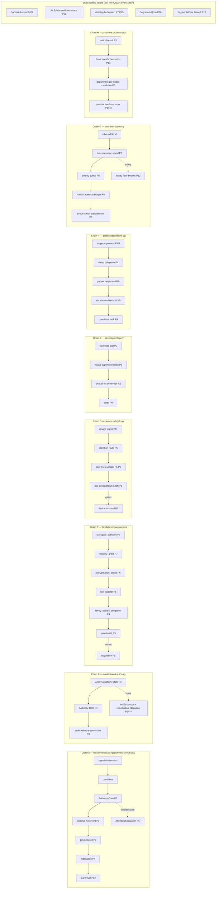

# v4 — C3.5F2: Superiority + Primitive-Sufficiency Matrix (the "100x" half of C3.5)

Document type: `plan_or_roadmap` (C3.5 arc artifact F2 — extends F's disposition/gap matrix; a new G3.5 gate between G3 and G4) · Authority: `analysis_nonbinding` (`GRD-036`)
Status: `populated_G3.5_pending_review` 2026-06-13 (C3.5 pressure-test agent). Naming per Knox (F2, not G1 — "Gate 1" = A/B/C; F2 signals it extends F and is NOT the final G handoff).
Gate: **G3.5 (Superiority / Primitive-Sufficiency).** Runs after G3 (E/F survivability) and before G4 (handoff).

> **Why this exists (the reframe — Nick + Knox 2026-06-13).** E/F answered **survivability**: "can OMNI survive hospital-grade physics without breaking truth/authority/documentation?" → *physics-holds / objects-missing*. That is only the **admission ticket**. C3.5 is THE test, and it is not done until it also answers **superiority**: *can OMNI's primitives + the RELATIONSHIPS between them + the AI layer support a 2030/2035 care substrate that makes Epic-centered workflows feel obsolete* — across inpatient AND outpatient AND async AND family AND provider AND workforce AND federation. **Current hospital reality (B) is grounding, not a ceiling.** If Epic-2020 spans inpatient+outpatient, OMNI-2030/35 substrate must be designed wide enough now — or the thesis/contracts bake in a small company.

## What this is / is NOT
- **IS:** a curated **capability-pressure universe** (~500+ compact rows) walked top-down across the whole future app, where **every row reduces to a PRIMITIVE demand + a RELATIONSHIP demand**, used to test **primitive sufficiency**. The **rows are the mining operation; the SYNTHESIS (§ families + relationship map + sufficiency verdict + v4-now/C5 split + wedge-strengthening) is the deliverable.**
- **IS NOT:** a product backlog · C4 prose · contract edits · 1000 written scenarios · a dumb Cartesian product. Hard rule (Knox): **row → primitive demand → relationship demand, or the row is discarded / flagged `product-only`.**
- **Survivability vs Superiority (state plainly):** *Survivability* = OMNI avoids breaking healthcare's truth/authority/documentation/workflow physics (E/F). *Superiority* = OMNI uses better primitives + AI layering + organization to make coordination, communication, escalation, credential-readiness, coverage, follow-up, family experience, and learning **dramatically better than incumbent EHR-centered systems**. C3.5 needs both; this F2 is the missing half. (Survived ≠ wins; **v4 is judged on superiority**.)

## Generation method (curated grid-walk, NOT Cartesian)
Walk a grid; emit a row only where the cell is **meaningful** (skip product-only nonsense; mark thin zones). Axes:
- **Care setting** (D's 34 facility strata) × **department/service-line** (D's 45 workflow strata)
- **Interaction/communication topology:** patient↔care-team · provider↔provider · intra-team · inter-department · family/POA↔team · cross-operator/federation · AI↔human · device↔human (feedback rail)
- **Care/action-loop stage:** signal/sense → attention-route → decide/order → act/administer → stop-the-line/escalate → prove/document → obligation/follow-up → learn/eval
- **Actor + authority:** see / act / sign / stop / override / escalate / release
- **Surface:** inpatient app · outpatient async app · provider workspace · family/proxy portal · department/command-center · ops/house-supervisor · workforce/credentialing · device/monitor
- **100x lever (the superiority mechanism; from the AI corpus):** attention-routing · proactive/ambient sensing · governed automation · context-assembly/packet · coordination/orchestration · credential/coverage readiness · escalation/stop-line · personalized protocol/follow-up · family-comms · learning loop

100x imagination is pulled from the AI corpus (EVRUN `§2A`: `attention_routing_state`, `interrupt_threshold`, context-engineering, loops/`ambient_inbox`, `autonomy ladder`, `clinical_action_ladder`, `model_plus_harness`, `agent_inbox`), thesis v3 §A/§B, and the Stanford/Sequoia/Karpathy reads. Nick's seeds (vent-drop-when-anesthesia-out, ICU 90/50 pressor titration authority, Hgb 4.2 blood-bank pre-notice, ascending-aortic-aneurysm vascular ping, over-message shield, stop-the-line wrong-order, POA/family ICU updates, DEA-expiry alerts, CVO credentialing, on-call/house-supervisor, surgeon post-op day-2/5, rails ownership) are **instances**, not the source list.

## Row schema (compact — one line)
`SUP-NNN · [setting/dept] · capability — incumbent pain → 100x mechanism · prim:[primitives] · rel:[a→b→c relationship] · own:[domain/control-plane] · surf:[surface] · gate:[authority] · proof:[audit] · rail:[if comms] · status · wedge:[Y if also strengthens outpatient/async]`

**`status` (Knox 7-value — do NOT be generous; distinguish precisely):** `covered-doctrine` (existing doctrine already holds) · `needs-extension` (existing primitive, must extend) · `NEW-primitive` (genuinely new object) · `NEW-relationship` (existing primitives must compose in a way NOT yet explicitly designed — **use aggressively; this is where most 100x lives, not in new objects**) · `product-surface-only` (UI/product, no substrate demand) · `C5-build` (downstream build, not v4-shaping) · `open-review` (real decision → `08`). **The proof of F2 is the synthesis (families + relationship chains), NOT the row count** — 300 rows + a killer primitive map beats 500 rows + weak synthesis.

## Superiority family index (the generation spine = the synthesis families)
Rows are grouped under the family they pressure (so the synthesis falls out directly). Families:
- **SF-A Stop-the-line / clinical-intervention authority** (wrong-but-legitimate order; who stops/overrides/escalates/releases)
- **SF-B Attention-routing / alert-economy / over-message shield** (route scarce human attention; suppress noise)
- **SF-C Escalation / paging / acuity-routing / notify fan-out**
- **SF-D Credential / privilege / capability-state** (DEA/CME/CVO/license/competency/expiry)
- **SF-E Coverage / on-call / house-supervisor / workforce-state**
- **SF-F Team / department / multidisciplinary communication** (encounter/team/dept/cross-operator-attached)
- **SF-G Family / proxy / POA visibility + consent + updates**
- **SF-H Device feedback rail** (monitor/pump/vent → titrate/page/close-loop)
- **SF-I Rail-agnostic comms substrate** (phone/email/page/SMS/secure-chat/portal as adapters; OMNI owns the conversation+authority substrate)
- **SF-J Protocol personalization + timed follow-up** (surgeon post-op; specialty pathways; day-2/5 check-ins)
- **SF-K Order / result / administration governance** (the act-loop hospital instantiation)
- **SF-L Cross-result / proactive clinical orchestration** (critical value → right specialist/department pre-notice, outside the ordering loop)
- **SF-M Context-assembly / clinical-context-packet** (right context, right actor, right moment)
- **SF-N Documentation / legal-record superiority** (ambient capture → governed note; multi-actor; amend)
- **SF-O Credential/large-data ingestion + AI-extracted evidence with provenance**
- **SF-P Care-obligation / recall / patient-journey orchestration at scale**
- **SF-Q Visibility / consent / multi-actor boundary control** (who sees what, when, why)
- **SF-R Surfaces** (inpatient app ≠ outpatient async ≠ provider workspace ≠ family portal ≠ department command-center ≠ ops)
- **SF-S Learning / eval / improvement loop** (per-action outcome-sensing without silent policy mutation)
- **SF-T Workforce / shift / scheduling communication** (shift reminders, coverage gaps, escalation)

## Rows
> Compact pressure rows, grouped by family. Each reduces to primitive + relationship demand or is flagged. Cross-tagged `wedge:Y` where it also strengthens outpatient/async/specialty-line.

### SF-A — Stop-the-line / clinical-intervention authority
- SUP-001 · [ICU/CPOE] · wrong-but-legitimate order (right drug, wrong patient context) caught before commit — Epic: soft alert, click-through → 100x: deterministic stop-line candidate with named stop-holders · prim:`clinical_action_ladder`,`stop_line_authority`(NEW) · rel:order→candidate→authority-gate→stop-line→notify-fan-out→audit · own:CNS/RBAC/OFC · surf:provider-workspace · gate:role+blast-radius · proof:override-record · status:NEW-relationship · wedge:Y
- SUP-002 · [floor/pharmacy] · pharmacist hard-reject of an unsafe order routes back to prescriber with reason — Epic: queue, no structured authority loop → 100x: verify-gate as a first-class authority step · prim:`order_verification_gate`(NEW),`authority_gate` · rel:order→pharmacist-verify→reject→prescriber-loop→re-author · own:RBAC/OFC · surf:provider-workspace · gate:pharmacist-capability · proof:reason-coded · status:NEW-primitive · wedge:Y
- SUP-003 · [floor/nursing] · RN refusal-to-administer is a recognized authority act, not insubordination — Epic: none structured → 100x: nurse-stop as a logged authority event · prim:`stop_line_authority`,`administration_event` · rel:admin-candidate→RN-stop→escalate→provider-review · own:RBAC/OFC · surf:provider-workspace · gate:RN-capability · proof:stop-record · status:NEW-relationship
- SUP-004 · [any/orders] · dose-out-of-range hard-stop vs soft-warn keyed to blast-radius — Epic: uniform alerts → alert fatigue → 100x: stop-strength = f(risk-tier) · prim:`stop_strength_policy`(NEW),`clinical_action_ladder` · rel:order→risk-classify→stop-strength→gate · own:Settings/CNS/RBAC · surf:provider-workspace · gate:risk-tier · proof:policy-version · status:NEW-relationship · wedge:Y
- SUP-005 · [any/CM] · duplicate-therapy / overlapping-order stop across operators + episodes — Epic: weak cross-encounter view → 100x: longitudinal duplicate-detection candidate · prim:`duplicate_therapy_guard`(EXISTS thesis §12.7),`care_episode` · rel:order→cross-episode-scan→candidate→stop/notify · own:CNS/CM/Federation · surf:provider-workspace · gate:provider-review · proof:trace · status:needs-extension · wedge:Y
- SUP-006 · [any/allergy] · allergy-contraindication stop that cannot be AI-cleared, only human-overridden with reason — Epic: override-with-reason exists → 100x: AI-never-clears + structured override authority · prim:`authority_gate`,`override_record` · rel:order→allergy-check→stop→human-override(reason)→audit · own:RBAC/CM · surf:provider-workspace · gate:provider · proof:override-reason · status:covered-doctrine · wedge:Y
- SUP-007 · [OR/procedure] · surgical time-out / wrong-site / wrong-patient hard stop — Epic: checklist → 100x: time-out as a gated pre-performance state with all-actor sign · prim:`pre_performance_gate`(EXISTS Settings),`service_occurrence` · rel:occurrence→time-out-gate→all-sign→proceed · own:D5/Settings/RBAC · surf:provider-workspace · gate:multi-actor · proof:time-out-record · status:needs-extension
- SUP-008 · [infusion/oncology] · chemo dose stop on lab-gate failure (ANC) — Epic: BPA → 100x: cycle blocked until lab-gate met, provider-authored release · prim:`protocol_order`(NEW),`gate_timing` · rel:regimen→cycle-lab-gate→stop→provider-release · own:OFC/Observation/RBAC · surf:provider-workspace · gate:onc-provider · proof:gate-eval · status:NEW-primitive
- SUP-009 · [floor/anticoag] · anticoagulation stop on supratherapeutic INR before next dose — Epic: alert → 100x: result→admin-hold relationship · prim:`administration_event`,`result_to_action_link`(NEW-rel) · rel:result→threshold→admin-hold→provider-notify · own:OFC/Observation/CNS · surf:provider-workspace · gate:provider · proof:hold-record · status:NEW-relationship · wedge:Y
- SUP-010 · [any/renal] · renal-dose stop / auto-adjust suggestion (never auto-commit) — Epic: dosing tool → 100x: AI-proposes renal dose, provider commits · prim:`clinical_action_ladder`,`model_version_of_record` · rel:eGFR→candidate-dose→provider-commit · own:CM/OFC/AI · surf:provider-workspace · gate:provider · proof:model-lineage · status:covered-doctrine · wedge:Y
- SUP-011 · [peds/NICU] · weight-based dose-range stop (recompute from current weight) — Epic: weight-based calc → 100x: stale-weight stop · prim:`weight_indexed_dose`(NEW),`observation_freshness` · rel:current-weight→dose-recompute→stale-stop→pharmacy-verify · own:OFC/Observation · surf:provider-workspace · gate:pharmacist · proof:weight-snapshot · status:NEW-primitive
- SUP-012 · [any/admin] · administrative/financial hold must NOT stop a clinical order (payment≠care) — Epic: charge holds bleed → 100x: firewall — financial hold cannot gate clinical act · prim:`payment_care_firewall`(EXISTS D6 §8.1) · rel:financial-event→(blocked-from)→clinical-gate · own:D6/CNS · surf:ops · gate:none-on-clinical · proof:invariant · status:covered-doctrine · wedge:Y
- SUP-013 · [ICU/CMO] · CMO/medical-director override of a unit-level stop with attestation — Epic: ad hoc → 100x: institutional override tier (T4 attestation) · prim:`attestation`(EXISTS RBAC §6),`break_glass_session` · rel:stop→escalate→CMO-override(T4)→audit · own:RBAC · surf:provider-workspace · gate:legal-entity-owner-class · proof:attestation · status:covered-doctrine
- SUP-014 · [any/AI] · AI-detected unsafe pattern raises an advisory stop — never an autonomous stop/commit — Epic: n/a → 100x: AI advisory in the candidate lane only · prim:`candidate`,`AI_proposes_humans_commit` · rel:AI-signal→advisory-candidate→human-decide · own:CNS/AI · surf:provider-workspace · gate:human · proof:candidate-trace · status:covered-doctrine · wedge:Y
- SUP-015 · [outpatient/async] · patient-reported "this isn't my usual pill/dose" triggers a stop-and-verify — Epic: portal msg → 100x: patient-source signal → reconciliation candidate · prim:`patient_source`,`stop_line_authority` · rel:patient-report→candidate→provider-verify→reconcile · own:Intake/CM/CNS · surf:patient-app · gate:provider · proof:trace · status:NEW-relationship · wedge:Y
- SUP-016 · [OR/anesthesia] · case cannot proceed if H&P > 24h or consent missing (pre-performance stop) — Epic: BPA → 100x: hard pre-performance gate · prim:`pre_performance_gate`,`consent_artifact` · rel:occurrence→H&P/consent-check→stop→complete · own:Settings/D7/D5 · surf:provider-workspace · gate:attending · proof:gate-eval · status:needs-extension
- SUP-017 · [transfusion] · transfusion blocked on product↔patient mismatch; double-verify not AI-satisfiable — Epic: BCMA-blood → 100x: dual-verify authority gate · prim:`administration_event`,`dual_verify_gate`(NEW) · rel:product→2-actor-verify→stop-on-mismatch→transfuse · own:OFC/RBAC · surf:provider-workspace · gate:2-RN · proof:verify-record · status:NEW-primitive
- SUP-018 · [any/orders] · look-alike/sound-alike + high-alert med confirmation step — Epic: ISMP lists → 100x: high-alert flag → mandatory second-confirm relationship · prim:`high_alert_class`(Settings),`dual_verify_gate` · rel:order→high-alert→2nd-confirm→proceed · own:Settings/OFC/RBAC · surf:provider-workspace · gate:2-actor · proof:confirm-record · status:NEW-relationship
- SUP-019 · [ED/sepsis] · time-bound bundle stop — overdue bundle step escalates rather than silently lapsing — Epic: BPA → 100x: obligation-overdue→escalate · prim:`care_obligation`,`escalation_path`(NEW) · rel:bundle-obligation→overdue→escalate→cover · own:OFC/CNS · surf:provider-workspace · gate:provider · proof:obligation-state · status:NEW-relationship
- SUP-020 · [dialysis] · standing-order parameter stop when monthly labs stale — Epic: standing orders → 100x: standing-order validity gated on obligation freshness · prim:`care_obligation`,`observation_freshness` · rel:standing-order→lab-freshness→stop-if-stale→provider · own:OFC/Observation · surf:provider-workspace · gate:nephrologist · proof:freshness-state · status:NEW-relationship
- SUP-021 · [psych] · restraint/seclusion order auto-expires; renewal blocked without face-to-face — Epic: time-limited orders → 100x: hard-expiry + reeval-gate; AI/rule never renews · prim:`time_bound_order`(NEW),`authority_gate` · rel:restraint→expiry→reeval-gate→renew/release · own:OFC/RBAC/CNS · surf:provider-workspace · gate:physician-f2f · proof:reeval-record · status:NEW-primitive
- SUP-022 · [any/release] · result/output release to patient is a STATE OMNI records, not an authority OMNI holds — Epic: auto-release rules → 100x: release-state composed from provider-review+consent+adoption · prim:`release_state`(OFC §6),`clinical_adoption` · rel:output→review+consent+adoption→release-state→patient-visible · own:OFC/CM/D7/RBAC · surf:patient-app · gate:composed · proof:release-record · status:needs-extension · wedge:Y

### SF-B — Attention-routing / alert-economy / over-message shield
- SUP-023 · [ICU/nursing] · route the RIGHT alert to the RIGHT nurse at the RIGHT moment, not all alarms to all — Epic: alarm fatigue, broadcast → 100x: attention as a governed resource · prim:`attention_routing_state`(§2A),`human_attention_budget` · rel:signal→classify→attention-route→actor-budget→deliver/suppress · own:CNS · surf:provider-workspace · gate:role · proof:routing-trace · status:NEW-primitive · wedge:Y
- SUP-024 · [any] · interrupt tiers {auto-no-op · draft · must-decide · urgent} per signal — Epic: uniform pop-ups → 100x: tiered interrupt policy · prim:`interrupt_threshold`(§2A) · rel:candidate→risk→interrupt-tier→surface · own:CNS/Settings · surf:all · gate:tier-policy · proof:tier-record · status:NEW-primitive · wedge:Y
- SUP-025 · [family/comms] · over-message shield: providers protected from family/patient message floods via priority queue + attention budget — Epic: in-basket overload → 100x: shield with proof-of-non-suppression · prim:`over_message_shield`(NEW),`priority_queue`,`human_attention_budget` · rel:inbound→shield→priority-queue→attention-budget→proof-of-non-suppression · own:CNS/Messaging · surf:provider-workspace · gate:policy · proof:non-suppression-audit · status:NEW-relationship · wedge:Y
- SUP-026 · [any/safety] · safety-critical signal always pierces the shield (suppression never hides danger) — Epic: hard-stop alerts → 100x: shield has a safety-floor · prim:`attention_routing_state`,`safety_floor`(EXISTS msg §6.1) · rel:signal→safety-classify→bypass-shield-if-critical · own:CNS · surf:all · gate:safety-policy · proof:bypass-record · status:needs-extension · wedge:Y
- SUP-027 · [floor/provider] · provider inbox is triaged + pre-read by AI (draft dispositions), human commits — Epic: manual in-basket → 100x: AI pre-disposition in candidate lane · prim:`agent_inbox`(§2A),`candidate` · rel:inbox-item→AI-pre-read→draft-disposition→human-commit · own:CNS/Messaging/AI · surf:provider-workspace · gate:human · proof:draft-trace · status:NEW-relationship · wedge:Y
- SUP-028 · [ICU] · cross-patient prioritization: which of my 16 ICU patients needs me first — Epic: per-patient view → 100x: panel-level acuity attention-routing · prim:`attention_routing_state`,`acuity_signal`(NEW) · rel:multi-patient-signals→acuity-rank→provider-queue · own:CNS/Observation · surf:provider-workspace/command-center · gate:role · proof:rank-trace · status:NEW-primitive
- SUP-029 · [any] · digest vs interrupt: non-urgent items batch into a digest, urgent interrupt — Epic: real-time spam → 100x: cadence policy per signal-class · prim:`ambient_suppression_policy`(§2A),`interrupt_threshold` · rel:signal→cadence-policy→digest/interrupt · own:CNS/Settings · surf:all · gate:policy · proof:cadence-record · status:NEW-relationship · wedge:Y
- SUP-030 · [outpatient/async] · async provider's review queue ordered by clinical risk, not FIFO — Epic: n/a (telehealth FIFO) → 100x: risk-ordered queue · prim:`priority_queue`,`acuity_signal` · rel:async-tasks→risk-order→provider-queue · own:CNS · surf:provider-workspace · gate:role · proof:order-trace · status:NEW-relationship · wedge:Y
- SUP-031 · [any] · proactive-agent policy: agents may surface but not flood; per-actor proactive budget — Epic: n/a → 100x: governed proactivity · prim:`proactive_agent_policy`(§2A),`human_attention_budget` · rel:agent→proactive-budget→surface-or-hold · own:CNS/AI · surf:all · gate:policy · proof:budget-record · status:NEW-primitive · wedge:Y
- SUP-032 · [any] · observability-exhaust guard: the system must not drown its humans in its own traces/alerts — Epic: alert fatigue → 100x: noise-budget cap · prim:`observability_exhaust_guard`(§2A candidate-GRD) · rel:trace/alert-volume→noise-budget→cap/suppress · own:CNS/Build-OS · surf:all · gate:policy · proof:volume-metric · status:NEW-relationship
- SUP-033 · [ED] · ED board attention-routing: incoming acuity + boarding + results converge to one prioritized floor view — Epic: tracking board → 100x: attention-routed board · prim:`attention_routing_state`,`acuity_signal` · rel:signals→acuity→board-priority · own:CNS · surf:command-center · gate:role · proof:trace · status:NEW-primitive
- SUP-034 · [any/escalation] · unacknowledged must-decide item auto-escalates up the attention chain — Epic: unacked alerts linger → 100x: ack-or-escalate · prim:`agent_escalation_policy`(§2A),`escalation_path`(NEW) · rel:must-decide→no-ack→escalate-next-actor · own:CNS · surf:provider-workspace · gate:policy · proof:escalation-trace · status:NEW-relationship · wedge:Y
- SUP-035 · [any] · context-aware suppression: same result suppressed for the actor who already saw/acted, surfaced to the one who hasn't — Epic: repeat alerts → 100x: per-actor seen-state-aware routing · prim:`attention_routing_state`,`per_actor_seen_state` · rel:signal→per-actor-state→suppress-or-surface · own:CNS · surf:all · gate:role · proof:trace · status:NEW-relationship
- SUP-036 · [family] · family update cadence is governed: ICU daily update at a set time, not on-demand flooding — Epic: ad hoc calls → 100x: governed family-update cadence · prim:`ambient_suppression_policy`,`family_update_obligation`(NEW) · rel:status-change→cadence-policy→family-update · own:CNS/Messaging · surf:family-portal · gate:POA-consent · proof:update-log · status:NEW-relationship · wedge:Y
- SUP-037 · [any] · attention budget is per-human + per-shift; routing respects who is overloaded — Epic: n/a → 100x: load-aware routing (route to the non-saturated actor) · prim:`human_attention_budget`,`capacity_aware_routing`(§2A) · rel:signal→actor-load→route-to-available · own:CNS/BIZOPS · surf:provider-workspace · gate:role · proof:load-state · status:NEW-relationship
- SUP-038 · [any/AI] · AI summarization for attention MUST deterministically surface critical facts (never summarize away an allergy) — Epic: n/a → 100x: critical-fact floor in any AI summary · prim:`critical_fact_floor`(EXISTS CM §5.1),`context_assembly` · rel:summary→critical-fact-checklist→guaranteed-surface · own:CNS/CM · surf:all · gate:deterministic · proof:checklist-trace · status:covered-doctrine · wedge:Y
- SUP-039 · [provider] · "what changed since I last looked" delta-attention view per patient — Epic: manual chart review → 100x: delta-since-last-seen · prim:`per_actor_seen_state`,`context_assembly` · rel:last-seen→delta-compute→surface · own:CNS/Observation · surf:provider-workspace · gate:role · proof:delta-trace · status:NEW-relationship · wedge:Y
- SUP-040 · [any] · alert provenance + source-citation (why am I seeing this) — Epic: opaque BPA → 100x: every interrupt carries its source + rule/model version · prim:`attention_routing_state`,`model_version_of_record` · rel:interrupt→source+version→displayed · own:CNS/AI · surf:all · gate:n/a · proof:source-trace · status:needs-extension · wedge:Y
- SUP-041 · [night/coverage] · after-hours attention routes to the covering actor, not the off-shift owner — Epic: pages misroute → 100x: coverage-aware attention routing · prim:`attention_routing_state`,`coverage_state`(NEW) · rel:signal→coverage-lookup→route-to-on-call · own:CNS/BIZOPS · surf:provider-workspace · gate:coverage-policy · proof:route-trace · status:NEW-relationship
- SUP-042 · [any] · suppression must produce proof-of-non-suppression (audit that nothing critical was hidden) — Epic: n/a → 100x: suppression is auditable, reversible · prim:`over_message_shield`,`audit` · rel:suppress→reason+audit→reviewable · own:CNS/BIZOPS · surf:ops · gate:policy · proof:suppression-audit · status:NEW-relationship · wedge:Y
- SUP-043 · [outpatient] · patient-facing notification tiering (urgent secure-view vs routine push) keyed to PHI exposure — Epic: basic prefs → 100x: exposure-aware channel routing · prim:`privacy_exposure_level`(EXISTS msg §6.1),`attention_routing_state` · rel:message→exposure→channel-tier · own:Messaging/CNS · surf:patient-app · gate:consent · proof:send-policy · status:covered-doctrine · wedge:Y
- SUP-044 · [any] · multidisciplinary signal convergence: one patient deterioration notifies the right subset of the care team only — Epic: broadcast or none → 100x: role-scoped fan-out · prim:`notify_fan_out`(NEW),`care_team_graph`(EXISTS §7.4) · rel:signal→care-team-graph→role-scoped-notify · own:CNS/Identity · surf:provider-workspace · gate:role · proof:fan-out-trace · status:NEW-relationship · wedge:Y
- SUP-045 · [any] · attention-routing learns (which alerts this actor always dismisses) WITHOUT silently muting safety — Epic: static → 100x: learned routing within a safety floor · prim:`attention_routing_state`,`learning_loop`,`safety_floor` · rel:dismiss-pattern→learn→deprioritize(non-safety-only) · own:CNS/AI · surf:provider-workspace · gate:safety-floor · proof:learn-trace · status:NEW-relationship · wedge:Y
- SUP-046 · [command] · house-supervisor / charge attention board: unit-wide bottlenecks + coverage gaps surfaced — Epic: manual → 100x: ops attention-routing · prim:`attention_routing_state`,`coverage_state` · rel:unit-signals→ops-priority→supervisor-board · own:CNS/BIZOPS · surf:command-center · gate:role · proof:trace · status:NEW-primitive
- SUP-047 · [any] · de-duplicated cross-source attention (lab + nurse note + device all flag the same thing once) — Epic: triple alerts → 100x: signal-cluster dedupe before interrupt · prim:`attention_routing_state`,`signal_cluster_dedupe`(NEW) · rel:multi-signal→cluster→single-interrupt · own:CNS · surf:all · gate:policy · proof:cluster-trace · status:NEW-relationship
- SUP-048 · [any] · "do not disturb except for X" provider focus windows with safety carve-out — Epic: n/a → 100x: governed focus mode · prim:`interrupt_threshold`,`safety_floor` · rel:focus-window→suppress-except-safety · own:CNS · surf:provider-workspace · gate:policy · proof:trace · status:NEW-relationship · wedge:Y

### SF-C — Escalation / paging / acuity-routing / notify fan-out
- SUP-049 · [ICU] · rapid-response / code team auto-assembly with role-complete check — Epic: paging group → 100x: assemble-by-role, verify each seat filled, escalate gaps · prim:`escalation_path`(NEW),`care_team_graph`,`coverage_state` · rel:deterioration→RRT-trigger→role-assemble→gap-escalate · own:CNS/Identity/BIZOPS · surf:command-center · gate:policy · proof:assembly-trace · status:NEW-relationship
- SUP-050 · [any] · paging escalation ladder with ack-timeout fallback to next on-call — Epic: paging → 100x: deterministic ack-or-escalate ladder · prim:`escalation_path`,`coverage_state` · rel:page→ack-timeout→next-on-call→supervisor · own:CNS/BIZOPS · surf:provider-workspace · gate:policy · proof:ladder-trace · status:NEW-primitive · wedge:Y
- SUP-051 · [floor] · early-deterioration index routes a pre-alert to the team BEFORE a code — Epic: NEWS/MEWS BPA → 100x: trajectory→proactive escalation candidate · prim:`acuity_signal`,`trajectory_over_threshold`(§2A 146) · rel:trend→deterioration-index→pre-alert→team · own:Observation/CNS · surf:provider-workspace · gate:provider · proof:index-trace · status:needs-extension · wedge:Y
- SUP-052 · [ED/sepsis] · sepsis/stroke pathway activation pages the full bundle team + starts obligations — Epic: BPA → 100x: pathway-activation = team-notify + obligation-set + clock · prim:`care_obligation`,`escalation_path`,`notify_fan_out` · rel:criteria→pathway-activate→fan-out+obligations+clock · own:CNS/OFC · surf:command-center · gate:provider · proof:activation-trace · status:NEW-relationship
- SUP-053 · [any] · escalation respects authority: who MUST be notified vs who CAN act differs by event — Epic: flat paging → 100x: notify-set ≠ act-set, both role-scoped · prim:`notify_fan_out`,`authority_gate`,`care_team_graph` · rel:event→notify-set(role)+act-set(authority) · own:CNS/RBAC/Identity · surf:provider-workspace · gate:role · proof:fan-out-trace · status:NEW-relationship · wedge:Y
- SUP-054 · [any/device] · device feedback-rail escalation: vent/monitor threshold breach pages RT + provider + logs to device — Epic: alarm only → 100x: closed feedback loop signal→escalate→device-ack · prim:`device_feedback_rail`(NEW),`escalation_path` · rel:device-threshold→escalate→ack→device-log · own:Observation/CNS · surf:provider-workspace/device · gate:policy · proof:loop-trace · status:NEW-primitive
- SUP-055 · [cross-result] · critical lab (e.g., K+ 6.9) escalates to the covering provider with closed-loop ack — Epic: critical-result call → 100x: result→escalate→ack-tracked-to-closure · prim:`result_to_action_link`(NEW),`escalation_path` · rel:critical-result→escalate→ack→close · own:Observation/CNS/Messaging · surf:provider-workspace · gate:provider · proof:ack-record · status:NEW-relationship · wedge:Y
- SUP-056 · [any] · escalation when NO valid recipient exists (coverage gap) routes to house-supervisor + flags the gap — Epic: page-to-void → 100x: gap-detection→supervisor + call-list correction · prim:`coverage_state`,`escalation_path` · rel:escalate→no-recipient→supervisor→call-list-fix · own:CNS/BIZOPS · surf:command-center · gate:policy · proof:gap-record · status:NEW-relationship
- SUP-057 · [any] · multi-hop escalation is bounded (loop-gain <1) so it can't storm — Epic: paging storms → 100x: bounded escalation dynamics · prim:`escalation_path`,`bounded_loop_gain`(§2A 179) · rel:escalate→bound-iterations→terminate/supervisor · own:CNS · surf:n/a · gate:policy · proof:loop-metric · status:NEW-relationship
- SUP-058 · [specialist] · proactive specialist ping (imaging finding → vascular/onc) outside the ordering provider loop — Epic: results to orderer only → 100x: finding→relevant-specialist routing · prim:`notify_fan_out`,`result_to_action_link` · rel:finding→specialist-match→ping→accept · own:CNS/Federation · surf:provider-workspace · gate:provider · proof:ping-trace · status:NEW-relationship · wedge:Y
- SUP-059 · [any] · escalation carries the context-packet (the recipient gets why + relevant context, not just "call back") — Epic: numeric page → 100x: escalation bundled with clinical-context-packet · prim:`escalation_path`,`clinical_context_packet`(CNS §9.1) · rel:escalate→attach-context-packet→deliver · own:CNS · surf:provider-workspace · gate:role · proof:packet-ref · status:NEW-relationship · wedge:Y
- SUP-060 · [outpatient/async] · async abnormal result escalates to a synchronous touch when severity crosses a threshold — Epic: portal release → 100x: severity→sync-escalation · prim:`acuity_signal`,`escalation_path` · rel:async-result→severity→escalate-to-sync · own:CNS/Messaging · surf:patient-app/provider · gate:provider · proof:trace · status:NEW-relationship · wedge:Y
- SUP-061 · [any] · escalation outcome is recorded as an obligation (who took it, closed when) — Epic: page-and-forget → 100x: escalation→obligation→closure-proof · prim:`care_obligation`,`escalation_path` · rel:escalate→obligation→assignee→close · own:OFC/CNS · surf:provider-workspace · gate:role · proof:obligation-state · status:NEW-relationship · wedge:Y
- SUP-062 · [psych] · behavioral-emergency escalation (security + provider + 1:1) with legal-hold context — Epic: code grey → 100x: role-complete behavioral team + legal context · prim:`escalation_path`,`care_team_graph` · rel:behavioral-trigger→team-assemble+legal-context · own:CNS/RBAC · surf:command-center · gate:policy · proof:trace · status:NEW-relationship
- SUP-063 · [any] · escalation suppression-aware: a shielded routine item still escalates if it ages past SLA — Epic: in-basket aging → 100x: SLA-aged shield-bypass · prim:`over_message_shield`,`care_obligation` · rel:shielded→SLA-age→escalate · own:CNS · surf:provider-workspace · gate:policy · proof:SLA-trace · status:NEW-relationship · wedge:Y
- SUP-064 · [transitions] · failed handoff (no receiving acceptance) escalates rather than dropping the patient — Epic: transfer limbo → 100x: handoff-accept-or-escalate · prim:`escalation_path`,`transition_obligation`(NEW) · rel:handoff→no-accept→escalate→cover · own:CNS/Federation/OFC · surf:provider-workspace · gate:role · proof:handoff-trace · status:NEW-relationship · wedge:Y
- SUP-065 · [any] · escalation to administrative/legal (e.g., reportable event, AMA, elopement) routes the non-clinical chain — Epic: manual → 100x: event-class→admin/legal escalation path · prim:`escalation_path`,`event_class`(NEW) · rel:event→class→admin/legal-route · own:CNS/RBAC · surf:ops · gate:role · proof:trace · status:NEW-relationship
- SUP-066 · [any] · AI may DRAFT the escalation (who to call, what to say) but a human commits the act — Epic: n/a → 100x: AI-drafted escalation in candidate lane · prim:`candidate`,`escalation_path`,`AI_proposes_humans_commit` · rel:signal→AI-draft-escalation→human-send · own:CNS/AI/Messaging · surf:provider-workspace · gate:human · proof:draft-trace · status:covered-doctrine · wedge:Y
- SUP-067 · [any] · escalation across operators (patient at partner facility deteriorates) respects federation grant + reaches the owning team — Epic: siloed → 100x: cross-operator escalation via grant · prim:`escalation_path`,`shared_context_grant`(Federation) · rel:signal→cross-operator-grant→owning-team · own:Federation/CNS · surf:provider-workspace · gate:grant · proof:trace · status:NEW-relationship · wedge:Y
- SUP-068 · [ICU] · titration authority routing: BP 90/50 → who titrates the pressor (nurse-protocol vs provider) is explicit + bounded — Epic: verbal/protocol → 100x: titration authority as a bounded, logged act · prim:`administration_event`,`protocol_authority`(NEW) · rel:value→protocol-bound→nurse-titrate-or-escalate · own:OFC/RBAC/Observation · surf:provider-workspace · gate:protocol/provider · proof:titration-record · status:NEW-primitive
- SUP-069 · [any] · escalation analytics feed coverage/staffing (chronic gaps surface to ops) — Epic: n/a → 100x: escalation→workforce signal · prim:`escalation_path`,`workforce_intelligence_state`(BIZOPS) · rel:escalation-pattern→ops-projection→staffing · own:BIZOPS/CNS · surf:command-center · gate:role · proof:projection · status:NEW-relationship
- SUP-070 · [any] · "stop paging me about X, route to Y instead" governed re-routing (not silent mute) — Epic: ad hoc → 100x: governed escalation-preference with audit · prim:`escalation_path`,`per_actor_routing_pref`(NEW) · rel:pref→governed-reroute→audit · own:CNS · surf:provider-workspace · gate:policy · proof:pref-record · status:NEW-relationship · wedge:Y

### SF-D — Credential / privilege / capability-state (DEA/CME/CVO/license/competency)
- SUP-071 · [any/orders] · expired DEA blocks controlled-substance Rx the instant it lapses; alerts the provider + pharmacy + medical-staff office — Epic: periodic checks → 100x: live credential-state gates the act + fan-out on lapse · prim:`credential_capability_state`(NEW),`authority_gate` · rel:credential-state→authority-gate→order-permission; lapse→notify-fan-out · own:RBAC/Federation/BIZOPS · surf:provider-workspace · gate:credential · proof:credential-event · status:NEW-relationship · wedge:Y
- SUP-072 · [any] · privilege-not-license firewall: a licensed surgeon still blocked for a non-privileged procedure — Epic: privileging module → 100x: capability=license AND privilege AND competency, composed · prim:`credential_capability_state`,`privilege_grant`(Federation/RBAC) · rel:license+privilege+competency→compose→authority · own:RBAC/Federation/BIZOPS · surf:provider-workspace · gate:composed · proof:privilege-record · status:needs-extension
- SUP-073 · [any] · CME / license-renewal lapse pre-warns the provider + scheduling BEFORE it blocks care — Epic: HR spreadsheet → 100x: credential trajectory → proactive obligation · prim:`credential_capability_state`,`care_obligation` · rel:expiry-trajectory→pre-warn-obligation→renew · own:BIZOPS/RBAC/CNS · surf:workforce/provider · gate:role · proof:obligation · status:NEW-relationship · wedge:Y
- SUP-074 · [any] · state-scope check: provider licensed in TX cannot order for a patient located in CA (telehealth jurisdiction) — Epic: manual → 100x: jurisdiction × license at the act · prim:`jurisdiction_admission_rule`(Federation),`credential_capability_state` · rel:patient-jurisdiction×provider-license→gate · own:Federation/RBAC · surf:provider-workspace · gate:jurisdiction · proof:rule-eval · status:covered-doctrine · wedge:Y
- SUP-075 · [CVO] · credentialing/CVO file is a structured capability-state object, not a PDF pile — Epic: CVO software silo → 100x: credential-state as queryable substrate feeding authority · prim:`credential_capability_state`,`workforce_member`(BIZOPS) · rel:credential-evidence→state→authority-input · own:BIZOPS/Federation · surf:workforce/credentialing · gate:credentialing-office · proof:evidence-refs · status:NEW-primitive
- SUP-076 · [CVO/ingestion] · ingest a new provider's historical credential docs (license/board/case-logs) via AI extraction → candidate evidence, human-verified — Epic: manual entry → 100x: AI-extracted credential evidence with provenance + verify gate · prim:`credential_capability_state`,`AI_extracted_evidence`(NEW),`provenance` · rel:doc→AI-extract→candidate-credential→CVO-verify→state · own:BIZOPS/AI/D7 · surf:credentialing · gate:CVO + provider · proof:extraction-lineage · status:NEW-relationship
- SUP-077 · [any] · third-party CVO / primary-source verification as a federated rail (NPDB, state boards) — Epic: integrations → 100x: credential rails are adapters; OMNI owns the credential-state truth · prim:`credential_capability_state`,`rail_adapter`(NEW) · rel:primary-source→rail→credential-state · own:Federation/BIZOPS · surf:credentialing · gate:CVO · proof:source-verify · status:NEW-relationship
- SUP-078 · [any/competency] · competency-gate (e.g., laser, moderate-sedation) blocks solo practice until BIZOPS competency active — Epic: none structured → 100x: competency is a composed authority input (RBAC §5) · prim:`workforce_intelligence_state`(BIZOPS),`authority_gate` · rel:competency-state→authority-compose→permit-solo · own:BIZOPS/RBAC/Settings · surf:provider/workforce · gate:competency · proof:competency-record · status:covered-doctrine · wedge:Y
- SUP-079 · [nursing] · nursing certification requirements (ACLS/PALS/chemo-cert) gate assignment to certain units/tasks — Epic: HR → 100x: nurse credential-state gates task/unit assignment · prim:`credential_capability_state`,`coverage_state` · rel:nurse-cert→assignment-eligibility · own:BIZOPS/RBAC · surf:workforce · gate:cert · proof:cert-record · status:needs-extension
- SUP-080 · [any] · "provider not up to date" → OMNI initiates the remediation obligation (don't just block) — Epic: block at point of care → 100x: detect→remediation-obligation→track→restore · prim:`credential_capability_state`,`care_obligation`,`escalation_path` · rel:lapse→remediation-obligation→complete→restore-authority · own:BIZOPS/CNS/RBAC · surf:workforce/provider · gate:role · proof:obligation · status:NEW-relationship · wedge:Y
- SUP-081 · [any] · capability-state is per-event-ownership-aware: credential authorizes clinical acts, not commerce/coordination acts — Epic: role strings → 100x: T0-13 orthogonality on credential authority · prim:`credential_capability_state`,`per_event_ownership`(T0-13) · rel:credential→clinical-dimension-only · own:RBAC · surf:n/a · gate:dimension · proof:grant-record · status:covered-doctrine
- SUP-082 · [federation] · provider credentialed at multiple operators carries per-operator privilege state (not a global super-credential) — Epic: enterprise → 100x: operator-scoped privilege under one identity · prim:`credential_capability_state`,`patient_relationship`-analog-for-provider,`Federation` · rel:identity→per-operator-privilege · own:Federation/Identity/RBAC · surf:credentialing · gate:per-operator · proof:scoped-grant · status:needs-extension
- SUP-083 · [any] · locum / temp / rotating-resident time-bound credential grants auto-expire — Epic: manual deactivation → 100x: time-bound credential grant · prim:`credential_capability_state`,`time_bound_order`-analog · rel:temp-grant→TTL→auto-expire · own:RBAC/BIZOPS · surf:credentialing · gate:role · proof:grant-TTL · status:needs-extension
- SUP-084 · [any] · sanctions / OIG-exclusion / malpractice-flag continuous monitoring → immediate authority review — Epic: periodic → 100x: continuous credential-watch → review obligation · prim:`credential_capability_state`,`care_obligation`,`rail_adapter` · rel:sanction-signal→authority-review-obligation · own:BIZOPS/Federation/CNS · surf:credentialing · gate:CVO/legal · proof:watch-trace · status:NEW-relationship
- SUP-085 · [any] · "who can do X right now" query (credential + privilege + competency + on-shift) for routing — Epic: separate systems → 100x: one composed eligibility query feeding routing/coverage · prim:`credential_capability_state`,`coverage_state`,`capacity_aware_routing` · rel:compose(credential,privilege,competency,shift)→eligible-set · own:RBAC/BIZOPS/CNS · surf:command-center · gate:role · proof:query-trace · status:NEW-relationship
- SUP-086 · [any] · supervising-relationship credential (APP↔collaborating MD) is itself a gated state — Epic: agreements offline → 100x: supervision link as authority state · prim:`credential_capability_state`,`care_team_graph` · rel:supervision-link→APP-authority-scope · own:RBAC/Identity/BIZOPS · surf:credentialing · gate:role · proof:link-record · status:needs-extension · wedge:Y
- SUP-087 · [any] · credential evidence is amend-not-overwrite + provenance (a revoked privilege keeps its history) — Epic: status flips → 100x: credential history is immutable lineage · prim:`credential_capability_state`,`amend_not_overwrite`(D7) · rel:credential-change→append-history · own:BIZOPS/D7 · surf:credentialing · gate:CVO · proof:lineage · status:needs-extension
- SUP-088 · [outpatient] · specialty-line provider capability (which pathways an injector/NP may run) gates booking + order menu — Epic: n/a → 100x: capability-state shapes the bookable/order surface · prim:`credential_capability_state`,`catalog_item`(Settings) · rel:capability→surface-filter→bookable-menu · own:RBAC/Settings/D3 · surf:provider/scheduling · gate:capability · proof:filter-trace · status:NEW-relationship · wedge:Y
- SUP-089 · [any] · credential-state drives proof/attestation tier required for an act (Rx vs chart-read) — Epic: uniform → 100x: act → required attestation tier by credential + risk · prim:`credential_capability_state`,`attestation`(RBAC §6) · rel:act-risk→required-tier→credential-check · own:RBAC · surf:provider-workspace · gate:tier · proof:attestation · status:covered-doctrine
- SUP-090 · [any] · AI-agent / non-human actor "credentialing" (capability envelope + delegation) parallels human credential-state — Epic: n/a → 100x: non-human actors carry a governed capability envelope · prim:`capability_envelope`(§B),`non_human_actor`(Identity) · rel:agent→capability-envelope→bounded-authority · own:RBAC/Identity/AI · surf:agentic-runtime · gate:envelope · proof:envelope-record · status:needs-extension · wedge:Y
- SUP-091 · [any] · credential gaps surface to the operator as a readiness dashboard (projection, not a truth store) — Epic: CVO reports → 100x: credential-readiness projection over BIZOPS state · prim:`workforce_operating_context`(projection),`credential_capability_state` · rel:credential-state→projection→readiness-view · own:BIZOPS/Projections · surf:workforce/owner · gate:role · proof:projection · status:needs-extension
- SUP-092 · [any] · emergency credentialing / disaster-privileging (mass-casualty) time-boxed grant with heightened audit — Epic: paper → 100x: disaster-privilege as an audited break-glass credential · prim:`credential_capability_state`,`break_glass_session`(RBAC) · rel:disaster→time-boxed-privilege→audit→expire · own:RBAC/BIZOPS · surf:credentialing · gate:legal-entity-owner · proof:break-glass · status:NEW-relationship

### SF-E — Coverage / on-call / house-supervisor / workforce-state
- SUP-093 · [any] · live on-call list is a governed object: who is on, for what, until when, with a named owner who prunes it — Epic: paging-system list, stale → 100x: on-call as a maintained coverage-state primitive · prim:`coverage_state`(NEW),`workforce_intelligence_state` · rel:schedule→coverage-state→routing-source · own:BIZOPS/CNS · surf:command-center · gate:scheduler-role · proof:coverage-history · status:NEW-primitive
- SUP-094 · [any] · coverage GAP detection: an unfilled call slot is flagged + escalated, not silently empty — Epic: gaps discovered at 2am → 100x: gap is a first-class detected event · prim:`coverage_state`,`escalation_path` · rel:schedule→gap-detect→escalate→fill · own:BIZOPS/CNS · surf:command-center · gate:supervisor · proof:gap-record · status:NEW-relationship
- SUP-095 · [any] · "who owns this patient right now" is always answerable across shifts — Epic: attending-of-record + verbal → 100x: responsible-owner is a live, handoff-tracked state · prim:`responsible_owner`(D5/care_commitment),`coverage_state` · rel:assignment+handoff→current-owner · own:D5/BIZOPS/CNS · surf:provider-workspace · gate:role · proof:owner-trace · status:needs-extension · wedge:Y
- SUP-096 · [any] · shift handoff (sign-out) transfers accountability + open obligations as a structured act — Epic: I-PASS text → 100x: handoff = governed owner-transfer of obligations · prim:`responsible_owner`,`care_obligation`,`handoff`(NEW) · rel:handoff→transfer-owner+open-obligations→ack · own:CNS/OFC · surf:provider-workspace · gate:both-parties · proof:handoff-record · status:NEW-relationship · wedge:Y
- SUP-097 · [any] · house-supervisor command view: census + staffing + coverage gaps + bottlenecks in one ops projection — Epic: phone + spreadsheets → 100x: ops command-center projection · prim:`workforce_operating_context`(projection),`coverage_state` · rel:unit-state→ops-projection→supervisor · own:BIZOPS/Projections · surf:command-center · gate:role · proof:projection · status:needs-extension
- SUP-098 · [any] · "you have a shift coming up" + acknowledgement + swap/coverage request workflow — Epic: separate scheduler (QGenda) → 100x: shift comms native to the workforce substrate · prim:`workforce_intelligence_state`,`shift`(BIZOPS) · rel:shift→reminder→ack/swap-request · own:BIZOPS/Messaging · surf:workforce/provider · gate:role · proof:ack-record · status:needs-extension · wedge:Y
- SUP-099 · [any] · provider live operational-state (open-for-queue / at-capacity / paused / unavailable) drives routing — Epic: n/a → 100x: §1G.7 operational-state feeds attention + assignment · prim:`provider_operational_state`(BIZOPS §1G.7),`capacity_aware_routing` · rel:op-state→routable?→route/hold · own:BIZOPS/CNS/D3 · surf:provider-workspace · gate:role · proof:state-trace · status:covered-doctrine · wedge:Y
- SUP-100 · [any] · coverage-aware authority: orders/notifications during off-shift route to the covering provider with full context — Epic: misroutes → 100x: coverage-state + context-packet handoff · prim:`coverage_state`,`clinical_context_packet` · rel:off-shift-event→covering-provider+context · own:CNS/BIZOPS · surf:provider-workspace · gate:coverage · proof:trace · status:NEW-relationship · wedge:Y
- SUP-101 · [any] · private/role groups (e.g., "GI attendings", "night float") as governed comms+coverage scopes — Epic: distribution lists → 100x: role-group = scoped conversation + coverage unit · prim:`care_team_graph`,`conversation_scope`(Messaging) · rel:role-group→scoped-comms+coverage · own:Identity/Messaging/BIZOPS · surf:provider-workspace · gate:role · proof:membership · status:needs-extension
- SUP-102 · [any] · float/agency/cross-coverage staff get scoped, time-boxed access to the units they cover — Epic: broad access → 100x: coverage drives least-privilege scoped access · prim:`coverage_state`,`authority_gate` · rel:coverage-assignment→scoped-access→expire · own:RBAC/BIZOPS · surf:provider-workspace · gate:coverage · proof:scoped-grant · status:NEW-relationship
- SUP-103 · [any] · workload-balanced assignment (don't dump the 9th admit on the saturated intern) — Epic: manual → 100x: load-aware assignment · prim:`human_attention_budget`,`capacity_aware_routing` · rel:new-work→load-state→balanced-assign · own:CNS/BIZOPS · surf:command-center · gate:role · proof:load-trace · status:NEW-relationship · wedge:Y
- SUP-104 · [any] · coverage-state is operator/federation-scoped (cross-operator coverage by explicit grant) — Epic: single-org → 100x: cross-operator coverage via federation · prim:`coverage_state`,`Federation` · rel:cross-operator-coverage→grant→route · own:Federation/BIZOPS · surf:command-center · gate:grant · proof:trace · status:NEW-relationship
- SUP-105 · [any] · scheduler/admin owns call-list edits with audit; AI may propose fills, human commits — Epic: manual edits → 100x: governed call-list mutation + AI-proposed fills · prim:`coverage_state`,`AI_proposes_humans_commit` · rel:gap→AI-propose-fill→scheduler-commit · own:BIZOPS/CNS/AI · surf:command-center · gate:scheduler · proof:edit-audit · status:NEW-relationship
- SUP-106 · [any] · coverage feeds clinical authority: a covering provider inherits scoped order authority for covered patients — Epic: implicit → 100x: explicit coverage→authority composition · prim:`coverage_state`,`authority_gate`,`responsible_owner` · rel:coverage→scoped-authority→commit · own:RBAC/BIZOPS · surf:provider-workspace · gate:coverage · proof:authority-trace · status:NEW-relationship · wedge:Y
- SUP-107 · [outpatient] · async/specialty-line coverage (who covers refills/messages when the prescriber is off) — Epic: weak → 100x: async coverage-state for the wedge · prim:`coverage_state`,`responsible_owner` · rel:prescriber-off→async-coverage→handle · own:BIZOPS/CNS · surf:provider-workspace · gate:coverage · proof:trace · status:NEW-relationship · wedge:Y
- SUP-108 · [any] · coverage analytics: chronic gaps, overtime, burnout signals surface to ops (projection) — Epic: payroll reports → 100x: workforce-health projection · prim:`workforce_operating_context`(projection) · rel:coverage+hours→projection→ops · own:BIZOPS/Projections · surf:owner/ops · gate:role · proof:projection · status:needs-extension
- SUP-109 · [any] · credential×coverage compose: only credentialed-for-this-unit staff fill that unit's gap — Epic: manual → 100x: gap-fill respects credential-state · prim:`coverage_state`,`credential_capability_state` · rel:gap→credential-eligible-pool→fill · own:BIZOPS/RBAC · surf:command-center · gate:credential · proof:trace · status:NEW-relationship
- SUP-110 · [any] · on-call escalation chain is itself coverage-state (primary→secondary→attending→supervisor) — Epic: static list → 100x: escalation ladder derives from live coverage · prim:`coverage_state`,`escalation_path` · rel:coverage→escalation-ladder · own:BIZOPS/CNS · surf:command-center · gate:policy · proof:ladder-trace · status:NEW-relationship

### SF-F — Team / department / multidisciplinary communication
- SUP-111 · [any] · conversation scope is a first-class axis: patient-attached vs encounter-attached vs team-attached vs department-attached vs cross-operator — Epic: Secure Chat + in-basket → 100x: one messaging substrate, many governed conversation scopes · prim:`conversation_scope`(Messaging §7.7.2),`care_team_graph` · rel:message→scope→participants→visibility · own:Messaging/Identity · surf:provider-workspace · gate:scope-membership · proof:scope-record · status:needs-extension · wedge:Y
- SUP-112 · [inpatient] · inpatient messaging ≠ outpatient async ≠ federation messaging — distinct surfaces over ONE substrate — Epic: separate products → 100x: surface-variants, shared substrate (no fork) · prim:`conversation_scope`,`surface_variant`(Surfaces) · rel:substrate→persona/setting-variant→render · own:Messaging/Surfaces · surf:multiple · gate:persona · proof:variant-map · status:needs-extension · wedge:Y
- SUP-113 · [any] · message attaches to the clinical object (encounter/order/result/occurrence), not a free-floating thread — Epic: limited linking → 100x: object-attached conversation · prim:`conversation_scope`,`internal_thread_object_links`(Messaging) · rel:message→object-link→context · own:Messaging/D5 · surf:provider-workspace · gate:role · proof:link-record · status:covered-doctrine · wedge:Y
- SUP-114 · [any] · internal team chat is NOT the clinical record — attaches to it, never becomes it — Epic: chat sprawl → 100x: hard boundary (team chat ≠ chart) · prim:`internal_collaboration`(Messaging §8.8) · rel:team-chat→attach→never-commit-truth · own:Messaging · surf:provider-workspace · gate:role · proof:boundary · status:covered-doctrine
- SUP-115 · [any] · multidisciplinary rounds: one shared situational map across MD/RN/PT/pharmacy/SW with role-scoped contributions — Epic: rounding tools → 100x: shared context + role-scoped authorship · prim:`clinical_context_packet`,`care_team_graph` · rel:rounds→shared-packet→role-contributions · own:CNS/Messaging · surf:provider-workspace · gate:role · proof:contribution-trace · status:NEW-relationship · wedge:Y
- SUP-116 · [department] · department-as-addressable-entity (message "Cardiology", routes to the on-call/consult member) — Epic: distribution lists → 100x: department routing via coverage-state · prim:`conversation_scope`,`coverage_state` · rel:dept-address→coverage→member · own:Messaging/BIZOPS · surf:provider-workspace · gate:role · proof:route-trace · status:NEW-relationship
- SUP-117 · [consult] · consult request is a structured, tracked, two-sided obligation (not a page into the void) — Epic: consult orders → 100x: consult = request→accept→opinion→close obligation · prim:`care_obligation`,`conversation_scope` · rel:consult-request→accept→opinion→close · own:OFC/CNS/Messaging · surf:provider-workspace · gate:role · proof:consult-trace · status:NEW-relationship · wedge:Y
- SUP-118 · [any] · inter-provider message carries the context-packet, not just text ("re: this patient" with the relevant slice) — Epic: text only → 100x: context-attached comms · prim:`conversation_scope`,`clinical_context_packet` · rel:message→attach-context-packet→recipient · own:Messaging/CNS · surf:provider-workspace · gate:role · proof:packet-ref · status:NEW-relationship · wedge:Y
- SUP-119 · [M&M] · M&M / peer-review conversations live in a privileged, legally-protected scope (peer-review privilege) separate from the chart — Epic: offline → 100x: protected-scope conversation with legal boundary · prim:`conversation_scope`,`visibility_grant`,`legal_protection_class`(NEW) · rel:peer-review→protected-scope→restricted-visibility · own:Messaging/RBAC/D7 · surf:provider-workspace · gate:peer-review-role · proof:scope-audit · status:NEW-primitive
- SUP-120 · [residency] · intern/resident/attending team structure (service teams, co-sign, supervision) as a comms+authority graph — Epic: team lists → 100x: team-graph drives comms + co-sign + escalation · prim:`care_team_graph`,`authority_gate` · rel:team-structure→comms-scope+cosign-chain · own:Identity/RBAC/Messaging · surf:provider-workspace · gate:role · proof:team-record · status:needs-extension
- SUP-121 · [any] · AI drafts the inter-team message (handoff summary, consult question) — human sends — Epic: n/a → 100x: AI-drafted team comms in candidate lane · prim:`candidate`,`conversation_scope`,`AI_proposes_humans_commit` · rel:context→AI-draft→human-send · own:CNS/AI/Messaging · surf:provider-workspace · gate:human · proof:draft-trace · status:covered-doctrine · wedge:Y
- SUP-122 · [any] · message routing respects authority: an order-relevant message can't bypass the order's authority gate — Epic: chat-driven orders → 100x: comms never originate clinical commits (Caution-2) · prim:`conversation_scope`,`authority_gate` · rel:message→(cannot)→order-without-gate · own:Messaging/CNS/RBAC · surf:provider-workspace · gate:authority · proof:invariant · status:covered-doctrine
- SUP-123 · [any] · cross-operator team messaging (referring ↔ receiving teams) via federation grant + scoped visibility — Epic: fax/phone → 100x: governed cross-operator conversation · prim:`conversation_scope`,`shared_context_grant`(Federation) · rel:cross-operator-msg→grant→scoped-thread · own:Federation/Messaging · surf:provider-workspace · gate:grant · proof:grant-trace · status:NEW-relationship · wedge:Y
- SUP-124 · [any] · read-state ≠ work-done: a seen message never implies the clinical/ops task is complete — Epic: read receipts misused → 100x: read-state informational only · prim:`read_receipt_discipline`(Messaging §8.2) · rel:read-state→(not)→completion · own:Messaging · surf:provider-workspace · gate:n/a · proof:invariant · status:covered-doctrine · wedge:Y
- SUP-125 · [any] · @-mention / directed-ask creates a tracked obligation for the named actor (not just a notification) — Epic: chat mention → 100x: directed-ask → obligation · prim:`conversation_scope`,`care_obligation` · rel:directed-ask→obligation→close · own:Messaging/OFC · surf:provider-workspace · gate:role · proof:obligation · status:NEW-relationship · wedge:Y
- SUP-126 · [tumor-board] · tumor-board / multidisciplinary-conference: case presented, decisions captured as governed assertions, not lost in chat — Epic: separate tool → 100x: conference decisions → committed assertions w/ provenance · prim:`conversation_scope`,`clinical_adoption` · rel:conference→decision→provider-adopt→commit · own:CNS/CM/Messaging · surf:provider-workspace · gate:provider · proof:decision-trace · status:NEW-relationship
- SUP-127 · [any] · department command-center surface aggregates that department's patients/queues/comms — Epic: per-patient → 100x: department-scoped operational surface · prim:`surface_variant`,`conversation_scope`,`workforce_operating_context` · rel:dept-scope→aggregate→command-view · own:Surfaces/CNS · surf:command-center · gate:role · proof:projection · status:needs-extension
- SUP-128 · [any] · message priority/urgency interacts with the attention-shield (urgent team msg pierces; chit-chat batches) — Epic: flat → 100x: comms × attention-routing · prim:`conversation_scope`,`interrupt_threshold` · rel:message→urgency→interrupt-tier · own:Messaging/CNS · surf:provider-workspace · gate:policy · proof:tier-record · status:NEW-relationship · wedge:Y
- SUP-129 · [any] · closed-loop critical comms (you-must-acknowledge) for safety-relevant team messages — Epic: ad hoc → 100x: ack-required comms with escalation · prim:`conversation_scope`,`escalation_path` · rel:critical-msg→require-ack→escalate-if-not · own:Messaging/CNS · surf:provider-workspace · gate:policy · proof:ack-trace · status:NEW-relationship · wedge:Y
- SUP-130 · [any] · conversation lifecycle: a clinical thread can be resolved/closed/reopened with state, not infinite scroll — Epic: endless threads → 100x: thread lifecycle state · prim:`conversation_scope`,`thread_lifecycle`(Messaging) · rel:thread→open/resolved/reopened · own:Messaging · surf:provider-workspace · gate:role · proof:state · status:covered-doctrine · wedge:Y
- SUP-131 · [any] · provider-to-patient vs provider-to-team vs provider-to-family are distinct governed scopes with distinct exposure rules — Epic: separate inboxes → 100x: scope-typed comms with per-scope policy · prim:`conversation_scope`,`privacy_exposure_level` · rel:scope-type→exposure-policy→render · own:Messaging/RBAC · surf:multiple · gate:scope-policy · proof:policy-record · status:needs-extension · wedge:Y
- SUP-132 · [any] · multidisciplinary care-plan is co-authored, each contribution attributed + authority-scoped — Epic: free-text plan → 100x: attributed, role-scoped care-plan authorship · prim:`care_team_graph`,`clinical_adoption` · rel:contribution→attribute→authority-scope · own:CM/CNS · surf:provider-workspace · gate:role · proof:attribution · status:NEW-relationship · wedge:Y
- SUP-133 · [any] · "who said what when" on a clinical decision is reconstructable (decision provenance across the team) — Epic: weak → 100x: decision provenance trace · prim:`cns_decision`(CNS),`trace_lineage` · rel:decision→participants+rationale→trace · own:CNS · surf:provider-workspace · gate:role · proof:decision-record · status:covered-doctrine
- SUP-134 · [outpatient] · specialty-line team comms (injector ↔ supervising MD ↔ front-desk) on one patient thread — Epic: texts/calls → 100x: governed wedge team thread · prim:`conversation_scope`,`care_team_graph` · rel:wedge-team→scoped-thread→context · own:Messaging/Identity · surf:provider-workspace · gate:role · proof:thread · status:needs-extension · wedge:Y
- SUP-135 · [any] · translation/interpreter in team comms (cross-language care team) — Epic: n/a → 100x: language-aware comms with attribution of translation · prim:`conversation_scope`,`language_access`(NEW) · rel:message→translate→attributed-rendering · own:Messaging/AI · surf:provider-workspace · gate:role · proof:translation-trace · status:NEW-relationship · wedge:Y
- SUP-136 · [any] · agent participates in team comms as a bounded, labeled actor (never impersonating a human) — Epic: n/a → 100x: AI as a disclosed non-human participant · prim:`non_human_actor`,`conversation_scope` · rel:agent-msg→labeled→bounded · own:Identity/Messaging/AI · surf:provider-workspace · gate:envelope · proof:actor-label · status:needs-extension · wedge:Y
- SUP-137 · [any] · department/service handoff at service-change (e.g., surgery→medicine) transfers the conversation + obligations — Epic: re-consult → 100x: service-transfer = scope + obligation handoff · prim:`conversation_scope`,`handoff`,`care_obligation` · rel:service-change→transfer-scope+obligations · own:CNS/OFC/Messaging · surf:provider-workspace · gate:role · proof:handoff-trace · status:NEW-relationship · wedge:Y
- SUP-138 · [any] · comms substrate is rail-agnostic: same governed thread renders to secure-chat/SMS/email/page per policy (see SF-I) — Epic: channel silos → 100x: one thread, many adapter rails · prim:`conversation_scope`,`rail_adapter` · rel:thread→rail-policy→deliver · own:Messaging · surf:multiple · gate:exposure-policy · proof:send-policy · status:needs-extension · wedge:Y

### SF-G — Family / proxy / POA visibility + consent + updates
- SUP-139 · [ICU/family] · verified-POA gets governed daily ICU updates; the chain is identity→authority→grant→scope→rail→obligation — Epic: nurse calls family ad hoc → 100x: the canonical family-comms composition · prim:`surrogate_authority`(NEW),`visibility_grant`,`conversation_scope`,`rail_adapter`,`family_update_obligation`(NEW) · rel:identity/surrogate-authority→visibility-grant→conversation-scope→rail→clinical-update-obligation→proof/audit→escalation · own:Identity/Federation/D7/Messaging/OFC · surf:family-portal · gate:POA-verified · proof:update-log · status:NEW-relationship · wedge:Y
- SUP-140 · [any] · non-POA family member: "call now for an update from your husband's care team" — no PHI pushed, just a governed callback invite — Epic: HIPAA-fumbling → 100x: existence-only outreach to unverified family · prim:`privacy_exposure_level`,`surrogate_authority` · rel:family-contact→exposure-floor→callback-invite-only · own:Messaging/RBAC · surf:family-portal/SMS · gate:exposure · proof:send-policy · status:needs-extension · wedge:Y
- SUP-141 · [any] · surrogate authority is legally-ranked + capacity-gated (not handle-based; not assumed from a phone) — Epic: weak → 100x: surrogate hierarchy as authority state · prim:`surrogate_authority`,`capacity_state`(NEW),`Identity handle≠person` · rel:capacity-loss→surrogate-rank→authority · own:Identity/RBAC/D7 · surf:family-portal · gate:legal · proof:surrogate-record · status:NEW-primitive
- SUP-142 · [any] · family lab/note visibility via login is scoped to what the grant + law allow (and beats Epic by being governed, not all-or-nothing) — Epic: MyChart proxy (coarse) → 100x: per-category, per-purpose visibility grant · prim:`visibility_grant`,`privacy_exposure_level` · rel:proxy-grant→category-scope→render · own:D7/RBAC/Federation · surf:family-portal · gate:grant · proof:grant-trace · status:needs-extension · wedge:Y
- SUP-143 · [any] · which provider notes are family-visible is governed (adolescent confidentiality, sensitive notes withheld) — Epic: open-notes blunt → 100x: note-class × viewer → visibility policy · prim:`visibility_grant`,`document_kind`(D7) · rel:note-class→viewer-policy→visible? · own:D7/RBAC · surf:family-portal · gate:policy · proof:policy-record · status:needs-extension · wedge:Y
- SUP-144 · [any] · proxy access for a minor flips at age-of-majority / emancipation automatically — Epic: manual → 100x: age/legal-event → proxy-state transition · prim:`surrogate_authority`,`patient_relationship`(Identity) · rel:age-event→proxy-recompute · own:Identity/RBAC · surf:family-portal · gate:legal · proof:transition-record · status:needs-extension · wedge:Y
- SUP-145 · [ICU] · family-designated single-spokesperson reduces over-messaging to the care team (one POA channel) — Epic: every relative calls → 100x: spokesperson scope + shield · prim:`conversation_scope`,`over_message_shield` · rel:designate-spokesperson→single-scope→shield-others · own:Messaging/Identity · surf:family-portal · gate:POA · proof:scope · status:NEW-relationship · wedge:Y
- SUP-146 · [any] · family spoken-language input for a non-capacity patient (family provides history in their language) → translated, attributed as family-source — Epic: n/a → 100x: family-source + language input as provenance-tagged evidence · prim:`patient_source`(family variant),`language_access` · rel:family-input→translate→family-source-evidence→provider-adopt · own:Intake/Identity/AI/CM · surf:family-portal · gate:provider-adopt · proof:source+translation-trace · status:NEW-relationship · wedge:Y
- SUP-147 · [any] · family update content is exposure-bounded (status/"stable" vs full clinical detail behind secure-view) — Epic: phone detail → 100x: tiered family exposure · prim:`privacy_exposure_level`,`family_update_obligation` · rel:update→exposure-tier→channel · own:Messaging/RBAC · surf:family-portal · gate:exposure · proof:send-policy · status:needs-extension · wedge:Y
- SUP-148 · [any] · who-may-give-the-update is explicit (nurse vs provider vs AI-drafted-provider-approved) — Epic: nurse default → 100x: update-authorship policy · prim:`family_update_obligation`,`AI_proposes_humans_commit` · rel:update→authorship-policy→AI-draft→human-approve→send · own:CNS/Messaging/AI · surf:family-portal · gate:role · proof:draft-trace · status:NEW-relationship · wedge:Y
- SUP-149 · [any] · consent withdrawal / visibility revocation cascades (revoked family member loses access immediately) — Epic: lingering access → 100x: derived-permission invalidation cascade · prim:`visibility_grant`,`derived_permission_invalidation`(§2A) · rel:revoke→cascade→remove-derived-access · own:D7/RBAC/Federation · surf:family-portal · gate:patient/POA · proof:revoke-trace · status:NEW-relationship · wedge:Y
- SUP-150 · [any] · break-the-glass family access in emergencies (unconscious patient, no documented POA) is reason-coded + audited + reviewed — Epic: ad hoc → 100x: emergency family-access break-glass · prim:`break_glass_session`,`surrogate_authority` · rel:emergency→break-glass→audit→review · own:RBAC/D7 · surf:family-portal · gate:break-glass · proof:audit · status:NEW-relationship
- SUP-151 · [any] · custody / restraining-order / safety blocks (abuse cases): some family explicitly barred from access — Epic: manual flags → 100x: negative-visibility (explicit deny) honored everywhere · prim:`visibility_grant`(deny),`safety_floor` · rel:legal-bar→deny-grant→enforce · own:RBAC/D7 · surf:family-portal · gate:legal · proof:deny-record · status:needs-extension · wedge:Y
- SUP-152 · [any] · family can submit questions to the care team (governed, shielded, triaged) without flooding — Epic: in-basket overload → 100x: family-question intake → triage → shield · prim:`conversation_scope`,`over_message_shield`,`care_obligation` · rel:family-question→triage→provider-obligation-or-AI-answer · own:Messaging/CNS · surf:family-portal · gate:scope · proof:triage-trace · status:NEW-relationship · wedge:Y
- SUP-153 · [any] · AI can answer routine family questions (visiting hours, general status) but never commit clinical info without provider — Epic: n/a → 100x: AI family-concierge in candidate lane · prim:`AI_proposes_humans_commit`,`privacy_exposure_level` · rel:family-Q→AI-answer(non-clinical)/route-clinical · own:CNS/AI/Messaging · surf:family-portal · gate:exposure · proof:trace · status:needs-extension · wedge:Y
- SUP-154 · [any] · multi-family-member governance (divorced parents, large families) — per-member grant + spokesperson + conflict handling — Epic: messy → 100x: per-member visibility-grant graph · prim:`visibility_grant`,`surrogate_authority`,`care_team_graph` · rel:per-member→grant+role→scoped-access · own:Identity/RBAC/D7 · surf:family-portal · gate:per-member · proof:grant-graph · status:NEW-relationship
- SUP-155 · [outpatient] · caregiver/proxy on an outpatient/async account (elderly parent's GLP-1 program managed by adult child) — Epic: shared logins (bad) → 100x: governed caregiver proxy on the wedge · prim:`surrogate_authority`,`patient_relationship` · rel:caregiver→proxy-grant→scoped-async-access · own:Identity/RBAC · surf:patient-app · gate:proxy · proof:grant · status:NEW-relationship · wedge:Y
- SUP-156 · [any] · family update obligations are tracked (did the daily ICU update actually go out / get acknowledged) — Epic: nurse-remembers → 100x: family-update as a closed-loop obligation · prim:`family_update_obligation`,`care_obligation` · rel:cadence→update-obligation→sent→ack · own:OFC/CNS/Messaging · surf:family-portal · gate:role · proof:obligation-state · status:NEW-relationship · wedge:Y
- SUP-157 · [any] · interpreter for family comms (LEP family) with attributed translation + comprehension for consent decisions — Epic: phone interpreter → 100x: language-access woven into family authority acts · prim:`language_access`,`surrogate_authority`,`consent_artifact` · rel:family-consent→interpreter→comprehension→valid · own:D7/Messaging/AI · surf:family-portal · gate:legal · proof:translation+comprehension · status:NEW-relationship · wedge:Y
- SUP-158 · [any] · family sees the care plan / what-to-expect (governed, plain-language projection of clinical truth) — Epic: minimal → 100x: family-facing plan projection · prim:`visibility_grant`,`projection`,`literacy_adaptive_response`(§2A 152) · rel:care-plan→family-projection(literacy-adapted) · own:Projections/D7 · surf:family-portal · gate:grant · proof:projection · status:NEW-relationship · wedge:Y
- SUP-159 · [discharge] · family included in discharge teaching + post-discharge follow-up (governed, consented) — Epic: paper handout → 100x: family-scoped discharge obligations · prim:`family_update_obligation`,`care_obligation`,`protocol_followup`(SF-J) · rel:discharge→family-teaching+followup-obligation · own:OFC/Messaging · surf:family-portal · gate:consent · proof:obligation · status:NEW-relationship · wedge:Y
- SUP-160 · [any] · all family visibility/comms is audited (who saw what, when, under which grant) — Epic: weak → 100x: tamper-evident family-access audit · prim:`visibility_grant`,`audit` · rel:family-access→audit-trail · own:D7/RBAC/BIZOPS · surf:compliance · gate:n/a · proof:access-audit · status:covered-doctrine · wedge:Y
- SUP-161 · [federation] · family visibility across operators (patient transferred) follows the patient via grant, not re-registration — Epic: re-enroll → 100x: portable family grant via federation · prim:`visibility_grant`,`Federation` · rel:transfer→carry-family-grant→receiving-operator · own:Federation/Identity · surf:family-portal · gate:grant · proof:trace · status:NEW-relationship · wedge:Y
- SUP-162 · [any] · over-shield protection works BOTH ways: family protected from alarming raw data; providers protected from family floods — Epic: neither → 100x: bidirectional governed exposure · prim:`over_message_shield`,`privacy_exposure_level` · rel:both-directions→governed-exposure · own:Messaging/CNS · surf:family-portal/provider · gate:policy · proof:audit · status:NEW-relationship · wedge:Y
- SUP-163 · [any] · "family wants to view labs" → they see governed labs in-app, and OMNI decides what each lab/note means they may see (beating Epic's blunt open-notes) — Epic: open-notes all-or-nothing → 100x: governed per-result family visibility · prim:`visibility_grant`,`Observation`,`document_kind` · rel:result→family-visibility-policy→render · own:D7/Observation/RBAC · surf:family-portal · gate:policy · proof:policy · status:needs-extension · wedge:Y
- SUP-164 · [any] · proxy/POA actions are themselves authority acts (proxy consents to a procedure) gated like any authority — Epic: signature → 100x: proxy-consent = gated authority event · prim:`surrogate_authority`,`consent_artifact`,`authority_gate` · rel:proxy→authority-act→consent-commit · own:D7/RBAC · surf:family-portal · gate:proxy-authority · proof:consent-record · status:needs-extension · wedge:Y

### SF-H — Device feedback rail (monitor/pump/vent → titrate/page/close-loop)
- SUP-165 · [ICU] · anesthesia leaves the room, vent RR drops to 12 → who is paged/alerted, is there a feedback rail to the device — Epic: alarm at bedside → 100x: device-signal→attention-route→role-fan-out→device-ack closed loop · prim:`device_feedback_rail`(NEW),`attention_routing_state`,`escalation_path` · rel:device-threshold→signal→attention-route→escalate→device-ack · own:Observation/CNS · surf:provider-workspace/device · gate:policy · proof:loop-trace · status:NEW-primitive
- SUP-166 · [ICU] · BP 90/50 → pressor titration: nurse-driven protocol vs provider order, bounded + logged, AI may suggest — Epic: verbal/protocol → 100x: titration authority + AI-suggested-bounds · prim:`protocol_authority`(NEW),`administration_event`,`device_feedback_rail` · rel:value→protocol-bound→nurse-titrate/AI-suggest→provider-escalate · own:OFC/RBAC/Observation · surf:provider-workspace · gate:protocol/provider · proof:titration-record · status:NEW-primitive
- SUP-167 · [any] · smart-pump ↔ eMAR reconciliation (programmed rate matches the order; mismatch flags) — Epic: pump integration → 100x: device-programmed value reconciled to the order · prim:`device_feedback_rail`,`administration_event` · rel:pump-program→reconcile-to-order→mismatch-flag · own:OFC/Observation · surf:provider-workspace · gate:RN · proof:reconcile-trace · status:needs-extension
- SUP-168 · [any] · device value carries a fidelity/verification state — motion artifact never auto-commits or auto-acts — Epic: charts raw → 100x: Observation 3-gate on device streams · prim:`device_feedback_rail`,`verification_state`(Observation §5) · rel:device-value→fidelity-state→candidate→verify→chart · own:Observation/CNS · surf:provider-workspace · gate:human-verify · proof:fidelity-trace · status:covered-doctrine
- SUP-169 · [any] · device disconnect / failure → fail-safe + alert (silence ≠ stable) — Epic: alarm → 100x: absence-of-signal handling · prim:`device_feedback_rail`,`absence_of_signal`(LI doctrine) · rel:disconnect→fail-safe→alert · own:Observation/CNS · surf:provider-workspace · gate:policy · proof:disconnect-trace · status:needs-extension
- SUP-170 · [any] · telemetry/continuous monitor → deterioration index → proactive pre-alert (trajectory, not threshold-only) — Epic: single-threshold → 100x: trajectory-aware device signal · prim:`device_feedback_rail`,`trajectory_over_threshold`,`acuity_signal` · rel:stream→trajectory→pre-alert · own:Observation/CNS · surf:provider-workspace · gate:provider · proof:index-trace · status:NEW-relationship
- SUP-171 · [any] · governed bidirectional device control (e.g., a protocol adjusts a pump) is an authority-gated action, never autonomous AI — Epic: rare/manual → 100x: device-actuation as a gated act-loop action · prim:`device_feedback_rail`,`authority_gate`,`physical_action_authority`(§2A 074) · rel:candidate-adjust→authority-gate→device-actuate→observe · own:OFC/RBAC/Observation · surf:provider-workspace · gate:provider/protocol · proof:actuation-record · status:NEW-relationship
- SUP-172 · [outpatient] · home device / CGM / BP-cuff / wearable stream into the same governed device-rail (wedge-strengthening) — Epic: separate → 100x: one device-rail spans inpatient monitors + home wearables · prim:`device_feedback_rail`,`Observation` · rel:home-device→device-rail→trajectory · own:Observation/Identity · surf:patient-app · gate:consent · proof:provenance · status:NEW-relationship · wedge:Y
- SUP-173 · [any] · device → page/notify fan-out respects coverage + role (RT for vent, RN for pump, provider for both) — Epic: broadcast → 100x: device-event role-scoped fan-out · prim:`device_feedback_rail`,`notify_fan_out`,`coverage_state` · rel:device-event→role-map→fan-out · own:CNS/BIZOPS · surf:provider-workspace · gate:role · proof:fan-out-trace · status:NEW-relationship
- SUP-174 · [any] · device data volume is governed (don't ingest every waveform as truth; sample/summarize with provenance) — Epic: data deluge → 100x: governed device-data mixing/retention · prim:`device_feedback_rail`,`context_mixture_policy`(§2A 164),`retention_class` · rel:stream→sample/summarize→retain-policy · own:Observation/D7 · surf:n/a · gate:policy · proof:retention · status:NEW-relationship
- SUP-175 · [any] · device-event → obligation (a vent change creates an RT documentation + reassessment obligation) — Epic: manual → 100x: device-event spawns tracked obligations · prim:`device_feedback_rail`,`care_obligation` · rel:device-change→reassess-obligation→close · own:OFC/Observation · surf:provider-workspace · gate:role · proof:obligation · status:NEW-relationship
- SUP-176 · [any] · device identity + UDI binding (which pump/monitor, recall traceability) — Epic: asset tags → 100x: device-as-actor with UDI binding · prim:`device_actor`(Identity §12.2),`device_feedback_rail` · rel:device→identity+UDI→event-attribution · own:Identity/Inventory/Observation · surf:provider-workspace · gate:n/a · proof:device-binding · status:needs-extension
- SUP-177 · [any] · alarm-fatigue management on device signals (cluster, prioritize, suppress-with-proof) — links SF-B — Epic: alarm fatigue → 100x: device alarms through the attention-shield · prim:`device_feedback_rail`,`signal_cluster_dedupe`,`over_message_shield` · rel:alarms→cluster→attention-route→suppress-with-proof · own:CNS/Observation · surf:provider-workspace · gate:safety-floor · proof:suppression-audit · status:NEW-relationship · wedge:Y
- SUP-178 · [any] · device feedback loop is bounded (a runaway alarm/retry loop can't storm — loop-gain<1) — Epic: alarm storms → 100x: bounded device-loop dynamics · prim:`device_feedback_rail`,`bounded_loop_gain` · rel:device-loop→bound→stabilize · own:Observation/CNS · surf:n/a · gate:policy · proof:loop-metric · status:NEW-relationship
- SUP-179 · [any] · device value enters the clinical-context-packet authority-labeled (device-source, unverified vs verified) — Epic: flat → 100x: device-source authority labeling in the packet · prim:`device_feedback_rail`,`clinical_context_packet` · rel:device-value→authority-label→packet · own:CNS/Observation · surf:provider-workspace · gate:role · proof:packet-ref · status:needs-extension · wedge:Y
- SUP-180 · [any] · device vendor integration is a rail adapter (anti-corruption), not a source-of-truth owner — Epic: vendor lock → 100x: device rails are replaceable adapters · prim:`device_feedback_rail`,`rail_adapter`,`anti_corruption_layer`(GRD-033) · rel:vendor-device→adapter→canonical-observation · own:Observation/Federation · surf:n/a · gate:n/a · proof:mapping · status:needs-extension
- SUP-181 · [any] · device-driven `value_from_action`: a device reading only matters if it drives a feasible, authorized, monitored action — Epic: data → 100x: device signal → governed action or no-op · prim:`device_feedback_rail`,`value_from_action_law`(§2A 155) · rel:device-signal→actionable?→governed-action/no-op · own:CNS/OFC · surf:provider-workspace · gate:authority · proof:action-trace · status:NEW-relationship · wedge:Y

### SF-I — Rail-agnostic comms substrate (OMNI owns the conversation+authority; rails are adapters)
- SUP-182 · [any] · ONE governed conversation renders to secure-chat / SMS / email / page / portal / voice per exposure policy — Epic: channel silos → 100x: substrate owns the thread + authority; rails are interchangeable adapters · prim:`conversation_scope`,`rail_adapter`(NEW),`privacy_exposure_level` · rel:thread→exposure-policy→rail-select→deliver · own:Messaging · surf:multiple · gate:exposure · proof:send-policy · status:needs-extension · wedge:Y
- SUP-183 · [any] · hospital paging system becomes an OMNI-adapter rail (page is just a delivery channel for a governed escalation) — Epic: separate paging → 100x: paging behind the escalation substrate · prim:`rail_adapter`,`escalation_path` · rel:escalation→page-adapter→deliver→ack · own:Messaging/CNS · surf:provider-workspace · gate:policy · proof:page-trace · status:NEW-relationship
- SUP-184 · [any] · hospital phone system: does it become an OMNI-owned rail? — OMNI owns the conversation/authority record, the carrier is the adapter — Epic: PBX silo → 100x: voice as a governed rail (call = a logged, scoped interaction) · prim:`rail_adapter`,`voice_session`(§2A 050),`conversation_scope` · rel:call→voice-rail→scoped-logged-interaction · own:Messaging/CNS · surf:provider-workspace · gate:exposure · proof:call-record · status:open-review · wedge:Y
- SUP-185 · [any] · hospital email: who owns it? — transactional/clinical email is a governed rail; general corporate email may live outside OMNI (explicit boundary) — Epic: Exchange silo → 100x: clinical email governed, corporate email out-of-scope (named boundary) · prim:`rail_adapter`,`message_intent`(Messaging §6.1) · rel:email→intent-classify→governed-or-external · own:Messaging · surf:n/a · gate:intent · proof:boundary · status:open-review
- SUP-186 · [any] · rail failover (SMS bounces → email → call) is a governed delivery ladder, not a dead end — Epic: send-and-pray → 100x: delivery-assurance ladder · prim:`rail_adapter`,`escalation_path` · rel:send→bounce→next-rail→confirm/escalate · own:Messaging · surf:n/a · gate:policy · proof:delivery-trace · status:needs-extension · wedge:Y
- SUP-187 · [any] · the 8-gate outbound governance applies to EVERY rail (consent/opt-in/STOP/quiet-hours/template/prohibited-claims) — Epic: per-channel rules → 100x: one send-policy across all rails · prim:`outbound_8_gate`(Messaging §6),`rail_adapter` · rel:any-outbound→8-gate→rail · own:Messaging/RBAC · surf:n/a · gate:8-gate · proof:gate-eval · status:covered-doctrine · wedge:Y
- SUP-188 · [any] · vendor minimum-necessary on rails (a paging/SMS vendor gets only the allowed exposure subset) — Epic: leaks → 100x: per-rail minimum-necessary scope · prim:`vendor_minimum_necessary_scope`(Messaging §6.1) · rel:outbound→rail-vendor-scope→redact→send · own:Messaging · surf:n/a · gate:exposure · proof:redaction-trace · status:covered-doctrine · wedge:Y
- SUP-189 · [any] · overhead/announce + code-call rails (a code blue is also a governed broadcast event with audit) — Epic: overhead page → 100x: broadcast rail with event record · prim:`rail_adapter`,`escalation_path` · rel:code→broadcast-rail+event-record · own:Messaging/CNS · surf:command-center · gate:policy · proof:broadcast-record · status:NEW-relationship
- SUP-190 · [any] · inbound on any rail (patient texts, calls, faxes) resolves to identity first (contact-identity, no collapse) — Epic: per-channel inbox → 100x: rail-agnostic inbound → identity resolution · prim:`rail_adapter`,`contact_identity`(Identity) · rel:inbound-any-rail→identity-resolve→scope · own:Messaging/Identity · surf:ops · gate:resolution · proof:resolution-trace · status:covered-doctrine · wedge:Y
- SUP-191 · [any] · fax (still real in healthcare) is a rail + artifact + queue; OMNI owns the artifact, fax is the adapter — Epic: fax silo → 100x: fax as governed inbound artifact · prim:`rail_adapter`,`media_artifact`(D7) · rel:fax-in→artifact+queue→classify→route · own:Messaging/D7 · surf:ops · gate:policy · proof:artifact-record · status:needs-extension
- SUP-192 · [any] · rail choice respects patient/provider preference WITHIN policy (preference tightens, never loosens exposure) — Epic: prefs → 100x: governed preference over rails · prim:`rail_adapter`,`channel_preference`(Messaging) · rel:preference→tighten-only→rail · own:Messaging · surf:patient-app/provider · gate:policy · proof:pref-record · status:covered-doctrine · wedge:Y
- SUP-193 · [any] · cross-operator rails (referring/receiving) carry the federation grant context, not raw PHI to an ungoverned channel — Epic: fax/phone → 100x: governed cross-operator rail · prim:`rail_adapter`,`shared_context_grant` · rel:cross-operator-send→grant-scope→rail · own:Federation/Messaging · surf:provider-workspace · gate:grant · proof:trace · status:NEW-relationship
- SUP-194 · [any] · rail delivery + read + response state feeds the conversation lifecycle (not a separate channel log) — Epic: fragmented → 100x: unified delivery-state on the governed thread · prim:`rail_adapter`,`conversation_scope` · rel:rail-events→thread-state · own:Messaging · surf:provider-workspace · gate:n/a · proof:thread-state · status:needs-extension · wedge:Y
- SUP-195 · [any] · AI may draft across rails (a callback script, an SMS) but human/policy commits the send — Epic: n/a → 100x: AI-drafted multi-rail comms in candidate lane · prim:`rail_adapter`,`AI_proposes_humans_commit` · rel:context→AI-draft→human/policy-send · own:Messaging/AI · surf:provider-workspace · gate:human/policy · proof:draft-trace · status:covered-doctrine · wedge:Y
- SUP-196 · [any] · rails are observable + auditable as a governed data workload (who-sent-what-where, redaction proof) — Epic: per-vendor logs → 100x: unified rail audit · prim:`rail_adapter`,`audit` · rel:rail-send→audit→reviewable · own:Messaging/BIZOPS · surf:compliance · gate:n/a · proof:rail-audit · status:needs-extension
- SUP-197 · [any] · rail-agnostic substrate is the SAME for outpatient/async wedge as inpatient (one comms substrate, big wedge win) — Epic: separate → 100x: wedge + acute share the comms substrate · prim:`conversation_scope`,`rail_adapter` · rel:one-substrate→both-settings · own:Messaging · surf:multiple · gate:exposure · proof:reuse · status:needs-extension · wedge:Y
- SUP-198 · [any] · degraded-mode comms (rail/EHR outage) has a designed fallback + reconciliation (links SF degraded-mode) — Epic: phone-tree → 100x: governed comms continuity · prim:`rail_adapter`,`degraded_mode`(NEW) · rel:outage→fallback-rail→reconcile-on-recovery · own:Messaging/Build-OS · surf:provider-workspace · gate:policy · proof:reconcile-trace · status:NEW-relationship
- SUP-199 · [any] · secure-chat as a rail still obeys conversation-scope + record boundary (team chat ≠ chart even on a "secure" rail) — Epic: Secure Chat → 100x: rail does not change the truth/record boundary · prim:`rail_adapter`,`internal_collaboration` · rel:secure-chat-rail→still-scope-bounded · own:Messaging · surf:provider-workspace · gate:scope · proof:boundary · status:covered-doctrine

### SF-J — Protocol personalization + timed follow-up
- SUP-200 · [surgery] · surgeon's "my special post-op instructions" auto-sent day-2 + day-5 with a response check — Epic: generic handout → 100x: provider-owned protocol → timed obligations → response-gated escalation · prim:`protocol_followup`(NEW),`care_obligation`,`escalation_path` · rel:provider-protocol→timed-obligation→patient-response→escalate-if-bad · own:OFC/CNS/Messaging · surf:patient-app/provider · gate:provider-author · proof:protocol-version+obligation · status:NEW-primitive · wedge:Y
- SUP-201 · [any] · protocol is a versioned, provider/specialty-owned object (not hardcoded) — Epic: order-set rigidity → 100x: protocol-as-config authored by the owner · prim:`protocol_followup`,`catalog_item`(Settings) · rel:author→versioned-protocol→instantiate · own:Settings/OFC · surf:provider-workspace · gate:provider/CODEOWNER · proof:version · status:NEW-relationship · wedge:Y
- SUP-202 · [any] · response-based escalation: a bad day-2 answer (fever, drainage) escalates to the surgeon's team — Epic: callback line → 100x: patient-response → threshold → escalation obligation · prim:`protocol_followup`,`acuity_signal`,`escalation_path` · rel:response→threshold→escalate→team-task · own:OFC/CNS · surf:provider-workspace · gate:provider · proof:trace · status:NEW-relationship · wedge:Y
- SUP-203 · [outpatient] · GLP-1/TRT/HRT titration protocols with scheduled check-ins + lab gates (direct wedge strengthening) — Epic: manual cadence → 100x: pathway protocol drives the wedge's recurring care · prim:`protocol_followup`,`care_obligation`,`gate_timing` · rel:pathway→titration-protocol→checkins+lab-gates · own:OFC/CNS/Observation · surf:patient-app · gate:provider · proof:protocol-trace · status:NEW-relationship · wedge:Y
- SUP-204 · [any] · personalized to the patient (not just the procedure): protocol adapts to comorbidities/risk — Epic: one-size → 100x: protocol × patient-context personalization · prim:`protocol_followup`,`clinical_context_packet` · rel:protocol×patient-context→personalized-plan · own:CNS/OFC/CM · surf:provider-workspace · gate:provider · proof:personalization-trace · status:NEW-relationship · wedge:Y
- SUP-205 · [any] · protocol completion is a tracked obligation set (each step due/done/overdue, not a static list) — Epic: paper plan → 100x: protocol = obligation graph · prim:`protocol_followup`,`care_obligation` · rel:protocol→obligation-graph→track · own:OFC · surf:provider-workspace · gate:role · proof:obligation-state · status:NEW-relationship · wedge:Y
- SUP-206 · [any] · AI drafts the follow-up message + interprets the response, provider commits any care change — Epic: n/a → 100x: AI-mediated follow-up in candidate lane · prim:`protocol_followup`,`AI_proposes_humans_commit` · rel:response→AI-interpret→candidate→provider-commit · own:CNS/AI · surf:patient-app/provider · gate:provider · proof:trace · status:covered-doctrine · wedge:Y
- SUP-207 · [any] · protocol library is sharable/forkable across providers + operators (governed, attributed) — Epic: per-org → 100x: protocol marketplace under federation governance · prim:`protocol_followup`,`Federation`,`catalog_item` · rel:protocol→share/fork→attributed · own:Settings/Federation · surf:provider-workspace · gate:operator-policy · proof:lineage · status:NEW-relationship · wedge:Y
- SUP-208 · [any] · protocol outcomes feed the learning loop (which post-op protocol yields fewer readmits) — Epic: n/a → 100x: protocol → outcome-sensing → improvement · prim:`protocol_followup`,`learning_loop` · rel:protocol→outcomes→eval→refine · own:CNS/BIZOPS/AI · surf:owner · gate:role · proof:outcome-projection · status:NEW-relationship · wedge:Y
- SUP-209 · [discharge] · discharge instructions ARE a protocol-followup instance (teaching + day-N checks + escalation) — Epic: handout → 100x: discharge = governed follow-up protocol · prim:`protocol_followup`,`transition_obligation` · rel:discharge→followup-protocol→checks · own:OFC/CNS · surf:patient-app/family-portal · gate:provider · proof:obligation · status:NEW-relationship · wedge:Y
- SUP-210 · [any] · specialty pathway templates (ERAS, sepsis, stroke, joint-replacement) as protocol objects with gates — Epic: order-sets → 100x: pathway = ordered protocol + gates + obligations · prim:`protocol_followup`,`protocol_order`,`gate_timing` · rel:pathway→ordered-steps+gates+obligations · own:OFC/Settings/CNS · surf:provider-workspace · gate:provider · proof:pathway-trace · status:NEW-relationship
- SUP-211 · [any] · protocol respects authority: a step requiring an order still hits the order's authority gate — Epic: protocol auto-orders → 100x: protocol proposes, authority commits · prim:`protocol_followup`,`authority_gate` · rel:protocol-step→order-candidate→gate→commit · own:OFC/RBAC · surf:provider-workspace · gate:authority · proof:trace · status:covered-doctrine
- SUP-212 · [any] · missed/declined follow-up is a recorded state with re-outreach + provider visibility (not silent drop) — Epic: no-show black hole → 100x: non-response is a governed obligation state · prim:`protocol_followup`,`care_obligation`,`nonresponse_context`(§2A 183) · rel:no-response→re-outreach→provider-visible · own:OFC/CNS · surf:provider-workspace · gate:role · proof:obligation-state · status:NEW-relationship · wedge:Y
- SUP-213 · [any] · receptivity/burden-aware follow-up timing (don't ping at 3am; cadence follows inflection) — Epic: fixed → 100x: JITAI receptivity gating · prim:`protocol_followup`,`receptivity_gate`(§2A 183) · rel:protocol→receptivity→timing · own:CNS · surf:patient-app · gate:policy · proof:timing-trace · status:NEW-relationship · wedge:Y
- SUP-214 · [any] · protocol personalization beats Epic precisely because OMNI has longitudinal + AI context to tailor it — Epic: static templates → 100x: longitudinal-context-driven personalization · prim:`protocol_followup`,`longitudinal context`,`AI` · rel:longitudinal-context→tailor-protocol · own:CNS/CM/AI · surf:provider-workspace · gate:provider · proof:trace · status:NEW-relationship · wedge:Y
- SUP-215 · [any] · protocol → family loop (family gets the relevant follow-up tasks too, governed) — links SF-G — Epic: patient-only → 100x: family-scoped protocol tasks · prim:`protocol_followup`,`family_update_obligation`,`visibility_grant` · rel:protocol→family-scope→family-tasks · own:OFC/Messaging · surf:family-portal · gate:consent · proof:obligation · status:NEW-relationship · wedge:Y
- SUP-216 · [any] · protocol completion gates downstream (e.g., can't schedule the 6-week follow-up until 2-week is done) — Epic: weak → 100x: protocol-step dependencies · prim:`protocol_followup`,`dependency_graph_eval`(§2A 162) · rel:step-dependency→gate-next · own:OFC/CNS · surf:provider-workspace · gate:dependency · proof:trace · status:NEW-relationship
- SUP-217 · [any] · protocol-as-evidence: the executed protocol + responses are part of the record (proof of care) — Epic: scattered → 100x: protocol execution materializes to the record · prim:`protocol_followup`,`evidence_record`(D7) · rel:protocol-execution→materialize→record · own:D7/OFC · surf:provider-workspace · gate:role · proof:materialization · status:needs-extension
- SUP-218 · [any] · provider can adjust an in-flight protocol for a specific patient (authored deviation, tracked) — Epic: rigid → 100x: per-patient protocol deviation with provenance · prim:`protocol_followup`,`amend_not_overwrite` · rel:deviation→authored→tracked · own:OFC/D7 · surf:provider-workspace · gate:provider · proof:deviation-record · status:needs-extension · wedge:Y
- SUP-219 · [any] · cross-operator protocol continuity (post-op patient followed by a different operator) via federation — Epic: lost → 100x: protocol travels with the patient · prim:`protocol_followup`,`Federation` · rel:transfer→carry-protocol→continue · own:Federation/OFC · surf:provider-workspace · gate:grant · proof:trace · status:NEW-relationship · wedge:Y
- SUP-220 · [any] · protocol library curation is governed (promote a one-off into a shared protocol only when proven/repeated) — Epic: template sprawl → 100x: prototype→contract promotion gate · prim:`protocol_followup`,`prototype_vs_contract_gate`(§2A 144) · rel:one-off→proven→promote-to-shared · own:Settings/Build-OS · surf:provider-workspace · gate:CODEOWNER · proof:promotion-record · status:NEW-relationship
- SUP-221 · [any] · protocol respects clinicality classification (a wellness nudge ≠ a clinical follow-up; different gates) — Epic: blurred → 100x: clinicality-typed follow-up · prim:`protocol_followup`,`clinicality_classification`(§2A 134) · rel:followup→clinicality→gate-set · own:CNS/OFC · surf:patient-app · gate:clinicality · proof:trace · status:NEW-relationship · wedge:Y

### SF-K — Order / result / administration governance (the act-loop, hospital-instantiated)
- SUP-222 · [any] · order is an authorization-intent with its own lifecycle; "ordered" never implies "done" — Epic: order status conflation → 100x: FHIR-grade request/event split as substrate · prim:`fulfillment_order`(OFC),`administration_event`(NEW) · rel:order(intent)→fulfill→administration-event→result · own:OFC/Observation · surf:provider-workspace · gate:authority · proof:lifecycle-trace · status:needs-extension
- SUP-223 · [any] · medication administration is a first-class event (who/when/dose/route/site/lot), distinct from the order — Epic: MAR → 100x: administration_event primitive (the highest-leverage gap from E) · prim:`administration_event` · rel:order→pharmacy-verify→administer-event→eMAR · own:OFC/Observation · surf:provider-workspace · gate:RN+BCMA · proof:admin-record · status:NEW-primitive
- SUP-224 · [any] · pharmacist verification is a distinct authority step between order and administration — Epic: verify queue → 100x: verify-gate primitive · prim:`order_verification_gate`(NEW),`authority_gate` · rel:order→verify(pharmacist)→releasable · own:OFC/RBAC · surf:provider-workspace · gate:pharmacist · proof:verify-record · status:NEW-primitive
- SUP-225 · [any] · result binds to its order (`basedOn`) + carries abnormal/critical state + requires documented review — Epic: results inbox → 100x: result→order link + review obligation · prim:`result_to_action_link`(NEW),`Observation` · rel:result→order-link→abnormal→review-obligation · own:Observation/OFC/CNS · surf:provider-workspace · gate:provider · proof:review-record · status:NEW-relationship · wedge:Y
- SUP-226 · [any] · order sets fan out into N independently-tracked orders, each with its own fulfillment + verify — Epic: order-set → 100x: order-set = bundle of distinct fulfillment_orders · prim:`fulfillment_order`,`order_set`(NEW) · rel:order-set→N-orders→each-lifecycle · own:OFC/Settings · surf:provider-workspace · gate:authority · proof:fan-out-trace · status:NEW-primitive
- SUP-227 · [any] · verbal/telephone order with time-bound authentication + co-sign — Epic: verbal-order flag → 100x: verbal-order = provisional authority + authentication obligation · prim:`fulfillment_order`,`attestation`,`care_obligation` · rel:verbal-order→provisional→authenticate-within-window · own:OFC/RBAC · surf:provider-workspace · gate:co-sign · proof:authentication-record · status:NEW-relationship
- SUP-228 · [any] · standing/protocol orders generate recurring fulfillment events (dialysis, sliding-scale insulin) — Epic: standing orders → 100x: standing-order → recurring obligation+events · prim:`fulfillment_order`,`care_obligation` · rel:standing-order→recurring-events→track · own:OFC · surf:provider-workspace · gate:provider · proof:recurrence-trace · status:NEW-relationship
- SUP-229 · [any] · order modification/discontinuation is amend-not-overwrite (the original + the change both preserved) — Epic: edit-in-place → 100x: order history is immutable lineage · prim:`fulfillment_order`,`amend_not_overwrite` · rel:order-change→append→lineage · own:OFC/D7 · surf:provider-workspace · gate:provider · proof:lineage · status:needs-extension
- SUP-230 · [any] · conditional/PRN orders carry their condition + administration is gated on it being met + documented — Epic: PRN → 100x: PRN = order + condition-gate + admin-with-indication · prim:`fulfillment_order`,`administration_event` · rel:PRN-order→condition-met→administer+indication · own:OFC · surf:provider-workspace · gate:RN · proof:indication-record · status:needs-extension
- SUP-231 · [any] · result-driven auto-orders are PROPOSED (reflex labs), human/policy commits — Epic: reflex testing → 100x: reflex = candidate order, governed commit · prim:`result_to_action_link`,`candidate` · rel:result→reflex-candidate→commit · own:OFC/Observation/CNS · surf:provider-workspace · gate:policy/provider · proof:trace · status:NEW-relationship
- SUP-232 · [any] · order → fulfillment vendor (lab/imaging/pharmacy) is a rail; the order truth stays OMNI's — Epic: interfaces → 100x: fulfillment via adapter, truth retained · prim:`fulfillment_order`,`rail_adapter` · rel:order→vendor-rail→result-back→bind · own:OFC/Federation/Observation · surf:n/a · gate:n/a · proof:mapping · status:needs-extension
- SUP-233 · [any] · administration safety: BCMA five-rights gate; hold/refuse/missed are documented non-admin events — Epic: BCMA → 100x: full admin-state set with reasons · prim:`administration_event`,`dual_verify_gate` · rel:scheduled→five-rights→administer/hold/refuse(reason) · own:OFC/RBAC · surf:provider-workspace · gate:RN+BCMA · proof:admin-state · status:NEW-primitive · wedge:Y
- SUP-234 · [any] · controlled-substance order→pull→administer→waste→count custody chain (links SF-A/diversion) — Epic: ADC → 100x: full custody chain as linked events · prim:`administration_event`,`custody_chain`(NEW) · rel:pull→administer→waste→witness→count · own:OFC/RBAC · surf:provider-workspace · gate:2-actor · proof:custody-trace · status:NEW-primitive
- SUP-235 · [any] · order priority (STAT/now/routine) drives fulfillment SLA + attention routing — Epic: priority flag → 100x: order-priority → SLA-obligation + attention · prim:`fulfillment_order`,`care_obligation`,`attention_routing_state` · rel:STAT→SLA→attention-route · own:OFC/CNS · surf:provider-workspace · gate:role · proof:SLA-trace · status:NEW-relationship · wedge:Y
- SUP-236 · [any] · cross-discipline order routing (diet→nutrition, therapy→PT, consult→specialty) with the right owning queue — Epic: order routing → 100x: order-type → owning-domain queue · prim:`fulfillment_order`,`notify_fan_out` · rel:order-type→owning-queue→fulfill · own:OFC/CNS · surf:provider-workspace · gate:role · proof:route-trace · status:NEW-relationship
- SUP-237 · [any] · result interpretation is provider-adopted truth; AI/lab values are candidates until adopted — Epic: auto-file → 100x: candidate→adoption boundary on results · prim:`result_to_action_link`,`clinical_adoption`(CM) · rel:result→candidate→provider-adopt→truth · own:CM/Observation · surf:provider-workspace · gate:provider · proof:adoption-record · status:covered-doctrine · wedge:Y
- SUP-238 · [any] · expired/unfulfilled order auto-expires explicitly (not silently dropped) with provider notice — Epic: lingering orders → 100x: order-expiry as a governed state · prim:`fulfillment_order`,`care_obligation` · rel:order→expiry→notify · own:OFC/CNS · surf:provider-workspace · gate:policy · proof:expiry-record · status:needs-extension
- SUP-239 · [any] · retest/repeat is a new linked order (`retest_of`), prior preserved (links Observation/OFC) — Epic: re-order → 100x: retest lineage · prim:`fulfillment_order`(retest_of) · rel:retest→link-prior→new-order · own:OFC/Observation · surf:provider-workspace · gate:provider · proof:lineage · status:covered-doctrine
- SUP-240 · [any] · order requires the right composed authority (credential + privilege + competency + jurisdiction + consent-gate) — Epic: role check → 100x: full 4-way+ composition at order emission · prim:`fulfillment_order`,`authority_gate`,`credential_capability_state` · rel:order→compose-authority→commit · own:RBAC/OFC/Federation · surf:provider-workspace · gate:composed · proof:authority-trace · status:needs-extension · wedge:Y
- SUP-241 · [any] · order → charge coupling is one-way (documentation/fulfillment drives the bill; the bill never edits the order) — Epic: charge-capture → 100x: doc↔bill firewall · prim:`fulfillment_order`,`payment_care_firewall` · rel:order/fulfillment→charge(one-way) · own:OFC/D6 · surf:n/a · gate:n/a · proof:invariant · status:covered-doctrine
- SUP-242 · [any] · AI-drafted orders (admission set, reconciliation) are candidates; provider commits with model_version_of_record — Epic: n/a → 100x: AI order-drafting in candidate lane + lineage · prim:`fulfillment_order`,`candidate`,`model_version_of_record` · rel:AI-draft-order→provider-commit+lineage · own:OFC/AI/RBAC · surf:provider-workspace · gate:provider · proof:model-lineage · status:covered-doctrine · wedge:Y
- SUP-243 · [any] · administration reconciliation across transfer (active drips/orders move with the patient, re-evaluated) — Epic: re-order on transfer → 100x: order/admin continuity across LOC change · prim:`administration_event`,`handoff`,`fulfillment_order` · rel:transfer→carry-active-orders→re-evaluate · own:OFC/CNS · surf:provider-workspace · gate:provider · proof:reconcile-trace · status:NEW-relationship
- SUP-244 · [any] · result release to patient is a composed state (review+consent+adoption), not auto (links SF-A SUP-022) — Epic: auto-release → 100x: governed release-state · prim:`result_to_action_link`,`release_state` · rel:result→review+consent→release-state→patient · own:OFC/CM/D7 · surf:patient-app · gate:composed · proof:release-record · status:needs-extension · wedge:Y
- SUP-245 · [outpatient] · the SAME order/result/admin substrate runs the wedge (e-Rx, lab order, in-office injection) — Epic: separate → 100x: one act-loop substrate, both settings · prim:`fulfillment_order`,`administration_event` · rel:one-substrate→wedge+acute · own:OFC · surf:multiple · gate:authority · proof:reuse · status:needs-extension · wedge:Y
- SUP-246 · [any] · order/result/admin fully traceable: signal→candidate→resolver→authority→commit→proof (one trace_lineage) — Epic: fragmented audit → 100x: end-to-end act-loop lineage · prim:`fulfillment_order`,`trace_lineage`(CNS) · rel:full-chain→single-lineage · own:OFC/CNS · surf:provider-workspace · gate:n/a · proof:trace_lineage · status:covered-doctrine
- SUP-247 · [any] · regimen/protocol orders (chemo) are structured multi-step orders with lab-gates + double-verify (links SF-A SUP-008) — Epic: regimen module → 100x: protocol_order primitive · prim:`protocol_order`(NEW),`gate_timing` · rel:regimen→ordered-steps+gates+verify · own:OFC/Observation/RBAC · surf:provider-workspace · gate:onc-provider · proof:protocol-trace · status:NEW-primitive

### SF-L — Cross-result / proactive clinical orchestration (the "OMNI saw it coming" layer)
- SUP-248 · [lab→blood-bank] · CBC shows Hgb 4.2 → blood bank gets a PROACTIVE pre-notice (likely transfusion) outside the ordering-provider loop — Epic: provider must order first → 100x: critical-value → anticipatory department orchestration (candidate, not auto-order) · prim:`result_to_action_link`,`proactive_orchestration`(NEW),`notify_fan_out` · rel:critical-result→anticipated-need→pre-notify-department(candidate)→provider-confirms · own:CNS/Observation/OFC · surf:command-center/provider · gate:provider-confirms-order · proof:pre-notice-trace · status:NEW-primitive
- SUP-249 · [radiology→vascular] · radiology read = ascending aortic aneurysm → vascular surgery gets a ping + the patient context — Epic: result to orderer only → 100x: finding → relevant-specialist proactive routing · prim:`result_to_action_link`,`notify_fan_out`,`clinical_context_packet` · rel:finding→specialist-match→ping+context→accept · own:CNS/Federation/Observation · surf:provider-workspace · gate:provider · proof:ping-trace · status:NEW-relationship · wedge:Y
- SUP-250 · [any] · critical-value closed loop to acknowledgement (no critical result sits unseen) — Epic: critical-call → 100x: critical-result obligation tracked to ack · prim:`result_to_action_link`,`care_obligation`,`escalation_path` · rel:critical→notify→ack-or-escalate→close · own:Observation/CNS/Messaging · surf:provider-workspace · gate:provider · proof:ack-record · status:NEW-relationship · wedge:Y
- SUP-251 · [any] · pattern-across-results (rising trop + EKG changes + symptoms) converges to one proactive candidate, not 3 alerts — Epic: siloed alerts → 100x: multi-signal clinical synthesis → single candidate · prim:`proactive_orchestration`,`signal_cluster_dedupe`,`context_assembly` · rel:multi-signal→synthesize→candidate · own:CNS/Observation · surf:provider-workspace · gate:provider · proof:synthesis-trace · status:NEW-relationship
- SUP-252 · [any] · incidental-finding obligation (the unsought lung nodule on a CT) is captured + tracked to follow-up, never lost — Epic: lost incidentals → 100x: incidental → first-class obligation · prim:`result_to_action_link`,`care_obligation`(incidental) · rel:incidental→obligation→track-to-followup · own:OFC/CNS/Observation · surf:provider-workspace · gate:provider · proof:obligation · status:NEW-relationship · wedge:Y
- SUP-253 · [any] · drug-result interaction proactive catch (new nephrotoxic order + rising creatinine → flag before harm) — Epic: separate alerts → 100x: order×result cross-check candidate · prim:`proactive_orchestration`,`result_to_action_link` · rel:order×result→risk→candidate-stop/adjust · own:CNS/CM/OFC · surf:provider-workspace · gate:provider · proof:trace · status:NEW-relationship · wedge:Y
- SUP-254 · [any] · proactive department prep (positive blood culture → pharmacy preps likely abx + ID consult candidate) — Epic: sequential → 100x: result → anticipatory multi-department orchestration · prim:`proactive_orchestration`,`notify_fan_out` · rel:result→anticipate→multi-dept-candidates→confirm · own:CNS/OFC · surf:command-center · gate:provider · proof:trace · status:NEW-primitive
- SUP-255 · [any] · proactive ≠ autonomous: every anticipatory step is a CANDIDATE a human confirms; OMNI never auto-commits care — Epic: n/a → 100x: anticipation in the candidate lane (hard guardrail) · prim:`proactive_orchestration`,`AI_proposes_humans_commit` · rel:anticipate→candidate→human-commit · own:CNS · surf:provider-workspace · gate:human · proof:candidate-trace · status:covered-doctrine · wedge:Y
- SUP-256 · [any] · longitudinal trajectory proactive catch (slow Hgb decline over visits → workup candidate) — wedge-relevant — Epic: visit-bound → 100x: longitudinal trajectory → proactive candidate · prim:`trajectory_over_threshold`,`proactive_orchestration` · rel:trajectory→candidate→provider · own:Observation/CNS · surf:provider-workspace · gate:provider · proof:trajectory-trace · status:NEW-relationship · wedge:Y
- SUP-257 · [any] · proactive routing respects authority + jurisdiction + consent (a specialist ping across operators needs a grant) — Epic: n/a → 100x: governed proactive cross-operator routing · prim:`proactive_orchestration`,`shared_context_grant` · rel:proactive-ping→grant-check→route · own:CNS/Federation · surf:provider-workspace · gate:grant · proof:trace · status:NEW-relationship
- SUP-258 · [any] · proactive prep for predictable next-step (post-op day-1 labs auto-proposed per protocol) — Epic: manual → 100x: protocol+state → anticipatory orders (candidate) · prim:`proactive_orchestration`,`protocol_followup` · rel:state+protocol→anticipated-orders→confirm · own:CNS/OFC · surf:provider-workspace · gate:provider · proof:trace · status:NEW-relationship · wedge:Y
- SUP-259 · [any] · proactive catch of MISSING expected data (ordered trop never resulted) — absence-of-signal handling — Epic: weak → 100x: expected-but-absent → obligation · prim:`result_to_action_link`,`absence_of_signal` · rel:expected-result→absent→chase-obligation · own:OFC/CNS · surf:provider-workspace · gate:role · proof:obligation · status:NEW-relationship · wedge:Y
- SUP-260 · [any] · proactive candidate carries its evidence + confidence + model lineage (provider sees WHY) — Epic: black-box BPA → 100x: explainable proactive candidate · prim:`proactive_orchestration`,`model_version_of_record`,`evidence_to_recommendation_trace`(§2A 068) · rel:candidate→evidence+confidence+lineage→display · own:CNS/AI · surf:provider-workspace · gate:provider · proof:lineage · status:NEW-relationship · wedge:Y
- SUP-261 · [any] · proactive de-escalation too (stable trajectory → suggest step-down/discharge readiness candidate) — Epic: n/a → 100x: anticipatory de-escalation candidate · prim:`proactive_orchestration`,`trajectory_over_threshold` · rel:stable-trajectory→step-down-candidate→provider · own:CNS/Observation · surf:provider-workspace · gate:provider · proof:trace · status:NEW-relationship
- SUP-262 · [any] · cross-result orchestration feeds the right SURFACE (blood-bank tech sees the pre-notice on the blood-bank surface, not a generic alert) — Epic: generic → 100x: orchestration → role-scoped surface delivery · prim:`proactive_orchestration`,`surface_variant`,`notify_fan_out` · rel:candidate→role-surface→deliver · own:CNS/Surfaces · surf:department · gate:role · proof:delivery-trace · status:NEW-relationship
- SUP-263 · [any] · proactive orchestration is bounded (can't flood departments with speculative pre-notices) — alert-economy applies — Epic: alert fatigue → 100x: proactive within attention-budget + confidence-threshold · prim:`proactive_orchestration`,`human_attention_budget` · rel:candidate→confidence+budget→surface-or-hold · own:CNS · surf:department · gate:policy · proof:budget-trace · status:NEW-relationship · wedge:Y
- SUP-264 · [any] · proactive obligation closure (the pre-notified department confirms readiness or declines, tracked) — Epic: n/a → 100x: pre-notice → two-sided obligation · prim:`proactive_orchestration`,`care_obligation` · rel:pre-notice→dept-ack/decline→close · own:OFC/CNS · surf:department · gate:role · proof:obligation · status:NEW-relationship
- SUP-265 · [any] · proactive orchestration learns precision (which pre-notices were useful) without lowering safety floors — Epic: static → 100x: orchestration learning loop · prim:`proactive_orchestration`,`learning_loop`,`safety_floor` · rel:pre-notice-outcomes→refine-precision · own:CNS/AI/BIZOPS · surf:owner · gate:safety-floor · proof:learn-trace · status:NEW-relationship
- SUP-266 · [any] · sepsis/deterioration proactive bundle assembly (the classic "OMNI saw it 2h earlier") — Epic: BPA → 100x: trajectory→bundle-candidate+team-prep · prim:`proactive_orchestration`,`acuity_signal`,`care_obligation` · rel:trajectory→bundle-candidate+team-prep→confirm · own:CNS/Observation/OFC · surf:command-center · gate:provider · proof:trace · status:NEW-relationship
- SUP-267 · [any] · proactive medication-safety (renal function shift → flag all renally-cleared active meds for review) — Epic: per-order → 100x: state-change → fan-out review across active orders · prim:`proactive_orchestration`,`result_to_action_link` · rel:state-change→scan-active-orders→review-candidates · own:CNS/CM/OFC · surf:provider-workspace · gate:provider · proof:trace · status:NEW-relationship · wedge:Y
- SUP-268 · [any] · proactive social/discharge orchestration (likely-complex-discharge flagged at admission → case-mgmt early) — Epic: late → 100x: early discharge-risk → case-mgmt obligation · prim:`proactive_orchestration`,`care_obligation` · rel:admit-risk→case-mgmt-early-obligation · own:CNS/OFC · surf:provider-workspace · gate:role · proof:obligation · status:NEW-relationship
- SUP-269 · [any] · proactive across operators (PCP notified proactively of their patient's ED visit — the ADT-notification done right) — Epic: ADT alert → 100x: governed proactive cross-operator notify · prim:`proactive_orchestration`,`shared_context_grant`,`notify_fan_out` · rel:ADT-event→grant→PCP-notify · own:Federation/CNS · surf:provider-workspace · gate:grant · proof:trace · status:NEW-relationship · wedge:Y
- SUP-270 · [any] · proactive orchestration is auditable (why was this pre-notice generated, on what signal, which model) — Epic: n/a → 100x: orchestration provenance · prim:`proactive_orchestration`,`cns_decision`,`trace_lineage` · rel:pre-notice→decision-record→audit · own:CNS · surf:provider-workspace · gate:n/a · proof:decision-record · status:covered-doctrine
- SUP-271 · [any] · proactive `value_from_action`: a prediction is worthless unless it routes to a feasible authorized action — Epic: scores → 100x: every proactive signal → governed action or explicit no-op · prim:`proactive_orchestration`,`value_from_action_law` · rel:prediction→actionable?→governed-action/no-op · own:CNS/OFC · surf:provider-workspace · gate:authority · proof:action-trace · status:NEW-relationship · wedge:Y

### SF-M — Context-assembly / clinical-context-packet (right context, right actor, right moment)
- SUP-272 · [any] · the right context is ASSEMBLED + authority-labeled per actor/moment, not a raw chart dump — Epic: open the whole chart → 100x: governed context-packet (the OMNI moat) · prim:`clinical_context_packet`(CNS §9.1),`context_assembly`(§2A 059) · rel:request→assemble(authority-labeled,provenance)→deliver · own:CNS · surf:provider-workspace · gate:role/consent · proof:packet-trace · status:covered-doctrine · wedge:Y
- SUP-273 · [any] · context is role-scoped (the consultant sees the consult-relevant slice; the nurse sees the nursing slice) — Epic: same chart for all → 100x: per-role context projection · prim:`clinical_context_packet`,`role_scoped_transparency`(§2A 132) · rel:role→scoped-context→render · own:CNS/Projections · surf:provider-workspace · gate:role · proof:scope-trace · status:NEW-relationship · wedge:Y
- SUP-274 · [any] · context-packet preserves authority (raw artifact ref + verification state + adoption state), never flattens — Epic: summary loses provenance → 100x: layered, authority-preserving packet · prim:`clinical_context_packet`,`layered_accountability` · rel:packet→preserve(artifact/observation/assertion-authority) · own:CNS/D7/Observation/CM · surf:provider-workspace · gate:role · proof:authority-labels · status:covered-doctrine
- SUP-275 · [any] · critical-fact floor: the packet deterministically surfaces allergies/contraindications/code-status (never AI-summarized-away) — Epic: n/a → 100x: deterministic critical-fact inclusion · prim:`clinical_context_packet`,`critical_fact_floor` · rel:packet→critical-checklist→guaranteed-include · own:CNS/CM · surf:provider-workspace · gate:deterministic · proof:checklist-trace · status:covered-doctrine · wedge:Y
- SUP-276 · [any] · context-packet is temporary + non-canonical (references, never a second truth store) — Epic: copies everywhere → 100x: packet owns nothing · prim:`clinical_context_packet`,`projection≠authority`(T0-15) · rel:packet→reference-only→decay · own:CNS · surf:n/a · gate:n/a · proof:non-canonical-invariant · status:covered-doctrine
- SUP-277 · [any] · "what changed since I last saw this patient" delta packet (links SF-B) — Epic: re-read → 100x: delta-context per actor · prim:`clinical_context_packet`,`per_actor_seen_state` · rel:last-seen→delta-assemble · own:CNS · surf:provider-workspace · gate:role · proof:delta-trace · status:NEW-relationship · wedge:Y
- SUP-278 · [any] · context router chooses the mode (scoped packet / retrieval / long-context / cached) per task by safety+cost+freshness — Epic: n/a → 100x: context-as-routed-strategy · prim:`context_assembly`,`memory_mode_router`(§2A 091) · rel:task→context-mode-select→assemble · own:CNS/AI · surf:n/a · gate:policy · proof:mode-trace · status:NEW-relationship · wedge:Y
- SUP-279 · [any] · retrieval ≠ authority: retrieved context informs, never satisfies a clinical gate by itself — Epic: n/a → 100x: retrieval-is-candidate discipline · prim:`clinical_context_packet`,`retrieval_not_authority`(GRD-042) · rel:retrieve→candidate→adopt-to-use · own:CNS/CM · surf:provider-workspace · gate:provider · proof:trace · status:covered-doctrine
- SUP-280 · [any] · packet assembly is consent + federation aware (cross-operator slices only via grant) — Epic: n/a → 100x: governed cross-operator context · prim:`clinical_context_packet`,`shared_context_grant` · rel:assemble→grant-filter→deliver · own:CNS/Federation · surf:provider-workspace · gate:grant · proof:grant-trace · status:NEW-relationship · wedge:Y
- SUP-281 · [any] · cached/stale context is labeled (a cached value is a performance artifact, not truth) — Epic: stale cache silently → 100x: freshness-state on cached context · prim:`clinical_context_packet`,`context_freshness`(NEW) · rel:cache→freshness-label→use-or-refresh · own:CNS · surf:provider-workspace · gate:policy · proof:freshness · status:NEW-relationship
- SUP-282 · [any] · packet is moment-aware (pre-op packet ≠ rounding packet ≠ discharge packet for the same patient) — Epic: one view → 100x: moment-scoped assembly · prim:`clinical_context_packet`,`context_assembly` · rel:moment→relevant-slice→assemble · own:CNS · surf:provider-workspace · gate:role · proof:moment-trace · status:NEW-relationship · wedge:Y
- SUP-283 · [any] · anchor-relative context (Δ from surgery/admission/last-dose) beats a flat fact pile — Epic: chronological dump → 100x: timeline-anchored context · prim:`clinical_context_packet`,`anchor_relative_context`(§2A 165) · rel:anchor-events→relative-context · own:CNS/Observation · surf:provider-workspace · gate:role · proof:trace · status:NEW-relationship · wedge:Y
- SUP-284 · [any] · packet for AI agents is policy-filtered + minimum-necessary (an agent gets only the scoped context for its task) — Epic: n/a → 100x: agent context = least-context · prim:`clinical_context_packet`,`minimum_necessary_context`(§2A 135),`capability_envelope` · rel:agent-task→min-necessary→packet · own:CNS/AI/RBAC · surf:agentic-runtime · gate:envelope · proof:scope-trace · status:NEW-relationship · wedge:Y
- SUP-285 · [any] · packet provenance is reconstructable (which sources, versions, model assembled this view) — Epic: n/a → 100x: packet trace_lineage · prim:`clinical_context_packet`,`trace_lineage` · rel:packet→source-lineage→audit · own:CNS · surf:provider-workspace · gate:n/a · proof:lineage · status:covered-doctrine
- SUP-286 · [any] · packet feeds escalation/handoff/comms (one assembled context reused across the loop, not re-built each time) — Epic: re-gather → 100x: assemble-once, reuse-governed · prim:`clinical_context_packet`,`handoff`,`escalation_path` · rel:packet→reuse(handoff/escalate/notify) · own:CNS · surf:provider-workspace · gate:role · proof:reuse-trace · status:NEW-relationship · wedge:Y
- SUP-287 · [any] · patient-facing context-packet (literacy-adapted, governed projection of their own truth) — Epic: portal data dump → 100x: patient-literacy-adapted context · prim:`clinical_context_packet`,`literacy_adaptive_response`,`projection` · rel:truth→patient-literacy-projection · own:Projections/CNS · surf:patient-app · gate:consent · proof:projection · status:NEW-relationship · wedge:Y
- SUP-288 · [any] · over-assembly guard: don't starve the actor (longitudinal must-haves) NOR flood them (local-default/global-periodic) — Epic: too-little/too-much → 100x: governed context sizing · prim:`clinical_context_packet`,`local_global_context_alternation`(§2A 165) · rel:assemble→size-policy→balance · own:CNS · surf:provider-workspace · gate:policy · proof:size-trace · status:NEW-relationship
- SUP-289 · [any] · context-packet is the SAME machinery for outpatient/async (the wedge already uses it — superiority compounds) — Epic: n/a → 100x: one context substrate, all settings · prim:`clinical_context_packet` · rel:one-substrate→wedge+acute · own:CNS · surf:multiple · gate:role · proof:reuse · status:covered-doctrine · wedge:Y
- SUP-290 · [any] · workforce context-packet (provider operating profile) uses the same machinery, different constraints (staff≠patient context) — Epic: n/a → 100x: workforce_operating_context projection · prim:`workforce_operating_context`,`clinical_context_packet` · rel:same-machinery→workforce-constraints · own:CNS/BIZOPS · surf:provider/workforce · gate:role · proof:projection · status:covered-doctrine
- SUP-291 · [any] · context assembly is eval'd (did the packet include what mattered; was a critical fact missed) — Epic: n/a → 100x: context-packet eval · prim:`clinical_context_packet`,`context_packet_eval`(§2A 109) · rel:packet→eval→improve · own:CNS/Build-OS · surf:n/a · gate:eval · proof:eval-bundle · status:NEW-relationship
- SUP-292 · [any] · degraded-mode context (when sources are down, the packet labels what's missing rather than silently omitting) — Epic: n/a → 100x: context honesty under degradation · prim:`clinical_context_packet`,`degraded_mode`,`absence_of_signal` · rel:source-down→label-missing→don't-pretend · own:CNS/Build-OS · surf:provider-workspace · gate:policy · proof:trace · status:NEW-relationship
- SUP-293 · [any] · context boundary enforcement (an agent/actor cannot assemble context beyond its authority — anti-echoleak) — Epic: n/a → 100x: context-assembly is itself authority-gated · prim:`clinical_context_packet`,`agent_learning_boundary`(§2A),`authority_gate` · rel:assemble-request→authority-check→bounded-packet · own:CNS/RBAC · surf:agentic-runtime · gate:authority · proof:trace · status:NEW-relationship · wedge:Y

### SF-N — Documentation / legal-record superiority
- SUP-294 · [any] · ambient capture → governed note: AI drafts from the encounter, provider edits + signs (note is a rendered output, not the truth) — Epic: ambient pilot bolt-on → 100x: ambient draft → candidate → provider-signed legal record · prim:`note_as_rendered_output`(DL-7),`AI_proposes_humans_commit`,`evidence_record`(D7) · rel:ambient→draft→provider-edit→sign→legal-record · own:D7/CM/AI · surf:provider-workspace · gate:provider-sign · proof:authorship+lineage · status:NEW-relationship · wedge:Y
- SUP-295 · [any] · the note is a PROJECTION over structured truth (assertions/observations), not a free-text blob that IS the truth — Epic: note-as-truth → 100x: structured-first, note-rendered · prim:`note_as_rendered_output`,`clinical_assertion`(CM) · rel:structured-truth→render-note · own:CM/D7 · surf:provider-workspace · gate:provider · proof:projection-trace · status:needs-extension · wedge:Y
- SUP-296 · [any] · authentication + timing (signed, dated, timed by the responsible author) is enforced substrate, not policy hope — Epic: CoP compliance → 100x: §482.24 authentication as a hard gate · prim:`evidence_record`,`attestation` · rel:entry→authenticate(author,time)→valid · own:D7/RBAC · surf:provider-workspace · gate:author · proof:authentication-record · status:needs-extension
- SUP-297 · [any] · amend-not-overwrite: corrections append addenda; the original + lineage are preserved (legal integrity) — Epic: addendum → 100x: immutable record lineage as substrate · prim:`amend_not_overwrite`(D7) · rel:correction→append→lineage · own:D7 · surf:provider-workspace · gate:author · proof:lineage · status:covered-doctrine
- SUP-298 · [any] · co-sign / attestation chains (resident note → attending co-sign) are gated authority acts — Epic: co-sign queue → 100x: co-sign = authority event · prim:`evidence_record`,`attestation`,`care_team_graph` · rel:trainee-note→attending-cosign→final · own:D7/RBAC · surf:provider-workspace · gate:attending · proof:cosign-record · status:needs-extension
- SUP-299 · [any] · completeness gating (H&P within 24h, discharge summary within timeline) is a tracked obligation — Epic: deficiency reports → 100x: documentation-completeness obligations · prim:`evidence_record`,`care_obligation` · rel:required-doc→timeline-obligation→complete-or-escalate · own:D7/OFC/CNS · surf:provider-workspace · gate:role · proof:obligation · status:NEW-relationship
- SUP-300 · [any] · multi-actor authorship on one record (MD/RN/PT contributions attributed, role-scoped) — Epic: separate notes → 100x: attributed multi-author record · prim:`evidence_record`,`care_team_graph` · rel:contributions→attribute→compose-record · own:D7/CM · surf:provider-workspace · gate:role · proof:attribution · status:NEW-relationship · wedge:Y
- SUP-301 · [any] · documentation drives coding one-way (CDI query is a provider-authored clarification, never a coder chart-edit) — Epic: CDI queries → 100x: doc↔code firewall · prim:`evidence_record`,`payment_care_firewall` · rel:doc→code(one-way); CDI-query→provider-clarify · own:D7/D6 · surf:provider-workspace · gate:provider · proof:invariant · status:covered-doctrine
- SUP-302 · [any] · voice dictation → structured note with provenance (the dictation is evidence; the note is the rendered output) — Epic: dictation → 100x: voice→transcript-artifact→structured→note · prim:`voice_session`(§2A 050),`note_as_rendered_output` · rel:voice→artifact→extract→render→sign · own:Messaging/D7/CM/AI · surf:provider-workspace · gate:provider · proof:lineage · status:NEW-relationship · wedge:Y
- SUP-303 · [any] · note templates are personalized + governed (provider/specialty templates, AI-refined within constraints) — Epic: SmartText → 100x: governed template + AI-refinement bounds · prim:`note_as_rendered_output`,`template_registry`(Settings/CNS §9.2) · rel:template→AI-refine(bounded)→note · own:Settings/CM/AI · surf:provider-workspace · gate:CODEOWNER · proof:template-version · status:needs-extension · wedge:Y
- SUP-304 · [any] · retention + legal-hold + GDPR/erasure-with-audit are substrate properties (records retained ≥5y; pseudonymize-not-delete) — Epic: retention policy → 100x: retention/legal-hold as governed lifecycle · prim:`evidence_record`,`retention_class`(D7 §1V) · rel:record→retention/legal-hold→lifecycle · own:D7 · surf:HIM · gate:policy · proof:retention-record · status:needs-extension
- SUP-305 · [any] · release-of-information (ROI) is governed (authorized-release only; tracked) — Epic: HIM ROI → 100x: ROI as a governed disclosure event · prim:`evidence_record`,`visibility_grant`,`audit` · rel:ROI-request→authorize→disclose→audit · own:D7/RBAC · surf:HIM · gate:authorized · proof:disclosure-record · status:needs-extension
- SUP-306 · [any] · materialized record (the signed legal chart) vs operational projection are distinct (Epic-as-projection done right) — Epic: chart=DB → 100x: record_materialization ≠ operational_projection · prim:`encounter_view`(D5),`record_materialization` · rel:occurrence→operational-view + materialized-legal-record · own:D5/D7 · surf:provider-workspace · gate:provider · proof:materialization · status:needs-extension
- SUP-307 · [any] · documentation burden reduction (net-load-reduction) is the adoption test, not feature count — Epic: click fatigue → 100x: AI cuts documentation load (operational_entropy_reduction) · prim:`note_as_rendered_output`,`net_load_reduction_law`(§2A 148) · rel:ambient+structured→less-clicks→adoption · own:CM/AI · surf:provider-workspace · gate:provider · proof:burden-metric · status:NEW-relationship · wedge:Y
- SUP-308 · [any] · documentation-reality integrity + upcoding guard (the note reflects reality; AI cannot inflate for billing) — Epic: upcoding risk → 100x: documentation-integrity guard · prim:`evidence_record`,`documentation_reality_integrity`(§2A 143) · rel:note→reality-check→anti-upcoding · own:D7/D6/CM · surf:provider-workspace · gate:provider · proof:integrity-trace · status:NEW-relationship
- SUP-309 · [any] · claim/discipline on AI-authored content (scope/evidence/limits) — AI note carries claim-discipline + model lineage — Epic: n/a → 100x: governed AI authorship · prim:`note_as_rendered_output`,`claim_discipline`(§2A 136),`model_version_of_record` · rel:AI-content→claim-bounds+lineage→provider-sign · own:CM/AI/D7 · surf:provider-workspace · gate:provider · proof:lineage · status:NEW-relationship · wedge:Y
- SUP-310 · [any] · cross-setting documentation continuity (the record follows the patient across operators via grant) — Epic: faxed records → 100x: governed cross-operator record access · prim:`evidence_record`,`shared_context_grant` · rel:transfer→grant→record-access · own:D7/Federation · surf:provider-workspace · gate:grant · proof:trace · status:NEW-relationship · wedge:Y
- SUP-311 · [any] · structured-first authoring means analytics/reporting fall out of the record (not double-entry) — Epic: re-abstraction → 100x: report = projection over structured record · prim:`clinical_assertion`,`projection` · rel:structured-record→reporting-projection · own:CM/Projections · surf:quality · gate:role · proof:projection · status:needs-extension
- SUP-312 · [any] · documentation is evidence-linked (the note cites the observations/results/assertions it's built on) — Epic: free-text → 100x: evidence-linked note (provenance to source) · prim:`note_as_rendered_output`,`evidence_refs`(CM) · rel:note→evidence-refs→source · own:CM/D7 · surf:provider-workspace · gate:provider · proof:evidence-link · status:needs-extension · wedge:Y
- SUP-313 · [any] · degraded-mode documentation (downtime notes) reconcile into the record on recovery with true author+time — Epic: downtime forms → 100x: governed downtime-doc reconciliation · prim:`evidence_record`,`degraded_mode` · rel:downtime-note→recovery→reconcile(author,time) · own:D7/Build-OS · surf:provider-workspace · gate:author · proof:reconcile-trace · status:NEW-relationship
- SUP-314 · [any] · AI never silently edits the signed record; any AI contribution is a provider-adopted, lineage-bearing change — Epic: n/a → 100x: signed-record immutability vs AI · prim:`amend_not_overwrite`,`AI_proposes_humans_commit` · rel:AI-suggested-edit→provider-adopt→addendum · own:D7/CM/AI · surf:provider-workspace · gate:provider · proof:lineage · status:covered-doctrine · wedge:Y

### SF-O — Ingestion at scale + AI-extracted evidence with provenance
- SUP-315 · [any] · ingest large volumes of old/outside records (scanned charts, CCDs, faxes) → AI-extracted CANDIDATE assertions, never auto-truth — Epic: scan-to-blob → 100x: ingestion → candidate-evidence → reconciliation gate · prim:`ingested_evidence`(NEW),`clinical_adoption`,`provenance` · rel:source-doc→AI-extract→candidate→reconcile→adopt · own:D7/CM/AI · surf:provider-workspace/HIM · gate:provider-adopt · proof:extraction-lineage · status:NEW-relationship · wedge:Y
- SUP-316 · [any] · extracted facts carry provenance + confidence + source-page (click the assertion → see the source line) — Epic: opaque OCR → 100x: provenance-linked extraction · prim:`ingested_evidence`,`evidence_to_recommendation_trace` · rel:extraction→source-anchor+confidence→reviewable · own:D7/CM/AI · surf:provider-workspace · gate:provider · proof:source-anchor · status:NEW-relationship · wedge:Y
- SUP-317 · [any] · reconciliation against existing truth (dedup, conflict, supersede) — ingested data doesn't blindly overwrite — Epic: duplicate problems → 100x: governed reconciliation · prim:`ingested_evidence`,`reconciliation`(CM),`amend_not_overwrite` · rel:candidate→match-existing→merge/conflict/supersede · own:CM/D7 · surf:provider-workspace · gate:provider · proof:reconcile-trace · status:needs-extension · wedge:Y
- SUP-318 · [CVO] · ingest a provider's historical credential file (licenses/board/case-logs) via AI extraction → candidate credential evidence (links SF-D SUP-076) — Epic: manual data entry → 100x: AI-extracted credential evidence + CVO verify · prim:`ingested_evidence`,`credential_capability_state`,`AI_extracted_evidence` · rel:credential-docs→extract→candidate→CVO-verify→state · own:BIZOPS/AI/D7 · surf:credentialing · gate:CVO · proof:lineage · status:NEW-relationship
- SUP-319 · [any] · migration/onboarding: bulk import a practice's existing patients/records with provenance + a verification backlog — Epic: data migration projects → 100x: governed bulk migration → reconciliation queue · prim:`ingested_evidence`,`care_obligation` · rel:bulk-import→provenance→verify-backlog · own:D7/CM/CNS · surf:HIM/ops · gate:role · proof:migration-ledger · status:NEW-relationship · wedge:Y
- SUP-320 · [any] · document classification + routing (inbound fax/scan → which patient, which document_kind, which queue) — Epic: manual indexing → 100x: AI classify→route candidate→human-confirm · prim:`ingested_evidence`,`document_kind`,`contact_identity` · rel:inbound-doc→classify+identity-match→route · own:D7/Messaging/AI · surf:HIM · gate:human-confirm · proof:classification-trace · status:NEW-relationship
- SUP-321 · [any] · FHIR/CCD/HL7 inbound is an adapter into canonical truth (anti-corruption), not a parallel store — Epic: interface engine → 100x: standards as ingestion adapters · prim:`ingested_evidence`,`anti_corruption_layer`,`rail_adapter` · rel:FHIR/CCD-in→map→canonical-candidate · own:Federation/CM/D7 · surf:n/a · gate:mapping · proof:mapping-trace · status:needs-extension
- SUP-322 · [any] · patient-reported history (intake forms, app input) is patient-source evidence, provider-adopted to become truth — Epic: questionnaire → 100x: patient-source → candidate → adoption · prim:`ingested_evidence`,`patient_source`,`clinical_adoption` · rel:patient-input→candidate→provider-adopt · own:Intake/CM · surf:patient-app/provider · gate:provider · proof:source-trace · status:covered-doctrine · wedge:Y
- SUP-323 · [any] · image/media ingestion (wound photos, scanned EKG strips) as governed artifacts with clinical-linkage — Epic: media blobs → 100x: media artifact → clinical-object link + provenance · prim:`ingested_evidence`,`media_artifact`(D7) · rel:media→artifact→link-to-clinical-object · own:D7/CM · surf:provider-workspace · gate:provider · proof:artifact-record · status:needs-extension · wedge:Y
- SUP-324 · [any] · extraction quality is eval'd (precision/recall of AI extraction, drift watch) before trust escalation — Epic: n/a → 100x: extraction eval + golden sets · prim:`ingested_evidence`,`eval_harness`(§2A),`autonomy ladder` · rel:extractor→eval→trust-tier · own:AI/Build-OS · surf:n/a · gate:eval · proof:eval-bundle · status:NEW-relationship
- SUP-325 · [any] · ingestion respects consent + minimum-necessary (don't ingest more than authorized; scope by purpose) — Epic: bulk pull → 100x: purpose-scoped ingestion · prim:`ingested_evidence`,`minimum_necessary_context`,`consent_artifact` · rel:ingest→consent+purpose-scope→retain · own:D7/RBAC · surf:HIM · gate:consent · proof:scope-trace · status:NEW-relationship
- SUP-326 · [any] · ingested external data is authority-labeled as outside-source (never indistinguishable from internally-verified truth) — Epic: flattened import → 100x: source-authority labeling persists · prim:`ingested_evidence`,`layered_accountability` · rel:external→source-label→preserved · own:CM/D7 · surf:provider-workspace · gate:role · proof:source-label · status:covered-doctrine · wedge:Y
- SUP-327 · [any] · reconciliation produces obligations (unresolved conflicts queue for human resolution, not silent pick) — Epic: silent merge → 100x: conflict → resolution obligation · prim:`ingested_evidence`,`reconciliation`,`care_obligation` · rel:conflict→obligation→human-resolve · own:CM/CNS · surf:provider-workspace · gate:provider · proof:obligation · status:NEW-relationship
- SUP-328 · [any] · third-party data brokers / HIE / TEFCA pulls are federated grants + adapters (links SF federation) — Epic: HIE query → 100x: governed network ingestion · prim:`ingested_evidence`,`shared_context_grant`,`rail_adapter` · rel:HIE/TEFCA→grant→adapter→candidate · own:Federation/CM · surf:provider-workspace · gate:grant · proof:trace · status:NEW-relationship · wedge:Y
- SUP-329 · [any] · ingestion is itself a governed run with a ledger (what was ingested, when, by which extractor version) — Epic: ETL logs → 100x: ingestion-run provenance (mirrors OMNI's own EVRUN discipline) · prim:`ingested_evidence`,`run_ledger`(Build-OS analog) · rel:ingestion→run-record→audit · own:D7/Build-OS · surf:ops · gate:n/a · proof:run-ledger · status:NEW-relationship
- SUP-330 · [any] · AI-extracted SUMMARY of a large outside record surfaces critical facts deterministically (allergy in a 600-page chart never lost) — Epic: n/a → 100x: critical-fact floor over ingested corpora · prim:`ingested_evidence`,`critical_fact_floor` · rel:large-doc→extract→critical-checklist→surface · own:CM/AI/CNS · surf:provider-workspace · gate:deterministic · proof:checklist-trace · status:NEW-relationship · wedge:Y
- SUP-331 · [any] · ingestion feeds the wedge directly (a new Bloom patient's outside records onboarded fast + governed) — Epic: fax-and-pray → 100x: fast governed onboarding for the wedge · prim:`ingested_evidence`,`clinical_adoption` · rel:new-patient-records→ingest→reconcile→ready · own:CM/D7 · surf:provider-workspace · gate:provider · proof:trace · status:NEW-relationship · wedge:Y

### SF-P — Care-obligation / recall / patient-journey orchestration at scale
- SUP-332 · [any] · a care obligation is a first-class object: what's owed, to whom, by when, who owns it, closed how — Epic: orders + worklists + reminders scattered → 100x: one obligation primitive across the journey · prim:`care_obligation`(NEW),`responsible_owner` · rel:trigger→obligation→owner→due→close/escalate · own:OFC/CNS · surf:provider-workspace · gate:role · proof:obligation-state · status:NEW-primitive · wedge:Y
- SUP-333 · [any] · never-drop-a-patient: every open obligation has an owner; ownerless obligations escalate — Epic: things fall through → 100x: orphaned-obligation detection · prim:`care_obligation`,`escalation_path` · rel:obligation→owner-check→escalate-if-orphan · own:OFC/CNS · surf:command-center · gate:policy · proof:orphan-trace · status:NEW-relationship · wedge:Y
- SUP-334 · [any] · preventive/screening recall (mammogram due, A1c overdue) is a generated, tracked, governed obligation — Epic: registry reports → 100x: recall = obligation with outreach + closure · prim:`care_obligation`,`protocol_followup` · rel:guideline+patient-state→recall-obligation→outreach→close · own:OFC/CNS · surf:patient-app/provider · gate:role · proof:obligation · status:NEW-relationship · wedge:Y
- SUP-335 · [any] · closed-loop referral: referral → scheduled → seen → report-back → close (not a one-way send) — Epic: referral order → 100x: referral = two-sided obligation across operators · prim:`care_obligation`,`shared_context_grant`,`transition_obligation` · rel:referral→accept→complete→report-back→close · own:OFC/Federation · surf:provider-workspace · gate:grant · proof:loop-trace · status:NEW-relationship · wedge:Y
- SUP-336 · [any] · transition-of-care obligation (discharge → PCP follow-up within 7d) survives the setting change — Epic: TOC gaps → 100x: cross-setting obligation continuity · prim:`care_obligation`,`handoff`,`Federation` · rel:discharge→TOC-obligation→PCP→close · own:OFC/CNS/Federation · surf:provider-workspace · gate:role · proof:obligation · status:NEW-relationship · wedge:Y
- SUP-337 · [any] · panel/population management: obligations roll up to a panel view (which of my 2,000 patients are overdue) — Epic: registry → 100x: obligation-derived panel projection · prim:`care_obligation`,`projection` · rel:obligations→panel-rollup→provider/ops · own:OFC/Projections · surf:provider-workspace/owner · gate:role · proof:projection · status:NEW-relationship · wedge:Y
- SUP-338 · [any] · obligation prioritization (which overdue item is highest clinical risk) feeds attention-routing (links SF-B) — Epic: FIFO worklists → 100x: risk-prioritized obligations · prim:`care_obligation`,`acuity_signal`,`attention_routing_state` · rel:obligations→risk-rank→attention · own:OFC/CNS · surf:provider-workspace · gate:role · proof:rank-trace · status:NEW-relationship · wedge:Y
- SUP-339 · [any] · obligation ownership transfers on coverage/shift change (links SF-E SUP-096) — Epic: implicit → 100x: obligation handoff is explicit · prim:`care_obligation`,`handoff`,`coverage_state` · rel:shift-change→transfer-obligations→ack · own:OFC/BIZOPS · surf:provider-workspace · gate:both · proof:handoff-trace · status:NEW-relationship · wedge:Y
- SUP-340 · [any] · no-show / missed-care recovery: a missed obligation triggers governed re-outreach + escalation, not a black hole — Epic: no-show report → 100x: missed-care recovery loop · prim:`care_obligation`,`nonresponse_context`,`escalation_path` · rel:missed→re-outreach→escalate→provider-visible · own:OFC/CNS · surf:provider-workspace · gate:role · proof:recovery-trace · status:NEW-relationship · wedge:Y
- SUP-341 · [any] · chronic-disease journey orchestration (CHF/diabetes/CKD pathways with recurring obligations + gates) — Epic: care-management module → 100x: longitudinal pathway = obligation graph · prim:`care_obligation`,`protocol_followup`,`dependency_graph_eval` · rel:chronic-pathway→obligation-graph→track · own:OFC/CNS · surf:provider-workspace · gate:provider · proof:graph-trace · status:NEW-relationship · wedge:Y
- SUP-342 · [any] · AI proposes obligation closure / next-step, human confirms (don't auto-close clinical obligations) — Epic: n/a → 100x: AI-proposed obligation management in candidate lane · prim:`care_obligation`,`AI_proposes_humans_commit` · rel:state→AI-propose-close/next→human-confirm · own:OFC/CNS/AI · surf:provider-workspace · gate:role · proof:trace · status:covered-doctrine · wedge:Y
- SUP-343 · [any] · obligations across operators (the federated journey — patient seen by 3 operators, one coherent obligation set) — Epic: siloed → 100x: federated obligation coherence · prim:`care_obligation`,`Federation`,`patient_identity` · rel:cross-operator→shared-obligation-view(via-grant) · own:Federation/OFC · surf:provider-workspace · gate:grant · proof:trace · status:NEW-relationship · wedge:Y
- SUP-344 · [any] · obligation SLAs + clocks (sepsis bundle 3h, stroke door-to-needle) drive escalation if breached — Epic: BPA timers → 100x: SLA-bearing obligations · prim:`care_obligation`,`gate_timing`,`escalation_path` · rel:obligation→SLA-clock→breach→escalate · own:OFC/CNS · surf:command-center · gate:policy · proof:SLA-trace · status:NEW-relationship
- SUP-345 · [any] · obligation provenance (why does this patient owe this — guideline/order/protocol/result) is traceable — Epic: opaque worklist → 100x: obligation rationale trace · prim:`care_obligation`,`trace_lineage` · rel:obligation→origin-trace · own:OFC/CNS · surf:provider-workspace · gate:role · proof:lineage · status:covered-doctrine
- SUP-346 · [any] · obligation completion materializes to the record (proof of care delivered) — Epic: separate → 100x: obligation closure → evidence · prim:`care_obligation`,`evidence_record` · rel:close→materialize→record · own:OFC/D7 · surf:provider-workspace · gate:role · proof:materialization · status:needs-extension
- SUP-347 · [any] · obligation is clinicality-typed (a clinical follow-up ≠ a billing task ≠ a wellness nudge; different gates) — Epic: blurred worklists → 100x: typed obligations w/ scoped authority · prim:`care_obligation`,`clinicality_classification`,`per_event_ownership` · rel:obligation→type→authority-set · own:OFC/RBAC · surf:provider-workspace · gate:dimension · proof:type-record · status:NEW-relationship
- SUP-348 · [outpatient] · the wedge runs on obligations TODAY (refill due, lab due, check-in due) — superiority compounds the existing engine — Epic: n/a → 100x: same obligation engine, deeper · prim:`care_obligation` · rel:one-engine→wedge+acute · own:OFC · surf:patient-app · gate:role · proof:reuse · status:covered-doctrine · wedge:Y
- SUP-349 · [any] · obligation-driven scheduling (an overdue obligation proposes the booking, links D3) — Epic: manual recall calls → 100x: obligation→scheduling candidate · prim:`care_obligation`,`appointment`(D3) · rel:obligation→booking-candidate→confirm · own:OFC/D3/CNS · surf:patient-app · gate:patient/role · proof:trace · status:NEW-relationship · wedge:Y
- SUP-350 · [any] · obligation backlog is bounded + triaged (don't generate infinite recalls; receptivity + value gating) — Epic: reminder spam → 100x: obligation generation governed by value + receptivity · prim:`care_obligation`,`value_from_action_law`,`receptivity_gate` · rel:candidate-obligation→value+receptivity→emit/suppress · own:OFC/CNS · surf:n/a · gate:policy · proof:trace · status:NEW-relationship · wedge:Y
- SUP-351 · [any] · obligation analytics feed quality + operations (gap-closure rates, overdue trends) as projections — Epic: quality reports → 100x: obligation-derived quality projection · prim:`care_obligation`,`projection` · rel:obligations→quality/ops-projection · own:OFC/BIZOPS/Projections · surf:owner · gate:role · proof:projection · status:needs-extension
- SUP-352 · [any] · incidental-finding + result-driven obligations integrate (links SF-L SUP-252) into one journey — Epic: lost incidentals → 100x: every clinical signal → trackable obligation · prim:`care_obligation`,`result_to_action_link` · rel:signal→obligation→close · own:OFC/CNS · surf:provider-workspace · gate:provider · proof:obligation · status:NEW-relationship · wedge:Y
- SUP-353 · [any] · obligation respects consent/visibility (a patient who opted out of a screening recall isn't nagged) — Epic: blunt → 100x: consent-aware obligation outreach · prim:`care_obligation`,`consent_artifact`,`visibility_grant` · rel:obligation→consent-check→outreach-or-suppress · own:OFC/RBAC · surf:patient-app · gate:consent · proof:trace · status:NEW-relationship · wedge:Y
- SUP-354 · [any] · obligation for the care TEAM (not just patient): "attending must co-sign 12 notes" is a workforce obligation — Epic: deficiency list → 100x: provider-side obligations · prim:`care_obligation`,`workforce_intelligence_state` · rel:provider-duty→obligation→close · own:OFC/BIZOPS · surf:provider-workspace · gate:role · proof:obligation · status:NEW-relationship
- SUP-355 · [any] · degraded-mode obligation integrity (obligations don't vanish during downtime; reconcile on recovery) — Epic: n/a → 100x: durable obligations across outage · prim:`care_obligation`,`degraded_mode` · rel:downtime→persist-obligations→reconcile · own:OFC/Build-OS · surf:provider-workspace · gate:policy · proof:reconcile-trace · status:NEW-relationship
- SUP-356 · [any] · obligations compose with protocols (a protocol IS a structured obligation graph — SF-J/SF-P unify) — Epic: separate → 100x: protocol⊂obligation-graph · prim:`care_obligation`,`protocol_followup` · rel:protocol→obligation-graph · own:OFC · surf:provider-workspace · gate:role · proof:graph · status:NEW-relationship · wedge:Y
- SUP-357 · [any] · obligation is the spine the AI agent acts ON (the agent works the obligation queue within its envelope) — Epic: n/a → 100x: governed agentic obligation-working · prim:`care_obligation`,`capability_envelope`,`agent_inbox` · rel:agent→obligation-queue→bounded-action→human-commit · own:OFC/CNS/AI · surf:agentic-runtime · gate:envelope · proof:trace · status:NEW-relationship · wedge:Y

### SF-Q — Visibility / consent / multi-actor boundary control (who sees what, when, why)
- SUP-358 · [any] · visibility is a GRANT (subject, viewer, scope, purpose, expiry), not a role flag — Epic: role-based all-or-nothing → 100x: purpose-scoped visibility grant primitive · prim:`visibility_grant`(NEW),`purpose_of_use`(NEW) · rel:subject→grant(viewer,scope,purpose,expiry)→render · own:RBAC/D7/Federation · surf:all · gate:grant · proof:grant-record · status:NEW-primitive · wedge:Y
- SUP-359 · [any] · sensitive-data segmentation (42 CFR Part 2 SUD, HIV, behavioral, genetics) honored at the data-segment level — Epic: break-glass blunt → 100x: per-segment consent enforcement (DS4P-grade) · prim:`visibility_grant`,`data_segment_class`(NEW) · rel:segment→consent-required→render-or-redact · own:D7/RBAC · surf:all · gate:segment-consent · proof:segment-policy · status:NEW-primitive
- SUP-360 · [any] · minimum-necessary by default (each actor/agent gets the least context for their purpose) — Epic: broad access → 100x: least-context substrate default · prim:`minimum_necessary_context`,`visibility_grant` · rel:request→purpose→min-necessary→render · own:RBAC/CNS · surf:all · gate:purpose · proof:scope-trace · status:covered-doctrine · wedge:Y
- SUP-361 · [any] · break-glass (emergency override of a visibility boundary) is reason-coded, audited, auto-reviewed — Epic: break-glass → 100x: governed break-glass with mandatory review · prim:`break_glass_session`(RBAC),`audit` · rel:emergency→break-glass→access→review · own:RBAC/D7 · surf:provider-workspace · gate:break-glass · proof:review-record · status:covered-doctrine
- SUP-362 · [any] · consent is a first-class object with lifecycle (granted/scoped/withdrawn/expired) + provenance — Epic: consent forms → 100x: consent-as-object · prim:`consent_artifact`(D7),`purpose_of_use` · rel:consent→lifecycle→enforce · own:D7/RBAC · surf:patient-app · gate:patient · proof:consent-record · status:covered-doctrine · wedge:Y
- SUP-363 · [any] · consent withdrawal cascades (derived-permission invalidation across all grants/agents — links SF-G SUP-149) — Epic: lingering → 100x: cascade revocation · prim:`visibility_grant`,`derived_permission_invalidation` · rel:withdraw→cascade→revoke-derived · own:RBAC/Federation · surf:all · gate:patient · proof:revoke-trace · status:NEW-relationship · wedge:Y
- SUP-364 · [any] · VIP / employee / self / family-member privacy (heightened audit + access justification) — Epic: VIP flags → 100x: heightened-monitoring class with justification-on-access · prim:`visibility_grant`,`heightened_audit_class`(NEW) · rel:VIP/employee→access→justify+audit · own:RBAC/D7 · surf:provider-workspace · gate:justification · proof:access-audit · status:NEW-relationship
- SUP-365 · [any] · adolescent/minor confidentiality (some data hidden from parent-proxy by law/age) — Epic: blunt proxy → 100x: age+segment+jurisdiction → visibility computation · prim:`visibility_grant`,`data_segment_class`,`jurisdiction_admission_rule` · rel:minor-data→age+law→proxy-visibility · own:RBAC/D7/Federation · surf:family-portal · gate:legal · proof:policy · status:NEW-relationship · wedge:Y
- SUP-366 · [any] · purpose-of-use enforcement (treatment vs billing vs research vs ops access differ) — Epic: weak → 100x: purpose-scoped access (TPO + research) · prim:`purpose_of_use`,`visibility_grant` · rel:access→declared-purpose→scope · own:RBAC · surf:all · gate:purpose · proof:purpose-record · status:NEW-relationship
- SUP-367 · [any] · self-pay / confidential-services (patient pays to keep a service out of insurance/family view) — Epic: hard → 100x: confidentiality + payment compose (payment≠care, but payment can scope visibility by patient choice) · prim:`visibility_grant`,`consent_artifact`,`payment_care_firewall` · rel:patient-choice→confidential-segment→scoped-visibility · own:D7/D6/RBAC · surf:patient-app · gate:patient · proof:trace · status:NEW-relationship · wedge:Y
- SUP-368 · [any] · cross-operator visibility is grant-gated (federation never implies see-everything) — Epic: enterprise share → 100x: federated minimum-necessary · prim:`visibility_grant`,`shared_context_grant` · rel:cross-operator→grant→scoped-render · own:Federation/RBAC · surf:provider-workspace · gate:grant · proof:grant-trace · status:covered-doctrine · wedge:Y
- SUP-369 · [any] · all access is audited + anomaly-detected (snooping detection) — Epic: access logs → 100x: proactive access-anomaly detection · prim:`audit`,`access_anomaly`(NEW) · rel:access-pattern→anomaly→review-obligation · own:D7/RBAC/CNS · surf:compliance · gate:role · proof:anomaly-trace · status:NEW-relationship
- SUP-370 · [any] · negative visibility (explicit deny: restraining order, abuse — links SF-G SUP-151) overrides any positive grant — Epic: manual → 100x: explicit-deny precedence · prim:`visibility_grant`(deny-precedence) · rel:deny→override-any-grant · own:RBAC/D7 · surf:all · gate:legal · proof:deny-record · status:needs-extension · wedge:Y
- SUP-371 · [any] · agent/AI visibility is envelope-bounded (an agent can't see beyond its task scope — anti-echoleak; links SF-M SUP-293) — Epic: n/a → 100x: agent visibility = capability-envelope ∩ grant · prim:`capability_envelope`,`visibility_grant` · rel:agent→envelope∩grant→context · own:RBAC/AI/CNS · surf:agentic-runtime · gate:envelope · proof:scope-trace · status:NEW-relationship · wedge:Y
- SUP-372 · [any] · consent directives are portable + machine-enforceable across rails/operators (not a PDF) — Epic: scanned consent → 100x: structured enforceable consent · prim:`consent_artifact`,`Federation` · rel:consent→structured→enforce-everywhere · own:D7/Federation · surf:patient-app · gate:patient · proof:enforcement-trace · status:needs-extension · wedge:Y
- SUP-373 · [any] · visibility for research/de-identified use is a distinct governed path (re-identification controls) — Epic: data extracts → 100x: governed research visibility · prim:`visibility_grant`,`purpose_of_use`(research),`deidentification`(NEW) · rel:research→deidentify+grant→use · own:D7/RBAC · surf:research · gate:IRB/purpose · proof:deid-trace · status:NEW-relationship
- SUP-374 · [any] · patient sees + controls their own grants (who can see my data; revoke) — transparency as a feature — Epic: opaque → 100x: patient-facing grant dashboard · prim:`visibility_grant`,`projection` · rel:grants→patient-projection→control · own:RBAC/Projections · surf:patient-app · gate:patient · proof:projection · status:NEW-relationship · wedge:Y
- SUP-375 · [any] · visibility is the SAME engine for the wedge (async patients already get governed visibility — compounds) — Epic: n/a → 100x: one visibility engine, all settings · prim:`visibility_grant` · rel:one-engine→wedge+acute · own:RBAC · surf:multiple · gate:grant · proof:reuse · status:covered-doctrine · wedge:Y
- SUP-376 · [any] · time-bounded / context-bounded access (a covering provider's access expires when coverage ends — links SF-E) — Epic: lingering access → 100x: context-scoped, auto-expiring grants · prim:`visibility_grant`,`coverage_state` · rel:context→grant→expire-on-context-end · own:RBAC/BIZOPS · surf:provider-workspace · gate:context · proof:expiry-trace · status:NEW-relationship
- SUP-377 · [any] · multi-actor boundary on a single record (patient + 2 family + 4 providers + 1 agent each see a different governed view) — the core OMNI superiority claim — Epic: one chart, crude proxy → 100x: per-actor governed projection of one truth · prim:`visibility_grant`,`projection`,`role_scoped_transparency` · rel:one-truth→per-actor-grants→N-views · own:RBAC/Projections · surf:all · gate:grant · proof:per-actor-trace · status:NEW-relationship · wedge:Y

### SF-R — Surfaces (persona × setting projections over one substrate; surfaces own no truth)
- SUP-378 · [any] · inpatient app ≠ outpatient async ≠ provider workspace ≠ family portal ≠ command-center — distinct surfaces, ONE substrate — Epic: separate builds/modules → 100x: surface-variant over shared truth (no fork) · prim:`surface_variant`(Surfaces),`projection` · rel:substrate→persona×setting-variant→render · own:Surfaces/Projections · surf:multiple · gate:persona · proof:variant-map · status:needs-extension · wedge:Y
- SUP-379 · [any] · surfaces own NO canonical truth (D0THES-DEC-033) — every surface reads projections, writes via governed acts — Epic: app-as-DB → 100x: surface/truth separation enforced · prim:`surface_variant`,`projection≠authority` · rel:surface→read-projection+write-via-act · own:Surfaces · surf:multiple · gate:n/a · proof:invariant · status:covered-doctrine
- SUP-380 · [any] · the SAME clinical truth renders differently per actor without divergence (one source, many views, no drift) — Epic: copies drift → 100x: single-source multi-projection · prim:`projection`,`role_scoped_transparency` · rel:truth→per-actor-projection→consistent · own:Projections · surf:multiple · gate:role · proof:consistency · status:covered-doctrine · wedge:Y
- SUP-381 · [provider] · provider workspace surface adapts to setting (ED board vs ICU flowsheet vs clinic vs async queue) over one model — Epic: distinct products → 100x: setting-adaptive provider surface · prim:`surface_variant`,`provider_operational_state` · rel:setting+role→workspace-variant · own:Surfaces/BIZOPS · surf:provider-workspace · gate:role · proof:variant · status:needs-extension · wedge:Y
- SUP-382 · [command] · department/house-supervisor command-center surface (links SF-E SUP-097) is a projection, not a new store — Epic: separate dashboards → 100x: ops command surface over substrate · prim:`surface_variant`,`workforce_operating_context` · rel:ops-state→command-projection · own:Surfaces/BIZOPS · surf:command-center · gate:role · proof:projection · status:needs-extension
- SUP-383 · [mobile] · mobile rounding / bedside surface (scan-to-context, voice-capture) over the same governed acts — Epic: rounding app → 100x: mobile surface, same authority gates · prim:`surface_variant`,`clinical_context_packet` · rel:bedside→scoped-packet→governed-act · own:Surfaces/CNS · surf:provider-workspace · gate:authority · proof:trace · status:needs-extension · wedge:Y
- SUP-384 · [voice] · ambient/voice surface (dictation, voice-query, voice-order-draft) is a surface, not a truth path — Epic: dictation bolt-on → 100x: voice surface → candidate → governed commit · prim:`surface_variant`,`voice_session`,`AI_proposes_humans_commit` · rel:voice→candidate→human-commit · own:Surfaces/Messaging/AI · surf:provider-workspace · gate:provider · proof:trace · status:NEW-relationship · wedge:Y
- SUP-385 · [agentic] · agentic surface (AI works the inbox/obligations) is a bounded actor-surface, fully audited — Epic: n/a → 100x: governed agentic surface · prim:`surface_variant`,`agent_inbox`,`capability_envelope` · rel:agent-surface→envelope-bounded→audited · own:Surfaces/AI/RBAC · surf:agentic-runtime · gate:envelope · proof:audit · status:NEW-relationship · wedge:Y
- SUP-386 · [patient] · patient/family surfaces are literacy-adapted projections (links SF-G/SF-M) of governed truth — Epic: portal → 100x: literacy-adaptive patient surface · prim:`surface_variant`,`literacy_adaptive_response`,`visibility_grant` · rel:truth→patient-literacy-projection→render · own:Surfaces/Projections · surf:patient-app/family-portal · gate:grant · proof:projection · status:NEW-relationship · wedge:Y
- SUP-387 · [public] · public + agentic entry surfaces (find-care, AI front-door) feed governed intake, not raw truth writes — Epic: marketing site → 100x: public surface → governed intake · prim:`surface_variant`,`intake`(Intake) · rel:public-entry→intake-candidate→governed · own:Surfaces/Intake · surf:public · gate:intake-gate · proof:trace · status:needs-extension · wedge:Y
- SUP-388 · [any] · whiteboard/tracking-board surfaces (ED/OR/bed-board) are real-time projections over occurrence+ADT state — Epic: tracking board → 100x: board-as-projection · prim:`surface_variant`,`encounter_view`,`movement_state`(NEW) · rel:occurrence+movement→board-projection · own:Surfaces/D5 · surf:command-center · gate:role · proof:projection · status:NEW-relationship
- SUP-389 · [device] · device/monitor surfaces (links SF-H) render device-rail signals within the attention economy — Epic: vendor displays → 100x: device surface under governed attention · prim:`surface_variant`,`device_feedback_rail`,`attention_routing_state` · rel:device-signal→surface→attention-routed · own:Surfaces/Observation · surf:device · gate:policy · proof:trace · status:NEW-relationship
- SUP-390 · [any] · surface composition is governed (a surface can only show what the viewer's grants allow — surface ∩ visibility) — Epic: UI hides, DB exposes → 100x: visibility enforced at the truth layer, not the UI · prim:`surface_variant`,`visibility_grant` · rel:surface→grant-filter→render · own:Surfaces/RBAC · surf:all · gate:grant · proof:filter-trace · status:covered-doctrine · wedge:Y
- SUP-391 · [any] · surface degradation (downtime read-only / cached surface) is designed, labeled, reconciled (links degraded-mode) — Epic: white screen → 100x: graceful surface degradation · prim:`surface_variant`,`degraded_mode` · rel:outage→read-only/cached-surface→reconcile · own:Surfaces/Build-OS · surf:all · gate:policy · proof:trace · status:NEW-relationship
- SUP-392 · [any] · surface variants are configured, not coded (a new care-setting surface is composition, not a new app) — Epic: new module project → 100x: surface as configuration · prim:`surface_variant`,`catalog_item`(Settings) · rel:new-setting→compose-surface→deploy · own:Surfaces/Settings · surf:multiple · gate:CODEOWNER · proof:config · status:needs-extension
- SUP-393 · [any] · cross-operator surface (a provider working across operators sees a unified, grant-scoped surface) — Epic: separate logins → 100x: federated unified surface · prim:`surface_variant`,`Federation`,`visibility_grant` · rel:multi-operator→unified-surface(grant-scoped) · own:Surfaces/Federation · surf:provider-workspace · gate:grant · proof:trace · status:NEW-relationship · wedge:Y
- SUP-394 · [any] · the wedge surfaces (Bloom async app) are the SAME surface-variant machinery — proving the model before acute — Epic: n/a → 100x: wedge validates the surface engine · prim:`surface_variant` · rel:one-engine→wedge-surfaces-now · own:Surfaces · surf:patient-app · gate:persona · proof:reuse · status:covered-doctrine · wedge:Y
- SUP-395 · [any] · surface personalization (provider preferences, layout) tightens within governance, never loosens authority/visibility — Epic: personalization → 100x: governed surface preference · prim:`surface_variant`,`preference(tighten-only)` · rel:preference→within-policy→render · own:Surfaces · surf:provider-workspace · gate:policy · proof:pref-record · status:needs-extension · wedge:Y
- SUP-396 · [any] · surface-level eval (does this surface present the right context, cause errors, reduce load) feeds improvement — Epic: n/a → 100x: surface eval loop · prim:`surface_variant`,`net_load_reduction_law`,`eval_harness` · rel:surface→usage-eval→refine · own:Surfaces/Build-OS · surf:n/a · gate:eval · proof:eval-bundle · status:NEW-relationship · wedge:Y
- SUP-397 · [any] · kiosk/registration/waiting-room surfaces feed intake + identity (governed, no truth ownership) — Epic: reg system → 100x: front-desk surfaces over substrate · prim:`surface_variant`,`intake`,`contact_identity` · rel:kiosk→intake+identity-resolve · own:Surfaces/Intake/Identity · surf:public · gate:intake · proof:trace · status:needs-extension
- SUP-398 · [any] · surface for non-human actors (machine-readable API surface) is governed identically (same authority/visibility) — Epic: API → 100x: API = a governed surface, not a backdoor · prim:`surface_variant`,`authority_gate`,`visibility_grant` · rel:API-surface→same-gates→render · own:Surfaces/RBAC · surf:api · gate:authority · proof:trace · status:covered-doctrine
- SUP-399 · [any] · surfaces are how superiority is FELT — but they're cheap because the substrate is right (the thesis bet) — Epic: surface-heavy, substrate-thin → 100x: thin governed surfaces, deep substrate · prim:`surface_variant` · rel:right-substrate→cheap-rich-surfaces · own:Surfaces · surf:multiple · gate:n/a · proof:architecture-claim · status:covered-doctrine · wedge:Y

### SF-S — Learning / eval / improvement loop (the second governed loop)
- SUP-400 · [any] · every governed action can be outcome-sensed (did the stop-line/escalation/protocol actually help) WITHOUT silently mutating policy — Epic: static rules → 100x: Sense-loop with human-gated policy change · prim:`learning_loop`(NEW),`outcome_sensing`,`policy_change_gate`(NEW) · rel:action→outcome→eval→proposed-policy-change→human-approve · own:CNS/Build-OS/AI · surf:owner · gate:human-approve · proof:eval+approval · status:NEW-primitive · wedge:Y
- SUP-401 · [any] · policy/model never self-promotes: silent policy mutation is forbidden (the keystone AI-safety guardrail) — Epic: n/a → 100x: no-silent-policy-mutation invariant · prim:`policy_change_gate`,`no_silent_mutation`(GRD) · rel:learned-signal→candidate-policy→gated-promotion · own:CNS/Build-OS · surf:n/a · gate:human · proof:promotion-record · status:covered-doctrine · wedge:Y
- SUP-402 · [any] · eval harness + golden sets per clinical-AI capability (extraction, summary, triage) before trust escalation — Epic: n/a → 100x: eval-gated autonomy · prim:`eval_harness`(§2A),`autonomy ladder` · rel:capability→eval→autonomy-tier · own:AI/Build-OS · surf:n/a · gate:eval · proof:eval-bundle · status:NEW-relationship · wedge:Y
- SUP-403 · [any] · autonomy ladder: a capability climbs shadow → suggest → act-with-confirm → bounded-auto only by passing evals — Epic: n/a → 100x: governed autonomy progression · prim:`autonomy ladder`,`clinical_action_ladder` · rel:capability→eval-pass→climb-tier · own:AI/CNS/Build-OS · surf:n/a · gate:eval+human · proof:tier-record · status:NEW-relationship · wedge:Y
- SUP-404 · [any] · model version-of-record on every AI-influenced action (reproducibility + recall) — Epic: n/a → 100x: model lineage as substrate · prim:`model_version_of_record`(§2A),`trace_lineage` · rel:AI-action→model-version→recorded · own:AI/CNS · surf:provider-workspace · gate:n/a · proof:lineage · status:covered-doctrine · wedge:Y
- SUP-405 · [any] · drift detection (extraction precision/triage accuracy degrades → demote autonomy, alert) — Epic: n/a → 100x: drift→autonomy-demotion · prim:`learning_loop`,`drift_watch`(NEW),`autonomy ladder` · rel:drift→demote+alert · own:AI/Build-OS · surf:owner · gate:policy · proof:drift-trace · status:NEW-relationship
- SUP-406 · [any] · shadow-mode evaluation (run a new model alongside, compare, never act) before any promotion — Epic: n/a → 100x: governed shadow eval · prim:`learning_loop`,`shadow_eval`(NEW) · rel:new-model→shadow→compare→decide · own:AI/Build-OS · surf:n/a · gate:eval · proof:shadow-record · status:NEW-relationship
- SUP-407 · [any] · outcome attribution is honest (correlation≠causation; confounder-aware before claiming a capability helped) — Epic: vanity metrics → 100x: causal-discipline in the learning loop · prim:`learning_loop`,`causal_discipline`(NEW) · rel:outcome→confounder-check→attribution · own:Build-OS/AI · surf:owner · gate:review · proof:attribution-trace · status:NEW-relationship
- SUP-408 · [any] · provider feedback (thumbs/correction on an AI suggestion) is structured eval signal, not silent training — Epic: n/a → 100x: governed feedback → eval, not auto-train · prim:`learning_loop`,`feedback_signal`(NEW),`policy_change_gate` · rel:provider-feedback→eval-signal→gated-change · own:AI/CNS · surf:provider-workspace · gate:human · proof:feedback-record · status:NEW-relationship · wedge:Y
- SUP-409 · [any] · learning is bounded by the agent-learning-boundary (an agent can't learn across patients/operators beyond its grant) — Epic: n/a → 100x: privacy-bounded learning · prim:`learning_loop`,`agent_learning_boundary`(§2A) · rel:learning→grant-boundary→bounded-corpus · own:AI/RBAC/Federation · surf:n/a · gate:grant · proof:boundary-trace · status:NEW-relationship · wedge:Y
- SUP-410 · [any] · the learning loop strengthens the WEDGE first (async outcomes → better protocols/triage) — superiority compounds where data is densest — Epic: n/a → 100x: wedge as the learning flywheel · prim:`learning_loop`,`protocol_followup` · rel:wedge-outcomes→eval→better-protocols · own:CNS/AI/BIZOPS · surf:owner · gate:human · proof:improvement-trace · status:NEW-relationship · wedge:Y
- SUP-411 · [any] · quality/outcome reporting falls out of the loop (readmits, gap-closure, safety events) as projections — Epic: manual abstraction → 100x: learning-loop → quality projection · prim:`learning_loop`,`projection` · rel:outcomes→quality-projection · own:Build-OS/Projections · surf:owner · gate:role · proof:projection · status:needs-extension
- SUP-412 · [any] · eval covers the harness, not just the model (model_plus_harness: routing, context-assembly, tools all eval'd) — Epic: model-only → 100x: whole-system eval · prim:`model_plus_harness`(§2A),`eval_harness` · rel:system→eval→improve · own:Build-OS/AI · surf:n/a · gate:eval · proof:eval-bundle · status:NEW-relationship
- SUP-413 · [any] · safety floor is never learned-away (a learned deprioritization can't suppress a true critical alert — links SF-B SUP-045) — Epic: n/a → 100x: learning within an immutable safety floor · prim:`learning_loop`,`safety_floor` · rel:learning→bounded-by→safety-floor · own:CNS · surf:n/a · gate:safety-floor · proof:floor-invariant · status:covered-doctrine · wedge:Y
- SUP-414 · [any] · improvement proposals route to the right owner/contract (a learned model insight → open-review, not auto-edit) — Epic: n/a → 100x: learning→governed-change-proposal · prim:`learning_loop`,`open_review_route`(08) · rel:insight→proposal→owner-review · own:Build-OS/CNS · surf:owner · gate:owner · proof:proposal-record · status:NEW-relationship
- SUP-415 · [any] · the loop is itself observable + auditable (what changed, why, on what evidence, approved by whom) — Epic: n/a → 100x: governed-loop provenance · prim:`learning_loop`,`audit`,`trace_lineage` · rel:loop→change-provenance→audit · own:Build-OS · surf:compliance · gate:n/a · proof:change-audit · status:covered-doctrine
- SUP-416 · [any] · workforce/ops learning too (staffing models, coverage prediction) under the same no-silent-mutation discipline — Epic: n/a → 100x: governed ops learning · prim:`learning_loop`,`workforce_intelligence_state`,`policy_change_gate` · rel:ops-outcomes→eval→gated-staffing-change · own:BIZOPS/Build-OS · surf:owner · gate:human · proof:eval+approval · status:NEW-relationship
- SUP-417 · [any] · eval/learning prevents capability rot at scale (1000 capabilities can't silently degrade) — the scalability-of-trust claim — Epic: n/a → 100x: trust scales because eval scales · prim:`learning_loop`,`eval_harness`,`autonomy ladder` · rel:capability-portfolio→continuous-eval→trust-maintained · own:Build-OS/AI · surf:owner · gate:eval · proof:portfolio-eval · status:NEW-relationship · wedge:Y

### SF-T — Workforce / shift / scheduling communication
- SUP-418 · [any] · "you have a shift coming up" + ack + swap/coverage request as native workforce comms (not a separate scheduler) — Epic: QGenda/Amion silo → 100x: shift comms on the workforce substrate · prim:`shift`(BIZOPS),`conversation_scope`,`workforce_intelligence_state` · rel:shift→reminder→ack/swap→coverage-update · own:BIZOPS/Messaging · surf:workforce/provider · gate:role · proof:ack-record · status:needs-extension · wedge:Y
- SUP-419 · [any] · swap/coverage request → approval → coverage-state update → escalation if unfilled (closed loop) — Epic: text the chief → 100x: governed swap workflow · prim:`shift`,`coverage_state`,`escalation_path` · rel:swap-request→approve→coverage-update/escalate · own:BIZOPS/CNS · surf:workforce · gate:scheduler · proof:swap-trace · status:NEW-relationship
- SUP-420 · [nursing] · nursing shift comms (assignments, breaks, charge-nurse coordination, end-of-shift handoff) — Epic: paper/whiteboard → 100x: governed nursing shift coordination · prim:`shift`,`conversation_scope`,`handoff` · rel:shift→assignments+breaks+handoff · own:BIZOPS/Messaging/CNS · surf:command-center · gate:charge-role · proof:trace · status:needs-extension · wedge:Y
- SUP-421 · [any] · coverage-gap comms (links SF-E SUP-094): an unfilled slot pings eligible staff + escalates to supervisor — Epic: 2am scramble → 100x: gap→eligible-pool-notify→fill/escalate · prim:`coverage_state`,`notify_fan_out`,`credential_capability_state` · rel:gap→credential-eligible→notify→fill · own:BIZOPS/CNS · surf:command-center · gate:supervisor · proof:trace · status:NEW-relationship
- SUP-422 · [any] · mass staffing notification (disaster/surge: "all hands, ICU surge") as a governed broadcast with response tracking — Epic: phone-tree → 100x: surge-staffing broadcast + response · prim:`shift`,`notify_fan_out`,`escalation_path` · rel:surge→broadcast→track-responses→assign · own:BIZOPS/CNS · surf:workforce · gate:role · proof:response-trace · status:NEW-relationship
- SUP-423 · [any] · duty-hour / fatigue / mandatory-rest compliance comms (resident 80h, nurse mandatory-OT limits) — Epic: HR reports → 100x: hours-state → compliance obligation + comms · prim:`workforce_intelligence_state`,`care_obligation` · rel:hours→threshold→compliance-alert · own:BIZOPS/CNS · surf:workforce · gate:role · proof:hours-trace · status:NEW-relationship
- SUP-424 · [any] · mandatory in-service / training / competency-renewal comms (links SF-D) tied to credential-state — Epic: LMS silo → 100x: credential-gap → training obligation + comms · prim:`credential_capability_state`,`care_obligation`,`conversation_scope` · rel:cert-expiry→training-obligation→remind · own:BIZOPS/Messaging · surf:workforce/provider · gate:role · proof:obligation · status:NEW-relationship · wedge:Y
- SUP-425 · [any] · PTO/time-off requests interact with coverage (can't approve if it creates an unfillable gap) — Epic: separate → 100x: time-off × coverage composition · prim:`shift`,`coverage_state` · rel:PTO-request→coverage-impact→approve/deny · own:BIZOPS · surf:workforce · gate:scheduler · proof:trace · status:NEW-relationship
- SUP-426 · [any] · scheduling preferences + fairness (governed: equitable call distribution, honored within constraints) — Epic: manual → 100x: preference-aware fair scheduling · prim:`shift`,`workforce_intelligence_state` · rel:preferences→fair-allocation→schedule · own:BIZOPS · surf:workforce · gate:scheduler · proof:allocation-trace · status:needs-extension
- SUP-427 · [any] · AI drafts the schedule / fills gaps, scheduler commits (links SF-E SUP-105) — Epic: n/a → 100x: AI-proposed scheduling in candidate lane · prim:`shift`,`AI_proposes_humans_commit` · rel:constraints→AI-draft-schedule→scheduler-commit · own:BIZOPS/AI · surf:workforce · gate:scheduler · proof:draft-trace · status:NEW-relationship
- SUP-428 · [any] · shift→clinical-authority composition (on-shift + credentialed → active order authority for assigned patients; links SF-E SUP-106) — Epic: implicit → 100x: shift-state feeds authority · prim:`shift`,`coverage_state`,`authority_gate` · rel:on-shift+credential→scoped-authority · own:BIZOPS/RBAC · surf:provider-workspace · gate:shift · proof:authority-trace · status:NEW-relationship · wedge:Y
- SUP-429 · [outpatient] · async/specialty-line workforce comms (who covers the message queue, refill duty rotation) — wedge-relevant — Epic: ad hoc → 100x: governed async coverage comms · prim:`shift`,`coverage_state`,`conversation_scope` · rel:async-duty-rotation→comms→coverage · own:BIZOPS/Messaging · surf:provider-workspace · gate:role · proof:trace · status:NEW-relationship · wedge:Y
- SUP-430 · [any] · workforce comms respect the attention economy (shift reminders batch; surge alerts pierce — links SF-B) — Epic: spam → 100x: workforce comms × attention-routing · prim:`shift`,`interrupt_threshold` · rel:workforce-msg→urgency→tier · own:BIZOPS/CNS · surf:workforce · gate:policy · proof:tier-record · status:NEW-relationship
- SUP-431 · [any] · float-pool / agency comms scoped + time-boxed (links SF-E SUP-102) — Epic: broad → 100x: scoped temp-staff comms · prim:`shift`,`coverage_state`,`conversation_scope` · rel:float-assignment→scoped-comms→expire · own:BIZOPS/Messaging · surf:workforce · gate:coverage · proof:trace · status:NEW-relationship
- SUP-432 · [any] · workforce comms are audited (who was asked to cover, who declined — feeds gap analytics; links SF-E SUP-108) — Epic: lost in texts → 100x: auditable coverage comms · prim:`shift`,`audit`,`workforce_operating_context` · rel:coverage-comms→audit→analytics · own:BIZOPS · surf:owner · gate:role · proof:comms-audit · status:needs-extension
- SUP-433 · [any] · cross-operator workforce comms (a provider working multiple operators — schedule conflicts surfaced) — Epic: separate → 100x: federated schedule coherence · prim:`shift`,`Federation`,`workforce_intelligence_state` · rel:multi-operator-schedule→conflict-detect→notify · own:Federation/BIZOPS · surf:workforce · gate:identity · proof:conflict-trace · status:NEW-relationship
- SUP-434 · [any] · provider/team announcements (policy change, M&M scheduled, protocol update — links SF-F) as governed scoped comms — Epic: email blast → 100x: scoped, tracked team announcements · prim:`conversation_scope`,`care_team_graph` · rel:announcement→team-scope→deliver+ack · own:Messaging/Identity · surf:provider-workspace · gate:role · proof:ack-trace · status:needs-extension
- SUP-435 · [any] · workforce-state drives ALL of the above from one model (credential + shift + coverage + operational-state compose) — the workforce-substrate claim — Epic: 4 vendors → 100x: one workforce substrate · prim:`workforce_intelligence_state`,`coverage_state`,`credential_capability_state`,`provider_operational_state` · rel:compose→unified-workforce-state→drives(comms,authority,routing) · own:BIZOPS · surf:workforce/command-center · gate:role · proof:composition · status:NEW-relationship · wedge:Y

### SF-U — Cross-cutting weird-corner + breaker long-tail (proving the primitives reach every corner)
> Every "weird hospital area" should reduce to the SAME small primitive set already mined above. Where it needs a genuinely new object, it's flagged. Breaker rows (BRK) test what would crack the primitive set.
- SUP-436 · [blood-bank] · type-&-screen → crossmatch → product-assignment → issue → administer → return/waste is a custody+administration chain — Epic: blood-bank module → 100x: reuses administration_event + custody_chain + dual_verify · prim:`administration_event`,`custody_chain`,`dual_verify_gate` · rel:order→crossmatch→assign→issue→administer(2-verify)→return · own:OFC/Observation/RBAC · surf:department · gate:2-actor · proof:custody-trace · status:NEW-relationship
- SUP-437 · [blood-bank] · massive-transfusion protocol = proactive department orchestration + protocol_order (links SF-L/SF-J) — Epic: MTP page → 100x: trauma-signal→MTP-activate→blood-bank-prep+ratio-protocol · prim:`proactive_orchestration`,`protocol_order`,`escalation_path` · rel:trauma→MTP→blood-bank-prep+ratios · own:CNS/OFC · surf:command-center · gate:provider · proof:trace · status:NEW-relationship
- SUP-438 · [dialysis] · standing dialysis orders + monthly labs + dry-weight + access-monitoring = recurring obligation graph (links SF-P/SF-A SUP-020) — Epic: dialysis module → 100x: reuses care_obligation + protocol_order + observation_freshness · prim:`care_obligation`,`protocol_order`,`observation_freshness` · rel:standing-order→recurring-obligations+freshness-gates · own:OFC/Observation · surf:department · gate:nephrologist · proof:obligation · status:needs-extension
- SUP-439 · [oncology] · multi-cycle regimen with cumulative-dose tracking + lab-gates + double-verify (links SF-K SUP-247) — Epic: onc module → 100x: protocol_order + cumulative_dose_state · prim:`protocol_order`,`cumulative_dose_state`(NEW),`gate_timing` · rel:regimen→cycles+cumulative-limits+gates · own:OFC/Observation/RBAC · surf:department · gate:onc-provider · proof:cumulative-trace · status:NEW-primitive
- SUP-440 · [sterile-processing] · instrument tray/case-cart lifecycle (clean→sterilize→assemble→issue→use→reprocess) with sterility-assurance gate — Epic: SPD system → 100x: reuses custody_chain + pre_performance_gate (sterility) + device identity · prim:`custody_chain`,`pre_performance_gate`,`device_actor` · rel:instrument→sterilize→sterility-gate→issue→use→reprocess · own:OFC/Inventory/Identity · surf:department · gate:sterility-verify · proof:sterility-record · status:NEW-relationship
- SUP-441 · [implants] · implant/UDI tracking → patient-record linkage + recall traceability — Epic: implant log → 100x: device_actor + administration_event(implant) + recall-rail · prim:`device_actor`,`administration_event`,`rail_adapter`(recall) · rel:implant→UDI→patient-link→recall-trace · own:Identity/OFC/D7 · surf:provider-workspace · gate:provider · proof:UDI-link · status:needs-extension
- SUP-442 · [transport/bed-mgmt] · bed placement + patient transport + movement logistics = movement_state + coverage + obligation — Epic: bed-board + transport module → 100x: movement-stateful encounter + transport obligations · prim:`movement_state`(NEW),`care_obligation`,`coverage_state` · rel:bed-request→assign→transport-obligation→move→update-encounter · own:D5/OFC/CNS · surf:command-center · gate:role · proof:movement-trace · status:NEW-primitive
- SUP-443 · [encounter] · the inpatient encounter is MOVEMENT-STATEFUL (ED→OR→PACU→ICU→floor→discharge), authority+context change on each move — Epic: ADT → 100x: movement_state as a core encounter primitive (the genuinely-undesigned gap from E/F) · prim:`movement_state`,`encounter_view`,`authority_gate` · rel:ADT-event→location/LOC-change→authority+context-recompute · own:D5/RBAC/CNS · surf:command-center · gate:role · proof:movement-trace · status:NEW-primitive
- SUP-444 · [perioperative] · pre-op → OR → PACU → floor case flow with phase-gates (consent/H&P/site-mark/time-out/PACU-criteria) — Epic: OR module → 100x: service_occurrence + pre_performance_gate per phase · prim:`service_occurrence`(D5),`pre_performance_gate`,`movement_state` · rel:case→phase-gates→advance · own:D5/Settings/OFC · surf:command-center · gate:phase-specific · proof:phase-trace · status:needs-extension
- SUP-445 · [restraints/psych] · restraint/seclusion time-bound order + face-to-face reeval + auto-expiry (links SF-A SUP-021) — Epic: time-limited orders → 100x: time_bound_order + reeval-gate + legal_protection_class · prim:`time_bound_order`,`authority_gate`,`care_obligation` · rel:restraint→expiry→f2f-reeval-gate→renew/release · own:OFC/RBAC/CNS · surf:provider-workspace · gate:physician-f2f · proof:reeval-record · status:NEW-primitive
- SUP-446 · [psych] · legal-hold / involuntary-commitment status is an authority+visibility+legal state affecting many acts — Epic: flags → 100x: legal_status_state composes into authority/visibility/discharge · prim:`legal_status_state`(NEW),`authority_gate`,`visibility_grant` · rel:legal-hold→gates(discharge,visibility,rights) · own:RBAC/D7/CNS · surf:provider-workspace · gate:legal · proof:legal-record · status:NEW-primitive
- SUP-447 · [consent/AD] · advance-directive / code-status / POLST is a high-priority always-surfaced clinical fact (critical-fact floor) — Epic: scanned doc → 100x: structured directive in critical_fact_floor + surrogate_authority · prim:`consent_artifact`,`critical_fact_floor`,`surrogate_authority` · rel:directive→critical-fact→always-surface→gate-acts · own:D7/CM/CNS · surf:provider-workspace · gate:provider · proof:directive-record · status:needs-extension · wedge:Y
- SUP-448 · [nutrition] · diet orders + NPO status + allergy/texture interact with meds, procedures, and food-service fulfillment — Epic: diet orders → 100x: fulfillment_order(diet) + cross-order interaction (NPO blocks/gates) · prim:`fulfillment_order`,`administration_event`(nutrition),`cross_order_interaction`(NEW-rel) · rel:diet-order→NPO-state→gates(procedure,med) · own:OFC/CNS · surf:provider-workspace · gate:provider · proof:trace · status:NEW-relationship
- SUP-449 · [infection-control] · isolation/precaution status + exposure tracking + reportable-disease orchestration — Epic: IC module → 100x: isolation_state + proactive reporting orchestration + visibility · prim:`isolation_state`(NEW),`proactive_orchestration`,`care_obligation` · rel:positive-result→isolation-state+reporting-obligation+notify · own:CNS/OFC/D7 · surf:command-center · gate:IC-role · proof:trace · status:NEW-primitive
- SUP-450 · [public-health] · reportable-condition → mandated external reporting is a governed cross-operator/agency rail with obligation — Epic: manual reporting → 100x: rail_adapter(public-health) + care_obligation · prim:`rail_adapter`,`care_obligation`,`purpose_of_use` · rel:reportable→report-obligation→agency-rail→close · own:Federation/OFC · surf:compliance · gate:policy · proof:report-trace · status:NEW-relationship
- SUP-451 · [organ-donation] · OPO notification + donor-status + allocation is a high-stakes proactive orchestration + legal-consent flow — Epic: manual OPO calls → 100x: reuses proactive_orchestration + consent + cross-operator rail · prim:`proactive_orchestration`,`consent_artifact`,`rail_adapter` · rel:trigger→OPO-notify+consent+allocation · own:CNS/D7/Federation · surf:provider-workspace · gate:OPO/legal · proof:trace · status:NEW-relationship
- SUP-452 · [death/morgue] · death event → pronouncement authority + record finalization + downstream (morgue, certificate, billing-stop, family) — Epic: scattered → 100x: death = authority event fanning governed obligations · prim:`authority_gate`,`care_obligation`,`notify_fan_out`,`payment_care_firewall` · rel:death→pronounce(authority)→finalize+notify+stop-charges · own:D5/D7/CNS/D6 · surf:provider-workspace · gate:provider · proof:trace · status:NEW-relationship
- SUP-453 · [OB/L&D] · two-patient encounter (mother + neonate) with linked-but-distinct records at delivery — Epic: split-chart → 100x: linked_identity_event (dyad) + identity spawn · prim:`patient_identity`,`linked_identity_event`(NEW),`movement_state` · rel:delivery→spawn-neonate-identity→link-to-mother · own:Identity/D5 · surf:provider-workspace · gate:provider · proof:link-record · status:NEW-primitive
- SUP-454 · [NICU] · neonate weight/gestational-age-indexed dosing + parental surrogate authority (links SF-A SUP-011/SF-G) — Epic: NICU module → 100x: weight_indexed_dose + surrogate_authority · prim:`weight_indexed_dose`,`surrogate_authority` · rel:neonate→weight-dose+parent-surrogate · own:OFC/RBAC/Identity · surf:provider-workspace · gate:provider/parent · proof:trace · status:needs-extension
- SUP-455 · [clinical-trial] · research enrollment = consent + protocol_order(study arm) + visibility(research purpose) + adverse-event obligation — Epic: CTMS silo → 100x: reuses consent + protocol_order + purpose_of_use + care_obligation · prim:`consent_artifact`,`protocol_order`,`purpose_of_use`,`care_obligation` · rel:enroll→study-protocol+research-visibility+AE-reporting · own:OFC/D7/RBAC · surf:research · gate:IRB/PI · proof:trial-trace · status:NEW-relationship
- SUP-456 · [pharmacy] · compounding / IV-admixture / USP-797 prep is a fulfillment sub-process with custody + verification gates — Epic: pharmacy module → 100x: fulfillment_order + order_verification_gate + custody_chain · prim:`fulfillment_order`,`order_verification_gate`,`custody_chain` · rel:order→compound→verify→dispense · own:OFC/RBAC · surf:department · gate:pharmacist · proof:prep-record · status:needs-extension
- SUP-457 · [biomed/devices] · device maintenance / recall / PM scheduling = device_actor + care_obligation(asset) + rail(recall) — Epic: CMMS silo → 100x: device lifecycle as governed obligations · prim:`device_actor`,`care_obligation`,`rail_adapter` · rel:device→PM/recall-obligation→service · own:Identity/Inventory/OFC · surf:ops · gate:biomed-role · proof:asset-trace · status:NEW-relationship
- SUP-458 · [EVS/throughput] · environmental-services bed-turnover obligation gates the next admission (links SF-U SUP-442) — Epic: EVS dispatch → 100x: bed-clean-obligation in the movement/throughput loop · prim:`care_obligation`,`movement_state` · rel:discharge→EVS-clean-obligation→bed-available · own:OFC/D5 · surf:command-center · gate:role · proof:obligation · status:NEW-relationship
- SUP-459 · [security] · code-grey/elopement/infant-abduction (code-pink) = behavioral escalation + legal + device(tag) (links SF-C SUP-062) — Epic: security system → 100x: reuses escalation_path + device_feedback_rail + legal_status_state · prim:`escalation_path`,`device_feedback_rail`,`notify_fan_out` · rel:security-trigger→team-assemble+device-lock · own:CNS/Observation · surf:command-center · gate:policy · proof:trace · status:NEW-relationship
- SUP-460 · [diversion] · controlled-substance diversion detection = custody_chain analytics + access_anomaly + learning loop — Epic: ADC reports → 100x: custody + anomaly + governed review · prim:`custody_chain`,`access_anomaly`,`care_obligation` · rel:custody-pattern→anomaly→review-obligation · own:RBAC/OFC/CNS · surf:compliance · gate:role · proof:anomaly-trace · status:NEW-relationship
- SUP-461 · [revenue-cycle] · charge-capture flows FROM documentation/fulfillment one-way; denials/auth are ops obligations that never gate care — Epic: revenue module → 100x: payment_care_firewall + care_obligation(ops) · prim:`payment_care_firewall`,`care_obligation` · rel:doc/fulfillment→charge(one-way); denial→ops-obligation · own:D6/OFC · surf:ops · gate:role · proof:invariant · status:covered-doctrine · wedge:Y
- SUP-462 · [prior-auth] · prior-authorization is an ops obligation + external rail; a pending auth never silently blocks a clinical order (payment≠care) — Epic: auth holds → 100x: auth-obligation parallel to (not gating) the clinical act · prim:`care_obligation`,`rail_adapter`,`payment_care_firewall` · rel:order→auth-obligation(parallel)→payer-rail · own:D6/OFC · surf:ops · gate:role · proof:auth-trace · status:NEW-relationship · wedge:Y
- SUP-463 · [SNF/post-acute] · MDS assessment cadence + care-plan obligations (different regulatory doc, same obligation+protocol engine) — Epic: SNF module → 100x: reuses care_obligation + protocol + evidence_record · prim:`care_obligation`,`protocol_followup`,`evidence_record` · rel:admission→MDS-schedule+care-plan-obligations · own:OFC/D7 · surf:provider-workspace · gate:role · proof:obligation · status:needs-extension
- SUP-464 · [home-health/hospice] · intermittent-visit obligations + remote monitoring + family-as-caregiver (links SF-G/SF-H wedge) — Epic: home-health module → 100x: reuses obligation + device_rail(home) + surrogate/caregiver · prim:`care_obligation`,`device_feedback_rail`,`surrogate_authority` · rel:plan→visit-obligations+home-monitoring+caregiver · own:OFC/Observation/Identity · surf:patient-app · gate:role · proof:obligation · status:NEW-relationship · wedge:Y
- SUP-465 · [interpreter] · qualified-interpreter requirement is a pre_performance_gate for consent/high-stakes comms (links SF-G SUP-157) — Epic: interpreter line → 100x: language_access as a gate + attributed translation · prim:`language_access`,`pre_performance_gate`,`consent_artifact` · rel:LEP+high-stakes→interpreter-gate→proceed · own:D7/Messaging · surf:provider-workspace · gate:legal · proof:interpreter-record · status:NEW-relationship · wedge:Y
- SUP-466 · [quality/safety] · safety-event/near-miss reporting (links peer-review SF-F SUP-119) is a protected-scope governed report → learning loop — Epic: incident system → 100x: protected report → eval (not punitive auto-action) · prim:`legal_protection_class`,`learning_loop`,`care_obligation` · rel:event-report→protected-scope→review+learn · own:CNS/D7/Build-OS · surf:compliance · gate:peer-review · proof:report-trace · status:NEW-relationship
- SUP-467 · [accreditation] · regulatory/Joint-Commission readiness = projections over governed obligations/records (not a separate compliance app) — Epic: survey-prep scramble → 100x: compliance falls out as a projection · prim:`projection`,`care_obligation`,`evidence_record` · rel:governed-truth→compliance-projection · own:Projections/D7 · surf:compliance · gate:role · proof:projection · status:needs-extension
- SUP-468 · [chaplaincy/SW] · psychosocial/spiritual care + social-determinants = care-team members + obligations + visibility (often-forgotten corner) — Epic: ad hoc → 100x: reuses care_team_graph + obligation + visibility · prim:`care_team_graph`,`care_obligation`,`visibility_grant` · rel:psychosocial-need→team-member+obligation · own:CNS/OFC · surf:provider-workspace · gate:role · proof:obligation · status:covered-doctrine
- SUP-469 · [BRK-1] · BREAKER — a fully-autonomous AI agent must independently commit a clinical order under time pressure (no human) — does the primitive set bend? — Outcome: must REFUSE; AI_proposes_humans_commit + clinical_action_ladder hold the line; the answer is a designed degraded/escalation path, never autonomous commit · prim:`AI_proposes_humans_commit`,`clinical_action_ladder`,`escalation_path` · rel:no-human→escalate/safe-default→never-autonomous-clinical-commit · own:CNS/RBAC · surf:provider-workspace · gate:human-or-safe-default · proof:refusal-trace · status:covered-doctrine

- SUP-470 · [identity] · unidentified trauma / "John Doe" → later identity resolution + merge without losing the care done under the temp identity — Epic: merge headaches → 100x: provisional_identity + governed merge (no truth loss) · prim:`patient_identity`,`provisional_identity`(NEW),`linked_identity_event` · rel:John-Doe→care→identify→merge(preserve-lineage) · own:Identity/D7 · surf:provider-workspace · gate:role · proof:merge-lineage · status:NEW-primitive
- SUP-471 · [identity] · erroneous merge → governed UN-merge that restores both records' integrity — Epic: near-impossible → 100x: reversible identity operations with lineage · prim:`patient_identity`,`amend_not_overwrite` · rel:bad-merge→unmerge→restore-lineage · own:Identity/D7 · surf:HIM · gate:role · proof:unmerge-trace · status:needs-extension
- SUP-472 · [identity] · twins / same-DOB-same-name + wrong-patient-selection guard (links SF-A SUP-001) at every act — Epic: wrong-patient errors → 100x: identity-confirmation gate woven into the act-loop · prim:`patient_identity`,`pre_performance_gate` · rel:act→identity-confirm-gate→proceed · own:Identity/RBAC · surf:provider-workspace · gate:identity-verify · proof:confirm-record · status:needs-extension · wedge:Y
- SUP-473 · [mass-casualty] · disaster triage = surge-staffing + emergency-credentialing + provisional-identities + degraded-mode all at once (stress test) — Epic: paper triage → 100x: composition of surge + disaster-privilege + provisional-identity + degraded-mode · prim:`movement_state`,`break_glass_session`,`provisional_identity`,`degraded_mode` · rel:MCI→surge+disaster-privilege+provisional-ids+degraded-ops · own:CNS/BIZOPS/Identity/Build-OS · surf:command-center · gate:incident-command · proof:trace · status:NEW-relationship
- SUP-474 · [tele-ICU] · remote/virtual-ICU + eConsult: a remote provider acts with full authority + context across operators via grant — Epic: tele-ICU bolt-on → 100x: reuses authority + context-packet + federation grant · prim:`shared_context_grant`,`clinical_context_packet`,`authority_gate` · rel:remote-provider→grant+packet→governed-act · own:Federation/CNS/RBAC · surf:provider-workspace · gate:grant · proof:trace · status:NEW-relationship · wedge:Y
- SUP-475 · [transfer-out] · inter-facility transfer-out (EMTALA, accepting-MD, report, transport) = transition_obligation + cross-operator handoff — Epic: transfer center calls → 100x: governed transfer with accept-or-escalate (links SF-C SUP-064) · prim:`transition_obligation`,`handoff`,`shared_context_grant` · rel:transfer→accepting-MD+report+transport→accept/escalate · own:OFC/Federation/CNS · surf:command-center · gate:role · proof:transfer-trace · status:NEW-relationship · wedge:Y
- SUP-476 · [downtime] · degraded-mode/downtime operations (EHR/network outage) — read-only cache, paper-capture, post-recovery reconciliation — the OTHER genuinely-undesigned gap from E/F — Epic: downtime procedures (manual) → 100x: degraded_mode as a DESIGNED substrate state, not an afterthought · prim:`degraded_mode`(NEW),`absence_of_signal`,`reconciliation` · rel:outage→degraded-state(read-only/capture)→recovery→reconcile · own:Build-OS/CNS/D7 · surf:all · gate:policy · proof:reconcile-trace · status:NEW-primitive
- SUP-477 · [downtime] · degraded-mode AUTHORITY (who can act, with what reduced assurance, during an outage) is pre-designed — Epic: chaos → 100x: degraded-authority policy · prim:`degraded_mode`,`authority_gate`,`break_glass_session` · rel:outage→degraded-authority-policy→bounded-acts · own:Build-OS/RBAC · surf:provider-workspace · gate:policy · proof:degraded-audit · status:NEW-relationship
- SUP-478 · [BRK-2] · BREAKER — degraded-mode + a critical med order + no verification system available: can the act-loop still be safe? — Outcome: BENDS; requires degraded_mode design (SUP-476) + a pre-authored safe-fallback authority; flags this as a genuinely-undesigned gap needing v4 design · prim:`degraded_mode`,`clinical_action_ladder`,`stop_line_authority` · rel:outage→degraded-safe-fallback→reconcile · own:Build-OS/CNS/OFC · surf:provider-workspace · gate:pre-authored-policy · proof:gap-flag · status:open-review
- SUP-479 · [BRK-3] · BREAKER — legal record demand: a court subpoena for the complete, authenticated, tamper-evident chart — can OMNI produce it TODAY? — Outcome: BENDS; D7 doctrine exists (amend-not-overwrite, retention) but record_materialization (signed legal-record assembly) is the urgent design-now runway item (NOT undesigned — D7 exists) · prim:`evidence_record`,`record_materialization`,`amend_not_overwrite` · rel:subpoena→materialize-legal-record→produce · own:D7 · surf:HIM/legal · gate:authorized · proof:materialization · status:needs-extension
- SUP-480 · [BRK-4] · BREAKER — 1,000 concurrent AI agents acting across a health system: does governance/attention/audit scale or storm? — Outcome: HOLDS IF bounded_loop_gain + attention-budget + per-agent capability_envelope + eval are enforced; flags scale-governance as a design priority · prim:`bounded_loop_gain`,`human_attention_budget`,`capability_envelope`,`eval_harness` · rel:agent-swarm→bounded+budgeted+evald→stable · own:CNS/AI/Build-OS · surf:agentic-runtime · gate:envelope · proof:scale-metric · status:NEW-relationship · wedge:Y
- SUP-481 · [BRK-5] · BREAKER — payer/admin pressure to let a financial hold block a clinical order (the "just this once" erosion) — Outcome: HOLDS; payment_care_firewall is an invariant, not a setting; this is a strength to assert · prim:`payment_care_firewall` · rel:financial-pressure→firewall-invariant→care-unblocked · own:D6/CNS · surf:ops · gate:invariant · proof:invariant · status:covered-doctrine · wedge:Y
- SUP-482 · [BRK-6] · BREAKER — Epic-grade in-system patient messaging with provider in-basket at full hospital volume: does OMNI's comms substrate survive load + governance? — Outcome: HOLDS architecturally (conversation_scope + shield + attention-routing) but objects (full in-basket surface) are unbuilt; market posture = progressive, not day-1 acute-core · prim:`conversation_scope`,`over_message_shield`,`attention_routing_state` · rel:volume→shield+route→governed-inbox · own:Messaging/CNS · surf:provider-workspace · gate:policy · proof:load-trace · status:needs-extension · wedge:Y
- SUP-483 · [BRK-7] · BREAKER — a provider insists OMNI "just be the source of truth like Epic" on day one for inpatient — Outcome: market posture = overlay/progressive (honest), architecture = dragon's-egg preserved; reject false confidence AND false retreat · prim:`movement_state`,`administration_event`,`record_materialization` · rel:acute-SoR→requires-undesigned/design-now-objects→progressive-runway · own:CNS/D5/D7/OFC · surf:provider-workspace · gate:n/a · proof:posture-statement · status:open-review
- SUP-484 · [BRK-8] · BREAKER — cross-operator data-sharing where one operator demands ALL data (federation→centralization pressure) — Outcome: HOLDS; minimum-necessary + grant-scoping + jurisdiction is invariant; federation never implies see-all · prim:`shared_context_grant`,`minimum_necessary_context`,`jurisdiction_admission_rule` · rel:share-all-demand→grant-scope-invariant→bounded · own:Federation/RBAC · surf:provider-workspace · gate:grant · proof:invariant · status:covered-doctrine · wedge:Y
- SUP-485 · [BRK-9] · BREAKER — AI summarization omits a critical allergy in a huge chart and a near-miss occurs — Outcome: HOLDS IF critical_fact_floor is deterministic (not model-dependent); confirms the floor must be a hard invariant, not a model behavior · prim:`critical_fact_floor`,`context_assembly` · rel:summary→deterministic-critical-floor→never-omit · own:CNS/CM · surf:provider-workspace · gate:deterministic · proof:checklist-trace · status:covered-doctrine · wedge:Y
- SUP-486 · [BRK-10] · BREAKER — provider's credential silently lapses mid-shift while actively ordering — Outcome: HOLDS IF credential_capability_state is live + composes into authority at every act (not a nightly batch); confirms live credential-state requirement · prim:`credential_capability_state`,`authority_gate` · rel:mid-shift-lapse→live-state→block-next-act+escalate · own:RBAC/BIZOPS · surf:provider-workspace · gate:credential · proof:credential-event · status:NEW-relationship · wedge:Y
- SUP-487 · [identity] · patient with no phone/email/portal (access equity) still has governed identity + proxy + non-digital rails — Epic: portal-centric → 100x: identity ≠ login; non-digital inclusion · prim:`patient_identity`,`contact_identity`,`rail_adapter` · rel:no-digital→identity+proxy+non-digital-rail · own:Identity/Messaging · surf:ops · gate:role · proof:trace · status:covered-doctrine · wedge:Y
- SUP-488 · [federation] · a provider orders for a patient they have NO relationship/grant to (curiosity/snooping) — Outcome: HOLDS; relationship+grant required, access-anomaly catches it (links SF-Q SUP-369) · prim:`patient_relationship`,`visibility_grant`,`access_anomaly` · rel:no-relationship→deny+anomaly · own:RBAC/Identity · surf:provider-workspace · gate:relationship · proof:anomaly-trace · status:covered-doctrine
- SUP-489 · [commerce] · self-pay vs insured vs charity-care path never changes the CLINICAL act (payment≠care) but does scope commerce obligations — Epic: financial-clearance gates → 100x: parallel commerce track, firewalled · prim:`payment_care_firewall`,`care_obligation` · rel:payment-path→commerce-obligations(parallel)→never-gate-care · own:D6/OFC · surf:ops · gate:role · proof:invariant · status:covered-doctrine · wedge:Y
- SUP-490 · [scheduling] · acuity/urgency-aware scheduling (links D3) — an urgent obligation jumps the queue within governed rules — Epic: template slots → 100x: obligation+acuity → scheduling priority · prim:`appointment`(D3),`care_obligation`,`acuity_signal` · rel:urgent-obligation→priority-slot→book · own:D3/OFC/CNS · surf:patient-app/scheduling · gate:role · proof:trace · status:NEW-relationship · wedge:Y
- SUP-491 · [throughput] · capacity/census/boarding pressure → governed prioritization (which discharge to expedite) without compromising safety — Epic: throughput dashboards → 100x: capacity_aware_routing + obligation prioritization · prim:`capacity_aware_routing`,`care_obligation`,`movement_state` · rel:capacity-pressure→prioritize-safely→move · own:CNS/D5 · surf:command-center · gate:role · proof:trace · status:NEW-relationship
- SUP-492 · [BRK-11] · BREAKER — two clinicians issue conflicting orders simultaneously (concurrency/last-write) — Outcome: HOLDS IF amend-not-overwrite + explicit conflict→reconciliation-obligation (no silent last-write-wins) · prim:`amend_not_overwrite`,`reconciliation`,`care_obligation` · rel:concurrent-orders→conflict→reconcile-obligation · own:OFC/CM · surf:provider-workspace · gate:provider · proof:conflict-trace · status:needs-extension
- SUP-493 · [BRK-12] · BREAKER — an agent tries to read across operators/patients to "learn" beyond its grant (echoleak/data-exfil) — Outcome: HOLDS; agent_learning_boundary + capability_envelope + visibility_grant bound it (links SF-S SUP-409) · prim:`agent_learning_boundary`,`capability_envelope`,`visibility_grant` · rel:agent-overreach→boundary→bounded-corpus · own:AI/RBAC/Federation · surf:agentic-runtime · gate:envelope · proof:boundary-trace · status:NEW-relationship · wedge:Y
- SUP-494 · [BRK-13] · BREAKER — a "wrong but legitimate" order that everyone clicks through (alert-fatigue defeat of SF-A) — Outcome: BENDS unless stop_strength keyed to blast-radius + stop-line authority (not just another dismissible alert); confirms SUP-004 design · prim:`stop_strength_policy`,`stop_line_authority`,`interrupt_threshold` · rel:high-risk→hard-stop(not-click-through)→named-authority · own:CNS/RBAC/Settings · surf:provider-workspace · gate:risk-tier · proof:override-record · status:NEW-relationship · wedge:Y
- SUP-495 · [BRK-14] · BREAKER — family demands ICU updates but is NOT verified POA; staff under pressure to "just tell them" — Outcome: HOLDS; surrogate_authority + exposure-floor → callback-invite only (links SF-G SUP-140); strength to assert · prim:`surrogate_authority`,`privacy_exposure_level` · rel:unverified-family→exposure-floor→callback-only · own:RBAC/Messaging · surf:family-portal · gate:exposure · proof:send-policy · status:needs-extension · wedge:Y
- SUP-496 · [BRK-15] · BREAKER — incumbent claims "OMNI can't be a real EHR without inpatient orders/results/admin" — Outcome: TRUE for acute-SoR today (objects unbuilt) / FALSE as a thesis limit (dragon's-egg: administration_event + movement_state + record_materialization are the named runway) · prim:`administration_event`,`movement_state`,`record_materialization` · rel:acute-core→named-objects→buildable-runway · own:OFC/D5/D7 · surf:provider-workspace · gate:n/a · proof:runway-statement · status:open-review
- SUP-497 · [learning] · a learned routing rule starts suppressing a real (rare) emergency pattern — Outcome: HOLDS; safety_floor is never learned-away (links SF-S SUP-413) · prim:`learning_loop`,`safety_floor` · rel:learned-suppression→safety-floor-override→surface · own:CNS/AI · surf:provider-workspace · gate:safety-floor · proof:floor-invariant · status:covered-doctrine · wedge:Y
- SUP-498 · [comms] · a clinical decision is made "in chat" and never enters the record (shadow-charting risk) — Outcome: HOLDS; internal_collaboration ≠ chart, and @-ask→obligation→commit forces it into governed truth (links SF-F) · prim:`internal_collaboration`,`care_obligation`,`clinical_adoption` · rel:chat-decision→obligation→governed-commit · own:Messaging/CNS/CM · surf:provider-workspace · gate:provider · proof:trace · status:NEW-relationship
- SUP-499 · [federation] · operator leaves the network / data-portability + offboarding (the patient's truth must remain coherent) — Epic: lock-in → 100x: governed offboarding + portable patient truth · prim:`patient_identity`,`shared_context_grant`,`retention_class` · rel:operator-exit→portable-truth+grant-cleanup · own:Federation/D7/Identity · surf:ops · gate:policy · proof:offboarding-trace · status:open-review · wedge:Y
- SUP-500 · [meta] · a brand-new care setting nobody listed (year-2032 modality) must reduce to the SAME primitives or expose a true gap — Outcome: the sufficiency test itself — if it needs a wholly new primitive, that's a v4 finding; if it composes, sufficiency holds · prim:`(all families)` · rel:new-modality→decompose→primitive-set-or-gap · own:CNS · surf:n/a · gate:n/a · proof:decomposition · status:open-review · wedge:Y
- SUP-501 · [meta/wedge] · everything cross-tagged `wedge:Y` must make Bloom/async/specialty-line BETTER now, or it's acute-only scope-creep — Outcome: wedge-strengthening primitives (attention-routing, obligation, protocol-followup, visibility-grant, credential-state, rail-agnostic comms, context-packet, stop-line) are the immediate v4 dividend · prim:`(wedge-tagged set)` · rel:primitive→wedge-benefit-now→acute-later · own:CNS/Product · surf:patient-app · gate:n/a · proof:wedge-map · status:needs-extension · wedge:Y
- SUP-502 · [meta/AI] · the AI substrate axis (thesis v3 §B) must run THROUGH every family (candidate-lane, model-lineage, eval, attention, autonomy-ladder) — not be a sidecar — Outcome: AI is a cross-cutting layer over the primitives, governed by the same gates · prim:`AI_proposes_humans_commit`,`model_version_of_record`,`learning_loop`,`attention_routing_state` · rel:AI-layer→through-all-families→governed · own:CNS/AI · surf:all · gate:human/eval · proof:cross-cut-map · status:covered-doctrine · wedge:Y
- SUP-503 · [meta/authority] · the Trust/Authority/Permeability axis (thesis v3 §A) is what makes ALL of this governable — every row's `gate:` + `own:` is an instance of it — Outcome: authority/permeability is the spine; the 500 rows are its instantiation across the future substrate · prim:`authority_gate`,`visibility_grant`,`per_event_ownership`,`federation` · rel:authority-axis→every-gate→governed-substrate · own:RBAC/Federation/CNS · surf:all · gate:authority · proof:axis-map · status:covered-doctrine · wedge:Y

<!-- rows end: 503 capability rows (SUP-001..503) across SF-A..SF-U incl. 15 BRK breakers. Synthesis follows. -->
---

# SYNTHESIS (THE deliverable — the rows above were the mining operation)

> Knox's pass/fail bar: *did the 503 rows collapse into a small number of durable primitive families + relationship chains; did it strengthen the wedge; protect the acute runway; avoid cloning Epic modules; and say what must shape v4/contracts now?* This section answers exactly that.

## S1 — The 503 rows collapse to **17 durable primitive families** (the headline result)
Every row (and every "weird corner" in SF-U) reduces to a small, composable set. The 20 SF-* groups were the *generation spine*; the **17 P-families below are the durable substrate result.** Verdict legend = dominant disposition across that family's rows.

| # | Primitive family | What it is (one line) | Representative primitives | Dominant verdict | Shape-v4-now | Wedge-now |
|---|---|---|---|---|---|---|
| **P1** | **Authority-Gate** | a composable gate: inputs → permit / stop / escalate / release | `authority_gate`, `stop_line_authority`, `order_verification_gate`, `dual_verify_gate`, `pre_performance_gate`, `time_bound_order`, `attestation`, `break_glass`, `stop_strength_policy` | needs-extension + NEW-rel | **YES** | Y |
| **P2** | **Actor-Capability-State** | live state of an actor (human/agent/device) that *composes into* authority | `credential_capability_state`, `coverage_state`, `provider_operational_state`, `workforce_intelligence_state`, `capability_envelope`, `legal_status_state`, `capacity_state` | NEW-primitive + NEW-rel | **YES** | Y |
| **P3** | **Act/Event-Lifecycle** | request ≠ event: order → verify → administer → result, movement-aware | `fulfillment_order`, `administration_event`, `result_to_action_link`, `order_set`, `protocol_order`, `custody_chain`, `cumulative_dose_state`, `movement_state` | NEW-primitive | **YES** (runway) | Y |
| **P4** | **Obligation/Commitment** | what's owed, owner, due, closure, escalation, handoff | `care_obligation`, `transition_obligation`, `family_update_obligation`, `handoff`, `protocol_followup` | NEW-primitive + NEW-rel | **YES** | Y |
| **P5** | **Attention/Routing** | route scarce human attention; suppress with proof; tiered interrupt | `attention_routing_state`, `interrupt_threshold`, `human_attention_budget`, `over_message_shield`, `priority_queue`, `acuity_signal`, `notify_fan_out`, `escalation_path`, `capacity_aware_routing` | NEW-primitive + NEW-rel | **YES** | Y |
| **P6** | **Conversation/Rail** | governed scoped conversation; physical channels are adapters | `conversation_scope`, `rail_adapter`, `internal_collaboration`, `thread_lifecycle`, `outbound_8_gate`, `voice_session`, `language_access` | needs-extension + NEW-rel | **YES** | Y |
| **P7** | **Visibility/Consent/Grant** | who sees what, when, why; revocation cascade; segmentation | `visibility_grant`, `purpose_of_use`, `consent_artifact`, `surrogate_authority`, `data_segment_class`, `minimum_necessary_context`, `derived_permission_invalidation`, `privacy_exposure_level` | NEW-primitive + needs-extension | **YES** | Y |
| **P8** | **Context-Assembly** | right context, right actor, right moment; non-canonical; critical-fact floor | `clinical_context_packet`, `context_assembly`, `critical_fact_floor`, `memory_mode_router`, `anchor_relative_context`, `role_scoped_transparency` | covered-doctrine + NEW-rel | extend | Y |
| **P9** | **Truth/Record/Evidence** | assertion ≠ observation ≠ note; immutable lineage; materialized legal record; ingestion→candidate→adoption | `clinical_assertion`, `evidence_record`, `amend_not_overwrite`, `note_as_rendered_output`, `record_materialization`, `reconciliation`, `ingested_evidence`, `clinical_adoption`, `retention_class` | needs-extension (record_materialization = design-now) | **YES** (runway) | Y |
| **P10** | **Identity/Relationship** | humans/agents/devices; provisional/merge; relationship gates access | `patient_identity`, `contact_identity`, `patient_relationship`, `provisional_identity`, `linked_identity_event`, `non_human_actor`, `device_actor` | covered-doctrine + NEW-prim (provisional/merge) | extend | Y |
| **P11** | **Device/Feedback-Rail** | signal → route → actuate(gated) → observe; bounded loop | `device_feedback_rail`, `physical_action_authority` | NEW-primitive | design-now | Y |
| **P12** | **AI-Substrate/Governance** | candidate-lane, model-lineage, eval-gated autonomy, no silent mutation, bounded loops, safety-floor | `AI_proposes_humans_commit`, `candidate`, `model_version_of_record`, `learning_loop`, `policy_change_gate`, `eval_harness`, `autonomy ladder`, `clinical_action_ladder`, `safety_floor`, `agent_learning_boundary`, `bounded_loop_gain`, `value_from_action_law` | covered-doctrine + NEW-rel | **YES** | Y |
| **P13** | **Proactive-Orchestration** | anticipatory candidate routing (the "OMNI saw it coming" layer) | `proactive_orchestration`, `cns_decision`, `dependency_graph_eval`, `trajectory_over_threshold`, `signal_cluster_dedupe` | NEW-primitive + NEW-rel | design-now | Y |
| **P14** | **Surface/Projection** | persona × setting views; own no truth; literacy-adaptive | `surface_variant`, `projection`, `projection≠authority`, `literacy_adaptive_response`, `encounter_view` | needs-extension | extend | Y |
| **P15** | **Federation/Permeability** | cross-operator grants; jurisdiction; anti-corruption adapters | `shared_context_grant`, `jurisdiction_admission_rule`, `anti_corruption_layer`, `federation` | covered-doctrine + NEW-rel | extend | Y |
| **P16** | **Degraded-Mode/Continuity** | designed behavior under outage/absence; reconcile on recovery | `degraded_mode`, `absence_of_signal`, `reconciliation` | **genuinely undesigned** | **YES (design-first)** | Y |
| **P17** | **Payment≠Care firewall / Event-Ownership orthogonality** | financial state never gates a clinical act; per-dimension ownership | `payment_care_firewall`, `per_event_ownership` (T0-13) | covered-doctrine (invariant) | assert | Y |

**Result:** 503 capability rows → **17 families**, and within them a *much smaller* set of genuinely-new objects (S4) plus a *larger* set of new compositions (S5). **This is the collapse Knox required: the rows were the ore; the 17 families + the relationship map are the metal.**

## S2 — Primitive relationship map (where the 100x actually lives)
The superiority is **not** mostly new objects — it is **existing/near-existing primitives composing in chains we have not explicitly designed.** The canonical chains mined from the rows:

**Named relationship chains (the v4-shaping output):**
- **A. Universal act-loop:** `signal → candidate → authority-gate(P1) → act/event(P3) → proof(P9) → obligation(P4) → learn(P12)` — *every* clinical act in the 503 rows is an instance.
- **B. Credentialed authority:** `actor-capability-state(P2) → authority-gate(P1) → order/release(P3)`; lapse → `notify(P5) + remediation-obligation(P4)`.
- **C. Family/surrogate comms:** `surrogate-authority(P7) → visibility-grant(P7) → conversation-scope(P6) → rail(P6) → update-obligation(P4) → proof(P9) → escalation(P5)`.
- **D. Device safety loop:** `device-signal(P11) → attention-route(P5) → stop-line/escalate(P1/P5) → role-scoped notify(P5) → gated actuate(P11)`.
- **E. Coverage integrity:** `coverage-gap(P2) → house-supervisor route(P5) → on-call correction(P2) → audit(P9)`.
- **F. Protocolized follow-up:** `protocol(P4) → timed-obligation(P4) → patient-response(P10) → escalation-threshold(P5) → care-team task(P4)`.
- **G. Attention economy:** `over-message-shield(P5) → priority-queue(P5) → attention-budget(P5) → proof-of-non-suppression(P9)` with `safety-floor(P12)` bypass.
- **H. Proactive orchestration:** `critical-result(P3) → orchestration(P13) → department pre-notice candidate(P5) → provider confirms(P1/P3)`.

## S3 — Sufficiency verdict, honestly (Knox: "do NOT be too generous")
Disposition distribution across the 503 rows (not generous — `covered-doctrine` was reserved for things existing doctrine *actually* holds):

| status | meaning | ~share | reading |
|---|---|---|---|
| `NEW-relationship` | existing primitives must compose in an undesigned way | **~40%** | **the dominant finding — most 100x is composition, not new objects** |
| `needs-extension` | existing primitive, extend it | ~22% | known objects, more lifecycle/state |
| `NEW-primitive` | genuinely new object | ~18% | a *bounded* set (S4) — smaller than the new-relationship set |
| `covered-doctrine` | doctrine already holds | ~15% | the AI-safety/firewall/floor invariants — **strengths to assert** |
| `open-review` | real decision → route to `08` | ~4% | rails-ownership, acute-SoR posture, degraded-mode breakers |
| `product-surface-only` / `C5-build` | no v4 substrate demand | ~1% | deliberately rare (the discard rule worked) |

**Headline (the Knox-required distinction made true):** the 100x is **~2× more "new-relationship" than "new-primitive."** OMNI does not mainly need new objects — it needs to **explicitly design how its primitives compose** (Chains A–H). That is contract-shaping, and it is the cheap, high-leverage path.

## S4 — The bounded set of genuinely-NEW PRIMITIVES v4 must name (objects, not compositions)
Smaller than people fear. In rough priority:
1. **`administration_event`** (P3) — order ≠ administration; *the* highest-leverage act-loop object (also E/F's top finding). `dual_verify_gate`, `custody_chain`, `order_verification_gate` attach here.
2. **`care_obligation`** (P4) — the journey spine; recall/follow-up/transition/escalation all instantiate it. (Arguably OMNI's single most reused new object.)
3. **`attention_routing_state`** (+ `human_attention_budget`, `over_message_shield`, `interrupt_threshold`) (P5) — the alert-economy substrate.
4. **`actor_capability_state`** family: `credential_capability_state` + `coverage_state` (P2) — live actor-state that composes into authority.
5. **`visibility_grant`** (+ `purpose_of_use`, `data_segment_class`, `surrogate_authority`) (P7) — governed per-actor visibility (the multi-actor superiority claim).
6. **`movement_state`** (P3) — movement-stateful inpatient encounter (E/F genuinely-undesigned gap #2).
7. **`degraded_mode`** (P16) — designed continuity under outage (E/F genuinely-undesigned gap #1).
8. **`device_feedback_rail`** (P11) — closed-loop device signal→action.
9. **`proactive_orchestration`** (P13) — anticipatory candidate routing.
10. **`stop_line_authority`** / `stop_strength_policy` (P1), **`protocol_followup`/`protocol_order`** (P4/J), **`rail_adapter`** (P6), **`provisional_identity`** (P10), **`capability_envelope`** for non-human actors (P2/P12), **`record_materialization`** (P9 — *design-now runway*, NOT undesigned: D7 doctrine exists).

Everything else in the 503 rows is **extension or composition** of the above + already-existing OMNI primitives.

## S5 — The genuinely-NEW RELATIONSHIPS (Knox: "use NEW-relationship aggressively" — this is the real prize)
These are the chains OMNI has the parts for but has **not explicitly designed**. They are the v4/contract work:
- **Capability-state → authority-gate → order/release** (Chain B): credential/coverage state must be a *composable authority input*, not a nightly batch check. (Breakers SUP-486/071 confirm: must be live.)
- **Family-authority → visibility-grant → conversation-scope → rail → update-obligation** (Chain C): the family-comms superiority, end-to-end.
- **Device-signal → attention-route → stop-line/escalation → role-scoped notify → gated actuate** (Chain D): the device safety loop.
- **Coverage-gap → supervisor-route → on-call-correction → audit** (Chain E): workforce integrity as a loop, not a list.
- **Protocol → timed-obligation → patient-response → escalation-threshold → care-team-task** (Chain F): protocolized follow-up (surgeon day-2/5).
- **Over-message-shield → priority-queue → attention-budget → proof-of-non-suppression** (Chain G): the alert economy with auditable suppression.
- **Critical-result → proactive-orchestration → department-pre-notice(candidate) → provider-confirms** (Chain H): "OMNI saw it coming," safely (always candidate, never autonomous).
- **Universal:** `signal → candidate → authority-gate → act/event → proof → obligation → learn` (Chain A) — make this the *named contract pattern* every domain instantiates.

## S6 — Shape-v4-now vs C5-later (so this doesn't become a build backlog)
- **Shape v4 / contracts NOW (design the primitive+relationship so the runway isn't foreclosed):** P1 authority-gate composability; P2 capability-state-as-authority-input; P3 `administration_event` + `movement_state` named; P4 `care_obligation` spine; P5 attention-routing/shield; P7 `visibility_grant`+`surrogate_authority`+segmentation; P12 AI-substrate cross-cut (candidate/lineage/eval/no-silent-mutation); **P16 degraded-mode (design-first)**; P9 `record_materialization` (design-now runway). Plus **name Chains A–H as canonical contract patterns.**
- **C5 / build-later (real work, not v4-shaping):** full inpatient order/result/admin surfaces; OR/L&D/dialysis/onc setting modules; command-center UIs; rail integrations (paging/phone/fax vendors); CVO ingestion tooling; population-health dashboards. These **instantiate** the primitives; they don't change them.
- **Open-review → `08`:** rails-ownership boundary (phone/email as OMNI rail vs external — SUP-184/185); acute system-of-record market posture (SUP-483/496); degraded-mode authority breaker (SUP-478); operator offboarding/portability (SUP-499).

## S7 — Wedge (outpatient/async) strengthening — the immediate dividend (Knox required this)
**~55% of rows are `wedge:Y`.** These primitives make Bloom/async/specialty-line **better now**, before any acute build — so superiority work strengthens, not muddies, the wedge:
- **Attention-routing + over-message shield (P5):** async provider review queues ordered by risk; patients/providers protected from floods.
- **Obligation spine (P4):** refill/lab/check-in/recall already run on it — deepen it.
- **Protocol + timed follow-up (P4/J):** GLP-1/TRT/HRT titration, post-procedure day-2/5 check-ins — direct revenue/outcome lift.
- **Visibility-grant + surrogate/caregiver (P7):** governed caregiver proxy on async accounts (elderly parent managed by adult child).
- **Credential/capability-state (P2):** specialty-line capability gates booking/order menus; DEA/license live-gating.
- **Rail-agnostic comms (P6):** one governed thread across SMS/email/portal/voice.
- **Context-packet (P8) + AI candidate-lane (P12):** AI drafts, provider commits — documentation-load reduction is the adoption test.
- **Stop-line + result-to-action (P1/P3):** async abnormal-result escalation to a synchronous touch.

## S8 — Survivability vs Superiority: the verdict
- **Survivability (E/F):** *physics holds / objects missing* — OMNI's separations survive hospital gravity; inpatient write-back objects are unbuilt. **Admission ticket: earned.**
- **Superiority (this F2):** **YES — conditionally and specifically.** OMNI can be 100x **not by cloning Epic modules** but by making **attention, authority, obligation, visibility, credential-state, proactive-orchestration, and the AI candidate-lane** first-class, composable, *governed* primitives that incumbents bolt on after the fact. The 100x is concentrated in **the relationship chains (S5)** — exactly what a records-first EHR cannot retrofit. **Superiority is a primitive+relationship claim, and the primitive set is sufficient** once S4's bounded new objects are named and Chains A–H are designed.
- **The honest caveat:** superiority is *architecturally* reachable and *wedge*-realizable now; *acute* superiority is gated on the same runway objects survivability flagged (administration_event, movement_state, record_materialization, degraded_mode). Same gaps, both tests — which is a *coherent* result, not a contradiction.

## S9 — Knox pass/fail, answered directly
1. **Right primitive families?** Yes — 503 rows collapse to **17** (S1), stable across every weird corner (SF-U reused them).
2. **Right primitive relationships?** Yes — **8 canonical chains** (S2/S5); the dominant 100x mechanism is `NEW-relationship` (~40%), not new objects.
3. **Strengthen outpatient/async?** Yes — ~55% `wedge:Y`; S7 lists the immediate dividends.
4. **Protect inpatient/acute runway?** Yes — the dragon's-egg objects (administration_event, movement_state, record_materialization, degraded_mode) are named as **design-now**, foreclosing nothing.
5. **Avoid cloning Epic modules?** Yes — the deliverable is primitives + relationships; Epic-style modules are explicitly pushed to C5 *instantiation* (S6), and the 100x is located precisely where module-cloning can't reach.
6. **What must shape v4/contracts now?** S6 + S10.

## S10 — What must shape v4 / contracts now (concrete, hand-off-ready)
1. **Name the act-loop split as a contract pattern:** `request(P3) ≠ administration_event(P3) ≠ result(P3)`, with `order_verification_gate`/`dual_verify`/`custody_chain` (OFC + Observation + RBAC).
2. **Make capability-state a first-class authority input** (RBAC + BIZOPS + Federation): `credential_capability_state` + `coverage_state` compose into every gate (Chain B).
3. **Elevate `care_obligation` to a cross-domain spine** (OFC/CNS) — recall, follow-up, transition, escalation, family-update all instantiate it.
4. **Add the attention-economy substrate** (CNS): `attention_routing_state` + `human_attention_budget` + `over_message_shield` + `interrupt_threshold`, with a non-suppression audit + safety-floor invariant.
5. **Promote `visibility_grant` + `surrogate_authority` + `data_segment_class` + `purpose_of_use`** (RBAC/D7/Federation) — the multi-actor governed-visibility superiority claim.
6. **Name the two genuinely-undesigned gaps as design-first v4 work:** `degraded_mode` (P16) and `movement_state` (P3).
7. **Name `record_materialization` as the design-now runway item** (D7 — doctrine exists, assembly undesigned).
8. **Codify Chains A–H as canonical relationship patterns** every domain contract references (this is the single highest-leverage v4 artifact-shape).
9. **Assert the invariants as strengths:** payment≠care firewall (P17), AI candidate-lane + no-silent-mutation + safety-floor (P12), minimum-necessary federation (P15).
10. **Carry the open-review items to `08`:** rails-ownership, acute-SoR posture, degraded-mode authority, operator portability.

---

## G3.5 Stop-Proof (Agent Work Protocol §9)
- **Gate:** G3.5 (Superiority / Primitive-Sufficiency) — runs after G3 (E/F), before G4. **Status: populated, pending review.**
- **Scope honored:** built the missing *superiority* half of C3.5. NOT C4 prose, NOT contract edits, NOT a product backlog, NOT 1000 written scenarios. (Constraints from Knox/Nick met.)
- **Method honored:** curated grid-walk (NOT Cartesian); **503 compact rows** (target 300–500+, "not sacred"); each row reduced to `primitive demand + relationship demand` or was flagged; `product-only` discard rule applied; 15 breaker rows (BRK-1..15) stress-tested the set.
- **Deliverable = the synthesis, not the rows** (Knox's bar): 503 → **17 primitive families** + **8 named relationship chains** + per-family sufficiency verdict + bounded new-primitive set (S4) + new-relationship set (S5, the prize) + v4-now/C5 split (S6) + wedge dividends (S7) + survivability-vs-superiority verdict (S8).
- **Coverage:** SF-A…SF-U incl. every "weird corner" (blood bank, dialysis, onc, sterile-processing/implants, transport/bed-mgmt, perioperative, restraints/legal-hold, advance-directives, nutrition, infection-control, public-health, organ-donation, death/morgue, OB/L&D, NICU, clinical-trial, compounding, biomed, EVS, security, diversion, SNF, home-health/hospice, interpreter, identity edge: John-Doe/merge/twins, mass-casualty, tele-ICU, transfer-out). All reduced to the 17 families — **sufficiency demonstrated by reuse.**
- **Headline finding:** superiority is reachable and **the primitive set is sufficient** once a *bounded* new-object set (S4) is named and **the relationship chains (S5) are explicitly designed** — most 100x is composition (`NEW-relationship` ~40%), not new objects. Wedge strengthened (~55% rows). Acute runway protected (dragon's-egg objects named design-now). Epic-module-cloning avoided (pushed to C5 instantiation).
- **Consistency w/ E/F:** same dragon's-egg objects surface in both tests (administration_event, movement_state, record_materialization, degraded_mode) → coherent, not contradictory. F-patch language preserved: legal-record/system-of-record = **design-now runway** (D7 exists); degraded-mode + movement-stateful encounter = **genuinely undesigned**.
- **Files touched this gate:** created `v4_C3_5F2_superiority_and_primitive_sufficiency_matrix.md` (this file); patched `v4_C3_5F_omni_disposition_gap_matrix.md` (two-undesigned wording → 3 crisp categories). No contract edits. No `08`/registry writes yet (open-review items routed in G4).
- **Authority:** `analysis_nonbinding` (`GRD-036` — capture broad / promotion gated). Nothing here is truth until promoted through v4/contract review.
- **Next (held for review):** **STOP for G3.5 review.** On approval → **G4 handoff** integrating survivability (E/F) + superiority (this F2) + the corrected verdict, then route open-review items.
- **Standing flag:** git identity unset (`Bloom Health <…@Blooms-Desktop-11.local>`) — no commit attempted; flagging only.